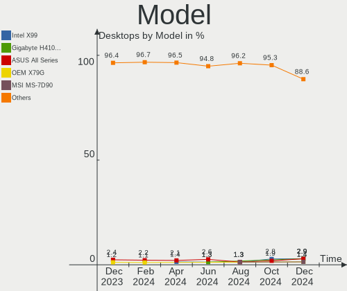
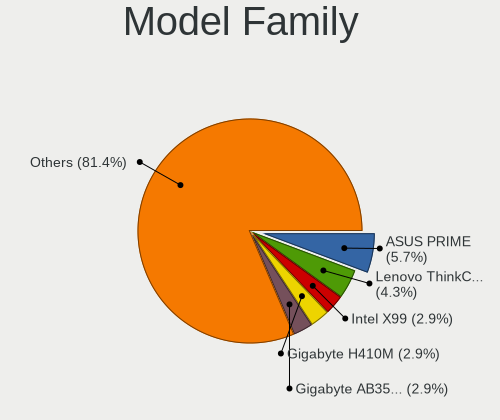
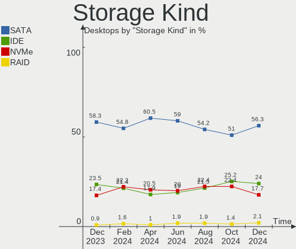
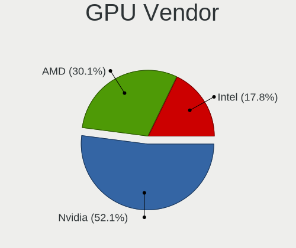

ROSA Hardware Trends (Desktop)
------------------------------

A project to identify most popular hardware characteristics and track their change
over time based on data collected by ROSA users at https://Linux-Hardware.org.

Anyone can contribute to the study by uploading probes of their computers by
the [hw-probe](https://github.com/linuxhw/hw-probe) tool:

    sudo -E hw-probe -all -upload

Full-feature report is available here: https://linux-hardware.org/?view=trends&formfactor=desktop

Period: May, 2020.

Contents
--------

- [ OS                       ](#os)
- [ OS Family                ](#os-family)
- [ Kernel                   ](#kernel)
- [ Kernel Family            ](#kernel-family)
- [ Kernel Major Ver.        ](#kernel-major-ver)
- [ Arch                     ](#arch)
- [ DE                       ](#de)
- [ Display Server           ](#display-server)
- [ Display Manager          ](#display-manager)
- [ OS Lang                  ](#os-lang)
- [ Boot Mode                ](#boot-mode)
- [ Filesystem               ](#filesystem)
- [ Part. scheme             ](#part-scheme)
- [ Dual Boot with Linux/BSD ](#dual-boot-with-linux/bsd)
- [ Dual Boot (Win)          ](#dual-boot-win)
- [ Country                  ](#country)
- [ City                     ](#city)
- [ Vendor                   ](#vendor)
- [ Model                    ](#model)
- [ Model Family             ](#model-family)
- [ MFG Year                 ](#mfg-year)
- [ Form Factor              ](#form-factor)
- [ Secure Boot              ](#secure-boot)
- [ Coreboot                 ](#coreboot)
- [ RAM Size                 ](#ram-size)
- [ RAM Used                 ](#ram-used)
- [ Drive Vendor             ](#drive-vendor)
- [ Drive Model              ](#drive-model)
- [ Drive Kind               ](#drive-kind)
- [ Drive Connector          ](#drive-connector)
- [ Drive Size               ](#drive-size)
- [ Space Total              ](#space-total)
- [ Space Used               ](#space-used)
- [ Malfunc. Drives          ](#malfunc-drives)
- [ Malfunc. Drive Vendor    ](#malfunc-drive-vendor)
- [ Malfunc. HDD Vendor      ](#malfunc-hdd-vendor)
- [ Malfunc. Drive Kind      ](#malfunc-drive-kind)
- [ Failed Drives            ](#failed-drives)
- [ Failed Drive Vendor      ](#failed-drive-vendor)
- [ Drive Status             ](#drive-status)
- [ Storage Vendor           ](#storage-vendor)
- [ Storage Model            ](#storage-model)
- [ Storage Kind             ](#storage-kind)
- [ CPU Vendor               ](#cpu-vendor)
- [ CPU Model                ](#cpu-model)
- [ CPU Model Family         ](#cpu-model-family)
- [ CPU Cores                ](#cpu-cores)
- [ CPU Sockets              ](#cpu-sockets)
- [ CPU Threads              ](#cpu-threads)
- [ CPU Op-Modes             ](#cpu-op-modes)
- [ CPU Microcode            ](#cpu-microcode)
- [ CPU Microarch            ](#cpu-microarch)
- [ GPU Vendor               ](#gpu-vendor)
- [ GPU Model                ](#gpu-model)
- [ GPU Combo                ](#gpu-combo)
- [ GPU Driver               ](#gpu-driver)
- [ GPU Memory               ](#gpu-memory)
- [ Monitor Vendor           ](#monitor-vendor)
- [ Monitor Model            ](#monitor-model)
- [ Monitor Resolution       ](#monitor-resolution)
- [ Monitor Diagonal         ](#monitor-diagonal)
- [ Monitor Width            ](#monitor-width)
- [ Aspect Ratio             ](#aspect-ratio)
- [ Monitor Area             ](#monitor-area)
- [ Pixel Density            ](#pixel-density)
- [ Multiple Monitors        ](#multiple-monitors)
- [ Net Controller Vendor    ](#net-controller-vendor)
- [ Net Controller Model     ](#net-controller-model)
- [ Wireless Vendor          ](#wireless-vendor)
- [ Wireless Model           ](#wireless-model)
- [ Ethernet Vendor          ](#ethernet-vendor)
- [ Ethernet Model           ](#ethernet-model)
- [ Net Controller Kind      ](#net-controller-kind)
- [ Used Controller          ](#used-controller)
- [ NICs                     ](#nics)
- [ Bluetooth Vendor         ](#bluetooth-vendor)
- [ Bluetooth Model          ](#bluetooth-model)
- [ Unsupported Devices      ](#unsupported-devices)
- [ Unsupported Device Types ](#unsupported-device-types)

OS
--

Installed operating systems

| Name        | Computers | Percent |
|-------------|-----------|---------|
| ROSA R11.1  | 68        | 62.39%  |
| ROSA R11    | 28        | 25.69%  |
| ROSA R8.1   | 8         | 7.34%   |
| ROSA R10    | 3         | 2.75%   |
| ROSA 2019.0 | 1         | 0.92%   |
| RED X3      | 1         | 0.92%   |

OS Family
---------

OS without a version

| Name | Computers | Percent |
|------|-----------|---------|
| ROSA | 109       | 100%    |

Kernel
------

Version of the Linux kernel

| Version                                 | Computers | Percent |
|-----------------------------------------|-----------|---------|
| 4.15.0-desktop-94.1rosa-x86_64          | 29        | 26.61%  |
| 4.15.0-desktop-45.1rosa-x86_64          | 29        | 26.61%  |
| 5.4.32-generic-2rosa-x86_64             | 11        | 10.09%  |
| 4.9.155-nrj-desktop-1rosa-x86_64        | 7         | 6.42%   |
| 4.15.0-desktop-94.1rosa-i586            | 6         | 5.5%    |
| 4.9.60-nrj-desktop-1rosa-x86_64         | 4         | 3.67%   |
| 4.15.0-desktop-45.1rosa-i586            | 3         | 2.75%   |
| 5.6.7-generic-1rosa-x86_64              | 2         | 1.83%   |
| 4.9.155-nrj-desktop-1rosa-i586          | 2         | 1.83%   |
| 4.1.38-nrj-desktop-2rosa-i586           | 2         | 1.83%   |
| 5.6.14.xm1-1-generic-xanmod-rosa-x86_64 | 1         | 0.92%   |
| 5.4.40-nickel-2rosa-x86_64              | 1         | 0.92%   |
| 5.4.40-generic-1rosa-i586               | 1         | 0.92%   |
| 5.4.35-nrj-desktop-1rosa-x86_64         | 1         | 0.92%   |
| 5.4.15-nrj-desktop-1rosa-x86_64         | 1         | 0.92%   |
| 5.3.0-desktop-24.1rosa-x86_64           | 1         | 0.92%   |
| 4.9.9-nrj-desktop-1rosa-i586            | 1         | 0.92%   |
| 4.9.41-nrj-desktop-1rosa-x86_64         | 1         | 0.92%   |
| 4.9.20-nrj-desktop-1rosa-x86_64         | 1         | 0.92%   |
| 4.19.120-nrj-desktop-1-rosa-x86_64      | 1         | 0.92%   |
| 4.16.18-nrj-desktop-1rosa-x86_64        | 1         | 0.92%   |
| 4.15.0-desktop-68.5rosa-x86_64          | 1         | 0.92%   |
| 4.15.0-desktop-47.2rosa-x86_64          | 1         | 0.92%   |
| 4.1.38-nrj-desktop-2rosa-x86_64         | 1         | 0.92%   |

Kernel Family
-------------

Linux kernel without a distro release

| Version  | Computers | Percent |
|----------|-----------|---------|
| 4.15.0   | 69        | 63.3%   |
| 5.4.32   | 11        | 10.09%  |
| 4.9.155  | 9         | 8.26%   |
| 4.9.60   | 4         | 3.67%   |
| 4.1.38   | 3         | 2.75%   |
| 5.6.7    | 2         | 1.83%   |
| 5.4.40   | 2         | 1.83%   |
| 5.6.14   | 1         | 0.92%   |
| 5.4.35   | 1         | 0.92%   |
| 5.4.15   | 1         | 0.92%   |
| 5.3.0    | 1         | 0.92%   |
| 4.9.9    | 1         | 0.92%   |
| 4.9.41   | 1         | 0.92%   |
| 4.9.20   | 1         | 0.92%   |
| 4.19.120 | 1         | 0.92%   |
| 4.16.18  | 1         | 0.92%   |

Kernel Major Ver.
-----------------

Linux kernel major version

| Version | Computers | Percent |
|---------|-----------|---------|
| 4.15    | 69        | 63.3%   |
| 4.9     | 16        | 14.68%  |
| 5.4     | 15        | 13.76%  |
| 5.6     | 3         | 2.75%   |
| 4.1     | 3         | 2.75%   |
| 5.3     | 1         | 0.92%   |
| 4.19    | 1         | 0.92%   |
| 4.16    | 1         | 0.92%   |

Arch
----

OS architecture (x86_64, i586, etc.)

| Name   | Computers | Percent |
|--------|-----------|---------|
| x86_64 | 94        | 86.24%  |
| i686   | 15        | 13.76%  |

DE
--

Desktop Environment

| Name | Computers | Percent |
|------|-----------|---------|
| KDE4 | 67        | 61.47%  |
| KDE5 | 34        | 31.19%  |
| LXQt | 5         | 4.59%   |
| XFCE | 2         | 1.83%   |
| LXDE | 1         | 0.92%   |

Display Server
--------------

X11 or Wayland

| Name | Computers | Percent |
|------|-----------|---------|
| X11  | 109       | 100%    |

Display Manager
---------------

SDDM, LightDM, etc.

| Name    | Computers | Percent |
|---------|-----------|---------|
| KDM     | 67        | 61.47%  |
| SDDM    | 41        | 37.61%  |
| LightDM | 1         | 0.92%   |

OS Lang
-------

Language

| Lang    | Computers | Percent |
|---------|-----------|---------|
| ru_RU   | 61        | 55.96%  |
| Unknown | 40        | 36.7%   |
| pl_PL   | 2         | 1.83%   |
| de_DE   | 2         | 1.83%   |
| ru_UA   | 1         | 0.92%   |
| it_IT   | 1         | 0.92%   |
| en_GB   | 1         | 0.92%   |
| be_BY   | 1         | 0.92%   |

Boot Mode
---------

EFI or BIOS

| Mode | Computers | Percent |
|------|-----------|---------|
| BIOS | 90        | 82.57%  |
| EFI  | 19        | 17.43%  |

Filesystem
----------

Type of filesystem

| Type  | Computers | Percent |
|-------|-----------|---------|
| Ext4  | 105       | 96.33%  |
| Btrfs | 4         | 3.67%   |

Part. scheme
------------

Scheme of partitioning

| Type    | Computers | Percent |
|---------|-----------|---------|
| Unknown | 65        | 59.63%  |
| MBR     | 38        | 34.86%  |
| GPT     | 6         | 5.5%    |

Dual Boot with Linux/BSD
------------------------

Hosting more than one Linux/BSD

| Dual boot | Computers | Percent |
|-----------|-----------|---------|
| No        | 82        | 75.23%  |
| Yes       | 27        | 24.77%  |

Dual Boot (Win)
---------------

Hosting Linux and Windows

| Dual boot | Computers | Percent |
|-----------|-----------|---------|
| Yes       | 56        | 51.38%  |
| No        | 53        | 48.62%  |

Country
-------

Geographic location (country)

| Country    | Computers | Percent |
|------------|-----------|---------|
| Russia     | 81        | 74.31%  |
| Ukraine    | 12        | 11.01%  |
| Germany    | 5         | 4.59%   |
| Italy      | 3         | 2.75%   |
| Poland     | 2         | 1.83%   |
| Mexico     | 2         | 1.83%   |
| Kazakhstan | 2         | 1.83%   |
| Belarus    | 2         | 1.83%   |

City
----

Geographic location (city)

| City             | Computers | Percent |
|------------------|-----------|---------|
| Moscow           | 17        | 15.6%   |
| St Petersburg    | 5         | 4.59%   |
| Samara           | 5         | 4.59%   |
| Volgograd        | 3         | 2.75%   |
| Kyiv             | 3         | 2.75%   |
| Petrozavodsk     | 2         | 1.83%   |
| Orenburg         | 2         | 1.83%   |
| Novosibirsk      | 2         | 1.83%   |
| Nizhniy Novgorod | 2         | 1.83%   |
| Krasnodar        | 2         | 1.83%   |
| Kharkiv          | 2         | 1.83%   |
| Khabarovsk       | 2         | 1.83%   |
| Kazan’         | 2         | 1.83%   |
| Irkutsk          | 2         | 1.83%   |
| Ekaterinburg     | 2         | 1.83%   |
| Zima             | 1         | 0.92%   |
| Zheleznogorsk    | 1         | 0.92%   |
| Voronezh         | 1         | 0.92%   |
| Vladivostok      | 1         | 0.92%   |
| Vladimir         | 1         | 0.92%   |
| Vitebsk          | 1         | 0.92%   |
| Tyumen           | 1         | 0.92%   |
| Tomsk            | 1         | 0.92%   |
| Temirtau         | 1         | 0.92%   |
| Tapachula        | 1         | 0.92%   |
| Talalayivka      | 1         | 0.92%   |
| Sevastopol       | 1         | 0.92%   |
| Serpukhov        | 1         | 0.92%   |
| Sergiyev Posad   | 1         | 0.92%   |
| Satka            | 1         | 0.92%   |
| Saratov          | 1         | 0.92%   |
| Rome             | 1         | 0.92%   |
| Reessum          | 1         | 0.92%   |
| Podolsk          | 1         | 0.92%   |
| Perm             | 1         | 0.92%   |
| Paraiso          | 1         | 0.92%   |
| Okhtyrka         | 1         | 0.92%   |
| Obersulm         | 1         | 0.92%   |
| Novokuznetsk     | 1         | 0.92%   |
| Myski            | 1         | 0.92%   |
| Murino           | 1         | 0.92%   |
| Munich           | 1         | 0.92%   |
| Montedinove      | 1         | 0.92%   |
| Mogilev          | 1         | 0.92%   |
| Maloyaroslavets  | 1         | 0.92%   |
| Makiyivka        | 1         | 0.92%   |
| Kurgan           | 1         | 0.92%   |
| Krasnoyarsk      | 1         | 0.92%   |
| Kostomarovo      | 1         | 0.92%   |
| Kopeysk          | 1         | 0.92%   |
| Kirov            | 1         | 0.92%   |
| Kemerovo         | 1         | 0.92%   |
| Kaliningrad      | 1         | 0.92%   |
| Jaworzno         | 1         | 0.92%   |
| Izhevsk          | 1         | 0.92%   |
| Ivanteyevka      | 1         | 0.92%   |
| Ivanovo          | 1         | 0.92%   |
| Herborn          | 1         | 0.92%   |
| Gowarzewo        | 1         | 0.92%   |
| Donetsk          | 1         | 0.92%   |

Vendor
------

Motherboard manufacturer

| Name                | Computers | Percent |
|---------------------|-----------|---------|
| ASUSTek Computer    | 37        | 33.94%  |
| Gigabyte Technology | 23        | 21.1%   |
| MSI                 | 14        | 12.84%  |
| ASRock              | 13        | 11.93%  |
| Lenovo              | 4         | 3.67%   |
| Intel               | 4         | 3.67%   |
| Hewlett-Packard     | 3         | 2.75%   |
| Foxconn             | 3         | 2.75%   |
| ECS                 | 2         | 1.83%   |
| Pegatron            | 1         | 0.92%   |
| Fujitsu             | 1         | 0.92%   |
| Dell                | 1         | 0.92%   |
| Biostar             | 1         | 0.92%   |
| AZW                 | 1         | 0.92%   |
| ABIT                | 1         | 0.92%   |

Model
-----

Motherboard model

| Name                                    | Computers | Percent |
|-----------------------------------------|-----------|---------|
| ASUS All Series                         | 3         | 2.75%   |
| MSI MS-7260                             | 2         | 1.83%   |
| Gigabyte 945GCMX-S2                     | 2         | 1.83%   |
| Pegatron IPMSB-H61                      | 1         | 0.92%   |
| MSI OPTIMUS                             | 1         | 0.92%   |
| MSI MS-7B98                             | 1         | 0.92%   |
| MSI MS-7B93                             | 1         | 0.92%   |
| MSI MS-7A36                             | 1         | 0.92%   |
| MSI MS-7978                             | 1         | 0.92%   |
| MSI MS-7817                             | 1         | 0.92%   |
| MSI MS-7788                             | 1         | 0.92%   |
| MSI MS-7693                             | 1         | 0.92%   |
| MSI MS-7529                             | 1         | 0.92%   |
| MSI MS-7255                             | 1         | 0.92%   |
| MSI MS-7253                             | 1         | 0.92%   |
| MSI Compaq dx7400 Microtower            | 1         | 0.92%   |
| Lenovo ThinkCentre M72z 35541P1         | 1         | 0.92%   |
| Lenovo IdeaCentre H215 10029            | 1         | 0.92%   |
| Lenovo H530s 10132                      | 1         | 0.92%   |
| Lenovo H420                             | 1         | 0.92%   |
| Intel X99                               | 1         | 0.92%   |
| Intel DH61WW AAG23116-204               | 1         | 0.92%   |
| Intel D946GZIS AAD66165-302             | 1         | 0.92%   |
| Intel D525MW AAE93082-401               | 1         | 0.92%   |
| HP ProDesk 490 G3 MT Business PC        | 1         | 0.92%   |
| HP EliteDesk 800 G1 USDT                | 1         | 0.92%   |
| HP 280 G1 MT                            | 1         | 0.92%   |
| Gigabyte Z97X-SLI                       | 1         | 0.92%   |
| Gigabyte Z77P-D3                        | 1         | 0.92%   |
| Gigabyte X79-UD3                        | 1         | 0.92%   |
| Gigabyte P55M-UD4                       | 1         | 0.92%   |
| Gigabyte P35-DS3L                       | 1         | 0.92%   |
| Gigabyte M68MT-S2                       | 1         | 0.92%   |
| Gigabyte J1800N-D2H                     | 1         | 0.92%   |
| Gigabyte H77N-WIFI                      | 1         | 0.92%   |
| Gigabyte H61M-S2V-B3                    | 1         | 0.92%   |
| Gigabyte H61M-S1                        | 1         | 0.92%   |
| Gigabyte H55-UD3H                       | 1         | 0.92%   |
| Gigabyte GA-MA78GM-UD2H                 | 1         | 0.92%   |
| Gigabyte GA-A75-D3H                     | 1         | 0.92%   |
| Gigabyte GA-8SIMLH                      | 1         | 0.92%   |
| Gigabyte GA-78LMT-S2P                   | 1         | 0.92%   |
| Gigabyte GA-78LMT-S2 R2                 | 1         | 0.92%   |
| Gigabyte GA-78LMT-S2                    | 1         | 0.92%   |
| Gigabyte F2A85X-UP4                     | 1         | 0.92%   |
| Gigabyte EP45-UD3LR                     | 1         | 0.92%   |
| Gigabyte A320M-H                        | 1         | 0.92%   |
| Gigabyte 8I945P-G                       | 1         | 0.92%   |
| Fujitsu ESPRIMO P7935                   | 1         | 0.92%   |
| Foxconn WU114EA-ACB 100eu RU100         | 1         | 0.92%   |
| Foxconn FQ665AA-ABM s3710la             | 1         | 0.92%   |
| Foxconn A7VMX-S/A7VMX-K/A7GMX-S/A7GMX-K | 1         | 0.92%   |
| ECS G31T-M                              | 1         | 0.92%   |
| ECS 945PL-A                             | 1         | 0.92%   |
| Dell OptiPlex 9020                      | 1         | 0.92%   |
| Biostar H55 HD                          | 1         | 0.92%   |
| AZW Gemini T34                          | 1         | 0.92%   |
| ASUS SABERTOOTH X58                     | 1         | 0.92%   |
| ASUS ROG CROSSHAIR VI EXTREME           | 1         | 0.92%   |
| ASUS Rampage III Extreme                | 1         | 0.92%   |

Model Family
------------

Motherboard model prefix

| Name                    | Computers | Percent |
|-------------------------|-----------|---------|
| ASUS M5A78L-M           | 3         | 2.75%   |
| ASUS All                | 3         | 2.75%   |
| MSI MS-7260             | 2         | 1.83%   |
| Gigabyte GA-78LMT-S2    | 2         | 1.83%   |
| Gigabyte 945GCMX-S2     | 2         | 1.83%   |
| ASUS P5G41T-M           | 2         | 1.83%   |
| Pegatron IPMSB-H61      | 1         | 0.92%   |
| MSI OPTIMUS             | 1         | 0.92%   |
| MSI MS-7B98             | 1         | 0.92%   |
| MSI MS-7B93             | 1         | 0.92%   |
| MSI MS-7A36             | 1         | 0.92%   |
| MSI MS-7978             | 1         | 0.92%   |
| MSI MS-7817             | 1         | 0.92%   |
| MSI MS-7788             | 1         | 0.92%   |
| MSI MS-7693             | 1         | 0.92%   |
| MSI MS-7529             | 1         | 0.92%   |
| MSI MS-7255             | 1         | 0.92%   |
| MSI MS-7253             | 1         | 0.92%   |
| MSI Compaq              | 1         | 0.92%   |
| Lenovo ThinkCentre      | 1         | 0.92%   |
| Lenovo IdeaCentre       | 1         | 0.92%   |
| Lenovo H530s            | 1         | 0.92%   |
| Lenovo H420             | 1         | 0.92%   |
| Intel X99               | 1         | 0.92%   |
| Intel DH61WW            | 1         | 0.92%   |
| Intel D946GZIS          | 1         | 0.92%   |
| Intel D525MW            | 1         | 0.92%   |
| HP ProDesk              | 1         | 0.92%   |
| HP EliteDesk            | 1         | 0.92%   |
| HP 280                  | 1         | 0.92%   |
| Gigabyte Z97X-SLI       | 1         | 0.92%   |
| Gigabyte Z77P-D3        | 1         | 0.92%   |
| Gigabyte X79-UD3        | 1         | 0.92%   |
| Gigabyte P55M-UD4       | 1         | 0.92%   |
| Gigabyte P35-DS3L       | 1         | 0.92%   |
| Gigabyte M68MT-S2       | 1         | 0.92%   |
| Gigabyte J1800N-D2H     | 1         | 0.92%   |
| Gigabyte H77N-WIFI      | 1         | 0.92%   |
| Gigabyte H61M-S2V-B3    | 1         | 0.92%   |
| Gigabyte H61M-S1        | 1         | 0.92%   |
| Gigabyte H55-UD3H       | 1         | 0.92%   |
| Gigabyte GA-MA78GM-UD2H | 1         | 0.92%   |
| Gigabyte GA-A75-D3H     | 1         | 0.92%   |
| Gigabyte GA-8SIMLH      | 1         | 0.92%   |
| Gigabyte GA-78LMT-S2P   | 1         | 0.92%   |
| Gigabyte F2A85X-UP4     | 1         | 0.92%   |
| Gigabyte EP45-UD3LR     | 1         | 0.92%   |
| Gigabyte A320M-H        | 1         | 0.92%   |
| Gigabyte 8I945P-G       | 1         | 0.92%   |
| Fujitsu ESPRIMO         | 1         | 0.92%   |
| Foxconn WU114EA-ACB     | 1         | 0.92%   |
| Foxconn FQ665AA-ABM     | 1         | 0.92%   |
| Foxconn A7VMX-S         | 1         | 0.92%   |
| ECS G31T-M              | 1         | 0.92%   |
| ECS 945PL-A             | 1         | 0.92%   |
| Dell OptiPlex           | 1         | 0.92%   |
| Biostar H55             | 1         | 0.92%   |
| AZW Gemini              | 1         | 0.92%   |
| ASUS SABERTOOTH         | 1         | 0.92%   |
| ASUS ROG                | 1         | 0.92%   |

MFG Year
--------

Motherboard manufacture year

| Year | Computers | Percent |
|------|-----------|---------|
| 2010 | 17        | 15.6%   |
| 2019 | 9         | 8.26%   |
| 2013 | 9         | 8.26%   |
| 2012 | 9         | 8.26%   |
| 2011 | 9         | 8.26%   |
| 2015 | 8         | 7.34%   |
| 2009 | 8         | 7.34%   |
| 2007 | 8         | 7.34%   |
| 2008 | 7         | 6.42%   |
| 2006 | 7         | 6.42%   |
| 2018 | 5         | 4.59%   |
| 2016 | 4         | 3.67%   |
| 2014 | 4         | 3.67%   |
| 2017 | 3         | 2.75%   |
| 2005 | 1         | 0.92%   |
| 2004 | 1         | 0.92%   |

Form Factor
-----------

Physical design of the computer

| Name    | Computers | Percent |
|---------|-----------|---------|
| Desktop | 109       | 100%    |

Secure Boot
-----------

Enabled or disabled

| State    | Computers | Percent |
|----------|-----------|---------|
| Disabled | 109       | 100%    |

Coreboot
--------

Have coreboot on board

| Used | Computers | Percent |
|------|-----------|---------|
| No   | 109       | 100%    |

RAM Size
--------

Total RAM memory

| Size in GB | Computers | Percent |
|------------|-----------|---------|
| 3.01-4.0   | 31        | 28.44%  |
| 8.01-16.0  | 27        | 24.77%  |
| 1.01-2.0   | 15        | 13.76%  |
| 16.01-24.0 | 14        | 12.84%  |
| 4.01-8.0   | 13        | 11.93%  |
| 2.01-3.0   | 6         | 5.5%    |
| 32.01-64.0 | 1         | 0.92%   |
| 24.01-32.0 | 1         | 0.92%   |
| 0.01-1.0   | 1         | 0.92%   |

RAM Used
--------

Used RAM memory

| Used GB  | Computers | Percent |
|----------|-----------|---------|
| 0.01-1.0 | 53        | 48.62%  |
| 1.01-2.0 | 41        | 37.61%  |
| 2.01-3.0 | 11        | 10.09%  |
| 3.01-4.0 | 4         | 3.67%   |

Drive Vendor
------------

Hard drive vendors

| Vendor              | Computers | Drives | Percent |
|---------------------|-----------|--------|---------|
| Seagate             | 54        | 66     | 31.95%  |
| WDC                 | 38        | 46     | 22.49%  |
| Samsung Electronics | 14        | 14     | 8.28%   |
| Hitachi             | 13        | 13     | 7.69%   |
| Toshiba             | 9         | 9      | 5.33%   |
| Kingston            | 6         | 6      | 3.55%   |
| MAXTOR              | 4         | 4      | 2.37%   |
| China               | 4         | 4      | 2.37%   |
| KINGMAX             | 3         | 3      | 1.78%   |
| SPCC                | 2         | 3      | 1.18%   |
| SanDisk             | 2         | 2      | 1.18%   |
| PLEXTOR             | 2         | 3      | 1.18%   |
| Patriot             | 2         | 2      | 1.18%   |
| Intel               | 2         | 2      | 1.18%   |
| Crucial             | 2         | 2      | 1.18%   |
| A-DATA Technology   | 2         | 2      | 1.18%   |
| XPG                 | 1         | 1      | 0.59%   |
| Transcend           | 1         | 1      | 0.59%   |
| Smartbuy            | 1         | 1      | 0.59%   |
| Silicon Motion      | 1         | 1      | 0.59%   |
| OCZ-VERTEX3         | 1         | 1      | 0.59%   |
| LITEONIT            | 1         | 1      | 0.59%   |
| KingSpec            | 1         | 1      | 0.59%   |
| HGST                | 1         | 1      | 0.59%   |
| GOODRAM             | 1         | 1      | 0.59%   |
| GALAX               | 1         | 1      | 0.59%   |

Drive Model
-----------

Hard drive models

| Model                        | Computers | Percent |
|------------------------------|-----------|---------|
| ST500DM002-1BD142 500GB      | 5         | 2.62%   |
| ST380815AS 80GB              | 4         | 2.09%   |
| ST3500418AS 500GB            | 4         | 2.09%   |
| ST3160815AS 160GB            | 4         | 2.09%   |
| ST1000DM010-2EP102 1TB       | 3         | 1.57%   |
| SA400S37240G 240GB SSD       | 3         | 1.57%   |
| DT01ACA050 500GB             | 3         | 1.57%   |
| WD5000AADS-00S9B0 500GB      | 2         | 1.05%   |
| WD5000AADS-00M2B0 500GB      | 2         | 1.05%   |
| WD3200BPVT-24JJ5T0 320GB     | 2         | 1.05%   |
| WD10EZEX-08WN4A0 1TB         | 2         | 1.05%   |
| WD10EZEX-00WN4A0 1TB         | 2         | 1.05%   |
| STM3160815AS 160GB           | 2         | 1.05%   |
| ST500DM002-1BC142 500GB      | 2         | 1.05%   |
| ST380011A 80GB               | 2         | 1.05%   |
| ST3250410AS 250GB            | 2         | 1.05%   |
| ST3160815A 160GB             | 2         | 1.05%   |
| ST2000DM001-1CH164 2TB       | 2         | 1.05%   |
| ST1000DM003-1SB102 1TB       | 2         | 1.05%   |
| ST1000DM003-1CH162 1TB       | 2         | 1.05%   |
| SSD 840 EVO 120GB            | 2         | 1.05%   |
| SSD 60GB                     | 2         | 1.05%   |
| SSD 120GB                    | 2         | 1.05%   |
| Solid State Disk 120GB       | 2         | 1.05%   |
| HTS547575A9E384 752GB        | 2         | 1.05%   |
| HDWD110 1TB                  | 2         | 1.05%   |
| HDWD105 500GB                | 2         | 1.05%   |
| WDS480G2G0A-00JH30 480GB SSD | 1         | 0.52%   |
| WDS250G2B0A-00SM50 250GB SSD | 1         | 0.52%   |
| WDS120G2G0B-00EPW0 120GB SSD | 1         | 0.52%   |
| WD7500AZEX-00ZF5A0 752GB     | 1         | 0.52%   |
| WD6402AAEX-00Y9A0 640GB      | 1         | 0.52%   |
| WD5001AALS-00L3B2 500GB      | 1         | 0.52%   |
| WD5000LPCX-60VHAT1 500GB     | 1         | 0.52%   |
| WD5000AZRX-00A8LB0 500GB     | 1         | 0.52%   |
| WD5000AAKX-083CA1 500GB      | 1         | 0.52%   |
| WD5000AAKS-00YGA0 500GB      | 1         | 0.52%   |
| WD5000AAKS-00D2B0 500GB      | 1         | 0.52%   |
| WD5000AAKS-00A7B0 500GB      | 1         | 0.52%   |
| WD3200AAJS-00L7A0 320GB      | 1         | 0.52%   |
| WD2500JS-55NCB1 250GB        | 1         | 0.52%   |
| WD2500AAKX-321CA0 250GB      | 1         | 0.52%   |
| WD2500AAJS-07M0A0 250GB      | 1         | 0.52%   |
| WD20EZRZ-22Z5HB0 2TB         | 1         | 0.52%   |
| WD20EZAZ-00GGJB0 2TB         | 1         | 0.52%   |
| WD20EFRX-68EUZN0 2TB         | 1         | 0.52%   |
| WD20EARX-00PASB0 2TB         | 1         | 0.52%   |
| WD20EARS-60MVWB0 2TB         | 1         | 0.52%   |
| WD2003FZEX-00Z4SA0 2TB       | 1         | 0.52%   |
| WD1600JS-56MHB1 160GB        | 1         | 0.52%   |
| WD1600JS-00NCB1 160GB        | 1         | 0.52%   |
| WD1600AAJS-60Z0A0 160GB      | 1         | 0.52%   |
| WD1600AAJS-08PSA0 160GB      | 1         | 0.52%   |
| WD15EVDS-63V9B1 1TB          | 1         | 0.52%   |
| WD1200BEVS-22UST0 120GB      | 1         | 0.52%   |
| WD10JPVX-08JC3T5 1TB         | 1         | 0.52%   |
| WD10EZRZ-00HTKB0 1TB         | 1         | 0.52%   |
| WD10EZEX-75WN4A1 1TB         | 1         | 0.52%   |
| WD10EZEX-60ZF5A0 1TB         | 1         | 0.52%   |
| WD10EZEX-21M2NA0 1TB         | 1         | 0.52%   |

Drive Kind
----------

HDD or SSD

| Kind | Computers | Drives | Percent |
|------|-----------|--------|---------|
| HDD  | 103       | 144    | 74.64%  |
| SSD  | 31        | 43     | 22.46%  |
| NVMe | 4         | 4      | 2.9%    |

Drive Connector
---------------

SATA, SAS, NVMe, etc.

| Type | Computers | Drives | Percent |
|------|-----------|--------|---------|
| SATA | 109       | 187    | 96.46%  |
| NVMe | 4         | 4      | 3.54%   |

Drive Size
----------

Size of hard drive

| Size in TB | Computers | Drives | Percent |
|------------|-----------|--------|---------|
| 0.01-0.5   | 91        | 138    | 66.91%  |
| 0.51-1.0   | 30        | 36     | 22.06%  |
| 1.01-2.0   | 13        | 15     | 9.56%   |
| 2.01-3.0   | 2         | 2      | 1.47%   |

Space Total
-----------

Amount of disk space available on the file system

| Size in GB     | Computers | Percent |
|----------------|-----------|---------|
| 101-250        | 29        | 26.61%  |
| 251-500        | 21        | 19.27%  |
| 1-20           | 13        | 11.93%  |
| 501-1000       | 13        | 11.93%  |
| 51-100         | 11        | 10.09%  |
| 1001-2000      | 8         | 7.34%   |
| 21-50          | 7         | 6.42%   |
| 2001-3000      | 5         | 4.59%   |
| More than 3000 | 2         | 1.83%   |

Space Used
----------

Amount of used disk space

| Used GB   | Computers | Percent |
|-----------|-----------|---------|
| 1-20      | 69        | 63.3%   |
| 21-50     | 9         | 8.26%   |
| 501-1000  | 7         | 6.42%   |
| 251-500   | 6         | 5.5%    |
| 101-250   | 6         | 5.5%    |
| 1001-2000 | 6         | 5.5%    |
| 51-100    | 6         | 5.5%    |

Malfunc. Drives
---------------

Drive models with a malfunction

| Model                   | Computers | Drives | Percent |
|-------------------------|-----------|--------|---------|
| ST500DM002-1BD142 500GB | 4         | 4      | 7.14%   |
| ST3500418AS 500GB       | 4         | 4      | 7.14%   |
| ST380815AS 80GB         | 3         | 3      | 5.36%   |
| ST3250410AS 250GB       | 2         | 2      | 3.57%   |
| WD6402AAEX-00Y9A0 640GB | 1         | 1      | 1.79%   |
| WD5001AALS-00L3B2 500GB | 1         | 1      | 1.79%   |
| WD5000AAKX-083CA1 500GB | 1         | 1      | 1.79%   |
| WD5000AAKS-00D2B0 500GB | 1         | 1      | 1.79%   |
| WD5000AAKS-00A7B0 500GB | 1         | 1      | 1.79%   |
| WD5000AADS-00S9B0 500GB | 1         | 1      | 1.79%   |
| WD5000AADS-00M2B0 500GB | 1         | 1      | 1.79%   |
| WD3200AAJS-00L7A0 320GB | 1         | 1      | 1.79%   |
| WD20EARS-60MVWB0 2TB    | 1         | 1      | 1.79%   |
| WD1600AAJS-60Z0A0 160GB | 1         | 1      | 1.79%   |
| WD15EVDS-63V9B1 1TB     | 1         | 1      | 1.79%   |
| WD10JPVX-08JC3T5 1TB    | 1         | 1      | 1.79%   |
| WD10EZEX-08WN4A0 1TB    | 1         | 1      | 1.79%   |
| SV0411N 40GB            | 1         | 1      | 1.79%   |
| STM3500320AS 500GB      | 1         | 1      | 1.79%   |
| STM3250310AS 250GB      | 1         | 1      | 1.79%   |
| STM3160815AS 160GB      | 1         | 1      | 1.79%   |
| ST9500325AS 500GB       | 1         | 1      | 1.79%   |
| ST380013AS 80GB         | 1         | 1      | 1.79%   |
| ST380011A 80GB          | 1         | 1      | 1.79%   |
| ST340810A 40GB          | 1         | 1      | 1.79%   |
| ST3320620AS 320GB       | 1         | 1      | 1.79%   |
| ST3320613AS 320GB       | 1         | 1      | 1.79%   |
| ST320LT020-9YG142 320GB | 1         | 1      | 1.79%   |
| ST3200822AS 200GB       | 1         | 1      | 1.79%   |
| ST3200822A 200GB        | 1         | 1      | 1.79%   |
| ST3160815AS 160GB       | 1         | 1      | 1.79%   |
| ST3160215A 160GB        | 1         | 1      | 1.79%   |
| ST3160023A 160GB        | 1         | 1      | 1.79%   |
| ST3120813AS 120GB       | 1         | 1      | 1.79%   |
| ST2000DM001-1CH164 2TB  | 1         | 1      | 1.79%   |
| SSD 60GB                | 1         | 1      | 1.79%   |
| SSD 120GB               | 1         | 1      | 1.79%   |
| LP 64GB SSD             | 1         | 1      | 1.79%   |
| HTS723232A7A364 320GB   | 1         | 1      | 1.79%   |
| HTS545050B9A300 500GB   | 1         | 1      | 1.79%   |
| HTS541010A9E680 1TB     | 1         | 1      | 1.79%   |
| HDWD110 1TB             | 1         | 1      | 1.79%   |
| HDS721050DLE630 500GB   | 1         | 1      | 1.79%   |
| HDS721025CLA382 250GB   | 1         | 1      | 1.79%   |
| HDS721010DLE630 1TB     | 1         | 1      | 1.79%   |
| HD161HJ 160GB           | 1         | 1      | 1.79%   |
| E200-160 160GB SSD      | 1         | 1      | 1.79%   |

Malfunc. Drive Vendor
---------------------

Vendors of faulty drives

| Vendor              | Computers | Drives | Percent |
|---------------------|-----------|--------|---------|
| Seagate             | 23        | 27     | 44.23%  |
| WDC                 | 13        | 13     | 25%     |
| Hitachi             | 6         | 6      | 11.54%  |
| MAXTOR              | 3         | 3      | 5.77%   |
| Samsung Electronics | 2         | 2      | 3.85%   |
| KINGMAX             | 2         | 2      | 3.85%   |
| Toshiba             | 1         | 1      | 1.92%   |
| OCZ-VERTEX3         | 1         | 1      | 1.92%   |
| LITEONIT            | 1         | 1      | 1.92%   |

Malfunc. HDD Vendor
-------------------

Vendors of faulty HDD drives

| Vendor              | Computers | Drives | Percent |
|---------------------|-----------|--------|---------|
| Seagate             | 23        | 27     | 47.92%  |
| WDC                 | 13        | 13     | 27.08%  |
| Hitachi             | 6         | 6      | 12.5%   |
| MAXTOR              | 3         | 3      | 6.25%   |
| Samsung Electronics | 2         | 2      | 4.17%   |
| Toshiba             | 1         | 1      | 2.08%   |

Malfunc. Drive Kind
-------------------

Kinds of faulty drives

| Kind | Computers | Drives | Percent |
|------|-----------|--------|---------|
| HDD  | 44        | 52     | 91.67%  |
| SSD  | 4         | 4      | 8.33%   |

Failed Drives
-------------

Failed drive models

Zero info for selected period =(

Failed Drive Vendor
-------------------

Failed drive vendors

Zero info for selected period =(

Drive Status
------------

Number of failed and malfunc. drives

| Status   | Computers | Drives | Percent |
|----------|-----------|--------|---------|
| Works    | 81        | 134    | 62.79%  |
| Malfunc  | 47        | 56     | 36.43%  |
| Detected | 1         | 1      | 0.78%   |

Storage Vendor
--------------

Storage controller vendors

| Vendor                           | Computers | Percent |
|----------------------------------|-----------|---------|
| Intel                            | 71        | 52.99%  |
| AMD                              | 25        | 18.66%  |
| JMicron Technology               | 11        | 8.21%   |
| Nvidia                           | 9         | 6.72%   |
| Marvell Technology Group         | 6         | 4.48%   |
| VIA Technologies                 | 4         | 2.99%   |
| Silicon Motion                   | 2         | 1.49%   |
| ULi Electronics                  | 1         | 0.75%   |
| Silicon Integrated Systems [SiS] | 1         | 0.75%   |
| Lite-On Technology               | 1         | 0.75%   |
| Integrated Technology Express    | 1         | 0.75%   |
| ASMedia Technology               | 1         | 0.75%   |
| ADATA Technology                 | 1         | 0.75%   |

Storage Model
-------------

Storage controller models

| Model                                                                             | Computers | Percent |
|-----------------------------------------------------------------------------------|-----------|---------|
| NM10/ICH7 Family SATA Controller [IDE mode]                                       | 15        | 7.61%   |
| 82801G (ICH7 Family) IDE Controller                                               | 14        | 7.11%   |
| SB7x0/SB8x0/SB9x0 IDE Controller                                                  | 13        | 6.6%    |
| SB7x0/SB8x0/SB9x0 SATA Controller [IDE mode]                                      | 10        | 5.08%   |
| FCH SATA Controller [AHCI mode]                                                   | 9         | 4.57%   |
| 8 Series/C220 Series Chipset Family 6-port SATA Controller 1 [AHCI mode]          | 7         | 3.55%   |
| JMB363 SATA/IDE Controller                                                        | 6         | 3.05%   |
| 6 Series/C200 Series Chipset Family 6 port Desktop SATA AHCI Controller           | 6         | 3.05%   |
| SB7x0/SB8x0/SB9x0 SATA Controller [AHCI mode]                                     | 5         | 2.54%   |
| MCP61 SATA Controller                                                             | 5         | 2.54%   |
| Q170/Q150/B150/H170/H110/Z170/CM236 Chipset SATA Controller [AHCI Mode]           | 4         | 2.03%   |
| MCP61 IDE                                                                         | 4         | 2.03%   |
| 82801I (ICH9 Family) 2 port SATA Controller [IDE mode]                            | 4         | 2.03%   |
| 7 Series/C210 Series Chipset Family 6-port SATA Controller [AHCI mode]            | 4         | 2.03%   |
| 6 Series/C200 Series Chipset Family Desktop SATA Controller (IDE mode, ports 4-5) | 4         | 2.03%   |
| 6 Series/C200 Series Chipset Family Desktop SATA Controller (IDE mode, ports 0-3) | 4         | 2.03%   |
| JMB368 IDE controller                                                             | 3         | 1.52%   |
| FCH SATA Controller D                                                             | 3         | 1.52%   |
| 82801JI (ICH10 Family) 4 port SATA IDE Controller #1                              | 3         | 1.52%   |
| 82801JI (ICH10 Family) 2 port SATA IDE Controller #2                              | 3         | 1.52%   |
| 82801IB (ICH9) 2 port SATA Controller [IDE mode]                                  | 3         | 1.52%   |
| 5 Series/3400 Series Chipset 6 port SATA AHCI Controller                          | 3         | 1.52%   |
| VT82C586A/B/VT82C686/A/B/VT823x/A/C PIPC Bus Master IDE                           | 2         | 1.02%   |
| VT6415 PATA IDE Host Controller                                                   | 2         | 1.02%   |
| Non-Volatile memory controller                                                    | 2         | 1.02%   |
| MCP55 SATA Controller                                                             | 2         | 1.02%   |
| MCP55 IDE                                                                         | 2         | 1.02%   |
| JMB362 SATA Controller                                                            | 2         | 1.02%   |
| Cannon Lake PCH SATA AHCI Controller                                              | 2         | 1.02%   |
| Atom Processor E3800 Series SATA AHCI Controller                                  | 2         | 1.02%   |
| 9 Series Chipset Family SATA Controller [AHCI Mode]                               | 2         | 1.02%   |
| 88SE91A3 SATA-600 Controller                                                      | 2         | 1.02%   |
| 82801JI (ICH10 Family) SATA AHCI Controller                                       | 2         | 1.02%   |
| 82801HR/HO/HH (ICH8R/DO/DH) 2 port SATA Controller [IDE mode]                     | 2         | 1.02%   |
| 82801H (ICH8 Family) 4 port SATA Controller [IDE mode]                            | 2         | 1.02%   |
| XPG SX8200 Pro PCIe Gen3x4 M.2 2280 Solid State Drive                             | 1         | 0.51%   |
| X370 Series Chipset SATA Controller                                               | 1         | 0.51%   |
| VT8237A SATA 2-Port Controller                                                    | 1         | 0.51%   |
| ULi M5288 SATA                                                                    | 1         | 0.51%   |
| Serial ATA Controller                                                             | 1         | 0.51%   |
| SB600 Non-Raid-5 SATA                                                             | 1         | 0.51%   |
| SB600 IDE                                                                         | 1         | 0.51%   |
| NM10/ICH7 Family SATA Controller [AHCI mode]                                      | 1         | 0.51%   |
| MCP78S [GeForce 8200] SATA Controller (non-AHCI mode)                             | 1         | 0.51%   |
| MCP78S [GeForce 8200] IDE                                                         | 1         | 0.51%   |
| MCP73 SATA Controller (IDE mode)                                                  | 1         | 0.51%   |
| MCP73 IDE Controller                                                              | 1         | 0.51%   |
| M8Pe Series NVMe SSD                                                              | 1         | 0.51%   |
| M5229 IDE                                                                         | 1         | 0.51%   |
| IT8213 IDE Controller                                                             | 1         | 0.51%   |
| FCH IDE Controller                                                                | 1         | 0.51%   |
| Celeron N3350/Pentium N4200/Atom E3900 Series SATA AHCI Controller                | 1         | 0.51%   |
| C610/X99 series chipset 6-Port SATA Controller [AHCI mode]                        | 1         | 0.51%   |
| C600/X79 series chipset 6-Port SATA AHCI Controller                               | 1         | 0.51%   |
| ASM1062 Serial ATA Controller                                                     | 1         | 0.51%   |
| 88SE9182 SATA 6G Controller                                                       | 1         | 0.51%   |
| 88SE9172 SATA 6Gb/s Controller                                                    | 1         | 0.51%   |
| 88SE6111/6121 SATA II / PATA Controller                                           | 1         | 0.51%   |
| 88SE6101/6102 single-port PATA133 interface                                       | 1         | 0.51%   |
| 82801JD/DO (ICH10 Family) SATA AHCI Controller                                    | 1         | 0.51%   |

Storage Kind
------------

Kind of storage controller (IDE, SATA, NVMe, SAS, ...)

| Kind | Computers | Percent |
|------|-----------|---------|
| IDE  | 67        | 49.26%  |
| SATA | 65        | 47.79%  |
| NVMe | 4         | 2.94%   |

CPU Vendor
----------

Processor vendors

| Vendor | Computers | Percent |
|--------|-----------|---------|
| Intel  | 75        | 68.81%  |
| AMD    | 34        | 31.19%  |

CPU Model
---------

Processor models

| Model                                       | Computers | Percent |
|---------------------------------------------|-----------|---------|
| Intel Pentium 4 CPU 3.00GHz                 | 3         | 2.75%   |
| Intel Core 2 Quad CPU Q6600 @ 2.40GHz       | 3         | 2.75%   |
| Intel Pentium Dual CPU E2200 @ 2.20GHz      | 2         | 1.83%   |
| Intel Pentium Dual CPU E2160 @ 1.80GHz      | 2         | 1.83%   |
| Intel Core i5-3470 CPU @ 3.20GHz            | 2         | 1.83%   |
| Intel Core i3-3220 CPU @ 3.30GHz            | 2         | 1.83%   |
| Intel Core i3 CPU 550 @ 3.20GHz             | 2         | 1.83%   |
| Intel Core 2 Duo CPU E8500 @ 3.16GHz        | 2         | 1.83%   |
| Intel Core 2 Duo CPU E8400 @ 3.00GHz        | 2         | 1.83%   |
| Intel Core 2 Duo CPU E4500 @ 2.20GHz        | 2         | 1.83%   |
| AMD FX-4300 Quad-Core Processor             | 2         | 1.83%   |
| AMD Athlon II X4 640 Processor              | 2         | 1.83%   |
| AMD Athlon II X2 270 Processor              | 2         | 1.83%   |
| AMD Athlon II X2 245 Processor              | 2         | 1.83%   |
| Intel Xeon CPU X5670 @ 2.93GHz              | 1         | 0.92%   |
| Intel Xeon CPU E5450 @ 3.00GHz              | 1         | 0.92%   |
| Intel Xeon CPU E5-2640 v3 @ 2.60GHz         | 1         | 0.92%   |
| Intel Xeon CPU E3-1240 v3 @ 3.40GHz         | 1         | 0.92%   |
| Intel Pentium Dual-Core CPU E5700 @ 3.00GHz | 1         | 0.92%   |
| Intel Pentium Dual-Core CPU E5300 @ 2.60GHz | 1         | 0.92%   |
| Intel Pentium D CPU 2.66GHz                 | 1         | 0.92%   |
| Intel Pentium CPU G870 @ 3.10GHz            | 1         | 0.92%   |
| Intel Pentium CPU G850 @ 2.90GHz            | 1         | 0.92%   |
| Intel Pentium CPU G645 @ 2.90GHz            | 1         | 0.92%   |
| Intel Pentium CPU G4560 @ 3.50GHz           | 1         | 0.92%   |
| Intel Pentium CPU G3260 @ 3.30GHz           | 1         | 0.92%   |
| Intel Pentium CPU G2030 @ 3.00GHz           | 1         | 0.92%   |
| Intel Pentium 4 CPU 3.40GHz                 | 1         | 0.92%   |
| Intel Pentium 4 CPU 3.20GHz                 | 1         | 0.92%   |
| Intel Pentium 4 CPU 2.80GHz                 | 1         | 0.92%   |
| Intel Core i7-6700 CPU @ 3.40GHz            | 1         | 0.92%   |
| Intel Core i7-4790S CPU @ 3.20GHz           | 1         | 0.92%   |
| Intel Core i7-4790 CPU @ 3.60GHz            | 1         | 0.92%   |
| Intel Core i7-4770K CPU @ 3.50GHz           | 1         | 0.92%   |
| Intel Core i7-3820 CPU @ 3.60GHz            | 1         | 0.92%   |
| Intel Core i7-3770 CPU @ 3.40GHz            | 1         | 0.92%   |
| Intel Core i7-2600K CPU @ 3.40GHz           | 1         | 0.92%   |
| Intel Core i7 CPU 970 @ 3.20GHz             | 1         | 0.92%   |
| Intel Core i5-9400F CPU @ 2.90GHz           | 1         | 0.92%   |
| Intel Core i5-8400 CPU @ 2.80GHz            | 1         | 0.92%   |
| Intel Core i5-7400T CPU @ 2.40GHz           | 1         | 0.92%   |
| Intel Core i5-6500 CPU @ 3.20GHz            | 1         | 0.92%   |
| Intel Core i5-4570S CPU @ 2.90GHz           | 1         | 0.92%   |
| Intel Core i5-4460 CPU @ 3.20GHz            | 1         | 0.92%   |
| Intel Core i5-3570K CPU @ 3.40GHz           | 1         | 0.92%   |
| Intel Core i5-2400 CPU @ 3.10GHz            | 1         | 0.92%   |
| Intel Core i5-2320 CPU @ 3.00GHz            | 1         | 0.92%   |
| Intel Core i5 CPU 750 @ 2.67GHz             | 1         | 0.92%   |
| Intel Core i3-7100 CPU @ 3.90GHz            | 1         | 0.92%   |
| Intel Core i3-4170 CPU @ 3.70GHz            | 1         | 0.92%   |
| Intel Core i3-4160 CPU @ 3.60GHz            | 1         | 0.92%   |
| Intel Core i3-2100 CPU @ 3.10GHz            | 1         | 0.92%   |
| Intel Core i3 CPU 540 @ 3.07GHz             | 1         | 0.92%   |
| Intel Core 2 Quad CPU Q8200 @ 2.33GHz       | 1         | 0.92%   |
| Intel Core 2 Quad CPU @ 2.40GHz             | 1         | 0.92%   |
| Intel Core 2 Duo CPU E8200 @ 2.66GHz        | 1         | 0.92%   |
| Intel Core 2 Duo CPU E7400 @ 2.80GHz        | 1         | 0.92%   |
| Intel Core 2 Duo CPU E7300 @ 2.66GHz        | 1         | 0.92%   |
| Intel Core 2 CPU 6300 @ 1.86GHz             | 1         | 0.92%   |
| Intel Celeron CPU N3450 @ 1.10GHz           | 1         | 0.92%   |

CPU Model Family
----------------

Processor model prefix

| Model                   | Computers | Percent |
|-------------------------|-----------|---------|
| Intel Core i5           | 12        | 11.01%  |
| Intel Core i3           | 9         | 8.26%   |
| Intel Core 2 Duo        | 9         | 8.26%   |
| Intel Core i7           | 8         | 7.34%   |
| AMD FX                  | 7         | 6.42%   |
| AMD Athlon 64 X2        | 7         | 6.42%   |
| Intel Pentium 4         | 6         | 5.5%    |
| Intel Pentium           | 6         | 5.5%    |
| Intel Celeron           | 6         | 5.5%    |
| Intel Core 2 Quad       | 5         | 4.59%   |
| Intel Xeon              | 4         | 3.67%   |
| Intel Pentium Dual      | 4         | 3.67%   |
| AMD Athlon II X2        | 4         | 3.67%   |
| Intel Pentium Dual-Core | 2         | 1.83%   |
| Intel Atom              | 2         | 1.83%   |
| AMD Ryzen 3             | 2         | 1.83%   |
| AMD Phenom II X4        | 2         | 1.83%   |
| AMD Athlon II X4        | 2         | 1.83%   |
| Intel Pentium D         | 1         | 0.92%   |
| Intel Core 2            | 1         | 0.92%   |
| AMD Ryzen 9             | 1         | 0.92%   |
| AMD Ryzen 7             | 1         | 0.92%   |
| AMD Ryzen 5             | 1         | 0.92%   |
| AMD Phenom II X3        | 1         | 0.92%   |
| AMD Athlon II X3        | 1         | 0.92%   |
| AMD Athlon Dual Core    | 1         | 0.92%   |
| AMD A8                  | 1         | 0.92%   |
| AMD A6                  | 1         | 0.92%   |
| AMD A4                  | 1         | 0.92%   |
| AMD A10                 | 1         | 0.92%   |

CPU Cores
---------

Number of processor cores

| Number | Computers | Percent |
|--------|-----------|---------|
| 2      | 53        | 48.62%  |
| 4      | 36        | 33.03%  |
| 1      | 9         | 8.26%   |
| 6      | 4         | 3.67%   |
| 3      | 4         | 3.67%   |
| 8      | 2         | 1.83%   |
| 12     | 1         | 0.92%   |

CPU Sockets
-----------

Number of sockets

| Number | Computers | Percent |
|--------|-----------|---------|
| 1      | 109       | 100%    |

CPU Threads
-----------

Threads per core (Hyper-Threading)

| Number | Computers | Percent |
|--------|-----------|---------|
| 1      | 68        | 62.39%  |
| 2      | 41        | 37.61%  |

CPU Op-Modes
------------

CPU Operation Modes (32-bit, 64-bit)

| Op mode        | Computers | Percent |
|----------------|-----------|---------|
| 32-bit, 64-bit | 108       | 99.08%  |
| 32-bit         | 1         | 0.92%   |

CPU Microcode
-------------

Microcode number

| Number     | Computers | Percent |
|------------|-----------|---------|
| Unknown    | 11        | 10.09%  |
| 0x306c3    | 10        | 9.17%   |
| 0x206a7    | 8         | 7.34%   |
| 0x010000c8 | 7         | 6.42%   |
| 0x6fd      | 6         | 5.5%    |
| 0x1067a    | 6         | 5.5%    |
| 0x06000852 | 6         | 5.5%    |
| 0x306a9    | 5         | 4.59%   |
| 0x10676    | 4         | 3.67%   |
| 0xf43      | 3         | 2.75%   |
| 0x906e9    | 3         | 2.75%   |
| 0x6fb      | 3         | 2.75%   |
| 0x20655    | 3         | 2.75%   |
| 0x906ea    | 2         | 1.83%   |
| 0x506e3    | 2         | 1.83%   |
| 0x30678    | 2         | 1.83%   |
| 0x206c2    | 2         | 1.83%   |
| 0x106ca    | 2         | 1.83%   |
| 0x08108109 | 2         | 1.83%   |
| 0xf65      | 1         | 0.92%   |
| 0xf4a      | 1         | 0.92%   |
| 0xf47      | 1         | 0.92%   |
| 0xf29      | 1         | 0.92%   |
| 0x6f7      | 1         | 0.92%   |
| 0x6f2      | 1         | 0.92%   |
| 0x506c9    | 1         | 0.92%   |
| 0x306f2    | 1         | 0.92%   |
| 0x206d7    | 1         | 0.92%   |
| 0x106e5    | 1         | 0.92%   |
| 0x10677    | 1         | 0.92%   |
| 0x10661    | 1         | 0.92%   |
| 0x08701013 | 1         | 0.92%   |
| 0x0810100b | 1         | 0.92%   |
| 0x08001129 | 1         | 0.92%   |
| 0x0600611a | 1         | 0.92%   |
| 0x06003104 | 1         | 0.92%   |
| 0x06001119 | 1         | 0.92%   |
| 0x0600063e | 1         | 0.92%   |
| 0x03000027 | 1         | 0.92%   |
| 0x010000db | 1         | 0.92%   |
| 0x010000c7 | 1         | 0.92%   |

CPU Microarch
-------------

Microarchitecture

| Name        | Computers | Percent |
|-------------|-----------|---------|
| Core        | 23        | 21.1%   |
| Haswell     | 11        | 10.09%  |
| K10         | 10        | 9.17%   |
| SandyBridge | 9         | 8.26%   |
| K8 Hammer   | 8         | 7.34%   |
| Skylake     | 7         | 6.42%   |
| Piledriver  | 7         | 6.42%   |
| NetBurst    | 7         | 6.42%   |
| IvyBridge   | 7         | 6.42%   |
| Westmere    | 5         | 4.59%   |
| Zen+        | 2         | 1.83%   |
| Zen         | 2         | 1.83%   |
| Silvermont  | 2         | 1.83%   |
| Bonnell     | 2         | 1.83%   |
| Zen 2       | 1         | 0.92%   |
| Steamroller | 1         | 0.92%   |
| Nehalem     | 1         | 0.92%   |
| Goldmont    | 1         | 0.92%   |
| Excavator   | 1         | 0.92%   |
| Bulldozer   | 1         | 0.92%   |
| Unknown     | 1         | 0.92%   |

GPU Vendor
----------

Vendors of graphics cards

| Vendor | Computers | Percent |
|--------|-----------|---------|
| Nvidia | 64        | 54.7%   |
| AMD    | 29        | 24.79%  |
| Intel  | 24        | 20.51%  |

GPU Model
---------

Graphics card models

| Model                                                                 | Computers | Percent |
|-----------------------------------------------------------------------|-----------|---------|
| Caicos [Radeon HD 6450/7450/8450 / R5 230 OEM]                        | 6         | 4.96%   |
| GK208B [GeForce GT 710]                                               | 5         | 4.13%   |
| Xeon E3-1200 v3/4th Gen Core Processor Integrated Graphics Controller | 4         | 3.31%   |
| GT218 [GeForce 210]                                                   | 4         | 3.31%   |
| GF108 [GeForce GT 440]                                                | 4         | 3.31%   |
| 2nd Generation Core Processor Family Integrated Graphics Controller   | 4         | 3.31%   |
| Xeon E3-1200 v2/3rd Gen Core processor Graphics Controller            | 3         | 2.48%   |
| GM107 [GeForce GTX 750 Ti]                                            | 3         | 2.48%   |
| GF119 [GeForce GT 610]                                                | 3         | 2.48%   |
| G92 [GeForce 9800 GT]                                                 | 3         | 2.48%   |
| Turks XT [Radeon HD 6670/7670]                                        | 2         | 1.65%   |
| TU116 [GeForce GTX 1660 Ti]                                           | 2         | 1.65%   |
| Pitcairn XT [Radeon HD 7870 GHz Edition]                              | 2         | 1.65%   |
| Picasso                                                               | 2         | 1.65%   |
| HD Graphics 530                                                       | 2         | 1.65%   |
| GT215 [GeForce GT 240]                                                | 2         | 1.65%   |
| GP107 [GeForce GTX 1050 Ti]                                           | 2         | 1.65%   |
| GP104 [GeForce GTX 1070]                                              | 2         | 1.65%   |
| GK106 [GeForce GTX 650 Ti]                                            | 2         | 1.65%   |
| GF119 [GeForce GT 520]                                                | 2         | 1.65%   |
| G84 [GeForce 8600 GT]                                                 | 2         | 1.65%   |
| G73 [GeForce 7600 GS]                                                 | 2         | 1.65%   |
| Atom Processor D4xx/D5xx/N4xx/N5xx Integrated Graphics Controller     | 2         | 1.65%   |
| Wani [Radeon R5/R6/R7 Graphics]                                       | 1         | 0.83%   |
| RV730 PRO [Radeon HD 4650]                                            | 1         | 0.83%   |
| RV620 LE [Radeon HD 3450]                                             | 1         | 0.83%   |
| RV530 [Radeon X1600] (Secondary)                                      | 1         | 0.83%   |
| RV530 [Radeon X1600 PRO]                                              | 1         | 0.83%   |
| RV350 [Radeon 9550/9600/X1050 Series] (Secondary)                     | 1         | 0.83%   |
| RV350 [Radeon 9550/9600/X1050 Series]                                 | 1         | 0.83%   |
| RS780L [Radeon 3000]                                                  | 1         | 0.83%   |
| Redwood PRO [Radeon HD 5550/5570/5630/6510/6610/7570]                 | 1         | 0.83%   |
| RC410 [Radeon Xpress 200/1100]                                        | 1         | 0.83%   |
| Raven Ridge [Radeon Vega Series / Radeon Vega Mobile Series]          | 1         | 0.83%   |
| NV43 [GeForce 6600 GT]                                                | 1         | 0.83%   |
| NV34 [GeForce FX 5200]                                                | 1         | 0.83%   |
| Navi 14 [Radeon RX 5500/5500M / Pro 5500M]                            | 1         | 0.83%   |
| Navi 10 [Radeon RX 5600 OEM/5600 XT / 5700/5700 XT]                   | 1         | 0.83%   |
| Kaveri [Radeon R5 Graphics]                                           | 1         | 0.83%   |
| HD Graphics 630                                                       | 1         | 0.83%   |
| HD Graphics 610                                                       | 1         | 0.83%   |
| HD Graphics 500                                                       | 1         | 0.83%   |
| GT216 [GeForce GT 220]                                                | 1         | 0.83%   |
| GP108 [GeForce GT 1030]                                               | 1         | 0.83%   |
| GP107 [GeForce GTX 1050]                                              | 1         | 0.83%   |
| GP106 [GeForce GTX 1060 6GB]                                          | 1         | 0.83%   |
| GP106 [GeForce GTX 1060 3GB]                                          | 1         | 0.83%   |
| GP104 [GeForce GTX 1080]                                              | 1         | 0.83%   |
| GM206 [GeForce GTX 960]                                               | 1         | 0.83%   |
| GM107 [GeForce GTX 750]                                               | 1         | 0.83%   |
| GK208B [GeForce GT 730]                                               | 1         | 0.83%   |
| GK208 [GeForce GT 720]                                                | 1         | 0.83%   |
| GK107 [GeForce GTX 650]                                               | 1         | 0.83%   |
| GK107 [GeForce GT 640]                                                | 1         | 0.83%   |
| GK106 [GeForce GTX 650 Ti Boost]                                      | 1         | 0.83%   |
| GK104 [GeForce GTX 760]                                               | 1         | 0.83%   |
| GF116 [GeForce GTX 550 Ti]                                            | 1         | 0.83%   |
| GF116 [GeForce GTS 450 Rev. 2]                                        | 1         | 0.83%   |
| GF110 [GeForce GTX 580]                                               | 1         | 0.83%   |
| GF108 [GeForce GT 630]                                                | 1         | 0.83%   |

GPU Combo
---------

Combinations of graphics cards

| Name           | Computers | Percent |
|----------------|-----------|---------|
| 1 x Nvidia     | 59        | 54.13%  |
| 1 x AMD        | 26        | 23.85%  |
| 1 x Intel      | 18        | 16.51%  |
| Intel + Nvidia | 2         | 1.83%   |
| 3 x AMD        | 1         | 0.92%   |
| 2 x Nvidia     | 1         | 0.92%   |
| 2 x AMD        | 1         | 0.92%   |
| Intel + AMD    | 1         | 0.92%   |

GPU Driver
----------

Free vs proprietary

| Driver      | Computers | Percent |
|-------------|-----------|---------|
| Free        | 82        | 75.23%  |
| Proprietary | 21        | 19.27%  |
| Unknown     | 6         | 5.5%    |

GPU Memory
----------

Total video memory

| Size in GB | Computers | Percent |
|------------|-----------|---------|
| 0.01-0.5   | 32        | 29.36%  |
| 1.01-2.0   | 29        | 26.61%  |
| 0.51-1.0   | 24        | 22.02%  |
| Unknown    | 11        | 10.09%  |
| 3.01-4.0   | 5         | 4.59%   |
| 7.01-8.0   | 4         | 3.67%   |
| 5.01-6.0   | 2         | 1.83%   |
| 2.01-3.0   | 2         | 1.83%   |

Monitor Vendor
--------------

Monitor vendors

| Vendor               | Computers | Percent |
|----------------------|-----------|---------|
| Goldstar             | 21        | 19.09%  |
| Samsung Electronics  | 18        | 16.36%  |
| BenQ                 | 16        | 14.55%  |
| Acer                 | 14        | 12.73%  |
| Philips              | 7         | 6.36%   |
| ViewSonic            | 5         | 4.55%   |
| AOC                  | 5         | 4.55%   |
| Ancor Communications | 4         | 3.64%   |
| Sony                 | 2         | 1.82%   |
| NEC Computers        | 2         | 1.82%   |
| Lenovo               | 2         | 1.82%   |
| Dell                 | 2         | 1.82%   |
| ___                  | 1         | 0.91%   |
| Xiaomi               | 1         | 0.91%   |
| Vestel Elektronik    | 1         | 0.91%   |
| Unknown              | 1         | 0.91%   |
| Plain Tree Systems   | 1         | 0.91%   |
| Packard Bell         | 1         | 0.91%   |
| JVC                  | 1         | 0.91%   |
| Hitachi              | 1         | 0.91%   |
| HIC                  | 1         | 0.91%   |
| Hewlett-Packard      | 1         | 0.91%   |
| BBK                  | 1         | 0.91%   |
| AGO                  | 1         | 0.91%   |

Monitor Model
-------------

Monitor models

| Model                                               | Computers | Percent |
|-----------------------------------------------------|-----------|---------|
| SyncMaster SAM0370 1680x1050 459x296mm 21.5-inch    | 2         | 1.79%   |
| L1719S GSM4441 1280x1024 338x270mm 17.0-inch        | 2         | 1.79%   |
| GW2270 BNQ78DB 1920x1080 476x268mm 21.5-inch        | 2         | 1.79%   |
| 2D FHD LG TV GSM59C6 1920x1080 509x286mm 23.0-inch  | 2         | 1.79%   |
| ZOWIE XL LCD BNQ7F3F 1920x1080 530x300mm 24.0-inch  | 1         | 0.89%   |
| xl2420t BNQ7F22 1920x1080 530x300mm 24.0-inch       | 1         | 0.89%   |
| X90W D-sub HIT6008 1440x900 410x257mm 19.1-inch     | 1         | 0.89%   |
| W2243 GSM56FE 1920x1080 477x269mm 21.6-inch         | 1         | 0.89%   |
| W1942 GSM4B6F 1440x900 408x255mm 18.9-inch          | 1         | 0.89%   |
| VX3276-FHD VSCE735 1920x1080 698x393mm 31.5-inch    | 1         | 0.89%   |
| VG270 ACR06C0 1920x1080 598x336mm 27.0-inch         | 1         | 0.89%   |
| VE710 Series VSC431C 1280x1024 338x270mm 17.0-inch  | 1         | 0.89%   |
| VE247 ACI2493 1920x1080 531x299mm 24.0-inch         | 1         | 0.89%   |
| VA2231 Series VSCBB25 1920x1080 477x268mm 21.5-inch | 1         | 0.89%   |
| VA2016w-2 VSC2820 1680x1050 433x271mm 20.1-inch     | 1         | 0.89%   |
| VA2014 SERIES VSC6026 1600x900 443x249mm 20.0-inch  | 1         | 0.89%   |
| V226HQL ACR0335 1920x1080 477x268mm 21.5-inch       | 1         | 0.89%   |
| V193WL ACR010B 1440x900 410x260mm 19.1-inch         | 1         | 0.89%   |
| V193W ACR0025 1440x900 408x255mm 18.9-inch          | 1         | 0.89%   |
| ULTRAWIDE GSM76F9 2560x1080 531x298mm 24.0-inch     | 1         | 0.89%   |
| U2713HM DEL407E 2560x1440 597x336mm 27.0-inch       | 1         | 0.89%   |
| TV SNY7001 1920x1080 1600x900mm 72.3-inch           | 1         | 0.89%   |
| TV BBK191E 1920x1080 1150x650mm 52.0-inch           | 1         | 0.89%   |
| SyncMaster SAM1156 1280x1024 312x234mm 15.4-inch    | 1         | 0.89%   |
| SyncMaster SAM0351 1680x1050 459x296mm 21.5-inch    | 1         | 0.89%   |
| SyncMaster SAM026E 1280x1024 376x301mm 19.0-inch    | 1         | 0.89%   |
| SyncMaster SAM0234 1280x1024 376x301mm 19.0-inch    | 1         | 0.89%   |
| SyncMaster SAM022B 1280x1024 338x270mm 17.0-inch    | 1         | 0.89%   |
| SyncMaster SAM01AE 1600x1200 408x306mm 20.1-inch    | 1         | 0.89%   |
| SyncMaster SAM0107 1280x1024 312x234mm 15.4-inch    | 1         | 0.89%   |
| SMS19A100 SAM0867 1366x768 410x230mm 18.5-inch      | 1         | 0.89%   |
| SME1920NR SAM06A4 1280x1024 376x301mm 19.0-inch     | 1         | 0.89%   |
| SMBX2235 SAM06FF 1920x1080 477x268mm 21.5-inch      | 1         | 0.89%   |
| SMB1940W SAM0694 1440x900 408x255mm 18.9-inch       | 1         | 0.89%   |
| SDM-HS75 SNY2400 1280x1024 338x270mm 17.0-inch      | 1         | 0.89%   |
| S273HL ACR00DB 1920x1080 600x340mm 27.2-inch        | 1         | 0.89%   |
| S231HL ACR01A6 1920x1080 510x290mm 23.1-inch        | 1         | 0.89%   |
| S22C200 SAM09AF 1920x1080 477x268mm 21.5-inch       | 1         | 0.89%   |
| S22B370 SAM0898 1920x1080 477x268mm 21.5-inch       | 1         | 0.89%   |
| S20D300 SAM0B3A 1600x900 432x240mm 19.5-inch        | 1         | 0.89%   |
| S19B300 SAM08A4 1366x768 410x230mm 18.5-inch        | 1         | 0.89%   |
| PHL 273V7 PHLC156 1920x1080 598x336mm 27.0-inch     | 1         | 0.89%   |
| PHL 243V5 PHLC0D1 1920x1080 521x293mm 23.5-inch     | 1         | 0.89%   |
| P2416D DELA0C3 1920x1080 530x300mm 24.0-inch        | 1         | 0.89%   |
| Mi TV XMD00E1 3840x2160 708x398mm 32.0-inch         | 1         | 0.89%   |
| Maestro226DX PKB036D 1920x1080 476x268mm 21.5-inch  | 1         | 0.89%   |
| M2700HD BNQ7C06 1920x1080 598x336mm 27.0-inch       | 1         | 0.89%   |
| M2343A GSM5616 1360x768 508x286mm 23.0-inch         | 1         | 0.89%   |
| LG ULTRAWIDE GSM59F1 1920x1080 580x240mm 24.7-inch  | 1         | 0.89%   |
| LCDTV16 ___0180 1440x900 890x500mm 40.2-inch        | 1         | 0.89%   |
| LCDTV16 0180 1440x900 884x497mm 39.9-inch           | 1         | 0.89%   |
| LCD Monitor SAM0E35 1920x1080 1210x680mm 54.6-inch  | 1         | 0.89%   |
| LCD Monitor SAM02A4 1360x768                        | 1         | 0.89%   |
| LCD Monitor PTS076F 1440x900 410x256mm 19.0-inch    | 1         | 0.89%   |
| LCD Monitor PHLC0B1 1920x1080 480x270mm 21.7-inch   | 1         | 0.89%   |
| LCD Monitor PHLC081 1920x1080 480x270mm 21.7-inch   | 1         | 0.89%   |
| LCD Monitor HIC0001 1920x1080 256x192mm 12.6-inch   | 1         | 0.89%   |
| LCD Monitor AGO0001 1920x1080 256x192mm 12.6-inch   | 1         | 0.89%   |
| LA2206 HWP2947 1920x1080 476x268mm 21.5-inch        | 1         | 0.89%   |
| L24i-10 LEN65D6 1920x1080 527x296mm 23.8-inch       | 1         | 0.89%   |

Monitor Resolution
------------------

Monitor screen resolution

| Resolution         | Computers | Percent |
|--------------------|-----------|---------|
| 1920x1080 (FHD)    | 48        | 44.86%  |
| 1280x1024 (SXGA)   | 24        | 22.43%  |
| 1440x900 (WXGA+)   | 9         | 8.41%   |
| 1680x1050 (WSXGA+) | 6         | 5.61%   |
| 1366x768 (WXGA)    | 6         | 5.61%   |
| 1600x900 (HD+)     | 3         | 2.8%    |
| 3840x2160 (4K)     | 2         | 1.87%   |
| 2560x1440 (QHD)    | 2         | 1.87%   |
| 2560x1080          | 2         | 1.87%   |
| 1920x540           | 2         | 1.87%   |
| 1360x768           | 2         | 1.87%   |
| 1600x1200          | 1         | 0.93%   |

Monitor Diagonal
----------------

Diagonal size in inches

| Inches  | Computers | Percent |
|---------|-----------|---------|
| 21      | 24        | 22.02%  |
| 23      | 14        | 12.84%  |
| 19      | 14        | 12.84%  |
| 18      | 12        | 11.01%  |
| 17      | 12        | 11.01%  |
| 27      | 8         | 7.34%   |
| 24      | 6         | 5.5%    |
| 20      | 3         | 2.75%   |
| 31      | 2         | 1.83%   |
| 15      | 2         | 1.83%   |
| 12      | 2         | 1.83%   |
| Unknown | 2         | 1.83%   |
| 72      | 1         | 0.92%   |
| 54      | 1         | 0.92%   |
| 52      | 1         | 0.92%   |
| 43      | 1         | 0.92%   |
| 40      | 1         | 0.92%   |
| 39      | 1         | 0.92%   |
| 28      | 1         | 0.92%   |
| 22      | 1         | 0.92%   |

Monitor Width
-------------

Physical width

| Width in mm | Computers | Percent |
|-------------|-----------|---------|
| 401-500     | 43        | 40.19%  |
| 501-600     | 27        | 25.23%  |
| 301-350     | 14        | 13.08%  |
| 351-400     | 10        | 9.35%   |
| 601-700     | 4         | 3.74%   |
| 201-300     | 2         | 1.87%   |
| 1001-1500   | 2         | 1.87%   |
| Unknown     | 2         | 1.87%   |
| 801-900     | 1         | 0.93%   |
| 1501-2000   | 1         | 0.93%   |
| 901-1000    | 1         | 0.93%   |

Aspect Ratio
------------

Proportional relationship between the width and the height

| Ratio | Computers | Percent |
|-------|-----------|---------|
| 16/9  | 63        | 58.88%  |
| 5/4   | 22        | 20.56%  |
| 16/10 | 14        | 13.08%  |
| 4/3   | 5         | 4.67%   |
| 32/9  | 2         | 1.87%   |
| 21/9  | 1         | 0.93%   |

Monitor Area
------------

Area in inch²

| Area in inch² | Computers | Percent |
|----------------|-----------|---------|
| 151-200        | 38        | 35.19%  |
| 201-250        | 30        | 27.78%  |
| 141-150        | 18        | 16.67%  |
| 301-350        | 8         | 7.41%   |
| More than 1000 | 3         | 2.78%   |
| 71-80          | 2         | 1.85%   |
| 351-500        | 2         | 1.85%   |
| 501-1000       | 2         | 1.85%   |
| Unknown        | 2         | 1.85%   |
| 251-300        | 1         | 0.93%   |
| 111-120        | 1         | 0.93%   |
| 101-110        | 1         | 0.93%   |

Pixel Density
-------------

Pixels per inch

| Density | Computers | Percent |
|---------|-----------|---------|
| 51-100  | 67        | 64.42%  |
| 101-120 | 27        | 25.96%  |
| 1-50    | 4         | 3.85%   |
| 161-240 | 2         | 1.92%   |
| 121-160 | 2         | 1.92%   |
| Unknown | 2         | 1.92%   |

Multiple Monitors
-----------------

Total monitors connected

| Total | Computers | Percent |
|-------|-----------|---------|
| 1     | 100       | 91.74%  |
| 2     | 6         | 5.5%    |
| 0     | 2         | 1.83%   |
| 3     | 1         | 0.92%   |

Net Controller Vendor
---------------------

Controller vendors

| Vendor                          | Computers | Percent |
|---------------------------------|-----------|---------|
| Realtek Semiconductor           | 67        | 48.55%  |
| Intel                           | 20        | 14.49%  |
| Qualcomm Atheros                | 17        | 12.32%  |
| Nvidia                          | 9         | 6.52%   |
| VIA Technologies                | 4         | 2.9%    |
| Marvell Technology Group        | 3         | 2.17%   |
| ASUSTek Computer                | 3         | 2.17%   |
| Realtek                         | 2         | 1.45%   |
| Ralink Technology               | 2         | 1.45%   |
| Qualcomm Atheros Communications | 2         | 1.45%   |
| Huawei Technologies             | 2         | 1.45%   |
| ZyXEL Communications            | 1         | 0.72%   |
| ZTE WCDMA Technologies MSM      | 1         | 0.72%   |
| Xiaomi                          | 1         | 0.72%   |
| Samsung Electronics             | 1         | 0.72%   |
| Ralink                          | 1         | 0.72%   |
| Edimax Technology               | 1         | 0.72%   |
| Broadcom Limited                | 1         | 0.72%   |

Net Controller Model
--------------------

Controller models

| Model                                                               | Computers | Percent |
|---------------------------------------------------------------------|-----------|---------|
| RTL8111/8168/8411 PCI Express Gigabit Ethernet Controller           | 54        | 36%     |
| RTL-8100/8101L/8139 PCI Fast Ethernet Adapter                       | 5         | 3.33%   |
| MCP61 Ethernet                                                      | 5         | 3.33%   |
| 82579V Gigabit Network Connection                                   | 5         | 3.33%   |
| USB-N13 802.11n Network Adapter (rev. B1) [Realtek RTL8192CU]       | 3         | 2%      |
| RTL810xE PCI Express Fast Ethernet controller                       | 3         | 2%      |
| Attansic L1 Gigabit Ethernet                                        | 3         | 2%      |
| AR8121/AR8113/AR8114 Gigabit or Fast Ethernet                       | 3         | 2%      |
| VT6105/VT6106S [Rhine-III]                                          | 2         | 1.33%   |
| VT6102/VT6103 [Rhine-II]                                            | 2         | 1.33%   |
| RTL8192CU 802.11n WLAN Adapter                                      | 2         | 1.33%   |
| RTL8188EUS 802.11n Wireless Network Adapter                         | 2         | 1.33%   |
| RTL8169 PCI Gigabit Ethernet Controller                             | 2         | 1.33%   |
| RTL-8110SC/8169SC Gigabit Ethernet                                  | 2         | 1.33%   |
| MT7601U Wireless Adapter                                            | 2         | 1.33%   |
| MCP55 Ethernet                                                      | 2         | 1.33%   |
| Killer E2400 Gigabit Ethernet Controller                            | 2         | 1.33%   |
| I211 Gigabit Network Connection                                     | 2         | 1.33%   |
| Ethernet Connection I217-LM                                         | 2         | 1.33%   |
| AR9287 Wireless Network Adapter (PCI-Express)                       | 2         | 1.33%   |
| 88E8056 PCI-E Gigabit Ethernet Controller                           | 2         | 1.33%   |
| 88E8001 Gigabit Ethernet Controller                                 | 2         | 1.33%   |
| 802.11n NIC                                                         | 2         | 1.33%   |
| Wireless 8265 / 8275                                                | 1         | 0.67%   |
| Wireless 3165                                                       | 1         | 0.67%   |
| Wi-Fi 6 AX200                                                       | 1         | 0.67%   |
| USB SCSI CD-ROM                                                     | 1         | 0.67%   |
| TP-Link TL-WN821N v3 / TL-WN822N v2 802.11n [Atheros AR7010+AR9287] | 1         | 0.67%   |
| RTL8822BE 802.11a/b/g/n/ac WiFi adapter                             | 1         | 0.67%   |
| RTL8192EU 802.11b/g/n WLAN Adapter                                  | 1         | 0.67%   |
| RTL8188CUS 802.11n WLAN Adapter                                     | 1         | 0.67%   |
| RTL-8185 IEEE 802.11a/b/g Wireless LAN Controller                   | 1         | 0.67%   |
| RT3060 Wireless 802.11n 1T/1R                                       | 1         | 0.67%   |
| QCA8171 Gigabit Ethernet                                            | 1         | 0.67%   |
| PRO/Wireless 3945ABG [Golan] Network Connection                     | 1         | 0.67%   |
| PRO/100 VE Network Connection                                       | 1         | 0.67%   |
| NWD2105 802.11bgn Wireless Adapter [Ralink RT3070]                  | 1         | 0.67%   |
| NetLink BCM5789 Gigabit Ethernet PCI Express                        | 1         | 0.67%   |
| Modem/Networkcard                                                   | 1         | 0.67%   |
| Mi/Redmi series (RNDIS)                                             | 1         | 0.67%   |
| MCP77 Ethernet                                                      | 1         | 0.67%   |
| MCP73 Ethernet                                                      | 1         | 0.67%   |
| Killer E220x Gigabit Ethernet Controller                            | 1         | 0.67%   |
| Galaxy series, misc. (tethering mode)                               | 1         | 0.67%   |
| EW-7711UTn nLite Wireless Adapter [Ralink RT2870]                   | 1         | 0.67%   |
| Ethernet Connection I217-V                                          | 1         | 0.67%   |
| Ethernet Connection (7) I219-V                                      | 1         | 0.67%   |
| Ethernet Connection (2) I219-V                                      | 1         | 0.67%   |
| Ethernet Connection (2) I218-V                                      | 1         | 0.67%   |
| E353/E3131                                                          | 1         | 0.67%   |
| Centrino Wireless-N 2230                                            | 1         | 0.67%   |
| Attansic L2 Fast Ethernet                                           | 1         | 0.67%   |
| AR9485 Wireless Network Adapter                                     | 1         | 0.67%   |
| AR9285 Wireless Network Adapter (PCI-Express)                       | 1         | 0.67%   |
| AR9271 802.11n                                                      | 1         | 0.67%   |
| AR8151 v2.0 Gigabit Ethernet                                        | 1         | 0.67%   |
| AR8132 Fast Ethernet                                                | 1         | 0.67%   |
| AR8131 Gigabit Ethernet                                             | 1         | 0.67%   |
| 88E8052 PCI-E ASF Gigabit Ethernet Controller                       | 1         | 0.67%   |
| 82583V Gigabit Network Connection                                   | 1         | 0.67%   |

Wireless Vendor
---------------

Wireless vendors

| Vendor                          | Computers | Percent |
|---------------------------------|-----------|---------|
| Realtek Semiconductor           | 7         | 25.93%  |
| Intel                           | 5         | 18.52%  |
| Qualcomm Atheros                | 4         | 14.81%  |
| ASUSTek Computer                | 3         | 11.11%  |
| Ralink Technology               | 2         | 7.41%   |
| Qualcomm Atheros Communications | 2         | 7.41%   |
| ZyXEL Communications            | 1         | 3.7%    |
| Realtek                         | 1         | 3.7%    |
| Ralink                          | 1         | 3.7%    |
| Edimax Technology               | 1         | 3.7%    |

Wireless Model
--------------

Wireless models

| Model                                                               | Computers | Percent |
|---------------------------------------------------------------------|-----------|---------|
| USB-N13 802.11n Network Adapter (rev. B1) [Realtek RTL8192CU]       | 3         | 10.71%  |
| RTL8192CU 802.11n WLAN Adapter                                      | 2         | 7.14%   |
| RTL8188EUS 802.11n Wireless Network Adapter                         | 2         | 7.14%   |
| MT7601U Wireless Adapter                                            | 2         | 7.14%   |
| AR9287 Wireless Network Adapter (PCI-Express)                       | 2         | 7.14%   |
| Wireless 8265 / 8275                                                | 1         | 3.57%   |
| Wireless 3165                                                       | 1         | 3.57%   |
| Wi-Fi 6 AX200                                                       | 1         | 3.57%   |
| TP-Link TL-WN821N v3 / TL-WN822N v2 802.11n [Atheros AR7010+AR9287] | 1         | 3.57%   |
| RTL8822BE 802.11a/b/g/n/ac WiFi adapter                             | 1         | 3.57%   |
| RTL8192EU 802.11b/g/n WLAN Adapter                                  | 1         | 3.57%   |
| RTL8188CUS 802.11n WLAN Adapter                                     | 1         | 3.57%   |
| RTL-8185 IEEE 802.11a/b/g Wireless LAN Controller                   | 1         | 3.57%   |
| RT3060 Wireless 802.11n 1T/1R                                       | 1         | 3.57%   |
| PRO/Wireless 3945ABG [Golan] Network Connection                     | 1         | 3.57%   |
| NWD2105 802.11bgn Wireless Adapter [Ralink RT3070]                  | 1         | 3.57%   |
| EW-7711UTn nLite Wireless Adapter [Ralink RT2870]                   | 1         | 3.57%   |
| Centrino Wireless-N 2230                                            | 1         | 3.57%   |
| AR9485 Wireless Network Adapter                                     | 1         | 3.57%   |
| AR9285 Wireless Network Adapter (PCI-Express)                       | 1         | 3.57%   |
| AR9271 802.11n                                                      | 1         | 3.57%   |
| 802.11n NIC                                                         | 1         | 3.57%   |

Ethernet Vendor
---------------

Ethernet vendors

| Vendor                     | Computers | Percent |
|----------------------------|-----------|---------|
| Realtek Semiconductor      | 64        | 55.65%  |
| Intel                      | 16        | 13.91%  |
| Qualcomm Atheros           | 14        | 12.17%  |
| Nvidia                     | 9         | 7.83%   |
| VIA Technologies           | 4         | 3.48%   |
| Marvell Technology Group   | 3         | 2.61%   |
| ZTE WCDMA Technologies MSM | 1         | 0.87%   |
| Xiaomi                     | 1         | 0.87%   |
| Samsung Electronics        | 1         | 0.87%   |
| Huawei Technologies        | 1         | 0.87%   |
| Broadcom Limited           | 1         | 0.87%   |

Ethernet Model
--------------

Ethernet models

| Model                                                     | Computers | Percent |
|-----------------------------------------------------------|-----------|---------|
| RTL8111/8168/8411 PCI Express Gigabit Ethernet Controller | 54        | 45%     |
| RTL-8100/8101L/8139 PCI Fast Ethernet Adapter             | 5         | 4.17%   |
| MCP61 Ethernet                                            | 5         | 4.17%   |
| 82579V Gigabit Network Connection                         | 5         | 4.17%   |
| RTL810xE PCI Express Fast Ethernet controller             | 3         | 2.5%    |
| Attansic L1 Gigabit Ethernet                              | 3         | 2.5%    |
| AR8121/AR8113/AR8114 Gigabit or Fast Ethernet             | 3         | 2.5%    |
| VT6105/VT6106S [Rhine-III]                                | 2         | 1.67%   |
| VT6102/VT6103 [Rhine-II]                                  | 2         | 1.67%   |
| RTL8169 PCI Gigabit Ethernet Controller                   | 2         | 1.67%   |
| RTL-8110SC/8169SC Gigabit Ethernet                        | 2         | 1.67%   |
| MCP55 Ethernet                                            | 2         | 1.67%   |
| Killer E2400 Gigabit Ethernet Controller                  | 2         | 1.67%   |
| I211 Gigabit Network Connection                           | 2         | 1.67%   |
| Ethernet Connection I217-LM                               | 2         | 1.67%   |
| 88E8056 PCI-E Gigabit Ethernet Controller                 | 2         | 1.67%   |
| 88E8001 Gigabit Ethernet Controller                       | 2         | 1.67%   |
| USB SCSI CD-ROM                                           | 1         | 0.83%   |
| QCA8171 Gigabit Ethernet                                  | 1         | 0.83%   |
| PRO/100 VE Network Connection                             | 1         | 0.83%   |
| NetLink BCM5789 Gigabit Ethernet PCI Express              | 1         | 0.83%   |
| Mi/Redmi series (RNDIS)                                   | 1         | 0.83%   |
| MCP77 Ethernet                                            | 1         | 0.83%   |
| MCP73 Ethernet                                            | 1         | 0.83%   |
| Killer E220x Gigabit Ethernet Controller                  | 1         | 0.83%   |
| Galaxy series, misc. (tethering mode)                     | 1         | 0.83%   |
| Ethernet Connection I217-V                                | 1         | 0.83%   |
| Ethernet Connection (7) I219-V                            | 1         | 0.83%   |
| Ethernet Connection (2) I219-V                            | 1         | 0.83%   |
| Ethernet Connection (2) I218-V                            | 1         | 0.83%   |
| E353/E3131                                                | 1         | 0.83%   |
| Attansic L2 Fast Ethernet                                 | 1         | 0.83%   |
| AR8151 v2.0 Gigabit Ethernet                              | 1         | 0.83%   |
| AR8132 Fast Ethernet                                      | 1         | 0.83%   |
| AR8131 Gigabit Ethernet                                   | 1         | 0.83%   |
| 88E8052 PCI-E ASF Gigabit Ethernet Controller             | 1         | 0.83%   |
| 82583V Gigabit Network Connection                         | 1         | 0.83%   |
| 82567V-2 Gigabit Network Connection                       | 1         | 0.83%   |
| 82567LM-3 Gigabit Network Connection                      | 1         | 0.83%   |

Net Controller Kind
-------------------

Ethernet, WiFi or modem

| Kind     | Computers | Percent |
|----------|-----------|---------|
| Ethernet | 107       | 79.85%  |
| WiFi     | 25        | 18.66%  |
| Modem    | 1         | 0.75%   |
| Unknown  | 1         | 0.75%   |

Used Controller
---------------

Currently used network controller

| Kind     | Computers | Percent |
|----------|-----------|---------|
| Ethernet | 85        | 80.19%  |
| WiFi     | 21        | 19.81%  |

NICs
----

Total network controllers on board

| Total | Computers | Percent |
|-------|-----------|---------|
| 1     | 84        | 77.06%  |
| 2     | 21        | 19.27%  |
| 0     | 3         | 2.75%   |
| 3     | 1         | 0.92%   |

Bluetooth Vendor
----------------

Controller vendors

| Vendor                  | Computers | Percent |
|-------------------------|-----------|---------|
| Cambridge Silicon Radio | 6         | 46.15%  |
| Intel                   | 5         | 38.46%  |
| ASUSTek Computer        | 2         | 15.38%  |

Bluetooth Model
---------------

Controller models

| Model                         | Computers | Percent |
|-------------------------------|-----------|---------|
| Bluetooth Dongle (HCI mode)   | 6         | 46.15%  |
| Bluetooth Device              | 5         | 38.46%  |
| Broadcom BCM20702A0 Bluetooth | 1         | 7.69%   |
| Bluetooth Radio               | 1         | 7.69%   |

Unsupported Devices
-------------------

Total unsupported devices on board

| Total | Computers | Percent |
|-------|-----------|---------|
| 0     | 98        | 89.91%  |
| 1     | 10        | 9.17%   |
| 2     | 1         | 0.92%   |

Unsupported Device Types
------------------------

Types of unsupported devices

| Type                  | Computers | Percent |
|-----------------------|-----------|---------|
| Graphics card         | 8         | 66.67%  |
| Net/wireless          | 2         | 16.67%  |
| Unassigned class      | 1         | 8.33%   |
| Multimedia controller | 1         | 8.33%   |

