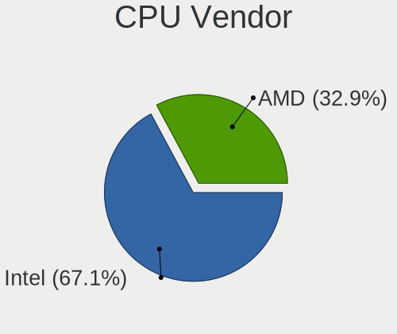
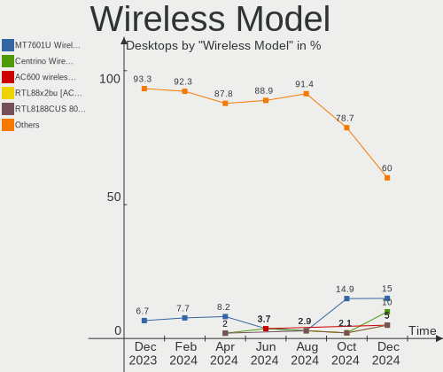

ROSA - Hardware Trends (Desktops)
---------------------------------

A project to identify most popular hardware characteristics and track their change
over time based on data collected by Linux users at https://Linux-Hardware.org.

Anyone can contribute to this report by the [hw-probe](https://github.com/linuxhw/hw-probe) tool:

    sudo -E hw-probe -all -upload

This report is for one last month. Overall report since the beginning of time: [TestDays](https://github.com/linuxhw/TestDays)

Period: Apr, 2023.

Contents
--------

* [ System ](#system)
  - [ OS                       ](#os)
  - [ OS Family                ](#os-family)
  - [ Kernel                   ](#kernel)
  - [ Kernel Family            ](#kernel-family)
  - [ Kernel Major Ver.        ](#kernel-major-ver)
  - [ Arch                     ](#arch)
  - [ DE                       ](#de)
  - [ Display Server           ](#display-server)
  - [ Display Manager          ](#display-manager)
  - [ OS Lang                  ](#os-lang)
  - [ Boot Mode                ](#boot-mode)
  - [ Filesystem               ](#filesystem)
  - [ Part. scheme             ](#part-scheme)
  - [ Dual Boot with Linux/BSD ](#dual-boot-with-linuxbsd)
  - [ Dual Boot (Win)          ](#dual-boot-win)

* [ Board ](#board)
  - [ Vendor                   ](#vendor)
  - [ Model                    ](#model)
  - [ Model Family             ](#model-family)
  - [ MFG Year                 ](#mfg-year)
  - [ Form Factor              ](#form-factor)
  - [ Secure Boot              ](#secure-boot)
  - [ Coreboot                 ](#coreboot)
  - [ RAM Size                 ](#ram-size)
  - [ RAM Used                 ](#ram-used)
  - [ Total Drives             ](#total-drives)
  - [ Has CD-ROM               ](#has-cd-rom)
  - [ Has Ethernet             ](#has-ethernet)
  - [ Has WiFi                 ](#has-wifi)
  - [ Has Bluetooth            ](#has-bluetooth)

* [ Location ](#location)
  - [ Country                  ](#country)
  - [ City                     ](#city)

* [ Drives ](#drives)
  - [ Drive Vendor             ](#drive-vendor)
  - [ Drive Model              ](#drive-model)
  - [ HDD Vendor               ](#hdd-vendor)
  - [ SSD Vendor               ](#ssd-vendor)
  - [ Drive Kind               ](#drive-kind)
  - [ Drive Connector          ](#drive-connector)
  - [ Drive Size               ](#drive-size)
  - [ Space Total              ](#space-total)
  - [ Space Used               ](#space-used)
  - [ Malfunc. Drives          ](#malfunc-drives)
  - [ Malfunc. Drive Vendor    ](#malfunc-drive-vendor)
  - [ Malfunc. HDD Vendor      ](#malfunc-hdd-vendor)
  - [ Malfunc. Drive Kind      ](#malfunc-drive-kind)
  - [ Failed Drives            ](#failed-drives)
  - [ Failed Drive Vendor      ](#failed-drive-vendor)
  - [ Drive Status             ](#drive-status)

* [ Storage controller ](#storage-controller)
  - [ Storage Vendor           ](#storage-vendor)
  - [ Storage Model            ](#storage-model)
  - [ Storage Kind             ](#storage-kind)

* [ Processor ](#processor)
  - [ CPU Vendor               ](#cpu-vendor)
  - [ CPU Model                ](#cpu-model)
  - [ CPU Model Family         ](#cpu-model-family)
  - [ CPU Cores                ](#cpu-cores)
  - [ CPU Sockets              ](#cpu-sockets)
  - [ CPU Threads              ](#cpu-threads)
  - [ CPU Op-Modes             ](#cpu-op-modes)
  - [ CPU Microcode            ](#cpu-microcode)
  - [ CPU Microarch            ](#cpu-microarch)

* [ Graphics ](#graphics)
  - [ GPU Vendor               ](#gpu-vendor)
  - [ GPU Model                ](#gpu-model)
  - [ GPU Combo                ](#gpu-combo)
  - [ GPU Driver               ](#gpu-driver)
  - [ GPU Memory               ](#gpu-memory)

* [ Monitor ](#monitor)
  - [ Monitor Vendor           ](#monitor-vendor)
  - [ Monitor Model            ](#monitor-model)
  - [ Monitor Resolution       ](#monitor-resolution)
  - [ Monitor Diagonal         ](#monitor-diagonal)
  - [ Monitor Width            ](#monitor-width)
  - [ Aspect Ratio             ](#aspect-ratio)
  - [ Monitor Area             ](#monitor-area)
  - [ Pixel Density            ](#pixel-density)
  - [ Multiple Monitors        ](#multiple-monitors)

* [ Network ](#network)
  - [ Net Controller Vendor    ](#net-controller-vendor)
  - [ Net Controller Model     ](#net-controller-model)
  - [ Wireless Vendor          ](#wireless-vendor)
  - [ Wireless Model           ](#wireless-model)
  - [ Ethernet Vendor          ](#ethernet-vendor)
  - [ Ethernet Model           ](#ethernet-model)
  - [ Net Controller Kind      ](#net-controller-kind)
  - [ Used Controller          ](#used-controller)
  - [ NICs                     ](#nics)
  - [ IPv6                     ](#ipv6)

* [ Bluetooth ](#bluetooth)
  - [ Bluetooth Vendor         ](#bluetooth-vendor)
  - [ Bluetooth Model          ](#bluetooth-model)

* [ Sound ](#sound)
  - [ Sound Vendor             ](#sound-vendor)
  - [ Sound Model              ](#sound-model)

* [ Memory ](#memory)
  - [ Memory Vendor            ](#memory-vendor)
  - [ Memory Model             ](#memory-model)
  - [ Memory Kind              ](#memory-kind)
  - [ Memory Form Factor       ](#memory-form-factor)
  - [ Memory Size              ](#memory-size)
  - [ Memory Speed             ](#memory-speed)

* [ Printers & scanners ](#printers--scanners)
  - [ Printer Vendor           ](#printer-vendor)
  - [ Printer Model            ](#printer-model)
  - [ Scanner Vendor           ](#scanner-vendor)
  - [ Scanner Model            ](#scanner-model)

* [ Camera ](#camera)
  - [ Camera Vendor            ](#camera-vendor)
  - [ Camera Model             ](#camera-model)

* [ Security ](#security)
  - [ Fingerprint Vendor       ](#fingerprint-vendor)
  - [ Fingerprint Model        ](#fingerprint-model)
  - [ Chipcard Vendor          ](#chipcard-vendor)
  - [ Chipcard Model           ](#chipcard-model)

* [ Unsupported ](#unsupported)
  - [ Unsupported Devices      ](#unsupported-devices)
  - [ Unsupported Device Types ](#unsupported-device-types)

System
------

OS
--

Installed operating systems

| Name       | Desktops | Percent |
|------------|----------|---------|
| ROSA 12.4  | 106      | 78.52%  |
| ROSA 12.3  | 14       | 10.37%  |
| ROSA R11.1 | 5        | 3.7%    |
| ROSA 12.2  | 4        | 2.96%   |
| ROSA 12.1  | 4        | 2.96%   |
| ROSA 13.0  | 1        | 0.74%   |
| ROSA 12    | 1        | 0.74%   |

OS Family
---------

OS without a version

| Name | Desktops | Percent |
|------|----------|---------|
| ROSA | 135      | 100%    |

Kernel
------

Version of the Linux kernel

| Version                                   | Desktops | Percent |
|-------------------------------------------|----------|---------|
| 6.1.20-generic-2rosa2021.1-x86_64         | 68       | 50.37%  |
| 5.15.103-generic-1rosa2021.1-x86_64       | 16       | 11.85%  |
| 5.10.74-generic-2rosa2021.1-x86_64        | 7        | 5.19%   |
| 5.15.75-generic-1rosa2021.1-x86_64        | 5        | 3.7%    |
| 5.10.176-generic-1rosa2021.1-x86_64       | 5        | 3.7%    |
| 5.10.155-generic-1rosa2021.1-x86_64       | 5        | 3.7%    |
| 6.0.12.xm1-1.klp-xanmod-rosa2021.1-x86_64 | 4        | 2.96%   |
| 5.15.79-generic-1rosa2021.1-x86_64        | 3        | 2.22%   |
| 5.10.74-generic-2rosa2021.1-i586          | 3        | 2.22%   |
| 6.1.20.xm1-1.klp-xanmod-rosa2021.1-x86_64 | 2        | 1.48%   |
| 5.4.32-generic-2rosa-x86_64               | 2        | 1.48%   |
| 5.17.11-generic-2rosa2021.1-x86_64        | 2        | 1.48%   |
| 6.3.0-generic-0.rc6.1rosa2021.1-x86_64    | 1        | 0.74%   |
| 6.2.11.xm1-1.klp-xanmod-rosa2021.1-x86_64 | 1        | 0.74%   |
| 6.1.19-generic-4rosa2023.1-x86_64         | 1        | 0.74%   |
| 6.1.19-generic-1rosa2021.1-x86_64         | 1        | 0.74%   |
| 5.4.83-generic-2rosa-x86_64               | 1        | 0.74%   |
| 5.4.150-generic-1rosa2021.1-x86_64        | 1        | 0.74%   |
| 5.15.77-generic-1rosa2021.1-x86_64        | 1        | 0.74%   |
| 5.15.75-generic-1rosa2021.1-i686          | 1        | 0.74%   |
| 5.15.103-generic-1rosa2021.1-i686         | 1        | 0.74%   |
| 5.10.71-generic-1rosa2021.1-x86_64        | 1        | 0.74%   |
| 5.10.118-generic-2rosa2021.1-i586         | 1        | 0.74%   |
| 4.9.155-nrj-desktop-1rosa-i586            | 1        | 0.74%   |
| 4.15.0-desktop-122.124.1rosa-x86_64       | 1        | 0.74%   |

Kernel Family
-------------

Linux kernel without a distro release

| Version  | Desktops | Percent |
|----------|----------|---------|
| 6.1.20   | 70       | 51.85%  |
| 5.15.103 | 17       | 12.59%  |
| 5.10.74  | 10       | 7.41%   |
| 5.15.75  | 6        | 4.44%   |
| 5.10.176 | 5        | 3.7%    |
| 5.10.155 | 5        | 3.7%    |
| 6.0.12   | 4        | 2.96%   |
| 5.15.79  | 3        | 2.22%   |
| 6.1.19   | 2        | 1.48%   |
| 5.4.32   | 2        | 1.48%   |
| 5.17.11  | 2        | 1.48%   |
| 6.3.0    | 1        | 0.74%   |
| 6.2.11   | 1        | 0.74%   |
| 5.4.83   | 1        | 0.74%   |
| 5.4.150  | 1        | 0.74%   |
| 5.15.77  | 1        | 0.74%   |
| 5.10.71  | 1        | 0.74%   |
| 5.10.118 | 1        | 0.74%   |
| 4.9.155  | 1        | 0.74%   |
| 4.15.0   | 1        | 0.74%   |

Kernel Major Ver.
-----------------

Linux kernel major version

| Version | Desktops | Percent |
|---------|----------|---------|
| 6.1     | 72       | 53.33%  |
| 5.15    | 27       | 20%     |
| 5.10    | 22       | 16.3%   |
| 6.0     | 4        | 2.96%   |
| 5.4     | 4        | 2.96%   |
| 5.17    | 2        | 1.48%   |
| 6.3     | 1        | 0.74%   |
| 6.2     | 1        | 0.74%   |
| 4.9     | 1        | 0.74%   |
| 4.15    | 1        | 0.74%   |

Arch
----

OS architecture (x86_64, i586, etc.)

| Name   | Desktops | Percent |
|--------|----------|---------|
| x86_64 | 128      | 94.81%  |
| i686   | 7        | 5.19%   |

DE
--

Desktop Environment

| Name  | Desktops | Percent |
|-------|----------|---------|
| KDE5  | 79       | 58.52%  |
| GNOME | 37       | 27.41%  |
| LXQt  | 16       | 11.85%  |
| KDE4  | 2        | 1.48%   |
| MATE  | 1        | 0.74%   |

Display Server
--------------

X11 or Wayland

| Name    | Desktops | Percent |
|---------|----------|---------|
| Wayland | 106      | 78.52%  |
| X11     | 29       | 21.48%  |

Display Manager
---------------

SDDM, LightDM, etc.

| Name    | Desktops | Percent |
|---------|----------|---------|
| SDDM    | 76       | 56.3%   |
| GDM     | 51       | 37.78%  |
| LightDM | 6        | 4.44%   |
| KDM     | 2        | 1.48%   |

OS Lang
-------

Language

| Lang  | Desktops | Percent |
|-------|----------|---------|
| ru_RU | 114      | 84.44%  |
| en_US | 7        | 5.19%   |
| pt_BR | 2        | 1.48%   |
| es_ES | 2        | 1.48%   |
| de_DE | 2        | 1.48%   |
| sk_SK | 1        | 0.74%   |
| pl_PL | 1        | 0.74%   |
| it_IT | 1        | 0.74%   |
| hu_HU | 1        | 0.74%   |
| es_MX | 1        | 0.74%   |
| es_CO | 1        | 0.74%   |
| en_GB | 1        | 0.74%   |
| C     | 1        | 0.74%   |

Boot Mode
---------

EFI or BIOS

| Mode | Desktops | Percent |
|------|----------|---------|
| BIOS | 69       | 51.11%  |
| EFI  | 66       | 48.89%  |

Filesystem
----------

Type of filesystem

| Type  | Desktops | Percent |
|-------|----------|---------|
| Ext4  | 124      | 91.85%  |
| Btrfs | 8        | 5.93%   |
| F2fs  | 2        | 1.48%   |
| Xfs   | 1        | 0.74%   |

Part. scheme
------------

Scheme of partitioning

| Type    | Desktops | Percent |
|---------|----------|---------|
| GPT     | 76       | 56.3%   |
| MBR     | 58       | 42.96%  |
| Unknown | 1        | 0.74%   |

Dual Boot with Linux/BSD
------------------------

Hosting more than one Linux/BSD

| Dual boot | Desktops | Percent |
|-----------|----------|---------|
| No        | 99       | 73.33%  |
| Yes       | 36       | 26.67%  |

Dual Boot (Win)
---------------

Hosting Linux and Windows

| Dual boot | Desktops | Percent |
|-----------|----------|---------|
| No        | 76       | 56.3%   |
| Yes       | 59       | 43.7%   |

Board
-----

Vendor
------

Motherboard manufacturer

| Name                | Desktops | Percent |
|---------------------|----------|---------|
| Gigabyte Technology | 33       | 24.44%  |
| ASUSTek Computer    | 31       | 22.96%  |
| ASRock              | 19       | 14.07%  |
| MSI                 | 14       | 10.37%  |
| Hewlett-Packard     | 5        | 3.7%    |
| Biostar             | 5        | 3.7%    |
| Acer                | 4        | 2.96%   |
| Intel               | 3        | 2.22%   |
| ECS                 | 3        | 2.22%   |
| Dell                | 3        | 2.22%   |
| Unknown             | 3        | 2.22%   |
| Lenovo              | 2        | 1.48%   |
| Huanan              | 2        | 1.48%   |
| X79P motherboard    | 1        | 0.74%   |
| Pegatron            | 1        | 0.74%   |
| MACHINIST           | 1        | 0.74%   |
| Fujitsu             | 1        | 0.74%   |
| Foxconn             | 1        | 0.74%   |
| EPoX Computer       | 1        | 0.74%   |
| Dinson              | 1        | 0.74%   |
| Aquarius            | 1        | 0.74%   |

Model
-----

Motherboard model

| Name                                 | Desktops | Percent |
|--------------------------------------|----------|---------|
| Unknown                              | 4        | 2.96%   |
| ASUS All Series                      | 3        | 2.22%   |
| MSI MS-7C95                          | 2        | 1.48%   |
| Gigabyte A320M-S2H V2                | 2        | 1.48%   |
| Gigabyte A320M-S2H                   | 2        | 1.48%   |
| Gigabyte A320M-H                     | 2        | 1.48%   |
| ASUS P5KPL-AM                        | 2        | 1.48%   |
| ASRock H87 Performance               | 2        | 1.48%   |
| X79P motherboard Socket LGA-2011     | 1        | 0.74%   |
| Pegatron Compaq dx2400 Microtower PC | 1        | 0.74%   |
| MSI PPPPP-CCC#MMMMMMMM               | 1        | 0.74%   |
| MSI OPTIMUS                          | 1        | 0.74%   |
| MSI MS-7D48                          | 1        | 0.74%   |
| MSI MS-7C90                          | 1        | 0.74%   |
| MSI MS-7C56                          | 1        | 0.74%   |
| MSI MS-7B84                          | 1        | 0.74%   |
| MSI MS-7B79                          | 1        | 0.74%   |
| MSI MS-7A36                          | 1        | 0.74%   |
| MSI MS-7A15                          | 1        | 0.74%   |
| MSI MS-7817                          | 1        | 0.74%   |
| MSI MS-7673                          | 1        | 0.74%   |
| MSI MS-7592                          | 1        | 0.74%   |
| MACHINIST X99-RS9 V3.1               | 1        | 0.74%   |
| Lenovo H50-50 90B7002PRS             | 1        | 0.74%   |
| Lenovo H420                          | 1        | 0.74%   |
| Intel X79M-S                         | 1        | 0.74%   |
| Intel D945GCCR AAD78647-301          | 1        | 0.74%   |
| Intel B85 V2.2A                      | 1        | 0.74%   |
| Huanan X99-BD4 V1.33                 | 1        | 0.74%   |
| Huanan X99 F8D V2.2                  | 1        | 0.74%   |
| HP Z600 Workstation                  | 1        | 0.74%   |
| HP Pavilion Gaming Desktop TG01-2xxx | 1        | 0.74%   |
| HP Compaq 8200 Elite SFF PC          | 1        | 0.74%   |
| HP Compaq 6000 Pro MT PC             | 1        | 0.74%   |
| HP 23-q101ur                         | 1        | 0.74%   |
| Gigabyte Z590M                       | 1        | 0.74%   |
| Gigabyte X570 AORUS ULTRA            | 1        | 0.74%   |
| Gigabyte P75-D3                      | 1        | 0.74%   |
| Gigabyte P31-S3G                     | 1        | 0.74%   |
| Gigabyte M68MT-D3P                   | 1        | 0.74%   |

Model Family
------------

Motherboard model prefix

| Name                    | Desktops | Percent |
|-------------------------|----------|---------|
| Gigabyte A320M-S2H      | 4        | 2.96%   |
| Unknown                 | 4        | 2.96%   |
| Gigabyte B550           | 3        | 2.22%   |
| ASUS PRIME              | 3        | 2.22%   |
| ASUS P5KPL-AM           | 3        | 2.22%   |
| ASUS All                | 3        | 2.22%   |
| MSI MS-7C95             | 2        | 1.48%   |
| HP Compaq               | 2        | 1.48%   |
| Gigabyte H310M          | 2        | 1.48%   |
| Gigabyte A320M-H        | 2        | 1.48%   |
| Dell OptiPlex           | 2        | 1.48%   |
| ASUS ROG                | 2        | 1.48%   |
| ASUS P8H61-M            | 2        | 1.48%   |
| ASRock H87              | 2        | 1.48%   |
| ASRock H510M-HDV        | 2        | 1.48%   |
| Acer Aspire             | 2        | 1.48%   |
| X79P motherboard Socket | 1        | 0.74%   |
| Pegatron Compaq         | 1        | 0.74%   |
| MSI PPPPP-CCC#MMMMMMMM  | 1        | 0.74%   |
| MSI OPTIMUS             | 1        | 0.74%   |
| MSI MS-7D48             | 1        | 0.74%   |
| MSI MS-7C90             | 1        | 0.74%   |
| MSI MS-7C56             | 1        | 0.74%   |
| MSI MS-7B84             | 1        | 0.74%   |
| MSI MS-7B79             | 1        | 0.74%   |
| MSI MS-7A36             | 1        | 0.74%   |
| MSI MS-7A15             | 1        | 0.74%   |
| MSI MS-7817             | 1        | 0.74%   |
| MSI MS-7673             | 1        | 0.74%   |
| MSI MS-7592             | 1        | 0.74%   |
| MACHINIST X99-RS9       | 1        | 0.74%   |
| Lenovo H50-50           | 1        | 0.74%   |
| Lenovo H420             | 1        | 0.74%   |
| Intel X79M-S            | 1        | 0.74%   |
| Intel D945GCCR          | 1        | 0.74%   |
| Intel B85               | 1        | 0.74%   |
| Huanan X99-BD4          | 1        | 0.74%   |
| Huanan X99              | 1        | 0.74%   |
| HP Z600                 | 1        | 0.74%   |
| HP Pavilion             | 1        | 0.74%   |

MFG Year
--------

Motherboard manufacture year

| Year | Desktops | Percent |
|------|----------|---------|
| 2018 | 13       | 9.63%   |
| 2012 | 13       | 9.63%   |
| 2013 | 12       | 8.89%   |
| 2020 | 11       | 8.15%   |
| 2011 | 11       | 8.15%   |
| 2010 | 11       | 8.15%   |
| 2022 | 10       | 7.41%   |
| 2021 | 8        | 5.93%   |
| 2014 | 8        | 5.93%   |
| 2019 | 7        | 5.19%   |
| 2009 | 7        | 5.19%   |
| 2017 | 6        | 4.44%   |
| 2007 | 5        | 3.7%    |
| 2008 | 4        | 2.96%   |
| 2016 | 3        | 2.22%   |
| 2015 | 3        | 2.22%   |
| 2005 | 2        | 1.48%   |
| 2006 | 1        | 0.74%   |

Form Factor
-----------

Physical design of the computer

| Name    | Desktops | Percent |
|---------|----------|---------|
| Desktop | 135      | 100%    |

Secure Boot
-----------

Enabled or disabled

| State    | Desktops | Percent |
|----------|----------|---------|
| Disabled | 135      | 100%    |

Coreboot
--------

Have coreboot on board

| Used | Desktops | Percent |
|------|----------|---------|
| No   | 135      | 100%    |

RAM Size
--------

Total RAM memory

| Size in GB  | Desktops | Percent |
|-------------|----------|---------|
| 8.01-16.0   | 31       | 22.96%  |
| 16.01-24.0  | 29       | 21.48%  |
| 4.01-8.0    | 27       | 20%     |
| 3.01-4.0    | 24       | 17.78%  |
| 32.01-64.0  | 10       | 7.41%   |
| 24.01-32.0  | 6        | 4.44%   |
| 2.01-3.0    | 3        | 2.22%   |
| 1.01-2.0    | 3        | 2.22%   |
| 64.01-256.0 | 2        | 1.48%   |

RAM Used
--------

Used RAM memory

| Used GB  | Desktops | Percent |
|----------|----------|---------|
| 1.01-2.0 | 61       | 45.19%  |
| 2.01-3.0 | 28       | 20.74%  |
| 0.51-1.0 | 26       | 19.26%  |
| 4.01-8.0 | 14       | 10.37%  |
| 3.01-4.0 | 6        | 4.44%   |

Total Drives
------------

Number of drives on board

| Drives | Desktops | Percent |
|--------|----------|---------|
| 1      | 63       | 46.67%  |
| 2      | 34       | 25.19%  |
| 3      | 21       | 15.56%  |
| 4      | 10       | 7.41%   |
| 5      | 5        | 3.7%    |
| 7      | 1        | 0.74%   |
| 0      | 1        | 0.74%   |

Has CD-ROM
----------

Has CD-ROM on board

| Presented | Desktops | Percent |
|-----------|----------|---------|
| No        | 96       | 71.11%  |
| Yes       | 39       | 28.89%  |

Has Ethernet
------------

Has Ethernet on board

| Presented | Desktops | Percent |
|-----------|----------|---------|
| Yes       | 134      | 99.26%  |
| No        | 1        | 0.74%   |

Has WiFi
--------

Has WiFi module

| Presented | Desktops | Percent |
|-----------|----------|---------|
| No        | 87       | 64.44%  |
| Yes       | 48       | 35.56%  |

Has Bluetooth
-------------

Has Bluetooth module

| Presented | Desktops | Percent |
|-----------|----------|---------|
| No        | 104      | 77.04%  |
| Yes       | 31       | 22.96%  |

Location
--------

Country
-------

Geographic location (country)

| Country                | Desktops | Percent |
|------------------------|----------|---------|
| Russia                 | 113      | 83.7%   |
| Belarus                | 3        | 2.22%   |
| Ukraine                | 2        | 1.48%   |
| Germany                | 2        | 1.48%   |
| Colombia               | 2        | 1.48%   |
| Brazil                 | 2        | 1.48%   |
| Venezuela              | 1        | 0.74%   |
| USA                    | 1        | 0.74%   |
| UK                     | 1        | 0.74%   |
| Slovakia               | 1        | 0.74%   |
| Serbia                 | 1        | 0.74%   |
| Poland                 | 1        | 0.74%   |
| Mexico                 | 1        | 0.74%   |
| Italy                  | 1        | 0.74%   |
| Israel                 | 1        | 0.74%   |
| Hungary                | 1        | 0.74%   |
| Bosnia and Herzegovina | 1        | 0.74%   |

City
----

Geographic location (city)

| City            | Desktops | Percent |
|-----------------|----------|---------|
| Moscow          | 19       | 14.07%  |
| St Petersburg   | 9        | 6.67%   |
| Krasnodar       | 7        | 5.19%   |
| Novosibirsk     | 4        | 2.96%   |
| Ufa             | 3        | 2.22%   |
| Rostov-on-Don   | 3        | 2.22%   |
| Murmansk        | 3        | 2.22%   |
| Kumertau        | 3        | 2.22%   |
| Yekaterinburg   | 2        | 1.48%   |
| Ulyanovsk       | 2        | 1.48%   |
| Tambov          | 2        | 1.48%   |
| Rio de Janeiro  | 2        | 1.48%   |
| Perm            | 2        | 1.48%   |
| Mytishchi       | 2        | 1.48%   |
| Krasnoyarsk     | 2        | 1.48%   |
| Chelyabinsk     | 2        | 1.48%   |
| Bogotá         | 2        | 1.48%   |
| Barnaul         | 2        | 1.48%   |
| Zhukovskiy      | 1        | 0.74%   |
| Yartsevo        | 1        | 0.74%   |
| Yakutsk         | 1        | 0.74%   |
| Voronezh        | 1        | 0.74%   |
| Vologda         | 1        | 0.74%   |
| Volgograd       | 1        | 0.74%   |
| Vidnoye         | 1        | 0.74%   |
| Veliky Novgorod | 1        | 0.74%   |
| Trzebinia       | 1        | 0.74%   |
| Trebinje        | 1        | 0.74%   |
| Tomsk           | 1        | 0.74%   |
| Tolyatti        | 1        | 0.74%   |
| Surgut          | 1        | 0.74%   |
| Stary Oskol     | 1        | 0.74%   |
| Shelekhov       | 1        | 0.74%   |
| Sergiyev Posad  | 1        | 0.74%   |
| Segezha         | 1        | 0.74%   |
| Saransk         | 1        | 0.74%   |
| Samara          | 1        | 0.74%   |
| Salavat         | 1        | 0.74%   |
| Rome            | 1        | 0.74%   |
| Ramat Tsevi     | 1        | 0.74%   |

Drives
------

Drive Vendor
------------

Hard drive vendors

| Vendor                      | Desktops | Drives | Percent |
|-----------------------------|----------|--------|---------|
| WDC                         | 49       | 65     | 21.12%  |
| Seagate                     | 37       | 46     | 15.95%  |
| Samsung Electronics         | 22       | 27     | 9.48%   |
| Kingston                    | 16       | 19     | 6.9%    |
| Hitachi                     | 12       | 13     | 5.17%   |
| Toshiba                     | 9        | 9      | 3.88%   |
| Crucial                     | 8        | 8      | 3.45%   |
| China                       | 7        | 7      | 3.02%   |
| SanDisk                     | 6        | 6      | 2.59%   |
| Apacer                      | 5        | 5      | 2.16%   |
| KingSpec                    | 4        | 4      | 1.72%   |
| A-DATA Technology           | 4        | 5      | 1.72%   |
| XPG                         | 3        | 3      | 1.29%   |
| Unknown                     | 3        | 3      | 1.29%   |
| Smartbuy                    | 3        | 3      | 1.29%   |
| HGST                        | 3        | 3      | 1.29%   |
| Gigabyte Technology         | 3        | 3      | 1.29%   |
| Digma                       | 3        | 3      | 1.29%   |
| XrayDisk                    | 2        | 2      | 0.86%   |
| SPCC                        | 2        | 2      | 0.86%   |
| Silicon Motion              | 2        | 2      | 0.86%   |
| KingDian                    | 2        | 2      | 0.86%   |
| Intel                       | 2        | 2      | 0.86%   |
| Hewlett-Packard             | 2        | 2      | 0.86%   |
| Fujitsu                     | 2        | 2      | 0.86%   |
| Azerty                      | 2        | 2      | 0.86%   |
| AMD                         | 2        | 2      | 0.86%   |
| TAMMUZ                      | 1        | 2      | 0.43%   |
| Reletech                    | 1        | 1      | 0.43%   |
| PNY                         | 1        | 1      | 0.43%   |
| Pioneer                     | 1        | 1      | 0.43%   |
| Phison                      | 1        | 1      | 0.43%   |
| Patriot                     | 1        | 1      | 0.43%   |
| Palit                       | 1        | 1      | 0.43%   |
| Netac                       | 1        | 1      | 0.43%   |
| Neo                         | 1        | 1      | 0.43%   |
| Maxtor                      | 1        | 1      | 0.43%   |
| MAXIO Technology (Hangzhou) | 1        | 1      | 0.43%   |
| JMicron Technology          | 1        | 1      | 0.43%   |
| Intenso                     | 1        | 1      | 0.43%   |

Drive Model
-----------

Hard drive models

| Model                                | Desktops | Percent |
|--------------------------------------|----------|---------|
| WDC WD10EZEX-08WN4A0 1TB             | 5        | 1.88%   |
| Kingston SA400S37240G 240GB SSD      | 5        | 1.88%   |
| Seagate ST1000DM010-2EP102 1TB       | 4        | 1.5%    |
| Crucial CT240BX500SSD1 240GB         | 4        | 1.5%    |
| Seagate ST3500418AS 500GB            | 3        | 1.13%   |
| Samsung SSD 980 PRO 250GB            | 3        | 1.13%   |
| Samsung HM321HI 320GB                | 3        | 1.13%   |
| Kingston SA400S37480G 480GB SSD      | 3        | 1.13%   |
| Kingston SA400S37120G 120GB SSD      | 3        | 1.13%   |
| XPG GAMMIX S11 Pro 1TB               | 2        | 0.75%   |
| WDC WDS500G2B0A-00SM50 500GB SSD     | 2        | 0.75%   |
| WDC WDS240G2G0A-00JH30 240GB SSD     | 2        | 0.75%   |
| WDC WDS120G2G0A-00JH30 120GB SSD     | 2        | 0.75%   |
| WDC WD5000AAKX-00ERMA0 500GB         | 2        | 0.75%   |
| WDC WD2500AAKX-00ERMA0 250GB         | 2        | 0.75%   |
| WDC WD20EZBX-00AYRA0 2TB             | 2        | 0.75%   |
| WDC WD10EZRZ-00HTKB0 1TB             | 2        | 0.75%   |
| WDC WD10EZEX-00BBHA0 1TB             | 2        | 0.75%   |
| Unknown NVMe SSD Drive 256GB         | 2        | 0.75%   |
| Toshiba MQ01ABD100 1TB               | 2        | 0.75%   |
| Toshiba DT01ACA050 500GB             | 2        | 0.75%   |
| Seagate ST9500325AS 500GB            | 2        | 0.75%   |
| Seagate ST3250824AS 250GB            | 2        | 0.75%   |
| Seagate ST3250310AS 250GB            | 2        | 0.75%   |
| Seagate ST250DM000-1BD141 250GB      | 2        | 0.75%   |
| Seagate ST2000DM008-2UB102 2TB       | 2        | 0.75%   |
| Seagate ST1000DM003-1ER162 1TB       | 2        | 0.75%   |
| Samsung SSD 860 EVO 500GB            | 2        | 0.75%   |
| Samsung SSD 750 EVO 250GB            | 2        | 0.75%   |
| Kingston SNVS500G 500GB              | 2        | 0.75%   |
| Hitachi HDS721050CLA660 500GB        | 2        | 0.75%   |
| Gigabyte GP-GSTFS31240GNTD 240GB SSD | 2        | 0.75%   |
| Digma 1TB RUN S9 SSD                 | 2        | 0.75%   |
| Apacer AS350 128GB SSD               | 2        | 0.75%   |
| XrayDisk SSD 256GB                   | 1        | 0.38%   |
| XrayDisk 256GB SSD                   | 1        | 0.38%   |
| XPG GAMMIX S50 Lite 512GB            | 1        | 0.38%   |
| WDC WDS500G2X0C-00L350 500GB         | 1        | 0.38%   |
| WDC WDS120G2G0B-00EPW0 120GB SSD     | 1        | 0.38%   |
| WDC WDS100T2B0C-00PXH0 1TB           | 1        | 0.38%   |

HDD Vendor
----------

Hard disk drive vendors

| Vendor              | Desktops | Drives | Percent |
|---------------------|----------|--------|---------|
| WDC                 | 45       | 54     | 37.82%  |
| Seagate             | 37       | 46     | 31.09%  |
| Hitachi             | 12       | 13     | 10.08%  |
| Toshiba             | 8        | 8      | 6.72%   |
| Samsung Electronics | 8        | 9      | 6.72%   |
| HGST                | 3        | 3      | 2.52%   |
| Fujitsu             | 2        | 2      | 1.68%   |
| Unknown             | 1        | 1      | 0.84%   |
| Maxtor              | 1        | 1      | 0.84%   |
| JMicron Technology  | 1        | 1      | 0.84%   |
| ASMT                | 1        | 2      | 0.84%   |

SSD Vendor
----------

Solid state drive vendors

| Vendor              | Desktops | Drives | Percent |
|---------------------|----------|--------|---------|
| Kingston            | 13       | 15     | 14.13%  |
| Samsung Electronics | 10       | 10     | 10.87%  |
| Crucial             | 8        | 8      | 8.7%    |
| WDC                 | 7        | 7      | 7.61%   |
| China               | 6        | 6      | 6.52%   |
| SanDisk             | 4        | 4      | 4.35%   |
| KingSpec            | 4        | 4      | 4.35%   |
| Apacer              | 4        | 4      | 4.35%   |
| A-DATA Technology   | 4        | 4      | 4.35%   |
| Smartbuy            | 3        | 3      | 3.26%   |
| Gigabyte Technology | 3        | 3      | 3.26%   |
| Digma               | 3        | 3      | 3.26%   |
| XrayDisk            | 2        | 2      | 2.17%   |
| SPCC                | 2        | 2      | 2.17%   |
| KingDian            | 2        | 2      | 2.17%   |
| Azerty              | 2        | 2      | 2.17%   |
| Toshiba             | 1        | 1      | 1.09%   |
| TAMMUZ              | 1        | 2      | 1.09%   |
| PNY                 | 1        | 1      | 1.09%   |
| Pioneer             | 1        | 1      | 1.09%   |
| Patriot             | 1        | 1      | 1.09%   |
| Palit               | 1        | 1      | 1.09%   |
| Netac               | 1        | 1      | 1.09%   |
| Neo                 | 1        | 1      | 1.09%   |
| Intenso             | 1        | 1      | 1.09%   |
| Intel               | 1        | 1      | 1.09%   |
| Hewlett-Packard     | 1        | 1      | 1.09%   |
| GOODRAM             | 1        | 1      | 1.09%   |
| ExeGate             | 1        | 1      | 1.09%   |
| AMD                 | 1        | 1      | 1.09%   |
| Unknown             | 1        | 1      | 1.09%   |

Drive Kind
----------

HDD or SSD

| Kind | Desktops | Drives | Percent |
|------|----------|--------|---------|
| HDD  | 95       | 140    | 47.03%  |
| SSD  | 76       | 95     | 37.62%  |
| NVMe | 31       | 34     | 15.35%  |

Drive Connector
---------------

SATA, SAS, NVMe, etc.

| Type | Desktops | Drives | Percent |
|------|----------|--------|---------|
| SATA | 126      | 231    | 78.75%  |
| NVMe | 31       | 34     | 19.38%  |
| SAS  | 3        | 4      | 1.88%   |

Drive Size
----------

Size of hard drive

| Size in TB | Desktops | Drives | Percent |
|------------|----------|--------|---------|
| 0.01-0.5   | 108      | 162    | 63.91%  |
| 0.51-1.0   | 42       | 54     | 24.85%  |
| 1.01-2.0   | 13       | 13     | 7.69%   |
| 3.01-4.0   | 3        | 3      | 1.78%   |
| 2.01-3.0   | 2        | 2      | 1.18%   |
| 4.01-10.0  | 1        | 1      | 0.59%   |

Space Total
-----------

Amount of disk space available on the file system

| Size in GB     | Desktops | Percent |
|----------------|----------|---------|
| 101-250        | 48       | 35.56%  |
| 251-500        | 24       | 17.78%  |
| 501-1000       | 21       | 15.56%  |
| 51-100         | 10       | 7.41%   |
| 1-20           | 9        | 6.67%   |
| 1001-2000      | 8        | 5.93%   |
| 2001-3000      | 7        | 5.19%   |
| More than 3000 | 5        | 3.7%    |
| 21-50          | 3        | 2.22%   |

Space Used
----------

Amount of used disk space

| Used GB   | Desktops | Percent |
|-----------|----------|---------|
| 1-20      | 68       | 50.37%  |
| 21-50     | 16       | 11.85%  |
| 51-100    | 16       | 11.85%  |
| 101-250   | 12       | 8.89%   |
| 251-500   | 11       | 8.15%   |
| 1001-2000 | 5        | 3.7%    |
| 501-1000  | 4        | 2.96%   |
| 2001-3000 | 3        | 2.22%   |

Malfunc. Drives
---------------

Drive models with a malfunction

| Model                                    | Desktops | Drives | Percent |
|------------------------------------------|----------|--------|---------|
| Seagate ST3500418AS 500GB                | 3        | 3      | 4.84%   |
| Toshiba MQ01ABD100 1TB                   | 2        | 2      | 3.23%   |
| Seagate ST9500325AS 500GB                | 2        | 2      | 3.23%   |
| Seagate ST3250824AS 250GB                | 2        | 2      | 3.23%   |
| Seagate ST3250310AS 250GB                | 2        | 2      | 3.23%   |
| Samsung Electronics HM321HI 320GB        | 2        | 2      | 3.23%   |
| Hitachi HDS721050CLA660 500GB            | 2        | 2      | 3.23%   |
| WDC WD5000AAKX-083CA1 500GB              | 1        | 1      | 1.61%   |
| WDC WD5000AAKX-001CA0 500GB              | 1        | 1      | 1.61%   |
| WDC WD5000AAKS-007AA0 500GB              | 1        | 1      | 1.61%   |
| WDC WD3200BPVT-00JJ5T0 320GB             | 1        | 1      | 1.61%   |
| WDC WD3200AAKX-001CA0 320GB              | 1        | 1      | 1.61%   |
| WDC WD3200AAKS-75L9A0 320GB              | 1        | 1      | 1.61%   |
| WDC WD3200AAJS-00YZCA0 320GB             | 1        | 1      | 1.61%   |
| WDC WD2500JS-00NCB1 250GB                | 1        | 1      | 1.61%   |
| WDC WD2500BEVT-60ZCT1 250GB              | 1        | 1      | 1.61%   |
| WDC WD20EZRX-00DC0B0 2TB                 | 1        | 1      | 1.61%   |
| WDC WD20EARS-00S8B1 2TB                  | 1        | 1      | 1.61%   |
| WDC WD1600AAJS-00L7A0 160GB              | 1        | 1      | 1.61%   |
| WDC WD15EARS-22MVWB0 1TB                 | 1        | 1      | 1.61%   |
| WDC WD10JPVX-08JC3T5 1TB                 | 1        | 1      | 1.61%   |
| WDC WD10EZEX-00MFCA0 1TB                 | 1        | 1      | 1.61%   |
| Toshiba MQ04ABF100 1TB                   | 1        | 1      | 1.61%   |
| Toshiba HDWD105 500GB                    | 1        | 1      | 1.61%   |
| Seagate ST500DM002-1BD142 500GB          | 1        | 1      | 1.61%   |
| Seagate ST3640323AS 640GB                | 1        | 1      | 1.61%   |
| Seagate ST3250318AS 250GB                | 1        | 1      | 1.61%   |
| Seagate ST320DM000-1BC14C 320GB          | 1        | 1      | 1.61%   |
| Seagate ST31000528AS 1TB                 | 1        | 1      | 1.61%   |
| Seagate ST250DM000-1BD141 250GB          | 1        | 1      | 1.61%   |
| Seagate ST2000DX001-1CM164 2TB           | 1        | 1      | 1.61%   |
| Samsung Electronics SSD 970 EVO Plus 1TB | 1        | 1      | 1.61%   |
| Samsung Electronics HD753LJ 752GB        | 1        | 1      | 1.61%   |
| Samsung Electronics HD103SJ 1TB          | 1        | 1      | 1.61%   |
| Samsung Electronics HD080HJ 80GB         | 1        | 1      | 1.61%   |
| PNY SSD2SC240GD2DH16T-T 240GB            | 1        | 1      | 1.61%   |
| Netac SSD 240GB                          | 1        | 1      | 1.61%   |
| Neo Forza NFS121SA312-6007000 120GB SSD  | 1        | 1      | 1.61%   |
| Kingston SUV300S37A120G 120GB SSD        | 1        | 1      | 1.61%   |
| KingSpec T-64 64GB SSD                   | 1        | 1      | 1.61%   |

Malfunc. Drive Vendor
---------------------

Vendors of faulty drives

| Vendor              | Desktops | Drives | Percent |
|---------------------|----------|--------|---------|
| Seagate             | 16       | 16     | 25.81%  |
| WDC                 | 15       | 15     | 24.19%  |
| Hitachi             | 8        | 8      | 12.9%   |
| Samsung Electronics | 6        | 6      | 9.68%   |
| Toshiba             | 4        | 4      | 6.45%   |
| Apacer              | 2        | 2      | 3.23%   |
| PNY                 | 1        | 1      | 1.61%   |
| Netac               | 1        | 1      | 1.61%   |
| Neo                 | 1        | 1      | 1.61%   |
| Kingston            | 1        | 1      | 1.61%   |
| KingSpec            | 1        | 1      | 1.61%   |
| KingDian            | 1        | 1      | 1.61%   |
| Intel               | 1        | 1      | 1.61%   |
| HGST                | 1        | 1      | 1.61%   |
| Fujitsu             | 1        | 1      | 1.61%   |
| Azerty              | 1        | 1      | 1.61%   |
| AMD                 | 1        | 1      | 1.61%   |

Malfunc. HDD Vendor
-------------------

Vendors of faulty HDD drives

| Vendor              | Desktops | Drives | Percent |
|---------------------|----------|--------|---------|
| Seagate             | 16       | 16     | 32%     |
| WDC                 | 15       | 15     | 30%     |
| Hitachi             | 8        | 8      | 16%     |
| Samsung Electronics | 5        | 5      | 10%     |
| Toshiba             | 4        | 4      | 8%      |
| HGST                | 1        | 1      | 2%      |
| Fujitsu             | 1        | 1      | 2%      |

Malfunc. Drive Kind
-------------------

Kinds of faulty drives

| Kind | Desktops | Drives | Percent |
|------|----------|--------|---------|
| HDD  | 42       | 50     | 79.25%  |
| SSD  | 9        | 10     | 16.98%  |
| NVMe | 2        | 2      | 3.77%   |

Failed Drives
-------------

Failed drive models

| Model                               | Desktops | Drives | Percent |
|-------------------------------------|----------|--------|---------|
| Seagate ST320LM001 HN-M320MBB 320GB | 1        | 1      | 100%    |

Failed Drive Vendor
-------------------

Failed drive vendors

| Vendor  | Desktops | Drives | Percent |
|---------|----------|--------|---------|
| Seagate | 1        | 1      | 100%    |

Drive Status
------------

Number of failed and malfunc. drives

| Status   | Desktops | Drives | Percent |
|----------|----------|--------|---------|
| Works    | 113      | 200    | 67.26%  |
| Malfunc  | 49       | 62     | 29.17%  |
| Detected | 5        | 6      | 2.98%   |
| Failed   | 1        | 1      | 0.6%    |

Storage controller
------------------

Storage Vendor
--------------

Storage controller vendors

| Vendor                      | Desktops | Percent |
|-----------------------------|----------|---------|
| Intel                       | 80       | 46.24%  |
| AMD                         | 45       | 26.01%  |
| Nvidia                      | 11       | 6.36%   |
| Samsung Electronics         | 7        | 4.05%   |
| Silicon Motion              | 5        | 2.89%   |
| SanDisk                     | 5        | 2.89%   |
| Kingston Technology Company | 4        | 2.31%   |
| ASMedia Technology          | 4        | 2.31%   |
| JMicron Technology          | 3        | 1.73%   |
| ADATA Technology            | 3        | 1.73%   |
| Phison Electronics          | 2        | 1.16%   |
| Netac Technology            | 2        | 1.16%   |
| MAXIO Technology (Hangzhou) | 2        | 1.16%   |

Storage Model
-------------

Storage controller models

| Model                                                                                   | Desktops | Percent |
|-----------------------------------------------------------------------------------------|----------|---------|
| AMD FCH SATA Controller [AHCI mode]                                                     | 23       | 10%     |
| Intel 8 Series/C220 Series Chipset Family 6-port SATA Controller 1 [AHCI mode]          | 14       | 6.09%   |
| Intel NM10/ICH7 Family SATA Controller [IDE mode]                                       | 11       | 4.78%   |
| AMD 500 Series Chipset SATA Controller                                                  | 10       | 4.35%   |
| Intel 6 Series/C200 Series Chipset Family 6 port Desktop SATA AHCI Controller           | 9        | 3.91%   |
| AMD SB7x0/SB8x0/SB9x0 IDE Controller                                                    | 9        | 3.91%   |
| Intel 82801G (ICH7 Family) IDE Controller                                               | 7        | 3.04%   |
| AMD FCH SATA Controller D                                                               | 7        | 3.04%   |
| Nvidia MCP61 SATA Controller                                                            | 6        | 2.61%   |
| Intel 6 Series/C200 Series Chipset Family Desktop SATA Controller (IDE mode, ports 4-5) | 6        | 2.61%   |
| Intel 6 Series/C200 Series Chipset Family Desktop SATA Controller (IDE mode, ports 0-3) | 6        | 2.61%   |
| Silicon Motion SM2263EN/SM2263XT SSD Controller                                         | 5        | 2.17%   |
| Nvidia MCP61 IDE                                                                        | 5        | 2.17%   |
| Intel Cannon Lake PCH SATA AHCI Controller                                              | 5        | 2.17%   |
| AMD SB7x0/SB8x0/SB9x0 SATA Controller [IDE mode]                                        | 5        | 2.17%   |
| AMD SB7x0/SB8x0/SB9x0 SATA Controller [AHCI mode]                                       | 5        | 2.17%   |
| AMD 400 Series Chipset SATA Controller                                                  | 5        | 2.17%   |
| Samsung NVMe SSD Controller PM9A1/PM9A3/980PRO                                          | 4        | 1.74%   |
| Intel 7 Series/C210 Series Chipset Family 6-port SATA Controller [AHCI mode]            | 4        | 1.74%   |
| Intel 500 Series Chipset Family SATA AHCI Controller                                    | 4        | 1.74%   |
| Intel 200 Series PCH SATA controller [AHCI mode]                                        | 4        | 1.74%   |
| ASMedia ASM1062 Serial ATA Controller                                                   | 4        | 1.74%   |
| Intel Q170/Q150/B150/H170/H110/Z170/CM236 Chipset SATA Controller [AHCI Mode]           | 3        | 1.3%    |
| Intel 82801I (ICH9 Family) 2 port SATA Controller [IDE mode]                            | 3        | 1.3%    |
| AMD 300 Series Chipset SATA Controller                                                  | 3        | 1.3%    |
| ADATA XPG SX8200 Pro PCIe Gen3x4 M.2 2280 Solid State Drive                             | 3        | 1.3%    |
| SanDisk WD Blue SN550 NVMe SSD                                                          | 2        | 0.87%   |
| SanDisk WD Black 2018/SN750 / PC SN720 NVMe SSD                                         | 2        | 0.87%   |
| Samsung NVMe SSD Controller SM981/PM981/PM983                                           | 2        | 0.87%   |
| Phison E12 NVMe Controller                                                              | 2        | 0.87%   |
| Netac Non-Volatile memory controller                                                    | 2        | 0.87%   |
| MAXIO (Hangzhou) NVMe SSD Controller MAP1202                                            | 2        | 0.87%   |
| Kingston Company SNVS2000G [NV1 NVMe PCIe SSD 2TB]                                      | 2        | 0.87%   |
| JMicron JMB368 IDE controller                                                           | 2        | 0.87%   |
| Intel 9 Series Chipset Family SATA Controller [AHCI Mode]                               | 2        | 0.87%   |
| Intel 82801IB (ICH9) 2 port SATA Controller [IDE mode]                                  | 2        | 0.87%   |
| Intel 5 Series/3400 Series Chipset 4 port SATA IDE Controller                           | 2        | 0.87%   |
| AMD FCH SATA Controller [IDE mode]                                                      | 2        | 0.87%   |
| AMD FCH IDE Controller                                                                  | 2        | 0.87%   |
| SanDisk WD Black SN770 NVMe SSD                                                         | 1        | 0.43%   |

Storage Kind
------------

Kind of storage controller (IDE, SATA, NVMe, SAS, ...)

| Kind | Desktops | Percent |
|------|----------|---------|
| SATA | 100      | 55.87%  |
| IDE  | 47       | 26.26%  |
| NVMe | 30       | 16.76%  |
| RAID | 2        | 1.12%   |

Processor
---------

CPU Vendor
----------

Processor vendors

| Vendor | Desktops | Percent |
|--------|----------|---------|
| Intel  | 79       | 58.52%  |
| AMD    | 56       | 41.48%  |

CPU Model
---------

Processor models

| Model                                         | Desktops | Percent |
|-----------------------------------------------|----------|---------|
| Intel Core i5-2400 CPU @ 3.10GHz              | 3        | 2.22%   |
| AMD Ryzen 5 5600X 6-Core Processor            | 3        | 2.22%   |
| AMD Ryzen 5 5600G with Radeon Graphics        | 3        | 2.22%   |
| AMD Athlon II X2 250 Processor                | 3        | 2.22%   |
| Intel Xeon CPU E5-2640 0 @ 2.50GHz            | 2        | 1.48%   |
| Intel Pentium Dual CPU E2180 @ 2.00GHz        | 2        | 1.48%   |
| Intel Core i5-4460 CPU @ 3.20GHz              | 2        | 1.48%   |
| Intel Core i5-3570 CPU @ 3.40GHz              | 2        | 1.48%   |
| Intel Core i5-10500H CPU @ 2.50GHz            | 2        | 1.48%   |
| Intel Core i5-10400F CPU @ 2.90GHz            | 2        | 1.48%   |
| Intel Core i3-3220 CPU @ 3.30GHz              | 2        | 1.48%   |
| Intel Core i3 CPU 550 @ 3.20GHz               | 2        | 1.48%   |
| Intel Core 2 Duo CPU E6750 @ 2.66GHz          | 2        | 1.48%   |
| Intel Celeron CPU E3400 @ 2.60GHz             | 2        | 1.48%   |
| AMD Ryzen 7 5700G with Radeon Graphics        | 2        | 1.48%   |
| AMD Ryzen 7 2700 Eight-Core Processor         | 2        | 1.48%   |
| AMD Ryzen 5 3600 6-Core Processor             | 2        | 1.48%   |
| AMD Ryzen 3 3200G with Radeon Vega Graphics   | 2        | 1.48%   |
| AMD FX-4300 Quad-Core Processor               | 2        | 1.48%   |
| AMD A8-7600 Radeon R7, 10 Compute Cores 4C+6G | 2        | 1.48%   |
| Intel Xeon CPU L5420 @ 2.50GHz                | 1        | 0.74%   |
| Intel Xeon CPU E5620 @ 2.40GHz                | 1        | 0.74%   |
| Intel Xeon CPU E5-2690 0 @ 2.90GHz            | 1        | 0.74%   |
| Intel Xeon CPU E5-2678 v3 @ 2.50GHz           | 1        | 0.74%   |
| Intel Xeon CPU E5-2666 v3 @ 2.90GHz           | 1        | 0.74%   |
| Intel Xeon CPU E5-2640 v3 @ 2.60GHz           | 1        | 0.74%   |
| Intel Xeon CPU E3-1270 v3 @ 3.50GHz           | 1        | 0.74%   |
| Intel Pentium Gold G5400 CPU @ 3.70GHz        | 1        | 0.74%   |
| Intel Pentium Dual-Core CPU E5700 @ 3.00GHz   | 1        | 0.74%   |
| Intel Pentium CPU G630 @ 2.70GHz              | 1        | 0.74%   |
| Intel Pentium CPU G3420 @ 3.20GHz             | 1        | 0.74%   |
| Intel Pentium CPU G3240 @ 3.10GHz             | 1        | 0.74%   |
| Intel Pentium CPU G2030 @ 3.00GHz             | 1        | 0.74%   |
| Intel Pentium CPU G2020 @ 2.90GHz             | 1        | 0.74%   |
| Intel Core i7-7700 CPU @ 3.60GHz              | 1        | 0.74%   |
| Intel Core i7-4771 CPU @ 3.50GHz              | 1        | 0.74%   |
| Intel Core i7-4770K CPU @ 3.50GHz             | 1        | 0.74%   |
| Intel Core i7-3770K CPU @ 3.50GHz             | 1        | 0.74%   |
| Intel Core i7-2600 CPU @ 3.40GHz              | 1        | 0.74%   |
| Intel Core i5-9600KF CPU @ 3.70GHz            | 1        | 0.74%   |

CPU Model Family
----------------

Processor model prefix

| Model                   | Desktops | Percent |
|-------------------------|----------|---------|
| Intel Core i5           | 25       | 18.52%  |
| AMD Ryzen 5             | 16       | 11.85%  |
| Intel Core i3           | 14       | 10.37%  |
| Intel Xeon              | 9        | 6.67%   |
| Intel Core 2 Duo        | 8        | 5.93%   |
| AMD Ryzen 7             | 8        | 5.93%   |
| AMD FX                  | 8        | 5.93%   |
| Intel Pentium           | 5        | 3.7%    |
| Intel Core i7           | 5        | 3.7%    |
| Intel Celeron           | 5        | 3.7%    |
| AMD Athlon II X2        | 4        | 2.96%   |
| AMD A8                  | 4        | 2.96%   |
| Intel Core 2 Quad       | 3        | 2.22%   |
| AMD Ryzen 3             | 3        | 2.22%   |
| Intel Pentium Dual      | 2        | 1.48%   |
| AMD Phenom II X4        | 2        | 1.48%   |
| AMD Athlon II X4        | 2        | 1.48%   |
| AMD Athlon 64 X2        | 2        | 1.48%   |
| Other                   | 1        | 0.74%   |
| Intel Pentium Gold      | 1        | 0.74%   |
| Intel Pentium Dual-Core | 1        | 0.74%   |
| AMD Sempron             | 1        | 0.74%   |
| AMD Ryzen 9             | 1        | 0.74%   |
| AMD Ryzen 5 PRO         | 1        | 0.74%   |
| AMD Phenom II X6        | 1        | 0.74%   |
| AMD Phenom              | 1        | 0.74%   |
| AMD Athlon 64           | 1        | 0.74%   |
| AMD Athlon              | 1        | 0.74%   |

CPU Cores
---------

Number of processor cores

| Number | Desktops | Percent |
|--------|----------|---------|
| 2      | 47       | 34.81%  |
| 4      | 46       | 34.07%  |
| 6      | 26       | 19.26%  |
| 8      | 9        | 6.67%   |
| 3      | 2        | 1.48%   |
| 1      | 2        | 1.48%   |
| 24     | 1        | 0.74%   |
| 16     | 1        | 0.74%   |
| 10     | 1        | 0.74%   |

CPU Sockets
-----------

Number of sockets

| Number | Desktops | Percent |
|--------|----------|---------|
| 1      | 134      | 99.26%  |
| 2      | 1        | 0.74%   |

CPU Threads
-----------

Threads per core (Hyper-Threading)

| Number | Desktops | Percent |
|--------|----------|---------|
| 2      | 69       | 51.11%  |
| 1      | 66       | 48.89%  |

CPU Op-Modes
------------

CPU Operation Modes (32-bit, 64-bit)

| Op mode        | Desktops | Percent |
|----------------|----------|---------|
| 32-bit, 64-bit | 135      | 100%    |

CPU Microcode
-------------

Microcode number

| Number     | Desktops | Percent |
|------------|----------|---------|
| 0x306c3    | 13       | 9.63%   |
| 0x306a9    | 11       | 8.15%   |
| 0x1067a    | 9        | 6.67%   |
| 0x206a7    | 8        | 5.93%   |
| Unknown    | 7        | 5.19%   |
| 0xa0653    | 5        | 3.7%    |
| 0x0800820d | 5        | 3.7%    |
| 0x6fd      | 4        | 2.96%   |
| 0x6fb      | 4        | 2.96%   |
| 0x906ea    | 3        | 2.22%   |
| 0x906e9    | 3        | 2.22%   |
| 0x0a601203 | 3        | 2.22%   |
| 0x0a50000d | 3        | 2.22%   |
| 0x010000b6 | 3        | 2.22%   |
| 0xa0652    | 2        | 1.48%   |
| 0x306f2    | 2        | 1.48%   |
| 0x206d7    | 2        | 1.48%   |
| 0x20655    | 2        | 1.48%   |
| 0x0a50000c | 2        | 1.48%   |
| 0x0a201016 | 2        | 1.48%   |
| 0x08108109 | 2        | 1.48%   |
| 0x08108102 | 2        | 1.48%   |
| 0x08001138 | 2        | 1.48%   |
| 0x06003106 | 2        | 1.48%   |
| 0x06000822 | 2        | 1.48%   |
| 0x06000817 | 2        | 1.48%   |
| 0x010000c8 | 2        | 1.48%   |
| 0x906ed    | 1        | 0.74%   |
| 0x906ec    | 1        | 0.74%   |
| 0x906eb    | 1        | 0.74%   |
| 0x90675    | 1        | 0.74%   |
| 0x706a8    | 1        | 0.74%   |
| 0x506e3    | 1        | 0.74%   |
| 0x206c2    | 1        | 0.74%   |
| 0x106e5    | 1        | 0.74%   |
| 0x0a201204 | 1        | 0.74%   |
| 0x0a201025 | 1        | 0.74%   |
| 0x0a201009 | 1        | 0.74%   |
| 0x08701030 | 1        | 0.74%   |
| 0x08701021 | 1        | 0.74%   |

CPU Microarch
-------------

Microarchitecture

| Name             | Desktops | Percent |
|------------------|----------|---------|
| Haswell          | 17       | 12.59%  |
| SandyBridge      | 11       | 8.15%   |
| IvyBridge        | 11       | 8.15%   |
| Zen 3            | 10       | 7.41%   |
| Zen+             | 9        | 6.67%   |
| Penryn           | 9        | 6.67%   |
| KabyLake         | 9        | 6.67%   |
| K10              | 9        | 6.67%   |
| Core             | 8        | 5.93%   |
| CometLake        | 7        | 5.19%   |
| Piledriver       | 6        | 4.44%   |
| Zen 2            | 4        | 2.96%   |
| Zen              | 4        | 2.96%   |
| K8 Hammer        | 4        | 2.96%   |
| Westmere         | 3        | 2.22%   |
| Steamroller      | 3        | 2.22%   |
| Unknown          | 3        | 2.22%   |
| K10 Llano        | 2        | 1.48%   |
| Bulldozer        | 2        | 1.48%   |
| Skylake          | 1        | 0.74%   |
| Nehalem          | 1        | 0.74%   |
| Goldmont plus    | 1        | 0.74%   |
| Alderlake Hybrid | 1        | 0.74%   |

Graphics
--------

GPU Vendor
----------

Vendors of graphics cards

| Vendor | Desktops | Percent |
|--------|----------|---------|
| Nvidia | 65       | 45.14%  |
| AMD    | 52       | 36.11%  |
| Intel  | 27       | 18.75%  |

GPU Model
---------

Graphics card models

| Model                                                                       | Desktops | Percent |
|-----------------------------------------------------------------------------|----------|---------|
| Nvidia GP107 [GeForce GTX 1050 Ti]                                          | 6        | 4.11%   |
| Intel Xeon E3-1200 v2/3rd Gen Core processor Graphics Controller            | 5        | 3.42%   |
| Intel Xeon E3-1200 v3/4th Gen Core Processor Integrated Graphics Controller | 4        | 2.74%   |
| AMD Ellesmere [Radeon RX 470/480/570/570X/580/580X/590]                     | 4        | 2.74%   |
| AMD Cezanne [Radeon Vega Series / Radeon Vega Mobile Series]                | 4        | 2.74%   |
| Nvidia TU117 [GeForce GTX 1650]                                             | 3        | 2.05%   |
| Nvidia GK208B [GeForce GT 710]                                              | 3        | 2.05%   |
| Nvidia GF116 [GeForce GTX 550 Ti]                                           | 3        | 2.05%   |
| Nvidia GF108 [GeForce GT 430]                                               | 3        | 2.05%   |
| Nvidia GA106 [GeForce RTX 3060 Lite Hash Rate]                              | 3        | 2.05%   |
| Intel 4 Series Chipset Integrated Graphics Controller                       | 3        | 2.05%   |
| Intel 2nd Generation Core Processor Family Integrated Graphics Controller   | 3        | 2.05%   |
| AMD Picasso/Raven 2 [Radeon Vega Series / Radeon Vega Mobile Series]        | 3        | 2.05%   |
| AMD Navi 10 [Radeon RX 5600 OEM/5600 XT / 5700/5700 XT]                     | 3        | 2.05%   |
| AMD Kaveri [Radeon R7 Graphics]                                             | 3        | 2.05%   |
| AMD Cedar [Radeon HD 5000/6000/7350/8350 Series]                            | 3        | 2.05%   |
| AMD Baffin [Radeon RX 550 640SP / RX 560/560X]                              | 3        | 2.05%   |
| Nvidia GT218 [GeForce 210]                                                  | 2        | 1.37%   |
| Nvidia GP108 [GeForce GT 1030]                                              | 2        | 1.37%   |
| Nvidia GP107 [GeForce GTX 1050]                                             | 2        | 1.37%   |
| Nvidia GM206 [GeForce GTX 960]                                              | 2        | 1.37%   |
| Nvidia GM107 [GeForce GTX 750 Ti]                                           | 2        | 1.37%   |
| Nvidia GK106 [GeForce GTX 650 Ti]                                           | 2        | 1.37%   |
| Nvidia GK104 [GeForce GTX 760]                                              | 2        | 1.37%   |
| Nvidia GF108 [GeForce GT 630]                                               | 2        | 1.37%   |
| Nvidia G96C [GeForce 9500 GT]                                               | 2        | 1.37%   |
| Nvidia G94 [GeForce 9600 GT]                                                | 2        | 1.37%   |
| Intel CometLake-H GT2 [UHD Graphics]                                        | 2        | 1.37%   |
| AMD RS880 [Radeon HD 4200]                                                  | 2        | 1.37%   |
| AMD Raven Ridge [Radeon Vega Series / Radeon Vega Mobile Series]            | 2        | 1.37%   |
| AMD Raphael                                                                 | 2        | 1.37%   |
| AMD Navi 23 [Radeon RX 6600/6600 XT/6600M]                                  | 2        | 1.37%   |
| Nvidia TU116 [GeForce GTX 1660 SUPER]                                       | 1        | 0.68%   |
| Nvidia NV44A [GeForce 6200]                                                 | 1        | 0.68%   |
| Nvidia GT216 [GeForce 315]                                                  | 1        | 0.68%   |
| Nvidia GP107GL [Quadro P400]                                                | 1        | 0.68%   |
| Nvidia GP106 [GeForce GTX 1060 6GB Rev. 2]                                  | 1        | 0.68%   |
| Nvidia GP106 [GeForce GTX 1060 3GB]                                         | 1        | 0.68%   |
| Nvidia GM204 [GeForce GTX 970]                                              | 1        | 0.68%   |
| Nvidia GM107 [GeForce GTX 750]                                              | 1        | 0.68%   |

GPU Combo
---------

Combinations of graphics cards

| Name            | Desktops | Percent |
|-----------------|----------|---------|
| 1 x Nvidia      | 62       | 45.93%  |
| 1 x AMD         | 46       | 34.07%  |
| 1 x Intel       | 21       | 15.56%  |
| AMD + Nvidia    | 3        | 2.22%   |
| 2 x AMD         | 1        | 0.74%   |
| Intel + 2 x AMD | 1        | 0.74%   |
| Intel + AMD     | 1        | 0.74%   |

GPU Driver
----------

Free vs proprietary

| Driver      | Desktops | Percent |
|-------------|----------|---------|
| Free        | 116      | 85.93%  |
| Proprietary | 18       | 13.33%  |
| Unknown     | 1        | 0.74%   |

GPU Memory
----------

Total video memory

| Size in GB | Desktops | Percent |
|------------|----------|---------|
| Unknown    | 33       | 24.44%  |
| 1.01-2.0   | 25       | 18.52%  |
| 0.01-0.5   | 25       | 18.52%  |
| 0.51-1.0   | 21       | 15.56%  |
| 3.01-4.0   | 17       | 12.59%  |
| 7.01-8.0   | 7        | 5.19%   |
| 5.01-6.0   | 4        | 2.96%   |
| 8.01-16.0  | 2        | 1.48%   |
| 2.01-3.0   | 1        | 0.74%   |

Monitor
-------

Monitor Vendor
--------------

Monitor vendors

| Vendor               | Desktops | Percent |
|----------------------|----------|---------|
| Samsung Electronics  | 37       | 26.81%  |
| Acer                 | 15       | 10.87%  |
| Goldstar             | 14       | 10.14%  |
| Philips              | 12       | 8.7%    |
| Hewlett-Packard      | 9        | 6.52%   |
| ViewSonic            | 6        | 4.35%   |
| Ancor Communications | 6        | 4.35%   |
| Iiyama               | 4        | 2.9%    |
| ASUSTek Computer     | 4        | 2.9%    |
| AOC                  | 4        | 2.9%    |
| Dell                 | 3        | 2.17%   |
| BenQ                 | 3        | 2.17%   |
| Sony                 | 2        | 1.45%   |
| NEC Computers        | 2        | 1.45%   |
| MSI                  | 2        | 1.45%   |
| LG Electronics       | 2        | 1.45%   |
| JRY                  | 2        | 1.45%   |
| Xiaomi               | 1        | 0.72%   |
| Toshiba              | 1        | 0.72%   |
| SGT                  | 1        | 0.72%   |
| Panasonic            | 1        | 0.72%   |
| MStar                | 1        | 0.72%   |
| Mi                   | 1        | 0.72%   |
| Haier                | 1        | 0.72%   |
| GDH                  | 1        | 0.72%   |
| CHO                  | 1        | 0.72%   |
| BOE                  | 1        | 0.72%   |
| BDL                  | 1        | 0.72%   |

Monitor Model
-------------

Monitor models

| Model                                                                 | Desktops | Percent |
|-----------------------------------------------------------------------|----------|---------|
| Samsung Electronics C32F391 SAM0D34 1920x1080 698x393mm 31.5-inch     | 2        | 1.43%   |
| Samsung Electronics C27F390 SAM0D32 1920x1080 598x336mm 27.0-inch     | 2        | 1.43%   |
| Goldstar ULTRAWIDE GSM59F1 2560x1080 673x284mm 28.8-inch              | 2        | 1.43%   |
| Dell SE2216H DELF071 1920x1080 476x268mm 21.5-inch                    | 2        | 1.43%   |
| ASUSTek Computer VA249 AUS24C1 1920x1080 527x296mm 23.8-inch          | 2        | 1.43%   |
| Ancor Communications ASUS VS247 ACI249A 1920x1080 521x293mm 23.5-inch | 2        | 1.43%   |
| Xiaomi Mi TV XMD0076 3840x2160 800x450mm 36.1-inch                    | 1        | 0.71%   |
| ViewSonic VX2753 SERIES VSC7228 1920x1080 597x336mm 27.0-inch         | 1        | 0.71%   |
| ViewSonic VG2030wm VSCA51E 1680x1050 433x270mm 20.1-inch              | 1        | 0.71%   |
| ViewSonic VA2407 Series VSC8C31 1920x1080 521x293mm 23.5-inch         | 1        | 0.71%   |
| ViewSonic VA2238 SERIES VSC6E26 1920x1080 477x268mm 21.5-inch         | 1        | 0.71%   |
| ViewSonic VA2232 Series VSC8224 1680x1050 474x296mm 22.0-inch         | 1        | 0.71%   |
| ViewSonic VA2216w-4 VSC2029 1680x1050 495x291mm 22.6-inch             | 1        | 0.71%   |
| Toshiba LCD Monitor TV                                                | 1        | 0.71%   |
| Sony TV SNYC901 1920x1080                                             | 1        | 0.71%   |
| Sony SDM-X95F/K SNY4800 1280x1024 376x301mm 19.0-inch                 | 1        | 0.71%   |
| SGT XY238 SGT2386 1920x1080 530x290mm 23.8-inch                       | 1        | 0.71%   |
| Samsung Electronics U32J59x SAM0F52 3840x2160 697x392mm 31.5-inch     | 1        | 0.71%   |
| Samsung Electronics U28E590 SAM0C4D 3840x2160 607x345mm 27.5-inch     | 1        | 0.71%   |
| Samsung Electronics T19C350 SAM0AB6 1366x768 410x230mm 18.5-inch      | 1        | 0.71%   |
| Samsung Electronics SyncMaster SAM0598 1360x768 410x230mm 18.5-inch   | 1        | 0.71%   |
| Samsung Electronics SyncMaster SAM0594 1680x1050 459x296mm 21.5-inch  | 1        | 0.71%   |
| Samsung Electronics SyncMaster SAM0580 1280x1024 376x301mm 19.0-inch  | 1        | 0.71%   |
| Samsung Electronics SyncMaster SAM0522 1600x900 443x249mm 20.0-inch   | 1        | 0.71%   |
| Samsung Electronics SyncMaster SAM0274 1440x900 410x257mm 19.1-inch   | 1        | 0.71%   |
| Samsung Electronics SyncMaster SAM0248 1280x1024 376x301mm 19.0-inch  | 1        | 0.71%   |
| Samsung Electronics SyncMaster SAM0213 1680x1050 408x306mm 20.1-inch  | 1        | 0.71%   |
| Samsung Electronics SyncMaster SAM01F9 1280x1024 376x301mm 19.0-inch  | 1        | 0.71%   |
| Samsung Electronics SyncMaster SAM01E2 1280x1024 338x270mm 17.0-inch  | 1        | 0.71%   |
| Samsung Electronics SyncMaster SAM01E1 1280x1024 376x301mm 19.0-inch  | 1        | 0.71%   |
| Samsung Electronics SyncMaster SAM01B7 1280x1024 338x270mm 17.0-inch  | 1        | 0.71%   |
| Samsung Electronics SyncMaster SAM0017 1024x768 304x228mm 15.0-inch   | 1        | 0.71%   |
| Samsung Electronics SMEX2220 SAM0686 1920x1080 477x268mm 21.5-inch    | 1        | 0.71%   |
| Samsung Electronics SME1720NR SAM0696 1280x1024 338x270mm 17.0-inch   | 1        | 0.71%   |
| Samsung Electronics SMBX2450 SAM0722 1920x1080 531x299mm 24.0-inch    | 1        | 0.71%   |
| Samsung Electronics SMB2030N SAM0634 1600x900 443x249mm 20.0-inch     | 1        | 0.71%   |
| Samsung Electronics SMB1930N SAM0632 1366x768 410x230mm 18.5-inch     | 1        | 0.71%   |
| Samsung Electronics SA300/SA350 SAM0788 1366x768 410x230mm 18.5-inch  | 1        | 0.71%   |
| Samsung Electronics S27E390 SAM0C1C 1920x1080 598x336mm 27.0-inch     | 1        | 0.71%   |
| Samsung Electronics S24D300 SAM0B42 1920x1080 531x299mm 24.0-inch     | 1        | 0.71%   |

Monitor Resolution
------------------

Monitor screen resolution

| Resolution         | Desktops | Percent |
|--------------------|----------|---------|
| 1920x1080 (FHD)    | 66       | 48.89%  |
| 1280x1024 (SXGA)   | 18       | 13.33%  |
| 1680x1050 (WSXGA+) | 10       | 7.41%   |
| 3840x2160 (4K)     | 9        | 6.67%   |
| 1440x900 (WXGA+)   | 6        | 4.44%   |
| 1366x768 (WXGA)    | 6        | 4.44%   |
| 2560x1440 (QHD)    | 4        | 2.96%   |
| 1600x900 (HD+)     | 4        | 2.96%   |
| 2560x1080          | 3        | 2.22%   |
| 1360x768           | 2        | 1.48%   |
| 1024x768 (XGA)     | 2        | 1.48%   |
| 3840x1080          | 1        | 0.74%   |
| 1920x1200 (WUXGA)  | 1        | 0.74%   |
| 1400x1050          | 1        | 0.74%   |
| 1280x720 (HD)      | 1        | 0.74%   |
| Unknown            | 1        | 0.74%   |

Monitor Diagonal
----------------

Diagonal size in inches

| Inches  | Desktops | Percent |
|---------|----------|---------|
| 21      | 19       | 13.67%  |
| 23      | 17       | 12.23%  |
| 24      | 16       | 11.51%  |
| 27      | 14       | 10.07%  |
| 19      | 13       | 9.35%   |
| 17      | 9        | 6.47%   |
| 18      | 8        | 5.76%   |
| 20      | 7        | 5.04%   |
| 31      | 6        | 4.32%   |
| Unknown | 6        | 4.32%   |
| 22      | 5        | 3.6%    |
| 40      | 3        | 2.16%   |
| 34      | 3        | 2.16%   |
| 32      | 2        | 1.44%   |
| 15      | 2        | 1.44%   |
| 99      | 1        | 0.72%   |
| 72      | 1        | 0.72%   |
| 63      | 1        | 0.72%   |
| 54      | 1        | 0.72%   |
| 52      | 1        | 0.72%   |
| 43      | 1        | 0.72%   |
| 28      | 1        | 0.72%   |
| 26      | 1        | 0.72%   |
| 16      | 1        | 0.72%   |

Monitor Width
-------------

Physical width

| Width in mm    | Desktops | Percent |
|----------------|----------|---------|
| 501-600        | 44       | 31.88%  |
| 401-500        | 43       | 31.16%  |
| 301-350        | 12       | 8.7%    |
| 601-700        | 10       | 7.25%   |
| 351-400        | 9        | 6.52%   |
| Unknown        | 6        | 4.35%   |
| 701-800        | 5        | 3.62%   |
| 801-900        | 3        | 2.17%   |
| 1001-1500      | 3        | 2.17%   |
| More than 2000 | 1        | 0.72%   |
| 1501-2000      | 1        | 0.72%   |
| 901-1000       | 1        | 0.72%   |

Aspect Ratio
------------

Proportional relationship between the width and the height

| Ratio   | Desktops | Percent |
|---------|----------|---------|
| 16/9    | 84       | 64.12%  |
| 5/4     | 18       | 13.74%  |
| 16/10   | 16       | 12.21%  |
| Unknown | 5        | 3.82%   |
| 4/3     | 4        | 3.05%   |
| 21/9    | 3        | 2.29%   |
| 3/2     | 1        | 0.76%   |

Monitor Area
------------

Area in inch²

| Area in inch² | Desktops | Percent |
|----------------|----------|---------|
| 201-250        | 44       | 31.88%  |
| 151-200        | 28       | 20.29%  |
| 141-150        | 15       | 10.87%  |
| 301-350        | 14       | 10.14%  |
| 351-500        | 12       | 8.7%    |
| 251-300        | 7        | 5.07%   |
| Unknown        | 6        | 4.35%   |
| More than 1000 | 5        | 3.62%   |
| 501-1000       | 4        | 2.9%    |
| 101-110        | 2        | 1.45%   |
| 131-140        | 1        | 0.72%   |

Pixel Density
-------------

Pixels per inch

| Density | Desktops | Percent |
|---------|----------|---------|
| 51-100  | 97       | 73.48%  |
| 101-120 | 20       | 15.15%  |
| Unknown | 6        | 4.55%   |
| 121-160 | 5        | 3.79%   |
| 1-50    | 4        | 3.03%   |

Multiple Monitors
-----------------

Total monitors connected

| Total | Desktops | Percent |
|-------|----------|---------|
| 1     | 119      | 88.15%  |
| 2     | 14       | 10.37%  |
| 0     | 2        | 1.48%   |

Network
-------

Net Controller Vendor
---------------------

Controller vendors

| Vendor                   | Desktops | Percent |
|--------------------------|----------|---------|
| Realtek Semiconductor    | 97       | 56.73%  |
| Intel                    | 26       | 15.2%   |
| Qualcomm Atheros         | 15       | 8.77%   |
| Nvidia                   | 9        | 5.26%   |
| TP-Link                  | 5        | 2.92%   |
| Ralink Technology        | 3        | 1.75%   |
| D-Link System            | 3        | 1.75%   |
| Broadcom                 | 3        | 1.75%   |
| Ralink                   | 2        | 1.17%   |
| MediaTek                 | 2        | 1.17%   |
| D-Link                   | 2        | 1.17%   |
| Mercucys                 | 1        | 0.58%   |
| Marvell Technology Group | 1        | 0.58%   |
| Google                   | 1        | 0.58%   |
| ASUSTek Computer         | 1        | 0.58%   |

Net Controller Model
--------------------

Controller models

| Model                                                                | Desktops | Percent |
|----------------------------------------------------------------------|----------|---------|
| Realtek RTL8111/8168/8411 PCI Express Gigabit Ethernet Controller    | 83       | 44.62%  |
| Intel Wi-Fi 6 AX200                                                  | 8        | 4.3%    |
| Realtek RTL8125 2.5GbE Controller                                    | 7        | 3.76%   |
| Realtek RTL810xE PCI Express Fast Ethernet controller                | 4        | 2.15%   |
| Nvidia MCP61 Ethernet                                                | 4        | 2.15%   |
| Ralink MT7601U Wireless Adapter                                      | 3        | 1.61%   |
| Qualcomm Atheros AR9227 Wireless Network Adapter                     | 3        | 1.61%   |
| Intel Dual Band Wireless-AC 3168NGW [Stone Peak]                     | 3        | 1.61%   |
| TP-Link TL-WN823N v2/v3 [Realtek RTL8192EU]                          | 2        | 1.08%   |
| TP-Link TL-WN821N v5/v6 [RTL8192EU]                                  | 2        | 1.08%   |
| Realtek RTL88x2bu [AC1200 Techkey]                                   | 2        | 1.08%   |
| Realtek RTL8822CE 802.11ac PCIe Wireless Network Adapter             | 2        | 1.08%   |
| Realtek RTL8188EE Wireless Network Adapter                           | 2        | 1.08%   |
| Qualcomm Atheros QCA8171 Gigabit Ethernet                            | 2        | 1.08%   |
| Qualcomm Atheros Attansic L1 Gigabit Ethernet                        | 2        | 1.08%   |
| Qualcomm Atheros AR8151 v2.0 Gigabit Ethernet                        | 2        | 1.08%   |
| Qualcomm Atheros AR8151 v1.0 Gigabit Ethernet                        | 2        | 1.08%   |
| Qualcomm Atheros AR5212/5213/2414 Wireless Network Adapter           | 2        | 1.08%   |
| Intel Ethernet Controller I225-V                                     | 2        | 1.08%   |
| Intel Ethernet Connection I217-V                                     | 2        | 1.08%   |
| Intel Ethernet Connection I217-LM                                    | 2        | 1.08%   |
| Intel Ethernet Connection (14) I219-V                                | 2        | 1.08%   |
| Intel 82579LM Gigabit Network Connection (Lewisville)                | 2        | 1.08%   |
| D-Link System DWA-125 Wireless N 150 Adapter(rev.A2) [Ralink RT3070] | 2        | 1.08%   |
| TP-Link AC600 wireless Realtek RTL8811AU [Archer T2U Nano]           | 1        | 0.54%   |
| Realtek RTL8821AE 802.11ac PCIe Wireless Network Adapter             | 1        | 0.54%   |
| Realtek RTL8192EU 802.11b/g/n WLAN Adapter                           | 1        | 0.54%   |
| Realtek RTL8188EUS 802.11n Wireless Network Adapter                  | 1        | 0.54%   |
| Realtek RTL8188CUS 802.11n WLAN Adapter                              | 1        | 0.54%   |
| Realtek RTL8169 PCI Gigabit Ethernet Controller                      | 1        | 0.54%   |
| Realtek RTL8153 Gigabit Ethernet Adapter                             | 1        | 0.54%   |
| Realtek RTL-8100/8101L/8139 PCI Fast Ethernet Adapter                | 1        | 0.54%   |
| Realtek 802.11ac NIC                                                 | 1        | 0.54%   |
| Ralink RT5360 Wireless 802.11n 1T/1R                                 | 1        | 0.54%   |
| Ralink RT3060 Wireless 802.11n 1T/1R                                 | 1        | 0.54%   |
| Qualcomm Atheros AR9287 Wireless Network Adapter (PCI-Express)       | 1        | 0.54%   |
| Qualcomm Atheros AR8161 Gigabit Ethernet                             | 1        | 0.54%   |
| Qualcomm Atheros AR8152 v2.0 Fast Ethernet                           | 1        | 0.54%   |
| Nvidia MCP77 Ethernet                                                | 1        | 0.54%   |
| Nvidia MCP67 Ethernet                                                | 1        | 0.54%   |

Wireless Vendor
---------------

Wireless vendors

| Vendor                | Desktops | Percent |
|-----------------------|----------|---------|
| Intel                 | 12       | 25%     |
| Realtek Semiconductor | 11       | 22.92%  |
| Qualcomm Atheros      | 6        | 12.5%   |
| TP-Link               | 5        | 10.42%  |
| Ralink Technology     | 3        | 6.25%   |
| Ralink                | 2        | 4.17%   |
| MediaTek              | 2        | 4.17%   |
| D-Link System         | 2        | 4.17%   |
| D-Link                | 2        | 4.17%   |
| Mercucys              | 1        | 2.08%   |
| Broadcom              | 1        | 2.08%   |
| ASUSTek Computer      | 1        | 2.08%   |

Wireless Model
--------------

Wireless models

| Model                                                                | Desktops | Percent |
|----------------------------------------------------------------------|----------|---------|
| Intel Wi-Fi 6 AX200                                                  | 8        | 16.67%  |
| Ralink MT7601U Wireless Adapter                                      | 3        | 6.25%   |
| Qualcomm Atheros AR9227 Wireless Network Adapter                     | 3        | 6.25%   |
| Intel Dual Band Wireless-AC 3168NGW [Stone Peak]                     | 3        | 6.25%   |
| TP-Link TL-WN823N v2/v3 [Realtek RTL8192EU]                          | 2        | 4.17%   |
| TP-Link TL-WN821N v5/v6 [RTL8192EU]                                  | 2        | 4.17%   |
| Realtek RTL88x2bu [AC1200 Techkey]                                   | 2        | 4.17%   |
| Realtek RTL8822CE 802.11ac PCIe Wireless Network Adapter             | 2        | 4.17%   |
| Realtek RTL8188EE Wireless Network Adapter                           | 2        | 4.17%   |
| Qualcomm Atheros AR5212/5213/2414 Wireless Network Adapter           | 2        | 4.17%   |
| D-Link System DWA-125 Wireless N 150 Adapter(rev.A2) [Ralink RT3070] | 2        | 4.17%   |
| TP-Link AC600 wireless Realtek RTL8811AU [Archer T2U Nano]           | 1        | 2.08%   |
| Realtek RTL8821AE 802.11ac PCIe Wireless Network Adapter             | 1        | 2.08%   |
| Realtek RTL8192EU 802.11b/g/n WLAN Adapter                           | 1        | 2.08%   |
| Realtek RTL8188EUS 802.11n Wireless Network Adapter                  | 1        | 2.08%   |
| Realtek RTL8188CUS 802.11n WLAN Adapter                              | 1        | 2.08%   |
| Realtek 802.11ac NIC                                                 | 1        | 2.08%   |
| Ralink RT5360 Wireless 802.11n 1T/1R                                 | 1        | 2.08%   |
| Ralink RT3060 Wireless 802.11n 1T/1R                                 | 1        | 2.08%   |
| Qualcomm Atheros AR9287 Wireless Network Adapter (PCI-Express)       | 1        | 2.08%   |
| Mercucys 802.11n NIC                                                 | 1        | 2.08%   |
| MediaTek MT7921K (RZ608) Wi-Fi 6E 80MHz                              | 1        | 2.08%   |
| MediaTek MT7921 802.11ax PCI Express Wireless Network Adapter        | 1        | 2.08%   |
| Intel Wireless 8260                                                  | 1        | 2.08%   |
| D-Link DWA-140 RangeBooster N Adapter(rev.B3) [Ralink RT5372]        | 1        | 2.08%   |
| D-Link DWA-125 Wireless N 150 Adapter(rev.A3) [Ralink RT5370]        | 1        | 2.08%   |
| Broadcom BCM4318 [AirForce One 54g] 802.11g Wireless LAN Controller  | 1        | 2.08%   |
| ASUS N10 Nano 802.11n Network Adapter [Realtek RTL8192CU]            | 1        | 2.08%   |

Ethernet Vendor
---------------

Ethernet vendors

| Vendor                   | Desktops | Percent |
|--------------------------|----------|---------|
| Realtek Semiconductor    | 95       | 69.85%  |
| Intel                    | 17       | 12.5%   |
| Qualcomm Atheros         | 10       | 7.35%   |
| Nvidia                   | 9        | 6.62%   |
| Broadcom                 | 2        | 1.47%   |
| Marvell Technology Group | 1        | 0.74%   |
| Google                   | 1        | 0.74%   |
| D-Link System            | 1        | 0.74%   |

Ethernet Model
--------------

Ethernet models

| Model                                                             | Desktops | Percent |
|-------------------------------------------------------------------|----------|---------|
| Realtek RTL8111/8168/8411 PCI Express Gigabit Ethernet Controller | 83       | 60.14%  |
| Realtek RTL8125 2.5GbE Controller                                 | 7        | 5.07%   |
| Realtek RTL810xE PCI Express Fast Ethernet controller             | 4        | 2.9%    |
| Nvidia MCP61 Ethernet                                             | 4        | 2.9%    |
| Qualcomm Atheros QCA8171 Gigabit Ethernet                         | 2        | 1.45%   |
| Qualcomm Atheros Attansic L1 Gigabit Ethernet                     | 2        | 1.45%   |
| Qualcomm Atheros AR8151 v2.0 Gigabit Ethernet                     | 2        | 1.45%   |
| Qualcomm Atheros AR8151 v1.0 Gigabit Ethernet                     | 2        | 1.45%   |
| Intel Ethernet Controller I225-V                                  | 2        | 1.45%   |
| Intel Ethernet Connection I217-V                                  | 2        | 1.45%   |
| Intel Ethernet Connection I217-LM                                 | 2        | 1.45%   |
| Intel Ethernet Connection (14) I219-V                             | 2        | 1.45%   |
| Intel 82579LM Gigabit Network Connection (Lewisville)             | 2        | 1.45%   |
| Realtek RTL8169 PCI Gigabit Ethernet Controller                   | 1        | 0.72%   |
| Realtek RTL8153 Gigabit Ethernet Adapter                          | 1        | 0.72%   |
| Realtek RTL-8100/8101L/8139 PCI Fast Ethernet Adapter             | 1        | 0.72%   |
| Qualcomm Atheros AR8161 Gigabit Ethernet                          | 1        | 0.72%   |
| Qualcomm Atheros AR8152 v2.0 Fast Ethernet                        | 1        | 0.72%   |
| Nvidia MCP77 Ethernet                                             | 1        | 0.72%   |
| Nvidia MCP67 Ethernet                                             | 1        | 0.72%   |
| Nvidia MCP51 Ethernet Controller                                  | 1        | 0.72%   |
| Nvidia CK8S Ethernet Controller                                   | 1        | 0.72%   |
| Nvidia CK804 Ethernet Controller                                  | 1        | 0.72%   |
| Marvell Group 88E8056 PCI-E Gigabit Ethernet Controller           | 1        | 0.72%   |
| Intel PRO/100 VE Network Connection                               | 1        | 0.72%   |
| Intel I211 Gigabit Network Connection                             | 1        | 0.72%   |
| Intel Ethernet Connection (7) I219-V                              | 1        | 0.72%   |
| Intel Ethernet Connection (2) I219-V                              | 1        | 0.72%   |
| Intel 82579V Gigabit Network Connection                           | 1        | 0.72%   |
| Intel 82567V-2 Gigabit Network Connection                         | 1        | 0.72%   |
| Intel 82567LM-3 Gigabit Network Connection                        | 1        | 0.72%   |
| Google Nexus/Pixel Device (tether)                                | 1        | 0.72%   |
| D-Link System DGE-528T Gigabit Ethernet Adapter                   | 1        | 0.72%   |
| Broadcom NetXtreme BCM5764M Gigabit Ethernet PCIe                 | 1        | 0.72%   |
| Broadcom NetLink BCM57788 Gigabit Ethernet PCIe                   | 1        | 0.72%   |

Net Controller Kind
-------------------

Ethernet, WiFi or modem

| Kind     | Desktops | Percent |
|----------|----------|---------|
| Ethernet | 134      | 73.63%  |
| WiFi     | 48       | 26.37%  |

Used Controller
---------------

Currently used network controller

| Kind     | Desktops | Percent |
|----------|----------|---------|
| Ethernet | 106      | 78.52%  |
| WiFi     | 29       | 21.48%  |

NICs
----

Total network controllers on board

| Total | Desktops | Percent |
|-------|----------|---------|
| 1     | 105      | 77.78%  |
| 2     | 28       | 20.74%  |
| 3     | 2        | 1.48%   |

IPv6
----

IPv6 vs IPv4

| Used | Desktops | Percent |
|------|----------|---------|
| No   | 129      | 95.56%  |
| Yes  | 6        | 4.44%   |

Bluetooth
---------

Bluetooth Vendor
----------------

Controller vendors

| Vendor                  | Desktops | Percent |
|-------------------------|----------|---------|
| Cambridge Silicon Radio | 13       | 41.94%  |
| Intel                   | 11       | 35.48%  |
| Realtek Semiconductor   | 3        | 9.68%   |
| MediaTek                | 1        | 3.23%   |
| IMC Networks            | 1        | 3.23%   |
| ASUSTek Computer        | 1        | 3.23%   |
| Actions                 | 1        | 3.23%   |

Bluetooth Model
---------------

Controller models

| Model                                               | Desktops | Percent |
|-----------------------------------------------------|----------|---------|
| Cambridge Silicon Radio Bluetooth Dongle (HCI mode) | 13       | 41.94%  |
| Intel AX200 Bluetooth                               | 8        | 25.81%  |
| Realtek Bluetooth Radio                             | 3        | 9.68%   |
| Intel Wireless-AC 3168 Bluetooth                    | 3        | 9.68%   |
| MediaTek Wireless_Device                            | 1        | 3.23%   |
| IMC Networks Wireless_Device                        | 1        | 3.23%   |
| ASUS Bluetooth Radio                                | 1        | 3.23%   |
| Actions general adapter                             | 1        | 3.23%   |

Sound
-----

Sound Vendor
------------

Sound card vendors

| Vendor                 | Desktops | Percent |
|------------------------|----------|---------|
| Intel                  | 77       | 35.65%  |
| Nvidia                 | 62       | 28.7%   |
| AMD                    | 62       | 28.7%   |
| Creative Labs          | 4        | 1.85%   |
| C-Media Electronics    | 4        | 1.85%   |
| JMTek                  | 3        | 1.39%   |
| Razer USA              | 1        | 0.46%   |
| Logitech               | 1        | 0.46%   |
| Generalplus Technology | 1        | 0.46%   |
| ASUSTek Computer       | 1        | 0.46%   |

Sound Model
-----------

Sound card models

| Model                                                                      | Desktops | Percent |
|----------------------------------------------------------------------------|----------|---------|
| Intel 6 Series/C200 Series Chipset Family High Definition Audio Controller | 15       | 5.93%   |
| AMD Family 17h/19h HD Audio Controller                                     | 14       | 5.53%   |
| Intel 8 Series/C220 Series Chipset High Definition Audio Controller        | 13       | 5.14%   |
| Intel NM10/ICH7 Family High Definition Audio Controller                    | 11       | 4.35%   |
| AMD SBx00 Azalia (Intel HDA)                                               | 10       | 3.95%   |
| Nvidia GP107GL High Definition Audio Controller                            | 9        | 3.56%   |
| AMD Starship/Matisse HD Audio Controller                                   | 8        | 3.16%   |
| Nvidia GF108 High Definition Audio Controller                              | 7        | 2.77%   |
| Intel 7 Series/C216 Chipset Family High Definition Audio Controller        | 7        | 2.77%   |
| Nvidia MCP61 High Definition Audio                                         | 6        | 2.37%   |
| AMD Renoir Radeon High Definition Audio Controller                         | 6        | 2.37%   |
| AMD Navi 21/23 HDMI/DP Audio Controller                                    | 6        | 2.37%   |
| AMD Family 17h (Models 00h-0fh) HD Audio Controller                        | 6        | 2.37%   |
| Intel Xeon E3-1200 v3/4th Gen Core Processor HD Audio Controller           | 5        | 1.98%   |
| Intel Cannon Lake PCH cAVS                                                 | 5        | 1.98%   |
| AMD Raven/Raven2/Fenghuang HDMI/DP Audio Controller                        | 5        | 1.98%   |
| AMD FCH Azalia Controller                                                  | 5        | 1.98%   |
| AMD Baffin HDMI/DP Audio [Radeon RX 550 640SP / RX 560/560X]               | 5        | 1.98%   |
| Nvidia GM107 High Definition Audio Controller [GeForce 940MX]              | 4        | 1.58%   |
| Nvidia GK208 HDMI/DP Audio Controller                                      | 4        | 1.58%   |
| Nvidia GA106 High Definition Audio Controller                              | 4        | 1.58%   |
| Intel Smart Sound Technology (SST) Audio Controller                        | 4        | 1.58%   |
| Intel 200 Series PCH HD Audio                                              | 4        | 1.58%   |
| AMD Navi 10 HDMI Audio                                                     | 4        | 1.58%   |
| AMD Ellesmere HDMI Audio [Radeon RX 470/480 / 570/580/590]                 | 4        | 1.58%   |
| Nvidia TU107 GeForce GTX 1650 High Definition Audio Controller             | 3        | 1.19%   |
| Nvidia GK106 HDMI Audio Controller                                         | 3        | 1.19%   |
| Nvidia GK104 HDMI Audio Controller                                         | 3        | 1.19%   |
| Nvidia GF116 High Definition Audio Controller                              | 3        | 1.19%   |
| JMTek USB PnP Audio Device                                                 | 3        | 1.19%   |
| Intel 82801JI (ICH10 Family) HD Audio Controller                           | 3        | 1.19%   |
| Intel 82801I (ICH9 Family) HD Audio Controller                             | 3        | 1.19%   |
| Intel 5 Series/3400 Series Chipset High Definition Audio                   | 3        | 1.19%   |
| Intel 100 Series/C230 Series Chipset Family HD Audio Controller            | 3        | 1.19%   |
| AMD Cedar HDMI Audio [Radeon HD 5400/6300/7300 Series]                     | 3        | 1.19%   |
| Nvidia High Definition Audio Controller                                    | 2        | 0.79%   |
| Nvidia GP108 High Definition Audio Controller                              | 2        | 0.79%   |
| Nvidia GP106 High Definition Audio Controller                              | 2        | 0.79%   |
| Nvidia GM206 High Definition Audio Controller                              | 2        | 0.79%   |
| Nvidia GK107 HDMI Audio Controller                                         | 2        | 0.79%   |

Memory
------

Memory Vendor
-------------

Memory module vendors

| Vendor                             | Desktops | Percent |
|------------------------------------|----------|---------|
| Unknown                            | 34       | 22.52%  |
| Kingston                           | 33       | 21.85%  |
| Samsung Electronics                | 12       | 7.95%   |
| AMD                                | 12       | 7.95%   |
| Patriot                            | 7        | 4.64%   |
| A-DATA Technology                  | 7        | 4.64%   |
| Micron Technology                  | 6        | 3.97%   |
| Crucial                            | 6        | 3.97%   |
| Corsair                            | 6        | 3.97%   |
| SK hynix                           | 4        | 2.65%   |
| Unknown                            | 4        | 2.65%   |
| Qumo                               | 2        | 1.32%   |
| Kllisre                            | 2        | 1.32%   |
| Foxline                            | 2        | 1.32%   |
| TOP MEDIA                          | 1        | 0.66%   |
| Smart                              | 1        | 0.66%   |
| Silicon Power                      | 1        | 0.66%   |
| OCZ                                | 1        | 0.66%   |
| Nanya Technology                   | 1        | 0.66%   |
| Kingmax Semiconductor              | 1        | 0.66%   |
| Kimtigo Semiconductor (HK) Limited | 1        | 0.66%   |
| KETECH                             | 1        | 0.66%   |
| GOODRAM                            | 1        | 0.66%   |
| Goldkey                            | 1        | 0.66%   |
| G.Skill                            | 1        | 0.66%   |
| Elpida                             | 1        | 0.66%   |
| Avant                              | 1        | 0.66%   |
| Apacer                             | 1        | 0.66%   |

Memory Model
------------

Memory module models

| Model                                                 | Desktops | Percent |
|-------------------------------------------------------|----------|---------|
| Unknown RAM Module 2GB DIMM DDR2 800MT/s              | 4        | 2.37%   |
| Unknown                                               | 4        | 2.37%   |
| Unknown RAM Module 2GB DIMM 800MT/s                   | 3        | 1.78%   |
| AMD RAM R744G2606U1S 4GB DIMM DDR4 3200MT/s           | 3        | 1.78%   |
| Unknown RAM Module 4GB DIMM 1600MT/s                  | 2        | 1.18%   |
| Unknown RAM Module 4GB DIMM 1333MT/s                  | 2        | 1.18%   |
| Unknown RAM Module 2GB DIMM 1600MT/s                  | 2        | 1.18%   |
| Unknown RAM Module 2048MB DIMM DDR2 800MT/s           | 2        | 1.18%   |
| Unknown RAM Module 1GB DIMM DDR2 800MT/s              | 2        | 1.18%   |
| Samsung RAM M393B1K70DH0 8192MB DIMM DDR3             | 2        | 1.18%   |
| Samsung RAM M378B5173QH0-CK0 4GB DIMM DDR3 1600MT/s   | 2        | 1.18%   |
| Qumo RAM QUM3U-8G1600C11000 8GB DIMM 1066MT/s         | 2        | 1.18%   |
| Kingston RAM KHX2133C14D4/4G 4GB DIMM DDR4 2933MT/s   | 2        | 1.18%   |
| Kingston RAM KHX1866C9D3/8GX 8GB DIMM DDR3 1866MT/s   | 2        | 1.18%   |
| Kingston RAM KHX1600C10D3/8G 8GB DIMM DDR3 1600MT/s   | 2        | 1.18%   |
| Kingston RAM KF3200C16D4/16GX 16GB DIMM DDR4 3200MT/s | 2        | 1.18%   |
| Kingston RAM 99U5584-005.A00LF 4GB DIMM DDR3 1600MT/s | 2        | 1.18%   |
| Kingston RAM 9905713-017.A00G 4GB DIMM DDR4 2866MT/s  | 2        | 1.18%   |
| AMD RAM R748G2606U2S-U 8GB DIMM DDR4 3200MT/s         | 2        | 1.18%   |
| A-DATA RAM DDR4 3200 8GB DIMM DDR4 3600MT/s           | 2        | 1.18%   |
| Unknown RAM Module 8GB DIMM DDR4 2667MT/s             | 1        | 0.59%   |
| Unknown RAM Module 8GB DIMM DDR4 2133MT/s             | 1        | 0.59%   |
| Unknown RAM Module 8GB DIMM 1600MT/s                  | 1        | 0.59%   |
| Unknown RAM Module 8GB DIMM 1333MT/s                  | 1        | 0.59%   |
| Unknown RAM Module 512MB DIMM 400MT/s                 | 1        | 0.59%   |
| Unknown RAM Module 4GB DIMM SDRAM 1066MT/s            | 1        | 0.59%   |
| Unknown RAM Module 4GB DIMM DDR3 1333MT/s             | 1        | 0.59%   |
| Unknown RAM Module 4GB DIMM DDR2 800MT/s              | 1        | 0.59%   |
| Unknown RAM Module 4GB DIMM DDR 1333MT/s              | 1        | 0.59%   |
| Unknown RAM Module 4GB DIMM 667MT/s                   | 1        | 0.59%   |
| Unknown RAM Module 4GB DIMM 400MT/s                   | 1        | 0.59%   |
| Unknown RAM Module 4GB DIMM 1066MT/s                  | 1        | 0.59%   |
| Unknown RAM Module 2GB DIMM SDRAM                     | 1        | 0.59%   |
| Unknown RAM Module 2GB DIMM DDR3 1333MT/s             | 1        | 0.59%   |
| Unknown RAM Module 2GB DIMM DDR2 333MT/s              | 1        | 0.59%   |
| Unknown RAM Module 2GB DIMM 533MT/s                   | 1        | 0.59%   |
| Unknown RAM Module 2GB DIMM 400MT/s                   | 1        | 0.59%   |
| Unknown RAM Module 2GB DIMM 1333MT/s                  | 1        | 0.59%   |
| Unknown RAM Module 1GB DIMM 667MT/s                   | 1        | 0.59%   |
| Unknown RAM Module 1GB DIMM 400MT/s                   | 1        | 0.59%   |

Memory Kind
-----------

Memory module kinds

| Kind    | Desktops | Percent |
|---------|----------|---------|
| DDR4    | 49       | 36.3%   |
| DDR3    | 46       | 34.07%  |
| Unknown | 22       | 16.3%   |
| DDR2    | 11       | 8.15%   |
| SDRAM   | 4        | 2.96%   |
| DDR     | 2        | 1.48%   |
| DDR5    | 1        | 0.74%   |

Memory Form Factor
------------------

Physical design of the memory module

| Name   | Desktops | Percent |
|--------|----------|---------|
| DIMM   | 126      | 94.03%  |
| SODIMM | 8        | 5.97%   |

Memory Size
-----------

Memory module size

| Size  | Desktops | Percent |
|-------|----------|---------|
| 8192  | 57       | 37.5%   |
| 4096  | 45       | 29.61%  |
| 2048  | 27       | 17.76%  |
| 16384 | 10       | 6.58%   |
| 1024  | 8        | 5.26%   |
| 32768 | 4        | 2.63%   |
| 512   | 1        | 0.66%   |

Memory Speed
------------

Memory module speed

| Speed   | Desktops | Percent |
|---------|----------|---------|
| 1600    | 30       | 19.48%  |
| 1333    | 23       | 14.94%  |
| 3200    | 13       | 8.44%   |
| 800     | 12       | 7.79%   |
| 2667    | 9        | 5.84%   |
| 2133    | 7        | 4.55%   |
| 1866    | 7        | 4.55%   |
| 3600    | 5        | 3.25%   |
| 2666    | 5        | 3.25%   |
| 2400    | 5        | 3.25%   |
| 1066    | 4        | 2.6%    |
| 3000    | 3        | 1.95%   |
| 2933    | 3        | 1.95%   |
| 1867    | 3        | 1.95%   |
| 667     | 3        | 1.95%   |
| 400     | 3        | 1.95%   |
| 4800    | 2        | 1.3%    |
| 2866    | 2        | 1.3%    |
| 533     | 2        | 1.3%    |
| Unknown | 2        | 1.3%    |
| 6400    | 1        | 0.65%   |
| 3866    | 1        | 0.65%   |
| 3733    | 1        | 0.65%   |
| 3466    | 1        | 0.65%   |
| 3400    | 1        | 0.65%   |
| 3334    | 1        | 0.65%   |
| 3333    | 1        | 0.65%   |
| 3266    | 1        | 0.65%   |
| 2000    | 1        | 0.65%   |
| 1067    | 1        | 0.65%   |
| 333     | 1        | 0.65%   |

Printers & scanners
-------------------

Printer Vendor
--------------

Printer device vendors

| Vendor              | Desktops | Percent |
|---------------------|----------|---------|
| Hewlett-Packard     | 3        | 37.5%   |
| Seiko Epson         | 2        | 25%     |
| Xerox               | 1        | 12.5%   |
| Samsung Electronics | 1        | 12.5%   |
| Canon               | 1        | 12.5%   |

Printer Model
-------------

Printer device models

| Model                    | Desktops | Percent |
|--------------------------|----------|---------|
| Xerox VersaLink B405     | 1        | 12.5%   |
| Seiko Epson M2140 Series | 1        | 12.5%   |
| Seiko Epson L120 Series  | 1        | 12.5%   |
| Samsung M2070 Series     | 1        | 12.5%   |
| HP LaserJet P1005        | 1        | 12.5%   |
| HP LaserJet M402dn       | 1        | 12.5%   |
| HP LaserJet 1200         | 1        | 12.5%   |
| Canon PIXMA MP280        | 1        | 12.5%   |

Scanner Vendor
--------------

Scanner device vendors

| Vendor          | Desktops | Percent |
|-----------------|----------|---------|
| Seiko Epson     | 1        | 50%     |
| Hewlett-Packard | 1        | 50%     |

Scanner Model
-------------

Scanner device models

| Model                                             | Desktops | Percent |
|---------------------------------------------------|----------|---------|
| Seiko Epson GT-F650 [GT-S600/Perfection V10/V100] | 1        | 50%     |
| HP ScanJet 3400cse                                | 1        | 50%     |

Camera
------

Camera Vendor
-------------

Camera device vendors

| Vendor                  | Desktops | Percent |
|-------------------------|----------|---------|
| Logitech                | 6        | 25%     |
| Microsoft               | 4        | 16.67%  |
| Z-Star Microelectronics | 3        | 12.5%   |
| Cubeternet              | 2        | 8.33%   |
| SunplusIT               | 1        | 4.17%   |
| Realtek Semiconductor   | 1        | 4.17%   |
| Microdia                | 1        | 4.17%   |
| Jieli Technology        | 1        | 4.17%   |
| GEMBIRD                 | 1        | 4.17%   |
| eMPIA Technology        | 1        | 4.17%   |
| Chicony Electronics     | 1        | 4.17%   |
| ANYKA                   | 1        | 4.17%   |
| A4Tech                  | 1        | 4.17%   |

Camera Model
------------

Camera device models

| Model                                       | Desktops | Percent |
|---------------------------------------------|----------|---------|
| Z-Star Venus USB2.0 Camera                  | 2        | 8.33%   |
| Microsoft LifeCam HD-3000                   | 2        | 8.33%   |
| Logitech Webcam C110                        | 2        | 8.33%   |
| Z-Star Vimicro USB Camera (Altair)          | 1        | 4.17%   |
| SunplusIT USB Camera                        | 1        | 4.17%   |
| Realtek FULL HD WEB CAM                     | 1        | 4.17%   |
| Microsoft LifeCam VX-800                    | 1        | 4.17%   |
| Microsoft LifeCam VX-2000                   | 1        | 4.17%   |
| Microdia Defender G-Lens 2577 HD720p Camera | 1        | 4.17%   |
| Logitech Webcam C300                        | 1        | 4.17%   |
| Logitech Webcam C270                        | 1        | 4.17%   |
| Logitech Webcam C210                        | 1        | 4.17%   |
| Logitech Webcam C170                        | 1        | 4.17%   |
| Jieli USB PHY 2.0                           | 1        | 4.17%   |
| GEMBIRD USB2.0 PC CAMERA                    | 1        | 4.17%   |
| eMPIA YW MS2300D                            | 1        | 4.17%   |
| Cubeternet USB2.0 Camera                    | 1        | 4.17%   |
| Cubeternet GL-UPC822 UVC WebCam             | 1        | 4.17%   |
| Chicony HP High Definition 1MP Webcam       | 1        | 4.17%   |
| ANYKA HD WebCam 2MP                         | 1        | 4.17%   |
| A4Tech FHD 1080P PC Camera                  | 1        | 4.17%   |

Security
--------

Fingerprint Vendor
------------------

Fingerprint sensor vendors

Zero info for selected period =(

Fingerprint Model
-----------------

Fingerprint sensor models

Zero info for selected period =(

Chipcard Vendor
---------------

Chipcard module vendors

Zero info for selected period =(

Chipcard Model
--------------

Chipcard module models

Zero info for selected period =(

Unsupported
-----------

Unsupported Devices
-------------------

Total unsupported devices on board

| Total | Desktops | Percent |
|-------|----------|---------|
| 0     | 130      | 96.3%   |
| 1     | 5        | 3.7%    |

Unsupported Device Types
------------------------

Types of unsupported devices

| Type             | Desktops | Percent |
|------------------|----------|---------|
| Graphics card    | 3        | 60%     |
| Unassigned class | 1        | 20%     |
| Net/wireless     | 1        | 20%     |

