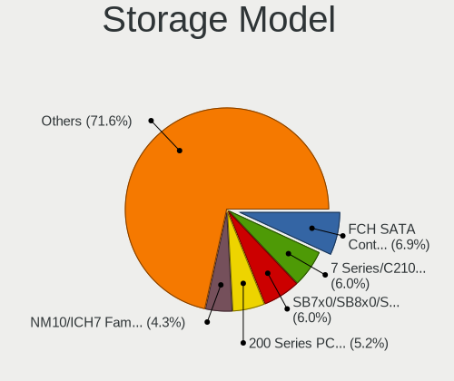
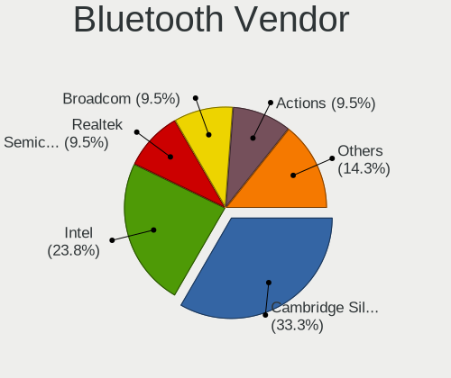

ROSA - Hardware Trends (Desktops)
---------------------------------

A project to identify most popular hardware characteristics and track their change
over time based on data collected by Linux users at https://Linux-Hardware.org.

Anyone can contribute to this report by the [hw-probe](https://github.com/linuxhw/hw-probe) tool:

    sudo -E hw-probe -all -upload

This report is for one last month. Overall report since the beginning of time: [TestCoverage](https://github.com/linuxhw/TestCoverage)

Period: Nov, 2022.

Contents
--------

* [ System ](#system)
  - [ OS                       ](#os)
  - [ OS Family                ](#os-family)
  - [ Kernel                   ](#kernel)
  - [ Kernel Family            ](#kernel-family)
  - [ Kernel Major Ver.        ](#kernel-major-ver)
  - [ Arch                     ](#arch)
  - [ DE                       ](#de)
  - [ Display Server           ](#display-server)
  - [ Display Manager          ](#display-manager)
  - [ OS Lang                  ](#os-lang)
  - [ Boot Mode                ](#boot-mode)
  - [ Filesystem               ](#filesystem)
  - [ Part. scheme             ](#part-scheme)
  - [ Dual Boot with Linux/BSD ](#dual-boot-with-linuxbsd)
  - [ Dual Boot (Win)          ](#dual-boot-win)

* [ Board ](#board)
  - [ Vendor                   ](#vendor)
  - [ Model                    ](#model)
  - [ Model Family             ](#model-family)
  - [ MFG Year                 ](#mfg-year)
  - [ Form Factor              ](#form-factor)
  - [ Secure Boot              ](#secure-boot)
  - [ Coreboot                 ](#coreboot)
  - [ RAM Size                 ](#ram-size)
  - [ RAM Used                 ](#ram-used)
  - [ Total Drives             ](#total-drives)
  - [ Has CD-ROM               ](#has-cd-rom)
  - [ Has Ethernet             ](#has-ethernet)
  - [ Has WiFi                 ](#has-wifi)
  - [ Has Bluetooth            ](#has-bluetooth)

* [ Location ](#location)
  - [ Country                  ](#country)
  - [ City                     ](#city)

* [ Drives ](#drives)
  - [ Drive Vendor             ](#drive-vendor)
  - [ Drive Model              ](#drive-model)
  - [ HDD Vendor               ](#hdd-vendor)
  - [ SSD Vendor               ](#ssd-vendor)
  - [ Drive Kind               ](#drive-kind)
  - [ Drive Connector          ](#drive-connector)
  - [ Drive Size               ](#drive-size)
  - [ Space Total              ](#space-total)
  - [ Space Used               ](#space-used)
  - [ Malfunc. Drives          ](#malfunc-drives)
  - [ Malfunc. Drive Vendor    ](#malfunc-drive-vendor)
  - [ Malfunc. HDD Vendor      ](#malfunc-hdd-vendor)
  - [ Malfunc. Drive Kind      ](#malfunc-drive-kind)
  - [ Failed Drives            ](#failed-drives)
  - [ Failed Drive Vendor      ](#failed-drive-vendor)
  - [ Drive Status             ](#drive-status)

* [ Storage controller ](#storage-controller)
  - [ Storage Vendor           ](#storage-vendor)
  - [ Storage Model            ](#storage-model)
  - [ Storage Kind             ](#storage-kind)

* [ Processor ](#processor)
  - [ CPU Vendor               ](#cpu-vendor)
  - [ CPU Model                ](#cpu-model)
  - [ CPU Model Family         ](#cpu-model-family)
  - [ CPU Cores                ](#cpu-cores)
  - [ CPU Sockets              ](#cpu-sockets)
  - [ CPU Threads              ](#cpu-threads)
  - [ CPU Op-Modes             ](#cpu-op-modes)
  - [ CPU Microcode            ](#cpu-microcode)
  - [ CPU Microarch            ](#cpu-microarch)

* [ Graphics ](#graphics)
  - [ GPU Vendor               ](#gpu-vendor)
  - [ GPU Model                ](#gpu-model)
  - [ GPU Combo                ](#gpu-combo)
  - [ GPU Driver               ](#gpu-driver)
  - [ GPU Memory               ](#gpu-memory)

* [ Monitor ](#monitor)
  - [ Monitor Vendor           ](#monitor-vendor)
  - [ Monitor Model            ](#monitor-model)
  - [ Monitor Resolution       ](#monitor-resolution)
  - [ Monitor Diagonal         ](#monitor-diagonal)
  - [ Monitor Width            ](#monitor-width)
  - [ Aspect Ratio             ](#aspect-ratio)
  - [ Monitor Area             ](#monitor-area)
  - [ Pixel Density            ](#pixel-density)
  - [ Multiple Monitors        ](#multiple-monitors)

* [ Network ](#network)
  - [ Net Controller Vendor    ](#net-controller-vendor)
  - [ Net Controller Model     ](#net-controller-model)
  - [ Wireless Vendor          ](#wireless-vendor)
  - [ Wireless Model           ](#wireless-model)
  - [ Ethernet Vendor          ](#ethernet-vendor)
  - [ Ethernet Model           ](#ethernet-model)
  - [ Net Controller Kind      ](#net-controller-kind)
  - [ Used Controller          ](#used-controller)
  - [ NICs                     ](#nics)
  - [ IPv6                     ](#ipv6)

* [ Bluetooth ](#bluetooth)
  - [ Bluetooth Vendor         ](#bluetooth-vendor)
  - [ Bluetooth Model          ](#bluetooth-model)

* [ Sound ](#sound)
  - [ Sound Vendor             ](#sound-vendor)
  - [ Sound Model              ](#sound-model)

* [ Memory ](#memory)
  - [ Memory Vendor            ](#memory-vendor)
  - [ Memory Model             ](#memory-model)
  - [ Memory Kind              ](#memory-kind)
  - [ Memory Form Factor       ](#memory-form-factor)
  - [ Memory Size              ](#memory-size)
  - [ Memory Speed             ](#memory-speed)

* [ Printers & scanners ](#printers--scanners)
  - [ Printer Vendor           ](#printer-vendor)
  - [ Printer Model            ](#printer-model)
  - [ Scanner Vendor           ](#scanner-vendor)
  - [ Scanner Model            ](#scanner-model)

* [ Camera ](#camera)
  - [ Camera Vendor            ](#camera-vendor)
  - [ Camera Model             ](#camera-model)

* [ Security ](#security)
  - [ Fingerprint Vendor       ](#fingerprint-vendor)
  - [ Fingerprint Model        ](#fingerprint-model)
  - [ Chipcard Vendor          ](#chipcard-vendor)
  - [ Chipcard Model           ](#chipcard-model)

* [ Unsupported ](#unsupported)
  - [ Unsupported Devices      ](#unsupported-devices)
  - [ Unsupported Device Types ](#unsupported-device-types)

System
------

OS
--

Installed operating systems

| Name        | Desktops | Percent |
|-------------|----------|---------|
| ROSA 12.3   | 118      | 76.62%  |
| ROSA 12.2   | 21       | 13.64%  |
| ROSA R11.1  | 7        | 4.55%   |
| ROSA 12.1   | 4        | 2.6%    |
| ROSA R11    | 2        | 1.3%    |
| ROSA 2021.1 | 1        | 0.65%   |
| ROSA 12     | 1        | 0.65%   |

OS Family
---------

OS without a version

| Name | Desktops | Percent |
|------|----------|---------|
| ROSA | 154      | 100%    |

Kernel
------

Version of the Linux kernel

| Version                                  | Desktops | Percent |
|------------------------------------------|----------|---------|
| 5.15.75-generic-1rosa2021.1-x86_64       | 43       | 27.92%  |
| 5.15.77-generic-1rosa2021.1-x86_64       | 30       | 19.48%  |
| 5.10.150-generic-1rosa2021.1-x86_64      | 26       | 16.88%  |
| 5.10.74-generic-2rosa2021.1-x86_64       | 19       | 12.34%  |
| 5.17.11-generic-2rosa2021.1-x86_64       | 6        | 3.9%    |
| 6.0.6.xm1-2.klp-xanmod-rosa2021.1-x86_64 | 3        | 1.95%   |
| 5.10.118-generic-2rosa2021.1-x86_64      | 3        | 1.95%   |
| 6.1.0-generic-0.rc5.1rosa2021.1-x86_64   | 2        | 1.3%    |
| 6.0.7.xm1-1.klp-xanmod-rosa2021.1-x86_64 | 2        | 1.3%    |
| 6.0.6.xm1-1.klp-xanmod-rosa2021.1-x86_64 | 2        | 1.3%    |
| 5.18.18.xm1-1-xanmod-rosa2021.1-x86_64   | 2        | 1.3%    |
| 5.15.75-generic-1rosa2021.1-i686         | 2        | 1.3%    |
| 5.10.71-generic-1rosa2021.1-x86_64       | 2        | 1.3%    |
| 5.10.150-generic-1rosa2021.1-i586        | 2        | 1.3%    |
| 4.15.0-desktop-45.1rosa-i586             | 2        | 1.3%    |
| 4.15.0-desktop-122.124.1rosa-i586        | 2        | 1.3%    |
| 6.0.3.xm1-1.klp-xanmod-rosa2021.1-x86_64 | 1        | 0.65%   |
| 5.4.83-generic-2rosa-x86_64              | 1        | 0.65%   |
| 5.4.83-generic-2rosa-i586                | 1        | 0.65%   |
| 5.4.32-generic-2rosa-x86_64              | 1        | 0.65%   |
| 4.9.155-nrj-desktop-1rosa-i586           | 1        | 0.65%   |
| 4.15.0-desktop-122.124.1rosa-x86_64      | 1        | 0.65%   |

Kernel Family
-------------

Linux kernel without a distro release

| Version  | Desktops | Percent |
|----------|----------|---------|
| 5.15.75  | 45       | 29.22%  |
| 5.15.77  | 30       | 19.48%  |
| 5.10.150 | 28       | 18.18%  |
| 5.10.74  | 19       | 12.34%  |
| 5.17.11  | 6        | 3.9%    |
| 6.0.6    | 5        | 3.25%   |
| 4.15.0   | 5        | 3.25%   |
| 5.10.118 | 3        | 1.95%   |
| 6.1.0    | 2        | 1.3%    |
| 6.0.7    | 2        | 1.3%    |
| 5.4.83   | 2        | 1.3%    |
| 5.18.18  | 2        | 1.3%    |
| 5.10.71  | 2        | 1.3%    |
| 6.0.3    | 1        | 0.65%   |
| 5.4.32   | 1        | 0.65%   |
| 4.9.155  | 1        | 0.65%   |

Kernel Major Ver.
-----------------

Linux kernel major version

| Version | Desktops | Percent |
|---------|----------|---------|
| 5.15    | 75       | 48.7%   |
| 5.10    | 52       | 33.77%  |
| 6.0     | 8        | 5.19%   |
| 5.17    | 6        | 3.9%    |
| 4.15    | 5        | 3.25%   |
| 5.4     | 3        | 1.95%   |
| 6.1     | 2        | 1.3%    |
| 5.18    | 2        | 1.3%    |
| 4.9     | 1        | 0.65%   |

Arch
----

OS architecture (x86_64, i586, etc.)

| Name   | Desktops | Percent |
|--------|----------|---------|
| x86_64 | 144      | 93.51%  |
| i686   | 10       | 6.49%   |

DE
--

Desktop Environment

| Name    | Desktops | Percent |
|---------|----------|---------|
| KDE5    | 82       | 53.25%  |
| GNOME   | 54       | 35.06%  |
| LXQt    | 8        | 5.19%   |
| KDE4    | 7        | 4.55%   |
| Unknown | 2        | 1.3%    |
| MATE    | 1        | 0.65%   |

Display Server
--------------

X11 or Wayland

| Name    | Desktops | Percent |
|---------|----------|---------|
| Wayland | 117      | 75.97%  |
| X11     | 37       | 24.03%  |

Display Manager
---------------

SDDM, LightDM, etc.

| Name    | Desktops | Percent |
|---------|----------|---------|
| SDDM    | 77       | 50%     |
| GDM     | 63       | 40.91%  |
| KDM     | 7        | 4.55%   |
| LightDM | 4        | 2.6%    |
| Unknown | 3        | 1.95%   |

OS Lang
-------

Language

| Lang    | Desktops | Percent |
|---------|----------|---------|
| ru_RU   | 140      | 90.91%  |
| en_US   | 3        | 1.95%   |
| Unknown | 2        | 1.3%    |
| sr_ME   | 1        | 0.65%   |
| sk_SK   | 1        | 0.65%   |
| ru_UA   | 1        | 0.65%   |
| ro_RO   | 1        | 0.65%   |
| pt_PT   | 1        | 0.65%   |
| pt_BR   | 1        | 0.65%   |
| it_IT   | 1        | 0.65%   |
| fr_FR   | 1        | 0.65%   |
| de_DE   | 1        | 0.65%   |

Boot Mode
---------

EFI or BIOS

| Mode | Desktops | Percent |
|------|----------|---------|
| BIOS | 79       | 51.3%   |
| EFI  | 75       | 48.7%   |

Filesystem
----------

Type of filesystem

| Type  | Desktops | Percent |
|-------|----------|---------|
| Ext4  | 143      | 92.86%  |
| Btrfs | 8        | 5.19%   |
| F2fs  | 2        | 1.3%    |
| Ext2  | 1        | 0.65%   |

Part. scheme
------------

Scheme of partitioning

| Type    | Desktops | Percent |
|---------|----------|---------|
| GPT     | 95       | 61.69%  |
| MBR     | 58       | 37.66%  |
| Unknown | 1        | 0.65%   |

Dual Boot with Linux/BSD
------------------------

Hosting more than one Linux/BSD

| Dual boot | Desktops | Percent |
|-----------|----------|---------|
| No        | 100      | 64.94%  |
| Yes       | 54       | 35.06%  |

Dual Boot (Win)
---------------

Hosting Linux and Windows

| Dual boot | Desktops | Percent |
|-----------|----------|---------|
| Yes       | 91       | 59.09%  |
| No        | 63       | 40.91%  |

Board
-----

Vendor
------

Motherboard manufacturer

| Name                | Desktops | Percent |
|---------------------|----------|---------|
| ASUSTek Computer    | 56       | 36.36%  |
| Gigabyte Technology | 28       | 18.18%  |
| MSI                 | 21       | 13.64%  |
| ASRock              | 14       | 9.09%   |
| Unknown             | 6        | 3.9%    |
| Intel               | 5        | 3.25%   |
| Hewlett-Packard     | 3        | 1.95%   |
| ECS                 | 3        | 1.95%   |
| Biostar             | 3        | 1.95%   |
| Pegatron            | 2        | 1.3%    |
| Lenovo              | 2        | 1.3%    |
| Huanan              | 2        | 1.3%    |
| Dell                | 2        | 1.3%    |
| Acer                | 2        | 1.3%    |
| Sapphire            | 1        | 0.65%   |
| MACHINIST           | 1        | 0.65%   |
| JGINYUE             | 1        | 0.65%   |
| Fujitsu             | 1        | 0.65%   |
| Foxconn             | 1        | 0.65%   |

Model
-----

Motherboard model

| Name                                                           | Desktops | Percent |
|----------------------------------------------------------------|----------|---------|
| Unknown                                                        | 6        | 3.9%    |
| ASUS All Series                                                | 5        | 3.25%   |
| Gigabyte B450 AORUS ELITE                                      | 3        | 1.95%   |
| Intel H81                                                      | 2        | 1.3%    |
| Gigabyte A320M-H                                               | 2        | 1.3%    |
| ASUS PRIME H510M-K                                             | 2        | 1.3%    |
| ASUS PRIME B450M-A                                             | 2        | 1.3%    |
| ASUS P5KPL-AM EPU                                              | 2        | 1.3%    |
| ASUS P5K                                                       | 2        | 1.3%    |
| ASRock H55M-LE                                                 | 2        | 1.3%    |
| Sapphire IPC-E350M1                                            | 1        | 0.65%   |
| Pegatron Pro 3010 Microtower PC                                | 1        | 0.65%   |
| Pegatron Compaq dx2400 Microtower                              | 1        | 0.65%   |
| MSI MS-7D82                                                    | 1        | 0.65%   |
| MSI MS-7C84                                                    | 1        | 0.65%   |
| MSI MS-7C51                                                    | 1        | 0.65%   |
| MSI MS-7B93                                                    | 1        | 0.65%   |
| MSI MS-7B89                                                    | 1        | 0.65%   |
| MSI MS-7B87                                                    | 1        | 0.65%   |
| MSI MS-7B79                                                    | 1        | 0.65%   |
| MSI MS-7B47                                                    | 1        | 0.65%   |
| MSI MS-7B24                                                    | 1        | 0.65%   |
| MSI MS-7B17                                                    | 1        | 0.65%   |
| MSI MS-7A33                                                    | 1        | 0.65%   |
| MSI MS-7978                                                    | 1        | 0.65%   |
| MSI MS-7817                                                    | 1        | 0.65%   |
| MSI MS-7816                                                    | 1        | 0.65%   |
| MSI MS-7788                                                    | 1        | 0.65%   |
| MSI MS-7680                                                    | 1        | 0.65%   |
| MSI MS-7673                                                    | 1        | 0.65%   |
| MSI MS-7368                                                    | 1        | 0.65%   |
| MSI MS-7360                                                    | 1        | 0.65%   |
| MSI MS-7309                                                    | 1        | 0.65%   |
| MSI ELEMENT 5300/250                                           | 1        | 0.65%   |
| MACHINIST X99-RS9 V3.1                                         | 1        | 0.65%   |
| Lenovo ThinkCentre M80t 11EKS00P00                             | 1        | 0.65%   |
| Lenovo H420                                                    | 1        | 0.65%   |
| JGINYUE B660M-VDH                                              | 1        | 0.65%   |
| Intel X79 (INTEL Xeon E5/Corei7 DMI2 - C600/C200 Cipset V3.2S1 | 1        | 0.65%   |
| Intel X79                                                      | 1        | 0.65%   |

Model Family
------------

Motherboard model prefix

| Name                | Desktops | Percent |
|---------------------|----------|---------|
| ASUS PRIME          | 12       | 7.79%   |
| Unknown             | 6        | 3.9%    |
| ASUS All            | 5        | 3.25%   |
| Gigabyte B450       | 4        | 2.6%    |
| ASUS P5KPL-AM       | 3        | 1.95%   |
| ASUS P5K            | 3        | 1.95%   |
| ASUS M5A78L-M       | 3        | 1.95%   |
| Intel X79           | 2        | 1.3%    |
| Intel H81           | 2        | 1.3%    |
| Gigabyte B550       | 2        | 1.3%    |
| Gigabyte A320M-H    | 2        | 1.3%    |
| ASUS TUF            | 2        | 1.3%    |
| ASUS M5A78L         | 2        | 1.3%    |
| ASRock H55M-LE      | 2        | 1.3%    |
| Sapphire IPC-E350M1 | 1        | 0.65%   |
| Pegatron Pro        | 1        | 0.65%   |
| Pegatron Compaq     | 1        | 0.65%   |
| MSI MS-7D82         | 1        | 0.65%   |
| MSI MS-7C84         | 1        | 0.65%   |
| MSI MS-7C51         | 1        | 0.65%   |
| MSI MS-7B93         | 1        | 0.65%   |
| MSI MS-7B89         | 1        | 0.65%   |
| MSI MS-7B87         | 1        | 0.65%   |
| MSI MS-7B79         | 1        | 0.65%   |
| MSI MS-7B47         | 1        | 0.65%   |
| MSI MS-7B24         | 1        | 0.65%   |
| MSI MS-7B17         | 1        | 0.65%   |
| MSI MS-7A33         | 1        | 0.65%   |
| MSI MS-7978         | 1        | 0.65%   |
| MSI MS-7817         | 1        | 0.65%   |
| MSI MS-7816         | 1        | 0.65%   |
| MSI MS-7788         | 1        | 0.65%   |
| MSI MS-7680         | 1        | 0.65%   |
| MSI MS-7673         | 1        | 0.65%   |
| MSI MS-7368         | 1        | 0.65%   |
| MSI MS-7360         | 1        | 0.65%   |
| MSI MS-7309         | 1        | 0.65%   |
| MSI ELEMENT         | 1        | 0.65%   |
| MACHINIST X99-RS9   | 1        | 0.65%   |
| Lenovo ThinkCentre  | 1        | 0.65%   |

MFG Year
--------

Motherboard manufacture year

| Year | Desktops | Percent |
|------|----------|---------|
| 2012 | 17       | 11.04%  |
| 2018 | 16       | 10.39%  |
| 2020 | 14       | 9.09%   |
| 2009 | 13       | 8.44%   |
| 2013 | 12       | 7.79%   |
| 2011 | 12       | 7.79%   |
| 2019 | 11       | 7.14%   |
| 2021 | 9        | 5.84%   |
| 2017 | 9        | 5.84%   |
| 2010 | 9        | 5.84%   |
| 2016 | 8        | 5.19%   |
| 2007 | 7        | 4.55%   |
| 2008 | 5        | 3.25%   |
| 2015 | 4        | 2.6%    |
| 2014 | 4        | 2.6%    |
| 2022 | 3        | 1.95%   |
| 2005 | 1        | 0.65%   |

Form Factor
-----------

Physical design of the computer

| Name    | Desktops | Percent |
|---------|----------|---------|
| Desktop | 154      | 100%    |

Secure Boot
-----------

Enabled or disabled

| State    | Desktops | Percent |
|----------|----------|---------|
| Disabled | 154      | 100%    |

Coreboot
--------

Have coreboot on board

| Used | Desktops | Percent |
|------|----------|---------|
| No   | 154      | 100%    |

RAM Size
--------

Total RAM memory

| Size in GB  | Desktops | Percent |
|-------------|----------|---------|
| 16.01-24.0  | 43       | 27.92%  |
| 8.01-16.0   | 32       | 20.78%  |
| 3.01-4.0    | 27       | 17.53%  |
| 4.01-8.0    | 21       | 13.64%  |
| 32.01-64.0  | 18       | 11.69%  |
| 1.01-2.0    | 6        | 3.9%    |
| 2.01-3.0    | 4        | 2.6%    |
| 64.01-256.0 | 2        | 1.3%    |
| 24.01-32.0  | 1        | 0.65%   |

RAM Used
--------

Used RAM memory

| Used GB   | Desktops | Percent |
|-----------|----------|---------|
| 1.01-2.0  | 84       | 54.55%  |
| 0.51-1.0  | 31       | 20.13%  |
| 2.01-3.0  | 27       | 17.53%  |
| 4.01-8.0  | 5        | 3.25%   |
| 3.01-4.0  | 5        | 3.25%   |
| 8.01-16.0 | 1        | 0.65%   |
| 0.01-0.5  | 1        | 0.65%   |

Total Drives
------------

Number of drives on board

| Drives | Desktops | Percent |
|--------|----------|---------|
| 1      | 52       | 33.77%  |
| 2      | 49       | 31.82%  |
| 3      | 28       | 18.18%  |
| 4      | 17       | 11.04%  |
| 5      | 5        | 3.25%   |
| 6      | 3        | 1.95%   |

Has CD-ROM
----------

Has CD-ROM on board

| Presented | Desktops | Percent |
|-----------|----------|---------|
| No        | 102      | 66.23%  |
| Yes       | 52       | 33.77%  |

Has Ethernet
------------

Has Ethernet on board

| Presented | Desktops | Percent |
|-----------|----------|---------|
| Yes       | 153      | 99.35%  |
| No        | 1        | 0.65%   |

Has WiFi
--------

Has WiFi module

| Presented | Desktops | Percent |
|-----------|----------|---------|
| No        | 100      | 64.94%  |
| Yes       | 54       | 35.06%  |

Has Bluetooth
-------------

Has Bluetooth module

| Presented | Desktops | Percent |
|-----------|----------|---------|
| No        | 115      | 74.68%  |
| Yes       | 39       | 25.32%  |

Location
--------

Country
-------

Geographic location (country)

| Country    | Desktops | Percent |
|------------|----------|---------|
| Russia     | 134      | 87.01%  |
| Ukraine    | 4        | 2.6%    |
| Germany    | 4        | 2.6%    |
| Kazakhstan | 3        | 1.95%   |
| Brazil     | 2        | 1.3%    |
| Tunisia    | 1        | 0.65%   |
| Slovakia   | 1        | 0.65%   |
| Montenegro | 1        | 0.65%   |
| Moldova    | 1        | 0.65%   |
| Italy      | 1        | 0.65%   |
| France     | 1        | 0.65%   |
| Czechia    | 1        | 0.65%   |

City
----

Geographic location (city)

| City            | Desktops | Percent |
|-----------------|----------|---------|
| Moscow          | 20       | 12.99%  |
| St Petersburg   | 9        | 5.84%   |
| Yekaterinburg   | 6        | 3.9%    |
| Ufa             | 5        | 3.25%   |
| Rostov-on-Don   | 5        | 3.25%   |
| Voronezh        | 4        | 2.6%    |
| Novosibirsk     | 4        | 2.6%    |
| Krasnoyarsk     | 4        | 2.6%    |
| Krasnodar       | 4        | 2.6%    |
| Novokuznetsk    | 3        | 1.95%   |
| Irkutsk         | 3        | 1.95%   |
| Vladivostok     | 2        | 1.3%    |
| Tyumen          | 2        | 1.3%    |
| Tolyatti        | 2        | 1.3%    |
| Tambov          | 2        | 1.3%    |
| Sterlitamak     | 2        | 1.3%    |
| Stavropol       | 2        | 1.3%    |
| Smolensk        | 2        | 1.3%    |
| Samara          | 2        | 1.3%    |
| Petrozavodsk    | 2        | 1.3%    |
| Omsk            | 2        | 1.3%    |
| Kazan’        | 2        | 1.3%    |
| Chelyabinsk     | 2        | 1.3%    |
| Bryansk         | 2        | 1.3%    |
| Yoshkar-Ola     | 1        | 0.65%   |
| Yevpatoriya     | 1        | 0.65%   |
| Yalta           | 1        | 0.65%   |
| Yakutsk         | 1        | 0.65%   |
| Winkel          | 1        | 0.65%   |
| Vozhega         | 1        | 0.65%   |
| Volzhskiy       | 1        | 0.65%   |
| Volgograd       | 1        | 0.65%   |
| Veliky Novgorod | 1        | 0.65%   |
| Velikiy Ustyug  | 1        | 0.65%   |
| Utash           | 1        | 0.65%   |
| Ulyanovsk       | 1        | 0.65%   |
| Ukhta           | 1        | 0.65%   |
| Tyumentsevo     | 1        | 0.65%   |
| Tunis           | 1        | 0.65%   |
| Tula            | 1        | 0.65%   |

Drives
------

Drive Vendor
------------

Hard drive vendors

| Vendor                      | Desktops | Drives | Percent |
|-----------------------------|----------|--------|---------|
| WDC                         | 61       | 85     | 20.68%  |
| Seagate                     | 56       | 66     | 18.98%  |
| Samsung Electronics         | 32       | 39     | 10.85%  |
| Toshiba                     | 21       | 22     | 7.12%   |
| Kingston                    | 21       | 22     | 7.12%   |
| Hitachi                     | 16       | 17     | 5.42%   |
| SanDisk                     | 7        | 7      | 2.37%   |
| China                       | 7        | 8      | 2.37%   |
| A-DATA Technology           | 7        | 7      | 2.37%   |
| Apacer                      | 5        | 5      | 1.69%   |
| AMD                         | 5        | 5      | 1.69%   |
| SPCC                        | 4        | 4      | 1.36%   |
| Patriot                     | 4        | 4      | 1.36%   |
| Unknown                     | 3        | 3      | 1.02%   |
| Silicon Motion              | 3        | 3      | 1.02%   |
| Intel                       | 3        | 3      | 1.02%   |
| Gigabyte Technology         | 3        | 3      | 1.02%   |
| XrayDisk                    | 2        | 2      | 0.68%   |
| XPG                         | 2        | 2      | 0.68%   |
| Transcend                   | 2        | 2      | 0.68%   |
| OCZ                         | 2        | 3      | 0.68%   |
| Netac                       | 2        | 2      | 0.68%   |
| Maxtor                      | 2        | 2      | 0.68%   |
| KingSpec                    | 2        | 2      | 0.68%   |
| Kingmax                     | 2        | 2      | 0.68%   |
| KingDian                    | 2        | 2      | 0.68%   |
| Crucial                     | 2        | 3      | 0.68%   |
| Verbatim                    | 1        | 1      | 0.34%   |
| Team                        | 1        | 1      | 0.34%   |
| SK hynix                    | 1        | 1      | 0.34%   |
| Plextor                     | 1        | 2      | 0.34%   |
| Pioneer                     | 1        | 1      | 0.34%   |
| Neo Forza                   | 1        | 1      | 0.34%   |
| MAXIO Technology (Hangzhou) | 1        | 1      | 0.34%   |
| Kllisre                     | 1        | 1      | 0.34%   |
| Kimtigo                     | 1        | 1      | 0.34%   |
| HS-SSD-E100                 | 1        | 1      | 0.34%   |
| HS-SSD-C100                 | 1        | 1      | 0.34%   |
| HGST                        | 1        | 1      | 0.34%   |
| GOODRAM                     | 1        | 1      | 0.34%   |

Drive Model
-----------

Hard drive models

| Model                            | Desktops | Percent |
|----------------------------------|----------|---------|
| Seagate ST1000DM010-2EP102 1TB   | 9        | 2.69%   |
| Kingston SA400S37240G 240GB SSD  | 6        | 1.8%    |
| Samsung SSD 860 EVO 250GB        | 5        | 1.5%    |
| Toshiba DT01ACA100 1TB           | 4        | 1.2%    |
| Seagate ST3160815AS 160GB        | 4        | 1.2%    |
| Seagate ST2000DM008-2FR102 2TB   | 4        | 1.2%    |
| Kingston SA400S37480G 480GB SSD  | 4        | 1.2%    |
| WDC WDS240G2G0A-00JH30 240GB SSD | 3        | 0.9%    |
| WDC WD10EZEX-08WN4A0 1TB         | 3        | 0.9%    |
| WDC WD10EZEX-08M2NA0 1TB         | 3        | 0.9%    |
| Toshiba HDWD120 2TB              | 3        | 0.9%    |
| Toshiba DT01ACA050 500GB         | 3        | 0.9%    |
| Seagate ST3500418AS 500GB        | 3        | 0.9%    |
| Seagate ST3250410AS 250GB        | 3        | 0.9%    |
| Seagate ST2000DM008-2UB102 2TB   | 3        | 0.9%    |
| SanDisk SDSSDA120G 120GB         | 3        | 0.9%    |
| Samsung SSD 980 250GB            | 3        | 0.9%    |
| Samsung SSD 860 EVO 500GB        | 3        | 0.9%    |
| Hitachi HDS5C1050CLA382 500GB    | 3        | 0.9%    |
| XPG GAMMIX S5 512GB              | 2        | 0.6%    |
| WDC WDS120G2G0A-00JH30 120GB SSD | 2        | 0.6%    |
| WDC WD5000LPVX-55V0TT0 500GB     | 2        | 0.6%    |
| WDC WD5000AAKS-00V1A0 500GB      | 2        | 0.6%    |
| WDC WD20EZAZ-00L9GB0 2TB         | 2        | 0.6%    |
| WDC WD20EARS-00S8B1 2TB          | 2        | 0.6%    |
| WDC WD10EZRX-00A8LB0 1TB         | 2        | 0.6%    |
| WDC WD10EZEX-60WN4A0 1TB         | 2        | 0.6%    |
| WDC WD10EZEX-00BBHA0 1TB         | 2        | 0.6%    |
| Unknown SD/MMC/MS PRO 8GB        | 2        | 0.6%    |
| Toshiba HDWD110 1TB              | 2        | 0.6%    |
| Toshiba HDWD105 500GB            | 2        | 0.6%    |
| SPCC Solid State Disk 128GB      | 2        | 0.6%    |
| Silicon Motion NE-256 256GB      | 2        | 0.6%    |
| Seagate ST500DM002-1SB10A 500GB  | 2        | 0.6%    |
| Seagate ST500DM002-1BD142 500GB  | 2        | 0.6%    |
| Seagate ST500DM002-1BC142 500GB  | 2        | 0.6%    |
| Seagate ST3320613AS 320GB        | 2        | 0.6%    |
| Seagate ST3320418AS 320GB        | 2        | 0.6%    |
| Seagate ST3250310AS 250GB        | 2        | 0.6%    |
| Seagate ST250DM000-1BD141 250GB  | 2        | 0.6%    |

HDD Vendor
----------

Hard disk drive vendors

| Vendor              | Desktops | Drives | Percent |
|---------------------|----------|--------|---------|
| WDC                 | 57       | 75     | 34.97%  |
| Seagate             | 55       | 65     | 33.74%  |
| Toshiba             | 21       | 22     | 12.88%  |
| Hitachi             | 16       | 17     | 9.82%   |
| Samsung Electronics | 7        | 7      | 4.29%   |
| Unknown             | 2        | 2      | 1.23%   |
| Maxtor              | 2        | 2      | 1.23%   |
| HGST                | 1        | 1      | 0.61%   |
| ASMT                | 1        | 2      | 0.61%   |
| Unknown             | 1        | 1      | 0.61%   |

SSD Vendor
----------

Solid state drive vendors

| Vendor              | Desktops | Drives | Percent |
|---------------------|----------|--------|---------|
| Kingston            | 19       | 19     | 19.19%  |
| Samsung Electronics | 13       | 15     | 13.13%  |
| WDC                 | 7        | 7      | 7.07%   |
| SanDisk             | 7        | 7      | 7.07%   |
| China               | 7        | 8      | 7.07%   |
| A-DATA Technology   | 5        | 5      | 5.05%   |
| SPCC                | 4        | 4      | 4.04%   |
| Patriot             | 4        | 4      | 4.04%   |
| Apacer              | 4        | 4      | 4.04%   |
| AMD                 | 3        | 3      | 3.03%   |
| OCZ                 | 2        | 3      | 2.02%   |
| KingSpec            | 2        | 2      | 2.02%   |
| Kingmax             | 2        | 2      | 2.02%   |
| KingDian            | 2        | 2      | 2.02%   |
| Intel               | 2        | 2      | 2.02%   |
| Gigabyte Technology | 2        | 2      | 2.02%   |
| XrayDisk            | 1        | 1      | 1.01%   |
| Verbatim            | 1        | 1      | 1.01%   |
| Unknown             | 1        | 1      | 1.01%   |
| Team                | 1        | 1      | 1.01%   |
| Plextor             | 1        | 1      | 1.01%   |
| Pioneer             | 1        | 1      | 1.01%   |
| Netac               | 1        | 1      | 1.01%   |
| Neo Forza           | 1        | 1      | 1.01%   |
| Kimtigo             | 1        | 1      | 1.01%   |
| HS-SSD-E100         | 1        | 1      | 1.01%   |
| HS-SSD-C100         | 1        | 1      | 1.01%   |
| GOODRAM             | 1        | 1      | 1.01%   |
| Foxline             | 1        | 1      | 1.01%   |
| Crucial             | 1        | 2      | 1.01%   |

Drive Kind
----------

HDD or SSD

| Kind | Desktops | Drives | Percent |
|------|----------|--------|---------|
| HDD  | 128      | 194    | 51.41%  |
| SSD  | 80       | 104    | 32.13%  |
| NVMe | 41       | 46     | 16.47%  |

Drive Connector
---------------

SATA, SAS, NVMe, etc.

| Type | Desktops | Drives | Percent |
|------|----------|--------|---------|
| SATA | 150      | 294    | 77.32%  |
| NVMe | 41       | 46     | 21.13%  |
| SAS  | 3        | 4      | 1.55%   |

Drive Size
----------

Size of hard drive

| Size in TB | Desktops | Drives | Percent |
|------------|----------|--------|---------|
| 0.01-0.5   | 129      | 202    | 60.56%  |
| 0.51-1.0   | 55       | 65     | 25.82%  |
| 1.01-2.0   | 24       | 26     | 11.27%  |
| 2.01-3.0   | 4        | 4      | 1.88%   |
| 3.01-4.0   | 1        | 1      | 0.47%   |

Space Total
-----------

Amount of disk space available on the file system

| Size in GB     | Desktops | Percent |
|----------------|----------|---------|
| 101-250        | 50       | 32.47%  |
| 251-500        | 25       | 16.23%  |
| 501-1000       | 24       | 15.58%  |
| 1-20           | 18       | 11.69%  |
| 1001-2000      | 14       | 9.09%   |
| 51-100         | 7        | 4.55%   |
| More than 3000 | 6        | 3.9%    |
| 2001-3000      | 6        | 3.9%    |
| 21-50          | 4        | 2.6%    |

Space Used
----------

Amount of used disk space

| Used GB        | Desktops | Percent |
|----------------|----------|---------|
| 1-20           | 93       | 60.39%  |
| 21-50          | 11       | 7.14%   |
| 101-250        | 11       | 7.14%   |
| 1001-2000      | 10       | 6.49%   |
| 501-1000       | 10       | 6.49%   |
| 251-500        | 9        | 5.84%   |
| 51-100         | 8        | 5.19%   |
| More than 3000 | 2        | 1.3%    |

Malfunc. Drives
---------------

Drive models with a malfunction

| Model                            | Desktops | Drives | Percent |
|----------------------------------|----------|--------|---------|
| WDC WD5000AAKS-00V1A0 500GB      | 2        | 3      | 2.5%    |
| WDC WD20EARS-00S8B1 2TB          | 2        | 2      | 2.5%    |
| Seagate ST500DM002-1BD142 500GB  | 2        | 2      | 2.5%    |
| Seagate ST3500418AS 500GB        | 2        | 2      | 2.5%    |
| Seagate ST3320418AS 320GB        | 2        | 2      | 2.5%    |
| Seagate ST3250410AS 250GB        | 2        | 2      | 2.5%    |
| Hitachi HDS5C1050CLA382 500GB    | 2        | 2      | 2.5%    |
| XPG GAMMIX S5 512GB              | 1        | 1      | 1.25%   |
| WDC WDS480G2G0A-00JH30 480GB SSD | 1        | 1      | 1.25%   |
| WDC WD800BB-56JKC0 80GB          | 1        | 1      | 1.25%   |
| WDC WD5000LPVX-55V0TT0 500GB     | 1        | 1      | 1.25%   |
| WDC WD5000LPCX-21VHAT0 500GB     | 1        | 1      | 1.25%   |
| WDC WD5000BEVT-22A0RT0 500GB     | 1        | 1      | 1.25%   |
| WDC WD5000AAKX-001CA0 500GB      | 1        | 1      | 1.25%   |
| WDC WD5000AAKS-75A7B2 500GB      | 1        | 1      | 1.25%   |
| WDC WD5000AAKS-00UU3A0 500GB     | 1        | 1      | 1.25%   |
| WDC WD3200AAJS-22B4A0 320GB      | 1        | 1      | 1.25%   |
| WDC WD20EARX-00PASB0 2TB         | 1        | 1      | 1.25%   |
| WDC WD20EARS-00MVWB0 2TB         | 1        | 1      | 1.25%   |
| WDC WD1600JS-00NCB1 160GB        | 1        | 1      | 1.25%   |
| WDC WD15EARS-00Z5B1 1TB          | 1        | 1      | 1.25%   |
| WDC WD10JPVX-60JC3T0 1TB         | 1        | 1      | 1.25%   |
| WDC WD10EZRX-00A8LB0 1TB         | 1        | 1      | 1.25%   |
| WDC WD10EZEX-75WN4A0 1TB         | 1        | 1      | 1.25%   |
| WDC WD10EZEX-60WN4A0 1TB         | 1        | 1      | 1.25%   |
| WDC WD10EZEX-22MFCA0 1TB         | 1        | 1      | 1.25%   |
| WDC WD10EZEX-08WN4A0 1TB         | 1        | 2      | 1.25%   |
| WDC WD10EALX-009BA0 1TB          | 1        | 1      | 1.25%   |
| WDC WD1002FAEX-00Z3A0 1TB        | 1        | 1      | 1.25%   |
| Toshiba MQ01ABD100 1TB           | 1        | 1      | 1.25%   |
| Toshiba HDWD105 500GB            | 1        | 1      | 1.25%   |
| Toshiba DT01ACA100 1TB           | 1        | 1      | 1.25%   |
| Seagate ST9160821AS 160GB        | 1        | 1      | 1.25%   |
| Seagate ST500DM005 HD502HJ 500GB | 1        | 1      | 1.25%   |
| Seagate ST500DM002-1SB10A 500GB  | 1        | 1      | 1.25%   |
| Seagate ST500DM002-1BC142 500GB  | 1        | 1      | 1.25%   |
| Seagate ST3808110AS 80GB         | 1        | 1      | 1.25%   |
| Seagate ST3500413AS 500GB        | 1        | 1      | 1.25%   |
| Seagate ST340016A 40GB           | 1        | 1      | 1.25%   |
| Seagate ST3320613AS 320GB        | 1        | 1      | 1.25%   |

Malfunc. Drive Vendor
---------------------

Vendors of faulty drives

| Vendor              | Desktops | Drives | Percent |
|---------------------|----------|--------|---------|
| WDC                 | 24       | 27     | 31.17%  |
| Seagate             | 24       | 26     | 31.17%  |
| Hitachi             | 10       | 10     | 12.99%  |
| Samsung Electronics | 5        | 5      | 6.49%   |
| Toshiba             | 3        | 3      | 3.9%    |
| Maxtor              | 2        | 2      | 2.6%    |
| Kingmax             | 2        | 2      | 2.6%    |
| XPG                 | 1        | 1      | 1.3%    |
| Plextor             | 1        | 1      | 1.3%    |
| Kingston            | 1        | 1      | 1.3%    |
| KingSpec            | 1        | 1      | 1.3%    |
| Intel               | 1        | 1      | 1.3%    |
| AMD                 | 1        | 1      | 1.3%    |
| Unknown             | 1        | 1      | 1.3%    |

Malfunc. HDD Vendor
-------------------

Vendors of faulty HDD drives

| Vendor              | Desktops | Drives | Percent |
|---------------------|----------|--------|---------|
| Seagate             | 24       | 26     | 35.82%  |
| WDC                 | 23       | 26     | 34.33%  |
| Hitachi             | 10       | 10     | 14.93%  |
| Samsung Electronics | 4        | 4      | 5.97%   |
| Toshiba             | 3        | 3      | 4.48%   |
| Maxtor              | 2        | 2      | 2.99%   |
| Unknown             | 1        | 1      | 1.49%   |

Malfunc. Drive Kind
-------------------

Kinds of faulty drives

| Kind | Desktops | Drives | Percent |
|------|----------|--------|---------|
| HDD  | 61       | 72     | 85.92%  |
| SSD  | 7        | 7      | 9.86%   |
| NVMe | 3        | 3      | 4.23%   |

Failed Drives
-------------

Failed drive models

| Model                         | Desktops | Drives | Percent |
|-------------------------------|----------|--------|---------|
| Hitachi HDS721050DLE630 500GB | 1        | 1      | 100%    |

Failed Drive Vendor
-------------------

Failed drive vendors

| Vendor  | Desktops | Drives | Percent |
|---------|----------|--------|---------|
| Hitachi | 1        | 1      | 100%    |

Drive Status
------------

Number of failed and malfunc. drives

| Status   | Desktops | Drives | Percent |
|----------|----------|--------|---------|
| Works    | 125      | 253    | 62.5%   |
| Malfunc  | 69       | 82     | 34.5%   |
| Detected | 5        | 8      | 2.5%    |
| Failed   | 1        | 1      | 0.5%    |

Storage controller
------------------

Storage Vendor
--------------

Storage controller vendors

| Vendor                        | Desktops | Percent |
|-------------------------------|----------|---------|
| Intel                         | 96       | 45.71%  |
| AMD                           | 48       | 22.86%  |
| Samsung Electronics           | 16       | 7.62%   |
| Silicon Motion                | 10       | 4.76%   |
| Nvidia                        | 9        | 4.29%   |
| JMicron Technology            | 5        | 2.38%   |
| ASMedia Technology            | 4        | 1.9%    |
| SanDisk                       | 3        | 1.43%   |
| Kingston Technology Company   | 3        | 1.43%   |
| VIA Technologies              | 2        | 0.95%   |
| Realtek Semiconductor         | 2        | 0.95%   |
| Phison Electronics            | 2        | 0.95%   |
| ADATA Technology              | 2        | 0.95%   |
| SK hynix                      | 1        | 0.48%   |
| Seagate Technology            | 1        | 0.48%   |
| Netac Technology              | 1        | 0.48%   |
| Micron/Crucial Technology     | 1        | 0.48%   |
| MAXIO Technology (Hangzhou)   | 1        | 0.48%   |
| Marvell Technology Group      | 1        | 0.48%   |
| Lite-On Technology            | 1        | 0.48%   |
| Integrated Technology Express | 1        | 0.48%   |

Storage Model
-------------

Storage controller models

| Model                                                                                   | Desktops | Percent |
|-----------------------------------------------------------------------------------------|----------|---------|
| AMD FCH SATA Controller [AHCI mode]                                                     | 20       | 7.12%   |
| Intel 8 Series/C220 Series Chipset Family 6-port SATA Controller 1 [AHCI mode]          | 11       | 3.91%   |
| AMD SB7x0/SB8x0/SB9x0 IDE Controller                                                    | 11       | 3.91%   |
| AMD 400 Series Chipset SATA Controller                                                  | 11       | 3.91%   |
| Intel Q170/Q150/B150/H170/H110/Z170/CM236 Chipset SATA Controller [AHCI Mode]           | 10       | 3.56%   |
| Intel NM10/ICH7 Family SATA Controller [IDE mode]                                       | 9        | 3.2%    |
| Intel 82801G (ICH7 Family) IDE Controller                                               | 9        | 3.2%    |
| AMD SB7x0/SB8x0/SB9x0 SATA Controller [IDE mode]                                        | 9        | 3.2%    |
| Silicon Motion SM2263EN/SM2263XT SSD Controller                                         | 8        | 2.85%   |
| Samsung NVMe SSD Controller SM981/PM981/PM983                                           | 8        | 2.85%   |
| Nvidia MCP61 SATA Controller                                                            | 8        | 2.85%   |
| Nvidia MCP61 IDE                                                                        | 8        | 2.85%   |
| AMD 500 Series Chipset SATA Controller                                                  | 7        | 2.49%   |
| Samsung NVMe SSD Controller 980                                                         | 6        | 2.14%   |
| Intel 82801I (ICH9 Family) 2 port SATA Controller [IDE mode]                            | 6        | 2.14%   |
| Intel 7 Series/C210 Series Chipset Family 6-port SATA Controller [AHCI mode]            | 6        | 2.14%   |
| Intel 6 Series/C200 Series Chipset Family Desktop SATA Controller (IDE mode, ports 4-5) | 6        | 2.14%   |
| Intel 6 Series/C200 Series Chipset Family Desktop SATA Controller (IDE mode, ports 0-3) | 6        | 2.14%   |
| Intel 500 Series Chipset Family SATA AHCI Controller                                    | 6        | 2.14%   |
| Intel 200 Series PCH SATA controller [AHCI mode]                                        | 6        | 2.14%   |
| AMD SB7x0/SB8x0/SB9x0 SATA Controller [AHCI mode]                                       | 6        | 2.14%   |
| Intel SATA Controller [RAID mode]                                                       | 4        | 1.42%   |
| Intel Cannon Lake PCH SATA AHCI Controller                                              | 4        | 1.42%   |
| Intel 82801JI (ICH10 Family) 2 port SATA IDE Controller #2                              | 4        | 1.42%   |
| Intel 82801IB (ICH9) 2 port SATA Controller [IDE mode]                                  | 4        | 1.42%   |
| Intel 7 Series/C210 Series Chipset Family 4-port SATA Controller [IDE mode]             | 4        | 1.42%   |
| Intel 7 Series/C210 Series Chipset Family 2-port SATA Controller [IDE mode]             | 4        | 1.42%   |
| AMD FCH SATA Controller D                                                               | 4        | 1.42%   |
| JMicron JMB363 SATA/IDE Controller                                                      | 3        | 1.07%   |
| Intel 9 Series Chipset Family SATA Controller [AHCI Mode]                               | 3        | 1.07%   |
| Intel 82801JI (ICH10 Family) 4 port SATA IDE Controller #1                              | 3        | 1.07%   |
| Intel 6 Series/C200 Series Chipset Family 6 port Desktop SATA AHCI Controller           | 3        | 1.07%   |
| Intel 5 Series/3400 Series Chipset 4 port SATA IDE Controller                           | 3        | 1.07%   |
| Intel 5 Series/3400 Series Chipset 2 port SATA IDE Controller                           | 3        | 1.07%   |
| ASMedia ASM1062 Serial ATA Controller                                                   | 3        | 1.07%   |
| VIA VT6415 PATA IDE Host Controller                                                     | 2        | 0.71%   |
| Silicon Motion SM2262/SM2262EN SSD Controller                                           | 2        | 0.71%   |
| SanDisk WD Blue SN550 NVMe SSD                                                          | 2        | 0.71%   |
| Realtek Realtek Non-Volatile memory controller                                          | 2        | 0.71%   |
| Kingston Company SNVS2000G [NV1 NVMe PCIe SSD 2TB]                                      | 2        | 0.71%   |

Storage Kind
------------

Kind of storage controller (IDE, SATA, NVMe, SAS, ...)

| Kind | Desktops | Percent |
|------|----------|---------|
| SATA | 107      | 50.95%  |
| IDE  | 55       | 26.19%  |
| NVMe | 41       | 19.52%  |
| RAID | 7        | 3.33%   |

Processor
---------

CPU Vendor
----------

Processor vendors

| Vendor | Desktops | Percent |
|--------|----------|---------|
| Intel  | 97       | 62.99%  |
| AMD    | 57       | 37.01%  |

CPU Model
---------

Processor models

| Model                                       | Desktops | Percent |
|---------------------------------------------|----------|---------|
| AMD Ryzen 7 3700X 8-Core Processor          | 4        | 2.6%    |
| AMD Ryzen 5 2600 Six-Core Processor         | 4        | 2.6%    |
| AMD FX-6300 Six-Core Processor              | 4        | 2.6%    |
| Intel Core i5-7400 CPU @ 3.00GHz            | 3        | 1.95%   |
| Intel Core 2 Duo CPU E8400 @ 3.00GHz        | 3        | 1.95%   |
| AMD Athlon II X2 240 Processor              | 3        | 1.95%   |
| Intel Xeon CPU E5440 @ 2.83GHz              | 2        | 1.3%    |
| Intel Xeon CPU E3-1270 v3 @ 3.50GHz         | 2        | 1.3%    |
| Intel Pentium CPU G860 @ 3.00GHz            | 2        | 1.3%    |
| Intel Core i5-9400F CPU @ 2.90GHz           | 2        | 1.3%    |
| Intel Core i5-3330 CPU @ 3.00GHz            | 2        | 1.3%    |
| Intel Core i5-10400F CPU @ 2.90GHz          | 2        | 1.3%    |
| Intel Core i3-10100 CPU @ 3.60GHz           | 2        | 1.3%    |
| Intel Core i3 CPU 550 @ 3.20GHz             | 2        | 1.3%    |
| Intel Core 2 Duo CPU E8200 @ 2.66GHz        | 2        | 1.3%    |
| AMD Ryzen 7 2700X Eight-Core Processor      | 2        | 1.3%    |
| AMD Ryzen 3 3200G with Radeon Vega Graphics | 2        | 1.3%    |
| AMD FX-4300 Quad-Core Processor             | 2        | 1.3%    |
| AMD Athlon II X4 635 Processor              | 2        | 1.3%    |
| AMD Athlon II X2 250 Processor              | 2        | 1.3%    |
| AMD Athlon II X2 245 Processor              | 2        | 1.3%    |
| Intel Xeon CPU E5420 @ 2.50GHz              | 1        | 0.65%   |
| Intel Xeon CPU E5-2696 v3 @ 2.30GHz         | 1        | 0.65%   |
| Intel Xeon CPU E5-2690 0 @ 2.90GHz          | 1        | 0.65%   |
| Intel Xeon CPU E5-2678 v3 @ 2.50GHz         | 1        | 0.65%   |
| Intel Xeon CPU E5-2640 0 @ 2.50GHz          | 1        | 0.65%   |
| Intel Xeon CPU E5-2630 v3 @ 2.40GHz         | 1        | 0.65%   |
| Intel Xeon CPU E5-1650 0 @ 3.20GHz          | 1        | 0.65%   |
| Intel Xeon CPU E3-1245 v3 @ 3.40GHz         | 1        | 0.65%   |
| Intel Xeon CPU E3-1240 V2 @ 3.40GHz         | 1        | 0.65%   |
| Intel Pentium Gold G5400 CPU @ 3.70GHz      | 1        | 0.65%   |
| Intel Pentium Dual-Core CPU E5700 @ 3.00GHz | 1        | 0.65%   |
| Intel Pentium Dual-Core CPU E5400 @ 2.70GHz | 1        | 0.65%   |
| Intel Pentium Dual-Core CPU E5300 @ 2.60GHz | 1        | 0.65%   |
| Intel Pentium CPU J3710 @ 1.60GHz           | 1        | 0.65%   |
| Intel Pentium CPU G4600 @ 3.60GHz           | 1        | 0.65%   |
| Intel Pentium CPU G3220 @ 3.00GHz           | 1        | 0.65%   |
| Intel Pentium CPU G2120 @ 3.10GHz           | 1        | 0.65%   |
| Intel Pentium CPU G2030 @ 3.00GHz           | 1        | 0.65%   |
| Intel Genuine CPU 0000 @ 2.40GHz            | 1        | 0.65%   |

CPU Model Family
----------------

Processor model prefix

| Model                   | Desktops | Percent |
|-------------------------|----------|---------|
| Intel Core i5           | 29       | 18.83%  |
| Intel Core i3           | 14       | 9.09%   |
| Intel Xeon              | 13       | 8.44%   |
| Intel Core 2 Duo        | 12       | 7.79%   |
| AMD Ryzen 5             | 12       | 7.79%   |
| AMD FX                  | 11       | 7.14%   |
| Intel Core i7           | 9        | 5.84%   |
| AMD Ryzen 7             | 9        | 5.84%   |
| Intel Pentium           | 7        | 4.55%   |
| AMD Athlon II X2        | 7        | 4.55%   |
| Other                   | 3        | 1.95%   |
| Intel Pentium Dual-Core | 3        | 1.95%   |
| Intel Celeron           | 3        | 1.95%   |
| AMD Ryzen 3             | 3        | 1.95%   |
| Intel Core 2 Quad       | 2        | 1.3%    |
| AMD Athlon X2           | 2        | 1.3%    |
| AMD Athlon II X4        | 2        | 1.3%    |
| AMD A4                  | 2        | 1.3%    |
| Intel Pentium Gold      | 1        | 0.65%   |
| Intel Genuine           | 1        | 0.65%   |
| AMD Ryzen 9             | 1        | 0.65%   |
| AMD Ryzen 7 PRO         | 1        | 0.65%   |
| AMD Ryzen 3 PRO         | 1        | 0.65%   |
| AMD Phenom II X6        | 1        | 0.65%   |
| AMD Phenom II X4        | 1        | 0.65%   |
| AMD E                   | 1        | 0.65%   |
| AMD Athlon II X3        | 1        | 0.65%   |
| AMD Athlon 64           | 1        | 0.65%   |
| AMD A10                 | 1        | 0.65%   |

CPU Cores
---------

Number of processor cores

| Number | Desktops | Percent |
|--------|----------|---------|
| 4      | 50       | 32.47%  |
| 2      | 50       | 32.47%  |
| 6      | 28       | 18.18%  |
| 8      | 14       | 9.09%   |
| 3      | 5        | 3.25%   |
| 1      | 4        | 2.6%    |
| 24     | 1        | 0.65%   |
| 18     | 1        | 0.65%   |
| 12     | 1        | 0.65%   |

CPU Sockets
-----------

Number of sockets

| Number | Desktops | Percent |
|--------|----------|---------|
| 1      | 153      | 99.35%  |
| 2      | 1        | 0.65%   |

CPU Threads
-----------

Threads per core (Hyper-Threading)

| Number | Desktops | Percent |
|--------|----------|---------|
| 2      | 77       | 50%     |
| 1      | 77       | 50%     |

CPU Op-Modes
------------

CPU Operation Modes (32-bit, 64-bit)

| Op mode        | Desktops | Percent |
|----------------|----------|---------|
| 32-bit, 64-bit | 154      | 100%    |

CPU Microcode
-------------

Microcode number

| Number     | Desktops | Percent |
|------------|----------|---------|
| 0x306c3    | 13       | 8.44%   |
| 0x306a9    | 11       | 7.14%   |
| 0x1067a    | 11       | 7.14%   |
| 0x906ea    | 9        | 5.84%   |
| 0x08701021 | 9        | 5.84%   |
| 0xa0653    | 7        | 4.55%   |
| 0x906e9    | 6        | 3.9%    |
| 0x206a7    | 6        | 3.9%    |
| 0x0800820d | 6        | 3.9%    |
| 0x506e3    | 5        | 3.25%   |
| 0x10676    | 5        | 3.25%   |
| 0x010000c8 | 5        | 3.25%   |
| 0x08001138 | 4        | 2.6%    |
| 0x010000b6 | 4        | 2.6%    |
| 0x6fb      | 3        | 1.95%   |
| 0x306f2    | 3        | 1.95%   |
| 0x206d7    | 3        | 1.95%   |
| 0x20655    | 3        | 1.95%   |
| 0x08108109 | 3        | 1.95%   |
| 0x06001119 | 3        | 1.95%   |
| 0x06000852 | 3        | 1.95%   |
| 0x06000822 | 3        | 1.95%   |
| 0xa0671    | 2        | 1.3%    |
| 0x906ed    | 2        | 1.3%    |
| 0x6fd      | 2        | 1.3%    |
| 0x0600081c | 2        | 1.3%    |
| Unknown    | 2        | 1.3%    |
| 0xa0655    | 1        | 0.65%   |
| 0x90675    | 1        | 0.65%   |
| 0x706a8    | 1        | 0.65%   |
| 0x406c4    | 1        | 0.65%   |
| 0x30678    | 1        | 0.65%   |
| 0x20652    | 1        | 0.65%   |
| 0x0a50000d | 1        | 0.65%   |
| 0x0a20120a | 1        | 0.65%   |
| 0x0a201016 | 1        | 0.65%   |
| 0x08701013 | 1        | 0.65%   |
| 0x08001137 | 1        | 0.65%   |
| 0x06000817 | 1        | 0.65%   |
| 0x06000629 | 1        | 0.65%   |

CPU Microarch
-------------

Microarchitecture

| Name             | Desktops | Percent |
|------------------|----------|---------|
| KabyLake         | 17       | 11.04%  |
| Penryn           | 16       | 10.39%  |
| Haswell          | 16       | 10.39%  |
| Piledriver       | 13       | 8.44%   |
| K10              | 12       | 7.79%   |
| IvyBridge        | 11       | 7.14%   |
| Zen 2            | 10       | 6.49%   |
| Zen+             | 9        | 5.84%   |
| SandyBridge      | 9        | 5.84%   |
| CometLake        | 8        | 5.19%   |
| Zen              | 5        | 3.25%   |
| Skylake          | 5        | 3.25%   |
| Core             | 5        | 3.25%   |
| Westmere         | 4        | 2.6%    |
| Zen 3            | 3        | 1.95%   |
| Silvermont       | 2        | 1.3%    |
| K8 Hammer        | 2        | 1.3%    |
| Icelake          | 2        | 1.3%    |
| K10 Llano        | 1        | 0.65%   |
| Goldmont plus    | 1        | 0.65%   |
| Bulldozer        | 1        | 0.65%   |
| Bobcat           | 1        | 0.65%   |
| Alderlake Hybrid | 1        | 0.65%   |

Graphics
--------

GPU Vendor
----------

Vendors of graphics cards

| Vendor | Desktops | Percent |
|--------|----------|---------|
| Nvidia | 96       | 59.26%  |
| AMD    | 36       | 22.22%  |
| Intel  | 30       | 18.52%  |

GPU Model
---------

Graphics card models

| Model                                                                       | Desktops | Percent |
|-----------------------------------------------------------------------------|----------|---------|
| Nvidia GP107 [GeForce GTX 1050 Ti]                                          | 7        | 4.24%   |
| Nvidia GK208B [GeForce GT 730]                                              | 6        | 3.64%   |
| Intel 2nd Generation Core Processor Family Integrated Graphics Controller   | 6        | 3.64%   |
| Nvidia TU116 [GeForce GTX 1660]                                             | 4        | 2.42%   |
| Nvidia GP106 [GeForce GTX 1060 6GB]                                         | 4        | 2.42%   |
| Nvidia GP106 [GeForce GTX 1060 3GB]                                         | 4        | 2.42%   |
| Nvidia GK107 [GeForce GTX 650]                                              | 4        | 2.42%   |
| Nvidia GF108 [GeForce GT 430]                                               | 4        | 2.42%   |
| Intel Xeon E3-1200 v3/4th Gen Core Processor Integrated Graphics Controller | 4        | 2.42%   |
| AMD Navi 23 [Radeon RX 6600/6600 XT/6600M]                                  | 4        | 2.42%   |
| Nvidia TU117 [GeForce GTX 1650]                                             | 3        | 1.82%   |
| Nvidia TU106 [GeForce RTX 2060 SUPER]                                       | 3        | 1.82%   |
| Nvidia GP104 [GeForce GTX 1070]                                             | 3        | 1.82%   |
| Nvidia GK107 [GeForce GT 640]                                               | 3        | 1.82%   |
| Nvidia G96C [GeForce 9500 GT]                                               | 3        | 1.82%   |
| Intel HD Graphics 530                                                       | 3        | 1.82%   |
| AMD Navi 24 [Radeon RX 6400/6500 XT/6500M]                                  | 3        | 1.82%   |
| AMD Ellesmere [Radeon RX 470/480/570/570X/580/580X/590]                     | 3        | 1.82%   |
| Nvidia GT218 [GeForce 210]                                                  | 2        | 1.21%   |
| Nvidia GT216 [GeForce GT 220]                                               | 2        | 1.21%   |
| Nvidia GT215 [GeForce GT 240]                                               | 2        | 1.21%   |
| Nvidia GP108 [GeForce GT 1030]                                              | 2        | 1.21%   |
| Nvidia GP107 [GeForce GTX 1050]                                             | 2        | 1.21%   |
| Nvidia GK208B [GeForce GT 710]                                              | 2        | 1.21%   |
| Nvidia GF119 [GeForce GT 610]                                               | 2        | 1.21%   |
| Nvidia GF116 [GeForce GTX 550 Ti]                                           | 2        | 1.21%   |
| Nvidia GF108 [GeForce GT 630]                                               | 2        | 1.21%   |
| Nvidia GA106 [GeForce RTX 3060]                                             | 2        | 1.21%   |
| Nvidia GA106 [GeForce RTX 3060 Lite Hash Rate]                              | 2        | 1.21%   |
| Nvidia G94 [GeForce 9600 GT]                                                | 2        | 1.21%   |
| Nvidia C61 [GeForce 7025 / nForce 630a]                                     | 2        | 1.21%   |
| Intel Xeon E3-1200 v2/3rd Gen Core processor Graphics Controller            | 2        | 1.21%   |
| Intel HD Graphics 630                                                       | 2        | 1.21%   |
| Intel Core Processor Integrated Graphics Controller                         | 2        | 1.21%   |
| Intel 82G33/G31 Express Integrated Graphics Controller                      | 2        | 1.21%   |
| Intel 4th Generation Core Processor Family Integrated Graphics Controller   | 2        | 1.21%   |
| Intel 4 Series Chipset Integrated Graphics Controller                       | 2        | 1.21%   |
| AMD Picasso/Raven 2 [Radeon Vega Series / Radeon Vega Mobile Series]        | 2        | 1.21%   |
| AMD Navi 14 [Radeon RX 5500/5500M / Pro 5500M]                              | 2        | 1.21%   |
| AMD Navi 10 [Radeon RX 5600 OEM/5600 XT / 5700/5700 XT]                     | 2        | 1.21%   |

GPU Combo
---------

Combinations of graphics cards

| Name           | Desktops | Percent |
|----------------|----------|---------|
| 1 x Nvidia     | 92       | 59.74%  |
| 1 x AMD        | 33       | 21.43%  |
| 1 x Intel      | 23       | 14.94%  |
| 2 x AMD        | 2        | 1.3%    |
| Intel + Nvidia | 2        | 1.3%    |
| 2 x Nvidia     | 1        | 0.65%   |
| AMD + Nvidia   | 1        | 0.65%   |

GPU Driver
----------

Free vs proprietary

| Driver      | Desktops | Percent |
|-------------|----------|---------|
| Free        | 125      | 81.17%  |
| Proprietary | 25       | 16.23%  |
| Unknown     | 4        | 2.6%    |

GPU Memory
----------

Total video memory

| Size in GB | Desktops | Percent |
|------------|----------|---------|
| Unknown    | 37       | 24.03%  |
| 0.51-1.0   | 30       | 19.48%  |
| 1.01-2.0   | 22       | 14.29%  |
| 0.01-0.5   | 20       | 12.99%  |
| 3.01-4.0   | 16       | 10.39%  |
| 7.01-8.0   | 11       | 7.14%   |
| 5.01-6.0   | 9        | 5.84%   |
| 8.01-16.0  | 5        | 3.25%   |
| 2.01-3.0   | 4        | 2.6%    |

Monitor
-------

Monitor Vendor
--------------

Monitor vendors

| Vendor               | Desktops | Percent |
|----------------------|----------|---------|
| Samsung Electronics  | 32       | 21.05%  |
| Acer                 | 17       | 11.18%  |
| Goldstar             | 16       | 10.53%  |
| BenQ                 | 14       | 9.21%   |
| Dell                 | 11       | 7.24%   |
| Philips              | 10       | 6.58%   |
| AOC                  | 10       | 6.58%   |
| Hewlett-Packard      | 7        | 4.61%   |
| Ancor Communications | 7        | 4.61%   |
| ViewSonic            | 5        | 3.29%   |
| MSI                  | 4        | 2.63%   |
| Mi                   | 3        | 1.97%   |
| Iiyama               | 2        | 1.32%   |
| Fujitsu Siemens      | 2        | 1.32%   |
| Eizo                 | 2        | 1.32%   |
| ___                  | 1        | 0.66%   |
| Xiaomi               | 1        | 0.66%   |
| Unknown              | 1        | 0.66%   |
| SJL                  | 1        | 0.66%   |
| Panasonic            | 1        | 0.66%   |
| NEW                  | 1        | 0.66%   |
| NEC Computers        | 1        | 0.66%   |
| Haier                | 1        | 0.66%   |
| Envision Peripherals | 1        | 0.66%   |
| ASUSTek Computer     | 1        | 0.66%   |

Monitor Model
-------------

Monitor models

| Model                                                                   | Desktops | Percent |
|-------------------------------------------------------------------------|----------|---------|
| Samsung Electronics C24F390 SAM0D2C 1920x1080 520x290mm 23.4-inch       | 3        | 1.96%   |
| AOC 24V2W1G5 AOC2402 1920x1080 527x296mm 23.8-inch                      | 3        | 1.96%   |
| Acer AL1716A ACRAD46 1280x1024 338x270mm 17.0-inch                      | 3        | 1.96%   |
| Samsung Electronics SyncMaster SAM036F 1440x900 428x255mm 19.6-inch     | 2        | 1.31%   |
| Mi Monitor XMI3444 3440x1440 800x330mm 34.1-inch                        | 2        | 1.31%   |
| Hewlett-Packard 24f HPN3545 1920x1080 527x296mm 23.8-inch               | 2        | 1.31%   |
| Goldstar ULTRAWIDE GSM76F9 2560x1080 531x298mm 24.0-inch                | 2        | 1.31%   |
| Goldstar FULL HD GSM5B54 1920x1080 480x270mm 21.7-inch                  | 2        | 1.31%   |
| BenQ T90X BNQ76AF 1280x1024 376x301mm 19.0-inch                         | 2        | 1.31%   |
| BenQ GW2270 BNQ78DB 1920x1080 480x270mm 21.7-inch                       | 2        | 1.31%   |
| BenQ G2020HD BNQ781E 1600x900 443x249mm 20.0-inch                       | 2        | 1.31%   |
| BenQ FP91G+ BNQ76A5 1280x1024 376x301mm 19.0-inch                       | 2        | 1.31%   |
| ___ LCDTV16 ___0101 1360x768                                            | 1        | 0.65%   |
| Xiaomi Mi TV XMD0076 3840x2160 800x450mm 36.1-inch                      | 1        | 0.65%   |
| ViewSonic VG500 VSC3D08 1024x768 304x228mm 15.0-inch                    | 1        | 0.65%   |
| ViewSonic VE720m VSC021E 1280x1024 338x270mm 17.0-inch                  | 1        | 0.65%   |
| ViewSonic VA703-3Series VSC631E 1280x1024 338x270mm 17.0-inch           | 1        | 0.65%   |
| ViewSonic VA2431 Series VSCD824 1920x1080 521x293mm 23.5-inch           | 1        | 0.65%   |
| ViewSonic VA1903a VSC8A31 1366x768 410x230mm 18.5-inch                  | 1        | 0.65%   |
| Unknown LCD TV 0101 1920x1080 1600x900mm 72.3-inch                      | 1        | 0.65%   |
| SJL DX238A1 SJL2380 1920x1080 527x296mm 23.8-inch                       | 1        | 0.65%   |
| Samsung Electronics U28E590 SAM0C4C 3840x2160 608x345mm 27.5-inch       | 1        | 0.65%   |
| Samsung Electronics SyncMaster SAM0304 1680x1050 490x320mm 23.0-inch    | 1        | 0.65%   |
| Samsung Electronics SyncMaster SAM0255 1680x1050 474x296mm 22.0-inch    | 1        | 0.65%   |
| Samsung Electronics SyncMaster SAM021C 1400x1050 408x300mm 19.9-inch    | 1        | 0.65%   |
| Samsung Electronics SyncMaster SAM01E1 1280x1024 380x300mm 19.1-inch    | 1        | 0.65%   |
| Samsung Electronics SyncMaster SAM0167 1280x1024 338x270mm 17.0-inch    | 1        | 0.65%   |
| Samsung Electronics SyncMaster SAM0027 1280x1024 312x234mm 15.4-inch    | 1        | 0.65%   |
| Samsung Electronics SME1920NR SAM06A4 1280x1024 376x301mm 19.0-inch     | 1        | 0.65%   |
| Samsung Electronics SA300/SA350 SAM0795 1920x1080 521x293mm 23.5-inch   | 1        | 0.65%   |
| Samsung Electronics S34J55x SAM0F70 3440x1440 797x333mm 34.0-inch       | 1        | 0.65%   |
| Samsung Electronics S24R35xFZ SAM71A8 1920x1080 527x296mm 23.8-inch     | 1        | 0.65%   |
| Samsung Electronics S24R35x SAM100E 1920x1080 527x296mm 23.8-inch       | 1        | 0.65%   |
| Samsung Electronics S24D390 SAM0B65 1920x1080 521x293mm 23.5-inch       | 1        | 0.65%   |
| Samsung Electronics S24D332 SAM0F5E 1920x1080 531x299mm 24.0-inch       | 1        | 0.65%   |
| Samsung Electronics S23C200 SAM09BB 1920x1080 510x287mm 23.0-inch       | 1        | 0.65%   |
| Samsung Electronics S23B300 SAM08AF 1920x1080 510x287mm 23.0-inch       | 1        | 0.65%   |
| Samsung Electronics S20B300 SAM08A7 1600x900 443x249mm 20.0-inch        | 1        | 0.65%   |
| Samsung Electronics S19B300 SAM08A4 1366x768 410x230mm 18.5-inch        | 1        | 0.65%   |
| Samsung Electronics LCD Monitor SAM0F17 3840x2160 1872x1053mm 84.6-inch | 1        | 0.65%   |

Monitor Resolution
------------------

Monitor screen resolution

| Resolution         | Desktops | Percent |
|--------------------|----------|---------|
| 1920x1080 (FHD)    | 79       | 53.74%  |
| 1280x1024 (SXGA)   | 22       | 14.97%  |
| 3840x2160 (4K)     | 7        | 4.76%   |
| 2560x1440 (QHD)    | 7        | 4.76%   |
| 3440x1440          | 5        | 3.4%    |
| 1600x900 (HD+)     | 5        | 3.4%    |
| 1366x768 (WXGA)    | 5        | 3.4%    |
| 1680x1050 (WSXGA+) | 4        | 2.72%   |
| 1440x900 (WXGA+)   | 4        | 2.72%   |
| 2560x1080          | 2        | 1.36%   |
| 1920x1200 (WUXGA)  | 2        | 1.36%   |
| 4093x4093          | 1        | 0.68%   |
| 1600x1200          | 1        | 0.68%   |
| 1400x1050          | 1        | 0.68%   |
| 1280x720 (HD)      | 1        | 0.68%   |
| 1024x768 (XGA)     | 1        | 0.68%   |

Monitor Diagonal
----------------

Diagonal size in inches

| Inches  | Desktops | Percent |
|---------|----------|---------|
| 23      | 32       | 21.19%  |
| 21      | 23       | 15.23%  |
| 24      | 21       | 13.91%  |
| 19      | 15       | 9.93%   |
| 27      | 10       | 6.62%   |
| 17      | 10       | 6.62%   |
| 34      | 7        | 4.64%   |
| 20      | 6        | 3.97%   |
| 18      | 5        | 3.31%   |
| 22      | 3        | 1.99%   |
| 36      | 2        | 1.32%   |
| 32      | 2        | 1.32%   |
| 31      | 2        | 1.32%   |
| 15      | 2        | 1.32%   |
| 84      | 1        | 0.66%   |
| 72      | 1        | 0.66%   |
| 54      | 1        | 0.66%   |
| 48      | 1        | 0.66%   |
| 47      | 1        | 0.66%   |
| 43      | 1        | 0.66%   |
| 42      | 1        | 0.66%   |
| 41      | 1        | 0.66%   |
| 40      | 1        | 0.66%   |
| 16      | 1        | 0.66%   |
| Unknown | 1        | 0.66%   |

Monitor Width
-------------

Physical width

| Width in mm | Desktops | Percent |
|-------------|----------|---------|
| 501-600     | 58       | 38.93%  |
| 401-500     | 44       | 29.53%  |
| 301-350     | 13       | 8.72%   |
| 351-400     | 11       | 7.38%   |
| 701-800     | 10       | 6.71%   |
| 601-700     | 3        | 2.01%   |
| 1001-1500   | 3        | 2.01%   |
| 901-1000    | 3        | 2.01%   |
| 1501-2000   | 2        | 1.34%   |
| 801-900     | 1        | 0.67%   |
| Unknown     | 1        | 0.67%   |

Aspect Ratio
------------

Proportional relationship between the width and the height

| Ratio | Desktops | Percent |
|-------|----------|---------|
| 16/9  | 105      | 71.43%  |
| 5/4   | 20       | 13.61%  |
| 16/10 | 8        | 5.44%   |
| 21/9  | 7        | 4.76%   |
| 4/3   | 3        | 2.04%   |
| 6/5   | 2        | 1.36%   |
| 3/2   | 2        | 1.36%   |

Monitor Area
------------

Area in inch²

| Area in inch² | Desktops | Percent |
|----------------|----------|---------|
| 201-250        | 68       | 45.64%  |
| 151-200        | 26       | 17.45%  |
| 141-150        | 15       | 10.07%  |
| 351-500        | 10       | 6.71%   |
| 301-350        | 10       | 6.71%   |
| 501-1000       | 7        | 4.7%    |
| 251-300        | 5        | 3.36%   |
| More than 1000 | 4        | 2.68%   |
| 131-140        | 1        | 0.67%   |
| 111-120        | 1        | 0.67%   |
| 101-110        | 1        | 0.67%   |
| Unknown        | 1        | 0.67%   |

Pixel Density
-------------

Pixels per inch

| Density | Desktops | Percent |
|---------|----------|---------|
| 51-100  | 106      | 71.62%  |
| 101-120 | 32       | 21.62%  |
| 1-50    | 5        | 3.38%   |
| 121-160 | 4        | 2.7%    |
| Unknown | 1        | 0.68%   |

Multiple Monitors
-----------------

Total monitors connected

| Total | Desktops | Percent |
|-------|----------|---------|
| 1     | 134      | 87.01%  |
| 2     | 13       | 8.44%   |
| 0     | 7        | 4.55%   |

Network
-------

Net Controller Vendor
---------------------

Controller vendors

| Vendor                   | Desktops | Percent |
|--------------------------|----------|---------|
| Realtek Semiconductor    | 116      | 58.88%  |
| Intel                    | 32       | 16.24%  |
| Qualcomm Atheros         | 17       | 8.63%   |
| Nvidia                   | 7        | 3.55%   |
| Ralink Technology        | 5        | 2.54%   |
| TP-Link                  | 4        | 2.03%   |
| Marvell Technology Group | 3        | 1.52%   |
| OPPO Electronics         | 2        | 1.02%   |
| MediaTek                 | 2        | 1.02%   |
| Huawei Technologies      | 2        | 1.02%   |
| ASUSTek Computer         | 2        | 1.02%   |
| Xiaomi                   | 1        | 0.51%   |
| VIA Technologies         | 1        | 0.51%   |
| dog hunter               | 1        | 0.51%   |
| D-Link System            | 1        | 0.51%   |
| D-Link                   | 1        | 0.51%   |

Net Controller Model
--------------------

Controller models

| Model                                                              | Desktops | Percent |
|--------------------------------------------------------------------|----------|---------|
| Realtek RTL8111/8168/8411 PCI Express Gigabit Ethernet Controller  | 98       | 44.34%  |
| Nvidia MCP61 Ethernet                                              | 6        | 2.71%   |
| Intel Wi-Fi 6 AX200                                                | 6        | 2.71%   |
| Realtek RTL810xE PCI Express Fast Ethernet controller              | 5        | 2.26%   |
| Intel Ethernet Connection (2) I219-V                               | 5        | 2.26%   |
| Realtek RTL8821CE 802.11ac PCIe Wireless Network Adapter           | 4        | 1.81%   |
| Realtek RTL8125 2.5GbE Controller                                  | 4        | 1.81%   |
| Ralink MT7601U Wireless Adapter                                    | 4        | 1.81%   |
| Qualcomm Atheros AR8121/AR8113/AR8114 Gigabit or Fast Ethernet     | 4        | 1.81%   |
| Realtek 802.11ac NIC                                               | 3        | 1.36%   |
| Qualcomm Atheros Attansic L1 Gigabit Ethernet                      | 3        | 1.36%   |
| Intel I211 Gigabit Network Connection                              | 3        | 1.36%   |
| Intel Ethernet Controller I225-V                                   | 3        | 1.36%   |
| Intel Dual Band Wireless-AC 3168NGW [Stone Peak]                   | 3        | 1.36%   |
| TP-Link TL-WN722N v2/v3 [Realtek RTL8188EUS]                       | 2        | 0.9%    |
| Realtek RTL8812AE 802.11ac PCIe Wireless Network Adapter           | 2        | 0.9%    |
| Realtek RTL8811AU 802.11a/b/g/n/ac WLAN Adapter                    | 2        | 0.9%    |
| Realtek RTL8188EUS 802.11n Wireless Network Adapter                | 2        | 0.9%    |
| Realtek RTL8188EE Wireless Network Adapter                         | 2        | 0.9%    |
| Realtek RTL-8100/8101L/8139 PCI Fast Ethernet Adapter              | 2        | 0.9%    |
| Qualcomm Atheros QCA8171 Gigabit Ethernet                          | 2        | 0.9%    |
| Qualcomm Atheros AR9287 Wireless Network Adapter (PCI-Express)     | 2        | 0.9%    |
| OPPO SDM665-IDP _SN:18689828                                       | 2        | 0.9%    |
| Marvell Group 88E8056 PCI-E Gigabit Ethernet Controller            | 2        | 0.9%    |
| Intel Ethernet Connection (7) I219-V                               | 2        | 0.9%    |
| Intel Ethernet Connection (2) I218-V                               | 2        | 0.9%    |
| Intel Ethernet Connection (14) I219-V                              | 2        | 0.9%    |
| Intel 82579V Gigabit Network Connection                            | 2        | 0.9%    |
| ASUS USB-N13 802.11n Network Adapter (rev. B1) [Realtek RTL8192CU] | 2        | 0.9%    |
| Xiaomi Mi/Redmi series (RNDIS)                                     | 1        | 0.45%   |
| VIA VT6105/VT6106S [Rhine-III]                                     | 1        | 0.45%   |
| TP-Link 802.11n NIC                                                | 1        | 0.45%   |
| TP-Link 802.11ac NIC                                               | 1        | 0.45%   |
| Realtek RTL8192EU 802.11b/g/n WLAN Adapter                         | 1        | 0.45%   |
| Realtek RTL8192EE PCIe Wireless Network Adapter                    | 1        | 0.45%   |
| Realtek RTL8192CU 802.11n WLAN Adapter                             | 1        | 0.45%   |
| Realtek RTL8192CE PCIe Wireless Network Adapter                    | 1        | 0.45%   |
| Realtek RTL8188CE 802.11b/g/n WiFi Adapter                         | 1        | 0.45%   |
| Realtek RTL8187 Wireless Adapter                                   | 1        | 0.45%   |
| Realtek RTL8169 PCI Gigabit Ethernet Controller                    | 1        | 0.45%   |

Wireless Vendor
---------------

Wireless vendors

| Vendor                | Desktops | Percent |
|-----------------------|----------|---------|
| Realtek Semiconductor | 22       | 40.74%  |
| Intel                 | 14       | 25.93%  |
| Ralink Technology     | 5        | 9.26%   |
| TP-Link               | 4        | 7.41%   |
| Qualcomm Atheros      | 4        | 7.41%   |
| ASUSTek Computer      | 2        | 3.7%    |
| MediaTek              | 1        | 1.85%   |
| D-Link System         | 1        | 1.85%   |
| D-Link                | 1        | 1.85%   |

Wireless Model
--------------

Wireless models

| Model                                                                   | Desktops | Percent |
|-------------------------------------------------------------------------|----------|---------|
| Intel Wi-Fi 6 AX200                                                     | 6        | 11.11%  |
| Realtek RTL8821CE 802.11ac PCIe Wireless Network Adapter                | 4        | 7.41%   |
| Ralink MT7601U Wireless Adapter                                         | 4        | 7.41%   |
| Realtek 802.11ac NIC                                                    | 3        | 5.56%   |
| Intel Dual Band Wireless-AC 3168NGW [Stone Peak]                        | 3        | 5.56%   |
| TP-Link TL-WN722N v2/v3 [Realtek RTL8188EUS]                            | 2        | 3.7%    |
| Realtek RTL8812AE 802.11ac PCIe Wireless Network Adapter                | 2        | 3.7%    |
| Realtek RTL8811AU 802.11a/b/g/n/ac WLAN Adapter                         | 2        | 3.7%    |
| Realtek RTL8188EUS 802.11n Wireless Network Adapter                     | 2        | 3.7%    |
| Realtek RTL8188EE Wireless Network Adapter                              | 2        | 3.7%    |
| Qualcomm Atheros AR9287 Wireless Network Adapter (PCI-Express)          | 2        | 3.7%    |
| ASUS USB-N13 802.11n Network Adapter (rev. B1) [Realtek RTL8192CU]      | 2        | 3.7%    |
| TP-Link 802.11n NIC                                                     | 1        | 1.85%   |
| TP-Link 802.11ac NIC                                                    | 1        | 1.85%   |
| Realtek RTL8192EU 802.11b/g/n WLAN Adapter                              | 1        | 1.85%   |
| Realtek RTL8192EE PCIe Wireless Network Adapter                         | 1        | 1.85%   |
| Realtek RTL8192CU 802.11n WLAN Adapter                                  | 1        | 1.85%   |
| Realtek RTL8192CE PCIe Wireless Network Adapter                         | 1        | 1.85%   |
| Realtek RTL8188CE 802.11b/g/n WiFi Adapter                              | 1        | 1.85%   |
| Realtek RTL8187 Wireless Adapter                                        | 1        | 1.85%   |
| Realtek 802.11n                                                         | 1        | 1.85%   |
| Ralink MT7610U ("Archer T2U" 2.4G+5G WLAN Adapter                       | 1        | 1.85%   |
| Qualcomm Atheros AR9227 Wireless Network Adapter                        | 1        | 1.85%   |
| Qualcomm Atheros AR5212/5213/2414 Wireless Network Adapter              | 1        | 1.85%   |
| MediaTek MT7921 802.11ax PCI Express Wireless Network Adapter           | 1        | 1.85%   |
| Intel Wireless-AC 9260                                                  | 1        | 1.85%   |
| Intel Wireless 7265                                                     | 1        | 1.85%   |
| Intel Wi-Fi 6 AX210/AX211/AX411 160MHz                                  | 1        | 1.85%   |
| Intel Centrino Wireless-N 2230                                          | 1        | 1.85%   |
| Intel Cannon Lake PCH CNVi WiFi                                         | 1        | 1.85%   |
| D-Link System DWA-125 Wireless N 150 Adapter(rev.A2) [Ralink RT3070]    | 1        | 1.85%   |
| D-Link DWA-127 Wireless N 150 High-Gain Adapter(rev.A1) [Ralink RT3070] | 1        | 1.85%   |

Ethernet Vendor
---------------

Ethernet vendors

| Vendor                   | Desktops | Percent |
|--------------------------|----------|---------|
| Realtek Semiconductor    | 111      | 67.27%  |
| Intel                    | 24       | 14.55%  |
| Qualcomm Atheros         | 13       | 7.88%   |
| Nvidia                   | 7        | 4.24%   |
| Marvell Technology Group | 3        | 1.82%   |
| OPPO Electronics         | 2        | 1.21%   |
| Huawei Technologies      | 2        | 1.21%   |
| Xiaomi                   | 1        | 0.61%   |
| VIA Technologies         | 1        | 0.61%   |
| MediaTek                 | 1        | 0.61%   |

Ethernet Model
--------------

Ethernet models

| Model                                                             | Desktops | Percent |
|-------------------------------------------------------------------|----------|---------|
| Realtek RTL8111/8168/8411 PCI Express Gigabit Ethernet Controller | 98       | 59.04%  |
| Nvidia MCP61 Ethernet                                             | 6        | 3.61%   |
| Realtek RTL810xE PCI Express Fast Ethernet controller             | 5        | 3.01%   |
| Intel Ethernet Connection (2) I219-V                              | 5        | 3.01%   |
| Realtek RTL8125 2.5GbE Controller                                 | 4        | 2.41%   |
| Qualcomm Atheros AR8121/AR8113/AR8114 Gigabit or Fast Ethernet    | 4        | 2.41%   |
| Qualcomm Atheros Attansic L1 Gigabit Ethernet                     | 3        | 1.81%   |
| Intel I211 Gigabit Network Connection                             | 3        | 1.81%   |
| Intel Ethernet Controller I225-V                                  | 3        | 1.81%   |
| Realtek RTL-8100/8101L/8139 PCI Fast Ethernet Adapter             | 2        | 1.2%    |
| Qualcomm Atheros QCA8171 Gigabit Ethernet                         | 2        | 1.2%    |
| OPPO SDM665-IDP _SN:18689828                                      | 2        | 1.2%    |
| Marvell Group 88E8056 PCI-E Gigabit Ethernet Controller           | 2        | 1.2%    |
| Intel Ethernet Connection (7) I219-V                              | 2        | 1.2%    |
| Intel Ethernet Connection (2) I218-V                              | 2        | 1.2%    |
| Intel Ethernet Connection (14) I219-V                             | 2        | 1.2%    |
| Intel 82579V Gigabit Network Connection                           | 2        | 1.2%    |
| Xiaomi Mi/Redmi series (RNDIS)                                    | 1        | 0.6%    |
| VIA VT6105/VT6106S [Rhine-III]                                    | 1        | 0.6%    |
| Realtek RTL8169 PCI Gigabit Ethernet Controller                   | 1        | 0.6%    |
| Realtek RTL-8110SC/8169SC Gigabit Ethernet                        | 1        | 0.6%    |
| Qualcomm Atheros Killer E2400 Gigabit Ethernet Controller         | 1        | 0.6%    |
| Qualcomm Atheros AR8161 Gigabit Ethernet                          | 1        | 0.6%    |
| Qualcomm Atheros AR8152 v2.0 Fast Ethernet                        | 1        | 0.6%    |
| Qualcomm Atheros AR8151 v2.0 Gigabit Ethernet                     | 1        | 0.6%    |
| Nvidia CK804 Ethernet Controller                                  | 1        | 0.6%    |
| MediaTek N152DL                                                   | 1        | 0.6%    |
| Marvell Group 88E8057 PCI-E Gigabit Ethernet Controller           | 1        | 0.6%    |
| Intel Ethernet Connection I217-V                                  | 1        | 0.6%    |
| Intel Ethernet Connection I217-LM                                 | 1        | 0.6%    |
| Intel Ethernet Connection (2) I219-LM                             | 1        | 0.6%    |
| Intel Ethernet Connection (11) I219-LM                            | 1        | 0.6%    |
| Intel 82567LF-2 Gigabit Network Connection                        | 1        | 0.6%    |
| Intel 82562V-2 10/100 Network Connection                          | 1        | 0.6%    |
| Huawei SNE-LX1                                                    | 1        | 0.6%    |
| Huawei E353/E3131                                                 | 1        | 0.6%    |

Net Controller Kind
-------------------

Ethernet, WiFi or modem

| Kind     | Desktops | Percent |
|----------|----------|---------|
| Ethernet | 153      | 73.91%  |
| WiFi     | 53       | 25.6%   |
| Modem    | 1        | 0.48%   |

Used Controller
---------------

Currently used network controller

| Kind     | Desktops | Percent |
|----------|----------|---------|
| Ethernet | 119      | 78.81%  |
| WiFi     | 32       | 21.19%  |

NICs
----

Total network controllers on board

| Total | Desktops | Percent |
|-------|----------|---------|
| 1     | 119      | 77.27%  |
| 2     | 31       | 20.13%  |
| 3     | 4        | 2.6%    |

IPv6
----

IPv6 vs IPv4

| Used | Desktops | Percent |
|------|----------|---------|
| No   | 148      | 96.1%   |
| Yes  | 6        | 3.9%    |

Bluetooth
---------

Bluetooth Vendor
----------------

Controller vendors

| Vendor                          | Desktops | Percent |
|---------------------------------|----------|---------|
| Intel                           | 14       | 35.9%   |
| Cambridge Silicon Radio         | 14       | 35.9%   |
| Realtek Semiconductor           | 7        | 17.95%  |
| TP-Link                         | 1        | 2.56%   |
| Qualcomm Atheros Communications | 1        | 2.56%   |
| IMC Networks                    | 1        | 2.56%   |
| ASUSTek Computer                | 1        | 2.56%   |

Bluetooth Model
---------------

Controller models

| Model                                               | Desktops | Percent |
|-----------------------------------------------------|----------|---------|
| Cambridge Silicon Radio Bluetooth Dongle (HCI mode) | 14       | 35.9%   |
| Realtek Bluetooth Radio                             | 6        | 15.38%  |
| Intel AX200 Bluetooth                               | 6        | 15.38%  |
| Intel Wireless-AC 3168 Bluetooth                    | 3        | 7.69%   |
| TP-Link UB500 Adapter                               | 1        | 2.56%   |
| Realtek  Bluetooth 4.2 Adapter                      | 1        | 2.56%   |
| Qualcomm Atheros AR3011 Bluetooth                   | 1        | 2.56%   |
| Intel Wireless-AC 9260 Bluetooth Adapter            | 1        | 2.56%   |
| Intel Centrino Bluetooth Wireless Transceiver       | 1        | 2.56%   |
| Intel Bluetooth wireless interface                  | 1        | 2.56%   |
| Intel Bluetooth 9460/9560 Jefferson Peak (JfP)      | 1        | 2.56%   |
| Intel AX210 Bluetooth                               | 1        | 2.56%   |
| IMC Networks Wireless_Device                        | 1        | 2.56%   |
| ASUS Broadcom BCM20702A0 Bluetooth                  | 1        | 2.56%   |

Sound
-----

Sound Vendor
------------

Sound card vendors

| Vendor                      | Desktops | Percent |
|-----------------------------|----------|---------|
| Intel                       | 97       | 35.53%  |
| Nvidia                      | 94       | 34.43%  |
| AMD                         | 64       | 23.44%  |
| C-Media Electronics         | 4        | 1.47%   |
| Kingston Technology         | 3        | 1.1%    |
| Creative Labs               | 3        | 1.1%    |
| JMTek                       | 2        | 0.73%   |
| Texas Instruments           | 1        | 0.37%   |
| Razer USA                   | 1        | 0.37%   |
| Pixart Imaging              | 1        | 0.37%   |
| FiiO Electronics Technology | 1        | 0.37%   |
| Creative Technology         | 1        | 0.37%   |
| Unknown                     | 1        | 0.37%   |

Sound Model
-----------

Sound card models

| Model                                                                      | Desktops | Percent |
|----------------------------------------------------------------------------|----------|---------|
| AMD SBx00 Azalia (Intel HDA)                                               | 17       | 5.72%   |
| Intel 8 Series/C220 Series Chipset High Definition Audio Controller        | 12       | 4.04%   |
| AMD Starship/Matisse HD Audio Controller                                   | 11       | 3.7%    |
| AMD Family 17h (Models 00h-0fh) HD Audio Controller                        | 11       | 3.7%    |
| Intel 7 Series/C216 Chipset Family High Definition Audio Controller        | 10       | 3.37%   |
| Intel 100 Series/C230 Series Chipset Family HD Audio Controller            | 10       | 3.37%   |
| Nvidia GP107GL High Definition Audio Controller                            | 9        | 3.03%   |
| Intel NM10/ICH7 Family High Definition Audio Controller                    | 9        | 3.03%   |
| Intel 6 Series/C200 Series Chipset Family High Definition Audio Controller | 9        | 3.03%   |
| AMD Navi 21/23 HDMI/DP Audio Controller                                    | 9        | 3.03%   |
| Nvidia MCP61 High Definition Audio                                         | 8        | 2.69%   |
| Nvidia GP106 High Definition Audio Controller                              | 8        | 2.69%   |
| Nvidia GK208 HDMI/DP Audio Controller                                      | 8        | 2.69%   |
| Nvidia TU116 High Definition Audio Controller                              | 7        | 2.36%   |
| Nvidia GK107 HDMI Audio Controller                                         | 7        | 2.36%   |
| Intel 82801I (ICH9 Family) HD Audio Controller                             | 7        | 2.36%   |
| Intel 200 Series PCH HD Audio                                              | 7        | 2.36%   |
| Nvidia GF108 High Definition Audio Controller                              | 6        | 2.02%   |
| Intel Xeon E3-1200 v3/4th Gen Core Processor HD Audio Controller           | 6        | 2.02%   |
| Nvidia High Definition Audio Controller                                    | 5        | 1.68%   |
| Nvidia GP104 High Definition Audio Controller                              | 5        | 1.68%   |
| Nvidia GA106 High Definition Audio Controller                              | 5        | 1.68%   |
| Intel Cannon Lake PCH cAVS                                                 | 5        | 1.68%   |
| Intel 82801JI (ICH10 Family) HD Audio Controller                           | 5        | 1.68%   |
| Intel Audio device                                                         | 4        | 1.35%   |
| Intel 5 Series/3400 Series Chipset High Definition Audio                   | 4        | 1.35%   |
| AMD Oland/Hainan/Cape Verde/Pitcairn HDMI Audio [Radeon HD 7000 Series]    | 4        | 1.35%   |
| AMD Navi 10 HDMI Audio                                                     | 4        | 1.35%   |
| AMD FCH Azalia Controller                                                  | 4        | 1.35%   |
| AMD Family 17h/19h HD Audio Controller                                     | 4        | 1.35%   |
| Nvidia TU107 GeForce GTX 1650 High Definition Audio Controller             | 3        | 1.01%   |
| Nvidia TU106 High Definition Audio Controller                              | 3        | 1.01%   |
| Nvidia GF119 HDMI Audio Controller                                         | 3        | 1.01%   |
| Nvidia GF116 High Definition Audio Controller                              | 3        | 1.01%   |
| Intel 9 Series Chipset Family HD Audio Controller                          | 3        | 1.01%   |
| AMD RV710/730 HDMI Audio [Radeon HD 4000 series]                           | 3        | 1.01%   |
| AMD Ellesmere HDMI Audio [Radeon RX 470/480 / 570/580/590]                 | 3        | 1.01%   |
| Nvidia GT216 HDMI Audio Controller                                         | 2        | 0.67%   |
| Nvidia GP108 High Definition Audio Controller                              | 2        | 0.67%   |
| Nvidia GM206 High Definition Audio Controller                              | 2        | 0.67%   |

Memory
------

Memory Vendor
-------------

Memory module vendors

| Vendor                                  | Desktops | Percent |
|-----------------------------------------|----------|---------|
| Unknown                                 | 45       | 26.01%  |
| Kingston                                | 34       | 19.65%  |
| Samsung Electronics                     | 15       | 8.67%   |
| Corsair                                 | 10       | 5.78%   |
| AMD                                     | 9        | 5.2%    |
| SK hynix                                | 8        | 4.62%   |
| Patriot                                 | 7        | 4.05%   |
| Crucial                                 | 6        | 3.47%   |
| Micron Technology                       | 4        | 2.31%   |
| G.Skill                                 | 4        | 2.31%   |
| Unknown                                 | 4        | 2.31%   |
| Qumo                                    | 2        | 1.16%   |
| Kllisre                                 | 2        | 1.16%   |
| GOODRAM                                 | 2        | 1.16%   |
| Elpida                                  | 2        | 1.16%   |
| Apacer                                  | 2        | 1.16%   |
| A-DATA Technology                       | 2        | 1.16%   |
| Unknown (ABCD)                          | 1        | 0.58%   |
| Unknown (0x0080)                        | 1        | 0.58%   |
| TakeMS                                  | 1        | 0.58%   |
| Silicon Power Computer & Communications | 1        | 0.58%   |
| Shenzhen Micro Innovation Industry      | 1        | 0.58%   |
| Ramos Technology                        | 1        | 0.58%   |
| Ramaxel Technology                      | 1        | 0.58%   |
| Nanya Technology                        | 1        | 0.58%   |
| MLLSE                                   | 1        | 0.58%   |
| Kingmax                                 | 1        | 0.58%   |
| Juhor                                   | 1        | 0.58%   |
| Hikvision                               | 1        | 0.58%   |
| Goldkey                                 | 1        | 0.58%   |
| GeIL                                    | 1        | 0.58%   |
| ASint Technology                        | 1        | 0.58%   |

Memory Model
------------

Memory module models

| Model                                                 | Desktops | Percent |
|-------------------------------------------------------|----------|---------|
| Unknown RAM Module 2GB DIMM DDR2 800MT/s              | 4        | 2.08%   |
| Kingston RAM KHX2666C16/8G 8GB DIMM DDR4 3466MT/s     | 4        | 2.08%   |
| Unknown                                               | 4        | 2.08%   |
| Unknown RAM Module 4GB DIMM DDR3 1333MT/s             | 3        | 1.56%   |
| Unknown RAM Module 2GB DIMM SDRAM                     | 3        | 1.56%   |
| Kingston RAM KF3200C16D4/8GX 8GB DIMM DDR4 3600MT/s   | 3        | 1.56%   |
| Unknown RAM Module 8GB DIMM 1600MT/s                  | 2        | 1.04%   |
| Unknown RAM Module 4GB DIMM SDRAM                     | 2        | 1.04%   |
| Unknown RAM Module 4GB DIMM 1333MT/s                  | 2        | 1.04%   |
| Unknown RAM Module 2GB DIMM 1333MT/s                  | 2        | 1.04%   |
| Unknown RAM Module 2048MB DIMM 1333MT/s               | 2        | 1.04%   |
| Unknown RAM Module 1GB DIMM DDR2 800MT/s              | 2        | 1.04%   |
| Unknown RAM Module 1024MB DIMM DDR2 800MT/s           | 2        | 1.04%   |
| Qumo RAM QUM3U-8G1600C11000 8GB DIMM 1066MT/s         | 2        | 1.04%   |
| Kingston RAM Module 2GB DIMM DDR2 800MT/s             | 2        | 1.04%   |
| Kingston RAM 99U5595-003.A00LF 2GB DIMM DDR3          | 2        | 1.04%   |
| Corsair RAM CMK16GX4M2B3000C15 8GB DIMM DDR4 3200MT/s | 2        | 1.04%   |
| AMD RAM R534G1601U1S 4096MB DIMM DDR3 1600MT/s        | 2        | 1.04%   |
| Unknown RAM Module 8GB DIMM DDR4 2133MT/s             | 1        | 0.52%   |
| Unknown RAM Module 8GB DIMM DDR3 1866MT/s             | 1        | 0.52%   |
| Unknown RAM Module 8GB DIMM 1333MT/s                  | 1        | 0.52%   |
| Unknown RAM Module 4GB DIMM DDR3 1600MT/s             | 1        | 0.52%   |
| Unknown RAM Module 4GB DIMM DDR 1333MT/s              | 1        | 0.52%   |
| Unknown RAM Module 4GB DIMM 800MT/s                   | 1        | 0.52%   |
| Unknown RAM Module 4GB DIMM 400MT/s                   | 1        | 0.52%   |
| Unknown RAM Module 4GB DIMM                           | 1        | 0.52%   |
| Unknown RAM Module 4096MB DIMM DDR3 800MT/s           | 1        | 0.52%   |
| Unknown RAM Module 2GB DIMM DDR3 1333MT/s             | 1        | 0.52%   |
| Unknown RAM Module 2GB DIMM DDR2 667MT/s              | 1        | 0.52%   |
| Unknown RAM Module 2GB DIMM DDR 800MT/s               | 1        | 0.52%   |
| Unknown RAM Module 2GB DIMM DDR 1333MT/s              | 1        | 0.52%   |
| Unknown RAM Module 2GB DIMM 800MT/s                   | 1        | 0.52%   |
| Unknown RAM Module 2GB DIMM 667MT/s                   | 1        | 0.52%   |
| Unknown RAM Module 2GB DIMM 1600MT/s                  | 1        | 0.52%   |
| Unknown RAM Module 2GB DIMM 1066MT/s                  | 1        | 0.52%   |
| Unknown RAM Module 2048MB DIMM DDR2 800MT/s           | 1        | 0.52%   |
| Unknown RAM Module 1GB DIMM SDRAM                     | 1        | 0.52%   |
| Unknown RAM Module 1GB DIMM DDR2 400MT/s              | 1        | 0.52%   |
| Unknown RAM Module 1GB DIMM 800MT/s                   | 1        | 0.52%   |
| Unknown RAM Module 1GB DIMM 1333MT/s                  | 1        | 0.52%   |

Memory Kind
-----------

Memory module kinds

| Kind    | Desktops | Percent |
|---------|----------|---------|
| DDR4    | 61       | 40.4%   |
| DDR3    | 46       | 30.46%  |
| Unknown | 17       | 11.26%  |
| DDR2    | 14       | 9.27%   |
| SDRAM   | 9        | 5.96%   |
| DDR     | 3        | 1.99%   |
| LPDDR4  | 1        | 0.66%   |

Memory Form Factor
------------------

Physical design of the memory module

| Name   | Desktops | Percent |
|--------|----------|---------|
| DIMM   | 147      | 98%     |
| SODIMM | 3        | 2%      |

Memory Size
-----------

Memory module size

| Size  | Desktops | Percent |
|-------|----------|---------|
| 8192  | 59       | 35.76%  |
| 4096  | 41       | 24.85%  |
| 2048  | 32       | 19.39%  |
| 16384 | 22       | 13.33%  |
| 1024  | 10       | 6.06%   |
| 32768 | 1        | 0.61%   |

Memory Speed
------------

Memory module speed

| Speed   | Desktops | Percent |
|---------|----------|---------|
| 1600    | 28       | 16.47%  |
| 1333    | 25       | 14.71%  |
| 800     | 17       | 10%     |
| 3200    | 12       | 7.06%   |
| 2400    | 11       | 6.47%   |
| 2133    | 9        | 5.29%   |
| 3466    | 8        | 4.71%   |
| Unknown | 8        | 4.71%   |
| 2667    | 7        | 4.12%   |
| 3600    | 5        | 2.94%   |
| 1866    | 5        | 2.94%   |
| 2933    | 4        | 2.35%   |
| 1066    | 4        | 2.35%   |
| 667     | 3        | 1.76%   |
| 3400    | 2        | 1.18%   |
| 3333    | 2        | 1.18%   |
| 2666    | 2        | 1.18%   |
| 400     | 2        | 1.18%   |
| 3866    | 1        | 0.59%   |
| 3733    | 1        | 0.59%   |
| 3500    | 1        | 0.59%   |
| 3334    | 1        | 0.59%   |
| 3100    | 1        | 0.59%   |
| 3066    | 1        | 0.59%   |
| 2866    | 1        | 0.59%   |
| 2733    | 1        | 0.59%   |
| 2448    | 1        | 0.59%   |
| 2187    | 1        | 0.59%   |
| 2048    | 1        | 0.59%   |
| 1904    | 1        | 0.59%   |
| 1867    | 1        | 0.59%   |
| 1800    | 1        | 0.59%   |
| 1648    | 1        | 0.59%   |
| 1400    | 1        | 0.59%   |

Printers & scanners
-------------------

Printer Vendor
--------------

Printer device vendors

| Vendor              | Desktops | Percent |
|---------------------|----------|---------|
| Samsung Electronics | 2        | 33.33%  |
| Pantum              | 2        | 33.33%  |
| Xerox               | 1        | 16.67%  |
| Seiko Epson         | 1        | 16.67%  |

Printer Model
-------------

Printer device models

| Model                                 | Desktops | Percent |
|---------------------------------------|----------|---------|
| Xerox Phaser 3140 and 3155            | 1        | 16.67%  |
| Seiko Epson USB2.0 Printer (Hi-speed) | 1        | 16.67%  |
| Samsung ML-216x Series Laser Printer  | 1        | 16.67%  |
| Samsung Laser Printer                 | 1        | 16.67%  |
| Pantum P2200 series                   | 1        | 16.67%  |
| Pantum M6500 series                   | 1        | 16.67%  |

Scanner Vendor
--------------

Scanner device vendors

| Vendor | Desktops | Percent |
|--------|----------|---------|
| Canon  | 1        | 100%    |

Scanner Model
-------------

Scanner device models

| Model                   | Desktops | Percent |
|-------------------------|----------|---------|
| Canon CanoScan LiDE 110 | 1        | 100%    |

Camera
------

Camera Vendor
-------------

Camera device vendors

| Vendor                        | Desktops | Percent |
|-------------------------------|----------|---------|
| Logitech                      | 12       | 36.36%  |
| Z-Star Microelectronics       | 4        | 12.12%  |
| Microdia                      | 3        | 9.09%   |
| Microsoft                     | 2        | 6.06%   |
| Trust                         | 1        | 3.03%   |
| Sunplus Innovation Technology | 1        | 3.03%   |
| SJ-180517-N                   | 1        | 3.03%   |
| Samsung Electronics           | 1        | 3.03%   |
| Pixart Imaging                | 1        | 3.03%   |
| Hewlett-Packard               | 1        | 3.03%   |
| Genesys Logic                 | 1        | 3.03%   |
| GEMBIRD                       | 1        | 3.03%   |
| Creative Technology           | 1        | 3.03%   |
| Arkmicro Technologies         | 1        | 3.03%   |
| Apple                         | 1        | 3.03%   |
| Alcor Micro                   | 1        | 3.03%   |

Camera Model
------------

Camera device models

| Model                                       | Desktops | Percent |
|---------------------------------------------|----------|---------|
| Logitech Webcam C270                        | 7        | 21.21%  |
| Z-Star Venus USB2.0 Camera                  | 2        | 6.06%   |
| Z-Star A4 TECH USB2.0 PC Camera J           | 2        | 6.06%   |
| Trust Canyon CNS-CWC6 Webcam                | 1        | 3.03%   |
| Sunplus Full HD webcam                      | 1        | 3.03%   |
| SJ-180517-N 1080P Webcam                    | 1        | 3.03%   |
| Samsung Galaxy series, misc. (MTP mode)     | 1        | 3.03%   |
| Pixart Imaging Multimedia audio controller  | 1        | 3.03%   |
| Microsoft LifeCam VX-700                    | 1        | 3.03%   |
| Microsoft LifeCam HD-3000                   | 1        | 3.03%   |
| Microdia Integrated Camera                  | 1        | 3.03%   |
| Microdia Defender G-Lens 2577 HD720p Camera | 1        | 3.03%   |
| Microdia Camera                             | 1        | 3.03%   |
| Logitech Webcam C310                        | 1        | 3.03%   |
| Logitech Webcam C210                        | 1        | 3.03%   |
| Logitech Quickcam 3000 For Business         | 1        | 3.03%   |
| Logitech HD Webcam C615                     | 1        | 3.03%   |
| Logitech HD Pro Webcam C920                 | 1        | 3.03%   |
| HP Webcam HD 4310                           | 1        | 3.03%   |
| Genesys Logic Camera                        | 1        | 3.03%   |
| GEMBIRD USB2.0 PC CAMERA                    | 1        | 3.03%   |
| Creative VF0690 Live! Cam Socialize HD AF   | 1        | 3.03%   |
| Arkmicro USB2.0 PC CAMERA                   | 1        | 3.03%   |
| Apple iPhone 5/5C/5S/6/SE                   | 1        | 3.03%   |
| Alcor Micro USB 2.0 Camera                  | 1        | 3.03%   |

Security
--------

Fingerprint Vendor
------------------

Fingerprint sensor vendors

Zero info for selected period =(

Fingerprint Model
-----------------

Fingerprint sensor models

Zero info for selected period =(

Chipcard Vendor
---------------

Chipcard module vendors

| Vendor                | Desktops | Percent |
|-----------------------|----------|---------|
| Advanced Card Systems | 1        | 100%    |

Chipcard Model
--------------

Chipcard module models

| Model                        | Desktops | Percent |
|------------------------------|----------|---------|
| Advanced Card Systems ACR39U | 1        | 100%    |

Unsupported
-----------

Unsupported Devices
-------------------

Total unsupported devices on board

| Total | Desktops | Percent |
|-------|----------|---------|
| 0     | 141      | 91.56%  |
| 1     | 13       | 8.44%   |

Unsupported Device Types
------------------------

Types of unsupported devices

| Type             | Desktops | Percent |
|------------------|----------|---------|
| Graphics card    | 8        | 61.54%  |
| Net/wireless     | 3        | 23.08%  |
| Unassigned class | 1        | 7.69%   |
| Camera           | 1        | 7.69%   |

