ROSA - Hardware Trends (Notebooks)
----------------------------------

A project to identify most popular hardware characteristics and track their change
over time based on data collected by Linux users at https://Linux-Hardware.org.

Anyone can contribute to this report by the [hw-probe](https://github.com/linuxhw/hw-probe) tool:

    sudo -E hw-probe -all -upload

This report is for one last month. Overall report since the beginning of time: [TestDays](https://github.com/linuxhw/TestDays)

Period: Dec, 2025.

Contents
--------

* [ System ](#system)
  - [ OS                       ](#os)
  - [ OS Family                ](#os-family)
  - [ Kernel                   ](#kernel)
  - [ Kernel Family            ](#kernel-family)
  - [ Kernel Major Ver.        ](#kernel-major-ver)
  - [ Arch                     ](#arch)
  - [ DE                       ](#de)
  - [ Display Server           ](#display-server)
  - [ Display Manager          ](#display-manager)
  - [ OS Lang                  ](#os-lang)
  - [ Boot Mode                ](#boot-mode)
  - [ Filesystem               ](#filesystem)
  - [ Part. scheme             ](#part-scheme)
  - [ Dual Boot with Linux/BSD ](#dual-boot-with-linuxbsd)
  - [ Dual Boot (Win)          ](#dual-boot-win)

* [ Board ](#board)
  - [ Vendor                   ](#vendor)
  - [ Model                    ](#model)
  - [ Model Family             ](#model-family)
  - [ MFG Year                 ](#mfg-year)
  - [ Form Factor              ](#form-factor)
  - [ Secure Boot              ](#secure-boot)
  - [ Coreboot                 ](#coreboot)
  - [ RAM Size                 ](#ram-size)
  - [ RAM Used                 ](#ram-used)
  - [ Total Drives             ](#total-drives)
  - [ Has CD-ROM               ](#has-cd-rom)
  - [ Has Ethernet             ](#has-ethernet)
  - [ Has WiFi                 ](#has-wifi)
  - [ Has Bluetooth            ](#has-bluetooth)

* [ Location ](#location)
  - [ Country                  ](#country)
  - [ City                     ](#city)

* [ Drives ](#drives)
  - [ Drive Vendor             ](#drive-vendor)
  - [ Drive Model              ](#drive-model)
  - [ HDD Vendor               ](#hdd-vendor)
  - [ SSD Vendor               ](#ssd-vendor)
  - [ Drive Kind               ](#drive-kind)
  - [ Drive Connector          ](#drive-connector)
  - [ Drive Size               ](#drive-size)
  - [ Space Total              ](#space-total)
  - [ Space Used               ](#space-used)
  - [ Malfunc. Drives          ](#malfunc-drives)
  - [ Malfunc. Drive Vendor    ](#malfunc-drive-vendor)
  - [ Malfunc. HDD Vendor      ](#malfunc-hdd-vendor)
  - [ Malfunc. Drive Kind      ](#malfunc-drive-kind)
  - [ Failed Drives            ](#failed-drives)
  - [ Failed Drive Vendor      ](#failed-drive-vendor)
  - [ Drive Status             ](#drive-status)

* [ Storage controller ](#storage-controller)
  - [ Storage Vendor           ](#storage-vendor)
  - [ Storage Model            ](#storage-model)
  - [ Storage Kind             ](#storage-kind)

* [ Processor ](#processor)
  - [ CPU Vendor               ](#cpu-vendor)
  - [ CPU Model                ](#cpu-model)
  - [ CPU Model Family         ](#cpu-model-family)
  - [ CPU Cores                ](#cpu-cores)
  - [ CPU Sockets              ](#cpu-sockets)
  - [ CPU Threads              ](#cpu-threads)
  - [ CPU Op-Modes             ](#cpu-op-modes)
  - [ CPU Microcode            ](#cpu-microcode)
  - [ CPU Microarch            ](#cpu-microarch)

* [ Graphics ](#graphics)
  - [ GPU Vendor               ](#gpu-vendor)
  - [ GPU Model                ](#gpu-model)
  - [ GPU Combo                ](#gpu-combo)
  - [ GPU Driver               ](#gpu-driver)
  - [ GPU Memory               ](#gpu-memory)

* [ Monitor ](#monitor)
  - [ Monitor Vendor           ](#monitor-vendor)
  - [ Monitor Model            ](#monitor-model)
  - [ Monitor Resolution       ](#monitor-resolution)
  - [ Monitor Diagonal         ](#monitor-diagonal)
  - [ Monitor Width            ](#monitor-width)
  - [ Aspect Ratio             ](#aspect-ratio)
  - [ Monitor Area             ](#monitor-area)
  - [ Pixel Density            ](#pixel-density)
  - [ Multiple Monitors        ](#multiple-monitors)

* [ Network ](#network)
  - [ Net Controller Vendor    ](#net-controller-vendor)
  - [ Net Controller Model     ](#net-controller-model)
  - [ Wireless Vendor          ](#wireless-vendor)
  - [ Wireless Model           ](#wireless-model)
  - [ Ethernet Vendor          ](#ethernet-vendor)
  - [ Ethernet Model           ](#ethernet-model)
  - [ Net Controller Kind      ](#net-controller-kind)
  - [ Used Controller          ](#used-controller)
  - [ NICs                     ](#nics)
  - [ IPv6                     ](#ipv6)

* [ Bluetooth ](#bluetooth)
  - [ Bluetooth Vendor         ](#bluetooth-vendor)
  - [ Bluetooth Model          ](#bluetooth-model)

* [ Sound ](#sound)
  - [ Sound Vendor             ](#sound-vendor)
  - [ Sound Model              ](#sound-model)

* [ Memory ](#memory)
  - [ Memory Vendor            ](#memory-vendor)
  - [ Memory Model             ](#memory-model)
  - [ Memory Kind              ](#memory-kind)
  - [ Memory Form Factor       ](#memory-form-factor)
  - [ Memory Size              ](#memory-size)
  - [ Memory Speed             ](#memory-speed)

* [ Printers & scanners ](#printers--scanners)
  - [ Printer Vendor           ](#printer-vendor)
  - [ Printer Model            ](#printer-model)
  - [ Scanner Vendor           ](#scanner-vendor)
  - [ Scanner Model            ](#scanner-model)

* [ Camera ](#camera)
  - [ Camera Vendor            ](#camera-vendor)
  - [ Camera Model             ](#camera-model)

* [ Security ](#security)
  - [ Fingerprint Vendor       ](#fingerprint-vendor)
  - [ Fingerprint Model        ](#fingerprint-model)
  - [ Chipcard Vendor          ](#chipcard-vendor)
  - [ Chipcard Model           ](#chipcard-model)

* [ Unsupported ](#unsupported)
  - [ Unsupported Devices      ](#unsupported-devices)
  - [ Unsupported Device Types ](#unsupported-device-types)

System
------

OS
--

Installed operating systems

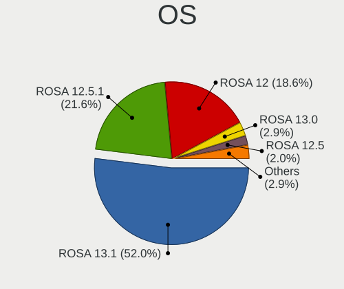

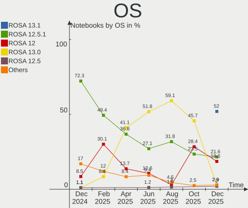

| Name        | Notebooks | Percent |
|-------------|-----------|---------|
| ROSA 13.1   | 53        | 51.96%  |
| ROSA 12.5.1 | 22        | 21.57%  |
| ROSA 12     | 19        | 18.63%  |
| ROSA 13.0   | 3         | 2.94%   |
| ROSA 12.5   | 2         | 1.96%   |
| ROSA R11.1  | 1         | 0.98%   |
| ROSA 13     | 1         | 0.98%   |
| ROSA 12.4   | 1         | 0.98%   |

OS Family
---------

OS without a version

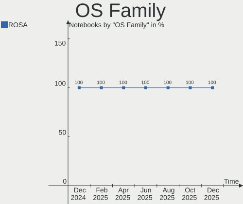

| Name | Notebooks | Percent |
|------|-----------|---------|
| ROSA | 102       | 100%    |

Kernel
------

Version of the Linux kernel

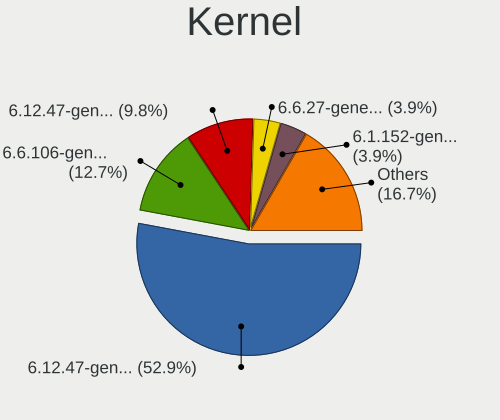

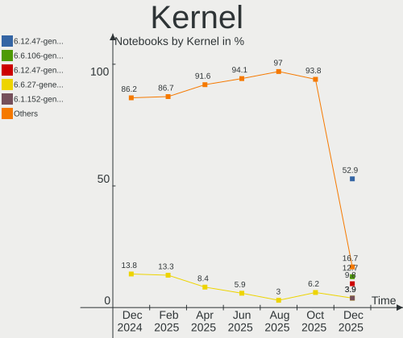

| Version                                  | Notebooks | Percent |
|------------------------------------------|-----------|---------|
| 6.12.47-generic-5rosa13-x86_64           | 54        | 52.94%  |
| 6.6.106-generic-3rosa2021.1-x86_64       | 13        | 12.75%  |
| 6.12.47-generic-5rosa2021.1-x86_64       | 10        | 9.8%    |
| 6.6.27-generic-3rosa2021.1-x86_64        | 4         | 3.92%   |
| 6.1.152-generic-2rosa2021.1-x86_64       | 4         | 3.92%   |
| 5.15.127-generic-1rosa2021.1-i686        | 3         | 2.94%   |
| 6.6.94-generic-1rosa2021.1-x86_64        | 2         | 1.96%   |
| 6.6.106-generic-1rosa2021.1-x86_64       | 2         | 1.96%   |
| 6.12.47-generic-2rosa2021.1-x86_64       | 2         | 1.96%   |
| 6.12.13-generic-4rosa13-x86_64           | 2         | 1.96%   |
| 6.1.20-generic-2rosa2021.1-x86_64        | 2         | 1.96%   |
| 6.6.21-generic-8rosa2021.1-x86_64        | 1         | 0.98%   |
| 6.5.7.xm1-1.klp-xanmod-rosa2021.1-x86_64 | 1         | 0.98%   |
| 6.17.8-generic-4rosa13-x86_64            | 1         | 0.98%   |
| 4.15.0-desktop-122.124.1rosa-x86_64      | 1         | 0.98%   |

Kernel Family
-------------

Linux kernel without a distro release

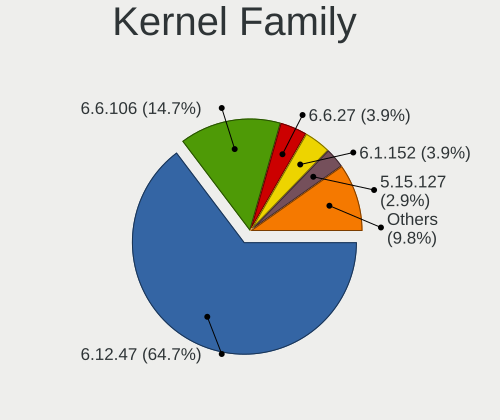

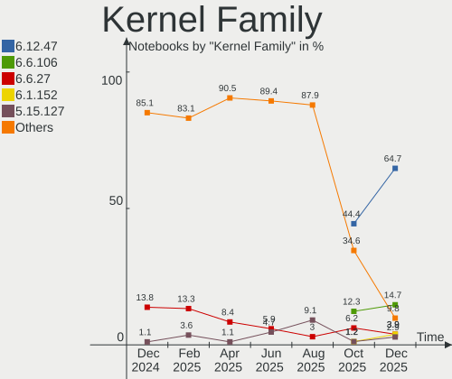

| Version  | Notebooks | Percent |
|----------|-----------|---------|
| 6.12.47  | 66        | 64.71%  |
| 6.6.106  | 15        | 14.71%  |
| 6.6.27   | 4         | 3.92%   |
| 6.1.152  | 4         | 3.92%   |
| 5.15.127 | 3         | 2.94%   |
| 6.6.94   | 2         | 1.96%   |
| 6.12.13  | 2         | 1.96%   |
| 6.1.20   | 2         | 1.96%   |
| 6.6.21   | 1         | 0.98%   |
| 6.5.7    | 1         | 0.98%   |
| 6.17.8   | 1         | 0.98%   |
| 4.15.0   | 1         | 0.98%   |

Kernel Major Ver.
-----------------

Linux kernel major version

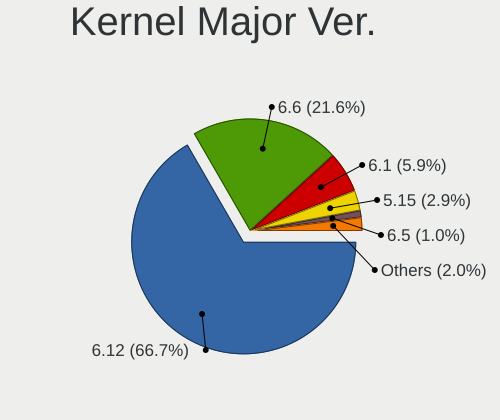

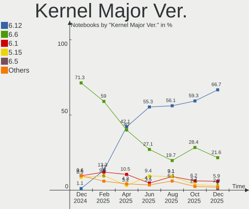

| Version | Notebooks | Percent |
|---------|-----------|---------|
| 6.12    | 68        | 66.67%  |
| 6.6     | 22        | 21.57%  |
| 6.1     | 6         | 5.88%   |
| 5.15    | 3         | 2.94%   |
| 6.5     | 1         | 0.98%   |
| 6.17    | 1         | 0.98%   |
| 4.15    | 1         | 0.98%   |

Arch
----

OS architecture (x86_64, i586, etc.)

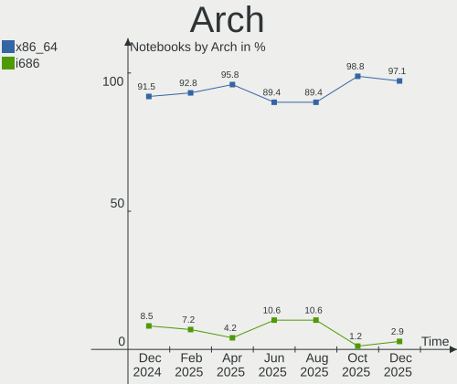

| Name   | Notebooks | Percent |
|--------|-----------|---------|
| x86_64 | 99        | 97.06%  |
| i686   | 3         | 2.94%   |

DE
--

Desktop Environment

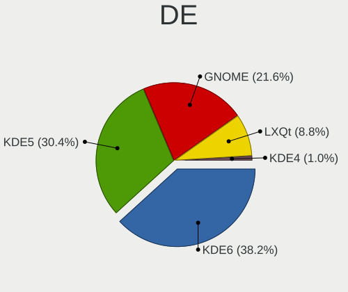

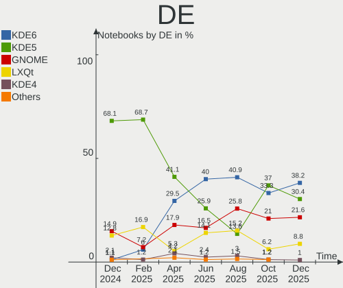

| Name  | Notebooks | Percent |
|-------|-----------|---------|
| KDE6  | 39        | 38.24%  |
| KDE5  | 31        | 30.39%  |
| GNOME | 22        | 21.57%  |
| LXQt  | 9         | 8.82%   |
| KDE4  | 1         | 0.98%   |

Display Server
--------------

X11 or Wayland

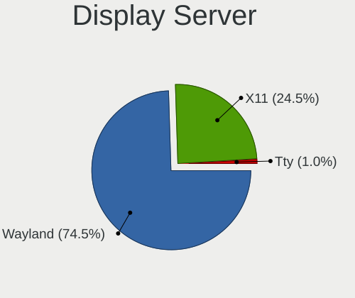

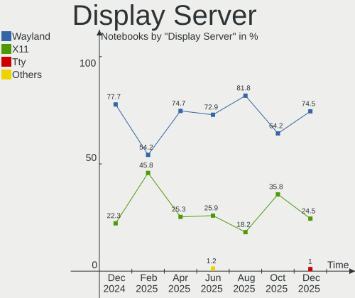

| Name    | Notebooks | Percent |
|---------|-----------|---------|
| Wayland | 76        | 74.51%  |
| X11     | 25        | 24.51%  |
| Tty     | 1         | 0.98%   |

Display Manager
---------------

SDDM, LightDM, etc.

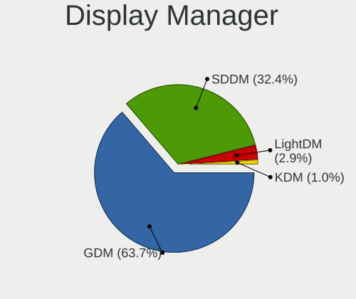

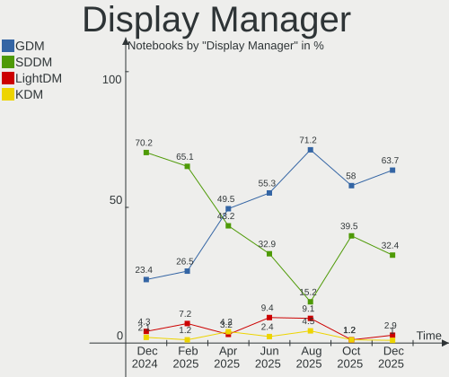

| Name    | Notebooks | Percent |
|---------|-----------|---------|
| GDM     | 65        | 63.73%  |
| SDDM    | 33        | 32.35%  |
| LightDM | 3         | 2.94%   |
| KDM     | 1         | 0.98%   |

OS Lang
-------

Language

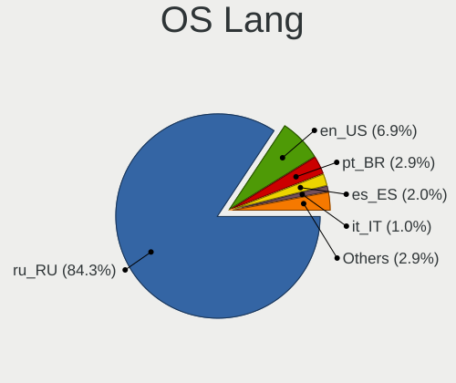

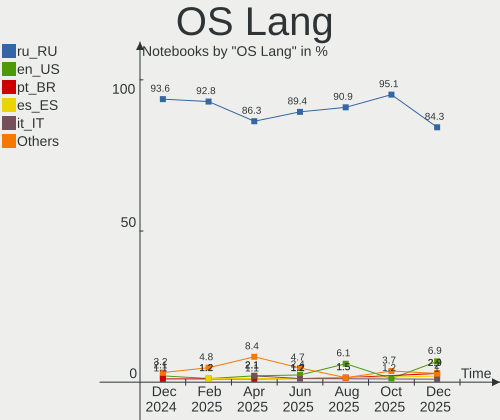

| Lang  | Notebooks | Percent |
|-------|-----------|---------|
| ru_RU | 86        | 84.31%  |
| en_US | 7         | 6.86%   |
| pt_BR | 3         | 2.94%   |
| es_ES | 2         | 1.96%   |
| it_IT | 1         | 0.98%   |
| fr_BE | 1         | 0.98%   |
| es_CO | 1         | 0.98%   |
| en_GB | 1         | 0.98%   |

Boot Mode
---------

EFI or BIOS

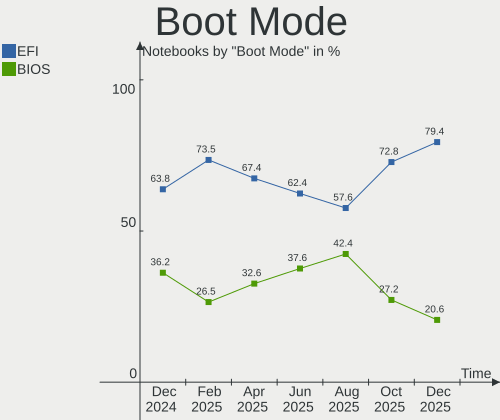

| Mode | Notebooks | Percent |
|------|-----------|---------|
| EFI  | 81        | 79.41%  |
| BIOS | 21        | 20.59%  |

Filesystem
----------

Type of filesystem

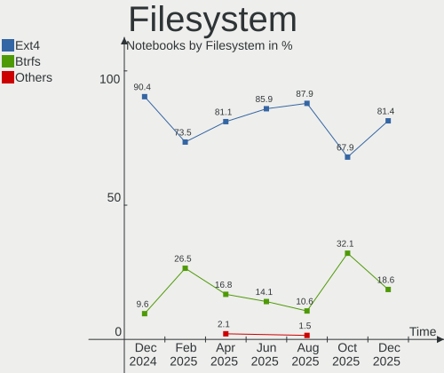

| Type  | Notebooks | Percent |
|-------|-----------|---------|
| Ext4  | 83        | 81.37%  |
| Btrfs | 19        | 18.63%  |

Part. scheme
------------

Scheme of partitioning

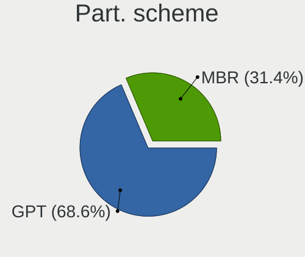

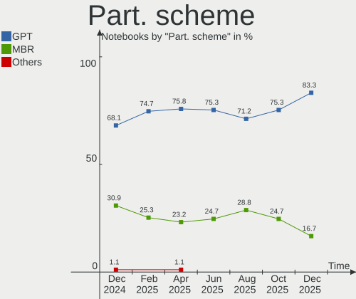

| Type | Notebooks | Percent |
|------|-----------|---------|
| GPT  | 85        | 83.33%  |
| MBR  | 17        | 16.67%  |

Dual Boot with Linux/BSD
------------------------

Hosting more than one Linux/BSD

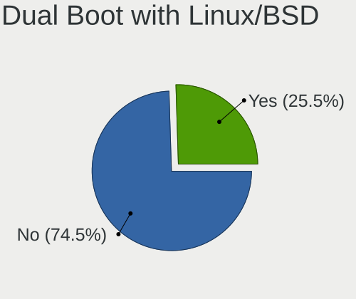

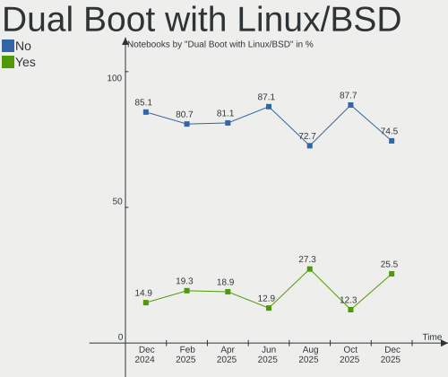

| Dual boot | Notebooks | Percent |
|-----------|-----------|---------|
| No        | 76        | 74.51%  |
| Yes       | 26        | 25.49%  |

Dual Boot (Win)
---------------

Hosting Linux and Windows

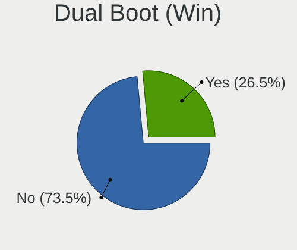

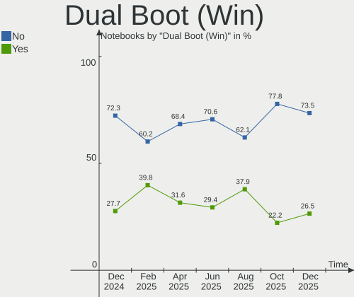

| Dual boot | Notebooks | Percent |
|-----------|-----------|---------|
| No        | 75        | 73.53%  |
| Yes       | 27        | 26.47%  |

Board
-----

Vendor
------

Motherboard manufacturer

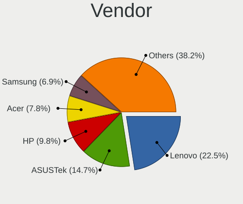

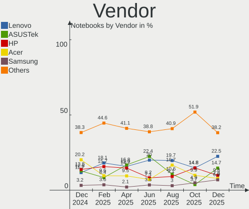

| Name                | Notebooks | Percent |
|---------------------|-----------|---------|
| Lenovo              | 23        | 22.55%  |
| ASUSTek Computer    | 15        | 14.71%  |
| Hewlett-Packard     | 10        | 9.8%    |
| Acer                | 8         | 7.84%   |
| Samsung Electronics | 7         | 6.86%   |
| Dell                | 6         | 5.88%   |
| KVADRA              | 5         | 4.9%    |
| MSI                 | 3         | 2.94%   |
| ICL Techno          | 3         | 2.94%   |
| Clevo               | 2         | 1.96%   |
| Aquarius            | 2         | 1.96%   |
| Apple               | 2         | 1.96%   |
| Toshiba             | 1         | 0.98%   |
| Sony                | 1         | 0.98%   |
| Semp Toshiba        | 1         | 0.98%   |
| Positivo            | 1         | 0.98%   |
| Packard Bell        | 1         | 0.98%   |
| Notebook            | 1         | 0.98%   |
| Maibenben           | 1         | 0.98%   |
| LTD Delovoy Office  | 1         | 0.98%   |
| iRU                 | 1         | 0.98%   |
| HUAWEI              | 1         | 0.98%   |
| HIPER               | 1         | 0.98%   |
| Echips Import       | 1         | 0.98%   |
| DEXP                | 1         | 0.98%   |
| Chuwi               | 1         | 0.98%   |
| ANCOMP              | 1         | 0.98%   |
| Unknown             | 1         | 0.98%   |

Model
-----

Motherboard model

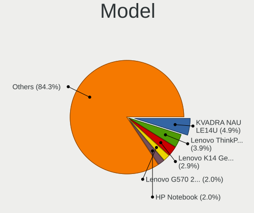

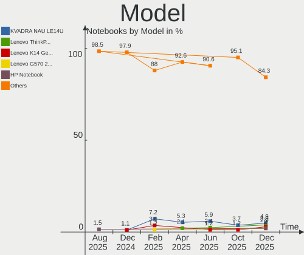

| Name                                       | Notebooks | Percent |
|--------------------------------------------|-----------|---------|
| KVADRA NAU LE14U                           | 5         | 4.9%    |
| Lenovo ThinkPad E14 Gen 4 21E4S2JB00       | 4         | 3.92%   |
| Lenovo K14 Gen 1 21CSS16E00                | 3         | 2.94%   |
| Lenovo G570 20079                          | 2         | 1.96%   |
| HP Notebook                                | 2         | 1.96%   |
| Dell Latitude E6440                        | 2         | 1.96%   |
| Clevo NL41MU2                              | 2         | 1.96%   |
| Aquarius CMP NS685U_4                      | 2         | 1.96%   |
| Unknown                                    | 2         | 1.96%   |
| Toshiba Satellite C650                     | 1         | 0.98%   |
| Sony SVE14A2V1RWI                          | 1         | 0.98%   |
| Semp Toshiba IS 1442                       | 1         | 0.98%   |
| Samsung R580/R590                          | 1         | 0.98%   |
| Samsung R55S                               | 1         | 0.98%   |
| Samsung 355V4C/356V4C/3445VC/3545VC        | 1         | 0.98%   |
| Samsung 350V5C/351V5C/3540VC/3440VC        | 1         | 0.98%   |
| Samsung 305V4A/305V5A                      | 1         | 0.98%   |
| Samsung 300E4A/300E5A/300E7A/3430EA/3530EA | 1         | 0.98%   |
| Samsung 300E4A/300E5A/300E7A               | 1         | 0.98%   |
| Positivo Q4128C-S                          | 1         | 0.98%   |
| Packard Bell EasyNote TX86                 | 1         | 0.98%   |
| Notebook WA50SRQ                           | 1         | 0.98%   |
| MSI U270 series                            | 1         | 0.98%   |
| MSI CX61 0NC/CX61 0ND/CX61 0NF/CX61 0NE    | 1         | 0.98%   |
| MSI Alpha 15 B5EEK                         | 1         | 0.98%   |
| Maibenben X-Treme Typhoon Series           | 1         | 0.98%   |
| LTD Delovoy Office EVE 15 P417             | 1         | 0.98%   |
| Lenovo Y70-70 Touch 80DU                   | 1         | 0.98%   |
| Lenovo V560                                | 1         | 0.98%   |
| Lenovo V15 G2 IJL 82QY                     | 1         | 0.98%   |
| Lenovo V14 G2 ALC 82KC                     | 1         | 0.98%   |
| Lenovo ThinkPad T480s 20L8S3P802           | 1         | 0.98%   |
| Lenovo Legion Y7000P IRX9 83DG             | 1         | 0.98%   |
| Lenovo IdeaPad S12 20021,2959              | 1         | 0.98%   |
| Lenovo IdeaPad 5 14ARE05 81YM              | 1         | 0.98%   |
| Lenovo IdeaPad 3 17ALC6 82KV               | 1         | 0.98%   |
| Lenovo IdeaPad 3 15ITL05 81X8              | 1         | 0.98%   |
| Lenovo IdeaPad 3 15IIL05 81WE              | 1         | 0.98%   |
| Lenovo G780 20138                          | 1         | 0.98%   |
| Lenovo G550 20023                          | 1         | 0.98%   |

Model Family
------------

Motherboard model prefix

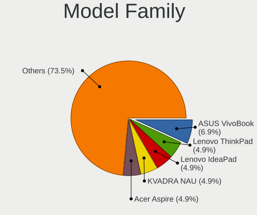

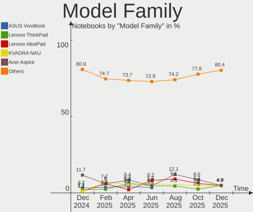

| Name                   | Notebooks | Percent |
|------------------------|-----------|---------|
| ASUS VivoBook          | 7         | 6.86%   |
| Lenovo ThinkPad        | 5         | 4.9%    |
| Lenovo IdeaPad         | 5         | 4.9%    |
| KVADRA NAU             | 5         | 4.9%    |
| Acer Aspire            | 5         | 4.9%    |
| Dell Latitude          | 4         | 3.92%   |
| Lenovo K14             | 3         | 2.94%   |
| Samsung 300E4A         | 2         | 1.96%   |
| Lenovo G570            | 2         | 1.96%   |
| HP Notebook            | 2         | 1.96%   |
| Dell Inspiron          | 2         | 1.96%   |
| Clevo NL41MU2          | 2         | 1.96%   |
| ASUS ASUS              | 2         | 1.96%   |
| Aquarius CMP           | 2         | 1.96%   |
| Acer Extensa           | 2         | 1.96%   |
| Unknown                | 2         | 1.96%   |
| Toshiba Satellite      | 1         | 0.98%   |
| Sony SVE14A2V1RWI      | 1         | 0.98%   |
| Semp Toshiba IS        | 1         | 0.98%   |
| Samsung R580           | 1         | 0.98%   |
| Samsung R55S           | 1         | 0.98%   |
| Samsung 355V4C         | 1         | 0.98%   |
| Samsung 350V5C         | 1         | 0.98%   |
| Samsung 305V4A         | 1         | 0.98%   |
| Positivo Q4128C-S      | 1         | 0.98%   |
| Packard Bell EasyNote  | 1         | 0.98%   |
| Notebook WA50SRQ       | 1         | 0.98%   |
| MSI U270               | 1         | 0.98%   |
| MSI CX61               | 1         | 0.98%   |
| MSI Alpha              | 1         | 0.98%   |
| Maibenben X-Treme      | 1         | 0.98%   |
| LTD Delovoy Office EVE | 1         | 0.98%   |
| Lenovo Y70-70          | 1         | 0.98%   |
| Lenovo V560            | 1         | 0.98%   |
| Lenovo V15             | 1         | 0.98%   |
| Lenovo V14             | 1         | 0.98%   |
| Lenovo Legion          | 1         | 0.98%   |
| Lenovo G780            | 1         | 0.98%   |
| Lenovo G550            | 1         | 0.98%   |
| Lenovo B590            | 1         | 0.98%   |

MFG Year
--------

Motherboard manufacture year

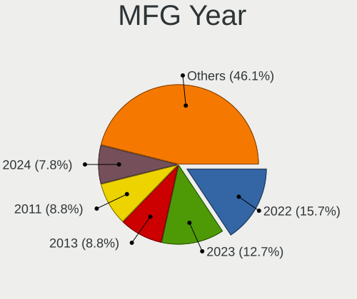

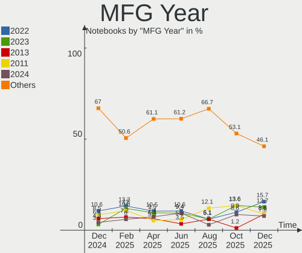

| Year | Notebooks | Percent |
|------|-----------|---------|
| 2022 | 16        | 15.69%  |
| 2023 | 13        | 12.75%  |
| 2013 | 9         | 8.82%   |
| 2011 | 9         | 8.82%   |
| 2024 | 8         | 7.84%   |
| 2012 | 6         | 5.88%   |
| 2021 | 5         | 4.9%    |
| 2010 | 5         | 4.9%    |
| 2018 | 4         | 3.92%   |
| 2016 | 4         | 3.92%   |
| 2025 | 3         | 2.94%   |
| 2020 | 3         | 2.94%   |
| 2017 | 3         | 2.94%   |
| 2015 | 3         | 2.94%   |
| 2009 | 3         | 2.94%   |
| 2014 | 2         | 1.96%   |
| 2007 | 2         | 1.96%   |
| 2019 | 1         | 0.98%   |
| 2008 | 1         | 0.98%   |
| 2006 | 1         | 0.98%   |
| 2004 | 1         | 0.98%   |

Form Factor
-----------

Physical design of the computer

| Name     | Notebooks | Percent |
|----------|-----------|---------|
| Notebook | 102       | 100%    |

Secure Boot
-----------

Enabled or disabled

| State    | Notebooks | Percent |
|----------|-----------|---------|
| Disabled | 102       | 100%    |

Coreboot
--------

Have coreboot on board

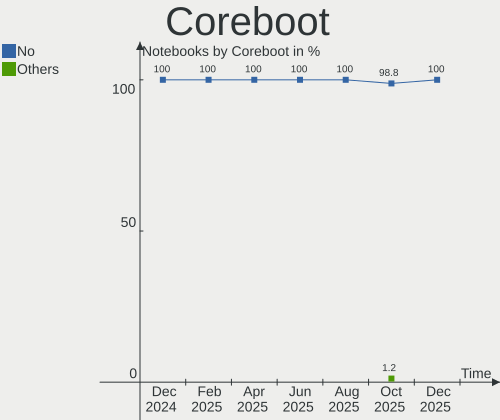

| Used | Notebooks | Percent |
|------|-----------|---------|
| No   | 102       | 100%    |

RAM Size
--------

Total RAM memory

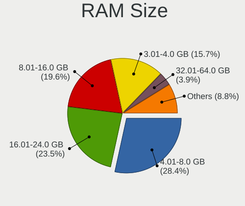

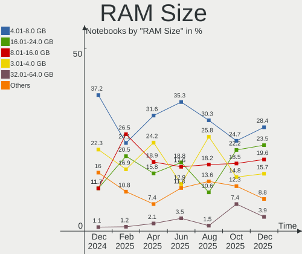

| Size in GB | Notebooks | Percent |
|------------|-----------|---------|
| 4.01-8.0   | 29        | 28.43%  |
| 16.01-24.0 | 24        | 23.53%  |
| 8.01-16.0  | 20        | 19.61%  |
| 3.01-4.0   | 16        | 15.69%  |
| 32.01-64.0 | 4         | 3.92%   |
| 2.01-3.0   | 4         | 3.92%   |
| 1.01-2.0   | 4         | 3.92%   |
| 24.01-32.0 | 1         | 0.98%   |

RAM Used
--------

Used RAM memory

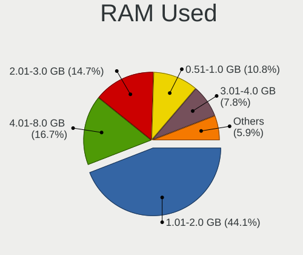

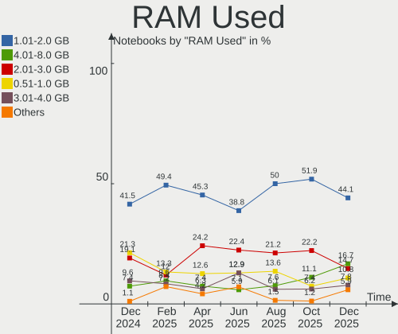

| Used GB    | Notebooks | Percent |
|------------|-----------|---------|
| 1.01-2.0   | 45        | 44.12%  |
| 4.01-8.0   | 17        | 16.67%  |
| 2.01-3.0   | 15        | 14.71%  |
| 0.51-1.0   | 11        | 10.78%  |
| 3.01-4.0   | 8         | 7.84%   |
| 8.01-16.0  | 3         | 2.94%   |
| 0.01-0.5   | 2         | 1.96%   |
| 16.01-24.0 | 1         | 0.98%   |

Total Drives
------------

Number of drives on board

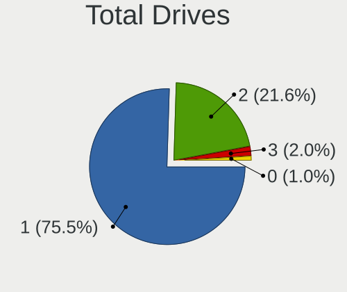

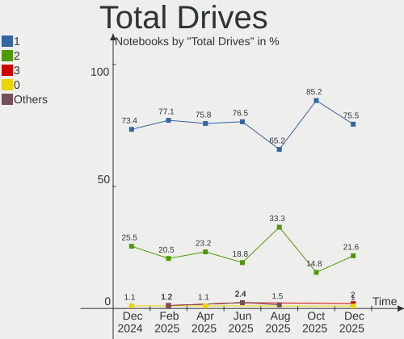

| Drives | Notebooks | Percent |
|--------|-----------|---------|
| 1      | 77        | 75.49%  |
| 2      | 22        | 21.57%  |
| 3      | 2         | 1.96%   |
| 0      | 1         | 0.98%   |

Has CD-ROM
----------

Has CD-ROM on board

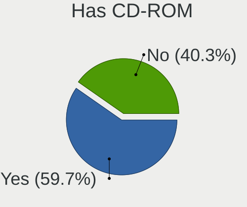

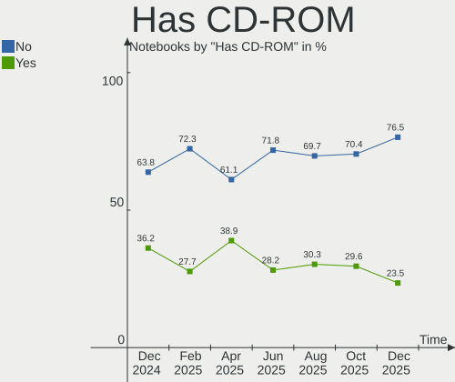

| Presented | Notebooks | Percent |
|-----------|-----------|---------|
| No        | 78        | 76.47%  |
| Yes       | 24        | 23.53%  |

Has Ethernet
------------

Has Ethernet on board

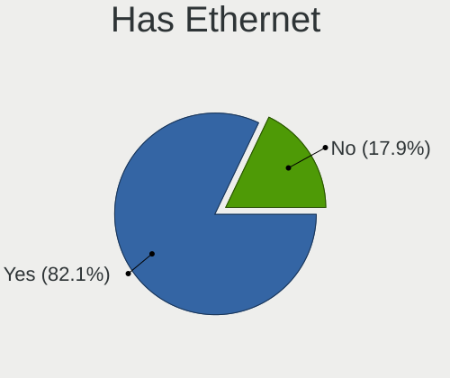

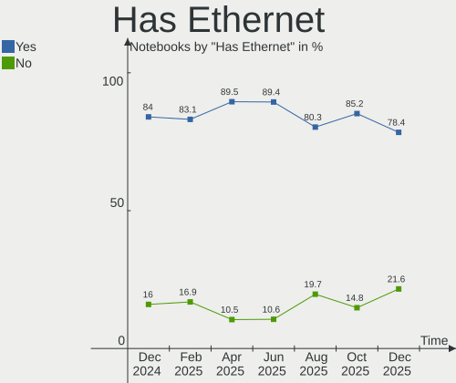

| Presented | Notebooks | Percent |
|-----------|-----------|---------|
| Yes       | 80        | 78.43%  |
| No        | 22        | 21.57%  |

Has WiFi
--------

Has WiFi module

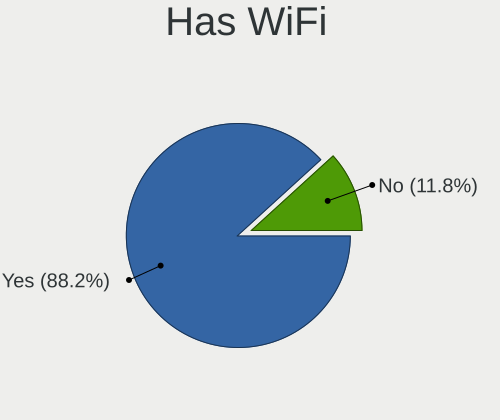

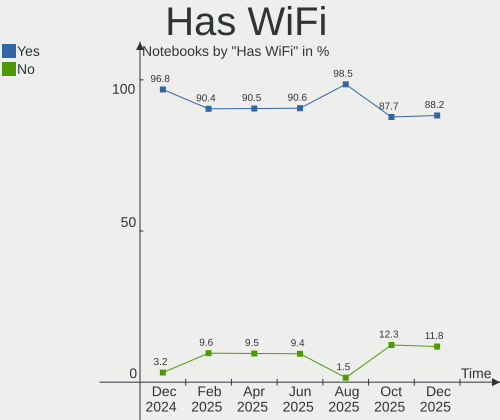

| Presented | Notebooks | Percent |
|-----------|-----------|---------|
| Yes       | 90        | 88.24%  |
| No        | 12        | 11.76%  |

Has Bluetooth
-------------

Has Bluetooth module

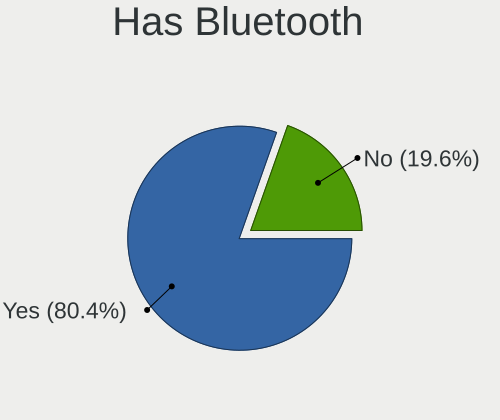

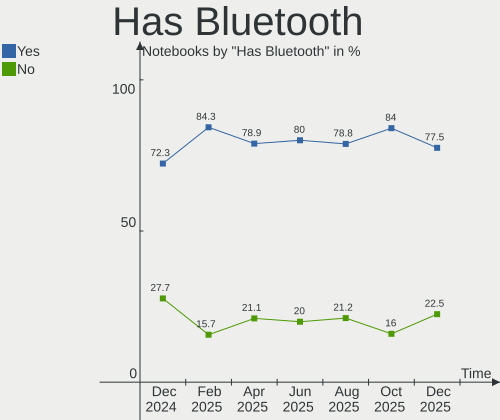

| Presented | Notebooks | Percent |
|-----------|-----------|---------|
| Yes       | 79        | 77.45%  |
| No        | 23        | 22.55%  |

Location
--------

Country
-------

Geographic location (country)

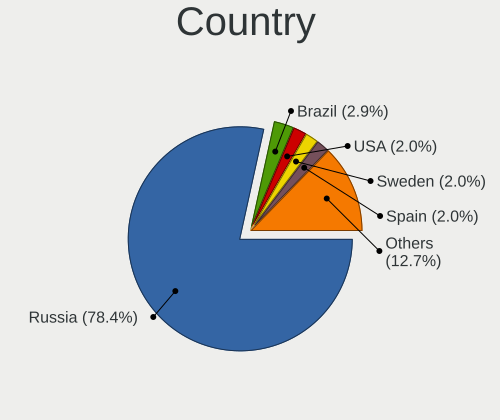

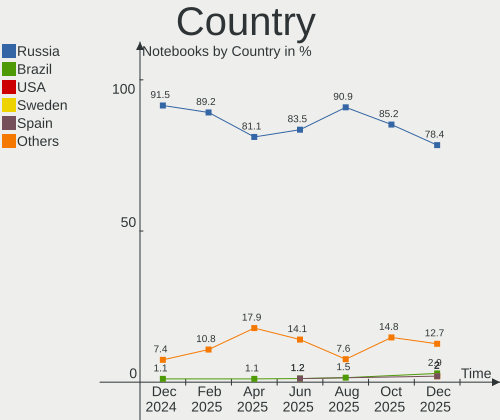

| Country    | Notebooks | Percent |
|------------|-----------|---------|
| Russia     | 80        | 78.43%  |
| Brazil     | 3         | 2.94%   |
| USA        | 2         | 1.96%   |
| Sweden     | 2         | 1.96%   |
| Spain      | 2         | 1.96%   |
| Ukraine    | 1         | 0.98%   |
| Moldova    | 1         | 0.98%   |
| Kazakhstan | 1         | 0.98%   |
| Italy      | 1         | 0.98%   |
| Israel     | 1         | 0.98%   |
| Iran       | 1         | 0.98%   |
| Germany    | 1         | 0.98%   |
| Ethiopia   | 1         | 0.98%   |
| Czechia    | 1         | 0.98%   |
| Croatia    | 1         | 0.98%   |
| Colombia   | 1         | 0.98%   |
| Belgium    | 1         | 0.98%   |
| Belarus    | 1         | 0.98%   |

City
----

Geographic location (city)

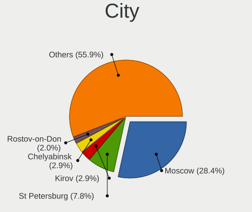

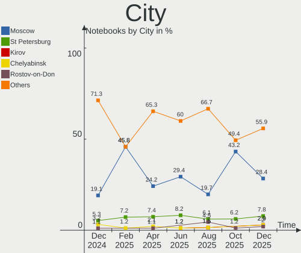

| City                       | Notebooks | Percent |
|----------------------------|-----------|---------|
| Moscow                     | 29        | 28.43%  |
| St Petersburg              | 8         | 7.84%   |
| Kirov                      | 3         | 2.94%   |
| Chelyabinsk                | 3         | 2.94%   |
| Rostov-on-Don              | 2         | 1.96%   |
| Nizhniy Novgorod           | 2         | 1.96%   |
| Krasnodar                  | 2         | 1.96%   |
| Kazan’                   | 2         | 1.96%   |
| Boden                      | 2         | 1.96%   |
| Balashikha                 | 2         | 1.96%   |
| Zagreb                     | 1         | 0.98%   |
| Yoshkar-Ola                | 1         | 0.98%   |
| Yekaterinburg              | 1         | 0.98%   |
| Volokolamsk                | 1         | 0.98%   |
| Vologda                    | 1         | 0.98%   |
| Volgodonsk                 | 1         | 0.98%   |
| Vladimir                   | 1         | 0.98%   |
| Tsarskoye Selo             | 1         | 0.98%   |
| Tomsk                      | 1         | 0.98%   |
| Tiraspol                   | 1         | 0.98%   |
| Tehran                     | 1         | 0.98%   |
| Stavropol                  | 1         | 0.98%   |
| Smolensk                   | 1         | 0.98%   |
| Serpukhov                  | 1         | 0.98%   |
| Sarapul                    | 1         | 0.98%   |
| Sao Bernardo do Campo      | 1         | 0.98%   |
| Sabnova                    | 1         | 0.98%   |
| Rishon LeTsiyyon           | 1         | 0.98%   |
| Podolsk                    | 1         | 0.98%   |
| Novy Urengoy               | 1         | 0.98%   |
| Novosibirsk                | 1         | 0.98%   |
| Novokuznetsk               | 1         | 0.98%   |
| Nivenskoye                 | 1         | 0.98%   |
| Murmansk                   | 1         | 0.98%   |
| Minsk                      | 1         | 0.98%   |
| Makiivka                   | 1         | 0.98%   |
| Leverkusen                 | 1         | 0.98%   |
| Las Palmas de Gran Canaria | 1         | 0.98%   |
| Labytnangi                 | 1         | 0.98%   |
| Krasnoyarsk                | 1         | 0.98%   |

Drives
------

Drive Vendor
------------

Hard drive vendors

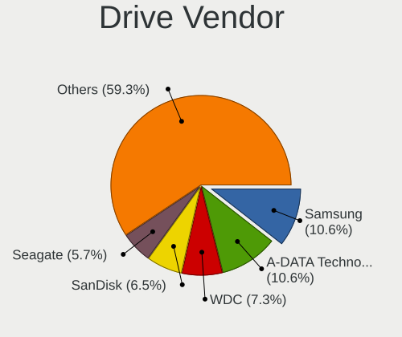

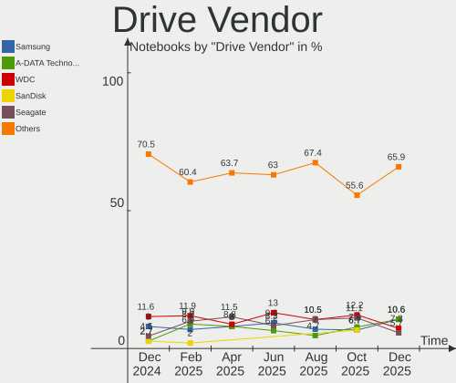

| Vendor                      | Notebooks | Drives | Percent |
|-----------------------------|-----------|--------|---------|
| Samsung Electronics         | 13        | 14     | 10.57%  |
| A-DATA Technology           | 13        | 13     | 10.57%  |
| WDC                         | 9         | 9      | 7.32%   |
| SanDisk                     | 8         | 8      | 6.5%    |
| Seagate                     | 7         | 7      | 5.69%   |
| SK hynix                    | 5         | 5      | 4.07%   |
| Unknown                     | 4         | 4      | 3.25%   |
| Micron Technology           | 4         | 4      | 3.25%   |
| Kingston                    | 4         | 4      | 3.25%   |
| Wodposit                    | 3         | 3      | 2.44%   |
| Toshiba                     | 3         | 3      | 2.44%   |
| QOPP                        | 3         | 3      | 2.44%   |
| Hitachi                     | 3         | 3      | 2.44%   |
| BIWIN                       | 3         | 3      | 2.44%   |
| SPCC                        | 2         | 2      | 1.63%   |
| MAXIO Technology (Hangzhou) | 2         | 2      | 1.63%   |
| Kingston Technology Company | 2         | 2      | 1.63%   |
| KingSpec                    | 2         | 2      | 1.63%   |
| Intel                       | 2         | 2      | 1.63%   |
| Fujitsu                     | 2         | 2      | 1.63%   |
| Crucial                     | 2         | 2      | 1.63%   |
| China                       | 2         | 2      | 1.63%   |
| Union Memory                | 1         | 1      | 0.81%   |
| UMIS                        | 1         | 1      | 0.81%   |
| Transcend                   | 1         | 1      | 0.81%   |
| Smartbuy                    | 1         | 1      | 0.81%   |
| Silicon Motion              | 1         | 1      | 0.81%   |
| SCY                         | 1         | 1      | 0.81%   |
| Realtek Semiconductor       | 1         | 1      | 0.81%   |
| Realtek                     | 1         | 1      | 0.81%   |
| Qumo                        | 1         | 1      | 0.81%   |
| Plextor                     | 1         | 1      | 0.81%   |
| Phison Electronics          | 1         | 1      | 0.81%   |
| P3-256                      | 1         | 1      | 0.81%   |
| Netac                       | 1         | 1      | 0.81%   |
| Neo                         | 1         | 1      | 0.81%   |
| KOOTION                     | 1         | 1      | 0.81%   |
| KingFast                    | 1         | 1      | 0.81%   |
| JMicron Technology          | 1         | 1      | 0.81%   |
| HS-SSD-E100                 | 1         | 1      | 0.81%   |

Drive Model
-----------

Hard drive models

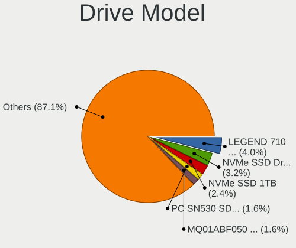

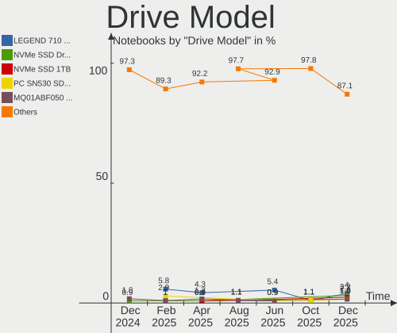

| Model                                            | Notebooks | Percent |
|--------------------------------------------------|-----------|---------|
| A-DATA LEGEND 710 512GB                          | 5         | 4.03%   |
| SanDisk NVMe SSD Drive 512GB                     | 4         | 3.23%   |
| Wodposit NVMe SSD 1TB                            | 3         | 2.42%   |
| WDC PC SN530 SDBPMPZ-512G-1001 512GB             | 2         | 1.61%   |
| Toshiba MQ01ABF050 500GB                         | 2         | 1.61%   |
| Samsung SSD 990 PRO 1TB                          | 2         | 1.61%   |
| Samsung HM321HI 320GB                            | 2         | 1.61%   |
| QOPP Q600S 256G SSD                              | 2         | 1.61%   |
| Micron MTFDKCD512TFK 512GB                       | 2         | 1.61%   |
| MAXIO (Hangzhou) NVMe SSD Controller MAP1202 2TB | 2         | 1.61%   |
| Intel SSDPEKNU512GZ 512GB                        | 2         | 1.61%   |
| China SSD 512GB                                  | 2         | 1.61%   |
| BIWIN CE480T5D101-256 256GB                      | 2         | 1.61%   |
| A-DATA SU650 240GB SSD                           | 2         | 1.61%   |
| WDC WDS120G2G0A-00JH30 120GB SSD                 | 1         | 0.81%   |
| WDC WD7500BPVT-22HXZT3 752GB                     | 1         | 0.81%   |
| WDC WD5000LPSX-00A6WT0 500GB                     | 1         | 0.81%   |
| WDC WD5000LPCX-24C6HT0 500GB                     | 1         | 0.81%   |
| WDC WD5000BPVT-08HXZT3 500GB                     | 1         | 0.81%   |
| WDC WD3200BPVT-24JJ5T0 320GB                     | 1         | 0.81%   |
| WDC WD2500BEVT-24A23T0 250GB                     | 1         | 0.81%   |
| Unknown USD  16GB                                | 1         | 0.81%   |
| Unknown MMC Card  128GB                          | 1         | 0.81%   |
| Unknown External 2TB                             | 1         | 0.81%   |
| Unknown BJNB4R  32GB                             | 1         | 0.81%   |
| Union Memory UMIS RPJTJ512MEE1OWX 512GB          | 1         | 0.81%   |
| UMIS RPJYJ1T24MLR1HWY 1TB                        | 1         | 0.81%   |
| Transcend TS120GSSD220S 120GB                    | 1         | 0.81%   |
| Toshiba MK2555GSX 250GB                          | 1         | 0.81%   |
| SPCC Solid State Disk 256GB                      | 1         | 0.81%   |
| SPCC Solid State Disk 128GB                      | 1         | 0.81%   |
| Smartbuy SSD 240GB                               | 1         | 0.81%   |
| SK hynix HN8T15DEHKX075 256GB SSD                | 1         | 0.81%   |
| SK hynix HFS001TEJ9X125N 1TB                     | 1         | 0.81%   |
| SK hynix HFS001TEJ9X108N 1TB                     | 1         | 0.81%   |
| SK hynix BC511 512GB                             | 1         | 0.81%   |
| SK hynix BC501 HFM256GDJTNG-8310A 256GB          | 1         | 0.81%   |
| Silicon Motion PCIe-8 SSD 1TB                    | 1         | 0.81%   |
| Seagate ST9500325AS 500GB                        | 1         | 0.81%   |
| Seagate ST9320325AS 320GB                        | 1         | 0.81%   |

HDD Vendor
----------

Hard disk drive vendors

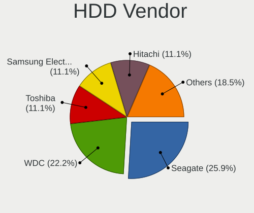

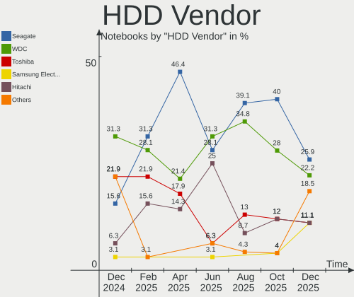

| Vendor              | Notebooks | Drives | Percent |
|---------------------|-----------|--------|---------|
| Seagate             | 7         | 7      | 25.93%  |
| WDC                 | 6         | 6      | 22.22%  |
| Toshiba             | 3         | 3      | 11.11%  |
| Samsung Electronics | 3         | 3      | 11.11%  |
| Hitachi             | 3         | 3      | 11.11%  |
| Fujitsu             | 2         | 2      | 7.41%   |
| Unknown             | 1         | 1      | 3.7%    |
| JMicron Technology  | 1         | 1      | 3.7%    |
| HGST                | 1         | 1      | 3.7%    |

SSD Vendor
----------

Solid state drive vendors

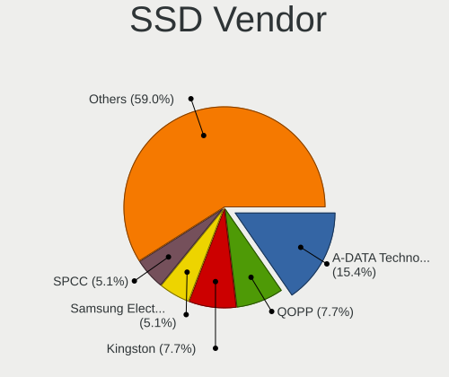

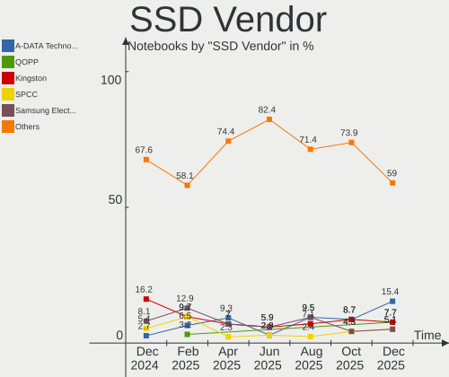

| Vendor              | Notebooks | Drives | Percent |
|---------------------|-----------|--------|---------|
| A-DATA Technology   | 6         | 6      | 15.38%  |
| QOPP                | 3         | 3      | 7.69%   |
| Kingston            | 3         | 3      | 7.69%   |
| SPCC                | 2         | 2      | 5.13%   |
| Samsung Electronics | 2         | 2      | 5.13%   |
| Crucial             | 2         | 2      | 5.13%   |
| China               | 2         | 2      | 5.13%   |
| WDC                 | 1         | 1      | 2.56%   |
| Transcend           | 1         | 1      | 2.56%   |
| Smartbuy            | 1         | 1      | 2.56%   |
| SK hynix            | 1         | 1      | 2.56%   |
| SanDisk             | 1         | 1      | 2.56%   |
| Qumo                | 1         | 1      | 2.56%   |
| Plextor             | 1         | 1      | 2.56%   |
| Netac               | 1         | 1      | 2.56%   |
| Neo                 | 1         | 1      | 2.56%   |
| KOOTION             | 1         | 1      | 2.56%   |
| KingSpec            | 1         | 1      | 2.56%   |
| KingFast            | 1         | 1      | 2.56%   |
| HS-SSD-E100         | 1         | 1      | 2.56%   |
| HJDK                | 1         | 1      | 2.56%   |
| Gigabyte Technology | 1         | 1      | 2.56%   |
| ExeGate             | 1         | 1      | 2.56%   |
| DEXP                | 1         | 1      | 2.56%   |
| Apple               | 1         | 1      | 2.56%   |
| Apacer              | 1         | 1      | 2.56%   |

Drive Kind
----------

HDD or SSD

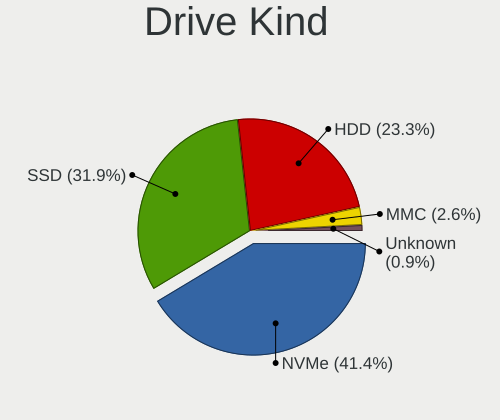

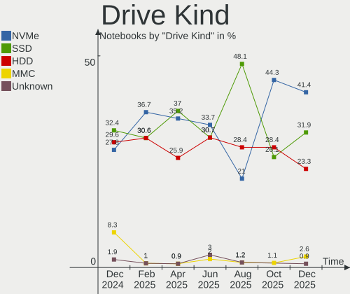

| Kind    | Notebooks | Drives | Percent |
|---------|-----------|--------|---------|
| NVMe    | 48        | 54     | 41.38%  |
| SSD     | 37        | 39     | 31.9%   |
| HDD     | 27        | 27     | 23.28%  |
| MMC     | 3         | 3      | 2.59%   |
| Unknown | 1         | 1      | 0.86%   |

Drive Connector
---------------

SATA, SAS, NVMe, etc.

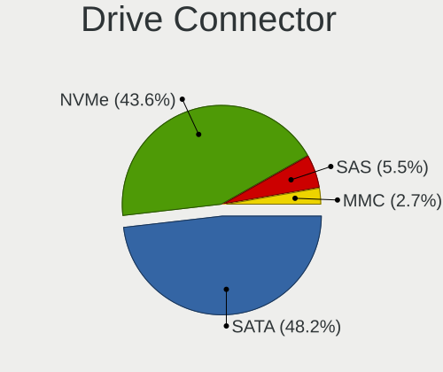

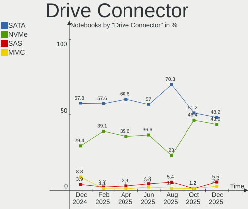

| Type | Notebooks | Drives | Percent |
|------|-----------|--------|---------|
| SATA | 53        | 62     | 48.18%  |
| NVMe | 48        | 52     | 43.64%  |
| SAS  | 6         | 7      | 5.45%   |
| MMC  | 3         | 3      | 2.73%   |

Drive Size
----------

Size of hard drive

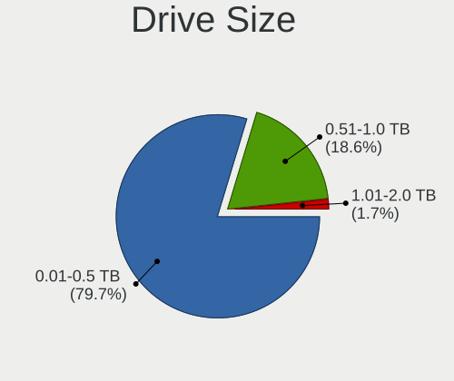

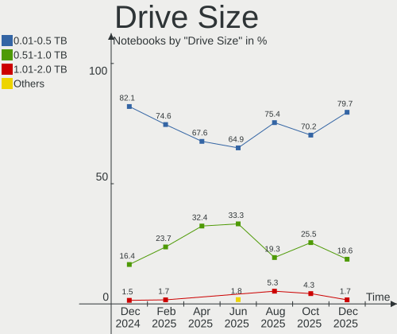

| Size in TB | Notebooks | Drives | Percent |
|------------|-----------|--------|---------|
| 0.01-0.5   | 47        | 53     | 79.66%  |
| 0.51-1.0   | 11        | 12     | 18.64%  |
| 1.01-2.0   | 1         | 1      | 1.69%   |

Space Total
-----------

Amount of disk space available on the file system

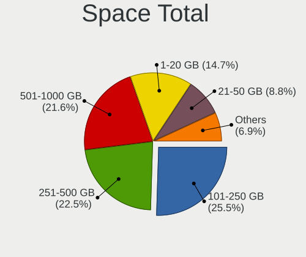

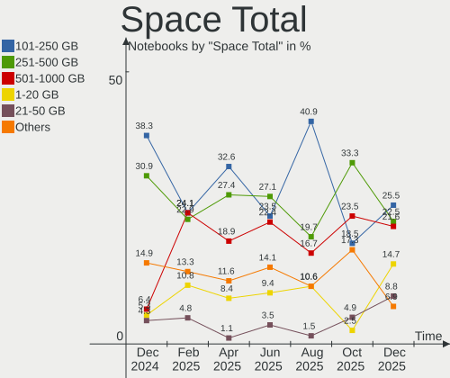

| Size in GB | Notebooks | Percent |
|------------|-----------|---------|
| 101-250    | 26        | 25.49%  |
| 251-500    | 23        | 22.55%  |
| 501-1000   | 22        | 21.57%  |
| 1-20       | 15        | 14.71%  |
| 21-50      | 9         | 8.82%   |
| 1001-2000  | 3         | 2.94%   |
| 51-100     | 2         | 1.96%   |
| 2001-3000  | 1         | 0.98%   |
| Unknown    | 1         | 0.98%   |

Space Used
----------

Amount of used disk space

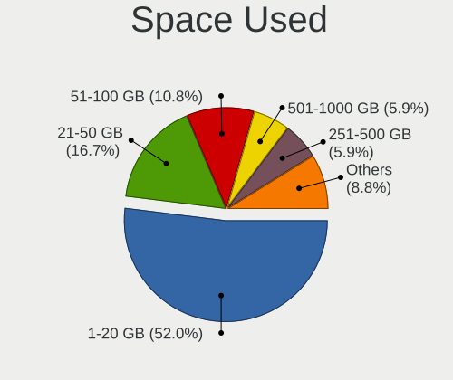

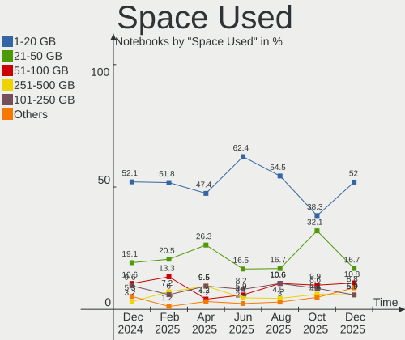

| Used GB   | Notebooks | Percent |
|-----------|-----------|---------|
| 1-20      | 53        | 51.96%  |
| 21-50     | 17        | 16.67%  |
| 51-100    | 11        | 10.78%  |
| 251-500   | 6         | 5.88%   |
| 101-250   | 6         | 5.88%   |
| 501-1000  | 6         | 5.88%   |
| 1001-2000 | 2         | 1.96%   |
| Unknown   | 1         | 0.98%   |

Malfunc. Drives
---------------

Drive models with a malfunction

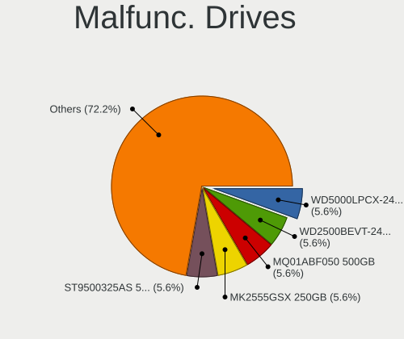

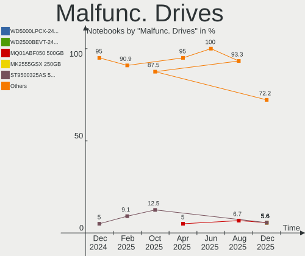

| Model                                   | Notebooks | Drives | Percent |
|-----------------------------------------|-----------|--------|---------|
| WDC WD5000LPCX-24C6HT0 500GB            | 1         | 1      | 5.56%   |
| WDC WD2500BEVT-24A23T0 250GB            | 1         | 1      | 5.56%   |
| Toshiba MQ01ABF050 500GB                | 1         | 1      | 5.56%   |
| Toshiba MK2555GSX 250GB                 | 1         | 1      | 5.56%   |
| Seagate ST9500325AS 500GB               | 1         | 1      | 5.56%   |
| Seagate ST9320325AS 320GB               | 1         | 1      | 5.56%   |
| Seagate ST9250827AS 250GB               | 1         | 1      | 5.56%   |
| Seagate ST750LM022 HN-M750MBB 752GB     | 1         | 1      | 5.56%   |
| Seagate ST500LM021-1KJ152 500GB         | 1         | 1      | 5.56%   |
| SanDisk SSD i110 24GB                   | 1         | 1      | 5.56%   |
| Samsung Electronics HN-M500MBB 500GB    | 1         | 1      | 5.56%   |
| Samsung Electronics HM321HI 320GB       | 1         | 1      | 5.56%   |
| Neo Forza NFS121SA324-6007000 240GB SSD | 1         | 1      | 5.56%   |
| KingSpec MT-128 128GB                   | 1         | 1      | 5.56%   |
| Hitachi HTS545050A7E380 500GB           | 1         | 1      | 5.56%   |
| Hitachi HTS541040G9AT00 40GB            | 1         | 1      | 5.56%   |
| Fujitsu MJA2320BH G2 320GB              | 1         | 1      | 5.56%   |
| Fujitsu MHV2120AH PL 112GB              | 1         | 1      | 5.56%   |

Malfunc. Drive Vendor
---------------------

Vendors of faulty drives

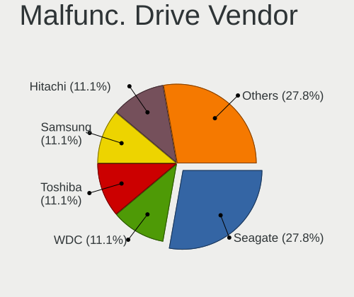

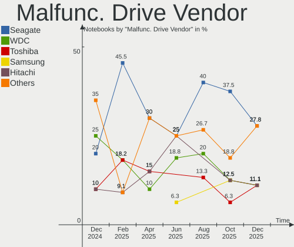

| Vendor              | Notebooks | Drives | Percent |
|---------------------|-----------|--------|---------|
| Seagate             | 5         | 5      | 27.78%  |
| WDC                 | 2         | 2      | 11.11%  |
| Toshiba             | 2         | 2      | 11.11%  |
| Samsung Electronics | 2         | 2      | 11.11%  |
| Hitachi             | 2         | 2      | 11.11%  |
| Fujitsu             | 2         | 2      | 11.11%  |
| SanDisk             | 1         | 1      | 5.56%   |
| Neo                 | 1         | 1      | 5.56%   |
| KingSpec            | 1         | 1      | 5.56%   |

Malfunc. HDD Vendor
-------------------

Vendors of faulty HDD drives

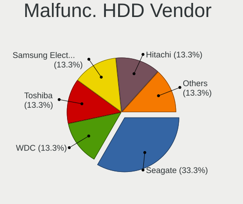

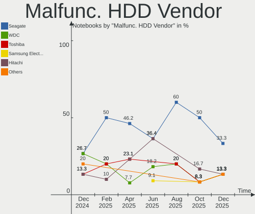

| Vendor              | Notebooks | Drives | Percent |
|---------------------|-----------|--------|---------|
| Seagate             | 5         | 5      | 33.33%  |
| WDC                 | 2         | 2      | 13.33%  |
| Toshiba             | 2         | 2      | 13.33%  |
| Samsung Electronics | 2         | 2      | 13.33%  |
| Hitachi             | 2         | 2      | 13.33%  |
| Fujitsu             | 2         | 2      | 13.33%  |

Malfunc. Drive Kind
-------------------

Kinds of faulty drives

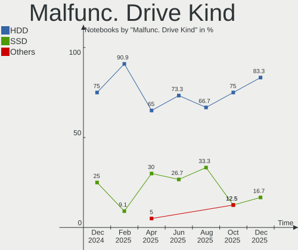

| Kind | Notebooks | Drives | Percent |
|------|-----------|--------|---------|
| HDD  | 15        | 15     | 83.33%  |
| SSD  | 3         | 3      | 16.67%  |

Failed Drives
-------------

Failed drive models

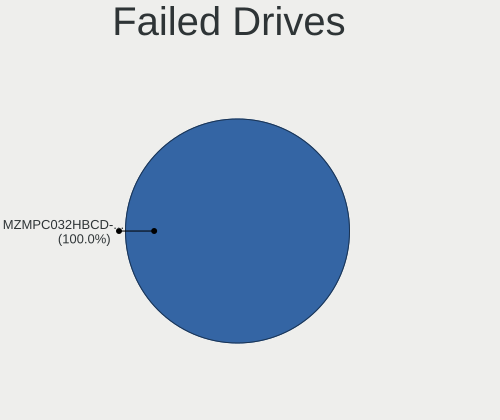

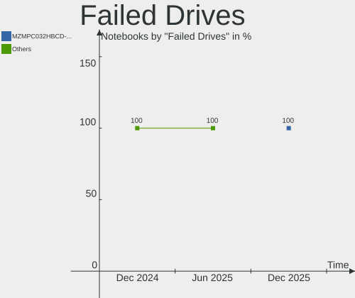

| Model                                           | Notebooks | Drives | Percent |
|-------------------------------------------------|-----------|--------|---------|
| Samsung Electronics MZMPC032HBCD-000H1 32GB SSD | 1         | 1      | 100%    |

Failed Drive Vendor
-------------------

Failed drive vendors

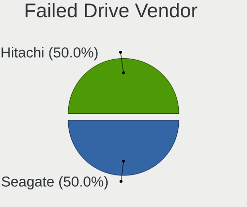

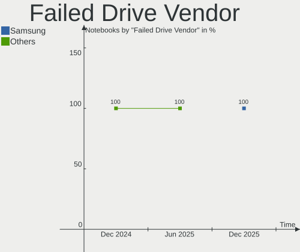

| Vendor              | Notebooks | Drives | Percent |
|---------------------|-----------|--------|---------|
| Samsung Electronics | 1         | 1      | 100%    |

Drive Status
------------

Number of failed and malfunc. drives

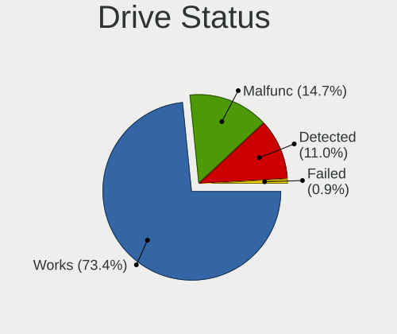

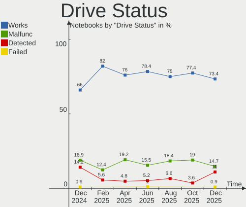

| Status   | Notebooks | Drives | Percent |
|----------|-----------|--------|---------|
| Works    | 80        | 93     | 73.39%  |
| Malfunc  | 16        | 18     | 14.68%  |
| Detected | 12        | 12     | 11.01%  |
| Failed   | 1         | 1      | 0.92%   |

Storage controller
------------------

Storage Vendor
--------------

Storage controller vendors

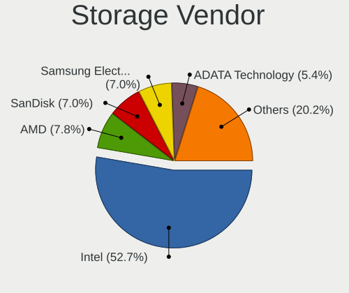

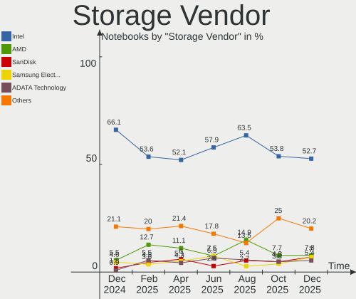

| Vendor                                  | Notebooks | Percent |
|-----------------------------------------|-----------|---------|
| Intel                                   | 68        | 52.71%  |
| AMD                                     | 10        | 7.75%   |
| SanDisk                                 | 9         | 6.98%   |
| Samsung Electronics                     | 9         | 6.98%   |
| ADATA Technology                        | 7         | 5.43%   |
| SK hynix                                | 4         | 3.1%    |
| Micron Technology                       | 4         | 3.1%    |
| MAXIO Technology (Hangzhou)             | 3         | 2.33%   |
| Unknown                                 | 3         | 2.33%   |
| Realtek Semiconductor                   | 2         | 1.55%   |
| Kingston Technology Company             | 2         | 1.55%   |
| INNOGRIT                                | 2         | 1.55%   |
| Union Memory (Shenzhen)                 | 1         | 0.78%   |
| Silicon Motion                          | 1         | 0.78%   |
| Shenzhen Unionmemory Information System | 1         | 0.78%   |
| Shenzhen Shichuangyi Electronics        | 1         | 0.78%   |
| Phison Electronics                      | 1         | 0.78%   |
| Nvidia                                  | 1         | 0.78%   |

Storage Model
-------------

Storage controller models

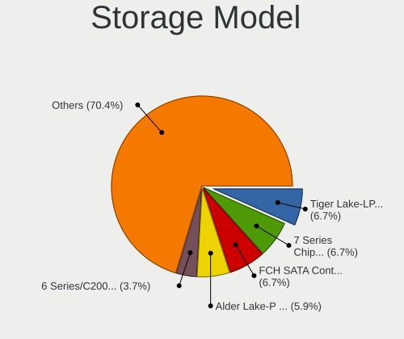

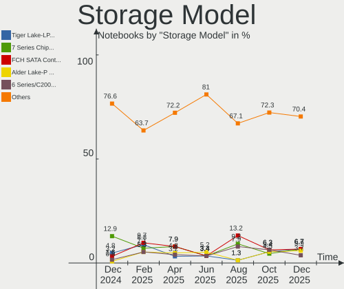

| Model                                                                                         | Notebooks | Percent |
|-----------------------------------------------------------------------------------------------|-----------|---------|
| Intel Tiger Lake-LP SATA Controller                                                           | 9         | 6.67%   |
| Intel 7 Series Chipset Family 6-port SATA Controller [AHCI mode]                              | 9         | 6.67%   |
| AMD FCH SATA Controller [AHCI mode]                                                           | 9         | 6.67%   |
| Intel Alder Lake-P SATA AHCI Controller                                                       | 8         | 5.93%   |
| Intel 6 Series/C200 Series Chipset Family 6 port Mobile SATA AHCI Controller                  | 5         | 3.7%    |
| ADATA XPG GAMMIXS1 1L, XPG GAMMIX S5, LEGEND 710 / 740, SWORDFISH NVMe SSD (DRAM-less)        | 5         | 3.7%    |
| Intel 82801 Mobile SATA Controller [RAID mode]                                                | 4         | 2.96%   |
| Intel 5 Series/3400 Series Chipset 4 port SATA AHCI Controller                                | 4         | 2.96%   |
| Sandisk WD PC SN740 NVMe SSD 512GB (DRAM-less)                                                | 3         | 2.22%   |
| SanDisk PC SN530 NVMe SSD (DRAM-less)                                                         | 3         | 2.22%   |
| MAXIO (Hangzhou) NVMe SSD Controller MAP1202 (DRAM-less)                                      | 3         | 2.22%   |
| Intel Volume Management Device NVMe RAID Controller                                           | 3         | 2.22%   |
| Intel Ice Lake-LP SATA Controller [AHCI mode]                                                 | 3         | 2.22%   |
| Intel 82801IBM/IEM (ICH9M/ICH9M-E) 2 port SATA Controller [IDE mode]                          | 3         | 2.22%   |
| Unknown                                                                                       | 3         | 2.22%   |
| Samsung NVMe SSD Controller S4LV008[Pascal]                                                   | 2         | 1.48%   |
| Samsung NVMe SSD Controller PM9B1 (DRAM-less)                                                 | 2         | 1.48%   |
| Samsung NVMe SSD Controller 980 (DRAM-less)                                                   | 2         | 1.48%   |
| Realtek RTS5765DL NVMe SSD Controller (DRAM-less)                                             | 2         | 1.48%   |
| Micron 2450 NVMe SSD [HendrixV] (DRAM-less)                                                   | 2         | 1.48%   |
| Intel Wildcat Point-LP SATA Controller [AHCI Mode]                                            | 2         | 1.48%   |
| Intel Sunrise Point-LP SATA Controller [AHCI mode]                                            | 2         | 1.48%   |
| Intel SSD 670p Series [Keystone Harbor]                                                       | 2         | 1.48%   |
| Intel RST Volume Management Device Controller                                                 | 2         | 1.48%   |
| Intel Atom Processor E3800 Series SATA AHCI Controller                                        | 2         | 1.48%   |
| Intel 82801HM/HEM (ICH8M/ICH8M-E) SATA Controller [AHCI mode]                                 | 2         | 1.48%   |
| Intel 82801HM/HEM (ICH8M/ICH8M-E) IDE Controller                                              | 2         | 1.48%   |
| INNOGRIT NVMe SSD Controller IG5216 [Shasta+] (DRAM-less)                                     | 2         | 1.48%   |
| ADATA LEGEND 710 NVMe SSD (DRAM-less)                                                         | 2         | 1.48%   |
| Union Memory (Shenzhen) AM620 PCIe 3.0 NVMe SSD 512GB                                         | 1         | 0.74%   |
| SK hynix Platinum P41/PC801 NVMe Solid State Drive                                            | 1         | 0.74%   |
| SK hynix BC901 NVMe Solid State Drive (DRAM-less)                                             | 1         | 0.74%   |
| SK hynix BC511 NVMe SSD                                                                       | 1         | 0.74%   |
| SK hynix BC501 NVMe Solid State Drive                                                         | 1         | 0.74%   |
| Silicon Motion Non-Volatile memory controller                                                 | 1         | 0.74%   |
| Shenzhen Unionmemory Information System RPJYJ1T24MLR1HWY PCIe 4.0 NVMe SSD 1024GB (DRAM-less) | 1         | 0.74%   |
| Shenzhen Shichuangyi SM2263XT-Based NVMe SSD (DRAM-less)                                      | 1         | 0.74%   |
| SanDisk WD SN560/SN740/SN770/SN5000 NVMe SSD                                                  | 1         | 0.74%   |
| Sandisk WD PC SN5000S M.2 2280 NVMe SSD (DRAM-less)                                           | 1         | 0.74%   |
| SanDisk Extreme Pro / WD Black 2018/SN750/PC SN720 NVMe SSD                                   | 1         | 0.74%   |

Storage Kind
------------

Kind of storage controller (IDE, SATA, NVMe, SAS, ...)

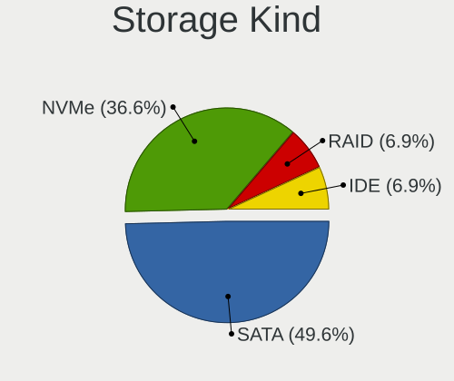

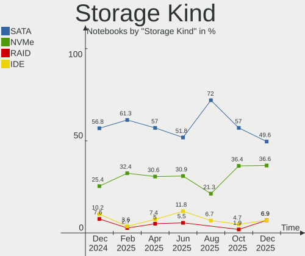

| Kind | Notebooks | Percent |
|------|-----------|---------|
| SATA | 65        | 49.62%  |
| NVMe | 48        | 36.64%  |
| RAID | 9         | 6.87%   |
| IDE  | 9         | 6.87%   |

Processor
---------

CPU Vendor
----------

Processor vendors

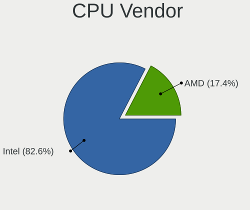

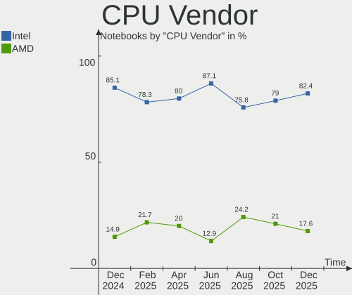

| Vendor | Notebooks | Percent |
|--------|-----------|---------|
| Intel  | 84        | 82.35%  |
| AMD    | 18        | 17.65%  |

CPU Model
---------

Processor models

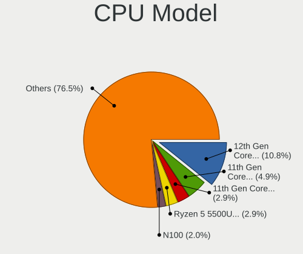

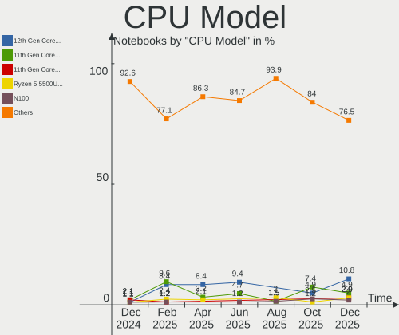

| Model                                       | Notebooks | Percent |
|---------------------------------------------|-----------|---------|
| Intel 12th Gen Core i5-1235U                | 11        | 10.78%  |
| Intel 11th Gen Core i5-1135G7 @ 2.40GHz     | 5         | 4.9%    |
| Intel 11th Gen Core i3-1125G4 @ 2.00GHz     | 3         | 2.94%   |
| AMD Ryzen 5 5500U with Radeon Graphics      | 3         | 2.94%   |
| Intel N100                                  | 2         | 1.96%   |
| Intel Core i5-3230M CPU @ 2.60GHz           | 2         | 1.96%   |
| Intel Core i5-3210M CPU @ 2.50GHz           | 2         | 1.96%   |
| Intel 12th Gen Core i3-1215U                | 2         | 1.96%   |
| AMD Ryzen 5 5600H with Radeon Graphics      | 2         | 1.96%   |
| Intel Pentium Silver N5030 CPU @ 1.10GHz    | 1         | 0.98%   |
| Intel Pentium M processor 1.73GHz           | 1         | 0.98%   |
| Intel Pentium Dual-Core CPU T4500 @ 2.30GHz | 1         | 0.98%   |
| Intel Pentium Dual-Core CPU T4400 @ 2.20GHz | 1         | 0.98%   |
| Intel Pentium Dual-Core CPU T4300 @ 2.10GHz | 1         | 0.98%   |
| Intel Pentium Dual CPU T2370 @ 1.73GHz      | 1         | 0.98%   |
| Intel Pentium CPU N3540 @ 2.16GHz           | 1         | 0.98%   |
| Intel Pentium CPU B960 @ 2.20GHz            | 1         | 0.98%   |
| Intel Pentium CPU 2020M @ 2.40GHz           | 1         | 0.98%   |
| Intel Core Ultra 9 275HX                    | 1         | 0.98%   |
| Intel Core M-5Y71 CPU @ 1.20GHz             | 1         | 0.98%   |
| Intel Core i7-8650U CPU @ 1.90GHz           | 1         | 0.98%   |
| Intel Core i7-8550U CPU @ 1.80GHz           | 1         | 0.98%   |
| Intel Core i7-4720HQ CPU @ 2.60GHz          | 1         | 0.98%   |
| Intel Core i7-4700MQ CPU @ 2.40GHz          | 1         | 0.98%   |
| Intel Core i7-4600U CPU @ 2.10GHz           | 1         | 0.98%   |
| Intel Core i7-3720QM CPU @ 2.60GHz          | 1         | 0.98%   |
| Intel Core i7-2630QM CPU @ 2.00GHz          | 1         | 0.98%   |
| Intel Core i7-14700HX                       | 1         | 0.98%   |
| Intel Core i7 CPU M 640 @ 2.80GHz           | 1         | 0.98%   |
| Intel Core i5-8265U CPU @ 1.60GHz           | 1         | 0.98%   |
| Intel Core i5-5287U CPU @ 2.90GHz           | 1         | 0.98%   |
| Intel Core i5-4300M CPU @ 2.60GHz           | 1         | 0.98%   |
| Intel Core i5-4210M CPU @ 2.60GHz           | 1         | 0.98%   |
| Intel Core i5-3337U CPU @ 1.80GHz           | 1         | 0.98%   |
| Intel Core i5-2450M CPU @ 2.50GHz           | 1         | 0.98%   |
| Intel Core i5-1035G1 CPU @ 1.00GHz          | 1         | 0.98%   |
| Intel Core i5 CPU M 480 @ 2.67GHz           | 1         | 0.98%   |
| Intel Core i5 CPU M 430 @ 2.27GHz           | 1         | 0.98%   |
| Intel Core i3-7020U CPU @ 2.30GHz           | 1         | 0.98%   |
| Intel Core i3-6006U CPU @ 2.00GHz           | 1         | 0.98%   |

CPU Model Family
----------------

Processor model prefix

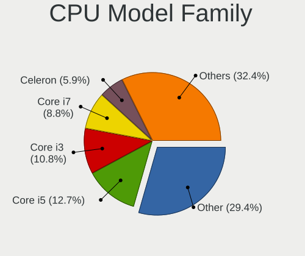

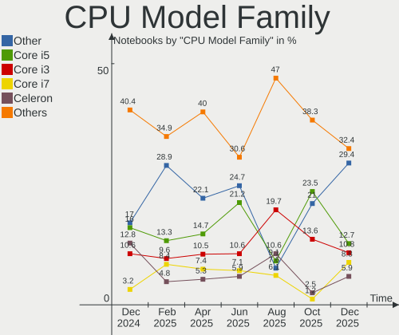

| Model                   | Notebooks | Percent |
|-------------------------|-----------|---------|
| Other                   | 30        | 29.41%  |
| Intel Core i5           | 13        | 12.75%  |
| Intel Core i3           | 11        | 10.78%  |
| Intel Core i7           | 9         | 8.82%   |
| Intel Celeron           | 6         | 5.88%   |
| AMD Ryzen 5             | 6         | 5.88%   |
| AMD Ryzen 7             | 4         | 3.92%   |
| Intel Pentium Dual-Core | 3         | 2.94%   |
| Intel Pentium           | 3         | 2.94%   |
| Intel Atom              | 2         | 1.96%   |
| AMD Ryzen 3             | 2         | 1.96%   |
| AMD A4                  | 2         | 1.96%   |
| AMD A10                 | 2         | 1.96%   |
| Intel Pentium Silver    | 1         | 0.98%   |
| Intel Pentium M         | 1         | 0.98%   |
| Intel Pentium Dual      | 1         | 0.98%   |
| Intel Core M            | 1         | 0.98%   |
| Intel Core 2 Duo        | 1         | 0.98%   |
| Intel Core 2            | 1         | 0.98%   |
| Intel Core              | 1         | 0.98%   |
| AMD E2                  | 1         | 0.98%   |
| AMD C-60                | 1         | 0.98%   |

CPU Cores
---------

Number of processor cores

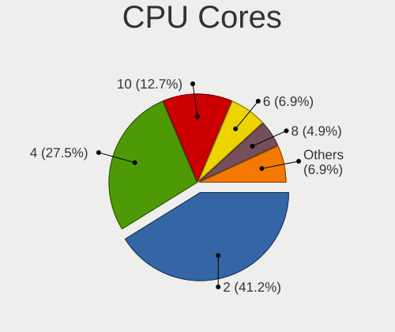

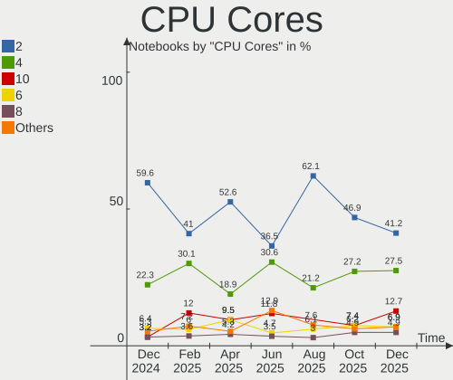

| Number | Notebooks | Percent |
|--------|-----------|---------|
| 2      | 42        | 41.18%  |
| 4      | 28        | 27.45%  |
| 10     | 13        | 12.75%  |
| 6      | 7         | 6.86%   |
| 8      | 5         | 4.9%    |
| 1      | 4         | 3.92%   |
| 24     | 2         | 1.96%   |
| 20     | 1         | 0.98%   |

CPU Sockets
-----------

Number of sockets

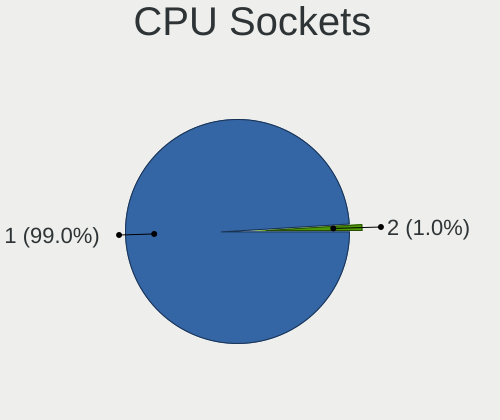

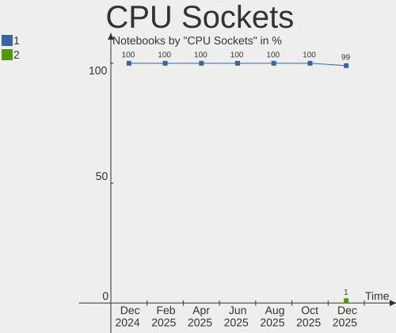

| Number | Notebooks | Percent |
|--------|-----------|---------|
| 1      | 101       | 99.02%  |
| 2      | 1         | 0.98%   |

CPU Threads
-----------

Threads per core (Hyper-Threading)

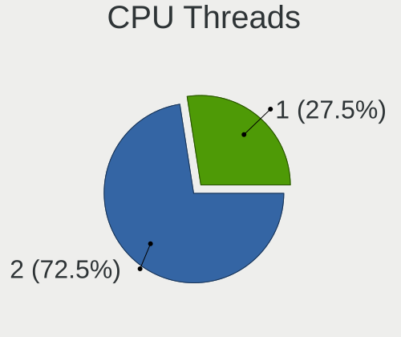

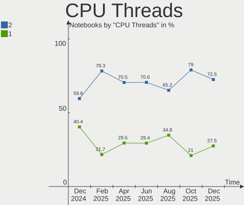

| Number | Notebooks | Percent |
|--------|-----------|---------|
| 2      | 74        | 72.55%  |
| 1      | 28        | 27.45%  |

CPU Op-Modes
------------

CPU Operation Modes (32-bit, 64-bit)

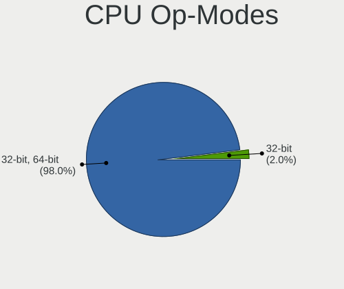

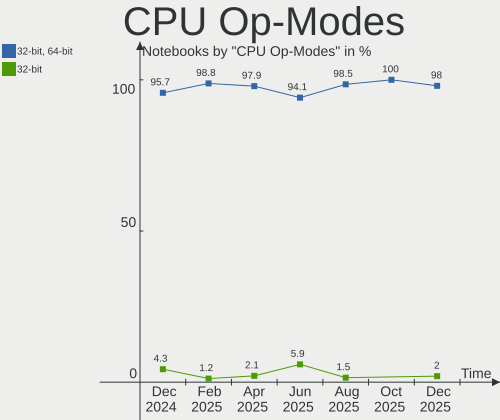

| Op mode        | Notebooks | Percent |
|----------------|-----------|---------|
| 32-bit, 64-bit | 100       | 98.04%  |
| 32-bit         | 2         | 1.96%   |

CPU Microcode
-------------

Microcode number

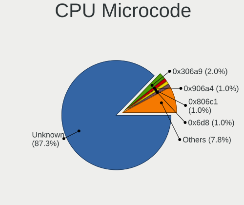

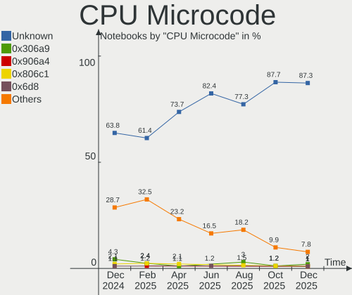

| Number     | Notebooks | Percent |
|------------|-----------|---------|
| Unknown    | 89        | 87.25%  |
| 0x306a9    | 2         | 1.96%   |
| 0x906a4    | 1         | 0.98%   |
| 0x806c1    | 1         | 0.98%   |
| 0x6d8      | 1         | 0.98%   |
| 0x406c4    | 1         | 0.98%   |
| 0x20652    | 1         | 0.98%   |
| 0x106c2    | 1         | 0.98%   |
| 0x1067a    | 1         | 0.98%   |
| 0x0a50000c | 1         | 0.98%   |
| 0x08600102 | 1         | 0.98%   |
| 0x0500010d | 1         | 0.98%   |
| 0x03000025 | 1         | 0.98%   |

CPU Microarch
-------------

Microarchitecture

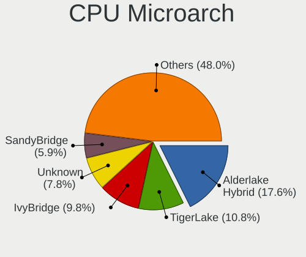

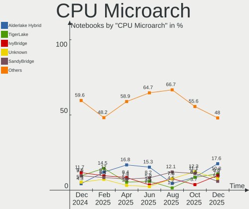

| Name             | Notebooks | Percent |
|------------------|-----------|---------|
| Alderlake Hybrid | 18        | 17.65%  |
| TigerLake        | 11        | 10.78%  |
| IvyBridge        | 10        | 9.8%    |
| Unknown          | 8         | 7.84%   |
| SandyBridge      | 6         | 5.88%   |
| Silvermont       | 5         | 4.9%    |
| Haswell          | 5         | 4.9%    |
| Westmere         | 4         | 3.92%   |
| Penryn           | 4         | 3.92%   |
| KabyLake         | 4         | 3.92%   |
| Zen 3            | 3         | 2.94%   |
| IceLake          | 3         | 2.94%   |
| Core             | 3         | 2.94%   |
| Broadwell        | 3         | 2.94%   |
| Gracemont        | 2         | 1.96%   |
| Excavator        | 2         | 1.96%   |
| Zen 2            | 1         | 0.98%   |
| Tremont          | 1         | 0.98%   |
| Skylake          | 1         | 0.98%   |
| Puma             | 1         | 0.98%   |
| Piledriver       | 1         | 0.98%   |
| P6               | 1         | 0.98%   |
| Lunarlake Hybrid | 1         | 0.98%   |
| K10 Llano        | 1         | 0.98%   |
| Goldmont plus    | 1         | 0.98%   |
| Bonnell          | 1         | 0.98%   |
| Bobcat           | 1         | 0.98%   |

Graphics
--------

GPU Vendor
----------

Vendors of graphics cards

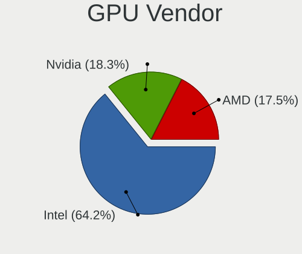

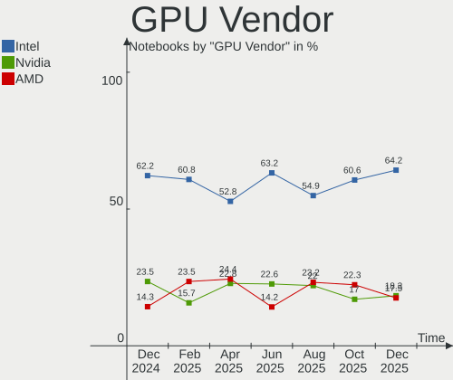

| Vendor | Notebooks | Percent |
|--------|-----------|---------|
| Intel  | 77        | 64.17%  |
| Nvidia | 22        | 18.33%  |
| AMD    | 21        | 17.5%   |

GPU Model
---------

Graphics card models

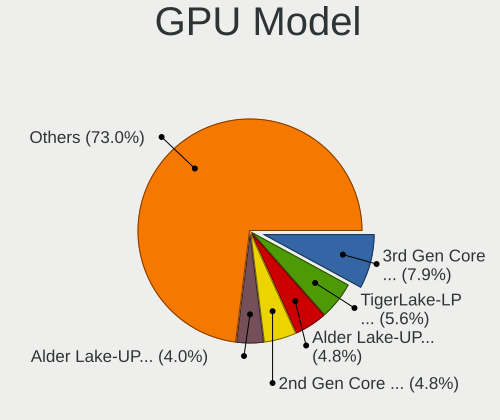

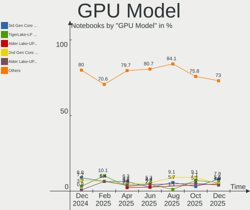

| Model                                                                                    | Notebooks | Percent |
|------------------------------------------------------------------------------------------|-----------|---------|
| Intel 3rd Gen Core processor Graphics Controller                                         | 10        | 7.94%   |
| Intel TigerLake-LP GT2 [Iris Xe Graphics]                                                | 7         | 5.56%   |
| Intel Alder Lake-UP3 GT2 [Iris Xe Graphics]                                              | 6         | 4.76%   |
| Intel 2nd Generation Core Processor Family Integrated Graphics Controller                | 6         | 4.76%   |
| Intel Alder Lake-UP3 GT2 [UHD Graphics]                                                  | 5         | 3.97%   |
| AMD Lucienne                                                                             | 5         | 3.97%   |
| Intel Tiger Lake-LP GT2 [UHD Graphics G4]                                                | 4         | 3.17%   |
| Intel 4th Gen Core Processor Integrated Graphics Controller                              | 4         | 3.17%   |
| AMD Thames [Radeon HD 7500M/7600M Series]                                                | 4         | 3.17%   |
| Intel Mobile 4 Series Chipset Integrated Graphics Controller                             | 3         | 2.38%   |
| Intel Iris Plus Graphics G1 (Ice Lake)                                                   | 3         | 2.38%   |
| Intel Atom/Celeron/Pentium Processor x5-E8000/J3xxx/N3xxx Integrated Graphics Controller | 3         | 2.38%   |
| Intel Alder Lake-UP3 GT1 [UHD Graphics]                                                  | 3         | 2.38%   |
| Nvidia GF119M [GeForce GT 520MX]                                                         | 2         | 1.59%   |
| Nvidia GA107M [GeForce RTX 3050 Mobile]                                                  | 2         | 1.59%   |
| Intel Raptor Lake-P [UHD Graphics]                                                       | 2         | 1.59%   |
| Intel Mobile GM965/GL960 Integrated Graphics Controller (secondary)                      | 2         | 1.59%   |
| Intel Mobile GM965/GL960 Integrated Graphics Controller (primary)                        | 2         | 1.59%   |
| Intel Kaby Lake-R GT2 [UHD Graphics 620]                                                 | 2         | 1.59%   |
| Intel Core Processor Integrated Graphics Controller                                      | 2         | 1.59%   |
| Intel Atom Processor Z36xxx/Z37xxx Series Graphics & Display                             | 2         | 1.59%   |
| Intel Alder Lake-N [UHD Graphics]                                                        | 2         | 1.59%   |
| AMD Mendocino [Radeon 610M]                                                              | 2         | 1.59%   |
| AMD Cezanne [Radeon Vega Series / Radeon Vega Mobile Series]                             | 2         | 1.59%   |
| Nvidia GT218M [GeForce 310M]                                                             | 1         | 0.79%   |
| Nvidia GT216M [GeForce GT 330M]                                                          | 1         | 0.79%   |
| Nvidia GP108M [GeForce MX230]                                                            | 1         | 0.79%   |
| Nvidia GM108M [GeForce MX110]                                                            | 1         | 0.79%   |
| Nvidia GM107M [GeForce GTX 860M]                                                         | 1         | 0.79%   |
| Nvidia GK208M [GeForce GT 740M]                                                          | 1         | 0.79%   |
| Nvidia GK208BM [GeForce 920M]                                                            | 1         | 0.79%   |
| Nvidia GK107M [GeForce GT 750M]                                                          | 1         | 0.79%   |
| Nvidia GK107M [GeForce GT 640M]                                                          | 1         | 0.79%   |
| Nvidia GF117M [GeForce 610M/710M/810M/820M / GT 620M/625M/630M/720M]                     | 1         | 0.79%   |
| Nvidia GF108M [GeForce GT 635M]                                                          | 1         | 0.79%   |
| Nvidia GF108M [GeForce GT 420M]                                                          | 1         | 0.79%   |
| Nvidia GB203M / GN22-X9 [GeForce RTX 5080 Max-Q / Mobile]                                | 1         | 0.79%   |
| Nvidia G98M [GeForce G 105M]                                                             | 1         | 0.79%   |
| Nvidia G73M [GeForce Go 7600]                                                            | 1         | 0.79%   |
| Nvidia C79 [GeForce 9400M / ION]                                                         | 1         | 0.79%   |

GPU Combo
---------

Combinations of graphics cards

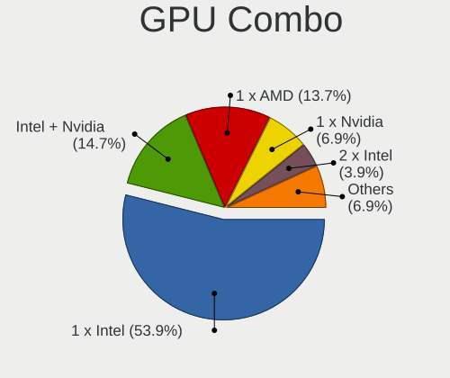

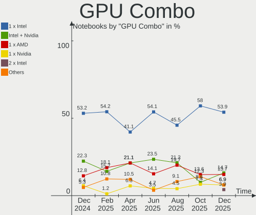

| Name           | Notebooks | Percent |
|----------------|-----------|---------|
| 1 x Intel      | 55        | 53.92%  |
| Intel + Nvidia | 15        | 14.71%  |
| 1 x AMD        | 14        | 13.73%  |
| 1 x Nvidia     | 7         | 6.86%   |
| 2 x Intel      | 4         | 3.92%   |
| 2 x AMD        | 4         | 3.92%   |
| Intel + AMD    | 3         | 2.94%   |

GPU Driver
----------

Free vs proprietary

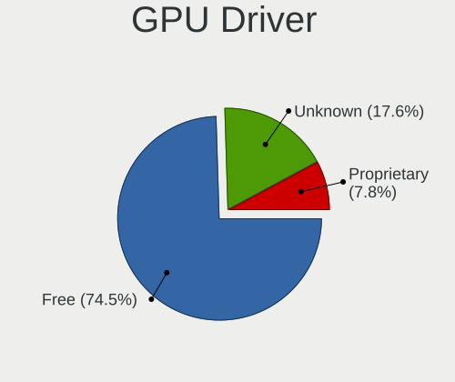

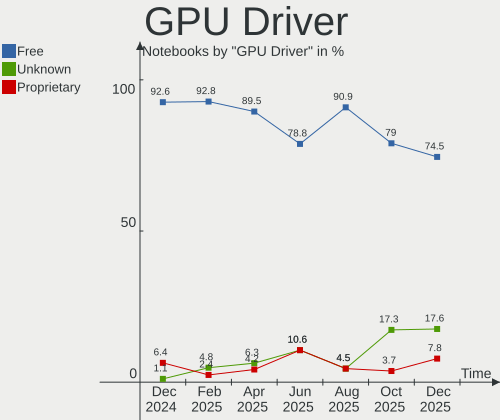

| Driver      | Notebooks | Percent |
|-------------|-----------|---------|
| Free        | 76        | 74.51%  |
| Unknown     | 18        | 17.65%  |
| Proprietary | 8         | 7.84%   |

GPU Memory
----------

Total video memory

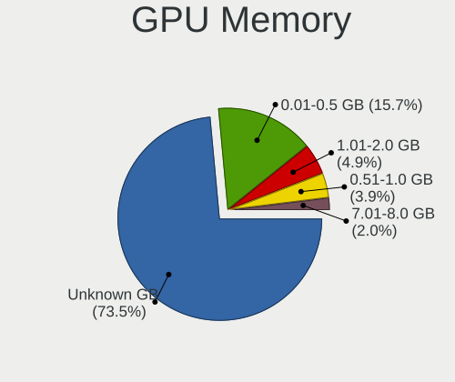

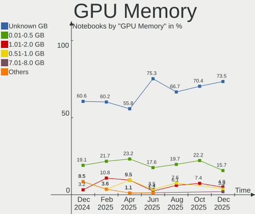

| Size in GB | Notebooks | Percent |
|------------|-----------|---------|
| Unknown    | 75        | 73.53%  |
| 0.01-0.5   | 16        | 15.69%  |
| 1.01-2.0   | 5         | 4.9%    |
| 0.51-1.0   | 4         | 3.92%   |
| 7.01-8.0   | 2         | 1.96%   |

Monitor
-------

Monitor Vendor
--------------

Monitor vendors

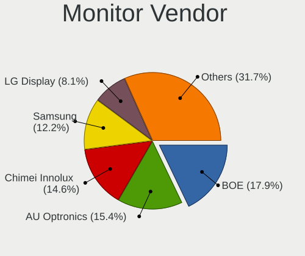

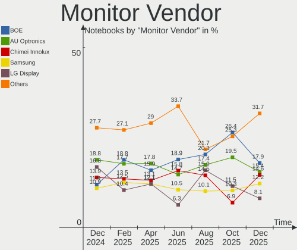

| Vendor                  | Notebooks | Percent |
|-------------------------|-----------|---------|
| BOE                     | 22        | 17.89%  |
| AU Optronics            | 19        | 15.45%  |
| Chimei Innolux          | 18        | 14.63%  |
| Samsung Electronics     | 15        | 12.2%   |
| LG Display              | 10        | 8.13%   |
| Dell                    | 5         | 4.07%   |
| Lenovo                  | 4         | 3.25%   |
| Philips                 | 3         | 2.44%   |
| InfoVision              | 3         | 2.44%   |
| Hewlett-Packard         | 3         | 2.44%   |
| CSOT                    | 3         | 2.44%   |
| Sharp                   | 2         | 1.63%   |
| MSI                     | 2         | 1.63%   |
| Chi Mei Optoelectronics | 2         | 1.63%   |
| Apple                   | 2         | 1.63%   |
| TMX                     | 1         | 0.81%   |
| SLD                     | 1         | 0.81%   |
| SAC                     | 1         | 0.81%   |
| RTK                     | 1         | 0.81%   |
| PANDA                   | 1         | 0.81%   |
| Mi                      | 1         | 0.81%   |
| JDZ                     | 1         | 0.81%   |
| Goldstar                | 1         | 0.81%   |
| CPT                     | 1         | 0.81%   |
| CHD                     | 1         | 0.81%   |

Monitor Model
-------------

Monitor models

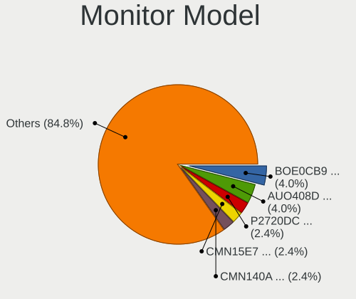

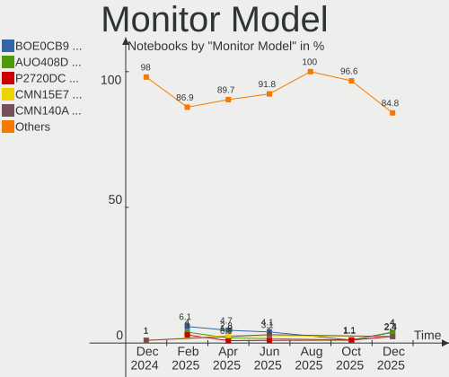

| Model                                                                   | Notebooks | Percent |
|-------------------------------------------------------------------------|-----------|---------|
| BOE LCD Monitor BOE0CB9 1920x1080 309x173mm 13.9-inch                   | 5         | 4%      |
| AU Optronics LCD Monitor AUO408D 1920x1080 309x174mm 14.0-inch          | 5         | 4%      |
| Dell P2720DC DELD0FC 2560x1440 597x336mm 27.0-inch                      | 3         | 2.4%    |
| Chimei Innolux LCD Monitor CMN15E7 1920x1080 344x193mm 15.5-inch        | 3         | 2.4%    |
| Chimei Innolux LCD Monitor CMN140A 1920x1080 309x173mm 13.9-inch        | 3         | 2.4%    |
| Samsung Electronics LCD Monitor SEC324A 1366x768 344x194mm 15.5-inch    | 2         | 1.6%    |
| Philips PHL24E1N5300 PHLC280 1920x1080 530x300mm 24.0-inch              | 2         | 1.6%    |
| Lenovo LCD Monitor LEN40B0 1366x768 344x194mm 15.5-inch                 | 2         | 1.6%    |
| Hewlett-Packard E273q HPN3474 2560x1440 597x336mm 27.0-inch             | 2         | 1.6%    |
| Chimei Innolux LCD Monitor CMN160A 1920x1080 355x199mm 16.0-inch        | 2         | 1.6%    |
| BOE LCD Monitor BOE0747 1920x1080 344x194mm 15.5-inch                   | 2         | 1.6%    |
| AU Optronics LCD Monitor AUO21EC 1366x768 344x193mm 15.5-inch           | 2         | 1.6%    |
| TMX TL142GDXP02-0 TMX1420 2520x1680 300x200mm 14.2-inch                 | 1         | 0.8%    |
| SLD LCD Monitor SLD003C 1366x768 309x173mm 13.9-inch                    | 1         | 0.8%    |
| Sharp LCD Monitor SHP1540 1920x1080 309x174mm 14.0-inch                 | 1         | 0.8%    |
| Sharp LCD Monitor SHP141F 1920x1080 294x165mm 13.3-inch                 | 1         | 0.8%    |
| Samsung Electronics SyncMaster SAM0214 1680x1050 408x306mm 20.1-inch    | 1         | 0.8%    |
| Samsung Electronics LCD Monitor SEC5541 1366x768 344x193mm 15.5-inch    | 1         | 0.8%    |
| Samsung Electronics LCD Monitor SEC4754 1280x800 261x163mm 12.1-inch    | 1         | 0.8%    |
| Samsung Electronics LCD Monitor SEC4256 1600x900 382x215mm 17.3-inch    | 1         | 0.8%    |
| Samsung Electronics LCD Monitor SEC4252 1366x768 344x194mm 15.5-inch    | 1         | 0.8%    |
| Samsung Electronics LCD Monitor SEC384A 1366x768 344x194mm 15.5-inch    | 1         | 0.8%    |
| Samsung Electronics LCD Monitor SEC3651 1366x768 344x194mm 15.5-inch    | 1         | 0.8%    |
| Samsung Electronics LCD Monitor SEC3445 1280x800 331x207mm 15.4-inch    | 1         | 0.8%    |
| Samsung Electronics LCD Monitor SEC334A 1366x768 344x194mm 15.5-inch    | 1         | 0.8%    |
| Samsung Electronics LCD Monitor SEC3245 1366x768 340x190mm 15.3-inch    | 1         | 0.8%    |
| Samsung Electronics LCD Monitor SDC544B 1600x900 309x174mm 14.0-inch    | 1         | 0.8%    |
| Samsung Electronics LCD Monitor SDC4161 1920x1080 344x194mm 15.5-inch   | 1         | 0.8%    |
| Samsung Electronics LCD Monitor SAM7016 3840x2160 1872x1053mm 84.6-inch | 1         | 0.8%    |
| Samsung Electronics LCD Monitor SAM0900 1366x768 580x320mm 26.1-inch    | 1         | 0.8%    |
| SAC 27A501F SAC2753 1920x1080 597x336mm 27.0-inch                       | 1         | 0.8%    |
| RTK USB C1 RTK8B8A 2560x1600 345x215mm 16.0-inch                        | 1         | 0.8%    |
| Philips PHL 241V8 PHLC212 1920x1080 527x296mm 23.8-inch                 | 1         | 0.8%    |
| PANDA LCD Monitor NCP004C 1920x1080 294x165mm 13.3-inch                 | 1         | 0.8%    |
| MSI MP271A MSI40A2 1920x1080 600x340mm 27.2-inch                        | 1         | 0.8%    |
| MSI MD2412P MSI40A5 1920x1080 527x296mm 23.8-inch                       | 1         | 0.8%    |
| Mi Monitor XMI27A1 3840x2160 597x336mm 27.0-inch                        | 1         | 0.8%    |
| LG Display LP156WH3-TLA2 LGD0210 1366x768 345x194mm 15.6-inch           | 1         | 0.8%    |
| LG Display LP156WH2-TLAA LGD0230 1366x768 344x194mm 15.5-inch           | 1         | 0.8%    |
| LG Display LCD Monitor LGD0525 1366x768 344x194mm 15.5-inch             | 1         | 0.8%    |

Monitor Resolution
------------------

Monitor screen resolution

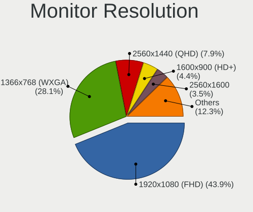

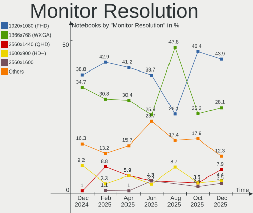

| Resolution         | Notebooks | Percent |
|--------------------|-----------|---------|
| 1920x1080 (FHD)    | 50        | 43.86%  |
| 1366x768 (WXGA)    | 32        | 28.07%  |
| 2560x1440 (QHD)    | 9         | 7.89%   |
| 1600x900 (HD+)     | 5         | 4.39%   |
| 2560x1600          | 4         | 3.51%   |
| 1920x1200 (WUXGA)  | 4         | 3.51%   |
| 1280x800 (WXGA)    | 4         | 3.51%   |
| 3840x2160 (4K)     | 2         | 1.75%   |
| 2520x1680          | 1         | 0.88%   |
| 1680x1050 (WSXGA+) | 1         | 0.88%   |
| 1024x768 (XGA)     | 1         | 0.88%   |
| 1024x600           | 1         | 0.88%   |

Monitor Diagonal
----------------

Diagonal size in inches

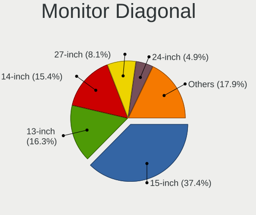

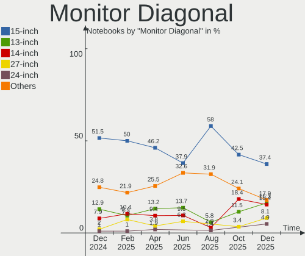

| Inches | Notebooks | Percent |
|--------|-----------|---------|
| 15     | 46        | 37.4%   |
| 13     | 20        | 16.26%  |
| 14     | 19        | 15.45%  |
| 27     | 10        | 8.13%   |
| 24     | 6         | 4.88%   |
| 17     | 6         | 4.88%   |
| 16     | 5         | 4.07%   |
| 31     | 2         | 1.63%   |
| 21     | 2         | 1.63%   |
| 11     | 2         | 1.63%   |
| 84     | 1         | 0.81%   |
| 23     | 1         | 0.81%   |
| 20     | 1         | 0.81%   |
| 18     | 1         | 0.81%   |
| 12     | 1         | 0.81%   |

Monitor Width
-------------

Physical width

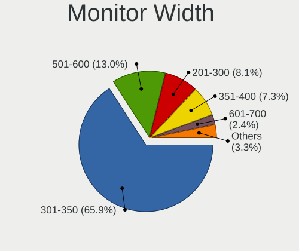

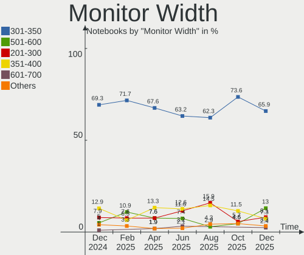

| Width in mm | Notebooks | Percent |
|-------------|-----------|---------|
| 301-350     | 81        | 65.85%  |
| 501-600     | 16        | 13.01%  |
| 201-300     | 10        | 8.13%   |
| 351-400     | 9         | 7.32%   |
| 601-700     | 3         | 2.44%   |
| 401-500     | 3         | 2.44%   |
| 1501-2000   | 1         | 0.81%   |

Aspect Ratio
------------

Proportional relationship between the width and the height

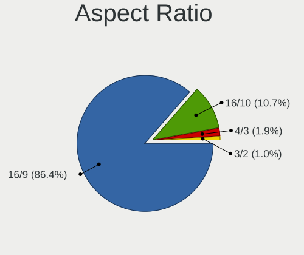

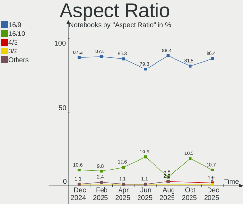

| Ratio | Notebooks | Percent |
|-------|-----------|---------|
| 16/9  | 89        | 86.41%  |
| 16/10 | 11        | 10.68%  |
| 4/3   | 2         | 1.94%   |
| 3/2   | 1         | 0.97%   |

Monitor Area
------------

Area in inch²

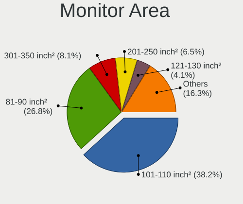

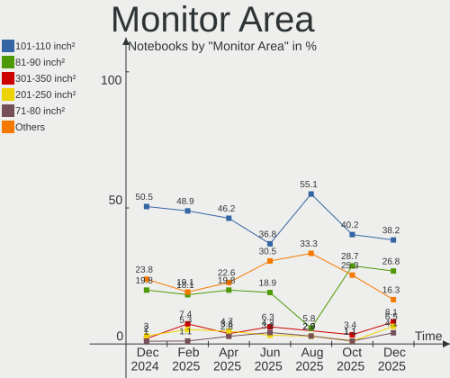

| Area in inch² | Notebooks | Percent |
|----------------|-----------|---------|
| 101-110        | 47        | 38.21%  |
| 81-90          | 33        | 26.83%  |
| 301-350        | 10        | 8.13%   |
| 201-250        | 8         | 6.5%    |
| 71-80          | 5         | 4.07%   |
| 121-130        | 5         | 4.07%   |
| 111-120        | 3         | 2.44%   |
| 51-60          | 2         | 1.63%   |
| 351-500        | 2         | 1.63%   |
| 151-200        | 2         | 1.63%   |
| 91-100         | 2         | 1.63%   |
| More than 1000 | 1         | 0.81%   |
| 61-70          | 1         | 0.81%   |
| 141-150        | 1         | 0.81%   |
| 131-140        | 1         | 0.81%   |

Pixel Density
-------------

Pixels per inch

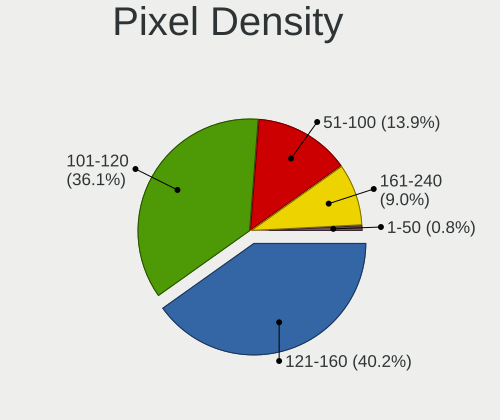

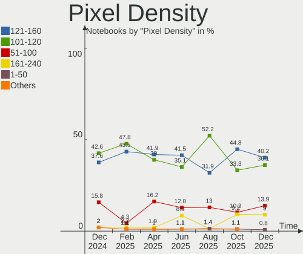

| Density | Notebooks | Percent |
|---------|-----------|---------|
| 121-160 | 49        | 40.16%  |
| 101-120 | 44        | 36.07%  |
| 51-100  | 17        | 13.93%  |
| 161-240 | 11        | 9.02%   |
| 1-50    | 1         | 0.82%   |

Multiple Monitors
-----------------

Total monitors connected

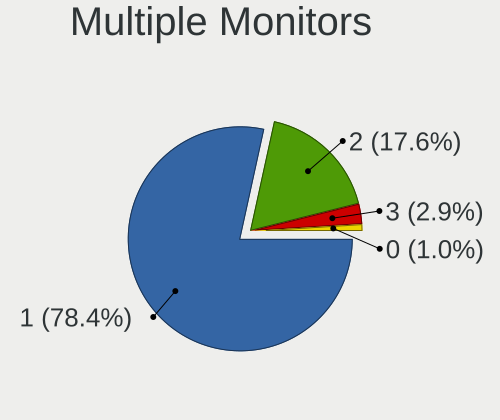

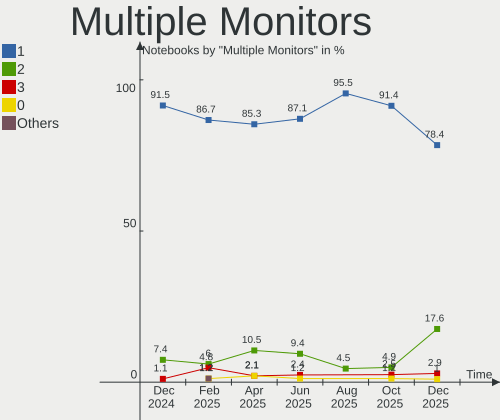

| Total | Notebooks | Percent |
|-------|-----------|---------|
| 1     | 80        | 78.43%  |
| 2     | 18        | 17.65%  |
| 3     | 3         | 2.94%   |
| 0     | 1         | 0.98%   |

Network
-------

Net Controller Vendor
---------------------

Controller vendors

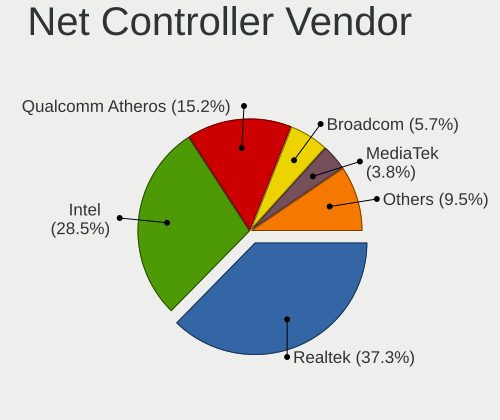

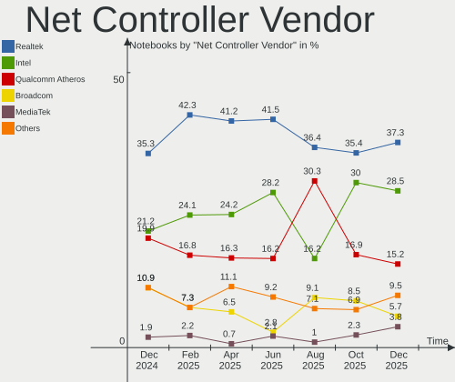

| Vendor                     | Notebooks | Percent |
|----------------------------|-----------|---------|
| Realtek Semiconductor      | 59        | 37.34%  |
| Intel                      | 45        | 28.48%  |
| Qualcomm Atheros           | 24        | 15.19%  |
| Broadcom                   | 9         | 5.7%    |
| MediaTek                   | 6         | 3.8%    |
| Broadcom Limited           | 5         | 3.16%   |
| Marvell Technology Group   | 2         | 1.27%   |
| Dell                       | 2         | 1.27%   |
| ZTE WCDMA Technologies MSM | 1         | 0.63%   |
| Samsung Electronics        | 1         | 0.63%   |
| Ralink Technology          | 1         | 0.63%   |
| Ralink                     | 1         | 0.63%   |
| JMicron Technology         | 1         | 0.63%   |
| aicsemi                    | 1         | 0.63%   |

Net Controller Model
--------------------

Controller models

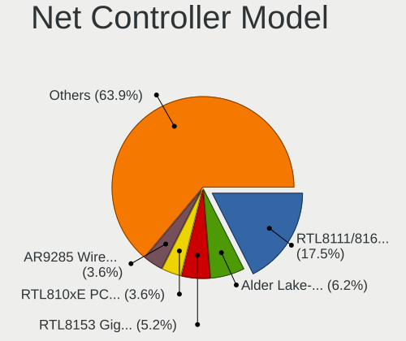

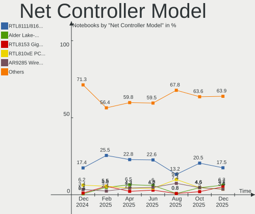

| Model                                                                  | Notebooks | Percent |
|------------------------------------------------------------------------|-----------|---------|
| Realtek RTL8111/8168/8211/8411 PCI Express Gigabit Ethernet Controller | 34        | 17.53%  |
| Intel Alder Lake-P PCH CNVi WiFi                                       | 12        | 6.19%   |
| Realtek RTL8153 Gigabit Ethernet Adapter                               | 10        | 5.15%   |
| Realtek RTL810xE PCI Express Fast Ethernet controller                  | 7         | 3.61%   |
| Qualcomm Atheros AR9285 Wireless Network Adapter (PCI-Express)         | 7         | 3.61%   |
| Intel Wi-Fi 6 AX201                                                    | 7         | 3.61%   |
| Qualcomm Atheros AR9485 Wireless Network Adapter                       | 5         | 2.58%   |
| Intel Wi-Fi 6E(802.11ax) AX210/AX1675* 2x2 [Typhoon Peak]              | 5         | 2.58%   |
| Realtek RTL8822CE 802.11ac PCIe Wireless Network Adapter               | 4         | 2.06%   |
| Realtek RTL8821CE 802.11ac PCIe Wireless Network Adapter               | 4         | 2.06%   |
| Realtek RTL8723BE PCIe Wireless Network Adapter                        | 4         | 2.06%   |
| Qualcomm Atheros QCA9377 802.11ac Wireless Network Adapter             | 4         | 2.06%   |
| Qualcomm Atheros AR8131 Gigabit Ethernet                               | 4         | 2.06%   |
| Intel Ethernet Connection (16) I219-V                                  | 4         | 2.06%   |
| Intel Ethernet Connection (13) I219-V                                  | 4         | 2.06%   |
| MediaTek MT7902 802.11ax PCIe Wireless Network Adapter [Filogic 310]   | 3         | 1.55%   |
| Realtek RTL88x2bu [AC1200 Techkey]                                     | 2         | 1.03%   |
| Realtek RTL8852BE PCIe 802.11ax Wireless Network Controller            | 2         | 1.03%   |
| Qualcomm Atheros QCA9565 / AR9565 Wireless Network Adapter             | 2         | 1.03%   |
| Intel Wireless 8265 / 8275                                             | 2         | 1.03%   |
| Intel Wireless 7265                                                    | 2         | 1.03%   |
| Intel WiMAX Connection 2400m                                           | 2         | 1.03%   |
| Intel Ethernet Connection I217-LM                                      | 2         | 1.03%   |
| Intel Centrino Wireless-N 130                                          | 2         | 1.03%   |
| Intel Centrino Advanced-N 6235                                         | 2         | 1.03%   |
| Broadcom BCM43142 802.11b/g/n                                          | 2         | 1.03%   |
| Broadcom BCM4313 802.11bgn Wireless Network Adapter                    | 2         | 1.03%   |
| ZTE WCDMA MSM ZTE Mobile Broadband                                     | 1         | 0.52%   |
| Samsung Galaxy series, misc. (tethering mode)                          | 1         | 0.52%   |
| Realtek RTL8852CE PCIe 802.11ax Wireless Network Controller            | 1         | 0.52%   |
| Realtek RTL8822BE 802.11a/b/g/n/ac WiFi adapter                        | 1         | 0.52%   |
| Realtek RTL8811AU 802.11a/b/g/n/ac WLAN Adapter                        | 1         | 0.52%   |
| Realtek RTL8192EU 802.11b/g/n WLAN Adapter                             | 1         | 0.52%   |
| Realtek RTL8188EE Wireless Network Adapter                             | 1         | 0.52%   |
| Realtek RTL8188CE 802.11b/g/n WiFi Adapter                             | 1         | 0.52%   |
| Realtek RTL8125 2.5GbE Controller                                      | 1         | 0.52%   |
| Realtek Killer E3000 2.5GbE Controller                                 | 1         | 0.52%   |
| Realtek 802.11n WLAN Adapter                                           | 1         | 0.52%   |
| Realtek 802.11ac NIC                                                   | 1         | 0.52%   |
| Ralink RT2870/RT3070 Wireless Adapter                                  | 1         | 0.52%   |

Wireless Vendor
---------------

Wireless vendors

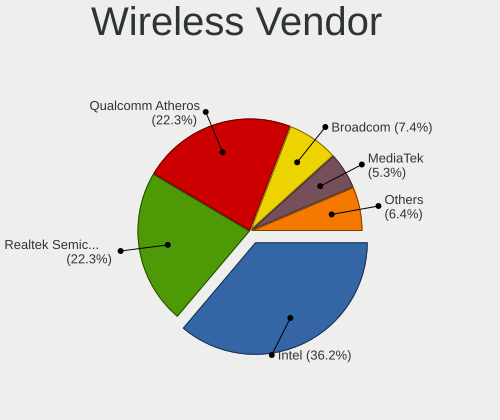

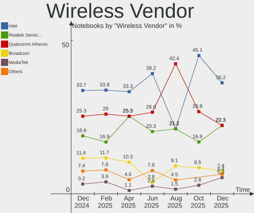

| Vendor                | Notebooks | Percent |
|-----------------------|-----------|---------|
| Intel                 | 34        | 36.17%  |
| Realtek Semiconductor | 21        | 22.34%  |
| Qualcomm Atheros      | 21        | 22.34%  |
| Broadcom              | 7         | 7.45%   |
| MediaTek              | 5         | 5.32%   |
| Dell                  | 2         | 2.13%   |
| Broadcom Limited      | 2         | 2.13%   |
| Ralink Technology     | 1         | 1.06%   |
| Ralink                | 1         | 1.06%   |

Wireless Model
--------------

Wireless models

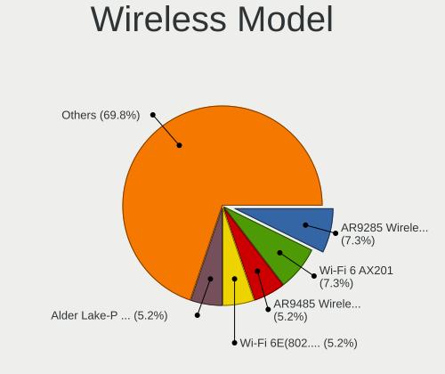

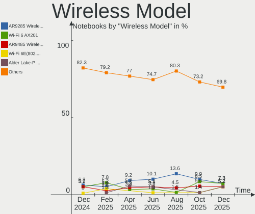

| Model                                                                                 | Notebooks | Percent |
|---------------------------------------------------------------------------------------|-----------|---------|
| Qualcomm Atheros AR9285 Wireless Network Adapter (PCI-Express)                        | 7         | 7.29%   |
| Intel Wi-Fi 6 AX201                                                                   | 7         | 7.29%   |
| Qualcomm Atheros AR9485 Wireless Network Adapter                                      | 5         | 5.21%   |
| Intel Wi-Fi 6E(802.11ax) AX210/AX1675* 2x2 [Typhoon Peak]                             | 5         | 5.21%   |
| Intel Alder Lake-P PCH CNVi WiFi                                                      | 5         | 5.21%   |
| Realtek RTL8822CE 802.11ac PCIe Wireless Network Adapter                              | 4         | 4.17%   |
| Realtek RTL8821CE 802.11ac PCIe Wireless Network Adapter                              | 4         | 4.17%   |
| Realtek RTL8723BE PCIe Wireless Network Adapter                                       | 4         | 4.17%   |
| Qualcomm Atheros QCA9377 802.11ac Wireless Network Adapter                            | 4         | 4.17%   |
| MediaTek MT7902 802.11ax PCIe Wireless Network Adapter [Filogic 310]                  | 3         | 3.13%   |
| Realtek RTL88x2bu [AC1200 Techkey]                                                    | 2         | 2.08%   |
| Realtek RTL8852BE PCIe 802.11ax Wireless Network Controller                           | 2         | 2.08%   |
| Qualcomm Atheros QCA9565 / AR9565 Wireless Network Adapter                            | 2         | 2.08%   |
| Intel Wireless 8265 / 8275                                                            | 2         | 2.08%   |
| Intel Wireless 7265                                                                   | 2         | 2.08%   |
| Intel Centrino Wireless-N 130                                                         | 2         | 2.08%   |
| Intel Centrino Advanced-N 6235                                                        | 2         | 2.08%   |
| Broadcom BCM43142 802.11b/g/n                                                         | 2         | 2.08%   |
| Broadcom BCM4313 802.11bgn Wireless Network Adapter                                   | 2         | 2.08%   |
| Realtek RTL8822BE 802.11a/b/g/n/ac WiFi adapter                                       | 1         | 1.04%   |
| Realtek RTL8811AU 802.11a/b/g/n/ac WLAN Adapter                                       | 1         | 1.04%   |
| Realtek RTL8192EU 802.11b/g/n WLAN Adapter                                            | 1         | 1.04%   |
| Realtek RTL8188EE Wireless Network Adapter                                            | 1         | 1.04%   |
| Realtek RTL8188CE 802.11b/g/n WiFi Adapter                                            | 1         | 1.04%   |
| Realtek 802.11n WLAN Adapter                                                          | 1         | 1.04%   |
| Realtek 802.11ac NIC                                                                  | 1         | 1.04%   |
| Ralink RT2870/RT3070 Wireless Adapter                                                 | 1         | 1.04%   |
| Ralink RT3290 Wireless 802.11n 1T/1R PCIe                                             | 1         | 1.04%   |
| Qualcomm Atheros QCA6174 802.11ac Wireless Network Adapter                            | 1         | 1.04%   |
| Qualcomm Atheros AR9462 Wireless Network Adapter                                      | 1         | 1.04%   |
| Qualcomm Atheros AR5418 Wireless Network Adapter [AR5008E 802.11(a)bgn] (PCI-Express) | 1         | 1.04%   |
| MediaTek MT7921K (RZ608) Wi-Fi 6E 80MHz                                               | 1         | 1.04%   |
| MediaTek MT7921 802.11ax PCIe Wireless Network Adapter [Filogic 330]                  | 1         | 1.04%   |
| Intel Wi-Fi 7(802.11be) AX1775*/AX1790*/BE20*/BE401/BE1750* 2x2                       | 1         | 1.04%   |
| Intel PRO/Wireless 3945ABG [Golan] Network Connection                                 | 1         | 1.04%   |
| Intel PRO/Wireless 2200BG [Calexico2] Network Connection                              | 1         | 1.04%   |
| Intel Jasper Lake PCH CNVi WiFi                                                       | 1         | 1.04%   |
| Intel Ice Lake-LP PCH CNVi WiFi                                                       | 1         | 1.04%   |
| Intel Centrino Wireless-N 2230                                                        | 1         | 1.04%   |
| Intel Centrino Ultimate-N 6300                                                        | 1         | 1.04%   |

Ethernet Vendor
---------------

Ethernet vendors

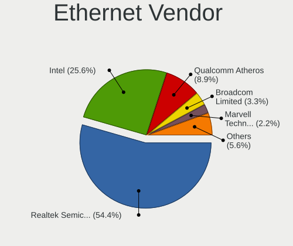

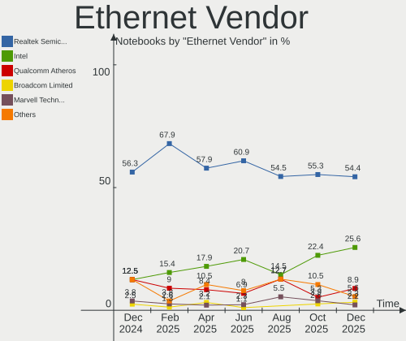

| Vendor                   | Notebooks | Percent |
|--------------------------|-----------|---------|
| Realtek Semiconductor    | 49        | 54.44%  |
| Intel                    | 23        | 25.56%  |
| Qualcomm Atheros         | 8         | 8.89%   |
| Broadcom Limited         | 3         | 3.33%   |
| Marvell Technology Group | 2         | 2.22%   |
| Broadcom                 | 2         | 2.22%   |
| Samsung Electronics      | 1         | 1.11%   |
| MediaTek                 | 1         | 1.11%   |
| JMicron Technology       | 1         | 1.11%   |

Ethernet Model
--------------

Ethernet models

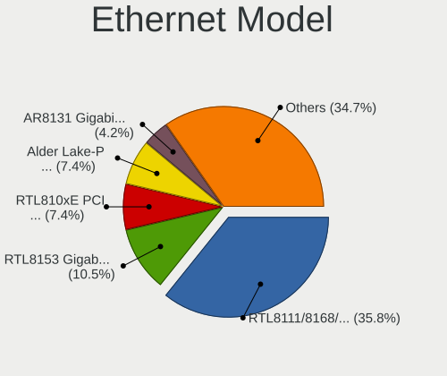

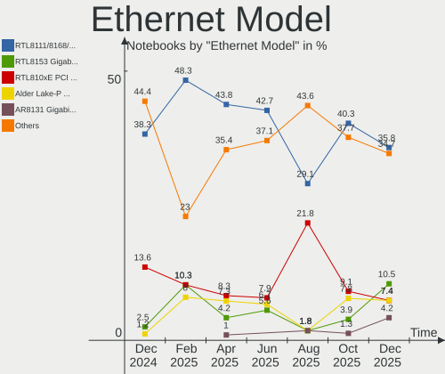

| Model                                                                          | Notebooks | Percent |
|--------------------------------------------------------------------------------|-----------|---------|
| Realtek RTL8111/8168/8211/8411 PCI Express Gigabit Ethernet Controller         | 34        | 35.79%  |
| Realtek RTL8153 Gigabit Ethernet Adapter                                       | 10        | 10.53%  |
| Realtek RTL810xE PCI Express Fast Ethernet controller                          | 7         | 7.37%   |
| Intel Alder Lake-P PCH CNVi WiFi                                               | 7         | 7.37%   |
| Qualcomm Atheros AR8131 Gigabit Ethernet                                       | 4         | 4.21%   |
| Intel Ethernet Connection (16) I219-V                                          | 4         | 4.21%   |
| Intel Ethernet Connection (13) I219-V                                          | 4         | 4.21%   |
| Intel WiMAX Connection 2400m                                                   | 2         | 2.11%   |
| Intel Ethernet Connection I217-LM                                              | 2         | 2.11%   |
| Samsung Galaxy series, misc. (tethering mode)                                  | 1         | 1.05%   |
| Realtek RTL8852CE PCIe 802.11ax Wireless Network Controller                    | 1         | 1.05%   |
| Realtek RTL8125 2.5GbE Controller                                              | 1         | 1.05%   |
| Realtek Killer E3000 2.5GbE Controller                                         | 1         | 1.05%   |
| Qualcomm Atheros AR8162 Fast Ethernet                                          | 1         | 1.05%   |
| Qualcomm Atheros AR8161 Gigabit Ethernet                                       | 1         | 1.05%   |
| Qualcomm Atheros AR8152 v2.0 Fast Ethernet                                     | 1         | 1.05%   |
| Qualcomm Atheros AR8152 v1.1 Fast Ethernet                                     | 1         | 1.05%   |
| MediaTek MT7922 802.11ax PCI Express Wireless Network Adapter                  | 1         | 1.05%   |
| Marvell Group Yukon Optima 88E8059 [PCIe Gigabit Ethernet Controller with AVB] | 1         | 1.05%   |
| Marvell Group 88E8058 PCI-E Gigabit Ethernet Controller                        | 1         | 1.05%   |
| JMicron JMC250 PCI Express Gigabit Ethernet Controller                         | 1         | 1.05%   |
| Intel Ethernet Connection I218-LM                                              | 1         | 1.05%   |
| Intel Ethernet Connection (4) I219-V                                           | 1         | 1.05%   |
| Intel Ethernet Connection (4) I219-LM                                          | 1         | 1.05%   |
| Intel 82579LM Gigabit Network Connection (Lewisville)                          | 1         | 1.05%   |
| Broadcom NetLink BCM5906M Fast Ethernet PCI Express                            | 1         | 1.05%   |
| Broadcom Limited NetXtreme BCM5751M Gigabit Ethernet PCI Express               | 1         | 1.05%   |
| Broadcom Limited NetLink BCM5906M Fast Ethernet PCI Express                    | 1         | 1.05%   |
| Broadcom Limited NetLink BCM5787M Gigabit Ethernet PCI Express                 | 1         | 1.05%   |
| Broadcom BCM4401-B0 100Base-TX                                                 | 1         | 1.05%   |

Net Controller Kind
-------------------

Ethernet, WiFi or modem

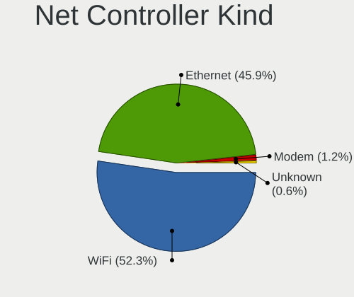

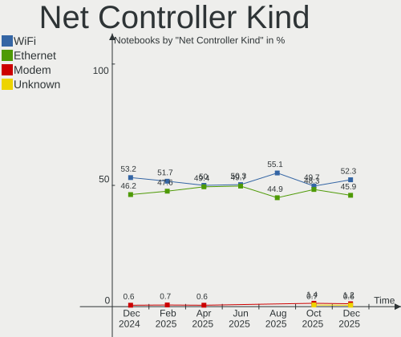

| Kind     | Notebooks | Percent |
|----------|-----------|---------|
| WiFi     | 90        | 52.33%  |
| Ethernet | 79        | 45.93%  |
| Modem    | 2         | 1.16%   |
| Unknown  | 1         | 0.58%   |

Used Controller
---------------

Currently used network controller

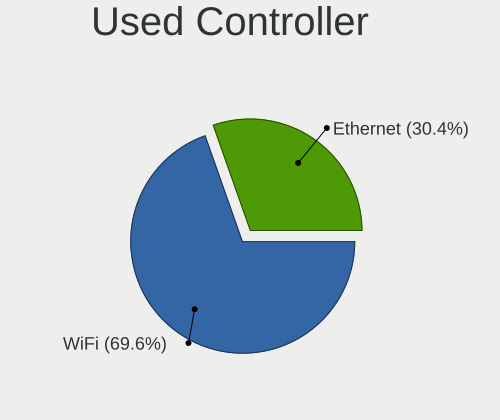

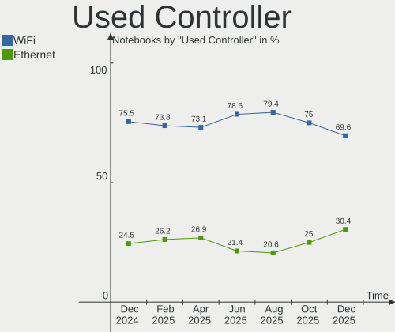

| Kind     | Notebooks | Percent |
|----------|-----------|---------|
| WiFi     | 71        | 69.61%  |
| Ethernet | 31        | 30.39%  |

NICs
----

Total network controllers on board

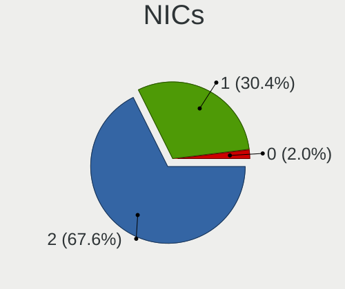

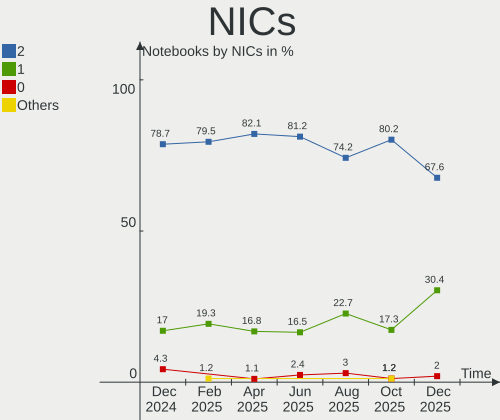

| Total | Notebooks | Percent |
|-------|-----------|---------|
| 2     | 69        | 67.65%  |
| 1     | 31        | 30.39%  |
| 0     | 2         | 1.96%   |

IPv6
----

IPv6 vs IPv4

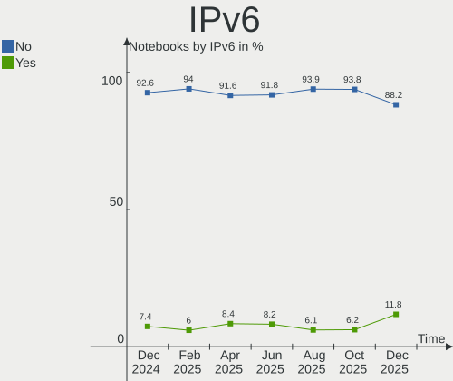

| Used | Notebooks | Percent |
|------|-----------|---------|
| No   | 90        | 88.24%  |
| Yes  | 12        | 11.76%  |

Bluetooth
---------

Bluetooth Vendor
----------------

Controller vendors

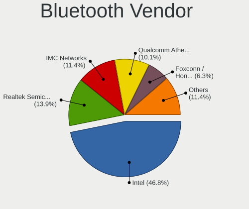

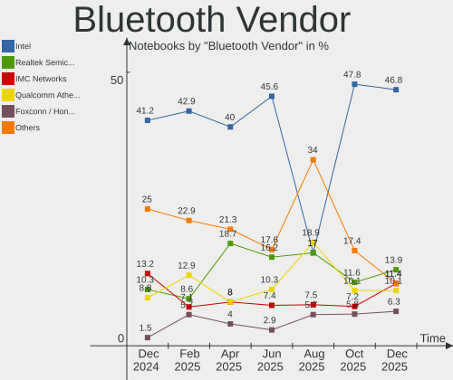

| Vendor                          | Notebooks | Percent |
|---------------------------------|-----------|---------|
| Intel                           | 37        | 46.84%  |
| Realtek Semiconductor           | 11        | 13.92%  |
| IMC Networks                    | 9         | 11.39%  |
| Qualcomm Atheros Communications | 8         | 10.13%  |
| Foxconn / Hon Hai               | 5         | 6.33%   |
| Apple                           | 2         | 2.53%   |
| Ralink                          | 1         | 1.27%   |
| MediaTek                        | 1         | 1.27%   |
| Lite-On Technology              | 1         | 1.27%   |
| Hewlett-Packard                 | 1         | 1.27%   |
| Cambridge Silicon Radio         | 1         | 1.27%   |
| Broadcom                        | 1         | 1.27%   |
| ASUSTek Computer                | 1         | 1.27%   |

Bluetooth Model
---------------

Controller models

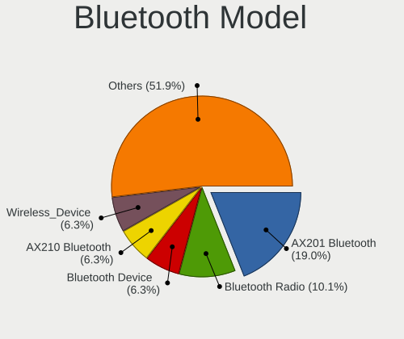

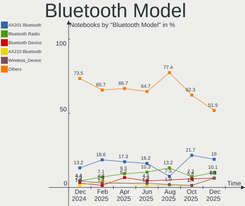

| Model                                               | Notebooks | Percent |
|-----------------------------------------------------|-----------|---------|
| Intel AX201 Bluetooth                               | 15        | 18.99%  |
| Realtek Bluetooth Radio                             | 8         | 10.13%  |
| Intel Bluetooth Device                              | 5         | 6.33%   |
| Intel AX210 Bluetooth                               | 5         | 6.33%   |
| IMC Networks Wireless_Device                        | 5         | 6.33%   |
| Intel Bluetooth wireless interface                  | 4         | 5.06%   |
| Intel Bluetooth 9460/9560 Jefferson Peak (JfP)      | 4         | 5.06%   |
| Qualcomm Atheros  Bluetooth Device                  | 3         | 3.8%    |
| Qualcomm Atheros AR3012 Bluetooth 4.0               | 3         | 3.8%    |
| Realtek 802.11ac WLAN Adapter                       | 2         | 2.53%   |
| Intel Centrino Bluetooth Wireless Transceiver       | 2         | 2.53%   |
| Intel Centrino Advanced-N 6230 Bluetooth adapter    | 2         | 2.53%   |
| IMC Networks Bluetooth Radio                        | 2         | 2.53%   |
| Foxconn / Hon Hai Bluetooth Radio                   | 2         | 2.53%   |
| Realtek  Bluetooth 4.2 Adapter                      | 1         | 1.27%   |
| Ralink RT3290 Bluetooth                             | 1         | 1.27%   |
| Qualcomm Atheros QCA61x4 Bluetooth 4.0              | 1         | 1.27%   |
| Qualcomm Atheros AR3011 Bluetooth                   | 1         | 1.27%   |
| MediaTek Wireless_Device                            | 1         | 1.27%   |
| Lite-On Qualcomm Atheros QCA9377 Bluetooth          | 1         | 1.27%   |
| IMC Networks Bluetooth Device                       | 1         | 1.27%   |
| IMC Networks Atheros AR3012 Bluetooth 4.0 Adapter   | 1         | 1.27%   |
| HP Broadcom 2070 Bluetooth Combo                    | 1         | 1.27%   |
| Foxconn / Hon Hai Broadcom BCM20702A1 Bluetooth     | 1         | 1.27%   |
| Foxconn / Hon Hai Broadcom BCM20702 Bluetooth       | 1         | 1.27%   |
| Foxconn / Hon Hai BCM43142A0 broadcom bluetooth     | 1         | 1.27%   |
| Cambridge Silicon Radio Bluetooth Dongle (HCI mode) | 1         | 1.27%   |
| Broadcom BCM2045 Bluetooth                          | 1         | 1.27%   |
| ASUS BT-270 Bluetooth Adapter                       | 1         | 1.27%   |
| Apple Bluetooth Host Controller                     | 1         | 1.27%   |
| Apple Bluetooth HCI                                 | 1         | 1.27%   |

Sound
-----

Sound Vendor
------------

Sound card vendors

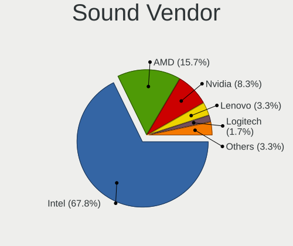

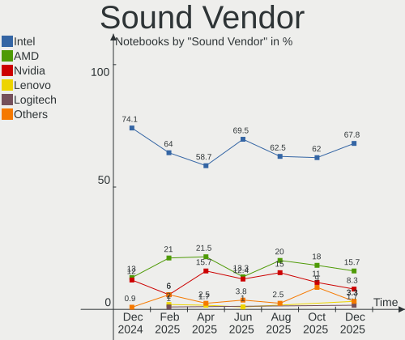

| Vendor              | Notebooks | Percent |
|---------------------|-----------|---------|
| Intel               | 82        | 67.77%  |
| AMD                 | 19        | 15.7%   |
| Nvidia              | 10        | 8.26%   |
| Lenovo              | 4         | 3.31%   |
| Logitech            | 2         | 1.65%   |
| C-Media Electronics | 2         | 1.65%   |
| Samsung Electronics | 1         | 0.83%   |
| Plantronics         | 1         | 0.83%   |

Sound Model
-----------

Sound card models

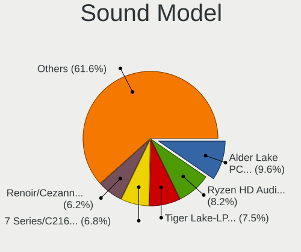

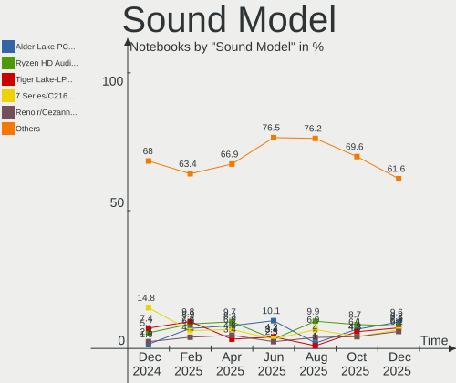

| Model                                                                                             | Notebooks | Percent |
|---------------------------------------------------------------------------------------------------|-----------|---------|
| Intel Alder Lake PCH-P High Definition Audio Controller                                           | 14        | 9.59%   |
| AMD Ryzen HD Audio Controller                                                                     | 12        | 8.22%   |
| Intel Tiger Lake-LP Smart Sound Technology Audio Controller                                       | 11        | 7.53%   |
| Intel 7 Series/C216 Chipset Family High Definition Audio Controller                               | 10        | 6.85%   |
| AMD Renoir/Cezanne HDMI/DP Audio Controller                                                       | 9         | 6.16%   |
| Intel 6 Series/C200 Series Chipset Family High Definition Audio Controller                        | 6         | 4.11%   |
| Lenovo ThinkPad USB-C Dock Audio                                                                  | 4         | 2.74%   |
| Intel Xeon E3-1200 v3/4th Gen Core Processor HD Audio Controller                                  | 4         | 2.74%   |
| Intel Sunrise Point-LP HD Audio                                                                   | 4         | 2.74%   |
| Intel 82801I (ICH9 Family) HD Audio Controller                                                    | 4         | 2.74%   |
| Intel 8 Series/C220 Series Chipset High Definition Audio Controller                               | 4         | 2.74%   |
| Intel 5 Series/3400 Series Chipset High Definition Audio                                          | 4         | 2.74%   |
| Intel Ice Lake-LP Smart Sound Technology Audio Controller                                         | 3         | 2.05%   |
| Intel Broadwell-U Audio Controller                                                                | 3         | 2.05%   |
| AMD FCH Azalia Controller                                                                         | 3         | 2.05%   |
| Nvidia GF108 High Definition Audio Controller                                                     | 2         | 1.37%   |
| Intel Wildcat Point-LP High Definition Audio Controller                                           | 2         | 1.37%   |
| Intel Raptor Lake-P/U/H cAVS                                                                      | 2         | 1.37%   |
| Intel Raptor Lake High Definition Audio Controller                                                | 2         | 1.37%   |
| Intel Atom/Celeron/Pentium Processor x5-E8000/J3xxx/N3xxx Series High Definition Audio Controller | 2         | 1.37%   |
| Intel Atom Processor Z36xxx/Z37xxx Series High Definition Audio Controller                        | 2         | 1.37%   |
| Intel Alder Lake-N PCH High Definition Audio Controller                                           | 2         | 1.37%   |
| Intel 82801H (ICH8 Family) HD Audio Controller                                                    | 2         | 1.37%   |
| C-Media Electronics USB Advanced Audio Device                                                     | 2         | 1.37%   |
| AMD Radeon High Definition Audio Controller                                                       | 2         | 1.37%   |
| AMD Kabini HDMI/DP Audio                                                                          | 2         | 1.37%   |
| AMD Family 15h (Models 60h-6fh) Audio Controller                                                  | 2         | 1.37%   |
| Samsung Electronics USBC Headset                                                                  | 1         | 0.68%   |
| Plantronics C310-M                                                                                | 1         | 0.68%   |
| Nvidia MCP79 High Definition Audio                                                                | 1         | 0.68%   |
| Nvidia High Definition Audio Controller                                                           | 1         | 0.68%   |
| Nvidia GT216 HDMI Audio Controller                                                                | 1         | 0.68%   |
| Nvidia GK208 HDMI/DP Audio Controller                                                             | 1         | 0.68%   |
| Nvidia GB203 High Definition Audio Controller                                                     | 1         | 0.68%   |
| Nvidia GA107 High Definition Audio Controller                                                     | 1         | 0.68%   |
| Nvidia AD107 High Definition Audio Controller                                                     | 1         | 0.68%   |
| Nvidia AD106M High Definition Audio Controller                                                    | 1         | 0.68%   |
| Logitech Headset H340                                                                             | 1         | 0.68%   |
| Logitech G435 Wireless Gaming Headset                                                             | 1         | 0.68%   |
| Intel NM10/ICH7 Family High Definition Audio Controller                                           | 1         | 0.68%   |

Memory
------

Memory Vendor
-------------

Memory module vendors

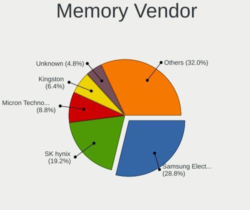

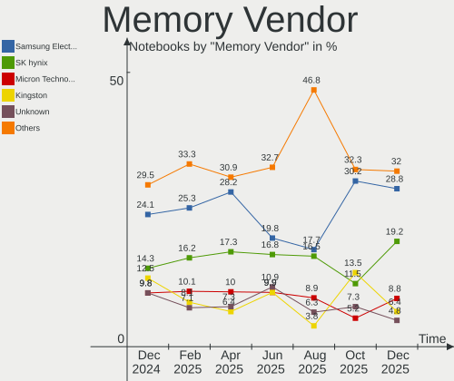

| Vendor                       | Notebooks | Percent |
|------------------------------|-----------|---------|
| Samsung Electronics          | 36        | 28.8%   |
| SK hynix                     | 24        | 19.2%   |
| Micron Technology            | 11        | 8.8%    |
| Kingston                     | 8         | 6.4%    |
| Unknown                      | 6         | 4.8%    |
| Ramaxel Technology           | 5         | 4%      |
| Crucial                      | 4         | 3.2%    |
| Patriot                      | 3         | 2.4%    |
| Nanya Technology             | 3         | 2.4%    |
| Unknown                      | 3         | 2.4%    |
| Hikvision                    | 2         | 1.6%    |
| GOODRAM                      | 2         | 1.6%    |
| Foxline                      | 2         | 1.6%    |
| AMD                          | 2         | 1.6%    |
| Wodposit                     | 1         | 0.8%    |
| Unknown (ABCD)               | 1         | 0.8%    |
| Unknown (0x0CAB)             | 1         | 0.8%    |
| Unknown (0x0BEC)             | 1         | 0.8%    |
| Unknown (0x0B45)             | 1         | 0.8%    |
| Smart                        | 1         | 0.8%    |
| Patriot Memory (PDP Systems) | 1         | 0.8%    |
| Kllisre                      | 1         | 0.8%    |
| Elpida                       | 1         | 0.8%    |
| Corsair                      | 1         | 0.8%    |
| ChangXin Memory              | 1         | 0.8%    |
| Ankowall                     | 1         | 0.8%    |
| ACPI Digital                 | 1         | 0.8%    |
| A-DATA Technology            | 1         | 0.8%    |

Memory Model
------------

Memory module models

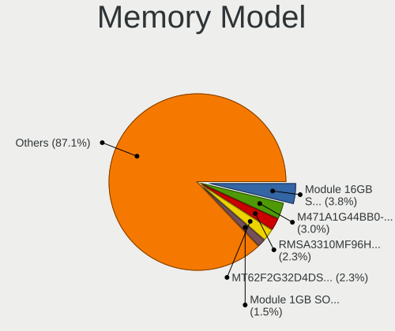

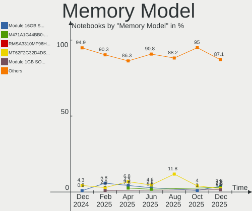

| Model                                                            | Notebooks | Percent |
|------------------------------------------------------------------|-----------|---------|
| SK hynix RAM Module 16GB SODIMM DDR4 3200MT/s                    | 5         | 3.79%   |
| Samsung RAM M471A1G44BB0-CWE 8GB SODIMM DDR4 3200MT/s            | 4         | 3.03%   |
| Ramaxel RAM RMSA3310MF96HAF-3200 8GB SODIMM DDR4 3200MT/s        | 3         | 2.27%   |
| Unknown                                                          | 3         | 2.27%   |
| Unknown RAM Module 1GB SODIMM DDR2 533MT/s                       | 2         | 1.52%   |
| Samsung RAM M471B5773CHS-CH9 2GB SODIMM DDR3 4199MT/s            | 2         | 1.52%   |
| Samsung RAM M471B5173EB0-YK0 4GB SODIMM DDR3 1600MT/s            | 2         | 1.52%   |
| Samsung RAM M471B1G73DB0-YK0 8GB SODIMM DDR3 1600MT/s            | 2         | 1.52%   |
| Samsung RAM M471A5244CB0-CWE 4GB SODIMM DDR4 3200MT/s            | 2         | 1.52%   |
| Samsung RAM M471A2G43BB2-CWE 16GB SODIMM DDR4 3200MT/s           | 2         | 1.52%   |
| Samsung RAM M471A1K43EB1-CWE 8GB SODIMM DDR4 3200MT/s            | 2         | 1.52%   |
| Samsung RAM M471A1K43CB1-CTD 8GB SODIMM DDR4 3200MT/s            | 2         | 1.52%   |
| Patriot RAM PSD48G266681S 8GB SODIMM DDR4 2933MT/s               | 2         | 1.52%   |
| Micron RAM 4ATF51264HZ-3G2J1 4GB Row Of Chips DDR4 3200MT/s      | 2         | 1.52%   |
| Micron RAM 4ATF1G64HZ-3G2F1 8GB SODIMM DDR4 3200MT/s             | 2         | 1.52%   |
| Foxline RAM FL3200D4S22-8G 8GB SODIMM DDR4 3200MT/s              | 2         | 1.52%   |
| Wodposit RAM WPBH32D408SWD-8G 8GB SODIMM DDR4 3200MT/s           | 1         | 0.76%   |
| Unknown RAM Module 8GB SODIMM DDR3 1600MT/s                      | 1         | 0.76%   |
| Unknown RAM Module 4GB SODIMM DDR3                               | 1         | 0.76%   |
| Unknown RAM Module 2GB SODIMM DDR2 533MT/s                       | 1         | 0.76%   |
| Unknown RAM Module 2GB SODIMM DDR                                | 1         | 0.76%   |
| Unknown RAM Module 2GB SODIMM 800MT/s                            | 1         | 0.76%   |
| Unknown RAM Module 1GB SODIMM 800MT/s                            | 1         | 0.76%   |
| Unknown (ABCD) RAM 123456789012345678 2GB SODIMM LPDDR4 2400MT/s | 1         | 0.76%   |
| Unknown (0x0CAB) RAM B4AS8G33222B 8GB SODIMM DDR4 3200MT/s       | 1         | 0.76%   |
| Unknown (0x0BEC) RAM SM4S510888DHC 8GB SODIMM DDR4 3200MT/s      | 1         | 0.76%   |
| Unknown (0x0B45) RAM WPBH32D408SWD-8G 8GB SODIMM DDR4 3200MT/s   | 1         | 0.76%   |
| Smart RAM SH5641G8FJ8NWRNSQR 8GB SODIMM DDR3 1600MT/s            | 1         | 0.76%   |
| SK hynix RAM Module 4GB SODIMM DDR3 1867MT/s                     | 1         | 0.76%   |
| SK hynix RAM Module 4GB SODIMM DDR3 1066MT/s                     | 1         | 0.76%   |
| SK hynix RAM HYMP125S64CP8-S6 2GB SODIMM DDR2 975MT/s            | 1         | 0.76%   |
| SK hynix RAM HMT851S6CMR6R-PB 4GB Chip DDR3 1600MT/s             | 1         | 0.76%   |
| SK hynix RAM HMT451S6CFR6A-PB 4GB SODIMM DDR3 1600MT/s           | 1         | 0.76%   |
| SK hynix RAM HMT451S6BFR8A-PB 4GB SODIMM DDR3 1600MT/s           | 1         | 0.76%   |
| SK hynix RAM HMT351S6EFR8C-PB 4GB SODIMM DDR3 1600MT/s           | 1         | 0.76%   |
| SK hynix RAM HMT351S6EFR8A-PB 4GB SODIMM DDR3 1600MT/s           | 1         | 0.76%   |
| SK hynix RAM HMT351S6CFR8C-PB 4GB SODIMM DDR3 1600MT/s           | 1         | 0.76%   |
| SK hynix RAM HMT351S6BFR8C-H9 4GB SODIMM 1334MT/s                | 1         | 0.76%   |
| SK hynix RAM HMT325S6EFR8A-PB 2GB SODIMM DDR3 1600MT/s           | 1         | 0.76%   |
| SK hynix RAM HMT325S6CFR8C-PB 2GB SODIMM DDR3 1600MT/s           | 1         | 0.76%   |

Memory Kind
-----------

Memory module kinds

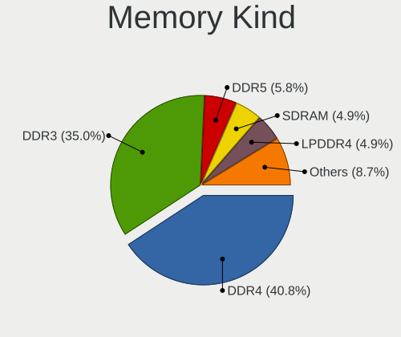

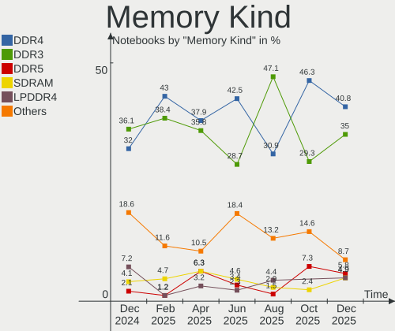

| Kind    | Notebooks | Percent |
|---------|-----------|---------|
| DDR4    | 42        | 40.78%  |
| DDR3    | 36        | 34.95%  |
| DDR5    | 6         | 5.83%   |
| SDRAM   | 5         | 4.85%   |
| LPDDR4  | 5         | 4.85%   |
| DDR2    | 4         | 3.88%   |
| LPDDR5  | 3         | 2.91%   |
| DDR     | 1         | 0.97%   |
| Unknown | 1         | 0.97%   |

Memory Form Factor
------------------

Physical design of the memory module

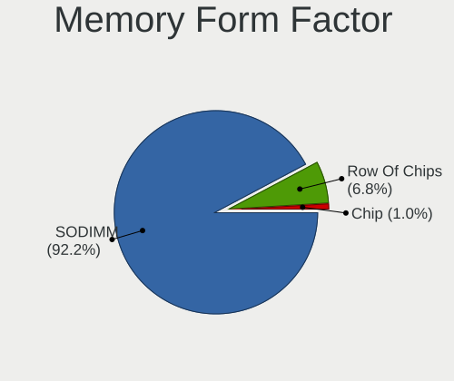

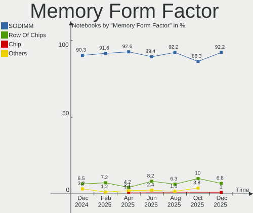

| Name         | Notebooks | Percent |
|--------------|-----------|---------|
| SODIMM       | 95        | 92.23%  |
| Row Of Chips | 7         | 6.8%    |
| Chip         | 1         | 0.97%   |

Memory Size
-----------

Memory module size

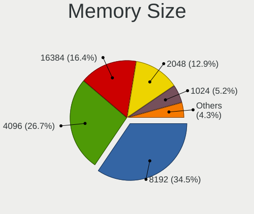

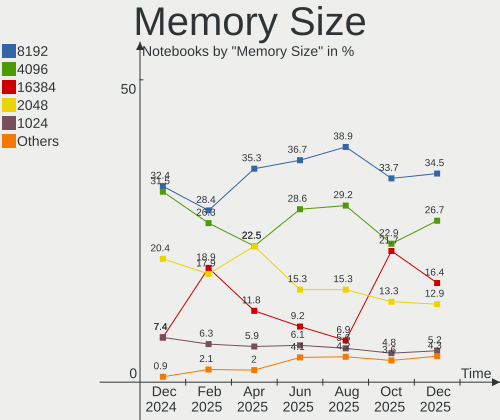

| Size  | Notebooks | Percent |
|-------|-----------|---------|
| 8192  | 40        | 34.48%  |
| 4096  | 31        | 26.72%  |
| 16384 | 19        | 16.38%  |
| 2048  | 15        | 12.93%  |
| 1024  | 6         | 5.17%   |
| 32768 | 4         | 3.45%   |
| 3072  | 1         | 0.86%   |

Memory Speed
------------

Memory module speed

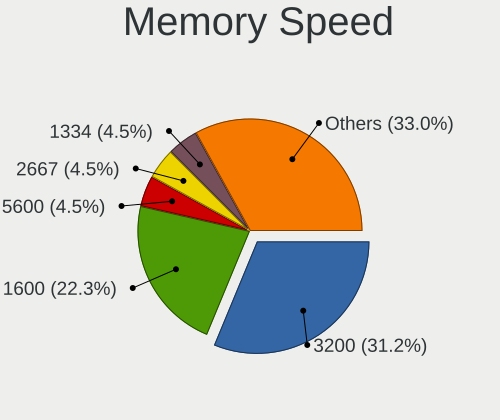

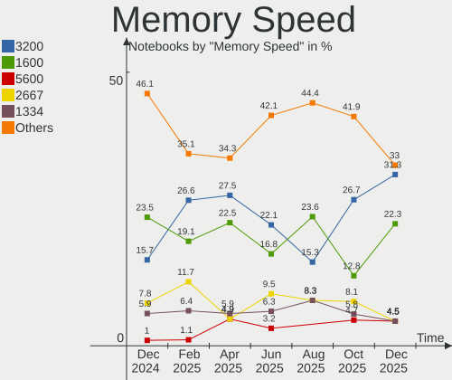

| Speed   | Notebooks | Percent |
|---------|-----------|---------|
| 3200    | 35        | 31.25%  |
| 1600    | 25        | 22.32%  |
| 5600    | 5         | 4.46%   |
| 2667    | 5         | 4.46%   |
| 1334    | 5         | 4.46%   |
| 1333    | 5         | 4.46%   |
| 4199    | 4         | 3.57%   |
| 2400    | 4         | 3.57%   |
| 3733    | 3         | 2.68%   |
| 6400    | 2         | 1.79%   |
| 4800    | 2         | 1.79%   |
| 2933    | 2         | 1.79%   |
| 1066    | 2         | 1.79%   |
| 667     | 2         | 1.79%   |
| 533     | 2         | 1.79%   |
| Unknown | 2         | 1.79%   |
| 8400    | 1         | 0.89%   |
| 5500    | 1         | 0.89%   |
| 1867    | 1         | 0.89%   |
| 1639    | 1         | 0.89%   |
| 1067    | 1         | 0.89%   |
| 975     | 1         | 0.89%   |
| 800     | 1         | 0.89%   |

Printers & scanners
-------------------

Printer Vendor
--------------

Printer device vendors

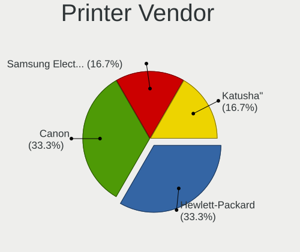

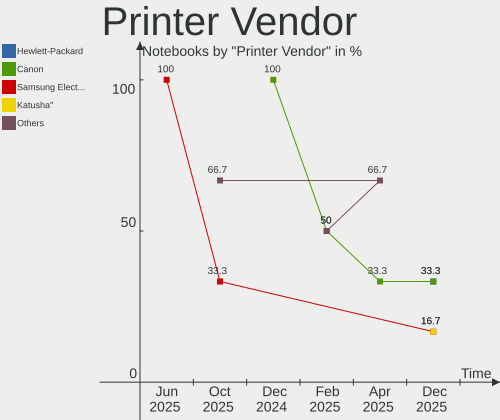

| Vendor              | Notebooks | Percent |
|---------------------|-----------|---------|
| Hewlett-Packard     | 2         | 33.33%  |
| Canon               | 2         | 33.33%  |
| Samsung Electronics | 1         | 16.67%  |
| Katusha"            | 1         | 16.67%  |

Printer Model
-------------

Printer device models

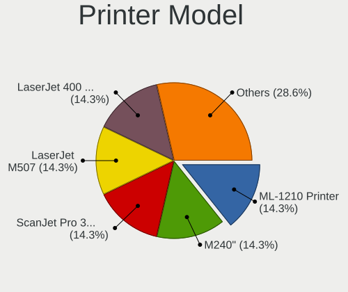

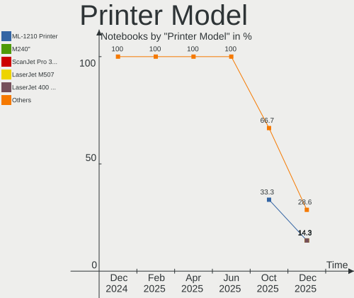

| Model                   | Notebooks | Percent |
|-------------------------|-----------|---------|
| Samsung ML-1210 Printer | 1         | 14.29%  |
| Katusha" M240"          | 1         | 14.29%  |
| HP ScanJet Pro 3000 s3  | 1         | 14.29%  |
| HP LaserJet M507        | 1         | 14.29%  |
| HP LaserJet 400 M401dne | 1         | 14.29%  |
| Canon TS3600 series     | 1         | 14.29%  |
| Canon LBP7010C/7018C    | 1         | 14.29%  |

Scanner Vendor
--------------

Scanner device vendors

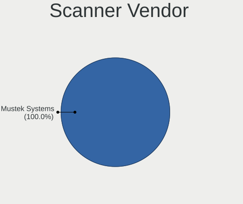

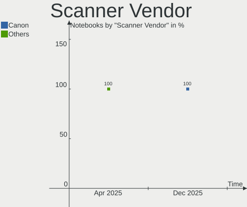

| Vendor | Notebooks | Percent |
|--------|-----------|---------|
| Canon  | 1         | 100%    |

Scanner Model
-------------

Scanner device models

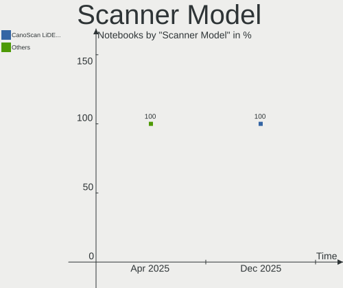

| Model                   | Notebooks | Percent |
|-------------------------|-----------|---------|
| Canon CanoScan LiDE 220 | 1         | 100%    |

Camera
------

Camera Vendor
-------------

Camera device vendors

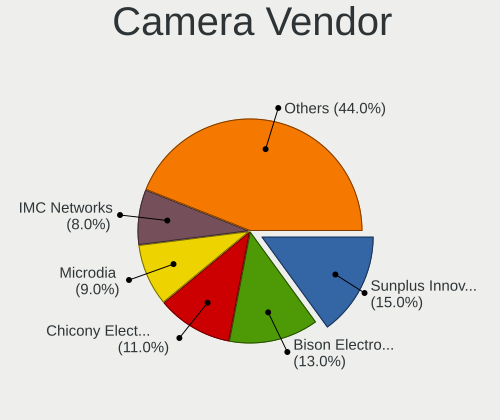

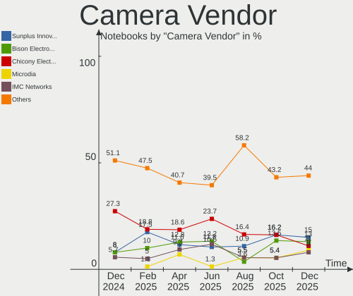

| Vendor                                 | Notebooks | Percent |
|----------------------------------------|-----------|---------|
| Sunplus Innovation Technology          | 15        | 15%     |
| Bison Electronics                      | 13        | 13%     |
| Chicony Electronics                    | 11        | 11%     |
| Microdia                               | 9         | 9%      |
| IMC Networks                           | 8         | 8%      |
| Realtek Semiconductor                  | 7         | 7%      |
| Syntek                                 | 6         | 6%      |
| Silicon Motion                         | 4         | 4%      |
| Cheng Uei Precision Industry (Foxlink) | 4         | 4%      |
| Sonix Technology                       | 3         | 3%      |
| Quanta                                 | 3         | 3%      |
| Logitech                               | 3         | 3%      |
| Z-Star Microelectronics                | 2         | 2%      |
| Suyin                                  | 2         | 2%      |
| USB Camera CS                          | 1         | 1%      |
| Unknown (3730304231393831325530)       | 1         | 1%      |
| ShineTech                              | 1         | 1%      |
| Shine-optics                           | 1         | 1%      |
| Samsung Electronics                    | 1         | 1%      |
| OPPO Electronics                       | 1         | 1%      |
| Luxvisions Innotech Limited            | 1         | 1%      |
| Importek                               | 1         | 1%      |
| HYGD-220831-A                          | 1         | 1%      |
| Acer                                   | 1         | 1%      |

Camera Model
------------

Camera device models

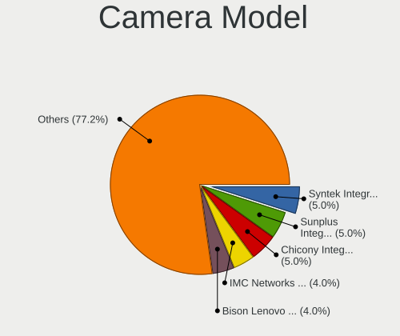

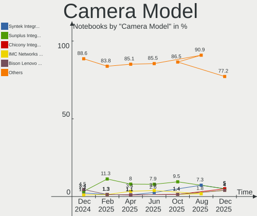

| Model                                       | Notebooks | Percent |
|---------------------------------------------|-----------|---------|
| Syntek Integrated Camera                    | 5         | 4.95%   |
| Sunplus Integrated Camera                   | 5         | 4.95%   |
| Chicony Integrated Camera                   | 5         | 4.95%   |
| IMC Networks USB2.0 HD UVC WebCam           | 4         | 3.96%   |
| Bison Lenovo Integrated Webcam              | 4         | 3.96%   |
| Sonix USB2.0 FHD UVC WebCam                 | 3         | 2.97%   |
| Microdia USB 2.0 Camera                     | 3         | 2.97%   |
| Bison Integrated Camera                     | 3         | 2.97%   |
| Sunplus USB 2.0 Camera                      | 2         | 1.98%   |
| Sunplus Hy-UXGA(B6CS)-Camera                | 2         | 1.98%   |
| Silicon Motion WebCam SC-13HDL11939N        | 2         | 1.98%   |
| Quanta ACER HD User Facing                  | 2         | 1.98%   |
| Microdia Integrated_Webcam_HD               | 2         | 1.98%   |
| Microdia Integrated Webcam                  | 2         | 1.98%   |
| IMC Networks USB2.0 VGA UVC WebCam          | 2         | 1.98%   |
| Bison Lenovo EasyCamera                     | 2         | 1.98%   |
| Bison BisonCam,NB Pro                       | 2         | 1.98%   |
| Z-Star WebCam SCB-1900N                     | 1         | 0.99%   |
| Z-Star WebCam SC-03FFL11739P                | 1         | 0.99%   |
| USB Camera CS USB Camera CS                 | 1         | 0.99%   |
| Unknown (3730304231393831325530) USB Camera | 1         | 0.99%   |
| Syntek USB2.0 Camera                        | 1         | 0.99%   |
| Suyin Acer/Lenovo Webcam [CN0316]           | 1         | 0.99%   |
| Suyin Acer CrystalEye Webcam                | 1         | 0.99%   |
| Sunplus XiaoMi WebCam                       | 1         | 0.99%   |
| Sunplus MTD Camera                          | 1         | 0.99%   |
| Sunplus Hy FHD B200 Came                    | 1         | 0.99%   |
| Sunplus HP Truevision HD                    | 1         | 0.99%   |
| Sunplus HP HD Webcam [Fixed]                | 1         | 0.99%   |
| Sunplus ExeGate Stream C958 2K              | 1         | 0.99%   |
| Silicon Motion WebCam SCB-1100N             | 1         | 0.99%   |
| Silicon Motion WebCam SC-0311139N           | 1         | 0.99%   |
| ShineTech USB2.0 HD UVC WebCam              | 1         | 0.99%   |
| Shine-optics USB2.0 HD UVC WebCam           | 1         | 0.99%   |
| Samsung Galaxy series, misc. (MTP mode)     | 1         | 0.99%   |
| Realtek VGA WebCam                          | 1         | 0.99%   |
| Realtek USB Camera                          | 1         | 0.99%   |
| Realtek Integrated_Webcam_FHD               | 1         | 0.99%   |
| Realtek Integrated_Webcam_8M                | 1         | 0.99%   |
| Realtek HP Truevision HD                    | 1         | 0.99%   |

Security
--------

Fingerprint Vendor
------------------

Fingerprint sensor vendors

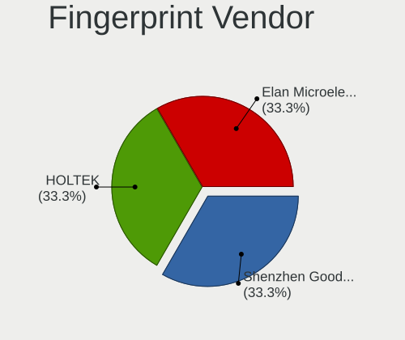

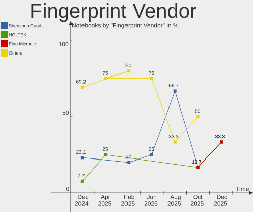

| Vendor                     | Notebooks | Percent |
|----------------------------|-----------|---------|
| Shenzhen Goodix Technology | 1         | 33.33%  |
| HOLTEK                     | 1         | 33.33%  |
| Elan Microelectronics      | 1         | 33.33%  |

Fingerprint Model
-----------------

Fingerprint sensor models

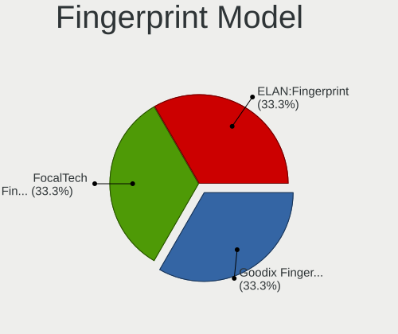

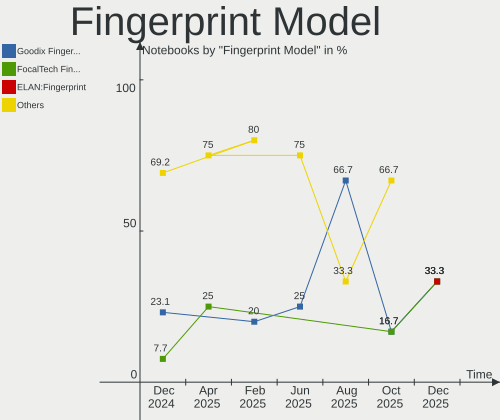

| Model                               | Notebooks | Percent |
|-------------------------------------|-----------|---------|
| Shenzhen Goodix  Fingerprint Device | 1         | 33.33%  |
| HOLTEK FocalTech Fingerprint Device | 1         | 33.33%  |
| Elan ELAN:Fingerprint               | 1         | 33.33%  |

Chipcard Vendor
---------------

Chipcard module vendors

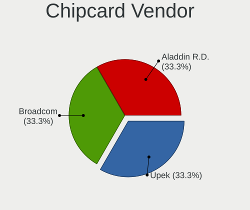

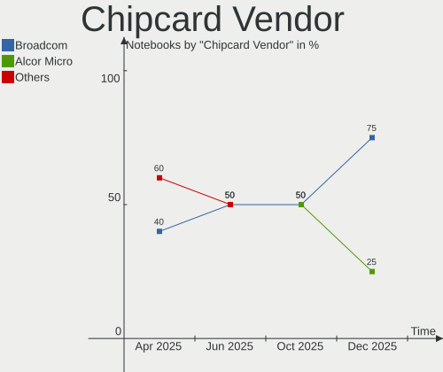

| Vendor      | Notebooks | Percent |
|-------------|-----------|---------|
| Broadcom    | 3         | 75%     |
| Alcor Micro | 1         | 25%     |

Chipcard Model
--------------

Chipcard module models

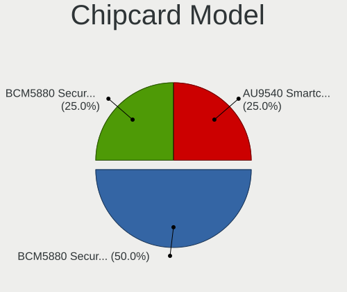

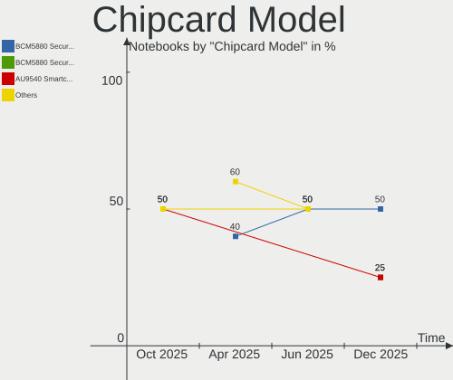

| Model                                                                        | Notebooks | Percent |
|------------------------------------------------------------------------------|-----------|---------|
| Broadcom BCM5880 Secure Applications Processor                               | 2         | 50%     |
| Broadcom BCM5880 Secure Applications Processor with fingerprint swipe sensor | 1         | 25%     |
| Alcor Micro AU9540 Smartcard Reader                                          | 1         | 25%     |

Unsupported
-----------

Unsupported Devices
-------------------

Total unsupported devices on board

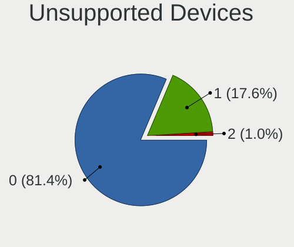

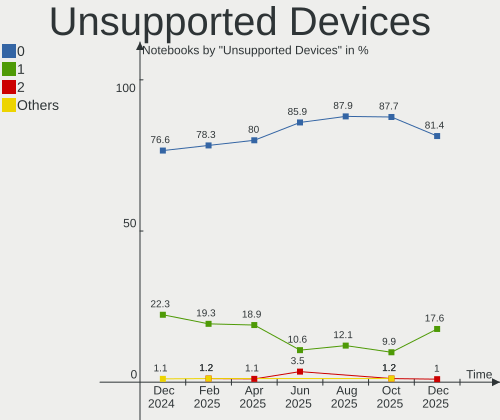

| Total | Notebooks | Percent |
|-------|-----------|---------|
| 0     | 83        | 81.37%  |
| 1     | 18        | 17.65%  |
| 2     | 1         | 0.98%   |

Unsupported Device Types
------------------------

Types of unsupported devices

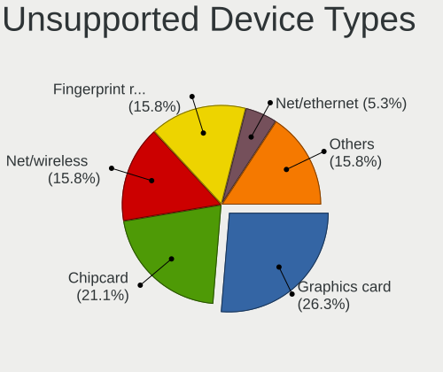

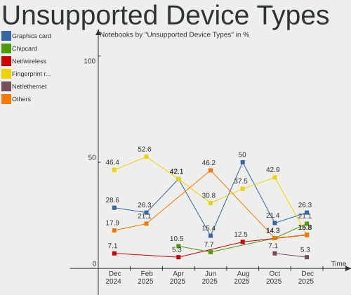

| Type                     | Notebooks | Percent |
|--------------------------|-----------|---------|
| Graphics card            | 5         | 26.32%  |
| Chipcard                 | 4         | 21.05%  |
| Net/wireless             | 3         | 15.79%  |
| Fingerprint reader       | 3         | 15.79%  |
| Net/ethernet             | 1         | 5.26%   |
| Multimedia controller    | 1         | 5.26%   |
| Communication controller | 1         | 5.26%   |
| Bluetooth                | 1         | 5.26%   |

