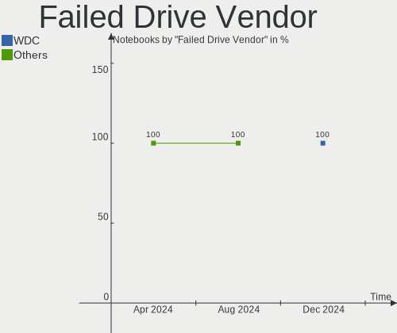
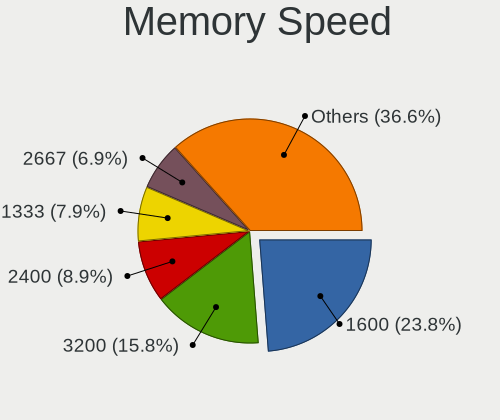
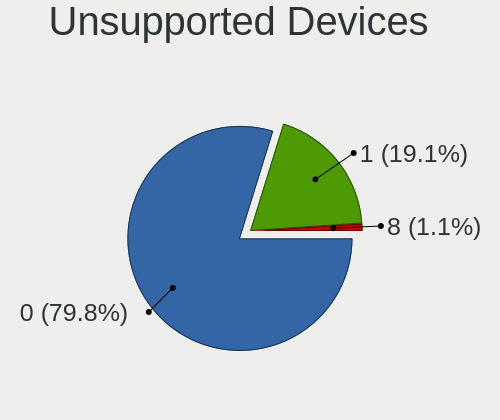

ROSA Hardware Trends (Notebooks)
--------------------------------

A project to identify most popular hardware characteristics and track their change
over time based on data collected by ROSA users at https://Linux-Hardware.org.

Anyone can contribute to this report by the [hw-probe](https://github.com/linuxhw/hw-probe) tool:

    sudo -E hw-probe -all -upload

Full-feature report is available here: https://linux-hardware.org/?view=trends&formfactor=notebook

Period: Oct, 2021.

Contents
--------

* [ System ](#system)
  - [ OS                       ](#os)
  - [ OS Family                ](#os-family)
  - [ Kernel                   ](#kernel)
  - [ Kernel Family            ](#kernel-family)
  - [ Kernel Major Ver.        ](#kernel-major-ver)
  - [ Arch                     ](#arch)
  - [ DE                       ](#de)
  - [ Display Server           ](#display-server)
  - [ Display Manager          ](#display-manager)
  - [ OS Lang                  ](#os-lang)
  - [ Boot Mode                ](#boot-mode)
  - [ Filesystem               ](#filesystem)
  - [ Part. scheme             ](#part-scheme)
  - [ Dual Boot with Linux/BSD ](#dual-boot-with-linuxbsd)
  - [ Dual Boot (Win)          ](#dual-boot-win)

* [ Board ](#board)
  - [ Vendor                   ](#vendor)
  - [ Model                    ](#model)
  - [ Model Family             ](#model-family)
  - [ MFG Year                 ](#mfg-year)
  - [ Form Factor              ](#form-factor)
  - [ Secure Boot              ](#secure-boot)
  - [ Coreboot                 ](#coreboot)
  - [ RAM Size                 ](#ram-size)
  - [ RAM Used                 ](#ram-used)
  - [ Total Drives             ](#total-drives)
  - [ Has CD-ROM               ](#has-cd-rom)
  - [ Has Ethernet             ](#has-ethernet)
  - [ Has WiFi                 ](#has-wifi)
  - [ Has Bluetooth            ](#has-bluetooth)

* [ Location ](#location)
  - [ Country                  ](#country)
  - [ City                     ](#city)

* [ Drives ](#drives)
  - [ Drive Vendor             ](#drive-vendor)
  - [ Drive Model              ](#drive-model)
  - [ HDD Vendor               ](#hdd-vendor)
  - [ SSD Vendor               ](#ssd-vendor)
  - [ Drive Kind               ](#drive-kind)
  - [ Drive Connector          ](#drive-connector)
  - [ Drive Size               ](#drive-size)
  - [ Space Total              ](#space-total)
  - [ Space Used               ](#space-used)
  - [ Malfunc. Drives          ](#malfunc-drives)
  - [ Malfunc. Drive Vendor    ](#malfunc-drive-vendor)
  - [ Malfunc. HDD Vendor      ](#malfunc-hdd-vendor)
  - [ Malfunc. Drive Kind      ](#malfunc-drive-kind)
  - [ Failed Drives            ](#failed-drives)
  - [ Failed Drive Vendor      ](#failed-drive-vendor)
  - [ Drive Status             ](#drive-status)

* [ Storage controller ](#storage-controller)
  - [ Storage Vendor           ](#storage-vendor)
  - [ Storage Model            ](#storage-model)
  - [ Storage Kind             ](#storage-kind)

* [ Processor ](#processor)
  - [ CPU Vendor               ](#cpu-vendor)
  - [ CPU Model                ](#cpu-model)
  - [ CPU Model Family         ](#cpu-model-family)
  - [ CPU Cores                ](#cpu-cores)
  - [ CPU Sockets              ](#cpu-sockets)
  - [ CPU Threads              ](#cpu-threads)
  - [ CPU Op-Modes             ](#cpu-op-modes)
  - [ CPU Microcode            ](#cpu-microcode)
  - [ CPU Microarch            ](#cpu-microarch)

* [ Graphics ](#graphics)
  - [ GPU Vendor               ](#gpu-vendor)
  - [ GPU Model                ](#gpu-model)
  - [ GPU Combo                ](#gpu-combo)
  - [ GPU Driver               ](#gpu-driver)
  - [ GPU Memory               ](#gpu-memory)

* [ Monitor ](#monitor)
  - [ Monitor Vendor           ](#monitor-vendor)
  - [ Monitor Model            ](#monitor-model)
  - [ Monitor Resolution       ](#monitor-resolution)
  - [ Monitor Diagonal         ](#monitor-diagonal)
  - [ Monitor Width            ](#monitor-width)
  - [ Aspect Ratio             ](#aspect-ratio)
  - [ Monitor Area             ](#monitor-area)
  - [ Pixel Density            ](#pixel-density)
  - [ Multiple Monitors        ](#multiple-monitors)

* [ Network ](#network)
  - [ Net Controller Vendor    ](#net-controller-vendor)
  - [ Net Controller Model     ](#net-controller-model)
  - [ Wireless Vendor          ](#wireless-vendor)
  - [ Wireless Model           ](#wireless-model)
  - [ Ethernet Vendor          ](#ethernet-vendor)
  - [ Ethernet Model           ](#ethernet-model)
  - [ Net Controller Kind      ](#net-controller-kind)
  - [ Used Controller          ](#used-controller)
  - [ NICs                     ](#nics)
  - [ IPv6                     ](#ipv6)

* [ Bluetooth ](#bluetooth)
  - [ Bluetooth Vendor         ](#bluetooth-vendor)
  - [ Bluetooth Model          ](#bluetooth-model)

* [ Sound ](#sound)
  - [ Sound Vendor             ](#sound-vendor)
  - [ Sound Model              ](#sound-model)

* [ Memory ](#memory)
  - [ Memory Vendor            ](#memory-vendor)
  - [ Memory Model             ](#memory-model)
  - [ Memory Kind              ](#memory-kind)
  - [ Memory Form Factor       ](#memory-form-factor)
  - [ Memory Size              ](#memory-size)
  - [ Memory Speed             ](#memory-speed)

* [ Printers & scanners ](#printers--scanners)
  - [ Printer Vendor           ](#printer-vendor)
  - [ Printer Model            ](#printer-model)
  - [ Scanner Vendor           ](#scanner-vendor)
  - [ Scanner Model            ](#scanner-model)

* [ Camera ](#camera)
  - [ Camera Vendor            ](#camera-vendor)
  - [ Camera Model             ](#camera-model)

* [ Security ](#security)
  - [ Fingerprint Vendor       ](#fingerprint-vendor)
  - [ Fingerprint Model        ](#fingerprint-model)
  - [ Chipcard Vendor          ](#chipcard-vendor)
  - [ Chipcard Model           ](#chipcard-model)

* [ Unsupported ](#unsupported)
  - [ Unsupported Devices      ](#unsupported-devices)
  - [ Unsupported Device Types ](#unsupported-device-types)

System
------

OS
--

Installed operating systems

| Name       | Notebooks | Percent |
|------------|-----------|---------|
| ROSA R11.1 | 49        | 56.32%  |
| ROSA 12    | 36        | 41.38%  |
| ROSA R12   | 2         | 2.3%    |

OS Family
---------

OS without a version

| Name | Notebooks | Percent |
|------|-----------|---------|
| ROSA | 87        | 100%    |

Kernel
------

Version of the Linux kernel

| Version                             | Notebooks | Percent |
|-------------------------------------|-----------|---------|
| 5.10.71-generic-1rosa2021.1-x86_64  | 36        | 41.38%  |
| 5.4.83-generic-2rosa-x86_64         | 13        | 14.94%  |
| 4.15.0-desktop-122.124.1rosa-x86_64 | 9         | 10.34%  |
| 5.4.32-generic-2rosa-i586           | 8         | 9.2%    |
| 5.4.83-generic-2rosa-i586           | 6         | 6.9%    |
| 5.4.32-generic-2rosa-x86_64         | 6         | 6.9%    |
| 4.9.155-nrj-desktop-1rosa-x86_64    | 2         | 2.3%    |
| 4.15.0-desktop-122.124.1rosa-i586   | 2         | 2.3%    |
| 5.4.122-nrj-desktop-1rosa-x86_64    | 1         | 1.15%   |
| 5.11.0-desktop-18.19.1rosa-x86_64   | 1         | 1.15%   |
| 5.10.70-generic-2rosa2021.1-x86_64  | 1         | 1.15%   |
| 5.10.65-generic-2rosa2021.1-x86_64  | 1         | 1.15%   |
| 4.15.0-desktop-45.1rosa-x86_64      | 1         | 1.15%   |

Kernel Family
-------------

Linux kernel without a distro release

| Version | Notebooks | Percent |
|---------|-----------|---------|
| 5.10.71 | 36        | 41.38%  |
| 5.4.83  | 19        | 21.84%  |
| 5.4.32  | 14        | 16.09%  |
| 4.15.0  | 12        | 13.79%  |
| 4.9.155 | 2         | 2.3%    |
| 5.4.122 | 1         | 1.15%   |
| 5.11.0  | 1         | 1.15%   |
| 5.10.70 | 1         | 1.15%   |
| 5.10.65 | 1         | 1.15%   |

Kernel Major Ver.
-----------------

Linux kernel major version

| Version | Notebooks | Percent |
|---------|-----------|---------|
| 5.10    | 38        | 43.68%  |
| 5.4     | 34        | 39.08%  |
| 4.15    | 12        | 13.79%  |
| 4.9     | 2         | 2.3%    |
| 5.11    | 1         | 1.15%   |

Arch
----

OS architecture (x86_64, i586, etc.)

| Name   | Notebooks | Percent |
|--------|-----------|---------|
| x86_64 | 71        | 81.61%  |
| i686   | 16        | 18.39%  |

DE
--

Desktop Environment

| Name  | Notebooks | Percent |
|-------|-----------|---------|
| KDE5  | 51        | 58.62%  |
| KDE4  | 26        | 29.89%  |
| LXQt  | 8         | 9.2%    |
| XFCE  | 1         | 1.15%   |
| GNOME | 1         | 1.15%   |

Display Server
--------------

X11 or Wayland

| Name    | Notebooks | Percent |
|---------|-----------|---------|
| X11     | 54        | 62.07%  |
| Wayland | 33        | 37.93%  |

Display Manager
---------------

SDDM, LightDM, etc.

| Name | Notebooks | Percent |
|------|-----------|---------|
| GDM  | 38        | 43.68%  |
| KDM  | 26        | 29.89%  |
| SDDM | 23        | 26.44%  |

OS Lang
-------

Language

| Lang  | Notebooks | Percent |
|-------|-----------|---------|
| ru_RU | 72        | 82.76%  |
| pt_BR | 4         | 4.6%    |
| ru_UA | 3         | 3.45%   |
| en_US | 3         | 3.45%   |
| pt_PT | 1         | 1.15%   |
| fr_FR | 1         | 1.15%   |
| en_GB | 1         | 1.15%   |
| de_DE | 1         | 1.15%   |
| C     | 1         | 1.15%   |

Boot Mode
---------

EFI or BIOS

| Mode | Notebooks | Percent |
|------|-----------|---------|
| BIOS | 59        | 67.82%  |
| EFI  | 28        | 32.18%  |

Filesystem
----------

Type of filesystem

| Type  | Notebooks | Percent |
|-------|-----------|---------|
| Ext4  | 82        | 94.25%  |
| Btrfs | 3         | 3.45%   |
| Ext3  | 1         | 1.15%   |
| Aufs  | 1         | 1.15%   |

Part. scheme
------------

Scheme of partitioning

| Type | Notebooks | Percent |
|------|-----------|---------|
| MBR  | 57        | 65.52%  |
| GPT  | 30        | 34.48%  |

Dual Boot with Linux/BSD
------------------------

Hosting more than one Linux/BSD

| Dual boot | Notebooks | Percent |
|-----------|-----------|---------|
| No        | 61        | 70.11%  |
| Yes       | 26        | 29.89%  |

Dual Boot (Win)
---------------

Hosting Linux and Windows

| Dual boot | Notebooks | Percent |
|-----------|-----------|---------|
| No        | 51        | 58.62%  |
| Yes       | 36        | 41.38%  |

Board
-----

Vendor
------

Motherboard manufacturer

| Name                | Notebooks | Percent |
|---------------------|-----------|---------|
| Lenovo              | 17        | 19.54%  |
| ASUSTek Computer    | 15        | 17.24%  |
| Hewlett-Packard     | 14        | 16.09%  |
| Acer                | 11        | 12.64%  |
| Samsung Electronics | 8         | 9.2%    |
| Dell                | 5         | 5.75%   |
| Sony                | 3         | 3.45%   |
| eMachines           | 3         | 3.45%   |
| Toshiba             | 2         | 2.3%    |
| Packard Bell        | 2         | 2.3%    |
| MSI                 | 2         | 2.3%    |
| Apple               | 2         | 2.3%    |
| Shuttle             | 1         | 1.15%   |
| Quanta              | 1         | 1.15%   |
| Compaq              | 1         | 1.15%   |

Model
-----

Motherboard model

| Name                                | Notebooks | Percent |
|-------------------------------------|-----------|---------|
| HP Pavilion dv6                     | 2         | 2.3%    |
| Dell Inspiron N5110                 | 2         | 2.3%    |
| Acer Aspire E5-573G                 | 2         | 2.3%    |
| Toshiba Satellite U300              | 1         | 1.15%   |
| Toshiba Satellite C655              | 1         | 1.15%   |
| Sony VGN-Z11VRN_B                   | 1         | 1.15%   |
| Sony VGN-CR19VN_B                   | 1         | 1.15%   |
| Sony SVE1512G1RB                    | 1         | 1.15%   |
| Shuttle DS57U                       | 1         | 1.15%   |
| Samsung R530/R730                   | 1         | 1.15%   |
| Samsung R528/R728                   | 1         | 1.15%   |
| Samsung R508                        | 1         | 1.15%   |
| Samsung NC210/NC110                 | 1         | 1.15%   |
| Samsung NC110P/NC108P/NC111P        | 1         | 1.15%   |
| Samsung NC10                        | 1         | 1.15%   |
| Samsung 350V5C/351V5C/3540VC/3440VC | 1         | 1.15%   |
| Samsung 300E5K/300E5Q               | 1         | 1.15%   |
| Quanta TWH                          | 1         | 1.15%   |
| Packard Bell EasyNote TJ71          | 1         | 1.15%   |
| Packard Bell EasyNote TE11HC        | 1         | 1.15%   |
| MSI GL65 9SEK                       | 1         | 1.15%   |
| MSI CR61 2M/CX61 2OC/CX61 2OD       | 1         | 1.15%   |
| Lenovo V580c 20160                  | 1         | 1.15%   |
| Lenovo ThinkPad T60p 200793G        | 1         | 1.15%   |
| Lenovo S40-70 80GQ                  | 1         | 1.15%   |
| Lenovo IdeaPad Z580                 | 1         | 1.15%   |
| Lenovo IdeaPad S205 Brazos          | 1         | 1.15%   |
| Lenovo IdeaPad S12 20021,2959       | 1         | 1.15%   |
| Lenovo IdeaPad 330-15AST 81D6       | 1         | 1.15%   |
| Lenovo IdeaPad 320-15IAP 80XR       | 1         | 1.15%   |
| Lenovo IdeaPad 3 17ADA05 81W2       | 1         | 1.15%   |
| Lenovo IdeaPad 110-15ACL 80TJ       | 1         | 1.15%   |
| Lenovo G580 20157                   | 1         | 1.15%   |
| Lenovo G580 20150                   | 1         | 1.15%   |
| Lenovo B70-80 80MR                  | 1         | 1.15%   |
| Lenovo B590 20208                   | 1         | 1.15%   |
| Lenovo B590 20206                   | 1         | 1.15%   |
| Lenovo B570e HuronRiver Platform    | 1         | 1.15%   |
| Lenovo B50-30 20382                 | 1         | 1.15%   |
| HP Presario CQ61                    | 1         | 1.15%   |
| HP Pavilion Notebook                | 1         | 1.15%   |
| HP Pavilion Gaming Laptop 15-cx0xxx | 1         | 1.15%   |
| HP Pavilion g7                      | 1         | 1.15%   |
| HP Pavilion 15                      | 1         | 1.15%   |
| HP Notebook                         | 1         | 1.15%   |
| HP Mini 110-3700                    | 1         | 1.15%   |
| HP Mini 110-3500                    | 1         | 1.15%   |
| HP Laptop 14s-fq0xxx                | 1         | 1.15%   |
| HP Compaq CQ58                      | 1         | 1.15%   |
| HP 625                              | 1         | 1.15%   |
| HP 255 G1                           | 1         | 1.15%   |
| eMachines eME440                    | 1         | 1.15%   |
| eMachines eM350                     | 1         | 1.15%   |
| eMachines E525                      | 1         | 1.15%   |
| Dell Vostro 3559                    | 1         | 1.15%   |
| Dell Inspiron MM061                 | 1         | 1.15%   |
| Dell Inspiron 5748                  | 1         | 1.15%   |
| Compaq Presario CQ-25               | 1         | 1.15%   |
| ASUS X555LJ                         | 1         | 1.15%   |
| ASUS X550CL                         | 1         | 1.15%   |

Model Family
------------

Motherboard model prefix

| Name                  | Notebooks | Percent |
|-----------------------|-----------|---------|
| Lenovo IdeaPad        | 7         | 8.05%   |
| HP Pavilion           | 6         | 6.9%    |
| Acer Aspire           | 5         | 5.75%   |
| Dell Inspiron         | 4         | 4.6%    |
| Toshiba Satellite     | 2         | 2.3%    |
| Packard Bell EasyNote | 2         | 2.3%    |
| Lenovo G580           | 2         | 2.3%    |
| Lenovo B590           | 2         | 2.3%    |
| HP Mini               | 2         | 2.3%    |
| ASUS VivoBook         | 2         | 2.3%    |
| Acer TravelMate       | 2         | 2.3%    |
| Sony VGN-Z11VRN       | 1         | 1.15%   |
| Sony VGN-CR19VN       | 1         | 1.15%   |
| Sony SVE1512G1RB      | 1         | 1.15%   |
| Shuttle DS57U         | 1         | 1.15%   |
| Samsung R530          | 1         | 1.15%   |
| Samsung R528          | 1         | 1.15%   |
| Samsung R508          | 1         | 1.15%   |
| Samsung NC210         | 1         | 1.15%   |
| Samsung NC110P        | 1         | 1.15%   |
| Samsung NC10          | 1         | 1.15%   |
| Samsung 350V5C        | 1         | 1.15%   |
| Samsung 300E5K        | 1         | 1.15%   |
| Quanta TWH            | 1         | 1.15%   |
| MSI GL65              | 1         | 1.15%   |
| MSI CR61              | 1         | 1.15%   |
| Lenovo V580c          | 1         | 1.15%   |
| Lenovo ThinkPad       | 1         | 1.15%   |
| Lenovo S40-70         | 1         | 1.15%   |
| Lenovo B70-80         | 1         | 1.15%   |
| Lenovo B570e          | 1         | 1.15%   |
| Lenovo B50-30         | 1         | 1.15%   |
| HP Presario           | 1         | 1.15%   |
| HP Notebook           | 1         | 1.15%   |
| HP Laptop             | 1         | 1.15%   |
| HP Compaq             | 1         | 1.15%   |
| HP 625                | 1         | 1.15%   |
| HP 255                | 1         | 1.15%   |
| eMachines eME440      | 1         | 1.15%   |
| eMachines eM350       | 1         | 1.15%   |
| eMachines E525        | 1         | 1.15%   |
| Dell Vostro           | 1         | 1.15%   |
| Compaq Presario       | 1         | 1.15%   |
| ASUS X555LJ           | 1         | 1.15%   |
| ASUS X550CL           | 1         | 1.15%   |
| ASUS UL30A            | 1         | 1.15%   |
| ASUS N56DP            | 1         | 1.15%   |
| ASUS N53SV            | 1         | 1.15%   |
| ASUS K70ID            | 1         | 1.15%   |
| ASUS K53SV            | 1         | 1.15%   |
| ASUS K43E             | 1         | 1.15%   |
| ASUS F5RL             | 1         | 1.15%   |
| ASUS ASUS             | 1         | 1.15%   |
| ASUS 901              | 1         | 1.15%   |
| ASUS 1015BX           | 1         | 1.15%   |
| ASUS 1003HAG          | 1         | 1.15%   |
| Apple MacBookPro7     | 1         | 1.15%   |
| Apple MacBookAir4     | 1         | 1.15%   |
| Acer Nitro            | 1         | 1.15%   |
| Acer AOHAPPY          | 1         | 1.15%   |

MFG Year
--------

Motherboard manufacture year

| Year | Notebooks | Percent |
|------|-----------|---------|
| 2011 | 13        | 14.94%  |
| 2012 | 11        | 12.64%  |
| 2013 | 10        | 11.49%  |
| 2010 | 9         | 10.34%  |
| 2020 | 7         | 8.05%   |
| 2015 | 7         | 8.05%   |
| 2009 | 7         | 8.05%   |
| 2016 | 5         | 5.75%   |
| 2018 | 4         | 4.6%    |
| 2014 | 3         | 3.45%   |
| 2007 | 3         | 3.45%   |
| 2021 | 2         | 2.3%    |
| 2019 | 2         | 2.3%    |
| 2017 | 2         | 2.3%    |
| 2008 | 1         | 1.15%   |
| 2006 | 1         | 1.15%   |

Form Factor
-----------

Physical design of the computer

| Name     | Notebooks | Percent |
|----------|-----------|---------|
| Notebook | 87        | 100%    |

Secure Boot
-----------

Enabled or disabled

| State    | Notebooks | Percent |
|----------|-----------|---------|
| Disabled | 87        | 100%    |

Coreboot
--------

Have coreboot on board

| Used | Notebooks | Percent |
|------|-----------|---------|
| No   | 87        | 100%    |

RAM Size
--------

Total RAM memory

| Size in GB | Notebooks | Percent |
|------------|-----------|---------|
| 3.01-4.0   | 36        | 41.38%  |
| 4.01-8.0   | 19        | 21.84%  |
| 1.01-2.0   | 13        | 14.94%  |
| 8.01-16.0  | 10        | 11.49%  |
| 16.01-24.0 | 3         | 3.45%   |
| 0.51-1.0   | 3         | 3.45%   |
| 2.01-3.0   | 2         | 2.3%    |
| 32.01-64.0 | 1         | 1.15%   |

RAM Used
--------

Used RAM memory

| Used GB  | Notebooks | Percent |
|----------|-----------|---------|
| 1.01-2.0 | 42        | 48.28%  |
| 0.51-1.0 | 32        | 36.78%  |
| 2.01-3.0 | 11        | 12.64%  |
| 0.01-0.5 | 2         | 2.3%    |

Total Drives
------------

Number of drives on board

| Drives | Notebooks | Percent |
|--------|-----------|---------|
| 1      | 65        | 74.71%  |
| 2      | 20        | 22.99%  |
| 3      | 2         | 2.3%    |

Has CD-ROM
----------

Has CD-ROM on board

| Presented | Notebooks | Percent |
|-----------|-----------|---------|
| Yes       | 44        | 50.57%  |
| No        | 43        | 49.43%  |

Has Ethernet
------------

Has Ethernet on board

| Presented | Notebooks | Percent |
|-----------|-----------|---------|
| Yes       | 83        | 95.4%   |
| No        | 4         | 4.6%    |

Has WiFi
--------

Has WiFi module

| Presented | Notebooks | Percent |
|-----------|-----------|---------|
| Yes       | 86        | 98.85%  |
| No        | 1         | 1.15%   |

Has Bluetooth
-------------

Has Bluetooth module

| Presented | Notebooks | Percent |
|-----------|-----------|---------|
| Yes       | 54        | 62.07%  |
| No        | 33        | 37.93%  |

Location
--------

Country
-------

Geographic location (country)

| Country    | Notebooks | Percent |
|------------|-----------|---------|
| Russia     | 64        | 73.56%  |
| Ukraine    | 6         | 6.9%    |
| Brazil     | 4         | 4.6%    |
| USA        | 2         | 2.3%    |
| Germany    | 2         | 2.3%    |
| France     | 2         | 2.3%    |
| Belarus    | 2         | 2.3%    |
| Serbia     | 1         | 1.15%   |
| Poland     | 1         | 1.15%   |
| Kazakhstan | 1         | 1.15%   |
| Hungary    | 1         | 1.15%   |
| Finland    | 1         | 1.15%   |

City
----

Geographic location (city)

| City              | Notebooks | Percent |
|-------------------|-----------|---------|
| Moscow            | 7         | 8.05%   |
| Yekaterinburg     | 5         | 5.75%   |
| St Petersburg     | 4         | 4.6%    |
| Barnaul           | 3         | 3.45%   |
| Samara            | 2         | 2.3%    |
| Perm              | 2         | 2.3%    |
| Penza             | 2         | 2.3%    |
| Nizhniy Novgorod  | 2         | 2.3%    |
| Minsk             | 2         | 2.3%    |
| Kyiv              | 2         | 2.3%    |
| Krasnoyarsk       | 2         | 2.3%    |
| Krasnodar         | 2         | 2.3%    |
| Kazan?ˆ™          | 2         | 2.3%    |
| Yaroslavl         | 1         | 1.15%   |
| Warsaw            | 1         | 1.15%   |
| Voronezh          | 1         | 1.15%   |
| Volgograd         | 1         | 1.15%   |
| Vladivostok       | 1         | 1.15%   |
| Veliky Novgorod   | 1         | 1.15%   |
| Ufa               | 1         | 1.15%   |
| Tver              | 1         | 1.15%   |
| Turkheim          | 1         | 1.15%   |
| Terra Boa         | 1         | 1.15%   |
| Taman'            | 1         | 1.15%   |
| Tal'menka         | 1         | 1.15%   |
| Stavropol         | 1         | 1.15%   |
| Staraya Yurga     | 1         | 1.15%   |
| Srednyaya Akhtuba | 1         | 1.15%   |
| Shchelkovo        | 1         | 1.15%   |
| Sevastopol??™     | 1         | 1.15%   |
| Seleshchina       | 1         | 1.15%   |
| S??o Leopoldo     | 1         | 1.15%   |
| Savigny-sur-Orge  | 1         | 1.15%   |
| Renton            | 1         | 1.15%   |
| Pontes e Lacerda  | 1         | 1.15%   |
| Pittsburgh        | 1         | 1.15%   |
| Orekhovo-Zuyevo   | 1         | 1.15%   |
| Okha              | 1         | 1.15%   |
| Noyabrsk          | 1         | 1.15%   |
| Novosibirsk       | 1         | 1.15%   |
| Novoaltaysk       | 1         | 1.15%   |
| Novi Knezevac     | 1         | 1.15%   |
| Mozhga            | 1         | 1.15%   |
| Mosonmagyar??v??r | 1         | 1.15%   |
| Mariupol          | 1         | 1.15%   |
| Lyon              | 1         | 1.15%   |
| Lobnya            | 1         | 1.15%   |
| Kremenchug        | 1         | 1.15%   |
| Kostroma          | 1         | 1.15%   |
| Kemerovo          | 1         | 1.15%   |
| Kaluga            | 1         | 1.15%   |
| Kaliningrad       | 1         | 1.15%   |
| Juina             | 1         | 1.15%   |
| Izhevsk           | 1         | 1.15%   |
| Irkutsk           | 1         | 1.15%   |
| Helsinki          | 1         | 1.15%   |
| Gurzuf            | 1         | 1.15%   |
| Gorbatovka        | 1         | 1.15%   |
| Chelyabinsk       | 1         | 1.15%   |
| Boppard           | 1         | 1.15%   |

Drives
------

Drive Vendor
------------

Hard drive vendors

| Vendor              | Notebooks | Drives | Percent |
|---------------------|-----------|--------|---------|
| WDC                 | 22        | 22     | 21.36%  |
| Seagate             | 13        | 13     | 12.62%  |
| Hitachi             | 10        | 10     | 9.71%   |
| Toshiba             | 9         | 10     | 8.74%   |
| Samsung Electronics | 8         | 8      | 7.77%   |
| Kingston            | 5         | 5      | 4.85%   |
| HGST                | 5         | 5      | 4.85%   |
| China               | 5         | 5      | 4.85%   |
| Unknown             | 4         | 5      | 3.88%   |
| Transcend           | 2         | 2      | 1.94%   |
| Micron Technology   | 2         | 2      | 1.94%   |
| Intel               | 2         | 2      | 1.94%   |
| GOODRAM             | 2         | 2      | 1.94%   |
| Apacer              | 2         | 2      | 1.94%   |
| XrayDisk            | 1         | 1      | 0.97%   |
| SPCC                | 1         | 1      | 0.97%   |
| Smartbuy            | 1         | 1      | 0.97%   |
| Silicon Motion      | 1         | 1      | 0.97%   |
| SanDisk             | 1         | 1      | 0.97%   |
| KingSpec            | 1         | 1      | 0.97%   |
| JMicron             | 1         | 1      | 0.97%   |
| Gigabyte Technology | 1         | 1      | 0.97%   |
| FATTYDOVE           | 1         | 1      | 0.97%   |
| Crucial             | 1         | 1      | 0.97%   |
| Apple               | 1         | 1      | 0.97%   |
| AMD                 | 1         | 1      | 0.97%   |

Drive Model
-----------

Hard drive models

| Model                                | Notebooks | Percent |
|--------------------------------------|-----------|---------|
| WDC WD5000LPCX-24C6HT0 500GB         | 2         | 1.9%    |
| WDC WD2500BEVT-22A23T0 250GB         | 2         | 1.9%    |
| WDC WD10JPVX-75JC3T0 1TB             | 2         | 1.9%    |
| Toshiba MQ01ABF050 500GB             | 2         | 1.9%    |
| Toshiba MQ01ABD100 1TB               | 2         | 1.9%    |
| Seagate ST9500325AS 500GB            | 2         | 1.9%    |
| Seagate ST500LT012-1DG142 500GB      | 2         | 1.9%    |
| HGST HTS545050A7E380 500GB           | 2         | 1.9%    |
| XrayDisk SSD 256GB                   | 1         | 0.95%   |
| WDC WDS120G2G0A-00JH30 120GB SSD     | 1         | 0.95%   |
| WDC WD7500BPVT-26HXZT3 752GB         | 1         | 0.95%   |
| WDC WD5000LPVX-22V0TT0 500GB         | 1         | 0.95%   |
| WDC WD5000LPLX-00ZNTT0 500GB         | 1         | 0.95%   |
| WDC WD5000LPCX-21VHAT0 4X5.8GB       | 1         | 0.95%   |
| WDC WD3200LPVX-00V0TT0 320GB         | 1         | 0.95%   |
| WDC WD3200BPVT-24ZEST0 320GB         | 1         | 0.95%   |
| WDC WD3200BEKT-75PVMT1 320GB         | 1         | 0.95%   |
| WDC WD1600BEVT-22ZCT0 160GB          | 1         | 0.95%   |
| WDC WD1600BEKT-60A25T1 160GB         | 1         | 0.95%   |
| WDC WD10SPZX-21Z10T0 1TB             | 1         | 0.95%   |
| WDC WD10JPVT-08A1YT2 1TB             | 1         | 0.95%   |
| WDC WD10JPLX-00MBPT0 1TB             | 1         | 0.95%   |
| WDC WD10JPCX-24UE4T0 1TB             | 1         | 0.95%   |
| WDC PC SN530 SDBPNPZ-512G-1002 512GB | 1         | 0.95%   |
| WDC PC SN530 SDBPNPZ-256G-1002 256GB | 1         | 0.95%   |
| Unknown SD16G  64GB                  | 1         | 0.95%   |
| Unknown SA08G  8GB                   | 1         | 0.95%   |
| Unknown EC2QT  64GB                  | 1         | 0.95%   |
| Unknown DA4064  64GB                 | 1         | 0.95%   |
| Unknown 00000  32GB                  | 1         | 0.95%   |
| Transcend TS128GSSD320 128GB         | 1         | 0.95%   |
| Transcend TS128GSSD230S 128GB        | 1         | 0.95%   |
| Toshiba MQ04ABD200 2TB               | 1         | 0.95%   |
| Toshiba MQ01ABF050M 500GB            | 1         | 0.95%   |
| Toshiba MK6476GSX 640GB              | 1         | 0.95%   |
| Toshiba MK3276GSX 320GB              | 1         | 0.95%   |
| Toshiba MK3265GSX 320GB              | 1         | 0.95%   |
| Toshiba HDWK105 500GB                | 1         | 0.95%   |
| SPCC Solid State Disk 256GB          | 1         | 0.95%   |
| Smartbuy m.2 PS5012-2280 256GB       | 1         | 0.95%   |
| Silicon Motion KingSSD-N201000 1TB   | 1         | 0.95%   |
| Seagate ST9320423AS 320GB            | 1         | 0.95%   |
| Seagate ST9320325AS 320GB            | 1         | 0.95%   |
| Seagate ST500LT012-9WS142 500GB      | 1         | 0.95%   |
| Seagate ST500LM021-1KJ152 500GB      | 1         | 0.95%   |
| Seagate ST500LM012 HN-M500MBB 500GB  | 1         | 0.95%   |
| Seagate ST380011A 34GB               | 1         | 0.95%   |
| Seagate ST1000LM048-2E7172 1TB       | 1         | 0.95%   |
| Seagate ST1000LM035-1RK172 1TB       | 1         | 0.95%   |
| Seagate ST1000LM024 HN-M101MBB 1TB   | 1         | 0.95%   |
| SanDisk SDSSDA120G 120GB             | 1         | 0.95%   |
| Samsung SSD 970 EVO 1TB              | 1         | 0.95%   |
| Samsung SSD 860 EVO 500GB            | 1         | 0.95%   |
| Samsung SSD 860 EVO 1TB              | 1         | 0.95%   |
| Samsung MZVLQ256HAJD-000H1 256GB     | 1         | 0.95%   |
| Samsung MZVLB256HAHQ-000H1 256GB     | 1         | 0.95%   |
| Samsung MZALQ256HAJD-000L2 256GB     | 1         | 0.95%   |
| Samsung HM250HI 250GB                | 1         | 0.95%   |
| Samsung HM160HI 160GB                | 1         | 0.95%   |
| Micron C300-MTFDBAK128MAG 128GB SSD  | 1         | 0.95%   |

HDD Vendor
----------

Hard disk drive vendors

| Vendor              | Notebooks | Drives | Percent |
|---------------------|-----------|--------|---------|
| WDC                 | 19        | 19     | 32.2%   |
| Seagate             | 13        | 13     | 22.03%  |
| Hitachi             | 10        | 10     | 16.95%  |
| Toshiba             | 9         | 10     | 15.25%  |
| HGST                | 5         | 5      | 8.47%   |
| Samsung Electronics | 2         | 2      | 3.39%   |
| JMicron             | 1         | 1      | 1.69%   |

SSD Vendor
----------

Solid state drive vendors

| Vendor              | Notebooks | Drives | Percent |
|---------------------|-----------|--------|---------|
| China               | 5         | 5      | 16.67%  |
| Kingston            | 4         | 4      | 13.33%  |
| Transcend           | 2         | 2      | 6.67%   |
| Samsung Electronics | 2         | 2      | 6.67%   |
| Intel               | 2         | 2      | 6.67%   |
| GOODRAM             | 2         | 2      | 6.67%   |
| Apacer              | 2         | 2      | 6.67%   |
| XrayDisk            | 1         | 1      | 3.33%   |
| WDC                 | 1         | 1      | 3.33%   |
| SPCC                | 1         | 1      | 3.33%   |
| SanDisk             | 1         | 1      | 3.33%   |
| Micron Technology   | 1         | 1      | 3.33%   |
| KingSpec            | 1         | 1      | 3.33%   |
| Gigabyte Technology | 1         | 1      | 3.33%   |
| FATTYDOVE           | 1         | 1      | 3.33%   |
| Crucial             | 1         | 1      | 3.33%   |
| Apple               | 1         | 1      | 3.33%   |
| AMD                 | 1         | 1      | 3.33%   |

Drive Kind
----------

HDD or SSD

| Kind | Notebooks | Drives | Percent |
|------|-----------|--------|---------|
| HDD  | 58        | 60     | 58%     |
| SSD  | 30        | 30     | 30%     |
| NVMe | 8         | 10     | 8%      |
| MMC  | 4         | 5      | 4%      |

Drive Connector
---------------

SATA, SAS, NVMe, etc.

| Type | Notebooks | Drives | Percent |
|------|-----------|--------|---------|
| SATA | 82        | 89     | 86.32%  |
| NVMe | 8         | 10     | 8.42%   |
| MMC  | 4         | 5      | 4.21%   |
| SAS  | 1         | 1      | 1.05%   |

Drive Size
----------

Size of hard drive

| Size in TB | Notebooks | Drives | Percent |
|------------|-----------|--------|---------|
| 0.01-0.5   | 67        | 69     | 76.14%  |
| 0.51-1.0   | 20        | 20     | 22.73%  |
| 1.01-2.0   | 1         | 1      | 1.14%   |

Space Total
-----------

Amount of disk space available on the file system

| Size in GB | Notebooks | Percent |
|------------|-----------|---------|
| 101-250    | 26        | 29.89%  |
| 251-500    | 21        | 24.14%  |
| 1-20       | 14        | 16.09%  |
| 501-1000   | 10        | 11.49%  |
| 51-100     | 9         | 10.34%  |
| 21-50      | 5         | 5.75%   |
| 1001-2000  | 2         | 2.3%    |

Space Used
----------

Amount of used disk space

| Used GB  | Notebooks | Percent |
|----------|-----------|---------|
| 1-20     | 60        | 68.97%  |
| 21-50    | 11        | 12.64%  |
| 101-250  | 6         | 6.9%    |
| 51-100   | 5         | 5.75%   |
| 251-500  | 3         | 3.45%   |
| 501-1000 | 2         | 2.3%    |

Malfunc. Drives
---------------

Drive models with a malfunction

| Model                             | Notebooks | Drives | Percent |
|-----------------------------------|-----------|--------|---------|
| WDC WD5000LPCX-24C6HT0 500GB      | 2         | 2      | 6.45%   |
| WDC WD7500BPVT-26HXZT3 752GB      | 1         | 1      | 3.23%   |
| WDC WD3200BPVT-24ZEST0 320GB      | 1         | 1      | 3.23%   |
| WDC WD3200BEKT-75PVMT1 320GB      | 1         | 1      | 3.23%   |
| WDC WD2500BEVT-22A23T0 250GB      | 1         | 1      | 3.23%   |
| WDC WD1600BEVT-22ZCT0 160GB       | 1         | 1      | 3.23%   |
| WDC WD1600BEKT-60A25T1 160GB      | 1         | 1      | 3.23%   |
| WDC WD10JPVT-08A1YT2 1TB          | 1         | 1      | 3.23%   |
| Toshiba MK6476GSX 640GB           | 1         | 1      | 3.23%   |
| Toshiba MK3276GSX 320GB           | 1         | 1      | 3.23%   |
| Toshiba MK3265GSX 320GB           | 1         | 1      | 3.23%   |
| Seagate ST9500325AS 500GB         | 1         | 1      | 3.23%   |
| Seagate ST9320325AS 320GB         | 1         | 1      | 3.23%   |
| Seagate ST500LT012-9WS142 500GB   | 1         | 1      | 3.23%   |
| Seagate ST500LM021-1KJ152 500GB   | 1         | 1      | 3.23%   |
| Seagate ST1000LM048-2E7172 1TB    | 1         | 1      | 3.23%   |
| Samsung Electronics HM160HI 160GB | 1         | 1      | 3.23%   |
| Kingston SA400S37240G 240GB SSD   | 1         | 1      | 3.23%   |
| Intel SSDSC2KW512G8 512GB         | 1         | 1      | 3.23%   |
| Hitachi HTS725025A9A364 250GB     | 1         | 1      | 3.23%   |
| Hitachi HTS723225L9A360 250GB     | 1         | 1      | 3.23%   |
| Hitachi HTS721010G9SA00 100GB     | 1         | 1      | 3.23%   |
| Hitachi HTS543232A7A384 320GB     | 1         | 1      | 3.23%   |
| HGST HTS721010A9E630 1TB          | 1         | 1      | 3.23%   |
| HGST HTS545050A7E680 500GB        | 1         | 1      | 3.23%   |
| HGST HTS545050A7E660 500GB        | 1         | 1      | 3.23%   |
| HGST HTS545050A7E380 500GB        | 1         | 1      | 3.23%   |
| China SATA SSD 120GB              | 1         | 1      | 3.23%   |
| Apple SSD TS128C 121GB            | 1         | 1      | 3.23%   |
| AMD R5SL120G 120GB SSD            | 1         | 1      | 3.23%   |

Malfunc. Drive Vendor
---------------------

Vendors of faulty drives

| Vendor              | Notebooks | Drives | Percent |
|---------------------|-----------|--------|---------|
| WDC                 | 9         | 9      | 29.03%  |
| Seagate             | 5         | 5      | 16.13%  |
| Hitachi             | 4         | 4      | 12.9%   |
| HGST                | 4         | 4      | 12.9%   |
| Toshiba             | 3         | 3      | 9.68%   |
| Samsung Electronics | 1         | 1      | 3.23%   |
| Kingston            | 1         | 1      | 3.23%   |
| Intel               | 1         | 1      | 3.23%   |
| China               | 1         | 1      | 3.23%   |
| Apple               | 1         | 1      | 3.23%   |
| AMD                 | 1         | 1      | 3.23%   |

Malfunc. HDD Vendor
-------------------

Vendors of faulty HDD drives

| Vendor              | Notebooks | Drives | Percent |
|---------------------|-----------|--------|---------|
| WDC                 | 9         | 9      | 34.62%  |
| Seagate             | 5         | 5      | 19.23%  |
| Hitachi             | 4         | 4      | 15.38%  |
| HGST                | 4         | 4      | 15.38%  |
| Toshiba             | 3         | 3      | 11.54%  |
| Samsung Electronics | 1         | 1      | 3.85%   |

Malfunc. Drive Kind
-------------------

Kinds of faulty drives

| Kind | Notebooks | Drives | Percent |
|------|-----------|--------|---------|
| HDD  | 26        | 26     | 83.87%  |
| SSD  | 5         | 5      | 16.13%  |

Failed Drives
-------------

Failed drive models

| Model                     | Notebooks | Drives | Percent |
|---------------------------|-----------|--------|---------|
| Seagate ST9500325AS 500GB | 1         | 1      | 50%     |
| Seagate ST9320423AS 320GB | 1         | 1      | 50%     |

Failed Drive Vendor
-------------------

Failed drive vendors

| Vendor  | Notebooks | Drives | Percent |
|---------|-----------|--------|---------|
| Seagate | 2         | 2      | 100%    |

Drive Status
------------

Number of failed and malfunc. drives

| Status   | Notebooks | Drives | Percent |
|----------|-----------|--------|---------|
| Works    | 56        | 66     | 59.57%  |
| Malfunc  | 31        | 31     | 32.98%  |
| Detected | 5         | 6      | 5.32%   |
| Failed   | 2         | 2      | 2.13%   |

Storage controller
------------------

Storage Vendor
--------------

Storage controller vendors

| Vendor                      | Notebooks | Percent |
|-----------------------------|-----------|---------|
| Intel                       | 66        | 69.47%  |
| AMD                         | 16        | 16.84%  |
| Samsung Electronics         | 4         | 4.21%   |
| Nvidia                      | 3         | 3.16%   |
| Sandisk                     | 2         | 2.11%   |
| Silicon Motion              | 1         | 1.05%   |
| Phison Electronics          | 1         | 1.05%   |
| Micron Technology           | 1         | 1.05%   |
| Kingston Technology Company | 1         | 1.05%   |

Storage Model
-------------

Storage controller models

| Model                                                                            | Notebooks | Percent |
|----------------------------------------------------------------------------------|-----------|---------|
| Intel 7 Series Chipset Family 6-port SATA Controller [AHCI mode]                 | 10        | 9.71%   |
| Intel 6 Series/C200 Series Chipset Family 6 port Mobile SATA AHCI Controller     | 10        | 9.71%   |
| AMD FCH SATA Controller [AHCI mode]                                              | 9         | 8.74%   |
| Intel 82801IBM/IEM (ICH9M/ICH9M-E) 4 port SATA Controller [AHCI mode]            | 7         | 6.8%    |
| AMD SB7x0/SB8x0/SB9x0 SATA Controller [AHCI mode]                                | 6         | 5.83%   |
| Intel Wildcat Point-LP SATA Controller [AHCI Mode]                               | 5         | 4.85%   |
| Intel NM10/ICH7 Family SATA Controller [AHCI mode]                               | 5         | 4.85%   |
| Intel 8 Series SATA Controller 1 [AHCI mode]                                     | 4         | 3.88%   |
| Intel Sunrise Point-LP SATA Controller [AHCI mode]                               | 3         | 2.91%   |
| Intel Cannon Lake Mobile PCH SATA AHCI Controller                                | 3         | 2.91%   |
| Intel 82801GBM/GHM (ICH7-M Family) SATA Controller [IDE mode]                    | 3         | 2.91%   |
| Intel 82801G (ICH7 Family) IDE Controller                                        | 3         | 2.91%   |
| Sandisk WD Blue SN550 NVMe SSD                                                   | 2         | 1.94%   |
| Samsung NVMe SSD Controller SM981/PM981/PM983                                    | 2         | 1.94%   |
| Samsung NVMe SSD Controller 980                                                  | 2         | 1.94%   |
| Nvidia MCP79 AHCI Controller                                                     | 2         | 1.94%   |
| Intel NM10/ICH7 Family SATA Controller [IDE mode]                                | 2         | 1.94%   |
| Intel Atom/Celeron/Pentium Processor x5-E8000/J3xxx/N3xxx Series SATA Controller | 2         | 1.94%   |
| Intel 82801GBM/GHM (ICH7-M Family) SATA Controller [AHCI mode]                   | 2         | 1.94%   |
| Intel 7 Series Chipset Family 4-port SATA Controller [IDE mode]                  | 2         | 1.94%   |
| Intel 7 Series Chipset Family 2-port SATA Controller [IDE mode]                  | 2         | 1.94%   |
| Silicon Motion SM2263EN/SM2263XT SSD Controller                                  | 1         | 0.97%   |
| Phison E12 NVMe Controller                                                       | 1         | 0.97%   |
| Nvidia MCP89 SATA Controller (AHCI mode)                                         | 1         | 0.97%   |
| Micron Non-Volatile memory controller                                            | 1         | 0.97%   |
| Kingston Company U-SNS8154P3 NVMe SSD                                            | 1         | 0.97%   |
| Intel Comet Lake SATA AHCI Controller                                            | 1         | 0.97%   |
| Intel Celeron/Pentium Silver Processor SATA Controller                           | 1         | 0.97%   |
| Intel Celeron N3350/Pentium N4200/Atom E3900 Series SATA AHCI Controller         | 1         | 0.97%   |
| Intel Atom Processor E3800 Series SATA AHCI Controller                           | 1         | 0.97%   |
| Intel 82801IBM/IEM (ICH9M/ICH9M-E) 2 port SATA Controller [IDE mode]             | 1         | 0.97%   |
| Intel 82801HM/HEM (ICH8M/ICH8M-E) SATA Controller [IDE mode]                     | 1         | 0.97%   |
| Intel 82801HM/HEM (ICH8M/ICH8M-E) SATA Controller [AHCI mode]                    | 1         | 0.97%   |
| Intel 82801HM/HEM (ICH8M/ICH8M-E) IDE Controller                                 | 1         | 0.97%   |
| Intel 82801 Mobile SATA Controller [RAID mode]                                   | 1         | 0.97%   |
| Intel 8 Series/C220 Series Chipset Family 6-port SATA Controller 1 [AHCI mode]   | 1         | 0.97%   |
| AMD SB600 Non-Raid-5 SATA                                                        | 1         | 0.97%   |
| AMD SB600 IDE                                                                    | 1         | 0.97%   |

Storage Kind
------------

Kind of storage controller (IDE, SATA, NVMe, SAS, ...)

| Kind | Notebooks | Percent |
|------|-----------|---------|
| SATA | 76        | 77.55%  |
| IDE  | 13        | 13.27%  |
| NVMe | 8         | 8.16%   |
| RAID | 1         | 1.02%   |

Processor
---------

CPU Vendor
----------

Processor vendors

| Vendor | Notebooks | Percent |
|--------|-----------|---------|
| Intel  | 70        | 80.46%  |
| AMD    | 17        | 19.54%  |

CPU Model
---------

Processor models

| Model                                         | Notebooks | Percent |
|-----------------------------------------------|-----------|---------|
| Intel Atom CPU N270 @ 1.60GHz                 | 4         | 4.6%    |
| Intel Core i3-2310M CPU @ 2.10GHz             | 3         | 3.45%   |
| Intel Atom CPU N450 @ 1.66GHz                 | 3         | 3.45%   |
| Intel Core i5-8300H CPU @ 2.30GHz             | 2         | 2.3%    |
| Intel Core i5-6200U CPU @ 2.30GHz             | 2         | 2.3%    |
| Intel Core i5-5200U CPU @ 2.20GHz             | 2         | 2.3%    |
| Intel Core i5-4210U CPU @ 1.70GHz             | 2         | 2.3%    |
| Intel Core i5-3230M CPU @ 2.60GHz             | 2         | 2.3%    |
| Intel Core i5-3210M CPU @ 2.50GHz             | 2         | 2.3%    |
| Intel Core i3-2348M CPU @ 2.30GHz             | 2         | 2.3%    |
| Intel Atom CPU N455 @ 1.66GHz                 | 2         | 2.3%    |
| AMD V120 Processor                            | 2         | 2.3%    |
| AMD Athlon Gold 3150U with Radeon Graphics    | 2         | 2.3%    |
| Intel Pentium Dual-Core CPU T4500 @ 2.30GHz   | 1         | 1.15%   |
| Intel Pentium Dual-Core CPU T4400 @ 2.20GHz   | 1         | 1.15%   |
| Intel Pentium CPU N3710 @ 1.60GHz             | 1         | 1.15%   |
| Intel Pentium CPU N3700 @ 1.60GHz             | 1         | 1.15%   |
| Intel Pentium CPU N3530 @ 2.16GHz             | 1         | 1.15%   |
| Intel Pentium CPU 3825U @ 1.90GHz             | 1         | 1.15%   |
| Intel Pentium CPU 2117U @ 1.80GHz             | 1         | 1.15%   |
| Intel Pentium 3558U @ 1.70GHz                 | 1         | 1.15%   |
| Intel Genuine CPU U2300 @ 1.20GHz             | 1         | 1.15%   |
| Intel Genuine CPU T2600 @ 2.16GHz             | 1         | 1.15%   |
| Intel Core i7-9750H CPU @ 2.60GHz             | 1         | 1.15%   |
| Intel Core i7-4510U CPU @ 2.00GHz             | 1         | 1.15%   |
| Intel Core i7-3630QM CPU @ 2.40GHz            | 1         | 1.15%   |
| Intel Core i7-2670QM CPU @ 2.20GHz            | 1         | 1.15%   |
| Intel Core i5-7200U CPU @ 2.50GHz             | 1         | 1.15%   |
| Intel Core i5-2557M CPU @ 1.70GHz             | 1         | 1.15%   |
| Intel Core i5-2410M CPU @ 2.30GHz             | 1         | 1.15%   |
| Intel Core i5-10210U CPU @ 1.60GHz            | 1         | 1.15%   |
| Intel Core i3-5005U CPU @ 2.00GHz             | 1         | 1.15%   |
| Intel Core i3-4000M CPU @ 2.40GHz             | 1         | 1.15%   |
| Intel Core i3-3110M CPU @ 2.40GHz             | 1         | 1.15%   |
| Intel Core i3-2350M CPU @ 2.30GHz             | 1         | 1.15%   |
| Intel Core i3-2328M CPU @ 2.20GHz             | 1         | 1.15%   |
| Intel Core 2 Duo CPU T9300 @ 2.50GHz          | 1         | 1.15%   |
| Intel Core 2 Duo CPU T7100 @ 1.80GHz          | 1         | 1.15%   |
| Intel Core 2 Duo CPU T6600 @ 2.20GHz          | 1         | 1.15%   |
| Intel Core 2 Duo CPU T5750 @ 2.00GHz          | 1         | 1.15%   |
| Intel Core 2 Duo CPU T5450 @ 1.66GHz          | 1         | 1.15%   |
| Intel Core 2 Duo CPU T5250 @ 1.50GHz          | 1         | 1.15%   |
| Intel Core 2 Duo CPU P9500 @ 2.53GHz          | 1         | 1.15%   |
| Intel Core 2 Duo CPU P8600 @ 2.40GHz          | 1         | 1.15%   |
| Intel Core 2 CPU T5600 @ 1.83GHz              | 1         | 1.15%   |
| Intel Celeron N4020 CPU @ 1.10GHz             | 1         | 1.15%   |
| Intel Celeron Dual-Core CPU T3100 @ 1.90GHz   | 1         | 1.15%   |
| Intel Celeron CPU N3350 @ 1.10GHz             | 1         | 1.15%   |
| Intel Celeron CPU B830 @ 1.80GHz              | 1         | 1.15%   |
| Intel Celeron CPU B815 @ 1.60GHz              | 1         | 1.15%   |
| Intel Celeron CPU B800 @ 1.50GHz              | 1         | 1.15%   |
| Intel Celeron CPU 925 @ 2.30GHz               | 1         | 1.15%   |
| Intel Celeron CPU 1005M @ 1.90GHz             | 1         | 1.15%   |
| Intel Celeron CPU 1000M @ 1.80GHz             | 1         | 1.15%   |
| Intel Celeron 3205U @ 1.50GHz                 | 1         | 1.15%   |
| Intel Atom CPU N550 @ 1.50GHz                 | 1         | 1.15%   |
| Intel Atom CPU N2600 @ 1.60GHz                | 1         | 1.15%   |
| AMD Turion II Dual-Core Mobile M500           | 1         | 1.15%   |
| AMD Ryzen 7 4800H with Radeon Graphics        | 1         | 1.15%   |
| AMD Ryzen 5 3500U with Radeon Vega Mobile Gfx | 1         | 1.15%   |

CPU Model Family
----------------

Processor model prefix

| Model                   | Notebooks | Percent |
|-------------------------|-----------|---------|
| Intel Core i5           | 16        | 18.39%  |
| Intel Atom              | 11        | 12.64%  |
| Intel Core i3           | 10        | 11.49%  |
| Intel Celeron           | 9         | 10.34%  |
| Intel Core 2 Duo        | 8         | 9.2%    |
| Intel Pentium           | 6         | 6.9%    |
| Intel Core i7           | 4         | 4.6%    |
| Intel Pentium Dual-Core | 2         | 2.3%    |
| Intel Genuine           | 2         | 2.3%    |
| AMD V120                | 2         | 2.3%    |
| AMD Athlon              | 2         | 2.3%    |
| AMD A8                  | 2         | 2.3%    |
| AMD A6                  | 2         | 2.3%    |
| Intel Core 2            | 1         | 1.15%   |
| Intel Celeron Dual-Core | 1         | 1.15%   |
| AMD Turion II Dual-Core | 1         | 1.15%   |
| AMD Ryzen 7             | 1         | 1.15%   |
| AMD Ryzen 5             | 1         | 1.15%   |
| AMD E2                  | 1         | 1.15%   |
| AMD E1                  | 1         | 1.15%   |
| AMD E                   | 1         | 1.15%   |
| AMD C-60                | 1         | 1.15%   |
| AMD Athlon II Dual-Core | 1         | 1.15%   |
| AMD A10                 | 1         | 1.15%   |

CPU Cores
---------

Number of processor cores

| Number | Notebooks | Percent |
|--------|-----------|---------|
| 2      | 62        | 71.26%  |
| 1      | 13        | 14.94%  |
| 4      | 10        | 11.49%  |
| 8      | 1         | 1.15%   |
| 6      | 1         | 1.15%   |

CPU Sockets
-----------

Number of sockets

| Number | Notebooks | Percent |
|--------|-----------|---------|
| 1      | 87        | 100%    |

CPU Threads
-----------

Threads per core (Hyper-Threading)

| Number | Notebooks | Percent |
|--------|-----------|---------|
| 2      | 49        | 56.32%  |
| 1      | 38        | 43.68%  |

CPU Op-Modes
------------

CPU Operation Modes (32-bit, 64-bit)

| Op mode        | Notebooks | Percent |
|----------------|-----------|---------|
| 32-bit, 64-bit | 82        | 94.25%  |
| 32-bit         | 5         | 5.75%   |

CPU Microcode
-------------

Microcode number

| Number     | Notebooks | Percent |
|------------|-----------|---------|
| 0x206a7    | 13        | 14.94%  |
| 0x306a9    | 9         | 10.34%  |
| 0x1067a    | 7         | 8.05%   |
| 0x106ca    | 6         | 6.9%    |
| 0x306d4    | 5         | 5.75%   |
| 0x6fd      | 4         | 4.6%    |
| 0x40651    | 4         | 4.6%    |
| 0x106c2    | 4         | 4.6%    |
| Unknown    | 4         | 4.6%    |
| 0x08108109 | 3         | 3.45%   |
| 0x06001119 | 3         | 3.45%   |
| 0x906ea    | 2         | 2.3%    |
| 0x406e3    | 2         | 2.3%    |
| 0x10676    | 2         | 2.3%    |
| 0x05000119 | 2         | 2.3%    |
| 0x010000c8 | 2         | 2.3%    |
| 0x906ed    | 1         | 1.15%   |
| 0x806ec    | 1         | 1.15%   |
| 0x806e9    | 1         | 1.15%   |
| 0x706a8    | 1         | 1.15%   |
| 0x6f6      | 1         | 1.15%   |
| 0x6e8      | 1         | 1.15%   |
| 0x406c4    | 1         | 1.15%   |
| 0x406c3    | 1         | 1.15%   |
| 0x306c3    | 1         | 1.15%   |
| 0x30678    | 1         | 1.15%   |
| 0x30661    | 1         | 1.15%   |
| 0x07030105 | 1         | 1.15%   |
| 0x06006705 | 1         | 1.15%   |
| 0x05000101 | 1         | 1.15%   |
| 0x05000029 | 1         | 1.15%   |

CPU Microarch
-------------

Microarchitecture

| Name          | Notebooks | Percent |
|---------------|-----------|---------|
| SandyBridge   | 13        | 14.94%  |
| Bonnell       | 11        | 12.64%  |
| Penryn        | 9         | 10.34%  |
| IvyBridge     | 9         | 10.34%  |
| KabyLake      | 5         | 5.75%   |
| Haswell       | 5         | 5.75%   |
| Core          | 5         | 5.75%   |
| Broadwell     | 5         | 5.75%   |
| K10           | 4         | 4.6%    |
| Bobcat        | 4         | 4.6%    |
| Zen+          | 3         | 3.45%   |
| Silvermont    | 3         | 3.45%   |
| Piledriver    | 3         | 3.45%   |
| Skylake       | 2         | 2.3%    |
| Zen 2         | 1         | 1.15%   |
| Puma          | 1         | 1.15%   |
| P6            | 1         | 1.15%   |
| Goldmont plus | 1         | 1.15%   |
| Goldmont      | 1         | 1.15%   |
| Excavator     | 1         | 1.15%   |

Graphics
--------

GPU Vendor
----------

Vendors of graphics cards

| Vendor | Notebooks | Percent |
|--------|-----------|---------|
| Intel  | 63        | 54.31%  |
| Nvidia | 28        | 24.14%  |
| AMD    | 25        | 21.55%  |

GPU Model
---------

Graphics card models

| Model                                                                                    | Notebooks | Percent |
|------------------------------------------------------------------------------------------|-----------|---------|
| Intel 2nd Generation Core Processor Family Integrated Graphics Controller                | 13        | 10.48%  |
| Intel 3rd Gen Core processor Graphics Controller                                         | 9         | 7.26%   |
| Intel Mobile 4 Series Chipset Integrated Graphics Controller                             | 7         | 5.65%   |
| Intel Atom Processor D4xx/D5xx/N4xx/N5xx Integrated Graphics Controller                  | 6         | 4.84%   |
| Nvidia GK208BM [GeForce 920M]                                                            | 4         | 3.23%   |
| Nvidia GF117M [GeForce 610M/710M/810M/820M / GT 620M/625M/630M/720M]                     | 4         | 3.23%   |
| Intel Haswell-ULT Integrated Graphics Controller                                         | 4         | 3.23%   |
| Intel Mobile 945GSE Express Integrated Graphics Controller                               | 3         | 2.42%   |
| Intel Mobile 945GM/GMS/GME, 943/940GML Express Integrated Graphics Controller            | 3         | 2.42%   |
| Intel HD Graphics 5500                                                                   | 3         | 2.42%   |
| Intel CoffeeLake-H GT2 [UHD Graphics 630]                                                | 3         | 2.42%   |
| AMD RS880M [Mobility Radeon HD 4225/4250]                                                | 3         | 2.42%   |
| AMD Picasso                                                                              | 3         | 2.42%   |
| Nvidia TU106M [GeForce RTX 2060 Mobile]                                                  | 2         | 1.61%   |
| Nvidia GF108M [GeForce GT 540M]                                                          | 2         | 1.61%   |
| Intel Skylake GT2 [HD Graphics 520]                                                      | 2         | 1.61%   |
| Intel Mobile GM965/GL960 Integrated Graphics Controller (secondary)                      | 2         | 1.61%   |
| Intel Mobile GM965/GL960 Integrated Graphics Controller (primary)                        | 2         | 1.61%   |
| Intel HD Graphics                                                                        | 2         | 1.61%   |
| Intel Atom/Celeron/Pentium Processor x5-E8000/J3xxx/N3xxx Integrated Graphics Controller | 2         | 1.61%   |
| AMD Thames [Radeon HD 7500M/7600M Series]                                                | 2         | 1.61%   |
| AMD Sun XT [Radeon HD 8670A/8670M/8690M / R5 M330 / M430 / Radeon 520 Mobile]            | 2         | 1.61%   |
| AMD RV710/M92 [Mobility Radeon HD 4530/4570/545v]                                        | 2         | 1.61%   |
| Nvidia MCP89 [GeForce 320M]                                                              | 1         | 0.81%   |
| Nvidia GT216M [GeForce GT 320M]                                                          | 1         | 0.81%   |
| Nvidia GP108M [GeForce MX250]                                                            | 1         | 0.81%   |
| Nvidia GP107M [GeForce GTX 1050 Ti Mobile]                                               | 1         | 0.81%   |
| Nvidia GP107M [GeForce GTX 1050 3 GB Max-Q]                                              | 1         | 0.81%   |
| Nvidia GM108M [GeForce 940M]                                                             | 1         | 0.81%   |
| Nvidia GM108M [GeForce 840M]                                                             | 1         | 0.81%   |
| Nvidia GK208M [GeForce GT 740M]                                                          | 1         | 0.81%   |
| Nvidia GK107M [GeForce GT 650M]                                                          | 1         | 0.81%   |
| Nvidia GF119M [GeForce 410M]                                                             | 1         | 0.81%   |
| Nvidia GF108M [GeForce GT 635M]                                                          | 1         | 0.81%   |
| Nvidia GF108M [GeForce GT 620M/630M/635M/640M LE]                                        | 1         | 0.81%   |
| Nvidia GF108M [GeForce GT 525M]                                                          | 1         | 0.81%   |
| Nvidia GF106M [GeForce GT 555M]                                                          | 1         | 0.81%   |
| Nvidia G98M [GeForce 9300M GS]                                                           | 1         | 0.81%   |
| Nvidia C79 [GeForce 9400M / ION]                                                         | 1         | 0.81%   |
| Intel HD Graphics 620                                                                    | 1         | 0.81%   |
| Intel HD Graphics 500                                                                    | 1         | 0.81%   |
| Intel GeminiLake [UHD Graphics 600]                                                      | 1         | 0.81%   |
| Intel CometLake-U GT2 [UHD Graphics]                                                     | 1         | 0.81%   |
| Intel Atom Processor Z36xxx/Z37xxx Series Graphics & Display                             | 1         | 0.81%   |
| Intel Atom Processor D2xxx/N2xxx Integrated Graphics Controller                          | 1         | 0.81%   |
| Intel 4th Gen Core Processor Integrated Graphics Controller                              | 1         | 0.81%   |
| AMD Wrestler [Radeon HD 7340]                                                            | 1         | 0.81%   |
| AMD Wrestler [Radeon HD 7310]                                                            | 1         | 0.81%   |
| AMD Wrestler [Radeon HD 6310]                                                            | 1         | 0.81%   |
| AMD Wrestler [Radeon HD 6290]                                                            | 1         | 0.81%   |
| AMD Trinity [Radeon HD 7660G]                                                            | 1         | 0.81%   |
| AMD Trinity [Radeon HD 7600G]                                                            | 1         | 0.81%   |
| AMD Trinity 2 [Radeon HD 7520G]                                                          | 1         | 0.81%   |
| AMD Topaz XT [Radeon R7 M260/M265 / M340/M360 / M440/M445 / 530/535 / 620/625 Mobile]    | 1         | 0.81%   |
| AMD Stoney [Radeon R2/R3/R4/R5 Graphics]                                                 | 1         | 0.81%   |
| AMD RV530/M56 GL [Mobility FireGL V5200]                                                 | 1         | 0.81%   |
| AMD RV515/M54 [Mobility Radeon X1400]                                                    | 1         | 0.81%   |
| AMD Renoir                                                                               | 1         | 0.81%   |
| AMD RC410M [Mobility Radeon Xpress 200M]                                                 | 1         | 0.81%   |
| AMD Mullins [Radeon R4/R5 Graphics]                                                      | 1         | 0.81%   |

GPU Combo
---------

Combinations of graphics cards

| Name           | Notebooks | Percent |
|----------------|-----------|---------|
| 1 x Intel      | 35        | 40.23%  |
| Intel + Nvidia | 24        | 27.59%  |
| 1 x AMD        | 17        | 19.54%  |
| Intel + AMD    | 4         | 4.6%    |
| 2 x AMD        | 3         | 3.45%   |
| 1 x Nvidia     | 3         | 3.45%   |
| AMD + Nvidia   | 1         | 1.15%   |

GPU Driver
----------

Free vs proprietary

| Driver      | Notebooks | Percent |
|-------------|-----------|---------|
| Free        | 83        | 95.4%   |
| Unknown     | 3         | 3.45%   |
| Proprietary | 1         | 1.15%   |

GPU Memory
----------

Total video memory

| Size in GB | Notebooks | Percent |
|------------|-----------|---------|
| Unknown    | 38        | 43.68%  |
| 1.01-2.0   | 19        | 21.84%  |
| 0.01-0.5   | 17        | 19.54%  |
| 0.51-1.0   | 11        | 12.64%  |
| 5.01-6.0   | 1         | 1.15%   |
| 2.01-3.0   | 1         | 1.15%   |

Monitor
-------

Monitor Vendor
--------------

Monitor vendors

| Vendor                  | Notebooks | Percent |
|-------------------------|-----------|---------|
| Samsung Electronics     | 21        | 23.86%  |
| AU Optronics            | 17        | 19.32%  |
| LG Display              | 14        | 15.91%  |
| Chimei Innolux          | 7         | 7.95%   |
| Chi Mei Optoelectronics | 6         | 6.82%   |
| BOE                     | 5         | 5.68%   |
| HannStar                | 3         | 3.41%   |
| Apple                   | 3         | 3.41%   |
| PANDA                   | 2         | 2.27%   |
| Acer                    | 2         | 2.27%   |
| Sony                    | 1         | 1.14%   |
| SLD                     | 1         | 1.14%   |
| LG Philips              | 1         | 1.14%   |
| Lenovo                  | 1         | 1.14%   |
| InfoVision              | 1         | 1.14%   |
| GDH                     | 1         | 1.14%   |
| Dell                    | 1         | 1.14%   |
| CPT                     | 1         | 1.14%   |

Monitor Model
-------------

Monitor models

| Model                                                                    | Notebooks | Percent |
|--------------------------------------------------------------------------|-----------|---------|
| Samsung Electronics LCD Monitor SEC3245 1366x768 344x194mm 15.5-inch     | 3         | 3.41%   |
| BOE LCD Monitor BOE0675 1366x768 344x194mm 15.5-inch                     | 3         | 3.41%   |
| Samsung Electronics LCD Monitor SEC4252 1366x768 344x194mm 15.5-inch     | 2         | 2.27%   |
| LG Display LCD Monitor LGD02DC 1366x768 344x194mm 15.5-inch              | 2         | 2.27%   |
| HannStar LCD Monitor HSD03E9 1024x600 220x129mm 10.0-inch                | 2         | 2.27%   |
| Chimei Innolux LCD Monitor CMN15C9 1366x768 344x193mm 15.5-inch          | 2         | 2.27%   |
| Chi Mei Optoelectronics LCD Monitor CMO15A7 1366x768 350x190mm 15.7-inch | 2         | 2.27%   |
| AU Optronics LCD Monitor AUO21EC 1366x768 340x190mm 15.3-inch            | 2         | 2.27%   |
| Sony TV SNY4201 1360x768 710x400mm 32.1-inch                             | 1         | 1.14%   |
| SLD LCD Monitor SLD003C 1366x768 309x173mm 13.9-inch                     | 1         | 1.14%   |
| Samsung Electronics SyncMaster SAM011E 1280x1024 338x270mm 17.0-inch     | 1         | 1.14%   |
| Samsung Electronics S27R35x SAM1054 1920x1080 598x336mm 27.0-inch        | 1         | 1.14%   |
| Samsung Electronics LCD Monitor SEC5541 1366x768 344x193mm 15.5-inch     | 1         | 1.14%   |
| Samsung Electronics LCD Monitor SEC544B 1600x900 382x214mm 17.2-inch     | 1         | 1.14%   |
| Samsung Electronics LCD Monitor SEC5441 1366x768 344x194mm 15.5-inch     | 1         | 1.14%   |
| Samsung Electronics LCD Monitor SEC4754 1280x800 261x163mm 12.1-inch     | 1         | 1.14%   |
| Samsung Electronics LCD Monitor SEC4542 1280x800 303x190mm 14.1-inch     | 1         | 1.14%   |
| Samsung Electronics LCD Monitor SEC3541 1366x768 344x194mm 15.5-inch     | 1         | 1.14%   |
| Samsung Electronics LCD Monitor SEC3454 1600x900 382x215mm 17.3-inch     | 1         | 1.14%   |
| Samsung Electronics LCD Monitor SEC3342 1024x600 223x125mm 10.1-inch     | 1         | 1.14%   |
| Samsung Electronics LCD Monitor SEC325A 1366x768 344x194mm 15.5-inch     | 1         | 1.14%   |
| Samsung Electronics LCD Monitor SEC324A 1366x768 344x194mm 15.5-inch     | 1         | 1.14%   |
| Samsung Electronics LCD Monitor SEC315A 1366x768 344x194mm 15.5-inch     | 1         | 1.14%   |
| Samsung Electronics LCD Monitor SEC3152 1366x768 344x194mm 15.5-inch     | 1         | 1.14%   |
| Samsung Electronics LCD Monitor SEC3046 1366x768 340x190mm 15.3-inch     | 1         | 1.14%   |
| Samsung Electronics LCD Monitor SDC374C 1366x768 309x174mm 14.0-inch     | 1         | 1.14%   |
| PANDA LCD Monitor NCP004D 1920x1080 344x194mm 15.5-inch                  | 1         | 1.14%   |
| PANDA LCD Monitor NCP0029 1920x1080 344x194mm 15.5-inch                  | 1         | 1.14%   |
| LG Philips LCD Monitor LPLE300 1280x800 331x207mm 15.4-inch              | 1         | 1.14%   |
| LG Display LP156WH2-TLQ1 LGD021B 1366x768 344x194mm 15.5-inch            | 1         | 1.14%   |
| LG Display LP156WH1-TLA3 LGD01C2 1366x768 344x194mm 15.5-inch            | 1         | 1.14%   |
| LG Display LP101WSA-TLN1 LGD0295 1024x600 224x126mm 10.1-inch            | 1         | 1.14%   |
| LG Display LCD Monitor LGD0563 1920x1080 344x194mm 15.5-inch             | 1         | 1.14%   |
| LG Display LCD Monitor LGD04B3 1920x1080 350x190mm 15.7-inch             | 1         | 1.14%   |
| LG Display LCD Monitor LGD04AF 1366x768 344x194mm 15.5-inch              | 1         | 1.14%   |
| LG Display LCD Monitor LGD039F 1366x768 345x194mm 15.6-inch              | 1         | 1.14%   |
| LG Display LCD Monitor LGD0395 1366x768 344x194mm 15.5-inch              | 1         | 1.14%   |
| LG Display LCD Monitor LGD034A 1366x768 345x194mm 15.6-inch              | 1         | 1.14%   |
| LG Display LCD Monitor LGD033B 1366x768 344x194mm 15.5-inch              | 1         | 1.14%   |
| LG Display LCD Monitor LGD02AC 1366x768 344x194mm 15.5-inch              | 1         | 1.14%   |
| LG Display LCD Monitor LGD01DD 1600x900 382x215mm 17.3-inch              | 1         | 1.14%   |
| Lenovo LCD Monitor LEN4046 1600x1200 304x228mm 15.0-inch                 | 1         | 1.14%   |
| InfoVision LCD Monitor IVO03F4 1920x1200 263x164mm 12.2-inch             | 1         | 1.14%   |
| HannStar HSD101PFW4A HSD03ED 1024x600 223x125mm 10.1-inch                | 1         | 1.14%   |
| GDH Smart TV GDH0030 3840x2160 708x398mm 32.0-inch                       | 1         | 1.14%   |
| Dell U2312HM DEL4071 1920x1080 510x287mm 23.0-inch                       | 1         | 1.14%   |
| CPT LCD Monitor CPT04C4 1024x600 222x130mm 10.1-inch                     | 1         | 1.14%   |
| Chimei Innolux LCD Monitor CMN1721 1600x900 382x214mm 17.2-inch          | 1         | 1.14%   |
| Chimei Innolux LCD Monitor CMN15DB 1366x768 344x193mm 15.5-inch          | 1         | 1.14%   |
| Chimei Innolux LCD Monitor CMN15CA 1366x768 340x190mm 15.3-inch          | 1         | 1.14%   |
| Chimei Innolux LCD Monitor CMN15BD 1366x768 344x194mm 15.5-inch          | 1         | 1.14%   |
| Chimei Innolux LCD Monitor CMN14FF 1920x1080 309x173mm 13.9-inch         | 1         | 1.14%   |
| Chi Mei Optoelectronics LCD Monitor CMO1592 1366x768 344x193mm 15.5-inch | 1         | 1.14%   |
| Chi Mei Optoelectronics LCD Monitor CMO1100 1366x768 256x144mm 11.6-inch | 1         | 1.14%   |
| Chi Mei Optoelectronics LCD Monitor CMO1025 1024x600 222x125mm 10.0-inch | 1         | 1.14%   |
| Chi Mei Optoelectronics LCD Monitor CMO1018 1024x600 222x125mm 10.0-inch | 1         | 1.14%   |
| BOE LCD Monitor BOE08E4 1600x900 382x215mm 17.3-inch                     | 1         | 1.14%   |
| BOE LCD Monitor BOE07A3 1920x1080 344x193mm 15.5-inch                    | 1         | 1.14%   |
| AU Optronics LCD Monitor AUOD0ED 1920x1080 344x193mm 15.5-inch           | 1         | 1.14%   |
| AU Optronics LCD Monitor AUO81EC 1366x768 344x193mm 15.5-inch            | 1         | 1.14%   |

Monitor Resolution
------------------

Monitor screen resolution

| Resolution        | Notebooks | Percent |
|-------------------|-----------|---------|
| 1366x768 (WXGA)   | 47        | 53.41%  |
| 1920x1080 (FHD)   | 11        | 12.5%   |
| 1024x600          | 10        | 11.36%  |
| 1600x900 (HD+)    | 9         | 10.23%  |
| 1280x800 (WXGA)   | 4         | 4.55%   |
| 1280x1024 (SXGA)  | 2         | 2.27%   |
| 3840x2160 (4K)    | 1         | 1.14%   |
| 1920x1200 (WUXGA) | 1         | 1.14%   |
| 1600x1200         | 1         | 1.14%   |
| 1440x900 (WXGA+)  | 1         | 1.14%   |
| 1360x768          | 1         | 1.14%   |

Monitor Diagonal
----------------

Diagonal size in inches

| Inches | Notebooks | Percent |
|--------|-----------|---------|
| 15     | 53        | 60.23%  |
| 10     | 9         | 10.23%  |
| 17     | 7         | 7.95%   |
| 13     | 7         | 7.95%   |
| 14     | 3         | 3.41%   |
| 32     | 2         | 2.27%   |
| 23     | 2         | 2.27%   |
| 11     | 2         | 2.27%   |
| 27     | 1         | 1.14%   |
| 19     | 1         | 1.14%   |
| 8      | 1         | 1.14%   |

Monitor Width
-------------

Physical width

| Width in mm | Notebooks | Percent |
|-------------|-----------|---------|
| 301-350     | 59        | 67.05%  |
| 201-300     | 15        | 17.05%  |
| 351-400     | 8         | 9.09%   |
| 501-600     | 3         | 3.41%   |
| 701-800     | 2         | 2.27%   |
| 101-200     | 1         | 1.14%   |

Aspect Ratio
------------

Proportional relationship between the width and the height

| Ratio | Notebooks | Percent |
|-------|-----------|---------|
| 16/9  | 75        | 89.29%  |
| 16/10 | 6         | 7.14%   |
| 5/4   | 2         | 2.38%   |
| 4/3   | 1         | 1.19%   |

Monitor Area
------------

Area in inch²

| Area in inch² | Notebooks | Percent |
|----------------|-----------|---------|
| 101-110        | 53        | 60.23%  |
| 81-90          | 9         | 10.23%  |
| 41-50          | 9         | 10.23%  |
| 121-130        | 6         | 6.82%   |
| 51-60          | 2         | 2.27%   |
| 351-500        | 2         | 2.27%   |
| 201-250        | 2         | 2.27%   |
| 71-80          | 1         | 1.14%   |
| 1-40           | 1         | 1.14%   |
| 301-350        | 1         | 1.14%   |
| 151-200        | 1         | 1.14%   |
| 141-150        | 1         | 1.14%   |

Pixel Density
-------------

Pixels per inch

| Density | Notebooks | Percent |
|---------|-----------|---------|
| 101-120 | 62        | 70.45%  |
| 121-160 | 14        | 15.91%  |
| 51-100  | 11        | 12.5%   |
| 1-50    | 1         | 1.14%   |

Multiple Monitors
-----------------

Total monitors connected

| Total | Notebooks | Percent |
|-------|-----------|---------|
| 1     | 82        | 94.25%  |
| 2     | 4         | 4.6%    |
| 0     | 1         | 1.15%   |

Network
-------

Net Controller Vendor
---------------------

Controller vendors

| Vendor                          | Notebooks | Percent |
|---------------------------------|-----------|---------|
| Realtek Semiconductor           | 57        | 35.85%  |
| Qualcomm Atheros                | 45        | 28.3%   |
| Broadcom                        | 19        | 11.95%  |
| Intel                           | 14        | 8.81%   |
| Broadcom Limited                | 7         | 4.4%    |
| Ralink                          | 5         | 3.14%   |
| Marvell Technology Group        | 4         | 2.52%   |
| ZTE WCDMA Technologies MSM      | 1         | 0.63%   |
| Xiaomi                          | 1         | 0.63%   |
| TP-LINK                         | 1         | 0.63%   |
| Samsung Electronics             | 1         | 0.63%   |
| Ralink Technology               | 1         | 0.63%   |
| Qualcomm Atheros Communications | 1         | 0.63%   |
| MediaTek                        | 1         | 0.63%   |
| Attansic Technology             | 1         | 0.63%   |

Net Controller Model
--------------------

Controller models

| Model                                                                   | Notebooks | Percent |
|-------------------------------------------------------------------------|-----------|---------|
| Realtek RTL8111/8168/8411 PCI Express Gigabit Ethernet Controller       | 27        | 15.17%  |
| Realtek RTL810xE PCI Express Fast Ethernet controller                   | 23        | 12.92%  |
| Qualcomm Atheros AR9285 Wireless Network Adapter (PCI-Express)          | 14        | 7.87%   |
| Broadcom BCM4313 802.11bgn Wireless Network Adapter                     | 7         | 3.93%   |
| Qualcomm Atheros QCA9565 / AR9565 Wireless Network Adapter              | 6         | 3.37%   |
| Qualcomm Atheros QCA9377 802.11ac Wireless Network Adapter              | 5         | 2.81%   |
| Qualcomm Atheros AR9485 Wireless Network Adapter                        | 4         | 2.25%   |
| Broadcom BCM43142 802.11b/g/n                                           | 4         | 2.25%   |
| Realtek RTL8821CE 802.11ac PCIe Wireless Network Adapter                | 3         | 1.69%   |
| Ralink RT3290 Wireless 802.11n 1T/1R PCIe                               | 3         | 1.69%   |
| Qualcomm Atheros AR8152 v1.1 Fast Ethernet                              | 3         | 1.69%   |
| Qualcomm Atheros AR8151 v2.0 Gigabit Ethernet                           | 3         | 1.69%   |
| Qualcomm Atheros AR8132 Fast Ethernet                                   | 3         | 1.69%   |
| Qualcomm Atheros AR8121/AR8113/AR8114 Gigabit or Fast Ethernet          | 3         | 1.69%   |
| Marvell Group 88E8040 PCI-E Fast Ethernet Controller                    | 3         | 1.69%   |
| Intel WiMAX/WiFi Link 5150                                              | 3         | 1.69%   |
| Broadcom Limited BCM4313 802.11bgn Wireless Network Adapter             | 3         | 1.69%   |
| Broadcom BCM4312 802.11b/g LP-PHY                                       | 3         | 1.69%   |
| Qualcomm Atheros AR928X Wireless Network Adapter (PCI-Express)          | 2         | 1.12%   |
| Qualcomm Atheros AR8162 Fast Ethernet                                   | 2         | 1.12%   |
| Qualcomm Atheros AR242x / AR542x Wireless Network Adapter (PCI-Express) | 2         | 1.12%   |
| Intel WiMAX Connection 2400m                                            | 2         | 1.12%   |
| Intel PRO/Wireless 3945ABG [Golan] Network Connection                   | 2         | 1.12%   |
| ZTE WCDMA MSM ZTE WCDMA MSM                                             | 1         | 0.56%   |
| Xiaomi Mi/Redmi series (RNDIS)                                          | 1         | 0.56%   |
| TP-LINK USB 10/100 LAN                                                  | 1         | 0.56%   |
| Samsung Galaxy series, misc. (tethering mode)                           | 1         | 0.56%   |
| Realtek RTL8822CE 802.11ac PCIe Wireless Network Adapter                | 1         | 0.56%   |
| Realtek RTL8822BE 802.11a/b/g/n/ac WiFi adapter                         | 1         | 0.56%   |
| Realtek RTL8821AE 802.11ac PCIe Wireless Network Adapter                | 1         | 0.56%   |
| Realtek RTL8723BU 802.11b/g/n WLAN Adapter                              | 1         | 0.56%   |
| Realtek RTL8723BE PCIe Wireless Network Adapter                         | 1         | 0.56%   |
| Realtek RTL8723AE PCIe Wireless Network Adapter                         | 1         | 0.56%   |
| Realtek RTL8188EUS 802.11n Wireless Network Adapter                     | 1         | 0.56%   |
| Realtek RTL8188EE Wireless Network Adapter                              | 1         | 0.56%   |
| Realtek RTL8188CE 802.11b/g/n WiFi Adapter                              | 1         | 0.56%   |
| Ralink MT7610U ("Archer T2U" 2.4G+5G WLAN Adapter                       | 1         | 0.56%   |
| Ralink RT3090 Wireless 802.11n 1T/1R PCIe                               | 1         | 0.56%   |
| Ralink RT2790 Wireless 802.11n 1T/2R PCIe                               | 1         | 0.56%   |
| Qualcomm Atheros QCA6174 802.11ac Wireless Network Adapter              | 1         | 0.56%   |
| Qualcomm Atheros AR9271 802.11n                                         | 1         | 0.56%   |
| Qualcomm Atheros Attansic L2 Fast Ethernet                              | 1         | 0.56%   |
| Qualcomm Atheros AR9287 Wireless Network Adapter (PCI-Express)          | 1         | 0.56%   |
| Qualcomm Atheros AR8161 Gigabit Ethernet                                | 1         | 0.56%   |
| Qualcomm Atheros AR8152 v2.0 Fast Ethernet                              | 1         | 0.56%   |
| MediaTek WiFi                                                           | 1         | 0.56%   |
| Marvell Group 88E8055 PCI-E Gigabit Ethernet Controller                 | 1         | 0.56%   |
| Intel Wireless-AC 9260                                                  | 1         | 0.56%   |
| Intel Wireless 3160                                                     | 1         | 0.56%   |
| Intel Wi-Fi 6 AX200                                                     | 1         | 0.56%   |
| Intel I211 Gigabit Network Connection                                   | 1         | 0.56%   |
| Intel Ethernet Connection (3) I218-LM                                   | 1         | 0.56%   |
| Intel Dual Band Wireless-AC 3168NGW [Stone Peak]                        | 1         | 0.56%   |
| Intel Centrino Wireless-N 130                                           | 1         | 0.56%   |
| Intel Centrino Wireless-N 100                                           | 1         | 0.56%   |
| Intel Cannon Lake PCH CNVi WiFi                                         | 1         | 0.56%   |
| Intel 82573L Gigabit Ethernet Controller                                | 1         | 0.56%   |
| Intel 82567LM Gigabit Network Connection                                | 1         | 0.56%   |
| Broadcom NetXtreme BCM5764M Gigabit Ethernet PCIe                       | 1         | 0.56%   |
| Broadcom NetLink BCM5784M Gigabit Ethernet PCIe                         | 1         | 0.56%   |

Wireless Vendor
---------------

Wireless vendors

| Vendor                          | Notebooks | Percent |
|---------------------------------|-----------|---------|
| Qualcomm Atheros                | 35        | 38.89%  |
| Broadcom                        | 18        | 20%     |
| Realtek Semiconductor           | 12        | 13.33%  |
| Intel                           | 12        | 13.33%  |
| Ralink                          | 5         | 5.56%   |
| Broadcom Limited                | 5         | 5.56%   |
| Ralink Technology               | 1         | 1.11%   |
| Qualcomm Atheros Communications | 1         | 1.11%   |
| MediaTek                        | 1         | 1.11%   |

Wireless Model
--------------

Wireless models

| Model                                                                   | Notebooks | Percent |
|-------------------------------------------------------------------------|-----------|---------|
| Qualcomm Atheros AR9285 Wireless Network Adapter (PCI-Express)          | 14        | 15.56%  |
| Broadcom BCM4313 802.11bgn Wireless Network Adapter                     | 7         | 7.78%   |
| Qualcomm Atheros QCA9565 / AR9565 Wireless Network Adapter              | 6         | 6.67%   |
| Qualcomm Atheros QCA9377 802.11ac Wireless Network Adapter              | 5         | 5.56%   |
| Qualcomm Atheros AR9485 Wireless Network Adapter                        | 4         | 4.44%   |
| Broadcom BCM43142 802.11b/g/n                                           | 4         | 4.44%   |
| Realtek RTL8821CE 802.11ac PCIe Wireless Network Adapter                | 3         | 3.33%   |
| Ralink RT3290 Wireless 802.11n 1T/1R PCIe                               | 3         | 3.33%   |
| Intel WiMAX/WiFi Link 5150                                              | 3         | 3.33%   |
| Broadcom Limited BCM4313 802.11bgn Wireless Network Adapter             | 3         | 3.33%   |
| Broadcom BCM4312 802.11b/g LP-PHY                                       | 3         | 3.33%   |
| Qualcomm Atheros AR928X Wireless Network Adapter (PCI-Express)          | 2         | 2.22%   |
| Qualcomm Atheros AR242x / AR542x Wireless Network Adapter (PCI-Express) | 2         | 2.22%   |
| Intel PRO/Wireless 3945ABG [Golan] Network Connection                   | 2         | 2.22%   |
| Realtek RTL8822CE 802.11ac PCIe Wireless Network Adapter                | 1         | 1.11%   |
| Realtek RTL8822BE 802.11a/b/g/n/ac WiFi adapter                         | 1         | 1.11%   |
| Realtek RTL8821AE 802.11ac PCIe Wireless Network Adapter                | 1         | 1.11%   |
| Realtek RTL8723BU 802.11b/g/n WLAN Adapter                              | 1         | 1.11%   |
| Realtek RTL8723BE PCIe Wireless Network Adapter                         | 1         | 1.11%   |
| Realtek RTL8723AE PCIe Wireless Network Adapter                         | 1         | 1.11%   |
| Realtek RTL8188EUS 802.11n Wireless Network Adapter                     | 1         | 1.11%   |
| Realtek RTL8188EE Wireless Network Adapter                              | 1         | 1.11%   |
| Realtek RTL8188CE 802.11b/g/n WiFi Adapter                              | 1         | 1.11%   |
| Ralink MT7610U ("Archer T2U" 2.4G+5G WLAN Adapter                       | 1         | 1.11%   |
| Ralink RT3090 Wireless 802.11n 1T/1R PCIe                               | 1         | 1.11%   |
| Ralink RT2790 Wireless 802.11n 1T/2R PCIe                               | 1         | 1.11%   |
| Qualcomm Atheros QCA6174 802.11ac Wireless Network Adapter              | 1         | 1.11%   |
| Qualcomm Atheros AR9271 802.11n                                         | 1         | 1.11%   |
| Qualcomm Atheros AR9287 Wireless Network Adapter (PCI-Express)          | 1         | 1.11%   |
| MediaTek WiFi                                                           | 1         | 1.11%   |
| Intel Wireless-AC 9260                                                  | 1         | 1.11%   |
| Intel Wireless 3160                                                     | 1         | 1.11%   |
| Intel Wi-Fi 6 AX200                                                     | 1         | 1.11%   |
| Intel Dual Band Wireless-AC 3168NGW [Stone Peak]                        | 1         | 1.11%   |
| Intel Centrino Wireless-N 130                                           | 1         | 1.11%   |
| Intel Centrino Wireless-N 100                                           | 1         | 1.11%   |
| Intel Cannon Lake PCH CNVi WiFi                                         | 1         | 1.11%   |
| Broadcom Limited BCM43228 802.11a/b/g/n                                 | 1         | 1.11%   |
| Broadcom Limited BCM4312 802.11b/g LP-PHY                               | 1         | 1.11%   |
| Broadcom BCM43228 802.11a/b/g/n                                         | 1         | 1.11%   |
| Broadcom BCM43224 802.11a/b/g/n                                         | 1         | 1.11%   |
| Broadcom BCM4322 802.11a/b/g/n Wireless LAN Controller                  | 1         | 1.11%   |
| Broadcom BCM4311 802.11b/g WLAN                                         | 1         | 1.11%   |

Ethernet Vendor
---------------

Ethernet vendors

| Vendor                     | Notebooks | Percent |
|----------------------------|-----------|---------|
| Realtek Semiconductor      | 50        | 57.47%  |
| Qualcomm Atheros           | 17        | 19.54%  |
| Intel                      | 5         | 5.75%   |
| Marvell Technology Group   | 4         | 4.6%    |
| Broadcom                   | 4         | 4.6%    |
| Broadcom Limited           | 2         | 2.3%    |
| ZTE WCDMA Technologies MSM | 1         | 1.15%   |
| Xiaomi                     | 1         | 1.15%   |
| TP-LINK                    | 1         | 1.15%   |
| Samsung Electronics        | 1         | 1.15%   |
| Attansic Technology        | 1         | 1.15%   |

Ethernet Model
--------------

Ethernet models

| Model                                                             | Notebooks | Percent |
|-------------------------------------------------------------------|-----------|---------|
| Realtek RTL8111/8168/8411 PCI Express Gigabit Ethernet Controller | 27        | 30.68%  |
| Realtek RTL810xE PCI Express Fast Ethernet controller             | 23        | 26.14%  |
| Qualcomm Atheros AR8152 v1.1 Fast Ethernet                        | 3         | 3.41%   |
| Qualcomm Atheros AR8151 v2.0 Gigabit Ethernet                     | 3         | 3.41%   |
| Qualcomm Atheros AR8132 Fast Ethernet                             | 3         | 3.41%   |
| Qualcomm Atheros AR8121/AR8113/AR8114 Gigabit or Fast Ethernet    | 3         | 3.41%   |
| Marvell Group 88E8040 PCI-E Fast Ethernet Controller              | 3         | 3.41%   |
| Qualcomm Atheros AR8162 Fast Ethernet                             | 2         | 2.27%   |
| Intel WiMAX Connection 2400m                                      | 2         | 2.27%   |
| ZTE WCDMA MSM ZTE WCDMA MSM                                       | 1         | 1.14%   |
| Xiaomi Mi/Redmi series (RNDIS)                                    | 1         | 1.14%   |
| TP-LINK USB 10/100 LAN                                            | 1         | 1.14%   |
| Samsung Galaxy series, misc. (tethering mode)                     | 1         | 1.14%   |
| Qualcomm Atheros Attansic L2 Fast Ethernet                        | 1         | 1.14%   |
| Qualcomm Atheros AR8161 Gigabit Ethernet                          | 1         | 1.14%   |
| Qualcomm Atheros AR8152 v2.0 Fast Ethernet                        | 1         | 1.14%   |
| Marvell Group 88E8055 PCI-E Gigabit Ethernet Controller           | 1         | 1.14%   |
| Intel I211 Gigabit Network Connection                             | 1         | 1.14%   |
| Intel Ethernet Connection (3) I218-LM                             | 1         | 1.14%   |
| Intel 82573L Gigabit Ethernet Controller                          | 1         | 1.14%   |
| Intel 82567LM Gigabit Network Connection                          | 1         | 1.14%   |
| Broadcom NetXtreme BCM5764M Gigabit Ethernet PCIe                 | 1         | 1.14%   |
| Broadcom NetLink BCM5784M Gigabit Ethernet PCIe                   | 1         | 1.14%   |
| Broadcom NetLink BCM57785 Gigabit Ethernet PCIe                   | 1         | 1.14%   |
| Broadcom Limited NetLink BCM5906M Fast Ethernet PCI Express       | 1         | 1.14%   |
| Broadcom Limited NetLink BCM57780 Gigabit Ethernet PCIe           | 1         | 1.14%   |
| Broadcom BCM4401-B0 100Base-TX                                    | 1         | 1.14%   |
| Attansic AR8152 v2.0 Fast Ethernet                                | 1         | 1.14%   |

Net Controller Kind
-------------------

Ethernet, WiFi or modem

| Kind     | Notebooks | Percent |
|----------|-----------|---------|
| WiFi     | 86        | 50.89%  |
| Ethernet | 83        | 49.11%  |

Used Controller
---------------

Currently used network controller

| Kind     | Notebooks | Percent |
|----------|-----------|---------|
| WiFi     | 75        | 81.52%  |
| Ethernet | 17        | 18.48%  |

NICs
----

Total network controllers on board

| Total | Notebooks | Percent |
|-------|-----------|---------|
| 2     | 81        | 93.1%   |
| 1     | 5         | 5.75%   |
| 0     | 1         | 1.15%   |

IPv6
----

IPv6 vs IPv4

| Used | Notebooks | Percent |
|------|-----------|---------|
| No   | 83        | 95.4%   |
| Yes  | 4         | 4.6%    |

Bluetooth
---------

Bluetooth Vendor
----------------

Controller vendors

| Vendor                          | Notebooks | Percent |
|---------------------------------|-----------|---------|
| Qualcomm Atheros Communications | 10        | 18.52%  |
| IMC Networks                    | 7         | 12.96%  |
| Broadcom                        | 7         | 12.96%  |
| Intel                           | 5         | 9.26%   |
| Foxconn / Hon Hai               | 5         | 9.26%   |
| Realtek Semiconductor           | 4         | 7.41%   |
| Lite-On Technology              | 4         | 7.41%   |
| Ralink                          | 3         | 5.56%   |
| Foxconn International           | 2         | 3.7%    |
| Apple                           | 2         | 3.7%    |
| Alps Electric                   | 2         | 3.7%    |
| Toshiba                         | 1         | 1.85%   |
| Cambridge Silicon Radio         | 1         | 1.85%   |
| ASUSTek Computer                | 1         | 1.85%   |

Bluetooth Model
---------------

Controller models

| Model                                               | Notebooks | Percent |
|-----------------------------------------------------|-----------|---------|
| Qualcomm Atheros AR3012 Bluetooth 4.0               | 4         | 7.41%   |
| Ralink RT3290 Bluetooth                             | 3         | 5.56%   |
| Broadcom BCM2070 Bluetooth 2.1 + EDR                | 3         | 5.56%   |
| Realtek  Bluetooth 4.2 Adapter                      | 2         | 3.7%    |
| Qualcomm Atheros  Bluetooth Device                  | 2         | 3.7%    |
| Qualcomm Atheros AR3011 Bluetooth                   | 2         | 3.7%    |
| Lite-On Bluetooth Device                            | 2         | 3.7%    |
| IMC Networks Bluetooth Radio                        | 2         | 3.7%    |
| IMC Networks Bluetooth Device                       | 2         | 3.7%    |
| IMC Networks Atheros AR3012 Bluetooth 4.0 Adapter   | 2         | 3.7%    |
| Foxconn International BCM43142A0 Bluetooth module   | 2         | 3.7%    |
| Broadcom BCM2045 Bluetooth                          | 2         | 3.7%    |
| Toshiba Integrated Bluetooth HCI                    | 1         | 1.85%   |
| Realtek RTL8821A Bluetooth                          | 1         | 1.85%   |
| Realtek RTL8723B Bluetooth                          | 1         | 1.85%   |
| Qualcomm Atheros QCA61x4 Bluetooth 4.0              | 1         | 1.85%   |
| Qualcomm Atheros AR3012 Bluetooth                   | 1         | 1.85%   |
| Lite-On Broadcom BCM43142A0 Bluetooth Device        | 1         | 1.85%   |
| Lite-On Bluetooth Radio                             | 1         | 1.85%   |
| Intel Wireless-AC 9260 Bluetooth Adapter            | 1         | 1.85%   |
| Intel Bluetooth wireless interface                  | 1         | 1.85%   |
| Intel Bluetooth Device                              | 1         | 1.85%   |
| Intel Bluetooth 9460/9560 Jefferson Peak (JfP)      | 1         | 1.85%   |
| Intel AX200 Bluetooth                               | 1         | 1.85%   |
| IMC Networks Bluetooth                              | 1         | 1.85%   |
| Foxconn / Hon Hai Broadcom Bluetooth 2.1 Device     | 1         | 1.85%   |
| Foxconn / Hon Hai Broadcom BCM20702 Bluetooth       | 1         | 1.85%   |
| Foxconn / Hon Hai Bluetooth USB Host Controller     | 1         | 1.85%   |
| Foxconn / Hon Hai Bluetooth Device                  | 1         | 1.85%   |
| Foxconn / Hon Hai BCM20702A0                        | 1         | 1.85%   |
| Cambridge Silicon Radio Bluetooth Dongle (HCI mode) | 1         | 1.85%   |
| Broadcom BCM43142 Bluetooth 4.0                     | 1         | 1.85%   |
| Broadcom BCM2070 Bluetooth Device                   | 1         | 1.85%   |
| ASUS BT-253 Bluetooth Adapter                       | 1         | 1.85%   |
| Apple Built-in Bluetooth 2.0+EDR HCI                | 1         | 1.85%   |
| Apple Bluetooth Host Controller                     | 1         | 1.85%   |
| Alps Electric Bluetooth Controller (ALPS/UGPZ6)     | 1         | 1.85%   |
| Alps Electric BCM2046 Bluetooth Device              | 1         | 1.85%   |

Sound
-----

Sound Vendor
------------

Sound card vendors

| Vendor   | Notebooks | Percent |
|----------|-----------|---------|
| Intel    | 66        | 64.08%  |
| AMD      | 19        | 18.45%  |
| Nvidia   | 17        | 16.5%   |
| Logitech | 1         | 0.97%   |

Sound Model
-----------

Sound card models

| Model                                                                                             | Notebooks | Percent |
|---------------------------------------------------------------------------------------------------|-----------|---------|
| Intel NM10/ICH7 Family High Definition Audio Controller                                           | 12        | 9.16%   |
| Intel 7 Series/C216 Chipset Family High Definition Audio Controller                               | 12        | 9.16%   |
| Intel 6 Series/C200 Series Chipset Family High Definition Audio Controller                        | 10        | 7.63%   |
| Intel 82801I (ICH9 Family) HD Audio Controller                                                    | 8         | 6.11%   |
| AMD SBx00 Azalia (Intel HDA)                                                                      | 7         | 5.34%   |
| AMD FCH Azalia Controller                                                                         | 6         | 4.58%   |
| Nvidia GF108 High Definition Audio Controller                                                     | 5         | 3.82%   |
| Intel Wildcat Point-LP High Definition Audio Controller                                           | 5         | 3.82%   |
| Intel Broadwell-U Audio Controller                                                                | 5         | 3.82%   |
| Nvidia GK208 HDMI/DP Audio Controller                                                             | 4         | 3.05%   |
| Intel Haswell-ULT HD Audio Controller                                                             | 4         | 3.05%   |
| Intel 8 Series HD Audio Controller                                                                | 4         | 3.05%   |
| AMD Wrestler HDMI Audio                                                                           | 4         | 3.05%   |
| AMD Family 17h (Models 10h-1fh) HD Audio Controller                                               | 4         | 3.05%   |
| Intel Sunrise Point-LP HD Audio                                                                   | 3         | 2.29%   |
| Intel Cannon Lake PCH cAVS                                                                        | 3         | 2.29%   |
| AMD Trinity HDMI Audio Controller                                                                 | 3         | 2.29%   |
| AMD RS880 HDMI Audio [Radeon HD 4200 Series]                                                      | 3         | 2.29%   |
| AMD Raven/Raven2/Fenghuang HDMI/DP Audio Controller                                               | 3         | 2.29%   |
| Nvidia TU106 High Definition Audio Controller                                                     | 2         | 1.53%   |
| Nvidia MCP79 High Definition Audio                                                                | 2         | 1.53%   |
| Nvidia GP107GL High Definition Audio Controller                                                   | 2         | 1.53%   |
| Intel Atom/Celeron/Pentium Processor x5-E8000/J3xxx/N3xxx Series High Definition Audio Controller | 2         | 1.53%   |
| Intel 82801H (ICH8 Family) HD Audio Controller                                                    | 2         | 1.53%   |
| AMD RV710/730 HDMI Audio [Radeon HD 4000 series]                                                  | 2         | 1.53%   |
| Nvidia MCP89 High Definition Audio                                                                | 1         | 0.76%   |
| Nvidia GT216 HDMI Audio Controller                                                                | 1         | 0.76%   |
| Nvidia GF106 High Definition Audio Controller                                                     | 1         | 0.76%   |
| Logitech QuickCam Fusion                                                                          | 1         | 0.76%   |
| Intel Xeon E3-1200 v3/4th Gen Core Processor HD Audio Controller                                  | 1         | 0.76%   |
| Intel Comet Lake PCH-LP cAVS                                                                      | 1         | 0.76%   |
| Intel Celeron/Pentium Silver Processor High Definition Audio                                      | 1         | 0.76%   |
| Intel Celeron N3350/Pentium N4200/Atom E3900 Series Audio Cluster                                 | 1         | 0.76%   |
| Intel Atom Processor Z36xxx/Z37xxx Series High Definition Audio Controller                        | 1         | 0.76%   |
| Intel 8 Series/C220 Series Chipset High Definition Audio Controller                               | 1         | 0.76%   |
| AMD Renoir Radeon High Definition Audio Controller                                                | 1         | 0.76%   |
| AMD Kabini HDMI/DP Audio                                                                          | 1         | 0.76%   |
| AMD High Definition Audio Controller                                                              | 1         | 0.76%   |
| AMD Family 15h (Models 60h-6fh) Audio Controller                                                  | 1         | 0.76%   |

Memory
------

Memory Vendor
-------------

Memory module vendors

| Vendor              | Notebooks | Percent |
|---------------------|-----------|---------|
| Samsung Electronics | 22        | 20.95%  |
| Unknown             | 21        | 20%     |
| SK Hynix            | 21        | 20%     |
| Kingston            | 8         | 7.62%   |
| Micron Technology   | 6         | 5.71%   |
| Ramaxel Technology  | 4         | 3.81%   |
| Nanya Technology    | 3         | 2.86%   |
| Elpida              | 3         | 2.86%   |
| ASint Technology    | 3         | 2.86%   |
| SHARETRONIC         | 2         | 1.9%    |
| GOODRAM             | 2         | 1.9%    |
| AMD                 | 2         | 1.9%    |
| Unknown (8A02)      | 1         | 0.95%   |
| Smart               | 1         | 0.95%   |
| Qumo                | 1         | 0.95%   |
| MLLSE               | 1         | 0.95%   |
| Exceleram           | 1         | 0.95%   |
| Ankowall            | 1         | 0.95%   |
| A-DATA Technology   | 1         | 0.95%   |
| 48spaces            | 1         | 0.95%   |

Memory Model
------------

Memory module models

| Model                                                                     | Notebooks | Percent |
|---------------------------------------------------------------------------|-----------|---------|
| Samsung RAM M471B5273CH0-CH9 4096MB SODIMM DDR3 1334MT/s                  | 3         | 2.68%   |
| Samsung RAM M471B2873FHS-CH9 1024MB SODIMM DDR3 1334MT/s                  | 3         | 2.68%   |
| Unknown SODIMM 4096MB SODIMM DDR2 800MT/s                                 | 2         | 1.79%   |
| Unknown SODIMM 2GB SODIMM DDR2 667MT/s                                    | 2         | 1.79%   |
| SK Hynix RAM HMT451S6DFR8A-PB 4096MB SODIMM DDR3 1600MT/s                 | 2         | 1.79%   |
| SK Hynix RAM HMT451S6BFR8A-PB 4GB SODIMM DDR3 1600MT/s                    | 2         | 1.79%   |
| SK Hynix RAM HMT351S6CFR8C-PB 4096MB SODIMM DDR3 1600MT/s                 | 2         | 1.79%   |
| Samsung RAM M471B5173EB0-YK0 4GB SODIMM DDR3 1600MT/s                     | 2         | 1.79%   |
| Samsung RAM M471B5173DB0-YK0 4GB SODIMM DDR3 1600MT/s                     | 2         | 1.79%   |
| Samsung RAM M471B5173BH0-CK0 4096MB SODIMM DDR3 1600MT/s                  | 2         | 1.79%   |
| Samsung RAM M471B1G73DB0-YK0 8GB SODIMM DDR3 1600MT/s                     | 2         | 1.79%   |
| Samsung RAM M471A5244CB0-CTD 4GB SODIMM DDR4 3266MT/s                     | 2         | 1.79%   |
| Ramaxel RAM RMT3150ED58E8W1600 2048MB SODIMM DDR3 1600MT/s                | 2         | 1.79%   |
| Unknown SODIMM 2048MB SODIMM DDR2 800MT/s                                 | 1         | 0.89%   |
| Unknown SODIMM 2048MB SODIMM DDR2 667MT/s                                 | 1         | 0.89%   |
| Unknown SODIMM 2048MB SODIMM DDR2 533MT/s                                 | 1         | 0.89%   |
| Unknown RAM Module 4GB SODIMM DDR4 2667MT/s                               | 1         | 0.89%   |
| Unknown RAM Module 4GB SODIMM DDR4 2400MT/s                               | 1         | 0.89%   |
| Unknown RAM Module 4GB SODIMM DDR4 2133MT/s                               | 1         | 0.89%   |
| Unknown RAM Module 4096MB SODIMM DDR3                                     | 1         | 0.89%   |
| Unknown RAM Module 2GB SODIMM DDR3 1600MT/s                               | 1         | 0.89%   |
| Unknown RAM Module 2GB SODIMM DDR2 667MT/s                                | 1         | 0.89%   |
| Unknown RAM Module 2GB SODIMM 800MT/s                                     | 1         | 0.89%   |
| Unknown RAM Module 2048MB SODIMM SDRAM                                    | 1         | 0.89%   |
| Unknown RAM Module 2048MB SODIMM DDR3 1600MT/s                            | 1         | 0.89%   |
| Unknown RAM Module 2048MB SODIMM DDR2                                     | 1         | 0.89%   |
| Unknown RAM Module 2048MB SODIMM 800MT/s                                  | 1         | 0.89%   |
| Unknown RAM Module 2048MB SODIMM 1067MT/s                                 | 1         | 0.89%   |
| Unknown RAM Module 1GB SODIMM DDR2                                        | 1         | 0.89%   |
| Unknown RAM Module 1024MB SODIMM SDRAM                                    | 1         | 0.89%   |
| Unknown RAM Module 1024MB SODIMM DDR2 533MT/s                             | 1         | 0.89%   |
| Unknown RAM Module 1024MB SODIMM DDR                                      | 1         | 0.89%   |
| Unknown (8A02) RAM DDR4 16GB 2400MHz 16GB SODIMM DDR4 2400MT/s            | 1         | 0.89%   |
| Smart RAM SF564128CJ8NWMNSEG 4GB SODIMM DDR3 1600MT/s                     | 1         | 0.89%   |
| SK Hynix RAM Module 2GB SODIMM DDR3 1333MT/s                              | 1         | 0.89%   |
| SK Hynix RAM Module 2GB SODIMM DDR3 1067MT/s                              | 1         | 0.89%   |
| SK Hynix RAM HYMP125S64CP8-S6 2048MB SODIMM DDR2 800MT/s                  | 1         | 0.89%   |
| SK Hynix RAM HYMP112S64CP6-Y5 1024MB SODIMM DDR2 667MT/s                  | 1         | 0.89%   |
| SK Hynix RAM HMT41GS6AFR8A-PB 8GB SODIMM DDR3 1600MT/s                    | 1         | 0.89%   |
| SK Hynix RAM HMT351S6EFR8C-PB 4096MB SODIMM DDR3 1600MT/s                 | 1         | 0.89%   |
| SK Hynix RAM HMT351S6EFR8A-PB 4096MB SODIMM DDR3 1600MT/s                 | 1         | 0.89%   |
| SK Hynix RAM HMT351S6CFR8C-H9 4096MB SODIMM SDRAM 4199MT/s                | 1         | 0.89%   |
| SK Hynix RAM HMT351S6CFR8C-H9 4096MB SODIMM DDR3 1333MT/s                 | 1         | 0.89%   |
| SK Hynix RAM HMT325S6CFR8C-PB 2GB SODIMM DDR3 1600MT/s                    | 1         | 0.89%   |
| SK Hynix RAM HMT125S6TFR8C-H9 2GB SODIMM DDR3 1333MT/s                    | 1         | 0.89%   |
| SK Hynix RAM HMT125S6BFR8C-G7 2048MB SODIMM DDR3 1067MT/s                 | 1         | 0.89%   |
| SK Hynix RAM HMA851S6DJR6N-XN 4GB Row Of Chips DDR4 3200MT/s              | 1         | 0.89%   |
| SK Hynix RAM HMA851S6CJR6N-VK 4GB SODIMM DDR4 2667MT/s                    | 1         | 0.89%   |
| SK Hynix RAM 48594D503132355336344350382D53362020 2GB SODIMM DDR2 667MT/s | 1         | 0.89%   |
| SHARETRONIC RAM Module 2GB SODIMM DDR3 1600MT/s                           | 1         | 0.89%   |
| SHARETRONIC RAM Module 2048MB SODIMM DDR3 1600MT/s                        | 1         | 0.89%   |
| SHARETRONIC RAM Module 2048MB SODIMM DDR3 1066MT/s                        | 1         | 0.89%   |
| Samsung RAM M471B5673FH0-CH9 2048MB SODIMM DDR3 1334MT/s                  | 1         | 0.89%   |
| Samsung RAM M471B5273DH0-CH9 4GB SODIMM DDR3 1334MT/s                     | 1         | 0.89%   |
| Samsung RAM M471B5173BH0-YK0 4096MB SODIMM DDR3 1600MT/s                  | 1         | 0.89%   |
| Samsung RAM M471B2873EH1-CF8 1024MB SODIMM 1067MT/s                       | 1         | 0.89%   |
| Samsung RAM M4 70T5663QZ3-CF7 2048MB SODIMM DDR2 2048MT/s                 | 1         | 0.89%   |
| Samsung RAM M4 70T5663EH3-CF7 2048MB SODIMM DDR2 667MT/s                  | 1         | 0.89%   |
| Samsung RAM M4 70T2864EH3-CF7 1024MB SODIMM DDR2 2048MT/s                 | 1         | 0.89%   |
| Ramaxel RAM RMT3170EB68F9W1600 4096MB SODIMM DDR3 1600MT/s                | 1         | 0.89%   |

Memory Kind
-----------

Memory module kinds

| Kind    | Notebooks | Percent |
|---------|-----------|---------|
| DDR3    | 53        | 60.23%  |
| DDR2    | 13        | 14.77%  |
| DDR4    | 11        | 12.5%   |
| SDRAM   | 7         | 7.95%   |
| Unknown | 3         | 3.41%   |
| DDR     | 1         | 1.14%   |

Memory Form Factor
------------------

Physical design of the memory module

| Name         | Notebooks | Percent |
|--------------|-----------|---------|
| SODIMM       | 86        | 98.85%  |
| Row Of Chips | 1         | 1.15%   |

Memory Size
-----------

Memory module size

| Size  | Notebooks | Percent |
|-------|-----------|---------|
| 4096  | 45        | 45.92%  |
| 2048  | 33        | 33.67%  |
| 8192  | 10        | 10.2%   |
| 1024  | 8         | 8.16%   |
| 16384 | 2         | 2.04%   |

Memory Speed
------------

Memory module speed

| Speed   | Notebooks | Percent |
|---------|-----------|---------|
| 1600    | 34        | 34.34%  |
| 1334    | 12        | 12.12%  |
| 1333    | 9         | 9.09%   |
| 667     | 8         | 8.08%   |
| Unknown | 6         | 6.06%   |
| 800     | 5         | 5.05%   |
| 2667    | 4         | 4.04%   |
| 1067    | 4         | 4.04%   |
| 3200    | 3         | 3.03%   |
| 2048    | 3         | 3.03%   |
| 4199    | 2         | 2.02%   |
| 3266    | 2         | 2.02%   |
| 2400    | 2         | 2.02%   |
| 2133    | 2         | 2.02%   |
| 533     | 2         | 2.02%   |
| 1066    | 1         | 1.01%   |

Printers & scanners
-------------------

Printer Vendor
--------------

Printer device vendors

| Vendor              | Notebooks | Percent |
|---------------------|-----------|---------|
| Samsung Electronics | 2         | 50%     |
| Seiko Epson         | 1         | 25%     |
| Canon               | 1         | 25%     |

Printer Model
-------------

Printer device models

| Model                     | Notebooks | Percent |
|---------------------------|-----------|---------|
| Seiko Epson L805 Series   | 1         | 25%     |
| Samsung SCX-4200 series   | 1         | 25%     |
| Samsung ML-1210 Printer   | 1         | 25%     |
| Canon PIXMA MG2500 Series | 1         | 25%     |

Scanner Vendor
--------------

Scanner device vendors

| Vendor | Notebooks | Percent |
|--------|-----------|---------|
| Canon  | 1         | 100%    |

Scanner Model
-------------

Scanner device models

| Model                   | Notebooks | Percent |
|-------------------------|-----------|---------|
| Canon CanoScan LiDE 220 | 1         | 100%    |

Camera
------

Camera Vendor
-------------

Camera device vendors

| Vendor                                 | Notebooks | Percent |
|----------------------------------------|-----------|---------|
| Chicony Electronics                    | 20        | 24.69%  |
| Acer                                   | 11        | 13.58%  |
| Sunplus Innovation Technology          | 8         | 9.88%   |
| IMC Networks                           | 6         | 7.41%   |
| Suyin                                  | 5         | 6.17%   |
| Silicon Motion                         | 5         | 6.17%   |
| Realtek Semiconductor                  | 3         | 3.7%    |
| Cheng Uei Precision Industry (Foxlink) | 3         | 3.7%    |
| Alcor Micro                            | 3         | 3.7%    |
| Z-Star Microelectronics                | 2         | 2.47%   |
| Syntek                                 | 2         | 2.47%   |
| Ricoh                                  | 2         | 2.47%   |
| Quanta                                 | 2         | 2.47%   |
| DigiTech                               | 2         | 2.47%   |
| Apple                                  | 2         | 2.47%   |
| ALi                                    | 2         | 2.47%   |
| Luxvisions Innotech Limited            | 1         | 1.23%   |
| Logitech                               | 1         | 1.23%   |
| Genesys Logic                          | 1         | 1.23%   |

Camera Model
------------

Camera device models

| Model                                                       | Notebooks | Percent |
|-------------------------------------------------------------|-----------|---------|
| Sunplus HD WebCam                                           | 4         | 4.94%   |
| Chicony HP Truevision HD                                    | 3         | 3.7%    |
| Suyin Integrated_Webcam_HD                                  | 2         | 2.47%   |
| IMC Networks USB2.0 VGA UVC WebCam                          | 2         | 2.47%   |
| DigiTech USB 2.0 PC Camera                                  | 2         | 2.47%   |
| Chicony Lenovo EasyCamera                                   | 2         | 2.47%   |
| Chicony EasyCamera                                          | 2         | 2.47%   |
| Alcor Micro Asus Integrated Webcam                          | 2         | 2.47%   |
| Acer Lenovo Integrated Webcam                               | 2         | 2.47%   |
| Acer HP Webcam                                              | 2         | 2.47%   |
| Z-Star Vega USB 2.0 Camera                                  | 1         | 1.23%   |
| Z-Star Namuga 1.3M Webcam                                   | 1         | 1.23%   |
| Syntek Web Cam - Asus A8J, F3S, F5R, VX2S, V1S              | 1         | 1.23%   |
| Syntek Lenovo EasyCamera                                    | 1         | 1.23%   |
| Suyin HD Video WebCam                                       | 1         | 1.23%   |
| Suyin 1.3M WebCam (notebook emachines E730, Acer sub-brand) | 1         | 1.23%   |
| Suyin 1.3M HD WebCam                                        | 1         | 1.23%   |
| Sunplus Lenovo EasyCamera                                   | 1         | 1.23%   |
| Sunplus HP Truevision HD                                    | 1         | 1.23%   |
| Sunplus Dell HD Webcam                                      | 1         | 1.23%   |
| Sunplus Asus Webcam                                         | 1         | 1.23%   |
| Silicon Motion WebCam SCB-0385N                             | 1         | 1.23%   |
| Silicon Motion WebCam SC-13HDL11939N                        | 1         | 1.23%   |
| Silicon Motion WebCam SC-0311139N                           | 1         | 1.23%   |
| Silicon Motion Web Camera                                   | 1         | 1.23%   |
| Silicon Motion HP Webcam-101                                | 1         | 1.23%   |
| Ricoh Visual Communication Camera VGP-VCC6 [R5U870]         | 1         | 1.23%   |
| Ricoh Sony Vaio Integrated Webcam                           | 1         | 1.23%   |
| Realtek Lenovo EasyCamera                                   | 1         | 1.23%   |
| Realtek HP Truevision HD                                    | 1         | 1.23%   |
| Realtek 2SF022                                              | 1         | 1.23%   |
| Quanta VGA WebCam                                           | 1         | 1.23%   |
| Quanta HD User Facing                                       | 1         | 1.23%   |
| Luxvisions Innotech Limited HP TrueVision HD Camera         | 1         | 1.23%   |
| Logitech Webcam C210                                        | 1         | 1.23%   |
| IMC Networks USB2.0 UVC 2M WebCam                           | 1         | 1.23%   |
| IMC Networks USB2.0 HD UVC WebCam                           | 1         | 1.23%   |
| IMC Networks Lenovo EasyCamera                              | 1         | 1.23%   |
| IMC Networks Integrated Webcam                              | 1         | 1.23%   |
| Genesys Logic USB 2.0 Camera                                | 1         | 1.23%   |
| Chicony VGA WebCam                                          | 1         | 1.23%   |
| Chicony USB2.0 VGA UVC WebCam                               | 1         | 1.23%   |
| Chicony USB2.0 HD UVC WebCam                                | 1         | 1.23%   |
| Chicony USB2.0 0.3M UVC WebCam                              | 1         | 1.23%   |
| Chicony USB 2.0 Camera                                      | 1         | 1.23%   |
| Chicony Integrated Camera                                   | 1         | 1.23%   |
| Chicony HP Wide Vision HD Camera                            | 1         | 1.23%   |
| Chicony HP Webcam                                           | 1         | 1.23%   |
| Chicony HD User Facing                                      | 1         | 1.23%   |
| Chicony Asus Integrated 0.3M UVC Webcam                     | 1         | 1.23%   |
| Chicony Acer CrystalEye Webcam                              | 1         | 1.23%   |
| Chicony 2.0M UVC Webcam / CNF7129                           | 1         | 1.23%   |
| Chicony 1.3M Webcam                                         | 1         | 1.23%   |
| Cheng Uei Precision Industry (Foxlink) Webcam               | 1         | 1.23%   |
| Cheng Uei Precision Industry (Foxlink) HP Webcam            | 1         | 1.23%   |
| Cheng Uei Precision Industry (Foxlink) HP Truevision HD     | 1         | 1.23%   |
| Apple FaceTime Camera                                       | 1         | 1.23%   |
| Apple Built-in iSight                                       | 1         | 1.23%   |
| ALi WebCam                                                  | 1         | 1.23%   |
| ALi Gateway Webcam                                          | 1         | 1.23%   |

Security
--------

Fingerprint Vendor
------------------

Fingerprint sensor vendors

| Vendor                     | Notebooks | Percent |
|----------------------------|-----------|---------|
| Validity Sensors           | 2         | 33.33%  |
| STMicroelectronics         | 2         | 33.33%  |
| Upek                       | 1         | 16.67%  |
| Shenzhen Goodix Technology | 1         | 16.67%  |

Fingerprint Model
-----------------

Fingerprint sensor models

| Model                                                  | Notebooks | Percent |
|--------------------------------------------------------|-----------|---------|
| STMicroelectronics Fingerprint Reader                  | 2         | 33.33%  |
| Validity Sensors VFS5011 Fingerprint Reader            | 1         | 16.67%  |
| Validity Sensors Fingerprint scanner                   | 1         | 16.67%  |
| Upek Biometric Touchchip/Touchstrip Fingerprint Sensor | 1         | 16.67%  |
| Shenzhen Goodix  FingerPrint Device                    | 1         | 16.67%  |

Chipcard Vendor
---------------

Chipcard module vendors

Zero info for selected period =(

Chipcard Model
--------------

Chipcard module models

Zero info for selected period =(

Unsupported
-----------

Unsupported Devices
-------------------

Total unsupported devices on board

| Total | Notebooks | Percent |
|-------|-----------|---------|
| 0     | 67        | 77.01%  |
| 1     | 18        | 20.69%  |
| 2     | 2         | 2.3%    |

Unsupported Device Types
------------------------

Types of unsupported devices

| Type                     | Notebooks | Percent |
|--------------------------|-----------|---------|
| Graphics card            | 9         | 42.86%  |
| Fingerprint reader       | 6         | 28.57%  |
| Bluetooth                | 3         | 14.29%  |
| Net/wireless             | 2         | 9.52%   |
| Communication controller | 1         | 4.76%   |

