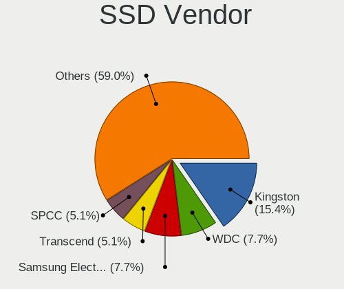
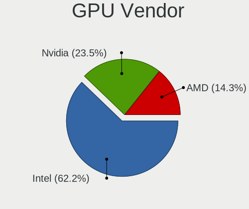
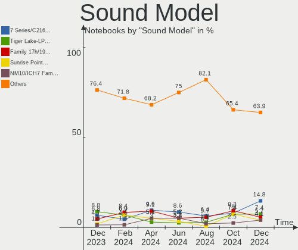

ROSA - Hardware Trends (Notebooks)
----------------------------------

A project to identify most popular hardware characteristics and track their change
over time based on data collected by Linux users at https://Linux-Hardware.org.

Anyone can contribute to this report by the [hw-probe](https://github.com/linuxhw/hw-probe) tool:

    sudo -E hw-probe -all -upload

This report is for one last month. Overall report since the beginning of time: [TestDays](https://github.com/linuxhw/TestDays)

Period: Nov, 2023.

Contents
--------

* [ System ](#system)
  - [ OS                       ](#os)
  - [ OS Family                ](#os-family)
  - [ Kernel                   ](#kernel)
  - [ Kernel Family            ](#kernel-family)
  - [ Kernel Major Ver.        ](#kernel-major-ver)
  - [ Arch                     ](#arch)
  - [ DE                       ](#de)
  - [ Display Server           ](#display-server)
  - [ Display Manager          ](#display-manager)
  - [ OS Lang                  ](#os-lang)
  - [ Boot Mode                ](#boot-mode)
  - [ Filesystem               ](#filesystem)
  - [ Part. scheme             ](#part-scheme)
  - [ Dual Boot with Linux/BSD ](#dual-boot-with-linuxbsd)
  - [ Dual Boot (Win)          ](#dual-boot-win)

* [ Board ](#board)
  - [ Vendor                   ](#vendor)
  - [ Model                    ](#model)
  - [ Model Family             ](#model-family)
  - [ MFG Year                 ](#mfg-year)
  - [ Form Factor              ](#form-factor)
  - [ Secure Boot              ](#secure-boot)
  - [ Coreboot                 ](#coreboot)
  - [ RAM Size                 ](#ram-size)
  - [ RAM Used                 ](#ram-used)
  - [ Total Drives             ](#total-drives)
  - [ Has CD-ROM               ](#has-cd-rom)
  - [ Has Ethernet             ](#has-ethernet)
  - [ Has WiFi                 ](#has-wifi)
  - [ Has Bluetooth            ](#has-bluetooth)

* [ Location ](#location)
  - [ Country                  ](#country)
  - [ City                     ](#city)

* [ Drives ](#drives)
  - [ Drive Vendor             ](#drive-vendor)
  - [ Drive Model              ](#drive-model)
  - [ HDD Vendor               ](#hdd-vendor)
  - [ SSD Vendor               ](#ssd-vendor)
  - [ Drive Kind               ](#drive-kind)
  - [ Drive Connector          ](#drive-connector)
  - [ Drive Size               ](#drive-size)
  - [ Space Total              ](#space-total)
  - [ Space Used               ](#space-used)
  - [ Malfunc. Drives          ](#malfunc-drives)
  - [ Malfunc. Drive Vendor    ](#malfunc-drive-vendor)
  - [ Malfunc. HDD Vendor      ](#malfunc-hdd-vendor)
  - [ Malfunc. Drive Kind      ](#malfunc-drive-kind)
  - [ Failed Drives            ](#failed-drives)
  - [ Failed Drive Vendor      ](#failed-drive-vendor)
  - [ Drive Status             ](#drive-status)

* [ Storage controller ](#storage-controller)
  - [ Storage Vendor           ](#storage-vendor)
  - [ Storage Model            ](#storage-model)
  - [ Storage Kind             ](#storage-kind)

* [ Processor ](#processor)
  - [ CPU Vendor               ](#cpu-vendor)
  - [ CPU Model                ](#cpu-model)
  - [ CPU Model Family         ](#cpu-model-family)
  - [ CPU Cores                ](#cpu-cores)
  - [ CPU Sockets              ](#cpu-sockets)
  - [ CPU Threads              ](#cpu-threads)
  - [ CPU Op-Modes             ](#cpu-op-modes)
  - [ CPU Microcode            ](#cpu-microcode)
  - [ CPU Microarch            ](#cpu-microarch)

* [ Graphics ](#graphics)
  - [ GPU Vendor               ](#gpu-vendor)
  - [ GPU Model                ](#gpu-model)
  - [ GPU Combo                ](#gpu-combo)
  - [ GPU Driver               ](#gpu-driver)
  - [ GPU Memory               ](#gpu-memory)

* [ Monitor ](#monitor)
  - [ Monitor Vendor           ](#monitor-vendor)
  - [ Monitor Model            ](#monitor-model)
  - [ Monitor Resolution       ](#monitor-resolution)
  - [ Monitor Diagonal         ](#monitor-diagonal)
  - [ Monitor Width            ](#monitor-width)
  - [ Aspect Ratio             ](#aspect-ratio)
  - [ Monitor Area             ](#monitor-area)
  - [ Pixel Density            ](#pixel-density)
  - [ Multiple Monitors        ](#multiple-monitors)

* [ Network ](#network)
  - [ Net Controller Vendor    ](#net-controller-vendor)
  - [ Net Controller Model     ](#net-controller-model)
  - [ Wireless Vendor          ](#wireless-vendor)
  - [ Wireless Model           ](#wireless-model)
  - [ Ethernet Vendor          ](#ethernet-vendor)
  - [ Ethernet Model           ](#ethernet-model)
  - [ Net Controller Kind      ](#net-controller-kind)
  - [ Used Controller          ](#used-controller)
  - [ NICs                     ](#nics)
  - [ IPv6                     ](#ipv6)

* [ Bluetooth ](#bluetooth)
  - [ Bluetooth Vendor         ](#bluetooth-vendor)
  - [ Bluetooth Model          ](#bluetooth-model)

* [ Sound ](#sound)
  - [ Sound Vendor             ](#sound-vendor)
  - [ Sound Model              ](#sound-model)

* [ Memory ](#memory)
  - [ Memory Vendor            ](#memory-vendor)
  - [ Memory Model             ](#memory-model)
  - [ Memory Kind              ](#memory-kind)
  - [ Memory Form Factor       ](#memory-form-factor)
  - [ Memory Size              ](#memory-size)
  - [ Memory Speed             ](#memory-speed)

* [ Printers & scanners ](#printers--scanners)
  - [ Printer Vendor           ](#printer-vendor)
  - [ Printer Model            ](#printer-model)
  - [ Scanner Vendor           ](#scanner-vendor)
  - [ Scanner Model            ](#scanner-model)

* [ Camera ](#camera)
  - [ Camera Vendor            ](#camera-vendor)
  - [ Camera Model             ](#camera-model)

* [ Security ](#security)
  - [ Fingerprint Vendor       ](#fingerprint-vendor)
  - [ Fingerprint Model        ](#fingerprint-model)
  - [ Chipcard Vendor          ](#chipcard-vendor)
  - [ Chipcard Model           ](#chipcard-model)

* [ Unsupported ](#unsupported)
  - [ Unsupported Devices      ](#unsupported-devices)
  - [ Unsupported Device Types ](#unsupported-device-types)

System
------

OS
--

Installed operating systems

| Name       | Notebooks | Percent |
|------------|-----------|---------|
| ROSA 12.4  | 77        | 74.76%  |
| ROSA R11.1 | 9         | 8.74%   |
| ROSA 12    | 9         | 8.74%   |
| ROSA 12.3  | 3         | 2.91%   |
| ROSA 12.2  | 3         | 2.91%   |
| ROSA 13.0  | 1         | 0.97%   |
| ROSA 12.1  | 1         | 0.97%   |

OS Family
---------

OS without a version

| Name | Notebooks | Percent |
|------|-----------|---------|
| ROSA | 103       | 100%    |

Kernel
------

Version of the Linux kernel

| Version                                 | Notebooks | Percent |
|-----------------------------------------|-----------|---------|
| 6.1.58-generic-1rosa2021.1-x86_64       | 45        | 43.69%  |
| 6.1.20-generic-2rosa2021.1-x86_64       | 24        | 23.3%   |
| 5.15.103-generic-1rosa2021.1-i686       | 6         | 5.83%   |
| 5.10.74-generic-2rosa2021.1-x86_64      | 5         | 4.85%   |
| 4.15.0-desktop-122.124.1rosa-x86_64     | 3         | 2.91%   |
| 5.4.83-generic-2rosa-x86_64             | 2         | 1.94%   |
| 5.4.32-generic-2rosa-i586               | 2         | 1.94%   |
| 5.15.75-generic-1rosa2021.1-x86_64      | 2         | 1.94%   |
| 5.15.127-generic-1rosa2021.1-x86_64     | 2         | 1.94%   |
| 5.15.127-generic-1rosa2021.1-i686       | 2         | 1.94%   |
| 6.6.0.xm1-4.k-xanmod-rosa2021.1-x86_64  | 1         | 0.97%   |
| 6.1.60.xm1-1.k-xanmod-rosa2021.1-x86_64 | 1         | 0.97%   |
| 6.1.58-generic-3rosa2023.1-x86_64       | 1         | 0.97%   |
| 6.1.46-generic-2rosa2021.1-x86_64       | 1         | 0.97%   |
| 5.4.83-generic-2rosa-i586               | 1         | 0.97%   |
| 5.10.74-generic-2rosa2021.1-i586        | 1         | 0.97%   |
| 5.10.71-generic-1rosa2021.1-x86_64      | 1         | 0.97%   |
| 5.10.184-generic-1rosa2021.1-x86_64     | 1         | 0.97%   |
| 5.10.155-generic-1rosa2021.1-x86_64     | 1         | 0.97%   |
| 4.9.155-nrj-desktop-1rosa-x86_64        | 1         | 0.97%   |

Kernel Family
-------------

Linux kernel without a distro release

| Version  | Notebooks | Percent |
|----------|-----------|---------|
| 6.1.58   | 46        | 44.66%  |
| 6.1.20   | 24        | 23.3%   |
| 5.15.103 | 6         | 5.83%   |
| 5.10.74  | 6         | 5.83%   |
| 5.15.127 | 4         | 3.88%   |
| 5.4.83   | 3         | 2.91%   |
| 4.15.0   | 3         | 2.91%   |
| 5.4.32   | 2         | 1.94%   |
| 5.15.75  | 2         | 1.94%   |
| 6.6.0    | 1         | 0.97%   |
| 6.1.60   | 1         | 0.97%   |
| 6.1.46   | 1         | 0.97%   |
| 5.10.71  | 1         | 0.97%   |
| 5.10.184 | 1         | 0.97%   |
| 5.10.155 | 1         | 0.97%   |
| 4.9.155  | 1         | 0.97%   |

Kernel Major Ver.
-----------------

Linux kernel major version

| Version | Notebooks | Percent |
|---------|-----------|---------|
| 6.1     | 72        | 69.9%   |
| 5.15    | 12        | 11.65%  |
| 5.10    | 9         | 8.74%   |
| 5.4     | 5         | 4.85%   |
| 4.15    | 3         | 2.91%   |
| 6.6     | 1         | 0.97%   |
| 4.9     | 1         | 0.97%   |

Arch
----

OS architecture (x86_64, i586, etc.)

| Name   | Notebooks | Percent |
|--------|-----------|---------|
| x86_64 | 91        | 88.35%  |
| i686   | 12        | 11.65%  |

DE
--

Desktop Environment

| Name   | Notebooks | Percent |
|--------|-----------|---------|
| KDE5   | 56        | 54.37%  |
| GNOME  | 25        | 24.27%  |
| LXQt   | 14        | 13.59%  |
| KDE4   | 6         | 5.83%   |
| MATE   | 1         | 0.97%   |
| Budgie | 1         | 0.97%   |

Display Server
--------------

X11 or Wayland

| Name    | Notebooks | Percent |
|---------|-----------|---------|
| Wayland | 74        | 71.84%  |
| X11     | 29        | 28.16%  |

Display Manager
---------------

SDDM, LightDM, etc.

| Name    | Notebooks | Percent |
|---------|-----------|---------|
| SDDM    | 54        | 52.43%  |
| GDM     | 34        | 33.01%  |
| LightDM | 9         | 8.74%   |
| KDM     | 6         | 5.83%   |

OS Lang
-------

Language

| Lang  | Notebooks | Percent |
|-------|-----------|---------|
| ru_RU | 90        | 87.38%  |
| en_US | 8         | 7.77%   |
| it_IT | 2         | 1.94%   |
| sk_SK | 1         | 0.97%   |
| es_MX | 1         | 0.97%   |
| de_DE | 1         | 0.97%   |

Boot Mode
---------

EFI or BIOS

| Mode | Notebooks | Percent |
|------|-----------|---------|
| EFI  | 56        | 54.37%  |
| BIOS | 47        | 45.63%  |

Filesystem
----------

Type of filesystem

| Type  | Notebooks | Percent |
|-------|-----------|---------|
| Ext4  | 90        | 87.38%  |
| Btrfs | 12        | 11.65%  |
| Ext3  | 1         | 0.97%   |

Part. scheme
------------

Scheme of partitioning

| Type | Notebooks | Percent |
|------|-----------|---------|
| GPT  | 61        | 59.22%  |
| MBR  | 42        | 40.78%  |

Dual Boot with Linux/BSD
------------------------

Hosting more than one Linux/BSD

| Dual boot | Notebooks | Percent |
|-----------|-----------|---------|
| No        | 86        | 83.5%   |
| Yes       | 17        | 16.5%   |

Dual Boot (Win)
---------------

Hosting Linux and Windows

| Dual boot | Notebooks | Percent |
|-----------|-----------|---------|
| No        | 65        | 63.11%  |
| Yes       | 38        | 36.89%  |

Board
-----

Vendor
------

Motherboard manufacturer

| Name                     | Notebooks | Percent |
|--------------------------|-----------|---------|
| Lenovo                   | 18        | 17.48%  |
| Hewlett-Packard          | 17        | 16.5%   |
| ASUSTek Computer         | 15        | 14.56%  |
| Acer                     | 9         | 8.74%   |
| Dell                     | 7         | 6.8%    |
| Samsung Electronics      | 4         | 3.88%   |
| Sony                     | 3         | 2.91%   |
| HUAWEI                   | 3         | 2.91%   |
| Clevo                    | 3         | 2.91%   |
| Toshiba                  | 2         | 1.94%   |
| MSI                      | 2         | 1.94%   |
| Fujitsu Siemens          | 2         | 1.94%   |
| Alienware                | 2         | 1.94%   |
| Unknown                  | 2         | 1.94%   |
| Unchartevice             | 1         | 0.97%   |
| Timi                     | 1         | 0.97%   |
| Packard Bell             | 1         | 0.97%   |
| LTD Delovoy Office       | 1         | 0.97%   |
| KVADRA                   | 1         | 0.97%   |
| HONOR                    | 1         | 0.97%   |
| HIPER Technology Limited | 1         | 0.97%   |
| Haier                    | 1         | 0.97%   |
| Gigabyte Technology      | 1         | 0.97%   |
| Digma                    | 1         | 0.97%   |
| ARDOR GAMING             | 1         | 0.97%   |
| Aquarius                 | 1         | 0.97%   |
| ANCOMP                   | 1         | 0.97%   |
| 3Logic Group             | 1         | 0.97%   |

Model
-----

Motherboard model

| Name                                       | Notebooks | Percent |
|--------------------------------------------|-----------|---------|
| Clevo NL41MU2                              | 3         | 2.91%   |
| HUAWEI BOD-WXX9                            | 2         | 1.94%   |
| HP Notebook                                | 2         | 1.94%   |
| Unknown                                    | 2         | 1.94%   |
| Unchartevice 6540                          | 1         | 0.97%   |
| Toshiba Satellite U300                     | 1         | 0.97%   |
| Toshiba Satellite L735                     | 1         | 0.97%   |
| Timi TM1703                                | 1         | 0.97%   |
| Sony VPCEL3S1R                             | 1         | 0.97%   |
| Sony VPCCA2S1R                             | 1         | 0.97%   |
| Sony VGN-NS11ER_S                          | 1         | 0.97%   |
| Samsung P29/28/26                          | 1         | 0.97%   |
| Samsung G25/G26                            | 1         | 0.97%   |
| Samsung 350V5C/351V5C/3540VC/3440VC        | 1         | 0.97%   |
| Samsung 300V3A/300V4A/300V5A/200A4B/200A5B | 1         | 0.97%   |
| Packard Bell EasyNote TE11HC               | 1         | 0.97%   |
| MSI Katana GF76 12UC                       | 1         | 0.97%   |
| MSI Katana GF76 11UD                       | 1         | 0.97%   |
| LTD Delovoy Office 15Y                     | 1         | 0.97%   |
| Lenovo ThinkPad T430 23493V2               | 1         | 0.97%   |
| Lenovo ThinkPad T430 23445PU               | 1         | 0.97%   |
| Lenovo ThinkBook 15 G3 ACL 21A4            | 1         | 0.97%   |
| Lenovo IdeaPad Z500 20202                  | 1         | 0.97%   |
| Lenovo IdeaPad L340-15API 81LW             | 1         | 0.97%   |
| Lenovo IdeaPad Gaming 3 16ARH7 82SC        | 1         | 0.97%   |
| Lenovo IdeaPad Gaming 3 15ARH05 82EY       | 1         | 0.97%   |
| Lenovo IdeaPad 5 14ARE05 81YM              | 1         | 0.97%   |
| Lenovo IdeaPad 330-15IGM 81D1              | 1         | 0.97%   |
| Lenovo IdeaPad 330-15ARR 81D2              | 1         | 0.97%   |
| Lenovo IdeaPad 3 15IML05 81WB              | 1         | 0.97%   |
| Lenovo IdeaPad 100-15IBY 80MJ              | 1         | 0.97%   |
| Lenovo G700 20251                          | 1         | 0.97%   |
| Lenovo G580                                | 1         | 0.97%   |
| Lenovo G505 20240                          | 1         | 0.97%   |
| Lenovo B570e HuronRiver Platform           | 1         | 0.97%   |
| Lenovo B560                                | 1         | 0.97%   |
| Lenovo 3000 V100 076346G                   | 1         | 0.97%   |
| KVADRA U15W                                | 1         | 0.97%   |
| HUAWEI BOM-WXX9                            | 1         | 0.97%   |
| HONOR HYM-WXX                              | 1         | 0.97%   |

Model Family
------------

Motherboard model prefix

| Name                   | Notebooks | Percent |
|------------------------|-----------|---------|
| Lenovo IdeaPad         | 9         | 8.74%   |
| Acer Aspire            | 8         | 7.77%   |
| HP Pavilion            | 5         | 4.85%   |
| Dell Inspiron          | 4         | 3.88%   |
| HP ProBook             | 3         | 2.91%   |
| Clevo NL41MU2          | 3         | 2.91%   |
| ASUS VivoBook          | 3         | 2.91%   |
| Toshiba Satellite      | 2         | 1.94%   |
| MSI Katana             | 2         | 1.94%   |
| Lenovo ThinkPad        | 2         | 1.94%   |
| HUAWEI BOD-WXX9        | 2         | 1.94%   |
| HP Notebook            | 2         | 1.94%   |
| HP Laptop              | 2         | 1.94%   |
| Fujitsu Siemens AMILO  | 2         | 1.94%   |
| Unknown                | 2         | 1.94%   |
| Unchartevice 6540      | 1         | 0.97%   |
| Timi TM1703            | 1         | 0.97%   |
| Sony VPCEL3S1R         | 1         | 0.97%   |
| Sony VPCCA2S1R         | 1         | 0.97%   |
| Sony VGN-NS11ER        | 1         | 0.97%   |
| Samsung P29            | 1         | 0.97%   |
| Samsung G25            | 1         | 0.97%   |
| Samsung 350V5C         | 1         | 0.97%   |
| Samsung 300V3A         | 1         | 0.97%   |
| Packard Bell EasyNote  | 1         | 0.97%   |
| LTD Delovoy Office 15Y | 1         | 0.97%   |
| Lenovo ThinkBook       | 1         | 0.97%   |
| Lenovo G700            | 1         | 0.97%   |
| Lenovo G580            | 1         | 0.97%   |
| Lenovo G505            | 1         | 0.97%   |
| Lenovo B570e           | 1         | 0.97%   |
| Lenovo B560            | 1         | 0.97%   |
| Lenovo 3000            | 1         | 0.97%   |
| KVADRA U15W            | 1         | 0.97%   |
| HUAWEI BOM-WXX9        | 1         | 0.97%   |
| HONOR HYM-WXX          | 1         | 0.97%   |
| HIPER Limited HIPER    | 1         | 0.97%   |
| HP Mini                | 1         | 0.97%   |
| HP ENVY                | 1         | 0.97%   |
| HP EliteBook           | 1         | 0.97%   |

MFG Year
--------

Motherboard manufacture year

| Year | Notebooks | Percent |
|------|-----------|---------|
| 2022 | 15        | 14.56%  |
| 2012 | 12        | 11.65%  |
| 2011 | 12        | 11.65%  |
| 2021 | 9         | 8.74%   |
| 2013 | 9         | 8.74%   |
| 2018 | 7         | 6.8%    |
| 2020 | 6         | 5.83%   |
| 2023 | 5         | 4.85%   |
| 2010 | 5         | 4.85%   |
| 2007 | 5         | 4.85%   |
| 2017 | 3         | 2.91%   |
| 2008 | 3         | 2.91%   |
| 2006 | 3         | 2.91%   |
| 2016 | 2         | 1.94%   |
| 2015 | 2         | 1.94%   |
| 2005 | 2         | 1.94%   |
| 2019 | 1         | 0.97%   |
| 2014 | 1         | 0.97%   |
| 2009 | 1         | 0.97%   |

Form Factor
-----------

Physical design of the computer

| Name     | Notebooks | Percent |
|----------|-----------|---------|
| Notebook | 103       | 100%    |

Secure Boot
-----------

Enabled or disabled

| State    | Notebooks | Percent |
|----------|-----------|---------|
| Disabled | 102       | 99.03%  |
| Enabled  | 1         | 0.97%   |

Coreboot
--------

Have coreboot on board

| Used | Notebooks | Percent |
|------|-----------|---------|
| No   | 103       | 100%    |

RAM Size
--------

Total RAM memory

| Size in GB  | Notebooks | Percent |
|-------------|-----------|---------|
| 4.01-8.0    | 35        | 33.98%  |
| 3.01-4.0    | 20        | 19.42%  |
| 8.01-16.0   | 20        | 19.42%  |
| 16.01-24.0  | 12        | 11.65%  |
| 2.01-3.0    | 6         | 5.83%   |
| 1.01-2.0    | 5         | 4.85%   |
| 32.01-64.0  | 2         | 1.94%   |
| 24.01-32.0  | 1         | 0.97%   |
| 64.01-256.0 | 1         | 0.97%   |
| 0.51-1.0    | 1         | 0.97%   |

RAM Used
--------

Used RAM memory

| Used GB  | Notebooks | Percent |
|----------|-----------|---------|
| 1.01-2.0 | 57        | 55.34%  |
| 0.51-1.0 | 23        | 22.33%  |
| 2.01-3.0 | 12        | 11.65%  |
| 3.01-4.0 | 6         | 5.83%   |
| 4.01-8.0 | 3         | 2.91%   |
| 0.01-0.5 | 2         | 1.94%   |

Total Drives
------------

Number of drives on board

| Drives | Notebooks | Percent |
|--------|-----------|---------|
| 1      | 80        | 77.67%  |
| 2      | 18        | 17.48%  |
| 3      | 5         | 4.85%   |

Has CD-ROM
----------

Has CD-ROM on board

| Presented | Notebooks | Percent |
|-----------|-----------|---------|
| No        | 61        | 59.22%  |
| Yes       | 42        | 40.78%  |

Has Ethernet
------------

Has Ethernet on board

| Presented | Notebooks | Percent |
|-----------|-----------|---------|
| Yes       | 87        | 84.47%  |
| No        | 16        | 15.53%  |

Has WiFi
--------

Has WiFi module

| Presented | Notebooks | Percent |
|-----------|-----------|---------|
| Yes       | 102       | 99.03%  |
| No        | 1         | 0.97%   |

Has Bluetooth
-------------

Has Bluetooth module

| Presented | Notebooks | Percent |
|-----------|-----------|---------|
| Yes       | 82        | 79.61%  |
| No        | 21        | 20.39%  |

Location
--------

Country
-------

Geographic location (country)

| Country    | Notebooks | Percent |
|------------|-----------|---------|
| Russia     | 86        | 83.5%   |
| Ukraine    | 2         | 1.94%   |
| Nicaragua  | 2         | 1.94%   |
| Italy      | 2         | 1.94%   |
| Germany    | 2         | 1.94%   |
| Belarus    | 2         | 1.94%   |
| Uzbekistan | 1         | 0.97%   |
| Slovakia   | 1         | 0.97%   |
| Palestine  | 1         | 0.97%   |
| Mexico     | 1         | 0.97%   |
| Lithuania  | 1         | 0.97%   |
| Kazakhstan | 1         | 0.97%   |
| Iran       | 1         | 0.97%   |

City
----

Geographic location (city)

| City                | Notebooks | Percent |
|---------------------|-----------|---------|
| Moscow              | 23        | 22.33%  |
| St Petersburg       | 11        | 10.68%  |
| Yekaterinburg       | 3         | 2.91%   |
| Samara              | 3         | 2.91%   |
| Cherepovets         | 3         | 2.91%   |
| Voronezh            | 2         | 1.94%   |
| Smolensk            | 2         | 1.94%   |
| Simferopol          | 2         | 1.94%   |
| Perm                | 2         | 1.94%   |
| Managua             | 2         | 1.94%   |
| Krasnodar           | 2         | 1.94%   |
| Khabarovsk          | 2         | 1.94%   |
| Zheleznogorsk       | 1         | 0.97%   |
| Zelenograd          | 1         | 0.97%   |
| Yaroslavl           | 1         | 0.97%   |
| Vologda             | 1         | 0.97%   |
| Vladivostok         | 1         | 0.97%   |
| Vladimir            | 1         | 0.97%   |
| Vitebsk             | 1         | 0.97%   |
| Ufa                 | 1         | 0.97%   |
| Tyumen              | 1         | 0.97%   |
| Troitsk             | 1         | 0.97%   |
| Tomsk               | 1         | 0.97%   |
| Tehran              | 1         | 0.97%   |
| Tatishchevo         | 1         | 0.97%   |
| Tashkent            | 1         | 0.97%   |
| Shchelkovo          | 1         | 0.97%   |
| Sergiyev Posad      | 1         | 0.97%   |
| San Gavino Monreale | 1         | 0.97%   |
| Šaľa              | 1         | 0.97%   |
| Ryazan              | 1         | 0.97%   |
| Penza               | 1         | 0.97%   |
| Omsk                | 1         | 0.97%   |
| Novosibirsk         | 1         | 0.97%   |
| Novara              | 1         | 0.97%   |
| Nizhniy Novgorod    | 1         | 0.97%   |
| Murmansk            | 1         | 0.97%   |
| Moscow Oblast       | 1         | 0.97%   |
| Minsk               | 1         | 0.97%   |
| Magnitogorsk        | 1         | 0.97%   |

Drives
------

Drive Vendor
------------

Hard drive vendors

| Vendor              | Notebooks | Drives | Percent |
|---------------------|-----------|--------|---------|
| WDC                 | 13        | 14     | 10.24%  |
| Samsung Electronics | 12        | 15     | 9.45%   |
| Toshiba             | 9         | 9      | 7.09%   |
| Seagate             | 8         | 8      | 6.3%    |
| Kingston            | 6         | 6      | 4.72%   |
| Intel               | 6         | 6      | 4.72%   |
| HGST                | 6         | 6      | 4.72%   |
| SK hynix            | 5         | 6      | 3.94%   |
| Hitachi             | 5         | 5      | 3.94%   |
| SanDisk             | 4         | 4      | 3.15%   |
| DEXP                | 4         | 4      | 3.15%   |
| Fujitsu             | 3         | 3      | 2.36%   |
| China               | 3         | 3      | 2.36%   |
| BIWIN               | 3         | 3      | 2.36%   |
| A-DATA Technology   | 3         | 3      | 2.36%   |
| Unknown             | 2         | 2      | 1.57%   |
| Silicon Motion      | 2         | 2      | 1.57%   |
| Qumo                | 2         | 2      | 1.57%   |
| Neo                 | 2         | 2      | 1.57%   |
| Micron Technology   | 2         | 2      | 1.57%   |
| KingSpec            | 2         | 2      | 1.57%   |
| Apacer              | 2         | 2      | 1.57%   |
| AGI                 | 2         | 2      | 1.57%   |
| WDC WDS             | 1         | 1      | 0.79%   |
| USB3.0              | 1         | 1      | 0.79%   |
| Transcend           | 1         | 1      | 0.79%   |
| StoreJet            | 1         | 1      | 0.79%   |
| SPCC                | 1         | 1      | 0.79%   |
| Smartbuy            | 1         | 1      | 0.79%   |
| SCY                 | 1         | 1      | 0.79%   |
| Phison              | 1         | 1      | 0.79%   |
| Patriot             | 1         | 1      | 0.79%   |
| MSI                 | 1         | 1      | 0.79%   |
| LITEONIT            | 1         | 1      | 0.79%   |
| KingFast            | 1         | 1      | 0.79%   |
| HS-SSD-E100         | 1         | 1      | 0.79%   |
| HFS128G3            | 1         | 1      | 0.79%   |
| Hewlett-Packard     | 1         | 1      | 0.79%   |
| Gigabyte Technology | 1         | 1      | 0.79%   |
| Fanxiang            | 1         | 1      | 0.79%   |

Drive Model
-----------

Hard drive models

| Model                                   | Notebooks | Percent |
|-----------------------------------------|-----------|---------|
| Toshiba MQ01ABF050 500GB                | 3         | 2.31%   |
| BIWIN CE480T5D101-256 256GB             | 3         | 2.31%   |
| Seagate ST320LT012-9WS14C 320GB         | 2         | 1.54%   |
| SanDisk SSD PLUS 240GB                  | 2         | 1.54%   |
| HGST HTS541010A9E680 1TB                | 2         | 1.54%   |
| DEXP SSD C100 256Gb                     | 2         | 1.54%   |
| AGI AGI256G06AI138 256GB SSD            | 2         | 1.54%   |
| WDC WDS120G2G0A-00JH30 120GB SSD        | 1         | 0.77%   |
| WDC WDS 100T2B0A-00SM50 1TB SSD         | 1         | 0.77%   |
| WDC WD7500BPKX-75HPJT0 752GB            | 1         | 0.77%   |
| WDC WD5000LPVX-22V0TT0 500GB            | 1         | 0.77%   |
| WDC WD5000LPCX-22VHAT0 500GB            | 1         | 0.77%   |
| WDC WD5000BPVT-55HXZT3 500GB            | 1         | 0.77%   |
| WDC WD3200BPVT-24ZEST0 320GB            | 1         | 0.77%   |
| WDC WD3200BEVT-80A0RT0 320GB            | 1         | 0.77%   |
| WDC WD3200BEVT-75ZCT1 320GB             | 1         | 0.77%   |
| WDC WD2500LPCX-24C6HT0 250GB            | 1         | 0.77%   |
| WDC WD1200BEVS-60UST0 120GB             | 1         | 0.77%   |
| WDC WD1200BEVS-07LAT0 120GB             | 1         | 0.77%   |
| WDC PC SN730 SDBQNTY-1T00-1001 1TB      | 1         | 0.77%   |
| WDC PC SN730 SDBPNTY-512G-1101 512GB    | 1         | 0.77%   |
| WDC PC SN530 NVMe 512GB                 | 1         | 0.77%   |
| USB3.0 Super Speed 500GB                | 1         | 0.77%   |
| Unknown SD32G  32GB                     | 1         | 0.77%   |
| Unknown SD128  128GB                    | 1         | 0.77%   |
| Transcend TS2TSSD225S 2TB               | 1         | 0.77%   |
| Toshiba MQ01ABD075 752GB                | 1         | 0.77%   |
| Toshiba MK3265GSXN 320GB                | 1         | 0.77%   |
| Toshiba MK2565GSX 250GB                 | 1         | 0.77%   |
| Toshiba MK1059GSMP 1TB                  | 1         | 0.77%   |
| Toshiba MK1031GAS 100GB                 | 1         | 0.77%   |
| Toshiba KBG40ZNT256G MEMORY 256GB       | 1         | 0.77%   |
| StoreJet Disk 1TB                       | 1         | 0.77%   |
| SPCC Solid State Disk 256GB             | 1         | 0.77%   |
| Smartbuy SSD 90GB                       | 1         | 0.77%   |
| SK hynix PC801 NVMe 512GB               | 1         | 0.77%   |
| SK hynix HFS128G39TND-N210A 128GB SSD   | 1         | 0.77%   |
| SK hynix HFS001TEJ9X101N 1TB            | 1         | 0.77%   |
| SK hynix HFM512GD3JX013N 512GB          | 1         | 0.77%   |
| SK hynix BC511 HFM256GDJTNI-82A0A 256GB | 1         | 0.77%   |

HDD Vendor
----------

Hard disk drive vendors

| Vendor   | Notebooks | Drives | Percent |
|----------|-----------|--------|---------|
| WDC      | 10        | 10     | 23.81%  |
| Toshiba  | 8         | 8      | 19.05%  |
| Seagate  | 8         | 8      | 19.05%  |
| HGST     | 6         | 6      | 14.29%  |
| Hitachi  | 5         | 5      | 11.9%   |
| Fujitsu  | 3         | 3      | 7.14%   |
| USB3.0   | 1         | 1      | 2.38%   |
| StoreJet | 1         | 1      | 2.38%   |

SSD Vendor
----------

Solid state drive vendors

| Vendor              | Notebooks | Drives | Percent |
|---------------------|-----------|--------|---------|
| Samsung Electronics | 7         | 9      | 14.29%  |
| Kingston            | 6         | 6      | 12.24%  |
| SanDisk             | 4         | 4      | 8.16%   |
| DEXP                | 4         | 4      | 8.16%   |
| China               | 3         | 3      | 6.12%   |
| Neo                 | 2         | 2      | 4.08%   |
| KingSpec            | 2         | 2      | 4.08%   |
| AGI                 | 2         | 2      | 4.08%   |
| A-DATA Technology   | 2         | 2      | 4.08%   |
| WDC WDS             | 1         | 1      | 2.04%   |
| WDC                 | 1         | 1      | 2.04%   |
| Transcend           | 1         | 1      | 2.04%   |
| SPCC                | 1         | 1      | 2.04%   |
| Smartbuy            | 1         | 1      | 2.04%   |
| SK hynix            | 1         | 1      | 2.04%   |
| Qumo                | 1         | 1      | 2.04%   |
| Patriot             | 1         | 1      | 2.04%   |
| Micron Technology   | 1         | 1      | 2.04%   |
| LITEONIT            | 1         | 1      | 2.04%   |
| KingFast            | 1         | 1      | 2.04%   |
| Intel               | 1         | 1      | 2.04%   |
| HS-SSD-E100         | 1         | 1      | 2.04%   |
| Hewlett-Packard     | 1         | 1      | 2.04%   |
| Fanxiang            | 1         | 1      | 2.04%   |
| Crucial             | 1         | 1      | 2.04%   |
| AMD                 | 1         | 1      | 2.04%   |

Drive Kind
----------

HDD or SSD

| Kind    | Notebooks | Drives | Percent |
|---------|-----------|--------|---------|
| SSD     | 46        | 51     | 37.7%   |
| HDD     | 40        | 42     | 32.79%  |
| NVMe    | 31        | 34     | 25.41%  |
| MMC     | 3         | 3      | 2.46%   |
| Unknown | 2         | 2      | 1.64%   |

Drive Connector
---------------

SATA, SAS, NVMe, etc.

| Type | Notebooks | Drives | Percent |
|------|-----------|--------|---------|
| SATA | 74        | 90     | 65.49%  |
| NVMe | 31        | 34     | 27.43%  |
| SAS  | 5         | 5      | 4.42%   |
| MMC  | 3         | 3      | 2.65%   |

Drive Size
----------

Size of hard drive

| Size in TB | Notebooks | Drives | Percent |
|------------|-----------|--------|---------|
| 0.01-0.5   | 63        | 72     | 76.83%  |
| 0.51-1.0   | 18        | 20     | 21.95%  |
| 1.01-2.0   | 1         | 1      | 1.22%   |

Space Total
-----------

Amount of disk space available on the file system

| Size in GB | Notebooks | Percent |
|------------|-----------|---------|
| 101-250    | 43        | 41.75%  |
| 251-500    | 24        | 23.3%   |
| 501-1000   | 11        | 10.68%  |
| 1-20       | 8         | 7.77%   |
| 1001-2000  | 7         | 6.8%    |
| 51-100     | 6         | 5.83%   |
| 21-50      | 4         | 3.88%   |

Space Used
----------

Amount of used disk space

| Used GB  | Notebooks | Percent |
|----------|-----------|---------|
| 1-20     | 65        | 63.11%  |
| 21-50    | 14        | 13.59%  |
| 101-250  | 10        | 9.71%   |
| 51-100   | 10        | 9.71%   |
| 251-500  | 3         | 2.91%   |
| 501-1000 | 1         | 0.97%   |

Malfunc. Drives
---------------

Drive models with a malfunction

| Model                                   | Notebooks | Drives | Percent |
|-----------------------------------------|-----------|--------|---------|
| Seagate ST320LT012-9WS14C 320GB         | 2         | 2      | 7.14%   |
| HGST HTS541010A9E680 1TB                | 2         | 2      | 7.14%   |
| WDC WD5000LPVX-22V0TT0 500GB            | 1         | 1      | 3.57%   |
| WDC WD3200BPVT-24ZEST0 320GB            | 1         | 1      | 3.57%   |
| WDC WD3200BEVT-80A0RT0 320GB            | 1         | 1      | 3.57%   |
| WDC WD2500LPCX-24C6HT0 250GB            | 1         | 1      | 3.57%   |
| WDC WD1200BEVS-60UST0 120GB             | 1         | 1      | 3.57%   |
| WDC WD1200BEVS-07LAT0 120GB             | 1         | 1      | 3.57%   |
| Toshiba MQ01ABD075 752GB                | 1         | 1      | 3.57%   |
| Toshiba MK2565GSX 250GB                 | 1         | 1      | 3.57%   |
| Toshiba MK1059GSMP 1TB                  | 1         | 1      | 3.57%   |
| SK hynix HFS128G39TND-N210A 128GB SSD   | 1         | 1      | 3.57%   |
| Seagate ST9320325AS 320GB               | 1         | 1      | 3.57%   |
| Seagate ST1000LM024 HN-M101MBB 1TB      | 1         | 1      | 3.57%   |
| Seagate ST1000LM014-1EJ164 1TB          | 1         | 1      | 3.57%   |
| SanDisk SDSSDH120GG25 120GB             | 1         | 1      | 3.57%   |
| Neo Forza NFS121SA324-6007000 240GB SSD | 1         | 1      | 3.57%   |
| Hitachi HTS723232A7A364 320GB           | 1         | 1      | 3.57%   |
| Hitachi HTS543232A7A384 320GB           | 1         | 1      | 3.57%   |
| Hitachi HTS542516K9SA00 160GB           | 1         | 1      | 3.57%   |
| HGST HTS721010A9E630 1TB                | 1         | 1      | 3.57%   |
| HGST HTS545050A7E680 500GB              | 1         | 1      | 3.57%   |
| HGST HTS545050A7E380 500GB              | 1         | 1      | 3.57%   |
| HGST HTE721010A9E630 1TB                | 1         | 1      | 3.57%   |
| Fujitsu MHY2120BH 120GB                 | 1         | 1      | 3.57%   |
| Fujitsu MHT2040AH 40GB                  | 1         | 1      | 3.57%   |

Malfunc. Drive Vendor
---------------------

Vendors of faulty drives

| Vendor   | Notebooks | Drives | Percent |
|----------|-----------|--------|---------|
| WDC      | 6         | 6      | 21.43%  |
| HGST     | 6         | 6      | 21.43%  |
| Seagate  | 5         | 5      | 17.86%  |
| Toshiba  | 3         | 3      | 10.71%  |
| Hitachi  | 3         | 3      | 10.71%  |
| Fujitsu  | 2         | 2      | 7.14%   |
| SK hynix | 1         | 1      | 3.57%   |
| SanDisk  | 1         | 1      | 3.57%   |
| Neo      | 1         | 1      | 3.57%   |

Malfunc. HDD Vendor
-------------------

Vendors of faulty HDD drives

| Vendor  | Notebooks | Drives | Percent |
|---------|-----------|--------|---------|
| WDC     | 6         | 6      | 24%     |
| HGST    | 6         | 6      | 24%     |
| Seagate | 5         | 5      | 20%     |
| Toshiba | 3         | 3      | 12%     |
| Hitachi | 3         | 3      | 12%     |
| Fujitsu | 2         | 2      | 8%      |

Malfunc. Drive Kind
-------------------

Kinds of faulty drives

| Kind | Notebooks | Drives | Percent |
|------|-----------|--------|---------|
| HDD  | 25        | 25     | 89.29%  |
| SSD  | 3         | 3      | 10.71%  |

Failed Drives
-------------

Failed drive models

Zero info for selected period =(

Failed Drive Vendor
-------------------

Failed drive vendors

Zero info for selected period =(

Drive Status
------------

Number of failed and malfunc. drives

| Status   | Notebooks | Drives | Percent |
|----------|-----------|--------|---------|
| Works    | 84        | 98     | 71.19%  |
| Malfunc  | 28        | 28     | 23.73%  |
| Detected | 6         | 6      | 5.08%   |

Storage controller
------------------

Storage Vendor
--------------

Storage controller vendors

| Vendor                           | Notebooks | Percent |
|----------------------------------|-----------|---------|
| Intel                            | 78        | 62.4%   |
| AMD                              | 19        | 15.2%   |
| Samsung Electronics              | 6         | 4.8%    |
| Phison Electronics               | 5         | 4%      |
| SK hynix                         | 4         | 3.2%    |
| INNOGRIT                         | 3         | 2.4%    |
| Silicon Motion                   | 2         | 1.6%    |
| SanDisk                          | 2         | 1.6%    |
| Shenzhen Shichuangyi Electronics | 1         | 0.8%    |
| Nvidia                           | 1         | 0.8%    |
| Micron Technology                | 1         | 0.8%    |
| MAXIO Technology (Hangzhou)      | 1         | 0.8%    |
| KIOXIA                           | 1         | 0.8%    |
| ADATA Technology                 | 1         | 0.8%    |

Storage Model
-------------

Storage controller models

| Model                                                                          | Notebooks | Percent |
|--------------------------------------------------------------------------------|-----------|---------|
| Intel 7 Series Chipset Family 6-port SATA Controller [AHCI mode]               | 13        | 9.29%   |
| AMD FCH SATA Controller [AHCI mode]                                            | 12        | 8.57%   |
| Intel 6 Series/C200 Series Chipset Family 6 port Mobile SATA AHCI Controller   | 8         | 5.71%   |
| Intel Sunrise Point-LP SATA Controller [AHCI mode]                             | 6         | 4.29%   |
| Intel Tiger Lake-LP SATA Controller                                            | 4         | 2.86%   |
| Intel Comet Lake SATA AHCI Controller                                          | 4         | 2.86%   |
| Intel Alder Lake-P SATA AHCI Controller                                        | 4         | 2.86%   |
| Intel 82801GBM/GHM (ICH7-M Family) SATA Controller [AHCI mode]                 | 4         | 2.86%   |
| Intel 82801G (ICH7 Family) IDE Controller                                      | 4         | 2.86%   |
| Intel 8 Series/C220 Series Chipset Family 6-port SATA Controller 1 [AHCI mode] | 4         | 2.86%   |
| Samsung NVMe SSD Controller SM981/PM981/PM983                                  | 3         | 2.14%   |
| Intel SSD 660P Series                                                          | 3         | 2.14%   |
| Intel NM10/ICH7 Family SATA Controller [AHCI mode]                             | 3         | 2.14%   |
| Intel Celeron/Pentium Silver Processor SATA Controller                         | 3         | 2.14%   |
| Intel 82801 Mobile SATA Controller [RAID mode]                                 | 3         | 2.14%   |
| INNOGRIT NVMe SSD Controller IG5216 (DRAM-less)                                | 3         | 2.14%   |
| SK hynix Platinum P41/PC801 NVMe Solid State Drive                             | 2         | 1.43%   |
| Silicon Motion Non-Volatile memory controller                                  | 2         | 1.43%   |
| Phison PS5019-E19 PCIe4 NVMe Controller (DRAM-less)                            | 2         | 1.43%   |
| Intel Volume Management Device NVMe RAID Controller                            | 2         | 1.43%   |
| Intel SSD 670p Series [Keystone Harbor]                                        | 2         | 1.43%   |
| Intel Atom Processor E3800 Series SATA AHCI Controller                         | 2         | 1.43%   |
| Intel 82801IBM/IEM (ICH9M/ICH9M-E) 4 port SATA Controller [AHCI mode]          | 2         | 1.43%   |
| Intel 82801HM/HEM (ICH8M/ICH8M-E) SATA Controller [AHCI mode]                  | 2         | 1.43%   |
| Intel 82801HM/HEM (ICH8M/ICH8M-E) IDE Controller                               | 2         | 1.43%   |
| AMD SB7x0/SB8x0/SB9x0 SATA Controller [AHCI mode]                              | 2         | 1.43%   |
| AMD SB600 Non-Raid-5 SATA                                                      | 2         | 1.43%   |
| AMD SB600 IDE                                                                  | 2         | 1.43%   |
| AMD IXP SB4x0 Serial ATA Controller                                            | 2         | 1.43%   |
| AMD IXP SB4x0 IDE Controller                                                   | 2         | 1.43%   |
| SK hynix Gold P31/BC711/PC711 NVMe Solid State Drive                           | 1         | 0.71%   |
| SK hynix BC511 NVMe SSD                                                        | 1         | 0.71%   |
| Shenzhen Shichuangyi MAP1202-Based NVMe SSD (DRAM-less)                        | 1         | 0.71%   |
| SanDisk IX SN530 NVMe SSD (DRAM-less)                                          | 1         | 0.71%   |
| SanDisk Extreme Pro / WD Black SN750 / PC SN730 / Red SN700 NVMe SSD           | 1         | 0.71%   |
| Samsung NVMe SSD Controller PM9B1 (DRAM-less)                                  | 1         | 0.71%   |
| Samsung NVMe SSD Controller PM9A1/PM9A3/980PRO                                 | 1         | 0.71%   |
| Samsung NVMe SSD Controller 980 (DRAM-less)                                    | 1         | 0.71%   |
| Phison PS5013-E13 PCIe3 NVMe Controller (DRAM-less)                            | 1         | 0.71%   |
| Phison E16 PCIe4 NVMe Controller                                               | 1         | 0.71%   |

Storage Kind
------------

Kind of storage controller (IDE, SATA, NVMe, SAS, ...)

| Kind | Notebooks | Percent |
|------|-----------|---------|
| SATA | 82        | 60.74%  |
| NVMe | 31        | 22.96%  |
| IDE  | 16        | 11.85%  |
| RAID | 6         | 4.44%   |

Processor
---------

CPU Vendor
----------

Processor vendors

| Vendor | Notebooks | Percent |
|--------|-----------|---------|
| Intel  | 79        | 76.7%   |
| AMD    | 24        | 23.3%   |

CPU Model
---------

Processor models

| Model                                    | Notebooks | Percent |
|------------------------------------------|-----------|---------|
| Intel 11th Gen Core i5-1135G7 @ 2.40GHz  | 5         | 4.85%   |
| Intel Core i5-10210U CPU @ 1.60GHz       | 3         | 2.91%   |
| Intel Core i3-6006U CPU @ 2.00GHz        | 3         | 2.91%   |
| Intel Pentium Silver N5000 CPU @ 1.10GHz | 2         | 1.94%   |
| Intel Core i5-3210M CPU @ 2.50GHz        | 2         | 1.94%   |
| Intel Core i5-2410M CPU @ 2.30GHz        | 2         | 1.94%   |
| Intel Core i5-1035G1 CPU @ 1.00GHz       | 2         | 1.94%   |
| Intel Core i3-2310M CPU @ 2.10GHz        | 2         | 1.94%   |
| Intel 12th Gen Core i5-12450H            | 2         | 1.94%   |
| Intel 11th Gen Core i3-1115G4 @ 3.00GHz  | 2         | 1.94%   |
| AMD Turion 64 X2 Mobile Technology TL-56 | 2         | 1.94%   |
| AMD Ryzen 7 6800H with Radeon Graphics   | 2         | 1.94%   |
| AMD Ryzen 7 4800H with Radeon Graphics   | 2         | 1.94%   |
| AMD Ryzen 5 5500U with Radeon Graphics   | 2         | 1.94%   |
| Intel Pentium M processor 2.13GHz        | 1         | 0.97%   |
| Intel Pentium CPU N3530 @ 2.16GHz        | 1         | 0.97%   |
| Intel Pentium CPU B960 @ 2.20GHz         | 1         | 0.97%   |
| Intel Pentium CPU B950 @ 2.10GHz         | 1         | 0.97%   |
| Intel Pentium CPU 2020M @ 2.40GHz        | 1         | 0.97%   |
| Intel Genuine CPU T2400 @ 1.83GHz        | 1         | 0.97%   |
| Intel Genuine CPU T2250 @ 1.73GHz        | 1         | 0.97%   |
| Intel Core i7-8550U CPU @ 1.80GHz        | 1         | 0.97%   |
| Intel Core i7-4800MQ CPU @ 2.70GHz       | 1         | 0.97%   |
| Intel Core i7-4710HQ CPU @ 2.50GHz       | 1         | 0.97%   |
| Intel Core i7-4702MQ CPU @ 2.20GHz       | 1         | 0.97%   |
| Intel Core i7-4700HQ CPU @ 2.40GHz       | 1         | 0.97%   |
| Intel Core i7-3630QM CPU @ 2.40GHz       | 1         | 0.97%   |
| Intel Core i7-3520M CPU @ 2.90GHz        | 1         | 0.97%   |
| Intel Core i5-8300H CPU @ 2.30GHz        | 1         | 0.97%   |
| Intel Core i5-8250U CPU @ 1.60GHz        | 1         | 0.97%   |
| Intel Core i5-7200U CPU @ 2.50GHz        | 1         | 0.97%   |
| Intel Core i5-4200M CPU @ 2.50GHz        | 1         | 0.97%   |
| Intel Core i5-3340M CPU @ 2.70GHz        | 1         | 0.97%   |
| Intel Core i5-3337U CPU @ 1.80GHz        | 1         | 0.97%   |
| Intel Core i5-3320M CPU @ 2.60GHz        | 1         | 0.97%   |
| Intel Core i5-3230M CPU @ 2.60GHz        | 1         | 0.97%   |
| Intel Core i5-2540M CPU @ 2.60GHz        | 1         | 0.97%   |
| Intel Core i5-2520M CPU @ 2.50GHz        | 1         | 0.97%   |
| Intel Core i3-5005U CPU @ 2.00GHz        | 1         | 0.97%   |
| Intel Core i3-3120M CPU @ 2.50GHz        | 1         | 0.97%   |

CPU Model Family
----------------

Processor model prefix

| Model                   | Notebooks | Percent |
|-------------------------|-----------|---------|
| Intel Core i5           | 19        | 18.45%  |
| Other                   | 16        | 15.53%  |
| Intel Core i3           | 12        | 11.65%  |
| Intel Core i7           | 7         | 6.8%    |
| Intel Celeron           | 7         | 6.8%    |
| AMD Ryzen 7             | 7         | 6.8%    |
| AMD Ryzen 5             | 5         | 4.85%   |
| Intel Pentium           | 4         | 3.88%   |
| Intel Core 2 Duo        | 3         | 2.91%   |
| Intel Atom              | 3         | 2.91%   |
| Intel Pentium Silver    | 2         | 1.94%   |
| Intel Genuine           | 2         | 1.94%   |
| Intel Core 2            | 2         | 1.94%   |
| AMD Turion 64 X2 Mobile | 2         | 1.94%   |
| AMD Ryzen 3             | 2         | 1.94%   |
| AMD A6                  | 2         | 1.94%   |
| Intel Pentium M         | 1         | 0.97%   |
| Intel Core Duo          | 1         | 0.97%   |
| Intel Celeron M         | 1         | 0.97%   |
| AMD Turion 64 Mobile    | 1         | 0.97%   |
| AMD E1                  | 1         | 0.97%   |
| AMD E                   | 1         | 0.97%   |
| AMD Athlon X2           | 1         | 0.97%   |
| AMD Athlon              | 1         | 0.97%   |

CPU Cores
---------

Number of processor cores

| Number | Notebooks | Percent |
|--------|-----------|---------|
| 2      | 54        | 52.43%  |
| 4      | 27        | 26.21%  |
| 8      | 9         | 8.74%   |
| 6      | 5         | 4.85%   |
| 1      | 5         | 4.85%   |
| 24     | 1         | 0.97%   |
| 12     | 1         | 0.97%   |
| 10     | 1         | 0.97%   |

CPU Sockets
-----------

Number of sockets

| Number | Notebooks | Percent |
|--------|-----------|---------|
| 1      | 103       | 100%    |

CPU Threads
-----------

Threads per core (Hyper-Threading)

| Number | Notebooks | Percent |
|--------|-----------|---------|
| 2      | 68        | 66.02%  |
| 1      | 35        | 33.98%  |

CPU Op-Modes
------------

CPU Operation Modes (32-bit, 64-bit)

| Op mode        | Notebooks | Percent |
|----------------|-----------|---------|
| 32-bit, 64-bit | 97        | 94.17%  |
| 32-bit         | 6         | 5.83%   |

CPU Microcode
-------------

Microcode number

| Number     | Notebooks | Percent |
|------------|-----------|---------|
| 0x206a7    | 12        | 11.65%  |
| 0x306a9    | 11        | 10.68%  |
| 0x806c1    | 7         | 6.8%    |
| Unknown    | 6         | 5.83%   |
| 0x306c3    | 5         | 4.85%   |
| 0x806ec    | 4         | 3.88%   |
| 0x906a3    | 3         | 2.91%   |
| 0x406e3    | 3         | 2.91%   |
| 0x0a50000c | 3         | 2.91%   |
| 0x806ea    | 2         | 1.94%   |
| 0x706a1    | 2         | 1.94%   |
| 0x6f6      | 2         | 1.94%   |
| 0x6e8      | 2         | 1.94%   |
| 0x6d8      | 2         | 1.94%   |
| 0x30678    | 2         | 1.94%   |
| 0x106ca    | 2         | 1.94%   |
| 0x0a404102 | 2         | 1.94%   |
| 0x08608103 | 2         | 1.94%   |
| 0x08600104 | 2         | 1.94%   |
| 0xb0671    | 1         | 0.97%   |
| 0x906ea    | 1         | 0.97%   |
| 0x906c0    | 1         | 0.97%   |
| 0x906a4    | 1         | 0.97%   |
| 0x806e9    | 1         | 0.97%   |
| 0x806d1    | 1         | 0.97%   |
| 0x806c2    | 1         | 0.97%   |
| 0x706e5    | 1         | 0.97%   |
| 0x6fd      | 1         | 0.97%   |
| 0x6fa      | 1         | 0.97%   |
| 0x6ec      | 1         | 0.97%   |
| 0x406c3    | 1         | 0.97%   |
| 0x306d4    | 1         | 0.97%   |
| 0x30661    | 1         | 0.97%   |
| 0x20655    | 1         | 0.97%   |
| 0x1067a    | 1         | 0.97%   |
| 0x10676    | 1         | 0.97%   |
| 0x08600106 | 1         | 0.97%   |
| 0x08600102 | 1         | 0.97%   |
| 0x08108109 | 1         | 0.97%   |
| 0x08108102 | 1         | 0.97%   |

CPU Microarch
-------------

Microarchitecture

| Name             | Notebooks | Percent |
|------------------|-----------|---------|
| SandyBridge      | 12        | 11.65%  |
| IvyBridge        | 11        | 10.68%  |
| TigerLake        | 9         | 8.74%   |
| KabyLake         | 8         | 7.77%   |
| P6               | 5         | 4.85%   |
| Haswell          | 5         | 4.85%   |
| Alderlake Hybrid | 5         | 4.85%   |
| Zen 2            | 4         | 3.88%   |
| Core             | 4         | 3.88%   |
| Unknown          | 4         | 3.88%   |
| Zen 3            | 3         | 2.91%   |
| Skylake          | 3         | 2.91%   |
| Silvermont       | 3         | 2.91%   |
| K8 Hammer        | 3         | 2.91%   |
| IceLake          | 3         | 2.91%   |
| Goldmont plus    | 3         | 2.91%   |
| Bonnell          | 3         | 2.91%   |
| Zen+             | 2         | 1.94%   |
| Penryn           | 2         | 1.94%   |
| K8 & K10 hybrid  | 2         | 1.94%   |
| Zen              | 1         | 0.97%   |
| Westmere         | 1         | 0.97%   |
| Tremont          | 1         | 0.97%   |
| Puma             | 1         | 0.97%   |
| K10 Llano        | 1         | 0.97%   |
| Jaguar           | 1         | 0.97%   |
| Excavator        | 1         | 0.97%   |
| Broadwell        | 1         | 0.97%   |
| Bobcat           | 1         | 0.97%   |

Graphics
--------

GPU Vendor
----------

Vendors of graphics cards

| Vendor | Notebooks | Percent |
|--------|-----------|---------|
| Intel  | 71        | 53.38%  |
| Nvidia | 33        | 24.81%  |
| AMD    | 29        | 21.8%   |

GPU Model
---------

Graphics card models

| Model                                                                         | Notebooks | Percent |
|-------------------------------------------------------------------------------|-----------|---------|
| Intel 2nd Generation Core Processor Family Integrated Graphics Controller     | 11        | 7.86%   |
| Intel 3rd Gen Core processor Graphics Controller                              | 9         | 6.43%   |
| Intel TigerLake-LP GT2 [Iris Xe Graphics]                                     | 7         | 5%      |
| Intel CometLake-U GT2 [UHD Graphics]                                          | 4         | 2.86%   |
| Intel 4th Gen Core Processor Integrated Graphics Controller                   | 4         | 2.86%   |
| AMD Renoir [Radeon RX Vega 6 (Ryzen 4000/5000 Mobile Series)]                 | 4         | 2.86%   |
| Nvidia GF117M [GeForce 610M/710M/810M/820M / GT 620M/625M/630M/720M]          | 3         | 2.14%   |
| Nvidia GA107M [GeForce RTX 3050 Mobile]                                       | 3         | 2.14%   |
| Intel Skylake GT2 [HD Graphics 520]                                           | 3         | 2.14%   |
| Intel Mobile 945GM/GMS/GME, 943/940GML Express Integrated Graphics Controller | 3         | 2.14%   |
| Intel Mobile 945GM/GMS, 943/940GML Express Integrated Graphics Controller     | 3         | 2.14%   |
| Nvidia TU117M [GeForce MX450]                                                 | 2         | 1.43%   |
| Nvidia GM108M [GeForce MX110]                                                 | 2         | 1.43%   |
| Nvidia GK208M [GeForce GT 740M]                                               | 2         | 1.43%   |
| Nvidia GK107M [GeForce GT 750M]                                               | 2         | 1.43%   |
| Nvidia GA107M [GeForce RTX 3050 Ti Mobile]                                    | 2         | 1.43%   |
| Intel UHD Graphics 620                                                        | 2         | 1.43%   |
| Intel Tiger Lake-LP GT2 [UHD Graphics G4]                                     | 2         | 1.43%   |
| Intel Mobile 4 Series Chipset Integrated Graphics Controller                  | 2         | 1.43%   |
| Intel Iris Plus Graphics G1 (Ice Lake)                                        | 2         | 1.43%   |
| Intel GeminiLake [UHD Graphics 605]                                           | 2         | 1.43%   |
| Intel Atom Processor Z36xxx/Z37xxx Series Graphics & Display                  | 2         | 1.43%   |
| Intel Atom Processor D4xx/D5xx/N4xx/N5xx Integrated Graphics Controller       | 2         | 1.43%   |
| Intel Alder Lake-P GT1 [UHD Graphics]                                         | 2         | 1.43%   |
| AMD Sun XT [Radeon HD 8670A/8670M/8690M / R5 M330 / M430 / Radeon 520 Mobile] | 2         | 1.43%   |
| AMD Rembrandt [Radeon 680M]                                                   | 2         | 1.43%   |
| AMD Picasso/Raven 2 [Radeon Vega Series / Radeon Vega Mobile Series]          | 2         | 1.43%   |
| AMD Lucienne                                                                  | 2         | 1.43%   |
| AMD Cezanne [Radeon Vega Series / Radeon Vega Mobile Series]                  | 2         | 1.43%   |
| Nvidia TU117M [GeForce GTX 1650 Mobile / Max-Q]                               | 1         | 0.71%   |
| Nvidia TU106M [GeForce RTX 2060 Mobile]                                       | 1         | 0.71%   |
| Nvidia GT218M [GeForce 315M]                                                  | 1         | 0.71%   |
| Nvidia GP108BM [GeForce MX250]                                                | 1         | 0.71%   |
| Nvidia GP107M [GeForce GTX 1050 Ti Mobile]                                    | 1         | 0.71%   |
| Nvidia GN21-X11                                                               | 1         | 0.71%   |
| Nvidia GM108M [GeForce 940MX]                                                 | 1         | 0.71%   |
| Nvidia GM107M [GeForce GTX 850M]                                              | 1         | 0.71%   |
| Nvidia GK104M [GeForce GTX 780M]                                              | 1         | 0.71%   |
| Nvidia GK104M [GeForce GTX 670MX]                                             | 1         | 0.71%   |
| Nvidia GF119M [GeForce 410M]                                                  | 1         | 0.71%   |

GPU Combo
---------

Combinations of graphics cards

| Name           | Notebooks | Percent |
|----------------|-----------|---------|
| 1 x Intel      | 46        | 44.66%  |
| Intel + Nvidia | 21        | 20.39%  |
| 1 x AMD        | 17        | 16.5%   |
| 1 x Nvidia     | 7         | 6.8%    |
| AMD + Nvidia   | 5         | 4.85%   |
| Intel + AMD    | 4         | 3.88%   |
| 2 x AMD        | 3         | 2.91%   |

GPU Driver
----------

Free vs proprietary

| Driver      | Notebooks | Percent |
|-------------|-----------|---------|
| Free        | 94        | 91.26%  |
| Proprietary | 7         | 6.8%    |
| Unknown     | 2         | 1.94%   |

GPU Memory
----------

Total video memory

| Size in GB | Notebooks | Percent |
|------------|-----------|---------|
| Unknown    | 52        | 50.49%  |
| 0.01-0.5   | 21        | 20.39%  |
| 1.01-2.0   | 14        | 13.59%  |
| 3.01-4.0   | 8         | 7.77%   |
| 0.51-1.0   | 7         | 6.8%    |
| 8.01-16.0  | 1         | 0.97%   |

Monitor
-------

Monitor Vendor
--------------

Monitor vendors

| Vendor                  | Notebooks | Percent |
|-------------------------|-----------|---------|
| BOE                     | 22        | 20.95%  |
| Samsung Electronics     | 18        | 17.14%  |
| AU Optronics            | 17        | 16.19%  |
| Chimei Innolux          | 12        | 11.43%  |
| LG Display              | 8         | 7.62%   |
| PANDA                   | 5         | 4.76%   |
| Chi Mei Optoelectronics | 4         | 3.81%   |
| Sharp                   | 2         | 1.9%    |
| Quanta Display          | 2         | 1.9%    |
| Philips                 | 2         | 1.9%    |
| Toshiba                 | 1         | 0.95%   |
| SBI                     | 1         | 0.95%   |
| LG Philips              | 1         | 0.95%   |
| KGS                     | 1         | 0.95%   |
| InnoLux Display         | 1         | 0.95%   |
| HKC                     | 1         | 0.95%   |
| HannStar                | 1         | 0.95%   |
| Goldstar                | 1         | 0.95%   |
| Dell                    | 1         | 0.95%   |
| CPT                     | 1         | 0.95%   |
| ASUSTek Computer        | 1         | 0.95%   |
| Apple                   | 1         | 0.95%   |
| Acer                    | 1         | 0.95%   |

Monitor Model
-------------

Monitor models

| Model                                                                    | Notebooks | Percent |
|--------------------------------------------------------------------------|-----------|---------|
| BOE LCD Monitor BOE0872 1920x1080 344x194mm 15.5-inch                    | 3         | 2.86%   |
| PANDA LCD Monitor NCP004A 1920x1080 309x174mm 14.0-inch                  | 2         | 1.9%    |
| LG Display LCD Monitor LGD033A 1366x768 344x194mm 15.5-inch              | 2         | 1.9%    |
| Chimei Innolux LCD Monitor CMN15D5 1920x1080 344x193mm 15.5-inch         | 2         | 1.9%    |
| Chi Mei Optoelectronics LCD Monitor CMO15A7 1366x768 344x193mm 15.5-inch | 2         | 1.9%    |
| AU Optronics LCD Monitor AUO978F 1920x1080 382x215mm 17.3-inch           | 2         | 1.9%    |
| AU Optronics LCD Monitor AUO45EC 1366x768 344x193mm 15.5-inch            | 2         | 1.9%    |
| Toshiba ScreenXpert TSB8888 1080x2160                                    | 1         | 0.95%   |
| Sharp LCD Monitor SHP1556 1920x1080 344x194mm 15.5-inch                  | 1         | 0.95%   |
| Sharp LCD Monitor SHP1542 1920x1080 309x174mm 14.0-inch                  | 1         | 0.95%   |
| SBI SMART U100w SBI0047 1280x1024                                        | 1         | 0.95%   |
| Samsung Electronics S20B300 SAM08A8 1600x900 443x249mm 20.0-inch         | 1         | 0.95%   |
| Samsung Electronics LCD Monitor SEC5441 1366x768 309x174mm 14.0-inch     | 1         | 0.95%   |
| Samsung Electronics LCD Monitor SEC4E45 1280x800 331x207mm 15.4-inch     | 1         | 0.95%   |
| Samsung Electronics LCD Monitor SEC444E 1600x900 310x174mm 14.0-inch     | 1         | 0.95%   |
| Samsung Electronics LCD Monitor SEC4256 1600x900 382x215mm 17.3-inch     | 1         | 0.95%   |
| Samsung Electronics LCD Monitor SEC3859 1366x768 293x165mm 13.2-inch     | 1         | 0.95%   |
| Samsung Electronics LCD Monitor SEC3845 1280x800 331x207mm 15.4-inch     | 1         | 0.95%   |
| Samsung Electronics LCD Monitor SEC3358 1280x800 331x207mm 15.4-inch     | 1         | 0.95%   |
| Samsung Electronics LCD Monitor SEC3254 1366x768 293x165mm 13.2-inch     | 1         | 0.95%   |
| Samsung Electronics LCD Monitor SEC3253 1366x768 344x194mm 15.5-inch     | 1         | 0.95%   |
| Samsung Electronics LCD Monitor SEC324C 1600x900 310x174mm 14.0-inch     | 1         | 0.95%   |
| Samsung Electronics LCD Monitor SEC3245 1366x768 344x194mm 15.5-inch     | 1         | 0.95%   |
| Samsung Electronics LCD Monitor SEC3152 1366x768 344x194mm 15.5-inch     | 1         | 0.95%   |
| Samsung Electronics LCD Monitor SDC4C48 1920x1080 309x174mm 14.0-inch    | 1         | 0.95%   |
| Samsung Electronics LCD Monitor SDC4A52 1366x768 344x194mm 15.5-inch     | 1         | 0.95%   |
| Samsung Electronics LCD Monitor SDC4751 1366x768 344x194mm 15.5-inch     | 1         | 0.95%   |
| Samsung Electronics LCD Monitor SDC4161 1920x1080 344x194mm 15.5-inch    | 1         | 0.95%   |
| Samsung Electronics LCD Monitor SDC324C 1920x1080 344x194mm 15.5-inch    | 1         | 0.95%   |
| Quanta Display LCD Monitor QDS0041 1280x800 331x207mm 15.4-inch          | 1         | 0.95%   |
| Quanta Display LCD Monitor QDS002C 1280x800 304x190mm 14.1-inch          | 1         | 0.95%   |
| Philips PHL 193V5 PHLC0CD 1366x768 410x230mm 18.5-inch                   | 1         | 0.95%   |
| Philips 226V4 PHLC0B1 1920x1080 477x268mm 21.5-inch                      | 1         | 0.95%   |
| PANDA LCD Monitor NCP004D 1920x1080 344x194mm 15.5-inch                  | 1         | 0.95%   |
| PANDA LCD Monitor NCP0040 1920x1080 344x194mm 15.5-inch                  | 1         | 0.95%   |
| PANDA LCD Monitor NCP0035 1920x1080 309x174mm 14.0-inch                  | 1         | 0.95%   |
| LG Philips LCD Monitor LPL2A00 1280x800 330x210mm 15.4-inch              | 1         | 0.95%   |
| LG Display LP156WH2-TLAA LGD0230 1366x768 344x194mm 15.5-inch            | 1         | 0.95%   |
| LG Display LCD Monitor LGDD801 1366x768 344x194mm 15.5-inch              | 1         | 0.95%   |
| LG Display LCD Monitor LGD03DB 1366x768 345x194mm 15.6-inch              | 1         | 0.95%   |

Monitor Resolution
------------------

Monitor screen resolution

| Resolution        | Notebooks | Percent |
|-------------------|-----------|---------|
| 1920x1080 (FHD)   | 43        | 41.75%  |
| 1366x768 (WXGA)   | 32        | 31.07%  |
| 1280x800 (WXGA)   | 10        | 9.71%   |
| 1600x900 (HD+)    | 9         | 8.74%   |
| 2560x1440 (QHD)   | 2         | 1.94%   |
| 1920x1200 (WUXGA) | 2         | 1.94%   |
| 1280x1024 (SXGA)  | 2         | 1.94%   |
| 1024x600          | 2         | 1.94%   |
| 2560x1600         | 1         | 0.97%   |

Monitor Diagonal
----------------

Diagonal size in inches

| Inches  | Notebooks | Percent |
|---------|-----------|---------|
| 15      | 61        | 58.65%  |
| 14      | 10        | 9.62%   |
| 17      | 9         | 8.65%   |
| 13      | 7         | 6.73%   |
| 18      | 3         | 2.88%   |
| 16      | 3         | 2.88%   |
| 21      | 2         | 1.92%   |
| 12      | 2         | 1.92%   |
| 10      | 2         | 1.92%   |
| 86      | 1         | 0.96%   |
| 32      | 1         | 0.96%   |
| 27      | 1         | 0.96%   |
| 20      | 1         | 0.96%   |
| Unknown | 1         | 0.96%   |

Monitor Width
-------------

Physical width

| Width in mm | Notebooks | Percent |
|-------------|-----------|---------|
| 301-350     | 75        | 71.43%  |
| 351-400     | 13        | 12.38%  |
| 201-300     | 8         | 7.62%   |
| 401-500     | 5         | 4.76%   |
| 701-800     | 1         | 0.95%   |
| 501-600     | 1         | 0.95%   |
| 1001-1500   | 1         | 0.95%   |
| Unknown     | 1         | 0.95%   |

Aspect Ratio
------------

Proportional relationship between the width and the height

| Ratio | Notebooks | Percent |
|-------|-----------|---------|
| 16/9  | 85        | 83.33%  |
| 16/10 | 14        | 13.73%  |
| 5/4   | 2         | 1.96%   |
| 0.56  | 1         | 0.98%   |

Monitor Area
------------

Area in inch²

| Area in inch² | Notebooks | Percent |
|----------------|-----------|---------|
| 101-110        | 61        | 58.1%   |
| 81-90          | 14        | 13.33%  |
| 121-130        | 8         | 7.62%   |
| 141-150        | 4         | 3.81%   |
| 71-80          | 3         | 2.86%   |
| 61-70          | 2         | 1.9%    |
| 41-50          | 2         | 1.9%    |
| 201-250        | 2         | 1.9%    |
| 111-120        | 2         | 1.9%    |
| More than 1000 | 1         | 0.95%   |
| 351-500        | 1         | 0.95%   |
| 301-350        | 1         | 0.95%   |
| 151-200        | 1         | 0.95%   |
| 131-140        | 1         | 0.95%   |
| 91-100         | 1         | 0.95%   |
| Unknown        | 1         | 0.95%   |

Pixel Density
-------------

Pixels per inch

| Density | Notebooks | Percent |
|---------|-----------|---------|
| 121-160 | 46        | 44.23%  |
| 101-120 | 37        | 35.58%  |
| 51-100  | 17        | 16.35%  |
| 161-240 | 2         | 1.92%   |
| 1-50    | 1         | 0.96%   |
| Unknown | 1         | 0.96%   |

Multiple Monitors
-----------------

Total monitors connected

| Total | Notebooks | Percent |
|-------|-----------|---------|
| 1     | 93        | 90.29%  |
| 2     | 8         | 7.77%   |
| 0     | 2         | 1.94%   |

Network
-------

Net Controller Vendor
---------------------

Controller vendors

| Vendor                   | Notebooks | Percent |
|--------------------------|-----------|---------|
| Realtek Semiconductor    | 59        | 35.98%  |
| Intel                    | 36        | 21.95%  |
| Qualcomm Atheros         | 35        | 21.34%  |
| Broadcom                 | 16        | 9.76%   |
| MediaTek                 | 4         | 2.44%   |
| Broadcom Limited         | 4         | 2.44%   |
| Marvell Technology Group | 2         | 1.22%   |
| Attansic Technology      | 2         | 1.22%   |
| TP-Link                  | 1         | 0.61%   |
| Ralink Technology        | 1         | 0.61%   |
| Ralink                   | 1         | 0.61%   |
| Qualcomm                 | 1         | 0.61%   |
| Nvidia                   | 1         | 0.61%   |
| AMD                      | 1         | 0.61%   |

Net Controller Model
--------------------

Controller models

| Model                                                             | Notebooks | Percent |
|-------------------------------------------------------------------|-----------|---------|
| Realtek RTL8111/8168/8411 PCI Express Gigabit Ethernet Controller | 36        | 18.85%  |
| Realtek RTL810xE PCI Express Fast Ethernet controller             | 11        | 5.76%   |
| Qualcomm Atheros AR9485 Wireless Network Adapter                  | 8         | 4.19%   |
| Qualcomm Atheros AR9285 Wireless Network Adapter (PCI-Express)    | 7         | 3.66%   |
| Intel Wi-Fi 6 AX201                                               | 7         | 3.66%   |
| Realtek RTL8822CE 802.11ac PCIe Wireless Network Adapter          | 5         | 2.62%   |
| Realtek RTL-8100/8101L/8139 PCI Fast Ethernet Adapter             | 5         | 2.62%   |
| Qualcomm Atheros QCA9565 / AR9565 Wireless Network Adapter        | 5         | 2.62%   |
| Qualcomm Atheros QCA9377 802.11ac Wireless Network Adapter        | 5         | 2.62%   |
| Intel PRO/Wireless 3945ABG [Golan] Network Connection             | 5         | 2.62%   |
| Broadcom BCM4313 802.11bgn Wireless Network Adapter               | 5         | 2.62%   |
| Qualcomm Atheros AR8151 v2.0 Gigabit Ethernet                     | 4         | 2.09%   |
| MediaTek MT7921 802.11ax PCI Express Wireless Network Adapter     | 4         | 2.09%   |
| Intel Alder Lake-P PCH CNVi WiFi                                  | 4         | 2.09%   |
| Intel 82579LM Gigabit Network Connection (Lewisville)             | 4         | 2.09%   |
| Realtek RTL8821CE 802.11ac PCIe Wireless Network Adapter          | 3         | 1.57%   |
| Intel Wireless 7265                                               | 3         | 1.57%   |
| Intel Ethernet Connection (13) I219-V                             | 3         | 1.57%   |
| Intel Centrino Advanced-N 6205 [Taylor Peak]                      | 3         | 1.57%   |
| Broadcom Limited BCM4401-B0 100Base-TX                            | 3         | 1.57%   |
| Broadcom BCM43142 802.11b/g/n                                     | 3         | 1.57%   |
| Realtek RTL8723DE Wireless Network Adapter                        | 2         | 1.05%   |
| Realtek RTL8723BE PCIe Wireless Network Adapter                   | 2         | 1.05%   |
| Qualcomm Atheros QCA8172 Fast Ethernet                            | 2         | 1.05%   |
| Qualcomm Atheros AR928X Wireless Network Adapter (PCI-Express)    | 2         | 1.05%   |
| Qualcomm Atheros AR8152 v2.0 Fast Ethernet                        | 2         | 1.05%   |
| Marvell Group 88E8055 PCI-E Gigabit Ethernet Controller           | 2         | 1.05%   |
| Intel Wireless 8265 / 8275                                        | 2         | 1.05%   |
| Intel Wireless 3165                                               | 2         | 1.05%   |
| Intel Centrino Wireless-N 2230                                    | 2         | 1.05%   |
| Broadcom BCM4312 802.11b/g LP-PHY                                 | 2         | 1.05%   |
| Broadcom BCM4311 802.11b/g WLAN                                   | 2         | 1.05%   |
| Attansic AR8152 v2.0 Fast Ethernet                                | 2         | 1.05%   |
| TP-Link TL-WN821N v5/v6 [RTL8192EU]                               | 1         | 0.52%   |
| Realtek RTL8852BE PCIe 802.11ax Wireless Network Controller       | 1         | 0.52%   |
| Realtek RTL8822BE 802.11a/b/g/n/ac WiFi adapter                   | 1         | 0.52%   |
| Realtek RTL8188EE Wireless Network Adapter                        | 1         | 0.52%   |
| Realtek RTL8152 Fast Ethernet Adapter                             | 1         | 0.52%   |
| Realtek RTL8125 2.5GbE Controller                                 | 1         | 0.52%   |
| Realtek 802.11n WLAN Adapter                                      | 1         | 0.52%   |

Wireless Vendor
---------------

Wireless vendors

| Vendor                | Notebooks | Percent |
|-----------------------|-----------|---------|
| Intel                 | 34        | 33.01%  |
| Qualcomm Atheros      | 30        | 29.13%  |
| Realtek Semiconductor | 16        | 15.53%  |
| Broadcom              | 14        | 13.59%  |
| MediaTek              | 4         | 3.88%   |
| TP-Link               | 1         | 0.97%   |
| Ralink Technology     | 1         | 0.97%   |
| Ralink                | 1         | 0.97%   |
| Qualcomm              | 1         | 0.97%   |
| Broadcom Limited      | 1         | 0.97%   |

Wireless Model
--------------

Wireless models

| Model                                                                         | Notebooks | Percent |
|-------------------------------------------------------------------------------|-----------|---------|
| Qualcomm Atheros AR9485 Wireless Network Adapter                              | 8         | 7.77%   |
| Qualcomm Atheros AR9285 Wireless Network Adapter (PCI-Express)                | 7         | 6.8%    |
| Intel Wi-Fi 6 AX201                                                           | 7         | 6.8%    |
| Realtek RTL8822CE 802.11ac PCIe Wireless Network Adapter                      | 5         | 4.85%   |
| Qualcomm Atheros QCA9565 / AR9565 Wireless Network Adapter                    | 5         | 4.85%   |
| Qualcomm Atheros QCA9377 802.11ac Wireless Network Adapter                    | 5         | 4.85%   |
| Intel PRO/Wireless 3945ABG [Golan] Network Connection                         | 5         | 4.85%   |
| Broadcom BCM4313 802.11bgn Wireless Network Adapter                           | 5         | 4.85%   |
| MediaTek MT7921 802.11ax PCI Express Wireless Network Adapter                 | 4         | 3.88%   |
| Intel Alder Lake-P PCH CNVi WiFi                                              | 4         | 3.88%   |
| Realtek RTL8821CE 802.11ac PCIe Wireless Network Adapter                      | 3         | 2.91%   |
| Intel Wireless 7265                                                           | 3         | 2.91%   |
| Intel Centrino Advanced-N 6205 [Taylor Peak]                                  | 3         | 2.91%   |
| Broadcom BCM43142 802.11b/g/n                                                 | 3         | 2.91%   |
| Realtek RTL8723DE Wireless Network Adapter                                    | 2         | 1.94%   |
| Realtek RTL8723BE PCIe Wireless Network Adapter                               | 2         | 1.94%   |
| Qualcomm Atheros AR928X Wireless Network Adapter (PCI-Express)                | 2         | 1.94%   |
| Intel Wireless 8265 / 8275                                                    | 2         | 1.94%   |
| Intel Wireless 3165                                                           | 2         | 1.94%   |
| Intel Centrino Wireless-N 2230                                                | 2         | 1.94%   |
| Broadcom BCM4312 802.11b/g LP-PHY                                             | 2         | 1.94%   |
| Broadcom BCM4311 802.11b/g WLAN                                               | 2         | 1.94%   |
| TP-Link TL-WN821N v5/v6 [RTL8192EU]                                           | 1         | 0.97%   |
| Realtek RTL8852BE PCIe 802.11ax Wireless Network Controller                   | 1         | 0.97%   |
| Realtek RTL8822BE 802.11a/b/g/n/ac WiFi adapter                               | 1         | 0.97%   |
| Realtek RTL8188EE Wireless Network Adapter                                    | 1         | 0.97%   |
| Realtek 802.11n WLAN Adapter                                                  | 1         | 0.97%   |
| Ralink MT7601U Wireless Adapter                                               | 1         | 0.97%   |
| Ralink RT3290 Wireless 802.11n 1T/1R PCIe                                     | 1         | 0.97%   |
| Qualcomm QCNFA765 Wireless Network Adapter                                    | 1         | 0.97%   |
| Qualcomm Atheros AR9462 Wireless Network Adapter                              | 1         | 0.97%   |
| Qualcomm Atheros AR242x / AR542x Wireless Network Adapter (PCI-Express)       | 1         | 0.97%   |
| Qualcomm Atheros AR2413/AR2414 Wireless Network Adapter [AR5005G(S) 802.11bg] | 1         | 0.97%   |
| Intel Wi-Fi 6 AX200                                                           | 1         | 0.97%   |
| Intel Tiger Lake PCH CNVi WiFi                                                | 1         | 0.97%   |
| Intel PRO/Wireless 2200BG [Calexico2] Network Connection                      | 1         | 0.97%   |
| Intel Comet Lake PCH-LP CNVi WiFi                                             | 1         | 0.97%   |
| Intel Centrino Wireless-N 130                                                 | 1         | 0.97%   |
| Intel 700 Series Chipset Family Wi-Fi                                         | 1         | 0.97%   |
| Broadcom Limited BCM4313 802.11bgn Wireless Network Adapter                   | 1         | 0.97%   |

Ethernet Vendor
---------------

Ethernet vendors

| Vendor                   | Notebooks | Percent |
|--------------------------|-----------|---------|
| Realtek Semiconductor    | 54        | 62.07%  |
| Qualcomm Atheros         | 12        | 13.79%  |
| Intel                    | 11        | 12.64%  |
| Broadcom Limited         | 3         | 3.45%   |
| Marvell Technology Group | 2         | 2.3%    |
| Broadcom                 | 2         | 2.3%    |
| Attansic Technology      | 2         | 2.3%    |
| Nvidia                   | 1         | 1.15%   |

Ethernet Model
--------------

Ethernet models

| Model                                                             | Notebooks | Percent |
|-------------------------------------------------------------------|-----------|---------|
| Realtek RTL8111/8168/8411 PCI Express Gigabit Ethernet Controller | 36        | 41.38%  |
| Realtek RTL810xE PCI Express Fast Ethernet controller             | 11        | 12.64%  |
| Realtek RTL-8100/8101L/8139 PCI Fast Ethernet Adapter             | 5         | 5.75%   |
| Qualcomm Atheros AR8151 v2.0 Gigabit Ethernet                     | 4         | 4.6%    |
| Intel 82579LM Gigabit Network Connection (Lewisville)             | 4         | 4.6%    |
| Intel Ethernet Connection (13) I219-V                             | 3         | 3.45%   |
| Broadcom Limited BCM4401-B0 100Base-TX                            | 3         | 3.45%   |
| Qualcomm Atheros QCA8172 Fast Ethernet                            | 2         | 2.3%    |
| Qualcomm Atheros AR8152 v2.0 Fast Ethernet                        | 2         | 2.3%    |
| Marvell Group 88E8055 PCI-E Gigabit Ethernet Controller           | 2         | 2.3%    |
| Attansic AR8152 v2.0 Fast Ethernet                                | 2         | 2.3%    |
| Realtek RTL8152 Fast Ethernet Adapter                             | 1         | 1.15%   |
| Realtek RTL8125 2.5GbE Controller                                 | 1         | 1.15%   |
| Qualcomm Atheros Killer E220x Gigabit Ethernet Controller         | 1         | 1.15%   |
| Qualcomm Atheros AR8162 Fast Ethernet                             | 1         | 1.15%   |
| Qualcomm Atheros AR8132 Fast Ethernet                             | 1         | 1.15%   |
| Qualcomm Atheros AR8131 Gigabit Ethernet                          | 1         | 1.15%   |
| Nvidia MCP77 Ethernet                                             | 1         | 1.15%   |
| Intel Ethernet Connection (23) I219-V                             | 1         | 1.15%   |
| Intel Ethernet Connection (10) I219-V                             | 1         | 1.15%   |
| Intel 82579V Gigabit Network Connection                           | 1         | 1.15%   |
| Intel 82573L Gigabit Ethernet Controller                          | 1         | 1.15%   |
| Broadcom NetXtreme BCM57786 Gigabit Ethernet PCIe                 | 1         | 1.15%   |
| Broadcom NetLink BCM57785 Gigabit Ethernet PCIe                   | 1         | 1.15%   |

Net Controller Kind
-------------------

Ethernet, WiFi or modem

| Kind     | Notebooks | Percent |
|----------|-----------|---------|
| WiFi     | 102       | 53.68%  |
| Ethernet | 87        | 45.79%  |
| Modem    | 1         | 0.53%   |

Used Controller
---------------

Currently used network controller

| Kind     | Notebooks | Percent |
|----------|-----------|---------|
| WiFi     | 79        | 75.96%  |
| Ethernet | 25        | 24.04%  |

NICs
----

Total network controllers on board

| Total | Notebooks | Percent |
|-------|-----------|---------|
| 2     | 84        | 81.55%  |
| 1     | 18        | 17.48%  |
| 0     | 1         | 0.97%   |

IPv6
----

IPv6 vs IPv4

| Used | Notebooks | Percent |
|------|-----------|---------|
| No   | 97        | 94.17%  |
| Yes  | 6         | 5.83%   |

Bluetooth
---------

Bluetooth Vendor
----------------

Controller vendors

| Vendor                          | Notebooks | Percent |
|---------------------------------|-----------|---------|
| Intel                           | 25        | 30.49%  |
| Qualcomm Atheros Communications | 12        | 14.63%  |
| Realtek Semiconductor           | 11        | 13.41%  |
| IMC Networks                    | 9         | 10.98%  |
| Foxconn / Hon Hai               | 6         | 7.32%   |
| Lite-On Technology              | 4         | 4.88%   |
| Cambridge Silicon Radio         | 3         | 3.66%   |
| Broadcom                        | 3         | 3.66%   |
| Dell                            | 2         | 2.44%   |
| ASUSTek Computer                | 2         | 2.44%   |
| Toshiba                         | 1         | 1.22%   |
| Realtek                         | 1         | 1.22%   |
| Ralink                          | 1         | 1.22%   |
| Hewlett-Packard                 | 1         | 1.22%   |
| Foxconn International           | 1         | 1.22%   |

Bluetooth Model
---------------

Controller models

| Model                                               | Notebooks | Percent |
|-----------------------------------------------------|-----------|---------|
| Intel AX201 Bluetooth                               | 11        | 13.41%  |
| Intel Bluetooth wireless interface                  | 7         | 8.54%   |
| Realtek Bluetooth Radio                             | 6         | 7.32%   |
| Realtek  Bluetooth 4.2 Adapter                      | 4         | 4.88%   |
| Qualcomm Atheros AR3011 Bluetooth                   | 4         | 4.88%   |
| Qualcomm Atheros AR3012 Bluetooth 4.0               | 3         | 3.66%   |
| Cambridge Silicon Radio Bluetooth Dongle (HCI mode) | 3         | 3.66%   |
| Qualcomm Atheros  Bluetooth Device                  | 2         | 2.44%   |
| Qualcomm Atheros AR3012 Bluetooth                   | 2         | 2.44%   |
| Lite-On Atheros AR3012 Bluetooth                    | 2         | 2.44%   |
| Intel Centrino Bluetooth Wireless Transceiver       | 2         | 2.44%   |
| Intel Bluetooth Device                              | 2         | 2.44%   |
| IMC Networks Bluetooth Radio                        | 2         | 2.44%   |
| IMC Networks Bluetooth Device                       | 2         | 2.44%   |
| IMC Networks Atheros AR3012 Bluetooth 4.0 Adapter   | 2         | 2.44%   |
| Foxconn / Hon Hai MediaTek Bluetooth Adapter        | 2         | 2.44%   |
| Foxconn / Hon Hai Bluetooth Device                  | 2         | 2.44%   |
| Toshiba Integrated Bluetooth HCI                    | 1         | 1.22%   |
| Realtek 802.11ac WLAN Adapter                       | 1         | 1.22%   |
| Realtek 802.11ac WLAN Adapter                       | 1         | 1.22%   |
| Ralink RT3290 Bluetooth                             | 1         | 1.22%   |
| Qualcomm Atheros Bluetooth                          | 1         | 1.22%   |
| Lite-On Qualcomm Atheros QCA9377 Bluetooth          | 1         | 1.22%   |
| Lite-On Broadcom BCM43142A0 Bluetooth Device        | 1         | 1.22%   |
| Intel Centrino Advanced-N 6230 Bluetooth adapter    | 1         | 1.22%   |
| Intel Bluetooth 9460/9560 Jefferson Peak (JfP)      | 1         | 1.22%   |
| Intel AX200 Bluetooth                               | 1         | 1.22%   |
| IMC Networks Wireless_Device                        | 1         | 1.22%   |
| IMC Networks Bluetooth USB Host Controller          | 1         | 1.22%   |
| IMC Networks BCM20702A0                             | 1         | 1.22%   |
| HP Broadcom 2070 Bluetooth Combo                    | 1         | 1.22%   |
| Foxconn International BCM43142A0 Bluetooth module   | 1         | 1.22%   |
| Foxconn / Hon Hai MediaTek MT7921 Bluetooth         | 1         | 1.22%   |
| Foxconn / Hon Hai Broadcom Bluetooth 2.1 Device     | 1         | 1.22%   |
| Dell Wireless 355 Bluetooth                         | 1         | 1.22%   |
| Dell BCM20702A0 Bluetooth Module                    | 1         | 1.22%   |
| Broadcom BCM43142 Bluetooth 4.0                     | 1         | 1.22%   |
| Broadcom BCM2070 Bluetooth 2.1 + EDR                | 1         | 1.22%   |
| Broadcom BCM2045 Bluetooth                          | 1         | 1.22%   |
| ASUS BT-253 Bluetooth Adapter                       | 1         | 1.22%   |

Sound
-----

Sound Vendor
------------

Sound card vendors

| Vendor                                       | Notebooks | Percent |
|----------------------------------------------|-----------|---------|
| Intel                                        | 77        | 65.25%  |
| AMD                                          | 25        | 21.19%  |
| Nvidia                                       | 12        | 10.17%  |
| C-Media Electronics                          | 3         | 2.54%   |
| Zoran Co. Personal Media Division (Nogatech) | 1         | 0.85%   |

Sound Model
-----------

Sound card models

| Model                                                                                             | Notebooks | Percent |
|---------------------------------------------------------------------------------------------------|-----------|---------|
| Intel 7 Series/C216 Chipset Family High Definition Audio Controller                               | 15        | 10.64%  |
| AMD Family 17h/19h HD Audio Controller                                                            | 13        | 9.22%   |
| Intel Tiger Lake-LP Smart Sound Technology Audio Controller                                       | 9         | 6.38%   |
| Intel 6 Series/C200 Series Chipset Family High Definition Audio Controller                        | 8         | 5.67%   |
| AMD Renoir Radeon High Definition Audio Controller                                                | 8         | 5.67%   |
| Intel NM10/ICH7 Family High Definition Audio Controller                                           | 7         | 4.96%   |
| Intel Sunrise Point-LP HD Audio                                                                   | 6         | 4.26%   |
| Intel 8 Series/C220 Series Chipset High Definition Audio Controller                               | 5         | 3.55%   |
| Nvidia Audio device                                                                               | 4         | 2.84%   |
| Intel Xeon E3-1200 v3/4th Gen Core Processor HD Audio Controller                                  | 4         | 2.84%   |
| Intel Comet Lake PCH-LP cAVS                                                                      | 4         | 2.84%   |
| Intel Alder Lake PCH-P High Definition Audio Controller                                           | 4         | 2.84%   |
| AMD SBx00 Azalia (Intel HDA)                                                                      | 4         | 2.84%   |
| Intel Celeron/Pentium Silver Processor High Definition Audio                                      | 3         | 2.13%   |
| C-Media Electronics USB Advanced Audio Device                                                     | 3         | 2.13%   |
| AMD Raven/Raven2/Fenghuang HDMI/DP Audio Controller                                               | 3         | 2.13%   |
| AMD FCH Azalia Controller                                                                         | 3         | 2.13%   |
| Nvidia GK104 HDMI Audio Controller                                                                | 2         | 1.42%   |
| Intel Ice Lake-LP Smart Sound Technology Audio Controller                                         | 2         | 1.42%   |
| Intel Atom Processor Z36xxx/Z37xxx Series High Definition Audio Controller                        | 2         | 1.42%   |
| Intel 82801I (ICH9 Family) HD Audio Controller                                                    | 2         | 1.42%   |
| Intel 82801H (ICH8 Family) HD Audio Controller                                                    | 2         | 1.42%   |
| AMD Rembrandt Radeon High Definition Audio Controller                                             | 2         | 1.42%   |
| AMD Kabini HDMI/DP Audio                                                                          | 2         | 1.42%   |
| AMD IXP SB4x0 High Definition Audio Controller                                                    | 2         | 1.42%   |
| Zoran Co. Personal Media Division (Nogatech) USB Audio and HID                                    | 1         | 0.71%   |
| Nvidia TU107 GeForce GTX 1650 High Definition Audio Controller                                    | 1         | 0.71%   |
| Nvidia TU106 High Definition Audio Controller                                                     | 1         | 0.71%   |
| Nvidia MCP72XE/MCP72P/MCP78U/MCP78S High Definition Audio                                         | 1         | 0.71%   |
| Nvidia High Definition Audio Controller                                                           | 1         | 0.71%   |
| Nvidia GP107GL High Definition Audio Controller                                                   | 1         | 0.71%   |
| Nvidia GF108 High Definition Audio Controller                                                     | 1         | 0.71%   |
| Intel Wildcat Point-LP High Definition Audio Controller                                           | 1         | 0.71%   |
| Intel Tiger Lake-H HD Audio Controller                                                            | 1         | 0.71%   |
| Intel Jasper Lake HD Audio                                                                        | 1         | 0.71%   |
| Intel Cannon Lake PCH cAVS                                                                        | 1         | 0.71%   |
| Intel Broadwell-U Audio Controller                                                                | 1         | 0.71%   |
| Intel Atom/Celeron/Pentium Processor x5-E8000/J3xxx/N3xxx Series High Definition Audio Controller | 1         | 0.71%   |
| Intel 82801FB/FBM/FR/FW/FRW (ICH6 Family) High Definition Audio Controller                        | 1         | 0.71%   |
| Intel 700 Series Chipset Family Precise Touch and Stylus Port #1                                  | 1         | 0.71%   |

Memory
------

Memory Vendor
-------------

Memory module vendors

| Vendor              | Notebooks | Percent |
|---------------------|-----------|---------|
| Samsung Electronics | 33        | 25.98%  |
| Unknown             | 19        | 14.96%  |
| SK hynix            | 18        | 14.17%  |
| Kingston            | 16        | 12.6%   |
| Micron Technology   | 10        | 7.87%   |
| Elpida              | 4         | 3.15%   |
| Ramaxel Technology  | 3         | 2.36%   |
| Nanya Technology    | 3         | 2.36%   |
| Crucial             | 3         | 2.36%   |
| ACPI Digital        | 3         | 2.36%   |
| A-DATA Technology   | 3         | 2.36%   |
| Patriot             | 2         | 1.57%   |
| Foxline             | 2         | 1.57%   |
| AMD                 | 2         | 1.57%   |
| Unknown             | 2         | 1.57%   |
| Unknown (ABCD)      | 1         | 0.79%   |
| Unknown (0x0BEC)    | 1         | 0.79%   |
| ChangXin Memory     | 1         | 0.79%   |
| Apacer              | 1         | 0.79%   |

Memory Model
------------

Memory module models

| Model                                                            | Notebooks | Percent |
|------------------------------------------------------------------|-----------|---------|
| Unknown RAM Module 2GB SODIMM DDR2                               | 4         | 2.94%   |
| Samsung RAM M471A5244CB0-CTD 4GB SODIMM DDR4 3266MT/s            | 4         | 2.94%   |
| Unknown RAM Module 1GB SODIMM DDR2                               | 3         | 2.21%   |
| Samsung RAM M471B5273CH0-CH9 4GB SODIMM DDR3 1334MT/s            | 3         | 2.21%   |
| ACPI Digital RAM CMB6-DHDA1BAR08D00 16GB SODIMM DDR4 3200MT/s    | 3         | 2.21%   |
| SK hynix RAM HMT451S6BFR8A-PB 4GB SODIMM DDR3 1600MT/s           | 2         | 1.47%   |
| SK hynix RAM HMT351S6CFR8C-PB 4GB SODIMM DDR3 1600MT/s           | 2         | 1.47%   |
| Samsung RAM M471B5273DH0-CH9 4GB SODIMM DDR3 1334MT/s            | 2         | 1.47%   |
| Samsung RAM M471B5173QH0-YK0 4GB SODIMM DDR3 1600MT/s            | 2         | 1.47%   |
| Samsung RAM M471A1K43EB1-CWE 8GB SODIMM DDR4 3200MT/s            | 2         | 1.47%   |
| Samsung RAM M471A1K43BB1-CRC 8192MB SODIMM DDR4 2667MT/s         | 2         | 1.47%   |
| Samsung RAM M471A1G44AB0-CWE 8GB SODIMM DDR4 3200MT/s            | 2         | 1.47%   |
| Micron RAM 4ATF1G64HZ-3G2E1 8GB Row Of Chips DDR4 3200MT/s       | 2         | 1.47%   |
| Kingston RAM ACR16D3LS1NGG/4G 4GB SODIMM DDR3 1600MT/s           | 2         | 1.47%   |
| Unknown                                                          | 2         | 1.47%   |
| Unknown RAM Module 8GB SODIMM DDR3 1600MT/s                      | 1         | 0.74%   |
| Unknown RAM Module 8192MB SODIMM DDR3 1600MT/s                   | 1         | 0.74%   |
| Unknown RAM Module 4GB SODIMM DDR4 2133MT/s                      | 1         | 0.74%   |
| Unknown RAM Module 4GB SODIMM DDR3                               | 1         | 0.74%   |
| Unknown RAM Module 2GB SODIMM DDR2 667MT/s                       | 1         | 0.74%   |
| Unknown RAM Module 2GB SODIMM DDR2 533MT/s                       | 1         | 0.74%   |
| Unknown RAM Module 2GB SODIMM DDR2 333MT/s                       | 1         | 0.74%   |
| Unknown RAM Module 2GB SODIMM 800MT/s                            | 1         | 0.74%   |
| Unknown RAM Module 256MB SODIMM DDR                              | 1         | 0.74%   |
| Unknown RAM Module 2048MB SODIMM DRAM 667MT/s                    | 1         | 0.74%   |
| Unknown RAM Module 2048MB SODIMM DDR3 667MT/s                    | 1         | 0.74%   |
| Unknown RAM Module 2048MB SODIMM DDR2                            | 1         | 0.74%   |
| Unknown RAM Module 1GB SODIMM DRAM                               | 1         | 0.74%   |
| Unknown RAM Module 1GB SODIMM DDR2 667MT/s                       | 1         | 0.74%   |
| Unknown RAM Module 1GB SODIMM DDR                                | 1         | 0.74%   |
| Unknown RAM Module 1024MB SODIMM DRAM 667MT/s                    | 1         | 0.74%   |
| Unknown (ABCD) RAM 123456789012345678 2GB SODIMM LPDDR4 2400MT/s | 1         | 0.74%   |
| Unknown (0x0BEC) RAM SM4S510888DFC 8GB SODIMM DDR4 2667MT/s      | 1         | 0.74%   |
| SK hynix RAM Module 4GB Row Of Chips LPDDR4 2133MT/s             | 1         | 0.74%   |
| SK hynix RAM Module 1024MB SODIMM DDR 667MT/s                    | 1         | 0.74%   |
| SK hynix RAM HMT41GS6AFR8A-PB 8GB SODIMM DDR3 1600MT/s           | 1         | 0.74%   |
| SK hynix RAM HMT351S6EFR8A-PB 4096MB SODIMM DDR3 1600MT/s        | 1         | 0.74%   |
| SK hynix RAM HMT351S6CFR8C-H9 4GB SODIMM DDR3 1333MT/s           | 1         | 0.74%   |
| SK hynix RAM HMT351S6BFR8C-H9 4GB SODIMM DDR3 1333MT/s           | 1         | 0.74%   |
| SK hynix RAM HMT325S6BFR8C-H9 2GB SODIMM DDR3 1600MT/s           | 1         | 0.74%   |

Memory Kind
-----------

Memory module kinds

| Kind    | Notebooks | Percent |
|---------|-----------|---------|
| DDR4    | 37        | 36.27%  |
| DDR3    | 37        | 36.27%  |
| DDR2    | 12        | 11.76%  |
| LPDDR4  | 6         | 5.88%   |
| DDR5    | 4         | 3.92%   |
| DDR     | 3         | 2.94%   |
| DRAM    | 2         | 1.96%   |
| Unknown | 1         | 0.98%   |

Memory Form Factor
------------------

Physical design of the memory module

| Name         | Notebooks | Percent |
|--------------|-----------|---------|
| SODIMM       | 94        | 91.26%  |
| Row Of Chips | 9         | 8.74%   |

Memory Size
-----------

Memory module size

| Size  | Notebooks | Percent |
|-------|-----------|---------|
| 4096  | 37        | 30.83%  |
| 8192  | 36        | 30%     |
| 2048  | 21        | 17.5%   |
| 16384 | 13        | 10.83%  |
| 1024  | 11        | 9.17%   |
| 32768 | 1         | 0.83%   |
| 256   | 1         | 0.83%   |

Memory Speed
------------

Memory module speed

| Speed   | Notebooks | Percent |
|---------|-----------|---------|
| 1600    | 30        | 25%     |
| 3200    | 24        | 20%     |
| Unknown | 9         | 7.5%    |
| 2667    | 8         | 6.67%   |
| 1334    | 8         | 6.67%   |
| 667     | 7         | 5.83%   |
| 2400    | 6         | 5%      |
| 1333    | 6         | 5%      |
| 4800    | 4         | 3.33%   |
| 3266    | 4         | 3.33%   |
| 4267    | 3         | 2.5%    |
| 2133    | 3         | 2.5%    |
| 3733    | 1         | 0.83%   |
| 2933    | 1         | 0.83%   |
| 1067    | 1         | 0.83%   |
| 1066    | 1         | 0.83%   |
| 975     | 1         | 0.83%   |
| 800     | 1         | 0.83%   |
| 533     | 1         | 0.83%   |
| 333     | 1         | 0.83%   |

Printers & scanners
-------------------

Printer Vendor
--------------

Printer device vendors

| Vendor          | Notebooks | Percent |
|-----------------|-----------|---------|
| Seiko Epson     | 1         | 50%     |
| Hewlett-Packard | 1         | 50%     |

Printer Model
-------------

Printer device models

| Model                            | Notebooks | Percent |
|----------------------------------|-----------|---------|
| Seiko Epson L1300 Series         | 1         | 50%     |
| HP LaserJet Professional P 1102w | 1         | 50%     |

Scanner Vendor
--------------

Scanner device vendors

Zero info for selected period =(

Scanner Model
-------------

Scanner device models

Zero info for selected period =(

Camera
------

Camera Vendor
-------------

Camera device vendors

| Vendor                                 | Notebooks | Percent |
|----------------------------------------|-----------|---------|
| Chicony Electronics                    | 21        | 23.6%   |
| IMC Networks                           | 10        | 11.24%  |
| Bison Electronics                      | 9         | 10.11%  |
| Syntek                                 | 7         | 7.87%   |
| Sunplus Innovation Technology          | 7         | 7.87%   |
| Realtek Semiconductor                  | 5         | 5.62%   |
| Quanta                                 | 4         | 4.49%   |
| Suyin                                  | 3         | 3.37%   |
| Microdia                               | 3         | 3.37%   |
| Acer                                   | 3         | 3.37%   |
| Silicon Motion                         | 2         | 2.25%   |
| Ricoh                                  | 2         | 2.25%   |
| Primax Electronics                     | 2         | 2.25%   |
| Alcor Micro                            | 2         | 2.25%   |
| USB Camera CS                          | 1         | 1.12%   |
| SunplusIT                              | 1         | 1.12%   |
| Sonix Technology                       | 1         | 1.12%   |
| Shine-optics                           | 1         | 1.12%   |
| OmniVision Technologies                | 1         | 1.12%   |
| Lite-On Technology                     | 1         | 1.12%   |
| icSpring                               | 1         | 1.12%   |
| Cheng Uei Precision Industry (Foxlink) | 1         | 1.12%   |
| Unknown                                | 1         | 1.12%   |

Camera Model
------------

Camera device models

| Model                                | Notebooks | Percent |
|--------------------------------------|-----------|---------|
| Syntek Lenovo EasyCamera             | 3         | 3.37%   |
| Realtek USB Camera                   | 3         | 3.37%   |
| IMC Networks USB2.0 HD UVC WebCam    | 3         | 3.37%   |
| Bison Integrated Camera              | 3         | 3.37%   |
| Bison BisonCam,NB Pro                | 3         | 3.37%   |
| Syntek Integrated Camera             | 2         | 2.25%   |
| Syntek EasyCamera                    | 2         | 2.25%   |
| Quanta ov9734_techfront_camera       | 2         | 2.25%   |
| Primax HP HD Webcam [Fixed]          | 2         | 2.25%   |
| IMC Networks USB 2.0 UVC VGA WebCam  | 2         | 2.25%   |
| Chicony VGA Webcam                   | 2         | 2.25%   |
| Chicony Lenovo EasyCamera            | 2         | 2.25%   |
| Chicony HP Wide Vision HD Camera     | 2         | 2.25%   |
| Chicony HP TrueVision HD             | 2         | 2.25%   |
| Chicony HD WebCam                    | 2         | 2.25%   |
| Acer BisonCam,NB Pro                 | 2         | 2.25%   |
| USB Camera CS USB Camera CS          | 1         | 1.12%   |
| Suyin USB2.0 UVC 1.3M WebCam         | 1         | 1.12%   |
| Suyin HP Truevision HD               | 1         | 1.12%   |
| Suyin HD Video WebCam                | 1         | 1.12%   |
| SunplusIT HD Camera                  | 1         | 1.12%   |
| Sunplus SPCA2281 Web Camera          | 1         | 1.12%   |
| Sunplus Laptop_Integrated_Webcam_FHD | 1         | 1.12%   |
| Sunplus Integrated_Webcam_HD         | 1         | 1.12%   |
| Sunplus HesTongCamera                | 1         | 1.12%   |
| Sunplus FHD Camera Microphone        | 1         | 1.12%   |
| Sunplus Dell HD Webcam               | 1         | 1.12%   |
| Sunplus ASUS Webcam                  | 1         | 1.12%   |
| Sonix USB2.0 HD UVC WebCam           | 1         | 1.12%   |
| Silicon Motion WebCam SCB-1100N      | 1         | 1.12%   |
| Silicon Motion WebCam SC-13HDL11939N | 1         | 1.12%   |
| Shine-optics USB2.0 HD UVC WebCam    | 1         | 1.12%   |
| Ricoh USB2.0 Camera                  | 1         | 1.12%   |
| Ricoh Pavilion Webcam [R5U870]       | 1         | 1.12%   |
| Realtek USB2.0 HD UVC WebCam         | 1         | 1.12%   |
| Realtek Integrated_Webcam_HD         | 1         | 1.12%   |
| Quanta VGA WebCam                    | 1         | 1.12%   |
| Quanta HD WebCam                     | 1         | 1.12%   |
| OmniVision OV2640 Webcam             | 1         | 1.12%   |
| Microdia USB Camera                  | 1         | 1.12%   |

Security
--------

Fingerprint Vendor
------------------

Fingerprint sensor vendors

| Vendor                     | Notebooks | Percent |
|----------------------------|-----------|---------|
| Shenzhen Goodix Technology | 5         | 38.46%  |
| Validity Sensors           | 4         | 30.77%  |
| Elan Microelectronics      | 2         | 15.38%  |
| LighTuning Technology      | 1         | 7.69%   |
| AuthenTec                  | 1         | 7.69%   |

Fingerprint Model
-----------------

Fingerprint sensor models

| Model                                      | Notebooks | Percent |
|--------------------------------------------|-----------|---------|
| Shenzhen Goodix  Fingerprint Device        | 5         | 38.46%  |
| Validity Sensors VFS471 Fingerprint Reader | 2         | 15.38%  |
| Validity Sensors VFS491                    | 1         | 7.69%   |
| Validity Sensors Swipe Fingerprint Sensor  | 1         | 7.69%   |
| LighTuning Fingerprint Reader              | 1         | 7.69%   |
| Elan ELAN:Fingerprint                      | 1         | 7.69%   |
| Elan ELAN:ARM-M4                           | 1         | 7.69%   |
| AuthenTec AES1600                          | 1         | 7.69%   |

Chipcard Vendor
---------------

Chipcard module vendors

Zero info for selected period =(

Chipcard Model
--------------

Chipcard module models

Zero info for selected period =(

Unsupported
-----------

Unsupported Devices
-------------------

Total unsupported devices on board

| Total | Notebooks | Percent |
|-------|-----------|---------|
| 0     | 70        | 67.96%  |
| 1     | 31        | 30.1%   |
| 2     | 2         | 1.94%   |

Unsupported Device Types
------------------------

Types of unsupported devices

| Type               | Notebooks | Percent |
|--------------------|-----------|---------|
| Graphics card      | 14        | 42.42%  |
| Fingerprint reader | 13        | 39.39%  |
| Flash memory       | 3         | 9.09%   |
| Storage            | 1         | 3.03%   |
| Camera             | 1         | 3.03%   |
| Bluetooth          | 1         | 3.03%   |

