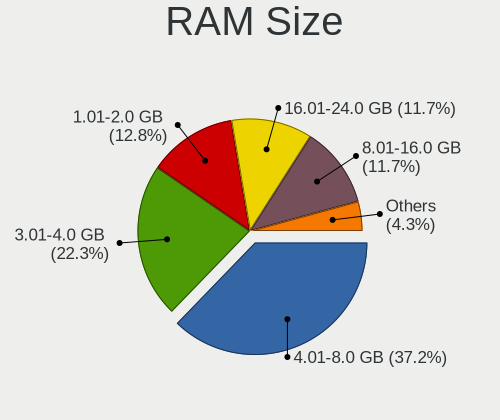
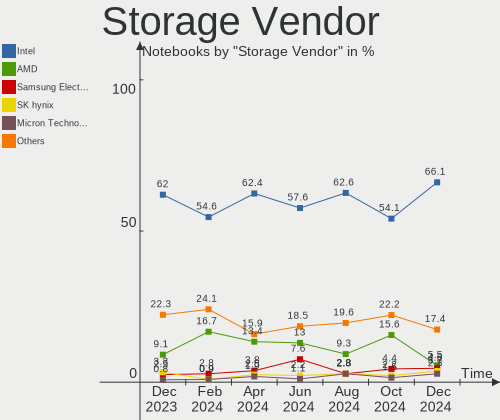

ROSA Hardware Trends (Notebook)
-------------------------------

A project to identify most popular hardware characteristics and track their change
over time based on data collected by ROSA users at https://Linux-Hardware.org.

Anyone can contribute to the study by uploading probes of their computers by
the [hw-probe](https://github.com/linuxhw/hw-probe) tool:

    sudo -E hw-probe -all -upload

Full-feature report is available here: https://linux-hardware.org/?view=trends&formfactor=notebook

Period: Mar, 2021.

Contents
--------

- [ OS                       ](#os)
- [ OS Family                ](#os-family)
- [ Kernel                   ](#kernel)
- [ Kernel Family            ](#kernel-family)
- [ Kernel Major Ver.        ](#kernel-major-ver)
- [ Arch                     ](#arch)
- [ DE                       ](#de)
- [ Display Server           ](#display-server)
- [ Display Manager          ](#display-manager)
- [ OS Lang                  ](#os-lang)
- [ Boot Mode                ](#boot-mode)
- [ Filesystem               ](#filesystem)
- [ Part. scheme             ](#part-scheme)
- [ Dual Boot with Linux/BSD ](#dual-boot-with-linux/bsd)
- [ Dual Boot (Win)          ](#dual-boot-win)
- [ Country                  ](#country)
- [ City                     ](#city)
- [ Vendor                   ](#vendor)
- [ Model                    ](#model)
- [ Model Family             ](#model-family)
- [ MFG Year                 ](#mfg-year)
- [ Form Factor              ](#form-factor)
- [ Secure Boot              ](#secure-boot)
- [ Coreboot                 ](#coreboot)
- [ RAM Size                 ](#ram-size)
- [ RAM Used                 ](#ram-used)
- [ Has CD-ROM               ](#has-cd-rom)
- [ Total Drives             ](#total-drives)
- [ Has Ethernet             ](#has-ethernet)
- [ Has WiFi                 ](#has-wifi)
- [ Has Bluetooth            ](#has-bluetooth)
- [ Drive Vendor             ](#drive-vendor)
- [ Drive Model              ](#drive-model)
- [ HDD Vendor               ](#hdd-vendor)
- [ SSD Vendor               ](#ssd-vendor)
- [ Drive Kind               ](#drive-kind)
- [ Drive Connector          ](#drive-connector)
- [ Drive Size               ](#drive-size)
- [ Space Total              ](#space-total)
- [ Space Used               ](#space-used)
- [ Malfunc. Drives          ](#malfunc-drives)
- [ Malfunc. Drive Vendor    ](#malfunc-drive-vendor)
- [ Malfunc. HDD Vendor      ](#malfunc-hdd-vendor)
- [ Malfunc. Drive Kind      ](#malfunc-drive-kind)
- [ Failed Drives            ](#failed-drives)
- [ Failed Drive Vendor      ](#failed-drive-vendor)
- [ Drive Status             ](#drive-status)
- [ Storage Vendor           ](#storage-vendor)
- [ Storage Model            ](#storage-model)
- [ Storage Kind             ](#storage-kind)
- [ CPU Vendor               ](#cpu-vendor)
- [ CPU Model                ](#cpu-model)
- [ CPU Model Family         ](#cpu-model-family)
- [ CPU Cores                ](#cpu-cores)
- [ CPU Sockets              ](#cpu-sockets)
- [ CPU Threads              ](#cpu-threads)
- [ CPU Op-Modes             ](#cpu-op-modes)
- [ CPU Microcode            ](#cpu-microcode)
- [ CPU Microarch            ](#cpu-microarch)
- [ GPU Vendor               ](#gpu-vendor)
- [ GPU Model                ](#gpu-model)
- [ GPU Combo                ](#gpu-combo)
- [ GPU Driver               ](#gpu-driver)
- [ GPU Memory               ](#gpu-memory)
- [ Monitor Vendor           ](#monitor-vendor)
- [ Monitor Model            ](#monitor-model)
- [ Monitor Resolution       ](#monitor-resolution)
- [ Monitor Diagonal         ](#monitor-diagonal)
- [ Monitor Width            ](#monitor-width)
- [ Aspect Ratio             ](#aspect-ratio)
- [ Monitor Area             ](#monitor-area)
- [ Pixel Density            ](#pixel-density)
- [ Multiple Monitors        ](#multiple-monitors)
- [ Net Controller Vendor    ](#net-controller-vendor)
- [ Net Controller Model     ](#net-controller-model)
- [ Wireless Vendor          ](#wireless-vendor)
- [ Wireless Model           ](#wireless-model)
- [ Ethernet Vendor          ](#ethernet-vendor)
- [ Ethernet Model           ](#ethernet-model)
- [ Net Controller Kind      ](#net-controller-kind)
- [ Used Controller          ](#used-controller)
- [ NICs                     ](#nics)
- [ IPv6                     ](#ipv6)
- [ Memory Vendor            ](#memory-vendor)
- [ Memory Model             ](#memory-model)
- [ Memory Kind              ](#memory-kind)
- [ Memory Form Factor       ](#memory-form-factor)
- [ Memory Size              ](#memory-size)
- [ Memory Speed             ](#memory-speed)
- [ Sound Vendor             ](#sound-vendor)
- [ Sound Model              ](#sound-model)
- [ Camera Vendor            ](#camera-vendor)
- [ Camera Model             ](#camera-model)
- [ Fingerprint Vendor       ](#fingerprint-vendor)
- [ Fingerprint Model        ](#fingerprint-model)
- [ Chipcard Vendor          ](#chipcard-vendor)
- [ Chipcard Model           ](#chipcard-model)
- [ Printer Vendor           ](#printer-vendor)
- [ Printer Model            ](#printer-model)
- [ Scanner Vendor           ](#scanner-vendor)
- [ Scanner Model            ](#scanner-model)
- [ Bluetooth Vendor         ](#bluetooth-vendor)
- [ Bluetooth Model          ](#bluetooth-model)
- [ Unsupported Devices      ](#unsupported-devices)
- [ Unsupported Device Types ](#unsupported-device-types)

OS
--

Installed operating systems

| Name         | Notebooks | Percent |
|--------------|-----------|---------|
| ROSA R11.1   | 59        | 56.73%  |
| ROSA R11     | 34        | 32.69%  |
| ROSA R8.1    | 3         | 2.88%   |
| ROSA R12     | 3         | 2.88%   |
| ROSA R10     | 2         | 1.92%   |
| ROSA R9      | 1         | 0.96%   |
| ROSA 7.3     | 1         | 0.96%   |
| ROSA 2019.05 | 1         | 0.96%   |

OS Family
---------

OS without a version

| Name | Notebooks | Percent |
|------|-----------|---------|
| ROSA | 104       | 100%    |

Kernel
------

Version of the Linux kernel

| Version                             | Notebooks | Percent |
|-------------------------------------|-----------|---------|
| 4.15.0-desktop-45.1rosa-x86_64      | 28        | 26.92%  |
| 4.15.0-desktop-122.124.1rosa-x86_64 | 18        | 17.31%  |
| 5.4.83-generic-2rosa-x86_64         | 11        | 10.58%  |
| 5.4.32-generic-2rosa-x86_64         | 8         | 7.69%   |
| 4.15.0-desktop-45.1rosa-i586        | 8         | 7.69%   |
| 4.15.0-desktop-122.124.1rosa-i586   | 7         | 6.73%   |
| 5.4.83-generic-2rosa-i586           | 4         | 3.85%   |
| 4.9.155-nrj-desktop-1rosa-i586      | 4         | 3.85%   |
| 5.4.83-generic-2rosa2019.1-x86_64   | 3         | 2.88%   |
| 5.4.32-generic-2rosa-i586           | 3         | 2.88%   |
| 5.4.74-nrj-desktop-1rosa-x86_64     | 1         | 0.96%   |
| 5.4.60-nickel-4rosa2019.05-x86_64   | 1         | 0.96%   |
| 5.10.17-generic-1rosa-x86_64        | 1         | 0.96%   |
| 5.10.0-desktop-12.13.2rosa-x86_64   | 1         | 0.96%   |
| 4.9.9-nrj-desktop-1rosa-i586        | 1         | 0.96%   |
| 4.9.60-nrj-desktop-1rosa-x86_64     | 1         | 0.96%   |
| 4.9.20-nrj-desktop-1rosa-x86_64     | 1         | 0.96%   |
| 4.9.111-nrj-desktop-2rosa-x86_64    | 1         | 0.96%   |
| 4.15.0-desktop-137.141.1rosa-x86_64 | 1         | 0.96%   |
| 3.10.0-514.51.1.el7.x86_64          | 1         | 0.96%   |

Kernel Family
-------------

Linux kernel without a distro release

| Version | Notebooks | Percent |
|---------|-----------|---------|
| 4.15.0  | 62        | 59.62%  |
| 5.4.83  | 18        | 17.31%  |
| 5.4.32  | 11        | 10.58%  |
| 4.9.155 | 4         | 3.85%   |
| 5.4.74  | 1         | 0.96%   |
| 5.4.60  | 1         | 0.96%   |
| 5.10.17 | 1         | 0.96%   |
| 5.10.0  | 1         | 0.96%   |
| 4.9.9   | 1         | 0.96%   |
| 4.9.60  | 1         | 0.96%   |
| 4.9.20  | 1         | 0.96%   |
| 4.9.111 | 1         | 0.96%   |
| 3.10.0  | 1         | 0.96%   |

Kernel Major Ver.
-----------------

Linux kernel major version

| Version | Notebooks | Percent |
|---------|-----------|---------|
| 4.15    | 62        | 59.62%  |
| 5.4     | 31        | 29.81%  |
| 4.9     | 8         | 7.69%   |
| 5.10    | 2         | 1.92%   |
| 3.10    | 1         | 0.96%   |

Arch
----

OS architecture (x86_64, i586, etc.)

| Name   | Notebooks | Percent |
|--------|-----------|---------|
| x86_64 | 77        | 74.04%  |
| i686   | 27        | 25.96%  |

DE
--

Desktop Environment

| Name  | Notebooks | Percent |
|-------|-----------|---------|
| KDE4  | 69        | 66.35%  |
| KDE5  | 24        | 23.08%  |
| LXQt  | 5         | 4.81%   |
| XFCE  | 4         | 3.85%   |
| GNOME | 2         | 1.92%   |

Display Server
--------------

X11 or Wayland

| Name    | Notebooks | Percent |
|---------|-----------|---------|
| X11     | 103       | 99.04%  |
| Wayland | 1         | 0.96%   |

Display Manager
---------------

SDDM, LightDM, etc.

| Name | Notebooks | Percent |
|------|-----------|---------|
| KDM  | 69        | 66.35%  |
| SDDM | 32        | 30.77%  |
| GDM  | 2         | 1.92%   |
| TDM  | 1         | 0.96%   |

OS Lang
-------

Language

| Lang    | Notebooks | Percent |
|---------|-----------|---------|
| ru_RU   | 55        | 52.88%  |
| Unknown | 40        | 38.46%  |
| en_US   | 3         | 2.88%   |
| en_GB   | 2         | 1.92%   |
| pl_PL   | 1         | 0.96%   |
| it_IT   | 1         | 0.96%   |
| fr_FR   | 1         | 0.96%   |
| fr_BE   | 1         | 0.96%   |

Boot Mode
---------

EFI or BIOS

| Mode | Notebooks | Percent |
|------|-----------|---------|
| BIOS | 81        | 77.88%  |
| EFI  | 23        | 22.12%  |

Filesystem
----------

Type of filesystem

| Type     | Notebooks | Percent |
|----------|-----------|---------|
| Ext4     | 97        | 93.27%  |
| Btrfs    | 3         | 2.88%   |
| Ext3     | 2         | 1.92%   |
| Xfs      | 1         | 0.96%   |
| Reiserfs | 1         | 0.96%   |

Part. scheme
------------

Scheme of partitioning

| Type    | Notebooks | Percent |
|---------|-----------|---------|
| MBR     | 70        | 67.31%  |
| GPT     | 31        | 29.81%  |
| Unknown | 3         | 2.88%   |

Dual Boot with Linux/BSD
------------------------

Hosting more than one Linux/BSD

| Dual boot | Notebooks | Percent |
|-----------|-----------|---------|
| No        | 82        | 78.85%  |
| Yes       | 22        | 21.15%  |

Dual Boot (Win)
---------------

Hosting Linux and Windows

| Dual boot | Notebooks | Percent |
|-----------|-----------|---------|
| No        | 57        | 54.81%  |
| Yes       | 47        | 45.19%  |

Country
-------

Geographic location (country)

| Country    | Notebooks | Percent |
|------------|-----------|---------|
| Russia     | 75        | 72.12%  |
| Ukraine    | 14        | 13.46%  |
| Belarus    | 3         | 2.88%   |
| USA        | 1         | 0.96%   |
| UK         | 1         | 0.96%   |
| Turkey     | 1         | 0.96%   |
| Serbia     | 1         | 0.96%   |
| Poland     | 1         | 0.96%   |
| Kyrgyzstan | 1         | 0.96%   |
| Japan      | 1         | 0.96%   |
| Italy      | 1         | 0.96%   |
| France     | 1         | 0.96%   |
| Brazil     | 1         | 0.96%   |
| Belgium    | 1         | 0.96%   |
| Australia  | 1         | 0.96%   |

City
----

Geographic location (city)

| City                  | Notebooks | Percent |
|-----------------------|-----------|---------|
| Moscow                | 14        | 13.46%  |
| St Petersburg         | 8         | 7.69%   |
| Yekaterinburg         | 5         | 4.81%   |
| Simferopol            | 2         | 1.92%   |
| Perm                  | 2         | 1.92%   |
| Novosibirsk           | 2         | 1.92%   |
| Nizhniy Novgorod      | 2         | 1.92%   |
| Naryan-Mar            | 2         | 1.92%   |
| Krasnodar             | 2         | 1.92%   |
| Khabarovsk            | 2         | 1.92%   |
| Ivanovo               | 2         | 1.92%   |
| Donetsk               | 2         | 1.92%   |
| Barda                 | 2         | 1.92%   |
| Zheleznogorsk         | 1         | 0.96%   |
| Yenakiieve            | 1         | 0.96%   |
| Warsaw                | 1         | 0.96%   |
| Votkinsk              | 1         | 0.96%   |
| Voronezh              | 1         | 0.96%   |
| Vercelli              | 1         | 0.96%   |
| Velikiye Luki         | 1         | 0.96%   |
| Utsunomiya            | 1         | 0.96%   |
| Usinsk                | 1         | 0.96%   |
| Ulyanovsk             | 1         | 0.96%   |
| Ukhta                 | 1         | 0.96%   |
| Ufa                   | 1         | 0.96%   |
| Tver                  | 1         | 0.96%   |
| Tula                  | 1         | 0.96%   |
| Tomsk                 | 1         | 0.96%   |
| Surgut                | 1         | 0.96%   |
| Stary Oskol           | 1         | 0.96%   |
| Sao Jose do Rio Pardo | 1         | 0.96%   |
| Rovenki               | 1         | 0.96%   |
| Rostov-on-Don         | 1         | 0.96%   |
| Petergof              | 1         | 0.96%   |
| Penza                 | 1         | 0.96%   |
| Paris                 | 1         | 0.96%   |
| Orenburg              | 1         | 0.96%   |
| Orekhovo-Zuyevo       | 1         | 0.96%   |
| Oleksandriya          | 1         | 0.96%   |
| Odessa                | 1         | 0.96%   |
| Obninsk               | 1         | 0.96%   |
| Novyy Oskol           | 1         | 0.96%   |
| Moonah                | 1         | 0.96%   |
| Mogilev               | 1         | 0.96%   |
| Minsk                 | 1         | 0.96%   |
| Malonikolayevka       | 1         | 0.96%   |
| La Crosse             | 1         | 0.96%   |
| Kremenchug            | 1         | 0.96%   |
| Krasyliv              | 1         | 0.96%   |
| Krasnoyarsk           | 1         | 0.96%   |
| Kostroma              | 1         | 0.96%   |
| Kholmskiy             | 1         | 0.96%   |
| Khimki                | 1         | 0.96%   |
| Kherson               | 1         | 0.96%   |
| Kemerovo              | 1         | 0.96%   |
| Kazan’              | 1         | 0.96%   |
| Jalal-Abad            | 1         | 0.96%   |
| Istanbul              | 1         | 0.96%   |
| Gomel                 | 1         | 0.96%   |
| Glazov                | 1         | 0.96%   |

Vendor
------

Motherboard manufacturer

| Name                | Notebooks | Percent |
|---------------------|-----------|---------|
| Lenovo              | 21        | 20.19%  |
| Acer                | 19        | 18.27%  |
| ASUSTek Computer    | 14        | 13.46%  |
| Hewlett-Packard     | 13        | 12.5%   |
| Samsung Electronics | 8         | 7.69%   |
| Dell                | 8         | 7.69%   |
| Packard Bell        | 5         | 4.81%   |
| Toshiba             | 4         | 3.85%   |
| MSI                 | 3         | 2.88%   |
| Clevo               | 2         | 1.92%   |
| ViewSonic           | 1         | 0.96%   |
| Sony                | 1         | 0.96%   |
| Pegatron            | 1         | 0.96%   |
| Insyde              | 1         | 0.96%   |
| Infomash            | 1         | 0.96%   |
| Fujitsu             | 1         | 0.96%   |
| BBEN                | 1         | 0.96%   |

Model
-----

Motherboard model

| Name                                                                                     | Notebooks | Percent |
|------------------------------------------------------------------------------------------|-----------|---------|
| HP Pavilion g6                                                                           | 3         | 2.88%   |
| Lenovo IdeaPad S145-15IIL 81W8                                                           | 2         | 1.92%   |
| HP Notebook                                                                              | 2         | 1.92%   |
| Dell Inspiron 15-3552                                                                    | 2         | 1.92%   |
| ASUS 1011PX                                                                              | 2         | 1.92%   |
| ViewSonic ViewBook                                                                       | 1         | 0.96%   |
| Toshiba Satellite U300                                                                   | 1         | 0.96%   |
| Toshiba Satellite L305                                                                   | 1         | 0.96%   |
| Toshiba Satellite L20                                                                    | 1         | 0.96%   |
| Toshiba NB550D                                                                           | 1         | 0.96%   |
| Sony VPCEL1E1R                                                                           | 1         | 0.96%   |
| Samsung RV408/RV508                                                                      | 1         | 0.96%   |
| Samsung R540/SA41/E452                                                                   | 1         | 0.96%   |
| Samsung R530/R730/P530                                                                   | 1         | 0.96%   |
| Samsung R528/R728                                                                        | 1         | 0.96%   |
| Samsung 355V4C/355V4X/355V5C/355V5X/356V4C/356V4X/356V5C/356V5X/3445VC/3445VX/3545VC/354 | 1         | 0.96%   |
| Samsung 305V4A/305V5A/3415VA                                                             | 1         | 0.96%   |
| Samsung 300V3A/300V4A/300V5A/200A4B/200A5B                                               | 1         | 0.96%   |
| Samsung 300E4C/300E5C/300E7C                                                             | 1         | 0.96%   |
| Pegatron D15B                                                                            | 1         | 0.96%   |
| Packard Bell EasyNote TE69KB                                                             | 1         | 0.96%   |
| Packard Bell EasyNote TE11HC                                                             | 1         | 0.96%   |
| Packard Bell EasyNote TE11BZ                                                             | 1         | 0.96%   |
| Packard Bell EasyNote ENTG81BA                                                           | 1         | 0.96%   |
| Packard Bell EasyNote ENTF71BM                                                           | 1         | 0.96%   |
| MSI S12T 3M/S12 3M                                                                       | 1         | 0.96%   |
| MSI M670                                                                                 | 1         | 0.96%   |
| MSI GP60 2OD                                                                             | 1         | 0.96%   |
| Lenovo ThinkPad X131e 33681P3                                                            | 1         | 0.96%   |
| Lenovo ThinkPad W520 427637U                                                             | 1         | 0.96%   |
| Lenovo ThinkPad T61 7661ZM5                                                              | 1         | 0.96%   |
| Lenovo ThinkPad T60 1952W2Q                                                              | 1         | 0.96%   |
| Lenovo Lenovo                                                                            | 1         | 0.96%   |
| Lenovo IdeaPad Z570 HuronRiver Platform                                                  | 1         | 0.96%   |
| Lenovo IdeaPad S130-11IGM 81J1                                                           | 1         | 0.96%   |
| Lenovo IdeaPad L340-15IRH Gaming 81LK                                                    | 1         | 0.96%   |
| Lenovo IdeaPad 330-17IKB 81DK                                                            | 1         | 0.96%   |
| Lenovo IdeaPad 330-15IKB 81DE                                                            | 1         | 0.96%   |
| Lenovo IdeaPad 330-15IKB 81DC                                                            | 1         | 0.96%   |
| Lenovo IdeaPad 100-15IBD 80QQ                                                            | 1         | 0.96%   |
| Lenovo G700 20251                                                                        | 1         | 0.96%   |
| Lenovo G570 20079                                                                        | 1         | 0.96%   |
| Lenovo G50-45 80E3                                                                       | 1         | 0.96%   |
| Lenovo B590 20206                                                                        | 1         | 0.96%   |
| Lenovo B560                                                                              | 1         | 0.96%   |
| Lenovo B50-30 20382                                                                      | 1         | 0.96%   |
| Lenovo 3000 G530 4151/200                                                                | 1         | 0.96%   |
| Insyde i86C                                                                              | 1         | 0.96%   |
| Infomash RoverBook                                                                       | 1         | 0.96%   |
| HP ZBook 14                                                                              | 1         | 0.96%   |
| HP ProBook 4530s                                                                         | 1         | 0.96%   |
| HP Pavilion dv7                                                                          | 1         | 0.96%   |
| HP Laptop 15-db0xxx                                                                      | 1         | 0.96%   |
| HP Laptop 15-bs0xx                                                                       | 1         | 0.96%   |
| HP G62                                                                                   | 1         | 0.96%   |
| HP ENVY dv7                                                                              | 1         | 0.96%   |
| HP Compaq nx7300 (GB850ES#ACB)                                                           | 1         | 0.96%   |
| Fujitsu LIFEBOOK A512                                                                    | 1         | 0.96%   |
| Dell Latitude E6420                                                                      | 1         | 0.96%   |
| Dell Latitude E6400                                                                      | 1         | 0.96%   |

Model Family
------------

Motherboard model prefix

| Name                  | Notebooks | Percent |
|-----------------------|-----------|---------|
| Acer Aspire           | 14        | 13.46%  |
| Lenovo IdeaPad        | 9         | 8.65%   |
| Packard Bell EasyNote | 5         | 4.81%   |
| Dell Inspiron         | 5         | 4.81%   |
| Lenovo ThinkPad       | 4         | 3.85%   |
| HP Pavilion           | 4         | 3.85%   |
| Toshiba Satellite     | 3         | 2.88%   |
| Dell Latitude         | 3         | 2.88%   |
| HP Notebook           | 2         | 1.92%   |
| HP Laptop             | 2         | 1.92%   |
| ASUS 1011PX           | 2         | 1.92%   |
| Acer Extensa          | 2         | 1.92%   |
| ViewSonic ViewBook    | 1         | 0.96%   |
| Toshiba NB550D        | 1         | 0.96%   |
| Sony VPCEL1E1R        | 1         | 0.96%   |
| Samsung RV408         | 1         | 0.96%   |
| Samsung R540          | 1         | 0.96%   |
| Samsung R530          | 1         | 0.96%   |
| Samsung R528          | 1         | 0.96%   |
| Samsung 355V4C        | 1         | 0.96%   |
| Samsung 305V4A        | 1         | 0.96%   |
| Samsung 300V3A        | 1         | 0.96%   |
| Samsung 300E4C        | 1         | 0.96%   |
| Pegatron D15B         | 1         | 0.96%   |
| MSI S12T              | 1         | 0.96%   |
| MSI M670              | 1         | 0.96%   |
| MSI GP60              | 1         | 0.96%   |
| Lenovo Lenovo         | 1         | 0.96%   |
| Lenovo G700           | 1         | 0.96%   |
| Lenovo G570           | 1         | 0.96%   |
| Lenovo G50-45         | 1         | 0.96%   |
| Lenovo B590           | 1         | 0.96%   |
| Lenovo B560           | 1         | 0.96%   |
| Lenovo B50-30         | 1         | 0.96%   |
| Lenovo 3000           | 1         | 0.96%   |
| Insyde i86C           | 1         | 0.96%   |
| Infomash RoverBook    | 1         | 0.96%   |
| HP ZBook              | 1         | 0.96%   |
| HP ProBook            | 1         | 0.96%   |
| HP G62                | 1         | 0.96%   |
| HP ENVY               | 1         | 0.96%   |
| HP Compaq             | 1         | 0.96%   |
| Fujitsu LIFEBOOK      | 1         | 0.96%   |
| Clevo W830T           | 1         | 0.96%   |
| Clevo M770SUA         | 1         | 0.96%   |
| BBEN MN9              | 1         | 0.96%   |
| ASUS X75A1            | 1         | 0.96%   |
| ASUS X550CC           | 1         | 0.96%   |
| ASUS X540LA           | 1         | 0.96%   |
| ASUS U36SD            | 1         | 0.96%   |
| ASUS N56VZ            | 1         | 0.96%   |
| ASUS K61IC            | 1         | 0.96%   |
| ASUS K52Jc            | 1         | 0.96%   |
| ASUS K50IE            | 1         | 0.96%   |
| ASUS GL703VD          | 1         | 0.96%   |
| ASUS A7U              | 1         | 0.96%   |
| ASUS 1215B            | 1         | 0.96%   |
| ASUS 1015PX           | 1         | 0.96%   |
| Acer Swift            | 1         | 0.96%   |
| Acer AO751h           | 1         | 0.96%   |

MFG Year
--------

Motherboard manufacture year

| Year | Notebooks | Percent |
|------|-----------|---------|
| 2011 | 13        | 12.5%   |
| 2010 | 12        | 11.54%  |
| 2013 | 10        | 9.62%   |
| 2012 | 9         | 8.65%   |
| 2018 | 8         | 7.69%   |
| 2014 | 8         | 7.69%   |
| 2019 | 7         | 6.73%   |
| 2009 | 7         | 6.73%   |
| 2020 | 5         | 4.81%   |
| 2017 | 5         | 4.81%   |
| 2015 | 5         | 4.81%   |
| 2007 | 5         | 4.81%   |
| 2006 | 4         | 3.85%   |
| 2008 | 3         | 2.88%   |
| 2016 | 2         | 1.92%   |
| 2005 | 1         | 0.96%   |

Form Factor
-----------

Physical design of the computer

| Name     | Notebooks | Percent |
|----------|-----------|---------|
| Notebook | 104       | 100%    |

Secure Boot
-----------

Enabled or disabled

| State    | Notebooks | Percent |
|----------|-----------|---------|
| Disabled | 104       | 100%    |

Coreboot
--------

Have coreboot on board

| Used | Notebooks | Percent |
|------|-----------|---------|
| No   | 104       | 100%    |

RAM Size
--------

Total RAM memory

| Size in GB | Notebooks | Percent |
|------------|-----------|---------|
| 3.01-4.0   | 39        | 37.5%   |
| 4.01-8.0   | 22        | 21.15%  |
| 1.01-2.0   | 14        | 13.46%  |
| 8.01-16.0  | 11        | 10.58%  |
| 2.01-3.0   | 10        | 9.62%   |
| 0.51-1.0   | 5         | 4.81%   |
| 16.01-24.0 | 2         | 1.92%   |
| 0.01-0.5   | 1         | 0.96%   |

RAM Used
--------

Used RAM memory

| Used GB  | Notebooks | Percent |
|----------|-----------|---------|
| 0.51-1.0 | 49        | 47.12%  |
| 1.01-2.0 | 43        | 41.35%  |
| 2.01-3.0 | 7         | 6.73%   |
| 3.01-4.0 | 3         | 2.88%   |
| 4.01-8.0 | 1         | 0.96%   |
| 0.01-0.5 | 1         | 0.96%   |

Has CD-ROM
----------

Has CD-ROM on board

| Presented | Notebooks | Percent |
|-----------|-----------|---------|
| Yes       | 62        | 59.62%  |
| No        | 42        | 40.38%  |

Total Drives
------------

Number of drives on board

| Drives | Notebooks | Percent |
|--------|-----------|---------|
| 1      | 86        | 82.69%  |
| 2      | 16        | 15.38%  |
| 3      | 1         | 0.96%   |
| 0      | 1         | 0.96%   |

Has Ethernet
------------

Has Ethernet on board

| Presented | Notebooks | Percent |
|-----------|-----------|---------|
| Yes       | 95        | 91.35%  |
| No        | 9         | 8.65%   |

Has WiFi
--------

Has WiFi module

| Presented | Notebooks | Percent |
|-----------|-----------|---------|
| Yes       | 102       | 98.08%  |
| No        | 2         | 1.92%   |

Has Bluetooth
-------------

Has Bluetooth module

| Presented | Notebooks | Percent |
|-----------|-----------|---------|
| Yes       | 63        | 60.58%  |
| No        | 41        | 39.42%  |

Drive Vendor
------------

Hard drive vendors

| Vendor              | Notebooks | Drives | Percent |
|---------------------|-----------|--------|---------|
| WDC                 | 26        | 27     | 22.41%  |
| Seagate             | 24        | 24     | 20.69%  |
| Toshiba             | 13        | 13     | 11.21%  |
| Hitachi             | 11        | 11     | 9.48%   |
| Samsung Electronics | 9         | 9      | 7.76%   |
| Kingston            | 7         | 7      | 6.03%   |
| Unknown             | 6         | 6      | 5.17%   |
| HGST                | 4         | 4      | 3.45%   |
| China               | 3         | 3      | 2.59%   |
| SK Hynix            | 2         | 2      | 1.72%   |
| Intel               | 2         | 2      | 1.72%   |
| XrayDisk            | 1         | 1      | 0.86%   |
| Union Memory        | 1         | 1      | 0.86%   |
| SPCC                | 1         | 1      | 0.86%   |
| Smartbuy            | 1         | 1      | 0.86%   |
| SanDisk             | 1         | 1      | 0.86%   |
| OCZ                 | 1         | 1      | 0.86%   |
| FOXLINE             | 1         | 1      | 0.86%   |
| DERLAR              | 1         | 1      | 0.86%   |
| Corsair             | 1         | 1      | 0.86%   |

Drive Model
-----------

Hard drive models

| Model                                     | Notebooks | Percent |
|-------------------------------------------|-----------|---------|
| Seagate ST500LT012-1DG142 500GB           | 5         | 4.27%   |
| Toshiba MQ01ABF050 500GB                  | 3         | 2.56%   |
| Seagate ST500LT012-9WS142 500GB           | 3         | 2.56%   |
| Seagate ST1000LM024 HN-M101MBB 1TB        | 3         | 2.56%   |
| Kingston SA400S37120G 120GB SSD           | 3         | 2.56%   |
| WDC WD5000LPVX-22V0TT0 500GB              | 2         | 1.71%   |
| WDC WD3200BEVT-80A0RT0 320GB              | 2         | 1.71%   |
| WDC WD10SPZX-24Z10 1TB                    | 2         | 1.71%   |
| WDC WD10SPZX-21Z10T0 1TB                  | 2         | 1.71%   |
| Unknown SD32G  32GB                       | 2         | 1.71%   |
| Toshiba MQ01ABD050 500GB                  | 2         | 1.71%   |
| Toshiba MK2555GSX 250GB                   | 2         | 1.71%   |
| SK Hynix SKHynix_HFM512GDHTNI-87A0B 512GB | 2         | 1.71%   |
| Seagate ST9320325AS 320GB                 | 2         | 1.71%   |
| Seagate ST1000LM035-1RK172 1TB            | 2         | 1.71%   |
| Hitachi HTS545050B9A300 500GB             | 2         | 1.71%   |
| Hitachi HTS543232A7A384 320GB             | 2         | 1.71%   |
| XrayDisk SSD 128GB                        | 1         | 0.85%   |
| WDC WDS120G2G0A-00JH30 120GB SSD          | 1         | 0.85%   |
| WDC WD800BEVT-75ZCT2 80GB                 | 1         | 0.85%   |
| WDC WD7500BPVX-22JC3T0 752GB              | 1         | 0.85%   |
| WDC WD7500BPVT-75HXZT3 752GB              | 1         | 0.85%   |
| WDC WD5000LPLX-00ZNTT0 500GB              | 1         | 0.85%   |
| WDC WD5000LPCX-22VHAT0 500GB              | 1         | 0.85%   |
| WDC WD5000LPCX-21VHAT0 500GB              | 1         | 0.85%   |
| WDC WD5000BPVT-22HXZT3 500GB              | 1         | 0.85%   |
| WDC WD5000BEVT-35A0RT0 500GB              | 1         | 0.85%   |
| WDC WD3200BPVT-80ZEST0 320GB              | 1         | 0.85%   |
| WDC WD3200BPVT-80JJ5T0 320GB              | 1         | 0.85%   |
| WDC WD3200BPVT-22ZEST0 320GB              | 1         | 0.85%   |
| WDC WD3200BEVT-00ZAT0 320GB               | 1         | 0.85%   |
| WDC WD3200BEVT-00A0RT0 320GB              | 1         | 0.85%   |
| WDC WD3200BEKT-00KA9T0 320GB              | 1         | 0.85%   |
| WDC WD2500BEKT-60A25T1 250GB              | 1         | 0.85%   |
| WDC WD1200BEVS-22UST0 120GB               | 1         | 0.85%   |
| WDC WD10JPVX-22JC3T0 1TB                  | 1         | 0.85%   |
| WDC WD10JPVX-00JC3T0 1TB                  | 1         | 0.85%   |
| Unknown NCard  16GB                       | 1         | 0.85%   |
| Unknown MMC Card  32GB                    | 1         | 0.85%   |
| Unknown MC240 240GB SSD                   | 1         | 0.85%   |
| Unknown HCG4a2  64GB                      | 1         | 0.85%   |
| Union Memory RPFTJ128PDD2EWX 128GB        | 1         | 0.85%   |
| Toshiba TR200 240GB SSD                   | 1         | 0.85%   |
| Toshiba THNSNH128GBST SSD                 | 1         | 0.85%   |
| Toshiba MQ01ACF050 500GB                  | 1         | 0.85%   |
| Toshiba MQ01ABD100 1TB                    | 1         | 0.85%   |
| Toshiba MK6034GAX 64GB                    | 1         | 0.85%   |
| Toshiba MK5076GSX 500GB                   | 1         | 0.85%   |
| SPCC Solid State Disk 512GB               | 1         | 0.85%   |
| Smartbuy SSD 128GB                        | 1         | 0.85%   |
| Seagate ST9500420AS 500GB                 | 1         | 0.85%   |
| Seagate ST9500325AS 500GB                 | 1         | 0.85%   |
| Seagate ST9320325ASG 320GB                | 1         | 0.85%   |
| Seagate ST9250315AS 250GB                 | 1         | 0.85%   |
| Seagate ST9160310AS 160GB                 | 1         | 0.85%   |
| Seagate ST750LM022 HN-M750MBB 752GB       | 1         | 0.85%   |
| Seagate ST500LM030-2E717D 500GB           | 1         | 0.85%   |
| Seagate ST320LT012-9WS14C 320GB           | 1         | 0.85%   |
| Seagate ST320LM010-1KJ15C 320GB           | 1         | 0.85%   |
| SanDisk DF4064  64GB                      | 1         | 0.85%   |

HDD Vendor
----------

Hard disk drive vendors

| Vendor              | Notebooks | Drives | Percent |
|---------------------|-----------|--------|---------|
| WDC                 | 26        | 26     | 32.91%  |
| Seagate             | 24        | 24     | 30.38%  |
| Toshiba             | 11        | 11     | 13.92%  |
| Hitachi             | 11        | 11     | 13.92%  |
| HGST                | 4         | 4      | 5.06%   |
| Samsung Electronics | 3         | 3      | 3.8%    |

SSD Vendor
----------

Solid state drive vendors

| Vendor              | Notebooks | Drives | Percent |
|---------------------|-----------|--------|---------|
| Kingston            | 7         | 7      | 25.93%  |
| Samsung Electronics | 5         | 5      | 18.52%  |
| China               | 3         | 3      | 11.11%  |
| Toshiba             | 2         | 2      | 7.41%   |
| XrayDisk            | 1         | 1      | 3.7%    |
| WDC                 | 1         | 1      | 3.7%    |
| Unknown             | 1         | 1      | 3.7%    |
| SPCC                | 1         | 1      | 3.7%    |
| Smartbuy            | 1         | 1      | 3.7%    |
| OCZ                 | 1         | 1      | 3.7%    |
| Intel               | 1         | 1      | 3.7%    |
| FOXLINE             | 1         | 1      | 3.7%    |
| DERLAR              | 1         | 1      | 3.7%    |
| Corsair             | 1         | 1      | 3.7%    |

Drive Kind
----------

HDD or SSD

| Kind | Notebooks | Drives | Percent |
|------|-----------|--------|---------|
| HDD  | 78        | 79     | 67.24%  |
| SSD  | 27        | 27     | 23.28%  |
| MMC  | 6         | 6      | 5.17%   |
| NVMe | 5         | 5      | 4.31%   |

Drive Connector
---------------

SATA, SAS, NVMe, etc.

| Type | Notebooks | Drives | Percent |
|------|-----------|--------|---------|
| SATA | 97        | 106    | 89.81%  |
| MMC  | 6         | 6      | 5.56%   |
| NVMe | 5         | 5      | 4.63%   |

Drive Size
----------

Size of hard drive

| Size in TB | Notebooks | Drives | Percent |
|------------|-----------|--------|---------|
| 0.01-0.5   | 79        | 85     | 79%     |
| 0.51-1.0   | 21        | 21     | 21%     |

Space Total
-----------

Amount of disk space available on the file system

| Size in GB | Notebooks | Percent |
|------------|-----------|---------|
| 251-500    | 32        | 30.77%  |
| 101-250    | 26        | 25%     |
| 1-20       | 18        | 17.31%  |
| 51-100     | 11        | 10.58%  |
| 501-1000   | 8         | 7.69%   |
| 21-50      | 7         | 6.73%   |
| 2001-3000  | 1         | 0.96%   |
| 1001-2000  | 1         | 0.96%   |

Space Used
----------

Amount of used disk space

| Used GB  | Notebooks | Percent |
|----------|-----------|---------|
| 1-20     | 74        | 71.15%  |
| 21-50    | 12        | 11.54%  |
| 101-250  | 8         | 7.69%   |
| 51-100   | 6         | 5.77%   |
| 251-500  | 2         | 1.92%   |
| 501-1000 | 2         | 1.92%   |

Malfunc. Drives
---------------

Drive models with a malfunction

| Model                               | Notebooks | Drives | Percent |
|-------------------------------------|-----------|--------|---------|
| Seagate ST500LT012-9WS142 500GB     | 3         | 3      | 7.14%   |
| Seagate ST500LT012-1DG142 500GB     | 3         | 3      | 7.14%   |
| Toshiba MQ01ABF050 500GB            | 2         | 2      | 4.76%   |
| Toshiba MK2555GSX 250GB             | 2         | 2      | 4.76%   |
| Seagate ST9320325AS 320GB           | 2         | 2      | 4.76%   |
| WDC WDS120G2G0A-00JH30 120GB SSD    | 1         | 1      | 2.38%   |
| WDC WD5000BPVT-22HXZT3 500GB        | 1         | 1      | 2.38%   |
| WDC WD3200BEVT-80A0RT0 320GB        | 1         | 1      | 2.38%   |
| WDC WD2500BEKT-60A25T1 250GB        | 1         | 1      | 2.38%   |
| WDC WD10SPZX-24Z10 1TB              | 1         | 1      | 2.38%   |
| Unknown MC240 240GB SSD             | 1         | 1      | 2.38%   |
| Toshiba THNSNH128GBST SSD           | 1         | 1      | 2.38%   |
| Toshiba MQ01ABD050 500GB            | 1         | 1      | 2.38%   |
| Toshiba MK6034GAX 64GB              | 1         | 1      | 2.38%   |
| Toshiba MK5076GSX 500GB             | 1         | 1      | 2.38%   |
| Seagate ST9500420AS 500GB           | 1         | 1      | 2.38%   |
| Seagate ST9500325AS 500GB           | 1         | 1      | 2.38%   |
| Seagate ST9320325ASG 320GB          | 1         | 1      | 2.38%   |
| Seagate ST9250315AS 250GB           | 1         | 1      | 2.38%   |
| Seagate ST9160310AS 160GB           | 1         | 1      | 2.38%   |
| Seagate ST750LM022 HN-M750MBB 752GB | 1         | 1      | 2.38%   |
| Seagate ST320LT012-9WS14C 320GB     | 1         | 1      | 2.38%   |
| Seagate ST320LM010-1KJ15C 320GB     | 1         | 1      | 2.38%   |
| Seagate ST1000LM035-1RK172 1TB      | 1         | 1      | 2.38%   |
| Seagate ST1000LM024 HN-M101MBB 1TB  | 1         | 1      | 2.38%   |
| Hitachi HTS722010K9SA00 100GB       | 1         | 1      | 2.38%   |
| Hitachi HTS547550A9E384 500GB       | 1         | 1      | 2.38%   |
| Hitachi HTS545050B9A300 500GB       | 1         | 1      | 2.38%   |
| Hitachi HTS543232A7A384 320GB       | 1         | 1      | 2.38%   |
| Hitachi HTS541680J9SA00 80GB        | 1         | 1      | 2.38%   |
| Hitachi HTS541616J9SA00 160GB       | 1         | 1      | 2.38%   |
| Hitachi HTS541612J9SA00 120GB       | 1         | 1      | 2.38%   |
| HGST HTS545050A7E680 500GB          | 1         | 1      | 2.38%   |
| HGST HTS541075A9E680 752GB          | 1         | 1      | 2.38%   |
| Corsair Force 3 SSD 120GB           | 1         | 1      | 2.38%   |

Malfunc. Drive Vendor
---------------------

Vendors of faulty drives

| Vendor  | Notebooks | Drives | Percent |
|---------|-----------|--------|---------|
| Seagate | 18        | 18     | 42.86%  |
| Toshiba | 8         | 8      | 19.05%  |
| Hitachi | 7         | 7      | 16.67%  |
| WDC     | 5         | 5      | 11.9%   |
| HGST    | 2         | 2      | 4.76%   |
| Unknown | 1         | 1      | 2.38%   |
| Corsair | 1         | 1      | 2.38%   |

Malfunc. HDD Vendor
-------------------

Vendors of faulty HDD drives

| Vendor  | Notebooks | Drives | Percent |
|---------|-----------|--------|---------|
| Seagate | 18        | 18     | 47.37%  |
| Toshiba | 7         | 7      | 18.42%  |
| Hitachi | 7         | 7      | 18.42%  |
| WDC     | 4         | 4      | 10.53%  |
| HGST    | 2         | 2      | 5.26%   |

Malfunc. Drive Kind
-------------------

Kinds of faulty drives

| Kind | Notebooks | Drives | Percent |
|------|-----------|--------|---------|
| HDD  | 38        | 38     | 90.48%  |
| SSD  | 4         | 4      | 9.52%   |

Failed Drives
-------------

Failed drive models

Zero info for selected period =(

Failed Drive Vendor
-------------------

Failed drive vendors

Zero info for selected period =(

Drive Status
------------

Number of failed and malfunc. drives

| Status   | Notebooks | Drives | Percent |
|----------|-----------|--------|---------|
| Works    | 63        | 69     | 56.76%  |
| Malfunc  | 42        | 42     | 37.84%  |
| Detected | 6         | 6      | 5.41%   |

Storage Vendor
--------------

Storage controller vendors

| Vendor                           | Notebooks | Percent |
|----------------------------------|-----------|---------|
| Intel                            | 81        | 75.7%   |
| AMD                              | 16        | 14.95%  |
| Nvidia                           | 3         | 2.8%    |
| SK Hynix                         | 2         | 1.87%   |
| VIA Technologies                 | 1         | 0.93%   |
| Union Memory (Shenzhen)          | 1         | 0.93%   |
| Silicon Integrated Systems [SiS] | 1         | 0.93%   |
| Samsung Electronics              | 1         | 0.93%   |
| JMicron Technology               | 1         | 0.93%   |

Storage Model
-------------

Storage controller models

| Model                                                                                  | Notebooks | Percent |
|----------------------------------------------------------------------------------------|-----------|---------|
| Intel 7 Series Chipset Family 6-port SATA Controller [AHCI mode]                       | 11        | 9.4%    |
| Intel 6 Series/C200 Series Chipset Family 6 port Mobile SATA AHCI Controller           | 9         | 7.69%   |
| AMD FCH SATA Controller [AHCI mode]                                                    | 9         | 7.69%   |
| Intel 5 Series/3400 Series Chipset 4 port SATA AHCI Controller                         | 8         | 6.84%   |
| Intel Sunrise Point-LP SATA Controller [AHCI mode]                                     | 6         | 5.13%   |
| Intel 82801IBM/IEM (ICH9M/ICH9M-E) 4 port SATA Controller [AHCI mode]                  | 6         | 5.13%   |
| Intel NM10/ICH7 Family SATA Controller [AHCI mode]                                     | 5         | 4.27%   |
| Intel Atom/Celeron/Pentium Processor x5-E8000/J3xxx/N3xxx Series SATA Controller       | 5         | 4.27%   |
| Intel 82801 Mobile SATA Controller [RAID mode]                                         | 5         | 4.27%   |
| Intel Atom Processor E3800 Series SATA AHCI Controller                                 | 4         | 3.42%   |
| AMD SB7x0/SB8x0/SB9x0 SATA Controller [AHCI mode]                                      | 4         | 3.42%   |
| Intel 82801HM/HEM (ICH8M/ICH8M-E) SATA Controller [AHCI mode]                          | 3         | 2.56%   |
| Intel 82801HM/HEM (ICH8M/ICH8M-E) IDE Controller                                       | 3         | 2.56%   |
| Intel 82801GBM/GHM (ICH7-M Family) SATA Controller [IDE mode]                          | 3         | 2.56%   |
| Intel 82801G (ICH7 Family) IDE Controller                                              | 3         | 2.56%   |
| SK Hynix BC511                                                                         | 2         | 1.71%   |
| Nvidia MCP79 AHCI Controller                                                           | 2         | 1.71%   |
| Intel Wildcat Point-LP SATA Controller [AHCI Mode]                                     | 2         | 1.71%   |
| Intel Ice Lake-LP SATA Controller [AHCI mode]                                          | 2         | 1.71%   |
| Intel 8 Series SATA Controller 1 [AHCI mode]                                           | 2         | 1.71%   |
| VIA VT82C586A/B/VT82C686/A/B/VT823x/A/C PIPC Bus Master IDE                            | 1         | 0.85%   |
| VIA VIA VT6420 SATA RAID Controller                                                    | 1         | 0.85%   |
| Union Memory (Shenzhen) Non-Volatile memory controller                                 | 1         | 0.85%   |
| Silicon Integrated Systems [SiS] SATA Controller / IDE mode                            | 1         | 0.85%   |
| Samsung NVMe SSD Controller SM961/PM961/SM963                                          | 1         | 0.85%   |
| Nvidia MCP51 Serial ATA Controller                                                     | 1         | 0.85%   |
| Nvidia MCP51 IDE                                                                       | 1         | 0.85%   |
| JMicron JMB360 AHCI Controller                                                         | 1         | 0.85%   |
| Intel US15W/US15X/US15L/UL11L SCH [Poulsbo] IDE Controller                             | 1         | 0.85%   |
| Intel SSD 600P Series                                                                  | 1         | 0.85%   |
| Intel Celeron/Pentium Silver Processor SATA Controller                                 | 1         | 0.85%   |
| Intel Cannon Lake Mobile PCH SATA AHCI Controller                                      | 1         | 0.85%   |
| Intel 82801GBM/GHM (ICH7-M Family) SATA Controller [AHCI mode]                         | 1         | 0.85%   |
| Intel 82801FBM (ICH6M) SATA Controller                                                 | 1         | 0.85%   |
| Intel 82801FB/FBM/FR/FW/FRW (ICH6 Family) IDE Controller                               | 1         | 0.85%   |
| Intel 8 Series/C220 Series Chipset Family 6-port SATA Controller 1 [AHCI mode]         | 1         | 0.85%   |
| Intel 6 Series/C200 Series Chipset Family Mobile SATA Controller (IDE mode, ports 4-5) | 1         | 0.85%   |
| Intel 6 Series/C200 Series Chipset Family Mobile SATA Controller (IDE mode, ports 0-3) | 1         | 0.85%   |
| AMD SB600 Non-Raid-5 SATA                                                              | 1         | 0.85%   |
| AMD SB600 IDE                                                                          | 1         | 0.85%   |
| AMD IXP SB4x0 Serial ATA Controller                                                    | 1         | 0.85%   |
| AMD IXP SB4x0 IDE Controller                                                           | 1         | 0.85%   |
| AMD FCH SATA Controller [IDE mode]                                                     | 1         | 0.85%   |

Storage Kind
------------

Kind of storage controller (IDE, SATA, NVMe, SAS, ...)

| Kind | Notebooks | Percent |
|------|-----------|---------|
| SATA | 84        | 75.68%  |
| IDE  | 17        | 15.32%  |
| RAID | 5         | 4.5%    |
| NVMe | 5         | 4.5%    |

CPU Vendor
----------

Processor vendors

| Vendor       | Notebooks | Percent |
|--------------|-----------|---------|
| Intel        | 86        | 82.69%  |
| AMD          | 17        | 16.35%  |
| CentaurHauls | 1         | 0.96%   |

CPU Model
---------

Processor models

| Model                                       | Notebooks | Percent |
|---------------------------------------------|-----------|---------|
| Intel Pentium CPU N3710 @ 1.60GHz           | 4         | 3.85%   |
| Intel Core i5-7200U CPU @ 2.50GHz           | 3         | 2.88%   |
| Intel Atom CPU N570 @ 1.66GHz               | 3         | 2.88%   |
| Intel Pentium CPU P6100 @ 2.00GHz           | 2         | 1.92%   |
| Intel Pentium CPU B950 @ 2.10GHz            | 2         | 1.92%   |
| Intel Pentium CPU 2020M @ 2.40GHz           | 2         | 1.92%   |
| Intel Core i7-2720QM CPU @ 2.20GHz          | 2         | 1.92%   |
| Intel Core i5-2410M CPU @ 2.30GHz           | 2         | 1.92%   |
| Intel Core i3-1005G1 CPU @ 1.20GHz          | 2         | 1.92%   |
| Intel Core i3 CPU M 350 @ 2.27GHz           | 2         | 1.92%   |
| Intel Core 2 Duo CPU T5900 @ 2.20GHz        | 2         | 1.92%   |
| AMD E-350 Processor                         | 2         | 1.92%   |
| Intel Pentium M processor 1.86GHz           | 1         | 0.96%   |
| Intel Pentium Dual-Core CPU T4400 @ 2.20GHz | 1         | 0.96%   |
| Intel Pentium Dual-Core CPU T4200 @ 2.00GHz | 1         | 0.96%   |
| Intel Pentium CPU N3700 @ 1.60GHz           | 1         | 0.96%   |
| Intel Pentium CPU N3540 @ 2.16GHz           | 1         | 0.96%   |
| Intel Pentium CPU N3530 @ 2.16GHz           | 1         | 0.96%   |
| Intel Pentium CPU 4415U @ 2.30GHz           | 1         | 0.96%   |
| Intel Genuine CPU U2300 @ 1.20GHz           | 1         | 0.96%   |
| Intel Core i7-3632QM CPU @ 2.20GHz          | 1         | 0.96%   |
| Intel Core i7-3610QM CPU @ 2.30GHz          | 1         | 0.96%   |
| Intel Core i7 CPU Q 740 @ 1.73GHz           | 1         | 0.96%   |
| Intel Core i5-9300H CPU @ 2.40GHz           | 1         | 0.96%   |
| Intel Core i5-7300HQ CPU @ 2.50GHz          | 1         | 0.96%   |
| Intel Core i5-6200U CPU @ 2.30GHz           | 1         | 0.96%   |
| Intel Core i5-5200U CPU @ 2.20GHz           | 1         | 0.96%   |
| Intel Core i5-4310U CPU @ 2.00GHz           | 1         | 0.96%   |
| Intel Core i5-4300U CPU @ 1.90GHz           | 1         | 0.96%   |
| Intel Core i5-4200M CPU @ 2.50GHz           | 1         | 0.96%   |
| Intel Core i5-3337U CPU @ 1.80GHz           | 1         | 0.96%   |
| Intel Core i5-3210M CPU @ 2.50GHz           | 1         | 0.96%   |
| Intel Core i5-2450M CPU @ 2.50GHz           | 1         | 0.96%   |
| Intel Core i5-2430M CPU @ 2.40GHz           | 1         | 0.96%   |
| Intel Core i5 CPU M 520 @ 2.40GHz           | 1         | 0.96%   |
| Intel Core i5 CPU M 480 @ 2.67GHz           | 1         | 0.96%   |
| Intel Core i3-7020U CPU @ 2.30GHz           | 1         | 0.96%   |
| Intel Core i3-6006U CPU @ 2.00GHz           | 1         | 0.96%   |
| Intel Core i3-5005U CPU @ 2.00GHz           | 1         | 0.96%   |
| Intel Core i3-4030U CPU @ 1.90GHz           | 1         | 0.96%   |
| Intel Core i3-4005U CPU @ 1.70GHz           | 1         | 0.96%   |
| Intel Core i3-3110M CPU @ 2.40GHz           | 1         | 0.96%   |
| Intel Core i3-2370M CPU @ 2.40GHz           | 1         | 0.96%   |
| Intel Core i3-2350M CPU @ 2.30GHz           | 1         | 0.96%   |
| Intel Core i3 CPU M 380 @ 2.53GHz           | 1         | 0.96%   |
| Intel Core Duo CPU T2350 @ 1.86GHz          | 1         | 0.96%   |
| Intel Core 2 Duo CPU T9600 @ 2.80GHz        | 1         | 0.96%   |
| Intel Core 2 Duo CPU T9550 @ 2.66GHz        | 1         | 0.96%   |
| Intel Core 2 Duo CPU T7500 @ 2.20GHz        | 1         | 0.96%   |
| Intel Core 2 Duo CPU T5850 @ 2.16GHz        | 1         | 0.96%   |
| Intel Core 2 Duo CPU T5450 @ 1.66GHz        | 1         | 0.96%   |
| Intel Core 2 CPU T7200 @ 2.00GHz            | 1         | 0.96%   |
| Intel Core 2 CPU T5500 @ 1.66GHz            | 1         | 0.96%   |
| Intel Celeron N4000 CPU @ 1.10GHz           | 1         | 0.96%   |
| Intel Celeron M processor 1.50GHz           | 1         | 0.96%   |
| Intel Celeron M CPU 430 @ 1.73GHz           | 1         | 0.96%   |
| Intel Celeron Dual-Core CPU T3500 @ 2.10GHz | 1         | 0.96%   |
| Intel Celeron Dual-Core CPU T3100 @ 1.90GHz | 1         | 0.96%   |
| Intel Celeron CPU N2840 @ 2.16GHz           | 1         | 0.96%   |
| Intel Celeron CPU N2830 @ 2.16GHz           | 1         | 0.96%   |

CPU Model Family
----------------

Processor model prefix

| Model                   | Notebooks | Percent |
|-------------------------|-----------|---------|
| Intel Core i5           | 18        | 17.31%  |
| Intel Pentium           | 14        | 13.46%  |
| Intel Core i3           | 13        | 12.5%   |
| Intel Celeron           | 9         | 8.65%   |
| Intel Atom              | 9         | 8.65%   |
| Intel Core 2 Duo        | 7         | 6.73%   |
| Intel Core i7           | 5         | 4.81%   |
| AMD E1                  | 3         | 2.88%   |
| AMD E                   | 3         | 2.88%   |
| AMD A6                  | 3         | 2.88%   |
| Intel Pentium Dual-Core | 2         | 1.92%   |
| Intel Core 2            | 2         | 1.92%   |
| Intel Celeron M         | 2         | 1.92%   |
| Intel Celeron Dual-Core | 2         | 1.92%   |
| AMD Athlon 64 X2        | 2         | 1.92%   |
| AMD A4                  | 2         | 1.92%   |
| Other                   | 1         | 0.96%   |
| Intel Pentium M         | 1         | 0.96%   |
| Intel Genuine           | 1         | 0.96%   |
| Intel Core Duo          | 1         | 0.96%   |
| CentaurHauls VIA Esther | 1         | 0.96%   |
| AMD Mobile Sempron      | 1         | 0.96%   |
| AMD E2                  | 1         | 0.96%   |
| AMD C-60                | 1         | 0.96%   |

CPU Cores
---------

Number of processor cores

| Number | Notebooks | Percent |
|--------|-----------|---------|
| 2      | 75        | 72.12%  |
| 4      | 19        | 18.27%  |
| 1      | 10        | 9.62%   |

CPU Sockets
-----------

Number of sockets

| Number | Notebooks | Percent |
|--------|-----------|---------|
| 1      | 104       | 100%    |

CPU Threads
-----------

Threads per core (Hyper-Threading)

| Number | Notebooks | Percent |
|--------|-----------|---------|
| 1      | 62        | 59.62%  |
| 2      | 42        | 40.38%  |

CPU Op-Modes
------------

CPU Operation Modes (32-bit, 64-bit)

| Op mode        | Notebooks | Percent |
|----------------|-----------|---------|
| 32-bit, 64-bit | 97        | 93.27%  |
| 32-bit         | 7         | 6.73%   |

CPU Microcode
-------------

Microcode number

| Number     | Notebooks | Percent |
|------------|-----------|---------|
| 0x206a7    | 12        | 11.54%  |
| 0x306a9    | 10        | 9.62%   |
| 0x1067a    | 7         | 6.73%   |
| Unknown    | 6         | 5.77%   |
| 0x30678    | 5         | 4.81%   |
| 0x106ca    | 5         | 4.81%   |
| 0x806e9    | 4         | 3.85%   |
| 0x6fd      | 4         | 3.85%   |
| 0x406c4    | 4         | 3.85%   |
| 0x20655    | 4         | 3.85%   |
| 0x05000119 | 4         | 3.85%   |
| 0x40651    | 3         | 2.88%   |
| 0x20652    | 3         | 2.88%   |
| 0x706e5    | 2         | 1.92%   |
| 0x6f6      | 2         | 1.92%   |
| 0x6d8      | 2         | 1.92%   |
| 0x406e3    | 2         | 1.92%   |
| 0x306d4    | 2         | 1.92%   |
| 0x106c2    | 2         | 1.92%   |
| 0x0700010f | 2         | 1.92%   |
| 0x06006705 | 2         | 1.92%   |
| 0x05000029 | 2         | 1.92%   |
| 0x03000027 | 2         | 1.92%   |
| 0x906ea    | 1         | 0.96%   |
| 0x906e9    | 1         | 0.96%   |
| 0x806ea    | 1         | 0.96%   |
| 0x706a1    | 1         | 0.96%   |
| 0x6fb      | 1         | 0.96%   |
| 0x6ec      | 1         | 0.96%   |
| 0x6e8      | 1         | 0.96%   |
| 0x406c3    | 1         | 0.96%   |
| 0x306c3    | 1         | 0.96%   |
| 0x106e5    | 1         | 0.96%   |
| 0x10661    | 1         | 0.96%   |
| 0x07030106 | 1         | 0.96%   |
| 0x07030104 | 1         | 0.96%   |

CPU Microarch
-------------

Microarchitecture

| Name          | Notebooks | Percent |
|---------------|-----------|---------|
| SandyBridge   | 12        | 11.54%  |
| Silvermont    | 11        | 10.58%  |
| IvyBridge     | 10        | 9.62%   |
| Core          | 8         | 7.69%   |
| Westmere      | 7         | 6.73%   |
| Penryn        | 7         | 6.73%   |
| KabyLake      | 7         | 6.73%   |
| Bonnell       | 7         | 6.73%   |
| Haswell       | 5         | 4.81%   |
| Bobcat        | 5         | 4.81%   |
| P6            | 4         | 3.85%   |
| K8 Hammer     | 3         | 2.88%   |
| Skylake       | 2         | 1.92%   |
| Puma          | 2         | 1.92%   |
| K10 Llano     | 2         | 1.92%   |
| Jaguar        | 2         | 1.92%   |
| IceLake       | 2         | 1.92%   |
| Excavator     | 2         | 1.92%   |
| Broadwell     | 2         | 1.92%   |
| Unknown       | 2         | 1.92%   |
| Nehalem       | 1         | 0.96%   |
| Goldmont plus | 1         | 0.96%   |

GPU Vendor
----------

Vendors of graphics cards

| Vendor           | Notebooks | Percent |
|------------------|-----------|---------|
| Intel            | 77        | 58.78%  |
| AMD              | 28        | 21.37%  |
| Nvidia           | 25        | 19.08%  |
| VIA Technologies | 1         | 0.76%   |

GPU Model
---------

Graphics card models

| Model                                                                                    | Notebooks | Percent |
|------------------------------------------------------------------------------------------|-----------|---------|
| Intel 2nd Generation Core Processor Family Integrated Graphics Controller                | 11        | 7.8%    |
| Intel 3rd Gen Core processor Graphics Controller                                         | 10        | 7.09%   |
| Intel Mobile 4 Series Chipset Integrated Graphics Controller                             | 6         | 4.26%   |
| Intel Atom/Celeron/Pentium Processor x5-E8000/J3xxx/N3xxx Integrated Graphics Controller | 6         | 4.26%   |
| Intel Core Processor Integrated Graphics Controller                                      | 5         | 3.55%   |
| Intel Atom Processor Z36xxx/Z37xxx Series Graphics & Display                             | 5         | 3.55%   |
| Intel Atom Processor D4xx/D5xx/N4xx/N5xx Integrated Graphics Controller                  | 5         | 3.55%   |
| AMD Seymour [Radeon HD 6400M/7400M Series]                                               | 5         | 3.55%   |
| Nvidia GT218M [GeForce 310M]                                                             | 4         | 2.84%   |
| Intel Mobile 945GM/GMS/GME, 943/940GML Express Integrated Graphics Controller            | 4         | 2.84%   |
| Intel HD Graphics 620                                                                    | 4         | 2.84%   |
| Intel Haswell-ULT Integrated Graphics Controller                                         | 4         | 2.84%   |
| Intel Mobile GM965/GL960 Integrated Graphics Controller (secondary)                      | 3         | 2.13%   |
| Intel Mobile GM965/GL960 Integrated Graphics Controller (primary)                        | 3         | 2.13%   |
| Intel Mobile 945GM/GMS, 943/940GML Express Integrated Graphics Controller                | 3         | 2.13%   |
| AMD Wrestler [Radeon HD 6310]                                                            | 3         | 2.13%   |
| Nvidia GF119M [GeForce GT 520M]                                                          | 2         | 1.42%   |
| Intel Skylake GT2 [HD Graphics 520]                                                      | 2         | 1.42%   |
| Intel Mobile 915GM/GMS/910GML Express Graphics Controller                                | 2         | 1.42%   |
| Intel Iris Plus Graphics G1 (Ice Lake)                                                   | 2         | 1.42%   |
| Intel HD Graphics 5500                                                                   | 2         | 1.42%   |
| AMD Topaz XT [Radeon R7 M260/M265 / M340/M360 / M440/M445 / 530/535 / 620/625 Mobile]    | 2         | 1.42%   |
| AMD Stoney [Radeon R2/R3/R4/R5 Graphics]                                                 | 2         | 1.42%   |
| AMD RV710/M92 [Mobility Radeon HD 4530/4570/545v]                                        | 2         | 1.42%   |
| VIA Technologies CN700/P4M800 Pro/P4M800 CE/VN800 Graphics [S3 UniChrome Pro]            | 1         | 0.71%   |
| Nvidia GP108M [GeForce MX150]                                                            | 1         | 0.71%   |
| Nvidia GP107M [GeForce GTX 1050 Mobile]                                                  | 1         | 0.71%   |
| Nvidia GP107M [GeForce GTX 1050 3 GB Max-Q]                                              | 1         | 0.71%   |
| Nvidia GM108M [GeForce 940M]                                                             | 1         | 0.71%   |
| Nvidia GM108M [GeForce 920MX]                                                            | 1         | 0.71%   |
| Nvidia GM108M [GeForce 840M]                                                             | 1         | 0.71%   |
| Nvidia GK208M [GeForce GT 740M]                                                          | 1         | 0.71%   |
| Nvidia GK107M [GeForce GT 650M]                                                          | 1         | 0.71%   |
| Nvidia GF119M [NVS 4200M]                                                                | 1         | 0.71%   |
| Nvidia GF117M [GeForce 610M/710M/810M/820M / GT 620M/625M/630M/720M]                     | 1         | 0.71%   |
| Nvidia GF108M [GeForce GT 620M]                                                          | 1         | 0.71%   |
| Nvidia GF108M [GeForce GT 620M/630M/635M/640M LE]                                        | 1         | 0.71%   |
| Nvidia GF108M [GeForce GT 520M]                                                          | 1         | 0.71%   |
| Nvidia GF108M [GeForce GT 420M]                                                          | 1         | 0.71%   |
| Nvidia GF108GLM [Quadro 1000M]                                                           | 1         | 0.71%   |
| Nvidia G98M [GeForce 9200M GS]                                                           | 1         | 0.71%   |
| Nvidia G96CM [GeForce 9600M GT]                                                          | 1         | 0.71%   |
| Nvidia G72M [Quadro NVS 110M/GeForce Go 7300]                                            | 1         | 0.71%   |
| Nvidia C51 [GeForce Go 6100]                                                             | 1         | 0.71%   |
| Intel US15W/US15X SCH [Poulsbo] Graphics Controller                                      | 1         | 0.71%   |
| Intel Mobile 945GSE Express Integrated Graphics Controller                               | 1         | 0.71%   |
| Intel Kaby Lake-U GT1 Integrated Graphics Controller                                     | 1         | 0.71%   |
| Intel HD Graphics 630                                                                    | 1         | 0.71%   |
| Intel GeminiLake [UHD Graphics 600]                                                      | 1         | 0.71%   |
| Intel CoffeeLake-H GT2 [UHD Graphics 630]                                                | 1         | 0.71%   |
| Intel 4th Gen Core Processor Integrated Graphics Controller                              | 1         | 0.71%   |
| AMD Wrestler [Radeon HD 7340]                                                            | 1         | 0.71%   |
| AMD Wrestler [Radeon HD 7310]                                                            | 1         | 0.71%   |
| AMD Wrestler [Radeon HD 6290]                                                            | 1         | 0.71%   |
| AMD Thames [Radeon HD 7500M/7600M Series]                                                | 1         | 0.71%   |
| AMD Sun XT [Radeon HD 8670A/8670M/8690M / R5 M330 / M430 / Radeon 520 Mobile]            | 1         | 0.71%   |
| AMD Sumo [Radeon HD 6520G]                                                               | 1         | 0.71%   |
| AMD Sumo [Radeon HD 6480G]                                                               | 1         | 0.71%   |
| AMD RS690M [Radeon Xpress 1200/1250/1270]                                                | 1         | 0.71%   |
| AMD RS482M [Mobility Radeon Xpress 200]                                                  | 1         | 0.71%   |

GPU Combo
---------

Combinations of graphics cards

| Name           | Notebooks | Percent |
|----------------|-----------|---------|
| 1 x Intel      | 50        | 48.08%  |
| Intel + Nvidia | 18        | 17.31%  |
| 1 x AMD        | 16        | 15.38%  |
| Intel + AMD    | 9         | 8.65%   |
| 1 x Nvidia     | 7         | 6.73%   |
| 2 x AMD        | 3         | 2.88%   |
| 1 x VIA        | 1         | 0.96%   |

GPU Driver
----------

Free vs proprietary

| Driver      | Notebooks | Percent |
|-------------|-----------|---------|
| Free        | 95        | 91.35%  |
| Unknown     | 6         | 5.77%   |
| Proprietary | 3         | 2.88%   |

GPU Memory
----------

Total video memory

| Size in GB | Notebooks | Percent |
|------------|-----------|---------|
| 1.01-2.0   | 40        | 38.46%  |
| Unknown    | 29        | 27.88%  |
| 0.01-0.5   | 25        | 24.04%  |
| 3.01-4.0   | 5         | 4.81%   |
| 0.51-1.0   | 5         | 4.81%   |

Monitor Vendor
--------------

Monitor vendors

| Vendor                  | Notebooks | Percent |
|-------------------------|-----------|---------|
| AU Optronics            | 24        | 22.02%  |
| LG Display              | 19        | 17.43%  |
| Chimei Innolux          | 13        | 11.93%  |
| Samsung Electronics     | 12        | 11.01%  |
| Chi Mei Optoelectronics | 8         | 7.34%   |
| BOE                     | 6         | 5.5%    |
| LG Philips              | 4         | 3.67%   |
| Lenovo                  | 4         | 3.67%   |
| HannStar                | 3         | 2.75%   |
| InfoVision              | 2         | 1.83%   |
| CPT                     | 2         | 1.83%   |
| Apple                   | 2         | 1.83%   |
| Ancor Communications    | 2         | 1.83%   |
| ___                     | 1         | 0.92%   |
| Unknown                 | 1         | 0.92%   |
| Toshiba                 | 1         | 0.92%   |
| SNN                     | 1         | 0.92%   |
| Sharp                   | 1         | 0.92%   |
| Quanta Display          | 1         | 0.92%   |
| Dell                    | 1         | 0.92%   |
| Belinea                 | 1         | 0.92%   |

Monitor Model
-------------

Monitor models

| Model                                                                                 | Notebooks | Percent |
|---------------------------------------------------------------------------------------|-----------|---------|
| Chimei Innolux LCD Monitor CMN15DB 1366x768 344x193mm 15.5-inch                       | 4         | 3.67%   |
| AU Optronics LCD Monitor AUO21EC 1366x768 340x190mm 15.3-inch                         | 4         | 3.67%   |
| BOE LCD Monitor BOE0812 1920x1080 344x194mm 15.5-inch                                 | 3         | 2.75%   |
| AU Optronics LCD Monitor AUO26EC 1366x768 344x193mm 15.5-inch                         | 3         | 2.75%   |
| InfoVision LCD Monitor IVO03F4 1920x1200 263x164mm 12.2-inch                          | 2         | 1.83%   |
| Chimei Innolux LCD Monitor CMN15C9 1366x768 344x193mm 15.5-inch                       | 2         | 1.83%   |
| Chimei Innolux LCD Monitor CMN15BE 1366x768 340x190mm 15.3-inch                       | 2         | 1.83%   |
| Chi Mei Optoelectronics LCD Monitor CMO1592 1366x768 344x193mm 15.5-inch              | 2         | 1.83%   |
| AU Optronics LCD Monitor AUO71EC 1366x768 340x190mm 15.3-inch                         | 2         | 1.83%   |
| AU Optronics LCD Monitor AUO22EC 1366x768 344x193mm 15.5-inch                         | 2         | 1.83%   |
| ___ Monitor ranges (GTF): 48-62Hz V, 14-68kHz H, max dotclock 150MHz ___9000 1440x900 | 1         | 0.92%   |
| Unknown LCDTV16 9000 1360x768 1600x900mm 72.3-inch                                    | 1         | 0.92%   |
| Toshiba LCD Monitor LCD0903 1366x768 295x166mm 13.3-inch                              | 1         | 0.92%   |
| SNN SUNNY SNN0009 1920x1080 708x398mm 32.0-inch                                       | 1         | 0.92%   |
| Sharp LCD Monitor SHP13B4 1024x768 304x228mm 15.0-inch                                | 1         | 0.92%   |
| Samsung Electronics SyncMaster SAM052A 1920x1080 510x287mm 23.0-inch                  | 1         | 0.92%   |
| Samsung Electronics S27R35x SAM1054 1920x1080 598x336mm 27.0-inch                     | 1         | 0.92%   |
| Samsung Electronics LCD Monitor SEC544B 1600x900 382x214mm 17.2-inch                  | 1         | 0.92%   |
| Samsung Electronics LCD Monitor SEC5341 1366x768 340x190mm 15.3-inch                  | 1         | 0.92%   |
| Samsung Electronics LCD Monitor SEC4351 1366x768 344x194mm 15.5-inch                  | 1         | 0.92%   |
| Samsung Electronics LCD Monitor SEC3945 1280x800 331x207mm 15.4-inch                  | 1         | 0.92%   |
| Samsung Electronics LCD Monitor SEC3845 1280x800 331x207mm 15.4-inch                  | 1         | 0.92%   |
| Samsung Electronics LCD Monitor SEC3649 1366x768 309x174mm 14.0-inch                  | 1         | 0.92%   |
| Samsung Electronics LCD Monitor SEC324A 1366x768 344x194mm 15.5-inch                  | 1         | 0.92%   |
| Samsung Electronics LCD Monitor SEC3245 1366x768 344x194mm 15.5-inch                  | 1         | 0.92%   |
| Samsung Electronics LCD Monitor SEC3046 1366x768 340x190mm 15.3-inch                  | 1         | 0.92%   |
| Samsung Electronics LCD Monitor SDC4852 3840x2160 340x190mm 15.3-inch                 | 1         | 0.92%   |
| Quanta Display LCD Monitor QDS002C 1280x800 304x190mm 14.1-inch                       | 1         | 0.92%   |
| LG Philips LCD Monitor LPLE800 1280x800 304x190mm 14.1-inch                           | 1         | 0.92%   |
| LG Philips LCD Monitor LPLBC00 1280x800 331x207mm 15.4-inch                           | 1         | 0.92%   |
| LG Philips LCD Monitor LPLA104 1440x900 367x230mm 17.1-inch                           | 1         | 0.92%   |
| LG Philips LCD Monitor LPLA002 1440x900 367x230mm 17.1-inch                           | 1         | 0.92%   |
| LG Display LP156WH3-TLA2 LGD0210 1366x768 345x194mm 15.6-inch                         | 1         | 0.92%   |
| LG Display LP116WH1-TLA1 LGD021C 1366x768 256x144mm 11.6-inch                         | 1         | 0.92%   |
| LG Display LP101WSA-TLN1 LGD0295 1024x600 224x126mm 10.1-inch                         | 1         | 0.92%   |
| LG Display LCD Monitor LGD1325 1600x900 380x210mm 17.1-inch                           | 1         | 0.92%   |
| LG Display LCD Monitor LGD0ABC 1280x800 304x190mm 14.1-inch                           | 1         | 0.92%   |
| LG Display LCD Monitor LGD04E8 1920x1080 382x215mm 17.3-inch                          | 1         | 0.92%   |
| LG Display LCD Monitor LGD04BD 1366x768 344x194mm 15.5-inch                           | 1         | 0.92%   |
| LG Display LCD Monitor LGD046E 1920x1080 380x210mm 17.1-inch                          | 1         | 0.92%   |
| LG Display LCD Monitor LGD0390 1600x900 380x210mm 17.1-inch                           | 1         | 0.92%   |
| LG Display LCD Monitor LGD038E 1366x768 340x190mm 15.3-inch                           | 1         | 0.92%   |
| LG Display LCD Monitor LGD0372 1600x900 382x215mm 17.3-inch                           | 1         | 0.92%   |
| LG Display LCD Monitor LGD033A 1366x768 340x190mm 15.3-inch                           | 1         | 0.92%   |
| LG Display LCD Monitor LGD02F2 1366x768 344x194mm 15.5-inch                           | 1         | 0.92%   |
| LG Display LCD Monitor LGD02DF 1600x900 310x174mm 14.0-inch                           | 1         | 0.92%   |
| LG Display LCD Monitor LGD02DC 1366x768 344x194mm 15.5-inch                           | 1         | 0.92%   |
| LG Display LCD Monitor LGD02D9 1920x1080 350x190mm 15.7-inch                          | 1         | 0.92%   |
| LG Display LCD Monitor LGD02AC 1366x768 344x194mm 15.5-inch                           | 1         | 0.92%   |
| LG Display LCD Monitor LGD0259 1920x1080 350x190mm 15.7-inch                          | 1         | 0.92%   |
| LG Display LCD Monitor LGD01E8 1366x768 340x190mm 15.3-inch                           | 1         | 0.92%   |
| Lenovo LCD Monitor LEN40B2 1920x1080 344x193mm 15.5-inch                              | 1         | 0.92%   |
| Lenovo LCD Monitor LEN40B0 1366x768 344x194mm 15.5-inch                               | 1         | 0.92%   |
| Lenovo LCD Monitor LEN4033 1440x900 304x190mm 14.1-inch                               | 1         | 0.92%   |
| Lenovo LCD Monitor LEN4020 1024x768 286x214mm 14.1-inch                               | 1         | 0.92%   |
| HannStar LCD Monitor HSD03E9 1024x600 220x129mm 10.0-inch                             | 1         | 0.92%   |
| HannStar HSD160PHW1 HSD0640 1366x768 353x199mm 16.0-inch                              | 1         | 0.92%   |
| HannStar HSD121PHW1 HSD04B6 1366x768 270x150mm 12.2-inch                              | 1         | 0.92%   |
| Dell E2014H DELD03B 1600x900 432x240mm 19.5-inch                                      | 1         | 0.92%   |
| CPT LCD Monitor CPT14C7 1366x768 344x194mm 15.5-inch                                  | 1         | 0.92%   |

Monitor Resolution
------------------

Monitor screen resolution

| Resolution        | Notebooks | Percent |
|-------------------|-----------|---------|
| 1366x768 (WXGA)   | 55        | 50.93%  |
| 1920x1080 (FHD)   | 13        | 12.04%  |
| 1600x900 (HD+)    | 11        | 10.19%  |
| 1280x800 (WXGA)   | 9         | 8.33%   |
| 1440x900 (WXGA+)  | 6         | 5.56%   |
| 1024x600          | 5         | 4.63%   |
| 1024x768 (XGA)    | 3         | 2.78%   |
| 1920x1200 (WUXGA) | 2         | 1.85%   |
| 3840x2160 (4K)    | 1         | 0.93%   |
| 2288x1287         | 1         | 0.93%   |
| 1360x768          | 1         | 0.93%   |
| 1280x1024 (SXGA)  | 1         | 0.93%   |

Monitor Diagonal
----------------

Diagonal size in inches

| Inches  | Notebooks | Percent |
|---------|-----------|---------|
| 15      | 62        | 56.88%  |
| 17      | 13        | 11.93%  |
| 14      | 9         | 8.26%   |
| 13      | 5         | 4.59%   |
| 11      | 4         | 3.67%   |
| 10      | 4         | 3.67%   |
| 19      | 2         | 1.83%   |
| 12      | 2         | 1.83%   |
| 72      | 1         | 0.92%   |
| 32      | 1         | 0.92%   |
| 27      | 1         | 0.92%   |
| 24      | 1         | 0.92%   |
| 23      | 1         | 0.92%   |
| 16      | 1         | 0.92%   |
| 8       | 1         | 0.92%   |
| Unknown | 1         | 0.92%   |

Monitor Width
-------------

Physical width

| Width in mm | Notebooks | Percent |
|-------------|-----------|---------|
| 301-350     | 73        | 66.97%  |
| 201-300     | 14        | 12.84%  |
| 351-400     | 13        | 11.93%  |
| 501-600     | 3         | 2.75%   |
| 401-500     | 2         | 1.83%   |
| 701-800     | 1         | 0.92%   |
| 1501-2000   | 1         | 0.92%   |
| 101-200     | 1         | 0.92%   |
| Unknown     | 1         | 0.92%   |

Aspect Ratio
------------

Proportional relationship between the width and the height

| Ratio | Notebooks | Percent |
|-------|-----------|---------|
| 16/9  | 84        | 81.55%  |
| 16/10 | 15        | 14.56%  |
| 4/3   | 3         | 2.91%   |
| 5/4   | 1         | 0.97%   |

Monitor Area
------------

Area in inch²

| Area in inch² | Notebooks | Percent |
|----------------|-----------|---------|
| 101-110        | 63        | 57.8%   |
| 81-90          | 11        | 10.09%  |
| 121-130        | 8         | 7.34%   |
| 51-60          | 4         | 3.67%   |
| 41-50          | 4         | 3.67%   |
| 131-140        | 4         | 3.67%   |
| 71-80          | 2         | 1.83%   |
| 61-70          | 2         | 1.83%   |
| 201-250        | 2         | 1.83%   |
| 151-200        | 2         | 1.83%   |
| More than 1000 | 1         | 0.92%   |
| 351-500        | 1         | 0.92%   |
| 1-40           | 1         | 0.92%   |
| 301-350        | 1         | 0.92%   |
| 141-150        | 1         | 0.92%   |
| 91-100         | 1         | 0.92%   |
| Unknown        | 1         | 0.92%   |

Pixel Density
-------------

Pixels per inch

| Density | Notebooks | Percent |
|---------|-----------|---------|
| 101-120 | 63        | 58.33%  |
| 51-100  | 22        | 20.37%  |
| 121-160 | 20        | 18.52%  |
| 1-50    | 2         | 1.85%   |
| Unknown | 1         | 0.93%   |

Multiple Monitors
-----------------

Total monitors connected

| Total | Notebooks | Percent |
|-------|-----------|---------|
| 1     | 96        | 92.31%  |
| 2     | 7         | 6.73%   |
| 3     | 1         | 0.96%   |

Net Controller Vendor
---------------------

Controller vendors

| Vendor                           | Notebooks | Percent |
|----------------------------------|-----------|---------|
| Realtek Semiconductor            | 58        | 34.12%  |
| Qualcomm Atheros                 | 49        | 28.82%  |
| Intel                            | 23        | 13.53%  |
| Broadcom Inc. and subsidiaries   | 15        | 8.82%   |
| Marvell Technology Group         | 5         | 2.94%   |
| Attansic Technology              | 4         | 2.35%   |
| JMicron Technology               | 3         | 1.76%   |
| Ralink Technology                | 2         | 1.18%   |
| Ralink                           | 2         | 1.18%   |
| Broadcom Limited                 | 2         | 1.18%   |
| Broadcom                         | 2         | 1.18%   |
| VIA Technologies                 | 1         | 0.59%   |
| TP-Link                          | 1         | 0.59%   |
| Silicon Integrated Systems [SiS] | 1         | 0.59%   |
| Nvidia                           | 1         | 0.59%   |
| ASUSTek Computer                 | 1         | 0.59%   |

Net Controller Model
--------------------

Controller models

| Model                                                                                 | Notebooks | Percent |
|---------------------------------------------------------------------------------------|-----------|---------|
| Realtek RTL8111/8168/8411 PCI Express Gigabit Ethernet Controller                     | 31        | 15.2%   |
| Qualcomm Atheros AR9285 Wireless Network Adapter (PCI-Express)                        | 19        | 9.31%   |
| Realtek RTL810xE PCI Express Fast Ethernet controller                                 | 15        | 7.35%   |
| Qualcomm Atheros QCA9565 / AR9565 Wireless Network Adapter                            | 9         | 4.41%   |
| Qualcomm Atheros AR9485 Wireless Network Adapter                                      | 7         | 3.43%   |
| Qualcomm Atheros QCA9377 802.11ac Wireless Network Adapter                            | 5         | 2.45%   |
| Broadcom Inc. and subsidiaries BCM4313 802.11bgn Wireless Network Adapter             | 5         | 2.45%   |
| Qualcomm Atheros AR8161 Gigabit Ethernet                                              | 4         | 1.96%   |
| Attansic AR8152 v2.0 Fast Ethernet                                                    | 4         | 1.96%   |
| Realtek RTL-8100/8101L/8139 PCI Fast Ethernet Adapter                                 | 3         | 1.47%   |
| Qualcomm Atheros AR8151 v2.0 Gigabit Ethernet                                         | 3         | 1.47%   |
| Marvell Group 88E8040 PCI-E Fast Ethernet Controller                                  | 3         | 1.47%   |
| Intel PRO/Wireless 3945ABG [Golan] Network Connection                                 | 3         | 1.47%   |
| Intel Centrino Wireless-N 2230                                                        | 3         | 1.47%   |
| Broadcom Inc. and subsidiaries NetLink BCM57785 Gigabit Ethernet PCIe                 | 3         | 1.47%   |
| Broadcom Inc. and subsidiaries BCM43142 802.11b/g/n                                   | 3         | 1.47%   |
| Realtek RTL8822CE 802.11ac PCIe Wireless Network Adapter                              | 2         | 0.98%   |
| Realtek RTL8723DE Wireless Network Adapter                                            | 2         | 0.98%   |
| Realtek RTL8723BE PCIe Wireless Network Adapter                                       | 2         | 0.98%   |
| Realtek RTL8723AE PCIe Wireless Network Adapter                                       | 2         | 0.98%   |
| Realtek RTL8191SEvB Wireless LAN Controller                                           | 2         | 0.98%   |
| Realtek RTL8188EUS 802.11n Wireless Network Adapter                                   | 2         | 0.98%   |
| Realtek RTL8188EE Wireless Network Adapter                                            | 2         | 0.98%   |
| Qualcomm Atheros AR8152 v2.0 Fast Ethernet                                            | 2         | 0.98%   |
| Qualcomm Atheros AR8151 v1.0 Gigabit Ethernet                                         | 2         | 0.98%   |
| JMicron JMC250 PCI Express Gigabit Ethernet Controller                                | 2         | 0.98%   |
| Intel WiFi Link 5100                                                                  | 2         | 0.98%   |
| Intel Dual Band Wireless-AC 3168NGW [Stone Peak]                                      | 2         | 0.98%   |
| Intel 82801FB/FBM/FR/FW/FRW (ICH6 Family) AC'97 Modem Controller                      | 2         | 0.98%   |
| Intel 82579LM Gigabit Network Connection (Lewisville)                                 | 2         | 0.98%   |
| Broadcom Inc. and subsidiaries NetLink BCM5906M Fast Ethernet PCI Express             | 2         | 0.98%   |
| Broadcom Inc. and subsidiaries BCM4401-B0 100Base-TX                                  | 2         | 0.98%   |
| Broadcom Inc. and subsidiaries BCM4312 802.11b/g LP-PHY                               | 2         | 0.98%   |
| VIA VT6102/VT6103 [Rhine-II]                                                          | 1         | 0.49%   |
| VIA AC'97 Modem Controller                                                            | 1         | 0.49%   |
| TP-Link TL-WN823N v2/v3 [Realtek RTL8192EU]                                           | 1         | 0.49%   |
| Silicon Integrated Systems [SiS] 191 Gigabit Ethernet Adapter                         | 1         | 0.49%   |
| Realtek RTL8821CE 802.11ac PCIe Wireless Network Adapter                              | 1         | 0.49%   |
| Realtek RTL8192EU 802.11b/g/n WLAN Adapter                                            | 1         | 0.49%   |
| Realtek RTL8188CE 802.11b/g/n WiFi Adapter                                            | 1         | 0.49%   |
| Realtek RTL8187B Wireless Adapter                                                     | 1         | 0.49%   |
| Realtek RTL-8110SC/8169SC Gigabit Ethernet                                            | 1         | 0.49%   |
| Ralink RT5370 Wireless Adapter                                                        | 1         | 0.49%   |
| Ralink MT7601U Wireless Adapter                                                       | 1         | 0.49%   |
| Ralink RT3290 Wireless 802.11n 1T/1R PCIe                                             | 1         | 0.49%   |
| Ralink RT2561/RT61 rev B 802.11g                                                      | 1         | 0.49%   |
| Qualcomm Atheros QCA8171 Gigabit Ethernet                                             | 1         | 0.49%   |
| Qualcomm Atheros QCA6174 802.11ac Wireless Network Adapter                            | 1         | 0.49%   |
| Qualcomm Atheros AR9287 Wireless Network Adapter (PCI-Express)                        | 1         | 0.49%   |
| Qualcomm Atheros AR8162 Fast Ethernet                                                 | 1         | 0.49%   |
| Qualcomm Atheros AR8132 Fast Ethernet                                                 | 1         | 0.49%   |
| Qualcomm Atheros AR8131 Gigabit Ethernet                                              | 1         | 0.49%   |
| Qualcomm Atheros AR5418 Wireless Network Adapter [AR5008E 802.11(a)bgn] (PCI-Express) | 1         | 0.49%   |
| Qualcomm Atheros AR242x / AR542x Wireless Network Adapter (PCI-Express)               | 1         | 0.49%   |
| Nvidia MCP51 Ethernet Controller                                                      | 1         | 0.49%   |
| Marvell Group Yukon Optima 88E8059 [PCIe Gigabit Ethernet Controller with AVB]        | 1         | 0.49%   |
| Marvell Group 88E8038 PCI-E Fast Ethernet Controller                                  | 1         | 0.49%   |
| JMicron JMC260 PCI Express Fast Ethernet Controller                                   | 1         | 0.49%   |
| Intel Wireless 8265 / 8275                                                            | 1         | 0.49%   |
| Intel Wireless 7265                                                                   | 1         | 0.49%   |

Wireless Vendor
---------------

Wireless vendors

| Vendor                         | Notebooks | Percent |
|--------------------------------|-----------|---------|
| Qualcomm Atheros               | 44        | 41.9%   |
| Intel                          | 21        | 20%     |
| Realtek Semiconductor          | 18        | 17.14%  |
| Broadcom Inc. and subsidiaries | 12        | 11.43%  |
| Ralink Technology              | 2         | 1.9%    |
| Ralink                         | 2         | 1.9%    |
| Broadcom Limited               | 2         | 1.9%    |
| Broadcom                       | 2         | 1.9%    |
| TP-Link                        | 1         | 0.95%   |
| ASUSTek Computer               | 1         | 0.95%   |

Wireless Model
--------------

Wireless models

| Model                                                                                 | Notebooks | Percent |
|---------------------------------------------------------------------------------------|-----------|---------|
| Qualcomm Atheros AR9285 Wireless Network Adapter (PCI-Express)                        | 19        | 18.1%   |
| Qualcomm Atheros QCA9565 / AR9565 Wireless Network Adapter                            | 9         | 8.57%   |
| Qualcomm Atheros AR9485 Wireless Network Adapter                                      | 7         | 6.67%   |
| Qualcomm Atheros QCA9377 802.11ac Wireless Network Adapter                            | 5         | 4.76%   |
| Broadcom Inc. and subsidiaries BCM4313 802.11bgn Wireless Network Adapter             | 5         | 4.76%   |
| Intel PRO/Wireless 3945ABG [Golan] Network Connection                                 | 3         | 2.86%   |
| Intel Centrino Wireless-N 2230                                                        | 3         | 2.86%   |
| Broadcom Inc. and subsidiaries BCM43142 802.11b/g/n                                   | 3         | 2.86%   |
| Realtek RTL8822CE 802.11ac PCIe Wireless Network Adapter                              | 2         | 1.9%    |
| Realtek RTL8723DE Wireless Network Adapter                                            | 2         | 1.9%    |
| Realtek RTL8723BE PCIe Wireless Network Adapter                                       | 2         | 1.9%    |
| Realtek RTL8723AE PCIe Wireless Network Adapter                                       | 2         | 1.9%    |
| Realtek RTL8191SEvB Wireless LAN Controller                                           | 2         | 1.9%    |
| Realtek RTL8188EUS 802.11n Wireless Network Adapter                                   | 2         | 1.9%    |
| Realtek RTL8188EE Wireless Network Adapter                                            | 2         | 1.9%    |
| Intel WiFi Link 5100                                                                  | 2         | 1.9%    |
| Intel Dual Band Wireless-AC 3168NGW [Stone Peak]                                      | 2         | 1.9%    |
| Broadcom Inc. and subsidiaries BCM4312 802.11b/g LP-PHY                               | 2         | 1.9%    |
| TP-Link TL-WN823N v2/v3 [Realtek RTL8192EU]                                           | 1         | 0.95%   |
| Realtek RTL8821CE 802.11ac PCIe Wireless Network Adapter                              | 1         | 0.95%   |
| Realtek RTL8192EU 802.11b/g/n WLAN Adapter                                            | 1         | 0.95%   |
| Realtek RTL8188CE 802.11b/g/n WiFi Adapter                                            | 1         | 0.95%   |
| Realtek RTL8187B Wireless Adapter                                                     | 1         | 0.95%   |
| Ralink RT5370 Wireless Adapter                                                        | 1         | 0.95%   |
| Ralink MT7601U Wireless Adapter                                                       | 1         | 0.95%   |
| Ralink RT3290 Wireless 802.11n 1T/1R PCIe                                             | 1         | 0.95%   |
| Ralink RT2561/RT61 rev B 802.11g                                                      | 1         | 0.95%   |
| Qualcomm Atheros QCA6174 802.11ac Wireless Network Adapter                            | 1         | 0.95%   |
| Qualcomm Atheros AR9287 Wireless Network Adapter (PCI-Express)                        | 1         | 0.95%   |
| Qualcomm Atheros AR5418 Wireless Network Adapter [AR5008E 802.11(a)bgn] (PCI-Express) | 1         | 0.95%   |
| Qualcomm Atheros AR242x / AR542x Wireless Network Adapter (PCI-Express)               | 1         | 0.95%   |
| Intel Wireless 8265 / 8275                                                            | 1         | 0.95%   |
| Intel Wireless 7265                                                                   | 1         | 0.95%   |
| Intel Wireless 7260                                                                   | 1         | 0.95%   |
| Intel Wireless 3165                                                                   | 1         | 0.95%   |
| Intel WiMAX/WiFi Link 5150                                                            | 1         | 0.95%   |
| Intel PRO/Wireless 4965 AG or AGN [Kedron] Network Connection                         | 1         | 0.95%   |
| Intel PRO/Wireless 2200BG [Calexico2] Network Connection                              | 1         | 0.95%   |
| Intel Dual Band Wireless-AC 3165 Plus Bluetooth                                       | 1         | 0.95%   |
| Intel Centrino Wireless-N 130                                                         | 1         | 0.95%   |
| Intel Centrino Wireless-N 1000 [Condor Peak]                                          | 1         | 0.95%   |
| Intel Centrino Advanced-N 6205 [Taylor Peak]                                          | 1         | 0.95%   |
| Broadcom Limited BCM4313 802.11bgn Wireless Network Adapter                           | 1         | 0.95%   |
| Broadcom Limited BCM4312 802.11b/g LP-PHY                                             | 1         | 0.95%   |
| Broadcom Inc. and subsidiaries BCM43227 802.11b/g/n                                   | 1         | 0.95%   |
| Broadcom Inc. and subsidiaries BCM4311 802.11b/g WLAN                                 | 1         | 0.95%   |
| Broadcom BCM43228 802.11a/b/g/n                                                       | 1         | 0.95%   |
| Broadcom BCM43142 802.11b/g/n                                                         | 1         | 0.95%   |
| ASUS N10 Nano 802.11n Network Adapter [Realtek RTL8192CU]                             | 1         | 0.95%   |

Ethernet Vendor
---------------

Ethernet vendors

| Vendor                           | Notebooks | Percent |
|----------------------------------|-----------|---------|
| Realtek Semiconductor            | 50        | 52.08%  |
| Qualcomm Atheros                 | 15        | 15.63%  |
| Intel                            | 8         | 8.33%   |
| Broadcom Inc. and subsidiaries   | 8         | 8.33%   |
| Marvell Technology Group         | 5         | 5.21%   |
| Attansic Technology              | 4         | 4.17%   |
| JMicron Technology               | 3         | 3.13%   |
| VIA Technologies                 | 1         | 1.04%   |
| Silicon Integrated Systems [SiS] | 1         | 1.04%   |
| Nvidia                           | 1         | 1.04%   |

Ethernet Model
--------------

Ethernet models

| Model                                                                          | Notebooks | Percent |
|--------------------------------------------------------------------------------|-----------|---------|
| Realtek RTL8111/8168/8411 PCI Express Gigabit Ethernet Controller              | 31        | 32.29%  |
| Realtek RTL810xE PCI Express Fast Ethernet controller                          | 15        | 15.63%  |
| Qualcomm Atheros AR8161 Gigabit Ethernet                                       | 4         | 4.17%   |
| Attansic AR8152 v2.0 Fast Ethernet                                             | 4         | 4.17%   |
| Realtek RTL-8100/8101L/8139 PCI Fast Ethernet Adapter                          | 3         | 3.13%   |
| Qualcomm Atheros AR8151 v2.0 Gigabit Ethernet                                  | 3         | 3.13%   |
| Marvell Group 88E8040 PCI-E Fast Ethernet Controller                           | 3         | 3.13%   |
| Broadcom Inc. and subsidiaries NetLink BCM57785 Gigabit Ethernet PCIe          | 3         | 3.13%   |
| Qualcomm Atheros AR8152 v2.0 Fast Ethernet                                     | 2         | 2.08%   |
| Qualcomm Atheros AR8151 v1.0 Gigabit Ethernet                                  | 2         | 2.08%   |
| JMicron JMC250 PCI Express Gigabit Ethernet Controller                         | 2         | 2.08%   |
| Intel 82579LM Gigabit Network Connection (Lewisville)                          | 2         | 2.08%   |
| Broadcom Inc. and subsidiaries NetLink BCM5906M Fast Ethernet PCI Express      | 2         | 2.08%   |
| Broadcom Inc. and subsidiaries BCM4401-B0 100Base-TX                           | 2         | 2.08%   |
| VIA VT6102/VT6103 [Rhine-II]                                                   | 1         | 1.04%   |
| Silicon Integrated Systems [SiS] 191 Gigabit Ethernet Adapter                  | 1         | 1.04%   |
| Realtek RTL-8110SC/8169SC Gigabit Ethernet                                     | 1         | 1.04%   |
| Qualcomm Atheros QCA8171 Gigabit Ethernet                                      | 1         | 1.04%   |
| Qualcomm Atheros AR8162 Fast Ethernet                                          | 1         | 1.04%   |
| Qualcomm Atheros AR8132 Fast Ethernet                                          | 1         | 1.04%   |
| Qualcomm Atheros AR8131 Gigabit Ethernet                                       | 1         | 1.04%   |
| Nvidia MCP51 Ethernet Controller                                               | 1         | 1.04%   |
| Marvell Group Yukon Optima 88E8059 [PCIe Gigabit Ethernet Controller with AVB] | 1         | 1.04%   |
| Marvell Group 88E8038 PCI-E Fast Ethernet Controller                           | 1         | 1.04%   |
| JMicron JMC260 PCI Express Fast Ethernet Controller                            | 1         | 1.04%   |
| Intel WiMAX Connection 2400m                                                   | 1         | 1.04%   |
| Intel Ethernet Connection I218-LM                                              | 1         | 1.04%   |
| Intel Ethernet Connection (3) I218-LM                                          | 1         | 1.04%   |
| Intel 82573L Gigabit Ethernet Controller                                       | 1         | 1.04%   |
| Intel 82567LM Gigabit Network Connection                                       | 1         | 1.04%   |
| Intel 82566MM Gigabit Network Connection                                       | 1         | 1.04%   |
| Broadcom Inc. and subsidiaries NetLink BCM5787M Gigabit Ethernet PCI Express   | 1         | 1.04%   |

Net Controller Kind
-------------------

Ethernet, WiFi or modem

| Kind     | Notebooks | Percent |
|----------|-----------|---------|
| WiFi     | 102       | 51%     |
| Ethernet | 95        | 47.5%   |
| Modem    | 3         | 1.5%    |

Used Controller
---------------

Currently used network controller

| Kind     | Notebooks | Percent |
|----------|-----------|---------|
| WiFi     | 89        | 82.41%  |
| Ethernet | 19        | 17.59%  |

NICs
----

Total network controllers on board

| Total | Notebooks | Percent |
|-------|-----------|---------|
| 2     | 89        | 85.58%  |
| 1     | 14        | 13.46%  |
| 0     | 1         | 0.96%   |

IPv6
----

IPv6 vs IPv4

| Used | Notebooks | Percent |
|------|-----------|---------|
| No   | 101       | 97.12%  |
| Yes  | 3         | 2.88%   |

Memory Vendor
-------------

Memory module vendors

| Vendor              | Notebooks | Percent |
|---------------------|-----------|---------|
| Samsung Electronics | 26        | 23.42%  |
| Unknown             | 24        | 21.62%  |
| SK Hynix            | 17        | 15.32%  |
| Kingston            | 15        | 13.51%  |
| Micron Technology   | 9         | 8.11%   |
| Nanya Technology    | 4         | 3.6%    |
| Elpida              | 4         | 3.6%    |
| Ramaxel Technology  | 3         | 2.7%    |
| Unifosa             | 2         | 1.8%    |
| A-DATA Technology   | 2         | 1.8%    |
| Unknown (094A)      | 1         | 0.9%    |
| SHARETRONIC         | 1         | 0.9%    |
| Goldkey             | 1         | 0.9%    |
| ASint Technology    | 1         | 0.9%    |
| 48spaces            | 1         | 0.9%    |

Memory Model
------------

Memory module models

| Model                                                                       | Notebooks | Percent |
|-----------------------------------------------------------------------------|-----------|---------|
| Samsung RAM M471B5273DH0-CH9 4096MB SODIMM DDR3 1334MT/s                    | 4         | 3.28%   |
| Unknown RAM Module 2048MB SODIMM DDR2                                       | 3         | 2.46%   |
| Unknown RAM Module 1024MB SODIMM DDR2                                       | 3         | 2.46%   |
| Samsung RAM M471B5273DH0-CK0 4GB SODIMM DDR3 1600MT/s                       | 3         | 2.46%   |
| Samsung RAM M471B5273CH0-CH9 4GB SODIMM DDR3 1334MT/s                       | 3         | 2.46%   |
| Unknown SODIMM 2048MB SODIMM DDR2 800MT/s                                   | 2         | 1.64%   |
| Unknown SODIMM 2048MB SODIMM DDR2 667MT/s                                   | 2         | 1.64%   |
| Unknown RAM Module 2048MB SODIMM 667MT/s                                    | 2         | 1.64%   |
| Unknown RAM Module 1024MB SODIMM DDR2 333MT/s                               | 2         | 1.64%   |
| Unifosa RAM GU672203EP0200 1024MB SODIMM DDR3 1333MT/s                      | 2         | 1.64%   |
| SK Hynix RAM HYMP125S64CP8-S6 2048MB SODIMM DDR2 975MT/s                    | 2         | 1.64%   |
| SK Hynix RAM HMT351S6CFR8C-PB 4GB SODIMM DDR3 1600MT/s                      | 2         | 1.64%   |
| SK Hynix RAM HMA851S6AFR6N-UH 4GB SODIMM DDR4 2667MT/s                      | 2         | 1.64%   |
| Samsung RAM M471B5773CHS-CH9 2GB SODIMM DDR3 4199MT/s                       | 2         | 1.64%   |
| Samsung RAM M471B5673FH0-CF8 2048MB SODIMM DDR3 1067MT/s                    | 2         | 1.64%   |
| Samsung RAM M471B5173QH0-YK0 4096MB SODIMM DDR3 1600MT/s                    | 2         | 1.64%   |
| Samsung RAM M471A5244CB0-CTD 4096MB SODIMM DDR4 2667MT/s                    | 2         | 1.64%   |
| Samsung RAM M471A5244CB0-CTD 4096MB Row Of Chips DDR4 2667MT/s              | 2         | 1.64%   |
| Kingston RAM KNWMX1-ETB 4096MB SODIMM DDR3 1600MT/s                         | 2         | 1.64%   |
| Unknown SODIMM 2048MB SODIMM DDR2 533MT/s                                   | 1         | 0.82%   |
| Unknown SODIMM 1024MB SODIMM DDR2 667MT/s                                   | 1         | 0.82%   |
| Unknown SODIMM 1024MB SODIMM DDR2 533MT/s                                   | 1         | 0.82%   |
| Unknown RAM Module 512MB SODIMM DRAM 400MT/s                                | 1         | 0.82%   |
| Unknown RAM Module 512MB SODIMM DDR2                                        | 1         | 0.82%   |
| Unknown RAM Module 4096MB SODIMM DDR4 2133MT/s                              | 1         | 0.82%   |
| Unknown RAM Module 4096MB SODIMM DDR3 1600MT/s                              | 1         | 0.82%   |
| Unknown RAM Module 2048MB SODIMM DRAM                                       | 1         | 0.82%   |
| Unknown RAM Module 1024MB SODIMM DRAM                                       | 1         | 0.82%   |
| Unknown RAM Module 1024MB SODIMM DDR3 1333MT/s                              | 1         | 0.82%   |
| Unknown RAM Module 1024MB SODIMM DDR2 667MT/s                               | 1         | 0.82%   |
| Unknown RAM Module 1024MB SODIMM DDR2 533MT/s                               | 1         | 0.82%   |
| Unknown RAM Module 1024MB SODIMM DDR                                        | 1         | 0.82%   |
| Unknown RAM Module 1024MB SODIMM 667MT/s                                    | 1         | 0.82%   |
| Unknown (094A) RAM ZFNB4G21338ICSEC 4096MB SODIMM DDR4 2133MT/s             | 1         | 0.82%   |
| SK Hynix RAM QUM3S-4G1600C11L 4096MB SODIMM DDR3 1600MT/s                   | 1         | 0.82%   |
| SK Hynix RAM Module 4096MB SODIMM DDR3 800MT/s                              | 1         | 0.82%   |
| SK Hynix RAM HMT451S6AFR8A-PB 4096MB SODIMM DDR3 1600MT/s                   | 1         | 0.82%   |
| SK Hynix RAM HMT41GS6BFR8A-PB 8192MB SODIMM DDR3 1600MT/s                   | 1         | 0.82%   |
| SK Hynix RAM HMT351S6BFR8C-H9 4096MB SODIMM DDR3 1333MT/s                   | 1         | 0.82%   |
| SK Hynix RAM HMT325S6CFR8C-H9 2048MB SODIMM DDR3 1334MT/s                   | 1         | 0.82%   |
| SK Hynix RAM HMT325S6BFR8C-H9 2048MB SODIMM DDR3 1333MT/s                   | 1         | 0.82%   |
| SK Hynix RAM HMT112S6BFR6C-G7 1024MB SODIMM SDRAM 4199MT/s                  | 1         | 0.82%   |
| SK Hynix RAM HMA851S6AFR6N-UH 4096MB SODIMM DDR4 2400MT/s                   | 1         | 0.82%   |
| SK Hynix RAM HMA81GS6AFR8N-UH 8GB SODIMM DDR4 2667MT/s                      | 1         | 0.82%   |
| SK Hynix RAM HMA425S6BJR6N-UH 2048MB SODIMM DDR4 2400MT/s                   | 1         | 0.82%   |
| SK Hynix RAM H9HCNNN8KUMLHR 1024MB SODIMM LPDDR4 2133MT/s                   | 1         | 0.82%   |
| SHARETRONIC RAM Module 2048MB SODIMM DDR3 800MT/s                           | 1         | 0.82%   |
| Samsung RAM Module 8192MB SODIMM DDR3 1333MT/s                              | 1         | 0.82%   |
| Samsung RAM M471B5673FH0-CH9 2GB SODIMM DDR3 1334MT/s                       | 1         | 0.82%   |
| Samsung RAM M471B5173EB0-YK0 4GB SODIMM DDR3 1600MT/s                       | 1         | 0.82%   |
| Samsung RAM M471B5173DB0-YK0 4GB SODIMM DDR3 1600MT/s                       | 1         | 0.82%   |
| Samsung RAM M471B2873FHS-CF8 1GB SODIMM DDR3 1067MT/s                       | 1         | 0.82%   |
| Samsung RAM M471B1G73QH0-YK0 8GB SODIMM DDR3 1600MT/s                       | 1         | 0.82%   |
| Samsung RAM M471A5244CB0-CRC 4GB SODIMM DDR4 2667MT/s                       | 1         | 0.82%   |
| Samsung RAM M471A1G43DB0-CPB 8192MB SODIMM DDR4 2400MT/s                    | 1         | 0.82%   |
| Samsung RAM M4 70T2864QZ3-CF7 1024MB SODIMM DDR2 2048MT/s                   | 1         | 0.82%   |
| Samsung RAM 6A6A6A6A6A6A6A6A6A6A6A6A6A6A6A6A6A6A 2048MB SODIMM DDR2 667MT/s | 1         | 0.82%   |
| Ramaxel RAM RMT3170MK58F8F1600 2048MB SODIMM DDR3 1600MT/s                  | 1         | 0.82%   |
| Ramaxel RAM RMT3170ME68F9F1600 4096MB SODIMM DDR3 1600MT/s                  | 1         | 0.82%   |
| Ramaxel RAM RMT3020ED58E9W1600 4096MB SODIMM DDR3 1600MT/s                  | 1         | 0.82%   |

Memory Kind
-----------

Memory module kinds

| Kind    | Notebooks | Percent |
|---------|-----------|---------|
| DDR3    | 53        | 54.08%  |
| DDR2    | 19        | 19.39%  |
| DDR4    | 12        | 12.24%  |
| SDRAM   | 5         | 5.1%    |
| LPDDR4  | 3         | 3.06%   |
| Unknown | 3         | 3.06%   |
| DRAM    | 2         | 2.04%   |
| DDR     | 1         | 1.02%   |

Memory Form Factor
------------------

Physical design of the memory module

| Name         | Notebooks | Percent |
|--------------|-----------|---------|
| SODIMM       | 95        | 97.94%  |
| Row Of Chips | 2         | 2.06%   |

Memory Size
-----------

Memory module size

| Size  | Notebooks | Percent |
|-------|-----------|---------|
| 4096  | 43        | 38.05%  |
| 2048  | 38        | 33.63%  |
| 1024  | 21        | 18.58%  |
| 8192  | 8         | 7.08%   |
| 512   | 2         | 1.77%   |
| 16384 | 1         | 0.88%   |

Memory Speed
------------

Memory module speed

| Speed   | Notebooks | Percent |
|---------|-----------|---------|
| 1600    | 25        | 23.58%  |
| 1334    | 17        | 16.04%  |
| 1333    | 9         | 8.49%   |
| 667     | 9         | 8.49%   |
| 2667    | 8         | 7.55%   |
| Unknown | 8         | 7.55%   |
| 2400    | 5         | 4.72%   |
| 1067    | 5         | 4.72%   |
| 800     | 4         | 3.77%   |
| 4199    | 3         | 2.83%   |
| 2133    | 3         | 2.83%   |
| 2048    | 2         | 1.89%   |
| 975     | 2         | 1.89%   |
| 533     | 2         | 1.89%   |
| 333     | 2         | 1.89%   |
| 1066    | 1         | 0.94%   |
| 400     | 1         | 0.94%   |

Sound Vendor
------------

Sound card vendors

| Vendor                           | Notebooks | Percent |
|----------------------------------|-----------|---------|
| Intel                            | 81        | 71.68%  |
| AMD                              | 20        | 17.7%   |
| Nvidia                           | 10        | 8.85%   |
| VIA Technologies                 | 1         | 0.88%   |
| Silicon Integrated Systems [SiS] | 1         | 0.88%   |

Sound Model
-----------

Sound card models

| Model                                                                                             | Notebooks | Percent |
|---------------------------------------------------------------------------------------------------|-----------|---------|
| Intel 7 Series/C216 Chipset Family High Definition Audio Controller                               | 12        | 8.89%   |
| Intel NM10/ICH7 Family High Definition Audio Controller                                           | 10        | 7.41%   |
| Intel 6 Series/C200 Series Chipset Family High Definition Audio Controller                        | 10        | 7.41%   |
| Intel 5 Series/3400 Series Chipset High Definition Audio                                          | 8         | 5.93%   |
| AMD FCH Azalia Controller                                                                         | 8         | 5.93%   |
| Intel Sunrise Point-LP HD Audio                                                                   | 7         | 5.19%   |
| Intel 82801I (ICH9 Family) HD Audio Controller                                                    | 7         | 5.19%   |
| Intel Atom/Celeron/Pentium Processor x5-E8000/J3xxx/N3xxx Series High Definition Audio Controller | 5         | 3.7%    |
| AMD Wrestler HDMI Audio                                                                           | 5         | 3.7%    |
| AMD SBx00 Azalia (Intel HDA)                                                                      | 5         | 3.7%    |
| Nvidia High Definition Audio Controller                                                           | 4         | 2.96%   |
| Intel Haswell-ULT HD Audio Controller                                                             | 4         | 2.96%   |
| Intel Atom Processor Z36xxx/Z37xxx Series High Definition Audio Controller                        | 4         | 2.96%   |
| Intel 8 Series HD Audio Controller                                                                | 4         | 2.96%   |
| AMD Kabini HDMI/DP Audio                                                                          | 4         | 2.96%   |
| Intel 82801H (ICH8 Family) HD Audio Controller                                                    | 3         | 2.22%   |
| Nvidia MCP79 High Definition Audio                                                                | 2         | 1.48%   |
| Nvidia GF108 High Definition Audio Controller                                                     | 2         | 1.48%   |
| Intel Wildcat Point-LP High Definition Audio Controller                                           | 2         | 1.48%   |
| Intel Ice Lake-LP Smart Sound Technology Audio Controller                                         | 2         | 1.48%   |
| Intel Broadwell-U Audio Controller                                                                | 2         | 1.48%   |
| Intel 82801FB/FBM/FR/FW/FRW (ICH6 Family) AC'97 Audio Controller                                  | 2         | 1.48%   |
| AMD High Definition Audio Controller                                                              | 2         | 1.48%   |
| AMD Family 15h (Models 60h-6fh) Audio Controller                                                  | 2         | 1.48%   |
| AMD BeaverCreek HDMI Audio [Radeon HD 6500D and 6400G-6600G series]                               | 2         | 1.48%   |
| VIA Technologies VT8233/A/8235/8237 AC97 Audio Controller                                         | 1         | 0.74%   |
| Silicon Integrated Systems [SiS] Azalia Audio Controller                                          | 1         | 0.74%   |
| Nvidia MCP51 High Definition Audio                                                                | 1         | 0.74%   |
| Nvidia GP107GL High Definition Audio Controller                                                   | 1         | 0.74%   |
| Nvidia GF119 HDMI Audio Controller                                                                | 1         | 0.74%   |
| Intel Xeon E3-1200 v3/4th Gen Core Processor HD Audio Controller                                  | 1         | 0.74%   |
| Intel US15W/US15X/US15L/UL11L SCH [Poulsbo] HD Audio Controller                                   | 1         | 0.74%   |
| Intel CM238 HD Audio Controller                                                                   | 1         | 0.74%   |
| Intel Celeron/Pentium Silver Processor High Definition Audio                                      | 1         | 0.74%   |
| Intel Cannon Lake PCH cAVS                                                                        | 1         | 0.74%   |
| Intel 8 Series/C220 Series Chipset High Definition Audio Controller                               | 1         | 0.74%   |
| AMD RV710/730 HDMI Audio [Radeon HD 4000 series]                                                  | 1         | 0.74%   |
| AMD RS690 HDMI Audio [Radeon Xpress 1200 Series]                                                  | 1         | 0.74%   |
| AMD Redwood HDMI Audio [Radeon HD 5000 Series]                                                    | 1         | 0.74%   |
| AMD Oland/Hainan/Cape Verde/Pitcairn HDMI Audio [Radeon HD 7000 Series]                           | 1         | 0.74%   |
| AMD IXP SB4x0 High Definition Audio Controller                                                    | 1         | 0.74%   |
| AMD Cedar HDMI Audio [Radeon HD 5400/6300/7300 Series]                                            | 1         | 0.74%   |

Camera Vendor
-------------

Camera device vendors

| Vendor                                 | Notebooks | Percent |
|----------------------------------------|-----------|---------|
| Chicony Electronics                    | 26        | 31.33%  |
| Realtek Semiconductor                  | 7         | 8.43%   |
| Sunplus Innovation Technology          | 6         | 7.23%   |
| Microdia                               | 6         | 7.23%   |
| IMC Networks                           | 6         | 7.23%   |
| Acer                                   | 6         | 7.23%   |
| Syntek                                 | 5         | 6.02%   |
| Silicon Motion                         | 4         | 4.82%   |
| Suyin                                  | 3         | 3.61%   |
| DigiTech                               | 3         | 3.61%   |
| Cheng Uei Precision Industry (Foxlink) | 3         | 3.61%   |
| Alcor Micro                            | 2         | 2.41%   |
| Z-Star Microelectronics                | 1         | 1.2%    |
| Samsung Electronics                    | 1         | 1.2%    |
| Quanta                                 | 1         | 1.2%    |
| Logitech                               | 1         | 1.2%    |
| Lite-On Technology                     | 1         | 1.2%    |
| Genesys Logic                          | 1         | 1.2%    |

Camera Model
------------

Camera device models

| Model                                                   | Notebooks | Percent |
|---------------------------------------------------------|-----------|---------|
| Chicony VGA Webcam                                      | 4         | 4.82%   |
| Chicony HD WebCam                                       | 4         | 4.82%   |
| DigiTech USB 2.0 PC Camera                              | 3         | 3.61%   |
| Chicony Lenovo EasyCamera                               | 3         | 3.61%   |
| Syntek Integrated Camera                                | 2         | 2.41%   |
| Syntek EasyCamera                                       | 2         | 2.41%   |
| Sunplus Integrated_Webcam_HD                            | 2         | 2.41%   |
| Sunplus HD WebCam                                       | 2         | 2.41%   |
| Silicon Motion WebCam SCB-1100N                         | 2         | 2.41%   |
| Realtek HD WebCam                                       | 2         | 2.41%   |
| Microdia Integrated Webcam                              | 2         | 2.41%   |
| IMC Networks UVC VGA Webcam                             | 2         | 2.41%   |
| IMC Networks USB 2.0 UVC VGA WebCam                     | 2         | 2.41%   |
| Chicony WebCam                                          | 2         | 2.41%   |
| Chicony 2.0M UVC Webcam / CNF7129                       | 2         | 2.41%   |
| Cheng Uei Precision Industry (Foxlink) HP TrueVision HD | 2         | 2.41%   |
| Acer Lenovo Integrated Webcam                           | 2         | 2.41%   |
| Acer Lenovo EasyCamera                                  | 2         | 2.41%   |
| Z-Star Vimicro USB Camera (Phosphor)                    | 1         | 1.2%    |
| Syntek Lenovo EasyCamera                                | 1         | 1.2%    |
| Suyin UVC HD Webcam                                     | 1         | 1.2%    |
| Suyin Sony Visual Communication Camera                  | 1         | 1.2%    |
| Suyin 1.3M HD WebCam                                    | 1         | 1.2%    |
| Sunplus HP TrueVision HD Camera                         | 1         | 1.2%    |
| Sunplus Dell HD Webcam                                  | 1         | 1.2%    |
| Silicon Motion WebCam SCB-0355N                         | 1         | 1.2%    |
| Silicon Motion WebCam SC-13HDL11939N                    | 1         | 1.2%    |
| Samsung Galaxy A5 (MTP)                                 | 1         | 1.2%    |
| Realtek USB2.0 VGA UVC WebCam                           | 1         | 1.2%    |
| Realtek USB Camera                                      | 1         | 1.2%    |
| Realtek Integrated_Webcam_HD                            | 1         | 1.2%    |
| Realtek HP Webcam-101                                   | 1         | 1.2%    |
| Realtek EasyCamera                                      | 1         | 1.2%    |
| Quanta VGA WebCam                                       | 1         | 1.2%    |
| Microdia Sonix USB 2.0 Camera                           | 1         | 1.2%    |
| Microdia Laptop_Integrated_Webcam_HD                    | 1         | 1.2%    |
| Microdia HP Webcam-101                                  | 1         | 1.2%    |
| Microdia HP Webcam                                      | 1         | 1.2%    |
| Logitech Webcam C270                                    | 1         | 1.2%    |
| Lite-On Integrated Camera                               | 1         | 1.2%    |
| IMC Networks USB2.0 UVC HD Webcam                       | 1         | 1.2%    |
| IMC Networks USB2.0 HD UVC WebCam                       | 1         | 1.2%    |
| Genesys Logic Camera                                    | 1         | 1.2%    |
| Chicony UVC 1.00 device HD UVC WebCam                   | 1         | 1.2%    |
| Chicony USB2.0 0.3M UVC WebCam                          | 1         | 1.2%    |
| Chicony USB 2.0 Camera                                  | 1         | 1.2%    |
| Chicony Lenovo Integrated Camera (0.3MP)                | 1         | 1.2%    |
| Chicony Integrated HP HD Webcam                         | 1         | 1.2%    |
| Chicony HP Webcam                                       | 1         | 1.2%    |
| Chicony HP HD Webcam                                    | 1         | 1.2%    |
| Chicony FJ Camera                                       | 1         | 1.2%    |
| Chicony EasyCamera                                      | 1         | 1.2%    |
| Chicony Camera                                          | 1         | 1.2%    |
| Chicony Asus Integrated Webcam                          | 1         | 1.2%    |
| Cheng Uei Precision Industry (Foxlink) HP Webcam-101    | 1         | 1.2%    |
| Alcor Micro TOSHIBA Web Camera                          | 1         | 1.2%    |
| Alcor Micro HP Webcam-101                               | 1         | 1.2%    |
| Acer MSI Integrated Webcam                              | 1         | 1.2%    |
| Acer Integrated Camera                                  | 1         | 1.2%    |

Fingerprint Vendor
------------------

Fingerprint sensor vendors

| Vendor                | Notebooks | Percent |
|-----------------------|-----------|---------|
| Validity Sensors      | 3         | 42.86%  |
| LighTuning Technology | 2         | 28.57%  |
| Upek                  | 1         | 14.29%  |
| STMicroelectronics    | 1         | 14.29%  |

Fingerprint Model
-----------------

Fingerprint sensor models

| Model                                                  | Notebooks | Percent |
|--------------------------------------------------------|-----------|---------|
| Validity Sensors VFS5011 Fingerprint Reader            | 1         | 14.29%  |
| Validity Sensors VFS495 Fingerprint Reader             | 1         | 14.29%  |
| Validity Sensors Fingerprint scanner                   | 1         | 14.29%  |
| Upek Biometric Touchchip/Touchstrip Fingerprint Sensor | 1         | 14.29%  |
| STMicroelectronics Fingerprint Reader                  | 1         | 14.29%  |
| LighTuning Fingerprint Reader                          | 1         | 14.29%  |
| LighTuning EgisTec Touch Fingerprint Sensor            | 1         | 14.29%  |

Chipcard Vendor
---------------

Chipcard module vendors

| Vendor   | Notebooks | Percent |
|----------|-----------|---------|
| Broadcom | 3         | 75%     |
| Lenovo   | 1         | 25%     |

Chipcard Model
--------------

Chipcard module models

| Model                                          | Notebooks | Percent |
|------------------------------------------------|-----------|---------|
| Broadcom BCM5880 Secure Applications Processor | 3         | 75%     |
| Lenovo Integrated Smart Card Reader            | 1         | 25%     |

Printer Vendor
--------------

Printer device vendors

| Vendor      | Notebooks | Percent |
|-------------|-----------|---------|
| Seiko Epson | 1         | 50%     |
| Canon       | 1         | 50%     |

Printer Model
-------------

Printer device models

| Model                                         | Notebooks | Percent |
|-----------------------------------------------|-----------|---------|
| Seiko Epson ME 340 Series/Stylus NX130 Series | 1         | 50%     |
| Canon PIXMA MP495                             | 1         | 50%     |

Scanner Vendor
--------------

Scanner device vendors

Zero info for selected period =(

Scanner Model
-------------

Scanner device models

Zero info for selected period =(

Bluetooth Vendor
----------------

Controller vendors

| Vendor                          | Notebooks | Percent |
|---------------------------------|-----------|---------|
| Qualcomm Atheros Communications | 15        | 24.19%  |
| Intel                           | 10        | 16.13%  |
| Broadcom                        | 10        | 16.13%  |
| Realtek Semiconductor           | 6         | 9.68%   |
| Lite-On Technology              | 6         | 9.68%   |
| IMC Networks                    | 6         | 9.68%   |
| Hewlett-Packard                 | 2         | 3.23%   |
| Foxconn International           | 2         | 3.23%   |
| Foxconn / Hon Hai               | 2         | 3.23%   |
| Toshiba                         | 1         | 1.61%   |
| Ralink                          | 1         | 1.61%   |
| Dell                            | 1         | 1.61%   |

Bluetooth Model
---------------

Controller models

| Model                                             | Notebooks | Percent |
|---------------------------------------------------|-----------|---------|
| Qualcomm Atheros  Bluetooth Device                | 6         | 9.68%   |
| Intel Bluetooth wireless interface                | 5         | 8.06%   |
| Realtek Bluetooth Radio                           | 4         | 6.45%   |
| Qualcomm Atheros AR3012 Bluetooth 4.0             | 4         | 6.45%   |
| Qualcomm Atheros AR3011 Bluetooth                 | 4         | 6.45%   |
| Lite-On Atheros AR3012 Bluetooth                  | 3         | 4.84%   |
| Intel Centrino Bluetooth Wireless Transceiver     | 3         | 4.84%   |
| Broadcom BCM2070 Bluetooth 2.1 + EDR              | 3         | 4.84%   |
| Realtek 802.11n WLAN Adapter                      | 2         | 3.23%   |
| Lite-On Qualcomm Atheros QCA9377 Bluetooth        | 2         | 3.23%   |
| IMC Networks Bluetooth module                     | 2         | 3.23%   |
| IMC Networks Bluetooth                            | 2         | 3.23%   |
| IMC Networks Atheros AR3012 Bluetooth 4.0 Adapter | 2         | 3.23%   |
| Foxconn International BCM43142A0 Bluetooth module | 2         | 3.23%   |
| Broadcom BCM2045B (BDC-2) [Bluetooth Controller]  | 2         | 3.23%   |
| Toshiba Integrated Bluetooth HCI                  | 1         | 1.61%   |
| Ralink RT3290 Bluetooth                           | 1         | 1.61%   |
| Qualcomm Atheros Bluetooth                        | 1         | 1.61%   |
| Lite-On Bluetooth Device                          | 1         | 1.61%   |
| Intel Centrino Advanced-N 6230 Bluetooth adapter  | 1         | 1.61%   |
| Intel Bluetooth Device                            | 1         | 1.61%   |
| HP Broadcom 2070 Bluetooth Combo                  | 1         | 1.61%   |
| HP Bluetooth 2.0 Interface [Broadcom BCM2045]     | 1         | 1.61%   |
| Foxconn / Hon Hai Broadcom Bluetooth 2.1 Device   | 1         | 1.61%   |
| Foxconn / Hon Hai Bluetooth Device                | 1         | 1.61%   |
| Dell DW375 Bluetooth Module                       | 1         | 1.61%   |
| Broadcom Bluetooth dongle                         | 1         | 1.61%   |
| Broadcom Bluetooth 3.0 Dongle                     | 1         | 1.61%   |
| Broadcom BCM20702A0                               | 1         | 1.61%   |
| Broadcom BCM2046 Bluetooth Device                 | 1         | 1.61%   |
| Broadcom BCM2045B (BDC-2.1)                       | 1         | 1.61%   |

Unsupported Devices
-------------------

Total unsupported devices on board

| Total | Notebooks | Percent |
|-------|-----------|---------|
| 0     | 77        | 74.04%  |
| 1     | 23        | 22.12%  |
| 3     | 2         | 1.92%   |
| 2     | 2         | 1.92%   |

Unsupported Device Types
------------------------

Types of unsupported devices

| Type               | Notebooks | Percent |
|--------------------|-----------|---------|
| Graphics card      | 10        | 32.26%  |
| Fingerprint reader | 7         | 22.58%  |
| Net/wireless       | 5         | 16.13%  |
| Chipcard           | 4         | 12.9%   |
| Storage            | 2         | 6.45%   |
| Flash memory       | 2         | 6.45%   |
| Bluetooth          | 1         | 3.23%   |

