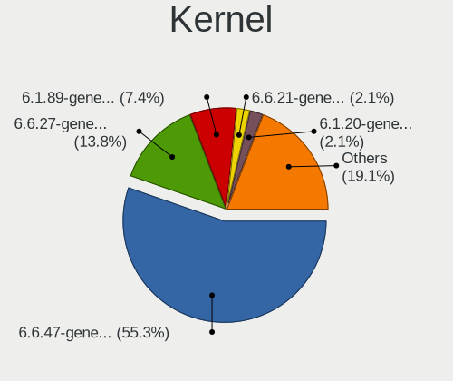
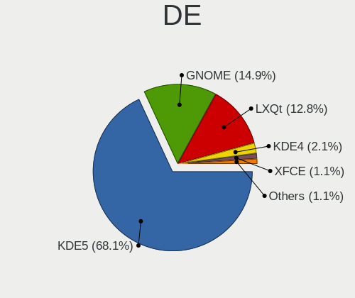
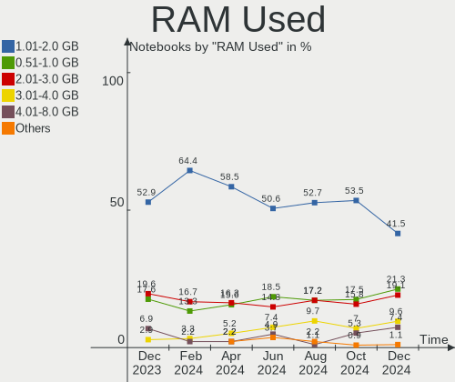
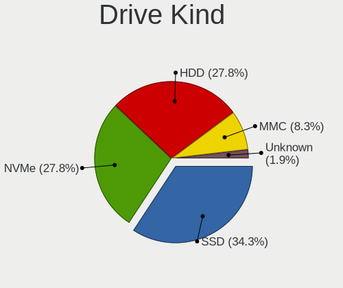
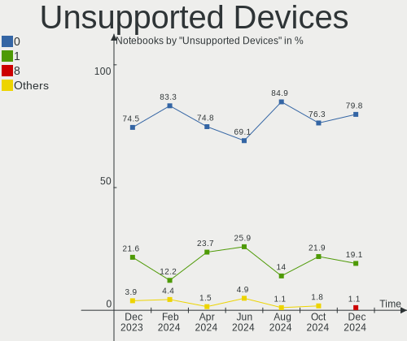

ROSA Hardware Trends (Notebook)
-------------------------------

A project to identify most popular hardware characteristics and track their change
over time based on data collected by ROSA users at https://Linux-Hardware.org.

Anyone can contribute to the study by uploading probes of their computers by
the [hw-probe](https://github.com/linuxhw/hw-probe) tool:

    sudo hw-probe -all -upload

Full-feature report is available here: https://linux-hardware.org/?view=trends&formfactor=notebook

Period: Mar, 2020.

Contents
--------

- [ OS                       ](#os)
- [ OS Family                ](#os-family)
- [ Kernel                   ](#kernel)
- [ Kernel Family            ](#kernel-family)
- [ Kernel Major Ver.        ](#kernel-major-ver)
- [ Arch                     ](#arch)
- [ DE                       ](#de)
- [ Display Server           ](#display-server)
- [ OS Lang                  ](#os-lang)
- [ Boot Mode                ](#boot-mode)
- [ Filesystem               ](#filesystem)
- [ Dual Boot with Linux     ](#dual-boot-with-linux)
- [ Dual Boot (Win)          ](#dual-boot-win)
- [ Country                  ](#country)
- [ City                     ](#city)
- [ Vendor                   ](#vendor)
- [ Model                    ](#model)
- [ Model Family             ](#model-family)
- [ MFG Year                 ](#mfg-year)
- [ Form Factor              ](#form-factor)
- [ Secure Boot              ](#secure-boot)
- [ Coreboot                 ](#coreboot)
- [ RAM Size                 ](#ram-size)
- [ RAM Used                 ](#ram-used)
- [ Drive Vendor             ](#drive-vendor)
- [ Drive Model              ](#drive-model)
- [ Drive Kind               ](#drive-kind)
- [ Drive Connector          ](#drive-connector)
- [ Drive Size               ](#drive-size)
- [ Space Total              ](#space-total)
- [ Space Used               ](#space-used)
- [ Malfunc. Drives          ](#malfunc-drives)
- [ Malfunc. Drive Vendor    ](#malfunc-drive-vendor)
- [ Malfunc. Drive Kind      ](#malfunc-drive-kind)
- [ Failed Drives            ](#failed-drives)
- [ Failed Drive Vendor      ](#failed-drive-vendor)
- [ Drive Status             ](#drive-status)
- [ Storage Vendor           ](#storage-vendor)
- [ Storage Model            ](#storage-model)
- [ Storage Kind             ](#storage-kind)
- [ CPU Vendor               ](#cpu-vendor)
- [ CPU Model                ](#cpu-model)
- [ CPU Model Family         ](#cpu-model-family)
- [ CPU Cores                ](#cpu-cores)
- [ CPU Sockets              ](#cpu-sockets)
- [ CPU Threads              ](#cpu-threads)
- [ CPU Op-Modes             ](#cpu-op-modes)
- [ CPU Microarch            ](#cpu-microarch)
- [ CPU Microcode            ](#cpu-microcode)
- [ GPU Vendor               ](#gpu-vendor)
- [ GPU Model                ](#gpu-model)
- [ GPU Combo                ](#gpu-combo)
- [ GPU Driver               ](#gpu-driver)
- [ GPU Memory               ](#gpu-memory)
- [ Monitor Vendor           ](#monitor-vendor)
- [ Monitor Model            ](#monitor-model)
- [ Monitor Resolution       ](#monitor-resolution)
- [ Monitor Diagonal         ](#monitor-diagonal)
- [ Monitor Width            ](#monitor-width)
- [ Aspect Ratio             ](#aspect-ratio)
- [ Monitor Area             ](#monitor-area)
- [ Pixel Density            ](#pixel-density)
- [ Multiple Monitors        ](#multiple-monitors)
- [ Net Controller Vendor    ](#net-controller-vendor)
- [ Net Controller Model     ](#net-controller-model)
- [ Net Controller Kind      ](#net-controller-kind)
- [ Used Controller          ](#used-controller)
- [ NICs                     ](#nics)
- [ Unsupported Devices      ](#unsupported-devices)
- [ Unsupported Device Types ](#unsupported-device-types)

OS
--

Installed operating systems

| Name      | Computers | Percent |
|-----------|-----------|---------|
| ROSA R11  | 135       | 91.84%  |
| ROSA R10  | 7         | 4.76%   |
| ROSA R8.1 | 4         | 2.72%   |
| RED X3    | 1         | 0.68%   |

OS Family
---------

OS without a version

| Name | Computers | Percent |
|------|-----------|---------|
| ROSA | 147       | 100%    |

Kernel
------

Version of the Linux kernel

| Version                                  | Computers | Percent |
|------------------------------------------|-----------|---------|
| 4.15.0-desktop-68.5rosa-x86_64           | 52        | 35.37%  |
| 4.15.0-desktop-45.1rosa-x86_64           | 36        | 24.49%  |
| 4.15.0-desktop-45.1rosa-i586             | 15        | 10.2%   |
| 4.9.155-nrj-desktop-1rosa-x86_64         | 11        | 7.48%   |
| 4.15.0-desktop-68.5rosa-i586             | 7         | 4.76%   |
| 4.9.155-nrj-desktop-1rosa-i586           | 4         | 2.72%   |
| 4.9.60-nrj-desktop-1rosa-x86_64          | 3         | 2.04%   |
| 5.4.0-desktop-17.1rosa-x86_64            | 2         | 1.36%   |
| 4.9.60-nrj-desktop-1rosa-i586            | 2         | 1.36%   |
| 4.19.104-nrj-desktop-1rosa-x86_64        | 2         | 1.36%   |
| 5.5.4-linux-xanmod-1-rosa-x86_64-xanmod3 | 1         | 0.68%   |
| 5.5.11-nrj-desktop-2rosa-x86_64          | 1         | 0.68%   |
| 5.4.27-nrj-desktop-1rosa-x86_64          | 1         | 0.68%   |
| 5.4.27-desktop-1rosa-x86_64              | 1         | 0.68%   |
| 5.4.26-generic-3rosa-x86_64              | 1         | 0.68%   |
| 5.4.15-nrj-desktop-1rosa-x86_64          | 1         | 0.68%   |
| 4.9.9-nrj-desktop-1rosa-x86_64           | 1         | 0.68%   |
| 4.9.76-nrj-desktop-1rosa-x86_64          | 1         | 0.68%   |
| 4.9.41-nrj-desktop-1rosa-x86_64          | 1         | 0.68%   |
| 4.9.124-nrj-desktop-1rosa-x86_64         | 1         | 0.68%   |
| 4.9.124-nrj-desktop-1rosa-i586           | 1         | 0.68%   |
| 4.15.0-desktop-91.1rosa-x86_64           | 1         | 0.68%   |
| 4.1.38-nrj-desktop-2rosa-x86_64          | 1         | 0.68%   |

Kernel Family
-------------

Linux kernel without a distro release

| Version  | Computers | Percent |
|----------|-----------|---------|
| 4.15.0   | 111       | 75.51%  |
| 4.9.155  | 15        | 10.2%   |
| 4.9.60   | 5         | 3.4%    |
| 5.4.27   | 2         | 1.36%   |
| 5.4.0    | 2         | 1.36%   |
| 4.9.124  | 2         | 1.36%   |
| 4.19.104 | 2         | 1.36%   |
| 5.5.4    | 1         | 0.68%   |
| 5.5.11   | 1         | 0.68%   |
| 5.4.26   | 1         | 0.68%   |
| 5.4.15   | 1         | 0.68%   |
| 4.9.9    | 1         | 0.68%   |
| 4.9.76   | 1         | 0.68%   |
| 4.9.41   | 1         | 0.68%   |
| 4.1.38   | 1         | 0.68%   |

Kernel Major Ver.
-----------------

Linux kernel major version

| Version | Computers | Percent |
|---------|-----------|---------|
| 4.15    | 111       | 75.51%  |
| 4.9     | 25        | 17.01%  |
| 5.4     | 6         | 4.08%   |
| 5.5     | 2         | 1.36%   |
| 4.19    | 2         | 1.36%   |
| 4.1     | 1         | 0.68%   |

Arch
----

OS architecture (x86_64, i586, etc.)

| Name   | Computers | Percent |
|--------|-----------|---------|
| x86_64 | 118       | 80.27%  |
| i686   | 29        | 19.73%  |

DE
--

Desktop Environment

| Name  | Computers | Percent |
|-------|-----------|---------|
| KDE4  | 90        | 61.22%  |
| KDE5  | 41        | 27.89%  |
| XFCE  | 6         | 4.08%   |
| LXQt  | 5         | 3.4%    |
| MATE  | 3         | 2.04%   |
| LXDE  | 1         | 0.68%   |
| GNOME | 1         | 0.68%   |

Display Server
--------------

X11 or Wayland

| Name | Computers | Percent |
|------|-----------|---------|
| X11  | 145       | 98.64%  |
| Tty  | 2         | 1.36%   |

OS Lang
-------

Language

| Lang    | Computers | Percent |
|---------|-----------|---------|
| ru_RU   | 70        | 47.62%  |
| Unknown | 66        | 44.9%   |
| de_DE   | 3         | 2.04%   |
| es_ES   | 2         | 1.36%   |
| en_US   | 2         | 1.36%   |
| sv_SE   | 1         | 0.68%   |
| lv_LV   | 1         | 0.68%   |
| es_VE   | 1         | 0.68%   |
| ar_DZ   | 1         | 0.68%   |

Boot Mode
---------

EFI or BIOS

| Mode | Computers | Percent |
|------|-----------|---------|
| BIOS | 115       | 78.23%  |
| EFI  | 32        | 21.77%  |

Filesystem
----------

Type of filesystem

| Type  | Computers | Percent |
|-------|-----------|---------|
| Ext4  | 140       | 95.24%  |
| Btrfs | 4         | 2.72%   |
| Aufs  | 2         | 1.36%   |
| Ext2  | 1         | 0.68%   |

Dual Boot with Linux
--------------------

Hosting more than one Linux

| Dual boot | Computers | Percent |
|-----------|-----------|---------|
| No        | 111       | 75.51%  |
| Yes       | 36        | 24.49%  |

Dual Boot (Win)
---------------

Hosting Linux and Windows

| Dual boot | Computers | Percent |
|-----------|-----------|---------|
| No        | 94        | 63.95%  |
| Yes       | 53        | 36.05%  |

Country
-------

Geographic location (country)

| Country              | Computers | Percent |
|----------------------|-----------|---------|
| Russia               | 107       | 72.79%  |
| Ukraine              | 11        | 7.48%   |
| Belarus              | 6         | 4.08%   |
| Spain                | 3         | 2.04%   |
| Poland               | 3         | 2.04%   |
| Germany              | 3         | 2.04%   |
| USA                  | 2         | 1.36%   |
| Lithuania            | 2         | 1.36%   |
| Venezuela            | 1         | 0.68%   |
| Sweden               | 1         | 0.68%   |
| Romania              | 1         | 0.68%   |
| Moldova, Republic of | 1         | 0.68%   |
| Latvia               | 1         | 0.68%   |
| Italy                | 1         | 0.68%   |
| Israel               | 1         | 0.68%   |
| Ireland              | 1         | 0.68%   |
| Austria              | 1         | 0.68%   |
| Algeria              | 1         | 0.68%   |

City
----

Geographic location (city)

| City              | Computers | Percent |
|-------------------|-----------|---------|
| Moscow            | 15        | 10.2%   |
| St Petersburg     | 7         | 4.76%   |
| Novosibirsk       | 6         | 4.08%   |
| Ekaterinburg      | 5         | 3.4%    |
| Krasnodar         | 4         | 2.72%   |
| Kharkiv           | 3         | 2.04%   |
| Granada           | 3         | 2.04%   |
| Yaroslavl         | 2         | 1.36%   |
| Voronezh          | 2         | 1.36%   |
| Saratov           | 2         | 1.36%   |
| Rostov-on-Don     | 2         | 1.36%   |
| Nizhniy Novgorod  | 2         | 1.36%   |
| Kyiv              | 2         | 1.36%   |
| Krasnoyarsk       | 2         | 1.36%   |
| Kaunas            | 2         | 1.36%   |
| Izhevsk           | 2         | 1.36%   |
| Ivanovo           | 2         | 1.36%   |
| Irkutsk           | 2         | 1.36%   |
| Chelyabinsk       | 2         | 1.36%   |
| Örebro           | 1         | 0.68%   |
| Yuzhno-Sakhalinsk | 1         | 0.68%   |
| Yeysk             | 1         | 0.68%   |
| Weinsberg         | 1         | 0.68%   |
| Warsaw            | 1         | 0.68%   |
| Volzhskiy         | 1         | 0.68%   |
| Vologda           | 1         | 0.68%   |
| Volgograd         | 1         | 0.68%   |
| Vladivostok       | 1         | 0.68%   |
| Vitebsk           | 1         | 0.68%   |
| Vienna            | 1         | 0.68%   |
| Ufa               | 1         | 0.68%   |
| Tomsk             | 1         | 0.68%   |
| Tikhvin           | 1         | 0.68%   |
| Tighina           | 1         | 0.68%   |
| Tel Aviv          | 1         | 0.68%   |
| Tacarigua         | 1         | 0.68%   |
| Surgut            | 1         | 0.68%   |
| Stavropol         | 1         | 0.68%   |
| Sovetskaya Gavan' | 1         | 0.68%   |
| Smolensk          | 1         | 0.68%   |
| Shakhty           | 1         | 0.68%   |
| Severodvinsk      | 1         | 0.68%   |
| Samara            | 1         | 0.68%   |
| Rybinsk           | 1         | 0.68%   |
| Riga              | 1         | 0.68%   |
| Reutov            | 1         | 0.68%   |
| Poltava           | 1         | 0.68%   |
| Pokrovsk          | 1         | 0.68%   |
| Pittsburgh        | 1         | 0.68%   |
| Perm              | 1         | 0.68%   |
| Penza             | 1         | 0.68%   |
| Pcim              | 1         | 0.68%   |
| Oryol             | 1         | 0.68%   |
| Omsk              | 1         | 0.68%   |
| Novorossiysk      | 1         | 0.68%   |
| Nizhny Tagil      | 1         | 0.68%   |
| Nizhnevartovsk    | 1         | 0.68%   |
| Neftekamsk        | 1         | 0.68%   |
| Navahrudak        | 1         | 0.68%   |
| Myski             | 1         | 0.68%   |

Vendor
------

Motherboard manufacturer

| Name                           | Computers | Percent |
|--------------------------------|-----------|---------|
| Lenovo                         | 26        | 17.69%  |
| ASUSTek Computer               | 23        | 15.65%  |
| Acer                           | 23        | 15.65%  |
| Hewlett-Packard                | 21        | 14.29%  |
| Samsung Electronics            | 15        | 10.2%   |
| Dell                           | 12        | 8.16%   |
| Packard Bell                   | 6         | 4.08%   |
| Toshiba                        | 3         | 2.04%   |
| Sony                           | 2         | 1.36%   |
| Fujitsu                        | 2         | 1.36%   |
| Apple                          | 2         | 1.36%   |
| VIT                            | 1         | 0.68%   |
| Prestigio                      | 1         | 0.68%   |
| Notebook                       | 1         | 0.68%   |
| MINIX                          | 1         | 0.68%   |
| Matsushita Electric Industrial | 1         | 0.68%   |
| iRU                            | 1         | 0.68%   |
| Intel                          | 1         | 0.68%   |
| Fujitsu Siemens                | 1         | 0.68%   |
| eMachines                      | 1         | 0.68%   |
| DNS                            | 1         | 0.68%   |
| Digma                          | 1         | 0.68%   |
| Clevo                          | 1         | 0.68%   |

Model
-----

Motherboard model

| Name                                                                                                 | Computers | Percent |
|------------------------------------------------------------------------------------------------------|-----------|---------|
| Lenovo B570e HuronRiver Platform                                                                     | 4         | 2.72%   |
| Lenovo G500 20236                                                                                    | 3         | 2.04%   |
| HP Notebook                                                                                          | 3         | 2.04%   |
| Samsung Electronics R520/R522/R620                                                                   | 2         | 1.36%   |
| Samsung Electronics NC110P/NC108P/NC111P                                                             | 2         | 1.36%   |
| Samsung Electronics 350V5C/351V5C/3540VC/3440VC                                                      | 2         | 1.36%   |
| Lenovo B590 20208                                                                                    | 2         | 1.36%   |
| HP Pavilion dv7                                                                                      | 2         | 1.36%   |
| Dell Inspiron 3521                                                                                   | 2         | 1.36%   |
| ASUS K53SV                                                                                           | 2         | 1.36%   |
| ASUS 1215B                                                                                           | 2         | 1.36%   |
| Acer Extensa 2519                                                                                    | 2         | 1.36%   |
| VIT P2402                                                                                            | 1         | 0.68%   |
| Toshiba Satellite L850D-C8S                                                                          | 1         | 0.68%   |
| Toshiba Satellite L40                                                                                | 1         | 0.68%   |
| Toshiba Satellite A300                                                                               | 1         | 0.68%   |
| Sony VGN-TZ1RXN_B                                                                                    | 1         | 0.68%   |
| Sony VGN-NW2SRF_S                                                                                    | 1         | 0.68%   |
| Samsung Electronics RV413/RV513                                                                      | 1         | 0.68%   |
| Samsung Electronics RC410/RC510/RC710                                                                | 1         | 0.68%   |
| Samsung Electronics R580/R590                                                                        | 1         | 0.68%   |
| Samsung Electronics R510/P510                                                                        | 1         | 0.68%   |
| Samsung Electronics R468/R418                                                                        | 1         | 0.68%   |
| Samsung Electronics NC210/NC110                                                                      | 1         | 0.68%   |
| Samsung Electronics 350V5C/350V5X/350V4C/350V4X/351V5C/351V5X/351V4C/351V4X/3540VC/3540VX/3440VC/344 | 1         | 0.68%   |
| Samsung Electronics 305V4A/305V5A/3415VA                                                             | 1         | 0.68%   |
| Samsung Electronics 300E4A/300E5A/300E7A/3430EA/3530EA                                               | 1         | 0.68%   |
| Prestigio PSB133S01ZFH                                                                               | 1         | 0.68%   |
| Packard Bell EasyNote TS11SB                                                                         | 1         | 0.68%   |
| Packard Bell EasyNote TJ71                                                                           | 1         | 0.68%   |
| Packard Bell EasyNote TE69CX                                                                         | 1         | 0.68%   |
| Packard Bell EasyNote ENLG71BM                                                                       | 1         | 0.68%   |
| Packard Bell DOTS                                                                                    | 1         | 0.68%   |
| Packard Bell DOT S                                                                                   | 1         | 0.68%   |
| Notebook W54_55SU1,SUW                                                                               | 1         | 0.68%   |
| MINIX NEO Z83-4                                                                                      | 1         | 0.68%   |
| Matsushita Electric Industrial CF-W7CWHAJS                                                           | 1         | 0.68%   |
| Lenovo V310-15IKB 80T3                                                                               | 1         | 0.68%   |
| Lenovo ThinkPad X230 2320LFG                                                                         | 1         | 0.68%   |
| Lenovo ThinkPad T61 7661WPF                                                                          | 1         | 0.68%   |
| Lenovo ThinkPad T60 2007WEH                                                                          | 1         | 0.68%   |
| Lenovo ThinkPad T500 22437CG                                                                         | 1         | 0.68%   |
| Lenovo ThinkPad T410 2537FP9                                                                         | 1         | 0.68%   |
| Lenovo IdeaPad S206 20154                                                                            | 1         | 0.68%   |
| Lenovo IdeaPad S110 20126                                                                            | 1         | 0.68%   |
| Lenovo IdeaPad S10-2 20027                                                                           | 1         | 0.68%   |
| Lenovo IdeaPad 520-15IKB 80YL                                                                        | 1         | 0.68%   |
| Lenovo IdeaPad 330-15IKB 81DE                                                                        | 1         | 0.68%   |
| Lenovo G770 20089                                                                                    | 1         | 0.68%   |
| Lenovo G580                                                                                          | 1         | 0.68%   |
| Lenovo G560 20042                                                                                    | 1         | 0.68%   |
| Lenovo G50-30 80G0                                                                                   | 1         | 0.68%   |
| Lenovo B590 20206                                                                                    | 1         | 0.68%   |
| iRU PC-B1811                                                                                         | 1         | 0.68%   |
| Intel Intel                                                                                          | 1         | 0.68%   |
| HP ProBook 4530s                                                                                     | 1         | 0.68%   |
| HP ProBook 450 G4                                                                                    | 1         | 0.68%   |
| HP Pavilion Notebook                                                                                 | 1         | 0.68%   |
| HP Pavilion g7                                                                                       | 1         | 0.68%   |
| HP Pavilion g6                                                                                       | 1         | 0.68%   |

Model Family
------------

Motherboard model prefix

| Name                                       | Computers | Percent |
|--------------------------------------------|-----------|---------|
| Acer Aspire                                | 14        | 9.52%   |
| Dell Inspiron                              | 7         | 4.76%   |
| Lenovo ThinkPad                            | 5         | 3.4%    |
| Lenovo IdeaPad                             | 5         | 3.4%    |
| HP Pavilion                                | 5         | 3.4%    |
| Acer Extensa                               | 5         | 3.4%    |
| Packard Bell EasyNote                      | 4         | 2.72%   |
| Lenovo B570e                               | 4         | 2.72%   |
| HP EliteBook                               | 4         | 2.72%   |
| Toshiba Satellite                          | 3         | 2.04%   |
| Samsung Electronics 350V5C                 | 3         | 2.04%   |
| Lenovo G500                                | 3         | 2.04%   |
| Lenovo B590                                | 3         | 2.04%   |
| HP Notebook                                | 3         | 2.04%   |
| Dell Latitude                              | 3         | 2.04%   |
| Samsung Electronics R520                   | 2         | 1.36%   |
| Samsung Electronics NC110P                 | 2         | 1.36%   |
| HP ProBook                                 | 2         | 1.36%   |
| HP Laptop                                  | 2         | 1.36%   |
| HP Compaq                                  | 2         | 1.36%   |
| Fujitsu LIFEBOOK                           | 2         | 1.36%   |
| ASUS K53SV                                 | 2         | 1.36%   |
| ASUS 1215B                                 | 2         | 1.36%   |
| Acer TravelMate                            | 2         | 1.36%   |
| VIT P2402                                  | 1         | 0.68%   |
| Sony VGN-TZ1RXN                            | 1         | 0.68%   |
| Sony VGN-NW2SRF                            | 1         | 0.68%   |
| Samsung Electronics RV413                  | 1         | 0.68%   |
| Samsung Electronics RC410                  | 1         | 0.68%   |
| Samsung Electronics R580                   | 1         | 0.68%   |
| Samsung Electronics R510                   | 1         | 0.68%   |
| Samsung Electronics R468                   | 1         | 0.68%   |
| Samsung Electronics NC210                  | 1         | 0.68%   |
| Samsung Electronics 305V4A                 | 1         | 0.68%   |
| Samsung Electronics 300E4A                 | 1         | 0.68%   |
| Prestigio PSB133S01ZFH                     | 1         | 0.68%   |
| Packard Bell DOTS                          | 1         | 0.68%   |
| Packard Bell DOT                           | 1         | 0.68%   |
| Notebook W54                               | 1         | 0.68%   |
| MINIX NEO                                  | 1         | 0.68%   |
| Matsushita Electric Industrial CF-W7CWHAJS | 1         | 0.68%   |
| Lenovo V310-15IKB                          | 1         | 0.68%   |
| Lenovo G770                                | 1         | 0.68%   |
| Lenovo G580                                | 1         | 0.68%   |
| Lenovo G560                                | 1         | 0.68%   |
| Lenovo G50-30                              | 1         | 0.68%   |
| iRU PC-B1811                               | 1         | 0.68%   |
| Intel Intel                                | 1         | 0.68%   |
| HP Mini                                    | 1         | 0.68%   |
| HP ENVY                                    | 1         | 0.68%   |
| HP 620                                     | 1         | 0.68%   |
| Fujitsu Siemens LIFEBOOK                   | 1         | 0.68%   |
| eMachines E510                             | 1         | 0.68%   |
| DNS W9x0LU                                 | 1         | 0.68%   |
| Digma ES6017EW                             | 1         | 0.68%   |
| Dell G3                                    | 1         | 0.68%   |
| Dell 500                                   | 1         | 0.68%   |
| Clevo W240BL                               | 1         | 0.68%   |
| ASUS X75VC                                 | 1         | 0.68%   |
| ASUS X58C                                  | 1         | 0.68%   |

MFG Year
--------

Motherboard manufacture year

| Year | Computers | Percent |
|------|-----------|---------|
| 2011 | 24        | 16.33%  |
| 2012 | 22        | 14.97%  |
| 2013 | 17        | 11.56%  |
| 2010 | 13        | 8.84%   |
| 2009 | 13        | 8.84%   |
| 2008 | 12        | 8.16%   |
| 2018 | 11        | 7.48%   |
| 2014 | 7         | 4.76%   |
| 2017 | 6         | 4.08%   |
| 2015 | 6         | 4.08%   |
| 2007 | 6         | 4.08%   |
| 2016 | 4         | 2.72%   |
| 2019 | 3         | 2.04%   |
| 2006 | 3         | 2.04%   |

Form Factor
-----------

Physical design of the computer

| Name     | Computers | Percent |
|----------|-----------|---------|
| Notebook | 147       | 100%    |

Secure Boot
-----------

Enabled or disabled

| State    | Computers | Percent |
|----------|-----------|---------|
| Disabled | 147       | 100%    |

Coreboot
--------

Have coreboot on board

| Used | Computers | Percent |
|------|-----------|---------|
| No   | 147       | 100%    |

RAM Size
--------

Total RAM memory

| Size in GB | Computers | Percent |
|------------|-----------|---------|
| 3.01-4.0   | 55        | 37.41%  |
| 4.01-8.0   | 29        | 19.73%  |
| 1.01-2.0   | 20        | 13.61%  |
| 2.01-3.0   | 19        | 12.93%  |
| 8.01-16.0  | 17        | 11.56%  |
| 0.01-1.0   | 3         | 2.04%   |
| 32.01-64.0 | 2         | 1.36%   |
| 24.01-32.0 | 1         | 0.68%   |
| 16.01-24.0 | 1         | 0.68%   |

RAM Used
--------

Used RAM memory

| Used GB   | Computers | Percent |
|-----------|-----------|---------|
| 0.01-1.0  | 72        | 48.98%  |
| 1.01-2.0  | 62        | 42.18%  |
| 2.01-3.0  | 6         | 4.08%   |
| 4.01-8.0  | 3         | 2.04%   |
| 3.01-4.0  | 3         | 2.04%   |
| 8.01-16.0 | 1         | 0.68%   |

Drive Vendor
------------

Hard drive vendors

| Vendor              | Computers | Drives  | Percent |
|---------------------|-----------|---------|---------|
| WDC                 | 36        | 37      | 20.81%  |
| Seagate             | 35        | 36      | 20.23%  |
| Toshiba             | 29        | 29      | 16.76%  |
| Hitachi             | 17        | 17      | 9.83%   |
| Samsung Electronics | 8         | 8       | 4.62%   |
| Unknown             | 5         | 6       | 2.89%   |
| SanDisk             | 5         | 5       | 2.89%   |
| China               | 5         | 5       | 2.89%   |
| Kingston            | 4         | 4       | 2.31%   |
| A-DATA Technology   | 4         | 4       | 2.31%   |
| Crucial             | 3         | 3       | 1.73%   |
| SPCC                | 2         | 2       | 1.16%   |
| HGST                | 2         | 2       | 1.16%   |
| Fujitsu             | 2         | 2       | 1.16%   |
| Zheino              | 1         | 1       | 0.58%   |
| Transcend           | 1         | 1       | 0.58%   |
| Teclast             | 1         | 1       | 0.58%   |
| Team                | 1         | 1       | 0.58%   |
| T-64                | 1         | 1       | 0.58%   |
| Smartbuy            | 1         | 1       | 0.58%   |
| OCZ                 | 1         | 1       | 0.58%   |
| Micron Technology   | 1         | 1       | 0.58%   |
| LITEONIT            | 1         | 1       | 0.58%   |
| LITEON              | 1         | 1       | 0.58%   |
| HUAWEI              | 1         | 1       | 0.58%   |
| HL-DT-ST            | 1         | Unknown | 0.58%   |
| Hewlett-Packard     | 1         | 1       | 0.58%   |
| Goldendisk          | 1         | 1       | 0.58%   |
| Generic             | 1         | 1       | 0.58%   |
| AMD                 | 1         | 1       | 0.58%   |

Drive Model
-----------

Hard drive models

| Model                        | Computers | Percent |
|------------------------------|-----------|---------|
| MQ01ABF050 500GB             | 6         | 3.41%   |
| ST500LT012-1DG142 500GB      | 4         | 2.27%   |
| ST320LT020-9YG142 320GB      | 4         | 2.27%   |
| HTS547575A9E384 752GB        | 4         | 2.27%   |
| WD5000LPLX-00ZNTT0 500GB     | 3         | 1.7%    |
| ST9500325AS 500GB            | 3         | 1.7%    |
| ST9320325AS 320GB            | 3         | 1.7%    |
| MQ01ABD050 500GB             | 3         | 1.7%    |
| WDS240G2G0A-00JH30 240GB SSD | 2         | 1.14%   |
| WDS120G2G0A-00JH30 120GB SSD | 2         | 1.14%   |
| WD5000LPVX-22V0TT0 500GB     | 2         | 1.14%   |
| WD3200BPVT-22ZEST0 320GB     | 2         | 1.14%   |
| WD1600BEVT-22ZCT0 160GB      | 2         | 1.14%   |
| ST9250315AS 250GB            | 2         | 1.14%   |
| ST500LM012 HN-M500MBB 500GB  | 2         | 1.14%   |
| ST1000LM035-1RK172 1TB       | 2         | 1.14%   |
| SSD 120GB                    | 2         | 1.14%   |
| SHFS37A120G 120GB SSD        | 2         | 1.14%   |
| SATA SSD 120GB               | 2         | 1.14%   |
| SA400S37240G 240GB SSD       | 2         | 1.14%   |
| MQ01ABD100 1TB               | 2         | 1.14%   |
| MK1237GSX 120GB              | 2         | 1.14%   |
| HTS545050B9A300 500GB        | 2         | 1.14%   |
| HTS545032B9A300 320GB        | 2         | 1.14%   |
| DF4032  32GB                 | 2         | 1.14%   |
| WDS500G2B0A-00SM50 500GB SSD | 1         | 0.57%   |
| WD6400BPVT-80HXZT3 640GB     | 1         | 0.57%   |
| WD6400BPVT-75HXZT1 640GB     | 1         | 0.57%   |
| WD5000LPVX-08V0TT2 500GB     | 1         | 0.57%   |
| WD5000LPVT-24G33T1 500GB     | 1         | 0.57%   |
| WD5000LPVT-16G33T0 500GB     | 1         | 0.57%   |
| WD5000LPVT-08G33T1 500GB     | 1         | 0.57%   |
| WD5000LPLX-21ZNTT0 500GB     | 1         | 0.57%   |
| WD5000LPCX-60VHAT1 500GB     | 1         | 0.57%   |
| WD5000LPCX-21VHAT0 500GB     | 1         | 0.57%   |
| WD5000BPVT-24HXZT3 500GB     | 1         | 0.57%   |
| WD5000BEVT-22A0RT0 500GB     | 1         | 0.57%   |
| WD3200BPVT-22JJ5T0 320GB     | 1         | 0.57%   |
| WD3200BEVT-80A0RT0 320GB     | 1         | 0.57%   |
| WD3200BEVT-60A23T0 320GB     | 1         | 0.57%   |
| WD3200BEKT-75PVMT1 320GB     | 1         | 0.57%   |
| WD2500BPVT-75JJ5T0 250GB     | 1         | 0.57%   |
| WD2500BPVT-22JJ5T0 250GB     | 1         | 0.57%   |
| WD1600BEVT-00ZCT0 160GB      | 1         | 0.57%   |
| WD10SPZX-00Z10T0 1TB         | 1         | 0.57%   |
| WD10JPVX-60JC3T0 1TB         | 1         | 0.57%   |
| WD10JPVX-00JC3T0 1TB         | 1         | 0.57%   |
| WD10JPLX-00MBPT0 1TB         | 1         | 0.57%   |
| WD10JPCX-24UE4T0 1TB         | 1         | 0.57%   |
| TS120GMTS420S 120GB SSD      | 1         | 0.57%   |
| TR200 240GB SSD              | 1         | 0.57%   |
| TF CARD Storage 8GB          | 1         | 0.57%   |
| T2535T120G 120GB SSD         | 1         | 0.57%   |
| SU650 120GB SSD              | 1         | 0.57%   |
| SU635 240GB SSD              | 1         | 0.57%   |
| ST96812AS 58GB               | 1         | 0.57%   |
| ST9500423AS 500GB            | 1         | 0.57%   |
| ST9500420AS 500GB            | 1         | 0.57%   |
| ST9320320AS 320GB            | 1         | 0.57%   |
| ST9250315ASG 250GB           | 1         | 0.57%   |

Drive Kind
----------

HDD or SSD

| Kind    | Computers | Drives | Percent |
|---------|-----------|--------|---------|
| HDD     | 116       | 120    | 69.05%  |
| SSD     | 41        | 44     | 24.4%   |
| MMC     | 6         | 7      | 3.57%   |
| Unknown | 4         | 3      | 2.38%   |
| NVMe    | 1         | 1      | 0.6%    |

Drive Connector
---------------

SATA, SAS, NVMe, etc.

| Type | Computers | Drives | Percent |
|------|-----------|--------|---------|
| SATA | 144       | 164    | 92.9%   |
| MMC  | 6         | 7      | 3.87%   |
| SAS  | 4         | 3      | 2.58%   |
| NVMe | 1         | 1      | 0.65%   |

Drive Size
----------

Size of hard drive

| Size in TB | Computers | Drives | Percent |
|------------|-----------|--------|---------|
| 0.01-0.5   | 130       | 146    | 81.76%  |
| 0.51-1.0   | 26        | 26     | 16.35%  |
| 1.01-2.0   | 3         | 3      | 1.89%   |

Space Total
-----------

Amount of disk space available on the file system

| Size in GB     | Computers | Percent |
|----------------|-----------|---------|
| 251-500        | 39        | 26.53%  |
| 101-250        | 36        | 24.49%  |
| 1-20           | 22        | 14.97%  |
| 21-50          | 17        | 11.56%  |
| 501-1000       | 17        | 11.56%  |
| 51-100         | 13        | 8.84%   |
| More than 3000 | 1         | 0.68%   |
| 2001-3000      | 1         | 0.68%   |
| 1001-2000      | 1         | 0.68%   |

Space Used
----------

Amount of used disk space

| Used GB   | Computers | Percent |
|-----------|-----------|---------|
| 1-20      | 101       | 68.71%  |
| 21-50     | 18        | 12.24%  |
| 101-250   | 9         | 6.12%   |
| 251-500   | 8         | 5.44%   |
| 51-100    | 8         | 5.44%   |
| 2001-3000 | 1         | 0.68%   |
| 1001-2000 | 1         | 0.68%   |
| 501-1000  | 1         | 0.68%   |

Malfunc. Drives
---------------

Drive models with a malfunction

| Model                       | Computers | Drives | Percent |
|-----------------------------|-----------|--------|---------|
| ST320LT020-9YG142 320GB     | 4         | 4      | 7.14%   |
| ST9500325AS 500GB           | 3         | 3      | 5.36%   |
| MQ01ABD050 500GB            | 3         | 3      | 5.36%   |
| ST9320325AS 320GB           | 2         | 2      | 3.57%   |
| ST500LT012-1DG142 500GB     | 2         | 2      | 3.57%   |
| MK1237GSX 120GB             | 2         | 2      | 3.57%   |
| WD6400BPVT-75HXZT1 640GB    | 1         | 1      | 1.79%   |
| WD5000LPLX-21ZNTT0 500GB    | 1         | 1      | 1.79%   |
| WD5000LPCX-21VHAT0 500GB    | 1         | 1      | 1.79%   |
| WD5000BEVT-22A0RT0 500GB    | 1         | 1      | 1.79%   |
| WD3200BPVT-22ZEST0 320GB    | 1         | 1      | 1.79%   |
| WD3200BPVT-22JJ5T0 320GB    | 1         | 1      | 1.79%   |
| WD3200BEVT-80A0RT0 320GB    | 1         | 1      | 1.79%   |
| WD3200BEVT-60A23T0 320GB    | 1         | 1      | 1.79%   |
| T2535T120G 120GB SSD        | 1         | 1      | 1.79%   |
| ST9500423AS 500GB           | 1         | 1      | 1.79%   |
| ST9500420AS 500GB           | 1         | 1      | 1.79%   |
| ST9160310AS 160GB           | 1         | 1      | 1.79%   |
| ST9120821A 120GB            | 1         | 1      | 1.79%   |
| ST500LM021-1KJ152 500GB     | 1         | 1      | 1.79%   |
| ST500LM012 HN-M500MBB 500GB | 1         | 1      | 1.79%   |
| ST1000LM024 HN-M101MBB 1TB  | 1         | 1      | 1.79%   |
| ST1000LM024 HN-M 1TB        | 1         | 1      | 1.79%   |
| SSD 32GB                    | 1         | 1      | 1.79%   |
| SHFS37A120G 120GB SSD       | 1         | 1      | 1.79%   |
| MQ01ABD100 1TB              | 1         | 1      | 1.79%   |
| MK6461GSY 640GB             | 1         | 1      | 1.79%   |
| MK6459GSX 640GB             | 1         | 1      | 1.79%   |
| MK5059GSXP 500GB            | 1         | 1      | 1.79%   |
| MK5055GSX 500GB             | 1         | 1      | 1.79%   |
| MK3252GSX 320GB             | 1         | 1      | 1.79%   |
| MK1646GSX 160GB             | 1         | 1      | 1.79%   |
| HTS723232A7A364 320GB       | 1         | 1      | 1.79%   |
| HTS722010K9SA00 100GB       | 1         | 1      | 1.79%   |
| HTS547575A9E384 752GB       | 1         | 1      | 1.79%   |
| HTS545050B9A300 500GB       | 1         | 1      | 1.79%   |
| HTS545050A7E380 500GB       | 1         | 1      | 1.79%   |
| HTS545032A7E680 320GB       | 1         | 1      | 1.79%   |
| HTS545025B9A300 250GB       | 1         | 1      | 1.79%   |
| HTS543225A7A384 250GB       | 1         | 1      | 1.79%   |
| HTS541640J9SA00 40GB        | 1         | 1      | 1.79%   |
| HTS541612J9SA00 120GB       | 1         | 1      | 1.79%   |
| HTS541040G9SA00 40GB        | 1         | 1      | 1.79%   |
| HN-M101MBB 1TB              | 1         | 1      | 1.79%   |
| HM500JI 500GB               | 1         | 1      | 1.79%   |
| CT256MX100SSD1 256GB        | 1         | 1      | 1.79%   |

Malfunc. Drive Vendor
---------------------

Vendors of faulty drives

| Vendor              | Computers | Drives | Percent |
|---------------------|-----------|--------|---------|
| Seagate             | 18        | 19     | 32.73%  |
| Toshiba             | 12        | 12     | 21.82%  |
| Hitachi             | 9         | 9      | 16.36%  |
| WDC                 | 8         | 8      | 14.55%  |
| Samsung Electronics | 2         | 2      | 3.64%   |
| HGST                | 2         | 2      | 3.64%   |
| Team                | 1         | 1      | 1.82%   |
| Kingston            | 1         | 1      | 1.82%   |
| Crucial             | 1         | 1      | 1.82%   |
| China               | 1         | 1      | 1.82%   |

Malfunc. Drive Kind
-------------------

Kinds of faulty drives

| Kind | Computers | Drives | Percent |
|------|-----------|--------|---------|
| HDD  | 50        | 52     | 92.59%  |
| SSD  | 4         | 4      | 7.41%   |

Failed Drives
-------------

Failed drive models

Zero info for selected period =(

Failed Drive Vendor
-------------------

Failed drive vendors

Zero info for selected period =(

Drive Status
------------

Number of failed and malfunc. drives

| Status   | Computers | Drives | Percent |
|----------|-----------|--------|---------|
| Works    | 96        | 109    | 60%     |
| Malfunc  | 54        | 56     | 33.75%  |
| Detected | 10        | 10     | 6.25%   |

Storage Vendor
--------------

Storage controller vendors

| Vendor                           | Computers | Percent |
|----------------------------------|-----------|---------|
| Intel                            | 125       | 85.62%  |
| AMD                              | 16        | 10.96%  |
| Nvidia                           | 2         | 1.37%   |
| Toshiba America Info Systems     | 1         | 0.68%   |
| Silicon Integrated Systems [SiS] | 1         | 0.68%   |
| KIOXIA                           | 1         | 0.68%   |

Storage Model
-------------

Storage controller models

| Model                                                                            | Computers | Percent |
|----------------------------------------------------------------------------------|-----------|---------|
| 7 Series Chipset Family 6-port SATA Controller [AHCI mode]                       | 25        | 15.43%  |
| 6 Series/C200 Series Chipset Family 6 port Mobile SATA AHCI Controller           | 13        | 8.02%   |
| 5 Series/3400 Series Chipset 4 port SATA AHCI Controller                         | 13        | 8.02%   |
| 82801HM/HEM (ICH8M/ICH8M-E) IDE Controller                                       | 12        | 7.41%   |
| 82801IBM/IEM (ICH9M/ICH9M-E) 4 port SATA Controller [AHCI mode]                  | 11        | 6.79%   |
| NM10/ICH7 Family SATA Controller [AHCI mode]                                     | 9         | 5.56%   |
| SB7x0/SB8x0/SB9x0 SATA Controller [AHCI mode]                                    | 8         | 4.94%   |
| 82801HM/HEM (ICH8M/ICH8M-E) SATA Controller [AHCI mode]                          | 8         | 4.94%   |
| FCH SATA Controller [AHCI mode]                                                  | 7         | 4.32%   |
| Atom/Celeron/Pentium Processor x5-E8000/J3xxx/N3xxx Series SATA Controller       | 6         | 3.7%    |
| Sunrise Point-LP SATA Controller [AHCI mode]                                     | 5         | 3.09%   |
| 82801HM/HEM (ICH8M/ICH8M-E) SATA Controller [IDE mode]                           | 5         | 3.09%   |
| 82801GBM/GHM (ICH7-M Family) SATA Controller [IDE mode]                          | 5         | 3.09%   |
| Atom Processor E3800 Series SATA AHCI Controller                                 | 4         | 2.47%   |
| 82801IBM/IEM (ICH9M/ICH9M-E) 2 port SATA Controller [IDE mode]                   | 3         | 1.85%   |
| 82801G (ICH7 Family) IDE Controller                                              | 2         | 1.23%   |
| 82801FB/FBM/FR/FW/FRW (ICH6 Family) IDE Controller                               | 2         | 1.23%   |
| 8 Series SATA Controller 1 [AHCI mode]                                           | 2         | 1.23%   |
| 6 Series/C200 Series Chipset Family Mobile SATA Controller (IDE mode, ports 4-5) | 2         | 1.23%   |
| 6 Series/C200 Series Chipset Family Mobile SATA Controller (IDE mode, ports 0-3) | 2         | 1.23%   |
| 5 Series/3400 Series Chipset 4 port SATA IDE Controller                          | 2         | 1.23%   |
| Wildcat Point-LP SATA Controller [AHCI Mode]                                     | 1         | 0.62%   |
| Toshiba America Info Non-Volatile memory controller                              | 1         | 0.62%   |
| SB7x0/SB8x0/SB9x0 SATA Controller [IDE mode]                                     | 1         | 0.62%   |
| SATA Controller / IDE mode                                                       | 1         | 0.62%   |
| SATA controller                                                                  | 1         | 0.62%   |
| Non-Volatile memory controller                                                   | 1         | 0.62%   |
| NM10/ICH7 Family SATA Controller [IDE mode]                                      | 1         | 0.62%   |
| MCP79 SATA Controller                                                            | 1         | 0.62%   |
| MCP79 AHCI Controller                                                            | 1         | 0.62%   |
| FCH IDE Controller                                                               | 1         | 0.62%   |
| Celeron N3350/Pentium N4200/Atom E3900 Series SATA AHCI Controller               | 1         | 0.62%   |
| Cannon Lake Mobile PCH SATA AHCI Controller                                      | 1         | 0.62%   |
| 82801GBM/GHM (ICH7-M Family) SATA Controller [AHCI mode]                         | 1         | 0.62%   |
| 82801 Mobile SATA Controller [RAID mode]                                         | 1         | 0.62%   |
| 8 Series/C220 Series Chipset Family 6-port SATA Controller 1 [AHCI mode]         | 1         | 0.62%   |
| 5 Series/3400 Series Chipset 2 port SATA IDE Controller                          | 1         | 0.62%   |

Storage Kind
------------

Kind of storage controller (IDE, SATA, NVMe, SAS, ...)

| Kind | Computers | Percent |
|------|-----------|---------|
| SATA | 119       | 76.77%  |
| IDE  | 33        | 21.29%  |
| NVMe | 2         | 1.29%   |
| RAID | 1         | 0.65%   |

CPU Vendor
----------

Processor vendors

| Vendor | Computers | Percent |
|--------|-----------|---------|
| Intel  | 131       | 89.12%  |
| AMD    | 16        | 10.88%  |

CPU Model
---------

Processor models

| Model                                       | Computers | Percent |
|---------------------------------------------|-----------|---------|
| Intel Core i5-3230M CPU @ 2.60GHz           | 4         | 2.72%   |
| Intel Core i5-3210M CPU @ 2.50GHz           | 4         | 2.72%   |
| Intel Atom CPU N2600 @ 1.60GHz              | 4         | 2.72%   |
| Intel Pentium CPU B960 @ 2.20GHz            | 3         | 2.04%   |
| Intel Core i3-3120M CPU @ 2.50GHz           | 3         | 2.04%   |
| Intel Core i3-3110M CPU @ 2.40GHz           | 3         | 2.04%   |
| Intel Core i3 CPU M 380 @ 2.53GHz           | 3         | 2.04%   |
| Intel Celeron CPU N3060 @ 1.60GHz           | 3         | 2.04%   |
| Intel Pentium Dual-Core CPU T4300 @ 2.10GHz | 2         | 1.36%   |
| Intel Pentium Dual CPU T3400 @ 2.16GHz      | 2         | 1.36%   |
| Intel Pentium CPU B950 @ 2.10GHz            | 2         | 1.36%   |
| Intel Genuine CPU T2400 @ 1.83GHz           | 2         | 1.36%   |
| Intel Core i7-3610QM CPU @ 2.30GHz          | 2         | 1.36%   |
| Intel Core i7 CPU Q 720 @ 1.60GHz           | 2         | 1.36%   |
| Intel Core i5-2410M CPU @ 2.30GHz           | 2         | 1.36%   |
| Intel Core i5 CPU M 520 @ 2.40GHz           | 2         | 1.36%   |
| Intel Core i5 CPU M 480 @ 2.67GHz           | 2         | 1.36%   |
| Intel Core i3-7100U CPU @ 2.40GHz           | 2         | 1.36%   |
| Intel Core i3-2350M CPU @ 2.30GHz           | 2         | 1.36%   |
| Intel Core i3 CPU M 350 @ 2.27GHz           | 2         | 1.36%   |
| Intel Core 2 Duo CPU T7300 @ 2.00GHz        | 2         | 1.36%   |
| Intel Core 2 Duo CPU T6600 @ 2.20GHz        | 2         | 1.36%   |
| Intel Core 2 Duo CPU T5750 @ 2.00GHz        | 2         | 1.36%   |
| Intel Core 2 Duo CPU P8700 @ 2.53GHz        | 2         | 1.36%   |
| Intel Celeron CPU N2840 @ 2.16GHz           | 2         | 1.36%   |
| Intel Atom CPU N455 @ 1.66GHz               | 2         | 1.36%   |
| Intel Atom CPU N270 @ 1.60GHz               | 2         | 1.36%   |
| AMD E1-6015 APU with Radeon R2 Graphics     | 2         | 1.36%   |
| AMD E-350 Processor                         | 2         | 1.36%   |
| Intel Pentium Silver N5000 CPU @ 1.10GHz    | 1         | 0.68%   |
| Intel Pentium M processor 2.13GHz           | 1         | 0.68%   |
| Intel Pentium M processor 1.73GHz           | 1         | 0.68%   |
| Intel Pentium Dual-Core CPU T4500 @ 2.30GHz | 1         | 0.68%   |
| Intel Pentium Dual-Core CPU T4200 @ 2.00GHz | 1         | 0.68%   |
| Intel Pentium Dual CPU T2330 @ 1.60GHz      | 1         | 0.68%   |
| Intel Pentium CPU P6200 @ 2.13GHz           | 1         | 0.68%   |
| Intel Pentium CPU N3710 @ 1.60GHz           | 1         | 0.68%   |
| Intel Pentium CPU N3700 @ 1.60GHz           | 1         | 0.68%   |
| Intel Pentium CPU N3540 @ 2.16GHz           | 1         | 0.68%   |
| Intel Pentium CPU N3530 @ 2.16GHz           | 1         | 0.68%   |
| Intel Pentium CPU B980 @ 2.40GHz            | 1         | 0.68%   |
| Intel Pentium CPU 2117U @ 1.80GHz           | 1         | 0.68%   |
| Intel Pentium CPU 2030M @ 2.50GHz           | 1         | 0.68%   |
| Intel Pentium CPU 2020M @ 2.40GHz           | 1         | 0.68%   |
| Intel Genuine CPU T1400 @ 1.73GHz           | 1         | 0.68%   |
| Intel Core i7-8550U CPU @ 1.80GHz           | 1         | 0.68%   |
| Intel Core i7-6500U CPU @ 2.50GHz           | 1         | 0.68%   |
| Intel Core i7-3517U CPU @ 1.90GHz           | 1         | 0.68%   |
| Intel Core i7-2820QM CPU @ 2.30GHz          | 1         | 0.68%   |
| Intel Core i7-2670QM CPU @ 2.20GHz          | 1         | 0.68%   |
| Intel Core i7-2630QM CPU @ 2.00GHz          | 1         | 0.68%   |
| Intel Core i5-9300H CPU @ 2.40GHz           | 1         | 0.68%   |
| Intel Core i5-7200U CPU @ 2.50GHz           | 1         | 0.68%   |
| Intel Core i5-4300U CPU @ 1.90GHz           | 1         | 0.68%   |
| Intel Core i5-2520M CPU @ 2.50GHz           | 1         | 0.68%   |
| Intel Core i5-2430M CPU @ 2.40GHz           | 1         | 0.68%   |
| Intel Core i5 CPU M 450 @ 2.40GHz           | 1         | 0.68%   |
| Intel Core i5 CPU M 430 @ 2.27GHz           | 1         | 0.68%   |
| Intel Core i3-7020U CPU @ 2.30GHz           | 1         | 0.68%   |
| Intel Core i3-5005U CPU @ 2.00GHz           | 1         | 0.68%   |

CPU Model Family
----------------

Processor model prefix

| Model                   | Computers | Percent |
|-------------------------|-----------|---------|
| Intel Core i5           | 21        | 14.29%  |
| Intel Core i3           | 21        | 14.29%  |
| Intel Celeron           | 16        | 10.88%  |
| Intel Core 2 Duo        | 15        | 10.2%   |
| Intel Pentium           | 14        | 9.52%   |
| Intel Atom              | 14        | 9.52%   |
| Intel Core i7           | 10        | 6.8%    |
| Intel Pentium Dual-Core | 4         | 2.72%   |
| AMD E1                  | 4         | 2.72%   |
| AMD E                   | 4         | 2.72%   |
| Intel Pentium Dual      | 3         | 2.04%   |
| Intel Genuine           | 3         | 2.04%   |
| Intel Core 2            | 3         | 2.04%   |
| Intel Pentium M         | 2         | 1.36%   |
| AMD A4                  | 2         | 1.36%   |
| Intel Pentium Silver    | 1         | 0.68%   |
| Intel Core 2 Solo       | 1         | 0.68%   |
| Intel Celeron M         | 1         | 0.68%   |
| Intel Celeron Dual-Core | 1         | 0.68%   |
| Intel Celeron D         | 1         | 0.68%   |
| AMD V140                | 1         | 0.68%   |
| AMD Turion II Dual-Core | 1         | 0.68%   |
| AMD Phenom II           | 1         | 0.68%   |
| AMD Athlon X2           | 1         | 0.68%   |
| AMD A8                  | 1         | 0.68%   |
| AMD A6                  | 1         | 0.68%   |

CPU Cores
---------

Number of processor cores

| Number | Computers | Percent |
|--------|-----------|---------|
| 2      | 115       | 78.23%  |
| 4      | 18        | 12.24%  |
| 1      | 14        | 9.52%   |

CPU Sockets
-----------

Number of sockets

| Number | Computers | Percent |
|--------|-----------|---------|
| 1      | 147       | 100%    |

CPU Threads
-----------

Threads per core (Hyper-Threading)

| Number | Computers | Percent |
|--------|-----------|---------|
| 1      | 84        | 57.14%  |
| 2      | 63        | 42.86%  |

CPU Op-Modes
------------

CPU Operation Modes (32-bit, 64-bit)

| Op mode        | Computers | Percent |
|----------------|-----------|---------|
| 32-bit, 64-bit | 137       | 93.2%   |
| 32-bit         | 10        | 6.8%    |

CPU Microarch
-------------

Microarchitecture

| Name          | Computers | Percent |
|---------------|-----------|---------|
| Core          | 33        | 22.45%  |
| IvyBridge     | 23        | 15.65%  |
| SandyBridge   | 18        | 12.24%  |
| Westmere      | 13        | 8.84%   |
| Silvermont    | 12        | 8.16%   |
| Bonnell       | 11        | 7.48%   |
| Skylake       | 7         | 4.76%   |
| Bobcat        | 6         | 4.08%   |
| P6            | 5         | 3.4%    |
| K10           | 3         | 2.04%   |
| Haswell       | 3         | 2.04%   |
| Nehalem       | 2         | 1.36%   |
| K10 Llano     | 2         | 1.36%   |
| Jaguar        | 2         | 1.36%   |
| Piledriver    | 1         | 0.68%   |
| K8 Hammer     | 1         | 0.68%   |
| Goldmont plus | 1         | 0.68%   |
| Goldmont      | 1         | 0.68%   |
| Excavator     | 1         | 0.68%   |
| Broadwell     | 1         | 0.68%   |
| Unknown       | 1         | 0.68%   |

CPU Microcode
-------------

Microcode number

| Number     | Computers | Percent |
|------------|-----------|---------|
| 0x306a9    | 22        | 14.97%  |
| 0x206a7    | 17        | 11.56%  |
| 0x1067a    | 12        | 8.16%   |
| 0x20655    | 10        | 6.8%    |
| 0x6fd      | 7         | 4.76%   |
| 0x30661    | 6         | 4.08%   |
| 0x406c4    | 5         | 3.4%    |
| 0x30678    | 4         | 2.72%   |
| 0x106ca    | 4         | 2.72%   |
| 0x10676    | 4         | 2.72%   |
| 0x10661    | 4         | 2.72%   |
| 0x05000119 | 4         | 2.72%   |
| Unknown    | 4         | 2.72%   |
| 0x806e9    | 3         | 2.04%   |
| 0x6e8      | 3         | 2.04%   |
| 0x406c3    | 3         | 2.04%   |
| 0x20652    | 3         | 2.04%   |
| 0x806ea    | 2         | 1.36%   |
| 0x6fb      | 2         | 1.36%   |
| 0x6f6      | 2         | 1.36%   |
| 0x6d8      | 2         | 1.36%   |
| 0x40651    | 2         | 1.36%   |
| 0x106e5    | 2         | 1.36%   |
| 0x106c2    | 2         | 1.36%   |
| 0x05000029 | 2         | 1.36%   |
| 0x03000027 | 2         | 1.36%   |
| 0x010000c8 | 2         | 1.36%   |
| 0x906ea    | 1         | 0.68%   |
| 0x706a1    | 1         | 0.68%   |
| 0x6fa      | 1         | 0.68%   |
| 0x6f2      | 1         | 0.68%   |
| 0x506c9    | 1         | 0.68%   |
| 0x406e3    | 1         | 0.68%   |
| 0x306d4    | 1         | 0.68%   |
| 0x306c3    | 1         | 0.68%   |
| 0x07000110 | 1         | 0.68%   |
| 0x0700010f | 1         | 0.68%   |
| 0x06006705 | 1         | 0.68%   |
| 0x06001119 | 1         | 0.68%   |

GPU Vendor
----------

Vendors of graphics cards

| Vendor                           | Computers | Percent |
|----------------------------------|-----------|---------|
| Intel                            | 109       | 59.24%  |
| AMD                              | 38        | 20.65%  |
| Nvidia                           | 36        | 19.57%  |
| Silicon Integrated Systems [SiS] | 1         | 0.54%   |

GPU Model
---------

Graphics card models

| Model                                                                              | Computers | Percent |
|------------------------------------------------------------------------------------|-----------|---------|
| 3rd Gen Core processor Graphics Controller                                         | 23        | 11.33%  |
| 2nd Generation Core Processor Family Integrated Graphics Controller                | 17        | 8.37%   |
| Mobile GM965/GL960 Integrated Graphics Controller (secondary)                      | 11        | 5.42%   |
| Mobile GM965/GL960 Integrated Graphics Controller (primary)                        | 11        | 5.42%   |
| Core Processor Integrated Graphics Controller                                      | 9         | 4.43%   |
| Atom/Celeron/Pentium Processor x5-E8000/J3xxx/N3xxx Integrated Graphics Controller | 8         | 3.94%   |
| Mobile 4 Series Chipset Integrated Graphics Controller                             | 7         | 3.45%   |
| Atom Processor D2xxx/N2xxx Integrated Graphics Controller                          | 6         | 2.96%   |
| Thames [Radeon HD 7500M/7600M Series]                                              | 5         | 2.46%   |
| Mobile 945GM/GMS/GME, 943/940GML Express Integrated Graphics Controller            | 5         | 2.46%   |
| Madison [Mobility Radeon HD 5650/5750 / 6530M/6550M]                               | 4         | 1.97%   |
| HD Graphics 620                                                                    | 4         | 1.97%   |
| GF108M [GeForce GT 540M]                                                           | 4         | 1.97%   |
| Atom Processor Z36xxx/Z37xxx Series Graphics & Display                             | 4         | 1.97%   |
| Atom Processor D4xx/D5xx/N4xx/N5xx Integrated Graphics Controller                  | 4         | 1.97%   |
| Wrestler [Radeon HD 6310]                                                          | 3         | 1.48%   |
| RV710/M92 [Mobility Radeon HD 4530/4570/545v]                                      | 3         | 1.48%   |
| RV710/M92 [Mobility Radeon HD 4330/4350/4550]                                      | 3         | 1.48%   |
| Mobile 945GM/GMS, 943/940GML Express Integrated Graphics Controller                | 3         | 1.48%   |
| GF117M [GeForce 610M/710M/810M/820M / GT 620M/625M/630M/720M]                      | 3         | 1.48%   |
| Wrestler [Radeon HD 7310]                                                          | 2         | 0.99%   |
| Sun PRO [Radeon HD 8570A/8570M]                                                    | 2         | 0.99%   |
| Seymour [Radeon HD 6400M/7400M Series]                                             | 2         | 0.99%   |
| RS880M [Mobility Radeon HD 4225/4250]                                              | 2         | 0.99%   |
| Mobile 945GSE Express Integrated Graphics Controller                               | 2         | 0.99%   |
| Mobile 915GM/GMS/910GML Express Graphics Controller                                | 2         | 0.99%   |
| Kabini [Radeon HD 8240 / R3 Series]                                                | 2         | 0.99%   |
| Haswell-ULT Integrated Graphics Controller                                         | 2         | 0.99%   |
| GT216M [GeForce GT 330M]                                                           | 2         | 0.99%   |
| Wrestler [Radeon HD 6320]                                                          | 1         | 0.49%   |
| Whistler [Radeon HD 6630M/6650M/6750M/7670M/7690M]                                 | 1         | 0.49%   |
| Whistler LE [Radeon HD 6610M/7610M]                                                | 1         | 0.49%   |
| UHD Graphics 630 (Mobile)                                                          | 1         | 0.49%   |
| UHD Graphics 620                                                                   | 1         | 0.49%   |
| UHD Graphics 605                                                                   | 1         | 0.49%   |
| TU117M [GeForce GTX 1650 Mobile / Max-Q]                                           | 1         | 0.49%   |
| Trinity [Radeon HD 7640G]                                                          | 1         | 0.49%   |
| Sumo [Radeon HD 6520G]                                                             | 1         | 0.49%   |
| Sumo [Radeon HD 6480G]                                                             | 1         | 0.49%   |
| Stoney [Radeon R2/R3/R4/R5 Graphics]                                               | 1         | 0.49%   |
| Skylake GT2 [HD Graphics 520]                                                      | 1         | 0.49%   |
| RV635/M86 [Mobility Radeon HD 3650]                                                | 1         | 0.49%   |
| RV515/M54 [Mobility Radeon X1400]                                                  | 1         | 0.49%   |
| RV515/M52 [Mobility Radeon X1300]                                                  | 1         | 0.49%   |
| RS780M [Mobility Radeon HD 3200]                                                   | 1         | 0.49%   |
| Mars [Radeon HD 8730M]                                                             | 1         | 0.49%   |
| HD Graphics 5500                                                                   | 1         | 0.49%   |
| HD Graphics 500                                                                    | 1         | 0.49%   |
| Haswell Integrated Graphics Controller                                             | 1         | 0.49%   |
| GT218M [ION 2]                                                                     | 1         | 0.49%   |
| GT218M [GeForce 315M]                                                              | 1         | 0.49%   |
| GT218M [GeForce 310M]                                                              | 1         | 0.49%   |
| GT216M [GeForce GT 325M]                                                           | 1         | 0.49%   |
| GP108M [GeForce MX150]                                                             | 1         | 0.49%   |
| GM108M [GeForce 940M]                                                              | 1         | 0.49%   |
| GM108M [GeForce 940MX]                                                             | 1         | 0.49%   |
| GM108M [GeForce 840M]                                                              | 1         | 0.49%   |
| GK107M [GeForce GT 750M]                                                           | 1         | 0.49%   |
| GK107M [GeForce GT 730M]                                                           | 1         | 0.49%   |
| GF119M [GeForce GT 520MX]                                                          | 1         | 0.49%   |

GPU Combo
---------

Combinations of graphics cards

| Name           | Computers | Percent |
|----------------|-----------|---------|
| 1 x Intel      | 72        | 48.98%  |
| Intel + Nvidia | 24        | 16.33%  |
| 1 x AMD        | 22        | 14.97%  |
| Intel + AMD    | 13        | 8.84%   |
| 1 x Nvidia     | 12        | 8.16%   |
| 2 x AMD        | 3         | 2.04%   |
| 1 x SiS        | 1         | 0.68%   |

GPU Driver
----------

Free vs proprietary

| Driver      | Computers | Percent |
|-------------|-----------|---------|
| Free        | 134       | 91.16%  |
| Proprietary | 7         | 4.76%   |
| Unknown     | 6         | 4.08%   |

GPU Memory
----------

Total video memory

| Size in GB | Computers | Percent |
|------------|-----------|---------|
| 1.01-2.0   | 62        | 42.18%  |
| 0.01-0.5   | 47        | 31.97%  |
| Unknown    | 22        | 14.97%  |
| 3.01-4.0   | 9         | 6.12%   |
| 0.51-1.0   | 7         | 4.76%   |

Monitor Vendor
--------------

Monitor vendors

| Vendor                  | Computers | Percent |
|-------------------------|-----------|---------|
| AU Optronics            | 33        | 23.08%  |
| Samsung Electronics     | 27        | 18.88%  |
| LG Display              | 22        | 15.38%  |
| Chimei Innolux          | 14        | 9.79%   |
| Chi Mei Optoelectronics | 14        | 9.79%   |
| BOE                     | 8         | 5.59%   |
| Lenovo                  | 6         | 4.2%    |
| LG Philips              | 5         | 3.5%    |
| HannStar                | 5         | 3.5%    |
| InfoVision              | 2         | 1.4%    |
| Apple                   | 2         | 1.4%    |
| Acer                    | 2         | 1.4%    |
| ViewSonic               | 1         | 0.7%    |
| Hewlett-Packard         | 1         | 0.7%    |
| Dell                    | 1         | 0.7%    |

Monitor Model
-------------

Monitor models

| Model                                              | Computers | Percent |
|----------------------------------------------------|-----------|---------|
| LCD Monitor SEC3245 1366x768 344x194mm 15.5-inch   | 4         | 2.8%    |
| LCD Monitor AUO22EC 1366x768 344x193mm 15.5-inch   | 4         | 2.8%    |
| LCD Monitor LGD02DC 1366x768 344x194mm 15.5-inch   | 3         | 2.1%    |
| LCD Monitor AUO71EC 1366x768 340x190mm 15.3-inch   | 3         | 2.1%    |
| LCD Monitor AUO26EC 1366x768 344x193mm 15.5-inch   | 3         | 2.1%    |
| LCD Monitor AUO23EC 1366x768 344x193mm 15.5-inch   | 3         | 2.1%    |
| LCD Monitor AUO21EC 1366x768 340x190mm 15.3-inch   | 3         | 2.1%    |
| HSD121PHW1 HSD04B6 1366x768 270x150mm 12.2-inch    | 3         | 2.1%    |
| LCD Monitor SEC524D 1366x768 353x198mm 15.9-inch   | 2         | 1.4%    |
| LCD Monitor SEC364A 1366x768 344x194mm 15.5-inch   | 2         | 1.4%    |
| LCD Monitor SDC5441 1366x768 340x190mm 15.3-inch   | 2         | 1.4%    |
| LCD Monitor SDC4752 1366x768 340x190mm 15.3-inch   | 2         | 1.4%    |
| LCD Monitor LGD0384 1366x768 344x194mm 15.5-inch   | 2         | 1.4%    |
| LCD Monitor LGD02AC 1366x768 344x194mm 15.5-inch   | 2         | 1.4%    |
| LCD Monitor LGD01E8 1366x768 340x190mm 15.3-inch   | 2         | 1.4%    |
| LCD Monitor CMO15A3 1366x768 344x193mm 15.5-inch   | 2         | 1.4%    |
| LCD Monitor CMN15B6 1366x768 340x190mm 15.3-inch   | 2         | 1.4%    |
| LCD Monitor BOE06A5 1366x768 344x194mm 15.5-inch   | 2         | 1.4%    |
| LCD Monitor AUO8174 1280x800 331x207mm 15.4-inch   | 2         | 1.4%    |
| LCD Monitor AUO61D2 1024x600 220x130mm 10.1-inch   | 2         | 1.4%    |
| LCD Monitor AUO38ED 1920x1080 340x190mm 15.3-inch  | 2         | 1.4%    |
| HSD101PFW4A HSD03ED 1024x600 223x125mm 10.1-inch   | 2         | 1.4%    |
| w2007 HWP26A6 1680x1050 433x271mm 20.1-inch        | 1         | 0.7%    |
| VA915 VSC331C 1280x1024 376x301mm 19.0-inch        | 1         | 0.7%    |
| SyncMaster SAM04DF 1360x768 410x230mm 18.5-inch    | 1         | 0.7%    |
| S221HQL ACR01A9 1920x1080 480x270mm 21.7-inch      | 1         | 0.7%    |
| P2414H DELA09A 1920x1080 527x297mm 23.8-inch       | 1         | 0.7%    |
| LP140WH2-TLA1 LGD0201 1366x768 310x174mm 14.0-inch | 1         | 0.7%    |
| LP101WSA-TLA1 LGD01B9 1024x600 224x126mm 10.1-inch | 1         | 0.7%    |
| LCD Monitor SEC5441 1366x768 344x194mm 15.5-inch   | 1         | 0.7%    |
| LCD Monitor SEC4C42 1280x800 303x190mm 14.1-inch   | 1         | 0.7%    |
| LCD Monitor SEC4542 1280x800 303x190mm 14.1-inch   | 1         | 0.7%    |
| LCD Monitor SEC4252 1366x768 344x194mm 15.5-inch   | 1         | 0.7%    |
| LCD Monitor SEC3945 1280x800 331x207mm 15.4-inch   | 1         | 0.7%    |
| LCD Monitor SEC3641 1366x768 353x198mm 15.9-inch   | 1         | 0.7%    |
| LCD Monitor SEC3451 1366x768 344x194mm 15.5-inch   | 1         | 0.7%    |
| LCD Monitor SEC3442 1366x768 344x194mm 15.5-inch   | 1         | 0.7%    |
| LCD Monitor SEC324A 1366x768 344x194mm 15.5-inch   | 1         | 0.7%    |
| LCD Monitor SEC3242 1920x1080 230x130mm 10.4-inch  | 1         | 0.7%    |
| LCD Monitor SEC3150 1366x768 344x193mm 15.5-inch   | 1         | 0.7%    |
| LCD Monitor SEC314C 1920x1080 344x194mm 15.5-inch  | 1         | 0.7%    |
| LCD Monitor SDC4E51 1366x768 340x190mm 15.3-inch   | 1         | 0.7%    |
| LCD Monitor SDC4852 3840x2160 340x190mm 15.3-inch  | 1         | 0.7%    |
| LCD Monitor LPLE100 1280x800 331x207mm 15.4-inch   | 1         | 0.7%    |
| LCD Monitor LPLBC00 1280x800 331x207mm 15.4-inch   | 1         | 0.7%    |
| LCD Monitor LPLA900 1280x800 331x207mm 15.4-inch   | 1         | 0.7%    |
| LCD Monitor LPL3B01 1280x800 330x210mm 15.4-inch   | 1         | 0.7%    |
| LCD Monitor LPL1E01 1280x800 330x210mm 15.4-inch   | 1         | 0.7%    |
| LCD Monitor LGD0590 1920x1080 344x194mm 15.5-inch  | 1         | 0.7%    |
| LCD Monitor LGD04E1 1366x768 340x190mm 15.3-inch   | 1         | 0.7%    |
| LCD Monitor LGD0493 1366x768 344x194mm 15.5-inch   | 1         | 0.7%    |
| LCD Monitor LGD0390 1600x900 380x210mm 17.1-inch   | 1         | 0.7%    |
| LCD Monitor LGD033B 1366x768 344x194mm 15.5-inch   | 1         | 0.7%    |
| LCD Monitor LGD033A 1366x768 340x190mm 15.3-inch   | 1         | 0.7%    |
| LCD Monitor LGD0323 1920x1080 345x194mm 15.6-inch  | 1         | 0.7%    |
| LCD Monitor LGD02D8 1366x768 277x156mm 12.5-inch   | 1         | 0.7%    |
| LCD Monitor LGD0283 1920x1080 380x220mm 17.3-inch  | 1         | 0.7%    |
| LCD Monitor LGD027A 1600x900 380x210mm 17.1-inch   | 1         | 0.7%    |
| LCD Monitor LGD0250 1366x768 345x194mm 15.6-inch   | 1         | 0.7%    |
| LCD Monitor LEN40B0 1366x768 344x194mm 15.5-inch   | 1         | 0.7%    |

Monitor Resolution
------------------

Monitor screen resolution

| Resolution         | Computers | Percent |
|--------------------|-----------|---------|
| 1366x768 (WXGA)    | 87        | 60.84%  |
| 1920x1080 (FHD)    | 18        | 12.59%  |
| 1280x800 (WXGA)    | 16        | 11.19%  |
| 1024x600           | 8         | 5.59%   |
| 1600x900 (HD+)     | 5         | 3.5%    |
| 1440x900 (WXGA+)   | 4         | 2.8%    |
| 1024x768 (XGA)     | 2         | 1.4%    |
| 1680x1050 (WSXGA+) | 1         | 0.7%    |
| 1360x768           | 1         | 0.7%    |
| 1280x1024 (SXGA)   | 1         | 0.7%    |

Monitor Diagonal
----------------

Diagonal size in inches

| Inches | Computers | Percent |
|--------|-----------|---------|
| 15     | 93        | 65.03%  |
| 14     | 12        | 8.39%   |
| 10     | 9         | 6.29%   |
| 17     | 7         | 4.9%    |
| 13     | 6         | 4.2%    |
| 12     | 6         | 4.2%    |
| 18     | 3         | 2.1%    |
| 21     | 2         | 1.4%    |
| 11     | 2         | 1.4%    |
| 23     | 1         | 0.7%    |
| 20     | 1         | 0.7%    |
| 19     | 1         | 0.7%    |

Monitor Width
-------------

Physical width

| Width in mm | Computers | Percent |
|-------------|-----------|---------|
| 301-350     | 105       | 73.43%  |
| 201-300     | 20        | 13.99%  |
| 351-400     | 11        | 7.69%   |
| 401-500     | 6         | 4.2%    |
| 501-600     | 1         | 0.7%    |

Aspect Ratio
------------

Proportional relationship between the width and the height

| Ratio | Computers | Percent |
|-------|-----------|---------|
| 16/9  | 115       | 82.73%  |
| 16/10 | 21        | 15.11%  |
| 4/3   | 2         | 1.44%   |
| 5/4   | 1         | 0.72%   |

Monitor Area
------------

Area in inch²

| Area in inch² | Computers | Percent |
|----------------|-----------|---------|
| 101-110        | 85        | 59.44%  |
| 81-90          | 15        | 10.49%  |
| 41-50          | 9         | 6.29%   |
| 91-100         | 9         | 6.29%   |
| 121-130        | 6         | 4.2%    |
| 61-70          | 5         | 3.5%    |
| 71-80          | 3         | 2.1%    |
| 151-200        | 3         | 2.1%    |
| 141-150        | 3         | 2.1%    |
| 51-60          | 2         | 1.4%    |
| 201-250        | 2         | 1.4%    |
| 131-140        | 1         | 0.7%    |

Pixel Density
-------------

Pixels per inch

| Density | Computers | Percent |
|---------|-----------|---------|
| 101-120 | 100       | 70.42%  |
| 121-160 | 20        | 14.08%  |
| 51-100  | 20        | 14.08%  |
| 161-240 | 2         | 1.41%   |

Multiple Monitors
-----------------

Total monitors connected

| Total | Computers | Percent |
|-------|-----------|---------|
| 1     | 140       | 95.24%  |
| 2     | 6         | 4.08%   |
| 0     | 1         | 0.68%   |

Net Controller Vendor
---------------------

Controller vendors

| Vendor                         | Computers | Percent |
|--------------------------------|-----------|---------|
| Intel                          | 12        | 52.17%  |
| Realtek Semiconductor          | 4         | 17.39%  |
| Broadcom Inc. and subsidiaries | 4         | 17.39%  |
| ZTE WCDMA Technologies MSM     | 1         | 4.35%   |
| Huawei Technologies            | 1         | 4.35%   |
| Broadcom Limited               | 1         | 4.35%   |

Net Controller Model
--------------------

Controller models

| Model                                           | Computers | Percent |
|-------------------------------------------------|-----------|---------|
| BCM4401-B0 100Base-TX                           | 5         | 17.24%  |
| Centrino Advanced-N 6205 [Taylor Peak]          | 4         | 13.79%  |
| 82579LM Gigabit Network Connection (Lewisville) | 4         | 13.79%  |
| 82566MM Gigabit Network Connection              | 3         | 10.34%  |
| RTL8723DE Wireless Network Adapter              | 2         | 6.9%    |
| Centrino Ultimate-N 6300                        | 2         | 6.9%    |
| ZTE Mobile Broadband Station                    | 1         | 3.45%   |
| Wireless 8265 / 8275                            | 1         | 3.45%   |
| RTL8723BU 802.11n WLAN Adapter                  | 1         | 3.45%   |
| RTL8152 Fast Ethernet Adapter                   | 1         | 3.45%   |
| E398 LTE/UMTS/GSM Modem/Networkcard             | 1         | 3.45%   |
| Centrino Advanced-N 6200                        | 1         | 3.45%   |
| 82577LM Gigabit Network Connection              | 1         | 3.45%   |
| 82567LM Gigabit Network Connection              | 1         | 3.45%   |
| 82567LF Gigabit Network Connection              | 1         | 3.45%   |

Net Controller Kind
-------------------

Ethernet, WiFi or modem

| Kind     | Computers | Percent |
|----------|-----------|---------|
| Ethernet | 16        | 57.14%  |
| WiFi     | 11        | 39.29%  |
| Modem    | 1         | 3.57%   |

Used Controller
---------------

Currently used network controller

| Kind     | Computers | Percent |
|----------|-----------|---------|
| WiFi     | 8         | 72.73%  |
| Ethernet | 3         | 27.27%  |

NICs
----

Total network controllers on board

| Total | Computers | Percent |
|-------|-----------|---------|
| 2     | 139       | 94.56%  |
| 1     | 6         | 4.08%   |
| 0     | 2         | 1.36%   |

Unsupported Devices
-------------------

Total unsupported devices on board

| Total | Computers | Percent |
|-------|-----------|---------|
| 0     | 108       | 73.47%  |
| 1     | 34        | 23.13%  |
| 2     | 4         | 2.72%   |
| 3     | 1         | 0.68%   |

Unsupported Device Types
------------------------

Types of unsupported devices

| Type                  | Computers | Percent |
|-----------------------|-----------|---------|
| Graphics card         | 18        | 41.86%  |
| Fingerprint reader    | 13        | 30.23%  |
| Chipcard              | 4         | 9.3%    |
| Bluetooth             | 3         | 6.98%   |
| Multimedia controller | 2         | 4.65%   |
| Flash memory          | 2         | 4.65%   |
| Network               | 1         | 2.33%   |

