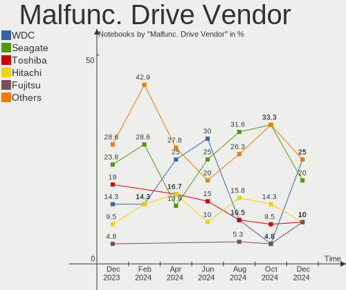

ROSA Hardware Trends (Notebook)
-------------------------------

A project to identify most popular hardware characteristics and track their change
over time based on data collected by ROSA users at https://Linux-Hardware.org.

Anyone can contribute to the study by uploading probes of their computers by
the [hw-probe](https://github.com/linuxhw/hw-probe) tool:

    sudo hw-probe -all -upload

Full-feature report is available here: https://linux-hardware.org/?view=trends&formfactor=notebook

Period: Apr, 2020.

Contents
--------

- [ OS                       ](#os)
- [ OS Family                ](#os-family)
- [ Kernel                   ](#kernel)
- [ Kernel Family            ](#kernel-family)
- [ Kernel Major Ver.        ](#kernel-major-ver)
- [ Arch                     ](#arch)
- [ DE                       ](#de)
- [ Display Server           ](#display-server)
- [ Display Manager          ](#display-manager)
- [ OS Lang                  ](#os-lang)
- [ Boot Mode                ](#boot-mode)
- [ Filesystem               ](#filesystem)
- [ Dual Boot with Linux/BSD ](#dual-boot-with-linux/bsd)
- [ Dual Boot (Win)          ](#dual-boot-win)
- [ Country                  ](#country)
- [ City                     ](#city)
- [ Vendor                   ](#vendor)
- [ Model                    ](#model)
- [ Model Family             ](#model-family)
- [ MFG Year                 ](#mfg-year)
- [ Form Factor              ](#form-factor)
- [ Secure Boot              ](#secure-boot)
- [ Coreboot                 ](#coreboot)
- [ RAM Size                 ](#ram-size)
- [ RAM Used                 ](#ram-used)
- [ Drive Vendor             ](#drive-vendor)
- [ Drive Model              ](#drive-model)
- [ Drive Kind               ](#drive-kind)
- [ Drive Connector          ](#drive-connector)
- [ Drive Size               ](#drive-size)
- [ Space Total              ](#space-total)
- [ Space Used               ](#space-used)
- [ Malfunc. Drives          ](#malfunc-drives)
- [ Malfunc. Drive Vendor    ](#malfunc-drive-vendor)
- [ Malfunc. Drive Kind      ](#malfunc-drive-kind)
- [ Failed Drives            ](#failed-drives)
- [ Failed Drive Vendor      ](#failed-drive-vendor)
- [ Drive Status             ](#drive-status)
- [ Storage Vendor           ](#storage-vendor)
- [ Storage Model            ](#storage-model)
- [ Storage Kind             ](#storage-kind)
- [ CPU Vendor               ](#cpu-vendor)
- [ CPU Model                ](#cpu-model)
- [ CPU Model Family         ](#cpu-model-family)
- [ CPU Cores                ](#cpu-cores)
- [ CPU Sockets              ](#cpu-sockets)
- [ CPU Threads              ](#cpu-threads)
- [ CPU Op-Modes             ](#cpu-op-modes)
- [ CPU Microarch            ](#cpu-microarch)
- [ CPU Microcode            ](#cpu-microcode)
- [ GPU Vendor               ](#gpu-vendor)
- [ GPU Model                ](#gpu-model)
- [ GPU Combo                ](#gpu-combo)
- [ GPU Driver               ](#gpu-driver)
- [ GPU Memory               ](#gpu-memory)
- [ Monitor Vendor           ](#monitor-vendor)
- [ Monitor Model            ](#monitor-model)
- [ Monitor Resolution       ](#monitor-resolution)
- [ Monitor Diagonal         ](#monitor-diagonal)
- [ Monitor Width            ](#monitor-width)
- [ Aspect Ratio             ](#aspect-ratio)
- [ Monitor Area             ](#monitor-area)
- [ Pixel Density            ](#pixel-density)
- [ Multiple Monitors        ](#multiple-monitors)
- [ Net Controller Vendor    ](#net-controller-vendor)
- [ Net Controller Model     ](#net-controller-model)
- [ Net Controller Kind      ](#net-controller-kind)
- [ Used Controller          ](#used-controller)
- [ NICs                     ](#nics)
- [ Unsupported Devices      ](#unsupported-devices)
- [ Unsupported Device Types ](#unsupported-device-types)

OS
--

Installed operating systems

| Name       | Computers | Percent |
|------------|-----------|---------|
| ROSA R11   | 123       | 70.69%  |
| ROSA R11.1 | 32        | 18.39%  |
| ROSA R8.1  | 7         | 4.02%   |
| ROSA R10   | 7         | 4.02%   |
| ROSA R9    | 2         | 1.15%   |
| RED X4     | 2         | 1.15%   |
| RED X3     | 1         | 0.57%   |

OS Family
---------

OS without a version

| Name | Computers | Percent |
|------|-----------|---------|
| ROSA | 174       | 100%    |

Kernel
------

Version of the Linux kernel

| Version                           | Computers | Percent |
|-----------------------------------|-----------|---------|
| 4.15.0-desktop-45.1rosa-x86_64    | 36        | 20.69%  |
| 4.15.0-desktop-94.1rosa-x86_64    | 29        | 16.67%  |
| 4.15.0-desktop-68.5rosa-x86_64    | 27        | 15.52%  |
| 4.15.0-desktop-45.1rosa-i586      | 12        | 6.9%    |
| 5.4.32-generic-2rosa-x86_64       | 10        | 5.75%   |
| 4.15.0-desktop-68.5rosa-i586      | 9         | 5.17%   |
| 4.9.60-nrj-desktop-1rosa-x86_64   | 5         | 2.87%   |
| 4.9.155-nrj-desktop-1rosa-i586    | 5         | 2.87%   |
| 4.15.0-desktop-91.3rosa-x86_64    | 5         | 2.87%   |
| 4.9.155-nrj-desktop-1rosa-x86_64  | 4         | 2.3%    |
| 4.15.0-desktop-94.1rosa-i586      | 4         | 2.3%    |
| 5.4.31-generic-1rosa-x86_64       | 2         | 1.15%   |
| 5.4.28-generic-1rosa-x86_64       | 2         | 1.15%   |
| 5.4.26-generic-3rosa-x86_64       | 2         | 1.15%   |
| 4.9.20-nrj-desktop-1rosa-x86_64   | 2         | 1.15%   |
| 5.4.35-nrj-desktop-1rosa-x86_64   | 1         | 0.57%   |
| 5.4.31-nrj-desktop-1rosa-x86_64   | 1         | 0.57%   |
| 5.4.27-nrj-desktop-1rosa-x86_64   | 1         | 0.57%   |
| 5.4.27-desktop-1rosa-x86_64       | 1         | 0.57%   |
| 5.4.0-desktop-9.1rosa-x86_64      | 1         | 0.57%   |
| 5.4.0-desktop-22.1rosa-x86_64     | 1         | 0.57%   |
| 5.3.18-nrj-desktop-1rosa-x86_64   | 1         | 0.57%   |
| 5.0.0-desktop-38.1rosa-x86_64     | 1         | 0.57%   |
| 4.9.9-nrj-desktop-1rosa-x86_64    | 1         | 0.57%   |
| 4.9.9-nrj-desktop-1rosa-i586      | 1         | 0.57%   |
| 4.9.60-nrj-desktop-1rosa-i586     | 1         | 0.57%   |
| 4.9.41-nrj-desktop-1rosa-x86_64   | 1         | 0.57%   |
| 4.9.41-nrj-desktop-1rosa-i586     | 1         | 0.57%   |
| 4.9.20-nrj-desktop-1rosa-i586     | 1         | 0.57%   |
| 4.9.124-nrj-desktop-1rosa-x86_64  | 1         | 0.57%   |
| 4.19.112-nrj-desktop-1rosa-x86_64 | 1         | 0.57%   |
| 4.15.0-desktop-51.4rosa-i586      | 1         | 0.57%   |
| 4.15.0-desktop-47.2rosa-x86_64    | 1         | 0.57%   |
| 4.1.38-nrj-desktop-2rosa-x86_64   | 1         | 0.57%   |
| 4.1.13-nrj-desktop-1rosa-i586     | 1         | 0.57%   |

Kernel Family
-------------

Linux kernel without a distro release

| Version  | Computers | Percent |
|----------|-----------|---------|
| 4.15.0   | 124       | 71.26%  |
| 5.4.32   | 10        | 5.75%   |
| 4.9.155  | 9         | 5.17%   |
| 4.9.60   | 6         | 3.45%   |
| 5.4.31   | 3         | 1.72%   |
| 4.9.20   | 3         | 1.72%   |
| 5.4.28   | 2         | 1.15%   |
| 5.4.27   | 2         | 1.15%   |
| 5.4.26   | 2         | 1.15%   |
| 5.4.0    | 2         | 1.15%   |
| 4.9.9    | 2         | 1.15%   |
| 4.9.41   | 2         | 1.15%   |
| 5.4.35   | 1         | 0.57%   |
| 5.3.18   | 1         | 0.57%   |
| 5.0.0    | 1         | 0.57%   |
| 4.9.124  | 1         | 0.57%   |
| 4.19.112 | 1         | 0.57%   |
| 4.1.38   | 1         | 0.57%   |
| 4.1.13   | 1         | 0.57%   |

Kernel Major Ver.
-----------------

Linux kernel major version

| Version | Computers | Percent |
|---------|-----------|---------|
| 4.15    | 124       | 71.26%  |
| 4.9     | 23        | 13.22%  |
| 5.4     | 22        | 12.64%  |
| 4.1     | 2         | 1.15%   |
| 5.3     | 1         | 0.57%   |
| 5.0     | 1         | 0.57%   |
| 4.19    | 1         | 0.57%   |

Arch
----

OS architecture (x86_64, i586, etc.)

| Name   | Computers | Percent |
|--------|-----------|---------|
| x86_64 | 138       | 79.31%  |
| i686   | 36        | 20.69%  |

DE
--

Desktop Environment

| Name    | Computers | Percent |
|---------|-----------|---------|
| KDE4    | 95        | 54.6%   |
| KDE5    | 63        | 36.21%  |
| LXQt    | 12        | 6.9%    |
| XFCE    | 2         | 1.15%   |
| MATE    | 1         | 0.57%   |
| Unknown | 1         | 0.57%   |

Display Server
--------------

X11 or Wayland

| Name | Computers | Percent |
|------|-----------|---------|
| X11  | 173       | 99.43%  |
| Tty  | 1         | 0.57%   |

Display Manager
---------------

SDDM, LightDM, etc.

| Name | Computers | Percent |
|------|-----------|---------|
| KDM  | 97        | 55.75%  |
| SDDM | 77        | 44.25%  |

OS Lang
-------

Language

| Lang    | Computers | Percent |
|---------|-----------|---------|
| ru_RU   | 92        | 52.87%  |
| Unknown | 69        | 39.66%  |
| it_IT   | 3         | 1.72%   |
| en_US   | 3         | 1.72%   |
| pl_PL   | 2         | 1.15%   |
| de_DE   | 2         | 1.15%   |
| tr_TR   | 1         | 0.57%   |
| es_ES   | 1         | 0.57%   |
| en_GB   | 1         | 0.57%   |

Boot Mode
---------

EFI or BIOS

| Mode | Computers | Percent |
|------|-----------|---------|
| BIOS | 128       | 73.56%  |
| EFI  | 46        | 26.44%  |

Filesystem
----------

Type of filesystem

| Type  | Computers | Percent |
|-------|-----------|---------|
| Ext4  | 165       | 94.83%  |
| Ext3  | 3         | 1.72%   |
| Btrfs | 3         | 1.72%   |
| Aufs  | 2         | 1.15%   |
| F2fs  | 1         | 0.57%   |

Dual Boot with Linux/BSD
------------------------

Hosting more than one Linux/BSD

| Dual boot | Computers | Percent |
|-----------|-----------|---------|
| No        | 141       | 81.03%  |
| Yes       | 33        | 18.97%  |

Dual Boot (Win)
---------------

Hosting Linux and Windows

| Dual boot | Computers | Percent |
|-----------|-----------|---------|
| No        | 106       | 60.92%  |
| Yes       | 68        | 39.08%  |

Country
-------

Geographic location (country)

| Country     | Computers | Percent |
|-------------|-----------|---------|
| Russia      | 128       | 73.56%  |
| Ukraine     | 8         | 4.6%    |
| Germany     | 6         | 3.45%   |
| France      | 5         | 2.87%   |
| Spain       | 3         | 1.72%   |
| Italy       | 3         | 1.72%   |
| Turkey      | 2         | 1.15%   |
| Switzerland | 2         | 1.15%   |
| Serbia      | 2         | 1.15%   |
| Poland      | 2         | 1.15%   |
| USA         | 1         | 0.57%   |
| UK          | 1         | 0.57%   |
| Sweden      | 1         | 0.57%   |
| Mexico      | 1         | 0.57%   |
| Latvia      | 1         | 0.57%   |
| Kazakhstan  | 1         | 0.57%   |
| Iran        | 1         | 0.57%   |
| Greece      | 1         | 0.57%   |
| Georgia     | 1         | 0.57%   |
| Estonia     | 1         | 0.57%   |
| Colombia    | 1         | 0.57%   |
| Canada      | 1         | 0.57%   |
| Bulgaria    | 1         | 0.57%   |

City
----

Geographic location (city)

| City                     | Computers | Percent |
|--------------------------|-----------|---------|
| Moscow                   | 26        | 14.94%  |
| Krasnodar                | 8         | 4.6%    |
| Ekaterinburg             | 8         | 4.6%    |
| St Petersburg            | 7         | 4.02%   |
| Voronezh                 | 4         | 2.3%    |
| Volgograd                | 4         | 2.3%    |
| Usinsk                   | 4         | 2.3%    |
| Samara                   | 4         | 2.3%    |
| Nizhniy Novgorod         | 4         | 2.3%    |
| Ufa                      | 3         | 1.72%   |
| Kaliningrad              | 3         | 1.72%   |
| Tver                     | 2         | 1.15%   |
| Stavropol                | 2         | 1.15%   |
| Saratov                  | 2         | 1.15%   |
| Poltava                  | 2         | 1.15%   |
| Novosibirsk              | 2         | 1.15%   |
| Neftekamsk               | 2         | 1.15%   |
| Mytishchi                | 2         | 1.15%   |
| Kharkiv                  | 2         | 1.15%   |
| Belgrade                 | 2         | 1.15%   |
| Łódź                  | 1         | 0.57%   |
| Zurich                   | 1         | 0.57%   |
| Yuzhno-Sakhalinsk        | 1         | 0.57%   |
| Yuzha                    | 1         | 0.57%   |
| Woodbridge               | 1         | 0.57%   |
| Warsaw                   | 1         | 0.57%   |
| Vogue                    | 1         | 0.57%   |
| Villafranca di Verona    | 1         | 0.57%   |
| Tyumen                   | 1         | 0.57%   |
| Tula                     | 1         | 0.57%   |
| Tipton                   | 1         | 0.57%   |
| Tehran                   | 1         | 0.57%   |
| Tbilisi                  | 1         | 0.57%   |
| Tambov                   | 1         | 0.57%   |
| Sucy-en-Brie             | 1         | 0.57%   |
| Sterlitamak              | 1         | 0.57%   |
| Sora                     | 1         | 0.57%   |
| Sofia                    | 1         | 0.57%   |
| Shelekhov                | 1         | 0.57%   |
| Shakhty                  | 1         | 0.57%   |
| Seversk                  | 1         | 0.57%   |
| Satka                    | 1         | 0.57%   |
| Sarapul                  | 1         | 0.57%   |
| Saransk                  | 1         | 0.57%   |
| Ryazan                   | 1         | 0.57%   |
| Riga                     | 1         | 0.57%   |
| Regina                   | 1         | 0.57%   |
| Pokrovsk                 | 1         | 0.57%   |
| Petropavlovsk-Kamchatsky | 1         | 0.57%   |
| Petergof                 | 1         | 0.57%   |
| Omsk                     | 1         | 0.57%   |
| Novocherkassk            | 1         | 0.57%   |
| Narva                    | 1         | 0.57%   |
| Nal'chik                 | 1         | 0.57%   |
| Nadym                    | 1         | 0.57%   |
| Miass                    | 1         | 0.57%   |
| Marseille                | 1         | 0.57%   |
| Magnitogorsk             | 1         | 0.57%   |
| Lyubertsy                | 1         | 0.57%   |
| Lukoyanovo               | 1         | 0.57%   |

Vendor
------

Motherboard manufacturer

| Name                           | Computers | Percent |
|--------------------------------|-----------|---------|
| Lenovo                         | 32        | 18.39%  |
| Hewlett-Packard                | 31        | 17.82%  |
| Acer                           | 30        | 17.24%  |
| ASUSTek Computer               | 23        | 13.22%  |
| Samsung Electronics            | 13        | 7.47%   |
| Dell                           | 10        | 5.75%   |
| Sony                           | 6         | 3.45%   |
| Toshiba                        | 5         | 2.87%   |
| Packard Bell                   | 5         | 2.87%   |
| MSI                            | 4         | 2.3%    |
| Apple                          | 4         | 2.3%    |
| Notebook                       | 1         | 0.57%   |
| Matsushita Electric Industrial | 1         | 0.57%   |
| Maibenben                      | 1         | 0.57%   |
| Infomash                       | 1         | 0.57%   |
| Fujitsu Siemens                | 1         | 0.57%   |
| Fujitsu                        | 1         | 0.57%   |
| Digma                          | 1         | 0.57%   |
| Clevo                          | 1         | 0.57%   |
| Chuwi                          | 1         | 0.57%   |
| Alienware                      | 1         | 0.57%   |
| Unknown                        | 1         | 0.57%   |

Model
-----

Motherboard model

| Name                                                   | Computers | Percent |
|--------------------------------------------------------|-----------|---------|
| HP 620                                                 | 3         | 1.72%   |
| Apple MacBookAir7,2                                    | 3         | 1.72%   |
| Toshiba Satellite C660                                 | 2         | 1.15%   |
| Samsung Electronics R540/R580/R780/SA41/E452/E852      | 2         | 1.15%   |
| Packard Bell EasyNote TK85                             | 2         | 1.15%   |
| HP Pavilion dv6                                        | 2         | 1.15%   |
| HP Laptop 15-ra0xx                                     | 2         | 1.15%   |
| HP Laptop 15-bw0xx                                     | 2         | 1.15%   |
| ASUS F5SL                                              | 2         | 1.15%   |
| ASUS 1015PX                                            | 2         | 1.15%   |
| ASUS 1011CX                                            | 2         | 1.15%   |
| Acer Aspire 5750ZG                                     | 2         | 1.15%   |
| Acer Aspire 5553G                                      | 2         | 1.15%   |
| Toshiba Satellite U840-B7S                             | 1         | 0.57%   |
| Toshiba Satellite U300                                 | 1         | 0.57%   |
| Toshiba Satellite C855-1JF                             | 1         | 0.57%   |
| Sony VPCEH2S1R                                         | 1         | 0.57%   |
| Sony VPCEE2E1R                                         | 1         | 0.57%   |
| Sony VPCEB4L1E                                         | 1         | 0.57%   |
| Sony VPCEB2E9R                                         | 1         | 0.57%   |
| Sony VGN-FZ490N                                        | 1         | 0.57%   |
| Sony SVE1712T1RB                                       | 1         | 0.57%   |
| Samsung Electronics RV411/RV511/E3511/S3511            | 1         | 0.57%   |
| Samsung Electronics R530/R730/P530                     | 1         | 0.57%   |
| Samsung Electronics R25P                               | 1         | 0.57%   |
| Samsung Electronics NC10                               | 1         | 0.57%   |
| Samsung Electronics N150P/N210P/N220P                  | 1         | 0.57%   |
| Samsung Electronics N128                               | 1         | 0.57%   |
| Samsung Electronics N100SP                             | 1         | 0.57%   |
| Samsung Electronics N100                               | 1         | 0.57%   |
| Samsung Electronics 350V5C/351V5C/3540VC/3440VC        | 1         | 0.57%   |
| Samsung Electronics 300V3A/300V4A/300V5A/200A4B/200A5B | 1         | 0.57%   |
| Samsung Electronics 300E4A/300E5A/300E7A               | 1         | 0.57%   |
| Packard Bell EasyNote TS11SB                           | 1         | 0.57%   |
| Packard Bell EasyNote TE11HC                           | 1         | 0.57%   |
| Packard Bell EasyNote ENTG81BA                         | 1         | 0.57%   |
| Notebook W35xSS_370SS                                  | 1         | 0.57%   |
| MSI MEGA BOOK M670                                     | 1         | 0.57%   |
| MSI GX60 1AC                                           | 1         | 0.57%   |
| MSI GP62 6QF                                           | 1         | 0.57%   |
| MSI GF63 Thin 9SC                                      | 1         | 0.57%   |
| Matsushita Electric Industrial CF-19FLGC4AM            | 1         | 0.57%   |
| Maibenben XiaoMai6                                     | 1         | 0.57%   |
| Lenovo V310-15ISK 80SY                                 | 1         | 0.57%   |
| Lenovo ThinkPad X250 20CLS2JX00                        | 1         | 0.57%   |
| Lenovo ThinkPad X230 2325I63                           | 1         | 0.57%   |
| Lenovo ThinkPad X230 2320LFG                           | 1         | 0.57%   |
| Lenovo ThinkPad X200 Tablet 7450AP4                    | 1         | 0.57%   |
| Lenovo ThinkPad X200 7455FNG                           | 1         | 0.57%   |
| Lenovo ThinkPad X100e 3508RL6                          | 1         | 0.57%   |
| Lenovo ThinkPad T60 2007WEH                            | 1         | 0.57%   |
| Lenovo ThinkPad T520 42424UU                           | 1         | 0.57%   |
| Lenovo ThinkPad T420 4238A75                           | 1         | 0.57%   |
| Lenovo ThinkPad T410s 2904FXG                          | 1         | 0.57%   |
| Lenovo IdeaPad S206 20154                              | 1         | 0.57%   |
| Lenovo IdeaPad S12 20021,2959                          | 1         | 0.57%   |
| Lenovo IdeaPad S110 20126                              | 1         | 0.57%   |
| Lenovo IdeaPad S10-2 20027                             | 1         | 0.57%   |
| Lenovo IdeaPad L340-17IRH Gaming 81LL                  | 1         | 0.57%   |
| Lenovo IdeaPad 330-15IKB 81DE                          | 1         | 0.57%   |

Model Family
------------

Motherboard model prefix

| Name                                        | Computers | Percent |
|---------------------------------------------|-----------|---------|
| Acer Aspire                                 | 21        | 12.07%  |
| Lenovo IdeaPad                              | 12        | 6.9%    |
| Lenovo ThinkPad                             | 10        | 5.75%   |
| HP Laptop                                   | 8         | 4.6%    |
| Dell Inspiron                               | 6         | 3.45%   |
| Toshiba Satellite                           | 5         | 2.87%   |
| Packard Bell EasyNote                       | 5         | 2.87%   |
| HP Pavilion                                 | 4         | 2.3%    |
| HP EliteBook                                | 4         | 2.3%    |
| Acer Extensa                                | 4         | 2.3%    |
| HP 620                                      | 3         | 1.72%   |
| Apple MacBookAir7                           | 3         | 1.72%   |
| Samsung Electronics R540                    | 2         | 1.15%   |
| HP ProBook                                  | 2         | 1.15%   |
| HP Compaq                                   | 2         | 1.15%   |
| Dell Vostro                                 | 2         | 1.15%   |
| Dell Latitude                               | 2         | 1.15%   |
| ASUS VivoBook                               | 2         | 1.15%   |
| ASUS F5SL                                   | 2         | 1.15%   |
| ASUS 1015PX                                 | 2         | 1.15%   |
| ASUS 1011CX                                 | 2         | 1.15%   |
| Acer TravelMate                             | 2         | 1.15%   |
| Sony VPCEH2S1R                              | 1         | 0.57%   |
| Sony VPCEE2E1R                              | 1         | 0.57%   |
| Sony VPCEB4L1E                              | 1         | 0.57%   |
| Sony VPCEB2E9R                              | 1         | 0.57%   |
| Sony VGN-FZ490N                             | 1         | 0.57%   |
| Sony SVE1712T1RB                            | 1         | 0.57%   |
| Samsung Electronics RV411                   | 1         | 0.57%   |
| Samsung Electronics R530                    | 1         | 0.57%   |
| Samsung Electronics R25P                    | 1         | 0.57%   |
| Samsung Electronics NC10                    | 1         | 0.57%   |
| Samsung Electronics N150P                   | 1         | 0.57%   |
| Samsung Electronics N128                    | 1         | 0.57%   |
| Samsung Electronics N100SP                  | 1         | 0.57%   |
| Samsung Electronics N100                    | 1         | 0.57%   |
| Samsung Electronics 350V5C                  | 1         | 0.57%   |
| Samsung Electronics 300V3A                  | 1         | 0.57%   |
| Samsung Electronics 300E4A                  | 1         | 0.57%   |
| Notebook W35xSS                             | 1         | 0.57%   |
| MSI MEGA                                    | 1         | 0.57%   |
| MSI GX60                                    | 1         | 0.57%   |
| MSI GP62                                    | 1         | 0.57%   |
| MSI GF63                                    | 1         | 0.57%   |
| Matsushita Electric Industrial CF-19FLGC4AM | 1         | 0.57%   |
| Maibenben XiaoMai6                          | 1         | 0.57%   |
| Lenovo V310-15ISK                           | 1         | 0.57%   |
| Lenovo G780                                 | 1         | 0.57%   |
| Lenovo G770                                 | 1         | 0.57%   |
| Lenovo G710                                 | 1         | 0.57%   |
| Lenovo G580                                 | 1         | 0.57%   |
| Lenovo G570                                 | 1         | 0.57%   |
| Lenovo G505s                                | 1         | 0.57%   |
| Lenovo B570e                                | 1         | 0.57%   |
| Lenovo B50-45                               | 1         | 0.57%   |
| Lenovo 3000                                 | 1         | 0.57%   |
| Infomash RoverBook                          | 1         | 0.57%   |
| HP ZBook                                    | 1         | 0.57%   |
| HP TouchSmart                               | 1         | 0.57%   |
| HP Presario                                 | 1         | 0.57%   |

MFG Year
--------

Motherboard manufacture year

| Year | Computers | Percent |
|------|-----------|---------|
| 2011 | 25        | 14.37%  |
| 2012 | 22        | 12.64%  |
| 2010 | 21        | 12.07%  |
| 2019 | 17        | 9.77%   |
| 2018 | 17        | 9.77%   |
| 2016 | 13        | 7.47%   |
| 2013 | 11        | 6.32%   |
| 2008 | 11        | 6.32%   |
| 2009 | 9         | 5.17%   |
| 2015 | 7         | 4.02%   |
| 2014 | 7         | 4.02%   |
| 2017 | 5         | 2.87%   |
| 2007 | 5         | 2.87%   |
| 2020 | 2         | 1.15%   |
| 2005 | 2         | 1.15%   |

Form Factor
-----------

Physical design of the computer

| Name     | Computers | Percent |
|----------|-----------|---------|
| Notebook | 174       | 100%    |

Secure Boot
-----------

Enabled or disabled

| State    | Computers | Percent |
|----------|-----------|---------|
| Disabled | 173       | 99.43%  |
| Enabled  | 1         | 0.57%   |

Coreboot
--------

Have coreboot on board

| Used | Computers | Percent |
|------|-----------|---------|
| No   | 174       | 100%    |

RAM Size
--------

Total RAM memory

| Size in GB | Computers | Percent |
|------------|-----------|---------|
| 3.01-4.0   | 73        | 41.95%  |
| 4.01-8.0   | 29        | 16.67%  |
| 8.01-16.0  | 22        | 12.64%  |
| 1.01-2.0   | 21        | 12.07%  |
| 2.01-3.0   | 17        | 9.77%   |
| 16.01-24.0 | 6         | 3.45%   |
| 0.01-1.0   | 6         | 3.45%   |

RAM Used
--------

Used RAM memory

| Used GB  | Computers | Percent |
|----------|-----------|---------|
| 0.01-1.0 | 80        | 45.98%  |
| 1.01-2.0 | 75        | 43.1%   |
| 2.01-3.0 | 13        | 7.47%   |
| 4.01-8.0 | 3         | 1.72%   |
| 3.01-4.0 | 3         | 1.72%   |

Drive Vendor
------------

Hard drive vendors

| Vendor              | Computers | Drives  | Percent |
|---------------------|-----------|---------|---------|
| WDC                 | 43        | 44      | 21.61%  |
| Seagate             | 35        | 35      | 17.59%  |
| Toshiba             | 18        | 18      | 9.05%   |
| Hitachi             | 16        | 16      | 8.04%   |
| Samsung Electronics | 15        | 15      | 7.54%   |
| HGST                | 13        | 13      | 6.53%   |
| SanDisk             | 8         | 8       | 4.02%   |
| Unknown             | 7         | 7       | 3.52%   |
| Kingston            | 7         | 7       | 3.52%   |
| Fujitsu             | 5         | 5       | 2.51%   |
| SK Hynix            | 4         | 4       | 2.01%   |
| Intel               | 3         | 3       | 1.51%   |
| Apple               | 3         | 3       | 1.51%   |
| SPCC                | 2         | 2       | 1.01%   |
| PLEXTOR             | 2         | 2       | 1.01%   |
| OCZ                 | 2         | 2       | 1.01%   |
| LITEONIT            | 2         | 2       | 1.01%   |
| China               | 2         | 2       | 1.01%   |
| TO Exter            | 1         | 1       | 0.5%    |
| Smartbuy            | 1         | 1       | 0.5%    |
| Micron Technology   | 1         | 1       | 0.5%    |
| MARSHAL             | 1         | 1       | 0.5%    |
| KingDian            | 1         | 1       | 0.5%    |
| HUAWEI              | 1         | 1       | 0.5%    |
| HL-DT-ST            | 1         | Unknown | 0.5%    |
| Generic             | 1         | 1       | 0.5%    |
| Dell                | 1         | 1       | 0.5%    |
| Crucial             | 1         | 1       | 0.5%    |
| ASUS-PHISON         | 1         | 2       | 0.5%    |
| A-DATA Technology   | 1         | 1       | 0.5%    |

Drive Model
-----------

Hard drive models

| Model                         | Computers | Percent |
|-------------------------------|-----------|---------|
| ST500LT012-1DG142 500GB       | 8         | 3.98%   |
| WD5000LPCX-24VHAT0 500GB      | 5         | 2.49%   |
| HTS543232A7A384 320GB         | 5         | 2.49%   |
| HTS541010A9E680 1TB           | 5         | 2.49%   |
| WD5000LPCX-21VHAT0 500GB      | 4         | 1.99%   |
| ST9500325AS 500GB             | 4         | 1.99%   |
| MQ04ABF100 1TB                | 4         | 1.99%   |
| HTS545050A7E380 500GB         | 4         | 1.99%   |
| ST320LT020-9YG142 320GB       | 3         | 1.49%   |
| ST1000LM024 HN-M101MBB 1TB    | 3         | 1.49%   |
| SSD SM0128G 121GB             | 3         | 1.49%   |
| MQ01ABD100 1TB                | 3         | 1.49%   |
| HTS725032A9A364 320GB         | 3         | 1.49%   |
| HM250HI 250GB                 | 3         | 1.49%   |
| WD5000LPLX-00ZNTT0 500GB      | 2         | 1%      |
| WD3200BPVT-22ZEST0 320GB      | 2         | 1%      |
| WD10JPVX-60JC3T0 1TB          | 2         | 1%      |
| ST9250827AS 250GB             | 2         | 1%      |
| ST1000LM048-2E7172 1TB        | 2         | 1%      |
| SSD 120GB                     | 2         | 1%      |
| SA400S37240G 240GB SSD        | 2         | 1%      |
| MQ01ABF050 500GB              | 2         | 1%      |
| HM321HI 320GB                 | 2         | 1%      |
| HFS128G39TND-N210A 128GB SSD  | 2         | 1%      |
| X110 2.5 7MM 128GB SSD        | 1         | 0.5%    |
| WR202KD032G E70245F5 32GB SSD | 1         | 0.5%    |
| WDS250G2B0B 250GB SSD         | 1         | 0.5%    |
| WDS240G2G0B-00EPW0 240GB SSD  | 1         | 0.5%    |
| WDS240G2G0A-00JH30 240GB SSD  | 1         | 0.5%    |
| WD800BEVS-22RST0 80GB         | 1         | 0.5%    |
| WD7500BPVT-24HXZT3 752GB      | 1         | 0.5%    |
| WD7500BPKX-75HPJT0 752GB      | 1         | 0.5%    |
| WD6400BPVT-80HXZT3 640GB      | 1         | 0.5%    |
| WD6400BPVT-55HXZT3 640GB      | 1         | 0.5%    |
| WD5000LPVT-16G33T0 500GB      | 1         | 0.5%    |
| WD5000LPCX-60VHAT1 500GB      | 1         | 0.5%    |
| WD5000LPCX-60VHAT0 500GB      | 1         | 0.5%    |
| WD5000BPVT-75HXZT3 500GB      | 1         | 0.5%    |
| WD5000BPVT-35HXZT1 500GB      | 1         | 0.5%    |
| WD3200BPVT-80JJ5T0 320GB      | 1         | 0.5%    |
| WD3200BPVT-24JJ5T0 320GB      | 1         | 0.5%    |
| WD3200BPVT-22JJ5T0 320GB      | 1         | 0.5%    |
| WD3200BEVT-26A23T0 320GB      | 1         | 0.5%    |
| WD3200BEVS-08VAT2 320GB       | 1         | 0.5%    |
| WD2500LPCX-24C6HT0 250GB      | 1         | 0.5%    |
| WD2500BPVT-80ZEST0 250GB      | 1         | 0.5%    |
| WD20SPZX-60UA7T0 2TB          | 1         | 0.5%    |
| WD1600BEVS-22RST0 160GB       | 1         | 0.5%    |
| WD1600BEVS-07RST0 160GB       | 1         | 0.5%    |
| WD1600BEKT-60A25T1 160GB      | 1         | 0.5%    |
| WD10SPZX-21Z10T0 1TB          | 1         | 0.5%    |
| WD10SPZX-00Z10T0 1TB          | 1         | 0.5%    |
| WD10JPVX-22JC3T0 1TB          | 1         | 0.5%    |
| WD10JPLX-00MBPT0 1TB          | 1         | 0.5%    |
| VECTOR180 480GB SSD           | 1         | 0.5%    |
| VECTOR150 120GB SSD           | 1         | 0.5%    |
| USD00  4GB                    | 1         | 0.5%    |
| TR200 240GB SSD               | 1         | 0.5%    |
| TR150 240GB SSD               | 1         | 0.5%    |
| TF CARD Storage 8GB           | 1         | 0.5%    |

Drive Kind
----------

HDD or SSD

| Kind    | Computers | Drives | Percent |
|---------|-----------|--------|---------|
| HDD     | 131       | 133    | 66.5%   |
| SSD     | 48        | 49     | 24.37%  |
| MMC     | 7         | 8      | 3.55%   |
| NVMe    | 6         | 6      | 3.05%   |
| Unknown | 5         | 4      | 2.54%   |

Drive Connector
---------------

SATA, SAS, NVMe, etc.

| Type | Computers | Drives | Percent |
|------|-----------|--------|---------|
| SATA | 169       | 180    | 89.42%  |
| SAS  | 7         | 6      | 3.7%    |
| MMC  | 7         | 8      | 3.7%    |
| NVMe | 6         | 6      | 3.17%   |

Drive Size
----------

Size of hard drive

| Size in TB | Computers | Drives | Percent |
|------------|-----------|--------|---------|
| 0.01-0.5   | 144       | 158    | 77.42%  |
| 0.51-1.0   | 37        | 37     | 19.89%  |
| 1.01-2.0   | 3         | 3      | 1.61%   |
| 3.01-4.0   | 1         | 1      | 0.54%   |
| 2.01-3.0   | 1         | 1      | 0.54%   |

Space Total
-----------

Amount of disk space available on the file system

| Size in GB | Computers | Percent |
|------------|-----------|---------|
| 251-500    | 50        | 28.74%  |
| 101-250    | 45        | 25.86%  |
| 1-20       | 28        | 16.09%  |
| 51-100     | 20        | 11.49%  |
| 501-1000   | 17        | 9.77%   |
| 21-50      | 9         | 5.17%   |
| 1001-2000  | 3         | 1.72%   |
| 2001-3000  | 1         | 0.57%   |
| Unknown    | 1         | 0.57%   |

Space Used
----------

Amount of used disk space

| Used GB   | Computers | Percent |
|-----------|-----------|---------|
| 1-20      | 115       | 66.09%  |
| 21-50     | 22        | 12.64%  |
| 51-100    | 14        | 8.05%   |
| 101-250   | 11        | 6.32%   |
| 251-500   | 8         | 4.6%    |
| 501-1000  | 2         | 1.15%   |
| 1001-2000 | 1         | 0.57%   |
| Unknown   | 1         | 0.57%   |

Malfunc. Drives
---------------

Drive models with a malfunction

| Model                      | Computers | Drives | Percent |
|----------------------------|-----------|--------|---------|
| ST9500325AS 500GB          | 3         | 3      | 5.77%   |
| ST500LT012-1DG142 500GB    | 3         | 3      | 5.77%   |
| HTS545050A7E380 500GB      | 3         | 3      | 5.77%   |
| HTS543232A7A384 320GB      | 3         | 3      | 5.77%   |
| HTS541010A9E680 1TB        | 3         | 3      | 5.77%   |
| ST9250827AS 250GB          | 2         | 2      | 3.85%   |
| ST320LT020-9YG142 320GB    | 2         | 2      | 3.85%   |
| HTS725032A9A364 320GB      | 2         | 2      | 3.85%   |
| WD7500BPVT-24HXZT3 752GB   | 1         | 1      | 1.92%   |
| WD6400BPVT-55HXZT3 640GB   | 1         | 1      | 1.92%   |
| WD5000LPCX-24VHAT0 500GB   | 1         | 1      | 1.92%   |
| WD5000BPVT-75HXZT3 500GB   | 1         | 1      | 1.92%   |
| WD3200BPVT-22ZEST0 320GB   | 1         | 1      | 1.92%   |
| WD2500BPVT-80ZEST0 250GB   | 1         | 1      | 1.92%   |
| WD1600BEKT-60A25T1 160GB   | 1         | 1      | 1.92%   |
| WD10JPVX-60JC3T0 1TB       | 1         | 1      | 1.92%   |
| ST9320310AS 320GB          | 1         | 1      | 1.92%   |
| ST9250410AS 250GB          | 1         | 1      | 1.92%   |
| ST9160310AS 160GB          | 1         | 1      | 1.92%   |
| ST320LT012-9WS14C 320GB    | 1         | 1      | 1.92%   |
| ST1000LM048-2E7172 1TB     | 1         | 1      | 1.92%   |
| ST1000LM024 HN-M101MBB 1TB | 1         | 1      | 1.92%   |
| SHFS37A120G 120GB SSD      | 1         | 1      | 1.92%   |
| SC210 2.5 7MM 128GB SSD    | 1         | 1      | 1.92%   |
| SA400S37120G 120GB SSD     | 1         | 1      | 1.92%   |
| MQ01ABD100 1TB             | 1         | 1      | 1.92%   |
| MK7559GSXP 752GB           | 1         | 1      | 1.92%   |
| MK5076GSX 500GB            | 1         | 1      | 1.92%   |
| MK5059GSXP 500GB           | 1         | 1      | 1.92%   |
| MHV2120AH 120GB            | 1         | 1      | 1.92%   |
| MHT2080BH 80GB             | 1         | 1      | 1.92%   |
| MAL2500SA-T54 500GB        | 1         | 1      | 1.92%   |
| LMN-256M3M mSATA 256GB SSD | 1         | 1      | 1.92%   |
| HTS545050A7E680 500GB      | 1         | 1      | 1.92%   |
| HTS545032B9A300 320GB      | 1         | 1      | 1.92%   |
| HTS545032A7E680 320GB      | 1         | 1      | 1.92%   |
| HTS542512K9SA00 120GB      | 1         | 1      | 1.92%   |
| HTS541040G9SA00 40GB       | 1         | 1      | 1.92%   |
| HM160HI 160GB              | 1         | 1      | 1.92%   |

Malfunc. Drive Vendor
---------------------

Vendors of faulty drives

| Vendor              | Computers | Drives | Percent |
|---------------------|-----------|--------|---------|
| Seagate             | 16        | 16     | 30.77%  |
| Hitachi             | 9         | 9      | 17.31%  |
| WDC                 | 8         | 8      | 15.38%  |
| HGST                | 7         | 7      | 13.46%  |
| Toshiba             | 4         | 4      | 7.69%   |
| Kingston            | 2         | 2      | 3.85%   |
| Fujitsu             | 2         | 2      | 3.85%   |
| SK Hynix            | 1         | 1      | 1.92%   |
| Samsung Electronics | 1         | 1      | 1.92%   |
| MARSHAL             | 1         | 1      | 1.92%   |
| LITEONIT            | 1         | 1      | 1.92%   |

Malfunc. Drive Kind
-------------------

Kinds of faulty drives

| Kind | Computers | Drives | Percent |
|------|-----------|--------|---------|
| HDD  | 48        | 48     | 92.31%  |
| SSD  | 4         | 4      | 7.69%   |

Failed Drives
-------------

Failed drive models

| Model                 | Computers | Drives | Percent |
|-----------------------|-----------|--------|---------|
| HTS541010G9SA00 100GB | 1         | 1      | 50%     |
| HM250JI 250GB         | 1         | 1      | 50%     |

Failed Drive Vendor
-------------------

Failed drive vendors

| Vendor              | Computers | Drives | Percent |
|---------------------|-----------|--------|---------|
| Samsung Electronics | 1         | 1      | 50%     |
| Hitachi             | 1         | 1      | 50%     |

Drive Status
------------

Number of failed and malfunc. drives

| Status   | Computers | Drives | Percent |
|----------|-----------|--------|---------|
| Works    | 121       | 130    | 64.02%  |
| Malfunc  | 51        | 52     | 26.98%  |
| Detected | 15        | 16     | 7.94%   |
| Failed   | 2         | 2      | 1.06%   |

Storage Vendor
--------------

Storage controller vendors

| Vendor                           | Computers | Percent |
|----------------------------------|-----------|---------|
| Intel                            | 136       | 76.4%   |
| AMD                              | 27        | 15.17%  |
| Silicon Integrated Systems [SiS] | 4         | 2.25%   |
| Samsung Electronics              | 4         | 2.25%   |
| Nvidia                           | 2         | 1.12%   |
| VIA Technologies                 | 1         | 0.56%   |
| Toshiba America Info Systems     | 1         | 0.56%   |
| Sandisk                          | 1         | 0.56%   |
| Micron Technology                | 1         | 0.56%   |
| ASMedia Technology               | 1         | 0.56%   |

Storage Model
-------------

Storage controller models

| Model                                                                      | Computers | Percent |
|----------------------------------------------------------------------------|-----------|---------|
| FCH SATA Controller [AHCI mode]                                            | 19        | 9.45%   |
| 7 Series Chipset Family 6-port SATA Controller [AHCI mode]                 | 15        | 7.46%   |
| 6 Series/C200 Series Chipset Family 6 port Mobile SATA AHCI Controller     | 14        | 6.97%   |
| 5 Series/3400 Series Chipset 4 port SATA AHCI Controller                   | 14        | 6.97%   |
| Sunrise Point-LP SATA Controller [AHCI mode]                               | 13        | 6.47%   |
| NM10/ICH7 Family SATA Controller [AHCI mode]                               | 13        | 6.47%   |
| 82801IBM/IEM (ICH9M/ICH9M-E) 4 port SATA Controller [AHCI mode]            | 11        | 5.47%   |
| SB7x0/SB8x0/SB9x0 SATA Controller [AHCI mode]                              | 7         | 3.48%   |
| 82801HM/HEM (ICH8M/ICH8M-E) IDE Controller                                 | 7         | 3.48%   |
| 82801 Mobile SATA Controller [RAID mode]                                   | 7         | 3.48%   |
| Wildcat Point-LP SATA Controller [AHCI Mode]                               | 6         | 2.99%   |
| Atom/Celeron/Pentium Processor x5-E8000/J3xxx/N3xxx Series SATA Controller | 6         | 2.99%   |
| 82801GBM/GHM (ICH7-M Family) SATA Controller [IDE mode]                    | 6         | 2.99%   |
| 82801HM/HEM (ICH8M/ICH8M-E) SATA Controller [AHCI mode]                    | 5         | 2.49%   |
| SATA Controller / IDE mode                                                 | 4         | 1.99%   |
| 5513 IDE Controller                                                        | 4         | 1.99%   |
| 5 Series/3400 Series Chipset 6 port SATA AHCI Controller                   | 4         | 1.99%   |
| Electronics SATA controller                                                | 3         | 1.49%   |
| 8 Series SATA Controller 1 [AHCI mode]                                     | 3         | 1.49%   |
| SB7x0/SB8x0/SB9x0 IDE Controller                                           | 2         | 1%      |
| Non-Volatile memory controller                                             | 2         | 1%      |
| FCH IDE Controller                                                         | 2         | 1%      |
| Cannon Lake Mobile PCH SATA AHCI Controller                                | 2         | 1%      |
| 82801IBM/IEM (ICH9M/ICH9M-E) 2 port SATA Controller [IDE mode]             | 2         | 1%      |
| 82801HM/HEM (ICH8M/ICH8M-E) SATA Controller [IDE mode]                     | 2         | 1%      |
| 8 Series/C220 Series Chipset Family 6-port SATA Controller 1 [AHCI mode]   | 2         | 1%      |
| VX800 Serial ATA and EIDE Controller                                       | 1         | 0.5%    |
| US15W/US15X/US15L/UL11L SCH [Poulsbo] IDE Controller                       | 1         | 0.5%    |
| SSD Pro 7600p/760p/E 6100p Series                                          | 1         | 0.5%    |
| SB600 Non-Raid-5 SATA                                                      | 1         | 0.5%    |
| SB600 IDE                                                                  | 1         | 0.5%    |
| Q170/Q150/B150/H170/H110/Z170/CM236 Chipset SATA Controller [AHCI Mode]    | 1         | 0.5%    |
| NVMe SSD Optane Series Controller                                          | 1         | 0.5%    |
| NVMe SSD Controller SM961/PM961                                            | 1         | 0.5%    |
| NM10/ICH7 Family SATA Controller [IDE mode]                                | 1         | 0.5%    |
| Mobile 4 Series Chipset PT IDER Controller                                 | 1         | 0.5%    |
| MCP67 IDE Controller                                                       | 1         | 0.5%    |
| MCP67 AHCI Controller                                                      | 1         | 0.5%    |
| MCP51 Serial ATA Controller                                                | 1         | 0.5%    |
| MCP51 IDE                                                                  | 1         | 0.5%    |
| HM170/QM170 Chipset SATA Controller [AHCI Mode]                            | 1         | 0.5%    |
| Celeron N3350/Pentium N4200/Atom E3900 Series SATA AHCI Controller         | 1         | 0.5%    |
| Cannon Point-LP SATA Controller [AHCI Mode]                                | 1         | 0.5%    |
| BG3 NVMe SSD Controller                                                    | 1         | 0.5%    |
| ASM1062 Serial ATA Controller                                              | 1         | 0.5%    |
| 82801GBM/GHM (ICH7-M Family) SATA Controller [AHCI mode]                   | 1         | 0.5%    |
| 82801G (ICH7 Family) IDE Controller                                        | 1         | 0.5%    |
| 82801FBM (ICH6M) SATA Controller                                           | 1         | 0.5%    |
| 82801FB/FBM/FR/FW/FRW (ICH6 Family) IDE Controller                         | 1         | 0.5%    |
| 82801DBM (ICH4-M) IDE Controller                                           | 1         | 0.5%    |
| 7 Series Chipset Family 4-port SATA Controller [IDE mode]                  | 1         | 0.5%    |
| 7 Series Chipset Family 2-port SATA Controller [IDE mode]                  | 1         | 0.5%    |

Storage Kind
------------

Kind of storage controller (IDE, SATA, NVMe, SAS, ...)

| Kind | Computers | Percent |
|------|-----------|---------|
| SATA | 143       | 74.87%  |
| IDE  | 35        | 18.32%  |
| RAID | 7         | 3.66%   |
| NVMe | 6         | 3.14%   |

CPU Vendor
----------

Processor vendors

| Vendor       | Computers | Percent |
|--------------|-----------|---------|
| Intel        | 145       | 83.33%  |
| AMD          | 28        | 16.09%  |
| CentaurHauls | 1         | 0.57%   |

CPU Model
---------

Processor models

| Model                                       | Computers | Percent |
|---------------------------------------------|-----------|---------|
| Intel Atom CPU N270 @ 1.60GHz               | 5         | 2.87%   |
| Intel Core i3-7020U CPU @ 2.30GHz           | 4         | 2.3%    |
| Intel Pentium Dual CPU T2390 @ 1.86GHz      | 3         | 1.72%   |
| Intel Core i5-5350U CPU @ 1.80GHz           | 3         | 1.72%   |
| Intel Core i5-3210M CPU @ 2.50GHz           | 3         | 1.72%   |
| Intel Core i5 CPU M 430 @ 2.27GHz           | 3         | 1.72%   |
| Intel Core i3-6006U CPU @ 2.00GHz           | 3         | 1.72%   |
| Intel Core i3 CPU M 350 @ 2.27GHz           | 3         | 1.72%   |
| Intel Celeron CPU N3060 @ 1.60GHz           | 3         | 1.72%   |
| Intel Atom CPU N570 @ 1.66GHz               | 3         | 1.72%   |
| Intel Atom CPU N2600 @ 1.60GHz              | 3         | 1.72%   |
| Intel Pentium M processor 1.86GHz           | 2         | 1.15%   |
| Intel Pentium Dual-Core CPU T4500 @ 2.30GHz | 2         | 1.15%   |
| Intel Pentium Dual-Core CPU T4200 @ 2.00GHz | 2         | 1.15%   |
| Intel Pentium CPU P6100 @ 2.00GHz           | 2         | 1.15%   |
| Intel Pentium CPU B960 @ 2.20GHz            | 2         | 1.15%   |
| Intel Pentium CPU 4417U @ 2.30GHz           | 2         | 1.15%   |
| Intel Core i7-2630QM CPU @ 2.00GHz          | 2         | 1.15%   |
| Intel Core i7-2620M CPU @ 2.70GHz           | 2         | 1.15%   |
| Intel Core i5-7200U CPU @ 2.50GHz           | 2         | 1.15%   |
| Intel Core i5-6200U CPU @ 2.30GHz           | 2         | 1.15%   |
| Intel Core i5-2520M CPU @ 2.50GHz           | 2         | 1.15%   |
| Intel Core i5 CPU M 520 @ 2.40GHz           | 2         | 1.15%   |
| Intel Core i5 CPU M 460 @ 2.53GHz           | 2         | 1.15%   |
| Intel Core i3-5005U CPU @ 2.00GHz           | 2         | 1.15%   |
| Intel Core i3-2310M CPU @ 2.10GHz           | 2         | 1.15%   |
| Intel Core i3 CPU M 380 @ 2.53GHz           | 2         | 1.15%   |
| Intel Celeron CPU B820 @ 1.70GHz            | 2         | 1.15%   |
| Intel Atom CPU N455 @ 1.66GHz               | 2         | 1.15%   |
| Intel Atom CPU N450 @ 1.66GHz               | 2         | 1.15%   |
| AMD E1-6010 APU with AMD Radeon R2 Graphics | 2         | 1.15%   |
| AMD A10-5750M APU with Radeon HD Graphics   | 2         | 1.15%   |
| Intel Pentium M processor 1.70GHz           | 1         | 0.57%   |
| Intel Pentium Dual CPU T3400 @ 2.16GHz      | 1         | 0.57%   |
| Intel Pentium Dual CPU T2330 @ 1.60GHz      | 1         | 0.57%   |
| Intel Pentium CPU P6200 @ 2.13GHz           | 1         | 0.57%   |
| Intel Pentium CPU N3700 @ 1.60GHz           | 1         | 0.57%   |
| Intel Pentium CPU B980 @ 2.40GHz            | 1         | 0.57%   |
| Intel Pentium CPU B950 @ 2.10GHz            | 1         | 0.57%   |
| Intel Pentium CPU 2020M @ 2.40GHz           | 1         | 0.57%   |
| Intel Genuine CPU U4100 @ 1.30GHz           | 1         | 0.57%   |
| Intel Genuine CPU T2400 @ 1.83GHz           | 1         | 0.57%   |
| Intel Core i7-9750H CPU @ 2.60GHz           | 1         | 0.57%   |
| Intel Core i7-7820HQ CPU @ 2.90GHz          | 1         | 0.57%   |
| Intel Core i7-6700HQ CPU @ 2.60GHz          | 1         | 0.57%   |
| Intel Core i7-4800MQ CPU @ 2.70GHz          | 1         | 0.57%   |
| Intel Core i7-4702MQ CPU @ 2.20GHz          | 1         | 0.57%   |
| Intel Core i7-4700MQ CPU @ 2.40GHz          | 1         | 0.57%   |
| Intel Core i7-4600U CPU @ 2.10GHz           | 1         | 0.57%   |
| Intel Core i7-3517U CPU @ 1.90GHz           | 1         | 0.57%   |
| Intel Core i7 CPU Q 720 @ 1.60GHz           | 1         | 0.57%   |
| Intel Core i5-9300H CPU @ 2.40GHz           | 1         | 0.57%   |
| Intel Core i5-8300H CPU @ 2.30GHz           | 1         | 0.57%   |
| Intel Core i5-5300U CPU @ 2.30GHz           | 1         | 0.57%   |
| Intel Core i5-5200U CPU @ 2.20GHz           | 1         | 0.57%   |
| Intel Core i5-4210U CPU @ 1.70GHz           | 1         | 0.57%   |
| Intel Core i5-3427U CPU @ 1.80GHz           | 1         | 0.57%   |
| Intel Core i5-3317U CPU @ 1.70GHz           | 1         | 0.57%   |
| Intel Core i5-3230M CPU @ 2.60GHz           | 1         | 0.57%   |
| Intel Core i5-2450M CPU @ 2.50GHz           | 1         | 0.57%   |

CPU Model Family
----------------

Processor model prefix

| Model                   | Computers | Percent |
|-------------------------|-----------|---------|
| Intel Core i5           | 30        | 17.24%  |
| Intel Core i3           | 27        | 15.52%  |
| Intel Atom              | 22        | 12.64%  |
| Intel Core i7           | 13        | 7.47%   |
| Intel Core 2 Duo        | 12        | 6.9%    |
| Intel Celeron           | 12        | 6.9%    |
| Intel Pentium           | 11        | 6.32%   |
| Intel Pentium Dual      | 5         | 2.87%   |
| Intel Pentium Dual-Core | 4         | 2.3%    |
| AMD E1                  | 4         | 2.3%    |
| AMD A6                  | 4         | 2.3%    |
| Intel Pentium M         | 3         | 1.72%   |
| AMD A10                 | 3         | 1.72%   |
| Other                   | 2         | 1.15%   |
| Intel Genuine           | 2         | 1.15%   |
| Intel Celeron Dual-Core | 2         | 1.15%   |
| AMD Phenom II           | 2         | 1.15%   |
| AMD Mobile Sempron      | 2         | 1.15%   |
| AMD E2                  | 2         | 1.15%   |
| AMD A4                  | 2         | 1.15%   |
| Intel Core 2            | 1         | 0.57%   |
| Intel Celeron D         | 1         | 0.57%   |
| CentaurHauls VIA Nano   | 1         | 0.57%   |
| AMD V140                | 1         | 0.57%   |
| AMD Ryzen 5             | 1         | 0.57%   |
| AMD E                   | 1         | 0.57%   |
| AMD Athlon Neo X2       | 1         | 0.57%   |
| AMD Athlon II           | 1         | 0.57%   |
| AMD Athlon              | 1         | 0.57%   |
| AMD A8                  | 1         | 0.57%   |

CPU Cores
---------

Number of processor cores

| Number | Computers | Percent |
|--------|-----------|---------|
| 2      | 132       | 75.86%  |
| 1      | 21        | 12.07%  |
| 4      | 20        | 11.49%  |
| 6      | 1         | 0.57%   |

CPU Sockets
-----------

Number of sockets

| Number | Computers | Percent |
|--------|-----------|---------|
| 1      | 174       | 100%    |

CPU Threads
-----------

Threads per core (Hyper-Threading)

| Number | Computers | Percent |
|--------|-----------|---------|
| 2      | 95        | 54.6%   |
| 1      | 79        | 45.4%   |

CPU Op-Modes
------------

CPU Operation Modes (32-bit, 64-bit)

| Op mode        | Computers | Percent |
|----------------|-----------|---------|
| 32-bit, 64-bit | 158       | 90.8%   |
| 32-bit         | 14        | 8.05%   |
| Unknown        | 2         | 1.15%   |

CPU Microarch
-------------

Microarchitecture

| Name        | Computers | Percent |
|-------------|-----------|---------|
| Core        | 26        | 14.94%  |
| Skylake     | 20        | 11.49%  |
| SandyBridge | 19        | 10.92%  |
| Bonnell     | 19        | 10.92%  |
| Westmere    | 17        | 9.77%   |
| IvyBridge   | 12        | 6.9%    |
| Broadwell   | 9         | 5.17%   |
| Silvermont  | 7         | 4.02%   |
| Haswell     | 6         | 3.45%   |
| Excavator   | 6         | 3.45%   |
| Puma        | 5         | 2.87%   |
| Unknown     | 5         | 2.87%   |
| P6          | 4         | 2.3%    |
| K10         | 3         | 1.72%   |
| Piledriver  | 2         | 1.15%   |
| KabyLake    | 2         | 1.15%   |
| K8 Hammer   | 2         | 1.15%   |
| Jaguar      | 2         | 1.15%   |
| Bobcat      | 2         | 1.15%   |
| Zen+        | 1         | 0.57%   |
| Zen         | 1         | 0.57%   |
| Penryn      | 1         | 0.57%   |
| Nehalem     | 1         | 0.57%   |
| K10 Llano   | 1         | 0.57%   |
| Goldmont    | 1         | 0.57%   |

CPU Microcode
-------------

Microcode number

| Number     | Computers | Percent |
|------------|-----------|---------|
| 0x206a7    | 19        | 10.92%  |
| 0x306a9    | 12        | 6.9%    |
| 0x20655    | 11        | 6.32%   |
| 0x1067a    | 10        | 5.75%   |
| 0x6fd      | 9         | 5.17%   |
| 0x306d4    | 9         | 5.17%   |
| 0x106ca    | 7         | 4.02%   |
| Unknown    | 7         | 4.02%   |
| 0x30661    | 6         | 3.45%   |
| 0x20652    | 6         | 3.45%   |
| 0x106c2    | 6         | 3.45%   |
| 0x806ea    | 5         | 2.87%   |
| 0x806e9    | 5         | 2.87%   |
| 0x406e3    | 5         | 2.87%   |
| 0x406c4    | 5         | 2.87%   |
| 0x07030105 | 5         | 2.87%   |
| 0x10676    | 4         | 2.3%    |
| 0x010000c8 | 4         | 2.3%    |
| 0x6d8      | 3         | 1.72%   |
| 0x40651    | 3         | 1.72%   |
| 0x306c3    | 3         | 1.72%   |
| 0x06006705 | 3         | 1.72%   |
| 0x05000119 | 3         | 1.72%   |
| 0x906ea    | 2         | 1.15%   |
| 0x406c3    | 2         | 1.15%   |
| 0x0700010f | 2         | 1.15%   |
| 0x06006704 | 2         | 1.15%   |
| 0x906e9    | 1         | 0.57%   |
| 0x806ec    | 1         | 0.57%   |
| 0x806eb    | 1         | 0.57%   |
| 0x6fb      | 1         | 0.57%   |
| 0x6f6      | 1         | 0.57%   |
| 0x6e8      | 1         | 0.57%   |
| 0x506e3    | 1         | 0.57%   |
| 0x506c9    | 1         | 0.57%   |
| 0x106e5    | 1         | 0.57%   |
| 0x10661    | 1         | 0.57%   |
| 0x08108102 | 1         | 0.57%   |
| 0x0810100b | 1         | 0.57%   |
| 0x0600611a | 1         | 0.57%   |
| 0x06001119 | 1         | 0.57%   |
| 0x03000027 | 1         | 0.57%   |
| 0x00000000 | 1         | 0.57%   |

GPU Vendor
----------

Vendors of graphics cards

| Vendor                           | Computers | Percent |
|----------------------------------|-----------|---------|
| Intel                            | 122       | 57.28%  |
| AMD                              | 50        | 23.47%  |
| Nvidia                           | 39        | 18.31%  |
| VIA Technologies                 | 1         | 0.47%   |
| Silicon Integrated Systems [SiS] | 1         | 0.47%   |

GPU Model
---------

Graphics card models

| Model                                                                              | Computers | Percent |
|------------------------------------------------------------------------------------|-----------|---------|
| 2nd Generation Core Processor Family Integrated Graphics Controller                | 17        | 7.23%   |
| Mobile 4 Series Chipset Integrated Graphics Controller                             | 12        | 5.11%   |
| Core Processor Integrated Graphics Controller                                      | 11        | 4.68%   |
| 3rd Gen Core processor Graphics Controller                                         | 11        | 4.68%   |
| Atom Processor D4xx/D5xx/N4xx/N5xx Integrated Graphics Controller                  | 8         | 3.4%    |
| Atom/Celeron/Pentium Processor x5-E8000/J3xxx/N3xxx Integrated Graphics Controller | 7         | 2.98%   |
| Mobile GM965/GL960 Integrated Graphics Controller (secondary)                      | 6         | 2.55%   |
| Mobile GM965/GL960 Integrated Graphics Controller (primary)                        | 6         | 2.55%   |
| Mobile 945GM/GMS/GME, 943/940GML Express Integrated Graphics Controller            | 6         | 2.55%   |
| HD Graphics 620                                                                    | 6         | 2.55%   |
| Atom Processor D2xxx/N2xxx Integrated Graphics Controller                          | 6         | 2.55%   |
| Sun XT [Radeon HD 8670A/8670M/8690M / R5 M330 / M430 / Radeon 520 Mobile]          | 5         | 2.13%   |
| Stoney [Radeon R2/R3/R4/R5 Graphics]                                               | 5         | 2.13%   |
| Mobile 945GSE Express Integrated Graphics Controller                               | 5         | 2.13%   |
| HD Graphics 5500                                                                   | 5         | 2.13%   |
| Skylake GT2 [HD Graphics 520]                                                      | 4         | 1.7%    |
| GF117M [GeForce 610M/710M/810M/820M / GT 620M/625M/630M/720M]                      | 4         | 1.7%    |
| UHD Graphics 630 (Mobile)                                                          | 3         | 1.28%   |
| Topaz XT [Radeon R7 M260/M265 / M340/M360 / M440/M445 / 530/535 / 620/625 Mobile]  | 3         | 1.28%   |
| RV620/M82 [Mobility Radeon HD 3450/3470]                                           | 3         | 1.28%   |
| HD Graphics 6000                                                                   | 3         | 1.28%   |
| Haswell-ULT Integrated Graphics Controller                                         | 3         | 1.28%   |
| TU117M [GeForce GTX 1650 Mobile / Max-Q]                                           | 2         | 0.85%   |
| RV710/M92 [Mobility Radeon HD 4530/4570/545v]                                      | 2         | 0.85%   |
| RS880M [Mobility Radeon HD 4225/4250]                                              | 2         | 0.85%   |
| Richland [Radeon HD 8650G]                                                         | 2         | 0.85%   |
| Mullins [Radeon R4/R5 Graphics]                                                    | 2         | 0.85%   |
| Mullins [Radeon R2 Graphics]                                                       | 2         | 0.85%   |
| Madison [Mobility Radeon HD 5650/5750 / 6530M/6550M]                               | 2         | 0.85%   |
| GT218M [GeForce 310M]                                                              | 2         | 0.85%   |
| GM108M [GeForce MX130]                                                             | 2         | 0.85%   |
| GK208BM [GeForce 920M]                                                             | 2         | 0.85%   |
| GF119M [GeForce GT 520MX]                                                          | 2         | 0.85%   |
| GF108M [GeForce GT 420M]                                                           | 2         | 0.85%   |
| 4th Gen Core Processor Integrated Graphics Controller                              | 2         | 0.85%   |
| Wrestler [Radeon HD 7340]                                                          | 1         | 0.43%   |
| Wrestler [Radeon HD 7310]                                                          | 1         | 0.43%   |
| Wrestler [Radeon HD 6310]                                                          | 1         | 0.43%   |
| Wimbledon XT [Radeon HD 7970M]                                                     | 1         | 0.43%   |
| Whistler [Radeon HD 6730M/6770M/7690M XT]                                          | 1         | 0.43%   |
| Whistler [Radeon HD 6630M/6650M/6750M/7670M/7690M]                                 | 1         | 0.43%   |
| Whistler LE [Radeon HD 6610M/7610M]                                                | 1         | 0.43%   |
| Wani [Radeon R5/R6/R7 Graphics]                                                    | 1         | 0.43%   |
| VX800/VX820 Chrome 9 HC3 Integrated Graphics                                       | 1         | 0.43%   |
| VGA compatible controller                                                          | 1         | 0.43%   |
| US15W/US15X SCH [Poulsbo] Graphics Controller                                      | 1         | 0.43%   |
| UHD Graphics 620 (Whiskey Lake)                                                    | 1         | 0.43%   |
| UHD Graphics 620                                                                   | 1         | 0.43%   |
| Thames [Radeon HD 7550M/7570M/7650M]                                               | 1         | 0.43%   |
| Thames [Radeon HD 7500M/7600M Series]                                              | 1         | 0.43%   |
| Sun PRO [Radeon HD 8570A/8570M]                                                    | 1         | 0.43%   |
| Sumo [Radeon HD 6480G]                                                             | 1         | 0.43%   |
| Seymour [Radeon HD 6400M/7400M Series]                                             | 1         | 0.43%   |
| RV710/M92 [Mobility Radeon HD 4350/4550]                                           | 1         | 0.43%   |
| RV610/M74 [Mobility Radeon HD 2400 XT]                                             | 1         | 0.43%   |
| RV516/M64-S [Mobility Radeon X2300]                                                | 1         | 0.43%   |
| RV515/M52 [Mobility Radeon X1300]                                                  | 1         | 0.43%   |
| RV370/M22 [Mobility Radeon X300]                                                   | 1         | 0.43%   |
| RV350/M10 / RV360/M11 [Mobility Radeon 9600 (PRO) / 9700]                          | 1         | 0.43%   |
| RS780M [Mobility Radeon HD 3200]                                                   | 1         | 0.43%   |

GPU Combo
---------

Combinations of graphics cards

| Name           | Computers | Percent |
|----------------|-----------|---------|
| 1 x Intel      | 83        | 47.7%   |
| 1 x AMD        | 30        | 17.24%  |
| Intel + Nvidia | 29        | 16.67%  |
| 2 x AMD        | 10        | 5.75%   |
| 1 x Nvidia     | 10        | 5.75%   |
| Intel + AMD    | 10        | 5.75%   |
| 1 x VIA        | 1         | 0.57%   |
| 1 x SiS        | 1         | 0.57%   |

GPU Driver
----------

Free vs proprietary

| Driver      | Computers | Percent |
|-------------|-----------|---------|
| Free        | 163       | 93.68%  |
| Proprietary | 6         | 3.45%   |
| Unknown     | 5         | 2.87%   |

GPU Memory
----------

Total video memory

| Size in GB | Computers | Percent |
|------------|-----------|---------|
| 1.01-2.0   | 62        | 35.63%  |
| 0.01-0.5   | 51        | 29.31%  |
| Unknown    | 28        | 16.09%  |
| 3.01-4.0   | 20        | 11.49%  |
| 0.51-1.0   | 11        | 6.32%   |
| 7.01-8.0   | 1         | 0.57%   |
| 2.01-3.0   | 1         | 0.57%   |

Monitor Vendor
--------------

Monitor vendors

| Vendor                  | Computers | Percent |
|-------------------------|-----------|---------|
| AU Optronics            | 43        | 25.15%  |
| LG Display              | 27        | 15.79%  |
| Samsung Electronics     | 24        | 14.04%  |
| Chimei Innolux          | 21        | 12.28%  |
| BOE                     | 17        | 9.94%   |
| Chi Mei Optoelectronics | 10        | 5.85%   |
| HannStar                | 7         | 4.09%   |
| Lenovo                  | 6         | 3.51%   |
| Apple                   | 4         | 2.34%   |
| InfoVision              | 3         | 1.75%   |
| Goldstar                | 2         | 1.17%   |
| Quanta Display          | 1         | 0.58%   |
| NEC Computers           | 1         | 0.58%   |
| MStar                   | 1         | 0.58%   |
| LG Philips              | 1         | 0.58%   |
| Dell                    | 1         | 0.58%   |
| CPT                     | 1         | 0.58%   |
| BenQ                    | 1         | 0.58%   |

Monitor Model
-------------

Monitor models

| Model                                              | Computers | Percent |
|----------------------------------------------------|-----------|---------|
| LCD Monitor AUO8174 1280x800 331x207mm 15.4-inch   | 4         | 2.34%   |
| LCD Monitor LGDD801 1366x768 344x194mm 15.5-inch   | 3         | 1.75%   |
| LCD Monitor HSD03E9 1024x600 220x129mm 10.0-inch   | 3         | 1.75%   |
| LCD Monitor BOE06A5 1366x768 344x194mm 15.5-inch   | 3         | 1.75%   |
| LCD Monitor BOE0672 1366x768 344x194mm 15.5-inch   | 3         | 1.75%   |
| LCD Monitor AUO38ED 1920x1080 340x190mm 15.3-inch  | 3         | 1.75%   |
| LCD Monitor AUO26EC 1366x768 344x193mm 15.5-inch   | 3         | 1.75%   |
| LCD Monitor AUO23EC 1366x768 344x193mm 15.5-inch   | 3         | 1.75%   |
| LCD Monitor AUO22EC 1366x768 344x193mm 15.5-inch   | 3         | 1.75%   |
| Color LCD APPA01B 1440x900 286x179mm 13.3-inch     | 3         | 1.75%   |
| LCD Monitor SEC544B 1600x900 382x214mm 17.2-inch   | 2         | 1.17%   |
| LCD Monitor SEC3245 1366x768 344x194mm 15.5-inch   | 2         | 1.17%   |
| LCD Monitor SEC3130 1024x600 223x125mm 10.1-inch   | 2         | 1.17%   |
| LCD Monitor LGD02DC 1366x768 344x194mm 15.5-inch   | 2         | 1.17%   |
| LCD Monitor LGD02AC 1366x768 344x194mm 15.5-inch   | 2         | 1.17%   |
| LCD Monitor LEN4011 1280x800 261x163mm 12.1-inch   | 2         | 1.17%   |
| LCD Monitor IVO03F4 1920x1200 263x164mm 12.2-inch  | 2         | 1.17%   |
| LCD Monitor CMO1592 1366x768 344x193mm 15.5-inch   | 2         | 1.17%   |
| LCD Monitor CMN15F5 1920x1080 344x193mm 15.5-inch  | 2         | 1.17%   |
| LCD Monitor CMN15DC 1366x768 344x193mm 15.5-inch   | 2         | 1.17%   |
| LCD Monitor CMN15DB 1366x768 344x193mm 15.5-inch   | 2         | 1.17%   |
| LCD Monitor CMN15D5 1920x1080 340x190mm 15.3-inch  | 2         | 1.17%   |
| LCD Monitor CMN15C9 1366x768 344x193mm 15.5-inch   | 2         | 1.17%   |
| LCD Monitor CMN15AB 1366x768 350x190mm 15.7-inch   | 2         | 1.17%   |
| LCD Monitor BOE07A3 1920x1080 344x193mm 15.5-inch  | 2         | 1.17%   |
| LCD Monitor AUO2E3C 1366x768 309x173mm 13.9-inch   | 2         | 1.17%   |
| LCD Monitor AUO21ED 1920x1080 344x194mm 15.5-inch  | 2         | 1.17%   |
| LCD Monitor AUO139E 1600x900 382x214mm 17.2-inch   | 2         | 1.17%   |
| HSD100IFW4A HSD03EE 1024x600 220x129mm 10.0-inch   | 2         | 1.17%   |
| TV_MONITOR MST0030 1440x900 1150x650mm 52.0-inch   | 1         | 0.58%   |
| SyncMaster SAM036F 1440x900 428x255mm 19.6-inch    | 1         | 0.58%   |
| RL2450H BNQ7F0D 1920x1080 531x298mm 24.0-inch      | 1         | 0.58%   |
| P170S DEL4058 1280x1024 338x270mm 17.0-inch        | 1         | 0.58%   |
| LP156WH2-TLRA LGD026B 1366x768 344x194mm 15.5-inch | 1         | 0.58%   |
| LP156WH2-TLF1 LGD021F 1366x768 344x194mm 15.5-inch | 1         | 0.58%   |
| LP101WSA-TLA1 LGD01B9 1024x600 224x126mm 10.1-inch | 1         | 0.58%   |
| LG ULTRAWIDE GSM59F1 1920x1080 580x240mm 24.7-inch | 1         | 0.58%   |
| LCD2190UXp NEC66BC 1600x1200 432x324mm 21.3-inch   | 1         | 0.58%   |
| LCD Monitor SEC5643 1280x800 303x190mm 14.1-inch   | 1         | 0.58%   |
| LCD Monitor SEC5541 1366x768 344x193mm 15.5-inch   | 1         | 0.58%   |
| LCD Monitor SEC5441 1366x768 344x194mm 15.5-inch   | 1         | 0.58%   |
| LCD Monitor SEC4754 1280x800 261x163mm 12.1-inch   | 1         | 0.58%   |
| LCD Monitor SEC4351 1366x768 344x194mm 15.5-inch   | 1         | 0.58%   |
| LCD Monitor SEC4345 1366x768 309x174mm 14.0-inch   | 1         | 0.58%   |
| LCD Monitor SEC4256 1600x900 382x215mm 17.3-inch   | 1         | 0.58%   |
| LCD Monitor SEC4251 1366x768 344x194mm 15.5-inch   | 1         | 0.58%   |
| LCD Monitor SEC3953 1366x768 256x144mm 11.6-inch   | 1         | 0.58%   |
| LCD Monitor SEC364D 1600x900 382x214mm 17.2-inch   | 1         | 0.58%   |
| LCD Monitor SEC3645 1280x800 331x207mm 15.4-inch   | 1         | 0.58%   |
| LCD Monitor SEC3642 1366x768 344x194mm 15.5-inch   | 1         | 0.58%   |
| LCD Monitor SEC3554 1600x900 382x215mm 17.3-inch   | 1         | 0.58%   |
| LCD Monitor SEC3442 1366x768 344x194mm 15.5-inch   | 1         | 0.58%   |
| LCD Monitor SEC324A 1366x768 344x194mm 15.5-inch   | 1         | 0.58%   |
| LCD Monitor SEC3052 1366x768 256x144mm 11.6-inch   | 1         | 0.58%   |
| LCD Monitor QDS0053 1280x800 304x190mm 14.1-inch   | 1         | 0.58%   |
| LCD Monitor LPLA002 1440x900 367x230mm 17.1-inch   | 1         | 0.58%   |
| LCD Monitor LGDD901 1366x768 344x194mm 15.5-inch   | 1         | 0.58%   |
| LCD Monitor LGD40A0 1366x768 310x174mm 14.0-inch   | 1         | 0.58%   |
| LCD Monitor LGD0506 1366x768 344x194mm 15.5-inch   | 1         | 0.58%   |
| LCD Monitor LGD03F8 1366x768 345x194mm 15.6-inch   | 1         | 0.58%   |

Monitor Resolution
------------------

Monitor screen resolution

| Resolution       | Computers | Percent |
|------------------|-----------|---------|
| 1366x768 (WXGA)  | 80        | 47.06%  |
| 1920x1080 (FHD)  | 30        | 17.65%  |
| 1280x800 (WXGA)  | 17        | 10%     |
| 1600x900 (HD+)   | 16        | 9.41%   |
| 1024x600         | 14        | 8.24%   |
| 1440x900 (WXGA+) | 7         | 4.12%   |
| 2560x1080        | 1         | 0.59%   |
| 1600x1200        | 1         | 0.59%   |
| 1400x1050        | 1         | 0.59%   |
| 1280x720 (HD)    | 1         | 0.59%   |
| 1280x1024 (SXGA) | 1         | 0.59%   |
| 1024x768 (XGA)   | 1         | 0.59%   |

Monitor Diagonal
----------------

Diagonal size in inches

| Inches | Computers | Percent |
|--------|-----------|---------|
| 15     | 89        | 52.35%  |
| 17     | 17        | 10%     |
| 14     | 15        | 8.82%   |
| 10     | 14        | 8.24%   |
| 13     | 12        | 7.06%   |
| 12     | 9         | 5.29%   |
| 11     | 5         | 2.94%   |
| 32     | 1         | 0.59%   |
| 31     | 1         | 0.59%   |
| 28     | 1         | 0.59%   |
| 24     | 1         | 0.59%   |
| 21     | 1         | 0.59%   |
| 19     | 1         | 0.59%   |
| 18     | 1         | 0.59%   |
| 16     | 1         | 0.59%   |
| 8      | 1         | 0.59%   |

Monitor Width
-------------

Physical width

| Width in mm | Computers | Percent |
|-------------|-----------|---------|
| 301-350     | 110       | 64.33%  |
| 201-300     | 35        | 20.47%  |
| 351-400     | 18        | 10.53%  |
| 401-500     | 3         | 1.75%   |
| 601-700     | 2         | 1.17%   |
| 701-800     | 1         | 0.58%   |
| 501-600     | 1         | 0.58%   |
| 101-200     | 1         | 0.58%   |

Aspect Ratio
------------

Proportional relationship between the width and the height

| Ratio | Computers | Percent |
|-------|-----------|---------|
| 16/9  | 140       | 83.33%  |
| 16/10 | 23        | 13.69%  |
| 4/3   | 3         | 1.79%   |
| 5/4   | 1         | 0.6%    |
| 21/9  | 1         | 0.6%    |

Monitor Area
------------

Area in inch²

| Area in inch² | Computers | Percent |
|----------------|-----------|---------|
| 101-110        | 90        | 52.63%  |
| 81-90          | 20        | 11.7%   |
| 121-130        | 16        | 9.36%   |
| 41-50          | 14        | 8.19%   |
| 61-70          | 8         | 4.68%   |
| 71-80          | 6         | 3.51%   |
| 51-60          | 5         | 2.92%   |
| 351-500        | 2         | 1.17%   |
| 201-250        | 2         | 1.17%   |
| 141-150        | 2         | 1.17%   |
| 91-100         | 2         | 1.17%   |
| 1-40           | 1         | 0.58%   |
| 251-300        | 1         | 0.58%   |
| 151-200        | 1         | 0.58%   |
| 131-140        | 1         | 0.58%   |

Pixel Density
-------------

Pixels per inch

| Density | Computers | Percent |
|---------|-----------|---------|
| 101-120 | 102       | 59.65%  |
| 121-160 | 50        | 29.24%  |
| 51-100  | 18        | 10.53%  |
| 161-240 | 1         | 0.58%   |

Multiple Monitors
-----------------

Total monitors connected

| Total | Computers | Percent |
|-------|-----------|---------|
| 1     | 167       | 95.98%  |
| 2     | 7         | 4.02%   |

Net Controller Vendor
---------------------

Controller vendors

| Vendor                            | Computers | Percent |
|-----------------------------------|-----------|---------|
| Intel                             | 18        | 41.86%  |
| Realtek Semiconductor             | 10        | 23.26%  |
| Hewlett-Packard                   | 4         | 9.3%    |
| MediaTek                          | 2         | 4.65%   |
| Huawei Technologies               | 2         | 4.65%   |
| Android                           | 2         | 4.65%   |
| TP-Link                           | 1         | 2.33%   |
| Nvidia                            | 1         | 2.33%   |
| Ericsson Business Mobile Networks | 1         | 2.33%   |
| Broadcom Inc. and subsidiaries    | 1         | 2.33%   |
| ASIX Electronics                  | 1         | 2.33%   |

Net Controller Model
--------------------

Controller models

| Model                                                       | Computers | Percent |
|-------------------------------------------------------------|-----------|---------|
| RTL8723DE Wireless Network Adapter                          | 8         | 15.69%  |
| 82579LM Gigabit Network Connection (Lewisville)             | 7         | 13.73%  |
| Centrino Advanced-N 6205 [Taylor Peak]                      | 4         | 7.84%   |
| Wi-Fi 6 AX200                                               | 2         | 3.92%   |
| Centrino Advanced-N 6235                                    | 2         | 3.92%   |
| Centrino Advanced-N 6200                                    | 2         | 3.92%   |
| 82577LM Gigabit Network Connection                          | 2         | 3.92%   |
| 82567LM Gigabit Network Connection                          | 2         | 3.92%   |
| X5max_PRO                                                   | 1         | 1.96%   |
| USB 10/100 LAN                                              | 1         | 1.96%   |
| SDM636-MTP _SN:5F93851E                                     | 1         | 1.96%   |
| RTL8723BU 802.11n WLAN Adapter                              | 1         | 1.96%   |
| RTL8152 Fast Ethernet Adapter                               | 1         | 1.96%   |
| Power Ice Evo                                               | 1         | 1.96%   |
| MCP51 Ethernet Controller                                   | 1         | 1.96%   |
| lt4120 Snapdragon X5 LTE                                    | 1         | 1.96%   |
| lt4112 Gobi 4G Module Network Device                        | 1         | 1.96%   |
| hs2350 HSPA+ MobileBroadband                                | 1         | 1.96%   |
| hs2340 HSPA+ mobile broadband                               | 1         | 1.96%   |
| F3507g Mobile Broadband Module                              | 1         | 1.96%   |
| E398 LTE/UMTS/GSM Modem/Networkcard                         | 1         | 1.96%   |
| DLI-TL20                                                    | 1         | 1.96%   |
| Centrino Ultimate-N 6300                                    | 1         | 1.96%   |
| BCM4401-B0 100Base-TX                                       | 1         | 1.96%   |
| AX88772B                                                    | 1         | 1.96%   |
| Android                                                     | 1         | 1.96%   |
| 82801FB/FBM/FR/FW/FRW (ICH6 Family) AC'97 Modem Controller  | 1         | 1.96%   |
| 82801DB/DBL/DBM (ICH4/ICH4-L/ICH4-M) AC'97 Modem Controller | 1         | 1.96%   |
| 82579V Gigabit Network Connection                           | 1         | 1.96%   |
| 82567LF Gigabit Network Connection                          | 1         | 1.96%   |

Net Controller Kind
-------------------

Ethernet, WiFi or modem

| Kind     | Computers | Percent |
|----------|-----------|---------|
| Ethernet | 24        | 47.06%  |
| WiFi     | 21        | 41.18%  |
| Modem    | 6         | 11.76%  |

Used Controller
---------------

Currently used network controller

| Kind     | Computers | Percent |
|----------|-----------|---------|
| WiFi     | 9         | 56.25%  |
| Ethernet | 7         | 43.75%  |

NICs
----

Total network controllers on board

| Total | Computers | Percent |
|-------|-----------|---------|
| 2     | 157       | 90.23%  |
| 1     | 15        | 8.62%   |
| 0     | 2         | 1.15%   |

Unsupported Devices
-------------------

Total unsupported devices on board

| Total | Computers | Percent |
|-------|-----------|---------|
| 0     | 121       | 69.54%  |
| 1     | 49        | 28.16%  |
| 2     | 4         | 2.3%    |

Unsupported Device Types
------------------------

Types of unsupported devices

| Type                     | Computers | Percent |
|--------------------------|-----------|---------|
| Graphics card            | 17        | 28.81%  |
| Fingerprint reader       | 17        | 28.81%  |
| Network                  | 8         | 13.56%  |
| Net/wireless             | 7         | 11.86%  |
| Chipcard                 | 4         | 6.78%   |
| Storage                  | 2         | 3.39%   |
| Bluetooth                | 2         | 3.39%   |
| Multimedia controller    | 1         | 1.69%   |
| Communication controller | 1         | 1.69%   |

