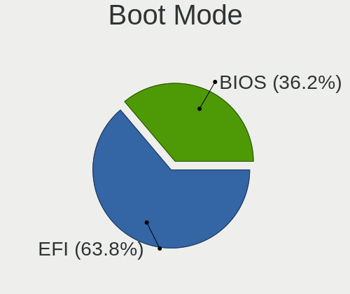
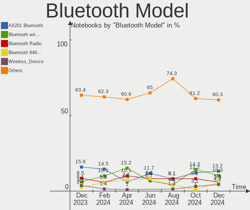

ROSA - Hardware Trends (Notebooks)
----------------------------------

A project to identify most popular hardware characteristics and track their change
over time based on data collected by Linux users at https://Linux-Hardware.org.

Anyone can contribute to this report by the [hw-probe](https://github.com/linuxhw/hw-probe) tool:

    sudo -E hw-probe -all -upload

This report is for one last month. Overall report since the beginning of time: [TestDays](https://github.com/linuxhw/TestDays)

Period: Aug, 2023.

Contents
--------

* [ System ](#system)
  - [ OS                       ](#os)
  - [ OS Family                ](#os-family)
  - [ Kernel                   ](#kernel)
  - [ Kernel Family            ](#kernel-family)
  - [ Kernel Major Ver.        ](#kernel-major-ver)
  - [ Arch                     ](#arch)
  - [ DE                       ](#de)
  - [ Display Server           ](#display-server)
  - [ Display Manager          ](#display-manager)
  - [ OS Lang                  ](#os-lang)
  - [ Boot Mode                ](#boot-mode)
  - [ Filesystem               ](#filesystem)
  - [ Part. scheme             ](#part-scheme)
  - [ Dual Boot with Linux/BSD ](#dual-boot-with-linuxbsd)
  - [ Dual Boot (Win)          ](#dual-boot-win)

* [ Board ](#board)
  - [ Vendor                   ](#vendor)
  - [ Model                    ](#model)
  - [ Model Family             ](#model-family)
  - [ MFG Year                 ](#mfg-year)
  - [ Form Factor              ](#form-factor)
  - [ Secure Boot              ](#secure-boot)
  - [ Coreboot                 ](#coreboot)
  - [ RAM Size                 ](#ram-size)
  - [ RAM Used                 ](#ram-used)
  - [ Total Drives             ](#total-drives)
  - [ Has CD-ROM               ](#has-cd-rom)
  - [ Has Ethernet             ](#has-ethernet)
  - [ Has WiFi                 ](#has-wifi)
  - [ Has Bluetooth            ](#has-bluetooth)

* [ Location ](#location)
  - [ Country                  ](#country)
  - [ City                     ](#city)

* [ Drives ](#drives)
  - [ Drive Vendor             ](#drive-vendor)
  - [ Drive Model              ](#drive-model)
  - [ HDD Vendor               ](#hdd-vendor)
  - [ SSD Vendor               ](#ssd-vendor)
  - [ Drive Kind               ](#drive-kind)
  - [ Drive Connector          ](#drive-connector)
  - [ Drive Size               ](#drive-size)
  - [ Space Total              ](#space-total)
  - [ Space Used               ](#space-used)
  - [ Malfunc. Drives          ](#malfunc-drives)
  - [ Malfunc. Drive Vendor    ](#malfunc-drive-vendor)
  - [ Malfunc. HDD Vendor      ](#malfunc-hdd-vendor)
  - [ Malfunc. Drive Kind      ](#malfunc-drive-kind)
  - [ Failed Drives            ](#failed-drives)
  - [ Failed Drive Vendor      ](#failed-drive-vendor)
  - [ Drive Status             ](#drive-status)

* [ Storage controller ](#storage-controller)
  - [ Storage Vendor           ](#storage-vendor)
  - [ Storage Model            ](#storage-model)
  - [ Storage Kind             ](#storage-kind)

* [ Processor ](#processor)
  - [ CPU Vendor               ](#cpu-vendor)
  - [ CPU Model                ](#cpu-model)
  - [ CPU Model Family         ](#cpu-model-family)
  - [ CPU Cores                ](#cpu-cores)
  - [ CPU Sockets              ](#cpu-sockets)
  - [ CPU Threads              ](#cpu-threads)
  - [ CPU Op-Modes             ](#cpu-op-modes)
  - [ CPU Microcode            ](#cpu-microcode)
  - [ CPU Microarch            ](#cpu-microarch)

* [ Graphics ](#graphics)
  - [ GPU Vendor               ](#gpu-vendor)
  - [ GPU Model                ](#gpu-model)
  - [ GPU Combo                ](#gpu-combo)
  - [ GPU Driver               ](#gpu-driver)
  - [ GPU Memory               ](#gpu-memory)

* [ Monitor ](#monitor)
  - [ Monitor Vendor           ](#monitor-vendor)
  - [ Monitor Model            ](#monitor-model)
  - [ Monitor Resolution       ](#monitor-resolution)
  - [ Monitor Diagonal         ](#monitor-diagonal)
  - [ Monitor Width            ](#monitor-width)
  - [ Aspect Ratio             ](#aspect-ratio)
  - [ Monitor Area             ](#monitor-area)
  - [ Pixel Density            ](#pixel-density)
  - [ Multiple Monitors        ](#multiple-monitors)

* [ Network ](#network)
  - [ Net Controller Vendor    ](#net-controller-vendor)
  - [ Net Controller Model     ](#net-controller-model)
  - [ Wireless Vendor          ](#wireless-vendor)
  - [ Wireless Model           ](#wireless-model)
  - [ Ethernet Vendor          ](#ethernet-vendor)
  - [ Ethernet Model           ](#ethernet-model)
  - [ Net Controller Kind      ](#net-controller-kind)
  - [ Used Controller          ](#used-controller)
  - [ NICs                     ](#nics)
  - [ IPv6                     ](#ipv6)

* [ Bluetooth ](#bluetooth)
  - [ Bluetooth Vendor         ](#bluetooth-vendor)
  - [ Bluetooth Model          ](#bluetooth-model)

* [ Sound ](#sound)
  - [ Sound Vendor             ](#sound-vendor)
  - [ Sound Model              ](#sound-model)

* [ Memory ](#memory)
  - [ Memory Vendor            ](#memory-vendor)
  - [ Memory Model             ](#memory-model)
  - [ Memory Kind              ](#memory-kind)
  - [ Memory Form Factor       ](#memory-form-factor)
  - [ Memory Size              ](#memory-size)
  - [ Memory Speed             ](#memory-speed)

* [ Printers & scanners ](#printers--scanners)
  - [ Printer Vendor           ](#printer-vendor)
  - [ Printer Model            ](#printer-model)
  - [ Scanner Vendor           ](#scanner-vendor)
  - [ Scanner Model            ](#scanner-model)

* [ Camera ](#camera)
  - [ Camera Vendor            ](#camera-vendor)
  - [ Camera Model             ](#camera-model)

* [ Security ](#security)
  - [ Fingerprint Vendor       ](#fingerprint-vendor)
  - [ Fingerprint Model        ](#fingerprint-model)
  - [ Chipcard Vendor          ](#chipcard-vendor)
  - [ Chipcard Model           ](#chipcard-model)

* [ Unsupported ](#unsupported)
  - [ Unsupported Devices      ](#unsupported-devices)
  - [ Unsupported Device Types ](#unsupported-device-types)

System
------

OS
--

Installed operating systems

| Name       | Notebooks | Percent |
|------------|-----------|---------|
| ROSA 12.4  | 65        | 82.28%  |
| ROSA R11.1 | 3         | 3.8%    |
| ROSA 12.3  | 3         | 3.8%    |
| ROSA 12    | 3         | 3.8%    |
| ROSA 12.2  | 2         | 2.53%   |
| ROSA 12.1  | 2         | 2.53%   |
| ROSA 13.0  | 1         | 1.27%   |

OS Family
---------

OS without a version

| Name | Notebooks | Percent |
|------|-----------|---------|
| ROSA | 79        | 100%    |

Kernel
------

Version of the Linux kernel

| Version                                   | Notebooks | Percent |
|-------------------------------------------|-----------|---------|
| 6.1.38-generic-1rosa2021.1-x86_64         | 36        | 45.57%  |
| 6.1.20-generic-2rosa2021.1-x86_64         | 20        | 25.32%  |
| 5.10.74-generic-2rosa2021.1-x86_64        | 4         | 5.06%   |
| 5.15.117-generic-1rosa2021.1-x86_64       | 2         | 2.53%   |
| 5.15.117-generic-1rosa2021.1-i686         | 2         | 2.53%   |
| 5.10.184-generic-1rosa2021.1-x86_64       | 2         | 2.53%   |
| 5.10.155-generic-1rosa2021.1-x86_64       | 2         | 2.53%   |
| 6.4.7.xm1-1.klp-xanmod-rosa2021.1-x86_64  | 1         | 1.27%   |
| 6.4.11.xm1-1.klp-xanmod-rosa2021.1-x86_64 | 1         | 1.27%   |
| 6.1.45-generic-1rosa2023.1-x86_64         | 1         | 1.27%   |
| 6.0.12.xm1-1.klp-xanmod-rosa2021.1-x86_64 | 1         | 1.27%   |
| 5.4.83-generic-2rosa-x86_64               | 1         | 1.27%   |
| 5.17.11-generic-2rosa2021.1-x86_64        | 1         | 1.27%   |
| 5.15.77-generic-1rosa2021.1-x86_64        | 1         | 1.27%   |
| 5.15.75-generic-1rosa2021.1-x86_64        | 1         | 1.27%   |
| 5.15.103-generic-1rosa2021.1-i686         | 1         | 1.27%   |
| 5.13.9-generic-1rosa-x86_64               | 1         | 1.27%   |
| 4.15.0-desktop-122.124.1rosa-i586         | 1         | 1.27%   |

Kernel Family
-------------

Linux kernel without a distro release

| Version  | Notebooks | Percent |
|----------|-----------|---------|
| 6.1.38   | 36        | 45.57%  |
| 6.1.20   | 20        | 25.32%  |
| 5.15.117 | 4         | 5.06%   |
| 5.10.74  | 4         | 5.06%   |
| 5.10.184 | 2         | 2.53%   |
| 5.10.155 | 2         | 2.53%   |
| 6.4.7    | 1         | 1.27%   |
| 6.4.11   | 1         | 1.27%   |
| 6.1.45   | 1         | 1.27%   |
| 6.0.12   | 1         | 1.27%   |
| 5.4.83   | 1         | 1.27%   |
| 5.17.11  | 1         | 1.27%   |
| 5.15.77  | 1         | 1.27%   |
| 5.15.75  | 1         | 1.27%   |
| 5.15.103 | 1         | 1.27%   |
| 5.13.9   | 1         | 1.27%   |
| 4.15.0   | 1         | 1.27%   |

Kernel Major Ver.
-----------------

Linux kernel major version

| Version | Notebooks | Percent |
|---------|-----------|---------|
| 6.1     | 57        | 72.15%  |
| 5.10    | 8         | 10.13%  |
| 5.15    | 7         | 8.86%   |
| 6.4     | 2         | 2.53%   |
| 6.0     | 1         | 1.27%   |
| 5.4     | 1         | 1.27%   |
| 5.17    | 1         | 1.27%   |
| 5.13    | 1         | 1.27%   |
| 4.15    | 1         | 1.27%   |

Arch
----

OS architecture (x86_64, i586, etc.)

| Name   | Notebooks | Percent |
|--------|-----------|---------|
| x86_64 | 75        | 94.94%  |
| i686   | 4         | 5.06%   |

DE
--

Desktop Environment

| Name    | Notebooks | Percent |
|---------|-----------|---------|
| KDE5    | 47        | 59.49%  |
| GNOME   | 16        | 20.25%  |
| LXQt    | 9         | 11.39%  |
| KDE4    | 3         | 3.8%    |
| XFCE    | 2         | 2.53%   |
| i3      | 1         | 1.27%   |
| Unknown | 1         | 1.27%   |

Display Server
--------------

X11 or Wayland

| Name    | Notebooks | Percent |
|---------|-----------|---------|
| Wayland | 58        | 73.42%  |
| X11     | 21        | 26.58%  |

Display Manager
---------------

SDDM, LightDM, etc.

| Name    | Notebooks | Percent |
|---------|-----------|---------|
| SDDM    | 45        | 56.96%  |
| GDM     | 26        | 32.91%  |
| LightDM | 6         | 7.59%   |
| KDM     | 2         | 2.53%   |

OS Lang
-------

Language

| Lang  | Notebooks | Percent |
|-------|-----------|---------|
| ru_RU | 69        | 87.34%  |
| en_US | 7         | 8.86%   |
| pl_PL | 1         | 1.27%   |
| it_IT | 1         | 1.27%   |
| es_ES | 1         | 1.27%   |

Boot Mode
---------

EFI or BIOS

| Mode | Notebooks | Percent |
|------|-----------|---------|
| EFI  | 48        | 60.76%  |
| BIOS | 31        | 39.24%  |

Filesystem
----------

Type of filesystem

| Type    | Notebooks | Percent |
|---------|-----------|---------|
| Ext4    | 75        | 94.94%  |
| Overlay | 2         | 2.53%   |
| Btrfs   | 1         | 1.27%   |
| Aufs    | 1         | 1.27%   |

Part. scheme
------------

Scheme of partitioning

| Type | Notebooks | Percent |
|------|-----------|---------|
| GPT  | 53        | 67.09%  |
| MBR  | 26        | 32.91%  |

Dual Boot with Linux/BSD
------------------------

Hosting more than one Linux/BSD

| Dual boot | Notebooks | Percent |
|-----------|-----------|---------|
| No        | 57        | 72.15%  |
| Yes       | 22        | 27.85%  |

Dual Boot (Win)
---------------

Hosting Linux and Windows

| Dual boot | Notebooks | Percent |
|-----------|-----------|---------|
| No        | 47        | 59.49%  |
| Yes       | 32        | 40.51%  |

Board
-----

Vendor
------

Motherboard manufacturer

| Name                | Notebooks | Percent |
|---------------------|-----------|---------|
| Hewlett-Packard     | 17        | 21.52%  |
| ASUSTek Computer    | 12        | 15.19%  |
| Lenovo              | 11        | 13.92%  |
| Acer                | 11        | 13.92%  |
| Dell                | 7         | 8.86%   |
| Samsung Electronics | 3         | 3.8%    |
| Notebook            | 2         | 2.53%   |
| HUAWEI              | 2         | 2.53%   |
| Fujitsu Siemens     | 2         | 2.53%   |
| Toshiba             | 1         | 1.27%   |
| Timi                | 1         | 1.27%   |
| ROMBICA             | 1         | 1.27%   |
| Positivo            | 1         | 1.27%   |
| MSI                 | 1         | 1.27%   |
| Maibenben           | 1         | 1.27%   |
| Irbis               | 1         | 1.27%   |
| Infomash            | 1         | 1.27%   |
| Digma               | 1         | 1.27%   |
| Clevo               | 1         | 1.27%   |
| Apple               | 1         | 1.27%   |
| ANCOMP              | 1         | 1.27%   |

Model
-----

Motherboard model

| Name                                 | Notebooks | Percent |
|--------------------------------------|-----------|---------|
| Acer Aspire E5-573G                  | 2         | 2.53%   |
| Toshiba Satellite L775D              | 1         | 1.27%   |
| Timi TM1701                          | 1         | 1.27%   |
| Samsung R528/R728                    | 1         | 1.27%   |
| Samsung R518                         | 1         | 1.27%   |
| Samsung 350V5C/351V5C/3540VC/3440VC  | 1         | 1.27%   |
| ROMBICA myBook Eclipse               | 1         | 1.27%   |
| Positivo N6440                       | 1         | 1.27%   |
| Notebook WA50SRQ                     | 1         | 1.27%   |
| Notebook W54_W94_W955TU,-T,-C        | 1         | 1.27%   |
| MSI X460/X460DX                      | 1         | 1.27%   |
| Maibenben MaiBook X series           | 1         | 1.27%   |
| Lenovo ThinkPad P50 20EN001CUS       | 1         | 1.27%   |
| Lenovo ThinkPad P1 Gen 4i 20Y3001LUK | 1         | 1.27%   |
| Lenovo ThinkPad Edge E120 3043A25    | 1         | 1.27%   |
| Lenovo ThinkBook 16 G4+ ARA 21D1     | 1         | 1.27%   |
| Lenovo IdeaPad 5 15IAL7 82SF         | 1         | 1.27%   |
| Lenovo IdeaPad 330-15IGM 81D1        | 1         | 1.27%   |
| Lenovo IdeaPad 3 15IML05 81WB        | 1         | 1.27%   |
| Lenovo IdeaPad 3 14ADA05 81W0        | 1         | 1.27%   |
| Lenovo G580 20157                    | 1         | 1.27%   |
| Lenovo G50-45 80E3                   | 1         | 1.27%   |
| Lenovo 3000 G530 4151/200            | 1         | 1.27%   |
| Irbis NB264                          | 1         | 1.27%   |
| Infomash RoverBook                   | 1         | 1.27%   |
| HUAWEI BOM-WXX9                      | 1         | 1.27%   |
| HUAWEI BOHB-WAX9                     | 1         | 1.27%   |
| HP ProBook 640 G1                    | 1         | 1.27%   |
| HP ProBook 455 G8 Notebook PC        | 1         | 1.27%   |
| HP ProBook 430 G5                    | 1         | 1.27%   |
| HP Presario CQ58                     | 1         | 1.27%   |
| HP Pavilion Notebook                 | 1         | 1.27%   |
| HP Pavilion g6                       | 1         | 1.27%   |
| HP Pavilion dv7                      | 1         | 1.27%   |
| HP Pavilion 17                       | 1         | 1.27%   |
| HP Pavilion 15                       | 1         | 1.27%   |
| HP Notebook                          | 1         | 1.27%   |
| HP Laptop 15-bs1xx                   | 1         | 1.27%   |
| HP ENVY Notebook                     | 1         | 1.27%   |
| HP EliteBook 830 G5                  | 1         | 1.27%   |

Model Family
------------

Motherboard model prefix

| Name                  | Notebooks | Percent |
|-----------------------|-----------|---------|
| Acer Aspire           | 7         | 8.86%   |
| HP Pavilion           | 5         | 6.33%   |
| Dell Inspiron         | 5         | 6.33%   |
| Lenovo IdeaPad        | 4         | 5.06%   |
| Lenovo ThinkPad       | 3         | 3.8%    |
| HP ProBook            | 3         | 3.8%    |
| Fujitsu Siemens AMILO | 2         | 2.53%   |
| ASUS VivoBook         | 2         | 2.53%   |
| ASUS TUF              | 2         | 2.53%   |
| Acer Extensa          | 2         | 2.53%   |
| Toshiba Satellite     | 1         | 1.27%   |
| Timi TM1701           | 1         | 1.27%   |
| Samsung R528          | 1         | 1.27%   |
| Samsung R518          | 1         | 1.27%   |
| Samsung 350V5C        | 1         | 1.27%   |
| ROMBICA myBook        | 1         | 1.27%   |
| Positivo N6440        | 1         | 1.27%   |
| Notebook WA50SRQ      | 1         | 1.27%   |
| Notebook W54          | 1         | 1.27%   |
| MSI X460              | 1         | 1.27%   |
| Maibenben MaiBook     | 1         | 1.27%   |
| Lenovo ThinkBook      | 1         | 1.27%   |
| Lenovo G580           | 1         | 1.27%   |
| Lenovo G50-45         | 1         | 1.27%   |
| Lenovo 3000           | 1         | 1.27%   |
| Irbis NB264           | 1         | 1.27%   |
| Infomash RoverBook    | 1         | 1.27%   |
| HUAWEI BOM-WXX9       | 1         | 1.27%   |
| HUAWEI BOHB-WAX9      | 1         | 1.27%   |
| HP Presario           | 1         | 1.27%   |
| HP Notebook           | 1         | 1.27%   |
| HP Laptop             | 1         | 1.27%   |
| HP ENVY               | 1         | 1.27%   |
| HP EliteBook          | 1         | 1.27%   |
| HP Compaq             | 1         | 1.27%   |
| HP 635                | 1         | 1.27%   |
| HP 470                | 1         | 1.27%   |
| HP 240                | 1         | 1.27%   |
| Digma Pro             | 1         | 1.27%   |
| Dell Vostro           | 1         | 1.27%   |

MFG Year
--------

Motherboard manufacture year

| Year | Notebooks | Percent |
|------|-----------|---------|
| 2021 | 9         | 11.39%  |
| 2022 | 8         | 10.13%  |
| 2013 | 7         | 8.86%   |
| 2011 | 7         | 8.86%   |
| 2015 | 6         | 7.59%   |
| 2012 | 6         | 7.59%   |
| 2019 | 5         | 6.33%   |
| 2017 | 5         | 6.33%   |
| 2020 | 4         | 5.06%   |
| 2018 | 4         | 5.06%   |
| 2010 | 4         | 5.06%   |
| 2008 | 4         | 5.06%   |
| 2014 | 3         | 3.8%    |
| 2009 | 3         | 3.8%    |
| 2007 | 3         | 3.8%    |
| 2016 | 1         | 1.27%   |

Form Factor
-----------

Physical design of the computer

| Name     | Notebooks | Percent |
|----------|-----------|---------|
| Notebook | 79        | 100%    |

Secure Boot
-----------

Enabled or disabled

| State    | Notebooks | Percent |
|----------|-----------|---------|
| Disabled | 79        | 100%    |

Coreboot
--------

Have coreboot on board

| Used | Notebooks | Percent |
|------|-----------|---------|
| No   | 79        | 100%    |

RAM Size
--------

Total RAM memory

| Size in GB | Notebooks | Percent |
|------------|-----------|---------|
| 4.01-8.0   | 30        | 37.97%  |
| 3.01-4.0   | 18        | 22.78%  |
| 16.01-24.0 | 10        | 12.66%  |
| 8.01-16.0  | 8         | 10.13%  |
| 32.01-64.0 | 4         | 5.06%   |
| 1.01-2.0   | 4         | 5.06%   |
| 2.01-3.0   | 3         | 3.8%    |
| 24.01-32.0 | 2         | 2.53%   |

RAM Used
--------

Used RAM memory

| Used GB    | Notebooks | Percent |
|------------|-----------|---------|
| 1.01-2.0   | 37        | 46.84%  |
| 2.01-3.0   | 18        | 22.78%  |
| 0.51-1.0   | 12        | 15.19%  |
| 3.01-4.0   | 7         | 8.86%   |
| 4.01-8.0   | 3         | 3.8%    |
| 16.01-24.0 | 1         | 1.27%   |
| 8.01-16.0  | 1         | 1.27%   |

Total Drives
------------

Number of drives on board

| Drives | Notebooks | Percent |
|--------|-----------|---------|
| 1      | 55        | 69.62%  |
| 2      | 22        | 27.85%  |
| 3      | 1         | 1.27%   |
| 0      | 1         | 1.27%   |

Has CD-ROM
----------

Has CD-ROM on board

| Presented | Notebooks | Percent |
|-----------|-----------|---------|
| No        | 47        | 59.49%  |
| Yes       | 32        | 40.51%  |

Has Ethernet
------------

Has Ethernet on board

| Presented | Notebooks | Percent |
|-----------|-----------|---------|
| Yes       | 67        | 84.81%  |
| No        | 12        | 15.19%  |

Has WiFi
--------

Has WiFi module

| Presented | Notebooks | Percent |
|-----------|-----------|---------|
| Yes       | 77        | 97.47%  |
| No        | 2         | 2.53%   |

Has Bluetooth
-------------

Has Bluetooth module

| Presented | Notebooks | Percent |
|-----------|-----------|---------|
| Yes       | 62        | 78.48%  |
| No        | 17        | 21.52%  |

Location
--------

Country
-------

Geographic location (country)

| Country         | Notebooks | Percent |
|-----------------|-----------|---------|
| Russia          | 65        | 82.28%  |
| Ukraine         | 4         | 5.06%   |
| USA             | 2         | 2.53%   |
| Poland          | 1         | 1.27%   |
| Peru            | 1         | 1.27%   |
| North Macedonia | 1         | 1.27%   |
| Italy           | 1         | 1.27%   |
| India           | 1         | 1.27%   |
| Germany         | 1         | 1.27%   |
| Costa Rica      | 1         | 1.27%   |
| Brazil          | 1         | 1.27%   |

City
----

Geographic location (city)

| City             | Notebooks | Percent |
|------------------|-----------|---------|
| Moscow           | 16        | 20.25%  |
| St Petersburg    | 6         | 7.59%   |
| Yekaterinburg    | 3         | 3.8%    |
| Voronezh         | 2         | 2.53%   |
| Ufa              | 2         | 2.53%   |
| Shchelkovo       | 2         | 2.53%   |
| Samara           | 2         | 2.53%   |
| Odintsovo        | 2         | 2.53%   |
| Novosibirsk      | 2         | 2.53%   |
| Krasnodar        | 2         | 2.53%   |
| Irkutsk          | 2         | 2.53%   |
| Yoshkar-Ola      | 1         | 1.27%   |
| Yelizovo         | 1         | 1.27%   |
| Yasinovataya     | 1         | 1.27%   |
| Yalta            | 1         | 1.27%   |
| Volgograd        | 1         | 1.27%   |
| Veliky Novgorod  | 1         | 1.27%   |
| Tsarskoye Selo   | 1         | 1.27%   |
| Tolyatti         | 1         | 1.27%   |
| Syktyvkar        | 1         | 1.27%   |
| Surgut           | 1         | 1.27%   |
| Sochi            | 1         | 1.27%   |
| Smolensk         | 1         | 1.27%   |
| Skopje           | 1         | 1.27%   |
| San José        | 1         | 1.27%   |
| Saint Paul       | 1         | 1.27%   |
| Ryazan           | 1         | 1.27%   |
| Rostov-on-Don    | 1         | 1.27%   |
| Rome             | 1         | 1.27%   |
| Pyatigorsk       | 1         | 1.27%   |
| Podolsk          | 1         | 1.27%   |
| Ozimek           | 1         | 1.27%   |
| Nizhniy Novgorod | 1         | 1.27%   |
| Mytishchi        | 1         | 1.27%   |
| Maracanau        | 1         | 1.27%   |
| Mala Danylivka   | 1         | 1.27%   |
| Lima             | 1         | 1.27%   |
| Kyzyl            | 1         | 1.27%   |
| Kunnamkulam      | 1         | 1.27%   |
| Khimki           | 1         | 1.27%   |

Drives
------

Drive Vendor
------------

Hard drive vendors

| Vendor              | Notebooks | Drives | Percent |
|---------------------|-----------|--------|---------|
| WDC                 | 16        | 16     | 15.69%  |
| Samsung Electronics | 10        | 10     | 9.8%    |
| Toshiba             | 9         | 9      | 8.82%   |
| Seagate             | 8         | 9      | 7.84%   |
| China               | 6         | 6      | 5.88%   |
| SK hynix            | 4         | 4      | 3.92%   |
| Kingston            | 4         | 4      | 3.92%   |
| Apacer              | 4         | 4      | 3.92%   |
| JMicron Technology  | 3         | 3      | 2.94%   |
| Intel               | 3         | 3      | 2.94%   |
| HGST                | 3         | 3      | 2.94%   |
| Crucial             | 3         | 3      | 2.94%   |
| A-DATA Technology   | 3         | 3      | 2.94%   |
| Unknown             | 2         | 2      | 1.96%   |
| Team                | 2         | 2      | 1.96%   |
| SPCC                | 2         | 2      | 1.96%   |
| SanDisk             | 2         | 2      | 1.96%   |
| Micron Technology   | 2         | 2      | 1.96%   |
| Hitachi             | 2         | 2      | 1.96%   |
| XrayDisk            | 1         | 1      | 0.98%   |
| USB3.0              | 1         | 1      | 0.98%   |
| Smartbuy            | 1         | 1      | 0.98%   |
| Silicon Motion      | 1         | 1      | 0.98%   |
| SCY                 | 1         | 1      | 0.98%   |
| Lenovo              | 1         | 1      | 0.98%   |
| KIOXIA              | 1         | 1      | 0.98%   |
| HS-SSD-E100         | 1         | 1      | 0.98%   |
| Fujitsu             | 1         | 1      | 0.98%   |
| Digma               | 1         | 1      | 0.98%   |
| DeTech              | 1         | 1      | 0.98%   |
| DATARAM             | 1         | 1      | 0.98%   |
| BIWIN               | 1         | 1      | 0.98%   |
| AMD                 | 1         | 1      | 0.98%   |

Drive Model
-----------

Hard drive models

| Model                                     | Notebooks | Percent |
|-------------------------------------------|-----------|---------|
| WDC WD10JPVX-22JC3T0 1TB                  | 3         | 2.91%   |
| Seagate ST1000LM035-1RK172 1TB            | 3         | 2.91%   |
| Toshiba MQ01ABD100 1TB                    | 2         | 1.94%   |
| Kingston SA400S37120G 120GB SSD           | 2         | 1.94%   |
| JMicron Generic 1TB                       | 2         | 1.94%   |
| XrayDisk 240GB SSD                        | 1         | 0.97%   |
| WDC WDS500G2B0A-00SM50 500GB SSD          | 1         | 0.97%   |
| WDC WDS250G2B0A-00SM50 250GB SSD          | 1         | 0.97%   |
| WDC WD5000LPVX-08V0TT5 500GB              | 1         | 0.97%   |
| WDC WD5000LPCX-21VHAT0 500GB              | 1         | 0.97%   |
| WDC WD50 00LPSX-22A6WT0 500GB             | 1         | 0.97%   |
| WDC WD1200BEVS-08RST2 120GB               | 1         | 0.97%   |
| WDC WD10SPZX-22Z10T1 1TB                  | 1         | 0.97%   |
| WDC WD10SPZX-21Z10T0 1TB                  | 1         | 0.97%   |
| WDC WD10SPZX-00Z10T0 1TB                  | 1         | 0.97%   |
| WDC WD10JPVT-60A1YT0 1TB                  | 1         | 0.97%   |
| WDC WD10JPLX-00MBPT0 1TB                  | 1         | 0.97%   |
| WDC PC SN520 SDAPNUW-256G-1014 256GB      | 1         | 0.97%   |
| WDC PC SN520 SDAPNUW-128G-1014 128GB      | 1         | 0.97%   |
| USB3.0 Super Speed 128GB                  | 1         | 0.97%   |
| Unknown S0J59X  128GB                     | 1         | 0.97%   |
| Unknown NVMe SSD Drive 512GB              | 1         | 0.97%   |
| Toshiba MQ04ABF100 1TB                    | 1         | 0.97%   |
| Toshiba MQ01ACF050 500GB                  | 1         | 0.97%   |
| Toshiba MQ01ABF032 320GB                  | 1         | 0.97%   |
| Toshiba MK6475GSX 640GB                   | 1         | 0.97%   |
| Toshiba MK3276GSX 320GB                   | 1         | 0.97%   |
| Toshiba KXG50ZNV1T02 1TB                  | 1         | 0.97%   |
| Toshiba KBG40ZNT256G MEMORY 256GB         | 1         | 0.97%   |
| Team T253X1120G 120GB SSD                 | 1         | 0.97%   |
| Team T253240GB SSD                        | 1         | 0.97%   |
| SPCC Solid State Disk 120GB               | 1         | 0.97%   |
| SPCC M.2 PCIe SSD 256GB                   | 1         | 0.97%   |
| Smartbuy SSD 256GB                        | 1         | 0.97%   |
| SK hynix SKHynix_HFM512GDHTNI-87A0B 512GB | 1         | 0.97%   |
| SK hynix HFS128G39TND-N210A 128GB SSD     | 1         | 0.97%   |
| SK hynix HFM512GD3JX013N 512GB            | 1         | 0.97%   |
| SK hynix BC711 HFM512GD3JX013N 512GB      | 1         | 0.97%   |
| Silicon Motion PCIe-8 SSD 512GB           | 1         | 0.97%   |
| Seagate ST9500423AS 500GB                 | 1         | 0.97%   |

HDD Vendor
----------

Hard disk drive vendors

| Vendor              | Notebooks | Drives | Percent |
|---------------------|-----------|--------|---------|
| WDC                 | 12        | 12     | 34.29%  |
| Seagate             | 8         | 9      | 22.86%  |
| Toshiba             | 7         | 7      | 20%     |
| HGST                | 3         | 3      | 8.57%   |
| Hitachi             | 2         | 2      | 5.71%   |
| USB3.0              | 1         | 1      | 2.86%   |
| Samsung Electronics | 1         | 1      | 2.86%   |
| Fujitsu             | 1         | 1      | 2.86%   |

SSD Vendor
----------

Solid state drive vendors

| Vendor              | Notebooks | Drives | Percent |
|---------------------|-----------|--------|---------|
| China               | 6         | 6      | 16.22%  |
| Samsung Electronics | 5         | 5      | 13.51%  |
| Apacer              | 4         | 4      | 10.81%  |
| Kingston            | 3         | 3      | 8.11%   |
| WDC                 | 2         | 2      | 5.41%   |
| Team                | 2         | 2      | 5.41%   |
| JMicron Technology  | 2         | 2      | 5.41%   |
| XrayDisk            | 1         | 1      | 2.7%    |
| SPCC                | 1         | 1      | 2.7%    |
| Smartbuy            | 1         | 1      | 2.7%    |
| SK hynix            | 1         | 1      | 2.7%    |
| SanDisk             | 1         | 1      | 2.7%    |
| Lenovo              | 1         | 1      | 2.7%    |
| Intel               | 1         | 1      | 2.7%    |
| HS-SSD-E100         | 1         | 1      | 2.7%    |
| Digma               | 1         | 1      | 2.7%    |
| DeTech              | 1         | 1      | 2.7%    |
| DATARAM             | 1         | 1      | 2.7%    |
| AMD                 | 1         | 1      | 2.7%    |
| A-DATA Technology   | 1         | 1      | 2.7%    |

Drive Kind
----------

HDD or SSD

| Kind    | Notebooks | Drives | Percent |
|---------|-----------|--------|---------|
| HDD     | 34        | 36     | 35.79%  |
| SSD     | 33        | 37     | 34.74%  |
| NVMe    | 26        | 28     | 27.37%  |
| MMC     | 1         | 1      | 1.05%   |
| Unknown | 1         | 1      | 1.05%   |

Drive Connector
---------------

SATA, SAS, NVMe, etc.

| Type | Notebooks | Drives | Percent |
|------|-----------|--------|---------|
| SATA | 57        | 66     | 62.64%  |
| NVMe | 26        | 28     | 28.57%  |
| SAS  | 7         | 8      | 7.69%   |
| MMC  | 1         | 1      | 1.1%    |

Drive Size
----------

Size of hard drive

| Size in TB | Notebooks | Drives | Percent |
|------------|-----------|--------|---------|
| 0.01-0.5   | 40        | 45     | 62.5%   |
| 0.51-1.0   | 23        | 27     | 35.94%  |
| 1.01-2.0   | 1         | 1      | 1.56%   |

Space Total
-----------

Amount of disk space available on the file system

| Size in GB | Notebooks | Percent |
|------------|-----------|---------|
| 251-500    | 24        | 30.38%  |
| 101-250    | 23        | 29.11%  |
| 501-1000   | 13        | 16.46%  |
| 1-20       | 8         | 10.13%  |
| 51-100     | 6         | 7.59%   |
| 21-50      | 4         | 5.06%   |
| 1001-2000  | 1         | 1.27%   |

Space Used
----------

Amount of used disk space

| Used GB  | Notebooks | Percent |
|----------|-----------|---------|
| 1-20     | 55        | 69.62%  |
| 21-50    | 7         | 8.86%   |
| 101-250  | 7         | 8.86%   |
| 251-500  | 4         | 5.06%   |
| 51-100   | 4         | 5.06%   |
| 501-1000 | 2         | 2.53%   |

Malfunc. Drives
---------------

Drive models with a malfunction

| Model                                     | Notebooks | Drives | Percent |
|-------------------------------------------|-----------|--------|---------|
| WDC WD5000LPVX-08V0TT5 500GB              | 1         | 1      | 6.25%   |
| WDC WD1200BEVS-08RST2 120GB               | 1         | 1      | 6.25%   |
| Toshiba MQ01ABF032 320GB                  | 1         | 1      | 6.25%   |
| Toshiba MK3276GSX 320GB                   | 1         | 1      | 6.25%   |
| Team T253X1120G 120GB SSD                 | 1         | 1      | 6.25%   |
| SK hynix BC711 HFM512GD3JX013N 512GB      | 1         | 1      | 6.25%   |
| Seagate ST9500423AS 500GB                 | 1         | 1      | 6.25%   |
| Seagate ST500LT012-1DG142 500GB           | 1         | 1      | 6.25%   |
| Seagate ST320LT020-9YG142 320GB           | 1         | 1      | 6.25%   |
| Seagate ST1000LM048-2E7172 1TB            | 1         | 1      | 6.25%   |
| Seagate ST1000LM035-1RK172 1TB            | 1         | 1      | 6.25%   |
| Seagate ST1000LM024 HN-M101MBB 1TB        | 1         | 1      | 6.25%   |
| Hitachi HTS541680J9SA00 80GB              | 1         | 1      | 6.25%   |
| HGST HTS545050A7E380 500GB                | 1         | 1      | 6.25%   |
| Fujitsu MHW2120BH 120GB                   | 1         | 1      | 6.25%   |
| DeTech Development Technologies 120GB SSD | 1         | 1      | 6.25%   |

Malfunc. Drive Vendor
---------------------

Vendors of faulty drives

| Vendor   | Notebooks | Drives | Percent |
|----------|-----------|--------|---------|
| Seagate  | 5         | 6      | 33.33%  |
| WDC      | 2         | 2      | 13.33%  |
| Toshiba  | 2         | 2      | 13.33%  |
| Team     | 1         | 1      | 6.67%   |
| SK hynix | 1         | 1      | 6.67%   |
| Hitachi  | 1         | 1      | 6.67%   |
| HGST     | 1         | 1      | 6.67%   |
| Fujitsu  | 1         | 1      | 6.67%   |
| DeTech   | 1         | 1      | 6.67%   |

Malfunc. HDD Vendor
-------------------

Vendors of faulty HDD drives

| Vendor  | Notebooks | Drives | Percent |
|---------|-----------|--------|---------|
| Seagate | 5         | 6      | 41.67%  |
| WDC     | 2         | 2      | 16.67%  |
| Toshiba | 2         | 2      | 16.67%  |
| Hitachi | 1         | 1      | 8.33%   |
| HGST    | 1         | 1      | 8.33%   |
| Fujitsu | 1         | 1      | 8.33%   |

Malfunc. Drive Kind
-------------------

Kinds of faulty drives

| Kind | Notebooks | Drives | Percent |
|------|-----------|--------|---------|
| HDD  | 12        | 13     | 80%     |
| SSD  | 2         | 2      | 13.33%  |
| NVMe | 1         | 1      | 6.67%   |

Failed Drives
-------------

Failed drive models

Zero info for selected period =(

Failed Drive Vendor
-------------------

Failed drive vendors

Zero info for selected period =(

Drive Status
------------

Number of failed and malfunc. drives

| Status   | Notebooks | Drives | Percent |
|----------|-----------|--------|---------|
| Works    | 64        | 77     | 72.73%  |
| Malfunc  | 15        | 16     | 17.05%  |
| Detected | 9         | 10     | 10.23%  |

Storage controller
------------------

Storage Vendor
--------------

Storage controller vendors

| Vendor                           | Notebooks | Percent |
|----------------------------------|-----------|---------|
| Intel                            | 57        | 58.76%  |
| AMD                              | 12        | 12.37%  |
| Samsung Electronics              | 4         | 4.12%   |
| SK hynix                         | 3         | 3.09%   |
| SanDisk                          | 3         | 3.09%   |
| Micron/Crucial Technology        | 3         | 3.09%   |
| Nvidia                           | 2         | 2.06%   |
| Micron Technology                | 2         | 2.06%   |
| KIOXIA                           | 2         | 2.06%   |
| Toshiba America Info Systems     | 1         | 1.03%   |
| Silicon Motion                   | 1         | 1.03%   |
| Shenzhen Shichuangyi Electronics | 1         | 1.03%   |
| Realtek Semiconductor            | 1         | 1.03%   |
| Phison Electronics               | 1         | 1.03%   |
| Kingston Technology Company      | 1         | 1.03%   |
| Jiangsu Huacun Elec.             | 1         | 1.03%   |
| INNOGRIT                         | 1         | 1.03%   |
| ADATA Technology                 | 1         | 1.03%   |

Storage Model
-------------

Storage controller models

| Model                                                                          | Notebooks | Percent |
|--------------------------------------------------------------------------------|-----------|---------|
| AMD FCH SATA Controller [AHCI mode]                                            | 9         | 8.41%   |
| Intel 7 Series Chipset Family 6-port SATA Controller [AHCI mode]               | 8         | 7.48%   |
| Intel Wildcat Point-LP SATA Controller [AHCI Mode]                             | 6         | 5.61%   |
| Intel Tiger Lake-LP SATA Controller                                            | 5         | 4.67%   |
| Intel Sunrise Point-LP SATA Controller [AHCI mode]                             | 4         | 3.74%   |
| Intel 82801HM/HEM (ICH8M/ICH8M-E) SATA Controller [AHCI mode]                  | 4         | 3.74%   |
| Intel 6 Series/C200 Series Chipset Family 6 port Mobile SATA AHCI Controller   | 4         | 3.74%   |
| Intel Comet Lake SATA AHCI Controller                                          | 3         | 2.8%    |
| Intel Celeron/Pentium Silver Processor SATA Controller                         | 3         | 2.8%    |
| Intel 82801IBM/IEM (ICH9M/ICH9M-E) 4 port SATA Controller [AHCI mode]          | 3         | 2.8%    |
| Intel 82801HM/HEM (ICH8M/ICH8M-E) IDE Controller                               | 3         | 2.8%    |
| Intel 82801 Mobile SATA Controller [RAID mode]                                 | 3         | 2.8%    |
| AMD SB7x0/SB8x0/SB9x0 SATA Controller [AHCI mode]                              | 3         | 2.8%    |
| SK hynix Gold P31/BC711/PC711 NVMe Solid State Drive                           | 2         | 1.87%   |
| SanDisk WD Blue SN500 / PC SN520 NVMe SSD                                      | 2         | 1.87%   |
| Samsung NVMe SSD Controller 980                                                | 2         | 1.87%   |
| Micron/Crucial P5 Plus NVMe PCIe SSD                                           | 2         | 1.87%   |
| KIOXIA NVMe SSD Controller BG4 (DRAM-less)                                     | 2         | 1.87%   |
| Intel Volume Management Device NVMe RAID Controller                            | 2         | 1.87%   |
| Intel SSD 670p Series [Keystone Harbor]                                        | 2         | 1.87%   |
| Intel 8 Series/C220 Series Chipset Family 6-port SATA Controller 1 [AHCI mode] | 2         | 1.87%   |
| Intel 5 Series/3400 Series Chipset 4 port SATA AHCI Controller                 | 2         | 1.87%   |
| AMD FCH IDE Controller                                                         | 2         | 1.87%   |
| Toshiba America Info Systems XG5 NVMe SSD Controller                           | 1         | 0.93%   |
| SK hynix BC511 NVMe SSD                                                        | 1         | 0.93%   |
| Silicon Motion Non-Volatile memory controller                                  | 1         | 0.93%   |
| Shenzhen Shichuangyi MAP1202-Based NVMe SSD                                    | 1         | 0.93%   |
| SanDisk WD Blue SN570 NVMe SSD 1TB                                             | 1         | 0.93%   |
| Samsung NVMe SSD Controller SM981/PM981/PM983                                  | 1         | 0.93%   |
| Samsung NVMe SSD Controller PM9A1/PM9A3/980PRO                                 | 1         | 0.93%   |
| Realtek RTS5763DL NVMe SSD Controller (DRAM-less)                              | 1         | 0.93%   |
| Phison E12 NVMe Controller                                                     | 1         | 0.93%   |
| Nvidia MCP89 SATA Controller (AHCI mode)                                       | 1         | 0.93%   |
| Nvidia MCP78S [GeForce 8200] SATA Controller (non-AHCI mode)                   | 1         | 0.93%   |
| Nvidia MCP78S [GeForce 8200] IDE                                               | 1         | 0.93%   |
| Micron/Crucial P1 NVMe PCIe SSD[Frampton2]                                     | 1         | 0.93%   |
| Micron 3400 NVMe SSD [Hendrix]                                                 | 1         | 0.93%   |
| Micron 2200S NVMe SSD [Cassandra]                                              | 1         | 0.93%   |
| Kingston Company OM3PDP3 NVMe SSD                                              | 1         | 0.93%   |
| Jiangsu Huacun Elec. Non-Volatile memory controller                            | 1         | 0.93%   |

Storage Kind
------------

Kind of storage controller (IDE, SATA, NVMe, SAS, ...)

| Kind | Notebooks | Percent |
|------|-----------|---------|
| SATA | 66        | 63.46%  |
| NVMe | 26        | 25%     |
| IDE  | 7         | 6.73%   |
| RAID | 5         | 4.81%   |

Processor
---------

CPU Vendor
----------

Processor vendors

| Vendor | Notebooks | Percent |
|--------|-----------|---------|
| Intel  | 61        | 77.22%  |
| AMD    | 18        | 22.78%  |

CPU Model
---------

Processor models

| Model                                       | Notebooks | Percent |
|---------------------------------------------|-----------|---------|
| Intel Core i3-5005U CPU @ 2.00GHz           | 4         | 5.06%   |
| Intel Core i7-3610QM CPU @ 2.30GHz          | 3         | 3.8%    |
| Intel Core i7-8550U CPU @ 1.80GHz           | 2         | 2.53%   |
| Intel Core i5-3210M CPU @ 2.50GHz           | 2         | 2.53%   |
| Intel Celeron N4020 CPU @ 1.10GHz           | 2         | 2.53%   |
| Intel 12th Gen Core i5-1235U                | 2         | 2.53%   |
| Intel 11th Gen Core i5-1135G7 @ 2.40GHz     | 2         | 2.53%   |
| Intel 11th Gen Core i3-1115G4 @ 3.00GHz     | 2         | 2.53%   |
| AMD Ryzen 5 5600U with Radeon Graphics      | 2         | 2.53%   |
| Intel Pentium Silver N5000 CPU @ 1.10GHz    | 1         | 1.27%   |
| Intel Pentium Dual-Core CPU T4300 @ 2.10GHz | 1         | 1.27%   |
| Intel Pentium CPU P6200 @ 2.13GHz           | 1         | 1.27%   |
| Intel Pentium CPU N4200 @ 1.10GHz           | 1         | 1.27%   |
| Intel Pentium CPU N3540 @ 2.16GHz           | 1         | 1.27%   |
| Intel Pentium CPU B960 @ 2.20GHz            | 1         | 1.27%   |
| Intel Pentium CPU 3825U @ 1.90GHz           | 1         | 1.27%   |
| Intel Core i7-8750H CPU @ 2.20GHz           | 1         | 1.27%   |
| Intel Core i7-6820HQ CPU @ 2.70GHz          | 1         | 1.27%   |
| Intel Core i7-6700HQ CPU @ 2.60GHz          | 1         | 1.27%   |
| Intel Core i7-5500U CPU @ 2.40GHz           | 1         | 1.27%   |
| Intel Core i7-4700MQ CPU @ 2.40GHz          | 1         | 1.27%   |
| Intel Core i7-10710U CPU @ 1.10GHz          | 1         | 1.27%   |
| Intel Core i5-8300H CPU @ 2.30GHz           | 1         | 1.27%   |
| Intel Core i5-8250U CPU @ 1.60GHz           | 1         | 1.27%   |
| Intel Core i5-7200U CPU @ 2.50GHz           | 1         | 1.27%   |
| Intel Core i5-4210U CPU @ 1.70GHz           | 1         | 1.27%   |
| Intel Core i5-4200M CPU @ 2.50GHz           | 1         | 1.27%   |
| Intel Core i5-2450M CPU @ 2.50GHz           | 1         | 1.27%   |
| Intel Core i5-1035G1 CPU @ 1.00GHz          | 1         | 1.27%   |
| Intel Core i5-10210U CPU @ 1.60GHz          | 1         | 1.27%   |
| Intel Core i3-7020U CPU @ 2.30GHz           | 1         | 1.27%   |
| Intel Core i3-6100U CPU @ 2.30GHz           | 1         | 1.27%   |
| Intel Core i3-3217U CPU @ 1.80GHz           | 1         | 1.27%   |
| Intel Core i3-3110M CPU @ 2.40GHz           | 1         | 1.27%   |
| Intel Core i3-2367M CPU @ 1.40GHz           | 1         | 1.27%   |
| Intel Core i3-2350M CPU @ 2.30GHz           | 1         | 1.27%   |
| Intel Core i3-2310M CPU @ 2.10GHz           | 1         | 1.27%   |
| Intel Core i3-10110U CPU @ 2.10GHz          | 1         | 1.27%   |
| Intel Core i3 CPU M 370 @ 2.40GHz           | 1         | 1.27%   |
| Intel Core 2 Duo CPU T9300 @ 2.50GHz        | 1         | 1.27%   |

CPU Model Family
----------------

Processor model prefix

| Model                   | Notebooks | Percent |
|-------------------------|-----------|---------|
| Intel Core i3           | 13        | 16.46%  |
| Intel Core i7           | 11        | 13.92%  |
| Intel Core i5           | 10        | 12.66%  |
| Other                   | 8         | 10.13%  |
| Intel Pentium           | 5         | 6.33%   |
| Intel Core 2 Duo        | 5         | 6.33%   |
| Intel Celeron           | 5         | 6.33%   |
| AMD Ryzen 7             | 4         | 5.06%   |
| AMD Ryzen 5             | 4         | 5.06%   |
| AMD Athlon              | 2         | 2.53%   |
| AMD A6                  | 2         | 2.53%   |
| Intel Pentium Silver    | 1         | 1.27%   |
| Intel Pentium Dual-Core | 1         | 1.27%   |
| Intel Core 2            | 1         | 1.27%   |
| Intel Celeron Dual-Core | 1         | 1.27%   |
| AMD Ryzen 3             | 1         | 1.27%   |
| AMD Phenom II           | 1         | 1.27%   |
| AMD E2                  | 1         | 1.27%   |
| AMD E                   | 1         | 1.27%   |
| AMD Athlon II           | 1         | 1.27%   |
| AMD A4                  | 1         | 1.27%   |

CPU Cores
---------

Number of processor cores

| Number | Notebooks | Percent |
|--------|-----------|---------|
| 2      | 42        | 53.16%  |
| 4      | 24        | 30.38%  |
| 6      | 5         | 6.33%   |
| 8      | 4         | 5.06%   |
| 10     | 2         | 2.53%   |
| 1      | 2         | 2.53%   |

CPU Sockets
-----------

Number of sockets

| Number | Notebooks | Percent |
|--------|-----------|---------|
| 1      | 79        | 100%    |

CPU Threads
-----------

Threads per core (Hyper-Threading)

| Number | Notebooks | Percent |
|--------|-----------|---------|
| 2      | 54        | 68.35%  |
| 1      | 25        | 31.65%  |

CPU Op-Modes
------------

CPU Operation Modes (32-bit, 64-bit)

| Op mode        | Notebooks | Percent |
|----------------|-----------|---------|
| 32-bit, 64-bit | 79        | 100%    |

CPU Microcode
-------------

Microcode number

| Number     | Notebooks | Percent |
|------------|-----------|---------|
| 0x306a9    | 7         | 8.86%   |
| 0x306d4    | 6         | 7.59%   |
| 0x206a7    | 6         | 7.59%   |
| 0x806c1    | 5         | 6.33%   |
| 0x1067a    | 3         | 3.8%    |
| 0x0a50000c | 3         | 3.8%    |
| 0x906a4    | 2         | 2.53%   |
| 0x806ec    | 2         | 2.53%   |
| 0x806ea    | 2         | 2.53%   |
| 0x806e9    | 2         | 2.53%   |
| 0x706a8    | 2         | 2.53%   |
| 0x6fd      | 2         | 2.53%   |
| 0x506e3    | 2         | 2.53%   |
| 0x306c3    | 2         | 2.53%   |
| 0x20655    | 2         | 2.53%   |
| 0x08108109 | 2         | 2.53%   |
| 0x010000c8 | 2         | 2.53%   |
| Unknown    | 2         | 2.53%   |
| 0xa0660    | 1         | 1.27%   |
| 0x906ea    | 1         | 1.27%   |
| 0x806d1    | 1         | 1.27%   |
| 0x706e5    | 1         | 1.27%   |
| 0x706a1    | 1         | 1.27%   |
| 0x6fa      | 1         | 1.27%   |
| 0x6f6      | 1         | 1.27%   |
| 0x506c9    | 1         | 1.27%   |
| 0x406e3    | 1         | 1.27%   |
| 0x406c3    | 1         | 1.27%   |
| 0x40651    | 1         | 1.27%   |
| 0x30678    | 1         | 1.27%   |
| 0x10676    | 1         | 1.27%   |
| 0x10661    | 1         | 1.27%   |
| 0x0a50000d | 1         | 1.27%   |
| 0x0a404102 | 1         | 1.27%   |
| 0x08608103 | 1         | 1.27%   |
| 0x08608102 | 1         | 1.27%   |
| 0x08108102 | 1         | 1.27%   |
| 0x07030105 | 1         | 1.27%   |
| 0x06001119 | 1         | 1.27%   |
| 0x0500010d | 1         | 1.27%   |

CPU Microarch
-------------

Microarchitecture

| Name             | Notebooks | Percent |
|------------------|-----------|---------|
| KabyLake         | 9         | 11.39%  |
| IvyBridge        | 7         | 8.86%   |
| SandyBridge      | 6         | 7.59%   |
| Broadwell        | 6         | 7.59%   |
| TigerLake        | 5         | 6.33%   |
| Core             | 5         | 6.33%   |
| Zen 3            | 4         | 5.06%   |
| Penryn           | 4         | 5.06%   |
| Zen+             | 3         | 3.8%    |
| Skylake          | 3         | 3.8%    |
| Haswell          | 3         | 3.8%    |
| Goldmont plus    | 3         | 3.8%    |
| Unknown          | 3         | 3.8%    |
| Westmere         | 2         | 2.53%   |
| Silvermont       | 2         | 2.53%   |
| K10              | 2         | 2.53%   |
| IceLake          | 2         | 2.53%   |
| Bobcat           | 2         | 2.53%   |
| Alderlake Hybrid | 2         | 2.53%   |
| Puma             | 1         | 1.27%   |
| Piledriver       | 1         | 1.27%   |
| K8 & K10 hybrid  | 1         | 1.27%   |
| K10 Llano        | 1         | 1.27%   |
| Goldmont         | 1         | 1.27%   |
| CometLake        | 1         | 1.27%   |

Graphics
--------

GPU Vendor
----------

Vendors of graphics cards

| Vendor           | Notebooks | Percent |
|------------------|-----------|---------|
| Intel            | 57        | 54.81%  |
| Nvidia           | 27        | 25.96%  |
| AMD              | 19        | 18.27%  |
| ATI Technologies | 1         | 0.96%   |

GPU Model
---------

Graphics card models

| Model                                                                         | Notebooks | Percent |
|-------------------------------------------------------------------------------|-----------|---------|
| Intel 3rd Gen Core processor Graphics Controller                              | 7         | 6.36%   |
| Intel 2nd Generation Core Processor Family Integrated Graphics Controller     | 6         | 5.45%   |
| Intel HD Graphics 5500                                                        | 5         | 4.55%   |
| Nvidia GP107M [GeForce GTX 1050 Mobile]                                       | 3         | 2.73%   |
| Nvidia GF108M [GeForce GT 620M/630M/635M/640M LE]                             | 3         | 2.73%   |
| Intel UHD Graphics 620                                                        | 3         | 2.73%   |
| Intel TigerLake-LP GT2 [Iris Xe Graphics]                                     | 3         | 2.73%   |
| Intel Mobile 4 Series Chipset Integrated Graphics Controller                  | 3         | 2.73%   |
| AMD Picasso/Raven 2 [Radeon Vega Series / Radeon Vega Mobile Series]          | 3         | 2.73%   |
| AMD Cezanne [Radeon Vega Series / Radeon Vega Mobile Series]                  | 3         | 2.73%   |
| Nvidia GK208BM [GeForce 920M]                                                 | 2         | 1.82%   |
| Intel Tiger Lake-LP GT2 [UHD Graphics G4]                                     | 2         | 1.82%   |
| Intel Mobile GM965/GL960 Integrated Graphics Controller (secondary)           | 2         | 1.82%   |
| Intel Mobile GM965/GL960 Integrated Graphics Controller (primary)             | 2         | 1.82%   |
| Intel HD Graphics 620                                                         | 2         | 1.82%   |
| Intel HD Graphics 530                                                         | 2         | 1.82%   |
| Intel GeminiLake [UHD Graphics 600]                                           | 2         | 1.82%   |
| Intel CometLake-U GT2 [UHD Graphics]                                          | 2         | 1.82%   |
| Intel CoffeeLake-H GT2 [UHD Graphics 630]                                     | 2         | 1.82%   |
| Intel 4th Gen Core Processor Integrated Graphics Controller                   | 2         | 1.82%   |
| AMD Sun XT [Radeon HD 8670A/8670M/8690M / R5 M330 / M430 / Radeon 520 Mobile] | 2         | 1.82%   |
| AMD Seymour [Radeon HD 6400M/7400M Series]                                    | 2         | 1.82%   |
| AMD Lucienne                                                                  | 2         | 1.82%   |
| Nvidia TU117M [GeForce MX550]                                                 | 1         | 0.91%   |
| Nvidia TU117M [GeForce GTX 1650 Mobile / Max-Q]                               | 1         | 0.91%   |
| Nvidia TU117GLM [T1200 Laptop GPU]                                            | 1         | 0.91%   |
| Nvidia MCP89 [GeForce 320M]                                                   | 1         | 0.91%   |
| Nvidia GP108BM [GeForce MX250]                                                | 1         | 0.91%   |
| Nvidia GM108M [GeForce 940M]                                                  | 1         | 0.91%   |
| Nvidia GM108M [GeForce 920MX]                                                 | 1         | 0.91%   |
| Nvidia GM107GLM [Quadro M2000M]                                               | 1         | 0.91%   |
| Nvidia GM107 [GeForce 940MX]                                                  | 1         | 0.91%   |
| Nvidia GK208M [GeForce GT 720M]                                               | 1         | 0.91%   |
| Nvidia GK107M [GeForce GT 750M]                                               | 1         | 0.91%   |
| Nvidia GK107M [GeForce GT 650M]                                               | 1         | 0.91%   |
| Nvidia GF117M [GeForce 610M/710M/810M/820M / GT 620M/625M/630M/720M]          | 1         | 0.91%   |
| Nvidia GF108M [GeForce GT 540M]                                               | 1         | 0.91%   |
| Nvidia GF108M [GeForce GT 525M]                                               | 1         | 0.91%   |
| Nvidia GA106M [GeForce RTX 3060 Mobile / Max-Q]                               | 1         | 0.91%   |
| Nvidia G86M [GeForce 8400M G]                                                 | 1         | 0.91%   |

GPU Combo
---------

Combinations of graphics cards

| Name           | Notebooks | Percent |
|----------------|-----------|---------|
| 1 x Intel      | 33        | 41.77%  |
| Intel + Nvidia | 21        | 26.58%  |
| 1 x AMD        | 13        | 16.46%  |
| 1 x Nvidia     | 5         | 6.33%   |
| 2 x AMD        | 3         | 3.8%    |
| Intel + AMD    | 3         | 3.8%    |
| AMD + Nvidia   | 1         | 1.27%   |

GPU Driver
----------

Free vs proprietary

| Driver      | Notebooks | Percent |
|-------------|-----------|---------|
| Free        | 73        | 92.41%  |
| Proprietary | 6         | 7.59%   |

GPU Memory
----------

Total video memory

| Size in GB | Notebooks | Percent |
|------------|-----------|---------|
| Unknown    | 39        | 49.37%  |
| 1.01-2.0   | 17        | 21.52%  |
| 0.01-0.5   | 16        | 20.25%  |
| 0.51-1.0   | 4         | 5.06%   |
| 3.01-4.0   | 3         | 3.8%    |

Monitor
-------

Monitor Vendor
--------------

Monitor vendors

| Vendor                  | Notebooks | Percent |
|-------------------------|-----------|---------|
| AU Optronics            | 15        | 18.52%  |
| BOE                     | 14        | 17.28%  |
| Chimei Innolux          | 12        | 14.81%  |
| LG Display              | 10        | 12.35%  |
| Samsung Electronics     | 8         | 9.88%   |
| PANDA                   | 3         | 3.7%    |
| Chi Mei Optoelectronics | 3         | 3.7%    |
| Acer                    | 3         | 3.7%    |
| LG Philips              | 2         | 2.47%   |
| InfoVision              | 2         | 2.47%   |
| Goldstar                | 2         | 2.47%   |
| CSO                     | 2         | 2.47%   |
| CPT                     | 2         | 2.47%   |
| Apple                   | 2         | 2.47%   |
| Quanta Display          | 1         | 1.23%   |

Monitor Model
-------------

Monitor models

| Model                                                                 | Notebooks | Percent |
|-----------------------------------------------------------------------|-----------|---------|
| BOE LCD Monitor BOE0747 1920x1080 344x194mm 15.5-inch                 | 4         | 4.88%   |
| Chimei Innolux LCD Monitor CMN15C9 1366x768 344x193mm 15.5-inch       | 2         | 2.44%   |
| Chimei Innolux LCD Monitor CMN14D4 1920x1080 309x173mm 13.9-inch      | 2         | 2.44%   |
| BOE LCD Monitor BOE0872 1920x1080 344x194mm 15.5-inch                 | 2         | 2.44%   |
| BOE LCD Monitor BOE07CB 1920x1080 344x193mm 15.5-inch                 | 2         | 2.44%   |
| AU Optronics LCD Monitor AUO61ED 1920x1080 344x194mm 15.5-inch        | 2         | 2.44%   |
| AU Optronics LCD Monitor AUO22EC 1366x768 344x193mm 15.5-inch         | 2         | 2.44%   |
| Samsung Electronics LCD Monitor SEC5442 1440x900 303x190mm 14.1-inch  | 1         | 1.22%   |
| Samsung Electronics LCD Monitor SEC4545 1280x800 331x207mm 15.4-inch  | 1         | 1.22%   |
| Samsung Electronics LCD Monitor SEC4251 1366x768 344x194mm 15.5-inch  | 1         | 1.22%   |
| Samsung Electronics LCD Monitor SEC3245 1280x800 331x207mm 15.4-inch  | 1         | 1.22%   |
| Samsung Electronics LCD Monitor SEC3143 1366x768 256x144mm 11.6-inch  | 1         | 1.22%   |
| Samsung Electronics LCD Monitor SDC4E51 1366x768 344x194mm 15.5-inch  | 1         | 1.22%   |
| Samsung Electronics LCD Monitor SDC4161 1920x1080 344x194mm 15.5-inch | 1         | 1.22%   |
| Samsung Electronics LCD Monitor SAM0920 1280x720 950x540mm 43.0-inch  | 1         | 1.22%   |
| Samsung Electronics LCD Monitor SAM0900 1366x768 700x390mm 31.5-inch  | 1         | 1.22%   |
| Quanta Display LCD Monitor QDS002C 1280x800 304x190mm 14.1-inch       | 1         | 1.22%   |
| PANDA LCD Monitor NCP004D 1920x1080 344x194mm 15.5-inch               | 1         | 1.22%   |
| PANDA LCD Monitor NCP0035 1920x1080 344x194mm 15.5-inch               | 1         | 1.22%   |
| PANDA LCD Monitor NCP0029 1920x1080 344x194mm 15.5-inch               | 1         | 1.22%   |
| LG Philips LCD Monitor LPL2F01 1280x800 331x207mm 15.4-inch           | 1         | 1.22%   |
| LG Philips LCD Monitor LPL1E01 1280x800 331x207mm 15.4-inch           | 1         | 1.22%   |
| LG Display LCD Monitor LGD04A7 1920x1080 344x194mm 15.5-inch          | 1         | 1.22%   |
| LG Display LCD Monitor LGD048D 1366x768 256x144mm 11.6-inch           | 1         | 1.22%   |
| LG Display LCD Monitor LGD0468 1366x768 344x194mm 15.5-inch           | 1         | 1.22%   |
| LG Display LCD Monitor LGD03E8 1366x768 309x174mm 14.0-inch           | 1         | 1.22%   |
| LG Display LCD Monitor LGD03E6 1366x768 345x194mm 15.6-inch           | 1         | 1.22%   |
| LG Display LCD Monitor LGD03DB 1366x768 345x194mm 15.6-inch           | 1         | 1.22%   |
| LG Display LCD Monitor LGD039A 1920x1080 344x194mm 15.5-inch          | 1         | 1.22%   |
| LG Display LCD Monitor LGD02F7 1600x900 382x215mm 17.3-inch           | 1         | 1.22%   |
| LG Display LCD Monitor LGD02F1 1366x768 344x194mm 15.5-inch           | 1         | 1.22%   |
| LG Display LCD Monitor LGD027A 1600x900 382x215mm 17.3-inch           | 1         | 1.22%   |
| InfoVision LCD Monitor IVO0535 1920x1080 294x165mm 13.3-inch          | 1         | 1.22%   |
| InfoVision LCD Monitor IVO03F4 1920x1200 263x164mm 12.2-inch          | 1         | 1.22%   |
| Goldstar W1943 GSM4BAD 1360x768 406x229mm 18.4-inch                   | 1         | 1.22%   |
| Goldstar MP59G GSM5B34 1920x1080 480x270mm 21.7-inch                  | 1         | 1.22%   |
| CSO LCD Monitor CSO1615 2560x1600 344x215mm 16.0-inch                 | 1         | 1.22%   |
| CSO LCD Monitor CSO1506 1920x1080 344x194mm 15.5-inch                 | 1         | 1.22%   |
| CPT LCD Monitor CPT17A9 1366x768 309x173mm 13.9-inch                  | 1         | 1.22%   |
| CPT LCD Monitor CPT14BF 1366x768 344x193mm 15.5-inch                  | 1         | 1.22%   |

Monitor Resolution
------------------

Monitor screen resolution

| Resolution        | Notebooks | Percent |
|-------------------|-----------|---------|
| 1920x1080 (FHD)   | 31        | 38.27%  |
| 1366x768 (WXGA)   | 29        | 35.8%   |
| 1280x800 (WXGA)   | 7         | 8.64%   |
| 1600x900 (HD+)    | 5         | 6.17%   |
| 2560x1600         | 2         | 2.47%   |
| 1440x900 (WXGA+)  | 2         | 2.47%   |
| 2560x1440 (QHD)   | 1         | 1.23%   |
| 1920x1200 (WUXGA) | 1         | 1.23%   |
| 1360x768          | 1         | 1.23%   |
| 1280x720 (HD)     | 1         | 1.23%   |
| 1024x768 (XGA)    | 1         | 1.23%   |

Monitor Diagonal
----------------

Diagonal size in inches

| Inches | Notebooks | Percent |
|--------|-----------|---------|
| 15     | 50        | 61.73%  |
| 13     | 10        | 12.35%  |
| 17     | 8         | 9.88%   |
| 14     | 4         | 4.94%   |
| 16     | 2         | 2.47%   |
| 43     | 1         | 1.23%   |
| 31     | 1         | 1.23%   |
| 27     | 1         | 1.23%   |
| 21     | 1         | 1.23%   |
| 19     | 1         | 1.23%   |
| 18     | 1         | 1.23%   |
| 11     | 1         | 1.23%   |

Monitor Width
-------------

Physical width

| Width in mm | Notebooks | Percent |
|-------------|-----------|---------|
| 301-350     | 61        | 75.31%  |
| 351-400     | 8         | 9.88%   |
| 201-300     | 6         | 7.41%   |
| 401-500     | 3         | 3.7%    |
| 601-700     | 1         | 1.23%   |
| 501-600     | 1         | 1.23%   |
| 901-1000    | 1         | 1.23%   |

Aspect Ratio
------------

Proportional relationship between the width and the height

| Ratio | Notebooks | Percent |
|-------|-----------|---------|
| 16/9  | 67        | 84.81%  |
| 16/10 | 11        | 13.92%  |
| 4/3   | 1         | 1.27%   |

Monitor Area
------------

Area in inch²

| Area in inch² | Notebooks | Percent |
|----------------|-----------|---------|
| 101-110        | 50        | 61.73%  |
| 81-90          | 11        | 13.58%  |
| 121-130        | 7         | 8.64%   |
| 71-80          | 3         | 3.7%    |
| 111-120        | 2         | 2.47%   |
| 51-60          | 1         | 1.23%   |
| 351-500        | 1         | 1.23%   |
| 301-350        | 1         | 1.23%   |
| 201-250        | 1         | 1.23%   |
| 151-200        | 1         | 1.23%   |
| 141-150        | 1         | 1.23%   |
| 131-140        | 1         | 1.23%   |
| 501-1000       | 1         | 1.23%   |

Pixel Density
-------------

Pixels per inch

| Density | Notebooks | Percent |
|---------|-----------|---------|
| 101-120 | 35        | 42.68%  |
| 121-160 | 31        | 37.8%   |
| 51-100  | 11        | 13.41%  |
| 161-240 | 3         | 3.66%   |
| 1-50    | 2         | 2.44%   |

Multiple Monitors
-----------------

Total monitors connected

| Total | Notebooks | Percent |
|-------|-----------|---------|
| 1     | 72        | 91.14%  |
| 2     | 5         | 6.33%   |
| 0     | 2         | 2.53%   |

Network
-------

Net Controller Vendor
---------------------

Controller vendors

| Vendor                     | Notebooks | Percent |
|----------------------------|-----------|---------|
| Realtek Semiconductor      | 52        | 38.81%  |
| Qualcomm Atheros           | 28        | 20.9%   |
| Intel                      | 26        | 19.4%   |
| Broadcom                   | 9         | 6.72%   |
| MediaTek                   | 3         | 2.24%   |
| Marvell Technology Group   | 3         | 2.24%   |
| Broadcom Limited           | 3         | 2.24%   |
| Ralink                     | 2         | 1.49%   |
| Nvidia                     | 2         | 1.49%   |
| JMicron Technology         | 2         | 1.49%   |
| ZTE WCDMA Technologies MSM | 1         | 0.75%   |
| Xiaomi                     | 1         | 0.75%   |
| TP-Link                    | 1         | 0.75%   |
| ASIX Electronics           | 1         | 0.75%   |

Net Controller Model
--------------------

Controller models

| Model                                                                   | Notebooks | Percent |
|-------------------------------------------------------------------------|-----------|---------|
| Realtek RTL8111/8168/8411 PCI Express Gigabit Ethernet Controller       | 31        | 20.81%  |
| Realtek RTL810xE PCI Express Fast Ethernet controller                   | 14        | 9.4%    |
| Qualcomm Atheros QCA9377 802.11ac Wireless Network Adapter              | 8         | 5.37%   |
| Qualcomm Atheros AR9285 Wireless Network Adapter (PCI-Express)          | 5         | 3.36%   |
| Qualcomm Atheros QCA9565 / AR9565 Wireless Network Adapter              | 4         | 2.68%   |
| Qualcomm Atheros AR9485 Wireless Network Adapter                        | 4         | 2.68%   |
| Intel Wireless 8265 / 8275                                              | 4         | 2.68%   |
| Intel Wi-Fi 6 AX201                                                     | 4         | 2.68%   |
| Broadcom BCM4313 802.11bgn Wireless Network Adapter                     | 4         | 2.68%   |
| Realtek RTL8821CE 802.11ac PCIe Wireless Network Adapter                | 3         | 2.01%   |
| Qualcomm Atheros AR242x / AR542x Wireless Network Adapter (PCI-Express) | 3         | 2.01%   |
| Intel PRO/Wireless 3945ABG [Golan] Network Connection                   | 3         | 2.01%   |
| Realtek RTL8822CE 802.11ac PCIe Wireless Network Adapter                | 2         | 1.34%   |
| Realtek RTL8723BE PCIe Wireless Network Adapter                         | 2         | 1.34%   |
| Ralink RT3290 Wireless 802.11n 1T/1R PCIe                               | 2         | 1.34%   |
| MediaTek MT7921 802.11ax PCI Express Wireless Network Adapter           | 2         | 1.34%   |
| JMicron JMC250 PCI Express Gigabit Ethernet Controller                  | 2         | 1.34%   |
| Intel Comet Lake PCH-LP CNVi WiFi                                       | 2         | 1.34%   |
| Intel Alder Lake-P PCH CNVi WiFi                                        | 2         | 1.34%   |
| ZTE WCDMA MSM Unisoc Phone                                              | 1         | 0.67%   |
| Xiaomi Mi/Redmi series (RNDIS)                                          | 1         | 0.67%   |
| TP-Link TL-WN823N v2/v3 [Realtek RTL8192EU]                             | 1         | 0.67%   |
| Realtek RTL8852BE PCIe 802.11ax Wireless Network Controller             | 1         | 0.67%   |
| Realtek RTL8822BE 802.11a/b/g/n/ac WiFi adapter                         | 1         | 0.67%   |
| Realtek RTL8723DE Wireless Network Adapter                              | 1         | 0.67%   |
| Realtek RTL8723BU 802.11b/g/n WLAN Adapter                              | 1         | 0.67%   |
| Realtek RTL8191SU 802.11n WLAN Adapter                                  | 1         | 0.67%   |
| Realtek RTL8188EUS 802.11n Wireless Network Adapter                     | 1         | 0.67%   |
| Realtek RTL8188EE Wireless Network Adapter                              | 1         | 0.67%   |
| Realtek RTL8153 Gigabit Ethernet Adapter                                | 1         | 0.67%   |
| Realtek RTL8125 2.5GbE Controller                                       | 1         | 0.67%   |
| Realtek RTL-8100/8101L/8139 PCI Fast Ethernet Adapter                   | 1         | 0.67%   |
| Qualcomm Atheros AR9462 Wireless Network Adapter                        | 1         | 0.67%   |
| Qualcomm Atheros AR8162 Fast Ethernet                                   | 1         | 0.67%   |
| Qualcomm Atheros AR8161 Gigabit Ethernet                                | 1         | 0.67%   |
| Qualcomm Atheros AR8151 v2.0 Gigabit Ethernet                           | 1         | 0.67%   |
| Nvidia MCP89 Ethernet                                                   | 1         | 0.67%   |
| Nvidia MCP77 Ethernet                                                   | 1         | 0.67%   |
| MediaTek MT7921K (RZ608) Wi-Fi 6E 80MHz                                 | 1         | 0.67%   |
| Marvell Group 88E8057 PCI-E Gigabit Ethernet Controller                 | 1         | 0.67%   |

Wireless Vendor
---------------

Wireless vendors

| Vendor                | Notebooks | Percent |
|-----------------------|-----------|---------|
| Qualcomm Atheros      | 25        | 32.05%  |
| Intel                 | 25        | 32.05%  |
| Realtek Semiconductor | 13        | 16.67%  |
| Broadcom              | 7         | 8.97%   |
| MediaTek              | 3         | 3.85%   |
| Ralink                | 2         | 2.56%   |
| Broadcom Limited      | 2         | 2.56%   |
| TP-Link               | 1         | 1.28%   |

Wireless Model
--------------

Wireless models

| Model                                                                   | Notebooks | Percent |
|-------------------------------------------------------------------------|-----------|---------|
| Qualcomm Atheros QCA9377 802.11ac Wireless Network Adapter              | 8         | 10.13%  |
| Qualcomm Atheros AR9285 Wireless Network Adapter (PCI-Express)          | 5         | 6.33%   |
| Qualcomm Atheros QCA9565 / AR9565 Wireless Network Adapter              | 4         | 5.06%   |
| Qualcomm Atheros AR9485 Wireless Network Adapter                        | 4         | 5.06%   |
| Intel Wireless 8265 / 8275                                              | 4         | 5.06%   |
| Intel Wi-Fi 6 AX201                                                     | 4         | 5.06%   |
| Broadcom BCM4313 802.11bgn Wireless Network Adapter                     | 4         | 5.06%   |
| Realtek RTL8821CE 802.11ac PCIe Wireless Network Adapter                | 3         | 3.8%    |
| Qualcomm Atheros AR242x / AR542x Wireless Network Adapter (PCI-Express) | 3         | 3.8%    |
| Intel PRO/Wireless 3945ABG [Golan] Network Connection                   | 3         | 3.8%    |
| Realtek RTL8822CE 802.11ac PCIe Wireless Network Adapter                | 2         | 2.53%   |
| Realtek RTL8723BE PCIe Wireless Network Adapter                         | 2         | 2.53%   |
| Ralink RT3290 Wireless 802.11n 1T/1R PCIe                               | 2         | 2.53%   |
| MediaTek MT7921 802.11ax PCI Express Wireless Network Adapter           | 2         | 2.53%   |
| Intel Comet Lake PCH-LP CNVi WiFi                                       | 2         | 2.53%   |
| Intel Alder Lake-P PCH CNVi WiFi                                        | 2         | 2.53%   |
| TP-Link TL-WN823N v2/v3 [Realtek RTL8192EU]                             | 1         | 1.27%   |
| Realtek RTL8852BE PCIe 802.11ax Wireless Network Controller             | 1         | 1.27%   |
| Realtek RTL8822BE 802.11a/b/g/n/ac WiFi adapter                         | 1         | 1.27%   |
| Realtek RTL8723DE Wireless Network Adapter                              | 1         | 1.27%   |
| Realtek RTL8723BU 802.11b/g/n WLAN Adapter                              | 1         | 1.27%   |
| Realtek RTL8191SU 802.11n WLAN Adapter                                  | 1         | 1.27%   |
| Realtek RTL8188EUS 802.11n Wireless Network Adapter                     | 1         | 1.27%   |
| Realtek RTL8188EE Wireless Network Adapter                              | 1         | 1.27%   |
| Qualcomm Atheros AR9462 Wireless Network Adapter                        | 1         | 1.27%   |
| MediaTek MT7921K (RZ608) Wi-Fi 6E 80MHz                                 | 1         | 1.27%   |
| Intel Wireless 8260                                                     | 1         | 1.27%   |
| Intel Wireless 7265                                                     | 1         | 1.27%   |
| Intel Wireless 7260                                                     | 1         | 1.27%   |
| Intel Wireless 3165                                                     | 1         | 1.27%   |
| Intel Wireless 3160                                                     | 1         | 1.27%   |
| Intel Wi-Fi 6 AX210/AX211/AX411 160MHz                                  | 1         | 1.27%   |
| Intel Centrino Wireless-N 2230                                          | 1         | 1.27%   |
| Intel Centrino Wireless-N 130                                           | 1         | 1.27%   |
| Intel Centrino Wireless-N 1000 [Condor Peak]                            | 1         | 1.27%   |
| Intel Cannon Lake PCH CNVi WiFi                                         | 1         | 1.27%   |
| Broadcom Limited BCM4313 802.11bgn Wireless Network Adapter             | 1         | 1.27%   |
| Broadcom Limited BCM4312 802.11b/g LP-PHY                               | 1         | 1.27%   |
| Broadcom BCM43228 802.11a/b/g/n                                         | 1         | 1.27%   |
| Broadcom BCM43224 802.11a/b/g/n                                         | 1         | 1.27%   |

Ethernet Vendor
---------------

Ethernet vendors

| Vendor                     | Notebooks | Percent |
|----------------------------|-----------|---------|
| Realtek Semiconductor      | 48        | 68.57%  |
| Intel                      | 5         | 7.14%   |
| Qualcomm Atheros           | 3         | 4.29%   |
| Marvell Technology Group   | 3         | 4.29%   |
| Broadcom                   | 3         | 4.29%   |
| Nvidia                     | 2         | 2.86%   |
| JMicron Technology         | 2         | 2.86%   |
| ZTE WCDMA Technologies MSM | 1         | 1.43%   |
| Xiaomi                     | 1         | 1.43%   |
| Broadcom Limited           | 1         | 1.43%   |
| ASIX Electronics           | 1         | 1.43%   |

Ethernet Model
--------------

Ethernet models

| Model                                                             | Notebooks | Percent |
|-------------------------------------------------------------------|-----------|---------|
| Realtek RTL8111/8168/8411 PCI Express Gigabit Ethernet Controller | 31        | 44.29%  |
| Realtek RTL810xE PCI Express Fast Ethernet controller             | 14        | 20%     |
| JMicron JMC250 PCI Express Gigabit Ethernet Controller            | 2         | 2.86%   |
| ZTE WCDMA MSM Unisoc Phone                                        | 1         | 1.43%   |
| Xiaomi Mi/Redmi series (RNDIS)                                    | 1         | 1.43%   |
| Realtek RTL8153 Gigabit Ethernet Adapter                          | 1         | 1.43%   |
| Realtek RTL8125 2.5GbE Controller                                 | 1         | 1.43%   |
| Realtek RTL-8100/8101L/8139 PCI Fast Ethernet Adapter             | 1         | 1.43%   |
| Qualcomm Atheros AR8162 Fast Ethernet                             | 1         | 1.43%   |
| Qualcomm Atheros AR8161 Gigabit Ethernet                          | 1         | 1.43%   |
| Qualcomm Atheros AR8151 v2.0 Gigabit Ethernet                     | 1         | 1.43%   |
| Nvidia MCP89 Ethernet                                             | 1         | 1.43%   |
| Nvidia MCP77 Ethernet                                             | 1         | 1.43%   |
| Marvell Group 88E8057 PCI-E Gigabit Ethernet Controller           | 1         | 1.43%   |
| Marvell Group 88E8055 PCI-E Gigabit Ethernet Controller           | 1         | 1.43%   |
| Marvell Group 88E8040 PCI-E Fast Ethernet Controller              | 1         | 1.43%   |
| Intel Ethernet Connection I217-V                                  | 1         | 1.43%   |
| Intel Ethernet Connection (4) I219-V                              | 1         | 1.43%   |
| Intel Ethernet Connection (2) I219-LM                             | 1         | 1.43%   |
| Intel Ethernet Connection (16) I219-V                             | 1         | 1.43%   |
| Intel Ethernet Connection (13) I219-V                             | 1         | 1.43%   |
| Broadcom NetLink BCM5906M Fast Ethernet PCI Express               | 1         | 1.43%   |
| Broadcom NetLink BCM5784M Gigabit Ethernet PCIe                   | 1         | 1.43%   |
| Broadcom NetLink BCM57785 Gigabit Ethernet PCIe                   | 1         | 1.43%   |
| Broadcom Limited NetLink BCM57780 Gigabit Ethernet PCIe           | 1         | 1.43%   |
| ASIX AX88179 Gigabit Ethernet                                     | 1         | 1.43%   |

Net Controller Kind
-------------------

Ethernet, WiFi or modem

| Kind     | Notebooks | Percent |
|----------|-----------|---------|
| WiFi     | 77        | 53.47%  |
| Ethernet | 67        | 46.53%  |

Used Controller
---------------

Currently used network controller

| Kind     | Notebooks | Percent |
|----------|-----------|---------|
| WiFi     | 66        | 81.48%  |
| Ethernet | 15        | 18.52%  |

NICs
----

Total network controllers on board

| Total | Notebooks | Percent |
|-------|-----------|---------|
| 2     | 63        | 79.75%  |
| 1     | 15        | 18.99%  |
| 0     | 1         | 1.27%   |

IPv6
----

IPv6 vs IPv4

| Used | Notebooks | Percent |
|------|-----------|---------|
| No   | 72        | 91.14%  |
| Yes  | 7         | 8.86%   |

Bluetooth
---------

Bluetooth Vendor
----------------

Controller vendors

| Vendor                          | Notebooks | Percent |
|---------------------------------|-----------|---------|
| Intel                           | 20        | 32.26%  |
| IMC Networks                    | 8         | 12.9%   |
| Qualcomm Atheros Communications | 7         | 11.29%  |
| Realtek Semiconductor           | 6         | 9.68%   |
| Lite-On Technology              | 5         | 8.06%   |
| Broadcom                        | 5         | 8.06%   |
| ASUSTek Computer                | 3         | 4.84%   |
| Ralink                          | 2         | 3.23%   |
| Foxconn / Hon Hai               | 2         | 3.23%   |
| Realtek                         | 1         | 1.61%   |
| MediaTek                        | 1         | 1.61%   |
| Cambridge Silicon Radio         | 1         | 1.61%   |
| Apple                           | 1         | 1.61%   |

Bluetooth Model
---------------

Controller models

| Model                                               | Notebooks | Percent |
|-----------------------------------------------------|-----------|---------|
| Intel Bluetooth wireless interface                  | 9         | 14.52%  |
| Intel Bluetooth 9460/9560 Jefferson Peak (JfP)      | 5         | 8.06%   |
| Realtek Bluetooth Radio                             | 4         | 6.45%   |
| Lite-On Qualcomm Atheros QCA9377 Bluetooth          | 4         | 6.45%   |
| Intel AX201 Bluetooth                               | 4         | 6.45%   |
| IMC Networks Bluetooth Radio                        | 3         | 4.84%   |
| Realtek  Bluetooth 4.2 Adapter                      | 2         | 3.23%   |
| Ralink RT3290 Bluetooth                             | 2         | 3.23%   |
| Qualcomm Atheros  Bluetooth Device                  | 2         | 3.23%   |
| Qualcomm Atheros AR3012 Bluetooth 4.0               | 2         | 3.23%   |
| Qualcomm Atheros AR3011 Bluetooth                   | 2         | 3.23%   |
| IMC Networks Bluetooth Device                       | 2         | 3.23%   |
| IMC Networks Atheros AR3012 Bluetooth 4.0 Adapter   | 2         | 3.23%   |
| Foxconn / Hon Hai Bluetooth Device                  | 2         | 3.23%   |
| Broadcom BCM2070 Bluetooth 2.1 + EDR                | 2         | 3.23%   |
| Realtek 802.11ac WLAN Adapter                       | 1         | 1.61%   |
| Qualcomm Atheros Bluetooth                          | 1         | 1.61%   |
| MediaTek Wireless_Device                            | 1         | 1.61%   |
| Lite-On Wireless_Device                             | 1         | 1.61%   |
| Intel Centrino Bluetooth Wireless Transceiver       | 1         | 1.61%   |
| Intel AX210 Bluetooth                               | 1         | 1.61%   |
| IMC Networks Wireless_Device                        | 1         | 1.61%   |
| Cambridge Silicon Radio Bluetooth Dongle (HCI mode) | 1         | 1.61%   |
| Broadcom HP Portable Valentine                      | 1         | 1.61%   |
| Broadcom HP Portable Bumble Bee                     | 1         | 1.61%   |
| Broadcom Bluetooth                                  | 1         | 1.61%   |
| ASUS BT-270 Bluetooth Adapter                       | 1         | 1.61%   |
| ASUS BT-183 Bluetooth 2.0+EDR adapter               | 1         | 1.61%   |
| ASUS Broadcom BCM20702A0 Bluetooth                  | 1         | 1.61%   |
| Apple Bluetooth Host Controller                     | 1         | 1.61%   |

Sound
-----

Sound Vendor
------------

Sound card vendors

| Vendor                | Notebooks | Percent |
|-----------------------|-----------|---------|
| Intel                 | 60        | 60%     |
| AMD                   | 18        | 18%     |
| Nvidia                | 17        | 17%     |
| C-Media Electronics   | 2         | 2%      |
| Realtek Semiconductor | 1         | 1%      |
| Logitech              | 1         | 1%      |
| Creative Technology   | 1         | 1%      |

Sound Model
-----------

Sound card models

| Model                                                                                             | Notebooks | Percent |
|---------------------------------------------------------------------------------------------------|-----------|---------|
| Intel 7 Series/C216 Chipset Family High Definition Audio Controller                               | 9         | 7.32%   |
| AMD Family 17h/19h HD Audio Controller                                                            | 9         | 7.32%   |
| Intel Wildcat Point-LP High Definition Audio Controller                                           | 6         | 4.88%   |
| Intel Sunrise Point-LP HD Audio                                                                   | 6         | 4.88%   |
| Intel Broadwell-U Audio Controller                                                                | 6         | 4.88%   |
| Nvidia GF108 High Definition Audio Controller                                                     | 5         | 4.07%   |
| Intel Tiger Lake-LP Smart Sound Technology Audio Controller                                       | 5         | 4.07%   |
| AMD Renoir Radeon High Definition Audio Controller                                                | 5         | 4.07%   |
| Intel 82801H (ICH8 Family) HD Audio Controller                                                    | 4         | 3.25%   |
| Intel 6 Series/C200 Series Chipset Family High Definition Audio Controller                        | 4         | 3.25%   |
| AMD FCH Azalia Controller                                                                         | 4         | 3.25%   |
| Nvidia GK208 HDMI/DP Audio Controller                                                             | 3         | 2.44%   |
| Intel Comet Lake PCH-LP cAVS                                                                      | 3         | 2.44%   |
| Intel Celeron/Pentium Silver Processor High Definition Audio                                      | 3         | 2.44%   |
| Intel 82801I (ICH9 Family) HD Audio Controller                                                    | 3         | 2.44%   |
| AMD SBx00 Azalia (Intel HDA)                                                                      | 3         | 2.44%   |
| Nvidia TU107 GeForce GTX 1650 High Definition Audio Controller                                    | 2         | 1.63%   |
| Nvidia GM107 High Definition Audio Controller [GeForce 940MX]                                     | 2         | 1.63%   |
| Intel Xeon E3-1200 v3/4th Gen Core Processor HD Audio Controller                                  | 2         | 1.63%   |
| Intel Cannon Lake PCH cAVS                                                                        | 2         | 1.63%   |
| Intel Alder Lake PCH-P High Definition Audio Controller                                           | 2         | 1.63%   |
| Intel 8 Series/C220 Series Chipset High Definition Audio Controller                               | 2         | 1.63%   |
| Intel 5 Series/3400 Series Chipset High Definition Audio                                          | 2         | 1.63%   |
| Intel 100 Series/C230 Series Chipset Family HD Audio Controller                                   | 2         | 1.63%   |
| AMD Wrestler HDMI Audio                                                                           | 2         | 1.63%   |
| AMD Raven/Raven2/Fenghuang HDMI/DP Audio Controller                                               | 2         | 1.63%   |
| Realtek Semiconductor CB273U                                                                      | 1         | 0.81%   |
| Nvidia MCP89 High Definition Audio                                                                | 1         | 0.81%   |
| Nvidia MCP72XE/MCP72P/MCP78U/MCP78S High Definition Audio                                         | 1         | 0.81%   |
| Nvidia GP107GL High Definition Audio Controller                                                   | 1         | 0.81%   |
| Nvidia GK107 HDMI Audio Controller                                                                | 1         | 0.81%   |
| Nvidia GA106 High Definition Audio Controller                                                     | 1         | 0.81%   |
| Logitech Headset H340                                                                             | 1         | 0.81%   |
| Intel Tiger Lake-H HD Audio Controller                                                            | 1         | 0.81%   |
| Intel NM10/ICH7 Family High Definition Audio Controller                                           | 1         | 0.81%   |
| Intel Ice Lake-LP Smart Sound Technology Audio Controller                                         | 1         | 0.81%   |
| Intel Haswell-ULT HD Audio Controller                                                             | 1         | 0.81%   |
| Intel Celeron N3350/Pentium N4200/Atom E3900 Series Audio Cluster                                 | 1         | 0.81%   |
| Intel Atom/Celeron/Pentium Processor x5-E8000/J3xxx/N3xxx Series High Definition Audio Controller | 1         | 0.81%   |
| Intel Atom Processor Z36xxx/Z37xxx Series High Definition Audio Controller                        | 1         | 0.81%   |

Memory
------

Memory Vendor
-------------

Memory module vendors

| Vendor              | Notebooks | Percent |
|---------------------|-----------|---------|
| SK hynix            | 22        | 22.22%  |
| Samsung Electronics | 19        | 19.19%  |
| Kingston            | 11        | 11.11%  |
| Unknown             | 10        | 10.1%   |
| Micron Technology   | 8         | 8.08%   |
| AMD                 | 6         | 6.06%   |
| Nanya Technology    | 4         | 4.04%   |
| Ramaxel Technology  | 3         | 3.03%   |
| Elpida              | 3         | 3.03%   |
| A-DATA Technology   | 3         | 3.03%   |
| Crucial             | 2         | 2.02%   |
| Unknown (ABCD)      | 1         | 1.01%   |
| Unknown (0x0BEC)    | 1         | 1.01%   |
| Smart               | 1         | 1.01%   |
| Goldkey             | 1         | 1.01%   |
| GeIL                | 1         | 1.01%   |
| ASint Technology    | 1         | 1.01%   |
| ACPI Digital        | 1         | 1.01%   |
| Unknown             | 1         | 1.01%   |

Memory Model
------------

Memory module models

| Model                                                            | Notebooks | Percent |
|------------------------------------------------------------------|-----------|---------|
| Unknown RAM Module 2GB SODIMM DDR2 667MT/s                       | 3         | 2.86%   |
| SK hynix RAM HMA851S6CJR6N-VK 4GB SODIMM DDR4 2667MT/s           | 3         | 2.86%   |
| Samsung RAM M471B5273DH0-CK0 4GB SODIMM DDR3 1600MT/s            | 3         | 2.86%   |
| Unknown RAM Module 1GB SODIMM DDR2 667MT/s                       | 2         | 1.9%    |
| SK hynix RAM HMT451S6BFR8A-PB 4GB SODIMM DDR3 1600MT/s           | 2         | 1.9%    |
| SK hynix RAM HMT351S6CFR8C-PB 4GB SODIMM DDR3 1600MT/s           | 2         | 1.9%    |
| SK hynix RAM HMAA1GS6CJR6N-XN 8GB SODIMM DDR4 3200MT/s           | 2         | 1.9%    |
| Samsung RAM M471A5244CB0-CTD 4GB SODIMM DDR4 3266MT/s            | 2         | 1.9%    |
| Samsung RAM M471A1G44AB0-CWE 8GB SODIMM DDR4 3200MT/s            | 2         | 1.9%    |
| Kingston RAM 99U5469-070.A00LF 4GB SODIMM DDR3 1600MT/s          | 2         | 1.9%    |
| Elpida RAM EBJ21UE8BFU0-DJ-F 2GB SODIMM DDR3 1334MT/s            | 2         | 1.9%    |
| AMD RAM R534G1601S1S 4GB SODIMM DDR3 1600MT/s                    | 2         | 1.9%    |
| Unknown RAM Module 512MB SODIMM DDR2 667MT/s                     | 1         | 0.95%   |
| Unknown RAM Module 4GB SODIMM DDR3 1600MT/s                      | 1         | 0.95%   |
| Unknown RAM Module 2GB SODIMM DRAM 667MT/s                       | 1         | 0.95%   |
| Unknown RAM Module 2GB SODIMM DDR3 1333MT/s                      | 1         | 0.95%   |
| Unknown RAM Module 2GB SODIMM DDR2 800MT/s                       | 1         | 0.95%   |
| Unknown RAM Module 2GB SODIMM DDR2 533MT/s                       | 1         | 0.95%   |
| Unknown RAM Module 2048MB SODIMM DDR2 667MT/s                    | 1         | 0.95%   |
| Unknown RAM Module 1GB SODIMM DDR2                               | 1         | 0.95%   |
| Unknown (ABCD) RAM 123456789012345678 4GB SODIMM LPDDR4 2400MT/s | 1         | 0.95%   |
| Unknown (0x0BEC) RAM SM4S510888DFC 8GB SODIMM DDR4 2667MT/s      | 1         | 0.95%   |
| Smart RAM SH564128FJ8NWRNSQR 4GB SODIMM DDR3 1600MT/s            | 1         | 0.95%   |
| SK hynix RAM Module 8GB SODIMM DDR4 2133MT/s                     | 1         | 0.95%   |
| SK hynix RAM HYMP112S64CP6-Y5 1GB SODIMM DDR 667MT/s             | 1         | 0.95%   |
| SK hynix RAM HMT451S6AFR8C-PB 4GB SODIMM DDR3 1600MT/s           | 1         | 0.95%   |
| SK hynix RAM HMT41GS6BFR8A-PB 8GB SODIMM DDR3 1600MT/s           | 1         | 0.95%   |
| SK hynix RAM HMT351S6CFR8C-H9 4GB SODIMM DDR3 1600MT/s           | 1         | 0.95%   |
| SK hynix RAM HMT351S6BFR8C-H9 4GB SODIMM DDR3 1333MT/s           | 1         | 0.95%   |
| SK hynix RAM HMT325S6CFR8C-PB 2048MB SODIMM DDR3 1333MT/s        | 1         | 0.95%   |
| SK hynix RAM HMT325S6BFR8C-H9 2GB SODIMM DDR3 1600MT/s           | 1         | 0.95%   |
| SK hynix RAM HMA851S6JJR6N-VK 4GB SODIMM DDR4 2667MT/s           | 1         | 0.95%   |
| SK hynix RAM HMA82GS6MFR8N-TF 16GB SODIMM DDR4 2133MT/s          | 1         | 0.95%   |
| SK hynix RAM HMA81GS6JJR8N-VK 8GB SODIMM DDR4 2667MT/s           | 1         | 0.95%   |
| SK hynix RAM HMA81GS6CJR8N-VK 8GB SODIMM DDR4 2667MT/s           | 1         | 0.95%   |
| SK hynix RAM HMA81GS6AFR8N-UH 8GB SODIMM DDR4 2667MT/s           | 1         | 0.95%   |
| SK hynix RAM H9HCNNNBKMMLXR-NEE 4GB SODIMM LPDDR4 4266MT/s       | 1         | 0.95%   |
| Samsung RAM Module 16GB SODIMM DDR4 3200MT/s                     | 1         | 0.95%   |
| Samsung RAM M471B5173EB0-YK0 4GB SODIMM DDR3 1600MT/s            | 1         | 0.95%   |
| Samsung RAM M471B5173BH0-YK0 4GB SODIMM DDR3 1600MT/s            | 1         | 0.95%   |

Memory Kind
-----------

Memory module kinds

| Kind   | Notebooks | Percent |
|--------|-----------|---------|
| DDR3   | 36        | 45%     |
| DDR4   | 30        | 37.5%   |
| DDR2   | 8         | 10%     |
| LPDDR4 | 3         | 3.75%   |
| SDRAM  | 1         | 1.25%   |
| LPDDR5 | 1         | 1.25%   |
| DRAM   | 1         | 1.25%   |

Memory Form Factor
------------------

Physical design of the memory module

| Name         | Notebooks | Percent |
|--------------|-----------|---------|
| SODIMM       | 76        | 93.83%  |
| Row Of Chips | 5         | 6.17%   |

Memory Size
-----------

Memory module size

| Size  | Notebooks | Percent |
|-------|-----------|---------|
| 4096  | 32        | 34.78%  |
| 8192  | 29        | 31.52%  |
| 2048  | 16        | 17.39%  |
| 16384 | 9         | 9.78%   |
| 1024  | 5         | 5.43%   |
| 512   | 1         | 1.09%   |

Memory Speed
------------

Memory module speed

| Speed   | Notebooks | Percent |
|---------|-----------|---------|
| 1600    | 27        | 30%     |
| 3200    | 15        | 16.67%  |
| 2667    | 12        | 13.33%  |
| 1334    | 7         | 7.78%   |
| 2400    | 6         | 6.67%   |
| 667     | 6         | 6.67%   |
| 1333    | 4         | 4.44%   |
| 1067    | 3         | 3.33%   |
| 3266    | 2         | 2.22%   |
| 2133    | 2         | 2.22%   |
| 6400    | 1         | 1.11%   |
| 4266    | 1         | 1.11%   |
| 4199    | 1         | 1.11%   |
| 800     | 1         | 1.11%   |
| 533     | 1         | 1.11%   |
| Unknown | 1         | 1.11%   |

Printers & scanners
-------------------

Printer Vendor
--------------

Printer device vendors

| Vendor | Notebooks | Percent |
|--------|-----------|---------|
| Ricoh  | 1         | 100%    |

Printer Model
-------------

Printer device models

| Model          | Notebooks | Percent |
|----------------|-----------|---------|
| Ricoh SP 311DN | 1         | 100%    |

Scanner Vendor
--------------

Scanner device vendors

Zero info for selected period =(

Scanner Model
-------------

Scanner device models

Zero info for selected period =(

Camera
------

Camera Vendor
-------------

Camera device vendors

| Vendor                                 | Notebooks | Percent |
|----------------------------------------|-----------|---------|
| Chicony Electronics                    | 21        | 30.43%  |
| IMC Networks                           | 8         | 11.59%  |
| Cheng Uei Precision Industry (Foxlink) | 6         | 8.7%    |
| Acer                                   | 5         | 7.25%   |
| Suyin                                  | 4         | 5.8%    |
| Sunplus Innovation Technology          | 3         | 4.35%   |
| Realtek Semiconductor                  | 3         | 4.35%   |
| Bison Electronics                      | 3         | 4.35%   |
| Silicon Motion                         | 2         | 2.9%    |
| Quanta                                 | 2         | 2.9%    |
| Microdia                               | 2         | 2.9%    |
| Luxvisions Innotech Limited            | 2         | 2.9%    |
| Z-Star Microelectronics                | 1         | 1.45%   |
| USB Camera CS                          | 1         | 1.45%   |
| Syntek                                 | 1         | 1.45%   |
| Ricoh                                  | 1         | 1.45%   |
| Lite-On Technology                     | 1         | 1.45%   |
| DigiTech                               | 1         | 1.45%   |
| Apple                                  | 1         | 1.45%   |
| Unknown                                | 1         | 1.45%   |

Camera Model
------------

Camera device models

| Model                                             | Notebooks | Percent |
|---------------------------------------------------|-----------|---------|
| Chicony HD WebCam                                 | 5         | 7.25%   |
| IMC Networks USB2.0 HD UVC WebCam                 | 3         | 4.35%   |
| Suyin HP Truevision HD                            | 2         | 2.9%    |
| Sunplus Integrated_Webcam_HD                      | 2         | 2.9%    |
| Chicony VGA WebCam                                | 2         | 2.9%    |
| Chicony HP HD Camera                              | 2         | 2.9%    |
| Acer BisonCam, NB Pro                             | 2         | 2.9%    |
| Z-Star Namuga 1.3M Webcam                         | 1         | 1.45%   |
| USB Camera CS USB Camera CS                       | 1         | 1.45%   |
| Syntek Integrated Camera                          | 1         | 1.45%   |
| Suyin USB 2.0 Camera                              | 1         | 1.45%   |
| Suyin 1.3M HD WebCam                              | 1         | 1.45%   |
| Sunplus SPCA2281 Web Camera                       | 1         | 1.45%   |
| Silicon Motion WebCam SC-03FFL11939N              | 1         | 1.45%   |
| Silicon Motion Lenovo EasyCamera                  | 1         | 1.45%   |
| Ricoh Integrated Webcam                           | 1         | 1.45%   |
| Realtek USB2.0 HD UVC WebCam                      | 1         | 1.45%   |
| Realtek Integrated_Webcam_HD                      | 1         | 1.45%   |
| Realtek HD WebCam                                 | 1         | 1.45%   |
| Quanta VGA WebCam                                 | 1         | 1.45%   |
| Quanta ov9734_techfront_camera                    | 1         | 1.45%   |
| Microdia Laptop_Integrated_Webcam_HD              | 1         | 1.45%   |
| Microdia Integrated_Webcam_HD                     | 1         | 1.45%   |
| Luxvisions Innotech Limited Integrated RGB Camera | 1         | 1.45%   |
| Luxvisions Innotech Limited Integrated Camera     | 1         | 1.45%   |
| Lite-On HP Webcam                                 | 1         | 1.45%   |
| IMC Networks USB2.0 VGA UVC WebCam                | 1         | 1.45%   |
| IMC Networks USB2.0 UVC 2M WebCam                 | 1         | 1.45%   |
| IMC Networks USB Camera                           | 1         | 1.45%   |
| IMC Networks Integrated RGB Camera                | 1         | 1.45%   |
| IMC Networks HD Camera                            | 1         | 1.45%   |
| DigiTech USB 2.0 PC Camera                        | 1         | 1.45%   |
| Chicony XiaoMi USB 2.0 Webcam                     | 1         | 1.45%   |
| Chicony USB2.0 VGA UVC WebCam                     | 1         | 1.45%   |
| Chicony USB2.0 0.3M UVC WebCam                    | 1         | 1.45%   |
| Chicony USB 2.0 Camera                            | 1         | 1.45%   |
| Chicony TOSHIBA Web Camera - MP                   | 1         | 1.45%   |
| Chicony Lenovo Integrated Camera UVC              | 1         | 1.45%   |
| Chicony HP Wide Vision HD                         | 1         | 1.45%   |
| Chicony HP Webcam                                 | 1         | 1.45%   |

Security
--------

Fingerprint Vendor
------------------

Fingerprint sensor vendors

| Vendor                     | Notebooks | Percent |
|----------------------------|-----------|---------|
| Validity Sensors           | 2         | 25%     |
| Shenzhen Goodix Technology | 2         | 25%     |
| Elan Microelectronics      | 2         | 25%     |
| Synaptics                  | 1         | 12.5%   |
| Focal-systems.Corp         | 1         | 12.5%   |

Fingerprint Model
-----------------

Fingerprint sensor models

| Model                                                                      | Notebooks | Percent |
|----------------------------------------------------------------------------|-----------|---------|
| Shenzhen Goodix  FingerPrint Device                                        | 2         | 25%     |
| Validity Sensors Synaptics VFS7552 Touch Fingerprint Sensor with PurePrint | 1         | 12.5%   |
| Validity Sensors Fingerprint scanner                                       | 1         | 12.5%   |
| Synaptics UWP WBDI Device                                                  | 1         | 12.5%   |
| Focal-systems.Corp FT9201Fingerprint.                                      | 1         | 12.5%   |
| Elan ELAN:Fingerprint                                                      | 1         | 12.5%   |
| Elan ELAN:ARM-M4                                                           | 1         | 12.5%   |

Chipcard Vendor
---------------

Chipcard module vendors

Zero info for selected period =(

Chipcard Model
--------------

Chipcard module models

Zero info for selected period =(

Unsupported
-----------

Unsupported Devices
-------------------

Total unsupported devices on board

| Total | Notebooks | Percent |
|-------|-----------|---------|
| 0     | 66        | 83.54%  |
| 1     | 11        | 13.92%  |
| 2     | 2         | 2.53%   |

Unsupported Device Types
------------------------

Types of unsupported devices

| Type               | Notebooks | Percent |
|--------------------|-----------|---------|
| Fingerprint reader | 8         | 53.33%  |
| Graphics card      | 4         | 26.67%  |
| Bluetooth          | 2         | 13.33%  |
| Net/wireless       | 1         | 6.67%   |

