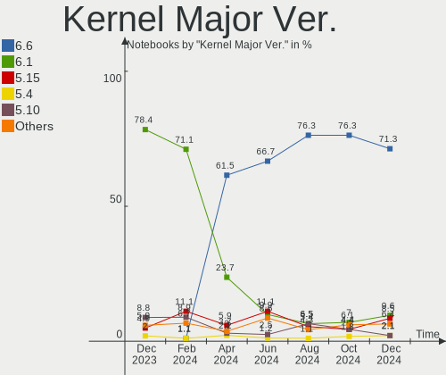
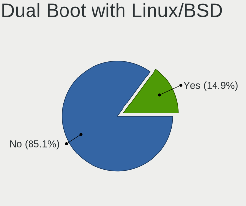
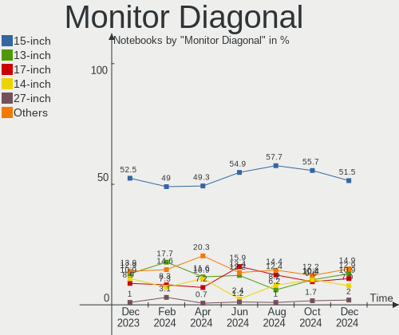

ROSA - Hardware Trends (Notebooks)
----------------------------------

A project to identify most popular hardware characteristics and track their change
over time based on data collected by Linux users at https://Linux-Hardware.org.

Anyone can contribute to this report by the [hw-probe](https://github.com/linuxhw/hw-probe) tool:

    sudo -E hw-probe -all -upload

This report is for one last month. Overall report since the beginning of time: [TestCoverage](https://github.com/linuxhw/TestCoverage)

Period: Oct, 2022.

Contents
--------

* [ System ](#system)
  - [ OS                       ](#os)
  - [ OS Family                ](#os-family)
  - [ Kernel                   ](#kernel)
  - [ Kernel Family            ](#kernel-family)
  - [ Kernel Major Ver.        ](#kernel-major-ver)
  - [ Arch                     ](#arch)
  - [ DE                       ](#de)
  - [ Display Server           ](#display-server)
  - [ Display Manager          ](#display-manager)
  - [ OS Lang                  ](#os-lang)
  - [ Boot Mode                ](#boot-mode)
  - [ Filesystem               ](#filesystem)
  - [ Part. scheme             ](#part-scheme)
  - [ Dual Boot with Linux/BSD ](#dual-boot-with-linuxbsd)
  - [ Dual Boot (Win)          ](#dual-boot-win)

* [ Board ](#board)
  - [ Vendor                   ](#vendor)
  - [ Model                    ](#model)
  - [ Model Family             ](#model-family)
  - [ MFG Year                 ](#mfg-year)
  - [ Form Factor              ](#form-factor)
  - [ Secure Boot              ](#secure-boot)
  - [ Coreboot                 ](#coreboot)
  - [ RAM Size                 ](#ram-size)
  - [ RAM Used                 ](#ram-used)
  - [ Total Drives             ](#total-drives)
  - [ Has CD-ROM               ](#has-cd-rom)
  - [ Has Ethernet             ](#has-ethernet)
  - [ Has WiFi                 ](#has-wifi)
  - [ Has Bluetooth            ](#has-bluetooth)

* [ Location ](#location)
  - [ Country                  ](#country)
  - [ City                     ](#city)

* [ Drives ](#drives)
  - [ Drive Vendor             ](#drive-vendor)
  - [ Drive Model              ](#drive-model)
  - [ HDD Vendor               ](#hdd-vendor)
  - [ SSD Vendor               ](#ssd-vendor)
  - [ Drive Kind               ](#drive-kind)
  - [ Drive Connector          ](#drive-connector)
  - [ Drive Size               ](#drive-size)
  - [ Space Total              ](#space-total)
  - [ Space Used               ](#space-used)
  - [ Malfunc. Drives          ](#malfunc-drives)
  - [ Malfunc. Drive Vendor    ](#malfunc-drive-vendor)
  - [ Malfunc. HDD Vendor      ](#malfunc-hdd-vendor)
  - [ Malfunc. Drive Kind      ](#malfunc-drive-kind)
  - [ Failed Drives            ](#failed-drives)
  - [ Failed Drive Vendor      ](#failed-drive-vendor)
  - [ Drive Status             ](#drive-status)

* [ Storage controller ](#storage-controller)
  - [ Storage Vendor           ](#storage-vendor)
  - [ Storage Model            ](#storage-model)
  - [ Storage Kind             ](#storage-kind)

* [ Processor ](#processor)
  - [ CPU Vendor               ](#cpu-vendor)
  - [ CPU Model                ](#cpu-model)
  - [ CPU Model Family         ](#cpu-model-family)
  - [ CPU Cores                ](#cpu-cores)
  - [ CPU Sockets              ](#cpu-sockets)
  - [ CPU Threads              ](#cpu-threads)
  - [ CPU Op-Modes             ](#cpu-op-modes)
  - [ CPU Microcode            ](#cpu-microcode)
  - [ CPU Microarch            ](#cpu-microarch)

* [ Graphics ](#graphics)
  - [ GPU Vendor               ](#gpu-vendor)
  - [ GPU Model                ](#gpu-model)
  - [ GPU Combo                ](#gpu-combo)
  - [ GPU Driver               ](#gpu-driver)
  - [ GPU Memory               ](#gpu-memory)

* [ Monitor ](#monitor)
  - [ Monitor Vendor           ](#monitor-vendor)
  - [ Monitor Model            ](#monitor-model)
  - [ Monitor Resolution       ](#monitor-resolution)
  - [ Monitor Diagonal         ](#monitor-diagonal)
  - [ Monitor Width            ](#monitor-width)
  - [ Aspect Ratio             ](#aspect-ratio)
  - [ Monitor Area             ](#monitor-area)
  - [ Pixel Density            ](#pixel-density)
  - [ Multiple Monitors        ](#multiple-monitors)

* [ Network ](#network)
  - [ Net Controller Vendor    ](#net-controller-vendor)
  - [ Net Controller Model     ](#net-controller-model)
  - [ Wireless Vendor          ](#wireless-vendor)
  - [ Wireless Model           ](#wireless-model)
  - [ Ethernet Vendor          ](#ethernet-vendor)
  - [ Ethernet Model           ](#ethernet-model)
  - [ Net Controller Kind      ](#net-controller-kind)
  - [ Used Controller          ](#used-controller)
  - [ NICs                     ](#nics)
  - [ IPv6                     ](#ipv6)

* [ Bluetooth ](#bluetooth)
  - [ Bluetooth Vendor         ](#bluetooth-vendor)
  - [ Bluetooth Model          ](#bluetooth-model)

* [ Sound ](#sound)
  - [ Sound Vendor             ](#sound-vendor)
  - [ Sound Model              ](#sound-model)

* [ Memory ](#memory)
  - [ Memory Vendor            ](#memory-vendor)
  - [ Memory Model             ](#memory-model)
  - [ Memory Kind              ](#memory-kind)
  - [ Memory Form Factor       ](#memory-form-factor)
  - [ Memory Size              ](#memory-size)
  - [ Memory Speed             ](#memory-speed)

* [ Printers & scanners ](#printers--scanners)
  - [ Printer Vendor           ](#printer-vendor)
  - [ Printer Model            ](#printer-model)
  - [ Scanner Vendor           ](#scanner-vendor)
  - [ Scanner Model            ](#scanner-model)

* [ Camera ](#camera)
  - [ Camera Vendor            ](#camera-vendor)
  - [ Camera Model             ](#camera-model)

* [ Security ](#security)
  - [ Fingerprint Vendor       ](#fingerprint-vendor)
  - [ Fingerprint Model        ](#fingerprint-model)
  - [ Chipcard Vendor          ](#chipcard-vendor)
  - [ Chipcard Model           ](#chipcard-model)

* [ Unsupported ](#unsupported)
  - [ Unsupported Devices      ](#unsupported-devices)
  - [ Unsupported Device Types ](#unsupported-device-types)

System
------

OS
--

Installed operating systems

| Name       | Notebooks | Percent |
|------------|-----------|---------|
| ROSA 12.2  | 110       | 87.3%   |
| ROSA R11.1 | 14        | 11.11%  |
| ROSA 12.3  | 2         | 1.59%   |

OS Family
---------

OS without a version

| Name | Notebooks | Percent |
|------|-----------|---------|
| ROSA | 126       | 100%    |

Kernel
------

Version of the Linux kernel

| Version                                        | Notebooks | Percent |
|------------------------------------------------|-----------|---------|
| 5.10.74-generic-2rosa2021.1-x86_64             | 41        | 32.54%  |
| 5.10.118-generic-2rosa2021.1-x86_64            | 40        | 31.75%  |
| 5.17.11-generic-2rosa2021.1-x86_64             | 7         | 5.56%   |
| 5.4.32-generic-2rosa-x86_64                    | 6         | 4.76%   |
| 5.18.18.xm1-1-xanmod-rosa2021.1-x86_64         | 4         | 3.17%   |
| 5.15.43-generic-2rosa2021.1-x86_64             | 4         | 3.17%   |
| 5.10.150-generic-1rosa2021.1-x86_64            | 4         | 3.17%   |
| 5.15.74-generic-1rosa2021.1-x86_64             | 3         | 2.38%   |
| 5.4.83-generic-2rosa-x86_64                    | 2         | 1.59%   |
| 5.4.83-generic-2rosa-i586                      | 2         | 1.59%   |
| 5.10.74-generic-2rosa2021.1-i586               | 2         | 1.59%   |
| 4.9.155-nrj-desktop-1rosa-x86_64               | 2         | 1.59%   |
| 6.0.6.xm1-1.klp-xanmod-rosa2021.1-x86_64       | 1         | 0.79%   |
| 6.0.3.xm1-1.klp-xanmod-rosa2021.1-x86_64       | 1         | 0.79%   |
| 5.4.32-generic-2rosa-i586                      | 1         | 0.79%   |
| 5.19.8.xm1-1.klp-xanmod-rosa2021.1-x86_64      | 1         | 0.79%   |
| 5.18.19-generic-1rosa2021.1-x86_64             | 1         | 0.79%   |
| 5.16.20-generic-2rosa2021.1-x86_64             | 1         | 0.79%   |
| 5.15.53.xm1-1.klp-xanmod-lts-rosa2021.1-x86_64 | 1         | 0.79%   |
| 5.10.118-generic-2rosa2021.1-i586              | 1         | 0.79%   |
| 4.9.155-nrj-desktop-1rosa-i586                 | 1         | 0.79%   |

Kernel Family
-------------

Linux kernel without a distro release

| Version  | Notebooks | Percent |
|----------|-----------|---------|
| 5.10.74  | 43        | 34.13%  |
| 5.10.118 | 41        | 32.54%  |
| 5.4.32   | 7         | 5.56%   |
| 5.17.11  | 7         | 5.56%   |
| 5.4.83   | 4         | 3.17%   |
| 5.18.18  | 4         | 3.17%   |
| 5.15.43  | 4         | 3.17%   |
| 5.10.150 | 4         | 3.17%   |
| 5.15.74  | 3         | 2.38%   |
| 4.9.155  | 3         | 2.38%   |
| 6.0.6    | 1         | 0.79%   |
| 6.0.3    | 1         | 0.79%   |
| 5.19.8   | 1         | 0.79%   |
| 5.18.19  | 1         | 0.79%   |
| 5.16.20  | 1         | 0.79%   |
| 5.15.53  | 1         | 0.79%   |

Kernel Major Ver.
-----------------

Linux kernel major version

| Version | Notebooks | Percent |
|---------|-----------|---------|
| 5.10    | 88        | 69.84%  |
| 5.4     | 11        | 8.73%   |
| 5.15    | 8         | 6.35%   |
| 5.17    | 7         | 5.56%   |
| 5.18    | 5         | 3.97%   |
| 4.9     | 3         | 2.38%   |
| 6.0     | 2         | 1.59%   |
| 5.19    | 1         | 0.79%   |
| 5.16    | 1         | 0.79%   |

Arch
----

OS architecture (x86_64, i586, etc.)

| Name   | Notebooks | Percent |
|--------|-----------|---------|
| x86_64 | 119       | 94.44%  |
| i686   | 7         | 5.56%   |

DE
--

Desktop Environment

| Name  | Notebooks | Percent |
|-------|-----------|---------|
| KDE5  | 57        | 45.24%  |
| GNOME | 41        | 32.54%  |
| LXQt  | 18        | 14.29%  |
| KDE4  | 10        | 7.94%   |

Display Server
--------------

X11 or Wayland

| Name    | Notebooks | Percent |
|---------|-----------|---------|
| Wayland | 94        | 74.6%   |
| X11     | 32        | 25.4%   |

Display Manager
---------------

SDDM, LightDM, etc.

| Name    | Notebooks | Percent |
|---------|-----------|---------|
| SDDM    | 58        | 46.03%  |
| GDM     | 55        | 43.65%  |
| KDM     | 10        | 7.94%   |
| LightDM | 3         | 2.38%   |

OS Lang
-------

Language

| Lang  | Notebooks | Percent |
|-------|-----------|---------|
| ru_RU | 118       | 93.65%  |
| en_US | 4         | 3.17%   |
| fr_FR | 2         | 1.59%   |
| pl_PL | 1         | 0.79%   |
| it_IT | 1         | 0.79%   |

Boot Mode
---------

EFI or BIOS

| Mode | Notebooks | Percent |
|------|-----------|---------|
| EFI  | 68        | 53.97%  |
| BIOS | 58        | 46.03%  |

Filesystem
----------

Type of filesystem

| Type  | Notebooks | Percent |
|-------|-----------|---------|
| Ext4  | 119       | 94.44%  |
| Btrfs | 6         | 4.76%   |
| Ext3  | 1         | 0.79%   |

Part. scheme
------------

Scheme of partitioning

| Type | Notebooks | Percent |
|------|-----------|---------|
| GPT  | 76        | 60.32%  |
| MBR  | 50        | 39.68%  |

Dual Boot with Linux/BSD
------------------------

Hosting more than one Linux/BSD

| Dual boot | Notebooks | Percent |
|-----------|-----------|---------|
| No        | 97        | 76.98%  |
| Yes       | 29        | 23.02%  |

Dual Boot (Win)
---------------

Hosting Linux and Windows

| Dual boot | Notebooks | Percent |
|-----------|-----------|---------|
| No        | 87        | 69.05%  |
| Yes       | 39        | 30.95%  |

Board
-----

Vendor
------

Motherboard manufacturer

| Name                           | Notebooks | Percent |
|--------------------------------|-----------|---------|
| Lenovo                         | 27        | 21.43%  |
| ASUSTek Computer               | 23        | 18.25%  |
| Hewlett-Packard                | 19        | 15.08%  |
| Acer                           | 18        | 14.29%  |
| Sony                           | 6         | 4.76%   |
| Samsung Electronics            | 5         | 3.97%   |
| Dell                           | 5         | 3.97%   |
| MSI                            | 4         | 3.17%   |
| HUAWEI                         | 3         | 2.38%   |
| Pegatron                       | 2         | 1.59%   |
| Maibenben                      | 2         | 1.59%   |
| Clevo                          | 2         | 1.59%   |
| Toshiba                        | 1         | 0.79%   |
| Shanghai Zhaoxin Semiconductor | 1         | 0.79%   |
| Quanta                         | 1         | 0.79%   |
| HONOR                          | 1         | 0.79%   |
| HIPER                          | 1         | 0.79%   |
| eMachines                      | 1         | 0.79%   |
| BenQ                           | 1         | 0.79%   |
| Aquarius                       | 1         | 0.79%   |
| 3Logic Group                   | 1         | 0.79%   |
| Unknown                        | 1         | 0.79%   |

Model
-----

Motherboard model

| Name                                       | Notebooks | Percent |
|--------------------------------------------|-----------|---------|
| HP Pavilion g6                             | 3         | 2.38%   |
| HP Pavilion dv7                            | 3         | 2.38%   |
| ASUS VivoBook_ASUS Laptop E210MA_E210MA    | 2         | 1.59%   |
| ASUS K43SJ                                 | 2         | 1.59%   |
| Acer Nitro AN515-54                        | 2         | 1.59%   |
| Acer Aspire E1-571G                        | 2         | 1.59%   |
| Acer Aspire 5742G                          | 2         | 1.59%   |
| Toshiba Satellite C660                     | 1         | 0.79%   |
| Sony VPCSB1V9R                             | 1         | 0.79%   |
| Sony VPCF12Z1R                             | 1         | 0.79%   |
| Sony VPCEB1M1R                             | 1         | 0.79%   |
| Sony VGN-AR71MR                            | 1         | 0.79%   |
| Sony SVE1513U1RW                           | 1         | 0.79%   |
| Sony SVE1512H1RW                           | 1         | 0.79%   |
| Shanghai Zhaoxin ZXE CRB                   | 1         | 0.79%   |
| Samsung RV413/RV513                        | 1         | 0.79%   |
| Samsung RV411/RV511/E3511/S3511/RV711      | 1         | 0.79%   |
| Samsung NC110P/NC108P/NC111P               | 1         | 0.79%   |
| Samsung 350V5C/351V5C/3540VC/3440VC        | 1         | 0.79%   |
| Samsung 300V3A/300V4A/300V5A/200A4B/200A5B | 1         | 0.79%   |
| Quanta TWC                                 | 1         | 0.79%   |
| Pegatron A17                               | 1         | 0.79%   |
| Pegatron A15                               | 1         | 0.79%   |
| MSI Sword 15 A11UE                         | 1         | 0.79%   |
| MSI GF63 Thin 9RCX                         | 1         | 0.79%   |
| MSI GE60 2PC                               | 1         | 0.79%   |
| MSI CX62 6QD                               | 1         | 0.79%   |
| Maibenben ZiMai Z5                         | 1         | 0.79%   |
| Maibenben MaiBook M                        | 1         | 0.79%   |
| Lenovo V310-15IKB 80T3                     | 1         | 0.79%   |
| Lenovo ThinkPad X1 Carbon 34481B8          | 1         | 0.79%   |
| Lenovo ThinkPad T490s 20NYS4HL1K           | 1         | 0.79%   |
| Lenovo ThinkPad S1 Yoga 20CDA00XRT         | 1         | 0.79%   |
| Lenovo Legion Y540-15IRH-PG0 81SY          | 1         | 0.79%   |
| Lenovo Legion Y-540-17IRH-PG0 81T3         | 1         | 0.79%   |
| Lenovo Legion 5 15IMH05H 81Y6              | 1         | 0.79%   |
| Lenovo IdeaPad S340-14API 81NB             | 1         | 0.79%   |
| Lenovo IdeaPad L340-15IRH Gaming 81LK      | 1         | 0.79%   |
| Lenovo IdeaPad Gaming 3 15ACH6 82K2        | 1         | 0.79%   |
| Lenovo IdeaPad 5 Pro 16ACH6 82L5           | 1         | 0.79%   |

Model Family
------------

Motherboard model prefix

| Name                 | Notebooks | Percent |
|----------------------|-----------|---------|
| Acer Aspire          | 12        | 9.52%   |
| Lenovo IdeaPad       | 9         | 7.14%   |
| HP Pavilion          | 7         | 5.56%   |
| ASUS VivoBook        | 5         | 3.97%   |
| HP Laptop            | 4         | 3.17%   |
| Dell Inspiron        | 4         | 3.17%   |
| Acer Nitro           | 4         | 3.17%   |
| Lenovo ThinkPad      | 3         | 2.38%   |
| Lenovo Legion        | 3         | 2.38%   |
| HP ProBook           | 2         | 1.59%   |
| HP EliteBook         | 2         | 1.59%   |
| ASUS K43SJ           | 2         | 1.59%   |
| Acer Extensa         | 2         | 1.59%   |
| Toshiba Satellite    | 1         | 0.79%   |
| Sony VPCSB1V9R       | 1         | 0.79%   |
| Sony VPCF12Z1R       | 1         | 0.79%   |
| Sony VPCEB1M1R       | 1         | 0.79%   |
| Sony VGN-AR71MR      | 1         | 0.79%   |
| Sony SVE1513U1RW     | 1         | 0.79%   |
| Sony SVE1512H1RW     | 1         | 0.79%   |
| Shanghai Zhaoxin ZXE | 1         | 0.79%   |
| Samsung RV413        | 1         | 0.79%   |
| Samsung RV411        | 1         | 0.79%   |
| Samsung NC110P       | 1         | 0.79%   |
| Samsung 350V5C       | 1         | 0.79%   |
| Samsung 300V3A       | 1         | 0.79%   |
| Quanta TWC           | 1         | 0.79%   |
| Pegatron A17         | 1         | 0.79%   |
| Pegatron A15         | 1         | 0.79%   |
| MSI Sword            | 1         | 0.79%   |
| MSI GF63             | 1         | 0.79%   |
| MSI GE60             | 1         | 0.79%   |
| MSI CX62             | 1         | 0.79%   |
| Maibenben ZiMai      | 1         | 0.79%   |
| Maibenben MaiBook    | 1         | 0.79%   |
| Lenovo V310-15IKB    | 1         | 0.79%   |
| Lenovo G770          | 1         | 0.79%   |
| Lenovo G710          | 1         | 0.79%   |
| Lenovo G565          | 1         | 0.79%   |
| Lenovo G550          | 1         | 0.79%   |

MFG Year
--------

Motherboard manufacture year

| Year | Notebooks | Percent |
|------|-----------|---------|
| 2011 | 19        | 15.08%  |
| 2012 | 15        | 11.9%   |
| 2019 | 13        | 10.32%  |
| 2021 | 11        | 8.73%   |
| 2020 | 9         | 7.14%   |
| 2018 | 9         | 7.14%   |
| 2010 | 8         | 6.35%   |
| 2013 | 7         | 5.56%   |
| 2008 | 7         | 5.56%   |
| 2009 | 6         | 4.76%   |
| 2016 | 5         | 3.97%   |
| 2014 | 5         | 3.97%   |
| 2017 | 4         | 3.17%   |
| 2022 | 3         | 2.38%   |
| 2007 | 3         | 2.38%   |
| 2015 | 2         | 1.59%   |

Form Factor
-----------

Physical design of the computer

| Name     | Notebooks | Percent |
|----------|-----------|---------|
| Notebook | 126       | 100%    |

Secure Boot
-----------

Enabled or disabled

| State    | Notebooks | Percent |
|----------|-----------|---------|
| Disabled | 126       | 100%    |

Coreboot
--------

Have coreboot on board

| Used | Notebooks | Percent |
|------|-----------|---------|
| No   | 126       | 100%    |

RAM Size
--------

Total RAM memory

| Size in GB | Notebooks | Percent |
|------------|-----------|---------|
| 4.01-8.0   | 45        | 35.71%  |
| 3.01-4.0   | 27        | 21.43%  |
| 8.01-16.0  | 22        | 17.46%  |
| 1.01-2.0   | 12        | 9.52%   |
| 16.01-24.0 | 10        | 7.94%   |
| 2.01-3.0   | 5         | 3.97%   |
| 32.01-64.0 | 3         | 2.38%   |
| 24.01-32.0 | 1         | 0.79%   |
| 0.51-1.0   | 1         | 0.79%   |

RAM Used
--------

Used RAM memory

| Used GB   | Notebooks | Percent |
|-----------|-----------|---------|
| 1.01-2.0  | 63        | 50%     |
| 0.51-1.0  | 38        | 30.16%  |
| 2.01-3.0  | 14        | 11.11%  |
| 3.01-4.0  | 5         | 3.97%   |
| 4.01-8.0  | 4         | 3.17%   |
| 8.01-16.0 | 1         | 0.79%   |
| 0.01-0.5  | 1         | 0.79%   |

Total Drives
------------

Number of drives on board

| Drives | Notebooks | Percent |
|--------|-----------|---------|
| 1      | 91        | 72.22%  |
| 2      | 33        | 26.19%  |
| 3      | 2         | 1.59%   |

Has CD-ROM
----------

Has CD-ROM on board

| Presented | Notebooks | Percent |
|-----------|-----------|---------|
| No        | 73        | 57.94%  |
| Yes       | 53        | 42.06%  |

Has Ethernet
------------

Has Ethernet on board

| Presented | Notebooks | Percent |
|-----------|-----------|---------|
| Yes       | 107       | 84.92%  |
| No        | 19        | 15.08%  |

Has WiFi
--------

Has WiFi module

| Presented | Notebooks | Percent |
|-----------|-----------|---------|
| Yes       | 126       | 100%    |

Has Bluetooth
-------------

Has Bluetooth module

| Presented | Notebooks | Percent |
|-----------|-----------|---------|
| Yes       | 104       | 82.54%  |
| No        | 22        | 17.46%  |

Location
--------

Country
-------

Geographic location (country)

| Country    | Notebooks | Percent |
|------------|-----------|---------|
| Russia     | 105       | 83.33%  |
| Ukraine    | 7         | 5.56%   |
| Belarus    | 3         | 2.38%   |
| Kazakhstan | 2         | 1.59%   |
| France     | 2         | 1.59%   |
| USA        | 1         | 0.79%   |
| Poland     | 1         | 0.79%   |
| Norway     | 1         | 0.79%   |
| Moldova    | 1         | 0.79%   |
| Italy      | 1         | 0.79%   |
| Germany    | 1         | 0.79%   |
| Algeria    | 1         | 0.79%   |

City
----

Geographic location (city)

| City              | Notebooks | Percent |
|-------------------|-----------|---------|
| Moscow            | 24        | 19.05%  |
| Yekaterinburg     | 6         | 4.76%   |
| St Petersburg     | 4         | 3.17%   |
| Nizhniy Novgorod  | 4         | 3.17%   |
| Saratov           | 3         | 2.38%   |
| Samara            | 3         | 2.38%   |
| Perm              | 3         | 2.38%   |
| Yalta             | 2         | 1.59%   |
| Stavropol         | 2         | 1.59%   |
| Rostov-on-Don     | 2         | 1.59%   |
| Orenburg          | 2         | 1.59%   |
| Montpellier       | 2         | 1.59%   |
| Krasnoyarsk       | 2         | 1.59%   |
| Krasnodar         | 2         | 1.59%   |
| Istra             | 2         | 1.59%   |
| Irkutsk           | 2         | 1.59%   |
| Chelyabinsk       | 2         | 1.59%   |
| Almaty            | 2         | 1.59%   |
| Zheleznogorsk     | 1         | 0.79%   |
| Yuzhno-Sakhalinsk | 1         | 0.79%   |
| Yurga             | 1         | 0.79%   |
| Yevpatoriya       | 1         | 0.79%   |
| Yefremov          | 1         | 0.79%   |
| Yaroslavl         | 1         | 0.79%   |
| Vsevolozhsk       | 1         | 0.79%   |
| Voronezh          | 1         | 0.79%   |
| Vladivostok       | 1         | 0.79%   |
| Usinsk            | 1         | 0.79%   |
| Tyumen            | 1         | 0.79%   |
| Tver              | 1         | 0.79%   |
| Tula              | 1         | 0.79%   |
| Torzhok           | 1         | 0.79%   |
| Tomsk             | 1         | 0.79%   |
| Tiraspol          | 1         | 0.79%   |
| Tipasa            | 1         | 0.79%   |
| Surgut            | 1         | 0.79%   |
| Stupino           | 1         | 0.79%   |
| Solikamsk         | 1         | 0.79%   |
| Sochi             | 1         | 0.79%   |
| Skopin            | 1         | 0.79%   |

Drives
------

Drive Vendor
------------

Hard drive vendors

| Vendor              | Notebooks | Drives | Percent |
|---------------------|-----------|--------|---------|
| WDC                 | 21        | 21     | 14%     |
| Seagate             | 15        | 15     | 10%     |
| Hitachi             | 15        | 15     | 10%     |
| Samsung Electronics | 11        | 12     | 7.33%   |
| Toshiba             | 9         | 9      | 6%      |
| Unknown             | 6         | 9      | 4%      |
| SK hynix            | 6         | 6      | 4%      |
| China               | 6         | 7      | 4%      |
| Micron Technology   | 5         | 5      | 3.33%   |
| HGST                | 5         | 5      | 3.33%   |
| SPCC                | 4         | 4      | 2.67%   |
| KingSpec            | 4         | 4      | 2.67%   |
| Intel               | 4         | 4      | 2.67%   |
| SanDisk             | 3         | 3      | 2%      |
| Kingston            | 3         | 3      | 2%      |
| Transcend           | 2         | 2      | 1.33%   |
| SSSTC               | 2         | 2      | 1.33%   |
| Patriot             | 2         | 2      | 1.33%   |
| KIOXIA              | 2         | 2      | 1.33%   |
| GOODRAM             | 2         | 2      | 1.33%   |
| Crucial             | 2         | 2      | 1.33%   |
| AMD                 | 2         | 2      | 1.33%   |
| A-DATA Technology   | 2         | 2      | 1.33%   |
| WALRAM              | 1         | 1      | 0.67%   |
| UMIS                | 1         | 1      | 0.67%   |
| Smartbuy            | 1         | 1      | 0.67%   |
| Silicon Motion      | 1         | 1      | 0.67%   |
| PNY                 | 1         | 1      | 0.67%   |
| Phison              | 1         | 1      | 0.67%   |
| Netac               | 1         | 1      | 0.67%   |
| Lexar               | 1         | 1      | 0.67%   |
| KingDian            | 1         | 1      | 0.67%   |
| HS-SSD-E100         | 1         | 1      | 0.67%   |
| GS                  | 1         | 2      | 0.67%   |
| Gigabyte Technology | 1         | 1      | 0.67%   |
| faspeed             | 1         | 1      | 0.67%   |
| ExeGate             | 1         | 1      | 0.67%   |
| Apacer              | 1         | 1      | 0.67%   |
| 1TB                 | 1         | 1      | 0.67%   |
| Unknown             | 1         | 1      | 0.67%   |

Drive Model
-----------

Hard drive models

| Model                                | Notebooks | Percent |
|--------------------------------------|-----------|---------|
| SPCC Solid State Disk 256GB          | 3         | 1.94%   |
| Seagate ST1000LM024 HN-M101MBB 1TB   | 3         | 1.94%   |
| WDC WD5000LPCX-24VHAT0 500GB         | 2         | 1.29%   |
| WDC PC SN530 SDBPNPZ-256G-1006 256GB | 2         | 1.29%   |
| Unknown EC2QT  64GB                  | 2         | 1.29%   |
| Unknown DA4064  64GB                 | 2         | 1.29%   |
| Toshiba MQ01ABF050 500GB             | 2         | 1.29%   |
| SK hynix HFM256GDJTNG-8310A 256GB    | 2         | 1.29%   |
| Seagate ST500LT012-1DG142 500GB      | 2         | 1.29%   |
| Seagate ST320LT020-9YG142 320GB      | 2         | 1.29%   |
| Samsung SSD 860 EVO 500GB            | 2         | 1.29%   |
| Samsung SSD 850 EVO 250GB            | 2         | 1.29%   |
| Micron 2200_MTFDHBA256TCK 256GB      | 2         | 1.29%   |
| Hitachi HTS723232A7A364 320GB        | 2         | 1.29%   |
| Hitachi HTS547550A9E384 500GB        | 2         | 1.29%   |
| Hitachi HTS545050B9A300 500GB        | 2         | 1.29%   |
| Hitachi HTS542516K9SA00 160GB        | 2         | 1.29%   |
| Hitachi HTS542512K9SA00 120GB        | 2         | 1.29%   |
| HGST HTS541010B7E610 1TB             | 2         | 1.29%   |
| WDC WDS500G2B0A-00SM50 500GB SSD     | 1         | 0.65%   |
| WDC WDS120G2G0A-00JH30 120GB SSD     | 1         | 0.65%   |
| WDC WDS100T2B0B-00YS70 1TB SSD       | 1         | 0.65%   |
| WDC WD7500BPVT-00HXZT3 752GB         | 1         | 0.65%   |
| WDC WD5000LPLX-22ZNTT0 500GB         | 1         | 0.65%   |
| WDC WD5000LPCX-21VHAT0 500GB         | 1         | 0.65%   |
| WDC WD5000BPVT-00HXZT1 500GB         | 1         | 0.65%   |
| WDC WD3200BPVT-24ZEST0 320GB         | 1         | 0.65%   |
| WDC WD3200BPVT-24JJ5T0 320GB         | 1         | 0.65%   |
| WDC WD3200BPVT-22JJ5T0 320GB         | 1         | 0.65%   |
| WDC WD3200BEVT-00A0RT0 320GB         | 1         | 0.65%   |
| WDC WD2500BEVT-22A23T0 250GB         | 1         | 0.65%   |
| WDC WD1600BEVT-60ZCT1 160GB          | 1         | 0.65%   |
| WDC WD10SPSX-00A6WT0 1TB             | 1         | 0.65%   |
| WDC WD10JPVT-60A1YT0 1TB             | 1         | 0.65%   |
| WDC WD10JPCX-24UE4T0 1TB             | 1         | 0.65%   |
| WDC PC SN520 SDAPNUW-512G-1002 512GB | 1         | 0.65%   |
| WALRAM SSD 128G                      | 1         | 0.65%   |
| Unknown TA2964  64GB                 | 1         | 0.65%   |
| Unknown SD01G  1GB                   | 1         | 0.65%   |
| Unknown SD/MMC/MS PRO 1TB            | 1         | 0.65%   |

HDD Vendor
----------

Hard disk drive vendors

| Vendor              | Notebooks | Drives | Percent |
|---------------------|-----------|--------|---------|
| WDC                 | 15        | 15     | 25.42%  |
| Seagate             | 15        | 15     | 25.42%  |
| Hitachi             | 15        | 15     | 25.42%  |
| Toshiba             | 7         | 7      | 11.86%  |
| HGST                | 5         | 5      | 8.47%   |
| Unknown             | 1         | 1      | 1.69%   |
| Samsung Electronics | 1         | 1      | 1.69%   |

SSD Vendor
----------

Solid state drive vendors

| Vendor              | Notebooks | Drives | Percent |
|---------------------|-----------|--------|---------|
| Samsung Electronics | 6         | 6      | 10.71%  |
| China               | 6         | 7      | 10.71%  |
| SPCC                | 4         | 4      | 7.14%   |
| KingSpec            | 4         | 4      | 7.14%   |
| WDC                 | 3         | 3      | 5.36%   |
| SanDisk             | 3         | 3      | 5.36%   |
| Kingston            | 3         | 3      | 5.36%   |
| Transcend           | 2         | 2      | 3.57%   |
| Toshiba             | 2         | 2      | 3.57%   |
| Patriot             | 2         | 2      | 3.57%   |
| GOODRAM             | 2         | 2      | 3.57%   |
| Crucial             | 2         | 2      | 3.57%   |
| AMD                 | 2         | 2      | 3.57%   |
| A-DATA Technology   | 2         | 2      | 3.57%   |
| WALRAM              | 1         | 1      | 1.79%   |
| PNY                 | 1         | 1      | 1.79%   |
| Netac               | 1         | 1      | 1.79%   |
| Lexar               | 1         | 1      | 1.79%   |
| KingDian            | 1         | 1      | 1.79%   |
| Intel               | 1         | 1      | 1.79%   |
| HS-SSD-E100         | 1         | 1      | 1.79%   |
| GS                  | 1         | 2      | 1.79%   |
| faspeed             | 1         | 1      | 1.79%   |
| ExeGate             | 1         | 1      | 1.79%   |
| Apacer              | 1         | 1      | 1.79%   |
| 1TB                 | 1         | 1      | 1.79%   |
| Unknown             | 1         | 1      | 1.79%   |

Drive Kind
----------

HDD or SSD

| Kind | Notebooks | Drives | Percent |
|------|-----------|--------|---------|
| HDD  | 59        | 59     | 39.33%  |
| SSD  | 54        | 58     | 36%     |
| NVMe | 31        | 31     | 20.67%  |
| MMC  | 6         | 8      | 4%      |

Drive Connector
---------------

SATA, SAS, NVMe, etc.

| Type | Notebooks | Drives | Percent |
|------|-----------|--------|---------|
| SATA | 101       | 116    | 72.66%  |
| NVMe | 31        | 31     | 22.3%   |
| MMC  | 6         | 8      | 4.32%   |
| SAS  | 1         | 1      | 0.72%   |

Drive Size
----------

Size of hard drive

| Size in TB | Notebooks | Drives | Percent |
|------------|-----------|--------|---------|
| 0.01-0.5   | 83        | 90     | 76.85%  |
| 0.51-1.0   | 25        | 27     | 23.15%  |

Space Total
-----------

Amount of disk space available on the file system

| Size in GB     | Notebooks | Percent |
|----------------|-----------|---------|
| 101-250        | 49        | 38.89%  |
| 251-500        | 36        | 28.57%  |
| 1-20           | 11        | 8.73%   |
| 501-1000       | 9         | 7.14%   |
| 51-100         | 9         | 7.14%   |
| 21-50          | 6         | 4.76%   |
| 1001-2000      | 4         | 3.17%   |
| More than 3000 | 1         | 0.79%   |
| Unknown        | 1         | 0.79%   |

Space Used
----------

Amount of used disk space

| Used GB        | Notebooks | Percent |
|----------------|-----------|---------|
| 1-20           | 91        | 72.22%  |
| 21-50          | 12        | 9.52%   |
| 251-500        | 8         | 6.35%   |
| 51-100         | 7         | 5.56%   |
| 101-250        | 4         | 3.17%   |
| 501-1000       | 2         | 1.59%   |
| More than 3000 | 1         | 0.79%   |
| Unknown        | 1         | 0.79%   |

Malfunc. Drives
---------------

Drive models with a malfunction

| Model                              | Notebooks | Drives | Percent |
|------------------------------------|-----------|--------|---------|
| Seagate ST500LT012-1DG142 500GB    | 2         | 2      | 5.71%   |
| Hitachi HTS547550A9E384 500GB      | 2         | 2      | 5.71%   |
| Hitachi HTS542516K9SA00 160GB      | 2         | 2      | 5.71%   |
| WDC WD5000LPLX-22ZNTT0 500GB       | 1         | 1      | 2.86%   |
| WDC WD5000LPCX-21VHAT0 500GB       | 1         | 1      | 2.86%   |
| WDC WD5000BPVT-00HXZT1 500GB       | 1         | 1      | 2.86%   |
| WDC WD3200BPVT-24ZEST0 320GB       | 1         | 1      | 2.86%   |
| WDC WD3200BPVT-24JJ5T0 320GB       | 1         | 1      | 2.86%   |
| WDC WD3200BPVT-22JJ5T0 320GB       | 1         | 1      | 2.86%   |
| WDC WD2500BEVT-22A23T0 250GB       | 1         | 1      | 2.86%   |
| Toshiba MQ01ABF050 500GB           | 1         | 1      | 2.86%   |
| Toshiba MQ01ABD050 500GB           | 1         | 1      | 2.86%   |
| Toshiba MQ01ABD032 320GB           | 1         | 1      | 2.86%   |
| Toshiba MK5065GSXN 500GB           | 1         | 1      | 2.86%   |
| Seagate ST9500420AS 500GB          | 1         | 1      | 2.86%   |
| Seagate ST9320325AS 320GB          | 1         | 1      | 2.86%   |
| Seagate ST9250827AS 250GB          | 1         | 1      | 2.86%   |
| Seagate ST9250315AS 250GB          | 1         | 1      | 2.86%   |
| Seagate ST320LT020-9YG142 320GB    | 1         | 1      | 2.86%   |
| Seagate ST320LT012-9WS14C 320GB    | 1         | 1      | 2.86%   |
| Seagate ST1000LM048-2E7172 1TB     | 1         | 1      | 2.86%   |
| Seagate ST1000LM024 HN-M101MBB 1TB | 1         | 1      | 2.86%   |
| Seagate ST1000LM014-SSHD-8GB       | 1         | 1      | 2.86%   |
| Samsung Electronics HM321HI 320GB  | 1         | 1      | 2.86%   |
| KingSpec T-60 64GB SSD             | 1         | 1      | 2.86%   |
| Hitachi HTS723232A7A364 320GB      | 1         | 1      | 2.86%   |
| Hitachi HTS545050B9SA00 500GB      | 1         | 1      | 2.86%   |
| Hitachi HTS545050B9A300 500GB      | 1         | 1      | 2.86%   |
| Hitachi HTS543232A7A384 320GB      | 1         | 1      | 2.86%   |
| Hitachi HTS542512K9SA00 120GB      | 1         | 1      | 2.86%   |
| Hitachi HTS541612J9SA00 120GB      | 1         | 1      | 2.86%   |
| China SSD 240GB                    | 1         | 2      | 2.86%   |

Malfunc. Drive Vendor
---------------------

Vendors of faulty drives

| Vendor              | Notebooks | Drives | Percent |
|---------------------|-----------|--------|---------|
| Seagate             | 11        | 11     | 31.43%  |
| Hitachi             | 10        | 10     | 28.57%  |
| WDC                 | 7         | 7      | 20%     |
| Toshiba             | 4         | 4      | 11.43%  |
| Samsung Electronics | 1         | 1      | 2.86%   |
| KingSpec            | 1         | 1      | 2.86%   |
| China               | 1         | 2      | 2.86%   |

Malfunc. HDD Vendor
-------------------

Vendors of faulty HDD drives

| Vendor              | Notebooks | Drives | Percent |
|---------------------|-----------|--------|---------|
| Seagate             | 11        | 11     | 33.33%  |
| Hitachi             | 10        | 10     | 30.3%   |
| WDC                 | 7         | 7      | 21.21%  |
| Toshiba             | 4         | 4      | 12.12%  |
| Samsung Electronics | 1         | 1      | 3.03%   |

Malfunc. Drive Kind
-------------------

Kinds of faulty drives

| Kind | Notebooks | Drives | Percent |
|------|-----------|--------|---------|
| HDD  | 33        | 33     | 94.29%  |
| SSD  | 2         | 3      | 5.71%   |

Failed Drives
-------------

Failed drive models

Zero info for selected period =(

Failed Drive Vendor
-------------------

Failed drive vendors

Zero info for selected period =(

Drive Status
------------

Number of failed and malfunc. drives

| Status   | Notebooks | Drives | Percent |
|----------|-----------|--------|---------|
| Works    | 93        | 111    | 69.4%   |
| Malfunc  | 35        | 36     | 26.12%  |
| Detected | 6         | 9      | 4.48%   |

Storage controller
------------------

Storage Vendor
--------------

Storage controller vendors

| Vendor                           | Notebooks | Percent |
|----------------------------------|-----------|---------|
| Intel                            | 97        | 66.9%   |
| AMD                              | 18        | 12.41%  |
| SK hynix                         | 6         | 4.14%   |
| Samsung Electronics              | 5         | 3.45%   |
| Micron Technology                | 5         | 3.45%   |
| SanDisk                          | 3         | 2.07%   |
| Phison Electronics               | 3         | 2.07%   |
| Solid State Storage Technology   | 2         | 1.38%   |
| KIOXIA                           | 2         | 1.38%   |
| Zhaoxin                          | 1         | 0.69%   |
| Union Memory (Shenzhen)          | 1         | 0.69%   |
| Silicon Motion                   | 1         | 0.69%   |
| Silicon Integrated Systems [SiS] | 1         | 0.69%   |

Storage Model
-------------

Storage controller models

| Model                                                                          | Notebooks | Percent |
|--------------------------------------------------------------------------------|-----------|---------|
| Intel 7 Series Chipset Family 6-port SATA Controller [AHCI mode]               | 16        | 10.32%  |
| AMD FCH SATA Controller [AHCI mode]                                            | 14        | 9.03%   |
| Intel 6 Series/C200 Series Chipset Family 6 port Mobile SATA AHCI Controller   | 10        | 6.45%   |
| Intel 5 Series/3400 Series Chipset 4 port SATA AHCI Controller                 | 9         | 5.81%   |
| Intel Sunrise Point-LP SATA Controller [AHCI mode]                             | 7         | 4.52%   |
| Intel Cannon Lake Mobile PCH SATA AHCI Controller                              | 7         | 4.52%   |
| Intel 82801IBM/IEM (ICH9M/ICH9M-E) 4 port SATA Controller [AHCI mode]          | 6         | 3.87%   |
| Micron Non-Volatile memory controller                                          | 5         | 3.23%   |
| Intel 82801HM/HEM (ICH8M/ICH8M-E) IDE Controller                               | 5         | 3.23%   |
| Samsung NVMe SSD Controller SM981/PM981/PM983                                  | 4         | 2.58%   |
| Intel NM10/ICH7 Family SATA Controller [AHCI mode]                             | 4         | 2.58%   |
| Intel Celeron/Pentium Silver Processor SATA Controller                         | 4         | 2.58%   |
| Intel 82801HM/HEM (ICH8M/ICH8M-E) SATA Controller [AHCI mode]                  | 4         | 2.58%   |
| Intel 8 Series SATA Controller 1 [AHCI mode]                                   | 4         | 2.58%   |
| SK hynix BC501 NVMe Solid State Drive                                          | 3         | 1.94%   |
| Intel Comet Lake SATA AHCI Controller                                          | 3         | 1.94%   |
| Intel Cannon Point-LP SATA Controller [AHCI Mode]                              | 3         | 1.94%   |
| Intel 82801 Mobile SATA Controller [RAID mode]                                 | 3         | 1.94%   |
| Solid State Storage Non-Volatile memory controller                             | 2         | 1.29%   |
| SK hynix Gold P31 SSD                                                          | 2         | 1.29%   |
| SanDisk WD Blue SN550 NVMe SSD                                                 | 2         | 1.29%   |
| Phison PS5013 E13 NVMe Controller                                              | 2         | 1.29%   |
| KIOXIA NVMe SSD Controller BG4                                                 | 2         | 1.29%   |
| Intel Wildcat Point-LP SATA Controller [AHCI Mode]                             | 2         | 1.29%   |
| Intel Volume Management Device NVMe RAID Controller                            | 2         | 1.29%   |
| Intel SSD 660P Series                                                          | 2         | 1.29%   |
| Intel Atom Processor E3800 Series SATA AHCI Controller                         | 2         | 1.29%   |
| Intel 8 Series/C220 Series Chipset Family 6-port SATA Controller 1 [AHCI mode] | 2         | 1.29%   |
| AMD SB7x0/SB8x0/SB9x0 SATA Controller [AHCI mode]                              | 2         | 1.29%   |
| Zhaoxin ZX-100/ZX-200/ZX-E StorX AHCI Controller                               | 1         | 0.65%   |
| Union Memory (Shenzhen) Non-Volatile memory controller                         | 1         | 0.65%   |
| SK hynix Non-Volatile memory controller                                        | 1         | 0.65%   |
| Silicon Motion Non-Volatile memory controller                                  | 1         | 0.65%   |
| Silicon Integrated Systems [SiS] SATA Controller / IDE mode                    | 1         | 0.65%   |
| Silicon Integrated Systems [SiS] 5513 IDE Controller                           | 1         | 0.65%   |
| SanDisk WD Blue SN500 / PC SN520 NVMe SSD                                      | 1         | 0.65%   |
| Samsung NVMe SSD Controller 980                                                | 1         | 0.65%   |
| Phison NVMe Storage Controller                                                 | 1         | 0.65%   |
| Intel Non-Volatile memory controller                                           | 1         | 0.65%   |
| Intel HM170/QM170 Chipset SATA Controller [AHCI Mode]                          | 1         | 0.65%   |

Storage Kind
------------

Kind of storage controller (IDE, SATA, NVMe, SAS, ...)

| Kind | Notebooks | Percent |
|------|-----------|---------|
| SATA | 107       | 70.39%  |
| NVMe | 31        | 20.39%  |
| IDE  | 9         | 5.92%   |
| RAID | 5         | 3.29%   |

Processor
---------

CPU Vendor
----------

Processor vendors

| Vendor       | Notebooks | Percent |
|--------------|-----------|---------|
| Intel        | 100       | 79.37%  |
| AMD          | 25        | 19.84%  |
| CentaurHauls | 1         | 0.79%   |

CPU Model
---------

Processor models

| Model                                         | Notebooks | Percent |
|-----------------------------------------------|-----------|---------|
| Intel Pentium CPU B960 @ 2.20GHz              | 4         | 3.17%   |
| Intel Core i5-8300H CPU @ 2.30GHz             | 4         | 3.17%   |
| Intel Core i5-7200U CPU @ 2.50GHz             | 4         | 3.17%   |
| Intel Core i3-3110M CPU @ 2.40GHz             | 4         | 3.17%   |
| Intel Core i5-2410M CPU @ 2.30GHz             | 3         | 2.38%   |
| Intel Celeron N4020 CPU @ 1.10GHz             | 3         | 2.38%   |
| AMD Ryzen 5 3500U with Radeon Vega Mobile Gfx | 3         | 2.38%   |
| Intel Pentium CPU N3540 @ 2.16GHz             | 2         | 1.59%   |
| Intel Core i7-9750H CPU @ 2.60GHz             | 2         | 1.59%   |
| Intel Core i7-3610QM CPU @ 2.30GHz            | 2         | 1.59%   |
| Intel Core i7-2670QM CPU @ 2.20GHz            | 2         | 1.59%   |
| Intel Core i5-8265U CPU @ 1.60GHz             | 2         | 1.59%   |
| Intel Core i5-10210U CPU @ 1.60GHz            | 2         | 1.59%   |
| Intel Core i3-2310M CPU @ 2.10GHz             | 2         | 1.59%   |
| Intel Core i3 CPU M 380 @ 2.53GHz             | 2         | 1.59%   |
| Intel Core i3 CPU M 370 @ 2.40GHz             | 2         | 1.59%   |
| Intel Core i3 CPU M 330 @ 2.13GHz             | 2         | 1.59%   |
| Intel Celeron CPU 540 @ 1.86GHz               | 2         | 1.59%   |
| Intel Atom CPU N2800 @ 1.86GHz                | 2         | 1.59%   |
| Intel 11th Gen Core i5-11400H @ 2.70GHz       | 2         | 1.59%   |
| AMD Ryzen 7 5800H with Radeon Graphics        | 2         | 1.59%   |
| Intel Pentium Silver N6000 @ 1.10GHz          | 1         | 0.79%   |
| Intel Pentium Silver N5000 CPU @ 1.10GHz      | 1         | 0.79%   |
| Intel Pentium Dual-Core CPU T4500 @ 2.30GHz   | 1         | 0.79%   |
| Intel Pentium Dual-Core CPU T4400 @ 2.20GHz   | 1         | 0.79%   |
| Intel Pentium CPU P6100 @ 2.00GHz             | 1         | 0.79%   |
| Intel Pentium CPU B970 @ 2.30GHz              | 1         | 0.79%   |
| Intel Pentium CPU B950 @ 2.10GHz              | 1         | 0.79%   |
| Intel Pentium 3558U @ 1.70GHz                 | 1         | 0.79%   |
| Intel Core i7-9750HF CPU @ 2.60GHz            | 1         | 0.79%   |
| Intel Core i7-8665U CPU @ 1.90GHz             | 1         | 0.79%   |
| Intel Core i7-7500U CPU @ 2.70GHz             | 1         | 0.79%   |
| Intel Core i7-4702MQ CPU @ 2.20GHz            | 1         | 0.79%   |
| Intel Core i7-4500U CPU @ 1.80GHz             | 1         | 0.79%   |
| Intel Core i7-3612QM CPU @ 2.10GHz            | 1         | 0.79%   |
| Intel Core i7 CPU Q 740 @ 1.73GHz             | 1         | 0.79%   |
| Intel Core i7 CPU Q 720 @ 1.60GHz             | 1         | 0.79%   |
| Intel Core i5-9300H CPU @ 2.40GHz             | 1         | 0.79%   |
| Intel Core i5-8259U CPU @ 2.30GHz             | 1         | 0.79%   |
| Intel Core i5-8250U CPU @ 1.60GHz             | 1         | 0.79%   |

CPU Model Family
----------------

Processor model prefix

| Model                   | Notebooks | Percent |
|-------------------------|-----------|---------|
| Intel Core i5           | 28        | 22.22%  |
| Intel Core i3           | 18        | 14.29%  |
| Intel Core i7           | 14        | 11.11%  |
| Intel Celeron           | 11        | 8.73%   |
| Intel Pentium           | 10        | 7.94%   |
| Other                   | 7         | 5.56%   |
| AMD Ryzen 5             | 7         | 5.56%   |
| Intel Core 2 Duo        | 5         | 3.97%   |
| Intel Atom              | 4         | 3.17%   |
| AMD Ryzen 7             | 3         | 2.38%   |
| Intel Pentium Silver    | 2         | 1.59%   |
| Intel Pentium Dual-Core | 2         | 1.59%   |
| AMD Ryzen 3             | 2         | 1.59%   |
| AMD A8                  | 2         | 1.59%   |
| AMD A6                  | 2         | 1.59%   |
| AMD A10                 | 2         | 1.59%   |
| Intel Core Duo          | 1         | 0.79%   |
| AMD Turion 64 X2 Mobile | 1         | 0.79%   |
| AMD Phenom II           | 1         | 0.79%   |
| AMD E2                  | 1         | 0.79%   |
| AMD E                   | 1         | 0.79%   |
| AMD Athlon              | 1         | 0.79%   |
| AMD A4                  | 1         | 0.79%   |

CPU Cores
---------

Number of processor cores

| Number | Notebooks | Percent |
|--------|-----------|---------|
| 2      | 76        | 60.32%  |
| 4      | 35        | 27.78%  |
| 6      | 7         | 5.56%   |
| 8      | 4         | 3.17%   |
| 1      | 4         | 3.17%   |

CPU Sockets
-----------

Number of sockets

| Number | Notebooks | Percent |
|--------|-----------|---------|
| 1      | 126       | 100%    |

CPU Threads
-----------

Threads per core (Hyper-Threading)

| Number | Notebooks | Percent |
|--------|-----------|---------|
| 2      | 84        | 66.67%  |
| 1      | 42        | 33.33%  |

CPU Op-Modes
------------

CPU Operation Modes (32-bit, 64-bit)

| Op mode        | Notebooks | Percent |
|----------------|-----------|---------|
| 32-bit, 64-bit | 124       | 98.41%  |
| 32-bit         | 2         | 1.59%   |

CPU Microcode
-------------

Microcode number

| Number     | Notebooks | Percent |
|------------|-----------|---------|
| 0x206a7    | 17        | 13.49%  |
| 0x306a9    | 11        | 8.73%   |
| 0x906ea    | 7         | 5.56%   |
| 0x806ec    | 6         | 4.76%   |
| 0x20655    | 6         | 4.76%   |
| 0x806e9    | 5         | 3.97%   |
| 0x1067a    | 5         | 3.97%   |
| 0x706a8    | 4         | 3.17%   |
| 0x40651    | 4         | 3.17%   |
| Unknown    | 4         | 3.17%   |
| 0x806d1    | 3         | 2.38%   |
| 0x30661    | 3         | 2.38%   |
| 0x10661    | 3         | 2.38%   |
| 0x0a50000c | 3         | 2.38%   |
| 0x08108109 | 3         | 2.38%   |
| 0x08108102 | 3         | 2.38%   |
| 0x06001119 | 3         | 2.38%   |
| 0x806ea    | 2         | 1.59%   |
| 0x806c1    | 2         | 1.59%   |
| 0x6fd      | 2         | 1.59%   |
| 0x306d4    | 2         | 1.59%   |
| 0x306c3    | 2         | 1.59%   |
| 0x30678    | 2         | 1.59%   |
| 0x20652    | 2         | 1.59%   |
| 0x106e5    | 2         | 1.59%   |
| 0x03000027 | 2         | 1.59%   |
| 0xa0652    | 1         | 0.79%   |
| 0x906ed    | 1         | 0.79%   |
| 0x906c0    | 1         | 0.79%   |
| 0x706a1    | 1         | 0.79%   |
| 0x6fa      | 1         | 0.79%   |
| 0x6ec      | 1         | 0.79%   |
| 0x406e3    | 1         | 0.79%   |
| 0x406c4    | 1         | 0.79%   |
| 0x106ca    | 1         | 0.79%   |
| 0x08600104 | 1         | 0.79%   |
| 0x08200103 | 1         | 0.79%   |
| 0x0810100b | 1         | 0.79%   |
| 0x08101007 | 1         | 0.79%   |
| 0x06006705 | 1         | 0.79%   |

CPU Microarch
-------------

Microarchitecture

| Name          | Notebooks | Percent |
|---------------|-----------|---------|
| KabyLake      | 21        | 16.67%  |
| SandyBridge   | 17        | 13.49%  |
| IvyBridge     | 11        | 8.73%   |
| Westmere      | 8         | 6.35%   |
| Zen+          | 6         | 4.76%   |
| Haswell       | 6         | 4.76%   |
| Core          | 6         | 4.76%   |
| Penryn        | 5         | 3.97%   |
| Goldmont plus | 5         | 3.97%   |
| Piledriver    | 4         | 3.17%   |
| Bonnell       | 4         | 3.17%   |
| Zen 3         | 3         | 2.38%   |
| Zen           | 3         | 2.38%   |
| Silvermont    | 3         | 2.38%   |
| Icelake       | 3         | 2.38%   |
| Zen 2         | 2         | 1.59%   |
| TigerLake     | 2         | 1.59%   |
| Skylake       | 2         | 1.59%   |
| Nehalem       | 2         | 1.59%   |
| K10 Llano     | 2         | 1.59%   |
| Excavator     | 2         | 1.59%   |
| Broadwell     | 2         | 1.59%   |
| Tremont       | 1         | 0.79%   |
| P6            | 1         | 0.79%   |
| K8 Hammer     | 1         | 0.79%   |
| K10           | 1         | 0.79%   |
| CometLake     | 1         | 0.79%   |
| Bobcat        | 1         | 0.79%   |
| Unknown       | 1         | 0.79%   |

Graphics
--------

GPU Vendor
----------

Vendors of graphics cards

| Vendor           | Notebooks | Percent |
|------------------|-----------|---------|
| Intel            | 83        | 48.26%  |
| Nvidia           | 48        | 27.91%  |
| AMD              | 39        | 22.67%  |
| Zhaoxin          | 1         | 0.58%   |
| ATI Technologies | 1         | 0.58%   |

GPU Model
---------

Graphics card models

| Model                                                                                 | Notebooks | Percent |
|---------------------------------------------------------------------------------------|-----------|---------|
| Intel 2nd Generation Core Processor Family Integrated Graphics Controller             | 14        | 7.78%   |
| Intel 3rd Gen Core processor Graphics Controller                                      | 10        | 5.56%   |
| Intel CoffeeLake-H GT2 [UHD Graphics 630]                                             | 7         | 3.89%   |
| AMD Picasso/Raven 2 [Radeon Vega Series / Radeon Vega Mobile Series]                  | 7         | 3.89%   |
| Intel HD Graphics 620                                                                 | 5         | 2.78%   |
| Intel Core Processor Integrated Graphics Controller                                   | 5         | 2.78%   |
| Nvidia GF117M [GeForce 610M/710M/810M/820M / GT 620M/625M/630M/720M]                  | 4         | 2.22%   |
| Nvidia GF108M [GeForce GT 540M]                                                       | 4         | 2.22%   |
| Intel Haswell-ULT Integrated Graphics Controller                                      | 4         | 2.22%   |
| Intel GeminiLake [UHD Graphics 600]                                                   | 4         | 2.22%   |
| Nvidia TU117M [GeForce GTX 1650 Mobile / Max-Q]                                       | 3         | 1.67%   |
| Nvidia GP107M [GeForce GTX 1050 Mobile]                                               | 3         | 1.67%   |
| Nvidia GP107M [GeForce GTX 1050 3 GB Max-Q]                                           | 3         | 1.67%   |
| Nvidia GA107M [GeForce RTX 3050 Mobile]                                               | 3         | 1.67%   |
| Intel WhiskeyLake-U GT2 [UHD Graphics 620]                                            | 3         | 1.67%   |
| Intel TigerLake-H GT1 [UHD Graphics]                                                  | 3         | 1.67%   |
| Intel Mobile 4 Series Chipset Integrated Graphics Controller                          | 3         | 1.67%   |
| Intel CometLake-U GT2 [UHD Graphics]                                                  | 3         | 1.67%   |
| Intel Atom Processor D2xxx/N2xxx Integrated Graphics Controller                       | 3         | 1.67%   |
| AMD Cezanne                                                                           | 3         | 1.67%   |
| Nvidia GM108M [GeForce MX130]                                                         | 2         | 1.11%   |
| Nvidia GK107M [GeForce GT 640M]                                                       | 2         | 1.11%   |
| Nvidia GF119M [GeForce GT 520M]                                                       | 2         | 1.11%   |
| Nvidia GF108M [GeForce GT 620M/630M/635M/640M LE]                                     | 2         | 1.11%   |
| Intel Tiger Lake UHD Graphics                                                         | 2         | 1.11%   |
| Intel Mobile GM965/GL960 Integrated Graphics Controller (secondary)                   | 2         | 1.11%   |
| Intel Mobile GM965/GL960 Integrated Graphics Controller (primary)                     | 2         | 1.11%   |
| Intel HD Graphics 5500                                                                | 2         | 1.11%   |
| Intel Atom Processor Z36xxx/Z37xxx Series Graphics & Display                          | 2         | 1.11%   |
| Intel 4th Gen Core Processor Integrated Graphics Controller                           | 2         | 1.11%   |
| AMD Whistler [Radeon HD 6630M/6650M/6750M/7670M/7690M]                                | 2         | 1.11%   |
| AMD Topaz XT [Radeon R7 M260/M265 / M340/M360 / M440/M445 / 530/535 / 620/625 Mobile] | 2         | 1.11%   |
| AMD Thames [Radeon HD 7500M/7600M Series]                                             | 2         | 1.11%   |
| AMD Sun XT [Radeon HD 8670A/8670M/8690M / R5 M330 / M430 / Radeon 520 Mobile]         | 2         | 1.11%   |
| AMD Stoney [Radeon R2/R3/R4/R5 Graphics]                                              | 2         | 1.11%   |
| AMD Renoir                                                                            | 2         | 1.11%   |
| AMD Raven Ridge [Radeon Vega Series / Radeon Vega Mobile Series]                      | 2         | 1.11%   |
| AMD Park [Mobility Radeon HD 5430/5450/5470]                                          | 2         | 1.11%   |
| AMD Madison [Mobility Radeon HD 5650/5750 / 6530M/6550M]                              | 2         | 1.11%   |
| Zhaoxin ZX-E C-960 GPU                                                                | 1         | 0.56%   |

GPU Combo
---------

Combinations of graphics cards

| Name           | Notebooks | Percent |
|----------------|-----------|---------|
| 1 x Intel      | 41        | 32.54%  |
| Intel + Nvidia | 33        | 26.19%  |
| 1 x AMD        | 21        | 16.67%  |
| 1 x Nvidia     | 11        | 8.73%   |
| Intel + AMD    | 9         | 7.14%   |
| 2 x AMD        | 6         | 4.76%   |
| AMD + Nvidia   | 4         | 3.17%   |
| 1 x Zhaoxin    | 1         | 0.79%   |

GPU Driver
----------

Free vs proprietary

| Driver      | Notebooks | Percent |
|-------------|-----------|---------|
| Free        | 111       | 88.1%   |
| Proprietary | 11        | 8.73%   |
| Unknown     | 4         | 3.17%   |

GPU Memory
----------

Total video memory

| Size in GB | Notebooks | Percent |
|------------|-----------|---------|
| Unknown    | 53        | 42.06%  |
| 0.01-0.5   | 23        | 18.25%  |
| 1.01-2.0   | 20        | 15.87%  |
| 0.51-1.0   | 20        | 15.87%  |
| 3.01-4.0   | 8         | 6.35%   |
| 5.01-6.0   | 1         | 0.79%   |
| 2.01-3.0   | 1         | 0.79%   |

Monitor
-------

Monitor Vendor
--------------

Monitor vendors

| Vendor                  | Notebooks | Percent |
|-------------------------|-----------|---------|
| AU Optronics            | 27        | 21.77%  |
| LG Display              | 22        | 17.74%  |
| Samsung Electronics     | 18        | 14.52%  |
| BOE                     | 17        | 13.71%  |
| Chimei Innolux          | 13        | 10.48%  |
| Chi Mei Optoelectronics | 8         | 6.45%   |
| Sony                    | 2         | 1.61%   |
| Philips                 | 2         | 1.61%   |
| PANDA                   | 2         | 1.61%   |
| LG Philips              | 2         | 1.61%   |
| InfoVision              | 2         | 1.61%   |
| HannStar                | 2         | 1.61%   |
| Apple                   | 2         | 1.61%   |
| HUI                     | 1         | 0.81%   |
| Hewlett-Packard         | 1         | 0.81%   |
| CSO                     | 1         | 0.81%   |
| CPT                     | 1         | 0.81%   |
| BenQ                    | 1         | 0.81%   |

Monitor Model
-------------

Monitor models

| Model                                                                    | Notebooks | Percent |
|--------------------------------------------------------------------------|-----------|---------|
| LG Display LCD Monitor LGD02DC 1366x768 344x194mm 15.5-inch              | 4         | 3.23%   |
| BOE LCD Monitor BOE0877 1920x1080 309x173mm 13.9-inch                    | 3         | 2.42%   |
| AU Optronics LCD Monitor AUO26EC 1366x768 344x193mm 15.5-inch            | 3         | 2.42%   |
| AU Optronics LCD Monitor AUO22EC 1366x768 344x193mm 15.5-inch            | 3         | 2.42%   |
| AU Optronics LCD Monitor AUO21ED 1920x1080 344x193mm 15.5-inch           | 3         | 2.42%   |
| Samsung Electronics LCD Monitor SEC4542 1366x768 309x174mm 14.0-inch     | 2         | 1.61%   |
| Samsung Electronics LCD Monitor SEC324A 1366x768 344x194mm 15.5-inch     | 2         | 1.61%   |
| Samsung Electronics LCD Monitor SDC324C 1920x1080 344x194mm 15.5-inch    | 2         | 1.61%   |
| LG Display LP156WH2-TLAA LGD0230 1366x768 344x194mm 15.5-inch            | 2         | 1.61%   |
| Chimei Innolux LCD Monitor CMN15C4 1920x1080 344x193mm 15.5-inch         | 2         | 1.61%   |
| Chi Mei Optoelectronics LCD Monitor CMO15A2 1366x768 344x193mm 15.5-inch | 2         | 1.61%   |
| AU Optronics LCD Monitor AUO235C 1366x768 256x144mm 11.6-inch            | 2         | 1.61%   |
| Sony Nvidia Defaul t Flat Panel MS_0025 1920x1080 531x299mm 24.0-inch    | 1         | 0.81%   |
| Sony LCD Monitor SNY05FA 1366x768 310x170mm 13.9-inch                    | 1         | 0.81%   |
| Samsung Electronics S22C200 SAM09B6 1920x1080 477x268mm 21.5-inch        | 1         | 0.81%   |
| Samsung Electronics LCD Monitor SEC4C42 1280x800 303x190mm 14.1-inch     | 1         | 0.81%   |
| Samsung Electronics LCD Monitor SEC4442 1280x800 303x190mm 14.1-inch     | 1         | 0.81%   |
| Samsung Electronics LCD Monitor SEC4256 1600x900 382x215mm 17.3-inch     | 1         | 0.81%   |
| Samsung Electronics LCD Monitor SEC4156 1600x900 382x215mm 17.3-inch     | 1         | 0.81%   |
| Samsung Electronics LCD Monitor SEC364A 1366x768 344x194mm 15.5-inch     | 1         | 0.81%   |
| Samsung Electronics LCD Monitor SEC3454 1600x900 382x215mm 17.3-inch     | 1         | 0.81%   |
| Samsung Electronics LCD Monitor SEC334B 1440x900 367x230mm 17.1-inch     | 1         | 0.81%   |
| Samsung Electronics LCD Monitor SEC3242 1920x1080 235x132mm 10.6-inch    | 1         | 0.81%   |
| Samsung Electronics LCD Monitor SEC314C 1920x1080 344x194mm 15.5-inch    | 1         | 0.81%   |
| Samsung Electronics LCD Monitor SDC4852 1366x768 344x194mm 15.5-inch     | 1         | 0.81%   |
| Samsung Electronics LCD Monitor SDC4161 1920x1080 344x194mm 15.5-inch    | 1         | 0.81%   |
| Philips PHL 243V5 PHLC0D1 1920x1080 520x290mm 23.4-inch                  | 1         | 0.81%   |
| Philips PHL 237E7 PHLC101 1920x1080 509x286mm 23.0-inch                  | 1         | 0.81%   |
| PANDA LM156LF9L01 NCP0028 1920x1080 344x194mm 15.5-inch                  | 1         | 0.81%   |
| PANDA LCD Monitor NCP004D 1920x1080 344x194mm 15.5-inch                  | 1         | 0.81%   |
| LG Philips LCD Monitor LPLE300 1280x800 331x207mm 15.4-inch              | 1         | 0.81%   |
| LG Philips LCD Monitor LPL3B01 1280x800 331x207mm 15.4-inch              | 1         | 0.81%   |
| LG Display LP156WH2-TLQ1 LGD021B 1366x768 344x194mm 15.5-inch            | 1         | 0.81%   |
| LG Display LCD Monitor LGD0657 1920x1080 344x194mm 15.5-inch             | 1         | 0.81%   |
| LG Display LCD Monitor LGD05EC 1920x1080 309x174mm 14.0-inch             | 1         | 0.81%   |
| LG Display LCD Monitor LGD05D8 1920x1080 344x194mm 15.5-inch             | 1         | 0.81%   |
| LG Display LCD Monitor LGD0525 1366x768 344x194mm 15.5-inch              | 1         | 0.81%   |
| LG Display LCD Monitor LGD04AF 1366x768 344x194mm 15.5-inch              | 1         | 0.81%   |
| LG Display LCD Monitor LGD046E 1920x1080 382x215mm 17.3-inch             | 1         | 0.81%   |
| LG Display LCD Monitor LGD0414 1920x1080 276x156mm 12.5-inch             | 1         | 0.81%   |

Monitor Resolution
------------------

Monitor screen resolution

| Resolution        | Notebooks | Percent |
|-------------------|-----------|---------|
| 1920x1080 (FHD)   | 51        | 42.5%   |
| 1366x768 (WXGA)   | 48        | 40%     |
| 1280x800 (WXGA)   | 7         | 5.83%   |
| 1600x900 (HD+)    | 6         | 5%      |
| 2560x1600         | 2         | 1.67%   |
| 1024x600          | 2         | 1.67%   |
| 3840x2160 (4K)    | 1         | 0.83%   |
| 1920x1200 (WUXGA) | 1         | 0.83%   |
| 1440x900 (WXGA+)  | 1         | 0.83%   |
| 1280x1024 (SXGA)  | 1         | 0.83%   |

Monitor Diagonal
----------------

Diagonal size in inches

| Inches | Notebooks | Percent |
|--------|-----------|---------|
| 15     | 78        | 62.9%   |
| 13     | 14        | 11.29%  |
| 17     | 9         | 7.26%   |
| 14     | 8         | 6.45%   |
| 16     | 4         | 3.23%   |
| 23     | 2         | 1.61%   |
| 11     | 2         | 1.61%   |
| 10     | 2         | 1.61%   |
| 27     | 1         | 0.81%   |
| 24     | 1         | 0.81%   |
| 21     | 1         | 0.81%   |
| 19     | 1         | 0.81%   |
| 12     | 1         | 0.81%   |

Monitor Width
-------------

Physical width

| Width in mm | Notebooks | Percent |
|-------------|-----------|---------|
| 301-350     | 96        | 78.05%  |
| 351-400     | 12        | 9.76%   |
| 201-300     | 10        | 8.13%   |
| 501-600     | 4         | 3.25%   |
| 401-500     | 1         | 0.81%   |

Aspect Ratio
------------

Proportional relationship between the width and the height

| Ratio | Notebooks | Percent |
|-------|-----------|---------|
| 16/9  | 107       | 89.17%  |
| 16/10 | 12        | 10%     |
| 5/4   | 1         | 0.83%   |

Monitor Area
------------

Area in inch

| Area in inch | Notebooks | Percent |
|----------------|-----------|---------|
| 101-110        | 78        | 62.9%   |
| 81-90          | 18        | 14.52%  |
| 121-130        | 8         | 6.45%   |
| 71-80          | 4         | 3.23%   |
| 201-250        | 3         | 2.42%   |
| 111-120        | 3         | 2.42%   |
| 51-60          | 2         | 1.61%   |
| 41-50          | 2         | 1.61%   |
| 151-200        | 2         | 1.61%   |
| 61-70          | 1         | 0.81%   |
| 301-350        | 1         | 0.81%   |
| 131-140        | 1         | 0.81%   |
| 91-100         | 1         | 0.81%   |

Pixel Density
-------------

Pixels per inch

| Density | Notebooks | Percent |
|---------|-----------|---------|
| 101-120 | 55        | 45.45%  |
| 121-160 | 47        | 38.84%  |
| 51-100  | 14        | 11.57%  |
| 161-240 | 5         | 4.13%   |

Multiple Monitors
-----------------

Total monitors connected

| Total | Notebooks | Percent |
|-------|-----------|---------|
| 1     | 115       | 91.27%  |
| 0     | 7         | 5.56%   |
| 2     | 4         | 3.17%   |

Network
-------

Net Controller Vendor
---------------------

Controller vendors

| Vendor                            | Notebooks | Percent |
|-----------------------------------|-----------|---------|
| Realtek Semiconductor             | 82        | 37.61%  |
| Qualcomm Atheros                  | 54        | 24.77%  |
| Intel                             | 36        | 16.51%  |
| Broadcom                          | 20        | 9.17%   |
| Marvell Technology Group          | 6         | 2.75%   |
| MediaTek                          | 5         | 2.29%   |
| Ralink                            | 4         | 1.83%   |
| JMicron Technology                | 2         | 0.92%   |
| Huawei Technologies               | 2         | 0.92%   |
| Broadcom Limited                  | 2         | 0.92%   |
| Vimtron Electronics               | 1         | 0.46%   |
| Samsung Electronics               | 1         | 0.46%   |
| Qualcomm                          | 1         | 0.46%   |
| Ericsson Business Mobile Networks | 1         | 0.46%   |
| Attansic Technology               | 1         | 0.46%   |

Net Controller Model
--------------------

Controller models

| Model                                                                   | Notebooks | Percent |
|-------------------------------------------------------------------------|-----------|---------|
| Realtek RTL8111/8168/8411 PCI Express Gigabit Ethernet Controller       | 52        | 21.94%  |
| Realtek RTL810xE PCI Express Fast Ethernet controller                   | 15        | 6.33%   |
| Qualcomm Atheros AR9285 Wireless Network Adapter (PCI-Express)          | 15        | 6.33%   |
| Qualcomm Atheros AR9485 Wireless Network Adapter                        | 14        | 5.91%   |
| Qualcomm Atheros QCA9377 802.11ac Wireless Network Adapter              | 8         | 3.38%   |
| Realtek RTL8821CE 802.11ac PCIe Wireless Network Adapter                | 7         | 2.95%   |
| Broadcom BCM4313 802.11bgn Wireless Network Adapter                     | 7         | 2.95%   |
| Qualcomm Atheros QCA9565 / AR9565 Wireless Network Adapter              | 5         | 2.11%   |
| MediaTek MT7921 802.11ax PCI Express Wireless Network Adapter           | 5         | 2.11%   |
| Realtek RTL8822CE 802.11ac PCIe Wireless Network Adapter                | 4         | 1.69%   |
| Intel Wireless 7265                                                     | 4         | 1.69%   |
| Intel Cannon Lake PCH CNVi WiFi                                         | 4         | 1.69%   |
| Realtek RTL8188CE 802.11b/g/n WiFi Adapter                              | 3         | 1.27%   |
| Ralink RT3290 Wireless 802.11n 1T/1R PCIe                               | 3         | 1.27%   |
| Qualcomm Atheros AR242x / AR542x Wireless Network Adapter (PCI-Express) | 3         | 1.27%   |
| Intel Wi-Fi 6 AX200                                                     | 3         | 1.27%   |
| Intel Cannon Point-LP CNVi [Wireless-AC]                                | 3         | 1.27%   |
| Broadcom NetLink BCM57785 Gigabit Ethernet PCIe                         | 3         | 1.27%   |
| Broadcom BCM4312 802.11b/g LP-PHY                                       | 3         | 1.27%   |
| Realtek RTL8723BE PCIe Wireless Network Adapter                         | 2         | 0.84%   |
| Qualcomm Atheros QCA6174 802.11ac Wireless Network Adapter              | 2         | 0.84%   |
| Qualcomm Atheros AR8161 Gigabit Ethernet                                | 2         | 0.84%   |
| Qualcomm Atheros AR8132 Fast Ethernet                                   | 2         | 0.84%   |
| Marvell Group 88E8055 PCI-E Gigabit Ethernet Controller                 | 2         | 0.84%   |
| Intel Wireless 8265 / 8275                                              | 2         | 0.84%   |
| Intel Wireless 7260                                                     | 2         | 0.84%   |
| Intel Tiger Lake PCH CNVi WiFi                                          | 2         | 0.84%   |
| Intel PRO/Wireless 5100 AGN [Shiloh] Network Connection                 | 2         | 0.84%   |
| Intel Dual Band Wireless-AC 3168NGW [Stone Peak]                        | 2         | 0.84%   |
| Intel Centrino Wireless-N 130                                           | 2         | 0.84%   |
| Huawei E353/E3131                                                       | 2         | 0.84%   |
| Broadcom NetLink BCM57780 Gigabit Ethernet PCIe                         | 2         | 0.84%   |
| Broadcom Limited NetLink BCM57780 Gigabit Ethernet PCIe                 | 2         | 0.84%   |
| Broadcom BCM43142 802.11b/g/n                                           | 2         | 0.84%   |
| Vimtron Mobile Composite Device Bus                                     | 1         | 0.42%   |
| Samsung Galaxy series, misc. (tethering mode)                           | 1         | 0.42%   |
| Realtek RTL8723DE Wireless Network Adapter                              | 1         | 0.42%   |
| Realtek RTL8188EUS 802.11n Wireless Network Adapter                     | 1         | 0.42%   |
| Realtek RTL-8100/8101L/8139 PCI Fast Ethernet Adapter                   | 1         | 0.42%   |
| Realtek Realtek Ethernet controller                                     | 1         | 0.42%   |

Wireless Vendor
---------------

Wireless vendors

| Vendor                | Notebooks | Percent |
|-----------------------|-----------|---------|
| Qualcomm Atheros      | 49        | 38.58%  |
| Intel                 | 36        | 28.35%  |
| Realtek Semiconductor | 18        | 14.17%  |
| Broadcom              | 15        | 11.81%  |
| MediaTek              | 5         | 3.94%   |
| Ralink                | 4         | 3.15%   |

Wireless Model
--------------

Wireless models

| Model                                                                   | Notebooks | Percent |
|-------------------------------------------------------------------------|-----------|---------|
| Qualcomm Atheros AR9285 Wireless Network Adapter (PCI-Express)          | 15        | 11.81%  |
| Qualcomm Atheros AR9485 Wireless Network Adapter                        | 14        | 11.02%  |
| Qualcomm Atheros QCA9377 802.11ac Wireless Network Adapter              | 8         | 6.3%    |
| Realtek RTL8821CE 802.11ac PCIe Wireless Network Adapter                | 7         | 5.51%   |
| Broadcom BCM4313 802.11bgn Wireless Network Adapter                     | 7         | 5.51%   |
| Qualcomm Atheros QCA9565 / AR9565 Wireless Network Adapter              | 5         | 3.94%   |
| MediaTek MT7921 802.11ax PCI Express Wireless Network Adapter           | 5         | 3.94%   |
| Realtek RTL8822CE 802.11ac PCIe Wireless Network Adapter                | 4         | 3.15%   |
| Intel Wireless 7265                                                     | 4         | 3.15%   |
| Intel Cannon Lake PCH CNVi WiFi                                         | 4         | 3.15%   |
| Realtek RTL8188CE 802.11b/g/n WiFi Adapter                              | 3         | 2.36%   |
| Ralink RT3290 Wireless 802.11n 1T/1R PCIe                               | 3         | 2.36%   |
| Qualcomm Atheros AR242x / AR542x Wireless Network Adapter (PCI-Express) | 3         | 2.36%   |
| Intel Wi-Fi 6 AX200                                                     | 3         | 2.36%   |
| Intel Cannon Point-LP CNVi [Wireless-AC]                                | 3         | 2.36%   |
| Broadcom BCM4312 802.11b/g LP-PHY                                       | 3         | 2.36%   |
| Realtek RTL8723BE PCIe Wireless Network Adapter                         | 2         | 1.57%   |
| Qualcomm Atheros QCA6174 802.11ac Wireless Network Adapter              | 2         | 1.57%   |
| Intel Wireless 8265 / 8275                                              | 2         | 1.57%   |
| Intel Wireless 7260                                                     | 2         | 1.57%   |
| Intel Tiger Lake PCH CNVi WiFi                                          | 2         | 1.57%   |
| Intel PRO/Wireless 5100 AGN [Shiloh] Network Connection                 | 2         | 1.57%   |
| Intel Dual Band Wireless-AC 3168NGW [Stone Peak]                        | 2         | 1.57%   |
| Intel Centrino Wireless-N 130                                           | 2         | 1.57%   |
| Broadcom BCM43142 802.11b/g/n                                           | 2         | 1.57%   |
| Realtek RTL8723DE Wireless Network Adapter                              | 1         | 0.79%   |
| Realtek RTL8188EUS 802.11n Wireless Network Adapter                     | 1         | 0.79%   |
| Ralink RT3090 Wireless 802.11n 1T/1R PCIe                               | 1         | 0.79%   |
| Qualcomm Atheros AR9462 Wireless Network Adapter                        | 1         | 0.79%   |
| Qualcomm Atheros AR9287 Wireless Network Adapter (PCI-Express)          | 1         | 0.79%   |
| Intel Wireless 3165                                                     | 1         | 0.79%   |
| Intel WiFi Link 5100                                                    | 1         | 0.79%   |
| Intel Wi-Fi 6 AX201                                                     | 1         | 0.79%   |
| Intel PRO/Wireless 4965 AG or AGN [Kedron] Network Connection           | 1         | 0.79%   |
| Intel PRO/Wireless 3945ABG [Golan] Network Connection                   | 1         | 0.79%   |
| Intel Dual Band Wireless-AC 3165 Plus Bluetooth                         | 1         | 0.79%   |
| Intel Comet Lake PCH-LP CNVi WiFi                                       | 1         | 0.79%   |
| Intel Comet Lake PCH CNVi WiFi                                          | 1         | 0.79%   |
| Intel Centrino Advanced-N 6205 [Taylor Peak]                            | 1         | 0.79%   |
| Intel Centrino Advanced-N + WiMAX 6250 [Kilmer Peak]                    | 1         | 0.79%   |

Ethernet Vendor
---------------

Ethernet vendors

| Vendor                   | Notebooks | Percent |
|--------------------------|-----------|---------|
| Realtek Semiconductor    | 69        | 63.3%   |
| Qualcomm Atheros         | 12        | 11.01%  |
| Broadcom                 | 7         | 6.42%   |
| Marvell Technology Group | 6         | 5.5%    |
| Intel                    | 5         | 4.59%   |
| JMicron Technology       | 2         | 1.83%   |
| Huawei Technologies      | 2         | 1.83%   |
| Broadcom Limited         | 2         | 1.83%   |
| Vimtron Electronics      | 1         | 0.92%   |
| Samsung Electronics      | 1         | 0.92%   |
| Qualcomm                 | 1         | 0.92%   |
| Attansic Technology      | 1         | 0.92%   |

Ethernet Model
--------------

Ethernet models

| Model                                                                          | Notebooks | Percent |
|--------------------------------------------------------------------------------|-----------|---------|
| Realtek RTL8111/8168/8411 PCI Express Gigabit Ethernet Controller              | 52        | 47.71%  |
| Realtek RTL810xE PCI Express Fast Ethernet controller                          | 15        | 13.76%  |
| Broadcom NetLink BCM57785 Gigabit Ethernet PCIe                                | 3         | 2.75%   |
| Qualcomm Atheros AR8161 Gigabit Ethernet                                       | 2         | 1.83%   |
| Qualcomm Atheros AR8132 Fast Ethernet                                          | 2         | 1.83%   |
| Marvell Group 88E8055 PCI-E Gigabit Ethernet Controller                        | 2         | 1.83%   |
| Huawei E353/E3131                                                              | 2         | 1.83%   |
| Broadcom NetLink BCM57780 Gigabit Ethernet PCIe                                | 2         | 1.83%   |
| Broadcom Limited NetLink BCM57780 Gigabit Ethernet PCIe                        | 2         | 1.83%   |
| Vimtron Mobile Composite Device Bus                                            | 1         | 0.92%   |
| Samsung Galaxy series, misc. (tethering mode)                                  | 1         | 0.92%   |
| Realtek RTL-8100/8101L/8139 PCI Fast Ethernet Adapter                          | 1         | 0.92%   |
| Realtek Realtek Ethernet controller                                            | 1         | 0.92%   |
| Qualcomm Mobile Router                                                         | 1         | 0.92%   |
| Qualcomm Atheros QCA8172 Fast Ethernet                                         | 1         | 0.92%   |
| Qualcomm Atheros QCA8171 Gigabit Ethernet                                      | 1         | 0.92%   |
| Qualcomm Atheros Killer E220x Gigabit Ethernet Controller                      | 1         | 0.92%   |
| Qualcomm Atheros AR8162 Fast Ethernet                                          | 1         | 0.92%   |
| Qualcomm Atheros AR8152 v2.0 Fast Ethernet                                     | 1         | 0.92%   |
| Qualcomm Atheros AR8152 v1.1 Fast Ethernet                                     | 1         | 0.92%   |
| Qualcomm Atheros AR8151 v2.0 Gigabit Ethernet                                  | 1         | 0.92%   |
| Qualcomm Atheros AR8131 Gigabit Ethernet                                       | 1         | 0.92%   |
| Marvell Group Yukon Optima 88E8059 [PCIe Gigabit Ethernet Controller with AVB] | 1         | 0.92%   |
| Marvell Group 88E8072 PCI-E Gigabit Ethernet Controller                        | 1         | 0.92%   |
| Marvell Group 88E8057 PCI-E Gigabit Ethernet Controller                        | 1         | 0.92%   |
| Marvell Group 88E8042 PCI-E Fast Ethernet Controller                           | 1         | 0.92%   |
| JMicron JMC260 PCI Express Fast Ethernet Controller                            | 1         | 0.92%   |
| JMicron JMC250 PCI Express Gigabit Ethernet Controller                         | 1         | 0.92%   |
| Intel WiMAX Connection 2400m                                                   | 1         | 0.92%   |
| Intel Ethernet Connection (6) I219-V                                           | 1         | 0.92%   |
| Intel Ethernet Connection (6) I219-LM                                          | 1         | 0.92%   |
| Intel Ethernet Connection (4) I219-V                                           | 1         | 0.92%   |
| Intel 82567LM Gigabit Network Connection                                       | 1         | 0.92%   |
| Broadcom NetXtreme BCM5764M Gigabit Ethernet PCIe                              | 1         | 0.92%   |
| Broadcom NetLink BCM5787M Gigabit Ethernet PCI Express                         | 1         | 0.92%   |
| Attansic AR8152 v2.0 Fast Ethernet                                             | 1         | 0.92%   |

Net Controller Kind
-------------------

Ethernet, WiFi or modem

| Kind     | Notebooks | Percent |
|----------|-----------|---------|
| WiFi     | 126       | 54.08%  |
| Ethernet | 106       | 45.49%  |
| Modem    | 1         | 0.43%   |

Used Controller
---------------

Currently used network controller

| Kind     | Notebooks | Percent |
|----------|-----------|---------|
| WiFi     | 101       | 82.79%  |
| Ethernet | 21        | 17.21%  |

NICs
----

Total network controllers on board

| Total | Notebooks | Percent |
|-------|-----------|---------|
| 2     | 103       | 81.75%  |
| 1     | 23        | 18.25%  |

IPv6
----

IPv6 vs IPv4

| Used | Notebooks | Percent |
|------|-----------|---------|
| No   | 118       | 93.65%  |
| Yes  | 8         | 6.35%   |

Bluetooth
---------

Bluetooth Vendor
----------------

Controller vendors

| Vendor                          | Notebooks | Percent |
|---------------------------------|-----------|---------|
| Intel                           | 29        | 27.88%  |
| Qualcomm Atheros Communications | 21        | 20.19%  |
| Realtek Semiconductor           | 10        | 9.62%   |
| IMC Networks                    | 9         | 8.65%   |
| Foxconn / Hon Hai               | 8         | 7.69%   |
| Broadcom                        | 6         | 5.77%   |
| Lite-On Technology              | 4         | 3.85%   |
| Hewlett-Packard                 | 4         | 3.85%   |
| Ralink                          | 3         | 2.88%   |
| Realtek                         | 2         | 1.92%   |
| Foxconn International           | 2         | 1.92%   |
| ASUSTek Computer                | 2         | 1.92%   |
| USI                             | 1         | 0.96%   |
| Toshiba                         | 1         | 0.96%   |
| Cambridge Silicon Radio         | 1         | 0.96%   |
| Alps Electric                   | 1         | 0.96%   |

Bluetooth Model
---------------

Controller models

| Model                                                                               | Notebooks | Percent |
|-------------------------------------------------------------------------------------|-----------|---------|
| Intel Bluetooth wireless interface                                                  | 10        | 9.62%   |
| Intel Bluetooth 9460/9560 Jefferson Peak (JfP)                                      | 8         | 7.69%   |
| Realtek Bluetooth Radio                                                             | 7         | 6.73%   |
| Qualcomm Atheros AR3011 Bluetooth                                                   | 7         | 6.73%   |
| Qualcomm Atheros  Bluetooth Device                                                  | 5         | 4.81%   |
| Intel AX201 Bluetooth                                                               | 4         | 3.85%   |
| Ralink RT3290 Bluetooth                                                             | 3         | 2.88%   |
| Qualcomm Atheros AR3012 Bluetooth 4.0                                               | 3         | 2.88%   |
| Intel AX200 Bluetooth                                                               | 3         | 2.88%   |
| IMC Networks Wireless_Device                                                        | 3         | 2.88%   |
| IMC Networks Bluetooth Radio                                                        | 3         | 2.88%   |
| HP Bluetooth 2.0 Interface [Broadcom BCM2045]                                       | 3         | 2.88%   |
| Realtek  Bluetooth 4.2 Adapter                                                      | 2         | 1.92%   |
| Realtek Bluetooth Radio                                                             | 2         | 1.92%   |
| Qualcomm Atheros Bluetooth                                                          | 2         | 1.92%   |
| Lite-On Qualcomm Atheros QCA9377 Bluetooth                                          | 2         | 1.92%   |
| Intel Wireless-AC 3168 Bluetooth                                                    | 2         | 1.92%   |
| Intel Centrino Advanced-N 6230 Bluetooth adapter                                    | 2         | 1.92%   |
| Foxconn International BCM43142A0 Bluetooth module                                   | 2         | 1.92%   |
| Foxconn / Hon Hai Wireless_Device                                                   | 2         | 1.92%   |
| Foxconn / Hon Hai Broadcom Bluetooth 2.1 Device                                     | 2         | 1.92%   |
| Foxconn / Hon Hai Bluetooth USB Host Controller                                     | 2         | 1.92%   |
| Broadcom HP Portable Valentine                                                      | 2         | 1.92%   |
| Broadcom BCM2070 Bluetooth Device                                                   | 2         | 1.92%   |
| USI Bluetooth Module BCM92070                                                       | 1         | 0.96%   |
| Toshiba Askey Bluetooth Module                                                      | 1         | 0.96%   |
| Realtek CSR BS8510                                                                  | 1         | 0.96%   |
| Qualcomm Atheros QCA61x4 Bluetooth 4.0                                              | 1         | 0.96%   |
| Qualcomm Atheros Bluetooth USB Host Controller                                      | 1         | 0.96%   |
| Qualcomm Atheros Bluetooth (AR3011)                                                 | 1         | 0.96%   |
| Qualcomm Atheros AR9462 Bluetooth                                                   | 1         | 0.96%   |
| Lite-On Bluetooth Device                                                            | 1         | 0.96%   |
| Lite-On Atheros AR3012 Bluetooth                                                    | 1         | 0.96%   |
| IMC Networks Bluetooth Device                                                       | 1         | 0.96%   |
| IMC Networks Atheros AR3012 Bluetooth 4.0 Adapter                                   | 1         | 0.96%   |
| IMC Networks Atheros AR3012 Bluetooth                                               | 1         | 0.96%   |
| HP Broadcom 2070 Bluetooth Combo                                                    | 1         | 0.96%   |
| Foxconn / Hon Hai Foxconn T77H114 BCM2070 [Single-Chip Bluetooth 2.1 + EDR Adapter] | 1         | 0.96%   |
| Foxconn / Hon Hai Acer Bluetooth module                                             | 1         | 0.96%   |
| Cambridge Silicon Radio Bluetooth Dongle (HCI mode)                                 | 1         | 0.96%   |

Sound
-----

Sound Vendor
------------

Sound card vendors

| Vendor                           | Notebooks | Percent |
|----------------------------------|-----------|---------|
| Intel                            | 99        | 61.49%  |
| AMD                              | 30        | 18.63%  |
| Nvidia                           | 27        | 16.77%  |
| Zhaoxin                          | 1         | 0.62%   |
| Silicon Integrated Systems [SiS] | 1         | 0.62%   |
| Nordic Semiconductor ASA         | 1         | 0.62%   |
| M-Audio                          | 1         | 0.62%   |
| JMTek                            | 1         | 0.62%   |

Sound Model
-----------

Sound card models

| Model                                                                      | Notebooks | Percent |
|----------------------------------------------------------------------------|-----------|---------|
| Intel 7 Series/C216 Chipset Family High Definition Audio Controller        | 18        | 9.33%   |
| AMD Family 17h/19h HD Audio Controller                                     | 14        | 7.25%   |
| Intel 6 Series/C200 Series Chipset Family High Definition Audio Controller | 10        | 5.18%   |
| Intel 5 Series/3400 Series Chipset High Definition Audio                   | 10        | 5.18%   |
| AMD Raven/Raven2/Fenghuang HDMI/DP Audio Controller                        | 9         | 4.66%   |
| Intel Cannon Lake PCH cAVS                                                 | 8         | 4.15%   |
| Intel Sunrise Point-LP HD Audio                                            | 7         | 3.63%   |
| Nvidia GF108 High Definition Audio Controller                              | 6         | 3.11%   |
| Intel 82801I (ICH9 Family) HD Audio Controller                             | 6         | 3.11%   |
| AMD FCH Azalia Controller                                                  | 6         | 3.11%   |
| Nvidia GP107GL High Definition Audio Controller                            | 5         | 2.59%   |
| Intel Celeron/Pentium Silver Processor High Definition Audio               | 5         | 2.59%   |
| Intel 82801H (ICH8 Family) HD Audio Controller                             | 5         | 2.59%   |
| AMD Renoir Radeon High Definition Audio Controller                         | 5         | 2.59%   |
| Intel NM10/ICH7 Family High Definition Audio Controller                    | 4         | 2.07%   |
| Intel Haswell-ULT HD Audio Controller                                      | 4         | 2.07%   |
| Intel Cannon Point-LP High Definition Audio Controller                     | 4         | 2.07%   |
| Intel 8 Series HD Audio Controller                                         | 4         | 2.07%   |
| AMD Trinity HDMI Audio Controller                                          | 4         | 2.07%   |
| Nvidia TU107 GeForce GTX 1650 High Definition Audio Controller             | 3         | 1.55%   |
| Intel Tiger Lake-H HD Audio Controller                                     | 3         | 1.55%   |
| Intel Comet Lake PCH-LP cAVS                                               | 3         | 1.55%   |
| AMD SBx00 Azalia (Intel HDA)                                               | 3         | 1.55%   |
| Nvidia High Definition Audio Controller                                    | 2         | 1.04%   |
| Nvidia GM107 High Definition Audio Controller [GeForce 940MX]              | 2         | 1.04%   |
| Nvidia GK107 HDMI Audio Controller                                         | 2         | 1.04%   |
| Nvidia GF119 HDMI Audio Controller                                         | 2         | 1.04%   |
| Intel Xeon E3-1200 v3/4th Gen Core Processor HD Audio Controller           | 2         | 1.04%   |
| Intel Wildcat Point-LP High Definition Audio Controller                    | 2         | 1.04%   |
| Intel Tiger Lake-LP Smart Sound Technology Audio Controller                | 2         | 1.04%   |
| Intel Broadwell-U Audio Controller                                         | 2         | 1.04%   |
| Intel Atom Processor Z36xxx/Z37xxx Series High Definition Audio Controller | 2         | 1.04%   |
| Intel 8 Series/C220 Series Chipset High Definition Audio Controller        | 2         | 1.04%   |
| AMD Redwood HDMI Audio [Radeon HD 5000 Series]                             | 2         | 1.04%   |
| AMD High Definition Audio Controller                                       | 2         | 1.04%   |
| AMD Family 15h (Models 60h-6fh) Audio Controller                           | 2         | 1.04%   |
| AMD BeaverCreek HDMI Audio [Radeon HD 6500D and 6400G-6600G series]        | 2         | 1.04%   |
| Zhaoxin ZX-E High Definition Audio Controller                              | 1         | 0.52%   |
| Zhaoxin ZX-100/ZX-D/ZX-E High Definition Audio Controller                  | 1         | 0.52%   |
| Silicon Integrated Systems [SiS] Azalia Audio Controller                   | 1         | 0.52%   |

Memory
------

Memory Vendor
-------------

Memory module vendors

| Vendor              | Notebooks | Percent |
|---------------------|-----------|---------|
| Samsung Electronics | 37        | 24.5%   |
| SK hynix            | 22        | 14.57%  |
| Kingston            | 18        | 11.92%  |
| Unknown             | 17        | 11.26%  |
| Micron Technology   | 8         | 5.3%    |
| Ramaxel Technology  | 7         | 4.64%   |
| Elpida              | 7         | 4.64%   |
| Crucial             | 6         | 3.97%   |
| Nanya Technology    | 5         | 3.31%   |
| AMD                 | 5         | 3.31%   |
| Patriot             | 4         | 2.65%   |
| A-DATA Technology   | 4         | 2.65%   |
| Foxline             | 2         | 1.32%   |
| Unknown (ABCD)      | 1         | 0.66%   |
| Unifosa             | 1         | 0.66%   |
| Transcend           | 1         | 0.66%   |
| Kingmax             | 1         | 0.66%   |
| Goldkey             | 1         | 0.66%   |
| Corsair             | 1         | 0.66%   |
| ChangXin Memory     | 1         | 0.66%   |
| <Invalid>           | 1         | 0.66%   |
| Unknown             | 1         | 0.66%   |

Memory Model
------------

Memory module models

| Model                                                            | Notebooks | Percent |
|------------------------------------------------------------------|-----------|---------|
| Samsung RAM M471B5773CHS-CH9 2GB SODIMM DDR3 4199MT/s            | 4         | 2.48%   |
| Samsung RAM M471B5273DH0-CK0 4GB SODIMM DDR3 1600MT/s            | 4         | 2.48%   |
| Samsung RAM M471A5244CB0-CTD 4GB SODIMM DDR4 3266MT/s            | 4         | 2.48%   |
| Unknown RAM Module 4GB SODIMM DDR3                               | 3         | 1.86%   |
| Samsung RAM M471B5273CH0-CH9 4GB SODIMM DDR3 1334MT/s            | 3         | 1.86%   |
| Elpida RAM EBJ40UG8BBU0-GN-F 4GB SODIMM DDR3 1600MT/s            | 3         | 1.86%   |
| AMD RAM R538G1601S2S 8GB SODIMM DDR3 1600MT/s                    | 3         | 1.86%   |
| Unknown RAM Module 2GB SODIMM DDR3                               | 2         | 1.24%   |
| Unknown RAM Module 1GB SODIMM DDR2 533MT/s                       | 2         | 1.24%   |
| SK hynix RAM HMT351S6CFR8C-PB 4GB SODIMM DDR3 1600MT/s           | 2         | 1.24%   |
| SK hynix RAM HMT351S6BFR8C-H9 4GB SODIMM DDR3 1333MT/s           | 2         | 1.24%   |
| SK hynix RAM HMA851S6CJR6N-VK 4GB Row Of Chips DDR4 2667MT/s     | 2         | 1.24%   |
| SK hynix RAM HMA81GS6AFR8N-UH 8GB SODIMM DDR4 2667MT/s           | 2         | 1.24%   |
| Samsung RAM M471B5173EB0-YK0 4GB SODIMM DDR3 1600MT/s            | 2         | 1.24%   |
| Samsung RAM M471A1G43DB0-CPB 8GB SODIMM DDR4 2400MT/s            | 2         | 1.24%   |
| Kingston RAM KHX2666C15S4/16G 16GB SODIMM DDR4 2667MT/s          | 2         | 1.24%   |
| Kingston RAM ACR26D4S9S8ME-8 8GB SODIMM DDR4 2667MT/s            | 2         | 1.24%   |
| Foxline RAM FL2666D4S19-8G 8GB SODIMM DDR4 2667MT/s              | 2         | 1.24%   |
| A-DATA RAM AM1U16BC4P2-B19H 4GB SODIMM DDR3 1600MT/s             | 2         | 1.24%   |
| Unknown RAM Module 8GB SODIMM DDR3                               | 1         | 0.62%   |
| Unknown RAM Module 512MB SODIMM DDR2 667MT/s                     | 1         | 0.62%   |
| Unknown RAM Module 4GB SODIMM DDR4 2400MT/s                      | 1         | 0.62%   |
| Unknown RAM Module 4GB SODIMM DDR4 2133MT/s                      | 1         | 0.62%   |
| Unknown RAM Module 4096MB SODIMM DDR4 2400MT/s                   | 1         | 0.62%   |
| Unknown RAM Module 2GB SODIMM DDR2 667MT/s                       | 1         | 0.62%   |
| Unknown RAM Module 2GB SODIMM DDR2                               | 1         | 0.62%   |
| Unknown RAM Module 2048MB SODIMM DDR2 667MT/s                    | 1         | 0.62%   |
| Unknown RAM Module 1GB SODIMM DDR2                               | 1         | 0.62%   |
| Unknown RAM Module 16GB SODIMM DDR4 2667MT/s                     | 1         | 0.62%   |
| Unknown RAM Module 1024MB SODIMM SDRAM                           | 1         | 0.62%   |
| Unknown RAM Module 1024MB SODIMM DDR2 667MT/s                    | 1         | 0.62%   |
| Unknown RAM Module 1024MB SODIMM DDR2 333MT/s                    | 1         | 0.62%   |
| Unknown (ABCD) RAM 123456789012345678 2GB SODIMM LPDDR4 2400MT/s | 1         | 0.62%   |
| Unifosa RAM HU6E4404EP0200 4GB SODIMM DDR3 1600MT/s              | 1         | 0.62%   |
| Transcend RAM TS256MSH64V6X 2GB SODIMM DDR4 2667MT/s             | 1         | 0.62%   |
| SK hynix RAM HMT451S6MFR8C-PB 4GB SODIMM DDR3 1600MT/s           | 1         | 0.62%   |
| SK hynix RAM HMT451S6BFR8A-PB 4GB SODIMM DDR3 1600MT/s           | 1         | 0.62%   |
| SK hynix RAM HMT425S6CFR6A-PB 2GB SODIMM DDR3 1600MT/s           | 1         | 0.62%   |
| SK hynix RAM HMT41GS6BFR8A-PB 8GB SODIMM DDR3 1600MT/s           | 1         | 0.62%   |
| SK hynix RAM HMT325S6CFR8C-PB 2GB SODIMM DDR3 1600MT/s           | 1         | 0.62%   |

Memory Kind
-----------

Memory module kinds

| Kind   | Notebooks | Percent |
|--------|-----------|---------|
| DDR3   | 57        | 44.88%  |
| DDR4   | 49        | 38.58%  |
| DDR2   | 11        | 8.66%   |
| SDRAM  | 7         | 5.51%   |
| LPDDR4 | 2         | 1.57%   |
| LPDDR3 | 1         | 0.79%   |

Memory Form Factor
------------------

Physical design of the memory module

| Name         | Notebooks | Percent |
|--------------|-----------|---------|
| SODIMM       | 114       | 93.44%  |
| Row Of Chips | 6         | 4.92%   |
| Chip         | 2         | 1.64%   |

Memory Size
-----------

Memory module size

| Size  | Notebooks | Percent |
|-------|-----------|---------|
| 4096  | 64        | 45.07%  |
| 8192  | 33        | 23.24%  |
| 2048  | 26        | 18.31%  |
| 1024  | 10        | 7.04%   |
| 16384 | 8         | 5.63%   |
| 512   | 1         | 0.7%    |

Memory Speed
------------

Memory module speed

| Speed   | Notebooks | Percent |
|---------|-----------|---------|
| 1600    | 33        | 23.57%  |
| 2667    | 24        | 17.14%  |
| 3200    | 13        | 9.29%   |
| 1334    | 12        | 8.57%   |
| 2400    | 8         | 5.71%   |
| Unknown | 7         | 5%      |
| 2133    | 6         | 4.29%   |
| 1333    | 6         | 4.29%   |
| 4199    | 5         | 3.57%   |
| 800     | 5         | 3.57%   |
| 3266    | 4         | 2.86%   |
| 1067    | 4         | 2.86%   |
| 667     | 3         | 2.14%   |
| 533     | 2         | 1.43%   |
| 3733    | 1         | 0.71%   |
| 2933    | 1         | 0.71%   |
| 2666    | 1         | 0.71%   |
| 2048    | 1         | 0.71%   |
| 1866    | 1         | 0.71%   |
| 1776    | 1         | 0.71%   |
| 1066    | 1         | 0.71%   |
| 333     | 1         | 0.71%   |

Printers & scanners
-------------------

Printer Vendor
--------------

Printer device vendors

| Vendor | Notebooks | Percent |
|--------|-----------|---------|
| Canon  | 2         | 66.67%  |
| Pantum | 1         | 33.33%  |

Printer Model
-------------

Printer device models

| Model                     | Notebooks | Percent |
|---------------------------|-----------|---------|
| Pantum M6500-series       | 1         | 33.33%  |
| Canon PIXMA MG2500 Series | 1         | 33.33%  |
| Canon LBP2900             | 1         | 33.33%  |

Scanner Vendor
--------------

Scanner device vendors

| Vendor | Notebooks | Percent |
|--------|-----------|---------|
| Canon  | 1         | 100%    |

Scanner Model
-------------

Scanner device models

| Model                   | Notebooks | Percent |
|-------------------------|-----------|---------|
| Canon CanoScan LiDE 120 | 1         | 100%    |

Camera
------

Camera Vendor
-------------

Camera device vendors

| Vendor                                 | Notebooks | Percent |
|----------------------------------------|-----------|---------|
| Chicony Electronics                    | 25        | 21.74%  |
| Acer                                   | 17        | 14.78%  |
| IMC Networks                           | 15        | 13.04%  |
| Realtek Semiconductor                  | 8         | 6.96%   |
| Quanta                                 | 8         | 6.96%   |
| Microdia                               | 8         | 6.96%   |
| Suyin                                  | 7         | 6.09%   |
| Silicon Motion                         | 5         | 4.35%   |
| Cheng Uei Precision Industry (Foxlink) | 5         | 4.35%   |
| Syntek                                 | 3         | 2.61%   |
| Ricoh                                  | 3         | 2.61%   |
| Alcor Micro                            | 3         | 2.61%   |
| Lite-On Technology                     | 2         | 1.74%   |
| Sunplus Innovation Technology          | 1         | 0.87%   |
| Sonix Technology                       | 1         | 0.87%   |
| Luxvisions Innotech Limited            | 1         | 0.87%   |
| Logitech                               | 1         | 0.87%   |
| Apple                                  | 1         | 0.87%   |
| Unknown                                | 1         | 0.87%   |

Camera Model
------------

Camera device models

| Model                                                         | Notebooks | Percent |
|---------------------------------------------------------------|-----------|---------|
| Chicony Integrated Camera                                     | 5         | 4.35%   |
| Chicony HD WebCam                                             | 4         | 3.48%   |
| Suyin 1.3M HD WebCam                                          | 3         | 2.61%   |
| Quanta HD User Facing                                         | 3         | 2.61%   |
| IMC Networks USB2.0 VGA UVC WebCam                            | 3         | 2.61%   |
| IMC Networks USB2.0 HD UVC WebCam                             | 3         | 2.61%   |
| IMC Networks Integrated Camera                                | 3         | 2.61%   |
| Acer Lenovo Integrated Webcam                                 | 3         | 2.61%   |
| Acer EasyCamera                                               | 3         | 2.61%   |
| Syntek EasyCamera                                             | 2         | 1.74%   |
| Silicon Motion WebCam SC-0311139N                             | 2         | 1.74%   |
| Realtek MTD camera                                            | 2         | 1.74%   |
| Realtek HD WebCam                                             | 2         | 1.74%   |
| Quanta ov9734_techfront_camera                                | 2         | 1.74%   |
| Quanta HP TrueVision HD Camera                                | 2         | 1.74%   |
| Microdia Lenovo EasyCamera                                    | 2         | 1.74%   |
| Microdia Integrated_Webcam_HD                                 | 2         | 1.74%   |
| IMC Networks HD Camera                                        | 2         | 1.74%   |
| Chicony VGA WebCam                                            | 2         | 1.74%   |
| Chicony Lenovo EasyCamera                                     | 2         | 1.74%   |
| Chicony HP Webcam-50                                          | 2         | 1.74%   |
| Chicony HP Truevision HD                                      | 2         | 1.74%   |
| Cheng Uei Precision Industry (Foxlink) USB2.0 UVC 1.3M Webcam | 2         | 1.74%   |
| Alcor Micro Asus Integrated Webcam                            | 2         | 1.74%   |
| Acer Lenovo EasyCamera                                        | 2         | 1.74%   |
| Acer HP Webcam [2 MP Fixed]                                   | 2         | 1.74%   |
| Acer BisonCam, NB Pro                                         | 2         | 1.74%   |
| Syntek Sonix USB 2.0 Camera                                   | 1         | 0.87%   |
| Suyin USB Webcam                                              | 1         | 0.87%   |
| Suyin Lenovo EasyCamera                                       | 1         | 0.87%   |
| Suyin HP Truevision HD                                        | 1         | 0.87%   |
| Suyin Acer/HP Integrated Webcam [CN0314]                      | 1         | 0.87%   |
| Sunplus Asus Webcam                                           | 1         | 0.87%   |
| Sonix USB2.0 HD UVC WebCam                                    | 1         | 0.87%   |
| Silicon Motion WebCam SCB-1100N                               | 1         | 0.87%   |
| Silicon Motion WebCam SCB-0385N                               | 1         | 0.87%   |
| Silicon Motion WebCam SC-13HDL11939N                          | 1         | 0.87%   |
| Ricoh Visual Communication Camera VGP-VCC6 [R5U870]           | 1         | 0.87%   |
| Ricoh USB2.0 Camera                                           | 1         | 0.87%   |
| Ricoh Sony Visual Communication Camera                        | 1         | 0.87%   |

Security
--------

Fingerprint Vendor
------------------

Fingerprint sensor vendors

| Vendor                     | Notebooks | Percent |
|----------------------------|-----------|---------|
| Validity Sensors           | 3         | 21.43%  |
| Shenzhen Goodix Technology | 3         | 21.43%  |
| AuthenTec                  | 3         | 21.43%  |
| Upek                       | 2         | 14.29%  |
| Synaptics                  | 2         | 14.29%  |
| LighTuning Technology      | 1         | 7.14%   |

Fingerprint Model
-----------------

Fingerprint sensor models

| Model                                                      | Notebooks | Percent |
|------------------------------------------------------------|-----------|---------|
| Shenzhen Goodix  Fingerprint Device                        | 2         | 14.29%  |
| AuthenTec AES2810                                          | 2         | 14.29%  |
| Validity Sensors VFS5011 Fingerprint Reader                | 1         | 7.14%   |
| Validity Sensors VFS301 Fingerprint Reader                 | 1         | 7.14%   |
| Validity Sensors Fingerprint scanner                       | 1         | 7.14%   |
| Upek TCS5B Fingerprint sensor                              | 1         | 7.14%   |
| Upek Biometric Touchchip/Touchstrip Fingerprint Sensor     | 1         | 7.14%   |
| Synaptics  VFS7552 Touch Fingerprint Sensor with PurePrint | 1         | 7.14%   |
| Synaptics Prometheus MIS Touch Fingerprint Reader          | 1         | 7.14%   |
| Shenzhen Goodix Fingerprint Reader                         | 1         | 7.14%   |
| LighTuning Fingerprint Reader                              | 1         | 7.14%   |
| AuthenTec AES1660 Fingerprint Sensor                       | 1         | 7.14%   |

Chipcard Vendor
---------------

Chipcard module vendors

| Vendor | Notebooks | Percent |
|--------|-----------|---------|
| Upek   | 1         | 100%    |

Chipcard Model
--------------

Chipcard module models

| Model                                                      | Notebooks | Percent |
|------------------------------------------------------------|-----------|---------|
| Upek TouchChip Fingerprint Coprocessor (WBF advanced mode) | 1         | 100%    |

Unsupported
-----------

Unsupported Devices
-------------------

Total unsupported devices on board

| Total | Notebooks | Percent |
|-------|-----------|---------|
| 0     | 90        | 71.43%  |
| 1     | 33        | 26.19%  |
| 2     | 3         | 2.38%   |

Unsupported Device Types
------------------------

Types of unsupported devices

| Type               | Notebooks | Percent |
|--------------------|-----------|---------|
| Graphics card      | 17        | 44.74%  |
| Fingerprint reader | 14        | 36.84%  |
| Bluetooth          | 3         | 7.89%   |
| Storage            | 1         | 2.63%   |
| Sound              | 1         | 2.63%   |
| Net/wireless       | 1         | 2.63%   |
| Chipcard           | 1         | 2.63%   |

