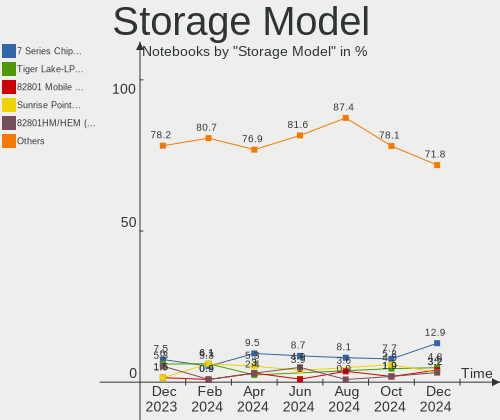

ROSA Hardware Trends (Notebooks)
--------------------------------

A project to identify most popular hardware characteristics and track their change
over time based on data collected by ROSA users at https://Linux-Hardware.org.

Anyone can contribute to this report by the [hw-probe](https://github.com/linuxhw/hw-probe) tool:

    sudo -E hw-probe -all -upload

Full-feature report is available here: https://linux-hardware.org/?view=trends&formfactor=notebook

Period: Sep, 2021.

Contents
--------

* [ System ](#system)
  - [ OS                       ](#os)
  - [ OS Family                ](#os-family)
  - [ Kernel                   ](#kernel)
  - [ Kernel Family            ](#kernel-family)
  - [ Kernel Major Ver.        ](#kernel-major-ver)
  - [ Arch                     ](#arch)
  - [ DE                       ](#de)
  - [ Display Server           ](#display-server)
  - [ Display Manager          ](#display-manager)
  - [ OS Lang                  ](#os-lang)
  - [ Boot Mode                ](#boot-mode)
  - [ Filesystem               ](#filesystem)
  - [ Part. scheme             ](#part-scheme)
  - [ Dual Boot with Linux/BSD ](#dual-boot-with-linuxbsd)
  - [ Dual Boot (Win)          ](#dual-boot-win)

* [ Board ](#board)
  - [ Vendor                   ](#vendor)
  - [ Model                    ](#model)
  - [ Model Family             ](#model-family)
  - [ MFG Year                 ](#mfg-year)
  - [ Form Factor              ](#form-factor)
  - [ Secure Boot              ](#secure-boot)
  - [ Coreboot                 ](#coreboot)
  - [ RAM Size                 ](#ram-size)
  - [ RAM Used                 ](#ram-used)
  - [ Total Drives             ](#total-drives)
  - [ Has CD-ROM               ](#has-cd-rom)
  - [ Has Ethernet             ](#has-ethernet)
  - [ Has WiFi                 ](#has-wifi)
  - [ Has Bluetooth            ](#has-bluetooth)

* [ Location ](#location)
  - [ Country                  ](#country)
  - [ City                     ](#city)

* [ Drives ](#drives)
  - [ Drive Vendor             ](#drive-vendor)
  - [ Drive Model              ](#drive-model)
  - [ HDD Vendor               ](#hdd-vendor)
  - [ SSD Vendor               ](#ssd-vendor)
  - [ Drive Kind               ](#drive-kind)
  - [ Drive Connector          ](#drive-connector)
  - [ Drive Size               ](#drive-size)
  - [ Space Total              ](#space-total)
  - [ Space Used               ](#space-used)
  - [ Malfunc. Drives          ](#malfunc-drives)
  - [ Malfunc. Drive Vendor    ](#malfunc-drive-vendor)
  - [ Malfunc. HDD Vendor      ](#malfunc-hdd-vendor)
  - [ Malfunc. Drive Kind      ](#malfunc-drive-kind)
  - [ Failed Drives            ](#failed-drives)
  - [ Failed Drive Vendor      ](#failed-drive-vendor)
  - [ Drive Status             ](#drive-status)

* [ Storage controller ](#storage-controller)
  - [ Storage Vendor           ](#storage-vendor)
  - [ Storage Model            ](#storage-model)
  - [ Storage Kind             ](#storage-kind)

* [ Processor ](#processor)
  - [ CPU Vendor               ](#cpu-vendor)
  - [ CPU Model                ](#cpu-model)
  - [ CPU Model Family         ](#cpu-model-family)
  - [ CPU Cores                ](#cpu-cores)
  - [ CPU Sockets              ](#cpu-sockets)
  - [ CPU Threads              ](#cpu-threads)
  - [ CPU Op-Modes             ](#cpu-op-modes)
  - [ CPU Microcode            ](#cpu-microcode)
  - [ CPU Microarch            ](#cpu-microarch)

* [ Graphics ](#graphics)
  - [ GPU Vendor               ](#gpu-vendor)
  - [ GPU Model                ](#gpu-model)
  - [ GPU Combo                ](#gpu-combo)
  - [ GPU Driver               ](#gpu-driver)
  - [ GPU Memory               ](#gpu-memory)

* [ Monitor ](#monitor)
  - [ Monitor Vendor           ](#monitor-vendor)
  - [ Monitor Model            ](#monitor-model)
  - [ Monitor Resolution       ](#monitor-resolution)
  - [ Monitor Diagonal         ](#monitor-diagonal)
  - [ Monitor Width            ](#monitor-width)
  - [ Aspect Ratio             ](#aspect-ratio)
  - [ Monitor Area             ](#monitor-area)
  - [ Pixel Density            ](#pixel-density)
  - [ Multiple Monitors        ](#multiple-monitors)

* [ Network ](#network)
  - [ Net Controller Vendor    ](#net-controller-vendor)
  - [ Net Controller Model     ](#net-controller-model)
  - [ Wireless Vendor          ](#wireless-vendor)
  - [ Wireless Model           ](#wireless-model)
  - [ Ethernet Vendor          ](#ethernet-vendor)
  - [ Ethernet Model           ](#ethernet-model)
  - [ Net Controller Kind      ](#net-controller-kind)
  - [ Used Controller          ](#used-controller)
  - [ NICs                     ](#nics)
  - [ IPv6                     ](#ipv6)

* [ Bluetooth ](#bluetooth)
  - [ Bluetooth Vendor         ](#bluetooth-vendor)
  - [ Bluetooth Model          ](#bluetooth-model)

* [ Sound ](#sound)
  - [ Sound Vendor             ](#sound-vendor)
  - [ Sound Model              ](#sound-model)

* [ Memory ](#memory)
  - [ Memory Vendor            ](#memory-vendor)
  - [ Memory Model             ](#memory-model)
  - [ Memory Kind              ](#memory-kind)
  - [ Memory Form Factor       ](#memory-form-factor)
  - [ Memory Size              ](#memory-size)
  - [ Memory Speed             ](#memory-speed)

* [ Printers & scanners ](#printers--scanners)
  - [ Printer Vendor           ](#printer-vendor)
  - [ Printer Model            ](#printer-model)
  - [ Scanner Vendor           ](#scanner-vendor)
  - [ Scanner Model            ](#scanner-model)

* [ Camera ](#camera)
  - [ Camera Vendor            ](#camera-vendor)
  - [ Camera Model             ](#camera-model)

* [ Security ](#security)
  - [ Fingerprint Vendor       ](#fingerprint-vendor)
  - [ Fingerprint Model        ](#fingerprint-model)
  - [ Chipcard Vendor          ](#chipcard-vendor)
  - [ Chipcard Model           ](#chipcard-model)

* [ Unsupported ](#unsupported)
  - [ Unsupported Devices      ](#unsupported-devices)
  - [ Unsupported Device Types ](#unsupported-device-types)

System
------

OS
--

Installed operating systems

| Name       | Notebooks | Percent |
|------------|-----------|---------|
| ROSA R11.1 | 40        | 80%     |
| ROSA R11   | 7         | 14%     |
| ROSA R12   | 2         | 4%      |
| ROSA R8.1  | 1         | 2%      |

OS Family
---------

OS without a version

| Name | Notebooks | Percent |
|------|-----------|---------|
| ROSA | 50        | 100%    |

Kernel
------

Version of the Linux kernel

| Version                             | Notebooks | Percent |
|-------------------------------------|-----------|---------|
| 5.4.83-generic-2rosa-x86_64         | 16        | 32%     |
| 4.15.0-desktop-122.124.1rosa-x86_64 | 8         | 16%     |
| 5.4.32-generic-2rosa-x86_64         | 7         | 14%     |
| 5.4.32-generic-2rosa-i586           | 5         | 10%     |
| 4.15.0-desktop-45.1rosa-i586        | 4         | 8%      |
| 4.15.0-desktop-45.1rosa-x86_64      | 3         | 6%      |
| 5.4.83-generic-2rosa-i586           | 1         | 2%      |
| 5.10.65-generic-2rosa2021.1-x86_64  | 1         | 2%      |
| 5.10.56-generic-1rosa2021.1-x86_64  | 1         | 2%      |
| 5.10.50-generic-1rosa-x86_64        | 1         | 2%      |
| 4.9.155-nrj-desktop-1rosa-x86_64    | 1         | 2%      |
| 4.9.155-nrj-desktop-1rosa-i586      | 1         | 2%      |
| 4.15.0-desktop-122.124.1rosa-i586   | 1         | 2%      |

Kernel Family
-------------

Linux kernel without a distro release

| Version | Notebooks | Percent |
|---------|-----------|---------|
| 5.4.83  | 17        | 34%     |
| 4.15.0  | 16        | 32%     |
| 5.4.32  | 12        | 24%     |
| 4.9.155 | 2         | 4%      |
| 5.10.65 | 1         | 2%      |
| 5.10.56 | 1         | 2%      |
| 5.10.50 | 1         | 2%      |

Kernel Major Ver.
-----------------

Linux kernel major version

| Version | Notebooks | Percent |
|---------|-----------|---------|
| 5.4     | 29        | 58%     |
| 4.15    | 16        | 32%     |
| 5.10    | 3         | 6%      |
| 4.9     | 2         | 4%      |

Arch
----

OS architecture (x86_64, i586, etc.)

| Name   | Notebooks | Percent |
|--------|-----------|---------|
| x86_64 | 38        | 76%     |
| i686   | 12        | 24%     |

DE
--

Desktop Environment

| Name | Notebooks | Percent |
|------|-----------|---------|
| KDE4 | 25        | 50%     |
| KDE5 | 21        | 42%     |
| LXQt | 4         | 8%      |

Display Server
--------------

X11 or Wayland

| Name    | Notebooks | Percent |
|---------|-----------|---------|
| X11     | 49        | 98%     |
| Wayland | 1         | 2%      |

Display Manager
---------------

SDDM, LightDM, etc.

| Name | Notebooks | Percent |
|------|-----------|---------|
| KDM  | 25        | 50%     |
| SDDM | 23        | 46%     |
| GDM  | 2         | 4%      |

OS Lang
-------

Language

| Lang    | Notebooks | Percent |
|---------|-----------|---------|
| ru_RU   | 36        | 72%     |
| Unknown | 7         | 14%     |
| en_US   | 3         | 6%      |
| ro_RO   | 1         | 2%      |
| pt_BR   | 1         | 2%      |
| pl_PL   | 1         | 2%      |
| de_DE   | 1         | 2%      |

Boot Mode
---------

EFI or BIOS

| Mode | Notebooks | Percent |
|------|-----------|---------|
| BIOS | 37        | 74%     |
| EFI  | 13        | 26%     |

Filesystem
----------

Type of filesystem

| Type  | Notebooks | Percent |
|-------|-----------|---------|
| Ext4  | 44        | 88%     |
| Btrfs | 5         | 10%     |
| Ext3  | 1         | 2%      |

Part. scheme
------------

Scheme of partitioning

| Type | Notebooks | Percent |
|------|-----------|---------|
| MBR  | 37        | 74%     |
| GPT  | 13        | 26%     |

Dual Boot with Linux/BSD
------------------------

Hosting more than one Linux/BSD

| Dual boot | Notebooks | Percent |
|-----------|-----------|---------|
| No        | 43        | 86%     |
| Yes       | 7         | 14%     |

Dual Boot (Win)
---------------

Hosting Linux and Windows

| Dual boot | Notebooks | Percent |
|-----------|-----------|---------|
| No        | 26        | 52%     |
| Yes       | 24        | 48%     |

Board
-----

Vendor
------

Motherboard manufacturer

| Name                | Notebooks | Percent |
|---------------------|-----------|---------|
| Acer                | 13        | 26%     |
| Hewlett-Packard     | 10        | 20%     |
| Lenovo              | 6         | 12%     |
| ASUSTek Computer    | 6         | 12%     |
| Samsung Electronics | 5         | 10%     |
| Toshiba             | 3         | 6%      |
| Dell                | 2         | 4%      |
| Sony                | 1         | 2%      |
| Medion              | 1         | 2%      |
| Gateway             | 1         | 2%      |
| eMachines           | 1         | 2%      |
| Clevo               | 1         | 2%      |

Model
-----

Motherboard model

| Name                                     | Notebooks | Percent |
|------------------------------------------|-----------|---------|
| Lenovo IdeaPad 110-15ACL 80TJ            | 2         | 4%      |
| Toshiba TECRA A9                         | 1         | 2%      |
| Toshiba Satellite L850-D7W               | 1         | 2%      |
| Toshiba Satellite C655                   | 1         | 2%      |
| Sony SVE1512H1RW                         | 1         | 2%      |
| Samsung R540/R580/R780/SA41/E452/E852    | 1         | 2%      |
| Samsung R530/R730                        | 1         | 2%      |
| Samsung R508                             | 1         | 2%      |
| Samsung R460                             | 1         | 2%      |
| Samsung 450R4E/450R5E/450R4V/450R5V      | 1         | 2%      |
| Medion A17                               | 1         | 2%      |
| Lenovo Lenovo                            | 1         | 2%      |
| Lenovo G580 20150                        | 1         | 2%      |
| Lenovo G50-70 20351                      | 1         | 2%      |
| Lenovo B590 20208                        | 1         | 2%      |
| HP ProBook 4515s                         | 1         | 2%      |
| HP Pavilion m6                           | 1         | 2%      |
| HP Pavilion g6                           | 1         | 2%      |
| HP Pavilion dv6700                       | 1         | 2%      |
| HP Pavilion dv6                          | 1         | 2%      |
| HP Pavilion 15                           | 1         | 2%      |
| HP Mini 110-3700                         | 1         | 2%      |
| HP Laptop 15-ra0xx                       | 1         | 2%      |
| HP Compaq 610                            | 1         | 2%      |
| HP 15                                    | 1         | 2%      |
| Gateway M-6307                           | 1         | 2%      |
| eMachines E620                           | 1         | 2%      |
| Dell Latitude E6440                      | 1         | 2%      |
| Dell Latitude D610                       | 1         | 2%      |
| Clevo W251EFQ/W270EFQ                    | 1         | 2%      |
| ASUS VivoBook_ASUSLaptop X515JA_F515JA   | 1         | 2%      |
| ASUS K53SD                               | 1         | 2%      |
| ASUS K50IP                               | 1         | 2%      |
| ASUS F9E                                 | 1         | 2%      |
| ASUS ASUS TUF Gaming A15 FA506IV_FX506IV | 1         | 2%      |
| ASUS 1000HE                              | 1         | 2%      |
| Acer TravelMate 5760                     | 1         | 2%      |
| Acer Aspire V5-121                       | 1         | 2%      |
| Acer Aspire V3-571G                      | 1         | 2%      |
| Acer Aspire E1-571G                      | 1         | 2%      |
| Acer Aspire E1-531                       | 1         | 2%      |
| Acer Aspire A315-21                      | 1         | 2%      |
| Acer Aspire A114-31                      | 1         | 2%      |
| Acer Aspire 7736                         | 1         | 2%      |
| Acer Aspire 5920                         | 1         | 2%      |
| Acer Aspire 5750G                        | 1         | 2%      |
| Acer Aspire 5530                         | 1         | 2%      |
| Acer AOD270                              | 1         | 2%      |
| Acer AOD260                              | 1         | 2%      |

Model Family
------------

Motherboard model prefix

| Name              | Notebooks | Percent |
|-------------------|-----------|---------|
| Acer Aspire       | 10        | 20%     |
| HP Pavilion       | 5         | 10%     |
| Toshiba Satellite | 2         | 4%      |
| Lenovo IdeaPad    | 2         | 4%      |
| Dell Latitude     | 2         | 4%      |
| Toshiba TECRA     | 1         | 2%      |
| Sony SVE1512H1RW  | 1         | 2%      |
| Samsung R540      | 1         | 2%      |
| Samsung R530      | 1         | 2%      |
| Samsung R508      | 1         | 2%      |
| Samsung R460      | 1         | 2%      |
| Samsung 450R4E    | 1         | 2%      |
| Medion A17        | 1         | 2%      |
| Lenovo Lenovo     | 1         | 2%      |
| Lenovo G580       | 1         | 2%      |
| Lenovo G50-70     | 1         | 2%      |
| Lenovo B590       | 1         | 2%      |
| HP ProBook        | 1         | 2%      |
| HP Mini           | 1         | 2%      |
| HP Laptop         | 1         | 2%      |
| HP Compaq         | 1         | 2%      |
| HP 15             | 1         | 2%      |
| Gateway M-6307    | 1         | 2%      |
| eMachines E620    | 1         | 2%      |
| Clevo W251EFQ     | 1         | 2%      |
| ASUS VivoBook     | 1         | 2%      |
| ASUS K53SD        | 1         | 2%      |
| ASUS K50IP        | 1         | 2%      |
| ASUS F9E          | 1         | 2%      |
| ASUS ASUS         | 1         | 2%      |
| ASUS 1000HE       | 1         | 2%      |
| Acer TravelMate   | 1         | 2%      |
| Acer AOD270       | 1         | 2%      |
| Acer AOD260       | 1         | 2%      |

MFG Year
--------

Motherboard manufacture year

| Year | Notebooks | Percent |
|------|-----------|---------|
| 2013 | 9         | 18%     |
| 2012 | 7         | 14%     |
| 2008 | 6         | 12%     |
| 2011 | 5         | 10%     |
| 2010 | 5         | 10%     |
| 2009 | 4         | 8%      |
| 2014 | 3         | 6%      |
| 2018 | 2         | 4%      |
| 2016 | 2         | 4%      |
| 2007 | 2         | 4%      |
| 2021 | 1         | 2%      |
| 2020 | 1         | 2%      |
| 2019 | 1         | 2%      |
| 2017 | 1         | 2%      |
| 2005 | 1         | 2%      |

Form Factor
-----------

Physical design of the computer

| Name     | Notebooks | Percent |
|----------|-----------|---------|
| Notebook | 50        | 100%    |

Secure Boot
-----------

Enabled or disabled

| State    | Notebooks | Percent |
|----------|-----------|---------|
| Disabled | 50        | 100%    |

Coreboot
--------

Have coreboot on board

| Used | Notebooks | Percent |
|------|-----------|---------|
| No   | 50        | 100%    |

RAM Size
--------

Total RAM memory

| Size in GB | Notebooks | Percent |
|------------|-----------|---------|
| 3.01-4.0   | 20        | 40%     |
| 1.01-2.0   | 12        | 24%     |
| 4.01-8.0   | 7         | 14%     |
| 8.01-16.0  | 6         | 12%     |
| 2.01-3.0   | 5         | 10%     |

RAM Used
--------

Used RAM memory

| Used GB  | Notebooks | Percent |
|----------|-----------|---------|
| 1.01-2.0 | 27        | 54%     |
| 0.51-1.0 | 18        | 36%     |
| 2.01-3.0 | 5         | 10%     |

Total Drives
------------

Number of drives on board

| Drives | Notebooks | Percent |
|--------|-----------|---------|
| 1      | 34        | 68%     |
| 2      | 14        | 28%     |
| 3      | 2         | 4%      |

Has CD-ROM
----------

Has CD-ROM on board

| Presented | Notebooks | Percent |
|-----------|-----------|---------|
| Yes       | 28        | 56%     |
| No        | 22        | 44%     |

Has Ethernet
------------

Has Ethernet on board

| Presented | Notebooks | Percent |
|-----------|-----------|---------|
| Yes       | 49        | 98%     |
| No        | 1         | 2%      |

Has WiFi
--------

Has WiFi module

| Presented | Notebooks | Percent |
|-----------|-----------|---------|
| Yes       | 49        | 98%     |
| No        | 1         | 2%      |

Has Bluetooth
-------------

Has Bluetooth module

| Presented | Notebooks | Percent |
|-----------|-----------|---------|
| Yes       | 29        | 58%     |
| No        | 21        | 42%     |

Location
--------

Country
-------

Geographic location (country)

| Country  | Notebooks | Percent |
|----------|-----------|---------|
| Russia   | 37        | 74%     |
| Belarus  | 3         | 6%      |
| Ukraine  | 2         | 4%      |
| Slovakia | 2         | 4%      |
| USA      | 1         | 2%      |
| Romania  | 1         | 2%      |
| Poland   | 1         | 2%      |
| India    | 1         | 2%      |
| Germany  | 1         | 2%      |
| Brazil   | 1         | 2%      |

City
----

Geographic location (city)

| City              | Notebooks | Percent |
|-------------------|-----------|---------|
| Moscow            | 6         | 12%     |
| St Petersburg     | 5         | 10%     |
| Saratov           | 3         | 6%      |
| Krasnodar         | 3         | 6%      |
| Novosibirsk       | 2         | 4%      |
| Nizhniy Novgorod  | 2         | 4%      |
| Minsk             | 2         | 4%      |
| Yaroslavl         | 1         | 2%      |
| Warsaw            | 1         | 2%      |
| Volgograd         | 1         | 2%      |
| Tula              | 1         | 2%      |
| Suzdal            | 1         | 2%      |
| Stola             | 1         | 2%      |
| Srednyaya Akhtuba | 1         | 2%      |
| Selidovo          | 1         | 2%      |
| S??o Leopoldo     | 1         | 2%      |
| Pskov             | 1         | 2%      |
| Pervouralsk       | 1         | 2%      |
| Perm              | 1         | 2%      |
| Orenburg          | 1         | 2%      |
| Omsk              | 1         | 2%      |
| Newark            | 1         | 2%      |
| Nal'chik          | 1         | 2%      |
| Malinovo          | 1         | 2%      |
| Lohnberg          | 1         | 2%      |
| Lipetsk           | 1         | 2%      |
| Krasnoznamensk    | 1         | 2%      |
| Kirov             | 1         | 2%      |
| Hrodna            | 1         | 2%      |
| Guwahati          | 1         | 2%      |
| Donetsk           | 1         | 2%      |
| Bucharest         | 1         | 2%      |
| Bakhchisaray      | 1         | 2%      |
| Abakan            | 1         | 2%      |

Drives
------

Drive Vendor
------------

Hard drive vendors

| Vendor              | Notebooks | Drives | Percent |
|---------------------|-----------|--------|---------|
| WDC                 | 18        | 18     | 29.03%  |
| Seagate             | 12        | 12     | 19.35%  |
| Samsung Electronics | 5         | 5      | 8.06%   |
| Hitachi             | 4         | 4      | 6.45%   |
| Toshiba             | 3         | 3      | 4.84%   |
| SPCC                | 3         | 3      | 4.84%   |
| Unknown             | 2         | 2      | 3.23%   |
| Kingston            | 2         | 2      | 3.23%   |
| HGST                | 2         | 2      | 3.23%   |
| China               | 2         | 2      | 3.23%   |
| ZTE                 | 1         | 1      | 1.61%   |
| Zheino              | 1         | 1      | 1.61%   |
| XrayDisk            | 1         | 1      | 1.61%   |
| SanDisk             | 1         | 1      | 1.61%   |
| PLEXTOR             | 1         | 1      | 1.61%   |
| Patriot             | 1         | 1      | 1.61%   |
| OCZ                 | 1         | 1      | 1.61%   |
| Crucial             | 1         | 1      | 1.61%   |
| Apacer              | 1         | 1      | 1.61%   |

Drive Model
-----------

Hard drive models

| Model                                        | Notebooks | Percent |
|----------------------------------------------|-----------|---------|
| WDC WD3200BPVT-22JJ5T0 320GB                 | 2         | 3.23%   |
| Seagate ST9160310AS 160GB                    | 2         | 3.23%   |
| Seagate ST500LT012-9WS142 500GB              | 2         | 3.23%   |
| Seagate ST500LT012-1DG142 500GB              | 2         | 3.23%   |
| Samsung HM321HI 320GB                        | 2         | 3.23%   |
| Hitachi HTS547550A9E384 500GB                | 2         | 3.23%   |
| ZTE MMC Storage 8GB                          | 1         | 1.61%   |
| Zheino CHN 25SATAA3 360 360GB                | 1         | 1.61%   |
| XrayDisk SSD 480GB                           | 1         | 1.61%   |
| WDC WDS240G2G0A-00JH30 240GB SSD             | 1         | 1.61%   |
| WDC WDS120G2G0A-00JH30 120GB SSD             | 1         | 1.61%   |
| WDC WD5000LPVX-60V0TT0 500GB                 | 1         | 1.61%   |
| WDC WD5000LPCX-60VHAT1 500GB                 | 1         | 1.61%   |
| WDC WD5000LPCX-24VHAT0 500GB                 | 1         | 1.61%   |
| WDC WD5000LPCX-24C6HT0 500GB                 | 1         | 1.61%   |
| WDC WD5000BPVT-22HXZT3 500GB                 | 1         | 1.61%   |
| WDC WD3200BEKT-60V5T1 320GB                  | 1         | 1.61%   |
| WDC WD2500BEVT-22ZCT0 250GB                  | 1         | 1.61%   |
| WDC WD1600BEVT-60ZCT1 160GB                  | 1         | 1.61%   |
| WDC WD1200BEVS-22UST0 120GB                  | 1         | 1.61%   |
| WDC WD10SPZX-22Z10T1 1TB                     | 1         | 1.61%   |
| WDC WD10SPZX-21Z10T0 1TB                     | 1         | 1.61%   |
| WDC WD10JPVT-08A1YT2 1TB                     | 1         | 1.61%   |
| WDC PC SN530 SDBPNPZ-512G-1002 512GB         | 1         | 1.61%   |
| WDC PC SN530 SDBPNPZ-256G-1002 256GB         | 1         | 1.61%   |
| Unknown EC2QT  64GB                          | 1         | 1.61%   |
| Unknown 032G34  32GB                         | 1         | 1.61%   |
| Toshiba MQ01ABF050 500GB                     | 1         | 1.61%   |
| Toshiba MK3276GSX 320GB                      | 1         | 1.61%   |
| Toshiba MK1646GSX 160GB                      | 1         | 1.61%   |
| SPCC Solid State Disk 64GB                   | 1         | 1.61%   |
| SPCC Solid State Disk 512GB                  | 1         | 1.61%   |
| SPCC Solid State Disk 120GB                  | 1         | 1.61%   |
| Seagate ST9500325AS 500GB                    | 1         | 1.61%   |
| Seagate ST1000LM049-2GH172 1TB               | 1         | 1.61%   |
| Seagate ST1000LM035-1RK172 1TB               | 1         | 1.61%   |
| Seagate ST1000LM024 HN-M101MBB 1TB           | 1         | 1.61%   |
| Seagate BUP BK 4TB                           | 1         | 1.61%   |
| Seagate BarraCuda 120 SSD ZA250CM10003 250GB | 1         | 1.61%   |
| SanDisk SD5SF2032G1010E 32GB SSD             | 1         | 1.61%   |
| Samsung SSD 970 EVO 1TB                      | 1         | 1.61%   |
| Samsung MP0402H 40GB                         | 1         | 1.61%   |
| Samsung HM160HI 160GB                        | 1         | 1.61%   |
| PLEXTOR PX-128M8VC 128GB SSD                 | 1         | 1.61%   |
| Patriot Blaze 120GB SSD                      | 1         | 1.61%   |
| OCZ ARC100 120GB SSD                         | 1         | 1.61%   |
| Kingston SV300S37A60G 64GB SSD               | 1         | 1.61%   |
| Kingston SA400S37240G 240GB SSD              | 1         | 1.61%   |
| Hitachi HTS545025B9A300 250GB                | 1         | 1.61%   |
| Hitachi HTS542516K9SA00 160GB                | 1         | 1.61%   |
| HGST HTS545050A7E680 500GB                   | 1         | 1.61%   |
| HGST HTS545050A7E380 500GB                   | 1         | 1.61%   |
| Crucial CT120BX500SSD1 120GB                 | 1         | 1.61%   |
| China SSD 480GB                              | 1         | 1.61%   |
| China SATA SSD 120GB                         | 1         | 1.61%   |
| Apacer AS350 256GB SSD                       | 1         | 1.61%   |

HDD Vendor
----------

Hard disk drive vendors

| Vendor              | Notebooks | Drives | Percent |
|---------------------|-----------|--------|---------|
| WDC                 | 14        | 14     | 36.84%  |
| Seagate             | 11        | 11     | 28.95%  |
| Samsung Electronics | 4         | 4      | 10.53%  |
| Hitachi             | 4         | 4      | 10.53%  |
| Toshiba             | 3         | 3      | 7.89%   |
| HGST                | 2         | 2      | 5.26%   |

SSD Vendor
----------

Solid state drive vendors

| Vendor   | Notebooks | Drives | Percent |
|----------|-----------|--------|---------|
| SPCC     | 3         | 3      | 16.67%  |
| WDC      | 2         | 2      | 11.11%  |
| Kingston | 2         | 2      | 11.11%  |
| China    | 2         | 2      | 11.11%  |
| Zheino   | 1         | 1      | 5.56%   |
| XrayDisk | 1         | 1      | 5.56%   |
| Seagate  | 1         | 1      | 5.56%   |
| SanDisk  | 1         | 1      | 5.56%   |
| PLEXTOR  | 1         | 1      | 5.56%   |
| Patriot  | 1         | 1      | 5.56%   |
| OCZ      | 1         | 1      | 5.56%   |
| Crucial  | 1         | 1      | 5.56%   |
| Apacer   | 1         | 1      | 5.56%   |

Drive Kind
----------

HDD or SSD

| Kind    | Notebooks | Drives | Percent |
|---------|-----------|--------|---------|
| HDD     | 38        | 38     | 63.33%  |
| SSD     | 17        | 18     | 28.33%  |
| MMC     | 2         | 2      | 3.33%   |
| NVMe    | 2         | 3      | 3.33%   |
| Unknown | 1         | 1      | 1.67%   |

Drive Connector
---------------

SATA, SAS, NVMe, etc.

| Type | Notebooks | Drives | Percent |
|------|-----------|--------|---------|
| SATA | 47        | 55     | 88.68%  |
| SAS  | 2         | 2      | 3.77%   |
| NVMe | 2         | 3      | 3.77%   |
| MMC  | 2         | 2      | 3.77%   |

Drive Size
----------

Size of hard drive

| Size in TB | Notebooks | Drives | Percent |
|------------|-----------|--------|---------|
| 0.01-0.5   | 42        | 48     | 84%     |
| 0.51-1.0   | 7         | 7      | 14%     |
| 3.01-4.0   | 1         | 1      | 2%      |

Space Total
-----------

Amount of disk space available on the file system

| Size in GB | Notebooks | Percent |
|------------|-----------|---------|
| 101-250    | 16        | 32%     |
| 251-500    | 12        | 24%     |
| 21-50      | 8         | 16%     |
| 51-100     | 6         | 12%     |
| 1-20       | 5         | 10%     |
| 501-1000   | 2         | 4%      |
| 1001-2000  | 1         | 2%      |

Space Used
----------

Amount of used disk space

| Used GB | Notebooks | Percent |
|---------|-----------|---------|
| 1-20    | 39        | 78%     |
| 21-50   | 5         | 10%     |
| 101-250 | 4         | 8%      |
| 251-500 | 1         | 2%      |
| 51-100  | 1         | 2%      |

Malfunc. Drives
---------------

Drive models with a malfunction

| Model                             | Notebooks | Drives | Percent |
|-----------------------------------|-----------|--------|---------|
| Seagate ST500LT012-9WS142 500GB   | 2         | 2      | 11.76%  |
| WDC WDS120G2G0A-00JH30 120GB SSD  | 1         | 1      | 5.88%   |
| WDC WD5000LPVX-60V0TT0 500GB      | 1         | 1      | 5.88%   |
| WDC WD5000LPCX-24VHAT0 500GB      | 1         | 1      | 5.88%   |
| WDC WD5000LPCX-24C6HT0 500GB      | 1         | 1      | 5.88%   |
| WDC WD10JPVT-08A1YT2 1TB          | 1         | 1      | 5.88%   |
| Toshiba MK3276GSX 320GB           | 1         | 1      | 5.88%   |
| Toshiba MK1646GSX 160GB           | 1         | 1      | 5.88%   |
| Seagate ST9160310AS 160GB         | 1         | 1      | 5.88%   |
| Seagate ST500LT012-1DG142 500GB   | 1         | 1      | 5.88%   |
| Seagate ST1000LM035-1RK172 1TB    | 1         | 1      | 5.88%   |
| Samsung Electronics HM160HI 160GB | 1         | 1      | 5.88%   |
| Hitachi HTS547550A9E384 500GB     | 1         | 1      | 5.88%   |
| Hitachi HTS545025B9A300 250GB     | 1         | 1      | 5.88%   |
| Hitachi HTS542516K9SA00 160GB     | 1         | 1      | 5.88%   |
| HGST HTS545050A7E680 500GB        | 1         | 1      | 5.88%   |

Malfunc. Drive Vendor
---------------------

Vendors of faulty drives

| Vendor              | Notebooks | Drives | Percent |
|---------------------|-----------|--------|---------|
| WDC                 | 5         | 5      | 29.41%  |
| Seagate             | 5         | 5      | 29.41%  |
| Hitachi             | 3         | 3      | 17.65%  |
| Toshiba             | 2         | 2      | 11.76%  |
| Samsung Electronics | 1         | 1      | 5.88%   |
| HGST                | 1         | 1      | 5.88%   |

Malfunc. HDD Vendor
-------------------

Vendors of faulty HDD drives

| Vendor              | Notebooks | Drives | Percent |
|---------------------|-----------|--------|---------|
| Seagate             | 5         | 5      | 31.25%  |
| WDC                 | 4         | 4      | 25%     |
| Hitachi             | 3         | 3      | 18.75%  |
| Toshiba             | 2         | 2      | 12.5%   |
| Samsung Electronics | 1         | 1      | 6.25%   |
| HGST                | 1         | 1      | 6.25%   |

Malfunc. Drive Kind
-------------------

Kinds of faulty drives

| Kind | Notebooks | Drives | Percent |
|------|-----------|--------|---------|
| HDD  | 16        | 16     | 94.12%  |
| SSD  | 1         | 1      | 5.88%   |

Failed Drives
-------------

Failed drive models

Zero info for selected period =(

Failed Drive Vendor
-------------------

Failed drive vendors

Zero info for selected period =(

Drive Status
------------

Number of failed and malfunc. drives

| Status   | Notebooks | Drives | Percent |
|----------|-----------|--------|---------|
| Works    | 33        | 41     | 61.11%  |
| Malfunc  | 17        | 17     | 31.48%  |
| Detected | 4         | 4      | 7.41%   |

Storage controller
------------------

Storage Vendor
--------------

Storage controller vendors

| Vendor              | Notebooks | Percent |
|---------------------|-----------|---------|
| Intel               | 39        | 73.58%  |
| AMD                 | 10        | 18.87%  |
| Sandisk             | 2         | 3.77%   |
| Samsung Electronics | 1         | 1.89%   |
| Nvidia              | 1         | 1.89%   |

Storage Model
-------------

Storage controller models

| Model                                                                            | Notebooks | Percent |
|----------------------------------------------------------------------------------|-----------|---------|
| Intel 7 Series Chipset Family 6-port SATA Controller [AHCI mode]                 | 8         | 12.7%   |
| Intel 82801HM/HEM (ICH8M/ICH8M-E) SATA Controller [AHCI mode]                    | 6         | 9.52%   |
| Intel 82801HM/HEM (ICH8M/ICH8M-E) IDE Controller                                 | 6         | 9.52%   |
| AMD FCH SATA Controller [AHCI mode]                                              | 6         | 9.52%   |
| Intel 82801IBM/IEM (ICH9M/ICH9M-E) 4 port SATA Controller [AHCI mode]            | 5         | 7.94%   |
| Intel 6 Series/C200 Series Chipset Family 6 port Mobile SATA AHCI Controller     | 4         | 6.35%   |
| Intel NM10/ICH7 Family SATA Controller [AHCI mode]                               | 3         | 4.76%   |
| Sandisk WD Blue SN550 NVMe SSD                                                   | 2         | 3.17%   |
| Intel 82801GBM/GHM (ICH7-M Family) SATA Controller [IDE mode]                    | 2         | 3.17%   |
| Intel 8 Series SATA Controller 1 [AHCI mode]                                     | 2         | 3.17%   |
| Intel 7 Series Chipset Family 4-port SATA Controller [IDE mode]                  | 2         | 3.17%   |
| Intel 7 Series Chipset Family 2-port SATA Controller [IDE mode]                  | 2         | 3.17%   |
| Samsung NVMe SSD Controller SM981/PM981/PM983                                    | 1         | 1.59%   |
| Nvidia MCP79 AHCI Controller                                                     | 1         | 1.59%   |
| Intel Celeron N3350/Pentium N4200/Atom E3900 Series SATA AHCI Controller         | 1         | 1.59%   |
| Intel Atom/Celeron/Pentium Processor x5-E8000/J3xxx/N3xxx Series SATA Controller | 1         | 1.59%   |
| Intel Atom Processor E3800 Series SATA AHCI Controller                           | 1         | 1.59%   |
| Intel 82801G (ICH7 Family) IDE Controller                                        | 1         | 1.59%   |
| Intel 82801FBM (ICH6M) SATA Controller                                           | 1         | 1.59%   |
| Intel 82801 Mobile SATA Controller [RAID mode]                                   | 1         | 1.59%   |
| Intel 8 Series/C220 Series Chipset Family 6-port SATA Controller 1 [AHCI mode]   | 1         | 1.59%   |
| Intel 5 Series/3400 Series Chipset 4 port SATA AHCI Controller                   | 1         | 1.59%   |
| AMD SB7x0/SB8x0/SB9x0 SATA Controller [IDE mode]                                 | 1         | 1.59%   |
| AMD SB7x0/SB8x0/SB9x0 SATA Controller [AHCI mode]                                | 1         | 1.59%   |
| AMD SB600 Non-Raid-5 SATA                                                        | 1         | 1.59%   |
| AMD SB600 IDE                                                                    | 1         | 1.59%   |
| AMD FCH SATA Controller [IDE mode]                                               | 1         | 1.59%   |

Storage Kind
------------

Kind of storage controller (IDE, SATA, NVMe, SAS, ...)

| Kind | Notebooks | Percent |
|------|-----------|---------|
| SATA | 44        | 74.58%  |
| IDE  | 12        | 20.34%  |
| NVMe | 2         | 3.39%   |
| RAID | 1         | 1.69%   |

Processor
---------

CPU Vendor
----------

Processor vendors

| Vendor | Notebooks | Percent |
|--------|-----------|---------|
| Intel  | 40        | 80%     |
| AMD    | 10        | 20%     |

CPU Model
---------

Processor models

| Model                                        | Notebooks | Percent |
|----------------------------------------------|-----------|---------|
| Intel Pentium Dual-Core CPU T4500 @ 2.30GHz  | 2         | 4%      |
| Intel Core i5-3230M CPU @ 2.60GHz            | 2         | 4%      |
| Intel Core i3-3120M CPU @ 2.50GHz            | 2         | 4%      |
| Intel Core i3-3110M CPU @ 2.40GHz            | 2         | 4%      |
| Intel Core i3-2350M CPU @ 2.30GHz            | 2         | 4%      |
| Intel Core 2 Duo CPU T5750 @ 2.00GHz         | 2         | 4%      |
| Intel Atom CPU N455 @ 1.66GHz                | 2         | 4%      |
| Intel Atom CPU N270 @ 1.60GHz                | 2         | 4%      |
| Intel Pentium M processor 1.60GHz            | 1         | 2%      |
| Intel Pentium Dual-Core CPU T4300 @ 2.10GHz  | 1         | 2%      |
| Intel Pentium Dual CPU T2330 @ 1.60GHz       | 1         | 2%      |
| Intel Pentium CPU B940 @ 2.00GHz             | 1         | 2%      |
| Intel Pentium CPU 6805 @ 1.10GHz             | 1         | 2%      |
| Intel Pentium CPU 2020M @ 2.40GHz            | 1         | 2%      |
| Intel Core i7-3630QM CPU @ 2.40GHz           | 1         | 2%      |
| Intel Core i5-4200U CPU @ 1.60GHz            | 1         | 2%      |
| Intel Core i3-4005U CPU @ 1.70GHz            | 1         | 2%      |
| Intel Core i3-4000M CPU @ 2.40GHz            | 1         | 2%      |
| Intel Core i3-2330M CPU @ 2.20GHz            | 1         | 2%      |
| Intel Core i3-2328M CPU @ 2.20GHz            | 1         | 2%      |
| Intel Core i3 CPU M 380 @ 2.53GHz            | 1         | 2%      |
| Intel Core 2 Duo CPU T8100 @ 2.10GHz         | 1         | 2%      |
| Intel Core 2 Duo CPU T7250 @ 2.00GHz         | 1         | 2%      |
| Intel Core 2 Duo CPU T5850 @ 2.16GHz         | 1         | 2%      |
| Intel Core 2 Duo CPU T5550 @ 1.83GHz         | 1         | 2%      |
| Intel Celeron CPU N3350 @ 1.10GHz            | 1         | 2%      |
| Intel Celeron CPU N3060 @ 1.60GHz            | 1         | 2%      |
| Intel Celeron CPU N2830 @ 2.16GHz            | 1         | 2%      |
| Intel Celeron CPU 925 @ 2.30GHz              | 1         | 2%      |
| Intel Celeron CPU 560 @ 2.13GHz              | 1         | 2%      |
| Intel Celeron CPU 1000M @ 1.80GHz            | 1         | 2%      |
| Intel Atom CPU N2600 @ 1.60GHz               | 1         | 2%      |
| AMD Turion X2 Ultra Dual-Core Mobile ZM-80   | 1         | 2%      |
| AMD Turion II Dual-Core Mobile M500          | 1         | 2%      |
| AMD Ryzen 7 4800H with Radeon Graphics       | 1         | 2%      |
| AMD C-70 APU with Radeon HD Graphics         | 1         | 2%      |
| AMD Athlon Processor 2650e                   | 1         | 2%      |
| AMD A9-9425 RADEON R5, 5 COMPUTE CORES 2C+3G | 1         | 2%      |
| AMD A8-7410 APU with AMD Radeon R5 Graphics  | 1         | 2%      |
| AMD A8-4500M APU with Radeon HD Graphics     | 1         | 2%      |
| AMD A6-7310 APU with AMD Radeon R4 Graphics  | 1         | 2%      |
| AMD A10-4600M APU with Radeon HD Graphics    | 1         | 2%      |

CPU Model Family
----------------

Processor model prefix

| Model                                | Notebooks | Percent |
|--------------------------------------|-----------|---------|
| Intel Core i3                        | 11        | 22%     |
| Intel Core 2 Duo                     | 6         | 12%     |
| Intel Celeron                        | 6         | 12%     |
| Intel Atom                           | 5         | 10%     |
| Intel Pentium Dual-Core              | 3         | 6%      |
| Intel Pentium                        | 3         | 6%      |
| Intel Core i5                        | 3         | 6%      |
| AMD A8                               | 2         | 4%      |
| Other                                | 1         | 2%      |
| Intel Pentium M                      | 1         | 2%      |
| Intel Pentium Dual                   | 1         | 2%      |
| Intel Core i7                        | 1         | 2%      |
| AMD Turion X2 Ultra Dual-Core Mobile | 1         | 2%      |
| AMD Turion II Dual-Core              | 1         | 2%      |
| AMD Ryzen 7                          | 1         | 2%      |
| AMD C-70                             | 1         | 2%      |
| AMD Athlon                           | 1         | 2%      |
| AMD A6                               | 1         | 2%      |
| AMD A10                              | 1         | 2%      |

CPU Cores
---------

Number of processor cores

| Number | Notebooks | Percent |
|--------|-----------|---------|
| 2      | 38        | 76%     |
| 1      | 8         | 16%     |
| 4      | 3         | 6%      |
| 8      | 1         | 2%      |

CPU Sockets
-----------

Number of sockets

| Number | Notebooks | Percent |
|--------|-----------|---------|
| 1      | 50        | 100%    |

CPU Threads
-----------

Threads per core (Hyper-Threading)

| Number | Notebooks | Percent |
|--------|-----------|---------|
| 1      | 26        | 52%     |
| 2      | 24        | 48%     |

CPU Op-Modes
------------

CPU Operation Modes (32-bit, 64-bit)

| Op mode        | Notebooks | Percent |
|----------------|-----------|---------|
| 32-bit, 64-bit | 47        | 94%     |
| 32-bit         | 3         | 6%      |

CPU Microcode
-------------

Microcode number

| Number     | Notebooks | Percent |
|------------|-----------|---------|
| 0x306a9    | 9         | 18%     |
| 0x6fd      | 6         | 12%     |
| 0x206a7    | 5         | 10%     |
| 0x1067a    | 4         | 8%      |
| 0x40651    | 2         | 4%      |
| 0x106ca    | 2         | 4%      |
| 0x106c2    | 2         | 4%      |
| 0x07030105 | 2         | 4%      |
| 0x06001119 | 2         | 4%      |
| Unknown    | 2         | 4%      |
| 0x706e5    | 1         | 2%      |
| 0x6d8      | 1         | 2%      |
| 0x506c9    | 1         | 2%      |
| 0x406c4    | 1         | 2%      |
| 0x306c3    | 1         | 2%      |
| 0x30678    | 1         | 2%      |
| 0x30661    | 1         | 2%      |
| 0x20655    | 1         | 2%      |
| 0x10676    | 1         | 2%      |
| 0x10661    | 1         | 2%      |
| 0x08600104 | 1         | 2%      |
| 0x06006705 | 1         | 2%      |
| 0x05000119 | 1         | 2%      |
| 0x02000032 | 1         | 2%      |

CPU Microarch
-------------

Microarchitecture

| Name            | Notebooks | Percent |
|-----------------|-----------|---------|
| IvyBridge       | 9         | 18%     |
| Core            | 7         | 14%     |
| SandyBridge     | 5         | 10%     |
| Penryn          | 5         | 10%     |
| Bonnell         | 5         | 10%     |
| Haswell         | 3         | 6%      |
| Silvermont      | 2         | 4%      |
| Puma            | 2         | 4%      |
| Piledriver      | 2         | 4%      |
| Zen 2           | 1         | 2%      |
| Westmere        | 1         | 2%      |
| P6              | 1         | 2%      |
| K8 Hammer       | 1         | 2%      |
| K8 & K10 hybrid | 1         | 2%      |
| K10             | 1         | 2%      |
| IceLake         | 1         | 2%      |
| Goldmont        | 1         | 2%      |
| Excavator       | 1         | 2%      |
| Bobcat          | 1         | 2%      |

Graphics
--------

GPU Vendor
----------

Vendors of graphics cards

| Vendor | Notebooks | Percent |
|--------|-----------|---------|
| Intel  | 34        | 53.97%  |
| AMD    | 15        | 23.81%  |
| Nvidia | 14        | 22.22%  |

GPU Model
---------

Graphics card models

| Model                                                                                    | Notebooks | Percent |
|------------------------------------------------------------------------------------------|-----------|---------|
| Intel 3rd Gen Core processor Graphics Controller                                         | 8         | 10.96%  |
| Intel 2nd Generation Core Processor Family Integrated Graphics Controller                | 5         | 6.85%   |
| Nvidia GF117M [GeForce 610M/710M/810M/820M / GT 620M/625M/630M/720M]                     | 4         | 5.48%   |
| Intel Mobile GM965/GL960 Integrated Graphics Controller (secondary)                      | 4         | 5.48%   |
| Intel Mobile GM965/GL960 Integrated Graphics Controller (primary)                        | 4         | 5.48%   |
| Intel Mobile 4 Series Chipset Integrated Graphics Controller                             | 3         | 4.11%   |
| Intel Mobile 945GSE Express Integrated Graphics Controller                               | 2         | 2.74%   |
| Intel Mobile 945GM/GMS/GME, 943/940GML Express Integrated Graphics Controller            | 2         | 2.74%   |
| Intel Haswell-ULT Integrated Graphics Controller                                         | 2         | 2.74%   |
| Intel Atom Processor D4xx/D5xx/N4xx/N5xx Integrated Graphics Controller                  | 2         | 2.74%   |
| AMD Thames [Radeon HD 7500M/7600M Series]                                                | 2         | 2.74%   |
| AMD Sun XT [Radeon HD 8670A/8670M/8690M / R5 M330 / M430 / Radeon 520 Mobile]            | 2         | 2.74%   |
| AMD Mullins [Radeon R4/R5 Graphics]                                                      | 2         | 2.74%   |
| Nvidia TU106M [GeForce RTX 2060 Mobile]                                                  | 1         | 1.37%   |
| Nvidia GT218M [GeForce G210M]                                                            | 1         | 1.37%   |
| Nvidia GK208M [GeForce GT 740M]                                                          | 1         | 1.37%   |
| Nvidia GK107M [GeForce GT 730M]                                                          | 1         | 1.37%   |
| Nvidia GF119M [GeForce 610M]                                                             | 1         | 1.37%   |
| Nvidia GF108M [GeForce GT 635M]                                                          | 1         | 1.37%   |
| Nvidia GF108M [GeForce GT 540M]                                                          | 1         | 1.37%   |
| Nvidia G98M [GeForce 9200M GS]                                                           | 1         | 1.37%   |
| Nvidia G86M [GeForce 8400M GS]                                                           | 1         | 1.37%   |
| Nvidia C79 [GeForce G102M]                                                               | 1         | 1.37%   |
| Intel Mobile GME965/GLE960 Integrated Graphics Controller                                | 1         | 1.37%   |
| Intel Mobile 915GM/GMS/910GML Express Graphics Controller                                | 1         | 1.37%   |
| Intel Iris Plus Graphics G1 (Ice Lake)                                                   | 1         | 1.37%   |
| Intel HD Graphics 500                                                                    | 1         | 1.37%   |
| Intel Atom/Celeron/Pentium Processor x5-E8000/J3xxx/N3xxx Integrated Graphics Controller | 1         | 1.37%   |
| Intel Atom Processor Z36xxx/Z37xxx Series Graphics & Display                             | 1         | 1.37%   |
| Intel Atom Processor D2xxx/N2xxx Integrated Graphics Controller                          | 1         | 1.37%   |
| Intel 4th Gen Core Processor Integrated Graphics Controller                              | 1         | 1.37%   |
| AMD Wrestler [Radeon HD 7290]                                                            | 1         | 1.37%   |
| AMD Trinity [Radeon HD 7660G]                                                            | 1         | 1.37%   |
| AMD Trinity [Radeon HD 7640G]                                                            | 1         | 1.37%   |
| AMD Sun LE [Radeon HD 8550M / R5 M230]                                                   | 1         | 1.37%   |
| AMD Stoney [Radeon R2/R3/R4/R5 Graphics]                                                 | 1         | 1.37%   |
| AMD Seymour [Radeon HD 6400M/7400M Series]                                               | 1         | 1.37%   |
| AMD RV710/M92 [Mobility Radeon HD 4330/4350/4550]                                        | 1         | 1.37%   |
| AMD RV620/M82 [Mobility Radeon HD 3450/3470]                                             | 1         | 1.37%   |
| AMD RS780M [Mobility Radeon HD 3200]                                                     | 1         | 1.37%   |
| AMD RS690M [Radeon Xpress 1200/1250/1270]                                                | 1         | 1.37%   |
| AMD Renoir                                                                               | 1         | 1.37%   |
| AMD Park [Mobility Radeon HD 5430/5450/5470]                                             | 1         | 1.37%   |
| AMD Onega [Radeon HD 6650A/7650A]                                                        | 1         | 1.37%   |

GPU Combo
---------

Combinations of graphics cards

| Name           | Notebooks | Percent |
|----------------|-----------|---------|
| 1 x Intel      | 22        | 44%     |
| Intel + Nvidia | 9         | 18%     |
| 1 x AMD        | 7         | 14%     |
| 2 x AMD        | 4         | 8%      |
| 1 x Nvidia     | 4         | 8%      |
| Intel + AMD    | 3         | 6%      |
| AMD + Nvidia   | 1         | 2%      |

GPU Driver
----------

Free vs proprietary

| Driver      | Notebooks | Percent |
|-------------|-----------|---------|
| Free        | 48        | 96%     |
| Proprietary | 1         | 2%      |
| Unknown     | 1         | 2%      |

GPU Memory
----------

Total video memory

| Size in GB | Notebooks | Percent |
|------------|-----------|---------|
| Unknown    | 17        | 34%     |
| 0.01-0.5   | 16        | 32%     |
| 1.01-2.0   | 15        | 30%     |
| 0.51-1.0   | 2         | 4%      |

Monitor
-------

Monitor Vendor
--------------

Monitor vendors

| Vendor                  | Notebooks | Percent |
|-------------------------|-----------|---------|
| LG Display              | 11        | 22%     |
| AU Optronics            | 11        | 22%     |
| Chi Mei Optoelectronics | 7         | 14%     |
| Samsung Electronics     | 6         | 12%     |
| Chimei Innolux          | 6         | 12%     |
| BOE                     | 2         | 4%      |
| Quanta Display          | 1         | 2%      |
| Nvidia                  | 1         | 2%      |
| MStar                   | 1         | 2%      |
| LG Philips              | 1         | 2%      |
| HannStar                | 1         | 2%      |
| BenQ                    | 1         | 2%      |
| Acer                    | 1         | 2%      |

Monitor Model
-------------

Monitor models

| Model                                                                    | Notebooks | Percent |
|--------------------------------------------------------------------------|-----------|---------|
| LG Display LP156WH2-TLQ1 LGD021B 1366x768 344x194mm 15.5-inch            | 2         | 4%      |
| LG Display LCD Monitor LGD02DC 1366x768 344x194mm 15.5-inch              | 2         | 4%      |
| Chimei Innolux LCD Monitor CMN15DB 1366x768 344x193mm 15.5-inch          | 2         | 4%      |
| Chi Mei Optoelectronics LCD Monitor CMO15AB 1366x768 340x190mm 15.3-inch | 2         | 4%      |
| AU Optronics LCD Monitor AUO61D2 1024x600 220x130mm 10.1-inch            | 2         | 4%      |
| Samsung Electronics LCD Monitor SEC5541 1366x768 344x193mm 15.5-inch     | 1         | 2%      |
| Samsung Electronics LCD Monitor SEC544B 1600x900 382x214mm 17.2-inch     | 1         | 2%      |
| Samsung Electronics LCD Monitor SEC5441 1366x768 344x194mm 15.5-inch     | 1         | 2%      |
| Samsung Electronics LCD Monitor SEC3945 1280x800 331x207mm 15.4-inch     | 1         | 2%      |
| Samsung Electronics LCD Monitor SEC374E 1024x600 223x125mm 10.1-inch     | 1         | 2%      |
| Samsung Electronics LCD Monitor SEC3245 1366x768 344x194mm 15.5-inch     | 1         | 2%      |
| Quanta Display LCD Monitor QDS0015 1024x768 285x214mm 14.0-inch          | 1         | 2%      |
| Nvidia LCD Monitor NVD0E00 1280x800 320x200mm 14.9-inch                  | 1         | 2%      |
| MStar TV_MONITOR MST0030 1440x900 1150x650mm 52.0-inch                   | 1         | 2%      |
| LG Philips LCD Monitor LPL3B01 1280x800 330x210mm 15.4-inch              | 1         | 2%      |
| LG Display LP101WS1-TLA4 LGD0203 1024x576 224x126mm 10.1-inch            | 1         | 2%      |
| LG Display LCD Monitor LGD0391 1600x900 380x210mm 17.1-inch              | 1         | 2%      |
| LG Display LCD Monitor LGD038E 1366x768 340x190mm 15.3-inch              | 1         | 2%      |
| LG Display LCD Monitor LGD034D 1366x768 344x194mm 15.5-inch              | 1         | 2%      |
| LG Display LCD Monitor LGD0323 1920x1080 345x194mm 15.6-inch             | 1         | 2%      |
| LG Display LCD Monitor LGD01E8 1366x768 340x190mm 15.3-inch              | 1         | 2%      |
| LG Display LCD Monitor LGD01CA 1600x900 382x215mm 17.3-inch              | 1         | 2%      |
| HannStar LCD Monitor HSD03E9 1024x600 220x129mm 10.0-inch                | 1         | 2%      |
| Chimei Innolux LCD Monitor CMN15B8 1366x768 340x190mm 15.3-inch          | 1         | 2%      |
| Chimei Innolux LCD Monitor CMN15B7 1366x768 340x190mm 15.3-inch          | 1         | 2%      |
| Chimei Innolux LCD Monitor CMN15AB 1366x768 350x190mm 15.7-inch          | 1         | 2%      |
| Chimei Innolux LCD Monitor CMN14C3 1366x768 309x173mm 13.9-inch          | 1         | 2%      |
| Chi Mei Optoelectronics LCD Monitor CMO15A7 1366x768 350x190mm 15.7-inch | 1         | 2%      |
| Chi Mei Optoelectronics LCD Monitor CMO15A2 1366x768 344x193mm 15.5-inch | 1         | 2%      |
| Chi Mei Optoelectronics LCD Monitor CMO1526 1280x800 331x207mm 15.4-inch | 1         | 2%      |
| Chi Mei Optoelectronics LCD Monitor CMO1210 1280x800 261x163mm 12.1-inch | 1         | 2%      |
| Chi Mei Optoelectronics LCD Monitor CMO1025 1024x600 222x125mm 10.0-inch | 1         | 2%      |
| BOE LCD Monitor BOE0675 1366x768 344x194mm 15.5-inch                     | 1         | 2%      |
| BOE LCD Monitor BOE0672 1366x768 344x194mm 15.5-inch                     | 1         | 2%      |
| BenQ GL2240 BNQ7886 1920x1080 477x268mm 21.5-inch                        | 1         | 2%      |
| AU Optronics LCD Monitor AUO8174 1280x800 331x207mm 15.4-inch            | 1         | 2%      |
| AU Optronics LCD Monitor AUO61ED 1920x1080 340x190mm 15.3-inch           | 1         | 2%      |
| AU Optronics LCD Monitor AUO405C 1366x768 256x144mm 11.6-inch            | 1         | 2%      |
| AU Optronics LCD Monitor AUO2774 1280x800 331x207mm 15.4-inch            | 1         | 2%      |
| AU Optronics LCD Monitor AUO26EC 1366x768 344x193mm 15.5-inch            | 1         | 2%      |
| AU Optronics LCD Monitor AUO23EC 1366x768 344x193mm 15.5-inch            | 1         | 2%      |
| AU Optronics LCD Monitor AUO233C 1366x768 309x173mm 13.9-inch            | 1         | 2%      |
| AU Optronics LCD Monitor AUO21EC 1366x768 340x190mm 15.3-inch            | 1         | 2%      |
| AU Optronics LCD Monitor AUO129E 1600x900 382x214mm 17.2-inch            | 1         | 2%      |
| Acer P236H ACR01A2 1920x1080 509x286mm 23.0-inch                         | 1         | 2%      |

Monitor Resolution
------------------

Monitor screen resolution

| Resolution      | Notebooks | Percent |
|-----------------|-----------|---------|
| 1366x768 (WXGA) | 27        | 54%     |
| 1280x800 (WXGA) | 7         | 14%     |
| 1600x900 (HD+)  | 5         | 10%     |
| 1920x1080 (FHD) | 4         | 8%      |
| 1024x600        | 4         | 8%      |
| 3840x2160 (4K)  | 1         | 2%      |
| 1024x768 (XGA)  | 1         | 2%      |
| 1024x576        | 1         | 2%      |

Monitor Diagonal
----------------

Diagonal size in inches

| Inches | Notebooks | Percent |
|--------|-----------|---------|
| 15     | 32        | 64%     |
| 10     | 5         | 10%     |
| 17     | 4         | 8%      |
| 14     | 3         | 6%      |
| 52     | 1         | 2%      |
| 23     | 1         | 2%      |
| 21     | 1         | 2%      |
| 13     | 1         | 2%      |
| 12     | 1         | 2%      |
| 11     | 1         | 2%      |

Monitor Width
-------------

Physical width

| Width in mm | Notebooks | Percent |
|-------------|-----------|---------|
| 301-350     | 34        | 68%     |
| 201-300     | 8         | 16%     |
| 351-400     | 5         | 10%     |
| 501-600     | 1         | 2%      |
| 401-500     | 1         | 2%      |
| 1001-1500   | 1         | 2%      |

Aspect Ratio
------------

Proportional relationship between the width and the height

| Ratio | Notebooks | Percent |
|-------|-----------|---------|
| 16/9  | 39        | 82.98%  |
| 16/10 | 7         | 14.89%  |
| 4/3   | 1         | 2.13%   |

Monitor Area
------------

Area in inch

| Area in inch | Notebooks | Percent |
|----------------|-----------|---------|
| 101-110        | 32        | 64%     |
| 41-50          | 5         | 10%     |
| 121-130        | 4         | 8%      |
| 81-90          | 2         | 4%      |
| 201-250        | 2         | 4%      |
| 91-100         | 2         | 4%      |
| More than 1000 | 1         | 2%      |
| 61-70          | 1         | 2%      |
| 51-60          | 1         | 2%      |

Pixel Density
-------------

Pixels per inch

| Density | Notebooks | Percent |
|---------|-----------|---------|
| 101-120 | 33        | 67.35%  |
| 51-100  | 11        | 22.45%  |
| 121-160 | 4         | 8.16%   |
| 1-50    | 1         | 2.04%   |

Multiple Monitors
-----------------

Total monitors connected

| Total | Notebooks | Percent |
|-------|-----------|---------|
| 1     | 45        | 90%     |
| 2     | 4         | 8%      |
| 0     | 1         | 2%      |

Network
-------

Net Controller Vendor
---------------------

Controller vendors

| Vendor                     | Notebooks | Percent |
|----------------------------|-----------|---------|
| Realtek Semiconductor      | 26        | 28.26%  |
| Qualcomm Atheros           | 22        | 23.91%  |
| Broadcom                   | 16        | 17.39%  |
| Intel                      | 10        | 10.87%  |
| Marvell Technology Group   | 6         | 6.52%   |
| Ralink                     | 3         | 3.26%   |
| Broadcom Limited           | 3         | 3.26%   |
| ZTE WCDMA Technologies MSM | 2         | 2.17%   |
| Huawei Technologies        | 2         | 2.17%   |
| Motorola PCS               | 1         | 1.09%   |
| MediaTek                   | 1         | 1.09%   |

Net Controller Model
--------------------

Controller models

| Model                                                                   | Notebooks | Percent |
|-------------------------------------------------------------------------|-----------|---------|
| Realtek RTL8111/8168/8411 PCI Express Gigabit Ethernet Controller       | 14        | 13.21%  |
| Realtek RTL810xE PCI Express Fast Ethernet controller                   | 11        | 10.38%  |
| Qualcomm Atheros AR9285 Wireless Network Adapter (PCI-Express)          | 6         | 5.66%   |
| Broadcom BCM4313 802.11bgn Wireless Network Adapter                     | 6         | 5.66%   |
| Qualcomm Atheros QCA9377 802.11ac Wireless Network Adapter              | 4         | 3.77%   |
| Intel PRO/Wireless 3945ABG [Golan] Network Connection                   | 4         | 3.77%   |
| Broadcom NetLink BCM57785 Gigabit Ethernet PCIe                         | 4         | 3.77%   |
| Ralink RT3290 Wireless 802.11n 1T/1R PCIe                               | 3         | 2.83%   |
| Qualcomm Atheros AR9287 Wireless Network Adapter (PCI-Express)          | 3         | 2.83%   |
| Qualcomm Atheros AR242x / AR542x Wireless Network Adapter (PCI-Express) | 3         | 2.83%   |
| Qualcomm Atheros AR9485 Wireless Network Adapter                        | 2         | 1.89%   |
| Qualcomm Atheros AR8152 v1.1 Fast Ethernet                              | 2         | 1.89%   |
| Qualcomm Atheros AR8151 v2.0 Gigabit Ethernet                           | 2         | 1.89%   |
| Marvell Group 88E8055 PCI-E Gigabit Ethernet Controller                 | 2         | 1.89%   |
| Marvell Group 88E8040 PCI-E Fast Ethernet Controller                    | 2         | 1.89%   |
| Huawei E353/E3131                                                       | 2         | 1.89%   |
| Broadcom BCM43142 802.11b/g/n                                           | 2         | 1.89%   |
| Broadcom BCM4312 802.11b/g LP-PHY                                       | 2         | 1.89%   |
| ZTE WCDMA MSM ZTE MSM                                                   | 1         | 0.94%   |
| ZTE WCDMA MSM ZTE                                                       | 1         | 0.94%   |
| Realtek RTL8822CE 802.11ac PCIe Wireless Network Adapter                | 1         | 0.94%   |
| Realtek RTL8821CE 802.11ac PCIe Wireless Network Adapter                | 1         | 0.94%   |
| Realtek RTL8723DE Wireless Network Adapter                              | 1         | 0.94%   |
| Realtek RTL8723AE PCIe Wireless Network Adapter                         | 1         | 0.94%   |
| Realtek RTL8187B Wireless 802.11g 54Mbps Network Adapter                | 1         | 0.94%   |
| Realtek 802.11ac NIC                                                    | 1         | 0.94%   |
| Qualcomm Atheros AR9462 Wireless Network Adapter                        | 1         | 0.94%   |
| Qualcomm Atheros AR928X Wireless Network Adapter (PCI-Express)          | 1         | 0.94%   |
| Qualcomm Atheros AR8162 Fast Ethernet                                   | 1         | 0.94%   |
| Qualcomm Atheros AR8121/AR8113/AR8114 Gigabit or Fast Ethernet          | 1         | 0.94%   |
| Motorola PCS moto e5                                                    | 1         | 0.94%   |
| MediaTek Titan                                                          | 1         | 0.94%   |
| Marvell Group 88E8072 PCI-E Gigabit Ethernet Controller                 | 1         | 0.94%   |
| Marvell Group 88E8042 PCI-E Fast Ethernet Controller                    | 1         | 0.94%   |
| Intel Wireless 3160                                                     | 1         | 0.94%   |
| Intel WiMAX Connection 2400m                                            | 1         | 0.94%   |
| Intel PRO/Wireless 2200BG [Calexico2] Network Connection                | 1         | 0.94%   |
| Intel Ethernet Connection I217-LM                                       | 1         | 0.94%   |
| Intel Centrino Wireless-N 2230                                          | 1         | 0.94%   |
| Intel Centrino Wireless-N 100                                           | 1         | 0.94%   |
| Intel Centrino Advanced-N + WiMAX 6250 [Kilmer Peak]                    | 1         | 0.94%   |
| Intel 82801FB/FBM/FR/FW/FRW (ICH6 Family) AC'97 Modem Controller        | 1         | 0.94%   |
| Intel 82566MC Gigabit Network Connection                                | 1         | 0.94%   |
| Broadcom NetLink BCM5906M Fast Ethernet PCI Express                     | 1         | 0.94%   |
| Broadcom NetLink BCM5787M Gigabit Ethernet PCI Express                  | 1         | 0.94%   |
| Broadcom NetLink BCM5784M Gigabit Ethernet PCIe                         | 1         | 0.94%   |
| Broadcom Limited NetXtreme BCM5764M Gigabit Ethernet PCIe               | 1         | 0.94%   |
| Broadcom Limited NetXtreme BCM5751 Gigabit Ethernet PCI Express         | 1         | 0.94%   |
| Broadcom Limited BCM4312 802.11b/g LP-PHY                               | 1         | 0.94%   |
| Broadcom BCM43224 802.11a/b/g/n                                         | 1         | 0.94%   |

Wireless Vendor
---------------

Wireless vendors

| Vendor                | Notebooks | Percent |
|-----------------------|-----------|---------|
| Qualcomm Atheros      | 20        | 40%     |
| Broadcom              | 11        | 22%     |
| Intel                 | 9         | 18%     |
| Realtek Semiconductor | 6         | 12%     |
| Ralink                | 3         | 6%      |
| Broadcom Limited      | 1         | 2%      |

Wireless Model
--------------

Wireless models

| Model                                                                   | Notebooks | Percent |
|-------------------------------------------------------------------------|-----------|---------|
| Qualcomm Atheros AR9285 Wireless Network Adapter (PCI-Express)          | 6         | 12%     |
| Broadcom BCM4313 802.11bgn Wireless Network Adapter                     | 6         | 12%     |
| Qualcomm Atheros QCA9377 802.11ac Wireless Network Adapter              | 4         | 8%      |
| Intel PRO/Wireless 3945ABG [Golan] Network Connection                   | 4         | 8%      |
| Ralink RT3290 Wireless 802.11n 1T/1R PCIe                               | 3         | 6%      |
| Qualcomm Atheros AR9287 Wireless Network Adapter (PCI-Express)          | 3         | 6%      |
| Qualcomm Atheros AR242x / AR542x Wireless Network Adapter (PCI-Express) | 3         | 6%      |
| Qualcomm Atheros AR9485 Wireless Network Adapter                        | 2         | 4%      |
| Broadcom BCM43142 802.11b/g/n                                           | 2         | 4%      |
| Broadcom BCM4312 802.11b/g LP-PHY                                       | 2         | 4%      |
| Realtek RTL8822CE 802.11ac PCIe Wireless Network Adapter                | 1         | 2%      |
| Realtek RTL8821CE 802.11ac PCIe Wireless Network Adapter                | 1         | 2%      |
| Realtek RTL8723DE Wireless Network Adapter                              | 1         | 2%      |
| Realtek RTL8723AE PCIe Wireless Network Adapter                         | 1         | 2%      |
| Realtek RTL8187B Wireless 802.11g 54Mbps Network Adapter                | 1         | 2%      |
| Realtek 802.11ac NIC                                                    | 1         | 2%      |
| Qualcomm Atheros AR9462 Wireless Network Adapter                        | 1         | 2%      |
| Qualcomm Atheros AR928X Wireless Network Adapter (PCI-Express)          | 1         | 2%      |
| Intel Wireless 3160                                                     | 1         | 2%      |
| Intel PRO/Wireless 2200BG [Calexico2] Network Connection                | 1         | 2%      |
| Intel Centrino Wireless-N 2230                                          | 1         | 2%      |
| Intel Centrino Wireless-N 100                                           | 1         | 2%      |
| Intel Centrino Advanced-N + WiMAX 6250 [Kilmer Peak]                    | 1         | 2%      |
| Broadcom Limited BCM4312 802.11b/g LP-PHY                               | 1         | 2%      |
| Broadcom BCM43224 802.11a/b/g/n                                         | 1         | 2%      |

Ethernet Vendor
---------------

Ethernet vendors

| Vendor                     | Notebooks | Percent |
|----------------------------|-----------|---------|
| Realtek Semiconductor      | 25        | 45.45%  |
| Broadcom                   | 7         | 12.73%  |
| Qualcomm Atheros           | 6         | 10.91%  |
| Marvell Technology Group   | 6         | 10.91%  |
| Intel                      | 3         | 5.45%   |
| ZTE WCDMA Technologies MSM | 2         | 3.64%   |
| Huawei Technologies        | 2         | 3.64%   |
| Broadcom Limited           | 2         | 3.64%   |
| Motorola PCS               | 1         | 1.82%   |
| MediaTek                   | 1         | 1.82%   |

Ethernet Model
--------------

Ethernet models

| Model                                                             | Notebooks | Percent |
|-------------------------------------------------------------------|-----------|---------|
| Realtek RTL8111/8168/8411 PCI Express Gigabit Ethernet Controller | 14        | 25.45%  |
| Realtek RTL810xE PCI Express Fast Ethernet controller             | 11        | 20%     |
| Broadcom NetLink BCM57785 Gigabit Ethernet PCIe                   | 4         | 7.27%   |
| Qualcomm Atheros AR8152 v1.1 Fast Ethernet                        | 2         | 3.64%   |
| Qualcomm Atheros AR8151 v2.0 Gigabit Ethernet                     | 2         | 3.64%   |
| Marvell Group 88E8055 PCI-E Gigabit Ethernet Controller           | 2         | 3.64%   |
| Marvell Group 88E8040 PCI-E Fast Ethernet Controller              | 2         | 3.64%   |
| Huawei E353/E3131                                                 | 2         | 3.64%   |
| ZTE WCDMA MSM ZTE MSM                                             | 1         | 1.82%   |
| ZTE WCDMA MSM ZTE                                                 | 1         | 1.82%   |
| Qualcomm Atheros AR8162 Fast Ethernet                             | 1         | 1.82%   |
| Qualcomm Atheros AR8121/AR8113/AR8114 Gigabit or Fast Ethernet    | 1         | 1.82%   |
| Motorola PCS moto e5                                              | 1         | 1.82%   |
| MediaTek Titan                                                    | 1         | 1.82%   |
| Marvell Group 88E8072 PCI-E Gigabit Ethernet Controller           | 1         | 1.82%   |
| Marvell Group 88E8042 PCI-E Fast Ethernet Controller              | 1         | 1.82%   |
| Intel WiMAX Connection 2400m                                      | 1         | 1.82%   |
| Intel Ethernet Connection I217-LM                                 | 1         | 1.82%   |
| Intel 82566MC Gigabit Network Connection                          | 1         | 1.82%   |
| Broadcom NetLink BCM5906M Fast Ethernet PCI Express               | 1         | 1.82%   |
| Broadcom NetLink BCM5787M Gigabit Ethernet PCI Express            | 1         | 1.82%   |
| Broadcom NetLink BCM5784M Gigabit Ethernet PCIe                   | 1         | 1.82%   |
| Broadcom Limited NetXtreme BCM5764M Gigabit Ethernet PCIe         | 1         | 1.82%   |
| Broadcom Limited NetXtreme BCM5751 Gigabit Ethernet PCI Express   | 1         | 1.82%   |

Net Controller Kind
-------------------

Ethernet, WiFi or modem

| Kind     | Notebooks | Percent |
|----------|-----------|---------|
| WiFi     | 49        | 49.49%  |
| Ethernet | 49        | 49.49%  |
| Modem    | 1         | 1.01%   |

Used Controller
---------------

Currently used network controller

| Kind     | Notebooks | Percent |
|----------|-----------|---------|
| WiFi     | 41        | 74.55%  |
| Ethernet | 14        | 25.45%  |

NICs
----

Total network controllers on board

| Total | Notebooks | Percent |
|-------|-----------|---------|
| 2     | 46        | 92%     |
| 1     | 4         | 8%      |

IPv6
----

IPv6 vs IPv4

| Used | Notebooks | Percent |
|------|-----------|---------|
| No   | 50        | 100%    |

Bluetooth
---------

Bluetooth Vendor
----------------

Controller vendors

| Vendor                          | Notebooks | Percent |
|---------------------------------|-----------|---------|
| Broadcom                        | 5         | 17.24%  |
| Ralink                          | 3         | 10.34%  |
| Qualcomm Atheros Communications | 3         | 10.34%  |
| Lite-On Technology              | 3         | 10.34%  |
| Hewlett-Packard                 | 3         | 10.34%  |
| Intel                           | 2         | 6.9%    |
| Foxconn International           | 2         | 6.9%    |
| Foxconn / Hon Hai               | 2         | 6.9%    |
| Cambridge Silicon Radio         | 2         | 6.9%    |
| Toshiba                         | 1         | 3.45%   |
| Realtek Semiconductor           | 1         | 3.45%   |
| IMC Networks                    | 1         | 3.45%   |
| ASUSTek Computer                | 1         | 3.45%   |

Bluetooth Model
---------------

Controller models

| Model                                               | Notebooks | Percent |
|-----------------------------------------------------|-----------|---------|
| Ralink RT3290 Bluetooth                             | 3         | 10.34%  |
| Qualcomm Atheros  Bluetooth Device                  | 2         | 6.9%    |
| Lite-On Qualcomm Atheros QCA9377 Bluetooth          | 2         | 6.9%    |
| HP Bluetooth 2.0 Interface [Broadcom BCM2045]       | 2         | 6.9%    |
| Foxconn International BCM43142A0 Bluetooth module   | 2         | 6.9%    |
| Cambridge Silicon Radio Bluetooth Dongle (HCI mode) | 2         | 6.9%    |
| Broadcom BCM2070 Bluetooth 2.1 + EDR                | 2         | 6.9%    |
| Broadcom BCM2045 Bluetooth                          | 2         | 6.9%    |
| Toshiba Integrated Bluetooth HCI                    | 1         | 3.45%   |
| Realtek  Bluetooth 4.2 Adapter                      | 1         | 3.45%   |
| Qualcomm Atheros AR3012 Bluetooth 4.0               | 1         | 3.45%   |
| Lite-On Bluetooth Radio                             | 1         | 3.45%   |
| Intel Centrino Bluetooth Wireless Transceiver       | 1         | 3.45%   |
| Intel Bluetooth wireless interface                  | 1         | 3.45%   |
| IMC Networks Bluetooth Radio                        | 1         | 3.45%   |
| HP Broadcom 2070 Bluetooth Combo                    | 1         | 3.45%   |
| Foxconn / Hon Hai Bluetooth USB Host Controller     | 1         | 3.45%   |
| Foxconn / Hon Hai Bluetooth Device                  | 1         | 3.45%   |
| Broadcom BCM2070 Bluetooth Device                   | 1         | 3.45%   |
| ASUS BT-183 Bluetooth 2.0+EDR adapter               | 1         | 3.45%   |

Sound
-----

Sound Vendor
------------

Sound card vendors

| Vendor              | Notebooks | Percent |
|---------------------|-----------|---------|
| Intel               | 39        | 70.91%  |
| AMD                 | 12        | 21.82%  |
| Nvidia              | 3         | 5.45%   |
| C-Media Electronics | 1         | 1.82%   |

Sound Model
-----------

Sound card models

| Model                                                                                             | Notebooks | Percent |
|---------------------------------------------------------------------------------------------------|-----------|---------|
| Intel 7 Series/C216 Chipset Family High Definition Audio Controller                               | 10        | 14.93%  |
| Intel 82801H (ICH8 Family) HD Audio Controller                                                    | 6         | 8.96%   |
| Intel NM10/ICH7 Family High Definition Audio Controller                                           | 5         | 7.46%   |
| Intel 82801I (ICH9 Family) HD Audio Controller                                                    | 5         | 7.46%   |
| AMD FCH Azalia Controller                                                                         | 5         | 7.46%   |
| Intel 6 Series/C200 Series Chipset Family High Definition Audio Controller                        | 4         | 5.97%   |
| AMD SBx00 Azalia (Intel HDA)                                                                      | 3         | 4.48%   |
| Intel Haswell-ULT HD Audio Controller                                                             | 2         | 2.99%   |
| Intel 8 Series HD Audio Controller                                                                | 2         | 2.99%   |
| AMD Trinity HDMI Audio Controller                                                                 | 2         | 2.99%   |
| AMD Kabini HDMI/DP Audio                                                                          | 2         | 2.99%   |
| Nvidia TU106 High Definition Audio Controller                                                     | 1         | 1.49%   |
| Nvidia MCP79 High Definition Audio                                                                | 1         | 1.49%   |
| Nvidia High Definition Audio Controller                                                           | 1         | 1.49%   |
| Intel Xeon E3-1200 v3/4th Gen Core Processor HD Audio Controller                                  | 1         | 1.49%   |
| Intel Ice Lake-LP Smart Sound Technology Audio Controller                                         | 1         | 1.49%   |
| Intel Celeron N3350/Pentium N4200/Atom E3900 Series Audio Cluster                                 | 1         | 1.49%   |
| Intel Atom/Celeron/Pentium Processor x5-E8000/J3xxx/N3xxx Series High Definition Audio Controller | 1         | 1.49%   |
| Intel Atom Processor Z36xxx/Z37xxx Series High Definition Audio Controller                        | 1         | 1.49%   |
| Intel 82801FB/FBM/FR/FW/FRW (ICH6 Family) AC'97 Audio Controller                                  | 1         | 1.49%   |
| Intel 8 Series/C220 Series Chipset High Definition Audio Controller                               | 1         | 1.49%   |
| Intel 5 Series/3400 Series Chipset High Definition Audio                                          | 1         | 1.49%   |
| C-Media Electronics Alctron XU-2MKII                                                              | 1         | 1.49%   |
| AMD Wrestler HDMI Audio                                                                           | 1         | 1.49%   |
| AMD Turks HDMI Audio [Radeon HD 6500/6600 / 6700M Series]                                         | 1         | 1.49%   |
| AMD RV710/730 HDMI Audio [Radeon HD 4000 series]                                                  | 1         | 1.49%   |
| AMD RV620 HDMI Audio [Radeon HD 3450/3470/3550/3570]                                              | 1         | 1.49%   |
| AMD Renoir Radeon High Definition Audio Controller                                                | 1         | 1.49%   |
| AMD High Definition Audio Controller                                                              | 1         | 1.49%   |
| AMD Family 17h (Models 10h-1fh) HD Audio Controller                                               | 1         | 1.49%   |
| AMD Family 15h (Models 60h-6fh) Audio Controller                                                  | 1         | 1.49%   |
| AMD Cedar HDMI Audio [Radeon HD 5400/6300/7300 Series]                                            | 1         | 1.49%   |

Memory
------

Memory Vendor
-------------

Memory module vendors

| Vendor              | Notebooks | Percent |
|---------------------|-----------|---------|
| Unknown             | 14        | 22.95%  |
| SK Hynix            | 11        | 18.03%  |
| Samsung Electronics | 8         | 13.11%  |
| Kingston            | 7         | 11.48%  |
| Nanya Technology    | 3         | 4.92%   |
| A-DATA Technology   | 3         | 4.92%   |
| Micron Technology   | 2         | 3.28%   |
| AMD                 | 2         | 3.28%   |
| Unifosa             | 1         | 1.64%   |
| Transcend           | 1         | 1.64%   |
| Teikon              | 1         | 1.64%   |
| Ramaxel Technology  | 1         | 1.64%   |
| Qumo                | 1         | 1.64%   |
| Qimonda             | 1         | 1.64%   |
| Kingmax             | 1         | 1.64%   |
| GOODRAM             | 1         | 1.64%   |
| Elpida              | 1         | 1.64%   |
| Crucial             | 1         | 1.64%   |
| ASint Technology    | 1         | 1.64%   |

Memory Model
------------

Memory module models

| Model                                                      | Notebooks | Percent |
|------------------------------------------------------------|-----------|---------|
| Unknown SODIMM 2048MB SODIMM DDR2 667MT/s                  | 2         | 3.08%   |
| Unknown SODIMM 1024MB SODIMM DDR2 667MT/s                  | 2         | 3.08%   |
| Unknown RAM Module 2048MB SODIMM DDR2                      | 2         | 3.08%   |
| Samsung RAM M471B5273CH0-CH9 4096MB SODIMM DDR3 1334MT/s   | 2         | 3.08%   |
| Samsung RAM M471B5173BH0-CK0 4096MB SODIMM DDR3 1600MT/s   | 2         | 3.08%   |
| Unknown SODIMM 2048MB SODIMM DDR2 800MT/s                  | 1         | 1.54%   |
| Unknown RAM Module 4096MB SODIMM DDR3                      | 1         | 1.54%   |
| Unknown RAM Module 2048MB SODIMM SDRAM                     | 1         | 1.54%   |
| Unknown RAM Module 2048MB SODIMM DDR3 667MT/s              | 1         | 1.54%   |
| Unknown RAM Module 2048MB SODIMM DDR2 667MT/s              | 1         | 1.54%   |
| Unknown RAM Module 2048MB SODIMM DDR2 533MT/s              | 1         | 1.54%   |
| Unknown RAM Module 1024MB SODIMM SDRAM                     | 1         | 1.54%   |
| Unknown RAM Module 1024MB SODIMM DDR2 667MT/s              | 1         | 1.54%   |
| Unknown RAM Module 1024MB SODIMM DDR2 533MT/s              | 1         | 1.54%   |
| Unifosa RAM GU672203EP0200 1024MB SODIMM DDR3 1333MT/s     | 1         | 1.54%   |
| Transcend RAM Module 1024MB SODIMM DDR 533MT/s             | 1         | 1.54%   |
| Teikon RAM TMTS4G58DFRIB-16K 4096MB SODIMM DDR3 1600MT/s   | 1         | 1.54%   |
| SK Hynix RAM Module 2048MB SODIMM DDR3 1333MT/s            | 1         | 1.54%   |
| SK Hynix RAM HYMP125S64CP8-S6 2048MB SODIMM SDRAM 2048MT/s | 1         | 1.54%   |
| SK Hynix RAM HYMP125S64CP8-S6 2048MB SODIMM DDR2 800MT/s   | 1         | 1.54%   |
| SK Hynix RAM HYMP112S64CP6-S6 1024MB SODIMM SDRAM 2048MT/s | 1         | 1.54%   |
| SK Hynix RAM HMT451S6MFR8C-H9 4096MB SODIMM DDR3 1333MT/s  | 1         | 1.54%   |
| SK Hynix RAM HMT351S6BFR8C-H9 4096MB SODIMM DDR3 1334MT/s  | 1         | 1.54%   |
| SK Hynix RAM HMT325S6EFR8A-PB 2048MB SODIMM DDR3 1333MT/s  | 1         | 1.54%   |
| SK Hynix RAM HMT325S6CFR8C-H9 2048MB SODIMM DDR3 1334MT/s  | 1         | 1.54%   |
| SK Hynix RAM HMT325S6BFR8C-H9 2048MB SODIMM DDR3 1333MT/s  | 1         | 1.54%   |
| SK Hynix RAM HMT125S6BFR8C-G7 2048MB SODIMM DDR3 1067MT/s  | 1         | 1.54%   |
| SK Hynix RAM HMP125S6EFR8C-S6 2048MB SODIMM DDR2 800MT/s   | 1         | 1.54%   |
| SK Hynix RAM HMA851S6DJR6N-XN 4GB SODIMM DDR4 3200MT/s     | 1         | 1.54%   |
| SK Hynix RAM HMA851S6AFR6N-UH 4096MB SODIMM DDR4 2400MT/s  | 1         | 1.54%   |
| Samsung RAM M471B5773CHS-CF8 2GB SODIMM DDR3 1067MT/s      | 1         | 1.54%   |
| Samsung RAM M471B5173EB0-YK0 4GB SODIMM DDR3 1600MT/s      | 1         | 1.54%   |
| Samsung RAM M4 70T2953EZ3-CE6 1024MB SODIMM DDR2 667MT/s   | 1         | 1.54%   |
| Samsung RAM M4 70T2864EH3-CF7 1024MB SODIMM DDR2 2048MT/s  | 1         | 1.54%   |
| Ramaxel RAM RMT3170EF68F9W1600 4096MB SODIMM DDR3 1600MT/s | 1         | 1.54%   |
| Qumo RAM QUM3S-4G1600K11 4096MB SODIMM DDR3 1600MT/s       | 1         | 1.54%   |
| Qimonda RAM 64T256020EDL3SC2 2048MB SODIMM DDR2 667MT/s    | 1         | 1.54%   |
| Nanya RAM NT2GT64U8HD0BN-AD 2048MB SODIMM DDR2 975MT/s     | 1         | 1.54%   |
| Nanya RAM NT2GC64B88B0NS-CG 2048MB SODIMM DDR3 1334MT/s    | 1         | 1.54%   |
| Nanya RAM M2S4G64CB8HD4N-CG 4096MB SODIMM DDR3 1334MT/s    | 1         | 1.54%   |
| Micron RAM 4ATF51264HZ-3G2J1 4GB SODIMM DDR4 3200MT/s      | 1         | 1.54%   |
| Micron RAM 4ATF1G64HZ-3G2E1 8GB SODIMM DDR4 3200MT/s       | 1         | 1.54%   |
| Kingston RAM M471B1G73EB0-YK0 8192MB SODIMM DDR3 1333MT/s  | 1         | 1.54%   |
| Kingston RAM ACR512X64D3S13C9G 4GB SODIMM DDR3 1334MT/s    | 1         | 1.54%   |
| Kingston RAM 99U5469-035.A00LF 4096MB SODIMM DDR3 1333MT/s | 1         | 1.54%   |
| Kingston RAM 99U5428-063.A00LF 8192MB SODIMM DDR3 1600MT/s | 1         | 1.54%   |
| Kingston RAM 99U5428-020.A00LF 8192MB SODIMM DDR3 667MT/s  | 1         | 1.54%   |
| Kingston RAM 9905594-015.A00LF 2048MB SODIMM DDR3 1600MT/s | 1         | 1.54%   |
| Kingston RAM 9905428-073.A00LF 4096MB SODIMM DDR3 1333MT/s | 1         | 1.54%   |
| Kingston RAM 9905295-066.A00LF 1024MB SODIMM DDR2 667MT/s  | 1         | 1.54%   |
| Kingmax RAM KSDE88F-B8NU5B 2048MB SODIMM DDR2 800MT/s      | 1         | 1.54%   |
| GOODRAM RAM GR1333S364L9/8G 8192MB SODIMM DDR3 1333MT/s    | 1         | 1.54%   |
| Elpida RAM EBJ41UF8BCS0-DJ-F 4096MB SODIMM DDR3 1334MT/s   | 1         | 1.54%   |
| Crucial RAM CT8G3S160BM.C16FPD 8192MB SODIMM DDR3 1600MT/s | 1         | 1.54%   |
| ASint RAM B3KJ2SG3DN1 1024MB SODIMM DDR2 667MT/s           | 1         | 1.54%   |
| AMD RAM R538G1601S2S 8192MB SODIMM DDR3 1600MT/s           | 1         | 1.54%   |
| AMD RAM R534G1601S1S 4096MB SODIMM DDR3 1600MT/s           | 1         | 1.54%   |
| A-DATA RAM AO1L16BC4R1-BX7S 4096MB SODIMM DDR3 1600MT/s    | 1         | 1.54%   |
| A-DATA RAM AM1U16BC4P2-B19H 4GB SODIMM DDR3 1600MT/s       | 1         | 1.54%   |
| A-DATA RAM AD73I1C1674EV 4096MB SODIMM DDR3 1334MT/s       | 1         | 1.54%   |

Memory Kind
-----------

Memory module kinds

| Kind  | Notebooks | Percent |
|-------|-----------|---------|
| DDR3  | 29        | 54.72%  |
| DDR2  | 15        | 28.3%   |
| SDRAM | 5         | 9.43%   |
| DDR4  | 3         | 5.66%   |
| DDR   | 1         | 1.89%   |

Memory Form Factor
------------------

Physical design of the memory module

| Name   | Notebooks | Percent |
|--------|-----------|---------|
| SODIMM | 51        | 100%    |

Memory Size
-----------

Memory module size

| Size | Notebooks | Percent |
|------|-----------|---------|
| 2048 | 22        | 37.29%  |
| 4096 | 20        | 33.9%   |
| 1024 | 11        | 18.64%  |
| 8192 | 6         | 10.17%  |

Memory Speed
------------

Memory module speed

| Speed   | Notebooks | Percent |
|---------|-----------|---------|
| 1600    | 13        | 22.03%  |
| 667     | 10        | 16.95%  |
| 1334    | 9         | 15.25%  |
| 1333    | 7         | 11.86%  |
| Unknown | 5         | 8.47%   |
| 800     | 4         | 6.78%   |
| 2048    | 3         | 5.08%   |
| 533     | 3         | 5.08%   |
| 3200    | 2         | 3.39%   |
| 1067    | 2         | 3.39%   |
| 2400    | 1         | 1.69%   |

Printers & scanners
-------------------

Printer Vendor
--------------

Printer device vendors

| Vendor              | Notebooks | Percent |
|---------------------|-----------|---------|
| Samsung Electronics | 1         | 100%    |

Printer Model
-------------

Printer device models

| Model                | Notebooks | Percent |
|----------------------|-----------|---------|
| Samsung M2070 Series | 1         | 100%    |

Scanner Vendor
--------------

Scanner device vendors

Zero info for selected period =(

Scanner Model
-------------

Scanner device models

Zero info for selected period =(

Camera
------

Camera Vendor
-------------

Camera device vendors

| Vendor                                 | Notebooks | Percent |
|----------------------------------------|-----------|---------|
| Chicony Electronics                    | 15        | 30%     |
| Acer                                   | 9         | 18%     |
| Suyin                                  | 5         | 10%     |
| IMC Networks                           | 4         | 8%      |
| Syntek                                 | 2         | 4%      |
| Realtek Semiconductor                  | 2         | 4%      |
| Microdia                               | 2         | 4%      |
| Logitech                               | 2         | 4%      |
| DigiTech                               | 2         | 4%      |
| Cheng Uei Precision Industry (Foxlink) | 2         | 4%      |
| Z-Star Microelectronics                | 1         | 2%      |
| Sunplus Innovation Technology          | 1         | 2%      |
| Samsung Electronics                    | 1         | 2%      |
| Ricoh                                  | 1         | 2%      |
| ALi                                    | 1         | 2%      |

Camera Model
------------

Camera device models

| Model                                                                         | Notebooks | Percent |
|-------------------------------------------------------------------------------|-----------|---------|
| Chicony HD WebCam                                                             | 4         | 8%      |
| Logitech Webcam C210                                                          | 2         | 4%      |
| DigiTech USB 2.0 PC Camera                                                    | 2         | 4%      |
| Acer Lenovo EasyCamera                                                        | 2         | 4%      |
| Acer HP Webcam [2 MP Fixed]                                                   | 2         | 4%      |
| Z-Star Vega USB 2.0 Camera                                                    | 1         | 2%      |
| Syntek Web Cam - Asus F3SA, F9J, F9S                                          | 1         | 2%      |
| Syntek USB2.0 UVC PC Camera                                                   | 1         | 2%      |
| Suyin HP TrueVision HD Integrated Webcam                                      | 1         | 2%      |
| Suyin HP TrueVision HD                                                        | 1         | 2%      |
| Suyin Acer/HP Integrated Webcam [CN0314]                                      | 1         | 2%      |
| Suyin Acer CrystalEye Webcam                                                  | 1         | 2%      |
| Suyin 1.3M HD WebCam                                                          | 1         | 2%      |
| Sunplus 1.3M HD WebCam                                                        | 1         | 2%      |
| Samsung Galaxy A5 (MTP)                                                       | 1         | 2%      |
| Ricoh USB2.0 Camera                                                           | 1         | 2%      |
| Realtek VGA WebCam                                                            | 1         | 2%      |
| Realtek HP Webcam                                                             | 1         | 2%      |
| Microdia Webcam SC-10HDD12636P                                                | 1         | 2%      |
| Microdia Integrated Webcam                                                    | 1         | 2%      |
| IMC Networks UVC VGA Webcam                                                   | 1         | 2%      |
| IMC Networks USB2.0 VGA UVC WebCam                                            | 1         | 2%      |
| IMC Networks USB2.0 HD UVC WebCam                                             | 1         | 2%      |
| IMC Networks Integrated Webcam                                                | 1         | 2%      |
| Chicony VGA WebCam                                                            | 1         | 2%      |
| Chicony VGA 24fps UVC Webcam                                                  | 1         | 2%      |
| Chicony USB 2.0 Camera                                                        | 1         | 2%      |
| Chicony TOSHIBA Web Camera - HD                                               | 1         | 2%      |
| Chicony Lenovo EasyCamera                                                     | 1         | 2%      |
| Chicony HP Truevision HD camera                                               | 1         | 2%      |
| Chicony Gateway USB 2.0 Webcam                                                | 1         | 2%      |
| Chicony EasyCamera                                                            | 1         | 2%      |
| Chicony Acer CrystalEye Webcam                                                | 1         | 2%      |
| Chicony 2.0M UVC Webcam / CNF7129                                             | 1         | 2%      |
| Chicony 1.3M HD WebCam                                                        | 1         | 2%      |
| Cheng Uei Precision Industry (Foxlink) SunplusIT INC. HP Truevision HD Webcam | 1         | 2%      |
| Cheng Uei Precision Industry (Foxlink) HP Truevision HD                       | 1         | 2%      |
| ALi Gateway Webcam                                                            | 1         | 2%      |
| Acer Integrated Camera                                                        | 1         | 2%      |
| Acer HP Webcam                                                                | 1         | 2%      |
| Acer EasyCamera                                                               | 1         | 2%      |
| Acer Crystal Eye webcam                                                       | 1         | 2%      |
| Acer BisonCam, NB Pro                                                         | 1         | 2%      |

Security
--------

Fingerprint Vendor
------------------

Fingerprint sensor vendors

| Vendor             | Notebooks | Percent |
|--------------------|-----------|---------|
| Validity Sensors   | 1         | 25%     |
| Upek               | 1         | 25%     |
| STMicroelectronics | 1         | 25%     |
| AuthenTec          | 1         | 25%     |

Fingerprint Model
-----------------

Fingerprint sensor models

| Model                                                  | Notebooks | Percent |
|--------------------------------------------------------|-----------|---------|
| Validity Sensors Fingerprint scanner                   | 1         | 25%     |
| Upek Biometric Touchchip/Touchstrip Fingerprint Sensor | 1         | 25%     |
| STMicroelectronics Fingerprint Reader                  | 1         | 25%     |
| AuthenTec AES1600                                      | 1         | 25%     |

Chipcard Vendor
---------------

Chipcard module vendors

| Vendor   | Notebooks | Percent |
|----------|-----------|---------|
| Broadcom | 1         | 100%    |

Chipcard Model
--------------

Chipcard module models

| Model                                          | Notebooks | Percent |
|------------------------------------------------|-----------|---------|
| Broadcom BCM5880 Secure Applications Processor | 1         | 100%    |

Unsupported
-----------

Unsupported Devices
-------------------

Total unsupported devices on board

| Total | Notebooks | Percent |
|-------|-----------|---------|
| 0     | 34        | 68%     |
| 1     | 13        | 26%     |
| 2     | 3         | 6%      |

Unsupported Device Types
------------------------

Types of unsupported devices

| Type                     | Notebooks | Percent |
|--------------------------|-----------|---------|
| Net/wireless             | 4         | 22.22%  |
| Fingerprint reader       | 4         | 22.22%  |
| Graphics card            | 3         | 16.67%  |
| Bluetooth                | 3         | 16.67%  |
| Camera                   | 2         | 11.11%  |
| Communication controller | 1         | 5.56%   |
| Chipcard                 | 1         | 5.56%   |

