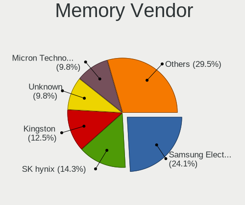
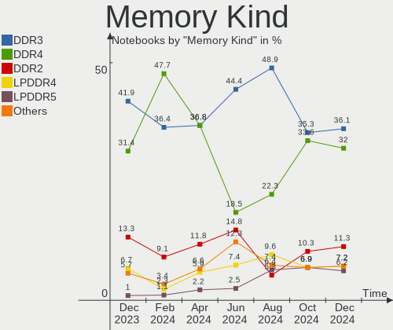

ROSA - Hardware Trends (Notebooks)
----------------------------------

A project to identify most popular hardware characteristics and track their change
over time based on data collected by Linux users at https://Linux-Hardware.org.

Anyone can contribute to this report by the [hw-probe](https://github.com/linuxhw/hw-probe) tool:

    sudo -E hw-probe -all -upload

This report is for one last month. Overall report since the beginning of time: [TestDays](https://github.com/linuxhw/TestDays)

Period: Sep, 2023.

Contents
--------

* [ System ](#system)
  - [ OS                       ](#os)
  - [ OS Family                ](#os-family)
  - [ Kernel                   ](#kernel)
  - [ Kernel Family            ](#kernel-family)
  - [ Kernel Major Ver.        ](#kernel-major-ver)
  - [ Arch                     ](#arch)
  - [ DE                       ](#de)
  - [ Display Server           ](#display-server)
  - [ Display Manager          ](#display-manager)
  - [ OS Lang                  ](#os-lang)
  - [ Boot Mode                ](#boot-mode)
  - [ Filesystem               ](#filesystem)
  - [ Part. scheme             ](#part-scheme)
  - [ Dual Boot with Linux/BSD ](#dual-boot-with-linuxbsd)
  - [ Dual Boot (Win)          ](#dual-boot-win)

* [ Board ](#board)
  - [ Vendor                   ](#vendor)
  - [ Model                    ](#model)
  - [ Model Family             ](#model-family)
  - [ MFG Year                 ](#mfg-year)
  - [ Form Factor              ](#form-factor)
  - [ Secure Boot              ](#secure-boot)
  - [ Coreboot                 ](#coreboot)
  - [ RAM Size                 ](#ram-size)
  - [ RAM Used                 ](#ram-used)
  - [ Total Drives             ](#total-drives)
  - [ Has CD-ROM               ](#has-cd-rom)
  - [ Has Ethernet             ](#has-ethernet)
  - [ Has WiFi                 ](#has-wifi)
  - [ Has Bluetooth            ](#has-bluetooth)

* [ Location ](#location)
  - [ Country                  ](#country)
  - [ City                     ](#city)

* [ Drives ](#drives)
  - [ Drive Vendor             ](#drive-vendor)
  - [ Drive Model              ](#drive-model)
  - [ HDD Vendor               ](#hdd-vendor)
  - [ SSD Vendor               ](#ssd-vendor)
  - [ Drive Kind               ](#drive-kind)
  - [ Drive Connector          ](#drive-connector)
  - [ Drive Size               ](#drive-size)
  - [ Space Total              ](#space-total)
  - [ Space Used               ](#space-used)
  - [ Malfunc. Drives          ](#malfunc-drives)
  - [ Malfunc. Drive Vendor    ](#malfunc-drive-vendor)
  - [ Malfunc. HDD Vendor      ](#malfunc-hdd-vendor)
  - [ Malfunc. Drive Kind      ](#malfunc-drive-kind)
  - [ Failed Drives            ](#failed-drives)
  - [ Failed Drive Vendor      ](#failed-drive-vendor)
  - [ Drive Status             ](#drive-status)

* [ Storage controller ](#storage-controller)
  - [ Storage Vendor           ](#storage-vendor)
  - [ Storage Model            ](#storage-model)
  - [ Storage Kind             ](#storage-kind)

* [ Processor ](#processor)
  - [ CPU Vendor               ](#cpu-vendor)
  - [ CPU Model                ](#cpu-model)
  - [ CPU Model Family         ](#cpu-model-family)
  - [ CPU Cores                ](#cpu-cores)
  - [ CPU Sockets              ](#cpu-sockets)
  - [ CPU Threads              ](#cpu-threads)
  - [ CPU Op-Modes             ](#cpu-op-modes)
  - [ CPU Microcode            ](#cpu-microcode)
  - [ CPU Microarch            ](#cpu-microarch)

* [ Graphics ](#graphics)
  - [ GPU Vendor               ](#gpu-vendor)
  - [ GPU Model                ](#gpu-model)
  - [ GPU Combo                ](#gpu-combo)
  - [ GPU Driver               ](#gpu-driver)
  - [ GPU Memory               ](#gpu-memory)

* [ Monitor ](#monitor)
  - [ Monitor Vendor           ](#monitor-vendor)
  - [ Monitor Model            ](#monitor-model)
  - [ Monitor Resolution       ](#monitor-resolution)
  - [ Monitor Diagonal         ](#monitor-diagonal)
  - [ Monitor Width            ](#monitor-width)
  - [ Aspect Ratio             ](#aspect-ratio)
  - [ Monitor Area             ](#monitor-area)
  - [ Pixel Density            ](#pixel-density)
  - [ Multiple Monitors        ](#multiple-monitors)

* [ Network ](#network)
  - [ Net Controller Vendor    ](#net-controller-vendor)
  - [ Net Controller Model     ](#net-controller-model)
  - [ Wireless Vendor          ](#wireless-vendor)
  - [ Wireless Model           ](#wireless-model)
  - [ Ethernet Vendor          ](#ethernet-vendor)
  - [ Ethernet Model           ](#ethernet-model)
  - [ Net Controller Kind      ](#net-controller-kind)
  - [ Used Controller          ](#used-controller)
  - [ NICs                     ](#nics)
  - [ IPv6                     ](#ipv6)

* [ Bluetooth ](#bluetooth)
  - [ Bluetooth Vendor         ](#bluetooth-vendor)
  - [ Bluetooth Model          ](#bluetooth-model)

* [ Sound ](#sound)
  - [ Sound Vendor             ](#sound-vendor)
  - [ Sound Model              ](#sound-model)

* [ Memory ](#memory)
  - [ Memory Vendor            ](#memory-vendor)
  - [ Memory Model             ](#memory-model)
  - [ Memory Kind              ](#memory-kind)
  - [ Memory Form Factor       ](#memory-form-factor)
  - [ Memory Size              ](#memory-size)
  - [ Memory Speed             ](#memory-speed)

* [ Printers & scanners ](#printers--scanners)
  - [ Printer Vendor           ](#printer-vendor)
  - [ Printer Model            ](#printer-model)
  - [ Scanner Vendor           ](#scanner-vendor)
  - [ Scanner Model            ](#scanner-model)

* [ Camera ](#camera)
  - [ Camera Vendor            ](#camera-vendor)
  - [ Camera Model             ](#camera-model)

* [ Security ](#security)
  - [ Fingerprint Vendor       ](#fingerprint-vendor)
  - [ Fingerprint Model        ](#fingerprint-model)
  - [ Chipcard Vendor          ](#chipcard-vendor)
  - [ Chipcard Model           ](#chipcard-model)

* [ Unsupported ](#unsupported)
  - [ Unsupported Devices      ](#unsupported-devices)
  - [ Unsupported Device Types ](#unsupported-device-types)

System
------

OS
--

Installed operating systems

| Name       | Notebooks | Percent |
|------------|-----------|---------|
| ROSA 12.4  | 73        | 81.11%  |
| ROSA 12    | 7         | 7.78%   |
| ROSA R11.1 | 5         | 5.56%   |
| ROSA 12.2  | 2         | 2.22%   |
| ROSA R11   | 1         | 1.11%   |
| ROSA 13.0  | 1         | 1.11%   |
| ROSA 12.3  | 1         | 1.11%   |

OS Family
---------

OS without a version

| Name | Notebooks | Percent |
|------|-----------|---------|
| ROSA | 90        | 100%    |

Kernel
------

Version of the Linux kernel

| Version                             | Notebooks | Percent |
|-------------------------------------|-----------|---------|
| 6.1.46-generic-2rosa2021.1-x86_64   | 28        | 31.11%  |
| 6.1.20-generic-2rosa2021.1-x86_64   | 17        | 18.89%  |
| 6.1.38-generic-1rosa2021.1-x86_64   | 15        | 16.67%  |
| 5.10.184-generic-1rosa2021.1-x86_64 | 6         | 6.67%   |
| 5.15.127-generic-1rosa2021.1-x86_64 | 5         | 5.56%   |
| 5.15.103-generic-1rosa2021.1-i686   | 4         | 4.44%   |
| 5.4.83-generic-2rosa-i586           | 3         | 3.33%   |
| 5.10.74-generic-2rosa2021.1-x86_64  | 2         | 2.22%   |
| 6.3.12-generic-1rosa2021.1-x86_64   | 1         | 1.11%   |
| 6.1.49-generic-1rosa2023.1-x86_64   | 1         | 1.11%   |
| 6.1.46-generic-1rosa2021.1-x86_64   | 1         | 1.11%   |
| 6.1.38-desktop-1rosa2021-x86_64     | 1         | 1.11%   |
| 5.4.32-generic-2rosa-x86_64         | 1         | 1.11%   |
| 5.17.11-generic-2rosa2021.1-x86_64  | 1         | 1.11%   |
| 5.15.79-generic-1rosa2021.1-x86_64  | 1         | 1.11%   |
| 5.15.75-generic-1rosa2021.1-i686    | 1         | 1.11%   |
| 4.15.0-desktop-45.1rosa-i586        | 1         | 1.11%   |
| 4.15.0-desktop-122.124.1rosa-i586   | 1         | 1.11%   |

Kernel Family
-------------

Linux kernel without a distro release

| Version  | Notebooks | Percent |
|----------|-----------|---------|
| 6.1.46   | 29        | 32.22%  |
| 6.1.20   | 17        | 18.89%  |
| 6.1.38   | 16        | 17.78%  |
| 5.10.184 | 6         | 6.67%   |
| 5.15.127 | 5         | 5.56%   |
| 5.15.103 | 4         | 4.44%   |
| 5.4.83   | 3         | 3.33%   |
| 5.10.74  | 2         | 2.22%   |
| 4.15.0   | 2         | 2.22%   |
| 6.3.12   | 1         | 1.11%   |
| 6.1.49   | 1         | 1.11%   |
| 5.4.32   | 1         | 1.11%   |
| 5.17.11  | 1         | 1.11%   |
| 5.15.79  | 1         | 1.11%   |
| 5.15.75  | 1         | 1.11%   |

Kernel Major Ver.
-----------------

Linux kernel major version

| Version | Notebooks | Percent |
|---------|-----------|---------|
| 6.1     | 63        | 70%     |
| 5.15    | 11        | 12.22%  |
| 5.10    | 8         | 8.89%   |
| 5.4     | 4         | 4.44%   |
| 4.15    | 2         | 2.22%   |
| 6.3     | 1         | 1.11%   |
| 5.17    | 1         | 1.11%   |

Arch
----

OS architecture (x86_64, i586, etc.)

| Name   | Notebooks | Percent |
|--------|-----------|---------|
| x86_64 | 80        | 88.89%  |
| i686   | 10        | 11.11%  |

DE
--

Desktop Environment

| Name  | Notebooks | Percent |
|-------|-----------|---------|
| KDE5  | 47        | 52.22%  |
| GNOME | 26        | 28.89%  |
| LXQt  | 13        | 14.44%  |
| KDE4  | 4         | 4.44%   |

Display Server
--------------

X11 or Wayland

| Name    | Notebooks | Percent |
|---------|-----------|---------|
| Wayland | 67        | 74.44%  |
| X11     | 23        | 25.56%  |

Display Manager
---------------

SDDM, LightDM, etc.

| Name    | Notebooks | Percent |
|---------|-----------|---------|
| SDDM    | 50        | 55.56%  |
| GDM     | 31        | 34.44%  |
| LightDM | 5         | 5.56%   |
| KDM     | 4         | 4.44%   |

OS Lang
-------

Language

| Lang    | Notebooks | Percent |
|---------|-----------|---------|
| ru_RU   | 83        | 92.22%  |
| es_ES   | 3         | 3.33%   |
| en_US   | 2         | 2.22%   |
| it_IT   | 1         | 1.11%   |
| Unknown | 1         | 1.11%   |

Boot Mode
---------

EFI or BIOS

| Mode | Notebooks | Percent |
|------|-----------|---------|
| EFI  | 49        | 54.44%  |
| BIOS | 41        | 45.56%  |

Filesystem
----------

Type of filesystem

| Type  | Notebooks | Percent |
|-------|-----------|---------|
| Ext4  | 82        | 91.11%  |
| Btrfs | 7         | 7.78%   |
| Aufs  | 1         | 1.11%   |

Part. scheme
------------

Scheme of partitioning

| Type    | Notebooks | Percent |
|---------|-----------|---------|
| GPT     | 51        | 56.67%  |
| MBR     | 38        | 42.22%  |
| Unknown | 1         | 1.11%   |

Dual Boot with Linux/BSD
------------------------

Hosting more than one Linux/BSD

| Dual boot | Notebooks | Percent |
|-----------|-----------|---------|
| No        | 67        | 74.44%  |
| Yes       | 23        | 25.56%  |

Dual Boot (Win)
---------------

Hosting Linux and Windows

| Dual boot | Notebooks | Percent |
|-----------|-----------|---------|
| No        | 48        | 53.33%  |
| Yes       | 42        | 46.67%  |

Board
-----

Vendor
------

Motherboard manufacturer

| Name                              | Notebooks | Percent |
|-----------------------------------|-----------|---------|
| Lenovo                            | 15        | 16.67%  |
| Hewlett-Packard                   | 15        | 16.67%  |
| ASUSTek Computer                  | 13        | 14.44%  |
| Acer                              | 9         | 10%     |
| Dell                              | 7         | 7.78%   |
| Clevo                             | 6         | 6.67%   |
| Toshiba                           | 3         | 3.33%   |
| Samsung Electronics               | 3         | 3.33%   |
| Sony                              | 2         | 2.22%   |
| Fujitsu Siemens                   | 2         | 2.22%   |
| Apple                             | 2         | 2.22%   |
| Pegatron                          | 1         | 1.11%   |
| Notebook                          | 1         | 1.11%   |
| MSI                               | 1         | 1.11%   |
| Maibenben                         | 1         | 1.11%   |
| LTD Delovoy Office                | 1         | 1.11%   |
| Irbis                             | 1         | 1.11%   |
| HUAWEI                            | 1         | 1.11%   |
| HONOR                             | 1         | 1.11%   |
| Fujitsu                           | 1         | 1.11%   |
| F-PLUS EQUIPMENT AND DEVELOPMENTS | 1         | 1.11%   |
| eMachines                         | 1         | 1.11%   |
| Aquarius                          | 1         | 1.11%   |
| Unknown                           | 1         | 1.11%   |

Model
-----

Motherboard model

| Name                                 | Notebooks | Percent |
|--------------------------------------|-----------|---------|
| Clevo NL41MU2                        | 4         | 4.44%   |
| HP Pavilion DV6                      | 2         | 2.22%   |
| Clevo W240EL/W250ELQ/W270ELQ         | 2         | 2.22%   |
| Acer Aspire ES1-520                  | 2         | 2.22%   |
| Unknown                              | 2         | 2.22%   |
| Toshiba Satellite A300               | 1         | 1.11%   |
| Toshiba Satellite A200               | 1         | 1.11%   |
| Toshiba QOSMIO X300                  | 1         | 1.11%   |
| Sony VPCEL1E1R                       | 1         | 1.11%   |
| Sony VGN-FW11LR                      | 1         | 1.11%   |
| Samsung N250P                        | 1         | 1.11%   |
| Samsung 350V5C/351V5C/3540VC/3440VC  | 1         | 1.11%   |
| Samsung 300E4Z/300E5Z/300E7Z         | 1         | 1.11%   |
| Pegatron A35                         | 1         | 1.11%   |
| Notebook W54_W94_W955TU,-T,-C        | 1         | 1.11%   |
| MSI GT60 2QE                         | 1         | 1.11%   |
| Maibenben MaiBook M                  | 1         | 1.11%   |
| LTD Delovoy Office 15CLG2            | 1         | 1.11%   |
| Lenovo XiaoXinPro 16 APH8 83AR       | 1         | 1.11%   |
| Lenovo V15-IGL 82C3                  | 1         | 1.11%   |
| Lenovo ThinkPad X250 20CMS0A200      | 1         | 1.11%   |
| Lenovo ThinkBook 15 G3 ACL 21A4      | 1         | 1.11%   |
| Lenovo IdeaPad Y510                  | 1         | 1.11%   |
| Lenovo IdeaPad Gaming 3 15ARH05 82EY | 1         | 1.11%   |
| Lenovo IdeaPad 5 14ABA7 82SE         | 1         | 1.11%   |
| Lenovo IdeaPad 330-15AST 81D6        | 1         | 1.11%   |
| Lenovo IdeaPad 3 15ALC6 82KU         | 1         | 1.11%   |
| Lenovo G70-70 80HW                   | 1         | 1.11%   |
| Lenovo G580 20157                    | 1         | 1.11%   |
| Lenovo G570 20079                    | 1         | 1.11%   |
| Lenovo G560 20042                    | 1         | 1.11%   |
| Lenovo B590 20208                    | 1         | 1.11%   |
| Lenovo B460e                         | 1         | 1.11%   |
| Irbis NB133                          | 1         | 1.11%   |
| HUAWEI KLVL-WXXW                     | 1         | 1.11%   |
| HONOR HYM-WXX                        | 1         | 1.11%   |
| HP ProBook 4535s                     | 1         | 1.11%   |
| HP ProBook 4310s                     | 1         | 1.11%   |
| HP Pavilion Notebook                 | 1         | 1.11%   |
| HP Pavilion Gaming Laptop 15-dk0xxx  | 1         | 1.11%   |

Model Family
------------

Motherboard model prefix

| Name                      | Notebooks | Percent |
|---------------------------|-----------|---------|
| Lenovo IdeaPad            | 5         | 5.56%   |
| HP Pavilion               | 5         | 5.56%   |
| Acer Aspire               | 5         | 5.56%   |
| HP Laptop                 | 4         | 4.44%   |
| Dell Inspiron             | 4         | 4.44%   |
| Clevo NL41MU2             | 4         | 4.44%   |
| ASUS TUF                  | 3         | 3.33%   |
| Toshiba Satellite         | 2         | 2.22%   |
| HP ProBook                | 2         | 2.22%   |
| Fujitsu Siemens AMILO     | 2         | 2.22%   |
| Clevo W240EL              | 2         | 2.22%   |
| ASUS VivoBook             | 2         | 2.22%   |
| Acer TravelMate           | 2         | 2.22%   |
| Unknown                   | 2         | 2.22%   |
| Toshiba QOSMIO            | 1         | 1.11%   |
| Sony VPCEL1E1R            | 1         | 1.11%   |
| Sony VGN-FW11LR           | 1         | 1.11%   |
| Samsung N250P             | 1         | 1.11%   |
| Samsung 350V5C            | 1         | 1.11%   |
| Samsung 300E4Z            | 1         | 1.11%   |
| Pegatron A35              | 1         | 1.11%   |
| Notebook W54              | 1         | 1.11%   |
| MSI GT60                  | 1         | 1.11%   |
| Maibenben MaiBook         | 1         | 1.11%   |
| LTD Delovoy Office 15CLG2 | 1         | 1.11%   |
| Lenovo XiaoXinPro         | 1         | 1.11%   |
| Lenovo V15-IGL            | 1         | 1.11%   |
| Lenovo ThinkPad           | 1         | 1.11%   |
| Lenovo ThinkBook          | 1         | 1.11%   |
| Lenovo G70-70             | 1         | 1.11%   |
| Lenovo G580               | 1         | 1.11%   |
| Lenovo G570               | 1         | 1.11%   |
| Lenovo G560               | 1         | 1.11%   |
| Lenovo B590               | 1         | 1.11%   |
| Lenovo B460e              | 1         | 1.11%   |
| Irbis NB133               | 1         | 1.11%   |
| HUAWEI KLVL-WXXW          | 1         | 1.11%   |
| HONOR HYM-WXX             | 1         | 1.11%   |
| HP ENVY                   | 1         | 1.11%   |
| HP EliteBook              | 1         | 1.11%   |

MFG Year
--------

Motherboard manufacture year

| Year | Notebooks | Percent |
|------|-----------|---------|
| 2011 | 12        | 13.33%  |
| 2022 | 9         | 10%     |
| 2021 | 9         | 10%     |
| 2012 | 9         | 10%     |
| 2018 | 7         | 7.78%   |
| 2008 | 6         | 6.67%   |
| 2019 | 5         | 5.56%   |
| 2015 | 5         | 5.56%   |
| 2009 | 5         | 5.56%   |
| 2023 | 4         | 4.44%   |
| 2014 | 4         | 4.44%   |
| 2007 | 4         | 4.44%   |
| 2020 | 3         | 3.33%   |
| 2013 | 3         | 3.33%   |
| 2010 | 3         | 3.33%   |
| 2017 | 1         | 1.11%   |
| 2005 | 1         | 1.11%   |

Form Factor
-----------

Physical design of the computer

| Name     | Notebooks | Percent |
|----------|-----------|---------|
| Notebook | 90        | 100%    |

Secure Boot
-----------

Enabled or disabled

| State    | Notebooks | Percent |
|----------|-----------|---------|
| Disabled | 90        | 100%    |

Coreboot
--------

Have coreboot on board

| Used | Notebooks | Percent |
|------|-----------|---------|
| No   | 90        | 100%    |

RAM Size
--------

Total RAM memory

| Size in GB | Notebooks | Percent |
|------------|-----------|---------|
| 4.01-8.0   | 35        | 38.89%  |
| 3.01-4.0   | 15        | 16.67%  |
| 16.01-24.0 | 13        | 14.44%  |
| 8.01-16.0  | 9         | 10%     |
| 1.01-2.0   | 8         | 8.89%   |
| 2.01-3.0   | 5         | 5.56%   |
| 32.01-64.0 | 2         | 2.22%   |
| 24.01-32.0 | 2         | 2.22%   |
| 0.51-1.0   | 1         | 1.11%   |

RAM Used
--------

Used RAM memory

| Used GB  | Notebooks | Percent |
|----------|-----------|---------|
| 1.01-2.0 | 42        | 46.67%  |
| 2.01-3.0 | 20        | 22.22%  |
| 0.51-1.0 | 16        | 17.78%  |
| 4.01-8.0 | 6         | 6.67%   |
| 3.01-4.0 | 5         | 5.56%   |
| 0.01-0.5 | 1         | 1.11%   |

Total Drives
------------

Number of drives on board

| Drives | Notebooks | Percent |
|--------|-----------|---------|
| 1      | 51        | 56.67%  |
| 2      | 33        | 36.67%  |
| 3      | 5         | 5.56%   |
| 5      | 1         | 1.11%   |

Has CD-ROM
----------

Has CD-ROM on board

| Presented | Notebooks | Percent |
|-----------|-----------|---------|
| No        | 54        | 60%     |
| Yes       | 36        | 40%     |

Has Ethernet
------------

Has Ethernet on board

| Presented | Notebooks | Percent |
|-----------|-----------|---------|
| Yes       | 76        | 84.44%  |
| No        | 14        | 15.56%  |

Has WiFi
--------

Has WiFi module

| Presented | Notebooks | Percent |
|-----------|-----------|---------|
| Yes       | 88        | 97.78%  |
| No        | 2         | 2.22%   |

Has Bluetooth
-------------

Has Bluetooth module

| Presented | Notebooks | Percent |
|-----------|-----------|---------|
| Yes       | 66        | 73.33%  |
| No        | 24        | 26.67%  |

Location
--------

Country
-------

Geographic location (country)

| Country     | Notebooks | Percent |
|-------------|-----------|---------|
| Russia      | 78        | 86.67%  |
| Ukraine     | 4         | 4.44%   |
| Spain       | 2         | 2.22%   |
| Netherlands | 1         | 1.11%   |
| Italy       | 1         | 1.11%   |
| Czechia     | 1         | 1.11%   |
| Bulgaria    | 1         | 1.11%   |
| Brazil      | 1         | 1.11%   |
| Armenia     | 1         | 1.11%   |

City
----

Geographic location (city)

| City              | Notebooks | Percent |
|-------------------|-----------|---------|
| Moscow            | 20        | 22.22%  |
| St Petersburg     | 7         | 7.78%   |
| Krasnodar         | 6         | 6.67%   |
| Volgograd         | 3         | 3.33%   |
| Chelyabinsk       | 3         | 3.33%   |
| Saratov           | 2         | 2.22%   |
| Samara            | 2         | 2.22%   |
| Belgorod          | 2         | 2.22%   |
| Zernograd         | 1         | 1.11%   |
| Yuzhno-Sakhalinsk | 1         | 1.11%   |
| Yoshkar-Ola       | 1         | 1.11%   |
| Yerevan           | 1         | 1.11%   |
| Yelizovo          | 1         | 1.11%   |
| Yekaterinburg     | 1         | 1.11%   |
| Yasinovataya      | 1         | 1.11%   |
| Yaroslavl         | 1         | 1.11%   |
| Yalta             | 1         | 1.11%   |
| Voronezh          | 1         | 1.11%   |
| Volzhsky          | 1         | 1.11%   |
| Ulan-Ude          | 1         | 1.11%   |
| Tver              | 1         | 1.11%   |
| Tayshet           | 1         | 1.11%   |
| Stary Oskol       | 1         | 1.11%   |
| Sao Paulo         | 1         | 1.11%   |
| Santa Eugènia    | 1         | 1.11%   |
| Rybinsk           | 1         | 1.11%   |
| Rostov-on-Don     | 1         | 1.11%   |
| Pyatigorsk        | 1         | 1.11%   |
| Putignano         | 1         | 1.11%   |
| Prokoptsevskaya   | 1         | 1.11%   |
| Orlova            | 1         | 1.11%   |
| Orekhovo-Zuyevo   | 1         | 1.11%   |
| Omsk              | 1         | 1.11%   |
| Nova Zagora       | 1         | 1.11%   |
| Nizhniy Novgorod  | 1         | 1.11%   |
| Mytishchi         | 1         | 1.11%   |
| Moscow Oblast     | 1         | 1.11%   |
| Mala Danylivka    | 1         | 1.11%   |
| Makarov           | 1         | 1.11%   |
| Kstovo            | 1         | 1.11%   |

Drives
------

Drive Vendor
------------

Hard drive vendors

| Vendor                      | Notebooks | Drives | Percent |
|-----------------------------|-----------|--------|---------|
| Seagate                     | 18        | 21     | 14.52%  |
| WDC                         | 16        | 17     | 12.9%   |
| Samsung Electronics         | 10        | 10     | 8.06%   |
| Toshiba                     | 7         | 7      | 5.65%   |
| SK hynix                    | 6         | 6      | 4.84%   |
| Hitachi                     | 6         | 6      | 4.84%   |
| Kingston                    | 5         | 5      | 4.03%   |
| Crucial                     | 5         | 5      | 4.03%   |
| BIWIN                       | 4         | 4      | 3.23%   |
| Unknown                     | 3         | 4      | 2.42%   |
| SanDisk                     | 3         | 3      | 2.42%   |
| AMD                         | 3         | 3      | 2.42%   |
| A-DATA Technology           | 3         | 3      | 2.42%   |
| XrayDisk                    | 2         | 2      | 1.61%   |
| SPCC                        | 2         | 2      | 1.61%   |
| Netac                       | 2         | 2      | 1.61%   |
| Micron Technology           | 2         | 2      | 1.61%   |
| HGST                        | 2         | 2      | 1.61%   |
| Fujitsu                     | 2         | 3      | 1.61%   |
| China                       | 2         | 2      | 1.61%   |
| Apple                       | 2         | 3      | 1.61%   |
| Apacer                      | 2         | 2      | 1.61%   |
| UMIS                        | 1         | 1      | 0.81%   |
| TO Exter                    | 1         | 1      | 0.81%   |
| Team                        | 1         | 1      | 0.81%   |
| Phison                      | 1         | 1      | 0.81%   |
| LuminouTek                  | 1         | 1      | 0.81%   |
| Londisk                     | 1         | 1      | 0.81%   |
| KIOXIA                      | 1         | 1      | 0.81%   |
| Kingston Technology Company | 1         | 1      | 0.81%   |
| Kingmax                     | 1         | 1      | 0.81%   |
| KingFast                    | 1         | 1      | 0.81%   |
| Kingchuxing                 | 1         | 1      | 0.81%   |
| HUAWEI                      | 1         | 1      | 0.81%   |
| GS                          | 1         | 1      | 0.81%   |
| FORESEE                     | 1         | 1      | 0.81%   |
| External                    | 1         | 1      | 0.81%   |
| DEXP                        | 1         | 1      | 0.81%   |
| Unknown                     | 1         | 1      | 0.81%   |

Drive Model
-----------

Hard drive models

| Model                                | Notebooks | Percent |
|--------------------------------------|-----------|---------|
| Seagate ST1000LM035-1RK172 1TB       | 4         | 3.1%    |
| BIWIN CE480T5D101-256 256GB          | 4         | 3.1%    |
| WDC WDS120G2G0A-00JH30 120GB SSD     | 3         | 2.33%   |
| Seagate ST500LT012-1DG142 500GB      | 3         | 2.33%   |
| Seagate ST1000LM024 HN-M101MBB 1TB   | 3         | 2.33%   |
| Toshiba MQ04ABF100 1TB               | 2         | 1.55%   |
| SPCC Solid State Disk 256GB          | 2         | 1.55%   |
| Seagate ST1000LX015-1U7172 1TB       | 2         | 1.55%   |
| Samsung MZALQ256HAJD-000L2 256GB     | 2         | 1.55%   |
| Crucial CT120BX500SSD1 120GB         | 2         | 1.55%   |
| AMD R5SL128G 128GB SSD               | 2         | 1.55%   |
| XrayDisk 2TB SSD                     | 1         | 0.78%   |
| XrayDisk 240GB SSD                   | 1         | 0.78%   |
| WDC WD7500BPVT-75HXZT3 752GB         | 1         | 0.78%   |
| WDC WD7500BPVT-26HXZT3 752GB         | 1         | 0.78%   |
| WDC WD5000LPVX-55V0TT0 500GB         | 1         | 0.78%   |
| WDC WD3200BPVT-75ZEST0 320GB         | 1         | 0.78%   |
| WDC WD3200BPVT-24ZEST0 320GB         | 1         | 0.78%   |
| WDC WD3200BPVT-00JJ5T0 320GB         | 1         | 0.78%   |
| WDC WD2500BEVS-22UST0 250GB          | 1         | 0.78%   |
| WDC WD1200BEVS-08RST2 120GB          | 1         | 0.78%   |
| WDC WD10SPZX-21Z10T0 1TB             | 1         | 0.78%   |
| WDC WD10SPZX-00Z10T0 1TB             | 1         | 0.78%   |
| WDC WD10JPVX-75JC3T0 1TB             | 1         | 0.78%   |
| WDC WD10JPCX-24UE4T0 1TB             | 1         | 0.78%   |
| WDC PC SN730 SDBPNTY-512G-1101 512GB | 1         | 0.78%   |
| WDC PC SN530 SDBPNPZ-256G-1006 256GB | 1         | 0.78%   |
| Unknown SLD32G  32GB                 | 1         | 0.78%   |
| Unknown SL64G  64GB                  | 1         | 0.78%   |
| Unknown SD16G  64GB                  | 1         | 0.78%   |
| Unknown NCard  16GB                  | 1         | 0.78%   |
| UMIS RPEYJ1T24MKN2QWY 1TB            | 1         | 0.78%   |
| Toshiba MQ01ABF050 500GB             | 1         | 0.78%   |
| Toshiba MQ01ABD100 1TB               | 1         | 0.78%   |
| Toshiba MQ01ABD032 320GB             | 1         | 0.78%   |
| Toshiba MK3252GSX 320GB              | 1         | 0.78%   |
| Toshiba MK2556GSY 250GB              | 1         | 0.78%   |
| TO Exter nal USB 3.0 120GB           | 1         | 0.78%   |
| Team T253X2512G 512GB SSD            | 1         | 0.78%   |
| SK hynix SKHynix_HFS001TDE9X084N 1TB | 1         | 0.78%   |

HDD Vendor
----------

Hard disk drive vendors

| Vendor              | Notebooks | Drives | Percent |
|---------------------|-----------|--------|---------|
| Seagate             | 18        | 21     | 36%     |
| WDC                 | 12        | 12     | 24%     |
| Toshiba             | 7         | 7      | 14%     |
| Hitachi             | 6         | 6      | 12%     |
| HGST                | 2         | 2      | 4%      |
| Fujitsu             | 2         | 3      | 4%      |
| Samsung Electronics | 1         | 1      | 2%      |
| External            | 1         | 1      | 2%      |
| Unknown             | 1         | 1      | 2%      |

SSD Vendor
----------

Solid state drive vendors

| Vendor              | Notebooks | Drives | Percent |
|---------------------|-----------|--------|---------|
| Crucial             | 4         | 4      | 10.53%  |
| WDC                 | 3         | 3      | 7.89%   |
| Samsung Electronics | 3         | 3      | 7.89%   |
| A-DATA Technology   | 3         | 3      | 7.89%   |
| XrayDisk            | 2         | 2      | 5.26%   |
| SPCC                | 2         | 2      | 5.26%   |
| SanDisk             | 2         | 2      | 5.26%   |
| Kingston            | 2         | 2      | 5.26%   |
| China               | 2         | 2      | 5.26%   |
| Apacer              | 2         | 2      | 5.26%   |
| AMD                 | 2         | 2      | 5.26%   |
| TO Exter            | 1         | 1      | 2.63%   |
| Team                | 1         | 1      | 2.63%   |
| SK hynix            | 1         | 1      | 2.63%   |
| Netac               | 1         | 1      | 2.63%   |
| Londisk             | 1         | 1      | 2.63%   |
| Kingmax             | 1         | 1      | 2.63%   |
| KingFast            | 1         | 1      | 2.63%   |
| Kingchuxing         | 1         | 1      | 2.63%   |
| GS                  | 1         | 1      | 2.63%   |
| DEXP                | 1         | 1      | 2.63%   |
| Apple               | 1         | 1      | 2.63%   |

Drive Kind
----------

HDD or SSD

| Kind    | Notebooks | Drives | Percent |
|---------|-----------|--------|---------|
| HDD     | 49        | 54     | 41.18%  |
| SSD     | 35        | 38     | 29.41%  |
| NVMe    | 30        | 32     | 25.21%  |
| MMC     | 3         | 5      | 2.52%   |
| Unknown | 2         | 2      | 1.68%   |

Drive Connector
---------------

SATA, SAS, NVMe, etc.

| Type | Notebooks | Drives | Percent |
|------|-----------|--------|---------|
| SATA | 67        | 86     | 63.21%  |
| NVMe | 30        | 32     | 28.3%   |
| SAS  | 6         | 8      | 5.66%   |
| MMC  | 3         | 5      | 2.83%   |

Drive Size
----------

Size of hard drive

| Size in TB | Notebooks | Drives | Percent |
|------------|-----------|--------|---------|
| 0.01-0.5   | 51        | 60     | 63.75%  |
| 0.51-1.0   | 24        | 27     | 30%     |
| 1.01-2.0   | 4         | 4      | 5%      |
| 4.01-10.0  | 1         | 1      | 1.25%   |

Space Total
-----------

Amount of disk space available on the file system

| Size in GB     | Notebooks | Percent |
|----------------|-----------|---------|
| 101-250        | 26        | 28.89%  |
| 251-500        | 23        | 25.56%  |
| 501-1000       | 11        | 12.22%  |
| 21-50          | 7         | 7.78%   |
| 1001-2000      | 7         | 7.78%   |
| 51-100         | 7         | 7.78%   |
| 1-20           | 6         | 6.67%   |
| More than 3000 | 1         | 1.11%   |
| 2001-3000      | 1         | 1.11%   |
| Unknown        | 1         | 1.11%   |

Space Used
----------

Amount of used disk space

| Used GB        | Notebooks | Percent |
|----------------|-----------|---------|
| 1-20           | 55        | 61.11%  |
| 21-50          | 12        | 13.33%  |
| 101-250        | 7         | 7.78%   |
| 51-100         | 7         | 7.78%   |
| 251-500        | 3         | 3.33%   |
| 501-1000       | 3         | 3.33%   |
| More than 3000 | 1         | 1.11%   |
| 1001-2000      | 1         | 1.11%   |
| Unknown        | 1         | 1.11%   |

Malfunc. Drives
---------------

Drive models with a malfunction

| Model                              | Notebooks | Drives | Percent |
|------------------------------------|-----------|--------|---------|
| WDC WDS120G2G0A-00JH30 120GB SSD   | 1         | 1      | 5%      |
| WDC WD7500BPVT-75HXZT3 752GB       | 1         | 1      | 5%      |
| WDC WD5000LPVX-55V0TT0 500GB       | 1         | 1      | 5%      |
| WDC WD1200BEVS-08RST2 120GB        | 1         | 1      | 5%      |
| Toshiba MK2556GSY 250GB            | 1         | 1      | 5%      |
| Seagate ST9500325AS 500GB          | 1         | 1      | 5%      |
| Seagate ST9320325AS 320GB          | 1         | 1      | 5%      |
| Seagate ST9320320AS 320GB          | 1         | 1      | 5%      |
| Seagate ST500LT012-1DG142 500GB    | 1         | 1      | 5%      |
| Seagate ST1000LM049-2GH172 1TB     | 1         | 1      | 5%      |
| Seagate ST1000LM048-2E7172 1TB     | 1         | 1      | 5%      |
| Seagate ST1000LM024 HN-M101MBB 1TB | 1         | 1      | 5%      |
| SanDisk SSD PLUS 240GB             | 1         | 1      | 5%      |
| Samsung Electronics HM250HI 250GB  | 1         | 1      | 5%      |
| Kingston SA400S37120GB SSD         | 1         | 1      | 5%      |
| Kingmax SSD 120GB                  | 1         | 1      | 5%      |
| Kingchuxing SSD 256GB              | 1         | 1      | 5%      |
| Hitachi HTS723232L9A360 320GB      | 1         | 1      | 5%      |
| Hitachi HTS542516K9SA00 160GB      | 1         | 1      | 5%      |
| Hitachi HTS542512K9SA00 120GB      | 1         | 1      | 5%      |

Malfunc. Drive Vendor
---------------------

Vendors of faulty drives

| Vendor              | Notebooks | Drives | Percent |
|---------------------|-----------|--------|---------|
| Seagate             | 6         | 7      | 31.58%  |
| WDC                 | 4         | 4      | 21.05%  |
| Hitachi             | 3         | 3      | 15.79%  |
| Toshiba             | 1         | 1      | 5.26%   |
| SanDisk             | 1         | 1      | 5.26%   |
| Samsung Electronics | 1         | 1      | 5.26%   |
| Kingston            | 1         | 1      | 5.26%   |
| Kingmax             | 1         | 1      | 5.26%   |
| Kingchuxing         | 1         | 1      | 5.26%   |

Malfunc. HDD Vendor
-------------------

Vendors of faulty HDD drives

| Vendor              | Notebooks | Drives | Percent |
|---------------------|-----------|--------|---------|
| Seagate             | 6         | 7      | 42.86%  |
| WDC                 | 3         | 3      | 21.43%  |
| Hitachi             | 3         | 3      | 21.43%  |
| Toshiba             | 1         | 1      | 7.14%   |
| Samsung Electronics | 1         | 1      | 7.14%   |

Malfunc. Drive Kind
-------------------

Kinds of faulty drives

| Kind | Notebooks | Drives | Percent |
|------|-----------|--------|---------|
| HDD  | 14        | 15     | 73.68%  |
| SSD  | 5         | 5      | 26.32%  |

Failed Drives
-------------

Failed drive models

Zero info for selected period =(

Failed Drive Vendor
-------------------

Failed drive vendors

Zero info for selected period =(

Drive Status
------------

Number of failed and malfunc. drives

| Status   | Notebooks | Drives | Percent |
|----------|-----------|--------|---------|
| Works    | 73        | 97     | 72.28%  |
| Malfunc  | 19        | 20     | 18.81%  |
| Detected | 9         | 14     | 8.91%   |

Storage controller
------------------

Storage Vendor
--------------

Storage controller vendors

| Vendor                                  | Notebooks | Percent |
|-----------------------------------------|-----------|---------|
| Intel                                   | 64        | 57.66%  |
| AMD                                     | 15        | 13.51%  |
| Samsung Electronics                     | 6         | 5.41%   |
| SK hynix                                | 4         | 3.6%    |
| Kingston Technology Company             | 4         | 3.6%    |
| INNOGRIT                                | 4         | 3.6%    |
| SanDisk                                 | 3         | 2.7%    |
| Silicon Motion                          | 2         | 1.8%    |
| Micron Technology                       | 2         | 1.8%    |
| Shenzhen Unionmemory Information System | 1         | 0.9%    |
| Shenzhen Longsys Electronics            | 1         | 0.9%    |
| Phison Electronics                      | 1         | 0.9%    |
| Micron/Crucial Technology               | 1         | 0.9%    |
| Marvell Technology Group                | 1         | 0.9%    |
| KIOXIA                                  | 1         | 0.9%    |
| Apple                                   | 1         | 0.9%    |

Storage Model
-------------

Storage controller models

| Model                                                                                         | Notebooks | Percent |
|-----------------------------------------------------------------------------------------------|-----------|---------|
| AMD FCH SATA Controller [AHCI mode]                                                           | 13        | 11.02%  |
| Intel 7 Series Chipset Family 6-port SATA Controller [AHCI mode]                              | 11        | 9.32%   |
| Intel 82801IBM/IEM (ICH9M/ICH9M-E) 4 port SATA Controller [AHCI mode]                         | 7         | 5.93%   |
| Intel Tiger Lake-LP SATA Controller                                                           | 6         | 5.08%   |
| Intel 82801HM/HEM (ICH8M/ICH8M-E) SATA Controller [AHCI mode]                                 | 5         | 4.24%   |
| Intel 82801HM/HEM (ICH8M/ICH8M-E) IDE Controller                                              | 5         | 4.24%   |
| Intel 6 Series/C200 Series Chipset Family 6 port Mobile SATA AHCI Controller                  | 5         | 4.24%   |
| Samsung NVMe SSD Controller 980                                                               | 4         | 3.39%   |
| Intel NM10/ICH7 Family SATA Controller [AHCI mode]                                            | 4         | 3.39%   |
| Intel Cannon Lake Mobile PCH SATA AHCI Controller                                             | 4         | 3.39%   |
| Intel 82801 Mobile SATA Controller [RAID mode]                                                | 4         | 3.39%   |
| INNOGRIT NVMe SSD Controller IG5216 (DRAM-less)                                               | 4         | 3.39%   |
| SK hynix Gold P31/BC711/PC711 NVMe Solid State Drive                                          | 3         | 2.54%   |
| Intel 5 Series/3400 Series Chipset 4 port SATA AHCI Controller                                | 3         | 2.54%   |
| Silicon Motion SM2263EN/SM2263XT (DRAM-less) NVMe SSD Controllers                             | 2         | 1.69%   |
| Kingston Company Company Non-Volatile memory controller                                       | 2         | 1.69%   |
| Intel Wildcat Point-LP SATA Controller [AHCI Mode]                                            | 2         | 1.69%   |
| Intel 8 Series SATA Controller 1 [AHCI mode]                                                  | 2         | 1.69%   |
| AMD SB7x0/SB8x0/SB9x0 SATA Controller [AHCI mode]                                             | 2         | 1.69%   |
| SK hynix BC511 NVMe SSD                                                                       | 1         | 0.85%   |
| Shenzhen Unionmemory Information System RPEYJ1T24MKN2QWY PCIe 4.0 NVMe SSD 1024GB (DRAM-less) | 1         | 0.85%   |
| Shenzhen Longsys Lexar NM620 NVME SSD (DRAM-less)                                             | 1         | 0.85%   |
| SanDisk WD Green SN350 NVMe SSD 1 TB (DRAM-less)                                              | 1         | 0.85%   |
| SanDisk WD Blue SN550 NVMe SSD                                                                | 1         | 0.85%   |
| SanDisk WD Black SN750 / PC SN730 NVMe SSD                                                    | 1         | 0.85%   |
| Samsung NVMe SSD Controller SM981/PM981/PM983                                                 | 1         | 0.85%   |
| Samsung NVMe SSD Controller PM9A1/PM9A3/980PRO                                                | 1         | 0.85%   |
| Phison PS5013 E13 NVMe Controller                                                             | 1         | 0.85%   |
| Micron/Crucial P5 Plus NVMe PCIe SSD                                                          | 1         | 0.85%   |
| Micron 2400 NVMe SSD (DRAM-less)                                                              | 1         | 0.85%   |
| Micron 2200S NVMe SSD [Cassandra]                                                             | 1         | 0.85%   |
| Marvell Group 88SS9183 PCIe SSD Controller                                                    | 1         | 0.85%   |
| KIOXIA NVMe SSD Controller BG4 (DRAM-less)                                                    | 1         | 0.85%   |
| Kingston Company U-SNS8154P3 NVMe SSD                                                         | 1         | 0.85%   |
| Kingston Company OM3PDP3 NVMe SSD                                                             | 1         | 0.85%   |
| Intel Volume Management Device NVMe RAID Controller                                           | 1         | 0.85%   |
| Intel Sunrise Point-LP SATA Controller [AHCI mode]                                            | 1         | 0.85%   |
| Intel HM170/QM170 Chipset SATA Controller [AHCI Mode]                                         | 1         | 0.85%   |
| Intel Comet Lake SATA AHCI Controller                                                         | 1         | 0.85%   |
| Intel Celeron/Pentium Silver Processor SATA Controller                                        | 1         | 0.85%   |

Storage Kind
------------

Kind of storage controller (IDE, SATA, NVMe, SAS, ...)

| Kind | Notebooks | Percent |
|------|-----------|---------|
| SATA | 74        | 63.25%  |
| NVMe | 30        | 25.64%  |
| IDE  | 8         | 6.84%   |
| RAID | 5         | 4.27%   |

Processor
---------

CPU Vendor
----------

Processor vendors

| Vendor | Notebooks | Percent |
|--------|-----------|---------|
| Intel  | 70        | 77.78%  |
| AMD    | 20        | 22.22%  |

CPU Model
---------

Processor models

| Model                                       | Notebooks | Percent |
|---------------------------------------------|-----------|---------|
| Intel 11th Gen Core i5-1135G7 @ 2.40GHz     | 4         | 4.44%   |
| Intel Core i7-3630QM CPU @ 2.40GHz          | 3         | 3.33%   |
| Intel Core i5-8300H CPU @ 2.30GHz           | 3         | 3.33%   |
| Intel Core i5-3210M CPU @ 2.50GHz           | 3         | 3.33%   |
| Intel Pentium CPU B960 @ 2.20GHz            | 2         | 2.22%   |
| Intel Celeron CPU B830 @ 1.80GHz            | 2         | 2.22%   |
| Intel Celeron CPU B800 @ 1.50GHz            | 2         | 2.22%   |
| Intel 11th Gen Core i3-1115G4 @ 3.00GHz     | 2         | 2.22%   |
| AMD Ryzen 7 5700U with Radeon Graphics      | 2         | 2.22%   |
| AMD Ryzen 5 5500U with Radeon Graphics      | 2         | 2.22%   |
| Intel Pentium Gold 7505 @ 2.00GHz           | 1         | 1.11%   |
| Intel Pentium Dual-Core CPU T4300 @ 2.10GHz | 1         | 1.11%   |
| Intel Pentium Dual CPU T2390 @ 1.86GHz      | 1         | 1.11%   |
| Intel Pentium CPU P6200 @ 2.13GHz           | 1         | 1.11%   |
| Intel Pentium CPU N3540 @ 2.16GHz           | 1         | 1.11%   |
| Intel Genuine CPU T2130 @ 1.86GHz           | 1         | 1.11%   |
| Intel Genuine CPU T1400 @ 1.73GHz           | 1         | 1.11%   |
| Intel Core i9-9880H CPU @ 2.30GHz           | 1         | 1.11%   |
| Intel Core i7-9750H CPU @ 2.60GHz           | 1         | 1.11%   |
| Intel Core i7-8750H CPU @ 2.20GHz           | 1         | 1.11%   |
| Intel Core i7-6700HQ CPU @ 2.60GHz          | 1         | 1.11%   |
| Intel Core i7-4710MQ CPU @ 2.50GHz          | 1         | 1.11%   |
| Intel Core i7-1065G7 CPU @ 1.30GHz          | 1         | 1.11%   |
| Intel Core i5-8259U CPU @ 2.30GHz           | 1         | 1.11%   |
| Intel Core i5-7Y54 CPU @ 1.20GHz            | 1         | 1.11%   |
| Intel Core i5-7200U CPU @ 2.50GHz           | 1         | 1.11%   |
| Intel Core i5-5200U CPU @ 2.20GHz           | 1         | 1.11%   |
| Intel Core i5-4258U CPU @ 2.40GHz           | 1         | 1.11%   |
| Intel Core i5-4210U CPU @ 1.70GHz           | 1         | 1.11%   |
| Intel Core i5-4200U CPU @ 1.60GHz           | 1         | 1.11%   |
| Intel Core i5-3230M CPU @ 2.60GHz           | 1         | 1.11%   |
| Intel Core i5-2450M CPU @ 2.50GHz           | 1         | 1.11%   |
| Intel Core i5-1035G1 CPU @ 1.00GHz          | 1         | 1.11%   |
| Intel Core i5-10210U CPU @ 1.60GHz          | 1         | 1.11%   |
| Intel Core i3-5010U CPU @ 2.10GHz           | 1         | 1.11%   |
| Intel Core i3-3120M CPU @ 2.50GHz           | 1         | 1.11%   |
| Intel Core i3 CPU M 380 @ 2.53GHz           | 1         | 1.11%   |
| Intel Core i3 CPU M 370 @ 2.40GHz           | 1         | 1.11%   |
| Intel Core 2 Duo CPU T8300 @ 2.40GHz        | 1         | 1.11%   |
| Intel Core 2 Duo CPU T6570 @ 2.10GHz        | 1         | 1.11%   |

CPU Model Family
----------------

Processor model prefix

| Model                   | Notebooks | Percent |
|-------------------------|-----------|---------|
| Intel Core i5           | 17        | 18.89%  |
| Other                   | 8         | 8.89%   |
| Intel Core i7           | 8         | 8.89%   |
| Intel Core 2 Duo        | 7         | 7.78%   |
| Intel Celeron           | 7         | 7.78%   |
| AMD Ryzen 5             | 6         | 6.67%   |
| Intel Atom              | 5         | 5.56%   |
| AMD Ryzen 7             | 5         | 5.56%   |
| Intel Pentium           | 4         | 4.44%   |
| Intel Core i3           | 4         | 4.44%   |
| AMD A4                  | 3         | 3.33%   |
| Intel Genuine           | 2         | 2.22%   |
| Intel Celeron Dual-Core | 2         | 2.22%   |
| AMD Ryzen 3             | 2         | 2.22%   |
| Intel Pentium Gold      | 1         | 1.11%   |
| Intel Pentium Dual-Core | 1         | 1.11%   |
| Intel Pentium Dual      | 1         | 1.11%   |
| Intel Core i9           | 1         | 1.11%   |
| Intel Core 2            | 1         | 1.11%   |
| Intel Celeron M         | 1         | 1.11%   |
| AMD Phenom II           | 1         | 1.11%   |
| AMD E1                  | 1         | 1.11%   |
| AMD E                   | 1         | 1.11%   |
| AMD Athlon              | 1         | 1.11%   |

CPU Cores
---------

Number of processor cores

| Number | Notebooks | Percent |
|--------|-----------|---------|
| 2      | 51        | 56.67%  |
| 4      | 22        | 24.44%  |
| 6      | 7         | 7.78%   |
| 8      | 5         | 5.56%   |
| 1      | 3         | 3.33%   |
| 14     | 1         | 1.11%   |
| 10     | 1         | 1.11%   |

CPU Sockets
-----------

Number of sockets

| Number | Notebooks | Percent |
|--------|-----------|---------|
| 1      | 90        | 100%    |

CPU Threads
-----------

Threads per core (Hyper-Threading)

| Number | Notebooks | Percent |
|--------|-----------|---------|
| 2      | 57        | 63.33%  |
| 1      | 33        | 36.67%  |

CPU Op-Modes
------------

CPU Operation Modes (32-bit, 64-bit)

| Op mode        | Notebooks | Percent |
|----------------|-----------|---------|
| 32-bit, 64-bit | 88        | 97.78%  |
| 32-bit         | 2         | 2.22%   |

CPU Microcode
-------------

Microcode number

| Number     | Notebooks | Percent |
|------------|-----------|---------|
| 0x206a7    | 8         | 8.89%   |
| 0x806c1    | 7         | 7.78%   |
| 0x306a9    | 7         | 7.78%   |
| 0x906ea    | 5         | 5.56%   |
| 0x6fd      | 4         | 4.44%   |
| 0x106ca    | 4         | 4.44%   |
| 0x1067a    | 4         | 4.44%   |
| Unknown    | 4         | 4.44%   |
| 0x40651    | 3         | 3.33%   |
| 0x20655    | 3         | 3.33%   |
| 0x10676    | 3         | 3.33%   |
| 0x0a50000c | 3         | 3.33%   |
| 0x806e9    | 2         | 2.22%   |
| 0x706e5    | 2         | 2.22%   |
| 0x306d4    | 2         | 2.22%   |
| 0x30678    | 2         | 2.22%   |
| 0x08608103 | 2         | 2.22%   |
| 0x08608102 | 2         | 2.22%   |
| 0x08108102 | 2         | 2.22%   |
| 0x07000106 | 2         | 2.22%   |
| 0x906ed    | 1         | 1.11%   |
| 0x906a4    | 1         | 1.11%   |
| 0x906a3    | 1         | 1.11%   |
| 0x806ec    | 1         | 1.11%   |
| 0x706a8    | 1         | 1.11%   |
| 0x6f6      | 1         | 1.11%   |
| 0x6ec      | 1         | 1.11%   |
| 0x6d8      | 1         | 1.11%   |
| 0x506e3    | 1         | 1.11%   |
| 0x506c9    | 1         | 1.11%   |
| 0x306c3    | 1         | 1.11%   |
| 0x0a704101 | 1         | 1.11%   |
| 0x08600104 | 1         | 1.11%   |
| 0x08108109 | 1         | 1.11%   |
| 0x08101007 | 1         | 1.11%   |
| 0x06006705 | 1         | 1.11%   |
| 0x05000028 | 1         | 1.11%   |
| 0x03000027 | 1         | 1.11%   |
| 0x010000c8 | 1         | 1.11%   |

CPU Microarch
-------------

Microarchitecture

| Name             | Notebooks | Percent |
|------------------|-----------|---------|
| KabyLake         | 10        | 11.11%  |
| SandyBridge      | 8         | 8.89%   |
| Penryn           | 8         | 8.89%   |
| IvyBridge        | 8         | 8.89%   |
| TigerLake        | 7         | 7.78%   |
| Unknown          | 6         | 6.67%   |
| Core             | 5         | 5.56%   |
| Haswell          | 4         | 4.44%   |
| Bonnell          | 4         | 4.44%   |
| Zen+             | 3         | 3.33%   |
| Zen 3            | 3         | 3.33%   |
| Westmere         | 3         | 3.33%   |
| Silvermont       | 2         | 2.22%   |
| P6               | 2         | 2.22%   |
| Jaguar           | 2         | 2.22%   |
| IceLake          | 2         | 2.22%   |
| Broadwell        | 2         | 2.22%   |
| Alderlake Hybrid | 2         | 2.22%   |
| Zen 2            | 1         | 1.11%   |
| Zen              | 1         | 1.11%   |
| Skylake          | 1         | 1.11%   |
| K10 Llano        | 1         | 1.11%   |
| K10              | 1         | 1.11%   |
| Goldmont plus    | 1         | 1.11%   |
| Goldmont         | 1         | 1.11%   |
| Excavator        | 1         | 1.11%   |
| Bobcat           | 1         | 1.11%   |

Graphics
--------

GPU Vendor
----------

Vendors of graphics cards

| Vendor | Notebooks | Percent |
|--------|-----------|---------|
| Intel  | 64        | 56.14%  |
| AMD    | 27        | 23.68%  |
| Nvidia | 23        | 20.18%  |

GPU Model
---------

Graphics card models

| Model                                                                                 | Notebooks | Percent |
|---------------------------------------------------------------------------------------|-----------|---------|
| Intel 3rd Gen Core processor Graphics Controller                                      | 8         | 6.56%   |
| Intel 2nd Generation Core Processor Family Integrated Graphics Controller             | 8         | 6.56%   |
| Intel CoffeeLake-H GT2 [UHD Graphics 630]                                             | 6         | 4.92%   |
| AMD Lucienne                                                                          | 5         | 4.1%    |
| Intel TigerLake-LP GT2 [Iris Xe Graphics]                                             | 4         | 3.28%   |
| Intel Mobile 4 Series Chipset Integrated Graphics Controller                          | 4         | 3.28%   |
| Intel Atom Processor D4xx/D5xx/N4xx/N5xx Integrated Graphics Controller               | 4         | 3.28%   |
| Nvidia GP107M [GeForce GTX 1050 Mobile]                                               | 3         | 2.46%   |
| Intel Tiger Lake-LP GT2 [UHD Graphics G4]                                             | 3         | 2.46%   |
| Intel Haswell-ULT Integrated Graphics Controller                                      | 3         | 2.46%   |
| AMD Picasso/Raven 2 [Radeon Vega Series / Radeon Vega Mobile Series]                  | 3         | 2.46%   |
| Nvidia TU117M [GeForce GTX 1650 Mobile / Max-Q]                                       | 2         | 1.64%   |
| Nvidia GF108M [GeForce GT 635M]                                                       | 2         | 1.64%   |
| Intel Mobile GM965/GL960 Integrated Graphics Controller (secondary)                   | 2         | 1.64%   |
| Intel Mobile GM965/GL960 Integrated Graphics Controller (primary)                     | 2         | 1.64%   |
| Intel Mobile 945GM/GMS/GME, 943/940GML Express Integrated Graphics Controller         | 2         | 1.64%   |
| Intel Mobile 945GM/GMS, 943/940GML Express Integrated Graphics Controller             | 2         | 1.64%   |
| Intel HD Graphics 5500                                                                | 2         | 1.64%   |
| Intel Core Processor Integrated Graphics Controller                                   | 2         | 1.64%   |
| Intel Atom Processor Z36xxx/Z37xxx Series Graphics & Display                          | 2         | 1.64%   |
| AMD Topaz XT [Radeon R7 M260/M265 / M340/M360 / M440/M445 / 530/535 / 620/625 Mobile] | 2         | 1.64%   |
| AMD Thames [Radeon HD 7500M/7600M Series]                                             | 2         | 1.64%   |
| AMD RV620/M82 [Mobility Radeon HD 3450/3470]                                          | 2         | 1.64%   |
| AMD Cezanne [Radeon Vega Series / Radeon Vega Mobile Series]                          | 2         | 1.64%   |
| Nvidia TU117M                                                                         | 1         | 0.82%   |
| Nvidia TU116M [GeForce GTX 1660 Ti Mobile]                                            | 1         | 0.82%   |
| Nvidia GT218M [GeForce 310M]                                                          | 1         | 0.82%   |
| Nvidia GP108M [GeForce MX230]                                                         | 1         | 0.82%   |
| Nvidia GP107M [GeForce GTX 1050 Ti Mobile]                                            | 1         | 0.82%   |
| Nvidia GM204M [GeForce GTX 980M]                                                      | 1         | 0.82%   |
| Nvidia GK208BM [GeForce 920M]                                                         | 1         | 0.82%   |
| Nvidia GK107M [GeForce GT 750M]                                                       | 1         | 0.82%   |
| Nvidia GK107M [GeForce GT 740M]                                                       | 1         | 0.82%   |
| Nvidia GK107M [GeForce GT 650M]                                                       | 1         | 0.82%   |
| Nvidia GF117M [GeForce 610M/710M/810M/820M / GT 620M/625M/630M/720M]                  | 1         | 0.82%   |
| Nvidia GF108M [GeForce GT 525M]                                                       | 1         | 0.82%   |
| Nvidia GF108M [GeForce 610M]                                                          | 1         | 0.82%   |
| Nvidia GA107M [GeForce RTX 3050 Mobile]                                               | 1         | 0.82%   |
| Nvidia G94M [GeForce 9700M GTS]                                                       | 1         | 0.82%   |
| Nvidia AD107M [GeForce RTX 4050 Max-Q / Mobile]                                       | 1         | 0.82%   |

GPU Combo
---------

Combinations of graphics cards

| Name           | Notebooks | Percent |
|----------------|-----------|---------|
| 1 x Intel      | 43        | 47.78%  |
| Intel + Nvidia | 18        | 20%     |
| 1 x AMD        | 17        | 18.89%  |
| 2 x AMD        | 4         | 4.44%   |
| Intel + AMD    | 3         | 3.33%   |
| AMD + Nvidia   | 3         | 3.33%   |
| 1 x Nvidia     | 2         | 2.22%   |

GPU Driver
----------

Free vs proprietary

| Driver      | Notebooks | Percent |
|-------------|-----------|---------|
| Free        | 82        | 91.11%  |
| Proprietary | 7         | 7.78%   |
| Unknown     | 1         | 1.11%   |

GPU Memory
----------

Total video memory

| Size in GB | Notebooks | Percent |
|------------|-----------|---------|
| Unknown    | 49        | 54.44%  |
| 0.01-0.5   | 17        | 18.89%  |
| 1.01-2.0   | 12        | 13.33%  |
| 0.51-1.0   | 6         | 6.67%   |
| 3.01-4.0   | 4         | 4.44%   |
| 7.01-8.0   | 1         | 1.11%   |
| 5.01-6.0   | 1         | 1.11%   |

Monitor
-------

Monitor Vendor
--------------

Monitor vendors

| Vendor                  | Notebooks | Percent |
|-------------------------|-----------|---------|
| Chimei Innolux          | 17        | 17.53%  |
| AU Optronics            | 13        | 13.4%   |
| LG Display              | 12        | 12.37%  |
| BOE                     | 11        | 11.34%  |
| Samsung Electronics     | 10        | 10.31%  |
| Chi Mei Optoelectronics | 7         | 7.22%   |
| PANDA                   | 3         | 3.09%   |
| LG Philips              | 3         | 3.09%   |
| Quanta Display          | 2         | 2.06%   |
| Goldstar                | 2         | 2.06%   |
| Apple                   | 2         | 2.06%   |
| STA                     | 1         | 1.03%   |
| PRM                     | 1         | 1.03%   |
| Philips                 | 1         | 1.03%   |
| Panasonic               | 1         | 1.03%   |
| Mi                      | 1         | 1.03%   |
| JRY                     | 1         | 1.03%   |
| InnoLux Display         | 1         | 1.03%   |
| HKC                     | 1         | 1.03%   |
| Hitachi                 | 1         | 1.03%   |
| HannStar                | 1         | 1.03%   |
| CSO                     | 1         | 1.03%   |
| CPT                     | 1         | 1.03%   |
| ASUSTek Computer        | 1         | 1.03%   |
| AOC                     | 1         | 1.03%   |
| Acer                    | 1         | 1.03%   |

Monitor Model
-------------

Monitor models

| Model                                                                     | Notebooks | Percent |
|---------------------------------------------------------------------------|-----------|---------|
| LG Display LCD Monitor LGD02DC 1366x768 344x194mm 15.5-inch               | 3         | 3.09%   |
| Samsung Electronics LCD Monitor SDC4161 1920x1080 344x194mm 15.5-inch     | 2         | 2.06%   |
| LG Display LCD Monitor LGD038E 1366x768 344x194mm 15.5-inch               | 2         | 2.06%   |
| Chimei Innolux LCD Monitor CMN1738 1920x1080 381x214mm 17.2-inch          | 2         | 2.06%   |
| Chimei Innolux LCD Monitor CMN15C9 1366x768 344x193mm 15.5-inch           | 2         | 2.06%   |
| Chimei Innolux LCD Monitor CMN14FF 1920x1080 309x173mm 13.9-inch          | 2         | 2.06%   |
| Chimei Innolux LCD Monitor CMN14D4 1920x1080 309x173mm 13.9-inch          | 2         | 2.06%   |
| Chi Mei Optoelectronics LCD Monitor CMO1720 1920x1080 380x210mm 17.1-inch | 2         | 2.06%   |
| BOE LCD Monitor BOE0687 1920x1080 344x193mm 15.5-inch                     | 2         | 2.06%   |
| AU Optronics LCD Monitor AUO23EC 1366x768 344x193mm 15.5-inch             | 2         | 2.06%   |
| AU Optronics LCD Monitor AUO21EC 1366x768 344x193mm 15.5-inch             | 2         | 2.06%   |
| STA LCD Monitor STAAFC9 1920x1080 344x194mm 15.5-inch                     | 1         | 1.03%   |
| Samsung Electronics SyncMaster SAM03C2 1680x1050 459x296mm 21.5-inch      | 1         | 1.03%   |
| Samsung Electronics LCD Monitor SEC5441 1366x768 344x194mm 15.5-inch      | 1         | 1.03%   |
| Samsung Electronics LCD Monitor SEC4E41 1366x768 353x198mm 15.9-inch      | 1         | 1.03%   |
| Samsung Electronics LCD Monitor SEC3945 1280x800 331x207mm 15.4-inch      | 1         | 1.03%   |
| Samsung Electronics LCD Monitor SEC384A 1366x768 344x194mm 15.5-inch      | 1         | 1.03%   |
| Samsung Electronics LCD Monitor SEC3245 1280x800 331x207mm 15.4-inch      | 1         | 1.03%   |
| Samsung Electronics LCD Monitor SEC3130 1024x600 223x125mm 10.1-inch      | 1         | 1.03%   |
| Samsung Electronics LCD Monitor SAM0900 1366x768 410x230mm 18.5-inch      | 1         | 1.03%   |
| Quanta Display LCD Monitor QDS002C 1280x800 304x190mm 14.1-inch           | 1         | 1.03%   |
| Quanta Display LCD Monitor QDS0011 1024x768 304x228mm 15.0-inch           | 1         | 1.03%   |
| PRM 35 PRM2733 1280x1024                                                  | 1         | 1.03%   |
| Philips PHL 237E7 PHLC101 1920x1080 509x286mm 23.0-inch                   | 1         | 1.03%   |
| PANDA LCD Monitor NCP004D 1920x1080 344x194mm 15.5-inch                   | 1         | 1.03%   |
| PANDA LCD Monitor NCP004A 1920x1080 309x174mm 14.0-inch                   | 1         | 1.03%   |
| PANDA LCD Monitor NCP0029 1920x1080 344x194mm 15.5-inch                   | 1         | 1.03%   |
| Panasonic LCD Monitor MEI96A2 2880x1620 344x193mm 15.5-inch               | 1         | 1.03%   |
| Mi 27 NFGL XMIB004 1920x1080 598x336mm 27.0-inch                          | 1         | 1.03%   |
| LG Philips LP154WX4-TLC8 LPL0120 1280x800 331x207mm 15.4-inch             | 1         | 1.03%   |
| LG Philips LCD Monitor LPLDC00 1280x800 331x207mm 15.4-inch               | 1         | 1.03%   |
| LG Philips LCD Monitor LPLA101 1440x900 367x230mm 17.1-inch               | 1         | 1.03%   |
| LG Display LCD Monitor LGD053F 1920x1080 344x194mm 15.5-inch              | 1         | 1.03%   |
| LG Display LCD Monitor LGD0492 1920x1080 344x194mm 15.5-inch              | 1         | 1.03%   |
| LG Display LCD Monitor LGD045D 1366x768 345x194mm 15.6-inch               | 1         | 1.03%   |
| LG Display LCD Monitor LGD0365 1600x900 382x215mm 17.3-inch               | 1         | 1.03%   |
| LG Display LCD Monitor LGD02F1 1366x768 344x194mm 15.5-inch               | 1         | 1.03%   |
| LG Display LCD Monitor LGD02D9 1920x1080 344x194mm 15.5-inch              | 1         | 1.03%   |
| LG Display LCD Monitor LGD01E8 1366x768 344x194mm 15.5-inch               | 1         | 1.03%   |
| JRY DX238A1 JRY2380 1920x1080 368x207mm 16.6-inch                         | 1         | 1.03%   |

Monitor Resolution
------------------

Monitor screen resolution

| Resolution         | Notebooks | Percent |
|--------------------|-----------|---------|
| 1920x1080 (FHD)    | 38        | 40.86%  |
| 1366x768 (WXGA)    | 33        | 35.48%  |
| 1280x800 (WXGA)    | 4         | 4.3%    |
| 1600x900 (HD+)     | 3         | 3.23%   |
| 1024x600           | 3         | 3.23%   |
| 3840x2160 (4K)     | 2         | 2.15%   |
| 2560x1600          | 2         | 2.15%   |
| 1280x1024 (SXGA)   | 2         | 2.15%   |
| 2560x1080          | 1         | 1.08%   |
| 2304x1440          | 1         | 1.08%   |
| 2160x1440          | 1         | 1.08%   |
| 1680x1050 (WSXGA+) | 1         | 1.08%   |
| 1440x900 (WXGA+)   | 1         | 1.08%   |
| 1024x768 (XGA)     | 1         | 1.08%   |

Monitor Diagonal
----------------

Diagonal size in inches

| Inches  | Notebooks | Percent |
|---------|-----------|---------|
| 15      | 52        | 53.61%  |
| 17      | 10        | 10.31%  |
| 13      | 9         | 9.28%   |
| 14      | 6         | 6.19%   |
| 23      | 3         | 3.09%   |
| 12      | 3         | 3.09%   |
| 10      | 3         | 3.09%   |
| 31      | 2         | 2.06%   |
| 27      | 2         | 2.06%   |
| 21      | 2         | 2.06%   |
| 16      | 2         | 2.06%   |
| Unknown | 2         | 2.06%   |
| 34      | 1         | 1.03%   |

Monitor Width
-------------

Physical width

| Width in mm | Notebooks | Percent |
|-------------|-----------|---------|
| 301-350     | 63        | 64.95%  |
| 351-400     | 13        | 13.4%   |
| 201-300     | 9         | 9.28%   |
| 501-600     | 5         | 5.15%   |
| 601-700     | 2         | 2.06%   |
| 401-500     | 2         | 2.06%   |
| Unknown     | 2         | 2.06%   |
| 701-800     | 1         | 1.03%   |

Aspect Ratio
------------

Proportional relationship between the width and the height

| Ratio | Notebooks | Percent |
|-------|-----------|---------|
| 16/9  | 76        | 84.44%  |
| 16/10 | 9         | 10%     |
| 5/4   | 2         | 2.22%   |
| 4/3   | 1         | 1.11%   |
| 3/2   | 1         | 1.11%   |
| 21/9  | 1         | 1.11%   |

Monitor Area
------------

Area in inch²

| Area in inch² | Notebooks | Percent |
|----------------|-----------|---------|
| 101-110        | 53        | 54.64%  |
| 81-90          | 13        | 13.4%   |
| 121-130        | 9         | 9.28%   |
| 201-250        | 5         | 5.15%   |
| 61-70          | 3         | 3.09%   |
| 351-500        | 3         | 3.09%   |
| 41-50          | 3         | 3.09%   |
| 71-80          | 2         | 2.06%   |
| 301-350        | 2         | 2.06%   |
| Unknown        | 2         | 2.06%   |
| 131-140        | 1         | 1.03%   |
| 111-120        | 1         | 1.03%   |

Pixel Density
-------------

Pixels per inch

| Density       | Notebooks | Percent |
|---------------|-----------|---------|
| 121-160       | 38        | 39.18%  |
| 101-120       | 32        | 32.99%  |
| 51-100        | 19        | 19.59%  |
| 161-240       | 4         | 4.12%   |
| Unknown       | 2         | 2.06%   |
| More than 240 | 1         | 1.03%   |
| 1-50          | 1         | 1.03%   |

Multiple Monitors
-----------------

Total monitors connected

| Total | Notebooks | Percent |
|-------|-----------|---------|
| 1     | 76        | 84.44%  |
| 2     | 11        | 12.22%  |
| 0     | 3         | 3.33%   |

Network
-------

Net Controller Vendor
---------------------

Controller vendors

| Vendor                   | Notebooks | Percent |
|--------------------------|-----------|---------|
| Realtek Semiconductor    | 54        | 37.76%  |
| Qualcomm Atheros         | 30        | 20.98%  |
| Intel                    | 28        | 19.58%  |
| Broadcom                 | 11        | 7.69%   |
| MediaTek                 | 5         | 3.5%    |
| Marvell Technology Group | 5         | 3.5%    |
| Broadcom Limited         | 5         | 3.5%    |
| Ralink                   | 2         | 1.4%    |
| Qualcomm                 | 1         | 0.7%    |
| Huawei Technologies      | 1         | 0.7%    |
| Attansic Technology      | 1         | 0.7%    |

Net Controller Model
--------------------

Controller models

| Model                                                                   | Notebooks | Percent |
|-------------------------------------------------------------------------|-----------|---------|
| Realtek RTL8111/8168/8411 PCI Express Gigabit Ethernet Controller       | 33        | 19.76%  |
| Realtek RTL810xE PCI Express Fast Ethernet controller                   | 13        | 7.78%   |
| Qualcomm Atheros AR9285 Wireless Network Adapter (PCI-Express)          | 9         | 5.39%   |
| Realtek RTL8821CE 802.11ac PCIe Wireless Network Adapter                | 6         | 3.59%   |
| Intel Wi-Fi 6 AX201                                                     | 6         | 3.59%   |
| Qualcomm Atheros AR9485 Wireless Network Adapter                        | 5         | 2.99%   |
| MediaTek MT7921 802.11ax PCI Express Wireless Network Adapter           | 4         | 2.4%    |
| Intel Ethernet Connection (13) I219-V                                   | 4         | 2.4%    |
| Broadcom BCM43142 802.11b/g/n                                           | 4         | 2.4%    |
| Realtek RTL8822CE 802.11ac PCIe Wireless Network Adapter                | 3         | 1.8%    |
| Qualcomm Atheros QCA9377 802.11ac Wireless Network Adapter              | 3         | 1.8%    |
| Qualcomm Atheros AR8161 Gigabit Ethernet                                | 3         | 1.8%    |
| Qualcomm Atheros AR242x / AR542x Wireless Network Adapter (PCI-Express) | 3         | 1.8%    |
| Intel Wireless 3165                                                     | 3         | 1.8%    |
| Intel Cannon Lake PCH CNVi WiFi                                         | 3         | 1.8%    |
| Broadcom BCM4313 802.11bgn Wireless Network Adapter                     | 3         | 1.8%    |
| Realtek RTL8723AE PCIe Wireless Network Adapter                         | 2         | 1.2%    |
| Realtek RTL-8100/8101L/8139 PCI Fast Ethernet Adapter                   | 2         | 1.2%    |
| Marvell Group 88E8055 PCI-E Gigabit Ethernet Controller                 | 2         | 1.2%    |
| Intel WiFi Link 5100                                                    | 2         | 1.2%    |
| Intel PRO/Wireless 3945ABG [Golan] Network Connection                   | 2         | 1.2%    |
| Intel Centrino Wireless-N 2230                                          | 2         | 1.2%    |
| Broadcom Limited NetLink BCM5906M Fast Ethernet PCI Express             | 2         | 1.2%    |
| Broadcom Limited NetLink BCM57780 Gigabit Ethernet PCIe                 | 2         | 1.2%    |
| Broadcom BCM4312 802.11b/g LP-PHY                                       | 2         | 1.2%    |
| Realtek RTL8852BE PCIe 802.11ax Wireless Network Controller             | 1         | 0.6%    |
| Realtek RTL8822BE 802.11a/b/g/n/ac WiFi adapter                         | 1         | 0.6%    |
| Realtek RTL8723DE Wireless Network Adapter                              | 1         | 0.6%    |
| Realtek RTL8723BE PCIe Wireless Network Adapter                         | 1         | 0.6%    |
| Realtek RTL8152 Fast Ethernet Adapter                                   | 1         | 0.6%    |
| Realtek 802.11n WLAN Adapter                                            | 1         | 0.6%    |
| Ralink RT3290 Wireless 802.11n 1T/1R PCIe                               | 1         | 0.6%    |
| Ralink RT3090 Wireless 802.11n 1T/1R PCIe                               | 1         | 0.6%    |
| Qualcomm QCNFA765 Wireless Network Adapter                              | 1         | 0.6%    |
| Qualcomm Atheros QCA9565 / AR9565 Wireless Network Adapter              | 1         | 0.6%    |
| Qualcomm Atheros QCA6174 802.11ac Wireless Network Adapter              | 1         | 0.6%    |
| Qualcomm Atheros Killer E220x Gigabit Ethernet Controller               | 1         | 0.6%    |
| Qualcomm Atheros AR9462 Wireless Network Adapter                        | 1         | 0.6%    |
| Qualcomm Atheros AR928X Wireless Network Adapter (PCI-Express)          | 1         | 0.6%    |
| Qualcomm Atheros AR9287 Wireless Network Adapter (PCI-Express)          | 1         | 0.6%    |

Wireless Vendor
---------------

Wireless vendors

| Vendor                | Notebooks | Percent |
|-----------------------|-----------|---------|
| Intel                 | 27        | 30.68%  |
| Qualcomm Atheros      | 26        | 29.55%  |
| Realtek Semiconductor | 16        | 18.18%  |
| Broadcom              | 10        | 11.36%  |
| MediaTek              | 5         | 5.68%   |
| Ralink                | 2         | 2.27%   |
| Qualcomm              | 1         | 1.14%   |
| Broadcom Limited      | 1         | 1.14%   |

Wireless Model
--------------

Wireless models

| Model                                                                   | Notebooks | Percent |
|-------------------------------------------------------------------------|-----------|---------|
| Qualcomm Atheros AR9285 Wireless Network Adapter (PCI-Express)          | 9         | 10.23%  |
| Realtek RTL8821CE 802.11ac PCIe Wireless Network Adapter                | 6         | 6.82%   |
| Intel Wi-Fi 6 AX201                                                     | 6         | 6.82%   |
| Qualcomm Atheros AR9485 Wireless Network Adapter                        | 5         | 5.68%   |
| MediaTek MT7921 802.11ax PCI Express Wireless Network Adapter           | 4         | 4.55%   |
| Broadcom BCM43142 802.11b/g/n                                           | 4         | 4.55%   |
| Realtek RTL8822CE 802.11ac PCIe Wireless Network Adapter                | 3         | 3.41%   |
| Qualcomm Atheros QCA9377 802.11ac Wireless Network Adapter              | 3         | 3.41%   |
| Qualcomm Atheros AR242x / AR542x Wireless Network Adapter (PCI-Express) | 3         | 3.41%   |
| Intel Wireless 3165                                                     | 3         | 3.41%   |
| Intel Cannon Lake PCH CNVi WiFi                                         | 3         | 3.41%   |
| Broadcom BCM4313 802.11bgn Wireless Network Adapter                     | 3         | 3.41%   |
| Realtek RTL8723AE PCIe Wireless Network Adapter                         | 2         | 2.27%   |
| Intel WiFi Link 5100                                                    | 2         | 2.27%   |
| Intel PRO/Wireless 3945ABG [Golan] Network Connection                   | 2         | 2.27%   |
| Intel Centrino Wireless-N 2230                                          | 2         | 2.27%   |
| Broadcom BCM4312 802.11b/g LP-PHY                                       | 2         | 2.27%   |
| Realtek RTL8852BE PCIe 802.11ax Wireless Network Controller             | 1         | 1.14%   |
| Realtek RTL8822BE 802.11a/b/g/n/ac WiFi adapter                         | 1         | 1.14%   |
| Realtek RTL8723DE Wireless Network Adapter                              | 1         | 1.14%   |
| Realtek RTL8723BE PCIe Wireless Network Adapter                         | 1         | 1.14%   |
| Realtek 802.11n WLAN Adapter                                            | 1         | 1.14%   |
| Ralink RT3290 Wireless 802.11n 1T/1R PCIe                               | 1         | 1.14%   |
| Ralink RT3090 Wireless 802.11n 1T/1R PCIe                               | 1         | 1.14%   |
| Qualcomm QCNFA765 Wireless Network Adapter                              | 1         | 1.14%   |
| Qualcomm Atheros QCA9565 / AR9565 Wireless Network Adapter              | 1         | 1.14%   |
| Qualcomm Atheros QCA6174 802.11ac Wireless Network Adapter              | 1         | 1.14%   |
| Qualcomm Atheros AR9462 Wireless Network Adapter                        | 1         | 1.14%   |
| Qualcomm Atheros AR928X Wireless Network Adapter (PCI-Express)          | 1         | 1.14%   |
| Qualcomm Atheros AR9287 Wireless Network Adapter (PCI-Express)          | 1         | 1.14%   |
| Qualcomm Atheros AR2427 802.11bg Wireless Network Adapter (PCI-Express) | 1         | 1.14%   |
| MediaTek MT7921K (RZ608) Wi-Fi 6E 80MHz                                 | 1         | 1.14%   |
| Intel Wireless 8265 / 8275                                              | 1         | 1.14%   |
| Intel Wireless 7265                                                     | 1         | 1.14%   |
| Intel Wireless 7260                                                     | 1         | 1.14%   |
| Intel WiMAX/WiFi Link 5150                                              | 1         | 1.14%   |
| Intel PRO/Wireless 5100 AGN [Shiloh] Network Connection                 | 1         | 1.14%   |
| Intel PRO/Wireless 4965 AG or AGN [Kedron] Network Connection           | 1         | 1.14%   |
| Intel Gemini Lake PCH CNVi WiFi                                         | 1         | 1.14%   |
| Intel Centrino Wireless-N 130                                           | 1         | 1.14%   |

Ethernet Vendor
---------------

Ethernet vendors

| Vendor                   | Notebooks | Percent |
|--------------------------|-----------|---------|
| Realtek Semiconductor    | 49        | 63.64%  |
| Qualcomm Atheros         | 9         | 11.69%  |
| Intel                    | 8         | 10.39%  |
| Marvell Technology Group | 5         | 6.49%   |
| Broadcom Limited         | 4         | 5.19%   |
| Broadcom                 | 1         | 1.3%    |
| Attansic Technology      | 1         | 1.3%    |

Ethernet Model
--------------

Ethernet models

| Model                                                             | Notebooks | Percent |
|-------------------------------------------------------------------|-----------|---------|
| Realtek RTL8111/8168/8411 PCI Express Gigabit Ethernet Controller | 33        | 42.86%  |
| Realtek RTL810xE PCI Express Fast Ethernet controller             | 13        | 16.88%  |
| Intel Ethernet Connection (13) I219-V                             | 4         | 5.19%   |
| Qualcomm Atheros AR8161 Gigabit Ethernet                          | 3         | 3.9%    |
| Realtek RTL-8100/8101L/8139 PCI Fast Ethernet Adapter             | 2         | 2.6%    |
| Marvell Group 88E8055 PCI-E Gigabit Ethernet Controller           | 2         | 2.6%    |
| Broadcom Limited NetLink BCM5906M Fast Ethernet PCI Express       | 2         | 2.6%    |
| Broadcom Limited NetLink BCM57780 Gigabit Ethernet PCIe           | 2         | 2.6%    |
| Realtek RTL8152 Fast Ethernet Adapter                             | 1         | 1.3%    |
| Qualcomm Atheros Killer E220x Gigabit Ethernet Controller         | 1         | 1.3%    |
| Qualcomm Atheros AR8162 Fast Ethernet                             | 1         | 1.3%    |
| Qualcomm Atheros AR8152 v2.0 Fast Ethernet                        | 1         | 1.3%    |
| Qualcomm Atheros AR8151 v2.0 Gigabit Ethernet                     | 1         | 1.3%    |
| Qualcomm Atheros AR8132 Fast Ethernet                             | 1         | 1.3%    |
| Qualcomm Atheros AR8121/AR8113/AR8114 Gigabit or Fast Ethernet    | 1         | 1.3%    |
| Marvell Group 88E8072 PCI-E Gigabit Ethernet Controller           | 1         | 1.3%    |
| Marvell Group 88E8042 PCI-E Fast Ethernet Controller              | 1         | 1.3%    |
| Marvell Group 88E8040 PCI-E Fast Ethernet Controller              | 1         | 1.3%    |
| Intel WiMAX Connection 2400m                                      | 1         | 1.3%    |
| Intel Ethernet Connection (4) I219-V                              | 1         | 1.3%    |
| Intel Ethernet Connection (3) I218-LM                             | 1         | 1.3%    |
| Intel Ethernet Connection (10) I219-V                             | 1         | 1.3%    |
| Broadcom NetLink BCM57785 Gigabit Ethernet PCIe                   | 1         | 1.3%    |
| Attansic AR8152 v2.0 Fast Ethernet                                | 1         | 1.3%    |

Net Controller Kind
-------------------

Ethernet, WiFi or modem

| Kind     | Notebooks | Percent |
|----------|-----------|---------|
| WiFi     | 88        | 53.01%  |
| Ethernet | 76        | 45.78%  |
| Modem    | 2         | 1.2%    |

Used Controller
---------------

Currently used network controller

| Kind     | Notebooks | Percent |
|----------|-----------|---------|
| WiFi     | 72        | 78.26%  |
| Ethernet | 20        | 21.74%  |

NICs
----

Total network controllers on board

| Total | Notebooks | Percent |
|-------|-----------|---------|
| 2     | 74        | 82.22%  |
| 1     | 14        | 15.56%  |
| 0     | 2         | 2.22%   |

IPv6
----

IPv6 vs IPv4

| Used | Notebooks | Percent |
|------|-----------|---------|
| No   | 84        | 93.33%  |
| Yes  | 6         | 6.67%   |

Bluetooth
---------

Bluetooth Vendor
----------------

Controller vendors

| Vendor                          | Notebooks | Percent |
|---------------------------------|-----------|---------|
| Intel                           | 20        | 29.85%  |
| Realtek Semiconductor           | 12        | 17.91%  |
| Qualcomm Atheros Communications | 10        | 14.93%  |
| IMC Networks                    | 6         | 8.96%   |
| Lite-On Technology              | 4         | 5.97%   |
| Foxconn / Hon Hai               | 3         | 4.48%   |
| Toshiba                         | 2         | 2.99%   |
| Hewlett-Packard                 | 2         | 2.99%   |
| Foxconn International           | 2         | 2.99%   |
| Realtek                         | 1         | 1.49%   |
| Ralink                          | 1         | 1.49%   |
| MediaTek                        | 1         | 1.49%   |
| Cambridge Silicon Radio         | 1         | 1.49%   |
| Apple                           | 1         | 1.49%   |
| Alps Electric                   | 1         | 1.49%   |

Bluetooth Model
---------------

Controller models

| Model                                               | Notebooks | Percent |
|-----------------------------------------------------|-----------|---------|
| Realtek Bluetooth Radio                             | 6         | 8.96%   |
| Intel Bluetooth wireless interface                  | 6         | 8.96%   |
| Intel AX201 Bluetooth                               | 6         | 8.96%   |
| Qualcomm Atheros AR3011 Bluetooth                   | 5         | 7.46%   |
| Intel Bluetooth 9460/9560 Jefferson Peak (JfP)      | 5         | 7.46%   |
| Realtek  Bluetooth 4.2 Adapter                      | 4         | 5.97%   |
| Toshiba Integrated Bluetooth HCI                    | 2         | 2.99%   |
| Realtek RTL8723A Bluetooth                          | 2         | 2.99%   |
| Qualcomm Atheros  Bluetooth Device                  | 2         | 2.99%   |
| Qualcomm Atheros AR3012 Bluetooth 4.0               | 2         | 2.99%   |
| Lite-On BCM43142A0                                  | 2         | 2.99%   |
| Intel Centrino Bluetooth Wireless Transceiver       | 2         | 2.99%   |
| IMC Networks Bluetooth Radio                        | 2         | 2.99%   |
| IMC Networks Atheros AR3012 Bluetooth 4.0 Adapter   | 2         | 2.99%   |
| HP Broadcom 2070 Bluetooth Combo                    | 2         | 2.99%   |
| Foxconn International BCM43142A0 Bluetooth module   | 2         | 2.99%   |
| Foxconn / Hon Hai MediaTek Bluetooth Adapter        | 2         | 2.99%   |
| Realtek Bluetooth Radio                             | 1         | 1.49%   |
| Ralink RT3290 Bluetooth                             | 1         | 1.49%   |
| Qualcomm Atheros QCA61x4 Bluetooth 4.0              | 1         | 1.49%   |
| MediaTek Wireless_Device                            | 1         | 1.49%   |
| Lite-On Wireless_Device                             | 1         | 1.49%   |
| Lite-On Qualcomm Atheros QCA9377 Bluetooth          | 1         | 1.49%   |
| Intel Centrino Advanced-N 6230 Bluetooth adapter    | 1         | 1.49%   |
| IMC Networks Wireless_Device                        | 1         | 1.49%   |
| IMC Networks Bluetooth Device                       | 1         | 1.49%   |
| Foxconn / Hon Hai Bluetooth Device                  | 1         | 1.49%   |
| Cambridge Silicon Radio Bluetooth Dongle (HCI mode) | 1         | 1.49%   |
| Apple Bluetooth Host Controller                     | 1         | 1.49%   |
| Alps Electric BCM2046 Bluetooth Device              | 1         | 1.49%   |

Sound
-----

Sound Vendor
------------

Sound card vendors

| Vendor                                       | Notebooks | Percent |
|----------------------------------------------|-----------|---------|
| Intel                                        | 69        | 61.06%  |
| AMD                                          | 23        | 20.35%  |
| Nvidia                                       | 15        | 13.27%  |
| C-Media Electronics                          | 4         | 3.54%   |
| Zoran Co. Personal Media Division (Nogatech) | 1         | 0.88%   |
| Promethean Limited                           | 1         | 0.88%   |

Sound Model
-----------

Sound card models

| Model                                                                      | Notebooks | Percent |
|----------------------------------------------------------------------------|-----------|---------|
| AMD Family 17h/19h HD Audio Controller                                     | 13        | 9.63%   |
| Intel 7 Series/C216 Chipset Family High Definition Audio Controller        | 11        | 8.15%   |
| AMD Renoir Radeon High Definition Audio Controller                         | 8         | 5.93%   |
| Intel Tiger Lake-LP Smart Sound Technology Audio Controller                | 7         | 5.19%   |
| Intel 82801I (ICH9 Family) HD Audio Controller                             | 7         | 5.19%   |
| Intel NM10/ICH7 Family High Definition Audio Controller                    | 6         | 4.44%   |
| Intel Cannon Lake PCH cAVS                                                 | 6         | 4.44%   |
| Intel 82801H (ICH8 Family) HD Audio Controller                             | 5         | 3.7%    |
| Intel 6 Series/C200 Series Chipset Family High Definition Audio Controller | 5         | 3.7%    |
| Nvidia GF108 High Definition Audio Controller                              | 4         | 2.96%   |
| C-Media Electronics USB Advanced Audio Device                              | 4         | 2.96%   |
| Nvidia TU107 GeForce GTX 1650 High Definition Audio Controller             | 3         | 2.22%   |
| Intel Haswell-ULT HD Audio Controller                                      | 3         | 2.22%   |
| Intel 8 Series HD Audio Controller                                         | 3         | 2.22%   |
| Intel 5 Series/3400 Series Chipset High Definition Audio                   | 3         | 2.22%   |
| AMD Raven/Raven2/Fenghuang HDMI/DP Audio Controller                        | 3         | 2.22%   |
| AMD FCH Azalia Controller                                                  | 3         | 2.22%   |
| Nvidia GP107GL High Definition Audio Controller                            | 2         | 1.48%   |
| Intel Wildcat Point-LP High Definition Audio Controller                    | 2         | 1.48%   |
| Intel Sunrise Point-LP HD Audio                                            | 2         | 1.48%   |
| Intel Ice Lake-LP Smart Sound Technology Audio Controller                  | 2         | 1.48%   |
| Intel Broadwell-U Audio Controller                                         | 2         | 1.48%   |
| Intel Alder Lake PCH-P High Definition Audio Controller                    | 2         | 1.48%   |
| AMD SBx00 Azalia (Intel HDA)                                               | 2         | 1.48%   |
| AMD Kabini HDMI/DP Audio                                                   | 2         | 1.48%   |
| Zoran Co. Personal Media Division (Nogatech) USB Audio and HID             | 1         | 0.74%   |
| Promethean Limited Audio                                                   | 1         | 0.74%   |
| Nvidia TU116 High Definition Audio Controller                              | 1         | 0.74%   |
| Nvidia High Definition Audio Controller                                    | 1         | 0.74%   |
| Nvidia GM204 High Definition Audio Controller                              | 1         | 0.74%   |
| Nvidia GK208 HDMI/DP Audio Controller                                      | 1         | 0.74%   |
| Nvidia GK107 HDMI Audio Controller                                         | 1         | 0.74%   |
| Nvidia Audio device                                                        | 1         | 0.74%   |
| Intel Comet Lake PCH-LP cAVS                                               | 1         | 0.74%   |
| Intel Celeron/Pentium Silver Processor High Definition Audio               | 1         | 0.74%   |
| Intel Celeron N3350/Pentium N4200/Atom E3900 Series Audio Cluster          | 1         | 0.74%   |
| Intel Cannon Point-LP High Definition Audio Controller                     | 1         | 0.74%   |
| Intel Atom Processor Z36xxx/Z37xxx Series High Definition Audio Controller | 1         | 0.74%   |
| Intel 82801FB/FBM/FR/FW/FRW (ICH6 Family) AC'97 Audio Controller           | 1         | 0.74%   |
| Intel 8 Series/C220 Series Chipset High Definition Audio Controller        | 1         | 0.74%   |

Memory
------

Memory Vendor
-------------

Memory module vendors

| Vendor              | Notebooks | Percent |
|---------------------|-----------|---------|
| Samsung Electronics | 26        | 25%     |
| SK hynix            | 23        | 22.12%  |
| Unknown             | 14        | 13.46%  |
| Micron Technology   | 8         | 7.69%   |
| Kingston            | 5         | 4.81%   |
| ACPI Digital        | 4         | 3.85%   |
| Nanya Technology    | 3         | 2.88%   |
| A-DATA Technology   | 3         | 2.88%   |
| Elpida              | 2         | 1.92%   |
| Crucial             | 2         | 1.92%   |
| AMD                 | 2         | 1.92%   |
| Unknown (ABCD)      | 1         | 0.96%   |
| Unknown (88BC)      | 1         | 0.96%   |
| Ramaxel Technology  | 1         | 0.96%   |
| Lexar Co Limited    | 1         | 0.96%   |
| Goldkey             | 1         | 0.96%   |
| Foxline             | 1         | 0.96%   |
| DeTech              | 1         | 0.96%   |
| Corsair             | 1         | 0.96%   |
| Apacer              | 1         | 0.96%   |
| Ankowall            | 1         | 0.96%   |
| 48spaces            | 1         | 0.96%   |
| Unknown             | 1         | 0.96%   |

Memory Model
------------

Memory module models

| Model                                                            | Notebooks | Percent |
|------------------------------------------------------------------|-----------|---------|
| ACPI Digital RAM CMB6-DHDA1BAR08D00 16GB SODIMM DDR4 3200MT/s    | 4         | 3.64%   |
| Unknown RAM Module 2GB SODIMM DDR2 667MT/s                       | 3         | 2.73%   |
| Samsung RAM M471B5273DH0-CH9 4GB SODIMM DDR3 1334MT/s            | 3         | 2.73%   |
| Samsung RAM M471A1G44AB0-CWE 8GB SODIMM DDR4 3200MT/s            | 3         | 2.73%   |
| SK hynix RAM HMT351S6CFR8C-PB 4GB SODIMM DDR3 1600MT/s           | 2         | 1.82%   |
| SK hynix RAM HMA81GS6JJR8N-VK 8GB SODIMM DDR4 2667MT/s           | 2         | 1.82%   |
| SK hynix RAM HMA81GS6CJR8N-VK 8GB SODIMM DDR4 2667MT/s           | 2         | 1.82%   |
| Samsung RAM M471B5273DH0-CK0 4GB SODIMM DDR3 1600MT/s            | 2         | 1.82%   |
| Samsung RAM M471B5173DB0-YK0 4GB SODIMM DDR3 1600MT/s            | 2         | 1.82%   |
| Samsung RAM M471B5173BH0-CK0 4GB SODIMM DDR3 1600MT/s            | 2         | 1.82%   |
| Samsung RAM M471A1G44AB0-CWE 8GB Row Of Chips DDR4 3200MT/s      | 2         | 1.82%   |
| Micron RAM 8ATF1G64HZ-3G2J1 8GB SODIMM DDR4 3200MT/s             | 2         | 1.82%   |
| AMD RAM R538G1601S2SL 8GB SODIMM DDR3 1600MT/s                   | 2         | 1.82%   |
| Unknown RAM Module 4GB SODIMM DDR3 1333MT/s                      | 1         | 0.91%   |
| Unknown RAM Module 2GB SODIMM DDR2 400MT/s                       | 1         | 0.91%   |
| Unknown RAM Module 2GB SODIMM DDR2                               | 1         | 0.91%   |
| Unknown RAM Module 2GB SODIMM DDR                                | 1         | 0.91%   |
| Unknown RAM Module 2GB SODIMM 800MT/s                            | 1         | 0.91%   |
| Unknown RAM Module 2048MB SODIMM DDR2 333MT/s                    | 1         | 0.91%   |
| Unknown RAM Module 2048MB SODIMM DDR2                            | 1         | 0.91%   |
| Unknown RAM Module 2048MB SODIMM DDR                             | 1         | 0.91%   |
| Unknown RAM Module 1GB SODIMM DDR3 667MT/s                       | 1         | 0.91%   |
| Unknown RAM Module 1GB SODIMM DDR3 1066MT/s                      | 1         | 0.91%   |
| Unknown RAM Module 1GB SODIMM DDR2 667MT/s                       | 1         | 0.91%   |
| Unknown RAM Module 1024MB SODIMM DDR2 533MT/s                    | 1         | 0.91%   |
| Unknown (ABCD) RAM 123456789012345678 1GB SODIMM LPDDR4 2400MT/s | 1         | 0.91%   |
| Unknown (88BC) RAM CS4S2666D19161C 16GB SODIMM DDR4 2667MT/s     | 1         | 0.91%   |
| SK hynix RAM Module 4GB SODIMM DDR3 1600MT/s                     | 1         | 0.91%   |
| SK hynix RAM Module 2GB SODIMM DDR2 667MT/s                      | 1         | 0.91%   |
| SK hynix RAM Module 1GB SODIMM DDR2 667MT/s                      | 1         | 0.91%   |
| SK hynix RAM Module 1GB DIMM DDR2 533MT/s                        | 1         | 0.91%   |
| SK hynix RAM HMT451S6BFR8A-PB 4GB SODIMM DDR3 1600MT/s           | 1         | 0.91%   |
| SK hynix RAM HMT451S6BFR8A-PB 4096MB SODIMM DDR3 1600MT/s        | 1         | 0.91%   |
| SK hynix RAM HMT425S6CFR6A-PB 2GB SODIMM DDR3 1600MT/s           | 1         | 0.91%   |
| SK hynix RAM HMT41GS6BFR8A-PB 8GB SODIMM DDR3 1600MT/s           | 1         | 0.91%   |
| SK hynix RAM HMT351S6CFR8C-H9 4GB SODIMM DDR3 1334MT/s           | 1         | 0.91%   |
| SK hynix RAM HMT351S6BFR8C-H9 4GB SODIMM DDR3 1334MT/s           | 1         | 0.91%   |
| SK hynix RAM HMT325S6CFR8C-H9 2GB SODIMM DDR3 1333MT/s           | 1         | 0.91%   |
| SK hynix RAM HMT325S6BFR8C-H9 2GB SODIMM DDR3 1600MT/s           | 1         | 0.91%   |
| SK hynix RAM HMT325S6BFR8C-H9 2048MB SODIMM DDR3 1333MT/s        | 1         | 0.91%   |

Memory Kind
-----------

Memory module kinds

| Kind    | Notebooks | Percent |
|---------|-----------|---------|
| DDR3    | 35        | 39.77%  |
| DDR4    | 34        | 38.64%  |
| DDR2    | 10        | 11.36%  |
| SDRAM   | 2         | 2.27%   |
| LPDDR4  | 2         | 2.27%   |
| DDR     | 2         | 2.27%   |
| LPDDR5  | 1         | 1.14%   |
| LPDDR3  | 1         | 1.14%   |
| Unknown | 1         | 1.14%   |

Memory Form Factor
------------------

Physical design of the memory module

| Name         | Notebooks | Percent |
|--------------|-----------|---------|
| SODIMM       | 81        | 91.01%  |
| Row Of Chips | 7         | 7.87%   |
| DIMM         | 1         | 1.12%   |

Memory Size
-----------

Memory module size

| Size  | Notebooks | Percent |
|-------|-----------|---------|
| 8192  | 34        | 32.08%  |
| 2048  | 30        | 28.3%   |
| 4096  | 26        | 24.53%  |
| 16384 | 9         | 8.49%   |
| 1024  | 7         | 6.6%    |

Memory Speed
------------

Memory module speed

| Speed   | Notebooks | Percent |
|---------|-----------|---------|
| 3200    | 20        | 21.05%  |
| 1600    | 20        | 21.05%  |
| 2667    | 11        | 11.58%  |
| 1334    | 9         | 9.47%   |
| 1333    | 8         | 8.42%   |
| 667     | 6         | 6.32%   |
| 2400    | 4         | 4.21%   |
| Unknown | 4         | 4.21%   |
| 2048    | 2         | 2.11%   |
| 800     | 2         | 2.11%   |
| 533     | 2         | 2.11%   |
| 6400    | 1         | 1.05%   |
| 4266    | 1         | 1.05%   |
| 2133    | 1         | 1.05%   |
| 1867    | 1         | 1.05%   |
| 1066    | 1         | 1.05%   |
| 400     | 1         | 1.05%   |
| 333     | 1         | 1.05%   |

Printers & scanners
-------------------

Printer Vendor
--------------

Printer device vendors

| Vendor          | Notebooks | Percent |
|-----------------|-----------|---------|
| Hewlett-Packard | 2         | 66.67%  |
| Pantum          | 1         | 33.33%  |

Printer Model
-------------

Printer device models

| Model                  | Notebooks | Percent |
|------------------------|-----------|---------|
| Pantum M7100DW series  | 1         | 33.33%  |
| HP Laser 107a          | 1         | 33.33%  |
| HP DeskJet 2300 series | 1         | 33.33%  |

Scanner Vendor
--------------

Scanner device vendors

Zero info for selected period =(

Scanner Model
-------------

Scanner device models

Zero info for selected period =(

Camera
------

Camera Vendor
-------------

Camera device vendors

| Vendor                                 | Notebooks | Percent |
|----------------------------------------|-----------|---------|
| Chicony Electronics                    | 17        | 21.52%  |
| IMC Networks                           | 10        | 12.66%  |
| Acer                                   | 9         | 11.39%  |
| Suyin                                  | 5         | 6.33%   |
| Sunplus Innovation Technology          | 5         | 6.33%   |
| Realtek Semiconductor                  | 4         | 5.06%   |
| Quanta                                 | 4         | 5.06%   |
| Microdia                               | 4         | 5.06%   |
| Lite-On Technology                     | 4         | 5.06%   |
| Silicon Motion                         | 3         | 3.8%    |
| Cheng Uei Precision Industry (Foxlink) | 3         | 3.8%    |
| Bison Electronics                      | 3         | 3.8%    |
| Logitech                               | 2         | 2.53%   |
| Z-Star Microelectronics                | 1         | 1.27%   |
| SunplusIT                              | 1         | 1.27%   |
| Sonix Technology                       | 1         | 1.27%   |
| Ricoh                                  | 1         | 1.27%   |
| Apple                                  | 1         | 1.27%   |
| Alcor Micro                            | 1         | 1.27%   |

Camera Model
------------

Camera device models

| Model                                    | Notebooks | Percent |
|------------------------------------------|-----------|---------|
| IMC Networks USB2.0 HD UVC WebCam        | 4         | 5.06%   |
| Acer BisonCam,NB Pro                     | 4         | 5.06%   |
| Chicony Integrated Camera                | 3         | 3.8%    |
| Acer BisonCam, NB Pro                    | 3         | 3.8%    |
| Sunplus Asus Webcam                      | 2         | 2.53%   |
| Microdia Integrated_Webcam_HD            | 2         | 2.53%   |
| Lite-On HP Webcam                        | 2         | 2.53%   |
| IMC Networks UVC VGA Webcam              | 2         | 2.53%   |
| Chicony VGA Webcam                       | 2         | 2.53%   |
| Chicony Lenovo EasyCamera                | 2         | 2.53%   |
| Z-Star WebCam SC-03FFL11739P             | 1         | 1.27%   |
| Suyin WebCam                             | 1         | 1.27%   |
| Suyin UVC HD Webcam                      | 1         | 1.27%   |
| Suyin HP Webcam                          | 1         | 1.27%   |
| Suyin Acer/HP Integrated Webcam [CN0314] | 1         | 1.27%   |
| Suyin 1.3M HD WebCam                     | 1         | 1.27%   |
| SunplusIT HD Camera                      | 1         | 1.27%   |
| Sunplus Integrated_Webcam_HD             | 1         | 1.27%   |
| Sunplus Hy HD Camera                     | 1         | 1.27%   |
| Sunplus Dell HD Webcam                   | 1         | 1.27%   |
| Sonix USB2.0 HD UVC WebCam               | 1         | 1.27%   |
| Silicon Motion WebCam SCB-0355N          | 1         | 1.27%   |
| Silicon Motion WebCam SC-13HDL11939N     | 1         | 1.27%   |
| Silicon Motion Lenovo EasyCamera         | 1         | 1.27%   |
| Ricoh Sony Vaio Integrated Webcam        | 1         | 1.27%   |
| Realtek USB2.0 camera                    | 1         | 1.27%   |
| Realtek Lenovo EasyCamera                | 1         | 1.27%   |
| Realtek Integrated_Webcam_HD             | 1         | 1.27%   |
| Realtek Acer 640 x 480 laptop camera     | 1         | 1.27%   |
| Quanta USB2.0 HD UVC WebCam              | 1         | 1.27%   |
| Quanta USB webcam                        | 1         | 1.27%   |
| Quanta HP Webcam                         | 1         | 1.27%   |
| Quanta HP TrueVision HD Camera           | 1         | 1.27%   |
| Microdia Laptop_Integrated_Webcam_HD     | 1         | 1.27%   |
| Microdia Integrated Webcam HD            | 1         | 1.27%   |
| Logitech Webcam C270                     | 1         | 1.27%   |
| Logitech Lenovo EasyCamera               | 1         | 1.27%   |
| Lite-On Integrated Camera                | 1         | 1.27%   |
| Lite-On HP Wide Vision HD Camera         | 1         | 1.27%   |
| IMC Networks ov9734_azurewave_camera     | 1         | 1.27%   |

Security
--------

Fingerprint Vendor
------------------

Fingerprint sensor vendors

| Vendor                     | Notebooks | Percent |
|----------------------------|-----------|---------|
| Shenzhen Goodix Technology | 3         | 33.33%  |
| AuthenTec                  | 3         | 33.33%  |
| Validity Sensors           | 2         | 22.22%  |
| Focal-systems.Corp         | 1         | 11.11%  |

Fingerprint Model
-----------------

Fingerprint sensor models

| Model                                        | Notebooks | Percent |
|----------------------------------------------|-----------|---------|
| Shenzhen Goodix  FingerPrint Device          | 3         | 33.33%  |
| Validity Sensors VFS301 Fingerprint Reader   | 1         | 11.11%  |
| Validity Sensors VFS 5011 fingerprint sensor | 1         | 11.11%  |
| Focal-systems.Corp FT9201Fingerprint.        | 1         | 11.11%  |
| AuthenTec AES2810                            | 1         | 11.11%  |
| AuthenTec AES2501 Fingerprint Sensor         | 1         | 11.11%  |
| AuthenTec AES1600                            | 1         | 11.11%  |

Chipcard Vendor
---------------

Chipcard module vendors

Zero info for selected period =(

Chipcard Model
--------------

Chipcard module models

Zero info for selected period =(

Unsupported
-----------

Unsupported Devices
-------------------

Total unsupported devices on board

| Total | Notebooks | Percent |
|-------|-----------|---------|
| 0     | 71        | 78.89%  |
| 1     | 18        | 20%     |
| 3     | 1         | 1.11%   |

Unsupported Device Types
------------------------

Types of unsupported devices

| Type                  | Notebooks | Percent |
|-----------------------|-----------|---------|
| Fingerprint reader    | 9         | 42.86%  |
| Graphics card         | 8         | 38.1%   |
| Multimedia controller | 2         | 9.52%   |
| Storage               | 1         | 4.76%   |
| Bluetooth             | 1         | 4.76%   |

