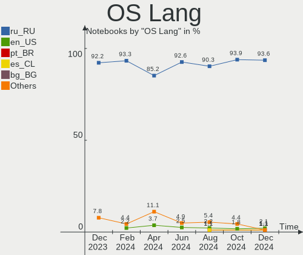
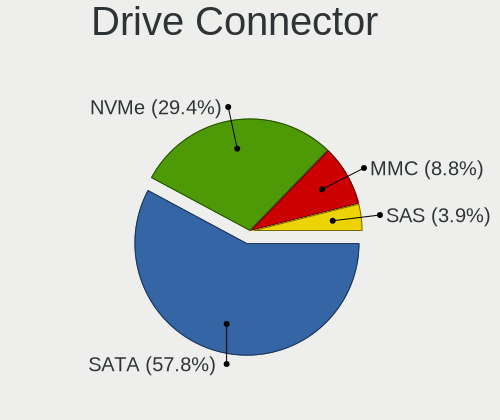
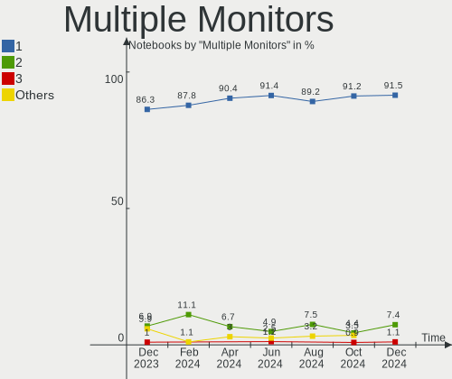

ROSA Hardware Trends (Notebook)
-------------------------------

A project to identify most popular hardware characteristics and track their change
over time based on data collected by ROSA users at https://Linux-Hardware.org.

Anyone can contribute to the study by uploading probes of their computers by
the [hw-probe](https://github.com/linuxhw/hw-probe) tool:

    sudo hw-probe -all -upload

Full-feature report is available here: https://linux-hardware.org/?view=trends&formfactor=notebook

Period: Jan, 2020.

Contents
--------

- [ OS                       ](#os)
- [ OS Family                ](#os-family)
- [ Kernel                   ](#kernel)
- [ Kernel Family            ](#kernel-family)
- [ Kernel Major Ver.        ](#kernel-major-ver)
- [ Arch                     ](#arch)
- [ DE                       ](#de)
- [ Display Server           ](#display-server)
- [ OS Lang                  ](#os-lang)
- [ Boot Mode                ](#boot-mode)
- [ Filesystem               ](#filesystem)
- [ Dual Boot with Linux     ](#dual-boot-with-linux)
- [ Dual Boot (Win)          ](#dual-boot-win)
- [ Country                  ](#country)
- [ City                     ](#city)
- [ Vendor                   ](#vendor)
- [ Model                    ](#model)
- [ Model Family             ](#model-family)
- [ MFG Year                 ](#mfg-year)
- [ Form Factor              ](#form-factor)
- [ Secure Boot              ](#secure-boot)
- [ Coreboot                 ](#coreboot)
- [ RAM Size                 ](#ram-size)
- [ RAM Used                 ](#ram-used)
- [ Drive Vendor             ](#drive-vendor)
- [ Drive Model              ](#drive-model)
- [ Drive Kind               ](#drive-kind)
- [ Drive Connector          ](#drive-connector)
- [ Drive Size               ](#drive-size)
- [ Space Total              ](#space-total)
- [ Space Used               ](#space-used)
- [ Malfunc. Drives          ](#malfunc-drives)
- [ Malfunc. Drive Vendor    ](#malfunc-drive-vendor)
- [ Malfunc. Drive Kind      ](#malfunc-drive-kind)
- [ Failed Drives            ](#failed-drives)
- [ Failed Drive Vendor      ](#failed-drive-vendor)
- [ Drive Status             ](#drive-status)
- [ CPU Vendor               ](#cpu-vendor)
- [ CPU Model                ](#cpu-model)
- [ CPU Model Family         ](#cpu-model-family)
- [ CPU Cores                ](#cpu-cores)
- [ CPU Sockets              ](#cpu-sockets)
- [ CPU Threads              ](#cpu-threads)
- [ CPU Op-Modes             ](#cpu-op-modes)
- [ CPU Microarch            ](#cpu-microarch)
- [ CPU Microcode            ](#cpu-microcode)
- [ GPU Vendor               ](#gpu-vendor)
- [ GPU Model                ](#gpu-model)
- [ GPU Combo                ](#gpu-combo)
- [ GPU Driver               ](#gpu-driver)
- [ GPU Memory               ](#gpu-memory)
- [ Monitor Vendor           ](#monitor-vendor)
- [ Monitor Model            ](#monitor-model)
- [ Monitor Resolution       ](#monitor-resolution)
- [ Monitor Diagonal         ](#monitor-diagonal)
- [ Monitor Width            ](#monitor-width)
- [ Aspect Ratio             ](#aspect-ratio)
- [ Monitor Area             ](#monitor-area)
- [ Pixel Density            ](#pixel-density)
- [ Multiple Monitors        ](#multiple-monitors)
- [ Net Controller Vendor    ](#net-controller-vendor)
- [ Net Controller Model     ](#net-controller-model)
- [ Net Controller Kind      ](#net-controller-kind)
- [ Used Controller          ](#used-controller)
- [ NICs                     ](#nics)
- [ Unsupported Devices      ](#unsupported-devices)
- [ Unsupported Device Types ](#unsupported-device-types)

OS
--

Installed operating systems

| Name      | Computers | Percent |
|-----------|-----------|---------|
| ROSA R11  | 152       | 87.36%  |
| ROSA R8.1 | 11        | 6.32%   |
| ROSA R10  | 10        | 5.75%   |
| ROSA R9   | 1         | 0.57%   |

OS Family
---------

OS without a version

| Name | Computers | Percent |
|------|-----------|---------|
| ROSA | 174       | 100%    |

Kernel
------

Version of the Linux kernel

| Version                          | Computers | Percent |
|----------------------------------|-----------|---------|
| 4.15.0-desktop-68.5rosa-x86_64   | 60        | 34.48%  |
| 4.15.0-desktop-45.1rosa-x86_64   | 48        | 27.59%  |
| 4.9.155-nrj-desktop-1rosa-x86_64 | 16        | 9.2%    |
| 4.15.0-desktop-45.1rosa-i586     | 15        | 8.62%   |
| 4.15.0-desktop-68.5rosa-i586     | 10        | 5.75%   |
| 4.9.60-nrj-desktop-1rosa-x86_64  | 7         | 4.02%   |
| 4.9.155-nrj-desktop-1rosa-i586   | 3         | 1.72%   |
| 4.9.60-nrj-desktop-1rosa-i586    | 2         | 1.15%   |
| 4.15.0-desktop-60.7rosa-i586     | 2         | 1.15%   |
| 5.0.7-nrj-desktop-1rosa-x86_64   | 1         | 0.57%   |
| 5.0.0-desktop-21.2rosa-x86_64    | 1         | 0.57%   |
| 4.9.20-nrj-desktop-1rosa-x86_64  | 1         | 0.57%   |
| 4.9.124-nrj-desktop-1rosa-x86_64 | 1         | 0.57%   |
| 4.3.6-nrj-desktop-1rosa-x86_64   | 1         | 0.57%   |
| 4.19.0-desktop-13.1rosa-x86_64   | 1         | 0.57%   |
| 4.15.0-desktop-60.7rosa-x86_64   | 1         | 0.57%   |
| 4.15.0-desktop-54.1rosa-x86_64   | 1         | 0.57%   |
| 4.15.0-desktop-47.2rosa-x86_64   | 1         | 0.57%   |
| 4.1.38-nrj-desktop-2rosa-x86_64  | 1         | 0.57%   |
| 4.1.38-nrj-desktop-2rosa-i586    | 1         | 0.57%   |

Kernel Family
-------------

Linux kernel without a distro release

| Version | Computers | Percent |
|---------|-----------|---------|
| 4.15.0  | 138       | 79.31%  |
| 4.9.155 | 19        | 10.92%  |
| 4.9.60  | 9         | 5.17%   |
| 4.1.38  | 2         | 1.15%   |
| 5.0.7   | 1         | 0.57%   |
| 5.0.0   | 1         | 0.57%   |
| 4.9.20  | 1         | 0.57%   |
| 4.9.124 | 1         | 0.57%   |
| 4.3.6   | 1         | 0.57%   |
| 4.19.0  | 1         | 0.57%   |

Kernel Major Ver.
-----------------

Linux kernel major version

| Version | Computers | Percent |
|---------|-----------|---------|
| 4.15    | 138       | 79.31%  |
| 4.9     | 30        | 17.24%  |
| 5.0     | 2         | 1.15%   |
| 4.1     | 2         | 1.15%   |
| 4.3     | 1         | 0.57%   |
| 4.19    | 1         | 0.57%   |

Arch
----

OS architecture (x86_64, i586, etc.)

| Name   | Computers | Percent |
|--------|-----------|---------|
| x86_64 | 141       | 81.03%  |
| i686   | 33        | 18.97%  |

DE
--

Desktop Environment

| Name  | Computers | Percent |
|-------|-----------|---------|
| KDE5  | 166       | 95.4%   |
| LXQt  | 3         | 1.72%   |
| MATE  | 2         | 1.15%   |
| GNOME | 2         | 1.15%   |
| XFCE  | 1         | 0.57%   |

Display Server
--------------

X11 or Wayland

| Name    | Computers | Percent |
|---------|-----------|---------|
| Unknown | 174       | 100%    |

OS Lang
-------

Language

| Lang    | Computers | Percent |
|---------|-----------|---------|
| Unknown | 174       | 100%    |

Boot Mode
---------

EFI or BIOS

| Mode | Computers | Percent |
|------|-----------|---------|
| BIOS | 128       | 73.56%  |
| EFI  | 46        | 26.44%  |

Filesystem
----------

Type of filesystem

| Type  | Computers | Percent |
|-------|-----------|---------|
| Ext4  | 172       | 98.85%  |
| Ext3  | 1         | 0.57%   |
| Btrfs | 1         | 0.57%   |

Dual Boot with Linux
--------------------

Hosting more than one Linux

| Dual boot | Computers | Percent |
|-----------|-----------|---------|
| No        | 155       | 89.08%  |
| Yes       | 19        | 10.92%  |

Dual Boot (Win)
---------------

Hosting Linux and Windows

| Dual boot | Computers | Percent |
|-----------|-----------|---------|
| No        | 100       | 57.47%  |
| Yes       | 74        | 42.53%  |

Country
-------

Geographic location (country)

| Country             | Computers | Percent |
|---------------------|-----------|---------|
| Russia              | 127       | 72.99%  |
| Ukraine             | 10        | 5.75%   |
| Belarus             | 6         | 3.45%   |
| Poland              | 4         | 2.3%    |
| Kazakhstan          | 3         | 1.72%   |
| Germany             | 3         | 1.72%   |
| UK                  | 2         | 1.15%   |
| Latvia              | 2         | 1.15%   |
| France              | 2         | 1.15%   |
| Finland             | 2         | 1.15%   |
| USA                 | 1         | 0.57%   |
| Turkey              | 1         | 0.57%   |
| Spain               | 1         | 0.57%   |
| Serbia              | 1         | 0.57%   |
| Romania             | 1         | 0.57%   |
| Republic of Moldova | 1         | 0.57%   |
| Netherlands         | 1         | 0.57%   |
| Korea, Republic of  | 1         | 0.57%   |
| Israel              | 1         | 0.57%   |
| Chile               | 1         | 0.57%   |
| Brazil              | 1         | 0.57%   |
| Azerbaijan          | 1         | 0.57%   |
| Unknown             | 1         | 0.57%   |

City
----

Geographic location (city)

| City                 | Computers | Percent |
|----------------------|-----------|---------|
| Moscow               | 22        | 12.64%  |
| Novosibirsk          | 9         | 5.17%   |
| St Petersburg        | 8         | 4.6%    |
| Yekaterinburg        | 7         | 4.02%   |
| Ulyanovsk            | 3         | 1.72%   |
| Tula                 | 3         | 1.72%   |
| Omsk                 | 3         | 1.72%   |
| Minsk                | 3         | 1.72%   |
| Krasnoyarsk          | 3         | 1.72%   |
| Krasnodar            | 3         | 1.72%   |
| Khabarovsk           | 3         | 1.72%   |
| Donetsk              | 3         | 1.72%   |
| Almaty               | 3         | 1.72%   |
| Volgograd            | 2         | 1.15%   |
| Tver                 | 2         | 1.15%   |
| Taganrog             | 2         | 1.15%   |
| Sevastopol           | 2         | 1.15%   |
| Saratov              | 2         | 1.15%   |
| Rostov-on-Don        | 2         | 1.15%   |
| Riga                 | 2         | 1.15%   |
| Nizhniy Novgorod     | 2         | 1.15%   |
| Kyiv                 | 2         | 1.15%   |
| Cherepovets          | 2         | 1.15%   |
| Złotokłos          | 1         | 0.57%   |
| Zarechnyy            | 1         | 0.57%   |
| Yuzhno-Sakhalinsk    | 1         | 0.57%   |
| Yaroslavl            | 1         | 0.57%   |
| Warsaw               | 1         | 0.57%   |
| Volzhskiy            | 1         | 0.57%   |
| Vladimir             | 1         | 0.57%   |
| Vidnoye              | 1         | 0.57%   |
| Veliky Novgorod      | 1         | 0.57%   |
| Utevka               | 1         | 0.57%   |
| Uren'                | 1         | 0.57%   |
| Ufa                  | 1         | 0.57%   |
| Tyumen               | 1         | 0.57%   |
| Tuusula              | 1         | 0.57%   |
| Tuapse               | 1         | 0.57%   |
| Tomsk                | 1         | 0.57%   |
| Słupsk              | 1         | 0.57%   |
| São Paulo           | 1         | 0.57%   |
| Svetlograd           | 1         | 0.57%   |
| Stavropol            | 1         | 0.57%   |
| Simferopol           | 1         | 0.57%   |
| Shuya                | 1         | 0.57%   |
| Seoul                | 1         | 0.57%   |
| Selenginsk           | 1         | 0.57%   |
| San Antonio          | 1         | 0.57%   |
| Salekhard            | 1         | 0.57%   |
| Saint-Germain-du-Puy | 1         | 0.57%   |
| Raubling             | 1         | 0.57%   |
| Pskov                | 1         | 0.57%   |
| Polysayevo           | 1         | 0.57%   |
| Pittsburgh           | 1         | 0.57%   |
| Petrozavodsk         | 1         | 0.57%   |
| Perm                 | 1         | 0.57%   |
| Odesa                | 1         | 0.57%   |
| Nyagan               | 1         | 0.57%   |
| Novomoskovsk         | 1         | 0.57%   |
| Novokuznetsk         | 1         | 0.57%   |

Vendor
------

Motherboard manufacturer

| Name                | Computers | Percent |
|---------------------|-----------|---------|
| Lenovo              | 41        | 23.56%  |
| Hewlett-Packard     | 30        | 17.24%  |
| ASUSTek Computer    | 25        | 14.37%  |
| Samsung Electronics | 17        | 9.77%   |
| Acer                | 14        | 8.05%   |
| Dell                | 12        | 6.9%    |
| Packard Bell        | 7         | 4.02%   |
| Toshiba             | 5         | 2.87%   |
| MSI                 | 4         | 2.3%    |
| Sony                | 3         | 1.72%   |
| Medion              | 2         | 1.15%   |
| Fujitsu Siemens     | 2         | 1.15%   |
| DEXP                | 2         | 1.15%   |
| Pegatron            | 1         | 0.57%   |
| Notebook            | 1         | 0.57%   |
| LG Electronics      | 1         | 0.57%   |
| Infomash            | 1         | 0.57%   |
| Fujitsu             | 1         | 0.57%   |
| eMachines           | 1         | 0.57%   |
| Aquarius            | 1         | 0.57%   |
| AMI                 | 1         | 0.57%   |
| Alienware           | 1         | 0.57%   |
| Unknown             | 1         | 0.57%   |

Model
-----

Motherboard model

| Name                                  | Computers | Percent |
|---------------------------------------|-----------|---------|
| R519/R719                             | 3         | 1.72%   |
| IdeaPad 320-15IKB 80XL                | 3         | 1.72%   |
| RV409/RV509/RV709                     | 2         | 1.15%   |
| Pavilion dv6                          | 2         | 1.15%   |
| Notebook                              | 2         | 1.15%   |
| NC210/NC110                           | 2         | 1.15%   |
| N53SV                                 | 2         | 1.15%   |
| IdeaPad S110 20126                    | 2         | 1.15%   |
| GX60 1AC                              | 2         | 1.15%   |
| G580 20150                            | 2         | 1.15%   |
| G570 20079                            | 2         | 1.15%   |
| G500 20236                            | 2         | 1.15%   |
| Compaq Presario CQ60                  | 2         | 1.15%   |
| B590 20208                            | 2         | 1.15%   |
| Unknown                               | 2         | 1.15%   |
| Z50-75 80EC                           | 1         | 0.57%   |
| X55U                                  | 1         | 0.57%   |
| X550WA                                | 1         | 0.57%   |
| X541UVK                               | 1         | 0.57%   |
| X502CA                                | 1         | 0.57%   |
| X101CH                                | 1         | 0.57%   |
| VPCSA2V9R                             | 1         | 0.57%   |
| VPCEH2J1R                             | 1         | 0.57%   |
| VPCEB3B4R                             | 1         | 0.57%   |
| Vostro A860                           | 1         | 0.57%   |
| VIWGQ                                 | 1         | 0.57%   |
| VivoBook 15_ASUS Laptop X507MA_X507MA | 1         | 0.57%   |
| Venue 11 Pro 7130 vPro                | 1         | 0.57%   |
| V580c 20160                           | 1         | 0.57%   |
| V570c HuronRiver Platform             | 1         | 0.57%   |
| V310-15IKB 80T3                       | 1         | 0.57%   |
| UL30A                                 | 1         | 0.57%   |
| TravelMate 5744Z                      | 1         | 0.57%   |
| ThinkPad X220 Tablet 42962BG          | 1         | 0.57%   |
| ThinkPad X220 4291W3B                 | 1         | 0.57%   |
| ThinkPad X121e 3053A52                | 1         | 0.57%   |
| ThinkPad T440p 20AWS0V302             | 1         | 0.57%   |
| ThinkPad R61 77321EG                  | 1         | 0.57%   |
| Satellite X200                        | 1         | 0.57%   |
| Satellite L655                        | 1         | 0.57%   |
| Satellite C850-BQK                    | 1         | 0.57%   |
| Satellite C55t-C                      | 1         | 0.57%   |
| RV411/RV511/E3511/S3511               | 1         | 0.57%   |
| RV408/RV508                           | 1         | 0.57%   |
| RoverBook                             | 1         | 0.57%   |
| RBT                                   | 1         | 0.57%   |
| R540/R580/R780/SA41/E452              | 1         | 0.57%   |
| R528/R728                             | 1         | 0.57%   |
| R40/R41                               | 1         | 0.57%   |
| ProBook 6545b                         | 1         | 0.57%   |
| ProBook 650 G1                        | 1         | 0.57%   |
| ProBook 4545s                         | 1         | 0.57%   |
| ProBook 4530s                         | 1         | 0.57%   |
| ProBook 430 G3                        | 1         | 0.57%   |
| Pro, Std, Elt Series                  | 1         | 0.57%   |
| Presario V3000 (GC170PA#UUF)          | 1         | 0.57%   |
| Pavilion Notebook                     | 1         | 0.57%   |
| Pavilion dv7                          | 1         | 0.57%   |
| Pavilion dv2                          | 1         | 0.57%   |
| Pavilion 15                           | 1         | 0.57%   |

Model Family
------------

Motherboard model prefix

| Name                       | Computers | Percent |
|----------------------------|-----------|---------|
| Lenovo IdeaPad             | 16        | 9.2%    |
| Acer Aspire                | 9         | 5.17%   |
| HP Pavilion                | 7         | 4.02%   |
| Dell Inspiron              | 7         | 4.02%   |
| Packard Bell EasyNote      | 5         | 2.87%   |
| Lenovo ThinkPad            | 5         | 2.87%   |
| HP ProBook                 | 5         | 2.87%   |
| Toshiba Satellite          | 4         | 2.3%    |
| Samsung Electronics R519   | 3         | 1.72%   |
| Lenovo B590                | 3         | 1.72%   |
| HP Laptop                  | 3         | 1.72%   |
| HP Compaq                  | 3         | 1.72%   |
| HP 250                     | 3         | 1.72%   |
| Samsung Electronics RV409  | 2         | 1.15%   |
| Samsung Electronics NC210  | 2         | 1.15%   |
| MSI GX60                   | 2         | 1.15%   |
| Lenovo G580                | 2         | 1.15%   |
| Lenovo G570                | 2         | 1.15%   |
| Lenovo G500                | 2         | 1.15%   |
| HP Notebook                | 2         | 1.15%   |
| HP Mini                    | 2         | 1.15%   |
| HP 255                     | 2         | 1.15%   |
| DEXP NAVIS                 | 2         | 1.15%   |
| ASUS N53SV                 | 2         | 1.15%   |
| Unknown                    | 2         | 1.15%   |
| Sony VPCSA2V9R             | 1         | 0.57%   |
| Sony VPCEH2J1R             | 1         | 0.57%   |
| Sony VPCEB3B4R             | 1         | 0.57%   |
| Samsung Electronics RV411  | 1         | 0.57%   |
| Samsung Electronics RV408  | 1         | 0.57%   |
| Samsung Electronics R540   | 1         | 0.57%   |
| Samsung Electronics R528   | 1         | 0.57%   |
| Samsung Electronics R40    | 1         | 0.57%   |
| Samsung Electronics NC10   | 1         | 0.57%   |
| Samsung Electronics N102SP | 1         | 0.57%   |
| Samsung Electronics 305U1A | 1         | 0.57%   |
| Samsung Electronics 305E4Z | 1         | 0.57%   |
| Samsung Electronics 300V3A | 1         | 0.57%   |
| Pegatron A17               | 1         | 0.57%   |
| Packard Bell DOTS          | 1         | 0.57%   |
| Packard Bell dot           | 1         | 0.57%   |
| Notebook RBT               | 1         | 0.57%   |
| MSI MS-16Y1                | 1         | 0.57%   |
| MSI CX600                  | 1         | 0.57%   |
| Medion P7624               | 1         | 0.57%   |
| Medion P6612               | 1         | 0.57%   |
| LG Electronics C1-A577R1   | 1         | 0.57%   |
| Lenovo Z50-75              | 1         | 0.57%   |
| Lenovo VIWGQ               | 1         | 0.57%   |
| Lenovo V580c               | 1         | 0.57%   |
| Lenovo V570c               | 1         | 0.57%   |
| Lenovo V310-15IKB          | 1         | 0.57%   |
| Lenovo M30-70              | 1         | 0.57%   |
| Lenovo G50-30              | 1         | 0.57%   |
| Lenovo B570e               | 1         | 0.57%   |
| Lenovo B50-45              | 1         | 0.57%   |
| Lenovo B50-10              | 1         | 0.57%   |
| Lenovo 3000                | 1         | 0.57%   |
| Infomash RoverBook         | 1         | 0.57%   |
| HP Presario                | 1         | 0.57%   |

MFG Year
--------

Motherboard manufacture year

| Year | Computers | Percent |
|------|-----------|---------|
| 2012 | 26        | 14.94%  |
| 2011 | 22        | 12.64%  |
| 2013 | 17        | 9.77%   |
| 2018 | 16        | 9.2%    |
| 2008 | 15        | 8.62%   |
| 2010 | 14        | 8.05%   |
| 2009 | 14        | 8.05%   |
| 2014 | 11        | 6.32%   |
| 2019 | 10        | 5.75%   |
| 2017 | 9         | 5.17%   |
| 2015 | 7         | 4.02%   |
| 2016 | 6         | 3.45%   |
| 2007 | 4         | 2.3%    |
| 2006 | 2         | 1.15%   |
| 2005 | 1         | 0.57%   |

Form Factor
-----------

Physical design of the computer

| Name     | Computers | Percent |
|----------|-----------|---------|
| Notebook | 174       | 100%    |

Secure Boot
-----------

Enabled or disabled

| State    | Computers | Percent |
|----------|-----------|---------|
| Disabled | 117       | 67.24%  |
| Unknown  | 57        | 32.76%  |

Coreboot
--------

Have coreboot on board

| Used | Computers | Percent |
|------|-----------|---------|
| No   | 174       | 100%    |

RAM Size
--------

Total RAM memory

| Size in GB | Computers | Percent |
|------------|-----------|---------|
| 3.01-4.0   | 71        | 40.8%   |
| 4.01-8.0   | 38        | 21.84%  |
| 1.01-2.0   | 31        | 17.82%  |
| 8.01-16.0  | 16        | 9.2%    |
| 2.01-3.0   | 10        | 5.75%   |
| 0.01-1.0   | 4         | 2.3%    |
| 16.01-24.0 | 3         | 1.72%   |
| 24.01-32.0 | 1         | 0.57%   |

RAM Used
--------

Used RAM memory

| Used GB  | Computers | Percent |
|----------|-----------|---------|
| 0.01-1.0 | 100       | 57.47%  |
| 1.01-2.0 | 57        | 32.76%  |
| 2.01-3.0 | 12        | 6.9%    |
| 3.01-4.0 | 4         | 2.3%    |
| 4.01-8.0 | 1         | 0.57%   |

Drive Vendor
------------

Hard drive vendors

| Vendor              | Computers | Drives | Percent |
|---------------------|-----------|--------|---------|
| WDC                 | 42        | 45     | 20%     |
| Seagate             | 39        | 40     | 18.57%  |
| Toshiba             | 20        | 20     | 9.52%   |
| Hitachi             | 20        | 21     | 9.52%   |
| Samsung Electronics | 17        | 17     | 8.1%    |
| Kingston            | 14        | 14     | 6.67%   |
| HGST                | 13        | 13     | 6.19%   |
| Unknown             | 8         | 9      | 3.81%   |
| Intel               | 5         | 5      | 2.38%   |
| SanDisk             | 4         | 4      | 1.9%    |
| A-DATA Technology   | 4         | 4      | 1.9%    |
| Transcend           | 2         | 2      | 0.95%   |
| LITEONIT            | 2         | 3      | 0.95%   |
| Crucial             | 2         | 2      | 0.95%   |
| Corsair             | 2         | 2      | 0.95%   |
| China               | 2         | 2      | 0.95%   |
| Union Memory        | 1         | 1      | 0.48%   |
| Team                | 1         | 1      | 0.48%   |
| SPCC                | 1         | 1      | 0.48%   |
| Smartbuy            | 1         | 1      | 0.48%   |
| Patriot             | 1         | 1      | 0.48%   |
| Micron Technology   | 1         | 1      | 0.48%   |
| LONDISK             | 1         | 1      | 0.48%   |
| LITEON              | 1         | 1      | 0.48%   |
| KingSpec            | 1         | 1      | 0.48%   |
| HUAWEI              | 1         | 1      | 0.48%   |
| Goldendisk          | 1         | 1      | 0.48%   |
| Fujitsu             | 1         | 1      | 0.48%   |
| Apacer              | 1         | 1      | 0.48%   |
| AEGO                | 1         | 1      | 0.48%   |

Drive Model
-----------

Hard drive models

| Model                        | Computers | Percent |
|------------------------------|-----------|---------|
| ST9500325AS 500GB            | 8         | 3.69%   |
| HTS545050A7E680 500GB        | 4         | 1.84%   |
| HM250HI 250GB                | 4         | 1.84%   |
| WDS240G2G0A-00JH30 240GB SSD | 3         | 1.38%   |
| ST9320325AS 320GB            | 3         | 1.38%   |
| ST500LM012 HN-M500MBB 500GB  | 3         | 1.38%   |
| ST1000LM035-1RK172 1TB       | 3         | 1.38%   |
| SA400S37120G 120GB SSD       | 3         | 1.38%   |
| MQ01ABF050 500GB             | 3         | 1.38%   |
| HTS543232A7A384 320GB        | 3         | 1.38%   |
| HTS541010A9E680 1TB          | 3         | 1.38%   |
| WDS120G2G0A-00JH30 120GB SSD | 2         | 0.92%   |
| WD5000LPCX-00VHAT0 500GB     | 2         | 0.92%   |
| WD5000BPVT-24HXZT3 500GB     | 2         | 0.92%   |
| WD3200BPVT-22JJ5T0 320GB     | 2         | 0.92%   |
| WD1600BEVT-22ZCT0 160GB      | 2         | 0.92%   |
| SV300S37A60G 64GB SSD        | 2         | 0.92%   |
| SU650 120GB SSD              | 2         | 0.92%   |
| SU32G  32GB                  | 2         | 0.92%   |
| ST9250315AS 250GB            | 2         | 0.92%   |
| ST500LT012-1DG142 500GB      | 2         | 0.92%   |
| ST320LT020-9YG142 320GB      | 2         | 0.92%   |
| SSD 120GB                    | 2         | 0.92%   |
| SA400S37240G 240GB SSD       | 2         | 0.92%   |
| MQ01ABF0 500GB               | 2         | 0.92%   |
| MQ01ABD100 1TB               | 2         | 0.92%   |
| MK1237GSX 120GB              | 2         | 0.92%   |
| HTS725050A7E630 500GB        | 2         | 0.92%   |
| HTS721010A9E630 1TB          | 2         | 0.92%   |
| HTS545050B9A300 500GB        | 2         | 0.92%   |
| HTS545050A7E380 500GB        | 2         | 0.92%   |
| HTS54322 250GB               | 2         | 0.92%   |
| WD7500BPVT-26HXZT3 752GB     | 1         | 0.46%   |
| WD7500BPKX-75HPJT0 752GB     | 1         | 0.46%   |
| WD5000LPVX-75V0TT0 500GB     | 1         | 0.46%   |
| WD5000LPVX-60V0TT0 500GB     | 1         | 0.46%   |
| WD5000LPVT-22G33T0 500GB     | 1         | 0.46%   |
| WD5000LPVT-2 500GB           | 1         | 0.46%   |
| WD5000LPLX-00ZNTT0 500GB     | 1         | 0.46%   |
| WD5000LPCX-60VHAT1 500GB     | 1         | 0.46%   |
| WD5000LPCX-24VHAT0 500GB     | 1         | 0.46%   |
| WD5000LPCX-22VHAT0 500GB     | 1         | 0.46%   |
| WD5000LPCX-21VHAT0 500GB     | 1         | 0.46%   |
| WD5000BPVT-80HXZT3 500GB     | 1         | 0.46%   |
| WD3200LPCX-24C6HT0 320GB     | 1         | 0.46%   |
| WD3200BPVT-5 320GB           | 1         | 0.46%   |
| WD3200BPVT-22ZEST0 320GB     | 1         | 0.46%   |
| WD3200BEVT-80A0RT0 320GB     | 1         | 0.46%   |
| WD3200BEVT-75ZCT0 320GB      | 1         | 0.46%   |
| WD3200BEVT-22ZCT0 320GB      | 1         | 0.46%   |
| WD3200BEVT-22A23T0 320GB     | 1         | 0.46%   |
| WD2500BPVT-75JJ5T0 250GB     | 1         | 0.46%   |
| WD2500BEVS-22UST0 250GB      | 1         | 0.46%   |
| WD2500BEKT-60PVMT0 250GB     | 1         | 0.46%   |
| WD1600BEVT-8 160GB           | 1         | 0.46%   |
| WD1600BEVT-75ZCT2 160GB      | 1         | 0.46%   |
| WD1600BEVS-0 160GB           | 1         | 0.46%   |
| WD10SPZX-24Z10T0 1TB         | 1         | 0.46%   |
| WD10SPZX-24Z10 1TB           | 1         | 0.46%   |
| WD10SPZX-21Z10T0 1TB         | 1         | 0.46%   |

Drive Kind
----------

HDD or SSD

| Kind    | Computers | Drives | Percent |
|---------|-----------|--------|---------|
| HDD     | 133       | 142    | 64.88%  |
| SSD     | 59        | 61     | 28.78%  |
| MMC     | 9         | 10     | 4.39%   |
| NVMe    | 3         | 3      | 1.46%   |
| Unknown | 1         | 1      | 0.49%   |

Drive Connector
---------------

SATA, SAS, NVMe, etc.

| Type | Computers | Drives | Percent |
|------|-----------|--------|---------|
| SATA | 170       | 201    | 91.89%  |
| MMC  | 9         | 10     | 4.86%   |
| SAS  | 3         | 3      | 1.62%   |
| NVMe | 3         | 3      | 1.62%   |

Drive Size
----------

Size of hard drive

| Size in TB | Computers | Drives | Percent |
|------------|-----------|--------|---------|
| 0.01-0.5   | 159       | 186    | 84.57%  |
| 0.51-1.0   | 28        | 30     | 14.89%  |
| 3.01-4.0   | 1         | 1      | 0.53%   |

Space Total
-----------

Amount of disk space available on the file system

| Size in GB     | Computers | Percent |
|----------------|-----------|---------|
| 101-250        | 56        | 32.18%  |
| 251-500        | 46        | 26.44%  |
| 51-100         | 22        | 12.64%  |
| 1-20           | 20        | 11.49%  |
| 21-50          | 17        | 9.77%   |
| 501-1000       | 10        | 5.75%   |
| 1001-2000      | 2         | 1.15%   |
| More than 3000 | 1         | 0.57%   |

Space Used
----------

Amount of used disk space

| Used GB   | Computers | Percent |
|-----------|-----------|---------|
| 1-20      | 128       | 73.56%  |
| 51-100    | 15        | 8.62%   |
| 101-250   | 12        | 6.9%    |
| 21-50     | 10        | 5.75%   |
| 251-500   | 4         | 2.3%    |
| 501-1000  | 4         | 2.3%    |
| 2001-3000 | 1         | 0.57%   |

Malfunc. Drives
---------------

Drive models with a malfunction

| Model                       | Computers | Drives | Percent |
|-----------------------------|-----------|--------|---------|
| ST9500325AS 500GB           | 6         | 6      | 11.54%  |
| HTS545050A7E680 500GB       | 3         | 3      | 5.77%   |
| ST320LT020-9YG142 320GB     | 2         | 2      | 3.85%   |
| MK1237GSX 120GB             | 2         | 2      | 3.85%   |
| HTS545050A7E380 500GB       | 2         | 2      | 3.85%   |
| WD7500BPVT-26HXZT3 752GB    | 1         | 1      | 1.92%   |
| WD5000LPCX-21VHAT0 500GB    | 1         | 1      | 1.92%   |
| WD3200BPVT-22JJ5T0 320GB    | 1         | 1      | 1.92%   |
| WD3200BEVT-80A0RT0 320GB    | 1         | 1      | 1.92%   |
| WD3200BEVT-75ZCT0 320GB     | 1         | 1      | 1.92%   |
| WD3200BEVT-22A23T0 320GB    | 1         | 1      | 1.92%   |
| WD1600BEVT-8 160GB          | 1         | 1      | 1.92%   |
| ST9320328CS 320GB           | 1         | 1      | 1.92%   |
| ST9250315AS 250GB           | 1         | 1      | 1.92%   |
| ST9160310AS 160GB           | 1         | 1      | 1.92%   |
| ST320LT012-9WS14C 320GB     | 1         | 1      | 1.92%   |
| ST320LT007-9ZV142 320GB     | 1         | 1      | 1.92%   |
| ST320LM001 HN-M320MBB 320GB | 1         | 1      | 1.92%   |
| ST1000LM035-1RK172 1TB      | 1         | 1      | 1.92%   |
| ST1000LM014-1EJ164 1TB      | 1         | 1      | 1.92%   |
| ST1000LM014-1EJ1 1TB        | 1         | 1      | 1.92%   |
| SSDSC2KW512G8 512GB         | 1         | 1      | 1.92%   |
| MQ01ABF050 500GB            | 1         | 1      | 1.92%   |
| MK8009GAH 80GB              | 1         | 1      | 1.92%   |
| MK3265GSX 320GB             | 1         | 1      | 1.92%   |
| MK2565GSX 250GB             | 1         | 1      | 1.92%   |
| MK2555GSX 250GB             | 1         | 1      | 1.92%   |
| MK1652GSX 160GB             | 1         | 1      | 1.92%   |
| MK1059GSMP 1TB              | 1         | 1      | 1.92%   |
| LMN-256M3M mSATA 256GB SSD  | 1         | 1      | 1.92%   |
| LMN-256 256GB SSD           | 1         | 1      | 1.92%   |
| HTS725050A7E630 500GB       | 1         | 1      | 1.92%   |
| HTS723232L9A360 320GB       | 1         | 1      | 1.92%   |
| HTS54505 500GB              | 1         | 1      | 1.92%   |
| HTS545016B9A300 160GB       | 1         | 1      | 1.92%   |
| HTS543225L9A300 250GB       | 1         | 1      | 1.92%   |
| HTS54322 250GB              | 1         | 1      | 1.92%   |
| HTS542580K9SA00 80GB        | 1         | 1      | 1.92%   |
| HTS541080G9AT00 80GB        | 1         | 1      | 1.92%   |
| HTS421280H9AT00 80GB        | 1         | 1      | 1.92%   |
| HM060HC 52GB                | 1         | 1      | 1.92%   |
| Force 3 SSD 120GB           | 1         | 1      | 1.92%   |

Malfunc. Drive Vendor
---------------------

Vendors of faulty drives

| Vendor              | Computers | Drives | Percent |
|---------------------|-----------|--------|---------|
| Seagate             | 16        | 17     | 32.65%  |
| Toshiba             | 9         | 9      | 18.37%  |
| Hitachi             | 8         | 9      | 16.33%  |
| WDC                 | 7         | 7      | 14.29%  |
| HGST                | 5         | 5      | 10.2%   |
| Samsung Electronics | 1         | 1      | 2.04%   |
| LITEONIT            | 1         | 2      | 2.04%   |
| Intel               | 1         | 1      | 2.04%   |
| Corsair             | 1         | 1      | 2.04%   |

Malfunc. Drive Kind
-------------------

Kinds of faulty drives

| Kind | Computers | Drives | Percent |
|------|-----------|--------|---------|
| HDD  | 45        | 48     | 93.75%  |
| SSD  | 3         | 4      | 6.25%   |

Failed Drives
-------------

Failed drive models

| Model                   | Computers | Drives | Percent |
|-------------------------|-----------|--------|---------|
| WD1600BEVT-22ZCT0 160GB | 1         | 1      | 50%     |
| HTS721010A9E630 1TB     | 1         | 1      | 50%     |

Failed Drive Vendor
-------------------

Failed drive vendors

| Vendor | Computers | Drives | Percent |
|--------|-----------|--------|---------|
| WDC    | 1         | 1      | 50%     |
| HGST   | 1         | 1      | 50%     |

Drive Status
------------

Number of failed and malfunc. drives

| Status   | Computers | Drives | Percent |
|----------|-----------|--------|---------|
| Works    | 132       | 148    | 67.35%  |
| Malfunc  | 48        | 52     | 24.49%  |
| Detected | 14        | 15     | 7.14%   |
| Failed   | 2         | 2      | 1.02%   |

CPU Vendor
----------

Processor vendors

| Vendor | Computers | Percent |
|--------|-----------|---------|
| Intel  | 141       | 81.03%  |
| AMD    | 33        | 18.97%  |

CPU Model
---------

Processor models

| Model                                        | Computers | Percent |
|----------------------------------------------|-----------|---------|
| Intel Core i3-5005U CPU @ 2.00GHz            | 4         | 2.3%    |
| Intel Pentium Dual-Core CPU T4300 @ 2.10GHz  | 3         | 1.72%   |
| Intel Pentium CPU P6200 @ 2.13GHz            | 3         | 1.72%   |
| Intel Pentium CPU 2020M @ 2.40GHz            | 3         | 1.72%   |
| Intel Core i3 CPU M 370 @ 2.40GHz            | 3         | 1.72%   |
| Intel Celeron CPU 1005M @ 1.90GHz            | 3         | 1.72%   |
| Intel Atom CPU N455 @ 1.66GHz                | 3         | 1.72%   |
| AMD E-450 APU with Radeon HD Graphics        | 3         | 1.72%   |
| Intel Pentium Dual-Core CPU T4200 @ 2.00GHz  | 2         | 1.15%   |
| Intel Pentium CPU B950 @ 2.10GHz             | 2         | 1.15%   |
| Intel Core i7-2630QM CPU @ 2.00GHz           | 2         | 1.15%   |
| Intel Core i5-7200U CPU @ 2.50GHz            | 2         | 1.15%   |
| Intel Core i5-4210U CPU @ 1.70GHz            | 2         | 1.15%   |
| Intel Core i5-3230M CPU @ 2.60GHz            | 2         | 1.15%   |
| Intel Core i5-3210M CPU @ 2.50GHz            | 2         | 1.15%   |
| Intel Core i5-2520M CPU @ 2.50GHz            | 2         | 1.15%   |
| Intel Core i5-2450M CPU @ 2.50GHz            | 2         | 1.15%   |
| Intel Core i5-2410M CPU @ 2.30GHz            | 2         | 1.15%   |
| Intel Core i3-7100U CPU @ 2.40GHz            | 2         | 1.15%   |
| Intel Core i3-6006U CPU @ 2.00GHz            | 2         | 1.15%   |
| Intel Core i3-3110M CPU @ 2.40GHz            | 2         | 1.15%   |
| Intel Core i3-2350M CPU @ 2.30GHz            | 2         | 1.15%   |
| Intel Core i3-2310M CPU @ 2.10GHz            | 2         | 1.15%   |
| Intel Core i3 CPU M 380 @ 2.53GHz            | 2         | 1.15%   |
| Intel Core 2 Duo CPU T8300 @ 2.40GHz         | 2         | 1.15%   |
| Intel Celeron CPU N3350 @ 1.10GHz            | 2         | 1.15%   |
| Intel Celeron CPU N2830 @ 2.16GHz            | 2         | 1.15%   |
| Intel Atom x5-Z8350 CPU @ 1.44GHz            | 2         | 1.15%   |
| Intel Atom CPU N550 @ 1.50GHz                | 2         | 1.15%   |
| Intel Atom CPU N2600 @ 1.60GHz               | 2         | 1.15%   |
| AMD E-300 APU with Radeon HD Graphics        | 2         | 1.15%   |
| AMD C-70 APU with Radeon HD Graphics         | 2         | 1.15%   |
| AMD A6-9225 RADEON R4, 5 COMPUTE CORES 2C+3G | 2         | 1.15%   |
| Intel Pentium Silver N5000 CPU @ 1.10GHz     | 1         | 0.57%   |
| Intel Pentium M processor 1.73GHz            | 1         | 0.57%   |
| Intel Pentium M processor 1.70GHz            | 1         | 0.57%   |
| Intel Pentium Dual CPU T3400 @ 2.16GHz       | 1         | 0.57%   |
| Intel Pentium Dual CPU T3200 @ 2.00GHz       | 1         | 0.57%   |
| Intel Pentium CPU U5400 @ 1.20GHz            | 1         | 0.57%   |
| Intel Pentium CPU P6100 @ 2.00GHz            | 1         | 0.57%   |
| Intel Pentium CPU N3540 @ 2.16GHz            | 1         | 0.57%   |
| Intel Pentium CPU B960 @ 2.20GHz             | 1         | 0.57%   |
| Intel Pentium CPU B940 @ 2.00GHz             | 1         | 0.57%   |
| Intel Pentium CPU 987 @ 1.50GHz              | 1         | 0.57%   |
| Intel Pentium CPU 5405U @ 2.30GHz            | 1         | 0.57%   |
| Intel Pentium CPU 4417U @ 2.30GHz            | 1         | 0.57%   |
| Intel Pentium CPU 3825U @ 1.90GHz            | 1         | 0.57%   |
| Intel Genuine CPU U7300 @ 1.30GHz            | 1         | 0.57%   |
| Intel Genuine CPU U2500 @ 1.20GHz            | 1         | 0.57%   |
| Intel Genuine CPU T1600 @ 1.66GHz            | 1         | 0.57%   |
| Intel Genuine CPU T1500 @ 1.86GHz            | 1         | 0.57%   |
| Intel Core m7-6Y75 CPU @ 1.20GHz             | 1         | 0.57%   |
| Intel Core i7-7500U CPU @ 2.70GHz            | 1         | 0.57%   |
| Intel Core i7-4800MQ CPU @ 2.70GHz           | 1         | 0.57%   |
| Intel Core i7-4700MQ CPU @ 2.40GHz           | 1         | 0.57%   |
| Intel Core i7-4700HQ CPU @ 2.40GHz           | 1         | 0.57%   |
| Intel Core i7-3610QM CPU @ 2.30GHz           | 1         | 0.57%   |
| Intel Core i7-2620M CPU @ 2.70GHz            | 1         | 0.57%   |
| Intel Core i5-9300H CPU @ 2.40GHz            | 1         | 0.57%   |
| Intel Core i5-8300H CPU @ 2.30GHz            | 1         | 0.57%   |

CPU Model Family
----------------

Processor model prefix

| Model                                | Computers | Percent |
|--------------------------------------|-----------|---------|
| Intel Core i3                        | 27        | 15.52%  |
| Intel Core i5                        | 26        | 14.94%  |
| Intel Pentium                        | 17        | 9.77%   |
| Intel Celeron                        | 16        | 9.2%    |
| Intel Atom                           | 15        | 8.62%   |
| Intel Core 2 Duo                     | 10        | 5.75%   |
| Intel Core i7                        | 8         | 4.6%    |
| Intel Pentium Dual-Core              | 5         | 2.87%   |
| AMD E                                | 5         | 2.87%   |
| Intel Genuine                        | 4         | 2.3%    |
| Intel Core 2                         | 3         | 1.72%   |
| Intel Celeron Dual-Core              | 3         | 1.72%   |
| AMD E2                               | 3         | 1.72%   |
| AMD A8                               | 3         | 1.72%   |
| AMD A4                               | 3         | 1.72%   |
| AMD A10                              | 3         | 1.72%   |
| Intel Pentium M                      | 2         | 1.15%   |
| Intel Pentium Dual                   | 2         | 1.15%   |
| AMD Turion II Dual-Core              | 2         | 1.15%   |
| AMD E1                               | 2         | 1.15%   |
| AMD C-70                             | 2         | 1.15%   |
| AMD A6                               | 2         | 1.15%   |
| Intel Pentium Silver                 | 1         | 0.57%   |
| Intel Core m7                        | 1         | 0.57%   |
| Intel Celeron M                      | 1         | 0.57%   |
| AMD Turion X2 Ultra Dual-Core Mobile | 1         | 0.57%   |
| AMD Turion II Ultra Dual-Core Mobile | 1         | 0.57%   |
| AMD Turion 64 X2 Mobile              | 1         | 0.57%   |
| AMD Turion 64 X2                     | 1         | 0.57%   |
| AMD Sempron                          | 1         | 0.57%   |
| AMD Ryzen 3                          | 1         | 0.57%   |
| AMD C-50                             | 1         | 0.57%   |
| AMD Athlon Neo                       | 1         | 0.57%   |

CPU Cores
---------

Number of processor cores

| Number | Computers | Percent |
|--------|-----------|---------|
| 2      | 142       | 81.61%  |
| 4      | 17        | 9.77%   |
| 1      | 15        | 8.62%   |

CPU Sockets
-----------

Number of sockets

| Number | Computers | Percent |
|--------|-----------|---------|
| 1      | 174       | 100%    |

CPU Threads
-----------

Threads per core (Hyper-Threading)

| Number | Computers | Percent |
|--------|-----------|---------|
| 1      | 92        | 52.87%  |
| 2      | 82        | 47.13%  |

CPU Op-Modes
------------

CPU Operation Modes (32-bit, 64-bit)

| Op mode        | Computers | Percent |
|----------------|-----------|---------|
| 32-bit, 64-bit | 164       | 94.25%  |
| 32-bit         | 9         | 5.17%   |
| Unknown        | 1         | 0.57%   |

CPU Microarch
-------------

Microarchitecture

| Name            | Computers | Percent |
|-----------------|-----------|---------|
| Core            | 27        | 15.52%  |
| SandyBridge     | 26        | 14.94%  |
| Skylake         | 17        | 9.77%   |
| IvyBridge       | 15        | 8.62%   |
| Bonnell         | 13        | 7.47%   |
| Westmere        | 11        | 6.32%   |
| Haswell         | 9         | 5.17%   |
| Silvermont      | 8         | 4.6%    |
| Bobcat          | 7         | 4.02%   |
| Broadwell       | 6         | 3.45%   |
| Piledriver      | 5         | 2.87%   |
| Puma            | 3         | 1.72%   |
| P6              | 3         | 1.72%   |
| K8 Hammer       | 3         | 1.72%   |
| K10 Llano       | 3         | 1.72%   |
| K10             | 3         | 1.72%   |
| Excavator       | 3         | 1.72%   |
| Unknown         | 3         | 1.72%   |
| K8 & K10 hybrid | 2         | 1.15%   |
| Goldmont plus   | 2         | 1.15%   |
| Goldmont        | 2         | 1.15%   |
| Zen             | 1         | 0.57%   |
| Steamroller     | 1         | 0.57%   |
| Jaguar          | 1         | 0.57%   |

CPU Microcode
-------------

Microcode number

| Number     | Computers | Percent |
|------------|-----------|---------|
| 0x206a7    | 26        | 14.94%  |
| 0x306a9    | 15        | 8.62%   |
| 0x20655    | 11        | 6.32%   |
| 0x1067a    | 10        | 5.75%   |
| 0x6fd      | 8         | 4.6%    |
| Unknown    | 8         | 4.6%    |
| 0x05000119 | 7         | 4.02%   |
| 0x306d4    | 6         | 3.45%   |
| 0x306c3    | 6         | 3.45%   |
| 0x106ca    | 6         | 3.45%   |
| 0x806e9    | 5         | 2.87%   |
| 0x10676    | 5         | 2.87%   |
| 0x406e3    | 4         | 2.3%    |
| 0x30678    | 4         | 2.3%    |
| 0x30661    | 4         | 2.3%    |
| 0x06001119 | 4         | 2.3%    |
| 0x806ea    | 3         | 1.72%   |
| 0x6f6      | 3         | 1.72%   |
| 0x406c4    | 3         | 1.72%   |
| 0x40651    | 3         | 1.72%   |
| 0x106c2    | 3         | 1.72%   |
| 0x07030105 | 3         | 1.72%   |
| 0x03000027 | 3         | 1.72%   |
| 0x906ea    | 2         | 1.15%   |
| 0x706a1    | 2         | 1.15%   |
| 0x506c9    | 2         | 1.15%   |
| 0x06006705 | 2         | 1.15%   |
| 0x906e9    | 1         | 0.57%   |
| 0x806ec    | 1         | 0.57%   |
| 0x6ec      | 1         | 0.57%   |
| 0x6e8      | 1         | 0.57%   |
| 0x6d8      | 1         | 0.57%   |
| 0x6d6      | 1         | 0.57%   |
| 0x30673    | 1         | 0.57%   |
| 0x10661    | 1         | 0.57%   |
| 0x08101007 | 1         | 0.57%   |
| 0x0700010f | 1         | 0.57%   |
| 0x06006704 | 1         | 0.57%   |
| 0x06003106 | 1         | 0.57%   |
| 0x05000029 | 1         | 0.57%   |
| 0x02000057 | 1         | 0.57%   |
| 0x02000032 | 1         | 0.57%   |
| 0x00000000 | 1         | 0.57%   |

GPU Vendor
----------

Vendors of graphics cards

| Vendor           | Computers | Percent |
|------------------|-----------|---------|
| Intel            | 118       | 54.88%  |
| AMD              | 51        | 23.72%  |
| Nvidia           | 45        | 20.93%  |
| VIA Technologies | 1         | 0.47%   |

GPU Model
---------

Graphics card models

| Model                                                                              | Computers | Percent |
|------------------------------------------------------------------------------------|-----------|---------|
| 2nd Generation Core Processor Family Integrated Graphics Controller                | 24        | 10.43%  |
| 3rd Gen Core processor Graphics Controller                                         | 15        | 6.52%   |
| Mobile 4 Series Chipset Integrated Graphics Controller                             | 8         | 3.48%   |
| HD Graphics 620                                                                    | 6         | 2.61%   |
| HD Graphics 5500                                                                   | 6         | 2.61%   |
| Core Processor Integrated Graphics Controller                                      | 6         | 2.61%   |
| Atom Processor D4xx/D5xx/N4xx/N5xx Integrated Graphics Controller                  | 6         | 2.61%   |
| Mobile GM965/GL960 Integrated Graphics Controller (secondary)                      | 5         | 2.17%   |
| Mobile GM965/GL960 Integrated Graphics Controller (primary)                        | 5         | 2.17%   |
| Atom Processor Z36xxx/Z37xxx Series Graphics & Display                             | 5         | 2.17%   |
| 4th Gen Core Processor Integrated Graphics Controller                              | 5         | 2.17%   |
| Seymour [Radeon HD 6400M/7400M Series]                                             | 4         | 1.74%   |
| GF117M [GeForce 610M/710M/810M/820M / GT 620M/625M/630M/720M]                      | 4         | 1.74%   |
| Atom Processor D2xxx/N2xxx Integrated Graphics Controller                          | 4         | 1.74%   |
| Wrestler [Radeon HD 6320]                                                          | 3         | 1.3%    |
| Stoney [Radeon R2/R3/R4/R5 Graphics]                                               | 3         | 1.3%    |
| Skylake GT2 [HD Graphics 520]                                                      | 3         | 1.3%    |
| RV620/M82 [Mobility Radeon HD 3450/3470]                                           | 3         | 1.3%    |
| Mobile 945GM/GMS/GME, 943/940GML Express Integrated Graphics Controller            | 3         | 1.3%    |
| GM108M [GeForce 940MX]                                                             | 3         | 1.3%    |
| Atom/Celeron/Pentium Processor x5-E8000/J3xxx/N3xxx Integrated Graphics Controller | 3         | 1.3%    |
| Wrestler [Radeon HD 7290]                                                          | 2         | 0.87%   |
| Wrestler [Radeon HD 6310]                                                          | 2         | 0.87%   |
| Wimbledon XT [Radeon HD 7970M]                                                     | 2         | 0.87%   |
| UHD Graphics 630 (Mobile)                                                          | 2         | 0.87%   |
| UHD Graphics 605                                                                   | 2         | 0.87%   |
| Topaz XT [Radeon R7 M260/M265 / M340/M360 / M440/M445 / 530/535 / 620/625 Mobile]  | 2         | 0.87%   |
| Thames [Radeon HD 7500M/7600M Series]                                              | 2         | 0.87%   |
| Sun XT [Radeon HD 8670A/8670M/8690M / R5 M330 / M430 / Radeon 520 Mobile]          | 2         | 0.87%   |
| RV710/M92 [Mobility Radeon HD 4530/4570/545v]                                      | 2         | 0.87%   |
| Robson CE [Radeon HD 6370M/7370M]                                                  | 2         | 0.87%   |
| Park [Mobility Radeon HD 5430/5450/5470]                                           | 2         | 0.87%   |
| Mullins [Radeon R2 Graphics]                                                       | 2         | 0.87%   |
| Mobile 945GSE Express Integrated Graphics Controller                               | 2         | 0.87%   |
| Mobile 915GM/GMS/910GML Express Graphics Controller                                | 2         | 0.87%   |
| HD Graphics 500                                                                    | 2         | 0.87%   |
| Haswell-ULT Integrated Graphics Controller                                         | 2         | 0.87%   |
| GT218M [GeForce G 105M]                                                            | 2         | 0.87%   |
| GT218M [GeForce 315M]                                                              | 2         | 0.87%   |
| GP107M [GeForce GTX 1050 Mobile]                                                   | 2         | 0.87%   |
| GM108M [GeForce 940M]                                                              | 2         | 0.87%   |
| GK208M [GeForce GT 740M]                                                           | 2         | 0.87%   |
| GF119M [GeForce GT 520MX]                                                          | 2         | 0.87%   |
| GF119M [GeForce 410M]                                                              | 2         | 0.87%   |
| GF108M [GeForce GT 620M/630M/635M/640M LE]                                         | 2         | 0.87%   |
| GF108M [GeForce GT 540M]                                                           | 2         | 0.87%   |
| Wrestler [Radeon HD 6250]                                                          | 1         | 0.43%   |
| Whistler [Radeon HD 6730M/6770M/7690M XT]                                          | 1         | 0.43%   |
| Whistler [Radeon HD 6630M/6650M/6750M/7670M/7690M]                                 | 1         | 0.43%   |
| UHD Graphics 620                                                                   | 1         | 0.43%   |
| Trinity [Radeon HD 7660G]                                                          | 1         | 0.43%   |
| Trinity [Radeon HD 7600G]                                                          | 1         | 0.43%   |
| Trinity 2 [Radeon HD 7420G]                                                        | 1         | 0.43%   |
| SuperSumo [Radeon HD 6480G]                                                        | 1         | 0.43%   |
| SuperSumo [Radeon HD 6380G]                                                        | 1         | 0.43%   |
| Sumo [Radeon HD 6620G]                                                             | 1         | 0.43%   |
| RV710/M92 [Mobility Radeon HD 4330/4350/4550]                                      | 1         | 0.43%   |
| RV515/M52 [Mobility Radeon X1300]                                                  | 1         | 0.43%   |
| RS880M [Mobility Radeon HD 4225/4250]                                              | 1         | 0.43%   |
| RS780M [Mobility Radeon HD 3200]                                                   | 1         | 0.43%   |

GPU Combo
---------

Combinations of graphics cards

| Name           | Computers | Percent |
|----------------|-----------|---------|
| 1 x Intel      | 77        | 44.25%  |
| 1 x AMD        | 32        | 18.39%  |
| Intel + Nvidia | 29        | 16.67%  |
| 1 x Nvidia     | 16        | 9.2%    |
| Intel + AMD    | 12        | 6.9%    |
| 2 x AMD        | 7         | 4.02%   |
| 1 x VIA        | 1         | 0.57%   |

GPU Driver
----------

Free vs proprietary

| Driver      | Computers | Percent |
|-------------|-----------|---------|
| Free        | 162       | 93.1%   |
| Proprietary | 7         | 4.02%   |
| Unknown     | 5         | 2.87%   |

GPU Memory
----------

Total video memory

| Size in GB | Computers | Percent |
|------------|-----------|---------|
| 1.01-2.0   | 68        | 39.08%  |
| 0.01-0.5   | 57        | 32.76%  |
| 3.01-4.0   | 24        | 13.79%  |
| Unknown    | 13        | 7.47%   |
| 0.51-1.0   | 11        | 6.32%   |
| 2.01-3.0   | 1         | 0.57%   |

Monitor Vendor
--------------

Monitor vendors

| Vendor                  | Computers | Percent |
|-------------------------|-----------|---------|
| Samsung Electronics     | 41        | 23.16%  |
| AU Optronics            | 37        | 20.9%   |
| LG Display              | 25        | 14.12%  |
| Chi Mei Optoelectronics | 17        | 9.6%    |
| BOE                     | 16        | 9.04%   |
| Chimei Innolux          | 13        | 7.34%   |
| Lenovo                  | 4         | 2.26%   |
| HannStar                | 4         | 2.26%   |
| LG Philips              | 3         | 1.69%   |
| Goldstar                | 3         | 1.69%   |
| PANDA                   | 2         | 1.13%   |
| Nvidia                  | 2         | 1.13%   |
| CPT                     | 2         | 1.13%   |
| Acer                    | 2         | 1.13%   |
| ViewSonic               | 1         | 0.56%   |
| Sony                    | 1         | 0.56%   |
| Philips                 | 1         | 0.56%   |
| Medion                  | 1         | 0.56%   |
| InnoLux Display         | 1         | 0.56%   |
| Dell                    | 1         | 0.56%   |

Monitor Model
-------------

Monitor models

| Model                                              | Computers | Percent |
|----------------------------------------------------|-----------|---------|
| LCD Monitor SEC3245 1366x768 344x194mm 15.5-inch   | 6         | 3.37%   |
| LCD Monitor AUO22EC 1366x768 344x193mm 15.5-inch   | 5         | 2.81%   |
| LCD Monitor SEC5441 1366x768 344x194mm 15.5-inch   | 3         | 1.69%   |
| LCD Monitor SEC3152 1366x768 344x194mm 15.5-inch   | 3         | 1.69%   |
| LCD Monitor LEN40B0 1366x768 344x194mm 15.5-inch   | 3         | 1.69%   |
| LCD Monitor CMN15D5 1920x1080 340x190mm 15.3-inch  | 3         | 1.69%   |
| LCD Monitor AUO61D2 1024x600 220x130mm 10.1-inch   | 3         | 1.69%   |
| LCD Monitor AUO46EC 1366x768 344x193mm 15.5-inch   | 3         | 1.69%   |
| LP156WH2-TLAA LGD0230 1366x768 344x194mm 15.5-inch | 2         | 1.12%   |
| LCD Monitor SEC544B 1600x900 382x214mm 17.2-inch   | 2         | 1.12%   |
| LCD Monitor SEC4A41 1280x800 261x163mm 12.1-inch   | 2         | 1.12%   |
| LCD Monitor SEC304C 1920x1080 353x198mm 15.9-inch  | 2         | 1.12%   |
| LCD Monitor LGD039F 1366x768 345x194mm 15.6-inch   | 2         | 1.12%   |
| LCD Monitor LGD033A 1366x768 340x190mm 15.3-inch   | 2         | 1.12%   |
| LCD Monitor LGD0259 1920x1080 350x190mm 15.7-inch  | 2         | 1.12%   |
| LCD Monitor HSD03E9 1024x600 220x129mm 10.0-inch   | 2         | 1.12%   |
| LCD Monitor CMO15A7 1366x768 350x190mm 15.7-inch   | 2         | 1.12%   |
| LCD Monitor CMO15A3 1366x768 344x193mm 15.5-inch   | 2         | 1.12%   |
| LCD Monitor CMO15A2 1366x768 344x193mm 15.5-inch   | 2         | 1.12%   |
| LCD Monitor CMN15DB 1366x768 344x193mm 15.5-inch   | 2         | 1.12%   |
| LCD Monitor AUO47EC 1366x768 344x193mm 15.5-inch   | 2         | 1.12%   |
| LCD Monitor AUO38ED 1920x1080 340x190mm 15.3-inch  | 2         | 1.12%   |
| LCD Monitor AUO26EC 1366x768 344x193mm 15.5-inch   | 2         | 1.12%   |
| VA2038 SERIES VSC6C26 1600x900 443x249mm 20.0-inch | 1         | 0.56%   |
| V193 ACR004C 1280x1024 376x301mm 19.0-inch         | 1         | 0.56%   |
| TV GSM2411 1366x768 700x390mm 31.5-inch            | 1         | 0.56%   |
| P196HQV ACR01CB 1366x768 410x230mm 18.5-inch       | 1         | 0.56%   |
| Nvidia Defaul SNY05FA 1366x768 290x170mm 13.2-inch | 1         | 0.56%   |
| MD 20165 MED3624 1920x1080 478x269mm 21.6-inch     | 1         | 0.56%   |
| LP156WH1-TLA3 LGD01C2 1366x768 344x194mm 15.5-inch | 1         | 0.56%   |
| LM133LF1L01 NCP13FB 1920x1080 294x165mm 13.3-inch  | 1         | 0.56%   |
| LCD Monitor SEC5541 1366x768 344x193mm 15.5-inch   | 1         | 0.56%   |
| LCD Monitor SEC4C54 1280x800 331x207mm 15.4-inch   | 1         | 0.56%   |
| LCD Monitor SEC4C4E 1024x600 223x125mm 10.1-inch   | 1         | 0.56%   |
| LCD Monitor SEC4351 1366x768 344x194mm 15.5-inch   | 1         | 0.56%   |
| LCD Monitor SEC3847 1440x900 367x230mm 17.1-inch   | 1         | 0.56%   |
| LCD Monitor SEC3651 1366x768 344x194mm 15.5-inch   | 1         | 0.56%   |
| LCD Monitor SEC3451 1366x768 344x194mm 15.5-inch   | 1         | 0.56%   |
| LCD Monitor SEC3253 1366x768 344x194mm 15.5-inch   | 1         | 0.56%   |
| LCD Monitor SEC3242 1920x1080 230x130mm 10.4-inch  | 1         | 0.56%   |
| LCD Monitor SEC314C 1920x1080 344x194mm 15.5-inch  | 1         | 0.56%   |
| LCD Monitor SEC3143 1366x768 256x144mm 11.6-inch   | 1         | 0.56%   |
| LCD Monitor SEC3050 1366x768 309x174mm 14.0-inch   | 1         | 0.56%   |
| LCD Monitor SDC4C48 1920x1080 409x230mm 18.5-inch  | 1         | 0.56%   |
| LCD Monitor SDC4851 1366x768 344x194mm 15.5-inch   | 1         | 0.56%   |
| LCD Monitor SDC4752 1366x768 340x190mm 15.3-inch   | 1         | 0.56%   |
| LCD Monitor SDC4255 1366x768 293x164mm 13.2-inch   | 1         | 0.56%   |
| LCD Monitor SDC4144 2160x1440 254x169mm 12.0-inch  | 1         | 0.56%   |
| LCD Monitor SDC324C 1920x1080 344x194mm 15.5-inch  | 1         | 0.56%   |
| LCD Monitor SDC324A 1366x768 290x170mm 13.2-inch   | 1         | 0.56%   |
| LCD Monitor SAM0D51 1920x1080 1210x680mm 54.6-inch | 1         | 0.56%   |
| LCD Monitor SAM0C3C 1920x1080 700x390mm 31.5-inch  | 1         | 0.56%   |
| LCD Monitor SAM0902 1920x1080 1020x570mm 46.0-inch | 1         | 0.56%   |
| LCD Monitor NVD0800 1920x1080 320x180mm 14.5-inch  | 1         | 0.56%   |
| LCD Monitor LPL7900 1280x800 331x207mm 15.4-inch   | 1         | 0.56%   |
| LCD Monitor LPL0301 1280x800 331x207mm 15.4-inch   | 1         | 0.56%   |
| LCD Monitor LPL0060 1680x1050 367x230mm 17.1-inch  | 1         | 0.56%   |
| LCD Monitor LGDE400 1920x1200 367x230mm 17.1-inch  | 1         | 0.56%   |
| LCD Monitor LGDD801 1366x768 344x194mm 15.5-inch   | 1         | 0.56%   |
| LCD Monitor LGD04B3 1920x1080 350x190mm 15.7-inch  | 1         | 0.56%   |

Monitor Resolution
------------------

Monitor screen resolution

| Resolution         | Computers | Percent |
|--------------------|-----------|---------|
| 1366x768 (WXGA)    | 102       | 58.29%  |
| 1920x1080 (FHD)    | 31        | 17.71%  |
| 1024x600           | 12        | 6.86%   |
| 1600x900 (HD+)     | 10        | 5.71%   |
| 1280x800 (WXGA)    | 9         | 5.14%   |
| 1280x1024 (SXGA)   | 4         | 2.29%   |
| 2160x1440          | 1         | 0.57%   |
| 1920x1200 (WUXGA)  | 1         | 0.57%   |
| 1680x1050 (WSXGA+) | 1         | 0.57%   |
| 1440x900 (WXGA+)   | 1         | 0.57%   |
| 1280x768           | 1         | 0.57%   |
| 1024x768 (XGA)     | 1         | 0.57%   |
| Unknown            | 1         | 0.57%   |

Monitor Diagonal
----------------

Diagonal size in inches

| Inches  | Computers | Percent |
|---------|-----------|---------|
| 15      | 112       | 63.28%  |
| 17      | 14        | 7.91%   |
| 10      | 12        | 6.78%   |
| 14      | 10        | 5.65%   |
| 13      | 10        | 5.65%   |
| 12      | 4         | 2.26%   |
| 11      | 4         | 2.26%   |
| 21      | 2         | 1.13%   |
| 18      | 2         | 1.13%   |
| 54      | 1         | 0.56%   |
| 40      | 1         | 0.56%   |
| 31      | 1         | 0.56%   |
| 27      | 1         | 0.56%   |
| 20      | 1         | 0.56%   |
| 19      | 1         | 0.56%   |
| Unknown | 1         | 0.56%   |

Monitor Width
-------------

Physical width

| Width in mm | Computers | Percent |
|-------------|-----------|---------|
| 301-350     | 125       | 71.02%  |
| 201-300     | 26        | 14.77%  |
| 351-400     | 15        | 8.52%   |
| 401-500     | 5         | 2.84%   |
| 601-700     | 2         | 1.14%   |
| 801-900     | 1         | 0.57%   |
| 1001-1500   | 1         | 0.57%   |
| Unknown     | 1         | 0.57%   |

Aspect Ratio
------------

Proportional relationship between the width and the height

| Ratio   | Computers | Percent |
|---------|-----------|---------|
| 16/9    | 152       | 88.89%  |
| 16/10   | 12        | 7.02%   |
| 5/4     | 3         | 1.75%   |
| 4/3     | 2         | 1.17%   |
| 3/2     | 1         | 0.58%   |
| Unknown | 1         | 0.58%   |

Monitor Area
------------

Area in inch²

| Area in inch² | Computers | Percent |
|----------------|-----------|---------|
| 101-110        | 109       | 61.24%  |
| 81-90          | 13        | 7.3%    |
| 41-50          | 12        | 6.74%   |
| 121-130        | 9         | 5.06%   |
| 71-80          | 6         | 3.37%   |
| 61-70          | 4         | 2.25%   |
| 51-60          | 4         | 2.25%   |
| 151-200        | 4         | 2.25%   |
| 141-150        | 4         | 2.25%   |
| 91-100         | 4         | 2.25%   |
| 131-140        | 3         | 1.69%   |
| More than 1000 | 1         | 0.56%   |
| 351-500        | 1         | 0.56%   |
| 301-350        | 1         | 0.56%   |
| 111-120        | 1         | 0.56%   |
| 501-1000       | 1         | 0.56%   |
| Unknown        | 1         | 0.56%   |

Pixel Density
-------------

Pixels per inch

| Density | Computers | Percent |
|---------|-----------|---------|
| 101-120 | 118       | 67.05%  |
| 121-160 | 33        | 18.75%  |
| 51-100  | 19        | 10.8%   |
| 161-240 | 3         | 1.7%    |
| 1-50    | 2         | 1.14%   |
| Unknown | 1         | 0.57%   |

Multiple Monitors
-----------------

Total monitors connected

| Total | Computers | Percent |
|-------|-----------|---------|
| 1     | 165       | 94.83%  |
| 2     | 9         | 5.17%   |

Net Controller Vendor
---------------------

Controller vendors

| Vendor                         | Computers | Percent |
|--------------------------------|-----------|---------|
| Intel                          | 7         | 31.82%  |
| Realtek Semiconductor          | 3         | 13.64%  |
| Samsung Electronics            | 2         | 9.09%   |
| Nvidia                         | 2         | 9.09%   |
| Huawei Technologies            | 2         | 9.09%   |
| Vimtron Electronics            | 1         | 4.55%   |
| VIA Technologies               | 1         | 4.55%   |
| MediaTek                       | 1         | 4.55%   |
| D-Link                         | 1         | 4.55%   |
| Broadcom Limited               | 1         | 4.55%   |
| Broadcom Inc. and subsidiaries | 1         | 4.55%   |

Net Controller Model
--------------------

Controller models

| Model                                                              | Computers | Percent |
|--------------------------------------------------------------------|-----------|---------|
| RTL8723DE Wireless Network Adapter                                 | 3         | 12%     |
| Centrino Advanced-N 6205 [Taylor Peak]                             | 3         | 12%     |
| 82579LM Gigabit Network Connection (Lewisville)                    | 3         | 12%     |
| MCP51 Ethernet Controller                                          | 2         | 8%      |
| BCM4401-B0 100Base-TX                                              | 2         | 8%      |
| VT6102/VT6103 [Rhine-II]                                           | 1         | 4%      |
| TIT-L01                                                            | 1         | 4%      |
| RTL8188ETV DWA-125 11n Adapter                                     | 1         | 4%      |
| Mobile Composite Device Bus                                        | 1         | 4%      |
| HSPA Modem                                                         | 1         | 4%      |
| GT-I9500 [Galaxy S4] / GT-I9250 [Galaxy Nexus] (network tethering) | 1         | 4%      |
| E398 LTE/UMTS/GSM Modem/Networkcard                                | 1         | 4%      |
| Centrino Advanced-N + WiMAX 6250 [Kilmer Peak]                     | 1         | 4%      |
| Android                                                            | 1         | 4%      |
| 82579V Gigabit Network Connection                                  | 1         | 4%      |
| 82566MM Gigabit Network Connection                                 | 1         | 4%      |
| 82562GT 10/100 Network Connection                                  | 1         | 4%      |

Net Controller Kind
-------------------

Ethernet, WiFi or modem

| Kind     | Computers | Percent |
|----------|-----------|---------|
| Ethernet | 14        | 60.87%  |
| WiFi     | 8         | 34.78%  |
| Modem    | 1         | 4.35%   |

Used Controller
---------------

Currently used network controller

| Kind     | Computers | Percent |
|----------|-----------|---------|
| WiFi     | 5         | 62.5%   |
| Ethernet | 3         | 37.5%   |

NICs
----

Total network controllers on board

| Total | Computers | Percent |
|-------|-----------|---------|
| 2     | 163       | 93.68%  |
| 1     | 9         | 5.17%   |
| 0     | 2         | 1.15%   |

Unsupported Devices
-------------------

Total unsupported devices on board

| Total | Computers | Percent |
|-------|-----------|---------|
| 0     | 130       | 74.71%  |
| 1     | 39        | 22.41%  |
| 2     | 5         | 2.87%   |

Unsupported Device Types
------------------------

Types of unsupported devices

| Type                     | Computers | Percent |
|--------------------------|-----------|---------|
| Fingerprint reader       | 16        | 34.78%  |
| Graphics card            | 12        | 26.09%  |
| Net/wireless             | 7         | 15.22%  |
| Network                  | 3         | 6.52%   |
| Multimedia controller    | 3         | 6.52%   |
| Bluetooth                | 2         | 4.35%   |
| Storage                  | 1         | 2.17%   |
| Communication controller | 1         | 2.17%   |
| Chipcard                 | 1         | 2.17%   |

