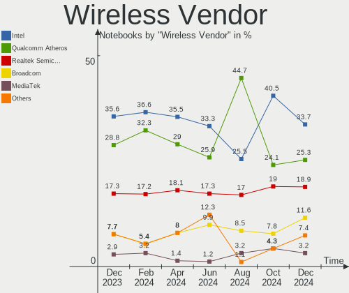
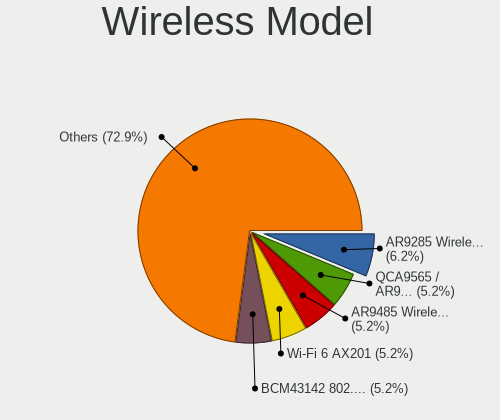

ROSA - Hardware Trends (Notebooks)
----------------------------------

A project to identify most popular hardware characteristics and track their change
over time based on data collected by Linux users at https://Linux-Hardware.org.

Anyone can contribute to this report by the [hw-probe](https://github.com/linuxhw/hw-probe) tool:

    sudo -E hw-probe -all -upload

This report is for one last month. Overall report since the beginning of time: [TestDays](https://github.com/linuxhw/TestDays)

Period: Apr, 2023.

Contents
--------

* [ System ](#system)
  - [ OS                       ](#os)
  - [ OS Family                ](#os-family)
  - [ Kernel                   ](#kernel)
  - [ Kernel Family            ](#kernel-family)
  - [ Kernel Major Ver.        ](#kernel-major-ver)
  - [ Arch                     ](#arch)
  - [ DE                       ](#de)
  - [ Display Server           ](#display-server)
  - [ Display Manager          ](#display-manager)
  - [ OS Lang                  ](#os-lang)
  - [ Boot Mode                ](#boot-mode)
  - [ Filesystem               ](#filesystem)
  - [ Part. scheme             ](#part-scheme)
  - [ Dual Boot with Linux/BSD ](#dual-boot-with-linuxbsd)
  - [ Dual Boot (Win)          ](#dual-boot-win)

* [ Board ](#board)
  - [ Vendor                   ](#vendor)
  - [ Model                    ](#model)
  - [ Model Family             ](#model-family)
  - [ MFG Year                 ](#mfg-year)
  - [ Form Factor              ](#form-factor)
  - [ Secure Boot              ](#secure-boot)
  - [ Coreboot                 ](#coreboot)
  - [ RAM Size                 ](#ram-size)
  - [ RAM Used                 ](#ram-used)
  - [ Total Drives             ](#total-drives)
  - [ Has CD-ROM               ](#has-cd-rom)
  - [ Has Ethernet             ](#has-ethernet)
  - [ Has WiFi                 ](#has-wifi)
  - [ Has Bluetooth            ](#has-bluetooth)

* [ Location ](#location)
  - [ Country                  ](#country)
  - [ City                     ](#city)

* [ Drives ](#drives)
  - [ Drive Vendor             ](#drive-vendor)
  - [ Drive Model              ](#drive-model)
  - [ HDD Vendor               ](#hdd-vendor)
  - [ SSD Vendor               ](#ssd-vendor)
  - [ Drive Kind               ](#drive-kind)
  - [ Drive Connector          ](#drive-connector)
  - [ Drive Size               ](#drive-size)
  - [ Space Total              ](#space-total)
  - [ Space Used               ](#space-used)
  - [ Malfunc. Drives          ](#malfunc-drives)
  - [ Malfunc. Drive Vendor    ](#malfunc-drive-vendor)
  - [ Malfunc. HDD Vendor      ](#malfunc-hdd-vendor)
  - [ Malfunc. Drive Kind      ](#malfunc-drive-kind)
  - [ Failed Drives            ](#failed-drives)
  - [ Failed Drive Vendor      ](#failed-drive-vendor)
  - [ Drive Status             ](#drive-status)

* [ Storage controller ](#storage-controller)
  - [ Storage Vendor           ](#storage-vendor)
  - [ Storage Model            ](#storage-model)
  - [ Storage Kind             ](#storage-kind)

* [ Processor ](#processor)
  - [ CPU Vendor               ](#cpu-vendor)
  - [ CPU Model                ](#cpu-model)
  - [ CPU Model Family         ](#cpu-model-family)
  - [ CPU Cores                ](#cpu-cores)
  - [ CPU Sockets              ](#cpu-sockets)
  - [ CPU Threads              ](#cpu-threads)
  - [ CPU Op-Modes             ](#cpu-op-modes)
  - [ CPU Microcode            ](#cpu-microcode)
  - [ CPU Microarch            ](#cpu-microarch)

* [ Graphics ](#graphics)
  - [ GPU Vendor               ](#gpu-vendor)
  - [ GPU Model                ](#gpu-model)
  - [ GPU Combo                ](#gpu-combo)
  - [ GPU Driver               ](#gpu-driver)
  - [ GPU Memory               ](#gpu-memory)

* [ Monitor ](#monitor)
  - [ Monitor Vendor           ](#monitor-vendor)
  - [ Monitor Model            ](#monitor-model)
  - [ Monitor Resolution       ](#monitor-resolution)
  - [ Monitor Diagonal         ](#monitor-diagonal)
  - [ Monitor Width            ](#monitor-width)
  - [ Aspect Ratio             ](#aspect-ratio)
  - [ Monitor Area             ](#monitor-area)
  - [ Pixel Density            ](#pixel-density)
  - [ Multiple Monitors        ](#multiple-monitors)

* [ Network ](#network)
  - [ Net Controller Vendor    ](#net-controller-vendor)
  - [ Net Controller Model     ](#net-controller-model)
  - [ Wireless Vendor          ](#wireless-vendor)
  - [ Wireless Model           ](#wireless-model)
  - [ Ethernet Vendor          ](#ethernet-vendor)
  - [ Ethernet Model           ](#ethernet-model)
  - [ Net Controller Kind      ](#net-controller-kind)
  - [ Used Controller          ](#used-controller)
  - [ NICs                     ](#nics)
  - [ IPv6                     ](#ipv6)

* [ Bluetooth ](#bluetooth)
  - [ Bluetooth Vendor         ](#bluetooth-vendor)
  - [ Bluetooth Model          ](#bluetooth-model)

* [ Sound ](#sound)
  - [ Sound Vendor             ](#sound-vendor)
  - [ Sound Model              ](#sound-model)

* [ Memory ](#memory)
  - [ Memory Vendor            ](#memory-vendor)
  - [ Memory Model             ](#memory-model)
  - [ Memory Kind              ](#memory-kind)
  - [ Memory Form Factor       ](#memory-form-factor)
  - [ Memory Size              ](#memory-size)
  - [ Memory Speed             ](#memory-speed)

* [ Printers & scanners ](#printers--scanners)
  - [ Printer Vendor           ](#printer-vendor)
  - [ Printer Model            ](#printer-model)
  - [ Scanner Vendor           ](#scanner-vendor)
  - [ Scanner Model            ](#scanner-model)

* [ Camera ](#camera)
  - [ Camera Vendor            ](#camera-vendor)
  - [ Camera Model             ](#camera-model)

* [ Security ](#security)
  - [ Fingerprint Vendor       ](#fingerprint-vendor)
  - [ Fingerprint Model        ](#fingerprint-model)
  - [ Chipcard Vendor          ](#chipcard-vendor)
  - [ Chipcard Model           ](#chipcard-model)

* [ Unsupported ](#unsupported)
  - [ Unsupported Devices      ](#unsupported-devices)
  - [ Unsupported Device Types ](#unsupported-device-types)

System
------

OS
--

Installed operating systems

| Name       | Notebooks | Percent |
|------------|-----------|---------|
| ROSA 12.4  | 77        | 76.24%  |
| ROSA R11.1 | 10        | 9.9%    |
| ROSA 12.3  | 6         | 5.94%   |
| ROSA 12.2  | 6         | 5.94%   |
| ROSA 12.1  | 2         | 1.98%   |

OS Family
---------

OS without a version

| Name | Notebooks | Percent |
|------|-----------|---------|
| ROSA | 101       | 100%    |

Kernel
------

Version of the Linux kernel

| Version                             | Notebooks | Percent |
|-------------------------------------|-----------|---------|
| 6.1.20-generic-2rosa2021.1-x86_64   | 61        | 60.4%   |
| 5.15.103-generic-1rosa2021.1-x86_64 | 8         | 7.92%   |
| 5.10.74-generic-2rosa2021.1-x86_64  | 7         | 6.93%   |
| 5.15.75-generic-1rosa2021.1-x86_64  | 5         | 4.95%   |
| 5.15.103-generic-1rosa2021.1-i686   | 4         | 3.96%   |
| 5.4.83-generic-2rosa-x86_64         | 3         | 2.97%   |
| 5.10.176-generic-1rosa2021.1-x86_64 | 3         | 2.97%   |
| 5.4.32-generic-2rosa-x86_64         | 2         | 1.98%   |
| 5.15.79-generic-1rosa2021.1-x86_64  | 2         | 1.98%   |
| 4.15.0-desktop-122.124.1rosa-x86_64 | 2         | 1.98%   |
| 5.10.74-generic-2rosa2021.1-i586    | 1         | 0.99%   |
| 4.9.155-nrj-desktop-1rosa-i586      | 1         | 0.99%   |
| 4.9.124-nrj-laptop-1rosa-i586       | 1         | 0.99%   |
| 4.15.0-desktop-122.124.1rosa-i586   | 1         | 0.99%   |

Kernel Family
-------------

Linux kernel without a distro release

| Version  | Notebooks | Percent |
|----------|-----------|---------|
| 6.1.20   | 61        | 60.4%   |
| 5.15.103 | 12        | 11.88%  |
| 5.10.74  | 8         | 7.92%   |
| 5.15.75  | 5         | 4.95%   |
| 5.4.83   | 3         | 2.97%   |
| 5.10.176 | 3         | 2.97%   |
| 4.15.0   | 3         | 2.97%   |
| 5.4.32   | 2         | 1.98%   |
| 5.15.79  | 2         | 1.98%   |
| 4.9.155  | 1         | 0.99%   |
| 4.9.124  | 1         | 0.99%   |

Kernel Major Ver.
-----------------

Linux kernel major version

| Version | Notebooks | Percent |
|---------|-----------|---------|
| 6.1     | 61        | 60.4%   |
| 5.15    | 19        | 18.81%  |
| 5.10    | 11        | 10.89%  |
| 5.4     | 5         | 4.95%   |
| 4.15    | 3         | 2.97%   |
| 4.9     | 2         | 1.98%   |

Arch
----

OS architecture (x86_64, i586, etc.)

| Name   | Notebooks | Percent |
|--------|-----------|---------|
| x86_64 | 93        | 92.08%  |
| i686   | 8         | 7.92%   |

DE
--

Desktop Environment

| Name  | Notebooks | Percent |
|-------|-----------|---------|
| KDE5  | 50        | 49.5%   |
| GNOME | 30        | 29.7%   |
| LXQt  | 16        | 15.84%  |
| KDE4  | 4         | 3.96%   |
| LXDE  | 1         | 0.99%   |

Display Server
--------------

X11 or Wayland

| Name    | Notebooks | Percent |
|---------|-----------|---------|
| Wayland | 77        | 76.24%  |
| X11     | 23        | 22.77%  |
| Tty     | 1         | 0.99%   |

Display Manager
---------------

SDDM, LightDM, etc.

| Name    | Notebooks | Percent |
|---------|-----------|---------|
| SDDM    | 49        | 48.51%  |
| GDM     | 43        | 42.57%  |
| LightDM | 5         | 4.95%   |
| KDM     | 4         | 3.96%   |

OS Lang
-------

Language

| Lang  | Notebooks | Percent |
|-------|-----------|---------|
| ru_RU | 85        | 84.16%  |
| pl_PL | 4         | 3.96%   |
| it_IT | 2         | 1.98%   |
| es_ES | 2         | 1.98%   |
| pt_BR | 1         | 0.99%   |
| hr_HR | 1         | 0.99%   |
| fr_FR | 1         | 0.99%   |
| es_MX | 1         | 0.99%   |
| es_AR | 1         | 0.99%   |
| en_US | 1         | 0.99%   |
| en_GB | 1         | 0.99%   |
| cs_CZ | 1         | 0.99%   |

Boot Mode
---------

EFI or BIOS

| Mode | Notebooks | Percent |
|------|-----------|---------|
| BIOS | 60        | 59.41%  |
| EFI  | 41        | 40.59%  |

Filesystem
----------

Type of filesystem

| Type  | Notebooks | Percent |
|-------|-----------|---------|
| Ext4  | 98        | 97.03%  |
| Btrfs | 3         | 2.97%   |

Part. scheme
------------

Scheme of partitioning

| Type | Notebooks | Percent |
|------|-----------|---------|
| MBR  | 53        | 52.48%  |
| GPT  | 48        | 47.52%  |

Dual Boot with Linux/BSD
------------------------

Hosting more than one Linux/BSD

| Dual boot | Notebooks | Percent |
|-----------|-----------|---------|
| No        | 74        | 73.27%  |
| Yes       | 27        | 26.73%  |

Dual Boot (Win)
---------------

Hosting Linux and Windows

| Dual boot | Notebooks | Percent |
|-----------|-----------|---------|
| No        | 57        | 56.44%  |
| Yes       | 44        | 43.56%  |

Board
-----

Vendor
------

Motherboard manufacturer

| Name                | Notebooks | Percent |
|---------------------|-----------|---------|
| Lenovo              | 20        | 19.8%   |
| ASUSTek Computer    | 17        | 16.83%  |
| Acer                | 17        | 16.83%  |
| Hewlett-Packard     | 14        | 13.86%  |
| Dell                | 7         | 6.93%   |
| Samsung Electronics | 5         | 4.95%   |
| Toshiba             | 3         | 2.97%   |
| Sony                | 2         | 1.98%   |
| MSI                 | 2         | 1.98%   |
| Clevo               | 2         | 1.98%   |
| UMAX                | 1         | 0.99%   |
| Notebook            | 1         | 0.99%   |
| Irbis               | 1         | 0.99%   |
| Intel               | 1         | 0.99%   |
| HUAWEI              | 1         | 0.99%   |
| HONOR               | 1         | 0.99%   |
| Haier               | 1         | 0.99%   |
| Gateway             | 1         | 0.99%   |
| Fujitsu Siemens     | 1         | 0.99%   |
| F-Plus Mobile       | 1         | 0.99%   |
| Digma               | 1         | 0.99%   |
| 3Logic Group        | 1         | 0.99%   |

Model
-----

Motherboard model

| Name                                       | Notebooks | Percent |
|--------------------------------------------|-----------|---------|
| Toshiba Satellite A100                     | 2         | 1.98%   |
| Samsung 350V5C/351V5C/3540VC/3440VC        | 2         | 1.98%   |
| Dell Inspiron N5110                        | 2         | 1.98%   |
| ASUS X551CAP                               | 2         | 1.98%   |
| ASUS 1011PX                                | 2         | 1.98%   |
| Unknown                                    | 2         | 1.98%   |
| UMAX VisionBook 15Wg Plus                  | 1         | 0.99%   |
| Toshiba Satellite S50-A-K7M                | 1         | 0.99%   |
| Sony VGN-NW24MR                            | 1         | 0.99%   |
| Sony SVE1512K1RW                           | 1         | 0.99%   |
| Samsung R528/R728                          | 1         | 0.99%   |
| Samsung NC110P/NC108P/NC111P               | 1         | 0.99%   |
| Samsung 300E4C/300E5C/300E7C               | 1         | 0.99%   |
| Notebook W250EGQ / W270EGQ                 | 1         | 0.99%   |
| MSI GP60 2OD                               | 1         | 0.99%   |
| MSI GE72 6QC                               | 1         | 0.99%   |
| Lenovo Y520-15IKBN 80WK                    | 1         | 0.99%   |
| Lenovo V15-IGL 82C3                        | 1         | 0.99%   |
| Lenovo ThinkPad X201s 514328U              | 1         | 0.99%   |
| Lenovo ThinkPad P16s Gen 1 21CKCTO1WW      | 1         | 0.99%   |
| Lenovo ThinkPad L15 Gen 1 20U8S2TN02       | 1         | 0.99%   |
| Lenovo Legion 5 17ARH05H 82GN              | 1         | 0.99%   |
| Lenovo Legion 5 15ARH05 82B5               | 1         | 0.99%   |
| Lenovo IdeaPad Z580                        | 1         | 0.99%   |
| Lenovo IdeaPad Z570 HuronRiver Platform    | 1         | 0.99%   |
| Lenovo IdeaPad Y570 20091                  | 1         | 0.99%   |
| Lenovo IdeaPad S110 20126                  | 1         | 0.99%   |
| Lenovo IdeaPad 530S-14IKB 81EU             | 1         | 0.99%   |
| Lenovo IdeaPad 510-15ISK 80SR              | 1         | 0.99%   |
| Lenovo IdeaPad 5 Pro 14ACN6 82L7           | 1         | 0.99%   |
| Lenovo IdeaPad 300-15ISK 80Q7              | 1         | 0.99%   |
| Lenovo IdeaCentre AIO 3 24IMB05 F0EU00M8RU | 1         | 0.99%   |
| Lenovo G585 20137                          | 1         | 0.99%   |
| Lenovo G560 20042                          | 1         | 0.99%   |
| Lenovo B590 20208                          | 1         | 0.99%   |
| Lenovo B590 20206                          | 1         | 0.99%   |
| Irbis NB283                                | 1         | 0.99%   |
| HUAWEI BOM-WXX9                            | 1         | 0.99%   |
| HONOR HYM-WXX                              | 1         | 0.99%   |
| HP ProBook 6450b                           | 1         | 0.99%   |

Model Family
------------

Motherboard model prefix

| Name               | Notebooks | Percent |
|--------------------|-----------|---------|
| Acer Aspire        | 11        | 10.89%  |
| Lenovo IdeaPad     | 8         | 7.92%   |
| HP Pavilion        | 4         | 3.96%   |
| Dell Inspiron      | 4         | 3.96%   |
| Toshiba Satellite  | 3         | 2.97%   |
| Lenovo ThinkPad    | 3         | 2.97%   |
| HP ProBook         | 3         | 2.97%   |
| HP EliteBook       | 3         | 2.97%   |
| Acer Swift         | 3         | 2.97%   |
| Samsung 350V5C     | 2         | 1.98%   |
| Lenovo Legion      | 2         | 1.98%   |
| Lenovo B590        | 2         | 1.98%   |
| ASUS X551CAP       | 2         | 1.98%   |
| ASUS VivoBook      | 2         | 1.98%   |
| ASUS ASUS          | 2         | 1.98%   |
| ASUS 1011PX        | 2         | 1.98%   |
| Acer Extensa       | 2         | 1.98%   |
| Unknown            | 2         | 1.98%   |
| UMAX VisionBook    | 1         | 0.99%   |
| Sony VGN-NW24MR    | 1         | 0.99%   |
| Sony SVE1512K1RW   | 1         | 0.99%   |
| Samsung R528       | 1         | 0.99%   |
| Samsung NC110P     | 1         | 0.99%   |
| Samsung 300E4C     | 1         | 0.99%   |
| Notebook W250EGQ   | 1         | 0.99%   |
| MSI GP60           | 1         | 0.99%   |
| MSI GE72           | 1         | 0.99%   |
| Lenovo Y520-15IKBN | 1         | 0.99%   |
| Lenovo V15-IGL     | 1         | 0.99%   |
| Lenovo IdeaCentre  | 1         | 0.99%   |
| Lenovo G585        | 1         | 0.99%   |
| Lenovo G560        | 1         | 0.99%   |
| Irbis NB283        | 1         | 0.99%   |
| HUAWEI BOM-WXX9    | 1         | 0.99%   |
| HONOR HYM-WXX      | 1         | 0.99%   |
| HP Presario        | 1         | 0.99%   |
| HP OMEN            | 1         | 0.99%   |
| HP Notebook        | 1         | 0.99%   |
| Haier U1520HD      | 1         | 0.99%   |
| Gateway M-6812M    | 1         | 0.99%   |

MFG Year
--------

Motherboard manufacture year

| Year | Notebooks | Percent |
|------|-----------|---------|
| 2012 | 13        | 12.87%  |
| 2021 | 11        | 10.89%  |
| 2011 | 11        | 10.89%  |
| 2013 | 9         | 8.91%   |
| 2010 | 8         | 7.92%   |
| 2020 | 6         | 5.94%   |
| 2022 | 5         | 4.95%   |
| 2015 | 5         | 4.95%   |
| 2009 | 5         | 4.95%   |
| 2008 | 5         | 4.95%   |
| 2007 | 5         | 4.95%   |
| 2019 | 4         | 3.96%   |
| 2018 | 4         | 3.96%   |
| 2016 | 3         | 2.97%   |
| 2006 | 3         | 2.97%   |
| 2017 | 2         | 1.98%   |
| 2014 | 1         | 0.99%   |
| 2005 | 1         | 0.99%   |

Form Factor
-----------

Physical design of the computer

| Name     | Notebooks | Percent |
|----------|-----------|---------|
| Notebook | 101       | 100%    |

Secure Boot
-----------

Enabled or disabled

| State    | Notebooks | Percent |
|----------|-----------|---------|
| Disabled | 101       | 100%    |

Coreboot
--------

Have coreboot on board

| Used | Notebooks | Percent |
|------|-----------|---------|
| No   | 101       | 100%    |

RAM Size
--------

Total RAM memory

| Size in GB | Notebooks | Percent |
|------------|-----------|---------|
| 3.01-4.0   | 32        | 31.68%  |
| 4.01-8.0   | 27        | 26.73%  |
| 8.01-16.0  | 13        | 12.87%  |
| 2.01-3.0   | 8         | 7.92%   |
| 1.01-2.0   | 8         | 7.92%   |
| 16.01-24.0 | 7         | 6.93%   |
| 32.01-64.0 | 2         | 1.98%   |
| 24.01-32.0 | 2         | 1.98%   |
| 0.51-1.0   | 2         | 1.98%   |

RAM Used
--------

Used RAM memory

| Used GB  | Notebooks | Percent |
|----------|-----------|---------|
| 1.01-2.0 | 57        | 56.44%  |
| 0.51-1.0 | 22        | 21.78%  |
| 2.01-3.0 | 17        | 16.83%  |
| 3.01-4.0 | 3         | 2.97%   |
| 0.01-0.5 | 2         | 1.98%   |

Total Drives
------------

Number of drives on board

| Drives | Notebooks | Percent |
|--------|-----------|---------|
| 1      | 70        | 69.31%  |
| 2      | 29        | 28.71%  |
| 3      | 2         | 1.98%   |

Has CD-ROM
----------

Has CD-ROM on board

| Presented | Notebooks | Percent |
|-----------|-----------|---------|
| No        | 54        | 53.47%  |
| Yes       | 47        | 46.53%  |

Has Ethernet
------------

Has Ethernet on board

| Presented | Notebooks | Percent |
|-----------|-----------|---------|
| Yes       | 82        | 81.19%  |
| No        | 19        | 18.81%  |

Has WiFi
--------

Has WiFi module

| Presented | Notebooks | Percent |
|-----------|-----------|---------|
| Yes       | 100       | 99.01%  |
| No        | 1         | 0.99%   |

Has Bluetooth
-------------

Has Bluetooth module

| Presented | Notebooks | Percent |
|-----------|-----------|---------|
| Yes       | 71        | 70.3%   |
| No        | 30        | 29.7%   |

Location
--------

Country
-------

Geographic location (country)

| Country    | Notebooks | Percent |
|------------|-----------|---------|
| Russia     | 77        | 76.24%  |
| Poland     | 4         | 3.96%   |
| Ukraine    | 2         | 1.98%   |
| Kazakhstan | 2         | 1.98%   |
| Italy      | 2         | 1.98%   |
| Germany    | 2         | 1.98%   |
| France     | 2         | 1.98%   |
| Uzbekistan | 1         | 0.99%   |
| Spain      | 1         | 0.99%   |
| Mexico     | 1         | 0.99%   |
| Iran       | 1         | 0.99%   |
| Czechia    | 1         | 0.99%   |
| Croatia    | 1         | 0.99%   |
| Brazil     | 1         | 0.99%   |
| Belgium    | 1         | 0.99%   |
| Belarus    | 1         | 0.99%   |
| Argentina  | 1         | 0.99%   |

City
----

Geographic location (city)

| City           | Notebooks | Percent |
|----------------|-----------|---------|
| Moscow         | 11        | 10.89%  |
| St Petersburg  | 7         | 6.93%   |
| Yekaterinburg  | 5         | 4.95%   |
| Voronezh       | 3         | 2.97%   |
| Samara         | 3         | 2.97%   |
| Novosibirsk    | 3         | 2.97%   |
| Chelyabinsk    | 3         | 2.97%   |
| Taskino        | 2         | 1.98%   |
| Saratov        | 2         | 1.98%   |
| Poznan         | 2         | 1.98%   |
| Omsk           | 2         | 1.98%   |
| Krasnodar      | 2         | 1.98%   |
| Zvenigorod     | 1         | 0.99%   |
| Zlatoust       | 1         | 0.99%   |
| Zernograd      | 1         | 0.99%   |
| Yoshkar-Ola    | 1         | 0.99%   |
| Yelizovo       | 1         | 0.99%   |
| Yaroslavl      | 1         | 0.99%   |
| Volgograd      | 1         | 0.99%   |
| Volgodonsk     | 1         | 0.99%   |
| Vladimir       | 1         | 0.99%   |
| Tula           | 1         | 0.99%   |
| Tsarskoye Selo | 1         | 0.99%   |
| Troitsk        | 1         | 0.99%   |
| Tolyatti       | 1         | 0.99%   |
| Tehran         | 1         | 0.99%   |
| Tashkent       | 1         | 0.99%   |
| Tambov         | 1         | 0.99%   |
| Stavropol      | 1         | 0.99%   |
| Smolensk       | 1         | 0.99%   |
| Simferopol     | 1         | 0.99%   |
| Severodvinsk   | 1         | 0.99%   |
| Sevastopol     | 1         | 0.99%   |
| Rostov-on-Don  | 1         | 0.99%   |
| Rio de Janeiro | 1         | 0.99%   |
| Radwanice      | 1         | 0.99%   |
| Prague         | 1         | 0.99%   |
| Osijek         | 1         | 0.99%   |
| Novonukutskiy  | 1         | 0.99%   |
| Nizhny Tagil   | 1         | 0.99%   |

Drives
------

Drive Vendor
------------

Hard drive vendors

| Vendor                | Notebooks | Drives | Percent |
|-----------------------|-----------|--------|---------|
| WDC                   | 23        | 23     | 17.97%  |
| Seagate               | 14        | 14     | 10.94%  |
| Samsung Electronics   | 11        | 11     | 8.59%   |
| Hitachi               | 9         | 9      | 7.03%   |
| SK hynix              | 8         | 8      | 6.25%   |
| Kingston              | 8         | 8      | 6.25%   |
| HGST                  | 6         | 6      | 4.69%   |
| Unknown               | 5         | 5      | 3.91%   |
| China                 | 5         | 5      | 3.91%   |
| Toshiba               | 4         | 4      | 3.13%   |
| Intel                 | 3         | 3      | 2.34%   |
| Unknown               | 3         | 3      | 2.34%   |
| Transcend             | 2         | 2      | 1.56%   |
| SPCC                  | 2         | 2      | 1.56%   |
| SanDisk               | 2         | 2      | 1.56%   |
| KingSpec              | 2         | 2      | 1.56%   |
| Crucial               | 2         | 2      | 1.56%   |
| A-DATA Technology     | 2         | 2      | 1.56%   |
| Wicgtyp               | 1         | 1      | 0.78%   |
| Verbatim              | 1         | 1      | 0.78%   |
| UMAX                  | 1         | 1      | 0.78%   |
| Smartbuy              | 1         | 1      | 0.78%   |
| Realtek Semiconductor | 1         | 1      | 0.78%   |
| Plextor               | 1         | 1      | 0.78%   |
| Phison                | 1         | 1      | 0.78%   |
| Patriot               | 1         | 1      | 0.78%   |
| Netac                 | 1         | 1      | 0.78%   |
| Mushkin               | 1         | 1      | 0.78%   |
| MSI                   | 1         | 1      | 0.78%   |
| JMicron Technology    | 1         | 1      | 0.78%   |
| HS-SSD-E100           | 1         | 1      | 0.78%   |
| Hikvision             | 1         | 1      | 0.78%   |
| FORESEE               | 1         | 1      | 0.78%   |
| Apacer                | 1         | 1      | 0.78%   |
| AMD                   | 1         | 1      | 0.78%   |

Drive Model
-----------

Hard drive models

| Model                                | Notebooks | Percent |
|--------------------------------------|-----------|---------|
| Unknown                              | 3         | 2.34%   |
| WDC WD5000LPLX-75ZNTT0 500GB         | 2         | 1.56%   |
| SPCC Solid State Disk 256GB          | 2         | 1.56%   |
| Seagate ST500LT012-1DG142 500GB      | 2         | 1.56%   |
| Hitachi HTS542516K9SA00 160GB        | 2         | 1.56%   |
| HGST HTS545050A7E680 500GB           | 2         | 1.56%   |
| HGST HTS545050A7E380 500GB           | 2         | 1.56%   |
| China 120GB SSD                      | 2         | 1.56%   |
| Wicgtyp M900-128 128GB SSD           | 1         | 0.78%   |
| WDC WDS500G2B0A-00SM50 500GB SSD     | 1         | 0.78%   |
| WDC WDS500G1B0A-00H9H0 500GB SSD     | 1         | 0.78%   |
| WDC WDS120G2G0A-00JH30 120GB SSD     | 1         | 0.78%   |
| WDC WD7500BPVX-22JC3T0 752GB         | 1         | 0.78%   |
| WDC WD7500BPVT-00HXZT3 752GB         | 1         | 0.78%   |
| WDC WD600BEVS-07LAT0 64GB            | 1         | 0.78%   |
| WDC WD5000LPVX-22V0TT0 500GB         | 1         | 0.78%   |
| WDC WD5000LPVT-00FMCT0 500GB         | 1         | 0.78%   |
| WDC WD5000LPLX-60ZNTT1 500GB         | 1         | 0.78%   |
| WDC WD5000LPCX-24VHAT0 500GB         | 1         | 0.78%   |
| WDC WD5000LPCX-21VHAT0 500GB         | 1         | 0.78%   |
| WDC WD5000BPVT-24HXZT3 500GB         | 1         | 0.78%   |
| WDC WD3200BPVT-24JJ5T0 320GB         | 1         | 0.78%   |
| WDC WD3200BPVT-22ZEST0 320GB         | 1         | 0.78%   |
| WDC WD3200BEVT-00A0RT0 320GB         | 1         | 0.78%   |
| WDC WD10SPZX-24Z10T0 1TB             | 1         | 0.78%   |
| WDC WD10JPVT-75A1YT0 1TB             | 1         | 0.78%   |
| WDC PC SN730 SDBPNTY-1T00-1101 1TB   | 1         | 0.78%   |
| WDC PC SN730 SDBPNTY-1T00-1006 1TB   | 1         | 0.78%   |
| WDC PC SN530 SDBPNPZ-512G-1014 512GB | 1         | 0.78%   |
| WDC PC SN530 SDBPNPZ-512G-1002 512GB | 1         | 0.78%   |
| Verbatim Vi550 S3 SSD 128GB          | 1         | 0.78%   |
| Unknown SD32G  32GB                  | 1         | 0.78%   |
| Unknown SD128  128GB                 | 1         | 0.78%   |
| Unknown NCard  32GB                  | 1         | 0.78%   |
| Unknown MMC Card  64GB               | 1         | 0.78%   |
| Unknown DA4128  128GB                | 1         | 0.78%   |
| UMAX 2242 512GB SSD                  | 1         | 0.78%   |
| Transcend TS512GSSD370S 512GB        | 1         | 0.78%   |
| Transcend TS240GMTS420S 240GB SSD    | 1         | 0.78%   |
| Toshiba MQ04ABF100 1TB               | 1         | 0.78%   |

HDD Vendor
----------

Hard disk drive vendors

| Vendor             | Notebooks | Drives | Percent |
|--------------------|-----------|--------|---------|
| WDC                | 16        | 16     | 32%     |
| Seagate            | 14        | 14     | 28%     |
| Hitachi            | 9         | 9      | 18%     |
| HGST               | 6         | 6      | 12%     |
| Toshiba            | 4         | 4      | 8%      |
| JMicron Technology | 1         | 1      | 2%      |

SSD Vendor
----------

Solid state drive vendors

| Vendor              | Notebooks | Drives | Percent |
|---------------------|-----------|--------|---------|
| China               | 5         | 5      | 12.2%   |
| Kingston            | 4         | 4      | 9.76%   |
| WDC                 | 3         | 3      | 7.32%   |
| SK hynix            | 3         | 3      | 7.32%   |
| Samsung Electronics | 3         | 3      | 7.32%   |
| Transcend           | 2         | 2      | 4.88%   |
| SPCC                | 2         | 2      | 4.88%   |
| SanDisk             | 2         | 2      | 4.88%   |
| KingSpec            | 2         | 2      | 4.88%   |
| Intel               | 2         | 2      | 4.88%   |
| Crucial             | 2         | 2      | 4.88%   |
| Wicgtyp             | 1         | 1      | 2.44%   |
| Verbatim            | 1         | 1      | 2.44%   |
| UMAX                | 1         | 1      | 2.44%   |
| Smartbuy            | 1         | 1      | 2.44%   |
| Plextor             | 1         | 1      | 2.44%   |
| Patriot             | 1         | 1      | 2.44%   |
| Netac               | 1         | 1      | 2.44%   |
| Mushkin             | 1         | 1      | 2.44%   |
| HS-SSD-E100         | 1         | 1      | 2.44%   |
| AMD                 | 1         | 1      | 2.44%   |
| A-DATA Technology   | 1         | 1      | 2.44%   |

Drive Kind
----------

HDD or SSD

| Kind | Notebooks | Drives | Percent |
|------|-----------|--------|---------|
| HDD  | 50        | 50     | 40.65%  |
| SSD  | 40        | 41     | 32.52%  |
| NVMe | 25        | 29     | 20.33%  |
| MMC  | 8         | 8      | 6.5%    |

Drive Connector
---------------

SATA, SAS, NVMe, etc.

| Type | Notebooks | Drives | Percent |
|------|-----------|--------|---------|
| SATA | 77        | 87     | 67.54%  |
| NVMe | 25        | 29     | 21.93%  |
| MMC  | 8         | 8      | 7.02%   |
| SAS  | 4         | 4      | 3.51%   |

Drive Size
----------

Size of hard drive

| Size in TB | Notebooks | Drives | Percent |
|------------|-----------|--------|---------|
| 0.01-0.5   | 66        | 72     | 77.65%  |
| 0.51-1.0   | 17        | 17     | 20%     |
| 3.01-4.0   | 1         | 1      | 1.18%   |
| 1.01-2.0   | 1         | 1      | 1.18%   |

Space Total
-----------

Amount of disk space available on the file system

| Size in GB | Notebooks | Percent |
|------------|-----------|---------|
| 101-250    | 34        | 33.66%  |
| 251-500    | 24        | 23.76%  |
| 1-20       | 11        | 10.89%  |
| 51-100     | 11        | 10.89%  |
| 21-50      | 9         | 8.91%   |
| 501-1000   | 9         | 8.91%   |
| 1001-2000  | 2         | 1.98%   |
| 2001-3000  | 1         | 0.99%   |

Space Used
----------

Amount of used disk space

| Used GB   | Notebooks | Percent |
|-----------|-----------|---------|
| 1-20      | 67        | 66.34%  |
| 21-50     | 14        | 13.86%  |
| 101-250   | 8         | 7.92%   |
| 51-100    | 7         | 6.93%   |
| 251-500   | 4         | 3.96%   |
| 1001-2000 | 1         | 0.99%   |

Malfunc. Drives
---------------

Drive models with a malfunction

| Model                               | Notebooks | Drives | Percent |
|-------------------------------------|-----------|--------|---------|
| HGST HTS545050A7E680 500GB          | 2         | 2      | 7.41%   |
| WDC WD7500BPVT-00HXZT3 752GB        | 1         | 1      | 3.7%    |
| WDC WD5000LPVX-22V0TT0 500GB        | 1         | 1      | 3.7%    |
| WDC WD5000LPVT-00FMCT0 500GB        | 1         | 1      | 3.7%    |
| WDC WD5000BPVT-24HXZT3 500GB        | 1         | 1      | 3.7%    |
| WDC WD3200BPVT-22ZEST0 320GB        | 1         | 1      | 3.7%    |
| WDC WD3200BEVT-00A0RT0 320GB        | 1         | 1      | 3.7%    |
| Toshiba MK2046GSX 200GB             | 1         | 1      | 3.7%    |
| SK hynix SH920 2.5 7MM 512GB SSD    | 1         | 1      | 3.7%    |
| Seagate ST9500325AS 500GB           | 1         | 1      | 3.7%    |
| Seagate ST9250315AS 250GB           | 1         | 1      | 3.7%    |
| Seagate ST9160827AS 160GB           | 1         | 1      | 3.7%    |
| Seagate ST750LM022 HN-M750MBB 752GB | 1         | 1      | 3.7%    |
| Seagate ST500LT012-9WS142 500GB     | 1         | 1      | 3.7%    |
| Seagate ST500LT012-1DG142 500GB     | 1         | 1      | 3.7%    |
| Seagate ST2000LM015-2E8174 2TB      | 1         | 1      | 3.7%    |
| Seagate ST1000LM049-2GH172 1TB      | 1         | 1      | 3.7%    |
| SanDisk SSD U100 128GB              | 1         | 1      | 3.7%    |
| SanDisk SSD P4 32GB                 | 1         | 1      | 3.7%    |
| KingSpec Q-720 720GB SSD            | 1         | 1      | 3.7%    |
| KingSpec P3-256 256GB               | 1         | 1      | 3.7%    |
| Hitachi HTS543232A7A384 320GB       | 1         | 1      | 3.7%    |
| Hitachi HTS542516K9SA00 160GB       | 1         | 1      | 3.7%    |
| Hitachi HTS542516K9A300 160GB       | 1         | 1      | 3.7%    |
| Hitachi HTS541080G9SA00 80GB        | 1         | 1      | 3.7%    |
| HGST HTS545050A7E380 500GB          | 1         | 1      | 3.7%    |

Malfunc. Drive Vendor
---------------------

Vendors of faulty drives

| Vendor   | Notebooks | Drives | Percent |
|----------|-----------|--------|---------|
| Seagate  | 8         | 8      | 29.63%  |
| WDC      | 6         | 6      | 22.22%  |
| Hitachi  | 4         | 4      | 14.81%  |
| HGST     | 3         | 3      | 11.11%  |
| SanDisk  | 2         | 2      | 7.41%   |
| KingSpec | 2         | 2      | 7.41%   |
| Toshiba  | 1         | 1      | 3.7%    |
| SK hynix | 1         | 1      | 3.7%    |

Malfunc. HDD Vendor
-------------------

Vendors of faulty HDD drives

| Vendor  | Notebooks | Drives | Percent |
|---------|-----------|--------|---------|
| Seagate | 8         | 8      | 36.36%  |
| WDC     | 6         | 6      | 27.27%  |
| Hitachi | 4         | 4      | 18.18%  |
| HGST    | 3         | 3      | 13.64%  |
| Toshiba | 1         | 1      | 4.55%   |

Malfunc. Drive Kind
-------------------

Kinds of faulty drives

| Kind | Notebooks | Drives | Percent |
|------|-----------|--------|---------|
| HDD  | 22        | 22     | 81.48%  |
| SSD  | 5         | 5      | 18.52%  |

Failed Drives
-------------

Failed drive models

Zero info for selected period =(

Failed Drive Vendor
-------------------

Failed drive vendors

Zero info for selected period =(

Drive Status
------------

Number of failed and malfunc. drives

| Status   | Notebooks | Drives | Percent |
|----------|-----------|--------|---------|
| Works    | 74        | 88     | 64.91%  |
| Malfunc  | 27        | 27     | 23.68%  |
| Detected | 13        | 13     | 11.4%   |

Storage controller
------------------

Storage Vendor
--------------

Storage controller vendors

| Vendor                       | Notebooks | Percent |
|------------------------------|-----------|---------|
| Intel                        | 78        | 65%     |
| AMD                          | 13        | 10.83%  |
| Samsung Electronics          | 8         | 6.67%   |
| SK hynix                     | 5         | 4.17%   |
| SanDisk                      | 4         | 3.33%   |
| Kingston Technology Company  | 4         | 3.33%   |
| Phison Electronics           | 3         | 2.5%    |
| Shenzhen Longsys Electronics | 1         | 0.83%   |
| Realtek Semiconductor        | 1         | 0.83%   |
| MAXIO Technology (Hangzhou)  | 1         | 0.83%   |
| JMicron Technology           | 1         | 0.83%   |
| ADATA Technology             | 1         | 0.83%   |

Storage Model
-------------

Storage controller models

| Model                                                                            | Notebooks | Percent |
|----------------------------------------------------------------------------------|-----------|---------|
| Intel 7 Series Chipset Family 6-port SATA Controller [AHCI mode]                 | 18        | 13.43%  |
| AMD FCH SATA Controller [AHCI mode]                                              | 8         | 5.97%   |
| Intel 82801HM/HEM (ICH8M/ICH8M-E) IDE Controller                                 | 6         | 4.48%   |
| Intel 6 Series/C200 Series Chipset Family 6 port Mobile SATA AHCI Controller     | 6         | 4.48%   |
| Intel NM10/ICH7 Family SATA Controller [AHCI mode]                               | 5         | 3.73%   |
| Intel Celeron/Pentium Silver Processor SATA Controller                           | 5         | 3.73%   |
| Intel 82801IBM/IEM (ICH9M/ICH9M-E) 4 port SATA Controller [AHCI mode]            | 5         | 3.73%   |
| Intel 82801HM/HEM (ICH8M/ICH8M-E) SATA Controller [AHCI mode]                    | 5         | 3.73%   |
| Samsung NVMe SSD Controller SM981/PM981/PM983                                    | 4         | 2.99%   |
| Intel Sunrise Point-LP SATA Controller [AHCI mode]                               | 4         | 2.99%   |
| Intel HM170/QM170 Chipset SATA Controller [AHCI Mode]                            | 3         | 2.24%   |
| Intel Atom/Celeron/Pentium Processor x5-E8000/J3xxx/N3xxx Series SATA Controller | 3         | 2.24%   |
| Intel 82801 Mobile SATA Controller [RAID mode]                                   | 3         | 2.24%   |
| Intel 5 Series/3400 Series Chipset 4 port SATA AHCI Controller                   | 3         | 2.24%   |
| AMD SB600 Non-Raid-5 SATA                                                        | 3         | 2.24%   |
| AMD SB600 IDE                                                                    | 3         | 2.24%   |
| SanDisk WD Blue SN550 NVMe SSD                                                   | 2         | 1.49%   |
| SanDisk WD Black SN750 / PC SN730 NVMe SSD                                       | 2         | 1.49%   |
| Samsung NVMe SSD Controller 980                                                  | 2         | 1.49%   |
| Kingston Company Company Non-Volatile memory controller                          | 2         | 1.49%   |
| Intel 82801HM/HEM (ICH8M/ICH8M-E) SATA Controller [IDE mode]                     | 2         | 1.49%   |
| Intel 82801GBM/GHM (ICH7-M Family) SATA Controller [IDE mode]                    | 2         | 1.49%   |
| Intel 82801FB/FBM/FR/FW/FRW (ICH6 Family) IDE Controller                         | 2         | 1.49%   |
| Intel 8 Series SATA Controller 1 [AHCI mode]                                     | 2         | 1.49%   |
| Intel 5 Series/3400 Series Chipset 6 port SATA AHCI Controller                   | 2         | 1.49%   |
| Intel 400 Series Chipset Family SATA AHCI Controller                             | 2         | 1.49%   |
| AMD SB7x0/SB8x0/SB9x0 SATA Controller [AHCI mode]                                | 2         | 1.49%   |
| SK hynix PC401 NVMe Solid State Drive 256GB                                      | 1         | 0.75%   |
| SK hynix Non-Volatile memory controller                                          | 1         | 0.75%   |
| SK hynix Gold P31/PC711 NVMe Solid State Drive                                   | 1         | 0.75%   |
| SK hynix BC511                                                                   | 1         | 0.75%   |
| SK hynix BC501 NVMe Solid State Drive                                            | 1         | 0.75%   |
| Shenzhen Longsys Electronics Non-Volatile memory controller                      | 1         | 0.75%   |
| Samsung NVMe SSD Controller SM961/PM961/SM963                                    | 1         | 0.75%   |
| Samsung NVMe SSD Controller PM9A1/PM9A3/980PRO                                   | 1         | 0.75%   |
| Realtek NVMe Controller                                                          | 1         | 0.75%   |
| Phison PS5013 E13 NVMe Controller                                                | 1         | 0.75%   |
| Phison Electronics Non-Volatile memory controller                                | 1         | 0.75%   |
| Phison E12 NVMe Controller                                                       | 1         | 0.75%   |
| MAXIO (Hangzhou) NVMe SSD Controller MAP1202                                     | 1         | 0.75%   |

Storage Kind
------------

Kind of storage controller (IDE, SATA, NVMe, SAS, ...)

| Kind | Notebooks | Percent |
|------|-----------|---------|
| SATA | 83        | 65.87%  |
| NVMe | 25        | 19.84%  |
| IDE  | 15        | 11.9%   |
| RAID | 3         | 2.38%   |

Processor
---------

CPU Vendor
----------

Processor vendors

| Vendor | Notebooks | Percent |
|--------|-----------|---------|
| Intel  | 80        | 79.21%  |
| AMD    | 21        | 20.79%  |

CPU Model
---------

Processor models

| Model                                       | Notebooks | Percent |
|---------------------------------------------|-----------|---------|
| Intel Pentium Silver N6000 @ 1.10GHz        | 2         | 1.98%   |
| Intel Core i7-3630QM CPU @ 2.40GHz          | 2         | 1.98%   |
| Intel Core i5-3230M CPU @ 2.60GHz           | 2         | 1.98%   |
| Intel Core i5-3210M CPU @ 2.50GHz           | 2         | 1.98%   |
| Intel Core i3-6100U CPU @ 2.30GHz           | 2         | 1.98%   |
| Intel Core i3-3120M CPU @ 2.50GHz           | 2         | 1.98%   |
| Intel Core i3-3110M CPU @ 2.40GHz           | 2         | 1.98%   |
| Intel Core i3-2350M CPU @ 2.30GHz           | 2         | 1.98%   |
| Intel Core 2 Duo CPU P7350 @ 2.00GHz        | 2         | 1.98%   |
| Intel Celeron N4020 CPU @ 1.10GHz           | 2         | 1.98%   |
| Intel Celeron CPU N3060 @ 1.60GHz           | 2         | 1.98%   |
| Intel Atom CPU N570 @ 1.66GHz               | 2         | 1.98%   |
| AMD Ryzen 7 4800H with Radeon Graphics      | 2         | 1.98%   |
| AMD Ryzen 5 4600H with Radeon Graphics      | 2         | 1.98%   |
| Intel Pentium Silver N5000 CPU @ 1.10GHz    | 1         | 0.99%   |
| Intel Pentium M processor 2.13GHz           | 1         | 0.99%   |
| Intel Pentium M processor 1.73GHz           | 1         | 0.99%   |
| Intel Pentium Dual-Core CPU T4300 @ 2.10GHz | 1         | 0.99%   |
| Intel Pentium CPU P6000 @ 1.87GHz           | 1         | 0.99%   |
| Intel Pentium CPU N3710 @ 1.60GHz           | 1         | 0.99%   |
| Intel Pentium CPU B980 @ 2.40GHz            | 1         | 0.99%   |
| Intel Pentium CPU B970 @ 2.30GHz            | 1         | 0.99%   |
| Intel Pentium CPU 2117U @ 1.80GHz           | 1         | 0.99%   |
| Intel Core i7-9750H CPU @ 2.60GHz           | 1         | 0.99%   |
| Intel Core i7-7700HQ CPU @ 2.80GHz          | 1         | 0.99%   |
| Intel Core i7-6700HQ CPU @ 2.60GHz          | 1         | 0.99%   |
| Intel Core i7-6500U CPU @ 2.50GHz           | 1         | 0.99%   |
| Intel Core i7-4810MQ CPU @ 2.80GHz          | 1         | 0.99%   |
| Intel Core i7-4500U CPU @ 1.80GHz           | 1         | 0.99%   |
| Intel Core i7 CPU L 640 @ 2.13GHz           | 1         | 0.99%   |
| Intel Core i5-8265U CPU @ 1.60GHz           | 1         | 0.99%   |
| Intel Core i5-8250U CPU @ 1.60GHz           | 1         | 0.99%   |
| Intel Core i5-7300HQ CPU @ 2.50GHz          | 1         | 0.99%   |
| Intel Core i5-6200U CPU @ 2.30GHz           | 1         | 0.99%   |
| Intel Core i5-4200U CPU @ 1.60GHz           | 1         | 0.99%   |
| Intel Core i5-4200M CPU @ 2.50GHz           | 1         | 0.99%   |
| Intel Core i5-3320M CPU @ 2.60GHz           | 1         | 0.99%   |
| Intel Core i5-2557M CPU @ 1.70GHz           | 1         | 0.99%   |
| Intel Core i5-2540M CPU @ 2.60GHz           | 1         | 0.99%   |
| Intel Core i5-2430M CPU @ 2.40GHz           | 1         | 0.99%   |

CPU Model Family
----------------

Processor model prefix

| Model                   | Notebooks | Percent |
|-------------------------|-----------|---------|
| Intel Core i5           | 20        | 19.8%   |
| Intel Core i3           | 12        | 11.88%  |
| Intel Celeron           | 11        | 10.89%  |
| Intel Core i7           | 9         | 8.91%   |
| Intel Core 2 Duo        | 7         | 6.93%   |
| AMD Ryzen 5             | 6         | 5.94%   |
| Intel Pentium           | 5         | 4.95%   |
| Intel Atom              | 5         | 4.95%   |
| AMD Ryzen 7             | 4         | 3.96%   |
| Intel Pentium Silver    | 3         | 2.97%   |
| Intel Celeron Dual-Core | 3         | 2.97%   |
| Intel Pentium M         | 2         | 1.98%   |
| AMD Ryzen 3             | 2         | 1.98%   |
| AMD Athlon 64 X2        | 2         | 1.98%   |
| Intel Pentium Dual-Core | 1         | 0.99%   |
| Intel Core Duo          | 1         | 0.99%   |
| Intel Core 2            | 1         | 0.99%   |
| AMD Turion 64 X2 Mobile | 1         | 0.99%   |
| AMD Ryzen 5 PRO         | 1         | 0.99%   |
| AMD Ryzen 3 PRO         | 1         | 0.99%   |
| AMD E1                  | 1         | 0.99%   |
| AMD Athlon II Neo       | 1         | 0.99%   |
| AMD Athlon II Dual-Core | 1         | 0.99%   |
| AMD A4                  | 1         | 0.99%   |

CPU Cores
---------

Number of processor cores

| Number | Notebooks | Percent |
|--------|-----------|---------|
| 2      | 66        | 65.35%  |
| 4      | 18        | 17.82%  |
| 6      | 8         | 7.92%   |
| 1      | 6         | 5.94%   |
| 8      | 3         | 2.97%   |

CPU Sockets
-----------

Number of sockets

| Number | Notebooks | Percent |
|--------|-----------|---------|
| 1      | 101       | 100%    |

CPU Threads
-----------

Threads per core (Hyper-Threading)

| Number | Notebooks | Percent |
|--------|-----------|---------|
| 2      | 57        | 56.44%  |
| 1      | 44        | 43.56%  |

CPU Op-Modes
------------

CPU Operation Modes (32-bit, 64-bit)

| Op mode        | Notebooks | Percent |
|----------------|-----------|---------|
| 32-bit, 64-bit | 98        | 97.03%  |
| 32-bit         | 3         | 2.97%   |

CPU Microcode
-------------

Microcode number

| Number     | Notebooks | Percent |
|------------|-----------|---------|
| 0x306a9    | 14        | 13.86%  |
| 0x206a7    | 10        | 9.9%    |
| Unknown    | 7         | 6.93%   |
| 0x6fd      | 4         | 3.96%   |
| 0x406e3    | 4         | 3.96%   |
| 0x20652    | 4         | 3.96%   |
| 0x1067a    | 4         | 3.96%   |
| 0x706a1    | 3         | 2.97%   |
| 0x406c4    | 3         | 2.97%   |
| 0x106ca    | 3         | 2.97%   |
| 0x906e9    | 2         | 1.98%   |
| 0x906c0    | 2         | 1.98%   |
| 0x706a8    | 2         | 1.98%   |
| 0x6d8      | 2         | 1.98%   |
| 0x40651    | 2         | 1.98%   |
| 0x306c3    | 2         | 1.98%   |
| 0x30661    | 2         | 1.98%   |
| 0x20655    | 2         | 1.98%   |
| 0x10676    | 2         | 1.98%   |
| 0x0a50000c | 2         | 1.98%   |
| 0x08600106 | 2         | 1.98%   |
| 0x08600104 | 2         | 1.98%   |
| 0xa0652    | 1         | 0.99%   |
| 0x906ea    | 1         | 0.99%   |
| 0x806ec    | 1         | 0.99%   |
| 0x806eb    | 1         | 0.99%   |
| 0x806ea    | 1         | 0.99%   |
| 0x706e5    | 1         | 0.99%   |
| 0x6fb      | 1         | 0.99%   |
| 0x6f6      | 1         | 0.99%   |
| 0x6ec      | 1         | 0.99%   |
| 0x506e3    | 1         | 0.99%   |
| 0x506ca    | 1         | 0.99%   |
| 0x0a50000d | 1         | 0.99%   |
| 0x0a50000b | 1         | 0.99%   |
| 0x0a404102 | 1         | 0.99%   |
| 0x08608103 | 1         | 0.99%   |
| 0x08608102 | 1         | 0.99%   |
| 0x08108109 | 1         | 0.99%   |
| 0x08101007 | 1         | 0.99%   |

CPU Microarch
-------------

Microarchitecture

| Name          | Notebooks | Percent |
|---------------|-----------|---------|
| IvyBridge     | 14        | 13.86%  |
| SandyBridge   | 10        | 9.9%    |
| Westmere      | 6         | 5.94%   |
| Skylake       | 6         | 5.94%   |
| Penryn        | 6         | 5.94%   |
| KabyLake      | 6         | 5.94%   |
| Core          | 6         | 5.94%   |
| Zen 2         | 5         | 4.95%   |
| Goldmont plus | 5         | 4.95%   |
| Bonnell       | 5         | 4.95%   |
| Zen 3         | 4         | 3.96%   |
| Haswell       | 4         | 3.96%   |
| Silvermont    | 3         | 2.97%   |
| P6            | 3         | 2.97%   |
| K8 Hammer     | 3         | 2.97%   |
| Unknown       | 3         | 2.97%   |
| Tremont       | 2         | 1.98%   |
| K10           | 2         | 1.98%   |
| CometLake     | 2         | 1.98%   |
| Zen+          | 1         | 0.99%   |
| Zen           | 1         | 0.99%   |
| K10 Llano     | 1         | 0.99%   |
| IceLake       | 1         | 0.99%   |
| Goldmont      | 1         | 0.99%   |
| Bobcat        | 1         | 0.99%   |

Graphics
--------

GPU Vendor
----------

Vendors of graphics cards

| Vendor | Notebooks | Percent |
|--------|-----------|---------|
| Intel  | 71        | 52.99%  |
| AMD    | 32        | 23.88%  |
| Nvidia | 31        | 23.13%  |

GPU Model
---------

Graphics card models

| Model                                                                                    | Notebooks | Percent |
|------------------------------------------------------------------------------------------|-----------|---------|
| Intel 3rd Gen Core processor Graphics Controller                                         | 13        | 9.29%   |
| Intel 2nd Generation Core Processor Family Integrated Graphics Controller                | 9         | 6.43%   |
| Intel Skylake GT2 [HD Graphics 520]                                                      | 5         | 3.57%   |
| Intel Core Processor Integrated Graphics Controller                                      | 5         | 3.57%   |
| Intel Mobile GM965/GL960 Integrated Graphics Controller (secondary)                      | 4         | 2.86%   |
| Intel Mobile GM965/GL960 Integrated Graphics Controller (primary)                        | 4         | 2.86%   |
| Intel GeminiLake [UHD Graphics 600]                                                      | 4         | 2.86%   |
| AMD Renoir                                                                               | 4         | 2.86%   |
| Nvidia GK208M [GeForce GT 740M]                                                          | 3         | 2.14%   |
| Intel Mobile 4 Series Chipset Integrated Graphics Controller                             | 3         | 2.14%   |
| Intel Atom/Celeron/Pentium Processor x5-E8000/J3xxx/N3xxx Integrated Graphics Controller | 3         | 2.14%   |
| Intel Atom Processor D4xx/D5xx/N4xx/N5xx Integrated Graphics Controller                  | 3         | 2.14%   |
| AMD Thames [Radeon HD 7550M/7570M/7650M]                                                 | 3         | 2.14%   |
| AMD Thames [Radeon HD 7500M/7600M Series]                                                | 3         | 2.14%   |
| AMD RS690M [Radeon Xpress 1200/1250/1270]                                                | 3         | 2.14%   |
| AMD Cezanne [Radeon Vega Series / Radeon Vega Mobile Series]                             | 3         | 2.14%   |
| Nvidia TU117M                                                                            | 2         | 1.43%   |
| Nvidia TU116M [GeForce GTX 1660 Ti Mobile]                                               | 2         | 1.43%   |
| Nvidia GF108M [GeForce GT 620M/630M/635M/640M LE]                                        | 2         | 1.43%   |
| Nvidia G73M [GeForce Go 7600]                                                            | 2         | 1.43%   |
| Intel Mobile 915GM/GMS/910GML Express Graphics Controller                                | 2         | 1.43%   |
| Intel JasperLake [UHD Graphics]                                                          | 2         | 1.43%   |
| Intel Haswell-ULT Integrated Graphics Controller                                         | 2         | 1.43%   |
| Intel Atom Processor D2xxx/N2xxx Integrated Graphics Controller                          | 2         | 1.43%   |
| Intel 4th Gen Core Processor Integrated Graphics Controller                              | 2         | 1.43%   |
| AMD RV710/M92 [Mobility Radeon HD 4530/4570/5145/530v/540v/545v]                         | 2         | 1.43%   |
| AMD Mars [Radeon HD 8670A/8670M/8750M / R7 M370]                                         | 2         | 1.43%   |
| AMD Lucienne                                                                             | 2         | 1.43%   |
| Nvidia TU117M [GeForce GTX 1650 Ti Mobile]                                               | 1         | 0.71%   |
| Nvidia TU106M [GeForce RTX 2060 Mobile]                                                  | 1         | 0.71%   |
| Nvidia GT218M [GeForce 310M]                                                             | 1         | 0.71%   |
| Nvidia GP107M [GeForce GTX 1050 Ti Mobile]                                               | 1         | 0.71%   |
| Nvidia GP106BM [GeForce GTX 1060 Mobile 6GB]                                             | 1         | 0.71%   |
| Nvidia GM108M [GeForce MX110]                                                            | 1         | 0.71%   |
| Nvidia GM108M [GeForce 940MX]                                                            | 1         | 0.71%   |
| Nvidia GM107M [GeForce GTX 960M]                                                         | 1         | 0.71%   |
| Nvidia GM107M [GeForce GTX 950M]                                                         | 1         | 0.71%   |
| Nvidia GM107 [GeForce 940MX]                                                             | 1         | 0.71%   |
| Nvidia GK107M [GeForce GT 645M]                                                          | 1         | 0.71%   |
| Nvidia GK104GLM [Quadro K5100M]                                                          | 1         | 0.71%   |

GPU Combo
---------

Combinations of graphics cards

| Name           | Notebooks | Percent |
|----------------|-----------|---------|
| 1 x Intel      | 42        | 41.58%  |
| Intel + Nvidia | 21        | 20.79%  |
| 1 x AMD        | 18        | 17.82%  |
| Intel + AMD    | 8         | 7.92%   |
| 1 x Nvidia     | 6         | 5.94%   |
| AMD + Nvidia   | 4         | 3.96%   |
| 2 x AMD        | 2         | 1.98%   |

GPU Driver
----------

Free vs proprietary

| Driver      | Notebooks | Percent |
|-------------|-----------|---------|
| Free        | 93        | 92.08%  |
| Proprietary | 5         | 4.95%   |
| Unknown     | 3         | 2.97%   |

GPU Memory
----------

Total video memory

| Size in GB | Notebooks | Percent |
|------------|-----------|---------|
| Unknown    | 47        | 46.53%  |
| 0.01-0.5   | 21        | 20.79%  |
| 0.51-1.0   | 13        | 12.87%  |
| 1.01-2.0   | 12        | 11.88%  |
| 3.01-4.0   | 5         | 4.95%   |
| 5.01-6.0   | 2         | 1.98%   |
| 7.01-8.0   | 1         | 0.99%   |

Monitor
-------

Monitor Vendor
--------------

Monitor vendors

| Vendor                  | Notebooks | Percent |
|-------------------------|-----------|---------|
| AU Optronics            | 19        | 18.81%  |
| LG Display              | 17        | 16.83%  |
| BOE                     | 15        | 14.85%  |
| Samsung Electronics     | 13        | 12.87%  |
| Chimei Innolux          | 11        | 10.89%  |
| Chi Mei Optoelectronics | 7         | 6.93%   |
| PANDA                   | 3         | 2.97%   |
| LG Philips              | 3         | 2.97%   |
| Lenovo                  | 2         | 1.98%   |
| HannStar                | 2         | 1.98%   |
| Toshiba                 | 1         | 0.99%   |
| InfoVision              | 1         | 0.99%   |
| HKC                     | 1         | 0.99%   |
| Goldstar                | 1         | 0.99%   |
| CSO                     | 1         | 0.99%   |
| CPT                     | 1         | 0.99%   |
| ASUSTek Computer        | 1         | 0.99%   |
| AOC                     | 1         | 0.99%   |
| Acer                    | 1         | 0.99%   |

Monitor Model
-------------

Monitor models

| Model                                                                    | Notebooks | Percent |
|--------------------------------------------------------------------------|-----------|---------|
| AU Optronics LCD Monitor AUO22EC 1366x768 344x193mm 15.5-inch            | 4         | 3.96%   |
| PANDA LCD Monitor NCP004D 1920x1080 344x194mm 15.5-inch                  | 3         | 2.97%   |
| Chimei Innolux LCD Monitor CMN14D4 1920x1080 309x173mm 13.9-inch         | 3         | 2.97%   |
| LG Display LCD Monitor LGD033A 1366x768 344x194mm 15.5-inch              | 2         | 1.98%   |
| Chi Mei Optoelectronics LCD Monitor CMO15A7 1366x768 344x193mm 15.5-inch | 2         | 1.98%   |
| BOE LCD Monitor BOE0872 1920x1080 344x194mm 15.5-inch                    | 2         | 1.98%   |
| AU Optronics LCD Monitor AUO21EC 1366x768 344x193mm 15.5-inch            | 2         | 1.98%   |
| Toshiba TV TSB0108 1360x768 576x324mm 26.0-inch                          | 1         | 0.99%   |
| Samsung Electronics SyncMaster SAM0471 1360x768 344x194mm 15.5-inch      | 1         | 0.99%   |
| Samsung Electronics S22C200 SAM09AF 1920x1080 477x268mm 21.5-inch        | 1         | 0.99%   |
| Samsung Electronics LCD Monitor SEC4B41 1280x800 261x163mm 12.1-inch     | 1         | 0.99%   |
| Samsung Electronics LCD Monitor SEC4442 1280x800 303x190mm 14.1-inch     | 1         | 0.99%   |
| Samsung Electronics LCD Monitor SEC3945 1280x800 331x207mm 15.4-inch     | 1         | 0.99%   |
| Samsung Electronics LCD Monitor SEC3554 1600x900 382x215mm 17.3-inch     | 1         | 0.99%   |
| Samsung Electronics LCD Monitor SEC3253 1366x768 344x194mm 15.5-inch     | 1         | 0.99%   |
| Samsung Electronics LCD Monitor SEC3245 1366x768 344x194mm 15.5-inch     | 1         | 0.99%   |
| Samsung Electronics LCD Monitor SEC3242 1024x600 223x125mm 10.1-inch     | 1         | 0.99%   |
| Samsung Electronics LCD Monitor SEC3152 1366x768 344x194mm 15.5-inch     | 1         | 0.99%   |
| Samsung Electronics LCD Monitor SEC3130 1024x600 223x125mm 10.1-inch     | 1         | 0.99%   |
| Samsung Electronics LCD Monitor SDC4445 1366x768 344x194mm 15.5-inch     | 1         | 0.99%   |
| Samsung Electronics LCD Monitor SAM0DF6 3840x2160 1872x1053mm 84.6-inch  | 1         | 0.99%   |
| LG Philips LCD Monitor LPLC700 1280x800 331x207mm 15.4-inch              | 1         | 0.99%   |
| LG Philips LCD Monitor LPLA900 1280x800 331x207mm 15.4-inch              | 1         | 0.99%   |
| LG Philips LCD Monitor LPL3B01 1280x800 331x207mm 15.4-inch              | 1         | 0.99%   |
| LG Display LP156WH2-TLAA LGD0230 1366x768 344x194mm 15.5-inch            | 1         | 0.99%   |
| LG Display LCD Monitor LGD05F6 1920x1080 309x174mm 14.0-inch             | 1         | 0.99%   |
| LG Display LCD Monitor LGD0599 1920x1080 309x174mm 14.0-inch             | 1         | 0.99%   |
| LG Display LCD Monitor LGD0590 1920x1080 344x194mm 15.5-inch             | 1         | 0.99%   |
| LG Display LCD Monitor LGD04E8 1920x1080 382x215mm 17.3-inch             | 1         | 0.99%   |
| LG Display LCD Monitor LGD0395 1366x768 344x194mm 15.5-inch              | 1         | 0.99%   |
| LG Display LCD Monitor LGD038E 1366x768 344x194mm 15.5-inch              | 1         | 0.99%   |
| LG Display LCD Monitor LGD0306 1600x900 310x174mm 14.0-inch              | 1         | 0.99%   |
| LG Display LCD Monitor LGD02DC 1366x768 344x194mm 15.5-inch              | 1         | 0.99%   |
| LG Display LCD Monitor LGD02B3 1366x768 310x174mm 14.0-inch              | 1         | 0.99%   |
| LG Display LCD Monitor LGD02AC 1366x768 344x194mm 15.5-inch              | 1         | 0.99%   |
| LG Display LCD Monitor LGD0259 1920x1080 345x194mm 15.6-inch             | 1         | 0.99%   |
| LG Display LCD Monitor LGD023F 1366x768 293x165mm 13.2-inch              | 1         | 0.99%   |
| LG Display LCD Monitor LGD01E8 1366x768 344x194mm 15.5-inch              | 1         | 0.99%   |
| LG Display LCD Monitor LGD018B 1366x768 310x174mm 14.0-inch              | 1         | 0.99%   |
| Lenovo LEN-A350-B-A LENF910 1920x1080 527x296mm 23.8-inch                | 1         | 0.99%   |

Monitor Resolution
------------------

Monitor screen resolution

| Resolution        | Notebooks | Percent |
|-------------------|-----------|---------|
| 1366x768 (WXGA)   | 39        | 39%     |
| 1920x1080 (FHD)   | 33        | 33%     |
| 1280x800 (WXGA)   | 10        | 10%     |
| 1600x900 (HD+)    | 4         | 4%      |
| 1440x900 (WXGA+)  | 4         | 4%      |
| 1024x600          | 3         | 3%      |
| 3840x2160 (4K)    | 2         | 2%      |
| 1920x1200 (WUXGA) | 2         | 2%      |
| 2880x1800         | 1         | 1%      |
| 1920x540          | 1         | 1%      |
| 1360x768          | 1         | 1%      |

Monitor Diagonal
----------------

Diagonal size in inches

| Inches | Notebooks | Percent |
|--------|-----------|---------|
| 15     | 60        | 59.41%  |
| 14     | 10        | 9.9%    |
| 13     | 7         | 6.93%   |
| 17     | 5         | 4.95%   |
| 27     | 3         | 2.97%   |
| 12     | 3         | 2.97%   |
| 10     | 3         | 2.97%   |
| 16     | 2         | 1.98%   |
| 11     | 2         | 1.98%   |
| 84     | 1         | 0.99%   |
| 72     | 1         | 0.99%   |
| 26     | 1         | 0.99%   |
| 24     | 1         | 0.99%   |
| 21     | 1         | 0.99%   |
| 19     | 1         | 0.99%   |

Monitor Width
-------------

Physical width

| Width in mm | Notebooks | Percent |
|-------------|-----------|---------|
| 301-350     | 76        | 75.25%  |
| 201-300     | 10        | 9.9%    |
| 351-400     | 6         | 5.94%   |
| 501-600     | 5         | 4.95%   |
| 401-500     | 2         | 1.98%   |
| 1501-2000   | 2         | 1.98%   |

Aspect Ratio
------------

Proportional relationship between the width and the height

| Ratio | Notebooks | Percent |
|-------|-----------|---------|
| 16/9  | 78        | 82.98%  |
| 16/10 | 16        | 17.02%  |

Monitor Area
------------

Area in inch

| Area in inch | Notebooks | Percent |
|----------------|-----------|---------|
| 101-110        | 61        | 60.4%   |
| 81-90          | 15        | 14.85%  |
| 301-350        | 4         | 3.96%   |
| 121-130        | 4         | 3.96%   |
| 61-70          | 3         | 2.97%   |
| 41-50          | 3         | 2.97%   |
| More than 1000 | 2         | 1.98%   |
| 71-80          | 2         | 1.98%   |
| 51-60          | 2         | 1.98%   |
| 251-300        | 1         | 0.99%   |
| 201-250        | 1         | 0.99%   |
| 151-200        | 1         | 0.99%   |
| 131-140        | 1         | 0.99%   |
| 111-120        | 1         | 0.99%   |

Pixel Density
-------------

Pixels per inch

| Density       | Notebooks | Percent |
|---------------|-----------|---------|
| 101-120       | 43        | 42.57%  |
| 121-160       | 36        | 35.64%  |
| 51-100        | 20        | 19.8%   |
| More than 240 | 1         | 0.99%   |
| 1-50          | 1         | 0.99%   |

Multiple Monitors
-----------------

Total monitors connected

| Total | Notebooks | Percent |
|-------|-----------|---------|
| 1     | 88        | 87.13%  |
| 2     | 8         | 7.92%   |
| 0     | 5         | 4.95%   |

Network
-------

Net Controller Vendor
---------------------

Controller vendors

| Vendor                   | Notebooks | Percent |
|--------------------------|-----------|---------|
| Realtek Semiconductor    | 62        | 37.58%  |
| Qualcomm Atheros         | 34        | 20.61%  |
| Intel                    | 33        | 20%     |
| Broadcom                 | 14        | 8.48%   |
| Ralink                   | 5         | 3.03%   |
| Marvell Technology Group | 3         | 1.82%   |
| Broadcom Limited         | 3         | 1.82%   |
| Qualcomm                 | 2         | 1.21%   |
| MediaTek                 | 2         | 1.21%   |
| JMicron Technology       | 2         | 1.21%   |
| Vimtron Electronics      | 1         | 0.61%   |
| TP-Link                  | 1         | 0.61%   |
| Ralink Technology        | 1         | 0.61%   |
| Hewlett-Packard          | 1         | 0.61%   |
| D-Link System            | 1         | 0.61%   |

Net Controller Model
--------------------

Controller models

| Model                                                                   | Notebooks | Percent |
|-------------------------------------------------------------------------|-----------|---------|
| Realtek RTL8111/8168/8411 PCI Express Gigabit Ethernet Controller       | 34        | 17.99%  |
| Realtek RTL810xE PCI Express Fast Ethernet controller                   | 14        | 7.41%   |
| Qualcomm Atheros AR9285 Wireless Network Adapter (PCI-Express)          | 10        | 5.29%   |
| Qualcomm Atheros AR9485 Wireless Network Adapter                        | 7         | 3.7%    |
| Qualcomm Atheros QCA9565 / AR9565 Wireless Network Adapter              | 5         | 2.65%   |
| Intel PRO/Wireless 3945ABG [Golan] Network Connection                   | 5         | 2.65%   |
| Ralink RT3290 Wireless 802.11n 1T/1R PCIe                               | 4         | 2.12%   |
| Intel Wi-Fi 6 AX200                                                     | 4         | 2.12%   |
| Broadcom BCM4313 802.11bgn Wireless Network Adapter                     | 4         | 2.12%   |
| Realtek RTL8822CE 802.11ac PCIe Wireless Network Adapter                | 3         | 1.59%   |
| Qualcomm Atheros QCA9377 802.11ac Wireless Network Adapter              | 3         | 1.59%   |
| Qualcomm Atheros AR242x / AR542x Wireless Network Adapter (PCI-Express) | 3         | 1.59%   |
| Intel Wireless 7265                                                     | 3         | 1.59%   |
| Realtek RTL8822BE 802.11a/b/g/n/ac WiFi adapter                         | 2         | 1.06%   |
| Realtek RTL8821AE 802.11ac PCIe Wireless Network Adapter                | 2         | 1.06%   |
| Realtek RTL8723BU 802.11b/g/n WLAN Adapter                              | 2         | 1.06%   |
| Realtek RTL8723AE PCIe Wireless Network Adapter                         | 2         | 1.06%   |
| Qualcomm QCNFA765 Wireless Network Adapter                              | 2         | 1.06%   |
| Qualcomm Atheros AR9462 Wireless Network Adapter                        | 2         | 1.06%   |
| Qualcomm Atheros AR8161 Gigabit Ethernet                                | 2         | 1.06%   |
| Qualcomm Atheros AR8151 v1.0 Gigabit Ethernet                           | 2         | 1.06%   |
| MediaTek MT7921 802.11ax PCI Express Wireless Network Adapter           | 2         | 1.06%   |
| Intel Wireless 8265 / 8275                                              | 2         | 1.06%   |
| Intel Wireless 3165                                                     | 2         | 1.06%   |
| Intel Wi-Fi 6 AX201 160MHz                                              | 2         | 1.06%   |
| Intel PRO/100 VE Network Connection                                     | 2         | 1.06%   |
| Intel Centrino Advanced-N 6205 [Taylor Peak]                            | 2         | 1.06%   |
| Intel 82579LM Gigabit Network Connection (Lewisville)                   | 2         | 1.06%   |
| Intel 82577LM Gigabit Network Connection                                | 2         | 1.06%   |
| Broadcom NetLink BCM5787M Gigabit Ethernet PCI Express                  | 2         | 1.06%   |
| Broadcom BCM43142 802.11b/g/n                                           | 2         | 1.06%   |
| Broadcom BCM4312 802.11b/g LP-PHY                                       | 2         | 1.06%   |
| Vimtron Mobile Composite Device Bus                                     | 1         | 0.53%   |
| TP-Link Archer T4U ver.3                                                | 1         | 0.53%   |
| Realtek RTL8821CE 802.11ac PCIe Wireless Network Adapter                | 1         | 0.53%   |
| Realtek RTL8723BE PCIe Wireless Network Adapter                         | 1         | 0.53%   |
| Realtek RTL8192CU 802.11n WLAN Adapter                                  | 1         | 0.53%   |
| Realtek RTL8191SEvB Wireless LAN Controller                             | 1         | 0.53%   |
| Realtek RTL8188EUS 802.11n Wireless Network Adapter                     | 1         | 0.53%   |
| Realtek RTL8188CE 802.11b/g/n WiFi Adapter                              | 1         | 0.53%   |

Wireless Vendor
---------------

Wireless vendors

| Vendor                | Notebooks | Percent |
|-----------------------|-----------|---------|
| Qualcomm Atheros      | 32        | 30.77%  |
| Intel                 | 31        | 29.81%  |
| Realtek Semiconductor | 18        | 17.31%  |
| Broadcom              | 10        | 9.62%   |
| Ralink                | 5         | 4.81%   |
| Qualcomm              | 2         | 1.92%   |
| MediaTek              | 2         | 1.92%   |
| TP-Link               | 1         | 0.96%   |
| Ralink Technology     | 1         | 0.96%   |
| D-Link System         | 1         | 0.96%   |
| Broadcom Limited      | 1         | 0.96%   |

Wireless Model
--------------

Wireless models

| Model                                                                   | Notebooks | Percent |
|-------------------------------------------------------------------------|-----------|---------|
| Qualcomm Atheros AR9285 Wireless Network Adapter (PCI-Express)          | 10        | 9.52%   |
| Qualcomm Atheros AR9485 Wireless Network Adapter                        | 7         | 6.67%   |
| Qualcomm Atheros QCA9565 / AR9565 Wireless Network Adapter              | 5         | 4.76%   |
| Intel PRO/Wireless 3945ABG [Golan] Network Connection                   | 5         | 4.76%   |
| Ralink RT3290 Wireless 802.11n 1T/1R PCIe                               | 4         | 3.81%   |
| Intel Wi-Fi 6 AX200                                                     | 4         | 3.81%   |
| Broadcom BCM4313 802.11bgn Wireless Network Adapter                     | 4         | 3.81%   |
| Realtek RTL8822CE 802.11ac PCIe Wireless Network Adapter                | 3         | 2.86%   |
| Qualcomm Atheros QCA9377 802.11ac Wireless Network Adapter              | 3         | 2.86%   |
| Qualcomm Atheros AR242x / AR542x Wireless Network Adapter (PCI-Express) | 3         | 2.86%   |
| Intel Wireless 7265                                                     | 3         | 2.86%   |
| Realtek RTL8822BE 802.11a/b/g/n/ac WiFi adapter                         | 2         | 1.9%    |
| Realtek RTL8821AE 802.11ac PCIe Wireless Network Adapter                | 2         | 1.9%    |
| Realtek RTL8723BU 802.11b/g/n WLAN Adapter                              | 2         | 1.9%    |
| Realtek RTL8723AE PCIe Wireless Network Adapter                         | 2         | 1.9%    |
| Qualcomm QCNFA765 Wireless Network Adapter                              | 2         | 1.9%    |
| Qualcomm Atheros AR9462 Wireless Network Adapter                        | 2         | 1.9%    |
| MediaTek MT7921 802.11ax PCI Express Wireless Network Adapter           | 2         | 1.9%    |
| Intel Wireless 8265 / 8275                                              | 2         | 1.9%    |
| Intel Wireless 3165                                                     | 2         | 1.9%    |
| Intel Wi-Fi 6 AX201 160MHz                                              | 2         | 1.9%    |
| Intel Centrino Advanced-N 6205 [Taylor Peak]                            | 2         | 1.9%    |
| Broadcom BCM43142 802.11b/g/n                                           | 2         | 1.9%    |
| Broadcom BCM4312 802.11b/g LP-PHY                                       | 2         | 1.9%    |
| TP-Link Archer T4U ver.3                                                | 1         | 0.95%   |
| Realtek RTL8821CE 802.11ac PCIe Wireless Network Adapter                | 1         | 0.95%   |
| Realtek RTL8723BE PCIe Wireless Network Adapter                         | 1         | 0.95%   |
| Realtek RTL8192CU 802.11n WLAN Adapter                                  | 1         | 0.95%   |
| Realtek RTL8191SEvB Wireless LAN Controller                             | 1         | 0.95%   |
| Realtek RTL8188EUS 802.11n Wireless Network Adapter                     | 1         | 0.95%   |
| Realtek RTL8188CE 802.11b/g/n WiFi Adapter                              | 1         | 0.95%   |
| Realtek 802.11n WLAN Adapter                                            | 1         | 0.95%   |
| Realtek 802.11ac NIC                                                    | 1         | 0.95%   |
| Ralink MT7601U Wireless Adapter                                         | 1         | 0.95%   |
| Ralink RT5390R PCIe 802.11b/g/n Wireless Network Adapter                | 1         | 0.95%   |
| Qualcomm Atheros QCA6174 802.11ac Wireless Network Adapter              | 1         | 0.95%   |
| Qualcomm Atheros AR9287 Wireless Network Adapter (PCI-Express)          | 1         | 0.95%   |
| Intel Wireless-AC 9260                                                  | 1         | 0.95%   |
| Intel WiFi Link 5100                                                    | 1         | 0.95%   |
| Intel PRO/Wireless 2200BG [Calexico2] Network Connection                | 1         | 0.95%   |

Ethernet Vendor
---------------

Ethernet vendors

| Vendor                   | Notebooks | Percent |
|--------------------------|-----------|---------|
| Realtek Semiconductor    | 52        | 62.65%  |
| Intel                    | 10        | 12.05%  |
| Qualcomm Atheros         | 7         | 8.43%   |
| Broadcom                 | 5         | 6.02%   |
| Marvell Technology Group | 3         | 3.61%   |
| Broadcom Limited         | 3         | 3.61%   |
| JMicron Technology       | 2         | 2.41%   |
| Vimtron Electronics      | 1         | 1.2%    |

Ethernet Model
--------------

Ethernet models

| Model                                                             | Notebooks | Percent |
|-------------------------------------------------------------------|-----------|---------|
| Realtek RTL8111/8168/8411 PCI Express Gigabit Ethernet Controller | 34        | 40.96%  |
| Realtek RTL810xE PCI Express Fast Ethernet controller             | 14        | 16.87%  |
| Qualcomm Atheros AR8161 Gigabit Ethernet                          | 2         | 2.41%   |
| Qualcomm Atheros AR8151 v1.0 Gigabit Ethernet                     | 2         | 2.41%   |
| Intel PRO/100 VE Network Connection                               | 2         | 2.41%   |
| Intel 82579LM Gigabit Network Connection (Lewisville)             | 2         | 2.41%   |
| Intel 82577LM Gigabit Network Connection                          | 2         | 2.41%   |
| Broadcom NetLink BCM5787M Gigabit Ethernet PCI Express            | 2         | 2.41%   |
| Vimtron Mobile Composite Device Bus                               | 1         | 1.2%    |
| Realtek RTL8169 PCI Gigabit Ethernet Controller                   | 1         | 1.2%    |
| Realtek RTL8153 Gigabit Ethernet Adapter                          | 1         | 1.2%    |
| Realtek RTL-8110SC/8169SC Gigabit Ethernet                        | 1         | 1.2%    |
| Realtek Killer E2600 Gigabit Ethernet Controller                  | 1         | 1.2%    |
| Qualcomm Atheros QCA8171 Gigabit Ethernet                         | 1         | 1.2%    |
| Qualcomm Atheros Killer E2400 Gigabit Ethernet Controller         | 1         | 1.2%    |
| Qualcomm Atheros AR8121/AR8113/AR8114 Gigabit or Fast Ethernet    | 1         | 1.2%    |
| Marvell Group 88E8071 PCI-E Gigabit Ethernet Controller           | 1         | 1.2%    |
| Marvell Group 88E8057 PCI-E Gigabit Ethernet Controller           | 1         | 1.2%    |
| Marvell Group 88E8040 PCI-E Fast Ethernet Controller              | 1         | 1.2%    |
| JMicron JMC260 PCI Express Fast Ethernet Controller               | 1         | 1.2%    |
| JMicron JMC250 PCI Express Gigabit Ethernet Controller            | 1         | 1.2%    |
| Intel Ethernet Connection I217-LM                                 | 1         | 1.2%    |
| Intel Ethernet Connection (10) I219-V                             | 1         | 1.2%    |
| Intel 82577LC Gigabit Network Connection                          | 1         | 1.2%    |
| Intel 82562GT 10/100 Network Connection                           | 1         | 1.2%    |
| Broadcom NetXtreme BCM57786 Gigabit Ethernet PCIe                 | 1         | 1.2%    |
| Broadcom NetLink BCM5906M Fast Ethernet PCI Express               | 1         | 1.2%    |
| Broadcom NetLink BCM57785 Gigabit Ethernet PCIe                   | 1         | 1.2%    |
| Broadcom Limited NetXtreme BCM5755M Gigabit Ethernet PCI Express  | 1         | 1.2%    |
| Broadcom Limited NetLink BCM57781 Gigabit Ethernet PCIe           | 1         | 1.2%    |
| Broadcom Limited BCM4401-B0 100Base-TX                            | 1         | 1.2%    |

Net Controller Kind
-------------------

Ethernet, WiFi or modem

| Kind     | Notebooks | Percent |
|----------|-----------|---------|
| WiFi     | 100       | 54.64%  |
| Ethernet | 82        | 44.81%  |
| Modem    | 1         | 0.55%   |

Used Controller
---------------

Currently used network controller

| Kind     | Notebooks | Percent |
|----------|-----------|---------|
| WiFi     | 81        | 81.82%  |
| Ethernet | 18        | 18.18%  |

NICs
----

Total network controllers on board

| Total | Notebooks | Percent |
|-------|-----------|---------|
| 2     | 79        | 78.22%  |
| 1     | 19        | 18.81%  |
| 0     | 3         | 2.97%   |

IPv6
----

IPv6 vs IPv4

| Used | Notebooks | Percent |
|------|-----------|---------|
| No   | 92        | 91.09%  |
| Yes  | 9         | 8.91%   |

Bluetooth
---------

Bluetooth Vendor
----------------

Controller vendors

| Vendor                          | Notebooks | Percent |
|---------------------------------|-----------|---------|
| Intel                           | 18        | 25%     |
| Lite-On Technology              | 9         | 12.5%   |
| Qualcomm Atheros Communications | 8         | 11.11%  |
| IMC Networks                    | 7         | 9.72%   |
| Realtek Semiconductor           | 6         | 8.33%   |
| Foxconn / Hon Hai               | 6         | 8.33%   |
| Ralink                          | 4         | 5.56%   |
| Hewlett-Packard                 | 3         | 4.17%   |
| Broadcom                        | 3         | 4.17%   |
| Toshiba                         | 2         | 2.78%   |
| USI                             | 1         | 1.39%   |
| Realtek                         | 1         | 1.39%   |
| Foxconn International           | 1         | 1.39%   |
| Dell                            | 1         | 1.39%   |
| ASUSTek Computer                | 1         | 1.39%   |
| Alps Electric                   | 1         | 1.39%   |

Bluetooth Model
---------------

Controller models

| Model                                             | Notebooks | Percent |
|---------------------------------------------------|-----------|---------|
| Intel Bluetooth wireless interface                | 8         | 11.11%  |
| Ralink RT3290 Bluetooth                           | 4         | 5.56%   |
| Qualcomm Atheros AR3011 Bluetooth                 | 4         | 5.56%   |
| Intel AX200 Bluetooth                             | 4         | 5.56%   |
| IMC Networks Atheros AR3012 Bluetooth 4.0 Adapter | 4         | 5.56%   |
| Lite-On Atheros AR3012 Bluetooth                  | 3         | 4.17%   |
| HP Broadcom 2070 Bluetooth Combo                  | 3         | 4.17%   |
| Realtek RTL8821A Bluetooth                        | 2         | 2.78%   |
| Realtek Bluetooth Radio                           | 2         | 2.78%   |
| Qualcomm Atheros  Bluetooth Device                | 2         | 2.78%   |
| Qualcomm Atheros AR3012 Bluetooth 4.0             | 2         | 2.78%   |
| Lite-On Qualcomm Atheros QCA9377 Bluetooth        | 2         | 2.78%   |
| Intel Bluetooth 9460/9560 Jefferson Peak (JfP)    | 2         | 2.78%   |
| Intel AX201 Bluetooth                             | 2         | 2.78%   |
| Foxconn / Hon Hai Broadcom Bluetooth 2.1 Device   | 2         | 2.78%   |
| Foxconn / Hon Hai Bluetooth Device                | 2         | 2.78%   |
| USI Bluetooth Device                              | 1         | 1.39%   |
| Toshiba Integrated Bluetooth HCI                  | 1         | 1.39%   |
| Toshiba Bluetooth Device                          | 1         | 1.39%   |
| Realtek RTL8822BE Bluetooth 4.2 Adapter           | 1         | 1.39%   |
| Realtek  Bluetooth 4.2 Adapter                    | 1         | 1.39%   |
| Realtek 802.11ac WLAN Adapter                     | 1         | 1.39%   |
| Lite-On Wireless_Device                           | 1         | 1.39%   |
| Lite-On Broadcom BCM43142A0 Bluetooth Device      | 1         | 1.39%   |
| Lite-On Bluetooth Radio                           | 1         | 1.39%   |
| Lite-On Bluetooth Device                          | 1         | 1.39%   |
| Intel Wireless-AC 9260 Bluetooth Adapter          | 1         | 1.39%   |
| Intel Centrino Advanced-N 6230 Bluetooth adapter  | 1         | 1.39%   |
| IMC Networks Bluetooth Radio                      | 1         | 1.39%   |
| IMC Networks Bluetooth Device                     | 1         | 1.39%   |
| IMC Networks Bluetooth                            | 1         | 1.39%   |
| Foxconn International BCM43142A0 Bluetooth module | 1         | 1.39%   |
| Foxconn / Hon Hai Wireless_Device                 | 1         | 1.39%   |
| Foxconn / Hon Hai Bluetooth USB Host Controller   | 1         | 1.39%   |
| Dell Wireless 360 Bluetooth                       | 1         | 1.39%   |
| Broadcom HP Portable SoftSailing                  | 1         | 1.39%   |
| Broadcom BCM2045B (BDC-2.1)                       | 1         | 1.39%   |
| Broadcom BCM2045 Bluetooth                        | 1         | 1.39%   |
| ASUS BT-183 Bluetooth 2.0+EDR adapter             | 1         | 1.39%   |
| Alps Electric BCM2046 Bluetooth Device            | 1         | 1.39%   |

Sound
-----

Sound Vendor
------------

Sound card vendors

| Vendor                  | Notebooks | Percent |
|-------------------------|-----------|---------|
| Intel                   | 80        | 62.99%  |
| AMD                     | 25        | 19.69%  |
| Nvidia                  | 18        | 14.17%  |
| TTGK Technology         | 1         | 0.79%   |
| GN Netcom               | 1         | 0.79%   |
| Generalplus Technology  | 1         | 0.79%   |
| BEHRINGER International | 1         | 0.79%   |

Sound Model
-----------

Sound card models

| Model                                                                                             | Notebooks | Percent |
|---------------------------------------------------------------------------------------------------|-----------|---------|
| Intel 7 Series/C216 Chipset Family High Definition Audio Controller                               | 18        | 12.33%  |
| AMD Family 17h/19h HD Audio Controller                                                            | 13        | 8.9%    |
| AMD Renoir Radeon High Definition Audio Controller                                                | 8         | 5.48%   |
| Intel NM10/ICH7 Family High Definition Audio Controller                                           | 7         | 4.79%   |
| Nvidia GF108 High Definition Audio Controller                                                     | 6         | 4.11%   |
| Intel Sunrise Point-LP HD Audio                                                                   | 6         | 4.11%   |
| Intel 82801H (ICH8 Family) HD Audio Controller                                                    | 6         | 4.11%   |
| Intel 6 Series/C200 Series Chipset Family High Definition Audio Controller                        | 6         | 4.11%   |
| Intel 5 Series/3400 Series Chipset High Definition Audio                                          | 6         | 4.11%   |
| Intel Celeron/Pentium Silver Processor High Definition Audio                                      | 5         | 3.42%   |
| Intel 82801I (ICH9 Family) HD Audio Controller                                                    | 5         | 3.42%   |
| AMD SBx00 Azalia (Intel HDA)                                                                      | 5         | 3.42%   |
| Nvidia TU107 GeForce GTX 1650 High Definition Audio Controller                                    | 3         | 2.05%   |
| Intel Atom/Celeron/Pentium Processor x5-E8000/J3xxx/N3xxx Series High Definition Audio Controller | 3         | 2.05%   |
| Nvidia TU116 High Definition Audio Controller                                                     | 2         | 1.37%   |
| Nvidia GM107 High Definition Audio Controller [GeForce 940MX]                                     | 2         | 1.37%   |
| Intel Xeon E3-1200 v3/4th Gen Core Processor HD Audio Controller                                  | 2         | 1.37%   |
| Intel Jasper Lake HD Audio                                                                        | 2         | 1.37%   |
| Intel Haswell-ULT HD Audio Controller                                                             | 2         | 1.37%   |
| Intel CM238 HD Audio Controller                                                                   | 2         | 1.37%   |
| Intel 82801FB/FBM/FR/FW/FRW (ICH6 Family) High Definition Audio Controller                        | 2         | 1.37%   |
| Intel 8 Series/C220 Series Chipset High Definition Audio Controller                               | 2         | 1.37%   |
| Intel 8 Series HD Audio Controller                                                                | 2         | 1.37%   |
| AMD Turks HDMI Audio [Radeon HD 6500/6600 / 6700M Series]                                         | 2         | 1.37%   |
| AMD RS690 HDMI Audio [Radeon Xpress 1200 Series]                                                  | 2         | 1.37%   |
| AMD Raven/Raven2/Fenghuang HDMI/DP Audio Controller                                               | 2         | 1.37%   |
| AMD FCH Azalia Controller                                                                         | 2         | 1.37%   |
| TTGK Technology Audio                                                                             | 1         | 0.68%   |
| Nvidia TU106 High Definition Audio Controller                                                     | 1         | 0.68%   |
| Nvidia High Definition Audio Controller                                                           | 1         | 0.68%   |
| Nvidia GP106 High Definition Audio Controller                                                     | 1         | 0.68%   |
| Nvidia GK104 HDMI Audio Controller                                                                | 1         | 0.68%   |
| Nvidia GA104 High Definition Audio Controller                                                     | 1         | 0.68%   |
| Intel Ice Lake-LP Smart Sound Technology Audio Controller                                         | 1         | 0.68%   |
| Intel Comet Lake PCH-V cAVS                                                                       | 1         | 0.68%   |
| Intel Comet Lake PCH-LP cAVS                                                                      | 1         | 0.68%   |
| Intel Comet Lake PCH cAVS                                                                         | 1         | 0.68%   |
| Intel Celeron N3350/Pentium N4200/Atom E3900 Series Audio Cluster                                 | 1         | 0.68%   |
| Intel Cannon Point-LP High Definition Audio Controller                                            | 1         | 0.68%   |
| Intel Cannon Lake PCH cAVS                                                                        | 1         | 0.68%   |

Memory
------

Memory Vendor
-------------

Memory module vendors

| Vendor              | Notebooks | Percent |
|---------------------|-----------|---------|
| Samsung Electronics | 33        | 28.21%  |
| Unknown             | 16        | 13.68%  |
| Kingston            | 16        | 13.68%  |
| SK hynix            | 15        | 12.82%  |
| Micron Technology   | 9         | 7.69%   |
| Crucial             | 5         | 4.27%   |
| Unknown (ABCD)      | 4         | 3.42%   |
| Ramaxel Technology  | 4         | 3.42%   |
| Elpida              | 3         | 2.56%   |
| A-DATA Technology   | 3         | 2.56%   |
| Unknown             | 2         | 1.71%   |
| Qimonda             | 1         | 0.85%   |
| Patriot             | 1         | 0.85%   |
| Nanya Technology    | 1         | 0.85%   |
| Lexar               | 1         | 0.85%   |
| Corsair             | 1         | 0.85%   |
| ASint Technology    | 1         | 0.85%   |
| Apacer              | 1         | 0.85%   |

Memory Model
------------

Memory module models

| Model                                                            | Notebooks | Percent |
|------------------------------------------------------------------|-----------|---------|
| Unknown RAM Module 2GB SODIMM DDR2 667MT/s                       | 5         | 3.97%   |
| Unknown (ABCD) RAM 123456789012345678 3GB SODIMM LPDDR4 2400MT/s | 4         | 3.17%   |
| Samsung RAM M471B5273DH0-CH9 4GB SODIMM DDR3 1334MT/s            | 4         | 3.17%   |
| Samsung RAM M471B5273CH0-CH9 4GB SODIMM DDR3 1334MT/s            | 3         | 2.38%   |
| Unknown RAM Module 2048MB SODIMM 667MT/s                         | 2         | 1.59%   |
| Samsung RAM M471B5773DH0-CH9 2GB SODIMM DDR3 1600MT/s            | 2         | 1.59%   |
| Samsung RAM M471B5673FH0-CH9 2GB SODIMM DDR3 1334MT/s            | 2         | 1.59%   |
| Samsung RAM M471B5173EB0-YK0 4GB SODIMM DDR3 1600MT/s            | 2         | 1.59%   |
| Samsung RAM M471B5173BH0-CK0 4GB SODIMM DDR3 1600MT/s            | 2         | 1.59%   |
| Micron RAM 8ATF1G64HZ-3G2J1 8GB SODIMM DDR4 3200MT/s             | 2         | 1.59%   |
| Micron RAM 4ATF1G64HZ-3G2E1 8GB SODIMM DDR4 3200MT/s             | 2         | 1.59%   |
| Kingston RAM KNWMX1-ETB 4GB SODIMM DDR3 1600MT/s                 | 2         | 1.59%   |
| Unknown                                                          | 2         | 1.59%   |
| Unknown RAM Module 512MB SODIMM DDR2 667MT/s                     | 1         | 0.79%   |
| Unknown RAM Module 512MB SODIMM DDR                              | 1         | 0.79%   |
| Unknown RAM Module 4GB SODIMM DDR3                               | 1         | 0.79%   |
| Unknown RAM Module 4GB SODIMM DDR2 800MT/s                       | 1         | 0.79%   |
| Unknown RAM Module 2GB SODIMM DDR3 667MT/s                       | 1         | 0.79%   |
| Unknown RAM Module 2GB SODIMM DDR2 333MT/s                       | 1         | 0.79%   |
| Unknown RAM Module 2GB SODIMM DDR2                               | 1         | 0.79%   |
| Unknown RAM Module 2GB DIMM DDR2                                 | 1         | 0.79%   |
| Unknown RAM Module 2048MB SODIMM DDR                             | 1         | 0.79%   |
| Unknown RAM Module 1GB SODIMM DDR2 667MT/s                       | 1         | 0.79%   |
| Unknown RAM Module 1GB SODIMM DDR2 333MT/s                       | 1         | 0.79%   |
| Unknown RAM Module 1024MB SODIMM DDR2 533MT/s                    | 1         | 0.79%   |
| Unknown RAM Module 1024MB SODIMM DDR2                            | 1         | 0.79%   |
| SK hynix RAM Module 4096MB SODIMM DDR4 2400MT/s                  | 1         | 0.79%   |
| SK hynix RAM HYMP125S64CP8-S6 2GB SODIMM DDR2 2048MT/s           | 1         | 0.79%   |
| SK hynix RAM HMT451S6BFR8A-PB 4GB SODIMM DDR3 1600MT/s           | 1         | 0.79%   |
| SK hynix RAM HMT451S6AFR8C-PB 4GB SODIMM DDR3 1600MT/s           | 1         | 0.79%   |
| SK hynix RAM HMT351S6CFR8C-H9 4096MB SODIMM DDR3 1333MT/s        | 1         | 0.79%   |
| SK hynix RAM HMT351S6BFR8C-H9 4GB SODIMM DDR3 1333MT/s           | 1         | 0.79%   |
| SK hynix RAM HMT325S6CFR8C-PB 2048MB SODIMM DDR3 1600MT/s        | 1         | 0.79%   |
| SK hynix RAM HMT325S6BFR8C-H9 2GB SODIMM DDR3 1600MT/s           | 1         | 0.79%   |
| SK hynix RAM HMT125S6TFR8C-H9 2GB SODIMM DDR3 1333MT/s           | 1         | 0.79%   |
| SK hynix RAM HMA851S6CJR6N-VK 4GB SODIMM DDR4 2667MT/s           | 1         | 0.79%   |
| SK hynix RAM HMA81GS6JJR8N-VK 8GB SODIMM DDR4 2667MT/s           | 1         | 0.79%   |
| SK hynix RAM HMA81GS6CJR8N-VK 8GB SODIMM DDR4 2667MT/s           | 1         | 0.79%   |
| SK hynix RAM HMA41GS6AFR8N-TF 8GB SODIMM DDR4 2667MT/s           | 1         | 0.79%   |
| SK hynix RAM HCNNNBKMMLXR-NEE 1GB Row Of Chips LPDDR4 4267MT/s   | 1         | 0.79%   |

Memory Kind
-----------

Memory module kinds

| Kind    | Notebooks | Percent |
|---------|-----------|---------|
| DDR3    | 44        | 43.14%  |
| DDR4    | 28        | 27.45%  |
| DDR2    | 14        | 13.73%  |
| LPDDR4  | 6         | 5.88%   |
| DDR     | 4         | 3.92%   |
| SDRAM   | 3         | 2.94%   |
| Unknown | 2         | 1.96%   |
| LPDDR5  | 1         | 0.98%   |

Memory Form Factor
------------------

Physical design of the memory module

| Name         | Notebooks | Percent |
|--------------|-----------|---------|
| SODIMM       | 95        | 94.06%  |
| Row Of Chips | 4         | 3.96%   |
| DIMM         | 2         | 1.98%   |

Memory Size
-----------

Memory module size

| Size  | Notebooks | Percent |
|-------|-----------|---------|
| 4096  | 42        | 37.5%   |
| 8192  | 30        | 26.79%  |
| 2048  | 25        | 22.32%  |
| 1024  | 8         | 7.14%   |
| 16384 | 4         | 3.57%   |
| 512   | 3         | 2.68%   |

Memory Speed
------------

Memory module speed

| Speed   | Notebooks | Percent |
|---------|-----------|---------|
| 1600    | 32        | 28.07%  |
| 667     | 13        | 11.4%   |
| 3200    | 11        | 9.65%   |
| 2667    | 10        | 8.77%   |
| 2400    | 10        | 8.77%   |
| 1334    | 10        | 8.77%   |
| 1333    | 7         | 6.14%   |
| Unknown | 6         | 5.26%   |
| 2933    | 2         | 1.75%   |
| 2048    | 2         | 1.75%   |
| 333     | 2         | 1.75%   |
| 6400    | 1         | 0.88%   |
| 4267    | 1         | 0.88%   |
| 4266    | 1         | 0.88%   |
| 4199    | 1         | 0.88%   |
| 3266    | 1         | 0.88%   |
| 2133    | 1         | 0.88%   |
| 1067    | 1         | 0.88%   |
| 800     | 1         | 0.88%   |
| 533     | 1         | 0.88%   |

Printers & scanners
-------------------

Printer Vendor
--------------

Printer device vendors

| Vendor | Notebooks | Percent |
|--------|-----------|---------|
| Pantum | 1         | 50%     |
| Canon  | 1         | 50%     |

Printer Model
-------------

Printer device models

| Model               | Notebooks | Percent |
|---------------------|-----------|---------|
| Pantum P2200 series | 1         | 50%     |
| Canon LBP6020       | 1         | 50%     |

Scanner Vendor
--------------

Scanner device vendors

Zero info for selected period =(

Scanner Model
-------------

Scanner device models

Zero info for selected period =(

Camera
------

Camera Vendor
-------------

Camera device vendors

| Vendor                        | Notebooks | Percent |
|-------------------------------|-----------|---------|
| Chicony Electronics           | 22        | 26.51%  |
| IMC Networks                  | 13        | 15.66%  |
| Realtek Semiconductor         | 6         | 7.23%   |
| Quanta                        | 5         | 6.02%   |
| Acer                          | 5         | 6.02%   |
| Sunplus Innovation Technology | 4         | 4.82%   |
| Silicon Motion                | 4         | 4.82%   |
| Microdia                      | 4         | 4.82%   |
| Y Media                       | 3         | 3.61%   |
| Syntek                        | 3         | 3.61%   |
| Suyin                         | 3         | 3.61%   |
| Z-Star Microelectronics       | 2         | 2.41%   |
| ALi                           | 2         | 2.41%   |
| SunplusIT                     | 1         | 1.2%    |
| Samsung Electronics           | 1         | 1.2%    |
| Primax Electronics            | 1         | 1.2%    |
| Lite-On Technology            | 1         | 1.2%    |
| DigiTech                      | 1         | 1.2%    |
| Bison Electronics             | 1         | 1.2%    |
| Alcor Micro                   | 1         | 1.2%    |

Camera Model
------------

Camera device models

| Model                                    | Notebooks | Percent |
|------------------------------------------|-----------|---------|
| IMC Networks Integrated Camera           | 5         | 6.02%   |
| Y Media USB Camera                       | 3         | 3.61%   |
| IMC Networks USB2.0 HD UVC WebCam        | 3         | 3.61%   |
| Chicony Integrated Camera                | 3         | 3.61%   |
| Syntek Integrated Camera                 | 2         | 2.41%   |
| Quanta VGA WebCam                        | 2         | 2.41%   |
| IMC Networks UVC VGA Webcam              | 2         | 2.41%   |
| IMC Networks USB2.0 VGA UVC WebCam       | 2         | 2.41%   |
| Chicony VGA WebCam                       | 2         | 2.41%   |
| Chicony USB2.0 HD UVC WebCam             | 2         | 2.41%   |
| Chicony HD User Facing                   | 2         | 2.41%   |
| ALi Gateway Webcam                       | 2         | 2.41%   |
| Acer BisonCam, NB Pro                    | 2         | 2.41%   |
| Z-Star WebCam SC-03FFL11739P             | 1         | 1.2%    |
| Z-Star Lenovo EasyCamera                 | 1         | 1.2%    |
| Syntek EasyCamera                        | 1         | 1.2%    |
| Suyin UVC 0.3M Webcam                    | 1         | 1.2%    |
| Suyin HD WebCam                          | 1         | 1.2%    |
| Suyin HD Video WebCam                    | 1         | 1.2%    |
| SunplusIT HD Camera                      | 1         | 1.2%    |
| Sunplus Laptop_Integrated_Webcam_HD      | 1         | 1.2%    |
| Sunplus Integrated_Webcam_HD             | 1         | 1.2%    |
| Sunplus HD Webcam                        | 1         | 1.2%    |
| Sunplus Asus Webcam                      | 1         | 1.2%    |
| Silicon Motion WebCam SC-13HDL11939N     | 1         | 1.2%    |
| Silicon Motion WebCam SC-0311139N        | 1         | 1.2%    |
| Silicon Motion Lenovo EasyCamera         | 1         | 1.2%    |
| Silicon Motion HP Webcam-50              | 1         | 1.2%    |
| Samsung USB2.0 UVC HQ WebCam             | 1         | 1.2%    |
| Realtek USB2.0 VGA UVC WebCam            | 1         | 1.2%    |
| Realtek USB2.0 camera                    | 1         | 1.2%    |
| Realtek Integrated_Webcam_HD             | 1         | 1.2%    |
| Realtek HP "Truevision HD" laptop camera | 1         | 1.2%    |
| Realtek HD WebCam                        | 1         | 1.2%    |
| Realtek EasyCamera                       | 1         | 1.2%    |
| Quanta ov9734_techfront_camera           | 1         | 1.2%    |
| Quanta HP Webcam                         | 1         | 1.2%    |
| Quanta HD User Facing                    | 1         | 1.2%    |
| Primax HP HD Webcam [Fixed]              | 1         | 1.2%    |
| Microdia WebCam SC-13HDL12639P           | 1         | 1.2%    |

Security
--------

Fingerprint Vendor
------------------

Fingerprint sensor vendors

| Vendor                     | Notebooks | Percent |
|----------------------------|-----------|---------|
| Shenzhen Goodix Technology | 4         | 40%     |
| Validity Sensors           | 2         | 20%     |
| Upek                       | 1         | 10%     |
| STMicroelectronics         | 1         | 10%     |
| Focal-systems.Corp         | 1         | 10%     |
| AuthenTec                  | 1         | 10%     |

Fingerprint Model
-----------------

Fingerprint sensor models

| Model                                                  | Notebooks | Percent |
|--------------------------------------------------------|-----------|---------|
| Shenzhen Goodix  Fingerprint Device                    | 2         | 20%     |
| Shenzhen Goodix Fingerprint Reader                     | 2         | 20%     |
| Validity Sensors VFS491                                | 1         | 10%     |
| Validity Sensors VFS451 Fingerprint Reader             | 1         | 10%     |
| Upek Biometric Touchchip/Touchstrip Fingerprint Sensor | 1         | 10%     |
| STMicroelectronics Fingerprint Reader                  | 1         | 10%     |
| Focal-systems.Corp FT9201Fingerprint.                  | 1         | 10%     |
| AuthenTec AES1600                                      | 1         | 10%     |

Chipcard Vendor
---------------

Chipcard module vendors

| Vendor   | Notebooks | Percent |
|----------|-----------|---------|
| Broadcom | 1         | 100%    |

Chipcard Model
--------------

Chipcard module models

| Model                                          | Notebooks | Percent |
|------------------------------------------------|-----------|---------|
| Broadcom BCM5880 Secure Applications Processor | 1         | 100%    |

Unsupported
-----------

Unsupported Devices
-------------------

Total unsupported devices on board

| Total | Notebooks | Percent |
|-------|-----------|---------|
| 0     | 79        | 78.22%  |
| 1     | 19        | 18.81%  |
| 2     | 3         | 2.97%   |

Unsupported Device Types
------------------------

Types of unsupported devices

| Type               | Notebooks | Percent |
|--------------------|-----------|---------|
| Fingerprint reader | 10        | 43.48%  |
| Graphics card      | 7         | 30.43%  |
| Bluetooth          | 4         | 17.39%  |
| Tv card            | 1         | 4.35%   |
| Chipcard           | 1         | 4.35%   |

