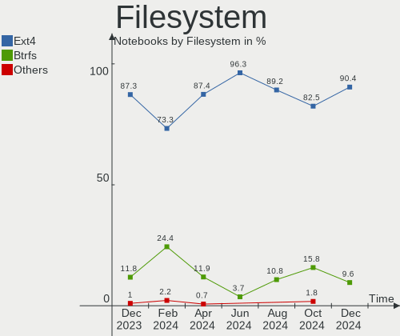
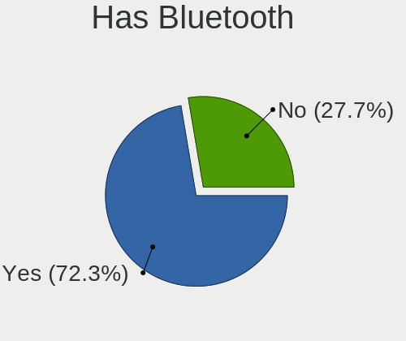
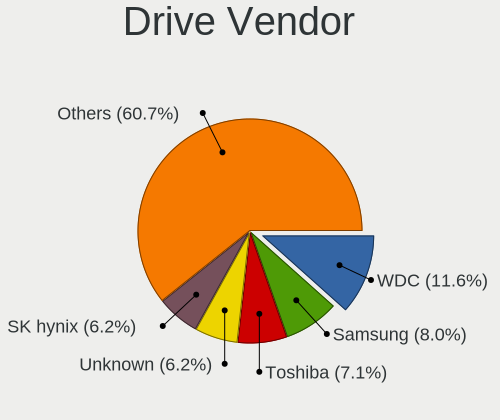
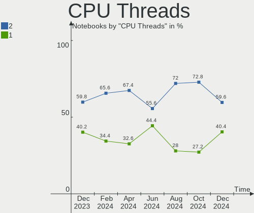
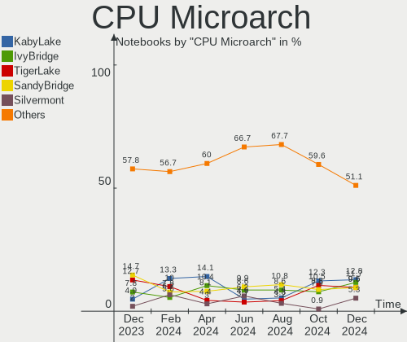
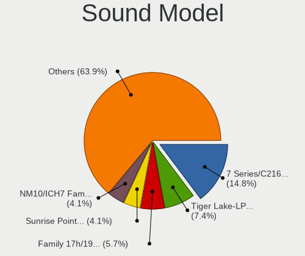
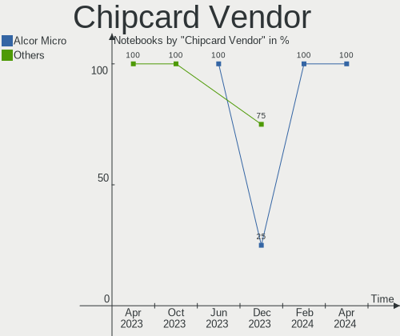

ROSA - Hardware Trends (Notebooks)
----------------------------------

A project to identify most popular hardware characteristics and track their change
over time based on data collected by Linux users at https://Linux-Hardware.org.

Anyone can contribute to this report by the [hw-probe](https://github.com/linuxhw/hw-probe) tool:

    sudo -E hw-probe -all -upload

This report is for one last month. Overall report since the beginning of time: [TestCoverage](https://github.com/linuxhw/TestCoverage)

Period: Aug, 2022.

Contents
--------

* [ System ](#system)
  - [ OS                       ](#os)
  - [ OS Family                ](#os-family)
  - [ Kernel                   ](#kernel)
  - [ Kernel Family            ](#kernel-family)
  - [ Kernel Major Ver.        ](#kernel-major-ver)
  - [ Arch                     ](#arch)
  - [ DE                       ](#de)
  - [ Display Server           ](#display-server)
  - [ Display Manager          ](#display-manager)
  - [ OS Lang                  ](#os-lang)
  - [ Boot Mode                ](#boot-mode)
  - [ Filesystem               ](#filesystem)
  - [ Part. scheme             ](#part-scheme)
  - [ Dual Boot with Linux/BSD ](#dual-boot-with-linuxbsd)
  - [ Dual Boot (Win)          ](#dual-boot-win)

* [ Board ](#board)
  - [ Vendor                   ](#vendor)
  - [ Model                    ](#model)
  - [ Model Family             ](#model-family)
  - [ MFG Year                 ](#mfg-year)
  - [ Form Factor              ](#form-factor)
  - [ Secure Boot              ](#secure-boot)
  - [ Coreboot                 ](#coreboot)
  - [ RAM Size                 ](#ram-size)
  - [ RAM Used                 ](#ram-used)
  - [ Total Drives             ](#total-drives)
  - [ Has CD-ROM               ](#has-cd-rom)
  - [ Has Ethernet             ](#has-ethernet)
  - [ Has WiFi                 ](#has-wifi)
  - [ Has Bluetooth            ](#has-bluetooth)

* [ Location ](#location)
  - [ Country                  ](#country)
  - [ City                     ](#city)

* [ Drives ](#drives)
  - [ Drive Vendor             ](#drive-vendor)
  - [ Drive Model              ](#drive-model)
  - [ HDD Vendor               ](#hdd-vendor)
  - [ SSD Vendor               ](#ssd-vendor)
  - [ Drive Kind               ](#drive-kind)
  - [ Drive Connector          ](#drive-connector)
  - [ Drive Size               ](#drive-size)
  - [ Space Total              ](#space-total)
  - [ Space Used               ](#space-used)
  - [ Malfunc. Drives          ](#malfunc-drives)
  - [ Malfunc. Drive Vendor    ](#malfunc-drive-vendor)
  - [ Malfunc. HDD Vendor      ](#malfunc-hdd-vendor)
  - [ Malfunc. Drive Kind      ](#malfunc-drive-kind)
  - [ Failed Drives            ](#failed-drives)
  - [ Failed Drive Vendor      ](#failed-drive-vendor)
  - [ Drive Status             ](#drive-status)

* [ Storage controller ](#storage-controller)
  - [ Storage Vendor           ](#storage-vendor)
  - [ Storage Model            ](#storage-model)
  - [ Storage Kind             ](#storage-kind)

* [ Processor ](#processor)
  - [ CPU Vendor               ](#cpu-vendor)
  - [ CPU Model                ](#cpu-model)
  - [ CPU Model Family         ](#cpu-model-family)
  - [ CPU Cores                ](#cpu-cores)
  - [ CPU Sockets              ](#cpu-sockets)
  - [ CPU Threads              ](#cpu-threads)
  - [ CPU Op-Modes             ](#cpu-op-modes)
  - [ CPU Microcode            ](#cpu-microcode)
  - [ CPU Microarch            ](#cpu-microarch)

* [ Graphics ](#graphics)
  - [ GPU Vendor               ](#gpu-vendor)
  - [ GPU Model                ](#gpu-model)
  - [ GPU Combo                ](#gpu-combo)
  - [ GPU Driver               ](#gpu-driver)
  - [ GPU Memory               ](#gpu-memory)

* [ Monitor ](#monitor)
  - [ Monitor Vendor           ](#monitor-vendor)
  - [ Monitor Model            ](#monitor-model)
  - [ Monitor Resolution       ](#monitor-resolution)
  - [ Monitor Diagonal         ](#monitor-diagonal)
  - [ Monitor Width            ](#monitor-width)
  - [ Aspect Ratio             ](#aspect-ratio)
  - [ Monitor Area             ](#monitor-area)
  - [ Pixel Density            ](#pixel-density)
  - [ Multiple Monitors        ](#multiple-monitors)

* [ Network ](#network)
  - [ Net Controller Vendor    ](#net-controller-vendor)
  - [ Net Controller Model     ](#net-controller-model)
  - [ Wireless Vendor          ](#wireless-vendor)
  - [ Wireless Model           ](#wireless-model)
  - [ Ethernet Vendor          ](#ethernet-vendor)
  - [ Ethernet Model           ](#ethernet-model)
  - [ Net Controller Kind      ](#net-controller-kind)
  - [ Used Controller          ](#used-controller)
  - [ NICs                     ](#nics)
  - [ IPv6                     ](#ipv6)

* [ Bluetooth ](#bluetooth)
  - [ Bluetooth Vendor         ](#bluetooth-vendor)
  - [ Bluetooth Model          ](#bluetooth-model)

* [ Sound ](#sound)
  - [ Sound Vendor             ](#sound-vendor)
  - [ Sound Model              ](#sound-model)

* [ Memory ](#memory)
  - [ Memory Vendor            ](#memory-vendor)
  - [ Memory Model             ](#memory-model)
  - [ Memory Kind              ](#memory-kind)
  - [ Memory Form Factor       ](#memory-form-factor)
  - [ Memory Size              ](#memory-size)
  - [ Memory Speed             ](#memory-speed)

* [ Printers & scanners ](#printers--scanners)
  - [ Printer Vendor           ](#printer-vendor)
  - [ Printer Model            ](#printer-model)
  - [ Scanner Vendor           ](#scanner-vendor)
  - [ Scanner Model            ](#scanner-model)

* [ Camera ](#camera)
  - [ Camera Vendor            ](#camera-vendor)
  - [ Camera Model             ](#camera-model)

* [ Security ](#security)
  - [ Fingerprint Vendor       ](#fingerprint-vendor)
  - [ Fingerprint Model        ](#fingerprint-model)
  - [ Chipcard Vendor          ](#chipcard-vendor)
  - [ Chipcard Model           ](#chipcard-model)

* [ Unsupported ](#unsupported)
  - [ Unsupported Devices      ](#unsupported-devices)
  - [ Unsupported Device Types ](#unsupported-device-types)

System
------

OS
--

Installed operating systems

| Name       | Notebooks | Percent |
|------------|-----------|---------|
| ROSA 12.2  | 115       | 88.46%  |
| ROSA R11.1 | 12        | 9.23%   |
| ROSA 12    | 2         | 1.54%   |
| ROSA R11   | 1         | 0.77%   |

OS Family
---------

OS without a version

| Name | Notebooks | Percent |
|------|-----------|---------|
| ROSA | 130       | 100%    |

Kernel
------

Version of the Linux kernel

| Version                                        | Notebooks | Percent |
|------------------------------------------------|-----------|---------|
| 5.10.74-generic-2rosa2021.1-x86_64             | 57        | 43.85%  |
| 5.10.118-generic-2rosa2021.1-x86_64            | 36        | 27.69%  |
| 5.17.11-generic-2rosa2021.1-x86_64             | 5         | 3.85%   |
| 5.10.74-generic-2rosa2021.1-i586               | 4         | 3.08%   |
| 5.4.83-generic-2rosa-x86_64                    | 3         | 2.31%   |
| 5.15.43-generic-2rosa2021.1-x86_64             | 3         | 2.31%   |
| 5.4.32-generic-2rosa-x86_64                    | 2         | 1.54%   |
| 5.18.18.xm1-1-xanmod-rosa2021.1-x86_64         | 2         | 1.54%   |
| 5.10.71-generic-1rosa2021.1-x86_64             | 2         | 1.54%   |
| 5.10.118-generic-2rosa2021.1-i586              | 2         | 1.54%   |
| 4.15.0-desktop-122.124.1rosa-i586              | 2         | 1.54%   |
| 5.4.83-generic-2rosa-i586                      | 1         | 0.77%   |
| 5.4.32-generic-2rosa-i586                      | 1         | 0.77%   |
| 5.18.4-generic-2rosa2021.1-x86_64              | 1         | 0.77%   |
| 5.18.16.xm1-1-xanmod-rosa2021.1-x86_64         | 1         | 0.77%   |
| 5.16.20-generic-2rosa2021.1-x86_64             | 1         | 0.77%   |
| 5.15.58.xm1-1.klp-xanmod-lts-rosa2021.1-x86_64 | 1         | 0.77%   |
| 5.15.53.xm1-1.klp-xanmod-lts-rosa2021.1-x86_64 | 1         | 0.77%   |
| 5.15.32-generic-6rosa2021.1-x86_64             | 1         | 0.77%   |
| 5.13.9-generic-1rosa-x86_64                    | 1         | 0.77%   |
| 4.9.155-nrj-desktop-1rosa-x86_64               | 1         | 0.77%   |
| 4.15.0-desktop-45.1rosa-x86_64                 | 1         | 0.77%   |
| 4.15.0-desktop-122.124.1rosa-x86_64            | 1         | 0.77%   |

Kernel Family
-------------

Linux kernel without a distro release

| Version  | Notebooks | Percent |
|----------|-----------|---------|
| 5.10.74  | 61        | 46.92%  |
| 5.10.118 | 38        | 29.23%  |
| 5.17.11  | 5         | 3.85%   |
| 5.4.83   | 4         | 3.08%   |
| 4.15.0   | 4         | 3.08%   |
| 5.4.32   | 3         | 2.31%   |
| 5.15.43  | 3         | 2.31%   |
| 5.18.18  | 2         | 1.54%   |
| 5.10.71  | 2         | 1.54%   |
| 5.18.4   | 1         | 0.77%   |
| 5.18.16  | 1         | 0.77%   |
| 5.16.20  | 1         | 0.77%   |
| 5.15.58  | 1         | 0.77%   |
| 5.15.53  | 1         | 0.77%   |
| 5.15.32  | 1         | 0.77%   |
| 5.13.9   | 1         | 0.77%   |
| 4.9.155  | 1         | 0.77%   |

Kernel Major Ver.
-----------------

Linux kernel major version

| Version | Notebooks | Percent |
|---------|-----------|---------|
| 5.10    | 101       | 77.69%  |
| 5.4     | 7         | 5.38%   |
| 5.15    | 6         | 4.62%   |
| 5.17    | 5         | 3.85%   |
| 5.18    | 4         | 3.08%   |
| 4.15    | 4         | 3.08%   |
| 5.16    | 1         | 0.77%   |
| 5.13    | 1         | 0.77%   |
| 4.9     | 1         | 0.77%   |

Arch
----

OS architecture (x86_64, i586, etc.)

| Name   | Notebooks | Percent |
|--------|-----------|---------|
| x86_64 | 120       | 92.31%  |
| i686   | 10        | 7.69%   |

DE
--

Desktop Environment

| Name  | Notebooks | Percent |
|-------|-----------|---------|
| GNOME | 53        | 40.77%  |
| KDE5  | 47        | 36.15%  |
| LXQt  | 19        | 14.62%  |
| KDE4  | 11        | 8.46%   |

Display Server
--------------

X11 or Wayland

| Name    | Notebooks | Percent |
|---------|-----------|---------|
| Wayland | 101       | 77.69%  |
| X11     | 29        | 22.31%  |

Display Manager
---------------

SDDM, LightDM, etc.

| Name    | Notebooks | Percent |
|---------|-----------|---------|
| GDM     | 66        | 50.77%  |
| SDDM    | 47        | 36.15%  |
| KDM     | 11        | 8.46%   |
| LightDM | 6         | 4.62%   |

OS Lang
-------

Language

| Lang    | Notebooks | Percent |
|---------|-----------|---------|
| ru_RU   | 115       | 88.46%  |
| en_US   | 7         | 5.38%   |
| pt_BR   | 2         | 1.54%   |
| es_PE   | 2         | 1.54%   |
| es_CO   | 1         | 0.77%   |
| be_BY   | 1         | 0.77%   |
| ba_RU   | 1         | 0.77%   |
| Unknown | 1         | 0.77%   |

Boot Mode
---------

EFI or BIOS

| Mode | Notebooks | Percent |
|------|-----------|---------|
| EFI  | 78        | 60%     |
| BIOS | 52        | 40%     |

Filesystem
----------

Type of filesystem

| Type  | Notebooks | Percent |
|-------|-----------|---------|
| Ext4  | 122       | 93.85%  |
| Btrfs | 7         | 5.38%   |
| F2fs  | 1         | 0.77%   |

Part. scheme
------------

Scheme of partitioning

| Type | Notebooks | Percent |
|------|-----------|---------|
| GPT  | 88        | 67.69%  |
| MBR  | 42        | 32.31%  |

Dual Boot with Linux/BSD
------------------------

Hosting more than one Linux/BSD

| Dual boot | Notebooks | Percent |
|-----------|-----------|---------|
| No        | 100       | 76.92%  |
| Yes       | 30        | 23.08%  |

Dual Boot (Win)
---------------

Hosting Linux and Windows

| Dual boot | Notebooks | Percent |
|-----------|-----------|---------|
| No        | 72        | 55.38%  |
| Yes       | 58        | 44.62%  |

Board
-----

Vendor
------

Motherboard manufacturer

| Name                                      | Notebooks | Percent |
|-------------------------------------------|-----------|---------|
| Lenovo                                    | 35        | 26.92%  |
| ASUSTek Computer                          | 23        | 17.69%  |
| Acer                                      | 22        | 16.92%  |
| Hewlett-Packard                           | 15        | 11.54%  |
| Dell                                      | 10        | 7.69%   |
| Samsung Electronics                       | 6         | 4.62%   |
| eMachines                                 | 4         | 3.08%   |
| HUAWEI                                    | 2         | 1.54%   |
| Unknown                                   | 2         | 1.54%   |
| Sony                                      | 1         | 0.77%   |
| Shenzhen Baohuazhong Science & Technology | 1         | 0.77%   |
| Positivo Bahia - VAIO                     | 1         | 0.77%   |
| Pegatron                                  | 1         | 0.77%   |
| Packard Bell                              | 1         | 0.77%   |
| MSI                                       | 1         | 0.77%   |
| Haier                                     | 1         | 0.77%   |
| Google                                    | 1         | 0.77%   |
| BBEN                                      | 1         | 0.77%   |
| Apple                                     | 1         | 0.77%   |
| 3Logic Group                              | 1         | 0.77%   |

Model
-----

Motherboard model

| Name                                        | Notebooks | Percent |
|---------------------------------------------|-----------|---------|
| Unknown                                     | 3         | 2.31%   |
| Lenovo IdeaPad Gaming 3 15IMH05 81Y4        | 2         | 1.54%   |
| Lenovo IdeaPad 330-15IKB 81DE               | 2         | 1.54%   |
| Lenovo B570e HuronRiver Platform            | 2         | 1.54%   |
| HP Pavilion g6                              | 2         | 1.54%   |
| eMachines eME728                            | 2         | 1.54%   |
| ASUS F5N                                    | 2         | 1.54%   |
| Sony VPCSB1V9R                              | 1         | 0.77%   |
| Shenzhen Baohuazhong Science & XN1A         | 1         | 0.77%   |
| Samsung RV411/RV511/E3511/S3511/RV711/E3411 | 1         | 0.77%   |
| Samsung R580/R590                           | 1         | 0.77%   |
| Samsung R530/R730/R540                      | 1         | 0.77%   |
| Samsung R528/R728                           | 1         | 0.77%   |
| Samsung NC210/NC110                         | 1         | 0.77%   |
| Samsung 700Z3A/700Z4A/700Z5A/700Z5B         | 1         | 0.77%   |
| Positivo Bahia - VAIO VJFE52F11X-B0611H     | 1         | 0.77%   |
| Pegatron A17                                | 1         | 0.77%   |
| Packard Bell EasyNote LM85                  | 1         | 0.77%   |
| MSI FX610                                   | 1         | 0.77%   |
| Lenovo Z710 20250                           | 1         | 0.77%   |
| Lenovo Y520-15IKBN 80WK                     | 1         | 0.77%   |
| Lenovo ThinkPad X220 4291B66                | 1         | 0.77%   |
| Lenovo ThinkPad T440p 20AWS0VB04            | 1         | 0.77%   |
| Lenovo ThinkPad SL500 2746AA3               | 1         | 0.77%   |
| Lenovo ThinkPad Edge E545 20B2A00ERT        | 1         | 0.77%   |
| Lenovo ThinkPad 13 2nd Gen 20J1S0EW00       | 1         | 0.77%   |
| Lenovo Legion Y740-17IRHg 81UJ              | 1         | 0.77%   |
| Lenovo Legion 5 Pro 16ACH6H 82JQ            | 1         | 0.77%   |
| Lenovo Legion 5 17IMH05H 81Y8               | 1         | 0.77%   |
| Lenovo Legion 5 15IMH05H 81Y6               | 1         | 0.77%   |
| Lenovo IdeaPad Y580 20132                   | 1         | 0.77%   |
| Lenovo IdeaPad S340-14API 81NB              | 1         | 0.77%   |
| Lenovo IdeaPad S20-30                       | 1         | 0.77%   |
| Lenovo IdeaPad S145-15API 81UT              | 1         | 0.77%   |
| Lenovo IdeaPad Gaming 3 15ARH05 82EY        | 1         | 0.77%   |
| Lenovo IdeaPad Gaming 3 15ACH6 82K2         | 1         | 0.77%   |
| Lenovo IdeaPad 330-15IGM 81D1               | 1         | 0.77%   |
| Lenovo IdeaPad 330-15AST 81D6               | 1         | 0.77%   |
| Lenovo IdeaPad 320-15IKB 80XL               | 1         | 0.77%   |
| Lenovo IdeaPad 320-15IAP 80XR               | 1         | 0.77%   |
| Lenovo G710 20252                           | 1         | 0.77%   |
| Lenovo G70-80 80FF                          | 1         | 0.77%   |
| Lenovo G505 20240                           | 1         | 0.77%   |
| Lenovo G50-80 80L0                          | 1         | 0.77%   |
| Lenovo B590 20206                           | 1         | 0.77%   |
| Lenovo B560                                 | 1         | 0.77%   |
| Lenovo B550 20053                           | 1         | 0.77%   |
| Lenovo ACLUAB                               | 1         | 0.77%   |
| HUAWEI NBD-WXX9                             | 1         | 0.77%   |
| HUAWEI KLVD-WXX9                            | 1         | 0.77%   |
| HP ProBook 440 G4                           | 1         | 0.77%   |
| HP Pavilion m6                              | 1         | 0.77%   |
| HP Pavilion dv7                             | 1         | 0.77%   |
| HP Pavilion dv6                             | 1         | 0.77%   |
| HP Pavilion 17                              | 1         | 0.77%   |
| HP Laptop 15s-fq2xxx                        | 1         | 0.77%   |
| HP Laptop 15-bw0xx                          | 1         | 0.77%   |
| HP Compaq Presario CQ60                     | 1         | 0.77%   |
| HP Compaq Presario CQ50                     | 1         | 0.77%   |
| HP Compaq 610                               | 1         | 0.77%   |

Model Family
------------

Motherboard model prefix

| Name                                    | Notebooks | Percent |
|-----------------------------------------|-----------|---------|
| Lenovo IdeaPad                          | 14        | 10.77%  |
| Acer Aspire                             | 9         | 6.92%   |
| HP Pavilion                             | 6         | 4.62%   |
| Lenovo ThinkPad                         | 5         | 3.85%   |
| ASUS VivoBook                           | 5         | 3.85%   |
| Lenovo Legion                           | 4         | 3.08%   |
| Acer Extensa                            | 4         | 3.08%   |
| HP Compaq                               | 3         | 2.31%   |
| Dell Vostro                             | 3         | 2.31%   |
| Acer Nitro                              | 3         | 2.31%   |
| Unknown                                 | 3         | 2.31%   |
| Lenovo B570e                            | 2         | 1.54%   |
| HP Laptop                               | 2         | 1.54%   |
| eMachines eME728                        | 2         | 1.54%   |
| Dell Latitude                           | 2         | 1.54%   |
| Dell Inspiron                           | 2         | 1.54%   |
| ASUS F5N                                | 2         | 1.54%   |
| Sony VPCSB1V9R                          | 1         | 0.77%   |
| Shenzhen Baohuazhong Science & XN1A     | 1         | 0.77%   |
| Samsung RV411                           | 1         | 0.77%   |
| Samsung R580                            | 1         | 0.77%   |
| Samsung R530                            | 1         | 0.77%   |
| Samsung R528                            | 1         | 0.77%   |
| Samsung NC210                           | 1         | 0.77%   |
| Samsung 700Z3A                          | 1         | 0.77%   |
| Positivo Bahia - VAIO VJFE52F11X-B0611H | 1         | 0.77%   |
| Pegatron A17                            | 1         | 0.77%   |
| Packard Bell EasyNote                   | 1         | 0.77%   |
| MSI FX610                               | 1         | 0.77%   |
| Lenovo Z710                             | 1         | 0.77%   |
| Lenovo Y520-15IKBN                      | 1         | 0.77%   |
| Lenovo G710                             | 1         | 0.77%   |
| Lenovo G70-80                           | 1         | 0.77%   |
| Lenovo G505                             | 1         | 0.77%   |
| Lenovo G50-80                           | 1         | 0.77%   |
| Lenovo B590                             | 1         | 0.77%   |
| Lenovo B560                             | 1         | 0.77%   |
| Lenovo B550                             | 1         | 0.77%   |
| Lenovo ACLUAB                           | 1         | 0.77%   |
| HUAWEI NBD-WXX9                         | 1         | 0.77%   |
| HUAWEI KLVD-WXX9                        | 1         | 0.77%   |
| HP ProBook                              | 1         | 0.77%   |
| HP 550                                  | 1         | 0.77%   |
| HP 255                                  | 1         | 0.77%   |
| HP 240                                  | 1         | 0.77%   |
| Haier GG1560XT                          | 1         | 0.77%   |
| Google Rammus                           | 1         | 0.77%   |
| eMachines E725                          | 1         | 0.77%   |
| eMachines E525                          | 1         | 0.77%   |
| Dell XPS                                | 1         | 0.77%   |
| Dell Precision                          | 1         | 0.77%   |
| Dell G3                                 | 1         | 0.77%   |
| BBEN MN9                                | 1         | 0.77%   |
| ASUS X551MA                             | 1         | 0.77%   |
| ASUS X550LC                             | 1         | 0.77%   |
| ASUS X550DP                             | 1         | 0.77%   |
| ASUS X541UV                             | 1         | 0.77%   |
| ASUS X301A1                             | 1         | 0.77%   |
| ASUS X101CH                             | 1         | 0.77%   |
| ASUS TUF                                | 1         | 0.77%   |

MFG Year
--------

Motherboard manufacture year

| Year | Notebooks | Percent |
|------|-----------|---------|
| 2021 | 14        | 10.77%  |
| 2020 | 13        | 10%     |
| 2011 | 13        | 10%     |
| 2013 | 12        | 9.23%   |
| 2012 | 12        | 9.23%   |
| 2010 | 12        | 9.23%   |
| 2018 | 11        | 8.46%   |
| 2015 | 9         | 6.92%   |
| 2008 | 8         | 6.15%   |
| 2019 | 6         | 4.62%   |
| 2017 | 5         | 3.85%   |
| 2009 | 5         | 3.85%   |
| 2007 | 4         | 3.08%   |
| 2016 | 3         | 2.31%   |
| 2014 | 2         | 1.54%   |
| 2022 | 1         | 0.77%   |

Form Factor
-----------

Physical design of the computer

| Name     | Notebooks | Percent |
|----------|-----------|---------|
| Notebook | 130       | 100%    |

Secure Boot
-----------

Enabled or disabled

| State    | Notebooks | Percent |
|----------|-----------|---------|
| Disabled | 130       | 100%    |

Coreboot
--------

Have coreboot on board

| Used | Notebooks | Percent |
|------|-----------|---------|
| No   | 129       | 99.23%  |
| Yes  | 1         | 0.77%   |

RAM Size
--------

Total RAM memory

| Size in GB | Notebooks | Percent |
|------------|-----------|---------|
| 4.01-8.0   | 34        | 26.15%  |
| 3.01-4.0   | 31        | 23.85%  |
| 8.01-16.0  | 26        | 20%     |
| 1.01-2.0   | 16        | 12.31%  |
| 16.01-24.0 | 14        | 10.77%  |
| 2.01-3.0   | 4         | 3.08%   |
| 32.01-64.0 | 3         | 2.31%   |
| 24.01-32.0 | 2         | 1.54%   |

RAM Used
--------

Used RAM memory

| Used GB   | Notebooks | Percent |
|-----------|-----------|---------|
| 1.01-2.0  | 67        | 51.54%  |
| 0.51-1.0  | 37        | 28.46%  |
| 2.01-3.0  | 16        | 12.31%  |
| 3.01-4.0  | 4         | 3.08%   |
| 4.01-8.0  | 3         | 2.31%   |
| 8.01-16.0 | 2         | 1.54%   |
| 0.01-0.5  | 1         | 0.77%   |

Total Drives
------------

Number of drives on board

| Drives | Notebooks | Percent |
|--------|-----------|---------|
| 1      | 90        | 69.23%  |
| 2      | 36        | 27.69%  |
| 3      | 4         | 3.08%   |

Has CD-ROM
----------

Has CD-ROM on board

| Presented | Notebooks | Percent |
|-----------|-----------|---------|
| No        | 84        | 64.62%  |
| Yes       | 46        | 35.38%  |

Has Ethernet
------------

Has Ethernet on board

| Presented | Notebooks | Percent |
|-----------|-----------|---------|
| Yes       | 115       | 88.46%  |
| No        | 15        | 11.54%  |

Has WiFi
--------

Has WiFi module

| Presented | Notebooks | Percent |
|-----------|-----------|---------|
| Yes       | 126       | 96.92%  |
| No        | 4         | 3.08%   |

Has Bluetooth
-------------

Has Bluetooth module

| Presented | Notebooks | Percent |
|-----------|-----------|---------|
| Yes       | 102       | 78.46%  |
| No        | 28        | 21.54%  |

Location
--------

Country
-------

Geographic location (country)

| Country   | Notebooks | Percent |
|-----------|-----------|---------|
| Russia    | 106       | 81.54%  |
| Ukraine   | 5         | 3.85%   |
| Belarus   | 5         | 3.85%   |
| Poland    | 2         | 1.54%   |
| Peru      | 2         | 1.54%   |
| Brazil    | 2         | 1.54%   |
| USA       | 1         | 0.77%   |
| Slovakia  | 1         | 0.77%   |
| Latvia    | 1         | 0.77%   |
| Israel    | 1         | 0.77%   |
| Indonesia | 1         | 0.77%   |
| Georgia   | 1         | 0.77%   |
| Czechia   | 1         | 0.77%   |
| Colombia  | 1         | 0.77%   |

City
----

Geographic location (city)

| City              | Notebooks | Percent |
|-------------------|-----------|---------|
| Moscow            | 22        | 16.92%  |
| St Petersburg     | 9         | 6.92%   |
| Krasnodar         | 9         | 6.92%   |
| Yekaterinburg     | 6         | 4.62%   |
| Saratov           | 4         | 3.08%   |
| Rostov-on-Don     | 3         | 2.31%   |
| Perm              | 3         | 2.31%   |
| Krasnoyarsk       | 3         | 2.31%   |
| Kemerovo          | 3         | 2.31%   |
| Chelyabinsk       | 3         | 2.31%   |
| Belgorod          | 3         | 2.31%   |
| Voronezh          | 2         | 1.54%   |
| Sochi             | 2         | 1.54%   |
| Rio de Janeiro    | 2         | 1.54%   |
| Novosibirsk       | 2         | 1.54%   |
| Blagoveshchensk   | 2         | 1.54%   |
| Zheleznogorsk     | 1         | 0.77%   |
| Yevpatoriya       | 1         | 0.77%   |
| Yaroslavl         | 1         | 0.77%   |
| Yalta             | 1         | 0.77%   |
| Warsaw            | 1         | 0.77%   |
| Ulan-Ude          | 1         | 0.77%   |
| Ufa               | 1         | 0.77%   |
| Simferopol        | 1         | 0.77%   |
| Severodvinsk      | 1         | 0.77%   |
| Sevastopol        | 1         | 0.77%   |
| Saransk           | 1         | 0.77%   |
| Santiago de Cali  | 1         | 0.77%   |
| Ryazan            | 1         | 0.77%   |
| Rovenki           | 1         | 0.77%   |
| Rishon LeTsiyyon  | 1         | 0.77%   |
| Riga              | 1         | 0.77%   |
| Pskov             | 1         | 0.77%   |
| Prague            | 1         | 0.77%   |
| Polevskoy         | 1         | 0.77%   |
| Podolsk           | 1         | 0.77%   |
| Petrozavodsk      | 1         | 0.77%   |
| Ostrov            | 1         | 0.77%   |
| Orsha             | 1         | 0.77%   |
| Orenburg          | 1         | 0.77%   |
| Omsk              | 1         | 0.77%   |
| Nizhniy Novgorod  | 1         | 0.77%   |
| Námestovo        | 1         | 0.77%   |
| Mytishchi         | 1         | 0.77%   |
| Minusinsk         | 1         | 0.77%   |
| Minsk             | 1         | 0.77%   |
| Lima              | 1         | 0.77%   |
| Kuznechikha       | 1         | 0.77%   |
| Kursk             | 1         | 0.77%   |
| Kurgan            | 1         | 0.77%   |
| Krasnogorsk       | 1         | 0.77%   |
| Kovrov            | 1         | 0.77%   |
| Kirov             | 1         | 0.77%   |
| Khimki            | 1         | 0.77%   |
| K'alak'i T'bilisi | 1         | 0.77%   |
| Jamestown         | 1         | 0.77%   |
| Hrodna            | 1         | 0.77%   |
| Gomel             | 1         | 0.77%   |
| Gdansk            | 1         | 0.77%   |
| Elista            | 1         | 0.77%   |

Drives
------

Drive Vendor
------------

Hard drive vendors

| Vendor                         | Notebooks | Drives | Percent |
|--------------------------------|-----------|--------|---------|
| WDC                            | 29        | 29     | 17.06%  |
| Seagate                        | 23        | 23     | 13.53%  |
| Samsung Electronics            | 17        | 19     | 10%     |
| Hitachi                        | 12        | 12     | 7.06%   |
| SK hynix                       | 11        | 12     | 6.47%   |
| China                          | 10        | 10     | 5.88%   |
| Kingston                       | 9         | 9      | 5.29%   |
| Unknown                        | 7         | 7      | 4.12%   |
| Toshiba                        | 5         | 5      | 2.94%   |
| SanDisk                        | 5         | 5      | 2.94%   |
| Netac                          | 4         | 4      | 2.35%   |
| Intel                          | 3         | 3      | 1.76%   |
| UMIS                           | 2         | 2      | 1.18%   |
| Transcend                      | 2         | 2      | 1.18%   |
| SPCC                           | 2         | 2      | 1.18%   |
| Micron Technology              | 2         | 2      | 1.18%   |
| KingSpec                       | 2         | 2      | 1.18%   |
| HGST                           | 2         | 2      | 1.18%   |
| Apacer                         | 2         | 2      | 1.18%   |
| XPG                            | 1         | 1      | 0.59%   |
| V-GeN                          | 1         | 2      | 0.59%   |
| TO Exter                       | 1         | 1      | 0.59%   |
| Solid State Storage Technology | 1         | 1      | 0.59%   |
| Smartbuy                       | 1         | 1      | 0.59%   |
| Silicon Motion                 | 1         | 1      | 0.59%   |
| ShanDianZhe                    | 1         | 1      | 0.59%   |
| SemsoTai                       | 1         | 1      | 0.59%   |
| Plextor                        | 1         | 1      | 0.59%   |
| Pioneer                        | 1         | 1      | 0.59%   |
| Phison                         | 1         | 1      | 0.59%   |
| Patriot                        | 1         | 1      | 0.59%   |
| Lexar                          | 1         | 1      | 0.59%   |
| Kimtigo                        | 1         | 1      | 0.59%   |
| JMicron Technology             | 1         | 1      | 0.59%   |
| GOODRAM                        | 1         | 1      | 0.59%   |
| Gigabyte Technology            | 1         | 1      | 0.59%   |
| Crucial                        | 1         | 1      | 0.59%   |
| Apple                          | 1         | 1      | 0.59%   |
| A-DATA Technology              | 1         | 1      | 0.59%   |
| Unknown                        | 1         | 1      | 0.59%   |

Drive Model
-----------

Hard drive models

| Model                                    | Notebooks | Percent |
|------------------------------------------|-----------|---------|
| Seagate ST1000LM035-1RK172 1TB           | 4         | 2.31%   |
| Hitachi HTS545025B9A300 250GB            | 4         | 2.31%   |
| China SSD 256GB                          | 4         | 2.31%   |
| Seagate ST1000LM024 HN-M101MBB 1TB       | 3         | 1.73%   |
| Kingston SA400S37240G 240GB SSD          | 3         | 1.73%   |
| WDC WD5000LPCX-24VHAT0 500GB             | 2         | 1.16%   |
| WDC WD5000LPCX-21VHAT0 500GB             | 2         | 1.16%   |
| WDC WD10SPZX-35Z10T0 1TB                 | 2         | 1.16%   |
| Seagate ST500LM021-1KJ152 500GB          | 2         | 1.16%   |
| Seagate ST1000LX015-1U7172 1TB           | 2         | 1.16%   |
| SanDisk SSD PLUS 240GB                   | 2         | 1.16%   |
| Samsung SSD 860 EVO 250GB                | 2         | 1.16%   |
| Intel SSDPEKNU512GZ 512GB                | 2         | 1.16%   |
| Hitachi HTS545050B9A300 500GB            | 2         | 1.16%   |
| XPG GAMMIX S11 Pro 1TB                   | 1         | 0.58%   |
| WDC WDS500G2B0A-00SM50 500GB SSD         | 1         | 0.58%   |
| WDC WDS240G2G0B-00EPW0 240GB SSD         | 1         | 0.58%   |
| WDC WDS120G2G0A-00JH30 120GB SSD         | 1         | 0.58%   |
| WDC WD5000LPVX-22V0TT0 500GB             | 1         | 0.58%   |
| WDC WD5000BEVT-00A0RT0 500GB             | 1         | 0.58%   |
| WDC WD3200LPLX-00ZNTT0 320GB             | 1         | 0.58%   |
| WDC WD3200BPVT-24ZEST0 320GB             | 1         | 0.58%   |
| WDC WD3200BPVT-24JJ5T0 320GB             | 1         | 0.58%   |
| WDC WD3200BPVT-22JJ5T0 320GB             | 1         | 0.58%   |
| WDC WD2500BEVS-22UST0 250GB              | 1         | 0.58%   |
| WDC WD2500BEKT-60A25T1 250GB             | 1         | 0.58%   |
| WDC WD1600BEVT-60ZCT1 160GB              | 1         | 0.58%   |
| WDC WD1600BEVT-22A23T0 160GB             | 1         | 0.58%   |
| WDC WD10SPZX-75Z10T1 1TB                 | 1         | 0.58%   |
| WDC WD10SPZX-60Z10T0 1TB                 | 1         | 0.58%   |
| WDC WD10SPZX-21Z10T0 1TB                 | 1         | 0.58%   |
| WDC WD10SPCX-24HWST1 1TB                 | 1         | 0.58%   |
| WDC WD10JPVX-22JC3T0 1TB                 | 1         | 0.58%   |
| WDC WD10JPVT-75A1YT0 1TB                 | 1         | 0.58%   |
| WDC WD10JPVT-60A1YT0 1TB                 | 1         | 0.58%   |
| WDC PC SN530 SDBPNPZ-512G-1014 512GB     | 1         | 0.58%   |
| WDC PC SN530 SDBPNPZ-256G-1014 256GB     | 1         | 0.58%   |
| WDC PC SN530 SDBPNPZ-256G-1006 256GB     | 1         | 0.58%   |
| V-GeN V-GEN11SM20AR1024ITM2 1TB SSD      | 1         | 0.58%   |
| V-GeN V-GEN03SM22AR1024SDK 1TB SSD       | 1         | 0.58%   |
| Unknown USD  8GB                         | 1         | 0.58%   |
| Unknown TA2964  64GB                     | 1         | 0.58%   |
| Unknown SLD128  128GB                    | 1         | 0.58%   |
| Unknown NCard  64GB                      | 1         | 0.58%   |
| Unknown HCG4a2  64GB                     | 1         | 0.58%   |
| Unknown DA4064  64GB                     | 1         | 0.58%   |
| Unknown APPSD  272GB                     | 1         | 0.58%   |
| UMIS RPJTJ256MEE1OWX 256GB               | 1         | 0.58%   |
| UMIS RPFTJ128PDD2EWX 128GB               | 1         | 0.58%   |
| Transcend TS32GMSA310 32GB SSD           | 1         | 0.58%   |
| Transcend TS120GMTS820S 120GB SSD        | 1         | 0.58%   |
| Toshiba THNSN5512GPUK NVMe 512GB         | 1         | 0.58%   |
| Toshiba MQ01ABF050 500GB                 | 1         | 0.58%   |
| Toshiba MK6459GSXP 640GB                 | 1         | 0.58%   |
| Toshiba MK2552GSX 250GB                  | 1         | 0.58%   |
| Toshiba MK1237GSX 120GB                  | 1         | 0.58%   |
| TO Exter nal USB 3.0 240GB               | 1         | 0.58%   |
| SPCC Solid State Disk 64GB               | 1         | 0.58%   |
| SPCC Solid State Disk 512GB              | 1         | 0.58%   |
| Solid State Storage NVMe SSD Drive 256GB | 1         | 0.58%   |

HDD Vendor
----------

Hard disk drive vendors

| Vendor  | Notebooks | Drives | Percent |
|---------|-----------|--------|---------|
| WDC     | 23        | 23     | 35.94%  |
| Seagate | 23        | 23     | 35.94%  |
| Hitachi | 12        | 12     | 18.75%  |
| Toshiba | 4         | 4      | 6.25%   |
| HGST    | 2         | 2      | 3.13%   |

SSD Vendor
----------

Solid state drive vendors

| Vendor              | Notebooks | Drives | Percent |
|---------------------|-----------|--------|---------|
| China               | 10        | 10     | 15.15%  |
| Samsung Electronics | 9         | 10     | 13.64%  |
| Kingston            | 9         | 9      | 13.64%  |
| SanDisk             | 5         | 5      | 7.58%   |
| SK hynix            | 4         | 4      | 6.06%   |
| Netac               | 4         | 4      | 6.06%   |
| WDC                 | 3         | 3      | 4.55%   |
| Transcend           | 2         | 2      | 3.03%   |
| SPCC                | 2         | 2      | 3.03%   |
| KingSpec            | 2         | 2      | 3.03%   |
| V-GeN               | 1         | 2      | 1.52%   |
| TO Exter            | 1         | 1      | 1.52%   |
| Smartbuy            | 1         | 1      | 1.52%   |
| ShanDianZhe         | 1         | 1      | 1.52%   |
| SemsoTai            | 1         | 1      | 1.52%   |
| Plextor             | 1         | 1      | 1.52%   |
| Pioneer             | 1         | 1      | 1.52%   |
| Patriot             | 1         | 1      | 1.52%   |
| Micron Technology   | 1         | 1      | 1.52%   |
| Lexar               | 1         | 1      | 1.52%   |
| JMicron Technology  | 1         | 1      | 1.52%   |
| GOODRAM             | 1         | 1      | 1.52%   |
| Apple               | 1         | 1      | 1.52%   |
| Apacer              | 1         | 1      | 1.52%   |
| A-DATA Technology   | 1         | 1      | 1.52%   |
| Unknown             | 1         | 1      | 1.52%   |

Drive Kind
----------

HDD or SSD

| Kind | Notebooks | Drives | Percent |
|------|-----------|--------|---------|
| HDD  | 63        | 64     | 39.13%  |
| SSD  | 59        | 68     | 36.65%  |
| NVMe | 32        | 35     | 19.88%  |
| MMC  | 7         | 7      | 4.35%   |

Drive Connector
---------------

SATA, SAS, NVMe, etc.

| Type | Notebooks | Drives | Percent |
|------|-----------|--------|---------|
| SATA | 107       | 130    | 72.3%   |
| NVMe | 32        | 35     | 21.62%  |
| MMC  | 7         | 7      | 4.73%   |
| SAS  | 2         | 2      | 1.35%   |

Drive Size
----------

Size of hard drive

| Size in TB | Notebooks | Drives | Percent |
|------------|-----------|--------|---------|
| 0.01-0.5   | 85        | 99     | 73.91%  |
| 0.51-1.0   | 28        | 31     | 24.35%  |
| 1.01-2.0   | 2         | 2      | 1.74%   |

Space Total
-----------

Amount of disk space available on the file system

| Size in GB | Notebooks | Percent |
|------------|-----------|---------|
| 101-250    | 49        | 37.69%  |
| 251-500    | 28        | 21.54%  |
| 1-20       | 18        | 13.85%  |
| 501-1000   | 15        | 11.54%  |
| 51-100     | 8         | 6.15%   |
| 1001-2000  | 6         | 4.62%   |
| 21-50      | 5         | 3.85%   |
| 2001-3000  | 1         | 0.77%   |

Space Used
----------

Amount of used disk space

| Used GB   | Notebooks | Percent |
|-----------|-----------|---------|
| 1-20      | 92        | 70.77%  |
| 101-250   | 12        | 9.23%   |
| 21-50     | 10        | 7.69%   |
| 51-100    | 8         | 6.15%   |
| 251-500   | 5         | 3.85%   |
| 501-1000  | 2         | 1.54%   |
| 1001-2000 | 1         | 0.77%   |

Malfunc. Drives
---------------

Drive models with a malfunction

| Model                                          | Notebooks | Drives | Percent |
|------------------------------------------------|-----------|--------|---------|
| Hitachi HTS545025B9A300 250GB                  | 3         | 3      | 10%     |
| Seagate ST1000LX015-1U7172 1TB                 | 2         | 2      | 6.67%   |
| WDC WD2500BEKT-60A25T1 250GB                   | 1         | 1      | 3.33%   |
| WDC WD1600BEVT-22A23T0 160GB                   | 1         | 1      | 3.33%   |
| Transcend TS32GMSA310 32GB SSD                 | 1         | 1      | 3.33%   |
| Toshiba MK1237GSX 120GB                        | 1         | 1      | 3.33%   |
| SK hynix HFS256G39TND-N210A 256GB SSD          | 1         | 1      | 3.33%   |
| SemsoTai S200 2280 256GB SSD                   | 1         | 1      | 3.33%   |
| Seagate ST9320325AS 320GB                      | 1         | 1      | 3.33%   |
| Seagate ST500LT012-9WS142 500GB                | 1         | 1      | 3.33%   |
| Seagate ST500LM000-SSHD-8GB                    | 1         | 1      | 3.33%   |
| Seagate ST1000LM035-1RK172 1TB                 | 1         | 1      | 3.33%   |
| Seagate ST1000LM024 HN-M101MBB 1TB             | 1         | 1      | 3.33%   |
| SanDisk iSSD P4 8GB                            | 1         | 1      | 3.33%   |
| Samsung Electronics SSD PM810 2.5 7mm 128GB    | 1         | 1      | 3.33%   |
| Netac SSD 720GB                                | 1         | 1      | 3.33%   |
| Micron Technology 1100_MTFDDAK256TBN 256GB SSD | 1         | 1      | 3.33%   |
| Kingston SV300S37A120G 120GB SSD               | 1         | 1      | 3.33%   |
| Kingston SUV400S37240G 240GB SSD               | 1         | 1      | 3.33%   |
| Hitachi HTS547575A9E384 752GB                  | 1         | 1      | 3.33%   |
| Hitachi HTS545050B9A300 500GB                  | 1         | 1      | 3.33%   |
| Hitachi HTS542516K9SA00 160GB                  | 1         | 1      | 3.33%   |
| Hitachi HTS541680J9SA00 80GB                   | 1         | 1      | 3.33%   |
| Hitachi HTS541616J9SA00 160GB                  | 1         | 1      | 3.33%   |
| HGST HTS545025A7E680 250GB                     | 1         | 1      | 3.33%   |
| China SSD 256GB                                | 1         | 1      | 3.33%   |
| Unknown                                        | 1         | 1      | 3.33%   |

Malfunc. Drive Vendor
---------------------

Vendors of faulty drives

| Vendor              | Notebooks | Drives | Percent |
|---------------------|-----------|--------|---------|
| Hitachi             | 8         | 8      | 26.67%  |
| Seagate             | 7         | 7      | 23.33%  |
| WDC                 | 2         | 2      | 6.67%   |
| Kingston            | 2         | 2      | 6.67%   |
| Transcend           | 1         | 1      | 3.33%   |
| Toshiba             | 1         | 1      | 3.33%   |
| SK hynix            | 1         | 1      | 3.33%   |
| SemsoTai            | 1         | 1      | 3.33%   |
| SanDisk             | 1         | 1      | 3.33%   |
| Samsung Electronics | 1         | 1      | 3.33%   |
| Netac               | 1         | 1      | 3.33%   |
| Micron Technology   | 1         | 1      | 3.33%   |
| HGST                | 1         | 1      | 3.33%   |
| China               | 1         | 1      | 3.33%   |
| Unknown             | 1         | 1      | 3.33%   |

Malfunc. HDD Vendor
-------------------

Vendors of faulty HDD drives

| Vendor  | Notebooks | Drives | Percent |
|---------|-----------|--------|---------|
| Hitachi | 8         | 8      | 42.11%  |
| Seagate | 7         | 7      | 36.84%  |
| WDC     | 2         | 2      | 10.53%  |
| Toshiba | 1         | 1      | 5.26%   |
| HGST    | 1         | 1      | 5.26%   |

Malfunc. Drive Kind
-------------------

Kinds of faulty drives

| Kind | Notebooks | Drives | Percent |
|------|-----------|--------|---------|
| HDD  | 19        | 19     | 63.33%  |
| SSD  | 11        | 11     | 36.67%  |

Failed Drives
-------------

Failed drive models

Zero info for selected period =(

Failed Drive Vendor
-------------------

Failed drive vendors

Zero info for selected period =(

Drive Status
------------

Number of failed and malfunc. drives

| Status   | Notebooks | Drives | Percent |
|----------|-----------|--------|---------|
| Works    | 105       | 133    | 71.92%  |
| Malfunc  | 30        | 30     | 20.55%  |
| Detected | 11        | 11     | 7.53%   |

Storage controller
------------------

Storage Vendor
--------------

Storage controller vendors

| Vendor                         | Notebooks | Percent |
|--------------------------------|-----------|---------|
| Intel                          | 94        | 61.44%  |
| AMD                            | 25        | 16.34%  |
| Samsung Electronics            | 10        | 6.54%   |
| SK hynix                       | 6         | 3.92%   |
| SanDisk                        | 3         | 1.96%   |
| Phison Electronics             | 3         | 1.96%   |
| Nvidia                         | 3         | 1.96%   |
| Union Memory (Shenzhen)        | 2         | 1.31%   |
| Silicon Motion                 | 2         | 1.31%   |
| Toshiba America Info Systems   | 1         | 0.65%   |
| Solid State Storage Technology | 1         | 0.65%   |
| Micron/Crucial Technology      | 1         | 0.65%   |
| Micron Technology              | 1         | 0.65%   |
| ADATA Technology               | 1         | 0.65%   |

Storage Model
-------------

Storage controller models

| Model                                                                                  | Notebooks | Percent |
|----------------------------------------------------------------------------------------|-----------|---------|
| AMD FCH SATA Controller [AHCI mode]                                                    | 22        | 13.25%  |
| Intel 82801IBM/IEM (ICH9M/ICH9M-E) 4 port SATA Controller [AHCI mode]                  | 10        | 6.02%   |
| Intel 7 Series Chipset Family 6-port SATA Controller [AHCI mode]                       | 10        | 6.02%   |
| Samsung NVMe SSD Controller 980                                                        | 7         | 4.22%   |
| Intel NM10/ICH7 Family SATA Controller [AHCI mode]                                     | 7         | 4.22%   |
| Intel Sunrise Point-LP SATA Controller [AHCI mode]                                     | 6         | 3.61%   |
| Intel Celeron/Pentium Silver Processor SATA Controller                                 | 6         | 3.61%   |
| Intel 6 Series/C200 Series Chipset Family 6 port Mobile SATA AHCI Controller           | 6         | 3.61%   |
| Intel 8 Series SATA Controller 1 [AHCI mode]                                           | 5         | 3.01%   |
| Intel 5 Series/3400 Series Chipset 4 port SATA AHCI Controller                         | 5         | 3.01%   |
| Intel 400 Series Chipset Family SATA AHCI Controller                                   | 5         | 3.01%   |
| Intel Volume Management Device NVMe RAID Controller                                    | 4         | 2.41%   |
| Intel 82801 Mobile SATA Controller [RAID mode]                                         | 4         | 2.41%   |
| SK hynix Gold P31 SSD                                                                  | 3         | 1.81%   |
| SanDisk WD Blue SN550 NVMe SSD                                                         | 3         | 1.81%   |
| Phison PS5013 E13 NVMe Controller                                                      | 3         | 1.81%   |
| Intel Wildcat Point-LP SATA Controller [AHCI Mode]                                     | 3         | 1.81%   |
| Intel Atom Processor E3800 Series SATA AHCI Controller                                 | 3         | 1.81%   |
| Intel 82801HM/HEM (ICH8M/ICH8M-E) SATA Controller [AHCI mode]                          | 3         | 1.81%   |
| Intel 82801HM/HEM (ICH8M/ICH8M-E) IDE Controller                                       | 3         | 1.81%   |
| Intel 8 Series/C220 Series Chipset Family 6-port SATA Controller 1 [AHCI mode]         | 3         | 1.81%   |
| Union Memory (Shenzhen) Non-Volatile memory controller                                 | 2         | 1.2%    |
| Samsung NVMe SSD Controller SM981/PM981/PM983                                          | 2         | 1.2%    |
| Nvidia MCP67 IDE Controller                                                            | 2         | 1.2%    |
| Nvidia MCP67 AHCI Controller                                                           | 2         | 1.2%    |
| Intel Non-Volatile memory controller                                                   | 2         | 1.2%    |
| Intel HM170/QM170 Chipset SATA Controller [AHCI Mode]                                  | 2         | 1.2%    |
| Intel Comet Lake SATA AHCI Controller                                                  | 2         | 1.2%    |
| Intel Cannon Lake Mobile PCH SATA AHCI Controller                                      | 2         | 1.2%    |
| AMD SB7x0/SB8x0/SB9x0 SATA Controller [AHCI mode]                                      | 2         | 1.2%    |
| Toshiba America Info Systems XG4 NVMe SSD Controller                                   | 1         | 0.6%    |
| Solid State Storage Non-Volatile memory controller                                     | 1         | 0.6%    |
| SK hynix Non-Volatile memory controller                                                | 1         | 0.6%    |
| SK hynix BC511                                                                         | 1         | 0.6%    |
| SK hynix BC501 NVMe Solid State Drive                                                  | 1         | 0.6%    |
| Silicon Motion SM2263EN/SM2263XT SSD Controller                                        | 1         | 0.6%    |
| Silicon Motion Non-Volatile memory controller                                          | 1         | 0.6%    |
| Samsung Electronics SATA controller                                                    | 1         | 0.6%    |
| Nvidia MCP78S [GeForce 8200] SATA Controller (non-AHCI mode)                           | 1         | 0.6%    |
| Nvidia MCP78S [GeForce 8200] IDE                                                       | 1         | 0.6%    |
| Micron/Crucial P2 NVMe PCIe SSD                                                        | 1         | 0.6%    |
| Micron Non-Volatile memory controller                                                  | 1         | 0.6%    |
| Intel Tiger Lake-LP SATA Controller                                                    | 1         | 0.6%    |
| Intel SSD 660P Series                                                                  | 1         | 0.6%    |
| Intel Jasper Lake SATA AHCI Controller                                                 | 1         | 0.6%    |
| Intel Celeron N3350/Pentium N4200/Atom E3900 Series SATA AHCI Controller               | 1         | 0.6%    |
| Intel Cannon Point-LP SATA Controller [AHCI Mode]                                      | 1         | 0.6%    |
| Intel Atom/Celeron/Pentium Processor x5-E8000/J3xxx/N3xxx Series SATA Controller       | 1         | 0.6%    |
| Intel 82801HM/HEM (ICH8M/ICH8M-E) SATA Controller [IDE mode]                           | 1         | 0.6%    |
| Intel 82801GBM/GHM (ICH7-M Family) SATA Controller [IDE mode]                          | 1         | 0.6%    |
| Intel 6 Series/C200 Series Chipset Family Mobile SATA Controller (IDE mode, ports 4-5) | 1         | 0.6%    |
| Intel 6 Series/C200 Series Chipset Family Mobile SATA Controller (IDE mode, ports 0-3) | 1         | 0.6%    |
| Intel 500 Series Chipset Family SATA AHCI Controller                                   | 1         | 0.6%    |
| AMD SB7x0/SB8x0/SB9x0 SATA Controller [IDE mode]                                       | 1         | 0.6%    |
| AMD SB7x0/SB8x0/SB9x0 IDE Controller                                                   | 1         | 0.6%    |
| AMD FCH IDE Controller                                                                 | 1         | 0.6%    |
| ADATA XPG SX8200 Pro PCIe Gen3x4 M.2 2280 Solid State Drive                            | 1         | 0.6%    |

Storage Kind
------------

Kind of storage controller (IDE, SATA, NVMe, SAS, ...)

| Kind | Notebooks | Percent |
|------|-----------|---------|
| SATA | 110       | 69.18%  |
| NVMe | 31        | 19.5%   |
| IDE  | 10        | 6.29%   |
| RAID | 8         | 5.03%   |

Processor
---------

CPU Vendor
----------

Processor vendors

| Vendor | Notebooks | Percent |
|--------|-----------|---------|
| Intel  | 99        | 76.15%  |
| AMD    | 31        | 23.85%  |

CPU Model
---------

Processor models

| Model                                         | Notebooks | Percent |
|-----------------------------------------------|-----------|---------|
| Intel Core i5-10300H CPU @ 2.50GHz            | 4         | 3.08%   |
| Intel Pentium Silver N5000 CPU @ 1.10GHz      | 3         | 2.31%   |
| AMD A10-5750M APU with Radeon HD Graphics     | 3         | 2.31%   |
| Intel Pentium Silver N6000 @ 1.10GHz          | 2         | 1.54%   |
| Intel Pentium Dual-Core CPU T4500 @ 2.30GHz   | 2         | 1.54%   |
| Intel Core i7-4500U CPU @ 1.80GHz             | 2         | 1.54%   |
| Intel Core i5-7200U CPU @ 2.50GHz             | 2         | 1.54%   |
| Intel Core i5-3230M CPU @ 2.60GHz             | 2         | 1.54%   |
| Intel Core i5-3210M CPU @ 2.50GHz             | 2         | 1.54%   |
| Intel Core i5-2430M CPU @ 2.40GHz             | 2         | 1.54%   |
| Intel Core i5-10210U CPU @ 1.60GHz            | 2         | 1.54%   |
| Intel Celeron CPU 3867U @ 1.80GHz             | 2         | 1.54%   |
| Intel Atom CPU N570 @ 1.66GHz                 | 2         | 1.54%   |
| Intel Atom CPU N455 @ 1.66GHz                 | 2         | 1.54%   |
| AMD Ryzen 7 5800H with Radeon Graphics        | 2         | 1.54%   |
| AMD Ryzen 5 3550H with Radeon Vega Mobile Gfx | 2         | 1.54%   |
| AMD Ryzen 3 3200U with Radeon Vega Mobile Gfx | 2         | 1.54%   |
| AMD Phenom II N830 Triple-Core Processor      | 2         | 1.54%   |
| AMD A10-4600M APU with Radeon HD Graphics     | 2         | 1.54%   |
| Intel Pentium Dual-Core CPU T4400 @ 2.20GHz   | 1         | 0.77%   |
| Intel Pentium Dual-Core CPU T4300 @ 2.10GHz   | 1         | 0.77%   |
| Intel Pentium Dual CPU T3200 @ 2.00GHz        | 1         | 0.77%   |
| Intel Pentium CPU P6200 @ 2.13GHz             | 1         | 0.77%   |
| Intel Pentium CPU P6100 @ 2.00GHz             | 1         | 0.77%   |
| Intel Pentium CPU N4200 @ 1.10GHz             | 1         | 0.77%   |
| Intel Pentium CPU N3540 @ 2.16GHz             | 1         | 0.77%   |
| Intel Pentium CPU N3530 @ 2.16GHz             | 1         | 0.77%   |
| Intel Pentium CPU B980 @ 2.40GHz              | 1         | 0.77%   |
| Intel Pentium CPU B960 @ 2.20GHz              | 1         | 0.77%   |
| Intel Pentium CPU 2020M @ 2.40GHz             | 1         | 0.77%   |
| Intel Genuine CPU T2080 @ 1.73GHz             | 1         | 0.77%   |
| Intel Core m3-8100Y CPU @ 1.10GHz             | 1         | 0.77%   |
| Intel Core i7-9750H CPU @ 2.60GHz             | 1         | 0.77%   |
| Intel Core i7-6700HQ CPU @ 2.60GHz            | 1         | 0.77%   |
| Intel Core i7-4900MQ CPU @ 2.80GHz            | 1         | 0.77%   |
| Intel Core i7-3630QM CPU @ 2.40GHz            | 1         | 0.77%   |
| Intel Core i7-3610QM CPU @ 2.30GHz            | 1         | 0.77%   |
| Intel Core i7-2675QM CPU @ 2.20GHz            | 1         | 0.77%   |
| Intel Core i7-10750H CPU @ 2.60GHz            | 1         | 0.77%   |
| Intel Core i5-8300H CPU @ 2.30GHz             | 1         | 0.77%   |
| Intel Core i5-8259U CPU @ 2.30GHz             | 1         | 0.77%   |
| Intel Core i5-7300HQ CPU @ 2.50GHz            | 1         | 0.77%   |
| Intel Core i5-6200U CPU @ 2.30GHz             | 1         | 0.77%   |
| Intel Core i5-5350U CPU @ 1.80GHz             | 1         | 0.77%   |
| Intel Core i5-5200U CPU @ 2.20GHz             | 1         | 0.77%   |
| Intel Core i5-4300M CPU @ 2.60GHz             | 1         | 0.77%   |
| Intel Core i5-4210U CPU @ 1.70GHz             | 1         | 0.77%   |
| Intel Core i5-4200U CPU @ 1.60GHz             | 1         | 0.77%   |
| Intel Core i5-3317U CPU @ 1.70GHz             | 1         | 0.77%   |
| Intel Core i5-2540M CPU @ 2.60GHz             | 1         | 0.77%   |
| Intel Core i5-2520M CPU @ 2.50GHz             | 1         | 0.77%   |
| Intel Core i5-2410M CPU @ 2.30GHz             | 1         | 0.77%   |
| Intel Core i5 CPU M 460 @ 2.53GHz             | 1         | 0.77%   |
| Intel Core i5 CPU M 430 @ 2.27GHz             | 1         | 0.77%   |
| Intel Core i3-7100U CPU @ 2.40GHz             | 1         | 0.77%   |
| Intel Core i3-7020U CPU @ 2.30GHz             | 1         | 0.77%   |
| Intel Core i3-6006U CPU @ 2.00GHz             | 1         | 0.77%   |
| Intel Core i3-5020U CPU @ 2.20GHz             | 1         | 0.77%   |
| Intel Core i3-5010U CPU @ 2.10GHz             | 1         | 0.77%   |
| Intel Core i3-5005U CPU @ 2.00GHz             | 1         | 0.77%   |

CPU Model Family
----------------

Processor model prefix

| Model                   | Notebooks | Percent |
|-------------------------|-----------|---------|
| Intel Core i5           | 29        | 22.31%  |
| Intel Core i3           | 10        | 7.69%   |
| Intel Celeron           | 10        | 7.69%   |
| Intel Core i7           | 9         | 6.92%   |
| Intel Pentium           | 8         | 6.15%   |
| Intel Atom              | 8         | 6.15%   |
| Other                   | 7         | 5.38%   |
| Intel Core 2 Duo        | 6         | 4.62%   |
| AMD Ryzen 5             | 6         | 4.62%   |
| Intel Pentium Silver    | 5         | 3.85%   |
| AMD A10                 | 5         | 3.85%   |
| Intel Pentium Dual-Core | 4         | 3.08%   |
| AMD Ryzen 7             | 4         | 3.08%   |
| AMD Phenom II           | 3         | 2.31%   |
| AMD Ryzen 3             | 2         | 1.54%   |
| AMD Athlon              | 2         | 1.54%   |
| AMD A6                  | 2         | 1.54%   |
| AMD A4                  | 2         | 1.54%   |
| Intel Pentium Dual      | 1         | 0.77%   |
| Intel Genuine           | 1         | 0.77%   |
| Intel Core m3           | 1         | 0.77%   |
| Intel Celeron Dual-Core | 1         | 0.77%   |
| AMD Turion 64 X2 Mobile | 1         | 0.77%   |
| AMD E1                  | 1         | 0.77%   |
| AMD Athlon 64 X2        | 1         | 0.77%   |
| AMD A8                  | 1         | 0.77%   |

CPU Cores
---------

Number of processor cores

| Number | Notebooks | Percent |
|--------|-----------|---------|
| 2      | 77        | 59.23%  |
| 4      | 36        | 27.69%  |
| 1      | 6         | 4.62%   |
| 6      | 5         | 3.85%   |
| 8      | 3         | 2.31%   |
| 3      | 3         | 2.31%   |

CPU Sockets
-----------

Number of sockets

| Number | Notebooks | Percent |
|--------|-----------|---------|
| 1      | 130       | 100%    |

CPU Threads
-----------

Threads per core (Hyper-Threading)

| Number | Notebooks | Percent |
|--------|-----------|---------|
| 2      | 78        | 60%     |
| 1      | 52        | 40%     |

CPU Op-Modes
------------

CPU Operation Modes (32-bit, 64-bit)

| Op mode        | Notebooks | Percent |
|----------------|-----------|---------|
| 32-bit, 64-bit | 128       | 98.46%  |
| 32-bit         | 2         | 1.54%   |

CPU Microcode
-------------

Microcode number

| Number     | Notebooks | Percent |
|------------|-----------|---------|
| 0x306a9    | 10        | 7.69%   |
| 0x206a7    | 8         | 6.15%   |
| 0x1067a    | 7         | 5.38%   |
| 0x08108109 | 6         | 4.62%   |
| Unknown    | 6         | 4.62%   |
| 0x40651    | 5         | 3.85%   |
| 0x306d4    | 5         | 3.85%   |
| 0x106ca    | 5         | 3.85%   |
| 0x06001119 | 5         | 3.85%   |
| 0xa0652    | 4         | 3.08%   |
| 0x806ea    | 4         | 3.08%   |
| 0x806e9    | 4         | 3.08%   |
| 0x806c1    | 4         | 3.08%   |
| 0x706a1    | 4         | 3.08%   |
| 0x20655    | 4         | 3.08%   |
| 0x6fd      | 3         | 2.31%   |
| 0x306c3    | 3         | 2.31%   |
| 0x30678    | 3         | 2.31%   |
| 0x0a50000c | 3         | 2.31%   |
| 0x010000c8 | 3         | 2.31%   |
| 0x906ea    | 2         | 1.54%   |
| 0x906c0    | 2         | 1.54%   |
| 0x806ec    | 2         | 1.54%   |
| 0x706a8    | 2         | 1.54%   |
| 0x406c4    | 2         | 1.54%   |
| 0x10676    | 2         | 1.54%   |
| 0x06006705 | 2         | 1.54%   |
| 0x906e9    | 1         | 0.77%   |
| 0x806d1    | 1         | 0.77%   |
| 0x6fb      | 1         | 0.77%   |
| 0x6ec      | 1         | 0.77%   |
| 0x506e3    | 1         | 0.77%   |
| 0x506c9    | 1         | 0.77%   |
| 0x406e3    | 1         | 0.77%   |
| 0x30661    | 1         | 0.77%   |
| 0x20652    | 1         | 0.77%   |
| 0x10661    | 1         | 0.77%   |
| 0x08600106 | 1         | 0.77%   |
| 0x08600104 | 1         | 0.77%   |
| 0x08108102 | 1         | 0.77%   |
| 0x0810100b | 1         | 0.77%   |
| 0x07030105 | 1         | 0.77%   |
| 0x0700010f | 1         | 0.77%   |
| 0x0600111f | 1         | 0.77%   |
| 0x03000027 | 1         | 0.77%   |
| 0x02000032 | 1         | 0.77%   |
| 0x00000000 | 1         | 0.77%   |

CPU Microarch
-------------

Microarchitecture

| Name            | Notebooks | Percent |
|-----------------|-----------|---------|
| KabyLake        | 13        | 10%     |
| IvyBridge       | 10        | 7.69%   |
| Penryn          | 9         | 6.92%   |
| SandyBridge     | 8         | 6.15%   |
| Haswell         | 8         | 6.15%   |
| Zen+            | 7         | 5.38%   |
| Bonnell         | 7         | 5.38%   |
| Piledriver      | 6         | 4.62%   |
| Goldmont plus   | 6         | 4.62%   |
| Westmere        | 5         | 3.85%   |
| TigerLake       | 5         | 3.85%   |
| Silvermont      | 5         | 3.85%   |
| Core            | 5         | 3.85%   |
| CometLake       | 5         | 3.85%   |
| Broadwell       | 5         | 3.85%   |
| Zen 3           | 3         | 2.31%   |
| Skylake         | 3         | 2.31%   |
| K10             | 3         | 2.31%   |
| Zen 2           | 2         | 1.54%   |
| Zen             | 2         | 1.54%   |
| Tremont         | 2         | 1.54%   |
| K8 Hammer       | 2         | 1.54%   |
| Excavator       | 2         | 1.54%   |
| Puma            | 1         | 0.77%   |
| P6              | 1         | 0.77%   |
| K8 & K10 hybrid | 1         | 0.77%   |
| K10 Llano       | 1         | 0.77%   |
| Jaguar          | 1         | 0.77%   |
| Icelake         | 1         | 0.77%   |
| Goldmont        | 1         | 0.77%   |

Graphics
--------

GPU Vendor
----------

Vendors of graphics cards

| Vendor           | Notebooks | Percent |
|------------------|-----------|---------|
| Intel            | 92        | 53.49%  |
| Nvidia           | 44        | 25.58%  |
| AMD              | 35        | 20.35%  |
| ATI Technologies | 1         | 0.58%   |

GPU Model
---------

Graphics card models

| Model                                                                                    | Notebooks | Percent |
|------------------------------------------------------------------------------------------|-----------|---------|
| Intel 3rd Gen Core processor Graphics Controller                                         | 10        | 5.35%   |
| Intel Mobile 4 Series Chipset Integrated Graphics Controller                             | 8         | 4.28%   |
| AMD Picasso/Raven 2 [Radeon Vega Series / Radeon Vega Mobile Series]                     | 8         | 4.28%   |
| Intel 2nd Generation Core Processor Family Integrated Graphics Controller                | 7         | 3.74%   |
| Intel Atom Processor D4xx/D5xx/N4xx/N5xx Integrated Graphics Controller                  | 6         | 3.21%   |
| Intel Haswell-ULT Integrated Graphics Controller                                         | 5         | 2.67%   |
| Intel HD Graphics 620                                                                    | 4         | 2.14%   |
| Intel HD Graphics 5500                                                                   | 4         | 2.14%   |
| Intel CometLake-H GT2 [UHD Graphics]                                                     | 4         | 2.14%   |
| Nvidia GA107M [GeForce RTX 3050 Mobile]                                                  | 3         | 1.6%    |
| Nvidia GA106M [GeForce RTX 3060 Mobile / Max-Q]                                          | 3         | 1.6%    |
| Intel TigerLake-LP GT2 [Iris Xe Graphics]                                                | 3         | 1.6%    |
| Intel GeminiLake [UHD Graphics 605]                                                      | 3         | 1.6%    |
| Intel GeminiLake [UHD Graphics 600]                                                      | 3         | 1.6%    |
| Intel Atom Processor Z36xxx/Z37xxx Series Graphics & Display                             | 3         | 1.6%    |
| Intel 4th Gen Core Processor Integrated Graphics Controller                              | 3         | 1.6%    |
| AMD Thames [Radeon HD 7500M/7600M Series]                                                | 3         | 1.6%    |
| AMD Richland [Radeon HD 8650G]                                                           | 3         | 1.6%    |
| AMD Baffin [Radeon RX 460/560D / Pro 450/455/460/555/555X/560/560X]                      | 3         | 1.6%    |
| Nvidia TU117M                                                                            | 2         | 1.07%   |
| Nvidia TU106M [GeForce RTX 2060 Mobile]                                                  | 2         | 1.07%   |
| Nvidia GT218M [GeForce 310M]                                                             | 2         | 1.07%   |
| Nvidia GK208BM [GeForce 920M]                                                            | 2         | 1.07%   |
| Nvidia GF119M [GeForce 410M]                                                             | 2         | 1.07%   |
| Nvidia GF117M [GeForce 610M/710M/810M/820M / GT 620M/625M/630M/720M]                     | 2         | 1.07%   |
| Nvidia GF108M [GeForce GT 620M/630M/635M/640M LE]                                        | 2         | 1.07%   |
| Nvidia C67 [GeForce 7000M / nForce 610M]                                                 | 2         | 1.07%   |
| Intel Tiger Lake UHD Graphics                                                            | 2         | 1.07%   |
| Intel Skylake GT2 [HD Graphics 520]                                                      | 2         | 1.07%   |
| Intel Mobile GME965/GLE960 Integrated Graphics Controller                                | 2         | 1.07%   |
| Intel Mobile GM965/GL960 Integrated Graphics Controller (secondary)                      | 2         | 1.07%   |
| Intel Mobile GM965/GL960 Integrated Graphics Controller (primary)                        | 2         | 1.07%   |
| Intel Kaby Lake-U GT1 Integrated Graphics Controller                                     | 2         | 1.07%   |
| Intel JasperLake [UHD Graphics]                                                          | 2         | 1.07%   |
| Intel Core Processor Integrated Graphics Controller                                      | 2         | 1.07%   |
| Intel CometLake-U GT2 [UHD Graphics]                                                     | 2         | 1.07%   |
| Intel CoffeeLake-H GT2 [UHD Graphics 630]                                                | 2         | 1.07%   |
| Intel Atom/Celeron/Pentium Processor x5-E8000/J3xxx/N3xxx Integrated Graphics Controller | 2         | 1.07%   |
| AMD Whistler [Radeon HD 6630M/6650M/6750M/7670M/7690M]                                   | 2         | 1.07%   |
| AMD Trinity [Radeon HD 7660G]                                                            | 2         | 1.07%   |
| AMD Topaz XT [Radeon R7 M260/M265 / M340/M360 / M440/M445 / 530/535 / 620/625 Mobile]    | 2         | 1.07%   |
| AMD Sun XT [Radeon HD 8670A/8670M/8690M / R5 M330 / M430 / Radeon 520 Mobile]            | 2         | 1.07%   |
| AMD Stoney [Radeon R2/R3/R4/R5 Graphics]                                                 | 2         | 1.07%   |
| AMD Seymour [Radeon HD 6400M/7400M Series]                                               | 2         | 1.07%   |
| AMD RS880M [Mobility Radeon HD 4225/4250]                                                | 2         | 1.07%   |
| AMD Renoir                                                                               | 2         | 1.07%   |
| AMD Park [Mobility Radeon HD 5430/5450/5470]                                             | 2         | 1.07%   |
| AMD Cezanne                                                                              | 2         | 1.07%   |
| Nvidia TU117M [GeForce GTX 1650 Ti Mobile]                                               | 1         | 0.53%   |
| Nvidia TU117M [GeForce GTX 1650 Mobile / Max-Q]                                          | 1         | 0.53%   |
| Nvidia TU106BM [GeForce RTX 2070 Mobile / Max-Q]                                         | 1         | 0.53%   |
| Nvidia GT218M [ION 2]                                                                    | 1         | 0.53%   |
| Nvidia GT218M [GeForce 315M]                                                             | 1         | 0.53%   |
| Nvidia GT216M [GeForce GT 330M]                                                          | 1         | 0.53%   |
| Nvidia GP108M [GeForce MX150]                                                            | 1         | 0.53%   |
| Nvidia GP107M [GeForce GTX 1050 Ti Mobile]                                               | 1         | 0.53%   |
| Nvidia GP107M [GeForce GTX 1050 Mobile]                                                  | 1         | 0.53%   |
| Nvidia GM108M [GeForce 940MX]                                                            | 1         | 0.53%   |
| Nvidia GM108M [GeForce 920MX]                                                            | 1         | 0.53%   |
| Nvidia GM108M [GeForce 840M]                                                             | 1         | 0.53%   |

GPU Combo
---------

Combinations of graphics cards

| Name           | Notebooks | Percent |
|----------------|-----------|---------|
| 1 x Intel      | 54        | 41.54%  |
| Intel + Nvidia | 31        | 23.85%  |
| 1 x AMD        | 13        | 10%     |
| 2 x AMD        | 12        | 9.23%   |
| 1 x Nvidia     | 9         | 6.92%   |
| Intel + AMD    | 7         | 5.38%   |
| AMD + Nvidia   | 4         | 3.08%   |

GPU Driver
----------

Free vs proprietary

| Driver      | Notebooks | Percent |
|-------------|-----------|---------|
| Free        | 117       | 90%     |
| Proprietary | 8         | 6.15%   |
| Unknown     | 5         | 3.85%   |

GPU Memory
----------

Total video memory

| Size in GB | Notebooks | Percent |
|------------|-----------|---------|
| Unknown    | 65        | 50%     |
| 1.01-2.0   | 22        | 16.92%  |
| 0.01-0.5   | 22        | 16.92%  |
| 0.51-1.0   | 11        | 8.46%   |
| 3.01-4.0   | 7         | 5.38%   |
| 5.01-6.0   | 2         | 1.54%   |
| 7.01-8.0   | 1         | 0.77%   |

Monitor
-------

Monitor Vendor
--------------

Monitor vendors

| Vendor                  | Notebooks | Percent |
|-------------------------|-----------|---------|
| AU Optronics            | 26        | 20.16%  |
| Chimei Innolux          | 24        | 18.6%   |
| LG Display              | 20        | 15.5%   |
| Samsung Electronics     | 18        | 13.95%  |
| BOE                     | 14        | 10.85%  |
| Chi Mei Optoelectronics | 12        | 9.3%    |
| Sharp                   | 2         | 1.55%   |
| PANDA                   | 2         | 1.55%   |
| InfoVision              | 2         | 1.55%   |
| HannStar                | 2         | 1.55%   |
| Acer                    | 2         | 1.55%   |
| LG Philips              | 1         | 0.78%   |
| Lenovo                  | 1         | 0.78%   |
| Dell                    | 1         | 0.78%   |
| Apple                   | 1         | 0.78%   |
| AOC                     | 1         | 0.78%   |

Monitor Model
-------------

Monitor models

| Model                                                                     | Notebooks | Percent |
|---------------------------------------------------------------------------|-----------|---------|
| Chimei Innolux LCD Monitor CMN15DB 1366x768 344x193mm 15.5-inch           | 5         | 3.88%   |
| Chi Mei Optoelectronics LCD Monitor CMO15A7 1366x768 344x193mm 15.5-inch  | 3         | 2.33%   |
| AU Optronics LCD Monitor AUO61D2 1024x600 222x125mm 10.0-inch             | 3         | 2.33%   |
| AU Optronics LCD Monitor AUO21ED 1920x1080 344x193mm 15.5-inch            | 3         | 2.33%   |
| Samsung Electronics LCD Monitor SDC4161 1920x1080 344x194mm 15.5-inch     | 2         | 1.55%   |
| Chimei Innolux LCD Monitor CMN15F5 1920x1080 344x193mm 15.5-inch          | 2         | 1.55%   |
| Chimei Innolux LCD Monitor CMN15C9 1366x768 344x193mm 15.5-inch           | 2         | 1.55%   |
| Chi Mei Optoelectronics LCD Monitor CMO1726 1920x1080 381x214mm 17.2-inch | 2         | 1.55%   |
| Chi Mei Optoelectronics LCD Monitor CMO1554 1280x800 331x207mm 15.4-inch  | 2         | 1.55%   |
| AU Optronics LCD Monitor AUO61ED 1920x1080 344x193mm 15.5-inch            | 2         | 1.55%   |
| AU Optronics LCD Monitor AUO22EC 1366x768 344x193mm 15.5-inch             | 2         | 1.55%   |
| AU Optronics LCD Monitor AUO10EC 1366x768 344x193mm 15.5-inch             | 2         | 1.55%   |
| Sharp LQ125T1JW02 SHP142F 2560x1440 277x155mm 12.5-inch                   | 1         | 0.78%   |
| Sharp LCD Monitor SHP143E 3840x2160 346x194mm 15.6-inch                   | 1         | 0.78%   |
| Samsung Electronics SyncMaster SAM022B 1280x1024 340x270mm 17.1-inch      | 1         | 0.78%   |
| Samsung Electronics SyncMaster SAM01E1 1280x1024 376x301mm 19.0-inch      | 1         | 0.78%   |
| Samsung Electronics SyncMaster SAM011E 1280x1024 338x270mm 17.0-inch      | 1         | 0.78%   |
| Samsung Electronics LCD Monitor SEC5541 1366x768 344x193mm 15.5-inch      | 1         | 0.78%   |
| Samsung Electronics LCD Monitor SEC5441 1366x768 344x194mm 15.5-inch      | 1         | 0.78%   |
| Samsung Electronics LCD Monitor SEC4945 1280x800 331x207mm 15.4-inch      | 1         | 0.78%   |
| Samsung Electronics LCD Monitor SEC4845 1280x800 331x207mm 15.4-inch      | 1         | 0.78%   |
| Samsung Electronics LCD Monitor SEC4442 1280x800 303x190mm 14.1-inch      | 1         | 0.78%   |
| Samsung Electronics LCD Monitor SEC374E 1366x768 344x193mm 15.5-inch      | 1         | 0.78%   |
| Samsung Electronics LCD Monitor SEC354E 1366x768 344x193mm 15.5-inch      | 1         | 0.78%   |
| Samsung Electronics LCD Monitor SEC3245 1366x768 344x194mm 15.5-inch      | 1         | 0.78%   |
| Samsung Electronics LCD Monitor SEC315A 1366x768 344x194mm 15.5-inch      | 1         | 0.78%   |
| Samsung Electronics LCD Monitor SEC314C 1920x1080 344x194mm 15.5-inch     | 1         | 0.78%   |
| Samsung Electronics LCD Monitor SEC314B 1600x900 344x194mm 15.5-inch      | 1         | 0.78%   |
| Samsung Electronics LCD Monitor SDC5441 1366x768 344x194mm 15.5-inch      | 1         | 0.78%   |
| Samsung Electronics LCD Monitor SAM07C0 1920x1080 890x500mm 40.2-inch     | 1         | 0.78%   |
| PANDA LCD Monitor NCP0040 1920x1080 344x194mm 15.5-inch                   | 1         | 0.78%   |
| PANDA LCD Monitor NCP0036 1920x1080 344x194mm 15.5-inch                   | 1         | 0.78%   |
| LG Philips LCD Monitor LPL2F01 1280x800 331x207mm 15.4-inch               | 1         | 0.78%   |
| LG Display LP156WH2-TLQ1 LGD021B 1366x768 344x194mm 15.5-inch             | 1         | 0.78%   |
| LG Display LP156WH2-TLD1 LGD01E0 1366x768 344x194mm 15.5-inch             | 1         | 0.78%   |
| LG Display LCD Monitor LGD06FF 1920x1080 344x194mm 15.5-inch              | 1         | 0.78%   |
| LG Display LCD Monitor LGD0657 1920x1080 344x194mm 15.5-inch              | 1         | 0.78%   |
| LG Display LCD Monitor LGD05EC 1920x1080 309x174mm 14.0-inch              | 1         | 0.78%   |
| LG Display LCD Monitor LGD05E0 1920x1080 382x215mm 17.3-inch              | 1         | 0.78%   |
| LG Display LCD Monitor LGD05D8 1920x1080 344x194mm 15.5-inch              | 1         | 0.78%   |
| LG Display LCD Monitor LGD0563 1920x1080 344x194mm 15.5-inch              | 1         | 0.78%   |
| LG Display LCD Monitor LGD0533 1920x1080 344x194mm 15.5-inch              | 1         | 0.78%   |
| LG Display LCD Monitor LGD0468 1366x768 344x194mm 15.5-inch               | 1         | 0.78%   |
| LG Display LCD Monitor LGD043D 1366x768 344x194mm 15.5-inch               | 1         | 0.78%   |
| LG Display LCD Monitor LGD0430 1366x768 345x194mm 15.6-inch               | 1         | 0.78%   |
| LG Display LCD Monitor LGD039F 1366x768 345x194mm 15.6-inch               | 1         | 0.78%   |
| LG Display LCD Monitor LGD0340 1600x900 383x215mm 17.3-inch               | 1         | 0.78%   |
| LG Display LCD Monitor LGD033A 1366x768 344x194mm 15.5-inch               | 1         | 0.78%   |
| LG Display LCD Monitor LGD02F2 1366x768 344x194mm 15.5-inch               | 1         | 0.78%   |
| LG Display LCD Monitor LGD02DC 1366x768 344x194mm 15.5-inch               | 1         | 0.78%   |
| LG Display LCD Monitor LGD02D3 1366x768 277x156mm 12.5-inch               | 1         | 0.78%   |
| LG Display LCD Monitor LGD027A 1600x900 382x215mm 17.3-inch               | 1         | 0.78%   |
| LG Display LCD Monitor LGD01E9 1920x1080 345x194mm 15.6-inch              | 1         | 0.78%   |
| Lenovo LCD Monitor LEN4057 1280x800 331x207mm 15.4-inch                   | 1         | 0.78%   |
| InfoVision LCD Monitor IVO057D 1920x1080 309x174mm 14.0-inch              | 1         | 0.78%   |
| InfoVision LCD Monitor IVO03F4 1024x600 223x125mm 10.1-inch               | 1         | 0.78%   |
| HannStar HSD121PHW1 HSD04B6 1366x768 270x150mm 12.2-inch                  | 1         | 0.78%   |
| HannStar HSD101PFW4A HSD03ED 1024x600 223x125mm 10.1-inch                 | 1         | 0.78%   |
| Dell P2419H DELD0DA 1920x1080 527x296mm 23.8-inch                         | 1         | 0.78%   |
| Chimei Innolux LCD Monitor CMN1734 1600x900 382x214mm 17.2-inch           | 1         | 0.78%   |

Monitor Resolution
------------------

Monitor screen resolution

| Resolution        | Notebooks | Percent |
|-------------------|-----------|---------|
| 1366x768 (WXGA)   | 50        | 38.76%  |
| 1920x1080 (FHD)   | 47        | 36.43%  |
| 1280x800 (WXGA)   | 9         | 6.98%   |
| 1600x900 (HD+)    | 7         | 5.43%   |
| 1024x600          | 5         | 3.88%   |
| 1280x1024 (SXGA)  | 3         | 2.33%   |
| 1440x900 (WXGA+)  | 2         | 1.55%   |
| 3840x2160 (4K)    | 1         | 0.78%   |
| 3440x1440         | 1         | 0.78%   |
| 2560x1440 (QHD)   | 1         | 0.78%   |
| 2160x1440         | 1         | 0.78%   |
| 1920x1200 (WUXGA) | 1         | 0.78%   |
| 1680x945          | 1         | 0.78%   |

Monitor Diagonal
----------------

Diagonal size in inches

| Inches | Notebooks | Percent |
|--------|-----------|---------|
| 15     | 83        | 64.34%  |
| 17     | 14        | 10.85%  |
| 14     | 7         | 5.43%   |
| 13     | 7         | 5.43%   |
| 10     | 5         | 3.88%   |
| 12     | 3         | 2.33%   |
| 21     | 2         | 1.55%   |
| 19     | 2         | 1.55%   |
| 11     | 2         | 1.55%   |
| 46     | 1         | 0.78%   |
| 34     | 1         | 0.78%   |
| 24     | 1         | 0.78%   |
| 18     | 1         | 0.78%   |

Monitor Width
-------------

Physical width

| Width in mm | Notebooks | Percent |
|-------------|-----------|---------|
| 301-350     | 92        | 72.44%  |
| 351-400     | 15        | 11.81%  |
| 201-300     | 13        | 10.24%  |
| 401-500     | 4         | 3.15%   |
| 701-800     | 1         | 0.79%   |
| 501-600     | 1         | 0.79%   |
| 1001-1500   | 1         | 0.79%   |

Aspect Ratio
------------

Proportional relationship between the width and the height

| Ratio | Notebooks | Percent |
|-------|-----------|---------|
| 16/9  | 110       | 87.3%   |
| 16/10 | 11        | 8.73%   |
| 5/4   | 3         | 2.38%   |
| 3/2   | 1         | 0.79%   |
| 21/9  | 1         | 0.79%   |

Monitor Area
------------

Area in inch²

| Area in inch² | Notebooks | Percent |
|----------------|-----------|---------|
| 101-110        | 83        | 64.34%  |
| 81-90          | 13        | 10.08%  |
| 121-130        | 11        | 8.53%   |
| 41-50          | 5         | 3.88%   |
| 61-70          | 3         | 2.33%   |
| 201-250        | 3         | 2.33%   |
| 141-150        | 3         | 2.33%   |
| 51-60          | 2         | 1.55%   |
| 151-200        | 2         | 1.55%   |
| 71-80          | 1         | 0.78%   |
| 351-500        | 1         | 0.78%   |
| 131-140        | 1         | 0.78%   |
| 501-1000       | 1         | 0.78%   |

Pixel Density
-------------

Pixels per inch

| Density       | Notebooks | Percent |
|---------------|-----------|---------|
| 101-120       | 53        | 41.41%  |
| 121-160       | 48        | 37.5%   |
| 51-100        | 23        | 17.97%  |
| 161-240       | 2         | 1.56%   |
| More than 240 | 1         | 0.78%   |
| 1-50          | 1         | 0.78%   |

Multiple Monitors
-----------------

Total monitors connected

| Total | Notebooks | Percent |
|-------|-----------|---------|
| 1     | 117       | 90%     |
| 2     | 7         | 5.38%   |
| 0     | 6         | 4.62%   |

Network
-------

Net Controller Vendor
---------------------

Controller vendors

| Vendor                   | Notebooks | Percent |
|--------------------------|-----------|---------|
| Realtek Semiconductor    | 78        | 35.78%  |
| Qualcomm Atheros         | 58        | 26.61%  |
| Intel                    | 34        | 15.6%   |
| Broadcom                 | 17        | 7.8%    |
| Marvell Technology Group | 6         | 2.75%   |
| Ralink                   | 5         | 2.29%   |
| MediaTek                 | 4         | 1.83%   |
| Nvidia                   | 3         | 1.38%   |
| TP-Link                  | 2         | 0.92%   |
| Qualcomm                 | 2         | 0.92%   |
| Huawei Technologies      | 2         | 0.92%   |
| Broadcom Limited         | 2         | 0.92%   |
| Attansic Technology      | 2         | 0.92%   |
| Xiaomi                   | 1         | 0.46%   |
| Samsung Electronics      | 1         | 0.46%   |
| JMicron Technology       | 1         | 0.46%   |

Net Controller Model
--------------------

Controller models

| Model                                                                          | Notebooks | Percent |
|--------------------------------------------------------------------------------|-----------|---------|
| Realtek RTL8111/8168/8411 PCI Express Gigabit Ethernet Controller              | 54        | 21.6%   |
| Qualcomm Atheros AR9285 Wireless Network Adapter (PCI-Express)                 | 17        | 6.8%    |
| Realtek RTL810xE PCI Express Fast Ethernet controller                          | 14        | 5.6%    |
| Realtek RTL8821CE 802.11ac PCIe Wireless Network Adapter                       | 9         | 3.6%    |
| Qualcomm Atheros QCA9377 802.11ac Wireless Network Adapter                     | 9         | 3.6%    |
| Qualcomm Atheros QCA9565 / AR9565 Wireless Network Adapter                     | 7         | 2.8%    |
| Qualcomm Atheros QCA6174 802.11ac Wireless Network Adapter                     | 5         | 2%      |
| Qualcomm Atheros AR9485 Wireless Network Adapter                               | 5         | 2%      |
| Qualcomm Atheros AR242x / AR542x Wireless Network Adapter (PCI-Express)        | 5         | 2%      |
| Intel Comet Lake PCH CNVi WiFi                                                 | 5         | 2%      |
| Broadcom BCM4313 802.11bgn Wireless Network Adapter                            | 5         | 2%      |
| Ralink RT3290 Wireless 802.11n 1T/1R PCIe                                      | 4         | 1.6%    |
| Qualcomm Atheros AR9462 Wireless Network Adapter                               | 4         | 1.6%    |
| MediaTek MT7921 802.11ax PCI Express Wireless Network Adapter                  | 4         | 1.6%    |
| Intel Wireless 7265                                                            | 4         | 1.6%    |
| Broadcom BCM43142 802.11b/g/n                                                  | 4         | 1.6%    |
| Qualcomm Atheros AR8132 Fast Ethernet                                          | 3         | 1.2%    |
| Qualcomm Atheros AR8131 Gigabit Ethernet                                       | 3         | 1.2%    |
| Intel Wireless 7260                                                            | 3         | 1.2%    |
| Intel WiMAX Connection 2400m                                                   | 3         | 1.2%    |
| Broadcom BCM4312 802.11b/g LP-PHY                                              | 3         | 1.2%    |
| Realtek RTL8821AE 802.11ac PCIe Wireless Network Adapter                       | 2         | 0.8%    |
| Realtek RTL8723BE PCIe Wireless Network Adapter                                | 2         | 0.8%    |
| Qualcomm Nokia X100                                                            | 2         | 0.8%    |
| Qualcomm Atheros QCA8172 Fast Ethernet                                         | 2         | 0.8%    |
| Qualcomm Atheros AR8161 Gigabit Ethernet                                       | 2         | 0.8%    |
| Qualcomm Atheros AR8151 v2.0 Gigabit Ethernet                                  | 2         | 0.8%    |
| Nvidia MCP67 Ethernet                                                          | 2         | 0.8%    |
| Marvell Group 88E8040 PCI-E Fast Ethernet Controller                           | 2         | 0.8%    |
| Intel Wireless 3160                                                            | 2         | 0.8%    |
| Intel Wi-Fi 6 AX201 160MHz                                                     | 2         | 0.8%    |
| Intel Wi-Fi 6 AX201                                                            | 2         | 0.8%    |
| Intel Centrino Advanced-N + WiMAX 6250 [Kilmer Peak]                           | 2         | 0.8%    |
| Intel Cannon Lake PCH CNVi WiFi                                                | 2         | 0.8%    |
| Intel 82579LM Gigabit Network Connection (Lewisville)                          | 2         | 0.8%    |
| Attansic AR8152 v2.0 Fast Ethernet                                             | 2         | 0.8%    |
| Xiaomi Mi/Redmi series (RNDIS)                                                 | 1         | 0.4%    |
| TP-Link USB 10/100 LAN                                                         | 1         | 0.4%    |
| TP-Link TL-WN821N v5/v6 [RTL8192EU]                                            | 1         | 0.4%    |
| Samsung GT-I9070 (network tethering, USB debugging enabled)                    | 1         | 0.4%    |
| Realtek RTL8852AE 802.11ax PCIe Wireless Network Adapter                       | 1         | 0.4%    |
| Realtek RTL8822CE 802.11ac PCIe Wireless Network Adapter                       | 1         | 0.4%    |
| Realtek RTL8822BE 802.11a/b/g/n/ac WiFi adapter                                | 1         | 0.4%    |
| Realtek RTL8188CUS 802.11n WLAN Adapter                                        | 1         | 0.4%    |
| Realtek RTL8153 Gigabit Ethernet Adapter                                       | 1         | 0.4%    |
| Realtek Killer E2600 Gigabit Ethernet Controller                               | 1         | 0.4%    |
| Realtek 802.11ac NIC                                                           | 1         | 0.4%    |
| Ralink RT3090 Wireless 802.11n 1T/1R PCIe                                      | 1         | 0.4%    |
| Qualcomm Atheros QCA8171 Gigabit Ethernet                                      | 1         | 0.4%    |
| Qualcomm Atheros Attansic L1 Gigabit Ethernet                                  | 1         | 0.4%    |
| Qualcomm Atheros AR8162 Fast Ethernet                                          | 1         | 0.4%    |
| Qualcomm Atheros AR8152 v1.1 Fast Ethernet                                     | 1         | 0.4%    |
| Nvidia MCP77 Ethernet                                                          | 1         | 0.4%    |
| Marvell Group Yukon Optima 88E8059 [PCIe Gigabit Ethernet Controller with AVB] | 1         | 0.4%    |
| Marvell Group 88E8071 PCI-E Gigabit Ethernet Controller                        | 1         | 0.4%    |
| Marvell Group 88E8042 PCI-E Fast Ethernet Controller                           | 1         | 0.4%    |
| Marvell Group 88E8038 PCI-E Fast Ethernet Controller                           | 1         | 0.4%    |
| JMicron JMC250 PCI Express Gigabit Ethernet Controller                         | 1         | 0.4%    |
| Intel Wireless-AC 9260                                                         | 1         | 0.4%    |
| Intel Wireless 8265 / 8275                                                     | 1         | 0.4%    |

Wireless Vendor
---------------

Wireless vendors

| Vendor                | Notebooks | Percent |
|-----------------------|-----------|---------|
| Qualcomm Atheros      | 52        | 40.63%  |
| Intel                 | 33        | 25.78%  |
| Realtek Semiconductor | 18        | 14.06%  |
| Broadcom              | 14        | 10.94%  |
| Ralink                | 5         | 3.91%   |
| MediaTek              | 4         | 3.13%   |
| TP-Link               | 1         | 0.78%   |
| Broadcom Limited      | 1         | 0.78%   |

Wireless Model
--------------

Wireless models

| Model                                                                   | Notebooks | Percent |
|-------------------------------------------------------------------------|-----------|---------|
| Qualcomm Atheros AR9285 Wireless Network Adapter (PCI-Express)          | 17        | 13.28%  |
| Realtek RTL8821CE 802.11ac PCIe Wireless Network Adapter                | 9         | 7.03%   |
| Qualcomm Atheros QCA9377 802.11ac Wireless Network Adapter              | 9         | 7.03%   |
| Qualcomm Atheros QCA9565 / AR9565 Wireless Network Adapter              | 7         | 5.47%   |
| Qualcomm Atheros QCA6174 802.11ac Wireless Network Adapter              | 5         | 3.91%   |
| Qualcomm Atheros AR9485 Wireless Network Adapter                        | 5         | 3.91%   |
| Qualcomm Atheros AR242x / AR542x Wireless Network Adapter (PCI-Express) | 5         | 3.91%   |
| Intel Comet Lake PCH CNVi WiFi                                          | 5         | 3.91%   |
| Broadcom BCM4313 802.11bgn Wireless Network Adapter                     | 5         | 3.91%   |
| Ralink RT3290 Wireless 802.11n 1T/1R PCIe                               | 4         | 3.13%   |
| Qualcomm Atheros AR9462 Wireless Network Adapter                        | 4         | 3.13%   |
| MediaTek MT7921 802.11ax PCI Express Wireless Network Adapter           | 4         | 3.13%   |
| Intel Wireless 7265                                                     | 4         | 3.13%   |
| Broadcom BCM43142 802.11b/g/n                                           | 4         | 3.13%   |
| Intel Wireless 7260                                                     | 3         | 2.34%   |
| Broadcom BCM4312 802.11b/g LP-PHY                                       | 3         | 2.34%   |
| Realtek RTL8821AE 802.11ac PCIe Wireless Network Adapter                | 2         | 1.56%   |
| Realtek RTL8723BE PCIe Wireless Network Adapter                         | 2         | 1.56%   |
| Intel Wireless 3160                                                     | 2         | 1.56%   |
| Intel Wi-Fi 6 AX201 160MHz                                              | 2         | 1.56%   |
| Intel Wi-Fi 6 AX201                                                     | 2         | 1.56%   |
| Intel Centrino Advanced-N + WiMAX 6250 [Kilmer Peak]                    | 2         | 1.56%   |
| Intel Cannon Lake PCH CNVi WiFi                                         | 2         | 1.56%   |
| TP-Link TL-WN821N v5/v6 [RTL8192EU]                                     | 1         | 0.78%   |
| Realtek RTL8852AE 802.11ax PCIe Wireless Network Adapter                | 1         | 0.78%   |
| Realtek RTL8822CE 802.11ac PCIe Wireless Network Adapter                | 1         | 0.78%   |
| Realtek RTL8822BE 802.11a/b/g/n/ac WiFi adapter                         | 1         | 0.78%   |
| Realtek RTL8188CUS 802.11n WLAN Adapter                                 | 1         | 0.78%   |
| Realtek 802.11ac NIC                                                    | 1         | 0.78%   |
| Ralink RT3090 Wireless 802.11n 1T/1R PCIe                               | 1         | 0.78%   |
| Intel Wireless-AC 9260                                                  | 1         | 0.78%   |
| Intel Wireless 8265 / 8275                                              | 1         | 0.78%   |
| Intel Wireless 3165                                                     | 1         | 0.78%   |
| Intel WiMAX/WiFi Link 5150                                              | 1         | 0.78%   |
| Intel Tiger Lake PCH CNVi WiFi                                          | 1         | 0.78%   |
| Intel PRO/Wireless 3945ABG [Golan] Network Connection                   | 1         | 0.78%   |
| Intel Comet Lake PCH-LP CNVi WiFi                                       | 1         | 0.78%   |
| Intel Centrino Wireless-N 2230                                          | 1         | 0.78%   |
| Intel Centrino Wireless-N 2200                                          | 1         | 0.78%   |
| Intel Centrino Ultimate-N 6300                                          | 1         | 0.78%   |
| Intel Centrino Advanced-N 6205 [Taylor Peak]                            | 1         | 0.78%   |
| Broadcom Limited BCM4360 802.11ac Wireless Network Adapter              | 1         | 0.78%   |
| Broadcom BCM43225 802.11b/g/n                                           | 1         | 0.78%   |
| Broadcom BCM4311 802.11b/g WLAN                                         | 1         | 0.78%   |

Ethernet Vendor
---------------

Ethernet vendors

| Vendor                   | Notebooks | Percent |
|--------------------------|-----------|---------|
| Realtek Semiconductor    | 70        | 57.38%  |
| Qualcomm Atheros         | 16        | 13.11%  |
| Intel                    | 11        | 9.02%   |
| Marvell Technology Group | 6         | 4.92%   |
| Broadcom                 | 5         | 4.1%    |
| Nvidia                   | 3         | 2.46%   |
| Qualcomm                 | 2         | 1.64%   |
| Huawei Technologies      | 2         | 1.64%   |
| Attansic Technology      | 2         | 1.64%   |
| Xiaomi                   | 1         | 0.82%   |
| TP-Link                  | 1         | 0.82%   |
| Samsung Electronics      | 1         | 0.82%   |
| JMicron Technology       | 1         | 0.82%   |
| Broadcom Limited         | 1         | 0.82%   |

Ethernet Model
--------------

Ethernet models

| Model                                                                          | Notebooks | Percent |
|--------------------------------------------------------------------------------|-----------|---------|
| Realtek RTL8111/8168/8411 PCI Express Gigabit Ethernet Controller              | 54        | 44.26%  |
| Realtek RTL810xE PCI Express Fast Ethernet controller                          | 14        | 11.48%  |
| Qualcomm Atheros AR8132 Fast Ethernet                                          | 3         | 2.46%   |
| Qualcomm Atheros AR8131 Gigabit Ethernet                                       | 3         | 2.46%   |
| Intel WiMAX Connection 2400m                                                   | 3         | 2.46%   |
| Qualcomm Nokia X100                                                            | 2         | 1.64%   |
| Qualcomm Atheros QCA8172 Fast Ethernet                                         | 2         | 1.64%   |
| Qualcomm Atheros AR8161 Gigabit Ethernet                                       | 2         | 1.64%   |
| Qualcomm Atheros AR8151 v2.0 Gigabit Ethernet                                  | 2         | 1.64%   |
| Nvidia MCP67 Ethernet                                                          | 2         | 1.64%   |
| Marvell Group 88E8040 PCI-E Fast Ethernet Controller                           | 2         | 1.64%   |
| Intel 82579LM Gigabit Network Connection (Lewisville)                          | 2         | 1.64%   |
| Attansic AR8152 v2.0 Fast Ethernet                                             | 2         | 1.64%   |
| Xiaomi Mi/Redmi series (RNDIS)                                                 | 1         | 0.82%   |
| TP-Link USB 10/100 LAN                                                         | 1         | 0.82%   |
| Samsung GT-I9070 (network tethering, USB debugging enabled)                    | 1         | 0.82%   |
| Realtek RTL8153 Gigabit Ethernet Adapter                                       | 1         | 0.82%   |
| Realtek Killer E2600 Gigabit Ethernet Controller                               | 1         | 0.82%   |
| Qualcomm Atheros QCA8171 Gigabit Ethernet                                      | 1         | 0.82%   |
| Qualcomm Atheros Attansic L1 Gigabit Ethernet                                  | 1         | 0.82%   |
| Qualcomm Atheros AR8162 Fast Ethernet                                          | 1         | 0.82%   |
| Qualcomm Atheros AR8152 v1.1 Fast Ethernet                                     | 1         | 0.82%   |
| Nvidia MCP77 Ethernet                                                          | 1         | 0.82%   |
| Marvell Group Yukon Optima 88E8059 [PCIe Gigabit Ethernet Controller with AVB] | 1         | 0.82%   |
| Marvell Group 88E8071 PCI-E Gigabit Ethernet Controller                        | 1         | 0.82%   |
| Marvell Group 88E8042 PCI-E Fast Ethernet Controller                           | 1         | 0.82%   |
| Marvell Group 88E8038 PCI-E Fast Ethernet Controller                           | 1         | 0.82%   |
| JMicron JMC250 PCI Express Gigabit Ethernet Controller                         | 1         | 0.82%   |
| Intel Ethernet Connection I217-LM                                              | 1         | 0.82%   |
| Intel Ethernet Connection (6) I219-V                                           | 1         | 0.82%   |
| Intel Ethernet Connection (4) I219-V                                           | 1         | 0.82%   |
| Intel Ethernet Connection (3) I218-LM                                          | 1         | 0.82%   |
| Intel Ethernet Connection (14) I219-V                                          | 1         | 0.82%   |
| Intel 82562GT 10/100 Network Connection                                        | 1         | 0.82%   |
| Huawei JNY-LX1                                                                 | 1         | 0.82%   |
| Huawei E353/E3131                                                              | 1         | 0.82%   |
| Broadcom NetXtreme BCM57786 Gigabit Ethernet PCIe                              | 1         | 0.82%   |
| Broadcom NetLink BCM5906M Fast Ethernet PCI Express                            | 1         | 0.82%   |
| Broadcom NetLink BCM5787M Gigabit Ethernet PCI Express                         | 1         | 0.82%   |
| Broadcom NetLink BCM57785 Gigabit Ethernet PCIe                                | 1         | 0.82%   |
| Broadcom NetLink BCM57780 Gigabit Ethernet PCIe                                | 1         | 0.82%   |
| Broadcom Limited NetLink BCM57780 Gigabit Ethernet PCIe                        | 1         | 0.82%   |

Net Controller Kind
-------------------

Ethernet, WiFi or modem

| Kind     | Notebooks | Percent |
|----------|-----------|---------|
| WiFi     | 126       | 52.28%  |
| Ethernet | 115       | 47.72%  |

Used Controller
---------------

Currently used network controller

| Kind     | Notebooks | Percent |
|----------|-----------|---------|
| WiFi     | 109       | 84.5%   |
| Ethernet | 20        | 15.5%   |

NICs
----

Total network controllers on board

| Total | Notebooks | Percent |
|-------|-----------|---------|
| 2     | 106       | 81.54%  |
| 1     | 24        | 18.46%  |

IPv6
----

IPv6 vs IPv4

| Used | Notebooks | Percent |
|------|-----------|---------|
| No   | 127       | 97.69%  |
| Yes  | 3         | 2.31%   |

Bluetooth
---------

Bluetooth Vendor
----------------

Controller vendors

| Vendor                          | Notebooks | Percent |
|---------------------------------|-----------|---------|
| Intel                           | 26        | 25.49%  |
| Realtek Semiconductor           | 15        | 14.71%  |
| Qualcomm Atheros Communications | 13        | 12.75%  |
| IMC Networks                    | 11        | 10.78%  |
| Lite-On Technology              | 9         | 8.82%   |
| Foxconn / Hon Hai               | 6         | 5.88%   |
| Broadcom                        | 6         | 5.88%   |
| Ralink                          | 4         | 3.92%   |
| Foxconn International           | 4         | 3.92%   |
| Dell                            | 2         | 1.96%   |
| ASUSTek Computer                | 2         | 1.96%   |
| Hewlett-Packard                 | 1         | 0.98%   |
| Fujitsu                         | 1         | 0.98%   |
| Cambridge Silicon Radio         | 1         | 0.98%   |
| Apple                           | 1         | 0.98%   |

Bluetooth Model
---------------

Controller models

| Model                                                                               | Notebooks | Percent |
|-------------------------------------------------------------------------------------|-----------|---------|
| Intel Bluetooth wireless interface                                                  | 11        | 10.78%  |
| Realtek Bluetooth Radio                                                             | 10        | 9.8%    |
| Intel AX201 Bluetooth                                                               | 8         | 7.84%   |
| Qualcomm Atheros  Bluetooth Device                                                  | 7         | 6.86%   |
| Intel Bluetooth 9460/9560 Jefferson Peak (JfP)                                      | 5         | 4.9%    |
| Ralink RT3290 Bluetooth                                                             | 4         | 3.92%   |
| Foxconn International BCM43142A0 Bluetooth module                                   | 4         | 3.92%   |
| Lite-On Bluetooth Device                                                            | 3         | 2.94%   |
| Lite-On Atheros AR3012 Bluetooth                                                    | 3         | 2.94%   |
| IMC Networks Wireless_Device                                                        | 3         | 2.94%   |
| IMC Networks Bluetooth Radio                                                        | 3         | 2.94%   |
| IMC Networks Atheros AR3012 Bluetooth 4.0 Adapter                                   | 3         | 2.94%   |
| Foxconn / Hon Hai Bluetooth Device                                                  | 3         | 2.94%   |
| Realtek RTL8821A Bluetooth                                                          | 2         | 1.96%   |
| Realtek  Bluetooth 4.2 Adapter                                                      | 2         | 1.96%   |
| Qualcomm Atheros QCA61x4 Bluetooth 4.0                                              | 2         | 1.96%   |
| Qualcomm Atheros AR3011 Bluetooth                                                   | 2         | 1.96%   |
| Lite-On Qualcomm Atheros QCA9377 Bluetooth                                          | 2         | 1.96%   |
| Realtek RTL8723B Bluetooth                                                          | 1         | 0.98%   |
| Qualcomm Atheros Bluetooth USB Host Controller                                      | 1         | 0.98%   |
| Qualcomm Atheros AR9462 Bluetooth                                                   | 1         | 0.98%   |
| Lite-On BCM20702A0                                                                  | 1         | 0.98%   |
| Intel Wireless-AC 9260 Bluetooth Adapter                                            | 1         | 0.98%   |
| Intel Centrino Bluetooth Wireless Transceiver                                       | 1         | 0.98%   |
| IMC Networks Bluetooth Device                                                       | 1         | 0.98%   |
| IMC Networks Atheros AR3012 Bluetooth                                               | 1         | 0.98%   |
| HP Bluetooth 2.0 Interface [Broadcom BCM2045]                                       | 1         | 0.98%   |
| Fujitsu Bluetooth Device                                                            | 1         | 0.98%   |
| Foxconn / Hon Hai Wireless_Device                                                   | 1         | 0.98%   |
| Foxconn / Hon Hai Foxconn T77H114 BCM2070 [Single-Chip Bluetooth 2.1 + EDR Adapter] | 1         | 0.98%   |
| Foxconn / Hon Hai Broadcom Bluetooth 2.1 Device                                     | 1         | 0.98%   |
| Dell Wireless 360 Bluetooth                                                         | 1         | 0.98%   |
| Dell DW375 Bluetooth Module                                                         | 1         | 0.98%   |
| Cambridge Silicon Radio Bluetooth Dongle (HCI mode)                                 | 1         | 0.98%   |
| Broadcom HP Portable Valentine                                                      | 1         | 0.98%   |
| Broadcom Bluetooth Device                                                           | 1         | 0.98%   |
| Broadcom Bluetooth 2.1 Device                                                       | 1         | 0.98%   |
| Broadcom BCM2070 Bluetooth Device                                                   | 1         | 0.98%   |
| Broadcom BCM2070 Bluetooth 2.1 + EDR                                                | 1         | 0.98%   |
| Broadcom BCM2045B (BDC-2.1)                                                         | 1         | 0.98%   |
| ASUS BT-270 Bluetooth Adapter                                                       | 1         | 0.98%   |
| ASUS BT-183 Bluetooth 2.0+EDR adapter                                               | 1         | 0.98%   |
| Apple Bluetooth USB Host Controller                                                 | 1         | 0.98%   |

Sound
-----

Sound Vendor
------------

Sound card vendors

| Vendor                 | Notebooks | Percent |
|------------------------|-----------|---------|
| Intel                  | 98        | 62.03%  |
| AMD                    | 30        | 18.99%  |
| Nvidia                 | 26        | 16.46%  |
| Texas Instruments      | 1         | 0.63%   |
| Generalplus Technology | 1         | 0.63%   |
| DigiTech               | 1         | 0.63%   |
| C-Media Electronics    | 1         | 0.63%   |

Sound Model
-----------

Sound card models

| Model                                                                                             | Notebooks | Percent |
|---------------------------------------------------------------------------------------------------|-----------|---------|
| AMD Family 17h/19h HD Audio Controller                                                            | 14        | 7.14%   |
| Intel 7 Series/C216 Chipset Family High Definition Audio Controller                               | 11        | 5.61%   |
| Intel 82801I (ICH9 Family) HD Audio Controller                                                    | 10        | 5.1%    |
| Intel Sunrise Point-LP HD Audio                                                                   | 9         | 4.59%   |
| AMD Raven/Raven2/Fenghuang HDMI/DP Audio Controller                                               | 9         | 4.59%   |
| AMD FCH Azalia Controller                                                                         | 9         | 4.59%   |
| Intel NM10/ICH7 Family High Definition Audio Controller                                           | 8         | 4.08%   |
| Intel 6 Series/C200 Series Chipset Family High Definition Audio Controller                        | 7         | 3.57%   |
| Intel Celeron/Pentium Silver Processor High Definition Audio                                      | 6         | 3.06%   |
| AMD Trinity HDMI Audio Controller                                                                 | 6         | 3.06%   |
| Intel Wildcat Point-LP High Definition Audio Controller                                           | 5         | 2.55%   |
| Intel Tiger Lake-LP Smart Sound Technology Audio Controller                                       | 5         | 2.55%   |
| Intel Haswell-ULT HD Audio Controller                                                             | 5         | 2.55%   |
| Intel Comet Lake PCH cAVS                                                                         | 5         | 2.55%   |
| Intel Broadwell-U Audio Controller                                                                | 5         | 2.55%   |
| Intel 8 Series HD Audio Controller                                                                | 5         | 2.55%   |
| Intel 5 Series/3400 Series Chipset High Definition Audio                                          | 5         | 2.55%   |
| Nvidia High Definition Audio Controller                                                           | 4         | 2.04%   |
| Nvidia GF108 High Definition Audio Controller                                                     | 4         | 2.04%   |
| Intel 82801H (ICH8 Family) HD Audio Controller                                                    | 4         | 2.04%   |
| Nvidia TU107 GeForce GTX 1650 High Definition Audio Controller                                    | 3         | 1.53%   |
| Nvidia TU106 High Definition Audio Controller                                                     | 3         | 1.53%   |
| Nvidia GA106 High Definition Audio Controller                                                     | 3         | 1.53%   |
| Intel Xeon E3-1200 v3/4th Gen Core Processor HD Audio Controller                                  | 3         | 1.53%   |
| Intel Atom Processor Z36xxx/Z37xxx Series High Definition Audio Controller                        | 3         | 1.53%   |
| Intel 8 Series/C220 Series Chipset High Definition Audio Controller                               | 3         | 1.53%   |
| AMD SBx00 Azalia (Intel HDA)                                                                      | 3         | 1.53%   |
| AMD Renoir Radeon High Definition Audio Controller                                                | 3         | 1.53%   |
| Nvidia MCP67 High Definition Audio                                                                | 2         | 1.02%   |
| Nvidia GK208 HDMI/DP Audio Controller                                                             | 2         | 1.02%   |
| Intel Jasper Lake HD Audio                                                                        | 2         | 1.02%   |
| Intel Comet Lake PCH-LP cAVS                                                                      | 2         | 1.02%   |
| Intel Cannon Lake PCH cAVS                                                                        | 2         | 1.02%   |
| AMD Kabini HDMI/DP Audio                                                                          | 2         | 1.02%   |
| AMD High Definition Audio Controller                                                              | 2         | 1.02%   |
| AMD Family 15h (Models 60h-6fh) Audio Controller                                                  | 2         | 1.02%   |
| Texas Instruments PCM2902 Audio Codec                                                             | 1         | 0.51%   |
| Nvidia MCP72XE/MCP72P/MCP78U/MCP78S High Definition Audio                                         | 1         | 0.51%   |
| Nvidia GT216 HDMI Audio Controller                                                                | 1         | 0.51%   |
| Nvidia GP107GL High Definition Audio Controller                                                   | 1         | 0.51%   |
| Nvidia GM107 High Definition Audio Controller [GeForce 940MX]                                     | 1         | 0.51%   |
| Nvidia Audio device                                                                               | 1         | 0.51%   |
| Intel Tiger Lake-H HD Audio Controller                                                            | 1         | 0.51%   |
| Intel CM238 HD Audio Controller                                                                   | 1         | 0.51%   |
| Intel Celeron N3350/Pentium N4200/Atom E3900 Series Audio Cluster                                 | 1         | 0.51%   |
| Intel Cannon Point-LP High Definition Audio Controller                                            | 1         | 0.51%   |
| Intel Atom/Celeron/Pentium Processor x5-E8000/J3xxx/N3xxx Series High Definition Audio Controller | 1         | 0.51%   |
| Intel 100 Series/C230 Series Chipset Family HD Audio Controller                                   | 1         | 0.51%   |
| Generalplus Technology USB Audio Device                                                           | 1         | 0.51%   |
| DigiTech Lexicon Omega                                                                            | 1         | 0.51%   |
| C-Media Electronics USB Audio Device                                                              | 1         | 0.51%   |
| AMD RS880 HDMI Audio [Radeon HD 4200 Series]                                                      | 1         | 0.51%   |
| AMD Redwood HDMI Audio [Radeon HD 5000 Series]                                                    | 1         | 0.51%   |
| AMD Oland/Hainan/Cape Verde/Pitcairn HDMI Audio [Radeon HD 7000 Series]                           | 1         | 0.51%   |
| AMD Cedar HDMI Audio [Radeon HD 5400/6300/7300 Series]                                            | 1         | 0.51%   |
| AMD BeaverCreek HDMI Audio [Radeon HD 6500D and 6400G-6600G series]                               | 1         | 0.51%   |

Memory
------

Memory Vendor
-------------

Memory module vendors

| Vendor              | Notebooks | Percent |
|---------------------|-----------|---------|
| Samsung Electronics | 34        | 21.79%  |
| Kingston            | 29        | 18.59%  |
| Unknown             | 17        | 10.9%   |
| SK hynix            | 16        | 10.26%  |
| Micron Technology   | 14        | 8.97%   |
| Ramaxel Technology  | 8         | 5.13%   |
| AMD                 | 7         | 4.49%   |
| A-DATA Technology   | 5         | 3.21%   |
| Nanya Technology    | 4         | 2.56%   |
| Corsair             | 3         | 1.92%   |
| Unknown (ABCD)      | 2         | 1.28%   |
| Patriot             | 2         | 1.28%   |
| Crucial             | 2         | 1.28%   |
| Transcend           | 1         | 0.64%   |
| SHARETRONIC         | 1         | 0.64%   |
| SemsoTai            | 1         | 0.64%   |
| Qimonda             | 1         | 0.64%   |
| Kingmax             | 1         | 0.64%   |
| Hewlett-Packard     | 1         | 0.64%   |
| GOODRAM             | 1         | 0.64%   |
| Foxline             | 1         | 0.64%   |
| Elpida              | 1         | 0.64%   |
| ChangXin Memory     | 1         | 0.64%   |
| Apacer              | 1         | 0.64%   |
| 48spaces            | 1         | 0.64%   |
| Unknown             | 1         | 0.64%   |

Memory Model
------------

Memory module models

| Model                                                                         | Notebooks | Percent |
|-------------------------------------------------------------------------------|-----------|---------|
| Samsung RAM M471B5273DH0-CK0 4GB SODIMM DDR3 1600MT/s                         | 4         | 2.42%   |
| Samsung RAM M471A5244CB0-CTD 4096MB SODIMM DDR4 3266MT/s                      | 4         | 2.42%   |
| Samsung RAM M471B5773DH0-CH9 2048MB SODIMM DDR3 1600MT/s                      | 3         | 1.82%   |
| Samsung RAM M471B5173QH0-YK0 4GB SODIMM DDR3 1600MT/s                         | 3         | 1.82%   |
| Samsung RAM M471B5173EB0-YK0 4GB SODIMM DDR3 1600MT/s                         | 3         | 1.82%   |
| Ramaxel RAM RMT3170ME68F9F1600 4096MB SODIMM DDR3 1600MT/s                    | 3         | 1.82%   |
| Micron RAM 4ATF51264HZ-3G2J1 4GB SODIMM DDR4 3200MT/s                         | 3         | 1.82%   |
| Kingston RAM LV32D4S2S8HD-8 8GB SODIMM DDR4 3200MT/s                          | 3         | 1.82%   |
| Unknown RAM Module 2GB SODIMM DDR2 667MT/s                                    | 2         | 1.21%   |
| Unknown RAM Module 2GB SODIMM DDR2                                            | 2         | 1.21%   |
| Unknown RAM Module 2GB SODIMM 800MT/s                                         | 2         | 1.21%   |
| Unknown RAM Module 1GB SODIMM DDR2 667MT/s                                    | 2         | 1.21%   |
| Unknown (ABCD) RAM 123456789012345678 2048MB SODIMM LPDDR4 2400MT/s           | 2         | 1.21%   |
| SK hynix RAM HMT451S6MFR8C-PB 4GB SODIMM DDR3 1600MT/s                        | 2         | 1.21%   |
| SK hynix RAM HMT451S6BFR8A-PB 4GB SODIMM DDR3 1600MT/s                        | 2         | 1.21%   |
| Samsung RAM M471B5674QH0-YK0 2GB SODIMM DDR3 1600MT/s                         | 2         | 1.21%   |
| Samsung RAM M471A1K43CB1-CRC 8GB SODIMM DDR4 2667MT/s                         | 2         | 1.21%   |
| Samsung RAM M471A1G44AB0-CWE 8GB SODIMM DDR4 3200MT/s                         | 2         | 1.21%   |
| Ramaxel RAM RMSA3270ME86H9F-2666 4GB SODIMM DDR4 2667MT/s                     | 2         | 1.21%   |
| Micron RAM 4ATF51264HZ-2G6E1 4GB SODIMM DDR4 2667MT/s                         | 2         | 1.21%   |
| AMD RAM R948G3206S2S-U 8GB SODIMM DDR4 3200MT/s                               | 2         | 1.21%   |
| Unknown RAM Module 8GB SODIMM DDR4 2400MT/s                                   | 1         | 0.61%   |
| Unknown RAM Module 4GB SODIMM DDR3 1600MT/s                                   | 1         | 0.61%   |
| Unknown RAM Module 4GB SODIMM DDR3                                            | 1         | 0.61%   |
| Unknown RAM Module 2GB SODIMM DRAM 667MT/s                                    | 1         | 0.61%   |
| Unknown RAM Module 2GB SODIMM DDR3 667MT/s                                    | 1         | 0.61%   |
| Unknown RAM Module 2GB SODIMM DDR2 333MT/s                                    | 1         | 0.61%   |
| Unknown RAM Module 2GB SODIMM 667MT/s                                         | 1         | 0.61%   |
| Unknown RAM Module 2048MB SODIMM DDR3 1333MT/s                                | 1         | 0.61%   |
| Unknown RAM Module 2048MB SODIMM DDR2 667MT/s                                 | 1         | 0.61%   |
| Unknown RAM Module 1GB SODIMM 800MT/s                                         | 1         | 0.61%   |
| Unknown RAM Module 1024MB SODIMM DDR3 800MT/s                                 | 1         | 0.61%   |
| Transcend RAM A5A5A5A5A5A5A5A5A5A5A5A5A5A5A5A5A5A5 2048MB SODIMM DDR2 667MT/s | 1         | 0.61%   |
| SK hynix RAM MT52L1G32D4PG-107 8GB Row Of Chips LPDDR3 1867MT/s               | 1         | 0.61%   |
| SK hynix RAM Module 4GB SODIMM DDR3 800MT/s                                   | 1         | 0.61%   |
| SK hynix RAM Module 4GB SODIMM DDR3 1600MT/s                                  | 1         | 0.61%   |
| SK hynix RAM Module 4096MB SODIMM DDR3 1600MT/s                               | 1         | 0.61%   |
| SK hynix RAM Module 16GB SODIMM DDR4 2667MT/s                                 | 1         | 0.61%   |
| SK hynix RAM HYMP125S64CP8-Y5 2GB SODIMM DDR2 667MT/s                         | 1         | 0.61%   |
| SK hynix RAM HMT351S6CFR8C-PB 4GB SODIMM DDR3 1600MT/s                        | 1         | 0.61%   |
| SK hynix RAM HMT325S6CFR8C-PB 2GB SODIMM DDR3 1600MT/s                        | 1         | 0.61%   |
| SK hynix RAM HMAA1GS6CJR6N-XN 8GB SODIMM DDR4 3200MT/s                        | 1         | 0.61%   |
| SK hynix RAM HMA81GS6DJR8N-XN 8GB SODIMM DDR4 3200MT/s                        | 1         | 0.61%   |
| SK hynix RAM H T 2 S C R C P 2GB SODIMM DDR3 800MT/s                          | 1         | 0.61%   |
| SK hynix RAM 515151515151515151515151515151515151 1024MB SODIMM DDR2 667MT/s  | 1         | 0.61%   |
| SHARETRONIC RAM Module 2GB SODIMM DDR3 1600MT/s                               | 1         | 0.61%   |
| SemsoTai RAM Module 16GB SODIMM DDR4 2400MT/s                                 | 1         | 0.61%   |
| Samsung RAM M471B5673FH0-CF8 2048MB SODIMM DDR3 1067MT/s                      | 1         | 0.61%   |
| Samsung RAM M471B5273DH0-CH9 4096MB SODIMM DDR3 1334MT/s                      | 1         | 0.61%   |
| Samsung RAM M471B5273CH0-CH9 4096MB SODIMM DDR3 1334MT/s                      | 1         | 0.61%   |
| Samsung RAM M471B5273CH0-CF8 4GB SODIMM DDR3 1067MT/s                         | 1         | 0.61%   |
| Samsung RAM M471B1G73EB0-YK0 8GB SODIMM DDR3 1600MT/s                         | 1         | 0.61%   |
| Samsung RAM M471B1G73BD0-YK0 8GB SODIMM DDR3 1333MT/s                         | 1         | 0.61%   |
| Samsung RAM M471A5244CB0-CWE 4GB SODIMM DDR4 3200MT/s                         | 1         | 0.61%   |
| Samsung RAM M471A5244CB0-CRC 4GB SODIMM DDR4 2667MT/s                         | 1         | 0.61%   |
| Samsung RAM M471A5244BB0-CRC 4GB SODIMM DDR4 2667MT/s                         | 1         | 0.61%   |
| Samsung RAM M471A2K43DB1-CTD 16GB SODIMM DDR4 2667MT/s                        | 1         | 0.61%   |
| Samsung RAM M471A1K43DB1-CWE 8GB SODIMM DDR4 3200MT/s                         | 1         | 0.61%   |
| Samsung RAM M471A1K43DB1-CTD 8GB SODIMM DDR4 2667MT/s                         | 1         | 0.61%   |
| Samsung RAM M471A1K43CB1-CTD 8GB SODIMM DDR4 2667MT/s                         | 1         | 0.61%   |

Memory Kind
-----------

Memory module kinds

| Kind    | Notebooks | Percent |
|---------|-----------|---------|
| DDR3    | 58        | 44.62%  |
| DDR4    | 45        | 34.62%  |
| DDR2    | 13        | 10%     |
| Unknown | 5         | 3.85%   |
| LPDDR4  | 4         | 3.08%   |
| SDRAM   | 2         | 1.54%   |
| LPDDR3  | 2         | 1.54%   |
| DRAM    | 1         | 0.77%   |

Memory Form Factor
------------------

Physical design of the memory module

| Name         | Notebooks | Percent |
|--------------|-----------|---------|
| SODIMM       | 121       | 95.28%  |
| Row Of Chips | 4         | 3.15%   |
| DIMM         | 1         | 0.79%   |
| Unknown      | 1         | 0.79%   |

Memory Size
-----------

Memory module size

| Size  | Notebooks | Percent |
|-------|-----------|---------|
| 4096  | 57        | 39.31%  |
| 8192  | 40        | 27.59%  |
| 2048  | 33        | 22.76%  |
| 16384 | 8         | 5.52%   |
| 1024  | 7         | 4.83%   |

Memory Speed
------------

Memory module speed

| Speed   | Notebooks | Percent |
|---------|-----------|---------|
| 1600    | 43        | 29.45%  |
| 3200    | 18        | 12.33%  |
| 2667    | 17        | 11.64%  |
| 2400    | 11        | 7.53%   |
| 667     | 11        | 7.53%   |
| 800     | 8         | 5.48%   |
| 1333    | 7         | 4.79%   |
| 1334    | 6         | 4.11%   |
| 3266    | 4         | 2.74%   |
| 2933    | 3         | 2.05%   |
| 2133    | 3         | 2.05%   |
| 1067    | 3         | 2.05%   |
| Unknown | 3         | 2.05%   |
| 1867    | 2         | 1.37%   |
| 4267    | 1         | 0.68%   |
| 4199    | 1         | 0.68%   |
| 3733    | 1         | 0.68%   |
| 2048    | 1         | 0.68%   |
| 1066    | 1         | 0.68%   |
| 533     | 1         | 0.68%   |
| 333     | 1         | 0.68%   |

Printers & scanners
-------------------

Printer Vendor
--------------

Printer device vendors

| Vendor                 | Notebooks | Percent |
|------------------------|-----------|---------|
| Prolific Technology    | 1         | 50%     |
| Panasonic (Matsushita) | 1         | 50%     |

Printer Model
-------------

Printer device models

| Model                              | Notebooks | Percent |
|------------------------------------|-----------|---------|
| Prolific PL2305 Parallel Port      | 1         | 50%     |
| Panasonic (Matsushita) KX-MB1500UC | 1         | 50%     |

Scanner Vendor
--------------

Scanner device vendors

Zero info for selected period =(

Scanner Model
-------------

Scanner device models

Zero info for selected period =(

Camera
------

Camera Vendor
-------------

Camera device vendors

| Vendor                                 | Notebooks | Percent |
|----------------------------------------|-----------|---------|
| Chicony Electronics                    | 31        | 26.27%  |
| IMC Networks                           | 16        | 13.56%  |
| Acer                                   | 14        | 11.86%  |
| Suyin                                  | 9         | 7.63%   |
| Syntek                                 | 7         | 5.93%   |
| Sunplus Innovation Technology          | 7         | 5.93%   |
| Microdia                               | 7         | 5.93%   |
| Realtek Semiconductor                  | 6         | 5.08%   |
| Quanta                                 | 3         | 2.54%   |
| Cheng Uei Precision Industry (Foxlink) | 3         | 2.54%   |
| Sonix Technology                       | 2         | 1.69%   |
| Silicon Motion                         | 2         | 1.69%   |
| DigiTech                               | 2         | 1.69%   |
| ALi                                    | 2         | 1.69%   |
| Z-Star Microelectronics                | 1         | 0.85%   |
| Ricoh                                  | 1         | 0.85%   |
| Nebraska Furniture Mart                | 1         | 0.85%   |
| Luxvisions Innotech Limited            | 1         | 0.85%   |
| Lite-On Technology                     | 1         | 0.85%   |
| Lenovo                                 | 1         | 0.85%   |
| Unknown                                | 1         | 0.85%   |

Camera Model
------------

Camera device models

| Model                                                       | Notebooks | Percent |
|-------------------------------------------------------------|-----------|---------|
| IMC Networks USB2.0 HD UVC WebCam                           | 4         | 3.39%   |
| Chicony HD User Facing                                      | 4         | 3.39%   |
| Syntek Integrated Camera                                    | 3         | 2.54%   |
| Suyin 1.3M WebCam (notebook emachines E730, Acer sub-brand) | 3         | 2.54%   |
| IMC Networks UVC VGA Webcam                                 | 3         | 2.54%   |
| Chicony USB2.0 VGA UVC WebCam                               | 3         | 2.54%   |
| Chicony Integrated Camera                                   | 3         | 2.54%   |
| Acer Lenovo Integrated Webcam                               | 3         | 2.54%   |
| Acer EasyCamera                                             | 3         | 2.54%   |
| Syntek Lenovo EasyCamera                                    | 2         | 1.69%   |
| Suyin HP TrueVision HD                                      | 2         | 1.69%   |
| Sunplus Integrated_Webcam_HD                                | 2         | 1.69%   |
| Sunplus HD WebCam                                           | 2         | 1.69%   |
| Sonix USB2.0 HD UVC WebCam                                  | 2         | 1.69%   |
| Quanta VGA WebCam                                           | 2         | 1.69%   |
| Microdia USB 2.0 Camera                                     | 2         | 1.69%   |
| Microdia Integrated_Webcam_HD                               | 2         | 1.69%   |
| IMC Networks USB Camera                                     | 2         | 1.69%   |
| IMC Networks EasyCamera                                     | 2         | 1.69%   |
| DigiTech USB 2.0 PC Camera                                  | 2         | 1.69%   |
| Chicony WebCam                                              | 2         | 1.69%   |
| Chicony VGA Webcam                                          | 2         | 1.69%   |
| Chicony Lenovo EasyCamera                                   | 2         | 1.69%   |
| Chicony HD WebCam                                           | 2         | 1.69%   |
| Chicony EasyCamera                                          | 2         | 1.69%   |
| ALi Gateway Webcam                                          | 2         | 1.69%   |
| Acer Lenovo EasyCamera                                      | 2         | 1.69%   |
| Acer Integrated Camera                                      | 2         | 1.69%   |
| Z-Star WebCam SCB-1900N                                     | 1         | 0.85%   |
| Syntek Web Cam - Asus A8J, F3S, F5R, VX2S, V1S              | 1         | 0.85%   |
| Syntek Sonix 1.3MPixel USB 2.0 Camera                       | 1         | 0.85%   |
| Suyin Laptop_Integrated_Webcam_HD                           | 1         | 0.85%   |
| Suyin Integrated_Webcam_2M                                  | 1         | 0.85%   |
| Suyin HP TrueVision HD Integrated Webcam                    | 1         | 0.85%   |
| Suyin Acer/HP Integrated Webcam [CN0314]                    | 1         | 0.85%   |
| Sunplus Laptop Integrated WebCam HD                         | 1         | 0.85%   |
| Sunplus Dell Integrated Webcam                              | 1         | 0.85%   |
| Sunplus ASUS USB2.0 Webcam                                  | 1         | 0.85%   |
| Silicon Motion WebCam SCB-0385N                             | 1         | 0.85%   |
| Silicon Motion WebCam SC-13HDL11431N                        | 1         | 0.85%   |
| Ricoh Laptop_Integrated_Webcam_FHD                          | 1         | 0.85%   |
| Realtek USB Camera                                          | 1         | 0.85%   |
| Realtek Lenovo EasyCamera                                   | 1         | 0.85%   |
| Realtek Integrated Webcam                                   | 1         | 0.85%   |
| Realtek HP Webcam                                           | 1         | 0.85%   |
| Realtek Asus laptop camera                                  | 1         | 0.85%   |
| Realtek Acer 640 x 480 laptop camera                        | 1         | 0.85%   |
| Quanta ov9734_techfront_camera                              | 1         | 0.85%   |
| Nebraska Furniture Mart USB 2.0 PC cam                      | 1         | 0.85%   |
| Microdia Webcam Vitade AF                                   | 1         | 0.85%   |
| Microdia Lenovo EasyCamera                                  | 1         | 0.85%   |
| Microdia Laptop_Integrated_Webcam_HD                        | 1         | 0.85%   |
| Luxvisions Innotech Limited HP TrueVision HD Camera         | 1         | 0.85%   |
| Lite-On HP Webcam                                           | 1         | 0.85%   |
| Lenovo Integrated Camera                                    | 1         | 0.85%   |
| IMC Networks USB2.0 VGA UVC WebCam                          | 1         | 0.85%   |
| IMC Networks USB 2.0 UVC VGA WebCam                         | 1         | 0.85%   |
| IMC Networks Lenovo EasyCamera                              | 1         | 0.85%   |
| IMC Networks Integrated Camera                              | 1         | 0.85%   |
| IMC Networks HD Camera                                      | 1         | 0.85%   |

Security
--------

Fingerprint Vendor
------------------

Fingerprint sensor vendors

| Vendor                     | Notebooks | Percent |
|----------------------------|-----------|---------|
| Validity Sensors           | 4         | 57.14%  |
| Shenzhen Goodix Technology | 1         | 14.29%  |
| LighTuning Technology      | 1         | 14.29%  |
| AuthenTec                  | 1         | 14.29%  |

Fingerprint Model
-----------------

Fingerprint sensor models

| Model                                       | Notebooks | Percent |
|---------------------------------------------|-----------|---------|
| Validity Sensors Fingerprint scanner        | 2         | 28.57%  |
| Validity Sensors VFS5011 Fingerprint Reader | 1         | 14.29%  |
| Validity Sensors VFS495 Fingerprint Reader  | 1         | 14.29%  |
| Shenzhen Goodix  Fingerprint Device         | 1         | 14.29%  |
| LighTuning Fingerprint Reader               | 1         | 14.29%  |
| AuthenTec AES1660 Fingerprint Sensor        | 1         | 14.29%  |

Chipcard Vendor
---------------

Chipcard module vendors

| Vendor   | Notebooks | Percent |
|----------|-----------|---------|
| Broadcom | 1         | 100%    |

Chipcard Model
--------------

Chipcard module models

| Model                                          | Notebooks | Percent |
|------------------------------------------------|-----------|---------|
| Broadcom BCM5880 Secure Applications Processor | 1         | 100%    |

Unsupported
-----------

Unsupported Devices
-------------------

Total unsupported devices on board

| Total | Notebooks | Percent |
|-------|-----------|---------|
| 0     | 91        | 70%     |
| 1     | 35        | 26.92%  |
| 2     | 4         | 3.08%   |

Unsupported Device Types
------------------------

Types of unsupported devices

| Type                     | Notebooks | Percent |
|--------------------------|-----------|---------|
| Graphics card            | 27        | 64.29%  |
| Fingerprint reader       | 7         | 16.67%  |
| Bluetooth                | 4         | 9.52%   |
| Net/wireless             | 1         | 2.38%   |
| Multimedia controller    | 1         | 2.38%   |
| Communication controller | 1         | 2.38%   |
| Chipcard                 | 1         | 2.38%   |

