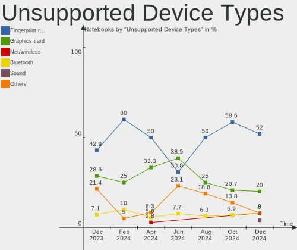

ROSA Hardware Trends (Notebook)
-------------------------------

A project to identify most popular hardware characteristics and track their change
over time based on data collected by ROSA users at https://Linux-Hardware.org.

Anyone can contribute to the study by uploading probes of their computers by
the [hw-probe](https://github.com/linuxhw/hw-probe) tool:

    sudo hw-probe -all -upload

Full-feature report is available here: https://linux-hardware.org/?view=trends&formfactor=notebook

Period: Feb, 2020.

Contents
--------

- [ OS                       ](#os)
- [ OS Family                ](#os-family)
- [ Kernel                   ](#kernel)
- [ Kernel Family            ](#kernel-family)
- [ Kernel Major Ver.        ](#kernel-major-ver)
- [ Arch                     ](#arch)
- [ DE                       ](#de)
- [ Display Server           ](#display-server)
- [ OS Lang                  ](#os-lang)
- [ Boot Mode                ](#boot-mode)
- [ Filesystem               ](#filesystem)
- [ Dual Boot with Linux     ](#dual-boot-with-linux)
- [ Dual Boot (Win)          ](#dual-boot-win)
- [ Country                  ](#country)
- [ City                     ](#city)
- [ Vendor                   ](#vendor)
- [ Model                    ](#model)
- [ Model Family             ](#model-family)
- [ MFG Year                 ](#mfg-year)
- [ Form Factor              ](#form-factor)
- [ Secure Boot              ](#secure-boot)
- [ Coreboot                 ](#coreboot)
- [ RAM Size                 ](#ram-size)
- [ RAM Used                 ](#ram-used)
- [ Drive Vendor             ](#drive-vendor)
- [ Drive Model              ](#drive-model)
- [ Drive Kind               ](#drive-kind)
- [ Drive Connector          ](#drive-connector)
- [ Drive Size               ](#drive-size)
- [ Space Total              ](#space-total)
- [ Space Used               ](#space-used)
- [ Malfunc. Drives          ](#malfunc-drives)
- [ Malfunc. Drive Vendor    ](#malfunc-drive-vendor)
- [ Malfunc. Drive Kind      ](#malfunc-drive-kind)
- [ Failed Drives            ](#failed-drives)
- [ Failed Drive Vendor      ](#failed-drive-vendor)
- [ Drive Status             ](#drive-status)
- [ Storage Vendor           ](#storage-vendor)
- [ Storage Model            ](#storage-model)
- [ Storage Kind             ](#storage-kind)
- [ CPU Vendor               ](#cpu-vendor)
- [ CPU Model                ](#cpu-model)
- [ CPU Model Family         ](#cpu-model-family)
- [ CPU Cores                ](#cpu-cores)
- [ CPU Sockets              ](#cpu-sockets)
- [ CPU Threads              ](#cpu-threads)
- [ CPU Op-Modes             ](#cpu-op-modes)
- [ CPU Microarch            ](#cpu-microarch)
- [ CPU Microcode            ](#cpu-microcode)
- [ GPU Vendor               ](#gpu-vendor)
- [ GPU Model                ](#gpu-model)
- [ GPU Combo                ](#gpu-combo)
- [ GPU Driver               ](#gpu-driver)
- [ GPU Memory               ](#gpu-memory)
- [ Monitor Vendor           ](#monitor-vendor)
- [ Monitor Model            ](#monitor-model)
- [ Monitor Resolution       ](#monitor-resolution)
- [ Monitor Diagonal         ](#monitor-diagonal)
- [ Monitor Width            ](#monitor-width)
- [ Aspect Ratio             ](#aspect-ratio)
- [ Monitor Area             ](#monitor-area)
- [ Pixel Density            ](#pixel-density)
- [ Multiple Monitors        ](#multiple-monitors)
- [ Net Controller Vendor    ](#net-controller-vendor)
- [ Net Controller Model     ](#net-controller-model)
- [ Net Controller Kind      ](#net-controller-kind)
- [ Used Controller          ](#used-controller)
- [ NICs                     ](#nics)
- [ Unsupported Devices      ](#unsupported-devices)
- [ Unsupported Device Types ](#unsupported-device-types)

OS
--

Installed operating systems

| Name      | Computers | Percent |
|-----------|-----------|---------|
| ROSA R11  | 153       | 86.93%  |
| ROSA R8.1 | 11        | 6.25%   |
| ROSA R10  | 9         | 5.11%   |
| ROSA R9   | 1         | 0.57%   |
| ROSA R12  | 1         | 0.57%   |
| RED X4    | 1         | 0.57%   |

OS Family
---------

OS without a version

| Name | Computers | Percent |
|------|-----------|---------|
| ROSA | 176       | 100%    |

Kernel
------

Version of the Linux kernel

| Version                          | Computers | Percent |
|----------------------------------|-----------|---------|
| 4.15.0-desktop-68.5rosa-x86_64   | 57        | 32.39%  |
| 4.15.0-desktop-45.1rosa-x86_64   | 55        | 31.25%  |
| 4.15.0-desktop-68.5rosa-i586     | 15        | 8.52%   |
| 4.15.0-desktop-45.1rosa-i586     | 12        | 6.82%   |
| 4.9.155-nrj-desktop-1rosa-x86_64 | 8         | 4.55%   |
| 4.9.155-nrj-desktop-1rosa-i586   | 6         | 3.41%   |
| 4.9.60-nrj-desktop-1rosa-x86_64  | 4         | 2.27%   |
| 4.9.60-nrj-desktop-1rosa-i586    | 4         | 2.27%   |
| 4.1.38-nrj-desktop-2rosa-x86_64  | 3         | 1.7%    |
| 5.4.15-nrj-desktop-1rosa-x86_64  | 2         | 1.14%   |
| 5.4.0-desktop-14.1rosa-x86_64    | 1         | 0.57%   |
| 5.0.0-desktop-38.1rosa-x86_64    | 1         | 0.57%   |
| 5.0.0-desktop-38.1rosa-i586      | 1         | 0.57%   |
| 4.9.9-nrj-desktop-1rosa-x86_64   | 1         | 0.57%   |
| 4.9.9-nrj-desktop-1rosa-i586     | 1         | 0.57%   |
| 4.9.20-nrj-desktop-1rosa-i586    | 1         | 0.57%   |
| 4.9.124-nrj-desktop-1rosa-i586   | 1         | 0.57%   |
| 4.19.0-desktop-13.1rosa-x86_64   | 1         | 0.57%   |
| 4.1.38-nrj-desktop-2rosa-i586    | 1         | 0.57%   |
| 4.1.25-nrj-desktop-1rosa-x86_64  | 1         | 0.57%   |

Kernel Family
-------------

Linux kernel without a distro release

| Version | Computers | Percent |
|---------|-----------|---------|
| 4.15.0  | 139       | 78.98%  |
| 4.9.155 | 14        | 7.95%   |
| 4.9.60  | 8         | 4.55%   |
| 4.1.38  | 4         | 2.27%   |
| 5.4.15  | 2         | 1.14%   |
| 5.0.0   | 2         | 1.14%   |
| 4.9.9   | 2         | 1.14%   |
| 5.4.0   | 1         | 0.57%   |
| 4.9.20  | 1         | 0.57%   |
| 4.9.124 | 1         | 0.57%   |
| 4.19.0  | 1         | 0.57%   |
| 4.1.25  | 1         | 0.57%   |

Kernel Major Ver.
-----------------

Linux kernel major version

| Version | Computers | Percent |
|---------|-----------|---------|
| 4.15    | 139       | 78.98%  |
| 4.9     | 26        | 14.77%  |
| 4.1     | 5         | 2.84%   |
| 5.4     | 3         | 1.7%    |
| 5.0     | 2         | 1.14%   |
| 4.19    | 1         | 0.57%   |

Arch
----

OS architecture (x86_64, i586, etc.)

| Name   | Computers | Percent |
|--------|-----------|---------|
| x86_64 | 134       | 76.14%  |
| i686   | 42        | 23.86%  |

DE
--

Desktop Environment

| Name    | Computers | Percent |
|---------|-----------|---------|
| KDE4    | 99        | 56.25%  |
| KDE5    | 70        | 39.77%  |
| XFCE    | 3         | 1.7%    |
| LXQt    | 2         | 1.14%   |
| Unknown | 2         | 1.14%   |

Display Server
--------------

X11 or Wayland

| Name    | Computers | Percent |
|---------|-----------|---------|
| X11     | 175       | 99.43%  |
| Wayland | 1         | 0.57%   |

OS Lang
-------

Language

| Lang    | Computers | Percent |
|---------|-----------|---------|
| Unknown | 169       | 96.02%  |
| ru_RU   | 7         | 3.98%   |

Boot Mode
---------

EFI or BIOS

| Mode | Computers | Percent |
|------|-----------|---------|
| BIOS | 115       | 65.34%  |
| EFI  | 61        | 34.66%  |

Filesystem
----------

Type of filesystem

| Type  | Computers | Percent |
|-------|-----------|---------|
| Ext4  | 170       | 96.59%  |
| Btrfs | 5         | 2.84%   |
| Ext3  | 1         | 0.57%   |

Dual Boot with Linux
--------------------

Hosting more than one Linux

| Dual boot | Computers | Percent |
|-----------|-----------|---------|
| No        | 149       | 84.66%  |
| Yes       | 27        | 15.34%  |

Dual Boot (Win)
---------------

Hosting Linux and Windows

| Dual boot | Computers | Percent |
|-----------|-----------|---------|
| No        | 104       | 59.09%  |
| Yes       | 72        | 40.91%  |

Country
-------

Geographic location (country)

| Country              | Computers | Percent |
|----------------------|-----------|---------|
| Russia               | 142       | 80.68%  |
| Ukraine              | 10        | 5.68%   |
| Belarus              | 4         | 2.27%   |
| Kazakhstan           | 3         | 1.7%    |
| Poland               | 2         | 1.14%   |
| Germany              | 2         | 1.14%   |
| Canada               | 2         | 1.14%   |
| Uzbekistan           | 1         | 0.57%   |
| UK                   | 1         | 0.57%   |
| Thailand             | 1         | 0.57%   |
| Romania              | 1         | 0.57%   |
| Moldova, Republic of | 1         | 0.57%   |
| Moldova              | 1         | 0.57%   |
| Latvia               | 1         | 0.57%   |
| Kyrgyzstan           | 1         | 0.57%   |
| Korea, Republic of   | 1         | 0.57%   |
| Belgium              | 1         | 0.57%   |
| Azerbaijan           | 1         | 0.57%   |

City
----

Geographic location (city)

| City              | Computers | Percent |
|-------------------|-----------|---------|
| Moscow            | 32        | 18.18%  |
| St Petersburg     | 14        | 7.95%   |
| Yekaterinburg     | 4         | 2.27%   |
| Ufa               | 4         | 2.27%   |
| Novosibirsk       | 4         | 2.27%   |
| Krasnodar         | 4         | 2.27%   |
| Voronezh          | 3         | 1.7%    |
| Tver              | 3         | 1.7%    |
| Samara            | 3         | 1.7%    |
| Khabarovsk        | 3         | 1.7%    |
| Yoshkar-Ola       | 2         | 1.14%   |
| Saratov           | 2         | 1.14%   |
| Ryazan            | 2         | 1.14%   |
| Rostov-on-Don     | 2         | 1.14%   |
| Perm              | 2         | 1.14%   |
| Ottawa            | 2         | 1.14%   |
| Nizhniy Novgorod  | 2         | 1.14%   |
| Mykolayiv         | 2         | 1.14%   |
| Kharkiv           | 2         | 1.14%   |
| Kazan’          | 2         | 1.14%   |
| Belgorod          | 2         | 1.14%   |
| Arkhangelsk       | 2         | 1.14%   |
| Zheleznogorsk     | 1         | 0.57%   |
| Zavodoukovsk      | 1         | 0.57%   |
| Zapolyarnyy       | 1         | 0.57%   |
| Zaokskiy          | 1         | 0.57%   |
| Yakutsk           | 1         | 0.57%   |
| Weinsberg         | 1         | 0.57%   |
| Warsaw            | 1         | 0.57%   |
| Volgograd         | 1         | 0.57%   |
| Veliky Novgorod   | 1         | 0.57%   |
| Vatutine          | 1         | 0.57%   |
| Ust'-Ordynskiy    | 1         | 0.57%   |
| Usinsk            | 1         | 0.57%   |
| Uporovo           | 1         | 0.57%   |
| Tyumen            | 1         | 0.57%   |
| Tula              | 1         | 0.57%   |
| Tolyatti          | 1         | 0.57%   |
| Tiraspol          | 1         | 0.57%   |
| Tikhoretsk        | 1         | 0.57%   |
| Tashkent          | 1         | 0.57%   |
| Smolensk          | 1         | 0.57%   |
| Simferopol        | 1         | 0.57%   |
| Shymkent          | 1         | 0.57%   |
| Seoul             | 1         | 0.57%   |
| Sadovyy           | 1         | 0.57%   |
| Riga              | 1         | 0.57%   |
| Pyt-Yakh          | 1         | 0.57%   |
| Pskov             | 1         | 0.57%   |
| Petropavl         | 1         | 0.57%   |
| Pervouralsk       | 1         | 0.57%   |
| Penza             | 1         | 0.57%   |
| Orekhovo-Zuyevo   | 1         | 0.57%   |
| Omsk              | 1         | 0.57%   |
| Olkusz            | 1         | 0.57%   |
| Odorheiu Secuiesc | 1         | 0.57%   |
| Odesa             | 1         | 0.57%   |
| Nur-Sultan        | 1         | 0.57%   |
| Novocheboksarsk   | 1         | 0.57%   |
| Novoaltaysk       | 1         | 0.57%   |

Vendor
------

Motherboard manufacturer

| Name                | Computers | Percent |
|---------------------|-----------|---------|
| ASUSTek Computer    | 41        | 23.3%   |
| Lenovo              | 31        | 17.61%  |
| Hewlett-Packard     | 31        | 17.61%  |
| Acer                | 20        | 11.36%  |
| Samsung Electronics | 13        | 7.39%   |
| Dell                | 10        | 5.68%   |
| Toshiba             | 5         | 2.84%   |
| Packard Bell        | 5         | 2.84%   |
| MSI                 | 4         | 2.27%   |
| Apple               | 4         | 2.27%   |
| Sony                | 2         | 1.14%   |
| Intel               | 2         | 1.14%   |
| Pegatron            | 1         | 0.57%   |
| Notebook            | 1         | 0.57%   |
| Infomash            | 1         | 0.57%   |
| Fujitsu Siemens     | 1         | 0.57%   |
| DNS                 | 1         | 0.57%   |
| Digma               | 1         | 0.57%   |
| DEXP                | 1         | 0.57%   |
| Alienware           | 1         | 0.57%   |

Model
-----

Motherboard model

| Name                                                                                                 | Computers | Percent |
|------------------------------------------------------------------------------------------------------|-----------|---------|
| ASUS K50IJ                                                                                           | 5         | 2.84%   |
| HP Notebook                                                                                          | 4         | 2.27%   |
| Packard Bell EasyNote TE11HC                                                                         | 3         | 1.7%    |
| Lenovo B570e HuronRiver Platform                                                                     | 3         | 1.7%    |
| HP Pavilion g6                                                                                       | 3         | 1.7%    |
| HP Laptop 15-bw0xx                                                                                   | 3         | 1.7%    |
| Lenovo IdeaPad Z570 HuronRiver Platform                                                              | 2         | 1.14%   |
| Lenovo G50-30 80G0                                                                                   | 2         | 1.14%   |
| HP Pavilion m6                                                                                       | 2         | 1.14%   |
| ASUS K56CM                                                                                           | 2         | 1.14%   |
| ASUS K53SC                                                                                           | 2         | 1.14%   |
| ASUS E402SA                                                                                          | 2         | 1.14%   |
| Acer Aspire 5750ZG                                                                                   | 2         | 1.14%   |
| Toshiba TECRA S3                                                                                     | 1         | 0.57%   |
| Toshiba Satellite U300                                                                               | 1         | 0.57%   |
| Toshiba Satellite L850-B5K                                                                           | 1         | 0.57%   |
| Toshiba Satellite L655                                                                               | 1         | 0.57%   |
| Toshiba QOSMIO G30                                                                                   | 1         | 0.57%   |
| Sony VGN-FZ31ZR                                                                                      | 1         | 0.57%   |
| Sony SVE1712V1RB                                                                                     | 1         | 0.57%   |
| Samsung Electronics SX20S                                                                            | 1         | 0.57%   |
| Samsung Electronics RV413/RV513/E3413                                                                | 1         | 0.57%   |
| Samsung Electronics RV408/RV508                                                                      | 1         | 0.57%   |
| Samsung Electronics R470/R420                                                                        | 1         | 0.57%   |
| Samsung Electronics R468/R418                                                                        | 1         | 0.57%   |
| Samsung Electronics P29/28/26                                                                        | 1         | 0.57%   |
| Samsung Electronics NC110P/NC108P/NC111P                                                             | 1         | 0.57%   |
| Samsung Electronics N150/N210/N220                                                                   | 1         | 0.57%   |
| Samsung Electronics N100                                                                             | 1         | 0.57%   |
| Samsung Electronics 700T1C                                                                           | 1         | 0.57%   |
| Samsung Electronics 355V4C/355V4X/355V5C/355V5X/356V4C/356V4X/356V5C/356V5X/3445VC/3445VX/3545VC/354 | 1         | 0.57%   |
| Samsung Electronics 350V5C/351V5C/3540VC/3440VC                                                      | 1         | 0.57%   |
| Samsung Electronics 300E4Z/300E5Z/300E7Z                                                             | 1         | 0.57%   |
| Pegatron A15W8                                                                                       | 1         | 0.57%   |
| Packard Bell EasyNote_BU45                                                                           | 1         | 0.57%   |
| Packard Bell EasyNote TS11SB                                                                         | 1         | 0.57%   |
| Notebook W9x0LU                                                                                      | 1         | 0.57%   |
| MSI X460/X460DX                                                                                      | 1         | 0.57%   |
| MSI MS-16F1                                                                                          | 1         | 0.57%   |
| MSI GP62 6QF                                                                                         | 1         | 0.57%   |
| MSI CR650                                                                                            | 1         | 0.57%   |
| Lenovo Z50-70 20354                                                                                  | 1         | 0.57%   |
| Lenovo V570c HuronRiver Platform                                                                     | 1         | 0.57%   |
| Lenovo V145-15AST 81MT                                                                               | 1         | 0.57%   |
| Lenovo ThinkPad X61s 7666CTO                                                                         | 1         | 0.57%   |
| Lenovo IdeaPad Z500 Touch 20221                                                                      | 1         | 0.57%   |
| Lenovo IdeaPad Z470                                                                                  | 1         | 0.57%   |
| Lenovo IdeaPad U400 HuronRiver Platform                                                              | 1         | 0.57%   |
| Lenovo IdeaPad S110 20126                                                                            | 1         | 0.57%   |
| Lenovo IdeaPad S10-2 20027                                                                           | 1         | 0.57%   |
| Lenovo IdeaPad 330S-14IKB 81F4                                                                       | 1         | 0.57%   |
| Lenovo IdeaPad 310-15ISK 80SM                                                                        | 1         | 0.57%   |
| Lenovo IdeaPad 100-15IBY 80MJ                                                                        | 1         | 0.57%   |
| Lenovo IdeaPad 100-14IBY 80MH                                                                        | 1         | 0.57%   |
| Lenovo G710 20252                                                                                    | 1         | 0.57%   |
| Lenovo G700 20251                                                                                    | 1         | 0.57%   |
| Lenovo G580 20150                                                                                    | 1         | 0.57%   |
| Lenovo G570 20079                                                                                    | 1         | 0.57%   |
| Lenovo G500 20236                                                                                    | 1         | 0.57%   |
| Lenovo G50-45 80E3                                                                                   | 1         | 0.57%   |

Model Family
------------

Motherboard model prefix

| Name                       | Computers | Percent |
|----------------------------|-----------|---------|
| Acer Aspire                | 13        | 7.39%   |
| Lenovo IdeaPad             | 11        | 6.25%   |
| HP Pavilion                | 10        | 5.68%   |
| HP Laptop                  | 6         | 3.41%   |
| Dell Inspiron              | 6         | 3.41%   |
| Packard Bell EasyNote      | 5         | 2.84%   |
| ASUS K50IJ                 | 5         | 2.84%   |
| HP Notebook                | 4         | 2.27%   |
| Toshiba Satellite          | 3         | 1.7%    |
| Lenovo B570e               | 3         | 1.7%    |
| HP ProBook                 | 3         | 1.7%    |
| HP Compaq                  | 3         | 1.7%    |
| Lenovo G50-30              | 2         | 1.14%   |
| ASUS VivoBook              | 2         | 1.14%   |
| ASUS K56CM                 | 2         | 1.14%   |
| ASUS K53SC                 | 2         | 1.14%   |
| ASUS E402SA                | 2         | 1.14%   |
| Acer TravelMate            | 2         | 1.14%   |
| Acer Nitro                 | 2         | 1.14%   |
| Acer Extensa               | 2         | 1.14%   |
| Toshiba TECRA              | 1         | 0.57%   |
| Toshiba QOSMIO             | 1         | 0.57%   |
| Sony VGN-FZ31ZR            | 1         | 0.57%   |
| Sony SVE1712V1RB           | 1         | 0.57%   |
| Samsung Electronics SX20S  | 1         | 0.57%   |
| Samsung Electronics RV413  | 1         | 0.57%   |
| Samsung Electronics RV408  | 1         | 0.57%   |
| Samsung Electronics R470   | 1         | 0.57%   |
| Samsung Electronics R468   | 1         | 0.57%   |
| Samsung Electronics P29    | 1         | 0.57%   |
| Samsung Electronics NC110P | 1         | 0.57%   |
| Samsung Electronics N150   | 1         | 0.57%   |
| Samsung Electronics N100   | 1         | 0.57%   |
| Samsung Electronics 700T1C | 1         | 0.57%   |
| Samsung Electronics 355V4C | 1         | 0.57%   |
| Samsung Electronics 350V5C | 1         | 0.57%   |
| Samsung Electronics 300E4Z | 1         | 0.57%   |
| Pegatron A15W8             | 1         | 0.57%   |
| Notebook W9x0LU            | 1         | 0.57%   |
| MSI X460                   | 1         | 0.57%   |
| MSI MS-16F1                | 1         | 0.57%   |
| MSI GP62                   | 1         | 0.57%   |
| MSI CR650                  | 1         | 0.57%   |
| Lenovo Z50-70              | 1         | 0.57%   |
| Lenovo V570c               | 1         | 0.57%   |
| Lenovo V145-15AST          | 1         | 0.57%   |
| Lenovo ThinkPad            | 1         | 0.57%   |
| Lenovo G710                | 1         | 0.57%   |
| Lenovo G700                | 1         | 0.57%   |
| Lenovo G580                | 1         | 0.57%   |
| Lenovo G570                | 1         | 0.57%   |
| Lenovo G500                | 1         | 0.57%   |
| Lenovo G50-45              | 1         | 0.57%   |
| Lenovo G460                | 1         | 0.57%   |
| Lenovo B590                | 1         | 0.57%   |
| Lenovo B575                | 1         | 0.57%   |
| Lenovo B50-30              | 1         | 0.57%   |
| Lenovo B450                | 1         | 0.57%   |
| Intel HuronRiver           | 1         | 0.57%   |
| Intel ChiefRiver           | 1         | 0.57%   |

MFG Year
--------

Motherboard manufacture year

| Year | Computers | Percent |
|------|-----------|---------|
| 2011 | 30        | 17.05%  |
| 2012 | 25        | 14.2%   |
| 2009 | 17        | 9.66%   |
| 2018 | 15        | 8.52%   |
| 2013 | 15        | 8.52%   |
| 2019 | 12        | 6.82%   |
| 2015 | 12        | 6.82%   |
| 2016 | 11        | 6.25%   |
| 2010 | 9         | 5.11%   |
| 2017 | 8         | 4.55%   |
| 2014 | 7         | 3.98%   |
| 2008 | 7         | 3.98%   |
| 2006 | 4         | 2.27%   |
| 2007 | 3         | 1.7%    |
| 2005 | 1         | 0.57%   |

Form Factor
-----------

Physical design of the computer

| Name     | Computers | Percent |
|----------|-----------|---------|
| Notebook | 176       | 100%    |

Secure Boot
-----------

Enabled or disabled

| State    | Computers | Percent |
|----------|-----------|---------|
| Disabled | 175       | 99.43%  |
| Enabled  | 1         | 0.57%   |

Coreboot
--------

Have coreboot on board

| Used | Computers | Percent |
|------|-----------|---------|
| No   | 176       | 100%    |

RAM Size
--------

Total RAM memory

| Size in GB | Computers | Percent |
|------------|-----------|---------|
| 3.01-4.0   | 63        | 35.8%   |
| 4.01-8.0   | 42        | 23.86%  |
| 1.01-2.0   | 30        | 17.05%  |
| 8.01-16.0  | 20        | 11.36%  |
| 2.01-3.0   | 12        | 6.82%   |
| 16.01-24.0 | 5         | 2.84%   |
| 0.01-1.0   | 4         | 2.27%   |

RAM Used
--------

Used RAM memory

| Used GB  | Computers | Percent |
|----------|-----------|---------|
| 0.01-1.0 | 91        | 51.7%   |
| 1.01-2.0 | 74        | 42.05%  |
| 2.01-3.0 | 7         | 3.98%   |
| 3.01-4.0 | 3         | 1.7%    |
| 4.01-8.0 | 1         | 0.57%   |

Drive Vendor
------------

Hard drive vendors

| Vendor              | Computers | Drives | Percent |
|---------------------|-----------|--------|---------|
| WDC                 | 53        | 55     | 25.12%  |
| Seagate             | 30        | 30     | 14.22%  |
| Toshiba             | 26        | 27     | 12.32%  |
| Hitachi             | 20        | 20     | 9.48%   |
| Samsung Electronics | 13        | 13     | 6.16%   |
| HGST                | 9         | 9      | 4.27%   |
| SanDisk             | 8         | 8      | 3.79%   |
| Unknown             | 7         | 7      | 3.32%   |
| SPCC                | 6         | 6      | 2.84%   |
| Kingston            | 5         | 5      | 2.37%   |
| China               | 5         | 5      | 2.37%   |
| SK Hynix            | 3         | 3      | 1.42%   |
| LITEONIT            | 3         | 3      | 1.42%   |
| HUAWEI              | 3         | 3      | 1.42%   |
| A-DATA Technology   | 3         | 3      | 1.42%   |
| Smartbuy            | 2         | 2      | 0.95%   |
| Intel               | 2         | 2      | 0.95%   |
| GOODRAM             | 2         | 2      | 0.95%   |
| Generic             | 2         | 2      | 0.95%   |
| Fujitsu             | 2         | 2      | 0.95%   |
| Transcend           | 1         | 1      | 0.47%   |
| PNY                 | 1         | 1      | 0.47%   |
| KingSpec            | 1         | 1      | 0.47%   |
| KingDian            | 1         | 1      | 0.47%   |
| JMicron             | 1         | 1      | 0.47%   |
| IBM                 | 1         | 1      | 0.47%   |
| Apple               | 1         | 1      | 0.47%   |

Drive Model
-----------

Hard drive models

| Model                        | Computers | Percent |
|------------------------------|-----------|---------|
| HTS545025B9A300 250GB        | 8         | 3.76%   |
| MQ01ABF050 500GB             | 6         | 2.82%   |
| ST1000LM024 HN-M101MBB 1TB   | 5         | 2.35%   |
| WDS120G2G0A-00JH30 120GB SSD | 4         | 1.88%   |
| ST1000LM035-1RK172 1TB       | 4         | 1.88%   |
| HTS545050A7E680 500GB        | 4         | 1.88%   |
| WD5000BPVT-24HXZT3 500GB     | 3         | 1.41%   |
| WD3200BPVT-80ZEST0 320GB     | 3         | 1.41%   |
| WD3200BPVT-22ZEST0 320GB     | 3         | 1.41%   |
| WD3200BPVT-22JJ5T0 320GB     | 3         | 1.41%   |
| ST9500325AS 500GB            | 3         | 1.41%   |
| ST500LT012-1DG142 500GB      | 3         | 1.41%   |
| Solid State Disk 120GB       | 3         | 1.41%   |
| HTS545050A7E380 500GB        | 3         | 1.41%   |
| HTS543232A7A384 320GB        | 3         | 1.41%   |
| DF4032  32GB                 | 3         | 1.41%   |
| WD5000LPVX-22V0TT0 500GB     | 2         | 0.94%   |
| WD5000LPLX-00ZNTT0 500GB     | 2         | 0.94%   |
| WD5000LPCX-24VHAT0 500GB     | 2         | 0.94%   |
| WD5000BPKX-22HPJT0 500GB     | 2         | 0.94%   |
| WD3200BPVT-24JJ5T0 320GB     | 2         | 0.94%   |
| WD10SPZX-21Z10T0 1TB         | 2         | 0.94%   |
| WD10JPVX-22JC3T0 1TB         | 2         | 0.94%   |
| WD10JPLX-00MBPT0 1TB         | 2         | 0.94%   |
| USD00  4GB                   | 2         | 0.94%   |
| SSD 240GB                    | 2         | 0.94%   |
| SSD 120GB                    | 2         | 0.94%   |
| SD/MMC/MS PRO 64GB           | 2         | 0.94%   |
| SD Storage 15GB              | 2         | 0.94%   |
| MZNLN128HAHQ-000H1 128GB SSD | 2         | 0.94%   |
| MQ01ABD100 1TB               | 2         | 0.94%   |
| MQ01ABD032 320GB             | 2         | 0.94%   |
| MK2565GSX 250GB              | 2         | 0.94%   |
| HTS547575A9E384 752GB        | 2         | 0.94%   |
| HM250HI 250GB                | 2         | 0.94%   |
| ZTSSD-S11-240G-P 240GB       | 1         | 0.47%   |
| WDS500G2B0A-00SM50 500GB SSD | 1         | 0.47%   |
| WDS480G2G0A-00JH30 480GB SSD | 1         | 0.47%   |
| WDS240G2G0A-00JH30 240GB SSD | 1         | 0.47%   |
| WD7500BPVT-22HXZT3 752GB     | 1         | 0.47%   |
| WD7500BPKX-75HPJT0 752GB     | 1         | 0.47%   |
| WD6400BPVT-80HXZT3 640GB     | 1         | 0.47%   |
| WD6400BEVT-24A0RT0 640GB     | 1         | 0.47%   |
| WD5000LPVX-00V0TT0 500GB     | 1         | 0.47%   |
| WD5000LPCX-80VHAT1 500GB     | 1         | 0.47%   |
| WD5000LPCX-60VHAT0 500GB     | 1         | 0.47%   |
| WD5000LPCX-21VHAT0 500GB     | 1         | 0.47%   |
| WD5000BPVT-75HXZT3 500GB     | 1         | 0.47%   |
| WD3200BEVT-22A23T0 320GB     | 1         | 0.47%   |
| WD3200BEKT-60V5T1 320GB      | 1         | 0.47%   |
| WD3200BEKT-60F3T1 320GB      | 1         | 0.47%   |
| WD2500LPCX-24C6HT0 250GB     | 1         | 0.47%   |
| WD2500BPVT-24JJ5T0 250GB     | 1         | 0.47%   |
| WD2500BPVT-00JJ5T0 250GB     | 1         | 0.47%   |
| WD1600BEVT-75ZCT2 160GB      | 1         | 0.47%   |
| WD10SPZX-75Z10T1 1TB         | 1         | 0.47%   |
| WD10SPZX-00Z10T0 1TB         | 1         | 0.47%   |
| WD10JPVX-60JC3T0 1TB         | 1         | 0.47%   |
| TS32GPSD330 32GB SSD         | 1         | 0.47%   |
| TR200 240GB SSD              | 1         | 0.47%   |

Drive Kind
----------

HDD or SSD

| Kind    | Computers | Drives | Percent |
|---------|-----------|--------|---------|
| HDD     | 136       | 140    | 64.76%  |
| SSD     | 57        | 57     | 27.14%  |
| MMC     | 8         | 8      | 3.81%   |
| Unknown | 6         | 6      | 2.86%   |
| NVMe    | 3         | 3      | 1.43%   |

Drive Connector
---------------

SATA, SAS, NVMe, etc.

| Type | Computers | Drives | Percent |
|------|-----------|--------|---------|
| SATA | 171       | 197    | 90.96%  |
| MMC  | 8         | 8      | 4.26%   |
| SAS  | 6         | 6      | 3.19%   |
| NVMe | 3         | 3      | 1.6%    |

Drive Size
----------

Size of hard drive

| Size in TB | Computers | Drives | Percent |
|------------|-----------|--------|---------|
| 0.01-0.5   | 146       | 168    | 76.44%  |
| 0.51-1.0   | 44        | 45     | 23.04%  |
| 1.01-2.0   | 1         | 1      | 0.52%   |

Space Total
-----------

Amount of disk space available on the file system

| Size in GB | Computers | Percent |
|------------|-----------|---------|
| 101-250    | 52        | 29.55%  |
| 251-500    | 44        | 25%     |
| 501-1000   | 25        | 14.2%   |
| 1-20       | 18        | 10.23%  |
| 51-100     | 17        | 9.66%   |
| 21-50      | 16        | 9.09%   |
| 1001-2000  | 3         | 1.7%    |
| 2001-3000  | 1         | 0.57%   |

Space Used
----------

Amount of used disk space

| Used GB   | Computers | Percent |
|-----------|-----------|---------|
| 1-20      | 127       | 72.16%  |
| 21-50     | 15        | 8.52%   |
| 101-250   | 14        | 7.95%   |
| 51-100    | 9         | 5.11%   |
| 251-500   | 6         | 3.41%   |
| 501-1000  | 4         | 2.27%   |
| 1001-2000 | 1         | 0.57%   |

Malfunc. Drives
---------------

Drive models with a malfunction

| Model                          | Computers | Drives | Percent |
|--------------------------------|-----------|--------|---------|
| HTS545025B9A300 250GB          | 6         | 6      | 10%     |
| WD3200BPVT-22ZEST0 320GB       | 2         | 2      | 3.33%   |
| ST9500325AS 500GB              | 2         | 2      | 3.33%   |
| MK2565GSX 250GB                | 2         | 2      | 3.33%   |
| HTS545050A7E680 500GB          | 2         | 2      | 3.33%   |
| HTS543232A7A384 320GB          | 2         | 2      | 3.33%   |
| WD6400BEVT-24A0RT0 640GB       | 1         | 1      | 1.67%   |
| WD5000LPVX-00V0TT0 500GB       | 1         | 1      | 1.67%   |
| WD5000LPCX-24VHAT0 500GB       | 1         | 1      | 1.67%   |
| WD3200BPVT-80ZEST0 320GB       | 1         | 1      | 1.67%   |
| WD3200BEVT-22A23T0 320GB       | 1         | 1      | 1.67%   |
| WD3200BEKT-60F3T1 320GB        | 1         | 1      | 1.67%   |
| WD10JPVX-60JC3T0 1TB           | 1         | 1      | 1.67%   |
| TS32GPSD330 32GB SSD           | 1         | 1      | 1.67%   |
| ST980811AS 80GB                | 1         | 1      | 1.67%   |
| ST9250315AS 250GB              | 1         | 1      | 1.67%   |
| ST500LT012-1DG142 500GB        | 1         | 1      | 1.67%   |
| ST320LT020-9YG142 320GB        | 1         | 1      | 1.67%   |
| ST320LT012-9WS14C 320GB        | 1         | 1      | 1.67%   |
| ST1000LM024 HN-M101MBB 1TB     | 1         | 1      | 1.67%   |
| ST1000LM014-SSHD-8GB           | 1         | 1      | 1.67%   |
| ST1000LM014-1EJ164 1TB         | 1         | 1      | 1.67%   |
| SSDSA2M080G2GC 80GB            | 1         | 1      | 1.67%   |
| SSD2SC240G1LC709B121-443 240GB | 1         | 1      | 1.67%   |
| SSD U100 64GB                  | 1         | 1      | 1.67%   |
| SSD 240GB                      | 1         | 1      | 1.67%   |
| SHFS37A120G 120GB SSD          | 1         | 1      | 1.67%   |
| SD9SN8W-128G-1006 128GB SSD    | 1         | 1      | 1.67%   |
| SC210 2.5 7MM 128GB SSD        | 1         | 1      | 1.67%   |
| MQ01ABF050 500GB               | 1         | 1      | 1.67%   |
| MQ01ABD100V 1TB                | 1         | 1      | 1.67%   |
| MQ01ABD050 500GB               | 1         | 1      | 1.67%   |
| MK6476GSX 640GB                | 1         | 1      | 1.67%   |
| MK6475GSX 640GB                | 1         | 1      | 1.67%   |
| MK6461GSY 640GB                | 1         | 1      | 1.67%   |
| MK5059GSXP 500GB               | 1         | 1      | 1.67%   |
| MK2556GSY 250GB                | 1         | 1      | 1.67%   |
| MK1637GSX 160GB                | 1         | 2      | 1.67%   |
| MHX2300BT 304GB                | 1         | 1      | 1.67%   |
| LMN-256M3M mSATA 256GB SSD     | 1         | 1      | 1.67%   |
| HTS721060G9SA00 64GB           | 1         | 1      | 1.67%   |
| HTS547575A9E384 752GB          | 1         | 1      | 1.67%   |
| HTS547564A9E384 640GB          | 1         | 1      | 1.67%   |
| HTS547550A9E384 500GB          | 1         | 1      | 1.67%   |
| HTS545050A7E660 500GB          | 1         | 1      | 1.67%   |
| HTS541680J9SA00 80GB           | 1         | 1      | 1.67%   |
| HTS421260H9AT00 64GB           | 1         | 1      | 1.67%   |
| HN-M101MBB 1TB                 | 1         | 1      | 1.67%   |
| HM250HI 250GB                  | 1         | 1      | 1.67%   |
| HDWJ110 1TB                    | 1         | 1      | 1.67%   |

Malfunc. Drive Vendor
---------------------

Vendors of faulty drives

| Vendor              | Computers | Drives | Percent |
|---------------------|-----------|--------|---------|
| Hitachi             | 14        | 14     | 23.33%  |
| Toshiba             | 12        | 13     | 20%     |
| Seagate             | 10        | 10     | 16.67%  |
| WDC                 | 9         | 9      | 15%     |
| HGST                | 3         | 3      | 5%      |
| SanDisk             | 2         | 2      | 3.33%   |
| Samsung Electronics | 2         | 2      | 3.33%   |
| Transcend           | 1         | 1      | 1.67%   |
| Smartbuy            | 1         | 1      | 1.67%   |
| SK Hynix            | 1         | 1      | 1.67%   |
| PNY                 | 1         | 1      | 1.67%   |
| LITEONIT            | 1         | 1      | 1.67%   |
| Kingston            | 1         | 1      | 1.67%   |
| Intel               | 1         | 1      | 1.67%   |
| Fujitsu             | 1         | 1      | 1.67%   |

Malfunc. Drive Kind
-------------------

Kinds of faulty drives

| Kind | Computers | Drives | Percent |
|------|-----------|--------|---------|
| HDD  | 51        | 52     | 85%     |
| SSD  | 9         | 9      | 15%     |

Failed Drives
-------------

Failed drive models

Zero info for selected period =(

Failed Drive Vendor
-------------------

Failed drive vendors

Zero info for selected period =(

Drive Status
------------

Number of failed and malfunc. drives

| Status   | Computers | Drives | Percent |
|----------|-----------|--------|---------|
| Works    | 122       | 136    | 61.62%  |
| Malfunc  | 60        | 61     | 30.3%   |
| Detected | 16        | 17     | 8.08%   |

Storage Vendor
--------------

Storage controller vendors

| Vendor                           | Computers | Percent |
|----------------------------------|-----------|---------|
| Intel                            | 133       | 76%     |
| AMD                              | 35        | 20%     |
| Nvidia                           | 2         | 1.14%   |
| VIA Technologies                 | 1         | 0.57%   |
| Silicon Integrated Systems [SiS] | 1         | 0.57%   |
| Sandisk                          | 1         | 0.57%   |
| Samsung Electronics              | 1         | 0.57%   |
| Realtek Semiconductor            | 1         | 0.57%   |

Storage Model
-------------

Storage controller models

| Model                                                                            | Computers | Percent |
|----------------------------------------------------------------------------------|-----------|---------|
| 6 Series/C200 Series Chipset Family 6 port Mobile SATA AHCI Controller           | 21        | 10.55%  |
| FCH SATA Controller [AHCI mode]                                                  | 20        | 10.05%  |
| 7 Series Chipset Family 6-port SATA Controller [AHCI mode]                       | 20        | 10.05%  |
| 82801IBM/IEM (ICH9M/ICH9M-E) 4 port SATA Controller [AHCI mode]                  | 16        | 8.04%   |
| SB7x0/SB8x0/SB9x0 SATA Controller [AHCI mode]                                    | 10        | 5.03%   |
| 5 Series/3400 Series Chipset 4 port SATA AHCI Controller                         | 8         | 4.02%   |
| Sunrise Point-LP SATA Controller [AHCI mode]                                     | 7         | 3.52%   |
| 82801HM/HEM (ICH8M/ICH8M-E) IDE Controller                                       | 7         | 3.52%   |
| NM10/ICH7 Family SATA Controller [AHCI mode]                                     | 5         | 2.51%   |
| Atom/Celeron/Pentium Processor x5-E8000/J3xxx/N3xxx Series SATA Controller       | 5         | 2.51%   |
| Atom Processor E3800 Series SATA AHCI Controller                                 | 5         | 2.51%   |
| 8 Series SATA Controller 1 [AHCI mode]                                           | 5         | 2.51%   |
| 82801HM/HEM (ICH8M/ICH8M-E) SATA Controller [AHCI mode]                          | 4         | 2.01%   |
| 82801 Mobile SATA Controller [RAID mode]                                         | 4         | 2.01%   |
| Wildcat Point-LP SATA Controller [AHCI Mode]                                     | 3         | 1.51%   |
| SB7x0/SB8x0/SB9x0 IDE Controller                                                 | 3         | 1.51%   |
| 82801HM/HEM (ICH8M/ICH8M-E) SATA Controller [IDE mode]                           | 3         | 1.51%   |
| 82801GBM/GHM (ICH7-M Family) SATA Controller [AHCI mode]                         | 3         | 1.51%   |
| 82801G (ICH7 Family) IDE Controller                                              | 3         | 1.51%   |
| 8 Series/C220 Series Chipset Family 6-port SATA Controller 1 [AHCI mode]         | 3         | 1.51%   |
| 7 Series Chipset Family 4-port SATA Controller [IDE mode]                        | 3         | 1.51%   |
| 7 Series Chipset Family 2-port SATA Controller [IDE mode]                        | 3         | 1.51%   |
| SB7x0/SB8x0/SB9x0 SATA Controller [IDE mode]                                     | 2         | 1.01%   |
| SATA controller                                                                  | 2         | 1.01%   |
| Mobile PM965/GM965 PT IDER Controller                                            | 2         | 1.01%   |
| HM170/QM170 Chipset SATA Controller [AHCI Mode]                                  | 2         | 1.01%   |
| Celeron N3350/Pentium N4200/Atom E3900 Series SATA AHCI Controller               | 2         | 1.01%   |
| 82801GBM/GHM (ICH7-M Family) SATA Controller [IDE mode]                          | 2         | 1.01%   |
| 82801FB/FBM/FR/FW/FRW (ICH6 Family) IDE Controller                               | 2         | 1.01%   |
| 6 Series/C200 Series Chipset Family Mobile SATA Controller (IDE mode, ports 4-5) | 2         | 1.01%   |
| 6 Series/C200 Series Chipset Family Mobile SATA Controller (IDE mode, ports 0-3) | 2         | 1.01%   |
| 5 Series/3400 Series Chipset 6 port SATA AHCI Controller                         | 2         | 1.01%   |
| WD Black 2018/PC SN520 NVMe SSD                                                  | 1         | 0.5%    |
| VT82C586A/B/VT82C686/A/B/VT823x/A/C PIPC Bus Master IDE                          | 1         | 0.5%    |
| VT8237A SATA 2-Port Controller                                                   | 1         | 0.5%    |
| US15W/US15X/US15L/UL11L SCH [Poulsbo] IDE Controller                             | 1         | 0.5%    |
| SSD Pro 7600p/760p/E 6100p Series                                                | 1         | 0.5%    |
| SB200 IDE Controller                                                             | 1         | 0.5%    |
| SATA Controller / IDE mode                                                       | 1         | 0.5%    |
| Realtek Non-Volatile memory controller                                           | 1         | 0.5%    |
| MCP89 SATA Controller (AHCI mode)                                                | 1         | 0.5%    |
| MCP79 AHCI Controller                                                            | 1         | 0.5%    |
| IXP SB4x0 Serial ATA Controller                                                  | 1         | 0.5%    |
| IXP SB4x0 IDE Controller                                                         | 1         | 0.5%    |
| FCH SATA Controller [IDE mode]                                                   | 1         | 0.5%    |
| FCH IDE Controller                                                               | 1         | 0.5%    |
| Electronics SATA controller                                                      | 1         | 0.5%    |
| Cannon Lake Mobile PCH SATA AHCI Controller                                      | 1         | 0.5%    |
| 82801FBM (ICH6M) SATA Controller                                                 | 1         | 0.5%    |
| 5513 IDE Controller                                                              | 1         | 0.5%    |

Storage Kind
------------

Kind of storage controller (IDE, SATA, NVMe, SAS, ...)

| Kind | Computers | Percent |
|------|-----------|---------|
| SATA | 151       | 80.75%  |
| IDE  | 29        | 15.51%  |
| RAID | 4         | 2.14%   |
| NVMe | 3         | 1.6%    |

CPU Vendor
----------

Processor vendors

| Vendor | Computers | Percent |
|--------|-----------|---------|
| Intel  | 142       | 80.68%  |
| AMD    | 34        | 19.32%  |

CPU Model
---------

Processor models

| Model                                        | Computers | Percent |
|----------------------------------------------|-----------|---------|
| Intel Celeron Dual-Core CPU T3100 @ 1.90GHz  | 5         | 2.84%   |
| Intel Pentium CPU B950 @ 2.10GHz             | 4         | 2.27%   |
| Intel Core i5-3210M CPU @ 2.50GHz            | 4         | 2.27%   |
| Intel Core i5-2450M CPU @ 2.50GHz            | 4         | 2.27%   |
| Intel Core i3-2350M CPU @ 2.30GHz            | 4         | 2.27%   |
| AMD A4-9120 RADEON R3, 4 COMPUTE CORES 2C+2G | 4         | 2.27%   |
| Intel Pentium CPU B960 @ 2.20GHz             | 3         | 1.7%    |
| Intel Core i7-2670QM CPU @ 2.20GHz           | 3         | 1.7%    |
| Intel Celeron CPU N3050 @ 1.60GHz            | 3         | 1.7%    |
| Intel Pentium M processor 1.73GHz            | 2         | 1.14%   |
| Intel Pentium Dual-Core CPU T4400 @ 2.20GHz  | 2         | 1.14%   |
| Intel Pentium Dual-Core CPU T4300 @ 2.10GHz  | 2         | 1.14%   |
| Intel Pentium CPU P6200 @ 2.13GHz            | 2         | 1.14%   |
| Intel Core i7-3630QM CPU @ 2.40GHz           | 2         | 1.14%   |
| Intel Core i7 CPU Q 720 @ 1.60GHz            | 2         | 1.14%   |
| Intel Core i5-4210U CPU @ 1.70GHz            | 2         | 1.14%   |
| Intel Core i5-3317U CPU @ 1.70GHz            | 2         | 1.14%   |
| Intel Core i5-2430M CPU @ 2.40GHz            | 2         | 1.14%   |
| Intel Core i3-5005U CPU @ 2.00GHz            | 2         | 1.14%   |
| Intel Core i3-2330M CPU @ 2.20GHz            | 2         | 1.14%   |
| Intel Core i3-2310M CPU @ 2.10GHz            | 2         | 1.14%   |
| Intel Core 2 Duo CPU T8300 @ 2.40GHz         | 2         | 1.14%   |
| Intel Celeron CPU N2840 @ 2.16GHz            | 2         | 1.14%   |
| Intel Celeron CPU N2830 @ 2.16GHz            | 2         | 1.14%   |
| Intel Celeron CPU B830 @ 1.80GHz             | 2         | 1.14%   |
| Intel Atom x5-Z8350 CPU @ 1.44GHz            | 2         | 1.14%   |
| AMD E1-6015 APU with Radeon R2 Graphics      | 2         | 1.14%   |
| AMD E-450 APU with Radeon HD Graphics        | 2         | 1.14%   |
| AMD E-300 APU with Radeon HD Graphics        | 2         | 1.14%   |
| AMD A6-9225 RADEON R4, 5 COMPUTE CORES 2C+3G | 2         | 1.14%   |
| AMD A10-4600M APU with Radeon HD Graphics    | 2         | 1.14%   |
| Intel Pentium Silver N5000 CPU @ 1.10GHz     | 1         | 0.57%   |
| Intel Pentium Dual-Core CPU T4200 @ 2.00GHz  | 1         | 0.57%   |
| Intel Pentium Dual CPU T3400 @ 2.16GHz       | 1         | 0.57%   |
| Intel Pentium Dual CPU T2370 @ 1.73GHz       | 1         | 0.57%   |
| Intel Pentium CPU N3710 @ 1.60GHz            | 1         | 0.57%   |
| Intel Pentium CPU N3530 @ 2.16GHz            | 1         | 0.57%   |
| Intel Pentium CPU 987 @ 1.50GHz              | 1         | 0.57%   |
| Intel Pentium CPU 4417U @ 2.30GHz            | 1         | 0.57%   |
| Intel Pentium CPU 4415U @ 2.30GHz            | 1         | 0.57%   |
| Intel Pentium CPU 2127U @ 1.90GHz            | 1         | 0.57%   |
| Intel Pentium CPU 2020M @ 2.40GHz            | 1         | 0.57%   |
| Intel Genuine CPU T1500 @ 1.86GHz            | 1         | 0.57%   |
| Intel Genuine CPU T1350 @ 1.86GHz            | 1         | 0.57%   |
| Intel Core i7-8750H CPU @ 2.20GHz            | 1         | 0.57%   |
| Intel Core i7-8550U CPU @ 1.80GHz            | 1         | 0.57%   |
| Intel Core i7-6700HQ CPU @ 2.60GHz           | 1         | 0.57%   |
| Intel Core i7-4800MQ CPU @ 2.70GHz           | 1         | 0.57%   |
| Intel Core i7-4720HQ CPU @ 2.60GHz           | 1         | 0.57%   |
| Intel Core i7-4700HQ CPU @ 2.40GHz           | 1         | 0.57%   |
| Intel Core i7-4510U CPU @ 2.00GHz            | 1         | 0.57%   |
| Intel Core i7-3520M CPU @ 2.90GHz            | 1         | 0.57%   |
| Intel Core i7-3517U CPU @ 1.90GHz            | 1         | 0.57%   |
| Intel Core i7-2630QM CPU @ 2.00GHz           | 1         | 0.57%   |
| Intel Core i7 CPU M 620 @ 2.67GHz            | 1         | 0.57%   |
| Intel Core i5-8300H CPU @ 2.30GHz            | 1         | 0.57%   |
| Intel Core i5-7300HQ CPU @ 2.50GHz           | 1         | 0.57%   |
| Intel Core i5-6200U CPU @ 2.30GHz            | 1         | 0.57%   |
| Intel Core i5-5350U CPU @ 1.80GHz            | 1         | 0.57%   |
| Intel Core i5-5200U CPU @ 2.20GHz            | 1         | 0.57%   |

CPU Model Family
----------------

Processor model prefix

| Model                   | Computers | Percent |
|-------------------------|-----------|---------|
| Intel Core i5           | 26        | 14.77%  |
| Intel Core i3           | 21        | 11.93%  |
| Intel Core i7           | 18        | 10.23%  |
| Intel Pentium           | 16        | 9.09%   |
| Intel Celeron           | 16        | 9.09%   |
| Intel Core 2 Duo        | 13        | 7.39%   |
| Intel Atom              | 10        | 5.68%   |
| Intel Celeron Dual-Core | 6         | 3.41%   |
| AMD E                   | 6         | 3.41%   |
| AMD A4                  | 6         | 3.41%   |
| Intel Pentium Dual-Core | 5         | 2.84%   |
| AMD A6                  | 5         | 2.84%   |
| Intel Core 2            | 3         | 1.7%    |
| AMD E2                  | 3         | 1.7%    |
| AMD A10                 | 3         | 1.7%    |
| Intel Pentium M         | 2         | 1.14%   |
| Intel Pentium Dual      | 2         | 1.14%   |
| Intel Genuine           | 2         | 1.14%   |
| AMD E1                  | 2         | 1.14%   |
| AMD Athlon X2           | 2         | 1.14%   |
| AMD A8                  | 2         | 1.14%   |
| Intel Pentium Silver    | 1         | 0.57%   |
| Intel Celeron M         | 1         | 0.57%   |
| AMD Turion 64 X2 Mobile | 1         | 0.57%   |
| AMD C-30                | 1         | 0.57%   |
| AMD Athlon Neo          | 1         | 0.57%   |
| AMD Athlon II Dual-Core | 1         | 0.57%   |
| AMD Athlon II           | 1         | 0.57%   |

CPU Cores
---------

Number of processor cores

| Number | Computers | Percent |
|--------|-----------|---------|
| 2      | 132       | 75%     |
| 4      | 27        | 15.34%  |
| 1      | 16        | 9.09%   |
| 6      | 1         | 0.57%   |

CPU Sockets
-----------

Number of sockets

| Number | Computers | Percent |
|--------|-----------|---------|
| 1      | 176       | 100%    |

CPU Threads
-----------

Threads per core (Hyper-Threading)

| Number | Computers | Percent |
|--------|-----------|---------|
| 1      | 96        | 54.55%  |
| 2      | 80        | 45.45%  |

CPU Op-Modes
------------

CPU Operation Modes (32-bit, 64-bit)

| Op mode        | Computers | Percent |
|----------------|-----------|---------|
| 32-bit, 64-bit | 168       | 95.45%  |
| 32-bit         | 8         | 4.55%   |

CPU Microarch
-------------

Microarchitecture

| Name            | Computers | Percent |
|-----------------|-----------|---------|
| SandyBridge     | 30        | 17.05%  |
| Core            | 30        | 17.05%  |
| IvyBridge       | 17        | 9.66%   |
| Silvermont      | 13        | 7.39%   |
| Skylake         | 10        | 5.68%   |
| Haswell         | 9         | 5.11%   |
| Westmere        | 8         | 4.55%   |
| Bonnell         | 8         | 4.55%   |
| Excavator       | 7         | 3.98%   |
| Bobcat          | 6         | 3.41%   |
| Piledriver      | 5         | 2.84%   |
| Puma            | 4         | 2.27%   |
| P6              | 4         | 2.27%   |
| Broadwell       | 4         | 2.27%   |
| Unknown         | 3         | 1.7%    |
| Nehalem         | 2         | 1.14%   |
| KabyLake        | 2         | 1.14%   |
| K8 Hammer       | 2         | 1.14%   |
| K8 & K10 hybrid | 2         | 1.14%   |
| K10             | 2         | 1.14%   |
| Jaguar          | 2         | 1.14%   |
| Goldmont plus   | 2         | 1.14%   |
| Goldmont        | 2         | 1.14%   |
| Penryn          | 1         | 0.57%   |
| K10 Llano       | 1         | 0.57%   |

CPU Microcode
-------------

Microcode number

| Number     | Computers | Percent |
|------------|-----------|---------|
| 0x206a7    | 29        | 16.48%  |
| 0x306a9    | 17        | 9.66%   |
| 0x1067a    | 13        | 7.39%   |
| Unknown    | 11        | 6.25%   |
| 0x6fd      | 6         | 3.41%   |
| 0x20655    | 6         | 3.41%   |
| 0x06001119 | 6         | 3.41%   |
| 0x30678    | 5         | 2.84%   |
| 0x10676    | 5         | 2.84%   |
| 0x406c3    | 4         | 2.27%   |
| 0x40651    | 4         | 2.27%   |
| 0x306d4    | 4         | 2.27%   |
| 0x306c3    | 4         | 2.27%   |
| 0x05000119 | 4         | 2.27%   |
| 0x6f6      | 3         | 1.7%    |
| 0x6d8      | 3         | 1.7%    |
| 0x406c4    | 3         | 1.7%    |
| 0x106ca    | 3         | 1.7%    |
| 0x106c2    | 3         | 1.7%    |
| 0x07030105 | 3         | 1.7%    |
| 0x06006705 | 3         | 1.7%    |
| 0x06006704 | 3         | 1.7%    |
| 0x05000029 | 3         | 1.7%    |
| 0x906ea    | 2         | 1.14%   |
| 0x806e9    | 2         | 1.14%   |
| 0x706a1    | 2         | 1.14%   |
| 0x6fb      | 2         | 1.14%   |
| 0x506c9    | 2         | 1.14%   |
| 0x406e3    | 2         | 1.14%   |
| 0x30661    | 2         | 1.14%   |
| 0x20652    | 2         | 1.14%   |
| 0x106e5    | 2         | 1.14%   |
| 0x0700010f | 2         | 1.14%   |
| 0x03000027 | 2         | 1.14%   |
| 0x02000057 | 2         | 1.14%   |
| 0x906e9    | 1         | 0.57%   |
| 0x806ea    | 1         | 0.57%   |
| 0x6e8      | 1         | 0.57%   |
| 0x506e3    | 1         | 0.57%   |
| 0x10661    | 1         | 0.57%   |
| 0x07030106 | 1         | 0.57%   |
| 0x010000c8 | 1         | 0.57%   |

GPU Vendor
----------

Vendors of graphics cards

| Vendor           | Computers | Percent |
|------------------|-----------|---------|
| Intel            | 119       | 52.65%  |
| Nvidia           | 54        | 23.89%  |
| AMD              | 52        | 23.01%  |
| VIA Technologies | 1         | 0.44%   |

GPU Model
---------

Graphics card models

| Model                                                                              | Computers | Percent |
|------------------------------------------------------------------------------------|-----------|---------|
| 2nd Generation Core Processor Family Integrated Graphics Controller                | 28        | 11.48%  |
| 3rd Gen Core processor Graphics Controller                                         | 16        | 6.56%   |
| Mobile 4 Series Chipset Integrated Graphics Controller                             | 11        | 4.51%   |
| Atom/Celeron/Pentium Processor x5-E8000/J3xxx/N3xxx Integrated Graphics Controller | 8         | 3.28%   |
| Stoney [Radeon R2/R3/R4/R5 Graphics]                                               | 7         | 2.87%   |
| Thames [Radeon HD 7500M/7600M Series]                                              | 6         | 2.46%   |
| Mobile GM965/GL960 Integrated Graphics Controller (secondary)                      | 6         | 2.46%   |
| Mobile GM965/GL960 Integrated Graphics Controller (primary)                        | 6         | 2.46%   |
| Seymour [Radeon HD 6400M/7400M Series]                                             | 5         | 2.05%   |
| Mobile 945GM/GMS/GME, 943/940GML Express Integrated Graphics Controller            | 5         | 2.05%   |
| GF117M [GeForce 610M/710M/810M/820M / GT 620M/625M/630M/720M]                      | 5         | 2.05%   |
| Core Processor Integrated Graphics Controller                                      | 5         | 2.05%   |
| Atom Processor Z36xxx/Z37xxx Series Graphics & Display                             | 5         | 2.05%   |
| Wrestler [Radeon HD 6310]                                                          | 4         | 1.64%   |
| Haswell-ULT Integrated Graphics Controller                                         | 4         | 1.64%   |
| Skylake GT2 [HD Graphics 520]                                                      | 3         | 1.23%   |
| Mobile 945GM/GMS, 943/940GML Express Integrated Graphics Controller                | 3         | 1.23%   |
| HD Graphics 5500                                                                   | 3         | 1.23%   |
| GM108M [GeForce 840M]                                                              | 3         | 1.23%   |
| GF119M [GeForce 410M]                                                              | 3         | 1.23%   |
| GF108M [GeForce GT 620M/630M/635M/640M LE]                                         | 3         | 1.23%   |
| Atom Processor D4xx/D5xx/N4xx/N5xx Integrated Graphics Controller                  | 3         | 1.23%   |
| 4th Gen Core Processor Integrated Graphics Controller                              | 3         | 1.23%   |
| UHD Graphics 630 (Mobile)                                                          | 2         | 0.82%   |
| UHD Graphics 605                                                                   | 2         | 0.82%   |
| Trinity [Radeon HD 7660G]                                                          | 2         | 0.82%   |
| Topaz XT [Radeon R7 M260/M265 / M340/M360 / M440/M445 / 530/535 / 620/625 Mobile]  | 2         | 0.82%   |
| Thames [Radeon HD 7550M/7570M/7650M]                                               | 2         | 0.82%   |
| Sun XT [Radeon HD 8670A/8670M/8690M / R5 M330 / M430 / Radeon 520 Mobile]          | 2         | 0.82%   |
| RV710/M92 [Mobility Radeon HD 4530/4570/545v]                                      | 2         | 0.82%   |
| RS880M [Mobility Radeon HD 4225/4250]                                              | 2         | 0.82%   |
| RS780M [Mobility Radeon HD 3200]                                                   | 2         | 0.82%   |
| Mullins [Radeon R4/R5 Graphics]                                                    | 2         | 0.82%   |
| Mobile 945GSE Express Integrated Graphics Controller                               | 2         | 0.82%   |
| Kaby Lake-U GT1 Integrated Graphics Controller                                     | 2         | 0.82%   |
| Kabini [Radeon HD 8240 / R3 Series]                                                | 2         | 0.82%   |
| HD Graphics 500                                                                    | 2         | 0.82%   |
| GP107M [GeForce GTX 1050 Ti Mobile]                                                | 2         | 0.82%   |
| GM108M [GeForce 920MX]                                                             | 2         | 0.82%   |
| GK208BM [GeForce 920M]                                                             | 2         | 0.82%   |
| GF119M [GeForce GT 520MX]                                                          | 2         | 0.82%   |
| GF108M [GeForce GT 635M]                                                           | 2         | 0.82%   |
| GF108M [GeForce GT 540M]                                                           | 2         | 0.82%   |
| GF108M [GeForce GT 520M]                                                           | 2         | 0.82%   |
| G86M [GeForce 8600M GS]                                                            | 2         | 0.82%   |
| Atom Processor D2xxx/N2xxx Integrated Graphics Controller                          | 2         | 0.82%   |
| Wrestler [Radeon HD 6320]                                                          | 1         | 0.41%   |
| Wrestler [Radeon HD 6250]                                                          | 1         | 0.41%   |
| US15W/US15X SCH [Poulsbo] Graphics Controller                                      | 1         | 0.41%   |
| UHD Graphics 620                                                                   | 1         | 0.41%   |
| Trinity [Radeon HD 7620G]                                                          | 1         | 0.41%   |
| Trinity 2 [Radeon HD 7520G]                                                        | 1         | 0.41%   |
| Trinity 2 [Radeon HD 7420G]                                                        | 1         | 0.41%   |
| Sun PRO [Radeon HD 8570A/8570M]                                                    | 1         | 0.41%   |
| Sumo [Radeon HD 6520G]                                                             | 1         | 0.41%   |
| Sumo [Radeon HD 6480G]                                                             | 1         | 0.41%   |
| RV710/M92 [Mobility Radeon HD 4350/4550]                                           | 1         | 0.41%   |
| RV620/M82 [Mobility Radeon HD 3450/3470]                                           | 1         | 0.41%   |
| RS482M [Mobility Radeon Xpress 200]                                                | 1         | 0.41%   |
| RS300M [Mobility Radeon 9100 IGP]                                                  | 1         | 0.41%   |

GPU Combo
---------

Combinations of graphics cards

| Name           | Computers | Percent |
|----------------|-----------|---------|
| 1 x Intel      | 69        | 39.2%   |
| Intel + Nvidia | 41        | 23.3%   |
| 1 x AMD        | 36        | 20.45%  |
| 1 x Nvidia     | 13        | 7.39%   |
| Intel + AMD    | 9         | 5.11%   |
| 2 x AMD        | 7         | 3.98%   |
| 1 x VIA        | 1         | 0.57%   |

GPU Driver
----------

Free vs proprietary

| Driver      | Computers | Percent |
|-------------|-----------|---------|
| Free        | 165       | 93.75%  |
| Unknown     | 7         | 3.98%   |
| Proprietary | 4         | 2.27%   |

GPU Memory
----------

Total video memory

| Size in GB | Computers | Percent |
|------------|-----------|---------|
| 1.01-2.0   | 72        | 40.91%  |
| 0.01-0.5   | 52        | 29.55%  |
| Unknown    | 25        | 14.2%   |
| 3.01-4.0   | 16        | 9.09%   |
| 0.51-1.0   | 9         | 5.11%   |
| 2.01-3.0   | 2         | 1.14%   |

Monitor Vendor
--------------

Monitor vendors

| Vendor                  | Computers | Percent |
|-------------------------|-----------|---------|
| AU Optronics            | 45        | 26.16%  |
| LG Display              | 23        | 13.37%  |
| Chimei Innolux          | 22        | 12.79%  |
| Samsung Electronics     | 18        | 10.47%  |
| BOE                     | 17        | 9.88%   |
| Chi Mei Optoelectronics | 13        | 7.56%   |
| Lenovo                  | 6         | 3.49%   |
| HannStar                | 6         | 3.49%   |
| CPT                     | 5         | 2.91%   |
| Apple                   | 5         | 2.91%   |
| LG Philips              | 4         | 2.33%   |
| Sony                    | 2         | 1.16%   |
| ViewSonic               | 1         | 0.58%   |
| Toshiba                 | 1         | 0.58%   |
| Sharp                   | 1         | 0.58%   |
| Nvidia                  | 1         | 0.58%   |
| Hewlett-Packard         | 1         | 0.58%   |
| Acer                    | 1         | 0.58%   |

Monitor Model
-------------

Monitor models

| Model                                               | Computers | Percent |
|-----------------------------------------------------|-----------|---------|
| LCD Monitor AUO22EC 1366x768 344x193mm 15.5-inch    | 8         | 4.62%   |
| LCD Monitor LGD01E8 1366x768 340x190mm 15.3-inch    | 6         | 3.47%   |
| LCD Monitor BOE06A5 1366x768 344x194mm 15.5-inch    | 5         | 2.89%   |
| LCD Monitor AUO26EC 1366x768 344x193mm 15.5-inch    | 5         | 2.89%   |
| LCD Monitor LEN40B0 1366x768 344x194mm 15.5-inch    | 4         | 2.31%   |
| LCD Monitor CMO15A7 1366x768 350x190mm 15.7-inch    | 4         | 2.31%   |
| LCD Monitor SEC334A 1366x768 340x190mm 15.3-inch    | 3         | 1.73%   |
| LCD Monitor HSD03E9 1024x600 220x129mm 10.0-inch    | 3         | 1.73%   |
| LCD Monitor AUO38ED 1920x1080 340x190mm 15.3-inch   | 3         | 1.73%   |
| LCD Monitor AUO21EC 1366x768 340x190mm 15.3-inch    | 3         | 1.73%   |
| LCD Monitor LGD038E 1366x768 340x190mm 15.3-inch    | 2         | 1.16%   |
| LCD Monitor LGD02DC 1366x768 344x194mm 15.5-inch    | 2         | 1.16%   |
| LCD Monitor LEN40A0 1366x768 309x174mm 14.0-inch    | 2         | 1.16%   |
| LCD Monitor CPT14C7 1366x768 344x194mm 15.5-inch    | 2         | 1.16%   |
| LCD Monitor CMO1444 1366x768 309x174mm 14.0-inch    | 2         | 1.16%   |
| LCD Monitor CMN1728 1600x900 382x215mm 17.3-inch    | 2         | 1.16%   |
| LCD Monitor CMN15DB 1366x768 344x193mm 15.5-inch    | 2         | 1.16%   |
| LCD Monitor CMN15B7 1366x768 340x190mm 15.3-inch    | 2         | 1.16%   |
| LCD Monitor CMN1493 1366x768 310x170mm 13.9-inch    | 2         | 1.16%   |
| LCD Monitor AUO47EC 1366x768 344x193mm 15.5-inch    | 2         | 1.16%   |
| LCD Monitor AUO32EC 1366x768 344x193mm 15.5-inch    | 2         | 1.16%   |
| LCD Monitor AUO229E 1600x900 382x214mm 17.2-inch    | 2         | 1.16%   |
| HSD121PHW1 HSD04B6 1366x768 270x150mm 12.2-inch     | 2         | 1.16%   |
| VA2232 Series VSC8224 1680x1050 474x296mm 22.0-inch | 1         | 0.58%   |
| TV SNYDC02 1920x1080 930x520mm 41.9-inch            | 1         | 0.58%   |
| TV SNY0902 1920x1080 1600x900mm 72.3-inch           | 1         | 0.58%   |
| SyncMaster SAM0580 1280x1024 376x301mm 19.0-inch    | 1         | 0.58%   |
| P221 HWP3058 1920x1080 476x268mm 21.5-inch          | 1         | 0.58%   |
| LP101WSA-TLA1 LGD01B9 1024x600 224x126mm 10.1-inch  | 1         | 0.58%   |
| LCD Monitor SHP13BE 1920x1200 366x229mm 17.0-inch   | 1         | 0.58%   |
| LCD Monitor SEC544B 1600x900 382x214mm 17.2-inch    | 1         | 0.58%   |
| LCD Monitor SEC5441 1366x768 344x194mm 15.5-inch    | 1         | 0.58%   |
| LCD Monitor SEC4E30 1366x768 344x193mm 15.5-inch    | 1         | 0.58%   |
| LCD Monitor SEC4C42 1280x800 303x190mm 14.1-inch    | 1         | 0.58%   |
| LCD Monitor SEC4542 1280x800 303x190mm 14.1-inch    | 1         | 0.58%   |
| LCD Monitor SEC4351 1366x768 344x194mm 15.5-inch    | 1         | 0.58%   |
| LCD Monitor SEC4251 1366x768 344x194mm 15.5-inch    | 1         | 0.58%   |
| LCD Monitor SEC4241 1280x800 261x163mm 12.1-inch    | 1         | 0.58%   |
| LCD Monitor SEC364A 1366x768 344x194mm 15.5-inch    | 1         | 0.58%   |
| LCD Monitor SEC3642 1366x768 344x194mm 15.5-inch    | 1         | 0.58%   |
| LCD Monitor SEC3052 1366x768 256x144mm 11.6-inch    | 1         | 0.58%   |
| LCD Monitor SDC4E51 1366x768 340x190mm 15.3-inch    | 1         | 0.58%   |
| LCD Monitor NVD0300 1920x1080 320x180mm 14.5-inch   | 1         | 0.58%   |
| LCD Monitor LPLE300 1280x800 331x207mm 15.4-inch    | 1         | 0.58%   |
| LCD Monitor LPLE100 1280x800 331x207mm 15.4-inch    | 1         | 0.58%   |
| LCD Monitor LPLB900 1280x800 330x210mm 15.4-inch    | 1         | 0.58%   |
| LCD Monitor LPL1151 1024x768 304x228mm 15.0-inch    | 1         | 0.58%   |
| LCD Monitor LGD053F 1920x1080 344x194mm 15.5-inch   | 1         | 0.58%   |
| LCD Monitor LGD046E 1920x1080 380x210mm 17.1-inch   | 1         | 0.58%   |
| LCD Monitor LGD0468 1366x768 340x190mm 15.3-inch    | 1         | 0.58%   |
| LCD Monitor LGD045C 1366x768 350x190mm 15.7-inch    | 1         | 0.58%   |
| LCD Monitor LGD044F 1920x1080 350x190mm 15.7-inch   | 1         | 0.58%   |
| LCD Monitor LGD040B 1366x768 293x165mm 13.2-inch    | 1         | 0.58%   |
| LCD Monitor LGD0390 1600x900 380x210mm 17.1-inch    | 1         | 0.58%   |
| LCD Monitor LGD030A 1366x768 350x190mm 15.7-inch    | 1         | 0.58%   |
| LCD Monitor LGD02F2 1366x768 344x194mm 15.5-inch    | 1         | 0.58%   |
| LCD Monitor LGD02D9 1920x1080 350x190mm 15.7-inch   | 1         | 0.58%   |
| LCD Monitor LGD02C5 1920x1080 380x210mm 17.1-inch   | 1         | 0.58%   |
| LCD Monitor LGD02A7 1366x768 310x170mm 13.9-inch    | 1         | 0.58%   |
| LCD Monitor LCD58EF 1280x800 261x163mm 12.1-inch    | 1         | 0.58%   |

Monitor Resolution
------------------

Monitor screen resolution

| Resolution         | Computers | Percent |
|--------------------|-----------|---------|
| 1366x768 (WXGA)    | 105       | 61.4%   |
| 1920x1080 (FHD)    | 27        | 15.79%  |
| 1280x800 (WXGA)    | 14        | 8.19%   |
| 1600x900 (HD+)     | 10        | 5.85%   |
| 1024x600           | 7         | 4.09%   |
| 1440x900 (WXGA+)   | 3         | 1.75%   |
| 1024x768 (XGA)     | 2         | 1.17%   |
| 1920x1200 (WUXGA)  | 1         | 0.58%   |
| 1680x1050 (WSXGA+) | 1         | 0.58%   |
| 1280x1024 (SXGA)   | 1         | 0.58%   |

Monitor Diagonal
----------------

Diagonal size in inches

| Inches | Computers | Percent |
|--------|-----------|---------|
| 15     | 110       | 63.95%  |
| 13     | 17        | 9.88%   |
| 17     | 13        | 7.56%   |
| 14     | 11        | 6.4%    |
| 10     | 7         | 4.07%   |
| 12     | 6         | 3.49%   |
| 21     | 2         | 1.16%   |
| 72     | 1         | 0.58%   |
| 42     | 1         | 0.58%   |
| 23     | 1         | 0.58%   |
| 22     | 1         | 0.58%   |
| 19     | 1         | 0.58%   |
| 11     | 1         | 0.58%   |

Monitor Width
-------------

Physical width

| Width in mm | Computers | Percent |
|-------------|-----------|---------|
| 301-350     | 131       | 76.61%  |
| 201-300     | 20        | 11.7%   |
| 351-400     | 14        | 8.19%   |
| 401-500     | 3         | 1.75%   |
| 501-600     | 1         | 0.58%   |
| 1501-2000   | 1         | 0.58%   |
| 901-1000    | 1         | 0.58%   |

Aspect Ratio
------------

Proportional relationship between the width and the height

| Ratio | Computers | Percent |
|-------|-----------|---------|
| 16/9  | 145       | 86.83%  |
| 16/10 | 19        | 11.38%  |
| 4/3   | 2         | 1.2%    |
| 5/4   | 1         | 0.6%    |

Monitor Area
------------

Area in inch²

| Area in inch² | Computers | Percent |
|----------------|-----------|---------|
| 101-110        | 109       | 63.37%  |
| 81-90          | 22        | 12.79%  |
| 121-130        | 13        | 7.56%   |
| 41-50          | 7         | 4.07%   |
| 61-70          | 6         | 3.49%   |
| 71-80          | 5         | 2.91%   |
| 151-200        | 3         | 1.74%   |
| 201-250        | 2         | 1.16%   |
| 91-100         | 2         | 1.16%   |
| More than 1000 | 1         | 0.58%   |
| 51-60          | 1         | 0.58%   |
| 501-1000       | 1         | 0.58%   |

Pixel Density
-------------

Pixels per inch

| Density | Computers | Percent |
|---------|-----------|---------|
| 101-120 | 127       | 74.71%  |
| 121-160 | 29        | 17.06%  |
| 51-100  | 12        | 7.06%   |
| 1-50    | 1         | 0.59%   |
| 161-240 | 1         | 0.59%   |

Multiple Monitors
-----------------

Total monitors connected

| Total | Computers | Percent |
|-------|-----------|---------|
| 1     | 169       | 96.02%  |
| 2     | 7         | 3.98%   |

Net Controller Vendor
---------------------

Controller vendors

| Vendor                | Computers | Percent |
|-----------------------|-----------|---------|
| Realtek Semiconductor | 8         | 27.59%  |
| Intel                 | 8         | 27.59%  |
| Huawei Technologies   | 5         | 17.24%  |
| Broadcom Limited      | 2         | 6.9%    |
| Android               | 2         | 6.9%    |
| VIA Technologies      | 1         | 3.45%   |
| Samsung Electronics   | 1         | 3.45%   |
| D-Link                | 1         | 3.45%   |
| AMD                   | 1         | 3.45%   |

Net Controller Model
--------------------

Controller models

| Model                                                      | Computers | Percent |
|------------------------------------------------------------|-----------|---------|
| RTL8723DE Wireless Network Adapter                         | 6         | 20.69%  |
| E398 LTE/UMTS/GSM Modem/Networkcard                        | 2         | 6.9%    |
| BCM4401-B0 100Base-TX                                      | 2         | 6.9%    |
| 82566MM Gigabit Network Connection                         | 2         | 6.9%    |
| VT6102/VT6103 [Rhine-II]                                   | 1         | 3.45%   |
| SDM636-MTP _SN:5F93851E                                    | 1         | 3.45%   |
| SB200 AC97 Modem Controller                                | 1         | 3.45%   |
| RTL8152 Fast Ethernet Adapter                              | 1         | 3.45%   |
| RTL810xE PCI Express Fast Ethernet controller              | 1         | 3.45%   |
| Mobile Broadband Module                                    | 1         | 3.45%   |
| GT-I9070 (network tethering, USB debugging enabled)        | 1         | 3.45%   |
| E180v                                                      | 1         | 3.45%   |
| E173 3G Modem (modem-mode)                                 | 1         | 3.45%   |
| DWA-160 Xtreme N Dual Band USB Adapter(rev.C1)             | 1         | 3.45%   |
| Centrino Advanced-N 6235                                   | 1         | 3.45%   |
| Centrino Advanced-N 6230 [Rainbow Peak]                    | 1         | 3.45%   |
| Android                                                    | 1         | 3.45%   |
| 82801FB/FBM/FR/FW/FRW (ICH6 Family) AC'97 Modem Controller | 1         | 3.45%   |
| 82579V Gigabit Network Connection                          | 1         | 3.45%   |
| 82577LC Gigabit Network Connection                         | 1         | 3.45%   |
| 82567LM Gigabit Network Connection                         | 1         | 3.45%   |

Net Controller Kind
-------------------

Ethernet, WiFi or modem

| Kind     | Computers | Percent |
|----------|-----------|---------|
| Ethernet | 13        | 44.83%  |
| WiFi     | 11        | 37.93%  |
| Modem    | 5         | 17.24%  |

Used Controller
---------------

Currently used network controller

| Kind     | Computers | Percent |
|----------|-----------|---------|
| WiFi     | 3         | 50%     |
| Ethernet | 3         | 50%     |

NICs
----

Total network controllers on board

| Total | Computers | Percent |
|-------|-----------|---------|
| 2     | 164       | 93.18%  |
| 1     | 10        | 5.68%   |
| 0     | 2         | 1.14%   |

Unsupported Devices
-------------------

Total unsupported devices on board

| Total | Computers | Percent |
|-------|-----------|---------|
| 0     | 123       | 69.89%  |
| 1     | 46        | 26.14%  |
| 2     | 7         | 3.98%   |

Unsupported Device Types
------------------------

Types of unsupported devices

| Type                     | Computers | Percent |
|--------------------------|-----------|---------|
| Graphics card            | 18        | 30.51%  |
| Fingerprint reader       | 16        | 27.12%  |
| Network                  | 6         | 10.17%  |
| Net/wireless             | 5         | 8.47%   |
| Bluetooth                | 4         | 6.78%   |
| Multimedia controller    | 3         | 5.08%   |
| Storage                  | 2         | 3.39%   |
| Camera                   | 2         | 3.39%   |
| Flash memory             | 1         | 1.69%   |
| Communication controller | 1         | 1.69%   |
| Chipcard                 | 1         | 1.69%   |

