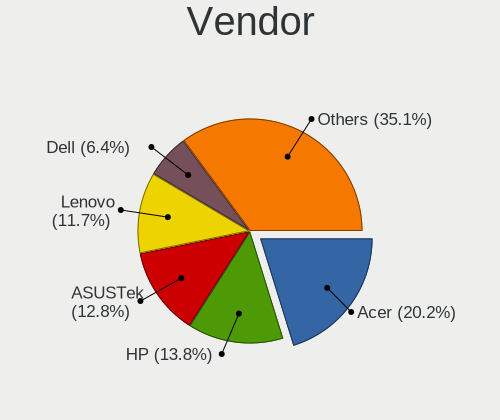
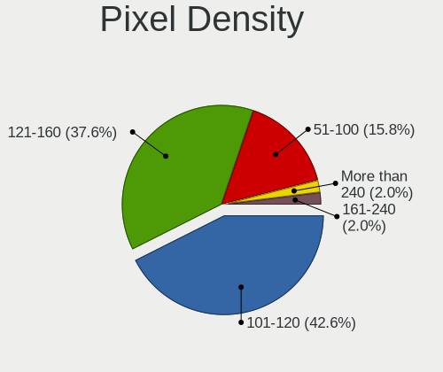

ROSA Hardware Trends (Notebook)
-------------------------------

A project to identify most popular hardware characteristics and track their change
over time based on data collected by ROSA users at https://Linux-Hardware.org.

Anyone can contribute to the study by uploading probes of their computers by
the [hw-probe](https://github.com/linuxhw/hw-probe) tool:

    sudo -E hw-probe -all -upload

Full-feature report is available here: https://linux-hardware.org/?view=trends&formfactor=notebook

Period: Dec, 2020.

Contents
--------

- [ OS                       ](#os)
- [ OS Family                ](#os-family)
- [ Kernel                   ](#kernel)
- [ Kernel Family            ](#kernel-family)
- [ Kernel Major Ver.        ](#kernel-major-ver)
- [ Arch                     ](#arch)
- [ DE                       ](#de)
- [ Display Server           ](#display-server)
- [ Display Manager          ](#display-manager)
- [ OS Lang                  ](#os-lang)
- [ Boot Mode                ](#boot-mode)
- [ Filesystem               ](#filesystem)
- [ Part. scheme             ](#part-scheme)
- [ Dual Boot with Linux/BSD ](#dual-boot-with-linux/bsd)
- [ Dual Boot (Win)          ](#dual-boot-win)
- [ Country                  ](#country)
- [ City                     ](#city)
- [ Vendor                   ](#vendor)
- [ Model                    ](#model)
- [ Model Family             ](#model-family)
- [ MFG Year                 ](#mfg-year)
- [ Form Factor              ](#form-factor)
- [ Secure Boot              ](#secure-boot)
- [ Coreboot                 ](#coreboot)
- [ RAM Size                 ](#ram-size)
- [ RAM Used                 ](#ram-used)
- [ Has CD-ROM               ](#has-cd-rom)
- [ Total Drives             ](#total-drives)
- [ Has Ethernet             ](#has-ethernet)
- [ Drive Vendor             ](#drive-vendor)
- [ Drive Model              ](#drive-model)
- [ HDD Vendor               ](#hdd-vendor)
- [ SSD Vendor               ](#ssd-vendor)
- [ Drive Kind               ](#drive-kind)
- [ Drive Connector          ](#drive-connector)
- [ Drive Size               ](#drive-size)
- [ Space Total              ](#space-total)
- [ Space Used               ](#space-used)
- [ Malfunc. Drives          ](#malfunc-drives)
- [ Malfunc. Drive Vendor    ](#malfunc-drive-vendor)
- [ Malfunc. HDD Vendor      ](#malfunc-hdd-vendor)
- [ Malfunc. Drive Kind      ](#malfunc-drive-kind)
- [ Failed Drives            ](#failed-drives)
- [ Failed Drive Vendor      ](#failed-drive-vendor)
- [ Drive Status             ](#drive-status)
- [ Storage Vendor           ](#storage-vendor)
- [ Storage Model            ](#storage-model)
- [ Storage Kind             ](#storage-kind)
- [ CPU Vendor               ](#cpu-vendor)
- [ CPU Model                ](#cpu-model)
- [ CPU Model Family         ](#cpu-model-family)
- [ CPU Cores                ](#cpu-cores)
- [ CPU Sockets              ](#cpu-sockets)
- [ CPU Threads              ](#cpu-threads)
- [ CPU Op-Modes             ](#cpu-op-modes)
- [ CPU Microcode            ](#cpu-microcode)
- [ CPU Microarch            ](#cpu-microarch)
- [ GPU Vendor               ](#gpu-vendor)
- [ GPU Model                ](#gpu-model)
- [ GPU Combo                ](#gpu-combo)
- [ GPU Driver               ](#gpu-driver)
- [ GPU Memory               ](#gpu-memory)
- [ Monitor Vendor           ](#monitor-vendor)
- [ Monitor Model            ](#monitor-model)
- [ Monitor Resolution       ](#monitor-resolution)
- [ Monitor Diagonal         ](#monitor-diagonal)
- [ Monitor Width            ](#monitor-width)
- [ Aspect Ratio             ](#aspect-ratio)
- [ Monitor Area             ](#monitor-area)
- [ Pixel Density            ](#pixel-density)
- [ Multiple Monitors        ](#multiple-monitors)
- [ Net Controller Vendor    ](#net-controller-vendor)
- [ Net Controller Model     ](#net-controller-model)
- [ Wireless Vendor          ](#wireless-vendor)
- [ Wireless Model           ](#wireless-model)
- [ Ethernet Vendor          ](#ethernet-vendor)
- [ Ethernet Model           ](#ethernet-model)
- [ Net Controller Kind      ](#net-controller-kind)
- [ Used Controller          ](#used-controller)
- [ NICs                     ](#nics)
- [ Memory Vendor            ](#memory-vendor)
- [ Memory Model             ](#memory-model)
- [ Memory Kind              ](#memory-kind)
- [ Memory Form Factor       ](#memory-form-factor)
- [ Memory Size              ](#memory-size)
- [ Memory Speed             ](#memory-speed)
- [ Sound Vendor             ](#sound-vendor)
- [ Sound Model              ](#sound-model)
- [ Camera Vendor            ](#camera-vendor)
- [ Camera Model             ](#camera-model)
- [ Fingerprint Vendor       ](#fingerprint-vendor)
- [ Fingerprint Model        ](#fingerprint-model)
- [ Chipcard Vendor          ](#chipcard-vendor)
- [ Chipcard Model           ](#chipcard-model)
- [ Printer Vendor           ](#printer-vendor)
- [ Printer Model            ](#printer-model)
- [ Scanner Vendor           ](#scanner-vendor)
- [ Scanner Model            ](#scanner-model)
- [ Bluetooth Vendor         ](#bluetooth-vendor)
- [ Bluetooth Model          ](#bluetooth-model)
- [ Unsupported Devices      ](#unsupported-devices)
- [ Unsupported Device Types ](#unsupported-device-types)

OS
--

Installed operating systems

| Name       | Notebooks | Percent |
|------------|-----------|---------|
| ROSA R11.1 | 57        | 60.64%  |
| ROSA R11   | 29        | 30.85%  |
| ROSA R8.1  | 5         | 5.32%   |
| ROSA R10   | 2         | 2.13%   |
| ROSA R12   | 1         | 1.06%   |

OS Family
---------

OS without a version

| Name | Notebooks | Percent |
|------|-----------|---------|
| ROSA | 94        | 100%    |

Kernel
------

Version of the Linux kernel

| Version                             | Notebooks | Percent |
|-------------------------------------|-----------|---------|
| 4.15.0-desktop-122.124.1rosa-x86_64 | 26        | 27.66%  |
| 4.15.0-desktop-45.1rosa-x86_64      | 24        | 25.53%  |
| 5.4.83-generic-2rosa-x86_64         | 6         | 6.38%   |
| 5.4.72-generic-1rosa-x86_64         | 6         | 6.38%   |
| 4.9.155-nrj-desktop-1rosa-x86_64    | 5         | 5.32%   |
| 4.15.0-desktop-45.1rosa-i586        | 5         | 5.32%   |
| 5.4.32-generic-2rosa-x86_64         | 4         | 4.26%   |
| 4.9.155-nrj-laptop-1rosa-x86_64     | 3         | 3.19%   |
| 4.9.155-nrj-desktop-1rosa-i586      | 3         | 3.19%   |
| 4.9.60-nrj-desktop-1rosa-x86_64     | 2         | 2.13%   |
| 4.15.0-desktop-122.124.1rosa-i586   | 2         | 2.13%   |
| 5.9.6-generic-1rosa-x86_64          | 1         | 1.06%   |
| 5.4.77-generic-1rosa2019.1-x86_64   | 1         | 1.06%   |
| 5.4.40-generic-1rosa-x86_64         | 1         | 1.06%   |
| 5.4.32-generic-2rosa-i586           | 1         | 1.06%   |
| 4.9.20-nrj-desktop-1rosa-i586       | 1         | 1.06%   |
| 4.15.0-desktop-94.1rosa-x86_64      | 1         | 1.06%   |
| 4.15.0-desktop-68.5rosa-x86_64      | 1         | 1.06%   |
| 4.1.38-nrj-desktop-2rosa-x86_64     | 1         | 1.06%   |

Kernel Family
-------------

Linux kernel without a distro release

| Version | Notebooks | Percent |
|---------|-----------|---------|
| 4.15.0  | 59        | 62.77%  |
| 4.9.155 | 11        | 11.7%   |
| 5.4.83  | 6         | 6.38%   |
| 5.4.72  | 6         | 6.38%   |
| 5.4.32  | 5         | 5.32%   |
| 4.9.60  | 2         | 2.13%   |
| 5.9.6   | 1         | 1.06%   |
| 5.4.77  | 1         | 1.06%   |
| 5.4.40  | 1         | 1.06%   |
| 4.9.20  | 1         | 1.06%   |
| 4.1.38  | 1         | 1.06%   |

Kernel Major Ver.
-----------------

Linux kernel major version

| Version | Notebooks | Percent |
|---------|-----------|---------|
| 4.15    | 59        | 62.77%  |
| 5.4     | 19        | 20.21%  |
| 4.9     | 14        | 14.89%  |
| 5.9     | 1         | 1.06%   |
| 4.1     | 1         | 1.06%   |

Arch
----

OS architecture (x86_64, i586, etc.)

| Name   | Notebooks | Percent |
|--------|-----------|---------|
| x86_64 | 82        | 87.23%  |
| i686   | 12        | 12.77%  |

DE
--

Desktop Environment

| Name | Notebooks | Percent |
|------|-----------|---------|
| KDE4 | 54        | 57.45%  |
| KDE5 | 32        | 34.04%  |
| LXQt | 6         | 6.38%   |
| XFCE | 1         | 1.06%   |
| KDE  | 1         | 1.06%   |

Display Server
--------------

X11 or Wayland

| Name | Notebooks | Percent |
|------|-----------|---------|
| X11  | 94        | 100%    |

Display Manager
---------------

SDDM, LightDM, etc.

| Name | Notebooks | Percent |
|------|-----------|---------|
| KDM  | 55        | 58.51%  |
| SDDM | 38        | 40.43%  |
| TDM  | 1         | 1.06%   |

OS Lang
-------

Language

| Lang       | Notebooks | Percent |
|------------|-----------|---------|
| ru_RU      | 54        | 57.45%  |
| Unknown    | 36        | 38.3%   |
| ru_RU.utf8 | 1         | 1.06%   |
| it_IT      | 1         | 1.06%   |
| en_GB      | 1         | 1.06%   |
| de_DE      | 1         | 1.06%   |

Boot Mode
---------

EFI or BIOS

| Mode | Notebooks | Percent |
|------|-----------|---------|
| BIOS | 60        | 63.83%  |
| EFI  | 34        | 36.17%  |

Filesystem
----------

Type of filesystem

| Type  | Notebooks | Percent |
|-------|-----------|---------|
| Ext4  | 87        | 92.55%  |
| Btrfs | 5         | 5.32%   |
| Aufs  | 2         | 2.13%   |

Part. scheme
------------

Scheme of partitioning

| Type    | Notebooks | Percent |
|---------|-----------|---------|
| MBR     | 54        | 57.45%  |
| GPT     | 38        | 40.43%  |
| Unknown | 2         | 2.13%   |

Dual Boot with Linux/BSD
------------------------

Hosting more than one Linux/BSD

| Dual boot | Notebooks | Percent |
|-----------|-----------|---------|
| No        | 70        | 74.47%  |
| Yes       | 24        | 25.53%  |

Dual Boot (Win)
---------------

Hosting Linux and Windows

| Dual boot | Notebooks | Percent |
|-----------|-----------|---------|
| No        | 51        | 54.26%  |
| Yes       | 43        | 45.74%  |

Country
-------

Geographic location (country)

| Country      | Notebooks | Percent |
|--------------|-----------|---------|
| Russia       | 75        | 79.79%  |
| Ukraine      | 5         | 5.32%   |
| Belarus      | 5         | 5.32%   |
| Latvia       | 2         | 2.13%   |
| Spain        | 1         | 1.06%   |
| South Africa | 1         | 1.06%   |
| Lithuania    | 1         | 1.06%   |
| Kazakhstan   | 1         | 1.06%   |
| Italy        | 1         | 1.06%   |
| Germany      | 1         | 1.06%   |
| Brazil       | 1         | 1.06%   |

City
----

Geographic location (city)

| City                   | Notebooks | Percent |
|------------------------|-----------|---------|
| Moscow                 | 10        | 10.64%  |
| St Petersburg          | 8         | 8.51%   |
| Novosibirsk            | 6         | 6.38%   |
| Ekaterinburg           | 5         | 5.32%   |
| Nizhniy Novgorod       | 4         | 4.26%   |
| Chelyabinsk            | 3         | 3.19%   |
| Voronezh               | 2         | 2.13%   |
| Vitebsk                | 2         | 2.13%   |
| Riga                   | 2         | 2.13%   |
| Perm                   | 2         | 2.13%   |
| Kyiv                   | 2         | 2.13%   |
| Kazan’               | 2         | 2.13%   |
| Yeysk                  | 1         | 1.06%   |
| Yessentuki             | 1         | 1.06%   |
| Volgograd              | 1         | 1.06%   |
| Vilnius                | 1         | 1.06%   |
| Tyumen                 | 1         | 1.06%   |
| Tula                   | 1         | 1.06%   |
| Taganrog               | 1         | 1.06%   |
| Staromar'yevka         | 1         | 1.06%   |
| Staraya Yurga          | 1         | 1.06%   |
| Sochi                  | 1         | 1.06%   |
| Serpukhov              | 1         | 1.06%   |
| Saransk                | 1         | 1.06%   |
| Santa Cruz de Tenerife | 1         | 1.06%   |
| Salekhard              | 1         | 1.06%   |
| Saburovo               | 1         | 1.06%   |
| Ryazan                 | 1         | 1.06%   |
| Rostov-on-Don          | 1         | 1.06%   |
| Rome                   | 1         | 1.06%   |
| Pyatigorsk             | 1         | 1.06%   |
| Pogeez                 | 1         | 1.06%   |
| Podolsk                | 1         | 1.06%   |
| Osinniki               | 1         | 1.06%   |
| Omsk                   | 1         | 1.06%   |
| Novolukoml'            | 1         | 1.06%   |
| Novokuznetsk           | 1         | 1.06%   |
| Neftekamsk             | 1         | 1.06%   |
| Navapolatsk            | 1         | 1.06%   |
| Naro-Fominsk           | 1         | 1.06%   |
| Mossoro                | 1         | 1.06%   |
| Meleuz                 | 1         | 1.06%   |
| Lutugino               | 1         | 1.06%   |
| Lodeynoye Pole         | 1         | 1.06%   |
| Lipetsk                | 1         | 1.06%   |
| Leninogorsk            | 1         | 1.06%   |
| Krasnodar              | 1         | 1.06%   |
| Khabarovsk             | 1         | 1.06%   |
| Kaluga                 | 1         | 1.06%   |
| Kaliningrad            | 1         | 1.06%   |
| Dzerzhinsk             | 1         | 1.06%   |
| Donetsk                | 1         | 1.06%   |
| Cherkasy               | 1         | 1.06%   |
| Cape Town              | 1         | 1.06%   |
| Atyrau                 | 1         | 1.06%   |
| Angarsk                | 1         | 1.06%   |
| Ananichi               | 1         | 1.06%   |
| Abakan                 | 1         | 1.06%   |

Vendor
------

Motherboard manufacturer

| Name                | Notebooks | Percent |
|---------------------|-----------|---------|
| Lenovo              | 17        | 18.09%  |
| Acer                | 17        | 18.09%  |
| Hewlett-Packard     | 15        | 15.96%  |
| ASUSTek Computer    | 14        | 14.89%  |
| Samsung Electronics | 9         | 9.57%   |
| Dell                | 7         | 7.45%   |
| Toshiba             | 4         | 4.26%   |
| Sony                | 3         | 3.19%   |
| Panasonic           | 1         | 1.06%   |
| Packard Bell        | 1         | 1.06%   |
| LG Electronics      | 1         | 1.06%   |
| Insyde              | 1         | 1.06%   |
| eMachines           | 1         | 1.06%   |
| Digma               | 1         | 1.06%   |
| Apple               | 1         | 1.06%   |
| Unknown             | 1         | 1.06%   |

Model
-----

Motherboard model

| Name                                 | Notebooks | Percent |
|--------------------------------------|-----------|---------|
| HP Pavilion g6                       | 3         | 3.19%   |
| Lenovo G50-30 80G0                   | 2         | 2.13%   |
| Lenovo B590 20206                    | 2         | 2.13%   |
| HP ProBook 4540s                     | 2         | 2.13%   |
| Acer Extensa 2519                    | 2         | 2.13%   |
| Unknown                              | 2         | 2.13%   |
| Toshiba Satellite U840-B7S           | 1         | 1.06%   |
| Toshiba Satellite L655               | 1         | 1.06%   |
| Toshiba Satellite C850-B6W           | 1         | 1.06%   |
| Toshiba Satellite A300               | 1         | 1.06%   |
| Sony VPCSA2S9R                       | 1         | 1.06%   |
| Sony VGN-N11SR_W                     | 1         | 1.06%   |
| Sony SVE14A2V1RWI                    | 1         | 1.06%   |
| Samsung SQ45S70S                     | 1         | 1.06%   |
| Samsung RV408/RV508                  | 1         | 1.06%   |
| Samsung RC530/RC730                  | 1         | 1.06%   |
| Samsung R530/R730/P530               | 1         | 1.06%   |
| Samsung R530/R730                    | 1         | 1.06%   |
| Samsung Q310                         | 1         | 1.06%   |
| Samsung 530U4E/540U4E                | 1         | 1.06%   |
| Samsung 350V5C/351V5C/3540VC/3440VC  | 1         | 1.06%   |
| Samsung 305V4A/305V5A/3415VA         | 1         | 1.06%   |
| Panasonic CF-LX3GDHCS                | 1         | 1.06%   |
| Packard Bell EasyNote TS11HR         | 1         | 1.06%   |
| LG F1-2A85R                          | 1         | 1.06%   |
| Lenovo V110-15IAP 80TG               | 1         | 1.06%   |
| Lenovo ThinkPad T510 43145GG         | 1         | 1.06%   |
| Lenovo IdeaPad Z565 20066            | 1         | 1.06%   |
| Lenovo IdeaPad S205 Brazos           | 1         | 1.06%   |
| Lenovo IdeaPad S110 20126            | 1         | 1.06%   |
| Lenovo IdeaPad Gaming 3 15IMH05 81Y4 | 1         | 1.06%   |
| Lenovo IdeaPad 300-15IBR 80M3        | 1         | 1.06%   |
| Lenovo IdeaPad 110-17ACL 80UM        | 1         | 1.06%   |
| Lenovo G770 1037                     | 1         | 1.06%   |
| Lenovo G70-80 80FF                   | 1         | 1.06%   |
| Lenovo G500 20236                    | 1         | 1.06%   |
| Lenovo G50-45 80E3                   | 1         | 1.06%   |
| Lenovo B51-80 80LM                   | 1         | 1.06%   |
| Insyde i107c                         | 1         | 1.06%   |
| HP ProBook 4730s                     | 1         | 1.06%   |
| HP ProBook 450 G2                    | 1         | 1.06%   |
| HP ProBook 445 G7                    | 1         | 1.06%   |
| HP Pavilion g7                       | 1         | 1.06%   |
| HP Notebook                          | 1         | 1.06%   |
| HP Laptop 15-bw0xx                   | 1         | 1.06%   |
| HP 625                               | 1         | 1.06%   |
| HP 255 G4                            | 1         | 1.06%   |
| HP 15                                | 1         | 1.06%   |
| eMachines G725                       | 1         | 1.06%   |
| Digma CITI E401 ET4007EW             | 1         | 1.06%   |
| Dell Vostro 5370                     | 1         | 1.06%   |
| Dell Inspiron 5748                   | 1         | 1.06%   |
| Dell Inspiron 5570                   | 1         | 1.06%   |
| Dell Inspiron 3542                   | 1         | 1.06%   |
| Dell Inspiron 1525                   | 1         | 1.06%   |
| Dell Inspiron 1521                   | 1         | 1.06%   |
| Dell Inspiron 15-3552                | 1         | 1.06%   |
| ASUS X75VCP                          | 1         | 1.06%   |
| ASUS X556UQK                         | 1         | 1.06%   |
| ASUS X101H                           | 1         | 1.06%   |

Model Family
------------

Motherboard model prefix

| Name                  | Notebooks | Percent |
|-----------------------|-----------|---------|
| Acer Aspire           | 9         | 9.57%   |
| Lenovo IdeaPad        | 6         | 6.38%   |
| Dell Inspiron         | 6         | 6.38%   |
| HP ProBook            | 5         | 5.32%   |
| Acer Extensa          | 5         | 5.32%   |
| Toshiba Satellite     | 4         | 4.26%   |
| HP Pavilion           | 4         | 4.26%   |
| Samsung R530          | 2         | 2.13%   |
| Lenovo G50-30         | 2         | 2.13%   |
| Lenovo B590           | 2         | 2.13%   |
| Unknown               | 2         | 2.13%   |
| Sony VPCSA2S9R        | 1         | 1.06%   |
| Sony VGN-N11SR        | 1         | 1.06%   |
| Sony SVE14A2V1RWI     | 1         | 1.06%   |
| Samsung SQ45S70S      | 1         | 1.06%   |
| Samsung RV408         | 1         | 1.06%   |
| Samsung RC530         | 1         | 1.06%   |
| Samsung Q310          | 1         | 1.06%   |
| Samsung 530U4E        | 1         | 1.06%   |
| Samsung 350V5C        | 1         | 1.06%   |
| Samsung 305V4A        | 1         | 1.06%   |
| Panasonic CF-LX3GDHCS | 1         | 1.06%   |
| Packard Bell EasyNote | 1         | 1.06%   |
| LG F1-2A85R           | 1         | 1.06%   |
| Lenovo V110-15IAP     | 1         | 1.06%   |
| Lenovo ThinkPad       | 1         | 1.06%   |
| Lenovo G770           | 1         | 1.06%   |
| Lenovo G70-80         | 1         | 1.06%   |
| Lenovo G500           | 1         | 1.06%   |
| Lenovo G50-45         | 1         | 1.06%   |
| Lenovo B51-80         | 1         | 1.06%   |
| Insyde i107c          | 1         | 1.06%   |
| HP Notebook           | 1         | 1.06%   |
| HP Laptop             | 1         | 1.06%   |
| HP 625                | 1         | 1.06%   |
| HP 255                | 1         | 1.06%   |
| HP 15                 | 1         | 1.06%   |
| eMachines G725        | 1         | 1.06%   |
| Digma CITI            | 1         | 1.06%   |
| Dell Vostro           | 1         | 1.06%   |
| ASUS X75VCP           | 1         | 1.06%   |
| ASUS X556UQK          | 1         | 1.06%   |
| ASUS X101H            | 1         | 1.06%   |
| ASUS VivoBook         | 1         | 1.06%   |
| ASUS N76VJ            | 1         | 1.06%   |
| ASUS N61Vg            | 1         | 1.06%   |
| ASUS N50Vc            | 1         | 1.06%   |
| ASUS K73SV            | 1         | 1.06%   |
| ASUS K54LY            | 1         | 1.06%   |
| ASUS K52Je            | 1         | 1.06%   |
| ASUS K50IJ            | 1         | 1.06%   |
| ASUS F6Ve             | 1         | 1.06%   |
| ASUS F5SL             | 1         | 1.06%   |
| ASUS F3Ka             | 1         | 1.06%   |
| Apple MacBook5        | 1         | 1.06%   |
| Acer V5-131           | 1         | 1.06%   |
| Acer TravelMate       | 1         | 1.06%   |
| Acer AOHAPPY2         | 1         | 1.06%   |

MFG Year
--------

Motherboard manufacture year

| Year | Notebooks | Percent |
|------|-----------|---------|
| 2012 | 12        | 12.77%  |
| 2013 | 11        | 11.7%   |
| 2011 | 11        | 11.7%   |
| 2016 | 8         | 8.51%   |
| 2015 | 8         | 8.51%   |
| 2010 | 7         | 7.45%   |
| 2017 | 5         | 5.32%   |
| 2014 | 5         | 5.32%   |
| 2009 | 5         | 5.32%   |
| 2008 | 5         | 5.32%   |
| 2019 | 4         | 4.26%   |
| 2018 | 4         | 4.26%   |
| 2007 | 4         | 4.26%   |
| 2020 | 3         | 3.19%   |
| 2006 | 2         | 2.13%   |

Form Factor
-----------

Physical design of the computer

| Name     | Notebooks | Percent |
|----------|-----------|---------|
| Notebook | 94        | 100%    |

Secure Boot
-----------

Enabled or disabled

| State    | Notebooks | Percent |
|----------|-----------|---------|
| Disabled | 94        | 100%    |

Coreboot
--------

Have coreboot on board

| Used | Notebooks | Percent |
|------|-----------|---------|
| No   | 94        | 100%    |

RAM Size
--------

Total RAM memory

| Size in GB | Notebooks | Percent |
|------------|-----------|---------|
| 3.01-4.0   | 35        | 37.23%  |
| 4.01-8.0   | 21        | 22.34%  |
| 8.01-16.0  | 13        | 13.83%  |
| 1.01-2.0   | 11        | 11.7%   |
| 2.01-3.0   | 10        | 10.64%  |
| 16.01-24.0 | 3         | 3.19%   |
| 0.51-1.0   | 1         | 1.06%   |

RAM Used
--------

Used RAM memory

| Used GB  | Notebooks | Percent |
|----------|-----------|---------|
| 0.51-1.0 | 43        | 45.74%  |
| 1.01-2.0 | 36        | 38.3%   |
| 2.01-3.0 | 12        | 12.77%  |
| 4.01-8.0 | 3         | 3.19%   |

Has CD-ROM
----------

Has CD-ROM on board

| Presented | Notebooks | Percent |
|-----------|-----------|---------|
| Yes       | 50        | 53.19%  |
| No        | 44        | 46.81%  |

Total Drives
------------

Number of drives on board

| Drives | Notebooks | Percent |
|--------|-----------|---------|
| 1      | 67        | 71.28%  |
| 2      | 25        | 26.6%   |
| 3      | 2         | 2.13%   |

Has Ethernet
------------

Has Ethernet on board

| Presented | Notebooks | Percent |
|-----------|-----------|---------|
| Yes       | 89        | 94.68%  |
| No        | 5         | 5.32%   |

Drive Vendor
------------

Hard drive vendors

| Vendor              | Notebooks | Drives | Percent |
|---------------------|-----------|--------|---------|
| Seagate             | 21        | 22     | 18.1%   |
| WDC                 | 15        | 16     | 12.93%  |
| Hitachi             | 15        | 15     | 12.93%  |
| Toshiba             | 14        | 15     | 12.07%  |
| Kingston            | 14        | 15     | 12.07%  |
| Samsung Electronics | 8         | 8      | 6.9%    |
| HGST                | 6         | 6      | 5.17%   |
| Unknown             | 5         | 7      | 4.31%   |
| SanDisk             | 4         | 4      | 3.45%   |
| Intel               | 2         | 2      | 1.72%   |
| Fujitsu             | 2         | 2      | 1.72%   |
| SPCC                | 1         | 1      | 0.86%   |
| Solid State Storage | 1         | 1      | 0.86%   |
| Patriot             | 1         | 1      | 0.86%   |
| Palit               | 1         | 1      | 0.86%   |
| Micron Technology   | 1         | 1      | 0.86%   |
| LITEON              | 1         | 1      | 0.86%   |
| KingSpec            | 1         | 1      | 0.86%   |
| KingFast            | 1         | 1      | 0.86%   |
| GOODRAM             | 1         | 1      | 0.86%   |
| e2e4                | 1         | 1      | 0.86%   |

Drive Model
-----------

Hard drive models

| Model                                        | Notebooks | Percent |
|----------------------------------------------|-----------|---------|
| Seagate ST500LT012-1DG142 500GB              | 5         | 4.1%    |
| Kingston SA400S37120G 120GB SSD              | 5         | 4.1%    |
| Toshiba MQ01ABD100 1TB                       | 3         | 2.46%   |
| Seagate ST1000LM024 HN-M101MBB 1TB           | 3         | 2.46%   |
| Kingston SA400S37240G 240GB SSD              | 3         | 2.46%   |
| Hitachi HTS545025B9A300 250GB                | 3         | 2.46%   |
| WDC WDS120G2G0A-00JH30 120GB SSD             | 2         | 1.64%   |
| WDC WD5000LPCX-21VHAT0 500GB                 | 2         | 1.64%   |
| WDC WD5000LPCX-00VHAT0 500GB                 | 2         | 1.64%   |
| Unknown NCard  32GB                          | 2         | 1.64%   |
| Toshiba MQ01ABF050 500GB                     | 2         | 1.64%   |
| Seagate ST500LM021-1KJ152 500GB              | 2         | 1.64%   |
| Seagate ST320LT020-9YG142 320GB              | 2         | 1.64%   |
| Samsung SSD 860 EVO 250GB                    | 2         | 1.64%   |
| Kingston SV300S37A120G 120GB SSD             | 2         | 1.64%   |
| Hitachi HTS727550A9E364 500GB                | 2         | 1.64%   |
| Hitachi HTS547575A9E384 752GB                | 2         | 1.64%   |
| Hitachi HTS547550A9E384 500GB                | 2         | 1.64%   |
| HGST HTS545050A7E680 500GB                   | 2         | 1.64%   |
| HGST HTS545050A7E380 500GB                   | 2         | 1.64%   |
| WDC WDS500G2B0A-00SM50 500GB SSD             | 1         | 0.82%   |
| WDC WDS480G2G0A-00JH30 480GB SSD             | 1         | 0.82%   |
| WDC WDS240G2G0A-00JH30 240GB SSD             | 1         | 0.82%   |
| WDC WD5000LPVX-60V0TT0 500GB                 | 1         | 0.82%   |
| WDC WD5000LPCX-60VHAT0 500GB                 | 1         | 0.82%   |
| WDC WD3200BPVT-22ZEST0 320GB                 | 1         | 0.82%   |
| WDC WD3200BEVT-80A0RT0 320GB                 | 1         | 0.82%   |
| WDC WD3200BEVT-22A23T0 320GB                 | 1         | 0.82%   |
| WDC WD1600BEVT-75ZCT0 160GB                  | 1         | 0.82%   |
| WDC WD10JPVX-22JC3T0 1TB                     | 1         | 0.82%   |
| Unknown SF64G  64GB                          | 1         | 0.82%   |
| Unknown SE08G  8GB                           | 1         | 0.82%   |
| Unknown SD16G  16GB                          | 1         | 0.82%   |
| Unknown SD/MMC/MS PRO 128GB                  | 1         | 0.82%   |
| Unknown SD  32GB                             | 1         | 0.82%   |
| Toshiba THNSNC128GMMJ 128GB SSD              | 1         | 0.82%   |
| Toshiba MQ01ABF032 320GB                     | 1         | 0.82%   |
| Toshiba MQ01ABD050 500GB                     | 1         | 0.82%   |
| Toshiba MQ01ABD032 320GB                     | 1         | 0.82%   |
| Toshiba MK7575GSX 752GB                      | 1         | 0.82%   |
| Toshiba MK5075GSX 500GB                      | 1         | 0.82%   |
| Toshiba MK3252GSX 320GB                      | 1         | 0.82%   |
| Toshiba MK1655GSX 160GB                      | 1         | 0.82%   |
| Toshiba KSG60ZMV256G M.2 2280 256GB SSD      | 1         | 0.82%   |
| Toshiba HDWK105 500GB                        | 1         | 0.82%   |
| SPCC Solid State Disk 256GB                  | 1         | 0.82%   |
| Solid State Storage SSSTC CL1-8D256-HP 256GB | 1         | 0.82%   |
| Seagate ST9500325AS 500GB                    | 1         | 0.82%   |
| Seagate ST9320325AS 320GB                    | 1         | 0.82%   |
| Seagate ST9250315AS 250GB                    | 1         | 0.82%   |
| Seagate ST9160827AS 160GB                    | 1         | 0.82%   |
| Seagate ST750LX003-1AC154 752GB              | 1         | 0.82%   |
| Seagate ST500LT012-9WS142 500GB              | 1         | 0.82%   |
| Seagate ST500LM012 HN-M500MBB 500GB          | 1         | 0.82%   |
| Seagate ST320LM001 HN-M320MBB 320GB          | 1         | 0.82%   |
| Seagate ST1000LM035-1RK172 1TB               | 1         | 0.82%   |
| Seagate ST1000LM014-SSHD-8GB                 | 1         | 0.82%   |
| SanDisk SSD U100 256GB                       | 1         | 0.82%   |
| SanDisk SSD PLUS 240GB                       | 1         | 0.82%   |
| SanDisk SSD i100 24GB                        | 1         | 0.82%   |

HDD Vendor
----------

Hard disk drive vendors

| Vendor              | Notebooks | Drives | Percent |
|---------------------|-----------|--------|---------|
| Seagate             | 21        | 22     | 30%     |
| Hitachi             | 15        | 15     | 21.43%  |
| Toshiba             | 12        | 13     | 17.14%  |
| WDC                 | 11        | 11     | 15.71%  |
| HGST                | 6         | 6      | 8.57%   |
| Samsung Electronics | 3         | 3      | 4.29%   |
| Fujitsu             | 2         | 2      | 2.86%   |

SSD Vendor
----------

Solid state drive vendors

| Vendor              | Notebooks | Drives | Percent |
|---------------------|-----------|--------|---------|
| Kingston            | 14        | 15     | 35%     |
| WDC                 | 5         | 5      | 12.5%   |
| SanDisk             | 4         | 4      | 10%     |
| Samsung Electronics | 4         | 4      | 10%     |
| Toshiba             | 2         | 2      | 5%      |
| Intel               | 2         | 2      | 5%      |
| SPCC                | 1         | 1      | 2.5%    |
| Patriot             | 1         | 1      | 2.5%    |
| Palit               | 1         | 1      | 2.5%    |
| Micron Technology   | 1         | 1      | 2.5%    |
| LITEON              | 1         | 1      | 2.5%    |
| KingSpec            | 1         | 1      | 2.5%    |
| KingFast            | 1         | 1      | 2.5%    |
| GOODRAM             | 1         | 1      | 2.5%    |
| e2e4                | 1         | 1      | 2.5%    |

Drive Kind
----------

HDD or SSD

| Kind    | Notebooks | Drives | Percent |
|---------|-----------|--------|---------|
| HDD     | 68        | 72     | 61.26%  |
| SSD     | 36        | 41     | 32.43%  |
| MMC     | 4         | 6      | 3.6%    |
| NVMe    | 2         | 2      | 1.8%    |
| Unknown | 1         | 1      | 0.9%    |

Drive Connector
---------------

SATA, SAS, NVMe, etc.

| Type | Notebooks | Drives | Percent |
|------|-----------|--------|---------|
| SATA | 91        | 112    | 91.92%  |
| MMC  | 4         | 6      | 4.04%   |
| SAS  | 2         | 2      | 2.02%   |
| NVMe | 2         | 2      | 2.02%   |

Drive Size
----------

Size of hard drive

| Size in TB | Notebooks | Drives | Percent |
|------------|-----------|--------|---------|
| 0.01-0.5   | 83        | 97     | 83.84%  |
| 0.51-1.0   | 16        | 16     | 16.16%  |

Space Total
-----------

Amount of disk space available on the file system

| Size in GB | Notebooks | Percent |
|------------|-----------|---------|
| 251-500    | 30        | 31.91%  |
| 101-250    | 21        | 22.34%  |
| 1-20       | 13        | 13.83%  |
| 501-1000   | 10        | 10.64%  |
| 51-100     | 7         | 7.45%   |
| 21-50      | 6         | 6.38%   |
| 1001-2000  | 5         | 5.32%   |
| Unknown    | 2         | 2.13%   |

Space Used
----------

Amount of used disk space

| Used GB  | Notebooks | Percent |
|----------|-----------|---------|
| 1-20     | 62        | 65.96%  |
| 101-250  | 10        | 10.64%  |
| 21-50    | 8         | 8.51%   |
| 51-100   | 6         | 6.38%   |
| 251-500  | 3         | 3.19%   |
| 501-1000 | 3         | 3.19%   |
| Unknown  | 2         | 2.13%   |

Malfunc. Drives
---------------

Drive models with a malfunction

| Model                                | Notebooks | Drives | Percent |
|--------------------------------------|-----------|--------|---------|
| WDC WDS120G2G0A-00JH30 120GB SSD     | 2         | 2      | 4.88%   |
| Seagate ST500LT012-1DG142 500GB      | 2         | 2      | 4.88%   |
| Seagate ST500LM021-1KJ152 500GB      | 2         | 2      | 4.88%   |
| Hitachi HTS727550A9E364 500GB        | 2         | 2      | 4.88%   |
| Hitachi HTS545025B9A300 250GB        | 2         | 2      | 4.88%   |
| HGST HTS545050A7E380 500GB           | 2         | 2      | 4.88%   |
| WDC WD5000LPVX-60V0TT0 500GB         | 1         | 1      | 2.44%   |
| WDC WD3200BPVT-22ZEST0 320GB         | 1         | 1      | 2.44%   |
| Toshiba MQ01ABD100 1TB               | 1         | 1      | 2.44%   |
| Toshiba MQ01ABD050 500GB             | 1         | 1      | 2.44%   |
| Toshiba MK7575GSX 752GB              | 1         | 1      | 2.44%   |
| Toshiba MK3252GSX 320GB              | 1         | 1      | 2.44%   |
| Seagate ST9500325AS 500GB            | 1         | 1      | 2.44%   |
| Seagate ST9320325AS 320GB            | 1         | 1      | 2.44%   |
| Seagate ST9250315AS 250GB            | 1         | 1      | 2.44%   |
| Seagate ST9160827AS 160GB            | 1         | 1      | 2.44%   |
| Seagate ST500LT012-9WS142 500GB      | 1         | 1      | 2.44%   |
| Seagate ST320LT020-9YG142 320GB      | 1         | 1      | 2.44%   |
| Seagate ST1000LM024 HN-M101MBB 1TB   | 1         | 1      | 2.44%   |
| Seagate ST1000LM014-SSHD-8GB         | 1         | 1      | 2.44%   |
| SanDisk SSD U100 256GB               | 1         | 1      | 2.44%   |
| SanDisk SSD PLUS 240GB               | 1         | 1      | 2.44%   |
| Samsung Electronics HN-M500MBB 500GB | 1         | 1      | 2.44%   |
| Kingston SV300S37A120G 120GB SSD     | 1         | 1      | 2.44%   |
| Kingston SNV425S264GB SSD            | 1         | 1      | 2.44%   |
| Kingston SA400S37120G 120GB SSD      | 1         | 1      | 2.44%   |
| KingSpec MT-256 256GB SSD            | 1         | 1      | 2.44%   |
| Intel SSDSC2BF180A5L 180GB           | 1         | 1      | 2.44%   |
| Hitachi HTS725016A9A364 160GB        | 1         | 1      | 2.44%   |
| Hitachi HTS547575A9E384 752GB        | 1         | 1      | 2.44%   |
| Hitachi HTS547550A9E384 500GB        | 1         | 1      | 2.44%   |
| Hitachi HTS545050B9A300 500GB        | 1         | 1      | 2.44%   |
| Hitachi HTS542516K9SA00 160GB        | 1         | 1      | 2.44%   |
| HGST HTS545050A7E680 500GB           | 1         | 1      | 2.44%   |
| Fujitsu MHY2120BH 120GB              | 1         | 1      | 2.44%   |

Malfunc. Drive Vendor
---------------------

Vendors of faulty drives

| Vendor              | Notebooks | Drives | Percent |
|---------------------|-----------|--------|---------|
| Seagate             | 12        | 12     | 29.27%  |
| Hitachi             | 9         | 9      | 21.95%  |
| WDC                 | 4         | 4      | 9.76%   |
| Toshiba             | 4         | 4      | 9.76%   |
| Kingston            | 3         | 3      | 7.32%   |
| HGST                | 3         | 3      | 7.32%   |
| SanDisk             | 2         | 2      | 4.88%   |
| Samsung Electronics | 1         | 1      | 2.44%   |
| KingSpec            | 1         | 1      | 2.44%   |
| Intel               | 1         | 1      | 2.44%   |
| Fujitsu             | 1         | 1      | 2.44%   |

Malfunc. HDD Vendor
-------------------

Vendors of faulty HDD drives

| Vendor              | Notebooks | Drives | Percent |
|---------------------|-----------|--------|---------|
| Seagate             | 12        | 12     | 37.5%   |
| Hitachi             | 9         | 9      | 28.13%  |
| Toshiba             | 4         | 4      | 12.5%   |
| HGST                | 3         | 3      | 9.38%   |
| WDC                 | 2         | 2      | 6.25%   |
| Samsung Electronics | 1         | 1      | 3.13%   |
| Fujitsu             | 1         | 1      | 3.13%   |

Malfunc. Drive Kind
-------------------

Kinds of faulty drives

| Kind | Notebooks | Drives | Percent |
|------|-----------|--------|---------|
| HDD  | 32        | 32     | 78.05%  |
| SSD  | 9         | 9      | 21.95%  |

Failed Drives
-------------

Failed drive models

| Model                             | Notebooks | Drives | Percent |
|-----------------------------------|-----------|--------|---------|
| Samsung Electronics HM500JI 500GB | 1         | 1      | 100%    |

Failed Drive Vendor
-------------------

Failed drive vendors

| Vendor              | Notebooks | Drives | Percent |
|---------------------|-----------|--------|---------|
| Samsung Electronics | 1         | 1      | 100%    |

Drive Status
------------

Number of failed and malfunc. drives

| Status   | Notebooks | Drives | Percent |
|----------|-----------|--------|---------|
| Works    | 60        | 72     | 56.6%   |
| Malfunc  | 40        | 41     | 37.74%  |
| Detected | 5         | 8      | 4.72%   |
| Failed   | 1         | 1      | 0.94%   |

Storage Vendor
--------------

Storage controller vendors

| Vendor                           | Notebooks | Percent |
|----------------------------------|-----------|---------|
| Intel                            | 69        | 73.4%   |
| AMD                              | 21        | 22.34%  |
| Solid State Storage Technology   | 1         | 1.06%   |
| Silicon Integrated Systems [SiS] | 1         | 1.06%   |
| Samsung Electronics              | 1         | 1.06%   |
| Nvidia                           | 1         | 1.06%   |

Storage Model
-------------

Storage controller models

| Model                                                                            | Notebooks | Percent |
|----------------------------------------------------------------------------------|-----------|---------|
| Intel 7 Series Chipset Family 6-port SATA Controller [AHCI mode]                 | 15        | 14.71%  |
| AMD FCH SATA Controller [AHCI mode]                                              | 14        | 13.73%  |
| Intel 6 Series/C200 Series Chipset Family 6 port Mobile SATA AHCI Controller     | 8         | 7.84%   |
| Intel 82801IBM/IEM (ICH9M/ICH9M-E) 4 port SATA Controller [AHCI mode]            | 6         | 5.88%   |
| Intel 8 Series SATA Controller 1 [AHCI mode]                                     | 6         | 5.88%   |
| AMD SB7x0/SB8x0/SB9x0 SATA Controller [AHCI mode]                                | 5         | 4.9%    |
| Intel Atom/Celeron/Pentium Processor x5-E8000/J3xxx/N3xxx Series SATA Controller | 4         | 3.92%   |
| Intel Wildcat Point-LP SATA Controller [AHCI Mode]                               | 3         | 2.94%   |
| Intel Sunrise Point-LP SATA Controller [AHCI mode]                               | 3         | 2.94%   |
| Intel Atom Processor E3800 Series SATA AHCI Controller                           | 3         | 2.94%   |
| Intel 82801HM/HEM (ICH8M/ICH8M-E) SATA Controller [IDE mode]                     | 3         | 2.94%   |
| Intel 82801HM/HEM (ICH8M/ICH8M-E) IDE Controller                                 | 3         | 2.94%   |
| Intel 82801GBM/GHM (ICH7-M Family) SATA Controller [IDE mode]                    | 3         | 2.94%   |
| Intel 82801 Mobile SATA Controller [RAID mode]                                   | 3         | 2.94%   |
| Intel 5 Series/3400 Series Chipset 4 port SATA AHCI Controller                   | 3         | 2.94%   |
| Intel NM10/ICH7 Family SATA Controller [AHCI mode]                               | 2         | 1.96%   |
| Intel 82801IBM/IEM (ICH9M/ICH9M-E) 2 port SATA Controller [IDE mode]             | 2         | 1.96%   |
| AMD SB600 Non-Raid-5 SATA                                                        | 2         | 1.96%   |
| AMD SB600 IDE                                                                    | 2         | 1.96%   |
| Solid State Storage Non-Volatile memory controller                               | 1         | 0.98%   |
| Silicon Integrated Systems [SiS] SATA Controller / IDE mode                      | 1         | 0.98%   |
| Silicon Integrated Systems [SiS] 5513 IDE Controller                             | 1         | 0.98%   |
| Samsung Electronics Non-Volatile memory controller                               | 1         | 0.98%   |
| Nvidia MCP79 AHCI Controller                                                     | 1         | 0.98%   |
| Intel NM10/ICH7 Family SATA Controller [IDE mode]                                | 1         | 0.98%   |
| Intel Celeron N3350/Pentium N4200/Atom E3900 Series SATA AHCI Controller         | 1         | 0.98%   |
| Intel 82801HM/HEM (ICH8M/ICH8M-E) SATA Controller [AHCI mode]                    | 1         | 0.98%   |
| Intel 82801G (ICH7 Family) IDE Controller                                        | 1         | 0.98%   |
| Intel 5 Series/3400 Series Chipset 6 port SATA AHCI Controller                   | 1         | 0.98%   |
| Intel 400 Series Chipset Family SATA AHCI Controller                             | 1         | 0.98%   |
| AMD SB7x0/SB8x0/SB9x0 IDE Controller                                             | 1         | 0.98%   |

Storage Kind
------------

Kind of storage controller (IDE, SATA, NVMe, SAS, ...)

| Kind | Notebooks | Percent |
|------|-----------|---------|
| SATA | 79        | 80.61%  |
| IDE  | 14        | 14.29%  |
| RAID | 3         | 3.06%   |
| NVMe | 2         | 2.04%   |

CPU Vendor
----------

Processor vendors

| Vendor | Notebooks | Percent |
|--------|-----------|---------|
| Intel  | 73        | 77.66%  |
| AMD    | 21        | 22.34%  |

CPU Model
---------

Processor models

| Model                                       | Notebooks | Percent |
|---------------------------------------------|-----------|---------|
| Intel Core i3-3110M CPU @ 2.40GHz           | 3         | 3.19%   |
| Intel Pentium CPU N3710 @ 1.60GHz           | 2         | 2.13%   |
| Intel Pentium CPU B960 @ 2.20GHz            | 2         | 2.13%   |
| Intel Pentium CPU 2020M @ 2.40GHz           | 2         | 2.13%   |
| Intel Core i5-8250U CPU @ 1.60GHz           | 2         | 2.13%   |
| Intel Core i5-3210M CPU @ 2.50GHz           | 2         | 2.13%   |
| Intel Core i5-2430M CPU @ 2.40GHz           | 2         | 2.13%   |
| Intel Core i5-2410M CPU @ 2.30GHz           | 2         | 2.13%   |
| Intel Core i3-3120M CPU @ 2.50GHz           | 2         | 2.13%   |
| Intel Core i3 CPU M 350 @ 2.27GHz           | 2         | 2.13%   |
| Intel Core 2 Duo CPU P7450 @ 2.13GHz        | 2         | 2.13%   |
| Intel Core 2 Duo CPU P7350 @ 2.00GHz        | 2         | 2.13%   |
| Intel Celeron CPU N2840 @ 2.16GHz           | 2         | 2.13%   |
| Intel Pentium Dual-Core CPU T4400 @ 2.20GHz | 1         | 1.06%   |
| Intel Pentium Dual-Core CPU T4300 @ 2.10GHz | 1         | 1.06%   |
| Intel Pentium Dual CPU T2370 @ 1.73GHz      | 1         | 1.06%   |
| Intel Pentium CPU B970 @ 2.30GHz            | 1         | 1.06%   |
| Intel Pentium CPU B950 @ 2.10GHz            | 1         | 1.06%   |
| Intel Pentium 3558U @ 1.70GHz               | 1         | 1.06%   |
| Intel Genuine CPU T2300 @ 1.66GHz           | 1         | 1.06%   |
| Intel Genuine CPU T2050 @ 1.60GHz           | 1         | 1.06%   |
| Intel Core i7-4500U CPU @ 1.80GHz           | 1         | 1.06%   |
| Intel Core i7-3630QM CPU @ 2.40GHz          | 1         | 1.06%   |
| Intel Core i7-2630QM CPU @ 2.00GHz          | 1         | 1.06%   |
| Intel Core i7 CPU M 640 @ 2.80GHz           | 1         | 1.06%   |
| Intel Core i5-6200U CPU @ 2.30GHz           | 1         | 1.06%   |
| Intel Core i5-4300U CPU @ 1.90GHz           | 1         | 1.06%   |
| Intel Core i5-4210U CPU @ 1.70GHz           | 1         | 1.06%   |
| Intel Core i5-3337U CPU @ 1.80GHz           | 1         | 1.06%   |
| Intel Core i5-3320M CPU @ 2.60GHz           | 1         | 1.06%   |
| Intel Core i5-3317U CPU @ 1.70GHz           | 1         | 1.06%   |
| Intel Core i5-2450M CPU @ 2.50GHz           | 1         | 1.06%   |
| Intel Core i5-10300H CPU @ 2.50GHz          | 1         | 1.06%   |
| Intel Core i5 CPU M 430 @ 2.27GHz           | 1         | 1.06%   |
| Intel Core i3-7100U CPU @ 2.40GHz           | 1         | 1.06%   |
| Intel Core i3-5020U CPU @ 2.20GHz           | 1         | 1.06%   |
| Intel Core i3-5010U CPU @ 2.10GHz           | 1         | 1.06%   |
| Intel Core i3-5005U CPU @ 2.00GHz           | 1         | 1.06%   |
| Intel Core i3-4005U CPU @ 1.70GHz           | 1         | 1.06%   |
| Intel Core i3-2330M CPU @ 2.20GHz           | 1         | 1.06%   |
| Intel Core 2 Duo CPU T8100 @ 2.10GHz        | 1         | 1.06%   |
| Intel Core 2 Duo CPU T7500 @ 2.20GHz        | 1         | 1.06%   |
| Intel Core 2 Duo CPU T5750 @ 2.00GHz        | 1         | 1.06%   |
| Intel Core 2 Duo CPU P8400 @ 2.26GHz        | 1         | 1.06%   |
| Intel Core 2 CPU T5200 @ 1.60GHz            | 1         | 1.06%   |
| Intel Celeron Dual-Core CPU T3500 @ 2.10GHz | 1         | 1.06%   |
| Intel Celeron Dual-Core CPU T3300 @ 2.00GHz | 1         | 1.06%   |
| Intel Celeron CPU N3350 @ 1.10GHz           | 1         | 1.06%   |
| Intel Celeron CPU N3160 @ 1.60GHz           | 1         | 1.06%   |
| Intel Celeron CPU N3060 @ 1.60GHz           | 1         | 1.06%   |
| Intel Celeron CPU N2930 @ 1.83GHz           | 1         | 1.06%   |
| Intel Celeron CPU 540 @ 1.86GHz             | 1         | 1.06%   |
| Intel Celeron CPU 1017U @ 1.60GHz           | 1         | 1.06%   |
| Intel Celeron 2957U @ 1.40GHz               | 1         | 1.06%   |
| Intel Atom x5-Z8350 CPU @ 1.44GHz           | 1         | 1.06%   |
| Intel Atom CPU Z3735F @ 1.33GHz             | 1         | 1.06%   |
| Intel Atom CPU N570 @ 1.66GHz               | 1         | 1.06%   |
| Intel Atom CPU N455 @ 1.66GHz               | 1         | 1.06%   |
| Intel Atom CPU N2800 @ 1.86GHz              | 1         | 1.06%   |
| AMD Turion 64 X2 Mobile Technology TL-58    | 1         | 1.06%   |

CPU Model Family
----------------

Processor model prefix

| Model                   | Notebooks | Percent |
|-------------------------|-----------|---------|
| Intel Core i5           | 17        | 18.09%  |
| Intel Core i3           | 13        | 13.83%  |
| Intel Pentium           | 9         | 9.57%   |
| Intel Celeron           | 9         | 9.57%   |
| Intel Core 2 Duo        | 8         | 8.51%   |
| Intel Atom              | 5         | 5.32%   |
| AMD A6                  | 5         | 5.32%   |
| Intel Core i7           | 4         | 4.26%   |
| AMD E1                  | 3         | 3.19%   |
| Intel Pentium Dual-Core | 2         | 2.13%   |
| Intel Genuine           | 2         | 2.13%   |
| Intel Celeron Dual-Core | 2         | 2.13%   |
| AMD Turion 64 X2 Mobile | 2         | 2.13%   |
| AMD Phenom II           | 2         | 2.13%   |
| AMD E2                  | 2         | 2.13%   |
| AMD E                   | 2         | 2.13%   |
| Other                   | 1         | 1.06%   |
| Intel Pentium Dual      | 1         | 1.06%   |
| Intel Core 2            | 1         | 1.06%   |
| AMD Ryzen 5             | 1         | 1.06%   |
| AMD Athlon II           | 1         | 1.06%   |
| AMD A4                  | 1         | 1.06%   |
| AMD A10                 | 1         | 1.06%   |

CPU Cores
---------

Number of processor cores

| Number | Notebooks | Percent |
|--------|-----------|---------|
| 2      | 74        | 78.72%  |
| 4      | 15        | 15.96%  |
| 1      | 3         | 3.19%   |
| 6      | 1         | 1.06%   |
| 3      | 1         | 1.06%   |

CPU Sockets
-----------

Number of sockets

| Number | Notebooks | Percent |
|--------|-----------|---------|
| 1      | 94        | 100%    |

CPU Threads
-----------

Threads per core (Hyper-Threading)

| Number | Notebooks | Percent |
|--------|-----------|---------|
| 1      | 55        | 58.51%  |
| 2      | 39        | 41.49%  |

CPU Op-Modes
------------

CPU Operation Modes (32-bit, 64-bit)

| Op mode        | Notebooks | Percent |
|----------------|-----------|---------|
| 32-bit, 64-bit | 90        | 95.74%  |
| 32-bit         | 3         | 3.19%   |
| Unknown        | 1         | 1.06%   |

CPU Microcode
-------------

Microcode number

| Number     | Notebooks | Percent |
|------------|-----------|---------|
| 0x306a9    | 13        | 13.83%  |
| 0x206a7    | 10        | 10.64%  |
| 0x40651    | 6         | 6.38%   |
| 0x1067a    | 5         | 5.32%   |
| 0x10676    | 5         | 5.32%   |
| Unknown    | 5         | 5.32%   |
| 0x406c4    | 4         | 4.26%   |
| 0x30678    | 4         | 4.26%   |
| 0x306d4    | 3         | 3.19%   |
| 0x20652    | 3         | 3.19%   |
| 0x07030105 | 3         | 3.19%   |
| 0x03000027 | 3         | 3.19%   |
| 0x010000c8 | 3         | 3.19%   |
| 0x806ea    | 2         | 2.13%   |
| 0x6fd      | 2         | 2.13%   |
| 0x6e8      | 2         | 2.13%   |
| 0x106ca    | 2         | 2.13%   |
| 0x0700010f | 2         | 2.13%   |
| 0x06006705 | 2         | 2.13%   |
| 0x06001119 | 2         | 2.13%   |
| 0xa0652    | 1         | 1.06%   |
| 0x806e9    | 1         | 1.06%   |
| 0x6fa      | 1         | 1.06%   |
| 0x6f6      | 1         | 1.06%   |
| 0x506c9    | 1         | 1.06%   |
| 0x406e3    | 1         | 1.06%   |
| 0x30661    | 1         | 1.06%   |
| 0x20655    | 1         | 1.06%   |
| 0x10661    | 1         | 1.06%   |
| 0x08600106 | 1         | 1.06%   |
| 0x06006704 | 1         | 1.06%   |
| 0x05000119 | 1         | 1.06%   |
| 0x05000029 | 1         | 1.06%   |

CPU Microarch
-------------

Microarchitecture

| Name        | Notebooks | Percent |
|-------------|-----------|---------|
| IvyBridge   | 14        | 14.89%  |
| SandyBridge | 11        | 11.7%   |
| Penryn      | 10        | 10.64%  |
| Silvermont  | 9         | 9.57%   |
| Haswell     | 6         | 6.38%   |
| Core        | 5         | 5.32%   |
| Westmere    | 4         | 4.26%   |
| Puma        | 3         | 3.19%   |
| KabyLake    | 3         | 3.19%   |
| K10 Llano   | 3         | 3.19%   |
| K10         | 3         | 3.19%   |
| Excavator   | 3         | 3.19%   |
| Broadwell   | 3         | 3.19%   |
| Bonnell     | 3         | 3.19%   |
| Piledriver  | 2         | 2.13%   |
| P6          | 2         | 2.13%   |
| K8 Hammer   | 2         | 2.13%   |
| Jaguar      | 2         | 2.13%   |
| Bobcat      | 2         | 2.13%   |
| Zen 2       | 1         | 1.06%   |
| Skylake     | 1         | 1.06%   |
| Goldmont    | 1         | 1.06%   |
| CometLake   | 1         | 1.06%   |

GPU Vendor
----------

Vendors of graphics cards

| Vendor | Notebooks | Percent |
|--------|-----------|---------|
| Intel  | 62        | 52.99%  |
| AMD    | 34        | 29.06%  |
| Nvidia | 21        | 17.95%  |

GPU Model
---------

Graphics card models

| Model                                                                                    | Notebooks | Percent |
|------------------------------------------------------------------------------------------|-----------|---------|
| Intel 3rd Gen Core processor Graphics Controller                                         | 14        | 10.77%  |
| Intel 2nd Generation Core Processor Family Integrated Graphics Controller                | 10        | 7.69%   |
| Intel Haswell-ULT Integrated Graphics Controller                                         | 6         | 4.62%   |
| AMD Seymour [Radeon HD 6400M/7400M Series]                                               | 6         | 4.62%   |
| Intel Atom/Celeron/Pentium Processor x5-E8000/J3xxx/N3xxx Integrated Graphics Controller | 5         | 3.85%   |
| Intel Mobile 4 Series Chipset Integrated Graphics Controller                             | 4         | 3.08%   |
| Intel Atom Processor Z36xxx/Z37xxx Series Graphics & Display                             | 4         | 3.08%   |
| AMD Thames [Radeon HD 7500M/7600M Series]                                                | 4         | 3.08%   |
| Nvidia GF117M [GeForce 610M/710M/810M/820M / GT 620M/625M/630M/720M]                     | 3         | 2.31%   |
| Nvidia GF108M [GeForce GT 540M]                                                          | 3         | 2.31%   |
| Intel Mobile GM965/GL960 Integrated Graphics Controller (secondary)                      | 3         | 2.31%   |
| Intel Mobile GM965/GL960 Integrated Graphics Controller (primary)                        | 3         | 2.31%   |
| Intel HD Graphics 5500                                                                   | 3         | 2.31%   |
| AMD Stoney [Radeon R2/R3/R4/R5 Graphics]                                                 | 3         | 2.31%   |
| AMD Park [Mobility Radeon HD 5430/5450/5470]                                             | 3         | 2.31%   |
| Nvidia GT218M [GeForce 310M]                                                             | 2         | 1.54%   |
| Nvidia GK208BM [GeForce 920M]                                                            | 2         | 1.54%   |
| Intel UHD Graphics 620                                                                   | 2         | 1.54%   |
| Intel Mobile 945GM/GMS/GME, 943/940GML Express Integrated Graphics Controller            | 2         | 1.54%   |
| Intel Mobile 945GM/GMS, 943/940GML Express Integrated Graphics Controller                | 2         | 1.54%   |
| Intel Core Processor Integrated Graphics Controller                                      | 2         | 1.54%   |
| Intel Atom Processor D4xx/D5xx/N4xx/N5xx Integrated Graphics Controller                  | 2         | 1.54%   |
| AMD Thames [Radeon HD 7550M/7570M/7650M]                                                 | 2         | 1.54%   |
| AMD Sumo [Radeon HD 6520G]                                                               | 2         | 1.54%   |
| AMD RV620/M82 [Mobility Radeon HD 3450/3470]                                             | 2         | 1.54%   |
| Nvidia TU117M [GeForce GTX 1650 Ti Mobile]                                               | 1         | 0.77%   |
| Nvidia GM108M [GeForce 940M]                                                             | 1         | 0.77%   |
| Nvidia GM108M [GeForce 940MX]                                                            | 1         | 0.77%   |
| Nvidia GK107M [GeForce GT 730M]                                                          | 1         | 0.77%   |
| Nvidia GF108M [GeForce GT 635M]                                                          | 1         | 0.77%   |
| Nvidia GF108M [GeForce GT 520M]                                                          | 1         | 0.77%   |
| Nvidia GF108M [GeForce 610M]                                                             | 1         | 0.77%   |
| Nvidia G98M [GeForce 9300M GS]                                                           | 1         | 0.77%   |
| Nvidia G96CM [GeForce GT 220M]                                                           | 1         | 0.77%   |
| Nvidia G72M [Quadro NVS 110M/GeForce Go 7300]                                            | 1         | 0.77%   |
| Nvidia C79 [GeForce 9400M]                                                               | 1         | 0.77%   |
| Intel UHD Graphics                                                                       | 1         | 0.77%   |
| Intel Skylake GT2 [HD Graphics 520]                                                      | 1         | 0.77%   |
| Intel HD Graphics 620                                                                    | 1         | 0.77%   |
| Intel HD Graphics 500                                                                    | 1         | 0.77%   |
| Intel Atom Processor D2xxx/N2xxx Integrated Graphics Controller                          | 1         | 0.77%   |
| AMD Wrestler [Radeon HD 6320]                                                            | 1         | 0.77%   |
| AMD Wrestler [Radeon HD 6310]                                                            | 1         | 0.77%   |
| AMD Whistler [Radeon HD 6630M/6650M/6750M/7670M/7690M]                                   | 1         | 0.77%   |
| AMD Trinity [Radeon HD 7660G]                                                            | 1         | 0.77%   |
| AMD Trinity 2 [Radeon HD 7520G]                                                          | 1         | 0.77%   |
| AMD Topaz XT [Radeon R7 M260/M265 / M340/M360 / M440/M445 / 530/535 / 620/625 Mobile]    | 1         | 0.77%   |
| AMD Sun XT [Radeon HD 8670A/8670M/8690M / R5 M330 / M430 / Radeon 520 Mobile]            | 1         | 0.77%   |
| AMD Sumo [Radeon HD 6480G]                                                               | 1         | 0.77%   |
| AMD RV710/M92 [Mobility Radeon HD 4530/4570/545v]                                        | 1         | 0.77%   |
| AMD RV630/M76 [Mobility Radeon HD 2600]                                                  | 1         | 0.77%   |
| AMD RS880M [Mobility Radeon HD 4225/4250]                                                | 1         | 0.77%   |
| AMD RS690M [Radeon Xpress 1200/1250/1270]                                                | 1         | 0.77%   |
| AMD Renoir                                                                               | 1         | 0.77%   |
| AMD Mullins [Radeon R4/R5 Graphics]                                                      | 1         | 0.77%   |
| AMD Mullins [Radeon R3 Graphics]                                                         | 1         | 0.77%   |
| AMD Mullins [Radeon R2 Graphics]                                                         | 1         | 0.77%   |
| AMD Mars [Radeon HD 8670A/8670M/8750M]                                                   | 1         | 0.77%   |
| AMD Kabini [Radeon HD 8240 / R3 Series]                                                  | 1         | 0.77%   |
| AMD Kabini [Radeon HD 8210]                                                              | 1         | 0.77%   |

GPU Combo
---------

Combinations of graphics cards

| Name           | Notebooks | Percent |
|----------------|-----------|---------|
| 1 x Intel      | 39        | 41.49%  |
| 1 x AMD        | 18        | 19.15%  |
| Intel + Nvidia | 15        | 15.96%  |
| 2 x AMD        | 8         | 8.51%   |
| Intel + AMD    | 8         | 8.51%   |
| 1 x Nvidia     | 6         | 6.38%   |

GPU Driver
----------

Free vs proprietary

| Driver      | Notebooks | Percent |
|-------------|-----------|---------|
| Free        | 89        | 94.68%  |
| Unknown     | 4         | 4.26%   |
| Proprietary | 1         | 1.06%   |

GPU Memory
----------

Total video memory

| Size in GB | Notebooks | Percent |
|------------|-----------|---------|
| 1.01-2.0   | 37        | 39.36%  |
| 0.01-0.5   | 30        | 31.91%  |
| Unknown    | 16        | 17.02%  |
| 3.01-4.0   | 6         | 6.38%   |
| 0.51-1.0   | 5         | 5.32%   |

Monitor Vendor
--------------

Monitor vendors

| Vendor                  | Notebooks | Percent |
|-------------------------|-----------|---------|
| AU Optronics            | 20        | 22.47%  |
| LG Display              | 17        | 19.1%   |
| Chimei Innolux          | 14        | 15.73%  |
| Chi Mei Optoelectronics | 13        | 14.61%  |
| Samsung Electronics     | 12        | 13.48%  |
| BOE                     | 5         | 5.62%   |
| LG Philips              | 3         | 3.37%   |
| Lenovo                  | 1         | 1.12%   |
| InfoVision              | 1         | 1.12%   |
| Dell                    | 1         | 1.12%   |
| CPT                     | 1         | 1.12%   |
| Apple                   | 1         | 1.12%   |

Monitor Model
-------------

Monitor models

| Model                                                                     | Notebooks | Percent |
|---------------------------------------------------------------------------|-----------|---------|
| Chimei Innolux LCD Monitor CMN15BE 1366x768 340x190mm 15.3-inch           | 3         | 3.37%   |
| Samsung Electronics LCD Monitor SEC3245 1366x768 344x194mm 15.5-inch      | 2         | 2.25%   |
| LG Display LCD Monitor LGD0395 1366x768 344x194mm 15.5-inch               | 2         | 2.25%   |
| LG Display LCD Monitor LGD02DC 1366x768 344x194mm 15.5-inch               | 2         | 2.25%   |
| Chimei Innolux LCD Monitor CMN1734 1600x900 382x214mm 17.2-inch           | 2         | 2.25%   |
| Chimei Innolux LCD Monitor CMN15B7 1366x768 340x190mm 15.3-inch           | 2         | 2.25%   |
| Chi Mei Optoelectronics LCD Monitor CMO15A1 1366x768 344x193mm 15.5-inch  | 2         | 2.25%   |
| Chi Mei Optoelectronics LCD Monitor CMO1312 1280x800 286x179mm 13.3-inch  | 2         | 2.25%   |
| AU Optronics LCD Monitor AUO71EC 1366x768 340x190mm 15.3-inch             | 2         | 2.25%   |
| AU Optronics LCD Monitor AUO61D2 1024x600 220x130mm 10.1-inch             | 2         | 2.25%   |
| AU Optronics LCD Monitor AUO38ED 1920x1080 340x190mm 15.3-inch            | 2         | 2.25%   |
| AU Optronics LCD Monitor AUO229E 1600x900 382x214mm 17.2-inch             | 2         | 2.25%   |
| AU Optronics LCD Monitor AUO21EC 1366x768 340x190mm 15.3-inch             | 2         | 2.25%   |
| Samsung Electronics SyncMaster SAM022B 1280x1024 338x270mm 17.0-inch      | 1         | 1.12%   |
| Samsung Electronics SME1920 SAM06B7 1366x768 410x230mm 18.5-inch          | 1         | 1.12%   |
| Samsung Electronics LCD Monitor SEC5441 1366x768 344x194mm 15.5-inch      | 1         | 1.12%   |
| Samsung Electronics LCD Monitor SEC5341 1366x768 340x190mm 15.3-inch      | 1         | 1.12%   |
| Samsung Electronics LCD Monitor SEC524D 1366x768 353x198mm 15.9-inch      | 1         | 1.12%   |
| Samsung Electronics LCD Monitor SEC4345 1366x768 309x174mm 14.0-inch      | 1         | 1.12%   |
| Samsung Electronics LCD Monitor SEC4141 1366x768 344x193mm 15.5-inch      | 1         | 1.12%   |
| Samsung Electronics LCD Monitor SEC3454 1600x900 382x215mm 17.3-inch      | 1         | 1.12%   |
| Samsung Electronics LCD Monitor SEC3358 1280x800 331x207mm 15.4-inch      | 1         | 1.12%   |
| Samsung Electronics LCD Monitor SDC4852 3840x2160 340x190mm 15.3-inch     | 1         | 1.12%   |
| LG Philips LP154WX4-TLC8 LPL0120 1280x800 331x207mm 15.4-inch             | 1         | 1.12%   |
| LG Philips LCD Monitor LPLE300 1280x800 331x207mm 15.4-inch               | 1         | 1.12%   |
| LG Philips LCD Monitor LPL0301 1280x800 331x207mm 15.4-inch               | 1         | 1.12%   |
| LG Display LCD Monitor LGDD801 1366x768 344x194mm 15.5-inch               | 1         | 1.12%   |
| LG Display LCD Monitor LGD0456 1366x768 344x194mm 15.5-inch               | 1         | 1.12%   |
| LG Display LCD Monitor LGD0430 1366x768 345x194mm 15.6-inch               | 1         | 1.12%   |
| LG Display LCD Monitor LGD03F7 1366x768 340x190mm 15.3-inch               | 1         | 1.12%   |
| LG Display LCD Monitor LGD0340 1600x900 380x220mm 17.3-inch               | 1         | 1.12%   |
| LG Display LCD Monitor LGD033F 1366x768 309x174mm 14.0-inch               | 1         | 1.12%   |
| LG Display LCD Monitor LGD033A 1366x768 340x190mm 15.3-inch               | 1         | 1.12%   |
| LG Display LCD Monitor LGD0323 1920x1080 345x194mm 15.6-inch              | 1         | 1.12%   |
| LG Display LCD Monitor LGD02F2 1366x768 344x194mm 15.5-inch               | 1         | 1.12%   |
| LG Display LCD Monitor LGD02F1 1366x768 344x194mm 15.5-inch               | 1         | 1.12%   |
| LG Display LCD Monitor LGD02D1 1600x900 382x215mm 17.3-inch               | 1         | 1.12%   |
| LG Display LCD Monitor LGD02AC 1366x768 344x194mm 15.5-inch               | 1         | 1.12%   |
| LG Display LCD Monitor LGD01CA 1600x900 382x215mm 17.3-inch               | 1         | 1.12%   |
| Lenovo LCD Monitor LEN40B0 1366x768 344x194mm 15.5-inch                   | 1         | 1.12%   |
| InfoVision LCD Monitor IVO0535 1920x1080 294x165mm 13.3-inch              | 1         | 1.12%   |
| Dell SE2216H DELF071 1920x1080 476x268mm 21.5-inch                        | 1         | 1.12%   |
| CPT LCD Monitor CPT1401 1280x800 331x207mm 15.4-inch                      | 1         | 1.12%   |
| Chimei Innolux LCD Monitor CMN1728 1600x900 382x215mm 17.3-inch           | 1         | 1.12%   |
| Chimei Innolux LCD Monitor CMN15E7 1920x1080 344x193mm 15.5-inch          | 1         | 1.12%   |
| Chimei Innolux LCD Monitor CMN15DB 1366x768 344x193mm 15.5-inch           | 1         | 1.12%   |
| Chimei Innolux LCD Monitor CMN15C6 1366x768 340x190mm 15.3-inch           | 1         | 1.12%   |
| Chimei Innolux LCD Monitor CMN15C4 1920x1080 344x193mm 15.5-inch          | 1         | 1.12%   |
| Chimei Innolux LCD Monitor CMN15AB 1366x768 350x190mm 15.7-inch           | 1         | 1.12%   |
| Chimei Innolux LCD Monitor CMN1371 1920x1080 293x165mm 13.2-inch          | 1         | 1.12%   |
| Chi Mei Optoelectronics LCD Monitor CMO1721 1600x900 382x215mm 17.3-inch  | 1         | 1.12%   |
| Chi Mei Optoelectronics LCD Monitor CMO1720 1920x1080 382x215mm 17.3-inch | 1         | 1.12%   |
| Chi Mei Optoelectronics LCD Monitor CMO15A3 1366x768 344x193mm 15.5-inch  | 1         | 1.12%   |
| Chi Mei Optoelectronics LCD Monitor CMO15A2 1366x768 344x193mm 15.5-inch  | 1         | 1.12%   |
| Chi Mei Optoelectronics LCD Monitor CMO1593 1366x768 344x193mm 15.5-inch  | 1         | 1.12%   |
| Chi Mei Optoelectronics LCD Monitor CMO1592 1366x768 344x193mm 15.5-inch  | 1         | 1.12%   |
| Chi Mei Optoelectronics LCD Monitor CMO1561 1280x800 331x207mm 15.4-inch  | 1         | 1.12%   |
| Chi Mei Optoelectronics LCD Monitor CMO1552 1280x800 331x207mm 15.4-inch  | 1         | 1.12%   |
| Chi Mei Optoelectronics LCD Monitor CMO1444 1366x768 309x174mm 14.0-inch  | 1         | 1.12%   |
| BOE LCD Monitor BOE0868 1920x1080 309x174mm 14.0-inch                     | 1         | 1.12%   |

Monitor Resolution
------------------

Monitor screen resolution

| Resolution       | Notebooks | Percent |
|------------------|-----------|---------|
| 1366x768 (WXGA)  | 47        | 53.41%  |
| 1600x900 (HD+)   | 13        | 14.77%  |
| 1920x1080 (FHD)  | 12        | 13.64%  |
| 1280x800 (WXGA)  | 10        | 11.36%  |
| 1024x600         | 3         | 3.41%   |
| 3840x2160 (4K)   | 1         | 1.14%   |
| 1440x900 (WXGA+) | 1         | 1.14%   |
| 1280x1024 (SXGA) | 1         | 1.14%   |

Monitor Diagonal
----------------

Diagonal size in inches

| Inches | Notebooks | Percent |
|--------|-----------|---------|
| 15     | 58        | 65.17%  |
| 17     | 14        | 15.73%  |
| 13     | 7         | 7.87%   |
| 14     | 3         | 3.37%   |
| 10     | 3         | 3.37%   |
| 11     | 2         | 2.25%   |
| 21     | 1         | 1.12%   |
| 18     | 1         | 1.12%   |

Monitor Width
-------------

Physical width

| Width in mm | Notebooks | Percent |
|-------------|-----------|---------|
| 301-350     | 62        | 69.66%  |
| 351-400     | 15        | 16.85%  |
| 201-300     | 10        | 11.24%  |
| 401-500     | 2         | 2.25%   |

Aspect Ratio
------------

Proportional relationship between the width and the height

| Ratio | Notebooks | Percent |
|-------|-----------|---------|
| 16/9  | 74        | 85.06%  |
| 16/10 | 12        | 13.79%  |
| 5/4   | 1         | 1.15%   |

Monitor Area
------------

Area in inch²

| Area in inch² | Notebooks | Percent |
|----------------|-----------|---------|
| 101-110        | 58        | 65.17%  |
| 121-130        | 11        | 12.36%  |
| 81-90          | 5         | 5.62%   |
| 71-80          | 5         | 5.62%   |
| 41-50          | 3         | 3.37%   |
| 51-60          | 2         | 2.25%   |
| 141-150        | 2         | 2.25%   |
| 131-140        | 2         | 2.25%   |
| 201-250        | 1         | 1.12%   |

Pixel Density
-------------

Pixels per inch

| Density | Notebooks | Percent |
|---------|-----------|---------|
| 101-120 | 56        | 62.92%  |
| 51-100  | 19        | 21.35%  |
| 121-160 | 12        | 13.48%  |
| 161-240 | 2         | 2.25%   |

Multiple Monitors
-----------------

Total monitors connected

| Total | Notebooks | Percent |
|-------|-----------|---------|
| 1     | 90        | 95.74%  |
| 2     | 3         | 3.19%   |
| 0     | 1         | 1.06%   |

Net Controller Vendor
---------------------

Controller vendors

| Vendor                           | Notebooks | Percent |
|----------------------------------|-----------|---------|
| Realtek Semiconductor            | 54        | 31.95%  |
| Qualcomm Atheros                 | 49        | 28.99%  |
| Intel                            | 19        | 11.24%  |
| Broadcom Inc. and subsidiaries   | 19        | 11.24%  |
| Marvell Technology Group         | 8         | 4.73%   |
| Ralink                           | 5         | 2.96%   |
| Ralink Technology                | 3         | 1.78%   |
| MediaTek                         | 2         | 1.18%   |
| Broadcom Limited                 | 2         | 1.18%   |
| Xiaomi                           | 1         | 0.59%   |
| Vimtron Electronics              | 1         | 0.59%   |
| Silicon Integrated Systems [SiS] | 1         | 0.59%   |
| Nvidia                           | 1         | 0.59%   |
| JMicron Technology               | 1         | 0.59%   |
| ICS Advent                       | 1         | 0.59%   |
| Huawei Technologies              | 1         | 0.59%   |
| Attansic Technology              | 1         | 0.59%   |

Net Controller Model
--------------------

Controller models

| Model                                                                          | Notebooks | Percent |
|--------------------------------------------------------------------------------|-----------|---------|
| Realtek RTL8111/8168/8411 PCI Express Gigabit Ethernet Controller              | 36        | 19.25%  |
| Realtek RTL810xE PCI Express Fast Ethernet controller                          | 16        | 8.56%   |
| Qualcomm Atheros AR9285 Wireless Network Adapter (PCI-Express)                 | 14        | 7.49%   |
| Qualcomm Atheros QCA9565 / AR9565 Wireless Network Adapter                     | 10        | 5.35%   |
| Qualcomm Atheros AR9485 Wireless Network Adapter                               | 8         | 4.28%   |
| Broadcom Inc. and subsidiaries BCM43142 802.11b/g/n                            | 6         | 3.21%   |
| Qualcomm Atheros AR242x / AR542x Wireless Network Adapter (PCI-Express)        | 5         | 2.67%   |
| Broadcom Inc. and subsidiaries NetLink BCM57785 Gigabit Ethernet PCIe          | 5         | 2.67%   |
| Realtek RTL8723BE PCIe Wireless Network Adapter                                | 3         | 1.6%    |
| Ralink RT3290 Wireless 802.11n 1T/1R PCIe                                      | 3         | 1.6%    |
| Qualcomm Atheros QCA9377 802.11ac Wireless Network Adapter                     | 3         | 1.6%    |
| Qualcomm Atheros AR8152 v2.0 Fast Ethernet                                     | 3         | 1.6%    |
| Marvell Group 88E8040 PCI-E Fast Ethernet Controller                           | 3         | 1.6%    |
| Intel Wireless 3160                                                            | 3         | 1.6%    |
| Intel PRO/Wireless 3945ABG [Golan] Network Connection                          | 3         | 1.6%    |
| Realtek RTL8821AE 802.11ac PCIe Wireless Network Adapter                       | 2         | 1.07%   |
| Realtek RTL8723AE PCIe Wireless Network Adapter                                | 2         | 1.07%   |
| Ralink MT7601U Wireless Adapter                                                | 2         | 1.07%   |
| Qualcomm Atheros AR8161 Gigabit Ethernet                                       | 2         | 1.07%   |
| Qualcomm Atheros AR8151 v2.0 Gigabit Ethernet                                  | 2         | 1.07%   |
| Intel WiFi Link 5100                                                           | 2         | 1.07%   |
| Broadcom Inc. and subsidiaries BCM4312 802.11b/g LP-PHY                        | 2         | 1.07%   |
| Xiaomi Mi/Redmi series (RNDIS)                                                 | 1         | 0.53%   |
| Vimtron Mobile Composite Device Bus                                            | 1         | 0.53%   |
| Silicon Integrated Systems [SiS] 191 Gigabit Ethernet Adapter                  | 1         | 0.53%   |
| Realtek RTL8821CE 802.11ac PCIe Wireless Network Adapter                       | 1         | 0.53%   |
| Realtek RTL8723DE Wireless Network Adapter                                     | 1         | 0.53%   |
| Realtek RTL8188CE 802.11b/g/n WiFi Adapter                                     | 1         | 0.53%   |
| Ralink RT2870/RT3070 Wireless Adapter                                          | 1         | 0.53%   |
| Ralink RT5390 Wireless 802.11n 1T/1R PCIe                                      | 1         | 0.53%   |
| Ralink RT3090 Wireless 802.11n 1T/1R PCIe                                      | 1         | 0.53%   |
| Qualcomm Atheros QCA8172 Fast Ethernet                                         | 1         | 0.53%   |
| Qualcomm Atheros AR9462 Wireless Network Adapter                               | 1         | 0.53%   |
| Qualcomm Atheros AR9287 Wireless Network Adapter (PCI-Express)                 | 1         | 0.53%   |
| Qualcomm Atheros AR8152 v1.1 Fast Ethernet                                     | 1         | 0.53%   |
| Qualcomm Atheros AR8151 v1.0 Gigabit Ethernet                                  | 1         | 0.53%   |
| Qualcomm Atheros AR8131 Gigabit Ethernet                                       | 1         | 0.53%   |
| Qualcomm Atheros AR8121/AR8113/AR8114 Gigabit or Fast Ethernet                 | 1         | 0.53%   |
| Nvidia MCP79 Ethernet                                                          | 1         | 0.53%   |
| MediaTek U304AA                                                                | 1         | 0.53%   |
| MediaTek Neffos_C7                                                             | 1         | 0.53%   |
| Marvell Group Yukon Optima 88E8059 [PCIe Gigabit Ethernet Controller with AVB] | 1         | 0.53%   |
| Marvell Group 88E8055 PCI-E Gigabit Ethernet Controller                        | 1         | 0.53%   |
| Marvell Group 88E8040T PCI-E Fast Ethernet Controller                          | 1         | 0.53%   |
| Marvell Group 88E8039 PCI-E Fast Ethernet Controller                           | 1         | 0.53%   |
| Marvell Group 88E8036 PCI-E Fast Ethernet Controller                           | 1         | 0.53%   |
| JMicron JMC250 PCI Express Gigabit Ethernet Controller                         | 1         | 0.53%   |
| Intel Wireless 7260                                                            | 1         | 0.53%   |
| Intel Wireless 3165                                                            | 1         | 0.53%   |
| Intel WiMAX Connection 2400m                                                   | 1         | 0.53%   |
| Intel Wi-Fi 6 AX200                                                            | 1         | 0.53%   |
| Intel PRO/Wireless 4965 AG or AGN [Kedron] Network Connection                  | 1         | 0.53%   |
| Intel Ethernet Connection I218-LM                                              | 1         | 0.53%   |
| Intel Dual Band Wireless-AC 3165 Plus Bluetooth                                | 1         | 0.53%   |
| Intel Comet Lake PCH CNVi WiFi                                                 | 1         | 0.53%   |
| Intel Centrino Wireless-N 2230                                                 | 1         | 0.53%   |
| Intel Centrino Wireless-N 130                                                  | 1         | 0.53%   |
| Intel Centrino Wireless-N 1000 [Condor Peak]                                   | 1         | 0.53%   |
| Intel Centrino Advanced-N 6235                                                 | 1         | 0.53%   |
| Intel Centrino Advanced-N + WiMAX 6250 [Kilmer Peak]                           | 1         | 0.53%   |

Wireless Vendor
---------------

Wireless vendors

| Vendor                         | Notebooks | Percent |
|--------------------------------|-----------|---------|
| Qualcomm Atheros               | 42        | 45.16%  |
| Intel                          | 19        | 20.43%  |
| Broadcom Inc. and subsidiaries | 13        | 13.98%  |
| Realtek Semiconductor          | 10        | 10.75%  |
| Ralink                         | 5         | 5.38%   |
| Ralink Technology              | 3         | 3.23%   |
| Broadcom Limited               | 1         | 1.08%   |

Wireless Model
--------------

Wireless models

| Model                                                                        | Notebooks | Percent |
|------------------------------------------------------------------------------|-----------|---------|
| Qualcomm Atheros AR9285 Wireless Network Adapter (PCI-Express)               | 14        | 15.05%  |
| Qualcomm Atheros QCA9565 / AR9565 Wireless Network Adapter                   | 10        | 10.75%  |
| Qualcomm Atheros AR9485 Wireless Network Adapter                             | 8         | 8.6%    |
| Broadcom Inc. and subsidiaries BCM43142 802.11b/g/n                          | 6         | 6.45%   |
| Qualcomm Atheros AR242x / AR542x Wireless Network Adapter (PCI-Express)      | 5         | 5.38%   |
| Realtek RTL8723BE PCIe Wireless Network Adapter                              | 3         | 3.23%   |
| Ralink RT3290 Wireless 802.11n 1T/1R PCIe                                    | 3         | 3.23%   |
| Qualcomm Atheros QCA9377 802.11ac Wireless Network Adapter                   | 3         | 3.23%   |
| Intel Wireless 3160                                                          | 3         | 3.23%   |
| Intel PRO/Wireless 3945ABG [Golan] Network Connection                        | 3         | 3.23%   |
| Realtek RTL8821AE 802.11ac PCIe Wireless Network Adapter                     | 2         | 2.15%   |
| Realtek RTL8723AE PCIe Wireless Network Adapter                              | 2         | 2.15%   |
| Ralink MT7601U Wireless Adapter                                              | 2         | 2.15%   |
| Intel WiFi Link 5100                                                         | 2         | 2.15%   |
| Broadcom Inc. and subsidiaries BCM4312 802.11b/g LP-PHY                      | 2         | 2.15%   |
| Realtek RTL8821CE 802.11ac PCIe Wireless Network Adapter                     | 1         | 1.08%   |
| Realtek RTL8723DE Wireless Network Adapter                                   | 1         | 1.08%   |
| Realtek RTL8188CE 802.11b/g/n WiFi Adapter                                   | 1         | 1.08%   |
| Ralink RT2870/RT3070 Wireless Adapter                                        | 1         | 1.08%   |
| Ralink RT5390 Wireless 802.11n 1T/1R PCIe                                    | 1         | 1.08%   |
| Ralink RT3090 Wireless 802.11n 1T/1R PCIe                                    | 1         | 1.08%   |
| Qualcomm Atheros AR9462 Wireless Network Adapter                             | 1         | 1.08%   |
| Qualcomm Atheros AR9287 Wireless Network Adapter (PCI-Express)               | 1         | 1.08%   |
| Intel Wireless 7260                                                          | 1         | 1.08%   |
| Intel Wireless 3165                                                          | 1         | 1.08%   |
| Intel Wi-Fi 6 AX200                                                          | 1         | 1.08%   |
| Intel PRO/Wireless 4965 AG or AGN [Kedron] Network Connection                | 1         | 1.08%   |
| Intel Dual Band Wireless-AC 3165 Plus Bluetooth                              | 1         | 1.08%   |
| Intel Comet Lake PCH CNVi WiFi                                               | 1         | 1.08%   |
| Intel Centrino Wireless-N 2230                                               | 1         | 1.08%   |
| Intel Centrino Wireless-N 130                                                | 1         | 1.08%   |
| Intel Centrino Wireless-N 1000 [Condor Peak]                                 | 1         | 1.08%   |
| Intel Centrino Advanced-N 6235                                               | 1         | 1.08%   |
| Intel Centrino Advanced-N + WiMAX 6250 [Kilmer Peak]                         | 1         | 1.08%   |
| Broadcom Limited BCM43228 802.11a/b/g/n                                      | 1         | 1.08%   |
| Broadcom Inc. and subsidiaries BCM43228 802.11a/b/g/n                        | 1         | 1.08%   |
| Broadcom Inc. and subsidiaries BCM43227 802.11b/g/n                          | 1         | 1.08%   |
| Broadcom Inc. and subsidiaries BCM4322 802.11a/b/g/n Wireless LAN Controller | 1         | 1.08%   |
| Broadcom Inc. and subsidiaries BCM4313 802.11bgn Wireless Network Adapter    | 1         | 1.08%   |
| Broadcom Inc. and subsidiaries BCM4311 802.11b/g WLAN                        | 1         | 1.08%   |

Ethernet Vendor
---------------

Ethernet vendors

| Vendor                           | Notebooks | Percent |
|----------------------------------|-----------|---------|
| Realtek Semiconductor            | 52        | 55.32%  |
| Qualcomm Atheros                 | 12        | 12.77%  |
| Marvell Technology Group         | 8         | 8.51%   |
| Broadcom Inc. and subsidiaries   | 8         | 8.51%   |
| Intel                            | 3         | 3.19%   |
| MediaTek                         | 2         | 2.13%   |
| Xiaomi                           | 1         | 1.06%   |
| Vimtron Electronics              | 1         | 1.06%   |
| Silicon Integrated Systems [SiS] | 1         | 1.06%   |
| Nvidia                           | 1         | 1.06%   |
| JMicron Technology               | 1         | 1.06%   |
| ICS Advent                       | 1         | 1.06%   |
| Huawei Technologies              | 1         | 1.06%   |
| Broadcom Limited                 | 1         | 1.06%   |
| Attansic Technology              | 1         | 1.06%   |

Ethernet Model
--------------

Ethernet models

| Model                                                                          | Notebooks | Percent |
|--------------------------------------------------------------------------------|-----------|---------|
| Realtek RTL8111/8168/8411 PCI Express Gigabit Ethernet Controller              | 36        | 38.3%   |
| Realtek RTL810xE PCI Express Fast Ethernet controller                          | 16        | 17.02%  |
| Broadcom Inc. and subsidiaries NetLink BCM57785 Gigabit Ethernet PCIe          | 5         | 5.32%   |
| Qualcomm Atheros AR8152 v2.0 Fast Ethernet                                     | 3         | 3.19%   |
| Marvell Group 88E8040 PCI-E Fast Ethernet Controller                           | 3         | 3.19%   |
| Qualcomm Atheros AR8161 Gigabit Ethernet                                       | 2         | 2.13%   |
| Qualcomm Atheros AR8151 v2.0 Gigabit Ethernet                                  | 2         | 2.13%   |
| Xiaomi Mi/Redmi series (RNDIS)                                                 | 1         | 1.06%   |
| Vimtron Mobile Composite Device Bus                                            | 1         | 1.06%   |
| Silicon Integrated Systems [SiS] 191 Gigabit Ethernet Adapter                  | 1         | 1.06%   |
| Qualcomm Atheros QCA8172 Fast Ethernet                                         | 1         | 1.06%   |
| Qualcomm Atheros AR8152 v1.1 Fast Ethernet                                     | 1         | 1.06%   |
| Qualcomm Atheros AR8151 v1.0 Gigabit Ethernet                                  | 1         | 1.06%   |
| Qualcomm Atheros AR8131 Gigabit Ethernet                                       | 1         | 1.06%   |
| Qualcomm Atheros AR8121/AR8113/AR8114 Gigabit or Fast Ethernet                 | 1         | 1.06%   |
| Nvidia MCP79 Ethernet                                                          | 1         | 1.06%   |
| MediaTek U304AA                                                                | 1         | 1.06%   |
| MediaTek Neffos_C7                                                             | 1         | 1.06%   |
| Marvell Group Yukon Optima 88E8059 [PCIe Gigabit Ethernet Controller with AVB] | 1         | 1.06%   |
| Marvell Group 88E8055 PCI-E Gigabit Ethernet Controller                        | 1         | 1.06%   |
| Marvell Group 88E8040T PCI-E Fast Ethernet Controller                          | 1         | 1.06%   |
| Marvell Group 88E8039 PCI-E Fast Ethernet Controller                           | 1         | 1.06%   |
| Marvell Group 88E8036 PCI-E Fast Ethernet Controller                           | 1         | 1.06%   |
| JMicron JMC250 PCI Express Gigabit Ethernet Controller                         | 1         | 1.06%   |
| Intel WiMAX Connection 2400m                                                   | 1         | 1.06%   |
| Intel Ethernet Connection I218-LM                                              | 1         | 1.06%   |
| Intel 82577LM Gigabit Network Connection                                       | 1         | 1.06%   |
| ICS Advent DM9601 Fast Ethernet Adapter                                        | 1         | 1.06%   |
| Huawei TIT-L01                                                                 | 1         | 1.06%   |
| Broadcom Limited BCM4401-B0 100Base-TX                                         | 1         | 1.06%   |
| Broadcom Inc. and subsidiaries NetXtreme BCM57786 Gigabit Ethernet PCIe        | 1         | 1.06%   |
| Broadcom Inc. and subsidiaries NetLink BCM5787M Gigabit Ethernet PCI Express   | 1         | 1.06%   |
| Broadcom Inc. and subsidiaries NetLink BCM57780 Gigabit Ethernet PCIe          | 1         | 1.06%   |
| Attansic AR8152 v2.0 Fast Ethernet                                             | 1         | 1.06%   |

Net Controller Kind
-------------------

Ethernet, WiFi or modem

| Kind     | Notebooks | Percent |
|----------|-----------|---------|
| WiFi     | 90        | 50.56%  |
| Ethernet | 88        | 49.44%  |

Used Controller
---------------

Currently used network controller

| Kind     | Notebooks | Percent |
|----------|-----------|---------|
| WiFi     | 76        | 77.55%  |
| Ethernet | 22        | 22.45%  |

NICs
----

Total network controllers on board

| Total | Notebooks | Percent |
|-------|-----------|---------|
| 2     | 85        | 90.43%  |
| 1     | 7         | 7.45%   |
| 0     | 2         | 2.13%   |

Memory Vendor
-------------

Memory module vendors

| Vendor                | Notebooks | Percent |
|-----------------------|-----------|---------|
| Samsung Electronics   | 23        | 21.1%   |
| SK Hynix              | 22        | 20.18%  |
| Unknown               | 21        | 19.27%  |
| Kingston              | 11        | 10.09%  |
| Micron Technology     | 5         | 4.59%   |
| Nanya Technology      | 4         | 3.67%   |
| Ramaxel Technology    | 3         | 2.75%   |
| ASint Technology      | 3         | 2.75%   |
| SHARETRONIC           | 2         | 1.83%   |
| Patriot               | 2         | 1.83%   |
| Elpida                | 2         | 1.83%   |
| AMD                   | 2         | 1.83%   |
| Unifosa               | 1         | 0.92%   |
| Teikon                | 1         | 0.92%   |
| Qimonda               | 1         | 0.92%   |
| MLLSE                 | 1         | 0.92%   |
| Kllisre               | 1         | 0.92%   |
| Kingmax Semiconductor | 1         | 0.92%   |
| Goldkey               | 1         | 0.92%   |
| Crucial               | 1         | 0.92%   |
| A-DATA Technology     | 1         | 0.92%   |

Memory Model
------------

Memory module models

| Model                                                                        | Notebooks | Percent |
|------------------------------------------------------------------------------|-----------|---------|
| Unknown RAM Module 2048MB SODIMM DDR2 800MT/s                                | 4         | 3.33%   |
| SK Hynix RAM HMT351S6CFR8C-PB 4096MB SODIMM DDR3 1600MT/s                    | 4         | 3.33%   |
| Unknown SODIMM 2048MB SODIMM DDR2 667MT/s                                    | 3         | 2.5%    |
| SK Hynix RAM HMT451S6BFR8A-PB 4096MB SODIMM DDR3 1600MT/s                    | 3         | 2.5%    |
| Unknown SODIMM 2048MB SODIMM DDR2 800MT/s                                    | 2         | 1.67%   |
| Unknown SODIMM 1024MB SODIMM DDR2 667MT/s                                    | 2         | 1.67%   |
| Unknown RAM Module 4096MB SODIMM DDR3                                        | 2         | 1.67%   |
| Unknown RAM Module 1024MB SODIMM DDR2 800MT/s                                | 2         | 1.67%   |
| Samsung RAM M471B5773CHS-CH9 2048MB SODIMM DDR3 4199MT/s                     | 2         | 1.67%   |
| Samsung RAM M471B5673FH0-CH9 2GB SODIMM 1333MT/s                             | 2         | 1.67%   |
| Samsung RAM M471B5273DH0-CK0 4096MB SODIMM DDR3 1600MT/s                     | 2         | 1.67%   |
| Samsung RAM M471B5273CH0-CH9 4096MB SODIMM DDR3 1334MT/s                     | 2         | 1.67%   |
| Samsung RAM M471B2873FHS-CH9 1024MB SODIMM DDR3 1334MT/s                     | 2         | 1.67%   |
| Patriot RAM PSD34G13332S 4096MB SODIMM DDR3 1334MT/s                         | 2         | 1.67%   |
| Nanya RAM NT4GC64B8HB0NS-CG 4096MB SODIMM DDR3 1334MT/s                      | 2         | 1.67%   |
| Nanya RAM NT2GC64B88B0NS-CG 2GB SODIMM DDR3 1334MT/s                         | 2         | 1.67%   |
| Kingston RAM 99U5469-045.A00LF 4096MB SODIMM DDR3 1600MT/s                   | 2         | 1.67%   |
| Unknown SODIMM 512MB SODIMM DDR2 667MT/s                                     | 1         | 0.83%   |
| Unknown SODIMM 2048MB SODIMM DDR2 533MT/s                                    | 1         | 0.83%   |
| Unknown RAM Module 8192MB SODIMM DDR3                                        | 1         | 0.83%   |
| Unknown RAM Module 512MB SODIMM DDR2                                         | 1         | 0.83%   |
| Unknown RAM Module 2048MB SODIMM SDRAM                                       | 1         | 0.83%   |
| Unknown RAM Module 2048MB SODIMM DDR3 1333MT/s                               | 1         | 0.83%   |
| Unknown RAM Module 2048MB SODIMM DDR2 667MT/s                                | 1         | 0.83%   |
| Unknown RAM Module 2048MB SODIMM DDR2                                        | 1         | 0.83%   |
| Unknown RAM Module 1024MB SODIMM SDRAM                                       | 1         | 0.83%   |
| Unknown RAM Module 1024MB SODIMM DDR3 667MT/s                                | 1         | 0.83%   |
| Unknown RAM Module 1024MB SODIMM DDR2 333MT/s                                | 1         | 0.83%   |
| Unknown RAM Module 1024MB SODIMM DDR2                                        | 1         | 0.83%   |
| Unknown RAM Module 1024MB SODIMM DDR                                         | 1         | 0.83%   |
| Unifosa RAM GU672203EP0200 1024MB SODIMM DDR3 1333MT/s                       | 1         | 0.83%   |
| Teikon RAM TMT351S6EFR8A-PBHS 4096MB SODIMM DDR3 1600MT/s                    | 1         | 0.83%   |
| SK Hynix RAM Module 4096MB SODIMM DDR3 1066MT/s                              | 1         | 0.83%   |
| SK Hynix RAM HYMP112S64CP6-Y5 1024MB SODIMM DDR 667MT/s                      | 1         | 0.83%   |
| SK Hynix RAM HMT451S6DFR8A-PB 4096MB SODIMM DDR3 1600MT/s                    | 1         | 0.83%   |
| SK Hynix RAM HMT451S6BFR8A-PB 4GB SODIMM DDR3 1600MT/s                       | 1         | 0.83%   |
| SK Hynix RAM HMT425S6AFR6A-PB 2048MB SODIMM DDR3 1600MT/s                    | 1         | 0.83%   |
| SK Hynix RAM HMT351S6BFR8C-H9 4096MB SODIMM DDR3 1333MT/s                    | 1         | 0.83%   |
| SK Hynix RAM HMT325S6CFR8C-PB 2048MB SODIMM DDR3 1600MT/s                    | 1         | 0.83%   |
| SK Hynix RAM HMT325S6CFR8C-H9 2048MB SODIMM DDR3 1333MT/s                    | 1         | 0.83%   |
| SK Hynix RAM HMT325S6BFR8C-H9 2048MB SODIMM DDR3 1600MT/s                    | 1         | 0.83%   |
| SK Hynix RAM HMT125S6TFR8C-G7 2048MB SODIMM DDR3 1067MT/s                    | 1         | 0.83%   |
| SK Hynix RAM HMA851S6AFR6N-UH 4GB SODIMM DDR4 2400MT/s                       | 1         | 0.83%   |
| SK Hynix RAM HMA81GS6DJR8N-XN 8192MB SODIMM DDR4 3200MT/s                    | 1         | 0.83%   |
| SK Hynix RAM HMA81GS6AFR8N-UH 8GB SODIMM DDR4 2667MT/s                       | 1         | 0.83%   |
| SK Hynix RAM HMA425S6BJR6N-UH 2048MB SODIMM DDR4 2400MT/s                    | 1         | 0.83%   |
| SK Hynix RAM HMA425S6AFR6N-TF 2048MB SODIMM DDR4 2133MT/s                    | 1         | 0.83%   |
| SK Hynix RAM 6E6E6E6E6E6E6E6E6E6E6E6E6E6E6E6E6E6E 1024MB SODIMM DDR2 800MT/s | 1         | 0.83%   |
| SHARETRONIC RAM Module 2048MB SODIMM DDR3 1600MT/s                           | 1         | 0.83%   |
| SHARETRONIC RAM Module 2048MB SODIMM DDR3 1333MT/s                           | 1         | 0.83%   |
| Samsung RAM Module 8192MB SODIMM DDR4 3200MT/s                               | 1         | 0.83%   |
| Samsung RAM Module 1024MB SODIMM DDR3 1067MT/s                               | 1         | 0.83%   |
| Samsung RAM M471B5773DH0-CH9 2048MB SODIMM DDR3 1600MT/s                     | 1         | 0.83%   |
| Samsung RAM M471B5673FH0-CF8 2048MB SODIMM DDR3 1067MT/s                     | 1         | 0.83%   |
| Samsung RAM M471B5273DH0-CH9 4GB SODIMM DDR3 1334MT/s                        | 1         | 0.83%   |
| Samsung RAM M471B5273CM0-CH9 4096MB SODIMM DDR3 1333MT/s                     | 1         | 0.83%   |
| Samsung RAM M471B5273CH0-YK0 4096MB SODIMM DDR3 1600MT/s                     | 1         | 0.83%   |
| Samsung RAM M471B5173QH0-YK0 4096MB SODIMM DDR3 1600MT/s                     | 1         | 0.83%   |
| Samsung RAM M471B5173EB0-YK0 4096MB SODIMM DDR3 1600MT/s                     | 1         | 0.83%   |
| Samsung RAM M471B5173DB0-YK0 4GB SODIMM DDR3 1600MT/s                        | 1         | 0.83%   |

Memory Kind
-----------

Memory module kinds

| Kind  | Notebooks | Percent |
|-------|-----------|---------|
| DDR3  | 60        | 65.93%  |
| DDR2  | 16        | 17.58%  |
| DDR4  | 8         | 8.79%   |
| SDRAM | 5         | 5.49%   |
| DDR   | 2         | 2.2%    |

Memory Form Factor
------------------

Physical design of the memory module

| Name   | Notebooks | Percent |
|--------|-----------|---------|
| SODIMM | 86        | 100%    |

Memory Size
-----------

Memory module size

| Size | Notebooks | Percent |
|------|-----------|---------|
| 4096 | 46        | 43.4%   |
| 2048 | 36        | 33.96%  |
| 1024 | 12        | 11.32%  |
| 8192 | 9         | 8.49%   |
| 512  | 3         | 2.83%   |

Memory Speed
------------

Memory module speed

| Speed   | Notebooks | Percent |
|---------|-----------|---------|
| 1600    | 35        | 35%     |
| 1334    | 13        | 13%     |
| 1333    | 10        | 10%     |
| 800     | 7         | 7%      |
| 667     | 7         | 7%      |
| Unknown | 7         | 7%      |
| 2667    | 4         | 4%      |
| 1067    | 4         | 4%      |
| 4199    | 3         | 3%      |
| 3200    | 2         | 2%      |
| 2400    | 2         | 2%      |
| 1066    | 2         | 2%      |
| 2133    | 1         | 1%      |
| 975     | 1         | 1%      |
| 533     | 1         | 1%      |
| 333     | 1         | 1%      |

Sound Vendor
------------

Sound card vendors

| Vendor                           | Notebooks | Percent |
|----------------------------------|-----------|---------|
| Intel                            | 69        | 66.35%  |
| AMD                              | 25        | 24.04%  |
| Nvidia                           | 9         | 8.65%   |
| Silicon Integrated Systems [SiS] | 1         | 0.96%   |

Sound Model
-----------

Sound card models

| Model                                                                                             | Notebooks | Percent |
|---------------------------------------------------------------------------------------------------|-----------|---------|
| Intel 7 Series/C216 Chipset Family High Definition Audio Controller                               | 16        | 12.12%  |
| AMD FCH Azalia Controller                                                                         | 10        | 7.58%   |
| Intel 6 Series/C200 Series Chipset Family High Definition Audio Controller                        | 9         | 6.82%   |
| Intel 82801I (ICH9 Family) HD Audio Controller                                                    | 8         | 6.06%   |
| AMD SBx00 Azalia (Intel HDA)                                                                      | 7         | 5.3%    |
| Intel NM10/ICH7 Family High Definition Audio Controller                                           | 6         | 4.55%   |
| Intel Haswell-ULT HD Audio Controller                                                             | 6         | 4.55%   |
| Intel 8 Series HD Audio Controller                                                                | 6         | 4.55%   |
| AMD Kabini HDMI/DP Audio                                                                          | 5         | 3.79%   |
| Intel Sunrise Point-LP HD Audio                                                                   | 4         | 3.03%   |
| Intel Atom/Celeron/Pentium Processor x5-E8000/J3xxx/N3xxx Series High Definition Audio Controller | 4         | 3.03%   |
| Intel 82801H (ICH8 Family) HD Audio Controller                                                    | 4         | 3.03%   |
| Intel 5 Series/3400 Series Chipset High Definition Audio                                          | 4         | 3.03%   |
| Nvidia GF108 High Definition Audio Controller                                                     | 3         | 2.27%   |
| Intel Wildcat Point-LP High Definition Audio Controller                                           | 3         | 2.27%   |
| Intel Broadwell-U Audio Controller                                                                | 3         | 2.27%   |
| Intel Atom Processor Z36xxx/Z37xxx Series High Definition Audio Controller                        | 3         | 2.27%   |
| AMD High Definition Audio Controller                                                              | 3         | 2.27%   |
| AMD Family 15h (Models 60h-6fh) Audio Controller                                                  | 3         | 2.27%   |
| AMD Cedar HDMI Audio [Radeon HD 5400/6300/7300 Series]                                            | 3         | 2.27%   |
| AMD BeaverCreek HDMI Audio [Radeon HD 6500D and 6400G-6600G series]                               | 3         | 2.27%   |
| Nvidia High Definition Audio Controller                                                           | 2         | 1.52%   |
| Nvidia GK208 HDMI/DP Audio Controller                                                             | 2         | 1.52%   |
| AMD Wrestler HDMI Audio                                                                           | 2         | 1.52%   |
| AMD Trinity HDMI Audio Controller                                                                 | 2         | 1.52%   |
| Silicon Integrated Systems [SiS] Azalia Audio Controller                                          | 1         | 0.76%   |
| Nvidia TU107 GeForce GTX 1650 High Definition Audio Controller                                    | 1         | 0.76%   |
| Nvidia MCP79 High Definition Audio                                                                | 1         | 0.76%   |
| Intel Comet Lake PCH cAVS                                                                         | 1         | 0.76%   |
| Intel Celeron N3350/Pentium N4200/Atom E3900 Series Audio Cluster                                 | 1         | 0.76%   |
| AMD RV710/730 HDMI Audio [Radeon HD 4000 series]                                                  | 1         | 0.76%   |
| AMD RV620 HDMI Audio [Radeon HD 3450/3470/3550/3570]                                              | 1         | 0.76%   |
| AMD RS880 HDMI Audio [Radeon HD 4200 Series]                                                      | 1         | 0.76%   |
| AMD Renoir Radeon High Definition Audio Controller                                                | 1         | 0.76%   |
| AMD Family 17h (Models 10h-1fh) HD Audio Controller                                               | 1         | 0.76%   |
| AMD Caicos HDMI Audio [Radeon HD 6450 / 7450/8450/8490 OEM / R5 230/235/235X OEM]                 | 1         | 0.76%   |

Camera Vendor
-------------

Camera device vendors

| Vendor                        | Notebooks | Percent |
|-------------------------------|-----------|---------|
| Chicony Electronics           | 21        | 24.71%  |
| Sunplus Innovation Technology | 7         | 8.24%   |
| Suyin                         | 6         | 7.06%   |
| Silicon Motion                | 6         | 7.06%   |
| Microdia                      | 6         | 7.06%   |
| IMC Networks                  | 6         | 7.06%   |
| Acer                          | 5         | 5.88%   |
| Realtek Semiconductor         | 4         | 4.71%   |
| Syntek                        | 3         | 3.53%   |
| Alcor Micro                   | 3         | 3.53%   |
| Z-Star Microelectronics       | 2         | 2.35%   |
| Quanta                        | 2         | 2.35%   |
| Primax Electronics            | 2         | 2.35%   |
| OmniVision Technologies       | 2         | 2.35%   |
| Lite-On Technology            | 2         | 2.35%   |
| DigiTech                      | 2         | 2.35%   |
| Ricoh                         | 1         | 1.18%   |
| MACROSIL                      | 1         | 1.18%   |
| Lenovo                        | 1         | 1.18%   |
| Importek                      | 1         | 1.18%   |
| Apple                         | 1         | 1.18%   |
| ALi                           | 1         | 1.18%   |

Camera Model
------------

Camera device models

| Model                                                       | Notebooks | Percent |
|-------------------------------------------------------------|-----------|---------|
| Realtek Lenovo EasyCamera                                   | 3         | 3.53%   |
| Chicony HD WebCam                                           | 3         | 3.53%   |
| Acer Lenovo EasyCamera                                      | 3         | 3.53%   |
| Suyin 1.3M HD WebCam                                        | 2         | 2.35%   |
| Sunplus HD WebCam                                           | 2         | 2.35%   |
| Silicon Motion WebCam SCB-1100N                             | 2         | 2.35%   |
| OmniVision OV2640 Webcam                                    | 2         | 2.35%   |
| Microdia Integrated_Webcam_HD                               | 2         | 2.35%   |
| IMC Networks EasyCamera                                     | 2         | 2.35%   |
| DigiTech USB 2.0 PC Camera                                  | 2         | 2.35%   |
| Chicony VGA Webcam                                          | 2         | 2.35%   |
| Chicony HP HD Webcam [Fixed]                                | 2         | 2.35%   |
| Chicony 2.0M UVC Webcam / CNF7129                           | 2         | 2.35%   |
| Z-Star Vega USB 2.0 Camera                                  | 1         | 1.18%   |
| Z-Star Lenovo EasyCamera                                    | 1         | 1.18%   |
| Syntek USB2.0 Camera                                        | 1         | 1.18%   |
| Syntek Sonix USB 2.0 Camera                                 | 1         | 1.18%   |
| Syntek Lenovo EasyCamera                                    | 1         | 1.18%   |
| Suyin UVC 1.3MPixel WebCam                                  | 1         | 1.18%   |
| Suyin Integrated_Webcam_HD                                  | 1         | 1.18%   |
| Suyin HD Webcam                                             | 1         | 1.18%   |
| Suyin 1.3M WebCam (notebook emachines E730, Acer sub-brand) | 1         | 1.18%   |
| Sunplus Integrated_Webcam_HD                                | 1         | 1.18%   |
| Sunplus HP TrueVision HD Camera                             | 1         | 1.18%   |
| Sunplus HP Truevision HD                                    | 1         | 1.18%   |
| Sunplus Asus Webcam                                         | 1         | 1.18%   |
| Sunplus 1.3M HD WebCam                                      | 1         | 1.18%   |
| Silicon Motion WebCam SCB-0355N                             | 1         | 1.18%   |
| Silicon Motion WebCam SC-13HDL11939N                        | 1         | 1.18%   |
| Silicon Motion WebCam SC-10HDP12631N                        | 1         | 1.18%   |
| Silicon Motion Lenovo EasyCamera                            | 1         | 1.18%   |
| Ricoh USB2.0 Camera                                         | 1         | 1.18%   |
| Realtek HP Truevision HD                                    | 1         | 1.18%   |
| Quanta VGA WebCam                                           | 1         | 1.18%   |
| Quanta HP HD Camera                                         | 1         | 1.18%   |
| Primax Villem                                               | 1         | 1.18%   |
| Primax HP HD Webcam [Fixed]                                 | 1         | 1.18%   |
| Microdia Lenovo EasyCamera                                  | 1         | 1.18%   |
| Microdia Integrated Webcam                                  | 1         | 1.18%   |
| Microdia HP Webcam-50                                       | 1         | 1.18%   |
| Microdia HP Webcam                                          | 1         | 1.18%   |
| MACROSIL AV TO USB2.0                                       | 1         | 1.18%   |
| Lite-On TOSHIBA Web Camera                                  | 1         | 1.18%   |
| Lite-On HP HD Webcam                                        | 1         | 1.18%   |
| Lenovo Integrated Webcam [R5U877]                           | 1         | 1.18%   |
| Importek Laptop Integrated Webcam                           | 1         | 1.18%   |
| IMC Networks USB2.0 VGA UVC WebCam                          | 1         | 1.18%   |
| IMC Networks USB 2.0 UVC VGA WebCam                         | 1         | 1.18%   |
| IMC Networks Integrated Webcam                              | 1         | 1.18%   |
| IMC Networks Integrated Camera                              | 1         | 1.18%   |
| Chicony WebCam                                              | 1         | 1.18%   |
| Chicony UVC 1.00 device HD UVC WebCam                       | 1         | 1.18%   |
| Chicony USB2.0 VGA UVC WebCam                               | 1         | 1.18%   |
| Chicony USB 2.0 Camera                                      | 1         | 1.18%   |
| Chicony TOSHIBA Web Camera - MP                             | 1         | 1.18%   |
| Chicony Lenovo EasyCamera                                   | 1         | 1.18%   |
| Chicony Integrated HP HD Webcam                             | 1         | 1.18%   |
| Chicony Integrated Camera                                   | 1         | 1.18%   |
| Chicony HD WebCam (Acer)                                    | 1         | 1.18%   |
| Chicony CNF7246                                             | 1         | 1.18%   |

Fingerprint Vendor
------------------

Fingerprint sensor vendors

| Vendor           | Notebooks | Percent |
|------------------|-----------|---------|
| Validity Sensors | 2         | 33.33%  |
| Upek             | 2         | 33.33%  |
| AuthenTec        | 2         | 33.33%  |

Fingerprint Model
-----------------

Fingerprint sensor models

| Model                                                  | Notebooks | Percent |
|--------------------------------------------------------|-----------|---------|
| Upek Biometric Touchchip/Touchstrip Fingerprint Sensor | 2         | 33.33%  |
| Validity Sensors VFS495 Fingerprint Reader             | 1         | 16.67%  |
| Validity Sensors VFS471 Fingerprint Reader             | 1         | 16.67%  |
| AuthenTec AES1660 Fingerprint Sensor                   | 1         | 16.67%  |
| AuthenTec AES1600                                      | 1         | 16.67%  |

Chipcard Vendor
---------------

Chipcard module vendors

Zero info for selected period =(

Chipcard Model
--------------

Chipcard module models

Zero info for selected period =(

Printer Vendor
--------------

Printer device vendors

| Vendor          | Notebooks | Percent |
|-----------------|-----------|---------|
| Hewlett-Packard | 1         | 100%    |

Printer Model
-------------

Printer device models

| Model                   | Notebooks | Percent |
|-------------------------|-----------|---------|
| HP Deskjet D4300 series | 1         | 100%    |

Scanner Vendor
--------------

Scanner device vendors

| Vendor         | Notebooks | Percent |
|----------------|-----------|---------|
| Seiko Epson    | 1         | 50%     |
| Mustek Systems | 1         | 50%     |

Scanner Model
-------------

Scanner device models

| Model                                             | Notebooks | Percent |
|---------------------------------------------------|-----------|---------|
| Seiko Epson GT-F650 [GT-S600/Perfection V10/V100] | 1         | 50%     |
| Mustek Systems BearPaw 2448 CU Pro                | 1         | 50%     |

Bluetooth Vendor
----------------

Controller vendors

| Vendor                          | Notebooks | Percent |
|---------------------------------|-----------|---------|
| Qualcomm Atheros Communications | 14        | 20.9%   |
| Intel                           | 11        | 16.42%  |
| Broadcom                        | 8         | 11.94%  |
| Lite-On Technology              | 7         | 10.45%  |
| Realtek Semiconductor           | 6         | 8.96%   |
| Foxconn / Hon Hai               | 5         | 7.46%   |
| Ralink                          | 3         | 4.48%   |
| IMC Networks                    | 3         | 4.48%   |
| ASUSTek Computer                | 3         | 4.48%   |
| Toshiba                         | 2         | 2.99%   |
| Dell                            | 2         | 2.99%   |
| Hewlett-Packard                 | 1         | 1.49%   |
| Foxconn International           | 1         | 1.49%   |
| Apple                           | 1         | 1.49%   |

Bluetooth Model
---------------

Controller models

| Model                                                                               | Notebooks | Percent |
|-------------------------------------------------------------------------------------|-----------|---------|
| Intel Bluetooth wireless interface                                                  | 6         | 8.96%   |
| Qualcomm Atheros AR3012 Bluetooth 4.0                                               | 4         | 5.97%   |
| Qualcomm Atheros AR3011 Bluetooth                                                   | 4         | 5.97%   |
| Lite-On Atheros AR3012 Bluetooth                                                    | 4         | 5.97%   |
| Realtek Bluetooth Radio                                                             | 3         | 4.48%   |
| Ralink RT3290 Bluetooth                                                             | 3         | 4.48%   |
| Qualcomm Atheros  Bluetooth Device                                                  | 3         | 4.48%   |
| Realtek RTL8723B Bluetooth                                                          | 2         | 2.99%   |
| Intel Centrino Bluetooth Wireless Transceiver                                       | 2         | 2.99%   |
| Intel Bluetooth Device                                                              | 2         | 2.99%   |
| Foxconn / Hon Hai Broadcom Bluetooth 2.1 Device                                     | 2         | 2.99%   |
| Foxconn / Hon Hai Bluetooth Device                                                  | 2         | 2.99%   |
| Dell Wireless 355 Bluetooth                                                         | 2         | 2.99%   |
| Broadcom BCM2045 Bluetooth                                                          | 2         | 2.99%   |
| ASUS BT-253 Bluetooth Adapter                                                       | 2         | 2.99%   |
| Toshiba Integrated Bluetooth HCI                                                    | 1         | 1.49%   |
| Toshiba Askey Bluetooth Module                                                      | 1         | 1.49%   |
| Realtek  Bluetooth 4.2 Adapter                                                      | 1         | 1.49%   |
| Qualcomm Atheros Bluetooth                                                          | 1         | 1.49%   |
| Qualcomm Atheros AR9462 Bluetooth                                                   | 1         | 1.49%   |
| Qualcomm Atheros AR3012 Bluetooth                                                   | 1         | 1.49%   |
| Lite-On Qualcomm Atheros QCA9377 Bluetooth                                          | 1         | 1.49%   |
| Lite-On Bluetooth Device                                                            | 1         | 1.49%   |
| Lite-On BCM43142A0                                                                  | 1         | 1.49%   |
| Intel Centrino Advanced-N 6230 Bluetooth adapter                                    | 1         | 1.49%   |
| IMC Networks Bluetooth Radio                                                        | 1         | 1.49%   |
| IMC Networks Bluetooth Device                                                       | 1         | 1.49%   |
| IMC Networks Atheros AR3012 Bluetooth 4.0 Adapter                                   | 1         | 1.49%   |
| HP Broadcom 2070 Bluetooth Combo                                                    | 1         | 1.49%   |
| Foxconn International BCM43142A0 Bluetooth module                                   | 1         | 1.49%   |
| Foxconn / Hon Hai Foxconn T77H114 BCM2070 [Single-Chip Bluetooth 2.1 + EDR Adapter] | 1         | 1.49%   |
| Broadcom HP Portable Bumble Bee                                                     | 1         | 1.49%   |
| Broadcom Bluetooth Device                                                           | 1         | 1.49%   |
| Broadcom Bluetooth 3.0 Dongle                                                       | 1         | 1.49%   |
| Broadcom BCM43142A0 Bluetooth 4.0                                                   | 1         | 1.49%   |
| Broadcom BCM43142 Bluetooth 4.0                                                     | 1         | 1.49%   |
| Broadcom BCM2045B (BDC-2.1)                                                         | 1         | 1.49%   |
| ASUS BT-183 Bluetooth 2.0+EDR adapter                                               | 1         | 1.49%   |
| Apple Bluetooth Host Controller                                                     | 1         | 1.49%   |

Unsupported Devices
-------------------

Total unsupported devices on board

| Total | Notebooks | Percent |
|-------|-----------|---------|
| 0     | 71        | 75.53%  |
| 1     | 21        | 22.34%  |
| 2     | 2         | 2.13%   |

Unsupported Device Types
------------------------

Types of unsupported devices

| Type                  | Notebooks | Percent |
|-----------------------|-----------|---------|
| Graphics card         | 11        | 45.83%  |
| Fingerprint reader    | 6         | 25%     |
| Bluetooth             | 3         | 12.5%   |
| Net/wireless          | 2         | 8.33%   |
| Storage               | 1         | 4.17%   |
| Multimedia controller | 1         | 4.17%   |

