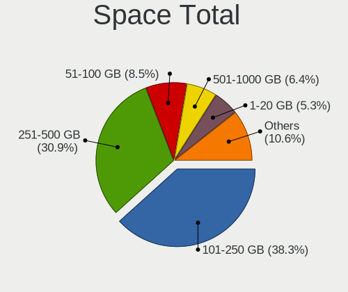
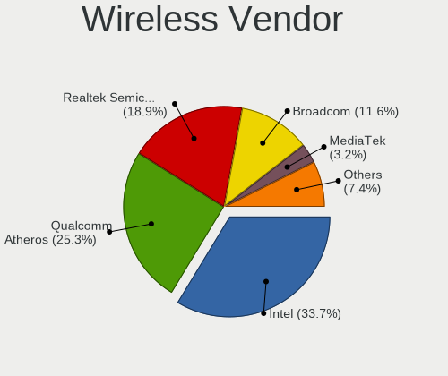

ROSA - Hardware Trends (Notebooks)
----------------------------------

A project to identify most popular hardware characteristics and track their change
over time based on data collected by Linux users at https://Linux-Hardware.org.

Anyone can contribute to this report by the [hw-probe](https://github.com/linuxhw/hw-probe) tool:

    sudo -E hw-probe -all -upload

This report is for one last month. Overall report since the beginning of time: [TestDays](https://github.com/linuxhw/TestDays)

Period: May, 2023.

Contents
--------

* [ System ](#system)
  - [ OS                       ](#os)
  - [ OS Family                ](#os-family)
  - [ Kernel                   ](#kernel)
  - [ Kernel Family            ](#kernel-family)
  - [ Kernel Major Ver.        ](#kernel-major-ver)
  - [ Arch                     ](#arch)
  - [ DE                       ](#de)
  - [ Display Server           ](#display-server)
  - [ Display Manager          ](#display-manager)
  - [ OS Lang                  ](#os-lang)
  - [ Boot Mode                ](#boot-mode)
  - [ Filesystem               ](#filesystem)
  - [ Part. scheme             ](#part-scheme)
  - [ Dual Boot with Linux/BSD ](#dual-boot-with-linuxbsd)
  - [ Dual Boot (Win)          ](#dual-boot-win)

* [ Board ](#board)
  - [ Vendor                   ](#vendor)
  - [ Model                    ](#model)
  - [ Model Family             ](#model-family)
  - [ MFG Year                 ](#mfg-year)
  - [ Form Factor              ](#form-factor)
  - [ Secure Boot              ](#secure-boot)
  - [ Coreboot                 ](#coreboot)
  - [ RAM Size                 ](#ram-size)
  - [ RAM Used                 ](#ram-used)
  - [ Total Drives             ](#total-drives)
  - [ Has CD-ROM               ](#has-cd-rom)
  - [ Has Ethernet             ](#has-ethernet)
  - [ Has WiFi                 ](#has-wifi)
  - [ Has Bluetooth            ](#has-bluetooth)

* [ Location ](#location)
  - [ Country                  ](#country)
  - [ City                     ](#city)

* [ Drives ](#drives)
  - [ Drive Vendor             ](#drive-vendor)
  - [ Drive Model              ](#drive-model)
  - [ HDD Vendor               ](#hdd-vendor)
  - [ SSD Vendor               ](#ssd-vendor)
  - [ Drive Kind               ](#drive-kind)
  - [ Drive Connector          ](#drive-connector)
  - [ Drive Size               ](#drive-size)
  - [ Space Total              ](#space-total)
  - [ Space Used               ](#space-used)
  - [ Malfunc. Drives          ](#malfunc-drives)
  - [ Malfunc. Drive Vendor    ](#malfunc-drive-vendor)
  - [ Malfunc. HDD Vendor      ](#malfunc-hdd-vendor)
  - [ Malfunc. Drive Kind      ](#malfunc-drive-kind)
  - [ Failed Drives            ](#failed-drives)
  - [ Failed Drive Vendor      ](#failed-drive-vendor)
  - [ Drive Status             ](#drive-status)

* [ Storage controller ](#storage-controller)
  - [ Storage Vendor           ](#storage-vendor)
  - [ Storage Model            ](#storage-model)
  - [ Storage Kind             ](#storage-kind)

* [ Processor ](#processor)
  - [ CPU Vendor               ](#cpu-vendor)
  - [ CPU Model                ](#cpu-model)
  - [ CPU Model Family         ](#cpu-model-family)
  - [ CPU Cores                ](#cpu-cores)
  - [ CPU Sockets              ](#cpu-sockets)
  - [ CPU Threads              ](#cpu-threads)
  - [ CPU Op-Modes             ](#cpu-op-modes)
  - [ CPU Microcode            ](#cpu-microcode)
  - [ CPU Microarch            ](#cpu-microarch)

* [ Graphics ](#graphics)
  - [ GPU Vendor               ](#gpu-vendor)
  - [ GPU Model                ](#gpu-model)
  - [ GPU Combo                ](#gpu-combo)
  - [ GPU Driver               ](#gpu-driver)
  - [ GPU Memory               ](#gpu-memory)

* [ Monitor ](#monitor)
  - [ Monitor Vendor           ](#monitor-vendor)
  - [ Monitor Model            ](#monitor-model)
  - [ Monitor Resolution       ](#monitor-resolution)
  - [ Monitor Diagonal         ](#monitor-diagonal)
  - [ Monitor Width            ](#monitor-width)
  - [ Aspect Ratio             ](#aspect-ratio)
  - [ Monitor Area             ](#monitor-area)
  - [ Pixel Density            ](#pixel-density)
  - [ Multiple Monitors        ](#multiple-monitors)

* [ Network ](#network)
  - [ Net Controller Vendor    ](#net-controller-vendor)
  - [ Net Controller Model     ](#net-controller-model)
  - [ Wireless Vendor          ](#wireless-vendor)
  - [ Wireless Model           ](#wireless-model)
  - [ Ethernet Vendor          ](#ethernet-vendor)
  - [ Ethernet Model           ](#ethernet-model)
  - [ Net Controller Kind      ](#net-controller-kind)
  - [ Used Controller          ](#used-controller)
  - [ NICs                     ](#nics)
  - [ IPv6                     ](#ipv6)

* [ Bluetooth ](#bluetooth)
  - [ Bluetooth Vendor         ](#bluetooth-vendor)
  - [ Bluetooth Model          ](#bluetooth-model)

* [ Sound ](#sound)
  - [ Sound Vendor             ](#sound-vendor)
  - [ Sound Model              ](#sound-model)

* [ Memory ](#memory)
  - [ Memory Vendor            ](#memory-vendor)
  - [ Memory Model             ](#memory-model)
  - [ Memory Kind              ](#memory-kind)
  - [ Memory Form Factor       ](#memory-form-factor)
  - [ Memory Size              ](#memory-size)
  - [ Memory Speed             ](#memory-speed)

* [ Printers & scanners ](#printers--scanners)
  - [ Printer Vendor           ](#printer-vendor)
  - [ Printer Model            ](#printer-model)
  - [ Scanner Vendor           ](#scanner-vendor)
  - [ Scanner Model            ](#scanner-model)

* [ Camera ](#camera)
  - [ Camera Vendor            ](#camera-vendor)
  - [ Camera Model             ](#camera-model)

* [ Security ](#security)
  - [ Fingerprint Vendor       ](#fingerprint-vendor)
  - [ Fingerprint Model        ](#fingerprint-model)
  - [ Chipcard Vendor          ](#chipcard-vendor)
  - [ Chipcard Model           ](#chipcard-model)

* [ Unsupported ](#unsupported)
  - [ Unsupported Devices      ](#unsupported-devices)
  - [ Unsupported Device Types ](#unsupported-device-types)

System
------

OS
--

Installed operating systems

| Name        | Notebooks | Percent |
|-------------|-----------|---------|
| ROSA 12.4   | 79        | 81.44%  |
| ROSA 12     | 5         | 5.15%   |
| ROSA 12.3   | 4         | 4.12%   |
| ROSA R11.1  | 3         | 3.09%   |
| ROSA 12.1   | 2         | 2.06%   |
| ROSA R9     | 1         | 1.03%   |
| ROSA R11    | 1         | 1.03%   |
| ROSA R10    | 1         | 1.03%   |
| ROSA 2021.1 | 1         | 1.03%   |

OS Family
---------

OS without a version

| Name | Notebooks | Percent |
|------|-----------|---------|
| ROSA | 97        | 100%    |

Kernel
------

Version of the Linux kernel

| Version                             | Notebooks | Percent |
|-------------------------------------|-----------|---------|
| 6.1.20-generic-2rosa2021.1-x86_64   | 71        | 73.2%   |
| 5.15.103-generic-1rosa2021.1-x86_64 | 6         | 6.19%   |
| 5.15.103-generic-1rosa2021.1-i686   | 4         | 4.12%   |
| 5.10.176-generic-1rosa2021.1-x86_64 | 3         | 3.09%   |
| 5.15.77-generic-1rosa2021.1-x86_64  | 2         | 2.06%   |
| 5.15.75-generic-1rosa2021.1-x86_64  | 2         | 2.06%   |
| 5.10.74-generic-2rosa2021.1-x86_64  | 2         | 2.06%   |
| 5.4.83-generic-2rosa-x86_64         | 1         | 1.03%   |
| 5.4.83-generic-2rosa-i586           | 1         | 1.03%   |
| 5.15.79-generic-1rosa2021.1-x86_64  | 1         | 1.03%   |
| 4.9.60-nrj-desktop-1rosa-x86_64     | 1         | 1.03%   |
| 4.9.20-nrj-desktop-1rosa-x86_64     | 1         | 1.03%   |
| 4.15.0-desktop-45.1rosa-i586        | 1         | 1.03%   |
| 4.15.0-desktop-122.124.1rosa-x86_64 | 1         | 1.03%   |

Kernel Family
-------------

Linux kernel without a distro release

| Version  | Notebooks | Percent |
|----------|-----------|---------|
| 6.1.20   | 71        | 73.2%   |
| 5.15.103 | 10        | 10.31%  |
| 5.10.176 | 3         | 3.09%   |
| 5.4.83   | 2         | 2.06%   |
| 5.15.77  | 2         | 2.06%   |
| 5.15.75  | 2         | 2.06%   |
| 5.10.74  | 2         | 2.06%   |
| 4.15.0   | 2         | 2.06%   |
| 5.15.79  | 1         | 1.03%   |
| 4.9.60   | 1         | 1.03%   |
| 4.9.20   | 1         | 1.03%   |

Kernel Major Ver.
-----------------

Linux kernel major version

| Version | Notebooks | Percent |
|---------|-----------|---------|
| 6.1     | 71        | 73.2%   |
| 5.15    | 15        | 15.46%  |
| 5.10    | 5         | 5.15%   |
| 5.4     | 2         | 2.06%   |
| 4.9     | 2         | 2.06%   |
| 4.15    | 2         | 2.06%   |

Arch
----

OS architecture (x86_64, i586, etc.)

| Name   | Notebooks | Percent |
|--------|-----------|---------|
| x86_64 | 91        | 93.81%  |
| i686   | 6         | 6.19%   |

DE
--

Desktop Environment

| Name  | Notebooks | Percent |
|-------|-----------|---------|
| KDE5  | 52        | 53.61%  |
| GNOME | 25        | 25.77%  |
| LXQt  | 14        | 14.43%  |
| KDE4  | 5         | 5.15%   |
| i3    | 1         | 1.03%   |

Display Server
--------------

X11 or Wayland

| Name    | Notebooks | Percent |
|---------|-----------|---------|
| Wayland | 76        | 78.35%  |
| X11     | 20        | 20.62%  |
| Tty     | 1         | 1.03%   |

Display Manager
---------------

SDDM, LightDM, etc.

| Name    | Notebooks | Percent |
|---------|-----------|---------|
| SDDM    | 50        | 51.55%  |
| GDM     | 36        | 37.11%  |
| LightDM | 5         | 5.15%   |
| KDM     | 5         | 5.15%   |
| Unknown | 1         | 1.03%   |

OS Lang
-------

Language

| Lang    | Notebooks | Percent |
|---------|-----------|---------|
| ru_RU   | 83        | 85.57%  |
| en_US   | 5         | 5.15%   |
| Unknown | 3         | 3.09%   |
| en_GB   | 2         | 2.06%   |
| es_PE   | 1         | 1.03%   |
| es_ES   | 1         | 1.03%   |
| es_CO   | 1         | 1.03%   |
| de_DE   | 1         | 1.03%   |

Boot Mode
---------

EFI or BIOS

| Mode | Notebooks | Percent |
|------|-----------|---------|
| EFI  | 55        | 56.7%   |
| BIOS | 42        | 43.3%   |

Filesystem
----------

Type of filesystem

| Type    | Notebooks | Percent |
|---------|-----------|---------|
| Ext4    | 89        | 91.75%  |
| Btrfs   | 6         | 6.19%   |
| Overlay | 1         | 1.03%   |
| Aufs    | 1         | 1.03%   |

Part. scheme
------------

Scheme of partitioning

| Type    | Notebooks | Percent |
|---------|-----------|---------|
| GPT     | 54        | 55.67%  |
| MBR     | 40        | 41.24%  |
| Unknown | 3         | 3.09%   |

Dual Boot with Linux/BSD
------------------------

Hosting more than one Linux/BSD

| Dual boot | Notebooks | Percent |
|-----------|-----------|---------|
| No        | 71        | 73.2%   |
| Yes       | 26        | 26.8%   |

Dual Boot (Win)
---------------

Hosting Linux and Windows

| Dual boot | Notebooks | Percent |
|-----------|-----------|---------|
| No        | 60        | 61.86%  |
| Yes       | 37        | 38.14%  |

Board
-----

Vendor
------

Motherboard manufacturer

| Name                     | Notebooks | Percent |
|--------------------------|-----------|---------|
| Hewlett-Packard          | 15        | 15.46%  |
| Acer                     | 15        | 15.46%  |
| Lenovo                   | 13        | 13.4%   |
| ASUSTek Computer         | 12        | 12.37%  |
| Samsung Electronics      | 6         | 6.19%   |
| Dell                     | 6         | 6.19%   |
| Packard Bell             | 3         | 3.09%   |
| HONOR                    | 3         | 3.09%   |
| Clevo                    | 3         | 3.09%   |
| Toshiba                  | 2         | 2.06%   |
| THUNDEROBOT              | 2         | 2.06%   |
| MSI                      | 2         | 2.06%   |
| LTD Delovoy Office       | 2         | 2.06%   |
| Unknown                  | 2         | 2.06%   |
| Timi                     | 1         | 1.03%   |
| Sony                     | 1         | 1.03%   |
| Notebook                 | 1         | 1.03%   |
| Maibenben                | 1         | 1.03%   |
| Irbis                    | 1         | 1.03%   |
| Infinix                  | 1         | 1.03%   |
| ICL-KME CS               | 1         | 1.03%   |
| HIPER Technology Limited | 1         | 1.03%   |
| eMachines                | 1         | 1.03%   |
| Digma                    | 1         | 1.03%   |
| Apple                    | 1         | 1.03%   |

Model
-----

Motherboard model

| Name                                 | Notebooks | Percent |
|--------------------------------------|-----------|---------|
| Packard Bell DOT S                   | 2         | 2.06%   |
| HP 255 G8 Notebook PC                | 2         | 2.06%   |
| Acer Aspire ES1-523                  | 2         | 2.06%   |
| Unknown                              | 2         | 2.06%   |
| Toshiba Satellite L850D-BNK          | 1         | 1.03%   |
| Toshiba Satellite L755               | 1         | 1.03%   |
| Timi Xiaomi Book Pro 14 2022         | 1         | 1.03%   |
| THUNDEROBOT IGER F1                  | 1         | 1.03%   |
| THUNDEROBOT 911AirXD                 | 1         | 1.03%   |
| Sony VPCZ23Q9R                       | 1         | 1.03%   |
| Samsung RV410/RV510/S3510/E3510      | 1         | 1.03%   |
| Samsung R780                         | 1         | 1.03%   |
| Samsung R710                         | 1         | 1.03%   |
| Samsung N130                         | 1         | 1.03%   |
| Samsung 350V5C/351V5C/3540VC/3440VC  | 1         | 1.03%   |
| Samsung 300V3A/300V4A/300V5A         | 1         | 1.03%   |
| Packard Bell EasyNote TK85           | 1         | 1.03%   |
| Notebook W250EGQ / W270EGQ           | 1         | 1.03%   |
| MSI GP60 2OD                         | 1         | 1.03%   |
| MSI GE60 2PC                         | 1         | 1.03%   |
| Maibenben MaiBook M                  | 1         | 1.03%   |
| LTD Delovoy Office EVE 14 C414       | 1         | 1.03%   |
| LTD Delovoy Office 15CLG1            | 1         | 1.03%   |
| Lenovo V580c 20160                   | 1         | 1.03%   |
| Lenovo ThinkPad T420 4236PJ2         | 1         | 1.03%   |
| Lenovo ThinkPad L15 Gen 1 20U8S2TN02 | 1         | 1.03%   |
| Lenovo ThinkBook 16p Gen 2 20YM      | 1         | 1.03%   |
| Lenovo Legion Y540-17IRH 81Q4        | 1         | 1.03%   |
| Lenovo Legion Y530-15ICH 81FV        | 1         | 1.03%   |
| Lenovo K14 Gen 1 21CSS16E00          | 1         | 1.03%   |
| Lenovo IdeaPadFlex 10 20324          | 1         | 1.03%   |
| Lenovo IdeaPad S145-15AST 81N3       | 1         | 1.03%   |
| Lenovo IdeaPad 520-15IKB 80YL        | 1         | 1.03%   |
| Lenovo E31-80 80MX                   | 1         | 1.03%   |
| Lenovo B590 20206                    | 1         | 1.03%   |
| Lenovo B450 1S16800336100N8          | 1         | 1.03%   |
| Irbis NB64                           | 1         | 1.03%   |
| Infinix INBOOK X2                    | 1         | 1.03%   |
| ICL-KME CS RAYbook                   | 1         | 1.03%   |
| HONOR HYM-WXX                        | 1         | 1.03%   |

Model Family
------------

Motherboard model prefix

| Name                      | Notebooks | Percent |
|---------------------------|-----------|---------|
| Acer Aspire               | 10        | 10.31%  |
| Dell Inspiron             | 5         | 5.15%   |
| HP ProBook                | 4         | 4.12%   |
| HP Laptop                 | 3         | 3.09%   |
| Toshiba Satellite         | 2         | 2.06%   |
| Packard Bell DOT          | 2         | 2.06%   |
| Lenovo ThinkPad           | 2         | 2.06%   |
| Lenovo Legion             | 2         | 2.06%   |
| Lenovo IdeaPad            | 2         | 2.06%   |
| HP Pavilion               | 2         | 2.06%   |
| HP 255                    | 2         | 2.06%   |
| ASUS VivoBook             | 2         | 2.06%   |
| ASUS TUF                  | 2         | 2.06%   |
| ASUS ASUS                 | 2         | 2.06%   |
| Acer TravelMate           | 2         | 2.06%   |
| Unknown                   | 2         | 2.06%   |
| Timi Xiaomi               | 1         | 1.03%   |
| THUNDEROBOT IGER          | 1         | 1.03%   |
| THUNDEROBOT 911AirXD      | 1         | 1.03%   |
| Sony VPCZ23Q9R            | 1         | 1.03%   |
| Samsung RV410             | 1         | 1.03%   |
| Samsung R780              | 1         | 1.03%   |
| Samsung R710              | 1         | 1.03%   |
| Samsung N130              | 1         | 1.03%   |
| Samsung 350V5C            | 1         | 1.03%   |
| Samsung 300V3A            | 1         | 1.03%   |
| Packard Bell EasyNote     | 1         | 1.03%   |
| Notebook W250EGQ          | 1         | 1.03%   |
| MSI GP60                  | 1         | 1.03%   |
| MSI GE60                  | 1         | 1.03%   |
| Maibenben MaiBook         | 1         | 1.03%   |
| LTD Delovoy Office EVE    | 1         | 1.03%   |
| LTD Delovoy Office 15CLG1 | 1         | 1.03%   |
| Lenovo V580c              | 1         | 1.03%   |
| Lenovo ThinkBook          | 1         | 1.03%   |
| Lenovo K14                | 1         | 1.03%   |
| Lenovo IdeaPadFlex        | 1         | 1.03%   |
| Lenovo E31-80             | 1         | 1.03%   |
| Lenovo B590               | 1         | 1.03%   |
| Lenovo B450               | 1         | 1.03%   |

MFG Year
--------

Motherboard manufacture year

| Year | Notebooks | Percent |
|------|-----------|---------|
| 2011 | 20        | 20.62%  |
| 2012 | 12        | 12.37%  |
| 2022 | 11        | 11.34%  |
| 2020 | 9         | 9.28%   |
| 2021 | 7         | 7.22%   |
| 2019 | 5         | 5.15%   |
| 2016 | 5         | 5.15%   |
| 2018 | 4         | 4.12%   |
| 2017 | 4         | 4.12%   |
| 2013 | 4         | 4.12%   |
| 2010 | 4         | 4.12%   |
| 2009 | 3         | 3.09%   |
| 2008 | 3         | 3.09%   |
| 2015 | 2         | 2.06%   |
| 2014 | 2         | 2.06%   |
| 2007 | 1         | 1.03%   |
| 2006 | 1         | 1.03%   |

Form Factor
-----------

Physical design of the computer

| Name     | Notebooks | Percent |
|----------|-----------|---------|
| Notebook | 97        | 100%    |

Secure Boot
-----------

Enabled or disabled

| State    | Notebooks | Percent |
|----------|-----------|---------|
| Disabled | 97        | 100%    |

Coreboot
--------

Have coreboot on board

| Used | Notebooks | Percent |
|------|-----------|---------|
| No   | 97        | 100%    |

RAM Size
--------

Total RAM memory

| Size in GB | Notebooks | Percent |
|------------|-----------|---------|
| 4.01-8.0   | 28        | 28.87%  |
| 3.01-4.0   | 20        | 20.62%  |
| 8.01-16.0  | 19        | 19.59%  |
| 1.01-2.0   | 11        | 11.34%  |
| 16.01-24.0 | 9         | 9.28%   |
| 2.01-3.0   | 6         | 6.19%   |
| 32.01-64.0 | 4         | 4.12%   |

RAM Used
--------

Used RAM memory

| Used GB   | Notebooks | Percent |
|-----------|-----------|---------|
| 1.01-2.0  | 53        | 54.64%  |
| 0.51-1.0  | 21        | 21.65%  |
| 2.01-3.0  | 8         | 8.25%   |
| 4.01-8.0  | 7         | 7.22%   |
| 3.01-4.0  | 5         | 5.15%   |
| 0.01-0.5  | 2         | 2.06%   |
| 8.01-16.0 | 1         | 1.03%   |

Total Drives
------------

Number of drives on board

| Drives | Notebooks | Percent |
|--------|-----------|---------|
| 1      | 60        | 61.86%  |
| 2      | 32        | 32.99%  |
| 3      | 5         | 5.15%   |

Has CD-ROM
----------

Has CD-ROM on board

| Presented | Notebooks | Percent |
|-----------|-----------|---------|
| No        | 69        | 71.13%  |
| Yes       | 28        | 28.87%  |

Has Ethernet
------------

Has Ethernet on board

| Presented | Notebooks | Percent |
|-----------|-----------|---------|
| Yes       | 82        | 84.54%  |
| No        | 15        | 15.46%  |

Has WiFi
--------

Has WiFi module

| Presented | Notebooks | Percent |
|-----------|-----------|---------|
| Yes       | 93        | 95.88%  |
| No        | 4         | 4.12%   |

Has Bluetooth
-------------

Has Bluetooth module

| Presented | Notebooks | Percent |
|-----------|-----------|---------|
| Yes       | 68        | 70.1%   |
| No        | 29        | 29.9%   |

Location
--------

Country
-------

Geographic location (country)

| Country    | Notebooks | Percent |
|------------|-----------|---------|
| Russia     | 81        | 83.51%  |
| Germany    | 3         | 3.09%   |
| USA        | 2         | 2.06%   |
| Ukraine    | 2         | 2.06%   |
| Kazakhstan | 2         | 2.06%   |
| Spain      | 1         | 1.03%   |
| Portugal   | 1         | 1.03%   |
| Peru       | 1         | 1.03%   |
| Costa Rica | 1         | 1.03%   |
| Colombia   | 1         | 1.03%   |
| Brazil     | 1         | 1.03%   |
| Belarus    | 1         | 1.03%   |

City
----

Geographic location (city)

| City                | Notebooks | Percent |
|---------------------|-----------|---------|
| Moscow              | 19        | 19.59%  |
| St Petersburg       | 6         | 6.19%   |
| Yekaterinburg       | 5         | 5.15%   |
| Khabarovsk          | 3         | 3.09%   |
| Kaluga              | 3         | 3.09%   |
| Yaroslavl           | 2         | 2.06%   |
| Surgut              | 2         | 2.06%   |
| Saransk             | 2         | 2.06%   |
| Omsk                | 2         | 2.06%   |
| Novosibirsk         | 2         | 2.06%   |
| Krasnoyarsk         | 2         | 2.06%   |
| Barnaul             | 2         | 2.06%   |
| Witten              | 1         | 1.03%   |
| Voronezh            | 1         | 1.03%   |
| Volgograd           | 1         | 1.03%   |
| Vladivostok         | 1         | 1.03%   |
| Vladimir            | 1         | 1.03%   |
| Ust-Kamenogorsk     | 1         | 1.03%   |
| Ufa                 | 1         | 1.03%   |
| Tyumen              | 1         | 1.03%   |
| Tula                | 1         | 1.03%   |
| Tsarskoye Selo      | 1         | 1.03%   |
| Tomsk               | 1         | 1.03%   |
| Teykovo             | 1         | 1.03%   |
| Stavropol           | 1         | 1.03%   |
| Snezhinsk           | 1         | 1.03%   |
| Smolensk            | 1         | 1.03%   |
| Saratov             | 1         | 1.03%   |
| Sao Carlos          | 1         | 1.03%   |
| San José           | 1         | 1.03%   |
| Samara              | 1         | 1.03%   |
| Perm                | 1         | 1.03%   |
| Orenburg            | 1         | 1.03%   |
| Novomoskovsk        | 1         | 1.03%   |
| Nizhniy Novgorod    | 1         | 1.03%   |
| Naberezhnyye Chelny | 1         | 1.03%   |
| Mytishchi           | 1         | 1.03%   |
| Mezhdurechensk      | 1         | 1.03%   |
| Mala Danylivka      | 1         | 1.03%   |
| Madrid              | 1         | 1.03%   |

Drives
------

Drive Vendor
------------

Hard drive vendors

| Vendor                | Notebooks | Drives | Percent |
|-----------------------|-----------|--------|---------|
| WDC                   | 17        | 17     | 13.49%  |
| Seagate               | 14        | 14     | 11.11%  |
| Samsung Electronics   | 14        | 16     | 11.11%  |
| Hitachi               | 10        | 10     | 7.94%   |
| Toshiba               | 7         | 7      | 5.56%   |
| Kingston              | 7         | 7      | 5.56%   |
| SPCC                  | 5         | 5      | 3.97%   |
| Intel                 | 4         | 4      | 3.17%   |
| HGST                  | 4         | 4      | 3.17%   |
| Unknown               | 3         | 3      | 2.38%   |
| SK hynix              | 3         | 3      | 2.38%   |
| SanDisk               | 3         | 3      | 2.38%   |
| China                 | 3         | 3      | 2.38%   |
| Apacer                | 3         | 3      | 2.38%   |
| Unknown               | 3         | 3      | 2.38%   |
| Transcend             | 2         | 2      | 1.59%   |
| SSSTC                 | 2         | 2      | 1.59%   |
| Netac                 | 2         | 2      | 1.59%   |
| KingSpec              | 2         | 2      | 1.59%   |
| BIWIN                 | 2         | 2      | 1.59%   |
| XrayDisk              | 1         | 1      | 0.79%   |
| Wdxsky                | 1         | 1      | 0.79%   |
| Realtek Semiconductor | 1         | 1      | 0.79%   |
| Qumo                  | 1         | 1      | 0.79%   |
| PNY                   | 1         | 1      | 0.79%   |
| Phison Electronics    | 1         | 1      | 0.79%   |
| Patriot               | 1         | 1      | 0.79%   |
| Micron Technology     | 1         | 1      | 0.79%   |
| KIOXIA                | 1         | 1      | 0.79%   |
| Hoodisk               | 1         | 1      | 0.79%   |
| HGST HTS              | 1         | 1      | 0.79%   |
| GOODRAM               | 1         | 1      | 0.79%   |
| Fanxiang              | 1         | 1      | 0.79%   |
| Crucial               | 1         | 1      | 0.79%   |
| Azerty                | 1         | 1      | 0.79%   |
| A-DATA Technology     | 1         | 1      | 0.79%   |

Drive Model
-----------

Hard drive models

| Model                                  | Notebooks | Percent |
|----------------------------------------|-----------|---------|
| SPCC Solid State Disk 256GB            | 3         | 2.36%   |
| Unknown                                | 3         | 2.36%   |
| WDC WD5000LPCX-24VHAT0 500GB           | 2         | 1.57%   |
| Seagate ST9500325AS 500GB              | 2         | 1.57%   |
| Kingston SV300S37A120G 120GB SSD       | 2         | 1.57%   |
| Hitachi HTS543232A7A384 320GB          | 2         | 1.57%   |
| XrayDisk 240GB SSD                     | 1         | 0.79%   |
| Wdxsky W31-256G SSD                    | 1         | 0.79%   |
| WDC WD7500BPVX-22JC3T0 752GB           | 1         | 0.79%   |
| WDC WD7500BPVT-00HXZT3 752GB           | 1         | 0.79%   |
| WDC WD5000LPCX-22VHAT1 500GB           | 1         | 0.79%   |
| WDC WD5000LPCX-21VHAT0 500GB           | 1         | 0.79%   |
| WDC WD5000BPVT-80HXZT1 500GB           | 1         | 0.79%   |
| WDC WD5000BPVT-75HXZT3 500GB           | 1         | 0.79%   |
| WDC WD5000BPVT-22HXZT3 500GB           | 1         | 0.79%   |
| WDC WD5000BPVT-00HXZT1 500GB           | 1         | 0.79%   |
| WDC WD3200BPVT-80ZEST0 320GB           | 1         | 0.79%   |
| WDC WD10SPZX-21Z10T0 1TB               | 1         | 0.79%   |
| WDC WD10SPZX-00Z10T0 1TB               | 1         | 0.79%   |
| WDC WD10SPSX-08A6W 1TB                 | 1         | 0.79%   |
| WDC PC SN730 SDBPNTY-512G-1027 512GB   | 1         | 0.79%   |
| WDC PC SN530 SDBPNPZ-256G-1006 256GB   | 1         | 0.79%   |
| WDC PC SN530 SDBPMPZ-512G-1001 512GB   | 1         | 0.79%   |
| Unknown SN128  128GB                   | 1         | 0.79%   |
| Unknown SDU1  64GB                     | 1         | 0.79%   |
| Unknown S0J38Y  64GB                   | 1         | 0.79%   |
| Transcend TS32GSSD370S 32GB            | 1         | 0.79%   |
| Transcend TS128GSSD370S 128GB          | 1         | 0.79%   |
| Toshiba MQ04ABF100 1TB                 | 1         | 0.79%   |
| Toshiba MQ01ABF050 500GB               | 1         | 0.79%   |
| Toshiba MQ01ABF032 320GB               | 1         | 0.79%   |
| Toshiba MQ01ABD032 320GB               | 1         | 0.79%   |
| Toshiba MK6475GSX 640GB                | 1         | 0.79%   |
| Toshiba KXG60ZNV512G 512GB             | 1         | 0.79%   |
| Toshiba HDWL120 2TB                    | 1         | 0.79%   |
| SSSTC CL5-8D512 512GB                  | 1         | 0.79%   |
| SSSTC CL1-8D512 512GB                  | 1         | 0.79%   |
| SPCC SSD162 56GB                       | 1         | 0.79%   |
| SPCC M.2 PCIe SSD 256GB                | 1         | 0.79%   |
| SK hynix SKHynix_HFS512GDE9X084N 512GB | 1         | 0.79%   |

HDD Vendor
----------

Hard disk drive vendors

| Vendor              | Notebooks | Drives | Percent |
|---------------------|-----------|--------|---------|
| WDC                 | 14        | 14     | 28%     |
| Seagate             | 14        | 14     | 28%     |
| Hitachi             | 10        | 10     | 20%     |
| Toshiba             | 6         | 6      | 12%     |
| HGST                | 4         | 4      | 8%      |
| Samsung Electronics | 1         | 1      | 2%      |
| HGST HTS            | 1         | 1      | 2%      |

SSD Vendor
----------

Solid state drive vendors

| Vendor              | Notebooks | Drives | Percent |
|---------------------|-----------|--------|---------|
| Kingston            | 6         | 6      | 14.63%  |
| SPCC                | 4         | 4      | 9.76%   |
| Samsung Electronics | 4         | 5      | 9.76%   |
| Intel               | 3         | 3      | 7.32%   |
| China               | 3         | 3      | 7.32%   |
| Apacer              | 3         | 3      | 7.32%   |
| Transcend           | 2         | 2      | 4.88%   |
| SanDisk             | 2         | 2      | 4.88%   |
| Netac               | 2         | 2      | 4.88%   |
| KingSpec            | 2         | 2      | 4.88%   |
| XrayDisk            | 1         | 1      | 2.44%   |
| Wdxsky              | 1         | 1      | 2.44%   |
| Qumo                | 1         | 1      | 2.44%   |
| PNY                 | 1         | 1      | 2.44%   |
| Patriot             | 1         | 1      | 2.44%   |
| Hoodisk             | 1         | 1      | 2.44%   |
| GOODRAM             | 1         | 1      | 2.44%   |
| Fanxiang            | 1         | 1      | 2.44%   |
| Crucial             | 1         | 1      | 2.44%   |
| Azerty              | 1         | 1      | 2.44%   |

Drive Kind
----------

HDD or SSD

| Kind | Notebooks | Drives | Percent |
|------|-----------|--------|---------|
| HDD  | 48        | 50     | 40.68%  |
| SSD  | 38        | 42     | 32.2%   |
| NVMe | 26        | 30     | 22.03%  |
| MMC  | 6         | 6      | 5.08%   |

Drive Connector
---------------

SATA, SAS, NVMe, etc.

| Type | Notebooks | Drives | Percent |
|------|-----------|--------|---------|
| SATA | 73        | 90     | 68.22%  |
| NVMe | 26        | 30     | 24.3%   |
| MMC  | 6         | 6      | 5.61%   |
| SAS  | 2         | 2      | 1.87%   |

Drive Size
----------

Size of hard drive

| Size in TB | Notebooks | Drives | Percent |
|------------|-----------|--------|---------|
| 0.01-0.5   | 61        | 72     | 75.31%  |
| 0.51-1.0   | 19        | 19     | 23.46%  |
| 1.01-2.0   | 1         | 1      | 1.23%   |

Space Total
-----------

Amount of disk space available on the file system

| Size in GB | Notebooks | Percent |
|------------|-----------|---------|
| 101-250    | 35        | 36.08%  |
| 251-500    | 19        | 19.59%  |
| 1-20       | 16        | 16.49%  |
| 501-1000   | 14        | 14.43%  |
| 21-50      | 6         | 6.19%   |
| 51-100     | 5         | 5.15%   |
| 1001-2000  | 2         | 2.06%   |

Space Used
----------

Amount of used disk space

| Used GB  | Notebooks | Percent |
|----------|-----------|---------|
| 1-20     | 63        | 64.95%  |
| 21-50    | 17        | 17.53%  |
| 51-100   | 8         | 8.25%   |
| 101-250  | 5         | 5.15%   |
| 251-500  | 3         | 3.09%   |
| 501-1000 | 1         | 1.03%   |

Malfunc. Drives
---------------

Drive models with a malfunction

| Model                               | Notebooks | Drives | Percent |
|-------------------------------------|-----------|--------|---------|
| Seagate ST9500325AS 500GB           | 2         | 2      | 7.41%   |
| Hitachi HTS543232A7A384 320GB       | 2         | 2      | 7.41%   |
| WDC WD7500BPVT-00HXZT3 752GB        | 1         | 1      | 3.7%    |
| WDC WD5000BPVT-75HXZT3 500GB        | 1         | 1      | 3.7%    |
| WDC WD5000BPVT-22HXZT3 500GB        | 1         | 1      | 3.7%    |
| Toshiba MQ04ABF100 1TB              | 1         | 1      | 3.7%    |
| SPCC SSD162 56GB                    | 1         | 1      | 3.7%    |
| Seagate ST9750420AS 752GB           | 1         | 1      | 3.7%    |
| Seagate ST9500423AS 500GB           | 1         | 1      | 3.7%    |
| Seagate ST9160314AS 160GB           | 1         | 1      | 3.7%    |
| Seagate ST9120822AS 120GB           | 1         | 1      | 3.7%    |
| Seagate ST500LT012-9WS142 500GB     | 1         | 1      | 3.7%    |
| Seagate ST500LM012 HN-M500MBB 500GB | 1         | 1      | 3.7%    |
| Samsung Electronics HM320JI 320GB   | 1         | 1      | 3.7%    |
| Netac SSD 256GB                     | 1         | 1      | 3.7%    |
| Kingston SKC300S37A240G 240GB SSD   | 1         | 1      | 3.7%    |
| Kingston SA400S37240G 240GB SSD     | 1         | 1      | 3.7%    |
| Intel SSDSC2CW120A3 120GB           | 1         | 1      | 3.7%    |
| Intel SSDSC2BW120A4 120GB           | 1         | 1      | 3.7%    |
| Hitachi HTS723232A7A364 320GB       | 1         | 1      | 3.7%    |
| Hitachi HTS545050B9A300 500GB       | 1         | 1      | 3.7%    |
| Hitachi HTS545032A7E380 320GB       | 1         | 1      | 3.7%    |
| Hitachi HTS542512K9SA00 120GB       | 1         | 1      | 3.7%    |
| Hitachi HTS541080G9AT00 80GB        | 1         | 1      | 3.7%    |
| HGST HTS541010A9E680 1TB            | 1         | 1      | 3.7%    |

Malfunc. Drive Vendor
---------------------

Vendors of faulty drives

| Vendor              | Notebooks | Drives | Percent |
|---------------------|-----------|--------|---------|
| Seagate             | 8         | 8      | 29.63%  |
| Hitachi             | 7         | 7      | 25.93%  |
| WDC                 | 3         | 3      | 11.11%  |
| Kingston            | 2         | 2      | 7.41%   |
| Intel               | 2         | 2      | 7.41%   |
| Toshiba             | 1         | 1      | 3.7%    |
| SPCC                | 1         | 1      | 3.7%    |
| Samsung Electronics | 1         | 1      | 3.7%    |
| Netac               | 1         | 1      | 3.7%    |
| HGST                | 1         | 1      | 3.7%    |

Malfunc. HDD Vendor
-------------------

Vendors of faulty HDD drives

| Vendor              | Notebooks | Drives | Percent |
|---------------------|-----------|--------|---------|
| Seagate             | 8         | 8      | 38.1%   |
| Hitachi             | 7         | 7      | 33.33%  |
| WDC                 | 3         | 3      | 14.29%  |
| Toshiba             | 1         | 1      | 4.76%   |
| Samsung Electronics | 1         | 1      | 4.76%   |
| HGST                | 1         | 1      | 4.76%   |

Malfunc. Drive Kind
-------------------

Kinds of faulty drives

| Kind | Notebooks | Drives | Percent |
|------|-----------|--------|---------|
| HDD  | 20        | 21     | 76.92%  |
| SSD  | 6         | 6      | 23.08%  |

Failed Drives
-------------

Failed drive models

Zero info for selected period =(

Failed Drive Vendor
-------------------

Failed drive vendors

Zero info for selected period =(

Drive Status
------------

Number of failed and malfunc. drives

| Status   | Notebooks | Drives | Percent |
|----------|-----------|--------|---------|
| Works    | 70        | 89     | 66.67%  |
| Malfunc  | 24        | 27     | 22.86%  |
| Detected | 11        | 12     | 10.48%  |

Storage controller
------------------

Storage Vendor
--------------

Storage controller vendors

| Vendor                         | Notebooks | Percent |
|--------------------------------|-----------|---------|
| Intel                          | 69        | 61.61%  |
| AMD                            | 15        | 13.39%  |
| Samsung Electronics            | 9         | 8.04%   |
| SanDisk                        | 4         | 3.57%   |
| SK hynix                       | 3         | 2.68%   |
| Solid State Storage Technology | 2         | 1.79%   |
| Toshiba America Info Systems   | 1         | 0.89%   |
| Shenzhen Longsys Electronics   | 1         | 0.89%   |
| Realtek Semiconductor          | 1         | 0.89%   |
| Phison Electronics             | 1         | 0.89%   |
| Micron Technology              | 1         | 0.89%   |
| KIOXIA                         | 1         | 0.89%   |
| Kingston Technology Company    | 1         | 0.89%   |
| INNOGRIT                       | 1         | 0.89%   |
| Biwin Storage Technology       | 1         | 0.89%   |
| ADATA Technology               | 1         | 0.89%   |

Storage Model
-------------

Storage controller models

| Model                                                                            | Notebooks | Percent |
|----------------------------------------------------------------------------------|-----------|---------|
| AMD FCH SATA Controller [AHCI mode]                                              | 12        | 10.43%  |
| Intel 7 Series Chipset Family 6-port SATA Controller [AHCI mode]                 | 10        | 8.7%    |
| Intel 6 Series/C200 Series Chipset Family 6 port Mobile SATA AHCI Controller     | 9         | 7.83%   |
| Intel 82801IBM/IEM (ICH9M/ICH9M-E) 4 port SATA Controller [AHCI mode]            | 6         | 5.22%   |
| Intel Sunrise Point-LP SATA Controller [AHCI mode]                               | 4         | 3.48%   |
| Intel NM10/ICH7 Family SATA Controller [AHCI mode]                               | 4         | 3.48%   |
| Intel Comet Lake SATA AHCI Controller                                            | 4         | 3.48%   |
| Intel Cannon Lake Mobile PCH SATA AHCI Controller                                | 4         | 3.48%   |
| Intel 5 Series/3400 Series Chipset 4 port SATA AHCI Controller                   | 4         | 3.48%   |
| Samsung NVMe SSD Controller 980                                                  | 3         | 2.61%   |
| Intel Volume Management Device NVMe RAID Controller                              | 3         | 2.61%   |
| Intel 82801 Mobile SATA Controller [RAID mode]                                   | 3         | 2.61%   |
| Solid State Storage Non-Volatile memory controller                               | 2         | 1.74%   |
| SK hynix Gold P31/PC711 NVMe Solid State Drive                                   | 2         | 1.74%   |
| Samsung NVMe SSD Controller SM981/PM981/PM983                                    | 2         | 1.74%   |
| Samsung NVMe SSD Controller SM961/PM961/SM963                                    | 2         | 1.74%   |
| Samsung NVMe SSD Controller PM9A1/PM9A3/980PRO                                   | 2         | 1.74%   |
| Intel Tiger Lake-LP SATA Controller                                              | 2         | 1.74%   |
| Intel Celeron/Pentium Silver Processor SATA Controller                           | 2         | 1.74%   |
| Intel 8 Series/C220 Series Chipset Family 6-port SATA Controller 1 [AHCI mode]   | 2         | 1.74%   |
| Intel 8 Series SATA Controller 1 [AHCI mode]                                     | 2         | 1.74%   |
| AMD SB7x0/SB8x0/SB9x0 SATA Controller [AHCI mode]                                | 2         | 1.74%   |
| Toshiba America Info Systems XG6 NVMe SSD Controller                             | 1         | 0.87%   |
| SK hynix BC501 NVMe Solid State Drive                                            | 1         | 0.87%   |
| Shenzhen Longsys SM2263EN/SM2263XT-based OEM SSD                                 | 1         | 0.87%   |
| SanDisk WD Blue SN550 NVMe SSD                                                   | 1         | 0.87%   |
| SanDisk WD Black SN750 / PC SN730 NVMe SSD                                       | 1         | 0.87%   |
| SanDisk NVMe Controller                                                          | 1         | 0.87%   |
| SanDisk Non-Volatile memory controller                                           | 1         | 0.87%   |
| Realtek NVMe Controller                                                          | 1         | 0.87%   |
| Phison PS5013 E13 NVMe Controller                                                | 1         | 0.87%   |
| Micron NVMe Storage Controller                                                   | 1         | 0.87%   |
| KIOXIA NVMe SSD Controller BG4                                                   | 1         | 0.87%   |
| Kingston Company Company Non-Volatile memory controller                          | 1         | 0.87%   |
| Intel Wildcat Point-LP SATA Controller [AHCI Mode]                               | 1         | 0.87%   |
| Intel Non-Volatile memory controller                                             | 1         | 0.87%   |
| Intel NM10/ICH7 Family SATA Controller [IDE mode]                                | 1         | 0.87%   |
| Intel Jasper Lake SATA AHCI Controller                                           | 1         | 0.87%   |
| Intel Ice Lake-LP SATA Controller [AHCI mode]                                    | 1         | 0.87%   |
| Intel Atom/Celeron/Pentium Processor x5-E8000/J3xxx/N3xxx Series SATA Controller | 1         | 0.87%   |

Storage Kind
------------

Kind of storage controller (IDE, SATA, NVMe, SAS, ...)

| Kind | Notebooks | Percent |
|------|-----------|---------|
| SATA | 74        | 66.67%  |
| NVMe | 26        | 23.42%  |
| RAID | 6         | 5.41%   |
| IDE  | 5         | 4.5%    |

Processor
---------

CPU Vendor
----------

Processor vendors

| Vendor | Notebooks | Percent |
|--------|-----------|---------|
| Intel  | 75        | 77.32%  |
| AMD    | 22        | 22.68%  |

CPU Model
---------

Processor models

| Model                                       | Notebooks | Percent |
|---------------------------------------------|-----------|---------|
| Intel Core i5-10210U CPU @ 1.60GHz          | 3         | 3.09%   |
| Intel 11th Gen Core i5-1135G7 @ 2.40GHz     | 3         | 3.09%   |
| Intel Pentium CPU P6200 @ 2.13GHz           | 2         | 2.06%   |
| Intel Core i5-8300H CPU @ 2.30GHz           | 2         | 2.06%   |
| Intel Core i5-1035G1 CPU @ 1.00GHz          | 2         | 2.06%   |
| Intel Core i3-3110M CPU @ 2.40GHz           | 2         | 2.06%   |
| Intel Core i3-2310M CPU @ 2.10GHz           | 2         | 2.06%   |
| Intel Atom x5-Z8350 CPU @ 1.44GHz           | 2         | 2.06%   |
| AMD Ryzen 7 4800H with Radeon Graphics      | 2         | 2.06%   |
| AMD Ryzen 5 5600H with Radeon Graphics      | 2         | 2.06%   |
| Intel Pentium Silver N6000 @ 1.10GHz        | 1         | 1.03%   |
| Intel Pentium Dual-Core CPU T4500 @ 2.30GHz | 1         | 1.03%   |
| Intel Pentium Dual-Core CPU T4300 @ 2.10GHz | 1         | 1.03%   |
| Intel Pentium Dual CPU T3200 @ 2.00GHz      | 1         | 1.03%   |
| Intel Pentium CPU P6100 @ 2.00GHz           | 1         | 1.03%   |
| Intel Pentium CPU 2020M @ 2.40GHz           | 1         | 1.03%   |
| Intel Genuine CPU U7300 @ 1.30GHz           | 1         | 1.03%   |
| Intel Core i7-9750H CPU @ 2.60GHz           | 1         | 1.03%   |
| Intel Core i7-8750H CPU @ 2.20GHz           | 1         | 1.03%   |
| Intel Core i7-4500U CPU @ 1.80GHz           | 1         | 1.03%   |
| Intel Core i7-2760QM CPU @ 2.40GHz          | 1         | 1.03%   |
| Intel Core i7-2670QM CPU @ 2.20GHz          | 1         | 1.03%   |
| Intel Core i7-2630QM CPU @ 2.00GHz          | 1         | 1.03%   |
| Intel Core i7 CPU Q 740 @ 1.73GHz           | 1         | 1.03%   |
| Intel Core i7 CPU M 620 @ 2.67GHz           | 1         | 1.03%   |
| Intel Core i5-8265U CPU @ 1.60GHz           | 1         | 1.03%   |
| Intel Core i5-7300HQ CPU @ 2.50GHz          | 1         | 1.03%   |
| Intel Core i5-7200U CPU @ 2.50GHz           | 1         | 1.03%   |
| Intel Core i5-6300U CPU @ 2.40GHz           | 1         | 1.03%   |
| Intel Core i5-4210U CPU @ 1.70GHz           | 1         | 1.03%   |
| Intel Core i5-4210H CPU @ 2.90GHz           | 1         | 1.03%   |
| Intel Core i5-4200M CPU @ 2.50GHz           | 1         | 1.03%   |
| Intel Core i5-3230M CPU @ 2.60GHz           | 1         | 1.03%   |
| Intel Core i5-3210M CPU @ 2.50GHz           | 1         | 1.03%   |
| Intel Core i5-2520M CPU @ 2.50GHz           | 1         | 1.03%   |
| Intel Core i5-2450M CPU @ 2.50GHz           | 1         | 1.03%   |
| Intel Core i5-2430M CPU @ 2.40GHz           | 1         | 1.03%   |
| Intel Core i5-2415M CPU @ 2.30GHz           | 1         | 1.03%   |
| Intel Core i3-7100U CPU @ 2.40GHz           | 1         | 1.03%   |
| Intel Core i3-6006U CPU @ 2.00GHz           | 1         | 1.03%   |

CPU Model Family
----------------

Processor model prefix

| Model                   | Notebooks | Percent |
|-------------------------|-----------|---------|
| Intel Core i5           | 20        | 20.62%  |
| Intel Core i3           | 11        | 11.34%  |
| Intel Celeron           | 9         | 9.28%   |
| Intel Core i7           | 8         | 8.25%   |
| Intel Atom              | 8         | 8.25%   |
| Other                   | 7         | 7.22%   |
| AMD Ryzen 5             | 5         | 5.15%   |
| Intel Pentium           | 4         | 4.12%   |
| Intel Core 2 Duo        | 3         | 3.09%   |
| AMD Ryzen 7             | 3         | 3.09%   |
| Intel Pentium Dual-Core | 2         | 2.06%   |
| AMD A6                  | 2         | 2.06%   |
| AMD A4                  | 2         | 2.06%   |
| AMD A10                 | 2         | 2.06%   |
| Intel Pentium Silver    | 1         | 1.03%   |
| Intel Pentium Dual      | 1         | 1.03%   |
| Intel Genuine           | 1         | 1.03%   |
| AMD Turion 64 Mobile    | 1         | 1.03%   |
| AMD Ryzen 3 PRO         | 1         | 1.03%   |
| AMD Ryzen 3             | 1         | 1.03%   |
| AMD Phenom II           | 1         | 1.03%   |
| AMD E1                  | 1         | 1.03%   |
| AMD E                   | 1         | 1.03%   |
| AMD Athlon              | 1         | 1.03%   |
| AMD A8                  | 1         | 1.03%   |

CPU Cores
---------

Number of processor cores

| Number | Notebooks | Percent |
|--------|-----------|---------|
| 2      | 56        | 57.73%  |
| 4      | 26        | 26.8%   |
| 6      | 7         | 7.22%   |
| 1      | 4         | 4.12%   |
| 8      | 3         | 3.09%   |
| 12     | 1         | 1.03%   |

CPU Sockets
-----------

Number of sockets

| Number | Notebooks | Percent |
|--------|-----------|---------|
| 1      | 97        | 100%    |

CPU Threads
-----------

Threads per core (Hyper-Threading)

| Number | Notebooks | Percent |
|--------|-----------|---------|
| 2      | 63        | 64.95%  |
| 1      | 34        | 35.05%  |

CPU Op-Modes
------------

CPU Operation Modes (32-bit, 64-bit)

| Op mode        | Notebooks | Percent |
|----------------|-----------|---------|
| 32-bit, 64-bit | 96        | 98.97%  |
| 32-bit         | 1         | 1.03%   |

CPU Microcode
-------------

Microcode number

| Number     | Notebooks | Percent |
|------------|-----------|---------|
| 0x206a7    | 15        | 15.46%  |
| 0x306a9    | 5         | 5.15%   |
| 0x806ec    | 4         | 4.12%   |
| 0x806c1    | 4         | 4.12%   |
| 0x1067a    | 4         | 4.12%   |
| Unknown    | 4         | 4.12%   |
| 0x906ea    | 3         | 3.09%   |
| 0x406c4    | 3         | 3.09%   |
| 0x20655    | 3         | 3.09%   |
| 0x106ca    | 3         | 3.09%   |
| 0x08108109 | 3         | 3.09%   |
| 0x906c0    | 2         | 2.06%   |
| 0x906a3    | 2         | 2.06%   |
| 0x806e9    | 2         | 2.06%   |
| 0x706e5    | 2         | 2.06%   |
| 0x706a1    | 2         | 2.06%   |
| 0x6fd      | 2         | 2.06%   |
| 0x406e3    | 2         | 2.06%   |
| 0x40651    | 2         | 2.06%   |
| 0x306c3    | 2         | 2.06%   |
| 0x30661    | 2         | 2.06%   |
| 0x0a50000c | 2         | 2.06%   |
| 0x08600104 | 2         | 2.06%   |
| 0x07030105 | 2         | 2.06%   |
| 0x03000014 | 2         | 2.06%   |
| 0x906e9    | 1         | 1.03%   |
| 0x806eb    | 1         | 1.03%   |
| 0x806d1    | 1         | 1.03%   |
| 0x306d4    | 1         | 1.03%   |
| 0x30673    | 1         | 1.03%   |
| 0x206a6    | 1         | 1.03%   |
| 0x20652    | 1         | 1.03%   |
| 0x106e5    | 1         | 1.03%   |
| 0x106c2    | 1         | 1.03%   |
| 0x10676    | 1         | 1.03%   |
| 0x08608103 | 1         | 1.03%   |
| 0x08600106 | 1         | 1.03%   |
| 0x06006705 | 1         | 1.03%   |
| 0x0600611a | 1         | 1.03%   |
| 0x06001116 | 1         | 1.03%   |

CPU Microarch
-------------

Microarchitecture

| Name             | Notebooks | Percent |
|------------------|-----------|---------|
| SandyBridge      | 16        | 16.49%  |
| KabyLake         | 12        | 12.37%  |
| Bonnell          | 6         | 6.19%   |
| Penryn           | 5         | 5.15%   |
| IvyBridge        | 5         | 5.15%   |
| Zen 2            | 4         | 4.12%   |
| Westmere         | 4         | 4.12%   |
| TigerLake        | 4         | 4.12%   |
| Silvermont       | 4         | 4.12%   |
| Haswell          | 4         | 4.12%   |
| Zen+             | 3         | 3.09%   |
| Zen 3            | 3         | 3.09%   |
| Icelake          | 3         | 3.09%   |
| Tremont          | 2         | 2.06%   |
| Skylake          | 2         | 2.06%   |
| Puma             | 2         | 2.06%   |
| Piledriver       | 2         | 2.06%   |
| K10 Llano        | 2         | 2.06%   |
| Goldmont plus    | 2         | 2.06%   |
| Excavator        | 2         | 2.06%   |
| Core             | 2         | 2.06%   |
| Alderlake Hybrid | 2         | 2.06%   |
| Nehalem          | 1         | 1.03%   |
| K8 Hammer        | 1         | 1.03%   |
| K10              | 1         | 1.03%   |
| Broadwell        | 1         | 1.03%   |
| Bobcat           | 1         | 1.03%   |
| Unknown          | 1         | 1.03%   |

Graphics
--------

GPU Vendor
----------

Vendors of graphics cards

| Vendor | Notebooks | Percent |
|--------|-----------|---------|
| Intel  | 65        | 52.85%  |
| AMD    | 30        | 24.39%  |
| Nvidia | 28        | 22.76%  |

GPU Model
---------

Graphics card models

| Model                                                                                    | Notebooks | Percent |
|------------------------------------------------------------------------------------------|-----------|---------|
| Intel 2nd Generation Core Processor Family Integrated Graphics Controller                | 13        | 10%     |
| Intel 3rd Gen Core processor Graphics Controller                                         | 5         | 3.85%   |
| Intel CometLake-U GT2 [UHD Graphics]                                                     | 4         | 3.08%   |
| Intel CoffeeLake-H GT2 [UHD Graphics 630]                                                | 4         | 3.08%   |
| AMD Renoir                                                                               | 4         | 3.08%   |
| Nvidia TU106M [GeForce RTX 2060 Mobile]                                                  | 3         | 2.31%   |
| Nvidia GP107M [GeForce GTX 1050 Mobile]                                                  | 3         | 2.31%   |
| Intel TigerLake-LP GT2 [Iris Xe Graphics]                                                | 3         | 2.31%   |
| Intel Core Processor Integrated Graphics Controller                                      | 3         | 2.31%   |
| Intel Atom/Celeron/Pentium Processor x5-E8000/J3xxx/N3xxx Integrated Graphics Controller | 3         | 2.31%   |
| Intel Atom Processor D4xx/D5xx/N4xx/N5xx Integrated Graphics Controller                  | 3         | 2.31%   |
| AMD Seymour [Radeon HD 6400M/7400M Series]                                               | 3         | 2.31%   |
| AMD Picasso/Raven 2 [Radeon Vega Series / Radeon Vega Mobile Series]                     | 3         | 2.31%   |
| AMD Cezanne [Radeon Vega Series / Radeon Vega Mobile Series]                             | 3         | 2.31%   |
| Nvidia GF119M [GeForce GT 520MX]                                                         | 2         | 1.54%   |
| Nvidia GA107M [GeForce RTX 3050 Mobile]                                                  | 2         | 1.54%   |
| Intel Mobile 4 Series Chipset Integrated Graphics Controller                             | 2         | 1.54%   |
| Intel JasperLake [UHD Graphics]                                                          | 2         | 1.54%   |
| Intel Iris Plus Graphics G1 (Ice Lake)                                                   | 2         | 1.54%   |
| Intel HD Graphics 620                                                                    | 2         | 1.54%   |
| Intel Haswell-ULT Integrated Graphics Controller                                         | 2         | 1.54%   |
| Intel GeminiLake [UHD Graphics 600]                                                      | 2         | 1.54%   |
| Intel Atom Processor D2xxx/N2xxx Integrated Graphics Controller                          | 2         | 1.54%   |
| Intel 4th Gen Core Processor Integrated Graphics Controller                              | 2         | 1.54%   |
| AMD Thames [Radeon HD 7500M/7600M Series]                                                | 2         | 1.54%   |
| Nvidia GT218M [GeForce G 105M]                                                           | 1         | 0.77%   |
| Nvidia GT216M [GeForce GT 330M]                                                          | 1         | 0.77%   |
| Nvidia GP108M [GeForce MX230]                                                            | 1         | 0.77%   |
| Nvidia GP107M [GeForce GTX 1050 Ti Mobile]                                               | 1         | 0.77%   |
| Nvidia GM108M [GeForce 940MX]                                                            | 1         | 0.77%   |
| Nvidia GM107M [GeForce GTX 850M]                                                         | 1         | 0.77%   |
| Nvidia GK208M [GeForce GT 740M]                                                          | 1         | 0.77%   |
| Nvidia GK208BM [GeForce 920M]                                                            | 1         | 0.77%   |
| Nvidia GK107M [GeForce GT 645M]                                                          | 1         | 0.77%   |
| Nvidia GF119M [GeForce 610M]                                                             | 1         | 0.77%   |
| Nvidia GF117M [GeForce 610M/710M/810M/820M / GT 620M/625M/630M/720M]                     | 1         | 0.77%   |
| Nvidia GF108M [GeForce GT 620M/630M/635M/640M LE]                                        | 1         | 0.77%   |
| Nvidia GF108M [GeForce GT 525M]                                                          | 1         | 0.77%   |
| Nvidia GF108M [GeForce GT 420M]                                                          | 1         | 0.77%   |
| Nvidia GA106M [GeForce RTX 3060 Mobile / Max-Q]                                          | 1         | 0.77%   |

GPU Combo
---------

Combinations of graphics cards

| Name           | Notebooks | Percent |
|----------------|-----------|---------|
| 1 x Intel      | 44        | 45.36%  |
| Intel + Nvidia | 18        | 18.56%  |
| 1 x AMD        | 17        | 17.53%  |
| 2 x AMD        | 6         | 6.19%   |
| 1 x Nvidia     | 5         | 5.15%   |
| AMD + Nvidia   | 4         | 4.12%   |
| Intel + AMD    | 3         | 3.09%   |

GPU Driver
----------

Free vs proprietary

| Driver      | Notebooks | Percent |
|-------------|-----------|---------|
| Free        | 91        | 93.81%  |
| Proprietary | 5         | 5.15%   |
| Unknown     | 1         | 1.03%   |

GPU Memory
----------

Total video memory

| Size in GB | Notebooks | Percent |
|------------|-----------|---------|
| Unknown    | 51        | 52.58%  |
| 0.01-0.5   | 22        | 22.68%  |
| 1.01-2.0   | 11        | 11.34%  |
| 0.51-1.0   | 10        | 10.31%  |
| 7.01-8.0   | 1         | 1.03%   |
| 5.01-6.0   | 1         | 1.03%   |
| 3.01-4.0   | 1         | 1.03%   |

Monitor
-------

Monitor Vendor
--------------

Monitor vendors

| Vendor                  | Notebooks | Percent |
|-------------------------|-----------|---------|
| AU Optronics            | 25        | 24.04%  |
| LG Display              | 14        | 13.46%  |
| BOE                     | 14        | 13.46%  |
| Samsung Electronics     | 12        | 11.54%  |
| Chimei Innolux          | 10        | 9.62%   |
| Chi Mei Optoelectronics | 6         | 5.77%   |
| PANDA                   | 5         | 4.81%   |
| InfoVision              | 4         | 3.85%   |
| Philips                 | 2         | 1.92%   |
| Iiyama                  | 2         | 1.92%   |
| Acer                    | 2         | 1.92%   |
| Sony                    | 1         | 0.96%   |
| Lenovo                  | 1         | 0.96%   |
| HJC                     | 1         | 0.96%   |
| Goldstar                | 1         | 0.96%   |
| CTV                     | 1         | 0.96%   |
| CSO                     | 1         | 0.96%   |
| BenQ                    | 1         | 0.96%   |
| Apple                   | 1         | 0.96%   |

Monitor Model
-------------

Monitor models

| Model                                                                    | Notebooks | Percent |
|--------------------------------------------------------------------------|-----------|---------|
| LG Display LCD Monitor LGD02DC 1366x768 344x194mm 15.5-inch              | 3         | 2.86%   |
| AU Optronics LCD Monitor AUO61D2 1024x600 222x125mm 10.0-inch            | 3         | 2.86%   |
| Samsung Electronics LCD Monitor SEC5441 1280x800 331x207mm 15.4-inch     | 2         | 1.9%    |
| PANDA LCD Monitor NCP004D 1920x1080 344x194mm 15.5-inch                  | 2         | 1.9%    |
| LG Display LCD Monitor LGD038E 1366x768 344x194mm 15.5-inch              | 2         | 1.9%    |
| InfoVision LCD Monitor IVO03FA 1366x768 223x125mm 10.1-inch              | 2         | 1.9%    |
| Chi Mei Optoelectronics LCD Monitor CMO15A7 1366x768 344x193mm 15.5-inch | 2         | 1.9%    |
| BOE LCD Monitor BOE0878 1920x1080 355x200mm 16.0-inch                    | 2         | 1.9%    |
| BOE LCD Monitor BOE07CB 1920x1080 344x193mm 15.5-inch                    | 2         | 1.9%    |
| AU Optronics LCD Monitor AUO61ED 1920x1080 344x193mm 15.5-inch           | 2         | 1.9%    |
| Sony Nvidia Defaul t Flat Panel SNY06FA 1600x900 360x200mm 16.2-inch     | 1         | 0.95%   |
| Samsung Electronics LCD Monitor SEC4351 1366x768 344x194mm 15.5-inch     | 1         | 0.95%   |
| Samsung Electronics LCD Monitor SEC3847 1440x900 367x230mm 17.1-inch     | 1         | 0.95%   |
| Samsung Electronics LCD Monitor SEC335A 1366x768 309x174mm 14.0-inch     | 1         | 0.95%   |
| Samsung Electronics LCD Monitor SEC325A 1366x768 344x194mm 15.5-inch     | 1         | 0.95%   |
| Samsung Electronics LCD Monitor SEC3245 1366x768 344x194mm 15.5-inch     | 1         | 0.95%   |
| Samsung Electronics LCD Monitor SEC3150 1366x768 344x193mm 15.5-inch     | 1         | 0.95%   |
| Samsung Electronics LCD Monitor SEC3052 1024x600 223x125mm 10.1-inch     | 1         | 0.95%   |
| Samsung Electronics LCD Monitor SDC5441 1366x768 344x193mm 15.5-inch     | 1         | 0.95%   |
| Samsung Electronics LCD Monitor SDC416A 2880x1800 302x189mm 14.0-inch    | 1         | 0.95%   |
| Samsung Electronics LCD Monitor SDC324C 1920x1080 344x194mm 15.5-inch    | 1         | 0.95%   |
| Samsung Electronics LCD Monitor SAM02A2 1360x768 885x498mm 40.0-inch     | 1         | 0.95%   |
| Philips 224EL PHLC054 1920x1080 480x270mm 21.7-inch                      | 1         | 0.95%   |
| Philips 222EL PHLC052 1920x1080 476x268mm 21.5-inch                      | 1         | 0.95%   |
| PANDA LCD Monitor NCP004A 1920x1080 309x174mm 14.0-inch                  | 1         | 0.95%   |
| PANDA LCD Monitor NCP0035 1920x1080 309x174mm 14.0-inch                  | 1         | 0.95%   |
| PANDA LCD Monitor NCP0029 1920x1080 344x194mm 15.5-inch                  | 1         | 0.95%   |
| LG Display LCD Monitor LGDD801 1366x768 344x194mm 15.5-inch              | 1         | 0.95%   |
| LG Display LCD Monitor LGD05FE 1920x1080 344x194mm 15.5-inch             | 1         | 0.95%   |
| LG Display LCD Monitor LGD05E5 1920x1080 344x194mm 15.5-inch             | 1         | 0.95%   |
| LG Display LCD Monitor LGD04E8 1920x1080 382x215mm 17.3-inch             | 1         | 0.95%   |
| LG Display LCD Monitor LGD033B 1366x768 344x194mm 15.5-inch              | 1         | 0.95%   |
| LG Display LCD Monitor LGD02BB 1366x768 223x125mm 10.1-inch              | 1         | 0.95%   |
| LG Display LCD Monitor LGD02AC 1366x768 344x194mm 15.5-inch              | 1         | 0.95%   |
| LG Display LCD Monitor LGD0283 1920x1080 383x215mm 17.3-inch             | 1         | 0.95%   |
| LG Display LCD Monitor LGD0259 1920x1080 345x194mm 15.6-inch             | 1         | 0.95%   |
| Lenovo LCD Monitor LEN40A0 1366x768 309x174mm 14.0-inch                  | 1         | 0.95%   |
| InfoVision LCD Monitor IVO0535 1920x1080 294x165mm 13.3-inch             | 1         | 0.95%   |
| InfoVision LCD Monitor IVO03F4 1024x600 223x125mm 10.1-inch              | 1         | 0.95%   |
| Iiyama PL2792Q IVM6637 2560x1440 597x336mm 27.0-inch                     | 1         | 0.95%   |

Monitor Resolution
------------------

Monitor screen resolution

| Resolution        | Notebooks | Percent |
|-------------------|-----------|---------|
| 1920x1080 (FHD)   | 44        | 42.72%  |
| 1366x768 (WXGA)   | 37        | 35.92%  |
| 1600x900 (HD+)    | 6         | 5.83%   |
| 1280x800 (WXGA)   | 4         | 3.88%   |
| 1024x600          | 3         | 2.91%   |
| 2560x1440 (QHD)   | 2         | 1.94%   |
| 1440x900 (WXGA+)  | 2         | 1.94%   |
| 3840x2160 (4K)    | 1         | 0.97%   |
| 2880x1800         | 1         | 0.97%   |
| 2560x1600         | 1         | 0.97%   |
| 1920x1200 (WUXGA) | 1         | 0.97%   |
| 1360x768          | 1         | 0.97%   |

Monitor Diagonal
----------------

Diagonal size in inches

| Inches | Notebooks | Percent |
|--------|-----------|---------|
| 15     | 59        | 56.19%  |
| 14     | 10        | 9.52%   |
| 13     | 8         | 7.62%   |
| 17     | 7         | 6.67%   |
| 10     | 6         | 5.71%   |
| 21     | 4         | 3.81%   |
| 16     | 3         | 2.86%   |
| 27     | 2         | 1.9%    |
| 11     | 2         | 1.9%    |
| 40     | 1         | 0.95%   |
| 32     | 1         | 0.95%   |
| 23     | 1         | 0.95%   |
| 19     | 1         | 0.95%   |

Monitor Width
-------------

Physical width

| Width in mm | Notebooks | Percent |
|-------------|-----------|---------|
| 301-350     | 72        | 68.57%  |
| 201-300     | 12        | 11.43%  |
| 351-400     | 11        | 10.48%  |
| 401-500     | 5         | 4.76%   |
| 501-600     | 3         | 2.86%   |
| 801-900     | 1         | 0.95%   |
| 701-800     | 1         | 0.95%   |

Aspect Ratio
------------

Proportional relationship between the width and the height

| Ratio | Notebooks | Percent |
|-------|-----------|---------|
| 16/9  | 88        | 91.67%  |
| 16/10 | 8         | 8.33%   |

Monitor Area
------------

Area in inch²

| Area in inch² | Notebooks | Percent |
|----------------|-----------|---------|
| 101-110        | 61        | 58.1%   |
| 81-90          | 14        | 13.33%  |
| 41-50          | 6         | 5.71%   |
| 201-250        | 5         | 4.76%   |
| 121-130        | 5         | 4.76%   |
| 71-80          | 4         | 3.81%   |
| 51-60          | 2         | 1.9%    |
| 301-350        | 2         | 1.9%    |
| 131-140        | 2         | 1.9%    |
| 351-500        | 1         | 0.95%   |
| 151-200        | 1         | 0.95%   |
| 111-120        | 1         | 0.95%   |
| 501-1000       | 1         | 0.95%   |

Pixel Density
-------------

Pixels per inch

| Density       | Notebooks | Percent |
|---------------|-----------|---------|
| 121-160       | 45        | 43.27%  |
| 101-120       | 41        | 39.42%  |
| 51-100        | 13        | 12.5%   |
| 161-240       | 3         | 2.88%   |
| More than 240 | 1         | 0.96%   |
| 1-50          | 1         | 0.96%   |

Multiple Monitors
-----------------

Total monitors connected

| Total | Notebooks | Percent |
|-------|-----------|---------|
| 1     | 87        | 89.69%  |
| 2     | 9         | 9.28%   |
| 0     | 1         | 1.03%   |

Network
-------

Net Controller Vendor
---------------------

Controller vendors

| Vendor                   | Notebooks | Percent |
|--------------------------|-----------|---------|
| Realtek Semiconductor    | 65        | 41.4%   |
| Qualcomm Atheros         | 35        | 22.29%  |
| Intel                    | 25        | 15.92%  |
| Broadcom                 | 11        | 7.01%   |
| MediaTek                 | 4         | 2.55%   |
| Marvell Technology Group | 4         | 2.55%   |
| TP-Link                  | 3         | 1.91%   |
| Broadcom Limited         | 3         | 1.91%   |
| Ralink                   | 2         | 1.27%   |
| Xiaomi                   | 1         | 0.64%   |
| Qualcomm                 | 1         | 0.64%   |
| OPPO Electronics         | 1         | 0.64%   |
| JMicron Technology       | 1         | 0.64%   |
| Hewlett-Packard          | 1         | 0.64%   |

Net Controller Model
--------------------

Controller models

| Model                                                                   | Notebooks | Percent |
|-------------------------------------------------------------------------|-----------|---------|
| Realtek RTL8111/8168/8411 PCI Express Gigabit Ethernet Controller       | 42        | 23.33%  |
| Realtek RTL810xE PCI Express Fast Ethernet controller                   | 13        | 7.22%   |
| Qualcomm Atheros AR9285 Wireless Network Adapter (PCI-Express)          | 12        | 6.67%   |
| Realtek RTL8821CE 802.11ac PCIe Wireless Network Adapter                | 6         | 3.33%   |
| Qualcomm Atheros QCA9377 802.11ac Wireless Network Adapter              | 6         | 3.33%   |
| Realtek RTL8822CE 802.11ac PCIe Wireless Network Adapter                | 4         | 2.22%   |
| Realtek RTL8723AE PCIe Wireless Network Adapter                         | 4         | 2.22%   |
| Qualcomm Atheros QCA9565 / AR9565 Wireless Network Adapter              | 3         | 1.67%   |
| Qualcomm Atheros AR9485 Wireless Network Adapter                        | 3         | 1.67%   |
| Qualcomm Atheros AR8151 v2.0 Gigabit Ethernet                           | 3         | 1.67%   |
| Broadcom BCM4313 802.11bgn Wireless Network Adapter                     | 3         | 1.67%   |
| TP-Link M7200                                                           | 2         | 1.11%   |
| Realtek RTL8723DE Wireless Network Adapter                              | 2         | 1.11%   |
| Realtek RTL8723BE PCIe Wireless Network Adapter                         | 2         | 1.11%   |
| Realtek 802.11n WLAN Adapter                                            | 2         | 1.11%   |
| Ralink RT3290 Wireless 802.11n 1T/1R PCIe                               | 2         | 1.11%   |
| Qualcomm Atheros AR9462 Wireless Network Adapter                        | 2         | 1.11%   |
| Qualcomm Atheros AR242x / AR542x Wireless Network Adapter (PCI-Express) | 2         | 1.11%   |
| MediaTek MT7921 802.11ax PCI Express Wireless Network Adapter           | 2         | 1.11%   |
| Intel WiFi Link 5100                                                    | 2         | 1.11%   |
| Intel Wi-Fi 6 AX210/AX211/AX411 160MHz                                  | 2         | 1.11%   |
| Intel Wi-Fi 6 AX201                                                     | 2         | 1.11%   |
| Intel Wi-Fi 6 AX200                                                     | 2         | 1.11%   |
| Intel Centrino Advanced-N 6205 [Taylor Peak]                            | 2         | 1.11%   |
| Intel Alder Lake-P PCH CNVi WiFi                                        | 2         | 1.11%   |
| Broadcom NetLink BCM57780 Gigabit Ethernet PCIe                         | 2         | 1.11%   |
| Broadcom BCM43142 802.11b/g/n                                           | 2         | 1.11%   |
| Xiaomi Mi/Redmi series (RNDIS)                                          | 1         | 0.56%   |
| TP-Link UE300 10/100/1000 LAN (ethernet mode) [Realtek RTL8153]         | 1         | 0.56%   |
| Realtek RTL8852AE 802.11ax PCIe Wireless Network Adapter                | 1         | 0.56%   |
| Realtek RTL8822BE 802.11a/b/g/n/ac WiFi adapter                         | 1         | 0.56%   |
| Realtek RTL8188CE 802.11b/g/n WiFi Adapter                              | 1         | 0.56%   |
| Realtek RTL8152 Fast Ethernet Adapter                                   | 1         | 0.56%   |
| Realtek RTL-8100/8101L/8139 PCI Fast Ethernet Adapter                   | 1         | 0.56%   |
| Qualcomm QCNFA765 Wireless Network Adapter                              | 1         | 0.56%   |
| Qualcomm Atheros Killer E220x Gigabit Ethernet Controller               | 1         | 0.56%   |
| Qualcomm Atheros Attansic L1 Gigabit Ethernet                           | 1         | 0.56%   |
| Qualcomm Atheros AR928X Wireless Network Adapter (PCI-Express)          | 1         | 0.56%   |
| Qualcomm Atheros AR9287 Wireless Network Adapter (PCI-Express)          | 1         | 0.56%   |
| Qualcomm Atheros AR8161 Gigabit Ethernet                                | 1         | 0.56%   |

Wireless Vendor
---------------

Wireless vendors

| Vendor                | Notebooks | Percent |
|-----------------------|-----------|---------|
| Qualcomm Atheros      | 30        | 32.26%  |
| Intel                 | 24        | 25.81%  |
| Realtek Semiconductor | 23        | 24.73%  |
| Broadcom              | 7         | 7.53%   |
| MediaTek              | 4         | 4.3%    |
| Ralink                | 2         | 2.15%   |
| Broadcom Limited      | 2         | 2.15%   |
| Qualcomm              | 1         | 1.08%   |

Wireless Model
--------------

Wireless models

| Model                                                                   | Notebooks | Percent |
|-------------------------------------------------------------------------|-----------|---------|
| Qualcomm Atheros AR9285 Wireless Network Adapter (PCI-Express)          | 12        | 12.77%  |
| Realtek RTL8821CE 802.11ac PCIe Wireless Network Adapter                | 6         | 6.38%   |
| Qualcomm Atheros QCA9377 802.11ac Wireless Network Adapter              | 6         | 6.38%   |
| Realtek RTL8822CE 802.11ac PCIe Wireless Network Adapter                | 4         | 4.26%   |
| Realtek RTL8723AE PCIe Wireless Network Adapter                         | 4         | 4.26%   |
| Qualcomm Atheros QCA9565 / AR9565 Wireless Network Adapter              | 3         | 3.19%   |
| Qualcomm Atheros AR9485 Wireless Network Adapter                        | 3         | 3.19%   |
| Broadcom BCM4313 802.11bgn Wireless Network Adapter                     | 3         | 3.19%   |
| Realtek RTL8723DE Wireless Network Adapter                              | 2         | 2.13%   |
| Realtek RTL8723BE PCIe Wireless Network Adapter                         | 2         | 2.13%   |
| Realtek 802.11n WLAN Adapter                                            | 2         | 2.13%   |
| Ralink RT3290 Wireless 802.11n 1T/1R PCIe                               | 2         | 2.13%   |
| Qualcomm Atheros AR9462 Wireless Network Adapter                        | 2         | 2.13%   |
| Qualcomm Atheros AR242x / AR542x Wireless Network Adapter (PCI-Express) | 2         | 2.13%   |
| MediaTek MT7921 802.11ax PCI Express Wireless Network Adapter           | 2         | 2.13%   |
| Intel WiFi Link 5100                                                    | 2         | 2.13%   |
| Intel Wi-Fi 6 AX210/AX211/AX411 160MHz                                  | 2         | 2.13%   |
| Intel Wi-Fi 6 AX201                                                     | 2         | 2.13%   |
| Intel Wi-Fi 6 AX200                                                     | 2         | 2.13%   |
| Intel Centrino Advanced-N 6205 [Taylor Peak]                            | 2         | 2.13%   |
| Intel Alder Lake-P PCH CNVi WiFi                                        | 2         | 2.13%   |
| Broadcom BCM43142 802.11b/g/n                                           | 2         | 2.13%   |
| Realtek RTL8852AE 802.11ax PCIe Wireless Network Adapter                | 1         | 1.06%   |
| Realtek RTL8822BE 802.11a/b/g/n/ac WiFi adapter                         | 1         | 1.06%   |
| Realtek RTL8188CE 802.11b/g/n WiFi Adapter                              | 1         | 1.06%   |
| Qualcomm QCNFA765 Wireless Network Adapter                              | 1         | 1.06%   |
| Qualcomm Atheros AR928X Wireless Network Adapter (PCI-Express)          | 1         | 1.06%   |
| Qualcomm Atheros AR9287 Wireless Network Adapter (PCI-Express)          | 1         | 1.06%   |
| MediaTek MT7921K (RZ608) Wi-Fi 6E 80MHz                                 | 1         | 1.06%   |
| MediaTek 802.11 n WLAN                                                  | 1         | 1.06%   |
| Intel Wireless 8265 / 8275                                              | 1         | 1.06%   |
| Intel Wireless 8260                                                     | 1         | 1.06%   |
| Intel Wireless 7265                                                     | 1         | 1.06%   |
| Intel Wireless 3165                                                     | 1         | 1.06%   |
| Intel WiMAX/WiFi Link 5150                                              | 1         | 1.06%   |
| Intel WiMAX Connection 2400m                                            | 1         | 1.06%   |
| Intel Wi-Fi 6 AX201 160MHz                                              | 1         | 1.06%   |
| Intel PRO/Wireless 3945ABG [Golan] Network Connection                   | 1         | 1.06%   |
| Intel Ice Lake-LP PCH CNVi WiFi                                         | 1         | 1.06%   |
| Intel Comet Lake PCH-LP CNVi WiFi                                       | 1         | 1.06%   |

Ethernet Vendor
---------------

Ethernet vendors

| Vendor                   | Notebooks | Percent |
|--------------------------|-----------|---------|
| Realtek Semiconductor    | 56        | 65.88%  |
| Qualcomm Atheros         | 8         | 9.41%   |
| Broadcom                 | 5         | 5.88%   |
| Marvell Technology Group | 4         | 4.71%   |
| Intel                    | 4         | 4.71%   |
| TP-Link                  | 3         | 3.53%   |
| Xiaomi                   | 1         | 1.18%   |
| OPPO Electronics         | 1         | 1.18%   |
| JMicron Technology       | 1         | 1.18%   |
| Hewlett-Packard          | 1         | 1.18%   |
| Broadcom Limited         | 1         | 1.18%   |

Ethernet Model
--------------

Ethernet models

| Model                                                                          | Notebooks | Percent |
|--------------------------------------------------------------------------------|-----------|---------|
| Realtek RTL8111/8168/8411 PCI Express Gigabit Ethernet Controller              | 42        | 48.84%  |
| Realtek RTL810xE PCI Express Fast Ethernet controller                          | 13        | 15.12%  |
| Qualcomm Atheros AR8151 v2.0 Gigabit Ethernet                                  | 3         | 3.49%   |
| TP-Link M7200                                                                  | 2         | 2.33%   |
| Broadcom NetLink BCM57780 Gigabit Ethernet PCIe                                | 2         | 2.33%   |
| Xiaomi Mi/Redmi series (RNDIS)                                                 | 1         | 1.16%   |
| TP-Link UE300 10/100/1000 LAN (ethernet mode) [Realtek RTL8153]                | 1         | 1.16%   |
| Realtek RTL8152 Fast Ethernet Adapter                                          | 1         | 1.16%   |
| Realtek RTL-8100/8101L/8139 PCI Fast Ethernet Adapter                          | 1         | 1.16%   |
| Qualcomm Atheros Killer E220x Gigabit Ethernet Controller                      | 1         | 1.16%   |
| Qualcomm Atheros Attansic L1 Gigabit Ethernet                                  | 1         | 1.16%   |
| Qualcomm Atheros AR8161 Gigabit Ethernet                                       | 1         | 1.16%   |
| Qualcomm Atheros AR8132 Fast Ethernet                                          | 1         | 1.16%   |
| Qualcomm Atheros AR8131 Gigabit Ethernet                                       | 1         | 1.16%   |
| OPPO SM8350-MTP _SN:1518BD09                                                   | 1         | 1.16%   |
| Marvell Group Yukon Optima 88E8059 [PCIe Gigabit Ethernet Controller with AVB] | 1         | 1.16%   |
| Marvell Group 88E8071 PCI-E Gigabit Ethernet Controller                        | 1         | 1.16%   |
| Marvell Group 88E8055 PCI-E Gigabit Ethernet Controller                        | 1         | 1.16%   |
| Marvell Group 88E8040 PCI-E Fast Ethernet Controller                           | 1         | 1.16%   |
| JMicron JMC260 PCI Express Fast Ethernet Controller                            | 1         | 1.16%   |
| Intel Ethernet Connection I219-LM                                              | 1         | 1.16%   |
| Intel Ethernet Connection (13) I219-V                                          | 1         | 1.16%   |
| Intel 82579V Gigabit Network Connection                                        | 1         | 1.16%   |
| Intel 82579LM Gigabit Network Connection (Lewisville)                          | 1         | 1.16%   |
| HP lt4120 Snapdragon X5 LTE                                                    | 1         | 1.16%   |
| Broadcom NetXtreme BCM57765 Gigabit Ethernet PCIe                              | 1         | 1.16%   |
| Broadcom NetXtreme BCM5764M Gigabit Ethernet PCIe                              | 1         | 1.16%   |
| Broadcom NetLink BCM57785 Gigabit Ethernet PCIe                                | 1         | 1.16%   |
| Broadcom Limited NetLink BCM57780 Gigabit Ethernet PCIe                        | 1         | 1.16%   |

Net Controller Kind
-------------------

Ethernet, WiFi or modem

| Kind     | Notebooks | Percent |
|----------|-----------|---------|
| WiFi     | 93        | 53.14%  |
| Ethernet | 82        | 46.86%  |

Used Controller
---------------

Currently used network controller

| Kind     | Notebooks | Percent |
|----------|-----------|---------|
| WiFi     | 73        | 73.74%  |
| Ethernet | 26        | 26.26%  |

NICs
----

Total network controllers on board

| Total | Notebooks | Percent |
|-------|-----------|---------|
| 2     | 75        | 77.32%  |
| 1     | 19        | 19.59%  |
| 0     | 3         | 3.09%   |

IPv6
----

IPv6 vs IPv4

| Used | Notebooks | Percent |
|------|-----------|---------|
| No   | 87        | 89.69%  |
| Yes  | 10        | 10.31%  |

Bluetooth
---------

Bluetooth Vendor
----------------

Controller vendors

| Vendor                          | Notebooks | Percent |
|---------------------------------|-----------|---------|
| Intel                           | 17        | 25%     |
| Realtek Semiconductor           | 12        | 17.65%  |
| Qualcomm Atheros Communications | 11        | 16.18%  |
| IMC Networks                    | 7         | 10.29%  |
| Foxconn / Hon Hai               | 4         | 5.88%   |
| Broadcom                        | 4         | 5.88%   |
| Lite-On Technology              | 3         | 4.41%   |
| Ralink                          | 2         | 2.94%   |
| Toshiba                         | 1         | 1.47%   |
| Realtek                         | 1         | 1.47%   |
| MediaTek                        | 1         | 1.47%   |
| Hewlett-Packard                 | 1         | 1.47%   |
| Foxconn International           | 1         | 1.47%   |
| Cambridge Silicon Radio         | 1         | 1.47%   |
| ASUSTek Computer                | 1         | 1.47%   |
| Apple                           | 1         | 1.47%   |

Bluetooth Model
---------------

Controller models

| Model                                                  | Notebooks | Percent |
|--------------------------------------------------------|-----------|---------|
| Realtek Bluetooth Radio                                | 6         | 8.82%   |
| Realtek  Bluetooth 4.2 Adapter                         | 4         | 5.88%   |
| Qualcomm Atheros AR3011 Bluetooth                      | 4         | 5.88%   |
| Intel Bluetooth wireless interface                     | 4         | 5.88%   |
| Intel Bluetooth 9460/9560 Jefferson Peak (JfP)         | 4         | 5.88%   |
| IMC Networks Bluetooth Radio                           | 4         | 5.88%   |
| Qualcomm Atheros  Bluetooth Device                     | 3         | 4.41%   |
| Lite-On Qualcomm Atheros QCA9377 Bluetooth             | 3         | 4.41%   |
| Intel Bluetooth Device                                 | 3         | 4.41%   |
| Intel AX201 Bluetooth                                  | 3         | 4.41%   |
| Ralink RT3290 Bluetooth                                | 2         | 2.94%   |
| Qualcomm Atheros AR3012 Bluetooth 4.0                  | 2         | 2.94%   |
| Intel AX200 Bluetooth                                  | 2         | 2.94%   |
| Foxconn / Hon Hai Bluetooth USB Host Controller        | 2         | 2.94%   |
| Toshiba RT Bluetooth Radio                             | 1         | 1.47%   |
| Realtek RTL8822BE Bluetooth 4.2 Adapter                | 1         | 1.47%   |
| Realtek RTL8723A Bluetooth                             | 1         | 1.47%   |
| Realtek Bluetooth Radio                                | 1         | 1.47%   |
| Qualcomm Atheros AR9462 Bluetooth                      | 1         | 1.47%   |
| Qualcomm Atheros AR3012 Bluetooth                      | 1         | 1.47%   |
| MediaTek Wireless_Device                               | 1         | 1.47%   |
| Intel AX210 Bluetooth                                  | 1         | 1.47%   |
| IMC Networks Wireless_Device                           | 1         | 1.47%   |
| IMC Networks Bluetooth                                 | 1         | 1.47%   |
| IMC Networks Asus Integrated Bluetooth module [AR3011] | 1         | 1.47%   |
| HP Broadcom 2070 Bluetooth Combo                       | 1         | 1.47%   |
| Foxconn International BCM43142A0 Bluetooth module      | 1         | 1.47%   |
| Foxconn / Hon Hai MediaTek Bluetooth Adapter           | 1         | 1.47%   |
| Foxconn / Hon Hai Bluetooth Device                     | 1         | 1.47%   |
| Cambridge Silicon Radio Bluetooth Dongle (HCI mode)    | 1         | 1.47%   |
| Broadcom Bluetooth 2.1 Device                          | 1         | 1.47%   |
| Broadcom BCM43142 Bluetooth 4.0                        | 1         | 1.47%   |
| Broadcom BCM2045B (BDC-2) [Bluetooth Controller]       | 1         | 1.47%   |
| Broadcom BCM2045 Bluetooth                             | 1         | 1.47%   |
| ASUS BT-183 Bluetooth 2.0+EDR adapter                  | 1         | 1.47%   |
| Apple Bluetooth Host Controller                        | 1         | 1.47%   |

Sound
-----

Sound Vendor
------------

Sound card vendors

| Vendor                   | Notebooks | Percent |
|--------------------------|-----------|---------|
| Intel                    | 73        | 61.34%  |
| AMD                      | 27        | 22.69%  |
| Nvidia                   | 14        | 11.76%  |
| C-Media Electronics      | 3         | 2.52%   |
| Nordic Semiconductor ASA | 1         | 0.84%   |
| Creative Technology      | 1         | 0.84%   |

Sound Model
-----------

Sound card models

| Model                                                                      | Notebooks | Percent |
|----------------------------------------------------------------------------|-----------|---------|
| Intel 6 Series/C200 Series Chipset Family High Definition Audio Controller | 11        | 7.69%   |
| AMD Family 17h/19h HD Audio Controller                                     | 11        | 7.69%   |
| Intel 7 Series/C216 Chipset Family High Definition Audio Controller        | 10        | 6.99%   |
| Intel NM10/ICH7 Family High Definition Audio Controller                    | 6         | 4.2%    |
| Intel 82801I (ICH9 Family) HD Audio Controller                             | 6         | 4.2%    |
| AMD Renoir Radeon High Definition Audio Controller                         | 6         | 4.2%    |
| AMD FCH Azalia Controller                                                  | 6         | 4.2%    |
| Intel 5 Series/3400 Series Chipset High Definition Audio                   | 5         | 3.5%    |
| Intel Tiger Lake-LP Smart Sound Technology Audio Controller                | 4         | 2.8%    |
| Intel Sunrise Point-LP HD Audio                                            | 4         | 2.8%    |
| Intel Comet Lake PCH-LP cAVS                                               | 4         | 2.8%    |
| Intel Cannon Lake PCH cAVS                                                 | 4         | 2.8%    |
| Nvidia TU106 High Definition Audio Controller                              | 3         | 2.1%    |
| Nvidia GF108 High Definition Audio Controller                              | 3         | 2.1%    |
| AMD Raven/Raven2/Fenghuang HDMI/DP Audio Controller                        | 3         | 2.1%    |
| AMD Kabini HDMI/DP Audio                                                   | 3         | 2.1%    |
| Nvidia Audio device                                                        | 2         | 1.4%    |
| Intel Xeon E3-1200 v3/4th Gen Core Processor HD Audio Controller           | 2         | 1.4%    |
| Intel Jasper Lake HD Audio                                                 | 2         | 1.4%    |
| Intel Ice Lake-LP Smart Sound Technology Audio Controller                  | 2         | 1.4%    |
| Intel Haswell-ULT HD Audio Controller                                      | 2         | 1.4%    |
| Intel Celeron/Pentium Silver Processor High Definition Audio               | 2         | 1.4%    |
| Intel Alder Lake PCH-P High Definition Audio Controller                    | 2         | 1.4%    |
| Intel 8 Series/C220 Series Chipset High Definition Audio Controller        | 2         | 1.4%    |
| Intel 8 Series HD Audio Controller                                         | 2         | 1.4%    |
| C-Media Electronics USB Advanced Audio Device                              | 2         | 1.4%    |
| AMD Trinity HDMI Audio Controller                                          | 2         | 1.4%    |
| AMD SBx00 Azalia (Intel HDA)                                               | 2         | 1.4%    |
| AMD RV710/730 HDMI Audio [Radeon HD 4000 series]                           | 2         | 1.4%    |
| AMD Family 15h (Models 60h-6fh) Audio Controller                           | 2         | 1.4%    |
| AMD BeaverCreek HDMI Audio [Radeon HD 6500D and 6400G-6600G series]        | 2         | 1.4%    |
| Nvidia High Definition Audio Controller                                    | 1         | 0.7%    |
| Nvidia GT216 HDMI Audio Controller                                         | 1         | 0.7%    |
| Nvidia GP107GL High Definition Audio Controller                            | 1         | 0.7%    |
| Nvidia GK208 HDMI/DP Audio Controller                                      | 1         | 0.7%    |
| Nvidia GA106 High Definition Audio Controller                              | 1         | 0.7%    |
| Nvidia GA104 High Definition Audio Controller                              | 1         | 0.7%    |
| Nordic Semiconductor ASA Smart Control                                     | 1         | 0.7%    |
| Intel Wildcat Point-LP High Definition Audio Controller                    | 1         | 0.7%    |
| Intel Tiger Lake-H HD Audio Controller                                     | 1         | 0.7%    |

Memory
------

Memory Vendor
-------------

Memory module vendors

| Vendor              | Notebooks | Percent |
|---------------------|-----------|---------|
| Samsung Electronics | 35        | 31.53%  |
| SK hynix            | 22        | 19.82%  |
| Unknown             | 7         | 6.31%   |
| Micron Technology   | 6         | 5.41%   |
| Crucial             | 6         | 5.41%   |
| Kingston            | 5         | 4.5%    |
| Ramaxel Technology  | 4         | 3.6%    |
| Nanya Technology    | 4         | 3.6%    |
| Elpida              | 3         | 2.7%    |
| ASint Technology    | 3         | 2.7%    |
| A-DATA Technology   | 3         | 2.7%    |
| Unknown (ABCD)      | 2         | 1.8%    |
| Corsair             | 2         | 1.8%    |
| AMD                 | 2         | 1.8%    |
| Transcend           | 1         | 0.9%    |
| Team                | 1         | 0.9%    |
| Smart               | 1         | 0.9%    |
| Patriot             | 1         | 0.9%    |
| Kllisre             | 1         | 0.9%    |
| GOODRAM             | 1         | 0.9%    |
| ACPI Digital        | 1         | 0.9%    |

Memory Model
------------

Memory module models

| Model                                                            | Notebooks | Percent |
|------------------------------------------------------------------|-----------|---------|
| Samsung RAM M471B5273DH0-CK0 4GB SODIMM DDR3 1600MT/s            | 4         | 3.36%   |
| SK hynix RAM HMA81GS6CJR8N-VK 8GB SODIMM DDR4 2667MT/s           | 3         | 2.52%   |
| Samsung RAM M471B5773DH0-CK0 2048MB SODIMM DDR3 1600MT/s         | 3         | 2.52%   |
| Samsung RAM M471B5273DH0-CH9 4GB SODIMM DDR3 1334MT/s            | 3         | 2.52%   |
| Unknown RAM Module 2GB SODIMM DDR2 667MT/s                       | 2         | 1.68%   |
| Unknown (ABCD) RAM 123456789012345678 2GB SODIMM LPDDR4 2400MT/s | 2         | 1.68%   |
| SK hynix RAM HMA851S6CJR6N-VK 4GB SODIMM DDR4 2667MT/s           | 2         | 1.68%   |
| Samsung RAM M471B5773DH0-CH9 2GB SODIMM DDR3 1600MT/s            | 2         | 1.68%   |
| Samsung RAM M471B5673EH1-CF8 2GB SODIMM 4199MT/s                 | 2         | 1.68%   |
| Samsung RAM M471B5273CH0-CH9 4GB SODIMM DDR3 1334MT/s            | 2         | 1.68%   |
| Samsung RAM M471B5173EB0-YK0 4GB SODIMM DDR3 1600MT/s            | 2         | 1.68%   |
| Samsung RAM M471A5244CB0-CWE 4GB SODIMM DDR4 3200MT/s            | 2         | 1.68%   |
| Samsung RAM M471A5244CB0-CRC 4GB SODIMM DDR4 2667MT/s            | 2         | 1.68%   |
| Samsung RAM M471A1K43EB1-CWE 8GB SODIMM DDR4 3200MT/s            | 2         | 1.68%   |
| Samsung RAM M471A1K43DB1-CWE 8GB SODIMM DDR4 3200MT/s            | 2         | 1.68%   |
| Micron RAM 4ATF1G64HZ-3G2E1 8GB Row Of Chips DDR4 3200MT/s       | 2         | 1.68%   |
| Unknown RAM Module 4GB SODIMM DDR2 667MT/s                       | 1         | 0.84%   |
| Unknown RAM Module 2GB SODIMM DDR3                               | 1         | 0.84%   |
| Unknown RAM Module 2GB SODIMM DDR2 800MT/s                       | 1         | 0.84%   |
| Unknown RAM Module 2GB SODIMM DDR2 533MT/s                       | 1         | 0.84%   |
| Unknown RAM Module 1GB SODIMM DDR2 800MT/s                       | 1         | 0.84%   |
| Unknown RAM Module 1024MB SODIMM DDR2                            | 1         | 0.84%   |
| Transcend RAM JM2400HSH-4G 4GB SODIMM DDR4 2133MT/s              | 1         | 0.84%   |
| Team RAM TEAMGROUP-SD4-2666 16GB SODIMM DDR4 2667MT/s            | 1         | 0.84%   |
| Smart RAM SH564128FH8NZPHSCG 4GB SODIMM DDR3 1334MT/s            | 1         | 0.84%   |
| SK hynix RAM Module 8GB SODIMM DDR4 2133MT/s                     | 1         | 0.84%   |
| SK hynix RAM Module 4GB SODIMM DDR3 1066MT/s                     | 1         | 0.84%   |
| SK hynix RAM Module 4GB Row Of Chips LPDDR4 2133MT/s             | 1         | 0.84%   |
| SK hynix RAM Module 2GB SODIMM DDR3 1066MT/s                     | 1         | 0.84%   |
| SK hynix RAM HYMP125S64CP8-Y5 2GB SODIMM DDR2 667MT/s            | 1         | 0.84%   |
| SK hynix RAM HMT451S6MFR8C-H9 4GB SODIMM DDR3 1334MT/s           | 1         | 0.84%   |
| SK hynix RAM HMT41GS6BFR8A-PB 8GB SODIMM DDR3 1600MT/s           | 1         | 0.84%   |
| SK hynix RAM HMT351S6EFR8A-PB 4GB SODIMM DDR3 1600MT/s           | 1         | 0.84%   |
| SK hynix RAM HMT351S6CFR8C-H9 4096MB SODIMM DDR3 1333MT/s        | 1         | 0.84%   |
| SK hynix RAM HMT325S6BFR8C-H9 2GB SODIMM DDR3 1600MT/s           | 1         | 0.84%   |
| SK hynix RAM HMT312S6BFR6C-H9 1GB SODIMM DDR3 1333MT/s           | 1         | 0.84%   |
| SK hynix RAM HMAB2GS6AMR6N-XN 16GB SODIMM DDR4 3200MT/s          | 1         | 0.84%   |
| SK hynix RAM HMAA1GS6CMR6N-VK 8192MB SODIMM DDR4 2667MT/s        | 1         | 0.84%   |
| SK hynix RAM HMA851S6JJR6N-VK 4GB SODIMM DDR4 2400MT/s           | 1         | 0.84%   |
| SK hynix RAM HMA81GS6AFR8N-UH 8GB SODIMM DDR4 2667MT/s           | 1         | 0.84%   |

Memory Kind
-----------

Memory module kinds

| Kind   | Notebooks | Percent |
|--------|-----------|---------|
| DDR3   | 44        | 46.32%  |
| DDR4   | 32        | 33.68%  |
| DDR2   | 8         | 8.42%   |
| LPDDR4 | 6         | 6.32%   |
| SDRAM  | 4         | 4.21%   |
| LPDDR5 | 1         | 1.05%   |

Memory Form Factor
------------------

Physical design of the memory module

| Name         | Notebooks | Percent |
|--------------|-----------|---------|
| SODIMM       | 87        | 91.58%  |
| Row Of Chips | 8         | 8.42%   |

Memory Size
-----------

Memory module size

| Size  | Notebooks | Percent |
|-------|-----------|---------|
| 4096  | 40        | 37.74%  |
| 8192  | 27        | 25.47%  |
| 2048  | 25        | 23.58%  |
| 16384 | 7         | 6.6%    |
| 1024  | 5         | 4.72%   |
| 32768 | 2         | 1.89%   |

Memory Speed
------------

Memory module speed

| Speed   | Notebooks | Percent |
|---------|-----------|---------|
| 1600    | 26        | 24.53%  |
| 3200    | 20        | 18.87%  |
| 2667    | 11        | 10.38%  |
| 1334    | 11        | 10.38%  |
| 1333    | 8         | 7.55%   |
| 667     | 6         | 5.66%   |
| 2400    | 5         | 4.72%   |
| 2133    | 4         | 3.77%   |
| 4199    | 3         | 2.83%   |
| 1066    | 3         | 2.83%   |
| Unknown | 2         | 1.89%   |
| 6400    | 1         | 0.94%   |
| 4267    | 1         | 0.94%   |
| 3733    | 1         | 0.94%   |
| 1639    | 1         | 0.94%   |
| 1067    | 1         | 0.94%   |
| 800     | 1         | 0.94%   |
| 533     | 1         | 0.94%   |

Printers & scanners
-------------------

Printer Vendor
--------------

Printer device vendors

| Vendor          | Notebooks | Percent |
|-----------------|-----------|---------|
| Hewlett-Packard | 2         | 66.67%  |
| iDPRT           | 1         | 33.33%  |

Printer Model
-------------

Printer device models

| Model             | Notebooks | Percent |
|-------------------|-----------|---------|
| iDPRT iE4S2       | 1         | 33.33%  |
| HP LaserJet P1005 | 1         | 33.33%  |
| HP Laser 107a     | 1         | 33.33%  |

Scanner Vendor
--------------

Scanner device vendors

| Vendor         | Notebooks | Percent |
|----------------|-----------|---------|
| Mustek Systems | 1         | 100%    |

Scanner Model
-------------

Scanner device models

| Model                       | Notebooks | Percent |
|-----------------------------|-----------|---------|
| Mustek Systems SNAPSCAN e22 | 1         | 100%    |

Camera
------

Camera Vendor
-------------

Camera device vendors

| Vendor                                 | Notebooks | Percent |
|----------------------------------------|-----------|---------|
| Chicony Electronics                    | 15        | 16.13%  |
| IMC Networks                           | 10        | 10.75%  |
| Suyin                                  | 6         | 6.45%   |
| Bison Electronics                      | 6         | 6.45%   |
| Sunplus Innovation Technology          | 5         | 5.38%   |
| Quanta                                 | 5         | 5.38%   |
| Realtek Semiconductor                  | 4         | 4.3%    |
| Cheng Uei Precision Industry (Foxlink) | 4         | 4.3%    |
| Acer                                   | 4         | 4.3%    |
| Z-Star Microelectronics                | 3         | 3.23%   |
| Silicon Motion                         | 3         | 3.23%   |
| Microdia                               | 3         | 3.23%   |
| Lite-On Technology                     | 3         | 3.23%   |
| Y Media                                | 2         | 2.15%   |
| USB Camera CS                          | 2         | 2.15%   |
| Syntek                                 | 2         | 2.15%   |
| Luxvisions Innotech Limited            | 2         | 2.15%   |
| Logitech                               | 2         | 2.15%   |
| ALi                                    | 2         | 2.15%   |
| Alcor Micro                            | 2         | 2.15%   |
| SunplusIT                              | 1         | 1.08%   |
| Sunplus Technology                     | 1         | 1.08%   |
| Sonix Technology                       | 1         | 1.08%   |
| Primax Electronics                     | 1         | 1.08%   |
| icSpring                               | 1         | 1.08%   |
| HRY                                    | 1         | 1.08%   |
| AVer Information                       | 1         | 1.08%   |
| Apple                                  | 1         | 1.08%   |

Camera Model
------------

Camera device models

| Model                                    | Notebooks | Percent |
|------------------------------------------|-----------|---------|
| IMC Networks USB2.0 HD UVC WebCam        | 6         | 6.45%   |
| Y Media USB Camera                       | 2         | 2.15%   |
| USB Camera CS USB Camera CS              | 2         | 2.15%   |
| Suyin Acer/HP Integrated Webcam [CN0314] | 2         | 2.15%   |
| IMC Networks HD Camera                   | 2         | 2.15%   |
| Chicony HP HD Camera                     | 2         | 2.15%   |
| Bison Integrated Camera                  | 2         | 2.15%   |
| Bison BisonCam, NB Pro                   | 2         | 2.15%   |
| ALi WebCam                               | 2         | 2.15%   |
| Acer BisonCam,NB Pro                     | 2         | 2.15%   |
| Z-Star WebCam SCB-1900N                  | 1         | 1.08%   |
| Z-Star Webcam                            | 1         | 1.08%   |
| Z-Star Vega USB 2.0 Camera               | 1         | 1.08%   |
| Syntek Lenovo EasyCamera                 | 1         | 1.08%   |
| Syntek Integrated Webcam                 | 1         | 1.08%   |
| Suyin WebCam                             | 1         | 1.08%   |
| Suyin Laptop_Integrated_Webcam_HD        | 1         | 1.08%   |
| Suyin HP TrueVision HD Integrated Webcam | 1         | 1.08%   |
| Suyin HD WebCam                          | 1         | 1.08%   |
| SunplusIT HD Camera                      | 1         | 1.08%   |
| Sunplus 1.3M HD WebCam                   | 1         | 1.08%   |
| Sunplus XiaoMi WebCam                    | 1         | 1.08%   |
| Sunplus HP HD Webcam [Fixed]             | 1         | 1.08%   |
| Sunplus HD WebCam                        | 1         | 1.08%   |
| Sunplus Dell Integrated Webcam           | 1         | 1.08%   |
| Sunplus ASUS Webcam                      | 1         | 1.08%   |
| Sonix USB2.0 HD UVC WebCam               | 1         | 1.08%   |
| Silicon Motion WebCam SCB-1100N          | 1         | 1.08%   |
| Silicon Motion WebCam SCB-0355N          | 1         | 1.08%   |
| Silicon Motion WebCam SC-13HDL11939N     | 1         | 1.08%   |
| Realtek Integrated Webcam                | 1         | 1.08%   |
| Realtek HP Webcam                        | 1         | 1.08%   |
| Realtek EasyCamera                       | 1         | 1.08%   |
| Realtek Acer 640 x 480 laptop camera     | 1         | 1.08%   |
| Quanta VGA WebCam                        | 1         | 1.08%   |
| Quanta USB webcam                        | 1         | 1.08%   |
| Quanta USB HD Webcam                     | 1         | 1.08%   |
| Quanta HP Webcam                         | 1         | 1.08%   |
| Quanta HD User Facing                    | 1         | 1.08%   |
| Primax webcam                            | 1         | 1.08%   |

Security
--------

Fingerprint Vendor
------------------

Fingerprint sensor vendors

| Vendor                     | Notebooks | Percent |
|----------------------------|-----------|---------|
| Validity Sensors           | 3         | 30%     |
| Shenzhen Goodix Technology | 3         | 30%     |
| AuthenTec                  | 2         | 20%     |
| Upek                       | 1         | 10%     |
| Elan Microelectronics      | 1         | 10%     |

Fingerprint Model
-----------------

Fingerprint sensor models

| Model                                                  | Notebooks | Percent |
|--------------------------------------------------------|-----------|---------|
| Validity Sensors VFS495 Fingerprint Reader             | 2         | 20%     |
| Shenzhen Goodix Fingerprint Reader                     | 2         | 20%     |
| Validity Sensors VFS5011 Fingerprint Reader            | 1         | 10%     |
| Upek Biometric Touchchip/Touchstrip Fingerprint Sensor | 1         | 10%     |
| Shenzhen Goodix  Fingerprint Device                    | 1         | 10%     |
| Elan ELAN:Fingerprint                                  | 1         | 10%     |
| AuthenTec AES1660 Fingerprint Sensor                   | 1         | 10%     |
| AuthenTec AES1600                                      | 1         | 10%     |

Chipcard Vendor
---------------

Chipcard module vendors

Zero info for selected period =(

Chipcard Model
--------------

Chipcard module models

Zero info for selected period =(

Unsupported
-----------

Unsupported Devices
-------------------

Total unsupported devices on board

| Total | Notebooks | Percent |
|-------|-----------|---------|
| 0     | 74        | 76.29%  |
| 1     | 21        | 21.65%  |
| 2     | 2         | 2.06%   |

Unsupported Device Types
------------------------

Types of unsupported devices

| Type                  | Notebooks | Percent |
|-----------------------|-----------|---------|
| Fingerprint reader    | 10        | 43.48%  |
| Graphics card         | 4         | 17.39%  |
| Net/wireless          | 3         | 13.04%  |
| Storage               | 2         | 8.7%    |
| Bluetooth             | 2         | 8.7%    |
| Multimedia controller | 1         | 4.35%   |
| Flash memory          | 1         | 4.35%   |

