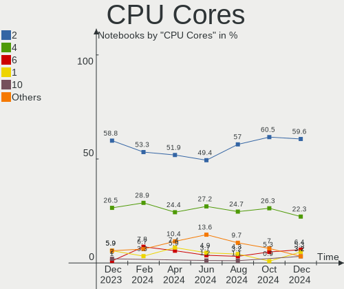
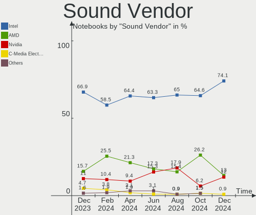

ROSA Hardware Trends (Notebook)
-------------------------------

A project to identify most popular hardware characteristics and track their change
over time based on data collected by ROSA users at https://Linux-Hardware.org.

Anyone can contribute to the study by uploading probes of their computers by
the [hw-probe](https://github.com/linuxhw/hw-probe) tool:

    sudo -E hw-probe -all -upload

Full-feature report is available here: https://linux-hardware.org/?view=trends&formfactor=notebook

Period: Sep, 2020.

Contents
--------

- [ OS                       ](#os)
- [ OS Family                ](#os-family)
- [ Kernel                   ](#kernel)
- [ Kernel Family            ](#kernel-family)
- [ Kernel Major Ver.        ](#kernel-major-ver)
- [ Arch                     ](#arch)
- [ DE                       ](#de)
- [ Display Server           ](#display-server)
- [ Display Manager          ](#display-manager)
- [ OS Lang                  ](#os-lang)
- [ Boot Mode                ](#boot-mode)
- [ Filesystem               ](#filesystem)
- [ Part. scheme             ](#part-scheme)
- [ Dual Boot with Linux/BSD ](#dual-boot-with-linux/bsd)
- [ Dual Boot (Win)          ](#dual-boot-win)
- [ Country                  ](#country)
- [ City                     ](#city)
- [ Vendor                   ](#vendor)
- [ Model                    ](#model)
- [ Model Family             ](#model-family)
- [ MFG Year                 ](#mfg-year)
- [ Form Factor              ](#form-factor)
- [ Secure Boot              ](#secure-boot)
- [ Coreboot                 ](#coreboot)
- [ RAM Size                 ](#ram-size)
- [ RAM Used                 ](#ram-used)
- [ Has CD-ROM               ](#has-cd-rom)
- [ Total Drives             ](#total-drives)
- [ Has Ethernet             ](#has-ethernet)
- [ Drive Vendor             ](#drive-vendor)
- [ HDD Vendor               ](#hdd-vendor)
- [ SSD Vendor               ](#ssd-vendor)
- [ Drive Model              ](#drive-model)
- [ Drive Kind               ](#drive-kind)
- [ Drive Connector          ](#drive-connector)
- [ Drive Size               ](#drive-size)
- [ Space Total              ](#space-total)
- [ Space Used               ](#space-used)
- [ Malfunc. Drives          ](#malfunc-drives)
- [ Malfunc. Drive Vendor    ](#malfunc-drive-vendor)
- [ Malfunc. HDD Vendor      ](#malfunc-hdd-vendor)
- [ Malfunc. Drive Kind      ](#malfunc-drive-kind)
- [ Failed Drives            ](#failed-drives)
- [ Failed Drive Vendor      ](#failed-drive-vendor)
- [ Drive Status             ](#drive-status)
- [ Storage Vendor           ](#storage-vendor)
- [ Storage Model            ](#storage-model)
- [ Storage Kind             ](#storage-kind)
- [ CPU Vendor               ](#cpu-vendor)
- [ CPU Model                ](#cpu-model)
- [ CPU Model Family         ](#cpu-model-family)
- [ CPU Cores                ](#cpu-cores)
- [ CPU Sockets              ](#cpu-sockets)
- [ CPU Threads              ](#cpu-threads)
- [ CPU Op-Modes             ](#cpu-op-modes)
- [ CPU Microcode            ](#cpu-microcode)
- [ CPU Microarch            ](#cpu-microarch)
- [ GPU Vendor               ](#gpu-vendor)
- [ GPU Model                ](#gpu-model)
- [ GPU Combo                ](#gpu-combo)
- [ GPU Driver               ](#gpu-driver)
- [ GPU Memory               ](#gpu-memory)
- [ Monitor Vendor           ](#monitor-vendor)
- [ Monitor Model            ](#monitor-model)
- [ Monitor Resolution       ](#monitor-resolution)
- [ Monitor Diagonal         ](#monitor-diagonal)
- [ Monitor Width            ](#monitor-width)
- [ Aspect Ratio             ](#aspect-ratio)
- [ Monitor Area             ](#monitor-area)
- [ Pixel Density            ](#pixel-density)
- [ Multiple Monitors        ](#multiple-monitors)
- [ Net Controller Vendor    ](#net-controller-vendor)
- [ Net Controller Model     ](#net-controller-model)
- [ Wireless Vendor          ](#wireless-vendor)
- [ Wireless Model           ](#wireless-model)
- [ Ethernet Vendor          ](#ethernet-vendor)
- [ Ethernet Model           ](#ethernet-model)
- [ Net Controller Kind      ](#net-controller-kind)
- [ Used Controller          ](#used-controller)
- [ NICs                     ](#nics)
- [ Memory Vendor            ](#memory-vendor)
- [ Memory Model             ](#memory-model)
- [ Memory Kind              ](#memory-kind)
- [ Memory Form Factor       ](#memory-form-factor)
- [ Memory Size              ](#memory-size)
- [ Memory Speed             ](#memory-speed)
- [ Sound Vendor             ](#sound-vendor)
- [ Sound Model              ](#sound-model)
- [ Camera Vendor            ](#camera-vendor)
- [ Camera Model             ](#camera-model)
- [ Fingerprint Vendor       ](#fingerprint-vendor)
- [ Fingerprint Model        ](#fingerprint-model)
- [ Chipcard Vendor          ](#chipcard-vendor)
- [ Chipcard Model           ](#chipcard-model)
- [ Printer Vendor           ](#printer-vendor)
- [ Printer Model            ](#printer-model)
- [ Scanner Vendor           ](#scanner-vendor)
- [ Scanner Model            ](#scanner-model)
- [ Bluetooth Vendor         ](#bluetooth-vendor)
- [ Bluetooth Model          ](#bluetooth-model)
- [ Unsupported Devices      ](#unsupported-devices)
- [ Unsupported Device Types ](#unsupported-device-types)

OS
--

Installed operating systems

| Name         | Notebooks | Percent |
|--------------|-----------|---------|
| ROSA R11.1   | 47        | 55.29%  |
| ROSA R11     | 29        | 34.12%  |
| ROSA R8.1    | 5         | 5.88%   |
| ROSA R12     | 2         | 2.35%   |
| ROSA R10     | 1         | 1.18%   |
| ROSA 2019.05 | 1         | 1.18%   |

OS Family
---------

OS without a version

| Name | Notebooks | Percent |
|------|-----------|---------|
| ROSA | 85        | 100%    |

Kernel
------

Version of the Linux kernel

| Version                           | Notebooks | Percent |
|-----------------------------------|-----------|---------|
| 4.15.0-desktop-45.1rosa-x86_64    | 26        | 30.59%  |
| 4.15.0-desktop-94.1rosa-x86_64    | 19        | 22.35%  |
| 5.4.40-generic-1rosa-x86_64       | 7         | 8.24%   |
| 4.9.155-nrj-desktop-1rosa-i586    | 6         | 7.06%   |
| 4.15.0-desktop-94.1rosa-i586      | 6         | 7.06%   |
| 5.4.32-generic-2rosa-x86_64       | 4         | 4.71%   |
| 4.15.0-desktop-45.1rosa-i586      | 4         | 4.71%   |
| 4.9.155-nrj-desktop-1rosa-x86_64  | 3         | 3.53%   |
| 5.4.60-generic-1rosa2019.1-x86_64 | 2         | 2.35%   |
| 5.4.32-generic-2rosa-i586         | 2         | 2.35%   |
| 5.4.60-nickel-2rosa2019.05-x86_64 | 1         | 1.18%   |
| 5.4.35-nrj-desktop-1rosa-x86_64   | 1         | 1.18%   |
| 4.9.9-nrj-desktop-1rosa-i586      | 1         | 1.18%   |
| 4.9.60-nrj-desktop-1rosa-i586     | 1         | 1.18%   |
| 4.9.20-nrj-desktop-1rosa-i586     | 1         | 1.18%   |
| 4.16.18-nrj-laptop-1rosa-x86_64   | 1         | 1.18%   |

Kernel Family
-------------

Linux kernel without a distro release

| Version | Notebooks | Percent |
|---------|-----------|---------|
| 4.15.0  | 55        | 64.71%  |
| 4.9.155 | 9         | 10.59%  |
| 5.4.40  | 7         | 8.24%   |
| 5.4.32  | 6         | 7.06%   |
| 5.4.60  | 3         | 3.53%   |
| 5.4.35  | 1         | 1.18%   |
| 4.9.9   | 1         | 1.18%   |
| 4.9.60  | 1         | 1.18%   |
| 4.9.20  | 1         | 1.18%   |
| 4.16.18 | 1         | 1.18%   |

Kernel Major Ver.
-----------------

Linux kernel major version

| Version | Notebooks | Percent |
|---------|-----------|---------|
| 4.15    | 55        | 64.71%  |
| 5.4     | 17        | 20%     |
| 4.9     | 12        | 14.12%  |
| 4.16    | 1         | 1.18%   |

Arch
----

OS architecture (x86_64, i586, etc.)

| Name   | Notebooks | Percent |
|--------|-----------|---------|
| x86_64 | 64        | 75.29%  |
| i686   | 21        | 24.71%  |

DE
--

Desktop Environment

| Name | Notebooks | Percent |
|------|-----------|---------|
| KDE4 | 55        | 64.71%  |
| KDE5 | 27        | 31.76%  |
| LXQt | 3         | 3.53%   |

Display Server
--------------

X11 or Wayland

| Name | Notebooks | Percent |
|------|-----------|---------|
| X11  | 85        | 100%    |

Display Manager
---------------

SDDM, LightDM, etc.

| Name | Notebooks | Percent |
|------|-----------|---------|
| KDM  | 55        | 64.71%  |
| SDDM | 30        | 35.29%  |

OS Lang
-------

Language

| Lang    | Notebooks | Percent |
|---------|-----------|---------|
| ru_RU   | 43        | 50.59%  |
| Unknown | 34        | 40%     |
| es_ES   | 2         | 2.35%   |
| sk_SK   | 1         | 1.18%   |
| pt_PT   | 1         | 1.18%   |
| pl_PL   | 1         | 1.18%   |
| it_IT   | 1         | 1.18%   |
| de_DE   | 1         | 1.18%   |
| bg_BG   | 1         | 1.18%   |

Boot Mode
---------

EFI or BIOS

| Mode | Notebooks | Percent |
|------|-----------|---------|
| BIOS | 67        | 78.82%  |
| EFI  | 18        | 21.18%  |

Filesystem
----------

Type of filesystem

| Type  | Notebooks | Percent |
|-------|-----------|---------|
| Ext4  | 81        | 95.29%  |
| Ext3  | 2         | 2.35%   |
| Btrfs | 2         | 2.35%   |

Part. scheme
------------

Scheme of partitioning

| Type | Notebooks | Percent |
|------|-----------|---------|
| MBR  | 65        | 76.47%  |
| GPT  | 20        | 23.53%  |

Dual Boot with Linux/BSD
------------------------

Hosting more than one Linux/BSD

| Dual boot | Notebooks | Percent |
|-----------|-----------|---------|
| No        | 67        | 78.82%  |
| Yes       | 18        | 21.18%  |

Dual Boot (Win)
---------------

Hosting Linux and Windows

| Dual boot | Notebooks | Percent |
|-----------|-----------|---------|
| No        | 49        | 57.65%  |
| Yes       | 36        | 42.35%  |

Country
-------

Geographic location (country)

| Country    | Notebooks | Percent |
|------------|-----------|---------|
| Russia     | 58        | 68.24%  |
| Ukraine    | 9         | 10.59%  |
| Kazakhstan | 3         | 3.53%   |
| Poland     | 2         | 2.35%   |
| Germany    | 2         | 2.35%   |
| Uzbekistan | 1         | 1.18%   |
| USA        | 1         | 1.18%   |
| Slovakia   | 1         | 1.18%   |
| Portugal   | 1         | 1.18%   |
| Mexico     | 1         | 1.18%   |
| Kenya      | 1         | 1.18%   |
| Italy      | 1         | 1.18%   |
| India      | 1         | 1.18%   |
| Czechia    | 1         | 1.18%   |
| Colombia   | 1         | 1.18%   |
| Bulgaria   | 1         | 1.18%   |

City
----

Geographic location (city)

| City                | Notebooks | Percent |
|---------------------|-----------|---------|
| St Petersburg       | 7         | 8.24%   |
| Moscow              | 7         | 8.24%   |
| Novosibirsk         | 4         | 4.71%   |
| Kazan’            | 4         | 4.71%   |
| Rostov-on-Don       | 3         | 3.53%   |
| Volgograd           | 2         | 2.35%   |
| Vladivostok         | 2         | 2.35%   |
| Saratov             | 2         | 2.35%   |
| Nizhniy Novgorod    | 2         | 2.35%   |
| Kharkiv             | 2         | 2.35%   |
| Dzerzhinsk          | 2         | 2.35%   |
| Arkhangelsk         | 2         | 2.35%   |
| Voronezh            | 1         | 1.18%   |
| Varna               | 1         | 1.18%   |
| Tula                | 1         | 1.18%   |
| Tashkent            | 1         | 1.18%   |
| Tambov              | 1         | 1.18%   |
| Swidnica            | 1         | 1.18%   |
| Sumy                | 1         | 1.18%   |
| Stuttgart           | 1         | 1.18%   |
| Stavropol           | 1         | 1.18%   |
| Smolensk            | 1         | 1.18%   |
| Seversk             | 1         | 1.18%   |
| Samara              | 1         | 1.18%   |
| Prague              | 1         | 1.18%   |
| Poltava             | 1         | 1.18%   |
| Pohranice           | 1         | 1.18%   |
| Petropavl           | 1         | 1.18%   |
| Oryol               | 1         | 1.18%   |
| Oral                | 1         | 1.18%   |
| Novy Urengoy        | 1         | 1.18%   |
| Naberezhnyye Chelny | 1         | 1.18%   |
| Mexico City         | 1         | 1.18%   |
| Malindi             | 1         | 1.18%   |
| Luhansk             | 1         | 1.18%   |
| Lisbon              | 1         | 1.18%   |
| Lipetsk             | 1         | 1.18%   |
| Libiaz              | 1         | 1.18%   |
| Leipzig             | 1         | 1.18%   |
| Krasnoyarsk         | 1         | 1.18%   |
| Kirov               | 1         | 1.18%   |
| Kingisepp           | 1         | 1.18%   |
| Khmelnytskyi        | 1         | 1.18%   |
| Kemerovo            | 1         | 1.18%   |
| Irkutsk             | 1         | 1.18%   |
| Hamilton            | 1         | 1.18%   |
| Gülshat            | 1         | 1.18%   |
| Elektrostal         | 1         | 1.18%   |
| Drohobych           | 1         | 1.18%   |
| Donetsk             | 1         | 1.18%   |
| Bugul'ma            | 1         | 1.18%   |
| Bolzano             | 1         | 1.18%   |
| Bogotá             | 1         | 1.18%   |
| Blagoveshchensk     | 1         | 1.18%   |
| Bhopal              | 1         | 1.18%   |
| Barnaul             | 1         | 1.18%   |
| Bakhchisaray        | 1         | 1.18%   |
| Astrakhan           | 1         | 1.18%   |

Vendor
------

Motherboard manufacturer

| Name                | Notebooks | Percent |
|---------------------|-----------|---------|
| Acer                | 18        | 21.18%  |
| ASUSTek Computer    | 14        | 16.47%  |
| Lenovo              | 12        | 14.12%  |
| Dell                | 10        | 11.76%  |
| Samsung Electronics | 7         | 8.24%   |
| Hewlett-Packard     | 7         | 8.24%   |
| Sony                | 4         | 4.71%   |
| MSI                 | 3         | 3.53%   |
| Toshiba             | 2         | 2.35%   |
| Packard Bell        | 1         | 1.18%   |
| Olidata             | 1         | 1.18%   |
| Fujitsu Siemens     | 1         | 1.18%   |
| eMachines           | 1         | 1.18%   |
| DEPO Computers      | 1         | 1.18%   |
| Clevo               | 1         | 1.18%   |
| Alienware           | 1         | 1.18%   |
| Unknown             | 1         | 1.18%   |

Model
-----

Motherboard model

| Name                                                   | Notebooks | Percent |
|--------------------------------------------------------|-----------|---------|
| Dell Inspiron N5040                                    | 2         | 2.35%   |
| Acer Aspire 5742G                                      | 2         | 2.35%   |
| Toshiba Satellite P300                                 | 1         | 1.18%   |
| Toshiba NB550D                                         | 1         | 1.18%   |
| Sony VPCEH1L1R                                         | 1         | 1.18%   |
| Sony VGN-FZ11ZR                                        | 1         | 1.18%   |
| Sony VGN-CR41SR_L                                      | 1         | 1.18%   |
| Sony SVE1412E1RW                                       | 1         | 1.18%   |
| Samsung Electronics RC410/RC510/RC710                  | 1         | 1.18%   |
| Samsung Electronics R540/SA41/E452                     | 1         | 1.18%   |
| Samsung Electronics R528/R728                          | 1         | 1.18%   |
| Samsung Electronics R408P                              | 1         | 1.18%   |
| Samsung Electronics 355V4C/356V4C/3445VC/3545VC        | 1         | 1.18%   |
| Samsung Electronics 350V5C/351V5C/3540VC/3440VC        | 1         | 1.18%   |
| Samsung Electronics 300E4A/300E5A/300E7A/3430EA/3530EA | 1         | 1.18%   |
| Packard Bell EasyNote TE69KB                           | 1         | 1.18%   |
| Olidata Olidata T7700                                  | 1         | 1.18%   |
| MSI MS-1037                                            | 1         | 1.18%   |
| MSI GP60 2OD                                           | 1         | 1.18%   |
| MSI GF65 Thin 9SD                                      | 1         | 1.18%   |
| Lenovo V580c 20160                                     | 1         | 1.18%   |
| Lenovo V330-15IKB 81AX                                 | 1         | 1.18%   |
| Lenovo ThinkPad X61s 7667A95                           | 1         | 1.18%   |
| Lenovo ThinkPad T60 2007WEH                            | 1         | 1.18%   |
| Lenovo IdeaPad 320-15IAP 80XR                          | 1         | 1.18%   |
| Lenovo IdeaPad 300-15ISK 80Q7                          | 1         | 1.18%   |
| Lenovo IdeaPad 300-15IBR 80M3                          | 1         | 1.18%   |
| Lenovo IdeaPad 120S-11IAP 81A4                         | 1         | 1.18%   |
| Lenovo IdeaPad 110-15ACL 80TJ                          | 1         | 1.18%   |
| Lenovo G510 20238                                      | 1         | 1.18%   |
| Lenovo G505 20240                                      | 1         | 1.18%   |
| Lenovo B50-10 80QR                                     | 1         | 1.18%   |
| HP Pavilion g6                                         | 1         | 1.18%   |
| HP Pavilion 17                                         | 1         | 1.18%   |
| HP Notebook                                            | 1         | 1.18%   |
| HP Laptop 15q-dy0xxx                                   | 1         | 1.18%   |
| HP Laptop 15-bw0xx                                     | 1         | 1.18%   |
| HP Compaq Presario CQ70                                | 1         | 1.18%   |
| HP Compaq 615                                          | 1         | 1.18%   |
| Fujitsu Siemens LIFEBOOK S6420                         | 1         | 1.18%   |
| eMachines eME728                                       | 1         | 1.18%   |
| DEPO Computers DEPO VIP                                | 1         | 1.18%   |
| Dell Vostro 1520                                       | 1         | 1.18%   |
| Dell Latitude E6430                                    | 1         | 1.18%   |
| Dell Latitude 2100                                     | 1         | 1.18%   |
| Dell Inspiron MP061                                    | 1         | 1.18%   |
| Dell Inspiron 3542                                     | 1         | 1.18%   |
| Dell Inspiron 3521                                     | 1         | 1.18%   |
| Dell Inspiron 11-3168                                  | 1         | 1.18%   |
| Dell 500                                               | 1         | 1.18%   |
| Clevo W270HU                                           | 1         | 1.18%   |
| ASUS X55U                                              | 1         | 1.18%   |
| ASUS X55A                                              | 1         | 1.18%   |
| ASUS X550EP                                            | 1         | 1.18%   |
| ASUS X540SA                                            | 1         | 1.18%   |
| ASUS UX32VD                                            | 1         | 1.18%   |
| ASUS UX32LN                                            | 1         | 1.18%   |
| ASUS M50Vc                                             | 1         | 1.18%   |
| ASUS K54LY                                             | 1         | 1.18%   |
| ASUS K53U                                              | 1         | 1.18%   |

Model Family
------------

Motherboard model prefix

| Name                       | Notebooks | Percent |
|----------------------------|-----------|---------|
| Acer Aspire                | 14        | 16.47%  |
| Dell Inspiron              | 6         | 7.06%   |
| Lenovo IdeaPad             | 5         | 5.88%   |
| Lenovo ThinkPad            | 2         | 2.35%   |
| HP Pavilion                | 2         | 2.35%   |
| HP Laptop                  | 2         | 2.35%   |
| HP Compaq                  | 2         | 2.35%   |
| Dell Latitude              | 2         | 2.35%   |
| Toshiba Satellite          | 1         | 1.18%   |
| Toshiba NB550D             | 1         | 1.18%   |
| Sony VPCEH1L1R             | 1         | 1.18%   |
| Sony VGN-FZ11ZR            | 1         | 1.18%   |
| Sony VGN-CR41SR            | 1         | 1.18%   |
| Sony SVE1412E1RW           | 1         | 1.18%   |
| Samsung Electronics RC410  | 1         | 1.18%   |
| Samsung Electronics R540   | 1         | 1.18%   |
| Samsung Electronics R528   | 1         | 1.18%   |
| Samsung Electronics R408P  | 1         | 1.18%   |
| Samsung Electronics 355V4C | 1         | 1.18%   |
| Samsung Electronics 350V5C | 1         | 1.18%   |
| Samsung Electronics 300E4A | 1         | 1.18%   |
| Packard Bell EasyNote      | 1         | 1.18%   |
| Olidata Olidata            | 1         | 1.18%   |
| MSI MS-1037                | 1         | 1.18%   |
| MSI GP60                   | 1         | 1.18%   |
| MSI GF65                   | 1         | 1.18%   |
| Lenovo V580c               | 1         | 1.18%   |
| Lenovo V330-15IKB          | 1         | 1.18%   |
| Lenovo G510                | 1         | 1.18%   |
| Lenovo G505                | 1         | 1.18%   |
| Lenovo B50-10              | 1         | 1.18%   |
| HP Notebook                | 1         | 1.18%   |
| Fujitsu Siemens LIFEBOOK   | 1         | 1.18%   |
| eMachines eME728           | 1         | 1.18%   |
| DEPO Computers DEPO        | 1         | 1.18%   |
| Dell Vostro                | 1         | 1.18%   |
| Dell 500                   | 1         | 1.18%   |
| Clevo W270HU               | 1         | 1.18%   |
| ASUS X55U                  | 1         | 1.18%   |
| ASUS X55A                  | 1         | 1.18%   |
| ASUS X550EP                | 1         | 1.18%   |
| ASUS X540SA                | 1         | 1.18%   |
| ASUS UX32VD                | 1         | 1.18%   |
| ASUS UX32LN                | 1         | 1.18%   |
| ASUS M50Vc                 | 1         | 1.18%   |
| ASUS K54LY                 | 1         | 1.18%   |
| ASUS K53U                  | 1         | 1.18%   |
| ASUS K53SV                 | 1         | 1.18%   |
| ASUS F3L                   | 1         | 1.18%   |
| ASUS F3Ke                  | 1         | 1.18%   |
| ASUS A8He                  | 1         | 1.18%   |
| ASUS 900AX                 | 1         | 1.18%   |
| Alienware 17               | 1         | 1.18%   |
| Acer TravelMate            | 1         | 1.18%   |
| Acer P5Wx6                 | 1         | 1.18%   |
| Acer Extensa               | 1         | 1.18%   |
| Acer AOD255E               | 1         | 1.18%   |
| Unknown                    | 1         | 1.18%   |

MFG Year
--------

Motherboard manufacture year

| Year    | Notebooks | Percent |
|---------|-----------|---------|
| 2011    | 13        | 15.29%  |
| 2012    | 12        | 14.12%  |
| 2013    | 10        | 11.76%  |
| 2018    | 7         | 8.24%   |
| 2010    | 7         | 8.24%   |
| 2008    | 7         | 8.24%   |
| 2015    | 6         | 7.06%   |
| 2009    | 6         | 7.06%   |
| 2007    | 5         | 5.88%   |
| 2019    | 3         | 3.53%   |
| 2016    | 3         | 3.53%   |
| 2020    | 2         | 2.35%   |
| 2014    | 2         | 2.35%   |
| 2017    | 1         | 1.18%   |
| Unknown | 1         | 1.18%   |

Form Factor
-----------

Physical design of the computer

| Name     | Notebooks | Percent |
|----------|-----------|---------|
| Notebook | 85        | 100%    |

Secure Boot
-----------

Enabled or disabled

| State    | Notebooks | Percent |
|----------|-----------|---------|
| Disabled | 85        | 100%    |

Coreboot
--------

Have coreboot on board

| Used | Notebooks | Percent |
|------|-----------|---------|
| No   | 85        | 100%    |

RAM Size
--------

Total RAM memory

| Size in GB | Notebooks | Percent |
|------------|-----------|---------|
| 3.01-4.0   | 27        | 31.76%  |
| 1.01-2.0   | 22        | 25.88%  |
| 4.01-8.0   | 18        | 21.18%  |
| 8.01-16.0  | 8         | 9.41%   |
| 2.01-3.0   | 7         | 8.24%   |
| 16.01-24.0 | 2         | 2.35%   |
| 0.01-1.0   | 1         | 1.18%   |

RAM Used
--------

Used RAM memory

| Used GB  | Notebooks | Percent |
|----------|-----------|---------|
| 1.01-2.0 | 40        | 47.06%  |
| 0.01-1.0 | 38        | 44.71%  |
| 2.01-3.0 | 5         | 5.88%   |
| 3.01-4.0 | 2         | 2.35%   |

Has CD-ROM
----------

Has CD-ROM on board

| Presented | Notebooks | Percent |
|-----------|-----------|---------|
| Yes       | 56        | 65.88%  |
| No        | 29        | 34.12%  |

Total Drives
------------

Number of drives on board

| Drives  | Notebooks | Percent |
|---------|-----------|---------|
| 1       | 59        | 69.41%  |
| 2       | 20        | 23.53%  |
| 0       | 3         | 3.53%   |
| 3       | 2         | 2.35%   |
| Unknown | 1         | 1.18%   |

Has Ethernet
------------

Has Ethernet on board

| Presented | Notebooks | Percent |
|-----------|-----------|---------|
| Yes       | 80        | 94.12%  |
| No        | 5         | 5.88%   |

Drive Vendor
------------

Hard drive vendors

| Vendor              | Notebooks | Drives  | Percent |
|---------------------|-----------|---------|---------|
| Seagate             | 25        | 26      | 24.04%  |
| WDC                 | 21        | 23      | 20.19%  |
| Toshiba             | 10        | 10      | 9.62%   |
| Hitachi             | 8         | 8       | 7.69%   |
| Kingston            | 6         | 6       | 5.77%   |
| Unknown             | 5         | 5       | 4.81%   |
| Samsung Electronics | 5         | 5       | 4.81%   |
| Smartbuy            | 3         | 3       | 2.88%   |
| Patriot             | 2         | 2       | 1.92%   |
| HL-DT-ST            | 2         | Unknown | 1.92%   |
| Fujitsu             | 2         | 2       | 1.92%   |
| Zheino              | 1         | 1       | 0.96%   |
| Team                | 1         | 1       | 0.96%   |
| SPCC                | 1         | 1       | 0.96%   |
| SK Hynix            | 1         | 1       | 0.96%   |
| SanDisk             | 1         | 1       | 0.96%   |
| OCZ                 | 1         | 1       | 0.96%   |
| LITEONIT            | 1         | 1       | 0.96%   |
| KingFast            | 1         | 1       | 0.96%   |
| Intenso             | 1         | 1       | 0.96%   |
| Intel               | 1         | 1       | 0.96%   |
| HUAWEI              | 1         | Unknown | 0.96%   |
| HGST                | 1         | 1       | 0.96%   |
| GOODRAM             | 1         | 1       | 0.96%   |
| DeTech              | 1         | 1       | 0.96%   |
| A-DATA Technology   | 1         | 1       | 0.96%   |

HDD Vendor
----------

Hard disk drive vendors

| Vendor              | Notebooks | Drives | Percent |
|---------------------|-----------|--------|---------|
| Seagate             | 25        | 26     | 37.31%  |
| WDC                 | 19        | 20     | 28.36%  |
| Toshiba             | 10        | 10     | 14.93%  |
| Hitachi             | 8         | 8      | 11.94%  |
| Samsung Electronics | 2         | 2      | 2.99%   |
| Fujitsu             | 2         | 2      | 2.99%   |
| HGST                | 1         | 1      | 1.49%   |

SSD Vendor
----------

Solid state drive vendors

| Vendor              | Notebooks | Drives | Percent |
|---------------------|-----------|--------|---------|
| Kingston            | 5         | 5      | 18.52%  |
| WDC                 | 3         | 3      | 11.11%  |
| Smartbuy            | 3         | 3      | 11.11%  |
| Patriot             | 2         | 2      | 7.41%   |
| Zheino              | 1         | 1      | 3.7%    |
| Team                | 1         | 1      | 3.7%    |
| SPCC                | 1         | 1      | 3.7%    |
| SK Hynix            | 1         | 1      | 3.7%    |
| SanDisk             | 1         | 1      | 3.7%    |
| Samsung Electronics | 1         | 1      | 3.7%    |
| OCZ                 | 1         | 1      | 3.7%    |
| LITEONIT            | 1         | 1      | 3.7%    |
| KingFast            | 1         | 1      | 3.7%    |
| Intenso             | 1         | 1      | 3.7%    |
| Intel               | 1         | 1      | 3.7%    |
| GOODRAM             | 1         | 1      | 3.7%    |
| DeTech              | 1         | 1      | 3.7%    |
| A-DATA Technology   | 1         | 1      | 3.7%    |

Drive Model
-----------

Hard drive models

| Model                        | Notebooks | Percent |
|------------------------------|-----------|---------|
| ST500LT012-9WS142 500GB      | 4         | 3.74%   |
| ST500LT012-1DG142 500GB      | 4         | 3.74%   |
| SSD 120GB                    | 3         | 2.8%    |
| SA400S37120G 120GB SSD       | 3         | 2.8%    |
| WD5000LPCX-24VHAT0 500GB     | 2         | 1.87%   |
| WD10JPVX-22JC3T0 1TB         | 2         | 1.87%   |
| WD10JPLX-00MBPT0 1TB         | 2         | 1.87%   |
| ST9500420AS 500GB            | 2         | 1.87%   |
| ST9320325AS 320GB            | 2         | 1.87%   |
| ST320LM010-1KJ15C 320GB      | 2         | 1.87%   |
| MK2555GSX 250GB              | 2         | 1.87%   |
| DVDRAM GUC0N 1GB             | 2         | 1.87%   |
| WDS480G2G0A-00JH30 480GB SSD | 1         | 0.93%   |
| WDS250G1B0A-00H9H0 250GB SSD | 1         | 0.93%   |
| WDS240G2G0A-00JH30 240GB SSD | 1         | 0.93%   |
| WD7500BPVX-22JC3T0 752GB     | 1         | 0.93%   |
| WD7500BPVT-22HXZT1 752GB     | 1         | 0.93%   |
| WD7500BPKX-75HPJT0 752GB     | 1         | 0.93%   |
| WD5000LPVX-22V0TT0 500GB     | 1         | 0.93%   |
| WD5000LPCX-00VHAT0 500GB     | 1         | 0.93%   |
| WD5000BPVT-24HXZT3 500GB     | 1         | 0.93%   |
| WD5000BEVT-00ZAT0 500GB      | 1         | 0.93%   |
| WD3200BPVT-22ZEST0 320GB     | 1         | 0.93%   |
| WD3200BPVT-22JJ5T0 320GB     | 1         | 0.93%   |
| WD3200BEVT-22A23T0 320GB     | 1         | 0.93%   |
| WD2500BPVT-22ZEST0 250GB     | 1         | 0.93%   |
| WD2500BEVS-00UST0 250GB      | 1         | 0.93%   |
| WD10SPZX-00Z10T0 1TB         | 1         | 0.93%   |
| WD10JPCX-24UE4T0 1TB         | 1         | 0.93%   |
| VERTEX4 128GB SSD            | 1         | 0.93%   |
| T253X1240G 240GB SSD         | 1         | 0.93%   |
| SU750 512GB SSD              | 1         | 0.93%   |
| ST9640320AS 640GB            | 1         | 0.93%   |
| ST9500325AS 500GB            | 1         | 0.93%   |
| ST9320328CS 320GB            | 1         | 0.93%   |
| ST9250410AS 250GB            | 1         | 0.93%   |
| ST9160821AS 160GB            | 1         | 0.93%   |
| ST9120817AS 120GB            | 1         | 0.93%   |
| ST9100824AS 100GB            | 1         | 0.93%   |
| ST500LM012 HN-M500MBB 500GB  | 1         | 0.93%   |
| ST320LT020-9YG142 320GB      | 1         | 0.93%   |
| ST1000LM035-1RK172 1TB       | 1         | 0.93%   |
| ST1000LM024 HN-M101MBB 1TB   | 1         | 0.93%   |
| SSDSC2KW512G8 512GB          | 1         | 0.93%   |
| SSDPR-CX300-120 120GB        | 1         | 0.93%   |
| SSD i100 24GB                | 1         | 0.93%   |
| SSD 970 EVO Plus 500GB       | 1         | 0.93%   |
| SSD 860 EVO 500GB            | 1         | 0.93%   |
| SSD 60GB                     | 1         | 0.93%   |
| SSD 128GB                    | 1         | 0.93%   |
| SS08G  8GB                   | 1         | 0.93%   |
| Solid State Disk 256GB       | 1         | 0.93%   |
| SKC600512G 512GB SSD         | 1         | 0.93%   |
| SD Storage 16GB              | 1         | 0.93%   |
| SA400S37480G 480GB SSD       | 1         | 0.93%   |
| S0J38Y  64GB                 | 1         | 0.93%   |
| RBUSNS8154P3512GJ 512GB      | 1         | 0.93%   |
| P210 512GB SSD               | 1         | 0.93%   |
| NCard  8GB                   | 1         | 0.93%   |
| MZVLB256HAHQ-000L7 256GB     | 1         | 0.93%   |

Drive Kind
----------

HDD or SSD

| Kind    | Notebooks | Drives  | Percent |
|---------|-----------|---------|---------|
| HDD     | 64        | 69      | 64.65%  |
| SSD     | 25        | 27      | 25.25%  |
| MMC     | 5         | 5       | 5.05%   |
| Unknown | 3         | Unknown | 3.03%   |
| NVMe    | 2         | 3       | 2.02%   |

Drive Connector
---------------

SATA, SAS, NVMe, etc.

| Type | Notebooks | Drives | Percent |
|------|-----------|--------|---------|
| SATA | 79        | 95     | 87.78%  |
| MMC  | 5         | 5      | 5.56%   |
| SAS  | 4         | 1      | 4.44%   |
| NVMe | 2         | 3      | 2.22%   |

Drive Size
----------

Size of hard drive

| Size in TB | Notebooks | Drives | Percent |
|------------|-----------|--------|---------|
| 0.01-0.5   | 74        | 83     | 78.72%  |
| 0.51-1.0   | 20        | 21     | 21.28%  |

Space Total
-----------

Amount of disk space available on the file system

| Size in GB | Notebooks | Percent |
|------------|-----------|---------|
| 251-500    | 29        | 34.12%  |
| 101-250    | 25        | 29.41%  |
| 1-20       | 12        | 14.12%  |
| 501-1000   | 6         | 7.06%   |
| 51-100     | 6         | 7.06%   |
| 21-50      | 5         | 5.88%   |
| 2001-3000  | 1         | 1.18%   |
| 1001-2000  | 1         | 1.18%   |

Space Used
----------

Amount of used disk space

| Used GB  | Notebooks | Percent |
|----------|-----------|---------|
| 1-20     | 64        | 75.29%  |
| 21-50    | 8         | 9.41%   |
| 101-250  | 5         | 5.88%   |
| 51-100   | 5         | 5.88%   |
| 251-500  | 2         | 2.35%   |
| 501-1000 | 1         | 1.18%   |

Malfunc. Drives
---------------

Drive models with a malfunction

| Model                      | Notebooks | Drives | Percent |
|----------------------------|-----------|--------|---------|
| ST500LT012-9WS142 500GB    | 4         | 4      | 10.26%  |
| ST9500420AS 500GB          | 2         | 2      | 5.13%   |
| ST500LT012-1DG142 500GB    | 2         | 2      | 5.13%   |
| WD5000LPVX-22V0TT0 500GB   | 1         | 1      | 2.56%   |
| WD5000BPVT-24HXZT3 500GB   | 1         | 1      | 2.56%   |
| WD3200BPVT-22ZEST0 320GB   | 1         | 1      | 2.56%   |
| WD2500BEVS-00UST0 250GB    | 1         | 1      | 2.56%   |
| WD10JPVX-22JC3T0 1TB       | 1         | 1      | 2.56%   |
| ST9500325AS 500GB          | 1         | 1      | 2.56%   |
| ST9320328CS 320GB          | 1         | 1      | 2.56%   |
| ST9320325AS 320GB          | 1         | 1      | 2.56%   |
| ST9250410AS 250GB          | 1         | 1      | 2.56%   |
| ST9120817AS 120GB          | 1         | 1      | 2.56%   |
| ST320LT020-9YG142 320GB    | 1         | 1      | 2.56%   |
| ST320LM010-1KJ15C 320GB    | 1         | 1      | 2.56%   |
| ST1000LM024 HN-M101MBB 1TB | 1         | 1      | 2.56%   |
| SA400S37120G 120GB SSD     | 1         | 1      | 2.56%   |
| MQ01ABD100 1TB             | 1         | 1      | 2.56%   |
| MQ01ABD050 500GB           | 1         | 1      | 2.56%   |
| MK3265GSXN 320GB           | 1         | 1      | 2.56%   |
| MK2559GSXP 250GB           | 1         | 1      | 2.56%   |
| MK2555GSX 250GB            | 1         | 1      | 2.56%   |
| MK2552GSX 250GB            | 1         | 1      | 2.56%   |
| MJA2160BH G2 160GB         | 1         | 1      | 2.56%   |
| MHV2200BT 200GB            | 1         | 1      | 2.56%   |
| LMN-256M3M mSATA 256GB SSD | 1         | 1      | 2.56%   |
| HTS545050A7E680 500GB      | 1         | 1      | 2.56%   |
| HTS545050A7E380 500GB      | 1         | 1      | 2.56%   |
| HTS545025B9A300 250GB      | 1         | 1      | 2.56%   |
| HTS543232L9A300 320GB      | 1         | 1      | 2.56%   |
| HTS543232A7A384 320GB      | 1         | 1      | 2.56%   |
| HTS541612J9SA00 120GB      | 1         | 1      | 2.56%   |
| HTS541040G9SA00 40GB       | 1         | 1      | 2.56%   |
| HM160HI 160GB              | 1         | 1      | 2.56%   |

Malfunc. Drive Vendor
---------------------

Vendors of faulty drives

| Vendor              | Notebooks | Drives | Percent |
|---------------------|-----------|--------|---------|
| Seagate             | 16        | 16     | 41.03%  |
| Toshiba             | 6         | 6      | 15.38%  |
| Hitachi             | 6         | 6      | 15.38%  |
| WDC                 | 5         | 5      | 12.82%  |
| Fujitsu             | 2         | 2      | 5.13%   |
| Samsung Electronics | 1         | 1      | 2.56%   |
| LITEONIT            | 1         | 1      | 2.56%   |
| Kingston            | 1         | 1      | 2.56%   |
| HGST                | 1         | 1      | 2.56%   |

Malfunc. HDD Vendor
-------------------

Vendors of faulty HDD drives

| Vendor              | Notebooks | Drives | Percent |
|---------------------|-----------|--------|---------|
| Seagate             | 16        | 16     | 43.24%  |
| Toshiba             | 6         | 6      | 16.22%  |
| Hitachi             | 6         | 6      | 16.22%  |
| WDC                 | 5         | 5      | 13.51%  |
| Fujitsu             | 2         | 2      | 5.41%   |
| Samsung Electronics | 1         | 1      | 2.7%    |
| HGST                | 1         | 1      | 2.7%    |

Malfunc. Drive Kind
-------------------

Kinds of faulty drives

| Kind | Notebooks | Drives | Percent |
|------|-----------|--------|---------|
| HDD  | 35        | 37     | 94.59%  |
| SSD  | 2         | 2      | 5.41%   |

Failed Drives
-------------

Failed drive models

| Model                    | Notebooks | Drives | Percent |
|--------------------------|-----------|--------|---------|
| WD7500BPVT-22HXZT1 752GB | 1         | 1      | 50%     |
| WD10JPVX-22JC3T0 1TB     | 1         | 1      | 50%     |

Failed Drive Vendor
-------------------

Failed drive vendors

| Vendor | Notebooks | Drives | Percent |
|--------|-----------|--------|---------|
| WDC    | 2         | 2      | 100%    |

Drive Status
------------

Number of failed and malfunc. drives

| Status   | Notebooks | Drives | Percent |
|----------|-----------|--------|---------|
| Works    | 47        | 56     | 48.96%  |
| Malfunc  | 37        | 39     | 38.54%  |
| Detected | 10        | 7      | 10.42%  |
| Failed   | 2         | 2      | 2.08%   |

Storage Vendor
--------------

Storage controller vendors

| Vendor                           | Notebooks | Percent |
|----------------------------------|-----------|---------|
| Intel                            | 64        | 74.42%  |
| AMD                              | 17        | 19.77%  |
| Samsung Electronics              | 2         | 2.33%   |
| Silicon Integrated Systems [SiS] | 1         | 1.16%   |
| Nvidia                           | 1         | 1.16%   |
| Kingston Technology Company      | 1         | 1.16%   |

Storage Model
-------------

Storage controller models

| Model                                                                      | Notebooks | Percent |
|----------------------------------------------------------------------------|-----------|---------|
| FCH SATA Controller [AHCI mode]                                            | 11        | 11%     |
| 7 Series Chipset Family 6-port SATA Controller [AHCI mode]                 | 10        | 10%     |
| 82801IBM/IEM (ICH9M/ICH9M-E) 4 port SATA Controller [AHCI mode]            | 9         | 9%      |
| Atom/Celeron/Pentium Processor x5-E8000/J3xxx/N3xxx Series SATA Controller | 6         | 6%      |
| 82801HM/HEM (ICH8M/ICH8M-E) IDE Controller                                 | 6         | 6%      |
| 5 Series/3400 Series Chipset 4 port SATA AHCI Controller                   | 6         | 6%      |
| 82801HM/HEM (ICH8M/ICH8M-E) SATA Controller [IDE mode]                     | 5         | 5%      |
| 6 Series/C200 Series Chipset Family 6 port Mobile SATA AHCI Controller     | 5         | 5%      |
| SB7x0/SB8x0/SB9x0 SATA Controller [AHCI mode]                              | 4         | 4%      |
| 82801GBM/GHM (ICH7-M Family) SATA Controller [IDE mode]                    | 4         | 4%      |
| Sunrise Point-LP SATA Controller [AHCI mode]                               | 2         | 2%      |
| NVMe SSD Controller SM981/PM981/PM983                                      | 2         | 2%      |
| Celeron N3350/Pentium N4200/Atom E3900 Series SATA AHCI Controller         | 2         | 2%      |
| 82801HM/HEM (ICH8M/ICH8M-E) SATA Controller [AHCI mode]                    | 2         | 2%      |
| 82801GBM/GHM (ICH7-M Family) SATA Controller [AHCI mode]                   | 2         | 2%      |
| 8 Series/C220 Series Chipset Family 6-port SATA Controller 1 [AHCI mode]   | 2         | 2%      |
| 8 Series SATA Controller 1 [AHCI mode]                                     | 2         | 2%      |
| 5 Series/3400 Series Chipset 6 port SATA AHCI Controller                   | 2         | 2%      |
| SB7x0/SB8x0/SB9x0 SATA Controller [IDE mode]                               | 1         | 1%      |
| SB7x0/SB8x0/SB9x0 IDE Controller                                           | 1         | 1%      |
| SB600 Non-Raid-5 SATA                                                      | 1         | 1%      |
| SB600 IDE                                                                  | 1         | 1%      |
| SATA Controller / IDE mode                                                 | 1         | 1%      |
| Non-Volatile memory controller                                             | 1         | 1%      |
| NM10/ICH7 Family SATA Controller [AHCI mode]                               | 1         | 1%      |
| MCP67 IDE Controller                                                       | 1         | 1%      |
| MCP67 AHCI Controller                                                      | 1         | 1%      |
| Atom Processor E3800 Series SATA AHCI Controller                           | 1         | 1%      |
| 82801IBM/IEM (ICH9M/ICH9M-E) 2 port SATA Controller [IDE mode]             | 1         | 1%      |
| 82801G (ICH7 Family) IDE Controller                                        | 1         | 1%      |
| 82801 Mobile SATA Controller [RAID mode]                                   | 1         | 1%      |
| 7 Series Chipset Family 4-port SATA Controller [IDE mode]                  | 1         | 1%      |
| 7 Series Chipset Family 2-port SATA Controller [IDE mode]                  | 1         | 1%      |
| 5513 IDE Controller                                                        | 1         | 1%      |
| 5 Series/3400 Series Chipset 4 port SATA IDE Controller                    | 1         | 1%      |
| 5 Series/3400 Series Chipset 2 port SATA IDE Controller                    | 1         | 1%      |

Storage Kind
------------

Kind of storage controller (IDE, SATA, NVMe, SAS, ...)

| Kind | Notebooks | Percent |
|------|-----------|---------|
| SATA | 69        | 75.82%  |
| IDE  | 19        | 20.88%  |
| NVMe | 2         | 2.2%    |
| RAID | 1         | 1.1%    |

CPU Vendor
----------

Processor vendors

| Vendor | Notebooks | Percent |
|--------|-----------|---------|
| Intel  | 67        | 78.82%  |
| AMD    | 18        | 21.18%  |

CPU Model
---------

Processor models

| Model                                         | Notebooks | Percent |
|-----------------------------------------------|-----------|---------|
| Intel Pentium CPU N3710 @ 1.60GHz             | 3         | 3.53%   |
| Intel Core 2 Duo CPU P8400 @ 2.26GHz          | 3         | 3.53%   |
| Intel Pentium CPU P6200 @ 2.13GHz             | 2         | 2.35%   |
| Intel Pentium CPU N3700 @ 1.60GHz             | 2         | 2.35%   |
| Intel Pentium CPU B960 @ 2.20GHz              | 2         | 2.35%   |
| Intel Core i5-4210U CPU @ 1.70GHz             | 2         | 2.35%   |
| Intel Core i5-4200M CPU @ 2.50GHz             | 2         | 2.35%   |
| Intel Core i3-3227U CPU @ 1.90GHz             | 2         | 2.35%   |
| Intel Core i3-3110M CPU @ 2.40GHz             | 2         | 2.35%   |
| Intel Core i3 CPU M 380 @ 2.53GHz             | 2         | 2.35%   |
| Intel Core 2 CPU T7200 @ 2.00GHz              | 2         | 2.35%   |
| Intel Celeron CPU B800 @ 1.50GHz              | 2         | 2.35%   |
| Intel Atom CPU N270 @ 1.60GHz                 | 2         | 2.35%   |
| AMD C-60 APU with Radeon HD Graphics          | 2         | 2.35%   |
| Intel Pentium Dual-Core CPU T4500 @ 2.30GHz   | 1         | 1.18%   |
| Intel Pentium Dual-Core CPU T4400 @ 2.20GHz   | 1         | 1.18%   |
| Intel Pentium Dual-Core CPU T4200 @ 2.00GHz   | 1         | 1.18%   |
| Intel Pentium Dual CPU T3200 @ 2.00GHz        | 1         | 1.18%   |
| Intel Pentium Dual CPU T2390 @ 1.86GHz        | 1         | 1.18%   |
| Intel Pentium CPU P6100 @ 2.00GHz             | 1         | 1.18%   |
| Intel Pentium CPU N4200 @ 1.10GHz             | 1         | 1.18%   |
| Intel Pentium CPU B980 @ 2.40GHz              | 1         | 1.18%   |
| Intel Genuine CPU T1700 @ 1.83GHz             | 1         | 1.18%   |
| Intel Core i7-9750H CPU @ 2.60GHz             | 1         | 1.18%   |
| Intel Core i7-4800MQ CPU @ 2.70GHz            | 1         | 1.18%   |
| Intel Core i7-3632QM CPU @ 2.20GHz            | 1         | 1.18%   |
| Intel Core i7-3517U CPU @ 1.90GHz             | 1         | 1.18%   |
| Intel Core i5-7200U CPU @ 2.50GHz             | 1         | 1.18%   |
| Intel Core i5-3320M CPU @ 2.60GHz             | 1         | 1.18%   |
| Intel Core i5-3210M CPU @ 2.50GHz             | 1         | 1.18%   |
| Intel Core i5-2430M CPU @ 2.40GHz             | 1         | 1.18%   |
| Intel Core i5-2410M CPU @ 2.30GHz             | 1         | 1.18%   |
| Intel Core i5 CPU M 480 @ 2.67GHz             | 1         | 1.18%   |
| Intel Core i5 CPU M 430 @ 2.27GHz             | 1         | 1.18%   |
| Intel Core i3-6100U CPU @ 2.30GHz             | 1         | 1.18%   |
| Intel Core i3-2310M CPU @ 2.10GHz             | 1         | 1.18%   |
| Intel Core i3 CPU M 390 @ 2.67GHz             | 1         | 1.18%   |
| Intel Core 2 Duo CPU T8100 @ 2.10GHz          | 1         | 1.18%   |
| Intel Core 2 Duo CPU T7500 @ 2.20GHz          | 1         | 1.18%   |
| Intel Core 2 Duo CPU T7300 @ 2.00GHz          | 1         | 1.18%   |
| Intel Core 2 Duo CPU T6570 @ 2.10GHz          | 1         | 1.18%   |
| Intel Core 2 Duo CPU T5850 @ 2.16GHz          | 1         | 1.18%   |
| Intel Core 2 Duo CPU T5670 @ 1.80GHz          | 1         | 1.18%   |
| Intel Core 2 Duo CPU T5550 @ 1.83GHz          | 1         | 1.18%   |
| Intel Core 2 Duo CPU L7500 @ 1.60GHz          | 1         | 1.18%   |
| Intel Core 2 CPU T5600 @ 1.83GHz              | 1         | 1.18%   |
| Intel Celeron M CPU 520 @ 1.60GHz             | 1         | 1.18%   |
| Intel Celeron CPU N3350 @ 1.10GHz             | 1         | 1.18%   |
| Intel Celeron CPU N3050 @ 1.60GHz             | 1         | 1.18%   |
| Intel Celeron CPU N2840 @ 2.16GHz             | 1         | 1.18%   |
| Intel Celeron CPU 723 @ 1.20GHz               | 1         | 1.18%   |
| Intel Atom x5-Z8350 CPU @ 1.44GHz             | 1         | 1.18%   |
| Intel Atom CPU N570 @ 1.66GHz                 | 1         | 1.18%   |
| AMD Turion X2 Dual Core Mobile RM-74          | 1         | 1.18%   |
| AMD Ryzen 3 2200U with Radeon Vega Mobile Gfx | 1         | 1.18%   |
| AMD Mobile Sempron Processor 3600+            | 1         | 1.18%   |
| AMD E1-2500 APU with Radeon HD Graphics       | 1         | 1.18%   |
| AMD E1-2100 APU with Radeon HD Graphics       | 1         | 1.18%   |
| AMD E-450 APU with Radeon HD Graphics         | 1         | 1.18%   |
| AMD E-300 APU with Radeon HD Graphics         | 1         | 1.18%   |

CPU Model Family
----------------

Processor model prefix

| Model                   | Notebooks | Percent |
|-------------------------|-----------|---------|
| Intel Pentium           | 12        | 14.12%  |
| Intel Core i5           | 11        | 12.94%  |
| Intel Core 2 Duo        | 11        | 12.94%  |
| Intel Core i3           | 9         | 10.59%  |
| Intel Celeron           | 6         | 7.06%   |
| Intel Core i7           | 4         | 4.71%   |
| Intel Atom              | 4         | 4.71%   |
| AMD A4                  | 4         | 4.71%   |
| Intel Pentium Dual-Core | 3         | 3.53%   |
| Intel Core 2            | 3         | 3.53%   |
| Intel Pentium Dual      | 2         | 2.35%   |
| AMD E1                  | 2         | 2.35%   |
| AMD E                   | 2         | 2.35%   |
| AMD C-60                | 2         | 2.35%   |
| Intel Genuine           | 1         | 1.18%   |
| Intel Celeron M         | 1         | 1.18%   |
| AMD Turion              | 1         | 1.18%   |
| AMD Ryzen 3             | 1         | 1.18%   |
| AMD Mobile Sempron      | 1         | 1.18%   |
| AMD C-50                | 1         | 1.18%   |
| AMD Athlon 64 X2        | 1         | 1.18%   |
| AMD A8                  | 1         | 1.18%   |
| AMD A6                  | 1         | 1.18%   |
| AMD A10                 | 1         | 1.18%   |

CPU Cores
---------

Number of processor cores

| Number | Notebooks | Percent |
|--------|-----------|---------|
| 2      | 65        | 76.47%  |
| 4      | 13        | 15.29%  |
| 1      | 6         | 7.06%   |
| 6      | 1         | 1.18%   |

CPU Sockets
-----------

Number of sockets

| Number | Notebooks | Percent |
|--------|-----------|---------|
| 1      | 85        | 100%    |

CPU Threads
-----------

Threads per core (Hyper-Threading)

| Number | Notebooks | Percent |
|--------|-----------|---------|
| 1      | 55        | 64.71%  |
| 2      | 30        | 35.29%  |

CPU Op-Modes
------------

CPU Operation Modes (32-bit, 64-bit)

| Op mode        | Notebooks | Percent |
|----------------|-----------|---------|
| 32-bit, 64-bit | 83        | 97.65%  |
| 32-bit         | 2         | 2.35%   |

CPU Microcode
-------------

Microcode number

| Number     | Notebooks | Percent |
|------------|-----------|---------|
| 0x206a7    | 8         | 9.41%   |
| 0x306a9    | 7         | 8.24%   |
| 0x20655    | 7         | 8.24%   |
| 0x6fd      | 6         | 7.06%   |
| 0x1067a    | 5         | 5.88%   |
| 0x406c4    | 4         | 4.71%   |
| 0x10676    | 4         | 4.71%   |
| 0x05000119 | 4         | 4.71%   |
| Unknown    | 4         | 4.71%   |
| 0x406c3    | 3         | 3.53%   |
| 0x306c3    | 3         | 3.53%   |
| 0x0700010f | 3         | 3.53%   |
| 0x6fb      | 2         | 2.35%   |
| 0x6f6      | 2         | 2.35%   |
| 0x506c9    | 2         | 2.35%   |
| 0x40651    | 2         | 2.35%   |
| 0x106c2    | 2         | 2.35%   |
| 0x07030105 | 2         | 2.35%   |
| 0x06001119 | 2         | 2.35%   |
| 0x906ed    | 1         | 1.18%   |
| 0x806e9    | 1         | 1.18%   |
| 0x6fa      | 1         | 1.18%   |
| 0x406e3    | 1         | 1.18%   |
| 0x30678    | 1         | 1.18%   |
| 0x20652    | 1         | 1.18%   |
| 0x106ca    | 1         | 1.18%   |
| 0x10661    | 1         | 1.18%   |
| 0x0810100b | 1         | 1.18%   |
| 0x06006704 | 1         | 1.18%   |
| 0x05000029 | 1         | 1.18%   |
| 0x03000027 | 1         | 1.18%   |
| 0x02000057 | 1         | 1.18%   |

CPU Microarch
-------------

Microarchitecture

| Name            | Notebooks | Percent |
|-----------------|-----------|---------|
| Core            | 22        | 25.88%  |
| Westmere        | 8         | 9.41%   |
| Silvermont      | 8         | 9.41%   |
| SandyBridge     | 8         | 9.41%   |
| IvyBridge       | 8         | 9.41%   |
| Haswell         | 5         | 5.88%   |
| Bobcat          | 5         | 5.88%   |
| Skylake         | 3         | 3.53%   |
| Jaguar          | 3         | 3.53%   |
| Bonnell         | 3         | 3.53%   |
| Puma            | 2         | 2.35%   |
| Piledriver      | 2         | 2.35%   |
| K8 Hammer       | 2         | 2.35%   |
| Goldmont        | 2         | 2.35%   |
| Zen             | 1         | 1.18%   |
| K8 & K10 hybrid | 1         | 1.18%   |
| K10 Llano       | 1         | 1.18%   |
| Excavator       | 1         | 1.18%   |

GPU Vendor
----------

Vendors of graphics cards

| Vendor | Notebooks | Percent |
|--------|-----------|---------|
| Intel  | 52        | 50%     |
| AMD    | 29        | 27.88%  |
| Nvidia | 23        | 22.12%  |

GPU Model
---------

Graphics card models

| Model                                                                              | Notebooks | Percent |
|------------------------------------------------------------------------------------|-----------|---------|
| 3rd Gen Core processor Graphics Controller                                         | 8         | 6.9%    |
| Atom/Celeron/Pentium Processor x5-E8000/J3xxx/N3xxx Integrated Graphics Controller | 7         | 6.03%   |
| Mobile 4 Series Chipset Integrated Graphics Controller                             | 6         | 5.17%   |
| Core Processor Integrated Graphics Controller                                      | 6         | 5.17%   |
| 2nd Generation Core Processor Family Integrated Graphics Controller                | 6         | 5.17%   |
| Mobile GM965/GL960 Integrated Graphics Controller (secondary)                      | 5         | 4.31%   |
| Mobile GM965/GL960 Integrated Graphics Controller (primary)                        | 5         | 4.31%   |
| Sun XT [Radeon HD 8670A/8670M/8690M / R5 M330 / M430 / Radeon 520 Mobile]          | 4         | 3.45%   |
| Mobile 945GM/GMS/GME, 943/940GML Express Integrated Graphics Controller            | 3         | 2.59%   |
| GF117M [GeForce 610M/710M/810M/820M / GT 620M/625M/630M/720M]                      | 3         | 2.59%   |
| Wrestler [Radeon HD 6290]                                                          | 2         | 1.72%   |
| Thames [Radeon HD 7500M/7600M Series]                                              | 2         | 1.72%   |
| RV516/M64 [Mobility Radeon X2300]                                                  | 2         | 1.72%   |
| Mobile 945GSE Express Integrated Graphics Controller                               | 2         | 1.72%   |
| Haswell-ULT Integrated Graphics Controller                                         | 2         | 1.72%   |
| GF108M [GeForce GT 540M]                                                           | 2         | 1.72%   |
| G98M [GeForce 9300M GS]                                                            | 2         | 1.72%   |
| 4th Gen Core Processor Integrated Graphics Controller                              | 2         | 1.72%   |
| Wrestler [Radeon HD 6320]                                                          | 1         | 0.86%   |
| Wrestler [Radeon HD 6310]                                                          | 1         | 0.86%   |
| Wrestler [Radeon HD 6250]                                                          | 1         | 0.86%   |
| Whistler [Radeon HD 6630M/6650M/6750M/7670M/7690M]                                 | 1         | 0.86%   |
| UHD Graphics 630 (Mobile)                                                          | 1         | 0.86%   |
| TU116M [GeForce GTX 1660 Ti Mobile]                                                | 1         | 0.86%   |
| Trinity [Radeon HD 7660G]                                                          | 1         | 0.86%   |
| Sumo [Radeon HD 6620G]                                                             | 1         | 0.86%   |
| Stoney [Radeon R2/R3/R4/R5 Graphics]                                               | 1         | 0.86%   |
| Skylake GT2 [HD Graphics 520]                                                      | 1         | 0.86%   |
| Seymour [Radeon HD 6400M/7400M Series]                                             | 1         | 0.86%   |
| RV710/M92 [Mobility Radeon HD 4530/4570/545v]                                      | 1         | 0.86%   |
| RV620/M82 [Mobility Radeon HD 3450/3470]                                           | 1         | 0.86%   |
| RV515/M54 [Mobility Radeon X1400]                                                  | 1         | 0.86%   |
| RV515/M52 [Mobility Radeon X1300]                                                  | 1         | 0.86%   |
| RS780M [Mobility Radeon HD 3200]                                                   | 1         | 0.86%   |
| Richland [Radeon HD 8350G]                                                         | 1         | 0.86%   |
| Raven Ridge [Radeon Vega Series / Radeon Vega Mobile Series]                       | 1         | 0.86%   |
| Mullins [Radeon R4/R5 Graphics]                                                    | 1         | 0.86%   |
| Mullins [Radeon R3 Graphics]                                                       | 1         | 0.86%   |
| Mobile 945GM/GMS, 943/940GML Express Integrated Graphics Controller                | 1         | 0.86%   |
| Mars [Radeon HD 8730M]                                                             | 1         | 0.86%   |
| Mars [Radeon HD 8670A/8670M/8750M]                                                 | 1         | 0.86%   |
| Madison [Mobility Radeon HD 5650/5750 / 6530M/6550M]                               | 1         | 0.86%   |
| Kabini [Radeon HD 8330]                                                            | 1         | 0.86%   |
| Kabini [Radeon HD 8240 / R3 Series]                                                | 1         | 0.86%   |
| Kabini [Radeon HD 8210]                                                            | 1         | 0.86%   |
| HD Graphics 620                                                                    | 1         | 0.86%   |
| HD Graphics 500                                                                    | 1         | 0.86%   |
| GT218M [GeForce 315M]                                                              | 1         | 0.86%   |
| GT218M [GeForce 310M]                                                              | 1         | 0.86%   |
| GM108M [GeForce 840M]                                                              | 1         | 0.86%   |
| GK208M [GeForce GT 740M]                                                           | 1         | 0.86%   |
| GK208BM [GeForce 920M]                                                             | 1         | 0.86%   |
| GK107M [GeForce GT 730M]                                                           | 1         | 0.86%   |
| GK106M [GeForce GTX 770M]                                                          | 1         | 0.86%   |
| GF119M [GeForce GT 520MX]                                                          | 1         | 0.86%   |
| GF119M [GeForce 610M]                                                              | 1         | 0.86%   |
| GF119M [GeForce 410M]                                                              | 1         | 0.86%   |
| GF108M [GeForce 610M]                                                              | 1         | 0.86%   |
| G98M [GeForce 9200M GS]                                                            | 1         | 0.86%   |
| G86M [GeForce 8400M GT]                                                            | 1         | 0.86%   |

GPU Combo
---------

Combinations of graphics cards

| Name           | Notebooks | Percent |
|----------------|-----------|---------|
| 1 x Intel      | 33        | 38.82%  |
| 1 x AMD        | 20        | 23.53%  |
| Intel + Nvidia | 14        | 16.47%  |
| 1 x Nvidia     | 9         | 10.59%  |
| Intel + AMD    | 5         | 5.88%   |
| 2 x AMD        | 4         | 4.71%   |

GPU Driver
----------

Free vs proprietary

| Driver      | Notebooks | Percent |
|-------------|-----------|---------|
| Free        | 78        | 91.76%  |
| Unknown     | 5         | 5.88%   |
| Proprietary | 2         | 2.35%   |

GPU Memory
----------

Total video memory

| Size in GB | Notebooks | Percent |
|------------|-----------|---------|
| 1.01-2.0   | 32        | 37.65%  |
| 0.01-0.5   | 31        | 36.47%  |
| Unknown    | 13        | 15.29%  |
| 3.01-4.0   | 4         | 4.71%   |
| 0.51-1.0   | 4         | 4.71%   |
| 2.01-3.0   | 1         | 1.18%   |

Monitor Vendor
--------------

Monitor vendors

| Vendor                  | Notebooks | Percent |
|-------------------------|-----------|---------|
| AU Optronics            | 22        | 25.58%  |
| Samsung Electronics     | 14        | 16.28%  |
| LG Display              | 10        | 11.63%  |
| Chimei Innolux          | 10        | 11.63%  |
| Chi Mei Optoelectronics | 10        | 11.63%  |
| LG Philips              | 6         | 6.98%   |
| BOE                     | 5         | 5.81%   |
| Lenovo                  | 2         | 2.33%   |
| ___                     | 1         | 1.16%   |
| Unknown                 | 1         | 1.16%   |
| HannStar                | 1         | 1.16%   |
| Goldstar                | 1         | 1.16%   |
| CVT                     | 1         | 1.16%   |
| CPT                     | 1         | 1.16%   |
| BenQ                    | 1         | 1.16%   |

Monitor Model
-------------

Monitor models

| Model                                                                             | Notebooks | Percent |
|-----------------------------------------------------------------------------------|-----------|---------|
| LCD Monitor AUO26EC 1366x768 344x193mm 15.5-inch                                  | 4         | 4.65%   |
| LCD Monitor SEC324A 1366x768 344x194mm 15.5-inch                                  | 3         | 3.49%   |
| LCD Monitor CMO15A7 1366x768 350x190mm 15.7-inch                                  | 3         | 3.49%   |
| LCD Monitor SEC4542 1280x800 303x190mm 14.1-inch                                  | 2         | 2.33%   |
| LCD Monitor LPLE300 1280x800 331x207mm 15.4-inch                                  | 2         | 2.33%   |
| LCD Monitor CMO1592 1366x768 344x193mm 15.5-inch                                  | 2         | 2.33%   |
| LCD Monitor BOE06A4 1366x768 344x194mm 15.5-inch                                  | 2         | 2.33%   |
| LCD Monitor AUO61D2 1024x600 220x130mm 10.1-inch                                  | 2         | 2.33%   |
| LCD Monitor AUO21EC 1366x768 340x190mm 15.3-inch                                  | 2         | 2.33%   |
| W1941 GSM4B91 1360x768 406x229mm 18.4-inch                                        | 1         | 1.16%   |
| T22C350 SAM0AB7 1920x1080 477x268mm 21.5-inch                                     | 1         | 1.16%   |
| Monitor ranges (GTF): 48-62Hz V, 14-68kHz H, max dotclock 150MHz ___9000 1440x900 | 1         | 1.16%   |
| Monitor CVT0009 1440x900                                                          | 1         | 1.16%   |
| LP101WSA-TLN1 LGD0295 1024x600 224x126mm 10.1-inch                                | 1         | 1.16%   |
| LCDTV16 9000 1360x768 1600x900mm 72.3-inch                                        | 1         | 1.16%   |
| LCD Monitor SEC4141 1366x768 344x193mm 15.5-inch                                  | 1         | 1.16%   |
| LCD Monitor SEC3847 1440x900 367x230mm 17.1-inch                                  | 1         | 1.16%   |
| LCD Monitor SEC3251 1366x768 344x194mm 15.5-inch                                  | 1         | 1.16%   |
| LCD Monitor SEC3245 1366x768 344x194mm 15.5-inch                                  | 1         | 1.16%   |
| LCD Monitor SEC3155 1920x1200 367x230mm 17.1-inch                                 | 1         | 1.16%   |
| LCD Monitor SDC3654 1600x900 382x215mm 17.3-inch                                  | 1         | 1.16%   |
| LCD Monitor SDC3652 1366x768 340x190mm 15.3-inch                                  | 1         | 1.16%   |
| LCD Monitor LPLDC00 1280x800 331x207mm 15.4-inch                                  | 1         | 1.16%   |
| LCD Monitor LPLA104 1440x900 367x230mm 17.1-inch                                  | 1         | 1.16%   |
| LCD Monitor LPLA101 1440x900 367x230mm 17.1-inch                                  | 1         | 1.16%   |
| LCD Monitor LPL0201 1280x800 331x207mm 15.4-inch                                  | 1         | 1.16%   |
| LCD Monitor LGD04FC 1366x768 344x194mm 15.5-inch                                  | 1         | 1.16%   |
| LCD Monitor LGD04BD 1366x768 344x194mm 15.5-inch                                  | 1         | 1.16%   |
| LCD Monitor LGD0456 1366x768 344x194mm 15.5-inch                                  | 1         | 1.16%   |
| LCD Monitor LGD03F8 1366x768 345x194mm 15.6-inch                                  | 1         | 1.16%   |
| LCD Monitor LGD034D 1366x768 344x194mm 15.5-inch                                  | 1         | 1.16%   |
| LCD Monitor LGD033A 1366x768 340x190mm 15.3-inch                                  | 1         | 1.16%   |
| LCD Monitor LGD02DC 1366x768 344x194mm 15.5-inch                                  | 1         | 1.16%   |
| LCD Monitor LGD027B 1600x900 382x215mm 17.3-inch                                  | 1         | 1.16%   |
| LCD Monitor LGD0259 1920x1080 350x190mm 15.7-inch                                 | 1         | 1.16%   |
| LCD Monitor LEN4020 1024x768 286x214mm 14.1-inch                                  | 1         | 1.16%   |
| LCD Monitor LEN4000 1024x768 246x185mm 12.1-inch                                  | 1         | 1.16%   |
| LCD Monitor HSD0325 1024x600 195x113mm 8.9-inch                                   | 1         | 1.16%   |
| LCD Monitor CPT14C7 1366x768 344x194mm 15.5-inch                                  | 1         | 1.16%   |
| LCD Monitor CMO1720 1920x1080 382x215mm 17.3-inch                                 | 1         | 1.16%   |
| LCD Monitor CMO1711 1600x900 382x215mm 17.3-inch                                  | 1         | 1.16%   |
| LCD Monitor CMO1703 1440x900 367x230mm 17.1-inch                                  | 1         | 1.16%   |
| LCD Monitor CMO15A3 1366x768 344x193mm 15.5-inch                                  | 1         | 1.16%   |
| LCD Monitor CMO1409 1280x800 303x190mm 14.1-inch                                  | 1         | 1.16%   |
| LCD Monitor CMN1720 1920x1080 382x215mm 17.3-inch                                 | 1         | 1.16%   |
| LCD Monitor CMN15E3 1920x1080 344x193mm 15.5-inch                                 | 1         | 1.16%   |
| LCD Monitor CMN15D5 1920x1080 340x190mm 15.3-inch                                 | 1         | 1.16%   |
| LCD Monitor CMN15CA 1366x768 340x190mm 15.3-inch                                  | 1         | 1.16%   |
| LCD Monitor CMN15C9 1366x768 344x193mm 15.5-inch                                  | 1         | 1.16%   |
| LCD Monitor CMN15C6 1366x768 340x190mm 15.3-inch                                  | 1         | 1.16%   |
| LCD Monitor CMN15BD 1366x768 344x194mm 15.5-inch                                  | 1         | 1.16%   |
| LCD Monitor CMN1472 1366x768 309x174mm 14.0-inch                                  | 1         | 1.16%   |
| LCD Monitor CMN1361 1920x1080 290x170mm 13.2-inch                                 | 1         | 1.16%   |
| LCD Monitor CMN1343 1920x1080 282x165mm 12.9-inch                                 | 1         | 1.16%   |
| LCD Monitor BOE07A3 1920x1080 344x193mm 15.5-inch                                 | 1         | 1.16%   |
| LCD Monitor BOE06AB 1366x768 256x144mm 11.6-inch                                  | 1         | 1.16%   |
| LCD Monitor BOE05B0 1366x768 309x173mm 13.9-inch                                  | 1         | 1.16%   |
| LCD Monitor AUOD0ED 1920x1080 344x193mm 15.5-inch                                 | 1         | 1.16%   |
| LCD Monitor AUO8174 1280x800 331x207mm 15.4-inch                                  | 1         | 1.16%   |
| LCD Monitor AUO8074 1280x800 331x207mm 15.4-inch                                  | 1         | 1.16%   |

Monitor Resolution
------------------

Monitor screen resolution

| Resolution        | Notebooks | Percent |
|-------------------|-----------|---------|
| 1366x768 (WXGA)   | 45        | 52.94%  |
| 1920x1080 (FHD)   | 12        | 14.12%  |
| 1280x800 (WXGA)   | 8         | 9.41%   |
| 1440x900 (WXGA+)  | 6         | 7.06%   |
| 1024x600          | 5         | 5.88%   |
| 1600x900 (HD+)    | 4         | 4.71%   |
| 1360x768          | 2         | 2.35%   |
| 1024x768 (XGA)    | 2         | 2.35%   |
| 1920x1200 (WUXGA) | 1         | 1.18%   |

Monitor Diagonal
----------------

Diagonal size in inches

| Inches  | Notebooks | Percent |
|---------|-----------|---------|
| 15      | 50        | 58.14%  |
| 17      | 13        | 15.12%  |
| 14      | 5         | 5.81%   |
| 10      | 4         | 4.65%   |
| 13      | 3         | 3.49%   |
| 21      | 2         | 2.33%   |
| 12      | 2         | 2.33%   |
| 11      | 2         | 2.33%   |
| Unknown | 2         | 2.33%   |
| 72      | 1         | 1.16%   |
| 18      | 1         | 1.16%   |
| 8       | 1         | 1.16%   |

Monitor Width
-------------

Physical width

| Width in mm | Notebooks | Percent |
|-------------|-----------|---------|
| 301-350     | 55        | 63.95%  |
| 351-400     | 13        | 15.12%  |
| 201-300     | 11        | 12.79%  |
| 401-500     | 3         | 3.49%   |
| Unknown     | 2         | 2.33%   |
| 1501-2000   | 1         | 1.16%   |
| 101-200     | 1         | 1.16%   |

Aspect Ratio
------------

Proportional relationship between the width and the height

| Ratio | Notebooks | Percent |
|-------|-----------|---------|
| 16/9  | 67        | 79.76%  |
| 16/10 | 15        | 17.86%  |
| 4/3   | 2         | 2.38%   |

Monitor Area
------------

Area in inch²

| Area in inch² | Notebooks | Percent |
|----------------|-----------|---------|
| 101-110        | 50        | 58.14%  |
| 121-130        | 8         | 9.3%    |
| 81-90          | 5         | 5.81%   |
| 131-140        | 5         | 5.81%   |
| 71-80          | 4         | 4.65%   |
| 41-50          | 4         | 4.65%   |
| 51-60          | 2         | 2.33%   |
| 151-200        | 2         | 2.33%   |
| Unknown        | 2         | 2.33%   |
| More than 1000 | 1         | 1.16%   |
| 1-40           | 1         | 1.16%   |
| 141-150        | 1         | 1.16%   |
| 91-100         | 1         | 1.16%   |

Pixel Density
-------------

Pixels per inch

| Density | Notebooks | Percent |
|---------|-----------|---------|
| 101-120 | 55        | 63.95%  |
| 51-100  | 14        | 16.28%  |
| 121-160 | 12        | 13.95%  |
| 161-240 | 2         | 2.33%   |
| Unknown | 2         | 2.33%   |
| 1-50    | 1         | 1.16%   |

Multiple Monitors
-----------------

Total monitors connected

| Total | Notebooks | Percent |
|-------|-----------|---------|
| 1     | 81        | 95.29%  |
| 2     | 3         | 3.53%   |
| 3     | 1         | 1.18%   |

Net Controller Vendor
---------------------

Controller vendors

| Vendor                           | Notebooks | Percent |
|----------------------------------|-----------|---------|
| Qualcomm Atheros                 | 45        | 30.2%   |
| Realtek Semiconductor            | 43        | 28.86%  |
| Intel                            | 20        | 13.42%  |
| Broadcom Inc. and subsidiaries   | 13        | 8.72%   |
| Marvell Technology Group         | 9         | 6.04%   |
| Broadcom Limited                 | 6         | 4.03%   |
| Ralink                           | 4         | 2.68%   |
| Xiaomi                           | 2         | 1.34%   |
| Ralink Technology                | 2         | 1.34%   |
| Silicon Integrated Systems [SiS] | 1         | 0.67%   |
| Nvidia                           | 1         | 0.67%   |
| JMicron Technology               | 1         | 0.67%   |
| ICS Advent                       | 1         | 0.67%   |
| Huawei Technologies              | 1         | 0.67%   |

Net Controller Model
--------------------

Controller models

| Model                                                                | Notebooks | Percent |
|----------------------------------------------------------------------|-----------|---------|
| RTL8111/8168/8411 PCI Express Gigabit Ethernet Controller            | 26        | 15.29%  |
| RTL810xE PCI Express Fast Ethernet controller                        | 15        | 8.82%   |
| AR9285 Wireless Network Adapter (PCI-Express)                        | 12        | 7.06%   |
| QCA9565 / AR9565 Wireless Network Adapter                            | 9         | 5.29%   |
| PRO/Wireless 3945ABG [Golan] Network Connection                      | 7         | 4.12%   |
| AR9485 Wireless Network Adapter                                      | 7         | 4.12%   |
| NetLink BCM57780 Gigabit Ethernet PCIe                               | 4         | 2.35%   |
| AR8151 v2.0 Gigabit Ethernet                                         | 4         | 2.35%   |
| AR242x / AR542x Wireless Network Adapter (PCI-Express)               | 4         | 2.35%   |
| Dual Band Wireless-AC 3165 Plus Bluetooth                            | 3         | 1.76%   |
| BCM4313 802.11bgn Wireless Network Adapter                           | 3         | 1.76%   |
| BCM4312 802.11b/g LP-PHY                                             | 3         | 1.76%   |
| AR9462 Wireless Network Adapter                                      | 3         | 1.76%   |
| AR8161 Gigabit Ethernet                                              | 3         | 1.76%   |
| 88E8040 PCI-E Fast Ethernet Controller                               | 3         | 1.76%   |
| WiFi Link 5100                                                       | 2         | 1.18%   |
| RTL8821AE 802.11ac PCIe Wireless Network Adapter                     | 2         | 1.18%   |
| RTL8723DE Wireless Network Adapter                                   | 2         | 1.18%   |
| RTL8723BE PCIe Wireless Network Adapter                              | 2         | 1.18%   |
| RT3290 Wireless 802.11n 1T/1R PCIe                                   | 2         | 1.18%   |
| QCA8172 Fast Ethernet                                                | 2         | 1.18%   |
| PRO/Wireless 4965 AG or AGN [Kedron] Network Connection              | 2         | 1.18%   |
| Mi/Redmi series (RNDIS)                                              | 2         | 1.18%   |
| AR9287 Wireless Network Adapter (PCI-Express)                        | 2         | 1.18%   |
| AR8131 Gigabit Ethernet                                              | 2         | 1.18%   |
| 88E8055 PCI-E Gigabit Ethernet Controller                            | 2         | 1.18%   |
| 802.11ac NIC                                                         | 2         | 1.18%   |
| Wireless-AC 9560 [Jefferson Peak]                                    | 1         | 0.59%   |
| Wireless 3160                                                        | 1         | 0.59%   |
| Ultimate N WiFi Link 5300                                            | 1         | 0.59%   |
| RTL8723AE PCIe Wireless Network Adapter                              | 1         | 0.59%   |
| RTL8188CE 802.11b/g/n WiFi Adapter                                   | 1         | 0.59%   |
| RT5390 Wireless 802.11n 1T/1R PCIe                                   | 1         | 0.59%   |
| RT3090 Wireless 802.11n 1T/1R PCIe                                   | 1         | 0.59%   |
| RT2870/RT3070 Wireless Adapter                                       | 1         | 0.59%   |
| QCA9377 802.11ac Wireless Network Adapter                            | 1         | 0.59%   |
| QCA8171 Gigabit Ethernet                                             | 1         | 0.59%   |
| NetXtreme BCM5764M Gigabit Ethernet PCIe                             | 1         | 0.59%   |
| NetLink BCM5787M Gigabit Ethernet PCI Express                        | 1         | 0.59%   |
| NetLink BCM57785 Gigabit Ethernet PCIe                               | 1         | 0.59%   |
| MT7601U Wireless Adapter                                             | 1         | 0.59%   |
| Modem/Networkcard                                                    | 1         | 0.59%   |
| MCP67 Ethernet                                                       | 1         | 0.59%   |
| Killer E220x Gigabit Ethernet Controller                             | 1         | 0.59%   |
| JMC250 PCI Express Gigabit Ethernet Controller                       | 1         | 0.59%   |
| DM9601 Fast Ethernet Adapter                                         | 1         | 0.59%   |
| Centrino Wireless-N 2200                                             | 1         | 0.59%   |
| Centrino Wireless-N 130                                              | 1         | 0.59%   |
| Centrino Advanced-N 6235                                             | 1         | 0.59%   |
| BCM4401-B0 100Base-TX                                                | 1         | 0.59%   |
| BCM4352 802.11ac Wireless Network Adapter                            | 1         | 0.59%   |
| BCM43228 802.11a/b/g/n                                               | 1         | 0.59%   |
| BCM43227 802.11b/g/n                                                 | 1         | 0.59%   |
| BCM43142 802.11b/g/n                                                 | 1         | 0.59%   |
| BCM4311 802.11b/g WLAN                                               | 1         | 0.59%   |
| Attansic L1 Gigabit Ethernet                                         | 1         | 0.59%   |
| AR8152 v2.0 Fast Ethernet                                            | 1         | 0.59%   |
| AR8152 v1.1 Fast Ethernet                                            | 1         | 0.59%   |
| AR8132 Fast Ethernet                                                 | 1         | 0.59%   |
| AR5418 Wireless Network Adapter [AR5008E 802.11(a)bgn] (PCI-Express) | 1         | 0.59%   |

Wireless Vendor
---------------

Wireless vendors

| Vendor                         | Notebooks | Percent |
|--------------------------------|-----------|---------|
| Qualcomm Atheros               | 39        | 45.35%  |
| Intel                          | 20        | 23.26%  |
| Realtek Semiconductor          | 10        | 11.63%  |
| Broadcom Inc. and subsidiaries | 8         | 9.3%    |
| Ralink                         | 4         | 4.65%   |
| Broadcom Limited               | 3         | 3.49%   |
| Ralink Technology              | 2         | 2.33%   |

Wireless Model
--------------

Wireless models

| Model                                                                | Notebooks | Percent |
|----------------------------------------------------------------------|-----------|---------|
| AR9285 Wireless Network Adapter (PCI-Express)                        | 12        | 13.95%  |
| QCA9565 / AR9565 Wireless Network Adapter                            | 9         | 10.47%  |
| PRO/Wireless 3945ABG [Golan] Network Connection                      | 7         | 8.14%   |
| AR9485 Wireless Network Adapter                                      | 7         | 8.14%   |
| AR242x / AR542x Wireless Network Adapter (PCI-Express)               | 4         | 4.65%   |
| Dual Band Wireless-AC 3165 Plus Bluetooth                            | 3         | 3.49%   |
| BCM4313 802.11bgn Wireless Network Adapter                           | 3         | 3.49%   |
| BCM4312 802.11b/g LP-PHY                                             | 3         | 3.49%   |
| AR9462 Wireless Network Adapter                                      | 3         | 3.49%   |
| WiFi Link 5100                                                       | 2         | 2.33%   |
| RTL8821AE 802.11ac PCIe Wireless Network Adapter                     | 2         | 2.33%   |
| RTL8723DE Wireless Network Adapter                                   | 2         | 2.33%   |
| RTL8723BE PCIe Wireless Network Adapter                              | 2         | 2.33%   |
| RT3290 Wireless 802.11n 1T/1R PCIe                                   | 2         | 2.33%   |
| PRO/Wireless 4965 AG or AGN [Kedron] Network Connection              | 2         | 2.33%   |
| AR9287 Wireless Network Adapter (PCI-Express)                        | 2         | 2.33%   |
| 802.11ac NIC                                                         | 2         | 2.33%   |
| Wireless-AC 9560 [Jefferson Peak]                                    | 1         | 1.16%   |
| Wireless 3160                                                        | 1         | 1.16%   |
| Ultimate N WiFi Link 5300                                            | 1         | 1.16%   |
| RTL8723AE PCIe Wireless Network Adapter                              | 1         | 1.16%   |
| RTL8188CE 802.11b/g/n WiFi Adapter                                   | 1         | 1.16%   |
| RT5390 Wireless 802.11n 1T/1R PCIe                                   | 1         | 1.16%   |
| RT3090 Wireless 802.11n 1T/1R PCIe                                   | 1         | 1.16%   |
| RT2870/RT3070 Wireless Adapter                                       | 1         | 1.16%   |
| QCA9377 802.11ac Wireless Network Adapter                            | 1         | 1.16%   |
| MT7601U Wireless Adapter                                             | 1         | 1.16%   |
| Centrino Wireless-N 2200                                             | 1         | 1.16%   |
| Centrino Wireless-N 130                                              | 1         | 1.16%   |
| Centrino Advanced-N 6235                                             | 1         | 1.16%   |
| BCM4352 802.11ac Wireless Network Adapter                            | 1         | 1.16%   |
| BCM43228 802.11a/b/g/n                                               | 1         | 1.16%   |
| BCM43227 802.11b/g/n                                                 | 1         | 1.16%   |
| BCM43142 802.11b/g/n                                                 | 1         | 1.16%   |
| BCM4311 802.11b/g WLAN                                               | 1         | 1.16%   |
| AR5418 Wireless Network Adapter [AR5008E 802.11(a)bgn] (PCI-Express) | 1         | 1.16%   |

Ethernet Vendor
---------------

Ethernet vendors

| Vendor                           | Notebooks | Percent |
|----------------------------------|-----------|---------|
| Realtek Semiconductor            | 41        | 49.4%   |
| Qualcomm Atheros                 | 17        | 20.48%  |
| Marvell Technology Group         | 9         | 10.84%  |
| Broadcom Inc. and subsidiaries   | 5         | 6.02%   |
| Broadcom Limited                 | 3         | 3.61%   |
| Xiaomi                           | 2         | 2.41%   |
| Intel                            | 2         | 2.41%   |
| Silicon Integrated Systems [SiS] | 1         | 1.2%    |
| Nvidia                           | 1         | 1.2%    |
| JMicron Technology               | 1         | 1.2%    |
| ICS Advent                       | 1         | 1.2%    |

Ethernet Model
--------------

Ethernet models

| Model                                                     | Notebooks | Percent |
|-----------------------------------------------------------|-----------|---------|
| RTL8111/8168/8411 PCI Express Gigabit Ethernet Controller | 26        | 31.33%  |
| RTL810xE PCI Express Fast Ethernet controller             | 15        | 18.07%  |
| NetLink BCM57780 Gigabit Ethernet PCIe                    | 4         | 4.82%   |
| AR8151 v2.0 Gigabit Ethernet                              | 4         | 4.82%   |
| AR8161 Gigabit Ethernet                                   | 3         | 3.61%   |
| 88E8040 PCI-E Fast Ethernet Controller                    | 3         | 3.61%   |
| QCA8172 Fast Ethernet                                     | 2         | 2.41%   |
| Mi/Redmi series (RNDIS)                                   | 2         | 2.41%   |
| AR8131 Gigabit Ethernet                                   | 2         | 2.41%   |
| 88E8055 PCI-E Gigabit Ethernet Controller                 | 2         | 2.41%   |
| QCA8171 Gigabit Ethernet                                  | 1         | 1.2%    |
| NetXtreme BCM5764M Gigabit Ethernet PCIe                  | 1         | 1.2%    |
| NetLink BCM5787M Gigabit Ethernet PCI Express             | 1         | 1.2%    |
| NetLink BCM57785 Gigabit Ethernet PCIe                    | 1         | 1.2%    |
| MCP67 Ethernet                                            | 1         | 1.2%    |
| Killer E220x Gigabit Ethernet Controller                  | 1         | 1.2%    |
| JMC250 PCI Express Gigabit Ethernet Controller            | 1         | 1.2%    |
| DM9601 Fast Ethernet Adapter                              | 1         | 1.2%    |
| BCM4401-B0 100Base-TX                                     | 1         | 1.2%    |
| Attansic L1 Gigabit Ethernet                              | 1         | 1.2%    |
| AR8152 v2.0 Fast Ethernet                                 | 1         | 1.2%    |
| AR8152 v1.1 Fast Ethernet                                 | 1         | 1.2%    |
| AR8132 Fast Ethernet                                      | 1         | 1.2%    |
| 88E8071 PCI-E Gigabit Ethernet Controller                 | 1         | 1.2%    |
| 88E8042 PCI-E Fast Ethernet Controller                    | 1         | 1.2%    |
| 88E8040T PCI-E Fast Ethernet Controller                   | 1         | 1.2%    |
| 88E8036 PCI-E Fast Ethernet Controller                    | 1         | 1.2%    |
| 82573L Gigabit Ethernet Controller                        | 1         | 1.2%    |
| 82566MM Gigabit Network Connection                        | 1         | 1.2%    |
| 191 Gigabit Ethernet Adapter                              | 1         | 1.2%    |

Net Controller Kind
-------------------

Ethernet, WiFi or modem

| Kind     | Notebooks | Percent |
|----------|-----------|---------|
| WiFi     | 83        | 50.61%  |
| Ethernet | 80        | 48.78%  |
| Modem    | 1         | 0.61%   |

Used Controller
---------------

Currently used network controller

| Kind     | Notebooks | Percent |
|----------|-----------|---------|
| WiFi     | 66        | 75%     |
| Ethernet | 22        | 25%     |

NICs
----

Total network controllers on board

| Total | Notebooks | Percent |
|-------|-----------|---------|
| 2     | 77        | 90.59%  |
| 1     | 8         | 9.41%   |

Memory Vendor
-------------

Memory module vendors

| Vendor              | Notebooks | Percent |
|---------------------|-----------|---------|
| Unknown             | 27        | 26.21%  |
| SK Hynix            | 20        | 19.42%  |
| Samsung Electronics | 20        | 19.42%  |
| Kingston            | 12        | 11.65%  |
| Nanya Technology    | 7         | 6.8%    |
| Micron Technology   | 6         | 5.83%   |
| Elpida              | 3         | 2.91%   |
| Ramaxel Technology  | 2         | 1.94%   |
| Corsair             | 2         | 1.94%   |
| Kllisre             | 1         | 0.97%   |
| ASint Technology    | 1         | 0.97%   |
| AMD                 | 1         | 0.97%   |
| A-DATA Technology   | 1         | 0.97%   |

Memory Model
------------

Memory module models

| Model                                                    | Notebooks | Percent |
|----------------------------------------------------------|-----------|---------|
| RAM NT2GC64B88B0NS-CG 2048MB SODIMM DDR3 1334MT/s        | 4         | 3.6%    |
| SODIMM 2048MB SODIMM DDR2 667MT/s                        | 3         | 2.7%    |
| SODIMM 1024MB SODIMM DDR2 667MT/s                        | 3         | 2.7%    |
| RAM Module 4096MB SODIMM DDR3                            | 2         | 1.8%    |
| RAM Module 2048MB DIMM SDRAM                             | 2         | 1.8%    |
| RAM Module 2048MB DIMM DDR2                              | 2         | 1.8%    |
| RAM Module 1024MB DIMM DDR2                              | 2         | 1.8%    |
| RAM M471B5273DH0-CH9 4096MB SODIMM DDR3 1334MT/s         | 2         | 1.8%    |
| RAM M471B5273CH0-CK0 4096MB SODIMM DDR3 1600MT/s         | 2         | 1.8%    |
| RAM M471B5173EB0-YK0 4096MB SODIMM DDR3 1600MT/s         | 2         | 1.8%    |
| RAM HMT451S6BFR8A-PB 4096MB SODIMM DDR3 1600MT/s         | 2         | 1.8%    |
| RAM HMT351S6EFR8A-PB 4096MB SODIMM DDR3 1600MT/s         | 2         | 1.8%    |
| RAM HMT325S6CFR8C-PB 2048MB SODIMM DDR3 1600MT/s         | 2         | 1.8%    |
| SODIMM 2048MB SODIMM DDR2 800MT/s                        | 1         | 0.9%    |
| SODIMM 2048MB SODIMM 800MHz                              | 1         | 0.9%    |
| SODIMM 1024MB SODIMM DDR2 800MT/s                        | 1         | 0.9%    |
| RAM SSZ3128M8-EDJEF 2048MB DIMM DDR3 1333MT/s            | 1         | 0.9%    |
| RAM RMT3170MN68F9F1600 4096MB SODIMM DDR3 1600MHz        | 1         | 0.9%    |
| RAM RMT3170EB68F9W1600 4096MB SODIMM DDR3 1600MT/s       | 1         | 0.9%    |
| RAM R334G1339S1S 4096MB SODIMM DDR3 1333MT/s             | 1         | 0.9%    |
| RAM PartNum 0 1024MB Chip DDR2 533MT/s                   | 1         | 0.9%    |
| RAM NT4GC64B8HG0NS-DI 4096MB SODIMM DDR3 1600MT/s        | 1         | 0.9%    |
| RAM NT4GC64B8HB0NS-CG 4096MB SODIMM DDR3 1334MT/s        | 1         | 0.9%    |
| RAM NT2GT64U8HD0BN-AD 2048MB DIMM DDR 975MT/s            | 1         | 0.9%    |
| RAM NT2GC64B8HC0NS-CG 2GB DIMM DDR3 1334MT/s             | 1         | 0.9%    |
| RAM MT53B256M32D1NP-062AIT:C 1024MB DIMM LPDDR4 2133MT/s | 1         | 0.9%    |
| RAM Module 8192MB DIMM DDR3 1600MT/s                     | 1         | 0.9%    |
| RAM Module 4096MB DIMM DDR3 1600MT/s                     | 1         | 0.9%    |
| RAM Module 4096MB DIMM DDR3 1066MT/s                     | 1         | 0.9%    |
| RAM Module 2048MB SODIMM 800MT/s                         | 1         | 0.9%    |
| RAM Module 2048MB SODIMM 533MT/s                         | 1         | 0.9%    |
| RAM Module 2048MB DIMM DDR3 667MT/s                      | 1         | 0.9%    |
| RAM Module 2048MB DIMM DDR2 800MT/s                      | 1         | 0.9%    |
| RAM Module 2048MB DIMM DDR2 667MT/s                      | 1         | 0.9%    |
| RAM Module 1024MB SODIMM DDR2 533MT/s                    | 1         | 0.9%    |
| RAM Module 1024MB DIMM SDRAM                             | 1         | 0.9%    |
| RAM Module 1024MB DIMM DRAM                              | 1         | 0.9%    |
| RAM Module 1024MB DIMM DDR2 800MT/s                      | 1         | 0.9%    |
| RAM Module 1024MB DIMM DDR2 333MT/s                      | 1         | 0.9%    |
| RAM M471B5773DH0-YK0 2048MB SODIMM DDR3 1600MT/s         | 1         | 0.9%    |
| RAM M471B5773DH0-CK0 2048MB SODIMM DDR3 1600MT/s         | 1         | 0.9%    |
| RAM M471B5773CHS-CH9 2048MB SODIMM DDR3 4199MT/s         | 1         | 0.9%    |
| RAM M471B5674QH0-YK0 2048MB Chip DDR3 1600MT/s           | 1         | 0.9%    |
| RAM M471B5673FH0-CF8 2GB SODIMM DDR3 1067MT/s            | 1         | 0.9%    |
| RAM M471B5273CH0-CH9 4096MB SODIMM DDR3 1334MT/s         | 1         | 0.9%    |
| RAM M471B5173QH0-YK0 4096MB SODIMM DDR3 1600MT/s         | 1         | 0.9%    |
| RAM M471B5173BH0-CK0 4096MB SODIMM DDR3 1600MT/s         | 1         | 0.9%    |
| RAM M471B2873FHS-CH9 1024MB DIMM DDR3 1600MT/s           | 1         | 0.9%    |
| RAM M471B2873FHS-CF8 1024MB SODIMM DDR3 1067MHz          | 1         | 0.9%    |
| RAM M471A1K43CB1-CTD 8192MB SODIMM DDR4 2667MT/s         | 1         | 0.9%    |
| RAM M4 70T5663QZ3-CF7 2048MB DIMM DDR2 2048MT/s          | 1         | 0.9%    |
| RAM M4 70T5663QZ3-CE6 2048MB DIMM DDR 667MT/s            | 1         | 0.9%    |
| RAM M4 70T5663CZ3-CE6 2048MB DIMM DDR 667MT/s            | 1         | 0.9%    |
| RAM M4 70T2953CZ3-CD5 1024MB DIMM DDR 533MHz             | 1         | 0.9%    |
| RAM KRE-D3S1333M/4G 4096MB SODIMM DDR3 1333MT/s          | 1         | 0.9%    |
| RAM KHX1600C9S3L/4G 4096MB DIMM DDR3 1600MT/s            | 1         | 0.9%    |
| RAM HYMP112S64CR6-S6 1024MB DIMM DDR2 533MT/s            | 1         | 0.9%    |
| RAM HYMP112S64CP6-Y5 1024MB SODIMM DDR2 667MT/s          | 1         | 0.9%    |
| RAM HMT451S6AFR8A-PB 4096MB SODIMM DDR3 1600MT/s         | 1         | 0.9%    |
| RAM HMT451S6AFR6A-PB 4096MB SODIMM DDR3 1600MT/s         | 1         | 0.9%    |

Memory Kind
-----------

Memory module kinds

| Kind    | Notebooks | Percent |
|---------|-----------|---------|
| DDR3    | 52        | 62.65%  |
| DDR2    | 17        | 20.48%  |
| DDR4    | 4         | 4.82%   |
| SDRAM   | 3         | 3.61%   |
| Unknown | 3         | 3.61%   |
| DDR     | 2         | 2.41%   |
| LPDDR4  | 1         | 1.2%    |
| DRAM    | 1         | 1.2%    |

Memory Form Factor
------------------

Physical design of the memory module

| Name   | Notebooks | Percent |
|--------|-----------|---------|
| SODIMM | 59        | 67.82%  |
| DIMM   | 26        | 29.89%  |
| Chip   | 2         | 2.3%    |

Memory Size
-----------

Memory module size

| Size | Notebooks | Percent |
|------|-----------|---------|
| 2048 | 39        | 39.8%   |
| 4096 | 31        | 31.63%  |
| 1024 | 18        | 18.37%  |
| 8192 | 8         | 8.16%   |
| 2000 | 2         | 2.04%   |

Memory Speed
------------

Memory module speed

| Speed   | Notebooks | Percent |
|---------|-----------|---------|
| 1600    | 25        | 26.88%  |
| 1333    | 17        | 18.28%  |
| 800     | 11        | 11.83%  |
| Unknown | 10        | 10.75%  |
| 667     | 8         | 8.6%    |
| 1066    | 6         | 6.45%   |
| 533     | 4         | 4.3%    |
| 2400    | 3         | 3.23%   |
| 2133    | 2         | 2.15%   |
| 1067    | 2         | 2.15%   |
| 333     | 2         | 2.15%   |
| 2667    | 1         | 1.08%   |
| 1777    | 1         | 1.08%   |
| 1334    | 1         | 1.08%   |

Sound Vendor
------------

Sound card vendors

| Vendor                           | Notebooks | Percent |
|----------------------------------|-----------|---------|
| Intel                            | 65        | 67.71%  |
| AMD                              | 21        | 21.88%  |
| Nvidia                           | 8         | 8.33%   |
| XMOS                             | 1         | 1.04%   |
| Silicon Integrated Systems [SiS] | 1         | 1.04%   |

Sound Model
-----------

Sound card models

| Model                                                                                       | Notebooks | Percent |
|---------------------------------------------------------------------------------------------|-----------|---------|
| 7 Series/C216 Chipset Family High Definition Audio Controller                               | 11        | 9.48%   |
| 82801I (ICH9 Family) HD Audio Controller                                                    | 10        | 8.62%   |
| FCH Azalia Controller                                                                       | 9         | 7.76%   |
| 5 Series/3400 Series Chipset High Definition Audio                                          | 8         | 6.9%    |
| NM10/ICH7 Family High Definition Audio Controller                                           | 7         | 6.03%   |
| 82801H (ICH8 Family) HD Audio Controller                                                    | 7         | 6.03%   |
| SBx00 Azalia (Intel HDA)                                                                    | 6         | 5.17%   |
| Atom/Celeron/Pentium Processor x5-E8000/J3xxx/N3xxx Series High Definition Audio Controller | 6         | 5.17%   |
| Wrestler HDMI Audio                                                                         | 5         | 4.31%   |
| Kabini HDMI/DP Audio                                                                        | 5         | 4.31%   |
| 6 Series/C200 Series Chipset Family High Definition Audio Controller                        | 5         | 4.31%   |
| 8 Series/C220 Series Chipset High Definition Audio Controller                               | 3         | 2.59%   |
| Xeon E3-1200 v3/4th Gen Core Processor HD Audio Controller                                  | 2         | 1.72%   |
| Trinity HDMI Audio Controller                                                               | 2         | 1.72%   |
| Sunrise Point-LP HD Audio                                                                   | 2         | 1.72%   |
| High Definition Audio Controller                                                            | 2         | 1.72%   |
| Haswell-ULT HD Audio Controller                                                             | 2         | 1.72%   |
| GF108 High Definition Audio Controller                                                      | 2         | 1.72%   |
| Celeron N3350/Pentium N4200/Atom E3900 Series Audio Cluster                                 | 2         | 1.72%   |
| 8 Series HD Audio Controller                                                                | 2         | 1.72%   |
| TU116 High Definition Audio Controller                                                      | 1         | 0.86%   |
| stereo controller                                                                           | 1         | 0.86%   |
| RV710/730 HDMI Audio [Radeon HD 4000 series]                                                | 1         | 0.86%   |
| RV620 HDMI Audio [Radeon HD 3450/3470/3550/3570]                                            | 1         | 0.86%   |
| Redwood HDMI Audio [Radeon HD 5000 Series]                                                  | 1         | 0.86%   |
| Raven/Raven2/Fenghuang HDMI/DP Audio Controller                                             | 1         | 0.86%   |
| MCP67 High Definition Audio                                                                 | 1         | 0.86%   |
| HIFI DSD                                                                                    | 1         | 0.86%   |
| GK208 HDMI/DP Audio Controller                                                              | 1         | 0.86%   |
| GK106 HDMI Audio Controller                                                                 | 1         | 0.86%   |
| GF119 HDMI Audio Controller                                                                 | 1         | 0.86%   |
| Family 17h (Models 10h-1fh) HD Audio Controller                                             | 1         | 0.86%   |
| Family 15h (Models 60h-6fh) Audio Controller                                                | 1         | 0.86%   |
| Cannon Lake PCH cAVS                                                                        | 1         | 0.86%   |
| Caicos HDMI Audio [Radeon HD 6450 / 7450/8450/8490 OEM / R5 230/235/235X OEM]               | 1         | 0.86%   |
| BeaverCreek HDMI Audio [Radeon HD 6500D and 6400G-6600G series]                             | 1         | 0.86%   |
| Azalia Audio Controller                                                                     | 1         | 0.86%   |
| Atom Processor Z36xxx/Z37xxx Series High Definition Audio Controller                        | 1         | 0.86%   |

Camera Vendor
-------------

Camera device vendors

| Vendor                        | Notebooks | Percent |
|-------------------------------|-----------|---------|
| Chicony Electronics           | 14        | 20.29%  |
| Suyin                         | 10        | 14.49%  |
| Realtek Semiconductor         | 7         | 10.14%  |
| Acer                          | 7         | 10.14%  |
| Microdia                      | 6         | 8.7%    |
| Syntek                        | 3         | 4.35%   |
| Sunplus Innovation Technology | 3         | 4.35%   |
| Silicon Motion                | 3         | 4.35%   |
| DigiTech                      | 3         | 4.35%   |
| ALi                           | 3         | 4.35%   |
| Alcor Micro                   | 3         | 4.35%   |
| Ricoh                         | 2         | 2.9%    |
| IMC Networks                  | 2         | 2.9%    |
| Samsung Electronics           | 1         | 1.45%   |
| Quanta                        | 1         | 1.45%   |
| Logitech                      | 1         | 1.45%   |

Camera Model
------------

Camera device models

| Model                                                 | Notebooks | Percent |
|-------------------------------------------------------|-----------|---------|
| HD WebCam                                             | 5         | 7.25%   |
| Lenovo EasyCamera                                     | 4         | 5.8%    |
| WebCam                                                | 3         | 4.35%   |
| EasyCamera                                            | 3         | 4.35%   |
| WebCam SC-13HDL11939N                                 | 2         | 2.9%    |
| UVC VGA Webcam                                        | 2         | 2.9%    |
| USB 2.0 PC Camera                                     | 2         | 2.9%    |
| Integrated_Webcam_HD                                  | 2         | 2.9%    |
| Integrated Camera                                     | 2         | 2.9%    |
| HP Webcam                                             | 2         | 2.9%    |
| HP Truevision HD                                      | 2         | 2.9%    |
| Asus Integrated Webcam                                | 2         | 2.9%    |
| Acer 640 x 480 laptop camera                          | 2         | 2.9%    |
| 1.3M WebCam (notebook emachines E730, Acer sub-brand) | 2         | 2.9%    |
| 1.3M HD WebCam                                        | 2         | 2.9%    |
| WebCam SCB-1110M                                      | 1         | 1.45%   |
| WebCam SC-0311139N                                    | 1         | 1.45%   |
| Visual Communication Camera VGP-VCC6 [R5U870]         | 1         | 1.45%   |
| Visual Communication Camera VGP-VCC4 [R5U870]         | 1         | 1.45%   |
| USB2.0 VGA UVC WebCam                                 | 1         | 1.45%   |
| USB2.0 HD UVC WebCam                                  | 1         | 1.45%   |
| USB2.0 Camera                                         | 1         | 1.45%   |
| USB2.0 1.3M UVC WebCam                                | 1         | 1.45%   |
| USB 2.0 Camera                                        | 1         | 1.45%   |
| TOSHIBA Web Camera                                    | 1         | 1.45%   |
| Sony Visual Communication Camera                      | 1         | 1.45%   |
| OrbiCam                                               | 1         | 1.45%   |
| Laptop_Integrated_Webcam_HD                           | 1         | 1.45%   |
| Laptop_Integrated_Webcam_FHD                          | 1         | 1.45%   |
| Laptop_Integrated_Webcam_E4HD                         | 1         | 1.45%   |
| Laptop_Integrated_Webcam_0.3M                         | 1         | 1.45%   |
| Integrated_Webcam_1.3M                                | 1         | 1.45%   |
| Integrated Webcam                                     | 1         | 1.45%   |
| HP TrueVision HD Camera                               | 1         | 1.45%   |
| HD Video WebCam                                       | 1         | 1.45%   |
| Gateway USB 2.0 Webcam                                | 1         | 1.45%   |
| Galaxy series, misc. (MTP mode)                       | 1         | 1.45%   |
| Fujitsu Webcam                                        | 1         | 1.45%   |
| CNFA078                                               | 1         | 1.45%   |
| CNF8243 Webcam                                        | 1         | 1.45%   |
| BisonCam, NB Pro                                      | 1         | 1.45%   |
| Asus 720p CMOS webcam                                 | 1         | 1.45%   |
| Acer/Lenovo Webcam [CN0316]                           | 1         | 1.45%   |
| Acer/HP Integrated Webcam [CN0314]                    | 1         | 1.45%   |
| Acer CrystalEye Webcam                                | 1         | 1.45%   |
| 1.3M Webcam                                           | 1         | 1.45%   |
| 1.3 MPixel UVC Webcam                                 | 1         | 1.45%   |

Fingerprint Vendor
------------------

Fingerprint sensor vendors

| Vendor             | Notebooks | Percent |
|--------------------|-----------|---------|
| AuthenTec          | 2         | 40%     |
| Upek               | 1         | 20%     |
| Synaptics          | 1         | 20%     |
| STMicroelectronics | 1         | 20%     |

Fingerprint Model
-----------------

Fingerprint sensor models

| Model                                             | Notebooks | Percent |
|---------------------------------------------------|-----------|---------|
| Synaptics WBDI                                    | 1         | 20%     |
| Fingerprint Reader                                | 1         | 20%     |
| Biometric Touchchip/Touchstrip Fingerprint Sensor | 1         | 20%     |
| AES2501 Fingerprint Sensor                        | 1         | 20%     |
| AES1600                                           | 1         | 20%     |

Chipcard Vendor
---------------

Chipcard module vendors

| Vendor   | Notebooks | Percent |
|----------|-----------|---------|
| Broadcom | 1         | 100%    |

Chipcard Model
--------------

Chipcard module models

| Model                                                               | Notebooks | Percent |
|---------------------------------------------------------------------|-----------|---------|
| BCM5880 Secure Applications Processor with fingerprint swipe sensor | 1         | 100%    |

Printer Vendor
--------------

Printer device vendors

| Vendor              | Notebooks | Percent |
|---------------------|-----------|---------|
| Samsung Electronics | 1         | 100%    |

Printer Model
-------------

Printer device models

| Model                         | Notebooks | Percent |
|-------------------------------|-----------|---------|
| ML-3050/ML-3051 Laser Printer | 1         | 100%    |

Scanner Vendor
--------------

Scanner device vendors

Zero info for selected period =(

Scanner Model
-------------

Scanner device models

Zero info for selected period =(

Bluetooth Vendor
----------------

Controller vendors

| Vendor                          | Notebooks | Percent |
|---------------------------------|-----------|---------|
| Qualcomm Atheros Communications | 10        | 19.61%  |
| Intel                           | 7         | 13.73%  |
| Realtek Semiconductor           | 5         | 9.8%    |
| Lite-On Technology              | 5         | 9.8%    |
| IMC Networks                    | 5         | 9.8%    |
| Cambridge Silicon Radio         | 3         | 5.88%   |
| Broadcom                        | 3         | 5.88%   |
| ASUSTek Computer                | 3         | 5.88%   |
| Ralink                          | 2         | 3.92%   |
| Foxconn / Hon Hai               | 2         | 3.92%   |
| Toshiba                         | 1         | 1.96%   |
| Taiyo Yuden                     | 1         | 1.96%   |
| Hewlett-Packard                 | 1         | 1.96%   |
| Dell                            | 1         | 1.96%   |
| Chicony Electronics             | 1         | 1.96%   |
| Alps Electric                   | 1         | 1.96%   |

Bluetooth Model
---------------

Controller models

| Model                                      | Notebooks | Percent |
|--------------------------------------------|-----------|---------|
| Bluetooth Device                           | 11        | 21.57%  |
| Qualcomm Atheros Bluetooth Device          | 4         | 7.84%   |
| Bluetooth Radio                            | 4         | 7.84%   |
| Bluetooth Dongle (HCI mode)                | 3         | 5.88%   |
| Atheros AR3012 Bluetooth                   | 3         | 5.88%   |
| AR3012 Bluetooth 4.0                       | 3         | 5.88%   |
| AR3011 Bluetooth                           | 3         | 5.88%   |
| RT3290 Bluetooth                           | 2         | 3.92%   |
| BT-183 Bluetooth 2.0+EDR adapter           | 2         | 3.92%   |
| BCM2045B (BDC-2) [Bluetooth Controller]    | 2         | 3.92%   |
| 802.11n WLAN Adapter                       | 2         | 3.92%   |
| Wireless 355 Bluetooth                     | 1         | 1.96%   |
| Qualcomm Atheros Bluetooth                 | 1         | 1.96%   |
| Integrated Bluetooth HCI                   | 1         | 1.96%   |
| BT-253 Bluetooth Adapter                   | 1         | 1.96%   |
| Bluetooth USB Host Controller              | 1         | 1.96%   |
| Bluetooth Device (V2.1+EDR)                | 1         | 1.96%   |
| Bluetooth Adapter                          | 1         | 1.96%   |
| Bluetooth 2.0 Interface [Broadcom BCM2045] | 1         | 1.96%   |
| Bluetooth                                  | 1         | 1.96%   |
| BCM20702A0                                 | 1         | 1.96%   |
| BCM2070 Bluetooth Device                   | 1         | 1.96%   |
| Atheros AR3012 Bluetooth 4.0 Adapter       | 1         | 1.96%   |

Unsupported Devices
-------------------

Total unsupported devices on board

| Total | Notebooks | Percent |
|-------|-----------|---------|
| 0     | 63        | 74.12%  |
| 1     | 15        | 17.65%  |
| 2     | 6         | 7.06%   |
| 3     | 1         | 1.18%   |

Unsupported Device Types
------------------------

Types of unsupported devices

| Type                     | Notebooks | Percent |
|--------------------------|-----------|---------|
| Graphics card            | 10        | 35.71%  |
| Fingerprint reader       | 5         | 17.86%  |
| Net/wireless             | 3         | 10.71%  |
| Storage                  | 2         | 7.14%   |
| Multimedia controller    | 2         | 7.14%   |
| Bluetooth                | 2         | 7.14%   |
| Flash memory             | 1         | 3.57%   |
| Communication controller | 1         | 3.57%   |
| Chipcard                 | 1         | 3.57%   |
| Camera                   | 1         | 3.57%   |

