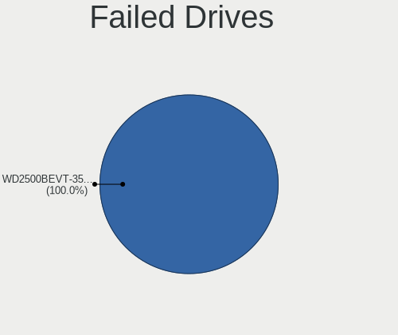
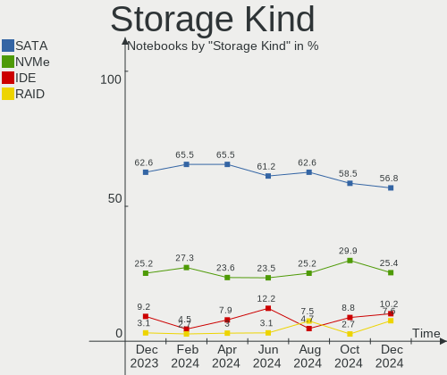

ROSA - Hardware Trends (Notebooks)
----------------------------------

A project to identify most popular hardware characteristics and track their change
over time based on data collected by Linux users at https://Linux-Hardware.org.

Anyone can contribute to this report by the [hw-probe](https://github.com/linuxhw/hw-probe) tool:

    sudo -E hw-probe -all -upload

This report is for one last month. Overall report since the beginning of time: [TestCoverage](https://github.com/linuxhw/TestCoverage)

Period: Sep, 2022.

Contents
--------

* [ System ](#system)
  - [ OS                       ](#os)
  - [ OS Family                ](#os-family)
  - [ Kernel                   ](#kernel)
  - [ Kernel Family            ](#kernel-family)
  - [ Kernel Major Ver.        ](#kernel-major-ver)
  - [ Arch                     ](#arch)
  - [ DE                       ](#de)
  - [ Display Server           ](#display-server)
  - [ Display Manager          ](#display-manager)
  - [ OS Lang                  ](#os-lang)
  - [ Boot Mode                ](#boot-mode)
  - [ Filesystem               ](#filesystem)
  - [ Part. scheme             ](#part-scheme)
  - [ Dual Boot with Linux/BSD ](#dual-boot-with-linuxbsd)
  - [ Dual Boot (Win)          ](#dual-boot-win)

* [ Board ](#board)
  - [ Vendor                   ](#vendor)
  - [ Model                    ](#model)
  - [ Model Family             ](#model-family)
  - [ MFG Year                 ](#mfg-year)
  - [ Form Factor              ](#form-factor)
  - [ Secure Boot              ](#secure-boot)
  - [ Coreboot                 ](#coreboot)
  - [ RAM Size                 ](#ram-size)
  - [ RAM Used                 ](#ram-used)
  - [ Total Drives             ](#total-drives)
  - [ Has CD-ROM               ](#has-cd-rom)
  - [ Has Ethernet             ](#has-ethernet)
  - [ Has WiFi                 ](#has-wifi)
  - [ Has Bluetooth            ](#has-bluetooth)

* [ Location ](#location)
  - [ Country                  ](#country)
  - [ City                     ](#city)

* [ Drives ](#drives)
  - [ Drive Vendor             ](#drive-vendor)
  - [ Drive Model              ](#drive-model)
  - [ HDD Vendor               ](#hdd-vendor)
  - [ SSD Vendor               ](#ssd-vendor)
  - [ Drive Kind               ](#drive-kind)
  - [ Drive Connector          ](#drive-connector)
  - [ Drive Size               ](#drive-size)
  - [ Space Total              ](#space-total)
  - [ Space Used               ](#space-used)
  - [ Malfunc. Drives          ](#malfunc-drives)
  - [ Malfunc. Drive Vendor    ](#malfunc-drive-vendor)
  - [ Malfunc. HDD Vendor      ](#malfunc-hdd-vendor)
  - [ Malfunc. Drive Kind      ](#malfunc-drive-kind)
  - [ Failed Drives            ](#failed-drives)
  - [ Failed Drive Vendor      ](#failed-drive-vendor)
  - [ Drive Status             ](#drive-status)

* [ Storage controller ](#storage-controller)
  - [ Storage Vendor           ](#storage-vendor)
  - [ Storage Model            ](#storage-model)
  - [ Storage Kind             ](#storage-kind)

* [ Processor ](#processor)
  - [ CPU Vendor               ](#cpu-vendor)
  - [ CPU Model                ](#cpu-model)
  - [ CPU Model Family         ](#cpu-model-family)
  - [ CPU Cores                ](#cpu-cores)
  - [ CPU Sockets              ](#cpu-sockets)
  - [ CPU Threads              ](#cpu-threads)
  - [ CPU Op-Modes             ](#cpu-op-modes)
  - [ CPU Microcode            ](#cpu-microcode)
  - [ CPU Microarch            ](#cpu-microarch)

* [ Graphics ](#graphics)
  - [ GPU Vendor               ](#gpu-vendor)
  - [ GPU Model                ](#gpu-model)
  - [ GPU Combo                ](#gpu-combo)
  - [ GPU Driver               ](#gpu-driver)
  - [ GPU Memory               ](#gpu-memory)

* [ Monitor ](#monitor)
  - [ Monitor Vendor           ](#monitor-vendor)
  - [ Monitor Model            ](#monitor-model)
  - [ Monitor Resolution       ](#monitor-resolution)
  - [ Monitor Diagonal         ](#monitor-diagonal)
  - [ Monitor Width            ](#monitor-width)
  - [ Aspect Ratio             ](#aspect-ratio)
  - [ Monitor Area             ](#monitor-area)
  - [ Pixel Density            ](#pixel-density)
  - [ Multiple Monitors        ](#multiple-monitors)

* [ Network ](#network)
  - [ Net Controller Vendor    ](#net-controller-vendor)
  - [ Net Controller Model     ](#net-controller-model)
  - [ Wireless Vendor          ](#wireless-vendor)
  - [ Wireless Model           ](#wireless-model)
  - [ Ethernet Vendor          ](#ethernet-vendor)
  - [ Ethernet Model           ](#ethernet-model)
  - [ Net Controller Kind      ](#net-controller-kind)
  - [ Used Controller          ](#used-controller)
  - [ NICs                     ](#nics)
  - [ IPv6                     ](#ipv6)

* [ Bluetooth ](#bluetooth)
  - [ Bluetooth Vendor         ](#bluetooth-vendor)
  - [ Bluetooth Model          ](#bluetooth-model)

* [ Sound ](#sound)
  - [ Sound Vendor             ](#sound-vendor)
  - [ Sound Model              ](#sound-model)

* [ Memory ](#memory)
  - [ Memory Vendor            ](#memory-vendor)
  - [ Memory Model             ](#memory-model)
  - [ Memory Kind              ](#memory-kind)
  - [ Memory Form Factor       ](#memory-form-factor)
  - [ Memory Size              ](#memory-size)
  - [ Memory Speed             ](#memory-speed)

* [ Printers & scanners ](#printers--scanners)
  - [ Printer Vendor           ](#printer-vendor)
  - [ Printer Model            ](#printer-model)
  - [ Scanner Vendor           ](#scanner-vendor)
  - [ Scanner Model            ](#scanner-model)

* [ Camera ](#camera)
  - [ Camera Vendor            ](#camera-vendor)
  - [ Camera Model             ](#camera-model)

* [ Security ](#security)
  - [ Fingerprint Vendor       ](#fingerprint-vendor)
  - [ Fingerprint Model        ](#fingerprint-model)
  - [ Chipcard Vendor          ](#chipcard-vendor)
  - [ Chipcard Model           ](#chipcard-model)

* [ Unsupported ](#unsupported)
  - [ Unsupported Devices      ](#unsupported-devices)
  - [ Unsupported Device Types ](#unsupported-device-types)

System
------

OS
--

Installed operating systems

| Name       | Notebooks | Percent |
|------------|-----------|---------|
| ROSA 12.2  | 105       | 84.68%  |
| ROSA R11.1 | 12        | 9.68%   |
| ROSA 12.1  | 5         | 4.03%   |
| ROSA R11   | 1         | 0.81%   |
| ROSA 12    | 1         | 0.81%   |

OS Family
---------

OS without a version

| Name | Notebooks | Percent |
|------|-----------|---------|
| ROSA | 124       | 100%    |

Kernel
------

Version of the Linux kernel

| Version                                | Notebooks | Percent |
|----------------------------------------|-----------|---------|
| 5.10.74-generic-2rosa2021.1-x86_64     | 52        | 41.94%  |
| 5.10.118-generic-2rosa2021.1-x86_64    | 31        | 25%     |
| 5.17.11-generic-2rosa2021.1-x86_64     | 11        | 8.87%   |
| 5.4.83-generic-2rosa-x86_64            | 4         | 3.23%   |
| 5.18.18.xm1-1-xanmod-rosa2021.1-x86_64 | 4         | 3.23%   |
| 5.15.67-generic-1rosa2021.1-x86_64     | 4         | 3.23%   |
| 5.15.43-generic-2rosa2021.1-x86_64     | 3         | 2.42%   |
| 5.10.74-generic-2rosa2021.1-i586       | 3         | 2.42%   |
| 4.15.0-desktop-122.124.1rosa-x86_64    | 3         | 2.42%   |
| 5.4.83-generic-2rosa-i586              | 2         | 1.61%   |
| 5.15.65-generic-1rosa2021.1-x86_64     | 2         | 1.61%   |
| 5.4.32-generic-2rosa-x86_64            | 1         | 0.81%   |
| 5.4.32-generic-2rosa-i586              | 1         | 0.81%   |
| 5.10.71-generic-1rosa2021.1-x86_64     | 1         | 0.81%   |
| 5.10.50-generic-1rosa-x86_64           | 1         | 0.81%   |
| 4.15.0-desktop-45.1rosa-x86_64         | 1         | 0.81%   |

Kernel Family
-------------

Linux kernel without a distro release

| Version  | Notebooks | Percent |
|----------|-----------|---------|
| 5.10.74  | 55        | 44.35%  |
| 5.10.118 | 31        | 25%     |
| 5.17.11  | 11        | 8.87%   |
| 5.4.83   | 6         | 4.84%   |
| 5.18.18  | 4         | 3.23%   |
| 5.15.67  | 4         | 3.23%   |
| 4.15.0   | 4         | 3.23%   |
| 5.15.43  | 3         | 2.42%   |
| 5.4.32   | 2         | 1.61%   |
| 5.15.65  | 2         | 1.61%   |
| 5.10.71  | 1         | 0.81%   |
| 5.10.50  | 1         | 0.81%   |

Kernel Major Ver.
-----------------

Linux kernel major version

| Version | Notebooks | Percent |
|---------|-----------|---------|
| 5.10    | 88        | 70.97%  |
| 5.17    | 11        | 8.87%   |
| 5.15    | 9         | 7.26%   |
| 5.4     | 8         | 6.45%   |
| 5.18    | 4         | 3.23%   |
| 4.15    | 4         | 3.23%   |

Arch
----

OS architecture (x86_64, i586, etc.)

| Name   | Notebooks | Percent |
|--------|-----------|---------|
| x86_64 | 118       | 95.16%  |
| i686   | 6         | 4.84%   |

DE
--

Desktop Environment

| Name  | Notebooks | Percent |
|-------|-----------|---------|
| KDE5  | 57        | 45.97%  |
| GNOME | 45        | 36.29%  |
| LXQt  | 15        | 12.1%   |
| KDE4  | 7         | 5.65%   |

Display Server
--------------

X11 or Wayland

| Name    | Notebooks | Percent |
|---------|-----------|---------|
| Wayland | 101       | 81.45%  |
| X11     | 23        | 18.55%  |

Display Manager
---------------

SDDM, LightDM, etc.

| Name    | Notebooks | Percent |
|---------|-----------|---------|
| GDM     | 61        | 49.19%  |
| SDDM    | 53        | 42.74%  |
| KDM     | 7         | 5.65%   |
| LightDM | 3         | 2.42%   |

OS Lang
-------

Language

| Lang    | Notebooks | Percent |
|---------|-----------|---------|
| ru_RU   | 115       | 92.74%  |
| pt_BR   | 2         | 1.61%   |
| en_US   | 2         | 1.61%   |
| de_DE   | 2         | 1.61%   |
| tr_TR   | 1         | 0.81%   |
| et_EE   | 1         | 0.81%   |
| Unknown | 1         | 0.81%   |

Boot Mode
---------

EFI or BIOS

| Mode | Notebooks | Percent |
|------|-----------|---------|
| EFI  | 67        | 54.03%  |
| BIOS | 57        | 45.97%  |

Filesystem
----------

Type of filesystem

| Type  | Notebooks | Percent |
|-------|-----------|---------|
| Ext4  | 115       | 92.74%  |
| Btrfs | 7         | 5.65%   |
| Xfs   | 1         | 0.81%   |
| Ext3  | 1         | 0.81%   |

Part. scheme
------------

Scheme of partitioning

| Type | Notebooks | Percent |
|------|-----------|---------|
| GPT  | 82        | 66.13%  |
| MBR  | 42        | 33.87%  |

Dual Boot with Linux/BSD
------------------------

Hosting more than one Linux/BSD

| Dual boot | Notebooks | Percent |
|-----------|-----------|---------|
| No        | 90        | 72.58%  |
| Yes       | 34        | 27.42%  |

Dual Boot (Win)
---------------

Hosting Linux and Windows

| Dual boot | Notebooks | Percent |
|-----------|-----------|---------|
| No        | 78        | 62.9%   |
| Yes       | 46        | 37.1%   |

Board
-----

Vendor
------

Motherboard manufacturer

| Name                  | Notebooks | Percent |
|-----------------------|-----------|---------|
| ASUSTek Computer      | 28        | 22.58%  |
| Lenovo                | 21        | 16.94%  |
| Acer                  | 20        | 16.13%  |
| Hewlett-Packard       | 19        | 15.32%  |
| Aquarius              | 6         | 4.84%   |
| Samsung Electronics   | 5         | 4.03%   |
| MSI                   | 5         | 4.03%   |
| Dell                  | 4         | 3.23%   |
| Toshiba               | 2         | 1.61%   |
| Unknown               | 2         | 1.61%   |
| Timi                  | 1         | 0.81%   |
| System76              | 1         | 0.81%   |
| Sony                  | 1         | 0.81%   |
| Positivo Bahia - VAIO | 1         | 0.81%   |
| Notebook              | 1         | 0.81%   |
| Medion                | 1         | 0.81%   |
| Intel                 | 1         | 0.81%   |
| Haier                 | 1         | 0.81%   |
| DEXP                  | 1         | 0.81%   |
| Chuwi                 | 1         | 0.81%   |
| Apple                 | 1         | 0.81%   |
| 3Logic Group          | 1         | 0.81%   |

Model
-----

Motherboard model

| Name                                    | Notebooks | Percent |
|-----------------------------------------|-----------|---------|
| HP Pavilion g6                          | 7         | 5.65%   |
| Aquarius NS685U R11                     | 5         | 4.03%   |
| ASUS K50IJ                              | 3         | 2.42%   |
| Lenovo ThinkBook 16p Gen 2 20YM         | 2         | 1.61%   |
| HP Notebook                             | 2         | 1.61%   |
| ASUS VivoBook_ASUS Laptop E210MA_E210MA | 2         | 1.61%   |
| Unknown                                 | 2         | 1.61%   |
| Toshiba Satellite Pro L630              | 1         | 0.81%   |
| Toshiba Satellite A200                  | 1         | 0.81%   |
| Timi RedmiBook Pro 14S                  | 1         | 0.81%   |
| System76 Lemur                          | 1         | 0.81%   |
| Sony VGN-FW245J                         | 1         | 0.81%   |
| Samsung R540/R580/R780/SA41/E452        | 1         | 0.81%   |
| Samsung R530/R730                       | 1         | 0.81%   |
| Samsung N150P/N210P/N220P               | 1         | 0.81%   |
| Samsung 355V4C/356V4C/3445VC/3545VC     | 1         | 0.81%   |
| Samsung 350V5C/351V5C/3540VC/3440VC     | 1         | 0.81%   |
| Positivo Bahia - VAIO VJFE52F11X-B0611H | 1         | 0.81%   |
| Notebook W65_67SB                       | 1         | 0.81%   |
| MSI MS-N051                             | 1         | 0.81%   |
| MSI Katana GF66 11UE                    | 1         | 0.81%   |
| MSI GS66 Stealth 10SE                   | 1         | 0.81%   |
| MSI GP60 2OD                            | 1         | 0.81%   |
| MSI GL65 Leopard 10SCSR                 | 1         | 0.81%   |
| Medion E6239 MD98887                    | 1         | 0.81%   |
| Lenovo ThinkPad L13 20R3000CRT          | 1         | 0.81%   |
| Lenovo Legion Y540-17IRH 81UJ           | 1         | 0.81%   |
| Lenovo Legion Y-540-17IRH-PG0 81T3      | 1         | 0.81%   |
| Lenovo IdeaPad Y510                     | 1         | 0.81%   |
| Lenovo IdeaPad S340-15IML 81NA          | 1         | 0.81%   |
| Lenovo IdeaPad S145-15AST 81N3          | 1         | 0.81%   |
| Lenovo IdeaPad S145-15API 81UT          | 1         | 0.81%   |
| Lenovo IdeaPad S12 20021,2959           | 1         | 0.81%   |
| Lenovo IdeaPad Gaming 3 15ACH6 82K2     | 1         | 0.81%   |
| Lenovo IdeaPad 5 Pro 16ACH6 82L5        | 1         | 0.81%   |
| Lenovo IdeaPad 330-15AST 81D6           | 1         | 0.81%   |
| Lenovo IdeaPad 320-15IKB 80XL           | 1         | 0.81%   |
| Lenovo IdeaPad 110-15ACL 80TJ           | 1         | 0.81%   |
| Lenovo IdeaPad 100-14IBY 80MH           | 1         | 0.81%   |
| Lenovo G710 20252                       | 1         | 0.81%   |

Model Family
------------

Motherboard model prefix

| Name                                    | Notebooks | Percent |
|-----------------------------------------|-----------|---------|
| Acer Aspire                             | 14        | 11.29%  |
| Lenovo IdeaPad                          | 11        | 8.87%   |
| HP Pavilion                             | 9         | 7.26%   |
| ASUS VivoBook                           | 6         | 4.84%   |
| Aquarius NS685U                         | 5         | 4.03%   |
| Dell Inspiron                           | 4         | 3.23%   |
| ASUS K50IJ                              | 3         | 2.42%   |
| Toshiba Satellite                       | 2         | 1.61%   |
| Lenovo ThinkBook                        | 2         | 1.61%   |
| Lenovo Legion                           | 2         | 1.61%   |
| HP Notebook                             | 2         | 1.61%   |
| HP Laptop                               | 2         | 1.61%   |
| HP EliteBook                            | 2         | 1.61%   |
| HP Compaq                               | 2         | 1.61%   |
| Acer Extensa                            | 2         | 1.61%   |
| Unknown                                 | 2         | 1.61%   |
| Timi RedmiBook                          | 1         | 0.81%   |
| System76 Lemur                          | 1         | 0.81%   |
| Sony VGN-FW245J                         | 1         | 0.81%   |
| Samsung R540                            | 1         | 0.81%   |
| Samsung R530                            | 1         | 0.81%   |
| Samsung N150P                           | 1         | 0.81%   |
| Samsung 355V4C                          | 1         | 0.81%   |
| Samsung 350V5C                          | 1         | 0.81%   |
| Positivo Bahia - VAIO VJFE52F11X-B0611H | 1         | 0.81%   |
| Notebook W65                            | 1         | 0.81%   |
| MSI MS-N051                             | 1         | 0.81%   |
| MSI Katana                              | 1         | 0.81%   |
| MSI GS66                                | 1         | 0.81%   |
| MSI GP60                                | 1         | 0.81%   |
| MSI GL65                                | 1         | 0.81%   |
| Medion E6239                            | 1         | 0.81%   |
| Lenovo ThinkPad                         | 1         | 0.81%   |
| Lenovo G710                             | 1         | 0.81%   |
| Lenovo G580                             | 1         | 0.81%   |
| Lenovo G500                             | 1         | 0.81%   |
| Lenovo B570e                            | 1         | 0.81%   |
| Lenovo B50-10                           | 1         | 0.81%   |
| Intel ChiefRiver                        | 1         | 0.81%   |
| HP ProBook                              | 1         | 0.81%   |

MFG Year
--------

Motherboard manufacture year

| Year | Notebooks | Percent |
|------|-----------|---------|
| 2011 | 17        | 13.71%  |
| 2021 | 13        | 10.48%  |
| 2020 | 12        | 9.68%   |
| 2019 | 8         | 6.45%   |
| 2013 | 8         | 6.45%   |
| 2015 | 7         | 5.65%   |
| 2012 | 7         | 5.65%   |
| 2010 | 7         | 5.65%   |
| 2008 | 7         | 5.65%   |
| 2022 | 6         | 4.84%   |
| 2018 | 6         | 4.84%   |
| 2009 | 6         | 4.84%   |
| 2017 | 5         | 4.03%   |
| 2016 | 5         | 4.03%   |
| 2014 | 4         | 3.23%   |
| 2007 | 4         | 3.23%   |
| 2006 | 1         | 0.81%   |
| 2004 | 1         | 0.81%   |

Form Factor
-----------

Physical design of the computer

| Name     | Notebooks | Percent |
|----------|-----------|---------|
| Notebook | 124       | 100%    |

Secure Boot
-----------

Enabled or disabled

| State    | Notebooks | Percent |
|----------|-----------|---------|
| Disabled | 124       | 100%    |

Coreboot
--------

Have coreboot on board

| Used | Notebooks | Percent |
|------|-----------|---------|
| No   | 124       | 100%    |

RAM Size
--------

Total RAM memory

| Size in GB | Notebooks | Percent |
|------------|-----------|---------|
| 4.01-8.0   | 45        | 36.29%  |
| 3.01-4.0   | 32        | 25.81%  |
| 1.01-2.0   | 14        | 11.29%  |
| 8.01-16.0  | 13        | 10.48%  |
| 16.01-24.0 | 10        | 8.06%   |
| 2.01-3.0   | 5         | 4.03%   |
| 0.51-1.0   | 3         | 2.42%   |
| 32.01-64.0 | 2         | 1.61%   |

RAM Used
--------

Used RAM memory

| Used GB  | Notebooks | Percent |
|----------|-----------|---------|
| 1.01-2.0 | 64        | 51.61%  |
| 0.51-1.0 | 34        | 27.42%  |
| 2.01-3.0 | 19        | 15.32%  |
| 0.01-0.5 | 3         | 2.42%   |
| 4.01-8.0 | 2         | 1.61%   |
| 3.01-4.0 | 2         | 1.61%   |

Total Drives
------------

Number of drives on board

| Drives | Notebooks | Percent |
|--------|-----------|---------|
| 1      | 86        | 69.35%  |
| 2      | 34        | 27.42%  |
| 3      | 4         | 3.23%   |

Has CD-ROM
----------

Has CD-ROM on board

| Presented | Notebooks | Percent |
|-----------|-----------|---------|
| No        | 80        | 64.52%  |
| Yes       | 44        | 35.48%  |

Has Ethernet
------------

Has Ethernet on board

| Presented | Notebooks | Percent |
|-----------|-----------|---------|
| Yes       | 109       | 87.9%   |
| No        | 15        | 12.1%   |

Has WiFi
--------

Has WiFi module

| Presented | Notebooks | Percent |
|-----------|-----------|---------|
| Yes       | 123       | 99.19%  |
| No        | 1         | 0.81%   |

Has Bluetooth
-------------

Has Bluetooth module

| Presented | Notebooks | Percent |
|-----------|-----------|---------|
| Yes       | 93        | 75%     |
| No        | 31        | 25%     |

Location
--------

Country
-------

Geographic location (country)

| Country    | Notebooks | Percent |
|------------|-----------|---------|
| Russia     | 106       | 85.48%  |
| Ukraine    | 5         | 4.03%   |
| Germany    | 2         | 1.61%   |
| Brazil     | 2         | 1.61%   |
| USA        | 1         | 0.81%   |
| Turkey     | 1         | 0.81%   |
| Kazakhstan | 1         | 0.81%   |
| Indonesia  | 1         | 0.81%   |
| France     | 1         | 0.81%   |
| Estonia    | 1         | 0.81%   |
| Czechia    | 1         | 0.81%   |
| Belarus    | 1         | 0.81%   |
| Armenia    | 1         | 0.81%   |

City
----

Geographic location (city)

| City              | Notebooks | Percent |
|-------------------|-----------|---------|
| Moscow            | 23        | 18.55%  |
| St Petersburg     | 6         | 4.84%   |
| Nizhniy Novgorod  | 5         | 4.03%   |
| Krasnodar         | 5         | 4.03%   |
| Rostov-on-Don     | 4         | 3.23%   |
| Krasnoyarsk       | 4         | 3.23%   |
| Yekaterinburg     | 3         | 2.42%   |
| Voronezh          | 3         | 2.42%   |
| Chelyabinsk       | 3         | 2.42%   |
| Yalta             | 2         | 1.61%   |
| Samara            | 2         | 1.61%   |
| Novosibirsk       | 2         | 1.61%   |
| Kirov             | 2         | 1.61%   |
| Khabarovsk        | 2         | 1.61%   |
| Balashikha        | 2         | 1.61%   |
| Zhukovskiy        | 1         | 0.81%   |
| Zheleznogorsk     | 1         | 0.81%   |
| Zaprudnya         | 1         | 0.81%   |
| Yogyakarta        | 1         | 0.81%   |
| Yerevan           | 1         | 0.81%   |
| Weimar            | 1         | 0.81%   |
| Volgograd         | 1         | 0.81%   |
| Vitebsk           | 1         | 0.81%   |
| Usinsk            | 1         | 0.81%   |
| Ursala            | 1         | 0.81%   |
| Uglich            | 1         | 0.81%   |
| Ufa               | 1         | 0.81%   |
| Tomsk             | 1         | 0.81%   |
| Tallinn           | 1         | 0.81%   |
| Stavropol         | 1         | 0.81%   |
| Sevastopol        | 1         | 0.81%   |
| Saratov           | 1         | 0.81%   |
| Saransk           | 1         | 0.81%   |
| Rio de Janeiro    | 1         | 0.81%   |
| Pursaklar         | 1         | 0.81%   |
| Prague            | 1         | 0.81%   |
| Polevskoy         | 1         | 0.81%   |
| Perm              | 1         | 0.81%   |
| Penza             | 1         | 0.81%   |
| Pad' Mel'nichnaya | 1         | 0.81%   |

Drives
------

Drive Vendor
------------

Hard drive vendors

| Vendor                         | Notebooks | Drives | Percent |
|--------------------------------|-----------|--------|---------|
| WDC                            | 27        | 27     | 17.42%  |
| Samsung Electronics            | 17        | 19     | 10.97%  |
| Seagate                        | 14        | 15     | 9.03%   |
| Toshiba                        | 12        | 12     | 7.74%   |
| Hitachi                        | 11        | 11     | 7.1%    |
| Kingston                       | 10        | 10     | 6.45%   |
| A-DATA Technology              | 8         | 8      | 5.16%   |
| Unknown                        | 7         | 9      | 4.52%   |
| SK hynix                       | 7         | 7      | 4.52%   |
| SPCC                           | 4         | 4      | 2.58%   |
| Intel                          | 4         | 4      | 2.58%   |
| HGST                           | 4         | 4      | 2.58%   |
| China                          | 4         | 4      | 2.58%   |
| SanDisk                        | 3         | 3      | 1.94%   |
| Plextor                        | 2         | 2      | 1.29%   |
| Fujitsu                        | 2         | 2      | 1.29%   |
| External                       | 2         | 2      | 1.29%   |
| V-GeN                          | 1         | 1      | 0.65%   |
| Solid State Storage Technology | 1         | 1      | 0.65%   |
| RUN                            | 1         | 1      | 0.65%   |
| Qumo                           | 1         | 1      | 0.65%   |
| Patriot                        | 1         | 1      | 0.65%   |
| Palit                          | 1         | 1      | 0.65%   |
| OCZ                            | 1         | 1      | 0.65%   |
| Micron Technology              | 1         | 1      | 0.65%   |
| KIOXIA                         | 1         | 1      | 0.65%   |
| KingSpec                       | 1         | 1      | 0.65%   |
| Kingmax                        | 1         | 1      | 0.65%   |
| KingDian                       | 1         | 1      | 0.65%   |
| Kimtigo                        | 1         | 1      | 0.65%   |
| GS                             | 1         | 2      | 0.65%   |
| Gigabyte Technology            | 1         | 1      | 0.65%   |
| Apacer                         | 1         | 1      | 0.65%   |
| AMD                            | 1         | 1      | 0.65%   |

Drive Model
-----------

Hard drive models

| Model                                  | Notebooks | Percent |
|----------------------------------------|-----------|---------|
| A-DATA SU800NS38 256GB SSD             | 6         | 3.73%   |
| WDC WDS500G2B0A-00SM50 500GB SSD       | 3         | 1.86%   |
| Toshiba MQ04ABF100 1TB                 | 3         | 1.86%   |
| Seagate ST500LT012-1DG142 500GB        | 3         | 1.86%   |
| WDC PC SN530 SDBPNPZ-512G-1114 512GB   | 2         | 1.24%   |
| Unknown EC2QT  64GB                    | 2         | 1.24%   |
| Unknown DA4064  64GB                   | 2         | 1.24%   |
| Toshiba MQ01ABF050 500GB               | 2         | 1.24%   |
| Toshiba MQ01ABD050 500GB               | 2         | 1.24%   |
| SPCC Solid State Disk 128GB            | 2         | 1.24%   |
| SK hynix SKHynix_HFS512GDE9X084N 512GB | 2         | 1.24%   |
| Seagate ST1000LM035-1RK172 1TB         | 2         | 1.24%   |
| Seagate ST1000LM024 HN-M101MBB 1TB     | 2         | 1.24%   |
| Samsung MZVLB1T0HBLR-000L2 1TB         | 2         | 1.24%   |
| Hitachi HTS547575A9E384 752GB          | 2         | 1.24%   |
| Hitachi HTS545050B9A300 500GB          | 2         | 1.24%   |
| Hitachi HTS545025B9A300 250GB          | 2         | 1.24%   |
| Hitachi HTS542580K9SA00 80GB           | 2         | 1.24%   |
| HGST HTS545050A7E680 500GB             | 2         | 1.24%   |
| External USB3.0 1TB                    | 2         | 1.24%   |
| A-DATA SX8200PNP 1TB                   | 2         | 1.24%   |
| WDC WDS250G2B0B-00YS70 250GB SSD       | 1         | 0.62%   |
| WDC WDS250G2B0B 250GB SSD              | 1         | 0.62%   |
| WDC WDS240G2G0A-00JH30 240GB SSD       | 1         | 0.62%   |
| WDC WDS120G2G0A-00JH30 120GB SSD       | 1         | 0.62%   |
| WDC WD7500BPVX-22JC3T0 752GB           | 1         | 0.62%   |
| WDC WD5000LPVX-80V0TT0 500GB           | 1         | 0.62%   |
| WDC WD5000LPCX-60VHAT0 500GB           | 1         | 0.62%   |
| WDC WD5000LPCX-24VHAT0 500GB           | 1         | 0.62%   |
| WDC WD5000BPVT-22HXZT1 500GB           | 1         | 0.62%   |
| WDC WD3200LPVX-22V0TT0 320GB           | 1         | 0.62%   |
| WDC WD3200BPVT-22ZEST0 320GB           | 1         | 0.62%   |
| WDC WD3200BEVT-80A0RT0 320GB           | 1         | 0.62%   |
| WDC WD2500LPCX-24C6HT0 250GB           | 1         | 0.62%   |
| WDC WD2500BEVT-35A23T0 250GB           | 1         | 0.62%   |
| WDC WD2500BEKT-60A25T1 250GB           | 1         | 0.62%   |
| WDC WD10SPZX-35Z10T0 1TB               | 1         | 0.62%   |
| WDC WD10SPZX-22Z10T1 1TB               | 1         | 0.62%   |
| WDC WD10SPZX-00Z10T0 1TB               | 1         | 0.62%   |
| WDC WD10JPVX-00JC3T0 1TB               | 1         | 0.62%   |

HDD Vendor
----------

Hard disk drive vendors

| Vendor              | Notebooks | Drives | Percent |
|---------------------|-----------|--------|---------|
| WDC                 | 17        | 17     | 26.98%  |
| Seagate             | 14        | 15     | 22.22%  |
| Toshiba             | 11        | 11     | 17.46%  |
| Hitachi             | 11        | 11     | 17.46%  |
| Samsung Electronics | 4         | 4      | 6.35%   |
| HGST                | 4         | 4      | 6.35%   |
| Fujitsu             | 2         | 2      | 3.17%   |

SSD Vendor
----------

Solid state drive vendors

| Vendor              | Notebooks | Drives | Percent |
|---------------------|-----------|--------|---------|
| WDC                 | 7         | 7      | 13.46%  |
| Samsung Electronics | 6         | 6      | 11.54%  |
| Kingston            | 6         | 6      | 11.54%  |
| A-DATA Technology   | 6         | 6      | 11.54%  |
| SPCC                | 4         | 4      | 7.69%   |
| China               | 4         | 4      | 7.69%   |
| SanDisk             | 3         | 3      | 5.77%   |
| SK hynix            | 2         | 2      | 3.85%   |
| Plextor             | 2         | 2      | 3.85%   |
| V-GeN               | 1         | 1      | 1.92%   |
| RUN                 | 1         | 1      | 1.92%   |
| Qumo                | 1         | 1      | 1.92%   |
| Patriot             | 1         | 1      | 1.92%   |
| Palit               | 1         | 1      | 1.92%   |
| OCZ                 | 1         | 1      | 1.92%   |
| KingSpec            | 1         | 1      | 1.92%   |
| Kingmax             | 1         | 1      | 1.92%   |
| KingDian            | 1         | 1      | 1.92%   |
| GS                  | 1         | 2      | 1.92%   |
| Apacer              | 1         | 1      | 1.92%   |
| AMD                 | 1         | 1      | 1.92%   |

Drive Kind
----------

HDD or SSD

| Kind | Notebooks | Drives | Percent |
|------|-----------|--------|---------|
| HDD  | 62        | 64     | 41.33%  |
| SSD  | 50        | 53     | 33.33%  |
| NVMe | 31        | 35     | 20.67%  |
| MMC  | 7         | 9      | 4.67%   |

Drive Connector
---------------

SATA, SAS, NVMe, etc.

| Type | Notebooks | Drives | Percent |
|------|-----------|--------|---------|
| SATA | 102       | 114    | 71.33%  |
| NVMe | 29        | 33     | 20.28%  |
| MMC  | 7         | 9      | 4.9%    |
| SAS  | 5         | 5      | 3.5%    |

Drive Size
----------

Size of hard drive

| Size in TB | Notebooks | Drives | Percent |
|------------|-----------|--------|---------|
| 0.01-0.5   | 86        | 92     | 78.9%   |
| 0.51-1.0   | 23        | 25     | 21.1%   |

Space Total
-----------

Amount of disk space available on the file system

| Size in GB | Notebooks | Percent |
|------------|-----------|---------|
| 101-250    | 38        | 30.65%  |
| 251-500    | 27        | 21.77%  |
| 501-1000   | 19        | 15.32%  |
| 1-20       | 18        | 14.52%  |
| 51-100     | 13        | 10.48%  |
| 1001-2000  | 5         | 4.03%   |
| 21-50      | 3         | 2.42%   |
| Unknown    | 1         | 0.81%   |

Space Used
----------

Amount of used disk space

| Used GB   | Notebooks | Percent |
|-----------|-----------|---------|
| 1-20      | 88        | 70.97%  |
| 51-100    | 13        | 10.48%  |
| 21-50     | 8         | 6.45%   |
| 101-250   | 7         | 5.65%   |
| 501-1000  | 4         | 3.23%   |
| 251-500   | 2         | 1.61%   |
| 1001-2000 | 1         | 0.81%   |
| Unknown   | 1         | 0.81%   |

Malfunc. Drives
---------------

Drive models with a malfunction

| Model                              | Notebooks | Drives | Percent |
|------------------------------------|-----------|--------|---------|
| Hitachi HTS545050B9A300 500GB      | 2         | 2      | 6.06%   |
| Hitachi HTS545025B9A300 250GB      | 2         | 2      | 6.06%   |
| Hitachi HTS542580K9SA00 80GB       | 2         | 2      | 6.06%   |
| HGST HTS545050A7E680 500GB         | 2         | 2      | 6.06%   |
| WDC WDS120G2G0A-00JH30 120GB SSD   | 1         | 1      | 3.03%   |
| WDC WD5000LPCX-60VHAT0 500GB       | 1         | 1      | 3.03%   |
| WDC WD3200BPVT-22ZEST0 320GB       | 1         | 1      | 3.03%   |
| WDC WD3200BEVT-80A0RT0 320GB       | 1         | 1      | 3.03%   |
| WDC WD2500LPCX-24C6HT0 250GB       | 1         | 1      | 3.03%   |
| WDC WD2500BEVT-35A23T0 250GB       | 1         | 1      | 3.03%   |
| WDC WD2500BEKT-60A25T1 250GB       | 1         | 1      | 3.03%   |
| Toshiba MQ01ABF050 500GB           | 1         | 1      | 3.03%   |
| Toshiba MQ01ABD050 500GB           | 1         | 1      | 3.03%   |
| Toshiba MK2529GSG 250GB            | 1         | 1      | 3.03%   |
| Seagate ST9500420AS 500GB          | 1         | 1      | 3.03%   |
| Seagate ST9500325AS 500GB          | 1         | 1      | 3.03%   |
| Seagate ST500LT012-1DG142 500GB    | 1         | 1      | 3.03%   |
| Seagate ST500LM000-SSHD-8GB        | 1         | 1      | 3.03%   |
| Seagate ST320LT012-9WS14C 320GB    | 1         | 1      | 3.03%   |
| Samsung Electronics HN-M101MBB 1TB | 1         | 1      | 3.03%   |
| Samsung Electronics HM321HI 320GB  | 1         | 1      | 3.03%   |
| Plextor PX-128M6S 128GB SSD        | 1         | 1      | 3.03%   |
| KingSpec V-32 32GB SSD             | 1         | 1      | 3.03%   |
| Hitachi HTS547575A9E384 752GB      | 1         | 1      | 3.03%   |
| Hitachi HTS547550A9E384 500GB      | 1         | 1      | 3.03%   |
| Hitachi HTS543232L9SA00 320GB      | 1         | 1      | 3.03%   |
| Hitachi HTS542516K9SA00 160GB      | 1         | 1      | 3.03%   |
| HGST HTS545025A7E680 250GB         | 1         | 1      | 3.03%   |
| Fujitsu MHY2160BH 160GB            | 1         | 1      | 3.03%   |

Malfunc. Drive Vendor
---------------------

Vendors of faulty drives

| Vendor              | Notebooks | Drives | Percent |
|---------------------|-----------|--------|---------|
| Hitachi             | 10        | 10     | 30.3%   |
| WDC                 | 7         | 7      | 21.21%  |
| Seagate             | 5         | 5      | 15.15%  |
| Toshiba             | 3         | 3      | 9.09%   |
| HGST                | 3         | 3      | 9.09%   |
| Samsung Electronics | 2         | 2      | 6.06%   |
| Plextor             | 1         | 1      | 3.03%   |
| KingSpec            | 1         | 1      | 3.03%   |
| Fujitsu             | 1         | 1      | 3.03%   |

Malfunc. HDD Vendor
-------------------

Vendors of faulty HDD drives

| Vendor              | Notebooks | Drives | Percent |
|---------------------|-----------|--------|---------|
| Hitachi             | 10        | 10     | 33.33%  |
| WDC                 | 6         | 6      | 20%     |
| Seagate             | 5         | 5      | 16.67%  |
| Toshiba             | 3         | 3      | 10%     |
| HGST                | 3         | 3      | 10%     |
| Samsung Electronics | 2         | 2      | 6.67%   |
| Fujitsu             | 1         | 1      | 3.33%   |

Malfunc. Drive Kind
-------------------

Kinds of faulty drives

| Kind | Notebooks | Drives | Percent |
|------|-----------|--------|---------|
| HDD  | 30        | 30     | 90.91%  |
| SSD  | 3         | 3      | 9.09%   |

Failed Drives
-------------

Failed drive models

| Model                             | Notebooks | Drives | Percent |
|-----------------------------------|-----------|--------|---------|
| Samsung Electronics HM160HI 160GB | 1         | 1      | 100%    |

Failed Drive Vendor
-------------------

Failed drive vendors

| Vendor              | Notebooks | Drives | Percent |
|---------------------|-----------|--------|---------|
| Samsung Electronics | 1         | 1      | 100%    |

Drive Status
------------

Number of failed and malfunc. drives

| Status   | Notebooks | Drives | Percent |
|----------|-----------|--------|---------|
| Works    | 92        | 112    | 66.19%  |
| Malfunc  | 33        | 33     | 23.74%  |
| Detected | 13        | 15     | 9.35%   |
| Failed   | 1         | 1      | 0.72%   |

Storage controller
------------------

Storage Vendor
--------------

Storage controller vendors

| Vendor                         | Notebooks | Percent |
|--------------------------------|-----------|---------|
| Intel                          | 92        | 61.74%  |
| AMD                            | 22        | 14.77%  |
| Samsung Electronics            | 9         | 6.04%   |
| SK hynix                       | 5         | 3.36%   |
| Nvidia                         | 4         | 2.68%   |
| Kingston Technology Company    | 4         | 2.68%   |
| SanDisk                        | 3         | 2.01%   |
| ADATA Technology               | 2         | 1.34%   |
| VIA Technologies               | 1         | 0.67%   |
| Toshiba America Info Systems   | 1         | 0.67%   |
| Solid State Storage Technology | 1         | 0.67%   |
| Silicon Motion                 | 1         | 0.67%   |
| Phison Electronics             | 1         | 0.67%   |
| Micron Technology              | 1         | 0.67%   |
| KIOXIA                         | 1         | 0.67%   |
| JMicron Technology             | 1         | 0.67%   |

Storage Model
-------------

Storage controller models

| Model                                                                          | Notebooks | Percent |
|--------------------------------------------------------------------------------|-----------|---------|
| AMD FCH SATA Controller [AHCI mode]                                            | 21        | 12.8%   |
| Intel 7 Series Chipset Family 6-port SATA Controller [AHCI mode]               | 10        | 6.1%    |
| Intel Comet Lake SATA AHCI Controller                                          | 8         | 4.88%   |
| Intel 82801IBM/IEM (ICH9M/ICH9M-E) 4 port SATA Controller [AHCI mode]          | 7         | 4.27%   |
| Samsung NVMe SSD Controller SM981/PM981/PM983                                  | 6         | 3.66%   |
| Intel Cannon Lake Mobile PCH SATA AHCI Controller                              | 6         | 3.66%   |
| Intel Atom Processor E3800 Series SATA AHCI Controller                         | 6         | 3.66%   |
| Intel 6 Series/C200 Series Chipset Family 6 port Mobile SATA AHCI Controller   | 6         | 3.66%   |
| Intel 5 Series/3400 Series Chipset 4 port SATA AHCI Controller                 | 6         | 3.66%   |
| Intel NM10/ICH7 Family SATA Controller [AHCI mode]                             | 5         | 3.05%   |
| Intel Celeron/Pentium Silver Processor SATA Controller                         | 5         | 3.05%   |
| Intel 82801HM/HEM (ICH8M/ICH8M-E) SATA Controller [AHCI mode]                  | 5         | 3.05%   |
| Intel 82801HM/HEM (ICH8M/ICH8M-E) IDE Controller                               | 5         | 3.05%   |
| Intel Sunrise Point-LP SATA Controller [AHCI mode]                             | 4         | 2.44%   |
| Intel 8 Series/C220 Series Chipset Family 6-port SATA Controller 1 [AHCI mode] | 4         | 2.44%   |
| Samsung NVMe SSD Controller 980                                                | 3         | 1.83%   |
| Intel 8 Series SATA Controller 1 [AHCI mode]                                   | 3         | 1.83%   |
| SK hynix Gold P31 SSD                                                          | 2         | 1.22%   |
| SK hynix BC501 NVMe Solid State Drive                                          | 2         | 1.22%   |
| SanDisk WD Blue SN550 NVMe SSD                                                 | 2         | 1.22%   |
| Kingston Company Company Non-Volatile memory controller                        | 2         | 1.22%   |
| Intel Volume Management Device NVMe RAID Controller                            | 2         | 1.22%   |
| Intel Tiger Lake-LP SATA Controller                                            | 2         | 1.22%   |
| Intel Non-Volatile memory controller                                           | 2         | 1.22%   |
| Intel Celeron N3350/Pentium N4200/Atom E3900 Series SATA AHCI Controller       | 2         | 1.22%   |
| Intel Cannon Point-LP SATA Controller [AHCI Mode]                              | 2         | 1.22%   |
| Intel 500 Series Chipset Family SATA AHCI Controller                           | 2         | 1.22%   |
| ADATA XPG SX8200 Pro PCIe Gen3x4 M.2 2280 Solid State Drive                    | 2         | 1.22%   |
| VIA VT82C586A/B/VT82C686/A/B/VT823x/A/C PIPC Bus Master IDE                    | 1         | 0.61%   |
| Toshiba America Info Systems XG6 NVMe SSD Controller                           | 1         | 0.61%   |
| Solid State Storage Non-Volatile memory controller                             | 1         | 0.61%   |
| SK hynix BC511                                                                 | 1         | 0.61%   |
| Silicon Motion SM2263EN/SM2263XT SSD Controller                                | 1         | 0.61%   |
| SanDisk WD Black SN750 / PC SN730 NVMe SSD                                     | 1         | 0.61%   |
| Phison PS5013 E13 NVMe Controller                                              | 1         | 0.61%   |
| Nvidia nForce SATA Controller                                                  | 1         | 0.61%   |
| Nvidia MCP79 AHCI Controller                                                   | 1         | 0.61%   |
| Nvidia MCP78S [GeForce 8200] SATA Controller (non-AHCI mode)                   | 1         | 0.61%   |
| Nvidia MCP78S [GeForce 8200] IDE                                               | 1         | 0.61%   |
| Nvidia MCP67 IDE Controller                                                    | 1         | 0.61%   |

Storage Kind
------------

Kind of storage controller (IDE, SATA, NVMe, SAS, ...)

| Kind | Notebooks | Percent |
|------|-----------|---------|
| SATA | 112       | 71.79%  |
| NVMe | 29        | 18.59%  |
| IDE  | 12        | 7.69%   |
| RAID | 3         | 1.92%   |

Processor
---------

CPU Vendor
----------

Processor vendors

| Vendor | Notebooks | Percent |
|--------|-----------|---------|
| Intel  | 95        | 76.61%  |
| AMD    | 29        | 23.39%  |

CPU Model
---------

Processor models

| Model                                        | Notebooks | Percent |
|----------------------------------------------|-----------|---------|
| Intel Core i5-10210U CPU @ 1.60GHz           | 8         | 6.45%   |
| Intel Pentium CPU N3540 @ 2.16GHz            | 3         | 2.42%   |
| Intel Core i5-8300H CPU @ 2.30GHz            | 3         | 2.42%   |
| Intel Core i3 CPU M 370 @ 2.40GHz            | 3         | 2.42%   |
| AMD Ryzen 5 5600H with Radeon Graphics       | 3         | 2.42%   |
| AMD A10-4600M APU with Radeon HD Graphics    | 3         | 2.42%   |
| Intel Pentium Dual-Core CPU T4500 @ 2.30GHz  | 2         | 1.61%   |
| Intel Pentium CPU P6200 @ 2.13GHz            | 2         | 1.61%   |
| Intel Core i7-9750H CPU @ 2.60GHz            | 2         | 1.61%   |
| Intel Core i7-10750H CPU @ 2.60GHz           | 2         | 1.61%   |
| Intel Core i5-4200U CPU @ 1.60GHz            | 2         | 1.61%   |
| Intel Core i5-3210M CPU @ 2.50GHz            | 2         | 1.61%   |
| Intel Core i5-2410M CPU @ 2.30GHz            | 2         | 1.61%   |
| Intel Core i3-7100U CPU @ 2.40GHz            | 2         | 1.61%   |
| Intel Core i3-4000M CPU @ 2.40GHz            | 2         | 1.61%   |
| Intel Core i3-3120M CPU @ 2.50GHz            | 2         | 1.61%   |
| Intel Celeron N4020 CPU @ 1.10GHz            | 2         | 1.61%   |
| Intel Celeron Dual-Core CPU T3100 @ 1.90GHz  | 2         | 1.61%   |
| Intel Atom CPU N450 @ 1.66GHz                | 2         | 1.61%   |
| Intel Atom CPU N270 @ 1.60GHz                | 2         | 1.61%   |
| Intel 11th Gen Core i5-11400H @ 2.70GHz      | 2         | 1.61%   |
| AMD Ryzen 7 5700U with Radeon Graphics       | 2         | 1.61%   |
| AMD A9-9425 RADEON R5, 5 COMPUTE CORES 2C+3G | 2         | 1.61%   |
| AMD A8-3500M APU with Radeon HD Graphics     | 2         | 1.61%   |
| Intel Pentium Silver N5030 CPU @ 1.10GHz     | 1         | 0.81%   |
| Intel Pentium Silver N5000 CPU @ 1.10GHz     | 1         | 0.81%   |
| Intel Pentium Dual CPU T2390 @ 1.86GHz       | 1         | 0.81%   |
| Intel Pentium CPU N4200 @ 1.10GHz            | 1         | 0.81%   |
| Intel Pentium CPU 2020M @ 2.40GHz            | 1         | 0.81%   |
| Intel Core i7-8750H CPU @ 2.20GHz            | 1         | 0.81%   |
| Intel Core i7-6500U CPU @ 2.50GHz            | 1         | 0.81%   |
| Intel Core i7-10510U CPU @ 1.80GHz           | 1         | 0.81%   |
| Intel Core i5-8265U CPU @ 1.60GHz            | 1         | 0.81%   |
| Intel Core i5-8259U CPU @ 2.30GHz            | 1         | 0.81%   |
| Intel Core i5-7200U CPU @ 2.50GHz            | 1         | 0.81%   |
| Intel Core i5-4210U CPU @ 1.70GHz            | 1         | 0.81%   |
| Intel Core i5-4210M CPU @ 2.60GHz            | 1         | 0.81%   |
| Intel Core i5-4200M CPU @ 2.50GHz            | 1         | 0.81%   |
| Intel Core i5-2430M CPU @ 2.40GHz            | 1         | 0.81%   |
| Intel Core i3-7020U CPU @ 2.30GHz            | 1         | 0.81%   |

CPU Model Family
----------------

Processor model prefix

| Model                          | Notebooks | Percent |
|--------------------------------|-----------|---------|
| Intel Core i5                  | 24        | 19.35%  |
| Intel Core i3                  | 18        | 14.52%  |
| Intel Celeron                  | 13        | 10.48%  |
| Other                          | 7         | 5.65%   |
| Intel Pentium                  | 7         | 5.65%   |
| Intel Core i7                  | 7         | 5.65%   |
| Intel Atom                     | 7         | 5.65%   |
| Intel Core 2 Duo               | 5         | 4.03%   |
| AMD Ryzen 5                    | 4         | 3.23%   |
| AMD A10                        | 4         | 3.23%   |
| Intel Celeron Dual-Core        | 3         | 2.42%   |
| AMD Ryzen 7                    | 3         | 2.42%   |
| AMD A8                         | 3         | 2.42%   |
| Intel Pentium Silver           | 2         | 1.61%   |
| Intel Pentium Dual-Core        | 2         | 1.61%   |
| AMD E1                         | 2         | 1.61%   |
| AMD Athlon                     | 2         | 1.61%   |
| AMD A6                         | 2         | 1.61%   |
| AMD A4                         | 2         | 1.61%   |
| Intel Pentium Dual             | 1         | 0.81%   |
| Intel Celeron M                | 1         | 0.81%   |
| AMD Turion X2 Dual-Core Mobile | 1         | 0.81%   |
| AMD Ryzen 3                    | 1         | 0.81%   |
| AMD Mobile Athlon 64           | 1         | 0.81%   |
| AMD E                          | 1         | 0.81%   |
| AMD Athlon 64 X2               | 1         | 0.81%   |

CPU Cores
---------

Number of processor cores

| Number | Notebooks | Percent |
|--------|-----------|---------|
| 2      | 72        | 58.06%  |
| 4      | 29        | 23.39%  |
| 6      | 11        | 8.87%   |
| 1      | 9         | 7.26%   |
| 8      | 3         | 2.42%   |

CPU Sockets
-----------

Number of sockets

| Number | Notebooks | Percent |
|--------|-----------|---------|
| 1      | 124       | 100%    |

CPU Threads
-----------

Threads per core (Hyper-Threading)

| Number | Notebooks | Percent |
|--------|-----------|---------|
| 2      | 75        | 60.48%  |
| 1      | 49        | 39.52%  |

CPU Op-Modes
------------

CPU Operation Modes (32-bit, 64-bit)

| Op mode        | Notebooks | Percent |
|----------------|-----------|---------|
| 32-bit, 64-bit | 121       | 97.58%  |
| 32-bit         | 3         | 2.42%   |

CPU Microcode
-------------

Microcode number

| Number     | Notebooks | Percent |
|------------|-----------|---------|
| 0x806ec    | 10        | 8.06%   |
| 0x206a7    | 9         | 7.26%   |
| 0x306a9    | 7         | 5.65%   |
| 0x906ea    | 6         | 4.84%   |
| 0x30678    | 6         | 4.84%   |
| 0x1067a    | 6         | 4.84%   |
| 0x20655    | 5         | 4.03%   |
| 0x306c3    | 4         | 3.23%   |
| 0x106ca    | 4         | 3.23%   |
| 0x06001119 | 4         | 3.23%   |
| Unknown    | 4         | 3.23%   |
| 0x806e9    | 3         | 2.42%   |
| 0x806c1    | 3         | 2.42%   |
| 0x706a8    | 3         | 2.42%   |
| 0x6fd      | 3         | 2.42%   |
| 0x40651    | 3         | 2.42%   |
| 0x0a50000c | 3         | 2.42%   |
| 0x07030105 | 3         | 2.42%   |
| 0x06006705 | 3         | 2.42%   |
| 0xa0652    | 2         | 1.61%   |
| 0x806ea    | 2         | 1.61%   |
| 0x806d1    | 2         | 1.61%   |
| 0x706a1    | 2         | 1.61%   |
| 0x506c9    | 2         | 1.61%   |
| 0x106c2    | 2         | 1.61%   |
| 0x08608103 | 2         | 1.61%   |
| 0x03000027 | 2         | 1.61%   |
| 0x02000032 | 2         | 1.61%   |
| 0x706e5    | 1         | 0.81%   |
| 0x6fb      | 1         | 0.81%   |
| 0x6e8      | 1         | 0.81%   |
| 0x406e3    | 1         | 0.81%   |
| 0x406c3    | 1         | 0.81%   |
| 0x306d4    | 1         | 0.81%   |
| 0x30661    | 1         | 0.81%   |
| 0x20652    | 1         | 0.81%   |
| 0x10676    | 1         | 0.81%   |
| 0x10661    | 1         | 0.81%   |
| 0x08608102 | 1         | 0.81%   |
| 0x08108109 | 1         | 0.81%   |

CPU Microarch
-------------

Microarchitecture

| Name            | Notebooks | Percent |
|-----------------|-----------|---------|
| KabyLake        | 21        | 16.94%  |
| SandyBridge     | 9         | 7.26%   |
| IvyBridge       | 8         | 6.45%   |
| Silvermont      | 7         | 5.65%   |
| Penryn          | 7         | 5.65%   |
| Haswell         | 7         | 5.65%   |
| Bonnell         | 7         | 5.65%   |
| Westmere        | 6         | 4.84%   |
| Goldmont plus   | 5         | 4.03%   |
| Core            | 5         | 4.03%   |
| Zen 3           | 4         | 3.23%   |
| Piledriver      | 4         | 3.23%   |
| Excavator       | 4         | 3.23%   |
| TigerLake       | 3         | 2.42%   |
| Puma            | 3         | 2.42%   |
| Icelake         | 3         | 2.42%   |
| Unknown         | 3         | 2.42%   |
| Zen+            | 2         | 1.61%   |
| K8 Hammer       | 2         | 1.61%   |
| K8 & K10 hybrid | 2         | 1.61%   |
| K10 Llano       | 2         | 1.61%   |
| Jaguar          | 2         | 1.61%   |
| Goldmont        | 2         | 1.61%   |
| CometLake       | 2         | 1.61%   |
| Skylake         | 1         | 0.81%   |
| P6              | 1         | 0.81%   |
| Broadwell       | 1         | 0.81%   |
| Bobcat          | 1         | 0.81%   |

Graphics
--------

GPU Vendor
----------

Vendors of graphics cards

| Vendor | Notebooks | Percent |
|--------|-----------|---------|
| Intel  | 90        | 56.25%  |
| Nvidia | 35        | 21.88%  |
| AMD    | 35        | 21.88%  |

GPU Model
---------

Graphics card models

| Model                                                                                 | Notebooks | Percent |
|---------------------------------------------------------------------------------------|-----------|---------|
| Intel CometLake-U GT2 [UHD Graphics]                                                  | 9         | 5.11%   |
| Intel 2nd Generation Core Processor Family Integrated Graphics Controller             | 9         | 5.11%   |
| Intel 3rd Gen Core processor Graphics Controller                                      | 8         | 4.55%   |
| Intel Mobile 4 Series Chipset Integrated Graphics Controller                          | 7         | 3.98%   |
| AMD Thames [Radeon HD 7500M/7600M Series]                                             | 7         | 3.98%   |
| Intel CoffeeLake-H GT2 [UHD Graphics 630]                                             | 6         | 3.41%   |
| Intel Atom Processor Z36xxx/Z37xxx Series Graphics & Display                          | 6         | 3.41%   |
| Nvidia GA106M [GeForce RTX 3060 Mobile / Max-Q]                                       | 4         | 2.27%   |
| Intel HD Graphics 620                                                                 | 4         | 2.27%   |
| Intel Core Processor Integrated Graphics Controller                                   | 4         | 2.27%   |
| Intel Atom Processor D4xx/D5xx/N4xx/N5xx Integrated Graphics Controller               | 4         | 2.27%   |
| Intel 4th Gen Core Processor Integrated Graphics Controller                           | 4         | 2.27%   |
| AMD Cezanne                                                                           | 4         | 2.27%   |
| Intel Mobile GM965/GL960 Integrated Graphics Controller (secondary)                   | 3         | 1.7%    |
| Intel Mobile GM965/GL960 Integrated Graphics Controller (primary)                     | 3         | 1.7%    |
| Intel Haswell-ULT Integrated Graphics Controller                                      | 3         | 1.7%    |
| Intel GeminiLake [UHD Graphics 600]                                                   | 3         | 1.7%    |
| AMD Trinity [Radeon HD 7660G]                                                         | 3         | 1.7%    |
| AMD Topaz XT [Radeon R7 M260/M265 / M340/M360 / M440/M445 / 530/535 / 620/625 Mobile] | 3         | 1.7%    |
| AMD Stoney [Radeon R2/R3/R4/R5 Graphics]                                              | 3         | 1.7%    |
| AMD Lucienne                                                                          | 3         | 1.7%    |
| Nvidia TU117M [GeForce GTX 1650 Mobile / Max-Q]                                       | 2         | 1.14%   |
| Nvidia GP107M [GeForce GTX 1050 Ti Mobile]                                            | 2         | 1.14%   |
| Nvidia GM108M [GeForce 940M]                                                          | 2         | 1.14%   |
| Nvidia GM108M [GeForce 940MX]                                                         | 2         | 1.14%   |
| Nvidia GK208BM [GeForce 920M]                                                         | 2         | 1.14%   |
| Nvidia GF117M [GeForce 610M/710M/810M/820M / GT 620M/625M/630M/720M]                  | 2         | 1.14%   |
| Nvidia GF108M [GeForce GT 540M]                                                       | 2         | 1.14%   |
| Intel TigerLake-LP GT2 [Iris Xe Graphics]                                             | 2         | 1.14%   |
| Intel TigerLake-H GT1 [UHD Graphics]                                                  | 2         | 1.14%   |
| Intel Mobile 945GM/GMS/GME, 943/940GML Express Integrated Graphics Controller         | 2         | 1.14%   |
| Intel GeminiLake [UHD Graphics 605]                                                   | 2         | 1.14%   |
| Intel CometLake-H GT2 [UHD Graphics]                                                  | 2         | 1.14%   |
| AMD Sun XT [Radeon HD 8670A/8670M/8690M / R5 M330 / M430 / Radeon 520 Mobile]         | 2         | 1.14%   |
| AMD Sumo [Radeon HD 6620G]                                                            | 2         | 1.14%   |
| AMD RV630/M76 [Mobility Radeon HD 2600]                                               | 2         | 1.14%   |
| AMD Picasso/Raven 2 [Radeon Vega Series / Radeon Vega Mobile Series]                  | 2         | 1.14%   |
| AMD Park [Mobility Radeon HD 5430/5450/5470]                                          | 2         | 1.14%   |
| AMD Mullins [Radeon R4/R5 Graphics]                                                   | 2         | 1.14%   |
| Nvidia TU117M [GeForce GTX 1650 Ti Mobile]                                            | 1         | 0.57%   |

GPU Combo
---------

Combinations of graphics cards

| Name           | Notebooks | Percent |
|----------------|-----------|---------|
| 1 x Intel      | 58        | 46.77%  |
| Intel + Nvidia | 27        | 21.77%  |
| 1 x AMD        | 16        | 12.9%   |
| 2 x AMD        | 10        | 8.06%   |
| Intel + AMD    | 5         | 4.03%   |
| AMD + Nvidia   | 4         | 3.23%   |
| 1 x Nvidia     | 3         | 2.42%   |
| 2 x Nvidia     | 1         | 0.81%   |

GPU Driver
----------

Free vs proprietary

| Driver      | Notebooks | Percent |
|-------------|-----------|---------|
| Free        | 115       | 92.74%  |
| Proprietary | 8         | 6.45%   |
| Unknown     | 1         | 0.81%   |

GPU Memory
----------

Total video memory

| Size in GB | Notebooks | Percent |
|------------|-----------|---------|
| Unknown    | 66        | 53.23%  |
| 0.01-0.5   | 26        | 20.97%  |
| 1.01-2.0   | 14        | 11.29%  |
| 0.51-1.0   | 12        | 9.68%   |
| 3.01-4.0   | 4         | 3.23%   |
| 5.01-6.0   | 1         | 0.81%   |
| 2.01-3.0   | 1         | 0.81%   |

Monitor
-------

Monitor Vendor
--------------

Monitor vendors

| Vendor                  | Notebooks | Percent |
|-------------------------|-----------|---------|
| AU Optronics            | 36        | 29.03%  |
| BOE                     | 18        | 14.52%  |
| LG Display              | 17        | 13.71%  |
| Samsung Electronics     | 15        | 12.1%   |
| Chimei Innolux          | 14        | 11.29%  |
| Chi Mei Optoelectronics | 6         | 4.84%   |
| LG Philips              | 3         | 2.42%   |
| InfoVision              | 3         | 2.42%   |
| Goldstar                | 2         | 1.61%   |
| CSO                     | 2         | 1.61%   |
| Sharp                   | 1         | 0.81%   |
| Philips                 | 1         | 0.81%   |
| Hewlett-Packard         | 1         | 0.81%   |
| Dell                    | 1         | 0.81%   |
| Apple                   | 1         | 0.81%   |
| AOC                     | 1         | 0.81%   |
| Ancor Communications    | 1         | 0.81%   |
| Acer                    | 1         | 0.81%   |

Monitor Model
-------------

Monitor models

| Model                                                                    | Notebooks | Percent |
|--------------------------------------------------------------------------|-----------|---------|
| BOE LCD Monitor BOE09C5 1920x1080 341x192mm 15.4-inch                    | 6         | 4.84%   |
| AU Optronics LCD Monitor AUO21EC 1366x768 344x193mm 15.5-inch            | 4         | 3.23%   |
| Samsung Electronics LCD Monitor SEC3245 1366x768 344x194mm 15.5-inch     | 3         | 2.42%   |
| Chimei Innolux LCD Monitor CMN15F5 1920x1080 344x193mm 15.5-inch         | 3         | 2.42%   |
| AU Optronics LCD Monitor AUO26EC 1366x768 344x193mm 15.5-inch            | 3         | 2.42%   |
| Samsung Electronics LCD Monitor SEC315A 1366x768 344x194mm 15.5-inch     | 2         | 1.61%   |
| Samsung Electronics LCD Monitor SDC4161 1920x1080 344x194mm 15.5-inch    | 2         | 1.61%   |
| LG Display LCD Monitor LGD0563 1920x1080 344x194mm 15.5-inch             | 2         | 1.61%   |
| Goldstar L1751SQ GSM43F1 1280x1024 338x270mm 17.0-inch                   | 2         | 1.61%   |
| CSO LCD Monitor CSO1603 2560x1600 344x215mm 16.0-inch                    | 2         | 1.61%   |
| Chimei Innolux LCD Monitor CMN15DB 1366x768 344x193mm 15.5-inch          | 2         | 1.61%   |
| Chi Mei Optoelectronics LCD Monitor CMO15A7 1366x768 344x193mm 15.5-inch | 2         | 1.61%   |
| Chi Mei Optoelectronics LCD Monitor CMO15A2 1366x768 344x193mm 15.5-inch | 2         | 1.61%   |
| AU Optronics LCD Monitor AUO61ED 1920x1080 344x194mm 15.5-inch           | 2         | 1.61%   |
| AU Optronics LCD Monitor AUO61D2 1024x600 222x125mm 10.0-inch            | 2         | 1.61%   |
| AU Optronics LCD Monitor AUO235C 1366x768 256x144mm 11.6-inch            | 2         | 1.61%   |
| AU Optronics LCD Monitor AUO22EC 1366x768 344x193mm 15.5-inch            | 2         | 1.61%   |
| AU Optronics LCD Monitor AUO21ED 1920x1080 344x193mm 15.5-inch           | 2         | 1.61%   |
| AU Optronics LCD Monitor AUO20EC 1366x768 344x193mm 15.5-inch            | 2         | 1.61%   |
| Sharp LQ156M1JW03 SHP14C5 1920x1080 344x194mm 15.5-inch                  | 1         | 0.81%   |
| Samsung Electronics SyncMaster SAM0285 1440x900 410x257mm 19.1-inch      | 1         | 0.81%   |
| Samsung Electronics LCD Monitor SEC4754 1280x800 261x163mm 12.1-inch     | 1         | 0.81%   |
| Samsung Electronics LCD Monitor SEC4442 1280x800 303x190mm 14.1-inch     | 1         | 0.81%   |
| Samsung Electronics LCD Monitor SEC3155 1366x768 293x165mm 13.2-inch     | 1         | 0.81%   |
| Samsung Electronics LCD Monitor SEC3052 1024x600 223x125mm 10.1-inch     | 1         | 0.81%   |
| Samsung Electronics LCD Monitor SEC3051 1366x768 344x194mm 15.5-inch     | 1         | 0.81%   |
| Samsung Electronics LCD Monitor SDC5441 1366x768 344x193mm 15.5-inch     | 1         | 0.81%   |
| Samsung Electronics LCD Monitor SDC4E51 1366x768 344x194mm 15.5-inch     | 1         | 0.81%   |
| Philips PHL 237E7 PHLC101 1920x1080 509x286mm 23.0-inch                  | 1         | 0.81%   |
| LG Philips LCD Monitor LPLDC00 1280x800 331x207mm 15.4-inch              | 1         | 0.81%   |
| LG Philips LCD Monitor LPLA103 1440x900 367x230mm 17.1-inch              | 1         | 0.81%   |
| LG Philips LCD Monitor LPL2F01 1280x800 331x207mm 15.4-inch              | 1         | 0.81%   |
| LG Display LCD Monitor LGD05E0 1920x1080 382x215mm 17.3-inch             | 1         | 0.81%   |
| LG Display LCD Monitor LGD056D 1920x1080 382x215mm 17.3-inch             | 1         | 0.81%   |
| LG Display LCD Monitor LGD046B 1366x768 344x194mm 15.5-inch              | 1         | 0.81%   |
| LG Display LCD Monitor LGD0446 1920x1080 309x174mm 14.0-inch             | 1         | 0.81%   |
| LG Display LCD Monitor LGD03E6 1366x768 345x194mm 15.6-inch              | 1         | 0.81%   |
| LG Display LCD Monitor LGD03AB 1366x768 344x194mm 15.5-inch              | 1         | 0.81%   |
| LG Display LCD Monitor LGD033A 1366x768 344x194mm 15.5-inch              | 1         | 0.81%   |
| LG Display LCD Monitor LGD02F2 1366x768 344x194mm 15.5-inch              | 1         | 0.81%   |

Monitor Resolution
------------------

Monitor screen resolution

| Resolution        | Notebooks | Percent |
|-------------------|-----------|---------|
| 1366x768 (WXGA)   | 50        | 41.32%  |
| 1920x1080 (FHD)   | 43        | 35.54%  |
| 1600x900 (HD+)    | 8         | 6.61%   |
| 1280x800 (WXGA)   | 7         | 5.79%   |
| 2560x1600         | 4         | 3.31%   |
| 1440x900 (WXGA+)  | 3         | 2.48%   |
| 1280x1024 (SXGA)  | 2         | 1.65%   |
| 1024x600          | 2         | 1.65%   |
| 3440x1440         | 1         | 0.83%   |
| 1920x1200 (WUXGA) | 1         | 0.83%   |

Monitor Diagonal
----------------

Diagonal size in inches

| Inches | Notebooks | Percent |
|--------|-----------|---------|
| 15     | 82        | 66.13%  |
| 17     | 11        | 8.87%   |
| 14     | 9         | 7.26%   |
| 13     | 5         | 4.03%   |
| 23     | 3         | 2.42%   |
| 16     | 3         | 2.42%   |
| 11     | 3         | 2.42%   |
| 10     | 2         | 1.61%   |
| 34     | 1         | 0.81%   |
| 27     | 1         | 0.81%   |
| 21     | 1         | 0.81%   |
| 19     | 1         | 0.81%   |
| 18     | 1         | 0.81%   |
| 12     | 1         | 0.81%   |

Monitor Width
-------------

Physical width

| Width in mm | Notebooks | Percent |
|-------------|-----------|---------|
| 301-350     | 98        | 79.03%  |
| 351-400     | 10        | 8.06%   |
| 201-300     | 9         | 7.26%   |
| 501-600     | 4         | 3.23%   |
| 401-500     | 2         | 1.61%   |
| 701-800     | 1         | 0.81%   |

Aspect Ratio
------------

Proportional relationship between the width and the height

| Ratio | Notebooks | Percent |
|-------|-----------|---------|
| 16/9  | 101       | 84.87%  |
| 16/10 | 14        | 11.76%  |
| 5/4   | 2         | 1.68%   |
| 3/2   | 1         | 0.84%   |
| 21/9  | 1         | 0.84%   |

Monitor Area
------------

Area in inch

| Area in inch | Notebooks | Percent |
|----------------|-----------|---------|
| 101-110        | 82        | 66.13%  |
| 81-90          | 12        | 9.68%   |
| 121-130        | 6         | 4.84%   |
| 51-60          | 3         | 2.42%   |
| 201-250        | 3         | 2.42%   |
| 141-150        | 3         | 2.42%   |
| 131-140        | 3         | 2.42%   |
| 111-120        | 3         | 2.42%   |
| 71-80          | 2         | 1.61%   |
| 41-50          | 2         | 1.61%   |
| 151-200        | 2         | 1.61%   |
| 61-70          | 1         | 0.81%   |
| 351-500        | 1         | 0.81%   |
| 301-350        | 1         | 0.81%   |

Pixel Density
-------------

Pixels per inch

| Density | Notebooks | Percent |
|---------|-----------|---------|
| 101-120 | 55        | 44.35%  |
| 121-160 | 45        | 36.29%  |
| 51-100  | 19        | 15.32%  |
| 161-240 | 5         | 4.03%   |

Multiple Monitors
-----------------

Total monitors connected

| Total | Notebooks | Percent |
|-------|-----------|---------|
| 1     | 116       | 93.55%  |
| 2     | 6         | 4.84%   |
| 0     | 2         | 1.61%   |

Network
-------

Net Controller Vendor
---------------------

Controller vendors

| Vendor                   | Notebooks | Percent |
|--------------------------|-----------|---------|
| Realtek Semiconductor    | 75        | 37.13%  |
| Qualcomm Atheros         | 48        | 23.76%  |
| Intel                    | 28        | 13.86%  |
| Broadcom                 | 20        | 9.9%    |
| Ralink                   | 8         | 3.96%   |
| MediaTek                 | 7         | 3.47%   |
| Broadcom Limited         | 6         | 2.97%   |
| Marvell Technology Group | 5         | 2.48%   |
| Nvidia                   | 2         | 0.99%   |
| TP-Link                  | 1         | 0.5%    |
| Samsung Electronics      | 1         | 0.5%    |
| OPPO Electronics         | 1         | 0.5%    |

Net Controller Model
--------------------

Controller models

| Model                                                                   | Notebooks | Percent |
|-------------------------------------------------------------------------|-----------|---------|
| Realtek RTL8111/8168/8411 PCI Express Gigabit Ethernet Controller       | 40        | 16.88%  |
| Realtek RTL810xE PCI Express Fast Ethernet controller                   | 26        | 10.97%  |
| Qualcomm Atheros AR9285 Wireless Network Adapter (PCI-Express)          | 12        | 5.06%   |
| Qualcomm Atheros QCA9377 802.11ac Wireless Network Adapter              | 11        | 4.64%   |
| Realtek RTL8723BE PCIe Wireless Network Adapter                         | 7         | 2.95%   |
| Qualcomm Atheros AR9485 Wireless Network Adapter                        | 7         | 2.95%   |
| Qualcomm Atheros QCA9565 / AR9565 Wireless Network Adapter              | 6         | 2.53%   |
| MediaTek MT7921 802.11ax PCI Express Wireless Network Adapter           | 6         | 2.53%   |
| Intel Wireless 7265                                                     | 6         | 2.53%   |
| Broadcom BCM4313 802.11bgn Wireless Network Adapter                     | 6         | 2.53%   |
| Realtek RTL8821CE 802.11ac PCIe Wireless Network Adapter                | 4         | 1.69%   |
| Ralink RT3290 Wireless 802.11n 1T/1R PCIe                               | 4         | 1.69%   |
| Broadcom BCM43142 802.11b/g/n                                           | 4         | 1.69%   |
| Realtek RTL8188EUS 802.11n Wireless Network Adapter                     | 3         | 1.27%   |
| Qualcomm Atheros AR8161 Gigabit Ethernet                                | 3         | 1.27%   |
| Qualcomm Atheros AR8121/AR8113/AR8114 Gigabit or Fast Ethernet          | 3         | 1.27%   |
| Marvell Group 88E8040 PCI-E Fast Ethernet Controller                    | 3         | 1.27%   |
| Intel Comet Lake PCH-LP CNVi WiFi                                       | 3         | 1.27%   |
| Realtek RTL8852AE 802.11ax PCIe Wireless Network Adapter                | 2         | 0.84%   |
| Realtek RTL8723DE Wireless Network Adapter                              | 2         | 0.84%   |
| Realtek RTL8188EE Wireless Network Adapter                              | 2         | 0.84%   |
| Ralink RT3090 Wireless 802.11n 1T/1R PCIe                               | 2         | 0.84%   |
| Qualcomm Atheros QCA8172 Fast Ethernet                                  | 2         | 0.84%   |
| Qualcomm Atheros AR8151 v2.0 Gigabit Ethernet                           | 2         | 0.84%   |
| Qualcomm Atheros AR242x / AR542x Wireless Network Adapter (PCI-Express) | 2         | 0.84%   |
| Intel Tiger Lake PCH CNVi WiFi                                          | 2         | 0.84%   |
| Intel PRO/Wireless 4965 AG or AGN [Kedron] Network Connection           | 2         | 0.84%   |
| Intel Comet Lake PCH CNVi WiFi                                          | 2         | 0.84%   |
| Intel Cannon Lake PCH CNVi WiFi                                         | 2         | 0.84%   |
| Broadcom NetLink BCM57780 Gigabit Ethernet PCIe                         | 2         | 0.84%   |
| Broadcom Limited NetLink BCM5906M Fast Ethernet PCI Express             | 2         | 0.84%   |
| Broadcom Limited NetLink BCM57780 Gigabit Ethernet PCIe                 | 2         | 0.84%   |
| Broadcom BCM4311 802.11b/g WLAN                                         | 2         | 0.84%   |
| TP-Link TL-WN821N v5/v6 [RTL8192EU]                                     | 1         | 0.42%   |
| Samsung Galaxy series, misc. (tethering mode)                           | 1         | 0.42%   |
| Realtek RTL8822BE 802.11a/b/g/n/ac WiFi adapter                         | 1         | 0.42%   |
| Realtek RTL8723BU 802.11b/g/n WLAN Adapter                              | 1         | 0.42%   |
| Realtek RTL8723AE PCIe Wireless Network Adapter                         | 1         | 0.42%   |
| Realtek RTL8153 Gigabit Ethernet Adapter                                | 1         | 0.42%   |
| Realtek RTL8152 Fast Ethernet Adapter                                   | 1         | 0.42%   |

Wireless Vendor
---------------

Wireless vendors

| Vendor                | Notebooks | Percent |
|-----------------------|-----------|---------|
| Qualcomm Atheros      | 40        | 32.26%  |
| Intel                 | 27        | 21.77%  |
| Realtek Semiconductor | 23        | 18.55%  |
| Broadcom              | 17        | 13.71%  |
| Ralink                | 8         | 6.45%   |
| MediaTek              | 6         | 4.84%   |
| Broadcom Limited      | 2         | 1.61%   |
| TP-Link               | 1         | 0.81%   |

Wireless Model
--------------

Wireless models

| Model                                                                   | Notebooks | Percent |
|-------------------------------------------------------------------------|-----------|---------|
| Qualcomm Atheros AR9285 Wireless Network Adapter (PCI-Express)          | 12        | 9.6%    |
| Qualcomm Atheros QCA9377 802.11ac Wireless Network Adapter              | 11        | 8.8%    |
| Realtek RTL8723BE PCIe Wireless Network Adapter                         | 7         | 5.6%    |
| Qualcomm Atheros AR9485 Wireless Network Adapter                        | 7         | 5.6%    |
| Qualcomm Atheros QCA9565 / AR9565 Wireless Network Adapter              | 6         | 4.8%    |
| MediaTek MT7921 802.11ax PCI Express Wireless Network Adapter           | 6         | 4.8%    |
| Intel Wireless 7265                                                     | 6         | 4.8%    |
| Broadcom BCM4313 802.11bgn Wireless Network Adapter                     | 6         | 4.8%    |
| Realtek RTL8821CE 802.11ac PCIe Wireless Network Adapter                | 4         | 3.2%    |
| Ralink RT3290 Wireless 802.11n 1T/1R PCIe                               | 4         | 3.2%    |
| Broadcom BCM43142 802.11b/g/n                                           | 4         | 3.2%    |
| Realtek RTL8188EUS 802.11n Wireless Network Adapter                     | 3         | 2.4%    |
| Intel Comet Lake PCH-LP CNVi WiFi                                       | 3         | 2.4%    |
| Realtek RTL8852AE 802.11ax PCIe Wireless Network Adapter                | 2         | 1.6%    |
| Realtek RTL8723DE Wireless Network Adapter                              | 2         | 1.6%    |
| Realtek RTL8188EE Wireless Network Adapter                              | 2         | 1.6%    |
| Ralink RT3090 Wireless 802.11n 1T/1R PCIe                               | 2         | 1.6%    |
| Qualcomm Atheros AR242x / AR542x Wireless Network Adapter (PCI-Express) | 2         | 1.6%    |
| Intel Tiger Lake PCH CNVi WiFi                                          | 2         | 1.6%    |
| Intel PRO/Wireless 4965 AG or AGN [Kedron] Network Connection           | 2         | 1.6%    |
| Intel Comet Lake PCH CNVi WiFi                                          | 2         | 1.6%    |
| Intel Cannon Lake PCH CNVi WiFi                                         | 2         | 1.6%    |
| Broadcom BCM4311 802.11b/g WLAN                                         | 2         | 1.6%    |
| TP-Link TL-WN821N v5/v6 [RTL8192EU]                                     | 1         | 0.8%    |
| Realtek RTL8822BE 802.11a/b/g/n/ac WiFi adapter                         | 1         | 0.8%    |
| Realtek RTL8723BU 802.11b/g/n WLAN Adapter                              | 1         | 0.8%    |
| Realtek RTL8723AE PCIe Wireless Network Adapter                         | 1         | 0.8%    |
| Realtek Realtek Network controller                                      | 1         | 0.8%    |
| Ralink RT5390 [802.11 b/g/n 1T1R G-band PCI Express Single Chip]        | 1         | 0.8%    |
| Ralink RT5390 Wireless 802.11n 1T/1R PCIe                               | 1         | 0.8%    |
| Qualcomm Atheros QCA6174 802.11ac Wireless Network Adapter              | 1         | 0.8%    |
| Qualcomm Atheros AR9287 Wireless Network Adapter (PCI-Express)          | 1         | 0.8%    |
| Intel Wireless 8265 / 8275                                              | 1         | 0.8%    |
| Intel Wireless 8260                                                     | 1         | 0.8%    |
| Intel Wireless 7260                                                     | 1         | 0.8%    |
| Intel WiMAX/WiFi Link 5150                                              | 1         | 0.8%    |
| Intel WiFi Link 5100                                                    | 1         | 0.8%    |
| Intel Wi-Fi 6 AX201                                                     | 1         | 0.8%    |
| Intel Wi-Fi 6 AX200                                                     | 1         | 0.8%    |
| Intel PRO/Wireless 5100 AGN [Shiloh] Network Connection                 | 1         | 0.8%    |

Ethernet Vendor
---------------

Ethernet vendors

| Vendor                   | Notebooks | Percent |
|--------------------------|-----------|---------|
| Realtek Semiconductor    | 68        | 61.26%  |
| Qualcomm Atheros         | 14        | 12.61%  |
| Intel                    | 9         | 8.11%   |
| Broadcom                 | 7         | 6.31%   |
| Marvell Technology Group | 5         | 4.5%    |
| Broadcom Limited         | 4         | 3.6%    |
| Nvidia                   | 2         | 1.8%    |
| Samsung Electronics      | 1         | 0.9%    |
| OPPO Electronics         | 1         | 0.9%    |

Ethernet Model
--------------

Ethernet models

| Model                                                             | Notebooks | Percent |
|-------------------------------------------------------------------|-----------|---------|
| Realtek RTL8111/8168/8411 PCI Express Gigabit Ethernet Controller | 40        | 36.04%  |
| Realtek RTL810xE PCI Express Fast Ethernet controller             | 26        | 23.42%  |
| Qualcomm Atheros AR8161 Gigabit Ethernet                          | 3         | 2.7%    |
| Qualcomm Atheros AR8121/AR8113/AR8114 Gigabit or Fast Ethernet    | 3         | 2.7%    |
| Marvell Group 88E8040 PCI-E Fast Ethernet Controller              | 3         | 2.7%    |
| Qualcomm Atheros QCA8172 Fast Ethernet                            | 2         | 1.8%    |
| Qualcomm Atheros AR8151 v2.0 Gigabit Ethernet                     | 2         | 1.8%    |
| Broadcom NetLink BCM57780 Gigabit Ethernet PCIe                   | 2         | 1.8%    |
| Broadcom Limited NetLink BCM5906M Fast Ethernet PCI Express       | 2         | 1.8%    |
| Broadcom Limited NetLink BCM57780 Gigabit Ethernet PCIe           | 2         | 1.8%    |
| Samsung Galaxy series, misc. (tethering mode)                     | 1         | 0.9%    |
| Realtek RTL8153 Gigabit Ethernet Adapter                          | 1         | 0.9%    |
| Realtek RTL8152 Fast Ethernet Adapter                             | 1         | 0.9%    |
| Qualcomm Atheros Attansic L1 Gigabit Ethernet                     | 1         | 0.9%    |
| Qualcomm Atheros AR8162 Fast Ethernet                             | 1         | 0.9%    |
| Qualcomm Atheros AR8151 v1.0 Gigabit Ethernet                     | 1         | 0.9%    |
| Qualcomm Atheros AR8132 Fast Ethernet                             | 1         | 0.9%    |
| OPPO RMX2117                                                      | 1         | 0.9%    |
| Nvidia MCP77 Ethernet                                             | 1         | 0.9%    |
| Nvidia MCP67 Ethernet                                             | 1         | 0.9%    |
| Marvell Group 88E8058 PCI-E Gigabit Ethernet Controller           | 1         | 0.9%    |
| Marvell Group 88E8055 PCI-E Gigabit Ethernet Controller           | 1         | 0.9%    |
| Intel WiMAX Connection 2400m                                      | 1         | 0.9%    |
| Intel Ethernet controller                                         | 1         | 0.9%    |
| Intel Ethernet Connection I218-V                                  | 1         | 0.9%    |
| Intel Ethernet Connection (6) I219-V                              | 1         | 0.9%    |
| Intel Ethernet Connection (4) I219-V                              | 1         | 0.9%    |
| Intel Ethernet Connection (14) I219-V                             | 1         | 0.9%    |
| Intel Ethernet Connection (10) I219-V                             | 1         | 0.9%    |
| Intel 82579LM Gigabit Network Connection (Lewisville)             | 1         | 0.9%    |
| Intel 82567LM Gigabit Network Connection                          | 1         | 0.9%    |
| Broadcom NetXtreme BCM5788 Gigabit Ethernet                       | 1         | 0.9%    |
| Broadcom NetXtreme BCM5764M Gigabit Ethernet PCIe                 | 1         | 0.9%    |
| Broadcom NetLink BCM5787M Gigabit Ethernet PCI Express            | 1         | 0.9%    |
| Broadcom NetLink BCM57785 Gigabit Ethernet PCIe                   | 1         | 0.9%    |
| Broadcom BCM4401-B0 100Base-TX                                    | 1         | 0.9%    |

Net Controller Kind
-------------------

Ethernet, WiFi or modem

| Kind     | Notebooks | Percent |
|----------|-----------|---------|
| WiFi     | 123       | 52.79%  |
| Ethernet | 109       | 46.78%  |
| Modem    | 1         | 0.43%   |

Used Controller
---------------

Currently used network controller

| Kind     | Notebooks | Percent |
|----------|-----------|---------|
| WiFi     | 94        | 75.81%  |
| Ethernet | 30        | 24.19%  |

NICs
----

Total network controllers on board

| Total | Notebooks | Percent |
|-------|-----------|---------|
| 2     | 104       | 83.87%  |
| 1     | 18        | 14.52%  |
| 0     | 2         | 1.61%   |

IPv6
----

IPv6 vs IPv4

| Used | Notebooks | Percent |
|------|-----------|---------|
| No   | 120       | 96.77%  |
| Yes  | 4         | 3.23%   |

Bluetooth
---------

Bluetooth Vendor
----------------

Controller vendors

| Vendor                          | Notebooks | Percent |
|---------------------------------|-----------|---------|
| Intel                           | 22        | 23.66%  |
| Qualcomm Atheros Communications | 15        | 16.13%  |
| Realtek Semiconductor           | 12        | 12.9%   |
| IMC Networks                    | 11        | 11.83%  |
| Lite-On Technology              | 9         | 9.68%   |
| Broadcom                        | 5         | 5.38%   |
| Ralink                          | 4         | 4.3%    |
| Foxconn International           | 3         | 3.23%   |
| Toshiba                         | 2         | 2.15%   |
| Ralink Technology               | 2         | 2.15%   |
| Foxconn / Hon Hai               | 2         | 2.15%   |
| Cambridge Silicon Radio         | 2         | 2.15%   |
| Opticis                         | 1         | 1.08%   |
| Hewlett-Packard                 | 1         | 1.08%   |
| Chicony Electronics             | 1         | 1.08%   |
| Apple                           | 1         | 1.08%   |

Bluetooth Model
---------------

Controller models

| Model                                               | Notebooks | Percent |
|-----------------------------------------------------|-----------|---------|
| Realtek Bluetooth Radio                             | 9         | 9.68%   |
| Intel Bluetooth wireless interface                  | 9         | 9.68%   |
| Qualcomm Atheros  Bluetooth Device                  | 7         | 7.53%   |
| Intel Bluetooth 9460/9560 Jefferson Peak (JfP)      | 6         | 6.45%   |
| Intel AX201 Bluetooth                               | 5         | 5.38%   |
| IMC Networks Bluetooth Device                       | 5         | 5.38%   |
| Ralink RT3290 Bluetooth                             | 4         | 4.3%    |
| Qualcomm Atheros AR3011 Bluetooth                   | 4         | 4.3%    |
| Lite-On Qualcomm Atheros QCA9377 Bluetooth          | 4         | 4.3%    |
| Realtek  Bluetooth 4.2 Adapter                      | 3         | 3.23%   |
| Lite-On Wireless_Device                             | 3         | 3.23%   |
| IMC Networks Bluetooth Radio                        | 3         | 3.23%   |
| Foxconn International BCM43142A0 Bluetooth module   | 3         | 3.23%   |
| Qualcomm Atheros AR3012 Bluetooth 4.0               | 2         | 2.15%   |
| Foxconn / Hon Hai Wireless_Device                   | 2         | 2.15%   |
| Cambridge Silicon Radio Bluetooth Dongle (HCI mode) | 2         | 2.15%   |
| Broadcom BCM2070 Bluetooth Device                   | 2         | 2.15%   |
| Toshiba Integrated Bluetooth HCI                    | 1         | 1.08%   |
| Toshiba Askey Bluetooth Module                      | 1         | 1.08%   |
| Ralink Motorola BC4 Bluetooth 3.0+HS Adapter        | 1         | 1.08%   |
| Ralink CSR BS8510                                   | 1         | 1.08%   |
| Qualcomm Atheros Bluetooth USB Host Controller      | 1         | 1.08%   |
| Qualcomm Atheros Bluetooth                          | 1         | 1.08%   |
| Opticis Bluetooth Radio                             | 1         | 1.08%   |
| Lite-On Bluetooth Device                            | 1         | 1.08%   |
| Lite-On Atheros AR3012 Bluetooth                    | 1         | 1.08%   |
| Intel Wireless-AC 3168 Bluetooth                    | 1         | 1.08%   |
| Intel AX200 Bluetooth                               | 1         | 1.08%   |
| IMC Networks Wireless_Device                        | 1         | 1.08%   |
| IMC Networks Bluetooth                              | 1         | 1.08%   |
| IMC Networks Atheros AR3012 Bluetooth 4.0 Adapter   | 1         | 1.08%   |
| HP Bluetooth 2.0 Interface [Broadcom BCM2045]       | 1         | 1.08%   |
| Chicony Bluetooth (RTL8723BE)                       | 1         | 1.08%   |
| Broadcom BCM43142A0 Bluetooth 4.0                   | 1         | 1.08%   |
| Broadcom BCM20703A1 Bluetooth 4.1 + LE              | 1         | 1.08%   |
| Broadcom BCM2070 Bluetooth 2.1 + EDR                | 1         | 1.08%   |
| Apple Bluetooth HCI                                 | 1         | 1.08%   |

Sound
-----

Sound Vendor
------------

Sound card vendors

| Vendor              | Notebooks | Percent |
|---------------------|-----------|---------|
| Intel               | 94        | 64.38%  |
| AMD                 | 28        | 19.18%  |
| Nvidia              | 21        | 14.38%  |
| VIA Technologies    | 1         | 0.68%   |
| DigiTech            | 1         | 0.68%   |
| Creative Technology | 1         | 0.68%   |

Sound Model
-----------

Sound card models

| Model                                                                      | Notebooks | Percent |
|----------------------------------------------------------------------------|-----------|---------|
| AMD FCH Azalia Controller                                                  | 11        | 6.21%   |
| Intel 7 Series/C216 Chipset Family High Definition Audio Controller        | 10        | 5.65%   |
| Intel Comet Lake PCH-LP cAVS                                               | 9         | 5.08%   |
| AMD Family 17h/19h HD Audio Controller                                     | 9         | 5.08%   |
| Intel NM10/ICH7 Family High Definition Audio Controller                    | 7         | 3.95%   |
| Intel 82801I (ICH9 Family) HD Audio Controller                             | 7         | 3.95%   |
| Intel 6 Series/C200 Series Chipset Family High Definition Audio Controller | 7         | 3.95%   |
| Intel Cannon Lake PCH cAVS                                                 | 6         | 3.39%   |
| Intel Atom Processor Z36xxx/Z37xxx Series High Definition Audio Controller | 6         | 3.39%   |
| Intel 5 Series/3400 Series Chipset High Definition Audio                   | 6         | 3.39%   |
| AMD Kabini HDMI/DP Audio                                                   | 6         | 3.39%   |
| Intel Sunrise Point-LP HD Audio                                            | 5         | 2.82%   |
| Intel Celeron/Pentium Silver Processor High Definition Audio               | 5         | 2.82%   |
| Intel 82801H (ICH8 Family) HD Audio Controller                             | 5         | 2.82%   |
| AMD Renoir Radeon High Definition Audio Controller                         | 5         | 2.82%   |
| Nvidia GF108 High Definition Audio Controller                              | 4         | 2.26%   |
| Nvidia GA106 High Definition Audio Controller                              | 4         | 2.26%   |
| Intel Xeon E3-1200 v3/4th Gen Core Processor HD Audio Controller           | 4         | 2.26%   |
| Intel 8 Series/C220 Series Chipset High Definition Audio Controller        | 4         | 2.26%   |
| AMD Trinity HDMI Audio Controller                                          | 4         | 2.26%   |
| AMD Family 15h (Models 60h-6fh) Audio Controller                           | 4         | 2.26%   |
| Nvidia GP107GL High Definition Audio Controller                            | 3         | 1.69%   |
| Intel Tiger Lake-LP Smart Sound Technology Audio Controller                | 3         | 1.69%   |
| Intel Haswell-ULT HD Audio Controller                                      | 3         | 1.69%   |
| Intel 8 Series HD Audio Controller                                         | 3         | 1.69%   |
| AMD High Definition Audio Controller                                       | 3         | 1.69%   |
| Nvidia TU106 High Definition Audio Controller                              | 2         | 1.13%   |
| Nvidia MCP72XE/MCP72P/MCP78U/MCP78S High Definition Audio                  | 2         | 1.13%   |
| Nvidia GK208 HDMI/DP Audio Controller                                      | 2         | 1.13%   |
| Intel Tiger Lake-H HD Audio Controller                                     | 2         | 1.13%   |
| Intel Comet Lake PCH cAVS                                                  | 2         | 1.13%   |
| Intel Celeron N3350/Pentium N4200/Atom E3900 Series Audio Cluster          | 2         | 1.13%   |
| Intel Cannon Point-LP High Definition Audio Controller                     | 2         | 1.13%   |
| AMD Raven/Raven2/Fenghuang HDMI/DP Audio Controller                        | 2         | 1.13%   |
| AMD Cedar HDMI Audio [Radeon HD 5400/6300/7300 Series]                     | 2         | 1.13%   |
| AMD BeaverCreek HDMI Audio [Radeon HD 6500D and 6400G-6600G series]        | 2         | 1.13%   |
| VIA Technologies VT8233/A/8235/8237 AC97 Audio Controller                  | 1         | 0.56%   |
| Nvidia TU107 GeForce GTX 1650 High Definition Audio Controller             | 1         | 0.56%   |
| Nvidia MCP79 High Definition Audio                                         | 1         | 0.56%   |
| Nvidia MCP67 High Definition Audio                                         | 1         | 0.56%   |

Memory
------

Memory Vendor
-------------

Memory module vendors

| Vendor              | Notebooks | Percent |
|---------------------|-----------|---------|
| Kingston            | 26        | 17.93%  |
| SK hynix            | 25        | 17.24%  |
| Samsung Electronics | 24        | 16.55%  |
| Unknown             | 21        | 14.48%  |
| Micron Technology   | 8         | 5.52%   |
| Foxline             | 7         | 4.83%   |
| Elpida              | 6         | 4.14%   |
| A-DATA Technology   | 6         | 4.14%   |
| Ramaxel Technology  | 5         | 3.45%   |
| Patriot             | 3         | 2.07%   |
| Unknown (ABCD)      | 2         | 1.38%   |
| Nanya Technology    | 2         | 1.38%   |
| Unknown (0x0205)    | 1         | 0.69%   |
| Hexon               | 1         | 0.69%   |
| GOODRAM             | 1         | 0.69%   |
| Crucial             | 1         | 0.69%   |
| Corsair             | 1         | 0.69%   |
| Atermiter           | 1         | 0.69%   |
| ASint Technology    | 1         | 0.69%   |
| Apacer              | 1         | 0.69%   |
| AMD                 | 1         | 0.69%   |
| 48spaces            | 1         | 0.69%   |

Memory Model
------------

Memory module models

| Model                                                            | Notebooks | Percent |
|------------------------------------------------------------------|-----------|---------|
| Foxline RAM FL2666D4S19-8G 8GB SODIMM DDR4 2667MT/s              | 7         | 4.52%   |
| Unknown RAM Module 1GB SODIMM DDR2 667MT/s                       | 4         | 2.58%   |
| Samsung RAM M471A5244CB0-CTD 4GB SODIMM DDR4 3266MT/s            | 4         | 2.58%   |
| Unknown RAM Module 2GB SODIMM DDR2 667MT/s                       | 3         | 1.94%   |
| SK hynix RAM HMT351S6CFR8C-PB 4GB SODIMM DDR3 1600MT/s           | 3         | 1.94%   |
| Kingston RAM 99U5469-041.A00LF 4096MB SODIMM DDR3 1600MT/s       | 3         | 1.94%   |
| Unknown RAM Module 2GB SODIMM DDR2                               | 2         | 1.29%   |
| Unknown RAM Module 1GB SODIMM DDR2 533MT/s                       | 2         | 1.29%   |
| Unknown (ABCD) RAM 123456789012345678 1GB SODIMM LPDDR4 2400MT/s | 2         | 1.29%   |
| SK hynix RAM HMT425S6AFR6A-PB 2GB SODIMM DDR3 3200MT/s           | 2         | 1.29%   |
| Samsung RAM M471B5773CHS-CH9 2GB SODIMM DDR3 4199MT/s            | 2         | 1.29%   |
| Samsung RAM M471A1G44AB0-CWE 8GB Row Of Chips DDR4 3200MT/s      | 2         | 1.29%   |
| Samsung RAM M4 70T5663QZ3-CF7 2GB SODIMM DDR2 2048MT/s           | 2         | 1.29%   |
| Ramaxel RAM RMT3170EF68F9W1600 4GB SODIMM DDR3 1600MT/s          | 2         | 1.29%   |
| Micron RAM 4ATF1G64HZ-3G2E2 8GB SODIMM DDR4 3200MT/s             | 2         | 1.29%   |
| Micron RAM 4ATF1G64HZ-3G2E1 8GB Row Of Chips DDR4 3200MT/s       | 2         | 1.29%   |
| Kingston RAM LV32D4S2S8HD-8 8GB SODIMM DDR4 3200MT/s             | 2         | 1.29%   |
| Elpida RAM EBJ40UG8EFU0-GN-F 4GB SODIMM DDR3 1600MT/s            | 2         | 1.29%   |
| A-DATA RAM AM1U16BC4P2-B19H 4GB SODIMM DDR3 1600MT/s             | 2         | 1.29%   |
| Unknown RAM Module 8GB SODIMM DDR4 2400MT/s                      | 1         | 0.65%   |
| Unknown RAM Module 512MB SODIMM DRAM                             | 1         | 0.65%   |
| Unknown RAM Module 4GB SODIMM DDR4 2400MT/s                      | 1         | 0.65%   |
| Unknown RAM Module 4GB SODIMM DDR4 2133MT/s                      | 1         | 0.65%   |
| Unknown RAM Module 4096MB SODIMM DDR4 2400MT/s                   | 1         | 0.65%   |
| Unknown RAM Module 2GB SODIMM DDR2 800MT/s                       | 1         | 0.65%   |
| Unknown RAM Module 2GB SODIMM 667MT/s                            | 1         | 0.65%   |
| Unknown RAM Module 256MB SODIMM DRAM                             | 1         | 0.65%   |
| Unknown RAM Module 2048MB SODIMM SDRAM                           | 1         | 0.65%   |
| Unknown RAM Module 2048MB SODIMM DRAM 667MT/s                    | 1         | 0.65%   |
| Unknown RAM Module 2048MB DIMM 667MT/s                           | 1         | 0.65%   |
| Unknown RAM Module 1GB SODIMM DDR2                               | 1         | 0.65%   |
| Unknown RAM Module 1024MB SODIMM DDR2 533MT/s                    | 1         | 0.65%   |
| Unknown RAM Module 1024MB SODIMM DDR2                            | 1         | 0.65%   |
| Unknown (0x0205) RAM PSD34G16002S 4GB SODIMM DDR3 1600MT/s       | 1         | 0.65%   |
| SK hynix RAM Module 4GB SODIMM DDR3 1600MT/s                     | 1         | 0.65%   |
| SK hynix RAM Module 4096MB SODIMM DDR4 2400MT/s                  | 1         | 0.65%   |
| SK hynix RAM Module 1GB SODIMM DDR2 667MT/s                      | 1         | 0.65%   |
| SK hynix RAM HYMP112S64CP6-S6 1GB SODIMM DDR2 975MT/s            | 1         | 0.65%   |
| SK hynix RAM HMT451S6BFR8A-PB 4GB SODIMM DDR3 1600MT/s           | 1         | 0.65%   |
| SK hynix RAM HMT451S6AFR8A-PB 4GB SODIMM DDR3 1600MT/s           | 1         | 0.65%   |

Memory Kind
-----------

Memory module kinds

| Kind    | Notebooks | Percent |
|---------|-----------|---------|
| DDR3    | 48        | 40%     |
| DDR4    | 46        | 38.33%  |
| DDR2    | 14        | 11.67%  |
| SDRAM   | 5         | 4.17%   |
| LPDDR4  | 3         | 2.5%    |
| DRAM    | 2         | 1.67%   |
| Unknown | 2         | 1.67%   |

Memory Form Factor
------------------

Physical design of the memory module

| Name         | Notebooks | Percent |
|--------------|-----------|---------|
| SODIMM       | 114       | 95%     |
| Row Of Chips | 4         | 3.33%   |
| DIMM         | 2         | 1.67%   |

Memory Size
-----------

Memory module size

| Size  | Notebooks | Percent |
|-------|-----------|---------|
| 4096  | 49        | 36.84%  |
| 8192  | 37        | 27.82%  |
| 2048  | 28        | 21.05%  |
| 1024  | 13        | 9.77%   |
| 16384 | 4         | 3.01%   |
| 512   | 1         | 0.75%   |
| 256   | 1         | 0.75%   |

Memory Speed
------------

Memory module speed

| Speed   | Notebooks | Percent |
|---------|-----------|---------|
| 1600    | 35        | 26.12%  |
| 2667    | 24        | 17.91%  |
| 3200    | 18        | 13.43%  |
| 667     | 11        | 8.21%   |
| 1333    | 9         | 6.72%   |
| 2400    | 8         | 5.97%   |
| 1334    | 8         | 5.97%   |
| Unknown | 5         | 3.73%   |
| 3266    | 4         | 2.99%   |
| 533     | 3         | 2.24%   |
| 4199    | 2         | 1.49%   |
| 2133    | 2         | 1.49%   |
| 2048    | 2         | 1.49%   |
| 1067    | 1         | 0.75%   |
| 975     | 1         | 0.75%   |
| 800     | 1         | 0.75%   |

Printers & scanners
-------------------

Printer Vendor
--------------

Printer device vendors

| Vendor      | Notebooks | Percent |
|-------------|-----------|---------|
| Seiko Epson | 2         | 66.67%  |
| Pantum      | 1         | 33.33%  |

Printer Model
-------------

Printer device models

| Model                   | Notebooks | Percent |
|-------------------------|-----------|---------|
| Seiko Epson L132 Series | 1         | 33.33%  |
| Seiko Epson L120 Series | 1         | 33.33%  |
| Pantum P2510 series     | 1         | 33.33%  |

Scanner Vendor
--------------

Scanner device vendors

| Vendor      | Notebooks | Percent |
|-------------|-----------|---------|
| Seiko Epson | 1         | 100%    |

Scanner Model
-------------

Scanner device models

| Model                                             | Notebooks | Percent |
|---------------------------------------------------|-----------|---------|
| Seiko Epson GT-F650 [GT-S600/Perfection V10/V100] | 1         | 100%    |

Camera
------

Camera Vendor
-------------

Camera device vendors

| Vendor                                 | Notebooks | Percent |
|----------------------------------------|-----------|---------|
| Chicony Electronics                    | 29        | 25.66%  |
| IMC Networks                           | 13        | 11.5%   |
| Acer                                   | 11        | 9.73%   |
| Quanta                                 | 7         | 6.19%   |
| Suyin                                  | 6         | 5.31%   |
| Realtek Semiconductor                  | 6         | 5.31%   |
| Microdia                               | 6         | 5.31%   |
| Cheng Uei Precision Industry (Foxlink) | 6         | 5.31%   |
| Unknown                                | 6         | 5.31%   |
| Syntek                                 | 4         | 3.54%   |
| Luxvisions Innotech Limited            | 3         | 2.65%   |
| Silicon Motion                         | 2         | 1.77%   |
| Logitech                               | 2         | 1.77%   |
| DigiTech                               | 2         | 1.77%   |
| Apple                                  | 2         | 1.77%   |
| Z-Star Microelectronics                | 1         | 0.88%   |
| Y Media                                | 1         | 0.88%   |
| Sunplus Innovation Technology          | 1         | 0.88%   |
| Ricoh                                  | 1         | 0.88%   |
| Lite-On Technology                     | 1         | 0.88%   |
| Image Processor                        | 1         | 0.88%   |
| ALi                                    | 1         | 0.88%   |
| Alcor Micro                            | 1         | 0.88%   |

Camera Model
------------

Camera device models

| Model                                                       | Notebooks | Percent |
|-------------------------------------------------------------|-----------|---------|
| IMC Networks USB2.0 VGA UVC WebCam                          | 6         | 5.31%   |
| Unknown                                                     | 6         | 5.31%   |
| Chicony USB2.0 HD UVC WebCam                                | 5         | 4.42%   |
| Quanta VGA WebCam                                           | 4         | 3.54%   |
| Luxvisions Innotech Limited Integrated Camera               | 3         | 2.65%   |
| IMC Networks USB2.0 HD UVC WebCam                           | 3         | 2.65%   |
| Chicony USB 2.0 Camera                                      | 3         | 2.65%   |
| Chicony HD User Facing                                      | 3         | 2.65%   |
| Cheng Uei Precision Industry (Foxlink) HP Truevision HD     | 3         | 2.65%   |
| Syntek Lenovo EasyCamera                                    | 2         | 1.77%   |
| Microdia HP Webcam                                          | 2         | 1.77%   |
| DigiTech USB 2.0 PC Camera                                  | 2         | 1.77%   |
| Chicony Integrated Camera                                   | 2         | 1.77%   |
| Chicony EasyCamera                                          | 2         | 1.77%   |
| Chicony 1.3M HD WebCam                                      | 2         | 1.77%   |
| Cheng Uei Precision Industry (Foxlink) HP Webcam-101        | 2         | 1.77%   |
| Acer Lenovo Integrated Webcam                               | 2         | 1.77%   |
| Acer Integrated Camera                                      | 2         | 1.77%   |
| Z-Star Webcam                                               | 1         | 0.88%   |
| Y Media USB Camera                                          | 1         | 0.88%   |
| Syntek Web Cam - Asus F3SA, F9J, F9S                        | 1         | 0.88%   |
| Syntek Integrated Camera                                    | 1         | 0.88%   |
| Suyin UVC HD Webcam                                         | 1         | 0.88%   |
| Suyin Integrated_Webcam_HD                                  | 1         | 0.88%   |
| Suyin HP TrueVision HD Integrated Webcam                    | 1         | 0.88%   |
| Suyin Acer/HP Integrated Webcam [CN0314]                    | 1         | 0.88%   |
| Suyin 1.3M WebCam (notebook emachines E730, Acer sub-brand) | 1         | 0.88%   |
| Suyin 1.3M HD WebCam                                        | 1         | 0.88%   |
| Sunplus XiaoMi USB 2.0 Webcam                               | 1         | 0.88%   |
| Silicon Motion WebCam SC-13HDL11939N                        | 1         | 0.88%   |
| Silicon Motion WebCam SC-03FFL11939N                        | 1         | 0.88%   |
| Ricoh Sony Vaio Integrated Webcam                           | 1         | 0.88%   |
| Realtek USB2.0 VGA UVC WebCam                               | 1         | 0.88%   |
| Realtek USB Camera                                          | 1         | 0.88%   |
| Realtek Lenovo EasyCamera                                   | 1         | 0.88%   |
| Realtek Integrated Webcam HD                                | 1         | 0.88%   |
| Realtek HD WebCam                                           | 1         | 0.88%   |
| Realtek Acer 640 x 480 laptop camera                        | 1         | 0.88%   |
| Quanta USB2.0 HD UVC WebCam                                 | 1         | 0.88%   |
| Quanta HP Webcam                                            | 1         | 0.88%   |

Security
--------

Fingerprint Vendor
------------------

Fingerprint sensor vendors

| Vendor                | Notebooks | Percent |
|-----------------------|-----------|---------|
| Validity Sensors      | 3         | 50%     |
| Synaptics             | 1         | 16.67%  |
| Elan Microelectronics | 1         | 16.67%  |
| AuthenTec             | 1         | 16.67%  |

Fingerprint Model
-----------------

Fingerprint sensor models

| Model                                      | Notebooks | Percent |
|--------------------------------------------|-----------|---------|
| Validity Sensors VFS471 Fingerprint Reader | 1         | 16.67%  |
| Validity Sensors VFS Fingerprint sensor    | 1         | 16.67%  |
| Validity Sensors Fingerprint scanner       | 1         | 16.67%  |
| Elan ELAN:Fingerprint                      | 1         | 16.67%  |
| AuthenTec AES2810                          | 1         | 16.67%  |
| Unknown                                    | 1         | 16.67%  |

Chipcard Vendor
---------------

Chipcard module vendors

| Vendor      | Notebooks | Percent |
|-------------|-----------|---------|
| Alcor Micro | 1         | 50%     |
| Aktiv       | 1         | 50%     |

Chipcard Model
--------------

Chipcard module models

| Model                               | Notebooks | Percent |
|-------------------------------------|-----------|---------|
| Alcor Micro AU9540 Smartcard Reader | 1         | 50%     |
| Aktiv Rutoken lite                  | 1         | 50%     |

Unsupported
-----------

Unsupported Devices
-------------------

Total unsupported devices on board

| Total | Notebooks | Percent |
|-------|-----------|---------|
| 0     | 95        | 76.61%  |
| 1     | 28        | 22.58%  |
| 2     | 1         | 0.81%   |

Unsupported Device Types
------------------------

Types of unsupported devices

| Type                  | Notebooks | Percent |
|-----------------------|-----------|---------|
| Graphics card         | 17        | 56.67%  |
| Fingerprint reader    | 6         | 20%     |
| Bluetooth             | 4         | 13.33%  |
| Net/wireless          | 1         | 3.33%   |
| Multimedia controller | 1         | 3.33%   |
| Camera                | 1         | 3.33%   |

