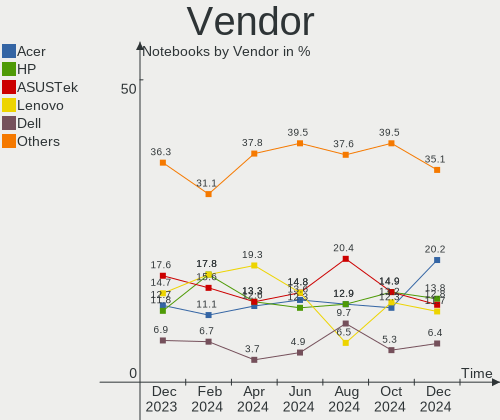
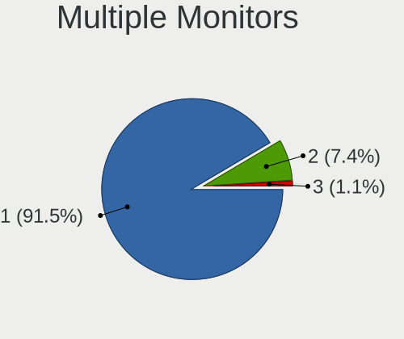
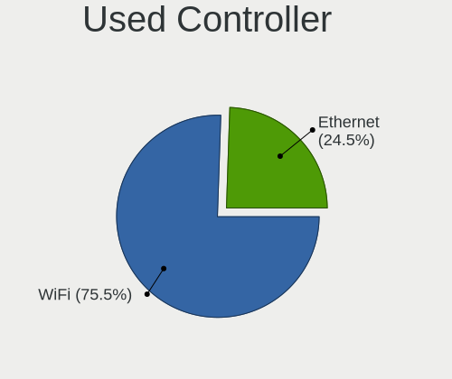
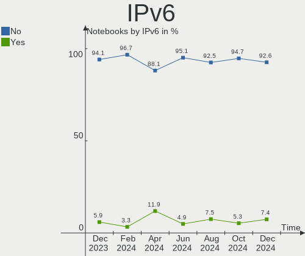

ROSA - Hardware Trends (Notebooks)
----------------------------------

A project to identify most popular hardware characteristics and track their change
over time based on data collected by Linux users at https://Linux-Hardware.org.

Anyone can contribute to this report by the [hw-probe](https://github.com/linuxhw/hw-probe) tool:

    sudo -E hw-probe -all -upload

This report is for one last month. Overall report since the beginning of time: [TestCoverage](https://github.com/linuxhw/TestCoverage)

Period: Nov, 2022.

Contents
--------

* [ System ](#system)
  - [ OS                       ](#os)
  - [ OS Family                ](#os-family)
  - [ Kernel                   ](#kernel)
  - [ Kernel Family            ](#kernel-family)
  - [ Kernel Major Ver.        ](#kernel-major-ver)
  - [ Arch                     ](#arch)
  - [ DE                       ](#de)
  - [ Display Server           ](#display-server)
  - [ Display Manager          ](#display-manager)
  - [ OS Lang                  ](#os-lang)
  - [ Boot Mode                ](#boot-mode)
  - [ Filesystem               ](#filesystem)
  - [ Part. scheme             ](#part-scheme)
  - [ Dual Boot with Linux/BSD ](#dual-boot-with-linuxbsd)
  - [ Dual Boot (Win)          ](#dual-boot-win)

* [ Board ](#board)
  - [ Vendor                   ](#vendor)
  - [ Model                    ](#model)
  - [ Model Family             ](#model-family)
  - [ MFG Year                 ](#mfg-year)
  - [ Form Factor              ](#form-factor)
  - [ Secure Boot              ](#secure-boot)
  - [ Coreboot                 ](#coreboot)
  - [ RAM Size                 ](#ram-size)
  - [ RAM Used                 ](#ram-used)
  - [ Total Drives             ](#total-drives)
  - [ Has CD-ROM               ](#has-cd-rom)
  - [ Has Ethernet             ](#has-ethernet)
  - [ Has WiFi                 ](#has-wifi)
  - [ Has Bluetooth            ](#has-bluetooth)

* [ Location ](#location)
  - [ Country                  ](#country)
  - [ City                     ](#city)

* [ Drives ](#drives)
  - [ Drive Vendor             ](#drive-vendor)
  - [ Drive Model              ](#drive-model)
  - [ HDD Vendor               ](#hdd-vendor)
  - [ SSD Vendor               ](#ssd-vendor)
  - [ Drive Kind               ](#drive-kind)
  - [ Drive Connector          ](#drive-connector)
  - [ Drive Size               ](#drive-size)
  - [ Space Total              ](#space-total)
  - [ Space Used               ](#space-used)
  - [ Malfunc. Drives          ](#malfunc-drives)
  - [ Malfunc. Drive Vendor    ](#malfunc-drive-vendor)
  - [ Malfunc. HDD Vendor      ](#malfunc-hdd-vendor)
  - [ Malfunc. Drive Kind      ](#malfunc-drive-kind)
  - [ Failed Drives            ](#failed-drives)
  - [ Failed Drive Vendor      ](#failed-drive-vendor)
  - [ Drive Status             ](#drive-status)

* [ Storage controller ](#storage-controller)
  - [ Storage Vendor           ](#storage-vendor)
  - [ Storage Model            ](#storage-model)
  - [ Storage Kind             ](#storage-kind)

* [ Processor ](#processor)
  - [ CPU Vendor               ](#cpu-vendor)
  - [ CPU Model                ](#cpu-model)
  - [ CPU Model Family         ](#cpu-model-family)
  - [ CPU Cores                ](#cpu-cores)
  - [ CPU Sockets              ](#cpu-sockets)
  - [ CPU Threads              ](#cpu-threads)
  - [ CPU Op-Modes             ](#cpu-op-modes)
  - [ CPU Microcode            ](#cpu-microcode)
  - [ CPU Microarch            ](#cpu-microarch)

* [ Graphics ](#graphics)
  - [ GPU Vendor               ](#gpu-vendor)
  - [ GPU Model                ](#gpu-model)
  - [ GPU Combo                ](#gpu-combo)
  - [ GPU Driver               ](#gpu-driver)
  - [ GPU Memory               ](#gpu-memory)

* [ Monitor ](#monitor)
  - [ Monitor Vendor           ](#monitor-vendor)
  - [ Monitor Model            ](#monitor-model)
  - [ Monitor Resolution       ](#monitor-resolution)
  - [ Monitor Diagonal         ](#monitor-diagonal)
  - [ Monitor Width            ](#monitor-width)
  - [ Aspect Ratio             ](#aspect-ratio)
  - [ Monitor Area             ](#monitor-area)
  - [ Pixel Density            ](#pixel-density)
  - [ Multiple Monitors        ](#multiple-monitors)

* [ Network ](#network)
  - [ Net Controller Vendor    ](#net-controller-vendor)
  - [ Net Controller Model     ](#net-controller-model)
  - [ Wireless Vendor          ](#wireless-vendor)
  - [ Wireless Model           ](#wireless-model)
  - [ Ethernet Vendor          ](#ethernet-vendor)
  - [ Ethernet Model           ](#ethernet-model)
  - [ Net Controller Kind      ](#net-controller-kind)
  - [ Used Controller          ](#used-controller)
  - [ NICs                     ](#nics)
  - [ IPv6                     ](#ipv6)

* [ Bluetooth ](#bluetooth)
  - [ Bluetooth Vendor         ](#bluetooth-vendor)
  - [ Bluetooth Model          ](#bluetooth-model)

* [ Sound ](#sound)
  - [ Sound Vendor             ](#sound-vendor)
  - [ Sound Model              ](#sound-model)

* [ Memory ](#memory)
  - [ Memory Vendor            ](#memory-vendor)
  - [ Memory Model             ](#memory-model)
  - [ Memory Kind              ](#memory-kind)
  - [ Memory Form Factor       ](#memory-form-factor)
  - [ Memory Size              ](#memory-size)
  - [ Memory Speed             ](#memory-speed)

* [ Printers & scanners ](#printers--scanners)
  - [ Printer Vendor           ](#printer-vendor)
  - [ Printer Model            ](#printer-model)
  - [ Scanner Vendor           ](#scanner-vendor)
  - [ Scanner Model            ](#scanner-model)

* [ Camera ](#camera)
  - [ Camera Vendor            ](#camera-vendor)
  - [ Camera Model             ](#camera-model)

* [ Security ](#security)
  - [ Fingerprint Vendor       ](#fingerprint-vendor)
  - [ Fingerprint Model        ](#fingerprint-model)
  - [ Chipcard Vendor          ](#chipcard-vendor)
  - [ Chipcard Model           ](#chipcard-model)

* [ Unsupported ](#unsupported)
  - [ Unsupported Devices      ](#unsupported-devices)
  - [ Unsupported Device Types ](#unsupported-device-types)

System
------

OS
--

Installed operating systems

| Name       | Notebooks | Percent |
|------------|-----------|---------|
| ROSA 12.3  | 106       | 79.1%   |
| ROSA 12.2  | 21        | 15.67%  |
| ROSA R11.1 | 6         | 4.48%   |
| ROSA R10   | 1         | 0.75%   |

OS Family
---------

OS without a version

| Name | Notebooks | Percent |
|------|-----------|---------|
| ROSA | 134       | 100%    |

Kernel
------

Version of the Linux kernel

| Version                                    | Notebooks | Percent |
|--------------------------------------------|-----------|---------|
| 5.15.75-generic-1rosa2021.1-x86_64         | 34        | 25.37%  |
| 5.15.77-generic-1rosa2021.1-x86_64         | 23        | 17.16%  |
| 5.10.150-generic-1rosa2021.1-x86_64        | 21        | 15.67%  |
| 5.10.74-generic-2rosa2021.1-x86_64         | 15        | 11.19%  |
| 5.17.11-generic-2rosa2021.1-x86_64         | 8         | 5.97%   |
| 5.15.75-generic-1rosa2021.1-i686           | 6         | 4.48%   |
| 5.10.118-generic-2rosa2021.1-x86_64        | 5         | 3.73%   |
| 5.4.83-generic-2rosa-x86_64                | 3         | 2.24%   |
| 6.1.0-generic-0.rc4.1rosa2021.1-x86_64     | 2         | 1.49%   |
| 6.0.6.xm1-2.klp-xanmod-rosa2021.1-x86_64   | 2         | 1.49%   |
| 4.15.0-desktop-122.124.1rosa-x86_64        | 2         | 1.49%   |
| 6.1.0-generic-0.rc6.1rosa2021.1-x86_64     | 1         | 0.75%   |
| 6.1.0-generic-0.rc5.1rosa2021.1-x86_64     | 1         | 0.75%   |
| 6.0.9.xm1-1.klp-xanmod-rosa2021.1-x86_64   | 1         | 0.75%   |
| 6.0.7.xm1-1.klp-xanmod-rosa2021.1-x86_64   | 1         | 0.75%   |
| 6.0.6.xm1-1.klp-xanmod-rosa2021.1-x86_64   | 1         | 0.75%   |
| 6.0.10.xm1-1.klp-xanmod-rosa2021.1-x86_64  | 1         | 0.75%   |
| 5.4.83-generic-2rosa-i586                  | 1         | 0.75%   |
| 5.19.15.xm1-1.klp-xanmod-rosa2021.1-x86_64 | 1         | 0.75%   |
| 5.18.19-generic-3rosa2021.1-x86_64         | 1         | 0.75%   |
| 5.15.73-generic-2rosa2021.1-x86_64         | 1         | 0.75%   |
| 5.10.74-generic-2rosa2021.1-i586           | 1         | 0.75%   |
| 5.10.118-generic-2rosa2021.1-i586          | 1         | 0.75%   |
| 4.9.124-nrj-desktop-1rosa-i586             | 1         | 0.75%   |

Kernel Family
-------------

Linux kernel without a distro release

| Version  | Notebooks | Percent |
|----------|-----------|---------|
| 5.15.75  | 40        | 29.85%  |
| 5.15.77  | 23        | 17.16%  |
| 5.10.150 | 21        | 15.67%  |
| 5.10.74  | 16        | 11.94%  |
| 5.17.11  | 8         | 5.97%   |
| 5.10.118 | 6         | 4.48%   |
| 6.1.0    | 4         | 2.99%   |
| 5.4.83   | 4         | 2.99%   |
| 6.0.6    | 3         | 2.24%   |
| 4.15.0   | 2         | 1.49%   |
| 6.0.9    | 1         | 0.75%   |
| 6.0.7    | 1         | 0.75%   |
| 6.0.10   | 1         | 0.75%   |
| 5.19.15  | 1         | 0.75%   |
| 5.18.19  | 1         | 0.75%   |
| 5.15.73  | 1         | 0.75%   |
| 4.9.124  | 1         | 0.75%   |

Kernel Major Ver.
-----------------

Linux kernel major version

| Version | Notebooks | Percent |
|---------|-----------|---------|
| 5.15    | 64        | 47.76%  |
| 5.10    | 43        | 32.09%  |
| 5.17    | 8         | 5.97%   |
| 6.0     | 6         | 4.48%   |
| 6.1     | 4         | 2.99%   |
| 5.4     | 4         | 2.99%   |
| 4.15    | 2         | 1.49%   |
| 5.19    | 1         | 0.75%   |
| 5.18    | 1         | 0.75%   |
| 4.9     | 1         | 0.75%   |

Arch
----

OS architecture (x86_64, i586, etc.)

| Name   | Notebooks | Percent |
|--------|-----------|---------|
| x86_64 | 124       | 92.54%  |
| i686   | 10        | 7.46%   |

DE
--

Desktop Environment

| Name  | Notebooks | Percent |
|-------|-----------|---------|
| KDE5  | 75        | 55.97%  |
| GNOME | 38        | 28.36%  |
| LXQt  | 16        | 11.94%  |
| KDE4  | 3         | 2.24%   |
| XFCE  | 1         | 0.75%   |
| MATE  | 1         | 0.75%   |

Display Server
--------------

X11 or Wayland

| Name    | Notebooks | Percent |
|---------|-----------|---------|
| Wayland | 105       | 78.36%  |
| X11     | 29        | 21.64%  |

Display Manager
---------------

SDDM, LightDM, etc.

| Name    | Notebooks | Percent |
|---------|-----------|---------|
| SDDM    | 75        | 55.97%  |
| GDM     | 48        | 35.82%  |
| LightDM | 8         | 5.97%   |
| KDM     | 3         | 2.24%   |

OS Lang
-------

Language

| Lang    | Notebooks | Percent |
|---------|-----------|---------|
| ru_RU   | 121       | 90.3%   |
| en_US   | 4         | 2.99%   |
| pl_PL   | 2         | 1.49%   |
| de_DE   | 2         | 1.49%   |
| lt_LT   | 1         | 0.75%   |
| es_MX   | 1         | 0.75%   |
| es_ES   | 1         | 0.75%   |
| da_DK   | 1         | 0.75%   |
| Unknown | 1         | 0.75%   |

Boot Mode
---------

EFI or BIOS

| Mode | Notebooks | Percent |
|------|-----------|---------|
| EFI  | 69        | 51.49%  |
| BIOS | 65        | 48.51%  |

Filesystem
----------

Type of filesystem

| Type  | Notebooks | Percent |
|-------|-----------|---------|
| Ext4  | 130       | 97.01%  |
| Btrfs | 4         | 2.99%   |

Part. scheme
------------

Scheme of partitioning

| Type | Notebooks | Percent |
|------|-----------|---------|
| GPT  | 82        | 61.19%  |
| MBR  | 52        | 38.81%  |

Dual Boot with Linux/BSD
------------------------

Hosting more than one Linux/BSD

| Dual boot | Notebooks | Percent |
|-----------|-----------|---------|
| No        | 99        | 73.88%  |
| Yes       | 35        | 26.12%  |

Dual Boot (Win)
---------------

Hosting Linux and Windows

| Dual boot | Notebooks | Percent |
|-----------|-----------|---------|
| No        | 78        | 58.21%  |
| Yes       | 56        | 41.79%  |

Board
-----

Vendor
------

Motherboard manufacturer

| Name                | Notebooks | Percent |
|---------------------|-----------|---------|
| Acer                | 26        | 19.4%   |
| Lenovo              | 24        | 17.91%  |
| ASUSTek Computer    | 23        | 17.16%  |
| Hewlett-Packard     | 17        | 12.69%  |
| Samsung Electronics | 10        | 7.46%   |
| Toshiba             | 6         | 4.48%   |
| Sony                | 5         | 3.73%   |
| MSI                 | 4         | 2.99%   |
| Dell                | 4         | 2.99%   |
| Pegatron            | 2         | 1.49%   |
| TUXEDO              | 1         | 0.75%   |
| Quanta              | 1         | 0.75%   |
| Packard Bell        | 1         | 0.75%   |
| Notebook            | 1         | 0.75%   |
| Insyde              | 1         | 0.75%   |
| HUAWEI              | 1         | 0.75%   |
| Haier               | 1         | 0.75%   |
| Fujitsu Siemens     | 1         | 0.75%   |
| Fujitsu             | 1         | 0.75%   |
| eMachines           | 1         | 0.75%   |
| DEPO Computers      | 1         | 0.75%   |
| Aquarius            | 1         | 0.75%   |
| Apple               | 1         | 0.75%   |

Model
-----

Motherboard model

| Name                                       | Notebooks | Percent |
|--------------------------------------------|-----------|---------|
| HP Notebook                                | 5         | 3.73%   |
| Lenovo G500 20236                          | 2         | 1.49%   |
| Lenovo B590 20208                          | 2         | 1.49%   |
| Lenovo B590 20206                          | 2         | 1.49%   |
| HP Pavilion g6                             | 2         | 1.49%   |
| ASUS X550CC                                | 2         | 1.49%   |
| Acer Extensa 2519                          | 2         | 1.49%   |
| Acer Aspire 5750G                          | 2         | 1.49%   |
| Acer Aspire 5315                           | 2         | 1.49%   |
| TUXEDO Pulse 15 Gen1                       | 1         | 0.75%   |
| Toshiba Satellite U300                     | 1         | 0.75%   |
| Toshiba Satellite P300                     | 1         | 0.75%   |
| Toshiba Satellite L550                     | 1         | 0.75%   |
| Toshiba Satellite L45Dt-B                  | 1         | 0.75%   |
| Toshiba Satellite C660                     | 1         | 0.75%   |
| Toshiba Satellite A300D                    | 1         | 0.75%   |
| Sony VPCZ13S9R                             | 1         | 0.75%   |
| Sony VPCS11V9R                             | 1         | 0.75%   |
| Sony VPCEH3J1R                             | 1         | 0.75%   |
| Sony VGN-P31ZRK_G                          | 1         | 0.75%   |
| Sony SVE1512H1RW                           | 1         | 0.75%   |
| Samsung R528/R728                          | 1         | 0.75%   |
| Samsung R519/R719                          | 1         | 0.75%   |
| Samsung R510/P510                          | 1         | 0.75%   |
| Samsung NC210/NC110                        | 1         | 0.75%   |
| Samsung 700Z3A/700Z4A/700Z5A/700Z5B        | 1         | 0.75%   |
| Samsung 530U3BI/530U4BI/530U4BH            | 1         | 0.75%   |
| Samsung 355V4C/356V4C/3445VC/3545VC        | 1         | 0.75%   |
| Samsung 350V5C/351V5C/3540VC/3440VC        | 1         | 0.75%   |
| Samsung 300V3A/300V4A/300V5A/200A4B/200A5B | 1         | 0.75%   |
| Samsung 300E4C/300E5C/300E7C               | 1         | 0.75%   |
| Quanta JW6H                                | 1         | 0.75%   |
| Pegatron C15B                              | 1         | 0.75%   |
| Pegatron A15                               | 1         | 0.75%   |
| Packard Bell EasyNote TS11HR               | 1         | 0.75%   |
| Notebook W65_67SF                          | 1         | 0.75%   |
| MSI MS-N051                                | 1         | 0.75%   |
| MSI GP66 Leopard 11UG                      | 1         | 0.75%   |
| MSI GE72 6QC                               | 1         | 0.75%   |
| MSI GE70 2PL                               | 1         | 0.75%   |

Model Family
------------

Motherboard model prefix

| Name                  | Notebooks | Percent |
|-----------------------|-----------|---------|
| Acer Aspire           | 19        | 14.18%  |
| Toshiba Satellite     | 6         | 4.48%   |
| Lenovo IdeaPad        | 6         | 4.48%   |
| HP Pavilion           | 5         | 3.73%   |
| HP Notebook           | 5         | 3.73%   |
| Lenovo B590           | 4         | 2.99%   |
| Dell Inspiron         | 4         | 2.99%   |
| ASUS VivoBook         | 4         | 2.99%   |
| HP Compaq             | 3         | 2.24%   |
| Acer Nitro            | 3         | 2.24%   |
| Acer Extensa          | 3         | 2.24%   |
| Lenovo ThinkPad       | 2         | 1.49%   |
| Lenovo G500           | 2         | 1.49%   |
| HP Laptop             | 2         | 1.49%   |
| ASUS X550CC           | 2         | 1.49%   |
| ASUS ROG              | 2         | 1.49%   |
| TUXEDO Pulse          | 1         | 0.75%   |
| Sony VPCZ13S9R        | 1         | 0.75%   |
| Sony VPCS11V9R        | 1         | 0.75%   |
| Sony VPCEH3J1R        | 1         | 0.75%   |
| Sony VGN-P31ZRK       | 1         | 0.75%   |
| Sony SVE1512H1RW      | 1         | 0.75%   |
| Samsung R528          | 1         | 0.75%   |
| Samsung R519          | 1         | 0.75%   |
| Samsung R510          | 1         | 0.75%   |
| Samsung NC210         | 1         | 0.75%   |
| Samsung 700Z3A        | 1         | 0.75%   |
| Samsung 530U3BI       | 1         | 0.75%   |
| Samsung 355V4C        | 1         | 0.75%   |
| Samsung 350V5C        | 1         | 0.75%   |
| Samsung 300V3A        | 1         | 0.75%   |
| Samsung 300E4C        | 1         | 0.75%   |
| Quanta JW6H           | 1         | 0.75%   |
| Pegatron C15B         | 1         | 0.75%   |
| Pegatron A15          | 1         | 0.75%   |
| Packard Bell EasyNote | 1         | 0.75%   |
| Notebook W65          | 1         | 0.75%   |
| MSI MS-N051           | 1         | 0.75%   |
| MSI GP66              | 1         | 0.75%   |
| MSI GE72              | 1         | 0.75%   |

MFG Year
--------

Motherboard manufacture year

| Year | Notebooks | Percent |
|------|-----------|---------|
| 2011 | 19        | 14.18%  |
| 2012 | 18        | 13.43%  |
| 2015 | 12        | 8.96%   |
| 2013 | 11        | 8.21%   |
| 2021 | 10        | 7.46%   |
| 2020 | 9         | 6.72%   |
| 2019 | 9         | 6.72%   |
| 2009 | 7         | 5.22%   |
| 2008 | 7         | 5.22%   |
| 2014 | 6         | 4.48%   |
| 2010 | 6         | 4.48%   |
| 2018 | 4         | 2.99%   |
| 2016 | 4         | 2.99%   |
| 2007 | 4         | 2.99%   |
| 2017 | 3         | 2.24%   |
| 2022 | 2         | 1.49%   |
| 2005 | 2         | 1.49%   |
| 2006 | 1         | 0.75%   |

Form Factor
-----------

Physical design of the computer

| Name     | Notebooks | Percent |
|----------|-----------|---------|
| Notebook | 134       | 100%    |

Secure Boot
-----------

Enabled or disabled

| State    | Notebooks | Percent |
|----------|-----------|---------|
| Disabled | 134       | 100%    |

Coreboot
--------

Have coreboot on board

| Used | Notebooks | Percent |
|------|-----------|---------|
| No   | 134       | 100%    |

RAM Size
--------

Total RAM memory

| Size in GB | Notebooks | Percent |
|------------|-----------|---------|
| 4.01-8.0   | 46        | 34.33%  |
| 3.01-4.0   | 44        | 32.84%  |
| 8.01-16.0  | 23        | 17.16%  |
| 16.01-24.0 | 9         | 6.72%   |
| 1.01-2.0   | 6         | 4.48%   |
| 0.51-1.0   | 4         | 2.99%   |
| 24.01-32.0 | 1         | 0.75%   |
| 2.01-3.0   | 1         | 0.75%   |

RAM Used
--------

Used RAM memory

| Used GB  | Notebooks | Percent |
|----------|-----------|---------|
| 1.01-2.0 | 67        | 50%     |
| 0.51-1.0 | 31        | 23.13%  |
| 2.01-3.0 | 24        | 17.91%  |
| 4.01-8.0 | 5         | 3.73%   |
| 3.01-4.0 | 5         | 3.73%   |
| 0.01-0.5 | 2         | 1.49%   |

Total Drives
------------

Number of drives on board

| Drives | Notebooks | Percent |
|--------|-----------|---------|
| 1      | 90        | 67.16%  |
| 2      | 39        | 29.1%   |
| 3      | 5         | 3.73%   |

Has CD-ROM
----------

Has CD-ROM on board

| Presented | Notebooks | Percent |
|-----------|-----------|---------|
| No        | 72        | 53.73%  |
| Yes       | 62        | 46.27%  |

Has Ethernet
------------

Has Ethernet on board

| Presented | Notebooks | Percent |
|-----------|-----------|---------|
| Yes       | 115       | 85.82%  |
| No        | 19        | 14.18%  |

Has WiFi
--------

Has WiFi module

| Presented | Notebooks | Percent |
|-----------|-----------|---------|
| Yes       | 133       | 99.25%  |
| No        | 1         | 0.75%   |

Has Bluetooth
-------------

Has Bluetooth module

| Presented | Notebooks | Percent |
|-----------|-----------|---------|
| Yes       | 101       | 75.37%  |
| No        | 33        | 24.63%  |

Location
--------

Country
-------

Geographic location (country)

| Country    | Notebooks | Percent |
|------------|-----------|---------|
| Russia     | 114       | 85.07%  |
| Poland     | 4         | 2.99%   |
| Ukraine    | 3         | 2.24%   |
| Belarus    | 3         | 2.24%   |
| Germany    | 2         | 1.49%   |
| Tunisia    | 1         | 0.75%   |
| Slovakia   | 1         | 0.75%   |
| Mexico     | 1         | 0.75%   |
| Lithuania  | 1         | 0.75%   |
| Kazakhstan | 1         | 0.75%   |
| France     | 1         | 0.75%   |
| Finland    | 1         | 0.75%   |
| Denmark    | 1         | 0.75%   |

City
----

Geographic location (city)

| City              | Notebooks | Percent |
|-------------------|-----------|---------|
| Moscow            | 18        | 13.43%  |
| St Petersburg     | 14        | 10.45%  |
| Krasnodar         | 5         | 3.73%   |
| Samara            | 4         | 2.99%   |
| Rostov-on-Don     | 4         | 2.99%   |
| Novosibirsk       | 4         | 2.99%   |
| Nizhniy Novgorod  | 4         | 2.99%   |
| Chelyabinsk       | 3         | 2.24%   |
| Yekaterinburg     | 2         | 1.49%   |
| Warsaw            | 2         | 1.49%   |
| Voronezh          | 2         | 1.49%   |
| Volgograd         | 2         | 1.49%   |
| Smolensk          | 2         | 1.49%   |
| Saratov           | 2         | 1.49%   |
| Saransk           | 2         | 1.49%   |
| Odintsovo         | 2         | 1.49%   |
| Kazan’          | 2         | 1.49%   |
| Cheboksary        | 2         | 1.49%   |
| Brest             | 2         | 1.49%   |
| Belgorod          | 2         | 1.49%   |
| Zima              | 1         | 0.75%   |
| Yuzhno-Sakhalinsk | 1         | 0.75%   |
| Yefremov          | 1         | 0.75%   |
| Yaya              | 1         | 0.75%   |
| Yaroslavl         | 1         | 0.75%   |
| Yakutsk           | 1         | 0.75%   |
| Volkhov           | 1         | 0.75%   |
| Vladimir          | 1         | 0.75%   |
| Vilnius           | 1         | 0.75%   |
| Ufa               | 1         | 0.75%   |
| Tunis             | 1         | 0.75%   |
| Tomsk             | 1         | 0.75%   |
| Tolyatti          | 1         | 0.75%   |
| Stavropol         | 1         | 0.75%   |
| Skopin            | 1         | 0.75%   |
| Simferopol        | 1         | 0.75%   |
| Severodvinsk      | 1         | 0.75%   |
| Sevastopol        | 1         | 0.75%   |
| Sadovyy           | 1         | 0.75%   |
| Prokop'yevsk      | 1         | 0.75%   |

Drives
------

Drive Vendor
------------

Hard drive vendors

| Vendor                      | Notebooks | Drives | Percent |
|-----------------------------|-----------|--------|---------|
| WDC                         | 26        | 29     | 15.48%  |
| Seagate                     | 21        | 21     | 12.5%   |
| Toshiba                     | 15        | 16     | 8.93%   |
| Hitachi                     | 14        | 14     | 8.33%   |
| Samsung Electronics         | 13        | 14     | 7.74%   |
| HGST                        | 10        | 10     | 5.95%   |
| Kingston                    | 8         | 8      | 4.76%   |
| Unknown                     | 5         | 5      | 2.98%   |
| SPCC                        | 5         | 5      | 2.98%   |
| Apacer                      | 5         | 5      | 2.98%   |
| SK hynix                    | 4         | 4      | 2.38%   |
| SanDisk                     | 4         | 4      | 2.38%   |
| China                       | 4         | 4      | 2.38%   |
| Intel                       | 3         | 3      | 1.79%   |
| Crucial                     | 3         | 3      | 1.79%   |
| Micron Technology           | 2         | 2      | 1.19%   |
| KingSpec                    | 2         | 2      | 1.19%   |
| A-DATA Technology           | 2         | 2      | 1.19%   |
| Zheino                      | 1         | 1      | 0.6%    |
| UMIS                        | 1         | 1      | 0.6%    |
| Transcend                   | 1         | 1      | 0.6%    |
| Team                        | 1         | 1      | 0.6%    |
| Smartbuy                    | 1         | 1      | 0.6%    |
| Silicon Motion              | 1         | 1      | 0.6%    |
| Qumo                        | 1         | 1      | 0.6%    |
| Plextor                     | 1         | 1      | 0.6%    |
| Patriot                     | 1         | 1      | 0.6%    |
| MAXIO Technology (Hangzhou) | 1         | 1      | 0.6%    |
| LITEONIT                    | 1         | 1      | 0.6%    |
| Kllisre                     | 1         | 1      | 0.6%    |
| KIOXIA                      | 1         | 1      | 0.6%    |
| Kingmax                     | 1         | 1      | 0.6%    |
| JMicron Technology          | 1         | 1      | 0.6%    |
| HS-SSD-C100                 | 1         | 1      | 0.6%    |
| Hewlett-Packard             | 1         | 1      | 0.6%    |
| GOODRAM                     | 1         | 1      | 0.6%    |
| Gigabyte Technology         | 1         | 1      | 0.6%    |
| Fujitsu                     | 1         | 1      | 0.6%    |
| ASMT                        | 1         | 1      | 0.6%    |
| AMD                         | 1         | 1      | 0.6%    |

Drive Model
-----------

Hard drive models

| Model                                | Notebooks | Percent |
|--------------------------------------|-----------|---------|
| Seagate ST500LT012-1DG142 500GB      | 4         | 2.33%   |
| Samsung SSD 860 EVO 250GB            | 4         | 2.33%   |
| WDC WDS500G2B0A-00SM50 500GB SSD     | 3         | 1.74%   |
| Hitachi HTS547575A9E384 752GB        | 3         | 1.74%   |
| Hitachi HTS543232A7A384 320GB        | 3         | 1.74%   |
| WDC WD5000LPCX-21VHAT0 500GB         | 2         | 1.16%   |
| WDC WD10SPZX-21Z10T0 1TB             | 2         | 1.16%   |
| WDC WD10JPVX-22JC3T0 1TB             | 2         | 1.16%   |
| Toshiba MQ01ABF050 500GB             | 2         | 1.16%   |
| Toshiba MQ01ABF032 320GB             | 2         | 1.16%   |
| Toshiba MQ01ABD100 1TB               | 2         | 1.16%   |
| SPCC Solid State Disk 128GB          | 2         | 1.16%   |
| Seagate ST9320325AS 320GB            | 2         | 1.16%   |
| Seagate ST500LT012-9WS142 500GB      | 2         | 1.16%   |
| Seagate ST320LT012-9WS14C 320GB      | 2         | 1.16%   |
| Seagate ST1000LM035-1RK172 1TB       | 2         | 1.16%   |
| Kingston SHFS37A120G 120GB SSD       | 2         | 1.16%   |
| Intel SSDPEKNU512GZ 512GB            | 2         | 1.16%   |
| Hitachi HTS545032B9A300 320GB        | 2         | 1.16%   |
| Hitachi HTS541680J9SA00 80GB         | 2         | 1.16%   |
| HGST HTS545050A7E680 500GB           | 2         | 1.16%   |
| China 120GB SSD                      | 2         | 1.16%   |
| Zheino CHN 25SATAA3 360 360GB SSD    | 1         | 0.58%   |
| WDC WDS500G2B0C-00PXH0 500GB         | 1         | 0.58%   |
| WDC WDS500G2B0A 500GB SSD            | 1         | 0.58%   |
| WDC WDS240G2G0A-00JH30 240GB SSD     | 1         | 0.58%   |
| WDC WDS120G2G0B-00EPW0 120GB SSD     | 1         | 0.58%   |
| WDC WD7500BPVT-00HXZT3 752GB         | 1         | 0.58%   |
| WDC WD7500BPKT-75PK4T0 752GB         | 1         | 0.58%   |
| WDC WD6400BPVT-22HXZT1 640GB         | 1         | 0.58%   |
| WDC WD5000LPLX-00ZNTT0 500GB         | 1         | 0.58%   |
| WDC WD5000LPCX-60VHAT0 500GB         | 1         | 0.58%   |
| WDC WD5000BEVT-35ZAT0 500GB          | 1         | 0.58%   |
| WDC WD3200BPVT-22JJ5T0 320GB         | 1         | 0.58%   |
| WDC WD1600BEVT-22A23T0 160GB         | 1         | 0.58%   |
| WDC WD10SPSX-00A6WT0 1TB             | 1         | 0.58%   |
| WDC WD10SPCX-21KHST0 1TB             | 1         | 0.58%   |
| WDC PC SN530 SDBPTPZ-512G-1002 512GB | 1         | 0.58%   |
| WDC PC SN530 SDBPNPZ-512G-1014 512GB | 1         | 0.58%   |
| WDC PC SN530 SDBPNPZ-256G-1006 256GB | 1         | 0.58%   |

HDD Vendor
----------

Hard disk drive vendors

| Vendor              | Notebooks | Drives | Percent |
|---------------------|-----------|--------|---------|
| Seagate             | 20        | 20     | 25.97%  |
| WDC                 | 16        | 16     | 20.78%  |
| Toshiba             | 14        | 14     | 18.18%  |
| Hitachi             | 14        | 14     | 18.18%  |
| HGST                | 10        | 10     | 12.99%  |
| Samsung Electronics | 1         | 1      | 1.3%    |
| Fujitsu             | 1         | 1      | 1.3%    |
| ASMT                | 1         | 1      | 1.3%    |

SSD Vendor
----------

Solid state drive vendors

| Vendor              | Notebooks | Drives | Percent |
|---------------------|-----------|--------|---------|
| Samsung Electronics | 9         | 9      | 14.52%  |
| WDC                 | 6         | 6      | 9.68%   |
| Kingston            | 6         | 6      | 9.68%   |
| SPCC                | 5         | 5      | 8.06%   |
| SanDisk             | 4         | 4      | 6.45%   |
| China               | 4         | 4      | 6.45%   |
| Apacer              | 4         | 4      | 6.45%   |
| Crucial             | 3         | 3      | 4.84%   |
| KingSpec            | 2         | 2      | 3.23%   |
| A-DATA Technology   | 2         | 2      | 3.23%   |
| Zheino              | 1         | 1      | 1.61%   |
| Transcend           | 1         | 1      | 1.61%   |
| Toshiba             | 1         | 2      | 1.61%   |
| Team                | 1         | 1      | 1.61%   |
| Smartbuy            | 1         | 1      | 1.61%   |
| SK hynix            | 1         | 1      | 1.61%   |
| Qumo                | 1         | 1      | 1.61%   |
| Plextor             | 1         | 1      | 1.61%   |
| Patriot             | 1         | 1      | 1.61%   |
| LITEONIT            | 1         | 1      | 1.61%   |
| Kllisre             | 1         | 1      | 1.61%   |
| Kingmax             | 1         | 1      | 1.61%   |
| HS-SSD-C100         | 1         | 1      | 1.61%   |
| Hewlett-Packard     | 1         | 1      | 1.61%   |
| GOODRAM             | 1         | 1      | 1.61%   |
| Gigabyte Technology | 1         | 1      | 1.61%   |
| AMD                 | 1         | 1      | 1.61%   |

Drive Kind
----------

HDD or SSD

| Kind    | Notebooks | Drives | Percent |
|---------|-----------|--------|---------|
| HDD     | 76        | 77     | 45.24%  |
| SSD     | 60        | 63     | 35.71%  |
| NVMe    | 25        | 26     | 14.88%  |
| MMC     | 5         | 5      | 2.98%   |
| Unknown | 2         | 2      | 1.19%   |

Drive Connector
---------------

SATA, SAS, NVMe, etc.

| Type | Notebooks | Drives | Percent |
|------|-----------|--------|---------|
| SATA | 114       | 139    | 77.55%  |
| NVMe | 25        | 26     | 17.01%  |
| MMC  | 5         | 5      | 3.4%    |
| SAS  | 3         | 3      | 2.04%   |

Drive Size
----------

Size of hard drive

| Size in TB | Notebooks | Drives | Percent |
|------------|-----------|--------|---------|
| 0.01-0.5   | 97        | 114    | 78.86%  |
| 0.51-1.0   | 25        | 25     | 20.33%  |
| 1.01-2.0   | 1         | 1      | 0.81%   |

Space Total
-----------

Amount of disk space available on the file system

| Size in GB     | Notebooks | Percent |
|----------------|-----------|---------|
| 251-500        | 37        | 27.61%  |
| 101-250        | 34        | 25.37%  |
| 1-20           | 18        | 13.43%  |
| 501-1000       | 17        | 12.69%  |
| 51-100         | 16        | 11.94%  |
| 1001-2000      | 6         | 4.48%   |
| 21-50          | 4         | 2.99%   |
| More than 3000 | 1         | 0.75%   |
| 2001-3000      | 1         | 0.75%   |

Space Used
----------

Amount of used disk space

| Used GB   | Notebooks | Percent |
|-----------|-----------|---------|
| 1-20      | 84        | 62.69%  |
| 21-50     | 17        | 12.69%  |
| 51-100    | 11        | 8.21%   |
| 251-500   | 9         | 6.72%   |
| 101-250   | 7         | 5.22%   |
| 501-1000  | 4         | 2.99%   |
| 2001-3000 | 1         | 0.75%   |
| 1001-2000 | 1         | 0.75%   |

Malfunc. Drives
---------------

Drive models with a malfunction

| Model                               | Notebooks | Drives | Percent |
|-------------------------------------|-----------|--------|---------|
| Seagate ST500LT012-9WS142 500GB     | 2         | 2      | 5.71%   |
| Seagate ST320LT012-9WS14C 320GB     | 2         | 2      | 5.71%   |
| Hitachi HTS541680J9SA00 80GB        | 2         | 2      | 5.71%   |
| HGST HTS545050A7E680 500GB          | 2         | 2      | 5.71%   |
| WDC WDS240G2G0A-00JH30 240GB SSD    | 1         | 1      | 2.86%   |
| WDC WD6400BPVT-22HXZT1 640GB        | 1         | 1      | 2.86%   |
| WDC WD5000LPCX-60VHAT0 500GB        | 1         | 1      | 2.86%   |
| WDC WD5000LPCX-21VHAT0 500GB        | 1         | 1      | 2.86%   |
| Toshiba MQ01ABF032 320GB            | 1         | 1      | 2.86%   |
| Toshiba MQ01ABD050 500GB            | 1         | 1      | 2.86%   |
| Toshiba MK5065GSX 500GB             | 1         | 1      | 2.86%   |
| Toshiba MK3275GSX 320GB             | 1         | 1      | 2.86%   |
| Toshiba MK3252GSX 320GB             | 1         | 1      | 2.86%   |
| Toshiba MK1031GAS 100GB             | 1         | 1      | 2.86%   |
| Team T253X1120G 120GB SSD           | 1         | 1      | 2.86%   |
| Seagate ST9500325AS 500GB           | 1         | 1      | 2.86%   |
| Seagate ST9320325AS 320GB           | 1         | 1      | 2.86%   |
| Seagate ST9160310AS 160GB           | 1         | 1      | 2.86%   |
| Seagate ST500LT012-1DG142 500GB     | 1         | 1      | 2.86%   |
| Seagate ST500LM012 HN-M500MBB 500GB | 1         | 1      | 2.86%   |
| Seagate ST1000LM024 HN-M101MBB 1TB  | 1         | 1      | 2.86%   |
| SanDisk iSSD P4 8GB                 | 1         | 1      | 2.86%   |
| Samsung Electronics HM250HI 250GB   | 1         | 1      | 2.86%   |
| Kingston SVP200S37A60G 64GB SSD     | 1         | 1      | 2.86%   |
| Kingston SHFS37A120G 120GB SSD      | 1         | 1      | 2.86%   |
| Hitachi HTS547575A9E384 752GB       | 1         | 1      | 2.86%   |
| Hitachi HTS547550A9E384 500GB       | 1         | 1      | 2.86%   |
| Hitachi HTS545032B9A300 320GB       | 1         | 1      | 2.86%   |
| Hitachi HTS543232A7A384 320GB       | 1         | 1      | 2.86%   |
| Hitachi HTS542516K9SA00 160GB       | 1         | 1      | 2.86%   |
| Fujitsu MJA2500BH G2 500GB          | 1         | 1      | 2.86%   |

Malfunc. Drive Vendor
---------------------

Vendors of faulty drives

| Vendor              | Notebooks | Drives | Percent |
|---------------------|-----------|--------|---------|
| Seagate             | 10        | 10     | 28.57%  |
| Hitachi             | 7         | 7      | 20%     |
| Toshiba             | 6         | 6      | 17.14%  |
| WDC                 | 4         | 4      | 11.43%  |
| Kingston            | 2         | 2      | 5.71%   |
| HGST                | 2         | 2      | 5.71%   |
| Team                | 1         | 1      | 2.86%   |
| SanDisk             | 1         | 1      | 2.86%   |
| Samsung Electronics | 1         | 1      | 2.86%   |
| Fujitsu             | 1         | 1      | 2.86%   |

Malfunc. HDD Vendor
-------------------

Vendors of faulty HDD drives

| Vendor              | Notebooks | Drives | Percent |
|---------------------|-----------|--------|---------|
| Seagate             | 10        | 10     | 33.33%  |
| Hitachi             | 7         | 7      | 23.33%  |
| Toshiba             | 6         | 6      | 20%     |
| WDC                 | 3         | 3      | 10%     |
| HGST                | 2         | 2      | 6.67%   |
| Samsung Electronics | 1         | 1      | 3.33%   |
| Fujitsu             | 1         | 1      | 3.33%   |

Malfunc. Drive Kind
-------------------

Kinds of faulty drives

| Kind | Notebooks | Drives | Percent |
|------|-----------|--------|---------|
| HDD  | 30        | 30     | 85.71%  |
| SSD  | 5         | 5      | 14.29%  |

Failed Drives
-------------

Failed drive models

| Model                       | Notebooks | Drives | Percent |
|-----------------------------|-----------|--------|---------|
| WDC WD5000BEVT-35ZAT0 500GB | 1         | 1      | 50%     |
| Toshiba MK8025GAL 80GB      | 1         | 1      | 50%     |

Failed Drive Vendor
-------------------

Failed drive vendors

| Vendor  | Notebooks | Drives | Percent |
|---------|-----------|--------|---------|
| WDC     | 1         | 1      | 50%     |
| Toshiba | 1         | 1      | 50%     |

Drive Status
------------

Number of failed and malfunc. drives

| Status   | Notebooks | Drives | Percent |
|----------|-----------|--------|---------|
| Works    | 105       | 127    | 70%     |
| Malfunc  | 34        | 35     | 22.67%  |
| Detected | 9         | 9      | 6%      |
| Failed   | 2         | 2      | 1.33%   |

Storage controller
------------------

Storage Vendor
--------------

Storage controller vendors

| Vendor                      | Notebooks | Percent |
|-----------------------------|-----------|---------|
| Intel                       | 101       | 67.79%  |
| AMD                         | 24        | 16.11%  |
| SanDisk                     | 7         | 4.7%    |
| Samsung Electronics         | 4         | 2.68%   |
| SK hynix                    | 3         | 2.01%   |
| Micron Technology           | 2         | 1.34%   |
| Kingston Technology Company | 2         | 1.34%   |
| Union Memory (Shenzhen)     | 1         | 0.67%   |
| Silicon Motion              | 1         | 0.67%   |
| Phison Electronics          | 1         | 0.67%   |
| Nvidia                      | 1         | 0.67%   |
| MAXIO Technology (Hangzhou) | 1         | 0.67%   |
| KIOXIA                      | 1         | 0.67%   |

Storage Model
-------------

Storage controller models

| Model                                                                            | Notebooks | Percent |
|----------------------------------------------------------------------------------|-----------|---------|
| Intel 7 Series Chipset Family 6-port SATA Controller [AHCI mode]                 | 22        | 13.66%  |
| AMD FCH SATA Controller [AHCI mode]                                              | 19        | 11.8%   |
| Intel 6 Series/C200 Series Chipset Family 6 port Mobile SATA AHCI Controller     | 14        | 8.7%    |
| Intel Sunrise Point-LP SATA Controller [AHCI mode]                               | 8         | 4.97%   |
| Intel 82801IBM/IEM (ICH9M/ICH9M-E) 4 port SATA Controller [AHCI mode]            | 7         | 4.35%   |
| Intel Wildcat Point-LP SATA Controller [AHCI Mode]                               | 5         | 3.11%   |
| Intel 82801 Mobile SATA Controller [RAID mode]                                   | 5         | 3.11%   |
| Intel 5 Series/3400 Series Chipset 4 port SATA AHCI Controller                   | 5         | 3.11%   |
| AMD SB7x0/SB8x0/SB9x0 SATA Controller [AHCI mode]                                | 5         | 3.11%   |
| Intel Atom/Celeron/Pentium Processor x5-E8000/J3xxx/N3xxx Series SATA Controller | 4         | 2.48%   |
| Intel 82801HM/HEM (ICH8M/ICH8M-E) IDE Controller                                 | 4         | 2.48%   |
| Intel 8 Series/C220 Series Chipset Family 6-port SATA Controller 1 [AHCI mode]   | 4         | 2.48%   |
| SanDisk WD Blue SN550 NVMe SSD                                                   | 3         | 1.86%   |
| SanDisk Non-Volatile memory controller                                           | 3         | 1.86%   |
| Samsung NVMe SSD Controller 980                                                  | 3         | 1.86%   |
| Intel NM10/ICH7 Family SATA Controller [AHCI mode]                               | 3         | 1.86%   |
| Intel 82801HM/HEM (ICH8M/ICH8M-E) SATA Controller [AHCI mode]                    | 3         | 1.86%   |
| AMD SB7x0/SB8x0/SB9x0 IDE Controller                                             | 3         | 1.86%   |
| SK hynix BC501 NVMe Solid State Drive                                            | 2         | 1.24%   |
| Micron Non-Volatile memory controller                                            | 2         | 1.24%   |
| Intel Non-Volatile memory controller                                             | 2         | 1.24%   |
| Intel HM170/QM170 Chipset SATA Controller [AHCI Mode]                            | 2         | 1.24%   |
| Intel Celeron/Pentium Silver Processor SATA Controller                           | 2         | 1.24%   |
| Intel 7 Series Chipset Family 4-port SATA Controller [IDE mode]                  | 2         | 1.24%   |
| Intel 7 Series Chipset Family 2-port SATA Controller [IDE mode]                  | 2         | 1.24%   |
| Union Memory (Shenzhen) Non-Volatile memory controller                           | 1         | 0.62%   |
| SK hynix BC511                                                                   | 1         | 0.62%   |
| Silicon Motion Non-Volatile memory controller                                    | 1         | 0.62%   |
| SanDisk WD Blue SN500 / PC SN520 NVMe SSD                                        | 1         | 0.62%   |
| Samsung NVMe SSD Controller SM961/PM961/SM963                                    | 1         | 0.62%   |
| Phison PS5013 E13 NVMe Controller                                                | 1         | 0.62%   |
| Nvidia MCP67 IDE Controller                                                      | 1         | 0.62%   |
| Nvidia MCP67 AHCI Controller                                                     | 1         | 0.62%   |
| MAXIO (Hangzhou) NVMe SSD Controller MAP1202                                     | 1         | 0.62%   |
| KIOXIA NVMe SSD Controller BG4                                                   | 1         | 0.62%   |
| Kingston Company U-SNS8154P3 NVMe SSD                                            | 1         | 0.62%   |
| Kingston Company OM3PDP3 NVMe SSD                                                | 1         | 0.62%   |
| Intel US15W/US15X/US15L/UL11L SCH [Poulsbo] IDE Controller                       | 1         | 0.62%   |
| Intel SSD 660P Series                                                            | 1         | 0.62%   |
| Intel Ice Lake-LP SATA Controller [AHCI mode]                                    | 1         | 0.62%   |

Storage Kind
------------

Kind of storage controller (IDE, SATA, NVMe, SAS, ...)

| Kind | Notebooks | Percent |
|------|-----------|---------|
| SATA | 112       | 71.79%  |
| NVMe | 25        | 16.03%  |
| IDE  | 14        | 8.97%   |
| RAID | 5         | 3.21%   |

Processor
---------

CPU Vendor
----------

Processor vendors

| Vendor | Notebooks | Percent |
|--------|-----------|---------|
| Intel  | 104       | 77.61%  |
| AMD    | 30        | 22.39%  |

CPU Model
---------

Processor models

| Model                                         | Notebooks | Percent |
|-----------------------------------------------|-----------|---------|
| Intel Pentium CPU 2020M @ 2.40GHz             | 4         | 2.99%   |
| Intel Core i5-3210M CPU @ 2.50GHz             | 4         | 2.99%   |
| Intel Core i5-2410M CPU @ 2.30GHz             | 4         | 2.99%   |
| Intel Pentium Dual-Core CPU T4300 @ 2.10GHz   | 2         | 1.49%   |
| Intel Pentium CPU N3700 @ 1.60GHz             | 2         | 1.49%   |
| Intel Pentium CPU B960 @ 2.20GHz              | 2         | 1.49%   |
| Intel Core i7-2670QM CPU @ 2.20GHz            | 2         | 1.49%   |
| Intel Core i5-7200U CPU @ 2.50GHz             | 2         | 1.49%   |
| Intel Core i5-3230M CPU @ 2.60GHz             | 2         | 1.49%   |
| Intel Core i5 CPU M 540 @ 2.53GHz             | 2         | 1.49%   |
| Intel Core i3-6006U CPU @ 2.00GHz             | 2         | 1.49%   |
| Intel Core i3-5010U CPU @ 2.10GHz             | 2         | 1.49%   |
| Intel Core i3-4000M CPU @ 2.40GHz             | 2         | 1.49%   |
| Intel Core i3-3110M CPU @ 2.40GHz             | 2         | 1.49%   |
| Intel Core i3-2350M CPU @ 2.30GHz             | 2         | 1.49%   |
| Intel Core i3 CPU M 330 @ 2.13GHz             | 2         | 1.49%   |
| Intel Atom CPU N450 @ 1.66GHz                 | 2         | 1.49%   |
| Intel 11th Gen Core i7-11800H @ 2.30GHz       | 2         | 1.49%   |
| AMD Ryzen 7 4800H with Radeon Graphics        | 2         | 1.49%   |
| AMD Ryzen 5 5500U with Radeon Graphics        | 2         | 1.49%   |
| AMD Ryzen 5 3500U with Radeon Vega Mobile Gfx | 2         | 1.49%   |
| AMD Ryzen 3 5300U with Radeon Graphics        | 2         | 1.49%   |
| AMD Athlon Gold 3150U with Radeon Graphics    | 2         | 1.49%   |
| AMD A6-4400M APU with Radeon HD Graphics      | 2         | 1.49%   |
| Intel Pentium Silver N6000 @ 1.10GHz          | 1         | 0.75%   |
| Intel Pentium Silver N5000 CPU @ 1.10GHz      | 1         | 0.75%   |
| Intel Pentium M processor 1.86GHz             | 1         | 0.75%   |
| Intel Pentium Dual-Core CPU T4500 @ 2.30GHz   | 1         | 0.75%   |
| Intel Pentium Dual CPU T3200 @ 2.00GHz        | 1         | 0.75%   |
| Intel Pentium CPU P6200 @ 2.13GHz             | 1         | 0.75%   |
| Intel Pentium CPU N3710 @ 1.60GHz             | 1         | 0.75%   |
| Intel Pentium CPU 4417U @ 2.30GHz             | 1         | 0.75%   |
| Intel Pentium CPU 2030M @ 2.50GHz             | 1         | 0.75%   |
| Intel Genuine CPU T2050 @ 1.60GHz             | 1         | 0.75%   |
| Intel Core i7-6700HQ CPU @ 2.60GHz            | 1         | 0.75%   |
| Intel Core i7-3630QM CPU @ 2.40GHz            | 1         | 0.75%   |
| Intel Core i7-3537U CPU @ 2.00GHz             | 1         | 0.75%   |
| Intel Core i7-2675QM CPU @ 2.20GHz            | 1         | 0.75%   |
| Intel Core i7-2640M CPU @ 2.80GHz             | 1         | 0.75%   |
| Intel Core i7-2620M CPU @ 2.70GHz             | 1         | 0.75%   |

CPU Model Family
----------------

Processor model prefix

| Model                          | Notebooks | Percent |
|--------------------------------|-----------|---------|
| Intel Core i5                  | 33        | 24.63%  |
| Intel Core i3                  | 21        | 15.67%  |
| Intel Pentium                  | 12        | 8.96%   |
| Intel Core i7                  | 9         | 6.72%   |
| Intel Celeron                  | 6         | 4.48%   |
| AMD Ryzen 5                    | 6         | 4.48%   |
| Intel Core 2 Duo               | 5         | 3.73%   |
| Intel Atom                     | 5         | 3.73%   |
| AMD Ryzen 3                    | 4         | 2.99%   |
| Other                          | 3         | 2.24%   |
| Intel Pentium Dual-Core        | 3         | 2.24%   |
| AMD Ryzen 7                    | 3         | 2.24%   |
| AMD A6                         | 3         | 2.24%   |
| Intel Pentium Silver           | 2         | 1.49%   |
| AMD E1                         | 2         | 1.49%   |
| AMD E                          | 2         | 1.49%   |
| AMD Athlon                     | 2         | 1.49%   |
| AMD A8                         | 2         | 1.49%   |
| Intel Pentium M                | 1         | 0.75%   |
| Intel Pentium Dual             | 1         | 0.75%   |
| Intel Genuine                  | 1         | 0.75%   |
| Intel Celeron M                | 1         | 0.75%   |
| Intel Celeron Dual-Core        | 1         | 0.75%   |
| AMD Turion X2 Dual-Core Mobile | 1         | 0.75%   |
| AMD Phenom II                  | 1         | 0.75%   |
| AMD E2                         | 1         | 0.75%   |
| AMD Athlon II                  | 1         | 0.75%   |
| AMD Athlon 64 X2               | 1         | 0.75%   |
| AMD A10                        | 1         | 0.75%   |

CPU Cores
---------

Number of processor cores

| Number | Notebooks | Percent |
|--------|-----------|---------|
| 2      | 88        | 65.67%  |
| 4      | 30        | 22.39%  |
| 1      | 9         | 6.72%   |
| 8      | 5         | 3.73%   |
| 6      | 2         | 1.49%   |

CPU Sockets
-----------

Number of sockets

| Number | Notebooks | Percent |
|--------|-----------|---------|
| 1      | 134       | 100%    |

CPU Threads
-----------

Threads per core (Hyper-Threading)

| Number | Notebooks | Percent |
|--------|-----------|---------|
| 2      | 89        | 66.42%  |
| 1      | 45        | 33.58%  |

CPU Op-Modes
------------

CPU Operation Modes (32-bit, 64-bit)

| Op mode        | Notebooks | Percent |
|----------------|-----------|---------|
| 32-bit, 64-bit | 130       | 97.01%  |
| 32-bit         | 4         | 2.99%   |

CPU Microcode
-------------

Microcode number

| Number     | Notebooks | Percent |
|------------|-----------|---------|
| 0x306a9    | 19        | 14.18%  |
| 0x206a7    | 19        | 14.18%  |
| Unknown    | 7         | 5.22%   |
| 0x306d4    | 5         | 3.73%   |
| 0x1067a    | 5         | 3.73%   |
| 0x406e3    | 4         | 2.99%   |
| 0x306c3    | 4         | 2.99%   |
| 0x08108109 | 4         | 2.99%   |
| 0x06001116 | 4         | 2.99%   |
| 0x806e9    | 3         | 2.24%   |
| 0x6fd      | 3         | 2.24%   |
| 0x406c3    | 3         | 2.24%   |
| 0x20655    | 3         | 2.24%   |
| 0x20652    | 3         | 2.24%   |
| 0x106ca    | 3         | 2.24%   |
| 0x08608103 | 3         | 2.24%   |
| 0x07030105 | 3         | 2.24%   |
| 0x906ea    | 2         | 1.49%   |
| 0x806ec    | 2         | 1.49%   |
| 0x806ea    | 2         | 1.49%   |
| 0x406c4    | 2         | 1.49%   |
| 0x10676    | 2         | 1.49%   |
| 0x08108102 | 2         | 1.49%   |
| 0xa0652    | 1         | 0.75%   |
| 0x906e9    | 1         | 0.75%   |
| 0x906c0    | 1         | 0.75%   |
| 0x806eb    | 1         | 0.75%   |
| 0x806d1    | 1         | 0.75%   |
| 0x806c1    | 1         | 0.75%   |
| 0x706e5    | 1         | 0.75%   |
| 0x706a8    | 1         | 0.75%   |
| 0x706a1    | 1         | 0.75%   |
| 0x6e8      | 1         | 0.75%   |
| 0x6d8      | 1         | 0.75%   |
| 0x695      | 1         | 0.75%   |
| 0x506e3    | 1         | 0.75%   |
| 0x40651    | 1         | 0.75%   |
| 0x30678    | 1         | 0.75%   |
| 0x10661    | 1         | 0.75%   |
| 0x08608102 | 1         | 0.75%   |

CPU Microarch
-------------

Microarchitecture

| Name            | Notebooks | Percent |
|-----------------|-----------|---------|
| IvyBridge       | 20        | 14.93%  |
| SandyBridge     | 19        | 14.18%  |
| KabyLake        | 11        | 8.21%   |
| Zen+            | 7         | 5.22%   |
| Westmere        | 7         | 5.22%   |
| Penryn          | 7         | 5.22%   |
| Silvermont      | 6         | 4.48%   |
| Skylake         | 5         | 3.73%   |
| Puma            | 5         | 3.73%   |
| Haswell         | 5         | 3.73%   |
| Broadwell       | 5         | 3.73%   |
| Unknown         | 5         | 3.73%   |
| Piledriver      | 4         | 2.99%   |
| Core            | 4         | 2.99%   |
| Bonnell         | 4         | 2.99%   |
| P6              | 3         | 2.24%   |
| Zen 2           | 2         | 1.49%   |
| K10             | 2         | 1.49%   |
| Icelake         | 2         | 1.49%   |
| Goldmont plus   | 2         | 1.49%   |
| Bobcat          | 2         | 1.49%   |
| Zen 3           | 1         | 0.75%   |
| Zen             | 1         | 0.75%   |
| Tremont         | 1         | 0.75%   |
| TigerLake       | 1         | 0.75%   |
| K8 Hammer       | 1         | 0.75%   |
| K8 & K10 hybrid | 1         | 0.75%   |
| CometLake       | 1         | 0.75%   |

Graphics
--------

GPU Vendor
----------

Vendors of graphics cards

| Vendor | Notebooks | Percent |
|--------|-----------|---------|
| Intel  | 95        | 51.91%  |
| Nvidia | 50        | 27.32%  |
| AMD    | 38        | 20.77%  |

GPU Model
---------

Graphics card models

| Model                                                                                    | Notebooks | Percent |
|------------------------------------------------------------------------------------------|-----------|---------|
| Intel 3rd Gen Core processor Graphics Controller                                         | 20        | 10.42%  |
| Intel 2nd Generation Core Processor Family Integrated Graphics Controller                | 18        | 9.38%   |
| AMD Picasso/Raven 2 [Radeon Vega Series / Radeon Vega Mobile Series]                     | 7         | 3.65%   |
| Nvidia GF117M [GeForce 610M/710M/810M/820M / GT 620M/625M/630M/720M]                     | 5         | 2.6%    |
| Intel Atom/Celeron/Pentium Processor x5-E8000/J3xxx/N3xxx Integrated Graphics Controller | 5         | 2.6%    |
| Intel Skylake GT2 [HD Graphics 520]                                                      | 4         | 2.08%   |
| Intel Mobile GM965/GL960 Integrated Graphics Controller (secondary)                      | 4         | 2.08%   |
| Intel Mobile GM965/GL960 Integrated Graphics Controller (primary)                        | 4         | 2.08%   |
| Intel HD Graphics 5500                                                                   | 4         | 2.08%   |
| Intel Core Processor Integrated Graphics Controller                                      | 4         | 2.08%   |
| Intel 4th Gen Core Processor Integrated Graphics Controller                              | 4         | 2.08%   |
| AMD Lucienne                                                                             | 4         | 2.08%   |
| Nvidia TU117M [GeForce GTX 1650 Mobile / Max-Q]                                          | 3         | 1.56%   |
| Nvidia GM108M [GeForce 840M]                                                             | 3         | 1.56%   |
| Nvidia GF119M [GeForce 610M]                                                             | 3         | 1.56%   |
| Intel Atom Processor D4xx/D5xx/N4xx/N5xx Integrated Graphics Controller                  | 3         | 1.56%   |
| AMD Thames [Radeon HD 7500M/7600M Series]                                                | 3         | 1.56%   |
| AMD Seymour [Radeon HD 6400M/7400M Series]                                               | 3         | 1.56%   |
| AMD Mullins [Radeon R2 Graphics]                                                         | 3         | 1.56%   |
| Nvidia GT218M [GeForce G 105M]                                                           | 2         | 1.04%   |
| Nvidia GP107M [GeForce GTX 1050 Mobile]                                                  | 2         | 1.04%   |
| Nvidia GM108M [GeForce MX110]                                                            | 2         | 1.04%   |
| Nvidia GK107M [GeForce GT 640M]                                                          | 2         | 1.04%   |
| Nvidia GF108M [GeForce GT 620M/630M/635M/640M LE]                                        | 2         | 1.04%   |
| Nvidia GF108M [GeForce GT 540M]                                                          | 2         | 1.04%   |
| Intel WhiskeyLake-U GT2 [UHD Graphics 620]                                               | 2         | 1.04%   |
| Intel TigerLake-H GT1 [UHD Graphics]                                                     | 2         | 1.04%   |
| Intel Mobile 4 Series Chipset Integrated Graphics Controller                             | 2         | 1.04%   |
| Intel HD Graphics 620                                                                    | 2         | 1.04%   |
| Intel CoffeeLake-H GT2 [UHD Graphics 630]                                                | 2         | 1.04%   |
| AMD Trinity 2 [Radeon HD 7520G]                                                          | 2         | 1.04%   |
| AMD Renoir                                                                               | 2         | 1.04%   |
| AMD Park [Mobility Radeon HD 5430/5450/5470]                                             | 2         | 1.04%   |
| AMD Mullins [Radeon R4/R5 Graphics]                                                      | 2         | 1.04%   |
| Nvidia TU117M                                                                            | 1         | 0.52%   |
| Nvidia TU116M [GeForce GTX 1660 Ti Mobile]                                               | 1         | 0.52%   |
| Nvidia GT218M [GeForce 310M]                                                             | 1         | 0.52%   |
| Nvidia GT216M [GeForce GT 330M]                                                          | 1         | 0.52%   |
| Nvidia GP108M [GeForce MX250]                                                            | 1         | 0.52%   |
| Nvidia GP107M [GeForce GTX 1050 3 GB Max-Q]                                              | 1         | 0.52%   |

GPU Combo
---------

Combinations of graphics cards

| Name           | Notebooks | Percent |
|----------------|-----------|---------|
| 1 x Intel      | 49        | 36.57%  |
| Intel + Nvidia | 39        | 29.1%   |
| 1 x AMD        | 24        | 17.91%  |
| 1 x Nvidia     | 7         | 5.22%   |
| Intel + AMD    | 6         | 4.48%   |
| 2 x AMD        | 4         | 2.99%   |
| AMD + Nvidia   | 4         | 2.99%   |
| Other          | 1         | 0.75%   |

GPU Driver
----------

Free vs proprietary

| Driver      | Notebooks | Percent |
|-------------|-----------|---------|
| Free        | 121       | 90.3%   |
| Proprietary | 13        | 9.7%    |

GPU Memory
----------

Total video memory

| Size in GB | Notebooks | Percent |
|------------|-----------|---------|
| Unknown    | 69        | 51.49%  |
| 1.01-2.0   | 23        | 17.16%  |
| 0.01-0.5   | 20        | 14.93%  |
| 0.51-1.0   | 19        | 14.18%  |
| 3.01-4.0   | 3         | 2.24%   |

Monitor
-------

Monitor Vendor
--------------

Monitor vendors

| Vendor                  | Notebooks | Percent |
|-------------------------|-----------|---------|
| AU Optronics            | 29        | 21.48%  |
| LG Display              | 25        | 18.52%  |
| Chimei Innolux          | 17        | 12.59%  |
| BOE                     | 16        | 11.85%  |
| Samsung Electronics     | 15        | 11.11%  |
| Chi Mei Optoelectronics | 10        | 7.41%   |
| Sharp                   | 3         | 2.22%   |
| Sony                    | 2         | 1.48%   |
| PANDA                   | 2         | 1.48%   |
| Apple                   | 2         | 1.48%   |
| Acer                    | 2         | 1.48%   |
| Yamaha                  | 1         | 0.74%   |
| Toshiba                 | 1         | 0.74%   |
| LG Philips              | 1         | 0.74%   |
| Lenovo                  | 1         | 0.74%   |
| Hewlett-Packard         | 1         | 0.74%   |
| HannStar                | 1         | 0.74%   |
| Goldstar                | 1         | 0.74%   |
| GDH                     | 1         | 0.74%   |
| CSO                     | 1         | 0.74%   |
| CPT                     | 1         | 0.74%   |
| BenQ                    | 1         | 0.74%   |
| Ancor Communications    | 1         | 0.74%   |

Monitor Model
-------------

Monitor models

| Model                                                                     | Notebooks | Percent |
|---------------------------------------------------------------------------|-----------|---------|
| AU Optronics LCD Monitor AUO26EC 1366x768 344x193mm 15.5-inch             | 5         | 3.7%    |
| AU Optronics LCD Monitor AUO21EC 1366x768 344x193mm 15.5-inch             | 4         | 2.96%   |
| Samsung Electronics LCD Monitor SEC3245 1366x768 344x194mm 15.5-inch      | 3         | 2.22%   |
| LG Display LCD Monitor LGD02DC 1366x768 344x194mm 15.5-inch               | 3         | 2.22%   |
| Chimei Innolux LCD Monitor CMN15F5 1920x1080 344x193mm 15.5-inch          | 3         | 2.22%   |
| Chimei Innolux LCD Monitor CMN15DB 1366x768 344x193mm 15.5-inch           | 3         | 2.22%   |
| Chi Mei Optoelectronics LCD Monitor CMO1720 1920x1080 382x215mm 17.3-inch | 3         | 2.22%   |
| Chimei Innolux LCD Monitor CMN1735 1920x1080 382x215mm 17.3-inch          | 2         | 1.48%   |
| Chimei Innolux LCD Monitor CMN14D4 1920x1080 309x173mm 13.9-inch          | 2         | 1.48%   |
| Chi Mei Optoelectronics LCD Monitor CMO15A3 1366x768 344x193mm 15.5-inch  | 2         | 1.48%   |
| Chi Mei Optoelectronics LCD Monitor CMO15A2 1366x768 344x193mm 15.5-inch  | 2         | 1.48%   |
| BOE LCD Monitor BOE0872 1920x1080 344x194mm 15.5-inch                     | 2         | 1.48%   |
| AU Optronics LCD Monitor AUO8174 1280x800 331x207mm 15.4-inch             | 2         | 1.48%   |
| AU Optronics LCD Monitor AUO41EC 1366x768 344x193mm 15.5-inch             | 2         | 1.48%   |
| AU Optronics LCD Monitor AUO22EC 1366x768 344x193mm 15.5-inch             | 2         | 1.48%   |
| AU Optronics LCD Monitor AUO21ED 1920x1080 344x193mm 15.5-inch            | 2         | 1.48%   |
| AU Optronics LCD Monitor AUO162C 1366x768 293x164mm 13.2-inch             | 2         | 1.48%   |
| Yamaha RX-V473 YMH3171 1920x540                                           | 1         | 0.74%   |
| Toshiba LCD Monitor LCD58E1 1280x800 261x163mm 12.1-inch                  | 1         | 0.74%   |
| Sony Nvidia Defaul t Flat Panel SNY06FA 1600x900 360x200mm 16.2-inch      | 1         | 0.74%   |
| Sony LCD Monitor SNY05FA 1366x768 340x190mm 15.3-inch                     | 1         | 0.74%   |
| Sharp LQ156M1JW03 SHP155D 1920x1080 344x194mm 15.5-inch                   | 1         | 0.74%   |
| Sharp LQ156M1JW01 SHP14C3 1920x1080 344x194mm 15.5-inch                   | 1         | 0.74%   |
| Sharp LQ134N1JW52 SHP151E 1920x1200 288x180mm 13.4-inch                   | 1         | 0.74%   |
| Samsung Electronics S22C200 SAM09B6 1920x1080 477x268mm 21.5-inch         | 1         | 0.74%   |
| Samsung Electronics LCD Monitor SEC4B41 1280x800 261x163mm 12.1-inch      | 1         | 0.74%   |
| Samsung Electronics LCD Monitor SEC4252 1366x768 344x194mm 15.5-inch      | 1         | 0.74%   |
| Samsung Electronics LCD Monitor SEC3741 1280x800 331x207mm 15.4-inch      | 1         | 0.74%   |
| Samsung Electronics LCD Monitor SEC334B 1440x900 367x230mm 17.1-inch      | 1         | 0.74%   |
| Samsung Electronics LCD Monitor SEC324A 1366x768 344x194mm 15.5-inch      | 1         | 0.74%   |
| Samsung Electronics LCD Monitor SEC3242 1024x600 223x125mm 10.1-inch      | 1         | 0.74%   |
| Samsung Electronics LCD Monitor SEC314C 1920x1080 344x194mm 15.5-inch     | 1         | 0.74%   |
| Samsung Electronics LCD Monitor SEC314B 1600x900 344x194mm 15.5-inch      | 1         | 0.74%   |
| Samsung Electronics LCD Monitor SDC4752 1366x768 344x194mm 15.5-inch      | 1         | 0.74%   |
| Samsung Electronics LCD Monitor SDC3654 1600x900 382x215mm 17.3-inch      | 1         | 0.74%   |
| Samsung Electronics LCD Monitor SDC324C 1920x1080 344x194mm 15.5-inch     | 1         | 0.74%   |
| PANDA LCD Monitor NCP004D 1920x1080 344x194mm 15.5-inch                   | 1         | 0.74%   |
| PANDA LCD Monitor NCP002D 1920x1080 344x194mm 15.5-inch                   | 1         | 0.74%   |
| LG Philips LCD Monitor LPL0301 1280x800 331x207mm 15.4-inch               | 1         | 0.74%   |
| LG Display LP156WH2-TLAA LGD0230 1366x768 344x194mm 15.5-inch             | 1         | 0.74%   |

Monitor Resolution
------------------

Monitor screen resolution

| Resolution        | Notebooks | Percent |
|-------------------|-----------|---------|
| 1366x768 (WXGA)   | 59        | 44.03%  |
| 1920x1080 (FHD)   | 45        | 33.58%  |
| 1600x900 (HD+)    | 9         | 6.72%   |
| 1280x800 (WXGA)   | 8         | 5.97%   |
| 3840x2160 (4K)    | 2         | 1.49%   |
| 1440x900 (WXGA+)  | 2         | 1.49%   |
| 1024x600          | 2         | 1.49%   |
| 2560x1600         | 1         | 0.75%   |
| 2520x1680         | 1         | 0.75%   |
| 1920x540          | 1         | 0.75%   |
| 1920x1200 (WUXGA) | 1         | 0.75%   |
| 1680x945          | 1         | 0.75%   |
| 1280x1024 (SXGA)  | 1         | 0.75%   |
| 1024x768 (XGA)    | 1         | 0.75%   |

Monitor Diagonal
----------------

Diagonal size in inches

| Inches  | Notebooks | Percent |
|---------|-----------|---------|
| 15      | 80        | 59.26%  |
| 17      | 18        | 13.33%  |
| 14      | 10        | 7.41%   |
| 13      | 10        | 7.41%   |
| 21      | 3         | 2.22%   |
| 12      | 3         | 2.22%   |
| 23      | 2         | 1.48%   |
| 10      | 2         | 1.48%   |
| 52      | 1         | 0.74%   |
| 31      | 1         | 0.74%   |
| 27      | 1         | 0.74%   |
| 18      | 1         | 0.74%   |
| 16      | 1         | 0.74%   |
| 11      | 1         | 0.74%   |
| Unknown | 1         | 0.74%   |

Monitor Width
-------------

Physical width

| Width in mm | Notebooks | Percent |
|-------------|-----------|---------|
| 301-350     | 93        | 69.4%   |
| 351-400     | 18        | 13.43%  |
| 201-300     | 13        | 9.7%    |
| 401-500     | 4         | 2.99%   |
| 501-600     | 3         | 2.24%   |
| 601-700     | 1         | 0.75%   |
| 1001-1500   | 1         | 0.75%   |
| Unknown     | 1         | 0.75%   |

Aspect Ratio
------------

Proportional relationship between the width and the height

| Ratio | Notebooks | Percent |
|-------|-----------|---------|
| 16/9  | 114       | 87.02%  |
| 16/10 | 13        | 9.92%   |
| 5/4   | 1         | 0.76%   |
| 4/3   | 1         | 0.76%   |
| 32/9  | 1         | 0.76%   |
| 3/2   | 1         | 0.76%   |

Monitor Area
------------

Area in inch²

| Area in inch² | Notebooks | Percent |
|----------------|-----------|---------|
| 101-110        | 79        | 58.52%  |
| 81-90          | 15        | 11.11%  |
| 121-130        | 14        | 10.37%  |
| 71-80          | 4         | 2.96%   |
| 201-250        | 4         | 2.96%   |
| 61-70          | 3         | 2.22%   |
| 131-140        | 3         | 2.22%   |
| 41-50          | 2         | 1.48%   |
| 141-150        | 2         | 1.48%   |
| 91-100         | 2         | 1.48%   |
| More than 1000 | 1         | 0.74%   |
| 51-60          | 1         | 0.74%   |
| 351-500        | 1         | 0.74%   |
| 301-350        | 1         | 0.74%   |
| 151-200        | 1         | 0.74%   |
| 111-120        | 1         | 0.74%   |
| Unknown        | 1         | 0.74%   |

Pixel Density
-------------

Pixels per inch

| Density | Notebooks | Percent |
|---------|-----------|---------|
| 101-120 | 65        | 48.87%  |
| 121-160 | 40        | 30.08%  |
| 51-100  | 22        | 16.54%  |
| 161-240 | 4         | 3.01%   |
| 1-50    | 1         | 0.75%   |
| Unknown | 1         | 0.75%   |

Multiple Monitors
-----------------

Total monitors connected

| Total | Notebooks | Percent |
|-------|-----------|---------|
| 1     | 125       | 93.28%  |
| 2     | 5         | 3.73%   |
| 0     | 3         | 2.24%   |
| 3     | 1         | 0.75%   |

Network
-------

Net Controller Vendor
---------------------

Controller vendors

| Vendor                   | Notebooks | Percent |
|--------------------------|-----------|---------|
| Realtek Semiconductor    | 82        | 36.44%  |
| Qualcomm Atheros         | 65        | 28.89%  |
| Intel                    | 35        | 15.56%  |
| Broadcom                 | 23        | 10.22%  |
| Ralink                   | 5         | 2.22%   |
| Marvell Technology Group | 5         | 2.22%   |
| MediaTek                 | 2         | 0.89%   |
| ASUSTek Computer         | 2         | 0.89%   |
| TP-Link                  | 1         | 0.44%   |
| Nvidia                   | 1         | 0.44%   |
| JMicron Technology       | 1         | 0.44%   |
| Huawei Technologies      | 1         | 0.44%   |
| Broadcom Limited         | 1         | 0.44%   |
| Attansic Technology      | 1         | 0.44%   |

Net Controller Model
--------------------

Controller models

| Model                                                                   | Notebooks | Percent |
|-------------------------------------------------------------------------|-----------|---------|
| Realtek RTL8111/8168/8411 PCI Express Gigabit Ethernet Controller       | 51        | 20%     |
| Realtek RTL810xE PCI Express Fast Ethernet controller                   | 19        | 7.45%   |
| Qualcomm Atheros AR9485 Wireless Network Adapter                        | 15        | 5.88%   |
| Qualcomm Atheros AR9285 Wireless Network Adapter (PCI-Express)          | 11        | 4.31%   |
| Qualcomm Atheros QCA9565 / AR9565 Wireless Network Adapter              | 9         | 3.53%   |
| Broadcom BCM4313 802.11bgn Wireless Network Adapter                     | 6         | 2.35%   |
| Realtek RTL8723BE PCIe Wireless Network Adapter                         | 5         | 1.96%   |
| Qualcomm Atheros QCA9377 802.11ac Wireless Network Adapter              | 5         | 1.96%   |
| Qualcomm Atheros AR8161 Gigabit Ethernet                                | 5         | 1.96%   |
| Qualcomm Atheros AR242x / AR542x Wireless Network Adapter (PCI-Express) | 5         | 1.96%   |
| Broadcom BCM43142 802.11b/g/n                                           | 5         | 1.96%   |
| Realtek RTL8821CE 802.11ac PCIe Wireless Network Adapter                | 4         | 1.57%   |
| Qualcomm Atheros QCA6174 802.11ac Wireless Network Adapter              | 4         | 1.57%   |
| Realtek RTL8822CE 802.11ac PCIe Wireless Network Adapter                | 3         | 1.18%   |
| Ralink RT3290 Wireless 802.11n 1T/1R PCIe                               | 3         | 1.18%   |
| Qualcomm Atheros AR9462 Wireless Network Adapter                        | 3         | 1.18%   |
| Intel Wi-Fi 6 AX200                                                     | 3         | 1.18%   |
| Intel Dual Band Wireless-AC 3168NGW [Stone Peak]                        | 3         | 1.18%   |
| Broadcom NetLink BCM57785 Gigabit Ethernet PCIe                         | 3         | 1.18%   |
| Ralink RT3090 Wireless 802.11n 1T/1R PCIe                               | 2         | 0.78%   |
| Qualcomm Atheros QCA8172 Fast Ethernet                                  | 2         | 0.78%   |
| Qualcomm Atheros AR928X Wireless Network Adapter (PCI-Express)          | 2         | 0.78%   |
| Qualcomm Atheros AR8151 v2.0 Gigabit Ethernet                           | 2         | 0.78%   |
| Qualcomm Atheros AR8132 Fast Ethernet                                   | 2         | 0.78%   |
| MediaTek MT7921 802.11ax PCI Express Wireless Network Adapter           | 2         | 0.78%   |
| Marvell Group 88E8040 PCI-E Fast Ethernet Controller                    | 2         | 0.78%   |
| Intel Wireless 8260                                                     | 2         | 0.78%   |
| Intel WiMAX Connection 2400m                                            | 2         | 0.78%   |
| Intel WiFi Link 5100                                                    | 2         | 0.78%   |
| Intel Centrino Wireless-N 130                                           | 2         | 0.78%   |
| Intel Centrino Advanced-N 6230 [Rainbow Peak]                           | 2         | 0.78%   |
| Intel Centrino Advanced-N + WiMAX 6250 [Kilmer Peak]                    | 2         | 0.78%   |
| Intel Cannon Point-LP CNVi [Wireless-AC]                                | 2         | 0.78%   |
| Broadcom NetLink BCM5906M Fast Ethernet PCI Express                     | 2         | 0.78%   |
| Broadcom NetLink BCM57780 Gigabit Ethernet PCIe                         | 2         | 0.78%   |
| TP-Link 802.11ac WLAN Adapter                                           | 1         | 0.39%   |
| Realtek RTL8852AE 802.11ax PCIe Wireless Network Adapter                | 1         | 0.39%   |
| Realtek RTL8821AE 802.11ac PCIe Wireless Network Adapter                | 1         | 0.39%   |
| Realtek RTL8723BU 802.11b/g/n WLAN Adapter                              | 1         | 0.39%   |
| Realtek RTL8723AE PCIe Wireless Network Adapter                         | 1         | 0.39%   |

Wireless Vendor
---------------

Wireless vendors

| Vendor                | Notebooks | Percent |
|-----------------------|-----------|---------|
| Qualcomm Atheros      | 55        | 40.74%  |
| Intel                 | 34        | 25.19%  |
| Realtek Semiconductor | 19        | 14.07%  |
| Broadcom              | 16        | 11.85%  |
| Ralink                | 5         | 3.7%    |
| MediaTek              | 2         | 1.48%   |
| ASUSTek Computer      | 2         | 1.48%   |
| TP-Link               | 1         | 0.74%   |
| Broadcom Limited      | 1         | 0.74%   |

Wireless Model
--------------

Wireless models

| Model                                                                   | Notebooks | Percent |
|-------------------------------------------------------------------------|-----------|---------|
| Qualcomm Atheros AR9485 Wireless Network Adapter                        | 15        | 11.11%  |
| Qualcomm Atheros AR9285 Wireless Network Adapter (PCI-Express)          | 11        | 8.15%   |
| Qualcomm Atheros QCA9565 / AR9565 Wireless Network Adapter              | 9         | 6.67%   |
| Broadcom BCM4313 802.11bgn Wireless Network Adapter                     | 6         | 4.44%   |
| Realtek RTL8723BE PCIe Wireless Network Adapter                         | 5         | 3.7%    |
| Qualcomm Atheros QCA9377 802.11ac Wireless Network Adapter              | 5         | 3.7%    |
| Qualcomm Atheros AR242x / AR542x Wireless Network Adapter (PCI-Express) | 5         | 3.7%    |
| Broadcom BCM43142 802.11b/g/n                                           | 5         | 3.7%    |
| Realtek RTL8821CE 802.11ac PCIe Wireless Network Adapter                | 4         | 2.96%   |
| Qualcomm Atheros QCA6174 802.11ac Wireless Network Adapter              | 4         | 2.96%   |
| Realtek RTL8822CE 802.11ac PCIe Wireless Network Adapter                | 3         | 2.22%   |
| Ralink RT3290 Wireless 802.11n 1T/1R PCIe                               | 3         | 2.22%   |
| Qualcomm Atheros AR9462 Wireless Network Adapter                        | 3         | 2.22%   |
| Intel Wi-Fi 6 AX200                                                     | 3         | 2.22%   |
| Intel Dual Band Wireless-AC 3168NGW [Stone Peak]                        | 3         | 2.22%   |
| Ralink RT3090 Wireless 802.11n 1T/1R PCIe                               | 2         | 1.48%   |
| Qualcomm Atheros AR928X Wireless Network Adapter (PCI-Express)          | 2         | 1.48%   |
| MediaTek MT7921 802.11ax PCI Express Wireless Network Adapter           | 2         | 1.48%   |
| Intel Wireless 8260                                                     | 2         | 1.48%   |
| Intel WiFi Link 5100                                                    | 2         | 1.48%   |
| Intel Centrino Wireless-N 130                                           | 2         | 1.48%   |
| Intel Centrino Advanced-N 6230 [Rainbow Peak]                           | 2         | 1.48%   |
| Intel Centrino Advanced-N + WiMAX 6250 [Kilmer Peak]                    | 2         | 1.48%   |
| Intel Cannon Point-LP CNVi [Wireless-AC]                                | 2         | 1.48%   |
| TP-Link 802.11ac WLAN Adapter                                           | 1         | 0.74%   |
| Realtek RTL8852AE 802.11ax PCIe Wireless Network Adapter                | 1         | 0.74%   |
| Realtek RTL8821AE 802.11ac PCIe Wireless Network Adapter                | 1         | 0.74%   |
| Realtek RTL8723BU 802.11b/g/n WLAN Adapter                              | 1         | 0.74%   |
| Realtek RTL8723AE PCIe Wireless Network Adapter                         | 1         | 0.74%   |
| Realtek RTL8192CE PCIe Wireless Network Adapter                         | 1         | 0.74%   |
| Realtek RTL8188EE Wireless Network Adapter                              | 1         | 0.74%   |
| Realtek RTL8187SE Wireless LAN Controller                               | 1         | 0.74%   |
| Qualcomm Atheros AR9287 Wireless Network Adapter (PCI-Express)          | 1         | 0.74%   |
| Intel Wireless 8265 / 8275                                              | 1         | 0.74%   |
| Intel Wireless 7265                                                     | 1         | 0.74%   |
| Intel Wireless 7260                                                     | 1         | 0.74%   |
| Intel Wireless 3165                                                     | 1         | 0.74%   |
| Intel Wireless 3160                                                     | 1         | 0.74%   |
| Intel Wi-Fi 6 AX210/AX211/AX411 160MHz                                  | 1         | 0.74%   |
| Intel Wi-Fi 6 AX201                                                     | 1         | 0.74%   |

Ethernet Vendor
---------------

Ethernet vendors

| Vendor                   | Notebooks | Percent |
|--------------------------|-----------|---------|
| Realtek Semiconductor    | 75        | 64.1%   |
| Qualcomm Atheros         | 16        | 13.68%  |
| Broadcom                 | 10        | 8.55%   |
| Intel                    | 7         | 5.98%   |
| Marvell Technology Group | 5         | 4.27%   |
| Nvidia                   | 1         | 0.85%   |
| JMicron Technology       | 1         | 0.85%   |
| Huawei Technologies      | 1         | 0.85%   |
| Attansic Technology      | 1         | 0.85%   |

Ethernet Model
--------------

Ethernet models

| Model                                                             | Notebooks | Percent |
|-------------------------------------------------------------------|-----------|---------|
| Realtek RTL8111/8168/8411 PCI Express Gigabit Ethernet Controller | 51        | 43.22%  |
| Realtek RTL810xE PCI Express Fast Ethernet controller             | 19        | 16.1%   |
| Qualcomm Atheros AR8161 Gigabit Ethernet                          | 5         | 4.24%   |
| Broadcom NetLink BCM57785 Gigabit Ethernet PCIe                   | 3         | 2.54%   |
| Qualcomm Atheros QCA8172 Fast Ethernet                            | 2         | 1.69%   |
| Qualcomm Atheros AR8151 v2.0 Gigabit Ethernet                     | 2         | 1.69%   |
| Qualcomm Atheros AR8132 Fast Ethernet                             | 2         | 1.69%   |
| Marvell Group 88E8040 PCI-E Fast Ethernet Controller              | 2         | 1.69%   |
| Intel WiMAX Connection 2400m                                      | 2         | 1.69%   |
| Broadcom NetLink BCM5906M Fast Ethernet PCI Express               | 2         | 1.69%   |
| Broadcom NetLink BCM57780 Gigabit Ethernet PCIe                   | 2         | 1.69%   |
| Realtek RTL8152 Fast Ethernet Adapter                             | 1         | 0.85%   |
| Realtek RTL8125 2.5GbE Controller                                 | 1         | 0.85%   |
| Realtek RTL-8100/8101L/8139 PCI Fast Ethernet Adapter             | 1         | 0.85%   |
| Realtek Realtek Ethernet controller                               | 1         | 0.85%   |
| Realtek Killer E2600 Gigabit Ethernet Controller                  | 1         | 0.85%   |
| Qualcomm Atheros Killer E2400 Gigabit Ethernet Controller         | 1         | 0.85%   |
| Qualcomm Atheros Killer E220x Gigabit Ethernet Controller         | 1         | 0.85%   |
| Qualcomm Atheros AR8162 Fast Ethernet                             | 1         | 0.85%   |
| Qualcomm Atheros AR8152 v1.1 Fast Ethernet                        | 1         | 0.85%   |
| Qualcomm Atheros AR8131 Gigabit Ethernet                          | 1         | 0.85%   |
| Nvidia MCP67 Ethernet                                             | 1         | 0.85%   |
| Marvell Group 88E8057 PCI-E Gigabit Ethernet Controller           | 1         | 0.85%   |
| Marvell Group 88E8055 PCI-E Gigabit Ethernet Controller           | 1         | 0.85%   |
| Marvell Group 88E8040T PCI-E Fast Ethernet Controller             | 1         | 0.85%   |
| JMicron JMC250 PCI Express Gigabit Ethernet Controller            | 1         | 0.85%   |
| Intel PRO/100 VE Network Connection                               | 1         | 0.85%   |
| Intel Ethernet Connection I219-LM                                 | 1         | 0.85%   |
| Intel Ethernet Connection I217-V                                  | 1         | 0.85%   |
| Intel Ethernet Connection (6) I219-V                              | 1         | 0.85%   |
| Intel 82577LM Gigabit Network Connection                          | 1         | 0.85%   |
| Intel 82577LC Gigabit Network Connection                          | 1         | 0.85%   |
| Huawei Ideos (tethering mode)                                     | 1         | 0.85%   |
| Broadcom NetXtreme BCM57786 Gigabit Ethernet PCIe                 | 1         | 0.85%   |
| Broadcom NetXtreme BCM57765 Gigabit Ethernet PCIe                 | 1         | 0.85%   |
| Broadcom NetXtreme BCM5705M_2 Gigabit Ethernet                    | 1         | 0.85%   |
| Attansic AR8152 v2.0 Fast Ethernet                                | 1         | 0.85%   |

Net Controller Kind
-------------------

Ethernet, WiFi or modem

| Kind     | Notebooks | Percent |
|----------|-----------|---------|
| WiFi     | 133       | 53.2%   |
| Ethernet | 115       | 46%     |
| Modem    | 2         | 0.8%    |

Used Controller
---------------

Currently used network controller

| Kind     | Notebooks | Percent |
|----------|-----------|---------|
| WiFi     | 115       | 83.94%  |
| Ethernet | 22        | 16.06%  |

NICs
----

Total network controllers on board

| Total | Notebooks | Percent |
|-------|-----------|---------|
| 2     | 113       | 84.33%  |
| 1     | 19        | 14.18%  |
| 0     | 2         | 1.49%   |

IPv6
----

IPv6 vs IPv4

| Used | Notebooks | Percent |
|------|-----------|---------|
| No   | 129       | 96.27%  |
| Yes  | 5         | 3.73%   |

Bluetooth
---------

Bluetooth Vendor
----------------

Controller vendors

| Vendor                          | Notebooks | Percent |
|---------------------------------|-----------|---------|
| Intel                           | 24        | 23.76%  |
| Qualcomm Atheros Communications | 18        | 17.82%  |
| IMC Networks                    | 13        | 12.87%  |
| Realtek Semiconductor           | 11        | 10.89%  |
| Lite-On Technology              | 9         | 8.91%   |
| Foxconn / Hon Hai               | 5         | 4.95%   |
| Toshiba                         | 4         | 3.96%   |
| Broadcom                        | 4         | 3.96%   |
| Ralink                          | 3         | 2.97%   |
| Foxconn International           | 3         | 2.97%   |
| Cambridge Silicon Radio         | 3         | 2.97%   |
| USI                             | 1         | 0.99%   |
| Hewlett-Packard                 | 1         | 0.99%   |
| Apple                           | 1         | 0.99%   |
| Alps Electric                   | 1         | 0.99%   |

Bluetooth Model
---------------

Controller models

| Model                                                                               | Notebooks | Percent |
|-------------------------------------------------------------------------------------|-----------|---------|
| Realtek Bluetooth Radio                                                             | 9         | 8.91%   |
| Intel Bluetooth wireless interface                                                  | 7         | 6.93%   |
| Qualcomm Atheros AR3011 Bluetooth                                                   | 6         | 5.94%   |
| IMC Networks Atheros AR3012 Bluetooth 4.0 Adapter                                   | 5         | 4.95%   |
| Intel Centrino Advanced-N 6230 Bluetooth adapter                                    | 4         | 3.96%   |
| Toshiba Integrated Bluetooth HCI                                                    | 3         | 2.97%   |
| Ralink RT3290 Bluetooth                                                             | 3         | 2.97%   |
| Qualcomm Atheros  Bluetooth Device                                                  | 3         | 2.97%   |
| Qualcomm Atheros QCA61x4 Bluetooth 4.0                                              | 3         | 2.97%   |
| Qualcomm Atheros AR3012 Bluetooth 4.0                                               | 3         | 2.97%   |
| Lite-On Atheros AR3012 Bluetooth                                                    | 3         | 2.97%   |
| Intel Wireless-AC 3168 Bluetooth                                                    | 3         | 2.97%   |
| Intel Bluetooth 9460/9560 Jefferson Peak (JfP)                                      | 3         | 2.97%   |
| Intel AX200 Bluetooth                                                               | 3         | 2.97%   |
| IMC Networks Bluetooth Radio                                                        | 3         | 2.97%   |
| Foxconn International BCM43142A0 Bluetooth module                                   | 3         | 2.97%   |
| Cambridge Silicon Radio Bluetooth Dongle (HCI mode)                                 | 3         | 2.97%   |
| Lite-On Bluetooth Device                                                            | 2         | 1.98%   |
| Intel Centrino Bluetooth Wireless Transceiver                                       | 2         | 1.98%   |
| Intel AX201 Bluetooth                                                               | 2         | 1.98%   |
| IMC Networks Bluetooth Device                                                       | 2         | 1.98%   |
| Foxconn / Hon Hai Foxconn T77H114 BCM2070 [Single-Chip Bluetooth 2.1 + EDR Adapter] | 2         | 1.98%   |
| USI Bluetooth Module BCM92070                                                       | 1         | 0.99%   |
| Toshiba Integrated Bluetooth (Taiyo Yuden)                                          | 1         | 0.99%   |
| Realtek RTL8821A Bluetooth                                                          | 1         | 0.99%   |
| Realtek  Bluetooth 4.2 Adapter                                                      | 1         | 0.99%   |
| Qualcomm Atheros Bluetooth USB Host Controller                                      | 1         | 0.99%   |
| Qualcomm Atheros Bluetooth (AR3011)                                                 | 1         | 0.99%   |
| Qualcomm Atheros Bluetooth                                                          | 1         | 0.99%   |
| Lite-On Wireless_Device                                                             | 1         | 0.99%   |
| Lite-On Qualcomm Atheros QCA9377 Bluetooth                                          | 1         | 0.99%   |
| Lite-On Broadcom BCM43142A0 Bluetooth Device                                        | 1         | 0.99%   |
| Lite-On BCM20702A0                                                                  | 1         | 0.99%   |
| IMC Networks Wireless_Device                                                        | 1         | 0.99%   |
| IMC Networks Atheros AR3012 Bluetooth                                               | 1         | 0.99%   |
| IMC Networks Asus Integrated Bluetooth module [AR3011]                              | 1         | 0.99%   |
| HP Broadcom 2070 Bluetooth Combo                                                    | 1         | 0.99%   |
| Foxconn / Hon Hai Bluetooth USB Host Controller                                     | 1         | 0.99%   |
| Foxconn / Hon Hai Bluetooth Device                                                  | 1         | 0.99%   |
| Foxconn / Hon Hai BCM43142A0                                                        | 1         | 0.99%   |

Sound
-----

Sound Vendor
------------

Sound card vendors

| Vendor | Notebooks | Percent |
|--------|-----------|---------|
| Intel  | 103       | 65.19%  |
| AMD    | 32        | 20.25%  |
| Nvidia | 23        | 14.56%  |

Sound Model
-----------

Sound card models

| Model                                                                                             | Notebooks | Percent |
|---------------------------------------------------------------------------------------------------|-----------|---------|
| Intel 7 Series/C216 Chipset Family High Definition Audio Controller                               | 25        | 12.89%  |
| AMD Family 17h/19h HD Audio Controller                                                            | 15        | 7.73%   |
| Intel 6 Series/C200 Series Chipset Family High Definition Audio Controller                        | 14        | 7.22%   |
| AMD FCH Azalia Controller                                                                         | 9         | 4.64%   |
| Intel Sunrise Point-LP HD Audio                                                                   | 8         | 4.12%   |
| Intel 82801I (ICH9 Family) HD Audio Controller                                                    | 7         | 3.61%   |
| Intel 5 Series/3400 Series Chipset High Definition Audio                                          | 7         | 3.61%   |
| AMD Raven/Raven2/Fenghuang HDMI/DP Audio Controller                                               | 7         | 3.61%   |
| Nvidia GF108 High Definition Audio Controller                                                     | 6         | 3.09%   |
| AMD Renoir Radeon High Definition Audio Controller                                                | 6         | 3.09%   |
| Intel Wildcat Point-LP High Definition Audio Controller                                           | 5         | 2.58%   |
| Intel Broadwell-U Audio Controller                                                                | 5         | 2.58%   |
| AMD SBx00 Azalia (Intel HDA)                                                                      | 5         | 2.58%   |
| AMD Kabini HDMI/DP Audio                                                                          | 5         | 2.58%   |
| Intel Xeon E3-1200 v3/4th Gen Core Processor HD Audio Controller                                  | 4         | 2.06%   |
| Intel NM10/ICH7 Family High Definition Audio Controller                                           | 4         | 2.06%   |
| Intel Atom/Celeron/Pentium Processor x5-E8000/J3xxx/N3xxx Series High Definition Audio Controller | 4         | 2.06%   |
| Intel 82801H (ICH8 Family) HD Audio Controller                                                    | 4         | 2.06%   |
| Intel 8 Series/C220 Series Chipset High Definition Audio Controller                               | 4         | 2.06%   |
| AMD Trinity HDMI Audio Controller                                                                 | 4         | 2.06%   |
| Nvidia High Definition Audio Controller                                                           | 3         | 1.55%   |
| Intel Cannon Point-LP High Definition Audio Controller                                            | 3         | 1.55%   |
| Nvidia TU107 GeForce GTX 1650 High Definition Audio Controller                                    | 2         | 1.03%   |
| Nvidia GM107 High Definition Audio Controller [GeForce 940MX]                                     | 2         | 1.03%   |
| Nvidia GK107 HDMI Audio Controller                                                                | 2         | 1.03%   |
| Intel Tiger Lake-H HD Audio Controller                                                            | 2         | 1.03%   |
| Intel Celeron/Pentium Silver Processor High Definition Audio                                      | 2         | 1.03%   |
| Intel Cannon Lake PCH cAVS                                                                        | 2         | 1.03%   |
| AMD Wrestler HDMI Audio                                                                           | 2         | 1.03%   |
| Nvidia TU116 High Definition Audio Controller                                                     | 1         | 0.52%   |
| Nvidia MCP67 High Definition Audio                                                                | 1         | 0.52%   |
| Nvidia GT216 HDMI Audio Controller                                                                | 1         | 0.52%   |
| Nvidia GP107GL High Definition Audio Controller                                                   | 1         | 0.52%   |
| Nvidia GK208 HDMI/DP Audio Controller                                                             | 1         | 0.52%   |
| Nvidia GF119 HDMI Audio Controller                                                                | 1         | 0.52%   |
| Nvidia GA104 High Definition Audio Controller                                                     | 1         | 0.52%   |
| Nvidia Audio device                                                                               | 1         | 0.52%   |
| Intel US15W/US15X/US15L/UL11L SCH [Poulsbo] HD Audio Controller                                   | 1         | 0.52%   |
| Intel Tiger Lake-LP Smart Sound Technology Audio Controller                                       | 1         | 0.52%   |
| Intel Jasper Lake HD Audio                                                                        | 1         | 0.52%   |

Memory
------

Memory Vendor
-------------

Memory module vendors

| Vendor                                           | Notebooks | Percent |
|--------------------------------------------------|-----------|---------|
| Samsung Electronics                              | 39        | 21.2%   |
| SK hynix                                         | 32        | 17.39%  |
| Kingston                                         | 27        | 14.67%  |
| Unknown                                          | 17        | 9.24%   |
| Micron Technology                                | 14        | 7.61%   |
| Elpida                                           | 9         | 4.89%   |
| AMD                                              | 9         | 4.89%   |
| Nanya Technology                                 | 6         | 3.26%   |
| Ramaxel Technology                               | 5         | 2.72%   |
| Transcend                                        | 3         | 1.63%   |
| Patriot                                          | 3         | 1.63%   |
| Crucial                                          | 3         | 1.63%   |
| A-DATA Technology                                | 3         | 1.63%   |
| Kingmax                                          | 2         | 1.09%   |
| Apacer                                           | 2         | 1.09%   |
| Unknown (ABCD)                                   | 1         | 0.54%   |
| Unknown (0x393955353239352D3032322E4130304C4620) | 1         | 0.54%   |
| Unifosa                                          | 1         | 0.54%   |
| Ramos Technology                                 | 1         | 0.54%   |
| Qimonda                                          | 1         | 0.54%   |
| MLLSE                                            | 1         | 0.54%   |
| Foxline                                          | 1         | 0.54%   |
| Corsair                                          | 1         | 0.54%   |
| ASint Technology                                 | 1         | 0.54%   |
| 48spaces                                         | 1         | 0.54%   |

Memory Model
------------

Memory module models

| Model                                                     | Notebooks | Percent |
|-----------------------------------------------------------|-----------|---------|
| SK hynix RAM HMT325S6CFR8C-PB 2GB SODIMM DDR3 1600MT/s    | 5         | 2.58%   |
| Samsung RAM M471B5173EB0-YK0 4GB SODIMM DDR3 1600MT/s     | 4         | 2.06%   |
| Samsung RAM M471A5244CB0-CTD 4GB SODIMM DDR4 3266MT/s     | 4         | 2.06%   |
| Unknown RAM Module 2GB SODIMM DDR2 667MT/s                | 3         | 1.55%   |
| SK hynix RAM HMA851S6CJR6N-VK 4GB SODIMM DDR4 2667MT/s    | 3         | 1.55%   |
| Samsung RAM M471B5273CH0-CH9 4GB SODIMM DDR3 1334MT/s     | 3         | 1.55%   |
| Samsung RAM M471B5173QH0-YK0 4GB SODIMM DDR3 1600MT/s     | 3         | 1.55%   |
| Nanya RAM NT4GC64B8HG0NS-CG 4GB SODIMM DDR3 1334MT/s      | 3         | 1.55%   |
| Kingston RAM 99U5469-041.A00LF 4GB SODIMM DDR3 1600MT/s   | 3         | 1.55%   |
| Elpida RAM EBJ41UF8BCS0-DJ-F 4GB SODIMM DDR3 1334MT/s     | 3         | 1.55%   |
| AMD RAM R534G1601S1S 4GB SODIMM DDR3 1600MT/s             | 3         | 1.55%   |
| Unknown RAM Module 4GB SODIMM DDR3                        | 2         | 1.03%   |
| SK hynix RAM HMT451S6BFR8A-PB 4GB SODIMM DDR3 1600MT/s    | 2         | 1.03%   |
| SK hynix RAM HMT351S6CFR8C-H9 4GB SODIMM DDR3 1333MT/s    | 2         | 1.03%   |
| SK hynix RAM HMT351S6BFR8C-H9 4GB SODIMM DDR3 1333MT/s    | 2         | 1.03%   |
| Samsung RAM M471B5773EB0-CK0 2GB SODIMM DDR3 1600MT/s     | 2         | 1.03%   |
| Samsung RAM M471B5173BH0-CK0 4GB SODIMM DDR3 1600MT/s     | 2         | 1.03%   |
| Samsung RAM M471A5244CB0-CWE 4096MB SODIMM DDR4 3200MT/s  | 2         | 1.03%   |
| Samsung RAM M471A1K43DB1-CWE 8192MB SODIMM DDR4 3200MT/s  | 2         | 1.03%   |
| Samsung RAM M4 70T5663QZ3-CF7 2GB SODIMM DDR 2048MT/s     | 2         | 1.03%   |
| Nanya RAM NT4GC64B8HB0NS-CG 4GB SODIMM DDR3 1334MT/s      | 2         | 1.03%   |
| Micron RAM MT8KTF51264HZ-1G6 4GB SODIMM DDR3 1600MT/s     | 2         | 1.03%   |
| Micron RAM 8ATF1G64HZ-3G2J1 8GB SODIMM DDR4 3200MT/s      | 2         | 1.03%   |
| Micron RAM 4ATF51264HZ-2G6E! 4GB SODIMM DDR4 2400MT/s     | 2         | 1.03%   |
| Kingston RAM HP687515-H66-MCN 4096MB SODIMM DDR3 1600MT/s | 2         | 1.03%   |
| Kingston RAM ACR26D4S9S1KA-4 4GB SODIMM DDR4 2667MT/s     | 2         | 1.03%   |
| Kingston RAM ACR16D3LFS1KBG/2G 2GB SODIMM DDR3 1600MT/s   | 2         | 1.03%   |
| Kingston RAM 99U5469-046.A00LF 4GB SODIMM DDR3 1333MT/s   | 2         | 1.03%   |
| AMD RAM R534G1601S1SL 4GB SODIMM DDR3 1600MT/s            | 2         | 1.03%   |
| Unknown RAM Module 8GB SODIMM DDR4 2400MT/s               | 1         | 0.52%   |
| Unknown RAM Module 512MB SODIMM DDR                       | 1         | 0.52%   |
| Unknown RAM Module 4GB SODIMM DDR4 2133MT/s               | 1         | 0.52%   |
| Unknown RAM Module 4GB SODIMM DDR2 800MT/s                | 1         | 0.52%   |
| Unknown RAM Module 4GB SODIMM                             | 1         | 0.52%   |
| Unknown RAM Module 2GB SODIMM DDR3 1600MT/s               | 1         | 0.52%   |
| Unknown RAM Module 2GB SODIMM DDR3                        | 1         | 0.52%   |
| Unknown RAM Module 2GB SODIMM DDR2 800MT/s                | 1         | 0.52%   |
| Unknown RAM Module 2GB SODIMM DDR2 533MT/s                | 1         | 0.52%   |
| Unknown RAM Module 2GB SODIMM DDR2                        | 1         | 0.52%   |
| Unknown RAM Module 2GB SODIMM                             | 1         | 0.52%   |

Memory Kind
-----------

Memory module kinds

| Kind    | Notebooks | Percent |
|---------|-----------|---------|
| DDR3    | 76        | 55.88%  |
| DDR4    | 30        | 22.06%  |
| DDR2    | 13        | 9.56%   |
| SDRAM   | 5         | 3.68%   |
| LPDDR4  | 5         | 3.68%   |
| DDR     | 3         | 2.21%   |
| LPDDR3  | 2         | 1.47%   |
| Unknown | 2         | 1.47%   |

Memory Form Factor
------------------

Physical design of the memory module

| Name         | Notebooks | Percent |
|--------------|-----------|---------|
| SODIMM       | 128       | 93.43%  |
| Row Of Chips | 7         | 5.11%   |
| DIMM         | 2         | 1.46%   |

Memory Size
-----------

Memory module size

| Size  | Notebooks | Percent |
|-------|-----------|---------|
| 4096  | 78        | 47.85%  |
| 2048  | 44        | 26.99%  |
| 8192  | 28        | 17.18%  |
| 1024  | 5         | 3.07%   |
| 16384 | 4         | 2.45%   |
| 512   | 3         | 1.84%   |
| 32768 | 1         | 0.61%   |

Memory Speed
------------

Memory module speed

| Speed   | Notebooks | Percent |
|---------|-----------|---------|
| 1600    | 50        | 32.05%  |
| 1334    | 17        | 10.9%   |
| 2667    | 13        | 8.33%   |
| 3200    | 12        | 7.69%   |
| 1333    | 12        | 7.69%   |
| 2400    | 8         | 5.13%   |
| 667     | 7         | 4.49%   |
| Unknown | 7         | 4.49%   |
| 2133    | 5         | 3.21%   |
| 800     | 5         | 3.21%   |
| 3266    | 4         | 2.56%   |
| 2048    | 3         | 1.92%   |
| 1067    | 3         | 1.92%   |
| 533     | 3         | 1.92%   |
| 4266    | 2         | 1.28%   |
| 4199    | 2         | 1.28%   |
| 4267    | 1         | 0.64%   |
| 1867    | 1         | 0.64%   |
| 333     | 1         | 0.64%   |

Printers & scanners
-------------------

Printer Vendor
--------------

Printer device vendors

| Vendor                 | Notebooks | Percent |
|------------------------|-----------|---------|
| Panasonic (Matsushita) | 1         | 100%    |

Printer Model
-------------

Printer device models

| Model                              | Notebooks | Percent |
|------------------------------------|-----------|---------|
| Panasonic (Matsushita) KX-MB1500RU | 1         | 100%    |

Scanner Vendor
--------------

Scanner device vendors

Zero info for selected period =(

Scanner Model
-------------

Scanner device models

Zero info for selected period =(

Camera
------

Camera Vendor
-------------

Camera device vendors

| Vendor                                 | Notebooks | Percent |
|----------------------------------------|-----------|---------|
| Chicony Electronics                    | 40        | 35.09%  |
| IMC Networks                           | 13        | 11.4%   |
| Acer                                   | 10        | 8.77%   |
| Suyin                                  | 8         | 7.02%   |
| Silicon Motion                         | 7         | 6.14%   |
| Sunplus Innovation Technology          | 5         | 4.39%   |
| Syntek                                 | 4         | 3.51%   |
| Ricoh                                  | 4         | 3.51%   |
| Quanta                                 | 4         | 3.51%   |
| Microdia                               | 4         | 3.51%   |
| Alcor Micro                            | 3         | 2.63%   |
| Realtek Semiconductor                  | 2         | 1.75%   |
| Cheng Uei Precision Industry (Foxlink) | 2         | 1.75%   |
| ALi                                    | 2         | 1.75%   |
| Z-Star Microelectronics                | 1         | 0.88%   |
| Y Media                                | 1         | 0.88%   |
| Luxvisions Innotech Limited            | 1         | 0.88%   |
| DigiTech                               | 1         | 0.88%   |
| Apple                                  | 1         | 0.88%   |
| Unknown                                | 1         | 0.88%   |

Camera Model
------------

Camera device models

| Model                                    | Notebooks | Percent |
|------------------------------------------|-----------|---------|
| Chicony VGA Webcam                       | 7         | 6.14%   |
| IMC Networks USB2.0 HD UVC WebCam        | 5         | 4.39%   |
| Chicony Integrated Camera                | 5         | 4.39%   |
| Chicony HD WebCam                        | 5         | 4.39%   |
| IMC Networks USB2.0 VGA UVC WebCam       | 4         | 3.51%   |
| Acer Lenovo Integrated Webcam            | 4         | 3.51%   |
| Syntek Integrated Camera                 | 3         | 2.63%   |
| Silicon Motion WebCam SC-13HDL11939N     | 3         | 2.63%   |
| Ricoh Sony Visual Communication Camera   | 3         | 2.63%   |
| Chicony USB 2.0 Camera                   | 3         | 2.63%   |
| Chicony HP Webcam                        | 3         | 2.63%   |
| Chicony HD User Facing                   | 3         | 2.63%   |
| Suyin 1.3M HD WebCam                     | 2         | 1.75%   |
| Sunplus Asus Webcam                      | 2         | 1.75%   |
| Quanta HP TrueVision HD Camera           | 2         | 1.75%   |
| IMC Networks USB2.0 UVC HD Webcam        | 2         | 1.75%   |
| Chicony HP Truevision HD                 | 2         | 1.75%   |
| ALi WebCam                               | 2         | 1.75%   |
| Alcor Micro Asus Integrated Webcam       | 2         | 1.75%   |
| Z-Star Vega USB 2.0 Camera               | 1         | 0.88%   |
| Y Media USB Camera                       | 1         | 0.88%   |
| Syntek Lenovo EasyCamera                 | 1         | 0.88%   |
| Suyin UVC HD Webcam                      | 1         | 0.88%   |
| Suyin Sony Visual Communication Camera   | 1         | 0.88%   |
| Suyin HP TrueVision HD Integrated Webcam | 1         | 0.88%   |
| Suyin HP TrueVision HD                   | 1         | 0.88%   |
| Suyin HD WebCam                          | 1         | 0.88%   |
| Suyin Acer/HP Integrated Webcam [CN0314] | 1         | 0.88%   |
| Sunplus Laptop Integrated WebCam HD      | 1         | 0.88%   |
| Sunplus Integrated Camera                | 1         | 0.88%   |
| Sunplus HD WebCam                        | 1         | 0.88%   |
| Silicon Motion WebCam SCB-1100N          | 1         | 0.88%   |
| Silicon Motion WebCam SC-13HDL11431N     | 1         | 0.88%   |
| Silicon Motion WebCam SC-0311139N        | 1         | 0.88%   |
| Silicon Motion Lenovo EasyCamera         | 1         | 0.88%   |
| Ricoh USB2.0 Camera                      | 1         | 0.88%   |
| Realtek Lenovo EasyCamera                | 1         | 0.88%   |
| Realtek Integrated_Webcam_HD             | 1         | 0.88%   |
| Quanta VGA WebCam                        | 1         | 0.88%   |
| Quanta HD User Facing                    | 1         | 0.88%   |

Security
--------

Fingerprint Vendor
------------------

Fingerprint sensor vendors

| Vendor                     | Notebooks | Percent |
|----------------------------|-----------|---------|
| Validity Sensors           | 3         | 50%     |
| Shenzhen Goodix Technology | 2         | 33.33%  |
| Upek                       | 1         | 16.67%  |

Fingerprint Model
-----------------

Fingerprint sensor models

| Model                                       | Notebooks | Percent |
|---------------------------------------------|-----------|---------|
| Validity Sensors VFS5011 Fingerprint Reader | 2         | 33.33%  |
| Shenzhen Goodix  FingerPrint Device         | 2         | 33.33%  |
| Validity Sensors Fingerprint scanner        | 1         | 16.67%  |
| Upek TCS5B Fingerprint sensor               | 1         | 16.67%  |

Chipcard Vendor
---------------

Chipcard module vendors

| Vendor      | Notebooks | Percent |
|-------------|-----------|---------|
| Alcor Micro | 1         | 100%    |

Chipcard Model
--------------

Chipcard module models

| Model                               | Notebooks | Percent |
|-------------------------------------|-----------|---------|
| Alcor Micro AU9540 Smartcard Reader | 1         | 100%    |

Unsupported
-----------

Unsupported Devices
-------------------

Total unsupported devices on board

| Total | Notebooks | Percent |
|-------|-----------|---------|
| 0     | 109       | 81.34%  |
| 1     | 24        | 17.91%  |
| 2     | 1         | 0.75%   |

Unsupported Device Types
------------------------

Types of unsupported devices

| Type                     | Notebooks | Percent |
|--------------------------|-----------|---------|
| Graphics card            | 10        | 38.46%  |
| Fingerprint reader       | 6         | 23.08%  |
| Net/wireless             | 4         | 15.38%  |
| Bluetooth                | 3         | 11.54%  |
| Storage                  | 1         | 3.85%   |
| Communication controller | 1         | 3.85%   |
| Chipcard                 | 1         | 3.85%   |

