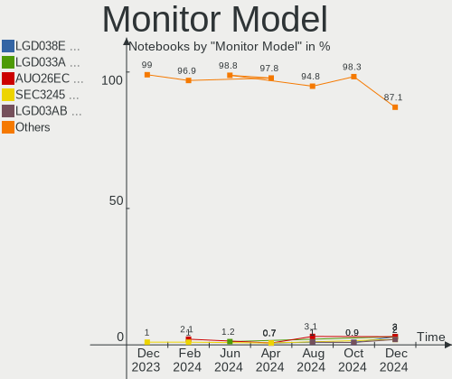
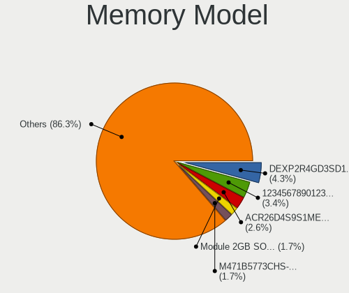
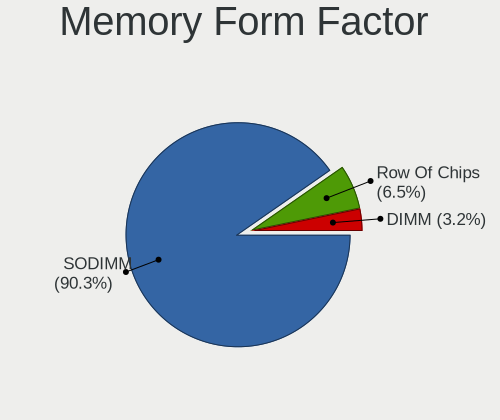

ROSA - Hardware Trends (Notebooks)
----------------------------------

A project to identify most popular hardware characteristics and track their change
over time based on data collected by Linux users at https://Linux-Hardware.org.

Anyone can contribute to this report by the [hw-probe](https://github.com/linuxhw/hw-probe) tool:

    sudo -E hw-probe -all -upload

This report is for one last month. Overall report since the beginning of time: [TestDays](https://github.com/linuxhw/TestDays)

Period: Jul, 2023.

Contents
--------

* [ System ](#system)
  - [ OS                       ](#os)
  - [ OS Family                ](#os-family)
  - [ Kernel                   ](#kernel)
  - [ Kernel Family            ](#kernel-family)
  - [ Kernel Major Ver.        ](#kernel-major-ver)
  - [ Arch                     ](#arch)
  - [ DE                       ](#de)
  - [ Display Server           ](#display-server)
  - [ Display Manager          ](#display-manager)
  - [ OS Lang                  ](#os-lang)
  - [ Boot Mode                ](#boot-mode)
  - [ Filesystem               ](#filesystem)
  - [ Part. scheme             ](#part-scheme)
  - [ Dual Boot with Linux/BSD ](#dual-boot-with-linuxbsd)
  - [ Dual Boot (Win)          ](#dual-boot-win)

* [ Board ](#board)
  - [ Vendor                   ](#vendor)
  - [ Model                    ](#model)
  - [ Model Family             ](#model-family)
  - [ MFG Year                 ](#mfg-year)
  - [ Form Factor              ](#form-factor)
  - [ Secure Boot              ](#secure-boot)
  - [ Coreboot                 ](#coreboot)
  - [ RAM Size                 ](#ram-size)
  - [ RAM Used                 ](#ram-used)
  - [ Total Drives             ](#total-drives)
  - [ Has CD-ROM               ](#has-cd-rom)
  - [ Has Ethernet             ](#has-ethernet)
  - [ Has WiFi                 ](#has-wifi)
  - [ Has Bluetooth            ](#has-bluetooth)

* [ Location ](#location)
  - [ Country                  ](#country)
  - [ City                     ](#city)

* [ Drives ](#drives)
  - [ Drive Vendor             ](#drive-vendor)
  - [ Drive Model              ](#drive-model)
  - [ HDD Vendor               ](#hdd-vendor)
  - [ SSD Vendor               ](#ssd-vendor)
  - [ Drive Kind               ](#drive-kind)
  - [ Drive Connector          ](#drive-connector)
  - [ Drive Size               ](#drive-size)
  - [ Space Total              ](#space-total)
  - [ Space Used               ](#space-used)
  - [ Malfunc. Drives          ](#malfunc-drives)
  - [ Malfunc. Drive Vendor    ](#malfunc-drive-vendor)
  - [ Malfunc. HDD Vendor      ](#malfunc-hdd-vendor)
  - [ Malfunc. Drive Kind      ](#malfunc-drive-kind)
  - [ Failed Drives            ](#failed-drives)
  - [ Failed Drive Vendor      ](#failed-drive-vendor)
  - [ Drive Status             ](#drive-status)

* [ Storage controller ](#storage-controller)
  - [ Storage Vendor           ](#storage-vendor)
  - [ Storage Model            ](#storage-model)
  - [ Storage Kind             ](#storage-kind)

* [ Processor ](#processor)
  - [ CPU Vendor               ](#cpu-vendor)
  - [ CPU Model                ](#cpu-model)
  - [ CPU Model Family         ](#cpu-model-family)
  - [ CPU Cores                ](#cpu-cores)
  - [ CPU Sockets              ](#cpu-sockets)
  - [ CPU Threads              ](#cpu-threads)
  - [ CPU Op-Modes             ](#cpu-op-modes)
  - [ CPU Microcode            ](#cpu-microcode)
  - [ CPU Microarch            ](#cpu-microarch)

* [ Graphics ](#graphics)
  - [ GPU Vendor               ](#gpu-vendor)
  - [ GPU Model                ](#gpu-model)
  - [ GPU Combo                ](#gpu-combo)
  - [ GPU Driver               ](#gpu-driver)
  - [ GPU Memory               ](#gpu-memory)

* [ Monitor ](#monitor)
  - [ Monitor Vendor           ](#monitor-vendor)
  - [ Monitor Model            ](#monitor-model)
  - [ Monitor Resolution       ](#monitor-resolution)
  - [ Monitor Diagonal         ](#monitor-diagonal)
  - [ Monitor Width            ](#monitor-width)
  - [ Aspect Ratio             ](#aspect-ratio)
  - [ Monitor Area             ](#monitor-area)
  - [ Pixel Density            ](#pixel-density)
  - [ Multiple Monitors        ](#multiple-monitors)

* [ Network ](#network)
  - [ Net Controller Vendor    ](#net-controller-vendor)
  - [ Net Controller Model     ](#net-controller-model)
  - [ Wireless Vendor          ](#wireless-vendor)
  - [ Wireless Model           ](#wireless-model)
  - [ Ethernet Vendor          ](#ethernet-vendor)
  - [ Ethernet Model           ](#ethernet-model)
  - [ Net Controller Kind      ](#net-controller-kind)
  - [ Used Controller          ](#used-controller)
  - [ NICs                     ](#nics)
  - [ IPv6                     ](#ipv6)

* [ Bluetooth ](#bluetooth)
  - [ Bluetooth Vendor         ](#bluetooth-vendor)
  - [ Bluetooth Model          ](#bluetooth-model)

* [ Sound ](#sound)
  - [ Sound Vendor             ](#sound-vendor)
  - [ Sound Model              ](#sound-model)

* [ Memory ](#memory)
  - [ Memory Vendor            ](#memory-vendor)
  - [ Memory Model             ](#memory-model)
  - [ Memory Kind              ](#memory-kind)
  - [ Memory Form Factor       ](#memory-form-factor)
  - [ Memory Size              ](#memory-size)
  - [ Memory Speed             ](#memory-speed)

* [ Printers & scanners ](#printers--scanners)
  - [ Printer Vendor           ](#printer-vendor)
  - [ Printer Model            ](#printer-model)
  - [ Scanner Vendor           ](#scanner-vendor)
  - [ Scanner Model            ](#scanner-model)

* [ Camera ](#camera)
  - [ Camera Vendor            ](#camera-vendor)
  - [ Camera Model             ](#camera-model)

* [ Security ](#security)
  - [ Fingerprint Vendor       ](#fingerprint-vendor)
  - [ Fingerprint Model        ](#fingerprint-model)
  - [ Chipcard Vendor          ](#chipcard-vendor)
  - [ Chipcard Model           ](#chipcard-model)

* [ Unsupported ](#unsupported)
  - [ Unsupported Devices      ](#unsupported-devices)
  - [ Unsupported Device Types ](#unsupported-device-types)

System
------

OS
--

Installed operating systems

| Name       | Notebooks | Percent |
|------------|-----------|---------|
| ROSA 12.4  | 82        | 85.42%  |
| ROSA R11.1 | 7         | 7.29%   |
| ROSA 12.3  | 3         | 3.13%   |
| ROSA 12.1  | 2         | 2.08%   |
| ROSA 13.0  | 1         | 1.04%   |
| ROSA 12.2  | 1         | 1.04%   |

OS Family
---------

OS without a version

| Name | Notebooks | Percent |
|------|-----------|---------|
| ROSA | 96        | 100%    |

Kernel
------

Version of the Linux kernel

| Version                                  | Notebooks | Percent |
|------------------------------------------|-----------|---------|
| 6.1.38-generic-1rosa2021.1-x86_64        | 41        | 42.71%  |
| 6.1.20-generic-2rosa2021.1-x86_64        | 30        | 31.25%  |
| 5.15.103-generic-1rosa2021.1-i686        | 3         | 3.13%   |
| 5.10.74-generic-2rosa2021.1-x86_64       | 3         | 3.13%   |
| 5.4.83-generic-2rosa-x86_64              | 2         | 2.08%   |
| 5.15.75-generic-1rosa2021.1-x86_64       | 2         | 2.08%   |
| 5.10.184-generic-1rosa2021.1-x86_64      | 2         | 2.08%   |
| 4.9.155-nrj-desktop-1rosa-i586           | 2         | 2.08%   |
| 6.4.1.xm1-1.klp-xanmod-rosa2021.1-x86_64 | 1         | 1.04%   |
| 6.1.34-generic-1rosa2023.1-x86_64        | 1         | 1.04%   |
| 5.4.32-generic-2rosa-x86_64              | 1         | 1.04%   |
| 5.15.79-generic-1rosa2021.1-x86_64       | 1         | 1.04%   |
| 5.15.117-generic-1rosa2021.1-x86_64      | 1         | 1.04%   |
| 5.15.117-generic-1rosa2021.1-i686        | 1         | 1.04%   |
| 5.15.103-generic-1rosa2021.1-x86_64      | 1         | 1.04%   |
| 5.13.9-generic-1rosa-x86_64              | 1         | 1.04%   |
| 5.10.175-generic-1rosa2021.1-x86_64      | 1         | 1.04%   |
| 5.10.155-generic-1rosa2021.1-x86_64      | 1         | 1.04%   |
| 4.15.0-desktop-122.124.1rosa-x86_64      | 1         | 1.04%   |

Kernel Family
-------------

Linux kernel without a distro release

| Version  | Notebooks | Percent |
|----------|-----------|---------|
| 6.1.38   | 41        | 42.71%  |
| 6.1.20   | 30        | 31.25%  |
| 5.15.103 | 4         | 4.17%   |
| 5.10.74  | 3         | 3.13%   |
| 5.4.83   | 2         | 2.08%   |
| 5.15.75  | 2         | 2.08%   |
| 5.15.117 | 2         | 2.08%   |
| 5.10.184 | 2         | 2.08%   |
| 4.9.155  | 2         | 2.08%   |
| 6.4.1    | 1         | 1.04%   |
| 6.1.34   | 1         | 1.04%   |
| 5.4.32   | 1         | 1.04%   |
| 5.15.79  | 1         | 1.04%   |
| 5.13.9   | 1         | 1.04%   |
| 5.10.175 | 1         | 1.04%   |
| 5.10.155 | 1         | 1.04%   |
| 4.15.0   | 1         | 1.04%   |

Kernel Major Ver.
-----------------

Linux kernel major version

| Version | Notebooks | Percent |
|---------|-----------|---------|
| 6.1     | 72        | 75%     |
| 5.15    | 9         | 9.38%   |
| 5.10    | 7         | 7.29%   |
| 5.4     | 3         | 3.13%   |
| 4.9     | 2         | 2.08%   |
| 6.4     | 1         | 1.04%   |
| 5.13    | 1         | 1.04%   |
| 4.15    | 1         | 1.04%   |

Arch
----

OS architecture (x86_64, i586, etc.)

| Name   | Notebooks | Percent |
|--------|-----------|---------|
| x86_64 | 90        | 93.75%  |
| i686   | 6         | 6.25%   |

DE
--

Desktop Environment

| Name  | Notebooks | Percent |
|-------|-----------|---------|
| KDE5  | 56        | 58.33%  |
| GNOME | 20        | 20.83%  |
| LXQt  | 11        | 11.46%  |
| KDE4  | 5         | 5.21%   |
| XFCE  | 2         | 2.08%   |
| MATE  | 1         | 1.04%   |
| i3    | 1         | 1.04%   |

Display Server
--------------

X11 or Wayland

| Name    | Notebooks | Percent |
|---------|-----------|---------|
| Wayland | 76        | 79.17%  |
| X11     | 20        | 20.83%  |

Display Manager
---------------

SDDM, LightDM, etc.

| Name    | Notebooks | Percent |
|---------|-----------|---------|
| SDDM    | 58        | 60.42%  |
| GDM     | 28        | 29.17%  |
| LightDM | 6         | 6.25%   |
| KDM     | 4         | 4.17%   |

OS Lang
-------

Language

| Lang  | Notebooks | Percent |
|-------|-----------|---------|
| ru_RU | 90        | 93.75%  |
| en_US | 2         | 2.08%   |
| vi_VN | 1         | 1.04%   |
| it_IT | 1         | 1.04%   |
| de_DE | 1         | 1.04%   |
| de_CH | 1         | 1.04%   |

Boot Mode
---------

EFI or BIOS

| Mode | Notebooks | Percent |
|------|-----------|---------|
| EFI  | 61        | 63.54%  |
| BIOS | 35        | 36.46%  |

Filesystem
----------

Type of filesystem

| Type    | Notebooks | Percent |
|---------|-----------|---------|
| Ext4    | 88        | 91.67%  |
| Btrfs   | 6         | 6.25%   |
| Overlay | 1         | 1.04%   |
| Aufs    | 1         | 1.04%   |

Part. scheme
------------

Scheme of partitioning

| Type | Notebooks | Percent |
|------|-----------|---------|
| GPT  | 66        | 68.75%  |
| MBR  | 30        | 31.25%  |

Dual Boot with Linux/BSD
------------------------

Hosting more than one Linux/BSD

| Dual boot | Notebooks | Percent |
|-----------|-----------|---------|
| No        | 70        | 72.92%  |
| Yes       | 26        | 27.08%  |

Dual Boot (Win)
---------------

Hosting Linux and Windows

| Dual boot | Notebooks | Percent |
|-----------|-----------|---------|
| No        | 55        | 57.29%  |
| Yes       | 41        | 42.71%  |

Board
-----

Vendor
------

Motherboard manufacturer

| Name                | Notebooks | Percent |
|---------------------|-----------|---------|
| Hewlett-Packard     | 18        | 18.75%  |
| ASUSTek Computer    | 17        | 17.71%  |
| Lenovo              | 14        | 14.58%  |
| Acer                | 14        | 14.58%  |
| Dell                | 5         | 5.21%   |
| Samsung Electronics | 4         | 4.17%   |
| MSI                 | 4         | 4.17%   |
| Toshiba             | 3         | 3.13%   |
| Unknown             | 3         | 3.13%   |
| HONOR               | 2         | 2.08%   |
| Timi                | 1         | 1.04%   |
| TECNO               | 1         | 1.04%   |
| Quanta              | 1         | 1.04%   |
| Prestigio           | 1         | 1.04%   |
| Pegatron            | 1         | 1.04%   |
| Notebook            | 1         | 1.04%   |
| Maibenben           | 1         | 1.04%   |
| HUAWEI              | 1         | 1.04%   |
| Haier               | 1         | 1.04%   |
| Google              | 1         | 1.04%   |
| Chuwi               | 1         | 1.04%   |
| Apple               | 1         | 1.04%   |

Model
-----

Motherboard model

| Name                                                                                     | Notebooks | Percent |
|------------------------------------------------------------------------------------------|-----------|---------|
| Unknown                                                                                  | 4         | 4.17%   |
| HP Notebook                                                                              | 2         | 2.08%   |
| Acer Aspire E5-573G                                                                      | 2         | 2.08%   |
| Toshiba Satellite C870-D7K                                                               | 1         | 1.04%   |
| Toshiba Satellite C850-1GL                                                               | 1         | 1.04%   |
| Toshiba QOSMIO G30                                                                       | 1         | 1.04%   |
| Timi Redmi G 2022                                                                        | 1         | 1.04%   |
| TECNO MEGABOOK T1                                                                        | 1         | 1.04%   |
| Samsung R530/R730                                                                        | 1         | 1.04%   |
| Samsung 355V4C/355V4X/355V5C/355V5X/356V4C/356V4X/356V5C/356V5X/3445VC/3445VX/3545VC/354 | 1         | 1.04%   |
| Samsung 350V5C/351V5C/3540VC/3440VC                                                      | 1         | 1.04%   |
| Samsung 300V3A/300V4A/300V5A                                                             | 1         | 1.04%   |
| Quanta SWH                                                                               | 1         | 1.04%   |
| Prestigio Smartbook PSB116A                                                              | 1         | 1.04%   |
| Pegatron A24                                                                             | 1         | 1.04%   |
| Notebook W510LU                                                                          | 1         | 1.04%   |
| MSI Modern 15 A11SBU                                                                     | 1         | 1.04%   |
| MSI Katana GF76 11UD                                                                     | 1         | 1.04%   |
| MSI GS73 Stealth 8RE                                                                     | 1         | 1.04%   |
| MSI ER710                                                                                | 1         | 1.04%   |
| Maibenben MaiBook M                                                                      | 1         | 1.04%   |
| Lenovo V15-IGL 82C3                                                                      | 1         | 1.04%   |
| Lenovo V14-IIL 82C4                                                                      | 1         | 1.04%   |
| Lenovo ThinkPad T420 4180EP2                                                             | 1         | 1.04%   |
| Lenovo ThinkBook 16 G4+ ARA 21D1                                                         | 1         | 1.04%   |
| Lenovo IdeaPad Yoga 2-13 59420231                                                        | 1         | 1.04%   |
| Lenovo IdeaPad S10-2 20027                                                               | 1         | 1.04%   |
| Lenovo IdeaPad 3 17ALC6 82KV                                                             | 1         | 1.04%   |
| Lenovo IdeaPad 3 15ARE05 81W4                                                            | 1         | 1.04%   |
| Lenovo IdeaPad 100-14IBY 80MH                                                            | 1         | 1.04%   |
| Lenovo G580 20150                                                                        | 1         | 1.04%   |
| Lenovo G570 20079                                                                        | 1         | 1.04%   |
| Lenovo G505 20240                                                                        | 1         | 1.04%   |
| Lenovo B590 20208                                                                        | 1         | 1.04%   |
| HUAWEI BOD-WXX9                                                                          | 1         | 1.04%   |
| HONOR HYM-WXX                                                                            | 1         | 1.04%   |
| HONOR HLYL-WXX9                                                                          | 1         | 1.04%   |
| HP Victus by Laptop 16-e0xxx                                                             | 1         | 1.04%   |
| HP ProBook 4545s                                                                         | 1         | 1.04%   |
| HP ProBook 440 G4                                                                        | 1         | 1.04%   |

Model Family
------------

Motherboard model prefix

| Name                | Notebooks | Percent |
|---------------------|-----------|---------|
| Acer Aspire         | 9         | 9.38%   |
| Lenovo IdeaPad      | 5         | 5.21%   |
| HP Pavilion         | 4         | 4.17%   |
| Unknown             | 4         | 4.17%   |
| HP Laptop           | 3         | 3.13%   |
| Toshiba Satellite   | 2         | 2.08%   |
| HP ProBook          | 2         | 2.08%   |
| HP Notebook         | 2         | 2.08%   |
| HP EliteBook        | 2         | 2.08%   |
| Dell Inspiron       | 2         | 2.08%   |
| ASUS VivoBook       | 2         | 2.08%   |
| ASUS TUF            | 2         | 2.08%   |
| ASUS ASUS           | 2         | 2.08%   |
| Acer Extensa        | 2         | 2.08%   |
| Toshiba QOSMIO      | 1         | 1.04%   |
| Timi Redmi          | 1         | 1.04%   |
| TECNO MEGABOOK      | 1         | 1.04%   |
| Samsung R530        | 1         | 1.04%   |
| Samsung 355V4C      | 1         | 1.04%   |
| Samsung 350V5C      | 1         | 1.04%   |
| Samsung 300V3A      | 1         | 1.04%   |
| Quanta SWH          | 1         | 1.04%   |
| Prestigio Smartbook | 1         | 1.04%   |
| Pegatron A24        | 1         | 1.04%   |
| Notebook W510LU     | 1         | 1.04%   |
| MSI Modern          | 1         | 1.04%   |
| MSI Katana          | 1         | 1.04%   |
| MSI GS73            | 1         | 1.04%   |
| MSI ER710           | 1         | 1.04%   |
| Maibenben MaiBook   | 1         | 1.04%   |
| Lenovo V15-IGL      | 1         | 1.04%   |
| Lenovo V14-IIL      | 1         | 1.04%   |
| Lenovo ThinkPad     | 1         | 1.04%   |
| Lenovo ThinkBook    | 1         | 1.04%   |
| Lenovo G580         | 1         | 1.04%   |
| Lenovo G570         | 1         | 1.04%   |
| Lenovo G505         | 1         | 1.04%   |
| Lenovo B590         | 1         | 1.04%   |
| HUAWEI BOD-WXX9     | 1         | 1.04%   |
| HONOR HYM-WXX       | 1         | 1.04%   |

MFG Year
--------

Motherboard manufacture year

| Year | Notebooks | Percent |
|------|-----------|---------|
| 2021 | 11        | 11.46%  |
| 2011 | 11        | 11.46%  |
| 2012 | 10        | 10.42%  |
| 2022 | 9         | 9.38%   |
| 2015 | 9         | 9.38%   |
| 2013 | 8         | 8.33%   |
| 2017 | 6         | 6.25%   |
| 2020 | 5         | 5.21%   |
| 2019 | 5         | 5.21%   |
| 2018 | 4         | 4.17%   |
| 2008 | 4         | 4.17%   |
| 2009 | 3         | 3.13%   |
| 2006 | 3         | 3.13%   |
| 2016 | 2         | 2.08%   |
| 2010 | 2         | 2.08%   |
| 2007 | 2         | 2.08%   |
| 2023 | 1         | 1.04%   |
| 2014 | 1         | 1.04%   |

Form Factor
-----------

Physical design of the computer

| Name     | Notebooks | Percent |
|----------|-----------|---------|
| Notebook | 96        | 100%    |

Secure Boot
-----------

Enabled or disabled

| State    | Notebooks | Percent |
|----------|-----------|---------|
| Disabled | 96        | 100%    |

Coreboot
--------

Have coreboot on board

| Used | Notebooks | Percent |
|------|-----------|---------|
| No   | 95        | 98.96%  |
| Yes  | 1         | 1.04%   |

RAM Size
--------

Total RAM memory

| Size in GB | Notebooks | Percent |
|------------|-----------|---------|
| 4.01-8.0   | 37        | 38.54%  |
| 3.01-4.0   | 21        | 21.88%  |
| 8.01-16.0  | 14        | 14.58%  |
| 2.01-3.0   | 7         | 7.29%   |
| 32.01-64.0 | 6         | 6.25%   |
| 16.01-24.0 | 6         | 6.25%   |
| 24.01-32.0 | 3         | 3.13%   |
| 1.01-2.0   | 2         | 2.08%   |

RAM Used
--------

Used RAM memory

| Used GB    | Notebooks | Percent |
|------------|-----------|---------|
| 1.01-2.0   | 52        | 54.17%  |
| 2.01-3.0   | 16        | 16.67%  |
| 4.01-8.0   | 10        | 10.42%  |
| 0.51-1.0   | 9         | 9.38%   |
| 3.01-4.0   | 7         | 7.29%   |
| 24.01-32.0 | 1         | 1.04%   |
| 0.01-0.5   | 1         | 1.04%   |

Total Drives
------------

Number of drives on board

| Drives | Notebooks | Percent |
|--------|-----------|---------|
| 1      | 67        | 69.79%  |
| 2      | 27        | 28.13%  |
| 4      | 1         | 1.04%   |
| 3      | 1         | 1.04%   |

Has CD-ROM
----------

Has CD-ROM on board

| Presented | Notebooks | Percent |
|-----------|-----------|---------|
| No        | 61        | 63.54%  |
| Yes       | 35        | 36.46%  |

Has Ethernet
------------

Has Ethernet on board

| Presented | Notebooks | Percent |
|-----------|-----------|---------|
| Yes       | 75        | 78.13%  |
| No        | 21        | 21.88%  |

Has WiFi
--------

Has WiFi module

| Presented | Notebooks | Percent |
|-----------|-----------|---------|
| Yes       | 93        | 96.88%  |
| No        | 3         | 3.13%   |

Has Bluetooth
-------------

Has Bluetooth module

| Presented | Notebooks | Percent |
|-----------|-----------|---------|
| Yes       | 76        | 79.17%  |
| No        | 20        | 20.83%  |

Location
--------

Country
-------

Geographic location (country)

| Country     | Notebooks | Percent |
|-------------|-----------|---------|
| Russia      | 76        | 79.17%  |
| Ukraine     | 4         | 4.17%   |
| Belarus     | 4         | 4.17%   |
| Poland      | 2         | 2.08%   |
| Kazakhstan  | 2         | 2.08%   |
| Germany     | 2         | 2.08%   |
| Vietnam     | 1         | 1.04%   |
| Switzerland | 1         | 1.04%   |
| Netherlands | 1         | 1.04%   |
| Lithuania   | 1         | 1.04%   |
| Italy       | 1         | 1.04%   |
| Brazil      | 1         | 1.04%   |

City
----

Geographic location (city)

| City             | Notebooks | Percent |
|------------------|-----------|---------|
| Moscow           | 16        | 16.67%  |
| St Petersburg    | 5         | 5.21%   |
| Krasnodar        | 5         | 5.21%   |
| Voronezh         | 3         | 3.13%   |
| Samara           | 3         | 3.13%   |
| Perm             | 3         | 3.13%   |
| Yoshkar-Ola      | 2         | 2.08%   |
| Yaroslavl        | 2         | 2.08%   |
| Simferopol       | 2         | 2.08%   |
| Shchelkovo       | 2         | 2.08%   |
| Saratov          | 2         | 2.08%   |
| Ryazan           | 2         | 2.08%   |
| Nizhniy Novgorod | 2         | 2.08%   |
| Minsk            | 2         | 2.08%   |
| Kirov            | 2         | 2.08%   |
| Kazan’         | 2         | 2.08%   |
| Zvenigorod       | 1         | 1.04%   |
| Zielona Góra    | 1         | 1.04%   |
| Zabrze           | 1         | 1.04%   |
| Vladimir         | 1         | 1.04%   |
| Vitebsk          | 1         | 1.04%   |
| Vilnius          | 1         | 1.04%   |
| Utrecht          | 1         | 1.04%   |
| Uglich           | 1         | 1.04%   |
| Ufa              | 1         | 1.04%   |
| Tyumen           | 1         | 1.04%   |
| Tula             | 1         | 1.04%   |
| Tsarskoye Selo   | 1         | 1.04%   |
| Tomsk            | 1         | 1.04%   |
| Taldykorgan      | 1         | 1.04%   |
| Smolensk         | 1         | 1.04%   |
| Severodvinsk     | 1         | 1.04%   |
| Sevastopol       | 1         | 1.04%   |
| Saransk          | 1         | 1.04%   |
| Sao Paulo        | 1         | 1.04%   |
| Pyatigorsk       | 1         | 1.04%   |
| Novosibirsk      | 1         | 1.04%   |
| Novoaltaysk      | 1         | 1.04%   |
| Lyubertsy        | 1         | 1.04%   |
| Kurgan           | 1         | 1.04%   |

Drives
------

Drive Vendor
------------

Hard drive vendors

| Vendor                | Notebooks | Drives | Percent |
|-----------------------|-----------|--------|---------|
| Samsung Electronics   | 15        | 15     | 12.1%   |
| WDC                   | 11        | 11     | 8.87%   |
| Kingston              | 10        | 12     | 8.06%   |
| Seagate               | 8         | 9      | 6.45%   |
| Toshiba               | 5         | 6      | 4.03%   |
| SK hynix              | 5         | 5      | 4.03%   |
| HGST                  | 5         | 5      | 4.03%   |
| A-DATA Technology     | 5         | 5      | 4.03%   |
| Unknown               | 4         | 4      | 3.23%   |
| SPCC                  | 4         | 4      | 3.23%   |
| Crucial               | 4         | 4      | 3.23%   |
| Hitachi               | 3         | 3      | 2.42%   |
| SanDisk               | 2         | 2      | 1.61%   |
| Realtek Semiconductor | 2         | 2      | 1.61%   |
| Micron Technology     | 2         | 2      | 1.61%   |
| KIOXIA                | 2         | 2      | 1.61%   |
| JMicron Technology    | 2         | 2      | 1.61%   |
| Intenso               | 2         | 2      | 1.61%   |
| China                 | 2         | 2      | 1.61%   |
| Unknown               | 2         | 2      | 1.61%   |
| XrayDisk              | 1         | 1      | 0.81%   |
| Wdxsky                | 1         | 1      | 0.81%   |
| WDC WDS               | 1         | 1      | 0.81%   |
| WD Blue               | 1         | 1      | 0.81%   |
| WALRAM                | 1         | 1      | 0.81%   |
| USB                   | 1         | 1      | 0.81%   |
| Transcend             | 1         | 1      | 0.81%   |
| Team                  | 1         | 1      | 0.81%   |
| Smartbuy              | 1         | 1      | 0.81%   |
| Silicon Motion        | 1         | 1      | 0.81%   |
| ShiJi                 | 1         | 1      | 0.81%   |
| Plextor               | 1         | 1      | 0.81%   |
| Palit                 | 1         | 1      | 0.81%   |
| OCZ                   | 1         | 1      | 0.81%   |
| Netac                 | 1         | 1      | 0.81%   |
| Neo                   | 1         | 1      | 0.81%   |
| MSI                   | 1         | 1      | 0.81%   |
| KingSpec              | 1         | 1      | 0.81%   |
| Intel                 | 1         | 1      | 0.81%   |
| HS-SSD-E100           | 1         | 1      | 0.81%   |

Drive Model
-----------

Hard drive models

| Model                                     | Notebooks | Percent |
|-------------------------------------------|-----------|---------|
| WDC WD5000LPCX-21VHAT0 500GB              | 3         | 2.38%   |
| Kingston SA400S37480G 480GB SSD           | 3         | 2.38%   |
| Kingston SA400S37240G 240GB SSD           | 3         | 2.38%   |
| HGST HTS545050A7E380 500GB                | 3         | 2.38%   |
| SPCC Solid State Disk 256GB               | 2         | 1.59%   |
| Realtek NVMe SSD Drive 128GB              | 2         | 1.59%   |
| KIOXIA KBG40ZNV256G 256GB                 | 2         | 1.59%   |
| Kingston SHFS37A120G 120GB SSD            | 2         | 1.59%   |
| JMicron Generic 512GB                     | 2         | 1.59%   |
| Hitachi HTS547575A9E384 752GB             | 2         | 1.59%   |
| Unknown                                   | 2         | 1.59%   |
| XrayDisk 2TB SSD                          | 1         | 0.79%   |
| Wdxsky W31-256G SSD                       | 1         | 0.79%   |
| WDC WDS100T1R0A-68A4W0 1TB SSD            | 1         | 0.79%   |
| WDC WDS 100T1R0A-68A4W0 1TB SSD           | 1         | 0.79%   |
| WDC WD6400BPVT-80HXZT3 640GB              | 1         | 0.79%   |
| WDC WD5000LPVX-60V0TT0 500GB              | 1         | 0.79%   |
| WDC WD5000LPLX-00ZNTT0 500GB              | 1         | 0.79%   |
| WDC WD1600BEVT-75ZCT2 160GB               | 1         | 0.79%   |
| WDC WD10JPVX-22JC3T0 1TB                  | 1         | 0.79%   |
| WDC WD10JPVT-60A1YT0 1TB                  | 1         | 0.79%   |
| WDC PC SN730 SDBPNTY-512G-1027 512GB      | 1         | 0.79%   |
| WD Blue SA510 2.5 1000GB                  | 1         | 0.79%   |
| WALRAM SSD 240G                           | 1         | 0.79%   |
| USB 3.1 1TB                               | 1         | 0.79%   |
| Unknown USDU1  16GB                       | 1         | 0.79%   |
| Unknown MMC Card  32GB                    | 1         | 0.79%   |
| Unknown HBG4a2  32GB                      | 1         | 0.79%   |
| Unknown DA4064  64GB                      | 1         | 0.79%   |
| Transcend TS128GMTS830S 128GB SSD         | 1         | 0.79%   |
| Toshiba MQ01ABF050 500GB                  | 1         | 0.79%   |
| Toshiba MQ01ABF032 320GB                  | 1         | 0.79%   |
| Toshiba MK5075GSX 500GB                   | 1         | 0.79%   |
| Toshiba MK1637GSX 160GB                   | 1         | 0.79%   |
| Toshiba KXG50ZNV1T02 1TB                  | 1         | 0.79%   |
| Team T253240GB SSD                        | 1         | 0.79%   |
| SPCC Solid State Disk 512GB               | 1         | 0.79%   |
| SPCC Solid State Disk 128GB               | 1         | 0.79%   |
| Smartbuy SSD 120GB                        | 1         | 0.79%   |
| SK hynix SKHynix_HFM512GDHTNI-87A0B 512GB | 1         | 0.79%   |

HDD Vendor
----------

Hard disk drive vendors

| Vendor             | Notebooks | Drives | Percent |
|--------------------|-----------|--------|---------|
| WDC                | 9         | 9      | 29.03%  |
| Seagate            | 7         | 8      | 22.58%  |
| HGST               | 5         | 5      | 16.13%  |
| Toshiba            | 4         | 5      | 12.9%   |
| Hitachi            | 3         | 3      | 9.68%   |
| JMicron Technology | 2         | 2      | 6.45%   |
| Fujitsu            | 1         | 1      | 3.23%   |

SSD Vendor
----------

Solid state drive vendors

| Vendor              | Notebooks | Drives | Percent |
|---------------------|-----------|--------|---------|
| Kingston            | 9         | 10     | 15%     |
| Samsung Electronics | 7         | 7      | 11.67%  |
| SPCC                | 4         | 4      | 6.67%   |
| A-DATA Technology   | 4         | 4      | 6.67%   |
| Crucial             | 3         | 3      | 5%      |
| SK hynix            | 2         | 2      | 3.33%   |
| Intenso             | 2         | 2      | 3.33%   |
| China               | 2         | 2      | 3.33%   |
| Unknown             | 2         | 2      | 3.33%   |
| XrayDisk            | 1         | 1      | 1.67%   |
| Wdxsky              | 1         | 1      | 1.67%   |
| WDC WDS             | 1         | 1      | 1.67%   |
| WDC                 | 1         | 1      | 1.67%   |
| WALRAM              | 1         | 1      | 1.67%   |
| USB                 | 1         | 1      | 1.67%   |
| Transcend           | 1         | 1      | 1.67%   |
| Team                | 1         | 1      | 1.67%   |
| Smartbuy            | 1         | 1      | 1.67%   |
| ShiJi               | 1         | 1      | 1.67%   |
| Seagate             | 1         | 1      | 1.67%   |
| SanDisk             | 1         | 1      | 1.67%   |
| Plextor             | 1         | 1      | 1.67%   |
| Palit               | 1         | 1      | 1.67%   |
| OCZ                 | 1         | 1      | 1.67%   |
| Netac               | 1         | 1      | 1.67%   |
| Neo                 | 1         | 1      | 1.67%   |
| KingSpec            | 1         | 1      | 1.67%   |
| HS-SSD-E100         | 1         | 1      | 1.67%   |
| GS                  | 1         | 1      | 1.67%   |
| Azerty              | 1         | 1      | 1.67%   |
| Apple               | 1         | 1      | 1.67%   |
| AMD                 | 1         | 1      | 1.67%   |
| AirDisk             | 1         | 1      | 1.67%   |
| ACOS                | 1         | 1      | 1.67%   |

Drive Kind
----------

HDD or SSD

| Kind    | Notebooks | Drives | Percent |
|---------|-----------|--------|---------|
| SSD     | 54        | 61     | 46.55%  |
| HDD     | 31        | 33     | 26.72%  |
| NVMe    | 26        | 29     | 22.41%  |
| MMC     | 4         | 4      | 3.45%   |
| Unknown | 1         | 1      | 0.86%   |

Drive Connector
---------------

SATA, SAS, NVMe, etc.

| Type | Notebooks | Drives | Percent |
|------|-----------|--------|---------|
| SATA | 71        | 90     | 67.62%  |
| NVMe | 26        | 29     | 24.76%  |
| SAS  | 4         | 5      | 3.81%   |
| MMC  | 4         | 4      | 3.81%   |

Drive Size
----------

Size of hard drive

| Size in TB | Notebooks | Drives | Percent |
|------------|-----------|--------|---------|
| 0.01-0.5   | 56        | 67     | 70%     |
| 0.51-1.0   | 23        | 26     | 28.75%  |
| 1.01-2.0   | 1         | 1      | 1.25%   |

Space Total
-----------

Amount of disk space available on the file system

| Size in GB     | Notebooks | Percent |
|----------------|-----------|---------|
| 101-250        | 30        | 31.25%  |
| 251-500        | 24        | 25%     |
| 21-50          | 10        | 10.42%  |
| 1-20           | 9         | 9.38%   |
| 501-1000       | 9         | 9.38%   |
| 51-100         | 7         | 7.29%   |
| 1001-2000      | 5         | 5.21%   |
| More than 3000 | 1         | 1.04%   |
| Unknown        | 1         | 1.04%   |

Space Used
----------

Amount of used disk space

| Used GB        | Notebooks | Percent |
|----------------|-----------|---------|
| 1-20           | 56        | 58.33%  |
| 101-250        | 12        | 12.5%   |
| 21-50          | 10        | 10.42%  |
| 51-100         | 7         | 7.29%   |
| 501-1000       | 6         | 6.25%   |
| 251-500        | 3         | 3.13%   |
| More than 3000 | 1         | 1.04%   |
| Unknown        | 1         | 1.04%   |

Malfunc. Drives
---------------

Drive models with a malfunction

| Model                                 | Notebooks | Drives | Percent |
|---------------------------------------|-----------|--------|---------|
| HGST HTS545050A7E380 500GB            | 2         | 2      | 11.11%  |
| WDC WD5000LPLX-00ZNTT0 500GB          | 1         | 1      | 5.56%   |
| WDC WD5000LPCX-21VHAT0 500GB          | 1         | 1      | 5.56%   |
| Toshiba MQ01ABF050 500GB              | 1         | 1      | 5.56%   |
| Toshiba MQ01ABF032 320GB              | 1         | 1      | 5.56%   |
| Toshiba MK1637GSX 160GB               | 1         | 2      | 5.56%   |
| SK hynix HFS128G39TND-N210A 128GB SSD | 1         | 1      | 5.56%   |
| Seagate ST9500325AS 500GB             | 1         | 1      | 5.56%   |
| Seagate ST500LT012-9WS142 500GB       | 1         | 1      | 5.56%   |
| Seagate ST320LT020-9YG142 320GB       | 1         | 1      | 5.56%   |
| Seagate ST1000LM024 HN-M101MBB 1TB    | 1         | 2      | 5.56%   |
| OCZ NOCTI 120GB SSD                   | 1         | 1      | 5.56%   |
| Kingston SHFS37A120G 120GB SSD        | 1         | 1      | 5.56%   |
| Hitachi HTS547575A9E384 752GB         | 1         | 1      | 5.56%   |
| Hitachi HTS541616J9SA00 160GB         | 1         | 1      | 5.56%   |
| ACOS AS-512 512GB SSD                 | 1         | 1      | 5.56%   |
| Unknown                               | 1         | 1      | 5.56%   |

Malfunc. Drive Vendor
---------------------

Vendors of faulty drives

| Vendor   | Notebooks | Drives | Percent |
|----------|-----------|--------|---------|
| Seagate  | 4         | 5      | 22.22%  |
| Toshiba  | 3         | 4      | 16.67%  |
| WDC      | 2         | 2      | 11.11%  |
| Hitachi  | 2         | 2      | 11.11%  |
| HGST     | 2         | 2      | 11.11%  |
| SK hynix | 1         | 1      | 5.56%   |
| OCZ      | 1         | 1      | 5.56%   |
| Kingston | 1         | 1      | 5.56%   |
| ACOS     | 1         | 1      | 5.56%   |
| Unknown  | 1         | 1      | 5.56%   |

Malfunc. HDD Vendor
-------------------

Vendors of faulty HDD drives

| Vendor  | Notebooks | Drives | Percent |
|---------|-----------|--------|---------|
| Seagate | 4         | 5      | 30.77%  |
| Toshiba | 3         | 4      | 23.08%  |
| WDC     | 2         | 2      | 15.38%  |
| Hitachi | 2         | 2      | 15.38%  |
| HGST    | 2         | 2      | 15.38%  |

Malfunc. Drive Kind
-------------------

Kinds of faulty drives

| Kind | Notebooks | Drives | Percent |
|------|-----------|--------|---------|
| HDD  | 13        | 15     | 72.22%  |
| SSD  | 5         | 5      | 27.78%  |

Failed Drives
-------------

Failed drive models

Zero info for selected period =(

Failed Drive Vendor
-------------------

Failed drive vendors

Zero info for selected period =(

Drive Status
------------

Number of failed and malfunc. drives

| Status   | Notebooks | Drives | Percent |
|----------|-----------|--------|---------|
| Works    | 80        | 97     | 75.47%  |
| Malfunc  | 17        | 20     | 16.04%  |
| Detected | 9         | 11     | 8.49%   |

Storage controller
------------------

Storage Vendor
--------------

Storage controller vendors

| Vendor                       | Notebooks | Percent |
|------------------------------|-----------|---------|
| Intel                        | 68        | 62.96%  |
| AMD                          | 10        | 9.26%   |
| Samsung Electronics          | 9         | 8.33%   |
| SK hynix                     | 3         | 2.78%   |
| Realtek Semiconductor        | 3         | 2.78%   |
| SanDisk                      | 2         | 1.85%   |
| Micron Technology            | 2         | 1.85%   |
| KIOXIA                       | 2         | 1.85%   |
| Toshiba America Info Systems | 1         | 0.93%   |
| Silicon Motion               | 1         | 0.93%   |
| Shenzhen Longsys Electronics | 1         | 0.93%   |
| Phison Electronics           | 1         | 0.93%   |
| Nvidia                       | 1         | 0.93%   |
| Micron/Crucial Technology    | 1         | 0.93%   |
| Kingston Technology Company  | 1         | 0.93%   |
| JMicron Technology           | 1         | 0.93%   |
| ADATA Technology             | 1         | 0.93%   |

Storage Model
-------------

Storage controller models

| Model                                                                            | Notebooks | Percent |
|----------------------------------------------------------------------------------|-----------|---------|
| Intel 7 Series Chipset Family 6-port SATA Controller [AHCI mode]                 | 11        | 9.65%   |
| Intel Sunrise Point-LP SATA Controller [AHCI mode]                               | 9         | 7.89%   |
| Intel 6 Series/C200 Series Chipset Family 6 port Mobile SATA AHCI Controller     | 9         | 7.89%   |
| AMD FCH SATA Controller [AHCI mode]                                              | 9         | 7.89%   |
| Intel Celeron/Pentium Silver Processor SATA Controller                           | 4         | 3.51%   |
| Intel 8 Series SATA Controller 1 [AHCI mode]                                     | 4         | 3.51%   |
| Intel 5 Series/3400 Series Chipset 4 port SATA AHCI Controller                   | 4         | 3.51%   |
| Samsung NVMe SSD Controller 980                                                  | 3         | 2.63%   |
| Realtek RTS5765DL NVMe SSD Controller (DRAM-less)                                | 3         | 2.63%   |
| Intel Atom/Celeron/Pentium Processor x5-E8000/J3xxx/N3xxx Series SATA Controller | 3         | 2.63%   |
| Intel 82801GBM/GHM (ICH7-M Family) SATA Controller [IDE mode]                    | 3         | 2.63%   |
| Intel 82801 Mobile SATA Controller [RAID mode]                                   | 3         | 2.63%   |
| Samsung NVMe SSD Controller PM9A1/PM9A3/980PRO                                   | 2         | 1.75%   |
| KIOXIA NVMe SSD Controller BG4 (DRAM-less)                                       | 2         | 1.75%   |
| Intel Wildcat Point-LP SATA Controller [AHCI Mode]                               | 2         | 1.75%   |
| Intel Volume Management Device NVMe RAID Controller                              | 2         | 1.75%   |
| Intel Cannon Lake Mobile PCH SATA AHCI Controller                                | 2         | 1.75%   |
| Intel 82801IBM/IEM (ICH9M/ICH9M-E) 4 port SATA Controller [AHCI mode]            | 2         | 1.75%   |
| Toshiba America Info Systems XG5 NVMe SSD Controller                             | 1         | 0.88%   |
| SK hynix Gold P31/BC711/PC711 NVMe Solid State Drive                             | 1         | 0.88%   |
| SK hynix BC511 NVMe SSD                                                          | 1         | 0.88%   |
| SK hynix BC501 NVMe Solid State Drive                                            | 1         | 0.88%   |
| Silicon Motion Non-Volatile memory controller                                    | 1         | 0.88%   |
| Shenzhen Longsys Lexar NM620 NVME SSD (DRAM-less)                                | 1         | 0.88%   |
| SanDisk WD Black SN770 / PC SN740 256GB / PC SN560 (DRAM-less) NVMe SSD          | 1         | 0.88%   |
| SanDisk WD Black SN750 / PC SN730 NVMe SSD                                       | 1         | 0.88%   |
| Samsung S4LN058A01[SSUBX] AHCI SSD Controller (Apple slot)                       | 1         | 0.88%   |
| Samsung NVMe SSD Controller SM981/PM981/PM983                                    | 1         | 0.88%   |
| Samsung NVMe SSD Controller SM961/PM961/SM963                                    | 1         | 0.88%   |
| Samsung NVMe SSD Controller PM9B1                                                | 1         | 0.88%   |
| Phison PS5019-E19 PCIe4 NVMe Controller (DRAM-less)                              | 1         | 0.88%   |
| Nvidia MCP79 AHCI Controller                                                     | 1         | 0.88%   |
| Micron/Crucial P5 Plus NVMe PCIe SSD                                             | 1         | 0.88%   |
| Micron 3400 NVMe SSD [Hendrix]                                                   | 1         | 0.88%   |
| Micron 2300 NVMe SSD [Santana]                                                   | 1         | 0.88%   |
| Kingston Company OM8PCP Design-In PCIe 3 NVMe SSD (DRAM-less)                    | 1         | 0.88%   |
| Kingston Company NVMe Controller                                                 | 1         | 0.88%   |
| JMicron JMB360 AHCI Controller                                                   | 1         | 0.88%   |
| Intel Tiger Lake SATA AHCI Controller                                            | 1         | 0.88%   |
| Intel SSD 670p Series [Keystone Harbor]                                          | 1         | 0.88%   |

Storage Kind
------------

Kind of storage controller (IDE, SATA, NVMe, SAS, ...)

| Kind | Notebooks | Percent |
|------|-----------|---------|
| SATA | 70        | 64.22%  |
| NVMe | 26        | 23.85%  |
| IDE  | 8         | 7.34%   |
| RAID | 5         | 4.59%   |

Processor
---------

CPU Vendor
----------

Processor vendors

| Vendor | Notebooks | Percent |
|--------|-----------|---------|
| Intel  | 78        | 81.25%  |
| AMD    | 18        | 18.75%  |

CPU Model
---------

Processor models

| Model                                       | Notebooks | Percent |
|---------------------------------------------|-----------|---------|
| Intel Core i5-7200U CPU @ 2.50GHz           | 4         | 4.17%   |
| Intel Pentium CPU B960 @ 2.20GHz            | 2         | 2.08%   |
| Intel Core i7-8750H CPU @ 2.20GHz           | 2         | 2.08%   |
| Intel Core i7-3610QM CPU @ 2.30GHz          | 2         | 2.08%   |
| Intel Core i5-3210M CPU @ 2.50GHz           | 2         | 2.08%   |
| Intel Core i5-2410M CPU @ 2.30GHz           | 2         | 2.08%   |
| Intel Core i3-3110M CPU @ 2.40GHz           | 2         | 2.08%   |
| Intel Core i3-2310M CPU @ 2.10GHz           | 2         | 2.08%   |
| Intel Core i3 CPU M 380 @ 2.53GHz           | 2         | 2.08%   |
| Intel Celeron CPU N3060 @ 1.60GHz           | 2         | 2.08%   |
| Intel 11th Gen Core i5-11400H @ 2.70GHz     | 2         | 2.08%   |
| AMD Ryzen 5 5600H with Radeon Graphics      | 2         | 2.08%   |
| Intel Pentium Silver N6000 @ 1.10GHz        | 1         | 1.04%   |
| Intel Pentium Dual-Core CPU T4300 @ 2.10GHz | 1         | 1.04%   |
| Intel Pentium CPU N3710 @ 1.60GHz           | 1         | 1.04%   |
| Intel Pentium CPU N3540 @ 2.16GHz           | 1         | 1.04%   |
| Intel Pentium CPU B950 @ 2.10GHz            | 1         | 1.04%   |
| Intel Pentium CPU 4417U @ 2.30GHz           | 1         | 1.04%   |
| Intel Pentium CPU 2127U @ 1.90GHz           | 1         | 1.04%   |
| Intel Genuine CPU T2300 @ 1.66GHz           | 1         | 1.04%   |
| Intel Core i7-8550U CPU @ 1.80GHz           | 1         | 1.04%   |
| Intel Core i7-7700HQ CPU @ 2.80GHz          | 1         | 1.04%   |
| Intel Core i7-4510U CPU @ 2.00GHz           | 1         | 1.04%   |
| Intel Core i7-3630QM CPU @ 2.40GHz          | 1         | 1.04%   |
| Intel Core i7-2670QM CPU @ 2.20GHz          | 1         | 1.04%   |
| Intel Core i5-8350U CPU @ 1.70GHz           | 1         | 1.04%   |
| Intel Core i5-6200U CPU @ 2.30GHz           | 1         | 1.04%   |
| Intel Core i5-4260U CPU @ 1.40GHz           | 1         | 1.04%   |
| Intel Core i5-4210U CPU @ 1.70GHz           | 1         | 1.04%   |
| Intel Core i5-4200U CPU @ 1.60GHz           | 1         | 1.04%   |
| Intel Core i5-3230M CPU @ 2.60GHz           | 1         | 1.04%   |
| Intel Core i5-2520M CPU @ 2.50GHz           | 1         | 1.04%   |
| Intel Core i5-1035G1 CPU @ 1.00GHz          | 1         | 1.04%   |
| Intel Core i5 CPU M 480 @ 2.67GHz           | 1         | 1.04%   |
| Intel Core i3-8130U CPU @ 2.20GHz           | 1         | 1.04%   |
| Intel Core i3-6006U CPU @ 2.00GHz           | 1         | 1.04%   |
| Intel Core i3-5010U CPU @ 2.10GHz           | 1         | 1.04%   |
| Intel Core i3-5005U CPU @ 2.00GHz           | 1         | 1.04%   |
| Intel Core i3-4010U CPU @ 1.70GHz           | 1         | 1.04%   |
| Intel Core i3-3217U CPU @ 1.80GHz           | 1         | 1.04%   |

CPU Model Family
----------------

Processor model prefix

| Model                   | Notebooks | Percent |
|-------------------------|-----------|---------|
| Intel Core i5           | 17        | 17.71%  |
| Intel Core i3           | 17        | 17.71%  |
| Intel Celeron           | 10        | 10.42%  |
| Intel Core i7           | 9         | 9.38%   |
| Intel Pentium           | 7         | 7.29%   |
| Other                   | 6         | 6.25%   |
| AMD Ryzen 5             | 6         | 6.25%   |
| Intel Core 2 Duo        | 4         | 4.17%   |
| AMD Ryzen 7             | 4         | 4.17%   |
| Intel Atom              | 3         | 3.13%   |
| Intel Core 2            | 2         | 2.08%   |
| AMD Ryzen 3             | 2         | 2.08%   |
| Intel Pentium Silver    | 1         | 1.04%   |
| Intel Pentium Dual-Core | 1         | 1.04%   |
| Intel Genuine           | 1         | 1.04%   |
| AMD E1                  | 1         | 1.04%   |
| AMD Athlon 64 X2        | 1         | 1.04%   |
| AMD Athlon              | 1         | 1.04%   |
| AMD A8                  | 1         | 1.04%   |
| AMD A6                  | 1         | 1.04%   |
| AMD A4                  | 1         | 1.04%   |

CPU Cores
---------

Number of processor cores

| Number | Notebooks | Percent |
|--------|-----------|---------|
| 2      | 56        | 58.33%  |
| 4      | 23        | 23.96%  |
| 6      | 8         | 8.33%   |
| 8      | 4         | 4.17%   |
| 1      | 4         | 4.17%   |
| 14     | 1         | 1.04%   |

CPU Sockets
-----------

Number of sockets

| Number | Notebooks | Percent |
|--------|-----------|---------|
| 1      | 96        | 100%    |

CPU Threads
-----------

Threads per core (Hyper-Threading)

| Number | Notebooks | Percent |
|--------|-----------|---------|
| 2      | 65        | 67.71%  |
| 1      | 31        | 32.29%  |

CPU Op-Modes
------------

CPU Operation Modes (32-bit, 64-bit)

| Op mode        | Notebooks | Percent |
|----------------|-----------|---------|
| 32-bit, 64-bit | 94        | 97.92%  |
| 32-bit         | 2         | 2.08%   |

CPU Microcode
-------------

Microcode number

| Number     | Notebooks | Percent |
|------------|-----------|---------|
| 0x306a9    | 11        | 11.46%  |
| 0x206a7    | 11        | 11.46%  |
| Unknown    | 5         | 5.21%   |
| 0x806e9    | 4         | 4.17%   |
| 0x406c4    | 4         | 4.17%   |
| 0x40651    | 4         | 4.17%   |
| 0x20655    | 4         | 4.17%   |
| 0x0a50000c | 4         | 4.17%   |
| 0x806ea    | 3         | 3.13%   |
| 0x806c1    | 3         | 3.13%   |
| 0x706a8    | 3         | 3.13%   |
| 0x906ea    | 2         | 2.08%   |
| 0x906c0    | 2         | 2.08%   |
| 0x806d1    | 2         | 2.08%   |
| 0x706e5    | 2         | 2.08%   |
| 0x6f6      | 2         | 2.08%   |
| 0x406e3    | 2         | 2.08%   |
| 0x306d4    | 2         | 2.08%   |
| 0x30678    | 2         | 2.08%   |
| 0x1067a    | 2         | 2.08%   |
| 0x08600104 | 2         | 2.08%   |
| 0x08108109 | 2         | 2.08%   |
| 0x906e9    | 1         | 1.04%   |
| 0x906a3    | 1         | 1.04%   |
| 0x706a1    | 1         | 1.04%   |
| 0x6fd      | 1         | 1.04%   |
| 0x6fb      | 1         | 1.04%   |
| 0x6e8      | 1         | 1.04%   |
| 0x106ca    | 1         | 1.04%   |
| 0x106c2    | 1         | 1.04%   |
| 0x10676    | 1         | 1.04%   |
| 0x0a50000d | 1         | 1.04%   |
| 0x0a404102 | 1         | 1.04%   |
| 0x08608103 | 1         | 1.04%   |
| 0x08600106 | 1         | 1.04%   |
| 0x08108102 | 1         | 1.04%   |
| 0x07030105 | 1         | 1.04%   |
| 0x0700010b | 1         | 1.04%   |
| 0x0600111f | 1         | 1.04%   |
| 0x0600110f | 1         | 1.04%   |

CPU Microarch
-------------

Microarchitecture

| Name             | Notebooks | Percent |
|------------------|-----------|---------|
| SandyBridge      | 12        | 12.5%   |
| KabyLake         | 12        | 12.5%   |
| IvyBridge        | 11        | 11.46%  |
| Silvermont       | 6         | 6.25%   |
| Zen 3            | 5         | 5.21%   |
| Haswell          | 5         | 5.21%   |
| Westmere         | 4         | 4.17%   |
| Icelake          | 4         | 4.17%   |
| Goldmont plus    | 4         | 4.17%   |
| Core             | 4         | 4.17%   |
| Zen+             | 3         | 3.13%   |
| Zen 2            | 3         | 3.13%   |
| TigerLake        | 3         | 3.13%   |
| Penryn           | 3         | 3.13%   |
| Tremont          | 2         | 2.08%   |
| Skylake          | 2         | 2.08%   |
| Piledriver       | 2         | 2.08%   |
| Broadwell        | 2         | 2.08%   |
| Bonnell          | 2         | 2.08%   |
| Unknown          | 2         | 2.08%   |
| Puma             | 1         | 1.04%   |
| P6               | 1         | 1.04%   |
| K8 Hammer        | 1         | 1.04%   |
| Jaguar           | 1         | 1.04%   |
| Alderlake Hybrid | 1         | 1.04%   |

Graphics
--------

GPU Vendor
----------

Vendors of graphics cards

| Vendor | Notebooks | Percent |
|--------|-----------|---------|
| Intel  | 72        | 54.55%  |
| Nvidia | 34        | 25.76%  |
| AMD    | 26        | 19.7%   |

GPU Model
---------

Graphics card models

| Model                                                                                    | Notebooks | Percent |
|------------------------------------------------------------------------------------------|-----------|---------|
| Intel 2nd Generation Core Processor Family Integrated Graphics Controller                | 12        | 8.7%    |
| Intel 3rd Gen Core processor Graphics Controller                                         | 11        | 7.97%   |
| Intel Haswell-ULT Integrated Graphics Controller                                         | 5         | 3.62%   |
| Intel HD Graphics 620                                                                    | 4         | 2.9%    |
| Intel GeminiLake [UHD Graphics 600]                                                      | 4         | 2.9%    |
| Intel Core Processor Integrated Graphics Controller                                      | 4         | 2.9%    |
| Intel Atom/Celeron/Pentium Processor x5-E8000/J3xxx/N3xxx Integrated Graphics Controller | 4         | 2.9%    |
| AMD Cezanne [Radeon Vega Series / Radeon Vega Mobile Series]                             | 4         | 2.9%    |
| Nvidia GF108M [GeForce GT 540M]                                                          | 3         | 2.17%   |
| Intel UHD Graphics 620                                                                   | 3         | 2.17%   |
| AMD Renoir                                                                               | 3         | 2.17%   |
| AMD Picasso/Raven 2 [Radeon Vega Series / Radeon Vega Mobile Series]                     | 3         | 2.17%   |
| Nvidia TU117M [GeForce GTX 1650 Mobile / Max-Q]                                          | 2         | 1.45%   |
| Nvidia GP107M [GeForce GTX 1050 Mobile]                                                  | 2         | 1.45%   |
| Nvidia GM108M [GeForce 940M]                                                             | 2         | 1.45%   |
| Nvidia GK107M [GeForce GT 650M]                                                          | 2         | 1.45%   |
| Nvidia GF117M [GeForce 610M/710M/810M/820M / GT 620M/625M/630M/720M]                     | 2         | 1.45%   |
| Nvidia GF108M [GeForce GT 620M/630M/635M/640M LE]                                        | 2         | 1.45%   |
| Nvidia GA107M [GeForce RTX 3050 Ti Mobile]                                               | 2         | 1.45%   |
| Intel TigerLake-LP GT2 [Iris Xe Graphics]                                                | 2         | 1.45%   |
| Intel TigerLake-H GT1 [UHD Graphics]                                                     | 2         | 1.45%   |
| Intel Skylake GT2 [HD Graphics 520]                                                      | 2         | 1.45%   |
| Intel Mobile 945GM/GMS/GME, 943/940GML Express Integrated Graphics Controller            | 2         | 1.45%   |
| Intel JasperLake [UHD Graphics]                                                          | 2         | 1.45%   |
| Intel Iris Plus Graphics G1 (Ice Lake)                                                   | 2         | 1.45%   |
| Intel HD Graphics 5500                                                                   | 2         | 1.45%   |
| Intel CoffeeLake-H GT2 [UHD Graphics 630]                                                | 2         | 1.45%   |
| Intel Atom Processor Z36xxx/Z37xxx Series Graphics & Display                             | 2         | 1.45%   |
| AMD Thames [Radeon HD 7500M/7600M Series]                                                | 2         | 1.45%   |
| AMD Sun XT [Radeon HD 8670A/8670M/8690M / R5 M330 / M430 / Radeon 520 Mobile]            | 2         | 1.45%   |
| AMD Seymour [Radeon HD 6400M/7400M Series]                                               | 2         | 1.45%   |
| Nvidia TU117M [GeForce MX450]                                                            | 1         | 0.72%   |
| Nvidia GT218M [GeForce 310M]                                                             | 1         | 0.72%   |
| Nvidia GP106M [GeForce GTX 1060 Mobile]                                                  | 1         | 0.72%   |
| Nvidia GM108M [GeForce 940MX]                                                            | 1         | 0.72%   |
| Nvidia GM108M [GeForce 920MX]                                                            | 1         | 0.72%   |
| Nvidia GM108M [GeForce 840M]                                                             | 1         | 0.72%   |
| Nvidia GK208M [GeForce GT 720M]                                                          | 1         | 0.72%   |
| Nvidia GK208BM [GeForce 920M]                                                            | 1         | 0.72%   |
| Nvidia GK107M [GeForce GT 750M]                                                          | 1         | 0.72%   |

GPU Combo
---------

Combinations of graphics cards

| Name           | Notebooks | Percent |
|----------------|-----------|---------|
| 1 x Intel      | 38        | 39.58%  |
| Intel + Nvidia | 28        | 29.17%  |
| 1 x AMD        | 15        | 15.63%  |
| Intel + AMD    | 6         | 6.25%   |
| 1 x Nvidia     | 4         | 4.17%   |
| 2 x AMD        | 3         | 3.13%   |
| AMD + Nvidia   | 2         | 2.08%   |

GPU Driver
----------

Free vs proprietary

| Driver      | Notebooks | Percent |
|-------------|-----------|---------|
| Free        | 85        | 88.54%  |
| Proprietary | 10        | 10.42%  |
| Unknown     | 1         | 1.04%   |

GPU Memory
----------

Total video memory

| Size in GB | Notebooks | Percent |
|------------|-----------|---------|
| Unknown    | 45        | 46.88%  |
| 0.01-0.5   | 21        | 21.88%  |
| 1.01-2.0   | 15        | 15.63%  |
| 0.51-1.0   | 8         | 8.33%   |
| 3.01-4.0   | 5         | 5.21%   |
| 5.01-6.0   | 2         | 2.08%   |

Monitor
-------

Monitor Vendor
--------------

Monitor vendors

| Vendor                  | Notebooks | Percent |
|-------------------------|-----------|---------|
| AU Optronics            | 26        | 26%     |
| LG Display              | 17        | 17%     |
| Chimei Innolux          | 16        | 16%     |
| BOE                     | 14        | 14%     |
| Samsung Electronics     | 7         | 7%      |
| Chi Mei Optoelectronics | 6         | 6%      |
| PANDA                   | 2         | 2%      |
| TMX                     | 1         | 1%      |
| Sharp                   | 1         | 1%      |
| Philips                 | 1         | 1%      |
| InnoLux Display         | 1         | 1%      |
| InfoVision              | 1         | 1%      |
| Dell                    | 1         | 1%      |
| CSO                     | 1         | 1%      |
| CPT                     | 1         | 1%      |
| BenQ                    | 1         | 1%      |
| ASUSTek Computer        | 1         | 1%      |
| Apple                   | 1         | 1%      |
| AOC                     | 1         | 1%      |

Monitor Model
-------------

Monitor models

| Model                                                                    | Notebooks | Percent |
|--------------------------------------------------------------------------|-----------|---------|
| AU Optronics LCD Monitor AUO21EC 1366x768 344x193mm 15.5-inch            | 3         | 3%      |
| Samsung Electronics LCD Monitor SEC3245 1366x768 344x194mm 15.5-inch     | 2         | 2%      |
| LG Display LCD Monitor LGD033A 1366x768 344x194mm 15.5-inch              | 2         | 2%      |
| LG Display LCD Monitor LGD027A 1600x900 382x215mm 17.3-inch              | 2         | 2%      |
| Chimei Innolux LCD Monitor CMN15DB 1366x768 344x193mm 15.5-inch          | 2         | 2%      |
| Chi Mei Optoelectronics LCD Monitor CMO15A1 1366x768 344x193mm 15.5-inch | 2         | 2%      |
| BOE LCD Monitor BOE0878 1920x1080 355x200mm 16.0-inch                    | 2         | 2%      |
| AU Optronics LCD Monitor AUO26EC 1366x768 344x193mm 15.5-inch            | 2         | 2%      |
| TMX TL160ADMP11-0 TMX1601 2560x1600 345x215mm 16.0-inch                  | 1         | 1%      |
| Sharp LCD Monitor SHP13BE 1920x1200 366x229mm 17.0-inch                  | 1         | 1%      |
| Samsung Electronics SME1720NR SAM0696 1280x1024 338x270mm 17.0-inch      | 1         | 1%      |
| Samsung Electronics LCD Monitor SEC544B 1600x900 382x214mm 17.2-inch     | 1         | 1%      |
| Samsung Electronics LCD Monitor SEC4252 1366x768 344x194mm 15.5-inch     | 1         | 1%      |
| Samsung Electronics LCD Monitor SEC314C 1920x1080 344x194mm 15.5-inch    | 1         | 1%      |
| Samsung Electronics LCD Monitor SDC4161 1920x1080 344x194mm 15.5-inch    | 1         | 1%      |
| Philips PHL 237E7 PHLC101 1920x1080 510x290mm 23.1-inch                  | 1         | 1%      |
| PANDA LCD Monitor NCP002D 1920x1080 344x194mm 15.5-inch                  | 1         | 1%      |
| PANDA LCD Monitor NCP0029 1920x1080 344x194mm 15.5-inch                  | 1         | 1%      |
| LG Display LP156WH3-TLA2 LGD0210 1366x768 345x194mm 15.6-inch            | 1         | 1%      |
| LG Display LP101WSA-TLA1 LGD01B9 1024x600 224x126mm 10.1-inch            | 1         | 1%      |
| LG Display LCD Monitor LGD060F 1920x1080 309x174mm 14.0-inch             | 1         | 1%      |
| LG Display LCD Monitor LGD05E5 1920x1080 344x194mm 15.5-inch             | 1         | 1%      |
| LG Display LCD Monitor LGD0493 1366x768 344x194mm 15.5-inch              | 1         | 1%      |
| LG Display LCD Monitor LGD046E 1920x1080 382x215mm 17.3-inch             | 1         | 1%      |
| LG Display LCD Monitor LGD03DB 1366x768 345x194mm 15.6-inch              | 1         | 1%      |
| LG Display LCD Monitor LGD0365 1600x900 382x215mm 17.3-inch              | 1         | 1%      |
| LG Display LCD Monitor LGD02F6 1600x900 382x215mm 17.3-inch              | 1         | 1%      |
| LG Display LCD Monitor LGD02F1 1366x768 344x194mm 15.5-inch              | 1         | 1%      |
| LG Display LCD Monitor LGD02AC 1366x768 344x194mm 15.5-inch              | 1         | 1%      |
| LG Display LCD Monitor LGD0283 1920x1080 383x215mm 17.3-inch             | 1         | 1%      |
| LG Display LCD Monitor LGD0250 1366x768 345x194mm 15.6-inch              | 1         | 1%      |
| InnoLux Display LCD Monitor INX0001 1920x1080 344x194mm 15.5-inch        | 1         | 1%      |
| InfoVision LCD Monitor IVO0535 1920x1080 294x165mm 13.3-inch             | 1         | 1%      |
| Dell U2415 DELA0BA 1920x1200 518x324mm 24.1-inch                         | 1         | 1%      |
| CSO LCD Monitor CSO1615 2560x1600 344x215mm 16.0-inch                    | 1         | 1%      |
| CPT LCD Monitor CPT14C7 1366x768 344x194mm 15.5-inch                     | 1         | 1%      |
| Chimei Innolux LCD Monitor CMN1747 1920x1080 381x214mm 17.2-inch         | 1         | 1%      |
| Chimei Innolux LCD Monitor CMN1734 1600x900 382x214mm 17.2-inch          | 1         | 1%      |
| Chimei Innolux LCD Monitor CMN160A 1920x1080 355x199mm 16.0-inch         | 1         | 1%      |
| Chimei Innolux LCD Monitor CMN15E8 1920x1080 344x193mm 15.5-inch         | 1         | 1%      |

Monitor Resolution
------------------

Monitor screen resolution

| Resolution        | Notebooks | Percent |
|-------------------|-----------|---------|
| 1920x1080 (FHD)   | 37        | 38.14%  |
| 1366x768 (WXGA)   | 37        | 38.14%  |
| 1600x900 (HD+)    | 10        | 10.31%  |
| 1280x800 (WXGA)   | 3         | 3.09%   |
| 2560x1600         | 2         | 2.06%   |
| 1920x1200 (WUXGA) | 2         | 2.06%   |
| 1440x900 (WXGA+)  | 2         | 2.06%   |
| 1024x600          | 2         | 2.06%   |
| 2560x1440 (QHD)   | 1         | 1.03%   |
| 1280x1024 (SXGA)  | 1         | 1.03%   |

Monitor Diagonal
----------------

Diagonal size in inches

| Inches | Notebooks | Percent |
|--------|-----------|---------|
| 15     | 50        | 50%     |
| 17     | 16        | 16%     |
| 13     | 11        | 11%     |
| 16     | 6         | 6%      |
| 14     | 6         | 6%      |
| 11     | 4         | 4%      |
| 24     | 2         | 2%      |
| 10     | 2         | 2%      |
| 27     | 1         | 1%      |
| 23     | 1         | 1%      |
| 21     | 1         | 1%      |

Monitor Width
-------------

Physical width

| Width in mm | Notebooks | Percent |
|-------------|-----------|---------|
| 301-350     | 66        | 66.67%  |
| 351-400     | 19        | 19.19%  |
| 201-300     | 9         | 9.09%   |
| 501-600     | 4         | 4.04%   |
| 401-500     | 1         | 1.01%   |

Aspect Ratio
------------

Proportional relationship between the width and the height

| Ratio | Notebooks | Percent |
|-------|-----------|---------|
| 16/9  | 85        | 88.54%  |
| 16/10 | 10        | 10.42%  |
| 5/4   | 1         | 1.04%   |

Monitor Area
------------

Area in inch²

| Area in inch² | Notebooks | Percent |
|----------------|-----------|---------|
| 101-110        | 53        | 53%     |
| 81-90          | 14        | 14%     |
| 121-130        | 14        | 14%     |
| 51-60          | 4         | 4%      |
| 71-80          | 3         | 3%      |
| 111-120        | 3         | 3%      |
| 41-50          | 2         | 2%      |
| 251-300        | 2         | 2%      |
| 201-250        | 2         | 2%      |
| 301-350        | 1         | 1%      |
| 141-150        | 1         | 1%      |
| 131-140        | 1         | 1%      |

Pixel Density
-------------

Pixels per inch

| Density | Notebooks | Percent |
|---------|-----------|---------|
| 121-160 | 41        | 41%     |
| 101-120 | 41        | 41%     |
| 51-100  | 14        | 14%     |
| 161-240 | 4         | 4%      |

Multiple Monitors
-----------------

Total monitors connected

| Total | Notebooks | Percent |
|-------|-----------|---------|
| 1     | 87        | 90.63%  |
| 2     | 7         | 7.29%   |
| 0     | 2         | 2.08%   |

Network
-------

Net Controller Vendor
---------------------

Controller vendors

| Vendor                          | Notebooks | Percent |
|---------------------------------|-----------|---------|
| Realtek Semiconductor           | 63        | 40.38%  |
| Intel                           | 37        | 23.72%  |
| Qualcomm Atheros                | 28        | 17.95%  |
| Broadcom                        | 11        | 7.05%   |
| Broadcom Limited                | 4         | 2.56%   |
| Xiaomi                          | 2         | 1.28%   |
| Ralink                          | 2         | 1.28%   |
| MediaTek                        | 2         | 1.28%   |
| ZTE WCDMA Technologies MSM      | 1         | 0.64%   |
| TP-Link                         | 1         | 0.64%   |
| Qualcomm Atheros Communications | 1         | 0.64%   |
| Qualcomm                        | 1         | 0.64%   |
| Marvell Technology Group        | 1         | 0.64%   |
| DisplayLink                     | 1         | 0.64%   |
| ASIX Electronics                | 1         | 0.64%   |

Net Controller Model
--------------------

Controller models

| Model                                                                   | Notebooks | Percent |
|-------------------------------------------------------------------------|-----------|---------|
| Realtek RTL8111/8168/8411 PCI Express Gigabit Ethernet Controller       | 37        | 21.14%  |
| Realtek RTL810xE PCI Express Fast Ethernet controller                   | 12        | 6.86%   |
| Realtek RTL8821CE 802.11ac PCIe Wireless Network Adapter                | 9         | 5.14%   |
| Qualcomm Atheros AR9285 Wireless Network Adapter (PCI-Express)          | 9         | 5.14%   |
| Intel Wireless 8265 / 8275                                              | 6         | 3.43%   |
| Realtek RTL8822CE 802.11ac PCIe Wireless Network Adapter                | 4         | 2.29%   |
| Qualcomm Atheros AR9485 Wireless Network Adapter                        | 4         | 2.29%   |
| Intel Wireless 7260                                                     | 4         | 2.29%   |
| Intel PRO/Wireless 3945ABG [Golan] Network Connection                   | 4         | 2.29%   |
| Qualcomm Atheros QCA9565 / AR9565 Wireless Network Adapter              | 3         | 1.71%   |
| Qualcomm Atheros AR8151 v2.0 Gigabit Ethernet                           | 3         | 1.71%   |
| Intel Wi-Fi 6 AX201                                                     | 3         | 1.71%   |
| Broadcom NetLink BCM57785 Gigabit Ethernet PCIe                         | 3         | 1.71%   |
| Broadcom BCM4313 802.11bgn Wireless Network Adapter                     | 3         | 1.71%   |
| Realtek RTL8188CE 802.11b/g/n WiFi Adapter                              | 2         | 1.14%   |
| Ralink RT3290 Wireless 802.11n 1T/1R PCIe                               | 2         | 1.14%   |
| Qualcomm Atheros QCA9377 802.11ac Wireless Network Adapter              | 2         | 1.14%   |
| Qualcomm Atheros AR9462 Wireless Network Adapter                        | 2         | 1.14%   |
| Qualcomm Atheros AR242x / AR542x Wireless Network Adapter (PCI-Express) | 2         | 1.14%   |
| Intel Wireless 7265                                                     | 2         | 1.14%   |
| Intel Ethernet Connection (4) I219-V                                    | 2         | 1.14%   |
| Intel Dual Band Wireless-AC 3168NGW [Stone Peak]                        | 2         | 1.14%   |
| Intel Centrino Wireless-N 2230                                          | 2         | 1.14%   |
| Broadcom BCM4401-B0 100Base-TX                                          | 2         | 1.14%   |
| Broadcom BCM43142 802.11b/g/n                                           | 2         | 1.14%   |
| ZTE WCDMA MSM USB SCSI CD-ROM                                           | 1         | 0.57%   |
| Xiaomi Mi/Redmi series (RNDIS)                                          | 1         | 0.57%   |
| Xiaomi MediaTek MT7601U [MI WiFi]                                       | 1         | 0.57%   |
| TP-Link TL-WN823N v2/v3 [Realtek RTL8192EU]                             | 1         | 0.57%   |
| Realtek RTL8852BE PCIe 802.11ax Wireless Network Controller             | 1         | 0.57%   |
| Realtek RTL8852AE 802.11ax PCIe Wireless Network Adapter                | 1         | 0.57%   |
| Realtek RTL8822BE 802.11a/b/g/n/ac WiFi adapter                         | 1         | 0.57%   |
| Realtek RTL8723BE PCIe Wireless Network Adapter                         | 1         | 0.57%   |
| Realtek RTL8723AE PCIe Wireless Network Adapter                         | 1         | 0.57%   |
| Realtek RTL8188EE Wireless Network Adapter                              | 1         | 0.57%   |
| Realtek RTL8153 Gigabit Ethernet Adapter                                | 1         | 0.57%   |
| Realtek RTL8125 2.5GbE Controller                                       | 1         | 0.57%   |
| Qualcomm QCNFA765 Wireless Network Adapter                              | 1         | 0.57%   |
| Qualcomm Atheros QCA8172 Fast Ethernet                                  | 1         | 0.57%   |
| Qualcomm Atheros Killer E2500 Gigabit Ethernet Controller               | 1         | 0.57%   |

Wireless Vendor
---------------

Wireless vendors

| Vendor                          | Notebooks | Percent |
|---------------------------------|-----------|---------|
| Intel                           | 36        | 37.5%   |
| Qualcomm Atheros                | 23        | 23.96%  |
| Realtek Semiconductor           | 21        | 21.88%  |
| Broadcom                        | 5         | 5.21%   |
| Broadcom Limited                | 3         | 3.13%   |
| Ralink                          | 2         | 2.08%   |
| MediaTek                        | 2         | 2.08%   |
| Xiaomi                          | 1         | 1.04%   |
| TP-Link                         | 1         | 1.04%   |
| Qualcomm Atheros Communications | 1         | 1.04%   |
| Qualcomm                        | 1         | 1.04%   |

Wireless Model
--------------

Wireless models

| Model                                                                   | Notebooks | Percent |
|-------------------------------------------------------------------------|-----------|---------|
| Realtek RTL8821CE 802.11ac PCIe Wireless Network Adapter                | 9         | 9.38%   |
| Qualcomm Atheros AR9285 Wireless Network Adapter (PCI-Express)          | 9         | 9.38%   |
| Intel Wireless 8265 / 8275                                              | 6         | 6.25%   |
| Realtek RTL8822CE 802.11ac PCIe Wireless Network Adapter                | 4         | 4.17%   |
| Qualcomm Atheros AR9485 Wireless Network Adapter                        | 4         | 4.17%   |
| Intel Wireless 7260                                                     | 4         | 4.17%   |
| Intel PRO/Wireless 3945ABG [Golan] Network Connection                   | 4         | 4.17%   |
| Qualcomm Atheros QCA9565 / AR9565 Wireless Network Adapter              | 3         | 3.13%   |
| Intel Wi-Fi 6 AX201                                                     | 3         | 3.13%   |
| Broadcom BCM4313 802.11bgn Wireless Network Adapter                     | 3         | 3.13%   |
| Realtek RTL8188CE 802.11b/g/n WiFi Adapter                              | 2         | 2.08%   |
| Ralink RT3290 Wireless 802.11n 1T/1R PCIe                               | 2         | 2.08%   |
| Qualcomm Atheros QCA9377 802.11ac Wireless Network Adapter              | 2         | 2.08%   |
| Qualcomm Atheros AR9462 Wireless Network Adapter                        | 2         | 2.08%   |
| Qualcomm Atheros AR242x / AR542x Wireless Network Adapter (PCI-Express) | 2         | 2.08%   |
| Intel Wireless 7265                                                     | 2         | 2.08%   |
| Intel Dual Band Wireless-AC 3168NGW [Stone Peak]                        | 2         | 2.08%   |
| Intel Centrino Wireless-N 2230                                          | 2         | 2.08%   |
| Broadcom BCM43142 802.11b/g/n                                           | 2         | 2.08%   |
| Xiaomi MediaTek MT7601U [MI WiFi]                                       | 1         | 1.04%   |
| TP-Link TL-WN823N v2/v3 [Realtek RTL8192EU]                             | 1         | 1.04%   |
| Realtek RTL8852BE PCIe 802.11ax Wireless Network Controller             | 1         | 1.04%   |
| Realtek RTL8852AE 802.11ax PCIe Wireless Network Adapter                | 1         | 1.04%   |
| Realtek RTL8822BE 802.11a/b/g/n/ac WiFi adapter                         | 1         | 1.04%   |
| Realtek RTL8723BE PCIe Wireless Network Adapter                         | 1         | 1.04%   |
| Realtek RTL8723AE PCIe Wireless Network Adapter                         | 1         | 1.04%   |
| Realtek RTL8188EE Wireless Network Adapter                              | 1         | 1.04%   |
| Qualcomm QCNFA765 Wireless Network Adapter                              | 1         | 1.04%   |
| Qualcomm Atheros AR9271 802.11n                                         | 1         | 1.04%   |
| Qualcomm Atheros AR9287 Wireless Network Adapter (PCI-Express)          | 1         | 1.04%   |
| MediaTek MT7921 802.11ax PCI Express Wireless Network Adapter           | 1         | 1.04%   |
| MediaTek MT7630e 802.11bgn Wireless Network Adapter                     | 1         | 1.04%   |
| Intel Wireless-AC 9260                                                  | 1         | 1.04%   |
| Intel Wireless 3165                                                     | 1         | 1.04%   |
| Intel WiFi Link 5100                                                    | 1         | 1.04%   |
| Intel Wi-Fi 6 AX201 160MHz                                              | 1         | 1.04%   |
| Intel Tiger Lake PCH CNVi WiFi                                          | 1         | 1.04%   |
| Intel Ice Lake-LP PCH CNVi WiFi                                         | 1         | 1.04%   |
| Intel Gemini Lake PCH CNVi WiFi                                         | 1         | 1.04%   |
| Intel Dual Band Wireless-AC 3165 Plus Bluetooth                         | 1         | 1.04%   |

Ethernet Vendor
---------------

Ethernet vendors

| Vendor                     | Notebooks | Percent |
|----------------------------|-----------|---------|
| Realtek Semiconductor      | 51        | 64.56%  |
| Qualcomm Atheros           | 10        | 12.66%  |
| Intel                      | 6         | 7.59%   |
| Broadcom                   | 6         | 7.59%   |
| ZTE WCDMA Technologies MSM | 1         | 1.27%   |
| Xiaomi                     | 1         | 1.27%   |
| Marvell Technology Group   | 1         | 1.27%   |
| DisplayLink                | 1         | 1.27%   |
| Broadcom Limited           | 1         | 1.27%   |
| ASIX Electronics           | 1         | 1.27%   |

Ethernet Model
--------------

Ethernet models

| Model                                                             | Notebooks | Percent |
|-------------------------------------------------------------------|-----------|---------|
| Realtek RTL8111/8168/8411 PCI Express Gigabit Ethernet Controller | 37        | 46.84%  |
| Realtek RTL810xE PCI Express Fast Ethernet controller             | 12        | 15.19%  |
| Qualcomm Atheros AR8151 v2.0 Gigabit Ethernet                     | 3         | 3.8%    |
| Broadcom NetLink BCM57785 Gigabit Ethernet PCIe                   | 3         | 3.8%    |
| Intel Ethernet Connection (4) I219-V                              | 2         | 2.53%   |
| Broadcom BCM4401-B0 100Base-TX                                    | 2         | 2.53%   |
| ZTE WCDMA MSM USB SCSI CD-ROM                                     | 1         | 1.27%   |
| Xiaomi Mi/Redmi series (RNDIS)                                    | 1         | 1.27%   |
| Realtek RTL8153 Gigabit Ethernet Adapter                          | 1         | 1.27%   |
| Realtek RTL8125 2.5GbE Controller                                 | 1         | 1.27%   |
| Qualcomm Atheros QCA8172 Fast Ethernet                            | 1         | 1.27%   |
| Qualcomm Atheros Killer E2500 Gigabit Ethernet Controller         | 1         | 1.27%   |
| Qualcomm Atheros Attansic L1 Gigabit Ethernet                     | 1         | 1.27%   |
| Qualcomm Atheros AR8162 Fast Ethernet                             | 1         | 1.27%   |
| Qualcomm Atheros AR8161 Gigabit Ethernet                          | 1         | 1.27%   |
| Qualcomm Atheros AR8152 v2.0 Fast Ethernet                        | 1         | 1.27%   |
| Qualcomm Atheros AR8132 Fast Ethernet                             | 1         | 1.27%   |
| Marvell Group 88E8040 PCI-E Fast Ethernet Controller              | 1         | 1.27%   |
| Intel WiMAX Connection 2400m                                      | 1         | 1.27%   |
| Intel Ethernet Connection (4) I219-LM                             | 1         | 1.27%   |
| Intel 82579LM Gigabit Network Connection (Lewisville)             | 1         | 1.27%   |
| Intel 82573L Gigabit Ethernet Controller                          | 1         | 1.27%   |
| DisplayLink HP USB Dock                                           | 1         | 1.27%   |
| Broadcom NetXtreme BCM5764M Gigabit Ethernet PCIe                 | 1         | 1.27%   |
| Broadcom Limited NetLink BCM57780 Gigabit Ethernet PCIe           | 1         | 1.27%   |
| ASIX AX88179 Gigabit Ethernet                                     | 1         | 1.27%   |

Net Controller Kind
-------------------

Ethernet, WiFi or modem

| Kind     | Notebooks | Percent |
|----------|-----------|---------|
| WiFi     | 93        | 55.69%  |
| Ethernet | 74        | 44.31%  |

Used Controller
---------------

Currently used network controller

| Kind     | Notebooks | Percent |
|----------|-----------|---------|
| WiFi     | 80        | 81.63%  |
| Ethernet | 18        | 18.37%  |

NICs
----

Total network controllers on board

| Total | Notebooks | Percent |
|-------|-----------|---------|
| 2     | 71        | 73.96%  |
| 1     | 24        | 25%     |
| 0     | 1         | 1.04%   |

IPv6
----

IPv6 vs IPv4

| Used | Notebooks | Percent |
|------|-----------|---------|
| No   | 92        | 95.83%  |
| Yes  | 4         | 4.17%   |

Bluetooth
---------

Bluetooth Vendor
----------------

Controller vendors

| Vendor                          | Notebooks | Percent |
|---------------------------------|-----------|---------|
| Intel                           | 27        | 35.06%  |
| Realtek Semiconductor           | 12        | 15.58%  |
| Qualcomm Atheros Communications | 7         | 9.09%   |
| IMC Networks                    | 7         | 9.09%   |
| Foxconn / Hon Hai               | 4         | 5.19%   |
| Broadcom                        | 4         | 5.19%   |
| Lite-On Technology              | 3         | 3.9%    |
| Cambridge Silicon Radio         | 3         | 3.9%    |
| Toshiba                         | 2         | 2.6%    |
| Ralink                          | 2         | 2.6%    |
| TP-Link                         | 1         | 1.3%    |
| Realtek                         | 1         | 1.3%    |
| Foxconn International           | 1         | 1.3%    |
| Dell                            | 1         | 1.3%    |
| ASUSTek Computer                | 1         | 1.3%    |
| Apple                           | 1         | 1.3%    |

Bluetooth Model
---------------

Controller models

| Model                                               | Notebooks | Percent |
|-----------------------------------------------------|-----------|---------|
| Intel Bluetooth wireless interface                  | 13        | 16.88%  |
| Realtek Bluetooth Radio                             | 9         | 11.69%  |
| Intel AX201 Bluetooth                               | 6         | 7.79%   |
| Qualcomm Atheros AR3011 Bluetooth                   | 4         | 5.19%   |
| Realtek  Bluetooth 4.2 Adapter                      | 3         | 3.9%    |
| Intel Bluetooth 9460/9560 Jefferson Peak (JfP)      | 3         | 3.9%    |
| IMC Networks Bluetooth Radio                        | 3         | 3.9%    |
| Foxconn / Hon Hai Bluetooth Device                  | 3         | 3.9%    |
| Cambridge Silicon Radio Bluetooth Dongle (HCI mode) | 3         | 3.9%    |
| Ralink RT3290 Bluetooth                             | 2         | 2.6%    |
| Intel Wireless-AC 3168 Bluetooth                    | 2         | 2.6%    |
| IMC Networks Bluetooth Device                       | 2         | 2.6%    |
| TP-Link UB500 Adapter                               | 1         | 1.3%    |
| Toshiba RT Bluetooth Radio                          | 1         | 1.3%    |
| Toshiba Integrated Bluetooth HCI                    | 1         | 1.3%    |
| Realtek 802.11ac WLAN Adapter                       | 1         | 1.3%    |
| Qualcomm Atheros  Bluetooth Device                  | 1         | 1.3%    |
| Qualcomm Atheros AR9462 Bluetooth                   | 1         | 1.3%    |
| Qualcomm Atheros AR3012 Bluetooth 4.0               | 1         | 1.3%    |
| Lite-On Broadcom BCM43142A0 Bluetooth Device        | 1         | 1.3%    |
| Lite-On Bluetooth Radio                             | 1         | 1.3%    |
| Lite-On Atheros AR3012 Bluetooth                    | 1         | 1.3%    |
| Intel Wireless-AC 9260 Bluetooth Adapter            | 1         | 1.3%    |
| Intel Centrino Bluetooth Wireless Transceiver       | 1         | 1.3%    |
| Intel Centrino Advanced-N 6230 Bluetooth adapter    | 1         | 1.3%    |
| IMC Networks Wireless_Device                        | 1         | 1.3%    |
| IMC Networks Atheros AR3012 Bluetooth 4.0 Adapter   | 1         | 1.3%    |
| Foxconn International BCM43142A0 Bluetooth module   | 1         | 1.3%    |
| Foxconn / Hon Hai BT                                | 1         | 1.3%    |
| Dell Wireless 360 Bluetooth                         | 1         | 1.3%    |
| Broadcom HP Portable Valentine                      | 1         | 1.3%    |
| Broadcom BCM43142A0 Bluetooth 4.0                   | 1         | 1.3%    |
| Broadcom BCM2070 Bluetooth 2.1 + EDR                | 1         | 1.3%    |
| Broadcom BCM2045B (BDC-2.1)                         | 1         | 1.3%    |
| ASUS BT-183 Bluetooth 2.0+EDR adapter               | 1         | 1.3%    |
| Apple Bluetooth USB Host Controller                 | 1         | 1.3%    |

Sound
-----

Sound Vendor
------------

Sound card vendors

| Vendor              | Notebooks | Percent |
|---------------------|-----------|---------|
| Intel               | 76        | 65.52%  |
| AMD                 | 19        | 16.38%  |
| Nvidia              | 17        | 14.66%  |
| C-Media Electronics | 2         | 1.72%   |
| Texas Instruments   | 1         | 0.86%   |
| Creative Technology | 1         | 0.86%   |

Sound Model
-----------

Sound card models

| Model                                                                                             | Notebooks | Percent |
|---------------------------------------------------------------------------------------------------|-----------|---------|
| Intel 7 Series/C216 Chipset Family High Definition Audio Controller                               | 14        | 10%     |
| AMD Family 17h/19h HD Audio Controller                                                            | 13        | 9.29%   |
| Intel Sunrise Point-LP HD Audio                                                                   | 10        | 7.14%   |
| Intel 6 Series/C200 Series Chipset Family High Definition Audio Controller                        | 9         | 6.43%   |
| AMD Renoir Radeon High Definition Audio Controller                                                | 9         | 6.43%   |
| Nvidia GF108 High Definition Audio Controller                                                     | 6         | 4.29%   |
| Intel NM10/ICH7 Family High Definition Audio Controller                                           | 5         | 3.57%   |
| Intel Haswell-ULT HD Audio Controller                                                             | 5         | 3.57%   |
| Intel 8 Series HD Audio Controller                                                                | 5         | 3.57%   |
| Intel Celeron/Pentium Silver Processor High Definition Audio                                      | 4         | 2.86%   |
| Intel Atom/Celeron/Pentium Processor x5-E8000/J3xxx/N3xxx Series High Definition Audio Controller | 4         | 2.86%   |
| Intel 5 Series/3400 Series Chipset High Definition Audio                                          | 4         | 2.86%   |
| AMD FCH Azalia Controller                                                                         | 4         | 2.86%   |
| Intel Tiger Lake-LP Smart Sound Technology Audio Controller                                       | 3         | 2.14%   |
| Nvidia TU107 GeForce GTX 1650 High Definition Audio Controller                                    | 2         | 1.43%   |
| Nvidia GK208 HDMI/DP Audio Controller                                                             | 2         | 1.43%   |
| Intel Wildcat Point-LP High Definition Audio Controller                                           | 2         | 1.43%   |
| Intel Tiger Lake-H HD Audio Controller                                                            | 2         | 1.43%   |
| Intel Jasper Lake HD Audio                                                                        | 2         | 1.43%   |
| Intel Ice Lake-LP Smart Sound Technology Audio Controller                                         | 2         | 1.43%   |
| Intel Cannon Lake PCH cAVS                                                                        | 2         | 1.43%   |
| Intel Broadwell-U Audio Controller                                                                | 2         | 1.43%   |
| Intel 82801I (ICH9 Family) HD Audio Controller                                                    | 2         | 1.43%   |
| Intel 82801H (ICH8 Family) HD Audio Controller                                                    | 2         | 1.43%   |
| AMD Trinity HDMI Audio Controller                                                                 | 2         | 1.43%   |
| AMD Raven/Raven2/Fenghuang HDMI/DP Audio Controller                                               | 2         | 1.43%   |
| AMD Kabini HDMI/DP Audio                                                                          | 2         | 1.43%   |
| Texas Instruments PCM2902 Audio Codec                                                             | 1         | 0.71%   |
| Nvidia MCP79 High Definition Audio                                                                | 1         | 0.71%   |
| Nvidia High Definition Audio Controller                                                           | 1         | 0.71%   |
| Nvidia GP106 High Definition Audio Controller                                                     | 1         | 0.71%   |
| Nvidia GK107 HDMI Audio Controller                                                                | 1         | 0.71%   |
| Nvidia GA106 High Definition Audio Controller                                                     | 1         | 0.71%   |
| Nvidia GA104 High Definition Audio Controller                                                     | 1         | 0.71%   |
| Nvidia Audio device                                                                               | 1         | 0.71%   |
| Intel Comet Lake PCH-LP cAVS                                                                      | 1         | 0.71%   |
| Intel CM238 HD Audio Controller                                                                   | 1         | 0.71%   |
| Intel Atom Processor Z36xxx/Z37xxx Series High Definition Audio Controller                        | 1         | 0.71%   |
| Intel Alder Lake PCH-P High Definition Audio Controller                                           | 1         | 0.71%   |
| Creative Technology Sound Blaster Play! 3                                                         | 1         | 0.71%   |

Memory
------

Memory Vendor
-------------

Memory module vendors

| Vendor              | Notebooks | Percent |
|---------------------|-----------|---------|
| Samsung Electronics | 35        | 29.17%  |
| SK hynix            | 22        | 18.33%  |
| Micron Technology   | 17        | 14.17%  |
| Kingston            | 13        | 10.83%  |
| Unknown             | 5         | 4.17%   |
| Elpida              | 5         | 4.17%   |
| A-DATA Technology   | 4         | 3.33%   |
| Patriot             | 3         | 2.5%    |
| Unknown (ABCD)      | 2         | 1.67%   |
| Ramaxel Technology  | 2         | 1.67%   |
| G.Skill             | 2         | 1.67%   |
| Corsair             | 2         | 1.67%   |
| AMD                 | 2         | 1.67%   |
| Netac               | 1         | 0.83%   |
| Nanya Technology    | 1         | 0.83%   |
| KingSpec            | 1         | 0.83%   |
| Crucial             | 1         | 0.83%   |
| Ankowall            | 1         | 0.83%   |
| Unknown             | 1         | 0.83%   |

Memory Model
------------

Memory module models

| Model                                                            | Notebooks | Percent |
|------------------------------------------------------------------|-----------|---------|
| Samsung RAM M471B5273DH0-CH9 4GB SODIMM DDR3 1334MT/s            | 4         | 3.05%   |
| Samsung RAM M471B5273DH0-CK0 4GB SODIMM DDR3 1600MT/s            | 3         | 2.29%   |
| Elpida RAM EBJ41UF8BCS0-DJ-F 4GB SODIMM DDR3 1334MT/s            | 3         | 2.29%   |
| Unknown (ABCD) RAM 123456789012345678 2GB SODIMM LPDDR4 2400MT/s | 2         | 1.53%   |
| SK hynix RAM HMA81GS6AFR8N-UH 8GB SODIMM DDR4 2667MT/s           | 2         | 1.53%   |
| Samsung RAM M471B5773DH0-CK0 2GB SODIMM DDR3 1600MT/s            | 2         | 1.53%   |
| Samsung RAM M471B5173QH0-YK0 4096MB SODIMM DDR3 1600MT/s         | 2         | 1.53%   |
| Samsung RAM M471B5173EB0-YK0 4GB SODIMM DDR3 1600MT/s            | 2         | 1.53%   |
| Samsung RAM M471A5244CB0-CWE 4GB SODIMM DDR4 3200MT/s            | 2         | 1.53%   |
| Samsung RAM M471A2K43EB1-CWE 16GB SODIMM DDR4 3200MT/s           | 2         | 1.53%   |
| Samsung RAM M471A1G44AB0-CWE 8GB SODIMM DDR4 3200MT/s            | 2         | 1.53%   |
| Samsung RAM M4 70T5663QZ3-CF7 2GB SODIMM DDR 2048MT/s            | 2         | 1.53%   |
| Patriot RAM PSD34G13332S 4GB SODIMM DDR3 1334MT/s                | 2         | 1.53%   |
| Micron RAM 8ATF1G64HZ-3G2R1 8GB SODIMM DDR4 3200MT/s             | 2         | 1.53%   |
| Unknown RAM Module 4GB SODIMM DDR4 2133MT/s                      | 1         | 0.76%   |
| Unknown RAM Module 2GB SODIMM DDR2 667MT/s                       | 1         | 0.76%   |
| Unknown RAM Module 2GB SODIMM DDR2 333MT/s                       | 1         | 0.76%   |
| Unknown RAM Module 2GB DIMM DDR3 1333MT/s                        | 1         | 0.76%   |
| Unknown RAM Module 1GB SODIMM DDR2 667MT/s                       | 1         | 0.76%   |
| Unknown RAM Module 1GB SODIMM DDR2 333MT/s                       | 1         | 0.76%   |
| Unknown RAM Module 1GB SODIMM DDR2                               | 1         | 0.76%   |
| SK hynix RAM Module 4GB SODIMM DDR3 1600MT/s                     | 1         | 0.76%   |
| SK hynix RAM Module 2GB SODIMM DDR3 1600MT/s                     | 1         | 0.76%   |
| SK hynix RAM Module 2048MB SODIMM DDR2 533MT/s                   | 1         | 0.76%   |
| SK hynix RAM HYMP512S64CP8-Y5 1GB SODIMM SDRAM 1639MT/s          | 1         | 0.76%   |
| SK hynix RAM HYMP512S64BP8-C4 1024MB SODIMM DDR2                 | 1         | 0.76%   |
| SK hynix RAM HYMP112S64CP6-Y5 1GB SODIMM DDR 667MT/s             | 1         | 0.76%   |
| SK hynix RAM HMT451S6MFR8C-H9 4GB SODIMM DDR3 1334MT/s           | 1         | 0.76%   |
| SK hynix RAM HMT451S6AFR8C-PB 4GB SODIMM DDR3 1600MT/s           | 1         | 0.76%   |
| SK hynix RAM HMT451S6AFR8A-PB 4GB SODIMM DDR3 1600MT/s           | 1         | 0.76%   |
| SK hynix RAM HMT451B6BFR8A-PB 4GB SODIMM DDR3 1600MT/s           | 1         | 0.76%   |
| SK hynix RAM HMT41GS6MFR8A-PB 8GB SODIMM DDR3 1600MT/s           | 1         | 0.76%   |
| SK hynix RAM HMT351S6CFR8C-PB 4GB SODIMM DDR3 1600MT/s           | 1         | 0.76%   |
| SK hynix RAM HMT351S6BFR8C-H9 4GB SODIMM DDR3 1333MT/s           | 1         | 0.76%   |
| SK hynix RAM HMT325S6EFR8C-PB 2GB SODIMM DDR3 1600MT/s           | 1         | 0.76%   |
| SK hynix RAM HMT325S6BFR8C-H9 2GB SODIMM DDR3 1333MT/s           | 1         | 0.76%   |
| SK hynix RAM HMT325S6BFR8C-H9 2GB SODIMM 1600MT/s                | 1         | 0.76%   |
| SK hynix RAM HMT125S6BFR8C-G7 2GB SODIMM DDR3 1067MT/s           | 1         | 0.76%   |
| SK hynix RAM HMAG68EXNSA051N 8GB SODIMM DDR4 3200MT/s            | 1         | 0.76%   |
| SK hynix RAM HMA851S6DJR6N-XN 4GB SODIMM DDR4 3200MT/s           | 1         | 0.76%   |

Memory Kind
-----------

Memory module kinds

| Kind   | Notebooks | Percent |
|--------|-----------|---------|
| DDR3   | 42        | 43.3%   |
| DDR4   | 32        | 32.99%  |
| DDR2   | 10        | 10.31%  |
| LPDDR4 | 6         | 6.19%   |
| SDRAM  | 4         | 4.12%   |
| LPDDR5 | 1         | 1.03%   |
| LPDDR3 | 1         | 1.03%   |
| DDR5   | 1         | 1.03%   |

Memory Form Factor
------------------

Physical design of the memory module

| Name         | Notebooks | Percent |
|--------------|-----------|---------|
| SODIMM       | 84        | 86.6%   |
| Row Of Chips | 11        | 11.34%  |
| DIMM         | 1         | 1.03%   |
| Unknown      | 1         | 1.03%   |

Memory Size
-----------

Memory module size

| Size  | Notebooks | Percent |
|-------|-----------|---------|
| 4096  | 44        | 36.97%  |
| 8192  | 33        | 27.73%  |
| 2048  | 23        | 19.33%  |
| 16384 | 10        | 8.4%    |
| 1024  | 8         | 6.72%   |
| 12288 | 1         | 0.84%   |

Memory Speed
------------

Memory module speed

| Speed   | Notebooks | Percent |
|---------|-----------|---------|
| 1600    | 29        | 26.85%  |
| 3200    | 17        | 15.74%  |
| 1334    | 12        | 11.11%  |
| 2667    | 9         | 8.33%   |
| 1333    | 7         | 6.48%   |
| 2400    | 5         | 4.63%   |
| 2133    | 4         | 3.7%    |
| 667     | 4         | 3.7%    |
| 2048    | 3         | 2.78%   |
| 4267    | 2         | 1.85%   |
| 3733    | 2         | 1.85%   |
| 1067    | 2         | 1.85%   |
| Unknown | 2         | 1.85%   |
| 6400    | 1         | 0.93%   |
| 4800    | 1         | 0.93%   |
| 4199    | 1         | 0.93%   |
| 3266    | 1         | 0.93%   |
| 1639    | 1         | 0.93%   |
| 1066    | 1         | 0.93%   |
| 975     | 1         | 0.93%   |
| 800     | 1         | 0.93%   |
| 533     | 1         | 0.93%   |
| 333     | 1         | 0.93%   |

Printers & scanners
-------------------

Printer Vendor
--------------

Printer device vendors

| Vendor          | Notebooks | Percent |
|-----------------|-----------|---------|
| Hewlett-Packard | 1         | 100%    |

Printer Model
-------------

Printer device models

| Model             | Notebooks | Percent |
|-------------------|-----------|---------|
| HP LaserJet P1005 | 1         | 100%    |

Scanner Vendor
--------------

Scanner device vendors

Zero info for selected period =(

Scanner Model
-------------

Scanner device models

Zero info for selected period =(

Camera
------

Camera Vendor
-------------

Camera device vendors

| Vendor                                 | Notebooks | Percent |
|----------------------------------------|-----------|---------|
| Chicony Electronics                    | 23        | 26.44%  |
| IMC Networks                           | 12        | 13.79%  |
| Quanta                                 | 6         | 6.9%    |
| Syntek                                 | 5         | 5.75%   |
| Sunplus Innovation Technology          | 5         | 5.75%   |
| Realtek Semiconductor                  | 5         | 5.75%   |
| Suyin                                  | 4         | 4.6%    |
| Silicon Motion                         | 3         | 3.45%   |
| Cheng Uei Precision Industry (Foxlink) | 3         | 3.45%   |
| Alcor Micro                            | 3         | 3.45%   |
| SunplusIT                              | 2         | 2.3%    |
| Primax Electronics                     | 2         | 2.3%    |
| Microdia                               | 2         | 2.3%    |
| Luxvisions Innotech Limited            | 2         | 2.3%    |
| icSpring                               | 2         | 2.3%    |
| Acer                                   | 2         | 2.3%    |
| Sonix Technology                       | 1         | 1.15%   |
| Logitech                               | 1         | 1.15%   |
| DigiTech                               | 1         | 1.15%   |
| Bison Electronics                      | 1         | 1.15%   |
| Apple                                  | 1         | 1.15%   |
| ALi                                    | 1         | 1.15%   |

Camera Model
------------

Camera device models

| Model                                                   | Notebooks | Percent |
|---------------------------------------------------------|-----------|---------|
| IMC Networks USB2.0 HD UVC WebCam                       | 5         | 5.75%   |
| Sunplus HD WebCam                                       | 3         | 3.45%   |
| Chicony Lenovo EasyCamera                               | 3         | 3.45%   |
| Chicony HP HD Camera                                    | 3         | 3.45%   |
| Syntek Lenovo EasyCamera                                | 2         | 2.3%    |
| Syntek Integrated Camera                                | 2         | 2.3%    |
| Realtek USB Camera                                      | 2         | 2.3%    |
| IMC Networks Integrated Camera                          | 2         | 2.3%    |
| icSpring camera                                         | 2         | 2.3%    |
| Chicony VGA WebCam                                      | 2         | 2.3%    |
| Chicony integrated camera                               | 2         | 2.3%    |
| Cheng Uei Precision Industry (Foxlink) HP Truevision HD | 2         | 2.3%    |
| Alcor Micro USB 2.0 Camera                              | 2         | 2.3%    |
| Syntek Web Cam - Asus A8J, F3S, F5R, VX2S, V1S          | 1         | 1.15%   |
| Suyin Integrated_Webcam_HD                              | 1         | 1.15%   |
| Suyin HP Truevision HD                                  | 1         | 1.15%   |
| Suyin Acer/HP Integrated Webcam [CN0314]                | 1         | 1.15%   |
| Suyin 1.3M HD WebCam                                    | 1         | 1.15%   |
| SunplusIT XiaoMi Webcam                                 | 1         | 1.15%   |
| SunplusIT HD Camera                                     | 1         | 1.15%   |
| Sunplus Dell HD Webcam                                  | 1         | 1.15%   |
| Sunplus Asus Webcam                                     | 1         | 1.15%   |
| Sonix USB2.0 HD UVC WebCam                              | 1         | 1.15%   |
| Silicon Motion WebCam SCB-1100N                         | 1         | 1.15%   |
| Silicon Motion WebCam SC-13HDL11939N                    | 1         | 1.15%   |
| Silicon Motion WebCam SC-03FFL11939N                    | 1         | 1.15%   |
| Realtek USB2.0 HD UVC WebCam                            | 1         | 1.15%   |
| Realtek HP Truevision HD                                | 1         | 1.15%   |
| Realtek EasyCamera                                      | 1         | 1.15%   |
| Quanta USB HD Webcam                                    | 1         | 1.15%   |
| Quanta ov9734_techfront_camera                          | 1         | 1.15%   |
| Quanta HP TrueVision HD Camera                          | 1         | 1.15%   |
| Quanta HD WebCam                                        | 1         | 1.15%   |
| Quanta HD User Facing                                   | 1         | 1.15%   |
| Quanta Chromebook HD Camera                             | 1         | 1.15%   |
| Primax HP Webcam-101                                    | 1         | 1.15%   |
| Primax HP HD Webcam [Fixed]                             | 1         | 1.15%   |
| Microdia USB 2.0 Camera                                 | 1         | 1.15%   |
| Microdia Integrated_Webcam_HD                           | 1         | 1.15%   |
| Luxvisions Innotech Limited Integrated RGB Camera       | 1         | 1.15%   |

Security
--------

Fingerprint Vendor
------------------

Fingerprint sensor vendors

| Vendor                     | Notebooks | Percent |
|----------------------------|-----------|---------|
| Validity Sensors           | 5         | 62.5%   |
| Shenzhen Goodix Technology | 3         | 37.5%   |

Fingerprint Model
-----------------

Fingerprint sensor models

| Model                                                                      | Notebooks | Percent |
|----------------------------------------------------------------------------|-----------|---------|
| Validity Sensors Fingerprint scanner                                       | 2         | 25%     |
| Shenzhen Goodix  Fingerprint Device                                        | 2         | 25%     |
| Validity Sensors VFS495 Fingerprint Reader                                 | 1         | 12.5%   |
| Validity Sensors VFS301 Fingerprint Reader                                 | 1         | 12.5%   |
| Validity Sensors Synaptics VFS7552 Touch Fingerprint Sensor with PurePrint | 1         | 12.5%   |
| Shenzhen Goodix Fingerprint Reader                                         | 1         | 12.5%   |

Chipcard Vendor
---------------

Chipcard module vendors

| Vendor   | Notebooks | Percent |
|----------|-----------|---------|
| Lenovo   | 1         | 50%     |
| Broadcom | 1         | 50%     |

Chipcard Model
--------------

Chipcard module models

| Model                               | Notebooks | Percent |
|-------------------------------------|-----------|---------|
| Lenovo Integrated Smart Card Reader | 1         | 50%     |
| Broadcom 5880                       | 1         | 50%     |

Unsupported
-----------

Unsupported Devices
-------------------

Total unsupported devices on board

| Total | Notebooks | Percent |
|-------|-----------|---------|
| 0     | 72        | 75%     |
| 1     | 19        | 19.79%  |
| 2     | 5         | 5.21%   |

Unsupported Device Types
------------------------

Types of unsupported devices

| Type                  | Notebooks | Percent |
|-----------------------|-----------|---------|
| Graphics card         | 8         | 32%     |
| Fingerprint reader    | 8         | 32%     |
| Net/wireless          | 3         | 12%     |
| Bluetooth             | 3         | 12%     |
| Storage               | 1         | 4%      |
| Multimedia controller | 1         | 4%      |
| Flash memory          | 1         | 4%      |

