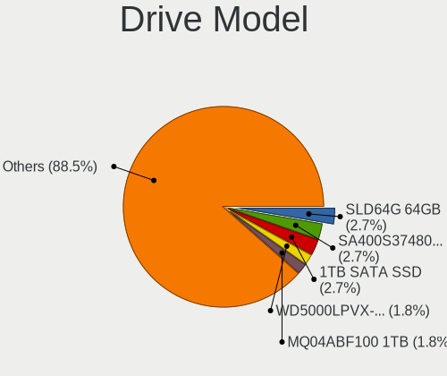
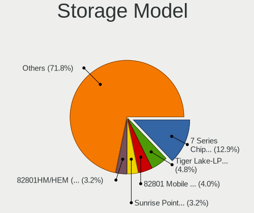
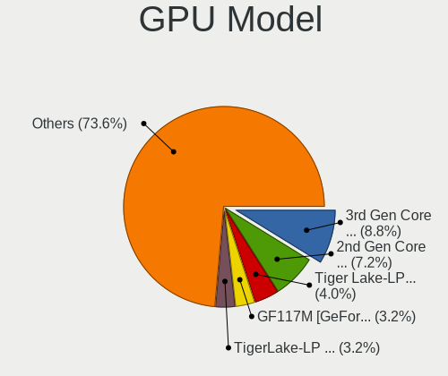
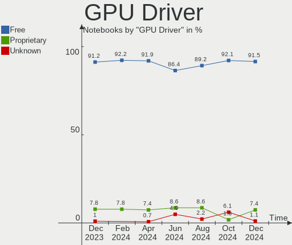

ROSA Hardware Trends (Notebook)
-------------------------------

A project to identify most popular hardware characteristics and track their change
over time based on data collected by ROSA users at https://Linux-Hardware.org.

Anyone can contribute to the study by uploading probes of their computers by
the [hw-probe](https://github.com/linuxhw/hw-probe) tool:

    sudo -E hw-probe -all -upload

Full-feature report is available here: https://linux-hardware.org/?view=trends&formfactor=notebook

Period: Nov, 2020.

Contents
--------

- [ OS                       ](#os)
- [ OS Family                ](#os-family)
- [ Kernel                   ](#kernel)
- [ Kernel Family            ](#kernel-family)
- [ Kernel Major Ver.        ](#kernel-major-ver)
- [ Arch                     ](#arch)
- [ DE                       ](#de)
- [ Display Server           ](#display-server)
- [ Display Manager          ](#display-manager)
- [ OS Lang                  ](#os-lang)
- [ Boot Mode                ](#boot-mode)
- [ Filesystem               ](#filesystem)
- [ Part. scheme             ](#part-scheme)
- [ Dual Boot with Linux/BSD ](#dual-boot-with-linux/bsd)
- [ Dual Boot (Win)          ](#dual-boot-win)
- [ Country                  ](#country)
- [ City                     ](#city)
- [ Vendor                   ](#vendor)
- [ Model                    ](#model)
- [ Model Family             ](#model-family)
- [ MFG Year                 ](#mfg-year)
- [ Form Factor              ](#form-factor)
- [ Secure Boot              ](#secure-boot)
- [ Coreboot                 ](#coreboot)
- [ RAM Size                 ](#ram-size)
- [ RAM Used                 ](#ram-used)
- [ Has CD-ROM               ](#has-cd-rom)
- [ Total Drives             ](#total-drives)
- [ Has Ethernet             ](#has-ethernet)
- [ Drive Vendor             ](#drive-vendor)
- [ Drive Model              ](#drive-model)
- [ HDD Vendor               ](#hdd-vendor)
- [ SSD Vendor               ](#ssd-vendor)
- [ Drive Kind               ](#drive-kind)
- [ Drive Connector          ](#drive-connector)
- [ Drive Size               ](#drive-size)
- [ Space Total              ](#space-total)
- [ Space Used               ](#space-used)
- [ Malfunc. Drives          ](#malfunc-drives)
- [ Malfunc. Drive Vendor    ](#malfunc-drive-vendor)
- [ Malfunc. HDD Vendor      ](#malfunc-hdd-vendor)
- [ Malfunc. Drive Kind      ](#malfunc-drive-kind)
- [ Failed Drives            ](#failed-drives)
- [ Failed Drive Vendor      ](#failed-drive-vendor)
- [ Drive Status             ](#drive-status)
- [ Storage Vendor           ](#storage-vendor)
- [ Storage Model            ](#storage-model)
- [ Storage Kind             ](#storage-kind)
- [ CPU Vendor               ](#cpu-vendor)
- [ CPU Model                ](#cpu-model)
- [ CPU Model Family         ](#cpu-model-family)
- [ CPU Cores                ](#cpu-cores)
- [ CPU Sockets              ](#cpu-sockets)
- [ CPU Threads              ](#cpu-threads)
- [ CPU Op-Modes             ](#cpu-op-modes)
- [ CPU Microcode            ](#cpu-microcode)
- [ CPU Microarch            ](#cpu-microarch)
- [ GPU Vendor               ](#gpu-vendor)
- [ GPU Model                ](#gpu-model)
- [ GPU Combo                ](#gpu-combo)
- [ GPU Driver               ](#gpu-driver)
- [ GPU Memory               ](#gpu-memory)
- [ Monitor Vendor           ](#monitor-vendor)
- [ Monitor Model            ](#monitor-model)
- [ Monitor Resolution       ](#monitor-resolution)
- [ Monitor Diagonal         ](#monitor-diagonal)
- [ Monitor Width            ](#monitor-width)
- [ Aspect Ratio             ](#aspect-ratio)
- [ Monitor Area             ](#monitor-area)
- [ Pixel Density            ](#pixel-density)
- [ Multiple Monitors        ](#multiple-monitors)
- [ Net Controller Vendor    ](#net-controller-vendor)
- [ Net Controller Model     ](#net-controller-model)
- [ Wireless Vendor          ](#wireless-vendor)
- [ Wireless Model           ](#wireless-model)
- [ Ethernet Vendor          ](#ethernet-vendor)
- [ Ethernet Model           ](#ethernet-model)
- [ Net Controller Kind      ](#net-controller-kind)
- [ Used Controller          ](#used-controller)
- [ NICs                     ](#nics)
- [ Memory Vendor            ](#memory-vendor)
- [ Memory Model             ](#memory-model)
- [ Memory Kind              ](#memory-kind)
- [ Memory Form Factor       ](#memory-form-factor)
- [ Memory Size              ](#memory-size)
- [ Memory Speed             ](#memory-speed)
- [ Sound Vendor             ](#sound-vendor)
- [ Sound Model              ](#sound-model)
- [ Camera Vendor            ](#camera-vendor)
- [ Camera Model             ](#camera-model)
- [ Fingerprint Vendor       ](#fingerprint-vendor)
- [ Fingerprint Model        ](#fingerprint-model)
- [ Chipcard Vendor          ](#chipcard-vendor)
- [ Chipcard Model           ](#chipcard-model)
- [ Printer Vendor           ](#printer-vendor)
- [ Printer Model            ](#printer-model)
- [ Scanner Vendor           ](#scanner-vendor)
- [ Scanner Model            ](#scanner-model)
- [ Bluetooth Vendor         ](#bluetooth-vendor)
- [ Bluetooth Model          ](#bluetooth-model)
- [ Unsupported Devices      ](#unsupported-devices)
- [ Unsupported Device Types ](#unsupported-device-types)

OS
--

Installed operating systems

| Name       | Notebooks | Percent |
|------------|-----------|---------|
| ROSA R11.1 | 64        | 52.03%  |
| ROSA R11   | 44        | 35.77%  |
| ROSA R8.1  | 9         | 7.32%   |
| ROSA R12   | 3         | 2.44%   |
| RED X3     | 2         | 1.63%   |
| ROSA R10   | 1         | 0.81%   |

OS Family
---------

OS without a version

| Name | Notebooks | Percent |
|------|-----------|---------|
| ROSA | 123       | 100%    |

Kernel
------

Version of the Linux kernel

| Version                             | Notebooks | Percent |
|-------------------------------------|-----------|---------|
| 4.15.0-desktop-45.1rosa-x86_64      | 34        | 27.64%  |
| 4.15.0-desktop-122.124.1rosa-x86_64 | 20        | 16.26%  |
| 4.15.0-desktop-45.1rosa-i586        | 13        | 10.57%  |
| 5.4.40-generic-1rosa-x86_64         | 11        | 8.94%   |
| 4.9.155-nrj-desktop-1rosa-x86_64    | 7         | 5.69%   |
| 5.4.72-generic-1rosa-x86_64         | 5         | 4.07%   |
| 5.4.32-generic-2rosa-x86_64         | 5         | 4.07%   |
| 4.9.155-nrj-desktop-1rosa-i586      | 4         | 3.25%   |
| 4.15.0-desktop-94.1rosa-x86_64      | 4         | 3.25%   |
| 4.15.0-desktop-122.124.1rosa-i586   | 4         | 3.25%   |
| 5.4.72-generic-1rosa2019.1-x86_64   | 2         | 1.63%   |
| 5.4.72-generic-1rosa-i586           | 2         | 1.63%   |
| 4.9.41-nrj-desktop-1rosa-x86_64     | 2         | 1.63%   |
| 4.9.155-nrj-laptop-1rosa-x86_64     | 2         | 1.63%   |
| 5.9.6-generic-1rosa-x86_64          | 1         | 0.81%   |
| 5.4.79-generic-1rosa2019.1-x86_64   | 1         | 0.81%   |
| 5.4.74-nrj-desktop-1rosa-x86_64     | 1         | 0.81%   |
| 5.4.32-generic-2rosa-i586           | 1         | 0.81%   |
| 5.4.0-desktop-55.61.1rosa-x86_64    | 1         | 0.81%   |
| 4.9.60-nrj-desktop-1rosa-x86_64     | 1         | 0.81%   |
| 4.15.0-desktop-94.1rosa-i586        | 1         | 0.81%   |
| 4.1.38-nrj-desktop-2rosa-i586       | 1         | 0.81%   |

Kernel Family
-------------

Linux kernel without a distro release

| Version | Notebooks | Percent |
|---------|-----------|---------|
| 4.15.0  | 76        | 61.79%  |
| 4.9.155 | 13        | 10.57%  |
| 5.4.40  | 11        | 8.94%   |
| 5.4.72  | 9         | 7.32%   |
| 5.4.32  | 6         | 4.88%   |
| 4.9.41  | 2         | 1.63%   |
| 5.9.6   | 1         | 0.81%   |
| 5.4.79  | 1         | 0.81%   |
| 5.4.74  | 1         | 0.81%   |
| 5.4.0   | 1         | 0.81%   |
| 4.9.60  | 1         | 0.81%   |
| 4.1.38  | 1         | 0.81%   |

Kernel Major Ver.
-----------------

Linux kernel major version

| Version | Notebooks | Percent |
|---------|-----------|---------|
| 4.15    | 76        | 61.79%  |
| 5.4     | 29        | 23.58%  |
| 4.9     | 16        | 13.01%  |
| 5.9     | 1         | 0.81%   |
| 4.1     | 1         | 0.81%   |

Arch
----

OS architecture (x86_64, i586, etc.)

| Name   | Notebooks | Percent |
|--------|-----------|---------|
| x86_64 | 97        | 78.86%  |
| i686   | 26        | 21.14%  |

DE
--

Desktop Environment

| Name  | Notebooks | Percent |
|-------|-----------|---------|
| KDE4  | 79        | 64.23%  |
| KDE5  | 29        | 23.58%  |
| LXQt  | 11        | 8.94%   |
| XFCE  | 3         | 2.44%   |
| GNOME | 1         | 0.81%   |

Display Server
--------------

X11 or Wayland

| Name | Notebooks | Percent |
|------|-----------|---------|
| X11  | 122       | 99.19%  |
| Tty  | 1         | 0.81%   |

Display Manager
---------------

SDDM, LightDM, etc.

| Name | Notebooks | Percent |
|------|-----------|---------|
| KDM  | 79        | 64.23%  |
| SDDM | 43        | 34.96%  |
| GDM  | 1         | 0.81%   |

OS Lang
-------

Language

| Lang    | Notebooks | Percent |
|---------|-----------|---------|
| Unknown | 56        | 45.53%  |
| ru_RU   | 55        | 44.72%  |
| pl_PL   | 3         | 2.44%   |
| en_US   | 2         | 1.63%   |
| de_DE   | 2         | 1.63%   |
| tr_TR   | 1         | 0.81%   |
| pt_BR   | 1         | 0.81%   |
| lv_LV   | 1         | 0.81%   |
| it_IT   | 1         | 0.81%   |
| es_ES   | 1         | 0.81%   |

Boot Mode
---------

EFI or BIOS

| Mode | Notebooks | Percent |
|------|-----------|---------|
| BIOS | 82        | 66.67%  |
| EFI  | 41        | 33.33%  |

Filesystem
----------

Type of filesystem

| Type  | Notebooks | Percent |
|-------|-----------|---------|
| Ext4  | 118       | 95.93%  |
| Btrfs | 4         | 3.25%   |
| Ext3  | 1         | 0.81%   |

Part. scheme
------------

Scheme of partitioning

| Type    | Notebooks | Percent |
|---------|-----------|---------|
| MBR     | 84        | 68.29%  |
| GPT     | 38        | 30.89%  |
| Unknown | 1         | 0.81%   |

Dual Boot with Linux/BSD
------------------------

Hosting more than one Linux/BSD

| Dual boot | Notebooks | Percent |
|-----------|-----------|---------|
| No        | 86        | 69.92%  |
| Yes       | 37        | 30.08%  |

Dual Boot (Win)
---------------

Hosting Linux and Windows

| Dual boot | Notebooks | Percent |
|-----------|-----------|---------|
| No        | 68        | 55.28%  |
| Yes       | 55        | 44.72%  |

Country
-------

Geographic location (country)

| Country    | Notebooks | Percent |
|------------|-----------|---------|
| Russia     | 91        | 73.98%  |
| Belarus    | 5         | 4.07%   |
| Poland     | 3         | 2.44%   |
| Germany    | 3         | 2.44%   |
| France     | 3         | 2.44%   |
| Ukraine    | 2         | 1.63%   |
| Latvia     | 2         | 1.63%   |
| Kazakhstan | 2         | 1.63%   |
| Italy      | 2         | 1.63%   |
| USA        | 1         | 0.81%   |
| Turkey     | 1         | 0.81%   |
| Spain      | 1         | 0.81%   |
| Slovakia   | 1         | 0.81%   |
| Serbia     | 1         | 0.81%   |
| Romania    | 1         | 0.81%   |
| Lithuania  | 1         | 0.81%   |
| Canada     | 1         | 0.81%   |
| Brazil     | 1         | 0.81%   |
| Belgium    | 1         | 0.81%   |

City
----

Geographic location (city)

| City                 | Notebooks | Percent |
|----------------------|-----------|---------|
| Moscow               | 11        | 8.94%   |
| St Petersburg        | 6         | 4.88%   |
| Ekaterinburg         | 5         | 4.07%   |
| Novosibirsk          | 3         | 2.44%   |
| Novokuznetsk         | 3         | 2.44%   |
| Nizhniy Novgorod     | 3         | 2.44%   |
| Krasnoyarsk          | 3         | 2.44%   |
| Krasnodar            | 3         | 2.44%   |
| Kazan’             | 3         | 2.44%   |
| Kaliningrad          | 3         | 2.44%   |
| Barnaul              | 3         | 2.44%   |
| Yessentuki           | 2         | 1.63%   |
| Tyumen               | 2         | 1.63%   |
| Samara               | 2         | 1.63%   |
| Rome                 | 2         | 1.63%   |
| Lida                 | 2         | 1.63%   |
| Kstovo               | 2         | 1.63%   |
| Boulogne-Billancourt | 2         | 1.63%   |
| Volgograd            | 1         | 0.81%   |
| Vogue                | 1         | 0.81%   |
| Vladivostok          | 1         | 0.81%   |
| Vitebsk              | 1         | 0.81%   |
| Usinsk               | 1         | 0.81%   |
| Ufa                  | 1         | 0.81%   |
| Târgu Mureş        | 1         | 0.81%   |
| Tver                 | 1         | 0.81%   |
| Tosno                | 1         | 0.81%   |
| Tomsk                | 1         | 0.81%   |
| Surgut               | 1         | 0.81%   |
| Staraya Kupavna      | 1         | 0.81%   |
| Sochi                | 1         | 0.81%   |
| Smolensk             | 1         | 0.81%   |
| Shcherbinka          | 1         | 0.81%   |
| Sacramento           | 1         | 0.81%   |
| Rostov-on-Don        | 1         | 0.81%   |
| Rio de Janeiro       | 1         | 0.81%   |
| Riga                 | 1         | 0.81%   |
| Ridder               | 1         | 0.81%   |
| Ratingen             | 1         | 0.81%   |
| Pushkino             | 1         | 0.81%   |
| Poznan               | 1         | 0.81%   |
| Polatsk              | 1         | 0.81%   |
| Petushki             | 1         | 0.81%   |
| Perm                 | 1         | 0.81%   |
| Penza                | 1         | 0.81%   |
| Omsk                 | 1         | 0.81%   |
| Novi Sad             | 1         | 0.81%   |
| Nizhyn               | 1         | 0.81%   |
| Málaga              | 1         | 0.81%   |
| Myski                | 1         | 0.81%   |
| Munich               | 1         | 0.81%   |
| Montreal             | 1         | 0.81%   |
| Minsk                | 1         | 0.81%   |
| Mikołów            | 1         | 0.81%   |
| Magadan              | 1         | 0.81%   |
| Lipetsk              | 1         | 0.81%   |
| Lindau               | 1         | 0.81%   |
| Kyiv                 | 1         | 0.81%   |
| Kuzovlevo            | 1         | 0.81%   |
| Kurgan               | 1         | 0.81%   |

Vendor
------

Motherboard manufacturer

| Name                | Notebooks | Percent |
|---------------------|-----------|---------|
| Lenovo              | 30        | 24.39%  |
| ASUSTek Computer    | 22        | 17.89%  |
| Hewlett-Packard     | 17        | 13.82%  |
| Acer                | 17        | 13.82%  |
| Samsung Electronics | 8         | 6.5%    |
| Toshiba             | 6         | 4.88%   |
| Dell                | 6         | 4.88%   |
| Sony                | 5         | 4.07%   |
| Packard Bell        | 3         | 2.44%   |
| MSI                 | 2         | 1.63%   |
| Fujitsu Siemens     | 2         | 1.63%   |
| Alienware           | 2         | 1.63%   |
| KREZ                | 1         | 0.81%   |
| Fujitsu             | 1         | 0.81%   |
| Apple               | 1         | 0.81%   |

Model
-----

Motherboard model

| Name                                  | Notebooks | Percent |
|---------------------------------------|-----------|---------|
| HP Pavilion 15                        | 3         | 2.44%   |
| Samsung R508                          | 2         | 1.63%   |
| Lenovo IdeaPad 330-15AST 81D6         | 2         | 1.63%   |
| Lenovo IdeaPad 100-15IBY 80MJ         | 2         | 1.63%   |
| Lenovo G580 20157                     | 2         | 1.63%   |
| ASUS VivoBook 15_ASUS Laptop X540BA   | 2         | 1.63%   |
| Alienware 17                          | 2         | 1.63%   |
| Toshiba Satellite C850-B6W            | 1         | 0.81%   |
| Toshiba Satellite A500                | 1         | 0.81%   |
| Toshiba Satellite A300                | 1         | 0.81%   |
| Toshiba Satellite A105                | 1         | 0.81%   |
| Toshiba NB550D                        | 1         | 0.81%   |
| Toshiba NB305                         | 1         | 0.81%   |
| Sony VPCW11S1E                        | 1         | 0.81%   |
| Sony VPCEH2E1R                        | 1         | 0.81%   |
| Sony VGN-FZ21SR                       | 1         | 0.81%   |
| Sony VGN-FW21ZR                       | 1         | 0.81%   |
| Sony SVE1112M1RB                      | 1         | 0.81%   |
| Samsung R540/R580/R780/SA41/E452/E852 | 1         | 0.81%   |
| Samsung R510/P510                     | 1         | 0.81%   |
| Samsung NC210/NC110                   | 1         | 0.81%   |
| Samsung N145P/N250P/N260P             | 1         | 0.81%   |
| Samsung 305U1A                        | 1         | 0.81%   |
| Samsung 300E4C/300E5C/300E7C          | 1         | 0.81%   |
| Packard Bell EasyNote TSX62HR         | 1         | 0.81%   |
| Packard Bell EasyNote TS11HR          | 1         | 0.81%   |
| Packard Bell EasyNote TE69KB          | 1         | 0.81%   |
| MSI GF65 Thin 9SD                     | 1         | 0.81%   |
| MSI Bravo 15 A4DDR                    | 1         | 0.81%   |
| Lenovo Z70-80 80FG                    | 1         | 0.81%   |
| Lenovo V110-15ISK 80TL                | 1         | 0.81%   |
| Lenovo ThinkPad X230 2320LFG          | 1         | 0.81%   |
| Lenovo ThinkPad T460 20FMS22931       | 1         | 0.81%   |
| Lenovo ThinkPad SL500 4414WAV         | 1         | 0.81%   |
| Lenovo S10-3                          | 1         | 0.81%   |
| Lenovo IdeaPad Y550 20017             | 1         | 0.81%   |
| Lenovo IdeaPad S205 10382EG           | 1         | 0.81%   |
| Lenovo IdeaPad S145-15IIL 81W8        | 1         | 0.81%   |
| Lenovo IdeaPad S10-2 20027            | 1         | 0.81%   |
| Lenovo IdeaPad 530S-14IKB 81EU        | 1         | 0.81%   |
| Lenovo IdeaPad 330-15IGM 81D1         | 1         | 0.81%   |
| Lenovo IdeaPad 320-15AST 80XV         | 1         | 0.81%   |
| Lenovo G70-80 80FF                    | 1         | 0.81%   |
| Lenovo G70-35 80Q5                    | 1         | 0.81%   |
| Lenovo G500 20236                     | 1         | 0.81%   |
| Lenovo G50-45 80E3                    | 1         | 0.81%   |
| Lenovo G50-30 80G0                    | 1         | 0.81%   |
| Lenovo G480                           | 1         | 0.81%   |
| Lenovo B590 20208                     | 1         | 0.81%   |
| Lenovo B590 20206                     | 1         | 0.81%   |
| Lenovo B50-10 80QR                    | 1         | 0.81%   |
| Lenovo B450 1S1680033610187           | 1         | 0.81%   |
| Lenovo 3000 G530 4151/200             | 1         | 0.81%   |
| KREZ KREZ_N1403SXXXX                  | 1         | 0.81%   |
| HP ProBook 4730s                      | 1         | 0.81%   |
| HP ProBook 4710s                      | 1         | 0.81%   |
| HP ProBook 445 G7                     | 1         | 0.81%   |
| HP ProBook 4330s                      | 1         | 0.81%   |
| HP Pavilion Notebook                  | 1         | 0.81%   |
| HP Pavilion mini210                   | 1         | 0.81%   |

Model Family
------------

Motherboard model prefix

| Name                    | Notebooks | Percent |
|-------------------------|-----------|---------|
| Acer Aspire             | 12        | 9.76%   |
| Lenovo IdeaPad          | 11        | 8.94%   |
| HP Pavilion             | 7         | 5.69%   |
| Toshiba Satellite       | 4         | 3.25%   |
| HP ProBook              | 4         | 3.25%   |
| Packard Bell EasyNote   | 3         | 2.44%   |
| Lenovo ThinkPad         | 3         | 2.44%   |
| Dell Latitude           | 3         | 2.44%   |
| Dell Inspiron           | 3         | 2.44%   |
| ASUS VivoBook           | 3         | 2.44%   |
| Samsung R508            | 2         | 1.63%   |
| Lenovo G580             | 2         | 1.63%   |
| Lenovo B590             | 2         | 1.63%   |
| HP Compaq               | 2         | 1.63%   |
| ASUS TUF                | 2         | 1.63%   |
| Alienware 17            | 2         | 1.63%   |
| Toshiba NB550D          | 1         | 0.81%   |
| Toshiba NB305           | 1         | 0.81%   |
| Sony VPCW11S1E          | 1         | 0.81%   |
| Sony VPCEH2E1R          | 1         | 0.81%   |
| Sony VGN-FZ21SR         | 1         | 0.81%   |
| Sony VGN-FW21ZR         | 1         | 0.81%   |
| Sony SVE1112M1RB        | 1         | 0.81%   |
| Samsung R540            | 1         | 0.81%   |
| Samsung R510            | 1         | 0.81%   |
| Samsung NC210           | 1         | 0.81%   |
| Samsung N145P           | 1         | 0.81%   |
| Samsung 305U1A          | 1         | 0.81%   |
| Samsung 300E4C          | 1         | 0.81%   |
| MSI GF65                | 1         | 0.81%   |
| MSI Bravo               | 1         | 0.81%   |
| Lenovo Z70-80           | 1         | 0.81%   |
| Lenovo V110-15ISK       | 1         | 0.81%   |
| Lenovo S10-3            | 1         | 0.81%   |
| Lenovo G70-80           | 1         | 0.81%   |
| Lenovo G70-35           | 1         | 0.81%   |
| Lenovo G500             | 1         | 0.81%   |
| Lenovo G50-45           | 1         | 0.81%   |
| Lenovo G50-30           | 1         | 0.81%   |
| Lenovo G480             | 1         | 0.81%   |
| Lenovo B50-10           | 1         | 0.81%   |
| Lenovo B450             | 1         | 0.81%   |
| Lenovo 3000             | 1         | 0.81%   |
| KREZ KREZ               | 1         | 0.81%   |
| HP Notebook             | 1         | 0.81%   |
| HP Laptop               | 1         | 0.81%   |
| HP 620                  | 1         | 0.81%   |
| HP 15                   | 1         | 0.81%   |
| Fujitsu Siemens ESPRIMO | 1         | 0.81%   |
| Fujitsu Siemens AMILO   | 1         | 0.81%   |
| Fujitsu LIFEBOOK        | 1         | 0.81%   |
| ASUS X550CC             | 1         | 0.81%   |
| ASUS X540SC             | 1         | 0.81%   |
| ASUS X540LJ             | 1         | 0.81%   |
| ASUS X51L               | 1         | 0.81%   |
| ASUS N61Vg              | 1         | 0.81%   |
| ASUS M50Vc              | 1         | 0.81%   |
| ASUS K95VB              | 1         | 0.81%   |
| ASUS K75VJ              | 1         | 0.81%   |
| ASUS K73TK              | 1         | 0.81%   |

MFG Year
--------

Motherboard manufacture year

| Year | Notebooks | Percent |
|------|-----------|---------|
| 2011 | 15        | 12.2%   |
| 2009 | 14        | 11.38%  |
| 2013 | 12        | 9.76%   |
| 2020 | 11        | 8.94%   |
| 2012 | 11        | 8.94%   |
| 2010 | 10        | 8.13%   |
| 2008 | 10        | 8.13%   |
| 2019 | 8         | 6.5%    |
| 2018 | 8         | 6.5%    |
| 2016 | 5         | 4.07%   |
| 2015 | 5         | 4.07%   |
| 2017 | 4         | 3.25%   |
| 2014 | 4         | 3.25%   |
| 2007 | 3         | 2.44%   |
| 2006 | 3         | 2.44%   |

Form Factor
-----------

Physical design of the computer

| Name     | Notebooks | Percent |
|----------|-----------|---------|
| Notebook | 123       | 100%    |

Secure Boot
-----------

Enabled or disabled

| State    | Notebooks | Percent |
|----------|-----------|---------|
| Disabled | 122       | 99.19%  |
| Enabled  | 1         | 0.81%   |

Coreboot
--------

Have coreboot on board

| Used | Notebooks | Percent |
|------|-----------|---------|
| No   | 123       | 100%    |

RAM Size
--------

Total RAM memory

| Size in GB | Notebooks | Percent |
|------------|-----------|---------|
| 3.01-4.0   | 57        | 46.34%  |
| 4.01-8.0   | 27        | 21.95%  |
| 1.01-2.0   | 13        | 10.57%  |
| 2.01-3.0   | 8         | 6.5%    |
| 8.01-16.0  | 8         | 6.5%    |
| 0.01-1.0   | 6         | 4.88%   |
| 16.01-24.0 | 3         | 2.44%   |
| 32.01-64.0 | 1         | 0.81%   |

RAM Used
--------

Used RAM memory

| Used GB  | Notebooks | Percent |
|----------|-----------|---------|
| 0.01-1.0 | 58        | 47.15%  |
| 1.01-2.0 | 53        | 43.09%  |
| 2.01-3.0 | 10        | 8.13%   |
| 4.01-8.0 | 2         | 1.63%   |

Has CD-ROM
----------

Has CD-ROM on board

| Presented | Notebooks | Percent |
|-----------|-----------|---------|
| Yes       | 73        | 59.35%  |
| No        | 50        | 40.65%  |

Total Drives
------------

Number of drives on board

| Drives | Notebooks | Percent |
|--------|-----------|---------|
| 1      | 100       | 81.3%   |
| 2      | 17        | 13.82%  |
| 3      | 4         | 3.25%   |
| 0      | 2         | 1.63%   |

Has Ethernet
------------

Has Ethernet on board

| Presented | Notebooks | Percent |
|-----------|-----------|---------|
| Yes       | 119       | 96.75%  |
| No        | 4         | 3.25%   |

Drive Vendor
------------

Hard drive vendors

| Vendor              | Notebooks | Drives | Percent |
|---------------------|-----------|--------|---------|
| WDC                 | 29        | 30     | 20.71%  |
| Seagate             | 24        | 24     | 17.14%  |
| Toshiba             | 16        | 16     | 11.43%  |
| Samsung Electronics | 13        | 13     | 9.29%   |
| Hitachi             | 9         | 9      | 6.43%   |
| HGST                | 6         | 6      | 4.29%   |
| SanDisk             | 5         | 5      | 3.57%   |
| Kingston            | 5         | 5      | 3.57%   |
| SK Hynix            | 3         | 3      | 2.14%   |
| GOODRAM             | 3         | 3      | 2.14%   |
| Fujitsu             | 3         | 3      | 2.14%   |
| A-DATA Technology   | 3         | 3      | 2.14%   |
| Unknown             | 2         | 2      | 1.43%   |
| Solid State Storage | 2         | 2      | 1.43%   |
| Crucial             | 2         | 2      | 1.43%   |
| TO Exter            | 1         | 1      | 0.71%   |
| SPCC                | 1         | 1      | 0.71%   |
| Smartbuy            | 1         | 1      | 0.71%   |
| PLEXTOR             | 1         | 1      | 0.71%   |
| Patriot             | 1         | 1      | 0.71%   |
| Micron Technology   | 1         | 1      | 0.71%   |
| LITEONIT            | 1         | 1      | 0.71%   |
| LITEON              | 1         | 1      | 0.71%   |
| JMicron             | 1         | 1      | 0.71%   |
| Intel               | 1         | 1      | 0.71%   |
| HUAWEI              | 1         | 1      | 0.71%   |
| Corsair             | 1         | 1      | 0.71%   |
| China               | 1         | 1      | 0.71%   |
| Apple               | 1         | 1      | 0.71%   |
| AMD                 | 1         | 1      | 0.71%   |

Drive Model
-----------

Hard drive models

| Model                                        | Notebooks | Percent |
|----------------------------------------------|-----------|---------|
| Seagate ST1000LM024 HN-M101MBB 1TB           | 6         | 4.26%   |
| Seagate ST9500325AS 500GB                    | 3         | 2.13%   |
| Seagate ST500LT012-1DG142 500GB              | 3         | 2.13%   |
| WDC WDS240G2G0A-00JH30 240GB SSD             | 2         | 1.42%   |
| WDC WD5000LPCX-80VHAT1 500GB                 | 2         | 1.42%   |
| WDC WD5000LPCX-24VHAT0 500GB                 | 2         | 1.42%   |
| Toshiba MQ04ABF100 1TB                       | 2         | 1.42%   |
| Toshiba MQ01ABF050 500GB                     | 2         | 1.42%   |
| Toshiba MQ01ABD050 500GB                     | 2         | 1.42%   |
| Seagate ST500LM012 HN-M500MBB 500GB          | 2         | 1.42%   |
| Samsung SSD 860 EVO 250GB                    | 2         | 1.42%   |
| Samsung SSD 850 EVO 120GB                    | 2         | 1.42%   |
| Samsung HM160HI 160GB                        | 2         | 1.42%   |
| Hitachi HTS545050B9A300 500GB                | 2         | 1.42%   |
| HGST HTS721010A9E630 1TB                     | 2         | 1.42%   |
| HGST HTS545050A7E680 500GB                   | 2         | 1.42%   |
| WDC WDS250G2B0A 250GB SSD                    | 1         | 0.71%   |
| WDC WDS100T2B0A-00SM50 1TB SSD               | 1         | 0.71%   |
| WDC WD7500BPVX-22JC3T0 752GB                 | 1         | 0.71%   |
| WDC WD7500BPKX-75HPJT0 752GB                 | 1         | 0.71%   |
| WDC WD6400BPVT-80HXZT3 640GB                 | 1         | 0.71%   |
| WDC WD5000LPVX-60V0TT0 500GB                 | 1         | 0.71%   |
| WDC WD5000LPVX-22V0TT0 500GB                 | 1         | 0.71%   |
| WDC WD5000LPVT-16G33T0 500GB                 | 1         | 0.71%   |
| WDC WD5000LPLX-75ZNTT0 500GB                 | 1         | 0.71%   |
| WDC WD5000LPLX-00ZNTT0 500GB                 | 1         | 0.71%   |
| WDC WD5000LPCX-60VHAT0 500GB                 | 1         | 0.71%   |
| WDC WD3200BPVT-55JJ5T0 320GB                 | 1         | 0.71%   |
| WDC WD3200BPVT-22ZEST0 320GB                 | 1         | 0.71%   |
| WDC WD3200BPVT-22JJ5T0 320GB                 | 1         | 0.71%   |
| WDC WD3200BEVT-80A0RT0 320GB                 | 1         | 0.71%   |
| WDC WD3200BEKT-60V5T1 320GB                  | 1         | 0.71%   |
| WDC WD2500LPCX-24C6HT0 250GB                 | 1         | 0.71%   |
| WDC WD2500BEVT-22ZCT0 250GB                  | 1         | 0.71%   |
| WDC WD2500BEVT-22A23T0 250GB                 | 1         | 0.71%   |
| WDC WD1600BEVT-22ZCT0 160GB                  | 1         | 0.71%   |
| WDC WD10SPZX-21Z10T0 1TB                     | 1         | 0.71%   |
| WDC WD10JPVT-08A1YT2 1TB                     | 1         | 0.71%   |
| WDC WD10JPLX-00MBPT0 1TB                     | 1         | 0.71%   |
| WDC PC SN530 SDBPNPZ-512G-1002 512GB         | 1         | 0.71%   |
| Unknown SA16G  16GB                          | 1         | 0.71%   |
| Unknown CBADS  32GB                          | 1         | 0.71%   |
| Toshiba TR200 240GB SSD                      | 1         | 0.71%   |
| Toshiba MQ01ABD100 1TB                       | 1         | 0.71%   |
| Toshiba MK6459GSXP 640GB                     | 1         | 0.71%   |
| Toshiba MK5075GSX 500GB                      | 1         | 0.71%   |
| Toshiba MK3275GSX 320GB                      | 1         | 0.71%   |
| Toshiba MK3265GSX 320GB                      | 1         | 0.71%   |
| Toshiba MK2035GSS 200GB                      | 1         | 0.71%   |
| Toshiba MK1656GSY 160GB                      | 1         | 0.71%   |
| Toshiba MK1655GSX 160GB                      | 1         | 0.71%   |
| Toshiba HDWK105 500GB                        | 1         | 0.71%   |
| TO Exter nal USB 3.0 250GB                   | 1         | 0.71%   |
| SPCC M.2 SSD 256GB                           | 1         | 0.71%   |
| Solid State Storage SSSTC CL1-8D512 512GB    | 1         | 0.71%   |
| Solid State Storage SSSTC CL1-8D256-HP 256GB | 1         | 0.71%   |
| Smartbuy SSD 60GB                            | 1         | 0.71%   |
| SK Hynix SKHynix_HFM512GDHTNI-87A0B 512GB    | 1         | 0.71%   |
| SK Hynix SC210 2.5 7MM 128GB SSD             | 1         | 0.71%   |
| SK Hynix HFS256GD9TNG-62A0A 256GB            | 1         | 0.71%   |

HDD Vendor
----------

Hard disk drive vendors

| Vendor              | Notebooks | Drives | Percent |
|---------------------|-----------|--------|---------|
| WDC                 | 25        | 25     | 28.74%  |
| Seagate             | 24        | 24     | 27.59%  |
| Toshiba             | 15        | 15     | 17.24%  |
| Hitachi             | 9         | 9      | 10.34%  |
| HGST                | 6         | 6      | 6.9%    |
| Samsung Electronics | 4         | 4      | 4.6%    |
| Fujitsu             | 3         | 3      | 3.45%   |
| TO Exter            | 1         | 1      | 1.15%   |

SSD Vendor
----------

Solid state drive vendors

| Vendor              | Notebooks | Drives | Percent |
|---------------------|-----------|--------|---------|
| Samsung Electronics | 6         | 6      | 15.38%  |
| WDC                 | 4         | 4      | 10.26%  |
| SanDisk             | 4         | 4      | 10.26%  |
| Kingston            | 3         | 3      | 7.69%   |
| GOODRAM             | 3         | 3      | 7.69%   |
| A-DATA Technology   | 3         | 3      | 7.69%   |
| Crucial             | 2         | 2      | 5.13%   |
| Toshiba             | 1         | 1      | 2.56%   |
| SPCC                | 1         | 1      | 2.56%   |
| Smartbuy            | 1         | 1      | 2.56%   |
| SK Hynix            | 1         | 1      | 2.56%   |
| PLEXTOR             | 1         | 1      | 2.56%   |
| Patriot             | 1         | 1      | 2.56%   |
| Micron Technology   | 1         | 1      | 2.56%   |
| LITEONIT            | 1         | 1      | 2.56%   |
| LITEON              | 1         | 1      | 2.56%   |
| Intel               | 1         | 1      | 2.56%   |
| Corsair             | 1         | 1      | 2.56%   |
| China               | 1         | 1      | 2.56%   |
| Apple               | 1         | 1      | 2.56%   |
| AMD                 | 1         | 1      | 2.56%   |

Drive Kind
----------

HDD or SSD

| Kind    | Notebooks | Drives | Percent |
|---------|-----------|--------|---------|
| HDD     | 85        | 87     | 62.96%  |
| SSD     | 37        | 39     | 27.41%  |
| NVMe    | 9         | 10     | 6.67%   |
| MMC     | 2         | 3      | 1.48%   |
| Unknown | 2         | 2      | 1.48%   |

Drive Connector
---------------

SATA, SAS, NVMe, etc.

| Type | Notebooks | Drives | Percent |
|------|-----------|--------|---------|
| SATA | 113       | 125    | 88.98%  |
| NVMe | 9         | 10     | 7.09%   |
| SAS  | 3         | 3      | 2.36%   |
| MMC  | 2         | 3      | 1.57%   |

Drive Size
----------

Size of hard drive

| Size in TB | Notebooks | Drives | Percent |
|------------|-----------|--------|---------|
| 0.01-0.5   | 92        | 102    | 79.31%  |
| 0.51-1.0   | 24        | 24     | 20.69%  |

Space Total
-----------

Amount of disk space available on the file system

| Size in GB | Notebooks | Percent |
|------------|-----------|---------|
| 251-500    | 31        | 25.2%   |
| 101-250    | 30        | 24.39%  |
| 1-20       | 26        | 21.14%  |
| 21-50      | 13        | 10.57%  |
| 501-1000   | 10        | 8.13%   |
| 51-100     | 9         | 7.32%   |
| 1001-2000  | 4         | 3.25%   |

Space Used
----------

Amount of used disk space

| Used GB  | Notebooks | Percent |
|----------|-----------|---------|
| 1-20     | 84        | 68.29%  |
| 251-500  | 10        | 8.13%   |
| 51-100   | 10        | 8.13%   |
| 21-50    | 9         | 7.32%   |
| 101-250  | 9         | 7.32%   |
| 501-1000 | 1         | 0.81%   |

Malfunc. Drives
---------------

Drive models with a malfunction

| Model                                    | Notebooks | Drives | Percent |
|------------------------------------------|-----------|--------|---------|
| Toshiba MQ01ABD050 500GB                 | 2         | 2      | 4.76%   |
| Samsung Electronics HM160HI 160GB        | 2         | 2      | 4.76%   |
| HGST HTS545050A7E680 500GB               | 2         | 2      | 4.76%   |
| WDC WDS240G2G0A-00JH30 240GB SSD         | 1         | 1      | 2.38%   |
| WDC WD5000LPVX-60V0TT0 500GB             | 1         | 1      | 2.38%   |
| WDC WD5000LPCX-80VHAT1 500GB             | 1         | 1      | 2.38%   |
| WDC WD3200BPVT-55JJ5T0 320GB             | 1         | 1      | 2.38%   |
| WDC WD3200BEVT-80A0RT0 320GB             | 1         | 1      | 2.38%   |
| WDC WD3200BEKT-60V5T1 320GB              | 1         | 1      | 2.38%   |
| WDC WD10JPVT-08A1YT2 1TB                 | 1         | 1      | 2.38%   |
| Toshiba MK3265GSX 320GB                  | 1         | 1      | 2.38%   |
| Toshiba MK2035GSS 200GB                  | 1         | 1      | 2.38%   |
| Toshiba MK1655GSX 160GB                  | 1         | 1      | 2.38%   |
| SK Hynix SC210 2.5 7MM 128GB SSD         | 1         | 1      | 2.38%   |
| Seagate ST9500325AS 500GB                | 1         | 1      | 2.38%   |
| Seagate ST9250315AS 250GB                | 1         | 1      | 2.38%   |
| Seagate ST9160827AS 160GB                | 1         | 1      | 2.38%   |
| Seagate ST9160310AS 160GB                | 1         | 1      | 2.38%   |
| Seagate ST9120817AS 120GB                | 1         | 1      | 2.38%   |
| Seagate ST500LT012-9WS142 500GB          | 1         | 1      | 2.38%   |
| Seagate ST320LT020-9YG142 320GB          | 1         | 1      | 2.38%   |
| Seagate ST320LT012-9WS14C 320GB          | 1         | 1      | 2.38%   |
| Seagate ST1000LM024 HN-M101MBB 1TB       | 1         | 1      | 2.38%   |
| Samsung Electronics SSD 840 Series 500GB | 1         | 1      | 2.38%   |
| Samsung Electronics HM320HJ 320GB        | 1         | 1      | 2.38%   |
| LITEONIT LMN-256M3M mSATA 256GB SSD      | 1         | 1      | 2.38%   |
| Kingston SV300S37A240G 240GB SSD         | 1         | 1      | 2.38%   |
| Intel SSDSC2BF180A5H SED 180GB           | 1         | 1      | 2.38%   |
| Hitachi HTS725032A9A364 320GB            | 1         | 1      | 2.38%   |
| Hitachi HTS547575A9E384 752GB            | 1         | 1      | 2.38%   |
| Hitachi HTS547564A9E384 640GB            | 1         | 1      | 2.38%   |
| Hitachi HTS545050B9A300 500GB            | 1         | 1      | 2.38%   |
| Hitachi HTS545050A7E380 500GB            | 1         | 1      | 2.38%   |
| Hitachi HTS545016B9A300 160GB            | 1         | 1      | 2.38%   |
| HGST HTS721010A9E630 1TB                 | 1         | 1      | 2.38%   |
| HGST HTS545050A7E380 500GB               | 1         | 1      | 2.38%   |
| Fujitsu MHY2120BH 120GB                  | 1         | 1      | 2.38%   |
| Fujitsu MHW2160BH PL 160GB               | 1         | 1      | 2.38%   |
| Crucial M4-CT064M4SSD2 64GB              | 1         | 1      | 2.38%   |

Malfunc. Drive Vendor
---------------------

Vendors of faulty drives

| Vendor              | Notebooks | Drives | Percent |
|---------------------|-----------|--------|---------|
| Seagate             | 9         | 9      | 21.43%  |
| WDC                 | 7         | 7      | 16.67%  |
| Hitachi             | 6         | 6      | 14.29%  |
| Toshiba             | 5         | 5      | 11.9%   |
| Samsung Electronics | 4         | 4      | 9.52%   |
| HGST                | 4         | 4      | 9.52%   |
| Fujitsu             | 2         | 2      | 4.76%   |
| SK Hynix            | 1         | 1      | 2.38%   |
| LITEONIT            | 1         | 1      | 2.38%   |
| Kingston            | 1         | 1      | 2.38%   |
| Intel               | 1         | 1      | 2.38%   |
| Crucial             | 1         | 1      | 2.38%   |

Malfunc. HDD Vendor
-------------------

Vendors of faulty HDD drives

| Vendor              | Notebooks | Drives | Percent |
|---------------------|-----------|--------|---------|
| Seagate             | 9         | 9      | 25.71%  |
| WDC                 | 6         | 6      | 17.14%  |
| Hitachi             | 6         | 6      | 17.14%  |
| Toshiba             | 5         | 5      | 14.29%  |
| HGST                | 4         | 4      | 11.43%  |
| Samsung Electronics | 3         | 3      | 8.57%   |
| Fujitsu             | 2         | 2      | 5.71%   |

Malfunc. Drive Kind
-------------------

Kinds of faulty drives

| Kind | Notebooks | Drives | Percent |
|------|-----------|--------|---------|
| HDD  | 35        | 35     | 83.33%  |
| SSD  | 7         | 7      | 16.67%  |

Failed Drives
-------------

Failed drive models

| Model                         | Notebooks | Drives | Percent |
|-------------------------------|-----------|--------|---------|
| Hitachi HTS547550A9E384 500GB | 1         | 1      | 100%    |

Failed Drive Vendor
-------------------

Failed drive vendors

| Vendor  | Notebooks | Drives | Percent |
|---------|-----------|--------|---------|
| Hitachi | 1         | 1      | 100%    |

Drive Status
------------

Number of failed and malfunc. drives

| Status   | Notebooks | Drives | Percent |
|----------|-----------|--------|---------|
| Works    | 82        | 89     | 62.12%  |
| Malfunc  | 41        | 42     | 31.06%  |
| Detected | 8         | 9      | 6.06%   |
| Failed   | 1         | 1      | 0.76%   |

Storage Vendor
--------------

Storage controller vendors

| Vendor                         | Notebooks | Percent |
|--------------------------------|-----------|---------|
| Intel                          | 88        | 67.18%  |
| AMD                            | 30        | 22.9%   |
| Samsung Electronics            | 4         | 3.05%   |
| Solid State Storage Technology | 2         | 1.53%   |
| SK Hynix                       | 2         | 1.53%   |
| Kingston Technology Company    | 2         | 1.53%   |
| VIA Technologies               | 1         | 0.76%   |
| Sandisk                        | 1         | 0.76%   |
| Nvidia                         | 1         | 0.76%   |

Storage Model
-------------

Storage controller models

| Model                                                                            | Notebooks | Percent |
|----------------------------------------------------------------------------------|-----------|---------|
| AMD FCH SATA Controller [AHCI mode]                                              | 20        | 13.89%  |
| Intel 82801IBM/IEM (ICH9M/ICH9M-E) 4 port SATA Controller [AHCI mode]            | 16        | 11.11%  |
| Intel 7 Series Chipset Family 6-port SATA Controller [AHCI mode]                 | 16        | 11.11%  |
| Intel 6 Series/C200 Series Chipset Family 6 port Mobile SATA AHCI Controller     | 8         | 5.56%   |
| Intel 82801HM/HEM (ICH8M/ICH8M-E) IDE Controller                                 | 7         | 4.86%   |
| Intel NM10/ICH7 Family SATA Controller [AHCI mode]                               | 6         | 4.17%   |
| Intel 82801HM/HEM (ICH8M/ICH8M-E) SATA Controller [AHCI mode]                    | 6         | 4.17%   |
| Intel 82801GBM/GHM (ICH7-M Family) SATA Controller [IDE mode]                    | 6         | 4.17%   |
| AMD SB7x0/SB8x0/SB9x0 SATA Controller [AHCI mode]                                | 5         | 3.47%   |
| Intel Sunrise Point-LP SATA Controller [AHCI mode]                               | 4         | 2.78%   |
| Intel Atom Processor E3800 Series SATA AHCI Controller                           | 4         | 2.78%   |
| Intel 5 Series/3400 Series Chipset 4 port SATA AHCI Controller                   | 4         | 2.78%   |
| Intel Wildcat Point-LP SATA Controller [AHCI Mode]                               | 3         | 2.08%   |
| Intel 82801 Mobile SATA Controller [RAID mode]                                   | 3         | 2.08%   |
| AMD FCH SATA Controller [IDE mode]                                               | 3         | 2.08%   |
| Solid State Storage Technology Non-Volatile memory controller                    | 2         | 1.39%   |
| SK Hynix Non-Volatile memory controller                                          | 2         | 1.39%   |
| Samsung Electronics NVMe SSD Controller SM981/PM981/PM983                        | 2         | 1.39%   |
| Kingston Technology Company Non-Volatile memory controller                       | 2         | 1.39%   |
| Intel Cannon Lake Mobile PCH SATA AHCI Controller                                | 2         | 1.39%   |
| Intel Atom/Celeron/Pentium Processor x5-E8000/J3xxx/N3xxx Series SATA Controller | 2         | 1.39%   |
| VIA Technologies VT82C586A/B/VT82C686/A/B/VT823x/A/C PIPC Bus Master IDE         | 1         | 0.69%   |
| VIA Technologies VT8237A SATA 2-Port Controller                                  | 1         | 0.69%   |
| Sandisk WD Blue SN550 NVMe SSD                                                   | 1         | 0.69%   |
| Samsung Electronics NVMe SSD Controller SM961/PM961                              | 1         | 0.69%   |
| Samsung Electronics Electronics SATA controller                                  | 1         | 0.69%   |
| Nvidia MCP79 AHCI Controller                                                     | 1         | 0.69%   |
| Intel SATA controller                                                            | 1         | 0.69%   |
| Intel Mobile PM965/GM965 PT IDER Controller                                      | 1         | 0.69%   |
| Intel Ice Lake-LP SATA Controller [AHCI mode]                                    | 1         | 0.69%   |
| Intel Comet Lake SATA AHCI Controller                                            | 1         | 0.69%   |
| Intel Celeron N3350/Pentium N4200/Atom E3900 Series SATA AHCI Controller         | 1         | 0.69%   |
| Intel 82801IBM/IEM (ICH9M/ICH9M-E) 2 port SATA Controller [IDE mode]             | 1         | 0.69%   |
| Intel 82801HM/HEM (ICH8M/ICH8M-E) SATA Controller [IDE mode]                     | 1         | 0.69%   |
| Intel 82801GBM/GHM (ICH7-M Family) SATA Controller [AHCI mode]                   | 1         | 0.69%   |
| Intel 82801G (ICH7 Family) IDE Controller                                        | 1         | 0.69%   |
| Intel 7 Series Chipset Family 4-port SATA Controller [IDE mode]                  | 1         | 0.69%   |
| Intel 7 Series Chipset Family 2-port SATA Controller [IDE mode]                  | 1         | 0.69%   |
| AMD SB600 Non-Raid-5 SATA                                                        | 1         | 0.69%   |
| AMD SB600 IDE                                                                    | 1         | 0.69%   |
| AMD IXP SB4x0 Serial ATA Controller                                              | 1         | 0.69%   |
| AMD IXP SB4x0 IDE Controller                                                     | 1         | 0.69%   |

Storage Kind
------------

Kind of storage controller (IDE, SATA, NVMe, SAS, ...)

| Kind | Notebooks | Percent |
|------|-----------|---------|
| SATA | 107       | 78.1%   |
| IDE  | 18        | 13.14%  |
| NVMe | 9         | 6.57%   |
| RAID | 3         | 2.19%   |

CPU Vendor
----------

Processor vendors

| Vendor | Notebooks | Percent |
|--------|-----------|---------|
| Intel  | 93        | 75.61%  |
| AMD    | 30        | 24.39%  |

CPU Model
---------

Processor models

| Model                                         | Notebooks | Percent |
|-----------------------------------------------|-----------|---------|
| Intel Core i5-3230M CPU @ 2.60GHz             | 5         | 4.07%   |
| Intel Pentium Dual-Core CPU T4400 @ 2.20GHz   | 3         | 2.44%   |
| Intel Celeron CPU N2840 @ 2.16GHz             | 3         | 2.44%   |
| Intel Atom CPU N455 @ 1.66GHz                 | 3         | 2.44%   |
| Intel Pentium Dual CPU T3400 @ 2.16GHz        | 2         | 1.63%   |
| Intel Pentium CPU B950 @ 2.10GHz              | 2         | 1.63%   |
| Intel Pentium CPU 2117U @ 1.80GHz             | 2         | 1.63%   |
| Intel Pentium CPU 2020M @ 2.40GHz             | 2         | 1.63%   |
| Intel Core i5-8300H CPU @ 2.30GHz             | 2         | 1.63%   |
| Intel Core i5-2450M CPU @ 2.50GHz             | 2         | 1.63%   |
| Intel Core i3-2310M CPU @ 2.10GHz             | 2         | 1.63%   |
| Intel Core 2 Duo CPU T5750 @ 2.00GHz          | 2         | 1.63%   |
| Intel Celeron Dual-Core CPU T3000 @ 1.80GHz   | 2         | 1.63%   |
| Intel Atom CPU N280 @ 1.66GHz                 | 2         | 1.63%   |
| Intel Atom CPU N270 @ 1.60GHz                 | 2         | 1.63%   |
| AMD Ryzen 7 4800H with Radeon Graphics        | 2         | 1.63%   |
| AMD Ryzen 5 3550H with Radeon Vega Mobile Gfx | 2         | 1.63%   |
| AMD E2-9000 RADEON R2, 4 COMPUTE CORES 2C+2G  | 2         | 1.63%   |
| AMD C-60 APU with Radeon HD Graphics          | 2         | 1.63%   |
| AMD A8-4500M APU with Radeon HD Graphics      | 2         | 1.63%   |
| AMD A6-9225 RADEON R4, 5 COMPUTE CORES 2C+3G  | 2         | 1.63%   |
| AMD A6-6310 APU with AMD Radeon R4 Graphics   | 2         | 1.63%   |
| Intel Pentium Dual-Core CPU T4300 @ 2.10GHz   | 1         | 0.81%   |
| Intel Pentium Dual-Core CPU T4200 @ 2.00GHz   | 1         | 0.81%   |
| Intel Pentium CPU N3700 @ 1.60GHz             | 1         | 0.81%   |
| Intel Pentium CPU N3540 @ 2.16GHz             | 1         | 0.81%   |
| Intel Pentium CPU B960 @ 2.20GHz              | 1         | 0.81%   |
| Intel Pentium CPU 4417U @ 2.30GHz             | 1         | 0.81%   |
| Intel Genuine CPU T2500 @ 2.00GHz             | 1         | 0.81%   |
| Intel Genuine CPU T2400 @ 1.83GHz             | 1         | 0.81%   |
| Intel Genuine CPU T2300 @ 1.66GHz             | 1         | 0.81%   |
| Intel Genuine CPU 575 @ 2.00GHz               | 1         | 0.81%   |
| Intel Core i7-9750H CPU @ 2.60GHz             | 1         | 0.81%   |
| Intel Core i7-5500U CPU @ 2.40GHz             | 1         | 0.81%   |
| Intel Core i7-4800MQ CPU @ 2.70GHz            | 1         | 0.81%   |
| Intel Core i7-4700MQ CPU @ 2.40GHz            | 1         | 0.81%   |
| Intel Core i7-3630QM CPU @ 2.40GHz            | 1         | 0.81%   |
| Intel Core i7-2630QM CPU @ 2.00GHz            | 1         | 0.81%   |
| Intel Core i7-10510U CPU @ 1.80GHz            | 1         | 0.81%   |
| Intel Core i5-7300HQ CPU @ 2.50GHz            | 1         | 0.81%   |
| Intel Core i5-6300U CPU @ 2.40GHz             | 1         | 0.81%   |
| Intel Core i5-5350U CPU @ 1.80GHz             | 1         | 0.81%   |
| Intel Core i5-2430M CPU @ 2.40GHz             | 1         | 0.81%   |
| Intel Core i5-1035G1 CPU @ 1.00GHz            | 1         | 0.81%   |
| Intel Core i5 CPU M 520 @ 2.40GHz             | 1         | 0.81%   |
| Intel Core i5 CPU M 460 @ 2.53GHz             | 1         | 0.81%   |
| Intel Core i5 CPU M 430 @ 2.27GHz             | 1         | 0.81%   |
| Intel Core i3-8130U CPU @ 2.20GHz             | 1         | 0.81%   |
| Intel Core i3-7020U CPU @ 2.30GHz             | 1         | 0.81%   |
| Intel Core i3-6006U CPU @ 2.00GHz             | 1         | 0.81%   |
| Intel Core i3-5020U CPU @ 2.20GHz             | 1         | 0.81%   |
| Intel Core i3-5005U CPU @ 2.00GHz             | 1         | 0.81%   |
| Intel Core i3-3217U CPU @ 1.80GHz             | 1         | 0.81%   |
| Intel Core i3-3120M CPU @ 2.50GHz             | 1         | 0.81%   |
| Intel Core i3-3110M CPU @ 2.40GHz             | 1         | 0.81%   |
| Intel Core i3-2350M CPU @ 2.30GHz             | 1         | 0.81%   |
| Intel Core i3-2330M CPU @ 2.20GHz             | 1         | 0.81%   |
| Intel Core i3 CPU M 330 @ 2.13GHz             | 1         | 0.81%   |
| Intel Core 2 Duo CPU T9500 @ 2.60GHz          | 1         | 0.81%   |
| Intel Core 2 Duo CPU T9400 @ 2.53GHz          | 1         | 0.81%   |

CPU Model Family
----------------

Processor model prefix

| Model                   | Notebooks | Percent |
|-------------------------|-----------|---------|
| Intel Core i5           | 17        | 13.82%  |
| Intel Core 2 Duo        | 14        | 11.38%  |
| Intel Core i3           | 13        | 10.57%  |
| Intel Pentium           | 10        | 8.13%   |
| Intel Atom              | 10        | 8.13%   |
| Intel Celeron           | 8         | 6.5%    |
| Intel Core i7           | 7         | 5.69%   |
| AMD A6                  | 7         | 5.69%   |
| Intel Pentium Dual-Core | 5         | 4.07%   |
| Intel Genuine           | 4         | 3.25%   |
| AMD A8                  | 4         | 3.25%   |
| AMD Ryzen 5             | 3         | 2.44%   |
| AMD E2                  | 3         | 2.44%   |
| Intel Pentium Dual      | 2         | 1.63%   |
| Intel Celeron Dual-Core | 2         | 1.63%   |
| AMD Ryzen 7             | 2         | 1.63%   |
| AMD E1                  | 2         | 1.63%   |
| AMD E                   | 2         | 1.63%   |
| AMD C-60                | 2         | 1.63%   |
| Other                   | 1         | 0.81%   |
| Intel Celeron M         | 1         | 0.81%   |
| AMD V140                | 1         | 0.81%   |
| AMD Turion 64 X2 Mobile | 1         | 0.81%   |
| AMD Mobile Sempron      | 1         | 0.81%   |
| AMD A4                  | 1         | 0.81%   |

CPU Cores
---------

Number of processor cores

| Number | Notebooks | Percent |
|--------|-----------|---------|
| 2      | 84        | 68.29%  |
| 4      | 21        | 17.07%  |
| 1      | 14        | 11.38%  |
| 8      | 2         | 1.63%   |
| 6      | 2         | 1.63%   |

CPU Sockets
-----------

Number of sockets

| Number | Notebooks | Percent |
|--------|-----------|---------|
| 1      | 123       | 100%    |

CPU Threads
-----------

Threads per core (Hyper-Threading)

| Number | Notebooks | Percent |
|--------|-----------|---------|
| 1      | 71        | 57.72%  |
| 2      | 52        | 42.28%  |

CPU Op-Modes
------------

CPU Operation Modes (32-bit, 64-bit)

| Op mode        | Notebooks | Percent |
|----------------|-----------|---------|
| 32-bit, 64-bit | 115       | 93.5%   |
| 32-bit         | 8         | 6.5%    |

CPU Microcode
-------------

Microcode number

| Number     | Notebooks | Percent |
|------------|-----------|---------|
| 0x306a9    | 13        | 10.57%  |
| 0x1067a    | 13        | 10.57%  |
| 0x206a7    | 12        | 9.76%   |
| 0x6fd      | 7         | 5.69%   |
| 0x106ca    | 6         | 4.88%   |
| 0x07030105 | 5         | 4.07%   |
| 0x306d4    | 4         | 3.25%   |
| 0x30678    | 4         | 3.25%   |
| 0x106c2    | 4         | 3.25%   |
| 0x05000119 | 4         | 3.25%   |
| 0x6e8      | 3         | 2.44%   |
| 0x06006704 | 3         | 2.44%   |
| Unknown    | 3         | 2.44%   |
| 0x906ea    | 2         | 1.63%   |
| 0x806ea    | 2         | 1.63%   |
| 0x406e3    | 2         | 1.63%   |
| 0x306c3    | 2         | 1.63%   |
| 0x20655    | 2         | 1.63%   |
| 0x20652    | 2         | 1.63%   |
| 0x10676    | 2         | 1.63%   |
| 0x0700010f | 2         | 1.63%   |
| 0x06006705 | 2         | 1.63%   |
| 0x06001119 | 2         | 1.63%   |
| 0x03000027 | 2         | 1.63%   |
| 0x906ed    | 1         | 0.81%   |
| 0x906e9    | 1         | 0.81%   |
| 0x806ec    | 1         | 0.81%   |
| 0x806e9    | 1         | 0.81%   |
| 0x706e5    | 1         | 0.81%   |
| 0x706a1    | 1         | 0.81%   |
| 0x6fb      | 1         | 0.81%   |
| 0x6fa      | 1         | 0.81%   |
| 0x6d8      | 1         | 0.81%   |
| 0x506c9    | 1         | 0.81%   |
| 0x406c4    | 1         | 0.81%   |
| 0x406c3    | 1         | 0.81%   |
| 0x10661    | 1         | 0.81%   |
| 0x08600106 | 1         | 0.81%   |
| 0x08600104 | 1         | 0.81%   |
| 0x08600102 | 1         | 0.81%   |
| 0x08108102 | 1         | 0.81%   |
| 0x07030106 | 1         | 0.81%   |
| 0x05000029 | 1         | 0.81%   |
| 0x010000c8 | 1         | 0.81%   |

CPU Microarch
-------------

Microarchitecture

| Name          | Notebooks | Percent |
|---------------|-----------|---------|
| Penryn        | 15        | 12.2%   |
| IvyBridge     | 13        | 10.57%  |
| SandyBridge   | 12        | 9.76%   |
| Core          | 10        | 8.13%   |
| Bonnell       | 10        | 8.13%   |
| KabyLake      | 8         | 6.5%    |
| Silvermont    | 6         | 4.88%   |
| Puma          | 6         | 4.88%   |
| Excavator     | 5         | 4.07%   |
| Bobcat        | 5         | 4.07%   |
| Westmere      | 4         | 3.25%   |
| P6            | 4         | 3.25%   |
| Broadwell     | 4         | 3.25%   |
| Zen 2         | 3         | 2.44%   |
| Zen+          | 2         | 1.63%   |
| Skylake       | 2         | 1.63%   |
| Piledriver    | 2         | 1.63%   |
| K10 Llano     | 2         | 1.63%   |
| Jaguar        | 2         | 1.63%   |
| Haswell       | 2         | 1.63%   |
| K8 Hammer     | 1         | 0.81%   |
| K10           | 1         | 0.81%   |
| IceLake       | 1         | 0.81%   |
| Goldmont plus | 1         | 0.81%   |
| Goldmont      | 1         | 0.81%   |
| Unknown       | 1         | 0.81%   |

GPU Vendor
----------

Vendors of graphics cards

| Vendor           | Notebooks | Percent |
|------------------|-----------|---------|
| Intel            | 73        | 48.67%  |
| AMD              | 40        | 26.67%  |
| Nvidia           | 36        | 24%     |
| VIA Technologies | 1         | 0.67%   |

GPU Model
---------

Graphics card models

| Model                                                                                    | Notebooks | Percent |
|------------------------------------------------------------------------------------------|-----------|---------|
| Intel 3rd Gen Core processor Graphics Controller                                         | 13        | 7.78%   |
| Intel 2nd Generation Core Processor Family Integrated Graphics Controller                | 12        | 7.19%   |
| Intel Mobile 945GM/GMS/GME, 943/940GML Express Integrated Graphics Controller            | 7         | 4.19%   |
| Intel Mobile 4 Series Chipset Integrated Graphics Controller                             | 7         | 4.19%   |
| Intel Atom Processor D4xx/D5xx/N4xx/N5xx Integrated Graphics Controller                  | 6         | 3.59%   |
| AMD Stoney [Radeon R2/R3/R4/R5 Graphics]                                                 | 5         | 2.99%   |
| AMD Mullins [Radeon R4/R5 Graphics]                                                      | 5         | 2.99%   |
| Intel Mobile 945GSE Express Integrated Graphics Controller                               | 4         | 2.4%    |
| Intel Atom Processor Z36xxx/Z37xxx Series Graphics & Display                             | 4         | 2.4%    |
| Nvidia GF117M [GeForce 610M/710M/810M/820M / GT 620M/625M/630M/720M]                     | 3         | 1.8%    |
| Intel UHD Graphics 630 (Mobile)                                                          | 3         | 1.8%    |
| Intel Mobile 945GM/GMS, 943/940GML Express Integrated Graphics Controller                | 3         | 1.8%    |
| Intel HD Graphics 5500                                                                   | 3         | 1.8%    |
| AMD Topaz XT [Radeon R7 M260/M265 / M340/M360 / M440/M445 / 530/535 / 620/625 Mobile]    | 3         | 1.8%    |
| AMD RV710/M92 [Mobility Radeon HD 4530/4570/545v]                                        | 3         | 1.8%    |
| AMD Renoir                                                                               | 3         | 1.8%    |
| Nvidia GK208BM [GeForce 920M]                                                            | 2         | 1.2%    |
| Nvidia GK106M [GeForce GTX 770M]                                                         | 2         | 1.2%    |
| Nvidia GF108M [GeForce GT 540M]                                                          | 2         | 1.2%    |
| Intel Mobile GM965/GL960 Integrated Graphics Controller (secondary)                      | 2         | 1.2%    |
| Intel Mobile GM965/GL960 Integrated Graphics Controller (primary)                        | 2         | 1.2%    |
| Intel Core Processor Integrated Graphics Controller                                      | 2         | 1.2%    |
| Intel Atom/Celeron/Pentium Processor x5-E8000/J3xxx/N3xxx Integrated Graphics Controller | 2         | 1.2%    |
| AMD Wrestler [Radeon HD 6290]                                                            | 2         | 1.2%    |
| AMD Trinity [Radeon HD 7640G]                                                            | 2         | 1.2%    |
| AMD Thames [Radeon HD 7500M/7600M Series]                                                | 2         | 1.2%    |
| AMD Sun XT [Radeon HD 8670A/8670M/8690M / R5 M330 / M430 / Radeon 520 Mobile]            | 2         | 1.2%    |
| AMD Sumo [Radeon HD 6520G]                                                               | 2         | 1.2%    |
| AMD Picasso                                                                              | 2         | 1.2%    |
| VIA Technologies K8M890CE/K8N890CE [Chrome 9]                                            | 1         | 0.6%    |
| Nvidia TU117M                                                                            | 1         | 0.6%    |
| Nvidia TU116M [GeForce GTX 1660 Ti Mobile]                                               | 1         | 0.6%    |
| Nvidia TU106M [GeForce RTX 2060 Mobile]                                                  | 1         | 0.6%    |
| Nvidia GT218M [GeForce G 105M]                                                           | 1         | 0.6%    |
| Nvidia GT216M [GeForce GT 240M]                                                          | 1         | 0.6%    |
| Nvidia GP108M [GeForce MX230]                                                            | 1         | 0.6%    |
| Nvidia GP107M [GeForce GTX 1050 Ti Mobile]                                               | 1         | 0.6%    |
| Nvidia GP107M [GeForce GTX 1050 Mobile]                                                  | 1         | 0.6%    |
| Nvidia GP106M [GeForce GTX 1060 Mobile]                                                  | 1         | 0.6%    |
| Nvidia GM108M [GeForce MX110]                                                            | 1         | 0.6%    |
| Nvidia GM108M [GeForce 840M]                                                             | 1         | 0.6%    |
| Nvidia GK208M [GeForce GT 740M]                                                          | 1         | 0.6%    |
| Nvidia GK208M [GeForce GT 720M]                                                          | 1         | 0.6%    |
| Nvidia GK107M [GeForce 810M]                                                             | 1         | 0.6%    |
| Nvidia GF119M [GeForce 610M]                                                             | 1         | 0.6%    |
| Nvidia GF108M [GeForce GT 635M]                                                          | 1         | 0.6%    |
| Nvidia GF108M [GeForce GT 620M]                                                          | 1         | 0.6%    |
| Nvidia GF108M [GeForce 610M]                                                             | 1         | 0.6%    |
| Nvidia G98M [GeForce G 105M]                                                             | 1         | 0.6%    |
| Nvidia G98M [GeForce 9300M GS]                                                           | 1         | 0.6%    |
| Nvidia G96CM [GeForce GT 220M]                                                           | 1         | 0.6%    |
| Nvidia G96CM [GeForce GT 130M]                                                           | 1         | 0.6%    |
| Nvidia G96CM [GeForce 9600M GT]                                                          | 1         | 0.6%    |
| Nvidia G86M [GeForce 8600M GS]                                                           | 1         | 0.6%    |
| Nvidia G86M [GeForce 8400M G]                                                            | 1         | 0.6%    |
| Nvidia G84M [GeForce 8600M GT]                                                           | 1         | 0.6%    |
| Nvidia G84GLM [Quadro FX 570M]                                                           | 1         | 0.6%    |
| Intel UHD Graphics 620                                                                   | 1         | 0.6%    |
| Intel UHD Graphics 605                                                                   | 1         | 0.6%    |
| Intel UHD Graphics                                                                       | 1         | 0.6%    |

GPU Combo
---------

Combinations of graphics cards

| Name           | Notebooks | Percent |
|----------------|-----------|---------|
| 1 x Intel      | 48        | 39.02%  |
| 1 x AMD        | 27        | 21.95%  |
| Intel + Nvidia | 22        | 17.89%  |
| 1 x Nvidia     | 12        | 9.76%   |
| 2 x AMD        | 8         | 6.5%    |
| Intel + AMD    | 3         | 2.44%   |
| AMD + Nvidia   | 2         | 1.63%   |
| 1 x VIA        | 1         | 0.81%   |

GPU Driver
----------

Free vs proprietary

| Driver      | Notebooks | Percent |
|-------------|-----------|---------|
| Free        | 111       | 90.24%  |
| Unknown     | 9         | 7.32%   |
| Proprietary | 3         | 2.44%   |

GPU Memory
----------

Total video memory

| Size in GB | Notebooks | Percent |
|------------|-----------|---------|
| 0.01-0.5   | 45        | 36.59%  |
| 1.01-2.0   | 34        | 27.64%  |
| Unknown    | 22        | 17.89%  |
| 3.01-4.0   | 12        | 9.76%   |
| 0.51-1.0   | 9         | 7.32%   |
| 2.01-3.0   | 1         | 0.81%   |

Monitor Vendor
--------------

Monitor vendors

| Vendor                  | Notebooks | Percent |
|-------------------------|-----------|---------|
| AU Optronics            | 33        | 27.05%  |
| Samsung Electronics     | 27        | 22.13%  |
| LG Display              | 17        | 13.93%  |
| Chi Mei Optoelectronics | 11        | 9.02%   |
| Chimei Innolux          | 9         | 7.38%   |
| BOE                     | 8         | 6.56%   |
| CPT                     | 3         | 2.46%   |
| Lenovo                  | 2         | 1.64%   |
| Sharp                   | 1         | 0.82%   |
| PANDA                   | 1         | 0.82%   |
| Nvidia                  | 1         | 0.82%   |
| NEC Computers           | 1         | 0.82%   |
| LG Philips              | 1         | 0.82%   |
| Iiyama                  | 1         | 0.82%   |
| HannStar                | 1         | 0.82%   |
| BenQ                    | 1         | 0.82%   |
| Apple                   | 1         | 0.82%   |
| AOC                     | 1         | 0.82%   |
| Ancor Communications    | 1         | 0.82%   |
| Acer                    | 1         | 0.82%   |

Monitor Model
-------------

Monitor models

| Model                                                                    | Notebooks | Percent |
|--------------------------------------------------------------------------|-----------|---------|
| LG Display LCD Monitor LGD02DC 1366x768 344x194mm 15.5-inch              | 4         | 3.28%   |
| AU Optronics LCD Monitor AUO26EC 1366x768 344x193mm 15.5-inch            | 4         | 3.28%   |
| Samsung Electronics LCD Monitor SEC3245 1366x768 344x194mm 15.5-inch     | 3         | 2.46%   |
| AU Optronics LCD Monitor AUO71EC 1366x768 340x190mm 15.3-inch            | 3         | 2.46%   |
| Samsung Electronics LCD Monitor SEC5441 1366x768 344x194mm 15.5-inch     | 2         | 1.64%   |
| Samsung Electronics LCD Monitor SEC524D 1366x768 353x198mm 15.9-inch     | 2         | 1.64%   |
| Chi Mei Optoelectronics LCD Monitor CMO15A3 1366x768 344x193mm 15.5-inch | 2         | 1.64%   |
| BOE LCD Monitor BOE07B4 1366x768 344x194mm 15.5-inch                     | 2         | 1.64%   |
| BOE LCD Monitor BOE06A5 1366x768 344x194mm 15.5-inch                     | 2         | 1.64%   |
| AU Optronics LCD Monitor AUO30D2 1024x600 223x125mm 10.1-inch            | 2         | 1.64%   |
| AU Optronics LCD Monitor AUO22EC 1366x768 344x193mm 15.5-inch            | 2         | 1.64%   |
| AU Optronics LCD Monitor AUO21EC 1366x768 340x190mm 15.3-inch            | 2         | 1.64%   |
| Sharp LQ133M1JW01 SHP141B 1920x1080 294x165mm 13.3-inch                  | 1         | 0.82%   |
| Samsung Electronics S22C200 SAM09B6 1920x1080 477x268mm 21.5-inch        | 1         | 0.82%   |
| Samsung Electronics LCD Monitor SEC544E 1024x600 223x125mm 10.1-inch     | 1         | 0.82%   |
| Samsung Electronics LCD Monitor SEC4346 1920x1200 331x207mm 15.4-inch    | 1         | 0.82%   |
| Samsung Electronics LCD Monitor SEC4258 1024x768 286x214mm 14.1-inch     | 1         | 0.82%   |
| Samsung Electronics LCD Monitor SEC3741 1280x800 331x207mm 15.4-inch     | 1         | 0.82%   |
| Samsung Electronics LCD Monitor SEC3446 1680x1050 330x210mm 15.4-inch    | 1         | 0.82%   |
| Samsung Electronics LCD Monitor SEC3442 1366x768 344x194mm 15.5-inch     | 1         | 0.82%   |
| Samsung Electronics LCD Monitor SEC3358 1280x800 331x207mm 15.4-inch     | 1         | 0.82%   |
| Samsung Electronics LCD Monitor SEC3242 1920x1080 230x130mm 10.4-inch    | 1         | 0.82%   |
| Samsung Electronics LCD Monitor SEC314F 1600x900 382x215mm 17.3-inch     | 1         | 0.82%   |
| Samsung Electronics LCD Monitor SEC304F 1680x945 409x230mm 18.5-inch     | 1         | 0.82%   |
| Samsung Electronics LCD Monitor SEC3046 1366x768 340x190mm 15.3-inch     | 1         | 0.82%   |
| Samsung Electronics LCD Monitor SEC3041 1366x768 353x198mm 15.9-inch     | 1         | 0.82%   |
| Samsung Electronics LCD Monitor SEC3030 1024x600 223x125mm 10.1-inch     | 1         | 0.82%   |
| Samsung Electronics LCD Monitor SDC4A52 1366x768 344x194mm 15.5-inch     | 1         | 0.82%   |
| Samsung Electronics LCD Monitor SDC4852 3840x2160 340x190mm 15.3-inch    | 1         | 0.82%   |
| Samsung Electronics LCD Monitor SDC4752 1366x768 340x190mm 15.3-inch     | 1         | 0.82%   |
| Samsung Electronics LCD Monitor SDC3654 1600x900 382x215mm 17.3-inch     | 1         | 0.82%   |
| Samsung Electronics LCD Monitor SDC3652 1366x768 340x190mm 15.3-inch     | 1         | 0.82%   |
| Samsung Electronics 173HT02-T01 SEC5044 1920x1080 380x210mm 17.1-inch    | 1         | 0.82%   |
| PANDA LCD Monitor NCP002D 1920x1080 344x194mm 15.5-inch                  | 1         | 0.82%   |
| Nvidia LCD Monitor NVD0500 1280x800 320x200mm 14.9-inch                  | 1         | 0.82%   |
| NEC Computers LCD2190UXp NEC66BC 1600x1200 432x324mm 21.3-inch           | 1         | 0.82%   |
| LG Philips LCD Monitor LPLB900 1280x800 330x210mm 15.4-inch              | 1         | 0.82%   |
| LG Display LP156WH2-TLE1 LGDCF01 1366x768 344x194mm 15.5-inch            | 1         | 0.82%   |
| LG Display LP101WSA-TLA1 LGD01B9 1024x600 224x126mm 10.1-inch            | 1         | 0.82%   |
| LG Display LCD Monitor LGD065A 1920x1080 344x194mm 15.5-inch             | 1         | 0.82%   |
| LG Display LCD Monitor LGD04E8 1920x1080 382x215mm 17.3-inch             | 1         | 0.82%   |
| LG Display LCD Monitor LGD0469 1920x1080 382x215mm 17.3-inch             | 1         | 0.82%   |
| LG Display LCD Monitor LGD0468 1366x768 340x190mm 15.3-inch              | 1         | 0.82%   |
| LG Display LCD Monitor LGD03DB 1366x768 345x194mm 15.6-inch              | 1         | 0.82%   |
| LG Display LCD Monitor LGD039F 1366x768 345x194mm 15.6-inch              | 1         | 0.82%   |
| LG Display LCD Monitor LGD031D 1366x768 256x144mm 11.6-inch              | 1         | 0.82%   |
| LG Display LCD Monitor LGD02DA 1920x1080 380x220mm 17.3-inch             | 1         | 0.82%   |
| LG Display LCD Monitor LGD02D8 1366x768 277x156mm 12.5-inch              | 1         | 0.82%   |
| LG Display LCD Monitor LGD02AD 1366x768 344x194mm 15.5-inch              | 1         | 0.82%   |
| LG Display LCD Monitor LGD01DA 1366x768 294x166mm 13.3-inch              | 1         | 0.82%   |
| Lenovo LCD Monitor LEN40A0 1366x768 309x174mm 14.0-inch                  | 1         | 0.82%   |
| Lenovo LCD Monitor LEN4057 1280x800 331x207mm 15.4-inch                  | 1         | 0.82%   |
| Iiyama PL2377 IVM561D 1920x1080 510x287mm 23.0-inch                      | 1         | 0.82%   |
| HannStar LCD Monitor HSD03E9 1024x600 220x129mm 10.0-inch                | 1         | 0.82%   |
| CPT LCD Monitor CPT1BC0 1024x600 223x125mm 10.1-inch                     | 1         | 0.82%   |
| CPT LCD Monitor CPT1401 1280x800 331x207mm 15.4-inch                     | 1         | 0.82%   |
| CPT LCD Monitor CPT1400 1280x800 331x207mm 15.4-inch                     | 1         | 0.82%   |
| Chimei Innolux LCD Monitor CMN1738 1920x1080 381x214mm 17.2-inch         | 1         | 0.82%   |
| Chimei Innolux LCD Monitor CMN1734 1600x900 382x214mm 17.2-inch          | 1         | 0.82%   |
| Chimei Innolux LCD Monitor CMN1728 1600x900 382x215mm 17.3-inch          | 1         | 0.82%   |

Monitor Resolution
------------------

Monitor screen resolution

| Resolution         | Notebooks | Percent |
|--------------------|-----------|---------|
| 1366x768 (WXGA)    | 57        | 47.11%  |
| 1920x1080 (FHD)    | 24        | 19.83%  |
| 1600x900 (HD+)     | 11        | 9.09%   |
| 1280x800 (WXGA)    | 10        | 8.26%   |
| 1024x600           | 8         | 6.61%   |
| 1440x900 (WXGA+)   | 3         | 2.48%   |
| 1680x1050 (WSXGA+) | 2         | 1.65%   |
| 3840x2160 (4K)     | 1         | 0.83%   |
| 1920x1200 (WUXGA)  | 1         | 0.83%   |
| 1680x945           | 1         | 0.83%   |
| 1600x1200          | 1         | 0.83%   |
| 1280x1024 (SXGA)   | 1         | 0.83%   |
| 1024x768 (XGA)     | 1         | 0.83%   |

Monitor Diagonal
----------------

Diagonal size in inches

| Inches | Notebooks | Percent |
|--------|-----------|---------|
| 15     | 73        | 59.84%  |
| 17     | 15        | 12.3%   |
| 10     | 9         | 7.38%   |
| 14     | 6         | 4.92%   |
| 13     | 5         | 4.1%    |
| 11     | 4         | 3.28%   |
| 21     | 3         | 2.46%   |
| 23     | 2         | 1.64%   |
| 18     | 2         | 1.64%   |
| 12     | 2         | 1.64%   |
| 22     | 1         | 0.82%   |

Monitor Width
-------------

Physical width

| Width in mm | Notebooks | Percent |
|-------------|-----------|---------|
| 301-350     | 75        | 61.98%  |
| 351-400     | 19        | 15.7%   |
| 201-300     | 19        | 15.7%   |
| 401-500     | 6         | 4.96%   |
| 501-600     | 2         | 1.65%   |

Aspect Ratio
------------

Proportional relationship between the width and the height

| Ratio | Notebooks | Percent |
|-------|-----------|---------|
| 16/9  | 99        | 83.19%  |
| 16/10 | 17        | 14.29%  |
| 4/3   | 2         | 1.68%   |
| 5/4   | 1         | 0.84%   |

Monitor Area
------------

Area in inch²

| Area in inch² | Notebooks | Percent |
|----------------|-----------|---------|
| 101-110        | 73        | 59.84%  |
| 121-130        | 12        | 9.84%   |
| 41-50          | 9         | 7.38%   |
| 81-90          | 7         | 5.74%   |
| 51-60          | 4         | 3.28%   |
| 201-250        | 4         | 3.28%   |
| 141-150        | 3         | 2.46%   |
| 71-80          | 2         | 1.64%   |
| 61-70          | 2         | 1.64%   |
| 151-200        | 2         | 1.64%   |
| 131-140        | 2         | 1.64%   |
| 91-100         | 2         | 1.64%   |

Pixel Density
-------------

Pixels per inch

| Density | Notebooks | Percent |
|---------|-----------|---------|
| 101-120 | 65        | 53.28%  |
| 121-160 | 28        | 22.95%  |
| 51-100  | 27        | 22.13%  |
| 161-240 | 2         | 1.64%   |

Multiple Monitors
-----------------

Total monitors connected

| Total | Notebooks | Percent |
|-------|-----------|---------|
| 1     | 114       | 92.68%  |
| 2     | 7         | 5.69%   |
| 0     | 2         | 1.63%   |

Net Controller Vendor
---------------------

Controller vendors

| Vendor                            | Notebooks | Percent |
|-----------------------------------|-----------|---------|
| Realtek Semiconductor             | 76        | 35.68%  |
| Qualcomm Atheros                  | 51        | 23.94%  |
| Intel                             | 28        | 13.15%  |
| Broadcom Inc. and subsidiaries    | 28        | 13.15%  |
| Marvell Technology Group          | 8         | 3.76%   |
| Broadcom Limited                  | 6         | 2.82%   |
| MediaTek                          | 3         | 1.41%   |
| Huawei Technologies               | 3         | 1.41%   |
| Ralink                            | 2         | 0.94%   |
| VIA Technologies                  | 1         | 0.47%   |
| TP-Link                           | 1         | 0.47%   |
| Ralink Technology                 | 1         | 0.47%   |
| JMicron Technology                | 1         | 0.47%   |
| ICS Advent                        | 1         | 0.47%   |
| Fujitsu Siemens Computers         | 1         | 0.47%   |
| Ericsson Business Mobile Networks | 1         | 0.47%   |
| Broadcom                          | 1         | 0.47%   |

Net Controller Model
--------------------

Controller models

| Model                                                                     | Notebooks | Percent |
|---------------------------------------------------------------------------|-----------|---------|
| Realtek RTL8111/8168/8411 PCI Express Gigabit Ethernet Controller         | 40        | 15.87%  |
| Realtek RTL810xE PCI Express Fast Ethernet controller                     | 27        | 10.71%  |
| Qualcomm Atheros AR9285 Wireless Network Adapter (PCI-Express)            | 15        | 5.95%   |
| Qualcomm Atheros AR9485 Wireless Network Adapter                          | 8         | 3.17%   |
| Qualcomm Atheros QCA9565 / AR9565 Wireless Network Adapter                | 7         | 2.78%   |
| Qualcomm Atheros AR242x / AR542x Wireless Network Adapter (PCI-Express)   | 7         | 2.78%   |
| Broadcom Inc. and subsidiaries BCM4313 802.11bgn Wireless Network Adapter | 7         | 2.78%   |
| Realtek RTL8821CE 802.11ac PCIe Wireless Network Adapter                  | 6         | 2.38%   |
| Realtek RTL8723BE PCIe Wireless Network Adapter                           | 6         | 2.38%   |
| Intel PRO/Wireless 3945ABG [Golan] Network Connection                     | 5         | 1.98%   |
| Broadcom Inc. and subsidiaries NetLink BCM57785 Gigabit Ethernet PCIe     | 5         | 1.98%   |
| Qualcomm Atheros AR8132 Fast Ethernet                                     | 4         | 1.59%   |
| Marvell Group 88E8055 PCI-E Gigabit Ethernet Controller                   | 4         | 1.59%   |
| Broadcom Inc. and subsidiaries BCM43142 802.11b/g/n                       | 4         | 1.59%   |
| Realtek RTL8188EUS 802.11n Wireless Network Adapter                       | 3         | 1.19%   |
| Qualcomm Atheros AR928X Wireless Network Adapter (PCI-Express)            | 3         | 1.19%   |
| Qualcomm Atheros AR8162 Fast Ethernet                                     | 3         | 1.19%   |
| MediaTek Infinix X572                                                     | 3         | 1.19%   |
| Intel WiFi Link 5100                                                      | 3         | 1.19%   |
| Intel Wi-Fi 6 AX200                                                       | 3         | 1.19%   |
| Broadcom Inc. and subsidiaries NetLink BCM5784M Gigabit Ethernet PCIe     | 3         | 1.19%   |
| Realtek RTL8822CE 802.11ac PCIe Wireless Network Adapter                  | 2         | 0.79%   |
| Realtek RTL-8100/8101L/8139 PCI Fast Ethernet Adapter                     | 2         | 0.79%   |
| Ralink RT3090 Wireless 802.11n 1T/1R PCIe                                 | 2         | 0.79%   |
| Qualcomm Atheros QCA9377 802.11ac Wireless Network Adapter                | 2         | 0.79%   |
| Qualcomm Atheros Killer E220x Gigabit Ethernet Controller                 | 2         | 0.79%   |
| Marvell Group 88E8040 PCI-E Fast Ethernet Controller                      | 2         | 0.79%   |
| Intel Wireless-AC 9560 [Jefferson Peak]                                   | 2         | 0.79%   |
| Intel Wireless 8265 / 8275                                                | 2         | 0.79%   |
| Intel WiMAX Connection 2400m                                              | 2         | 0.79%   |
| Intel PRO/Wireless 4965 AG or AGN [Kedron] Network Connection             | 2         | 0.79%   |
| Intel Centrino Wireless-N 2230                                            | 2         | 0.79%   |
| Huawei LYA-L09                                                            | 2         | 0.79%   |
| Broadcom Limited BCM4401-B0 100Base-TX                                    | 2         | 0.79%   |
| Broadcom Inc. and subsidiaries BCM4352 802.11ac Wireless Network Adapter  | 2         | 0.79%   |
| Broadcom Inc. and subsidiaries BCM43227 802.11b/g/n                       | 2         | 0.79%   |
| Broadcom Inc. and subsidiaries BCM4312 802.11b/g LP-PHY                   | 2         | 0.79%   |
| Broadcom Inc. and subsidiaries BCM4311 802.11b/g WLAN                     | 2         | 0.79%   |
| VIA VT6102/VT6103 [Rhine-II]                                              | 1         | 0.4%    |
| TP-Link USB 10/100 LAN                                                    | 1         | 0.4%    |
| Realtek RTL8822BE 802.11a/b/g/n/ac WiFi adapter                           | 1         | 0.4%    |
| Realtek RTL8821AE 802.11ac PCIe Wireless Network Adapter                  | 1         | 0.4%    |
| Realtek RTL8723DE Wireless Network Adapter                                | 1         | 0.4%    |
| Realtek RTL8723BU 802.11b/g/n WLAN Adapter                                | 1         | 0.4%    |
| Realtek RTL8723AE PCIe Wireless Network Adapter                           | 1         | 0.4%    |
| Realtek RTL8192CE PCIe Wireless Network Adapter                           | 1         | 0.4%    |
| Realtek RTL8191SEvB Wireless LAN Controller                               | 1         | 0.4%    |
| Realtek RTL8191SEvA Wireless LAN Controller                               | 1         | 0.4%    |
| Realtek RTL8188EE Wireless Network Adapter                                | 1         | 0.4%    |
| Realtek RTL8152 Fast Ethernet Adapter                                     | 1         | 0.4%    |
| Ralink MT7601U Wireless Adapter                                           | 1         | 0.4%    |
| Qualcomm Atheros QCA8172 Fast Ethernet                                    | 1         | 0.4%    |
| Qualcomm Atheros QCA8171 Gigabit Ethernet                                 | 1         | 0.4%    |
| Qualcomm Atheros QCA6164 802.11ac Wireless Network Adapter                | 1         | 0.4%    |
| Qualcomm Atheros AR9462 Wireless Network Adapter                          | 1         | 0.4%    |
| Qualcomm Atheros AR9287 Wireless Network Adapter (PCI-Express)            | 1         | 0.4%    |
| Qualcomm Atheros AR8152 v2.0 Fast Ethernet                                | 1         | 0.4%    |
| Qualcomm Atheros AR8151 v2.0 Gigabit Ethernet                             | 1         | 0.4%    |
| Qualcomm Atheros AR8131 Gigabit Ethernet                                  | 1         | 0.4%    |
| Qualcomm Atheros AR8121/AR8113/AR8114 Gigabit or Fast Ethernet            | 1         | 0.4%    |

Wireless Vendor
---------------

Wireless vendors

| Vendor                         | Notebooks | Percent |
|--------------------------------|-----------|---------|
| Qualcomm Atheros               | 46        | 36.8%   |
| Intel                          | 27        | 21.6%   |
| Realtek Semiconductor          | 26        | 20.8%   |
| Broadcom Inc. and subsidiaries | 19        | 15.2%   |
| Broadcom Limited               | 3         | 2.4%    |
| Ralink                         | 2         | 1.6%    |
| Ralink Technology              | 1         | 0.8%    |
| Fujitsu Siemens Computers      | 1         | 0.8%    |

Wireless Model
--------------

Wireless models

| Model                                                                         | Notebooks | Percent |
|-------------------------------------------------------------------------------|-----------|---------|
| Qualcomm Atheros AR9285 Wireless Network Adapter (PCI-Express)                | 15        | 12%     |
| Qualcomm Atheros AR9485 Wireless Network Adapter                              | 8         | 6.4%    |
| Qualcomm Atheros QCA9565 / AR9565 Wireless Network Adapter                    | 7         | 5.6%    |
| Qualcomm Atheros AR242x / AR542x Wireless Network Adapter (PCI-Express)       | 7         | 5.6%    |
| Broadcom Inc. and subsidiaries BCM4313 802.11bgn Wireless Network Adapter     | 7         | 5.6%    |
| Realtek RTL8821CE 802.11ac PCIe Wireless Network Adapter                      | 6         | 4.8%    |
| Realtek RTL8723BE PCIe Wireless Network Adapter                               | 6         | 4.8%    |
| Intel PRO/Wireless 3945ABG [Golan] Network Connection                         | 5         | 4%      |
| Broadcom Inc. and subsidiaries BCM43142 802.11b/g/n                           | 4         | 3.2%    |
| Realtek RTL8188EUS 802.11n Wireless Network Adapter                           | 3         | 2.4%    |
| Qualcomm Atheros AR928X Wireless Network Adapter (PCI-Express)                | 3         | 2.4%    |
| Intel WiFi Link 5100                                                          | 3         | 2.4%    |
| Intel Wi-Fi 6 AX200                                                           | 3         | 2.4%    |
| Realtek RTL8822CE 802.11ac PCIe Wireless Network Adapter                      | 2         | 1.6%    |
| Ralink RT3090 Wireless 802.11n 1T/1R PCIe                                     | 2         | 1.6%    |
| Qualcomm Atheros QCA9377 802.11ac Wireless Network Adapter                    | 2         | 1.6%    |
| Intel Wireless-AC 9560 [Jefferson Peak]                                       | 2         | 1.6%    |
| Intel Wireless 8265 / 8275                                                    | 2         | 1.6%    |
| Intel PRO/Wireless 4965 AG or AGN [Kedron] Network Connection                 | 2         | 1.6%    |
| Intel Centrino Wireless-N 2230                                                | 2         | 1.6%    |
| Broadcom Inc. and subsidiaries BCM4352 802.11ac Wireless Network Adapter      | 2         | 1.6%    |
| Broadcom Inc. and subsidiaries BCM43227 802.11b/g/n                           | 2         | 1.6%    |
| Broadcom Inc. and subsidiaries BCM4312 802.11b/g LP-PHY                       | 2         | 1.6%    |
| Broadcom Inc. and subsidiaries BCM4311 802.11b/g WLAN                         | 2         | 1.6%    |
| Realtek RTL8822BE 802.11a/b/g/n/ac WiFi adapter                               | 1         | 0.8%    |
| Realtek RTL8821AE 802.11ac PCIe Wireless Network Adapter                      | 1         | 0.8%    |
| Realtek RTL8723DE Wireless Network Adapter                                    | 1         | 0.8%    |
| Realtek RTL8723BU 802.11b/g/n WLAN Adapter                                    | 1         | 0.8%    |
| Realtek RTL8723AE PCIe Wireless Network Adapter                               | 1         | 0.8%    |
| Realtek RTL8192CE PCIe Wireless Network Adapter                               | 1         | 0.8%    |
| Realtek RTL8191SEvB Wireless LAN Controller                                   | 1         | 0.8%    |
| Realtek RTL8191SEvA Wireless LAN Controller                                   | 1         | 0.8%    |
| Realtek RTL8188EE Wireless Network Adapter                                    | 1         | 0.8%    |
| Ralink MT7601U Wireless Adapter                                               | 1         | 0.8%    |
| Qualcomm Atheros QCA6164 802.11ac Wireless Network Adapter                    | 1         | 0.8%    |
| Qualcomm Atheros AR9462 Wireless Network Adapter                              | 1         | 0.8%    |
| Qualcomm Atheros AR9287 Wireless Network Adapter (PCI-Express)                | 1         | 0.8%    |
| Qualcomm Atheros AR2413/AR2414 Wireless Network Adapter [AR5005G(S) 802.11bg] | 1         | 0.8%    |
| Intel Wireless 8260                                                           | 1         | 0.8%    |
| Intel Wireless 3165                                                           | 1         | 0.8%    |
| Intel Wireless 3160                                                           | 1         | 0.8%    |
| Intel PRO/Wireless 5100 AGN [Shiloh] Network Connection                       | 1         | 0.8%    |
| Intel Dual Band Wireless-AC 3165 Plus Bluetooth                               | 1         | 0.8%    |
| Intel Centrino Ultimate-N 6300                                                | 1         | 0.8%    |
| Intel Centrino Advanced-N 6205 [Taylor Peak]                                  | 1         | 0.8%    |
| Intel Centrino Advanced-N + WiMAX 6250 [Kilmer Peak]                          | 1         | 0.8%    |
| Fujitsu Siemens Computers miniCard D2301 802.11bg Wireless Module [SiS 163U]  | 1         | 0.8%    |
| Broadcom Limited BCM4360 802.11ac Wireless Network Adapter                    | 1         | 0.8%    |
| Broadcom Limited BCM4313 802.11bgn Wireless Network Adapter                   | 1         | 0.8%    |
| Broadcom Limited BCM4312 802.11b/g LP-PHY                                     | 1         | 0.8%    |

Ethernet Vendor
---------------

Ethernet vendors

| Vendor                         | Notebooks | Percent |
|--------------------------------|-----------|---------|
| Realtek Semiconductor          | 70        | 56%     |
| Qualcomm Atheros               | 15        | 12%     |
| Broadcom Inc. and subsidiaries | 14        | 11.2%   |
| Marvell Technology Group       | 8         | 6.4%    |
| Intel                          | 5         | 4%      |
| MediaTek                       | 3         | 2.4%    |
| Broadcom Limited               | 3         | 2.4%    |
| Huawei Technologies            | 2         | 1.6%    |
| VIA Technologies               | 1         | 0.8%    |
| TP-Link                        | 1         | 0.8%    |
| JMicron Technology             | 1         | 0.8%    |
| ICS Advent                     | 1         | 0.8%    |
| Broadcom                       | 1         | 0.8%    |

Ethernet Model
--------------

Ethernet models

| Model                                                                         | Notebooks | Percent |
|-------------------------------------------------------------------------------|-----------|---------|
| Realtek RTL8111/8168/8411 PCI Express Gigabit Ethernet Controller             | 40        | 32%     |
| Realtek RTL810xE PCI Express Fast Ethernet controller                         | 27        | 21.6%   |
| Broadcom Inc. and subsidiaries NetLink BCM57785 Gigabit Ethernet PCIe         | 5         | 4%      |
| Qualcomm Atheros AR8132 Fast Ethernet                                         | 4         | 3.2%    |
| Marvell Group 88E8055 PCI-E Gigabit Ethernet Controller                       | 4         | 3.2%    |
| Qualcomm Atheros AR8162 Fast Ethernet                                         | 3         | 2.4%    |
| MediaTek Infinix X572                                                         | 3         | 2.4%    |
| Broadcom Inc. and subsidiaries NetLink BCM5784M Gigabit Ethernet PCIe         | 3         | 2.4%    |
| Realtek RTL-8100/8101L/8139 PCI Fast Ethernet Adapter                         | 2         | 1.6%    |
| Qualcomm Atheros Killer E220x Gigabit Ethernet Controller                     | 2         | 1.6%    |
| Marvell Group 88E8040 PCI-E Fast Ethernet Controller                          | 2         | 1.6%    |
| Intel WiMAX Connection 2400m                                                  | 2         | 1.6%    |
| Huawei LYA-L09                                                                | 2         | 1.6%    |
| Broadcom Limited BCM4401-B0 100Base-TX                                        | 2         | 1.6%    |
| VIA VT6102/VT6103 [Rhine-II]                                                  | 1         | 0.8%    |
| TP-Link USB 10/100 LAN                                                        | 1         | 0.8%    |
| Realtek RTL8152 Fast Ethernet Adapter                                         | 1         | 0.8%    |
| Qualcomm Atheros QCA8172 Fast Ethernet                                        | 1         | 0.8%    |
| Qualcomm Atheros QCA8171 Gigabit Ethernet                                     | 1         | 0.8%    |
| Qualcomm Atheros AR8152 v2.0 Fast Ethernet                                    | 1         | 0.8%    |
| Qualcomm Atheros AR8151 v2.0 Gigabit Ethernet                                 | 1         | 0.8%    |
| Qualcomm Atheros AR8131 Gigabit Ethernet                                      | 1         | 0.8%    |
| Qualcomm Atheros AR8121/AR8113/AR8114 Gigabit or Fast Ethernet                | 1         | 0.8%    |
| Marvell Group 88E8072 PCI-E Gigabit Ethernet Controller                       | 1         | 0.8%    |
| Marvell Group 88E8036 PCI-E Fast Ethernet Controller                          | 1         | 0.8%    |
| JMicron JMC250 PCI Express Gigabit Ethernet Controller                        | 1         | 0.8%    |
| Intel Ethernet Connection I219-LM                                             | 1         | 0.8%    |
| Intel 82579LM Gigabit Network Connection (Lewisville)                         | 1         | 0.8%    |
| Intel 82566MM Gigabit Network Connection                                      | 1         | 0.8%    |
| ICS Advent DM9601 Fast Ethernet Adapter                                       | 1         | 0.8%    |
| Broadcom Limited NetXtreme BCM5761e Gigabit Ethernet PCIe                     | 1         | 0.8%    |
| Broadcom Inc. and subsidiaries NetXtreme BCM57786 Gigabit Ethernet PCIe       | 1         | 0.8%    |
| Broadcom Inc. and subsidiaries NetXtreme BCM5752 Gigabit Ethernet PCI Express | 1         | 0.8%    |
| Broadcom Inc. and subsidiaries NetLink BCM5906M Fast Ethernet PCI Express     | 1         | 0.8%    |
| Broadcom Inc. and subsidiaries NetLink BCM5787M Gigabit Ethernet PCI Express  | 1         | 0.8%    |
| Broadcom Inc. and subsidiaries NetLink BCM57780 Gigabit Ethernet PCIe         | 1         | 0.8%    |
| Broadcom Inc. and subsidiaries BCM4401-B0 100Base-TX                          | 1         | 0.8%    |
| Broadcom BCM4401-B0 100Base-TX                                                | 1         | 0.8%    |

Net Controller Kind
-------------------

Ethernet, WiFi or modem

| Kind     | Notebooks | Percent |
|----------|-----------|---------|
| WiFi     | 123       | 50.41%  |
| Ethernet | 119       | 48.77%  |
| Modem    | 2         | 0.82%   |

Used Controller
---------------

Currently used network controller

| Kind     | Notebooks | Percent |
|----------|-----------|---------|
| WiFi     | 93        | 74.4%   |
| Ethernet | 32        | 25.6%   |

NICs
----

Total network controllers on board

| Total | Notebooks | Percent |
|-------|-----------|---------|
| 2     | 112       | 91.06%  |
| 1     | 10        | 8.13%   |
| 0     | 1         | 0.81%   |

Memory Vendor
-------------

Memory module vendors

| Vendor              | Notebooks | Percent |
|---------------------|-----------|---------|
| Samsung Electronics | 32        | 22.7%   |
| SK Hynix            | 25        | 17.73%  |
| Unknown             | 23        | 16.31%  |
| Kingston            | 16        | 11.35%  |
| Micron Technology   | 9         | 6.38%   |
| Nanya Technology    | 6         | 4.26%   |
| Elpida              | 5         | 3.55%   |
| AMD                 | 4         | 2.84%   |
| Ramaxel Technology  | 3         | 2.13%   |
| Patriot             | 3         | 2.13%   |
| Crucial             | 3         | 2.13%   |
| A-DATA Technology   | 3         | 2.13%   |
| Qimonda             | 2         | 1.42%   |
| 48spaces            | 2         | 1.42%   |
| Unknown (ABCD)      | 1         | 0.71%   |
| Toshiba             | 1         | 0.71%   |
| SHARETRONIC         | 1         | 0.71%   |
| MLLSE               | 1         | 0.71%   |
| Apacer              | 1         | 0.71%   |

Memory Model
------------

Memory module models

| Model                                                                     | Notebooks | Percent |
|---------------------------------------------------------------------------|-----------|---------|
| Unknown RAM Module 2048MB SODIMM DDR2 667MT/s                             | 5         | 3.38%   |
| Samsung RAM M471B5673EH1-CF8 2048MB SODIMM 4199MT/s                       | 4         | 2.7%    |
| Unknown SODIMM 2048MB SODIMM DDR2 667MT/s                                 | 3         | 2.03%   |
| Samsung RAM M471B5173QH0-YK0 4GB SODIMM DDR3 1600MT/s                     | 3         | 2.03%   |
| Elpida RAM EBJ41UF8BCS0-DJ-F 4096MB SODIMM DDR3 1334MT/s                  | 3         | 2.03%   |
| Unknown SODIMM 1024MB SODIMM DDR2 667MT/s                                 | 2         | 1.35%   |
| Unknown RAM Module 4096MB SODIMM DDR4 1866MT/s                            | 2         | 1.35%   |
| Unknown RAM Module 4096MB SODIMM DDR3                                     | 2         | 1.35%   |
| Unknown RAM Module 2048MB SODIMM DDR2                                     | 2         | 1.35%   |
| SK Hynix RAM HYMP125S64CP8-Y5 2048MB SODIMM DDR2 667MT/s                  | 2         | 1.35%   |
| SK Hynix RAM HMT451S6AFR8A-PB 4096MB SODIMM DDR3 1600MT/s                 | 2         | 1.35%   |
| SK Hynix RAM HMT425S6CFR6A-PB 2048MB SODIMM DDR3 1600MT/s                 | 2         | 1.35%   |
| SK Hynix RAM HMT351S6CFR8C-PB 4096MB SODIMM DDR3 1600MT/s                 | 2         | 1.35%   |
| Samsung RAM M471A5244CB0-CTD 4GB SODIMM DDR4 2667MT/s                     | 2         | 1.35%   |
| Samsung RAM M471A5244CB0-CRC 4GB SODIMM DDR4 2667MT/s                     | 2         | 1.35%   |
| Samsung RAM M4 70T5663RZ3-CF7 2GB SODIMM DDR 975MT/s                      | 2         | 1.35%   |
| Samsung RAM M4 70T5663QZ3-CF7 2GB SODIMM DDR2 2048MT/s                    | 2         | 1.35%   |
| Samsung RAM M4 70T2864EH3-CF7 1024MB SODIMM DDR 2048MT/s                  | 2         | 1.35%   |
| Nanya RAM NT2GC64B88B0NS-CG 2048MB SODIMM DDR3 1334MT/s                   | 2         | 1.35%   |
| Kingston RAM ACR26D4S9S8ME-8 8192MB SODIMM DDR4 2667MT/s                  | 2         | 1.35%   |
| Kingston RAM 99U5469-046.A00LF 4096MB SODIMM DDR3 1333MT/s                | 2         | 1.35%   |
| 48spaces RAM 012345678901234567890123456789012345 2GB SODIMM DDR2 667MT/s | 2         | 1.35%   |
| Unknown SODIMM 2048MB SODIMM DDR2 533MT/s                                 | 1         | 0.68%   |
| Unknown RAM Module 2048MB SODIMM SDRAM                                    | 1         | 0.68%   |
| Unknown RAM Module 2048MB SODIMM DRAM                                     | 1         | 0.68%   |
| Unknown RAM Module 2048MB SODIMM DDR2 800MT/s                             | 1         | 0.68%   |
| Unknown RAM Module 2048MB SODIMM 800MT/s                                  | 1         | 0.68%   |
| Unknown RAM Module 1024MB SODIMM DDR2                                     | 1         | 0.68%   |
| Unknown RAM Module 1024MB SODIMM DDR                                      | 1         | 0.68%   |
| Unknown RAM Module 1024MB SODIMM 800MT/s                                  | 1         | 0.68%   |
| Unknown RAM Module 1024MB SODIMM 667MT/s                                  | 1         | 0.68%   |
| Unknown (ABCD) RAM 123456789012345678 1536MB SODIMM DDR3 2400MT/s         | 1         | 0.68%   |
| Toshiba RAM 8HTF12864HDY-800G1 2048MB SODIMM 1066MT/s                     | 1         | 0.68%   |
| Toshiba RAM 64T128020EDL2.5C2 2048MB SODIMM 1066MT/s                      | 1         | 0.68%   |
| SK Hynix RAM Module 2048MB SODIMM DDR2 667MT/s                            | 1         | 0.68%   |
| SK Hynix RAM Module 2048MB SODIMM DDR2 533MT/s                            | 1         | 0.68%   |
| SK Hynix RAM Module 1024MB SODIMM DDR 667MT/s                             | 1         | 0.68%   |
| SK Hynix RAM HYMP125S64CP8-S6 2048MB SODIMM SDRAM 2048MT/s                | 1         | 0.68%   |
| SK Hynix RAM HYMP112S64CP6-Y5 1024MB SODIMM DDR2 667MT/s                  | 1         | 0.68%   |
| SK Hynix RAM HMT451S6CFR6A-PB 4096MB SODIMM DDR3 1600MT/s                 | 1         | 0.68%   |
| SK Hynix RAM HMT451S6BFR8A-PB 4096MB SODIMM DDR3 1600MT/s                 | 1         | 0.68%   |
| SK Hynix RAM HMT425S6AFR6A-PB 2GB SODIMM DDR3 1600MT/s                    | 1         | 0.68%   |
| SK Hynix RAM HMT41GS6AFR8A-PB 8192MB SODIMM DDR3 1600MT/s                 | 1         | 0.68%   |
| SK Hynix RAM HMT351S6CFR8C-H9 4096MB SODIMM DDR3 1334MT/s                 | 1         | 0.68%   |
| SK Hynix RAM HMT351S6BFR8C-H9 4GB SODIMM DDR3 1334MT/s                    | 1         | 0.68%   |
| SK Hynix RAM HMT351S6BFR8C-H9 4096MB SODIMM DDR3 1333MT/s                 | 1         | 0.68%   |
| SK Hynix RAM HMT325S6CFR8C-PB 2048MB SODIMM DDR3 1600MT/s                 | 1         | 0.68%   |
| SK Hynix RAM HMT325S6CFR8C-H9 2048MB SODIMM DDR3 1333MT/s                 | 1         | 0.68%   |
| SK Hynix RAM HMA851S6JJR6N-VK 4096MB SODIMM DDR4 2667MT/s                 | 1         | 0.68%   |
| SK Hynix RAM HMA851S6AFR6N-UH 4GB SODIMM DDR4 2667MT/s                    | 1         | 0.68%   |
| SK Hynix RAM HMA851S6AFR6N-TF 4096MB SODIMM DDR4 2133MT/s                 | 1         | 0.68%   |
| SK Hynix RAM HMA81GS6AFR8N-UH 8192MB SODIMM DDR4 2667MT/s                 | 1         | 0.68%   |
| SK Hynix RAM 484D543332355336 2048MB SODIMM DDR3 1333MT/s                 | 1         | 0.68%   |
| SHARETRONIC RAM Module 2048MB SODIMM DDR3 1600MT/s                        | 1         | 0.68%   |
| Samsung RAM Module 8192MB SODIMM DDR4 3200MT/s                            | 1         | 0.68%   |
| Samsung RAM Module 1024MB SODIMM DDR2 533MT/s                             | 1         | 0.68%   |
| Samsung RAM M471B5773EB0-CH9 2048MB SODIMM DDR3 1333MT/s                  | 1         | 0.68%   |
| Samsung RAM M471B5773CHS-CH9 2GB SODIMM DDR3 4199MT/s                     | 1         | 0.68%   |
| Samsung RAM M471B5773CHS-CF8 2048MB SODIMM DDR3 1067MT/s                  | 1         | 0.68%   |
| Samsung RAM M471B5674QH0-YK0 2048MB SODIMM DDR3 1600MT/s                  | 1         | 0.68%   |

Memory Kind
-----------

Memory module kinds

| Kind    | Notebooks | Percent |
|---------|-----------|---------|
| DDR3    | 61        | 48.03%  |
| DDR2    | 25        | 19.69%  |
| DDR4    | 21        | 16.54%  |
| SDRAM   | 12        | 9.45%   |
| DDR     | 3         | 2.36%   |
| LPDDR4  | 2         | 1.57%   |
| Unknown | 2         | 1.57%   |
| DRAM    | 1         | 0.79%   |

Memory Form Factor
------------------

Physical design of the memory module

| Name         | Notebooks | Percent |
|--------------|-----------|---------|
| SODIMM       | 119       | 99.17%  |
| Row Of Chips | 1         | 0.83%   |

Memory Size
-----------

Memory module size

| Size  | Notebooks | Percent |
|-------|-----------|---------|
| 4096  | 53        | 40.46%  |
| 2048  | 51        | 38.93%  |
| 8192  | 13        | 9.92%   |
| 1024  | 12        | 9.16%   |
| 16384 | 1         | 0.76%   |
| 512   | 1         | 0.76%   |

Memory Speed
------------

Memory module speed

| Speed   | Notebooks | Percent |
|---------|-----------|---------|
| 1600    | 35        | 26.12%  |
| 667     | 18        | 13.43%  |
| 2667    | 13        | 9.7%    |
| 1334    | 12        | 8.96%   |
| 1333    | 12        | 8.96%   |
| Unknown | 8         | 5.97%   |
| 4199    | 6         | 4.48%   |
| 2048    | 5         | 3.73%   |
| 800     | 5         | 3.73%   |
| 3200    | 4         | 2.99%   |
| 2400    | 3         | 2.24%   |
| 975     | 3         | 2.24%   |
| 533     | 3         | 2.24%   |
| 2133    | 2         | 1.49%   |
| 1866    | 2         | 1.49%   |
| 1867    | 1         | 0.75%   |
| 1067    | 1         | 0.75%   |
| 1066    | 1         | 0.75%   |

Sound Vendor
------------

Sound card vendors

| Vendor                  | Notebooks | Percent |
|-------------------------|-----------|---------|
| Intel                   | 91        | 65%     |
| AMD                     | 35        | 25%     |
| Nvidia                  | 11        | 7.86%   |
| VIA Technologies        | 1         | 0.71%   |
| Texas Instruments       | 1         | 0.71%   |
| Cambridge Silicon Radio | 1         | 0.71%   |

Sound Model
-----------

Sound card models

| Model                                                                                             | Notebooks | Percent |
|---------------------------------------------------------------------------------------------------|-----------|---------|
| Intel 82801I (ICH9 Family) HD Audio Controller                                                    | 17        | 9.77%   |
| Intel 7 Series/C216 Chipset Family High Definition Audio Controller                               | 17        | 9.77%   |
| Intel NM10/ICH7 Family High Definition Audio Controller                                           | 13        | 7.47%   |
| AMD FCH Azalia Controller                                                                         | 13        | 7.47%   |
| Intel 6 Series/C200 Series Chipset Family High Definition Audio Controller                        | 8         | 4.6%    |
| AMD Kabini HDMI/DP Audio                                                                          | 8         | 4.6%    |
| Intel 82801H (ICH8 Family) HD Audio Controller                                                    | 7         | 4.02%   |
| AMD SBx00 Azalia (Intel HDA)                                                                      | 6         | 3.45%   |
| Intel Sunrise Point-LP HD Audio                                                                   | 5         | 2.87%   |
| AMD Wrestler HDMI Audio                                                                           | 5         | 2.87%   |
| AMD High Definition Audio Controller                                                              | 5         | 2.87%   |
| AMD Family 17h (Models 10h-1fh) HD Audio Controller                                               | 5         | 2.87%   |
| AMD Family 15h (Models 60h-6fh) Audio Controller                                                  | 5         | 2.87%   |
| Intel Wildcat Point-LP High Definition Audio Controller                                           | 4         | 2.3%    |
| Intel Broadwell-U Audio Controller                                                                | 4         | 2.3%    |
| Intel Atom Processor Z36xxx/Z37xxx Series High Definition Audio Controller                        | 4         | 2.3%    |
| Intel 5 Series/3400 Series Chipset High Definition Audio                                          | 4         | 2.3%    |
| Intel Cannon Lake PCH cAVS                                                                        | 3         | 1.72%   |
| AMD RV710/730 HDMI Audio [Radeon HD 4000 series]                                                  | 3         | 1.72%   |
| Nvidia GK106 HDMI Audio Controller                                                                | 2         | 1.15%   |
| Nvidia GF108 High Definition Audio Controller                                                     | 2         | 1.15%   |
| Intel Atom/Celeron/Pentium Processor x5-E8000/J3xxx/N3xxx Series High Definition Audio Controller | 2         | 1.15%   |
| Intel 8 Series/C220 Series Chipset High Definition Audio Controller                               | 2         | 1.15%   |
| AMD Trinity HDMI Audio Controller                                                                 | 2         | 1.15%   |
| AMD Renoir Radeon High Definition Audio Controller                                                | 2         | 1.15%   |
| AMD Raven/Raven2/Fenghuang HDMI/DP Audio Controller                                               | 2         | 1.15%   |
| AMD BeaverCreek HDMI Audio [Radeon HD 6500D and 6400G-6600G series]                               | 2         | 1.15%   |
| VIA Technologies VT8237A/VT8251 HDA Controller                                                    | 1         | 0.57%   |
| Texas Instruments PCM2704C stereo audio DAC                                                       | 1         | 0.57%   |
| Nvidia TU116 High Definition Audio Controller                                                     | 1         | 0.57%   |
| Nvidia TU106 High Definition Audio Controller                                                     | 1         | 0.57%   |
| Nvidia stereo controller                                                                          | 1         | 0.57%   |
| Nvidia MCP79 High Definition Audio                                                                | 1         | 0.57%   |
| Nvidia High Definition Audio Controller                                                           | 1         | 0.57%   |
| Nvidia GT216 HDMI Audio Controller                                                                | 1         | 0.57%   |
| Nvidia GP107GL High Definition Audio Controller                                                   | 1         | 0.57%   |
| Nvidia GK208 HDMI/DP Audio Controller                                                             | 1         | 0.57%   |
| Intel Xeon E3-1200 v3/4th Gen Core Processor HD Audio Controller                                  | 1         | 0.57%   |
| Intel Smart Sound Technology Audio Controller                                                     | 1         | 0.57%   |
| Intel Comet Lake PCH-LP cAVS                                                                      | 1         | 0.57%   |
| Intel CM238 HD Audio Controller                                                                   | 1         | 0.57%   |
| Intel Celeron/Pentium Silver Processor High Definition Audio                                      | 1         | 0.57%   |
| Intel Celeron N3350/Pentium N4200/Atom E3900 Series Audio Cluster                                 | 1         | 0.57%   |
| Cambridge Silicon Radio CSR8645                                                                   | 1         | 0.57%   |
| AMD RV635 HDMI Audio [Radeon HD 3650/3730/3750]                                                   | 1         | 0.57%   |
| AMD RS880 HDMI Audio [Radeon HD 4200 Series]                                                      | 1         | 0.57%   |
| AMD Navi 10 HDMI Audio                                                                            | 1         | 0.57%   |
| AMD IXP SB4x0 High Definition Audio Controller                                                    | 1         | 0.57%   |
| AMD Cedar HDMI Audio [Radeon HD 5400/6300/7300 Series]                                            | 1         | 0.57%   |

Camera Vendor
-------------

Camera device vendors

| Vendor                        | Notebooks | Percent |
|-------------------------------|-----------|---------|
| Chicony Electronics           | 29        | 27.1%   |
| Acer                          | 12        | 11.21%  |
| IMC Networks                  | 11        | 10.28%  |
| Suyin                         | 9         | 8.41%   |
| Microdia                      | 9         | 8.41%   |
| Syntek                        | 6         | 5.61%   |
| Silicon Motion                | 5         | 4.67%   |
| Z-Star Microelectronics       | 4         | 3.74%   |
| Sunplus Innovation Technology | 4         | 3.74%   |
| Realtek Semiconductor         | 4         | 3.74%   |
| Alcor Micro                   | 3         | 2.8%    |
| Ricoh                         | 2         | 1.87%   |
| Quanta                        | 2         | 1.87%   |
| OmniVision Technologies       | 2         | 1.87%   |
| Logitech                      | 1         | 0.93%   |
| Lite-On Technology            | 1         | 0.93%   |
| Lenovo                        | 1         | 0.93%   |
| Importek                      | 1         | 0.93%   |
| DigiTech                      | 1         | 0.93%   |

Camera Model
------------

Camera device models

| Model                                                       | Notebooks | Percent |
|-------------------------------------------------------------|-----------|---------|
| Acer Lenovo Integrated Webcam                               | 4         | 3.74%   |
| Syntek Lenovo EasyCamera                                    | 3         | 2.8%    |
| Suyin Acer/HP Integrated Webcam [CN0314]                    | 3         | 2.8%    |
| IMC Networks USB2.0 HD UVC WebCam                           | 3         | 2.8%    |
| Z-Star Vega USB 2.0 Camera                                  | 2         | 1.87%   |
| Syntek EasyCamera                                           | 2         | 1.87%   |
| Sunplus HD WebCam                                           | 2         | 1.87%   |
| OmniVision OV2640 Webcam                                    | 2         | 1.87%   |
| Microdia Sonix USB 2.0 Camera                               | 2         | 1.87%   |
| Microdia Lenovo EasyCamera                                  | 2         | 1.87%   |
| Microdia Laptop_Integrated_Webcam_FHD                       | 2         | 1.87%   |
| IMC Networks UVC VGA Webcam                                 | 2         | 1.87%   |
| IMC Networks USB2.0 VGA UVC WebCam                          | 2         | 1.87%   |
| IMC Networks Integrated Camera                              | 2         | 1.87%   |
| Chicony UVC 1.00 device HD UVC WebCam                       | 2         | 1.87%   |
| Chicony USB2.0 VGA UVC WebCam                               | 2         | 1.87%   |
| Chicony USB 2.0 Camera                                      | 2         | 1.87%   |
| Chicony Lenovo EasyCamera                                   | 2         | 1.87%   |
| Chicony HD WebCam (Acer)                                    | 2         | 1.87%   |
| Chicony 2.0M UVC Webcam / CNF7129                           | 2         | 1.87%   |
| Acer Lenovo EasyCamera                                      | 2         | 1.87%   |
| Acer EasyCamera                                             | 2         | 1.87%   |
| Z-Star Venus USB2.0 Camera                                  | 1         | 0.93%   |
| Z-Star Namuga 1.3M Webcam                                   | 1         | 0.93%   |
| Syntek Web Cam - Asus F3SA, F9J, F9S                        | 1         | 0.93%   |
| Suyin WebCam                                                | 1         | 0.93%   |
| Suyin USB 2.0 HD Camera                                     | 1         | 0.93%   |
| Suyin Sony Visual Communication Camera                      | 1         | 0.93%   |
| Suyin HP Truevision HD                                      | 1         | 0.93%   |
| Suyin 1.3M WebCam (notebook emachines E730, Acer sub-brand) | 1         | 0.93%   |
| Suyin 1.3M HD WebCam                                        | 1         | 0.93%   |
| Sunplus HP HD Webcam [Fixed]                                | 1         | 0.93%   |
| Sunplus 1.3M HD WebCam                                      | 1         | 0.93%   |
| Silicon Motion WebCam SCB-0385N                             | 1         | 0.93%   |
| Silicon Motion WebCam SCB-0355N                             | 1         | 0.93%   |
| Silicon Motion WebCam SC-13HDL11939N                        | 1         | 0.93%   |
| Silicon Motion WebCam SC-0311139N                           | 1         | 0.93%   |
| Silicon Motion Lenovo EasyCamera                            | 1         | 0.93%   |
| Ricoh Visual Communication Camera VGP-VCC8 [R5U870]         | 1         | 0.93%   |
| Ricoh Sony Vaio Integrated Webcam                           | 1         | 0.93%   |
| Realtek USB2.0 VGA UVC WebCam                               | 1         | 0.93%   |
| Realtek USB2.0 HD UVC WebCam                                | 1         | 0.93%   |
| Realtek HP Webcam                                           | 1         | 0.93%   |
| Realtek HP Truevision HD integrated webcam                  | 1         | 0.93%   |
| Quanta HP HD Camera                                         | 1         | 0.93%   |
| Quanta HD Webcam                                            | 1         | 0.93%   |
| Microdia Integrated_Webcam_HD                               | 1         | 0.93%   |
| Microdia Integrated Webcam                                  | 1         | 0.93%   |
| Microdia HP Webcam                                          | 1         | 0.93%   |
| Logitech HD Webcam C525                                     | 1         | 0.93%   |
| Lite-On TOSHIBA Web Camera                                  | 1         | 0.93%   |
| Lenovo CNF7237&CNF7238                                      | 1         | 0.93%   |
| Importek HP Webcam                                          | 1         | 0.93%   |
| IMC Networks USB2.0 UVC PC Camera                           | 1         | 0.93%   |
| IMC Networks Lenovo EasyCamera                              | 1         | 0.93%   |
| DigiTech USB 2.0 PC Camera                                  | 1         | 0.93%   |
| Chicony VGA WebCam                                          | 1         | 0.93%   |
| Chicony USB2.0 1.3M UVC WebCam                              | 1         | 0.93%   |
| Chicony USB2.0 0.3M UVC WebCam                              | 1         | 0.93%   |
| Chicony Sony Visual Communication Camera                    | 1         | 0.93%   |

Fingerprint Vendor
------------------

Fingerprint sensor vendors

| Vendor             | Notebooks | Percent |
|--------------------|-----------|---------|
| Validity Sensors   | 3         | 33.33%  |
| AuthenTec          | 3         | 33.33%  |
| Upek               | 1         | 11.11%  |
| Synaptics          | 1         | 11.11%  |
| STMicroelectronics | 1         | 11.11%  |

Fingerprint Model
-----------------

Fingerprint sensor models

| Model                                                  | Notebooks | Percent |
|--------------------------------------------------------|-----------|---------|
| Validity Sensors VFS471 Fingerprint Reader             | 2         | 22.22%  |
| AuthenTec AES1600                                      | 2         | 22.22%  |
| Validity Sensors VFS301 Fingerprint Reader             | 1         | 11.11%  |
| Upek Biometric Touchchip/Touchstrip Fingerprint Sensor | 1         | 11.11%  |
| Synaptics  WBDI                                        | 1         | 11.11%  |
| STMicroelectronics Fingerprint Reader                  | 1         | 11.11%  |
| AuthenTec AES2501 Fingerprint Sensor                   | 1         | 11.11%  |

Chipcard Vendor
---------------

Chipcard module vendors

| Vendor   | Notebooks | Percent |
|----------|-----------|---------|
| Upek     | 1         | 50%     |
| O2 Micro | 1         | 50%     |

Chipcard Model
--------------

Chipcard module models

| Model                                                      | Notebooks | Percent |
|------------------------------------------------------------|-----------|---------|
| Upek TouchChip Fingerprint Coprocessor (WBF advanced mode) | 1         | 50%     |
| O2 Micro Oz776 SmartCard Reader                            | 1         | 50%     |

Printer Vendor
--------------

Printer device vendors

Zero info for selected period =(

Printer Model
-------------

Printer device models

Zero info for selected period =(

Scanner Vendor
--------------

Scanner device vendors

| Vendor             | Notebooks | Percent |
|--------------------|-----------|---------|
| Ultima Electronics | 1         | 100%    |

Scanner Model
-------------

Scanner device models

| Model                                                                                 | Notebooks | Percent |
|---------------------------------------------------------------------------------------|-----------|---------|
| Ultima Artec Ultima 2000 (GT6801 based)/Lifetec LT9385/ScanMagic 1200 UB Plus Scanner | 1         | 100%    |

Bluetooth Vendor
----------------

Controller vendors

| Vendor                          | Notebooks | Percent |
|---------------------------------|-----------|---------|
| Intel                           | 13        | 15.66%  |
| Qualcomm Atheros Communications | 11        | 13.25%  |
| IMC Networks                    | 11        | 13.25%  |
| Broadcom                        | 11        | 13.25%  |
| Realtek Semiconductor           | 9         | 10.84%  |
| Lite-On Technology              | 6         | 7.23%   |
| Foxconn / Hon Hai               | 4         | 4.82%   |
| ASUSTek Computer                | 4         | 4.82%   |
| Dell                            | 3         | 3.61%   |
| Alps Electric                   | 3         | 3.61%   |
| Hewlett-Packard                 | 2         | 2.41%   |
| Foxconn International           | 2         | 2.41%   |
| Chicony Electronics             | 2         | 2.41%   |
| Cambridge Silicon Radio         | 1         | 1.2%    |
| Apple                           | 1         | 1.2%    |

Bluetooth Model
---------------

Controller models

| Model                                               | Notebooks | Percent |
|-----------------------------------------------------|-----------|---------|
| Qualcomm Atheros AR3011 Bluetooth                   | 7         | 8.43%   |
| Intel Bluetooth wireless interface                  | 6         | 7.23%   |
| IMC Networks Bluetooth Radio                        | 5         | 6.02%   |
| Realtek Bluetooth Radio                             | 4         | 4.82%   |
| Lite-On Atheros AR3012 Bluetooth                    | 3         | 3.61%   |
| Intel AX200 Bluetooth                               | 3         | 3.61%   |
| Broadcom BCM2070 Bluetooth Device                   | 3         | 3.61%   |
| Realtek RTL8723B Bluetooth                          | 2         | 2.41%   |
| Realtek  Bluetooth 4.2 Adapter                      | 2         | 2.41%   |
| Qualcomm Atheros  Bluetooth Device                  | 2         | 2.41%   |
| Qualcomm Atheros AR3012 Bluetooth 4.0               | 2         | 2.41%   |
| Intel Centrino Bluetooth Wireless Transceiver       | 2         | 2.41%   |
| Intel Bluetooth 9460/9560 Jefferson Peak (JfP)      | 2         | 2.41%   |
| IMC Networks Bluetooth Device                       | 2         | 2.41%   |
| IMC Networks BCM20702A0                             | 2         | 2.41%   |
| IMC Networks Atheros AR3012 Bluetooth 4.0 Adapter   | 2         | 2.41%   |
| Foxconn International BCM43142A0 Bluetooth module   | 2         | 2.41%   |
| Foxconn / Hon Hai Bluetooth USB Host Controller     | 2         | 2.41%   |
| Chicony Bluetooth Radio                             | 2         | 2.41%   |
| Broadcom BCM43142A0 Bluetooth 4.0                   | 2         | 2.41%   |
| Broadcom BCM2046 Bluetooth Device                   | 2         | 2.41%   |
| Broadcom BCM2045 Bluetooth                          | 2         | 2.41%   |
| ASUS BT-183 Bluetooth 2.0+EDR adapter               | 2         | 2.41%   |
| Alps Electric BCM2046 Bluetooth Device              | 2         | 2.41%   |
| Realtek RTL8821A Bluetooth                          | 1         | 1.2%    |
| Lite-On Bluetooth Radio                             | 1         | 1.2%    |
| Lite-On Bluetooth Device                            | 1         | 1.2%    |
| Lite-On Atheros Bluetooth                           | 1         | 1.2%    |
| HP Broadcom 2070 Bluetooth Combo                    | 1         | 1.2%    |
| HP Bluetooth 2.0 Interface [Broadcom BCM2045]       | 1         | 1.2%    |
| Foxconn / Hon Hai Broadcom Bluetooth 2.1 Device     | 1         | 1.2%    |
| Foxconn / Hon Hai Acer Module                       | 1         | 1.2%    |
| Dell Wireless 355 Bluetooth                         | 1         | 1.2%    |
| Dell Wireless 350 Bluetooth                         | 1         | 1.2%    |
| Dell DW375 Bluetooth Module                         | 1         | 1.2%    |
| Cambridge Silicon Radio Bluetooth Dongle (HCI mode) | 1         | 1.2%    |
| Broadcom BCM20702A0 Bluetooth 4.0                   | 1         | 1.2%    |
| Broadcom BCM2070 Bluetooth 2.1 + EDR                | 1         | 1.2%    |
| ASUS BT-253 Bluetooth Adapter                       | 1         | 1.2%    |
| ASUS Broadcom Bluetooth 2.1                         | 1         | 1.2%    |
| Apple Bluetooth USB Host Controller                 | 1         | 1.2%    |
| Alps Electric Bluetooth Adapter                     | 1         | 1.2%    |

Unsupported Devices
-------------------

Total unsupported devices on board

| Total | Notebooks | Percent |
|-------|-----------|---------|
| 0     | 90        | 73.17%  |
| 1     | 27        | 21.95%  |
| 2     | 6         | 4.88%   |

Unsupported Device Types
------------------------

Types of unsupported devices

| Type               | Notebooks | Percent |
|--------------------|-----------|---------|
| Graphics card      | 16        | 42.11%  |
| Net/wireless       | 9         | 23.68%  |
| Fingerprint reader | 9         | 23.68%  |
| Chipcard           | 2         | 5.26%   |
| Card reader        | 1         | 2.63%   |
| Camera             | 1         | 2.63%   |

