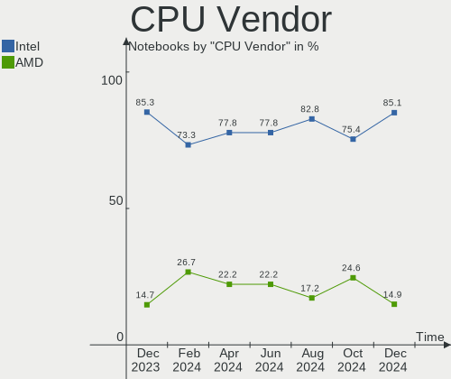
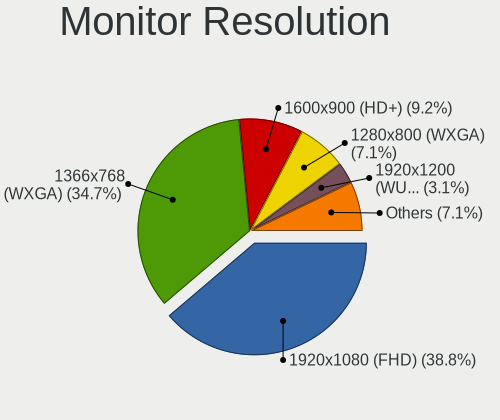
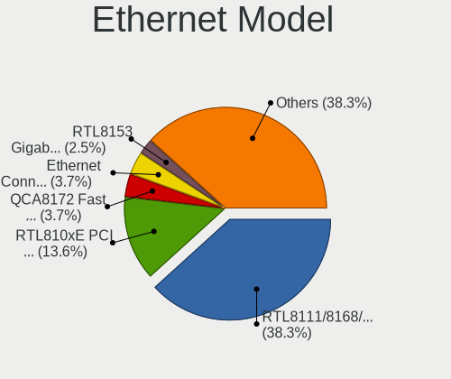
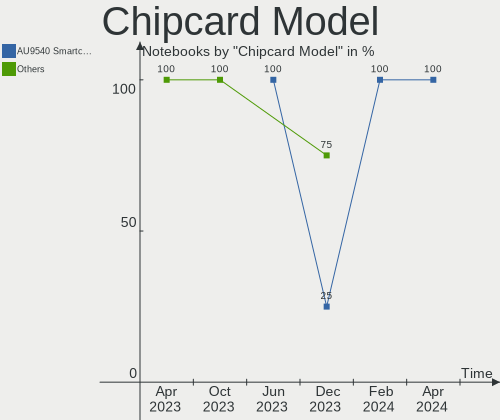

ROSA - Hardware Trends (Notebooks)
----------------------------------

A project to identify most popular hardware characteristics and track their change
over time based on data collected by Linux users at https://Linux-Hardware.org.

Anyone can contribute to this report by the [hw-probe](https://github.com/linuxhw/hw-probe) tool:

    sudo -E hw-probe -all -upload

This report is for one last month. Overall report since the beginning of time: [TestDays](https://github.com/linuxhw/TestDays)

Period: Oct, 2023.

Contents
--------

* [ System ](#system)
  - [ OS                       ](#os)
  - [ OS Family                ](#os-family)
  - [ Kernel                   ](#kernel)
  - [ Kernel Family            ](#kernel-family)
  - [ Kernel Major Ver.        ](#kernel-major-ver)
  - [ Arch                     ](#arch)
  - [ DE                       ](#de)
  - [ Display Server           ](#display-server)
  - [ Display Manager          ](#display-manager)
  - [ OS Lang                  ](#os-lang)
  - [ Boot Mode                ](#boot-mode)
  - [ Filesystem               ](#filesystem)
  - [ Part. scheme             ](#part-scheme)
  - [ Dual Boot with Linux/BSD ](#dual-boot-with-linuxbsd)
  - [ Dual Boot (Win)          ](#dual-boot-win)

* [ Board ](#board)
  - [ Vendor                   ](#vendor)
  - [ Model                    ](#model)
  - [ Model Family             ](#model-family)
  - [ MFG Year                 ](#mfg-year)
  - [ Form Factor              ](#form-factor)
  - [ Secure Boot              ](#secure-boot)
  - [ Coreboot                 ](#coreboot)
  - [ RAM Size                 ](#ram-size)
  - [ RAM Used                 ](#ram-used)
  - [ Total Drives             ](#total-drives)
  - [ Has CD-ROM               ](#has-cd-rom)
  - [ Has Ethernet             ](#has-ethernet)
  - [ Has WiFi                 ](#has-wifi)
  - [ Has Bluetooth            ](#has-bluetooth)

* [ Location ](#location)
  - [ Country                  ](#country)
  - [ City                     ](#city)

* [ Drives ](#drives)
  - [ Drive Vendor             ](#drive-vendor)
  - [ Drive Model              ](#drive-model)
  - [ HDD Vendor               ](#hdd-vendor)
  - [ SSD Vendor               ](#ssd-vendor)
  - [ Drive Kind               ](#drive-kind)
  - [ Drive Connector          ](#drive-connector)
  - [ Drive Size               ](#drive-size)
  - [ Space Total              ](#space-total)
  - [ Space Used               ](#space-used)
  - [ Malfunc. Drives          ](#malfunc-drives)
  - [ Malfunc. Drive Vendor    ](#malfunc-drive-vendor)
  - [ Malfunc. HDD Vendor      ](#malfunc-hdd-vendor)
  - [ Malfunc. Drive Kind      ](#malfunc-drive-kind)
  - [ Failed Drives            ](#failed-drives)
  - [ Failed Drive Vendor      ](#failed-drive-vendor)
  - [ Drive Status             ](#drive-status)

* [ Storage controller ](#storage-controller)
  - [ Storage Vendor           ](#storage-vendor)
  - [ Storage Model            ](#storage-model)
  - [ Storage Kind             ](#storage-kind)

* [ Processor ](#processor)
  - [ CPU Vendor               ](#cpu-vendor)
  - [ CPU Model                ](#cpu-model)
  - [ CPU Model Family         ](#cpu-model-family)
  - [ CPU Cores                ](#cpu-cores)
  - [ CPU Sockets              ](#cpu-sockets)
  - [ CPU Threads              ](#cpu-threads)
  - [ CPU Op-Modes             ](#cpu-op-modes)
  - [ CPU Microcode            ](#cpu-microcode)
  - [ CPU Microarch            ](#cpu-microarch)

* [ Graphics ](#graphics)
  - [ GPU Vendor               ](#gpu-vendor)
  - [ GPU Model                ](#gpu-model)
  - [ GPU Combo                ](#gpu-combo)
  - [ GPU Driver               ](#gpu-driver)
  - [ GPU Memory               ](#gpu-memory)

* [ Monitor ](#monitor)
  - [ Monitor Vendor           ](#monitor-vendor)
  - [ Monitor Model            ](#monitor-model)
  - [ Monitor Resolution       ](#monitor-resolution)
  - [ Monitor Diagonal         ](#monitor-diagonal)
  - [ Monitor Width            ](#monitor-width)
  - [ Aspect Ratio             ](#aspect-ratio)
  - [ Monitor Area             ](#monitor-area)
  - [ Pixel Density            ](#pixel-density)
  - [ Multiple Monitors        ](#multiple-monitors)

* [ Network ](#network)
  - [ Net Controller Vendor    ](#net-controller-vendor)
  - [ Net Controller Model     ](#net-controller-model)
  - [ Wireless Vendor          ](#wireless-vendor)
  - [ Wireless Model           ](#wireless-model)
  - [ Ethernet Vendor          ](#ethernet-vendor)
  - [ Ethernet Model           ](#ethernet-model)
  - [ Net Controller Kind      ](#net-controller-kind)
  - [ Used Controller          ](#used-controller)
  - [ NICs                     ](#nics)
  - [ IPv6                     ](#ipv6)

* [ Bluetooth ](#bluetooth)
  - [ Bluetooth Vendor         ](#bluetooth-vendor)
  - [ Bluetooth Model          ](#bluetooth-model)

* [ Sound ](#sound)
  - [ Sound Vendor             ](#sound-vendor)
  - [ Sound Model              ](#sound-model)

* [ Memory ](#memory)
  - [ Memory Vendor            ](#memory-vendor)
  - [ Memory Model             ](#memory-model)
  - [ Memory Kind              ](#memory-kind)
  - [ Memory Form Factor       ](#memory-form-factor)
  - [ Memory Size              ](#memory-size)
  - [ Memory Speed             ](#memory-speed)

* [ Printers & scanners ](#printers--scanners)
  - [ Printer Vendor           ](#printer-vendor)
  - [ Printer Model            ](#printer-model)
  - [ Scanner Vendor           ](#scanner-vendor)
  - [ Scanner Model            ](#scanner-model)

* [ Camera ](#camera)
  - [ Camera Vendor            ](#camera-vendor)
  - [ Camera Model             ](#camera-model)

* [ Security ](#security)
  - [ Fingerprint Vendor       ](#fingerprint-vendor)
  - [ Fingerprint Model        ](#fingerprint-model)
  - [ Chipcard Vendor          ](#chipcard-vendor)
  - [ Chipcard Model           ](#chipcard-model)

* [ Unsupported ](#unsupported)
  - [ Unsupported Devices      ](#unsupported-devices)
  - [ Unsupported Device Types ](#unsupported-device-types)

System
------

OS
--

Installed operating systems

| Name       | Notebooks | Percent |
|------------|-----------|---------|
| ROSA 12.4  | 90        | 84.11%  |
| ROSA 12    | 8         | 7.48%   |
| ROSA R11.1 | 4         | 3.74%   |
| ROSA 12.3  | 3         | 2.8%    |
| ROSA R8.1  | 1         | 0.93%   |
| ROSA 12.2  | 1         | 0.93%   |

OS Family
---------

OS without a version

| Name | Notebooks | Percent |
|------|-----------|---------|
| ROSA | 107       | 100%    |

Kernel
------

Version of the Linux kernel

| Version                                   | Notebooks | Percent |
|-------------------------------------------|-----------|---------|
| 6.1.46-generic-2rosa2021.1-x86_64         | 35        | 32.71%  |
| 6.1.20-generic-2rosa2021.1-x86_64         | 31        | 28.97%  |
| 6.1.58-generic-1rosa2021.1-x86_64         | 9         | 8.41%   |
| 5.10.184-generic-1rosa2021.1-x86_64       | 6         | 5.61%   |
| 5.15.127-generic-1rosa2021.1-x86_64       | 5         | 4.67%   |
| 6.1.38-generic-1rosa2021.1-x86_64         | 4         | 3.74%   |
| 5.15.103-generic-1rosa2021.1-i686         | 4         | 3.74%   |
| 5.15.75-generic-1rosa2021.1-i686          | 2         | 1.87%   |
| 6.5.5.xm1-1.klp-xanmod-rosa2021.1-x86_64  | 1         | 0.93%   |
| 6.3.12-generic-1rosa2021.1-x86_64         | 1         | 0.93%   |
| 6.0.12.xm1-1.klp-xanmod-rosa2021.1-x86_64 | 1         | 0.93%   |
| 5.4.83-generic-2rosa-x86_64               | 1         | 0.93%   |
| 5.4.32-generic-2rosa-i586                 | 1         | 0.93%   |
| 5.15.75-generic-1rosa2021.1-x86_64        | 1         | 0.93%   |
| 5.15.127-generic-1rosa2021.1-i686         | 1         | 0.93%   |
| 5.10.118-generic-2rosa2021.1-x86_64       | 1         | 0.93%   |
| 4.15.0-desktop-122.124.1rosa-x86_64       | 1         | 0.93%   |
| 4.15.0-desktop-122.124.1rosa-i586         | 1         | 0.93%   |
| 4.1.38-nrj-desktop-2rosa-i586             | 1         | 0.93%   |

Kernel Family
-------------

Linux kernel without a distro release

| Version  | Notebooks | Percent |
|----------|-----------|---------|
| 6.1.46   | 35        | 32.71%  |
| 6.1.20   | 31        | 28.97%  |
| 6.1.58   | 9         | 8.41%   |
| 5.15.127 | 6         | 5.61%   |
| 5.10.184 | 6         | 5.61%   |
| 6.1.38   | 4         | 3.74%   |
| 5.15.103 | 4         | 3.74%   |
| 5.15.75  | 3         | 2.8%    |
| 4.15.0   | 2         | 1.87%   |
| 6.5.5    | 1         | 0.93%   |
| 6.3.12   | 1         | 0.93%   |
| 6.0.12   | 1         | 0.93%   |
| 5.4.83   | 1         | 0.93%   |
| 5.4.32   | 1         | 0.93%   |
| 5.10.118 | 1         | 0.93%   |
| 4.1.38   | 1         | 0.93%   |

Kernel Major Ver.
-----------------

Linux kernel major version

| Version | Notebooks | Percent |
|---------|-----------|---------|
| 6.1     | 79        | 73.83%  |
| 5.15    | 13        | 12.15%  |
| 5.10    | 7         | 6.54%   |
| 5.4     | 2         | 1.87%   |
| 4.15    | 2         | 1.87%   |
| 6.5     | 1         | 0.93%   |
| 6.3     | 1         | 0.93%   |
| 6.0     | 1         | 0.93%   |
| 4.1     | 1         | 0.93%   |

Arch
----

OS architecture (x86_64, i586, etc.)

| Name   | Notebooks | Percent |
|--------|-----------|---------|
| x86_64 | 97        | 90.65%  |
| i686   | 10        | 9.35%   |

DE
--

Desktop Environment

| Name  | Notebooks | Percent |
|-------|-----------|---------|
| KDE5  | 61        | 57.01%  |
| GNOME | 26        | 24.3%   |
| LXQt  | 16        | 14.95%  |
| KDE4  | 3         | 2.8%    |
| i3    | 1         | 0.93%   |

Display Server
--------------

X11 or Wayland

| Name    | Notebooks | Percent |
|---------|-----------|---------|
| Wayland | 82        | 76.64%  |
| X11     | 25        | 23.36%  |

Display Manager
---------------

SDDM, LightDM, etc.

| Name    | Notebooks | Percent |
|---------|-----------|---------|
| SDDM    | 62        | 57.94%  |
| GDM     | 34        | 31.78%  |
| LightDM | 8         | 7.48%   |
| KDM     | 3         | 2.8%    |

OS Lang
-------

Language

| Lang    | Notebooks | Percent |
|---------|-----------|---------|
| ru_RU   | 98        | 91.59%  |
| it_IT   | 3         | 2.8%    |
| en_US   | 3         | 2.8%    |
| es_CL   | 1         | 0.93%   |
| de_DE   | 1         | 0.93%   |
| Unknown | 1         | 0.93%   |

Boot Mode
---------

EFI or BIOS

| Mode | Notebooks | Percent |
|------|-----------|---------|
| EFI  | 58        | 54.21%  |
| BIOS | 49        | 45.79%  |

Filesystem
----------

Type of filesystem

| Type  | Notebooks | Percent |
|-------|-----------|---------|
| Ext4  | 98        | 91.59%  |
| Btrfs | 8         | 7.48%   |
| Aufs  | 1         | 0.93%   |

Part. scheme
------------

Scheme of partitioning

| Type | Notebooks | Percent |
|------|-----------|---------|
| GPT  | 59        | 55.14%  |
| MBR  | 48        | 44.86%  |

Dual Boot with Linux/BSD
------------------------

Hosting more than one Linux/BSD

| Dual boot | Notebooks | Percent |
|-----------|-----------|---------|
| No        | 84        | 78.5%   |
| Yes       | 23        | 21.5%   |

Dual Boot (Win)
---------------

Hosting Linux and Windows

| Dual boot | Notebooks | Percent |
|-----------|-----------|---------|
| No        | 67        | 62.62%  |
| Yes       | 40        | 37.38%  |

Board
-----

Vendor
------

Motherboard manufacturer

| Name                | Notebooks | Percent |
|---------------------|-----------|---------|
| Hewlett-Packard     | 18        | 16.82%  |
| ASUSTek Computer    | 17        | 15.89%  |
| Acer                | 17        | 15.89%  |
| Lenovo              | 10        | 9.35%   |
| MSI                 | 6         | 5.61%   |
| Dell                | 5         | 4.67%   |
| Clevo               | 5         | 4.67%   |
| Toshiba             | 4         | 3.74%   |
| Samsung Electronics | 4         | 3.74%   |
| Sony                | 3         | 2.8%    |
| HUAWEI              | 3         | 2.8%    |
| eMachines           | 2         | 1.87%   |
| ANCOMP              | 2         | 1.87%   |
| Timi                | 1         | 0.93%   |
| realme              | 1         | 0.93%   |
| Packard Bell        | 1         | 0.93%   |
| Maibenben           | 1         | 0.93%   |
| Kraftway            | 1         | 0.93%   |
| Jumper              | 1         | 0.93%   |
| Irbis               | 1         | 0.93%   |
| HONOR               | 1         | 0.93%   |
| Fujitsu Siemens     | 1         | 0.93%   |
| Digma               | 1         | 0.93%   |
| Apple               | 1         | 0.93%   |

Model
-----

Motherboard model

| Name                                                                                     | Notebooks | Percent |
|------------------------------------------------------------------------------------------|-----------|---------|
| HP Notebook                                                                              | 4         | 3.74%   |
| Clevo NL41MU2                                                                            | 4         | 3.74%   |
| eMachines E510                                                                           | 2         | 1.87%   |
| ANCOMP Learnmate A15-501                                                                 | 2         | 1.87%   |
| Toshiba Satellite L755                                                                   | 1         | 0.93%   |
| Toshiba Satellite C850-D4K                                                               | 1         | 0.93%   |
| Toshiba Satellite C660D                                                                  | 1         | 0.93%   |
| Toshiba Satellite A200                                                                   | 1         | 0.93%   |
| Timi Mi NoteBook Ultra                                                                   | 1         | 0.93%   |
| Sony VPCEB1S1R                                                                           | 1         | 0.93%   |
| Sony VGN-SR19VRN                                                                         | 1         | 0.93%   |
| Sony VGN-NS11ER_S                                                                        | 1         | 0.93%   |
| Samsung R530/R730/P530                                                                   | 1         | 0.93%   |
| Samsung N100                                                                             | 1         | 0.93%   |
| Samsung 355V4C/355V4X/355V5C/355V5X/356V4C/356V4X/356V5C/356V5X/3445VC/3445VX/3545VC/354 | 1         | 0.93%   |
| Samsung 350V5C/351V5C/3540VC/3440VC                                                      | 1         | 0.93%   |
| realme RMNBXXXX                                                                          | 1         | 0.93%   |
| Packard Bell EasyNote ENLG81BA                                                           | 1         | 0.93%   |
| MSI VR610                                                                                | 1         | 0.93%   |
| MSI U210/U210 Light                                                                      | 1         | 0.93%   |
| MSI Katana GF76 12UC                                                                     | 1         | 0.93%   |
| MSI GS43VR 7RE                                                                           | 1         | 0.93%   |
| MSI GE70 0NC/GE70 0ND/GE70K 0ND                                                          | 1         | 0.93%   |
| MSI Alpha 15 B5EEK                                                                       | 1         | 0.93%   |
| Maibenben MaiBook P series                                                               | 1         | 0.93%   |
| Lenovo Y520-15IKBN 80WK                                                                  | 1         | 0.93%   |
| Lenovo ThinkPad X200 7458Y28                                                             | 1         | 0.93%   |
| Lenovo ThinkPad T60 1952W2Q                                                              | 1         | 0.93%   |
| Lenovo ThinkPad T400 6474WPU                                                             | 1         | 0.93%   |
| Lenovo ThinkPad L520 5017BK4                                                             | 1         | 0.93%   |
| Lenovo ThinkBook 15 G3 ACL 21A4                                                          | 1         | 0.93%   |
| Lenovo IdeaPad Y550P 20035                                                               | 1         | 0.93%   |
| Lenovo IdeaPad 3 15IML05 81WB                                                            | 1         | 0.93%   |
| Lenovo G70-70 80HW                                                                       | 1         | 0.93%   |
| Kraftway ACCORD                                                                          | 1         | 0.93%   |
| Jumper Ezbook X3                                                                         | 1         | 0.93%   |
| Irbis NB264                                                                              | 1         | 0.93%   |
| HUAWEI HKD-WXX                                                                           | 1         | 0.93%   |
| HUAWEI BOHK-WAX9X                                                                        | 1         | 0.93%   |
| HUAWEI BOD-WXX9                                                                          | 1         | 0.93%   |

Model Family
------------

Motherboard model prefix

| Name                  | Notebooks | Percent |
|-----------------------|-----------|---------|
| Acer Aspire           | 7         | 6.54%   |
| Acer TravelMate       | 5         | 4.67%   |
| Toshiba Satellite     | 4         | 3.74%   |
| Lenovo ThinkPad       | 4         | 3.74%   |
| HP Notebook           | 4         | 3.74%   |
| Clevo NL41MU2         | 4         | 3.74%   |
| HP Pavilion           | 3         | 2.8%    |
| HP Laptop             | 3         | 2.8%    |
| ASUS VivoBook         | 3         | 2.8%    |
| Lenovo IdeaPad        | 2         | 1.87%   |
| HP ProBook            | 2         | 1.87%   |
| eMachines E510        | 2         | 1.87%   |
| Dell Inspiron         | 2         | 1.87%   |
| ANCOMP Learnmate      | 2         | 1.87%   |
| Acer Swift            | 2         | 1.87%   |
| Timi Mi               | 1         | 0.93%   |
| Sony VPCEB1S1R        | 1         | 0.93%   |
| Sony VGN-SR19VRN      | 1         | 0.93%   |
| Sony VGN-NS11ER       | 1         | 0.93%   |
| Samsung R530          | 1         | 0.93%   |
| Samsung N100          | 1         | 0.93%   |
| Samsung 355V4C        | 1         | 0.93%   |
| Samsung 350V5C        | 1         | 0.93%   |
| realme RMNBXXXX       | 1         | 0.93%   |
| Packard Bell EasyNote | 1         | 0.93%   |
| MSI VR610             | 1         | 0.93%   |
| MSI U210              | 1         | 0.93%   |
| MSI Katana            | 1         | 0.93%   |
| MSI GS43VR            | 1         | 0.93%   |
| MSI GE70              | 1         | 0.93%   |
| MSI Alpha             | 1         | 0.93%   |
| Maibenben MaiBook     | 1         | 0.93%   |
| Lenovo Y520-15IKBN    | 1         | 0.93%   |
| Lenovo ThinkBook      | 1         | 0.93%   |
| Lenovo G70-70         | 1         | 0.93%   |
| Kraftway ACCORD       | 1         | 0.93%   |
| Jumper Ezbook         | 1         | 0.93%   |
| Irbis NB264           | 1         | 0.93%   |
| HUAWEI HKD-WXX        | 1         | 0.93%   |
| HUAWEI BOHK-WAX9X     | 1         | 0.93%   |

MFG Year
--------

Motherboard manufacture year

| Year | Notebooks | Percent |
|------|-----------|---------|
| 2011 | 12        | 11.21%  |
| 2022 | 10        | 9.35%   |
| 2012 | 10        | 9.35%   |
| 2021 | 9         | 8.41%   |
| 2010 | 7         | 6.54%   |
| 2007 | 7         | 6.54%   |
| 2020 | 6         | 5.61%   |
| 2009 | 6         | 5.61%   |
| 2018 | 5         | 4.67%   |
| 2017 | 5         | 4.67%   |
| 2015 | 5         | 4.67%   |
| 2013 | 5         | 4.67%   |
| 2008 | 5         | 4.67%   |
| 2023 | 4         | 3.74%   |
| 2014 | 3         | 2.8%    |
| 2006 | 3         | 2.8%    |
| 2019 | 2         | 1.87%   |
| 2016 | 2         | 1.87%   |
| 2005 | 1         | 0.93%   |

Form Factor
-----------

Physical design of the computer

| Name     | Notebooks | Percent |
|----------|-----------|---------|
| Notebook | 107       | 100%    |

Secure Boot
-----------

Enabled or disabled

| State    | Notebooks | Percent |
|----------|-----------|---------|
| Disabled | 107       | 100%    |

Coreboot
--------

Have coreboot on board

| Used | Notebooks | Percent |
|------|-----------|---------|
| No   | 107       | 100%    |

RAM Size
--------

Total RAM memory

| Size in GB | Notebooks | Percent |
|------------|-----------|---------|
| 3.01-4.0   | 38        | 35.51%  |
| 4.01-8.0   | 32        | 29.91%  |
| 16.01-24.0 | 13        | 12.15%  |
| 1.01-2.0   | 7         | 6.54%   |
| 8.01-16.0  | 7         | 6.54%   |
| 2.01-3.0   | 6         | 5.61%   |
| 0.51-1.0   | 3         | 2.8%    |
| 32.01-64.0 | 1         | 0.93%   |

RAM Used
--------

Used RAM memory

| Used GB  | Notebooks | Percent |
|----------|-----------|---------|
| 1.01-2.0 | 48        | 44.86%  |
| 2.01-3.0 | 23        | 21.5%   |
| 0.51-1.0 | 19        | 17.76%  |
| 3.01-4.0 | 10        | 9.35%   |
| 0.01-0.5 | 4         | 3.74%   |
| 4.01-8.0 | 3         | 2.8%    |

Total Drives
------------

Number of drives on board

| Drives | Notebooks | Percent |
|--------|-----------|---------|
| 1      | 77        | 71.96%  |
| 2      | 30        | 28.04%  |

Has CD-ROM
----------

Has CD-ROM on board

| Presented | Notebooks | Percent |
|-----------|-----------|---------|
| No        | 63        | 58.88%  |
| Yes       | 44        | 41.12%  |

Has Ethernet
------------

Has Ethernet on board

| Presented | Notebooks | Percent |
|-----------|-----------|---------|
| Yes       | 91        | 85.05%  |
| No        | 16        | 14.95%  |

Has WiFi
--------

Has WiFi module

| Presented | Notebooks | Percent |
|-----------|-----------|---------|
| Yes       | 107       | 100%    |

Has Bluetooth
-------------

Has Bluetooth module

| Presented | Notebooks | Percent |
|-----------|-----------|---------|
| Yes       | 83        | 77.57%  |
| No        | 24        | 22.43%  |

Location
--------

Country
-------

Geographic location (country)

| Country    | Notebooks | Percent |
|------------|-----------|---------|
| Russia     | 90        | 84.11%  |
| Ukraine    | 4         | 3.74%   |
| Italy      | 3         | 2.8%    |
| Kazakhstan | 2         | 1.87%   |
| Belarus    | 2         | 1.87%   |
| Romania    | 1         | 0.93%   |
| Lithuania  | 1         | 0.93%   |
| India      | 1         | 0.93%   |
| Germany    | 1         | 0.93%   |
| Chile      | 1         | 0.93%   |
| Bulgaria   | 1         | 0.93%   |

City
----

Geographic location (city)

| City                  | Notebooks | Percent |
|-----------------------|-----------|---------|
| Moscow                | 31        | 28.97%  |
| St Petersburg         | 7         | 6.54%   |
| Yekaterinburg         | 4         | 3.74%   |
| Novosibirsk           | 4         | 3.74%   |
| Yaroslavl             | 2         | 1.87%   |
| Samara                | 2         | 1.87%   |
| Rostov-on-Don         | 2         | 1.87%   |
| Orenburg              | 2         | 1.87%   |
| Nizhniy Novgorod      | 2         | 1.87%   |
| Milan                 | 2         | 1.87%   |
| Chelyabinsk           | 2         | 1.87%   |
| Barnaul               | 2         | 1.87%   |
| Zvenigorod            | 1         | 0.93%   |
| Yalta                 | 1         | 0.93%   |
| Voronezh              | 1         | 0.93%   |
| Vologda               | 1         | 0.93%   |
| Vladivostok           | 1         | 0.93%   |
| Ust-Kamenogorsk       | 1         | 0.93%   |
| Ulyanovsk             | 1         | 0.93%   |
| Tyumen                | 1         | 0.93%   |
| Troyits'ko-Khartsyz'k | 1         | 0.93%   |
| Syktyvkar             | 1         | 0.93%   |
| Stroitel'             | 1         | 0.93%   |
| Stavropol             | 1         | 0.93%   |
| Stary Oskol           | 1         | 0.93%   |
| Sonneberg             | 1         | 0.93%   |
| Smolensk              | 1         | 0.93%   |
| Shchelkovo            | 1         | 0.93%   |
| Shadrinsk             | 1         | 0.93%   |
| Saratov               | 1         | 0.93%   |
| Santiago              | 1         | 0.93%   |
| Podolsk               | 1         | 0.93%   |
| Pazardzhik            | 1         | 0.93%   |
| Parkovyy              | 1         | 0.93%   |
| Omsk                  | 1         | 0.93%   |
| Melitopol             | 1         | 0.93%   |
| Mala Danylivka        | 1         | 0.93%   |
| Lipetsk               | 1         | 0.93%   |
| Krivtsovo             | 1         | 0.93%   |
| Krasnoyarsk           | 1         | 0.93%   |

Drives
------

Drive Vendor
------------

Hard drive vendors

| Vendor                | Notebooks | Drives | Percent |
|-----------------------|-----------|--------|---------|
| WDC                   | 23        | 24     | 17.29%  |
| Samsung Electronics   | 15        | 16     | 11.28%  |
| Kingston              | 15        | 15     | 11.28%  |
| HGST                  | 13        | 13     | 9.77%   |
| Hitachi               | 10        | 10     | 7.52%   |
| Seagate               | 8         | 8      | 6.02%   |
| Toshiba               | 7         | 7      | 5.26%   |
| Unknown               | 4         | 4      | 3.01%   |
| BIWIN                 | 4         | 4      | 3.01%   |
| Apacer                | 3         | 3      | 2.26%   |
| Smartbuy              | 2         | 2      | 1.5%    |
| SK hynix              | 2         | 2      | 1.5%    |
| Silicon Motion        | 2         | 2      | 1.5%    |
| SCY                   | 2         | 2      | 1.5%    |
| Micron Technology     | 2         | 2      | 1.5%    |
| A-DATA Technology     | 2         | 2      | 1.5%    |
| Zheino                | 1         | 1      | 0.75%   |
| Transcend             | 1         | 1      | 0.75%   |
| SPCC                  | 1         | 1      | 0.75%   |
| SanDisk               | 1         | 1      | 0.75%   |
| Realtek Semiconductor | 1         | 1      | 0.75%   |
| OCZ                   | 1         | 1      | 0.75%   |
| Netac                 | 1         | 1      | 0.75%   |
| KIOXIA                | 1         | 1      | 0.75%   |
| KingSpec              | 1         | 1      | 0.75%   |
| KingFast              | 1         | 1      | 0.75%   |
| Intel                 | 1         | 1      | 0.75%   |
| Hewlett-Packard       | 1         | 1      | 0.75%   |
| Fujitsu               | 1         | 1      | 0.75%   |
| Foxline               | 1         | 1      | 0.75%   |
| Digma                 | 1         | 1      | 0.75%   |
| Crucial               | 1         | 1      | 0.75%   |
| China                 | 1         | 1      | 0.75%   |
| AMD                   | 1         | 1      | 0.75%   |
| Unknown               | 1         | 1      | 0.75%   |

Drive Model
-----------

Hard drive models

| Model                                | Notebooks | Percent |
|--------------------------------------|-----------|---------|
| Kingston SA400S37480G 480GB SSD      | 4         | 2.99%   |
| Kingston SA400S37240G 240GB SSD      | 4         | 2.99%   |
| HGST HTS541010A9E680 1TB             | 4         | 2.99%   |
| BIWIN CE480T5D101-256 256GB          | 4         | 2.99%   |
| Seagate ST1000LM035-1RK172 1TB       | 3         | 2.24%   |
| Kingston SA400S37120G 120GB SSD      | 3         | 2.24%   |
| HGST HTS721010A9E630 1TB             | 3         | 2.24%   |
| WDC WDS240G2G0A-00JH30 240GB SSD     | 2         | 1.49%   |
| WDC WD5000LPCX-24C6HT0 500GB         | 2         | 1.49%   |
| WDC WD5000LPCX-21VHAT0 500GB         | 2         | 1.49%   |
| SCY SMM5T1G25600D 256GB              | 2         | 1.49%   |
| Samsung SSD 850 EVO 250GB            | 2         | 1.49%   |
| Hitachi HTS547550A9E384 500GB        | 2         | 1.49%   |
| HGST HTS545050A7E680 500GB           | 2         | 1.49%   |
| Zheino CHN 25SATAS3 128 128GB SSD    | 1         | 0.75%   |
| WDC WD7500BPKT-22PK4T0 752GB         | 1         | 0.75%   |
| WDC WD5000LPVT-00FMCT0 500GB         | 1         | 0.75%   |
| WDC WD5000LPLX-00ZNTT0 500GB         | 1         | 0.75%   |
| WDC WD5000LPCX-22VHAT0 500GB         | 1         | 0.75%   |
| WDC WD5000BPVT-00HXZT3 500GB         | 1         | 0.75%   |
| WDC WD5000BPKX-00HPJT0 500GB         | 1         | 0.75%   |
| WDC WD3200BPVT-22JJ5T0 320GB         | 1         | 0.75%   |
| WDC WD2500BEVE-00A0HT0 250GB         | 1         | 0.75%   |
| WDC WD1600BEVT-60ZCT1 160GB          | 1         | 0.75%   |
| WDC WD1600BEVS-22RST0 160GB          | 1         | 0.75%   |
| WDC WD10SPZX-00Z10T0 1TB             | 1         | 0.75%   |
| WDC WD10JPVX-75JC3T0 1TB             | 1         | 0.75%   |
| WDC WD10JPCX-24UE4T0 1TB             | 1         | 0.75%   |
| WDC WD ELements 10A8 500GB           | 1         | 0.75%   |
| WDC PC SN730 SDBQNTY-1T00-1001 1TB   | 1         | 0.75%   |
| WDC PC SN730 SDBPNTY-512G-1101 512GB | 1         | 0.75%   |
| WDC PC SN730 SDBPNTY-512G-1027 512GB | 1         | 0.75%   |
| WDC PC SN530 SDBPNPZ-256G-1114 256GB | 1         | 0.75%   |
| Unknown SLD64G  64GB                 | 1         | 0.75%   |
| Unknown SDC  16GB                    | 1         | 0.75%   |
| Unknown S0J59X  128GB                | 1         | 0.75%   |
| Unknown DA4064  64GB                 | 1         | 0.75%   |
| Transcend TS1TSSD370S 1TB            | 1         | 0.75%   |
| Toshiba MQ04ABF100 1TB               | 1         | 0.75%   |
| Toshiba MQ01ABF050 500GB             | 1         | 0.75%   |

HDD Vendor
----------

Hard disk drive vendors

| Vendor              | Notebooks | Drives | Percent |
|---------------------|-----------|--------|---------|
| WDC                 | 17        | 17     | 30.36%  |
| HGST                | 13        | 13     | 23.21%  |
| Hitachi             | 10        | 10     | 17.86%  |
| Seagate             | 8         | 8      | 14.29%  |
| Toshiba             | 6         | 6      | 10.71%  |
| Samsung Electronics | 1         | 1      | 1.79%   |
| Fujitsu             | 1         | 1      | 1.79%   |

SSD Vendor
----------

Solid state drive vendors

| Vendor              | Notebooks | Drives | Percent |
|---------------------|-----------|--------|---------|
| Kingston            | 13        | 13     | 33.33%  |
| Samsung Electronics | 5         | 6      | 12.82%  |
| Apacer              | 3         | 3      | 7.69%   |
| WDC                 | 2         | 2      | 5.13%   |
| Smartbuy            | 2         | 2      | 5.13%   |
| A-DATA Technology   | 2         | 2      | 5.13%   |
| Zheino              | 1         | 1      | 2.56%   |
| Transcend           | 1         | 1      | 2.56%   |
| SPCC                | 1         | 1      | 2.56%   |
| OCZ                 | 1         | 1      | 2.56%   |
| Netac               | 1         | 1      | 2.56%   |
| Micron Technology   | 1         | 1      | 2.56%   |
| KingSpec            | 1         | 1      | 2.56%   |
| KingFast            | 1         | 1      | 2.56%   |
| Digma               | 1         | 1      | 2.56%   |
| Crucial             | 1         | 1      | 2.56%   |
| China               | 1         | 1      | 2.56%   |
| AMD                 | 1         | 1      | 2.56%   |

Drive Kind
----------

HDD or SSD

| Kind    | Notebooks | Drives | Percent |
|---------|-----------|--------|---------|
| HDD     | 55        | 56     | 42.64%  |
| SSD     | 38        | 40     | 29.46%  |
| NVMe    | 30        | 33     | 23.26%  |
| MMC     | 5         | 5      | 3.88%   |
| Unknown | 1         | 1      | 0.78%   |

Drive Connector
---------------

SATA, SAS, NVMe, etc.

| Type | Notebooks | Drives | Percent |
|------|-----------|--------|---------|
| SATA | 81        | 95     | 68.64%  |
| NVMe | 30        | 33     | 25.42%  |
| MMC  | 5         | 5      | 4.24%   |
| SAS  | 2         | 2      | 1.69%   |

Drive Size
----------

Size of hard drive

| Size in TB | Notebooks | Drives | Percent |
|------------|-----------|--------|---------|
| 0.01-0.5   | 64        | 72     | 74.42%  |
| 0.51-1.0   | 21        | 22     | 24.42%  |
| 3.01-4.0   | 1         | 2      | 1.16%   |

Space Total
-----------

Amount of disk space available on the file system

| Size in GB | Notebooks | Percent |
|------------|-----------|---------|
| 101-250    | 38        | 35.51%  |
| 251-500    | 29        | 27.1%   |
| 501-1000   | 16        | 14.95%  |
| 1-20       | 10        | 9.35%   |
| 51-100     | 7         | 6.54%   |
| 21-50      | 4         | 3.74%   |
| 1001-2000  | 3         | 2.8%    |

Space Used
----------

Amount of used disk space

| Used GB  | Notebooks | Percent |
|----------|-----------|---------|
| 1-20     | 68        | 63.55%  |
| 21-50    | 20        | 18.69%  |
| 51-100   | 9         | 8.41%   |
| 251-500  | 6         | 5.61%   |
| 101-250  | 3         | 2.8%    |
| 501-1000 | 1         | 0.93%   |

Malfunc. Drives
---------------

Drive models with a malfunction

| Model                                            | Notebooks | Drives | Percent |
|--------------------------------------------------|-----------|--------|---------|
| HGST HTS541010A9E680 1TB                         | 3         | 3      | 12.5%   |
| WDC WDS240G2G0A-00JH30 240GB SSD                 | 2         | 2      | 8.33%   |
| HGST HTS721010A9E630 1TB                         | 2         | 2      | 8.33%   |
| WDC WD5000LPCX-24C6HT0 500GB                     | 1         | 1      | 4.17%   |
| WDC WD2500BEVE-00A0HT0 250GB                     | 1         | 1      | 4.17%   |
| Toshiba MQ01ABD100 1TB                           | 1         | 1      | 4.17%   |
| Toshiba MK2565GSX 250GB                          | 1         | 1      | 4.17%   |
| Toshiba MK1255GSX H 120GB                        | 1         | 1      | 4.17%   |
| Seagate ST500LT012-9WS142 500GB                  | 1         | 1      | 4.17%   |
| Seagate ST500LT012-1DG142 500GB                  | 1         | 1      | 4.17%   |
| Seagate ST250LT007-9ZV14C 250GB                  | 1         | 1      | 4.17%   |
| Samsung Electronics MZNLH128HBHQ-000H1 128GB SSD | 1         | 1      | 4.17%   |
| Samsung Electronics HM160HI 160GB                | 1         | 1      | 4.17%   |
| Kingston SA400S37240G 240GB SSD                  | 1         | 1      | 4.17%   |
| Hitachi HTS542512K9SA00 120GB                    | 1         | 1      | 4.17%   |
| Hitachi HTS541612J9SA00 120GB                    | 1         | 1      | 4.17%   |
| Hitachi HTS541010G9SA00 100GB                    | 1         | 1      | 4.17%   |
| HGST HTS725050B7E630 500GB                       | 1         | 1      | 4.17%   |
| HGST HTS545050A7E680 500GB                       | 1         | 1      | 4.17%   |
| HGST HTS545050A7E380 500GB                       | 1         | 1      | 4.17%   |

Malfunc. Drive Vendor
---------------------

Vendors of faulty drives

| Vendor              | Notebooks | Drives | Percent |
|---------------------|-----------|--------|---------|
| HGST                | 8         | 8      | 33.33%  |
| WDC                 | 4         | 4      | 16.67%  |
| Toshiba             | 3         | 3      | 12.5%   |
| Seagate             | 3         | 3      | 12.5%   |
| Hitachi             | 3         | 3      | 12.5%   |
| Samsung Electronics | 2         | 2      | 8.33%   |
| Kingston            | 1         | 1      | 4.17%   |

Malfunc. HDD Vendor
-------------------

Vendors of faulty HDD drives

| Vendor              | Notebooks | Drives | Percent |
|---------------------|-----------|--------|---------|
| HGST                | 8         | 8      | 40%     |
| Toshiba             | 3         | 3      | 15%     |
| Seagate             | 3         | 3      | 15%     |
| Hitachi             | 3         | 3      | 15%     |
| WDC                 | 2         | 2      | 10%     |
| Samsung Electronics | 1         | 1      | 5%      |

Malfunc. Drive Kind
-------------------

Kinds of faulty drives

| Kind | Notebooks | Drives | Percent |
|------|-----------|--------|---------|
| HDD  | 20        | 20     | 83.33%  |
| SSD  | 4         | 4      | 16.67%  |

Failed Drives
-------------

Failed drive models

Zero info for selected period =(

Failed Drive Vendor
-------------------

Failed drive vendors

Zero info for selected period =(

Drive Status
------------

Number of failed and malfunc. drives

| Status   | Notebooks | Drives | Percent |
|----------|-----------|--------|---------|
| Works    | 88        | 102    | 72.73%  |
| Malfunc  | 24        | 24     | 19.83%  |
| Detected | 9         | 9      | 7.44%   |

Storage controller
------------------

Storage Vendor
--------------

Storage controller vendors

| Vendor                           | Notebooks | Percent |
|----------------------------------|-----------|---------|
| Intel                            | 80        | 62.02%  |
| AMD                              | 14        | 10.85%  |
| Samsung Electronics              | 9         | 6.98%   |
| SanDisk                          | 4         | 3.1%    |
| INNOGRIT                         | 4         | 3.1%    |
| Nvidia                           | 3         | 2.33%   |
| SK hynix                         | 2         | 1.55%   |
| Silicon Motion                   | 2         | 1.55%   |
| Shenzhen Shichuangyi Electronics | 2         | 1.55%   |
| KIOXIA                           | 2         | 1.55%   |
| Kingston Technology Company      | 2         | 1.55%   |
| Realtek Semiconductor            | 1         | 0.78%   |
| Phison Electronics               | 1         | 0.78%   |
| Micron Technology                | 1         | 0.78%   |
| JMicron Technology               | 1         | 0.78%   |
| Biwin Storage Technology         | 1         | 0.78%   |

Storage Model
-------------

Storage controller models

| Model                                                                            | Notebooks | Percent |
|----------------------------------------------------------------------------------|-----------|---------|
| Intel 7 Series Chipset Family 6-port SATA Controller [AHCI mode]                 | 9         | 6.34%   |
| AMD FCH SATA Controller [AHCI mode]                                              | 9         | 6.34%   |
| Intel Tiger Lake-LP SATA Controller                                              | 8         | 5.63%   |
| Intel 6 Series/C200 Series Chipset Family 6 port Mobile SATA AHCI Controller     | 8         | 5.63%   |
| Intel 82801IBM/IEM (ICH9M/ICH9M-E) 4 port SATA Controller [AHCI mode]            | 6         | 4.23%   |
| Intel 82801HM/HEM (ICH8M/ICH8M-E) IDE Controller                                 | 6         | 4.23%   |
| Intel Atom/Celeron/Pentium Processor x5-E8000/J3xxx/N3xxx Series SATA Controller | 5         | 3.52%   |
| Intel 82801HM/HEM (ICH8M/ICH8M-E) SATA Controller [AHCI mode]                    | 5         | 3.52%   |
| Intel 82801 Mobile SATA Controller [RAID mode]                                   | 5         | 3.52%   |
| Intel Wildcat Point-LP SATA Controller [AHCI Mode]                               | 4         | 2.82%   |
| Intel Celeron/Pentium Silver Processor SATA Controller                           | 4         | 2.82%   |
| Intel 5 Series/3400 Series Chipset 4 port SATA AHCI Controller                   | 4         | 2.82%   |
| INNOGRIT NVMe SSD Controller IG5216 (DRAM-less)                                  | 4         | 2.82%   |
| Samsung NVMe SSD Controller PM9A1/PM9A3/980PRO                                   | 3         | 2.11%   |
| Intel Volume Management Device NVMe RAID Controller                              | 3         | 2.11%   |
| Intel 82801GBM/GHM (ICH7-M Family) SATA Controller [IDE mode]                    | 3         | 2.11%   |
| Intel 8 Series SATA Controller 1 [AHCI mode]                                     | 3         | 2.11%   |
| AMD SB7x0/SB8x0/SB9x0 SATA Controller [AHCI mode]                                | 3         | 2.11%   |
| SK hynix Gold P31/BC711/PC711 NVMe Solid State Drive                             | 2         | 1.41%   |
| Silicon Motion Non-Volatile memory controller                                    | 2         | 1.41%   |
| Shenzhen Shichuangyi MAP1202-Based NVMe SSD (DRAM-less)                          | 2         | 1.41%   |
| SanDisk Extreme Pro / WD Black SN750 / PC SN730 / Red SN700 NVMe SSD             | 2         | 1.41%   |
| Samsung NVMe SSD Controller SM961/PM961/SM963                                    | 2         | 1.41%   |
| Samsung NVMe SSD Controller 980 (DRAM-less)                                      | 2         | 1.41%   |
| KIOXIA NVMe SSD Controller BG4 (DRAM-less)                                       | 2         | 1.41%   |
| Intel NM10/ICH7 Family SATA Controller [AHCI mode]                               | 2         | 1.41%   |
| Intel 82801IBM/IEM (ICH9M/ICH9M-E) 2 port SATA Controller [IDE mode]             | 2         | 1.41%   |
| AMD SB600 Non-Raid-5 SATA                                                        | 2         | 1.41%   |
| SanDisk WD PC SN540 / Green SN350 NVMe SSD 1 TB (DRAM-less)                      | 1         | 0.7%    |
| SanDisk Ultra 3D / WD Blue SN550 NVMe SSD                                        | 1         | 0.7%    |
| Samsung NVMe SSD Controller SM981/PM981/PM983                                    | 1         | 0.7%    |
| Samsung NVMe SSD Controller PM9B1 (DRAM-less)                                    | 1         | 0.7%    |
| Realtek RTS5765DL NVMe SSD Controller (DRAM-less)                                | 1         | 0.7%    |
| Phison PS5013-E13 PCIe3 NVMe Controller (DRAM-less)                              | 1         | 0.7%    |
| Nvidia MCP79 SATA Controller                                                     | 1         | 0.7%    |
| Nvidia MCP67 IDE Controller                                                      | 1         | 0.7%    |
| Nvidia MCP67 AHCI Controller                                                     | 1         | 0.7%    |
| Nvidia MCP65 SATA Controller                                                     | 1         | 0.7%    |
| Nvidia MCP65 IDE                                                                 | 1         | 0.7%    |
| Micron 2400 NVMe SSD (DRAM-less)                                                 | 1         | 0.7%    |

Storage Kind
------------

Kind of storage controller (IDE, SATA, NVMe, SAS, ...)

| Kind | Notebooks | Percent |
|------|-----------|---------|
| SATA | 81        | 59.56%  |
| NVMe | 30        | 22.06%  |
| IDE  | 17        | 12.5%   |
| RAID | 8         | 5.88%   |

Processor
---------

CPU Vendor
----------

Processor vendors

| Vendor | Notebooks | Percent |
|--------|-----------|---------|
| Intel  | 86        | 80.37%  |
| AMD    | 21        | 19.63%  |

CPU Model
---------

Processor models

| Model                                       | Notebooks | Percent |
|---------------------------------------------|-----------|---------|
| Intel 11th Gen Core i5-1135G7 @ 2.40GHz     | 5         | 4.67%   |
| AMD Ryzen 5 5600H with Radeon Graphics      | 3         | 2.8%    |
| Intel Pentium CPU N3700 @ 1.60GHz           | 2         | 1.87%   |
| Intel Core i7-3610QM CPU @ 2.30GHz          | 2         | 1.87%   |
| Intel Core i5-8300H CPU @ 2.30GHz           | 2         | 1.87%   |
| Intel Core i5-7300HQ CPU @ 2.50GHz          | 2         | 1.87%   |
| Intel Core i5-5200U CPU @ 2.20GHz           | 2         | 1.87%   |
| Intel Core i5-4210U CPU @ 1.70GHz           | 2         | 1.87%   |
| Intel Core i5-2520M CPU @ 2.50GHz           | 2         | 1.87%   |
| Intel Core i5-2430M CPU @ 2.40GHz           | 2         | 1.87%   |
| Intel Core i5-2410M CPU @ 2.30GHz           | 2         | 1.87%   |
| Intel Core i5 CPU M 430 @ 2.27GHz           | 2         | 1.87%   |
| Intel Core 2 Duo CPU P8400 @ 2.26GHz        | 2         | 1.87%   |
| Intel Core 2 CPU T7200 @ 2.00GHz            | 2         | 1.87%   |
| Intel Celeron N4020 CPU @ 1.10GHz           | 2         | 1.87%   |
| Intel Celeron CPU N3060 @ 1.60GHz           | 2         | 1.87%   |
| Intel 11th Gen Core i7-11370H @ 3.30GHz     | 2         | 1.87%   |
| Intel 11th Gen Core i5-1155G7 @ 2.50GHz     | 2         | 1.87%   |
| Intel 11th Gen Core i3-1115G4 @ 3.00GHz     | 2         | 1.87%   |
| Intel Pentium Silver N6000 @ 1.10GHz        | 1         | 0.93%   |
| Intel Pentium Silver N5000 CPU @ 1.10GHz    | 1         | 0.93%   |
| Intel Pentium M processor 2.00GHz           | 1         | 0.93%   |
| Intel Pentium Dual-Core CPU T4500 @ 2.30GHz | 1         | 0.93%   |
| Intel Pentium Dual-Core CPU T4200 @ 2.00GHz | 1         | 0.93%   |
| Intel Pentium CPU P6200 @ 2.13GHz           | 1         | 0.93%   |
| Intel Pentium CPU P6100 @ 2.00GHz           | 1         | 0.93%   |
| Intel Pentium CPU B950 @ 2.10GHz            | 1         | 0.93%   |
| Intel Pentium CPU 3825U @ 1.90GHz           | 1         | 0.93%   |
| Intel Pentium CPU 2117U @ 1.80GHz           | 1         | 0.93%   |
| Intel Genuine CPU T2250 @ 1.73GHz           | 1         | 0.93%   |
| Intel Genuine CPU T1400 @ 1.73GHz           | 1         | 0.93%   |
| Intel Core i7-7700HQ CPU @ 2.80GHz          | 1         | 0.93%   |
| Intel Core i7-4700HQ CPU @ 2.40GHz          | 1         | 0.93%   |
| Intel Core i7-3632QM CPU @ 2.20GHz          | 1         | 0.93%   |
| Intel Core i5-8259U CPU @ 2.30GHz           | 1         | 0.93%   |
| Intel Core i5-4200U CPU @ 1.60GHz           | 1         | 0.93%   |
| Intel Core i5-3230M CPU @ 2.60GHz           | 1         | 0.93%   |
| Intel Core i5-3210M CPU @ 2.50GHz           | 1         | 0.93%   |
| Intel Core i5-2450M CPU @ 2.50GHz           | 1         | 0.93%   |
| Intel Core i5-2435M CPU @ 2.40GHz           | 1         | 0.93%   |

CPU Model Family
----------------

Processor model prefix

| Model                   | Notebooks | Percent |
|-------------------------|-----------|---------|
| Intel Core i5           | 22        | 20.56%  |
| Other                   | 15        | 14.02%  |
| Intel Core 2 Duo        | 10        | 9.35%   |
| Intel Celeron           | 9         | 8.41%   |
| Intel Pentium           | 7         | 6.54%   |
| AMD Ryzen 5             | 6         | 5.61%   |
| Intel Core i7           | 5         | 4.67%   |
| Intel Core i3           | 5         | 4.67%   |
| Intel Core 2            | 3         | 2.8%    |
| Intel Pentium Silver    | 2         | 1.87%   |
| Intel Pentium Dual-Core | 2         | 1.87%   |
| Intel Genuine           | 2         | 1.87%   |
| Intel Atom              | 2         | 1.87%   |
| AMD Turion 64 X2 Mobile | 2         | 1.87%   |
| AMD Ryzen 7             | 2         | 1.87%   |
| AMD Ryzen 3             | 2         | 1.87%   |
| AMD E2                  | 2         | 1.87%   |
| Intel Pentium M         | 1         | 0.93%   |
| Intel Celeron Dual-Core | 1         | 0.93%   |
| AMD V140                | 1         | 0.93%   |
| AMD Mobile Sempron      | 1         | 0.93%   |
| AMD E                   | 1         | 0.93%   |
| AMD Athlon Neo          | 1         | 0.93%   |
| AMD Athlon II Dual-Core | 1         | 0.93%   |
| AMD A8                  | 1         | 0.93%   |
| AMD A6                  | 1         | 0.93%   |

CPU Cores
---------

Number of processor cores

| Number | Notebooks | Percent |
|--------|-----------|---------|
| 2      | 63        | 58.88%  |
| 4      | 28        | 26.17%  |
| 1      | 7         | 6.54%   |
| 6      | 5         | 4.67%   |
| 8      | 3         | 2.8%    |
| 10     | 1         | 0.93%   |

CPU Sockets
-----------

Number of sockets

| Number | Notebooks | Percent |
|--------|-----------|---------|
| 1      | 107       | 100%    |

CPU Threads
-----------

Threads per core (Hyper-Threading)

| Number | Notebooks | Percent |
|--------|-----------|---------|
| 2      | 59        | 55.14%  |
| 1      | 48        | 44.86%  |

CPU Op-Modes
------------

CPU Operation Modes (32-bit, 64-bit)

| Op mode        | Notebooks | Percent |
|----------------|-----------|---------|
| 32-bit, 64-bit | 105       | 98.13%  |
| 32-bit         | 2         | 1.87%   |

CPU Microcode
-------------

Microcode number

| Number     | Notebooks | Percent |
|------------|-----------|---------|
| 0x206a7    | 11        | 10.28%  |
| 0x806c1    | 10        | 9.35%   |
| Unknown    | 8         | 7.48%   |
| 0x306a9    | 7         | 6.54%   |
| 0x6fd      | 4         | 3.74%   |
| 0x306d4    | 4         | 3.74%   |
| 0x1067a    | 4         | 3.74%   |
| 0x10676    | 4         | 3.74%   |
| 0x906e9    | 3         | 2.8%    |
| 0x706a8    | 3         | 2.8%    |
| 0x6f6      | 3         | 2.8%    |
| 0x406c3    | 3         | 2.8%    |
| 0x0a50000c | 3         | 2.8%    |
| 0x906ea    | 2         | 1.87%   |
| 0x906a3    | 2         | 1.87%   |
| 0x806c2    | 2         | 1.87%   |
| 0x406c4    | 2         | 1.87%   |
| 0x40651    | 2         | 1.87%   |
| 0x20655    | 2         | 1.87%   |
| 0x20652    | 2         | 1.87%   |
| 0x08108109 | 2         | 1.87%   |
| 0x06006705 | 2         | 1.87%   |
| 0x906c0    | 1         | 0.93%   |
| 0x806ec    | 1         | 0.93%   |
| 0x806eb    | 1         | 0.93%   |
| 0x806d1    | 1         | 0.93%   |
| 0x706a1    | 1         | 0.93%   |
| 0x6fb      | 1         | 0.93%   |
| 0x6fa      | 1         | 0.93%   |
| 0x6e8      | 1         | 0.93%   |
| 0x6d8      | 1         | 0.93%   |
| 0x506c9    | 1         | 0.93%   |
| 0x30661    | 1         | 0.93%   |
| 0x106ca    | 1         | 0.93%   |
| 0x10661    | 1         | 0.93%   |
| 0x0a50000d | 1         | 0.93%   |
| 0x08608103 | 1         | 0.93%   |
| 0x08608102 | 1         | 0.93%   |
| 0x08600106 | 1         | 0.93%   |
| 0x08108102 | 1         | 0.93%   |

CPU Microarch
-------------

Microarchitecture

| Name             | Notebooks | Percent |
|------------------|-----------|---------|
| TigerLake        | 12        | 11.21%  |
| SandyBridge      | 11        | 10.28%  |
| Core             | 10        | 9.35%   |
| Penryn           | 8         | 7.48%   |
| KabyLake         | 8         | 7.48%   |
| IvyBridge        | 7         | 6.54%   |
| Silvermont       | 5         | 4.67%   |
| Zen 3            | 4         | 3.74%   |
| Westmere         | 4         | 3.74%   |
| K8 Hammer        | 4         | 3.74%   |
| Haswell          | 4         | 3.74%   |
| Goldmont plus    | 4         | 3.74%   |
| Broadwell        | 4         | 3.74%   |
| Zen+             | 3         | 2.8%    |
| P6               | 2         | 1.87%   |
| K10              | 2         | 1.87%   |
| Excavator        | 2         | 1.87%   |
| Bonnell          | 2         | 1.87%   |
| Bobcat           | 2         | 1.87%   |
| Alderlake Hybrid | 2         | 1.87%   |
| Unknown          | 2         | 1.87%   |
| Zen 2            | 1         | 0.93%   |
| Tremont          | 1         | 0.93%   |
| Piledriver       | 1         | 0.93%   |
| Icelake          | 1         | 0.93%   |
| Goldmont         | 1         | 0.93%   |

Graphics
--------

GPU Vendor
----------

Vendors of graphics cards

| Vendor | Notebooks | Percent |
|--------|-----------|---------|
| Intel  | 75        | 55.56%  |
| Nvidia | 34        | 25.19%  |
| AMD    | 26        | 19.26%  |

GPU Model
---------

Graphics card models

| Model                                                                                    | Notebooks | Percent |
|------------------------------------------------------------------------------------------|-----------|---------|
| Intel 2nd Generation Core Processor Family Integrated Graphics Controller                | 10        | 6.99%   |
| Intel TigerLake-LP GT2 [Iris Xe Graphics]                                                | 9         | 6.29%   |
| Intel 3rd Gen Core processor Graphics Controller                                         | 7         | 4.9%    |
| Intel Mobile 4 Series Chipset Integrated Graphics Controller                             | 5         | 3.5%    |
| Intel Atom/Celeron/Pentium Processor x5-E8000/J3xxx/N3xxx Integrated Graphics Controller | 5         | 3.5%    |
| AMD Cezanne [Radeon Vega Series / Radeon Vega Mobile Series]                             | 4         | 2.8%    |
| Nvidia GP107M [GeForce GTX 1050 Mobile]                                                  | 3         | 2.1%    |
| Nvidia GA107M [GeForce RTX 3050 Mobile]                                                  | 3         | 2.1%    |
| Intel Tiger Lake-LP GT2 [UHD Graphics G4]                                                | 3         | 2.1%    |
| Intel Mobile GM965/GL960 Integrated Graphics Controller (secondary)                      | 3         | 2.1%    |
| Intel Mobile GM965/GL960 Integrated Graphics Controller (primary)                        | 3         | 2.1%    |
| Intel Mobile 945GM/GMS/GME, 943/940GML Express Integrated Graphics Controller            | 3         | 2.1%    |
| Intel Mobile 945GM/GMS, 943/940GML Express Integrated Graphics Controller                | 3         | 2.1%    |
| Intel HD Graphics 630                                                                    | 3         | 2.1%    |
| Intel HD Graphics 5500                                                                   | 3         | 2.1%    |
| Intel Haswell-ULT Integrated Graphics Controller                                         | 3         | 2.1%    |
| Intel GeminiLake [UHD Graphics 600]                                                      | 3         | 2.1%    |
| AMD Picasso/Raven 2 [Radeon Vega Series / Radeon Vega Mobile Series]                     | 3         | 2.1%    |
| Nvidia GT216M [GeForce GT 240M]                                                          | 2         | 1.4%    |
| Nvidia GK208BM [GeForce 920M]                                                            | 2         | 1.4%    |
| Nvidia GK107M [GeForce GT 750M]                                                          | 2         | 1.4%    |
| Nvidia GF117M [GeForce 610M/710M/810M/820M / GT 620M/625M/630M/720M]                     | 2         | 1.4%    |
| Intel CoffeeLake-H GT2 [UHD Graphics 630]                                                | 2         | 1.4%    |
| Intel Alder Lake-P GT1 [UHD Graphics]                                                    | 2         | 1.4%    |
| AMD Stoney [Radeon R2/R3/R4/R5 Graphics]                                                 | 2         | 1.4%    |
| AMD RS690M [Radeon Xpress 1200/1250/1270]                                                | 2         | 1.4%    |
| AMD Lucienne                                                                             | 2         | 1.4%    |
| Nvidia TU117M [GeForce GTX 1650 Mobile / Max-Q]                                          | 1         | 0.7%    |
| Nvidia GT218M [GeForce 310M]                                                             | 1         | 0.7%    |
| Nvidia GP107M [GeForce GTX 1050 Ti Mobile]                                               | 1         | 0.7%    |
| Nvidia GP106M [GeForce GTX 1060 Mobile]                                                  | 1         | 0.7%    |
| Nvidia GM108M [GeForce MX130]                                                            | 1         | 0.7%    |
| Nvidia GM108M [GeForce MX110]                                                            | 1         | 0.7%    |
| Nvidia GM108M [GeForce 840M]                                                             | 1         | 0.7%    |
| Nvidia GK208BM [GeForce 910M]                                                            | 1         | 0.7%    |
| Nvidia GK107M [GeForce GTX 660M]                                                         | 1         | 0.7%    |
| Nvidia GK107M [GeForce GT 650M]                                                          | 1         | 0.7%    |
| Nvidia GK106M [GeForce GTX 760M]                                                         | 1         | 0.7%    |
| Nvidia GF119M [GeForce GT 520M]                                                          | 1         | 0.7%    |
| Nvidia GF119M [GeForce GT 520MX]                                                         | 1         | 0.7%    |

GPU Combo
---------

Combinations of graphics cards

| Name           | Notebooks | Percent |
|----------------|-----------|---------|
| 1 x Intel      | 49        | 45.79%  |
| Intel + Nvidia | 24        | 22.43%  |
| 1 x AMD        | 20        | 18.69%  |
| 1 x Nvidia     | 8         | 7.48%   |
| 2 x AMD        | 2         | 1.87%   |
| Intel + AMD    | 2         | 1.87%   |
| AMD + Nvidia   | 2         | 1.87%   |

GPU Driver
----------

Free vs proprietary

| Driver      | Notebooks | Percent |
|-------------|-----------|---------|
| Free        | 99        | 92.52%  |
| Proprietary | 7         | 6.54%   |
| Unknown     | 1         | 0.93%   |

GPU Memory
----------

Total video memory

| Size in GB | Notebooks | Percent |
|------------|-----------|---------|
| Unknown    | 57        | 53.27%  |
| 0.01-0.5   | 21        | 19.63%  |
| 1.01-2.0   | 14        | 13.08%  |
| 3.01-4.0   | 7         | 6.54%   |
| 0.51-1.0   | 6         | 5.61%   |
| 7.01-8.0   | 1         | 0.93%   |
| 5.01-6.0   | 1         | 0.93%   |

Monitor
-------

Monitor Vendor
--------------

Monitor vendors

| Vendor                  | Notebooks | Percent |
|-------------------------|-----------|---------|
| AU Optronics            | 21        | 18.26%  |
| Samsung Electronics     | 16        | 13.91%  |
| LG Display              | 15        | 13.04%  |
| BOE                     | 15        | 13.04%  |
| Chimei Innolux          | 14        | 12.17%  |
| Chi Mei Optoelectronics | 8         | 6.96%   |
| PANDA                   | 5         | 4.35%   |
| LG Philips              | 3         | 2.61%   |
| Lenovo                  | 3         | 2.61%   |
| Goldstar                | 2         | 1.74%   |
| FME                     | 2         | 1.74%   |
| Dell                    | 2         | 1.74%   |
| Acer                    | 2         | 1.74%   |
| TMX                     | 1         | 0.87%   |
| Sony                    | 1         | 0.87%   |
| Quanta Display          | 1         | 0.87%   |
| Philips                 | 1         | 0.87%   |
| InfoVision              | 1         | 0.87%   |
| CSO                     | 1         | 0.87%   |
| Apple                   | 1         | 0.87%   |

Monitor Model
-------------

Monitor models

| Model                                                                     | Notebooks | Percent |
|---------------------------------------------------------------------------|-----------|---------|
| AU Optronics LCD Monitor AUO21EC 1366x768 344x193mm 15.5-inch             | 4         | 3.45%   |
| Samsung Electronics LCD Monitor SEC314C 1920x1080 344x194mm 15.5-inch     | 2         | 1.72%   |
| PANDA LCD Monitor NCP004A 1920x1080 309x174mm 14.0-inch                   | 2         | 1.72%   |
| LG Display LCD Monitor LGD02F1 1366x768 344x194mm 15.5-inch               | 2         | 1.72%   |
| FME TS35505 FME7210 1920x1080 256x192mm 12.6-inch                         | 2         | 1.72%   |
| Chimei Innolux LCD Monitor CMN1734 1600x900 382x214mm 17.2-inch           | 2         | 1.72%   |
| Chimei Innolux LCD Monitor CMN15C6 1366x768 344x193mm 15.5-inch           | 2         | 1.72%   |
| Chimei Innolux LCD Monitor CMN14D4 1920x1080 309x173mm 13.9-inch          | 2         | 1.72%   |
| Chi Mei Optoelectronics LCD Monitor CMO1720 1920x1080 382x215mm 17.3-inch | 2         | 1.72%   |
| BOE LCD Monitor BOE0872 1920x1080 344x194mm 15.5-inch                     | 2         | 1.72%   |
| BOE LCD Monitor BOE0792 1920x1080 344x194mm 15.5-inch                     | 2         | 1.72%   |
| AU Optronics LCD Monitor AUO8174 1280x800 331x207mm 15.4-inch             | 2         | 1.72%   |
| AU Optronics LCD Monitor AUO26EC 1366x768 344x193mm 15.5-inch             | 2         | 1.72%   |
| TMX TL156MDMP11-0 TMX1560 3200x2000 336x210mm 15.6-inch                   | 1         | 0.86%   |
| Sony Nvidia Defaul t Flat Panel SNY05FA 1366x768 309x174mm 14.0-inch      | 1         | 0.86%   |
| Samsung Electronics SyncMaster SAM03EB 1680x1050 433x271mm 20.1-inch      | 1         | 0.86%   |
| Samsung Electronics LCD Monitor SEC544B 1600x900 382x214mm 17.2-inch      | 1         | 0.86%   |
| Samsung Electronics LCD Monitor SEC524D 1366x768 353x198mm 15.9-inch      | 1         | 0.86%   |
| Samsung Electronics LCD Monitor SEC4945 1280x800 331x207mm 15.4-inch      | 1         | 0.86%   |
| Samsung Electronics LCD Monitor SEC4542 1366x768 309x174mm 14.0-inch      | 1         | 0.86%   |
| Samsung Electronics LCD Monitor SEC4251 1366x768 344x194mm 15.5-inch      | 1         | 0.86%   |
| Samsung Electronics LCD Monitor SEC3945 1280x800 331x207mm 15.4-inch      | 1         | 0.86%   |
| Samsung Electronics LCD Monitor SEC324C 1600x900 310x174mm 14.0-inch      | 1         | 0.86%   |
| Samsung Electronics LCD Monitor SEC3152 1366x768 344x194mm 15.5-inch      | 1         | 0.86%   |
| Samsung Electronics LCD Monitor SEC3150 1366x768 344x193mm 15.5-inch      | 1         | 0.86%   |
| Samsung Electronics LCD Monitor SEC3052 1366x768 256x144mm 11.6-inch      | 1         | 0.86%   |
| Samsung Electronics LCD Monitor SDC4161 1920x1080 344x194mm 15.5-inch     | 1         | 0.86%   |
| Samsung Electronics LCD Monitor SDC324C 1920x1080 344x194mm 15.5-inch     | 1         | 0.86%   |
| Samsung Electronics F27G3xTF SAM710E 1920x1080 600x330mm 27.0-inch        | 1         | 0.86%   |
| Samsung Electronics F27G3xTF SAM710D 1920x1080 600x330mm 27.0-inch        | 1         | 0.86%   |
| Quanta Display LCD Monitor QDS002C 1280x800 304x190mm 14.1-inch           | 1         | 0.86%   |
| Philips 190C PHLC037 1440x900 408x255mm 18.9-inch                         | 1         | 0.86%   |
| PANDA LCD Monitor NCP0050 1920x1080 309x174mm 14.0-inch                   | 1         | 0.86%   |
| PANDA LCD Monitor NCP004D 1920x1080 344x194mm 15.5-inch                   | 1         | 0.86%   |
| PANDA LCD Monitor NCP002D 1920x1080 344x194mm 15.5-inch                   | 1         | 0.86%   |
| LG Philips LCD Monitor LPLA002 1440x900 367x230mm 17.1-inch               | 1         | 0.86%   |
| LG Philips LCD Monitor LPL3B01 1280x800 331x207mm 15.4-inch               | 1         | 0.86%   |
| LG Philips LCD Monitor LGP0657 1024x768 304x228mm 15.0-inch               | 1         | 0.86%   |
| LG Display LP156WH2-TLQ1 LGD021B 1366x768 344x194mm 15.5-inch             | 1         | 0.86%   |
| LG Display LP156WH2-TLAA LGD0230 1366x768 344x194mm 15.5-inch             | 1         | 0.86%   |

Monitor Resolution
------------------

Monitor screen resolution

| Resolution         | Notebooks | Percent |
|--------------------|-----------|---------|
| 1920x1080 (FHD)    | 38        | 34.23%  |
| 1366x768 (WXGA)    | 38        | 34.23%  |
| 1280x800 (WXGA)    | 13        | 11.71%  |
| 1600x900 (HD+)     | 7         | 6.31%   |
| 1680x1050 (WSXGA+) | 2         | 1.8%    |
| 1440x900 (WXGA+)   | 2         | 1.8%    |
| 1024x768 (XGA)     | 2         | 1.8%    |
| 1024x600           | 2         | 1.8%    |
| 3200x2000          | 1         | 0.9%    |
| 2560x1440 (QHD)    | 1         | 0.9%    |
| 2520x1680          | 1         | 0.9%    |
| 2160x1440          | 1         | 0.9%    |
| 1920x1440          | 1         | 0.9%    |
| 1920x1200 (WUXGA)  | 1         | 0.9%    |
| 1280x1024 (SXGA)   | 1         | 0.9%    |

Monitor Diagonal
----------------

Diagonal size in inches

| Inches | Notebooks | Percent |
|--------|-----------|---------|
| 15     | 64        | 56.14%  |
| 17     | 14        | 12.28%  |
| 14     | 11        | 9.65%   |
| 12     | 6         | 5.26%   |
| 16     | 4         | 3.51%   |
| 13     | 4         | 3.51%   |
| 27     | 2         | 1.75%   |
| 23     | 2         | 1.75%   |
| 11     | 2         | 1.75%   |
| 10     | 2         | 1.75%   |
| 21     | 1         | 0.88%   |
| 20     | 1         | 0.88%   |
| 18     | 1         | 0.88%   |

Monitor Width
-------------

Physical width

| Width in mm | Notebooks | Percent |
|-------------|-----------|---------|
| 301-350     | 74        | 64.91%  |
| 351-400     | 19        | 16.67%  |
| 201-300     | 14        | 12.28%  |
| 501-600     | 4         | 3.51%   |
| 401-500     | 3         | 2.63%   |

Aspect Ratio
------------

Proportional relationship between the width and the height

| Ratio | Notebooks | Percent |
|-------|-----------|---------|
| 16/9  | 84        | 77.06%  |
| 16/10 | 17        | 15.6%   |
| 4/3   | 5         | 4.59%   |
| 3/2   | 2         | 1.83%   |
| 5/4   | 1         | 0.92%   |

Monitor Area
------------

Area in inch

| Area in inch | Notebooks | Percent |
|----------------|-----------|---------|
| 101-110        | 64        | 55.65%  |
| 121-130        | 15        | 13.04%  |
| 81-90          | 13        | 11.3%   |
| 61-70          | 4         | 3.48%   |
| 201-250        | 3         | 2.61%   |
| 91-100         | 3         | 2.61%   |
| 71-80          | 2         | 1.74%   |
| 51-60          | 2         | 1.74%   |
| 41-50          | 2         | 1.74%   |
| 301-350        | 2         | 1.74%   |
| 151-200        | 2         | 1.74%   |
| 131-140        | 2         | 1.74%   |
| 141-150        | 1         | 0.87%   |

Pixel Density
-------------

Pixels per inch

| Density       | Notebooks | Percent |
|---------------|-----------|---------|
| 101-120       | 45        | 39.47%  |
| 121-160       | 42        | 36.84%  |
| 51-100        | 22        | 19.3%   |
| 161-240       | 4         | 3.51%   |
| More than 240 | 1         | 0.88%   |

Multiple Monitors
-----------------

Total monitors connected

| Total | Notebooks | Percent |
|-------|-----------|---------|
| 1     | 95        | 88.79%  |
| 2     | 10        | 9.35%   |
| 3     | 1         | 0.93%   |
| 0     | 1         | 0.93%   |

Network
-------

Net Controller Vendor
---------------------

Controller vendors

| Vendor                   | Notebooks | Percent |
|--------------------------|-----------|---------|
| Realtek Semiconductor    | 62        | 35.23%  |
| Intel                    | 41        | 23.3%   |
| Qualcomm Atheros         | 32        | 18.18%  |
| Broadcom                 | 11        | 6.25%   |
| Broadcom Limited         | 7         | 3.98%   |
| MediaTek                 | 5         | 2.84%   |
| Marvell Technology Group | 5         | 2.84%   |
| Nvidia                   | 3         | 1.7%    |
| Ralink Technology        | 2         | 1.14%   |
| Ralink                   | 2         | 1.14%   |
| Qualcomm                 | 2         | 1.14%   |
| Xiaomi                   | 1         | 0.57%   |
| SuperLead                | 1         | 0.57%   |
| JMicron Technology       | 1         | 0.57%   |
| D-Link                   | 1         | 0.57%   |

Net Controller Model
--------------------

Controller models

| Model                                                                          | Notebooks | Percent |
|--------------------------------------------------------------------------------|-----------|---------|
| Realtek RTL8111/8168/8411 PCI Express Gigabit Ethernet Controller              | 36        | 17.65%  |
| Realtek RTL810xE PCI Express Fast Ethernet controller                          | 15        | 7.35%   |
| Qualcomm Atheros AR9285 Wireless Network Adapter (PCI-Express)                 | 12        | 5.88%   |
| Intel Wi-Fi 6 AX201                                                            | 10        | 4.9%    |
| Qualcomm Atheros AR9485 Wireless Network Adapter                               | 6         | 2.94%   |
| Intel PRO/Wireless 3945ABG [Golan] Network Connection                          | 5         | 2.45%   |
| Realtek RTL8821CE 802.11ac PCIe Wireless Network Adapter                       | 4         | 1.96%   |
| MediaTek MT7921 802.11ax PCI Express Wireless Network Adapter                  | 4         | 1.96%   |
| Intel Ethernet Connection (13) I219-V                                          | 4         | 1.96%   |
| Broadcom BCM4313 802.11bgn Wireless Network Adapter                            | 4         | 1.96%   |
| Realtek RTL8723BE PCIe Wireless Network Adapter                                | 3         | 1.47%   |
| Qualcomm Atheros AR928X Wireless Network Adapter (PCI-Express)                 | 3         | 1.47%   |
| Realtek RTL8822CE 802.11ac PCIe Wireless Network Adapter                       | 2         | 0.98%   |
| Realtek RTL8821AE 802.11ac PCIe Wireless Network Adapter                       | 2         | 0.98%   |
| Realtek RTL8723DE Wireless Network Adapter                                     | 2         | 0.98%   |
| Realtek RTL8188EE Wireless Network Adapter                                     | 2         | 0.98%   |
| Realtek RTL8188CE 802.11b/g/n WiFi Adapter                                     | 2         | 0.98%   |
| Qualcomm Atheros AR9462 Wireless Network Adapter                               | 2         | 0.98%   |
| Qualcomm Atheros AR8161 Gigabit Ethernet                                       | 2         | 0.98%   |
| Qualcomm Atheros AR8151 v2.0 Gigabit Ethernet                                  | 2         | 0.98%   |
| Qualcomm Atheros AR8132 Fast Ethernet                                          | 2         | 0.98%   |
| Qualcomm Atheros AR242x / AR542x Wireless Network Adapter (PCI-Express)        | 2         | 0.98%   |
| Marvell Group Yukon Optima 88E8059 [PCIe Gigabit Ethernet Controller with AVB] | 2         | 0.98%   |
| Intel WiFi Link 5100                                                           | 2         | 0.98%   |
| Intel PRO/Wireless 4965 AG or AGN [Kedron] Network Connection                  | 2         | 0.98%   |
| Intel Dual Band Wireless-AC 3168NGW [Stone Peak]                               | 2         | 0.98%   |
| Intel Cannon Point-LP CNVi [Wireless-AC]                                       | 2         | 0.98%   |
| Intel Alder Lake-P PCH CNVi WiFi                                               | 2         | 0.98%   |
| Intel 82567LM Gigabit Network Connection                                       | 2         | 0.98%   |
| Broadcom NetLink BCM5787M Gigabit Ethernet PCI Express                         | 2         | 0.98%   |
| Broadcom NetLink BCM57785 Gigabit Ethernet PCIe                                | 2         | 0.98%   |
| Broadcom Limited NetLink BCM5906M Fast Ethernet PCI Express                    | 2         | 0.98%   |
| Broadcom Limited NetLink BCM57780 Gigabit Ethernet PCIe                        | 2         | 0.98%   |
| Xiaomi Mi/Redmi series (RNDIS)                                                 | 1         | 0.49%   |
| SuperLead 2620-N-BT                                                            | 1         | 0.49%   |
| Realtek RTL8822BE 802.11a/b/g/n/ac WiFi adapter                                | 1         | 0.49%   |
| Realtek RTL8723BU 802.11b/g/n WLAN Adapter                                     | 1         | 0.49%   |
| Realtek RTL8723AE PCIe Wireless Network Adapter                                | 1         | 0.49%   |
| Realtek RTL8187SE Wireless LAN Controller                                      | 1         | 0.49%   |
| Realtek RTL8153 Gigabit Ethernet Adapter                                       | 1         | 0.49%   |

Wireless Vendor
---------------

Wireless vendors

| Vendor                | Notebooks | Percent |
|-----------------------|-----------|---------|
| Intel                 | 39        | 35.78%  |
| Qualcomm Atheros      | 28        | 25.69%  |
| Realtek Semiconductor | 22        | 20.18%  |
| Broadcom              | 7         | 6.42%   |
| MediaTek              | 5         | 4.59%   |
| Ralink Technology     | 2         | 1.83%   |
| Ralink                | 2         | 1.83%   |
| Broadcom Limited      | 2         | 1.83%   |
| Qualcomm              | 1         | 0.92%   |
| D-Link                | 1         | 0.92%   |

Wireless Model
--------------

Wireless models

| Model                                                                   | Notebooks | Percent |
|-------------------------------------------------------------------------|-----------|---------|
| Qualcomm Atheros AR9285 Wireless Network Adapter (PCI-Express)          | 12        | 11.01%  |
| Intel Wi-Fi 6 AX201                                                     | 10        | 9.17%   |
| Qualcomm Atheros AR9485 Wireless Network Adapter                        | 6         | 5.5%    |
| Intel PRO/Wireless 3945ABG [Golan] Network Connection                   | 5         | 4.59%   |
| Realtek RTL8821CE 802.11ac PCIe Wireless Network Adapter                | 4         | 3.67%   |
| MediaTek MT7921 802.11ax PCI Express Wireless Network Adapter           | 4         | 3.67%   |
| Broadcom BCM4313 802.11bgn Wireless Network Adapter                     | 4         | 3.67%   |
| Realtek RTL8723BE PCIe Wireless Network Adapter                         | 3         | 2.75%   |
| Qualcomm Atheros AR928X Wireless Network Adapter (PCI-Express)          | 3         | 2.75%   |
| Realtek RTL8822CE 802.11ac PCIe Wireless Network Adapter                | 2         | 1.83%   |
| Realtek RTL8821AE 802.11ac PCIe Wireless Network Adapter                | 2         | 1.83%   |
| Realtek RTL8723DE Wireless Network Adapter                              | 2         | 1.83%   |
| Realtek RTL8188EE Wireless Network Adapter                              | 2         | 1.83%   |
| Realtek RTL8188CE 802.11b/g/n WiFi Adapter                              | 2         | 1.83%   |
| Qualcomm Atheros AR9462 Wireless Network Adapter                        | 2         | 1.83%   |
| Qualcomm Atheros AR242x / AR542x Wireless Network Adapter (PCI-Express) | 2         | 1.83%   |
| Intel WiFi Link 5100                                                    | 2         | 1.83%   |
| Intel PRO/Wireless 4965 AG or AGN [Kedron] Network Connection           | 2         | 1.83%   |
| Intel Dual Band Wireless-AC 3168NGW [Stone Peak]                        | 2         | 1.83%   |
| Intel Cannon Point-LP CNVi [Wireless-AC]                                | 2         | 1.83%   |
| Intel Alder Lake-P PCH CNVi WiFi                                        | 2         | 1.83%   |
| Realtek RTL8822BE 802.11a/b/g/n/ac WiFi adapter                         | 1         | 0.92%   |
| Realtek RTL8723BU 802.11b/g/n WLAN Adapter                              | 1         | 0.92%   |
| Realtek RTL8723AE PCIe Wireless Network Adapter                         | 1         | 0.92%   |
| Realtek RTL8187SE Wireless LAN Controller                               | 1         | 0.92%   |
| Realtek 802.11n WLAN Adapter                                            | 1         | 0.92%   |
| Ralink RT2501/RT2573 Wireless Adapter                                   | 1         | 0.92%   |
| Ralink MT7601U Wireless Adapter                                         | 1         | 0.92%   |
| Ralink RT5390R PCIe 802.11b/g/n Wireless Network Adapter                | 1         | 0.92%   |
| Ralink RT3290 Wireless 802.11n 1T/1R PCIe                               | 1         | 0.92%   |
| Qualcomm QCNFA765 Wireless Network Adapter                              | 1         | 0.92%   |
| Qualcomm Atheros QCA9565 / AR9565 Wireless Network Adapter              | 1         | 0.92%   |
| Qualcomm Atheros QCA9377 802.11ac Wireless Network Adapter              | 1         | 0.92%   |
| Qualcomm Atheros QCA6174 802.11ac Wireless Network Adapter              | 1         | 0.92%   |
| MediaTek MT7921K (RZ608) Wi-Fi 6E 80MHz                                 | 1         | 0.92%   |
| Intel Wireless-AC 9260                                                  | 1         | 0.92%   |
| Intel Wireless 8265 / 8275                                              | 1         | 0.92%   |
| Intel Wireless 7260                                                     | 1         | 0.92%   |
| Intel Wireless 3165                                                     | 1         | 0.92%   |
| Intel Wi-Fi 6 AX210/AX211/AX411 160MHz                                  | 1         | 0.92%   |

Ethernet Vendor
---------------

Ethernet vendors

| Vendor                   | Notebooks | Percent |
|--------------------------|-----------|---------|
| Realtek Semiconductor    | 54        | 58.06%  |
| Qualcomm Atheros         | 10        | 10.75%  |
| Intel                    | 8         | 8.6%    |
| Marvell Technology Group | 5         | 5.38%   |
| Broadcom Limited         | 5         | 5.38%   |
| Broadcom                 | 5         | 5.38%   |
| Nvidia                   | 3         | 3.23%   |
| Xiaomi                   | 1         | 1.08%   |
| Qualcomm                 | 1         | 1.08%   |
| JMicron Technology       | 1         | 1.08%   |

Ethernet Model
--------------

Ethernet models

| Model                                                                          | Notebooks | Percent |
|--------------------------------------------------------------------------------|-----------|---------|
| Realtek RTL8111/8168/8411 PCI Express Gigabit Ethernet Controller              | 36        | 38.71%  |
| Realtek RTL810xE PCI Express Fast Ethernet controller                          | 15        | 16.13%  |
| Intel Ethernet Connection (13) I219-V                                          | 4         | 4.3%    |
| Qualcomm Atheros AR8161 Gigabit Ethernet                                       | 2         | 2.15%   |
| Qualcomm Atheros AR8151 v2.0 Gigabit Ethernet                                  | 2         | 2.15%   |
| Qualcomm Atheros AR8132 Fast Ethernet                                          | 2         | 2.15%   |
| Marvell Group Yukon Optima 88E8059 [PCIe Gigabit Ethernet Controller with AVB] | 2         | 2.15%   |
| Intel 82567LM Gigabit Network Connection                                       | 2         | 2.15%   |
| Broadcom NetLink BCM5787M Gigabit Ethernet PCI Express                         | 2         | 2.15%   |
| Broadcom NetLink BCM57785 Gigabit Ethernet PCIe                                | 2         | 2.15%   |
| Broadcom Limited NetLink BCM5906M Fast Ethernet PCI Express                    | 2         | 2.15%   |
| Broadcom Limited NetLink BCM57780 Gigabit Ethernet PCIe                        | 2         | 2.15%   |
| Xiaomi Mi/Redmi series (RNDIS)                                                 | 1         | 1.08%   |
| Realtek RTL8153 Gigabit Ethernet Adapter                                       | 1         | 1.08%   |
| Realtek RTL-8100/8101L/8139 PCI Fast Ethernet Adapter                          | 1         | 1.08%   |
| Realtek Killer E2600 Gigabit Ethernet Controller                               | 1         | 1.08%   |
| Qualcomm SDM630-MTP _SN:0B9EB96E                                               | 1         | 1.08%   |
| Qualcomm Atheros Killer E2500 Gigabit Ethernet Controller                      | 1         | 1.08%   |
| Qualcomm Atheros Attansic L1 Gigabit Ethernet                                  | 1         | 1.08%   |
| Qualcomm Atheros AR8131 Gigabit Ethernet                                       | 1         | 1.08%   |
| Qualcomm Atheros AR8121/AR8113/AR8114 Gigabit or Fast Ethernet                 | 1         | 1.08%   |
| Nvidia MCP79 Ethernet                                                          | 1         | 1.08%   |
| Nvidia MCP67 Ethernet                                                          | 1         | 1.08%   |
| Nvidia MCP65 Ethernet                                                          | 1         | 1.08%   |
| Marvell Group 88E8055 PCI-E Gigabit Ethernet Controller                        | 1         | 1.08%   |
| Marvell Group 88E8042 PCI-E Fast Ethernet Controller                           | 1         | 1.08%   |
| Marvell Group 88E8040 PCI-E Fast Ethernet Controller                           | 1         | 1.08%   |
| JMicron JMC250 PCI Express Gigabit Ethernet Controller                         | 1         | 1.08%   |
| Intel 82579LM Gigabit Network Connection (Lewisville)                          | 1         | 1.08%   |
| Intel 82573L Gigabit Ethernet Controller                                       | 1         | 1.08%   |
| Broadcom NetXtreme BCM57765 Gigabit Ethernet PCIe                              | 1         | 1.08%   |
| Broadcom Limited BCM4401-B0 100Base-TX                                         | 1         | 1.08%   |

Net Controller Kind
-------------------

Ethernet, WiFi or modem

| Kind     | Notebooks | Percent |
|----------|-----------|---------|
| WiFi     | 107       | 53.23%  |
| Ethernet | 92        | 45.77%  |
| Modem    | 2         | 1%      |

Used Controller
---------------

Currently used network controller

| Kind     | Notebooks | Percent |
|----------|-----------|---------|
| WiFi     | 91        | 82.73%  |
| Ethernet | 19        | 17.27%  |

NICs
----

Total network controllers on board

| Total | Notebooks | Percent |
|-------|-----------|---------|
| 2     | 89        | 83.18%  |
| 1     | 16        | 14.95%  |
| 0     | 2         | 1.87%   |

IPv6
----

IPv6 vs IPv4

| Used | Notebooks | Percent |
|------|-----------|---------|
| No   | 100       | 93.46%  |
| Yes  | 7         | 6.54%   |

Bluetooth
---------

Bluetooth Vendor
----------------

Controller vendors

| Vendor                          | Notebooks | Percent |
|---------------------------------|-----------|---------|
| Intel                           | 25        | 30.12%  |
| Qualcomm Atheros Communications | 12        | 14.46%  |
| Realtek Semiconductor           | 10        | 12.05%  |
| IMC Networks                    | 7         | 8.43%   |
| ASUSTek Computer                | 5         | 6.02%   |
| Foxconn / Hon Hai               | 4         | 4.82%   |
| Broadcom                        | 4         | 4.82%   |
| Toshiba                         | 3         | 3.61%   |
| Lite-On Technology              | 2         | 2.41%   |
| Hewlett-Packard                 | 2         | 2.41%   |
| Cambridge Silicon Radio         | 2         | 2.41%   |
| Realtek                         | 1         | 1.2%    |
| Ralink                          | 1         | 1.2%    |
| MediaTek                        | 1         | 1.2%    |
| Foxconn International           | 1         | 1.2%    |
| Dell                            | 1         | 1.2%    |
| Apple                           | 1         | 1.2%    |
| Alps Electric                   | 1         | 1.2%    |

Bluetooth Model
---------------

Controller models

| Model                                                                               | Notebooks | Percent |
|-------------------------------------------------------------------------------------|-----------|---------|
| Intel AX201 Bluetooth                                                               | 13        | 15.66%  |
| Realtek Bluetooth Radio                                                             | 5         | 6.02%   |
| Qualcomm Atheros AR3011 Bluetooth                                                   | 5         | 6.02%   |
| Intel Bluetooth 9460/9560 Jefferson Peak (JfP)                                      | 5         | 6.02%   |
| Realtek  Bluetooth 4.2 Adapter                                                      | 3         | 3.61%   |
| Qualcomm Atheros  Bluetooth Device                                                  | 3         | 3.61%   |
| Intel Bluetooth wireless interface                                                  | 3         | 3.61%   |
| IMC Networks Atheros AR3012 Bluetooth 4.0 Adapter                                   | 3         | 3.61%   |
| ASUS BT-253 Bluetooth Adapter                                                       | 3         | 3.61%   |
| Realtek RTL8821A Bluetooth                                                          | 2         | 2.41%   |
| Qualcomm Atheros AR3012 Bluetooth 4.0                                               | 2         | 2.41%   |
| Intel Wireless-AC 3168 Bluetooth                                                    | 2         | 2.41%   |
| IMC Networks Wireless_Device                                                        | 2         | 2.41%   |
| IMC Networks Bluetooth Radio                                                        | 2         | 2.41%   |
| HP Bluetooth 2.0 Interface [Broadcom BCM2045]                                       | 2         | 2.41%   |
| Foxconn / Hon Hai Bluetooth Device                                                  | 2         | 2.41%   |
| Cambridge Silicon Radio Bluetooth Dongle (HCI mode)                                 | 2         | 2.41%   |
| ASUS BT-183 Bluetooth 2.0+EDR adapter                                               | 2         | 2.41%   |
| Toshiba RT Bluetooth Radio                                                          | 1         | 1.2%    |
| Toshiba Integrated Bluetooth HCI                                                    | 1         | 1.2%    |
| Toshiba Askey Bluetooth Module                                                      | 1         | 1.2%    |
| Realtek Bluetooth Radio                                                             | 1         | 1.2%    |
| Ralink RT3290 Bluetooth                                                             | 1         | 1.2%    |
| Qualcomm Atheros QCA61x4 Bluetooth 4.0                                              | 1         | 1.2%    |
| Qualcomm Atheros Bluetooth                                                          | 1         | 1.2%    |
| MediaTek Wireless_Device                                                            | 1         | 1.2%    |
| Lite-On Wireless_Device                                                             | 1         | 1.2%    |
| Lite-On Bluetooth Radio                                                             | 1         | 1.2%    |
| Intel Wireless-AC 9260 Bluetooth Adapter                                            | 1         | 1.2%    |
| Intel AX210 Bluetooth                                                               | 1         | 1.2%    |
| Foxconn International BCM43142A0 Bluetooth module                                   | 1         | 1.2%    |
| Foxconn / Hon Hai Wireless_Device                                                   | 1         | 1.2%    |
| Foxconn / Hon Hai Foxconn T77H114 BCM2070 [Single-Chip Bluetooth 2.1 + EDR Adapter] | 1         | 1.2%    |
| Dell DW375 Bluetooth Module                                                         | 1         | 1.2%    |
| Broadcom BCM2046 Bluetooth Device                                                   | 1         | 1.2%    |
| Broadcom BCM2045B (BDC-2.1)                                                         | 1         | 1.2%    |
| Broadcom BCM2045B (BDC-2) [Bluetooth Controller]                                    | 1         | 1.2%    |
| Broadcom BCM2045 Bluetooth                                                          | 1         | 1.2%    |
| Apple Bluetooth Host Controller                                                     | 1         | 1.2%    |
| Alps Electric BCM2046 Bluetooth Device                                              | 1         | 1.2%    |

Sound
-----

Sound Vendor
------------

Sound card vendors

| Vendor              | Notebooks | Percent |
|---------------------|-----------|---------|
| Intel               | 85        | 66.41%  |
| AMD                 | 21        | 16.41%  |
| Nvidia              | 18        | 14.06%  |
| C-Media Electronics | 4         | 3.13%   |

Sound Model
-----------

Sound card models

| Model                                                                                             | Notebooks | Percent |
|---------------------------------------------------------------------------------------------------|-----------|---------|
| Intel Tiger Lake-LP Smart Sound Technology Audio Controller                                       | 12        | 7.84%   |
| AMD Family 17h/19h HD Audio Controller                                                            | 10        | 6.54%   |
| Intel 7 Series/C216 Chipset Family High Definition Audio Controller                               | 9         | 5.88%   |
| Intel 6 Series/C200 Series Chipset Family High Definition Audio Controller                        | 9         | 5.88%   |
| Intel 82801I (ICH9 Family) HD Audio Controller                                                    | 8         | 5.23%   |
| AMD Renoir Radeon High Definition Audio Controller                                                | 7         | 4.58%   |
| Intel NM10/ICH7 Family High Definition Audio Controller                                           | 6         | 3.92%   |
| Intel 82801H (ICH8 Family) HD Audio Controller                                                    | 6         | 3.92%   |
| Intel Atom/Celeron/Pentium Processor x5-E8000/J3xxx/N3xxx Series High Definition Audio Controller | 5         | 3.27%   |
| AMD SBx00 Azalia (Intel HDA)                                                                      | 5         | 3.27%   |
| Intel Wildcat Point-LP High Definition Audio Controller                                           | 4         | 2.61%   |
| Intel Celeron/Pentium Silver Processor High Definition Audio                                      | 4         | 2.61%   |
| Intel Broadwell-U Audio Controller                                                                | 4         | 2.61%   |
| Intel 5 Series/3400 Series Chipset High Definition Audio                                          | 4         | 2.61%   |
| C-Media Electronics USB Advanced Audio Device                                                     | 4         | 2.61%   |
| Nvidia GK208 HDMI/DP Audio Controller                                                             | 3         | 1.96%   |
| Intel Haswell-ULT HD Audio Controller                                                             | 3         | 1.96%   |
| Intel CM238 HD Audio Controller                                                                   | 3         | 1.96%   |
| Intel 8 Series HD Audio Controller                                                                | 3         | 1.96%   |
| Nvidia GT216 HDMI Audio Controller                                                                | 2         | 1.31%   |
| Nvidia GP107GL High Definition Audio Controller                                                   | 2         | 1.31%   |
| Nvidia GF108 High Definition Audio Controller                                                     | 2         | 1.31%   |
| Intel Cannon Point-LP High Definition Audio Controller                                            | 2         | 1.31%   |
| Intel Cannon Lake PCH cAVS                                                                        | 2         | 1.31%   |
| Intel Alder Lake PCH-P High Definition Audio Controller                                           | 2         | 1.31%   |
| AMD Wrestler HDMI Audio                                                                           | 2         | 1.31%   |
| AMD Raven/Raven2/Fenghuang HDMI/DP Audio Controller                                               | 2         | 1.31%   |
| AMD Navi 21/23 HDMI/DP Audio Controller                                                           | 2         | 1.31%   |
| AMD High Definition Audio Controller                                                              | 2         | 1.31%   |
| AMD FCH Azalia Controller                                                                         | 2         | 1.31%   |
| AMD Family 15h (Models 60h-6fh) Audio Controller                                                  | 2         | 1.31%   |
| Nvidia TU107 GeForce GTX 1650 High Definition Audio Controller                                    | 1         | 0.65%   |
| Nvidia MCP79 High Definition Audio                                                                | 1         | 0.65%   |
| Nvidia MCP67 High Definition Audio                                                                | 1         | 0.65%   |
| Nvidia High Definition Audio Controller                                                           | 1         | 0.65%   |
| Nvidia GP106 High Definition Audio Controller                                                     | 1         | 0.65%   |
| Nvidia GK107 HDMI Audio Controller                                                                | 1         | 0.65%   |
| Nvidia GF119 HDMI Audio Controller                                                                | 1         | 0.65%   |
| Nvidia GF106 High Definition Audio Controller                                                     | 1         | 0.65%   |
| Nvidia Audio device                                                                               | 1         | 0.65%   |

Memory
------

Memory Vendor
-------------

Memory module vendors

| Vendor                       | Notebooks | Percent |
|------------------------------|-----------|---------|
| Samsung Electronics          | 33        | 26.4%   |
| Unknown                      | 19        | 15.2%   |
| SK hynix                     | 17        | 13.6%   |
| Micron Technology            | 11        | 8.8%    |
| Kingston                     | 10        | 8%      |
| Nanya Technology             | 6         | 4.8%    |
| ACPI Digital                 | 4         | 3.2%    |
| A-DATA Technology            | 4         | 3.2%    |
| Unknown (ABCD)               | 3         | 2.4%    |
| Ramaxel Technology           | 3         | 2.4%    |
| AMD                          | 3         | 2.4%    |
| Unknown (0x0BEC)             | 2         | 1.6%    |
| Elpida                       | 2         | 1.6%    |
| Unknown (0x0098000000000000) | 1         | 0.8%    |
| Transcend                    | 1         | 0.8%    |
| Kingmax                      | 1         | 0.8%    |
| Foxline                      | 1         | 0.8%    |
| ASint Technology             | 1         | 0.8%    |
| Apacer                       | 1         | 0.8%    |
| 48spaces                     | 1         | 0.8%    |
| Unknown                      | 1         | 0.8%    |

Memory Model
------------

Memory module models

| Model                                                            | Notebooks | Percent |
|------------------------------------------------------------------|-----------|---------|
| Unknown RAM Module 2GB SODIMM DDR2                               | 6         | 4.48%   |
| ACPI Digital RAM CMB6-DHDA1BAR08D00 16GB SODIMM DDR4 3200MT/s    | 4         | 2.99%   |
| Unknown RAM Module 2GB SODIMM DDR2 667MT/s                       | 3         | 2.24%   |
| Unknown (ABCD) RAM 123456789012345678 2GB SODIMM LPDDR4 2400MT/s | 3         | 2.24%   |
| Unknown (0x0BEC) RAM SM4S510888DFC 8GB SODIMM DDR4 2667MT/s      | 2         | 1.49%   |
| SK hynix RAM HMA81GS6JJR8N-VK 8GB SODIMM DDR4 2667MT/s           | 2         | 1.49%   |
| Samsung RAM U6E3S4AA-MGCR 1GB Row Of Chips LPDDR4 4267MT/s       | 2         | 1.49%   |
| Samsung RAM M471B5773CHS-CH9 2GB SODIMM 4199MT/s                 | 2         | 1.49%   |
| Samsung RAM M471B5673FH0-CF8 2GB SODIMM DDR3 1067MT/s            | 2         | 1.49%   |
| Samsung RAM M471B5273DH0-CH9 4GB SODIMM DDR3 1334MT/s            | 2         | 1.49%   |
| Samsung RAM M471B5273CH0-CH9 4GB SODIMM DDR3 1334MT/s            | 2         | 1.49%   |
| Samsung RAM M471B5173DB0-YK0 4GB SODIMM DDR3 1600MT/s            | 2         | 1.49%   |
| Samsung RAM M471A5244CB0-CTD 4GB SODIMM DDR4 3266MT/s            | 2         | 1.49%   |
| Samsung RAM M471A1K43EB1-CWE 8GB SODIMM DDR4 3200MT/s            | 2         | 1.49%   |
| Samsung RAM M471A1G44AB0-CWE 8GB Row Of Chips DDR4 3200MT/s      | 2         | 1.49%   |
| Nanya RAM NT8GA64D88CX3S-JR 8GB SODIMM DDR4 3200MT/s             | 2         | 1.49%   |
| Nanya RAM NT2GC64B88B0NS-CG 2GB SODIMM DDR3 1334MT/s             | 2         | 1.49%   |
| Micron RAM 8ATF1G64HZ-3G2R1 8GB SODIMM DDR4 3200MT/s             | 2         | 1.49%   |
| Elpida RAM EBJ41UF8BCS0-DJ-F 4GB SODIMM DDR3 1334MT/s            | 2         | 1.49%   |
| AMD RAM R538G1601S2SL 8GB SODIMM DDR3                            | 2         | 1.49%   |
| A-DATA RAM Module 8GB SODIMM DDR4 3200MT/s                       | 2         | 1.49%   |
| Unknown RAM Module 512MB SODIMM SDRAM                            | 1         | 0.75%   |
| Unknown RAM Module 512MB SODIMM DRAM                             | 1         | 0.75%   |
| Unknown RAM Module 512MB SODIMM DDR 533MT/s                      | 1         | 0.75%   |
| Unknown RAM Module 4GB SODIMM DDR3                               | 1         | 0.75%   |
| Unknown RAM Module 2GB SODIMM DDR3                               | 1         | 0.75%   |
| Unknown RAM Module 2GB SODIMM DDR2 800MT/s                       | 1         | 0.75%   |
| Unknown RAM Module 2GB SODIMM 800MT/s                            | 1         | 0.75%   |
| Unknown RAM Module 256MB SODIMM DRAM                             | 1         | 0.75%   |
| Unknown RAM Module 2048MB SODIMM DDR2                            | 1         | 0.75%   |
| Unknown RAM Module 1GB SODIMM DDR2 667MT/s                       | 1         | 0.75%   |
| Unknown RAM Module 1GB SODIMM DDR2                               | 1         | 0.75%   |
| Unknown RAM Module 1024MB SODIMM DDR2 667MT/s                    | 1         | 0.75%   |
| Unknown RAM Module 1024MB DIMM DDR2 333MT/s                      | 1         | 0.75%   |
| Unknown (0x0098000000000000) RAM Module 2GB DIMM DDR2 533MT/s    | 1         | 0.75%   |
| Transcend RAM TS256MSQ64V6U 2GB SODIMM DDR2 666MT/s              | 1         | 0.75%   |
| SK hynix RAM Module 1GB DIMM DDR2 667MT/s                        | 1         | 0.75%   |
| SK hynix RAM HYMP125S64CP8-S6 2048MB SODIMM SDRAM                | 1         | 0.75%   |
| SK hynix RAM HMT451S6BFR8A-PB 4GB SODIMM DDR3 1600MT/s           | 1         | 0.75%   |
| SK hynix RAM HMT451S6AFR8C-PB 4096MB SODIMM DDR3 1600MT/s        | 1         | 0.75%   |

Memory Kind
-----------

Memory module kinds

| Kind    | Notebooks | Percent |
|---------|-----------|---------|
| DDR3    | 42        | 37.84%  |
| DDR4    | 32        | 28.83%  |
| DDR2    | 18        | 16.22%  |
| LPDDR4  | 9         | 8.11%   |
| SDRAM   | 6         | 5.41%   |
| Unknown | 2         | 1.8%    |
| DRAM    | 1         | 0.9%    |
| DDR     | 1         | 0.9%    |

Memory Form Factor
------------------

Physical design of the memory module

| Name         | Notebooks | Percent |
|--------------|-----------|---------|
| SODIMM       | 98        | 89.09%  |
| Row Of Chips | 9         | 8.18%   |
| DIMM         | 3         | 2.73%   |

Memory Size
-----------

Memory module size

| Size  | Notebooks | Percent |
|-------|-----------|---------|
| 2048  | 37        | 30.33%  |
| 4096  | 35        | 28.69%  |
| 8192  | 33        | 27.05%  |
| 1024  | 7         | 5.74%   |
| 16384 | 6         | 4.92%   |
| 512   | 3         | 2.46%   |
| 256   | 1         | 0.82%   |

Memory Speed
------------

Memory module speed

| Speed   | Notebooks | Percent |
|---------|-----------|---------|
| 1600    | 24        | 20.17%  |
| 3200    | 19        | 15.97%  |
| 1334    | 13        | 10.92%  |
| 2667    | 11        | 9.24%   |
| Unknown | 10        | 8.4%    |
| 2400    | 8         | 6.72%   |
| 667     | 7         | 5.88%   |
| 4267    | 4         | 3.36%   |
| 1333    | 4         | 3.36%   |
| 4199    | 3         | 2.52%   |
| 1067    | 3         | 2.52%   |
| 800     | 3         | 2.52%   |
| 3266    | 2         | 1.68%   |
| 533     | 2         | 1.68%   |
| 4266    | 1         | 0.84%   |
| 2048    | 1         | 0.84%   |
| 1639    | 1         | 0.84%   |
| 1066    | 1         | 0.84%   |
| 666     | 1         | 0.84%   |
| 333     | 1         | 0.84%   |

Printers & scanners
-------------------

Printer Vendor
--------------

Printer device vendors

| Vendor  | Notebooks | Percent |
|---------|-----------|---------|
| Kyocera | 1         | 50%     |
| Canon   | 1         | 50%     |

Printer Model
-------------

Printer device models

| Model                  | Notebooks | Percent |
|------------------------|-----------|---------|
| Kyocera ECOSYS M2040dn | 1         | 50%     |
| Canon LBP810           | 1         | 50%     |

Scanner Vendor
--------------

Scanner device vendors

| Vendor      | Notebooks | Percent |
|-------------|-----------|---------|
| Seiko Epson | 1         | 100%    |

Scanner Model
-------------

Scanner device models

| Model                                        | Notebooks | Percent |
|----------------------------------------------|-----------|---------|
| Seiko Epson GT-9700F [Perfection 2450 PHOTO] | 1         | 100%    |

Camera
------

Camera Vendor
-------------

Camera device vendors

| Vendor                                 | Notebooks | Percent |
|----------------------------------------|-----------|---------|
| Chicony Electronics                    | 22        | 24.72%  |
| Acer                                   | 9         | 10.11%  |
| Sunplus Innovation Technology          | 7         | 7.87%   |
| Quanta                                 | 5         | 5.62%   |
| Suyin                                  | 4         | 4.49%   |
| Microdia                               | 4         | 4.49%   |
| IMC Networks                           | 4         | 4.49%   |
| Alcor Micro                            | 4         | 4.49%   |
| Syntek                                 | 3         | 3.37%   |
| SunplusIT                              | 3         | 3.37%   |
| Silicon Motion                         | 3         | 3.37%   |
| Luxvisions Innotech Limited            | 3         | 3.37%   |
| Cheng Uei Precision Industry (Foxlink) | 3         | 3.37%   |
| Sonix Technology                       | 2         | 2.25%   |
| Bison Electronics                      | 2         | 2.25%   |
| Z-Star Microelectronics                | 1         | 1.12%   |
| Y Media                                | 1         | 1.12%   |
| USB Camera CS                          | 1         | 1.12%   |
| Shine-optics                           | 1         | 1.12%   |
| Ricoh                                  | 1         | 1.12%   |
| Realtek Semiconductor                  | 1         | 1.12%   |
| Primax Electronics                     | 1         | 1.12%   |
| Lenovo                                 | 1         | 1.12%   |
| DigiTech                               | 1         | 1.12%   |
| Apple                                  | 1         | 1.12%   |
| ALi                                    | 1         | 1.12%   |

Camera Model
------------

Camera device models

| Model                                               | Notebooks | Percent |
|-----------------------------------------------------|-----------|---------|
| Acer BisonCam,NB Pro                                | 4         | 4.49%   |
| Chicony HD User Facing                              | 3         | 3.37%   |
| Sunplus SPCA2281 Web Camera                         | 2         | 2.25%   |
| Sunplus Asus Webcam                                 | 2         | 2.25%   |
| Silicon Motion WebCam SC-13HDL11939N                | 2         | 2.25%   |
| Quanta HD User Facing                               | 2         | 2.25%   |
| IMC Networks USB2.0 HD UVC WebCam                   | 2         | 2.25%   |
| Chicony VGA WebCam                                  | 2         | 2.25%   |
| Chicony HP Webcam                                   | 2         | 2.25%   |
| Chicony 2.0M UVC Webcam / CNF7129                   | 2         | 2.25%   |
| Z-Star Venus USB2.0 Camera                          | 1         | 1.12%   |
| Y Media USB Camera                                  | 1         | 1.12%   |
| USB Camera CS USB Camera CS                         | 1         | 1.12%   |
| Syntek Lenovo EasyCamera                            | 1         | 1.12%   |
| Syntek Integrated Camera                            | 1         | 1.12%   |
| Syntek EasyCamera                                   | 1         | 1.12%   |
| Suyin UVC 1.3MPixel WebCam                          | 1         | 1.12%   |
| Suyin USB 2.0 WebCam Device                         | 1         | 1.12%   |
| Suyin USB 2.0 UVC 2.0M WebCam                       | 1         | 1.12%   |
| Suyin 1.3M HD WebCam                                | 1         | 1.12%   |
| SunplusIT MTD camera                                | 1         | 1.12%   |
| SunplusIT HD Camera                                 | 1         | 1.12%   |
| SunplusIT 720p HD Camera                            | 1         | 1.12%   |
| Sunplus XiaoMi USB 2.0 Webcam                       | 1         | 1.12%   |
| Sunplus Integrated Webcam                           | 1         | 1.12%   |
| Sunplus HD WebCam                                   | 1         | 1.12%   |
| Sonix USB2.0 FHD UVC WebCam                         | 1         | 1.12%   |
| Sonix USB 2.0 Camera                                | 1         | 1.12%   |
| Silicon Motion WebCam SCB-0355N                     | 1         | 1.12%   |
| Shine-optics USB2.0 HD UVC WebCam                   | 1         | 1.12%   |
| Ricoh Visual Communication Camera VGP-VCC9 [R5U870] | 1         | 1.12%   |
| Realtek Lenovo EasyCamera                           | 1         | 1.12%   |
| Quanta ov9734_techfront_camera                      | 1         | 1.12%   |
| Quanta HP Webcam                                    | 1         | 1.12%   |
| Quanta HP TrueVision HD Camera                      | 1         | 1.12%   |
| Primax HP HD Webcam [Fixed]                         | 1         | 1.12%   |
| Microdia Webcam                                     | 1         | 1.12%   |
| Microdia Integrated Webcam HD                       | 1         | 1.12%   |
| Microdia HP Webcam                                  | 1         | 1.12%   |
| Microdia Dell Integrated HD Webcam                  | 1         | 1.12%   |

Security
--------

Fingerprint Vendor
------------------

Fingerprint sensor vendors

| Vendor                             | Notebooks | Percent |
|------------------------------------|-----------|---------|
| Shenzhen Goodix Technology         | 5         | 45.45%  |
| AuthenTec                          | 2         | 18.18%  |
| Validity Sensors                   | 1         | 9.09%   |
| Upek                               | 1         | 9.09%   |
| STMicroelectronics                 | 1         | 9.09%   |
| Realtek USB2.0 Finger Print Bridge | 1         | 9.09%   |

Fingerprint Model
-----------------

Fingerprint sensor models

| Model                                                           | Notebooks | Percent |
|-----------------------------------------------------------------|-----------|---------|
| Shenzhen Goodix  Fingerprint Device                             | 5         | 45.45%  |
| Validity Sensors VFS5011 Fingerprint Reader                     | 1         | 9.09%   |
| Upek Biometric Touchchip/Touchstrip Fingerprint Sensor          | 1         | 9.09%   |
| STMicroelectronics Fingerprint Reader                           | 1         | 9.09%   |
| Realtek USB2.0 Finger Print Bridge FocalTech Fingerprint Device | 1         | 9.09%   |
| AuthenTec AES2810                                               | 1         | 9.09%   |
| AuthenTec AES2501 Fingerprint Sensor                            | 1         | 9.09%   |

Chipcard Vendor
---------------

Chipcard module vendors

| Vendor   | Notebooks | Percent |
|----------|-----------|---------|
| Broadcom | 1         | 100%    |

Chipcard Model
--------------

Chipcard module models

| Model                                          | Notebooks | Percent |
|------------------------------------------------|-----------|---------|
| Broadcom BCM5880 Secure Applications Processor | 1         | 100%    |

Unsupported
-----------

Unsupported Devices
-------------------

Total unsupported devices on board

| Total | Notebooks | Percent |
|-------|-----------|---------|
| 0     | 86        | 80.37%  |
| 1     | 20        | 18.69%  |
| 2     | 1         | 0.93%   |

Unsupported Device Types
------------------------

Types of unsupported devices

| Type                  | Notebooks | Percent |
|-----------------------|-----------|---------|
| Fingerprint reader    | 11        | 52.38%  |
| Graphics card         | 6         | 28.57%  |
| Storage               | 1         | 4.76%   |
| Multimedia controller | 1         | 4.76%   |
| Flash memory          | 1         | 4.76%   |
| Bluetooth             | 1         | 4.76%   |

