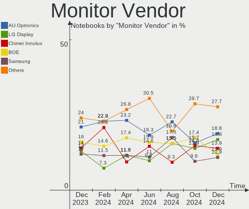
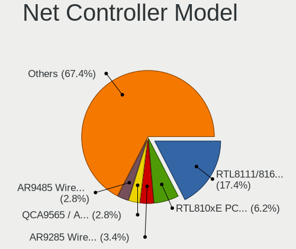
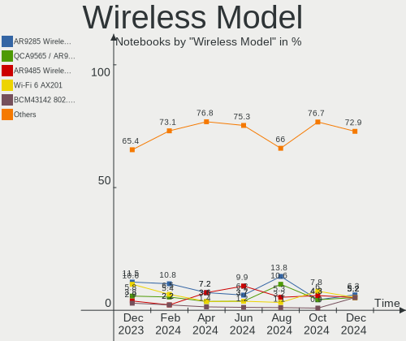

ROSA - Hardware Trends (Notebooks)
----------------------------------

A project to identify most popular hardware characteristics and track their change
over time based on data collected by Linux users at https://Linux-Hardware.org.

Anyone can contribute to this report by the [hw-probe](https://github.com/linuxhw/hw-probe) tool:

    sudo -E hw-probe -all -upload

This report is for one last month. Overall report since the beginning of time: [TestDays](https://github.com/linuxhw/TestDays)

Period: Dec, 2023.

Contents
--------

* [ System ](#system)
  - [ OS                       ](#os)
  - [ OS Family                ](#os-family)
  - [ Kernel                   ](#kernel)
  - [ Kernel Family            ](#kernel-family)
  - [ Kernel Major Ver.        ](#kernel-major-ver)
  - [ Arch                     ](#arch)
  - [ DE                       ](#de)
  - [ Display Server           ](#display-server)
  - [ Display Manager          ](#display-manager)
  - [ OS Lang                  ](#os-lang)
  - [ Boot Mode                ](#boot-mode)
  - [ Filesystem               ](#filesystem)
  - [ Part. scheme             ](#part-scheme)
  - [ Dual Boot with Linux/BSD ](#dual-boot-with-linuxbsd)
  - [ Dual Boot (Win)          ](#dual-boot-win)

* [ Board ](#board)
  - [ Vendor                   ](#vendor)
  - [ Model                    ](#model)
  - [ Model Family             ](#model-family)
  - [ MFG Year                 ](#mfg-year)
  - [ Form Factor              ](#form-factor)
  - [ Secure Boot              ](#secure-boot)
  - [ Coreboot                 ](#coreboot)
  - [ RAM Size                 ](#ram-size)
  - [ RAM Used                 ](#ram-used)
  - [ Total Drives             ](#total-drives)
  - [ Has CD-ROM               ](#has-cd-rom)
  - [ Has Ethernet             ](#has-ethernet)
  - [ Has WiFi                 ](#has-wifi)
  - [ Has Bluetooth            ](#has-bluetooth)

* [ Location ](#location)
  - [ Country                  ](#country)
  - [ City                     ](#city)

* [ Drives ](#drives)
  - [ Drive Vendor             ](#drive-vendor)
  - [ Drive Model              ](#drive-model)
  - [ HDD Vendor               ](#hdd-vendor)
  - [ SSD Vendor               ](#ssd-vendor)
  - [ Drive Kind               ](#drive-kind)
  - [ Drive Connector          ](#drive-connector)
  - [ Drive Size               ](#drive-size)
  - [ Space Total              ](#space-total)
  - [ Space Used               ](#space-used)
  - [ Malfunc. Drives          ](#malfunc-drives)
  - [ Malfunc. Drive Vendor    ](#malfunc-drive-vendor)
  - [ Malfunc. HDD Vendor      ](#malfunc-hdd-vendor)
  - [ Malfunc. Drive Kind      ](#malfunc-drive-kind)
  - [ Failed Drives            ](#failed-drives)
  - [ Failed Drive Vendor      ](#failed-drive-vendor)
  - [ Drive Status             ](#drive-status)

* [ Storage controller ](#storage-controller)
  - [ Storage Vendor           ](#storage-vendor)
  - [ Storage Model            ](#storage-model)
  - [ Storage Kind             ](#storage-kind)

* [ Processor ](#processor)
  - [ CPU Vendor               ](#cpu-vendor)
  - [ CPU Model                ](#cpu-model)
  - [ CPU Model Family         ](#cpu-model-family)
  - [ CPU Cores                ](#cpu-cores)
  - [ CPU Sockets              ](#cpu-sockets)
  - [ CPU Threads              ](#cpu-threads)
  - [ CPU Op-Modes             ](#cpu-op-modes)
  - [ CPU Microcode            ](#cpu-microcode)
  - [ CPU Microarch            ](#cpu-microarch)

* [ Graphics ](#graphics)
  - [ GPU Vendor               ](#gpu-vendor)
  - [ GPU Model                ](#gpu-model)
  - [ GPU Combo                ](#gpu-combo)
  - [ GPU Driver               ](#gpu-driver)
  - [ GPU Memory               ](#gpu-memory)

* [ Monitor ](#monitor)
  - [ Monitor Vendor           ](#monitor-vendor)
  - [ Monitor Model            ](#monitor-model)
  - [ Monitor Resolution       ](#monitor-resolution)
  - [ Monitor Diagonal         ](#monitor-diagonal)
  - [ Monitor Width            ](#monitor-width)
  - [ Aspect Ratio             ](#aspect-ratio)
  - [ Monitor Area             ](#monitor-area)
  - [ Pixel Density            ](#pixel-density)
  - [ Multiple Monitors        ](#multiple-monitors)

* [ Network ](#network)
  - [ Net Controller Vendor    ](#net-controller-vendor)
  - [ Net Controller Model     ](#net-controller-model)
  - [ Wireless Vendor          ](#wireless-vendor)
  - [ Wireless Model           ](#wireless-model)
  - [ Ethernet Vendor          ](#ethernet-vendor)
  - [ Ethernet Model           ](#ethernet-model)
  - [ Net Controller Kind      ](#net-controller-kind)
  - [ Used Controller          ](#used-controller)
  - [ NICs                     ](#nics)
  - [ IPv6                     ](#ipv6)

* [ Bluetooth ](#bluetooth)
  - [ Bluetooth Vendor         ](#bluetooth-vendor)
  - [ Bluetooth Model          ](#bluetooth-model)

* [ Sound ](#sound)
  - [ Sound Vendor             ](#sound-vendor)
  - [ Sound Model              ](#sound-model)

* [ Memory ](#memory)
  - [ Memory Vendor            ](#memory-vendor)
  - [ Memory Model             ](#memory-model)
  - [ Memory Kind              ](#memory-kind)
  - [ Memory Form Factor       ](#memory-form-factor)
  - [ Memory Size              ](#memory-size)
  - [ Memory Speed             ](#memory-speed)

* [ Printers & scanners ](#printers--scanners)
  - [ Printer Vendor           ](#printer-vendor)
  - [ Printer Model            ](#printer-model)
  - [ Scanner Vendor           ](#scanner-vendor)
  - [ Scanner Model            ](#scanner-model)

* [ Camera ](#camera)
  - [ Camera Vendor            ](#camera-vendor)
  - [ Camera Model             ](#camera-model)

* [ Security ](#security)
  - [ Fingerprint Vendor       ](#fingerprint-vendor)
  - [ Fingerprint Model        ](#fingerprint-model)
  - [ Chipcard Vendor          ](#chipcard-vendor)
  - [ Chipcard Model           ](#chipcard-model)

* [ Unsupported ](#unsupported)
  - [ Unsupported Devices      ](#unsupported-devices)
  - [ Unsupported Device Types ](#unsupported-device-types)

System
------

OS
--

Installed operating systems

| Name       | Notebooks | Percent |
|------------|-----------|---------|
| ROSA 12.4  | 80        | 78.43%  |
| ROSA 12    | 10        | 9.8%    |
| ROSA R11.1 | 6         | 5.88%   |
| ROSA 12.2  | 2         | 1.96%   |
| ROSA R11   | 1         | 0.98%   |
| ROSA 13.0  | 1         | 0.98%   |
| ROSA 12.3  | 1         | 0.98%   |
| ROSA 12.1  | 1         | 0.98%   |

OS Family
---------

OS without a version

| Name | Notebooks | Percent |
|------|-----------|---------|
| ROSA | 102       | 100%    |

Kernel
------

Version of the Linux kernel

| Version                                   | Notebooks | Percent |
|-------------------------------------------|-----------|---------|
| 6.1.58-generic-1rosa2021.1-x86_64         | 58        | 56.86%  |
| 6.1.20-generic-2rosa2021.1-x86_64         | 18        | 17.65%  |
| 5.10.184-generic-1rosa2021.1-x86_64       | 6         | 5.88%   |
| 5.15.127-generic-1rosa2021.1-x86_64       | 4         | 3.92%   |
| 5.10.74-generic-2rosa2021.1-x86_64        | 2         | 1.96%   |
| 4.15.0-desktop-122.124.1rosa-x86_64       | 2         | 1.96%   |
| 6.4.15.xm1-1.klp-xanmod-rosa2021.1-x86_64 | 1         | 0.98%   |
| 6.1.58-generic-4rosa2023.1-x86_64         | 1         | 0.98%   |
| 6.1.58-generic-1rosa2021.1-i686           | 1         | 0.98%   |
| 6.1.46-generic-2rosa2021.1-x86_64         | 1         | 0.98%   |
| 6.1.38-generic-1rosa2021.1-x86_64         | 1         | 0.98%   |
| 5.4.83-generic-2rosa-x86_64               | 1         | 0.98%   |
| 5.4.32-generic-2rosa-i586                 | 1         | 0.98%   |
| 5.15.75-generic-1rosa2021.1-x86_64        | 1         | 0.98%   |
| 5.10.71-generic-1rosa2021.1-x86_64        | 1         | 0.98%   |
| 4.9.155-nrj-desktop-1rosa-x86_64          | 1         | 0.98%   |
| 4.15.0-desktop-45.1rosa-x86_64            | 1         | 0.98%   |
| 4.15.0-desktop-122.124.1rosa-i586         | 1         | 0.98%   |

Kernel Family
-------------

Linux kernel without a distro release

| Version  | Notebooks | Percent |
|----------|-----------|---------|
| 6.1.58   | 60        | 58.82%  |
| 6.1.20   | 18        | 17.65%  |
| 5.10.184 | 6         | 5.88%   |
| 5.15.127 | 4         | 3.92%   |
| 4.15.0   | 4         | 3.92%   |
| 5.10.74  | 2         | 1.96%   |
| 6.4.15   | 1         | 0.98%   |
| 6.1.46   | 1         | 0.98%   |
| 6.1.38   | 1         | 0.98%   |
| 5.4.83   | 1         | 0.98%   |
| 5.4.32   | 1         | 0.98%   |
| 5.15.75  | 1         | 0.98%   |
| 5.10.71  | 1         | 0.98%   |
| 4.9.155  | 1         | 0.98%   |

Kernel Major Ver.
-----------------

Linux kernel major version

| Version | Notebooks | Percent |
|---------|-----------|---------|
| 6.1     | 80        | 78.43%  |
| 5.10    | 9         | 8.82%   |
| 5.15    | 5         | 4.9%    |
| 4.15    | 4         | 3.92%   |
| 5.4     | 2         | 1.96%   |
| 6.4     | 1         | 0.98%   |
| 4.9     | 1         | 0.98%   |

Arch
----

OS architecture (x86_64, i586, etc.)

| Name   | Notebooks | Percent |
|--------|-----------|---------|
| x86_64 | 99        | 97.06%  |
| i686   | 3         | 2.94%   |

DE
--

Desktop Environment

| Name  | Notebooks | Percent |
|-------|-----------|---------|
| KDE5  | 65        | 63.73%  |
| GNOME | 21        | 20.59%  |
| LXQt  | 10        | 9.8%    |
| KDE4  | 4         | 3.92%   |
| XFCE  | 1         | 0.98%   |
| i3    | 1         | 0.98%   |

Display Server
--------------

X11 or Wayland

| Name    | Notebooks | Percent |
|---------|-----------|---------|
| Wayland | 78        | 76.47%  |
| X11     | 22        | 21.57%  |
| Tty     | 2         | 1.96%   |

Display Manager
---------------

SDDM, LightDM, etc.

| Name    | Notebooks | Percent |
|---------|-----------|---------|
| SDDM    | 67        | 65.69%  |
| GDM     | 29        | 28.43%  |
| KDM     | 4         | 3.92%   |
| LightDM | 2         | 1.96%   |

OS Lang
-------

Language

| Lang    | Notebooks | Percent |
|---------|-----------|---------|
| ru_RU   | 94        | 92.16%  |
| it_IT   | 3         | 2.94%   |
| pl_PL   | 2         | 1.96%   |
| sk_SK   | 1         | 0.98%   |
| ru_BY   | 1         | 0.98%   |
| Unknown | 1         | 0.98%   |

Boot Mode
---------

EFI or BIOS

| Mode | Notebooks | Percent |
|------|-----------|---------|
| EFI  | 57        | 55.88%  |
| BIOS | 45        | 44.12%  |

Filesystem
----------

Type of filesystem

| Type    | Notebooks | Percent |
|---------|-----------|---------|
| Ext4    | 89        | 87.25%  |
| Btrfs   | 12        | 11.76%  |
| Overlay | 1         | 0.98%   |

Part. scheme
------------

Scheme of partitioning

| Type | Notebooks | Percent |
|------|-----------|---------|
| GPT  | 54        | 52.94%  |
| MBR  | 48        | 47.06%  |

Dual Boot with Linux/BSD
------------------------

Hosting more than one Linux/BSD

| Dual boot | Notebooks | Percent |
|-----------|-----------|---------|
| No        | 79        | 77.45%  |
| Yes       | 23        | 22.55%  |

Dual Boot (Win)
---------------

Hosting Linux and Windows

| Dual boot | Notebooks | Percent |
|-----------|-----------|---------|
| No        | 56        | 54.9%   |
| Yes       | 46        | 45.1%   |

Board
-----

Vendor
------

Motherboard manufacturer

| Name                     | Notebooks | Percent |
|--------------------------|-----------|---------|
| ASUSTek Computer         | 18        | 17.65%  |
| Lenovo                   | 16        | 15.69%  |
| Acer                     | 13        | 12.75%  |
| Hewlett-Packard          | 12        | 11.76%  |
| Dell                     | 7         | 6.86%   |
| Clevo                    | 5         | 4.9%    |
| Toshiba                  | 4         | 3.92%   |
| HUAWEI                   | 4         | 3.92%   |
| Samsung Electronics      | 3         | 2.94%   |
| Sony                     | 2         | 1.96%   |
| MSI                      | 2         | 1.96%   |
| Packard Bell             | 1         | 0.98%   |
| Notebook                 | 1         | 0.98%   |
| Maibenben                | 1         | 0.98%   |
| LTD Delovoy Office       | 1         | 0.98%   |
| LG Electronics           | 1         | 0.98%   |
| Irbis                    | 1         | 0.98%   |
| Intel                    | 1         | 0.98%   |
| Infinix                  | 1         | 0.98%   |
| HIPER Technology Limited | 1         | 0.98%   |
| Graviton                 | 1         | 0.98%   |
| Fujitsu Siemens          | 1         | 0.98%   |
| eMachines                | 1         | 0.98%   |
| DNS                      | 1         | 0.98%   |
| Digma                    | 1         | 0.98%   |
| ARDOR GAMING             | 1         | 0.98%   |
| Apple                    | 1         | 0.98%   |

Model
-----

Motherboard model

| Name                                       | Notebooks | Percent |
|--------------------------------------------|-----------|---------|
| Clevo NL41MU2                              | 5         | 4.9%    |
| Lenovo B590 20206                          | 2         | 1.96%   |
| HUAWEI BOD-WXX9                            | 2         | 1.96%   |
| Toshiba Satellite U300                     | 1         | 0.98%   |
| Toshiba Satellite Pro C660                 | 1         | 0.98%   |
| Toshiba Satellite C660                     | 1         | 0.98%   |
| Toshiba Satellite A200                     | 1         | 0.98%   |
| Sony VGN-FW11ER                            | 1         | 0.98%   |
| Sony VGC-LT1SR                             | 1         | 0.98%   |
| Samsung R528/R728                          | 1         | 0.98%   |
| Samsung 350V5C/351V5C/3540VC/3440VC        | 1         | 0.98%   |
| Samsung 300V3A/300V4A/300V5A/200A4B/200A5B | 1         | 0.98%   |
| Packard Bell EasyNote TE11HC               | 1         | 0.98%   |
| Notebook W65_67SJ                          | 1         | 0.98%   |
| MSI Katana GF76 12UC                       | 1         | 0.98%   |
| MSI GE70 0NC\0ND                           | 1         | 0.98%   |
| Maibenben MaiBook P series                 | 1         | 0.98%   |
| LTD Delovoy Office EVE 14 C414 NA9144BXW01 | 1         | 0.98%   |
| LG F1-2A85R                                | 1         | 0.98%   |
| Lenovo XiaoXinPro 16 IRH8 83AQ             | 1         | 0.98%   |
| Lenovo ThinkPad Z61t 9441W15               | 1         | 0.98%   |
| Lenovo ThinkPad T530 239233G               | 1         | 0.98%   |
| Lenovo ThinkPad T480 20L50007RT            | 1         | 0.98%   |
| Lenovo ThinkPad L520 5017AD1               | 1         | 0.98%   |
| Lenovo K14 Gen 1 21CSS16E00                | 1         | 0.98%   |
| Lenovo IdeaPad S145-15IIL 81W8             | 1         | 0.98%   |
| Lenovo IdeaPad L340-15API 81LW             | 1         | 0.98%   |
| Lenovo IdeaPad 330-15ARR 81D2              | 1         | 0.98%   |
| Lenovo IdeaPad 320-15IAP 80XR              | 1         | 0.98%   |
| Lenovo IdeaPad 3 15ITL05 81X8              | 1         | 0.98%   |
| Lenovo IdeaPad 3 14ADA05 81W0              | 1         | 0.98%   |
| Lenovo G50-70 20351                        | 1         | 0.98%   |
| Lenovo B570e HuronRiver Platform           | 1         | 0.98%   |
| Irbis NB133                                | 1         | 0.98%   |
| Intel ChiefRiver                           | 1         | 0.98%   |
| Infinix INBOOK X3                          | 1         | 0.98%   |
| HUAWEI KLVL-WXXW                           | 1         | 0.98%   |
| HUAWEI BoDE-WXX9                           | 1         | 0.98%   |
| HIPER Limited HIPER WORKBOOK               | 1         | 0.98%   |
| HP Victus by Gaming Laptop 15-fb0xxx       | 1         | 0.98%   |

Model Family
------------

Motherboard model prefix

| Name                   | Notebooks | Percent |
|------------------------|-----------|---------|
| Acer Aspire            | 9         | 8.82%   |
| Lenovo IdeaPad         | 6         | 5.88%   |
| HP ProBook             | 5         | 4.9%    |
| Clevo NL41MU2          | 5         | 4.9%    |
| Toshiba Satellite      | 4         | 3.92%   |
| Lenovo ThinkPad        | 4         | 3.92%   |
| Lenovo B590            | 2         | 1.96%   |
| HUAWEI BOD-WXX9        | 2         | 1.96%   |
| Dell System            | 2         | 1.96%   |
| Dell Inspiron          | 2         | 1.96%   |
| ASUS VivoBook          | 2         | 1.96%   |
| Sony VGN-FW11ER        | 1         | 0.98%   |
| Sony VGC-LT1SR         | 1         | 0.98%   |
| Samsung R528           | 1         | 0.98%   |
| Samsung 350V5C         | 1         | 0.98%   |
| Samsung 300V3A         | 1         | 0.98%   |
| Packard Bell EasyNote  | 1         | 0.98%   |
| Notebook W65           | 1         | 0.98%   |
| MSI Katana             | 1         | 0.98%   |
| MSI GE70               | 1         | 0.98%   |
| Maibenben MaiBook      | 1         | 0.98%   |
| LTD Delovoy Office EVE | 1         | 0.98%   |
| LG F1-2A85R            | 1         | 0.98%   |
| Lenovo XiaoXinPro      | 1         | 0.98%   |
| Lenovo K14             | 1         | 0.98%   |
| Lenovo G50-70          | 1         | 0.98%   |
| Lenovo B570e           | 1         | 0.98%   |
| Irbis NB133            | 1         | 0.98%   |
| Intel ChiefRiver       | 1         | 0.98%   |
| Infinix INBOOK         | 1         | 0.98%   |
| HUAWEI KLVL-WXXW       | 1         | 0.98%   |
| HUAWEI BoDE-WXX9       | 1         | 0.98%   |
| HIPER Limited HIPER    | 1         | 0.98%   |
| HP Victus              | 1         | 0.98%   |
| HP Pavilion            | 1         | 0.98%   |
| HP Notebook            | 1         | 0.98%   |
| HP Laptop              | 1         | 0.98%   |
| HP EliteBook           | 1         | 0.98%   |
| HP Compaq              | 1         | 0.98%   |
| HP 250                 | 1         | 0.98%   |

MFG Year
--------

Motherboard manufacture year

| Year | Notebooks | Percent |
|------|-----------|---------|
| 2022 | 11        | 10.78%  |
| 2011 | 11        | 10.78%  |
| 2010 | 10        | 9.8%    |
| 2013 | 9         | 8.82%   |
| 2021 | 8         | 7.84%   |
| 2007 | 8         | 7.84%   |
| 2012 | 7         | 6.86%   |
| 2023 | 6         | 5.88%   |
| 2020 | 6         | 5.88%   |
| 2017 | 5         | 4.9%    |
| 2019 | 4         | 3.92%   |
| 2014 | 4         | 3.92%   |
| 2009 | 4         | 3.92%   |
| 2018 | 3         | 2.94%   |
| 2015 | 2         | 1.96%   |
| 2008 | 2         | 1.96%   |
| 2006 | 1         | 0.98%   |
| 2005 | 1         | 0.98%   |

Form Factor
-----------

Physical design of the computer

| Name     | Notebooks | Percent |
|----------|-----------|---------|
| Notebook | 102       | 100%    |

Secure Boot
-----------

Enabled or disabled

| State    | Notebooks | Percent |
|----------|-----------|---------|
| Disabled | 102       | 100%    |

Coreboot
--------

Have coreboot on board

| Used | Notebooks | Percent |
|------|-----------|---------|
| No   | 102       | 100%    |

RAM Size
--------

Total RAM memory

| Size in GB | Notebooks | Percent |
|------------|-----------|---------|
| 4.01-8.0   | 31        | 30.39%  |
| 3.01-4.0   | 28        | 27.45%  |
| 16.01-24.0 | 17        | 16.67%  |
| 8.01-16.0  | 10        | 9.8%    |
| 1.01-2.0   | 7         | 6.86%   |
| 2.01-3.0   | 5         | 4.9%    |
| 32.01-64.0 | 2         | 1.96%   |
| 24.01-32.0 | 2         | 1.96%   |

RAM Used
--------

Used RAM memory

| Used GB  | Notebooks | Percent |
|----------|-----------|---------|
| 1.01-2.0 | 54        | 52.94%  |
| 2.01-3.0 | 20        | 19.61%  |
| 0.51-1.0 | 18        | 17.65%  |
| 4.01-8.0 | 7         | 6.86%   |
| 3.01-4.0 | 3         | 2.94%   |

Total Drives
------------

Number of drives on board

| Drives | Notebooks | Percent |
|--------|-----------|---------|
| 1      | 76        | 74.51%  |
| 2      | 20        | 19.61%  |
| 3      | 5         | 4.9%    |
| 0      | 1         | 0.98%   |

Has CD-ROM
----------

Has CD-ROM on board

| Presented | Notebooks | Percent |
|-----------|-----------|---------|
| No        | 61        | 59.8%   |
| Yes       | 41        | 40.2%   |

Has Ethernet
------------

Has Ethernet on board

| Presented | Notebooks | Percent |
|-----------|-----------|---------|
| Yes       | 84        | 82.35%  |
| No        | 18        | 17.65%  |

Has WiFi
--------

Has WiFi module

| Presented | Notebooks | Percent |
|-----------|-----------|---------|
| Yes       | 100       | 98.04%  |
| No        | 2         | 1.96%   |

Has Bluetooth
-------------

Has Bluetooth module

| Presented | Notebooks | Percent |
|-----------|-----------|---------|
| Yes       | 82        | 80.39%  |
| No        | 20        | 19.61%  |

Location
--------

Country
-------

Geographic location (country)

| Country    | Notebooks | Percent |
|------------|-----------|---------|
| Russia     | 88        | 86.27%  |
| Belarus    | 4         | 3.92%   |
| Italy      | 3         | 2.94%   |
| Poland     | 2         | 1.96%   |
| Ukraine    | 1         | 0.98%   |
| Slovakia   | 1         | 0.98%   |
| Latvia     | 1         | 0.98%   |
| Kazakhstan | 1         | 0.98%   |
| Germany    | 1         | 0.98%   |

City
----

Geographic location (city)

| City                | Notebooks | Percent |
|---------------------|-----------|---------|
| Moscow              | 29        | 28.43%  |
| St Petersburg       | 5         | 4.9%    |
| Novosibirsk         | 5         | 4.9%    |
| Yekaterinburg       | 3         | 2.94%   |
| Krasnodar           | 3         | 2.94%   |
| Vladivostok         | 2         | 1.96%   |
| Rome                | 2         | 1.96%   |
| Minsk               | 2         | 1.96%   |
| Chelyabinsk         | 2         | 1.96%   |
| Yakutsk             | 1         | 0.98%   |
| Wroclaw             | 1         | 0.98%   |
| Vologda             | 1         | 0.98%   |
| Vitebsk             | 1         | 0.98%   |
| Tver                | 1         | 0.98%   |
| Tula                | 1         | 0.98%   |
| Tomsk               | 1         | 0.98%   |
| Tolyatti            | 1         | 0.98%   |
| Szczecin            | 1         | 0.98%   |
| Surgut              | 1         | 0.98%   |
| Štúrovo           | 1         | 0.98%   |
| Stupino             | 1         | 0.98%   |
| Stary Oskol         | 1         | 0.98%   |
| Simferopol          | 1         | 0.98%   |
| Sergiyev Posad      | 1         | 0.98%   |
| San Gavino Monreale | 1         | 0.98%   |
| Samara              | 1         | 0.98%   |
| Rybinsk             | 1         | 0.98%   |
| Riga                | 1         | 0.98%   |
| Priozersk           | 1         | 0.98%   |
| Perm                | 1         | 0.98%   |
| Orekhovo-Zuyevo     | 1         | 0.98%   |
| Omsk                | 1         | 0.98%   |
| Obninsk             | 1         | 0.98%   |
| Neuss               | 1         | 0.98%   |
| Moscow Oblast       | 1         | 0.98%   |
| Minusinsk           | 1         | 0.98%   |
| Makar'yev           | 1         | 0.98%   |
| Magnitogorsk        | 1         | 0.98%   |
| Lipetsk             | 1         | 0.98%   |
| Lesogorskiy         | 1         | 0.98%   |

Drives
------

Drive Vendor
------------

Hard drive vendors

| Vendor              | Notebooks | Drives | Percent |
|---------------------|-----------|--------|---------|
| WDC                 | 16        | 16     | 12.6%   |
| Seagate             | 11        | 11     | 8.66%   |
| Toshiba             | 8         | 8      | 6.3%    |
| Unknown             | 6         | 7      | 4.72%   |
| SK hynix            | 5         | 5      | 3.94%   |
| Kingston            | 5         | 5      | 3.94%   |
| Crucial             | 5         | 5      | 3.94%   |
| BIWIN               | 5         | 5      | 3.94%   |
| SanDisk             | 4         | 4      | 3.15%   |
| Samsung Electronics | 4         | 4      | 3.15%   |
| Hitachi             | 4         | 4      | 3.15%   |
| Silicon Motion      | 3         | 3      | 2.36%   |
| Micron Technology   | 3         | 3      | 2.36%   |
| Intel               | 3         | 3      | 2.36%   |
| HGST                | 3         | 3      | 2.36%   |
| China               | 3         | 3      | 2.36%   |
| Apacer              | 3         | 3      | 2.36%   |
| A-DATA Technology   | 3         | 3      | 2.36%   |
| XrayDisk            | 2         | 2      | 1.57%   |
| Team                | 2         | 2      | 1.57%   |
| Patriot             | 2         | 2      | 1.57%   |
| Netac               | 2         | 2      | 1.57%   |
| KingSpec            | 2         | 2      | 1.57%   |
| Fujitsu             | 2         | 2      | 1.57%   |
| WALRAM              | 1         | 1      | 0.79%   |
| UMIS                | 1         | 1      | 0.79%   |
| SPCC                | 1         | 1      | 0.79%   |
| Smartbuy            | 1         | 1      | 0.79%   |
| Phison              | 1         | 1      | 0.79%   |
| Neo                 | 1         | 1      | 0.79%   |
| Lexar               | 1         | 1      | 0.79%   |
| Lenovo              | 1         | 1      | 0.79%   |
| KIOXIA              | 1         | 1      | 0.79%   |
| Hewlett-Packard     | 1         | 1      | 0.79%   |
| GS                  | 1         | 1      | 0.79%   |
| GOODRAM             | 1         | 1      | 0.79%   |
| Gigabyte Technology | 1         | 1      | 0.79%   |
| FORESEE             | 1         | 1      | 0.79%   |
| Fanxiang            | 1         | 1      | 0.79%   |
| External            | 1         | 1      | 0.79%   |

Drive Model
-----------

Hard drive models

| Model                                | Notebooks | Percent |
|--------------------------------------|-----------|---------|
| BIWIN CE480T5D101-256 256GB          | 5         | 3.88%   |
| Toshiba MQ01ABF050 500GB             | 4         | 3.1%    |
| WDC WDS240G2G0A-00JH30 240GB SSD     | 3         | 2.33%   |
| Seagate ST9500325AS 500GB            | 3         | 2.33%   |
| Crucial CT240BX500SSD1 240GB         | 3         | 2.33%   |
| Toshiba MQ01ABD032 320GB             | 2         | 1.55%   |
| Silicon Motion PCIe-4 SSD 256GB      | 2         | 1.55%   |
| Seagate ST1000LM024 HN-M101MBB 1TB   | 2         | 1.55%   |
| SanDisk NVMe SSD Drive 512GB         | 2         | 1.55%   |
| Kingston SA400S37120G 120GB SSD      | 2         | 1.55%   |
| KingSpec P3-128 128GB SSD            | 2         | 1.55%   |
| Hitachi HTS723232A7A364 320GB        | 2         | 1.55%   |
| HGST HTS541010A9E680 1TB             | 2         | 1.55%   |
| China SSD 128GB                      | 2         | 1.55%   |
| XrayDisk SSD 256GB                   | 1         | 0.78%   |
| XrayDisk 2TB SSD                     | 1         | 0.78%   |
| WDC WD5000LPVX-80V0TT0 500GB         | 1         | 0.78%   |
| WDC WD3200BPVT-35ZEST0 320GB         | 1         | 0.78%   |
| WDC WD3200BPVT-24ZEST0 320GB         | 1         | 0.78%   |
| WDC WD2500BEVT-75A23T0 250GB         | 1         | 0.78%   |
| WDC WD2500BEVT-22A23T0 250GB         | 1         | 0.78%   |
| WDC WD1600BEVT-75A23T0 160GB         | 1         | 0.78%   |
| WDC WD1600BEKT-60F3T1 160GB          | 1         | 0.78%   |
| WDC WD10SPZX-21Z10T0 1TB             | 1         | 0.78%   |
| WDC WD10JPVX-22JC3T0 1TB             | 1         | 0.78%   |
| WDC WD10JPVX-00JC3T0 1TB             | 1         | 0.78%   |
| WDC PC SN530 SDBPNPZ-512G-1114 512GB | 1         | 0.78%   |
| WDC PC SN530 SDBPMPZ-512G-1001 512GB | 1         | 0.78%   |
| WDC PC SN520 SDAPMUW-128G-1101 128GB | 1         | 0.78%   |
| WALRAM SSD 128GB                     | 1         | 0.78%   |
| Unknown SLD32G  32GB                 | 1         | 0.78%   |
| Unknown SLD128  128GB                | 1         | 0.78%   |
| Unknown NCard  16GB                  | 1         | 0.78%   |
| Unknown G1J38E  64GB                 | 1         | 0.78%   |
| Unknown DA4128  128GB                | 1         | 0.78%   |
| Unknown DA4064  64GB                 | 1         | 0.78%   |
| Unknown 00000  4GB                   | 1         | 0.78%   |
| UMIS RPEYJ1T24MKN2QWY 1TB            | 1         | 0.78%   |
| Toshiba MK2575GSX 250GB              | 1         | 0.78%   |
| Toshiba HDWJ105 500GB                | 1         | 0.78%   |

HDD Vendor
----------

Hard disk drive vendors

| Vendor   | Notebooks | Drives | Percent |
|----------|-----------|--------|---------|
| Seagate  | 11        | 11     | 28.21%  |
| WDC      | 10        | 10     | 25.64%  |
| Toshiba  | 8         | 8      | 20.51%  |
| Hitachi  | 4         | 4      | 10.26%  |
| HGST     | 3         | 3      | 7.69%   |
| Fujitsu  | 2         | 2      | 5.13%   |
| External | 1         | 1      | 2.56%   |

SSD Vendor
----------

Solid state drive vendors

| Vendor              | Notebooks | Drives | Percent |
|---------------------|-----------|--------|---------|
| Crucial             | 5         | 5      | 10.64%  |
| Kingston            | 4         | 4      | 8.51%   |
| WDC                 | 3         | 3      | 6.38%   |
| China               | 3         | 3      | 6.38%   |
| Apacer              | 3         | 3      | 6.38%   |
| XrayDisk            | 2         | 2      | 4.26%   |
| Team                | 2         | 2      | 4.26%   |
| Micron Technology   | 2         | 2      | 4.26%   |
| KingSpec            | 2         | 2      | 4.26%   |
| Intel               | 2         | 2      | 4.26%   |
| A-DATA Technology   | 2         | 2      | 4.26%   |
| WALRAM              | 1         | 1      | 2.13%   |
| SPCC                | 1         | 1      | 2.13%   |
| Smartbuy            | 1         | 1      | 2.13%   |
| SK hynix            | 1         | 1      | 2.13%   |
| SanDisk             | 1         | 1      | 2.13%   |
| Samsung Electronics | 1         | 1      | 2.13%   |
| Patriot             | 1         | 1      | 2.13%   |
| Neo                 | 1         | 1      | 2.13%   |
| Hewlett-Packard     | 1         | 1      | 2.13%   |
| GS                  | 1         | 1      | 2.13%   |
| GOODRAM             | 1         | 1      | 2.13%   |
| Gigabyte Technology | 1         | 1      | 2.13%   |
| Fanxiang            | 1         | 1      | 2.13%   |
| Digma               | 1         | 1      | 2.13%   |
| Apple               | 1         | 1      | 2.13%   |
| AMD                 | 1         | 2      | 2.13%   |
| Unknown             | 1         | 1      | 2.13%   |

Drive Kind
----------

HDD or SSD

| Kind | Notebooks | Drives | Percent |
|------|-----------|--------|---------|
| SSD  | 46        | 48     | 37.4%   |
| HDD  | 37        | 39     | 30.08%  |
| NVMe | 33        | 34     | 26.83%  |
| MMC  | 7         | 8      | 5.69%   |

Drive Connector
---------------

SATA, SAS, NVMe, etc.

| Type | Notebooks | Drives | Percent |
|------|-----------|--------|---------|
| SATA | 71        | 86     | 63.39%  |
| NVMe | 33        | 34     | 29.46%  |
| MMC  | 7         | 8      | 6.25%   |
| SAS  | 1         | 1      | 0.89%   |

Drive Size
----------

Size of hard drive

| Size in TB | Notebooks | Drives | Percent |
|------------|-----------|--------|---------|
| 0.01-0.5   | 59        | 68     | 76.62%  |
| 0.51-1.0   | 16        | 17     | 20.78%  |
| 1.01-2.0   | 2         | 2      | 2.6%    |

Space Total
-----------

Amount of disk space available on the file system

| Size in GB | Notebooks | Percent |
|------------|-----------|---------|
| 101-250    | 41        | 40.2%   |
| 251-500    | 24        | 23.53%  |
| 1-20       | 11        | 10.78%  |
| 501-1000   | 9         | 8.82%   |
| 51-100     | 8         | 7.84%   |
| 21-50      | 5         | 4.9%    |
| 1001-2000  | 2         | 1.96%   |
| 2001-3000  | 1         | 0.98%   |
| Unknown    | 1         | 0.98%   |

Space Used
----------

Amount of used disk space

| Used GB  | Notebooks | Percent |
|----------|-----------|---------|
| 1-20     | 59        | 57.84%  |
| 21-50    | 20        | 19.61%  |
| 101-250  | 9         | 8.82%   |
| 51-100   | 6         | 5.88%   |
| 251-500  | 5         | 4.9%    |
| 501-1000 | 2         | 1.96%   |
| Unknown  | 1         | 0.98%   |

Malfunc. Drives
---------------

Drive models with a malfunction

| Model                                               | Notebooks | Drives | Percent |
|-----------------------------------------------------|-----------|--------|---------|
| Toshiba MQ01ABF050 500GB                            | 3         | 3      | 14.29%  |
| Seagate ST9500325AS 500GB                           | 3         | 3      | 14.29%  |
| WDC WD3200BPVT-24ZEST0 320GB                        | 1         | 1      | 4.76%   |
| WDC WD2500BEVT-22A23T0 250GB                        | 1         | 1      | 4.76%   |
| WDC WD1600BEKT-60F3T1 160GB                         | 1         | 1      | 4.76%   |
| Toshiba MQ01ABD032 320GB                            | 1         | 1      | 4.76%   |
| Seagate ST320LT020-9YG142 320GB                     | 1         | 1      | 4.76%   |
| Seagate ST1000LM024 HN-M101MBB 1TB                  | 1         | 1      | 4.76%   |
| Neo Forza NFS121SA324-6007000 240GB SSD             | 1         | 1      | 4.76%   |
| Micron Technology MTFDDAK512MAY-1AE1ZABHA 512GB SSD | 1         | 1      | 4.76%   |
| Intel SSDSC2BW120A4 120GB                           | 1         | 1      | 4.76%   |
| Intel SSDSA2M080G2GC 80GB                           | 1         | 1      | 4.76%   |
| Hitachi HTS723232A7A364 320GB                       | 1         | 1      | 4.76%   |
| Hitachi HTS542512K9SA00 120GB                       | 1         | 1      | 4.76%   |
| HGST HTS545050A7E680 500GB                          | 1         | 1      | 4.76%   |
| HGST HTS541010A9E680 1TB                            | 1         | 1      | 4.76%   |
| Fujitsu MHW2120BH 120GB                             | 1         | 1      | 4.76%   |

Malfunc. Drive Vendor
---------------------

Vendors of faulty drives

| Vendor            | Notebooks | Drives | Percent |
|-------------------|-----------|--------|---------|
| Seagate           | 5         | 5      | 23.81%  |
| Toshiba           | 4         | 4      | 19.05%  |
| WDC               | 3         | 3      | 14.29%  |
| Intel             | 2         | 2      | 9.52%   |
| Hitachi           | 2         | 2      | 9.52%   |
| HGST              | 2         | 2      | 9.52%   |
| Neo               | 1         | 1      | 4.76%   |
| Micron Technology | 1         | 1      | 4.76%   |
| Fujitsu           | 1         | 1      | 4.76%   |

Malfunc. HDD Vendor
-------------------

Vendors of faulty HDD drives

| Vendor  | Notebooks | Drives | Percent |
|---------|-----------|--------|---------|
| Seagate | 5         | 5      | 29.41%  |
| Toshiba | 4         | 4      | 23.53%  |
| WDC     | 3         | 3      | 17.65%  |
| Hitachi | 2         | 2      | 11.76%  |
| HGST    | 2         | 2      | 11.76%  |
| Fujitsu | 1         | 1      | 5.88%   |

Malfunc. Drive Kind
-------------------

Kinds of faulty drives

| Kind | Notebooks | Drives | Percent |
|------|-----------|--------|---------|
| HDD  | 17        | 17     | 80.95%  |
| SSD  | 4         | 4      | 19.05%  |

Failed Drives
-------------

Failed drive models

Zero info for selected period =(

Failed Drive Vendor
-------------------

Failed drive vendors

Zero info for selected period =(

Drive Status
------------

Number of failed and malfunc. drives

| Status   | Notebooks | Drives | Percent |
|----------|-----------|--------|---------|
| Works    | 85        | 97     | 73.28%  |
| Malfunc  | 21        | 21     | 18.1%   |
| Detected | 10        | 11     | 8.62%   |

Storage controller
------------------

Storage Vendor
--------------

Storage controller vendors

| Vendor                                  | Notebooks | Percent |
|-----------------------------------------|-----------|---------|
| Intel                                   | 75        | 61.98%  |
| AMD                                     | 11        | 9.09%   |
| SanDisk                                 | 5         | 4.13%   |
| INNOGRIT                                | 5         | 4.13%   |
| SK hynix                                | 4         | 3.31%   |
| Silicon Motion                          | 3         | 2.48%   |
| Samsung Electronics                     | 3         | 2.48%   |
| Netac Technology                        | 2         | 1.65%   |
| Hosin Global Electronics                | 2         | 1.65%   |
| Silicon Integrated Systems [SiS]        | 1         | 0.83%   |
| Shenzhen Unionmemory Information System | 1         | 0.83%   |
| Shenzhen Longsys Electronics            | 1         | 0.83%   |
| Realtek Semiconductor                   | 1         | 0.83%   |
| Phison Electronics                      | 1         | 0.83%   |
| Nvidia                                  | 1         | 0.83%   |
| Micron Technology                       | 1         | 0.83%   |
| MAXIO Technology (Hangzhou)             | 1         | 0.83%   |
| Lenovo                                  | 1         | 0.83%   |
| KIOXIA                                  | 1         | 0.83%   |
| Kingston Technology Company             | 1         | 0.83%   |

Storage Model
-------------

Storage controller models

| Model                                                                                         | Notebooks | Percent |
|-----------------------------------------------------------------------------------------------|-----------|---------|
| Intel 6 Series/C200 Series Chipset Family 6 port Mobile SATA AHCI Controller                  | 13        | 9.77%   |
| Intel 7 Series Chipset Family 6-port SATA Controller [AHCI mode]                              | 10        | 7.52%   |
| AMD FCH SATA Controller [AHCI mode]                                                           | 9         | 6.77%   |
| Intel Tiger Lake-LP SATA Controller                                                           | 8         | 6.02%   |
| Intel 82801HM/HEM (ICH8M/ICH8M-E) SATA Controller [AHCI mode]                                 | 7         | 5.26%   |
| Intel 82801HM/HEM (ICH8M/ICH8M-E) IDE Controller                                              | 7         | 5.26%   |
| Intel 8 Series SATA Controller 1 [AHCI mode]                                                  | 5         | 3.76%   |
| INNOGRIT NVMe SSD Controller IG5216 (DRAM-less)                                               | 5         | 3.76%   |
| Intel 82801IBM/IEM (ICH9M/ICH9M-E) 4 port SATA Controller [AHCI mode]                         | 4         | 3.01%   |
| Intel 5 Series/3400 Series Chipset 4 port SATA AHCI Controller                                | 4         | 3.01%   |
| Silicon Motion Non-Volatile memory controller                                                 | 3         | 2.26%   |
| Intel Celeron N3350/Pentium N4200/Atom E3900 Series SATA AHCI Controller                      | 3         | 2.26%   |
| SK hynix Gold P31/BC711/PC711 NVMe Solid State Drive                                          | 2         | 1.5%    |
| Samsung NVMe SSD Controller 980 (DRAM-less)                                                   | 2         | 1.5%    |
| Intel Volume Management Device NVMe RAID Controller                                           | 2         | 1.5%    |
| Intel Sunrise Point-LP SATA Controller [AHCI mode]                                            | 2         | 1.5%    |
| Intel Ice Lake-LP SATA Controller [AHCI mode]                                                 | 2         | 1.5%    |
| Intel Celeron/Pentium Silver Processor SATA Controller                                        | 2         | 1.5%    |
| Intel Alder Lake-P SATA AHCI Controller                                                       | 2         | 1.5%    |
| Intel 82801 Mobile SATA Controller [RAID mode]                                                | 2         | 1.5%    |
| Intel 8 Series/C220 Series Chipset Family 6-port SATA Controller 1 [AHCI mode]                | 2         | 1.5%    |
| Hosin Global Non-Volatile memory controller                                                   | 2         | 1.5%    |
| SK hynix BC511 NVMe SSD                                                                       | 1         | 0.75%   |
| SK hynix BC501 NVMe Solid State Drive                                                         | 1         | 0.75%   |
| Silicon Integrated Systems [SiS] SATA Controller / IDE mode                                   | 1         | 0.75%   |
| Shenzhen Unionmemory Information System RPEYJ1T24MKN2QWY PCIe 4.0 NVMe SSD 1024GB (DRAM-less) | 1         | 0.75%   |
| Shenzhen Longsys Lexar NM620 NVME SSD (DRAM-less)                                             | 1         | 0.75%   |
| SanDisk WD PC SN810 / Black SN850 NVMe SSD                                                    | 1         | 0.75%   |
| SanDisk WD PC SN540 / Green SN350 NVMe SSD 1 TB (DRAM-less)                                   | 1         | 0.75%   |
| SanDisk Ultra 3D / WD Blue SN550 NVMe SSD                                                     | 1         | 0.75%   |
| SanDisk PC SN530 NVMe SSD (DRAM-less)                                                         | 1         | 0.75%   |
| SanDisk PC SN520 x2 M.2 2242 NVMe SSD                                                         | 1         | 0.75%   |
| Samsung NVMe SSD Controller PM9B1 (DRAM-less)                                                 | 1         | 0.75%   |
| Realtek RTS5765DL NVMe SSD Controller (DRAM-less)                                             | 1         | 0.75%   |
| Phison PS5013-E13 PCIe3 NVMe Controller (DRAM-less)                                           | 1         | 0.75%   |
| Nvidia MCP89 SATA Controller (AHCI mode)                                                      | 1         | 0.75%   |
| Netac PCIe 3 SM based NVMe SSD (DRAM-less)                                                    | 1         | 0.75%   |
| Netac PCIe 3 NVMe SSD (DRAM-less)                                                             | 1         | 0.75%   |
| Micron 2200S NVMe SSD [Cassandra]                                                             | 1         | 0.75%   |
| MAXIO (Hangzhou) NVMe SSD Controller MAP1202                                                  | 1         | 0.75%   |

Storage Kind
------------

Kind of storage controller (IDE, SATA, NVMe, SAS, ...)

| Kind | Notebooks | Percent |
|------|-----------|---------|
| SATA | 82        | 62.6%   |
| NVMe | 33        | 25.19%  |
| IDE  | 12        | 9.16%   |
| RAID | 4         | 3.05%   |

Processor
---------

CPU Vendor
----------

Processor vendors

| Vendor | Notebooks | Percent |
|--------|-----------|---------|
| Intel  | 87        | 85.29%  |
| AMD    | 15        | 14.71%  |

CPU Model
---------

Processor models

| Model                                       | Notebooks | Percent |
|---------------------------------------------|-----------|---------|
| Intel 11th Gen Core i5-1135G7 @ 2.40GHz     | 8         | 7.84%   |
| Intel Pentium CPU B950 @ 2.10GHz            | 3         | 2.94%   |
| Intel Pentium CPU 2020M @ 2.40GHz           | 3         | 2.94%   |
| Intel Core i3-2350M CPU @ 2.30GHz           | 3         | 2.94%   |
| Intel Pentium CPU B960 @ 2.20GHz            | 2         | 1.96%   |
| Intel Core i5-3230M CPU @ 2.60GHz           | 2         | 1.96%   |
| Intel Core i5-2410M CPU @ 2.30GHz           | 2         | 1.96%   |
| Intel Celeron CPU N3350 @ 1.10GHz           | 2         | 1.96%   |
| Intel 12th Gen Core i5-12450H               | 2         | 1.96%   |
| Intel 11th Gen Core i3-1115G4 @ 3.00GHz     | 2         | 1.96%   |
| Intel Pentium Silver N6000 @ 1.10GHz        | 1         | 0.98%   |
| Intel Pentium M processor 1.73GHz           | 1         | 0.98%   |
| Intel Pentium Dual-Core CPU T4500 @ 2.30GHz | 1         | 0.98%   |
| Intel Pentium Dual CPU T3400 @ 2.16GHz      | 1         | 0.98%   |
| Intel Pentium Dual CPU T2310 @ 1.46GHz      | 1         | 0.98%   |
| Intel Pentium CPU N4200 @ 1.10GHz           | 1         | 0.98%   |
| Intel Pentium CPU N3700 @ 1.60GHz           | 1         | 0.98%   |
| Intel Pentium 3558U @ 1.70GHz               | 1         | 0.98%   |
| Intel Core i7-8550U CPU @ 1.80GHz           | 1         | 0.98%   |
| Intel Core i7-7700HQ CPU @ 2.80GHz          | 1         | 0.98%   |
| Intel Core i7-4702MQ CPU @ 2.20GHz          | 1         | 0.98%   |
| Intel Core i7-3520M CPU @ 2.90GHz           | 1         | 0.98%   |
| Intel Core i7-2760QM CPU @ 2.40GHz          | 1         | 0.98%   |
| Intel Core i7-2670QM CPU @ 2.20GHz          | 1         | 0.98%   |
| Intel Core i7-1065G7 CPU @ 1.30GHz          | 1         | 0.98%   |
| Intel Core i5-9300H CPU @ 2.40GHz           | 1         | 0.98%   |
| Intel Core i5-8250U CPU @ 1.60GHz           | 1         | 0.98%   |
| Intel Core i5-7200U CPU @ 2.50GHz           | 1         | 0.98%   |
| Intel Core i5-5200U CPU @ 2.20GHz           | 1         | 0.98%   |
| Intel Core i5-4210U CPU @ 1.70GHz           | 1         | 0.98%   |
| Intel Core i5-4200U CPU @ 1.60GHz           | 1         | 0.98%   |
| Intel Core i5-4200M CPU @ 2.50GHz           | 1         | 0.98%   |
| Intel Core i5-3337U CPU @ 1.80GHz           | 1         | 0.98%   |
| Intel Core i5-3210M CPU @ 2.50GHz           | 1         | 0.98%   |
| Intel Core i5-2450M CPU @ 2.50GHz           | 1         | 0.98%   |
| Intel Core i5-1035G1 CPU @ 1.00GHz          | 1         | 0.98%   |
| Intel Core i5 CPU M 580 @ 2.67GHz           | 1         | 0.98%   |
| Intel Core i5 CPU M 540 @ 2.53GHz           | 1         | 0.98%   |
| Intel Core i5 CPU M 450 @ 2.40GHz           | 1         | 0.98%   |
| Intel Core i3-4010U CPU @ 1.70GHz           | 1         | 0.98%   |

CPU Model Family
----------------

Processor model prefix

| Model                   | Notebooks | Percent |
|-------------------------|-----------|---------|
| Other                   | 19        | 18.63%  |
| Intel Core i5           | 18        | 17.65%  |
| Intel Pentium           | 11        | 10.78%  |
| Intel Core i3           | 9         | 8.82%   |
| Intel Celeron           | 9         | 8.82%   |
| Intel Core i7           | 7         | 6.86%   |
| Intel Core 2 Duo        | 6         | 5.88%   |
| AMD Ryzen 7             | 3         | 2.94%   |
| Intel Pentium Dual      | 2         | 1.96%   |
| Intel Core 2            | 2         | 1.96%   |
| Intel Celeron Dual-Core | 2         | 1.96%   |
| AMD Ryzen 5             | 2         | 1.96%   |
| AMD Ryzen 3             | 2         | 1.96%   |
| Intel Pentium Silver    | 1         | 0.98%   |
| Intel Pentium M         | 1         | 0.98%   |
| Intel Pentium Dual-Core | 1         | 0.98%   |
| AMD Turion 64 Mobile    | 1         | 0.98%   |
| AMD Ryzen 9             | 1         | 0.98%   |
| AMD E1                  | 1         | 0.98%   |
| AMD Athlon II Neo       | 1         | 0.98%   |
| AMD A6                  | 1         | 0.98%   |
| AMD A4                  | 1         | 0.98%   |
| AMD A10                 | 1         | 0.98%   |

CPU Cores
---------

Number of processor cores

| Number | Notebooks | Percent |
|--------|-----------|---------|
| 2      | 60        | 58.82%  |
| 4      | 27        | 26.47%  |
| 1      | 6         | 5.88%   |
| 8      | 5         | 4.9%    |
| 10     | 2         | 1.96%   |
| 14     | 1         | 0.98%   |
| 6      | 1         | 0.98%   |

CPU Sockets
-----------

Number of sockets

| Number | Notebooks | Percent |
|--------|-----------|---------|
| 1      | 102       | 100%    |

CPU Threads
-----------

Threads per core (Hyper-Threading)

| Number | Notebooks | Percent |
|--------|-----------|---------|
| 2      | 61        | 59.8%   |
| 1      | 41        | 40.2%   |

CPU Op-Modes
------------

CPU Operation Modes (32-bit, 64-bit)

| Op mode        | Notebooks | Percent |
|----------------|-----------|---------|
| 32-bit, 64-bit | 101       | 99.02%  |
| 32-bit         | 1         | 0.98%   |

CPU Microcode
-------------

Microcode number

| Number     | Notebooks | Percent |
|------------|-----------|---------|
| 0x206a7    | 15        | 14.71%  |
| 0x806c1    | 11        | 10.78%  |
| 0x306a9    | 8         | 7.84%   |
| 0x6fd      | 5         | 4.9%    |
| 0x1067a    | 5         | 4.9%    |
| 0x40651    | 4         | 3.92%   |
| Unknown    | 4         | 3.92%   |
| 0x906a3    | 3         | 2.94%   |
| 0x706e5    | 3         | 2.94%   |
| 0x20655    | 3         | 2.94%   |
| 0x806ea    | 2         | 1.96%   |
| 0x706a8    | 2         | 1.96%   |
| 0x6f6      | 2         | 1.96%   |
| 0x506c9    | 2         | 1.96%   |
| 0x306c3    | 2         | 1.96%   |
| 0x20652    | 2         | 1.96%   |
| 0x10661    | 2         | 1.96%   |
| 0x0a50000c | 2         | 1.96%   |
| 0x08108102 | 2         | 1.96%   |
| 0x906ea    | 1         | 0.98%   |
| 0x906e9    | 1         | 0.98%   |
| 0x906c0    | 1         | 0.98%   |
| 0x906a4    | 1         | 0.98%   |
| 0x806e9    | 1         | 0.98%   |
| 0x806c2    | 1         | 0.98%   |
| 0x6fb      | 1         | 0.98%   |
| 0x6d8      | 1         | 0.98%   |
| 0x506ca    | 1         | 0.98%   |
| 0x406c3    | 1         | 0.98%   |
| 0x306d4    | 1         | 0.98%   |
| 0x30678    | 1         | 0.98%   |
| 0x10676    | 1         | 0.98%   |
| 0x0a50000d | 1         | 0.98%   |
| 0x08608102 | 1         | 0.98%   |
| 0x08108109 | 1         | 0.98%   |
| 0x0810100b | 1         | 0.98%   |
| 0x07030106 | 1         | 0.98%   |
| 0x07000106 | 1         | 0.98%   |
| 0x06006705 | 1         | 0.98%   |
| 0x06006704 | 1         | 0.98%   |

CPU Microarch
-------------

Microarchitecture

| Name             | Notebooks | Percent |
|------------------|-----------|---------|
| SandyBridge      | 15        | 14.71%  |
| TigerLake        | 13        | 12.75%  |
| Core             | 10        | 9.8%    |
| IvyBridge        | 8         | 7.84%   |
| Haswell          | 7         | 6.86%   |
| Penryn           | 6         | 5.88%   |
| Westmere         | 5         | 4.9%    |
| KabyLake         | 5         | 4.9%    |
| Alderlake Hybrid | 4         | 3.92%   |
| Zen+             | 3         | 2.94%   |
| Zen 3            | 3         | 2.94%   |
| IceLake          | 3         | 2.94%   |
| Goldmont         | 3         | 2.94%   |
| Silvermont       | 2         | 1.96%   |
| Goldmont plus    | 2         | 1.96%   |
| Excavator        | 2         | 1.96%   |
| Unknown          | 2         | 1.96%   |
| Zen              | 1         | 0.98%   |
| Tremont          | 1         | 0.98%   |
| Puma             | 1         | 0.98%   |
| Piledriver       | 1         | 0.98%   |
| P6               | 1         | 0.98%   |
| K8 Hammer        | 1         | 0.98%   |
| K10              | 1         | 0.98%   |
| Jaguar           | 1         | 0.98%   |
| Broadwell        | 1         | 0.98%   |

Graphics
--------

GPU Vendor
----------

Vendors of graphics cards

| Vendor                           | Notebooks | Percent |
|----------------------------------|-----------|---------|
| Intel                            | 76        | 58.91%  |
| Nvidia                           | 28        | 21.71%  |
| AMD                              | 24        | 18.6%   |
| Silicon Integrated Systems [SiS] | 1         | 0.78%   |

GPU Model
---------

Graphics card models

| Model                                                                         | Notebooks | Percent |
|-------------------------------------------------------------------------------|-----------|---------|
| Intel 2nd Generation Core Processor Family Integrated Graphics Controller     | 12        | 8.82%   |
| Intel TigerLake-LP GT2 [Iris Xe Graphics]                                     | 10        | 7.35%   |
| Intel 3rd Gen Core processor Graphics Controller                              | 8         | 5.88%   |
| Intel Haswell-ULT Integrated Graphics Controller                              | 5         | 3.68%   |
| Intel Mobile GM965/GL960 Integrated Graphics Controller (secondary)           | 4         | 2.94%   |
| Intel Mobile GM965/GL960 Integrated Graphics Controller (primary)             | 4         | 2.94%   |
| Nvidia TU117M [GeForce GTX 1650 Mobile / Max-Q]                               | 3         | 2.21%   |
| Nvidia GF117M [GeForce 610M/710M/810M/820M / GT 620M/625M/630M/720M]          | 3         | 2.21%   |
| Intel Tiger Lake-LP GT2 [UHD Graphics G4]                                     | 3         | 2.21%   |
| Intel Mobile 4 Series Chipset Integrated Graphics Controller                  | 3         | 2.21%   |
| Intel Core Processor Integrated Graphics Controller                           | 3         | 2.21%   |
| Intel Alder Lake-P GT1 [UHD Graphics]                                         | 3         | 2.21%   |
| AMD Picasso/Raven 2 [Radeon Vega Series / Radeon Vega Mobile Series]          | 3         | 2.21%   |
| AMD Cezanne [Radeon Vega Series / Radeon Vega Mobile Series]                  | 3         | 2.21%   |
| Nvidia GA107M [GeForce RTX 3050 Mobile]                                       | 2         | 1.47%   |
| Intel UHD Graphics 620                                                        | 2         | 1.47%   |
| Intel Mobile 945GM/GMS/GME, 943/940GML Express Integrated Graphics Controller | 2         | 1.47%   |
| Intel Mobile 945GM/GMS, 943/940GML Express Integrated Graphics Controller     | 2         | 1.47%   |
| Intel Iris Plus Graphics G1 (Ice Lake)                                        | 2         | 1.47%   |
| Intel HD Graphics 500                                                         | 2         | 1.47%   |
| Intel GeminiLake [UHD Graphics 600]                                           | 2         | 1.47%   |
| Intel 4th Gen Core Processor Integrated Graphics Controller                   | 2         | 1.47%   |
| AMD Stoney [Radeon R2/R3/R4/R5 Graphics]                                      | 2         | 1.47%   |
| AMD RV620/M82 [Mobility Radeon HD 3450/3470]                                  | 2         | 1.47%   |
| Silicon Integrated Systems [SiS] 771/671 PCIE VGA Display Adapter             | 1         | 0.74%   |
| Nvidia TU117M [GeForce GTX 1650 Ti Mobile]                                    | 1         | 0.74%   |
| Nvidia MCP89 [GeForce 320M]                                                   | 1         | 0.74%   |
| Nvidia GT218M [GeForce 315M]                                                  | 1         | 0.74%   |
| Nvidia GT215M [GeForce GT 335M]                                               | 1         | 0.74%   |
| Nvidia GP107M [GeForce GTX 1050 Ti Mobile]                                    | 1         | 0.74%   |
| Nvidia GM108M [GeForce 840M]                                                  | 1         | 0.74%   |
| Nvidia GM107M [GeForce GTX 850M]                                              | 1         | 0.74%   |
| Nvidia GK107M [GeForce GT 650M]                                               | 1         | 0.74%   |
| Nvidia GK106M [GeForce GTX 760M]                                              | 1         | 0.74%   |
| Nvidia GF119M [GeForce GT 520MX]                                              | 1         | 0.74%   |
| Nvidia GF119M [GeForce 410M]                                                  | 1         | 0.74%   |
| Nvidia GF116M [GeForce GT 555M/635M]                                          | 1         | 0.74%   |
| Nvidia GF108M [NVS 5400M]                                                     | 1         | 0.74%   |
| Nvidia GF108M [GeForce GT 620M/630M/635M/640M LE]                             | 1         | 0.74%   |
| Nvidia GF108M [GeForce GT 540M]                                               | 1         | 0.74%   |

GPU Combo
---------

Combinations of graphics cards

| Name           | Notebooks | Percent |
|----------------|-----------|---------|
| 1 x Intel      | 53        | 51.96%  |
| Intel + Nvidia | 19        | 18.63%  |
| 1 x AMD        | 15        | 14.71%  |
| 1 x Nvidia     | 5         | 4.9%    |
| Intel + AMD    | 4         | 3.92%   |
| AMD + Nvidia   | 4         | 3.92%   |
| 2 x AMD        | 1         | 0.98%   |
| 1 x SiS        | 1         | 0.98%   |

GPU Driver
----------

Free vs proprietary

| Driver      | Notebooks | Percent |
|-------------|-----------|---------|
| Free        | 93        | 91.18%  |
| Proprietary | 8         | 7.84%   |
| Unknown     | 1         | 0.98%   |

GPU Memory
----------

Total video memory

| Size in GB | Notebooks | Percent |
|------------|-----------|---------|
| Unknown    | 55        | 53.92%  |
| 0.01-0.5   | 18        | 17.65%  |
| 1.01-2.0   | 15        | 14.71%  |
| 0.51-1.0   | 9         | 8.82%   |
| 3.01-4.0   | 3         | 2.94%   |
| 5.01-6.0   | 1         | 0.98%   |
| 2.01-3.0   | 1         | 0.98%   |

Monitor
-------

Monitor Vendor
--------------

Monitor vendors

| Vendor                  | Notebooks | Percent |
|-------------------------|-----------|---------|
| AU Optronics            | 21        | 21%     |
| BOE                     | 16        | 16%     |
| Chimei Innolux          | 14        | 14%     |
| LG Display              | 13        | 13%     |
| Samsung Electronics     | 12        | 12%     |
| Chi Mei Optoelectronics | 5         | 5%      |
| Sharp                   | 2         | 2%      |
| PANDA                   | 2         | 2%      |
| Apple                   | 2         | 2%      |
| ViewSonic               | 1         | 1%      |
| Toshiba                 | 1         | 1%      |
| TMX                     | 1         | 1%      |
| Philips                 | 1         | 1%      |
| LG Philips              | 1         | 1%      |
| Lenovo                  | 1         | 1%      |
| KDC                     | 1         | 1%      |
| InnoLux Display         | 1         | 1%      |
| IBM                     | 1         | 1%      |
| Hitachi                 | 1         | 1%      |
| Denver                  | 1         | 1%      |
| Dell                    | 1         | 1%      |
| Acer                    | 1         | 1%      |

Monitor Model
-------------

Monitor models

| Model                                                                    | Notebooks | Percent |
|--------------------------------------------------------------------------|-----------|---------|
| BOE LCD Monitor BOE0872 1920x1080 344x194mm 15.5-inch                    | 3         | 2.94%   |
| AU Optronics LCD Monitor AUO21EC 1366x768 344x193mm 15.5-inch            | 3         | 2.94%   |
| Sharp LCD Monitor SHP1540 1920x1080 309x174mm 14.0-inch                  | 2         | 1.96%   |
| Samsung Electronics LCD Monitor SEC5441 1366x768 344x194mm 15.5-inch     | 2         | 1.96%   |
| Samsung Electronics LCD Monitor SEC3945 1280x800 331x207mm 15.4-inch     | 2         | 1.96%   |
| Chimei Innolux LCD Monitor CMN14D4 1920x1080 309x173mm 13.9-inch         | 2         | 1.96%   |
| Chi Mei Optoelectronics LCD Monitor CMO15A7 1366x768 344x193mm 15.5-inch | 2         | 1.96%   |
| BOE LCD Monitor BOE0700 1920x1080 344x194mm 15.5-inch                    | 2         | 1.96%   |
| AU Optronics LCD Monitor AUO71EC 1366x768 344x193mm 15.5-inch            | 2         | 1.96%   |
| AU Optronics LCD Monitor AUO47EC 1366x768 344x193mm 15.5-inch            | 2         | 1.96%   |
| ViewSonic VA2231 Series VSCBB25 1920x1080 477x268mm 21.5-inch            | 1         | 0.98%   |
| Toshiba TV TSB0108 1280x1024 708x398mm 32.0-inch                         | 1         | 0.98%   |
| TMX TL140BDXP01-0 TMX1400 2560x1440 310x174mm 14.0-inch                  | 1         | 0.98%   |
| Samsung Electronics SyncMaster SAM047D 1360x768 410x230mm 18.5-inch      | 1         | 0.98%   |
| Samsung Electronics S20B300 SAM08A8 1600x900 443x249mm 20.0-inch         | 1         | 0.98%   |
| Samsung Electronics LCD Monitor SEC5541 1366x768 344x193mm 15.5-inch     | 1         | 0.98%   |
| Samsung Electronics LCD Monitor SEC444E 1600x900 310x174mm 14.0-inch     | 1         | 0.98%   |
| Samsung Electronics LCD Monitor SEC3859 1366x768 293x165mm 13.2-inch     | 1         | 0.98%   |
| Samsung Electronics LCD Monitor SEC3645 1280x800 331x207mm 15.4-inch     | 1         | 0.98%   |
| Samsung Electronics LCD Monitor SEC324A 1366x768 344x194mm 15.5-inch     | 1         | 0.98%   |
| Samsung Electronics LCD Monitor SEC3245 1366x768 344x194mm 15.5-inch     | 1         | 0.98%   |
| Samsung Electronics LCD Monitor SDC4161 1920x1080 344x194mm 15.5-inch    | 1         | 0.98%   |
| Philips PHL 237E7 PHLC101 1920x1080 509x286mm 23.0-inch                  | 1         | 0.98%   |
| PANDA LCD Monitor NCP004D 1920x1080 344x194mm 15.5-inch                  | 1         | 0.98%   |
| PANDA LCD Monitor NCP004A 1920x1080 309x174mm 14.0-inch                  | 1         | 0.98%   |
| LG Philips LCD Monitor LPLE300 1280x800 331x207mm 15.4-inch              | 1         | 0.98%   |
| LG Display LP101WSB-TLN1 LGD026E 1024x600 224x126mm 10.1-inch            | 1         | 0.98%   |
| LG Display LCD Monitor LGD065A 1920x1080 344x194mm 15.5-inch             | 1         | 0.98%   |
| LG Display LCD Monitor LGD058C 1920x1080 344x194mm 15.5-inch             | 1         | 0.98%   |
| LG Display LCD Monitor LGD0521 1920x1080 309x174mm 14.0-inch             | 1         | 0.98%   |
| LG Display LCD Monitor LGD045C 1366x768 345x194mm 15.6-inch              | 1         | 0.98%   |
| LG Display LCD Monitor LGD033B 1366x768 344x194mm 15.5-inch              | 1         | 0.98%   |
| LG Display LCD Monitor LGD02DC 1366x768 344x194mm 15.5-inch              | 1         | 0.98%   |
| LG Display LCD Monitor LGD02C5 1920x1080 382x215mm 17.3-inch             | 1         | 0.98%   |
| LG Display LCD Monitor LGD0289 1600x900 382x215mm 17.3-inch              | 1         | 0.98%   |
| LG Display LCD Monitor LGD0266 1366x768 344x194mm 15.5-inch              | 1         | 0.98%   |
| LG Display LCD Monitor LGD024D 1366x768 294x166mm 13.3-inch              | 1         | 0.98%   |
| LG Display LCD Monitor LGD01DD 1600x900 382x215mm 17.3-inch              | 1         | 0.98%   |
| LG Display LCD Monitor LGD01DA 1366x768 294x166mm 13.3-inch              | 1         | 0.98%   |
| Lenovo LCD Monitor LEN40B2 1920x1080 344x193mm 15.5-inch                 | 1         | 0.98%   |

Monitor Resolution
------------------

Monitor screen resolution

| Resolution       | Notebooks | Percent |
|------------------|-----------|---------|
| 1920x1080 (FHD)  | 39        | 39.39%  |
| 1366x768 (WXGA)  | 33        | 33.33%  |
| 1600x900 (HD+)   | 9         | 9.09%   |
| 1280x800 (WXGA)  | 5         | 5.05%   |
| 3840x2160 (4K)   | 2         | 2.02%   |
| 1440x900 (WXGA+) | 2         | 2.02%   |
| 2560x1600        | 1         | 1.01%   |
| 2560x1440 (QHD)  | 1         | 1.01%   |
| 2160x1440        | 1         | 1.01%   |
| 1920x540         | 1         | 1.01%   |
| 1360x768         | 1         | 1.01%   |
| 1280x768         | 1         | 1.01%   |
| 1280x1024 (SXGA) | 1         | 1.01%   |
| 1024x768 (XGA)   | 1         | 1.01%   |
| 1024x600         | 1         | 1.01%   |

Monitor Diagonal
----------------

Diagonal size in inches

| Inches | Notebooks | Percent |
|--------|-----------|---------|
| 15     | 53        | 52.48%  |
| 13     | 13        | 12.87%  |
| 14     | 11        | 10.89%  |
| 17     | 9         | 8.91%   |
| 11     | 2         | 1.98%   |
| 72     | 1         | 0.99%   |
| 59     | 1         | 0.99%   |
| 49     | 1         | 0.99%   |
| 27     | 1         | 0.99%   |
| 24     | 1         | 0.99%   |
| 23     | 1         | 0.99%   |
| 21     | 1         | 0.99%   |
| 20     | 1         | 0.99%   |
| 19     | 1         | 0.99%   |
| 18     | 1         | 0.99%   |
| 16     | 1         | 0.99%   |
| 12     | 1         | 0.99%   |
| 10     | 1         | 0.99%   |

Monitor Width
-------------

Physical width

| Width in mm | Notebooks | Percent |
|-------------|-----------|---------|
| 301-350     | 71        | 70.3%   |
| 351-400     | 11        | 10.89%  |
| 201-300     | 9         | 8.91%   |
| 401-500     | 4         | 3.96%   |
| 501-600     | 3         | 2.97%   |
| 1001-1500   | 2         | 1.98%   |
| 1501-2000   | 1         | 0.99%   |

Aspect Ratio
------------

Proportional relationship between the width and the height

| Ratio | Notebooks | Percent |
|-------|-----------|---------|
| 16/9  | 84        | 87.5%   |
| 16/10 | 8         | 8.33%   |
| 4/3   | 2         | 2.08%   |
| 32/9  | 1         | 1.04%   |
| 3/2   | 1         | 1.04%   |

Monitor Area
------------

Area in inch²

| Area in inch² | Notebooks | Percent |
|----------------|-----------|---------|
| 101-110        | 53        | 52.48%  |
| 81-90          | 22        | 21.78%  |
| 121-130        | 7         | 6.93%   |
| 201-250        | 3         | 2.97%   |
| More than 1000 | 2         | 1.98%   |
| 71-80          | 2         | 1.98%   |
| 51-60          | 2         | 1.98%   |
| 151-200        | 2         | 1.98%   |
| 131-140        | 2         | 1.98%   |
| 61-70          | 1         | 0.99%   |
| 41-50          | 1         | 0.99%   |
| 301-350        | 1         | 0.99%   |
| 141-150        | 1         | 0.99%   |
| 111-120        | 1         | 0.99%   |
| 501-1000       | 1         | 0.99%   |

Pixel Density
-------------

Pixels per inch

| Density | Notebooks | Percent |
|---------|-----------|---------|
| 121-160 | 42        | 42%     |
| 101-120 | 35        | 35%     |
| 51-100  | 17        | 17%     |
| 161-240 | 4         | 4%      |
| 1-50    | 2         | 2%      |

Multiple Monitors
-----------------

Total monitors connected

| Total | Notebooks | Percent |
|-------|-----------|---------|
| 1     | 88        | 86.27%  |
| 2     | 7         | 6.86%   |
| 0     | 6         | 5.88%   |
| 3     | 1         | 0.98%   |

Network
-------

Net Controller Vendor
---------------------

Controller vendors

| Vendor                           | Notebooks | Percent |
|----------------------------------|-----------|---------|
| Realtek Semiconductor            | 62        | 36.9%   |
| Intel                            | 39        | 23.21%  |
| Qualcomm Atheros                 | 31        | 18.45%  |
| Broadcom                         | 12        | 7.14%   |
| Marvell Technology Group         | 5         | 2.98%   |
| MediaTek                         | 4         | 2.38%   |
| Broadcom Limited                 | 4         | 2.38%   |
| Ralink Technology                | 2         | 1.19%   |
| Ralink                           | 2         | 1.19%   |
| Xiaomi                           | 1         | 0.6%    |
| Spreadtrum Communications        | 1         | 0.6%    |
| Silicon Integrated Systems [SiS] | 1         | 0.6%    |
| Mercucys                         | 1         | 0.6%    |
| JMicron Technology               | 1         | 0.6%    |
| Fibocom                          | 1         | 0.6%    |
| DisplayLink                      | 1         | 0.6%    |

Net Controller Model
--------------------

Controller models

| Model                                                             | Notebooks | Percent |
|-------------------------------------------------------------------|-----------|---------|
| Realtek RTL8111/8168/8411 PCI Express Gigabit Ethernet Controller | 38        | 19.79%  |
| Realtek RTL810xE PCI Express Fast Ethernet controller             | 12        | 6.25%   |
| Qualcomm Atheros AR9285 Wireless Network Adapter (PCI-Express)    | 12        | 6.25%   |
| Intel Wi-Fi 6 AX201                                               | 11        | 5.73%   |
| Qualcomm Atheros QCA9565 / AR9565 Wireless Network Adapter        | 6         | 3.13%   |
| Realtek RTL8821CE 802.11ac PCIe Wireless Network Adapter          | 5         | 2.6%    |
| Intel Ethernet Connection (13) I219-V                             | 5         | 2.6%    |
| Realtek RTL8822CE 802.11ac PCIe Wireless Network Adapter          | 4         | 2.08%   |
| Qualcomm Atheros AR9485 Wireless Network Adapter                  | 4         | 2.08%   |
| Intel Alder Lake-P PCH CNVi WiFi                                  | 4         | 2.08%   |
| Realtek RTL8723BE PCIe Wireless Network Adapter                   | 3         | 1.56%   |
| Qualcomm Atheros AR9462 Wireless Network Adapter                  | 3         | 1.56%   |
| MediaTek MT7921 802.11ax PCI Express Wireless Network Adapter     | 3         | 1.56%   |
| Marvell Group 88E8055 PCI-E Gigabit Ethernet Controller           | 3         | 1.56%   |
| Intel Wireless 8265 / 8275                                        | 3         | 1.56%   |
| Broadcom BCM43142 802.11b/g/n                                     | 3         | 1.56%   |
| Broadcom BCM4313 802.11bgn Wireless Network Adapter               | 3         | 1.56%   |
| Ralink RT3290 Wireless 802.11n 1T/1R PCIe                         | 2         | 1.04%   |
| Qualcomm Atheros AR8131 Gigabit Ethernet                          | 2         | 1.04%   |
| Intel Wireless 3165                                               | 2         | 1.04%   |
| Intel PRO/Wireless 3945ABG [Golan] Network Connection             | 2         | 1.04%   |
| Intel Ethernet Connection (4) I219-V                              | 2         | 1.04%   |
| Intel Centrino Wireless-N 1030 [Rainbow Peak]                     | 2         | 1.04%   |
| Intel 82579V Gigabit Network Connection                           | 2         | 1.04%   |
| Broadcom NetLink BCM5787M Gigabit Ethernet PCI Express            | 2         | 1.04%   |
| Broadcom Limited BCM4312 802.11b/g LP-PHY                         | 2         | 1.04%   |
| Xiaomi Mi/Redmi series (RNDIS)                                    | 1         | 0.52%   |
| Spreadtrum Unisoc Phone                                           | 1         | 0.52%   |
| Silicon Integrated Systems [SiS] 191 Gigabit Ethernet Adapter     | 1         | 0.52%   |
| Realtek RTL8821AE 802.11ac PCIe Wireless Network Adapter          | 1         | 0.52%   |
| Realtek RTL8723BU 802.11b/g/n WLAN Adapter                        | 1         | 0.52%   |
| Realtek RTL8188EUS 802.11n Wireless Network Adapter               | 1         | 0.52%   |
| Realtek RTL8188CE 802.11b/g/n WiFi Adapter                        | 1         | 0.52%   |
| Realtek RTL8187B Wireless 802.11g 54Mbps Network Adapter          | 1         | 0.52%   |
| Realtek RTL8153 Gigabit Ethernet Adapter                          | 1         | 0.52%   |
| Realtek RTL8152 Fast Ethernet Adapter                             | 1         | 0.52%   |
| Realtek Killer E2600 Gigabit Ethernet Controller                  | 1         | 0.52%   |
| Realtek 802.11n WLAN Adapter                                      | 1         | 0.52%   |
| Ralink RT5370 Wireless Adapter                                    | 1         | 0.52%   |
| Ralink MT7601U Wireless Adapter                                   | 1         | 0.52%   |

Wireless Vendor
---------------

Wireless vendors

| Vendor                | Notebooks | Percent |
|-----------------------|-----------|---------|
| Intel                 | 37        | 35.58%  |
| Qualcomm Atheros      | 30        | 28.85%  |
| Realtek Semiconductor | 18        | 17.31%  |
| Broadcom              | 8         | 7.69%   |
| MediaTek              | 3         | 2.88%   |
| Ralink Technology     | 2         | 1.92%   |
| Ralink                | 2         | 1.92%   |
| Broadcom Limited      | 2         | 1.92%   |
| Mercucys              | 1         | 0.96%   |
| Fibocom               | 1         | 0.96%   |

Wireless Model
--------------

Wireless models

| Model                                                                   | Notebooks | Percent |
|-------------------------------------------------------------------------|-----------|---------|
| Qualcomm Atheros AR9285 Wireless Network Adapter (PCI-Express)          | 12        | 11.54%  |
| Intel Wi-Fi 6 AX201                                                     | 11        | 10.58%  |
| Qualcomm Atheros QCA9565 / AR9565 Wireless Network Adapter              | 6         | 5.77%   |
| Realtek RTL8821CE 802.11ac PCIe Wireless Network Adapter                | 5         | 4.81%   |
| Realtek RTL8822CE 802.11ac PCIe Wireless Network Adapter                | 4         | 3.85%   |
| Qualcomm Atheros AR9485 Wireless Network Adapter                        | 4         | 3.85%   |
| Intel Alder Lake-P PCH CNVi WiFi                                        | 4         | 3.85%   |
| Realtek RTL8723BE PCIe Wireless Network Adapter                         | 3         | 2.88%   |
| Qualcomm Atheros AR9462 Wireless Network Adapter                        | 3         | 2.88%   |
| MediaTek MT7921 802.11ax PCI Express Wireless Network Adapter           | 3         | 2.88%   |
| Intel Wireless 8265 / 8275                                              | 3         | 2.88%   |
| Broadcom BCM43142 802.11b/g/n                                           | 3         | 2.88%   |
| Broadcom BCM4313 802.11bgn Wireless Network Adapter                     | 3         | 2.88%   |
| Ralink RT3290 Wireless 802.11n 1T/1R PCIe                               | 2         | 1.92%   |
| Intel Wireless 3165                                                     | 2         | 1.92%   |
| Intel PRO/Wireless 3945ABG [Golan] Network Connection                   | 2         | 1.92%   |
| Intel Centrino Wireless-N 1030 [Rainbow Peak]                           | 2         | 1.92%   |
| Broadcom Limited BCM4312 802.11b/g LP-PHY                               | 2         | 1.92%   |
| Realtek RTL8821AE 802.11ac PCIe Wireless Network Adapter                | 1         | 0.96%   |
| Realtek RTL8723BU 802.11b/g/n WLAN Adapter                              | 1         | 0.96%   |
| Realtek RTL8188EUS 802.11n Wireless Network Adapter                     | 1         | 0.96%   |
| Realtek RTL8188CE 802.11b/g/n WiFi Adapter                              | 1         | 0.96%   |
| Realtek RTL8187B Wireless 802.11g 54Mbps Network Adapter                | 1         | 0.96%   |
| Realtek 802.11n WLAN Adapter                                            | 1         | 0.96%   |
| Ralink RT5370 Wireless Adapter                                          | 1         | 0.96%   |
| Ralink MT7601U Wireless Adapter                                         | 1         | 0.96%   |
| Qualcomm Atheros QCA9377 802.11ac Wireless Network Adapter              | 1         | 0.96%   |
| Qualcomm Atheros AR928X Wireless Network Adapter (PCI-Express)          | 1         | 0.96%   |
| Qualcomm Atheros AR9287 Wireless Network Adapter (PCI-Express)          | 1         | 0.96%   |
| Qualcomm Atheros AR242x / AR542x Wireless Network Adapter (PCI-Express) | 1         | 0.96%   |
| Qualcomm Atheros AR2425 Wireless Network Adapter [AR5007EG 802.11bg]    | 1         | 0.96%   |
| Mercucys 802.11n NIC                                                    | 1         | 0.96%   |
| Intel Wireless-AC 9260                                                  | 1         | 0.96%   |
| Intel Wireless 7265                                                     | 1         | 0.96%   |
| Intel WiFi Link 5100                                                    | 1         | 0.96%   |
| Intel Wi-Fi 6 AX210/AX211/AX411 160MHz                                  | 1         | 0.96%   |
| Intel Wi-Fi 6 AX201 160MHz                                              | 1         | 0.96%   |
| Intel Wi-Fi 6 AX200                                                     | 1         | 0.96%   |
| Intel Raptor Lake PCH CNVi WiFi                                         | 1         | 0.96%   |
| Intel PRO/Wireless 4965 AG or AGN [Kedron] Network Connection           | 1         | 0.96%   |

Ethernet Vendor
---------------

Ethernet vendors

| Vendor                           | Notebooks | Percent |
|----------------------------------|-----------|---------|
| Realtek Semiconductor            | 53        | 60.23%  |
| Intel                            | 12        | 13.64%  |
| Qualcomm Atheros                 | 5         | 5.68%   |
| Marvell Technology Group         | 5         | 5.68%   |
| Broadcom                         | 5         | 5.68%   |
| Broadcom Limited                 | 2         | 2.27%   |
| Xiaomi                           | 1         | 1.14%   |
| Spreadtrum Communications        | 1         | 1.14%   |
| Silicon Integrated Systems [SiS] | 1         | 1.14%   |
| MediaTek                         | 1         | 1.14%   |
| JMicron Technology               | 1         | 1.14%   |
| DisplayLink                      | 1         | 1.14%   |

Ethernet Model
--------------

Ethernet models

| Model                                                             | Notebooks | Percent |
|-------------------------------------------------------------------|-----------|---------|
| Realtek RTL8111/8168/8411 PCI Express Gigabit Ethernet Controller | 38        | 43.18%  |
| Realtek RTL810xE PCI Express Fast Ethernet controller             | 12        | 13.64%  |
| Intel Ethernet Connection (13) I219-V                             | 5         | 5.68%   |
| Marvell Group 88E8055 PCI-E Gigabit Ethernet Controller           | 3         | 3.41%   |
| Qualcomm Atheros AR8131 Gigabit Ethernet                          | 2         | 2.27%   |
| Intel Ethernet Connection (4) I219-V                              | 2         | 2.27%   |
| Intel 82579V Gigabit Network Connection                           | 2         | 2.27%   |
| Broadcom NetLink BCM5787M Gigabit Ethernet PCI Express            | 2         | 2.27%   |
| Xiaomi Mi/Redmi series (RNDIS)                                    | 1         | 1.14%   |
| Spreadtrum Unisoc Phone                                           | 1         | 1.14%   |
| Silicon Integrated Systems [SiS] 191 Gigabit Ethernet Adapter     | 1         | 1.14%   |
| Realtek RTL8153 Gigabit Ethernet Adapter                          | 1         | 1.14%   |
| Realtek RTL8152 Fast Ethernet Adapter                             | 1         | 1.14%   |
| Realtek Killer E2600 Gigabit Ethernet Controller                  | 1         | 1.14%   |
| Qualcomm Atheros QCA8171 Gigabit Ethernet                         | 1         | 1.14%   |
| Qualcomm Atheros AR8161 Gigabit Ethernet                          | 1         | 1.14%   |
| Qualcomm Atheros AR8152 v1.1 Fast Ethernet                        | 1         | 1.14%   |
| MediaTek M40Air_EEA                                               | 1         | 1.14%   |
| Marvell Group 88E8042 PCI-E Fast Ethernet Controller              | 1         | 1.14%   |
| Marvell Group 88E8040 PCI-E Fast Ethernet Controller              | 1         | 1.14%   |
| JMicron JMC250 PCI Express Gigabit Ethernet Controller            | 1         | 1.14%   |
| Intel Ethernet Connection (23) I219-V                             | 1         | 1.14%   |
| Intel 82579LM Gigabit Network Connection (Lewisville)             | 1         | 1.14%   |
| Intel 82577LM Gigabit Network Connection                          | 1         | 1.14%   |
| DisplayLink USB 3.0 Dual Video Dock                               | 1         | 1.14%   |
| Broadcom NetXtreme BCM57786 Gigabit Ethernet PCIe                 | 1         | 1.14%   |
| Broadcom NetLink BCM5784M Gigabit Ethernet PCIe                   | 1         | 1.14%   |
| Broadcom NetLink BCM57785 Gigabit Ethernet PCIe                   | 1         | 1.14%   |
| Broadcom Limited NetXtreme BCM5752M Gigabit Ethernet PCI Express  | 1         | 1.14%   |
| Broadcom Limited NetLink BCM57780 Gigabit Ethernet PCIe           | 1         | 1.14%   |

Net Controller Kind
-------------------

Ethernet, WiFi or modem

| Kind     | Notebooks | Percent |
|----------|-----------|---------|
| WiFi     | 100       | 54.35%  |
| Ethernet | 84        | 45.65%  |

Used Controller
---------------

Currently used network controller

| Kind     | Notebooks | Percent |
|----------|-----------|---------|
| WiFi     | 83        | 80.58%  |
| Ethernet | 20        | 19.42%  |

NICs
----

Total network controllers on board

| Total | Notebooks | Percent |
|-------|-----------|---------|
| 2     | 78        | 76.47%  |
| 1     | 22        | 21.57%  |
| 0     | 2         | 1.96%   |

IPv6
----

IPv6 vs IPv4

| Used | Notebooks | Percent |
|------|-----------|---------|
| No   | 97        | 95.1%   |
| Yes  | 5         | 4.9%    |

Bluetooth
---------

Bluetooth Vendor
----------------

Controller vendors

| Vendor                          | Notebooks | Percent |
|---------------------------------|-----------|---------|
| Intel                           | 29        | 35.37%  |
| Realtek Semiconductor           | 10        | 12.2%   |
| IMC Networks                    | 8         | 9.76%   |
| Lite-On Technology              | 7         | 8.54%   |
| Qualcomm Atheros Communications | 5         | 6.1%    |
| Hewlett-Packard                 | 4         | 4.88%   |
| Foxconn / Hon Hai               | 3         | 3.66%   |
| Broadcom                        | 3         | 3.66%   |
| Toshiba                         | 2         | 2.44%   |
| Ralink                          | 2         | 2.44%   |
| Cambridge Silicon Radio         | 2         | 2.44%   |
| Taiyo Yuden                     | 1         | 1.22%   |
| Realtek                         | 1         | 1.22%   |
| Foxconn International           | 1         | 1.22%   |
| Dell                            | 1         | 1.22%   |
| ASUSTek Computer                | 1         | 1.22%   |
| Apple                           | 1         | 1.22%   |
| Alps Electric                   | 1         | 1.22%   |

Bluetooth Model
---------------

Controller models

| Model                                               | Notebooks | Percent |
|-----------------------------------------------------|-----------|---------|
| Intel Bluetooth Device                              | 15        | 18.29%  |
| Realtek Bluetooth Radio                             | 8         | 9.76%   |
| Intel Bluetooth wireless interface                  | 5         | 6.1%    |
| Lite-On Atheros AR3012 Bluetooth                    | 4         | 4.88%   |
| HP Broadcom 2070 Bluetooth Combo                    | 4         | 4.88%   |
| Qualcomm Atheros AR3011 Bluetooth                   | 3         | 3.66%   |
| Intel Centrino Advanced-N 6230 Bluetooth adapter    | 3         | 3.66%   |
| IMC Networks Wireless_Device                        | 3         | 3.66%   |
| IMC Networks Atheros AR3012 Bluetooth 4.0 Adapter   | 3         | 3.66%   |
| Foxconn / Hon Hai Bluetooth Device                  | 3         | 3.66%   |
| Ralink RT3290 Bluetooth                             | 2         | 2.44%   |
| Qualcomm Atheros AR3012 Bluetooth 4.0               | 2         | 2.44%   |
| Intel Bluetooth 9460/9560 Jefferson Peak (JfP)      | 2         | 2.44%   |
| IMC Networks Bluetooth Radio                        | 2         | 2.44%   |
| Cambridge Silicon Radio Bluetooth Dongle (HCI mode) | 2         | 2.44%   |
| Toshiba Integrated Bluetooth HCI                    | 1         | 1.22%   |
| Toshiba Bluetooth Device                            | 1         | 1.22%   |
| Taiyo Yuden Bluetooth Device (V2.0+EDR)             | 1         | 1.22%   |
| Realtek RTL8821A Bluetooth                          | 1         | 1.22%   |
| Realtek  Bluetooth 4.2 Adapter                      | 1         | 1.22%   |
| Realtek Bluetooth Radio                             | 1         | 1.22%   |
| Lite-On Qualcomm Atheros QCA9377 Bluetooth          | 1         | 1.22%   |
| Lite-On Broadcom BCM43142A0 Bluetooth Device        | 1         | 1.22%   |
| Lite-On Bluetooth Device                            | 1         | 1.22%   |
| Intel Wireless-AC 9260 Bluetooth Adapter            | 1         | 1.22%   |
| Intel Centrino Bluetooth Wireless Transceiver       | 1         | 1.22%   |
| Intel AX210 Bluetooth                               | 1         | 1.22%   |
| Intel AX200 Bluetooth                               | 1         | 1.22%   |
| Foxconn International BCM43142A0 Bluetooth module   | 1         | 1.22%   |
| Dell Wireless 360 Bluetooth                         | 1         | 1.22%   |
| Broadcom BCM20702 Bluetooth 4.0 [ThinkPad]          | 1         | 1.22%   |
| Broadcom BCM2045B (BDC-2.1)                         | 1         | 1.22%   |
| Broadcom BCM2045 Bluetooth                          | 1         | 1.22%   |
| ASUS BT-270 Bluetooth Adapter                       | 1         | 1.22%   |
| Apple Bluetooth USB Host Controller                 | 1         | 1.22%   |
| Alps Electric BCM2046 Bluetooth Device              | 1         | 1.22%   |

Sound
-----

Sound Vendor
------------

Sound card vendors

| Vendor                           | Notebooks | Percent |
|----------------------------------|-----------|---------|
| Intel                            | 85        | 66.93%  |
| AMD                              | 20        | 15.75%  |
| Nvidia                           | 14        | 11.02%  |
| C-Media Electronics              | 6         | 4.72%   |
| Silicon Integrated Systems [SiS] | 1         | 0.79%   |
| BR23                             | 1         | 0.79%   |

Sound Model
-----------

Sound card models

| Model                                                                      | Notebooks | Percent |
|----------------------------------------------------------------------------|-----------|---------|
| Intel Tiger Lake-LP Smart Sound Technology Audio Controller                | 13        | 8.78%   |
| Intel 6 Series/C200 Series Chipset Family High Definition Audio Controller | 13        | 8.78%   |
| Intel 7 Series/C216 Chipset Family High Definition Audio Controller        | 10        | 6.76%   |
| Intel 82801H (ICH8 Family) HD Audio Controller                             | 8         | 5.41%   |
| AMD Family 17h/19h HD Audio Controller                                     | 7         | 4.73%   |
| Intel Haswell-ULT HD Audio Controller                                      | 5         | 3.38%   |
| Intel 8 Series HD Audio Controller                                         | 5         | 3.38%   |
| Intel 5 Series/3400 Series Chipset High Definition Audio                   | 5         | 3.38%   |
| C-Media Electronics USB Advanced Audio Device                              | 5         | 3.38%   |
| Nvidia TU107 GeForce GTX 1650 High Definition Audio Controller             | 4         | 2.7%    |
| Nvidia GF108 High Definition Audio Controller                              | 4         | 2.7%    |
| Intel Alder Lake PCH-P High Definition Audio Controller                    | 4         | 2.7%    |
| Intel 82801I (ICH9 Family) HD Audio Controller                             | 4         | 2.7%    |
| AMD Renoir Radeon High Definition Audio Controller                         | 4         | 2.7%    |
| Intel Sunrise Point-LP HD Audio                                            | 3         | 2.03%   |
| Intel Ice Lake-LP Smart Sound Technology Audio Controller                  | 3         | 2.03%   |
| Intel Celeron N3350/Pentium N4200/Atom E3900 Series Audio Cluster          | 3         | 2.03%   |
| AMD Raven/Raven2/Fenghuang HDMI/DP Audio Controller                        | 3         | 2.03%   |
| AMD FCH Azalia Controller                                                  | 3         | 2.03%   |
| Nvidia High Definition Audio Controller                                    | 2         | 1.35%   |
| Intel Xeon E3-1200 v3/4th Gen Core Processor HD Audio Controller           | 2         | 1.35%   |
| Intel NM10/ICH7 Family High Definition Audio Controller                    | 2         | 1.35%   |
| Intel Celeron/Pentium Silver Processor High Definition Audio               | 2         | 1.35%   |
| Intel 8 Series/C220 Series Chipset High Definition Audio Controller        | 2         | 1.35%   |
| AMD SBx00 Azalia (Intel HDA)                                               | 2         | 1.35%   |
| AMD RV620 HDMI Audio [Radeon HD 3450/3470/3550/3570]                       | 2         | 1.35%   |
| AMD Kabini HDMI/DP Audio                                                   | 2         | 1.35%   |
| AMD High Definition Audio Controller                                       | 2         | 1.35%   |
| AMD Family 15h (Models 60h-6fh) Audio Controller                           | 2         | 1.35%   |
| Silicon Integrated Systems [SiS] Azalia Audio Controller                   | 1         | 0.68%   |
| Nvidia stereo controller                                                   | 1         | 0.68%   |
| Nvidia MCP89 High Definition Audio                                         | 1         | 0.68%   |
| Nvidia GF116 High Definition Audio Controller                              | 1         | 0.68%   |
| Nvidia GA106 High Definition Audio Controller                              | 1         | 0.68%   |
| Nvidia Audio device                                                        | 1         | 0.68%   |
| Intel Wildcat Point-LP High Definition Audio Controller                    | 1         | 0.68%   |
| Intel Raptor Lake-P/U/H cAVS                                               | 1         | 0.68%   |
| Intel Jasper Lake HD Audio                                                 | 1         | 0.68%   |
| Intel CM238 HD Audio Controller                                            | 1         | 0.68%   |
| Intel Cannon Lake PCH cAVS                                                 | 1         | 0.68%   |

Memory
------

Memory Vendor
-------------

Memory module vendors

| Vendor              | Notebooks | Percent |
|---------------------|-----------|---------|
| Samsung Electronics | 26        | 20.47%  |
| Unknown             | 15        | 11.81%  |
| SK hynix            | 14        | 11.02%  |
| Micron Technology   | 14        | 11.02%  |
| Kingston            | 13        | 10.24%  |
| Elpida              | 8         | 6.3%    |
| Nanya Technology    | 5         | 3.94%   |
| ACPI Digital        | 5         | 3.94%   |
| Ramaxel Technology  | 3         | 2.36%   |
| A-DATA Technology   | 3         | 2.36%   |
| Unknown (ABCD)      | 2         | 1.57%   |
| Kllisre             | 2         | 1.57%   |
| Crucial             | 2         | 1.57%   |
| ChangXin Memory     | 2         | 1.57%   |
| Apacer              | 2         | 1.57%   |
| AMD                 | 2         | 1.57%   |
| Unknown (0x7FFF)    | 1         | 0.79%   |
| Transcend           | 1         | 0.79%   |
| tigo                | 1         | 0.79%   |
| SHARETRONIC         | 1         | 0.79%   |
| Qimonda             | 1         | 0.79%   |
| GOODRAM             | 1         | 0.79%   |
| Corsair             | 1         | 0.79%   |
| Atermiter           | 1         | 0.79%   |
| Unknown             | 1         | 0.79%   |

Memory Model
------------

Memory module models

| Model                                                               | Notebooks | Percent |
|---------------------------------------------------------------------|-----------|---------|
| ACPI Digital RAM CMB6-DHDA1BAR08D00 16GB SODIMM DDR4 3200MT/s       | 5         | 3.6%    |
| Unknown RAM Module 2GB SODIMM DDR2                                  | 3         | 2.16%   |
| Unknown RAM Module 1GB SODIMM DDR2 533MT/s                          | 3         | 2.16%   |
| Samsung RAM M471A5244CB0-CTD 4GB SODIMM DDR4 3266MT/s               | 3         | 2.16%   |
| Unknown (ABCD) RAM 123456789012345678 2GB SODIMM LPDDR4 2400MT/s    | 2         | 1.44%   |
| SK hynix RAM HMT351S6CFR8C-PB 4GB SODIMM DDR3 1600MT/s              | 2         | 1.44%   |
| Samsung RAM M471B5273CH0-CH9 4096MB SODIMM DDR3 1334MT/s            | 2         | 1.44%   |
| Samsung RAM M471A2G43AB2-CWE 16GB SODIMM DDR4 3200MT/s              | 2         | 1.44%   |
| Nanya RAM M2S4G64CB8HG4N-DI 4GB SODIMM DDR3 1600MT/s                | 2         | 1.44%   |
| Micron RAM 8ATF1G64HZ-3G2R1 8GB SODIMM DDR4 3200MT/s                | 2         | 1.44%   |
| Micron RAM 4ATF51264HZ-2G6E! 4GB SODIMM DDR4 2400MT/s               | 2         | 1.44%   |
| Kllisre RAM KRE-D3S1333M/4G 4GB SODIMM DDR3 1333MT/s                | 2         | 1.44%   |
| Kingston RAM 9905700-025.A00G 8GB SODIMM DDR4 2667MT/s              | 2         | 1.44%   |
| Elpida RAM EBJ40UG8EFU0 4GB SODIMM DDR3 1600MT/s                    | 2         | 1.44%   |
| ChangXin Memory RAM DB4ABAM-MK 1GB Row Of Chips LPDDR4 3733MT/s     | 2         | 1.44%   |
| Unknown RAM Module 512MB SODIMM SDRAM                               | 1         | 0.72%   |
| Unknown RAM Module 512MB SODIMM DDR2 533MT/s                        | 1         | 0.72%   |
| Unknown RAM Module 2GB SODIMM SDRAM                                 | 1         | 0.72%   |
| Unknown RAM Module 2GB SODIMM DDR3 1333MT/s                         | 1         | 0.72%   |
| Unknown RAM Module 2GB SODIMM DDR2 800MT/s                          | 1         | 0.72%   |
| Unknown RAM Module 2GB SODIMM DDR2 667MT/s                          | 1         | 0.72%   |
| Unknown RAM Module 2GB SODIMM DDR2 533MT/s                          | 1         | 0.72%   |
| Unknown RAM Module 2GB SODIMM DDR2 400MT/s                          | 1         | 0.72%   |
| Unknown RAM Module 2GB SODIMM 800MT/s                               | 1         | 0.72%   |
| Unknown RAM Module 2048MB SODIMM DDR2 667MT/s                       | 1         | 0.72%   |
| Unknown RAM Module 1GB SODIMM SDRAM                                 | 1         | 0.72%   |
| Unknown RAM Module 1GB SODIMM DDR2                                  | 1         | 0.72%   |
| Unknown RAM Module 1024MB SODIMM DDR2 333MT/s                       | 1         | 0.72%   |
| Unknown (0x7FFF) RAM GRAVITON 16G4-USDM01 16GB SODIMM DDR4 3200MT/s | 1         | 0.72%   |
| Transcend RAM TS128MSQ64V6U 1024MB SODIMM DDR 667MT/s               | 1         | 0.72%   |
| tigo RAM 1600Mhz-2G 2GB SODIMM DDR3 1333MT/s                        | 1         | 0.72%   |
| SK hynix RAM Module 4GB SODIMM DDR3 1600MT/s                        | 1         | 0.72%   |
| SK hynix RAM Module 4GB Row Of Chips LPDDR4 2133MT/s                | 1         | 0.72%   |
| SK hynix RAM Module 2GB SODIMM DDR3 1067MT/s                        | 1         | 0.72%   |
| SK hynix RAM HYMP125S64CP8-S6 2GB SODIMM DDR2 975MT/s               | 1         | 0.72%   |
| SK hynix RAM HYMP112S64CP6-S6 1GB SODIMM DDR 975MT/s                | 1         | 0.72%   |
| SK hynix RAM HMT451S6MFR8C-PB 4GB SODIMM DDR3 1600MT/s              | 1         | 0.72%   |
| SK hynix RAM HMT425S6AFR6A-PB 2GB SODIMM DDR3 3200MT/s              | 1         | 0.72%   |
| SK hynix RAM HMT351S6CFR8C-H9 4GB SODIMM DDR3 1334MT/s              | 1         | 0.72%   |
| SK hynix RAM HMT351S6BFR8C-H9 4GB SODIMM DDR3 1334MT/s              | 1         | 0.72%   |

Memory Kind
-----------

Memory module kinds

| Kind    | Notebooks | Percent |
|---------|-----------|---------|
| DDR3    | 45        | 43.27%  |
| DDR4    | 31        | 29.81%  |
| DDR2    | 14        | 13.46%  |
| LPDDR4  | 7         | 6.73%   |
| SDRAM   | 3         | 2.88%   |
| LPDDR5  | 1         | 0.96%   |
| DDR5    | 1         | 0.96%   |
| DDR     | 1         | 0.96%   |
| Unknown | 1         | 0.96%   |

Memory Form Factor
------------------

Physical design of the memory module

| Name         | Notebooks | Percent |
|--------------|-----------|---------|
| SODIMM       | 95        | 90.48%  |
| Row Of Chips | 10        | 9.52%   |

Memory Size
-----------

Memory module size

| Size  | Notebooks | Percent |
|-------|-----------|---------|
| 4096  | 40        | 33.9%   |
| 8192  | 29        | 24.58%  |
| 2048  | 24        | 20.34%  |
| 16384 | 12        | 10.17%  |
| 1024  | 11        | 9.32%   |
| 512   | 2         | 1.69%   |

Memory Speed
------------

Memory module speed

| Speed   | Notebooks | Percent |
|---------|-----------|---------|
| 1600    | 27        | 22.88%  |
| 3200    | 22        | 18.64%  |
| 1334    | 11        | 9.32%   |
| 1333    | 10        | 8.47%   |
| 2400    | 9         | 7.63%   |
| Unknown | 5         | 4.24%   |
| 2667    | 4         | 3.39%   |
| 3266    | 3         | 2.54%   |
| 2133    | 3         | 2.54%   |
| 1067    | 3         | 2.54%   |
| 975     | 3         | 2.54%   |
| 800     | 3         | 2.54%   |
| 667     | 3         | 2.54%   |
| 533     | 3         | 2.54%   |
| 4267    | 2         | 1.69%   |
| 3733    | 2         | 1.69%   |
| 6400    | 1         | 0.85%   |
| 4800    | 1         | 0.85%   |
| 2048    | 1         | 0.85%   |
| 400     | 1         | 0.85%   |
| 333     | 1         | 0.85%   |

Printers & scanners
-------------------

Printer Vendor
--------------

Printer device vendors

| Vendor                 | Notebooks | Percent |
|------------------------|-----------|---------|
| Pantum                 | 1         | 20%     |
| Panasonic (Matsushita) | 1         | 20%     |
| Oki Data               | 1         | 20%     |
| Lexmark International  | 1         | 20%     |
| Kyocera                | 1         | 20%     |

Printer Model
-------------

Printer device models

| Model                                                        | Notebooks | Percent |
|--------------------------------------------------------------|-----------|---------|
| Pantum M6500W-series                                         | 1         | 20%     |
| Panasonic (Matsushita) KX-MB2030 Multifunction Laser Printer | 1         | 20%     |
| Oki Data USB Device                                          | 1         | 20%     |
| Lexmark International MS421dn                                | 1         | 20%     |
| Kyocera FS-1125MFP                                           | 1         | 20%     |

Scanner Vendor
--------------

Scanner device vendors

| Vendor         | Notebooks | Percent |
|----------------|-----------|---------|
| Mustek Systems | 1         | 100%    |

Scanner Model
-------------

Scanner device models

| Model                               | Notebooks | Percent |
|-------------------------------------|-----------|---------|
| Mustek Systems BearPaw 1200 CU Plus | 1         | 100%    |

Camera
------

Camera Vendor
-------------

Camera device vendors

| Vendor                                 | Notebooks | Percent |
|----------------------------------------|-----------|---------|
| Chicony Electronics                    | 25        | 27.47%  |
| Bison Electronics                      | 9         | 9.89%   |
| Quanta                                 | 8         | 8.79%   |
| IMC Networks                           | 8         | 8.79%   |
| Realtek Semiconductor                  | 6         | 6.59%   |
| Sunplus Innovation Technology          | 5         | 5.49%   |
| Microdia                               | 4         | 4.4%    |
| Syntek                                 | 3         | 3.3%    |
| Suyin                                  | 3         | 3.3%    |
| Silicon Motion                         | 2         | 2.2%    |
| Ricoh                                  | 2         | 2.2%    |
| Logitech                               | 2         | 2.2%    |
| Cheng Uei Precision Industry (Foxlink) | 2         | 2.2%    |
| Alcor Micro                            | 2         | 2.2%    |
| USB Camera CS                          | 1         | 1.1%    |
| SunplusIT                              | 1         | 1.1%    |
| Samsung Electronics                    | 1         | 1.1%    |
| Primax Electronics                     | 1         | 1.1%    |
| Luxvisions Innotech Limited            | 1         | 1.1%    |
| Lite-On Technology                     | 1         | 1.1%    |
| icSpring                               | 1         | 1.1%    |
| DigiTech                               | 1         | 1.1%    |
| Apple                                  | 1         | 1.1%    |
| Acer                                   | 1         | 1.1%    |

Camera Model
------------

Camera device models

| Model                                               | Notebooks | Percent |
|-----------------------------------------------------|-----------|---------|
| Bison BisonCam,NB Pro                               | 5         | 5.49%   |
| Syntek Integrated Camera                            | 3         | 3.3%    |
| Quanta ov9734_techfront_camera                      | 3         | 3.3%    |
| Chicony USB 2.0 Camera                              | 3         | 3.3%    |
| Chicony HD WebCam                                   | 3         | 3.3%    |
| Realtek USB2.0 HD UVC WebCam                        | 2         | 2.2%    |
| Realtek USB Camera                                  | 2         | 2.2%    |
| Quanta HP TrueVision HD Camera                      | 2         | 2.2%    |
| IMC Networks USB2.0 HD UVC WebCam                   | 2         | 2.2%    |
| IMC Networks 2M Integrated Webcam                   | 2         | 2.2%    |
| Chicony VGA Webcam                                  | 2         | 2.2%    |
| Chicony USB2.0 HD UVC WebCam                        | 2         | 2.2%    |
| Chicony HD User Facing                              | 2         | 2.2%    |
| Bison Lenovo Integrated Webcam                      | 2         | 2.2%    |
| Alcor Micro USB 2.0 Camera                          | 2         | 2.2%    |
| USB Camera CS USB Camera CS                         | 1         | 1.1%    |
| Suyin HD WebCam                                     | 1         | 1.1%    |
| Suyin Acer/HP Integrated Webcam [CN0314]            | 1         | 1.1%    |
| Suyin 1.3M HD WebCam                                | 1         | 1.1%    |
| SunplusIT MTD camera                                | 1         | 1.1%    |
| Sunplus Laptop_Integrated_Webcam_HD                 | 1         | 1.1%    |
| Sunplus Integrated_Webcam_HD                        | 1         | 1.1%    |
| Sunplus HP HD Webcam [Fixed]                        | 1         | 1.1%    |
| Sunplus HD WebCam                                   | 1         | 1.1%    |
| Sunplus ASUS USB2.0 Webcam                          | 1         | 1.1%    |
| Silicon Motion WebCam SCB-1100N                     | 1         | 1.1%    |
| Silicon Motion WebCam SC-13HDL11939N                | 1         | 1.1%    |
| Samsung Galaxy series, misc. (MTP mode)             | 1         | 1.1%    |
| Ricoh Visual Communication Camera VGP-VCC6 [R5U870] | 1         | 1.1%    |
| Ricoh Sony Vaio Integrated Webcam                   | 1         | 1.1%    |
| Realtek USB2.0 VGA UVC WebCam                       | 1         | 1.1%    |
| Realtek Integrated Webcam                           | 1         | 1.1%    |
| Quanta VGA WebCam                                   | 1         | 1.1%    |
| Quanta Laptop_Integrated_Webcam_2HDM                | 1         | 1.1%    |
| Quanta HP Webcam                                    | 1         | 1.1%    |
| Primax HP HD Webcam [Fixed]                         | 1         | 1.1%    |
| Microdia USB Camera                                 | 1         | 1.1%    |
| Microdia Lenovo EasyCamera                          | 1         | 1.1%    |
| Microdia Laptop_Integrated_Webcam_2M                | 1         | 1.1%    |
| Microdia Camera                                     | 1         | 1.1%    |

Security
--------

Fingerprint Vendor
------------------

Fingerprint sensor vendors

| Vendor                     | Notebooks | Percent |
|----------------------------|-----------|---------|
| Validity Sensors           | 5         | 41.67%  |
| Shenzhen Goodix Technology | 4         | 33.33%  |
| Synaptics                  | 1         | 8.33%   |
| STMicroelectronics         | 1         | 8.33%   |
| AuthenTec                  | 1         | 8.33%   |

Fingerprint Model
-----------------

Fingerprint sensor models

| Model                                            | Notebooks | Percent |
|--------------------------------------------------|-----------|---------|
| Shenzhen Goodix  Fingerprint Device              | 4         | 33.33%  |
| Validity Sensors VFS495 Fingerprint Reader       | 2         | 16.67%  |
| Validity Sensors VFS471 Fingerprint Reader       | 2         | 16.67%  |
| Validity Sensors VFS301 Fingerprint Reader       | 1         | 8.33%   |
| Synaptics Metallica MIS Touch Fingerprint Reader | 1         | 8.33%   |
| STMicroelectronics Fingerprint Reader            | 1         | 8.33%   |
| AuthenTec AES2501 Fingerprint Sensor             | 1         | 8.33%   |

Chipcard Vendor
---------------

Chipcard module vendors

| Vendor      | Notebooks | Percent |
|-------------|-----------|---------|
| Upek        | 1         | 25%     |
| Lenovo      | 1         | 25%     |
| Broadcom    | 1         | 25%     |
| Alcor Micro | 1         | 25%     |

Chipcard Model
--------------

Chipcard module models

| Model                                                      | Notebooks | Percent |
|------------------------------------------------------------|-----------|---------|
| Upek TouchChip Fingerprint Coprocessor (WBF advanced mode) | 1         | 25%     |
| Lenovo Integrated Smart Card Reader                        | 1         | 25%     |
| Broadcom BCM5880 Secure Applications Processor             | 1         | 25%     |
| Alcor Micro AU9540 Smartcard Reader                        | 1         | 25%     |

Unsupported
-----------

Unsupported Devices
-------------------

Total unsupported devices on board

| Total | Notebooks | Percent |
|-------|-----------|---------|
| 0     | 78        | 76.47%  |
| 1     | 21        | 20.59%  |
| 2     | 3         | 2.94%   |

Unsupported Device Types
------------------------

Types of unsupported devices

| Type                     | Notebooks | Percent |
|--------------------------|-----------|---------|
| Fingerprint reader       | 12        | 48%     |
| Graphics card            | 5         | 20%     |
| Chipcard                 | 2         | 8%      |
| Bluetooth                | 2         | 8%      |
| Storage                  | 1         | 4%      |
| Multimedia controller    | 1         | 4%      |
| Communication controller | 1         | 4%      |
| Camera                   | 1         | 4%      |

