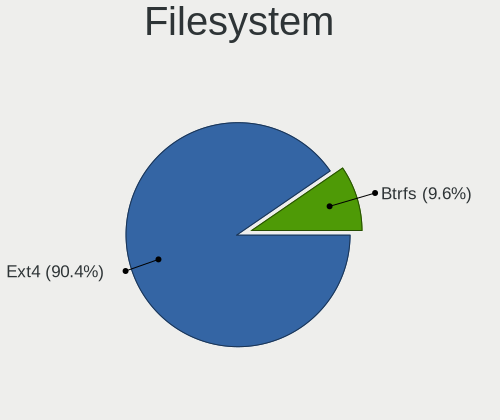
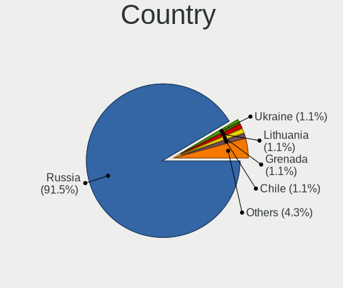
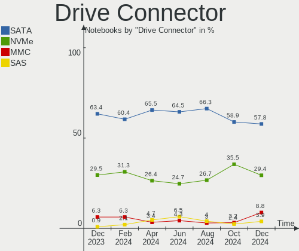
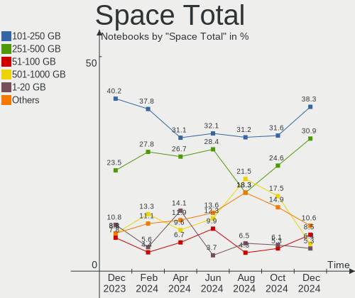
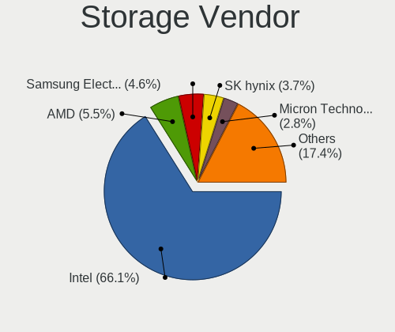
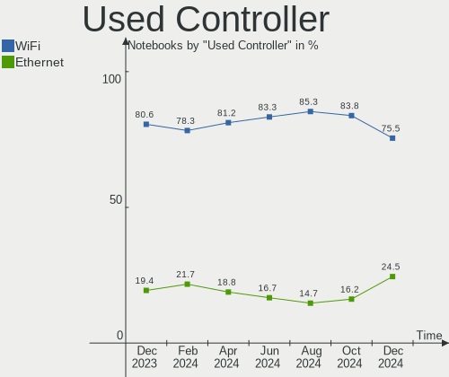

ROSA Hardware Trends (Notebook)
-------------------------------

A project to identify most popular hardware characteristics and track their change
over time based on data collected by ROSA users at https://Linux-Hardware.org.

Anyone can contribute to the study by uploading probes of their computers by
the [hw-probe](https://github.com/linuxhw/hw-probe) tool:

    sudo -E hw-probe -all -upload

Full-feature report is available here: https://linux-hardware.org/?view=trends&formfactor=notebook

Period: Apr, 2021.

Contents
--------

- [ OS                       ](#os)
- [ OS Family                ](#os-family)
- [ Kernel                   ](#kernel)
- [ Kernel Family            ](#kernel-family)
- [ Kernel Major Ver.        ](#kernel-major-ver)
- [ Arch                     ](#arch)
- [ DE                       ](#de)
- [ Display Server           ](#display-server)
- [ Display Manager          ](#display-manager)
- [ OS Lang                  ](#os-lang)
- [ Boot Mode                ](#boot-mode)
- [ Filesystem               ](#filesystem)
- [ Part. scheme             ](#part-scheme)
- [ Dual Boot with Linux/BSD ](#dual-boot-with-linux/bsd)
- [ Dual Boot (Win)          ](#dual-boot-win)
- [ Country                  ](#country)
- [ City                     ](#city)
- [ Vendor                   ](#vendor)
- [ Model                    ](#model)
- [ Model Family             ](#model-family)
- [ MFG Year                 ](#mfg-year)
- [ Form Factor              ](#form-factor)
- [ Secure Boot              ](#secure-boot)
- [ Coreboot                 ](#coreboot)
- [ RAM Size                 ](#ram-size)
- [ RAM Used                 ](#ram-used)
- [ Has CD-ROM               ](#has-cd-rom)
- [ Total Drives             ](#total-drives)
- [ Has Ethernet             ](#has-ethernet)
- [ Has WiFi                 ](#has-wifi)
- [ Has Bluetooth            ](#has-bluetooth)
- [ Drive Vendor             ](#drive-vendor)
- [ Drive Model              ](#drive-model)
- [ HDD Vendor               ](#hdd-vendor)
- [ SSD Vendor               ](#ssd-vendor)
- [ Drive Kind               ](#drive-kind)
- [ Drive Connector          ](#drive-connector)
- [ Drive Size               ](#drive-size)
- [ Space Total              ](#space-total)
- [ Space Used               ](#space-used)
- [ Malfunc. Drives          ](#malfunc-drives)
- [ Malfunc. Drive Vendor    ](#malfunc-drive-vendor)
- [ Malfunc. HDD Vendor      ](#malfunc-hdd-vendor)
- [ Malfunc. Drive Kind      ](#malfunc-drive-kind)
- [ Failed Drives            ](#failed-drives)
- [ Failed Drive Vendor      ](#failed-drive-vendor)
- [ Drive Status             ](#drive-status)
- [ Storage Vendor           ](#storage-vendor)
- [ Storage Model            ](#storage-model)
- [ Storage Kind             ](#storage-kind)
- [ CPU Vendor               ](#cpu-vendor)
- [ CPU Model                ](#cpu-model)
- [ CPU Model Family         ](#cpu-model-family)
- [ CPU Cores                ](#cpu-cores)
- [ CPU Sockets              ](#cpu-sockets)
- [ CPU Threads              ](#cpu-threads)
- [ CPU Op-Modes             ](#cpu-op-modes)
- [ CPU Microcode            ](#cpu-microcode)
- [ CPU Microarch            ](#cpu-microarch)
- [ GPU Vendor               ](#gpu-vendor)
- [ GPU Model                ](#gpu-model)
- [ GPU Combo                ](#gpu-combo)
- [ GPU Driver               ](#gpu-driver)
- [ GPU Memory               ](#gpu-memory)
- [ Monitor Vendor           ](#monitor-vendor)
- [ Monitor Model            ](#monitor-model)
- [ Monitor Resolution       ](#monitor-resolution)
- [ Monitor Diagonal         ](#monitor-diagonal)
- [ Monitor Width            ](#monitor-width)
- [ Aspect Ratio             ](#aspect-ratio)
- [ Monitor Area             ](#monitor-area)
- [ Pixel Density            ](#pixel-density)
- [ Multiple Monitors        ](#multiple-monitors)
- [ Net Controller Vendor    ](#net-controller-vendor)
- [ Net Controller Model     ](#net-controller-model)
- [ Wireless Vendor          ](#wireless-vendor)
- [ Wireless Model           ](#wireless-model)
- [ Ethernet Vendor          ](#ethernet-vendor)
- [ Ethernet Model           ](#ethernet-model)
- [ Net Controller Kind      ](#net-controller-kind)
- [ Used Controller          ](#used-controller)
- [ NICs                     ](#nics)
- [ IPv6                     ](#ipv6)
- [ Memory Vendor            ](#memory-vendor)
- [ Memory Model             ](#memory-model)
- [ Memory Kind              ](#memory-kind)
- [ Memory Form Factor       ](#memory-form-factor)
- [ Memory Size              ](#memory-size)
- [ Memory Speed             ](#memory-speed)
- [ Sound Vendor             ](#sound-vendor)
- [ Sound Model              ](#sound-model)
- [ Camera Vendor            ](#camera-vendor)
- [ Camera Model             ](#camera-model)
- [ Fingerprint Vendor       ](#fingerprint-vendor)
- [ Fingerprint Model        ](#fingerprint-model)
- [ Chipcard Vendor          ](#chipcard-vendor)
- [ Chipcard Model           ](#chipcard-model)
- [ Printer Vendor           ](#printer-vendor)
- [ Printer Model            ](#printer-model)
- [ Scanner Vendor           ](#scanner-vendor)
- [ Scanner Model            ](#scanner-model)
- [ Bluetooth Vendor         ](#bluetooth-vendor)
- [ Bluetooth Model          ](#bluetooth-model)
- [ Unsupported Devices      ](#unsupported-devices)
- [ Unsupported Device Types ](#unsupported-device-types)

OS
--

Installed operating systems

| Name       | Notebooks | Percent |
|------------|-----------|---------|
| ROSA R11.1 | 66        | 85.71%  |
| ROSA R11   | 7         | 9.09%   |
| ROSA R12   | 3         | 3.9%    |
| ROSA R8.1  | 1         | 1.3%    |

OS Family
---------

OS without a version

| Name | Notebooks | Percent |
|------|-----------|---------|
| ROSA | 77        | 100%    |

Kernel
------

Version of the Linux kernel

| Version                             | Notebooks | Percent |
|-------------------------------------|-----------|---------|
| 5.4.83-generic-2rosa-x86_64         | 23        | 29.87%  |
| 5.4.32-generic-2rosa-x86_64         | 18        | 23.38%  |
| 4.15.0-desktop-122.124.1rosa-x86_64 | 11        | 14.29%  |
| 5.4.32-generic-2rosa-i586           | 7         | 9.09%   |
| 4.15.0-desktop-45.1rosa-x86_64      | 7         | 9.09%   |
| 4.15.0-desktop-122.124.1rosa-i586   | 3         | 3.9%    |
| 5.10.28-generic-1rosa2019.1-x86_64  | 2         | 2.6%    |
| 5.4.83-generic-2rosa-i586           | 1         | 1.3%    |
| 5.4.40-generic-1rosa-x86_64         | 1         | 1.3%    |
| 5.11.0-desktop-11.12.1rosa-x86_64   | 1         | 1.3%    |
| 5.10.32-generic-3rosa2019.1-x86_64  | 1         | 1.3%    |
| 4.9.155-nrj-desktop-1rosa-x86_64    | 1         | 1.3%    |
| 4.1.38-nrj-desktop-2rosa-x86_64     | 1         | 1.3%    |

Kernel Family
-------------

Linux kernel without a distro release

| Version | Notebooks | Percent |
|---------|-----------|---------|
| 5.4.32  | 25        | 32.47%  |
| 5.4.83  | 24        | 31.17%  |
| 4.15.0  | 21        | 27.27%  |
| 5.10.28 | 2         | 2.6%    |
| 5.4.40  | 1         | 1.3%    |
| 5.11.0  | 1         | 1.3%    |
| 5.10.32 | 1         | 1.3%    |
| 4.9.155 | 1         | 1.3%    |
| 4.1.38  | 1         | 1.3%    |

Kernel Major Ver.
-----------------

Linux kernel major version

| Version | Notebooks | Percent |
|---------|-----------|---------|
| 5.4     | 50        | 64.94%  |
| 4.15    | 21        | 27.27%  |
| 5.10    | 3         | 3.9%    |
| 5.11    | 1         | 1.3%    |
| 4.9     | 1         | 1.3%    |
| 4.1     | 1         | 1.3%    |

Arch
----

OS architecture (x86_64, i586, etc.)

| Name   | Notebooks | Percent |
|--------|-----------|---------|
| x86_64 | 66        | 85.71%  |
| i686   | 11        | 14.29%  |

DE
--

Desktop Environment

| Name | Notebooks | Percent |
|------|-----------|---------|
| KDE4 | 51        | 66.23%  |
| KDE5 | 20        | 25.97%  |
| LXQt | 5         | 6.49%   |
| XFCE | 1         | 1.3%    |

Display Server
--------------

X11 or Wayland

| Name | Notebooks | Percent |
|------|-----------|---------|
| X11  | 77        | 100%    |

Display Manager
---------------

SDDM, LightDM, etc.

| Name | Notebooks | Percent |
|------|-----------|---------|
| KDM  | 51        | 66.23%  |
| SDDM | 26        | 33.77%  |

OS Lang
-------

Language

| Lang    | Notebooks | Percent |
|---------|-----------|---------|
| ru_RU   | 65        | 84.42%  |
| Unknown | 8         | 10.39%  |
| pl_PL   | 2         | 2.6%    |
| es_ES   | 1         | 1.3%    |
| de_AT   | 1         | 1.3%    |

Boot Mode
---------

EFI or BIOS

| Mode | Notebooks | Percent |
|------|-----------|---------|
| BIOS | 51        | 66.23%  |
| EFI  | 26        | 33.77%  |

Filesystem
----------

Type of filesystem

| Type  | Notebooks | Percent |
|-------|-----------|---------|
| Ext4  | 74        | 96.1%   |
| Btrfs | 3         | 3.9%    |

Part. scheme
------------

Scheme of partitioning

| Type | Notebooks | Percent |
|------|-----------|---------|
| MBR  | 47        | 61.04%  |
| GPT  | 30        | 38.96%  |

Dual Boot with Linux/BSD
------------------------

Hosting more than one Linux/BSD

| Dual boot | Notebooks | Percent |
|-----------|-----------|---------|
| No        | 63        | 81.82%  |
| Yes       | 14        | 18.18%  |

Dual Boot (Win)
---------------

Hosting Linux and Windows

| Dual boot | Notebooks | Percent |
|-----------|-----------|---------|
| No        | 45        | 58.44%  |
| Yes       | 32        | 41.56%  |

Country
-------

Geographic location (country)

| Country    | Notebooks | Percent |
|------------|-----------|---------|
| Russia     | 61        | 79.22%  |
| Ukraine    | 3         | 3.9%    |
| Poland     | 2         | 2.6%    |
| Spain      | 1         | 1.3%    |
| Serbia     | 1         | 1.3%    |
| Montenegro | 1         | 1.3%    |
| Latvia     | 1         | 1.3%    |
| Kazakhstan | 1         | 1.3%    |
| Italy      | 1         | 1.3%    |
| Iran       | 1         | 1.3%    |
| Germany    | 1         | 1.3%    |
| Bulgaria   | 1         | 1.3%    |
| Belarus    | 1         | 1.3%    |
| Austria    | 1         | 1.3%    |

City
----

Geographic location (city)

| City              | Notebooks | Percent |
|-------------------|-----------|---------|
| Moscow            | 10        | 12.99%  |
| Saratov           | 5         | 6.49%   |
| Yaroslavl         | 4         | 5.19%   |
| Krasnodar         | 4         | 5.19%   |
| Volgograd         | 3         | 3.9%    |
| St Petersburg     | 3         | 3.9%    |
| Yekaterinburg     | 2         | 2.6%    |
| Kemerovo          | 2         | 2.6%    |
| Zernograd         | 1         | 1.3%    |
| Zaragoza          | 1         | 1.3%    |
| Witten            | 1         | 1.3%    |
| Warsaw            | 1         | 1.3%    |
| Voskresensk       | 1         | 1.3%    |
| Volokolamsk       | 1         | 1.3%    |
| Vladikavkaz       | 1         | 1.3%    |
| Vitebsk           | 1         | 1.3%    |
| Vienna            | 1         | 1.3%    |
| Srednyaya Akhtuba | 1         | 1.3%    |
| Snizhna           | 1         | 1.3%    |
| Simferopol        | 1         | 1.3%    |
| Shāhīn Shahr    | 1         | 1.3%    |
| Shakhty           | 1         | 1.3%    |
| Riga              | 1         | 1.3%    |
| Primorsk          | 1         | 1.3%    |
| Poltava           | 1         | 1.3%    |
| Podgorica         | 1         | 1.3%    |
| Perm              | 1         | 1.3%    |
| Penza             | 1         | 1.3%    |
| Pechora           | 1         | 1.3%    |
| Oktyabr’skiy    | 1         | 1.3%    |
| Novy Urengoy      | 1         | 1.3%    |
| Novosibirsk       | 1         | 1.3%    |
| Novokuznetsk      | 1         | 1.3%    |
| Nesebar           | 1         | 1.3%    |
| Magnitogorsk      | 1         | 1.3%    |
| Lyubertsy         | 1         | 1.3%    |
| Lodi              | 1         | 1.3%    |
| Kopeysk           | 1         | 1.3%    |
| Kokshetau         | 1         | 1.3%    |
| Kholmskiy         | 1         | 1.3%    |
| Khabarovsk        | 1         | 1.3%    |
| Kaliningrad       | 1         | 1.3%    |
| Izhevsk           | 1         | 1.3%    |
| Ivanovo           | 1         | 1.3%    |
| Gorki             | 1         | 1.3%    |
| Glazov            | 1         | 1.3%    |
| Gdansk            | 1         | 1.3%    |
| Boguchany         | 1         | 1.3%    |
| Berezovka         | 1         | 1.3%    |
| Belgrade          | 1         | 1.3%    |
| Babstovo          | 1         | 1.3%    |
| Astrakhan         | 1         | 1.3%    |

Vendor
------

Motherboard manufacturer

| Name                | Notebooks | Percent |
|---------------------|-----------|---------|
| Lenovo              | 21        | 27.27%  |
| Acer                | 12        | 15.58%  |
| ASUSTek Computer    | 11        | 14.29%  |
| Samsung Electronics | 8         | 10.39%  |
| Dell                | 6         | 7.79%   |
| Hewlett-Packard     | 5         | 6.49%   |
| Packard Bell        | 3         | 3.9%    |
| MSI                 | 3         | 3.9%    |
| Toshiba             | 2         | 2.6%    |
| WS                  | 1         | 1.3%    |
| Sony                | 1         | 1.3%    |
| Pegatron            | 1         | 1.3%    |
| Medion              | 1         | 1.3%    |
| LG Electronics      | 1         | 1.3%    |
| Fujitsu Siemens     | 1         | 1.3%    |

Model
-----

Motherboard model

| Name                                        | Notebooks | Percent |
|---------------------------------------------|-----------|---------|
| Packard Bell EasyNote TE11HC                | 2         | 2.6%    |
| Lenovo IdeaPad 320-15IAP 80XR               | 2         | 2.6%    |
| ASUS N61Jv                                  | 2         | 2.6%    |
| Acer Aspire E1-522                          | 2         | 2.6%    |
| Acer AO722                                  | 2         | 2.6%    |
| WS C116A                                    | 1         | 1.3%    |
| Toshiba Satellite L305                      | 1         | 1.3%    |
| Toshiba Satellite A200                      | 1         | 1.3%    |
| Sony SVE1512D1RB                            | 1         | 1.3%    |
| Samsung RV411/RV511/E3511/S3511/RV711/E3411 | 1         | 1.3%    |
| Samsung RV411/RV511/E3511/S3511/RV711       | 1         | 1.3%    |
| Samsung R540/R580/R780/SA41/E452            | 1         | 1.3%    |
| Samsung R425/R525                           | 1         | 1.3%    |
| Samsung NC210/NC110                         | 1         | 1.3%    |
| Samsung N102                                | 1         | 1.3%    |
| Samsung 530U3C/530U4C/532U3C                | 1         | 1.3%    |
| Samsung 300E4A/300E5A/300E7A/3430EA/3530EA  | 1         | 1.3%    |
| Pegatron A17                                | 1         | 1.3%    |
| Packard Bell EasyNote TV43HC                | 1         | 1.3%    |
| MSI M670                                    | 1         | 1.3%    |
| MSI GE70 0NC\0ND                            | 1         | 1.3%    |
| MSI CX61 2QC                                | 1         | 1.3%    |
| Medion P6812                                | 1         | 1.3%    |
| LG K1-322DR                                 | 1         | 1.3%    |
| Lenovo Yoga S940-14IIL 81Q8                 | 1         | 1.3%    |
| Lenovo ThinkPad X1 1293RP9                  | 1         | 1.3%    |
| Lenovo ThinkPad T460s 20FAS5PA00            | 1         | 1.3%    |
| Lenovo ThinkPad T440s 20ARS2C200            | 1         | 1.3%    |
| Lenovo ThinkPad SL410 28748BG               | 1         | 1.3%    |
| Lenovo ThinkPad L520 5017BK4                | 1         | 1.3%    |
| Lenovo S10-3c 20074                         | 1         | 1.3%    |
| Lenovo IdeaPad 330-15ARR 81D2               | 1         | 1.3%    |
| Lenovo IdeaPad 300-15ISK 80Q7               | 1         | 1.3%    |
| Lenovo IdeaPad 110-15IBR 80T7               | 1         | 1.3%    |
| Lenovo G580                                 | 1         | 1.3%    |
| Lenovo G560 20042                           | 1         | 1.3%    |
| Lenovo G505 20240                           | 1         | 1.3%    |
| Lenovo G500 20236                           | 1         | 1.3%    |
| Lenovo G50-45 80E3                          | 1         | 1.3%    |
| Lenovo B590 20208                           | 1         | 1.3%    |
| Lenovo B590 20206                           | 1         | 1.3%    |
| Lenovo B450 1S168003928000Z                 | 1         | 1.3%    |
| Lenovo 20208                                | 1         | 1.3%    |
| HP Pavilion dv7                             | 1         | 1.3%    |
| HP Laptop 15-db0xxx                         | 1         | 1.3%    |
| HP Laptop 14s-fq0xxx                        | 1         | 1.3%    |
| HP Compaq Presario CQ60                     | 1         | 1.3%    |
| HP Compaq Presario CQ50                     | 1         | 1.3%    |
| Fujitsu Siemens ESPRIMO Mobile V5505        | 1         | 1.3%    |
| Dell Inspiron MM061                         | 1         | 1.3%    |
| Dell Inspiron 5720                          | 1         | 1.3%    |
| Dell Inspiron 5567                          | 1         | 1.3%    |
| Dell Inspiron 5520                          | 1         | 1.3%    |
| Dell Inspiron 1501                          | 1         | 1.3%    |
| Dell 500                                    | 1         | 1.3%    |
| ASUS X751SJ                                 | 1         | 1.3%    |
| ASUS X55VD                                  | 1         | 1.3%    |
| ASUS X540LA                                 | 1         | 1.3%    |
| ASUS K53SD                                  | 1         | 1.3%    |
| ASUS K52JT                                  | 1         | 1.3%    |

Model Family
------------

Motherboard model prefix

| Name                    | Notebooks | Percent |
|-------------------------|-----------|---------|
| Acer Aspire             | 8         | 10.39%  |
| Lenovo ThinkPad         | 5         | 6.49%   |
| Lenovo IdeaPad          | 5         | 6.49%   |
| Dell Inspiron           | 5         | 6.49%   |
| Packard Bell EasyNote   | 3         | 3.9%    |
| Toshiba Satellite       | 2         | 2.6%    |
| Samsung RV411           | 2         | 2.6%    |
| Lenovo B590             | 2         | 2.6%    |
| HP Laptop               | 2         | 2.6%    |
| HP Compaq               | 2         | 2.6%    |
| ASUS N61Jv              | 2         | 2.6%    |
| Acer AO722              | 2         | 2.6%    |
| WS C116A                | 1         | 1.3%    |
| Sony SVE1512D1RB        | 1         | 1.3%    |
| Samsung R540            | 1         | 1.3%    |
| Samsung R425            | 1         | 1.3%    |
| Samsung NC210           | 1         | 1.3%    |
| Samsung N102            | 1         | 1.3%    |
| Samsung 530U3C          | 1         | 1.3%    |
| Samsung 300E4A          | 1         | 1.3%    |
| Pegatron A17            | 1         | 1.3%    |
| MSI M670                | 1         | 1.3%    |
| MSI GE70                | 1         | 1.3%    |
| MSI CX61                | 1         | 1.3%    |
| Medion P6812            | 1         | 1.3%    |
| LG K1-322DR             | 1         | 1.3%    |
| Lenovo Yoga             | 1         | 1.3%    |
| Lenovo S10-3c           | 1         | 1.3%    |
| Lenovo G580             | 1         | 1.3%    |
| Lenovo G560             | 1         | 1.3%    |
| Lenovo G505             | 1         | 1.3%    |
| Lenovo G500             | 1         | 1.3%    |
| Lenovo G50-45           | 1         | 1.3%    |
| Lenovo B450             | 1         | 1.3%    |
| Lenovo 20208            | 1         | 1.3%    |
| HP Pavilion             | 1         | 1.3%    |
| Fujitsu Siemens ESPRIMO | 1         | 1.3%    |
| Dell 500                | 1         | 1.3%    |
| ASUS X751SJ             | 1         | 1.3%    |
| ASUS X55VD              | 1         | 1.3%    |
| ASUS X540LA             | 1         | 1.3%    |
| ASUS K53SD              | 1         | 1.3%    |
| ASUS K52JT              | 1         | 1.3%    |
| ASUS K42Jr              | 1         | 1.3%    |
| ASUS F5SR               | 1         | 1.3%    |
| ASUS F5SL               | 1         | 1.3%    |
| ASUS 1011CX             | 1         | 1.3%    |
| Acer TravelMate         | 1         | 1.3%    |
| Acer Extensa            | 1         | 1.3%    |

MFG Year
--------

Motherboard manufacture year

| Year | Notebooks | Percent |
|------|-----------|---------|
| 2011 | 14        | 18.18%  |
| 2013 | 13        | 16.88%  |
| 2012 | 8         | 10.39%  |
| 2018 | 5         | 6.49%   |
| 2010 | 5         | 6.49%   |
| 2008 | 5         | 6.49%   |
| 2007 | 5         | 6.49%   |
| 2016 | 4         | 5.19%   |
| 2020 | 3         | 3.9%    |
| 2019 | 3         | 3.9%    |
| 2014 | 3         | 3.9%    |
| 2009 | 3         | 3.9%    |
| 2017 | 2         | 2.6%    |
| 2015 | 2         | 2.6%    |
| 2006 | 2         | 2.6%    |

Form Factor
-----------

Physical design of the computer

| Name     | Notebooks | Percent |
|----------|-----------|---------|
| Notebook | 77        | 100%    |

Secure Boot
-----------

Enabled or disabled

| State    | Notebooks | Percent |
|----------|-----------|---------|
| Disabled | 76        | 98.7%   |
| Enabled  | 1         | 1.3%    |

Coreboot
--------

Have coreboot on board

| Used | Notebooks | Percent |
|------|-----------|---------|
| No   | 77        | 100%    |

RAM Size
--------

Total RAM memory

| Size in GB | Notebooks | Percent |
|------------|-----------|---------|
| 3.01-4.0   | 29        | 37.66%  |
| 4.01-8.0   | 20        | 25.97%  |
| 1.01-2.0   | 16        | 20.78%  |
| 2.01-3.0   | 4         | 5.19%   |
| 16.01-24.0 | 3         | 3.9%    |
| 8.01-16.0  | 3         | 3.9%    |
| 0.51-1.0   | 2         | 2.6%    |

RAM Used
--------

Used RAM memory

| Used GB  | Notebooks | Percent |
|----------|-----------|---------|
| 1.01-2.0 | 35        | 45.45%  |
| 0.51-1.0 | 32        | 41.56%  |
| 2.01-3.0 | 5         | 6.49%   |
| 0.01-0.5 | 4         | 5.19%   |
| 3.01-4.0 | 1         | 1.3%    |

Has CD-ROM
----------

Has CD-ROM on board

| Presented | Notebooks | Percent |
|-----------|-----------|---------|
| Yes       | 49        | 63.64%  |
| No        | 28        | 36.36%  |

Total Drives
------------

Number of drives on board

| Drives | Notebooks | Percent |
|--------|-----------|---------|
| 1      | 56        | 72.73%  |
| 2      | 19        | 24.68%  |
| 3      | 1         | 1.3%    |
| 0      | 1         | 1.3%    |

Has Ethernet
------------

Has Ethernet on board

| Presented | Notebooks | Percent |
|-----------|-----------|---------|
| Yes       | 75        | 97.4%   |
| No        | 2         | 2.6%    |

Has WiFi
--------

Has WiFi module

| Presented | Notebooks | Percent |
|-----------|-----------|---------|
| Yes       | 76        | 98.7%   |
| No        | 1         | 1.3%    |

Has Bluetooth
-------------

Has Bluetooth module

| Presented | Notebooks | Percent |
|-----------|-----------|---------|
| Yes       | 44        | 57.14%  |
| No        | 33        | 42.86%  |

Drive Vendor
------------

Hard drive vendors

| Vendor              | Notebooks | Drives | Percent |
|---------------------|-----------|--------|---------|
| WDC                 | 20        | 20     | 22.47%  |
| Seagate             | 15        | 15     | 16.85%  |
| Hitachi             | 11        | 11     | 12.36%  |
| Samsung Electronics | 8         | 8      | 8.99%   |
| Unknown             | 6         | 6      | 6.74%   |
| Toshiba             | 5         | 5      | 5.62%   |
| HGST                | 4         | 4      | 4.49%   |
| Kingston            | 3         | 3      | 3.37%   |
| SPCC                | 2         | 2      | 2.25%   |
| Smartbuy            | 2         | 2      | 2.25%   |
| KingSpec            | 2         | 2      | 2.25%   |
| Crucial             | 2         | 2      | 2.25%   |
| China               | 2         | 2      | 2.25%   |
| Apacer              | 2         | 2      | 2.25%   |
| Transcend           | 1         | 1      | 1.12%   |
| SanDisk             | 1         | 1      | 1.12%   |
| PLEXTOR             | 1         | 1      | 1.12%   |
| Intel               | 1         | 1      | 1.12%   |
| Fujitsu             | 1         | 1      | 1.12%   |

Drive Model
-----------

Hard drive models

| Model                                | Notebooks | Percent |
|--------------------------------------|-----------|---------|
| WDC WD10JPVX-22JC3T0 1TB             | 4         | 4.49%   |
| Seagate ST9320325AS 320GB            | 3         | 3.37%   |
| WDC WD2500BEVS-22UST0 250GB          | 2         | 2.25%   |
| Seagate ST9500325AS 500GB            | 2         | 2.25%   |
| Seagate ST500LT012-1DG142 500GB      | 2         | 2.25%   |
| Seagate ST320LT020-9YG142 320GB      | 2         | 2.25%   |
| Seagate ST1000LM024 HN-M101MBB 1TB   | 2         | 2.25%   |
| Kingston SA400S37240G 240GB SSD      | 2         | 2.25%   |
| Hitachi HTS547550A9E384 500GB        | 2         | 2.25%   |
| Hitachi HTS543232A7A384 320GB        | 2         | 2.25%   |
| HGST HTS545050A7E380 500GB           | 2         | 2.25%   |
| WDC WDS120G2G0A-00JH30 120GB SSD     | 1         | 1.12%   |
| WDC WD800BEVS-22RST0 80GB            | 1         | 1.12%   |
| WDC WD7500BPVT-75HXZT3 752GB         | 1         | 1.12%   |
| WDC WD5000LPVX-75V0TT0 500GB         | 1         | 1.12%   |
| WDC WD5000LPVX-22V0TT0 500GB         | 1         | 1.12%   |
| WDC WD5000LPVT-08G33T1 500GB         | 1         | 1.12%   |
| WDC WD5000BPKX-00HPJT0 500GB         | 1         | 1.12%   |
| WDC WD3200BPVT-22ZEST0 320GB         | 1         | 1.12%   |
| WDC WD3200BPVT-22JJ5T0 320GB         | 1         | 1.12%   |
| WDC WD3200BEVT-08A23T1 320GB         | 1         | 1.12%   |
| WDC WD2500BEVT-22ZCT0 250GB          | 1         | 1.12%   |
| WDC WD1600BEVT-60ZCT0 160GB          | 1         | 1.12%   |
| WDC WD1200BEVS-75UST0 120GB          | 1         | 1.12%   |
| WDC WD1200BEVS-22UST0 120GB          | 1         | 1.12%   |
| Unknown USD00  64GB                  | 1         | 1.12%   |
| Unknown SD4GB                        | 1         | 1.12%   |
| Unknown SA02G  2GB                   | 1         | 1.12%   |
| Unknown NCard  4GB                   | 1         | 1.12%   |
| Unknown N/A  2GB                     | 1         | 1.12%   |
| Unknown 032G74  32GB                 | 1         | 1.12%   |
| Transcend TS256GMTS430S 256GB SSD    | 1         | 1.12%   |
| Toshiba MQ04ABF100 1TB               | 1         | 1.12%   |
| Toshiba MQ01ABD100 1TB               | 1         | 1.12%   |
| Toshiba MK6459GSXP 640GB             | 1         | 1.12%   |
| Toshiba MK3276GSX -63 320GB          | 1         | 1.12%   |
| Toshiba MK1059GSM 1TB                | 1         | 1.12%   |
| SPCC Solid State Disk 256GB          | 1         | 1.12%   |
| SPCC Solid State Disk 128GB          | 1         | 1.12%   |
| Smartbuy SSD 128GB                   | 1         | 1.12%   |
| Smartbuy SSD 120GB                   | 1         | 1.12%   |
| Seagate ST9500420AS 500GB            | 1         | 1.12%   |
| Seagate ST500LT012-9WS142 500GB      | 1         | 1.12%   |
| Seagate ST2000LM007-1R8174 2TB       | 1         | 1.12%   |
| Seagate ST1000LM035-1RK172 1TB       | 1         | 1.12%   |
| SanDisk SSD i100 24GB                | 1         | 1.12%   |
| Samsung SSD 860 EVO 250GB            | 1         | 1.12%   |
| Samsung SSD 850 EVO 500GB            | 1         | 1.12%   |
| Samsung SSD 850 EVO 120GB            | 1         | 1.12%   |
| Samsung MZYLF128HCHP-000L2 128GB SSD | 1         | 1.12%   |
| Samsung MZVLQ256HAJD-000H1 256GB     | 1         | 1.12%   |
| Samsung MZVLB512HBJQ-000L2 512GB     | 1         | 1.12%   |
| Samsung MZNTY128HDHP-000L1 128GB SSD | 1         | 1.12%   |
| Samsung MZNLN256HAJQ-000H1 256GB SSD | 1         | 1.12%   |
| PLEXTOR PX-128M5M 128GB SSD          | 1         | 1.12%   |
| Kingston SKC600256G 256GB SSD        | 1         | 1.12%   |
| KingSpec PA25-64 64GB SSD            | 1         | 1.12%   |
| KingSpec P3-128 128GB SSD            | 1         | 1.12%   |
| Intel SSDSA2BW160G3L 160GB           | 1         | 1.12%   |
| Hitachi HTS547575A9E384 752GB        | 1         | 1.12%   |

HDD Vendor
----------

Hard disk drive vendors

| Vendor  | Notebooks | Drives | Percent |
|---------|-----------|--------|---------|
| WDC     | 19        | 19     | 34.55%  |
| Seagate | 15        | 15     | 27.27%  |
| Hitachi | 11        | 11     | 20%     |
| Toshiba | 5         | 5      | 9.09%   |
| HGST    | 4         | 4      | 7.27%   |
| Fujitsu | 1         | 1      | 1.82%   |

SSD Vendor
----------

Solid state drive vendors

| Vendor              | Notebooks | Drives | Percent |
|---------------------|-----------|--------|---------|
| Samsung Electronics | 6         | 6      | 23.08%  |
| Kingston            | 3         | 3      | 11.54%  |
| SPCC                | 2         | 2      | 7.69%   |
| Smartbuy            | 2         | 2      | 7.69%   |
| KingSpec            | 2         | 2      | 7.69%   |
| Crucial             | 2         | 2      | 7.69%   |
| China               | 2         | 2      | 7.69%   |
| Apacer              | 2         | 2      | 7.69%   |
| WDC                 | 1         | 1      | 3.85%   |
| Transcend           | 1         | 1      | 3.85%   |
| SanDisk             | 1         | 1      | 3.85%   |
| PLEXTOR             | 1         | 1      | 3.85%   |
| Intel               | 1         | 1      | 3.85%   |

Drive Kind
----------

HDD or SSD

| Kind | Notebooks | Drives | Percent |
|------|-----------|--------|---------|
| HDD  | 55        | 55     | 62.5%   |
| SSD  | 25        | 26     | 28.41%  |
| MMC  | 6         | 6      | 6.82%   |
| NVMe | 2         | 2      | 2.27%   |

Drive Connector
---------------

SATA, SAS, NVMe, etc.

| Type | Notebooks | Drives | Percent |
|------|-----------|--------|---------|
| SATA | 73        | 81     | 90.12%  |
| MMC  | 6         | 6      | 7.41%   |
| NVMe | 2         | 2      | 2.47%   |

Drive Size
----------

Size of hard drive

| Size in TB | Notebooks | Drives | Percent |
|------------|-----------|--------|---------|
| 0.01-0.5   | 62        | 65     | 79.49%  |
| 0.51-1.0   | 15        | 15     | 19.23%  |
| 1.01-2.0   | 1         | 1      | 1.28%   |

Space Total
-----------

Amount of disk space available on the file system

| Size in GB | Notebooks | Percent |
|------------|-----------|---------|
| 101-250    | 24        | 31.17%  |
| 251-500    | 16        | 20.78%  |
| 1-20       | 11        | 14.29%  |
| 51-100     | 10        | 12.99%  |
| 501-1000   | 8         | 10.39%  |
| 21-50      | 6         | 7.79%   |
| 1001-2000  | 2         | 2.6%    |

Space Used
----------

Amount of used disk space

| Used GB | Notebooks | Percent |
|---------|-----------|---------|
| 1-20    | 61        | 79.22%  |
| 51-100  | 6         | 7.79%   |
| 21-50   | 5         | 6.49%   |
| 251-500 | 3         | 3.9%    |
| 101-250 | 2         | 2.6%    |

Malfunc. Drives
---------------

Drive models with a malfunction

| Model                            | Notebooks | Drives | Percent |
|----------------------------------|-----------|--------|---------|
| WDC WD10JPVX-22JC3T0 1TB         | 2         | 2      | 8.7%    |
| WDC WDS120G2G0A-00JH30 120GB SSD | 1         | 1      | 4.35%   |
| WDC WD5000LPVT-08G33T1 500GB     | 1         | 1      | 4.35%   |
| WDC WD3200BPVT-22ZEST0 320GB     | 1         | 1      | 4.35%   |
| WDC WD3200BEVT-08A23T1 320GB     | 1         | 1      | 4.35%   |
| WDC WD2500BEVT-22ZCT0 250GB      | 1         | 1      | 4.35%   |
| Toshiba MK1059GSM 1TB            | 1         | 1      | 4.35%   |
| Seagate ST9500420AS 500GB        | 1         | 1      | 4.35%   |
| Seagate ST9500325AS 500GB        | 1         | 1      | 4.35%   |
| Seagate ST500LT012-9WS142 500GB  | 1         | 1      | 4.35%   |
| Seagate ST320LT020-9YG142 320GB  | 1         | 1      | 4.35%   |
| Seagate ST2000LM007-1R8174 2TB   | 1         | 1      | 4.35%   |
| SanDisk SSD i100 24GB            | 1         | 1      | 4.35%   |
| Kingston SA400S37240G 240GB SSD  | 1         | 1      | 4.35%   |
| KingSpec PA25-64 64GB SSD        | 1         | 1      | 4.35%   |
| Hitachi HTS547550A9E384 500GB    | 1         | 1      | 4.35%   |
| Hitachi HTS545050A7E380 500GB    | 1         | 1      | 4.35%   |
| Hitachi HTS545032B9A300 320GB    | 1         | 1      | 4.35%   |
| Hitachi HTS542512K9SA00 120GB    | 1         | 1      | 4.35%   |
| HGST HTS721010A9E630 1TB         | 1         | 1      | 4.35%   |
| HGST HTS545050A7E380 500GB       | 1         | 1      | 4.35%   |
| Fujitsu MHZ2120BH G2 120GB       | 1         | 1      | 4.35%   |

Malfunc. Drive Vendor
---------------------

Vendors of faulty drives

| Vendor   | Notebooks | Drives | Percent |
|----------|-----------|--------|---------|
| WDC      | 7         | 7      | 30.43%  |
| Seagate  | 5         | 5      | 21.74%  |
| Hitachi  | 4         | 4      | 17.39%  |
| HGST     | 2         | 2      | 8.7%    |
| Toshiba  | 1         | 1      | 4.35%   |
| SanDisk  | 1         | 1      | 4.35%   |
| Kingston | 1         | 1      | 4.35%   |
| KingSpec | 1         | 1      | 4.35%   |
| Fujitsu  | 1         | 1      | 4.35%   |

Malfunc. HDD Vendor
-------------------

Vendors of faulty HDD drives

| Vendor  | Notebooks | Drives | Percent |
|---------|-----------|--------|---------|
| WDC     | 6         | 6      | 31.58%  |
| Seagate | 5         | 5      | 26.32%  |
| Hitachi | 4         | 4      | 21.05%  |
| HGST    | 2         | 2      | 10.53%  |
| Toshiba | 1         | 1      | 5.26%   |
| Fujitsu | 1         | 1      | 5.26%   |

Malfunc. Drive Kind
-------------------

Kinds of faulty drives

| Kind | Notebooks | Drives | Percent |
|------|-----------|--------|---------|
| HDD  | 19        | 19     | 82.61%  |
| SSD  | 4         | 4      | 17.39%  |

Failed Drives
-------------

Failed drive models

| Model                                            | Notebooks | Drives | Percent |
|--------------------------------------------------|-----------|--------|---------|
| Samsung Electronics MZNTY128HDHP-000L1 128GB SSD | 1         | 1      | 100%    |

Failed Drive Vendor
-------------------

Failed drive vendors

| Vendor              | Notebooks | Drives | Percent |
|---------------------|-----------|--------|---------|
| Samsung Electronics | 1         | 1      | 100%    |

Drive Status
------------

Number of failed and malfunc. drives

| Status   | Notebooks | Drives | Percent |
|----------|-----------|--------|---------|
| Works    | 54        | 59     | 65.06%  |
| Malfunc  | 22        | 23     | 26.51%  |
| Detected | 6         | 6      | 7.23%   |
| Failed   | 1         | 1      | 1.2%    |

Storage Vendor
--------------

Storage controller vendors

| Vendor                           | Notebooks | Percent |
|----------------------------------|-----------|---------|
| Intel                            | 55        | 72.37%  |
| AMD                              | 13        | 17.11%  |
| Nvidia                           | 4         | 5.26%   |
| Silicon Integrated Systems [SiS] | 2         | 2.63%   |
| Samsung Electronics              | 2         | 2.63%   |

Storage Model
-------------

Storage controller models

| Model                                                                            | Notebooks | Percent |
|----------------------------------------------------------------------------------|-----------|---------|
| Intel 7 Series Chipset Family 6-port SATA Controller [AHCI mode]                 | 15        | 16.85%  |
| Intel 5 Series/3400 Series Chipset 4 port SATA AHCI Controller                   | 8         | 8.99%   |
| AMD FCH SATA Controller [AHCI mode]                                              | 8         | 8.99%   |
| Intel 6 Series/C200 Series Chipset Family 6 port Mobile SATA AHCI Controller     | 6         | 6.74%   |
| Intel Sunrise Point-LP SATA Controller [AHCI mode]                               | 4         | 4.49%   |
| Intel NM10/ICH7 Family SATA Controller [AHCI mode]                               | 4         | 4.49%   |
| Intel 82801IBM/IEM (ICH9M/ICH9M-E) 4 port SATA Controller [AHCI mode]            | 4         | 4.49%   |
| Intel 82801HM/HEM (ICH8M/ICH8M-E) SATA Controller [AHCI mode]                    | 4         | 4.49%   |
| Intel 82801HM/HEM (ICH8M/ICH8M-E) IDE Controller                                 | 4         | 4.49%   |
| AMD SB7x0/SB8x0/SB9x0 SATA Controller [AHCI mode]                                | 3         | 3.37%   |
| Silicon Integrated Systems [SiS] SATA Controller / IDE mode                      | 2         | 2.25%   |
| Silicon Integrated Systems [SiS] 5513 IDE Controller                             | 2         | 2.25%   |
| Nvidia MCP78S [GeForce 8200] SATA Controller (non-AHCI mode)                     | 2         | 2.25%   |
| Nvidia MCP78S [GeForce 8200] IDE                                                 | 2         | 2.25%   |
| Intel Celeron N3350/Pentium N4200/Atom E3900 Series SATA AHCI Controller         | 2         | 2.25%   |
| Intel Atom/Celeron/Pentium Processor x5-E8000/J3xxx/N3xxx Series SATA Controller | 2         | 2.25%   |
| Intel 8 Series SATA Controller 1 [AHCI mode]                                     | 2         | 2.25%   |
| Samsung NVMe SSD Controller SM981/PM981/PM983                                    | 1         | 1.12%   |
| Samsung NVMe Controller                                                          | 1         | 1.12%   |
| Nvidia MCP67 IDE Controller                                                      | 1         | 1.12%   |
| Nvidia MCP67 AHCI Controller                                                     | 1         | 1.12%   |
| Nvidia MCP51 Serial ATA Controller                                               | 1         | 1.12%   |
| Nvidia MCP51 IDE                                                                 | 1         | 1.12%   |
| Intel 82801GBM/GHM (ICH7-M Family) SATA Controller [IDE mode]                    | 1         | 1.12%   |
| Intel 82801FB/FBM/FR/FW/FRW (ICH6 Family) IDE Controller                         | 1         | 1.12%   |
| Intel 8 Series/C220 Series Chipset Family 6-port SATA Controller 1 [AHCI mode]   | 1         | 1.12%   |
| Intel 5 Series/3400 Series Chipset 4 port SATA IDE Controller                    | 1         | 1.12%   |
| Intel 5 Series/3400 Series Chipset 2 port SATA IDE Controller                    | 1         | 1.12%   |
| AMD SB600 Non-Raid-5 SATA                                                        | 1         | 1.12%   |
| AMD SB600 IDE                                                                    | 1         | 1.12%   |
| AMD FCH SATA Controller [IDE mode]                                               | 1         | 1.12%   |
| AMD FCH IDE Controller                                                           | 1         | 1.12%   |

Storage Kind
------------

Kind of storage controller (IDE, SATA, NVMe, SAS, ...)

| Kind | Notebooks | Percent |
|------|-----------|---------|
| SATA | 65        | 79.27%  |
| IDE  | 15        | 18.29%  |
| NVMe | 2         | 2.44%   |

CPU Vendor
----------

Processor vendors

| Vendor | Notebooks | Percent |
|--------|-----------|---------|
| Intel  | 59        | 76.62%  |
| AMD    | 18        | 23.38%  |

CPU Model
---------

Processor models

| Model                                         | Notebooks | Percent |
|-----------------------------------------------|-----------|---------|
| Intel Pentium CPU B960 @ 2.20GHz              | 3         | 3.9%    |
| Intel Core i5-3230M CPU @ 2.60GHz             | 3         | 3.9%    |
| Intel Pentium CPU P6200 @ 2.13GHz             | 2         | 2.6%    |
| Intel Core i3-2350M CPU @ 2.30GHz             | 2         | 2.6%    |
| Intel Core i3-2330M CPU @ 2.20GHz             | 2         | 2.6%    |
| Intel Core i3 CPU M 380 @ 2.53GHz             | 2         | 2.6%    |
| Intel Core i3 CPU M 350 @ 2.27GHz             | 2         | 2.6%    |
| Intel Atom CPU N455 @ 1.66GHz                 | 2         | 2.6%    |
| AMD C-60 APU with Radeon HD Graphics          | 2         | 2.6%    |
| Intel Pentium Dual-Core CPU T4500 @ 2.30GHz   | 1         | 1.3%    |
| Intel Pentium Dual CPU T2390 @ 1.86GHz        | 1         | 1.3%    |
| Intel Pentium CPU N4200 @ 1.10GHz             | 1         | 1.3%    |
| Intel Pentium CPU N3700 @ 1.60GHz             | 1         | 1.3%    |
| Intel Pentium CPU B980 @ 2.40GHz              | 1         | 1.3%    |
| Intel Pentium CPU B970 @ 2.30GHz              | 1         | 1.3%    |
| Intel Pentium CPU 2020M @ 2.40GHz             | 1         | 1.3%    |
| Intel Genuine CPU T1600 @ 1.66GHz             | 1         | 1.3%    |
| Intel Core i7-4712MQ CPU @ 2.30GHz            | 1         | 1.3%    |
| Intel Core i7-4600U CPU @ 2.10GHz             | 1         | 1.3%    |
| Intel Core i7-3632QM CPU @ 2.20GHz            | 1         | 1.3%    |
| Intel Core i5-7200U CPU @ 2.50GHz             | 1         | 1.3%    |
| Intel Core i5-6200U CPU @ 2.30GHz             | 1         | 1.3%    |
| Intel Core i5-3317U CPU @ 1.70GHz             | 1         | 1.3%    |
| Intel Core i5-3210M CPU @ 2.50GHz             | 1         | 1.3%    |
| Intel Core i5-2520M CPU @ 2.50GHz             | 1         | 1.3%    |
| Intel Core i5-2430M CPU @ 2.40GHz             | 1         | 1.3%    |
| Intel Core i5-1035G4 CPU @ 1.10GHz            | 1         | 1.3%    |
| Intel Core i5 CPU M 560 @ 2.67GHz             | 1         | 1.3%    |
| Intel Core i5 CPU M 460 @ 2.53GHz             | 1         | 1.3%    |
| Intel Core i5 CPU M 430 @ 2.27GHz             | 1         | 1.3%    |
| Intel Core i3-6100U CPU @ 2.30GHz             | 1         | 1.3%    |
| Intel Core i3-6006U CPU @ 2.00GHz             | 1         | 1.3%    |
| Intel Core i3-4005U CPU @ 1.70GHz             | 1         | 1.3%    |
| Intel Core i3-2328M CPU @ 2.20GHz             | 1         | 1.3%    |
| Intel Core 2 Duo CPU T8300 @ 2.40GHz          | 1         | 1.3%    |
| Intel Core 2 Duo CPU T8100 @ 2.10GHz          | 1         | 1.3%    |
| Intel Core 2 Duo CPU T7300 @ 2.00GHz          | 1         | 1.3%    |
| Intel Core 2 Duo CPU T6400 @ 2.00GHz          | 1         | 1.3%    |
| Intel Core 2 Duo CPU T5850 @ 2.16GHz          | 1         | 1.3%    |
| Intel Core 2 CPU T5600 @ 1.83GHz              | 1         | 1.3%    |
| Intel Celeron M processor 1.60GHz             | 1         | 1.3%    |
| Intel Celeron CPU N3350 @ 1.10GHz             | 1         | 1.3%    |
| Intel Celeron CPU N3060 @ 1.60GHz             | 1         | 1.3%    |
| Intel Celeron CPU B830 @ 1.80GHz              | 1         | 1.3%    |
| Intel Celeron CPU 550 @ 2.00GHz               | 1         | 1.3%    |
| Intel Celeron CPU 530 @ 1.73GHz               | 1         | 1.3%    |
| Intel Celeron CPU 1005M @ 1.90GHz             | 1         | 1.3%    |
| Intel Atom x5-Z8350 CPU @ 1.44GHz             | 1         | 1.3%    |
| Intel Atom CPU N435 @ 1.33GHz                 | 1         | 1.3%    |
| Intel Atom CPU N2600 @ 1.60GHz                | 1         | 1.3%    |
| AMD Turion II Dual-Core Mobile M520           | 1         | 1.3%    |
| AMD Turion Dual-Core RM-70                    | 1         | 1.3%    |
| AMD Turion 64 X2 Mobile Technology TL-60      | 1         | 1.3%    |
| AMD Turion 64 X2 Mobile Technology TL-58      | 1         | 1.3%    |
| AMD Ryzen 3 2200U with Radeon Vega Mobile Gfx | 1         | 1.3%    |
| AMD E1-2500 APU with Radeon HD Graphics       | 1         | 1.3%    |
| AMD C-70 APU with Radeon HD Graphics          | 1         | 1.3%    |
| AMD Athlon Gold 3150U with Radeon Graphics    | 1         | 1.3%    |
| AMD Athlon Dual-Core QL-60                    | 1         | 1.3%    |
| AMD Athlon 64 X2 Dual Core Processor TK-53    | 1         | 1.3%    |

CPU Model Family
----------------

Processor model prefix

| Model                   | Notebooks | Percent |
|-------------------------|-----------|---------|
| Intel Core i5           | 13        | 16.88%  |
| Intel Core i3           | 12        | 15.58%  |
| Intel Pentium           | 10        | 12.99%  |
| Intel Celeron           | 6         | 7.79%   |
| Intel Core 2 Duo        | 5         | 6.49%   |
| Intel Atom              | 5         | 6.49%   |
| Intel Core i7           | 3         | 3.9%    |
| AMD A4                  | 3         | 3.9%    |
| AMD Turion 64 X2 Mobile | 2         | 2.6%    |
| AMD C-60                | 2         | 2.6%    |
| AMD Athlon              | 2         | 2.6%    |
| AMD A6                  | 2         | 2.6%    |
| Intel Pentium Dual-Core | 1         | 1.3%    |
| Intel Pentium Dual      | 1         | 1.3%    |
| Intel Genuine           | 1         | 1.3%    |
| Intel Core 2            | 1         | 1.3%    |
| Intel Celeron M         | 1         | 1.3%    |
| AMD Turion II Dual-Core | 1         | 1.3%    |
| AMD Turion Dual-Core    | 1         | 1.3%    |
| AMD Ryzen 3             | 1         | 1.3%    |
| AMD E1                  | 1         | 1.3%    |
| AMD C-70                | 1         | 1.3%    |
| AMD Athlon 64 X2        | 1         | 1.3%    |
| AMD A8                  | 1         | 1.3%    |

CPU Cores
---------

Number of processor cores

| Number | Notebooks | Percent |
|--------|-----------|---------|
| 2      | 60        | 77.92%  |
| 4      | 11        | 14.29%  |
| 1      | 6         | 7.79%   |

CPU Sockets
-----------

Number of sockets

| Number | Notebooks | Percent |
|--------|-----------|---------|
| 1      | 77        | 100%    |

CPU Threads
-----------

Threads per core (Hyper-Threading)

| Number | Notebooks | Percent |
|--------|-----------|---------|
| 1      | 43        | 55.84%  |
| 2      | 34        | 44.16%  |

CPU Op-Modes
------------

CPU Operation Modes (32-bit, 64-bit)

| Op mode        | Notebooks | Percent |
|----------------|-----------|---------|
| 32-bit, 64-bit | 75        | 97.4%   |
| 32-bit         | 2         | 2.6%    |

CPU Microcode
-------------

Microcode number

| Number     | Notebooks | Percent |
|------------|-----------|---------|
| 0x206a7    | 13        | 16.88%  |
| 0x306a9    | 8         | 10.39%  |
| 0x20655    | 6         | 7.79%   |
| Unknown    | 4         | 5.19%   |
| 0x6fd      | 3         | 3.9%    |
| 0x406e3    | 3         | 3.9%    |
| 0x20652    | 3         | 3.9%    |
| 0x106ca    | 3         | 3.9%    |
| 0x0700010f | 3         | 3.9%    |
| 0x05000119 | 3         | 3.9%    |
| 0x506c9    | 2         | 2.6%    |
| 0x406c4    | 2         | 2.6%    |
| 0x40651    | 2         | 2.6%    |
| 0x1067a    | 2         | 2.6%    |
| 0x10676    | 2         | 2.6%    |
| 0x10661    | 2         | 2.6%    |
| 0x07030105 | 2         | 2.6%    |
| 0x806e9    | 1         | 1.3%    |
| 0x706e5    | 1         | 1.3%    |
| 0x6fa      | 1         | 1.3%    |
| 0x6f6      | 1         | 1.3%    |
| 0x6d8      | 1         | 1.3%    |
| 0x406c3    | 1         | 1.3%    |
| 0x306c3    | 1         | 1.3%    |
| 0x30661    | 1         | 1.3%    |
| 0x08108109 | 1         | 1.3%    |
| 0x0810100b | 1         | 1.3%    |
| 0x06006705 | 1         | 1.3%    |
| 0x03000027 | 1         | 1.3%    |
| 0x02000057 | 1         | 1.3%    |
| 0x02000032 | 1         | 1.3%    |

CPU Microarch
-------------

Microarchitecture

| Name            | Notebooks | Percent |
|-----------------|-----------|---------|
| SandyBridge     | 13        | 16.88%  |
| Westmere        | 9         | 11.69%  |
| IvyBridge       | 8         | 10.39%  |
| Core            | 7         | 9.09%   |
| Penryn          | 4         | 5.19%   |
| Bonnell         | 4         | 5.19%   |
| Skylake         | 3         | 3.9%    |
| Silvermont      | 3         | 3.9%    |
| K8 Hammer       | 3         | 3.9%    |
| Jaguar          | 3         | 3.9%    |
| Haswell         | 3         | 3.9%    |
| Bobcat          | 3         | 3.9%    |
| Puma            | 2         | 2.6%    |
| K8 & K10 hybrid | 2         | 2.6%    |
| Goldmont        | 2         | 2.6%    |
| Zen+            | 1         | 1.3%    |
| Zen             | 1         | 1.3%    |
| P6              | 1         | 1.3%    |
| KabyLake        | 1         | 1.3%    |
| K10 Llano       | 1         | 1.3%    |
| K10             | 1         | 1.3%    |
| IceLake         | 1         | 1.3%    |
| Excavator       | 1         | 1.3%    |

GPU Vendor
----------

Vendors of graphics cards

| Vendor | Notebooks | Percent |
|--------|-----------|---------|
| Intel  | 50        | 49.5%   |
| Nvidia | 26        | 25.74%  |
| AMD    | 25        | 24.75%  |

GPU Model
---------

Graphics card models

| Model                                                                                    | Notebooks | Percent |
|------------------------------------------------------------------------------------------|-----------|---------|
| Intel 2nd Generation Core Processor Family Integrated Graphics Controller                | 13        | 12.38%  |
| Intel 3rd Gen Core processor Graphics Controller                                         | 8         | 7.62%   |
| Nvidia GF117M [GeForce 610M/710M/810M/820M / GT 620M/625M/630M/720M]                     | 7         | 6.67%   |
| Intel Mobile 4 Series Chipset Integrated Graphics Controller                             | 4         | 3.81%   |
| Intel Core Processor Integrated Graphics Controller                                      | 4         | 3.81%   |
| Nvidia GK208BM [GeForce 920M]                                                            | 3         | 2.86%   |
| Intel Skylake GT2 [HD Graphics 520]                                                      | 3         | 2.86%   |
| Intel Mobile GM965/GL960 Integrated Graphics Controller (secondary)                      | 3         | 2.86%   |
| Intel Mobile GM965/GL960 Integrated Graphics Controller (primary)                        | 3         | 2.86%   |
| Intel Atom/Celeron/Pentium Processor x5-E8000/J3xxx/N3xxx Integrated Graphics Controller | 3         | 2.86%   |
| Intel Atom Processor D4xx/D5xx/N4xx/N5xx Integrated Graphics Controller                  | 3         | 2.86%   |
| Nvidia GT218M [GeForce 315M]                                                             | 2         | 1.9%    |
| Nvidia GT216M [GeForce GT 325M]                                                          | 2         | 1.9%    |
| Nvidia GF119M [GeForce 610M]                                                             | 2         | 1.9%    |
| Nvidia GF108M [GeForce GT 540M]                                                          | 2         | 1.9%    |
| Nvidia C77 [GeForce 8200M G]                                                             | 2         | 1.9%    |
| Intel Haswell-ULT Integrated Graphics Controller                                         | 2         | 1.9%    |
| AMD Wrestler [Radeon HD 6290]                                                            | 2         | 1.9%    |
| AMD Topaz XT [Radeon R7 M260/M265 / M340/M360 / M440/M445 / 530/535 / 620/625 Mobile]    | 2         | 1.9%    |
| AMD RV620/M82 [Mobility Radeon HD 3450/3470]                                             | 2         | 1.9%    |
| AMD Park [Mobility Radeon HD 5430/5450/5470]                                             | 2         | 1.9%    |
| AMD Mullins [Radeon R3 Graphics]                                                         | 2         | 1.9%    |
| Nvidia GK107M [GeForce GTX 660M]                                                         | 1         | 0.95%   |
| Nvidia GF119M [GeForce GT 520MX]                                                         | 1         | 0.95%   |
| Nvidia GF116M [GeForce GT 555M/635M]                                                     | 1         | 0.95%   |
| Nvidia GF108M [GeForce GT 620M/630M/635M/640M LE]                                        | 1         | 0.95%   |
| Nvidia G86M [GeForce 8600M GS]                                                           | 1         | 0.95%   |
| Nvidia C51 [GeForce Go 6100]                                                             | 1         | 0.95%   |
| Intel Mobile 915GM/GMS/910GML Express Graphics Controller                                | 1         | 0.95%   |
| Intel Iris Plus Graphics G4 (Ice Lake)                                                   | 1         | 0.95%   |
| Intel HD Graphics 620                                                                    | 1         | 0.95%   |
| Intel HD Graphics 500                                                                    | 1         | 0.95%   |
| Intel Celeron N3350/Pentium N4200/Atom E3900 Series Integrated Graphics Controller       | 1         | 0.95%   |
| Intel Atom Processor D2xxx/N2xxx Integrated Graphics Controller                          | 1         | 0.95%   |
| Intel 4th Gen Core Processor Integrated Graphics Controller                              | 1         | 0.95%   |
| AMD Wrestler [Radeon HD 7290]                                                            | 1         | 0.95%   |
| AMD Whistler [Radeon HD 6630M/6650M/6750M/7670M/7690M]                                   | 1         | 0.95%   |
| AMD Thames [Radeon HD 7500M/7600M Series]                                                | 1         | 0.95%   |
| AMD Sun XT [Radeon HD 8670A/8670M/8690M / R5 M330 / M430 / Radeon 520 Mobile]            | 1         | 0.95%   |
| AMD Sumo [Radeon HD 6620G]                                                               | 1         | 0.95%   |
| AMD Stoney [Radeon R2/R3/R4/R5 Graphics]                                                 | 1         | 0.95%   |
| AMD RV710/M92 [Mobility Radeon HD 4530/4570/545v]                                        | 1         | 0.95%   |
| AMD RV610/M72-S [Mobility Radeon HD 2400]                                                | 1         | 0.95%   |
| AMD RV515/M54 [Mobility Radeon X1400]                                                    | 1         | 0.95%   |
| AMD RS482M [Mobility Radeon Xpress 200]                                                  | 1         | 0.95%   |
| AMD Robson CE [Radeon HD 6370M/7370M]                                                    | 1         | 0.95%   |
| AMD Raven Ridge [Radeon Vega Series / Radeon Vega Mobile Series]                         | 1         | 0.95%   |
| AMD Picasso                                                                              | 1         | 0.95%   |
| AMD Kabini [Radeon HD 8400 / R3 Series]                                                  | 1         | 0.95%   |
| AMD Kabini [Radeon HD 8330]                                                              | 1         | 0.95%   |
| AMD Kabini [Radeon HD 8240 / R3 Series]                                                  | 1         | 0.95%   |

GPU Combo
---------

Combinations of graphics cards

| Name           | Notebooks | Percent |
|----------------|-----------|---------|
| 1 x Intel      | 26        | 33.77%  |
| Intel + Nvidia | 20        | 25.97%  |
| 1 x AMD        | 20        | 25.97%  |
| 1 x Nvidia     | 6         | 7.79%   |
| Intel + AMD    | 4         | 5.19%   |
| 2 x AMD        | 1         | 1.3%    |

GPU Driver
----------

Free vs proprietary

| Driver      | Notebooks | Percent |
|-------------|-----------|---------|
| Free        | 74        | 96.1%   |
| Proprietary | 2         | 2.6%    |
| Unknown     | 1         | 1.3%    |

GPU Memory
----------

Total video memory

| Size in GB | Notebooks | Percent |
|------------|-----------|---------|
| 0.01-0.5   | 23        | 29.87%  |
| Unknown    | 20        | 25.97%  |
| 1.01-2.0   | 17        | 22.08%  |
| 0.51-1.0   | 15        | 19.48%  |
| 3.01-4.0   | 2         | 2.6%    |

Monitor Vendor
--------------

Monitor vendors

| Vendor                  | Notebooks | Percent |
|-------------------------|-----------|---------|
| AU Optronics            | 18        | 24.32%  |
| Samsung Electronics     | 13        | 17.57%  |
| LG Display              | 11        | 14.86%  |
| Chi Mei Optoelectronics | 10        | 13.51%  |
| Chimei Innolux          | 9         | 12.16%  |
| LG Philips              | 3         | 4.05%   |
| BOE                     | 3         | 4.05%   |
| Lenovo                  | 2         | 2.7%    |
| HannStar                | 2         | 2.7%    |
| Sharp                   | 1         | 1.35%   |
| CPT                     | 1         | 1.35%   |
| Acer                    | 1         | 1.35%   |

Monitor Model
-------------

Monitor models

| Model                                                                     | Notebooks | Percent |
|---------------------------------------------------------------------------|-----------|---------|
| LG Display LCD Monitor LGD033A 1366x768 340x190mm 15.3-inch               | 3         | 4.05%   |
| Samsung Electronics LCD Monitor SEC3245 1366x768 344x194mm 15.5-inch      | 2         | 2.7%    |
| Lenovo LCD Monitor LEN40A0 1366x768 309x174mm 14.0-inch                   | 2         | 2.7%    |
| Chimei Innolux LCD Monitor CMN15DB 1366x768 344x193mm 15.5-inch           | 2         | 2.7%    |
| Chi Mei Optoelectronics LCD Monitor CMO15A7 1366x768 350x190mm 15.7-inch  | 2         | 2.7%    |
| Chi Mei Optoelectronics LCD Monitor CMO1113 1366x768 256x144mm 11.6-inch  | 2         | 2.7%    |
| AU Optronics LCD Monitor AUO26EC 1366x768 344x193mm 15.5-inch             | 2         | 2.7%    |
| Sharp LQ133M1JW01 SHP141B 1920x1080 294x165mm 13.3-inch                   | 1         | 1.35%   |
| Samsung Electronics LCD Monitor SEC544B 1600x900 382x214mm 17.2-inch      | 1         | 1.35%   |
| Samsung Electronics LCD Monitor SEC5441 1366x768 344x194mm 15.5-inch      | 1         | 1.35%   |
| Samsung Electronics LCD Monitor SEC524D 1366x768 353x198mm 15.9-inch      | 1         | 1.35%   |
| Samsung Electronics LCD Monitor SEC4442 1280x800 303x190mm 14.1-inch      | 1         | 1.35%   |
| Samsung Electronics LCD Monitor SEC4245 1280x800 331x207mm 15.4-inch      | 1         | 1.35%   |
| Samsung Electronics LCD Monitor SEC3945 1280x800 331x207mm 15.4-inch      | 1         | 1.35%   |
| Samsung Electronics LCD Monitor SEC3451 1366x768 344x194mm 15.5-inch      | 1         | 1.35%   |
| Samsung Electronics LCD Monitor SEC324A 1366x768 344x194mm 15.5-inch      | 1         | 1.35%   |
| Samsung Electronics LCD Monitor SEC3242 1920x1080 230x130mm 10.4-inch     | 1         | 1.35%   |
| Samsung Electronics LCD Monitor SEC3152 1366x768 344x194mm 15.5-inch      | 1         | 1.35%   |
| Samsung Electronics LCD Monitor SEC3030 1024x600 223x125mm 10.1-inch      | 1         | 1.35%   |
| LG Philips LP154WX4-TLC8 LPL0120 1280x800 331x207mm 15.4-inch             | 1         | 1.35%   |
| LG Philips LCD Monitor LPLE300 1280x800 331x207mm 15.4-inch               | 1         | 1.35%   |
| LG Philips LCD Monitor LPLDC00 1280x800 331x207mm 15.4-inch               | 1         | 1.35%   |
| LG Display LP156WH2-TLAA LGD0230 1366x768 344x194mm 15.5-inch             | 1         | 1.35%   |
| LG Display LCD Monitor LGD04FF 1920x1080 309x174mm 14.0-inch              | 1         | 1.35%   |
| LG Display LCD Monitor LGD045C 1366x768 350x190mm 15.7-inch               | 1         | 1.35%   |
| LG Display LCD Monitor LGD038E 1366x768 340x190mm 15.3-inch               | 1         | 1.35%   |
| LG Display LCD Monitor LGD033B 1366x768 344x194mm 15.5-inch               | 1         | 1.35%   |
| LG Display LCD Monitor LGD0315 1366x768 293x165mm 13.2-inch               | 1         | 1.35%   |
| LG Display LCD Monitor LGD02DC 1366x768 344x194mm 15.5-inch               | 1         | 1.35%   |
| LG Display LCD Monitor LGD01E8 1366x768 340x190mm 15.3-inch               | 1         | 1.35%   |
| HannStar HSD160PHW1 HSD0640 1366x768 353x199mm 16.0-inch                  | 1         | 1.35%   |
| HannStar HSD100IFW4A HSD03EE 1024x600 220x129mm 10.0-inch                 | 1         | 1.35%   |
| CPT LCD Monitor CPT1401 1280x800 331x207mm 15.4-inch                      | 1         | 1.35%   |
| Chimei Innolux LCD Monitor CMN1734 1600x900 382x214mm 17.2-inch           | 1         | 1.35%   |
| Chimei Innolux LCD Monitor CMN15D2 1920x1080 340x190mm 15.3-inch          | 1         | 1.35%   |
| Chimei Innolux LCD Monitor CMN15C4 1920x1080 344x193mm 15.5-inch          | 1         | 1.35%   |
| Chimei Innolux LCD Monitor CMN15BF 1366x768 344x193mm 15.5-inch           | 1         | 1.35%   |
| Chimei Innolux LCD Monitor CMN15BE 1366x768 340x190mm 15.3-inch           | 1         | 1.35%   |
| Chimei Innolux LCD Monitor CMN15B7 1366x768 340x190mm 15.3-inch           | 1         | 1.35%   |
| Chimei Innolux LCD Monitor CMN14FF 1920x1080 309x173mm 13.9-inch          | 1         | 1.35%   |
| Chi Mei Optoelectronics LCD Monitor CMO1726 1920x1080 382x215mm 17.3-inch | 1         | 1.35%   |
| Chi Mei Optoelectronics LCD Monitor CMO1720 1920x1080 382x215mm 17.3-inch | 1         | 1.35%   |
| Chi Mei Optoelectronics LCD Monitor CMO1719 1600x900 382x215mm 17.3-inch  | 1         | 1.35%   |
| Chi Mei Optoelectronics LCD Monitor CMO1592 1366x768 344x193mm 15.5-inch  | 1         | 1.35%   |
| Chi Mei Optoelectronics LCD Monitor CMO1552 1280x800 331x207mm 15.4-inch  | 1         | 1.35%   |
| Chi Mei Optoelectronics LCD Monitor CMO1016 1024x600 222x125mm 10.0-inch  | 1         | 1.35%   |
| BOE LCD Monitor BOE0675 1366x768 344x194mm 15.5-inch                      | 1         | 1.35%   |
| BOE LCD Monitor BOE0654 1366x768 344x194mm 15.5-inch                      | 1         | 1.35%   |
| BOE LCD Monitor BOE0630 1920x1080 344x194mm 15.5-inch                     | 1         | 1.35%   |
| AU Optronics LCD Monitor AUO8174 1280x800 331x207mm 15.4-inch             | 1         | 1.35%   |
| AU Optronics LCD Monitor AUO71EC 1366x768 340x190mm 15.3-inch             | 1         | 1.35%   |
| AU Optronics LCD Monitor AUO70EC 1366x768 340x190mm 15.3-inch             | 1         | 1.35%   |
| AU Optronics LCD Monitor AUO46EC 1366x768 344x193mm 15.5-inch             | 1         | 1.35%   |
| AU Optronics LCD Monitor AUO45EC 1366x768 340x190mm 15.3-inch             | 1         | 1.35%   |
| AU Optronics LCD Monitor AUO38ED 1920x1080 340x190mm 15.3-inch            | 1         | 1.35%   |
| AU Optronics LCD Monitor AUO315C 1366x768 260x140mm 11.6-inch             | 1         | 1.35%   |
| AU Optronics LCD Monitor AUO2774 1280x800 331x207mm 15.4-inch             | 1         | 1.35%   |
| AU Optronics LCD Monitor AUO2451 1024x768 304x228mm 15.0-inch             | 1         | 1.35%   |
| AU Optronics LCD Monitor AUO2374 1280x800 331x207mm 15.4-inch             | 1         | 1.35%   |
| AU Optronics LCD Monitor AUO22EC 1366x768 344x193mm 15.5-inch             | 1         | 1.35%   |

Monitor Resolution
------------------

Monitor screen resolution

| Resolution       | Notebooks | Percent |
|------------------|-----------|---------|
| 1366x768 (WXGA)  | 40        | 54.05%  |
| 1280x800 (WXGA)  | 12        | 16.22%  |
| 1920x1080 (FHD)  | 11        | 14.86%  |
| 1600x900 (HD+)   | 6         | 8.11%   |
| 1024x600         | 2         | 2.7%    |
| 3840x2160 (4K)   | 1         | 1.35%   |
| 1280x1024 (SXGA) | 1         | 1.35%   |
| 1024x768 (XGA)   | 1         | 1.35%   |

Monitor Diagonal
----------------

Diagonal size in inches

| Inches | Notebooks | Percent |
|--------|-----------|---------|
| 15     | 51        | 68.92%  |
| 17     | 6         | 8.11%   |
| 13     | 5         | 6.76%   |
| 14     | 4         | 5.41%   |
| 11     | 3         | 4.05%   |
| 10     | 3         | 4.05%   |
| 19     | 1         | 1.35%   |
| 16     | 1         | 1.35%   |

Monitor Width
-------------

Physical width

| Width in mm | Notebooks | Percent |
|-------------|-----------|---------|
| 301-350     | 56        | 75.68%  |
| 351-400     | 10        | 13.51%  |
| 201-300     | 8         | 10.81%  |

Aspect Ratio
------------

Proportional relationship between the width and the height

| Ratio | Notebooks | Percent |
|-------|-----------|---------|
| 16/9  | 60        | 81.08%  |
| 16/10 | 12        | 16.22%  |
| 5/4   | 1         | 1.35%   |
| 4/3   | 1         | 1.35%   |

Monitor Area
------------

Area in inch²

| Area in inch² | Notebooks | Percent |
|----------------|-----------|---------|
| 101-110        | 52        | 70.27%  |
| 81-90          | 7         | 9.46%   |
| 121-130        | 5         | 6.76%   |
| 51-60          | 3         | 4.05%   |
| 41-50          | 3         | 4.05%   |
| 71-80          | 2         | 2.7%    |
| 151-200        | 1         | 1.35%   |
| 131-140        | 1         | 1.35%   |

Pixel Density
-------------

Pixels per inch

| Density       | Notebooks | Percent |
|---------------|-----------|---------|
| 101-120       | 39        | 52.7%   |
| 51-100        | 20        | 27.03%  |
| 121-160       | 12        | 16.22%  |
| 161-240       | 2         | 2.7%    |
| More than 240 | 1         | 1.35%   |

Multiple Monitors
-----------------

Total monitors connected

| Total | Notebooks | Percent |
|-------|-----------|---------|
| 1     | 77        | 100%    |

Net Controller Vendor
---------------------

Controller vendors

| Vendor                            | Notebooks | Percent |
|-----------------------------------|-----------|---------|
| Realtek Semiconductor             | 37        | 27.82%  |
| Qualcomm Atheros                  | 35        | 26.32%  |
| Intel                             | 19        | 14.29%  |
| Broadcom                          | 16        | 12.03%  |
| Ralink                            | 5         | 3.76%   |
| Nvidia                            | 4         | 3.01%   |
| Marvell Technology Group          | 3         | 2.26%   |
| Silicon Integrated Systems [SiS]  | 2         | 1.5%    |
| Ralink Technology                 | 2         | 1.5%    |
| JMicron Technology                | 2         | 1.5%    |
| Broadcom Limited                  | 2         | 1.5%    |
| TP-LINK                           | 1         | 0.75%   |
| T & A Mobile Phones               | 1         | 0.75%   |
| Samsung Electronics               | 1         | 0.75%   |
| Ericsson Business Mobile Networks | 1         | 0.75%   |
| Attansic Technology               | 1         | 0.75%   |
| ASUSTek Computer                  | 1         | 0.75%   |

Net Controller Model
--------------------

Controller models

| Model                                                                   | Notebooks | Percent |
|-------------------------------------------------------------------------|-----------|---------|
| Realtek RTL8111/8168/8411 PCI Express Gigabit Ethernet Controller       | 18        | 11.39%  |
| Realtek RTL810xE PCI Express Fast Ethernet controller                   | 15        | 9.49%   |
| Qualcomm Atheros AR9285 Wireless Network Adapter (PCI-Express)          | 12        | 7.59%   |
| Qualcomm Atheros AR9485 Wireless Network Adapter                        | 8         | 5.06%   |
| Qualcomm Atheros AR242x / AR542x Wireless Network Adapter (PCI-Express) | 5         | 3.16%   |
| Broadcom BCM43142 802.11b/g/n                                           | 5         | 3.16%   |
| Broadcom BCM4313 802.11bgn Wireless Network Adapter                     | 5         | 3.16%   |
| Broadcom NetLink BCM57785 Gigabit Ethernet PCIe                         | 4         | 2.53%   |
| Realtek RTL8821AE 802.11ac PCIe Wireless Network Adapter                | 3         | 1.9%    |
| Realtek RTL8723BE PCIe Wireless Network Adapter                         | 3         | 1.9%    |
| Qualcomm Atheros AR8151 v2.0 Gigabit Ethernet                           | 3         | 1.9%    |
| Marvell Group 88E8040 PCI-E Fast Ethernet Controller                    | 3         | 1.9%    |
| Intel PRO/Wireless 3945ABG [Golan] Network Connection                   | 3         | 1.9%    |
| Silicon Integrated Systems [SiS] 191 Gigabit Ethernet Adapter           | 2         | 1.27%   |
| Ralink RT3090 Wireless 802.11n 1T/1R PCIe                               | 2         | 1.27%   |
| Ralink RT2561/RT61 rev B 802.11g                                        | 2         | 1.27%   |
| Qualcomm Atheros QCA9565 / AR9565 Wireless Network Adapter              | 2         | 1.27%   |
| Qualcomm Atheros QCA9377 802.11ac Wireless Network Adapter              | 2         | 1.27%   |
| Qualcomm Atheros QCA8172 Fast Ethernet                                  | 2         | 1.27%   |
| Qualcomm Atheros QCA8171 Gigabit Ethernet                               | 2         | 1.27%   |
| Qualcomm Atheros AR8161 Gigabit Ethernet                                | 2         | 1.27%   |
| Qualcomm Atheros AR8152 v2.0 Fast Ethernet                              | 2         | 1.27%   |
| Qualcomm Atheros AR8131 Gigabit Ethernet                                | 2         | 1.27%   |
| Nvidia MCP77 Ethernet                                                   | 2         | 1.27%   |
| JMicron JMC250 PCI Express Gigabit Ethernet Controller                  | 2         | 1.27%   |
| Intel WiFi Link 5100                                                    | 2         | 1.27%   |
| Broadcom BCM4401-B0 100Base-TX                                          | 2         | 1.27%   |
| TP-LINK USB 10/100 LAN                                                  | 1         | 0.63%   |
| T & A Mobile Phones Mobilebroadband                                     | 1         | 0.63%   |
| Samsung Galaxy series, misc. (tethering mode)                           | 1         | 0.63%   |
| Realtek RTL8821CE 802.11ac PCIe Wireless Network Adapter                | 1         | 0.63%   |
| Realtek RTL8723DE Wireless Network Adapter                              | 1         | 0.63%   |
| Realtek RTL8723AE PCIe Wireless Network Adapter                         | 1         | 0.63%   |
| Realtek RTL8192CU 802.11n WLAN Adapter                                  | 1         | 0.63%   |
| Realtek RTL8191SEvB Wireless LAN Controller                             | 1         | 0.63%   |
| Realtek RTL8188CE 802.11b/g/n WiFi Adapter                              | 1         | 0.63%   |
| Realtek RTL8187B Wireless Adapter                                       | 1         | 0.63%   |
| Realtek RTL-8100/8101L/8139 PCI Fast Ethernet Adapter                   | 1         | 0.63%   |
| Ralink RT2070 Wireless Adapter                                          | 1         | 0.63%   |
| Ralink MT7601U Wireless Adapter                                         | 1         | 0.63%   |
| Ralink RT5390 Wireless 802.11n 1T/1R PCIe                               | 1         | 0.63%   |
| Qualcomm Atheros Killer E220x Gigabit Ethernet Controller               | 1         | 0.63%   |
| Qualcomm Atheros AR8162 Fast Ethernet                                   | 1         | 0.63%   |
| Qualcomm Atheros AR8132 Fast Ethernet                                   | 1         | 0.63%   |
| Nvidia MCP67 Ethernet                                                   | 1         | 0.63%   |
| Nvidia MCP51 Ethernet Controller                                        | 1         | 0.63%   |
| Intel Wireless 8260                                                     | 1         | 0.63%   |
| Intel Wireless 7265                                                     | 1         | 0.63%   |
| Intel Wireless 7260                                                     | 1         | 0.63%   |
| Intel Wireless 3165                                                     | 1         | 0.63%   |
| Intel Wi-Fi 6 AX200                                                     | 1         | 0.63%   |
| Intel Killer Wi-Fi 6 AX1650i 160MHz Wireless Network Adapter (201NGW)   | 1         | 0.63%   |
| Intel Ethernet Connection I219-V                                        | 1         | 0.63%   |
| Intel Ethernet Connection I218-LM                                       | 1         | 0.63%   |
| Intel Centrino Wireless-N 2230                                          | 1         | 0.63%   |
| Intel Centrino Wireless-N 135                                           | 1         | 0.63%   |
| Intel Centrino Wireless-N 130                                           | 1         | 0.63%   |
| Intel Centrino Wireless-N 1030 [Rainbow Peak]                           | 1         | 0.63%   |
| Intel Centrino Wireless-N 1000 [Condor Peak]                            | 1         | 0.63%   |
| Intel Centrino Wireless-N 100                                           | 1         | 0.63%   |

Wireless Vendor
---------------

Wireless vendors

| Vendor                | Notebooks | Percent |
|-----------------------|-----------|---------|
| Qualcomm Atheros      | 29        | 36.71%  |
| Intel                 | 18        | 22.78%  |
| Realtek Semiconductor | 13        | 16.46%  |
| Broadcom              | 11        | 13.92%  |
| Ralink                | 5         | 6.33%   |
| Ralink Technology     | 2         | 2.53%   |
| ASUSTek Computer      | 1         | 1.27%   |

Wireless Model
--------------

Wireless models

| Model                                                                   | Notebooks | Percent |
|-------------------------------------------------------------------------|-----------|---------|
| Qualcomm Atheros AR9285 Wireless Network Adapter (PCI-Express)          | 12        | 15.19%  |
| Qualcomm Atheros AR9485 Wireless Network Adapter                        | 8         | 10.13%  |
| Qualcomm Atheros AR242x / AR542x Wireless Network Adapter (PCI-Express) | 5         | 6.33%   |
| Broadcom BCM43142 802.11b/g/n                                           | 5         | 6.33%   |
| Broadcom BCM4313 802.11bgn Wireless Network Adapter                     | 5         | 6.33%   |
| Realtek RTL8821AE 802.11ac PCIe Wireless Network Adapter                | 3         | 3.8%    |
| Realtek RTL8723BE PCIe Wireless Network Adapter                         | 3         | 3.8%    |
| Intel PRO/Wireless 3945ABG [Golan] Network Connection                   | 3         | 3.8%    |
| Ralink RT3090 Wireless 802.11n 1T/1R PCIe                               | 2         | 2.53%   |
| Ralink RT2561/RT61 rev B 802.11g                                        | 2         | 2.53%   |
| Qualcomm Atheros QCA9565 / AR9565 Wireless Network Adapter              | 2         | 2.53%   |
| Qualcomm Atheros QCA9377 802.11ac Wireless Network Adapter              | 2         | 2.53%   |
| Intel WiFi Link 5100                                                    | 2         | 2.53%   |
| Realtek RTL8821CE 802.11ac PCIe Wireless Network Adapter                | 1         | 1.27%   |
| Realtek RTL8723DE Wireless Network Adapter                              | 1         | 1.27%   |
| Realtek RTL8723AE PCIe Wireless Network Adapter                         | 1         | 1.27%   |
| Realtek RTL8192CU 802.11n WLAN Adapter                                  | 1         | 1.27%   |
| Realtek RTL8191SEvB Wireless LAN Controller                             | 1         | 1.27%   |
| Realtek RTL8188CE 802.11b/g/n WiFi Adapter                              | 1         | 1.27%   |
| Realtek RTL8187B Wireless Adapter                                       | 1         | 1.27%   |
| Ralink RT2070 Wireless Adapter                                          | 1         | 1.27%   |
| Ralink MT7601U Wireless Adapter                                         | 1         | 1.27%   |
| Ralink RT5390 Wireless 802.11n 1T/1R PCIe                               | 1         | 1.27%   |
| Intel Wireless 8260                                                     | 1         | 1.27%   |
| Intel Wireless 7265                                                     | 1         | 1.27%   |
| Intel Wireless 7260                                                     | 1         | 1.27%   |
| Intel Wireless 3165                                                     | 1         | 1.27%   |
| Intel Wi-Fi 6 AX200                                                     | 1         | 1.27%   |
| Intel Killer Wi-Fi 6 AX1650i 160MHz Wireless Network Adapter (201NGW)   | 1         | 1.27%   |
| Intel Centrino Wireless-N 2230                                          | 1         | 1.27%   |
| Intel Centrino Wireless-N 135                                           | 1         | 1.27%   |
| Intel Centrino Wireless-N 130                                           | 1         | 1.27%   |
| Intel Centrino Wireless-N 1030 [Rainbow Peak]                           | 1         | 1.27%   |
| Intel Centrino Wireless-N 1000 [Condor Peak]                            | 1         | 1.27%   |
| Intel Centrino Wireless-N 100                                           | 1         | 1.27%   |
| Intel Centrino Advanced-N 6235                                          | 1         | 1.27%   |
| Broadcom BCM4311 802.11b/g WLAN                                         | 1         | 1.27%   |
| ASUS USB-N13 802.11n Network Adapter (rev. B1) [Realtek RTL8192CU]      | 1         | 1.27%   |

Ethernet Vendor
---------------

Ethernet vendors

| Vendor                           | Notebooks | Percent |
|----------------------------------|-----------|---------|
| Realtek Semiconductor            | 34        | 44.74%  |
| Qualcomm Atheros                 | 16        | 21.05%  |
| Broadcom                         | 7         | 9.21%   |
| Nvidia                           | 4         | 5.26%   |
| Marvell Technology Group         | 3         | 3.95%   |
| Intel                            | 3         | 3.95%   |
| Silicon Integrated Systems [SiS] | 2         | 2.63%   |
| JMicron Technology               | 2         | 2.63%   |
| Broadcom Limited                 | 2         | 2.63%   |
| TP-LINK                          | 1         | 1.32%   |
| Samsung Electronics              | 1         | 1.32%   |
| Attansic Technology              | 1         | 1.32%   |

Ethernet Model
--------------

Ethernet models

| Model                                                             | Notebooks | Percent |
|-------------------------------------------------------------------|-----------|---------|
| Realtek RTL8111/8168/8411 PCI Express Gigabit Ethernet Controller | 18        | 23.68%  |
| Realtek RTL810xE PCI Express Fast Ethernet controller             | 15        | 19.74%  |
| Broadcom NetLink BCM57785 Gigabit Ethernet PCIe                   | 4         | 5.26%   |
| Qualcomm Atheros AR8151 v2.0 Gigabit Ethernet                     | 3         | 3.95%   |
| Marvell Group 88E8040 PCI-E Fast Ethernet Controller              | 3         | 3.95%   |
| Silicon Integrated Systems [SiS] 191 Gigabit Ethernet Adapter     | 2         | 2.63%   |
| Qualcomm Atheros QCA8172 Fast Ethernet                            | 2         | 2.63%   |
| Qualcomm Atheros QCA8171 Gigabit Ethernet                         | 2         | 2.63%   |
| Qualcomm Atheros AR8161 Gigabit Ethernet                          | 2         | 2.63%   |
| Qualcomm Atheros AR8152 v2.0 Fast Ethernet                        | 2         | 2.63%   |
| Qualcomm Atheros AR8131 Gigabit Ethernet                          | 2         | 2.63%   |
| Nvidia MCP77 Ethernet                                             | 2         | 2.63%   |
| JMicron JMC250 PCI Express Gigabit Ethernet Controller            | 2         | 2.63%   |
| Broadcom BCM4401-B0 100Base-TX                                    | 2         | 2.63%   |
| TP-LINK USB 10/100 LAN                                            | 1         | 1.32%   |
| Samsung Galaxy series, misc. (tethering mode)                     | 1         | 1.32%   |
| Realtek RTL-8100/8101L/8139 PCI Fast Ethernet Adapter             | 1         | 1.32%   |
| Qualcomm Atheros Killer E220x Gigabit Ethernet Controller         | 1         | 1.32%   |
| Qualcomm Atheros AR8162 Fast Ethernet                             | 1         | 1.32%   |
| Qualcomm Atheros AR8132 Fast Ethernet                             | 1         | 1.32%   |
| Nvidia MCP67 Ethernet                                             | 1         | 1.32%   |
| Nvidia MCP51 Ethernet Controller                                  | 1         | 1.32%   |
| Intel Ethernet Connection I219-V                                  | 1         | 1.32%   |
| Intel Ethernet Connection I218-LM                                 | 1         | 1.32%   |
| Intel 82579LM Gigabit Network Connection (Lewisville)             | 1         | 1.32%   |
| Broadcom NetLink BCM5906M Fast Ethernet PCI Express               | 1         | 1.32%   |
| Broadcom Limited NetXtreme BCM5764M Gigabit Ethernet PCIe         | 1         | 1.32%   |
| Broadcom Limited NetLink BCM57780 Gigabit Ethernet PCIe           | 1         | 1.32%   |
| Attansic AR8152 v2.0 Fast Ethernet                                | 1         | 1.32%   |

Net Controller Kind
-------------------

Ethernet, WiFi or modem

| Kind     | Notebooks | Percent |
|----------|-----------|---------|
| WiFi     | 76        | 49.35%  |
| Ethernet | 75        | 48.7%   |
| Modem    | 3         | 1.95%   |

Used Controller
---------------

Currently used network controller

| Kind     | Notebooks | Percent |
|----------|-----------|---------|
| WiFi     | 69        | 85.19%  |
| Ethernet | 11        | 13.58%  |
| Modem    | 1         | 1.23%   |

NICs
----

Total network controllers on board

| Total | Notebooks | Percent |
|-------|-----------|---------|
| 2     | 72        | 93.51%  |
| 1     | 4         | 5.19%   |
| 0     | 1         | 1.3%    |

IPv6
----

IPv6 vs IPv4

| Used | Notebooks | Percent |
|------|-----------|---------|
| No   | 75        | 97.4%   |
| Yes  | 2         | 2.6%    |

Memory Vendor
-------------

Memory module vendors

| Vendor              | Notebooks | Percent |
|---------------------|-----------|---------|
| Unknown             | 18        | 20%     |
| SK Hynix            | 16        | 17.78%  |
| Samsung Electronics | 15        | 16.67%  |
| Kingston            | 8         | 8.89%   |
| Micron Technology   | 6         | 6.67%   |
| Elpida              | 5         | 5.56%   |
| Ramaxel Technology  | 4         | 4.44%   |
| Nanya Technology    | 3         | 3.33%   |
| ASint Technology    | 3         | 3.33%   |
| Patriot             | 2         | 2.22%   |
| A-DATA Technology   | 2         | 2.22%   |
| 48spaces            | 2         | 2.22%   |
| SHARETRONIC         | 1         | 1.11%   |
| PNY                 | 1         | 1.11%   |
| GOODRAM             | 1         | 1.11%   |
| Crucial             | 1         | 1.11%   |
| Corsair             | 1         | 1.11%   |
| AMD                 | 1         | 1.11%   |

Memory Model
------------

Memory module models

| Model                                                                        | Notebooks | Percent |
|------------------------------------------------------------------------------|-----------|---------|
| SK Hynix RAM HMT451S6MFR8C-PB 4GB SODIMM DDR3 1600MT/s                       | 2         | 2.06%   |
| SK Hynix RAM HMT451S6DFR8A-PB 4096MB SODIMM DDR3 1600MT/s                    | 2         | 2.06%   |
| SK Hynix RAM HMT351S6CFR8C-PB 4096MB SODIMM DDR3 1600MT/s                    | 2         | 2.06%   |
| Samsung RAM M471B5773DH0-CK0 2GB SODIMM DDR3 1600MT/s                        | 2         | 2.06%   |
| Samsung RAM M471B5173EB0-YK0 4GB SODIMM DDR3 1600MT/s                        | 2         | 2.06%   |
| Kingston RAM ACR16D3LS1NBG/4G 4096MB SODIMM DDR3 1600MT/s                    | 2         | 2.06%   |
| 48spaces RAM 012345678901234567890123456789012345 2048MB SODIMM DDR2 667MT/s | 2         | 2.06%   |
| Unknown SODIMM 1024MB SODIMM DDR2 667MT/s                                    | 1         | 1.03%   |
| Unknown RAM Module 4096MB SODIMM DDR3 1600MT/s                               | 1         | 1.03%   |
| Unknown RAM Module 4096MB SODIMM DDR3 1067MT/s                               | 1         | 1.03%   |
| Unknown RAM Module 4096MB SODIMM DDR3                                        | 1         | 1.03%   |
| Unknown RAM Module 4096MB Chip DDR4 2133MT/s                                 | 1         | 1.03%   |
| Unknown RAM Module 2048MB SODIMM SDRAM                                       | 1         | 1.03%   |
| Unknown RAM Module 2048MB SODIMM DRAM 667MT/s                                | 1         | 1.03%   |
| Unknown RAM Module 2048MB SODIMM DRAM                                        | 1         | 1.03%   |
| Unknown RAM Module 2048MB SODIMM DDR2 800MT/s                                | 1         | 1.03%   |
| Unknown RAM Module 2048MB SODIMM DDR2 333MT/s                                | 1         | 1.03%   |
| Unknown RAM Module 2048MB SODIMM 667MT/s                                     | 1         | 1.03%   |
| Unknown RAM Module 16384MB SODIMM DDR4 2400MT/s                              | 1         | 1.03%   |
| Unknown RAM Module 1024MB SODIMM SDRAM                                       | 1         | 1.03%   |
| Unknown RAM Module 1024MB SODIMM DRAM 667MT/s                                | 1         | 1.03%   |
| Unknown RAM Module 1024MB SODIMM DRAM                                        | 1         | 1.03%   |
| Unknown RAM Module 1024MB SODIMM DDR2 667MT/s                                | 1         | 1.03%   |
| Unknown RAM Module 1024MB SODIMM DDR2                                        | 1         | 1.03%   |
| Unknown RAM Module 1024MB SODIMM                                             | 1         | 1.03%   |
| Unknown RAM 16KTF1G64HZ-1G6N1 8192MB SODIMM DDR3 1600MT/s                    | 1         | 1.03%   |
| SK Hynix RAM Module 512MB SODIMM DDR2 533MT/s                                | 1         | 1.03%   |
| SK Hynix RAM Module 2048MB DIMM DDR3 1066MT/s                                | 1         | 1.03%   |
| SK Hynix RAM HMT451S6AFR8A-PB 4GB SODIMM DDR3 1600MT/s                       | 1         | 1.03%   |
| SK Hynix RAM HMT351S6CFR8C-H9 4GB SODIMM DDR3 1334MT/s                       | 1         | 1.03%   |
| SK Hynix RAM HMT325S6BFR8C-H9 2048MB SODIMM DDR3 1600MT/s                    | 1         | 1.03%   |
| SK Hynix RAM HMT325S6BFR8C-H9 2048MB SODIMM DDR3 1333MT/s                    | 1         | 1.03%   |
| SK Hynix RAM HMT125S6TFR8C-G7 2GB SODIMM DDR3 1067MT/s                       | 1         | 1.03%   |
| SK Hynix RAM HMA851S6CJR6N-VK 4096MB SODIMM DDR4 2667MT/s                    | 1         | 1.03%   |
| SK Hynix RAM HMA41GS6AFR8N-TF 8192MB SODIMM DDR4 2133MT/s                    | 1         | 1.03%   |
| SK Hynix RAM H9HCNNNCPMALHR-NEE 8192MB Row Of Chips LPDDR4 4267MT/s          | 1         | 1.03%   |
| SHARETRONIC RAM Module 4096MB SODIMM DDR3 1333MT/s                           | 1         | 1.03%   |
| Samsung RAM M471B5773DH0-CH9 2048MB SODIMM DDR3 1600MT/s                     | 1         | 1.03%   |
| Samsung RAM M471B5773CHS-CK0 2GB SODIMM DDR3 1600MT/s                        | 1         | 1.03%   |
| Samsung RAM M471B5773CHS-CF8 2GB SODIMM DDR3 1067MT/s                        | 1         | 1.03%   |
| Samsung RAM M471B5674QH0-YK0 2048MB SODIMM DDR3 1600MT/s                     | 1         | 1.03%   |
| Samsung RAM M471B5673FH0-CH9 2GB SODIMM DDR3 1334MT/s                        | 1         | 1.03%   |
| Samsung RAM M471B5673FH0-CF8 2GB SODIMM DDR3 1067MT/s                        | 1         | 1.03%   |
| Samsung RAM M471B5273DH0-CH9 4GB SODIMM DDR3 1334MT/s                        | 1         | 1.03%   |
| Samsung RAM M471B5273CM0-CH9 4096MB SODIMM DDR3 1334MT/s                     | 1         | 1.03%   |
| Samsung RAM M471B5273CH0-YK0 4096MB SODIMM DDR3 1600MT/s                     | 1         | 1.03%   |
| Samsung RAM M471B5273CH0-CF8 4096MB SODIMM DDR3 1067MT/s                     | 1         | 1.03%   |
| Samsung RAM M471B5173DB0-YK0 4GB SODIMM DDR3 1600MT/s                        | 1         | 1.03%   |
| Samsung RAM M471B2873FHS-CH9 1024MB SODIMM DDR3 1334MT/s                     | 1         | 1.03%   |
| Samsung RAM M4 70T5663EH3-CF7 2048MB SODIMM DDR 2048MT/s                     | 1         | 1.03%   |
| Samsung RAM 6A6A6A6A6A6A6A6A6A6A6A6A6A6A6A6A6A6A 2048MB SODIMM DDR2 667MT/s  | 1         | 1.03%   |
| Samsung RAM 171717171717171717171717171717171717 2048MB SODIMM DDR2 667MT/s  | 1         | 1.03%   |
| Ramaxel RAM RMT3170MK58F8F1600 2GB SODIMM DDR3 1600MT/s                      | 1         | 1.03%   |
| Ramaxel RAM RMT3170ME68F9F1600 4096MB SODIMM DDR3 1600MT/s                   | 1         | 1.03%   |
| Ramaxel RAM RMT1970ED48E8F1333 2048MB SODIMM DDR3 1333MT/s                   | 1         | 1.03%   |
| Ramaxel RAM Module 1024MB SODIMM DDR2 667MT/s                                | 1         | 1.03%   |
| PNY RAM Module 4096MB SODIMM DDR3 1333MT/s                                   | 1         | 1.03%   |
| Patriot RAM PSD34G16002S 4096MB SODIMM DDR3 1600MT/s                         | 1         | 1.03%   |
| Patriot RAM PSD31G133381S 1024MB SODIMM DDR3 1067MT/s                        | 1         | 1.03%   |
| Nanya RAM NT8GC64B8HB0NS-DI 8192MB SODIMM DDR3 1600MT/s                      | 1         | 1.03%   |

Memory Kind
-----------

Memory module kinds

| Kind    | Notebooks | Percent |
|---------|-----------|---------|
| DDR3    | 51        | 67.11%  |
| DDR2    | 9         | 11.84%  |
| DDR4    | 5         | 6.58%   |
| SDRAM   | 4         | 5.26%   |
| DRAM    | 3         | 3.95%   |
| Unknown | 2         | 2.63%   |
| LPDDR4  | 1         | 1.32%   |
| DDR     | 1         | 1.32%   |

Memory Form Factor
------------------

Physical design of the memory module

| Name         | Notebooks | Percent |
|--------------|-----------|---------|
| SODIMM       | 73        | 94.81%  |
| Chip         | 2         | 2.6%    |
| Row Of Chips | 1         | 1.3%    |
| DIMM         | 1         | 1.3%    |

Memory Size
-----------

Memory module size

| Size  | Notebooks | Percent |
|-------|-----------|---------|
| 4096  | 36        | 40.91%  |
| 2048  | 31        | 35.23%  |
| 1024  | 10        | 11.36%  |
| 8192  | 9         | 10.23%  |
| 16384 | 1         | 1.14%   |
| 512   | 1         | 1.14%   |

Memory Speed
------------

Memory module speed

| Speed   | Notebooks | Percent |
|---------|-----------|---------|
| 1600    | 30        | 36.14%  |
| 667     | 11        | 13.25%  |
| 1333    | 9         | 10.84%  |
| 1334    | 7         | 8.43%   |
| 1067    | 7         | 8.43%   |
| Unknown | 6         | 7.23%   |
| 2667    | 2         | 2.41%   |
| 2400    | 2         | 2.41%   |
| 4267    | 1         | 1.2%    |
| 4199    | 1         | 1.2%    |
| 2133    | 1         | 1.2%    |
| 2048    | 1         | 1.2%    |
| 1776    | 1         | 1.2%    |
| 1066    | 1         | 1.2%    |
| 800     | 1         | 1.2%    |
| 533     | 1         | 1.2%    |
| 333     | 1         | 1.2%    |

Sound Vendor
------------

Sound card vendors

| Vendor                           | Notebooks | Percent |
|----------------------------------|-----------|---------|
| Intel                            | 56        | 62.22%  |
| AMD                              | 18        | 20%     |
| Nvidia                           | 14        | 15.56%  |
| Silicon Integrated Systems [SiS] | 2         | 2.22%   |

Sound Model
-----------

Sound card models

| Model                                                                                             | Notebooks | Percent |
|---------------------------------------------------------------------------------------------------|-----------|---------|
| Intel 7 Series/C216 Chipset Family High Definition Audio Controller                               | 15        | 14.15%  |
| Intel 5 Series/3400 Series Chipset High Definition Audio                                          | 9         | 8.49%   |
| AMD FCH Azalia Controller                                                                         | 7         | 6.6%    |
| Intel 6 Series/C200 Series Chipset Family High Definition Audio Controller                        | 6         | 5.66%   |
| Intel NM10/ICH7 Family High Definition Audio Controller                                           | 5         | 4.72%   |
| AMD Kabini HDMI/DP Audio                                                                          | 5         | 4.72%   |
| Intel Sunrise Point-LP HD Audio                                                                   | 4         | 3.77%   |
| Intel 82801I (ICH9 Family) HD Audio Controller                                                    | 4         | 3.77%   |
| Intel 82801H (ICH8 Family) HD Audio Controller                                                    | 4         | 3.77%   |
| AMD SBx00 Azalia (Intel HDA)                                                                      | 4         | 3.77%   |
| Nvidia GK208 HDMI/DP Audio Controller                                                             | 3         | 2.83%   |
| Nvidia GF108 High Definition Audio Controller                                                     | 3         | 2.83%   |
| AMD Wrestler HDMI Audio                                                                           | 3         | 2.83%   |
| AMD Cedar HDMI Audio [Radeon HD 5400/6300/7300 Series]                                            | 3         | 2.83%   |
| Silicon Integrated Systems [SiS] Azalia Audio Controller                                          | 2         | 1.89%   |
| Nvidia MCP72XE/MCP72P/MCP78U/MCP78S High Definition Audio                                         | 2         | 1.89%   |
| Nvidia High Definition Audio Controller                                                           | 2         | 1.89%   |
| Nvidia GT216 HDMI Audio Controller                                                                | 2         | 1.89%   |
| Intel Haswell-ULT HD Audio Controller                                                             | 2         | 1.89%   |
| Intel Celeron N3350/Pentium N4200/Atom E3900 Series Audio Cluster                                 | 2         | 1.89%   |
| Intel Atom/Celeron/Pentium Processor x5-E8000/J3xxx/N3xxx Series High Definition Audio Controller | 2         | 1.89%   |
| Intel 8 Series HD Audio Controller                                                                | 2         | 1.89%   |
| AMD Raven/Raven2/Fenghuang HDMI/DP Audio Controller                                               | 2         | 1.89%   |
| AMD Family 17h (Models 10h-1fh) HD Audio Controller                                               | 2         | 1.89%   |
| Nvidia MCP67 High Definition Audio                                                                | 1         | 0.94%   |
| Nvidia MCP51 High Definition Audio                                                                | 1         | 0.94%   |
| Intel Xeon E3-1200 v3/4th Gen Core Processor HD Audio Controller                                  | 1         | 0.94%   |
| Intel Ice Lake-LP Smart Sound Technology Audio Controller                                         | 1         | 0.94%   |
| Intel 82801FB/FBM/FR/FW/FRW (ICH6 Family) AC'97 Audio Controller                                  | 1         | 0.94%   |
| Intel 8 Series/C220 Series Chipset High Definition Audio Controller                               | 1         | 0.94%   |
| AMD RV710/730 HDMI Audio [Radeon HD 4000 series]                                                  | 1         | 0.94%   |
| AMD RV610 HDMI Audio [Radeon HD 2350 PRO / 2400 PRO/XT / HD 3410]                                 | 1         | 0.94%   |
| AMD High Definition Audio Controller                                                              | 1         | 0.94%   |
| AMD Family 15h (Models 60h-6fh) Audio Controller                                                  | 1         | 0.94%   |
| AMD BeaverCreek HDMI Audio [Radeon HD 6500D and 6400G-6600G series]                               | 1         | 0.94%   |

Camera Vendor
-------------

Camera device vendors

| Vendor                        | Notebooks | Percent |
|-------------------------------|-----------|---------|
| Chicony Electronics           | 23        | 36.51%  |
| Silicon Motion                | 6         | 9.52%   |
| Realtek Semiconductor         | 6         | 9.52%   |
| Acer                          | 5         | 7.94%   |
| IMC Networks                  | 4         | 6.35%   |
| Suyin                         | 3         | 4.76%   |
| Sunplus Innovation Technology | 3         | 4.76%   |
| Microdia                      | 3         | 4.76%   |
| DigiTech                      | 2         | 3.17%   |
| ALi                           | 2         | 3.17%   |
| Alcor Micro                   | 2         | 3.17%   |
| Z-Star Microelectronics       | 1         | 1.59%   |
| Sunplus Technology            | 1         | 1.59%   |
| Luxvisions Innotech Limited   | 1         | 1.59%   |
| Lenovo                        | 1         | 1.59%   |

Camera Model
------------

Camera device models

| Model                                               | Notebooks | Percent |
|-----------------------------------------------------|-----------|---------|
| Chicony Integrated Camera                           | 6         | 9.52%   |
| Sunplus HD WebCam                                   | 3         | 4.76%   |
| Silicon Motion WebCam SC-0311139N                   | 3         | 4.76%   |
| Chicony EasyCamera                                  | 3         | 4.76%   |
| IMC Networks 2M Integrated Webcam                   | 2         | 3.17%   |
| DigiTech USB 2.0 PC Camera                          | 2         | 3.17%   |
| Chicony Lenovo EasyCamera                           | 2         | 3.17%   |
| Chicony HD WebCam                                   | 2         | 3.17%   |
| Chicony 1.3 MPixel UVC Webcam                       | 2         | 3.17%   |
| ALi Gateway Webcam                                  | 2         | 3.17%   |
| Acer Lenovo EasyCamera                              | 2         | 3.17%   |
| Z-Star Lenovo EasyCamera                            | 1         | 1.59%   |
| Suyin HP TrueVision HD                              | 1         | 1.59%   |
| Suyin HD WebCam                                     | 1         | 1.59%   |
| Suyin Acer/Lenovo Webcam [CN0316]                   | 1         | 1.59%   |
| Sunplus 1.3M HD WebCam                              | 1         | 1.59%   |
| Silicon Motion WebCam SCB-0385N                     | 1         | 1.59%   |
| Silicon Motion WebCam SCB-0355N                     | 1         | 1.59%   |
| Silicon Motion WebCam SC-13HDL12131N                | 1         | 1.59%   |
| Realtek USB2.0 VGA UVC WebCam                       | 1         | 1.59%   |
| Realtek USB Camera                                  | 1         | 1.59%   |
| Realtek Lenovo EasyCamera                           | 1         | 1.59%   |
| Realtek Integrated Webcam                           | 1         | 1.59%   |
| Realtek HD WebCam                                   | 1         | 1.59%   |
| Realtek Acer 640 x 480 laptop camera                | 1         | 1.59%   |
| Microdia Lenovo EasyCamera                          | 1         | 1.59%   |
| Microdia Laptop_Integrated_Webcam_HD                | 1         | 1.59%   |
| Microdia Laptop_Integrated_Webcam_E4HD              | 1         | 1.59%   |
| Luxvisions Innotech Limited HP TrueVision HD Camera | 1         | 1.59%   |
| Lenovo Integrated Camera                            | 1         | 1.59%   |
| IMC Networks Integrated Webcam                      | 1         | 1.59%   |
| IMC Networks EasyCamera                             | 1         | 1.59%   |
| Chicony Webcam                                      | 1         | 1.59%   |
| Chicony UVC 1.00 device HD UVC WebCam               | 1         | 1.59%   |
| Chicony USB2.0 0.3M UVC WebCam                      | 1         | 1.59%   |
| Chicony USB 2.0 Camera                              | 1         | 1.59%   |
| Chicony HP Webcam                                   | 1         | 1.59%   |
| Chicony HD WebCam (Acer)                            | 1         | 1.59%   |
| Chicony Camera                                      | 1         | 1.59%   |
| Chicony 2.0M UVC Webcam / CNF7129                   | 1         | 1.59%   |
| Alcor Micro USB 2.0 Web Camera                      | 1         | 1.59%   |
| Alcor Micro Asus Integrated Webcam                  | 1         | 1.59%   |
| Acer USB2.0 Camera                                  | 1         | 1.59%   |
| Acer Integrated Camera                              | 1         | 1.59%   |
| Acer Crystal Eye Webcam                             | 1         | 1.59%   |

Fingerprint Vendor
------------------

Fingerprint sensor vendors

| Vendor           | Notebooks | Percent |
|------------------|-----------|---------|
| Validity Sensors | 1         | 50%     |
| Upek             | 1         | 50%     |

Fingerprint Model
-----------------

Fingerprint sensor models

| Model                                                  | Notebooks | Percent |
|--------------------------------------------------------|-----------|---------|
| Validity Sensors Fingerprint scanner                   | 1         | 50%     |
| Upek Biometric Touchchip/Touchstrip Fingerprint Sensor | 1         | 50%     |

Chipcard Vendor
---------------

Chipcard module vendors

| Vendor      | Notebooks | Percent |
|-------------|-----------|---------|
| Alcor Micro | 1         | 100%    |

Chipcard Model
--------------

Chipcard module models

| Model                               | Notebooks | Percent |
|-------------------------------------|-----------|---------|
| Alcor Micro AU9540 Smartcard Reader | 1         | 100%    |

Printer Vendor
--------------

Printer device vendors

| Vendor                 | Notebooks | Percent |
|------------------------|-----------|---------|
| Panasonic (Matsushita) | 1         | 100%    |

Printer Model
-------------

Printer device models

| Model                                                        | Notebooks | Percent |
|--------------------------------------------------------------|-----------|---------|
| Panasonic (Matsushita) KX-MB2030 Multifunction Laser Printer | 1         | 100%    |

Scanner Vendor
--------------

Scanner device vendors

| Vendor          | Notebooks | Percent |
|-----------------|-----------|---------|
| Hewlett-Packard | 1         | 50%     |
| Canon           | 1         | 50%     |

Scanner Model
-------------

Scanner device models

| Model                   | Notebooks | Percent |
|-------------------------|-----------|---------|
| HP ScanJet 3770         | 1         | 50%     |
| Canon CanoScan LiDE 110 | 1         | 50%     |

Bluetooth Vendor
----------------

Controller vendors

| Vendor                          | Notebooks | Percent |
|---------------------------------|-----------|---------|
| Intel                           | 11        | 25%     |
| Realtek Semiconductor           | 8         | 18.18%  |
| Broadcom                        | 8         | 18.18%  |
| Qualcomm Atheros Communications | 5         | 11.36%  |
| Lite-On Technology              | 3         | 6.82%   |
| Foxconn International           | 3         | 6.82%   |
| Foxconn / Hon Hai               | 2         | 4.55%   |
| IMC Networks                    | 1         | 2.27%   |
| Dell                            | 1         | 2.27%   |
| Cambridge Silicon Radio         | 1         | 2.27%   |
| ASUSTek Computer                | 1         | 2.27%   |

Bluetooth Model
---------------

Controller models

| Model                                               | Notebooks | Percent |
|-----------------------------------------------------|-----------|---------|
| Intel Bluetooth Device                              | 7         | 15.91%  |
| Realtek RTL8821A Bluetooth                          | 3         | 6.82%   |
| Qualcomm Atheros AR3011 Bluetooth                   | 3         | 6.82%   |
| Foxconn International BCM43142A0 Bluetooth module   | 3         | 6.82%   |
| Broadcom BCM2070 Bluetooth Device                   | 3         | 6.82%   |
| Realtek  Bluetooth 4.2 Adapter                      | 2         | 4.55%   |
| Realtek Bluetooth Radio                             | 2         | 4.55%   |
| Lite-On Atheros AR3012 Bluetooth                    | 2         | 4.55%   |
| Intel Centrino Advanced-N 6230 Bluetooth adapter    | 2         | 4.55%   |
| Intel Bluetooth wireless interface                  | 2         | 4.55%   |
| Foxconn / Hon Hai Bluetooth USB Host Controller     | 2         | 4.55%   |
| Broadcom BCM2045B (BDC-2.1)                         | 2         | 4.55%   |
| Realtek RTL8723B Bluetooth                          | 1         | 2.27%   |
| Qualcomm Atheros  Bluetooth Device                  | 1         | 2.27%   |
| Qualcomm Atheros AR3012 Bluetooth 4.0               | 1         | 2.27%   |
| Lite-On Qualcomm Atheros QCA9377 Bluetooth          | 1         | 2.27%   |
| IMC Networks Bluetooth                              | 1         | 2.27%   |
| Dell Wireless 355 Bluetooth                         | 1         | 2.27%   |
| Cambridge Silicon Radio Bluetooth Dongle (HCI mode) | 1         | 2.27%   |
| Broadcom BCM43142 Bluetooth 4.0                     | 1         | 2.27%   |
| Broadcom BCM2070 Bluetooth 2.1 + EDR                | 1         | 2.27%   |
| Broadcom BCM2045 Bluetooth                          | 1         | 2.27%   |
| ASUS BT-270 Bluetooth Adapter                       | 1         | 2.27%   |

Unsupported Devices
-------------------

Total unsupported devices on board

| Total | Notebooks | Percent |
|-------|-----------|---------|
| 0     | 65        | 84.42%  |
| 1     | 9         | 11.69%  |
| 2     | 2         | 2.6%    |
| 4     | 1         | 1.3%    |

Unsupported Device Types
------------------------

Types of unsupported devices

| Type                     | Notebooks | Percent |
|--------------------------|-----------|---------|
| Graphics card            | 4         | 26.67%  |
| Communication controller | 3         | 20%     |
| Fingerprint reader       | 2         | 13.33%  |
| Storage                  | 1         | 6.67%   |
| Sound                    | 1         | 6.67%   |
| Net/wireless             | 1         | 6.67%   |
| Multimedia controller    | 1         | 6.67%   |
| Chipcard                 | 1         | 6.67%   |
| Camera                   | 1         | 6.67%   |

