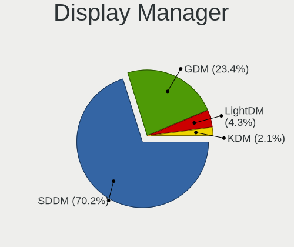
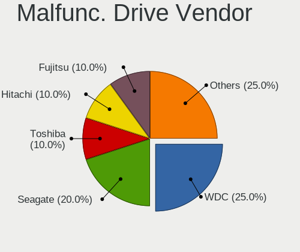
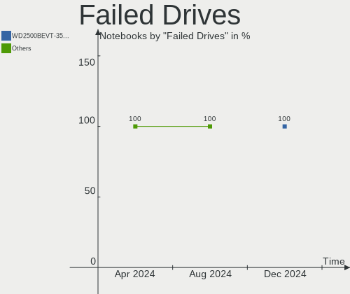

ROSA Hardware Trends (Notebook)
-------------------------------

A project to identify most popular hardware characteristics and track their change
over time based on data collected by ROSA users at https://Linux-Hardware.org.

Anyone can contribute to the study by uploading probes of their computers by
the [hw-probe](https://github.com/linuxhw/hw-probe) tool:

    sudo -E hw-probe -all -upload

Full-feature report is available here: https://linux-hardware.org/?view=trends&formfactor=notebook

Period: May, 2020.

Contents
--------

- [ OS                       ](#os)
- [ OS Family                ](#os-family)
- [ Kernel                   ](#kernel)
- [ Kernel Family            ](#kernel-family)
- [ Kernel Major Ver.        ](#kernel-major-ver)
- [ Arch                     ](#arch)
- [ DE                       ](#de)
- [ Display Server           ](#display-server)
- [ Display Manager          ](#display-manager)
- [ OS Lang                  ](#os-lang)
- [ Boot Mode                ](#boot-mode)
- [ Filesystem               ](#filesystem)
- [ Part. scheme             ](#part-scheme)
- [ Dual Boot with Linux/BSD ](#dual-boot-with-linux/bsd)
- [ Dual Boot (Win)          ](#dual-boot-win)
- [ Country                  ](#country)
- [ City                     ](#city)
- [ Vendor                   ](#vendor)
- [ Model                    ](#model)
- [ Model Family             ](#model-family)
- [ MFG Year                 ](#mfg-year)
- [ Form Factor              ](#form-factor)
- [ Secure Boot              ](#secure-boot)
- [ Coreboot                 ](#coreboot)
- [ RAM Size                 ](#ram-size)
- [ RAM Used                 ](#ram-used)
- [ Drive Vendor             ](#drive-vendor)
- [ Drive Model              ](#drive-model)
- [ Drive Kind               ](#drive-kind)
- [ Drive Connector          ](#drive-connector)
- [ Drive Size               ](#drive-size)
- [ Space Total              ](#space-total)
- [ Space Used               ](#space-used)
- [ Malfunc. Drives          ](#malfunc-drives)
- [ Malfunc. Drive Vendor    ](#malfunc-drive-vendor)
- [ Malfunc. HDD Vendor      ](#malfunc-hdd-vendor)
- [ Malfunc. Drive Kind      ](#malfunc-drive-kind)
- [ Failed Drives            ](#failed-drives)
- [ Failed Drive Vendor      ](#failed-drive-vendor)
- [ Drive Status             ](#drive-status)
- [ Storage Vendor           ](#storage-vendor)
- [ Storage Model            ](#storage-model)
- [ Storage Kind             ](#storage-kind)
- [ CPU Vendor               ](#cpu-vendor)
- [ CPU Model                ](#cpu-model)
- [ CPU Model Family         ](#cpu-model-family)
- [ CPU Cores                ](#cpu-cores)
- [ CPU Sockets              ](#cpu-sockets)
- [ CPU Threads              ](#cpu-threads)
- [ CPU Op-Modes             ](#cpu-op-modes)
- [ CPU Microcode            ](#cpu-microcode)
- [ CPU Microarch            ](#cpu-microarch)
- [ GPU Vendor               ](#gpu-vendor)
- [ GPU Model                ](#gpu-model)
- [ GPU Combo                ](#gpu-combo)
- [ GPU Driver               ](#gpu-driver)
- [ GPU Memory               ](#gpu-memory)
- [ Monitor Vendor           ](#monitor-vendor)
- [ Monitor Model            ](#monitor-model)
- [ Monitor Resolution       ](#monitor-resolution)
- [ Monitor Diagonal         ](#monitor-diagonal)
- [ Monitor Width            ](#monitor-width)
- [ Aspect Ratio             ](#aspect-ratio)
- [ Monitor Area             ](#monitor-area)
- [ Pixel Density            ](#pixel-density)
- [ Multiple Monitors        ](#multiple-monitors)
- [ Net Controller Vendor    ](#net-controller-vendor)
- [ Net Controller Model     ](#net-controller-model)
- [ Wireless Vendor          ](#wireless-vendor)
- [ Wireless Model           ](#wireless-model)
- [ Ethernet Vendor          ](#ethernet-vendor)
- [ Ethernet Model           ](#ethernet-model)
- [ Net Controller Kind      ](#net-controller-kind)
- [ Used Controller          ](#used-controller)
- [ NICs                     ](#nics)
- [ Bluetooth Vendor         ](#bluetooth-vendor)
- [ Bluetooth Model          ](#bluetooth-model)
- [ Unsupported Devices      ](#unsupported-devices)
- [ Unsupported Device Types ](#unsupported-device-types)

OS
--

Installed operating systems

| Name        | Computers | Percent |
|-------------|-----------|---------|
| ROSA R11.1  | 82        | 59.42%  |
| ROSA R11    | 43        | 31.16%  |
| ROSA R8.1   | 6         | 4.35%   |
| ROSA R10    | 4         | 2.9%    |
| ROSA R9     | 1         | 0.72%   |
| ROSA 2019.0 | 1         | 0.72%   |
| RED X3      | 1         | 0.72%   |

OS Family
---------

OS without a version

| Name | Computers | Percent |
|------|-----------|---------|
| ROSA | 138       | 100%    |

Kernel
------

Version of the Linux kernel

| Version                          | Computers | Percent |
|----------------------------------|-----------|---------|
| 4.15.0-desktop-45.1rosa-x86_64   | 38        | 27.54%  |
| 5.4.32-generic-2rosa-x86_64      | 27        | 19.57%  |
| 4.15.0-desktop-94.1rosa-x86_64   | 23        | 16.67%  |
| 4.15.0-desktop-45.1rosa-i586     | 13        | 9.42%   |
| 4.15.0-desktop-94.1rosa-i586     | 8         | 5.8%    |
| 4.9.155-nrj-desktop-1rosa-x86_64 | 4         | 2.9%    |
| 5.4.32-generic-2rosa-i586        | 3         | 2.17%   |
| 4.9.60-nrj-desktop-1rosa-x86_64  | 3         | 2.17%   |
| 4.1.38-nrj-desktop-2rosa-x86_64  | 3         | 2.17%   |
| 5.4.40-generic-1rosa-x86_64      | 2         | 1.45%   |
| 4.9.60-nrj-desktop-1rosa-i586    | 2         | 1.45%   |
| 4.9.155-nrj-desktop-1rosa-i586   | 2         | 1.45%   |
| 4.15.0-desktop-68.5rosa-x86_64   | 2         | 1.45%   |
| 5.4.40-nickel-2rosa-x86_64       | 1         | 0.72%   |
| 5.4.38-nrj-desktop-1rosa-x86_64  | 1         | 0.72%   |
| 5.4.35-nrj-desktop-1rosa-x86_64  | 1         | 0.72%   |
| 5.3.0-desktop-52.1rosa-x86_64    | 1         | 0.72%   |
| 4.9.20-nrj-desktop-1rosa-x86_64  | 1         | 0.72%   |
| 4.9.155-nrj-laptop-1rosa-x86_64  | 1         | 0.72%   |
| 4.9.124-nrj-desktop-1rosa-x86_64 | 1         | 0.72%   |
| 4.15.0-desktop-68.5rosa-i586     | 1         | 0.72%   |

Kernel Family
-------------

Linux kernel without a distro release

| Version | Computers | Percent |
|---------|-----------|---------|
| 4.15.0  | 85        | 61.59%  |
| 5.4.32  | 30        | 21.74%  |
| 4.9.155 | 7         | 5.07%   |
| 4.9.60  | 5         | 3.62%   |
| 5.4.40  | 3         | 2.17%   |
| 4.1.38  | 3         | 2.17%   |
| 5.4.38  | 1         | 0.72%   |
| 5.4.35  | 1         | 0.72%   |
| 5.3.0   | 1         | 0.72%   |
| 4.9.20  | 1         | 0.72%   |
| 4.9.124 | 1         | 0.72%   |

Kernel Major Ver.
-----------------

Linux kernel major version

| Version | Computers | Percent |
|---------|-----------|---------|
| 4.15    | 85        | 61.59%  |
| 5.4     | 35        | 25.36%  |
| 4.9     | 14        | 10.14%  |
| 4.1     | 3         | 2.17%   |
| 5.3     | 1         | 0.72%   |

Arch
----

OS architecture (x86_64, i586, etc.)

| Name   | Computers | Percent |
|--------|-----------|---------|
| x86_64 | 109       | 78.99%  |
| i686   | 29        | 21.01%  |

DE
--

Desktop Environment

| Name    | Computers | Percent |
|---------|-----------|---------|
| KDE4    | 76        | 55.07%  |
| KDE5    | 46        | 33.33%  |
| LXQt    | 11        | 7.97%   |
| XFCE    | 3         | 2.17%   |
| MATE    | 1         | 0.72%   |
| Unknown | 1         | 0.72%   |

Display Server
--------------

X11 or Wayland

| Name | Computers | Percent |
|------|-----------|---------|
| X11  | 138       | 100%    |

Display Manager
---------------

SDDM, LightDM, etc.

| Name    | Computers | Percent |
|---------|-----------|---------|
| KDM     | 78        | 56.52%  |
| SDDM    | 59        | 42.75%  |
| LightDM | 1         | 0.72%   |

OS Lang
-------

Language

| Lang       | Computers | Percent |
|------------|-----------|---------|
| ru_RU      | 65        | 47.1%   |
| Unknown    | 55        | 39.86%  |
| de_DE      | 5         | 3.62%   |
| en_GB      | 4         | 2.9%    |
| pl_PL      | 3         | 2.17%   |
| en_US      | 2         | 1.45%   |
| ru_RU.utf8 | 1         | 0.72%   |
| ro_RO      | 1         | 0.72%   |
| it_IT      | 1         | 0.72%   |
| fr_FR      | 1         | 0.72%   |

Boot Mode
---------

EFI or BIOS

| Mode | Computers | Percent |
|------|-----------|---------|
| BIOS | 104       | 75.36%  |
| EFI  | 34        | 24.64%  |

Filesystem
----------

Type of filesystem

| Type  | Computers | Percent |
|-------|-----------|---------|
| Ext4  | 132       | 95.65%  |
| Btrfs | 4         | 2.9%    |
| F2fs  | 1         | 0.72%   |
| Aufs  | 1         | 0.72%   |

Part. scheme
------------

Scheme of partitioning

| Type    | Computers | Percent |
|---------|-----------|---------|
| Unknown | 83        | 60.14%  |
| MBR     | 40        | 28.99%  |
| GPT     | 15        | 10.87%  |

Dual Boot with Linux/BSD
------------------------

Hosting more than one Linux/BSD

| Dual boot | Computers | Percent |
|-----------|-----------|---------|
| No        | 105       | 76.09%  |
| Yes       | 33        | 23.91%  |

Dual Boot (Win)
---------------

Hosting Linux and Windows

| Dual boot | Computers | Percent |
|-----------|-----------|---------|
| No        | 81        | 58.7%   |
| Yes       | 57        | 41.3%   |

Country
-------

Geographic location (country)

| Country     | Computers | Percent |
|-------------|-----------|---------|
| Russia      | 102       | 73.91%  |
| Ukraine     | 6         | 4.35%   |
| Germany     | 6         | 4.35%   |
| Italy       | 4         | 2.9%    |
| Poland      | 3         | 2.17%   |
| Kazakhstan  | 2         | 1.45%   |
| France      | 2         | 1.45%   |
| Belgium     | 2         | 1.45%   |
| Belarus     | 2         | 1.45%   |
| Switzerland | 1         | 0.72%   |
| Sweden      | 1         | 0.72%   |
| Netherlands | 1         | 0.72%   |
| Mexico      | 1         | 0.72%   |
| Latvia      | 1         | 0.72%   |
| Israel      | 1         | 0.72%   |
| Greece      | 1         | 0.72%   |
| Denmark     | 1         | 0.72%   |
| Bulgaria    | 1         | 0.72%   |

City
----

Geographic location (city)

| City                     | Computers | Percent |
|--------------------------|-----------|---------|
| Moscow                   | 15        | 10.87%  |
| St Petersburg            | 9         | 6.52%   |
| Krasnodar                | 8         | 5.8%    |
| Ekaterinburg             | 7         | 5.07%   |
| Novosibirsk              | 5         | 3.62%   |
| Nizhniy Novgorod         | 3         | 2.17%   |
| Nal'chik                 | 3         | 2.17%   |
| Montedinove              | 3         | 2.17%   |
| Kazan’                 | 3         | 2.17%   |
| Astrakhan                | 3         | 2.17%   |
| Stavropol                | 2         | 1.45%   |
| Rostov-on-Don            | 2         | 1.45%   |
| Pushkino                 | 2         | 1.45%   |
| Kurgan                   | 2         | 1.45%   |
| Kharkiv                  | 2         | 1.45%   |
| Chelyabinsk              | 2         | 1.45%   |
| Zurich                   | 1         | 0.72%   |
| Ypres                    | 1         | 0.72%   |
| Yelabuga                 | 1         | 0.72%   |
| Voronezh                 | 1         | 0.72%   |
| Volgograd                | 1         | 0.72%   |
| Vladivostok              | 1         | 0.72%   |
| Varna                    | 1         | 0.72%   |
| Varberg                  | 1         | 0.72%   |
| Tyumen                   | 1         | 0.72%   |
| Tsarskoye Selo           | 1         | 0.72%   |
| Tel Aviv                 | 1         | 0.72%   |
| Taganrog                 | 1         | 0.72%   |
| Słupsk                  | 1         | 0.72%   |
| Surgut                   | 1         | 0.72%   |
| Stuttgart                | 1         | 0.72%   |
| Sterlitamak              | 1         | 0.72%   |
| Simferopol               | 1         | 0.72%   |
| Saratov                  | 1         | 0.72%   |
| Saransk                  | 1         | 0.72%   |
| Samara                   | 1         | 0.72%   |
| Ryazan                   | 1         | 0.72%   |
| Riga                     | 1         | 0.72%   |
| Querétaro City          | 1         | 0.72%   |
| Puurs                    | 1         | 0.72%   |
| Pskov                    | 1         | 0.72%   |
| Poltava                  | 1         | 0.72%   |
| Podolsk                  | 1         | 0.72%   |
| Pleszew                  | 1         | 0.72%   |
| Petropavlovsk-Kamchatsky | 1         | 0.72%   |
| Pershotravensk           | 1         | 0.72%   |
| Pavlovskaya              | 1         | 0.72%   |
| Pavlodar                 | 1         | 0.72%   |
| Oryol                    | 1         | 0.72%   |
| Noginsk                  | 1         | 0.72%   |
| Nizhny Tagil             | 1         | 0.72%   |
| Nazarovo                 | 1         | 0.72%   |
| Minsk                    | 1         | 0.72%   |
| Lyon                     | 1         | 0.72%   |
| Liski                    | 1         | 0.72%   |
| Leipzig                  | 1         | 0.72%   |
| Lainate                  | 1         | 0.72%   |
| Kyiv                     | 1         | 0.72%   |
| Khabarovsk               | 1         | 0.72%   |
| Karlsbad                 | 1         | 0.72%   |

Vendor
------

Motherboard manufacturer

| Name                | Computers | Percent |
|---------------------|-----------|---------|
| ASUSTek Computer    | 27        | 19.57%  |
| Acer                | 24        | 17.39%  |
| Hewlett-Packard     | 23        | 16.67%  |
| Lenovo              | 18        | 13.04%  |
| Dell                | 10        | 7.25%   |
| Samsung Electronics | 7         | 5.07%   |
| Toshiba             | 5         | 3.62%   |
| MSI                 | 4         | 2.9%    |
| Sony                | 3         | 2.17%   |
| Packard Bell        | 3         | 2.17%   |
| Pegatron            | 2         | 1.45%   |
| Notebook            | 2         | 1.45%   |
| Fujitsu Siemens     | 2         | 1.45%   |
| Apple               | 2         | 1.45%   |
| Quanta              | 1         | 0.72%   |
| Prestigio           | 1         | 0.72%   |
| Fujitsu             | 1         | 0.72%   |
| eMachines           | 1         | 0.72%   |
| Clevo               | 1         | 0.72%   |
| Aquarius            | 1         | 0.72%   |

Model
-----

Motherboard model

| Name                                                                                                 | Computers | Percent |
|------------------------------------------------------------------------------------------------------|-----------|---------|
| Toshiba Satellite C660                                                                               | 2         | 1.45%   |
| Packard Bell EasyNote TJ71                                                                           | 2         | 1.45%   |
| Lenovo B590 20206                                                                                    | 2         | 1.45%   |
| HP Pavilion Notebook                                                                                 | 2         | 1.45%   |
| HP Pavilion g6                                                                                       | 2         | 1.45%   |
| HP 255 G6 Notebook PC                                                                                | 2         | 1.45%   |
| HP 255 G4                                                                                            | 2         | 1.45%   |
| HP 250 G4                                                                                            | 2         | 1.45%   |
| ASUS 1011PX                                                                                          | 2         | 1.45%   |
| Apple MacBookPro8,1                                                                                  | 2         | 1.45%   |
| Toshiba TECRA A3                                                                                     | 1         | 0.72%   |
| Toshiba Satellite P300                                                                               | 1         | 0.72%   |
| Toshiba Satellite C850-B6W                                                                           | 1         | 0.72%   |
| Sony VGN-NS31MR_S                                                                                    | 1         | 0.72%   |
| Sony VGN-CR21ZR_R                                                                                    | 1         | 0.72%   |
| Sony VGN-AW11ZR_B                                                                                    | 1         | 0.72%   |
| Samsung Electronics RV408/RV508                                                                      | 1         | 0.72%   |
| Samsung Electronics R470/R420                                                                        | 1         | 0.72%   |
| Samsung Electronics NC110P/NC108P/NC111P                                                             | 1         | 0.72%   |
| Samsung Electronics 355V4C/355V4X/355V5C/355V5X/356V4C/356V4X/356V5C/356V5X/3445VC/3445VX/3545VC/354 | 1         | 0.72%   |
| Samsung Electronics 350V5C/351V5C/3540VC/3440VC                                                      | 1         | 0.72%   |
| Samsung Electronics 305V4A/305V5A/3415VA                                                             | 1         | 0.72%   |
| Samsung Electronics 300E4A/300E5A/300E7A                                                             | 1         | 0.72%   |
| Quanta TWC                                                                                           | 1         | 0.72%   |
| Prestigio Visconte Quad 3GK                                                                          | 1         | 0.72%   |
| Pegatron C17A                                                                                        | 1         | 0.72%   |
| Pegatron C15B                                                                                        | 1         | 0.72%   |
| Packard Bell EasyNote TE69HW                                                                         | 1         | 0.72%   |
| Notebook W65_67SF                                                                                    | 1         | 0.72%   |
| Notebook W54_55_94_95_97AU,AUQ                                                                       | 1         | 0.72%   |
| MSI VR630                                                                                            | 1         | 0.72%   |
| MSI VR610                                                                                            | 1         | 0.72%   |
| MSI GL65 9SEK                                                                                        | 1         | 0.72%   |
| MSI GE60 2OC\2OD\2OE                                                                                 | 1         | 0.72%   |
| Lenovo ThinkPad X61s 7667A95                                                                         | 1         | 0.72%   |
| Lenovo ThinkPad T450 20BUS4PT00                                                                      | 1         | 0.72%   |
| Lenovo ThinkPad T410 2522WPH                                                                         | 1         | 0.72%   |
| Lenovo ThinkPad R500 2732W11                                                                         | 1         | 0.72%   |
| Lenovo IdeaPad Z510 20287                                                                            | 1         | 0.72%   |
| Lenovo IdeaPad Y560                                                                                  | 1         | 0.72%   |
| Lenovo IdeaPad S110 20126                                                                            | 1         | 0.72%   |
| Lenovo IdeaPad 110-15ACL 80TJ                                                                        | 1         | 0.72%   |
| Lenovo IdeaPad 100-15IBD 80QQ                                                                        | 1         | 0.72%   |
| Lenovo G580 20150                                                                                    | 1         | 0.72%   |
| Lenovo G580                                                                                          | 1         | 0.72%   |
| Lenovo G505 20240                                                                                    | 1         | 0.72%   |
| Lenovo G500 20236                                                                                    | 1         | 0.72%   |
| Lenovo B590 20208                                                                                    | 1         | 0.72%   |
| Lenovo B50-80 80EW                                                                                   | 1         | 0.72%   |
| Lenovo B50-45 20388                                                                                  | 1         | 0.72%   |
| HP ProBook 4710s                                                                                     | 1         | 0.72%   |
| HP ProBook 440 G4                                                                                    | 1         | 0.72%   |
| HP ProBook 4340s                                                                                     | 1         | 0.72%   |
| HP Pavilion dm4                                                                                      | 1         | 0.72%   |
| HP Notebook                                                                                          | 1         | 0.72%   |
| HP Laptop 17-bs0xx                                                                                   | 1         | 0.72%   |
| HP Laptop 15-ra0xx                                                                                   | 1         | 0.72%   |
| HP G7000                                                                                             | 1         | 0.72%   |
| HP ENVY m6                                                                                           | 1         | 0.72%   |
| HP ENVY dv7                                                                                          | 1         | 0.72%   |

Model Family
------------

Motherboard model prefix

| Name                       | Computers | Percent |
|----------------------------|-----------|---------|
| Acer Aspire                | 16        | 11.59%  |
| Dell Inspiron              | 6         | 4.35%   |
| Lenovo IdeaPad             | 5         | 3.62%   |
| HP Pavilion                | 5         | 3.62%   |
| Toshiba Satellite          | 4         | 2.9%    |
| Lenovo ThinkPad            | 4         | 2.9%    |
| HP 255                     | 4         | 2.9%    |
| Acer TravelMate            | 4         | 2.9%    |
| Packard Bell EasyNote      | 3         | 2.17%   |
| Lenovo B590                | 3         | 2.17%   |
| HP ProBook                 | 3         | 2.17%   |
| Dell Latitude              | 3         | 2.17%   |
| Lenovo G580                | 2         | 1.45%   |
| HP Laptop                  | 2         | 1.45%   |
| HP ENVY                    | 2         | 1.45%   |
| HP Compaq                  | 2         | 1.45%   |
| HP 250                     | 2         | 1.45%   |
| ASUS 1011PX                | 2         | 1.45%   |
| Apple MacBookPro8          | 2         | 1.45%   |
| Toshiba TECRA              | 1         | 0.72%   |
| Sony VGN-NS31MR            | 1         | 0.72%   |
| Sony VGN-CR21ZR            | 1         | 0.72%   |
| Sony VGN-AW11ZR            | 1         | 0.72%   |
| Samsung Electronics RV408  | 1         | 0.72%   |
| Samsung Electronics R470   | 1         | 0.72%   |
| Samsung Electronics NC110P | 1         | 0.72%   |
| Samsung Electronics 355V4C | 1         | 0.72%   |
| Samsung Electronics 350V5C | 1         | 0.72%   |
| Samsung Electronics 305V4A | 1         | 0.72%   |
| Samsung Electronics 300E4A | 1         | 0.72%   |
| Quanta TWC                 | 1         | 0.72%   |
| Prestigio Visconte         | 1         | 0.72%   |
| Pegatron C17A              | 1         | 0.72%   |
| Pegatron C15B              | 1         | 0.72%   |
| Notebook W65               | 1         | 0.72%   |
| Notebook W54               | 1         | 0.72%   |
| MSI VR630                  | 1         | 0.72%   |
| MSI VR610                  | 1         | 0.72%   |
| MSI GL65                   | 1         | 0.72%   |
| MSI GE60                   | 1         | 0.72%   |
| Lenovo G505                | 1         | 0.72%   |
| Lenovo G500                | 1         | 0.72%   |
| Lenovo B50-80              | 1         | 0.72%   |
| Lenovo B50-45              | 1         | 0.72%   |
| HP Notebook                | 1         | 0.72%   |
| HP G7000                   | 1         | 0.72%   |
| HP EliteBook               | 1         | 0.72%   |
| Fujitsu STYLISTIC          | 1         | 0.72%   |
| Fujitsu Siemens STYLISTIC  | 1         | 0.72%   |
| Fujitsu Siemens AMILO      | 1         | 0.72%   |
| eMachines eME640           | 1         | 0.72%   |
| Dell Vostro                | 1         | 0.72%   |
| Clevo W240EL               | 1         | 0.72%   |
| ASUS X55A                  | 1         | 0.72%   |
| ASUS X550CL                | 1         | 0.72%   |
| ASUS X540YA                | 1         | 0.72%   |
| ASUS X540NA                | 1         | 0.72%   |
| ASUS VivoBook              | 1         | 0.72%   |
| ASUS U31SG                 | 1         | 0.72%   |
| ASUS TUF                   | 1         | 0.72%   |

MFG Year
--------

Motherboard manufacture year

| Year | Computers | Percent |
|------|-----------|---------|
| 2011 | 24        | 17.39%  |
| 2012 | 19        | 13.77%  |
| 2013 | 16        | 11.59%  |
| 2009 | 11        | 7.97%   |
| 2016 | 9         | 6.52%   |
| 2010 | 9         | 6.52%   |
| 2019 | 8         | 5.8%    |
| 2008 | 8         | 5.8%    |
| 2015 | 7         | 5.07%   |
| 2014 | 7         | 5.07%   |
| 2018 | 6         | 4.35%   |
| 2007 | 6         | 4.35%   |
| 2017 | 5         | 3.62%   |
| 2005 | 2         | 1.45%   |
| 2020 | 1         | 0.72%   |

Form Factor
-----------

Physical design of the computer

| Name     | Computers | Percent |
|----------|-----------|---------|
| Notebook | 138       | 100%    |

Secure Boot
-----------

Enabled or disabled

| State    | Computers | Percent |
|----------|-----------|---------|
| Disabled | 137       | 99.28%  |
| Enabled  | 1         | 0.72%   |

Coreboot
--------

Have coreboot on board

| Used | Computers | Percent |
|------|-----------|---------|
| No   | 138       | 100%    |

RAM Size
--------

Total RAM memory

| Size in GB | Computers | Percent |
|------------|-----------|---------|
| 3.01-4.0   | 54        | 39.13%  |
| 4.01-8.0   | 28        | 20.29%  |
| 1.01-2.0   | 25        | 18.12%  |
| 8.01-16.0  | 21        | 15.22%  |
| 0.01-1.0   | 4         | 2.9%    |
| 2.01-3.0   | 3         | 2.17%   |
| 16.01-24.0 | 2         | 1.45%   |
| 32.01-64.0 | 1         | 0.72%   |

RAM Used
--------

Used RAM memory

| Used GB  | Computers | Percent |
|----------|-----------|---------|
| 0.01-1.0 | 77        | 55.8%   |
| 1.01-2.0 | 44        | 31.88%  |
| 2.01-3.0 | 14        | 10.14%  |
| 3.01-4.0 | 3         | 2.17%   |

Drive Vendor
------------

Hard drive vendors

| Vendor              | Computers | Drives | Percent |
|---------------------|-----------|--------|---------|
| WDC                 | 34        | 35     | 20.61%  |
| Seagate             | 34        | 34     | 20.61%  |
| Toshiba             | 18        | 18     | 10.91%  |
| Hitachi             | 16        | 16     | 9.7%    |
| Samsung Electronics | 14        | 14     | 8.48%   |
| HGST                | 7         | 7      | 4.24%   |
| Kingston            | 6         | 7      | 3.64%   |
| Unknown             | 5         | 5      | 3.03%   |
| SanDisk             | 5         | 5      | 3.03%   |
| Crucial             | 4         | 4      | 2.42%   |
| SPCC                | 2         | 2      | 1.21%   |
| PLEXTOR             | 2         | 2      | 1.21%   |
| HUAWEI              | 2         | 2      | 1.21%   |
| China               | 2         | 2      | 1.21%   |
| AMD                 | 2         | 2      | 1.21%   |
| A-DATA Technology   | 2         | 2      | 1.21%   |
| Transcend           | 1         | 1      | 0.61%   |
| Smartbuy            | 1         | 1      | 0.61%   |
| Silicon Motion      | 1         | 1      | 0.61%   |
| OCZ                 | 1         | 1      | 0.61%   |
| LONDISK             | 1         | 1      | 0.61%   |
| LITEONIT            | 1         | 1      | 0.61%   |
| KingDian            | 1         | 1      | 0.61%   |
| Fujitsu             | 1         | 2      | 0.61%   |
| Apacer              | 1         | 1      | 0.61%   |
| AEGO                | 1         | 1      | 0.61%   |

Drive Model
-----------

Hard drive models

| Model                        | Computers | Percent |
|------------------------------|-----------|---------|
| ST320LT020-9YG142 320GB      | 6         | 3.57%   |
| ST500LT012-1DG142 500GB      | 4         | 2.38%   |
| HTS545050A7E680 500GB        | 4         | 2.38%   |
| ST1000LM024 HN-M101MBB 1TB   | 3         | 1.79%   |
| SA400S37240G 240GB SSD       | 3         | 1.79%   |
| MQ01ABF050 500GB             | 3         | 1.79%   |
| MQ01ABD100 1TB               | 3         | 1.79%   |
| HTS545050A7E380 500GB        | 3         | 1.79%   |
| WDS240G2G0A-00JH30 240GB SSD | 2         | 1.19%   |
| WD5000BEVT-22A0RT0 500GB     | 2         | 1.19%   |
| WD3200BEVT-22ZCT0 320GB      | 2         | 1.19%   |
| TF CARD Storage 16GB         | 2         | 1.19%   |
| ST9500420AS 500GB            | 2         | 1.19%   |
| ST9500325AS 500GB            | 2         | 1.19%   |
| ST9250315AS 250GB            | 2         | 1.19%   |
| ST500LM021-1KJ152 500GB      | 2         | 1.19%   |
| ST1000LM035-1RK172 1TB       | 2         | 1.19%   |
| SSD 850 EVO 250GB            | 2         | 1.19%   |
| SSD 240GB                    | 2         | 1.19%   |
| SATA SSD 20GB                | 2         | 1.19%   |
| MK5076GSX 500GB              | 2         | 1.19%   |
| HTS545025B9A300 250GB        | 2         | 1.19%   |
| HTS543232A7A384 320GB        | 2         | 1.19%   |
| HTS543225A7A384 250GB        | 2         | 1.19%   |
| HTS542516K9SA00 160GB        | 2         | 1.19%   |
| HN-M500MBB 500GB             | 2         | 1.19%   |
| CT240BX500SSD1 240GB         | 2         | 1.19%   |
| WDS500G2B0A-00SM50 500GB SSD | 1         | 0.6%    |
| WDS480G2G0A-00JH30 480GB SSD | 1         | 0.6%    |
| WDS120G2G0A-00JH30 120GB SSD | 1         | 0.6%    |
| WDS120G1G0A-00SS50 120GB SSD | 1         | 0.6%    |
| WD800UE-22HCT0 80GB          | 1         | 0.6%    |
| WD7500BPVT-60HXZT3 752GB     | 1         | 0.6%    |
| WD7500BPVT-22HXZT3 752GB     | 1         | 0.6%    |
| WD7500BPKT-80PK4T0 752GB     | 1         | 0.6%    |
| WD7500BPKT-22PK4T0 752GB     | 1         | 0.6%    |
| WD5000LPVX-22V0TT0 500GB     | 1         | 0.6%    |
| WD5000LPVT-24G33T1 500GB     | 1         | 0.6%    |
| WD5000LPCX-60VHAT1 500GB     | 1         | 0.6%    |
| WD5000LPCX-60VHAT0 500GB     | 1         | 0.6%    |
| WD5000LPCX-24VHAT0 500GB     | 1         | 0.6%    |
| WD5000LPCX-21VHAT0 500GB     | 1         | 0.6%    |
| WD5000LPCX-00VHAT0 500GB     | 1         | 0.6%    |
| WD5000BEVT-35ZAT0 500GB      | 1         | 0.6%    |
| WD3200LPVT-08G33T1 320GB     | 1         | 0.6%    |
| WD3200BPVT-80JJ5T0 320GB     | 1         | 0.6%    |
| WD3200BPVT-22JJ5T0 320GB     | 1         | 0.6%    |
| WD2500BPVT-22JJ5T0 250GB     | 1         | 0.6%    |
| WD1200BEVS-75UST0 120GB      | 1         | 0.6%    |
| WD1200BEVS-60RST0 120GB      | 1         | 0.6%    |
| WD1200BEVS-22UST0 120GB      | 1         | 0.6%    |
| WD10SPZX-60Z10T0 1TB         | 1         | 0.6%    |
| WD10SPZX-21Z10T0 1TB         | 1         | 0.6%    |
| WD10SPZX-00Z10T0 1TB         | 1         | 0.6%    |
| WD10JPVX-75JC3T0 1TB         | 1         | 0.6%    |
| USD  16GB                    | 1         | 0.6%    |
| TS240GSSD220S 240GB          | 1         | 0.6%    |
| SV300S37A240G 240GB SSD      | 1         | 0.6%    |
| SU650 240GB SSD              | 1         | 0.6%    |
| ST9750423AS 752GB            | 1         | 0.6%    |

Drive Kind
----------

HDD or SSD

| Kind    | Computers | Drives | Percent |
|---------|-----------|--------|---------|
| HDD     | 108       | 108    | 66.67%  |
| SSD     | 45        | 50     | 27.78%  |
| MMC     | 5         | 6      | 3.09%   |
| NVMe    | 2         | 2      | 1.23%   |
| Unknown | 2         | 2      | 1.23%   |

Drive Connector
---------------

SATA, SAS, NVMe, etc.

| Type | Computers | Drives | Percent |
|------|-----------|--------|---------|
| SATA | 136       | 157    | 93.15%  |
| MMC  | 5         | 6      | 3.42%   |
| SAS  | 3         | 3      | 2.05%   |
| NVMe | 2         | 2      | 1.37%   |

Drive Size
----------

Size of hard drive

| Size in TB | Computers | Drives | Percent |
|------------|-----------|--------|---------|
| 0.01-0.5   | 122       | 145    | 84.72%  |
| 0.51-1.0   | 22        | 23     | 15.28%  |

Space Total
-----------

Amount of disk space available on the file system

| Size in GB | Computers | Percent |
|------------|-----------|---------|
| 251-500    | 42        | 30.43%  |
| 101-250    | 41        | 29.71%  |
| 1-20       | 22        | 15.94%  |
| 501-1000   | 15        | 10.87%  |
| 21-50      | 8         | 5.8%    |
| 51-100     | 8         | 5.8%    |
| 1001-2000  | 1         | 0.72%   |
| Unknown    | 1         | 0.72%   |

Space Used
----------

Amount of used disk space

| Used GB | Computers | Percent |
|---------|-----------|---------|
| 1-20    | 102       | 73.91%  |
| 21-50   | 12        | 8.7%    |
| 101-250 | 10        | 7.25%   |
| 51-100  | 8         | 5.8%    |
| 251-500 | 5         | 3.62%   |
| Unknown | 1         | 0.72%   |

Malfunc. Drives
---------------

Drive models with a malfunction

| Model                      | Computers | Drives | Percent |
|----------------------------|-----------|--------|---------|
| ST320LT020-9YG142 320GB    | 4         | 4      | 7.84%   |
| HTS545050A7E680 500GB      | 3         | 3      | 5.88%   |
| HTS545050A7E380 500GB      | 3         | 3      | 5.88%   |
| ST9500420AS 500GB          | 2         | 2      | 3.92%   |
| ST500LT012-1DG142 500GB    | 2         | 2      | 3.92%   |
| MQ01ABD100 1TB             | 2         | 2      | 3.92%   |
| HTS543232A7A384 320GB      | 2         | 2      | 3.92%   |
| HTS542516K9SA00 160GB      | 2         | 2      | 3.92%   |
| WD800UE-22HCT0 80GB        | 1         | 1      | 1.96%   |
| WD7500BPVT-60HXZT3 752GB   | 1         | 1      | 1.96%   |
| WD7500BPKT-80PK4T0 752GB   | 1         | 1      | 1.96%   |
| WD5000BEVT-35ZAT0 500GB    | 1         | 1      | 1.96%   |
| WD3200BPVT-80JJ5T0 320GB   | 1         | 1      | 1.96%   |
| WD2500BPVT-22JJ5T0 250GB   | 1         | 1      | 1.96%   |
| WD1200BEVS-60RST0 120GB    | 1         | 1      | 1.96%   |
| ST9750423AS 752GB          | 1         | 1      | 1.96%   |
| ST9320310AS 320GB          | 1         | 1      | 1.96%   |
| ST9250410AS 250GB          | 1         | 1      | 1.96%   |
| ST9250315AS 250GB          | 1         | 1      | 1.96%   |
| ST9160821AS 160GB          | 1         | 1      | 1.96%   |
| ST9160314AS 160GB          | 1         | 1      | 1.96%   |
| ST500LM021-1KJ152 500GB    | 1         | 1      | 1.96%   |
| ST320LT012-9WS14C 320GB    | 1         | 1      | 1.96%   |
| ST1000LM024 HN-M101MBB 1TB | 1         | 1      | 1.96%   |
| SD6SF1M128G1022I 128GB SSD | 1         | 1      | 1.96%   |
| SA400S37480G 480GB SSD     | 1         | 1      | 1.96%   |
| R5SL240G 240GB SSD         | 1         | 1      | 1.96%   |
| MK3275GSX 320GB            | 1         | 1      | 1.96%   |
| MK3263GSXN 320GB           | 1         | 1      | 1.96%   |
| MK2552GSX 250GB            | 1         | 1      | 1.96%   |
| MK2035GSS 200GB            | 1         | 1      | 1.96%   |
| MK1246GSX 120GB            | 1         | 1      | 1.96%   |
| MJA2250BH G2 250GB         | 1         | 1      | 1.96%   |
| HTS723232A7A364 320GB      | 1         | 1      | 1.96%   |
| HTS543232L9SA00 320GB      | 1         | 1      | 1.96%   |
| HTS543225A7A384 250GB      | 1         | 1      | 1.96%   |
| HTS541680J9SA00 80GB       | 1         | 1      | 1.96%   |
| HM500JI 500GB              | 1         | 1      | 1.96%   |
| HM160HI 160GB              | 1         | 1      | 1.96%   |

Malfunc. Drive Vendor
---------------------

Vendors of faulty drives

| Vendor              | Computers | Drives | Percent |
|---------------------|-----------|--------|---------|
| Seagate             | 17        | 17     | 33.33%  |
| Hitachi             | 9         | 9      | 17.65%  |
| WDC                 | 7         | 7      | 13.73%  |
| Toshiba             | 7         | 7      | 13.73%  |
| HGST                | 5         | 5      | 9.8%    |
| Samsung Electronics | 2         | 2      | 3.92%   |
| SanDisk             | 1         | 1      | 1.96%   |
| Kingston            | 1         | 1      | 1.96%   |
| Fujitsu             | 1         | 1      | 1.96%   |
| AMD                 | 1         | 1      | 1.96%   |

Malfunc. HDD Vendor
-------------------

Vendors of faulty HDD drives

| Vendor              | Computers | Drives | Percent |
|---------------------|-----------|--------|---------|
| Seagate             | 17        | 17     | 35.42%  |
| Hitachi             | 9         | 9      | 18.75%  |
| WDC                 | 7         | 7      | 14.58%  |
| Toshiba             | 7         | 7      | 14.58%  |
| HGST                | 5         | 5      | 10.42%  |
| Samsung Electronics | 2         | 2      | 4.17%   |
| Fujitsu             | 1         | 1      | 2.08%   |

Malfunc. Drive Kind
-------------------

Kinds of faulty drives

| Kind | Computers | Drives | Percent |
|------|-----------|--------|---------|
| HDD  | 48        | 48     | 94.12%  |
| SSD  | 3         | 3      | 5.88%   |

Failed Drives
-------------

Failed drive models

| Model                 | Computers | Drives | Percent |
|-----------------------|-----------|--------|---------|
| MK3265GSX 320GB       | 1         | 1      | 50%     |
| HTS543225A7A384 250GB | 1         | 1      | 50%     |

Failed Drive Vendor
-------------------

Failed drive vendors

| Vendor  | Computers | Drives | Percent |
|---------|-----------|--------|---------|
| Toshiba | 1         | 1      | 50%     |
| Hitachi | 1         | 1      | 50%     |

Drive Status
------------

Number of failed and malfunc. drives

| Status   | Computers | Drives | Percent |
|----------|-----------|--------|---------|
| Works    | 91        | 106    | 60.67%  |
| Malfunc  | 50        | 51     | 33.33%  |
| Detected | 7         | 9      | 4.67%   |
| Failed   | 2         | 2      | 1.33%   |

Storage Vendor
--------------

Storage controller vendors

| Vendor             | Computers | Percent |
|--------------------|-----------|---------|
| Intel              | 112       | 79.43%  |
| AMD                | 23        | 16.31%  |
| Nvidia             | 2         | 1.42%   |
| JMicron Technology | 2         | 1.42%   |
| Silicon Motion     | 1         | 0.71%   |
| Sandisk            | 1         | 0.71%   |

Storage Model
-------------

Storage controller models

| Model                                                                      | Computers | Percent |
|----------------------------------------------------------------------------|-----------|---------|
| 7 Series Chipset Family 6-port SATA Controller [AHCI mode]                 | 22        | 14.19%  |
| 6 Series/C200 Series Chipset Family 6 port Mobile SATA AHCI Controller     | 16        | 10.32%  |
| FCH SATA Controller [AHCI mode]                                            | 14        | 9.03%   |
| 82801IBM/IEM (ICH9M/ICH9M-E) 4 port SATA Controller [AHCI mode]            | 9         | 5.81%   |
| Sunrise Point-LP SATA Controller [AHCI mode]                               | 7         | 4.52%   |
| 5 Series/3400 Series Chipset 4 port SATA AHCI Controller                   | 7         | 4.52%   |
| NM10/ICH7 Family SATA Controller [AHCI mode]                               | 6         | 3.87%   |
| 82801HM/HEM (ICH8M/ICH8M-E) IDE Controller                                 | 6         | 3.87%   |
| Wildcat Point-LP SATA Controller [AHCI Mode]                               | 5         | 3.23%   |
| SB7x0/SB8x0/SB9x0 SATA Controller [AHCI mode]                              | 5         | 3.23%   |
| 82801HM/HEM (ICH8M/ICH8M-E) SATA Controller [AHCI mode]                    | 5         | 3.23%   |
| 82801GBM/GHM (ICH7-M Family) SATA Controller [IDE mode]                    | 4         | 2.58%   |
| 82801 Mobile SATA Controller [RAID mode]                                   | 4         | 2.58%   |
| 8 Series/C220 Series Chipset Family 6-port SATA Controller 1 [AHCI mode]   | 4         | 2.58%   |
| 8 Series SATA Controller 1 [AHCI mode]                                     | 4         | 2.58%   |
| Atom/Celeron/Pentium Processor x5-E8000/J3xxx/N3xxx Series SATA Controller | 3         | 1.94%   |
| 82801HM/HEM (ICH8M/ICH8M-E) SATA Controller [IDE mode]                     | 3         | 1.94%   |
| 5 Series/3400 Series Chipset 4 port SATA IDE Controller                    | 3         | 1.94%   |
| 5 Series/3400 Series Chipset 2 port SATA IDE Controller                    | 3         | 1.94%   |
| SB600 Non-Raid-5 SATA                                                      | 2         | 1.29%   |
| SB600 IDE                                                                  | 2         | 1.29%   |
| 82801IBM/IEM (ICH9M/ICH9M-E) 2 port SATA Controller [IDE mode]             | 2         | 1.29%   |
| WD Black 2018/PC SN520 NVMe SSD                                            | 1         | 0.65%   |
| US15W/US15X/US15L/UL11L SCH [Poulsbo] IDE Controller                       | 1         | 0.65%   |
| SB7x0/SB8x0/SB9x0 SATA Controller [IDE mode]                               | 1         | 0.65%   |
| SB7x0/SB8x0/SB9x0 IDE Controller                                           | 1         | 0.65%   |
| Non-Volatile memory controller                                             | 1         | 0.65%   |
| NM10/ICH7 Family SATA Controller [IDE mode]                                | 1         | 0.65%   |
| nForce SATA Controller                                                     | 1         | 0.65%   |
| MCP78S [GeForce 8200] SATA Controller (non-AHCI mode)                      | 1         | 0.65%   |
| MCP78S [GeForce 8200] IDE                                                  | 1         | 0.65%   |
| JMB368 IDE controller                                                      | 1         | 0.65%   |
| JMB360 AHCI Controller                                                     | 1         | 0.65%   |
| FCH SATA Controller [IDE mode]                                             | 1         | 0.65%   |
| Celeron N3350/Pentium N4200/Atom E3900 Series SATA AHCI Controller         | 1         | 0.65%   |
| Cannon Lake Mobile PCH SATA AHCI Controller                                | 1         | 0.65%   |
| 82801GBM/GHM (ICH7-M Family) SATA Controller [AHCI mode]                   | 1         | 0.65%   |
| 82801G (ICH7 Family) IDE Controller                                        | 1         | 0.65%   |
| 82801FBM (ICH6M) SATA Controller                                           | 1         | 0.65%   |
| 82801FB/FBM/FR/FW/FRW (ICH6 Family) IDE Controller                         | 1         | 0.65%   |
| 5 Series/3400 Series Chipset 6 port SATA AHCI Controller                   | 1         | 0.65%   |

Storage Kind
------------

Kind of storage controller (IDE, SATA, NVMe, SAS, ...)

| Kind | Computers | Percent |
|------|-----------|---------|
| SATA | 116       | 77.85%  |
| IDE  | 27        | 18.12%  |
| RAID | 4         | 2.68%   |
| NVMe | 2         | 1.34%   |

CPU Vendor
----------

Processor vendors

| Vendor | Computers | Percent |
|--------|-----------|---------|
| Intel  | 114       | 82.61%  |
| AMD    | 24        | 17.39%  |

CPU Model
---------

Processor models

| Model                                        | Computers | Percent |
|----------------------------------------------|-----------|---------|
| Intel Pentium CPU B960 @ 2.20GHz             | 3         | 2.17%   |
| Intel Core i5-3230M CPU @ 2.60GHz            | 3         | 2.17%   |
| Intel Core i3-6006U CPU @ 2.00GHz            | 3         | 2.17%   |
| Intel Celeron CPU 1005M @ 1.90GHz            | 3         | 2.17%   |
| Intel Pentium CPU P6200 @ 2.13GHz            | 2         | 1.45%   |
| Intel Pentium CPU 2020M @ 2.40GHz            | 2         | 1.45%   |
| Intel Core i7-2630QM CPU @ 2.00GHz           | 2         | 1.45%   |
| Intel Core i5-7200U CPU @ 2.50GHz            | 2         | 1.45%   |
| Intel Core i5-6200U CPU @ 2.30GHz            | 2         | 1.45%   |
| Intel Core i5-5200U CPU @ 2.20GHz            | 2         | 1.45%   |
| Intel Core i5-4200M CPU @ 2.50GHz            | 2         | 1.45%   |
| Intel Core i5-3210M CPU @ 2.50GHz            | 2         | 1.45%   |
| Intel Core i5-2410M CPU @ 2.30GHz            | 2         | 1.45%   |
| Intel Core i5 CPU M 520 @ 2.40GHz            | 2         | 1.45%   |
| Intel Core i3-3110M CPU @ 2.40GHz            | 2         | 1.45%   |
| Intel Core i3-2350M CPU @ 2.30GHz            | 2         | 1.45%   |
| Intel Core i3-2330M CPU @ 2.20GHz            | 2         | 1.45%   |
| Intel Core 2 Duo CPU T9600 @ 2.80GHz         | 2         | 1.45%   |
| Intel Core 2 Duo CPU T7250 @ 2.00GHz         | 2         | 1.45%   |
| Intel Core 2 Duo CPU P8400 @ 2.26GHz         | 2         | 1.45%   |
| Intel Core 2 CPU T5600 @ 1.83GHz             | 2         | 1.45%   |
| Intel Celeron Dual-Core CPU T3500 @ 2.10GHz  | 2         | 1.45%   |
| Intel Celeron CPU N3050 @ 1.60GHz            | 2         | 1.45%   |
| Intel Atom CPU N570 @ 1.66GHz                | 2         | 1.45%   |
| Intel Atom CPU N2600 @ 1.60GHz               | 2         | 1.45%   |
| AMD Turion II Dual-Core Mobile M500          | 2         | 1.45%   |
| AMD E1-6015 APU with Radeon R2 Graphics      | 2         | 1.45%   |
| AMD A6-9220 RADEON R4, 5 COMPUTE CORES 2C+3G | 2         | 1.45%   |
| Intel Pentium M processor 1.86GHz            | 1         | 0.72%   |
| Intel Pentium Dual-Core CPU T4200 @ 2.00GHz  | 1         | 0.72%   |
| Intel Pentium Dual CPU T3400 @ 2.16GHz       | 1         | 0.72%   |
| Intel Pentium CPU P6100 @ 2.00GHz            | 1         | 0.72%   |
| Intel Pentium CPU B980 @ 2.40GHz             | 1         | 0.72%   |
| Intel Pentium CPU B940 @ 2.00GHz             | 1         | 0.72%   |
| Intel Core i7-9750H CPU @ 2.60GHz            | 1         | 0.72%   |
| Intel Core i7-5600U CPU @ 2.60GHz            | 1         | 0.72%   |
| Intel Core i7-4500U CPU @ 1.80GHz            | 1         | 0.72%   |
| Intel Core i7-3630QM CPU @ 2.40GHz           | 1         | 0.72%   |
| Intel Core i7-3612QM CPU @ 2.10GHz           | 1         | 0.72%   |
| Intel Core i7-3517U CPU @ 1.90GHz            | 1         | 0.72%   |
| Intel Core i7-2670QM CPU @ 2.20GHz           | 1         | 0.72%   |
| Intel Core i7-2637M CPU @ 1.70GHz            | 1         | 0.72%   |
| Intel Core i7 CPU Q 740 @ 1.73GHz            | 1         | 0.72%   |
| Intel Core i5-8300H CPU @ 2.30GHz            | 1         | 0.72%   |
| Intel Core i5-4210U CPU @ 1.70GHz            | 1         | 0.72%   |
| Intel Core i5-4210M CPU @ 2.60GHz            | 1         | 0.72%   |
| Intel Core i5-3437U CPU @ 1.90GHz            | 1         | 0.72%   |
| Intel Core i5-3340M CPU @ 2.70GHz            | 1         | 0.72%   |
| Intel Core i5-3337U CPU @ 1.80GHz            | 1         | 0.72%   |
| Intel Core i5-3317U CPU @ 1.70GHz            | 1         | 0.72%   |
| Intel Core i5-2450M CPU @ 2.50GHz            | 1         | 0.72%   |
| Intel Core i5-2435M CPU @ 2.40GHz            | 1         | 0.72%   |
| Intel Core i5-2430M CPU @ 2.40GHz            | 1         | 0.72%   |
| Intel Core i5-2415M CPU @ 2.30GHz            | 1         | 0.72%   |
| Intel Core i5 CPU M 560 @ 2.67GHz            | 1         | 0.72%   |
| Intel Core i5 CPU M 480 @ 2.67GHz            | 1         | 0.72%   |
| Intel Core i5 CPU M 430 @ 2.27GHz            | 1         | 0.72%   |
| Intel Core i3-5010U CPU @ 2.10GHz            | 1         | 0.72%   |
| Intel Core i3-5005U CPU @ 2.00GHz            | 1         | 0.72%   |
| Intel Core i3-4005U CPU @ 1.70GHz            | 1         | 0.72%   |

CPU Model Family
----------------

Processor model prefix

| Model                          | Computers | Percent |
|--------------------------------|-----------|---------|
| Intel Core i5                  | 31        | 22.46%  |
| Intel Core i3                  | 15        | 10.87%  |
| Intel Core 2 Duo               | 13        | 9.42%   |
| Intel Celeron                  | 13        | 9.42%   |
| Intel Core i7                  | 11        | 7.97%   |
| Intel Pentium                  | 10        | 7.25%   |
| Intel Atom                     | 10        | 7.25%   |
| AMD A6                         | 6         | 4.35%   |
| AMD E1                         | 4         | 2.9%    |
| Intel Celeron M                | 3         | 2.17%   |
| Intel Celeron Dual-Core        | 3         | 2.17%   |
| Intel Core 2                   | 2         | 1.45%   |
| AMD Turion II Dual-Core        | 2         | 1.45%   |
| AMD Ryzen 7                    | 2         | 1.45%   |
| Intel Pentium M                | 1         | 0.72%   |
| Intel Pentium Dual-Core        | 1         | 0.72%   |
| Intel Pentium Dual             | 1         | 0.72%   |
| AMD Turion X2 Dual-Core Mobile | 1         | 0.72%   |
| AMD Sempron                    | 1         | 0.72%   |
| AMD Phenom II                  | 1         | 0.72%   |
| AMD E                          | 1         | 0.72%   |
| AMD Athlon X2                  | 1         | 0.72%   |
| AMD Athlon II                  | 1         | 0.72%   |
| AMD Athlon 64 X2               | 1         | 0.72%   |
| AMD A8                         | 1         | 0.72%   |
| AMD A4                         | 1         | 0.72%   |
| AMD A10                        | 1         | 0.72%   |

CPU Cores
---------

Number of processor cores

| Number | Computers | Percent |
|--------|-----------|---------|
| 2      | 112       | 81.16%  |
| 4      | 14        | 10.14%  |
| 1      | 10        | 7.25%   |
| 6      | 1         | 0.72%   |
| 3      | 1         | 0.72%   |

CPU Sockets
-----------

Number of sockets

| Number | Computers | Percent |
|--------|-----------|---------|
| 1      | 138       | 100%    |

CPU Threads
-----------

Threads per core (Hyper-Threading)

| Number | Computers | Percent |
|--------|-----------|---------|
| 2      | 70        | 50.72%  |
| 1      | 68        | 49.28%  |

CPU Op-Modes
------------

CPU Operation Modes (32-bit, 64-bit)

| Op mode        | Computers | Percent |
|----------------|-----------|---------|
| 32-bit, 64-bit | 132       | 95.65%  |
| 32-bit         | 6         | 4.35%   |

CPU Microcode
-------------

Microcode number

| Number     | Computers | Percent |
|------------|-----------|---------|
| 0x306a9    | 20        | 14.49%  |
| 0x206a7    | 20        | 14.49%  |
| 0x20655    | 8         | 5.8%    |
| 0x1067a    | 8         | 5.8%    |
| Unknown    | 6         | 4.35%   |
| 0x6fd      | 5         | 3.62%   |
| 0x406e3    | 5         | 3.62%   |
| 0x306d4    | 4         | 2.9%    |
| 0x306c3    | 4         | 2.9%    |
| 0x30661    | 4         | 2.9%    |
| 0x10676    | 4         | 2.9%    |
| 0x40651    | 3         | 2.17%   |
| 0x106ca    | 3         | 2.17%   |
| 0x07030105 | 3         | 2.17%   |
| 0x806e9    | 2         | 1.45%   |
| 0x6f6      | 2         | 1.45%   |
| 0x6d8      | 2         | 1.45%   |
| 0x406c3    | 2         | 1.45%   |
| 0x20652    | 2         | 1.45%   |
| 0x106c2    | 2         | 1.45%   |
| 0x10661    | 2         | 1.45%   |
| 0x08108102 | 2         | 1.45%   |
| 0x0700010f | 2         | 1.45%   |
| 0x06006705 | 2         | 1.45%   |
| 0x06001119 | 2         | 1.45%   |
| 0x03000027 | 2         | 1.45%   |
| 0x02000057 | 2         | 1.45%   |
| 0x010000c8 | 2         | 1.45%   |
| 0x906ed    | 1         | 0.72%   |
| 0x906ea    | 1         | 0.72%   |
| 0x6fb      | 1         | 0.72%   |
| 0x6f2      | 1         | 0.72%   |
| 0x6e8      | 1         | 0.72%   |
| 0x506c9    | 1         | 0.72%   |
| 0x406c4    | 1         | 0.72%   |
| 0x30678    | 1         | 0.72%   |
| 0x106e5    | 1         | 0.72%   |
| 0x07000110 | 1         | 0.72%   |
| 0x06006704 | 1         | 0.72%   |
| 0x05000119 | 1         | 0.72%   |
| 0x02000032 | 1         | 0.72%   |

CPU Microarch
-------------

Microarchitecture

| Name            | Computers | Percent |
|-----------------|-----------|---------|
| Core            | 23        | 16.67%  |
| SandyBridge     | 21        | 15.22%  |
| IvyBridge       | 20        | 14.49%  |
| Westmere        | 10        | 7.25%   |
| Skylake         | 9         | 6.52%   |
| Bonnell         | 9         | 6.52%   |
| Haswell         | 8         | 5.8%    |
| Broadwell       | 5         | 3.62%   |
| Silvermont      | 4         | 2.9%    |
| Puma            | 3         | 2.17%   |
| P6              | 3         | 2.17%   |
| K8 & K10 hybrid | 3         | 2.17%   |
| K10             | 3         | 2.17%   |
| Jaguar          | 3         | 2.17%   |
| Excavator       | 3         | 2.17%   |
| Zen+            | 2         | 1.45%   |
| Piledriver      | 2         | 1.45%   |
| K10 Llano       | 2         | 1.45%   |
| Nehalem         | 1         | 0.72%   |
| K8 Hammer       | 1         | 0.72%   |
| K6              | 1         | 0.72%   |
| Goldmont        | 1         | 0.72%   |
| Bobcat          | 1         | 0.72%   |

GPU Vendor
----------

Vendors of graphics cards

| Vendor | Computers | Percent |
|--------|-----------|---------|
| Intel  | 95        | 55.88%  |
| AMD    | 44        | 25.88%  |
| Nvidia | 31        | 18.24%  |

GPU Model
---------

Graphics card models

| Model                                                                              | Computers | Percent |
|------------------------------------------------------------------------------------|-----------|---------|
| 3rd Gen Core processor Graphics Controller                                         | 20        | 10.81%  |
| 2nd Generation Core Processor Family Integrated Graphics Controller                | 20        | 10.81%  |
| Mobile GM965/GL960 Integrated Graphics Controller (secondary)                      | 6         | 3.24%   |
| Mobile GM965/GL960 Integrated Graphics Controller (primary)                        | 6         | 3.24%   |
| Core Processor Integrated Graphics Controller                                      | 6         | 3.24%   |
| Thames [Radeon HD 7500M/7600M Series]                                              | 5         | 2.7%    |
| Skylake GT2 [HD Graphics 520]                                                      | 5         | 2.7%    |
| HD Graphics 5500                                                                   | 5         | 2.7%    |
| Mobile 4 Series Chipset Integrated Graphics Controller                             | 4         | 2.16%   |
| Haswell-ULT Integrated Graphics Controller                                         | 4         | 2.16%   |
| 4th Gen Core Processor Integrated Graphics Controller                              | 4         | 2.16%   |
| Stoney [Radeon R2/R3/R4/R5 Graphics]                                               | 3         | 1.62%   |
| Seymour [Radeon HD 6400M/7400M Series]                                             | 3         | 1.62%   |
| RV710/M92 [Mobility Radeon HD 4530/4570/545v]                                      | 3         | 1.62%   |
| Mobile 945GM/GMS/GME, 943/940GML Express Integrated Graphics Controller            | 3         | 1.62%   |
| Madison [Mobility Radeon HD 5650/5750 / 6530M/6550M]                               | 3         | 1.62%   |
| GM108M [GeForce 840M]                                                              | 3         | 1.62%   |
| GK208M [GeForce GT 740M]                                                           | 3         | 1.62%   |
| GF117M [GeForce 610M/710M/810M/820M / GT 620M/625M/630M/720M]                      | 3         | 1.62%   |
| Atom/Celeron/Pentium Processor x5-E8000/J3xxx/N3xxx Integrated Graphics Controller | 3         | 1.62%   |
| Atom Processor D4xx/D5xx/N4xx/N5xx Integrated Graphics Controller                  | 3         | 1.62%   |
| Atom Processor D2xxx/N2xxx Integrated Graphics Controller                          | 3         | 1.62%   |
| Whistler [Radeon HD 6630M/6650M/6750M/7670M/7690M]                                 | 2         | 1.08%   |
| UHD Graphics 630 (Mobile)                                                          | 2         | 1.08%   |
| Topaz XT [Radeon R7 M260/M265 / M340/M360 / M440/M445 / 530/535 / 620/625 Mobile]  | 2         | 1.08%   |
| Sumo [Radeon HD 6520G]                                                             | 2         | 1.08%   |
| RV620/M82 [Mobility Radeon HD 3450/3470]                                           | 2         | 1.08%   |
| Picasso                                                                            | 2         | 1.08%   |
| Mobile 945GM/GMS, 943/940GML Express Integrated Graphics Controller                | 2         | 1.08%   |
| Mobile 915GM/GMS/910GML Express Graphics Controller                                | 2         | 1.08%   |
| Kabini [Radeon HD 8240 / R3 Series]                                                | 2         | 1.08%   |
| HD Graphics 620                                                                    | 2         | 1.08%   |
| GF119M [GeForce GT 520MX]                                                          | 2         | 1.08%   |
| GF119M [GeForce 610M]                                                              | 2         | 1.08%   |
| GF108M [GeForce GT 620M/630M/635M/640M LE]                                         | 2         | 1.08%   |
| GF108M [GeForce GT 540M]                                                           | 2         | 1.08%   |
| Wrestler [Radeon HD 6320]                                                          | 1         | 0.54%   |
| US15W/US15X SCH [Poulsbo] Graphics Controller                                      | 1         | 0.54%   |
| TU117M [GeForce GTX 1650 Mobile / Max-Q]                                           | 1         | 0.54%   |
| TU106M [GeForce RTX 2060 Mobile]                                                   | 1         | 0.54%   |
| Trinity [Radeon HD 7660G]                                                          | 1         | 0.54%   |
| Trinity [Radeon HD 7640G]                                                          | 1         | 0.54%   |
| Sun XT [Radeon HD 8670A/8670M/8690M / R5 M330 / M430 / Radeon 520 Mobile]          | 1         | 0.54%   |
| Sun LE [Radeon HD 8550M / R5 M230]                                                 | 1         | 0.54%   |
| RV710/M92 [Mobility Radeon HD 4330/4350/4550]                                      | 1         | 0.54%   |
| RV620/M82 [Mobility Radeon HD 3410/3430]                                           | 1         | 0.54%   |
| RV516/M64 [Mobility Radeon X2300]                                                  | 1         | 0.54%   |
| RV515/M54 [Mobility Radeon X1400]                                                  | 1         | 0.54%   |
| RS880M [Mobility Radeon HD 4225/4250]                                              | 1         | 0.54%   |
| RS690M [Radeon Xpress 1200/1250/1270]                                              | 1         | 0.54%   |
| Robson CE [Radeon HD 6370M/7370M]                                                  | 1         | 0.54%   |
| RC410M [Mobility Radeon Xpress 200M]                                               | 1         | 0.54%   |
| Park [Mobility Radeon HD 5430/5450/5470]                                           | 1         | 0.54%   |
| Mullins [Radeon R4/R5 Graphics]                                                    | 1         | 0.54%   |
| Mullins [Radeon R3 Graphics]                                                       | 1         | 0.54%   |
| Mullins [Radeon R2 Graphics]                                                       | 1         | 0.54%   |
| Mobile 945GSE Express Integrated Graphics Controller                               | 1         | 0.54%   |
| Meso XT [Radeon R5 M315]                                                           | 1         | 0.54%   |
| Lexa [Radeon 540X/550X/630 / RX 640 / E9171 MCM]                                   | 1         | 0.54%   |
| Kabini [Radeon HD 8210]                                                            | 1         | 0.54%   |

GPU Combo
---------

Combinations of graphics cards

| Name           | Computers | Percent |
|----------------|-----------|---------|
| 1 x Intel      | 63        | 45.65%  |
| 1 x AMD        | 27        | 19.57%  |
| Intel + Nvidia | 21        | 15.22%  |
| Intel + AMD    | 11        | 7.97%   |
| 1 x Nvidia     | 9         | 6.52%   |
| 2 x AMD        | 6         | 4.35%   |
| AMD + Nvidia   | 1         | 0.72%   |

GPU Driver
----------

Free vs proprietary

| Driver      | Computers | Percent |
|-------------|-----------|---------|
| Free        | 129       | 93.48%  |
| Unknown     | 5         | 3.62%   |
| Proprietary | 4         | 2.9%    |

GPU Memory
----------

Total video memory

| Size in GB | Computers | Percent |
|------------|-----------|---------|
| 1.01-2.0   | 53        | 38.41%  |
| 0.01-0.5   | 43        | 31.16%  |
| Unknown    | 27        | 19.57%  |
| 0.51-1.0   | 8         | 5.8%    |
| 3.01-4.0   | 7         | 5.07%   |

Monitor Vendor
--------------

Monitor vendors

| Vendor                  | Computers | Percent |
|-------------------------|-----------|---------|
| AU Optronics            | 35        | 25.74%  |
| LG Display              | 27        | 19.85%  |
| Samsung Electronics     | 18        | 13.24%  |
| Chi Mei Optoelectronics | 14        | 10.29%  |
| Chimei Innolux          | 11        | 8.09%   |
| BOE                     | 10        | 7.35%   |
| Lenovo                  | 4         | 2.94%   |
| LG Philips              | 3         | 2.21%   |
| HannStar                | 2         | 1.47%   |
| Apple                   | 2         | 1.47%   |
| Quanta Display          | 1         | 0.74%   |
| Philips                 | 1         | 0.74%   |
| PANDA                   | 1         | 0.74%   |
| NEC Computers           | 1         | 0.74%   |
| InfoVision              | 1         | 0.74%   |
| Goldstar                | 1         | 0.74%   |
| CPT                     | 1         | 0.74%   |
| BenQ                    | 1         | 0.74%   |
| AOC                     | 1         | 0.74%   |
| Ancor Communications    | 1         | 0.74%   |

Monitor Model
-------------

Monitor models

| Model                                              | Computers | Percent |
|----------------------------------------------------|-----------|---------|
| LCD Monitor LGD02DC 1366x768 344x194mm 15.5-inch   | 5         | 3.68%   |
| LCD Monitor SEC324A 1366x768 344x194mm 15.5-inch   | 3         | 2.21%   |
| LCD Monitor AUO61D2 1024x600 220x130mm 10.1-inch   | 3         | 2.21%   |
| LCD Monitor AUO26EC 1366x768 344x193mm 15.5-inch   | 3         | 2.21%   |
| LCD Monitor AUO21EC 1366x768 340x190mm 15.3-inch   | 3         | 2.21%   |
| LCD Monitor SEC5541 1366x768 344x193mm 15.5-inch   | 2         | 1.47%   |
| LCD Monitor SEC524D 1366x768 353x198mm 15.9-inch   | 2         | 1.47%   |
| LCD Monitor LGD033A 1366x768 340x190mm 15.3-inch   | 2         | 1.47%   |
| LCD Monitor LGD0289 1600x900 382x215mm 17.3-inch   | 2         | 1.47%   |
| LCD Monitor CMO1726 1920x1080 382x215mm 17.3-inch  | 2         | 1.47%   |
| LCD Monitor CMO15A3 1366x768 344x193mm 15.5-inch   | 2         | 1.47%   |
| LCD Monitor CMO15A2 1366x768 344x193mm 15.5-inch   | 2         | 1.47%   |
| LCD Monitor CMN15DB 1366x768 344x193mm 15.5-inch   | 2         | 1.47%   |
| LCD Monitor CMN15BE 1366x768 340x190mm 15.3-inch   | 2         | 1.47%   |
| LCD Monitor BOE06A5 1366x768 344x194mm 15.5-inch   | 2         | 1.47%   |
| LCD Monitor BOE0687 1920x1080 344x193mm 15.5-inch  | 2         | 1.47%   |
| LCD Monitor AUO8174 1280x800 331x207mm 15.4-inch   | 2         | 1.47%   |
| LCD Monitor AUO48EC 1366x768 344x193mm 15.5-inch   | 2         | 1.47%   |
| LCD Monitor AUO23EC 1366x768 344x193mm 15.5-inch   | 2         | 1.47%   |
| SyncMaster SAM0044 1792x1344 312x234mm 15.4-inch   | 1         | 0.74%   |
| S24D300 SAM0B43 1920x1080 531x299mm 24.0-inch      | 1         | 0.74%   |
| RL2450H BNQ7F0D 1920x1080 531x298mm 24.0-inch      | 1         | 0.74%   |
| LP156WH3-TLA2 LGD0210 1366x768 345x194mm 15.6-inch | 1         | 0.74%   |
| LP156WH2-TLAA LGD0230 1366x768 344x194mm 15.5-inch | 1         | 0.74%   |
| LP154WX4-TLCB LPL3101 1280x800 331x207mm 15.4-inch | 1         | 0.74%   |
| LCD Monitor SEC4D45 1280x800 331x207mm 15.4-inch   | 1         | 0.74%   |
| LCD Monitor SEC3945 1280x800 331x207mm 15.4-inch   | 1         | 0.74%   |
| LCD Monitor SEC364D 1600x900 382x214mm 17.2-inch   | 1         | 0.74%   |
| LCD Monitor SEC3347 1440x900 367x230mm 17.1-inch   | 1         | 0.74%   |
| LCD Monitor SEC3130 1024x600 223x125mm 10.1-inch   | 1         | 0.74%   |
| LCD Monitor SEC304C 1920x1080 353x198mm 15.9-inch  | 1         | 0.74%   |
| LCD Monitor SEC3046 1366x768 340x190mm 15.3-inch   | 1         | 0.74%   |
| LCD Monitor SDC4C51 1366x768 344x194mm 15.5-inch   | 1         | 0.74%   |
| LCD Monitor SDC3652 1366x768 340x190mm 15.3-inch   | 1         | 0.74%   |
| LCD Monitor QDS001F 1280x800 304x190mm 14.1-inch   | 1         | 0.74%   |
| LCD Monitor NCP0036 1920x1080 344x194mm 15.5-inch  | 1         | 0.74%   |
| LCD Monitor LPLA101 1440x900 367x230mm 17.1-inch   | 1         | 0.74%   |
| LCD Monitor LPL0601 1280x800 331x207mm 15.4-inch   | 1         | 0.74%   |
| LCD Monitor LGD04AF 1366x768 344x194mm 15.5-inch   | 1         | 0.74%   |
| LCD Monitor LGD046E 1920x1080 380x210mm 17.1-inch  | 1         | 0.74%   |
| LCD Monitor LGD0456 1366x768 344x194mm 15.5-inch   | 1         | 0.74%   |
| LCD Monitor LGD03AB 1366x768 344x194mm 15.5-inch   | 1         | 0.74%   |
| LCD Monitor LGD0393 1600x900 382x215mm 17.3-inch   | 1         | 0.74%   |
| LCD Monitor LGD038E 1366x768 340x190mm 15.3-inch   | 1         | 0.74%   |
| LCD Monitor LGD038C 1366x768 256x144mm 11.6-inch   | 1         | 0.74%   |
| LCD Monitor LGD0384 1366x768 344x194mm 15.5-inch   | 1         | 0.74%   |
| LCD Monitor LGD0354 1366x768 293x165mm 13.2-inch   | 1         | 0.74%   |
| LCD Monitor LGD032E 1366x768 345x194mm 15.6-inch   | 1         | 0.74%   |
| LCD Monitor LGD02F2 1366x768 344x194mm 15.5-inch   | 1         | 0.74%   |
| LCD Monitor LGD02D1 1600x900 382x215mm 17.3-inch   | 1         | 0.74%   |
| LCD Monitor LGD02A5 1366x768 345x194mm 15.6-inch   | 1         | 0.74%   |
| LCD Monitor LGD0259 1920x1080 350x190mm 15.7-inch  | 1         | 0.74%   |
| LCD Monitor LGD0212 1366x768 309x174mm 14.0-inch   | 1         | 0.74%   |
| LCD Monitor LGD01DD 1600x900 382x215mm 17.3-inch   | 1         | 0.74%   |
| LCD Monitor LEN40B0 1366x768 344x194mm 15.5-inch   | 1         | 0.74%   |
| LCD Monitor LEN4053 1680x1050 331x207mm 15.4-inch  | 1         | 0.74%   |
| LCD Monitor LEN4036 1440x900 304x190mm 14.1-inch   | 1         | 0.74%   |
| LCD Monitor LEN4000 1024x768 246x185mm 12.1-inch   | 1         | 0.74%   |
| LCD Monitor IVO03F4 1920x1200 263x164mm 12.2-inch  | 1         | 0.74%   |
| LCD Monitor CPT1415 1280x800 331x207mm 15.4-inch   | 1         | 0.74%   |

Monitor Resolution
------------------

Monitor screen resolution

| Resolution         | Computers | Percent |
|--------------------|-----------|---------|
| 1366x768 (WXGA)    | 72        | 53.73%  |
| 1920x1080 (FHD)    | 18        | 13.43%  |
| 1600x900 (HD+)     | 13        | 9.7%    |
| 1280x800 (WXGA)    | 13        | 9.7%    |
| 1024x600           | 7         | 5.22%   |
| 1440x900 (WXGA+)   | 4         | 2.99%   |
| 1280x1024 (SXGA)   | 2         | 1.49%   |
| 1024x768 (XGA)     | 2         | 1.49%   |
| 1920x1200 (WUXGA)  | 1         | 0.75%   |
| 1680x1050 (WSXGA+) | 1         | 0.75%   |
| 1400x1050          | 1         | 0.75%   |

Monitor Diagonal
----------------

Diagonal size in inches

| Inches | Computers | Percent |
|--------|-----------|---------|
| 15     | 82        | 60.29%  |
| 17     | 18        | 13.24%  |
| 13     | 9         | 6.62%   |
| 14     | 7         | 5.15%   |
| 10     | 6         | 4.41%   |
| 12     | 5         | 3.68%   |
| 24     | 3         | 2.21%   |
| 23     | 2         | 1.47%   |
| 11     | 2         | 1.47%   |
| 19     | 1         | 0.74%   |
| 8      | 1         | 0.74%   |

Monitor Width
-------------

Physical width

| Width in mm | Computers | Percent |
|-------------|-----------|---------|
| 301-350     | 94        | 69.12%  |
| 201-300     | 18        | 13.24%  |
| 351-400     | 17        | 12.5%   |
| 501-600     | 5         | 3.68%   |
| 401-500     | 1         | 0.74%   |
| 101-200     | 1         | 0.74%   |

Aspect Ratio
------------

Proportional relationship between the width and the height

| Ratio | Computers | Percent |
|-------|-----------|---------|
| 16/9  | 109       | 81.95%  |
| 16/10 | 19        | 14.29%  |
| 4/3   | 4         | 3.01%   |
| 5/4   | 1         | 0.75%   |

Monitor Area
------------

Area in inch²

| Area in inch² | Computers | Percent |
|----------------|-----------|---------|
| 101-110        | 80        | 58.82%  |
| 121-130        | 16        | 11.76%  |
| 81-90          | 11        | 8.09%   |
| 71-80          | 7         | 5.15%   |
| 41-50          | 6         | 4.41%   |
| 201-250        | 4         | 2.94%   |
| 61-70          | 3         | 2.21%   |
| 51-60          | 2         | 1.47%   |
| 1-40           | 1         | 0.74%   |
| 251-300        | 1         | 0.74%   |
| 151-200        | 1         | 0.74%   |
| 141-150        | 1         | 0.74%   |
| 131-140        | 1         | 0.74%   |
| 111-120        | 1         | 0.74%   |
| 91-100         | 1         | 0.74%   |

Pixel Density
-------------

Pixels per inch

| Density | Computers | Percent |
|---------|-----------|---------|
| 101-120 | 91        | 66.91%  |
| 121-160 | 24        | 17.65%  |
| 51-100  | 20        | 14.71%  |
| 161-240 | 1         | 0.74%   |

Multiple Monitors
-----------------

Total monitors connected

| Total | Computers | Percent |
|-------|-----------|---------|
| 1     | 133       | 96.38%  |
| 2     | 5         | 3.62%   |

Net Controller Vendor
---------------------

Controller vendors

| Vendor                         | Computers | Percent |
|--------------------------------|-----------|---------|
| Realtek Semiconductor          | 72        | 30.13%  |
| Qualcomm Atheros               | 60        | 25.1%   |
| Intel                          | 44        | 18.41%  |
| Broadcom Inc. and subsidiaries | 32        | 13.39%  |
| Marvell Technology Group       | 8         | 3.35%   |
| Broadcom Limited               | 7         | 2.93%   |
| Huawei Technologies            | 3         | 1.26%   |
| Ralink Technology              | 2         | 0.84%   |
| JMicron Technology             | 2         | 0.84%   |
| Attansic Technology            | 2         | 0.84%   |
| ZTE WCDMA Technologies MSM     | 1         | 0.42%   |
| TP-Link                        | 1         | 0.42%   |
| Sagem                          | 1         | 0.42%   |
| Ralink                         | 1         | 0.42%   |
| Nvidia                         | 1         | 0.42%   |
| Dell                           | 1         | 0.42%   |
| ASUSTek Computer               | 1         | 0.42%   |

Net Controller Model
--------------------

Controller models

| Model                                                      | Computers | Percent |
|------------------------------------------------------------|-----------|---------|
| RTL8111/8168/8411 PCI Express Gigabit Ethernet Controller  | 39        | 13.93%  |
| RTL810xE PCI Express Fast Ethernet controller              | 26        | 9.29%   |
| AR9285 Wireless Network Adapter (PCI-Express)              | 22        | 7.86%   |
| AR9485 Wireless Network Adapter                            | 14        | 5%      |
| BCM4313 802.11bgn Wireless Network Adapter                 | 9         | 3.21%   |
| AR242x / AR542x Wireless Network Adapter (PCI-Express)     | 9         | 3.21%   |
| BCM43142 802.11b/g/n                                       | 8         | 2.86%   |
| RTL8723BE PCIe Wireless Network Adapter                    | 7         | 2.5%    |
| NetLink BCM57780 Gigabit Ethernet PCIe                     | 7         | 2.5%    |
| AR8151 v2.0 Gigabit Ethernet                               | 7         | 2.5%    |
| RTL8723AE PCIe Wireless Network Adapter                    | 6         | 2.14%   |
| WiFi Link 5100                                             | 4         | 1.43%   |
| PRO/Wireless 3945ABG [Golan] Network Connection            | 4         | 1.43%   |
| Dual Band Wireless-AC 3168NGW [Stone Peak]                 | 4         | 1.43%   |
| Wireless 7265                                              | 3         | 1.07%   |
| NetLink BCM5787M Gigabit Ethernet PCI Express              | 3         | 1.07%   |
| Centrino Wireless-N 2230                                   | 3         | 1.07%   |
| Centrino Advanced-N 6205 [Taylor Peak]                     | 3         | 1.07%   |
| 88E8055 PCI-E Gigabit Ethernet Controller                  | 3         | 1.07%   |
| 82579LM Gigabit Network Connection (Lewisville)            | 3         | 1.07%   |
| Wireless 7260                                              | 2         | 0.71%   |
| Wireless 3160                                              | 2         | 0.71%   |
| RTL8723DE Wireless Network Adapter                         | 2         | 0.71%   |
| RTL-8100/8101L/8139 PCI Fast Ethernet Adapter              | 2         | 0.71%   |
| QCA9565 / AR9565 Wireless Network Adapter                  | 2         | 0.71%   |
| QCA8172 Fast Ethernet                                      | 2         | 0.71%   |
| PRO/Wireless 5100 AGN [Shiloh] Network Connection          | 2         | 0.71%   |
| PRO/Wireless 4965 AG or AGN [Kedron] Network Connection    | 2         | 0.71%   |
| NetXtreme BCM57765 Gigabit Ethernet PCIe                   | 2         | 0.71%   |
| NetLink BCM5784M Gigabit Ethernet PCIe                     | 2         | 0.71%   |
| NetLink BCM57785 Gigabit Ethernet PCIe                     | 2         | 0.71%   |
| Modem/Networkcard                                          | 2         | 0.71%   |
| JMC250 PCI Express Gigabit Ethernet Controller             | 2         | 0.71%   |
| Centrino Wireless-N 130                                    | 2         | 0.71%   |
| BCM4331 802.11a/b/g/n                                      | 2         | 0.71%   |
| BCM4311 802.11b/g WLAN                                     | 2         | 0.71%   |
| AR9462 Wireless Network Adapter                            | 2         | 0.71%   |
| AR8162 Fast Ethernet                                       | 2         | 0.71%   |
| AR8161 Gigabit Ethernet                                    | 2         | 0.71%   |
| AR8152 v2.0 Fast Ethernet                                  | 2         | 0.71%   |
| AR8151 v1.0 Gigabit Ethernet                               | 2         | 0.71%   |
| 88E8040 PCI-E Fast Ethernet Controller                     | 2         | 0.71%   |
| 82801FB/FBM/FR/FW/FRW (ICH6 Family) AC'97 Modem Controller | 2         | 0.71%   |
| 82577LM Gigabit Network Connection                         | 2         | 0.71%   |
| XG-76NA 802.11bg                                           | 1         | 0.36%   |
| Wireless-AC 9560 [Jefferson Peak]                          | 1         | 0.36%   |
| Wireless 8265 / 8275                                       | 1         | 0.36%   |
| WiMAX/WiFi Link 5150                                       | 1         | 0.36%   |
| WiMAX Connection 2400m                                     | 1         | 0.36%   |
| USB SCSI CD-ROM                                            | 1         | 0.36%   |
| TL WN823N RTL8192EU                                        | 1         | 0.36%   |
| RTL8822CE 802.11ac PCIe Wireless Network Adapter           | 1         | 0.36%   |
| RTL8822BE 802.11a/b/g/n/ac WiFi adapter                    | 1         | 0.36%   |
| RTL8821CE 802.11ac PCIe Wireless Network Adapter           | 1         | 0.36%   |
| RTL8821AE 802.11ac PCIe Wireless Network Adapter           | 1         | 0.36%   |
| RTL8811AU 802.11a/b/g/n/ac WLAN Adapter                    | 1         | 0.36%   |
| RTL8188CE 802.11b/g/n WiFi Adapter                         | 1         | 0.36%   |
| RT5370 Wireless Adapter                                    | 1         | 0.36%   |
| RT3290 Wireless 802.11n 1T/1R PCIe                         | 1         | 0.36%   |
| RT2870/RT3070 Wireless Adapter                             | 1         | 0.36%   |

Wireless Vendor
---------------

Wireless vendors

| Vendor                         | Computers | Percent |
|--------------------------------|-----------|---------|
| Qualcomm Atheros               | 53        | 36.81%  |
| Intel                          | 41        | 28.47%  |
| Realtek Semiconductor          | 21        | 14.58%  |
| Broadcom Inc. and subsidiaries | 21        | 14.58%  |
| Ralink Technology              | 2         | 1.39%   |
| TP-Link                        | 1         | 0.69%   |
| Sagem                          | 1         | 0.69%   |
| Ralink                         | 1         | 0.69%   |
| Huawei Technologies            | 1         | 0.69%   |
| Broadcom Limited               | 1         | 0.69%   |
| ASUSTek Computer               | 1         | 0.69%   |

Wireless Model
--------------

Wireless models

| Model                                                        | Computers | Percent |
|--------------------------------------------------------------|-----------|---------|
| AR9285 Wireless Network Adapter (PCI-Express)                | 22        | 15.28%  |
| AR9485 Wireless Network Adapter                              | 14        | 9.72%   |
| BCM4313 802.11bgn Wireless Network Adapter                   | 9         | 6.25%   |
| AR242x / AR542x Wireless Network Adapter (PCI-Express)       | 9         | 6.25%   |
| BCM43142 802.11b/g/n                                         | 8         | 5.56%   |
| RTL8723BE PCIe Wireless Network Adapter                      | 7         | 4.86%   |
| RTL8723AE PCIe Wireless Network Adapter                      | 6         | 4.17%   |
| WiFi Link 5100                                               | 4         | 2.78%   |
| PRO/Wireless 3945ABG [Golan] Network Connection              | 4         | 2.78%   |
| Dual Band Wireless-AC 3168NGW [Stone Peak]                   | 4         | 2.78%   |
| Wireless 7265                                                | 3         | 2.08%   |
| Centrino Wireless-N 2230                                     | 3         | 2.08%   |
| Centrino Advanced-N 6205 [Taylor Peak]                       | 3         | 2.08%   |
| Wireless 7260                                                | 2         | 1.39%   |
| Wireless 3160                                                | 2         | 1.39%   |
| RTL8723DE Wireless Network Adapter                           | 2         | 1.39%   |
| QCA9565 / AR9565 Wireless Network Adapter                    | 2         | 1.39%   |
| PRO/Wireless 5100 AGN [Shiloh] Network Connection            | 2         | 1.39%   |
| PRO/Wireless 4965 AG or AGN [Kedron] Network Connection      | 2         | 1.39%   |
| Centrino Wireless-N 130                                      | 2         | 1.39%   |
| BCM4331 802.11a/b/g/n                                        | 2         | 1.39%   |
| BCM4311 802.11b/g WLAN                                       | 2         | 1.39%   |
| AR9462 Wireless Network Adapter                              | 2         | 1.39%   |
| XG-76NA 802.11bg                                             | 1         | 0.69%   |
| Wireless-AC 9560 [Jefferson Peak]                            | 1         | 0.69%   |
| Wireless 8265 / 8275                                         | 1         | 0.69%   |
| WiMAX/WiFi Link 5150                                         | 1         | 0.69%   |
| TL WN823N RTL8192EU                                          | 1         | 0.69%   |
| RTL8822CE 802.11ac PCIe Wireless Network Adapter             | 1         | 0.69%   |
| RTL8822BE 802.11a/b/g/n/ac WiFi adapter                      | 1         | 0.69%   |
| RTL8821CE 802.11ac PCIe Wireless Network Adapter             | 1         | 0.69%   |
| RTL8821AE 802.11ac PCIe Wireless Network Adapter             | 1         | 0.69%   |
| RTL8811AU 802.11a/b/g/n/ac WLAN Adapter                      | 1         | 0.69%   |
| RTL8188CE 802.11b/g/n WiFi Adapter                           | 1         | 0.69%   |
| RT5370 Wireless Adapter                                      | 1         | 0.69%   |
| RT3290 Wireless 802.11n 1T/1R PCIe                           | 1         | 0.69%   |
| RT2870/RT3070 Wireless Adapter                               | 1         | 0.69%   |
| QCA9377 802.11ac Wireless Network Adapter                    | 1         | 0.69%   |
| PRODUCT_MODEM                                                | 1         | 0.69%   |
| PRO/Wireless 2200BG [Calexico2] Network Connection           | 1         | 0.69%   |
| E180v                                                        | 1         | 0.69%   |
| Centrino Wireless-N 1030 [Rainbow Peak]                      | 1         | 0.69%   |
| Centrino Wireless-N 1000 [Condor Peak]                       | 1         | 0.69%   |
| Centrino Wireless-N 100                                      | 1         | 0.69%   |
| Centrino Advanced-N 6235                                     | 1         | 0.69%   |
| Centrino Advanced-N 6200                                     | 1         | 0.69%   |
| BCM43227 802.11b/g/n                                         | 1         | 0.69%   |
| AR928X Wireless Network Adapter (PCI-Express)                | 1         | 0.69%   |
| AR9287 Wireless Network Adapter (PCI-Express)                | 1         | 0.69%   |
| AR2413/AR2414 Wireless Network Adapter [AR5005G(S) 802.11bg] | 1         | 0.69%   |
| AC51 802.11a/b/g/n/ac Wireless Adapter [Mediatek MT7610U]    | 1         | 0.69%   |

Ethernet Vendor
---------------

Ethernet vendors

| Vendor                         | Computers | Percent |
|--------------------------------|-----------|---------|
| Realtek Semiconductor          | 67        | 51.15%  |
| Qualcomm Atheros               | 20        | 15.27%  |
| Broadcom Inc. and subsidiaries | 14        | 10.69%  |
| Intel                          | 10        | 7.63%   |
| Marvell Technology Group       | 8         | 6.11%   |
| Broadcom Limited               | 6         | 4.58%   |
| JMicron Technology             | 2         | 1.53%   |
| Attansic Technology            | 2         | 1.53%   |
| ZTE WCDMA Technologies MSM     | 1         | 0.76%   |
| Nvidia                         | 1         | 0.76%   |

Ethernet Model
--------------

Ethernet models

| Model                                                     | Computers | Percent |
|-----------------------------------------------------------|-----------|---------|
| RTL8111/8168/8411 PCI Express Gigabit Ethernet Controller | 39        | 29.77%  |
| RTL810xE PCI Express Fast Ethernet controller             | 26        | 19.85%  |
| NetLink BCM57780 Gigabit Ethernet PCIe                    | 7         | 5.34%   |
| AR8151 v2.0 Gigabit Ethernet                              | 7         | 5.34%   |
| NetLink BCM5787M Gigabit Ethernet PCI Express             | 3         | 2.29%   |
| 88E8055 PCI-E Gigabit Ethernet Controller                 | 3         | 2.29%   |
| 82579LM Gigabit Network Connection (Lewisville)           | 3         | 2.29%   |
| RTL-8100/8101L/8139 PCI Fast Ethernet Adapter             | 2         | 1.53%   |
| QCA8172 Fast Ethernet                                     | 2         | 1.53%   |
| NetXtreme BCM57765 Gigabit Ethernet PCIe                  | 2         | 1.53%   |
| NetLink BCM5784M Gigabit Ethernet PCIe                    | 2         | 1.53%   |
| NetLink BCM57785 Gigabit Ethernet PCIe                    | 2         | 1.53%   |
| JMC250 PCI Express Gigabit Ethernet Controller            | 2         | 1.53%   |
| AR8162 Fast Ethernet                                      | 2         | 1.53%   |
| AR8161 Gigabit Ethernet                                   | 2         | 1.53%   |
| AR8152 v2.0 Fast Ethernet                                 | 2         | 1.53%   |
| AR8151 v1.0 Gigabit Ethernet                              | 2         | 1.53%   |
| 88E8040 PCI-E Fast Ethernet Controller                    | 2         | 1.53%   |
| 82577LM Gigabit Network Connection                        | 2         | 1.53%   |
| WiMAX Connection 2400m                                    | 1         | 0.76%   |
| USB SCSI CD-ROM                                           | 1         | 0.76%   |
| NetXtreme BCM57786 Gigabit Ethernet PCIe                  | 1         | 0.76%   |
| NetXtreme BCM5752 Gigabit Ethernet PCI Express            | 1         | 0.76%   |
| NetLink BCM5906M Fast Ethernet PCI Express                | 1         | 0.76%   |
| MCP77 Ethernet                                            | 1         | 0.76%   |
| Killer E220x Gigabit Ethernet Controller                  | 1         | 0.76%   |
| Ethernet Connection (3) I218-LM                           | 1         | 0.76%   |
| BCM4401-B0 100Base-TX                                     | 1         | 0.76%   |
| Attansic L2 Fast Ethernet                                 | 1         | 0.76%   |
| AR8132 Fast Ethernet                                      | 1         | 0.76%   |
| AR8131 Gigabit Ethernet                                   | 1         | 0.76%   |
| AR8121/AR8113/AR8114 Gigabit or Fast Ethernet             | 1         | 0.76%   |
| 88E8072 PCI-E Gigabit Ethernet Controller                 | 1         | 0.76%   |
| 88E8040T PCI-E Fast Ethernet Controller                   | 1         | 0.76%   |
| 88E8038 PCI-E Fast Ethernet Controller                    | 1         | 0.76%   |
| 82579V Gigabit Network Connection                         | 1         | 0.76%   |
| 82567LF Gigabit Network Connection                        | 1         | 0.76%   |
| 82566MM Gigabit Network Connection                        | 1         | 0.76%   |

Net Controller Kind
-------------------

Ethernet, WiFi or modem

| Kind     | Computers | Percent |
|----------|-----------|---------|
| WiFi     | 138       | 50.74%  |
| Ethernet | 129       | 47.43%  |
| Modem    | 5         | 1.84%   |

Used Controller
---------------

Currently used network controller

| Kind     | Computers | Percent |
|----------|-----------|---------|
| WiFi     | 114       | 82.01%  |
| Ethernet | 25        | 17.99%  |

NICs
----

Total network controllers on board

| Total | Computers | Percent |
|-------|-----------|---------|
| 2     | 128       | 92.75%  |
| 1     | 9         | 6.52%   |
| 0     | 1         | 0.72%   |

Bluetooth Vendor
----------------

Controller vendors

| Vendor                          | Computers | Percent |
|---------------------------------|-----------|---------|
| Intel                           | 19        | 20.21%  |
| Qualcomm Atheros Communications | 15        | 15.96%  |
| Realtek Semiconductor           | 13        | 13.83%  |
| Broadcom                        | 10        | 10.64%  |
| IMC Networks                    | 6         | 6.38%   |
| Lite-On Technology              | 5         | 5.32%   |
| Foxconn / Hon Hai               | 5         | 5.32%   |
| ASUSTek Computer                | 5         | 5.32%   |
| Toshiba                         | 3         | 3.19%   |
| Hewlett-Packard                 | 2         | 2.13%   |
| Foxconn International           | 2         | 2.13%   |
| Dell                            | 2         | 2.13%   |
| Apple                           | 2         | 2.13%   |
| Alps Electric                   | 2         | 2.13%   |
| Taiyo Yuden                     | 1         | 1.06%   |
| Ralink                          | 1         | 1.06%   |
| Qualcomm Atheros                | 1         | 1.06%   |

Bluetooth Model
---------------

Controller models

| Model                                      | Computers | Percent |
|--------------------------------------------|-----------|---------|
| Bluetooth Device                           | 23        | 24.47%  |
| Bluetooth Radio                            | 11        | 11.7%   |
| AR3011 Bluetooth                           | 10        | 10.64%  |
| RT Bluetooth Radio                         | 3         | 3.19%   |
| Bluetooth USB Host Controller              | 3         | 3.19%   |
| BCM43142A0 Bluetooth 4.0                   | 3         | 3.19%   |
| AR3012 Bluetooth 4.0                       | 3         | 3.19%   |
| HP Portable Valentine                      | 2         | 2.13%   |
| BT-253 Bluetooth Adapter                   | 2         | 2.13%   |
| BT-183 Bluetooth 2.0+EDR adapter           | 2         | 2.13%   |
| Bluetooth Host Controller                  | 2         | 2.13%   |
| Bluetooth 2.0 Interface [Broadcom BCM2045] | 2         | 2.13%   |
| BCM43142A0 Bluetooth module                | 2         | 2.13%   |
| BCM20702A0                                 | 2         | 2.13%   |
| 802.11n WLAN Adapter                       | 2         | 2.13%   |
| Wireless 350 Bluetooth                     | 1         | 1.06%   |
| RT3290 Bluetooth                           | 1         | 1.06%   |
| Qualcomm Atheros Bluetooth Device          | 1         | 1.06%   |
| Integrated Bluetooth HCI                   | 1         | 1.06%   |
| BT-270                                     | 1         | 1.06%   |
| Broadcom Bluetooth 2.1 Device              | 1         | 1.06%   |
| Broadcom BCM43142A0 Bluetooth Device       | 1         | 1.06%   |
| Broadcom BCM20702 Bluetooth                | 1         | 1.06%   |
| Bluetooth module                           | 1         | 1.06%   |
| Bluetooth Controller (ALPS/UGPZ6)          | 1         | 1.06%   |
| Bluetooth                                  | 1         | 1.06%   |
| BCM43142A0                                 | 1         | 1.06%   |
| BCM2070 Bluetooth Device                   | 1         | 1.06%   |
| BCM2070 Bluetooth 2.1 + EDR                | 1         | 1.06%   |
| BCM2046 Bluetooth Device                   | 1         | 1.06%   |
| BCM2045B (BDC-2.1) [Bluetooth Controller]  | 1         | 1.06%   |
| BCM2045B (BDC-2.1)                         | 1         | 1.06%   |
| BCM2045B (BDC-2) [Bluetooth Controller]    | 1         | 1.06%   |
| Atheros AR3012 Bluetooth 4.0 Adapter       | 1         | 1.06%   |
| Atheros AR3012 Bluetooth                   | 1         | 1.06%   |
| Askey Bluetooth Module                     | 1         | 1.06%   |
| Acer Module                                | 1         | 1.06%   |

Unsupported Devices
-------------------

Total unsupported devices on board

| Total | Computers | Percent |
|-------|-----------|---------|
| 0     | 100       | 72.46%  |
| 1     | 34        | 24.64%  |
| 2     | 4         | 2.9%    |

Unsupported Device Types
------------------------

Types of unsupported devices

| Type                  | Computers | Percent |
|-----------------------|-----------|---------|
| Fingerprint reader    | 17        | 41.46%  |
| Graphics card         | 10        | 24.39%  |
| Net/wireless          | 5         | 12.2%   |
| Chipcard              | 3         | 7.32%   |
| Storage               | 2         | 4.88%   |
| Multimedia controller | 1         | 2.44%   |
| Flash memory          | 1         | 2.44%   |
| Camera                | 1         | 2.44%   |
| Bluetooth             | 1         | 2.44%   |

