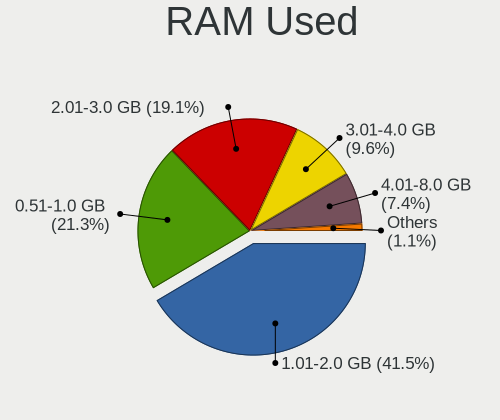
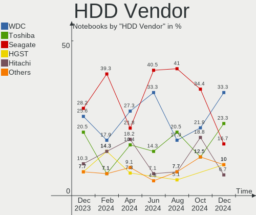
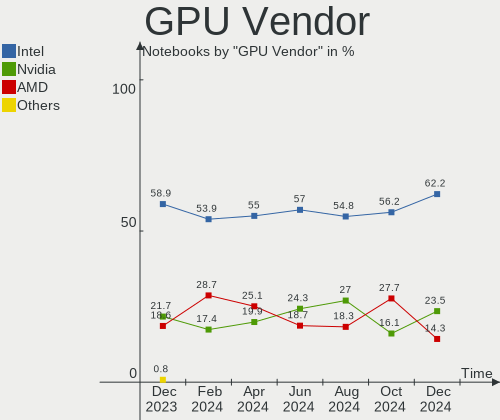
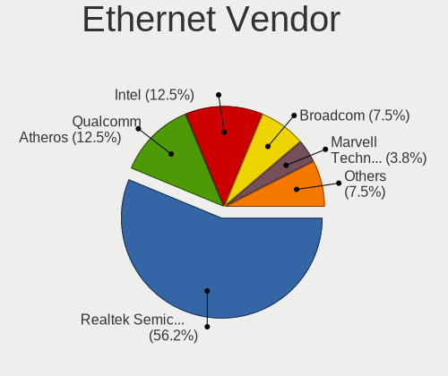
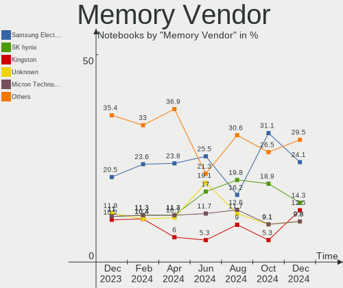
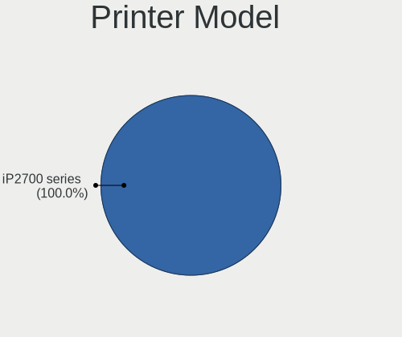

ROSA Hardware Trends (Notebook)
-------------------------------

A project to identify most popular hardware characteristics and track their change
over time based on data collected by ROSA users at https://Linux-Hardware.org.

Anyone can contribute to the study by uploading probes of their computers by
the [hw-probe](https://github.com/linuxhw/hw-probe) tool:

    sudo -E hw-probe -all -upload

Full-feature report is available here: https://linux-hardware.org/?view=trends&formfactor=notebook

Period: Jun, 2021.

Contents
--------

- [ OS                       ](#os)
- [ OS Family                ](#os-family)
- [ Kernel                   ](#kernel)
- [ Kernel Family            ](#kernel-family)
- [ Kernel Major Ver.        ](#kernel-major-ver)
- [ Arch                     ](#arch)
- [ DE                       ](#de)
- [ Display Server           ](#display-server)
- [ Display Manager          ](#display-manager)
- [ OS Lang                  ](#os-lang)
- [ Boot Mode                ](#boot-mode)
- [ Filesystem               ](#filesystem)
- [ Part. scheme             ](#part-scheme)
- [ Dual Boot with Linux/BSD ](#dual-boot-with-linux/bsd)
- [ Dual Boot (Win)          ](#dual-boot-win)
- [ Country                  ](#country)
- [ City                     ](#city)
- [ Vendor                   ](#vendor)
- [ Model                    ](#model)
- [ Model Family             ](#model-family)
- [ MFG Year                 ](#mfg-year)
- [ Form Factor              ](#form-factor)
- [ Secure Boot              ](#secure-boot)
- [ Coreboot                 ](#coreboot)
- [ RAM Size                 ](#ram-size)
- [ RAM Used                 ](#ram-used)
- [ Has CD-ROM               ](#has-cd-rom)
- [ Total Drives             ](#total-drives)
- [ Has Ethernet             ](#has-ethernet)
- [ Has WiFi                 ](#has-wifi)
- [ Has Bluetooth            ](#has-bluetooth)
- [ Drive Vendor             ](#drive-vendor)
- [ Drive Model              ](#drive-model)
- [ HDD Vendor               ](#hdd-vendor)
- [ SSD Vendor               ](#ssd-vendor)
- [ Drive Kind               ](#drive-kind)
- [ Drive Connector          ](#drive-connector)
- [ Drive Size               ](#drive-size)
- [ Space Total              ](#space-total)
- [ Space Used               ](#space-used)
- [ Malfunc. Drives          ](#malfunc-drives)
- [ Malfunc. Drive Vendor    ](#malfunc-drive-vendor)
- [ Malfunc. HDD Vendor      ](#malfunc-hdd-vendor)
- [ Malfunc. Drive Kind      ](#malfunc-drive-kind)
- [ Failed Drives            ](#failed-drives)
- [ Failed Drive Vendor      ](#failed-drive-vendor)
- [ Drive Status             ](#drive-status)
- [ Storage Vendor           ](#storage-vendor)
- [ Storage Model            ](#storage-model)
- [ Storage Kind             ](#storage-kind)
- [ CPU Vendor               ](#cpu-vendor)
- [ CPU Model                ](#cpu-model)
- [ CPU Model Family         ](#cpu-model-family)
- [ CPU Cores                ](#cpu-cores)
- [ CPU Sockets              ](#cpu-sockets)
- [ CPU Threads              ](#cpu-threads)
- [ CPU Op-Modes             ](#cpu-op-modes)
- [ CPU Microcode            ](#cpu-microcode)
- [ CPU Microarch            ](#cpu-microarch)
- [ GPU Vendor               ](#gpu-vendor)
- [ GPU Model                ](#gpu-model)
- [ GPU Combo                ](#gpu-combo)
- [ GPU Driver               ](#gpu-driver)
- [ GPU Memory               ](#gpu-memory)
- [ Monitor Vendor           ](#monitor-vendor)
- [ Monitor Model            ](#monitor-model)
- [ Monitor Resolution       ](#monitor-resolution)
- [ Monitor Diagonal         ](#monitor-diagonal)
- [ Monitor Width            ](#monitor-width)
- [ Aspect Ratio             ](#aspect-ratio)
- [ Monitor Area             ](#monitor-area)
- [ Pixel Density            ](#pixel-density)
- [ Multiple Monitors        ](#multiple-monitors)
- [ Net Controller Vendor    ](#net-controller-vendor)
- [ Net Controller Model     ](#net-controller-model)
- [ Wireless Vendor          ](#wireless-vendor)
- [ Wireless Model           ](#wireless-model)
- [ Ethernet Vendor          ](#ethernet-vendor)
- [ Ethernet Model           ](#ethernet-model)
- [ Net Controller Kind      ](#net-controller-kind)
- [ Used Controller          ](#used-controller)
- [ NICs                     ](#nics)
- [ IPv6                     ](#ipv6)
- [ Memory Vendor            ](#memory-vendor)
- [ Memory Model             ](#memory-model)
- [ Memory Kind              ](#memory-kind)
- [ Memory Form Factor       ](#memory-form-factor)
- [ Memory Size              ](#memory-size)
- [ Memory Speed             ](#memory-speed)
- [ Sound Vendor             ](#sound-vendor)
- [ Sound Model              ](#sound-model)
- [ Camera Vendor            ](#camera-vendor)
- [ Camera Model             ](#camera-model)
- [ Fingerprint Vendor       ](#fingerprint-vendor)
- [ Fingerprint Model        ](#fingerprint-model)
- [ Chipcard Vendor          ](#chipcard-vendor)
- [ Chipcard Model           ](#chipcard-model)
- [ Printer Vendor           ](#printer-vendor)
- [ Printer Model            ](#printer-model)
- [ Scanner Vendor           ](#scanner-vendor)
- [ Scanner Model            ](#scanner-model)
- [ Bluetooth Vendor         ](#bluetooth-vendor)
- [ Bluetooth Model          ](#bluetooth-model)
- [ Unsupported Devices      ](#unsupported-devices)
- [ Unsupported Device Types ](#unsupported-device-types)

OS
--

Installed operating systems

| Name       | Notebooks | Percent |
|------------|-----------|---------|
| ROSA R11.1 | 49        | 77.78%  |
| ROSA R11   | 6         | 9.52%   |
| ROSA R8.1  | 3         | 4.76%   |
| ROSA R12   | 3         | 4.76%   |
| ROSA R10   | 2         | 3.17%   |

OS Family
---------

OS without a version

| Name | Notebooks | Percent |
|------|-----------|---------|
| ROSA | 63        | 100%    |

Kernel
------

Version of the Linux kernel

| Version                             | Notebooks | Percent |
|-------------------------------------|-----------|---------|
| 5.4.83-generic-2rosa-x86_64         | 20        | 31.75%  |
| 5.4.32-generic-2rosa-x86_64         | 14        | 22.22%  |
| 4.15.0-desktop-122.124.1rosa-x86_64 | 7         | 11.11%  |
| 4.15.0-desktop-45.1rosa-x86_64      | 4         | 6.35%   |
| 5.4.32-generic-2rosa-i586           | 3         | 4.76%   |
| 5.10.42-generic-1rosa2019.1-x86_64  | 3         | 4.76%   |
| 4.9.155-nrj-desktop-1rosa-i586      | 3         | 4.76%   |
| 5.4.83-generic-2rosa-i586           | 2         | 3.17%   |
| 4.15.0-desktop-45.1rosa-i586        | 2         | 3.17%   |
| 4.13.0-tablet-16.2rosa-x86_64       | 2         | 3.17%   |
| 5.4.122-nrj-desktop-1rosa-x86_64    | 1         | 1.59%   |
| 4.9.9-nrj-desktop-1rosa-i586        | 1         | 1.59%   |
| 4.15.0-desktop-122.124.1rosa-i586   | 1         | 1.59%   |

Kernel Family
-------------

Linux kernel without a distro release

| Version | Notebooks | Percent |
|---------|-----------|---------|
| 5.4.83  | 22        | 34.92%  |
| 5.4.32  | 17        | 26.98%  |
| 4.15.0  | 14        | 22.22%  |
| 5.10.42 | 3         | 4.76%   |
| 4.9.155 | 3         | 4.76%   |
| 4.13.0  | 2         | 3.17%   |
| 5.4.122 | 1         | 1.59%   |
| 4.9.9   | 1         | 1.59%   |

Kernel Major Ver.
-----------------

Linux kernel major version

| Version | Notebooks | Percent |
|---------|-----------|---------|
| 5.4     | 40        | 63.49%  |
| 4.15    | 14        | 22.22%  |
| 4.9     | 4         | 6.35%   |
| 5.10    | 3         | 4.76%   |
| 4.13    | 2         | 3.17%   |

Arch
----

OS architecture (x86_64, i586, etc.)

| Name   | Notebooks | Percent |
|--------|-----------|---------|
| x86_64 | 51        | 80.95%  |
| i686   | 12        | 19.05%  |

DE
--

Desktop Environment

| Name  | Notebooks | Percent |
|-------|-----------|---------|
| KDE4  | 39        | 61.9%   |
| KDE5  | 14        | 22.22%  |
| LXQt  | 7         | 11.11%  |
| GNOME | 2         | 3.17%   |
| XFCE  | 1         | 1.59%   |

Display Server
--------------

X11 or Wayland

| Name    | Notebooks | Percent |
|---------|-----------|---------|
| X11     | 62        | 98.41%  |
| Wayland | 1         | 1.59%   |

Display Manager
---------------

SDDM, LightDM, etc.

| Name | Notebooks | Percent |
|------|-----------|---------|
| KDM  | 39        | 61.9%   |
| SDDM | 22        | 34.92%  |
| GDM  | 2         | 3.17%   |

OS Lang
-------

Language

| Lang    | Notebooks | Percent |
|---------|-----------|---------|
| ru_RU   | 46        | 73.02%  |
| Unknown | 11        | 17.46%  |
| en_US   | 3         | 4.76%   |
| ru_UA   | 1         | 1.59%   |
| pl_PL   | 1         | 1.59%   |
| de_DE   | 1         | 1.59%   |

Boot Mode
---------

EFI or BIOS

| Mode | Notebooks | Percent |
|------|-----------|---------|
| BIOS | 40        | 63.49%  |
| EFI  | 23        | 36.51%  |

Filesystem
----------

Type of filesystem

| Type    | Notebooks | Percent |
|---------|-----------|---------|
| Ext4    | 61        | 96.83%  |
| Aufs    | 1         | 1.59%   |
| Unknown | 1         | 1.59%   |

Part. scheme
------------

Scheme of partitioning

| Type    | Notebooks | Percent |
|---------|-----------|---------|
| MBR     | 36        | 57.14%  |
| GPT     | 25        | 39.68%  |
| Unknown | 2         | 3.17%   |

Dual Boot with Linux/BSD
------------------------

Hosting more than one Linux/BSD

| Dual boot | Notebooks | Percent |
|-----------|-----------|---------|
| No        | 50        | 79.37%  |
| Yes       | 13        | 20.63%  |

Dual Boot (Win)
---------------

Hosting Linux and Windows

| Dual boot | Notebooks | Percent |
|-----------|-----------|---------|
| No        | 36        | 57.14%  |
| Yes       | 27        | 42.86%  |

Country
-------

Geographic location (country)

| Country    | Notebooks | Percent |
|------------|-----------|---------|
| Russia     | 45        | 71.43%  |
| Ukraine    | 6         | 9.52%   |
| Slovakia   | 2         | 3.17%   |
| Poland     | 2         | 3.17%   |
| France     | 2         | 3.17%   |
| UK         | 1         | 1.59%   |
| Kazakhstan | 1         | 1.59%   |
| Germany    | 1         | 1.59%   |
| Estonia    | 1         | 1.59%   |
| Belarus    | 1         | 1.59%   |
| Azerbaijan | 1         | 1.59%   |

City
----

Geographic location (city)

| City             | Notebooks | Percent |
|------------------|-----------|---------|
| Moscow           | 11        | 17.46%  |
| St Petersburg    | 5         | 7.94%   |
| Yekaterinburg    | 2         | 3.17%   |
| Perm             | 2         | 3.17%   |
| Kazan’         | 2         | 3.17%   |
| Donetsk          | 2         | 3.17%   |
| Warsaw           | 1         | 1.59%   |
| Volgograd        | 1         | 1.59%   |
| Ust'-Ilimsk      | 1         | 1.59%   |
| Ufa              | 1         | 1.59%   |
| Tomsk            | 1         | 1.59%   |
| Tallinn          | 1         | 1.59%   |
| Sonneberg        | 1         | 1.59%   |
| Simferopol       | 1         | 1.59%   |
| Savran'          | 1         | 1.59%   |
| Sarov            | 1         | 1.59%   |
| Sabinov          | 1         | 1.59%   |
| Rostov-on-Don    | 1         | 1.59%   |
| Romford          | 1         | 1.59%   |
| Pskov            | 1         | 1.59%   |
| Poznan           | 1         | 1.59%   |
| Pokrovs'ke       | 1         | 1.59%   |
| Petergof         | 1         | 1.59%   |
| Paris            | 1         | 1.59%   |
| Nur-Sultan       | 1         | 1.59%   |
| Novosibirsk      | 1         | 1.59%   |
| Nizhny Tagil     | 1         | 1.59%   |
| Nizhniy Novgorod | 1         | 1.59%   |
| Naryan-Mar       | 1         | 1.59%   |
| Montescot        | 1         | 1.59%   |
| Kstovo           | 1         | 1.59%   |
| Krasnodar        | 1         | 1.59%   |
| Kotel'niki       | 1         | 1.59%   |
| Kostroma         | 1         | 1.59%   |
| Kirov            | 1         | 1.59%   |
| Khabarovsk       | 1         | 1.59%   |
| Kemerovo         | 1         | 1.59%   |
| Kaliningrad      | 1         | 1.59%   |
| Horlivka         | 1         | 1.59%   |
| Gorno-Altaysk    | 1         | 1.59%   |
| Bryansk          | 1         | 1.59%   |
| Brezno           | 1         | 1.59%   |
| Baku             | 1         | 1.59%   |
| Astrakhan        | 1         | 1.59%   |
| Asipovichy       | 1         | 1.59%   |

Vendor
------

Motherboard manufacturer

| Name                | Notebooks | Percent |
|---------------------|-----------|---------|
| Hewlett-Packard     | 12        | 19.05%  |
| Lenovo              | 10        | 15.87%  |
| Acer                | 10        | 15.87%  |
| ASUSTek Computer    | 9         | 14.29%  |
| Samsung Electronics | 6         | 9.52%   |
| Dell                | 4         | 6.35%   |
| Toshiba             | 3         | 4.76%   |
| Sony                | 3         | 4.76%   |
| ilife               | 1         | 1.59%   |
| ICL                 | 1         | 1.59%   |
| eMachines           | 1         | 1.59%   |
| Digma               | 1         | 1.59%   |
| Apple               | 1         | 1.59%   |
| Alienware           | 1         | 1.59%   |

Model
-----

Motherboard model

| Name                                              | Notebooks | Percent |
|---------------------------------------------------|-----------|---------|
| Toshiba TECRA A9                                  | 1         | 1.59%   |
| Toshiba Satellite L775-A1W                        | 1         | 1.59%   |
| Toshiba Satellite C660D                           | 1         | 1.59%   |
| Sony VPCY216FD                                    | 1         | 1.59%   |
| Sony VPCEH1S1R                                    | 1         | 1.59%   |
| Sony VPCCW1S1R                                    | 1         | 1.59%   |
| Samsung RV420/RV520/RV720/E3530/S3530/E3420/E3520 | 1         | 1.59%   |
| Samsung RV408/RV508                               | 1         | 1.59%   |
| Samsung R460                                      | 1         | 1.59%   |
| Samsung N150/N210/N220                            | 1         | 1.59%   |
| Samsung 355V4C/356V4C/3445VC/3545VC               | 1         | 1.59%   |
| Samsung 300V3A/300V4A/300V5A/200A4B/200A5B        | 1         | 1.59%   |
| Lenovo ThinkPad T400 6474WPU                      | 1         | 1.59%   |
| Lenovo ThinkPad L540 20AUS0DW00                   | 1         | 1.59%   |
| Lenovo IdeaPad Y510P 20217                        | 1         | 1.59%   |
| Lenovo IdeaPad S145-15IIL 81W8                    | 1         | 1.59%   |
| Lenovo IdeaPad L340-17IRH Gaming 81LL             | 1         | 1.59%   |
| Lenovo IdeaPad Flex 10 20324                      | 1         | 1.59%   |
| Lenovo IdeaPad 5 14IIL05 81YH                     | 1         | 1.59%   |
| Lenovo IdeaPad 320-15AST 80XV                     | 1         | 1.59%   |
| Lenovo G580                                       | 1         | 1.59%   |
| Lenovo G50-45 80E3                                | 1         | 1.59%   |
| ilife S806                                        | 1         | 1.59%   |
| ICL RAYbook Si1514                                | 1         | 1.59%   |
| HP ZBook 14                                       | 1         | 1.59%   |
| HP ProBook x360 11 G1 EE                          | 1         | 1.59%   |
| HP ProBook 440 G4                                 | 1         | 1.59%   |
| HP Pavilion g6                                    | 1         | 1.59%   |
| HP Pavilion dv7                                   | 1         | 1.59%   |
| HP Pavilion dv6700                                | 1         | 1.59%   |
| HP Pavilion dv6                                   | 1         | 1.59%   |
| HP Notebook                                       | 1         | 1.59%   |
| HP Laptop 15s-eq1xxx                              | 1         | 1.59%   |
| HP Laptop 15-rb0xx                                | 1         | 1.59%   |
| HP 250 G5 Notebook PC                             | 1         | 1.59%   |
| eMachines E725                                    | 1         | 1.59%   |
| Digma CITI E301 ES3008EW                          | 1         | 1.59%   |
| Dell Vostro 1000                                  | 1         | 1.59%   |
| Dell Latitude E6510                               | 1         | 1.59%   |
| Dell Inspiron ME051                               | 1         | 1.59%   |
| Dell Inspiron 1525                                | 1         | 1.59%   |
| ASUS X555LJ                                       | 1         | 1.59%   |
| ASUS X550EA                                       | 1         | 1.59%   |
| ASUS X550CC                                       | 1         | 1.59%   |
| ASUS X51RL                                        | 1         | 1.59%   |
| ASUS VivoBook_ASUS Laptop E510MA_R522MA           | 1         | 1.59%   |
| ASUS N73SV                                        | 1         | 1.59%   |
| ASUS K56CB                                        | 1         | 1.59%   |
| ASUS K45DR                                        | 1         | 1.59%   |
| ASUS F5V                                          | 1         | 1.59%   |
| Apple MacBookAir3,1                               | 1         | 1.59%   |
| Alienware 17                                      | 1         | 1.59%   |
| Acer TP-SW5-012-11EH                              | 1         | 1.59%   |
| Acer Mandolin                                     | 1         | 1.59%   |
| Acer Extensa 5635Z                                | 1         | 1.59%   |
| Acer Extensa 2520G                                | 1         | 1.59%   |
| Acer Aspire F5-573G                               | 1         | 1.59%   |
| Acer Aspire ES1-532G                              | 1         | 1.59%   |
| Acer Aspire ES1-523                               | 1         | 1.59%   |
| Acer Aspire 5750ZG                                | 1         | 1.59%   |

Model Family
------------

Motherboard model prefix

| Name                 | Notebooks | Percent |
|----------------------|-----------|---------|
| Lenovo IdeaPad       | 6         | 9.52%   |
| Acer Aspire          | 5         | 7.94%   |
| HP Pavilion          | 4         | 6.35%   |
| Toshiba Satellite    | 2         | 3.17%   |
| Lenovo ThinkPad      | 2         | 3.17%   |
| HP ProBook           | 2         | 3.17%   |
| HP Laptop            | 2         | 3.17%   |
| Dell Inspiron        | 2         | 3.17%   |
| Acer Extensa         | 2         | 3.17%   |
| Toshiba TECRA        | 1         | 1.59%   |
| Sony VPCY216FD       | 1         | 1.59%   |
| Sony VPCEH1S1R       | 1         | 1.59%   |
| Sony VPCCW1S1R       | 1         | 1.59%   |
| Samsung RV420        | 1         | 1.59%   |
| Samsung RV408        | 1         | 1.59%   |
| Samsung R460         | 1         | 1.59%   |
| Samsung N150         | 1         | 1.59%   |
| Samsung 355V4C       | 1         | 1.59%   |
| Samsung 300V3A       | 1         | 1.59%   |
| Lenovo G580          | 1         | 1.59%   |
| Lenovo G50-45        | 1         | 1.59%   |
| ilife S806           | 1         | 1.59%   |
| ICL RAYbook          | 1         | 1.59%   |
| HP ZBook             | 1         | 1.59%   |
| HP Notebook          | 1         | 1.59%   |
| HP 250               | 1         | 1.59%   |
| eMachines E725       | 1         | 1.59%   |
| Digma CITI           | 1         | 1.59%   |
| Dell Vostro          | 1         | 1.59%   |
| Dell Latitude        | 1         | 1.59%   |
| ASUS X555LJ          | 1         | 1.59%   |
| ASUS X550EA          | 1         | 1.59%   |
| ASUS X550CC          | 1         | 1.59%   |
| ASUS X51RL           | 1         | 1.59%   |
| ASUS VivoBook        | 1         | 1.59%   |
| ASUS N73SV           | 1         | 1.59%   |
| ASUS K56CB           | 1         | 1.59%   |
| ASUS K45DR           | 1         | 1.59%   |
| ASUS F5V             | 1         | 1.59%   |
| Apple MacBookAir3    | 1         | 1.59%   |
| Alienware 17         | 1         | 1.59%   |
| Acer TP-SW5-012-11EH | 1         | 1.59%   |
| Acer Mandolin        | 1         | 1.59%   |
| Acer AOD270          | 1         | 1.59%   |
| Unknown              | 1         | 1.59%   |

MFG Year
--------

Motherboard manufacture year

| Year | Notebooks | Percent |
|------|-----------|---------|
| 2012 | 10        | 15.87%  |
| 2020 | 6         | 9.52%   |
| 2018 | 5         | 7.94%   |
| 2017 | 5         | 7.94%   |
| 2011 | 5         | 7.94%   |
| 2010 | 5         | 7.94%   |
| 2014 | 4         | 6.35%   |
| 2007 | 4         | 6.35%   |
| 2016 | 3         | 4.76%   |
| 2013 | 3         | 4.76%   |
| 2009 | 3         | 4.76%   |
| 2008 | 3         | 4.76%   |
| 2021 | 2         | 3.17%   |
| 2019 | 2         | 3.17%   |
| 2015 | 2         | 3.17%   |
| 2006 | 1         | 1.59%   |

Form Factor
-----------

Physical design of the computer

| Name     | Notebooks | Percent |
|----------|-----------|---------|
| Notebook | 63        | 100%    |

Secure Boot
-----------

Enabled or disabled

| State    | Notebooks | Percent |
|----------|-----------|---------|
| Disabled | 63        | 100%    |

Coreboot
--------

Have coreboot on board

| Used | Notebooks | Percent |
|------|-----------|---------|
| No   | 63        | 100%    |

RAM Size
--------

Total RAM memory

| Size in GB | Notebooks | Percent |
|------------|-----------|---------|
| 3.01-4.0   | 29        | 46.03%  |
| 4.01-8.0   | 16        | 25.4%   |
| 1.01-2.0   | 8         | 12.7%   |
| 8.01-16.0  | 6         | 9.52%   |
| 2.01-3.0   | 2         | 3.17%   |
| 16.01-24.0 | 1         | 1.59%   |
| 0.51-1.0   | 1         | 1.59%   |

RAM Used
--------

Used RAM memory

| Used GB  | Notebooks | Percent |
|----------|-----------|---------|
| 1.01-2.0 | 35        | 55.56%  |
| 0.51-1.0 | 21        | 33.33%  |
| 3.01-4.0 | 4         | 6.35%   |
| 4.01-8.0 | 1         | 1.59%   |
| 2.01-3.0 | 1         | 1.59%   |
| 0.01-0.5 | 1         | 1.59%   |

Has CD-ROM
----------

Has CD-ROM on board

| Presented | Notebooks | Percent |
|-----------|-----------|---------|
| Yes       | 34        | 53.97%  |
| No        | 29        | 46.03%  |

Total Drives
------------

Number of drives on board

| Drives | Notebooks | Percent |
|--------|-----------|---------|
| 1      | 48        | 76.19%  |
| 2      | 13        | 20.63%  |
| 3      | 1         | 1.59%   |
| 0      | 1         | 1.59%   |

Has Ethernet
------------

Has Ethernet on board

| Presented | Notebooks | Percent |
|-----------|-----------|---------|
| Yes       | 57        | 90.48%  |
| No        | 6         | 9.52%   |

Has WiFi
--------

Has WiFi module

| Presented | Notebooks | Percent |
|-----------|-----------|---------|
| Yes       | 58        | 92.06%  |
| No        | 5         | 7.94%   |

Has Bluetooth
-------------

Has Bluetooth module

| Presented | Notebooks | Percent |
|-----------|-----------|---------|
| Yes       | 47        | 74.6%   |
| No        | 16        | 25.4%   |

Drive Vendor
------------

Hard drive vendors

| Vendor              | Notebooks | Drives | Percent |
|---------------------|-----------|--------|---------|
| Seagate             | 12        | 13     | 16.44%  |
| WDC                 | 10        | 10     | 13.7%   |
| Unknown             | 9         | 10     | 12.33%  |
| Samsung Electronics | 8         | 8      | 10.96%  |
| Hitachi             | 8         | 8      | 10.96%  |
| Toshiba             | 6         | 6      | 8.22%   |
| China               | 4         | 4      | 5.48%   |
| SanDisk             | 3         | 3      | 4.11%   |
| Kingston            | 3         | 3      | 4.11%   |
| LITEONIT            | 2         | 2      | 2.74%   |
| Transcend           | 1         | 1      | 1.37%   |
| SPCC                | 1         | 1      | 1.37%   |
| SK Hynix            | 1         | 1      | 1.37%   |
| Micron Technology   | 1         | 1      | 1.37%   |
| HGST                | 1         | 1      | 1.37%   |
| Apple               | 1         | 1      | 1.37%   |
| AMD                 | 1         | 1      | 1.37%   |
| A-DATA Technology   | 1         | 1      | 1.37%   |

Drive Model
-----------

Hard drive models

| Model                                     | Notebooks | Percent |
|-------------------------------------------|-----------|---------|
| Unknown NCard  32GB                       | 2         | 2.7%    |
| Seagate ST9500420AS 500GB                 | 2         | 2.7%    |
| Seagate ST500LT012-1DG142 500GB           | 2         | 2.7%    |
| Seagate ST1000LM024 HN-M101MBB 1TB        | 2         | 2.7%    |
| China SSD 128GB                           | 2         | 2.7%    |
| WDC WD7500BPKX-75HPJT0 752GB              | 1         | 1.35%   |
| WDC WD5000LPVX-80V0TT0 500GB              | 1         | 1.35%   |
| WDC WD5000LPCX-60VHAT0 500GB              | 1         | 1.35%   |
| WDC WD5000LPCX-24C6HT0 500GB              | 1         | 1.35%   |
| WDC WD5000LPCX-22VHAT1 500GB              | 1         | 1.35%   |
| WDC WD5000LPCX-21VHAT0 500GB              | 1         | 1.35%   |
| WDC WD3200BPVT-22JJ5T0 320GB              | 1         | 1.35%   |
| WDC WD3200BEVS-26VAT0 320GB               | 1         | 1.35%   |
| WDC WD10SPZX-08Z10 1TB                    | 1         | 1.35%   |
| WDC PC SN520 SDAPNUW-256G-1006 256GB      | 1         | 1.35%   |
| Unknown SU02G  2GB                        | 1         | 1.35%   |
| Unknown SL08G  8GB                        | 1         | 1.35%   |
| Unknown SC32G  32GB                       | 1         | 1.35%   |
| Unknown N/A  16GB                         | 1         | 1.35%   |
| Unknown GSPMA512M16STF 512GB SSD          | 1         | 1.35%   |
| Unknown DA4128  128GB                     | 1         | 1.35%   |
| Unknown CWBC3R  64GB                      | 1         | 1.35%   |
| Unknown ASTC  8GB                         | 1         | 1.35%   |
| Transcend TS256GMTS400 256GB SSD          | 1         | 1.35%   |
| Toshiba TR200 240GB SSD                   | 1         | 1.35%   |
| Toshiba MQ01ABF050 500GB                  | 1         | 1.35%   |
| Toshiba MK5075GSX 500GB                   | 1         | 1.35%   |
| Toshiba MK2555GSX 250GB                   | 1         | 1.35%   |
| Toshiba MK1655GSX 160GB                   | 1         | 1.35%   |
| Toshiba MK1646GSX 160GB                   | 1         | 1.35%   |
| SPCC Solid State Disk 512GB               | 1         | 1.35%   |
| SK Hynix SKHynix_HFM512GDHTNI-87A0B 512GB | 1         | 1.35%   |
| Seagate ST9500325AS 500GB                 | 1         | 1.35%   |
| Seagate ST9160821AS 160GB                 | 1         | 1.35%   |
| Seagate ST500LM012 HN-M500MBB 500GB       | 1         | 1.35%   |
| Seagate ST500LM000-SSHD-8GB               | 1         | 1.35%   |
| Seagate ST320LT012-9WS14C 320GB           | 1         | 1.35%   |
| Seagate ST1000LM035-1RK172 1TB            | 1         | 1.35%   |
| SanDisk SDSSDA240G 240GB                  | 1         | 1.35%   |
| SanDisk SDSSDA120G 120GB                  | 1         | 1.35%   |
| SanDisk SD8SN8U-128G-1006 128GB SSD       | 1         | 1.35%   |
| Samsung SSD 870 EVO 500GB                 | 1         | 1.35%   |
| Samsung SSD 870 EVO 250GB                 | 1         | 1.35%   |
| Samsung SSD 750 EVO 120GB                 | 1         | 1.35%   |
| Samsung MZVLB256HBHQ-000L2 256GB          | 1         | 1.35%   |
| Samsung MZNLN128HAHQ-000H1 128GB SSD      | 1         | 1.35%   |
| Samsung MZALQ256HAJD-000L2 256GB          | 1         | 1.35%   |
| Samsung HM250JI 250GB                     | 1         | 1.35%   |
| Samsung HM250HI 250GB                     | 1         | 1.35%   |
| Micron MTFDDAK256MAM-1K12 256GB SSD       | 1         | 1.35%   |
| LITEONIT LSS-24L6G 24GB SSD               | 1         | 1.35%   |
| LITEONIT LMN-256M3M mSATA 256GB SSD       | 1         | 1.35%   |
| Kingston SV300S37A240G 240GB SSD          | 1         | 1.35%   |
| Kingston SA400S37120G 120GB SSD           | 1         | 1.35%   |
| Kingston SA400S37 240GB SSD               | 1         | 1.35%   |
| Hitachi HTS723232A7A364 320GB             | 1         | 1.35%   |
| Hitachi HTS547575A9E384 752GB             | 1         | 1.35%   |
| Hitachi HTS547550A9E384 500GB             | 1         | 1.35%   |
| Hitachi HTS545050B9A300 500GB             | 1         | 1.35%   |
| Hitachi HTS545032B9A302 320GB             | 1         | 1.35%   |

HDD Vendor
----------

Hard disk drive vendors

| Vendor              | Notebooks | Drives | Percent |
|---------------------|-----------|--------|---------|
| Seagate             | 12        | 13     | 32.43%  |
| WDC                 | 9         | 9      | 24.32%  |
| Hitachi             | 8         | 8      | 21.62%  |
| Toshiba             | 5         | 5      | 13.51%  |
| Samsung Electronics | 2         | 2      | 5.41%   |
| HGST                | 1         | 1      | 2.7%    |

SSD Vendor
----------

Solid state drive vendors

| Vendor              | Notebooks | Drives | Percent |
|---------------------|-----------|--------|---------|
| Samsung Electronics | 4         | 4      | 17.39%  |
| China               | 4         | 4      | 17.39%  |
| SanDisk             | 3         | 3      | 13.04%  |
| Kingston            | 3         | 3      | 13.04%  |
| LITEONIT            | 2         | 2      | 8.7%    |
| Unknown             | 1         | 1      | 4.35%   |
| Transcend           | 1         | 1      | 4.35%   |
| Toshiba             | 1         | 1      | 4.35%   |
| SPCC                | 1         | 1      | 4.35%   |
| Micron Technology   | 1         | 1      | 4.35%   |
| Apple               | 1         | 1      | 4.35%   |
| AMD                 | 1         | 1      | 4.35%   |

Drive Kind
----------

HDD or SSD

| Kind | Notebooks | Drives | Percent |
|------|-----------|--------|---------|
| HDD  | 37        | 38     | 52.11%  |
| SSD  | 21        | 23     | 29.58%  |
| MMC  | 8         | 9      | 11.27%  |
| NVMe | 5         | 5      | 7.04%   |

Drive Connector
---------------

SATA, SAS, NVMe, etc.

| Type | Notebooks | Drives | Percent |
|------|-----------|--------|---------|
| SATA | 54        | 61     | 80.6%   |
| MMC  | 8         | 9      | 11.94%  |
| NVMe | 5         | 5      | 7.46%   |

Drive Size
----------

Size of hard drive

| Size in TB | Notebooks | Drives | Percent |
|------------|-----------|--------|---------|
| 0.01-0.5   | 47        | 52     | 83.93%  |
| 0.51-1.0   | 9         | 9      | 16.07%  |

Space Total
-----------

Amount of disk space available on the file system

| Size in GB | Notebooks | Percent |
|------------|-----------|---------|
| 101-250    | 22        | 34.92%  |
| 251-500    | 15        | 23.81%  |
| 21-50      | 8         | 12.7%   |
| 1-20       | 7         | 11.11%  |
| 501-1000   | 7         | 11.11%  |
| 51-100     | 3         | 4.76%   |
| Unknown    | 1         | 1.59%   |

Space Used
----------

Amount of used disk space

| Used GB | Notebooks | Percent |
|---------|-----------|---------|
| 1-20    | 45        | 71.43%  |
| 21-50   | 8         | 12.7%   |
| 51-100  | 5         | 7.94%   |
| 251-500 | 2         | 3.17%   |
| 101-250 | 2         | 3.17%   |
| Unknown | 1         | 1.59%   |

Malfunc. Drives
---------------

Drive models with a malfunction

| Model                                          | Notebooks | Drives | Percent |
|------------------------------------------------|-----------|--------|---------|
| Seagate ST9500420AS 500GB                      | 2         | 3      | 8%      |
| WDC WD5000LPVX-80V0TT0 500GB                   | 1         | 1      | 4%      |
| WDC WD5000LPCX-60VHAT0 500GB                   | 1         | 1      | 4%      |
| WDC WD3200BEVS-26VAT0 320GB                    | 1         | 1      | 4%      |
| Toshiba MK5075GSX 500GB                        | 1         | 1      | 4%      |
| Toshiba MK2555GSX 250GB                        | 1         | 1      | 4%      |
| Toshiba MK1655GSX 160GB                        | 1         | 1      | 4%      |
| Toshiba MK1646GSX 160GB                        | 1         | 1      | 4%      |
| Seagate ST9500325AS 500GB                      | 1         | 1      | 4%      |
| Seagate ST9160821AS 160GB                      | 1         | 1      | 4%      |
| Seagate ST500LT012-1DG142 500GB                | 1         | 1      | 4%      |
| Seagate ST500LM012 HN-M500MBB 500GB            | 1         | 1      | 4%      |
| Seagate ST500LM000-SSHD-8GB                    | 1         | 1      | 4%      |
| Seagate ST320LT012-9WS14C 320GB                | 1         | 1      | 4%      |
| Samsung Electronics HM250JI 250GB              | 1         | 1      | 4%      |
| Micron Technology MTFDDAK256MAM-1K12 256GB SSD | 1         | 1      | 4%      |
| LITEONIT LSS-24L6G 24GB SSD                    | 1         | 1      | 4%      |
| LITEONIT LMN-256M3M mSATA 256GB SSD            | 1         | 1      | 4%      |
| Hitachi HTS723232A7A364 320GB                  | 1         | 1      | 4%      |
| Hitachi HTS547575A9E384 752GB                  | 1         | 1      | 4%      |
| Hitachi HTS547550A9E384 500GB                  | 1         | 1      | 4%      |
| Hitachi HTS545050B9A300 500GB                  | 1         | 1      | 4%      |
| Hitachi HTS545032B9A302 320GB                  | 1         | 1      | 4%      |
| Hitachi HTS545016B9A300 160GB                  | 1         | 1      | 4%      |

Malfunc. Drive Vendor
---------------------

Vendors of faulty drives

| Vendor              | Notebooks | Drives | Percent |
|---------------------|-----------|--------|---------|
| Seagate             | 8         | 9      | 32%     |
| Hitachi             | 6         | 6      | 24%     |
| Toshiba             | 4         | 4      | 16%     |
| WDC                 | 3         | 3      | 12%     |
| LITEONIT            | 2         | 2      | 8%      |
| Samsung Electronics | 1         | 1      | 4%      |
| Micron Technology   | 1         | 1      | 4%      |

Malfunc. HDD Vendor
-------------------

Vendors of faulty HDD drives

| Vendor              | Notebooks | Drives | Percent |
|---------------------|-----------|--------|---------|
| Seagate             | 8         | 9      | 36.36%  |
| Hitachi             | 6         | 6      | 27.27%  |
| Toshiba             | 4         | 4      | 18.18%  |
| WDC                 | 3         | 3      | 13.64%  |
| Samsung Electronics | 1         | 1      | 4.55%   |

Malfunc. Drive Kind
-------------------

Kinds of faulty drives

| Kind | Notebooks | Drives | Percent |
|------|-----------|--------|---------|
| HDD  | 22        | 23     | 88%     |
| SSD  | 3         | 3      | 12%     |

Failed Drives
-------------

Failed drive models

| Model                 | Notebooks | Drives | Percent |
|-----------------------|-----------|--------|---------|
| Apple SSD TS064C 64GB | 1         | 1      | 100%    |

Failed Drive Vendor
-------------------

Failed drive vendors

| Vendor | Notebooks | Drives | Percent |
|--------|-----------|--------|---------|
| Apple  | 1         | 1      | 100%    |

Drive Status
------------

Number of failed and malfunc. drives

| Status   | Notebooks | Drives | Percent |
|----------|-----------|--------|---------|
| Works    | 37        | 39     | 52.11%  |
| Malfunc  | 25        | 26     | 35.21%  |
| Detected | 8         | 9      | 11.27%  |
| Failed   | 1         | 1      | 1.41%   |

Storage Vendor
--------------

Storage controller vendors

| Vendor                           | Notebooks | Percent |
|----------------------------------|-----------|---------|
| Intel                            | 44        | 69.84%  |
| AMD                              | 12        | 19.05%  |
| Samsung Electronics              | 2         | 3.17%   |
| SK Hynix                         | 1         | 1.59%   |
| Silicon Integrated Systems [SiS] | 1         | 1.59%   |
| Sandisk                          | 1         | 1.59%   |
| Realtek Semiconductor            | 1         | 1.59%   |
| Nvidia                           | 1         | 1.59%   |

Storage Model
-------------

Storage controller models

| Model                                                                            | Notebooks | Percent |
|----------------------------------------------------------------------------------|-----------|---------|
| Intel 6 Series/C200 Series Chipset Family 6 port Mobile SATA AHCI Controller     | 8         | 11.43%  |
| AMD FCH SATA Controller [AHCI mode]                                              | 8         | 11.43%  |
| Intel 82801IBM/IEM (ICH9M/ICH9M-E) 4 port SATA Controller [AHCI mode]            | 6         | 8.57%   |
| Intel Sunrise Point-LP SATA Controller [AHCI mode]                               | 4         | 5.71%   |
| Intel 82801HM/HEM (ICH8M/ICH8M-E) SATA Controller [AHCI mode]                    | 3         | 4.29%   |
| Intel 82801HM/HEM (ICH8M/ICH8M-E) IDE Controller                                 | 3         | 4.29%   |
| Intel 7 Series Chipset Family 6-port SATA Controller [AHCI mode]                 | 3         | 4.29%   |
| Intel NM10/ICH7 Family SATA Controller [AHCI mode]                               | 2         | 2.86%   |
| Intel Atom/Celeron/Pentium Processor x5-E8000/J3xxx/N3xxx Series SATA Controller | 2         | 2.86%   |
| Intel 8 Series/C220 Series Chipset Family 6-port SATA Controller 1 [AHCI mode]   | 2         | 2.86%   |
| Intel 8 Series SATA Controller 1 [AHCI mode]                                     | 2         | 2.86%   |
| AMD SB7x0/SB8x0/SB9x0 SATA Controller [AHCI mode]                                | 2         | 2.86%   |
| AMD SB600 Non-Raid-5 SATA                                                        | 2         | 2.86%   |
| AMD SB600 IDE                                                                    | 2         | 2.86%   |
| SK Hynix BC511                                                                   | 1         | 1.43%   |
| Silicon Integrated Systems [SiS] SATA Controller / IDE mode                      | 1         | 1.43%   |
| Silicon Integrated Systems [SiS] 5513 IDE Controller                             | 1         | 1.43%   |
| Sandisk WD Blue SN500 / PC SN520 NVMe SSD                                        | 1         | 1.43%   |
| Samsung NVMe SSD Controller SM981/PM981/PM983                                    | 1         | 1.43%   |
| Samsung NVMe Controller                                                          | 1         | 1.43%   |
| Realtek Realtek Non-Volatile memory controller                                   | 1         | 1.43%   |
| Nvidia MCP89 SATA Controller (AHCI mode)                                         | 1         | 1.43%   |
| Intel Ice Lake-LP SATA Controller [AHCI mode]                                    | 1         | 1.43%   |
| Intel Comet Lake SATA AHCI Controller                                            | 1         | 1.43%   |
| Intel Celeron/Pentium Silver Processor SATA Controller                           | 1         | 1.43%   |
| Intel Celeron N3350/Pentium N4200/Atom E3900 Series SATA AHCI Controller         | 1         | 1.43%   |
| Intel Cannon Lake Mobile PCH SATA AHCI Controller                                | 1         | 1.43%   |
| Intel Atom Processor E3800 Series SATA AHCI Controller                           | 1         | 1.43%   |
| Intel 82801IBM/IEM (ICH9M/ICH9M-E) 2 port SATA Controller [IDE mode]             | 1         | 1.43%   |
| Intel 82801FB/FBM/FR/FW/FRW (ICH6 Family) IDE Controller                         | 1         | 1.43%   |
| Intel 82801 Mobile SATA Controller [RAID mode]                                   | 1         | 1.43%   |
| Intel 7 Series Chipset Family 4-port SATA Controller [IDE mode]                  | 1         | 1.43%   |
| Intel 7 Series Chipset Family 2-port SATA Controller [IDE mode]                  | 1         | 1.43%   |
| Intel 5 Series/3400 Series Chipset 6 port SATA AHCI Controller                   | 1         | 1.43%   |
| Intel 5 Series/3400 Series Chipset 4 port SATA AHCI Controller                   | 1         | 1.43%   |

Storage Kind
------------

Kind of storage controller (IDE, SATA, NVMe, SAS, ...)

| Kind | Notebooks | Percent |
|------|-----------|---------|
| SATA | 53        | 77.94%  |
| IDE  | 9         | 13.24%  |
| NVMe | 5         | 7.35%   |
| RAID | 1         | 1.47%   |

CPU Vendor
----------

Processor vendors

| Vendor | Notebooks | Percent |
|--------|-----------|---------|
| Intel  | 51        | 80.95%  |
| AMD    | 12        | 19.05%  |

CPU Model
---------

Processor models

| Model                                         | Notebooks | Percent |
|-----------------------------------------------|-----------|---------|
| Intel Core i5-7200U CPU @ 2.50GHz             | 2         | 3.17%   |
| Intel Core i5-6200U CPU @ 2.30GHz             | 2         | 3.17%   |
| Intel Core i5-2410M CPU @ 2.30GHz             | 2         | 3.17%   |
| Intel Core i3-3217U CPU @ 1.80GHz             | 2         | 3.17%   |
| Intel Core i3-1005G1 CPU @ 1.20GHz            | 2         | 3.17%   |
| Intel Core 2 Duo CPU T7250 @ 2.00GHz          | 2         | 3.17%   |
| AMD A8-4500M APU with Radeon HD Graphics      | 2         | 3.17%   |
| Intel Pentium Dual-Core CPU T4300 @ 2.10GHz   | 1         | 1.59%   |
| Intel Pentium Dual CPU T3400 @ 2.16GHz        | 1         | 1.59%   |
| Intel Pentium CPU N3710 @ 1.60GHz             | 1         | 1.59%   |
| Intel Pentium CPU B960 @ 2.20GHz              | 1         | 1.59%   |
| Intel Pentium CPU B950 @ 2.10GHz              | 1         | 1.59%   |
| Intel Core i7-4800MQ CPU @ 2.70GHz            | 1         | 1.59%   |
| Intel Core i7-4700MQ CPU @ 2.40GHz            | 1         | 1.59%   |
| Intel Core i7-4600U CPU @ 2.10GHz             | 1         | 1.59%   |
| Intel Core i7-2630QM CPU @ 2.00GHz            | 1         | 1.59%   |
| Intel Core i5-9300H CPU @ 2.40GHz             | 1         | 1.59%   |
| Intel Core i5-4300M CPU @ 2.60GHz             | 1         | 1.59%   |
| Intel Core i5-3210M CPU @ 2.50GHz             | 1         | 1.59%   |
| Intel Core i5-2450M CPU @ 2.50GHz             | 1         | 1.59%   |
| Intel Core i5-2430M CPU @ 2.40GHz             | 1         | 1.59%   |
| Intel Core i5-10210U CPU @ 1.60GHz            | 1         | 1.59%   |
| Intel Core i5 CPU M 560 @ 2.67GHz             | 1         | 1.59%   |
| Intel Core i3-4005U CPU @ 1.70GHz             | 1         | 1.59%   |
| Intel Core i3-2350M CPU @ 2.30GHz             | 1         | 1.59%   |
| Intel Core i3-2330M CPU @ 2.20GHz             | 1         | 1.59%   |
| Intel Core i3 CPU U 330 @ 1.20GHz             | 1         | 1.59%   |
| Intel Core Duo CPU T2250 @ 1.73GHz            | 1         | 1.59%   |
| Intel Core 2 Duo CPU U9400 @ 1.40GHz          | 1         | 1.59%   |
| Intel Core 2 Duo CPU T9300 @ 2.50GHz          | 1         | 1.59%   |
| Intel Core 2 Duo CPU T8100 @ 2.10GHz          | 1         | 1.59%   |
| Intel Core 2 Duo CPU T6600 @ 2.20GHz          | 1         | 1.59%   |
| Intel Core 2 Duo CPU P8400 @ 2.26GHz          | 1         | 1.59%   |
| Intel Core 2 Duo CPU P7550 @ 2.26GHz          | 1         | 1.59%   |
| Intel Core 2 Duo CPU P7350 @ 2.00GHz          | 1         | 1.59%   |
| Intel Celeron N4020 CPU @ 1.10GHz             | 1         | 1.59%   |
| Intel Celeron M processor 1.50GHz             | 1         | 1.59%   |
| Intel Celeron Dual-Core CPU T3500 @ 2.10GHz   | 1         | 1.59%   |
| Intel Celeron CPU N3450 @ 1.10GHz             | 1         | 1.59%   |
| Intel Celeron CPU N3060 @ 1.60GHz             | 1         | 1.59%   |
| Intel Celeron CPU N2807 @ 1.58GHz             | 1         | 1.59%   |
| Intel Atom x5-Z8350 CPU @ 1.44GHz             | 1         | 1.59%   |
| Intel Atom CPU Z3736F @ 1.33GHz               | 1         | 1.59%   |
| Intel Atom CPU Z3735F @ 1.33GHz               | 1         | 1.59%   |
| Intel Atom CPU N450 @ 1.66GHz                 | 1         | 1.59%   |
| Intel Atom CPU N2600 @ 1.60GHz                | 1         | 1.59%   |
| AMD Turion 64 X2 Mobile Technology TL-58      | 1         | 1.59%   |
| AMD Ryzen 3 3200U with Radeon Vega Mobile Gfx | 1         | 1.59%   |
| AMD E2-9000e RADEON R2, 4 COMPUTE CORES 2C+2G | 1         | 1.59%   |
| AMD E2-9000 RADEON R2, 4 COMPUTE CORES 2C+2G  | 1         | 1.59%   |
| AMD E1-2100 APU with Radeon HD Graphics       | 1         | 1.59%   |
| AMD E-350 Processor                           | 1         | 1.59%   |
| AMD Athlon Silver 3050U with Radeon Graphics  | 1         | 1.59%   |
| AMD Athlon II Neo K345 Dual-Core Processor    | 1         | 1.59%   |
| AMD A6-6310 APU with AMD Radeon R4 Graphics   | 1         | 1.59%   |
| AMD A4-7210 APU with AMD Radeon R3 Graphics   | 1         | 1.59%   |

CPU Model Family
----------------

Processor model prefix

| Model                   | Notebooks | Percent |
|-------------------------|-----------|---------|
| Intel Core i5           | 13        | 20.63%  |
| Intel Core 2 Duo        | 9         | 14.29%  |
| Intel Core i3           | 8         | 12.7%   |
| Intel Atom              | 5         | 7.94%   |
| Intel Core i7           | 4         | 6.35%   |
| Intel Celeron           | 4         | 6.35%   |
| Intel Pentium           | 3         | 4.76%   |
| AMD E2                  | 2         | 3.17%   |
| AMD A8                  | 2         | 3.17%   |
| Intel Pentium Dual-Core | 1         | 1.59%   |
| Intel Pentium Dual      | 1         | 1.59%   |
| Intel Core Duo          | 1         | 1.59%   |
| Intel Celeron M         | 1         | 1.59%   |
| Intel Celeron Dual-Core | 1         | 1.59%   |
| AMD Turion 64 X2 Mobile | 1         | 1.59%   |
| AMD Ryzen 3             | 1         | 1.59%   |
| AMD E1                  | 1         | 1.59%   |
| AMD E                   | 1         | 1.59%   |
| AMD Athlon II Neo       | 1         | 1.59%   |
| AMD Athlon              | 1         | 1.59%   |
| AMD A6                  | 1         | 1.59%   |
| AMD A4                  | 1         | 1.59%   |

CPU Cores
---------

Number of processor cores

| Number | Notebooks | Percent |
|--------|-----------|---------|
| 2      | 49        | 77.78%  |
| 4      | 12        | 19.05%  |
| 1      | 2         | 3.17%   |

CPU Sockets
-----------

Number of sockets

| Number | Notebooks | Percent |
|--------|-----------|---------|
| 1      | 63        | 100%    |

CPU Threads
-----------

Threads per core (Hyper-Threading)

| Number | Notebooks | Percent |
|--------|-----------|---------|
| 1      | 33        | 52.38%  |
| 2      | 30        | 47.62%  |

CPU Op-Modes
------------

CPU Operation Modes (32-bit, 64-bit)

| Op mode        | Notebooks | Percent |
|----------------|-----------|---------|
| 32-bit, 64-bit | 61        | 96.83%  |
| 32-bit         | 2         | 3.17%   |

CPU Microcode
-------------

Microcode number

| Number     | Notebooks | Percent |
|------------|-----------|---------|
| 0x206a7    | 9         | 14.29%  |
| 0x1067a    | 5         | 7.94%   |
| 0x10676    | 4         | 6.35%   |
| 0x6fd      | 3         | 4.76%   |
| 0x406c4    | 3         | 4.76%   |
| 0x306c3    | 3         | 4.76%   |
| 0x306a9    | 3         | 4.76%   |
| 0x30678    | 3         | 4.76%   |
| 0x806e9    | 2         | 3.17%   |
| 0x706e5    | 2         | 3.17%   |
| 0x406e3    | 2         | 3.17%   |
| 0x40651    | 2         | 3.17%   |
| 0x20655    | 2         | 3.17%   |
| 0x07030105 | 2         | 3.17%   |
| 0x06006704 | 2         | 3.17%   |
| 0x06001119 | 2         | 3.17%   |
| 0x906ea    | 1         | 1.59%   |
| 0x806ec    | 1         | 1.59%   |
| 0x706a8    | 1         | 1.59%   |
| 0x6ec      | 1         | 1.59%   |
| 0x6d8      | 1         | 1.59%   |
| 0x506c9    | 1         | 1.59%   |
| 0x30661    | 1         | 1.59%   |
| 0x106ca    | 1         | 1.59%   |
| 0x08108109 | 1         | 1.59%   |
| 0x08108102 | 1         | 1.59%   |
| 0x0700010f | 1         | 1.59%   |
| 0x05000028 | 1         | 1.59%   |
| 0x010000c8 | 1         | 1.59%   |
| Unknown    | 1         | 1.59%   |

CPU Microarch
-------------

Microarchitecture

| Name          | Notebooks | Percent |
|---------------|-----------|---------|
| SandyBridge   | 9         | 14.29%  |
| Penryn        | 9         | 14.29%  |
| Silvermont    | 6         | 9.52%   |
| Haswell       | 5         | 7.94%   |
| KabyLake      | 4         | 6.35%   |
| IvyBridge     | 3         | 4.76%   |
| Core          | 3         | 4.76%   |
| Zen+          | 2         | 3.17%   |
| Westmere      | 2         | 3.17%   |
| Skylake       | 2         | 3.17%   |
| Puma          | 2         | 3.17%   |
| Piledriver    | 2         | 3.17%   |
| P6            | 2         | 3.17%   |
| IceLake       | 2         | 3.17%   |
| Excavator     | 2         | 3.17%   |
| Bonnell       | 2         | 3.17%   |
| K8 Hammer     | 1         | 1.59%   |
| K10           | 1         | 1.59%   |
| Jaguar        | 1         | 1.59%   |
| Goldmont plus | 1         | 1.59%   |
| Goldmont      | 1         | 1.59%   |
| Bobcat        | 1         | 1.59%   |

GPU Vendor
----------

Vendors of graphics cards

| Vendor | Notebooks | Percent |
|--------|-----------|---------|
| Intel  | 39        | 49.37%  |
| Nvidia | 20        | 25.32%  |
| AMD    | 20        | 25.32%  |

GPU Model
---------

Graphics card models

| Model                                                                                    | Notebooks | Percent |
|------------------------------------------------------------------------------------------|-----------|---------|
| Intel 2nd Generation Core Processor Family Integrated Graphics Controller                | 6         | 7.23%   |
| Intel Mobile 4 Series Chipset Integrated Graphics Controller                             | 4         | 4.82%   |
| Intel Atom/Celeron/Pentium Processor x5-E8000/J3xxx/N3xxx Integrated Graphics Controller | 3         | 3.61%   |
| Intel Atom Processor Z36xxx/Z37xxx Series Graphics & Display                             | 3         | 3.61%   |
| Intel 3rd Gen Core processor Graphics Controller                                         | 3         | 3.61%   |
| Nvidia GK208BM [GeForce 920M]                                                            | 2         | 2.41%   |
| Nvidia GF117M [GeForce 610M/710M/810M/820M / GT 620M/625M/630M/720M]                     | 2         | 2.41%   |
| Intel Skylake GT2 [HD Graphics 520]                                                      | 2         | 2.41%   |
| Intel Mobile GM965/GL960 Integrated Graphics Controller (secondary)                      | 2         | 2.41%   |
| Intel Mobile GM965/GL960 Integrated Graphics Controller (primary)                        | 2         | 2.41%   |
| Intel Iris Plus Graphics G1 (Ice Lake)                                                   | 2         | 2.41%   |
| Intel HD Graphics 620                                                                    | 2         | 2.41%   |
| Intel Haswell-ULT Integrated Graphics Controller                                         | 2         | 2.41%   |
| Intel 4th Gen Core Processor Integrated Graphics Controller                              | 2         | 2.41%   |
| AMD Whistler [Radeon HD 6730M/6770M/7690M XT]                                            | 2         | 2.41%   |
| AMD Trinity [Radeon HD 7640G]                                                            | 2         | 2.41%   |
| AMD Stoney [Radeon R2/R3/R4/R5 Graphics]                                                 | 2         | 2.41%   |
| AMD Picasso                                                                              | 2         | 2.41%   |
| Nvidia TU117M [GeForce GTX 1650 Mobile / Max-Q]                                          | 1         | 1.2%    |
| Nvidia MCP89 [GeForce 320M]                                                              | 1         | 1.2%    |
| Nvidia GT218M [NVS 3100M]                                                                | 1         | 1.2%    |
| Nvidia GT218M [GeForce G210M]                                                            | 1         | 1.2%    |
| Nvidia GM108M [GeForce 920MX]                                                            | 1         | 1.2%    |
| Nvidia GM107 [GeForce 940MX]                                                             | 1         | 1.2%    |
| Nvidia GK107M [GeForce GT 750M]                                                          | 1         | 1.2%    |
| Nvidia GK107M [GeForce GT 740M]                                                          | 1         | 1.2%    |
| Nvidia GK106M [GeForce GTX 770M]                                                         | 1         | 1.2%    |
| Nvidia GF119M [GeForce GT 520M]                                                          | 1         | 1.2%    |
| Nvidia GF119M [GeForce 610M]                                                             | 1         | 1.2%    |
| Nvidia GF119M [GeForce 410M]                                                             | 1         | 1.2%    |
| Nvidia GF108M [GeForce GT 540M]                                                          | 1         | 1.2%    |
| Nvidia GF108M [GeForce GT 525M]                                                          | 1         | 1.2%    |
| Nvidia G98M [GeForce 9200M GS]                                                           | 1         | 1.2%    |
| Nvidia G86M [GeForce 8400M GS]                                                           | 1         | 1.2%    |
| Intel Mobile 915GM/GMS/910GML Express Graphics Controller                                | 1         | 1.2%    |
| Intel HD Graphics 500                                                                    | 1         | 1.2%    |
| Intel GeminiLake [UHD Graphics 600]                                                      | 1         | 1.2%    |
| Intel Core Processor Integrated Graphics Controller                                      | 1         | 1.2%    |
| Intel CometLake-U GT2 [UHD Graphics]                                                     | 1         | 1.2%    |
| Intel CoffeeLake-H GT2 [UHD Graphics 630]                                                | 1         | 1.2%    |
| Intel Atom Processor D4xx/D5xx/N4xx/N5xx Integrated Graphics Controller                  | 1         | 1.2%    |
| Intel Atom Processor D2xxx/N2xxx Integrated Graphics Controller                          | 1         | 1.2%    |
| AMD Topaz XT [Radeon R7 M260/M265 / M340/M360 / M440/M445 / 530/535 / 620/625 Mobile]    | 1         | 1.2%    |
| AMD Thames [Radeon HD 7500M/7600M Series]                                                | 1         | 1.2%    |
| AMD Seymour [Radeon HD 6400M/7400M Series]                                               | 1         | 1.2%    |
| AMD RV730/M96 [Mobility Radeon HD 4650/5165]                                             | 1         | 1.2%    |
| AMD RV516/M64 [Mobility Radeon X2300]                                                    | 1         | 1.2%    |
| AMD RS880M [Mobility Radeon HD 4225/4250]                                                | 1         | 1.2%    |
| AMD RS482/RS485 [Radeon Xpress 1100/1150]                                                | 1         | 1.2%    |
| AMD Robson LE [Radeon HD 6330M]                                                          | 1         | 1.2%    |
| AMD RC410M [Mobility Radeon Xpress 200M]                                                 | 1         | 1.2%    |
| AMD Mullins [Radeon R4/R5 Graphics]                                                      | 1         | 1.2%    |
| AMD Mullins [Radeon R3 Graphics]                                                         | 1         | 1.2%    |
| AMD Mars [Radeon HD 8730M]                                                               | 1         | 1.2%    |
| AMD Lexa [Radeon 540X/550X/630 / RX 640 / E9171 MCM]                                     | 1         | 1.2%    |
| AMD Kabini [Radeon HD 8210]                                                              | 1         | 1.2%    |

GPU Combo
---------

Combinations of graphics cards

| Name           | Notebooks | Percent |
|----------------|-----------|---------|
| 1 x Intel      | 23        | 36.51%  |
| 1 x AMD        | 13        | 20.63%  |
| Intel + Nvidia | 11        | 17.46%  |
| 1 x Nvidia     | 9         | 14.29%  |
| Intel + AMD    | 5         | 7.94%   |
| 2 x AMD        | 2         | 3.17%   |

GPU Driver
----------

Free vs proprietary

| Driver      | Notebooks | Percent |
|-------------|-----------|---------|
| Free        | 60        | 95.24%  |
| Proprietary | 2         | 3.17%   |
| Unknown     | 1         | 1.59%   |

GPU Memory
----------

Total video memory

| Size in GB | Notebooks | Percent |
|------------|-----------|---------|
| Unknown    | 18        | 28.57%  |
| 0.01-0.5   | 16        | 25.4%   |
| 1.01-2.0   | 15        | 23.81%  |
| 0.51-1.0   | 10        | 15.87%  |
| 3.01-4.0   | 3         | 4.76%   |
| 2.01-3.0   | 1         | 1.59%   |

Monitor Vendor
--------------

Monitor vendors

| Vendor                  | Notebooks | Percent |
|-------------------------|-----------|---------|
| AU Optronics            | 14        | 24.14%  |
| Samsung Electronics     | 11        | 18.97%  |
| Chimei Innolux          | 9         | 15.52%  |
| LG Display              | 8         | 13.79%  |
| BOE                     | 6         | 10.34%  |
| Chi Mei Optoelectronics | 4         | 6.9%    |
| LG Philips              | 2         | 3.45%   |
| Sony                    | 1         | 1.72%   |
| Lenovo                  | 1         | 1.72%   |
| CPT                     | 1         | 1.72%   |
| Apple                   | 1         | 1.72%   |

Monitor Model
-------------

Monitor models

| Model                                                                     | Notebooks | Percent |
|---------------------------------------------------------------------------|-----------|---------|
| Chimei Innolux LCD Monitor CMN15DB 1366x768 344x193mm 15.5-inch           | 2         | 3.39%   |
| BOE LCD Monitor BOE0812 1920x1080 344x194mm 15.5-inch                     | 2         | 3.39%   |
| BOE LCD Monitor BOE06A5 1366x768 344x194mm 15.5-inch                      | 2         | 3.39%   |
| AU Optronics LCD Monitor AUO8174 1280x800 331x207mm 15.4-inch             | 2         | 3.39%   |
| AU Optronics LCD Monitor AUO46EC 1366x768 344x193mm 15.5-inch             | 2         | 3.39%   |
| AU Optronics LCD Monitor AUO26EC 1366x768 344x193mm 15.5-inch             | 2         | 3.39%   |
| Sony Nvidia Defaul SNY05FA 1366x768 290x170mm 13.2-inch                   | 1         | 1.69%   |
| Samsung Electronics SyncMaster SAM02AD 1440x900 410x257mm 19.1-inch       | 1         | 1.69%   |
| Samsung Electronics LCD Monitor SEC5541 1366x768 344x193mm 15.5-inch      | 1         | 1.69%   |
| Samsung Electronics LCD Monitor SEC4542 1280x800 303x190mm 14.1-inch      | 1         | 1.69%   |
| Samsung Electronics LCD Monitor SEC4252 1366x768 344x194mm 15.5-inch      | 1         | 1.69%   |
| Samsung Electronics LCD Monitor SEC4251 1366x768 344x194mm 15.5-inch      | 1         | 1.69%   |
| Samsung Electronics LCD Monitor SEC364A 1366x768 344x194mm 15.5-inch      | 1         | 1.69%   |
| Samsung Electronics LCD Monitor SEC3649 1366x768 309x174mm 14.0-inch      | 1         | 1.69%   |
| Samsung Electronics LCD Monitor SEC3451 1366x768 344x194mm 15.5-inch      | 1         | 1.69%   |
| Samsung Electronics LCD Monitor SEC3358 1280x800 331x207mm 15.4-inch      | 1         | 1.69%   |
| Samsung Electronics LCD Monitor SEC3052 1366x768 256x144mm 11.6-inch      | 1         | 1.69%   |
| Samsung Electronics LCD Monitor SEC3046 1366x768 340x190mm 15.3-inch      | 1         | 1.69%   |
| Samsung Electronics 173HT02-T01 SEC5044 1920x1080 380x210mm 17.1-inch     | 1         | 1.69%   |
| LG Philips LCD Monitor LPL5000 1280x800 331x207mm 15.4-inch               | 1         | 1.69%   |
| LG Philips LCD Monitor LPL0301 1280x800 331x207mm 15.4-inch               | 1         | 1.69%   |
| LG Display LP156WH2-TLF1 LGD021F 1366x768 344x194mm 15.5-inch             | 1         | 1.69%   |
| LG Display LCD Monitor LGD05B9 1920x1080 380x210mm 17.1-inch              | 1         | 1.69%   |
| LG Display LCD Monitor LGD046E 1920x1080 380x210mm 17.1-inch              | 1         | 1.69%   |
| LG Display LCD Monitor LGD0384 1366x768 344x194mm 15.5-inch               | 1         | 1.69%   |
| LG Display LCD Monitor LGD02F7 1600x900 382x215mm 17.3-inch               | 1         | 1.69%   |
| LG Display LCD Monitor LGD02D9 1920x1080 350x190mm 15.7-inch              | 1         | 1.69%   |
| LG Display LCD Monitor LGD02BE 1366x768 256x144mm 11.6-inch               | 1         | 1.69%   |
| LG Display LCD Monitor LGD024B 1366x768 344x194mm 15.5-inch               | 1         | 1.69%   |
| Lenovo LCD Monitor LEN4037 1280x800 303x190mm 14.1-inch                   | 1         | 1.69%   |
| CPT LCD Monitor CPT1401 1280x800 331x207mm 15.4-inch                      | 1         | 1.69%   |
| Chimei Innolux LCD Monitor CMN15F5 1920x1080 344x193mm 15.5-inch          | 1         | 1.69%   |
| Chimei Innolux LCD Monitor CMN15E6 1366x768 344x193mm 15.5-inch           | 1         | 1.69%   |
| Chimei Innolux LCD Monitor CMN15D5 1920x1080 340x190mm 15.3-inch          | 1         | 1.69%   |
| Chimei Innolux LCD Monitor CMN15CA 1366x768 340x190mm 15.3-inch           | 1         | 1.69%   |
| Chimei Innolux LCD Monitor CMN15C9 1366x768 344x193mm 15.5-inch           | 1         | 1.69%   |
| Chimei Innolux LCD Monitor CMN15B7 1366x768 340x190mm 15.3-inch           | 1         | 1.69%   |
| Chimei Innolux LCD Monitor CMN1470 1366x768 309x174mm 14.0-inch           | 1         | 1.69%   |
| Chi Mei Optoelectronics LCD Monitor CMO1726 1920x1080 382x215mm 17.3-inch | 1         | 1.69%   |
| Chi Mei Optoelectronics LCD Monitor CMO15A7 1366x768 350x190mm 15.7-inch  | 1         | 1.69%   |
| Chi Mei Optoelectronics LCD Monitor CMO1444 1366x768 309x174mm 14.0-inch  | 1         | 1.69%   |
| Chi Mei Optoelectronics LCD Monitor CMO1018 1024x600 222x125mm 10.0-inch  | 1         | 1.69%   |
| BOE LCD Monitor BOE07CB 1920x1080 344x193mm 15.5-inch                     | 1         | 1.69%   |
| BOE LCD Monitor BOE05BB 1366x768 344x193mm 15.5-inch                      | 1         | 1.69%   |
| AU Optronics LCD Monitor AUO408D 1920x1080 309x174mm 14.0-inch            | 1         | 1.69%   |
| AU Optronics LCD Monitor AUO38ED 1920x1080 340x190mm 15.3-inch            | 1         | 1.69%   |
| AU Optronics LCD Monitor AUO235C 1366x768 260x140mm 11.6-inch             | 1         | 1.69%   |
| AU Optronics LCD Monitor AUO20EC 1366x768 344x193mm 15.5-inch             | 1         | 1.69%   |
| AU Optronics LCD Monitor AUO1E3D 1920x1080 309x173mm 13.9-inch            | 1         | 1.69%   |
| AU Optronics LCD Monitor AUO139E 1600x900 382x214mm 17.2-inch             | 1         | 1.69%   |
| AU Optronics LCD Monitor AUO123D 1920x1080 309x173mm 13.9-inch            | 1         | 1.69%   |
| AU Optronics LCD Monitor AUO10DC 1366x768 220x130mm 10.1-inch             | 1         | 1.69%   |
| Apple Color LCD APP9CF2 1366x768 260x140mm 11.6-inch                      | 1         | 1.69%   |

Monitor Resolution
------------------

Monitor screen resolution

| Resolution       | Notebooks | Percent |
|------------------|-----------|---------|
| 1366x768 (WXGA)  | 34        | 57.63%  |
| 1920x1080 (FHD)  | 14        | 23.73%  |
| 1280x800 (WXGA)  | 7         | 11.86%  |
| 1600x900 (HD+)   | 2         | 3.39%   |
| 1440x900 (WXGA+) | 1         | 1.69%   |
| 1024x600         | 1         | 1.69%   |

Monitor Diagonal
----------------

Diagonal size in inches

| Inches | Notebooks | Percent |
|--------|-----------|---------|
| 15     | 39        | 66.1%   |
| 17     | 6         | 10.17%  |
| 14     | 6         | 10.17%  |
| 11     | 3         | 5.08%   |
| 13     | 2         | 3.39%   |
| 10     | 2         | 3.39%   |
| 19     | 1         | 1.69%   |

Monitor Width
-------------

Physical width

| Width in mm | Notebooks | Percent |
|-------------|-----------|---------|
| 301-350     | 47        | 79.66%  |
| 351-400     | 6         | 10.17%  |
| 201-300     | 5         | 8.47%   |
| 401-500     | 1         | 1.69%   |

Aspect Ratio
------------

Proportional relationship between the width and the height

| Ratio | Notebooks | Percent |
|-------|-----------|---------|
| 16/9  | 50        | 84.75%  |
| 16/10 | 8         | 13.56%  |
| 3/2   | 1         | 1.69%   |

Monitor Area
------------

Area in inch²

| Area in inch² | Notebooks | Percent |
|----------------|-----------|---------|
| 101-110        | 38        | 64.41%  |
| 81-90          | 8         | 13.56%  |
| 121-130        | 6         | 10.17%  |
| 51-60          | 3         | 5.08%   |
| 41-50          | 2         | 3.39%   |
| 151-200        | 1         | 1.69%   |
| 91-100         | 1         | 1.69%   |

Pixel Density
-------------

Pixels per inch

| Density | Notebooks | Percent |
|---------|-----------|---------|
| 101-120 | 33        | 55.93%  |
| 121-160 | 18        | 30.51%  |
| 51-100  | 8         | 13.56%  |

Multiple Monitors
-----------------

Total monitors connected

| Total | Notebooks | Percent |
|-------|-----------|---------|
| 1     | 62        | 98.41%  |
| 2     | 1         | 1.59%   |

Net Controller Vendor
---------------------

Controller vendors

| Vendor                   | Notebooks | Percent |
|--------------------------|-----------|---------|
| Realtek Semiconductor    | 36        | 33.33%  |
| Qualcomm Atheros         | 27        | 25%     |
| Intel                    | 16        | 14.81%  |
| Broadcom                 | 11        | 10.19%  |
| Marvell Technology Group | 5         | 4.63%   |
| TP-Link                  | 3         | 2.78%   |
| Huawei Technologies      | 2         | 1.85%   |
| Broadcom Limited         | 2         | 1.85%   |
| Xiaomi                   | 1         | 0.93%   |
| Vimtron Electronics      | 1         | 0.93%   |
| Samsung Electronics      | 1         | 0.93%   |
| Ralink Technology        | 1         | 0.93%   |
| Hewlett-Packard          | 1         | 0.93%   |
| ASUSTek Computer         | 1         | 0.93%   |

Net Controller Model
--------------------

Controller models

| Model                                                                   | Notebooks | Percent |
|-------------------------------------------------------------------------|-----------|---------|
| Realtek RTL8111/8168/8411 PCI Express Gigabit Ethernet Controller       | 25        | 20.33%  |
| Qualcomm Atheros AR9285 Wireless Network Adapter (PCI-Express)          | 9         | 7.32%   |
| Realtek RTL810xE PCI Express Fast Ethernet controller                   | 6         | 4.88%   |
| Qualcomm Atheros QCA9377 802.11ac Wireless Network Adapter              | 4         | 3.25%   |
| Qualcomm Atheros AR9485 Wireless Network Adapter                        | 4         | 3.25%   |
| Broadcom BCM4313 802.11bgn Wireless Network Adapter                     | 4         | 3.25%   |
| Realtek RTL8821CE 802.11ac PCIe Wireless Network Adapter                | 3         | 2.44%   |
| Qualcomm Atheros QCA9565 / AR9565 Wireless Network Adapter              | 3         | 2.44%   |
| Qualcomm Atheros AR242x / AR542x Wireless Network Adapter (PCI-Express) | 3         | 2.44%   |
| Marvell Group 88E8040 PCI-E Fast Ethernet Controller                    | 3         | 2.44%   |
| Broadcom BCM4312 802.11b/g LP-PHY                                       | 3         | 2.44%   |
| TP-Link TL-WN722N v2                                                    | 2         | 1.63%   |
| Realtek RTL8723BE PCIe Wireless Network Adapter                         | 2         | 1.63%   |
| Realtek RTL-8100/8101L/8139 PCI Fast Ethernet Adapter                   | 2         | 1.63%   |
| Qualcomm Atheros AR8131 Gigabit Ethernet                                | 2         | 1.63%   |
| Intel Wireless 7265                                                     | 2         | 1.63%   |
| Intel Wireless 7260                                                     | 2         | 1.63%   |
| Intel PRO/Wireless 3945ABG [Golan] Network Connection                   | 2         | 1.63%   |
| Broadcom Limited BCM4401-B0 100Base-TX                                  | 2         | 1.63%   |
| Xiaomi Mi/Redmi series (RNDIS)                                          | 1         | 0.81%   |
| Vimtron Mobile Composite Device Bus                                     | 1         | 0.81%   |
| TP-Link UE300 10/100/1000 LAN (ethernet mode) [Realtek RTL8153]         | 1         | 0.81%   |
| Samsung Galaxy series, misc. (tethering mode)                           | 1         | 0.81%   |
| Realtek RTL8822CE 802.11ac PCIe Wireless Network Adapter                | 1         | 0.81%   |
| Realtek RTL8723DE Wireless Network Adapter                              | 1         | 0.81%   |
| Ralink MT7601U Wireless Adapter                                         | 1         | 0.81%   |
| Qualcomm Atheros QCA8171 Gigabit Ethernet                               | 1         | 0.81%   |
| Qualcomm Atheros Killer E220x Gigabit Ethernet Controller               | 1         | 0.81%   |
| Qualcomm Atheros AR9287 Wireless Network Adapter (PCI-Express)          | 1         | 0.81%   |
| Qualcomm Atheros AR8162 Fast Ethernet                                   | 1         | 0.81%   |
| Qualcomm Atheros AR8151 v2.0 Gigabit Ethernet                           | 1         | 0.81%   |
| Qualcomm Atheros AR8151 v1.0 Gigabit Ethernet                           | 1         | 0.81%   |
| Qualcomm Atheros AR8132 Fast Ethernet                                   | 1         | 0.81%   |
| Marvell Group 88E8057 PCI-E Gigabit Ethernet Controller                 | 1         | 0.81%   |
| Marvell Group 88E8055 PCI-E Gigabit Ethernet Controller                 | 1         | 0.81%   |
| Intel Wireless 3165                                                     | 1         | 0.81%   |
| Intel WiMAX/WiFi Link 5150                                              | 1         | 0.81%   |
| Intel WiMAX Connection 2400m                                            | 1         | 0.81%   |
| Intel WiFi Link 5100                                                    | 1         | 0.81%   |
| Intel Ice Lake-LP PCH CNVi WiFi                                         | 1         | 0.81%   |
| Intel Ethernet Connection I218-LM                                       | 1         | 0.81%   |
| Intel Ethernet Connection I217-V                                        | 1         | 0.81%   |
| Intel Dual Band Wireless-AC 3168NGW [Stone Peak]                        | 1         | 0.81%   |
| Intel Comet Lake PCH-LP CNVi WiFi                                       | 1         | 0.81%   |
| Intel Centrino Wireless-N 2230                                          | 1         | 0.81%   |
| Intel Centrino Wireless-N 130                                           | 1         | 0.81%   |
| Intel Centrino Advanced-N 6200                                          | 1         | 0.81%   |
| Intel 82577LM Gigabit Network Connection                                | 1         | 0.81%   |
| Intel 82567LM Gigabit Network Connection                                | 1         | 0.81%   |
| Intel 82566MC Gigabit Network Connection                                | 1         | 0.81%   |
| Huawei MAR-LX3Bm                                                        | 1         | 0.81%   |
| Huawei E353/E3131                                                       | 1         | 0.81%   |
| HP lt4112 Gobi 4G Module Network Device                                 | 1         | 0.81%   |
| Broadcom NetLink BCM57785 Gigabit Ethernet PCIe                         | 1         | 0.81%   |
| Broadcom BCM4352 802.11ac Wireless Network Adapter                      | 1         | 0.81%   |
| Broadcom BCM43227 802.11b/g/n                                           | 1         | 0.81%   |
| Broadcom BCM43224 802.11a/b/g/n                                         | 1         | 0.81%   |
| Broadcom BCM43142 802.11b/g/n                                           | 1         | 0.81%   |
| ASUS USB-N13 802.11n Network Adapter (rev. B1) [Realtek RTL8192CU]      | 1         | 0.81%   |

Wireless Vendor
---------------

Wireless vendors

| Vendor                | Notebooks | Percent |
|-----------------------|-----------|---------|
| Qualcomm Atheros      | 24        | 38.71%  |
| Intel                 | 15        | 24.19%  |
| Broadcom              | 11        | 17.74%  |
| Realtek Semiconductor | 7         | 11.29%  |
| TP-Link               | 2         | 3.23%   |
| Ralink Technology     | 1         | 1.61%   |
| Hewlett-Packard       | 1         | 1.61%   |
| ASUSTek Computer      | 1         | 1.61%   |

Wireless Model
--------------

Wireless models

| Model                                                                   | Notebooks | Percent |
|-------------------------------------------------------------------------|-----------|---------|
| Qualcomm Atheros AR9285 Wireless Network Adapter (PCI-Express)          | 9         | 14.52%  |
| Qualcomm Atheros QCA9377 802.11ac Wireless Network Adapter              | 4         | 6.45%   |
| Qualcomm Atheros AR9485 Wireless Network Adapter                        | 4         | 6.45%   |
| Broadcom BCM4313 802.11bgn Wireless Network Adapter                     | 4         | 6.45%   |
| Realtek RTL8821CE 802.11ac PCIe Wireless Network Adapter                | 3         | 4.84%   |
| Qualcomm Atheros QCA9565 / AR9565 Wireless Network Adapter              | 3         | 4.84%   |
| Qualcomm Atheros AR242x / AR542x Wireless Network Adapter (PCI-Express) | 3         | 4.84%   |
| Broadcom BCM4312 802.11b/g LP-PHY                                       | 3         | 4.84%   |
| TP-Link TL-WN722N v2                                                    | 2         | 3.23%   |
| Realtek RTL8723BE PCIe Wireless Network Adapter                         | 2         | 3.23%   |
| Intel Wireless 7265                                                     | 2         | 3.23%   |
| Intel Wireless 7260                                                     | 2         | 3.23%   |
| Intel PRO/Wireless 3945ABG [Golan] Network Connection                   | 2         | 3.23%   |
| Realtek RTL8822CE 802.11ac PCIe Wireless Network Adapter                | 1         | 1.61%   |
| Realtek RTL8723DE Wireless Network Adapter                              | 1         | 1.61%   |
| Ralink MT7601U Wireless Adapter                                         | 1         | 1.61%   |
| Qualcomm Atheros AR9287 Wireless Network Adapter (PCI-Express)          | 1         | 1.61%   |
| Intel Wireless 3165                                                     | 1         | 1.61%   |
| Intel WiMAX/WiFi Link 5150                                              | 1         | 1.61%   |
| Intel WiFi Link 5100                                                    | 1         | 1.61%   |
| Intel Ice Lake-LP PCH CNVi WiFi                                         | 1         | 1.61%   |
| Intel Dual Band Wireless-AC 3168NGW [Stone Peak]                        | 1         | 1.61%   |
| Intel Comet Lake PCH-LP CNVi WiFi                                       | 1         | 1.61%   |
| Intel Centrino Wireless-N 2230                                          | 1         | 1.61%   |
| Intel Centrino Wireless-N 130                                           | 1         | 1.61%   |
| Intel Centrino Advanced-N 6200                                          | 1         | 1.61%   |
| HP lt4112 Gobi 4G Module Network Device                                 | 1         | 1.61%   |
| Broadcom BCM4352 802.11ac Wireless Network Adapter                      | 1         | 1.61%   |
| Broadcom BCM43227 802.11b/g/n                                           | 1         | 1.61%   |
| Broadcom BCM43224 802.11a/b/g/n                                         | 1         | 1.61%   |
| Broadcom BCM43142 802.11b/g/n                                           | 1         | 1.61%   |
| ASUS USB-N13 802.11n Network Adapter (rev. B1) [Realtek RTL8192CU]      | 1         | 1.61%   |

Ethernet Vendor
---------------

Ethernet vendors

| Vendor                   | Notebooks | Percent |
|--------------------------|-----------|---------|
| Realtek Semiconductor    | 33        | 54.1%   |
| Qualcomm Atheros         | 8         | 13.11%  |
| Intel                    | 6         | 9.84%   |
| Marvell Technology Group | 5         | 8.2%    |
| Huawei Technologies      | 2         | 3.28%   |
| Broadcom Limited         | 2         | 3.28%   |
| Xiaomi                   | 1         | 1.64%   |
| Vimtron Electronics      | 1         | 1.64%   |
| TP-Link                  | 1         | 1.64%   |
| Samsung Electronics      | 1         | 1.64%   |
| Broadcom                 | 1         | 1.64%   |

Ethernet Model
--------------

Ethernet models

| Model                                                             | Notebooks | Percent |
|-------------------------------------------------------------------|-----------|---------|
| Realtek RTL8111/8168/8411 PCI Express Gigabit Ethernet Controller | 25        | 40.98%  |
| Realtek RTL810xE PCI Express Fast Ethernet controller             | 6         | 9.84%   |
| Marvell Group 88E8040 PCI-E Fast Ethernet Controller              | 3         | 4.92%   |
| Realtek RTL-8100/8101L/8139 PCI Fast Ethernet Adapter             | 2         | 3.28%   |
| Qualcomm Atheros AR8131 Gigabit Ethernet                          | 2         | 3.28%   |
| Broadcom Limited BCM4401-B0 100Base-TX                            | 2         | 3.28%   |
| Xiaomi Mi/Redmi series (RNDIS)                                    | 1         | 1.64%   |
| Vimtron Mobile Composite Device Bus                               | 1         | 1.64%   |
| TP-Link UE300 10/100/1000 LAN (ethernet mode) [Realtek RTL8153]   | 1         | 1.64%   |
| Samsung Galaxy series, misc. (tethering mode)                     | 1         | 1.64%   |
| Qualcomm Atheros QCA8171 Gigabit Ethernet                         | 1         | 1.64%   |
| Qualcomm Atheros Killer E220x Gigabit Ethernet Controller         | 1         | 1.64%   |
| Qualcomm Atheros AR8162 Fast Ethernet                             | 1         | 1.64%   |
| Qualcomm Atheros AR8151 v2.0 Gigabit Ethernet                     | 1         | 1.64%   |
| Qualcomm Atheros AR8151 v1.0 Gigabit Ethernet                     | 1         | 1.64%   |
| Qualcomm Atheros AR8132 Fast Ethernet                             | 1         | 1.64%   |
| Marvell Group 88E8057 PCI-E Gigabit Ethernet Controller           | 1         | 1.64%   |
| Marvell Group 88E8055 PCI-E Gigabit Ethernet Controller           | 1         | 1.64%   |
| Intel WiMAX Connection 2400m                                      | 1         | 1.64%   |
| Intel Ethernet Connection I218-LM                                 | 1         | 1.64%   |
| Intel Ethernet Connection I217-V                                  | 1         | 1.64%   |
| Intel 82577LM Gigabit Network Connection                          | 1         | 1.64%   |
| Intel 82567LM Gigabit Network Connection                          | 1         | 1.64%   |
| Intel 82566MC Gigabit Network Connection                          | 1         | 1.64%   |
| Huawei MAR-LX3Bm                                                  | 1         | 1.64%   |
| Huawei E353/E3131                                                 | 1         | 1.64%   |
| Broadcom NetLink BCM57785 Gigabit Ethernet PCIe                   | 1         | 1.64%   |

Net Controller Kind
-------------------

Ethernet, WiFi or modem

| Kind     | Notebooks | Percent |
|----------|-----------|---------|
| WiFi     | 58        | 50.43%  |
| Ethernet | 57        | 49.57%  |

Used Controller
---------------

Currently used network controller

| Kind     | Notebooks | Percent |
|----------|-----------|---------|
| WiFi     | 50        | 84.75%  |
| Ethernet | 9         | 15.25%  |

NICs
----

Total network controllers on board

| Total | Notebooks | Percent |
|-------|-----------|---------|
| 2     | 51        | 80.95%  |
| 1     | 9         | 14.29%  |
| 0     | 3         | 4.76%   |

IPv6
----

IPv6 vs IPv4

| Used | Notebooks | Percent |
|------|-----------|---------|
| No   | 62        | 98.41%  |
| Yes  | 1         | 1.59%   |

Memory Vendor
-------------

Memory module vendors

| Vendor              | Notebooks | Percent |
|---------------------|-----------|---------|
| Samsung Electronics | 24        | 32%     |
| Unknown             | 13        | 17.33%  |
| SK Hynix            | 12        | 16%     |
| Micron Technology   | 6         | 8%      |
| Kingston            | 5         | 6.67%   |
| Elpida              | 5         | 6.67%   |
| Ramaxel Technology  | 2         | 2.67%   |
| Corsair             | 2         | 2.67%   |
| Unigen              | 1         | 1.33%   |
| Unifosa             | 1         | 1.33%   |
| Infineon            | 1         | 1.33%   |
| AMD                 | 1         | 1.33%   |
| A-DATA Technology   | 1         | 1.33%   |
| 48spaces            | 1         | 1.33%   |

Memory Model
------------

Memory module models

| Model                                                                        | Notebooks | Percent |
|------------------------------------------------------------------------------|-----------|---------|
| Samsung RAM M471B5273DH0-CH9 4096MB SODIMM DDR3 1334MT/s                     | 5         | 5.95%   |
| SK Hynix RAM HMT351S6CFR8C-PB 4GB SODIMM DDR3 1600MT/s                       | 3         | 3.57%   |
| Samsung RAM M471A5244CB0-CTD 4096MB SODIMM DDR4 2667MT/s                     | 3         | 3.57%   |
| Unknown RAM Module 2048MB SODIMM DDR3 1333MT/s                               | 2         | 2.38%   |
| SK Hynix RAM HMT41GS6AFR8A-PB 8GB SODIMM DDR3 1600MT/s                       | 2         | 2.38%   |
| Samsung RAM M471B5673FH0-CF8 2GB SODIMM DDR3 1067MT/s                        | 2         | 2.38%   |
| Samsung RAM M471B5273CH0-CH9 4GB SODIMM DDR3 1334MT/s                        | 2         | 2.38%   |
| Samsung RAM M471A1K43DB1-CTD 8GB SODIMM DDR4 2667MT/s                        | 2         | 2.38%   |
| Elpida RAM EBJ40UG8BBU0-GN-F 4096MB SODIMM DDR3 1600MT/s                     | 2         | 2.38%   |
| Unknown SODIMM 4096MB SODIMM 800MT/s                                         | 1         | 1.19%   |
| Unknown SODIMM 2048MB SODIMM DDR2 800MT/s                                    | 1         | 1.19%   |
| Unknown SODIMM 2048MB SODIMM 800MT/s                                         | 1         | 1.19%   |
| Unknown SODIMM 1024MB SODIMM DDR2 667MT/s                                    | 1         | 1.19%   |
| Unknown RAM Module 4096MB SODIMM DDR4 1866MT/s                               | 1         | 1.19%   |
| Unknown RAM Module 4096MB SODIMM DDR3                                        | 1         | 1.19%   |
| Unknown RAM Module 2048MB SODIMM SDRAM                                       | 1         | 1.19%   |
| Unknown RAM Module 2048MB SODIMM DRAM                                        | 1         | 1.19%   |
| Unknown RAM Module 2048MB SODIMM DDR3 1600MT/s                               | 1         | 1.19%   |
| Unknown RAM Module 2048MB SODIMM DDR3                                        | 1         | 1.19%   |
| Unknown RAM Module 2048MB SODIMM DDR2 667MT/s                                | 1         | 1.19%   |
| Unknown RAM Module 2048MB SODIMM DDR                                         | 1         | 1.19%   |
| Unknown RAM Module 1024MB SODIMM DDR                                         | 1         | 1.19%   |
| Unigen RAM Module 2048MB SODIMM DDR 667MT/s                                  | 1         | 1.19%   |
| Unifosa RAM GU672203EP0200 1024MB SODIMM DDR3 1333MT/s                       | 1         | 1.19%   |
| SK Hynix RAM Module 4096MB SODIMM DDR3 1600MT/s                              | 1         | 1.19%   |
| SK Hynix RAM HMT451S6BFR8A-PB 4GB SODIMM DDR3 1600MT/s                       | 1         | 1.19%   |
| SK Hynix RAM HMT351S6CFR8C-H9 4096MB SODIMM DDR3 1334MT/s                    | 1         | 1.19%   |
| SK Hynix RAM HMT325S6EFR8A-H9 2048MB SODIMM DDR3 1333MT/s                    | 1         | 1.19%   |
| SK Hynix RAM HMT325S6BFR8C-H9 2048MB SODIMM DDR3 1600MT/s                    | 1         | 1.19%   |
| SK Hynix RAM HMA851S6AFR6N-UH 4096MB SODIMM DDR4 2667MT/s                    | 1         | 1.19%   |
| SK Hynix RAM HMA451S6AFR8N-TF 4096MB SODIMM DDR4 2133MT/s                    | 1         | 1.19%   |
| SK Hynix RAM A3A3A3A3A3A3A3A3A3A3A3A3A3A3A3A3A3A3 2048MB SODIMM DDR2 667MT/s | 1         | 1.19%   |
| Samsung RAM Module 1024MB SODIMM DDR3 1067MT/s                               | 1         | 1.19%   |
| Samsung RAM M471B5773EB0-CK0 2048MB SODIMM DDR3 1600MT/s                     | 1         | 1.19%   |
| Samsung RAM M471B5773DH0-CK0 2048MB SODIMM DDR3 1600MT/s                     | 1         | 1.19%   |
| Samsung RAM M471B5773DH0-CH9 2048MB SODIMM DDR3 1600MT/s                     | 1         | 1.19%   |
| Samsung RAM M471B5773CHS-CH9 2048MB SODIMM DDR3 4199MT/s                     | 1         | 1.19%   |
| Samsung RAM M471B5673FH0-CH9 2048MB SODIMM DDR3 1334MT/s                     | 1         | 1.19%   |
| Samsung RAM M471B5273CH0-YK0 4096MB SODIMM DDR3 1600MT/s                     | 1         | 1.19%   |
| Samsung RAM M471B5173DB0-YK0 4096MB SODIMM DDR3 1600MT/s                     | 1         | 1.19%   |
| Samsung RAM M471A5244CB0-CTD 4096MB Row Of Chips DDR4 2667MT/s               | 1         | 1.19%   |
| Samsung RAM M471A1G43DB0-CPB 8192MB SODIMM DDR4 2400MT/s                     | 1         | 1.19%   |
| Samsung RAM M4 70T2953EZ3-CE6 1024MB SODIMM DDR2 667MT/s                     | 1         | 1.19%   |
| Samsung RAM M4 70T2864QZ3-CF7 1024MB SODIMM DDR 2048MT/s                     | 1         | 1.19%   |
| Samsung RAM K4BDG1646Q-HYKO 2048MB SODIMM DDR3 1600MT/s                      | 1         | 1.19%   |
| Samsung RAM 8D8D8D8D8D8D8D8D8D8D8D8D8D8D8D8D8D8D 2048MB SODIMM DDR2 667MT/s  | 1         | 1.19%   |
| Ramaxel RAM RMT3190ME76F8F1600 2048MB SODIMM DDR3 1600MT/s                   | 1         | 1.19%   |
| Ramaxel RAM RMT3170MN68F9F1600 4GB SODIMM DDR3 1600MT/s                      | 1         | 1.19%   |
| Ramaxel RAM RMT3170EB68F9W1600 4GB SODIMM DDR3 1600MT/s                      | 1         | 1.19%   |
| Micron RAM C1C1C1C1C1C1C1C1C1C1C1C1C1C1C1C1C1C1 2048MB SODIMM DDR2 800MT/s   | 1         | 1.19%   |
| Micron RAM C0C0C0C0C0C0C0C0C0C0C0C0C0C0C0C0C0C0 2048MB SODIMM DDR2 800MT/s   | 1         | 1.19%   |
| Micron RAM 8KTF51264HZ-1G9P1 4GB SODIMM DDR3 1866MT/s                        | 1         | 1.19%   |
| Micron RAM 8KTF51264HZ-1G6E1 4096MB SODIMM DDR3 1600MT/s                     | 1         | 1.19%   |
| Micron RAM 4ATF51264HZ-3G2J1 4096MB Row Of Chips DDR4 3200MT/s               | 1         | 1.19%   |
| Micron RAM 4ATF51264HZ-2G3B1 4GB SODIMM DDR4 2400MT/s                        | 1         | 1.19%   |
| Micron RAM 16KTF1G64HZ-1G6E1 8192MB SODIMM DDR3 1600MT/s                     | 1         | 1.19%   |
| Kingston RAM KHX2400C14S4/8G 8192MB SODIMM DDR4 2400MT/s                     | 1         | 1.19%   |
| Kingston RAM ASU16D3LS1KFG/4G 4096MB SODIMM DDR3 1600MT/s                    | 1         | 1.19%   |
| Kingston RAM ACR16D3LS1KBGR/4G 4096MB SODIMM DDR3 1600MT/s                   | 1         | 1.19%   |
| Kingston RAM 99U5469-046.A00LF 4096MB SODIMM DDR3 1333MT/s                   | 1         | 1.19%   |

Memory Kind
-----------

Memory module kinds

| Kind    | Notebooks | Percent |
|---------|-----------|---------|
| DDR3    | 37        | 58.73%  |
| DDR4    | 11        | 17.46%  |
| DDR2    | 7         | 11.11%  |
| SDRAM   | 3         | 4.76%   |
| DDR     | 2         | 3.17%   |
| LPDDR4  | 1         | 1.59%   |
| DRAM    | 1         | 1.59%   |
| Unknown | 1         | 1.59%   |

Memory Form Factor
------------------

Physical design of the memory module

| Name         | Notebooks | Percent |
|--------------|-----------|---------|
| SODIMM       | 60        | 96.77%  |
| Row Of Chips | 2         | 3.23%   |

Memory Size
-----------

Memory module size

| Size | Notebooks | Percent |
|------|-----------|---------|
| 4096 | 34        | 46.58%  |
| 2048 | 25        | 34.25%  |
| 8192 | 7         | 9.59%   |
| 1024 | 6         | 8.22%   |
| 256  | 1         | 1.37%   |

Memory Speed
------------

Memory module speed

| Speed   | Notebooks | Percent |
|---------|-----------|---------|
| 1600    | 19        | 27.54%  |
| 1334    | 11        | 15.94%  |
| 667     | 7         | 10.14%  |
| 2667    | 6         | 8.7%    |
| Unknown | 5         | 7.25%   |
| 1333    | 4         | 5.8%    |
| 2400    | 3         | 4.35%   |
| 1067    | 3         | 4.35%   |
| 800     | 3         | 4.35%   |
| 2133    | 2         | 2.9%    |
| 1866    | 2         | 2.9%    |
| 4199    | 1         | 1.45%   |
| 3200    | 1         | 1.45%   |
| 2048    | 1         | 1.45%   |
| 533     | 1         | 1.45%   |

Sound Vendor
------------

Sound card vendors

| Vendor                           | Notebooks | Percent |
|----------------------------------|-----------|---------|
| Intel                            | 45        | 60%     |
| AMD                              | 15        | 20%     |
| Nvidia                           | 14        | 18.67%  |
| Silicon Integrated Systems [SiS] | 1         | 1.33%   |

Sound Model
-----------

Sound card models

| Model                                                                                             | Notebooks | Percent |
|---------------------------------------------------------------------------------------------------|-----------|---------|
| Intel 6 Series/C200 Series Chipset Family High Definition Audio Controller                        | 8         | 8.89%   |
| Intel 82801I (ICH9 Family) HD Audio Controller                                                    | 7         | 7.78%   |
| AMD FCH Azalia Controller                                                                         | 5         | 5.56%   |
| Intel Sunrise Point-LP HD Audio                                                                   | 4         | 4.44%   |
| Intel 7 Series/C216 Chipset Family High Definition Audio Controller                               | 4         | 4.44%   |
| AMD SBx00 Azalia (Intel HDA)                                                                      | 4         | 4.44%   |
| Intel 82801H (ICH8 Family) HD Audio Controller                                                    | 3         | 3.33%   |
| Intel 8 Series/C220 Series Chipset High Definition Audio Controller                               | 3         | 3.33%   |
| AMD Kabini HDMI/DP Audio                                                                          | 3         | 3.33%   |
| Nvidia High Definition Audio Controller                                                           | 2         | 2.22%   |
| Nvidia GK208 HDMI/DP Audio Controller                                                             | 2         | 2.22%   |
| Nvidia GK107 HDMI Audio Controller                                                                | 2         | 2.22%   |
| Nvidia GF119 HDMI Audio Controller                                                                | 2         | 2.22%   |
| Nvidia GF108 High Definition Audio Controller                                                     | 2         | 2.22%   |
| Intel Xeon E3-1200 v3/4th Gen Core Processor HD Audio Controller                                  | 2         | 2.22%   |
| Intel NM10/ICH7 Family High Definition Audio Controller                                           | 2         | 2.22%   |
| Intel Ice Lake-LP Smart Sound Technology Audio Controller                                         | 2         | 2.22%   |
| Intel Haswell-ULT HD Audio Controller                                                             | 2         | 2.22%   |
| Intel Atom/Celeron/Pentium Processor x5-E8000/J3xxx/N3xxx Series High Definition Audio Controller | 2         | 2.22%   |
| Intel 8 Series HD Audio Controller                                                                | 2         | 2.22%   |
| Intel 5 Series/3400 Series Chipset High Definition Audio                                          | 2         | 2.22%   |
| AMD Trinity HDMI Audio Controller                                                                 | 2         | 2.22%   |
| AMD Raven/Raven2/Fenghuang HDMI/DP Audio Controller                                               | 2         | 2.22%   |
| AMD High Definition Audio Controller                                                              | 2         | 2.22%   |
| AMD Family 17h (Models 10h-1fh) HD Audio Controller                                               | 2         | 2.22%   |
| AMD Family 15h (Models 60h-6fh) Audio Controller                                                  | 2         | 2.22%   |
| Silicon Integrated Systems [SiS] Azalia Audio Controller                                          | 1         | 1.11%   |
| Nvidia TU107 GeForce GTX 1650 High Definition Audio Controller                                    | 1         | 1.11%   |
| Nvidia stereo controller                                                                          | 1         | 1.11%   |
| Nvidia MCP89 High Definition Audio                                                                | 1         | 1.11%   |
| Nvidia GM107 High Definition Audio Controller [GeForce 940MX]                                     | 1         | 1.11%   |
| Nvidia GK106 HDMI Audio Controller                                                                | 1         | 1.11%   |
| Intel Comet Lake PCH-LP cAVS                                                                      | 1         | 1.11%   |
| Intel Celeron/Pentium Silver Processor High Definition Audio                                      | 1         | 1.11%   |
| Intel Celeron N3350/Pentium N4200/Atom E3900 Series Audio Cluster                                 | 1         | 1.11%   |
| Intel Cannon Lake PCH cAVS                                                                        | 1         | 1.11%   |
| Intel Atom Processor Z36xxx/Z37xxx Series High Definition Audio Controller                        | 1         | 1.11%   |
| Intel 82801FB/FBM/FR/FW/FRW (ICH6 Family) High Definition Audio Controller                        | 1         | 1.11%   |
| AMD RV710/730 HDMI Audio [Radeon HD 4000 series]                                                  | 1         | 1.11%   |
| AMD RS880 HDMI Audio [Radeon HD 4200 Series]                                                      | 1         | 1.11%   |
| AMD Oland/Hainan/Cape Verde/Pitcairn HDMI Audio [Radeon HD 7000 Series]                           | 1         | 1.11%   |

Camera Vendor
-------------

Camera device vendors

| Vendor                                 | Notebooks | Percent |
|----------------------------------------|-----------|---------|
| Chicony Electronics                    | 19        | 36.54%  |
| IMC Networks                           | 6         | 11.54%  |
| Silicon Motion                         | 4         | 7.69%   |
| Suyin                                  | 3         | 5.77%   |
| Realtek Semiconductor                  | 3         | 5.77%   |
| Acer                                   | 3         | 5.77%   |
| Syntek                                 | 2         | 3.85%   |
| Microdia                               | 2         | 3.85%   |
| Z-Star Microelectronics                | 1         | 1.92%   |
| Sunplus Innovation Technology          | 1         | 1.92%   |
| Sonix Technology                       | 1         | 1.92%   |
| Ricoh                                  | 1         | 1.92%   |
| OmniVision Technologies                | 1         | 1.92%   |
| Lite-On Technology                     | 1         | 1.92%   |
| DJKCVA1BIDP2RA                         | 1         | 1.92%   |
| Cheng Uei Precision Industry (Foxlink) | 1         | 1.92%   |
| Apple                                  | 1         | 1.92%   |
| Alcor Micro                            | 1         | 1.92%   |

Camera Model
------------

Camera device models

| Model                                                   | Notebooks | Percent |
|---------------------------------------------------------|-----------|---------|
| Chicony VGA Webcam                                      | 2         | 3.85%   |
| Chicony USB2.0 HD UVC WebCam                            | 2         | 3.85%   |
| Chicony HP Webcam                                       | 2         | 3.85%   |
| Chicony CNF9055 Toshiba Webcam                          | 2         | 3.85%   |
| Z-Star Webcam                                           | 1         | 1.92%   |
| Syntek USB2.0 UVC PC Camera                             | 1         | 1.92%   |
| Syntek Integrated Camera                                | 1         | 1.92%   |
| Suyin HP TrueVision HD Integrated Webcam                | 1         | 1.92%   |
| Suyin Acer/HP Integrated Webcam [CN0314]                | 1         | 1.92%   |
| Suyin 1.3M HD WebCam                                    | 1         | 1.92%   |
| Sunplus 1.3M HD WebCam                                  | 1         | 1.92%   |
| Sonix ZZ3                                               | 1         | 1.92%   |
| Silicon Motion WebCam SCB-1100N                         | 1         | 1.92%   |
| Silicon Motion WebCam SCB-0355N                         | 1         | 1.92%   |
| Silicon Motion WebCam SC-13HDL11939N                    | 1         | 1.92%   |
| Silicon Motion WebCam SC-0311139N                       | 1         | 1.92%   |
| Ricoh Sony Vaio Integrated Webcam                       | 1         | 1.92%   |
| Realtek Lenovo EasyCamera                               | 1         | 1.92%   |
| Realtek HD WebCam                                       | 1         | 1.92%   |
| Realtek Acer 640 x 480 laptop camera                    | 1         | 1.92%   |
| OmniVision OV2640 Webcam                                | 1         | 1.92%   |
| Microdia Lenovo EasyCamera                              | 1         | 1.92%   |
| Microdia Laptop_Integrated_Webcam_FHD                   | 1         | 1.92%   |
| Lite-On Integrated Camera                               | 1         | 1.92%   |
| IMC Networks UVC VGA Webcam                             | 1         | 1.92%   |
| IMC Networks USB2.0 VGA UVC WebCam                      | 1         | 1.92%   |
| IMC Networks USB Camera                                 | 1         | 1.92%   |
| IMC Networks Lenovo EasyCamera                          | 1         | 1.92%   |
| IMC Networks EasyCamera                                 | 1         | 1.92%   |
| IMC Networks 2M Integrated Webcam                       | 1         | 1.92%   |
| DJKCVA1BIDP2RA HP TrueVision HD Camera                  | 1         | 1.92%   |
| Chicony VGA 24fps UVC Webcam                            | 1         | 1.92%   |
| Chicony USB2.0 VGA UVC WebCam                           | 1         | 1.92%   |
| Chicony USB2.0 Camera                                   | 1         | 1.92%   |
| Chicony Lenovo EasyCamera                               | 1         | 1.92%   |
| Chicony Integrated Camera                               | 1         | 1.92%   |
| Chicony HP Wide Vision HD                               | 1         | 1.92%   |
| Chicony HP HD Webcam                                    | 1         | 1.92%   |
| Chicony HP HD Camera                                    | 1         | 1.92%   |
| Chicony HD WebCam                                       | 1         | 1.92%   |
| Chicony 1.3M Webcam                                     | 1         | 1.92%   |
| Cheng Uei Precision Industry (Foxlink) HP TrueVision HD | 1         | 1.92%   |
| Apple FaceTime Camera                                   | 1         | 1.92%   |
| Alcor Micro USB 2.0 Camera                              | 1         | 1.92%   |
| Acer Sony Visual Communication Camera                   | 1         | 1.92%   |
| Acer HP Webcam                                          | 1         | 1.92%   |
| Acer HP TrueVision HD Webcam                            | 1         | 1.92%   |
| Unknown                                                 | 1         | 1.92%   |

Fingerprint Vendor
------------------

Fingerprint sensor vendors

| Vendor             | Notebooks | Percent |
|--------------------|-----------|---------|
| Validity Sensors   | 4         | 80%     |
| STMicroelectronics | 1         | 20%     |

Fingerprint Model
-----------------

Fingerprint sensor models

| Model                                      | Notebooks | Percent |
|--------------------------------------------|-----------|---------|
| Validity Sensors VFS495 Fingerprint Reader | 2         | 40%     |
| Validity Sensors Fingerprint scanner       | 2         | 40%     |
| STMicroelectronics Fingerprint Reader      | 1         | 20%     |

Chipcard Vendor
---------------

Chipcard module vendors

| Vendor   | Notebooks | Percent |
|----------|-----------|---------|
| Broadcom | 1         | 100%    |

Chipcard Model
--------------

Chipcard module models

| Model                                                                        | Notebooks | Percent |
|------------------------------------------------------------------------------|-----------|---------|
| Broadcom BCM5880 Secure Applications Processor with fingerprint swipe sensor | 1         | 100%    |

Printer Vendor
--------------

Printer device vendors

| Vendor              | Notebooks | Percent |
|---------------------|-----------|---------|
| Samsung Electronics | 1         | 50%     |
| Hewlett-Packard     | 1         | 50%     |

Printer Model
-------------

Printer device models

| Model                   | Notebooks | Percent |
|-------------------------|-----------|---------|
| Samsung SCX-3400 Series | 1         | 50%     |
| HP Deskjet 3050A        | 1         | 50%     |

Scanner Vendor
--------------

Scanner device vendors

Zero info for selected period =(

Scanner Model
-------------

Scanner device models

Zero info for selected period =(

Bluetooth Vendor
----------------

Controller vendors

| Vendor                          | Notebooks | Percent |
|---------------------------------|-----------|---------|
| Intel                           | 9         | 19.15%  |
| Qualcomm Atheros Communications | 8         | 17.02%  |
| Lite-On Technology              | 7         | 14.89%  |
| Realtek Semiconductor           | 6         | 12.77%  |
| Broadcom                        | 6         | 12.77%  |
| IMC Networks                    | 4         | 8.51%   |
| Foxconn / Hon Hai               | 2         | 4.26%   |
| Toshiba                         | 1         | 2.13%   |
| Hewlett-Packard                 | 1         | 2.13%   |
| Dell                            | 1         | 2.13%   |
| Apple                           | 1         | 2.13%   |
| Alps Electric                   | 1         | 2.13%   |

Bluetooth Model
---------------

Controller models

| Model                                                                               | Notebooks | Percent |
|-------------------------------------------------------------------------------------|-----------|---------|
| Qualcomm Atheros AR3011 Bluetooth                                                   | 5         | 10.64%  |
| Intel Bluetooth wireless interface                                                  | 5         | 10.64%  |
| Realtek Bluetooth Radio                                                             | 4         | 8.51%   |
| Lite-On Qualcomm Atheros QCA9377 Bluetooth                                          | 3         | 6.38%   |
| Qualcomm Atheros AR3012 Bluetooth 4.0                                               | 2         | 4.26%   |
| Lite-On Atheros Bluetooth                                                           | 2         | 4.26%   |
| Broadcom BCM2070 Bluetooth 2.1 + EDR                                                | 2         | 4.26%   |
| Toshiba Integrated Bluetooth HCI                                                    | 1         | 2.13%   |
| Realtek RTL8723B Bluetooth                                                          | 1         | 2.13%   |
| Realtek  Bluetooth 4.2 Adapter                                                      | 1         | 2.13%   |
| Qualcomm Atheros  Bluetooth Device                                                  | 1         | 2.13%   |
| Lite-On Qualcomm Atheros Bluetooth                                                  | 1         | 2.13%   |
| Lite-On Broadcom BCM43142A0 Bluetooth Device                                        | 1         | 2.13%   |
| Intel Centrino Bluetooth Wireless Transceiver                                       | 1         | 2.13%   |
| Intel Centrino Advanced-N 6230 Bluetooth adapter                                    | 1         | 2.13%   |
| Intel Bluetooth Device                                                              | 1         | 2.13%   |
| Intel Bluetooth 9460/9560 Jefferson Peak (JfP)                                      | 1         | 2.13%   |
| IMC Networks Bluetooth Radio                                                        | 1         | 2.13%   |
| IMC Networks Bluetooth Device                                                       | 1         | 2.13%   |
| IMC Networks BCM20702A0                                                             | 1         | 2.13%   |
| IMC Networks Atheros AR3012 Bluetooth 4.0 Adapter                                   | 1         | 2.13%   |
| HP Bluetooth 2.0 Interface [Broadcom BCM2045]                                       | 1         | 2.13%   |
| Foxconn / Hon Hai Foxconn T77H114 BCM2070 [Single-Chip Bluetooth 2.1 + EDR Adapter] | 1         | 2.13%   |
| Foxconn / Hon Hai Acer Module                                                       | 1         | 2.13%   |
| Dell Wireless 355 Bluetooth                                                         | 1         | 2.13%   |
| Broadcom Bluetooth 3.0 Dongle                                                       | 1         | 2.13%   |
| Broadcom Bluetooth 2.1 Device                                                       | 1         | 2.13%   |
| Broadcom BCM2070 Bluetooth Device                                                   | 1         | 2.13%   |
| Broadcom BCM2045 Bluetooth                                                          | 1         | 2.13%   |
| Apple Bluetooth USB Host Controller                                                 | 1         | 2.13%   |
| Alps Electric BCM2046 Bluetooth Device                                              | 1         | 2.13%   |

Unsupported Devices
-------------------

Total unsupported devices on board

| Total | Notebooks | Percent |
|-------|-----------|---------|
| 0     | 49        | 77.78%  |
| 1     | 12        | 19.05%  |
| 2     | 2         | 3.17%   |

Unsupported Device Types
------------------------

Types of unsupported devices

| Type                  | Notebooks | Percent |
|-----------------------|-----------|---------|
| Net/wireless          | 5         | 31.25%  |
| Fingerprint reader    | 5         | 31.25%  |
| Graphics card         | 4         | 25%     |
| Multimedia controller | 1         | 6.25%   |
| Chipcard              | 1         | 6.25%   |

