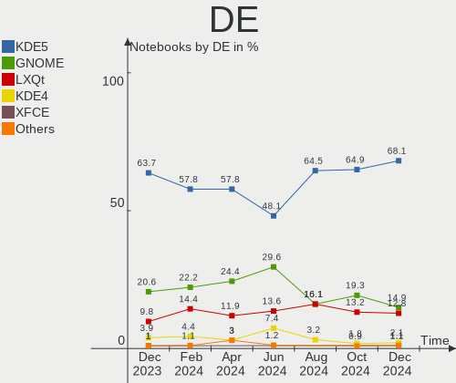
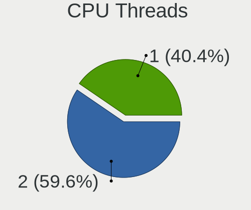
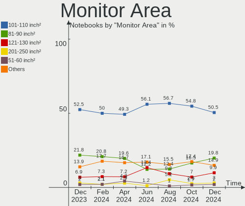
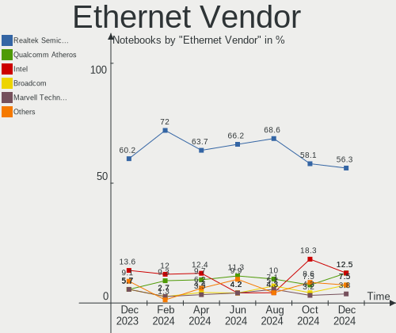

ROSA - Hardware Trends (Notebooks)
----------------------------------

A project to identify most popular hardware characteristics and track their change
over time based on data collected by Linux users at https://Linux-Hardware.org.

Anyone can contribute to this report by the [hw-probe](https://github.com/linuxhw/hw-probe) tool:

    sudo -E hw-probe -all -upload

This report is for one last month. Overall report since the beginning of time: [TestCoverage](https://github.com/linuxhw/TestCoverage)

Period: Dec, 2022.

Contents
--------

* [ System ](#system)
  - [ OS                       ](#os)
  - [ OS Family                ](#os-family)
  - [ Kernel                   ](#kernel)
  - [ Kernel Family            ](#kernel-family)
  - [ Kernel Major Ver.        ](#kernel-major-ver)
  - [ Arch                     ](#arch)
  - [ DE                       ](#de)
  - [ Display Server           ](#display-server)
  - [ Display Manager          ](#display-manager)
  - [ OS Lang                  ](#os-lang)
  - [ Boot Mode                ](#boot-mode)
  - [ Filesystem               ](#filesystem)
  - [ Part. scheme             ](#part-scheme)
  - [ Dual Boot with Linux/BSD ](#dual-boot-with-linuxbsd)
  - [ Dual Boot (Win)          ](#dual-boot-win)

* [ Board ](#board)
  - [ Vendor                   ](#vendor)
  - [ Model                    ](#model)
  - [ Model Family             ](#model-family)
  - [ MFG Year                 ](#mfg-year)
  - [ Form Factor              ](#form-factor)
  - [ Secure Boot              ](#secure-boot)
  - [ Coreboot                 ](#coreboot)
  - [ RAM Size                 ](#ram-size)
  - [ RAM Used                 ](#ram-used)
  - [ Total Drives             ](#total-drives)
  - [ Has CD-ROM               ](#has-cd-rom)
  - [ Has Ethernet             ](#has-ethernet)
  - [ Has WiFi                 ](#has-wifi)
  - [ Has Bluetooth            ](#has-bluetooth)

* [ Location ](#location)
  - [ Country                  ](#country)
  - [ City                     ](#city)

* [ Drives ](#drives)
  - [ Drive Vendor             ](#drive-vendor)
  - [ Drive Model              ](#drive-model)
  - [ HDD Vendor               ](#hdd-vendor)
  - [ SSD Vendor               ](#ssd-vendor)
  - [ Drive Kind               ](#drive-kind)
  - [ Drive Connector          ](#drive-connector)
  - [ Drive Size               ](#drive-size)
  - [ Space Total              ](#space-total)
  - [ Space Used               ](#space-used)
  - [ Malfunc. Drives          ](#malfunc-drives)
  - [ Malfunc. Drive Vendor    ](#malfunc-drive-vendor)
  - [ Malfunc. HDD Vendor      ](#malfunc-hdd-vendor)
  - [ Malfunc. Drive Kind      ](#malfunc-drive-kind)
  - [ Failed Drives            ](#failed-drives)
  - [ Failed Drive Vendor      ](#failed-drive-vendor)
  - [ Drive Status             ](#drive-status)

* [ Storage controller ](#storage-controller)
  - [ Storage Vendor           ](#storage-vendor)
  - [ Storage Model            ](#storage-model)
  - [ Storage Kind             ](#storage-kind)

* [ Processor ](#processor)
  - [ CPU Vendor               ](#cpu-vendor)
  - [ CPU Model                ](#cpu-model)
  - [ CPU Model Family         ](#cpu-model-family)
  - [ CPU Cores                ](#cpu-cores)
  - [ CPU Sockets              ](#cpu-sockets)
  - [ CPU Threads              ](#cpu-threads)
  - [ CPU Op-Modes             ](#cpu-op-modes)
  - [ CPU Microcode            ](#cpu-microcode)
  - [ CPU Microarch            ](#cpu-microarch)

* [ Graphics ](#graphics)
  - [ GPU Vendor               ](#gpu-vendor)
  - [ GPU Model                ](#gpu-model)
  - [ GPU Combo                ](#gpu-combo)
  - [ GPU Driver               ](#gpu-driver)
  - [ GPU Memory               ](#gpu-memory)

* [ Monitor ](#monitor)
  - [ Monitor Vendor           ](#monitor-vendor)
  - [ Monitor Model            ](#monitor-model)
  - [ Monitor Resolution       ](#monitor-resolution)
  - [ Monitor Diagonal         ](#monitor-diagonal)
  - [ Monitor Width            ](#monitor-width)
  - [ Aspect Ratio             ](#aspect-ratio)
  - [ Monitor Area             ](#monitor-area)
  - [ Pixel Density            ](#pixel-density)
  - [ Multiple Monitors        ](#multiple-monitors)

* [ Network ](#network)
  - [ Net Controller Vendor    ](#net-controller-vendor)
  - [ Net Controller Model     ](#net-controller-model)
  - [ Wireless Vendor          ](#wireless-vendor)
  - [ Wireless Model           ](#wireless-model)
  - [ Ethernet Vendor          ](#ethernet-vendor)
  - [ Ethernet Model           ](#ethernet-model)
  - [ Net Controller Kind      ](#net-controller-kind)
  - [ Used Controller          ](#used-controller)
  - [ NICs                     ](#nics)
  - [ IPv6                     ](#ipv6)

* [ Bluetooth ](#bluetooth)
  - [ Bluetooth Vendor         ](#bluetooth-vendor)
  - [ Bluetooth Model          ](#bluetooth-model)

* [ Sound ](#sound)
  - [ Sound Vendor             ](#sound-vendor)
  - [ Sound Model              ](#sound-model)

* [ Memory ](#memory)
  - [ Memory Vendor            ](#memory-vendor)
  - [ Memory Model             ](#memory-model)
  - [ Memory Kind              ](#memory-kind)
  - [ Memory Form Factor       ](#memory-form-factor)
  - [ Memory Size              ](#memory-size)
  - [ Memory Speed             ](#memory-speed)

* [ Printers & scanners ](#printers--scanners)
  - [ Printer Vendor           ](#printer-vendor)
  - [ Printer Model            ](#printer-model)
  - [ Scanner Vendor           ](#scanner-vendor)
  - [ Scanner Model            ](#scanner-model)

* [ Camera ](#camera)
  - [ Camera Vendor            ](#camera-vendor)
  - [ Camera Model             ](#camera-model)

* [ Security ](#security)
  - [ Fingerprint Vendor       ](#fingerprint-vendor)
  - [ Fingerprint Model        ](#fingerprint-model)
  - [ Chipcard Vendor          ](#chipcard-vendor)
  - [ Chipcard Model           ](#chipcard-model)

* [ Unsupported ](#unsupported)
  - [ Unsupported Devices      ](#unsupported-devices)
  - [ Unsupported Device Types ](#unsupported-device-types)

System
------

OS
--

Installed operating systems

| Name       | Notebooks | Percent |
|------------|-----------|---------|
| ROSA 12.3  | 95        | 87.16%  |
| ROSA R11.1 | 5         | 4.59%   |
| ROSA 12.2  | 5         | 4.59%   |
| ROSA 12.1  | 3         | 2.75%   |
| ROSA R11   | 1         | 0.92%   |

OS Family
---------

OS without a version

| Name | Notebooks | Percent |
|------|-----------|---------|
| ROSA | 109       | 100%    |

Kernel
------

Version of the Linux kernel

| Version                                   | Notebooks | Percent |
|-------------------------------------------|-----------|---------|
| 5.15.79-generic-1rosa2021.1-x86_64        | 33        | 30.28%  |
| 5.15.75-generic-1rosa2021.1-x86_64        | 33        | 30.28%  |
| 5.10.155-generic-1rosa2021.1-x86_64       | 8         | 7.34%   |
| 5.10.74-generic-2rosa2021.1-x86_64        | 6         | 5.5%    |
| 5.15.77-generic-1rosa2021.1-x86_64        | 5         | 4.59%   |
| 5.15.75-generic-1rosa2021.1-i686          | 5         | 4.59%   |
| 5.17.11-generic-2rosa2021.1-x86_64        | 3         | 2.75%   |
| 5.10.118-generic-2rosa2021.1-x86_64       | 3         | 2.75%   |
| 4.9.155-nrj-desktop-1rosa-x86_64          | 3         | 2.75%   |
| 5.4.32-generic-2rosa-x86_64               | 2         | 1.83%   |
| 6.1.0-generic-0.rc8.1rosa2021.1-x86_64    | 1         | 0.92%   |
| 6.1.0-generic-0.rc7.1rosa2021.1-x86_64    | 1         | 0.92%   |
| 6.1.0-generic-0.rc6.1rosa2021.1-x86_64    | 1         | 0.92%   |
| 6.0.12.xm1-1.klp-xanmod-rosa2021.1-x86_64 | 1         | 0.92%   |
| 5.18.19-generic-3rosa2021.1-x86_64        | 1         | 0.92%   |
| 5.10.71-generic-1rosa2021.1-x86_64        | 1         | 0.92%   |
| 5.10.155-generic-1rosa2021.1-i586         | 1         | 0.92%   |
| 4.15.0-desktop-45.1rosa-i586              | 1         | 0.92%   |

Kernel Family
-------------

Linux kernel without a distro release

| Version  | Notebooks | Percent |
|----------|-----------|---------|
| 5.15.75  | 38        | 34.86%  |
| 5.15.79  | 33        | 30.28%  |
| 5.10.155 | 9         | 8.26%   |
| 5.10.74  | 6         | 5.5%    |
| 5.15.77  | 5         | 4.59%   |
| 6.1.0    | 3         | 2.75%   |
| 5.17.11  | 3         | 2.75%   |
| 5.10.118 | 3         | 2.75%   |
| 4.9.155  | 3         | 2.75%   |
| 5.4.32   | 2         | 1.83%   |
| 6.0.12   | 1         | 0.92%   |
| 5.18.19  | 1         | 0.92%   |
| 5.10.71  | 1         | 0.92%   |
| 4.15.0   | 1         | 0.92%   |

Kernel Major Ver.
-----------------

Linux kernel major version

| Version | Notebooks | Percent |
|---------|-----------|---------|
| 5.15    | 76        | 69.72%  |
| 5.10    | 19        | 17.43%  |
| 6.1     | 3         | 2.75%   |
| 5.17    | 3         | 2.75%   |
| 4.9     | 3         | 2.75%   |
| 5.4     | 2         | 1.83%   |
| 6.0     | 1         | 0.92%   |
| 5.18    | 1         | 0.92%   |
| 4.15    | 1         | 0.92%   |

Arch
----

OS architecture (x86_64, i586, etc.)

| Name   | Notebooks | Percent |
|--------|-----------|---------|
| x86_64 | 102       | 93.58%  |
| i686   | 7         | 6.42%   |

DE
--

Desktop Environment

| Name  | Notebooks | Percent |
|-------|-----------|---------|
| KDE5  | 58        | 53.21%  |
| GNOME | 28        | 25.69%  |
| LXQt  | 17        | 15.6%   |
| KDE4  | 6         | 5.5%    |

Display Server
--------------

X11 or Wayland

| Name    | Notebooks | Percent |
|---------|-----------|---------|
| Wayland | 83        | 76.15%  |
| X11     | 26        | 23.85%  |

Display Manager
---------------

SDDM, LightDM, etc.

| Name    | Notebooks | Percent |
|---------|-----------|---------|
| SDDM    | 55        | 50.46%  |
| GDM     | 41        | 37.61%  |
| LightDM | 6         | 5.5%    |
| KDM     | 6         | 5.5%    |
| Unknown | 1         | 0.92%   |

OS Lang
-------

Language

| Lang    | Notebooks | Percent |
|---------|-----------|---------|
| ru_RU   | 99        | 90.83%  |
| pt_BR   | 2         | 1.83%   |
| de_DE   | 2         | 1.83%   |
| fr_FR   | 1         | 0.92%   |
| es_PE   | 1         | 0.92%   |
| es_ES   | 1         | 0.92%   |
| en_US   | 1         | 0.92%   |
| en_GB   | 1         | 0.92%   |
| Unknown | 1         | 0.92%   |

Boot Mode
---------

EFI or BIOS

| Mode | Notebooks | Percent |
|------|-----------|---------|
| EFI  | 55        | 50.46%  |
| BIOS | 54        | 49.54%  |

Filesystem
----------

Type of filesystem

| Type  | Notebooks | Percent |
|-------|-----------|---------|
| Ext4  | 105       | 96.33%  |
| Btrfs | 4         | 3.67%   |

Part. scheme
------------

Scheme of partitioning

| Type | Notebooks | Percent |
|------|-----------|---------|
| GPT  | 56        | 51.38%  |
| MBR  | 53        | 48.62%  |

Dual Boot with Linux/BSD
------------------------

Hosting more than one Linux/BSD

| Dual boot | Notebooks | Percent |
|-----------|-----------|---------|
| No        | 86        | 78.9%   |
| Yes       | 23        | 21.1%   |

Dual Boot (Win)
---------------

Hosting Linux and Windows

| Dual boot | Notebooks | Percent |
|-----------|-----------|---------|
| No        | 67        | 61.47%  |
| Yes       | 42        | 38.53%  |

Board
-----

Vendor
------

Motherboard manufacturer

| Name                | Notebooks | Percent |
|---------------------|-----------|---------|
| Lenovo              | 20        | 18.35%  |
| Acer                | 19        | 17.43%  |
| ASUSTek Computer    | 17        | 15.6%   |
| Dell                | 10        | 9.17%   |
| Hewlett-Packard     | 9         | 8.26%   |
| MSI                 | 7         | 6.42%   |
| Samsung Electronics | 6         | 5.5%    |
| Pegatron            | 3         | 2.75%   |
| Toshiba             | 2         | 1.83%   |
| Sony                | 2         | 1.83%   |
| 3Logic Group        | 2         | 1.83%   |
| TUXEDO              | 1         | 0.92%   |
| Prestigio           | 1         | 0.92%   |
| Maibenben           | 1         | 0.92%   |
| Intel               | 1         | 0.92%   |
| ICL                 | 1         | 0.92%   |
| HONOR               | 1         | 0.92%   |
| Gigabyte Technology | 1         | 0.92%   |
| eMachines           | 1         | 0.92%   |
| Digma               | 1         | 0.92%   |
| Clevo               | 1         | 0.92%   |
| Aquarius            | 1         | 0.92%   |
| Apple               | 1         | 0.92%   |

Model
-----

Motherboard model

| Name                                  | Notebooks | Percent |
|---------------------------------------|-----------|---------|
| Lenovo IdeaPad 330-15IKB 81DE         | 3         | 2.75%   |
| Lenovo IdeaPad L340-17IRH Gaming 81LL | 2         | 1.83%   |
| Lenovo IdeaPad Gaming 3 15ARH05 82EY  | 2         | 1.83%   |
| Dell Inspiron 15-3552                 | 2         | 1.83%   |
| TUXEDO Pulse 15 Gen1                  | 1         | 0.92%   |
| Toshiba Satellite U300                | 1         | 0.92%   |
| Toshiba Satellite A300                | 1         | 0.92%   |
| Sony VPCEJ1L1R                        | 1         | 0.92%   |
| Sony SVE1111M1RW                      | 1         | 0.92%   |
| Samsung SQ45/Q70C/P200                | 1         | 0.92%   |
| Samsung RC530/RC730                   | 1         | 0.92%   |
| Samsung R410                          | 1         | 0.92%   |
| Samsung 350V5C/351V5C/3540VC/3440VC   | 1         | 0.92%   |
| Samsung 305V4A/305V5A/3415VA          | 1         | 0.92%   |
| Samsung 300V3A/300V4A/300V5A          | 1         | 0.92%   |
| Prestigio PSB141C04CGH                | 1         | 0.92%   |
| Pegatron C17A                         | 1         | 0.92%   |
| Pegatron C15B                         | 1         | 0.92%   |
| Pegatron A17                          | 1         | 0.92%   |
| MSI X460/X460DX                       | 1         | 0.92%   |
| MSI Modern 15 B12M                    | 1         | 0.92%   |
| MSI Modern 14 B4MW                    | 1         | 0.92%   |
| MSI GF65 Thin 10UE                    | 1         | 0.92%   |
| MSI GE72 6QC                          | 1         | 0.92%   |
| MSI Delta 15 A5EFK                    | 1         | 0.92%   |
| MSI Alpha 15 B5EEK                    | 1         | 0.92%   |
| Maibenben MaiBook M                   | 1         | 0.92%   |
| Lenovo V14-IIL 82C4                   | 1         | 0.92%   |
| Lenovo ThinkPad L420 7854RP1          | 1         | 0.92%   |
| Lenovo Legion 5 15IMH05H 81Y6         | 1         | 0.92%   |
| Lenovo IdeaPad S340-14API 81NB        | 1         | 0.92%   |
| Lenovo IdeaPad 5 Pro 14ACN6 82L7      | 1         | 0.92%   |
| Lenovo IdeaPad 330-14AST 81D5         | 1         | 0.92%   |
| Lenovo IdeaPad 3 15ITL6 82H8          | 1         | 0.92%   |
| Lenovo G780 20138                     | 1         | 0.92%   |
| Lenovo G700 20251                     | 1         | 0.92%   |
| Lenovo G580 20157                     | 1         | 0.92%   |
| Lenovo G500 20236                     | 1         | 0.92%   |
| Lenovo B590 20206                     | 1         | 0.92%   |
| Lenovo B570e HuronRiver Platform      | 1         | 0.92%   |

Model Family
------------

Motherboard model prefix

| Name                   | Notebooks | Percent |
|------------------------|-----------|---------|
| Acer Aspire            | 14        | 12.84%  |
| Lenovo IdeaPad         | 11        | 10.09%  |
| Dell Inspiron          | 8         | 7.34%   |
| Acer Nitro             | 4         | 3.67%   |
| HP Pavilion            | 3         | 2.75%   |
| ASUS VivoBook          | 3         | 2.75%   |
| Toshiba Satellite      | 2         | 1.83%   |
| MSI Modern             | 2         | 1.83%   |
| HP Compaq              | 2         | 1.83%   |
| ASUS ROG               | 2         | 1.83%   |
| 3Logic Group Graviton  | 2         | 1.83%   |
| TUXEDO Pulse           | 1         | 0.92%   |
| Sony VPCEJ1L1R         | 1         | 0.92%   |
| Sony SVE1111M1RW       | 1         | 0.92%   |
| Samsung SQ45           | 1         | 0.92%   |
| Samsung RC530          | 1         | 0.92%   |
| Samsung R410           | 1         | 0.92%   |
| Samsung 350V5C         | 1         | 0.92%   |
| Samsung 305V4A         | 1         | 0.92%   |
| Samsung 300V3A         | 1         | 0.92%   |
| Prestigio PSB141C04CGH | 1         | 0.92%   |
| Pegatron C17A          | 1         | 0.92%   |
| Pegatron C15B          | 1         | 0.92%   |
| Pegatron A17           | 1         | 0.92%   |
| MSI X460               | 1         | 0.92%   |
| MSI GF65               | 1         | 0.92%   |
| MSI GE72               | 1         | 0.92%   |
| MSI Delta              | 1         | 0.92%   |
| MSI Alpha              | 1         | 0.92%   |
| Maibenben MaiBook      | 1         | 0.92%   |
| Lenovo V14-IIL         | 1         | 0.92%   |
| Lenovo ThinkPad        | 1         | 0.92%   |
| Lenovo Legion          | 1         | 0.92%   |
| Lenovo G780            | 1         | 0.92%   |
| Lenovo G700            | 1         | 0.92%   |
| Lenovo G580            | 1         | 0.92%   |
| Lenovo G500            | 1         | 0.92%   |
| Lenovo B590            | 1         | 0.92%   |
| Lenovo B570e           | 1         | 0.92%   |
| Intel ChiefRiver       | 1         | 0.92%   |

MFG Year
--------

Motherboard manufacture year

| Year | Notebooks | Percent |
|------|-----------|---------|
| 2011 | 13        | 11.93%  |
| 2021 | 12        | 11.01%  |
| 2019 | 12        | 11.01%  |
| 2012 | 11        | 10.09%  |
| 2013 | 10        | 9.17%   |
| 2020 | 8         | 7.34%   |
| 2010 | 7         | 6.42%   |
| 2009 | 7         | 6.42%   |
| 2008 | 7         | 6.42%   |
| 2018 | 6         | 5.5%    |
| 2015 | 5         | 4.59%   |
| 2007 | 4         | 3.67%   |
| 2022 | 3         | 2.75%   |
| 2017 | 2         | 1.83%   |
| 2016 | 2         | 1.83%   |

Form Factor
-----------

Physical design of the computer

| Name     | Notebooks | Percent |
|----------|-----------|---------|
| Notebook | 109       | 100%    |

Secure Boot
-----------

Enabled or disabled

| State    | Notebooks | Percent |
|----------|-----------|---------|
| Disabled | 109       | 100%    |

Coreboot
--------

Have coreboot on board

| Used | Notebooks | Percent |
|------|-----------|---------|
| No   | 109       | 100%    |

RAM Size
--------

Total RAM memory

| Size in GB | Notebooks | Percent |
|------------|-----------|---------|
| 4.01-8.0   | 31        | 28.44%  |
| 3.01-4.0   | 27        | 24.77%  |
| 8.01-16.0  | 25        | 22.94%  |
| 16.01-24.0 | 10        | 9.17%   |
| 1.01-2.0   | 10        | 9.17%   |
| 2.01-3.0   | 2         | 1.83%   |
| 0.51-1.0   | 2         | 1.83%   |
| 32.01-64.0 | 1         | 0.92%   |
| 24.01-32.0 | 1         | 0.92%   |

RAM Used
--------

Used RAM memory

| Used GB  | Notebooks | Percent |
|----------|-----------|---------|
| 1.01-2.0 | 58        | 53.21%  |
| 0.51-1.0 | 25        | 22.94%  |
| 2.01-3.0 | 16        | 14.68%  |
| 3.01-4.0 | 6         | 5.5%    |
| 0.01-0.5 | 3         | 2.75%   |
| 4.01-8.0 | 1         | 0.92%   |

Total Drives
------------

Number of drives on board

| Drives | Notebooks | Percent |
|--------|-----------|---------|
| 1      | 76        | 69.72%  |
| 2      | 31        | 28.44%  |
| 3      | 2         | 1.83%   |

Has CD-ROM
----------

Has CD-ROM on board

| Presented | Notebooks | Percent |
|-----------|-----------|---------|
| No        | 63        | 57.8%   |
| Yes       | 46        | 42.2%   |

Has Ethernet
------------

Has Ethernet on board

| Presented | Notebooks | Percent |
|-----------|-----------|---------|
| Yes       | 94        | 86.24%  |
| No        | 15        | 13.76%  |

Has WiFi
--------

Has WiFi module

| Presented | Notebooks | Percent |
|-----------|-----------|---------|
| Yes       | 108       | 99.08%  |
| No        | 1         | 0.92%   |

Has Bluetooth
-------------

Has Bluetooth module

| Presented | Notebooks | Percent |
|-----------|-----------|---------|
| Yes       | 85        | 77.98%  |
| No        | 24        | 22.02%  |

Location
--------

Country
-------

Geographic location (country)

| Country    | Notebooks | Percent |
|------------|-----------|---------|
| Russia     | 94        | 86.24%  |
| Ukraine    | 2         | 1.83%   |
| France     | 2         | 1.83%   |
| Brazil     | 2         | 1.83%   |
| Belarus    | 2         | 1.83%   |
| UK         | 1         | 0.92%   |
| Serbia     | 1         | 0.92%   |
| Peru       | 1         | 0.92%   |
| Latvia     | 1         | 0.92%   |
| Kazakhstan | 1         | 0.92%   |
| Germany    | 1         | 0.92%   |
| Czechia    | 1         | 0.92%   |

City
----

Geographic location (city)

| City                | Notebooks | Percent |
|---------------------|-----------|---------|
| Moscow              | 16        | 14.68%  |
| St Petersburg       | 7         | 6.42%   |
| Yekaterinburg       | 6         | 5.5%    |
| Novosibirsk         | 5         | 4.59%   |
| Stavropol           | 4         | 3.67%   |
| Voronezh            | 3         | 2.75%   |
| Smolensk            | 3         | 2.75%   |
| Nizhniy Novgorod    | 3         | 2.75%   |
| Krasnodar           | 3         | 2.75%   |
| Yakutsk             | 2         | 1.83%   |
| Ufa                 | 2         | 1.83%   |
| Seversk             | 2         | 1.83%   |
| Perm                | 2         | 1.83%   |
| Chelyabinsk         | 2         | 1.83%   |
| Zvenigorod          | 1         | 0.92%   |
| Yasnogorsk          | 1         | 0.92%   |
| Vsevolozhsk         | 1         | 0.92%   |
| Vorkuta             | 1         | 0.92%   |
| Volgograd           | 1         | 0.92%   |
| Volgodonsk          | 1         | 0.92%   |
| Vlasikha            | 1         | 0.92%   |
| Vladivostok         | 1         | 0.92%   |
| Viamao              | 1         | 0.92%   |
| Ukhta               | 1         | 0.92%   |
| Taganrog            | 1         | 0.92%   |
| Sterlitamak         | 1         | 0.92%   |
| Stary Oskol         | 1         | 0.92%   |
| Slantsy             | 1         | 0.92%   |
| Simferopol          | 1         | 0.92%   |
| Severodvinsk        | 1         | 0.92%   |
| Ryazan              | 1         | 0.92%   |
| Rostov-on-Don       | 1         | 0.92%   |
| Porto Alegre        | 1         | 0.92%   |
| Petrozavodsk        | 1         | 0.92%   |
| Pechora             | 1         | 0.92%   |
| Omsk                | 1         | 0.92%   |
| Old Town            | 1         | 0.92%   |
| Naberezhnyye Chelny | 1         | 0.92%   |
| Minsk               | 1         | 0.92%   |
| Megion              | 1         | 0.92%   |

Drives
------

Drive Vendor
------------

Hard drive vendors

| Vendor              | Notebooks | Drives  | Percent |
|---------------------|-----------|---------|---------|
| WDC                 | 21        | 21      | 14.89%  |
| Seagate             | 16        | 16      | 11.35%  |
| Toshiba             | 15        | 15      | 10.64%  |
| Kingston            | 10        | 10      | 7.09%   |
| Samsung Electronics | 7         | 8       | 4.96%   |
| Hitachi             | 7         | 7       | 4.96%   |
| SK hynix            | 6         | 6       | 4.26%   |
| Micron Technology   | 5         | 5       | 3.55%   |
| Unknown             | 4         | 4       | 2.84%   |
| HGST                | 4         | 4       | 2.84%   |
| SPCC                | 3         | 3       | 2.13%   |
| SanDisk             | 3         | 3       | 2.13%   |
| KingSpec            | 3         | 3       | 2.13%   |
| China               | 3         | 3       | 2.13%   |
| Apacer              | 3         | 3       | 2.13%   |
| A-DATA Technology   | 3         | 3       | 2.13%   |
| Unknown             | 3         | 3       | 2.13%   |
| UMIS                | 2         | 2       | 1.42%   |
| Netac               | 2         | 2       | 1.42%   |
| Intel               | 2         | 2       | 1.42%   |
| Gigabyte Technology | 2         | 2       | 1.42%   |
| AMD                 | 2         | 2       | 1.42%   |
| XrayDisk            | 1         | 1       | 0.71%   |
| XPG                 | 1         | 1       | 0.71%   |
| WALRAM              | 1         | 1       | 0.71%   |
| V-32                | 1         | 1       | 0.71%   |
| USB30               | 1         | 1       | 0.71%   |
| Team                | 1         | 1       | 0.71%   |
| Smartbuy            | 1         | 1       | 0.71%   |
| ShiJi               | 1         | 1       | 0.71%   |
| RUN                 | 1         | 1       | 0.71%   |
| Mass                | 1         | Unknown | 0.71%   |
| LDLC                | 1         | 1       | 0.71%   |
| KIOXIA              | 1         | 1       | 0.71%   |
| Fujitsu             | 1         | 1       | 0.71%   |
| Crucial             | 1         | 1       | 0.71%   |
| BIWIN               | 1         | 1       | 0.71%   |

Drive Model
-----------

Hard drive models

| Model                                | Notebooks | Percent |
|--------------------------------------|-----------|---------|
| Toshiba MQ01ABF050 500GB             | 6         | 4.23%   |
| Seagate ST1000LM035-1RK172 1TB       | 4         | 2.82%   |
| Unknown                              | 3         | 2.11%   |
| WDC WD5000LPCX-21VHAT0 500GB         | 2         | 1.41%   |
| WDC WD5000BEVT-22A0RT0 500GB         | 2         | 1.41%   |
| Unknown DA4128  128GB                | 2         | 1.41%   |
| UMIS RPFTJ128PDD2EWX 128GB           | 2         | 1.41%   |
| SK hynix HFM256GDJTNG-8310A 256GB    | 2         | 1.41%   |
| Seagate ST500LT012-1DG142 500GB      | 2         | 1.41%   |
| Samsung MZVLQ512HBLU-00B00 512GB     | 2         | 1.41%   |
| Kingston SKC600512G 512GB SSD        | 2         | 1.41%   |
| Kingston SHFS37A120G 120GB SSD       | 2         | 1.41%   |
| Kingston SA400S37240G 240GB SSD      | 2         | 1.41%   |
| HGST HTS545050A7E680 500GB           | 2         | 1.41%   |
| XrayDisk 512GB SSD                   | 1         | 0.7%    |
| XPG SPECTRIX S40G 256GB              | 1         | 0.7%    |
| WDC WDS500G2B0A-00SM50 500GB SSD     | 1         | 0.7%    |
| WDC WDS120G2G0A-00JH30 120GB SSD     | 1         | 0.7%    |
| WDC WDS100T2B0A-00SM50 1TB SSD       | 1         | 0.7%    |
| WDC WD7500BPKT-75PK4T0 752GB         | 1         | 0.7%    |
| WDC WD5000LPVX-22V0TT0 500GB         | 1         | 0.7%    |
| WDC WD5000BPVT-75HXZT3 500GB         | 1         | 0.7%    |
| WDC WD5000BPVT-22HXZT1 500GB         | 1         | 0.7%    |
| WDC WD5000BPVT-22A1YT0 500GB         | 1         | 0.7%    |
| WDC WD5000BPKX-00HPJT0 500GB         | 1         | 0.7%    |
| WDC WD3200LPVX-00V0TT0 320GB         | 1         | 0.7%    |
| WDC WD3200BPVT-35ZEST0 320GB         | 1         | 0.7%    |
| WDC WD3200BEVT-60A23T0 320GB         | 1         | 0.7%    |
| WDC WD3200BEVT-00A0RT0 320GB         | 1         | 0.7%    |
| WDC WD2500BEVT-08A23T1 250GB         | 1         | 0.7%    |
| WDC WD10SPZX-24Z10T0 1TB             | 1         | 0.7%    |
| WDC WD10JPLX-00MBPT0 1TB             | 1         | 0.7%    |
| WDC PC SN530 SDBPNPZ-512G-1114 512GB | 1         | 0.7%    |
| WALRAM SSD 240G                      | 1         | 0.7%    |
| V-32 Disk 32GB                       | 1         | 0.7%    |
| USB30 Disk 120GB                     | 1         | 0.7%    |
| Unknown SLD64G  64GB                 | 1         | 0.7%    |
| Unknown ASTC  32GB                   | 1         | 0.7%    |
| Toshiba THNSNH128GMCT 128GB SSD      | 1         | 0.7%    |
| Toshiba MQ01ABD100 1TB               | 1         | 0.7%    |

HDD Vendor
----------

Hard disk drive vendors

| Vendor  | Notebooks | Drives | Percent |
|---------|-----------|--------|---------|
| WDC     | 17        | 17     | 29.31%  |
| Seagate | 16        | 16     | 27.59%  |
| Toshiba | 13        | 13     | 22.41%  |
| Hitachi | 7         | 7      | 12.07%  |
| HGST    | 4         | 4      | 6.9%    |
| Fujitsu | 1         | 1      | 1.72%   |

SSD Vendor
----------

Solid state drive vendors

| Vendor              | Notebooks | Drives | Percent |
|---------------------|-----------|--------|---------|
| Kingston            | 8         | 8      | 17.39%  |
| WDC                 | 3         | 3      | 6.52%   |
| SPCC                | 3         | 3      | 6.52%   |
| KingSpec            | 3         | 3      | 6.52%   |
| China               | 3         | 3      | 6.52%   |
| A-DATA Technology   | 3         | 3      | 6.52%   |
| Samsung Electronics | 2         | 2      | 4.35%   |
| Micron Technology   | 2         | 2      | 4.35%   |
| Gigabyte Technology | 2         | 2      | 4.35%   |
| AMD                 | 2         | 2      | 4.35%   |
| Unknown             | 2         | 2      | 4.35%   |
| XrayDisk            | 1         | 1      | 2.17%   |
| WALRAM              | 1         | 1      | 2.17%   |
| USB30               | 1         | 1      | 2.17%   |
| Toshiba             | 1         | 1      | 2.17%   |
| Team                | 1         | 1      | 2.17%   |
| Smartbuy            | 1         | 1      | 2.17%   |
| SK hynix            | 1         | 1      | 2.17%   |
| ShiJi               | 1         | 1      | 2.17%   |
| SanDisk             | 1         | 1      | 2.17%   |
| RUN                 | 1         | 1      | 2.17%   |
| LDLC                | 1         | 1      | 2.17%   |
| Crucial             | 1         | 1      | 2.17%   |
| Apacer              | 1         | 1      | 2.17%   |

Drive Kind
----------

HDD or SSD

| Kind    | Notebooks | Drives | Percent |
|---------|-----------|--------|---------|
| HDD     | 58        | 58     | 43.28%  |
| SSD     | 43        | 46     | 32.09%  |
| NVMe    | 26        | 31     | 19.4%   |
| MMC     | 5         | 5      | 3.73%   |
| Unknown | 2         | 1      | 1.49%   |

Drive Connector
---------------

SATA, SAS, NVMe, etc.

| Type | Notebooks | Drives | Percent |
|------|-----------|--------|---------|
| SATA | 89        | 103    | 72.36%  |
| NVMe | 26        | 31     | 21.14%  |
| MMC  | 5         | 5      | 4.07%   |
| SAS  | 3         | 2      | 2.44%   |

Drive Size
----------

Size of hard drive

| Size in TB | Notebooks | Drives | Percent |
|------------|-----------|--------|---------|
| 0.01-0.5   | 75        | 82     | 77.32%  |
| 0.51-1.0   | 20        | 20     | 20.62%  |
| 1.01-2.0   | 2         | 2      | 2.06%   |

Space Total
-----------

Amount of disk space available on the file system

| Size in GB     | Notebooks | Percent |
|----------------|-----------|---------|
| 251-500        | 35        | 32.11%  |
| 101-250        | 33        | 30.28%  |
| 21-50          | 10        | 9.17%   |
| 501-1000       | 10        | 9.17%   |
| 1-20           | 9         | 8.26%   |
| 51-100         | 6         | 5.5%    |
| 1001-2000      | 5         | 4.59%   |
| More than 3000 | 1         | 0.92%   |

Space Used
----------

Amount of used disk space

| Used GB   | Notebooks | Percent |
|-----------|-----------|---------|
| 1-20      | 78        | 71.56%  |
| 21-50     | 10        | 9.17%   |
| 51-100    | 9         | 8.26%   |
| 101-250   | 6         | 5.5%    |
| 251-500   | 5         | 4.59%   |
| 2001-3000 | 1         | 0.92%   |

Malfunc. Drives
---------------

Drive models with a malfunction

| Model                             | Notebooks | Drives | Percent |
|-----------------------------------|-----------|--------|---------|
| WDC WD5000BEVT-22A0RT0 500GB      | 2         | 2      | 7.41%   |
| HGST HTS545050A7E680 500GB        | 2         | 2      | 7.41%   |
| WDC WDS100T2B0A-00SM50 1TB SSD    | 1         | 1      | 3.7%    |
| WDC WD7500BPKT-75PK4T0 752GB      | 1         | 1      | 3.7%    |
| WDC WD5000LPCX-21VHAT0 500GB      | 1         | 1      | 3.7%    |
| WDC WD5000BPVT-22HXZT1 500GB      | 1         | 1      | 3.7%    |
| WDC WD3200BPVT-35ZEST0 320GB      | 1         | 1      | 3.7%    |
| WDC WD3200BEVT-60A23T0 320GB      | 1         | 1      | 3.7%    |
| WDC WD3200BEVT-00A0RT0 320GB      | 1         | 1      | 3.7%    |
| Toshiba MQ01ABD100 1TB            | 1         | 1      | 3.7%    |
| Toshiba MK4058GSX 400GB           | 1         | 1      | 3.7%    |
| Toshiba MK2565GSX 250GB           | 1         | 1      | 3.7%    |
| Toshiba MK2046GSX 200GB           | 1         | 1      | 3.7%    |
| Seagate ST9320325AS 320GB         | 1         | 1      | 3.7%    |
| Seagate ST9250827AS 250GB         | 1         | 1      | 3.7%    |
| Seagate ST9250410AS 250GB         | 1         | 1      | 3.7%    |
| Seagate ST500LT012-9WS142 500GB   | 1         | 1      | 3.7%    |
| Seagate ST500LT012-1DG142 500GB   | 1         | 1      | 3.7%    |
| Seagate ST320LT012-9WS14C 320GB   | 1         | 1      | 3.7%    |
| Seagate ST1000LM035-1RK172 1TB    | 1         | 1      | 3.7%    |
| Kingston SHFS37A120G 120GB SSD    | 1         | 1      | 3.7%    |
| Hitachi HTS547550A9E384 500GB     | 1         | 1      | 3.7%    |
| Hitachi HTS542516K9A300 160GB     | 1         | 1      | 3.7%    |
| China SSD 256GB                   | 1         | 1      | 3.7%    |
| A-DATA Technology SU655 240GB SSD | 1         | 1      | 3.7%    |

Malfunc. Drive Vendor
---------------------

Vendors of faulty drives

| Vendor            | Notebooks | Drives | Percent |
|-------------------|-----------|--------|---------|
| WDC               | 9         | 9      | 33.33%  |
| Seagate           | 7         | 7      | 25.93%  |
| Toshiba           | 4         | 4      | 14.81%  |
| Hitachi           | 2         | 2      | 7.41%   |
| HGST              | 2         | 2      | 7.41%   |
| Kingston          | 1         | 1      | 3.7%    |
| China             | 1         | 1      | 3.7%    |
| A-DATA Technology | 1         | 1      | 3.7%    |

Malfunc. HDD Vendor
-------------------

Vendors of faulty HDD drives

| Vendor  | Notebooks | Drives | Percent |
|---------|-----------|--------|---------|
| WDC     | 8         | 8      | 34.78%  |
| Seagate | 7         | 7      | 30.43%  |
| Toshiba | 4         | 4      | 17.39%  |
| Hitachi | 2         | 2      | 8.7%    |
| HGST    | 2         | 2      | 8.7%    |

Malfunc. Drive Kind
-------------------

Kinds of faulty drives

| Kind | Notebooks | Drives | Percent |
|------|-----------|--------|---------|
| HDD  | 23        | 23     | 85.19%  |
| SSD  | 4         | 4      | 14.81%  |

Failed Drives
-------------

Failed drive models

Zero info for selected period =(

Failed Drive Vendor
-------------------

Failed drive vendors

Zero info for selected period =(

Drive Status
------------

Number of failed and malfunc. drives

| Status   | Notebooks | Drives | Percent |
|----------|-----------|--------|---------|
| Works    | 86        | 105    | 69.92%  |
| Malfunc  | 27        | 27     | 21.95%  |
| Detected | 10        | 9      | 8.13%   |

Storage controller
------------------

Storage Vendor
--------------

Storage controller vendors

| Vendor                       | Notebooks | Percent |
|------------------------------|-----------|---------|
| Intel                        | 78        | 59.54%  |
| AMD                          | 21        | 16.03%  |
| SK hynix                     | 5         | 3.82%   |
| Samsung Electronics          | 5         | 3.82%   |
| Nvidia                       | 4         | 3.05%   |
| SanDisk                      | 3         | 2.29%   |
| Micron Technology            | 3         | 2.29%   |
| Union Memory (Shenzhen)      | 2         | 1.53%   |
| Netac Technology             | 2         | 1.53%   |
| Kingston Technology Company  | 2         | 1.53%   |
| Toshiba America Info Systems | 1         | 0.76%   |
| Silicon Motion               | 1         | 0.76%   |
| Shenzhen Longsys Electronics | 1         | 0.76%   |
| Realtek Semiconductor        | 1         | 0.76%   |
| Phison Electronics           | 1         | 0.76%   |
| KIOXIA                       | 1         | 0.76%   |

Storage Model
-------------

Storage controller models

| Model                                                                            | Notebooks | Percent |
|----------------------------------------------------------------------------------|-----------|---------|
| AMD FCH SATA Controller [AHCI mode]                                              | 16        | 10.88%  |
| Intel 7 Series Chipset Family 6-port SATA Controller [AHCI mode]                 | 15        | 10.2%   |
| Intel 6 Series/C200 Series Chipset Family 6 port Mobile SATA AHCI Controller     | 11        | 7.48%   |
| Intel 82801HM/HEM (ICH8M/ICH8M-E) IDE Controller                                 | 7         | 4.76%   |
| Intel Sunrise Point-LP SATA Controller [AHCI mode]                               | 6         | 4.08%   |
| Intel 82801HM/HEM (ICH8M/ICH8M-E) SATA Controller [AHCI mode]                    | 6         | 4.08%   |
| Samsung NVMe SSD Controller 980                                                  | 5         | 3.4%    |
| Intel Cannon Lake Mobile PCH SATA AHCI Controller                                | 4         | 2.72%   |
| Intel 5 Series/3400 Series Chipset 4 port SATA AHCI Controller                   | 4         | 2.72%   |
| SK hynix BC501 NVMe Solid State Drive                                            | 3         | 2.04%   |
| Micron Non-Volatile memory controller                                            | 3         | 2.04%   |
| Intel Comet Lake SATA AHCI Controller                                            | 3         | 2.04%   |
| Intel Atom/Celeron/Pentium Processor x5-E8000/J3xxx/N3xxx Series SATA Controller | 3         | 2.04%   |
| Intel 8 Series SATA Controller 1 [AHCI mode]                                     | 3         | 2.04%   |
| AMD SB600 Non-Raid-5 SATA                                                        | 3         | 2.04%   |
| AMD SB600 IDE                                                                    | 3         | 2.04%   |
| Union Memory (Shenzhen) Non-Volatile memory controller                           | 2         | 1.36%   |
| SanDisk Non-Volatile memory controller                                           | 2         | 1.36%   |
| Nvidia MCP79 AHCI Controller                                                     | 2         | 1.36%   |
| Netac Non-Volatile memory controller                                             | 2         | 1.36%   |
| Intel Volume Management Device NVMe RAID Controller                              | 2         | 1.36%   |
| Intel Tiger Lake-LP SATA Controller                                              | 2         | 1.36%   |
| Intel Celeron/Pentium Silver Processor SATA Controller                           | 2         | 1.36%   |
| Intel Cannon Point-LP SATA Controller [AHCI Mode]                                | 2         | 1.36%   |
| Intel 82801IBM/IEM (ICH9M/ICH9M-E) 4 port SATA Controller [AHCI mode]            | 2         | 1.36%   |
| Intel 82801 Mobile SATA Controller [RAID mode]                                   | 2         | 1.36%   |
| AMD SB7x0/SB8x0/SB9x0 SATA Controller [AHCI mode]                                | 2         | 1.36%   |
| Toshiba America Info Systems XG6 NVMe SSD Controller                             | 1         | 0.68%   |
| SK hynix Non-Volatile memory controller                                          | 1         | 0.68%   |
| SK hynix BC511                                                                   | 1         | 0.68%   |
| Silicon Motion SM2263EN/SM2263XT SSD Controller                                  | 1         | 0.68%   |
| Shenzhen Longsys SM2263EN/SM2263XT-based OEM SSD                                 | 1         | 0.68%   |
| SanDisk WD Blue SN550 NVMe SSD                                                   | 1         | 0.68%   |
| Realtek RTS5763DL NVMe SSD Controller                                            | 1         | 0.68%   |
| Phison PS5013 E13 NVMe Controller                                                | 1         | 0.68%   |
| Nvidia MCP79 SATA Controller                                                     | 1         | 0.68%   |
| Nvidia MCP78S [GeForce 8200] SATA Controller (non-AHCI mode)                     | 1         | 0.68%   |
| Nvidia MCP78S [GeForce 8200] IDE                                                 | 1         | 0.68%   |
| KIOXIA NVMe SSD Controller BG4                                                   | 1         | 0.68%   |
| Kingston Company Company Non-Volatile memory controller                          | 1         | 0.68%   |

Storage Kind
------------

Kind of storage controller (IDE, SATA, NVMe, SAS, ...)

| Kind | Notebooks | Percent |
|------|-----------|---------|
| SATA | 93        | 66.91%  |
| NVMe | 26        | 18.71%  |
| IDE  | 16        | 11.51%  |
| RAID | 4         | 2.88%   |

Processor
---------

CPU Vendor
----------

Processor vendors

| Vendor | Notebooks | Percent |
|--------|-----------|---------|
| Intel  | 84        | 77.06%  |
| AMD    | 25        | 22.94%  |

CPU Model
---------

Processor models

| Model                                         | Notebooks | Percent |
|-----------------------------------------------|-----------|---------|
| Intel Core i5-2430M CPU @ 2.40GHz             | 4         | 3.67%   |
| Intel Core i5-10210U CPU @ 1.60GHz            | 3         | 2.75%   |
| Intel Pentium 3556U @ 1.70GHz                 | 2         | 1.83%   |
| Intel Core i7-9750H CPU @ 2.60GHz             | 2         | 1.83%   |
| Intel Core i7-3630QM CPU @ 2.40GHz            | 2         | 1.83%   |
| Intel Core i5-7200U CPU @ 2.50GHz             | 2         | 1.83%   |
| Intel Core i5-2410M CPU @ 2.30GHz             | 2         | 1.83%   |
| Intel Core i3-6006U CPU @ 2.00GHz             | 2         | 1.83%   |
| Intel Core i3-2350M CPU @ 2.30GHz             | 2         | 1.83%   |
| Intel Celeron N4020 CPU @ 1.10GHz             | 2         | 1.83%   |
| AMD Ryzen 9 5900HX with Radeon Graphics       | 2         | 1.83%   |
| AMD Ryzen 7 4800H with Radeon Graphics        | 2         | 1.83%   |
| AMD Ryzen 5 3500U with Radeon Vega Mobile Gfx | 2         | 1.83%   |
| Intel Pentium Silver N6000 @ 1.10GHz          | 1         | 0.92%   |
| Intel Pentium Dual-Core CPU T4200 @ 2.00GHz   | 1         | 0.92%   |
| Intel Pentium Dual CPU T2370 @ 1.73GHz        | 1         | 0.92%   |
| Intel Pentium Dual CPU T2330 @ 1.60GHz        | 1         | 0.92%   |
| Intel Pentium CPU P6100 @ 2.00GHz             | 1         | 0.92%   |
| Intel Pentium CPU N3710 @ 1.60GHz             | 1         | 0.92%   |
| Intel Pentium CPU N3700 @ 1.60GHz             | 1         | 0.92%   |
| Intel Pentium CPU B960 @ 2.20GHz              | 1         | 0.92%   |
| Intel Pentium CPU B940 @ 2.00GHz              | 1         | 0.92%   |
| Intel Pentium CPU 2127U @ 1.90GHz             | 1         | 0.92%   |
| Intel Pentium CPU 2117U @ 1.80GHz             | 1         | 0.92%   |
| Intel Pentium CPU 2020M @ 2.40GHz             | 1         | 0.92%   |
| Intel Genuine CPU U2300 @ 1.20GHz             | 1         | 0.92%   |
| Intel Core i7-6700HQ CPU @ 2.60GHz            | 1         | 0.92%   |
| Intel Core i7-3610QM CPU @ 2.30GHz            | 1         | 0.92%   |
| Intel Core i7-3520M CPU @ 2.90GHz             | 1         | 0.92%   |
| Intel Core i5-9300HF CPU @ 2.40GHz            | 1         | 0.92%   |
| Intel Core i5-9300H CPU @ 2.40GHz             | 1         | 0.92%   |
| Intel Core i5-8300H CPU @ 2.30GHz             | 1         | 0.92%   |
| Intel Core i5-8265U CPU @ 1.60GHz             | 1         | 0.92%   |
| Intel Core i5-8259U CPU @ 2.30GHz             | 1         | 0.92%   |
| Intel Core i5-8250U CPU @ 1.60GHz             | 1         | 0.92%   |
| Intel Core i5-4210M CPU @ 2.60GHz             | 1         | 0.92%   |
| Intel Core i5-4200U CPU @ 1.60GHz             | 1         | 0.92%   |
| Intel Core i5-3230M CPU @ 2.60GHz             | 1         | 0.92%   |
| Intel Core i5-3210M CPU @ 2.50GHz             | 1         | 0.92%   |
| Intel Core i5-2450M CPU @ 2.50GHz             | 1         | 0.92%   |

CPU Model Family
----------------

Processor model prefix

| Model                   | Notebooks | Percent |
|-------------------------|-----------|---------|
| Intel Core i5           | 27        | 24.77%  |
| Intel Core i3           | 15        | 13.76%  |
| Intel Pentium           | 10        | 9.17%   |
| Intel Core i7           | 7         | 6.42%   |
| Intel Core 2 Duo        | 7         | 6.42%   |
| AMD Ryzen 5             | 7         | 6.42%   |
| Intel Celeron           | 6         | 5.5%    |
| Other                   | 4         | 3.67%   |
| AMD Ryzen 7             | 4         | 3.67%   |
| Intel Atom              | 3         | 2.75%   |
| Intel Pentium Dual      | 2         | 1.83%   |
| AMD Ryzen 9             | 2         | 1.83%   |
| AMD Ryzen 3             | 2         | 1.83%   |
| AMD E2                  | 2         | 1.83%   |
| Intel Pentium Silver    | 1         | 0.92%   |
| Intel Pentium Dual-Core | 1         | 0.92%   |
| Intel Genuine           | 1         | 0.92%   |
| AMD E1                  | 1         | 0.92%   |
| AMD E                   | 1         | 0.92%   |
| AMD Athlon X2           | 1         | 0.92%   |
| AMD Athlon 64 X2        | 1         | 0.92%   |
| AMD Athlon              | 1         | 0.92%   |
| AMD A8                  | 1         | 0.92%   |
| AMD A6                  | 1         | 0.92%   |
| AMD A4                  | 1         | 0.92%   |

CPU Cores
---------

Number of processor cores

| Number | Notebooks | Percent |
|--------|-----------|---------|
| 2      | 64        | 58.72%  |
| 4      | 26        | 23.85%  |
| 6      | 7         | 6.42%   |
| 8      | 6         | 5.5%    |
| 1      | 5         | 4.59%   |
| 10     | 1         | 0.92%   |

CPU Sockets
-----------

Number of sockets

| Number | Notebooks | Percent |
|--------|-----------|---------|
| 1      | 109       | 100%    |

CPU Threads
-----------

Threads per core (Hyper-Threading)

| Number | Notebooks | Percent |
|--------|-----------|---------|
| 2      | 70        | 64.22%  |
| 1      | 39        | 35.78%  |

CPU Op-Modes
------------

CPU Operation Modes (32-bit, 64-bit)

| Op mode        | Notebooks | Percent |
|----------------|-----------|---------|
| 32-bit, 64-bit | 108       | 99.08%  |
| 32-bit         | 1         | 0.92%   |

CPU Microcode
-------------

Microcode number

| Number     | Notebooks | Percent |
|------------|-----------|---------|
| 0x206a7    | 15        | 13.76%  |
| 0x306a9    | 12        | 11.01%  |
| 0x6fd      | 7         | 6.42%   |
| 0x1067a    | 5         | 4.59%   |
| 0x806ec    | 4         | 3.67%   |
| 0x806ea    | 4         | 3.67%   |
| 0x08600104 | 4         | 3.67%   |
| 0x906ea    | 3         | 2.75%   |
| 0x40651    | 3         | 2.75%   |
| 0x20655    | 3         | 2.75%   |
| 0x0a50000c | 3         | 2.75%   |
| 0x08108109 | 3         | 2.75%   |
| 0xa0652    | 2         | 1.83%   |
| 0x906ed    | 2         | 1.83%   |
| 0x806e9    | 2         | 1.83%   |
| 0x806c1    | 2         | 1.83%   |
| 0x706a8    | 2         | 1.83%   |
| 0x406c4    | 2         | 1.83%   |
| 0x20652    | 2         | 1.83%   |
| 0x106c2    | 2         | 1.83%   |
| 0x08108102 | 2         | 1.83%   |
| Unknown    | 2         | 1.83%   |
| 0x906c0    | 1         | 0.92%   |
| 0x906a4    | 1         | 0.92%   |
| 0x806d1    | 1         | 0.92%   |
| 0x706e5    | 1         | 0.92%   |
| 0x506e3    | 1         | 0.92%   |
| 0x406e3    | 1         | 0.92%   |
| 0x406c3    | 1         | 0.92%   |
| 0x306c3    | 1         | 0.92%   |
| 0x106ca    | 1         | 0.92%   |
| 0x10676    | 1         | 0.92%   |
| 0x10661    | 1         | 0.92%   |
| 0x0a50000b | 1         | 0.92%   |
| 0x08608103 | 1         | 0.92%   |
| 0x08600103 | 1         | 0.92%   |
| 0x07030105 | 1         | 0.92%   |
| 0x06006705 | 1         | 0.92%   |
| 0x06006704 | 1         | 0.92%   |
| 0x06001116 | 1         | 0.92%   |

CPU Microarch
-------------

Microarchitecture

| Name             | Notebooks | Percent |
|------------------|-----------|---------|
| SandyBridge      | 15        | 13.76%  |
| KabyLake         | 15        | 13.76%  |
| IvyBridge        | 12        | 11.01%  |
| Core             | 8         | 7.34%   |
| Penryn           | 6         | 5.5%    |
| Zen+             | 5         | 4.59%   |
| Zen 2            | 5         | 4.59%   |
| Westmere         | 5         | 4.59%   |
| Zen 3            | 4         | 3.67%   |
| Haswell          | 4         | 3.67%   |
| Skylake          | 3         | 2.75%   |
| Silvermont       | 3         | 2.75%   |
| Bonnell          | 3         | 2.75%   |
| TigerLake        | 2         | 1.83%   |
| K8 & K10 hybrid  | 2         | 1.83%   |
| IceLake          | 2         | 1.83%   |
| Goldmont plus    | 2         | 1.83%   |
| Excavator        | 2         | 1.83%   |
| CometLake        | 2         | 1.83%   |
| Bobcat           | 2         | 1.83%   |
| Tremont          | 1         | 0.92%   |
| Puma             | 1         | 0.92%   |
| Piledriver       | 1         | 0.92%   |
| K8 Hammer        | 1         | 0.92%   |
| K10 Llano        | 1         | 0.92%   |
| Alderlake Hybrid | 1         | 0.92%   |
| Unknown          | 1         | 0.92%   |

Graphics
--------

GPU Vendor
----------

Vendors of graphics cards

| Vendor | Notebooks | Percent |
|--------|-----------|---------|
| Intel  | 71        | 47.65%  |
| Nvidia | 46        | 30.87%  |
| AMD    | 32        | 21.48%  |

GPU Model
---------

Graphics card models

| Model                                                                                    | Notebooks | Percent |
|------------------------------------------------------------------------------------------|-----------|---------|
| Intel 2nd Generation Core Processor Family Integrated Graphics Controller                | 14        | 8.75%   |
| Intel 3rd Gen Core processor Graphics Controller                                         | 12        | 7.5%    |
| Intel Mobile GM965/GL960 Integrated Graphics Controller (secondary)                      | 5         | 3.13%   |
| Intel Mobile GM965/GL960 Integrated Graphics Controller (primary)                        | 5         | 3.13%   |
| AMD Renoir                                                                               | 5         | 3.13%   |
| AMD Picasso/Raven 2 [Radeon Vega Series / Radeon Vega Mobile Series]                     | 5         | 3.13%   |
| Nvidia TU117M [GeForce GTX 1650 Mobile / Max-Q]                                          | 4         | 2.5%    |
| Nvidia GF108M [GeForce GT 540M]                                                          | 4         | 2.5%    |
| Intel CoffeeLake-H GT2 [UHD Graphics 630]                                                | 4         | 2.5%    |
| AMD Cezanne [Radeon Vega Series / Radeon Vega Mobile Series]                             | 4         | 2.5%    |
| Intel Mobile 4 Series Chipset Integrated Graphics Controller                             | 3         | 1.88%   |
| Intel HD Graphics 620                                                                    | 3         | 1.88%   |
| Intel Haswell-ULT Integrated Graphics Controller                                         | 3         | 1.88%   |
| Intel CometLake-U GT2 [UHD Graphics]                                                     | 3         | 1.88%   |
| Intel Atom/Celeron/Pentium Processor x5-E8000/J3xxx/N3xxx Integrated Graphics Controller | 3         | 1.88%   |
| AMD Park [Mobility Radeon HD 5430/5450/5470]                                             | 3         | 1.88%   |
| Nvidia TU117M                                                                            | 2         | 1.25%   |
| Nvidia TU106M [GeForce RTX 2060 Mobile]                                                  | 2         | 1.25%   |
| Nvidia GP108M [GeForce MX150]                                                            | 2         | 1.25%   |
| Nvidia GP107M [GeForce GTX 1050 Mobile]                                                  | 2         | 1.25%   |
| Nvidia GK208M [GeForce GT 740M]                                                          | 2         | 1.25%   |
| Nvidia GK208BM [GeForce 920M]                                                            | 2         | 1.25%   |
| Nvidia GK107M [GeForce GT 650M]                                                          | 2         | 1.25%   |
| Nvidia GA106M [GeForce RTX 3060 Mobile / Max-Q]                                          | 2         | 1.25%   |
| Intel UHD Graphics 620                                                                   | 2         | 1.25%   |
| Intel TigerLake-LP GT2 [Iris Xe Graphics]                                                | 2         | 1.25%   |
| Intel Skylake GT2 [HD Graphics 520]                                                      | 2         | 1.25%   |
| Intel GeminiLake [UHD Graphics 600]                                                      | 2         | 1.25%   |
| Intel Core Processor Integrated Graphics Controller                                      | 2         | 1.25%   |
| AMD Thames [Radeon HD 7500M/7600M Series]                                                | 2         | 1.25%   |
| AMD Stoney [Radeon R2/R3/R4/R5 Graphics]                                                 | 2         | 1.25%   |
| AMD RS600M [Radeon Xpress 1250]                                                          | 2         | 1.25%   |
| Nvidia GT216M [GeForce GT 330M]                                                          | 1         | 0.63%   |
| Nvidia GP107M [GeForce MX350]                                                            | 1         | 0.63%   |
| Nvidia GP107M [GeForce GTX 1050 3 GB Max-Q]                                              | 1         | 0.63%   |
| Nvidia GM108M [GeForce MX110]                                                            | 1         | 0.63%   |
| Nvidia GM108M [GeForce 940MX]                                                            | 1         | 0.63%   |
| Nvidia GM108M [GeForce 840M]                                                             | 1         | 0.63%   |
| Nvidia GM107M [GeForce GTX 960M]                                                         | 1         | 0.63%   |
| Nvidia GK107M [GeForce GT 750M]                                                          | 1         | 0.63%   |

GPU Combo
---------

Combinations of graphics cards

| Name           | Notebooks | Percent |
|----------------|-----------|---------|
| 1 x Intel      | 36        | 33.03%  |
| Intel + Nvidia | 31        | 28.44%  |
| 1 x AMD        | 18        | 16.51%  |
| 1 x Nvidia     | 10        | 9.17%   |
| 2 x AMD        | 5         | 4.59%   |
| AMD + Nvidia   | 5         | 4.59%   |
| Intel + AMD    | 4         | 3.67%   |

GPU Driver
----------

Free vs proprietary

| Driver      | Notebooks | Percent |
|-------------|-----------|---------|
| Free        | 89        | 81.65%  |
| Proprietary | 19        | 17.43%  |
| Unknown     | 1         | 0.92%   |

GPU Memory
----------

Total video memory

| Size in GB | Notebooks | Percent |
|------------|-----------|---------|
| Unknown    | 54        | 49.54%  |
| 0.01-0.5   | 26        | 23.85%  |
| 1.01-2.0   | 14        | 12.84%  |
| 0.51-1.0   | 7         | 6.42%   |
| 3.01-4.0   | 5         | 4.59%   |
| 7.01-8.0   | 1         | 0.92%   |
| 5.01-6.0   | 1         | 0.92%   |
| 8.01-16.0  | 1         | 0.92%   |

Monitor
-------

Monitor Vendor
--------------

Monitor vendors

| Vendor                  | Notebooks | Percent |
|-------------------------|-----------|---------|
| AU Optronics            | 29        | 26.61%  |
| Chimei Innolux          | 19        | 17.43%  |
| BOE                     | 16        | 14.68%  |
| LG Display              | 13        | 11.93%  |
| Samsung Electronics     | 10        | 9.17%   |
| Chi Mei Optoelectronics | 7         | 6.42%   |
| Sharp                   | 2         | 1.83%   |
| LG Philips              | 2         | 1.83%   |
| HannStar                | 2         | 1.83%   |
| Dell                    | 2         | 1.83%   |
| Apple                   | 2         | 1.83%   |
| Lenovo                  | 1         | 0.92%   |
| Goldstar                | 1         | 0.92%   |
| CSO                     | 1         | 0.92%   |
| CPT                     | 1         | 0.92%   |
| Acer                    | 1         | 0.92%   |

Monitor Model
-------------

Monitor models

| Model                                                                    | Notebooks | Percent |
|--------------------------------------------------------------------------|-----------|---------|
| Chimei Innolux LCD Monitor CMN15C9 1366x768 344x193mm 15.5-inch          | 4         | 3.67%   |
| Chi Mei Optoelectronics LCD Monitor CMO15A7 1366x768 344x193mm 15.5-inch | 3         | 2.75%   |
| Samsung Electronics LCD Monitor SEC544B 1600x900 382x214mm 17.2-inch     | 2         | 1.83%   |
| LG Display LCD Monitor LGD02D1 1600x900 382x215mm 17.3-inch              | 2         | 1.83%   |
| LG Display LCD Monitor LGD02AC 1366x768 344x194mm 15.5-inch              | 2         | 1.83%   |
| Chimei Innolux LCD Monitor CMN1738 1920x1080 381x214mm 17.2-inch         | 2         | 1.83%   |
| Chi Mei Optoelectronics LCD Monitor CMO1453 1366x768 309x174mm 14.0-inch | 2         | 1.83%   |
| BOE LCD Monitor BOE09C5 1920x1080 345x194mm 15.6-inch                    | 2         | 1.83%   |
| BOE LCD Monitor BOE069C 1920x1080 344x193mm 15.5-inch                    | 2         | 1.83%   |
| AU Optronics LCD Monitor AUOAF90 1920x1080 344x193mm 15.5-inch           | 2         | 1.83%   |
| AU Optronics LCD Monitor AUO61ED 1920x1080 344x194mm 15.5-inch           | 2         | 1.83%   |
| AU Optronics LCD Monitor AUO21EC 1366x768 344x193mm 15.5-inch            | 2         | 1.83%   |
| Sharp LQ156M1JW03 SHP155D 1920x1080 344x194mm 15.5-inch                  | 1         | 0.92%   |
| Sharp LQ156M1JW01 SHP14C3 1920x1080 344x194mm 15.5-inch                  | 1         | 0.92%   |
| Samsung Electronics LCD Monitor SEC4542 1366x768 309x174mm 14.0-inch     | 1         | 0.92%   |
| Samsung Electronics LCD Monitor SEC4256 1600x900 382x215mm 17.3-inch     | 1         | 0.92%   |
| Samsung Electronics LCD Monitor SEC4252 1366x768 344x194mm 15.5-inch     | 1         | 0.92%   |
| Samsung Electronics LCD Monitor SEC4141 1366x768 344x193mm 15.5-inch     | 1         | 0.92%   |
| Samsung Electronics LCD Monitor SEC3741 1280x800 331x207mm 15.4-inch     | 1         | 0.92%   |
| Samsung Electronics LCD Monitor SEC324A 1366x768 344x194mm 15.5-inch     | 1         | 0.92%   |
| Samsung Electronics LCD Monitor SEC3245 1366x768 344x194mm 15.5-inch     | 1         | 0.92%   |
| Samsung Electronics LCD Monitor SEC314C 1920x1080 344x194mm 15.5-inch    | 1         | 0.92%   |
| LG Philips LCD Monitor LPLE100 1280x800 331x207mm 15.4-inch              | 1         | 0.92%   |
| LG Philips LCD Monitor LPL0301 1280x800 331x207mm 15.4-inch              | 1         | 0.92%   |
| LG Display LCD Monitor LGDD801 1366x768 344x194mm 15.5-inch              | 1         | 0.92%   |
| LG Display LCD Monitor LGD2297 1366x768 345x194mm 15.6-inch              | 1         | 0.92%   |
| LG Display LCD Monitor LGD0657 1920x1080 344x194mm 15.5-inch             | 1         | 0.92%   |
| LG Display LCD Monitor LGD05EC 1920x1080 309x174mm 14.0-inch             | 1         | 0.92%   |
| LG Display LCD Monitor LGD05D8 1920x1080 344x194mm 15.5-inch             | 1         | 0.92%   |
| LG Display LCD Monitor LGD0397 1600x900 382x215mm 17.3-inch              | 1         | 0.92%   |
| LG Display LCD Monitor LGD0396 1600x900 382x215mm 17.3-inch              | 1         | 0.92%   |
| LG Display LCD Monitor LGD033A 1366x768 344x194mm 15.5-inch              | 1         | 0.92%   |
| LG Display LCD Monitor LGD0323 1920x1080 345x194mm 15.6-inch             | 1         | 0.92%   |
| Lenovo LCD Monitor LEN40A0 1366x768 309x174mm 14.0-inch                  | 1         | 0.92%   |
| HannStar HSD121PHW1 HSD04B6 1366x768 270x150mm 12.2-inch                 | 1         | 0.92%   |
| HannStar HSD101PFW2 HSD03E9 1024x600 222x125mm 10.0-inch                 | 1         | 0.92%   |
| Goldstar HDR 4K GSM774F 3840x2160 697x392mm 31.5-inch                    | 1         | 0.92%   |
| Dell SE2722H DELD116 1920x1080 596x335mm 26.9-inch                       | 1         | 0.92%   |
| Dell 2007FP DELA021 1600x1200 367x275mm 18.1-inch                        | 1         | 0.92%   |
| CSO LCD Monitor CSO140C 2880x1800 302x188mm 14.0-inch                    | 1         | 0.92%   |

Monitor Resolution
------------------

Monitor screen resolution

| Resolution       | Notebooks | Percent |
|------------------|-----------|---------|
| 1366x768 (WXGA)  | 45        | 41.28%  |
| 1920x1080 (FHD)  | 39        | 35.78%  |
| 1600x900 (HD+)   | 9         | 8.26%   |
| 1280x800 (WXGA)  | 7         | 6.42%   |
| 1440x900 (WXGA+) | 3         | 2.75%   |
| 3840x2160 (4K)   | 1         | 0.92%   |
| 2880x1800        | 1         | 0.92%   |
| 2560x1600        | 1         | 0.92%   |
| 1600x1200        | 1         | 0.92%   |
| 1280x720 (HD)    | 1         | 0.92%   |
| 1024x600         | 1         | 0.92%   |

Monitor Diagonal
----------------

Diagonal size in inches

| Inches | Notebooks | Percent |
|--------|-----------|---------|
| 15     | 62        | 56.88%  |
| 17     | 15        | 13.76%  |
| 13     | 10        | 9.17%   |
| 14     | 9         | 8.26%   |
| 11     | 5         | 4.59%   |
| 10     | 2         | 1.83%   |
| 31     | 1         | 0.92%   |
| 26     | 1         | 0.92%   |
| 20     | 1         | 0.92%   |
| 18     | 1         | 0.92%   |
| 16     | 1         | 0.92%   |
| 12     | 1         | 0.92%   |

Monitor Width
-------------

Physical width

| Width in mm | Notebooks | Percent |
|-------------|-----------|---------|
| 301-350     | 77        | 70.64%  |
| 351-400     | 16        | 14.68%  |
| 201-300     | 12        | 11.01%  |
| 401-500     | 2         | 1.83%   |
| 601-700     | 1         | 0.92%   |
| 501-600     | 1         | 0.92%   |

Aspect Ratio
------------

Proportional relationship between the width and the height

| Ratio | Notebooks | Percent |
|-------|-----------|---------|
| 16/9  | 92        | 85.98%  |
| 16/10 | 14        | 13.08%  |
| 4/3   | 1         | 0.93%   |

Monitor Area
------------

Area in inch

| Area in inch | Notebooks | Percent |
|----------------|-----------|---------|
| 101-110        | 62        | 56.88%  |
| 81-90          | 17        | 15.6%   |
| 121-130        | 13        | 11.93%  |
| 51-60          | 5         | 4.59%   |
| 71-80          | 2         | 1.83%   |
| 41-50          | 2         | 1.83%   |
| 131-140        | 2         | 1.83%   |
| 61-70          | 1         | 0.92%   |
| 351-500        | 1         | 0.92%   |
| 301-350        | 1         | 0.92%   |
| 151-200        | 1         | 0.92%   |
| 141-150        | 1         | 0.92%   |
| 111-120        | 1         | 0.92%   |

Pixel Density
-------------

Pixels per inch

| Density       | Notebooks | Percent |
|---------------|-----------|---------|
| 101-120       | 46        | 42.59%  |
| 121-160       | 43        | 39.81%  |
| 51-100        | 16        | 14.81%  |
| 161-240       | 2         | 1.85%   |
| More than 240 | 1         | 0.93%   |

Multiple Monitors
-----------------

Total monitors connected

| Total | Notebooks | Percent |
|-------|-----------|---------|
| 1     | 101       | 92.66%  |
| 2     | 5         | 4.59%   |
| 0     | 3         | 2.75%   |

Network
-------

Net Controller Vendor
---------------------

Controller vendors

| Vendor                   | Notebooks | Percent |
|--------------------------|-----------|---------|
| Realtek Semiconductor    | 71        | 37.97%  |
| Qualcomm Atheros         | 52        | 27.81%  |
| Intel                    | 31        | 16.58%  |
| Broadcom                 | 15        | 8.02%   |
| Ralink                   | 3         | 1.6%    |
| Marvell Technology Group | 3         | 1.6%    |
| Broadcom Limited         | 3         | 1.6%    |
| Nvidia                   | 2         | 1.07%   |
| MediaTek                 | 2         | 1.07%   |
| JMicron Technology       | 2         | 1.07%   |
| Xiaomi                   | 1         | 0.53%   |
| Samsung Electronics      | 1         | 0.53%   |
| Huawei Technologies      | 1         | 0.53%   |

Net Controller Model
--------------------

Controller models

| Model                                                                   | Notebooks | Percent |
|-------------------------------------------------------------------------|-----------|---------|
| Realtek RTL8111/8168/8411 PCI Express Gigabit Ethernet Controller       | 45        | 21.84%  |
| Qualcomm Atheros AR9285 Wireless Network Adapter (PCI-Express)          | 14        | 6.8%    |
| Realtek RTL810xE PCI Express Fast Ethernet controller                   | 12        | 5.83%   |
| Qualcomm Atheros QCA9377 802.11ac Wireless Network Adapter              | 8         | 3.88%   |
| Realtek RTL8822CE 802.11ac PCIe Wireless Network Adapter                | 6         | 2.91%   |
| Qualcomm Atheros QCA9565 / AR9565 Wireless Network Adapter              | 6         | 2.91%   |
| Qualcomm Atheros AR9485 Wireless Network Adapter                        | 6         | 2.91%   |
| Qualcomm Atheros AR8132 Fast Ethernet                                   | 4         | 1.94%   |
| Intel Wi-Fi 6 AX200                                                     | 4         | 1.94%   |
| Broadcom BCM4313 802.11bgn Wireless Network Adapter                     | 4         | 1.94%   |
| Realtek RTL8821CE 802.11ac PCIe Wireless Network Adapter                | 3         | 1.46%   |
| Ralink RT3290 Wireless 802.11n 1T/1R PCIe                               | 3         | 1.46%   |
| Qualcomm Atheros AR9462 Wireless Network Adapter                        | 3         | 1.46%   |
| Qualcomm Atheros AR8151 v2.0 Gigabit Ethernet                           | 3         | 1.46%   |
| Qualcomm Atheros AR242x / AR542x Wireless Network Adapter (PCI-Express) | 3         | 1.46%   |
| Intel Wireless 7265                                                     | 3         | 1.46%   |
| Intel PRO/Wireless 3945ABG [Golan] Network Connection                   | 3         | 1.46%   |
| Intel Centrino Wireless-N 130                                           | 3         | 1.46%   |
| Realtek RTL8153 Gigabit Ethernet Adapter                                | 2         | 0.97%   |
| Realtek 802.11n WLAN Adapter                                            | 2         | 0.97%   |
| Qualcomm Atheros QCA8172 Fast Ethernet                                  | 2         | 0.97%   |
| Qualcomm Atheros QCA6174 802.11ac Wireless Network Adapter              | 2         | 0.97%   |
| Qualcomm Atheros AR928X Wireless Network Adapter (PCI-Express)          | 2         | 0.97%   |
| Qualcomm Atheros AR8162 Fast Ethernet                                   | 2         | 0.97%   |
| Intel Wi-Fi 6 AX201                                                     | 2         | 0.97%   |
| Intel Ethernet Connection (10) I219-V                                   | 2         | 0.97%   |
| Intel Comet Lake PCH CNVi WiFi                                          | 2         | 0.97%   |
| Intel Cannon Lake PCH CNVi WiFi                                         | 2         | 0.97%   |
| Broadcom NetLink BCM57780 Gigabit Ethernet PCIe                         | 2         | 0.97%   |
| Broadcom BCM43142 802.11b/g/n                                           | 2         | 0.97%   |
| Broadcom BCM4312 802.11b/g LP-PHY                                       | 2         | 0.97%   |
| Xiaomi Mi/Redmi series (RNDIS)                                          | 1         | 0.49%   |
| Samsung Galaxy series, misc. (tethering mode)                           | 1         | 0.49%   |
| Realtek RTL8723BE PCIe Wireless Network Adapter                         | 1         | 0.49%   |
| Realtek RTL8723AE PCIe Wireless Network Adapter                         | 1         | 0.49%   |
| Realtek RTL8191SEvB Wireless LAN Controller                             | 1         | 0.49%   |
| Realtek RTL8188FTV 802.11b/g/n 1T1R 2.4G WLAN Adapter                   | 1         | 0.49%   |
| Realtek Realtek Ethernet controller                                     | 1         | 0.49%   |
| Realtek Killer E2600 Gigabit Ethernet Controller                        | 1         | 0.49%   |
| Realtek Killer E2500 Gigabit Ethernet Controller                        | 1         | 0.49%   |

Wireless Vendor
---------------

Wireless vendors

| Vendor                | Notebooks | Percent |
|-----------------------|-----------|---------|
| Qualcomm Atheros      | 44        | 40.74%  |
| Intel                 | 31        | 28.7%   |
| Realtek Semiconductor | 15        | 13.89%  |
| Broadcom              | 11        | 10.19%  |
| Ralink                | 3         | 2.78%   |
| MediaTek              | 2         | 1.85%   |
| Broadcom Limited      | 2         | 1.85%   |

Wireless Model
--------------

Wireless models

| Model                                                                   | Notebooks | Percent |
|-------------------------------------------------------------------------|-----------|---------|
| Qualcomm Atheros AR9285 Wireless Network Adapter (PCI-Express)          | 14        | 12.96%  |
| Qualcomm Atheros QCA9377 802.11ac Wireless Network Adapter              | 8         | 7.41%   |
| Realtek RTL8822CE 802.11ac PCIe Wireless Network Adapter                | 6         | 5.56%   |
| Qualcomm Atheros QCA9565 / AR9565 Wireless Network Adapter              | 6         | 5.56%   |
| Qualcomm Atheros AR9485 Wireless Network Adapter                        | 6         | 5.56%   |
| Intel Wi-Fi 6 AX200                                                     | 4         | 3.7%    |
| Broadcom BCM4313 802.11bgn Wireless Network Adapter                     | 4         | 3.7%    |
| Realtek RTL8821CE 802.11ac PCIe Wireless Network Adapter                | 3         | 2.78%   |
| Ralink RT3290 Wireless 802.11n 1T/1R PCIe                               | 3         | 2.78%   |
| Qualcomm Atheros AR9462 Wireless Network Adapter                        | 3         | 2.78%   |
| Qualcomm Atheros AR242x / AR542x Wireless Network Adapter (PCI-Express) | 3         | 2.78%   |
| Intel Wireless 7265                                                     | 3         | 2.78%   |
| Intel PRO/Wireless 3945ABG [Golan] Network Connection                   | 3         | 2.78%   |
| Intel Centrino Wireless-N 130                                           | 3         | 2.78%   |
| Realtek 802.11n WLAN Adapter                                            | 2         | 1.85%   |
| Qualcomm Atheros QCA6174 802.11ac Wireless Network Adapter              | 2         | 1.85%   |
| Qualcomm Atheros AR928X Wireless Network Adapter (PCI-Express)          | 2         | 1.85%   |
| Intel Wi-Fi 6 AX201                                                     | 2         | 1.85%   |
| Intel Comet Lake PCH CNVi WiFi                                          | 2         | 1.85%   |
| Intel Cannon Lake PCH CNVi WiFi                                         | 2         | 1.85%   |
| Broadcom BCM43142 802.11b/g/n                                           | 2         | 1.85%   |
| Broadcom BCM4312 802.11b/g LP-PHY                                       | 2         | 1.85%   |
| Realtek RTL8723BE PCIe Wireless Network Adapter                         | 1         | 0.93%   |
| Realtek RTL8723AE PCIe Wireless Network Adapter                         | 1         | 0.93%   |
| Realtek RTL8191SEvB Wireless LAN Controller                             | 1         | 0.93%   |
| Realtek RTL8188FTV 802.11b/g/n 1T1R 2.4G WLAN Adapter                   | 1         | 0.93%   |
| MediaTek MT7921K (RZ608) Wi-Fi 6E 80MHz                                 | 1         | 0.93%   |
| MediaTek MT7921 802.11ax PCI Express Wireless Network Adapter           | 1         | 0.93%   |
| Intel Wireless 8265 / 8275                                              | 1         | 0.93%   |
| Intel Wireless 8260                                                     | 1         | 0.93%   |
| Intel Wireless 7260                                                     | 1         | 0.93%   |
| Intel Wireless 3165                                                     | 1         | 0.93%   |
| Intel WiMAX/WiFi Link 5150                                              | 1         | 0.93%   |
| Intel Wi-Fi 6 AX210/AX211/AX411 160MHz                                  | 1         | 0.93%   |
| Intel Wi-Fi 6 AX201 160MHz                                              | 1         | 0.93%   |
| Intel Dual Band Wireless-AC 3168NGW [Stone Peak]                        | 1         | 0.93%   |
| Intel Comet Lake PCH-LP CNVi WiFi                                       | 1         | 0.93%   |
| Intel Centrino Wireless-N 2230                                          | 1         | 0.93%   |
| Intel Cannon Point-LP CNVi [Wireless-AC]                                | 1         | 0.93%   |
| Intel Alder Lake-P PCH CNVi WiFi                                        | 1         | 0.93%   |

Ethernet Vendor
---------------

Ethernet vendors

| Vendor                   | Notebooks | Percent |
|--------------------------|-----------|---------|
| Realtek Semiconductor    | 62        | 63.92%  |
| Qualcomm Atheros         | 16        | 16.49%  |
| Broadcom                 | 5         | 5.15%   |
| Intel                    | 4         | 4.12%   |
| Marvell Technology Group | 3         | 3.09%   |
| Nvidia                   | 2         | 2.06%   |
| JMicron Technology       | 2         | 2.06%   |
| Xiaomi                   | 1         | 1.03%   |
| Samsung Electronics      | 1         | 1.03%   |
| Broadcom Limited         | 1         | 1.03%   |

Ethernet Model
--------------

Ethernet models

| Model                                                             | Notebooks | Percent |
|-------------------------------------------------------------------|-----------|---------|
| Realtek RTL8111/8168/8411 PCI Express Gigabit Ethernet Controller | 45        | 46.39%  |
| Realtek RTL810xE PCI Express Fast Ethernet controller             | 12        | 12.37%  |
| Qualcomm Atheros AR8132 Fast Ethernet                             | 4         | 4.12%   |
| Qualcomm Atheros AR8151 v2.0 Gigabit Ethernet                     | 3         | 3.09%   |
| Realtek RTL8153 Gigabit Ethernet Adapter                          | 2         | 2.06%   |
| Qualcomm Atheros QCA8172 Fast Ethernet                            | 2         | 2.06%   |
| Qualcomm Atheros AR8162 Fast Ethernet                             | 2         | 2.06%   |
| Intel Ethernet Connection (10) I219-V                             | 2         | 2.06%   |
| Broadcom NetLink BCM57780 Gigabit Ethernet PCIe                   | 2         | 2.06%   |
| Xiaomi Mi/Redmi series (RNDIS)                                    | 1         | 1.03%   |
| Samsung Galaxy series, misc. (tethering mode)                     | 1         | 1.03%   |
| Realtek Realtek Ethernet controller                               | 1         | 1.03%   |
| Realtek Killer E2600 Gigabit Ethernet Controller                  | 1         | 1.03%   |
| Realtek Killer E2500 Gigabit Ethernet Controller                  | 1         | 1.03%   |
| Qualcomm Atheros Killer E2400 Gigabit Ethernet Controller         | 1         | 1.03%   |
| Qualcomm Atheros Attansic L1 Gigabit Ethernet                     | 1         | 1.03%   |
| Qualcomm Atheros AR8161 Gigabit Ethernet                          | 1         | 1.03%   |
| Qualcomm Atheros AR8152 v1.1 Fast Ethernet                        | 1         | 1.03%   |
| Qualcomm Atheros AR8121/AR8113/AR8114 Gigabit or Fast Ethernet    | 1         | 1.03%   |
| Nvidia MCP79 Ethernet                                             | 1         | 1.03%   |
| Nvidia MCP77 Ethernet                                             | 1         | 1.03%   |
| Marvell Group 88E8055 PCI-E Gigabit Ethernet Controller           | 1         | 1.03%   |
| Marvell Group 88E8040 PCI-E Fast Ethernet Controller              | 1         | 1.03%   |
| Marvell Group 88E8039 PCI-E Fast Ethernet Controller              | 1         | 1.03%   |
| JMicron JMC260 PCI Express Fast Ethernet Controller               | 1         | 1.03%   |
| JMicron JMC250 PCI Express Gigabit Ethernet Controller            | 1         | 1.03%   |
| Intel WiMAX Connection 2400m                                      | 1         | 1.03%   |
| Intel Ethernet Connection (6) I219-V                              | 1         | 1.03%   |
| Broadcom NetLink BCM5906M Fast Ethernet PCI Express               | 1         | 1.03%   |
| Broadcom NetLink BCM5787M Gigabit Ethernet PCI Express            | 1         | 1.03%   |
| Broadcom NetLink BCM57785 Gigabit Ethernet PCIe                   | 1         | 1.03%   |
| Broadcom Limited NetLink BCM57780 Gigabit Ethernet PCIe           | 1         | 1.03%   |

Net Controller Kind
-------------------

Ethernet, WiFi or modem

| Kind     | Notebooks | Percent |
|----------|-----------|---------|
| WiFi     | 108       | 53.2%   |
| Ethernet | 94        | 46.31%  |
| Modem    | 1         | 0.49%   |

Used Controller
---------------

Currently used network controller

| Kind     | Notebooks | Percent |
|----------|-----------|---------|
| WiFi     | 90        | 82.57%  |
| Ethernet | 19        | 17.43%  |

NICs
----

Total network controllers on board

| Total | Notebooks | Percent |
|-------|-----------|---------|
| 2     | 90        | 82.57%  |
| 1     | 17        | 15.6%   |
| 0     | 2         | 1.83%   |

IPv6
----

IPv6 vs IPv4

| Used | Notebooks | Percent |
|------|-----------|---------|
| No   | 101       | 92.66%  |
| Yes  | 8         | 7.34%   |

Bluetooth
---------

Bluetooth Vendor
----------------

Controller vendors

| Vendor                          | Notebooks | Percent |
|---------------------------------|-----------|---------|
| Intel                           | 25        | 29.41%  |
| Qualcomm Atheros Communications | 19        | 22.35%  |
| Realtek Semiconductor           | 7         | 8.24%   |
| IMC Networks                    | 6         | 7.06%   |
| Lite-On Technology              | 5         | 5.88%   |
| Foxconn / Hon Hai               | 5         | 5.88%   |
| Broadcom                        | 4         | 4.71%   |
| Ralink                          | 3         | 3.53%   |
| ASUSTek Computer                | 3         | 3.53%   |
| Foxconn International           | 2         | 2.35%   |
| TP-Link                         | 1         | 1.18%   |
| Toshiba                         | 1         | 1.18%   |
| Realtek                         | 1         | 1.18%   |
| MediaTek                        | 1         | 1.18%   |
| Dell                            | 1         | 1.18%   |
| Apple                           | 1         | 1.18%   |

Bluetooth Model
---------------

Controller models

| Model                                             | Notebooks | Percent |
|---------------------------------------------------|-----------|---------|
| Qualcomm Atheros  Bluetooth Device                | 8         | 9.41%   |
| Realtek Bluetooth Radio                           | 7         | 8.24%   |
| Intel Bluetooth wireless interface                | 6         | 7.06%   |
| Intel Bluetooth 9460/9560 Jefferson Peak (JfP)    | 6         | 7.06%   |
| Qualcomm Atheros AR3011 Bluetooth                 | 5         | 5.88%   |
| Intel AX201 Bluetooth                             | 4         | 4.71%   |
| Intel AX200 Bluetooth                             | 4         | 4.71%   |
| Ralink RT3290 Bluetooth                           | 3         | 3.53%   |
| Lite-On Bluetooth Device                          | 3         | 3.53%   |
| Qualcomm Atheros AR9462 Bluetooth                 | 2         | 2.35%   |
| Qualcomm Atheros AR3012 Bluetooth 4.0             | 2         | 2.35%   |
| Intel Centrino Advanced-N 6230 Bluetooth adapter  | 2         | 2.35%   |
| IMC Networks Bluetooth Radio                      | 2         | 2.35%   |
| Foxconn International BCM43142A0 Bluetooth module | 2         | 2.35%   |
| Broadcom BCM2045 Bluetooth                        | 2         | 2.35%   |
| ASUS BT-253 Bluetooth Adapter                     | 2         | 2.35%   |
| TP-Link UB500 Adapter                             | 1         | 1.18%   |
| Toshiba Integrated Bluetooth HCI                  | 1         | 1.18%   |
| Realtek Bluetooth Radio                           | 1         | 1.18%   |
| Qualcomm Atheros QCA61x4 Bluetooth 4.0            | 1         | 1.18%   |
| Qualcomm Atheros Bluetooth USB Host Controller    | 1         | 1.18%   |
| MediaTek Wireless_Device                          | 1         | 1.18%   |
| Lite-On Qualcomm Atheros QCA9377 Bluetooth        | 1         | 1.18%   |
| Lite-On Atheros AR3012 Bluetooth                  | 1         | 1.18%   |
| Intel Wireless-AC 3168 Bluetooth                  | 1         | 1.18%   |
| Intel Centrino Bluetooth Wireless Transceiver     | 1         | 1.18%   |
| Intel AX210 Bluetooth                             | 1         | 1.18%   |
| IMC Networks Wireless_Device                      | 1         | 1.18%   |
| IMC Networks Broadcom Bluetooth 2.1               | 1         | 1.18%   |
| IMC Networks Bluetooth                            | 1         | 1.18%   |
| IMC Networks Atheros AR3012 Bluetooth 4.0 Adapter | 1         | 1.18%   |
| Foxconn / Hon Hai Broadcom BCM20702 Bluetooth     | 1         | 1.18%   |
| Foxconn / Hon Hai Bluetooth USB Host Controller   | 1         | 1.18%   |
| Foxconn / Hon Hai Bluetooth Device                | 1         | 1.18%   |
| Foxconn / Hon Hai Acer Module                     | 1         | 1.18%   |
| Foxconn / Hon Hai Acer Bluetooth module           | 1         | 1.18%   |
| Dell Wireless 360 Bluetooth                       | 1         | 1.18%   |
| Broadcom BCM20702A0                               | 1         | 1.18%   |
| Broadcom BCM2070 Bluetooth 2.1 + EDR              | 1         | 1.18%   |
| ASUS BT-270 Bluetooth Adapter                     | 1         | 1.18%   |

Sound
-----

Sound Vendor
------------

Sound card vendors

| Vendor | Notebooks | Percent |
|--------|-----------|---------|
| Intel  | 79        | 57.66%  |
| AMD    | 29        | 21.17%  |
| Nvidia | 28        | 20.44%  |
| Trust  | 1         | 0.73%   |

Sound Model
-----------

Sound card models

| Model                                                                                             | Notebooks | Percent |
|---------------------------------------------------------------------------------------------------|-----------|---------|
| Intel 7 Series/C216 Chipset Family High Definition Audio Controller                               | 15        | 9.04%   |
| AMD Family 17h/19h HD Audio Controller                                                            | 15        | 9.04%   |
| Intel 6 Series/C200 Series Chipset Family High Definition Audio Controller                        | 12        | 7.23%   |
| AMD Renoir Radeon High Definition Audio Controller                                                | 8         | 4.82%   |
| Intel Sunrise Point-LP HD Audio                                                                   | 7         | 4.22%   |
| Intel 82801H (ICH8 Family) HD Audio Controller                                                    | 7         | 4.22%   |
| Nvidia GF108 High Definition Audio Controller                                                     | 6         | 3.61%   |
| Nvidia TU107 GeForce GTX 1650 High Definition Audio Controller                                    | 5         | 3.01%   |
| Intel Cannon Lake PCH cAVS                                                                        | 5         | 3.01%   |
| Intel 5 Series/3400 Series Chipset High Definition Audio                                          | 5         | 3.01%   |
| AMD SBx00 Azalia (Intel HDA)                                                                      | 5         | 3.01%   |
| AMD Raven/Raven2/Fenghuang HDMI/DP Audio Controller                                               | 5         | 3.01%   |
| AMD FCH Azalia Controller                                                                         | 4         | 2.41%   |
| Nvidia MCP79 High Definition Audio                                                                | 3         | 1.81%   |
| Intel Haswell-ULT HD Audio Controller                                                             | 3         | 1.81%   |
| Intel Comet Lake PCH-LP cAVS                                                                      | 3         | 1.81%   |
| Intel Atom/Celeron/Pentium Processor x5-E8000/J3xxx/N3xxx Series High Definition Audio Controller | 3         | 1.81%   |
| Intel 82801I (ICH9 Family) HD Audio Controller                                                    | 3         | 1.81%   |
| Intel 8 Series HD Audio Controller                                                                | 3         | 1.81%   |
| AMD Cedar HDMI Audio [Radeon HD 5400/6300/7300 Series]                                            | 3         | 1.81%   |
| Nvidia TU106 High Definition Audio Controller                                                     | 2         | 1.2%    |
| Nvidia GP107GL High Definition Audio Controller                                                   | 2         | 1.2%    |
| Nvidia GK208 HDMI/DP Audio Controller                                                             | 2         | 1.2%    |
| Nvidia GA106 High Definition Audio Controller                                                     | 2         | 1.2%    |
| Intel Tiger Lake-LP Smart Sound Technology Audio Controller                                       | 2         | 1.2%    |
| Intel NM10/ICH7 Family High Definition Audio Controller                                           | 2         | 1.2%    |
| Intel Comet Lake PCH cAVS                                                                         | 2         | 1.2%    |
| Intel Celeron/Pentium Silver Processor High Definition Audio                                      | 2         | 1.2%    |
| Intel Cannon Point-LP High Definition Audio Controller                                            | 2         | 1.2%    |
| AMD Wrestler HDMI Audio                                                                           | 2         | 1.2%    |
| AMD Navi 21/23 HDMI/DP Audio Controller                                                           | 2         | 1.2%    |
| AMD High Definition Audio Controller                                                              | 2         | 1.2%    |
| AMD Family 15h (Models 60h-6fh) Audio Controller                                                  | 2         | 1.2%    |
| Trust GXT 232 Microphone                                                                          | 1         | 0.6%    |
| Nvidia MCP72XE/MCP72P/MCP78U/MCP78S High Definition Audio                                         | 1         | 0.6%    |
| Nvidia GT216 HDMI Audio Controller                                                                | 1         | 0.6%    |
| Nvidia GM107 High Definition Audio Controller [GeForce 940MX]                                     | 1         | 0.6%    |
| Nvidia GK107 HDMI Audio Controller                                                                | 1         | 0.6%    |
| Nvidia GF119 HDMI Audio Controller                                                                | 1         | 0.6%    |
| Nvidia Audio device                                                                               | 1         | 0.6%    |

Memory
------

Memory Vendor
-------------

Memory module vendors

| Vendor              | Notebooks | Percent |
|---------------------|-----------|---------|
| Samsung Electronics | 35        | 25.55%  |
| SK hynix            | 25        | 18.25%  |
| Unknown             | 18        | 13.14%  |
| Kingston            | 12        | 8.76%   |
| Micron Technology   | 7         | 5.11%   |
| Crucial             | 5         | 3.65%   |
| A-DATA Technology   | 5         | 3.65%   |
| Ramaxel Technology  | 4         | 2.92%   |
| Unknown             | 4         | 2.92%   |
| Patriot             | 3         | 2.19%   |
| Nanya Technology    | 3         | 2.19%   |
| Foxline             | 3         | 2.19%   |
| Elpida              | 3         | 2.19%   |
| AMD                 | 2         | 1.46%   |
| Unknown (ABCD)      | 1         | 0.73%   |
| Transcend           | 1         | 0.73%   |
| Smart               | 1         | 0.73%   |
| SHARETRONIC         | 1         | 0.73%   |
| Kllisre             | 1         | 0.73%   |
| GOODRAM             | 1         | 0.73%   |
| Atermiter           | 1         | 0.73%   |
| Apacer              | 1         | 0.73%   |

Memory Model
------------

Memory module models

| Model                                                            | Notebooks | Percent |
|------------------------------------------------------------------|-----------|---------|
| Unknown                                                          | 4         | 2.65%   |
| SK hynix RAM HMA81GS6DJR8N-XN 8GB SODIMM DDR4 3200MT/s           | 3         | 1.99%   |
| Samsung RAM M471B5773DH0-CK0 2048MB SODIMM DDR3 1600MT/s         | 3         | 1.99%   |
| Kingston RAM LV32D4S2S8HD-8 8GB SODIMM DDR4 3200MT/s             | 3         | 1.99%   |
| Foxline RAM FL2666D4S19-8G 8GB SODIMM DDR4 2667MT/s              | 3         | 1.99%   |
| Unknown RAM Module 2GB SODIMM DDR2 667MT/s                       | 2         | 1.32%   |
| Unknown RAM Module 2GB SODIMM 800MT/s                            | 2         | 1.32%   |
| SK hynix RAM HMT451S6BFR8A-PB 4GB SODIMM DDR3 1600MT/s           | 2         | 1.32%   |
| SK hynix RAM HMT351S6EFR8C-PB 4GB SODIMM DDR3 1600MT/s           | 2         | 1.32%   |
| SK hynix RAM HMT325S6BFR8C-H9 2GB SODIMM DDR3 1333MT/s           | 2         | 1.32%   |
| Samsung RAM M471B5273DH0-CH9 4096MB SODIMM DDR3 1334MT/s         | 2         | 1.32%   |
| Samsung RAM M471B5273CM0-CH9 4096MB SODIMM DDR3 1334MT/s         | 2         | 1.32%   |
| Samsung RAM M471B5273CH0-CH9 4GB SODIMM DDR3 1334MT/s            | 2         | 1.32%   |
| Samsung RAM M471B5173DB0-YK0 4GB SODIMM DDR3 1600MT/s            | 2         | 1.32%   |
| Samsung RAM M471A5244CB0-CTD 4GB SODIMM DDR4 3266MT/s            | 2         | 1.32%   |
| Samsung RAM M471A5244CB0-CRC 4GB SODIMM DDR4 2667MT/s            | 2         | 1.32%   |
| Samsung RAM M471A1K43EB1-CWE 8GB SODIMM DDR4 3200MT/s            | 2         | 1.32%   |
| Micron RAM 4ATF51264HZ-2G6E1 4GB SODIMM DDR4 2667MT/s            | 2         | 1.32%   |
| Micron RAM 4ATF1G64HZ-3G2E1 8GB SODIMM DDR4 3200MT/s             | 2         | 1.32%   |
| Unknown RAM Module 8GB SODIMM DDR3                               | 1         | 0.66%   |
| Unknown RAM Module 512MB SODIMM DRAM                             | 1         | 0.66%   |
| Unknown RAM Module 4GB SODIMM DDR4 2400MT/s                      | 1         | 0.66%   |
| Unknown RAM Module 4GB SODIMM DDR4 2133MT/s                      | 1         | 0.66%   |
| Unknown RAM Module 4GB SODIMM DDR3                               | 1         | 0.66%   |
| Unknown RAM Module 32GB SODIMM DDR4 2667MT/s                     | 1         | 0.66%   |
| Unknown RAM Module 2GB SODIMM SDRAM                              | 1         | 0.66%   |
| Unknown RAM Module 2GB SODIMM DRAM                               | 1         | 0.66%   |
| Unknown RAM Module 2GB SODIMM DDR3 667MT/s                       | 1         | 0.66%   |
| Unknown RAM Module 2GB SODIMM DDR3 1066MT/s                      | 1         | 0.66%   |
| Unknown RAM Module 2GB SODIMM DDR                                | 1         | 0.66%   |
| Unknown RAM Module 2GB DIMM DDR2                                 | 1         | 0.66%   |
| Unknown RAM Module 2048MB SODIMM DDR2 667MT/s                    | 1         | 0.66%   |
| Unknown RAM Module 2048MB SODIMM DDR2 333MT/s                    | 1         | 0.66%   |
| Unknown RAM Module 1GB SODIMM DRAM                               | 1         | 0.66%   |
| Unknown (ABCD) RAM 123456789012345678 2GB SODIMM LPDDR4 2400MT/s | 1         | 0.66%   |
| Transcend RAM TS256MSH64V6X 2GB SODIMM DDR4 2667MT/s             | 1         | 0.66%   |
| Smart RAM SH564128FH8NZPHSCR 4GB SODIMM DDR3 1333MT/s            | 1         | 0.66%   |
| SK hynix RAM Module 2GB SODIMM DDR3 1067MT/s                     | 1         | 0.66%   |
| SK hynix RAM Module 2048MB SODIMM DDR3 1067MT/s                  | 1         | 0.66%   |
| SK hynix RAM HMT451S6MFR6A-PB 4GB SODIMM DDR3 1600MT/s           | 1         | 0.66%   |

Memory Kind
-----------

Memory module kinds

| Kind    | Notebooks | Percent |
|---------|-----------|---------|
| DDR3    | 46        | 41.07%  |
| DDR4    | 44        | 39.29%  |
| DDR2    | 9         | 8.04%   |
| SDRAM   | 5         | 4.46%   |
| DRAM    | 3         | 2.68%   |
| LPDDR4  | 2         | 1.79%   |
| Unknown | 2         | 1.79%   |
| DDR     | 1         | 0.89%   |

Memory Form Factor
------------------

Physical design of the memory module

| Name         | Notebooks | Percent |
|--------------|-----------|---------|
| SODIMM       | 106       | 94.64%  |
| Row Of Chips | 3         | 2.68%   |
| DIMM         | 3         | 2.68%   |

Memory Size
-----------

Memory module size

| Size  | Notebooks | Percent |
|-------|-----------|---------|
| 4096  | 49        | 38.58%  |
| 8192  | 34        | 26.77%  |
| 2048  | 33        | 25.98%  |
| 1024  | 5         | 3.94%   |
| 16384 | 4         | 3.15%   |
| 32768 | 1         | 0.79%   |
| 512   | 1         | 0.79%   |

Memory Speed
------------

Memory module speed

| Speed   | Notebooks | Percent |
|---------|-----------|---------|
| 1600    | 28        | 22.05%  |
| 2667    | 21        | 16.54%  |
| 3200    | 18        | 14.17%  |
| 1334    | 13        | 10.24%  |
| 2400    | 7         | 5.51%   |
| 667     | 7         | 5.51%   |
| Unknown | 7         | 5.51%   |
| 1333    | 4         | 3.15%   |
| 800     | 4         | 3.15%   |
| 2133    | 3         | 2.36%   |
| 4199    | 2         | 1.57%   |
| 3266    | 2         | 1.57%   |
| 2933    | 2         | 1.57%   |
| 2048    | 2         | 1.57%   |
| 1067    | 2         | 1.57%   |
| 1066    | 2         | 1.57%   |
| 1866    | 1         | 0.79%   |
| 533     | 1         | 0.79%   |
| 333     | 1         | 0.79%   |

Printers & scanners
-------------------

Printer Vendor
--------------

Printer device vendors

| Vendor              | Notebooks | Percent |
|---------------------|-----------|---------|
| Samsung Electronics | 1         | 100%    |

Printer Model
-------------

Printer device models

| Model                   | Notebooks | Percent |
|-------------------------|-----------|---------|
| Samsung SCX-472x Series | 1         | 100%    |

Scanner Vendor
--------------

Scanner device vendors

Zero info for selected period =(

Scanner Model
-------------

Scanner device models

Zero info for selected period =(

Camera
------

Camera Vendor
-------------

Camera device vendors

| Vendor                                 | Notebooks | Percent |
|----------------------------------------|-----------|---------|
| Chicony Electronics                    | 22        | 22.68%  |
| IMC Networks                           | 11        | 11.34%  |
| Acer                                   | 9         | 9.28%   |
| Realtek Semiconductor                  | 7         | 7.22%   |
| Quanta                                 | 7         | 7.22%   |
| Microdia                               | 7         | 7.22%   |
| Syntek                                 | 6         | 6.19%   |
| Suyin                                  | 6         | 6.19%   |
| Silicon Motion                         | 4         | 4.12%   |
| Sunplus Innovation Technology          | 3         | 3.09%   |
| ALi                                    | 2         | 2.06%   |
| Alcor Micro                            | 2         | 2.06%   |
| Z-Star Microelectronics                | 1         | 1.03%   |
| Y Media                                | 1         | 1.03%   |
| Luxvisions Innotech Limited            | 1         | 1.03%   |
| Logitech                               | 1         | 1.03%   |
| Lite-On Technology                     | 1         | 1.03%   |
| Importek                               | 1         | 1.03%   |
| Image Processor                        | 1         | 1.03%   |
| Creative Technology                    | 1         | 1.03%   |
| Cheng Uei Precision Industry (Foxlink) | 1         | 1.03%   |
| Apple                                  | 1         | 1.03%   |
| Unknown                                | 1         | 1.03%   |

Camera Model
------------

Camera device models

| Model                                    | Notebooks | Percent |
|------------------------------------------|-----------|---------|
| Silicon Motion WebCam SCB-1100N          | 3         | 3.09%   |
| IMC Networks Integrated Camera           | 3         | 3.09%   |
| Acer Lenovo Integrated Webcam            | 3         | 3.09%   |
| Acer HD Webcam                           | 3         | 3.09%   |
| Syntek Integrated Camera                 | 2         | 2.06%   |
| Suyin Integrated_Webcam_HD               | 2         | 2.06%   |
| Realtek USB Camera                       | 2         | 2.06%   |
| Quanta VGA WebCam                        | 2         | 2.06%   |
| Quanta HD User Facing                    | 2         | 2.06%   |
| Microdia Integrated_Webcam_HD            | 2         | 2.06%   |
| Microdia Integrated Webcam               | 2         | 2.06%   |
| IMC Networks USB2.0 VGA UVC WebCam       | 2         | 2.06%   |
| Chicony USB2.0 HD UVC WebCam             | 2         | 2.06%   |
| Chicony USB camera                       | 2         | 2.06%   |
| Chicony USB 2.0 Camera                   | 2         | 2.06%   |
| Chicony Integrated Camera                | 2         | 2.06%   |
| Chicony HD User Facing                   | 2         | 2.06%   |
| ALi Gateway Webcam                       | 2         | 2.06%   |
| Z-Star Vega USB 2.0 Camera               | 1         | 1.03%   |
| Y Media USB Camera                       | 1         | 1.03%   |
| Syntek USB2.0 UVC PC Camera              | 1         | 1.03%   |
| Syntek Sonix 1.3MPixel USB 2.0 Camera    | 1         | 1.03%   |
| Syntek Lenovo EasyCamera                 | 1         | 1.03%   |
| Syntek EasyCamera                        | 1         | 1.03%   |
| Suyin USB 2.0 UVC 1.3M WebCam            | 1         | 1.03%   |
| Suyin Sony Visual Communication Camera   | 1         | 1.03%   |
| Suyin HD WebCam                          | 1         | 1.03%   |
| Suyin Acer CrystalEye Webcam             | 1         | 1.03%   |
| Sunplus SPCA2087 PC Camera               | 1         | 1.03%   |
| Sunplus HD WebCam                        | 1         | 1.03%   |
| Sunplus Asus Webcam                      | 1         | 1.03%   |
| Silicon Motion WebCam SC-13HDL11939N     | 1         | 1.03%   |
| Realtek Lenovo EasyCamera                | 1         | 1.03%   |
| Realtek Integrated_Webcam_HD             | 1         | 1.03%   |
| Realtek HP "Truevision HD" laptop camera | 1         | 1.03%   |
| Realtek HD Webcam - Realtek              | 1         | 1.03%   |
| Realtek Acer 640 x 480 laptop camera     | 1         | 1.03%   |
| Quanta USB HD Webcam                     | 1         | 1.03%   |
| Quanta HP TrueVision HD Camera           | 1         | 1.03%   |
| Quanta 1.3M HD 264 WebCam                | 1         | 1.03%   |

Security
--------

Fingerprint Vendor
------------------

Fingerprint sensor vendors

| Vendor                     | Notebooks | Percent |
|----------------------------|-----------|---------|
| Shenzhen Goodix Technology | 1         | 50%     |
| LighTuning Technology      | 1         | 50%     |

Fingerprint Model
-----------------

Fingerprint sensor models

| Model                               | Notebooks | Percent |
|-------------------------------------|-----------|---------|
| Shenzhen Goodix  Fingerprint Device | 1         | 50%     |
| LighTuning Fingerprint Reader       | 1         | 50%     |

Chipcard Vendor
---------------

Chipcard module vendors

Zero info for selected period =(

Chipcard Model
--------------

Chipcard module models

Zero info for selected period =(

Unsupported
-----------

Unsupported Devices
-------------------

Total unsupported devices on board

| Total | Notebooks | Percent |
|-------|-----------|---------|
| 0     | 90        | 82.57%  |
| 1     | 19        | 17.43%  |

Unsupported Device Types
------------------------

Types of unsupported devices

| Type               | Notebooks | Percent |
|--------------------|-----------|---------|
| Graphics card      | 10        | 52.63%  |
| Bluetooth          | 3         | 15.79%  |
| Storage            | 2         | 10.53%  |
| Net/wireless       | 2         | 10.53%  |
| Fingerprint reader | 2         | 10.53%  |

