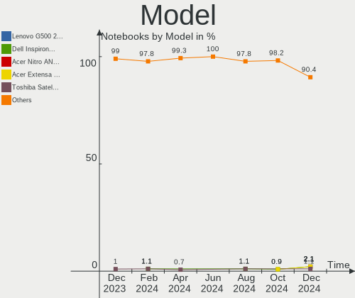
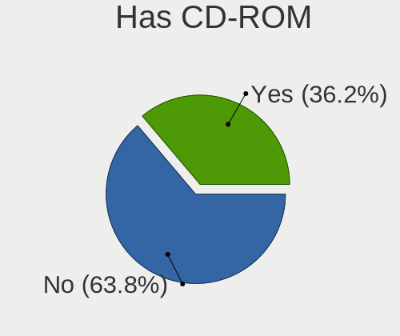
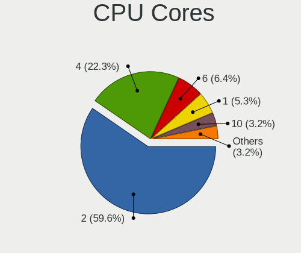
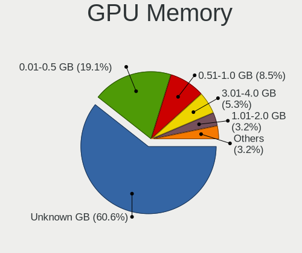

ROSA Hardware Trends (Notebooks)
--------------------------------

A project to identify most popular hardware characteristics and track their change
over time based on data collected by ROSA users at https://Linux-Hardware.org.

Anyone can contribute to this report by the [hw-probe](https://github.com/linuxhw/hw-probe) tool:

    sudo -E hw-probe -all -upload

Full-feature report is available here: https://linux-hardware.org/?view=trends

Period: Nov, 2021.

Contents
--------

* [ System ](#system)
  - [ OS                       ](#os)
  - [ OS Family                ](#os-family)
  - [ Kernel                   ](#kernel)
  - [ Kernel Family            ](#kernel-family)
  - [ Kernel Major Ver.        ](#kernel-major-ver)
  - [ Arch                     ](#arch)
  - [ DE                       ](#de)
  - [ Display Server           ](#display-server)
  - [ Display Manager          ](#display-manager)
  - [ OS Lang                  ](#os-lang)
  - [ Boot Mode                ](#boot-mode)
  - [ Filesystem               ](#filesystem)
  - [ Part. scheme             ](#part-scheme)
  - [ Dual Boot with Linux/BSD ](#dual-boot-with-linuxbsd)
  - [ Dual Boot (Win)          ](#dual-boot-win)

* [ Board ](#board)
  - [ Vendor                   ](#vendor)
  - [ Model                    ](#model)
  - [ Model Family             ](#model-family)
  - [ MFG Year                 ](#mfg-year)
  - [ Form Factor              ](#form-factor)
  - [ Secure Boot              ](#secure-boot)
  - [ Coreboot                 ](#coreboot)
  - [ RAM Size                 ](#ram-size)
  - [ RAM Used                 ](#ram-used)
  - [ Total Drives             ](#total-drives)
  - [ Has CD-ROM               ](#has-cd-rom)
  - [ Has Ethernet             ](#has-ethernet)
  - [ Has WiFi                 ](#has-wifi)
  - [ Has Bluetooth            ](#has-bluetooth)

* [ Location ](#location)
  - [ Country                  ](#country)
  - [ City                     ](#city)

* [ Drives ](#drives)
  - [ Drive Vendor             ](#drive-vendor)
  - [ Drive Model              ](#drive-model)
  - [ HDD Vendor               ](#hdd-vendor)
  - [ SSD Vendor               ](#ssd-vendor)
  - [ Drive Kind               ](#drive-kind)
  - [ Drive Connector          ](#drive-connector)
  - [ Drive Size               ](#drive-size)
  - [ Space Total              ](#space-total)
  - [ Space Used               ](#space-used)
  - [ Malfunc. Drives          ](#malfunc-drives)
  - [ Malfunc. Drive Vendor    ](#malfunc-drive-vendor)
  - [ Malfunc. HDD Vendor      ](#malfunc-hdd-vendor)
  - [ Malfunc. Drive Kind      ](#malfunc-drive-kind)
  - [ Failed Drives            ](#failed-drives)
  - [ Failed Drive Vendor      ](#failed-drive-vendor)
  - [ Drive Status             ](#drive-status)

* [ Storage controller ](#storage-controller)
  - [ Storage Vendor           ](#storage-vendor)
  - [ Storage Model            ](#storage-model)
  - [ Storage Kind             ](#storage-kind)

* [ Processor ](#processor)
  - [ CPU Vendor               ](#cpu-vendor)
  - [ CPU Model                ](#cpu-model)
  - [ CPU Model Family         ](#cpu-model-family)
  - [ CPU Cores                ](#cpu-cores)
  - [ CPU Sockets              ](#cpu-sockets)
  - [ CPU Threads              ](#cpu-threads)
  - [ CPU Op-Modes             ](#cpu-op-modes)
  - [ CPU Microcode            ](#cpu-microcode)
  - [ CPU Microarch            ](#cpu-microarch)

* [ Graphics ](#graphics)
  - [ GPU Vendor               ](#gpu-vendor)
  - [ GPU Model                ](#gpu-model)
  - [ GPU Combo                ](#gpu-combo)
  - [ GPU Driver               ](#gpu-driver)
  - [ GPU Memory               ](#gpu-memory)

* [ Monitor ](#monitor)
  - [ Monitor Vendor           ](#monitor-vendor)
  - [ Monitor Model            ](#monitor-model)
  - [ Monitor Resolution       ](#monitor-resolution)
  - [ Monitor Diagonal         ](#monitor-diagonal)
  - [ Monitor Width            ](#monitor-width)
  - [ Aspect Ratio             ](#aspect-ratio)
  - [ Monitor Area             ](#monitor-area)
  - [ Pixel Density            ](#pixel-density)
  - [ Multiple Monitors        ](#multiple-monitors)

* [ Network ](#network)
  - [ Net Controller Vendor    ](#net-controller-vendor)
  - [ Net Controller Model     ](#net-controller-model)
  - [ Wireless Vendor          ](#wireless-vendor)
  - [ Wireless Model           ](#wireless-model)
  - [ Ethernet Vendor          ](#ethernet-vendor)
  - [ Ethernet Model           ](#ethernet-model)
  - [ Net Controller Kind      ](#net-controller-kind)
  - [ Used Controller          ](#used-controller)
  - [ NICs                     ](#nics)
  - [ IPv6                     ](#ipv6)

* [ Bluetooth ](#bluetooth)
  - [ Bluetooth Vendor         ](#bluetooth-vendor)
  - [ Bluetooth Model          ](#bluetooth-model)

* [ Sound ](#sound)
  - [ Sound Vendor             ](#sound-vendor)
  - [ Sound Model              ](#sound-model)

* [ Memory ](#memory)
  - [ Memory Vendor            ](#memory-vendor)
  - [ Memory Model             ](#memory-model)
  - [ Memory Kind              ](#memory-kind)
  - [ Memory Form Factor       ](#memory-form-factor)
  - [ Memory Size              ](#memory-size)
  - [ Memory Speed             ](#memory-speed)

* [ Printers & scanners ](#printers--scanners)
  - [ Printer Vendor           ](#printer-vendor)
  - [ Printer Model            ](#printer-model)
  - [ Scanner Vendor           ](#scanner-vendor)
  - [ Scanner Model            ](#scanner-model)

* [ Camera ](#camera)
  - [ Camera Vendor            ](#camera-vendor)
  - [ Camera Model             ](#camera-model)

* [ Security ](#security)
  - [ Fingerprint Vendor       ](#fingerprint-vendor)
  - [ Fingerprint Model        ](#fingerprint-model)
  - [ Chipcard Vendor          ](#chipcard-vendor)
  - [ Chipcard Model           ](#chipcard-model)

* [ Unsupported ](#unsupported)
  - [ Unsupported Devices      ](#unsupported-devices)
  - [ Unsupported Device Types ](#unsupported-device-types)

System
------

OS
--

Installed operating systems

| Name       | Notebooks | Percent |
|------------|-----------|---------|
| ROSA R11.1 | 33        | 45.83%  |
| ROSA 12.1  | 26        | 36.11%  |
| ROSA 12    | 13        | 18.06%  |

OS Family
---------

OS without a version

| Name | Notebooks | Percent |
|------|-----------|---------|
| ROSA | 72        | 100%    |

Kernel
------

Version of the Linux kernel

| Version                             | Notebooks | Percent |
|-------------------------------------|-----------|---------|
| 5.10.74-generic-2rosa2021.1-x86_64  | 26        | 36.11%  |
| 5.10.71-generic-1rosa2021.1-x86_64  | 13        | 18.06%  |
| 4.15.0-desktop-122.124.1rosa-x86_64 | 9         | 12.5%   |
| 5.4.83-generic-2rosa-x86_64         | 7         | 9.72%   |
| 5.4.32-generic-2rosa-i586           | 5         | 6.94%   |
| 5.4.32-generic-2rosa-x86_64         | 4         | 5.56%   |
| 5.4.83-generic-2rosa-i586           | 3         | 4.17%   |
| 4.9.155-nrj-desktop-1rosa-x86_64    | 2         | 2.78%   |
| 4.9.155-nrj-desktop-1rosa-i586      | 1         | 1.39%   |
| 4.15.0-desktop-68.5rosa-x86_64      | 1         | 1.39%   |
| 4.15.0-desktop-122.124.1rosa-i586   | 1         | 1.39%   |

Kernel Family
-------------

Linux kernel without a distro release

| Version | Notebooks | Percent |
|---------|-----------|---------|
| 5.10.74 | 26        | 36.11%  |
| 5.10.71 | 13        | 18.06%  |
| 4.15.0  | 11        | 15.28%  |
| 5.4.83  | 10        | 13.89%  |
| 5.4.32  | 9         | 12.5%   |
| 4.9.155 | 3         | 4.17%   |

Kernel Major Ver.
-----------------

Linux kernel major version

| Version | Notebooks | Percent |
|---------|-----------|---------|
| 5.10    | 39        | 54.17%  |
| 5.4     | 19        | 26.39%  |
| 4.15    | 11        | 15.28%  |
| 4.9     | 3         | 4.17%   |

Arch
----

OS architecture (x86_64, i586, etc.)

| Name   | Notebooks | Percent |
|--------|-----------|---------|
| x86_64 | 62        | 86.11%  |
| i686   | 10        | 13.89%  |

DE
--

Desktop Environment

| Name  | Notebooks | Percent |
|-------|-----------|---------|
| KDE5  | 39        | 54.17%  |
| KDE4  | 20        | 27.78%  |
| LXQt  | 9         | 12.5%   |
| GNOME | 4         | 5.56%   |

Display Server
--------------

X11 or Wayland

| Name    | Notebooks | Percent |
|---------|-----------|---------|
| Wayland | 37        | 51.39%  |
| X11     | 35        | 48.61%  |

Display Manager
---------------

SDDM, LightDM, etc.

| Name | Notebooks | Percent |
|------|-----------|---------|
| GDM  | 38        | 52.78%  |
| KDM  | 20        | 27.78%  |
| SDDM | 14        | 19.44%  |

OS Lang
-------

Language

| Lang  | Notebooks | Percent |
|-------|-----------|---------|
| ru_RU | 61        | 84.72%  |
| en_US | 3         | 4.17%   |
| pl_PL | 2         | 2.78%   |
| de_DE | 2         | 2.78%   |
| tr_TR | 1         | 1.39%   |
| ru_UA | 1         | 1.39%   |
| it_IT | 1         | 1.39%   |
| en_GB | 1         | 1.39%   |

Boot Mode
---------

EFI or BIOS

| Mode | Notebooks | Percent |
|------|-----------|---------|
| BIOS | 48        | 66.67%  |
| EFI  | 24        | 33.33%  |

Filesystem
----------

Type of filesystem

| Type  | Notebooks | Percent |
|-------|-----------|---------|
| Ext4  | 71        | 98.61%  |
| Btrfs | 1         | 1.39%   |

Part. scheme
------------

Scheme of partitioning

| Type | Notebooks | Percent |
|------|-----------|---------|
| MBR  | 45        | 62.5%   |
| GPT  | 27        | 37.5%   |

Dual Boot with Linux/BSD
------------------------

Hosting more than one Linux/BSD

| Dual boot | Notebooks | Percent |
|-----------|-----------|---------|
| No        | 55        | 76.39%  |
| Yes       | 17        | 23.61%  |

Dual Boot (Win)
---------------

Hosting Linux and Windows

| Dual boot | Notebooks | Percent |
|-----------|-----------|---------|
| No        | 41        | 56.94%  |
| Yes       | 31        | 43.06%  |

Board
-----

Vendor
------

Motherboard manufacturer

| Name                | Notebooks | Percent |
|---------------------|-----------|---------|
| ASUSTek Computer    | 17        | 23.61%  |
| Hewlett-Packard     | 14        | 19.44%  |
| Lenovo              | 9         | 12.5%   |
| Acer                | 9         | 12.5%   |
| Samsung Electronics | 6         | 8.33%   |
| Dell                | 6         | 8.33%   |
| Toshiba             | 4         | 5.56%   |
| Packard Bell        | 1         | 1.39%   |
| Notebook            | 1         | 1.39%   |
| Intel               | 1         | 1.39%   |
| HASEE Computer      | 1         | 1.39%   |
| DNS                 | 1         | 1.39%   |
| Digma               | 1         | 1.39%   |
| BenQ                | 1         | 1.39%   |

Model
-----

Motherboard model

| Name                                     | Notebooks | Percent |
|------------------------------------------|-----------|---------|
| HP Pavilion g6                           | 3         | 4.17%   |
| HP Notebook                              | 2         | 2.78%   |
| Dell Latitude E6420                      | 2         | 2.78%   |
| Toshiba Satellite Pro C50-A-154          | 1         | 1.39%   |
| Toshiba Satellite M100                   | 1         | 1.39%   |
| Toshiba Satellite L650D                  | 1         | 1.39%   |
| Toshiba Satellite A300                   | 1         | 1.39%   |
| Samsung RC410/RC510/RC710                | 1         | 1.39%   |
| Samsung R59P/R60P/R61P                   | 1         | 1.39%   |
| Samsung R540/R580/R780/SA41/E452/E852    | 1         | 1.39%   |
| Samsung R519/R719                        | 1         | 1.39%   |
| Samsung R425/R525                        | 1         | 1.39%   |
| Samsung 350V5C/351V5C/3540VC/3440VC      | 1         | 1.39%   |
| Packard Bell EasyNote TE11HC             | 1         | 1.39%   |
| Notebook W65_W670SR                      | 1         | 1.39%   |
| Lenovo ThinkPad T430 2349S1N             | 1         | 1.39%   |
| Lenovo Legion Y7000 2019 81NS            | 1         | 1.39%   |
| Lenovo IdeaPad S12 20021,2959            | 1         | 1.39%   |
| Lenovo IdeaPad 320-15AST 80XV            | 1         | 1.39%   |
| Lenovo IdeaPad 3 17ADA05 81W2            | 1         | 1.39%   |
| Lenovo IdeaPad 110-15ACL 80TJ            | 1         | 1.39%   |
| Lenovo G710 20252                        | 1         | 1.39%   |
| Lenovo G500 20236                        | 1         | 1.39%   |
| Lenovo B590 20206                        | 1         | 1.39%   |
| Intel powered classmate PC               | 1         | 1.39%   |
| HP ProBook x360 11 G1 EE                 | 1         | 1.39%   |
| HP Pavilion Notebook                     | 1         | 1.39%   |
| HP Pavilion m6                           | 1         | 1.39%   |
| HP Pavilion g7                           | 1         | 1.39%   |
| HP Pavilion dv7                          | 1         | 1.39%   |
| HP Pavilion dv6                          | 1         | 1.39%   |
| HP OMEN by Laptop 15-dc0xxx              | 1         | 1.39%   |
| HP Laptop 14-bp0xx                       | 1         | 1.39%   |
| HP 620                                   | 1         | 1.39%   |
| HASEE W65KJ1_KK1                         | 1         | 1.39%   |
| DNS W510LU                               | 1         | 1.39%   |
| Digma EVE 10 C301 ES1050EW               | 1         | 1.39%   |
| Dell Latitude E5550                      | 1         | 1.39%   |
| Dell Inspiron N5110                      | 1         | 1.39%   |
| Dell Inspiron 5570                       | 1         | 1.39%   |
| Dell Inspiron 1545                       | 1         | 1.39%   |
| BenQ Joybook P41                         | 1         | 1.39%   |
| ASUS X750JB                              | 1         | 1.39%   |
| ASUS X555LJ                              | 1         | 1.39%   |
| ASUS X551MA                              | 1         | 1.39%   |
| ASUS X550CL                              | 1         | 1.39%   |
| ASUS X541SA                              | 1         | 1.39%   |
| ASUS X540YA                              | 1         | 1.39%   |
| ASUS X51R                                | 1         | 1.39%   |
| ASUS ROG Strix G513QY_G513QY             | 1         | 1.39%   |
| ASUS N60Dp                               | 1         | 1.39%   |
| ASUS K53SD                               | 1         | 1.39%   |
| ASUS K52JB                               | 1         | 1.39%   |
| ASUS K50C                                | 1         | 1.39%   |
| ASUS K43E                                | 1         | 1.39%   |
| ASUS F5V                                 | 1         | 1.39%   |
| ASUS ASUS TUF Gaming A15 FA506IV_FX506IV | 1         | 1.39%   |
| ASUS 1018P                               | 1         | 1.39%   |
| ASUS 1015PE                              | 1         | 1.39%   |
| Acer Extensa 5230                        | 1         | 1.39%   |

Model Family
------------

Motherboard model prefix

| Name                  | Notebooks | Percent |
|-----------------------|-----------|---------|
| HP Pavilion           | 8         | 11.11%  |
| Acer Aspire           | 5         | 6.94%   |
| Toshiba Satellite     | 4         | 5.56%   |
| Lenovo IdeaPad        | 4         | 5.56%   |
| Dell Latitude         | 3         | 4.17%   |
| Dell Inspiron         | 3         | 4.17%   |
| HP Notebook           | 2         | 2.78%   |
| Acer Extensa          | 2         | 2.78%   |
| Samsung RC410         | 1         | 1.39%   |
| Samsung R59P          | 1         | 1.39%   |
| Samsung R540          | 1         | 1.39%   |
| Samsung R519          | 1         | 1.39%   |
| Samsung R425          | 1         | 1.39%   |
| Samsung 350V5C        | 1         | 1.39%   |
| Packard Bell EasyNote | 1         | 1.39%   |
| Notebook W65          | 1         | 1.39%   |
| Lenovo ThinkPad       | 1         | 1.39%   |
| Lenovo Legion         | 1         | 1.39%   |
| Lenovo G710           | 1         | 1.39%   |
| Lenovo G500           | 1         | 1.39%   |
| Lenovo B590           | 1         | 1.39%   |
| Intel powered         | 1         | 1.39%   |
| HP ProBook            | 1         | 1.39%   |
| HP OMEN               | 1         | 1.39%   |
| HP Laptop             | 1         | 1.39%   |
| HP 620                | 1         | 1.39%   |
| HASEE W65KJ1          | 1         | 1.39%   |
| DNS W510LU            | 1         | 1.39%   |
| Digma EVE             | 1         | 1.39%   |
| BenQ Joybook          | 1         | 1.39%   |
| ASUS X750JB           | 1         | 1.39%   |
| ASUS X555LJ           | 1         | 1.39%   |
| ASUS X551MA           | 1         | 1.39%   |
| ASUS X550CL           | 1         | 1.39%   |
| ASUS X541SA           | 1         | 1.39%   |
| ASUS X540YA           | 1         | 1.39%   |
| ASUS X51R             | 1         | 1.39%   |
| ASUS ROG              | 1         | 1.39%   |
| ASUS N60Dp            | 1         | 1.39%   |
| ASUS K53SD            | 1         | 1.39%   |
| ASUS K52JB            | 1         | 1.39%   |
| ASUS K50C             | 1         | 1.39%   |
| ASUS K43E             | 1         | 1.39%   |
| ASUS F5V              | 1         | 1.39%   |
| ASUS ASUS             | 1         | 1.39%   |
| ASUS 1018P            | 1         | 1.39%   |
| ASUS 1015PE           | 1         | 1.39%   |
| Acer AOA110           | 1         | 1.39%   |
| Acer AO751h           | 1         | 1.39%   |

MFG Year
--------

Motherboard manufacture year

| Year | Notebooks | Percent |
|------|-----------|---------|
| 2013 | 9         | 12.5%   |
| 2011 | 8         | 11.11%  |
| 2010 | 8         | 11.11%  |
| 2009 | 6         | 8.33%   |
| 2016 | 5         | 6.94%   |
| 2015 | 5         | 6.94%   |
| 2012 | 5         | 6.94%   |
| 2020 | 4         | 5.56%   |
| 2017 | 4         | 5.56%   |
| 2008 | 4         | 5.56%   |
| 2019 | 3         | 4.17%   |
| 2014 | 3         | 4.17%   |
| 2021 | 2         | 2.78%   |
| 2007 | 2         | 2.78%   |
| 2006 | 2         | 2.78%   |
| 2018 | 1         | 1.39%   |
| 2005 | 1         | 1.39%   |

Form Factor
-----------

Physical design of the computer

| Name     | Notebooks | Percent |
|----------|-----------|---------|
| Notebook | 72        | 100%    |

Secure Boot
-----------

Enabled or disabled

| State    | Notebooks | Percent |
|----------|-----------|---------|
| Disabled | 72        | 100%    |

Coreboot
--------

Have coreboot on board

| Used | Notebooks | Percent |
|------|-----------|---------|
| No   | 72        | 100%    |

RAM Size
--------

Total RAM memory

| Size in GB | Notebooks | Percent |
|------------|-----------|---------|
| 3.01-4.0   | 28        | 38.89%  |
| 4.01-8.0   | 16        | 22.22%  |
| 1.01-2.0   | 11        | 15.28%  |
| 8.01-16.0  | 6         | 8.33%   |
| 2.01-3.0   | 5         | 6.94%   |
| 0.51-1.0   | 4         | 5.56%   |
| 24.01-32.0 | 1         | 1.39%   |
| 16.01-24.0 | 1         | 1.39%   |

RAM Used
--------

Used RAM memory

| Used GB  | Notebooks | Percent |
|----------|-----------|---------|
| 1.01-2.0 | 37        | 51.39%  |
| 0.51-1.0 | 25        | 34.72%  |
| 2.01-3.0 | 5         | 6.94%   |
| 0.01-0.5 | 3         | 4.17%   |
| 4.01-8.0 | 1         | 1.39%   |
| 3.01-4.0 | 1         | 1.39%   |

Total Drives
------------

Number of drives on board

| Drives | Notebooks | Percent |
|--------|-----------|---------|
| 1      | 55        | 76.39%  |
| 2      | 13        | 18.06%  |
| 3      | 3         | 4.17%   |
| 0      | 1         | 1.39%   |

Has CD-ROM
----------

Has CD-ROM on board

| Presented | Notebooks | Percent |
|-----------|-----------|---------|
| Yes       | 43        | 59.72%  |
| No        | 29        | 40.28%  |

Has Ethernet
------------

Has Ethernet on board

| Presented | Notebooks | Percent |
|-----------|-----------|---------|
| Yes       | 70        | 97.22%  |
| No        | 2         | 2.78%   |

Has WiFi
--------

Has WiFi module

| Presented | Notebooks | Percent |
|-----------|-----------|---------|
| Yes       | 72        | 100%    |

Has Bluetooth
-------------

Has Bluetooth module

| Presented | Notebooks | Percent |
|-----------|-----------|---------|
| Yes       | 46        | 63.89%  |
| No        | 26        | 36.11%  |

Location
--------

Country
-------

Geographic location (country)

| Country   | Notebooks | Percent |
|-----------|-----------|---------|
| Russia    | 57        | 79.17%  |
| France    | 3         | 4.17%   |
| Ukraine   | 2         | 2.78%   |
| Poland    | 2         | 2.78%   |
| USA       | 1         | 1.39%   |
| UK        | 1         | 1.39%   |
| Turkey    | 1         | 1.39%   |
| Italy     | 1         | 1.39%   |
| Germany   | 1         | 1.39%   |
| Belarus   | 1         | 1.39%   |
| Austria   | 1         | 1.39%   |
| Australia | 1         | 1.39%   |

City
----

Geographic location (city)

| City                | Notebooks | Percent |
|---------------------|-----------|---------|
| Moscow              | 9         | 12.5%   |
| St Petersburg       | 5         | 6.94%   |
| Les Vans            | 3         | 4.17%   |
| Krasnodar           | 3         | 4.17%   |
| Balashikha          | 3         | 4.17%   |
| Yekaterinburg       | 2         | 2.78%   |
| Voronezh            | 2         | 2.78%   |
| Volgograd           | 2         | 2.78%   |
| Nizhniy Novgorod    | 2         | 2.78%   |
| Kemerovo            | 2         | 2.78%   |
| Yeysk               | 1         | 1.39%   |
| Yaroslavl           | 1         | 1.39%   |
| Vladivostok         | 1         | 1.39%   |
| Vienna              | 1         | 1.39%   |
| Veliky Novgorod     | 1         | 1.39%   |
| Ulyanovsk           | 1         | 1.39%   |
| Ufa                 | 1         | 1.39%   |
| Tuymazy             | 1         | 1.39%   |
| Tula                | 1         | 1.39%   |
| Tolyatti            | 1         | 1.39%   |
| Simferopol          | 1         | 1.39%   |
| Shelekhov           | 1         | 1.39%   |
| Sergiyev Posad      | 1         | 1.39%   |
| Selidovo            | 1         | 1.39%   |
| Salekhard           | 1         | 1.39%   |
| Purpe               | 1         | 1.39%   |
| Prittriching        | 1         | 1.39%   |
| Potters Bar         | 1         | 1.39%   |
| Petergof            | 1         | 1.39%   |
| Perm                | 1         | 1.39%   |
| Orekhovo-Zuyevo     | 1         | 1.39%   |
| Omsk                | 1         | 1.39%   |
| Noginsk             | 1         | 1.39%   |
| Newark              | 1         | 1.39%   |
| Mogilev             | 1         | 1.39%   |
| Krasnoyarsk         | 1         | 1.39%   |
| Klin                | 1         | 1.39%   |
| Kazan?ˆ™            | 1         | 1.39%   |
| Karangi             | 1         | 1.39%   |
| Kamensk-Shakhtinsky | 1         | 1.39%   |
| Kaliningrad         | 1         | 1.39%   |
| Izmir               | 1         | 1.39%   |
| Ivanovo             | 1         | 1.39%   |
| Gdansk              | 1         | 1.39%   |
| Cureggio            | 1         | 1.39%   |
| Boruszowice         | 1         | 1.39%   |
| Belgorod            | 1         | 1.39%   |
| Astrakhan           | 1         | 1.39%   |
| Asbest              | 1         | 1.39%   |

Drives
------

Drive Vendor
------------

Hard drive vendors

| Vendor              | Notebooks | Drives | Percent |
|---------------------|-----------|--------|---------|
| Seagate             | 20        | 21     | 23.53%  |
| WDC                 | 15        | 15     | 17.65%  |
| Toshiba             | 9         | 9      | 10.59%  |
| Samsung Electronics | 8         | 8      | 9.41%   |
| Hitachi             | 6         | 6      | 7.06%   |
| Kingston            | 4         | 4      | 4.71%   |
| HGST                | 4         | 4      | 4.71%   |
| Unknown             | 2         | 2      | 2.35%   |
| SPCC                | 2         | 2      | 2.35%   |
| Fujitsu             | 2         | 2      | 2.35%   |
| Crucial             | 2         | 2      | 2.35%   |
| Apacer              | 2         | 2      | 2.35%   |
| TO Exter            | 1         | 1      | 1.18%   |
| Smartbuy            | 1         | 1      | 1.18%   |
| SanDisk             | 1         | 1      | 1.18%   |
| PLEXTOR             | 1         | 1      | 1.18%   |
| Phison              | 1         | 1      | 1.18%   |
| Patriot             | 1         | 1      | 1.18%   |
| LITEONIT            | 1         | 1      | 1.18%   |
| China               | 1         | 1      | 1.18%   |
| A-DATA Technology   | 1         | 1      | 1.18%   |

Drive Model
-----------

Hard drive models

| Model                                       | Notebooks | Percent |
|---------------------------------------------|-----------|---------|
| Seagate ST9320325AS 320GB                   | 5         | 5.81%   |
| Toshiba MQ01ABF050 500GB                    | 3         | 3.49%   |
| WDC WD1600BEVT-22ZCT0 160GB                 | 2         | 2.33%   |
| Toshiba MQ01ABD100 1TB                      | 2         | 2.33%   |
| Seagate ST9500325AS 500GB                   | 2         | 2.33%   |
| Seagate ST500LT012-1DG142 500GB             | 2         | 2.33%   |
| Seagate ST320LT020-9YG142 320GB             | 2         | 2.33%   |
| HGST HTS721010A9E630 1TB                    | 2         | 2.33%   |
| HGST HTS545050A7E680 500GB                  | 2         | 2.33%   |
| WDC WDS100T3X0C-00SJG0 1TB                  | 1         | 1.16%   |
| WDC WD5000LPCX-24VHAT0 500GB                | 1         | 1.16%   |
| WDC WD5000LPCX-22VHAT0 500GB                | 1         | 1.16%   |
| WDC WD5000LPCX-21VHAT0 500GB                | 1         | 1.16%   |
| WDC WD3200BPVT-24JJ5T0 320GB                | 1         | 1.16%   |
| WDC WD3200BEVT-22ZCT0 320GB                 | 1         | 1.16%   |
| WDC WD2500BEKT-75PVMT0 250GB                | 1         | 1.16%   |
| WDC WD1600BEVT-75ZCT0 160GB                 | 1         | 1.16%   |
| WDC WD10SPZX-22Z10T1 1TB                    | 1         | 1.16%   |
| WDC WD10JPVX-00JC3T0 1TB                    | 1         | 1.16%   |
| WDC WD10JPCX-24UE4T0 1TB                    | 1         | 1.16%   |
| WDC PC SN730 SDBPNTY-512G-1101 512GB        | 1         | 1.16%   |
| WDC PC SN530 SDBPNPZ-512G-1002 512GB        | 1         | 1.16%   |
| Unknown SLD32G  32GB                        | 1         | 1.16%   |
| Unknown SD/MMC/MS PRO 394GB                 | 1         | 1.16%   |
| Toshiba MQ01ABD075 752GB                    | 1         | 1.16%   |
| Toshiba MK4058GSX 400GB                     | 1         | 1.16%   |
| Toshiba MK3261GSYN 320GB                    | 1         | 1.16%   |
| Toshiba HDWJ105 500GB                       | 1         | 1.16%   |
| TO Exter nal USB 3.0 1TB                    | 1         | 1.16%   |
| SPCC Solid State Disk 512GB                 | 1         | 1.16%   |
| SPCC Solid State Disk 256GB                 | 1         | 1.16%   |
| Smartbuy SSD 120GB                          | 1         | 1.16%   |
| Seagate ST9160821A 160GB                    | 1         | 1.16%   |
| Seagate ST9160310AS 160GB                   | 1         | 1.16%   |
| Seagate ST750LM022 HN-M750MBB 752GB         | 1         | 1.16%   |
| Seagate ST500LM021-1KJ152 500GB             | 1         | 1.16%   |
| Seagate ST380011A 80GB                      | 1         | 1.16%   |
| Seagate ST1000LM048-2E7172 1TB              | 1         | 1.16%   |
| Seagate ST1000LM035-1RK172 1TB              | 1         | 1.16%   |
| Seagate ST1000LM024 HN-M101MBB 1TB          | 1         | 1.16%   |
| Seagate ONE TOUCH SSD SE 500GB              | 1         | 1.16%   |
| Seagate BarraCuda 120 SSD ZA1000CM10003 1TB | 1         | 1.16%   |
| SanDisk SSD PLUS 240GB                      | 1         | 1.16%   |
| Samsung SSD 970 EVO 1TB                     | 1         | 1.16%   |
| Samsung MZVLW128HEGR-000H1 128GB            | 1         | 1.16%   |
| Samsung MZVLQ1T0HBLB-00B00 1TB              | 1         | 1.16%   |
| Samsung MZNLN128HAHQ-000H1 128GB SSD        | 1         | 1.16%   |
| Samsung MZALQ256HAJD-000L2 256GB            | 1         | 1.16%   |
| Samsung MZ7TE256HMHP-000L7 256GB SSD        | 1         | 1.16%   |
| Samsung HM501II 500GB                       | 1         | 1.16%   |
| Samsung HD502HJ 500GB                       | 1         | 1.16%   |
| PLEXTOR PX-256M5S 256GB SSD                 | 1         | 1.16%   |
| Phison P-SSD1800 16GB                       | 1         | 1.16%   |
| Patriot Burst 240GB SSD                     | 1         | 1.16%   |
| LITEONIT LCT-256M3S 256GB SSD               | 1         | 1.16%   |
| Kingston SUV500240G 240GB SSD               | 1         | 1.16%   |
| Kingston SA400S37240G 240GB SSD             | 1         | 1.16%   |
| Kingston SA400S37120G 120GB SSD             | 1         | 1.16%   |
| Kingston RBUSNS8180S3512GJ 512GB SSD        | 1         | 1.16%   |
| Hitachi HTS547575A9E384 752GB               | 1         | 1.16%   |

HDD Vendor
----------

Hard disk drive vendors

| Vendor              | Notebooks | Drives | Percent |
|---------------------|-----------|--------|---------|
| Seagate             | 19        | 19     | 33.93%  |
| WDC                 | 12        | 12     | 21.43%  |
| Toshiba             | 9         | 9      | 16.07%  |
| Hitachi             | 6         | 6      | 10.71%  |
| HGST                | 4         | 4      | 7.14%   |
| Samsung Electronics | 2         | 2      | 3.57%   |
| Fujitsu             | 2         | 2      | 3.57%   |
| Unknown             | 1         | 1      | 1.79%   |
| TO Exter            | 1         | 1      | 1.79%   |

SSD Vendor
----------

Solid state drive vendors

| Vendor              | Notebooks | Drives | Percent |
|---------------------|-----------|--------|---------|
| Kingston            | 4         | 4      | 19.05%  |
| SPCC                | 2         | 2      | 9.52%   |
| Samsung Electronics | 2         | 2      | 9.52%   |
| Crucial             | 2         | 2      | 9.52%   |
| Apacer              | 2         | 2      | 9.52%   |
| Smartbuy            | 1         | 1      | 4.76%   |
| Seagate             | 1         | 2      | 4.76%   |
| SanDisk             | 1         | 1      | 4.76%   |
| PLEXTOR             | 1         | 1      | 4.76%   |
| Phison              | 1         | 1      | 4.76%   |
| Patriot             | 1         | 1      | 4.76%   |
| LITEONIT            | 1         | 1      | 4.76%   |
| China               | 1         | 1      | 4.76%   |
| A-DATA Technology   | 1         | 1      | 4.76%   |

Drive Kind
----------

HDD or SSD

| Kind | Notebooks | Drives | Percent |
|------|-----------|--------|---------|
| HDD  | 52        | 56     | 66.67%  |
| SSD  | 20        | 22     | 25.64%  |
| NVMe | 5         | 7      | 6.41%   |
| MMC  | 1         | 1      | 1.28%   |

Drive Connector
---------------

SATA, SAS, NVMe, etc.

| Type | Notebooks | Drives | Percent |
|------|-----------|--------|---------|
| SATA | 66        | 74     | 86.84%  |
| NVMe | 5         | 7      | 6.58%   |
| SAS  | 4         | 4      | 5.26%   |
| MMC  | 1         | 1      | 1.32%   |

Drive Size
----------

Size of hard drive

| Size in TB | Notebooks | Drives | Percent |
|------------|-----------|--------|---------|
| 0.01-0.5   | 58        | 61     | 79.45%  |
| 0.51-1.0   | 15        | 17     | 20.55%  |

Space Total
-----------

Amount of disk space available on the file system

| Size in GB     | Notebooks | Percent |
|----------------|-----------|---------|
| 251-500        | 22        | 30.56%  |
| 101-250        | 17        | 23.61%  |
| 1-20           | 11        | 15.28%  |
| 501-1000       | 8         | 11.11%  |
| 21-50          | 6         | 8.33%   |
| 51-100         | 6         | 8.33%   |
| More than 3000 | 1         | 1.39%   |
| 1001-2000      | 1         | 1.39%   |

Space Used
----------

Amount of used disk space

| Used GB   | Notebooks | Percent |
|-----------|-----------|---------|
| 1-20      | 55        | 76.39%  |
| 51-100    | 5         | 6.94%   |
| 251-500   | 4         | 5.56%   |
| 101-250   | 3         | 4.17%   |
| 21-50     | 2         | 2.78%   |
| 501-1000  | 2         | 2.78%   |
| 2001-3000 | 1         | 1.39%   |

Malfunc. Drives
---------------

Drive models with a malfunction

| Model                             | Notebooks | Drives | Percent |
|-----------------------------------|-----------|--------|---------|
| Seagate ST9320325AS 320GB         | 3         | 3      | 11.11%  |
| Seagate ST9500325AS 500GB         | 2         | 2      | 7.41%   |
| WDC WD3200BEVT-22ZCT0 320GB       | 1         | 1      | 3.7%    |
| WDC WD1600BEVT-75ZCT0 160GB       | 1         | 1      | 3.7%    |
| WDC WD10JPCX-24UE4T0 1TB          | 1         | 1      | 3.7%    |
| Toshiba MQ01ABF050 500GB          | 1         | 1      | 3.7%    |
| Toshiba MQ01ABD075 752GB          | 1         | 1      | 3.7%    |
| Toshiba MK4058GSX 400GB           | 1         | 1      | 3.7%    |
| Toshiba MK3261GSYN 320GB          | 1         | 1      | 3.7%    |
| Seagate ST9160821A 160GB          | 1         | 1      | 3.7%    |
| Seagate ST9160310AS 160GB         | 1         | 1      | 3.7%    |
| Seagate ST320LT020-9YG142 320GB   | 1         | 1      | 3.7%    |
| Seagate ST1000LM048-2E7172 1TB    | 1         | 1      | 3.7%    |
| SanDisk SSD PLUS 240GB            | 1         | 1      | 3.7%    |
| PLEXTOR PX-256M5S 256GB SSD       | 1         | 1      | 3.7%    |
| LITEONIT LCT-256M3S 256GB SSD     | 1         | 1      | 3.7%    |
| Hitachi HTS547550A9E384 500GB     | 1         | 1      | 3.7%    |
| Hitachi HTS542512K9SA00 120GB     | 1         | 1      | 3.7%    |
| Hitachi HTS541612J9SA00 120GB     | 1         | 1      | 3.7%    |
| Hitachi HTS424040M9AT00 40GB      | 1         | 1      | 3.7%    |
| HGST HTS721010A9E630 1TB          | 1         | 1      | 3.7%    |
| HGST HTS545050A7E680 500GB        | 1         | 1      | 3.7%    |
| Fujitsu MHY2120BH 120GB           | 1         | 1      | 3.7%    |
| A-DATA Technology SU635 240GB SSD | 1         | 1      | 3.7%    |

Malfunc. Drive Vendor
---------------------

Vendors of faulty drives

| Vendor            | Notebooks | Drives | Percent |
|-------------------|-----------|--------|---------|
| Seagate           | 9         | 9      | 33.33%  |
| Toshiba           | 4         | 4      | 14.81%  |
| Hitachi           | 4         | 4      | 14.81%  |
| WDC               | 3         | 3      | 11.11%  |
| HGST              | 2         | 2      | 7.41%   |
| SanDisk           | 1         | 1      | 3.7%    |
| PLEXTOR           | 1         | 1      | 3.7%    |
| LITEONIT          | 1         | 1      | 3.7%    |
| Fujitsu           | 1         | 1      | 3.7%    |
| A-DATA Technology | 1         | 1      | 3.7%    |

Malfunc. HDD Vendor
-------------------

Vendors of faulty HDD drives

| Vendor  | Notebooks | Drives | Percent |
|---------|-----------|--------|---------|
| Seagate | 9         | 9      | 39.13%  |
| Toshiba | 4         | 4      | 17.39%  |
| Hitachi | 4         | 4      | 17.39%  |
| WDC     | 3         | 3      | 13.04%  |
| HGST    | 2         | 2      | 8.7%    |
| Fujitsu | 1         | 1      | 4.35%   |

Malfunc. Drive Kind
-------------------

Kinds of faulty drives

| Kind | Notebooks | Drives | Percent |
|------|-----------|--------|---------|
| HDD  | 23        | 23     | 85.19%  |
| SSD  | 4         | 4      | 14.81%  |

Failed Drives
-------------

Failed drive models

| Model                             | Notebooks | Drives | Percent |
|-----------------------------------|-----------|--------|---------|
| Seagate ST500LT012-1DG142 500GB   | 1         | 1      | 50%     |
| Samsung Electronics HM501II 500GB | 1         | 1      | 50%     |

Failed Drive Vendor
-------------------

Failed drive vendors

| Vendor              | Notebooks | Drives | Percent |
|---------------------|-----------|--------|---------|
| Seagate             | 1         | 1      | 50%     |
| Samsung Electronics | 1         | 1      | 50%     |

Drive Status
------------

Number of failed and malfunc. drives

| Status   | Notebooks | Drives | Percent |
|----------|-----------|--------|---------|
| Works    | 42        | 51     | 54.55%  |
| Malfunc  | 27        | 27     | 35.06%  |
| Detected | 6         | 6      | 7.79%   |
| Failed   | 2         | 2      | 2.6%    |

Storage controller
------------------

Storage Vendor
--------------

Storage controller vendors

| Vendor                           | Notebooks | Percent |
|----------------------------------|-----------|---------|
| Intel                            | 50        | 64.94%  |
| AMD                              | 17        | 22.08%  |
| Samsung Electronics              | 4         | 5.19%   |
| Sandisk                          | 3         | 3.9%    |
| Silicon Integrated Systems [SiS] | 2         | 2.6%    |
| VIA Technologies                 | 1         | 1.3%    |

Storage Model
-------------

Storage controller models

| Model                                                                            | Notebooks | Percent |
|----------------------------------------------------------------------------------|-----------|---------|
| AMD FCH SATA Controller [AHCI mode]                                              | 10        | 12.05%  |
| Intel 7 Series Chipset Family 6-port SATA Controller [AHCI mode]                 | 7         | 8.43%   |
| Intel 82801IBM/IEM (ICH9M/ICH9M-E) 4 port SATA Controller [AHCI mode]            | 5         | 6.02%   |
| Intel 82801 Mobile SATA Controller [RAID mode]                                   | 5         | 6.02%   |
| Intel 6 Series/C200 Series Chipset Family 6 port Mobile SATA AHCI Controller     | 5         | 6.02%   |
| Intel 5 Series/3400 Series Chipset 4 port SATA AHCI Controller                   | 4         | 4.82%   |
| Intel NM10/ICH7 Family SATA Controller [AHCI mode]                               | 3         | 3.61%   |
| Intel Atom/Celeron/Pentium Processor x5-E8000/J3xxx/N3xxx Series SATA Controller | 3         | 3.61%   |
| Intel 8 Series/C220 Series Chipset Family 6-port SATA Controller 1 [AHCI mode]   | 3         | 3.61%   |
| AMD SB7x0/SB8x0/SB9x0 SATA Controller [AHCI mode]                                | 3         | 3.61%   |
| Silicon Integrated Systems [SiS] SATA Controller / IDE mode                      | 2         | 2.41%   |
| Silicon Integrated Systems [SiS] 5513 IDE Controller                             | 2         | 2.41%   |
| Sandisk WD Black SN750 / PC SN730 NVMe SSD                                       | 2         | 2.41%   |
| Samsung NVMe SSD Controller 980                                                  | 2         | 2.41%   |
| Intel Sunrise Point-LP SATA Controller [AHCI mode]                               | 2         | 2.41%   |
| Intel Celeron N3350/Pentium N4200/Atom E3900 Series SATA AHCI Controller         | 2         | 2.41%   |
| Intel 82801GBM/GHM (ICH7-M Family) SATA Controller [IDE mode]                    | 2         | 2.41%   |
| AMD SB600 Non-Raid-5 SATA                                                        | 2         | 2.41%   |
| AMD SB600 IDE                                                                    | 2         | 2.41%   |
| VIA CX700M2/VX700/VX800/820-Series Serial ATA & EIDE-Controller                  | 1         | 1.2%    |
| Sandisk WD Blue SN550 NVMe SSD                                                   | 1         | 1.2%    |
| Samsung NVMe SSD Controller SM981/PM981/PM983                                    | 1         | 1.2%    |
| Samsung NVMe SSD Controller SM961/PM961/SM963                                    | 1         | 1.2%    |
| Intel Wildcat Point-LP SATA Controller [AHCI Mode]                               | 1         | 1.2%    |
| Intel US15W/US15X/US15L/UL11L SCH [Poulsbo] IDE Controller                       | 1         | 1.2%    |
| Intel Q170/Q150/B150/H170/H110/Z170/CM236 Chipset SATA Controller [AHCI Mode]    | 1         | 1.2%    |
| Intel Cannon Lake Mobile PCH SATA AHCI Controller                                | 1         | 1.2%    |
| Intel Atom Processor E3800 Series SATA AHCI Controller                           | 1         | 1.2%    |
| Intel 82801HM/HEM (ICH8M/ICH8M-E) SATA Controller [IDE mode]                     | 1         | 1.2%    |
| Intel 82801HM/HEM (ICH8M/ICH8M-E) IDE Controller                                 | 1         | 1.2%    |
| Intel 82801G (ICH7 Family) IDE Controller                                        | 1         | 1.2%    |
| Intel 82801FB/FBM/FR/FW/FRW (ICH6 Family) IDE Controller                         | 1         | 1.2%    |
| Intel 8 Series SATA Controller 1 [AHCI mode]                                     | 1         | 1.2%    |
| AMD SB7x0/SB8x0/SB9x0 SATA Controller [IDE mode]                                 | 1         | 1.2%    |
| AMD IXP SB4x0 Serial ATA Controller                                              | 1         | 1.2%    |
| AMD IXP SB4x0 IDE Controller                                                     | 1         | 1.2%    |

Storage Kind
------------

Kind of storage controller (IDE, SATA, NVMe, SAS, ...)

| Kind | Notebooks | Percent |
|------|-----------|---------|
| SATA | 55        | 71.43%  |
| IDE  | 12        | 15.58%  |
| RAID | 5         | 6.49%   |
| NVMe | 5         | 6.49%   |

Processor
---------

CPU Vendor
----------

Processor vendors

| Vendor       | Notebooks | Percent |
|--------------|-----------|---------|
| Intel        | 54        | 75%     |
| AMD          | 17        | 23.61%  |
| CentaurHauls | 1         | 1.39%   |

CPU Model
---------

Processor models

| Model                                                  | Notebooks | Percent |
|--------------------------------------------------------|-----------|---------|
| Intel Pentium CPU B970 @ 2.30GHz                       | 2         | 2.78%   |
| Intel Core i5-5200U CPU @ 2.20GHz                      | 2         | 2.78%   |
| Intel Core 2 CPU T5500 @ 1.66GHz                       | 2         | 2.78%   |
| Intel Celeron CPU N3450 @ 1.10GHz                      | 2         | 2.78%   |
| AMD A8-7410 APU with AMD Radeon R5 Graphics            | 2         | 2.78%   |
| AMD A8-4500M APU with Radeon HD Graphics               | 2         | 2.78%   |
| Intel Pentium CPU N3710 @ 1.60GHz                      | 1         | 1.39%   |
| Intel Pentium CPU 2117U @ 1.80GHz                      | 1         | 1.39%   |
| Intel Pentium CPU 2030M @ 2.50GHz                      | 1         | 1.39%   |
| Intel Pentium CPU 2020M @ 2.40GHz                      | 1         | 1.39%   |
| Intel Core i7-4700MQ CPU @ 2.40GHz                     | 1         | 1.39%   |
| Intel Core i7-4700HQ CPU @ 2.40GHz                     | 1         | 1.39%   |
| Intel Core i7-2640M CPU @ 2.80GHz                      | 1         | 1.39%   |
| Intel Core i5-9400 CPU @ 2.90GHz                       | 1         | 1.39%   |
| Intel Core i5-9300H CPU @ 2.40GHz                      | 1         | 1.39%   |
| Intel Core i5-8300H CPU @ 2.30GHz                      | 1         | 1.39%   |
| Intel Core i5-8250U CPU @ 1.60GHz                      | 1         | 1.39%   |
| Intel Core i5-7200U CPU @ 2.50GHz                      | 1         | 1.39%   |
| Intel Core i5-6200U CPU @ 2.30GHz                      | 1         | 1.39%   |
| Intel Core i5-4210U CPU @ 1.70GHz                      | 1         | 1.39%   |
| Intel Core i5-3360M CPU @ 2.80GHz                      | 1         | 1.39%   |
| Intel Core i5-3210M CPU @ 2.50GHz                      | 1         | 1.39%   |
| Intel Core i5-2520M CPU @ 2.50GHz                      | 1         | 1.39%   |
| Intel Core i5-2450M CPU @ 2.50GHz                      | 1         | 1.39%   |
| Intel Core i5 CPU M 460 @ 2.53GHz                      | 1         | 1.39%   |
| Intel Core i3-4000M CPU @ 2.40GHz                      | 1         | 1.39%   |
| Intel Core i3-3110M CPU @ 2.40GHz                      | 1         | 1.39%   |
| Intel Core i3-2350M CPU @ 2.30GHz                      | 1         | 1.39%   |
| Intel Core i3-2330M CPU @ 2.20GHz                      | 1         | 1.39%   |
| Intel Core i3-2310M CPU @ 2.10GHz                      | 1         | 1.39%   |
| Intel Core i3 CPU M 380 @ 2.53GHz                      | 1         | 1.39%   |
| Intel Core i3 CPU M 370 @ 2.40GHz                      | 1         | 1.39%   |
| Intel Core i3 CPU M 350 @ 2.27GHz                      | 1         | 1.39%   |
| Intel Core Duo CPU T2250 @ 1.73GHz                     | 1         | 1.39%   |
| Intel Core 2 Duo CPU T9500 @ 2.60GHz                   | 1         | 1.39%   |
| Intel Core 2 Duo CPU T7500 @ 2.20GHz                   | 1         | 1.39%   |
| Intel Core 2 Duo CPU T6600 @ 2.20GHz                   | 1         | 1.39%   |
| Intel Core 2 Duo CPU T6570 @ 2.10GHz                   | 1         | 1.39%   |
| Intel Core 2 Duo CPU P8700 @ 2.53GHz                   | 1         | 1.39%   |
| Intel Core 2 CPU T5600 @ 1.83GHz                       | 1         | 1.39%   |
| Intel Celeron M processor 1.50GHz                      | 1         | 1.39%   |
| Intel Celeron D CPU 220 @ 1.20GHz                      | 1         | 1.39%   |
| Intel Celeron CPU N3060 @ 1.60GHz                      | 1         | 1.39%   |
| Intel Celeron CPU N3050 @ 1.60GHz                      | 1         | 1.39%   |
| Intel Celeron CPU N2830 @ 2.16GHz                      | 1         | 1.39%   |
| Intel Celeron CPU 900 @ 2.20GHz                        | 1         | 1.39%   |
| Intel Celeron CPU 540 @ 1.86GHz                        | 1         | 1.39%   |
| Intel Atom CPU Z520 @ 1.33GHz                          | 1         | 1.39%   |
| Intel Atom CPU N570 @ 1.66GHz                          | 1         | 1.39%   |
| Intel Atom CPU N455 @ 1.66GHz                          | 1         | 1.39%   |
| Intel Atom CPU N270 @ 1.60GHz                          | 1         | 1.39%   |
| Intel Atom CPU N2600 @ 1.60GHz                         | 1         | 1.39%   |
| CentaurHauls VIA Nano processor U2250 (1.6GHz Capable) | 1         | 1.39%   |
| AMD Turion II Dual-Core Mobile M520                    | 1         | 1.39%   |
| AMD Turion II Dual-Core Mobile M500                    | 1         | 1.39%   |
| AMD Turion 64 X2 Mobile Technology TL-52               | 1         | 1.39%   |
| AMD Ryzen 9 5900HX with Radeon Graphics                | 1         | 1.39%   |
| AMD Ryzen 7 4800H with Radeon Graphics                 | 1         | 1.39%   |
| AMD Ryzen 5 3500U with Radeon Vega Mobile Gfx          | 1         | 1.39%   |
| AMD Phenom II P820 Triple-Core Processor               | 1         | 1.39%   |

CPU Model Family
----------------

Processor model prefix

| Model                   | Notebooks | Percent |
|-------------------------|-----------|---------|
| Intel Core i5           | 14        | 19.44%  |
| Intel Core i3           | 8         | 11.11%  |
| Intel Celeron           | 7         | 9.72%   |
| Intel Pentium           | 6         | 8.33%   |
| Intel Core 2 Duo        | 5         | 6.94%   |
| Intel Atom              | 5         | 6.94%   |
| AMD A8                  | 4         | 5.56%   |
| Intel Core i7           | 3         | 4.17%   |
| Intel Core 2            | 3         | 4.17%   |
| AMD Turion II Dual-Core | 2         | 2.78%   |
| AMD E1                  | 2         | 2.78%   |
| Intel Core Duo          | 1         | 1.39%   |
| Intel Celeron M         | 1         | 1.39%   |
| Intel Celeron D         | 1         | 1.39%   |
| CentaurHauls VIA Nano   | 1         | 1.39%   |
| AMD Turion 64 X2 Mobile | 1         | 1.39%   |
| AMD Ryzen 9             | 1         | 1.39%   |
| AMD Ryzen 7             | 1         | 1.39%   |
| AMD Ryzen 5             | 1         | 1.39%   |
| AMD Phenom II           | 1         | 1.39%   |
| AMD E2                  | 1         | 1.39%   |
| AMD Athlon II           | 1         | 1.39%   |
| AMD A4                  | 1         | 1.39%   |
| AMD A10                 | 1         | 1.39%   |

CPU Cores
---------

Number of processor cores

| Number | Notebooks | Percent |
|--------|-----------|---------|
| 2      | 49        | 68.06%  |
| 4      | 11        | 15.28%  |
| 1      | 8         | 11.11%  |
| 8      | 2         | 2.78%   |
| 6      | 1         | 1.39%   |
| 3      | 1         | 1.39%   |

CPU Sockets
-----------

Number of sockets

| Number | Notebooks | Percent |
|--------|-----------|---------|
| 1      | 72        | 100%    |

CPU Threads
-----------

Threads per core (Hyper-Threading)

| Number | Notebooks | Percent |
|--------|-----------|---------|
| 1      | 37        | 51.39%  |
| 2      | 35        | 48.61%  |

CPU Op-Modes
------------

CPU Operation Modes (32-bit, 64-bit)

| Op mode        | Notebooks | Percent |
|----------------|-----------|---------|
| 32-bit, 64-bit | 68        | 94.44%  |
| 32-bit         | 4         | 5.56%   |

CPU Microcode
-------------

Microcode number

| Number     | Notebooks | Percent |
|------------|-----------|---------|
| 0x206a7    | 8         | 11.11%  |
| 0x306a9    | 6         | 8.33%   |
| Unknown    | 5         | 6.94%   |
| 0x1067a    | 4         | 5.56%   |
| 0x906ea    | 3         | 4.17%   |
| 0x6f6      | 3         | 4.17%   |
| 0x306c3    | 3         | 4.17%   |
| 0x20655    | 3         | 4.17%   |
| 0x07030105 | 3         | 4.17%   |
| 0x06001119 | 3         | 4.17%   |
| 0x506c9    | 2         | 2.78%   |
| 0x406c4    | 2         | 2.78%   |
| 0x306d4    | 2         | 2.78%   |
| 0x106ca    | 2         | 2.78%   |
| 0x106c2    | 2         | 2.78%   |
| 0x10661    | 2         | 2.78%   |
| 0x010000c8 | 2         | 2.78%   |
| 0x806ea    | 1         | 1.39%   |
| 0x806e9    | 1         | 1.39%   |
| 0x6fb      | 1         | 1.39%   |
| 0x6ec      | 1         | 1.39%   |
| 0x6d8      | 1         | 1.39%   |
| 0x406e3    | 1         | 1.39%   |
| 0x406c3    | 1         | 1.39%   |
| 0x40651    | 1         | 1.39%   |
| 0x30678    | 1         | 1.39%   |
| 0x30661    | 1         | 1.39%   |
| 0x20652    | 1         | 1.39%   |
| 0x10676    | 1         | 1.39%   |
| 0x0a50000c | 1         | 1.39%   |
| 0x08108109 | 1         | 1.39%   |
| 0x07000110 | 1         | 1.39%   |
| 0x06006704 | 1         | 1.39%   |
| 0x03000027 | 1         | 1.39%   |

CPU Microarch
-------------

Microarchitecture

| Name        | Notebooks | Percent |
|-------------|-----------|---------|
| SandyBridge | 8         | 11.11%  |
| IvyBridge   | 6         | 8.33%   |
| Core        | 6         | 8.33%   |
| Penryn      | 5         | 6.94%   |
| KabyLake    | 5         | 6.94%   |
| Bonnell     | 5         | 6.94%   |
| Westmere    | 4         | 5.56%   |
| Silvermont  | 4         | 5.56%   |
| K10         | 4         | 5.56%   |
| Haswell     | 4         | 5.56%   |
| Puma        | 3         | 4.17%   |
| Piledriver  | 3         | 4.17%   |
| P6          | 2         | 2.78%   |
| Goldmont    | 2         | 2.78%   |
| Broadwell   | 2         | 2.78%   |
| Zen+        | 1         | 1.39%   |
| Zen 3       | 1         | 1.39%   |
| Zen 2       | 1         | 1.39%   |
| Skylake     | 1         | 1.39%   |
| K8 Hammer   | 1         | 1.39%   |
| K10 Llano   | 1         | 1.39%   |
| Jaguar      | 1         | 1.39%   |
| Excavator   | 1         | 1.39%   |
| Unknown     | 1         | 1.39%   |

Graphics
--------

GPU Vendor
----------

Vendors of graphics cards

| Vendor                           | Notebooks | Percent |
|----------------------------------|-----------|---------|
| Intel                            | 44        | 47.31%  |
| AMD                              | 31        | 33.33%  |
| Nvidia                           | 16        | 17.2%   |
| VIA Technologies                 | 1         | 1.08%   |
| Silicon Integrated Systems [SiS] | 1         | 1.08%   |

GPU Model
---------

Graphics card models

| Model                                                                                    | Notebooks | Percent |
|------------------------------------------------------------------------------------------|-----------|---------|
| Intel 2nd Generation Core Processor Family Integrated Graphics Controller                | 8         | 7.77%   |
| Intel 3rd Gen Core processor Graphics Controller                                         | 6         | 5.83%   |
| AMD Thames [Radeon HD 7500M/7600M Series]                                                | 4         | 3.88%   |
| Nvidia GF117M [GeForce 610M/710M/810M/820M / GT 620M/625M/630M/720M]                     | 3         | 2.91%   |
| Intel Mobile 945GM/GMS/GME, 943/940GML Express Integrated Graphics Controller            | 3         | 2.91%   |
| Intel Atom/Celeron/Pentium Processor x5-E8000/J3xxx/N3xxx Integrated Graphics Controller | 3         | 2.91%   |
| Intel 4th Gen Core Processor Integrated Graphics Controller                              | 3         | 2.91%   |
| AMD Park [Mobility Radeon HD 5430/5450/5470]                                             | 3         | 2.91%   |
| Nvidia GP107M [GeForce GTX 1050 Mobile]                                                  | 2         | 1.94%   |
| Nvidia GK208BM [GeForce 920M]                                                            | 2         | 1.94%   |
| Intel Mobile 945GM/GMS, 943/940GML Express Integrated Graphics Controller                | 2         | 1.94%   |
| Intel Mobile 4 Series Chipset Integrated Graphics Controller                             | 2         | 1.94%   |
| Intel HD Graphics 5500                                                                   | 2         | 1.94%   |
| Intel HD Graphics 500                                                                    | 2         | 1.94%   |
| Intel Core Processor Integrated Graphics Controller                                      | 2         | 1.94%   |
| Intel Atom Processor D4xx/D5xx/N4xx/N5xx Integrated Graphics Controller                  | 2         | 1.94%   |
| AMD Trinity [Radeon HD 7640G]                                                            | 2         | 1.94%   |
| AMD Topaz XT [Radeon R7 M260/M265 / M340/M360 / M440/M445 / 530/535 / 620/625 Mobile]    | 2         | 1.94%   |
| AMD Seymour [Radeon HD 6400M/7400M Series]                                               | 2         | 1.94%   |
| AMD RV710/M92 [Mobility Radeon HD 4530/4570/545v]                                        | 2         | 1.94%   |
| AMD Mullins [Radeon R4/R5 Graphics]                                                      | 2         | 1.94%   |
| VIA Technologies VX800/VX820 Chrome 9 HC3 Integrated Graphics                            | 1         | 0.97%   |
| Silicon Integrated Systems [SiS] 771/671 PCIE VGA Display Adapter                        | 1         | 0.97%   |
| Nvidia TU116M [GeForce GTX 1660 Ti Mobile]                                               | 1         | 0.97%   |
| Nvidia TU106M [GeForce RTX 2060 Mobile]                                                  | 1         | 0.97%   |
| Nvidia GT218M [GeForce G 105M]                                                           | 1         | 0.97%   |
| Nvidia GT218M [GeForce 315M]                                                             | 1         | 0.97%   |
| Nvidia GK208M [GeForce GT 740M]                                                          | 1         | 0.97%   |
| Nvidia GK107M [GeForce GT 750M]                                                          | 1         | 0.97%   |
| Nvidia GF119M [NVS 4200M]                                                                | 1         | 0.97%   |
| Nvidia GF119M [GeForce 610M]                                                             | 1         | 0.97%   |
| Nvidia GF108M [GeForce GT 525M]                                                          | 1         | 0.97%   |
| Intel US15W/US15X SCH [Poulsbo] Graphics Controller                                      | 1         | 0.97%   |
| Intel UHD Graphics 620                                                                   | 1         | 0.97%   |
| Intel Skylake GT2 [HD Graphics 520]                                                      | 1         | 0.97%   |
| Intel Mobile GM965/GL960 Integrated Graphics Controller (secondary)                      | 1         | 0.97%   |
| Intel Mobile GM965/GL960 Integrated Graphics Controller (primary)                        | 1         | 0.97%   |
| Intel Mobile 945GSE Express Integrated Graphics Controller                               | 1         | 0.97%   |
| Intel Mobile 915GM/GMS/910GML Express Graphics Controller                                | 1         | 0.97%   |
| Intel HD Graphics 620                                                                    | 1         | 0.97%   |
| Intel Haswell-ULT Integrated Graphics Controller                                         | 1         | 0.97%   |
| Intel CoffeeLake-S GT2 [UHD Graphics 630]                                                | 1         | 0.97%   |
| Intel CoffeeLake-H GT2 [UHD Graphics 630]                                                | 1         | 0.97%   |
| Intel Atom Processor Z36xxx/Z37xxx Series Graphics & Display                             | 1         | 0.97%   |
| Intel Atom Processor D2xxx/N2xxx Integrated Graphics Controller                          | 1         | 0.97%   |
| AMD Trinity [Radeon HD 7660G]                                                            | 1         | 0.97%   |
| AMD Sun XT [Radeon HD 8670A/8670M/8690M / R5 M330 / M430 / Radeon 520 Mobile]            | 1         | 0.97%   |
| AMD Sun PRO [Radeon HD 8570A/8570M]                                                      | 1         | 0.97%   |
| AMD Sumo [Radeon HD 6480G]                                                               | 1         | 0.97%   |
| AMD Stoney [Radeon R2/R3/R4/R5 Graphics]                                                 | 1         | 0.97%   |
| AMD RV730/M96-XT [Mobility Radeon HD 4670]                                               | 1         | 0.97%   |
| AMD RV710/M92 [Mobility Radeon HD 4330/4350/4550]                                        | 1         | 0.97%   |
| AMD RV635/M86 [Mobility Radeon HD 3650]                                                  | 1         | 0.97%   |
| AMD RV516/M64 [Mobility Radeon X2300]                                                    | 1         | 0.97%   |
| AMD RS880M [Mobility Radeon HD 4225/4250]                                                | 1         | 0.97%   |
| AMD RS600M [Radeon Xpress 1250]                                                          | 1         | 0.97%   |
| AMD RS482M [Mobility Radeon Xpress 200]                                                  | 1         | 0.97%   |
| AMD Renoir                                                                               | 1         | 0.97%   |
| AMD RC410M [Mobility Radeon Xpress 200M]                                                 | 1         | 0.97%   |
| AMD Picasso/Raven 2 [Radeon Vega Series / Radeon Vega Mobile Series]                     | 1         | 0.97%   |

GPU Combo
---------

Combinations of graphics cards

| Name           | Notebooks | Percent |
|----------------|-----------|---------|
| 1 x Intel      | 24        | 33.33%  |
| 1 x AMD        | 17        | 23.61%  |
| Intel + Nvidia | 13        | 18.06%  |
| Intel + AMD    | 7         | 9.72%   |
| 2 x AMD        | 6         | 8.33%   |
| 1 x Nvidia     | 2         | 2.78%   |
| 1 x VIA        | 1         | 1.39%   |
| 1 x SiS        | 1         | 1.39%   |
| AMD + Nvidia   | 1         | 1.39%   |

GPU Driver
----------

Free vs proprietary

| Driver      | Notebooks | Percent |
|-------------|-----------|---------|
| Free        | 69        | 95.83%  |
| Unknown     | 2         | 2.78%   |
| Proprietary | 1         | 1.39%   |

GPU Memory
----------

Total video memory

| Size in GB | Notebooks | Percent |
|------------|-----------|---------|
| Unknown    | 25        | 34.72%  |
| 0.01-0.5   | 21        | 29.17%  |
| 1.01-2.0   | 14        | 19.44%  |
| 0.51-1.0   | 9         | 12.5%   |
| 3.01-4.0   | 2         | 2.78%   |
| 5.01-6.0   | 1         | 1.39%   |

Monitor
-------

Monitor Vendor
--------------

Monitor vendors

| Vendor                  | Notebooks | Percent |
|-------------------------|-----------|---------|
| Samsung Electronics     | 18        | 25%     |
| AU Optronics            | 14        | 19.44%  |
| LG Display              | 11        | 15.28%  |
| BOE                     | 7         | 9.72%   |
| Chimei Innolux          | 6         | 8.33%   |
| Chi Mei Optoelectronics | 6         | 8.33%   |
| PANDA                   | 2         | 2.78%   |
| LG Philips              | 2         | 2.78%   |
| CPT                     | 2         | 2.78%   |
| InfoVision              | 1         | 1.39%   |
| Goldstar                | 1         | 1.39%   |
| Dell                    | 1         | 1.39%   |
| BenQ                    | 1         | 1.39%   |

Monitor Model
-------------

Monitor models

| Model                                                                    | Notebooks | Percent |
|--------------------------------------------------------------------------|-----------|---------|
| Samsung Electronics LCD Monitor SEC3245 1366x768 344x194mm 15.5-inch     | 3         | 4.11%   |
| Samsung Electronics LCD Monitor SEC3945 1280x800 331x207mm 15.4-inch     | 2         | 2.74%   |
| Chimei Innolux LCD Monitor CMN15C9 1366x768 344x193mm 15.5-inch          | 2         | 2.74%   |
| AU Optronics LCD Monitor AUO139E 1600x900 382x214mm 17.2-inch            | 2         | 2.74%   |
| Samsung Electronics SyncMaster SAM011E 1280x1024 338x270mm 17.0-inch     | 1         | 1.37%   |
| Samsung Electronics LCD Monitor SEC524D 1366x768 353x198mm 15.9-inch     | 1         | 1.37%   |
| Samsung Electronics LCD Monitor SEC4754 1280x800 261x163mm 12.1-inch     | 1         | 1.37%   |
| Samsung Electronics LCD Monitor SEC4542 1280x800 303x190mm 14.1-inch     | 1         | 1.37%   |
| Samsung Electronics LCD Monitor SEC4256 1600x900 382x215mm 17.3-inch     | 1         | 1.37%   |
| Samsung Electronics LCD Monitor SEC4242 1280x800 303x190mm 14.1-inch     | 1         | 1.37%   |
| Samsung Electronics LCD Monitor SEC364A 1366x768 344x194mm 15.5-inch     | 1         | 1.37%   |
| Samsung Electronics LCD Monitor SEC324A 1366x768 344x194mm 15.5-inch     | 1         | 1.37%   |
| Samsung Electronics LCD Monitor SDC4E51 1366x768 340x190mm 15.3-inch     | 1         | 1.37%   |
| Samsung Electronics LCD Monitor SDC4752 1366x768 340x190mm 15.3-inch     | 1         | 1.37%   |
| Samsung Electronics LCD Monitor SDC4447 1366x768 340x190mm 15.3-inch     | 1         | 1.37%   |
| Samsung Electronics LCD Monitor SDC3654 1600x900 382x215mm 17.3-inch     | 1         | 1.37%   |
| Samsung Electronics LCD Monitor SAM067A 1360x768                         | 1         | 1.37%   |
| Samsung Electronics LCD Monitor SAM029D 1360x768                         | 1         | 1.37%   |
| PANDA LM156LF1L03 NCP001C 1920x1080 344x194mm 15.5-inch                  | 1         | 1.37%   |
| PANDA LCD Monitor NCP004D 1920x1080 344x194mm 15.5-inch                  | 1         | 1.37%   |
| LG Philips LP154WX4-TLC8 LPL0120 1280x800 331x207mm 15.4-inch            | 1         | 1.37%   |
| LG Philips LCD Monitor LPLBD00 1280x800 331x207mm 15.4-inch              | 1         | 1.37%   |
| LG Display LP156WH2-TLRA LGD026B 1366x768 344x194mm 15.5-inch            | 1         | 1.37%   |
| LG Display LP116WH1-TLA1 LGD021C 1366x768 256x144mm 11.6-inch            | 1         | 1.37%   |
| LG Display LCD Monitor LGD046E 1920x1080 380x210mm 17.1-inch             | 1         | 1.37%   |
| LG Display LCD Monitor LGD043D 1366x768 344x194mm 15.5-inch              | 1         | 1.37%   |
| LG Display LCD Monitor LGD03A5 1920x1080 350x190mm 15.7-inch             | 1         | 1.37%   |
| LG Display LCD Monitor LGD0390 1600x900 380x210mm 17.1-inch              | 1         | 1.37%   |
| LG Display LCD Monitor LGD034D 1366x768 344x194mm 15.5-inch              | 1         | 1.37%   |
| LG Display LCD Monitor LGD033B 1366x768 344x194mm 15.5-inch              | 1         | 1.37%   |
| LG Display LCD Monitor LGD02DF 1600x900 310x174mm 14.0-inch              | 1         | 1.37%   |
| LG Display LCD Monitor LGD02DC 1366x768 344x194mm 15.5-inch              | 1         | 1.37%   |
| LG Display LCD Monitor LGD02AC 1366x768 344x194mm 15.5-inch              | 1         | 1.37%   |
| InfoVision LCD Monitor IVO03F4 1920x1200 263x164mm 12.2-inch             | 1         | 1.37%   |
| Goldstar E2041 GSM4EC9 1600x900 443x249mm 20.0-inch                      | 1         | 1.37%   |
| Dell U2312HM DEL4072 1920x1080 510x290mm 23.1-inch                       | 1         | 1.37%   |
| CPT LCD Monitor CPT1C84 1366x768 222x125mm 10.0-inch                     | 1         | 1.37%   |
| CPT LCD Monitor CPT1401 1280x800 331x207mm 15.4-inch                     | 1         | 1.37%   |
| Chimei Innolux LCD Monitor CMN15FE 1920x1080 344x193mm 15.5-inch         | 1         | 1.37%   |
| Chimei Innolux LCD Monitor CMN15DB 1366x768 344x193mm 15.5-inch          | 1         | 1.37%   |
| Chimei Innolux LCD Monitor CMN15CA 1366x768 340x190mm 15.3-inch          | 1         | 1.37%   |
| Chimei Innolux LCD Monitor CMN1132 1366x768 260x140mm 11.6-inch          | 1         | 1.37%   |
| Chi Mei Optoelectronics LCD Monitor CMO1680 1366x768 344x193mm 15.5-inch | 1         | 1.37%   |
| Chi Mei Optoelectronics LCD Monitor CMO15A7 1366x768 350x190mm 15.7-inch | 1         | 1.37%   |
| Chi Mei Optoelectronics LCD Monitor CMO15A2 1366x768 344x193mm 15.5-inch | 1         | 1.37%   |
| Chi Mei Optoelectronics LCD Monitor CMO1592 1366x768 344x193mm 15.5-inch | 1         | 1.37%   |
| Chi Mei Optoelectronics LCD Monitor CMO1581 1366x768 344x193mm 15.5-inch | 1         | 1.37%   |
| Chi Mei Optoelectronics LCD Monitor CMO1558 1366x768 344x193mm 15.5-inch | 1         | 1.37%   |
| BOE LCD Monitor BOE0973 2560x1440 344x194mm 15.5-inch                    | 1         | 1.37%   |
| BOE LCD Monitor BOE08E4 1600x900 382x215mm 17.3-inch                     | 1         | 1.37%   |
| BOE LCD Monitor BOE06FB 1920x1080 344x194mm 15.5-inch                    | 1         | 1.37%   |
| BOE LCD Monitor BOE06A9 1920x1080 344x193mm 15.5-inch                    | 1         | 1.37%   |
| BOE LCD Monitor BOE0697 1366x768 309x173mm 13.9-inch                     | 1         | 1.37%   |
| BOE LCD Monitor BOE0675 1366x768 344x194mm 15.5-inch                     | 1         | 1.37%   |
| BOE LCD Monitor BOE066E 1366x768 344x194mm 15.5-inch                     | 1         | 1.37%   |
| BenQ BenQG2222HDL BNQ785A 1920x1080 478x269mm 21.6-inch                  | 1         | 1.37%   |
| AU Optronics LCD Monitor AUO70EC 1366x768 340x190mm 15.3-inch            | 1         | 1.37%   |
| AU Optronics LCD Monitor AUO61D2 1024x600 220x130mm 10.1-inch            | 1         | 1.37%   |
| AU Optronics LCD Monitor AUO40EC 1366x768 340x190mm 15.3-inch            | 1         | 1.37%   |
| AU Optronics LCD Monitor AUO32EC 1366x768 344x193mm 15.5-inch            | 1         | 1.37%   |

Monitor Resolution
------------------

Monitor screen resolution

| Resolution        | Notebooks | Percent |
|-------------------|-----------|---------|
| 1366x768 (WXGA)   | 37        | 51.39%  |
| 1600x900 (HD+)    | 11        | 15.28%  |
| 1280x800 (WXGA)   | 9         | 12.5%   |
| 1920x1080 (FHD)   | 8         | 11.11%  |
| 1360x768          | 2         | 2.78%   |
| 1024x600          | 2         | 2.78%   |
| 2560x1440 (QHD)   | 1         | 1.39%   |
| 1920x1200 (WUXGA) | 1         | 1.39%   |
| 1280x1024 (SXGA)  | 1         | 1.39%   |

Monitor Diagonal
----------------

Diagonal size in inches

| Inches  | Notebooks | Percent |
|---------|-----------|---------|
| 15      | 46        | 63.01%  |
| 17      | 8         | 10.96%  |
| 14      | 5         | 6.85%   |
| 13      | 3         | 4.11%   |
| 11      | 3         | 4.11%   |
| 10      | 2         | 2.74%   |
| Unknown | 2         | 2.74%   |
| 23      | 1         | 1.37%   |
| 21      | 1         | 1.37%   |
| 20      | 1         | 1.37%   |
| 8       | 1         | 1.37%   |

Monitor Width
-------------

Physical width

| Width in mm | Notebooks | Percent |
|-------------|-----------|---------|
| 301-350     | 54        | 73.97%  |
| 351-400     | 8         | 10.96%  |
| 201-300     | 5         | 6.85%   |
| 401-500     | 2         | 2.74%   |
| Unknown     | 2         | 2.74%   |
| 501-600     | 1         | 1.37%   |
| 101-200     | 1         | 1.37%   |

Aspect Ratio
------------

Proportional relationship between the width and the height

| Ratio | Notebooks | Percent |
|-------|-----------|---------|
| 16/9  | 57        | 83.82%  |
| 16/10 | 10        | 14.71%  |
| 5/4   | 1         | 1.47%   |

Monitor Area
------------

Area in inch²

| Area in inch² | Notebooks | Percent |
|----------------|-----------|---------|
| 101-110        | 46        | 63.01%  |
| 81-90          | 8         | 10.96%  |
| 121-130        | 7         | 9.59%   |
| 51-60          | 3         | 4.11%   |
| 41-50          | 2         | 2.74%   |
| 201-250        | 2         | 2.74%   |
| Unknown        | 2         | 2.74%   |
| 1-40           | 1         | 1.37%   |
| 151-200        | 1         | 1.37%   |
| 141-150        | 1         | 1.37%   |

Pixel Density
-------------

Pixels per inch

| Density | Notebooks | Percent |
|---------|-----------|---------|
| 101-120 | 41        | 56.94%  |
| 51-100  | 15        | 20.83%  |
| 121-160 | 13        | 18.06%  |
| Unknown | 2         | 2.78%   |
| 161-240 | 1         | 1.39%   |

Multiple Monitors
-----------------

Total monitors connected

| Total | Notebooks | Percent |
|-------|-----------|---------|
| 1     | 65        | 90.28%  |
| 2     | 5         | 6.94%   |
| 0     | 2         | 2.78%   |

Network
-------

Net Controller Vendor
---------------------

Controller vendors

| Vendor                   | Notebooks | Percent |
|--------------------------|-----------|---------|
| Realtek Semiconductor    | 46        | 35.66%  |
| Qualcomm Atheros         | 31        | 24.03%  |
| Broadcom                 | 18        | 13.95%  |
| Intel                    | 15        | 11.63%  |
| Marvell Technology Group | 4         | 3.1%    |
| Broadcom Limited         | 4         | 3.1%    |
| Ralink Technology        | 2         | 1.55%   |
| Ralink                   | 1         | 0.78%   |
| MEDIATEK                 | 1         | 0.78%   |
| LG Electronics           | 1         | 0.78%   |
| JMicron Technology       | 1         | 0.78%   |
| Huawei Technologies      | 1         | 0.78%   |
| Edimax Technology        | 1         | 0.78%   |
| D-Link                   | 1         | 0.78%   |
| Attansic Technology      | 1         | 0.78%   |
| ASIX Electronics         | 1         | 0.78%   |

Net Controller Model
--------------------

Controller models

| Model                                                                   | Notebooks | Percent |
|-------------------------------------------------------------------------|-----------|---------|
| Realtek RTL810xE PCI Express Fast Ethernet controller                   | 21        | 14.29%  |
| Realtek RTL8111/8168/8411 PCI Express Gigabit Ethernet Controller       | 20        | 13.61%  |
| Qualcomm Atheros AR9485 Wireless Network Adapter                        | 7         | 4.76%   |
| Qualcomm Atheros AR9285 Wireless Network Adapter (PCI-Express)          | 7         | 4.76%   |
| Broadcom BCM4313 802.11bgn Wireless Network Adapter                     | 7         | 4.76%   |
| Realtek RTL-8100/8101L/8139 PCI Fast Ethernet Adapter                   | 4         | 2.72%   |
| Qualcomm Atheros QCA9377 802.11ac Wireless Network Adapter              | 4         | 2.72%   |
| Broadcom BCM43142 802.11b/g/n                                           | 4         | 2.72%   |
| Realtek RTL8723BE PCIe Wireless Network Adapter                         | 3         | 2.04%   |
| Qualcomm Atheros QCA9565 / AR9565 Wireless Network Adapter              | 3         | 2.04%   |
| Qualcomm Atheros AR242x / AR542x Wireless Network Adapter (PCI-Express) | 3         | 2.04%   |
| Marvell Group 88E8040 PCI-E Fast Ethernet Controller                    | 3         | 2.04%   |
| Intel Centrino Advanced-N 6205 [Taylor Peak]                            | 3         | 2.04%   |
| Intel 82579LM Gigabit Network Connection (Lewisville)                   | 3         | 2.04%   |
| Ralink MT7601U Wireless Adapter                                         | 2         | 1.36%   |
| Qualcomm Atheros QCA8172 Fast Ethernet                                  | 2         | 1.36%   |
| Qualcomm Atheros AR8151 v2.0 Gigabit Ethernet                           | 2         | 1.36%   |
| Qualcomm Atheros AR8131 Gigabit Ethernet                                | 2         | 1.36%   |
| Intel Wireless 7265                                                     | 2         | 1.36%   |
| Intel PRO/Wireless 3945ABG [Golan] Network Connection                   | 2         | 1.36%   |
| Intel Dual Band Wireless-AC 3168NGW [Stone Peak]                        | 2         | 1.36%   |
| Intel Cannon Lake PCH CNVi WiFi                                         | 2         | 1.36%   |
| Broadcom Limited BCM4312 802.11b/g LP-PHY                               | 2         | 1.36%   |
| Broadcom BCM4312 802.11b/g LP-PHY                                       | 2         | 1.36%   |
| Broadcom BCM4311 802.11b/g WLAN                                         | 2         | 1.36%   |
| Realtek RTL8822CE 802.11ac PCIe Wireless Network Adapter                | 1         | 0.68%   |
| Realtek RTL8723DE Wireless Network Adapter                              | 1         | 0.68%   |
| Realtek RTL8723BU 802.11b/g/n WLAN Adapter                              | 1         | 0.68%   |
| Realtek RTL8723AE PCIe Wireless Network Adapter                         | 1         | 0.68%   |
| Realtek RTL8188EE Wireless Network Adapter                              | 1         | 0.68%   |
| Realtek RTL8188CE 802.11b/g/n WiFi Adapter                              | 1         | 0.68%   |
| Ralink RT3290 Wireless 802.11n 1T/1R PCIe                               | 1         | 0.68%   |
| Qualcomm Atheros QCA8171 Gigabit Ethernet                               | 1         | 0.68%   |
| Qualcomm Atheros QCA6174 802.11ac Wireless Network Adapter              | 1         | 0.68%   |
| Qualcomm Atheros AR928X Wireless Network Adapter (PCI-Express)          | 1         | 0.68%   |
| Qualcomm Atheros AR8152 v1.1 Fast Ethernet                              | 1         | 0.68%   |
| Qualcomm Atheros AR8151 v1.0 Gigabit Ethernet                           | 1         | 0.68%   |
| MEDIATEK Network controller                                             | 1         | 0.68%   |
| Marvell Group 88E8039 PCI-E Fast Ethernet Controller                    | 1         | 0.68%   |
| LG G2 Android Phone [tethering mode]                                    | 1         | 0.68%   |
| JMicron JMC250 PCI Express Gigabit Ethernet Controller                  | 1         | 0.68%   |
| Intel WiFi Link 5100                                                    | 1         | 0.68%   |
| Intel PRO/100 VM Network Connection                                     | 1         | 0.68%   |
| Intel Ethernet Connection (3) I218-LM                                   | 1         | 0.68%   |
| Intel Centrino Wireless-N 135                                           | 1         | 0.68%   |
| Intel Centrino Wireless-N 100                                           | 1         | 0.68%   |
| Intel 82801FB/FBM/FR/FW/FRW (ICH6 Family) AC'97 Modem Controller        | 1         | 0.68%   |
| Huawei DRA-L01                                                          | 1         | 0.68%   |
| Edimax EW-7811Un 802.11n Wireless Adapter [Realtek RTL8188CUS]          | 1         | 0.68%   |
| D-Link DWA-131 Wireless N Nano Adapter (Rev. E1) [Realtek RTL8192EU]    | 1         | 0.68%   |
| Broadcom NetXtreme BCM5764M Gigabit Ethernet PCIe                       | 1         | 0.68%   |
| Broadcom NetLink BCM5787M Gigabit Ethernet PCI Express                  | 1         | 0.68%   |
| Broadcom NetLink BCM57785 Gigabit Ethernet PCIe                         | 1         | 0.68%   |
| Broadcom Limited NetLink BCM5906M Fast Ethernet PCI Express             | 1         | 0.68%   |
| Broadcom Limited BCM4313 802.11bgn Wireless Network Adapter             | 1         | 0.68%   |
| Broadcom BCM4401-B0 100Base-TX                                          | 1         | 0.68%   |
| Attansic AR8152 v2.0 Fast Ethernet                                      | 1         | 0.68%   |
| ASIX AX88772B Fast Ethernet Controller                                  | 1         | 0.68%   |

Wireless Vendor
---------------

Wireless vendors

| Vendor                | Notebooks | Percent |
|-----------------------|-----------|---------|
| Qualcomm Atheros      | 26        | 35.62%  |
| Broadcom              | 15        | 20.55%  |
| Intel                 | 14        | 19.18%  |
| Realtek Semiconductor | 9         | 12.33%  |
| Broadcom Limited      | 3         | 4.11%   |
| Ralink Technology     | 2         | 2.74%   |
| Ralink                | 1         | 1.37%   |
| MEDIATEK              | 1         | 1.37%   |
| Edimax Technology     | 1         | 1.37%   |
| D-Link                | 1         | 1.37%   |

Wireless Model
--------------

Wireless models

| Model                                                                   | Notebooks | Percent |
|-------------------------------------------------------------------------|-----------|---------|
| Qualcomm Atheros AR9485 Wireless Network Adapter                        | 7         | 9.59%   |
| Qualcomm Atheros AR9285 Wireless Network Adapter (PCI-Express)          | 7         | 9.59%   |
| Broadcom BCM4313 802.11bgn Wireless Network Adapter                     | 7         | 9.59%   |
| Qualcomm Atheros QCA9377 802.11ac Wireless Network Adapter              | 4         | 5.48%   |
| Broadcom BCM43142 802.11b/g/n                                           | 4         | 5.48%   |
| Realtek RTL8723BE PCIe Wireless Network Adapter                         | 3         | 4.11%   |
| Qualcomm Atheros QCA9565 / AR9565 Wireless Network Adapter              | 3         | 4.11%   |
| Qualcomm Atheros AR242x / AR542x Wireless Network Adapter (PCI-Express) | 3         | 4.11%   |
| Intel Centrino Advanced-N 6205 [Taylor Peak]                            | 3         | 4.11%   |
| Ralink MT7601U Wireless Adapter                                         | 2         | 2.74%   |
| Intel Wireless 7265                                                     | 2         | 2.74%   |
| Intel PRO/Wireless 3945ABG [Golan] Network Connection                   | 2         | 2.74%   |
| Intel Dual Band Wireless-AC 3168NGW [Stone Peak]                        | 2         | 2.74%   |
| Intel Cannon Lake PCH CNVi WiFi                                         | 2         | 2.74%   |
| Broadcom Limited BCM4312 802.11b/g LP-PHY                               | 2         | 2.74%   |
| Broadcom BCM4312 802.11b/g LP-PHY                                       | 2         | 2.74%   |
| Broadcom BCM4311 802.11b/g WLAN                                         | 2         | 2.74%   |
| Realtek RTL8822CE 802.11ac PCIe Wireless Network Adapter                | 1         | 1.37%   |
| Realtek RTL8723DE Wireless Network Adapter                              | 1         | 1.37%   |
| Realtek RTL8723BU 802.11b/g/n WLAN Adapter                              | 1         | 1.37%   |
| Realtek RTL8723AE PCIe Wireless Network Adapter                         | 1         | 1.37%   |
| Realtek RTL8188EE Wireless Network Adapter                              | 1         | 1.37%   |
| Realtek RTL8188CE 802.11b/g/n WiFi Adapter                              | 1         | 1.37%   |
| Ralink RT3290 Wireless 802.11n 1T/1R PCIe                               | 1         | 1.37%   |
| Qualcomm Atheros QCA6174 802.11ac Wireless Network Adapter              | 1         | 1.37%   |
| Qualcomm Atheros AR928X Wireless Network Adapter (PCI-Express)          | 1         | 1.37%   |
| MEDIATEK Network controller                                             | 1         | 1.37%   |
| Intel WiFi Link 5100                                                    | 1         | 1.37%   |
| Intel Centrino Wireless-N 135                                           | 1         | 1.37%   |
| Intel Centrino Wireless-N 100                                           | 1         | 1.37%   |
| Edimax EW-7811Un 802.11n Wireless Adapter [Realtek RTL8188CUS]          | 1         | 1.37%   |
| D-Link DWA-131 Wireless N Nano Adapter (Rev. E1) [Realtek RTL8192EU]    | 1         | 1.37%   |
| Broadcom Limited BCM4313 802.11bgn Wireless Network Adapter             | 1         | 1.37%   |

Ethernet Vendor
---------------

Ethernet vendors

| Vendor                   | Notebooks | Percent |
|--------------------------|-----------|---------|
| Realtek Semiconductor    | 45        | 61.64%  |
| Qualcomm Atheros         | 9         | 12.33%  |
| Intel                    | 5         | 6.85%   |
| Marvell Technology Group | 4         | 5.48%   |
| Broadcom                 | 4         | 5.48%   |
| LG Electronics           | 1         | 1.37%   |
| JMicron Technology       | 1         | 1.37%   |
| Huawei Technologies      | 1         | 1.37%   |
| Broadcom Limited         | 1         | 1.37%   |
| Attansic Technology      | 1         | 1.37%   |
| ASIX Electronics         | 1         | 1.37%   |

Ethernet Model
--------------

Ethernet models

| Model                                                             | Notebooks | Percent |
|-------------------------------------------------------------------|-----------|---------|
| Realtek RTL810xE PCI Express Fast Ethernet controller             | 21        | 28.77%  |
| Realtek RTL8111/8168/8411 PCI Express Gigabit Ethernet Controller | 20        | 27.4%   |
| Realtek RTL-8100/8101L/8139 PCI Fast Ethernet Adapter             | 4         | 5.48%   |
| Marvell Group 88E8040 PCI-E Fast Ethernet Controller              | 3         | 4.11%   |
| Intel 82579LM Gigabit Network Connection (Lewisville)             | 3         | 4.11%   |
| Qualcomm Atheros QCA8172 Fast Ethernet                            | 2         | 2.74%   |
| Qualcomm Atheros AR8151 v2.0 Gigabit Ethernet                     | 2         | 2.74%   |
| Qualcomm Atheros AR8131 Gigabit Ethernet                          | 2         | 2.74%   |
| Qualcomm Atheros QCA8171 Gigabit Ethernet                         | 1         | 1.37%   |
| Qualcomm Atheros AR8152 v1.1 Fast Ethernet                        | 1         | 1.37%   |
| Qualcomm Atheros AR8151 v1.0 Gigabit Ethernet                     | 1         | 1.37%   |
| Marvell Group 88E8039 PCI-E Fast Ethernet Controller              | 1         | 1.37%   |
| LG G2 Android Phone [tethering mode]                              | 1         | 1.37%   |
| JMicron JMC250 PCI Express Gigabit Ethernet Controller            | 1         | 1.37%   |
| Intel PRO/100 VM Network Connection                               | 1         | 1.37%   |
| Intel Ethernet Connection (3) I218-LM                             | 1         | 1.37%   |
| Huawei DRA-L01                                                    | 1         | 1.37%   |
| Broadcom NetXtreme BCM5764M Gigabit Ethernet PCIe                 | 1         | 1.37%   |
| Broadcom NetLink BCM5787M Gigabit Ethernet PCI Express            | 1         | 1.37%   |
| Broadcom NetLink BCM57785 Gigabit Ethernet PCIe                   | 1         | 1.37%   |
| Broadcom Limited NetLink BCM5906M Fast Ethernet PCI Express       | 1         | 1.37%   |
| Broadcom BCM4401-B0 100Base-TX                                    | 1         | 1.37%   |
| Attansic AR8152 v2.0 Fast Ethernet                                | 1         | 1.37%   |
| ASIX AX88772B Fast Ethernet Controller                            | 1         | 1.37%   |

Net Controller Kind
-------------------

Ethernet, WiFi or modem

| Kind     | Notebooks | Percent |
|----------|-----------|---------|
| WiFi     | 72        | 50.35%  |
| Ethernet | 70        | 48.95%  |
| Modem    | 1         | 0.7%    |

Used Controller
---------------

Currently used network controller

| Kind     | Notebooks | Percent |
|----------|-----------|---------|
| WiFi     | 59        | 80.82%  |
| Ethernet | 14        | 19.18%  |

NICs
----

Total network controllers on board

| Total | Notebooks | Percent |
|-------|-----------|---------|
| 2     | 67        | 93.06%  |
| 1     | 4         | 5.56%   |
| 0     | 1         | 1.39%   |

IPv6
----

IPv6 vs IPv4

| Used | Notebooks | Percent |
|------|-----------|---------|
| No   | 66        | 91.67%  |
| Yes  | 6         | 8.33%   |

Bluetooth
---------

Bluetooth Vendor
----------------

Controller vendors

| Vendor                          | Notebooks | Percent |
|---------------------------------|-----------|---------|
| Qualcomm Atheros Communications | 8         | 17.39%  |
| Broadcom                        | 8         | 17.39%  |
| Intel                           | 7         | 15.22%  |
| IMC Networks                    | 6         | 13.04%  |
| Realtek Semiconductor           | 5         | 10.87%  |
| Toshiba                         | 3         | 6.52%   |
| Lite-On Technology              | 2         | 4.35%   |
| Foxconn International           | 2         | 4.35%   |
| Dell                            | 2         | 4.35%   |
| Ralink                          | 1         | 2.17%   |
| Hewlett-Packard                 | 1         | 2.17%   |
| Foxconn / Hon Hai               | 1         | 2.17%   |

Bluetooth Model
---------------

Controller models

| Model                                             | Notebooks | Percent |
|---------------------------------------------------|-----------|---------|
| Realtek Bluetooth Radio                           | 3         | 6.52%   |
| Qualcomm Atheros  Bluetooth Device                | 3         | 6.52%   |
| Qualcomm Atheros Bluetooth                        | 2         | 4.35%   |
| Intel Wireless-AC 3168 Bluetooth                  | 2         | 4.35%   |
| Intel Bluetooth wireless interface                | 2         | 4.35%   |
| Intel Bluetooth 9460/9560 Jefferson Peak (JfP)    | 2         | 4.35%   |
| IMC Networks Bluetooth Device                     | 2         | 4.35%   |
| IMC Networks Atheros AR3012 Bluetooth 4.0 Adapter | 2         | 4.35%   |
| Foxconn International BCM43142A0 Bluetooth module | 2         | 4.35%   |
| Broadcom HP Portable Valentine                    | 2         | 4.35%   |
| Broadcom BCM2070 Bluetooth Device                 | 2         | 4.35%   |
| Broadcom BCM2070 Bluetooth 2.1 + EDR              | 2         | 4.35%   |
| Toshiba Integrated Bluetooth HCI                  | 1         | 2.17%   |
| Toshiba Bluetooth Device                          | 1         | 2.17%   |
| Toshiba Askey Bluetooth Module                    | 1         | 2.17%   |
| Realtek RTL8723A Bluetooth                        | 1         | 2.17%   |
| Realtek 802.11n WLAN Adapter                      | 1         | 2.17%   |
| Ralink RT3290 Bluetooth                           | 1         | 2.17%   |
| Qualcomm Atheros QCA61x4 Bluetooth 4.0            | 1         | 2.17%   |
| Qualcomm Atheros AR3012 Bluetooth 4.0             | 1         | 2.17%   |
| Qualcomm Atheros AR3011 Bluetooth                 | 1         | 2.17%   |
| Lite-On Broadcom BCM43142A0 Bluetooth Device      | 1         | 2.17%   |
| Lite-On Bluetooth Radio                           | 1         | 2.17%   |
| Intel Bluetooth Device                            | 1         | 2.17%   |
| IMC Networks Wireless_Device                      | 1         | 2.17%   |
| IMC Networks Bluetooth module                     | 1         | 2.17%   |
| HP Broadcom 2070 Bluetooth Combo                  | 1         | 2.17%   |
| Foxconn / Hon Hai Bluetooth Device                | 1         | 2.17%   |
| Dell Wireless 365 Bluetooth                       | 1         | 2.17%   |
| Dell DW375 Bluetooth Module                       | 1         | 2.17%   |
| Broadcom BCM43142A0 Bluetooth 4.0                 | 1         | 2.17%   |
| Broadcom BCM2045 Bluetooth                        | 1         | 2.17%   |

Sound
-----

Sound Vendor
------------

Sound card vendors

| Vendor                           | Notebooks | Percent |
|----------------------------------|-----------|---------|
| Intel                            | 50        | 57.47%  |
| AMD                              | 23        | 26.44%  |
| Nvidia                           | 9         | 10.34%  |
| Silicon Integrated Systems [SiS] | 2         | 2.3%    |
| VIA Technologies                 | 1         | 1.15%   |
| JMTek                            | 1         | 1.15%   |
| DigiTech                         | 1         | 1.15%   |

Sound Model
-----------

Sound card models

| Model                                                                                             | Notebooks | Percent |
|---------------------------------------------------------------------------------------------------|-----------|---------|
| AMD FCH Azalia Controller                                                                         | 8         | 7.27%   |
| Intel 7 Series/C216 Chipset Family High Definition Audio Controller                               | 7         | 6.36%   |
| Intel 6 Series/C200 Series Chipset Family High Definition Audio Controller                        | 7         | 6.36%   |
| Intel NM10/ICH7 Family High Definition Audio Controller                                           | 6         | 5.45%   |
| AMD SBx00 Azalia (Intel HDA)                                                                      | 6         | 5.45%   |
| Intel 82801I (ICH9 Family) HD Audio Controller                                                    | 5         | 4.55%   |
| Intel 5 Series/3400 Series Chipset High Definition Audio                                          | 4         | 3.64%   |
| AMD Kabini HDMI/DP Audio                                                                          | 4         | 3.64%   |
| Intel Xeon E3-1200 v3/4th Gen Core Processor HD Audio Controller                                  | 3         | 2.73%   |
| Intel Sunrise Point-LP HD Audio                                                                   | 3         | 2.73%   |
| Intel Atom/Celeron/Pentium Processor x5-E8000/J3xxx/N3xxx Series High Definition Audio Controller | 3         | 2.73%   |
| Intel 8 Series/C220 Series Chipset High Definition Audio Controller                               | 3         | 2.73%   |
| AMD Trinity HDMI Audio Controller                                                                 | 3         | 2.73%   |
| AMD RV710/730 HDMI Audio [Radeon HD 4000 series]                                                  | 3         | 2.73%   |
| AMD Family 17h (Models 10h-1fh) HD Audio Controller                                               | 3         | 2.73%   |
| AMD Cedar HDMI Audio [Radeon HD 5400/6300/7300 Series]                                            | 3         | 2.73%   |
| Silicon Integrated Systems [SiS] Azalia Audio Controller                                          | 2         | 1.82%   |
| Nvidia High Definition Audio Controller                                                           | 2         | 1.82%   |
| Nvidia GK208 HDMI/DP Audio Controller                                                             | 2         | 1.82%   |
| Intel Wildcat Point-LP High Definition Audio Controller                                           | 2         | 1.82%   |
| Intel Celeron N3350/Pentium N4200/Atom E3900 Series Audio Cluster                                 | 2         | 1.82%   |
| Intel Cannon Lake PCH cAVS                                                                        | 2         | 1.82%   |
| Intel Broadwell-U Audio Controller                                                                | 2         | 1.82%   |
| AMD Renoir Radeon High Definition Audio Controller                                                | 2         | 1.82%   |
| VIA Technologies VX900/VT8xxx High Definition Audio Controller                                    | 1         | 0.91%   |
| Nvidia TU116 High Definition Audio Controller                                                     | 1         | 0.91%   |
| Nvidia TU106 High Definition Audio Controller                                                     | 1         | 0.91%   |
| Nvidia GP107GL High Definition Audio Controller                                                   | 1         | 0.91%   |
| Nvidia GF119 HDMI Audio Controller                                                                | 1         | 0.91%   |
| Nvidia GF108 High Definition Audio Controller                                                     | 1         | 0.91%   |
| JMTek USB PnP Audio Device                                                                        | 1         | 0.91%   |
| Intel US15W/US15X/US15L/UL11L SCH [Poulsbo] HD Audio Controller                                   | 1         | 0.91%   |
| Intel Haswell-ULT HD Audio Controller                                                             | 1         | 0.91%   |
| Intel Atom Processor Z36xxx/Z37xxx Series High Definition Audio Controller                        | 1         | 0.91%   |
| Intel 82801H (ICH8 Family) HD Audio Controller                                                    | 1         | 0.91%   |
| Intel 82801FB/FBM/FR/FW/FRW (ICH6 Family) AC'97 Audio Controller                                  | 1         | 0.91%   |
| Intel 8 Series HD Audio Controller                                                                | 1         | 0.91%   |
| Intel 100 Series/C230 Series Chipset Family HD Audio Controller                                   | 1         | 0.91%   |
| DigiTech Lexicon Alpha                                                                            | 1         | 0.91%   |
| AMD RV635 HDMI Audio [Radeon HD 3650/3730/3750]                                                   | 1         | 0.91%   |
| AMD Redwood HDMI Audio [Radeon HD 5000 Series]                                                    | 1         | 0.91%   |
| AMD Raven/Raven2/Fenghuang HDMI/DP Audio Controller                                               | 1         | 0.91%   |
| AMD Navi 21 HDMI Audio [Radeon RX 6800/6800 XT / 6900 XT]                                         | 1         | 0.91%   |
| AMD IXP SB4x0 High Definition Audio Controller                                                    | 1         | 0.91%   |
| AMD High Definition Audio Controller                                                              | 1         | 0.91%   |
| AMD Family 15h (Models 60h-6fh) Audio Controller                                                  | 1         | 0.91%   |
| AMD BeaverCreek HDMI Audio [Radeon HD 6500D and 6400G-6600G series]                               | 1         | 0.91%   |

Memory
------

Memory Vendor
-------------

Memory module vendors

| Vendor                | Notebooks | Percent |
|-----------------------|-----------|---------|
| SK Hynix              | 19        | 22.09%  |
| Unknown               | 16        | 18.6%   |
| Samsung Electronics   | 16        | 18.6%   |
| Micron Technology     | 7         | 8.14%   |
| AMD                   | 5         | 5.81%   |
| Nanya Technology      | 4         | 4.65%   |
| Kingston              | 4         | 4.65%   |
| Ramaxel Technology    | 2         | 2.33%   |
| Elpida                | 2         | 2.33%   |
| ASint Technology      | 2         | 2.33%   |
| A-DATA Technology     | 2         | 2.33%   |
| Unknown (ABCD)        | 1         | 1.16%   |
| Super Talent          | 1         | 1.16%   |
| Patriot               | 1         | 1.16%   |
| Kingmax Semiconductor | 1         | 1.16%   |
| GOODRAM               | 1         | 1.16%   |
| Crucial               | 1         | 1.16%   |
| Unknown               | 1         | 1.16%   |

Memory Model
------------

Memory module models

| Model                                                                        | Notebooks | Percent |
|------------------------------------------------------------------------------|-----------|---------|
| SK Hynix RAM HMT451S6BFR8A-PB 4GB SODIMM DDR3 1600MT/s                       | 4         | 4.26%   |
| Samsung RAM M471B5173QH0-YK0 4096MB SODIMM DDR3 1600MT/s                     | 3         | 3.19%   |
| Unknown RAM Module 512MB SODIMM DDR2                                         | 2         | 2.13%   |
| Unknown RAM Module 2048MB SODIMM DDR2                                        | 2         | 2.13%   |
| Unknown RAM Module 1024MB SODIMM SDRAM                                       | 2         | 2.13%   |
| Samsung RAM M471B5273DH0-CH9 4096MB SODIMM DDR3 1334MT/s                     | 2         | 2.13%   |
| AMD RAM R534G1601S1S 4096MB SODIMM DDR3 1600MT/s                             | 2         | 2.13%   |
| Unknown RAM Module 512MB SODIMM DDR2 533MT/s                                 | 1         | 1.06%   |
| Unknown RAM Module 512MB SODIMM DDR 266MT/s                                  | 1         | 1.06%   |
| Unknown RAM Module 4GB SODIMM DDR4 2133MT/s                                  | 1         | 1.06%   |
| Unknown RAM Module 2GB SODIMM DDR2 800MT/s                                   | 1         | 1.06%   |
| Unknown RAM Module 2GB SODIMM 667MT/s                                        | 1         | 1.06%   |
| Unknown RAM Module 2048MB SODIMM SDRAM                                       | 1         | 1.06%   |
| Unknown RAM Module 2048MB SODIMM DRAM                                        | 1         | 1.06%   |
| Unknown RAM Module 2048MB SODIMM DDR2 800MT/s                                | 1         | 1.06%   |
| Unknown RAM Module 2048MB SODIMM 667MT/s                                     | 1         | 1.06%   |
| Unknown RAM Module 1GB SODIMM DDR2 533MT/s                                   | 1         | 1.06%   |
| Unknown RAM Module 1GB SODIMM DDR                                            | 1         | 1.06%   |
| Unknown RAM Module 1024MB SODIMM DRAM                                        | 1         | 1.06%   |
| Unknown RAM Module 1024MB SODIMM DDR2 533MT/s                                | 1         | 1.06%   |
| Unknown RAM Module 1024MB SODIMM DDR                                         | 1         | 1.06%   |
| Unknown (ABCD) RAM 123456789012345678 2GB SODIMM DDR4 2400MT/s               | 1         | 1.06%   |
| Super Talent RAM SUPERTALENT02 4096MB SODIMM DDR3 1333MT/s                   | 1         | 1.06%   |
| SK Hynix RAM Module 512MB SODIMM DDR2 533MT/s                                | 1         | 1.06%   |
| SK Hynix RAM HYMP125S64CP8-Y5 2GB SODIMM DDR2 667MT/s                        | 1         | 1.06%   |
| SK Hynix RAM HMT451S6DFR8A-PB 4GB SODIMM DDR3 1600MT/s                       | 1         | 1.06%   |
| SK Hynix RAM HMT425S6CFR6A-PB 2GB SODIMM DDR3 1600MT/s                       | 1         | 1.06%   |
| SK Hynix RAM HMT425S6CFR6A-PB 2048MB SODIMM DDR3 1600MT/s                    | 1         | 1.06%   |
| SK Hynix RAM HMT425S6AFR6A-PB 2GB SODIMM DDR3 1600MT/s                       | 1         | 1.06%   |
| SK Hynix RAM HMT351S6CFR8C-PB 4GB SODIMM DDR3 1600MT/s                       | 1         | 1.06%   |
| SK Hynix RAM HMT351S6CFR8C-H9 4GB SODIMM DDR3 1334MT/s                       | 1         | 1.06%   |
| SK Hynix RAM HMT351S6CFR8C-H9 4096MB SODIMM DDR3 1333MT/s                    | 1         | 1.06%   |
| SK Hynix RAM HMT351S6BFR8C-H9 4GB SODIMM DDR3 1333MT/s                       | 1         | 1.06%   |
| SK Hynix RAM HMT325S6CFR8C-PB 2048MB SODIMM DDR3 1600MT/s                    | 1         | 1.06%   |
| SK Hynix RAM HMT125S6TFR8C-G7 2048MB SODIMM DDR3 1067MT/s                    | 1         | 1.06%   |
| SK Hynix RAM HMA851S6DJR6N-XN 4096MB Row Of Chips DDR4 3200MT/s              | 1         | 1.06%   |
| SK Hynix RAM HMA81GS6CJR8N-VK 8192MB SODIMM DDR4 2667MT/s                    | 1         | 1.06%   |
| SK Hynix RAM HMA81GS6AFR8N-UH 8192MB SODIMM DDR4 2667MT/s                    | 1         | 1.06%   |
| SK Hynix RAM 464646464646464646464646464646464646 2048MB SODIMM DDR2 800MT/s | 1         | 1.06%   |
| SK Hynix RAM 444444444444444444444444444444444444 2048MB SODIMM DDR2 800MT/s | 1         | 1.06%   |
| Samsung RAM M471B5773DH0-CH9 2GB SODIMM DDR3 1600MT/s                        | 1         | 1.06%   |
| Samsung RAM M471B5773CHS-CF8 2048MB SODIMM DDR3 1067MT/s                     | 1         | 1.06%   |
| Samsung RAM M471B5673FH0-CH9 2048MB SODIMM DDR3 1334MT/s                     | 1         | 1.06%   |
| Samsung RAM M471B5673FH0-CF8 2GB SODIMM 1067MT/s                             | 1         | 1.06%   |
| Samsung RAM M471B5273EB0-YK0 4GB SODIMM DDR3 1600MT/s                        | 1         | 1.06%   |
| Samsung RAM M471B5273CH0-YK0 4GB SODIMM DDR3 1600MT/s                        | 1         | 1.06%   |
| Samsung RAM M471B5273CH0-CH9 4096MB SODIMM DDR3 1334MT/s                     | 1         | 1.06%   |
| Samsung RAM M471B5273CH0-CF8 4096MB SODIMM DDR3 1067MT/s                     | 1         | 1.06%   |
| Samsung RAM M471B5173BH0-CK0 4096MB SODIMM DDR3 1600MT/s                     | 1         | 1.06%   |
| Samsung RAM M471A5244CB0-CTD 4GB SODIMM DDR4 3266MT/s                        | 1         | 1.06%   |
| Samsung RAM M471A1G43DB0-CPB 8GB SODIMM DDR4 2400MT/s                        | 1         | 1.06%   |
| Samsung RAM K4BDG1646Q-HYKO 2GB SODIMM DDR3 1600MT/s                         | 1         | 1.06%   |
| Ramaxel RAM RMT3170EB68F9W1600 4096MB SODIMM DDR3 1600MT/s                   | 1         | 1.06%   |
| Ramaxel RAM RMSA3260ME78HAF-2666 8GB SODIMM DDR4 2667MT/s                    | 1         | 1.06%   |
| Patriot RAM PSD32G13332S 2048MB SODIMM DDR3 1333MT/s                         | 1         | 1.06%   |
| Nanya RAM NT4GC64B8HG0NS-DI 4GB SODIMM DDR3 1600MT/s                         | 1         | 1.06%   |
| Nanya RAM NT2GT64U8HD0BN-AD 2GB SODIMM DDR2 2048MT/s                         | 1         | 1.06%   |
| Nanya RAM NT2GC64B88G0NS-DI 2GB SODIMM DDR3 1600MT/s                         | 1         | 1.06%   |
| Nanya RAM M2S2G64CB88B5N-BE 2048MB SODIMM DDR3 1067MT/s                      | 1         | 1.06%   |
| Nanya RAM M2N1G64TU8HB0B-3C 1GB SODIMM DDR 667MT/s                           | 1         | 1.06%   |

Memory Kind
-----------

Memory module kinds

| Kind    | Notebooks | Percent |
|---------|-----------|---------|
| DDR3    | 40        | 54.79%  |
| DDR4    | 10        | 13.7%   |
| DDR2    | 10        | 13.7%   |
| SDRAM   | 4         | 5.48%   |
| DDR     | 4         | 5.48%   |
| DRAM    | 2         | 2.74%   |
| Unknown | 2         | 2.74%   |
| LPDDR4  | 1         | 1.37%   |

Memory Form Factor
------------------

Physical design of the memory module

| Name         | Notebooks | Percent |
|--------------|-----------|---------|
| SODIMM       | 71        | 97.26%  |
| Row Of Chips | 1         | 1.37%   |
| Unknown      | 1         | 1.37%   |

Memory Size
-----------

Memory module size

| Size  | Notebooks | Percent |
|-------|-----------|---------|
| 4096  | 33        | 39.29%  |
| 2048  | 26        | 30.95%  |
| 8192  | 10        | 11.9%   |
| 1024  | 9         | 10.71%  |
| 512   | 5         | 5.95%   |
| 16384 | 1         | 1.19%   |

Memory Speed
------------

Memory module speed

| Speed   | Notebooks | Percent |
|---------|-----------|---------|
| 1600    | 28        | 34.15%  |
| Unknown | 9         | 10.98%  |
| 1334    | 8         | 9.76%   |
| 1333    | 6         | 7.32%   |
| 1067    | 5         | 6.1%    |
| 2667    | 4         | 4.88%   |
| 800     | 4         | 4.88%   |
| 667     | 4         | 4.88%   |
| 3200    | 3         | 3.66%   |
| 2400    | 2         | 2.44%   |
| 2133    | 2         | 2.44%   |
| 533     | 2         | 2.44%   |
| 4199    | 1         | 1.22%   |
| 3266    | 1         | 1.22%   |
| 2048    | 1         | 1.22%   |
| 1866    | 1         | 1.22%   |
| 266     | 1         | 1.22%   |

Printers & scanners
-------------------

Printer Vendor
--------------

Printer device vendors

Zero info for selected period =(

Printer Model
-------------

Printer device models

Zero info for selected period =(

Scanner Vendor
--------------

Scanner device vendors

Zero info for selected period =(

Scanner Model
-------------

Scanner device models

Zero info for selected period =(

Camera
------

Camera Vendor
-------------

Camera device vendors

| Vendor                                 | Notebooks | Percent |
|----------------------------------------|-----------|---------|
| Chicony Electronics                    | 13        | 20.97%  |
| Acer                                   | 9         | 14.52%  |
| IMC Networks                           | 8         | 12.9%   |
| Sunplus Innovation Technology          | 5         | 8.06%   |
| Microdia                               | 3         | 4.84%   |
| DigiTech                               | 3         | 4.84%   |
| Cheng Uei Precision Industry (Foxlink) | 3         | 4.84%   |
| Suyin                                  | 2         | 3.23%   |
| Realtek Semiconductor                  | 2         | 3.23%   |
| Primax Electronics                     | 2         | 3.23%   |
| Lite-On Technology                     | 2         | 3.23%   |
| Z-Star Microelectronics                | 1         | 1.61%   |
| Silicon Motion                         | 1         | 1.61%   |
| Ricoh                                  | 1         | 1.61%   |
| Quanta                                 | 1         | 1.61%   |
| Logitech                               | 1         | 1.61%   |
| Importek                               | 1         | 1.61%   |
| Genesys Logic                          | 1         | 1.61%   |
| Generalplus Technology                 | 1         | 1.61%   |
| ALi                                    | 1         | 1.61%   |
| Alcor Micro                            | 1         | 1.61%   |

Camera Model
------------

Camera device models

| Model                                                   | Notebooks | Percent |
|---------------------------------------------------------|-----------|---------|
| Acer Integrated Camera                                  | 4         | 6.45%   |
| Chicony USB2.0 HD UVC WebCam                            | 3         | 4.84%   |
| Suyin HP TrueVision HD                                  | 2         | 3.23%   |
| Sunplus Integrated_Webcam_HD                            | 2         | 3.23%   |
| Sunplus HD WebCam                                       | 2         | 3.23%   |
| Microdia Sonix USB 2.0 Camera                           | 2         | 3.23%   |
| IMC Networks UVC VGA Webcam                             | 2         | 3.23%   |
| DigiTech USB 2.0 PC Camera                              | 2         | 3.23%   |
| Chicony USB2.0 VGA UVC WebCam                           | 2         | 3.23%   |
| Chicony USB 2.0 Camera                                  | 2         | 3.23%   |
| Cheng Uei Precision Industry (Foxlink) HP TrueVision HD | 2         | 3.23%   |
| Acer BisonCam, NB Pro                                   | 2         | 3.23%   |
| Z-Star WebCam SCB-0320N                                 | 1         | 1.61%   |
| Sunplus Laptop_Integrated_Webcam_FHD                    | 1         | 1.61%   |
| Silicon Motion WebCam SC-13HDL11939N                    | 1         | 1.61%   |
| Ricoh Integrated Webcam                                 | 1         | 1.61%   |
| Realtek USB2.0 VGA UVC WebCam                           | 1         | 1.61%   |
| Realtek 2SF022                                          | 1         | 1.61%   |
| Quanta HP Webcam                                        | 1         | 1.61%   |
| Primax webcam                                           | 1         | 1.61%   |
| Primax Villem                                           | 1         | 1.61%   |
| Microdia HP Webcam                                      | 1         | 1.61%   |
| Logitech Webcam C270                                    | 1         | 1.61%   |
| Lite-On Integrated Camera                               | 1         | 1.61%   |
| Lite-On HP Wide Vision HD Camera                        | 1         | 1.61%   |
| Importek Laptop Integrated Webcam                       | 1         | 1.61%   |
| IMC Networks USB2.0 UVC VGA WebCam                      | 1         | 1.61%   |
| IMC Networks USB2.0 HD UVC WebCam                       | 1         | 1.61%   |
| IMC Networks USB 2.0 UVC VGA WebCam                     | 1         | 1.61%   |
| IMC Networks TOSHIBA Web Camera - HD                    | 1         | 1.61%   |
| IMC Networks Integrated Webcam                          | 1         | 1.61%   |
| IMC Networks EasyCamera                                 | 1         | 1.61%   |
| Genesys Logic Webcam                                    | 1         | 1.61%   |
| Generalplus GENERAL WEBCAM                              | 1         | 1.61%   |
| DigiTech WebCam SCB-1110M                               | 1         | 1.61%   |
| Chicony VGA WebCam                                      | 1         | 1.61%   |
| Chicony USB2.0 Camera                                   | 1         | 1.61%   |
| Chicony thinkpad t430s camera                           | 1         | 1.61%   |
| Chicony HP Wide Vision HD                               | 1         | 1.61%   |
| Chicony HP Webcam-50                                    | 1         | 1.61%   |
| Chicony 2.0M UVC Webcam / CNF7129                       | 1         | 1.61%   |
| Cheng Uei Precision Industry (Foxlink) HP Webcam-101    | 1         | 1.61%   |
| ALi Gateway Webcam                                      | 1         | 1.61%   |
| Alcor Micro Asus Integrated Webcam                      | 1         | 1.61%   |
| Acer USB Camera                                         | 1         | 1.61%   |
| Acer HP TrueVision HD Webcam                            | 1         | 1.61%   |
| Acer EasyCamera                                         | 1         | 1.61%   |

Security
--------

Fingerprint Vendor
------------------

Fingerprint sensor vendors

| Vendor                     | Notebooks | Percent |
|----------------------------|-----------|---------|
| Validity Sensors           | 2         | 66.67%  |
| Shenzhen Goodix Technology | 1         | 33.33%  |

Fingerprint Model
-----------------

Fingerprint sensor models

| Model                                | Notebooks | Percent |
|--------------------------------------|-----------|---------|
| Validity Sensors Fingerprint scanner | 2         | 66.67%  |
| Shenzhen Goodix  FingerPrint Device  | 1         | 33.33%  |

Chipcard Vendor
---------------

Chipcard module vendors

| Vendor   | Notebooks | Percent |
|----------|-----------|---------|
| Broadcom | 2         | 100%    |

Chipcard Model
--------------

Chipcard module models

| Model                                                                        | Notebooks | Percent |
|------------------------------------------------------------------------------|-----------|---------|
| Broadcom BCM5880 Secure Applications Processor with fingerprint swipe sensor | 1         | 50%     |
| Broadcom BCM5880 Secure Applications Processor                               | 1         | 50%     |

Unsupported
-----------

Unsupported Devices
-------------------

Total unsupported devices on board

| Total | Notebooks | Percent |
|-------|-----------|---------|
| 0     | 59        | 81.94%  |
| 1     | 9         | 12.5%   |
| 2     | 4         | 5.56%   |

Unsupported Device Types
------------------------

Types of unsupported devices

| Type               | Notebooks | Percent |
|--------------------|-----------|---------|
| Graphics card      | 5         | 33.33%  |
| Fingerprint reader | 3         | 20%     |
| Storage            | 2         | 13.33%  |
| Chipcard           | 2         | 13.33%  |
| Net/wireless       | 1         | 6.67%   |
| Flash memory       | 1         | 6.67%   |
| Bluetooth          | 1         | 6.67%   |

