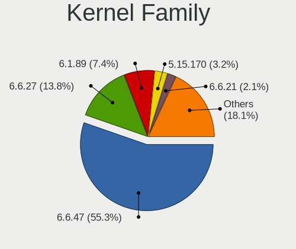
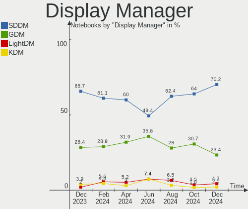
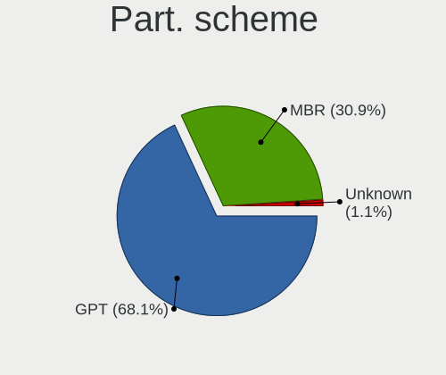
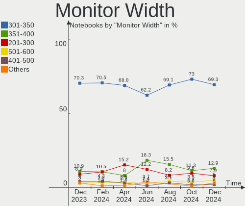
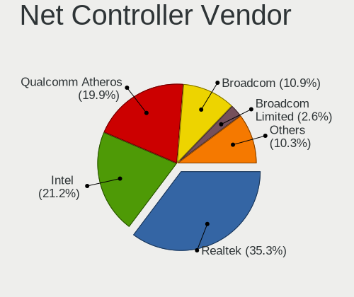
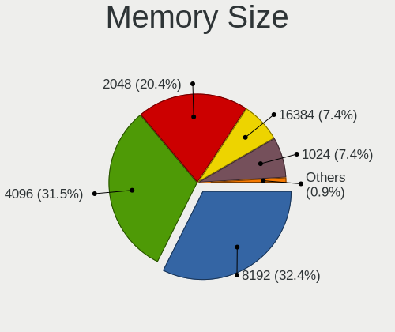

ROSA Hardware Trends (Notebooks)
--------------------------------

A project to identify most popular hardware characteristics and track their change
over time based on data collected by ROSA users at https://Linux-Hardware.org.

Anyone can contribute to this report by the [hw-probe](https://github.com/linuxhw/hw-probe) tool:

    sudo -E hw-probe -all -upload

This report is for one last month. Overall report since the beginning of time: [TestCoverage](https://github.com/linuxhw/TestCoverage)

Period: Apr, 2022.

Contents
--------

* [ System ](#system)
  - [ OS                       ](#os)
  - [ OS Family                ](#os-family)
  - [ Kernel                   ](#kernel)
  - [ Kernel Family            ](#kernel-family)
  - [ Kernel Major Ver.        ](#kernel-major-ver)
  - [ Arch                     ](#arch)
  - [ DE                       ](#de)
  - [ Display Server           ](#display-server)
  - [ Display Manager          ](#display-manager)
  - [ OS Lang                  ](#os-lang)
  - [ Boot Mode                ](#boot-mode)
  - [ Filesystem               ](#filesystem)
  - [ Part. scheme             ](#part-scheme)
  - [ Dual Boot with Linux/BSD ](#dual-boot-with-linuxbsd)
  - [ Dual Boot (Win)          ](#dual-boot-win)

* [ Board ](#board)
  - [ Vendor                   ](#vendor)
  - [ Model                    ](#model)
  - [ Model Family             ](#model-family)
  - [ MFG Year                 ](#mfg-year)
  - [ Form Factor              ](#form-factor)
  - [ Secure Boot              ](#secure-boot)
  - [ Coreboot                 ](#coreboot)
  - [ RAM Size                 ](#ram-size)
  - [ RAM Used                 ](#ram-used)
  - [ Total Drives             ](#total-drives)
  - [ Has CD-ROM               ](#has-cd-rom)
  - [ Has Ethernet             ](#has-ethernet)
  - [ Has WiFi                 ](#has-wifi)
  - [ Has Bluetooth            ](#has-bluetooth)

* [ Location ](#location)
  - [ Country                  ](#country)
  - [ City                     ](#city)

* [ Drives ](#drives)
  - [ Drive Vendor             ](#drive-vendor)
  - [ Drive Model              ](#drive-model)
  - [ HDD Vendor               ](#hdd-vendor)
  - [ SSD Vendor               ](#ssd-vendor)
  - [ Drive Kind               ](#drive-kind)
  - [ Drive Connector          ](#drive-connector)
  - [ Drive Size               ](#drive-size)
  - [ Space Total              ](#space-total)
  - [ Space Used               ](#space-used)
  - [ Malfunc. Drives          ](#malfunc-drives)
  - [ Malfunc. Drive Vendor    ](#malfunc-drive-vendor)
  - [ Malfunc. HDD Vendor      ](#malfunc-hdd-vendor)
  - [ Malfunc. Drive Kind      ](#malfunc-drive-kind)
  - [ Failed Drives            ](#failed-drives)
  - [ Failed Drive Vendor      ](#failed-drive-vendor)
  - [ Drive Status             ](#drive-status)

* [ Storage controller ](#storage-controller)
  - [ Storage Vendor           ](#storage-vendor)
  - [ Storage Model            ](#storage-model)
  - [ Storage Kind             ](#storage-kind)

* [ Processor ](#processor)
  - [ CPU Vendor               ](#cpu-vendor)
  - [ CPU Model                ](#cpu-model)
  - [ CPU Model Family         ](#cpu-model-family)
  - [ CPU Cores                ](#cpu-cores)
  - [ CPU Sockets              ](#cpu-sockets)
  - [ CPU Threads              ](#cpu-threads)
  - [ CPU Op-Modes             ](#cpu-op-modes)
  - [ CPU Microcode            ](#cpu-microcode)
  - [ CPU Microarch            ](#cpu-microarch)

* [ Graphics ](#graphics)
  - [ GPU Vendor               ](#gpu-vendor)
  - [ GPU Model                ](#gpu-model)
  - [ GPU Combo                ](#gpu-combo)
  - [ GPU Driver               ](#gpu-driver)
  - [ GPU Memory               ](#gpu-memory)

* [ Monitor ](#monitor)
  - [ Monitor Vendor           ](#monitor-vendor)
  - [ Monitor Model            ](#monitor-model)
  - [ Monitor Resolution       ](#monitor-resolution)
  - [ Monitor Diagonal         ](#monitor-diagonal)
  - [ Monitor Width            ](#monitor-width)
  - [ Aspect Ratio             ](#aspect-ratio)
  - [ Monitor Area             ](#monitor-area)
  - [ Pixel Density            ](#pixel-density)
  - [ Multiple Monitors        ](#multiple-monitors)

* [ Network ](#network)
  - [ Net Controller Vendor    ](#net-controller-vendor)
  - [ Net Controller Model     ](#net-controller-model)
  - [ Wireless Vendor          ](#wireless-vendor)
  - [ Wireless Model           ](#wireless-model)
  - [ Ethernet Vendor          ](#ethernet-vendor)
  - [ Ethernet Model           ](#ethernet-model)
  - [ Net Controller Kind      ](#net-controller-kind)
  - [ Used Controller          ](#used-controller)
  - [ NICs                     ](#nics)
  - [ IPv6                     ](#ipv6)

* [ Bluetooth ](#bluetooth)
  - [ Bluetooth Vendor         ](#bluetooth-vendor)
  - [ Bluetooth Model          ](#bluetooth-model)

* [ Sound ](#sound)
  - [ Sound Vendor             ](#sound-vendor)
  - [ Sound Model              ](#sound-model)

* [ Memory ](#memory)
  - [ Memory Vendor            ](#memory-vendor)
  - [ Memory Model             ](#memory-model)
  - [ Memory Kind              ](#memory-kind)
  - [ Memory Form Factor       ](#memory-form-factor)
  - [ Memory Size              ](#memory-size)
  - [ Memory Speed             ](#memory-speed)

* [ Printers & scanners ](#printers--scanners)
  - [ Printer Vendor           ](#printer-vendor)
  - [ Printer Model            ](#printer-model)
  - [ Scanner Vendor           ](#scanner-vendor)
  - [ Scanner Model            ](#scanner-model)

* [ Camera ](#camera)
  - [ Camera Vendor            ](#camera-vendor)
  - [ Camera Model             ](#camera-model)

* [ Security ](#security)
  - [ Fingerprint Vendor       ](#fingerprint-vendor)
  - [ Fingerprint Model        ](#fingerprint-model)
  - [ Chipcard Vendor          ](#chipcard-vendor)
  - [ Chipcard Model           ](#chipcard-model)

* [ Unsupported ](#unsupported)
  - [ Unsupported Devices      ](#unsupported-devices)
  - [ Unsupported Device Types ](#unsupported-device-types)

System
------

OS
--

Installed operating systems

| Name         | Notebooks | Percent |
|--------------|-----------|---------|
| ROSA 12.2    | 178       | 85.58%  |
| ROSA R11.1   | 22        | 10.58%  |
| ROSA 12.1    | 5         | 2.4%    |
| ROSA R11     | 2         | 0.96%   |
| ROSA 2019.05 | 1         | 0.48%   |

OS Family
---------

OS without a version

| Name | Notebooks | Percent |
|------|-----------|---------|
| ROSA | 208       | 100%    |

Kernel
------

Version of the Linux kernel

| Version                                    | Notebooks | Percent |
|--------------------------------------------|-----------|---------|
| 5.10.74-generic-2rosa2021.1-x86_64         | 146       | 70.19%  |
| 5.15.32-generic-5rosa2021.1-x86_64         | 12        | 5.77%   |
| 5.10.74-generic-2rosa2021.1-i586           | 9         | 4.33%   |
| 5.4.32-generic-2rosa-x86_64                | 6         | 2.88%   |
| 5.4.83-generic-2rosa-x86_64                | 5         | 2.4%    |
| 5.4.83-generic-2rosa-i586                  | 5         | 2.4%    |
| 4.15.0-desktop-122.124.1rosa-x86_64        | 5         | 2.4%    |
| 5.15.32-generic-6rosa2021.1-x86_64         | 4         | 1.92%   |
| 5.16.18-generic-1rosa2021.1-x86_64         | 2         | 0.96%   |
| 5.16.16.xm1-1.klp-xanmod-rosa2021.1-x86_64 | 2         | 0.96%   |
| 4.15.0-desktop-45.1rosa-i586               | 2         | 0.96%   |
| 5.4.32-generic-2rosa-i586                  | 1         | 0.48%   |
| 5.4.139-nickel-4rosa2019.05-x86_64         | 1         | 0.48%   |
| 5.16.18-generic-4rosa2021.1-x86_64         | 1         | 0.48%   |
| 5.16.18-generic-2rosa2021.1-x86_64         | 1         | 0.48%   |
| 5.15.32-generic-5rosa2021.1-i686           | 1         | 0.48%   |
| 5.15.32-generic-1rosa2021.1-x86_64         | 1         | 0.48%   |
| 5.15.28-generic-3rosa2021.1-x86_64         | 1         | 0.48%   |
| 5.15.28-generic-1rosa2021.1-x86_64         | 1         | 0.48%   |
| 5.10.71-generic-1rosa2021.1-x86_64         | 1         | 0.48%   |
| 5.10.101-desktop-2rosa2021-x86_64          | 1         | 0.48%   |

Kernel Family
-------------

Linux kernel without a distro release

| Version  | Notebooks | Percent |
|----------|-----------|---------|
| 5.10.74  | 155       | 74.52%  |
| 5.15.32  | 18        | 8.65%   |
| 5.4.83   | 10        | 4.81%   |
| 5.4.32   | 7         | 3.37%   |
| 4.15.0   | 7         | 3.37%   |
| 5.16.18  | 4         | 1.92%   |
| 5.16.16  | 2         | 0.96%   |
| 5.15.28  | 2         | 0.96%   |
| 5.4.139  | 1         | 0.48%   |
| 5.10.71  | 1         | 0.48%   |
| 5.10.101 | 1         | 0.48%   |

Kernel Major Ver.
-----------------

Linux kernel major version

| Version | Notebooks | Percent |
|---------|-----------|---------|
| 5.10    | 157       | 75.48%  |
| 5.15    | 20        | 9.62%   |
| 5.4     | 18        | 8.65%   |
| 4.15    | 7         | 3.37%   |
| 5.16    | 6         | 2.88%   |

Arch
----

OS architecture (x86_64, i586, etc.)

| Name   | Notebooks | Percent |
|--------|-----------|---------|
| x86_64 | 190       | 91.35%  |
| i686   | 18        | 8.65%   |

DE
--

Desktop Environment

| Name  | Notebooks | Percent |
|-------|-----------|---------|
| KDE5  | 87        | 41.83%  |
| GNOME | 64        | 30.77%  |
| LXQt  | 39        | 18.75%  |
| KDE4  | 18        | 8.65%   |

Display Server
--------------

X11 or Wayland

| Name    | Notebooks | Percent |
|---------|-----------|---------|
| Wayland | 156       | 75%     |
| X11     | 52        | 25%     |

Display Manager
---------------

SDDM, LightDM, etc.

| Name    | Notebooks | Percent |
|---------|-----------|---------|
| GDM     | 92        | 44.23%  |
| SDDM    | 86        | 41.35%  |
| KDM     | 18        | 8.65%   |
| LightDM | 12        | 5.77%   |

OS Lang
-------

Language

| Lang    | Notebooks | Percent |
|---------|-----------|---------|
| ru_RU   | 195       | 93.75%  |
| en_US   | 5         | 2.4%    |
| de_DE   | 2         | 0.96%   |
| Unknown | 2         | 0.96%   |
| pl_PL   | 1         | 0.48%   |
| fr_FR   | 1         | 0.48%   |
| fr_BE   | 1         | 0.48%   |
| en_IN   | 1         | 0.48%   |

Boot Mode
---------

EFI or BIOS

| Mode | Notebooks | Percent |
|------|-----------|---------|
| BIOS | 105       | 50.48%  |
| EFI  | 103       | 49.52%  |

Filesystem
----------

Type of filesystem

| Type  | Notebooks | Percent |
|-------|-----------|---------|
| Ext4  | 201       | 96.63%  |
| Btrfs | 6         | 2.88%   |
| Aufs  | 1         | 0.48%   |

Part. scheme
------------

Scheme of partitioning

| Type | Notebooks | Percent |
|------|-----------|---------|
| GPT  | 129       | 62.02%  |
| MBR  | 79        | 37.98%  |

Dual Boot with Linux/BSD
------------------------

Hosting more than one Linux/BSD

| Dual boot | Notebooks | Percent |
|-----------|-----------|---------|
| No        | 154       | 74.04%  |
| Yes       | 54        | 25.96%  |

Dual Boot (Win)
---------------

Hosting Linux and Windows

| Dual boot | Notebooks | Percent |
|-----------|-----------|---------|
| No        | 126       | 60.58%  |
| Yes       | 82        | 39.42%  |

Board
-----

Vendor
------

Motherboard manufacturer

| Name                           | Notebooks | Percent |
|--------------------------------|-----------|---------|
| ASUSTek Computer               | 42        | 20.19%  |
| Acer                           | 41        | 19.71%  |
| Lenovo                         | 32        | 15.38%  |
| Hewlett-Packard                | 31        | 14.9%   |
| Dell                           | 14        | 6.73%   |
| Samsung Electronics            | 11        | 5.29%   |
| Sony                           | 5         | 2.4%    |
| Toshiba                        | 4         | 1.92%   |
| Packard Bell                   | 4         | 1.92%   |
| eMachines                      | 4         | 1.92%   |
| MSI                            | 3         | 1.44%   |
| ONDA                           | 2         | 0.96%   |
| Haier                          | 2         | 0.96%   |
| DNS                            | 2         | 0.96%   |
| Pegatron                       | 1         | 0.48%   |
| Notebook                       | 1         | 0.48%   |
| Matsushita Electric Industrial | 1         | 0.48%   |
| Maibenben                      | 1         | 0.48%   |
| Jumper                         | 1         | 0.48%   |
| iRU                            | 1         | 0.48%   |
| Irbis                          | 1         | 0.48%   |
| Gigabyte Technology            | 1         | 0.48%   |
| Fujitsu                        | 1         | 0.48%   |
| Digma                          | 1         | 0.48%   |
| Apple                          | 1         | 0.48%   |

Model
-----

Motherboard model

| Name                                                                                     | Notebooks | Percent |
|------------------------------------------------------------------------------------------|-----------|---------|
| ONDA OBOOK 20 PLUS                                                                       | 2         | 0.96%   |
| Lenovo V570c HuronRiver Platform                                                         | 2         | 0.96%   |
| Lenovo IdeaPad Z570 HuronRiver Platform                                                  | 2         | 0.96%   |
| Lenovo G780 20138                                                                        | 2         | 0.96%   |
| HP Notebook                                                                              | 2         | 0.96%   |
| HP Laptop 15-db1xxx                                                                      | 2         | 0.96%   |
| HP 250 G6 Notebook PC                                                                    | 2         | 0.96%   |
| ASUS X553MA                                                                              | 2         | 0.96%   |
| ASUS X541NC                                                                              | 2         | 0.96%   |
| ASUS 1011PX                                                                              | 2         | 0.96%   |
| Acer Aspire 5739G                                                                        | 2         | 0.96%   |
| Unknown                                                                                  | 2         | 0.96%   |
| Toshiba Satellite U300                                                                   | 1         | 0.48%   |
| Toshiba Satellite Pro L300                                                               | 1         | 0.48%   |
| Toshiba Satellite L655                                                                   | 1         | 0.48%   |
| Toshiba QOSMIO F60                                                                       | 1         | 0.48%   |
| Sony VGN-TT31MR_N                                                                        | 1         | 0.48%   |
| Sony VGN-P688E                                                                           | 1         | 0.48%   |
| Sony SVF1521L1RB                                                                         | 1         | 0.48%   |
| Sony SVE1712V1RB                                                                         | 1         | 0.48%   |
| Sony SVE1512H1RW                                                                         | 1         | 0.48%   |
| Samsung RV411/RV511/E3511/S3511/RV711                                                    | 1         | 0.48%   |
| Samsung R519/R719                                                                        | 1         | 0.48%   |
| Samsung R425D/R525D                                                                      | 1         | 0.48%   |
| Samsung R19/R20/R21                                                                      | 1         | 0.48%   |
| Samsung NC210/NC110                                                                      | 1         | 0.48%   |
| Samsung NB30P                                                                            | 1         | 0.48%   |
| Samsung N150/N210/N220                                                                   | 1         | 0.48%   |
| Samsung 530U3BI/530U4BI/530U4BH                                                          | 1         | 0.48%   |
| Samsung 355V4C/355V4X/355V5C/355V5X/356V4C/356V4X/356V5C/356V5X/3445VC/3445VX/3545VC/354 | 1         | 0.48%   |
| Samsung 350V5C/351V5C/3540VC/3440VC                                                      | 1         | 0.48%   |
| Samsung 300V3A/300V4A/300V5A/200A4B/200A5B                                               | 1         | 0.48%   |
| Pegatron A15W8                                                                           | 1         | 0.48%   |
| Packard Bell EasyNote TS11HR                                                             | 1         | 0.48%   |
| Packard Bell EasyNote TE69KB                                                             | 1         | 0.48%   |
| Packard Bell EasyNote TE11HC                                                             | 1         | 0.48%   |
| Packard Bell EasyNote LM85                                                               | 1         | 0.48%   |
| Notebook W65_67SF                                                                        | 1         | 0.48%   |
| MSI Sword 15 A11UE                                                                       | 1         | 0.48%   |
| MSI MS-N0E1                                                                              | 1         | 0.48%   |
| MSI GF63 Thin 9SC                                                                        | 1         | 0.48%   |
| Matsushita Electric Industrial CF-30CTQAZBG                                              | 1         | 0.48%   |
| Maibenben DaMai E series                                                                 | 1         | 0.48%   |
| Lenovo ThinkPad X230 2325I63                                                             | 1         | 0.48%   |
| Lenovo ThinkPad X230 2324A15                                                             | 1         | 0.48%   |
| Lenovo ThinkPad T61 7659A39                                                              | 1         | 0.48%   |
| Lenovo ThinkPad T520 4243RT9                                                             | 1         | 0.48%   |
| Lenovo ThinkPad E480 20KN001VRT                                                          | 1         | 0.48%   |
| Lenovo M5400 20281                                                                       | 1         | 0.48%   |
| Lenovo Legion Y540-17IRH 81UJ                                                            | 1         | 0.48%   |
| Lenovo Legion 5 15ARH05 82B5                                                             | 1         | 0.48%   |
| Lenovo IdeaPad Z580                                                                      | 1         | 0.48%   |
| Lenovo IdeaPad Z565 20066                                                                | 1         | 0.48%   |
| Lenovo IdeaPad Z470                                                                      | 1         | 0.48%   |
| Lenovo IdeaPad S145-15API 81UT                                                           | 1         | 0.48%   |
| Lenovo IdeaPad L340-17IRH Gaming 81LL                                                    | 1         | 0.48%   |
| Lenovo IdeaPad L340-15IRH Gaming 81LK                                                    | 1         | 0.48%   |
| Lenovo IdeaPad 330S-15ARR 81FB                                                           | 1         | 0.48%   |
| Lenovo IdeaPad 330-15IKB 81DE                                                            | 1         | 0.48%   |
| Lenovo IdeaPad 330-15IKB 81DC                                                            | 1         | 0.48%   |

Model Family
------------

Motherboard model prefix

| Name                                        | Notebooks | Percent |
|---------------------------------------------|-----------|---------|
| Acer Aspire                                 | 29        | 13.94%  |
| Lenovo IdeaPad                              | 15        | 7.21%   |
| HP Pavilion                                 | 8         | 3.85%   |
| HP Laptop                                   | 6         | 2.88%   |
| Dell Inspiron                               | 6         | 2.88%   |
| Lenovo ThinkPad                             | 5         | 2.4%    |
| HP ProBook                                  | 5         | 2.4%    |
| Packard Bell EasyNote                       | 4         | 1.92%   |
| ASUS VivoBook                               | 4         | 1.92%   |
| Toshiba Satellite                           | 3         | 1.44%   |
| HP 250                                      | 3         | 1.44%   |
| Dell Latitude                               | 3         | 1.44%   |
| ASUS ASUS                                   | 3         | 1.44%   |
| Acer Nitro                                  | 3         | 1.44%   |
| ONDA OBOOK                                  | 2         | 0.96%   |
| Lenovo V570c                                | 2         | 0.96%   |
| Lenovo Legion                               | 2         | 0.96%   |
| Lenovo G780                                 | 2         | 0.96%   |
| HP Notebook                                 | 2         | 0.96%   |
| HP EliteBook                                | 2         | 0.96%   |
| HP Compaq                                   | 2         | 0.96%   |
| Dell Vostro                                 | 2         | 0.96%   |
| Dell Precision                              | 2         | 0.96%   |
| ASUS ZenBook                                | 2         | 0.96%   |
| ASUS X553MA                                 | 2         | 0.96%   |
| ASUS X541NC                                 | 2         | 0.96%   |
| ASUS TUF                                    | 2         | 0.96%   |
| ASUS 1011PX                                 | 2         | 0.96%   |
| Acer TravelMate                             | 2         | 0.96%   |
| Acer Swift                                  | 2         | 0.96%   |
| Unknown                                     | 2         | 0.96%   |
| Toshiba QOSMIO                              | 1         | 0.48%   |
| Sony VGN-TT31MR                             | 1         | 0.48%   |
| Sony VGN-P688E                              | 1         | 0.48%   |
| Sony SVF1521L1RB                            | 1         | 0.48%   |
| Sony SVE1712V1RB                            | 1         | 0.48%   |
| Sony SVE1512H1RW                            | 1         | 0.48%   |
| Samsung RV411                               | 1         | 0.48%   |
| Samsung R519                                | 1         | 0.48%   |
| Samsung R425D                               | 1         | 0.48%   |
| Samsung R19                                 | 1         | 0.48%   |
| Samsung NC210                               | 1         | 0.48%   |
| Samsung NB30P                               | 1         | 0.48%   |
| Samsung N150                                | 1         | 0.48%   |
| Samsung 530U3BI                             | 1         | 0.48%   |
| Samsung 355V4C                              | 1         | 0.48%   |
| Samsung 350V5C                              | 1         | 0.48%   |
| Samsung 300V3A                              | 1         | 0.48%   |
| Pegatron A15W8                              | 1         | 0.48%   |
| Notebook W65                                | 1         | 0.48%   |
| MSI Sword                                   | 1         | 0.48%   |
| MSI MS-N0E1                                 | 1         | 0.48%   |
| MSI GF63                                    | 1         | 0.48%   |
| Matsushita Electric Industrial CF-30CTQAZBG | 1         | 0.48%   |
| Maibenben DaMai                             | 1         | 0.48%   |
| Lenovo M5400                                | 1         | 0.48%   |
| Lenovo G580                                 | 1         | 0.48%   |
| Lenovo G510                                 | 1         | 0.48%   |
| Lenovo G505                                 | 1         | 0.48%   |
| Lenovo B590                                 | 1         | 0.48%   |

MFG Year
--------

Motherboard manufacture year

| Year | Notebooks | Percent |
|------|-----------|---------|
| 2012 | 24        | 11.54%  |
| 2011 | 24        | 11.54%  |
| 2010 | 22        | 10.58%  |
| 2009 | 17        | 8.17%   |
| 2021 | 16        | 7.69%   |
| 2013 | 14        | 6.73%   |
| 2019 | 13        | 6.25%   |
| 2018 | 13        | 6.25%   |
| 2017 | 11        | 5.29%   |
| 2016 | 11        | 5.29%   |
| 2020 | 9         | 4.33%   |
| 2015 | 9         | 4.33%   |
| 2008 | 8         | 3.85%   |
| 2007 | 8         | 3.85%   |
| 2014 | 5         | 2.4%    |
| 2006 | 4         | 1.92%   |

Form Factor
-----------

Physical design of the computer

| Name     | Notebooks | Percent |
|----------|-----------|---------|
| Notebook | 208       | 100%    |

Secure Boot
-----------

Enabled or disabled

| State    | Notebooks | Percent |
|----------|-----------|---------|
| Disabled | 208       | 100%    |

Coreboot
--------

Have coreboot on board

| Used | Notebooks | Percent |
|------|-----------|---------|
| No   | 208       | 100%    |

RAM Size
--------

Total RAM memory

| Size in GB | Notebooks | Percent |
|------------|-----------|---------|
| 3.01-4.0   | 60        | 28.85%  |
| 4.01-8.0   | 57        | 27.4%   |
| 1.01-2.0   | 27        | 12.98%  |
| 8.01-16.0  | 25        | 12.02%  |
| 16.01-24.0 | 16        | 7.69%   |
| 2.01-3.0   | 14        | 6.73%   |
| 32.01-64.0 | 5         | 2.4%    |
| 24.01-32.0 | 2         | 0.96%   |
| 0.51-1.0   | 2         | 0.96%   |

RAM Used
--------

Used RAM memory

| Used GB   | Notebooks | Percent |
|-----------|-----------|---------|
| 1.01-2.0  | 111       | 53.37%  |
| 0.51-1.0  | 69        | 33.17%  |
| 2.01-3.0  | 18        | 8.65%   |
| 4.01-8.0  | 3         | 1.44%   |
| 3.01-4.0  | 3         | 1.44%   |
| 0.01-0.5  | 3         | 1.44%   |
| 8.01-16.0 | 1         | 0.48%   |

Total Drives
------------

Number of drives on board

| Drives | Notebooks | Percent |
|--------|-----------|---------|
| 1      | 150       | 72.12%  |
| 2      | 49        | 23.56%  |
| 3      | 9         | 4.33%   |

Has CD-ROM
----------

Has CD-ROM on board

| Presented | Notebooks | Percent |
|-----------|-----------|---------|
| No        | 119       | 57.21%  |
| Yes       | 89        | 42.79%  |

Has Ethernet
------------

Has Ethernet on board

| Presented | Notebooks | Percent |
|-----------|-----------|---------|
| Yes       | 187       | 89.9%   |
| No        | 21        | 10.1%   |

Has WiFi
--------

Has WiFi module

| Presented | Notebooks | Percent |
|-----------|-----------|---------|
| Yes       | 206       | 99.04%  |
| No        | 2         | 0.96%   |

Has Bluetooth
-------------

Has Bluetooth module

| Presented | Notebooks | Percent |
|-----------|-----------|---------|
| Yes       | 142       | 68.27%  |
| No        | 66        | 31.73%  |

Location
--------

Country
-------

Geographic location (country)

| Country    | Notebooks | Percent |
|------------|-----------|---------|
| Russia     | 180       | 86.54%  |
| Ukraine    | 7         | 3.37%   |
| Belarus    | 6         | 2.88%   |
| Germany    | 3         | 1.44%   |
| USA        | 1         | 0.48%   |
| Serbia     | 1         | 0.48%   |
| Poland     | 1         | 0.48%   |
| Peru       | 1         | 0.48%   |
| Moldova    | 1         | 0.48%   |
| Latvia     | 1         | 0.48%   |
| Kazakhstan | 1         | 0.48%   |
| India      | 1         | 0.48%   |
| Guadeloupe | 1         | 0.48%   |
| Estonia    | 1         | 0.48%   |
| Chile      | 1         | 0.48%   |
| Belgium    | 1         | 0.48%   |

City
----

Geographic location (city)

| City             | Notebooks | Percent |
|------------------|-----------|---------|
| Moscow           | 32        | 15.38%  |
| St Petersburg    | 22        | 10.58%  |
| Yekaterinburg    | 7         | 3.37%   |
| Samara           | 6         | 2.88%   |
| Krasnodar        | 6         | 2.88%   |
| Minsk            | 5         | 2.4%    |
| Yaroslavl        | 4         | 1.92%   |
| Voronezh         | 4         | 1.92%   |
| Krasnoyarsk      | 4         | 1.92%   |
| Khabarovsk       | 4         | 1.92%   |
| Novosibirsk      | 3         | 1.44%   |
| Nizhniy Novgorod | 3         | 1.44%   |
| Kaliningrad      | 3         | 1.44%   |
| Chelyabinsk      | 3         | 1.44%   |
| Barnaul          | 3         | 1.44%   |
| Zlatoust         | 2         | 0.96%   |
| Volgograd        | 2         | 0.96%   |
| Veliky Novgorod  | 2         | 0.96%   |
| Ufa              | 2         | 0.96%   |
| Smolensk         | 2         | 0.96%   |
| Simferopol       | 2         | 0.96%   |
| Severodvinsk     | 2         | 0.96%   |
| Sevastopol       | 2         | 0.96%   |
| Rostov-on-Don    | 2         | 0.96%   |
| Nizhnevartovsk   | 2         | 0.96%   |
| Mirny            | 2         | 0.96%   |
| Lipetsk          | 2         | 0.96%   |
| Irkutsk          | 2         | 0.96%   |
| Zhukovskiy       | 1         | 0.48%   |
| Zelenodolsk      | 1         | 0.48%   |
| Zaventem         | 1         | 0.48%   |
| Yasinovataya     | 1         | 0.48%   |
| Yalta            | 1         | 0.48%   |
| Yakutsk          | 1         | 0.48%   |
| Vladivostok      | 1         | 0.48%   |
| Vitebsk          | 1         | 0.48%   |
| Verkhnyaya Tula  | 1         | 0.48%   |
| Ulyanovsk        | 1         | 0.48%   |
| Ulan-Ude         | 1         | 0.48%   |
| Tyumen           | 1         | 0.48%   |
| Tuchkovo         | 1         | 0.48%   |
| Trujillo         | 1         | 0.48%   |
| Tomsk            | 1         | 0.48%   |
| Thrissur         | 1         | 0.48%   |
| Surgut           | 1         | 0.48%   |
| Stavropol        | 1         | 0.48%   |
| Sredneuralsk     | 1         | 0.48%   |
| Sonneberg        | 1         | 0.48%   |
| Shuvakish        | 1         | 0.48%   |
| Sainte-Anne      | 1         | 0.48%   |
| Riga             | 1         | 0.48%   |
| Pskov            | 1         | 0.48%   |
| Privolzhskiy     | 1         | 0.48%   |
| Polevskoy        | 1         | 0.48%   |
| Plavsk           | 1         | 0.48%   |
| Pittsburgh       | 1         | 0.48%   |
| Petrozavodsk     | 1         | 0.48%   |
| Petergof         | 1         | 0.48%   |
| Perm             | 1         | 0.48%   |
| Pärnu           | 1         | 0.48%   |

Drives
------

Drive Vendor
------------

Hard drive vendors

| Vendor              | Notebooks | Drives | Percent |
|---------------------|-----------|--------|---------|
| WDC                 | 48        | 51     | 18.53%  |
| Seagate             | 33        | 34     | 12.74%  |
| Toshiba             | 25        | 25     | 9.65%   |
| Samsung Electronics | 21        | 22     | 8.11%   |
| SanDisk             | 14        | 14     | 5.41%   |
| Kingston            | 14        | 14     | 5.41%   |
| Hitachi             | 13        | 13     | 5.02%   |
| Unknown             | 11        | 12     | 4.25%   |
| SK Hynix            | 8         | 8      | 3.09%   |
| KingSpec            | 7         | 7      | 2.7%    |
| Micron Technology   | 6         | 6      | 2.32%   |
| HGST                | 6         | 6      | 2.32%   |
| China               | 6         | 6      | 2.32%   |
| SPCC                | 5         | 5      | 1.93%   |
| Intel               | 5         | 5      | 1.93%   |
| KingDian            | 3         | 3      | 1.16%   |
| Crucial             | 3         | 3      | 1.16%   |
| Apacer              | 3         | 3      | 1.16%   |
| UMIS                | 2         | 2      | 0.77%   |
| Transcend           | 2         | 2      | 0.77%   |
| Smartbuy            | 2         | 2      | 0.77%   |
| OCZ                 | 2         | 2      | 0.77%   |
| Netac               | 2         | 2      | 0.77%   |
| LONDISK             | 2         | 2      | 0.77%   |
| GOODRAM             | 2         | 2      | 0.77%   |
| Gigabyte Technology | 2         | 2      | 0.77%   |
| XPG                 | 1         | 1      | 0.39%   |
| Wdstars             | 1         | 1      | 0.39%   |
| TMI                 | 1         | 1      | 0.39%   |
| SSSTC               | 1         | 1      | 0.39%   |
| SP                  | 1         | 1      | 0.39%   |
| GS                  | 1         | 2      | 0.39%   |
| Fujitsu             | 1         | 1      | 0.39%   |
| E535N               | 1         | 1      | 0.39%   |
| Corsair             | 1         | 1      | 0.39%   |
| BR                  | 1         | 1      | 0.39%   |
| AMD                 | 1         | 1      | 0.39%   |
| A-DATA Technology   | 1         | 1      | 0.39%   |

Drive Model
-----------

Hard drive models

| Model                               | Notebooks | Percent |
|-------------------------------------|-----------|---------|
| Toshiba MQ01ABF050 500GB            | 8         | 3.01%   |
| Seagate ST1000LM035-1RK172 1TB      | 6         | 2.26%   |
| Seagate ST1000LM024 HN-M101MBB 1TB  | 6         | 2.26%   |
| Micron 2210_MTFDHBA512QFD 512GB     | 4         | 1.5%    |
| Seagate ST9500325AS 500GB           | 3         | 1.13%   |
| Seagate ST500LT012-9WS142 500GB     | 3         | 1.13%   |
| Hitachi HTS547550A9E384 500GB       | 3         | 1.13%   |
| WDC WDS240G2G0A-00JH30 240GB SSD    | 2         | 0.75%   |
| WDC WDS120G2G0B-00EPW0 120GB SSD    | 2         | 0.75%   |
| WDC WDS120G2G0A-00JH30 120GB SSD    | 2         | 0.75%   |
| WDC WD5000LPVX-00V0TT0 500GB        | 2         | 0.75%   |
| WDC WD5000LPCX-21VHAT0 500GB        | 2         | 0.75%   |
| WDC WD3200BPVT-22JJ5T0 320GB        | 2         | 0.75%   |
| WDC WD2500BEVT-22A23T0 250GB        | 2         | 0.75%   |
| WDC WD1200UE-22KVT0 120GB           | 2         | 0.75%   |
| WDC WD10SPZX-22Z10T1 1TB            | 2         | 0.75%   |
| WDC WD10SPZX-21Z10T0 1TB            | 2         | 0.75%   |
| Unknown NCard  64GB                 | 2         | 0.75%   |
| UMIS RPFTJ128PDD2EWX 128GB          | 2         | 0.75%   |
| Toshiba MQ01ABD100 1TB              | 2         | 0.75%   |
| Toshiba MQ01ABD075 752GB            | 2         | 0.75%   |
| SPCC Solid State Disk 256GB         | 2         | 0.75%   |
| SPCC Solid State Disk 128GB         | 2         | 0.75%   |
| SK Hynix HFM512GD3JX013N 512GB      | 2         | 0.75%   |
| Seagate ST9320325AS 320GB           | 2         | 0.75%   |
| Seagate ST9250315AS 250GB           | 2         | 0.75%   |
| Seagate ST500LT012-1DG142 500GB     | 2         | 0.75%   |
| Seagate ST320LT020-9YG142 320GB     | 2         | 0.75%   |
| SanDisk SSD G5 BICS4 500GB          | 2         | 0.75%   |
| SanDisk SD9SN8W-128G-1006 128GB SSD | 2         | 0.75%   |
| Samsung SSD 970 EVO 1TB             | 2         | 0.75%   |
| Samsung SSD 860 EVO 250GB           | 2         | 0.75%   |
| Samsung HM321HI 320GB               | 2         | 0.75%   |
| Kingston SA400S37240G 240GB SSD     | 2         | 0.75%   |
| Kingston OM8PCP3512F-AA 512GB       | 2         | 0.75%   |
| KingSpec P3-128 128GB SSD           | 2         | 0.75%   |
| KingDian S400 120GB SSD             | 2         | 0.75%   |
| Hitachi HTS543232A7A384 320GB       | 2         | 0.75%   |
| Hitachi HTS542516K9SA00 160GB       | 2         | 0.75%   |
| HGST HTS545050A7E680 500GB          | 2         | 0.75%   |
| HGST HTS541010A9E680 1TB            | 2         | 0.75%   |
| Apacer AS350 128GB SSD              | 2         | 0.75%   |
| XPG GAMMIX S11 Pro 512GB            | 1         | 0.38%   |
| Wdstars ssd w31-128G                | 1         | 0.38%   |
| WDC WDS480G2G0B-00EPW0 480GB SSD    | 1         | 0.38%   |
| WDC WDS250G1B0A-00H9H0 250GB SSD    | 1         | 0.38%   |
| WDC WD5000LPVX-22V0TT0 500GB        | 1         | 0.38%   |
| WDC WD5000LPSX-00A6WT0 500GB        | 1         | 0.38%   |
| WDC WD5000LPLX-00ZNTT0 500GB        | 1         | 0.38%   |
| WDC WD5000LPCX-60VHAT1 500GB        | 1         | 0.38%   |
| WDC WD5000LPCX-24VHAT0 500GB        | 1         | 0.38%   |
| WDC WD5000BPVT-24HXZT3 500GB        | 1         | 0.38%   |
| WDC WD5000BPKX-00HPJT0 500GB        | 1         | 0.38%   |
| WDC WD3200BPVT-80ZEST0 320GB        | 1         | 0.38%   |
| WDC WD3200BMVS-11F9S0 320GB         | 1         | 0.38%   |
| WDC WD3200BEVT-80A0RT0 320GB        | 1         | 0.38%   |
| WDC WD3200BEVT-60A23T0 320GB        | 1         | 0.38%   |
| WDC WD3200BEVT-24A23T0 320GB        | 1         | 0.38%   |
| WDC WD2500BPVT-24JJ5T0 250GB        | 1         | 0.38%   |
| WDC WD2500BEVT-60ZCT1 250GB         | 1         | 0.38%   |

HDD Vendor
----------

Hard disk drive vendors

| Vendor              | Notebooks | Drives | Percent |
|---------------------|-----------|--------|---------|
| WDC                 | 39        | 39     | 33.33%  |
| Seagate             | 33        | 34     | 28.21%  |
| Toshiba             | 22        | 22     | 18.8%   |
| Hitachi             | 13        | 13     | 11.11%  |
| HGST                | 6         | 6      | 5.13%   |
| Samsung Electronics | 2         | 2      | 1.71%   |
| Unknown             | 1         | 1      | 0.85%   |
| Fujitsu             | 1         | 1      | 0.85%   |

SSD Vendor
----------

Solid state drive vendors

| Vendor              | Notebooks | Drives | Percent |
|---------------------|-----------|--------|---------|
| SanDisk             | 13        | 13     | 13.13%  |
| Samsung Electronics | 13        | 13     | 13.13%  |
| WDC                 | 8         | 8      | 8.08%   |
| Kingston            | 7         | 7      | 7.07%   |
| KingSpec            | 7         | 7      | 7.07%   |
| China               | 6         | 6      | 6.06%   |
| SPCC                | 5         | 5      | 5.05%   |
| SK Hynix            | 3         | 3      | 3.03%   |
| KingDian            | 3         | 3      | 3.03%   |
| Intel               | 3         | 3      | 3.03%   |
| Apacer              | 3         | 3      | 3.03%   |
| Transcend           | 2         | 2      | 2.02%   |
| Toshiba             | 2         | 2      | 2.02%   |
| Smartbuy            | 2         | 2      | 2.02%   |
| OCZ                 | 2         | 2      | 2.02%   |
| Netac               | 2         | 2      | 2.02%   |
| LONDISK             | 2         | 2      | 2.02%   |
| GOODRAM             | 2         | 2      | 2.02%   |
| Crucial             | 2         | 2      | 2.02%   |
| Wdstars             | 1         | 1      | 1.01%   |
| TMI                 | 1         | 1      | 1.01%   |
| SSSTC               | 1         | 1      | 1.01%   |
| SP                  | 1         | 1      | 1.01%   |
| Micron Technology   | 1         | 1      | 1.01%   |
| GS                  | 1         | 2      | 1.01%   |
| Gigabyte Technology | 1         | 1      | 1.01%   |
| E535N               | 1         | 1      | 1.01%   |
| Corsair             | 1         | 1      | 1.01%   |
| BR                  | 1         | 1      | 1.01%   |
| AMD                 | 1         | 1      | 1.01%   |
| A-DATA Technology   | 1         | 1      | 1.01%   |

Drive Kind
----------

HDD or SSD

| Kind | Notebooks | Drives | Percent |
|------|-----------|--------|---------|
| HDD  | 115       | 118    | 46.37%  |
| SSD  | 88        | 100    | 35.48%  |
| NVMe | 33        | 35     | 13.31%  |
| MMC  | 12        | 13     | 4.84%   |

Drive Connector
---------------

SATA, SAS, NVMe, etc.

| Type | Notebooks | Drives | Percent |
|------|-----------|--------|---------|
| SATA | 180       | 215    | 78.95%  |
| NVMe | 33        | 35     | 14.47%  |
| MMC  | 12        | 13     | 5.26%   |
| SAS  | 3         | 3      | 1.32%   |

Drive Size
----------

Size of hard drive

| Size in TB | Notebooks | Drives | Percent |
|------------|-----------|--------|---------|
| 0.01-0.5   | 153       | 173    | 77.66%  |
| 0.51-1.0   | 42        | 43     | 21.32%  |
| 3.01-4.0   | 1         | 1      | 0.51%   |
| 1.01-2.0   | 1         | 1      | 0.51%   |

Space Total
-----------

Amount of disk space available on the file system

| Size in GB     | Notebooks | Percent |
|----------------|-----------|---------|
| 101-250        | 68        | 32.69%  |
| 251-500        | 56        | 26.92%  |
| 1-20           | 32        | 15.38%  |
| 501-1000       | 18        | 8.65%   |
| 1001-2000      | 12        | 5.77%   |
| 51-100         | 11        | 5.29%   |
| 21-50          | 8         | 3.85%   |
| More than 3000 | 2         | 0.96%   |
| 2001-3000      | 1         | 0.48%   |

Space Used
----------

Amount of used disk space

| Used GB        | Notebooks | Percent |
|----------------|-----------|---------|
| 1-20           | 145       | 69.71%  |
| 21-50          | 16        | 7.69%   |
| 101-250        | 16        | 7.69%   |
| 51-100         | 14        | 6.73%   |
| 251-500        | 8         | 3.85%   |
| 501-1000       | 5         | 2.4%    |
| 1001-2000      | 3         | 1.44%   |
| More than 3000 | 1         | 0.48%   |

Malfunc. Drives
---------------

Drive models with a malfunction

| Model                                 | Notebooks | Drives | Percent |
|---------------------------------------|-----------|--------|---------|
| Seagate ST9500325AS 500GB             | 3         | 3      | 5.36%   |
| Toshiba MQ01ABF050 500GB              | 2         | 2      | 3.57%   |
| Seagate ST9320325AS 320GB             | 2         | 2      | 3.57%   |
| Seagate ST9250315AS 250GB             | 2         | 2      | 3.57%   |
| Seagate ST500LT012-9WS142 500GB       | 2         | 2      | 3.57%   |
| SanDisk SD9SN8W-128G-1006 128GB SSD   | 2         | 2      | 3.57%   |
| Samsung Electronics HM321HI 320GB     | 2         | 2      | 3.57%   |
| Hitachi HTS547550A9E384 500GB         | 2         | 2      | 3.57%   |
| WDC WDS120G2G0B-00EPW0 120GB SSD      | 1         | 1      | 1.79%   |
| WDC WD5000LPVX-22V0TT0 500GB          | 1         | 1      | 1.79%   |
| WDC WD5000LPVX-00V0TT0 500GB          | 1         | 1      | 1.79%   |
| WDC WD5000LPLX-00ZNTT0 500GB          | 1         | 1      | 1.79%   |
| WDC WD3200BPVT-22JJ5T0 320GB          | 1         | 1      | 1.79%   |
| WDC WD3200BEVT-60A23T0 320GB          | 1         | 1      | 1.79%   |
| WDC WD3200BEVT-24A23T0 320GB          | 1         | 1      | 1.79%   |
| WDC WD2500BEVT-60ZCT1 250GB           | 1         | 1      | 1.79%   |
| WDC WD2500BEVT-22A23T0 250GB          | 1         | 1      | 1.79%   |
| WDC WD2500BEKT-60A25T1 250GB          | 1         | 1      | 1.79%   |
| WDC WD1600BEVT-80A23T0 160GB          | 1         | 1      | 1.79%   |
| WDC WD1600BEVT-60ZCT1 160GB           | 1         | 1      | 1.79%   |
| WDC WD1200UE-22KVT0 120GB             | 1         | 1      | 1.79%   |
| Toshiba MK8034GSX 80GB                | 1         | 1      | 1.79%   |
| Toshiba MK5055GSX 500GB               | 1         | 1      | 1.79%   |
| Toshiba MK2565GSX 250GB               | 1         | 1      | 1.79%   |
| Toshiba MK2035GSS 200GB               | 1         | 1      | 1.79%   |
| Toshiba MK1652GSX 160GB               | 1         | 1      | 1.79%   |
| SSSTC CVB-8D128-HP 128GB SSD          | 1         | 1      | 1.79%   |
| SK Hynix HFS128G39TND-N210A 128GB SSD | 1         | 1      | 1.79%   |
| Seagate ST9320423AS 320GB             | 1         | 1      | 1.79%   |
| Seagate ST500LT012-1DG142 500GB       | 1         | 1      | 1.79%   |
| Seagate ST320LT020-9YG142 320GB       | 1         | 1      | 1.79%   |
| Seagate ST1000LM024 HN-M101MBB 1TB    | 1         | 1      | 1.79%   |
| SanDisk SSD P4 64GB                   | 1         | 1      | 1.79%   |
| SanDisk SDCFHS-016G SSD               | 1         | 1      | 1.79%   |
| KingSpec ACJC2M060S25 64GB SSD        | 1         | 1      | 1.79%   |
| Intel SSDSC2KW512G8 512GB             | 1         | 1      | 1.79%   |
| Intel SSDSA2M160G2LE 160GB            | 1         | 1      | 1.79%   |
| Hitachi HTS722020K9A300 200GB         | 1         | 1      | 1.79%   |
| Hitachi HTS545050A7E380 500GB         | 1         | 1      | 1.79%   |
| Hitachi HTS545025B9A300 250GB         | 1         | 1      | 1.79%   |
| Hitachi HTS542525K9SA00 250GB         | 1         | 1      | 1.79%   |
| Hitachi HTS542516K9SA00 160GB         | 1         | 1      | 1.79%   |
| HGST HTS725032A7E630 320GB            | 1         | 1      | 1.79%   |
| HGST HTS545050A7E680 500GB            | 1         | 1      | 1.79%   |
| HGST HTS541010A9E680 1TB              | 1         | 1      | 1.79%   |
| Fujitsu MHY2120BH 120GB               | 1         | 1      | 1.79%   |
| AMD R5SL120G 120GB SSD                | 1         | 1      | 1.79%   |

Malfunc. Drive Vendor
---------------------

Vendors of faulty drives

| Vendor              | Notebooks | Drives | Percent |
|---------------------|-----------|--------|---------|
| WDC                 | 13        | 13     | 23.21%  |
| Seagate             | 13        | 13     | 23.21%  |
| Toshiba             | 7         | 7      | 12.5%   |
| Hitachi             | 7         | 7      | 12.5%   |
| SanDisk             | 4         | 4      | 7.14%   |
| HGST                | 3         | 3      | 5.36%   |
| Samsung Electronics | 2         | 2      | 3.57%   |
| Intel               | 2         | 2      | 3.57%   |
| SSSTC               | 1         | 1      | 1.79%   |
| SK Hynix            | 1         | 1      | 1.79%   |
| KingSpec            | 1         | 1      | 1.79%   |
| Fujitsu             | 1         | 1      | 1.79%   |
| AMD                 | 1         | 1      | 1.79%   |

Malfunc. HDD Vendor
-------------------

Vendors of faulty HDD drives

| Vendor              | Notebooks | Drives | Percent |
|---------------------|-----------|--------|---------|
| Seagate             | 13        | 13     | 28.89%  |
| WDC                 | 12        | 12     | 26.67%  |
| Toshiba             | 7         | 7      | 15.56%  |
| Hitachi             | 7         | 7      | 15.56%  |
| HGST                | 3         | 3      | 6.67%   |
| Samsung Electronics | 2         | 2      | 4.44%   |
| Fujitsu             | 1         | 1      | 2.22%   |

Malfunc. Drive Kind
-------------------

Kinds of faulty drives

| Kind | Notebooks | Drives | Percent |
|------|-----------|--------|---------|
| HDD  | 45        | 45     | 80.36%  |
| SSD  | 11        | 11     | 19.64%  |

Failed Drives
-------------

Failed drive models

| Model                        | Notebooks | Drives | Percent |
|------------------------------|-----------|--------|---------|
| WDC WD3200BPVT-22JJ5T0 320GB | 1         | 1      | 100%    |

Failed Drive Vendor
-------------------

Failed drive vendors

| Vendor | Notebooks | Drives | Percent |
|--------|-----------|--------|---------|
| WDC    | 1         | 1      | 100%    |

Drive Status
------------

Number of failed and malfunc. drives

| Status   | Notebooks | Drives | Percent |
|----------|-----------|--------|---------|
| Works    | 156       | 192    | 68.12%  |
| Malfunc  | 56        | 56     | 24.45%  |
| Detected | 16        | 17     | 6.99%   |
| Failed   | 1         | 1      | 0.44%   |

Storage controller
------------------

Storage Vendor
--------------

Storage controller vendors

| Vendor                           | Notebooks | Percent |
|----------------------------------|-----------|---------|
| Intel                            | 157       | 66.53%  |
| AMD                              | 39        | 16.53%  |
| Samsung Electronics              | 7         | 2.97%   |
| Kingston Technology Company      | 7         | 2.97%   |
| Nvidia                           | 6         | 2.54%   |
| Micron Technology                | 5         | 2.12%   |
| SK Hynix                         | 4         | 1.69%   |
| Sandisk                          | 4         | 1.69%   |
| Union Memory (Shenzhen)          | 2         | 0.85%   |
| Toshiba America Info Systems     | 1         | 0.42%   |
| Silicon Integrated Systems [SiS] | 1         | 0.42%   |
| Phison Electronics               | 1         | 0.42%   |
| Micron/Crucial Technology        | 1         | 0.42%   |
| ADATA Technology                 | 1         | 0.42%   |

Storage Model
-------------

Storage controller models

| Model                                                                            | Notebooks | Percent |
|----------------------------------------------------------------------------------|-----------|---------|
| AMD FCH SATA Controller [AHCI mode]                                              | 27        | 10.38%  |
| Intel 7 Series Chipset Family 6-port SATA Controller [AHCI mode]                 | 23        | 8.85%   |
| Intel Sunrise Point-LP SATA Controller [AHCI mode]                               | 17        | 6.54%   |
| Intel 6 Series/C200 Series Chipset Family 6 port Mobile SATA AHCI Controller     | 14        | 5.38%   |
| Intel 82801IBM/IEM (ICH9M/ICH9M-E) 4 port SATA Controller [AHCI mode]            | 12        | 4.62%   |
| Intel NM10/ICH7 Family SATA Controller [AHCI mode]                               | 11        | 4.23%   |
| Intel 5 Series/3400 Series Chipset 4 port SATA AHCI Controller                   | 10        | 3.85%   |
| Intel 82801HM/HEM (ICH8M/ICH8M-E) IDE Controller                                 | 9         | 3.46%   |
| Intel Celeron N3350/Pentium N4200/Atom E3900 Series SATA AHCI Controller         | 7         | 2.69%   |
| Intel 82801HM/HEM (ICH8M/ICH8M-E) SATA Controller [AHCI mode]                    | 7         | 2.69%   |
| Intel Tiger Lake-LP SATA Controller [AHCI mode]                                  | 6         | 2.31%   |
| Intel Cannon Lake Mobile PCH SATA AHCI Controller                                | 6         | 2.31%   |
| Intel 8 Series/C220 Series Chipset Family 6-port SATA Controller 1 [AHCI mode]   | 6         | 2.31%   |
| AMD SB7x0/SB8x0/SB9x0 SATA Controller [AHCI mode]                                | 6         | 2.31%   |
| Micron Non-Volatile memory controller                                            | 5         | 1.92%   |
| Intel 8 Series SATA Controller 1 [AHCI mode]                                     | 5         | 1.92%   |
| Samsung NVMe SSD Controller SM981/PM981/PM983                                    | 4         | 1.54%   |
| Intel Volume Management Device NVMe RAID Controller                              | 4         | 1.54%   |
| AMD SB600 Non-Raid-5 SATA                                                        | 4         | 1.54%   |
| AMD SB600 IDE                                                                    | 4         | 1.54%   |
| Samsung NVMe SSD Controller 980                                                  | 3         | 1.15%   |
| Nvidia MCP79 AHCI Controller                                                     | 3         | 1.15%   |
| Intel Celeron/Pentium Silver Processor SATA Controller                           | 3         | 1.15%   |
| Intel Atom/Celeron/Pentium Processor x5-E8000/J3xxx/N3xxx Series SATA Controller | 3         | 1.15%   |
| Intel 82801HM/HEM (ICH8M/ICH8M-E) SATA Controller [IDE mode]                     | 3         | 1.15%   |
| Intel 82801GBM/GHM (ICH7-M Family) SATA Controller [IDE mode]                    | 3         | 1.15%   |
| Intel 82801 Mobile SATA Controller [RAID mode]                                   | 3         | 1.15%   |
| Union Memory (Shenzhen) Non-Volatile memory controller                           | 2         | 0.77%   |
| SK Hynix Gold P31 SSD                                                            | 2         | 0.77%   |
| SK Hynix BC501 NVMe Solid State Drive                                            | 2         | 0.77%   |
| Sandisk WD Blue SN550 NVMe SSD                                                   | 2         | 0.77%   |
| Nvidia MCP51 Serial ATA Controller                                               | 2         | 0.77%   |
| Nvidia MCP51 IDE                                                                 | 2         | 0.77%   |
| Kingston Company U-SNS8154P3 NVMe SSD                                            | 2         | 0.77%   |
| Kingston Company Company Non-Volatile memory controller                          | 2         | 0.77%   |
| Kingston Company OM3PDP3 NVMe SSD                                                | 2         | 0.77%   |
| Intel HM170/QM170 Chipset SATA Controller [AHCI Mode]                            | 2         | 0.77%   |
| Intel Atom Processor E3800 Series SATA AHCI Controller                           | 2         | 0.77%   |
| Intel 82801GBM/GHM (ICH7-M Family) SATA Controller [AHCI mode]                   | 2         | 0.77%   |
| AMD SB7x0/SB8x0/SB9x0 IDE Controller                                             | 2         | 0.77%   |
| Toshiba America Info Systems XG4 NVMe SSD Controller                             | 1         | 0.38%   |
| Silicon Integrated Systems [SiS] SATA Controller / IDE mode                      | 1         | 0.38%   |
| Silicon Integrated Systems [SiS] 5513 IDE Controller                             | 1         | 0.38%   |
| Sandisk WD Blue SN500 / PC SN520 NVMe SSD                                        | 1         | 0.38%   |
| Sandisk WD Black SN750 / PC SN730 NVMe SSD                                       | 1         | 0.38%   |
| Phison PS5013 E13 NVMe Controller                                                | 1         | 0.38%   |
| Nvidia MCP89 SATA Controller (AHCI mode)                                         | 1         | 0.38%   |
| Micron/Crucial NVMe Controller                                                   | 1         | 0.38%   |
| Kingston Company SNVS2000G [NV1 NVMe PCIe SSD 2TB]                               | 1         | 0.38%   |
| Intel Wildcat Point-LP SATA Controller [AHCI Mode]                               | 1         | 0.38%   |
| Intel US15W/US15X/US15L/UL11L SCH [Poulsbo] IDE Controller                       | 1         | 0.38%   |
| Intel SSD 660P Series                                                            | 1         | 0.38%   |
| Intel Non-Volatile memory controller                                             | 1         | 0.38%   |
| Intel Mobile PM965/GM965 PT IDER Controller                                      | 1         | 0.38%   |
| Intel Ice Lake-LP SATA Controller [AHCI mode]                                    | 1         | 0.38%   |
| Intel Comet Lake SATA AHCI Controller                                            | 1         | 0.38%   |
| Intel 82801IBM/IEM (ICH9M/ICH9M-E) 2 port SATA Controller [IDE mode]             | 1         | 0.38%   |
| Intel 82801G (ICH7 Family) IDE Controller                                        | 1         | 0.38%   |
| Intel 7 Series Chipset Family 4-port SATA Controller [IDE mode]                  | 1         | 0.38%   |
| Intel 7 Series Chipset Family 2-port SATA Controller [IDE mode]                  | 1         | 0.38%   |

Storage Kind
------------

Kind of storage controller (IDE, SATA, NVMe, SAS, ...)

| Kind | Notebooks | Percent |
|------|-----------|---------|
| SATA | 185       | 73.71%  |
| NVMe | 33        | 13.15%  |
| IDE  | 26        | 10.36%  |
| RAID | 7         | 2.79%   |

Processor
---------

CPU Vendor
----------

Processor vendors

| Vendor | Notebooks | Percent |
|--------|-----------|---------|
| Intel  | 167       | 80.29%  |
| AMD    | 41        | 19.71%  |

CPU Model
---------

Processor models

| Model                                         | Notebooks | Percent |
|-----------------------------------------------|-----------|---------|
| AMD Ryzen 3 3200U with Radeon Vega Mobile Gfx | 5         | 2.4%    |
| Intel Core i5-7200U CPU @ 2.50GHz             | 4         | 1.92%   |
| Intel Atom CPU N450 @ 1.66GHz                 | 4         | 1.92%   |
| Intel Pentium CPU B960 @ 2.20GHz              | 3         | 1.44%   |
| Intel Core i5-9300H CPU @ 2.40GHz             | 3         | 1.44%   |
| Intel Core i5-4200U CPU @ 1.60GHz             | 3         | 1.44%   |
| Intel Core i5-3230M CPU @ 2.60GHz             | 3         | 1.44%   |
| Intel Core i3-7020U CPU @ 2.30GHz             | 3         | 1.44%   |
| Intel Core i3-2370M CPU @ 2.40GHz             | 3         | 1.44%   |
| Intel Celeron CPU N3450 @ 1.10GHz             | 3         | 1.44%   |
| Intel Atom CPU N570 @ 1.66GHz                 | 3         | 1.44%   |
| Intel 11th Gen Core i3-1115G4 @ 3.00GHz       | 3         | 1.44%   |
| AMD Ryzen 5 2500U with Radeon Vega Mobile Gfx | 3         | 1.44%   |
| Intel Pentium Dual-Core CPU T4400 @ 2.20GHz   | 2         | 0.96%   |
| Intel Pentium Dual-Core CPU T4300 @ 2.10GHz   | 2         | 0.96%   |
| Intel Pentium Dual CPU T2390 @ 1.86GHz        | 2         | 0.96%   |
| Intel Pentium CPU P6100 @ 2.00GHz             | 2         | 0.96%   |
| Intel Pentium CPU N4200 @ 1.10GHz             | 2         | 0.96%   |
| Intel Pentium CPU N3530 @ 2.16GHz             | 2         | 0.96%   |
| Intel Pentium CPU 4417U @ 2.30GHz             | 2         | 0.96%   |
| Intel Core i7-9750H CPU @ 2.60GHz             | 2         | 0.96%   |
| Intel Core i7-8550U CPU @ 1.80GHz             | 2         | 0.96%   |
| Intel Core i7 CPU Q 740 @ 1.73GHz             | 2         | 0.96%   |
| Intel Core i5-3210M CPU @ 2.50GHz             | 2         | 0.96%   |
| Intel Core i5-2410M CPU @ 2.30GHz             | 2         | 0.96%   |
| Intel Core i5-10210U CPU @ 1.60GHz            | 2         | 0.96%   |
| Intel Core i3-4000M CPU @ 2.40GHz             | 2         | 0.96%   |
| Intel Core i3-3120M CPU @ 2.50GHz             | 2         | 0.96%   |
| Intel Core i3-3110M CPU @ 2.40GHz             | 2         | 0.96%   |
| Intel Core i3-2367M CPU @ 1.40GHz             | 2         | 0.96%   |
| Intel Core i3-2350M CPU @ 2.30GHz             | 2         | 0.96%   |
| Intel Core i3 CPU M 370 @ 2.40GHz             | 2         | 0.96%   |
| Intel Core i3 CPU M 330 @ 2.13GHz             | 2         | 0.96%   |
| Intel Core 2 Duo CPU T8300 @ 2.40GHz          | 2         | 0.96%   |
| Intel Celeron CPU N3350 @ 1.10GHz             | 2         | 0.96%   |
| Intel Celeron CPU N3050 @ 1.60GHz             | 2         | 0.96%   |
| Intel Celeron CPU B820 @ 1.70GHz              | 2         | 0.96%   |
| Intel Celeron CPU 900 @ 2.20GHz               | 2         | 0.96%   |
| Intel Atom x5-Z8300 CPU @ 1.44GHz             | 2         | 0.96%   |
| Intel Atom CPU N455 @ 1.66GHz                 | 2         | 0.96%   |
| Intel Atom CPU N2600 @ 1.60GHz                | 2         | 0.96%   |
| Intel 11th Gen Core i5-11300H @ 3.10GHz       | 2         | 0.96%   |
| AMD Ryzen 7 4800H with Radeon Graphics        | 2         | 0.96%   |
| AMD E1-6010 APU with AMD Radeon R2 Graphics   | 2         | 0.96%   |
| AMD Athlon II P340 Dual-Core Processor        | 2         | 0.96%   |
| AMD A10-4600M APU with Radeon HD Graphics     | 2         | 0.96%   |
| Intel Pentium Silver N5030 CPU @ 1.10GHz      | 1         | 0.48%   |
| Intel Pentium Dual-Core CPU T4500 @ 2.30GHz   | 1         | 0.48%   |
| Intel Pentium Dual-Core CPU T4200 @ 2.00GHz   | 1         | 0.48%   |
| Intel Pentium Dual CPU T3400 @ 2.16GHz        | 1         | 0.48%   |
| Intel Pentium CPU B970 @ 2.30GHz              | 1         | 0.48%   |
| Intel Pentium CPU 3550M @ 2.30GHz             | 1         | 0.48%   |
| Intel Pentium 3556U @ 1.70GHz                 | 1         | 0.48%   |
| Intel Genuine CPU L2400 @ 1.66GHz             | 1         | 0.48%   |
| Intel Core i7-8650U CPU @ 1.90GHz             | 1         | 0.48%   |
| Intel Core i7-7500U CPU @ 2.70GHz             | 1         | 0.48%   |
| Intel Core i7-6700HQ CPU @ 2.60GHz            | 1         | 0.48%   |
| Intel Core i7-6500U CPU @ 2.50GHz             | 1         | 0.48%   |
| Intel Core i7-4800MQ CPU @ 2.70GHz            | 1         | 0.48%   |
| Intel Core i7-4710MQ CPU @ 2.50GHz            | 1         | 0.48%   |

CPU Model Family
----------------

Processor model prefix

| Model                   | Notebooks | Percent |
|-------------------------|-----------|---------|
| Intel Core i5           | 33        | 15.87%  |
| Intel Core i3           | 29        | 13.94%  |
| Intel Core i7           | 19        | 9.13%   |
| Intel Celeron           | 17        | 8.17%   |
| Intel Core 2 Duo        | 16        | 7.69%   |
| Intel Atom              | 15        | 7.21%   |
| Intel Pentium           | 14        | 6.73%   |
| Other                   | 10        | 4.81%   |
| Intel Pentium Dual-Core | 6         | 2.88%   |
| AMD Ryzen 5             | 6         | 2.88%   |
| AMD Ryzen 3             | 6         | 2.88%   |
| AMD E1                  | 5         | 2.4%    |
| AMD Turion 64 X2 Mobile | 4         | 1.92%   |
| Intel Pentium Dual      | 3         | 1.44%   |
| AMD Ryzen 7             | 3         | 1.44%   |
| AMD A10                 | 3         | 1.44%   |
| Intel Celeron M         | 2         | 0.96%   |
| AMD Athlon II           | 2         | 0.96%   |
| AMD A6                  | 2         | 0.96%   |
| AMD A4                  | 2         | 0.96%   |
| Intel Pentium Silver    | 1         | 0.48%   |
| Intel Genuine           | 1         | 0.48%   |
| Intel Core Duo          | 1         | 0.48%   |
| Intel Core 2            | 1         | 0.48%   |
| AMD Z                   | 1         | 0.48%   |
| AMD V140                | 1         | 0.48%   |
| AMD Turion II           | 1         | 0.48%   |
| AMD C-50                | 1         | 0.48%   |
| AMD Athlon II Dual-Core | 1         | 0.48%   |
| AMD Athlon              | 1         | 0.48%   |
| AMD A8                  | 1         | 0.48%   |

CPU Cores
---------

Number of processor cores

| Number | Notebooks | Percent |
|--------|-----------|---------|
| 2      | 137       | 65.87%  |
| 4      | 45        | 21.63%  |
| 1      | 17        | 8.17%   |
| 6      | 5         | 2.4%    |
| 8      | 4         | 1.92%   |

CPU Sockets
-----------

Number of sockets

| Number | Notebooks | Percent |
|--------|-----------|---------|
| 1      | 208       | 100%    |

CPU Threads
-----------

Threads per core (Hyper-Threading)

| Number | Notebooks | Percent |
|--------|-----------|---------|
| 2      | 123       | 59.13%  |
| 1      | 85        | 40.87%  |

CPU Op-Modes
------------

CPU Operation Modes (32-bit, 64-bit)

| Op mode        | Notebooks | Percent |
|----------------|-----------|---------|
| 32-bit, 64-bit | 201       | 96.63%  |
| 32-bit         | 7         | 3.37%   |

CPU Microcode
-------------

Microcode number

| Number     | Notebooks | Percent |
|------------|-----------|---------|
| 0x206a7    | 22        | 10.58%  |
| 0x306a9    | 16        | 7.69%   |
| 0x1067a    | 14        | 6.73%   |
| 0x106ca    | 9         | 4.33%   |
| Unknown    | 9         | 4.33%   |
| 0x6fd      | 8         | 3.85%   |
| 0x806ea    | 7         | 3.37%   |
| 0x806e9    | 7         | 3.37%   |
| 0x506c9    | 7         | 3.37%   |
| 0x20655    | 7         | 3.37%   |
| 0x806c1    | 6         | 2.88%   |
| 0x306c3    | 6         | 2.88%   |
| 0x08108102 | 6         | 2.88%   |
| 0x906ea    | 5         | 2.4%    |
| 0x406e3    | 5         | 2.4%    |
| 0x40651    | 5         | 2.4%    |
| 0x406c3    | 4         | 1.92%   |
| 0x10676    | 4         | 1.92%   |
| 0x010000c8 | 4         | 1.92%   |
| 0x806ec    | 3         | 1.44%   |
| 0x6e8      | 3         | 1.44%   |
| 0x0810100b | 3         | 1.44%   |
| 0x0700010f | 3         | 1.44%   |
| 0x806d1    | 2         | 0.96%   |
| 0x706a8    | 2         | 0.96%   |
| 0x30678    | 2         | 0.96%   |
| 0x30661    | 2         | 0.96%   |
| 0x20652    | 2         | 0.96%   |
| 0x106e5    | 2         | 0.96%   |
| 0x106c2    | 2         | 0.96%   |
| 0x10661    | 2         | 0.96%   |
| 0x07030105 | 2         | 0.96%   |
| 0x06001119 | 2         | 0.96%   |
| 0xa0652    | 1         | 0.48%   |
| 0x906ed    | 1         | 0.48%   |
| 0x906e9    | 1         | 0.48%   |
| 0x706e5    | 1         | 0.48%   |
| 0x706a1    | 1         | 0.48%   |
| 0x6fb      | 1         | 0.48%   |
| 0x6f6      | 1         | 0.48%   |
| 0x6ec      | 1         | 0.48%   |
| 0x506e3    | 1         | 0.48%   |
| 0x406c4    | 1         | 0.48%   |
| 0x306d4    | 1         | 0.48%   |
| 0x0a50000c | 1         | 0.48%   |
| 0x08608102 | 1         | 0.48%   |
| 0x08600106 | 1         | 0.48%   |
| 0x08600104 | 1         | 0.48%   |
| 0x08200103 | 1         | 0.48%   |
| 0x08108109 | 1         | 0.48%   |
| 0x07030106 | 1         | 0.48%   |
| 0x07000110 | 1         | 0.48%   |
| 0x06006705 | 1         | 0.48%   |
| 0x06006118 | 1         | 0.48%   |
| 0x0600111f | 1         | 0.48%   |
| 0x05000119 | 1         | 0.48%   |
| 0x05000029 | 1         | 0.48%   |
| 0x03000027 | 1         | 0.48%   |

CPU Microarch
-------------

Microarchitecture

| Name          | Notebooks | Percent |
|---------------|-----------|---------|
| KabyLake      | 25        | 12.02%  |
| SandyBridge   | 22        | 10.58%  |
| Penryn        | 18        | 8.65%   |
| IvyBridge     | 16        | 7.69%   |
| Bonnell       | 13        | 6.25%   |
| Core          | 12        | 5.77%   |
| Haswell       | 11        | 5.29%   |
| Westmere      | 9         | 4.33%   |
| Zen+          | 7         | 3.37%   |
| TigerLake     | 7         | 3.37%   |
| Silvermont    | 7         | 3.37%   |
| Goldmont      | 7         | 3.37%   |
| Skylake       | 6         | 2.88%   |
| K10           | 5         | 2.4%    |
| Zen           | 4         | 1.92%   |
| P6            | 4         | 1.92%   |
| K8 Hammer     | 4         | 1.92%   |
| Jaguar        | 4         | 1.92%   |
| Zen 2         | 3         | 1.44%   |
| Puma          | 3         | 1.44%   |
| Piledriver    | 3         | 1.44%   |
| Icelake       | 3         | 1.44%   |
| Goldmont plus | 3         | 1.44%   |
| Zen 3         | 2         | 0.96%   |
| Nehalem       | 2         | 0.96%   |
| Excavator     | 2         | 0.96%   |
| Bobcat        | 2         | 0.96%   |
| K10 Llano     | 1         | 0.48%   |
| CometLake     | 1         | 0.48%   |
| Broadwell     | 1         | 0.48%   |
| Unknown       | 1         | 0.48%   |

Graphics
--------

GPU Vendor
----------

Vendors of graphics cards

| Vendor | Notebooks | Percent |
|--------|-----------|---------|
| Intel  | 137       | 50.55%  |
| Nvidia | 72        | 26.57%  |
| AMD    | 62        | 22.88%  |

GPU Model
---------

Graphics card models

| Model                                                                                    | Notebooks | Percent |
|------------------------------------------------------------------------------------------|-----------|---------|
| Intel 2nd Generation Core Processor Family Integrated Graphics Controller                | 19        | 6.55%   |
| Intel 3rd Gen Core processor Graphics Controller                                         | 15        | 5.17%   |
| Intel Atom Processor D4xx/D5xx/N4xx/N5xx Integrated Graphics Controller                  | 9         | 3.1%    |
| Intel HD Graphics 620                                                                    | 8         | 2.76%   |
| AMD Picasso/Raven 2 [Radeon Vega Series / Radeon Vega Mobile Series]                     | 8         | 2.76%   |
| Intel Mobile 4 Series Chipset Integrated Graphics Controller                             | 6         | 2.07%   |
| AMD Park [Mobility Radeon HD 5430/5450/5470]                                             | 6         | 2.07%   |
| Intel UHD Graphics 620                                                                   | 5         | 1.72%   |
| Intel Skylake GT2 [HD Graphics 520]                                                      | 5         | 1.72%   |
| Intel Mobile GM965/GL960 Integrated Graphics Controller (secondary)                      | 5         | 1.72%   |
| Intel Mobile GM965/GL960 Integrated Graphics Controller (primary)                        | 5         | 1.72%   |
| Intel HD Graphics 500                                                                    | 5         | 1.72%   |
| Intel Haswell-ULT Integrated Graphics Controller                                         | 5         | 1.72%   |
| Intel Core Processor Integrated Graphics Controller                                      | 5         | 1.72%   |
| Intel CoffeeLake-H GT2 [UHD Graphics 630]                                                | 5         | 1.72%   |
| Intel Atom/Celeron/Pentium Processor x5-E8000/J3xxx/N3xxx Integrated Graphics Controller | 5         | 1.72%   |
| Intel 4th Gen Core Processor Integrated Graphics Controller                              | 5         | 1.72%   |
| Nvidia TU117M [GeForce GTX 1650 Mobile / Max-Q]                                          | 4         | 1.38%   |
| Nvidia GF108M [GeForce GT 635M]                                                          | 4         | 1.38%   |
| Intel TigerLake-LP GT2 [Iris Xe Graphics]                                                | 4         | 1.38%   |
| Intel Mobile 945GM/GMS/GME, 943/940GML Express Integrated Graphics Controller            | 4         | 1.38%   |
| Nvidia GM108M [GeForce MX110]                                                            | 3         | 1.03%   |
| Intel Tiger Lake UHD Graphics                                                            | 3         | 1.03%   |
| Intel Mobile 945GM/GMS, 943/940GML Express Integrated Graphics Controller                | 3         | 1.03%   |
| Intel CometLake-U GT2 [UHD Graphics]                                                     | 3         | 1.03%   |
| AMD Topaz XT [Radeon R7 M260/M265 / M340/M360 / M440/M445 / 530/535 / 620/625 Mobile]    | 3         | 1.03%   |
| AMD Thames [Radeon HD 7500M/7600M Series]                                                | 3         | 1.03%   |
| AMD Sun XT [Radeon HD 8670A/8670M/8690M / R5 M330 / M430 / Radeon 520 Mobile]            | 3         | 1.03%   |
| AMD RS880M [Mobility Radeon HD 4225/4250]                                                | 3         | 1.03%   |
| AMD Renoir                                                                               | 3         | 1.03%   |
| AMD Raven Ridge [Radeon Vega Series / Radeon Vega Mobile Series]                         | 3         | 1.03%   |
| Nvidia TU117M                                                                            | 2         | 0.69%   |
| Nvidia GT218M [GeForce G 105M]                                                           | 2         | 0.69%   |
| Nvidia GT218M [GeForce 310M]                                                             | 2         | 0.69%   |
| Nvidia GT216M [GeForce GT 240M]                                                          | 2         | 0.69%   |
| Nvidia GP107M [GeForce GTX 1050 3 GB Max-Q]                                              | 2         | 0.69%   |
| Nvidia GM108M [GeForce 940M]                                                             | 2         | 0.69%   |
| Nvidia GM108M [GeForce 840M]                                                             | 2         | 0.69%   |
| Nvidia GK208M [GeForce GT 740M]                                                          | 2         | 0.69%   |
| Nvidia GK208BM [GeForce 920M]                                                            | 2         | 0.69%   |
| Nvidia GK107M [GeForce GT 750M]                                                          | 2         | 0.69%   |
| Nvidia GK107M [GeForce GT 640M]                                                          | 2         | 0.69%   |
| Nvidia GK107M [GeForce 810M]                                                             | 2         | 0.69%   |
| Nvidia GF119M [GeForce 410M]                                                             | 2         | 0.69%   |
| Nvidia GF117M [GeForce 610M/710M/810M/820M / GT 620M/625M/630M/720M]                     | 2         | 0.69%   |
| Nvidia GF108M [GeForce GT 620M/630M/635M/640M LE]                                        | 2         | 0.69%   |
| Nvidia GF108M [GeForce GT 540M]                                                          | 2         | 0.69%   |
| Nvidia GA107M [GeForce RTX 3050 Ti Mobile]                                               | 2         | 0.69%   |
| Nvidia G72M [GeForce Go 7200]                                                            | 2         | 0.69%   |
| Intel TigerLake-H GT1 [UHD Graphics]                                                     | 2         | 0.69%   |
| Intel Kaby Lake-U GT1 Integrated Graphics Controller                                     | 2         | 0.69%   |
| Intel GeminiLake [UHD Graphics 600]                                                      | 2         | 0.69%   |
| Intel Celeron N3350/Pentium N4200/Atom E3900 Series Integrated Graphics Controller       | 2         | 0.69%   |
| Intel Atom Processor Z36xxx/Z37xxx Series Graphics & Display                             | 2         | 0.69%   |
| Intel Atom Processor D2xxx/N2xxx Integrated Graphics Controller                          | 2         | 0.69%   |
| AMD Wrestler [Radeon HD 6250]                                                            | 2         | 0.69%   |
| AMD Trinity [Radeon HD 7660G]                                                            | 2         | 0.69%   |
| AMD Thames [Radeon HD 7550M/7570M/7650M]                                                 | 2         | 0.69%   |
| AMD RS690M [Radeon Xpress 1200/1250/1270]                                                | 2         | 0.69%   |
| AMD Mullins [Radeon R2 Graphics]                                                         | 2         | 0.69%   |

GPU Combo
---------

Combinations of graphics cards

| Name           | Notebooks | Percent |
|----------------|-----------|---------|
| 1 x Intel      | 78        | 37.5%   |
| Intel + Nvidia | 49        | 23.56%  |
| 1 x AMD        | 38        | 18.27%  |
| 1 x Nvidia     | 19        | 9.13%   |
| 2 x AMD        | 10        | 4.81%   |
| Intel + AMD    | 10        | 4.81%   |
| AMD + Nvidia   | 4         | 1.92%   |

GPU Driver
----------

Free vs proprietary

| Driver      | Notebooks | Percent |
|-------------|-----------|---------|
| Free        | 200       | 96.15%  |
| Proprietary | 8         | 3.85%   |

GPU Memory
----------

Total video memory

| Size in GB | Notebooks | Percent |
|------------|-----------|---------|
| Unknown    | 86        | 41.35%  |
| 0.01-0.5   | 45        | 21.63%  |
| 1.01-2.0   | 41        | 19.71%  |
| 0.51-1.0   | 24        | 11.54%  |
| 3.01-4.0   | 9         | 4.33%   |
| 5.01-6.0   | 2         | 0.96%   |
| 2.01-3.0   | 1         | 0.48%   |

Monitor
-------

Monitor Vendor
--------------

Monitor vendors

| Vendor                  | Notebooks | Percent |
|-------------------------|-----------|---------|
| AU Optronics            | 60        | 29.27%  |
| LG Display              | 26        | 12.68%  |
| Samsung Electronics     | 22        | 10.73%  |
| Chimei Innolux          | 21        | 10.24%  |
| BOE                     | 20        | 9.76%   |
| Chi Mei Optoelectronics | 13        | 6.34%   |
| HannStar                | 6         | 2.93%   |
| PANDA                   | 5         | 2.44%   |
| LG Philips              | 5         | 2.44%   |
| Lenovo                  | 5         | 2.44%   |
| InfoVision              | 4         | 1.95%   |
| Toshiba                 | 2         | 0.98%   |
| Hewlett-Packard         | 2         | 0.98%   |
| Apple                   | 2         | 0.98%   |
| Acer                    | 2         | 0.98%   |
| Sharp                   | 1         | 0.49%   |
| Quanta Display          | 1         | 0.49%   |
| PCL                     | 1         | 0.49%   |
| InnoLux Display         | 1         | 0.49%   |
| Iiyama                  | 1         | 0.49%   |
| Goldstar                | 1         | 0.49%   |
| Dell                    | 1         | 0.49%   |
| CPT                     | 1         | 0.49%   |
| BenQ                    | 1         | 0.49%   |
| AOC                     | 1         | 0.49%   |

Monitor Model
-------------

Monitor models

| Model                                                                    | Notebooks | Percent |
|--------------------------------------------------------------------------|-----------|---------|
| Chimei Innolux LCD Monitor CMN15C9 1366x768 344x193mm 15.5-inch          | 4         | 1.94%   |
| AU Optronics LCD Monitor AUO38ED 1920x1080 344x193mm 15.5-inch           | 4         | 1.94%   |
| AU Optronics LCD Monitor AUO26EC 1366x768 344x193mm 15.5-inch            | 4         | 1.94%   |
| LG Display LCD Monitor LGD02DC 1366x768 344x194mm 15.5-inch              | 3         | 1.46%   |
| AU Optronics LCD Monitor AUO61D2 1024x600 222x125mm 10.0-inch            | 3         | 1.46%   |
| AU Optronics LCD Monitor AUO20EC 1366x768 344x193mm 15.5-inch            | 3         | 1.46%   |
| Toshiba ScreenXpert TSB8888 1080x2160                                    | 2         | 0.97%   |
| Samsung Electronics LCD Monitor SDC4161 1920x1080 344x194mm 15.5-inch    | 2         | 0.97%   |
| Samsung Electronics LCD Monitor SDC354A 1366x768 344x194mm 15.5-inch     | 2         | 0.97%   |
| Samsung Electronics C27F390 SAM0D32 1920x1080 598x336mm 27.0-inch        | 2         | 0.97%   |
| LG Philips LCD Monitor LPLE300 1280x800 331x207mm 15.4-inch              | 2         | 0.97%   |
| LG Display LCD Monitor LGD01E8 1366x768 344x194mm 15.5-inch              | 2         | 0.97%   |
| Lenovo LCD Monitor LEN40A0 1366x768 309x174mm 14.0-inch                  | 2         | 0.97%   |
| HannStar HSD101PFW2 HSD03E9 1024x600 222x125mm 10.0-inch                 | 2         | 0.97%   |
| HannStar HSD100IFW4A HSD03EE 1024x600 220x129mm 10.0-inch                | 2         | 0.97%   |
| Chimei Innolux LCD Monitor CMN15DB 1366x768 344x193mm 15.5-inch          | 2         | 0.97%   |
| Chimei Innolux LCD Monitor CMN15C4 1920x1080 344x193mm 15.5-inch         | 2         | 0.97%   |
| Chimei Innolux LCD Monitor CMN15BC 1366x768 344x193mm 15.5-inch          | 2         | 0.97%   |
| Chi Mei Optoelectronics LCD Monitor CMO15AB 1366x768 340x190mm 15.3-inch | 2         | 0.97%   |
| Chi Mei Optoelectronics LCD Monitor CMO15A7 1366x768 344x193mm 15.5-inch | 2         | 0.97%   |
| Chi Mei Optoelectronics LCD Monitor CMO15A1 1366x768 344x193mm 15.5-inch | 2         | 0.97%   |
| Chi Mei Optoelectronics LCD Monitor CMO1592 1366x768 344x193mm 15.5-inch | 2         | 0.97%   |
| BOE LCD Monitor BOE0812 1920x1080 344x194mm 15.5-inch                    | 2         | 0.97%   |
| BOE LCD Monitor BOE0675 1366x768 344x194mm 15.5-inch                     | 2         | 0.97%   |
| AU Optronics LCD Monitor AUOAF90 1920x1080 344x193mm 15.5-inch           | 2         | 0.97%   |
| AU Optronics LCD Monitor AUO71EC 1366x768 344x193mm 15.5-inch            | 2         | 0.97%   |
| AU Optronics LCD Monitor AUO47EC 1366x768 344x193mm 15.5-inch            | 2         | 0.97%   |
| AU Optronics LCD Monitor AUO45EC 1366x768 344x193mm 15.5-inch            | 2         | 0.97%   |
| AU Optronics LCD Monitor AUO22EC 1366x768 344x193mm 15.5-inch            | 2         | 0.97%   |
| AU Optronics LCD Monitor AUO21EC 1366x768 344x193mm 15.5-inch            | 2         | 0.97%   |
| AU Optronics LCD Monitor AUO219E 1600x900 382x214mm 17.2-inch            | 2         | 0.97%   |
| AU Optronics LCD Monitor AUO139E 1600x900 382x214mm 17.2-inch            | 2         | 0.97%   |
| AU Optronics LCD Monitor AUO103C 1366x768 309x173mm 13.9-inch            | 2         | 0.97%   |
| Sharp LCD Monitor SHP143E 3840x2160 346x194mm 15.6-inch                  | 1         | 0.49%   |
| Samsung Electronics SyncMaster SAM022B 1280x1024 338x270mm 17.0-inch     | 1         | 0.49%   |
| Samsung Electronics SyncMaster SAM010B 1280x1024 338x270mm 17.0-inch     | 1         | 0.49%   |
| Samsung Electronics S24R35x SAM100E 1920x1080 530x300mm 24.0-inch        | 1         | 0.49%   |
| Samsung Electronics LCD Monitor SEC5441 1366x768 309x174mm 14.0-inch     | 1         | 0.49%   |
| Samsung Electronics LCD Monitor SEC3945 1280x800 331x207mm 15.4-inch     | 1         | 0.49%   |
| Samsung Electronics LCD Monitor SEC3859 1366x768 293x165mm 13.2-inch     | 1         | 0.49%   |
| Samsung Electronics LCD Monitor SEC374E 1366x768 344x193mm 15.5-inch     | 1         | 0.49%   |
| Samsung Electronics LCD Monitor SEC3448 1920x1200 367x230mm 17.1-inch    | 1         | 0.49%   |
| Samsung Electronics LCD Monitor SEC3358 1280x800 331x207mm 15.4-inch     | 1         | 0.49%   |
| Samsung Electronics LCD Monitor SEC324A 1366x768 344x194mm 15.5-inch     | 1         | 0.49%   |
| Samsung Electronics LCD Monitor SEC314C 1920x1080 340x190mm 15.3-inch    | 1         | 0.49%   |
| Samsung Electronics LCD Monitor SEC3130 1024x600 223x125mm 10.1-inch     | 1         | 0.49%   |
| Samsung Electronics LCD Monitor SEC304C 1366x768 353x198mm 15.9-inch     | 1         | 0.49%   |
| Samsung Electronics LCD Monitor SEC3046 1366x768 344x193mm 15.5-inch     | 1         | 0.49%   |
| Samsung Electronics LCD Monitor SDC4E51 1366x768 344x194mm 15.5-inch     | 1         | 0.49%   |
| Samsung Electronics LCD Monitor SDC3352 1366x768 344x194mm 15.5-inch     | 1         | 0.49%   |
| Samsung Electronics LCD Monitor SAM07C0 1920x1080 480x270mm 21.7-inch    | 1         | 0.49%   |
| Quanta Display LCD Monitor QDS0027 1280x800 331x207mm 15.4-inch          | 1         | 0.49%   |
| PCL Prestigio P151 PCL0503 1024x768 304x228mm 15.0-inch                  | 1         | 0.49%   |
| PANDA LCD Monitor NCP004D 1920x1080 344x194mm 15.5-inch                  | 1         | 0.49%   |
| PANDA LCD Monitor NCP002D 1920x1080 344x194mm 15.5-inch                  | 1         | 0.49%   |
| PANDA LCD Monitor NCP002B 1920x1080 309x174mm 14.0-inch                  | 1         | 0.49%   |
| PANDA LCD Monitor NCP0029 1920x1080 344x194mm 15.5-inch                  | 1         | 0.49%   |
| PANDA LC133LF2L03 NCP0015 1920x1080 294x165mm 13.3-inch                  | 1         | 0.49%   |
| LG Philips LP154WX4-TLC8 LPL0120 1280x800 331x207mm 15.4-inch            | 1         | 0.49%   |
| LG Philips LCD Monitor LPL2188 1440x900 367x230mm 17.1-inch              | 1         | 0.49%   |

Monitor Resolution
------------------

Monitor screen resolution

| Resolution         | Notebooks | Percent |
|--------------------|-----------|---------|
| 1366x768 (WXGA)    | 84        | 41.79%  |
| 1920x1080 (FHD)    | 67        | 33.33%  |
| 1280x800 (WXGA)    | 13        | 6.47%   |
| 1024x600           | 12        | 5.97%   |
| 1600x900 (HD+)     | 8         | 3.98%   |
| 1280x1024 (SXGA)   | 6         | 2.99%   |
| 1440x900 (WXGA+)   | 4         | 1.99%   |
| 3840x2160 (4K)     | 2         | 1%      |
| 1920x1200 (WUXGA)  | 2         | 1%      |
| 2560x1600          | 1         | 0.5%    |
| 1680x1050 (WSXGA+) | 1         | 0.5%    |
| 1024x768 (XGA)     | 1         | 0.5%    |

Monitor Diagonal
----------------

Diagonal size in inches

| Inches | Notebooks | Percent |
|--------|-----------|---------|
| 15     | 120       | 58.25%  |
| 17     | 21        | 10.19%  |
| 13     | 20        | 9.71%   |
| 10     | 13        | 6.31%   |
| 14     | 9         | 4.37%   |
| 24     | 4         | 1.94%   |
| 11     | 4         | 1.94%   |
| 27     | 3         | 1.46%   |
| 26     | 2         | 0.97%   |
| 21     | 2         | 0.97%   |
| 16     | 2         | 0.97%   |
| 12     | 2         | 0.97%   |
| 40     | 1         | 0.49%   |
| 22     | 1         | 0.49%   |
| 19     | 1         | 0.49%   |
| 18     | 1         | 0.49%   |

Monitor Width
-------------

Physical width

| Width in mm | Notebooks | Percent |
|-------------|-----------|---------|
| 301-350     | 139       | 68.14%  |
| 201-300     | 28        | 13.73%  |
| 351-400     | 23        | 11.27%  |
| 501-600     | 9         | 4.41%   |
| 401-500     | 4         | 1.96%   |
| 801-900     | 1         | 0.49%   |

Aspect Ratio
------------

Proportional relationship between the width and the height

| Ratio | Notebooks | Percent |
|-------|-----------|---------|
| 16/9  | 172       | 86.87%  |
| 16/10 | 19        | 9.6%    |
| 4/3   | 4         | 2.02%   |
| 5/4   | 3         | 1.52%   |

Monitor Area
------------

Area in inch²

| Area in inch² | Notebooks | Percent |
|----------------|-----------|---------|
| 101-110        | 120       | 58.25%  |
| 81-90          | 22        | 10.68%  |
| 121-130        | 18        | 8.74%   |
| 41-50          | 13        | 6.31%   |
| 71-80          | 7         | 3.4%    |
| 301-350        | 5         | 2.43%   |
| 201-250        | 5         | 2.43%   |
| 51-60          | 4         | 1.94%   |
| 151-200        | 3         | 1.46%   |
| 141-150        | 3         | 1.46%   |
| 61-70          | 2         | 0.97%   |
| 131-140        | 2         | 0.97%   |
| 111-120        | 1         | 0.49%   |
| 501-1000       | 1         | 0.49%   |

Pixel Density
-------------

Pixels per inch

| Density       | Notebooks | Percent |
|---------------|-----------|---------|
| 101-120       | 94        | 46.53%  |
| 121-160       | 65        | 32.18%  |
| 51-100        | 38        | 18.81%  |
| 161-240       | 3         | 1.49%   |
| More than 240 | 2         | 0.99%   |

Multiple Monitors
-----------------

Total monitors connected

| Total | Notebooks | Percent |
|-------|-----------|---------|
| 1     | 183       | 87.98%  |
| 2     | 14        | 6.73%   |
| 0     | 11        | 5.29%   |

Network
-------

Net Controller Vendor
---------------------

Controller vendors

| Vendor                           | Notebooks | Percent |
|----------------------------------|-----------|---------|
| Realtek Semiconductor            | 120       | 34.48%  |
| Qualcomm Atheros                 | 96        | 27.59%  |
| Intel                            | 59        | 16.95%  |
| Broadcom                         | 28        | 8.05%   |
| Broadcom Limited                 | 10        | 2.87%   |
| Ralink                           | 6         | 1.72%   |
| Marvell Technology Group         | 6         | 1.72%   |
| MEDIATEK                         | 5         | 1.44%   |
| Attansic Technology              | 4         | 1.15%   |
| Nvidia                           | 3         | 0.86%   |
| TP-Link                          | 2         | 0.57%   |
| Qualcomm                         | 2         | 0.57%   |
| JMicron Technology               | 2         | 0.57%   |
| Tenda                            | 1         | 0.29%   |
| Silicon Integrated Systems [SiS] | 1         | 0.29%   |
| Gemtek                           | 1         | 0.29%   |
| Dell                             | 1         | 0.29%   |
| D-Link System                    | 1         | 0.29%   |

Net Controller Model
--------------------

Controller models

| Model                                                                         | Notebooks | Percent |
|-------------------------------------------------------------------------------|-----------|---------|
| Realtek RTL8111/8168/8411 PCI Express Gigabit Ethernet Controller             | 76        | 18.77%  |
| Qualcomm Atheros AR9285 Wireless Network Adapter (PCI-Express)                | 32        | 7.9%    |
| Realtek RTL810xE PCI Express Fast Ethernet controller                         | 26        | 6.42%   |
| Qualcomm Atheros AR9485 Wireless Network Adapter                              | 13        | 3.21%   |
| Qualcomm Atheros QCA9565 / AR9565 Wireless Network Adapter                    | 11        | 2.72%   |
| Qualcomm Atheros QCA9377 802.11ac Wireless Network Adapter                    | 10        | 2.47%   |
| Broadcom BCM4313 802.11bgn Wireless Network Adapter                           | 10        | 2.47%   |
| Realtek RTL8821CE 802.11ac PCIe Wireless Network Adapter                      | 8         | 1.98%   |
| Qualcomm Atheros AR8132 Fast Ethernet                                         | 8         | 1.98%   |
| Qualcomm Atheros AR242x / AR542x Wireless Network Adapter (PCI-Express)       | 7         | 1.73%   |
| Realtek RTL8723BE PCIe Wireless Network Adapter                               | 6         | 1.48%   |
| Intel Wi-Fi 6 AX201                                                           | 6         | 1.48%   |
| Qualcomm Atheros AR8151 v1.0 Gigabit Ethernet                                 | 5         | 1.23%   |
| Broadcom NetLink BCM57785 Gigabit Ethernet PCIe                               | 5         | 1.23%   |
| Realtek RTL8723BU 802.11b/g/n WLAN Adapter                                    | 4         | 0.99%   |
| Ralink RT3290 Wireless 802.11n 1T/1R PCIe                                     | 4         | 0.99%   |
| MEDIATEK MT7921 802.11ax PCI Express Wireless Network Adapter                 | 4         | 0.99%   |
| Marvell Group 88E8040 PCI-E Fast Ethernet Controller                          | 4         | 0.99%   |
| Intel Wireless 8265 / 8275                                                    | 4         | 0.99%   |
| Intel Dual Band Wireless-AC 3168NGW [Stone Peak]                              | 4         | 0.99%   |
| Intel 82579LM Gigabit Network Connection (Lewisville)                         | 4         | 0.99%   |
| Attansic AR8152 v2.0 Fast Ethernet                                            | 4         | 0.99%   |
| Realtek RTL8723DE Wireless Network Adapter                                    | 3         | 0.74%   |
| Realtek RTL8153 Gigabit Ethernet Adapter                                      | 3         | 0.74%   |
| Realtek 802.11ac NIC                                                          | 3         | 0.74%   |
| Qualcomm Atheros AR9462 Wireless Network Adapter                              | 3         | 0.74%   |
| Qualcomm Atheros AR9287 Wireless Network Adapter (PCI-Express)                | 3         | 0.74%   |
| Qualcomm Atheros AR8162 Fast Ethernet                                         | 3         | 0.74%   |
| Qualcomm Atheros AR8161 Gigabit Ethernet                                      | 3         | 0.74%   |
| Qualcomm Atheros AR8131 Gigabit Ethernet                                      | 3         | 0.74%   |
| Qualcomm Atheros AR8121/AR8113/AR8114 Gigabit or Fast Ethernet                | 3         | 0.74%   |
| Intel Wireless 7265                                                           | 3         | 0.74%   |
| Intel Wireless 7260                                                           | 3         | 0.74%   |
| Intel WiFi Link 5100                                                          | 3         | 0.74%   |
| Intel PRO/Wireless 4965 AG or AGN [Kedron] Network Connection                 | 3         | 0.74%   |
| Intel PRO/Wireless 3945ABG [Golan] Network Connection                         | 3         | 0.74%   |
| Intel Dual Band Wireless-AC 3165 Plus Bluetooth                               | 3         | 0.74%   |
| Intel Comet Lake PCH-LP CNVi WiFi                                             | 3         | 0.74%   |
| Intel Cannon Lake PCH CNVi WiFi                                               | 3         | 0.74%   |
| Broadcom Limited BCM4311 802.11a/b/g                                          | 3         | 0.74%   |
| Broadcom BCM4312 802.11b/g LP-PHY                                             | 3         | 0.74%   |
| Realtek RTL8822CE 802.11ac PCIe Wireless Network Adapter                      | 2         | 0.49%   |
| Realtek RTL8821AE 802.11ac PCIe Wireless Network Adapter                      | 2         | 0.49%   |
| Realtek RTL8188CE 802.11b/g/n WiFi Adapter                                    | 2         | 0.49%   |
| Realtek RTL8152 Fast Ethernet Adapter                                         | 2         | 0.49%   |
| Qualcomm Mobile Router                                                        | 2         | 0.49%   |
| Qualcomm Atheros QCA8172 Fast Ethernet                                        | 2         | 0.49%   |
| Qualcomm Atheros QCA6174 802.11ac Wireless Network Adapter                    | 2         | 0.49%   |
| Qualcomm Atheros AR8152 v1.1 Fast Ethernet                                    | 2         | 0.49%   |
| Qualcomm Atheros AR8151 v2.0 Gigabit Ethernet                                 | 2         | 0.49%   |
| Qualcomm Atheros AR2413/AR2414 Wireless Network Adapter [AR5005G(S) 802.11bg] | 2         | 0.49%   |
| Nvidia MCP51 Ethernet Controller                                              | 2         | 0.49%   |
| JMicron JMC250 PCI Express Gigabit Ethernet Controller                        | 2         | 0.49%   |
| Intel Wireless 3165                                                           | 2         | 0.49%   |
| Intel WiMAX Connection 2400m                                                  | 2         | 0.49%   |
| Intel Wi-Fi 6 AX200                                                           | 2         | 0.49%   |
| Intel Ethernet Connection (4) I219-LM                                         | 2         | 0.49%   |
| Intel Centrino Wireless-N 130                                                 | 2         | 0.49%   |
| Intel Centrino Wireless-N 100                                                 | 2         | 0.49%   |
| Intel Centrino Advanced-N 6205 [Taylor Peak]                                  | 2         | 0.49%   |

Wireless Vendor
---------------

Wireless vendors

| Vendor                | Notebooks | Percent |
|-----------------------|-----------|---------|
| Qualcomm Atheros      | 84        | 39.62%  |
| Intel                 | 55        | 25.94%  |
| Realtek Semiconductor | 33        | 15.57%  |
| Broadcom              | 17        | 8.02%   |
| Broadcom Limited      | 9         | 4.25%   |
| Ralink                | 6         | 2.83%   |
| MEDIATEK              | 4         | 1.89%   |
| TP-Link               | 1         | 0.47%   |
| Tenda                 | 1         | 0.47%   |
| Dell                  | 1         | 0.47%   |
| D-Link System         | 1         | 0.47%   |

Wireless Model
--------------

Wireless models

| Model                                                                         | Notebooks | Percent |
|-------------------------------------------------------------------------------|-----------|---------|
| Qualcomm Atheros AR9285 Wireless Network Adapter (PCI-Express)                | 32        | 15.02%  |
| Qualcomm Atheros AR9485 Wireless Network Adapter                              | 13        | 6.1%    |
| Qualcomm Atheros QCA9565 / AR9565 Wireless Network Adapter                    | 11        | 5.16%   |
| Qualcomm Atheros QCA9377 802.11ac Wireless Network Adapter                    | 10        | 4.69%   |
| Broadcom BCM4313 802.11bgn Wireless Network Adapter                           | 10        | 4.69%   |
| Realtek RTL8821CE 802.11ac PCIe Wireless Network Adapter                      | 8         | 3.76%   |
| Qualcomm Atheros AR242x / AR542x Wireless Network Adapter (PCI-Express)       | 7         | 3.29%   |
| Realtek RTL8723BE PCIe Wireless Network Adapter                               | 6         | 2.82%   |
| Intel Wi-Fi 6 AX201                                                           | 6         | 2.82%   |
| Realtek RTL8723BU 802.11b/g/n WLAN Adapter                                    | 4         | 1.88%   |
| Ralink RT3290 Wireless 802.11n 1T/1R PCIe                                     | 4         | 1.88%   |
| MEDIATEK MT7921 802.11ax PCI Express Wireless Network Adapter                 | 4         | 1.88%   |
| Intel Wireless 8265 / 8275                                                    | 4         | 1.88%   |
| Intel Dual Band Wireless-AC 3168NGW [Stone Peak]                              | 4         | 1.88%   |
| Realtek RTL8723DE Wireless Network Adapter                                    | 3         | 1.41%   |
| Realtek 802.11ac NIC                                                          | 3         | 1.41%   |
| Qualcomm Atheros AR9462 Wireless Network Adapter                              | 3         | 1.41%   |
| Qualcomm Atheros AR9287 Wireless Network Adapter (PCI-Express)                | 3         | 1.41%   |
| Intel Wireless 7265                                                           | 3         | 1.41%   |
| Intel Wireless 7260                                                           | 3         | 1.41%   |
| Intel WiFi Link 5100                                                          | 3         | 1.41%   |
| Intel PRO/Wireless 4965 AG or AGN [Kedron] Network Connection                 | 3         | 1.41%   |
| Intel PRO/Wireless 3945ABG [Golan] Network Connection                         | 3         | 1.41%   |
| Intel Dual Band Wireless-AC 3165 Plus Bluetooth                               | 3         | 1.41%   |
| Intel Comet Lake PCH-LP CNVi WiFi                                             | 3         | 1.41%   |
| Intel Cannon Lake PCH CNVi WiFi                                               | 3         | 1.41%   |
| Broadcom Limited BCM4311 802.11a/b/g                                          | 3         | 1.41%   |
| Broadcom BCM4312 802.11b/g LP-PHY                                             | 3         | 1.41%   |
| Realtek RTL8822CE 802.11ac PCIe Wireless Network Adapter                      | 2         | 0.94%   |
| Realtek RTL8821AE 802.11ac PCIe Wireless Network Adapter                      | 2         | 0.94%   |
| Realtek RTL8188CE 802.11b/g/n WiFi Adapter                                    | 2         | 0.94%   |
| Qualcomm Atheros QCA6174 802.11ac Wireless Network Adapter                    | 2         | 0.94%   |
| Qualcomm Atheros AR2413/AR2414 Wireless Network Adapter [AR5005G(S) 802.11bg] | 2         | 0.94%   |
| Intel Wireless 3165                                                           | 2         | 0.94%   |
| Intel Wi-Fi 6 AX200                                                           | 2         | 0.94%   |
| Intel Centrino Wireless-N 130                                                 | 2         | 0.94%   |
| Intel Centrino Wireless-N 100                                                 | 2         | 0.94%   |
| Intel Centrino Advanced-N 6205 [Taylor Peak]                                  | 2         | 0.94%   |
| Broadcom Limited BCM4313 802.11bgn Wireless Network Adapter                   | 2         | 0.94%   |
| Broadcom Limited BCM4312 802.11b/g LP-PHY                                     | 2         | 0.94%   |
| Broadcom BCM43142 802.11b/g/n                                                 | 2         | 0.94%   |
| TP-Link Archer T2U PLUS [RTL8821AU]                                           | 1         | 0.47%   |
| Tenda U12                                                                     | 1         | 0.47%   |
| Realtek RTL8188EE Wireless Network Adapter                                    | 1         | 0.47%   |
| Realtek RTL8187B Wireless Adapter                                             | 1         | 0.47%   |
| Realtek Realtek Network controller                                            | 1         | 0.47%   |
| Ralink RT5390 Wireless 802.11n 1T/1R PCIe                                     | 1         | 0.47%   |
| Ralink RT3090 Wireless 802.11n 1T/1R PCIe                                     | 1         | 0.47%   |
| Qualcomm Atheros AR2427 802.11bg Wireless Network Adapter (PCI-Express)       | 1         | 0.47%   |
| Intel Wireless-AC 9260                                                        | 1         | 0.47%   |
| Intel WiMAX/WiFi Link 5150                                                    | 1         | 0.47%   |
| Intel WiMAX Connection 2400m                                                  | 1         | 0.47%   |
| Intel Tiger Lake PCH CNVi WiFi                                                | 1         | 0.47%   |
| Intel Centrino Wireless-N 1030 [Rainbow Peak]                                 | 1         | 0.47%   |
| Intel Centrino Advanced-N 6235                                                | 1         | 0.47%   |
| Intel Centrino Advanced-N 6230 [Rainbow Peak]                                 | 1         | 0.47%   |
| Intel Centrino Advanced-N + WiMAX 6250 [Kilmer Peak]                          | 1         | 0.47%   |
| Dell DW5811e Snapdragon™ X7 LTE                                          | 1         | 0.47%   |
| D-Link System DWA-126 802.11n Wireless Adapter [Atheros AR9271]               | 1         | 0.47%   |
| Broadcom Limited BCM4352 802.11ac Wireless Network Adapter                    | 1         | 0.47%   |

Ethernet Vendor
---------------

Ethernet vendors

| Vendor                           | Notebooks | Percent |
|----------------------------------|-----------|---------|
| Realtek Semiconductor            | 110       | 57.29%  |
| Qualcomm Atheros                 | 34        | 17.71%  |
| Intel                            | 13        | 6.77%   |
| Broadcom                         | 13        | 6.77%   |
| Marvell Technology Group         | 6         | 3.13%   |
| Attansic Technology              | 4         | 2.08%   |
| Nvidia                           | 3         | 1.56%   |
| Qualcomm                         | 2         | 1.04%   |
| JMicron Technology               | 2         | 1.04%   |
| TP-Link                          | 1         | 0.52%   |
| Silicon Integrated Systems [SiS] | 1         | 0.52%   |
| MediaTek                         | 1         | 0.52%   |
| Gemtek                           | 1         | 0.52%   |
| Broadcom Limited                 | 1         | 0.52%   |

Ethernet Model
--------------

Ethernet models

| Model                                                             | Notebooks | Percent |
|-------------------------------------------------------------------|-----------|---------|
| Realtek RTL8111/8168/8411 PCI Express Gigabit Ethernet Controller | 76        | 39.58%  |
| Realtek RTL810xE PCI Express Fast Ethernet controller             | 26        | 13.54%  |
| Qualcomm Atheros AR8132 Fast Ethernet                             | 8         | 4.17%   |
| Qualcomm Atheros AR8151 v1.0 Gigabit Ethernet                     | 5         | 2.6%    |
| Broadcom NetLink BCM57785 Gigabit Ethernet PCIe                   | 5         | 2.6%    |
| Marvell Group 88E8040 PCI-E Fast Ethernet Controller              | 4         | 2.08%   |
| Intel 82579LM Gigabit Network Connection (Lewisville)             | 4         | 2.08%   |
| Attansic AR8152 v2.0 Fast Ethernet                                | 4         | 2.08%   |
| Realtek RTL8153 Gigabit Ethernet Adapter                          | 3         | 1.56%   |
| Qualcomm Atheros AR8162 Fast Ethernet                             | 3         | 1.56%   |
| Qualcomm Atheros AR8161 Gigabit Ethernet                          | 3         | 1.56%   |
| Qualcomm Atheros AR8131 Gigabit Ethernet                          | 3         | 1.56%   |
| Qualcomm Atheros AR8121/AR8113/AR8114 Gigabit or Fast Ethernet    | 3         | 1.56%   |
| Realtek RTL8152 Fast Ethernet Adapter                             | 2         | 1.04%   |
| Qualcomm Mobile Router                                            | 2         | 1.04%   |
| Qualcomm Atheros QCA8172 Fast Ethernet                            | 2         | 1.04%   |
| Qualcomm Atheros AR8152 v1.1 Fast Ethernet                        | 2         | 1.04%   |
| Qualcomm Atheros AR8151 v2.0 Gigabit Ethernet                     | 2         | 1.04%   |
| Nvidia MCP51 Ethernet Controller                                  | 2         | 1.04%   |
| JMicron JMC250 PCI Express Gigabit Ethernet Controller            | 2         | 1.04%   |
| Intel Ethernet Connection (4) I219-LM                             | 2         | 1.04%   |
| Intel 82566MM Gigabit Network Connection                          | 2         | 1.04%   |
| Broadcom NetLink BCM5787M Gigabit Ethernet PCI Express            | 2         | 1.04%   |
| Broadcom NetLink BCM5784M Gigabit Ethernet PCIe                   | 2         | 1.04%   |
| Broadcom NetLink BCM57780 Gigabit Ethernet PCIe                   | 2         | 1.04%   |
| TP-Link USB 10/100 LAN                                            | 1         | 0.52%   |
| Silicon Integrated Systems [SiS] 191 Gigabit Ethernet Adapter     | 1         | 0.52%   |
| Realtek RTL-8100/8101L/8139 PCI Fast Ethernet Adapter             | 1         | 0.52%   |
| Realtek Realtek Ethernet controller                               | 1         | 0.52%   |
| Realtek Killer E2600 Gigabit Ethernet Controller                  | 1         | 0.52%   |
| Qualcomm Atheros QCA8171 Gigabit Ethernet                         | 1         | 0.52%   |
| Qualcomm Atheros Attansic L2 Fast Ethernet                        | 1         | 0.52%   |
| Qualcomm Atheros AR8152 v2.0 Fast Ethernet                        | 1         | 0.52%   |
| Nvidia MCP89 Ethernet                                             | 1         | 0.52%   |
| MediaTek WP7                                                      | 1         | 0.52%   |
| Marvell Group 88E8057 PCI-E Gigabit Ethernet Controller           | 1         | 0.52%   |
| Marvell Group 88E8055 PCI-E Gigabit Ethernet Controller           | 1         | 0.52%   |
| Intel WiMAX Connection 2400m                                      | 1         | 0.52%   |
| Intel Ethernet Connection I217-LM                                 | 1         | 0.52%   |
| Intel Ethernet Connection (4) I219-V                              | 1         | 0.52%   |
| Intel 82567LM Gigabit Network Connection                          | 1         | 0.52%   |
| Intel 82562GT 10/100 Network Connection                           | 1         | 0.52%   |
| Gemtek WLTUBA-107 [Yota 4G LTE]                                   | 1         | 0.52%   |
| Broadcom NetXtreme BCM5755M Gigabit Ethernet PCI Express          | 1         | 0.52%   |
| Broadcom Limited BCM4401-B0 100Base-TX                            | 1         | 0.52%   |
| Broadcom BCM4401-B0 100Base-TX                                    | 1         | 0.52%   |

Net Controller Kind
-------------------

Ethernet, WiFi or modem

| Kind     | Notebooks | Percent |
|----------|-----------|---------|
| WiFi     | 206       | 52.42%  |
| Ethernet | 187       | 47.58%  |

Used Controller
---------------

Currently used network controller

| Kind     | Notebooks | Percent |
|----------|-----------|---------|
| WiFi     | 169       | 79.34%  |
| Ethernet | 44        | 20.66%  |

NICs
----

Total network controllers on board

| Total | Notebooks | Percent |
|-------|-----------|---------|
| 2     | 180       | 86.54%  |
| 1     | 21        | 10.1%   |
| 0     | 7         | 3.37%   |

IPv6
----

IPv6 vs IPv4

| Used | Notebooks | Percent |
|------|-----------|---------|
| No   | 202       | 97.12%  |
| Yes  | 6         | 2.88%   |

Bluetooth
---------

Bluetooth Vendor
----------------

Controller vendors

| Vendor                          | Notebooks | Percent |
|---------------------------------|-----------|---------|
| Intel                           | 40        | 27.78%  |
| Realtek Semiconductor           | 18        | 12.5%   |
| Qualcomm Atheros Communications | 18        | 12.5%   |
| Lite-On Technology              | 14        | 9.72%   |
| Foxconn / Hon Hai               | 11        | 7.64%   |
| IMC Networks                    | 10        | 6.94%   |
| Broadcom                        | 8         | 5.56%   |
| Dell                            | 5         | 3.47%   |
| Ralink                          | 4         | 2.78%   |
| Cambridge Silicon Radio         | 4         | 2.78%   |
| Hewlett-Packard                 | 3         | 2.08%   |
| Toshiba                         | 2         | 1.39%   |
| Alps Electric                   | 2         | 1.39%   |
| Taiyo Yuden                     | 1         | 0.69%   |
| Ralink Technology               | 1         | 0.69%   |
| Foxconn International           | 1         | 0.69%   |
| ASUSTek Computer                | 1         | 0.69%   |
| Apple                           | 1         | 0.69%   |

Bluetooth Model
---------------

Controller models

| Model                                               | Notebooks | Percent |
|-----------------------------------------------------|-----------|---------|
| Intel Bluetooth wireless interface                  | 15        | 10.42%  |
| Realtek Bluetooth Radio                             | 10        | 6.94%   |
| Lite-On Bluetooth Device                            | 9         | 6.25%   |
| Qualcomm Atheros  Bluetooth Device                  | 7         | 4.86%   |
| Intel Bluetooth Device                              | 7         | 4.86%   |
| Intel Bluetooth 9460/9560 Jefferson Peak (JfP)      | 6         | 4.17%   |
| Realtek  Bluetooth 4.2 Adapter                      | 5         | 3.47%   |
| Qualcomm Atheros AR3012 Bluetooth 4.0               | 5         | 3.47%   |
| Ralink RT3290 Bluetooth                             | 4         | 2.78%   |
| Qualcomm Atheros AR3011 Bluetooth                   | 4         | 2.78%   |
| Intel Wireless-AC 3168 Bluetooth                    | 4         | 2.78%   |
| Intel Centrino Advanced-N 6230 Bluetooth adapter    | 4         | 2.78%   |
| Foxconn / Hon Hai Bluetooth Device                  | 4         | 2.78%   |
| Cambridge Silicon Radio Bluetooth Dongle (HCI mode) | 4         | 2.78%   |
| IMC Networks Wireless_Device                        | 3         | 2.08%   |
| IMC Networks Bluetooth Radio                        | 3         | 2.08%   |
| Realtek RTL8821A Bluetooth                          | 2         | 1.39%   |
| Lite-On Atheros AR3012 Bluetooth                    | 2         | 1.39%   |
| Intel AX200 Bluetooth                               | 2         | 1.39%   |
| IMC Networks Bluetooth USB Host Controller          | 2         | 1.39%   |
| IMC Networks Atheros AR3012 Bluetooth 4.0 Adapter   | 2         | 1.39%   |
| HP Bluetooth 2.0 Interface [Broadcom BCM2045]       | 2         | 1.39%   |
| Foxconn / Hon Hai Broadcom Bluetooth 2.1 Device     | 2         | 1.39%   |
| Foxconn / Hon Hai Acer Bluetooth module             | 2         | 1.39%   |
| Dell Wireless 360 Bluetooth                         | 2         | 1.39%   |
| Dell Wireless 355 Bluetooth                         | 2         | 1.39%   |
| Broadcom BCM2070 Bluetooth Device                   | 2         | 1.39%   |
| Broadcom BCM2045 Bluetooth                          | 2         | 1.39%   |
| Alps Electric BCM2046 Bluetooth Device              | 2         | 1.39%   |
| Toshiba Integrated Bluetooth HCI                    | 1         | 0.69%   |
| Toshiba Askey Bluetooth Module                      | 1         | 0.69%   |
| Taiyo Yuden Bluetooth Device(BC04-External)         | 1         | 0.69%   |
| Realtek RTL8723B Bluetooth                          | 1         | 0.69%   |
| Ralink Motorola BC4 Bluetooth 3.0+HS Adapter        | 1         | 0.69%   |
| Qualcomm Atheros QCA61x4 Bluetooth 4.0              | 1         | 0.69%   |
| Qualcomm Atheros Bluetooth (AR3011)                 | 1         | 0.69%   |
| Lite-On Wireless_Device                             | 1         | 0.69%   |
| Lite-On Qualcomm Atheros Bluetooth                  | 1         | 0.69%   |
| Lite-On Bluetooth Radio                             | 1         | 0.69%   |
| Intel Wireless-AC 9260 Bluetooth Adapter            | 1         | 0.69%   |
| Intel Centrino Bluetooth Wireless Transceiver       | 1         | 0.69%   |
| HP Broadcom 2070 Bluetooth Combo                    | 1         | 0.69%   |
| Foxconn International BCM43142A0 Bluetooth module   | 1         | 0.69%   |
| Foxconn / Hon Hai Broadcom BCM20702 Bluetooth       | 1         | 0.69%   |
| Foxconn / Hon Hai Bluetooth USB Host Controller     | 1         | 0.69%   |
| Foxconn / Hon Hai BCM43142A0                        | 1         | 0.69%   |
| Dell Broadcom BCM20702A0 Bluetooth                  | 1         | 0.69%   |
| Broadcom Bluetooth 2.1 Device                       | 1         | 0.69%   |
| Broadcom BCM20702 Bluetooth 4.0 [ThinkPad]          | 1         | 0.69%   |
| Broadcom BCM2070 Bluetooth 2.1 + EDR                | 1         | 0.69%   |
| Broadcom BCM2045B (BDC-2) [Bluetooth Controller]    | 1         | 0.69%   |
| ASUS BT-270 Bluetooth Adapter                       | 1         | 0.69%   |
| Apple Bluetooth Host Controller                     | 1         | 0.69%   |

Sound
-----

Sound Vendor
------------

Sound card vendors

| Vendor                           | Notebooks | Percent |
|----------------------------------|-----------|---------|
| Intel                            | 158       | 61.96%  |
| AMD                              | 51        | 20%     |
| Nvidia                           | 42        | 16.47%  |
| Silicon Integrated Systems [SiS] | 1         | 0.39%   |
| Microsoft                        | 1         | 0.39%   |
| ELMCU                            | 1         | 0.39%   |
| DigiTech                         | 1         | 0.39%   |

Sound Model
-----------

Sound card models

| Model                                                                                             | Notebooks | Percent |
|---------------------------------------------------------------------------------------------------|-----------|---------|
| Intel 7 Series/C216 Chipset Family High Definition Audio Controller                               | 24        | 7.87%   |
| Intel Sunrise Point-LP HD Audio                                                                   | 20        | 6.56%   |
| AMD Family 17h/19h HD Audio Controller                                                            | 17        | 5.57%   |
| Intel NM10/ICH7 Family High Definition Audio Controller                                           | 16        | 5.25%   |
| Intel 6 Series/C200 Series Chipset Family High Definition Audio Controller                        | 14        | 4.59%   |
| Intel 82801I (ICH9 Family) HD Audio Controller                                                    | 13        | 4.26%   |
| Intel 5 Series/3400 Series Chipset High Definition Audio                                          | 11        | 3.61%   |
| AMD SBx00 Azalia (Intel HDA)                                                                      | 11        | 3.61%   |
| AMD Raven/Raven2/Fenghuang HDMI/DP Audio Controller                                               | 11        | 3.61%   |
| AMD FCH Azalia Controller                                                                         | 11        | 3.61%   |
| Intel 82801H (ICH8 Family) HD Audio Controller                                                    | 10        | 3.28%   |
| Nvidia GF108 High Definition Audio Controller                                                     | 9         | 2.95%   |
| AMD Kabini HDMI/DP Audio                                                                          | 8         | 2.62%   |
| Intel Tiger Lake-LP Smart Sound Technology Audio Controller                                       | 7         | 2.3%    |
| Intel Celeron N3350/Pentium N4200/Atom E3900 Series Audio Cluster                                 | 7         | 2.3%    |
| Nvidia High Definition Audio Controller                                                           | 6         | 1.97%   |
| Intel Xeon E3-1200 v3/4th Gen Core Processor HD Audio Controller                                  | 6         | 1.97%   |
| Intel Cannon Lake PCH cAVS                                                                        | 6         | 1.97%   |
| Intel 8 Series/C220 Series Chipset High Definition Audio Controller                               | 6         | 1.97%   |
| Nvidia TU107 GeForce GTX 1650 High Definition Audio Controller                                    | 5         | 1.64%   |
| Intel Haswell-ULT HD Audio Controller                                                             | 5         | 1.64%   |
| Intel 8 Series HD Audio Controller                                                                | 5         | 1.64%   |
| AMD Renoir Radeon High Definition Audio Controller                                                | 5         | 1.64%   |
| AMD Cedar HDMI Audio [Radeon HD 5400/6300/7300 Series]                                            | 5         | 1.64%   |
| Nvidia GT216 HDMI Audio Controller                                                                | 4         | 1.31%   |
| Nvidia MCP79 High Definition Audio                                                                | 3         | 0.98%   |
| Nvidia GP107GL High Definition Audio Controller                                                   | 3         | 0.98%   |
| Nvidia GK107 HDMI Audio Controller                                                                | 3         | 0.98%   |
| Intel Comet Lake PCH-LP cAVS                                                                      | 3         | 0.98%   |
| Intel Celeron/Pentium Silver Processor High Definition Audio                                      | 3         | 0.98%   |
| Intel Atom/Celeron/Pentium Processor x5-E8000/J3xxx/N3xxx Series High Definition Audio Controller | 3         | 0.98%   |
| AMD Turks HDMI Audio [Radeon HD 6500/6600 / 6700M Series]                                         | 3         | 0.98%   |
| AMD Trinity HDMI Audio Controller                                                                 | 3         | 0.98%   |
| Nvidia TU106 High Definition Audio Controller                                                     | 2         | 0.66%   |
| Nvidia MCP51 High Definition Audio                                                                | 2         | 0.66%   |
| Nvidia GK208 HDMI/DP Audio Controller                                                             | 2         | 0.66%   |
| Nvidia Audio device                                                                               | 2         | 0.66%   |
| Intel Tiger Lake-H HD Audio Controller                                                            | 2         | 0.66%   |
| Intel Atom Processor Z36xxx/Z37xxx Series High Definition Audio Controller                        | 2         | 0.66%   |
| AMD Wrestler HDMI Audio                                                                           | 2         | 0.66%   |
| AMD RV710/730 HDMI Audio [Radeon HD 4000 series]                                                  | 2         | 0.66%   |
| AMD RS880 HDMI Audio [Radeon HD 4200 Series]                                                      | 2         | 0.66%   |
| AMD Redwood HDMI Audio [Radeon HD 5000 Series]                                                    | 2         | 0.66%   |
| AMD Family 15h (Models 60h-6fh) Audio Controller                                                  | 2         | 0.66%   |
| Silicon Integrated Systems [SiS] Azalia Audio Controller                                          | 1         | 0.33%   |
| Nvidia MCP89 High Definition Audio                                                                | 1         | 0.33%   |
| Nvidia GM107 High Definition Audio Controller [GeForce 940MX]                                     | 1         | 0.33%   |
| Nvidia GF119 HDMI Audio Controller                                                                | 1         | 0.33%   |
| Microsoft LifeChat LX-3000 Headset                                                                | 1         | 0.33%   |
| Intel Wildcat Point-LP High Definition Audio Controller                                           | 1         | 0.33%   |
| Intel US15W/US15X/US15L/UL11L SCH [Poulsbo] HD Audio Controller                                   | 1         | 0.33%   |
| Intel Ice Lake-LP Smart Sound Technology Audio Controller                                         | 1         | 0.33%   |
| Intel Comet Lake PCH cAVS                                                                         | 1         | 0.33%   |
| Intel CM238 HD Audio Controller                                                                   | 1         | 0.33%   |
| Intel Broadwell-U Audio Controller                                                                | 1         | 0.33%   |
| Intel 100 Series/C230 Series Chipset Family HD Audio Controller                                   | 1         | 0.33%   |
| ELMCU SG Control Mic                                                                              | 1         | 0.33%   |
| DigiTech Lexicon Alpha                                                                            | 1         | 0.33%   |
| AMD Tobago HDMI Audio [Radeon R7 360 / R9 360 OEM]                                                | 1         | 0.33%   |
| AMD High Definition Audio Controller                                                              | 1         | 0.33%   |

Memory
------

Memory Vendor
-------------

Memory module vendors

| Vendor                       | Notebooks | Percent |
|------------------------------|-----------|---------|
| Samsung Electronics          | 52        | 20.23%  |
| SK Hynix                     | 49        | 19.07%  |
| Unknown                      | 35        | 13.62%  |
| Kingston                     | 34        | 13.23%  |
| Micron Technology            | 16        | 6.23%   |
| AMD                          | 9         | 3.5%    |
| A-DATA Technology            | 9         | 3.5%    |
| ELPIDA                       | 8         | 3.11%   |
| Nanya Technology             | 7         | 2.72%   |
| Unknown (ABCD)               | 5         | 1.95%   |
| Ramaxel Technology           | 5         | 1.95%   |
| Patriot                      | 4         | 1.56%   |
| Crucial                      | 4         | 1.56%   |
| ASint Technology             | 4         | 1.56%   |
| Corsair                      | 3         | 1.17%   |
| 48spaces                     | 3         | 1.17%   |
| Kllisre                      | 2         | 0.78%   |
| Unknown                      | 2         | 0.78%   |
| Unknown (8A02)               | 1         | 0.39%   |
| Unknown (0x7F7F7F7F7F7F7F07) | 1         | 0.39%   |
| Transcend                    | 1         | 0.39%   |
| SHARETRONIC                  | 1         | 0.39%   |
| Qimonda                      | 1         | 0.39%   |
| Goldkey                      | 1         | 0.39%   |

Memory Model
------------

Memory module models

| Model                                                                        | Notebooks | Percent |
|------------------------------------------------------------------------------|-----------|---------|
| Samsung RAM M471A5244CB0-CTD 4096MB SODIMM DDR4 3266MT/s                     | 6         | 2.17%   |
| Unknown RAM Module 2GB SODIMM DDR2 667MT/s                                   | 5         | 1.81%   |
| Unknown (ABCD) RAM 123456789012345678 3GB SODIMM LPDDR4 2400MT/s             | 5         | 1.81%   |
| Samsung RAM M471B5273DH0-CH9 4096MB SODIMM DDR3 1334MT/s                     | 5         | 1.81%   |
| Unknown RAM Module 2GB SODIMM 800MT/s                                        | 4         | 1.45%   |
| SK Hynix RAM HMT325S6CFR8C-PB 2GB SODIMM DDR3 1600MT/s                       | 4         | 1.45%   |
| Samsung RAM M471B5173QH0-YK0 4GB SODIMM DDR3 1600MT/s                        | 4         | 1.45%   |
| Nanya RAM NT2GC64B8HC0NS-CG 2GB SODIMM DDR3 1334MT/s                         | 4         | 1.45%   |
| SK Hynix RAM HMA851S6CJR6N-VK 4GB SODIMM DDR4 2667MT/s                       | 3         | 1.09%   |
| SK Hynix RAM HMA851S6AFR6N-UH 4096MB SODIMM DDR4 2667MT/s                    | 3         | 1.09%   |
| SK Hynix RAM HMA81GS6AFR8N-UH 8GB SODIMM DDR4 2667MT/s                       | 3         | 1.09%   |
| Samsung RAM M471B5173DB0-YK0 4096MB SODIMM DDR3 1600MT/s                     | 3         | 1.09%   |
| Samsung RAM M471A1G44AB0-CWE 8192MB SODIMM DDR4 3200MT/s                     | 3         | 1.09%   |
| 48spaces RAM 012345678901234567890123456789012345 2048MB SODIMM DDR2 667MT/s | 3         | 1.09%   |
| Unknown RAM Module 4GB SODIMM DDR3 1066MT/s                                  | 2         | 0.72%   |
| Unknown RAM Module 4GB SODIMM 800MT/s                                        | 2         | 0.72%   |
| Unknown RAM Module 2GB SODIMM DDR2 800MT/s                                   | 2         | 0.72%   |
| Unknown RAM Module 2048MB SODIMM SDRAM                                       | 2         | 0.72%   |
| Unknown RAM Module 1GB SODIMM DDR2                                           | 2         | 0.72%   |
| SK Hynix RAM HMT451S6AFR8A-PB 4GB SODIMM DDR3 1600MT/s                       | 2         | 0.72%   |
| SK Hynix RAM HMT325S6CFR8C-H9 2GB SODIMM DDR3 1334MT/s                       | 2         | 0.72%   |
| SK Hynix RAM HMAA1GS6CJR6N-XN 8GB SODIMM DDR4 3200MT/s                       | 2         | 0.72%   |
| SK Hynix RAM HMA851S6JJR6N-VK 4GB SODIMM DDR4 2667MT/s                       | 2         | 0.72%   |
| SK Hynix RAM HMA81GS6DJR8N-XN 8GB SODIMM DDR4 3200MT/s                       | 2         | 0.72%   |
| SK Hynix RAM HMA81GS6AFR8N-UH 8GB SODIMM DDR4 2400MT/s                       | 2         | 0.72%   |
| Samsung RAM M471B5773CHS-CH9 2GB SODIMM DDR3 4199MT/s                        | 2         | 0.72%   |
| Samsung RAM M471B5673FH0-CH9 2048MB SODIMM DDR3 1334MT/s                     | 2         | 0.72%   |
| Samsung RAM M471B5273EB0-CK0 4GB SODIMM DDR3 4199MT/s                        | 2         | 0.72%   |
| Samsung RAM M471B5173EB0-YK0 4GB SODIMM DDR3 1600MT/s                        | 2         | 0.72%   |
| Samsung RAM M471B2873GB0-CH9 1GB SODIMM DDR3 1334MT/s                        | 2         | 0.72%   |
| Samsung RAM M471A5244CB0-CRC 4GB SODIMM DDR4 2667MT/s                        | 2         | 0.72%   |
| Samsung RAM M4 70T2864QZ3-CF7 1GB SODIMM DDR 2048MT/s                        | 2         | 0.72%   |
| Patriot RAM PSD38G16002S 8GB SODIMM DDR3 1600MT/s                            | 2         | 0.72%   |
| Micron RAM 4ATF51264HZ-2G3B1 4GB SODIMM DDR4 2400MT/s                        | 2         | 0.72%   |
| Micron RAM 4ATF1G64HZ-3G2E2 8GB SODIMM DDR4 3200MT/s                         | 2         | 0.72%   |
| Micron RAM 4ATF1G64HZ-3G2E1 8GB SODIMM DDR4 3200MT/s                         | 2         | 0.72%   |
| Kllisre RAM KRE-D3S1600M/4G 4GB SODIMM DDR3 1600MT/s                         | 2         | 0.72%   |
| Kingston RAM ACR512X64D3S13C9G 4096MB SODIMM DDR3 1334MT/s                   | 2         | 0.72%   |
| Kingston RAM ACR16D3LFS1KBG/2G 2GB SODIMM DDR3 1600MT/s                      | 2         | 0.72%   |
| Kingston RAM 99U5428-063.A00LF 8GB SODIMM DDR3 1600MT/s                      | 2         | 0.72%   |
| Elpida RAM Module 4GB SODIMM DDR3 1600MT/s                                   | 2         | 0.72%   |
| AMD RAM R534G1601S1S 4GB SODIMM DDR3 1600MT/s                                | 2         | 0.72%   |
| A-DATA RAM AD73I1B1672EG 2GB SODIMM DDR3 1333MT/s                            | 2         | 0.72%   |
| Unknown                                                                      | 2         | 0.72%   |
| Unknown RAM Module 8GB SODIMM DDR3 1333MT/s                                  | 1         | 0.36%   |
| Unknown RAM Module 4GB SODIMM DDR4 2133MT/s                                  | 1         | 0.36%   |
| Unknown RAM Module 4GB SODIMM DDR3                                           | 1         | 0.36%   |
| Unknown RAM Module 4096MB SODIMM DDR3 1333MT/s                               | 1         | 0.36%   |
| Unknown RAM Module 2GB SODIMM DRAM                                           | 1         | 0.36%   |
| Unknown RAM Module 2GB SODIMM DDR3 800MT/s                                   | 1         | 0.36%   |
| Unknown RAM Module 2GB SODIMM DDR3 667MT/s                                   | 1         | 0.36%   |
| Unknown RAM Module 2GB SODIMM DDR3 1067MT/s                                  | 1         | 0.36%   |
| Unknown RAM Module 2GB SODIMM DDR2                                           | 1         | 0.36%   |
| Unknown RAM Module 2GB SODIMM 667MT/s                                        | 1         | 0.36%   |
| Unknown RAM Module 2048MB SODIMM DDR2 667MT/s                                | 1         | 0.36%   |
| Unknown RAM Module 2048MB SODIMM DDR2                                        | 1         | 0.36%   |
| Unknown RAM Module 2048MB SODIMM 667MT/s                                     | 1         | 0.36%   |
| Unknown RAM Module 1GB SODIMM DRAM                                           | 1         | 0.36%   |
| Unknown RAM Module 1GB SODIMM DDR2 667MT/s                                   | 1         | 0.36%   |
| Unknown RAM Module 1GB SODIMM 667MT/s                                        | 1         | 0.36%   |

Memory Kind
-----------

Memory module kinds

| Kind    | Notebooks | Percent |
|---------|-----------|---------|
| DDR3    | 94        | 43.93%  |
| DDR4    | 55        | 25.7%   |
| DDR2    | 28        | 13.08%  |
| SDRAM   | 13        | 6.07%   |
| LPDDR4  | 10        | 4.67%   |
| Unknown | 9         | 4.21%   |
| LPDDR3  | 2         | 0.93%   |
| DDR     | 2         | 0.93%   |
| DRAM    | 1         | 0.47%   |

Memory Form Factor
------------------

Physical design of the memory module

| Name         | Notebooks | Percent |
|--------------|-----------|---------|
| SODIMM       | 200       | 97.56%  |
| Row Of Chips | 3         | 1.46%   |
| DIMM         | 2         | 0.98%   |

Memory Size
-----------

Memory module size

| Size  | Notebooks | Percent |
|-------|-----------|---------|
| 4096  | 90        | 37.82%  |
| 2048  | 66        | 27.73%  |
| 8192  | 49        | 20.59%  |
| 1024  | 21        | 8.82%   |
| 16384 | 10        | 4.2%    |
| 32768 | 1         | 0.42%   |
| 512   | 1         | 0.42%   |

Memory Speed
------------

Memory module speed

| Speed   | Notebooks | Percent |
|---------|-----------|---------|
| 1600    | 55        | 23.11%  |
| 2667    | 29        | 12.18%  |
| 667     | 24        | 10.08%  |
| 1334    | 22        | 9.24%   |
| 1333    | 18        | 7.56%   |
| 2400    | 17        | 7.14%   |
| 3200    | 14        | 5.88%   |
| 800     | 10        | 4.2%    |
| Unknown | 10        | 4.2%    |
| 2133    | 9         | 3.78%   |
| 4199    | 7         | 2.94%   |
| 3266    | 6         | 2.52%   |
| 1067    | 5         | 2.1%    |
| 2048    | 4         | 1.68%   |
| 1066    | 3         | 1.26%   |
| 533     | 2         | 0.84%   |
| 4267    | 1         | 0.42%   |
| 4266    | 1         | 0.42%   |
| 975     | 1         | 0.42%   |

Printers & scanners
-------------------

Printer Vendor
--------------

Printer device vendors

| Vendor                 | Notebooks | Percent |
|------------------------|-----------|---------|
| Panasonic (Matsushita) | 2         | 50%     |
| Samsung Electronics    | 1         | 25%     |
| Canon                  | 1         | 25%     |

Printer Model
-------------

Printer device models

| Model                                                        | Notebooks | Percent |
|--------------------------------------------------------------|-----------|---------|
| Panasonic (Matsushita) KX-MB2030 Multifunction Laser Printer | 2         | 50%     |
| Samsung ML-1210 Printer                                      | 1         | 25%     |
| Canon LBP6020                                                | 1         | 25%     |

Scanner Vendor
--------------

Scanner device vendors

| Vendor | Notebooks | Percent |
|--------|-----------|---------|
| Canon  | 1         | 100%    |

Scanner Model
-------------

Scanner device models

| Model                   | Notebooks | Percent |
|-------------------------|-----------|---------|
| Canon CanoScan LiDE 220 | 1         | 100%    |

Camera
------

Camera Vendor
-------------

Camera device vendors

| Vendor                                 | Notebooks | Percent |
|----------------------------------------|-----------|---------|
| Chicony Electronics                    | 50        | 27.62%  |
| IMC Networks                           | 21        | 11.6%   |
| Sunplus Innovation Technology          | 14        | 7.73%   |
| Suyin                                  | 13        | 7.18%   |
| Realtek Semiconductor                  | 11        | 6.08%   |
| Acer                                   | 10        | 5.52%   |
| Quanta                                 | 9         | 4.97%   |
| Syntek                                 | 7         | 3.87%   |
| Silicon Motion                         | 7         | 3.87%   |
| Microdia                               | 6         | 3.31%   |
| Cheng Uei Precision Industry (Foxlink) | 5         | 2.76%   |
| Ricoh                                  | 4         | 2.21%   |
| Z-Star Microelectronics                | 3         | 1.66%   |
| Sonix Technology                       | 2         | 1.1%    |
| OmniVision Technologies                | 2         | 1.1%    |
| Lite-On Technology                     | 2         | 1.1%    |
| Importek                               | 2         | 1.1%    |
| ALi                                    | 2         | 1.1%    |
| Alcor Micro                            | 2         | 1.1%    |
| Y Media                                | 1         | 0.55%   |
| Samsung Electronics                    | 1         | 0.55%   |
| Primax Electronics                     | 1         | 0.55%   |
| Pixart Imaging                         | 1         | 0.55%   |
| Luxvisions Innotech Limited            | 1         | 0.55%   |
| Logitech                               | 1         | 0.55%   |
| Genesys Logic                          | 1         | 0.55%   |
| Denron                                 | 1         | 0.55%   |
| Apple                                  | 1         | 0.55%   |

Camera Model
------------

Camera device models

| Model                                                       | Notebooks | Percent |
|-------------------------------------------------------------|-----------|---------|
| IMC Networks USB2.0 HD UVC WebCam                           | 7         | 3.87%   |
| Sunplus Integrated_Webcam_HD                                | 6         | 3.31%   |
| Chicony Lenovo EasyCamera                                   | 5         | 2.76%   |
| Suyin Acer/HP Integrated Webcam [CN0314]                    | 4         | 2.21%   |
| IMC Networks UVC VGA Webcam                                 | 4         | 2.21%   |
| Chicony VGA Webcam                                          | 4         | 2.21%   |
| Acer Lenovo Integrated Webcam                               | 4         | 2.21%   |
| Syntek EasyCamera                                           | 3         | 1.66%   |
| Sunplus HD WebCam                                           | 3         | 1.66%   |
| Quanta VGA WebCam                                           | 3         | 1.66%   |
| IMC Networks Integrated Webcam                              | 3         | 1.66%   |
| Chicony USB2.0 HD UVC WebCam                                | 3         | 1.66%   |
| Chicony USB 2.0 Camera                                      | 3         | 1.66%   |
| Chicony HP Webcam                                           | 3         | 1.66%   |
| Chicony HP HD Camera                                        | 3         | 1.66%   |
| Chicony HD WebCam                                           | 3         | 1.66%   |
| Chicony HD User Facing                                      | 3         | 1.66%   |
| Chicony 2.0M UVC Webcam / CNF7129                           | 3         | 1.66%   |
| Z-Star Webcam                                               | 2         | 1.1%    |
| Syntek Lenovo EasyCamera                                    | 2         | 1.1%    |
| Suyin WebCam                                                | 2         | 1.1%    |
| Sunplus Asus Webcam                                         | 2         | 1.1%    |
| Sonix USB2.0 HD UVC WebCam                                  | 2         | 1.1%    |
| Silicon Motion WebCam SC-13HDL11939N                        | 2         | 1.1%    |
| Silicon Motion WebCam SC-0311139N                           | 2         | 1.1%    |
| Ricoh USB2.0 Camera                                         | 2         | 1.1%    |
| Realtek USB2.0 HD UVC WebCam                                | 2         | 1.1%    |
| Realtek HP Webcam                                           | 2         | 1.1%    |
| Realtek HD Webcam - Realtek                                 | 2         | 1.1%    |
| Quanta HD WebCam                                            | 2         | 1.1%    |
| OmniVision OV2640 Webcam                                    | 2         | 1.1%    |
| Microdia USB 2.0 Camera                                     | 2         | 1.1%    |
| Microdia Sonix USB 2.0 Camera                               | 2         | 1.1%    |
| IMC Networks USB2.0 VGA UVC WebCam                          | 2         | 1.1%    |
| IMC Networks USB2.0 HD IR UVC WebCam                        | 2         | 1.1%    |
| IMC Networks Integrated Camera                              | 2         | 1.1%    |
| Chicony Integrated Camera (1280x720@30)                     | 2         | 1.1%    |
| Chicony HP Truevision HD                                    | 2         | 1.1%    |
| Chicony Acer CrystalEye Webcam                              | 2         | 1.1%    |
| Chicony 1.3M HD WebCam                                      | 2         | 1.1%    |
| Cheng Uei Precision Industry (Foxlink) Webcam               | 2         | 1.1%    |
| ALi Gateway Webcam                                          | 2         | 1.1%    |
| Z-Star WebCam SCB-0320N                                     | 1         | 0.55%   |
| Y Media USB Camera                                          | 1         | 0.55%   |
| Syntek Web Cam - Asus A8J, F3S, F5R, VX2S, V1S              | 1         | 0.55%   |
| Syntek Integrated Camera                                    | 1         | 0.55%   |
| Suyin UVC HD Webcam                                         | 1         | 0.55%   |
| Suyin USB2.0 UVC 1.3M WebCam                                | 1         | 0.55%   |
| Suyin HP TrueVision HD Integrated Webcam                    | 1         | 0.55%   |
| Suyin HP TrueVision HD                                      | 1         | 0.55%   |
| Suyin Asus Integrated Webcam [CN031B]                       | 1         | 0.55%   |
| Suyin Acer HD Crystal Eye webcam                            | 1         | 0.55%   |
| Suyin 1.3M WebCam (notebook emachines E730, Acer sub-brand) | 1         | 0.55%   |
| Sunplus Lenovo EasyCamera                                   | 1         | 0.55%   |
| Sunplus Laptop_Integrated_Webcam_HD                         | 1         | 0.55%   |
| Sunplus HP HD Webcam [Fixed]                                | 1         | 0.55%   |
| Silicon Motion WebCam SCB-1100N                             | 1         | 0.55%   |
| Silicon Motion WebCam SCB-0355N                             | 1         | 0.55%   |
| Silicon Motion WebCam SC-13HDL11431N                        | 1         | 0.55%   |
| Samsung Galaxy A5 (MTP)                                     | 1         | 0.55%   |

Security
--------

Fingerprint Vendor
------------------

Fingerprint sensor vendors

| Vendor                | Notebooks | Percent |
|-----------------------|-----------|---------|
| Validity Sensors      | 5         | 50%     |
| LighTuning Technology | 2         | 20%     |
| Upek                  | 1         | 10%     |
| STMicroelectronics    | 1         | 10%     |
| AuthenTec             | 1         | 10%     |

Fingerprint Model
-----------------

Fingerprint sensor models

| Model                                                  | Notebooks | Percent |
|--------------------------------------------------------|-----------|---------|
| LighTuning ES603 Swipe Fingerprint Sensor              | 2         | 20%     |
| Validity Sensors VFS5011 Fingerprint Reader            | 1         | 10%     |
| Validity Sensors VFS495 Fingerprint Reader             | 1         | 10%     |
| Validity Sensors VFS471 Fingerprint Reader             | 1         | 10%     |
| Validity Sensors Swipe Fingerprint Sensor              | 1         | 10%     |
| Validity Sensors Fingerprint scanner                   | 1         | 10%     |
| Upek Biometric Touchchip/Touchstrip Fingerprint Sensor | 1         | 10%     |
| STMicroelectronics Fingerprint Reader                  | 1         | 10%     |
| AuthenTec AES2501 Fingerprint Sensor                   | 1         | 10%     |

Chipcard Vendor
---------------

Chipcard module vendors

| Vendor                | Notebooks | Percent |
|-----------------------|-----------|---------|
| Broadcom              | 3         | 60%     |
| O2 Micro              | 1         | 20%     |
| Gemalto (was Gemplus) | 1         | 20%     |

Chipcard Model
--------------

Chipcard module models

| Model                                            | Notebooks | Percent |
|--------------------------------------------------|-----------|---------|
| Broadcom 5880                                    | 2         | 40%     |
| O2 Micro OZ776 CCID Smartcard Reader             | 1         | 20%     |
| Gemalto (was Gemplus) GemPC Key SmartCard Reader | 1         | 20%     |
| Broadcom BCM5880 Secure Applications Processor   | 1         | 20%     |

Unsupported
-----------

Unsupported Devices
-------------------

Total unsupported devices on board

| Total | Notebooks | Percent |
|-------|-----------|---------|
| 0     | 161       | 77.4%   |
| 1     | 39        | 18.75%  |
| 2     | 8         | 3.85%   |

Unsupported Device Types
------------------------

Types of unsupported devices

| Type                     | Notebooks | Percent |
|--------------------------|-----------|---------|
| Graphics card            | 21        | 41.18%  |
| Fingerprint reader       | 10        | 19.61%  |
| Chipcard                 | 5         | 9.8%    |
| Net/wireless             | 4         | 7.84%   |
| Bluetooth                | 4         | 7.84%   |
| Multimedia controller    | 3         | 5.88%   |
| Camera                   | 2         | 3.92%   |
| Flash memory             | 1         | 1.96%   |
| Communication controller | 1         | 1.96%   |

