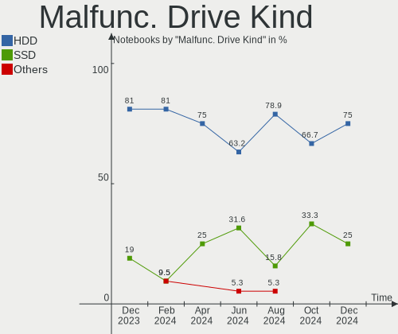
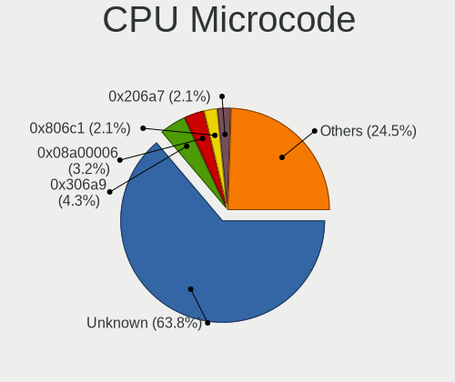
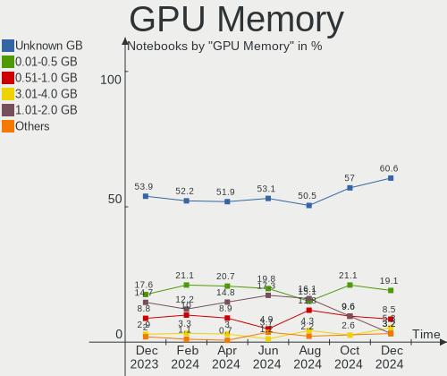

ROSA Hardware Trends (Notebooks)
--------------------------------

A project to identify most popular hardware characteristics and track their change
over time based on data collected by ROSA users at https://Linux-Hardware.org.

Anyone can contribute to this report by the [hw-probe](https://github.com/linuxhw/hw-probe) tool:

    sudo -E hw-probe -all -upload

Full-feature report is available here: https://linux-hardware.org/?view=trends

Period: Dec, 2021.

Contents
--------

* [ System ](#system)
  - [ OS                       ](#os)
  - [ OS Family                ](#os-family)
  - [ Kernel                   ](#kernel)
  - [ Kernel Family            ](#kernel-family)
  - [ Kernel Major Ver.        ](#kernel-major-ver)
  - [ Arch                     ](#arch)
  - [ DE                       ](#de)
  - [ Display Server           ](#display-server)
  - [ Display Manager          ](#display-manager)
  - [ OS Lang                  ](#os-lang)
  - [ Boot Mode                ](#boot-mode)
  - [ Filesystem               ](#filesystem)
  - [ Part. scheme             ](#part-scheme)
  - [ Dual Boot with Linux/BSD ](#dual-boot-with-linuxbsd)
  - [ Dual Boot (Win)          ](#dual-boot-win)

* [ Board ](#board)
  - [ Vendor                   ](#vendor)
  - [ Model                    ](#model)
  - [ Model Family             ](#model-family)
  - [ MFG Year                 ](#mfg-year)
  - [ Form Factor              ](#form-factor)
  - [ Secure Boot              ](#secure-boot)
  - [ Coreboot                 ](#coreboot)
  - [ RAM Size                 ](#ram-size)
  - [ RAM Used                 ](#ram-used)
  - [ Total Drives             ](#total-drives)
  - [ Has CD-ROM               ](#has-cd-rom)
  - [ Has Ethernet             ](#has-ethernet)
  - [ Has WiFi                 ](#has-wifi)
  - [ Has Bluetooth            ](#has-bluetooth)

* [ Location ](#location)
  - [ Country                  ](#country)
  - [ City                     ](#city)

* [ Drives ](#drives)
  - [ Drive Vendor             ](#drive-vendor)
  - [ Drive Model              ](#drive-model)
  - [ HDD Vendor               ](#hdd-vendor)
  - [ SSD Vendor               ](#ssd-vendor)
  - [ Drive Kind               ](#drive-kind)
  - [ Drive Connector          ](#drive-connector)
  - [ Drive Size               ](#drive-size)
  - [ Space Total              ](#space-total)
  - [ Space Used               ](#space-used)
  - [ Malfunc. Drives          ](#malfunc-drives)
  - [ Malfunc. Drive Vendor    ](#malfunc-drive-vendor)
  - [ Malfunc. HDD Vendor      ](#malfunc-hdd-vendor)
  - [ Malfunc. Drive Kind      ](#malfunc-drive-kind)
  - [ Failed Drives            ](#failed-drives)
  - [ Failed Drive Vendor      ](#failed-drive-vendor)
  - [ Drive Status             ](#drive-status)

* [ Storage controller ](#storage-controller)
  - [ Storage Vendor           ](#storage-vendor)
  - [ Storage Model            ](#storage-model)
  - [ Storage Kind             ](#storage-kind)

* [ Processor ](#processor)
  - [ CPU Vendor               ](#cpu-vendor)
  - [ CPU Model                ](#cpu-model)
  - [ CPU Model Family         ](#cpu-model-family)
  - [ CPU Cores                ](#cpu-cores)
  - [ CPU Sockets              ](#cpu-sockets)
  - [ CPU Threads              ](#cpu-threads)
  - [ CPU Op-Modes             ](#cpu-op-modes)
  - [ CPU Microcode            ](#cpu-microcode)
  - [ CPU Microarch            ](#cpu-microarch)

* [ Graphics ](#graphics)
  - [ GPU Vendor               ](#gpu-vendor)
  - [ GPU Model                ](#gpu-model)
  - [ GPU Combo                ](#gpu-combo)
  - [ GPU Driver               ](#gpu-driver)
  - [ GPU Memory               ](#gpu-memory)

* [ Monitor ](#monitor)
  - [ Monitor Vendor           ](#monitor-vendor)
  - [ Monitor Model            ](#monitor-model)
  - [ Monitor Resolution       ](#monitor-resolution)
  - [ Monitor Diagonal         ](#monitor-diagonal)
  - [ Monitor Width            ](#monitor-width)
  - [ Aspect Ratio             ](#aspect-ratio)
  - [ Monitor Area             ](#monitor-area)
  - [ Pixel Density            ](#pixel-density)
  - [ Multiple Monitors        ](#multiple-monitors)

* [ Network ](#network)
  - [ Net Controller Vendor    ](#net-controller-vendor)
  - [ Net Controller Model     ](#net-controller-model)
  - [ Wireless Vendor          ](#wireless-vendor)
  - [ Wireless Model           ](#wireless-model)
  - [ Ethernet Vendor          ](#ethernet-vendor)
  - [ Ethernet Model           ](#ethernet-model)
  - [ Net Controller Kind      ](#net-controller-kind)
  - [ Used Controller          ](#used-controller)
  - [ NICs                     ](#nics)
  - [ IPv6                     ](#ipv6)

* [ Bluetooth ](#bluetooth)
  - [ Bluetooth Vendor         ](#bluetooth-vendor)
  - [ Bluetooth Model          ](#bluetooth-model)

* [ Sound ](#sound)
  - [ Sound Vendor             ](#sound-vendor)
  - [ Sound Model              ](#sound-model)

* [ Memory ](#memory)
  - [ Memory Vendor            ](#memory-vendor)
  - [ Memory Model             ](#memory-model)
  - [ Memory Kind              ](#memory-kind)
  - [ Memory Form Factor       ](#memory-form-factor)
  - [ Memory Size              ](#memory-size)
  - [ Memory Speed             ](#memory-speed)

* [ Printers & scanners ](#printers--scanners)
  - [ Printer Vendor           ](#printer-vendor)
  - [ Printer Model            ](#printer-model)
  - [ Scanner Vendor           ](#scanner-vendor)
  - [ Scanner Model            ](#scanner-model)

* [ Camera ](#camera)
  - [ Camera Vendor            ](#camera-vendor)
  - [ Camera Model             ](#camera-model)

* [ Security ](#security)
  - [ Fingerprint Vendor       ](#fingerprint-vendor)
  - [ Fingerprint Model        ](#fingerprint-model)
  - [ Chipcard Vendor          ](#chipcard-vendor)
  - [ Chipcard Model           ](#chipcard-model)

* [ Unsupported ](#unsupported)
  - [ Unsupported Devices      ](#unsupported-devices)
  - [ Unsupported Device Types ](#unsupported-device-types)

System
------

OS
--

Installed operating systems

| Name       | Notebooks | Percent |
|------------|-----------|---------|
| ROSA 12.1  | 35        | 53.85%  |
| ROSA R11.1 | 24        | 36.92%  |
| ROSA 12    | 6         | 9.23%   |

OS Family
---------

OS without a version

| Name | Notebooks | Percent |
|------|-----------|---------|
| ROSA | 65        | 100%    |

Kernel
------

Version of the Linux kernel

| Version                             | Notebooks | Percent |
|-------------------------------------|-----------|---------|
| 5.10.74-generic-2rosa2021.1-x86_64  | 35        | 53.85%  |
| 5.4.83-generic-2rosa-x86_64         | 7         | 10.77%  |
| 5.10.71-generic-1rosa2021.1-x86_64  | 5         | 7.69%   |
| 5.4.32-generic-2rosa-i586           | 4         | 6.15%   |
| 5.4.83-generic-2rosa-i586           | 3         | 4.62%   |
| 4.15.0-desktop-122.124.1rosa-x86_64 | 3         | 4.62%   |
| 5.4.32-generic-2rosa-x86_64         | 2         | 3.08%   |
| 4.9.155-nrj-desktop-1rosa-x86_64    | 2         | 3.08%   |
| 4.15.0-desktop-122.124.1rosa-i586   | 2         | 3.08%   |
| 5.4.150-generic-1rosa2021.1-x86_64  | 1         | 1.54%   |
| 5.10.50-generic-1rosa-x86_64        | 1         | 1.54%   |

Kernel Family
-------------

Linux kernel without a distro release

| Version | Notebooks | Percent |
|---------|-----------|---------|
| 5.10.74 | 35        | 53.85%  |
| 5.4.83  | 10        | 15.38%  |
| 5.4.32  | 6         | 9.23%   |
| 5.10.71 | 5         | 7.69%   |
| 4.15.0  | 5         | 7.69%   |
| 4.9.155 | 2         | 3.08%   |
| 5.4.150 | 1         | 1.54%   |
| 5.10.50 | 1         | 1.54%   |

Kernel Major Ver.
-----------------

Linux kernel major version

| Version | Notebooks | Percent |
|---------|-----------|---------|
| 5.10    | 41        | 63.08%  |
| 5.4     | 17        | 26.15%  |
| 4.15    | 5         | 7.69%   |
| 4.9     | 2         | 3.08%   |

Arch
----

OS architecture (x86_64, i586, etc.)

| Name   | Notebooks | Percent |
|--------|-----------|---------|
| x86_64 | 56        | 86.15%  |
| i686   | 9         | 13.85%  |

DE
--

Desktop Environment

| Name  | Notebooks | Percent |
|-------|-----------|---------|
| KDE5  | 35        | 53.85%  |
| KDE4  | 15        | 23.08%  |
| GNOME | 8         | 12.31%  |
| LXQt  | 6         | 9.23%   |
| XFCE  | 1         | 1.54%   |

Display Server
--------------

X11 or Wayland

| Name    | Notebooks | Percent |
|---------|-----------|---------|
| Wayland | 38        | 58.46%  |
| X11     | 27        | 41.54%  |

Display Manager
---------------

SDDM, LightDM, etc.

| Name    | Notebooks | Percent |
|---------|-----------|---------|
| GDM     | 29        | 44.62%  |
| SDDM    | 20        | 30.77%  |
| KDM     | 15        | 23.08%  |
| LightDM | 1         | 1.54%   |

OS Lang
-------

Language

| Lang  | Notebooks | Percent |
|-------|-----------|---------|
| ru_RU | 58        | 89.23%  |
| ru_UA | 1         | 1.54%   |
| pl_PL | 1         | 1.54%   |
| nl_NL | 1         | 1.54%   |
| es_ES | 1         | 1.54%   |
| en_GB | 1         | 1.54%   |
| en_AU | 1         | 1.54%   |
| de_DE | 1         | 1.54%   |

Boot Mode
---------

EFI or BIOS

| Mode | Notebooks | Percent |
|------|-----------|---------|
| BIOS | 41        | 63.08%  |
| EFI  | 24        | 36.92%  |

Filesystem
----------

Type of filesystem

| Type  | Notebooks | Percent |
|-------|-----------|---------|
| Ext4  | 61        | 93.85%  |
| Btrfs | 4         | 6.15%   |

Part. scheme
------------

Scheme of partitioning

| Type | Notebooks | Percent |
|------|-----------|---------|
| MBR  | 34        | 52.31%  |
| GPT  | 31        | 47.69%  |

Dual Boot with Linux/BSD
------------------------

Hosting more than one Linux/BSD

| Dual boot | Notebooks | Percent |
|-----------|-----------|---------|
| No        | 43        | 66.15%  |
| Yes       | 22        | 33.85%  |

Dual Boot (Win)
---------------

Hosting Linux and Windows

| Dual boot | Notebooks | Percent |
|-----------|-----------|---------|
| No        | 34        | 52.31%  |
| Yes       | 31        | 47.69%  |

Board
-----

Vendor
------

Motherboard manufacturer

| Name                | Notebooks | Percent |
|---------------------|-----------|---------|
| Hewlett-Packard     | 14        | 21.54%  |
| Lenovo              | 12        | 18.46%  |
| Samsung Electronics | 9         | 13.85%  |
| ASUSTek Computer    | 8         | 12.31%  |
| Acer                | 5         | 7.69%   |
| Sony                | 3         | 4.62%   |
| Dell                | 3         | 4.62%   |
| Packard Bell        | 2         | 3.08%   |
| TUXEDO              | 1         | 1.54%   |
| Toshiba             | 1         | 1.54%   |
| MSI                 | 1         | 1.54%   |
| Intel               | 1         | 1.54%   |
| HASEE Computer      | 1         | 1.54%   |
| Fujitsu             | 1         | 1.54%   |
| DNS                 | 1         | 1.54%   |
| BenQ                | 1         | 1.54%   |
| Apple               | 1         | 1.54%   |

Model
-----

Motherboard model

| Name                                       | Notebooks | Percent |
|--------------------------------------------|-----------|---------|
| Samsung NC210/NC110                        | 2         | 3.08%   |
| Lenovo B590 20206                          | 2         | 3.08%   |
| HP Pavilion g6                             | 2         | 3.08%   |
| TUXEDO Pulse 15 Gen1                       | 1         | 1.54%   |
| Toshiba Satellite L30                      | 1         | 1.54%   |
| Sony VGN-FW51JF_H                          | 1         | 1.54%   |
| Sony SVE1512G1RB                           | 1         | 1.54%   |
| Sony SVE1412E1RW                           | 1         | 1.54%   |
| Samsung R530/R730                          | 1         | 1.54%   |
| Samsung R528/R728                          | 1         | 1.54%   |
| Samsung Q35/Q36                            | 1         | 1.54%   |
| Samsung N150P/N210P/N220P                  | 1         | 1.54%   |
| Samsung 300V3A/300V4A/300V5A/200A4B/200A5B | 1         | 1.54%   |
| Samsung 300E4C/300E5C/300E7C               | 1         | 1.54%   |
| Samsung 300E4A/300E5A/300E7A/3430EA/3530EA | 1         | 1.54%   |
| Packard Bell EN Butterfly m                | 1         | 1.54%   |
| Packard Bell EasyNote LJ75                 | 1         | 1.54%   |
| MSI GS63 7RD                               | 1         | 1.54%   |
| Lenovo ThinkPad X220 42912WG               | 1         | 1.54%   |
| Lenovo ThinkPad W540 20BG001KUK            | 1         | 1.54%   |
| Lenovo Legion Y7000 2019 81NS              | 1         | 1.54%   |
| Lenovo Legion Y540-17IRH 81Q4              | 1         | 1.54%   |
| Lenovo IdeaPad S145-15AST 81N3             | 1         | 1.54%   |
| Lenovo IdeaPad L340-15IRH Gaming 81LK      | 1         | 1.54%   |
| Lenovo IdeaPad 320-15AST 80XV              | 1         | 1.54%   |
| Lenovo IdeaPad 3 15ARE05 81W4              | 1         | 1.54%   |
| Lenovo G70-80 80FF                         | 1         | 1.54%   |
| Lenovo G580 20157                          | 1         | 1.54%   |
| HP Presario CQ57                           | 1         | 1.54%   |
| HP Pavilion TS 11                          | 1         | 1.54%   |
| HP Pavilion Gaming Laptop 16-a0xxx         | 1         | 1.54%   |
| HP Pavilion 15                             | 1         | 1.54%   |
| HP Notebook                                | 1         | 1.54%   |
| HP Mini 110-3000                           | 1         | 1.54%   |
| HP EliteBook Folio 9470m                   | 1         | 1.54%   |
| HP EliteBook 840 G4                        | 1         | 1.54%   |
| HP EliteBook 2760p                         | 1         | 1.54%   |
| HP Compaq Presario CQ60                    | 1         | 1.54%   |
| HP 630                                     | 1         | 1.54%   |
| HP .. Cario CQ57                           | 1         | 1.54%   |
| HASEE W65KJ1_KK1                           | 1         | 1.54%   |
| Fujitsu LIFEBOOK AH531                     | 1         | 1.54%   |
| DNS W510LU                                 | 1         | 1.54%   |
| Dell Vostro 1510                           | 1         | 1.54%   |
| Dell Latitude 5490                         | 1         | 1.54%   |
| Dell Inspiron 3558                         | 1         | 1.54%   |
| BenQ Joybook R56                           | 1         | 1.54%   |
| ASUS X555LJ                                | 1         | 1.54%   |
| ASUS X401A1                                | 1         | 1.54%   |
| ASUS VivoBook_ASUSLaptop X512FLC_X512FL    | 1         | 1.54%   |
| ASUS ROG Strix G513QY_G513QY               | 1         | 1.54%   |
| ASUS K53SD                                 | 1         | 1.54%   |
| ASUS K50IE                                 | 1         | 1.54%   |
| ASUS K43E                                  | 1         | 1.54%   |
| ASUS E402SA                                | 1         | 1.54%   |
| Apple MacBookAir2,1                        | 1         | 1.54%   |
| Acer Aspire V3-551G                        | 1         | 1.54%   |
| Acer Aspire ES1-522                        | 1         | 1.54%   |
| Acer Aspire 7220                           | 1         | 1.54%   |
| Acer Aspire 5750G                          | 1         | 1.54%   |

Model Family
------------

Motherboard model prefix

| Name                  | Notebooks | Percent |
|-----------------------|-----------|---------|
| HP Pavilion           | 5         | 7.69%   |
| Acer Aspire           | 5         | 7.69%   |
| Lenovo IdeaPad        | 4         | 6.15%   |
| HP EliteBook          | 3         | 4.62%   |
| Samsung NC210         | 2         | 3.08%   |
| Lenovo ThinkPad       | 2         | 3.08%   |
| Lenovo Legion         | 2         | 3.08%   |
| Lenovo B590           | 2         | 3.08%   |
| TUXEDO Pulse          | 1         | 1.54%   |
| Toshiba Satellite     | 1         | 1.54%   |
| Sony VGN-FW51JF       | 1         | 1.54%   |
| Sony SVE1512G1RB      | 1         | 1.54%   |
| Sony SVE1412E1RW      | 1         | 1.54%   |
| Samsung R530          | 1         | 1.54%   |
| Samsung R528          | 1         | 1.54%   |
| Samsung Q35           | 1         | 1.54%   |
| Samsung N150P         | 1         | 1.54%   |
| Samsung 300V3A        | 1         | 1.54%   |
| Samsung 300E4C        | 1         | 1.54%   |
| Samsung 300E4A        | 1         | 1.54%   |
| Packard Bell EN       | 1         | 1.54%   |
| Packard Bell EasyNote | 1         | 1.54%   |
| MSI GS63              | 1         | 1.54%   |
| Lenovo G70-80         | 1         | 1.54%   |
| Lenovo G580           | 1         | 1.54%   |
| HP Presario           | 1         | 1.54%   |
| HP Notebook           | 1         | 1.54%   |
| HP Mini               | 1         | 1.54%   |
| HP Compaq             | 1         | 1.54%   |
| HP 630                | 1         | 1.54%   |
| HP ..                 | 1         | 1.54%   |
| HASEE W65KJ1          | 1         | 1.54%   |
| Fujitsu LIFEBOOK      | 1         | 1.54%   |
| DNS W510LU            | 1         | 1.54%   |
| Dell Vostro           | 1         | 1.54%   |
| Dell Latitude         | 1         | 1.54%   |
| Dell Inspiron         | 1         | 1.54%   |
| BenQ Joybook          | 1         | 1.54%   |
| ASUS X555LJ           | 1         | 1.54%   |
| ASUS X401A1           | 1         | 1.54%   |
| ASUS VivoBook         | 1         | 1.54%   |
| ASUS ROG              | 1         | 1.54%   |
| ASUS K53SD            | 1         | 1.54%   |
| ASUS K50IE            | 1         | 1.54%   |
| ASUS K43E             | 1         | 1.54%   |
| ASUS E402SA           | 1         | 1.54%   |
| Apple MacBookAir2     | 1         | 1.54%   |
| Unknown               | 1         | 1.54%   |

MFG Year
--------

Motherboard manufacture year

| Year | Notebooks | Percent |
|------|-----------|---------|
| 2011 | 12        | 18.46%  |
| 2021 | 6         | 9.23%   |
| 2013 | 6         | 9.23%   |
| 2012 | 6         | 9.23%   |
| 2018 | 5         | 7.69%   |
| 2010 | 5         | 7.69%   |
| 2020 | 4         | 6.15%   |
| 2016 | 4         | 6.15%   |
| 2015 | 4         | 6.15%   |
| 2009 | 3         | 4.62%   |
| 2008 | 3         | 4.62%   |
| 2019 | 2         | 3.08%   |
| 2017 | 2         | 3.08%   |
| 2007 | 2         | 3.08%   |
| 2006 | 1         | 1.54%   |

Form Factor
-----------

Physical design of the computer

| Name     | Notebooks | Percent |
|----------|-----------|---------|
| Notebook | 65        | 100%    |

Secure Boot
-----------

Enabled or disabled

| State    | Notebooks | Percent |
|----------|-----------|---------|
| Disabled | 65        | 100%    |

Coreboot
--------

Have coreboot on board

| Used | Notebooks | Percent |
|------|-----------|---------|
| No   | 65        | 100%    |

RAM Size
--------

Total RAM memory

| Size in GB | Notebooks | Percent |
|------------|-----------|---------|
| 3.01-4.0   | 21        | 32.31%  |
| 4.01-8.0   | 13        | 20%     |
| 1.01-2.0   | 12        | 18.46%  |
| 8.01-16.0  | 9         | 13.85%  |
| 16.01-24.0 | 4         | 6.15%   |
| 2.01-3.0   | 2         | 3.08%   |
| 0.51-1.0   | 2         | 3.08%   |
| 32.01-64.0 | 1         | 1.54%   |
| 24.01-32.0 | 1         | 1.54%   |

RAM Used
--------

Used RAM memory

| Used GB  | Notebooks | Percent |
|----------|-----------|---------|
| 0.51-1.0 | 27        | 41.54%  |
| 1.01-2.0 | 25        | 38.46%  |
| 2.01-3.0 | 8         | 12.31%  |
| 3.01-4.0 | 2         | 3.08%   |
| 0.01-0.5 | 2         | 3.08%   |
| 4.01-8.0 | 1         | 1.54%   |

Total Drives
------------

Number of drives on board

| Drives | Notebooks | Percent |
|--------|-----------|---------|
| 1      | 45        | 69.23%  |
| 2      | 20        | 30.77%  |

Has CD-ROM
----------

Has CD-ROM on board

| Presented | Notebooks | Percent |
|-----------|-----------|---------|
| No        | 33        | 50.77%  |
| Yes       | 32        | 49.23%  |

Has Ethernet
------------

Has Ethernet on board

| Presented | Notebooks | Percent |
|-----------|-----------|---------|
| Yes       | 61        | 93.85%  |
| No        | 4         | 6.15%   |

Has WiFi
--------

Has WiFi module

| Presented | Notebooks | Percent |
|-----------|-----------|---------|
| Yes       | 65        | 100%    |

Has Bluetooth
-------------

Has Bluetooth module

| Presented | Notebooks | Percent |
|-----------|-----------|---------|
| Yes       | 46        | 70.77%  |
| No        | 19        | 29.23%  |

Location
--------

Country
-------

Geographic location (country)

| Country     | Notebooks | Percent |
|-------------|-----------|---------|
| Russia      | 45        | 69.23%  |
| Ukraine     | 7         | 10.77%  |
| Latvia      | 2         | 3.08%   |
| Kazakhstan  | 2         | 3.08%   |
| France      | 2         | 3.08%   |
| Belarus     | 2         | 3.08%   |
| Poland      | 1         | 1.54%   |
| Netherlands | 1         | 1.54%   |
| Germany     | 1         | 1.54%   |
| Austria     | 1         | 1.54%   |
| Australia   | 1         | 1.54%   |

City
----

Geographic location (city)

| City                | Notebooks | Percent |
|---------------------|-----------|---------|
| Moscow              | 8         | 12.31%  |
| Yekaterinburg       | 3         | 4.62%   |
| Kazan?ˆ™            | 3         | 4.62%   |
| Tver                | 2         | 3.08%   |
| Riga                | 2         | 3.08%   |
| Minsk               | 2         | 3.08%   |
| Kemerovo            | 2         | 3.08%   |
| Castera-Lectourois  | 2         | 3.08%   |
| Warsaw              | 1         | 1.54%   |
| Volgograd           | 1         | 1.54%   |
| Vienna              | 1         | 1.54%   |
| Ufa                 | 1         | 1.54%   |
| Tumbotino           | 1         | 1.54%   |
| Tula                | 1         | 1.54%   |
| The Hague           | 1         | 1.54%   |
| Sydney              | 1         | 1.54%   |
| Starotitarovskaya   | 1         | 1.54%   |
| St Petersburg       | 1         | 1.54%   |
| Simferopol          | 1         | 1.54%   |
| Severoural'sk       | 1         | 1.54%   |
| Sevastopol          | 1         | 1.54%   |
| Semey               | 1         | 1.54%   |
| Samara              | 1         | 1.54%   |
| Rudnyy              | 1         | 1.54%   |
| Rostov-on-Don       | 1         | 1.54%   |
| Petergof            | 1         | 1.54%   |
| Orenburg            | 1         | 1.54%   |
| Odintsovo           | 1         | 1.54%   |
| Odessa              | 1         | 1.54%   |
| Naro-Fominsk        | 1         | 1.54%   |
| Myrnohrad           | 1         | 1.54%   |
| Minusinsk           | 1         | 1.54%   |
| Krasnodar           | 1         | 1.54%   |
| Klin                | 1         | 1.54%   |
| Khot'kovo           | 1         | 1.54%   |
| Kharkiv             | 1         | 1.54%   |
| Khabarovsk          | 1         | 1.54%   |
| Kamensk-Shakhtinsky | 1         | 1.54%   |
| Kaliningrad         | 1         | 1.54%   |
| Izhevsk             | 1         | 1.54%   |
| Frankfurt am Main   | 1         | 1.54%   |
| Donetsk             | 1         | 1.54%   |
| Dnipro              | 1         | 1.54%   |
| Chelyabinsk         | 1         | 1.54%   |
| Belokurikha         | 1         | 1.54%   |
| Belgorod            | 1         | 1.54%   |
| Barnaul             | 1         | 1.54%   |
| Astrakhan           | 1         | 1.54%   |
| Asbest              | 1         | 1.54%   |

Drives
------

Drive Vendor
------------

Hard drive vendors

| Vendor              | Notebooks | Drives | Percent |
|---------------------|-----------|--------|---------|
| Seagate             | 13        | 13     | 15.85%  |
| WDC                 | 10        | 10     | 12.2%   |
| Toshiba             | 9         | 9      | 10.98%  |
| Samsung Electronics | 9         | 9      | 10.98%  |
| Hitachi             | 7         | 7      | 8.54%   |
| Kingston            | 5         | 5      | 6.1%    |
| HGST                | 4         | 4      | 4.88%   |
| Unknown             | 3         | 3      | 3.66%   |
| Smartbuy            | 2         | 2      | 2.44%   |
| SK Hynix            | 2         | 2      | 2.44%   |
| Gigabyte Technology | 2         | 2      | 2.44%   |
| Crucial             | 2         | 2      | 2.44%   |
| China               | 2         | 2      | 2.44%   |
| UMIS                | 1         | 1      | 1.22%   |
| Transcend           | 1         | 1      | 1.22%   |
| Team                | 1         | 1      | 1.22%   |
| SPCC                | 1         | 1      | 1.22%   |
| SanDisk             | 1         | 1      | 1.22%   |
| Patriot             | 1         | 1      | 1.22%   |
| Micron Technology   | 1         | 1      | 1.22%   |
| Intel               | 1         | 1      | 1.22%   |
| GOODRAM             | 1         | 1      | 1.22%   |
| Fujitsu             | 1         | 1      | 1.22%   |
| Apacer              | 1         | 1      | 1.22%   |
| A-DATA Technology   | 1         | 1      | 1.22%   |

Drive Model
-----------

Hard drive models

| Model                                     | Notebooks | Percent |
|-------------------------------------------|-----------|---------|
| Smartbuy SSD 120GB                        | 2         | 2.44%   |
| Seagate ST500LT012-1DG142 500GB           | 2         | 2.44%   |
| Seagate ST320LT020-9YG142 320GB           | 2         | 2.44%   |
| Seagate ST1000LM024 HN-M101MBB 1TB        | 2         | 2.44%   |
| Hitachi HTS543232A7A384 320GB             | 2         | 2.44%   |
| HGST HTS545050A7E380 500GB                | 2         | 2.44%   |
| Crucial CT120BX500SSD1 120GB              | 2         | 2.44%   |
| WDC WDS120G2G0A-00JH30 120GB SSD          | 1         | 1.22%   |
| WDC WDS120G1G0A-00SS50 120GB SSD          | 1         | 1.22%   |
| WDC WDS100T3X0C-00SJG0 1TB                | 1         | 1.22%   |
| WDC WD800BEVS-22RST0 80GB                 | 1         | 1.22%   |
| WDC WD7500BPVT-60HXZT3 752GB              | 1         | 1.22%   |
| WDC WD5000LPLX-60ZNTT1 500GB              | 1         | 1.22%   |
| WDC WD5000BPVT-24HXZT3 500GB              | 1         | 1.22%   |
| WDC WD3200BEVT-60A23T0 320GB              | 1         | 1.22%   |
| WDC WD10SPZX-24Z10 1TB                    | 1         | 1.22%   |
| WDC PC SN730 SDBPNTY-512G-1101 512GB      | 1         | 1.22%   |
| Unknown SDU1  64GB                        | 1         | 1.22%   |
| Unknown SD08G  8GB                        | 1         | 1.22%   |
| Unknown ISOCOM  64GB                      | 1         | 1.22%   |
| UMIS RPFTJ128PDD2EWX 128GB                | 1         | 1.22%   |
| Transcend TS128GSSD320 128GB              | 1         | 1.22%   |
| Toshiba THNSNJ256G8NY 256GB SSD           | 1         | 1.22%   |
| Toshiba THNSNJ128GCSU 128GB SSD           | 1         | 1.22%   |
| Toshiba MQ01ABF050 500GB                  | 1         | 1.22%   |
| Toshiba MQ01ABD100 1TB                    | 1         | 1.22%   |
| Toshiba MK3276GSX 320GB                   | 1         | 1.22%   |
| Toshiba MK3259GSXP 320GB                  | 1         | 1.22%   |
| Toshiba MK2555GSX 250GB                   | 1         | 1.22%   |
| Toshiba MK1234GSX 120GB                   | 1         | 1.22%   |
| Toshiba KSG60ZMV256G M.2 2280 256GB SSD   | 1         | 1.22%   |
| Team L5 LITE SSD 120GB                    | 1         | 1.22%   |
| SPCC Solid State Disk 512GB               | 1         | 1.22%   |
| SK Hynix SKHynix_HFM512GDHTNI-87A0B 512GB | 1         | 1.22%   |
| SK Hynix C2S3T/120G 120GB SSD             | 1         | 1.22%   |
| Seagate ST9500325AS 500GB                 | 1         | 1.22%   |
| Seagate ST9320423AS 320GB                 | 1         | 1.22%   |
| Seagate ST9160411AS 160GB                 | 1         | 1.22%   |
| Seagate ST500LM030-2E717D 500GB           | 1         | 1.22%   |
| Seagate ST500LM012 HN-M500MBB 500GB       | 1         | 1.22%   |
| Seagate ST500LM000-1EJ162 500GB           | 1         | 1.22%   |
| Seagate ST1000LM048-2E7172 1TB            | 1         | 1.22%   |
| SanDisk SD5SB2-128G-1006E 128GB SSD       | 1         | 1.22%   |
| Samsung SSD 870 EVO 1TB                   | 1         | 1.22%   |
| Samsung SSD 860 EVO M.2 250GB             | 1         | 1.22%   |
| Samsung SSD 840 PRO Series 128GB          | 1         | 1.22%   |
| Samsung MZVLQ512HALU-000H1 512GB          | 1         | 1.22%   |
| Samsung MZVLQ1T0HBLB-00B00 1TB            | 1         | 1.22%   |
| Samsung MZ7LN128HAHQ-000L2 128GB SSD      | 1         | 1.22%   |
| Samsung HS12UHE 120GB                     | 1         | 1.22%   |
| Samsung HM321HI 320GB                     | 1         | 1.22%   |
| Samsung HM250HI 250GB                     | 1         | 1.22%   |
| Patriot Burst 120GB SSD                   | 1         | 1.22%   |
| Micron MTFDHBA512TCK 512GB                | 1         | 1.22%   |
| Kingston SV300S37A60G 64GB SSD            | 1         | 1.22%   |
| Kingston SKC600512G 512GB SSD             | 1         | 1.22%   |
| Kingston SA400S37240G 240GB SSD           | 1         | 1.22%   |
| Kingston SA2000M8250G 250GB               | 1         | 1.22%   |
| Kingston RBUSNS8180S3512GJ 512GB SSD      | 1         | 1.22%   |
| Intel SSDPEKNW512G8 512GB                 | 1         | 1.22%   |

HDD Vendor
----------

Hard disk drive vendors

| Vendor              | Notebooks | Drives | Percent |
|---------------------|-----------|--------|---------|
| Seagate             | 13        | 13     | 32.5%   |
| Hitachi             | 7         | 7      | 17.5%   |
| WDC                 | 6         | 6      | 15%     |
| Toshiba             | 6         | 6      | 15%     |
| HGST                | 4         | 4      | 10%     |
| Samsung Electronics | 3         | 3      | 7.5%    |
| Fujitsu             | 1         | 1      | 2.5%    |

SSD Vendor
----------

Solid state drive vendors

| Vendor              | Notebooks | Drives | Percent |
|---------------------|-----------|--------|---------|
| Samsung Electronics | 4         | 4      | 13.33%  |
| Kingston            | 4         | 4      | 13.33%  |
| Toshiba             | 3         | 3      | 10%     |
| WDC                 | 2         | 2      | 6.67%   |
| Smartbuy            | 2         | 2      | 6.67%   |
| Gigabyte Technology | 2         | 2      | 6.67%   |
| Crucial             | 2         | 2      | 6.67%   |
| China               | 2         | 2      | 6.67%   |
| Transcend           | 1         | 1      | 3.33%   |
| Team                | 1         | 1      | 3.33%   |
| SPCC                | 1         | 1      | 3.33%   |
| SK Hynix            | 1         | 1      | 3.33%   |
| SanDisk             | 1         | 1      | 3.33%   |
| Patriot             | 1         | 1      | 3.33%   |
| GOODRAM             | 1         | 1      | 3.33%   |
| Apacer              | 1         | 1      | 3.33%   |
| A-DATA Technology   | 1         | 1      | 3.33%   |

Drive Kind
----------

HDD or SSD

| Kind | Notebooks | Drives | Percent |
|------|-----------|--------|---------|
| HDD  | 39        | 40     | 50%     |
| SSD  | 28        | 30     | 35.9%   |
| NVMe | 8         | 9      | 10.26%  |
| MMC  | 3         | 3      | 3.85%   |

Drive Connector
---------------

SATA, SAS, NVMe, etc.

| Type | Notebooks | Drives | Percent |
|------|-----------|--------|---------|
| SATA | 60        | 69     | 83.33%  |
| NVMe | 8         | 9      | 11.11%  |
| MMC  | 3         | 3      | 4.17%   |
| SAS  | 1         | 1      | 1.39%   |

Drive Size
----------

Size of hard drive

| Size in TB | Notebooks | Drives | Percent |
|------------|-----------|--------|---------|
| 0.01-0.5   | 54        | 58     | 81.82%  |
| 0.51-1.0   | 12        | 12     | 18.18%  |

Space Total
-----------

Amount of disk space available on the file system

| Size in GB | Notebooks | Percent |
|------------|-----------|---------|
| 101-250    | 26        | 40%     |
| 251-500    | 12        | 18.46%  |
| 1-20       | 9         | 13.85%  |
| 501-1000   | 9         | 13.85%  |
| 51-100     | 5         | 7.69%   |
| 21-50      | 2         | 3.08%   |
| 1001-2000  | 2         | 3.08%   |

Space Used
----------

Amount of used disk space

| Used GB  | Notebooks | Percent |
|----------|-----------|---------|
| 1-20     | 43        | 66.15%  |
| 21-50    | 8         | 12.31%  |
| 101-250  | 7         | 10.77%  |
| 251-500  | 4         | 6.15%   |
| 51-100   | 2         | 3.08%   |
| 501-1000 | 1         | 1.54%   |

Malfunc. Drives
---------------

Drive models with a malfunction

| Model                               | Notebooks | Drives | Percent |
|-------------------------------------|-----------|--------|---------|
| Seagate ST320LT020-9YG142 320GB     | 2         | 2      | 8.7%    |
| WDC WD7500BPVT-60HXZT3 752GB        | 1         | 1      | 4.35%   |
| WDC WD3200BEVT-60A23T0 320GB        | 1         | 1      | 4.35%   |
| Toshiba MK3276GSX 320GB             | 1         | 1      | 4.35%   |
| Toshiba MK3259GSXP 320GB            | 1         | 1      | 4.35%   |
| Toshiba MK1234GSX 120GB             | 1         | 1      | 4.35%   |
| Seagate ST500LT012-1DG142 500GB     | 1         | 1      | 4.35%   |
| Seagate ST500LM012 HN-M500MBB 500GB | 1         | 1      | 4.35%   |
| Seagate ST500LM000-1EJ162 500GB     | 1         | 1      | 4.35%   |
| Seagate ST1000LM048-2E7172 1TB      | 1         | 1      | 4.35%   |
| Seagate ST1000LM024 HN-M101MBB 1TB  | 1         | 1      | 4.35%   |
| Samsung Electronics SSD 870 EVO 1TB | 1         | 1      | 4.35%   |
| Samsung Electronics HS12UHE 120GB   | 1         | 1      | 4.35%   |
| Samsung Electronics HM321HI 320GB   | 1         | 1      | 4.35%   |
| Hitachi HTS723225A7A364 250GB       | 1         | 1      | 4.35%   |
| Hitachi HTS547575A9E384 752GB       | 1         | 1      | 4.35%   |
| Hitachi HTS547550A9E384 500GB       | 1         | 1      | 4.35%   |
| Hitachi HTS545050B9A300 500GB       | 1         | 1      | 4.35%   |
| Hitachi HTS542512K9SA00 120GB       | 1         | 1      | 4.35%   |
| HGST HTS545050A7E680 500GB          | 1         | 1      | 4.35%   |
| HGST HTS545050A7E380 500GB          | 1         | 1      | 4.35%   |
| China SSD 360GB                     | 1         | 1      | 4.35%   |

Malfunc. Drive Vendor
---------------------

Vendors of faulty drives

| Vendor              | Notebooks | Drives | Percent |
|---------------------|-----------|--------|---------|
| Seagate             | 7         | 7      | 30.43%  |
| Hitachi             | 5         | 5      | 21.74%  |
| Toshiba             | 3         | 3      | 13.04%  |
| Samsung Electronics | 3         | 3      | 13.04%  |
| WDC                 | 2         | 2      | 8.7%    |
| HGST                | 2         | 2      | 8.7%    |
| China               | 1         | 1      | 4.35%   |

Malfunc. HDD Vendor
-------------------

Vendors of faulty HDD drives

| Vendor              | Notebooks | Drives | Percent |
|---------------------|-----------|--------|---------|
| Seagate             | 7         | 7      | 33.33%  |
| Hitachi             | 5         | 5      | 23.81%  |
| Toshiba             | 3         | 3      | 14.29%  |
| WDC                 | 2         | 2      | 9.52%   |
| Samsung Electronics | 2         | 2      | 9.52%   |
| HGST                | 2         | 2      | 9.52%   |

Malfunc. Drive Kind
-------------------

Kinds of faulty drives

| Kind | Notebooks | Drives | Percent |
|------|-----------|--------|---------|
| HDD  | 20        | 21     | 90.91%  |
| SSD  | 2         | 2      | 9.09%   |

Failed Drives
-------------

Failed drive models

| Model                        | Notebooks | Drives | Percent |
|------------------------------|-----------|--------|---------|
| WDC WD5000BPVT-24HXZT3 500GB | 1         | 1      | 50%     |
| Seagate ST9320423AS 320GB    | 1         | 1      | 50%     |

Failed Drive Vendor
-------------------

Failed drive vendors

| Vendor  | Notebooks | Drives | Percent |
|---------|-----------|--------|---------|
| WDC     | 1         | 1      | 50%     |
| Seagate | 1         | 1      | 50%     |

Drive Status
------------

Number of failed and malfunc. drives

| Status   | Notebooks | Drives | Percent |
|----------|-----------|--------|---------|
| Works    | 47        | 53     | 62.67%  |
| Malfunc  | 22        | 23     | 29.33%  |
| Detected | 4         | 4      | 5.33%   |
| Failed   | 2         | 2      | 2.67%   |

Storage controller
------------------

Storage Vendor
--------------

Storage controller vendors

| Vendor                      | Notebooks | Percent |
|-----------------------------|-----------|---------|
| Intel                       | 49        | 67.12%  |
| AMD                         | 11        | 15.07%  |
| Nvidia                      | 4         | 5.48%   |
| Sandisk                     | 2         | 2.74%   |
| Samsung Electronics         | 2         | 2.74%   |
| Union Memory (Shenzhen)     | 1         | 1.37%   |
| SK Hynix                    | 1         | 1.37%   |
| Micron Technology           | 1         | 1.37%   |
| Kingston Technology Company | 1         | 1.37%   |
| JMicron Technology          | 1         | 1.37%   |

Storage Model
-------------

Storage controller models

| Model                                                                            | Notebooks | Percent |
|----------------------------------------------------------------------------------|-----------|---------|
| Intel 6 Series/C200 Series Chipset Family 6 port Mobile SATA AHCI Controller     | 10        | 12.5%   |
| Intel 7 Series Chipset Family 6-port SATA Controller [AHCI mode]                 | 8         | 10%     |
| AMD FCH SATA Controller [AHCI mode]                                              | 8         | 10%     |
| Intel NM10/ICH7 Family SATA Controller [AHCI mode]                               | 4         | 5%      |
| Intel 82801IBM/IEM (ICH9M/ICH9M-E) 4 port SATA Controller [AHCI mode]            | 4         | 5%      |
| Intel Wildcat Point-LP SATA Controller [AHCI Mode]                               | 3         | 3.75%   |
| Intel Cannon Lake Mobile PCH SATA AHCI Controller                                | 3         | 3.75%   |
| Intel 82801HM/HEM (ICH8M/ICH8M-E) IDE Controller                                 | 3         | 3.75%   |
| Sandisk WD Black SN750 / PC SN730 NVMe SSD                                       | 2         | 2.5%    |
| Samsung NVMe SSD Controller 980                                                  | 2         | 2.5%    |
| Nvidia MCP79 AHCI Controller                                                     | 2         | 2.5%    |
| Intel Sunrise Point-LP SATA Controller [AHCI mode]                               | 2         | 2.5%    |
| Intel Atom/Celeron/Pentium Processor x5-E8000/J3xxx/N3xxx Series SATA Controller | 2         | 2.5%    |
| Intel 82801HM/HEM (ICH8M/ICH8M-E) SATA Controller [AHCI mode]                    | 2         | 2.5%    |
| Intel 82801 Mobile SATA Controller [RAID mode]                                   | 2         | 2.5%    |
| AMD SB7x0/SB8x0/SB9x0 SATA Controller [AHCI mode]                                | 2         | 2.5%    |
| Union Memory (Shenzhen) Non-Volatile memory controller                           | 1         | 1.25%   |
| SK Hynix BC511                                                                   | 1         | 1.25%   |
| Nvidia MCP78S [GeForce 8200] SATA Controller (non-AHCI mode)                     | 1         | 1.25%   |
| Nvidia MCP78S [GeForce 8200] IDE                                                 | 1         | 1.25%   |
| Nvidia MCP67 IDE Controller                                                      | 1         | 1.25%   |
| Nvidia MCP67 AHCI Controller                                                     | 1         | 1.25%   |
| Micron Non-Volatile memory controller                                            | 1         | 1.25%   |
| Kingston Company A2000 NVMe SSD                                                  | 1         | 1.25%   |
| JMicron JMB360 AHCI Controller                                                   | 1         | 1.25%   |
| Intel SSD 660P Series                                                            | 1         | 1.25%   |
| Intel Q170/Q150/B150/H170/H110/Z170/CM236 Chipset SATA Controller [AHCI Mode]    | 1         | 1.25%   |
| Intel HM170/QM170 Chipset SATA Controller [AHCI Mode]                            | 1         | 1.25%   |
| Intel Comet Lake PCH-LP SATA RAID Premium Controller                             | 1         | 1.25%   |
| Intel Celeron N3350/Pentium N4200/Atom E3900 Series SATA AHCI Controller         | 1         | 1.25%   |
| Intel 82801HM/HEM (ICH8M/ICH8M-E) SATA Controller [IDE mode]                     | 1         | 1.25%   |
| Intel 82801GBM/GHM (ICH7-M Family) SATA Controller [IDE mode]                    | 1         | 1.25%   |
| Intel 8 Series/C220 Series Chipset Family 6-port SATA Controller 1 [AHCI mode]   | 1         | 1.25%   |
| Intel 8 Series SATA Controller 1 [AHCI mode]                                     | 1         | 1.25%   |
| Intel 5 Series/3400 Series Chipset 4 port SATA AHCI Controller                   | 1         | 1.25%   |
| AMD IXP SB4x0 Serial ATA Controller                                              | 1         | 1.25%   |
| AMD IXP SB4x0 IDE Controller                                                     | 1         | 1.25%   |

Storage Kind
------------

Kind of storage controller (IDE, SATA, NVMe, SAS, ...)

| Kind | Notebooks | Percent |
|------|-----------|---------|
| SATA | 57        | 76%     |
| NVMe | 8         | 10.67%  |
| IDE  | 7         | 9.33%   |
| RAID | 3         | 4%      |

Processor
---------

CPU Vendor
----------

Processor vendors

| Vendor | Notebooks | Percent |
|--------|-----------|---------|
| Intel  | 52        | 80%     |
| AMD    | 13        | 20%     |

CPU Model
---------

Processor models

| Model                                        | Notebooks | Percent |
|----------------------------------------------|-----------|---------|
| Intel Core i5-9300H CPU @ 2.40GHz            | 3         | 4.62%   |
| Intel Core i5-2450M CPU @ 2.50GHz            | 3         | 4.62%   |
| Intel Pentium Dual-Core CPU T4400 @ 2.20GHz  | 2         | 3.08%   |
| Intel Pentium CPU 2020M @ 2.40GHz            | 2         | 3.08%   |
| Intel Core i5-2540M CPU @ 2.60GHz            | 2         | 3.08%   |
| Intel Core i3-2310M CPU @ 2.10GHz            | 2         | 3.08%   |
| Intel Celeron CPU N3050 @ 1.60GHz            | 2         | 3.08%   |
| Intel Atom CPU N455 @ 1.66GHz                | 2         | 3.08%   |
| Intel Atom CPU N450 @ 1.66GHz                | 2         | 3.08%   |
| Intel Pentium CPU B980 @ 2.40GHz             | 1         | 1.54%   |
| Intel Pentium CPU B950 @ 2.10GHz             | 1         | 1.54%   |
| Intel Pentium CPU B940 @ 2.00GHz             | 1         | 1.54%   |
| Intel Genuine CPU U7300 @ 1.30GHz            | 1         | 1.54%   |
| Intel Core i7-7700HQ CPU @ 2.80GHz           | 1         | 1.54%   |
| Intel Core i7-4700MQ CPU @ 2.40GHz           | 1         | 1.54%   |
| Intel Core i7-3687U CPU @ 2.10GHz            | 1         | 1.54%   |
| Intel Core i7-2670QM CPU @ 2.20GHz           | 1         | 1.54%   |
| Intel Core i7-10750H CPU @ 2.60GHz           | 1         | 1.54%   |
| Intel Core i5-9400 CPU @ 2.90GHz             | 1         | 1.54%   |
| Intel Core i5-8250U CPU @ 1.60GHz            | 1         | 1.54%   |
| Intel Core i5-7200U CPU @ 2.50GHz            | 1         | 1.54%   |
| Intel Core i5-6200U CPU @ 2.30GHz            | 1         | 1.54%   |
| Intel Core i5-5200U CPU @ 2.20GHz            | 1         | 1.54%   |
| Intel Core i5-4200U CPU @ 1.60GHz            | 1         | 1.54%   |
| Intel Core i5-10210U CPU @ 1.60GHz           | 1         | 1.54%   |
| Intel Core i5 CPU M 430 @ 2.27GHz            | 1         | 1.54%   |
| Intel Core i3-5020U CPU @ 2.20GHz            | 1         | 1.54%   |
| Intel Core i3-5005U CPU @ 2.00GHz            | 1         | 1.54%   |
| Intel Core i3-3110M CPU @ 2.40GHz            | 1         | 1.54%   |
| Intel Core i3-2330M CPU @ 2.20GHz            | 1         | 1.54%   |
| Intel Core 2 Duo CPU T8300 @ 2.40GHz         | 1         | 1.54%   |
| Intel Core 2 Duo CPU T5670 @ 1.80GHz         | 1         | 1.54%   |
| Intel Core 2 Duo CPU P7450 @ 2.13GHz         | 1         | 1.54%   |
| Intel Core 2 Duo CPU L9400 @ 1.86GHz         | 1         | 1.54%   |
| Intel Core 2 CPU T5500 @ 1.66GHz             | 1         | 1.54%   |
| Intel Celeron M CPU 430 @ 1.73GHz            | 1         | 1.54%   |
| Intel Celeron Dual-Core CPU T3300 @ 2.00GHz  | 1         | 1.54%   |
| Intel Celeron CPU N3350 @ 1.10GHz            | 1         | 1.54%   |
| Intel Celeron CPU B820 @ 1.70GHz             | 1         | 1.54%   |
| Intel Celeron CPU 530 @ 1.73GHz              | 1         | 1.54%   |
| Intel Celeron CPU 1005M @ 1.90GHz            | 1         | 1.54%   |
| AMD Turion 64 X2 Mobile Technology TL-60     | 1         | 1.54%   |
| AMD Sempron SI-42                            | 1         | 1.54%   |
| AMD Ryzen 9 5900HX with Radeon Graphics      | 1         | 1.54%   |
| AMD Ryzen 7 4800H with Radeon Graphics       | 1         | 1.54%   |
| AMD Ryzen 3 4300U with Radeon Graphics       | 1         | 1.54%   |
| AMD E2-9000 RADEON R2, 4 COMPUTE CORES 2C+2G | 1         | 1.54%   |
| AMD E1-7010 APU with AMD Radeon R2 Graphics  | 1         | 1.54%   |
| AMD E-450 APU with Radeon HD Graphics        | 1         | 1.54%   |
| AMD E-300 APU with Radeon HD Graphics        | 1         | 1.54%   |
| AMD A8-4500M APU with Radeon HD Graphics     | 1         | 1.54%   |
| AMD A6-9225 RADEON R4, 5 COMPUTE CORES 2C+3G | 1         | 1.54%   |
| AMD A6-3400M APU with Radeon HD Graphics     | 1         | 1.54%   |
| AMD A6-1450 APU with Radeon HD Graphics      | 1         | 1.54%   |

CPU Model Family
----------------

Processor model prefix

| Model                   | Notebooks | Percent |
|-------------------------|-----------|---------|
| Intel Core i5           | 16        | 24.62%  |
| Intel Core i3           | 6         | 9.23%   |
| Intel Celeron           | 6         | 9.23%   |
| Intel Pentium           | 5         | 7.69%   |
| Intel Core i7           | 5         | 7.69%   |
| Intel Core 2 Duo        | 4         | 6.15%   |
| Intel Atom              | 4         | 6.15%   |
| AMD A6                  | 3         | 4.62%   |
| Intel Pentium Dual-Core | 2         | 3.08%   |
| AMD E                   | 2         | 3.08%   |
| Intel Genuine           | 1         | 1.54%   |
| Intel Core 2            | 1         | 1.54%   |
| Intel Celeron M         | 1         | 1.54%   |
| Intel Celeron Dual-Core | 1         | 1.54%   |
| AMD Turion 64 X2 Mobile | 1         | 1.54%   |
| AMD Sempron             | 1         | 1.54%   |
| AMD Ryzen 9             | 1         | 1.54%   |
| AMD Ryzen 7             | 1         | 1.54%   |
| AMD Ryzen 3             | 1         | 1.54%   |
| AMD E2                  | 1         | 1.54%   |
| AMD E1                  | 1         | 1.54%   |
| AMD A8                  | 1         | 1.54%   |

CPU Cores
---------

Number of processor cores

| Number | Notebooks | Percent |
|--------|-----------|---------|
| 2      | 43        | 66.15%  |
| 4      | 11        | 16.92%  |
| 1      | 7         | 10.77%  |
| 8      | 2         | 3.08%   |
| 6      | 2         | 3.08%   |

CPU Sockets
-----------

Number of sockets

| Number | Notebooks | Percent |
|--------|-----------|---------|
| 1      | 65        | 100%    |

CPU Threads
-----------

Threads per core (Hyper-Threading)

| Number | Notebooks | Percent |
|--------|-----------|---------|
| 2      | 33        | 50.77%  |
| 1      | 32        | 49.23%  |

CPU Op-Modes
------------

CPU Operation Modes (32-bit, 64-bit)

| Op mode        | Notebooks | Percent |
|----------------|-----------|---------|
| 32-bit, 64-bit | 64        | 98.46%  |
| 32-bit         | 1         | 1.54%   |

CPU Microcode
-------------

Microcode number

| Number     | Notebooks | Percent |
|------------|-----------|---------|
| 0x206a7    | 13        | 20%     |
| 0x1067a    | 6         | 9.23%   |
| 0x306a9    | 5         | 7.69%   |
| 0x906ea    | 4         | 6.15%   |
| 0x106ca    | 4         | 6.15%   |
| 0x306d4    | 3         | 4.62%   |
| 0x406c3    | 2         | 3.08%   |
| 0x05000119 | 2         | 3.08%   |
| 0xa0652    | 1         | 1.54%   |
| 0x906e9    | 1         | 1.54%   |
| 0x806ec    | 1         | 1.54%   |
| 0x806ea    | 1         | 1.54%   |
| 0x806e9    | 1         | 1.54%   |
| 0x6fd      | 1         | 1.54%   |
| 0x6f6      | 1         | 1.54%   |
| 0x6ec      | 1         | 1.54%   |
| 0x506c9    | 1         | 1.54%   |
| 0x406e3    | 1         | 1.54%   |
| 0x40651    | 1         | 1.54%   |
| 0x306c3    | 1         | 1.54%   |
| 0x20652    | 1         | 1.54%   |
| 0x10676    | 1         | 1.54%   |
| 0x10661    | 1         | 1.54%   |
| 0x0a50000c | 1         | 1.54%   |
| 0x08600106 | 1         | 1.54%   |
| 0x08600103 | 1         | 1.54%   |
| 0x07030105 | 1         | 1.54%   |
| 0x0700010f | 1         | 1.54%   |
| 0x06006705 | 1         | 1.54%   |
| 0x06006704 | 1         | 1.54%   |
| 0x06001119 | 1         | 1.54%   |
| 0x03000027 | 1         | 1.54%   |
| 0x02000057 | 1         | 1.54%   |
| Unknown    | 1         | 1.54%   |

CPU Microarch
-------------

Microarchitecture

| Name            | Notebooks | Percent |
|-----------------|-----------|---------|
| SandyBridge     | 13        | 20%     |
| KabyLake        | 8         | 12.31%  |
| Penryn          | 7         | 10.77%  |
| IvyBridge       | 5         | 7.69%   |
| Bonnell         | 4         | 6.15%   |
| Core            | 3         | 4.62%   |
| Broadwell       | 3         | 4.62%   |
| Zen 2           | 2         | 3.08%   |
| Silvermont      | 2         | 3.08%   |
| Haswell         | 2         | 3.08%   |
| Excavator       | 2         | 3.08%   |
| Bobcat          | 2         | 3.08%   |
| Zen 3           | 1         | 1.54%   |
| Westmere        | 1         | 1.54%   |
| Skylake         | 1         | 1.54%   |
| Puma            | 1         | 1.54%   |
| Piledriver      | 1         | 1.54%   |
| P6              | 1         | 1.54%   |
| K8 Hammer       | 1         | 1.54%   |
| K8 & K10 hybrid | 1         | 1.54%   |
| K10 Llano       | 1         | 1.54%   |
| Jaguar          | 1         | 1.54%   |
| Goldmont        | 1         | 1.54%   |
| CometLake       | 1         | 1.54%   |

Graphics
--------

GPU Vendor
----------

Vendors of graphics cards

| Vendor | Notebooks | Percent |
|--------|-----------|---------|
| Intel  | 44        | 54.32%  |
| Nvidia | 20        | 24.69%  |
| AMD    | 17        | 20.99%  |

GPU Model
---------

Graphics card models

| Model                                                                                    | Notebooks | Percent |
|------------------------------------------------------------------------------------------|-----------|---------|
| Intel 2nd Generation Core Processor Family Integrated Graphics Controller                | 13        | 14.94%  |
| Intel 3rd Gen Core processor Graphics Controller                                         | 5         | 5.75%   |
| Intel Atom Processor D4xx/D5xx/N4xx/N5xx Integrated Graphics Controller                  | 4         | 4.6%    |
| Intel Mobile 4 Series Chipset Integrated Graphics Controller                             | 3         | 3.45%   |
| Intel HD Graphics 5500                                                                   | 3         | 3.45%   |
| Nvidia GP107M [GeForce GTX 1050 Mobile]                                                  | 2         | 2.3%    |
| Nvidia GK208BM [GeForce 920M]                                                            | 2         | 2.3%    |
| Intel Mobile GM965/GL960 Integrated Graphics Controller (secondary)                      | 2         | 2.3%    |
| Intel Mobile GM965/GL960 Integrated Graphics Controller (primary)                        | 2         | 2.3%    |
| Intel Atom/Celeron/Pentium Processor x5-E8000/J3xxx/N3xxx Integrated Graphics Controller | 2         | 2.3%    |
| AMD Stoney [Radeon R2/R3/R4/R5 Graphics]                                                 | 2         | 2.3%    |
| AMD Seymour [Radeon HD 6400M/7400M Series]                                               | 2         | 2.3%    |
| AMD Renoir                                                                               | 2         | 2.3%    |
| Nvidia TU116M [GeForce GTX 1660 Ti Mobile]                                               | 1         | 1.15%   |
| Nvidia TU106M [GeForce RTX 2060 Mobile]                                                  | 1         | 1.15%   |
| Nvidia TU106M [GeForce RTX 2060 Max-Q]                                                   | 1         | 1.15%   |
| Nvidia GT218M [GeForce 310M]                                                             | 1         | 1.15%   |
| Nvidia GP108M [GeForce MX250]                                                            | 1         | 1.15%   |
| Nvidia GP107M [GeForce GTX 1050 3 GB Max-Q]                                              | 1         | 1.15%   |
| Nvidia GK208M [GeForce GT 740M]                                                          | 1         | 1.15%   |
| Nvidia GK107GLM [Quadro K1100M]                                                          | 1         | 1.15%   |
| Nvidia GF119M [GeForce GT 520MX]                                                         | 1         | 1.15%   |
| Nvidia GF119M [GeForce 610M]                                                             | 1         | 1.15%   |
| Nvidia GF117M [GeForce 610M/710M/810M/820M / GT 620M/625M/630M/720M]                     | 1         | 1.15%   |
| Nvidia GF108M [GeForce GT 620M/630M/635M/640M LE]                                        | 1         | 1.15%   |
| Nvidia G86M [GeForce 8400M G]                                                            | 1         | 1.15%   |
| Nvidia C79 [GeForce 9400M]                                                               | 1         | 1.15%   |
| Nvidia C77 [GeForce 8200M G]                                                             | 1         | 1.15%   |
| Nvidia C67 [GeForce 7000M / nForce 610M]                                                 | 1         | 1.15%   |
| Intel UHD Graphics 620                                                                   | 1         | 1.15%   |
| Intel Skylake GT2 [HD Graphics 520]                                                      | 1         | 1.15%   |
| Intel Mobile 945GM/GMS/GME, 943/940GML Express Integrated Graphics Controller            | 1         | 1.15%   |
| Intel Mobile 945GM/GMS, 943/940GML Express Integrated Graphics Controller                | 1         | 1.15%   |
| Intel HD Graphics 630                                                                    | 1         | 1.15%   |
| Intel HD Graphics 620                                                                    | 1         | 1.15%   |
| Intel HD Graphics 500                                                                    | 1         | 1.15%   |
| Intel Haswell-ULT Integrated Graphics Controller                                         | 1         | 1.15%   |
| Intel CometLake-U GT2 [UHD Graphics]                                                     | 1         | 1.15%   |
| Intel CometLake-H GT2 [UHD Graphics]                                                     | 1         | 1.15%   |
| Intel CoffeeLake-S GT2 [UHD Graphics 630]                                                | 1         | 1.15%   |
| Intel CoffeeLake-H GT2 [UHD Graphics 630]                                                | 1         | 1.15%   |
| Intel 4th Gen Core Processor Integrated Graphics Controller                              | 1         | 1.15%   |
| AMD Wrestler [Radeon HD 6320]                                                            | 1         | 1.15%   |
| AMD Wrestler [Radeon HD 6310]                                                            | 1         | 1.15%   |
| AMD Trinity [Radeon HD 7640G]                                                            | 1         | 1.15%   |
| AMD Topaz XT [Radeon R7 M260/M265 / M340/M360 / M440/M445 / 530/535 / 620/625 Mobile]    | 1         | 1.15%   |
| AMD Thames [Radeon HD 7500M/7600M Series]                                                | 1         | 1.15%   |
| AMD Temash [Radeon HD 8250/8280G]                                                        | 1         | 1.15%   |
| AMD Sumo [Radeon HD 6520G]                                                               | 1         | 1.15%   |
| AMD RV710/M92 [Mobility Radeon HD 4530/4570/545v]                                        | 1         | 1.15%   |
| AMD RV710/M92 [Mobility Radeon HD 4330/4350/4550]                                        | 1         | 1.15%   |
| AMD RC410M [Mobility Radeon Xpress 200M]                                                 | 1         | 1.15%   |
| AMD Navi 22 [Radeon RX 6700/6700 XT / 6800M]                                             | 1         | 1.15%   |
| AMD Mullins [Radeon R2 Graphics]                                                         | 1         | 1.15%   |
| AMD Madison [Mobility Radeon HD 5650/5750 / 6530M/6550M]                                 | 1         | 1.15%   |
| AMD Cezanne                                                                              | 1         | 1.15%   |

GPU Combo
---------

Combinations of graphics cards

| Name           | Notebooks | Percent |
|----------------|-----------|---------|
| 1 x Intel      | 28        | 43.08%  |
| Intel + Nvidia | 13        | 20%     |
| 1 x AMD        | 11        | 16.92%  |
| 1 x Nvidia     | 7         | 10.77%  |
| 2 x AMD        | 3         | 4.62%   |
| Intel + AMD    | 3         | 4.62%   |

GPU Driver
----------

Free vs proprietary

| Driver      | Notebooks | Percent |
|-------------|-----------|---------|
| Free        | 62        | 95.38%  |
| Unknown     | 2         | 3.08%   |
| Proprietary | 1         | 1.54%   |

GPU Memory
----------

Total video memory

| Size in GB | Notebooks | Percent |
|------------|-----------|---------|
| Unknown    | 28        | 43.08%  |
| 0.01-0.5   | 18        | 27.69%  |
| 1.01-2.0   | 8         | 12.31%  |
| 0.51-1.0   | 6         | 9.23%   |
| 5.01-6.0   | 3         | 4.62%   |
| 3.01-4.0   | 1         | 1.54%   |
| 2.01-3.0   | 1         | 1.54%   |

Monitor
-------

Monitor Vendor
--------------

Monitor vendors

| Vendor                  | Notebooks | Percent |
|-------------------------|-----------|---------|
| Samsung Electronics     | 16        | 24.24%  |
| AU Optronics            | 12        | 18.18%  |
| LG Display              | 11        | 16.67%  |
| Chimei Innolux          | 9         | 13.64%  |
| BOE                     | 6         | 9.09%   |
| Chi Mei Optoelectronics | 3         | 4.55%   |
| PANDA                   | 2         | 3.03%   |
| LG Philips              | 2         | 3.03%   |
| Sharp                   | 1         | 1.52%   |
| Iiyama                  | 1         | 1.52%   |
| HannStar                | 1         | 1.52%   |
| Apple                   | 1         | 1.52%   |
| AOC                     | 1         | 1.52%   |

Monitor Model
-------------

Monitor models

| Model                                                                    | Notebooks | Percent |
|--------------------------------------------------------------------------|-----------|---------|
| LG Display LCD Monitor LGD02F2 1366x768 344x194mm 15.5-inch              | 2         | 3.03%   |
| LG Display LCD Monitor LGD02DC 1366x768 344x194mm 15.5-inch              | 2         | 3.03%   |
| Chimei Innolux LCD Monitor CMN1472 1366x768 309x174mm 14.0-inch          | 2         | 3.03%   |
| AU Optronics LCD Monitor AUO21EC 1366x768 340x190mm 15.3-inch            | 2         | 3.03%   |
| Sharp LQ156M1JW01 SHP14C3 1920x1080 344x194mm 15.5-inch                  | 1         | 1.52%   |
| Samsung Electronics SyncMaster SAM05C5 1920x1080                         | 1         | 1.52%   |
| Samsung Electronics LCD Monitor SEC5741 1280x800 261x163mm 12.1-inch     | 1         | 1.52%   |
| Samsung Electronics LCD Monitor SEC544B 1600x900 382x214mm 17.2-inch     | 1         | 1.52%   |
| Samsung Electronics LCD Monitor SEC5441 1366x768 344x194mm 15.5-inch     | 1         | 1.52%   |
| Samsung Electronics LCD Monitor SEC4542 1280x800 303x190mm 14.1-inch     | 1         | 1.52%   |
| Samsung Electronics LCD Monitor SEC4351 1366x768 344x194mm 15.5-inch     | 1         | 1.52%   |
| Samsung Electronics LCD Monitor SEC4251 1366x768 344x194mm 15.5-inch     | 1         | 1.52%   |
| Samsung Electronics LCD Monitor SEC4141 1366x768 344x193mm 15.5-inch     | 1         | 1.52%   |
| Samsung Electronics LCD Monitor SEC3953 1366x768 256x144mm 11.6-inch     | 1         | 1.52%   |
| Samsung Electronics LCD Monitor SEC3649 1366x768 309x174mm 14.0-inch     | 1         | 1.52%   |
| Samsung Electronics LCD Monitor SEC3541 1366x768 344x194mm 15.5-inch     | 1         | 1.52%   |
| Samsung Electronics LCD Monitor SEC3451 1366x768 344x194mm 15.5-inch     | 1         | 1.52%   |
| Samsung Electronics LCD Monitor SEC324A 1366x768 344x194mm 15.5-inch     | 1         | 1.52%   |
| Samsung Electronics LCD Monitor SEC3245 1366x768 344x194mm 15.5-inch     | 1         | 1.52%   |
| Samsung Electronics LCD Monitor SEC3242 1920x1080 230x130mm 10.4-inch    | 1         | 1.52%   |
| Samsung Electronics LCD Monitor SEC3052 1366x768 256x144mm 11.6-inch     | 1         | 1.52%   |
| PANDA LM156LF1L03 NCP001C 1920x1080 344x194mm 15.5-inch                  | 1         | 1.52%   |
| PANDA LCD Monitor NCP0046 1920x1080 344x194mm 15.5-inch                  | 1         | 1.52%   |
| LG Philips LCD Monitor LPLC800 1280x800 331x207mm 15.4-inch              | 1         | 1.52%   |
| LG Philips LCD Monitor LPLA002 1440x900 367x230mm 17.1-inch              | 1         | 1.52%   |
| LG Display LCD Monitor LGD05E5 1920x1080 344x194mm 15.5-inch             | 1         | 1.52%   |
| LG Display LCD Monitor LGD059D 1920x1080 309x174mm 14.0-inch             | 1         | 1.52%   |
| LG Display LCD Monitor LGD046F 1920x1080 344x194mm 15.5-inch             | 1         | 1.52%   |
| LG Display LCD Monitor LGD046E 1920x1080 380x210mm 17.1-inch             | 1         | 1.52%   |
| LG Display LCD Monitor LGD0351 1366x768 340x190mm 15.3-inch              | 1         | 1.52%   |
| LG Display LCD Monitor LGD033B 1366x768 344x194mm 15.5-inch              | 1         | 1.52%   |
| LG Display LCD Monitor LGD02D8 1366x768 277x156mm 12.5-inch              | 1         | 1.52%   |
| Iiyama PL2792UH IVM664E 3840x2160 596x335mm 26.9-inch                    | 1         | 1.52%   |
| HannStar LCD Monitor HSD03E9 1024x600 220x129mm 10.0-inch                | 1         | 1.52%   |
| Chimei Innolux LCD Monitor CMN1734 1600x900 382x214mm 17.2-inch          | 1         | 1.52%   |
| Chimei Innolux LCD Monitor CMN15CA 1366x768 340x190mm 15.3-inch          | 1         | 1.52%   |
| Chimei Innolux LCD Monitor CMN15C9 1366x768 344x193mm 15.5-inch          | 1         | 1.52%   |
| Chimei Innolux LCD Monitor CMN15BC 1366x768 350x190mm 15.7-inch          | 1         | 1.52%   |
| Chimei Innolux LCD Monitor CMN14D4 1920x1080 309x173mm 13.9-inch         | 1         | 1.52%   |
| Chimei Innolux LCD Monitor CMN1493 1366x768 310x170mm 13.9-inch          | 1         | 1.52%   |
| Chimei Innolux LCD Monitor CMN1132 1366x768 260x140mm 11.6-inch          | 1         | 1.52%   |
| Chi Mei Optoelectronics LCD Monitor CMO15A7 1366x768 350x190mm 15.7-inch | 1         | 1.52%   |
| Chi Mei Optoelectronics LCD Monitor CMO15A2 1366x768 344x193mm 15.5-inch | 1         | 1.52%   |
| Chi Mei Optoelectronics LCD Monitor CMO1530 1280x800 331x207mm 15.4-inch | 1         | 1.52%   |
| BOE LCD Monitor BOE0973 2560x1440 344x194mm 15.5-inch                    | 1         | 1.52%   |
| BOE LCD Monitor BOE08F7 1920x1080 355x200mm 16.0-inch                    | 1         | 1.52%   |
| BOE LCD Monitor BOE0812 1920x1080 344x194mm 15.5-inch                    | 1         | 1.52%   |
| BOE LCD Monitor BOE06FB 1920x1080 344x194mm 15.5-inch                    | 1         | 1.52%   |
| BOE LCD Monitor BOE0675 1366x768 344x194mm 15.5-inch                     | 1         | 1.52%   |
| BOE LCD Monitor BOE0615 1366x768 309x173mm 13.9-inch                     | 1         | 1.52%   |
| AU Optronics LCD Monitor AUO61ED 1920x1080 340x190mm 15.3-inch           | 1         | 1.52%   |
| AU Optronics LCD Monitor AUO61D2 1024x600 220x130mm 10.1-inch            | 1         | 1.52%   |
| AU Optronics LCD Monitor AUO439D 1920x1080 382x215mm 17.3-inch           | 1         | 1.52%   |
| AU Optronics LCD Monitor AUO34ED 1920x1080 340x190mm 15.3-inch           | 1         | 1.52%   |
| AU Optronics LCD Monitor AUO31EC 1366x768 340x190mm 15.3-inch            | 1         | 1.52%   |
| AU Optronics LCD Monitor AUO313E 1600x900 309x174mm 14.0-inch            | 1         | 1.52%   |
| AU Optronics LCD Monitor AUO2774 1280x800 331x207mm 15.4-inch            | 1         | 1.52%   |
| AU Optronics LCD Monitor AUO26EC 1366x768 344x193mm 15.5-inch            | 1         | 1.52%   |
| AU Optronics LCD Monitor AUO22EC 1366x768 344x193mm 15.5-inch            | 1         | 1.52%   |
| AU Optronics LCD Monitor AUO123D 1920x1080 309x173mm 13.9-inch           | 1         | 1.52%   |

Monitor Resolution
------------------

Monitor screen resolution

| Resolution       | Notebooks | Percent |
|------------------|-----------|---------|
| 1366x768 (WXGA)  | 34        | 51.52%  |
| 1920x1080 (FHD)  | 17        | 25.76%  |
| 1280x800 (WXGA)  | 5         | 7.58%   |
| 1600x900 (HD+)   | 4         | 6.06%   |
| 2560x1440 (QHD)  | 2         | 3.03%   |
| 1024x600         | 2         | 3.03%   |
| 3840x2160 (4K)   | 1         | 1.52%   |
| 1440x900 (WXGA+) | 1         | 1.52%   |

Monitor Diagonal
----------------

Diagonal size in inches

| Inches  | Notebooks | Percent |
|---------|-----------|---------|
| 15      | 39        | 59.09%  |
| 14      | 7         | 10.61%  |
| 17      | 5         | 7.58%   |
| 13      | 4         | 6.06%   |
| 10      | 3         | 4.55%   |
| 12      | 2         | 3.03%   |
| 11      | 2         | 3.03%   |
| 27      | 1         | 1.52%   |
| 24      | 1         | 1.52%   |
| 16      | 1         | 1.52%   |
| Unknown | 1         | 1.52%   |

Monitor Width
-------------

Physical width

| Width in mm | Notebooks | Percent |
|-------------|-----------|---------|
| 301-350     | 48        | 72.73%  |
| 201-300     | 8         | 12.12%  |
| 351-400     | 7         | 10.61%  |
| 501-600     | 2         | 3.03%   |
| Unknown     | 1         | 1.52%   |

Aspect Ratio
------------

Proportional relationship between the width and the height

| Ratio | Notebooks | Percent |
|-------|-----------|---------|
| 16/9  | 56        | 87.5%   |
| 16/10 | 8         | 12.5%   |

Monitor Area
------------

Area in inch²

| Area in inch² | Notebooks | Percent |
|----------------|-----------|---------|
| 101-110        | 40        | 60.61%  |
| 81-90          | 10        | 15.15%  |
| 121-130        | 4         | 6.06%   |
| 41-50          | 3         | 4.55%   |
| 61-70          | 2         | 3.03%   |
| 51-60          | 2         | 3.03%   |
| 71-80          | 1         | 1.52%   |
| 301-350        | 1         | 1.52%   |
| 251-300        | 1         | 1.52%   |
| 131-140        | 1         | 1.52%   |
| Unknown        | 1         | 1.52%   |

Pixel Density
-------------

Pixels per inch

| Density | Notebooks | Percent |
|---------|-----------|---------|
| 101-120 | 33        | 50%     |
| 121-160 | 20        | 30.3%   |
| 51-100  | 9         | 13.64%  |
| 161-240 | 3         | 4.55%   |
| Unknown | 1         | 1.52%   |

Multiple Monitors
-----------------

Total monitors connected

| Total | Notebooks | Percent |
|-------|-----------|---------|
| 1     | 61        | 93.85%  |
| 2     | 3         | 4.62%   |
| 0     | 1         | 1.54%   |

Network
-------

Net Controller Vendor
---------------------

Controller vendors

| Vendor                    | Notebooks | Percent |
|---------------------------|-----------|---------|
| Realtek Semiconductor     | 40        | 35.09%  |
| Intel                     | 24        | 21.05%  |
| Qualcomm Atheros          | 23        | 20.18%  |
| Broadcom                  | 9         | 7.89%   |
| Marvell Technology Group  | 5         | 4.39%   |
| Ralink                    | 3         | 2.63%   |
| Broadcom Limited          | 3         | 2.63%   |
| Nvidia                    | 2         | 1.75%   |
| Xiaomi                    | 1         | 0.88%   |
| Spreadtrum Communications | 1         | 0.88%   |
| MEDIATEK                  | 1         | 0.88%   |
| Hewlett-Packard           | 1         | 0.88%   |
| Dell                      | 1         | 0.88%   |

Net Controller Model
--------------------

Controller models

| Model                                                                         | Notebooks | Percent |
|-------------------------------------------------------------------------------|-----------|---------|
| Realtek RTL8111/8168/8411 PCI Express Gigabit Ethernet Controller             | 22        | 17.05%  |
| Realtek RTL810xE PCI Express Fast Ethernet controller                         | 14        | 10.85%  |
| Qualcomm Atheros AR9285 Wireless Network Adapter (PCI-Express)                | 7         | 5.43%   |
| Qualcomm Atheros AR9485 Wireless Network Adapter                              | 4         | 3.1%    |
| Intel Centrino Wireless-N 130                                                 | 4         | 3.1%    |
| Broadcom BCM4313 802.11bgn Wireless Network Adapter                           | 4         | 3.1%    |
| Realtek RTL8723BE PCIe Wireless Network Adapter                               | 3         | 2.33%   |
| Qualcomm Atheros AR8151 v2.0 Gigabit Ethernet                                 | 3         | 2.33%   |
| Qualcomm Atheros AR242x / AR542x Wireless Network Adapter (PCI-Express)       | 3         | 2.33%   |
| Marvell Group 88E8040 PCI-E Fast Ethernet Controller                          | 3         | 2.33%   |
| Intel 82579LM Gigabit Network Connection (Lewisville)                         | 3         | 2.33%   |
| Realtek RTL8821CE 802.11ac PCIe Wireless Network Adapter                      | 2         | 1.55%   |
| Ralink RT3290 Wireless 802.11n 1T/1R PCIe                                     | 2         | 1.55%   |
| Qualcomm Atheros QCA9565 / AR9565 Wireless Network Adapter                    | 2         | 1.55%   |
| Qualcomm Atheros QCA9377 802.11ac Wireless Network Adapter                    | 2         | 1.55%   |
| Intel Wireless 8265 / 8275                                                    | 2         | 1.55%   |
| Intel Wireless 3160                                                           | 2         | 1.55%   |
| Intel Centrino Advanced-N 6205 [Taylor Peak]                                  | 2         | 1.55%   |
| Intel Cannon Lake PCH CNVi WiFi                                               | 2         | 1.55%   |
| Broadcom Limited BCM4321 802.11a/b/g/n                                        | 2         | 1.55%   |
| Broadcom BCM43142 802.11b/g/n                                                 | 2         | 1.55%   |
| Xiaomi Mi/Redmi series (RNDIS)                                                | 1         | 0.78%   |
| Spreadtrum Nokia C30                                                          | 1         | 0.78%   |
| Realtek RTL8822CE 802.11ac PCIe Wireless Network Adapter                      | 1         | 0.78%   |
| Realtek RTL8723BU 802.11b/g/n WLAN Adapter                                    | 1         | 0.78%   |
| Realtek RTL-8100/8101L/8139 PCI Fast Ethernet Adapter                         | 1         | 0.78%   |
| Ralink RT3090 Wireless 802.11n 1T/1R PCIe                                     | 1         | 0.78%   |
| Qualcomm Atheros QCA6174 802.11ac Wireless Network Adapter                    | 1         | 0.78%   |
| Qualcomm Atheros Killer E2500 Gigabit Ethernet Controller                     | 1         | 0.78%   |
| Qualcomm Atheros AR9462 Wireless Network Adapter                              | 1         | 0.78%   |
| Qualcomm Atheros AR8162 Fast Ethernet                                         | 1         | 0.78%   |
| Qualcomm Atheros AR8131 Gigabit Ethernet                                      | 1         | 0.78%   |
| Qualcomm Atheros AR2413/AR2414 Wireless Network Adapter [AR5005G(S) 802.11bg] | 1         | 0.78%   |
| Nvidia MCP77 Ethernet                                                         | 1         | 0.78%   |
| Nvidia MCP67 Ethernet                                                         | 1         | 0.78%   |
| MEDIATEK Network controller                                                   | 1         | 0.78%   |
| Marvell Group 88E8055 PCI-E Gigabit Ethernet Controller                       | 1         | 0.78%   |
| Marvell Group 88E8039 PCI-E Fast Ethernet Controller                          | 1         | 0.78%   |
| Intel Wireless 7260                                                           | 1         | 0.78%   |
| Intel WiFi Link 5100                                                          | 1         | 0.78%   |
| Intel Wi-Fi 6 AX200                                                           | 1         | 0.78%   |
| Intel PRO/Wireless 4965 AG or AGN [Kedron] Network Connection                 | 1         | 0.78%   |
| Intel PRO/Wireless 3945ABG [Golan] Network Connection                         | 1         | 0.78%   |
| Intel Ethernet Connection I217-LM                                             | 1         | 0.78%   |
| Intel Ethernet Connection (4) I219-V                                          | 1         | 0.78%   |
| Intel Ethernet Connection (4) I219-LM                                         | 1         | 0.78%   |
| Intel Dual Band Wireless-AC 3168NGW [Stone Peak]                              | 1         | 0.78%   |
| Intel Comet Lake PCH-LP CNVi WiFi                                             | 1         | 0.78%   |
| Intel Comet Lake PCH CNVi WiFi                                                | 1         | 0.78%   |
| Intel Centrino Wireless-N 1030 [Rainbow Peak]                                 | 1         | 0.78%   |
| Intel Centrino Wireless-N 1000 [Condor Peak]                                  | 1         | 0.78%   |
| Intel Centrino Wireless-N 100                                                 | 1         | 0.78%   |
| Intel Centrino Advanced-N 6235                                                | 1         | 0.78%   |
| HP hs2350 HSPA+ MobileBroadband                                               | 1         | 0.78%   |
| Dell DW5811e Snapdragon???„?? X7 LTE                                          | 1         | 0.78%   |
| Broadcom NetLink BCM5906M Fast Ethernet PCI Express                           | 1         | 0.78%   |
| Broadcom NetLink BCM57785 Gigabit Ethernet PCIe                               | 1         | 0.78%   |
| Broadcom Limited NetLink BCM57780 Gigabit Ethernet PCIe                       | 1         | 0.78%   |
| Broadcom BCM4401-B0 100Base-TX                                                | 1         | 0.78%   |
| Broadcom BCM43227 802.11b/g/n                                                 | 1         | 0.78%   |

Wireless Vendor
---------------

Wireless vendors

| Vendor                | Notebooks | Percent |
|-----------------------|-----------|---------|
| Intel                 | 24        | 36.36%  |
| Qualcomm Atheros      | 21        | 31.82%  |
| Realtek Semiconductor | 7         | 10.61%  |
| Broadcom              | 7         | 10.61%  |
| Ralink                | 3         | 4.55%   |
| Broadcom Limited      | 2         | 3.03%   |
| MEDIATEK              | 1         | 1.52%   |
| Dell                  | 1         | 1.52%   |

Wireless Model
--------------

Wireless models

| Model                                                                         | Notebooks | Percent |
|-------------------------------------------------------------------------------|-----------|---------|
| Qualcomm Atheros AR9285 Wireless Network Adapter (PCI-Express)                | 7         | 10.61%  |
| Qualcomm Atheros AR9485 Wireless Network Adapter                              | 4         | 6.06%   |
| Intel Centrino Wireless-N 130                                                 | 4         | 6.06%   |
| Broadcom BCM4313 802.11bgn Wireless Network Adapter                           | 4         | 6.06%   |
| Realtek RTL8723BE PCIe Wireless Network Adapter                               | 3         | 4.55%   |
| Qualcomm Atheros AR242x / AR542x Wireless Network Adapter (PCI-Express)       | 3         | 4.55%   |
| Realtek RTL8821CE 802.11ac PCIe Wireless Network Adapter                      | 2         | 3.03%   |
| Ralink RT3290 Wireless 802.11n 1T/1R PCIe                                     | 2         | 3.03%   |
| Qualcomm Atheros QCA9565 / AR9565 Wireless Network Adapter                    | 2         | 3.03%   |
| Qualcomm Atheros QCA9377 802.11ac Wireless Network Adapter                    | 2         | 3.03%   |
| Intel Wireless 8265 / 8275                                                    | 2         | 3.03%   |
| Intel Wireless 3160                                                           | 2         | 3.03%   |
| Intel Centrino Advanced-N 6205 [Taylor Peak]                                  | 2         | 3.03%   |
| Intel Cannon Lake PCH CNVi WiFi                                               | 2         | 3.03%   |
| Broadcom Limited BCM4321 802.11a/b/g/n                                        | 2         | 3.03%   |
| Broadcom BCM43142 802.11b/g/n                                                 | 2         | 3.03%   |
| Realtek RTL8822CE 802.11ac PCIe Wireless Network Adapter                      | 1         | 1.52%   |
| Realtek RTL8723BU 802.11b/g/n WLAN Adapter                                    | 1         | 1.52%   |
| Ralink RT3090 Wireless 802.11n 1T/1R PCIe                                     | 1         | 1.52%   |
| Qualcomm Atheros QCA6174 802.11ac Wireless Network Adapter                    | 1         | 1.52%   |
| Qualcomm Atheros AR9462 Wireless Network Adapter                              | 1         | 1.52%   |
| Qualcomm Atheros AR2413/AR2414 Wireless Network Adapter [AR5005G(S) 802.11bg] | 1         | 1.52%   |
| MEDIATEK Network controller                                                   | 1         | 1.52%   |
| Intel Wireless 7260                                                           | 1         | 1.52%   |
| Intel WiFi Link 5100                                                          | 1         | 1.52%   |
| Intel Wi-Fi 6 AX200                                                           | 1         | 1.52%   |
| Intel PRO/Wireless 4965 AG or AGN [Kedron] Network Connection                 | 1         | 1.52%   |
| Intel PRO/Wireless 3945ABG [Golan] Network Connection                         | 1         | 1.52%   |
| Intel Dual Band Wireless-AC 3168NGW [Stone Peak]                              | 1         | 1.52%   |
| Intel Comet Lake PCH-LP CNVi WiFi                                             | 1         | 1.52%   |
| Intel Comet Lake PCH CNVi WiFi                                                | 1         | 1.52%   |
| Intel Centrino Wireless-N 1030 [Rainbow Peak]                                 | 1         | 1.52%   |
| Intel Centrino Wireless-N 1000 [Condor Peak]                                  | 1         | 1.52%   |
| Intel Centrino Wireless-N 100                                                 | 1         | 1.52%   |
| Intel Centrino Advanced-N 6235                                                | 1         | 1.52%   |
| Dell DW5811e Snapdragon???„?? X7 LTE                                          | 1         | 1.52%   |
| Broadcom BCM43227 802.11b/g/n                                                 | 1         | 1.52%   |

Ethernet Vendor
---------------

Ethernet vendors

| Vendor                    | Notebooks | Percent |
|---------------------------|-----------|---------|
| Realtek Semiconductor     | 37        | 59.68%  |
| Qualcomm Atheros          | 6         | 9.68%   |
| Intel                     | 6         | 9.68%   |
| Marvell Technology Group  | 5         | 8.06%   |
| Broadcom                  | 3         | 4.84%   |
| Nvidia                    | 2         | 3.23%   |
| Xiaomi                    | 1         | 1.61%   |
| Spreadtrum Communications | 1         | 1.61%   |
| Broadcom Limited          | 1         | 1.61%   |

Ethernet Model
--------------

Ethernet models

| Model                                                             | Notebooks | Percent |
|-------------------------------------------------------------------|-----------|---------|
| Realtek RTL8111/8168/8411 PCI Express Gigabit Ethernet Controller | 22        | 35.48%  |
| Realtek RTL810xE PCI Express Fast Ethernet controller             | 14        | 22.58%  |
| Qualcomm Atheros AR8151 v2.0 Gigabit Ethernet                     | 3         | 4.84%   |
| Marvell Group 88E8040 PCI-E Fast Ethernet Controller              | 3         | 4.84%   |
| Intel 82579LM Gigabit Network Connection (Lewisville)             | 3         | 4.84%   |
| Xiaomi Mi/Redmi series (RNDIS)                                    | 1         | 1.61%   |
| Spreadtrum Nokia C30                                              | 1         | 1.61%   |
| Realtek RTL-8100/8101L/8139 PCI Fast Ethernet Adapter             | 1         | 1.61%   |
| Qualcomm Atheros Killer E2500 Gigabit Ethernet Controller         | 1         | 1.61%   |
| Qualcomm Atheros AR8162 Fast Ethernet                             | 1         | 1.61%   |
| Qualcomm Atheros AR8131 Gigabit Ethernet                          | 1         | 1.61%   |
| Nvidia MCP77 Ethernet                                             | 1         | 1.61%   |
| Nvidia MCP67 Ethernet                                             | 1         | 1.61%   |
| Marvell Group 88E8055 PCI-E Gigabit Ethernet Controller           | 1         | 1.61%   |
| Marvell Group 88E8039 PCI-E Fast Ethernet Controller              | 1         | 1.61%   |
| Intel Ethernet Connection I217-LM                                 | 1         | 1.61%   |
| Intel Ethernet Connection (4) I219-V                              | 1         | 1.61%   |
| Intel Ethernet Connection (4) I219-LM                             | 1         | 1.61%   |
| Broadcom NetLink BCM5906M Fast Ethernet PCI Express               | 1         | 1.61%   |
| Broadcom NetLink BCM57785 Gigabit Ethernet PCIe                   | 1         | 1.61%   |
| Broadcom Limited NetLink BCM57780 Gigabit Ethernet PCIe           | 1         | 1.61%   |
| Broadcom BCM4401-B0 100Base-TX                                    | 1         | 1.61%   |

Net Controller Kind
-------------------

Ethernet, WiFi or modem

| Kind     | Notebooks | Percent |
|----------|-----------|---------|
| WiFi     | 65        | 51.18%  |
| Ethernet | 61        | 48.03%  |
| Modem    | 1         | 0.79%   |

Used Controller
---------------

Currently used network controller

| Kind     | Notebooks | Percent |
|----------|-----------|---------|
| WiFi     | 54        | 77.14%  |
| Ethernet | 16        | 22.86%  |

NICs
----

Total network controllers on board

| Total | Notebooks | Percent |
|-------|-----------|---------|
| 2     | 60        | 92.31%  |
| 1     | 4         | 6.15%   |
| 0     | 1         | 1.54%   |

IPv6
----

IPv6 vs IPv4

| Used | Notebooks | Percent |
|------|-----------|---------|
| No   | 63        | 96.92%  |
| Yes  | 2         | 3.08%   |

Bluetooth
---------

Bluetooth Vendor
----------------

Controller vendors

| Vendor                          | Notebooks | Percent |
|---------------------------------|-----------|---------|
| Intel                           | 15        | 32.61%  |
| Realtek Semiconductor           | 6         | 13.04%  |
| Qualcomm Atheros Communications | 6         | 13.04%  |
| Foxconn / Hon Hai               | 4         | 8.7%    |
| Broadcom                        | 4         | 8.7%    |
| IMC Networks                    | 3         | 6.52%   |
| Ralink                          | 2         | 4.35%   |
| Lite-On Technology              | 1         | 2.17%   |
| Hewlett-Packard                 | 1         | 2.17%   |
| Foxconn International           | 1         | 2.17%   |
| Cambridge Silicon Radio         | 1         | 2.17%   |
| ASUSTek Computer                | 1         | 2.17%   |
| Apple                           | 1         | 2.17%   |

Bluetooth Model
---------------

Controller models

| Model                                               | Notebooks | Percent |
|-----------------------------------------------------|-----------|---------|
| Realtek Bluetooth Radio                             | 6         | 13.04%  |
| Intel Bluetooth Device                              | 6         | 13.04%  |
| Intel Centrino Advanced-N 6230 Bluetooth adapter    | 4         | 8.7%    |
| Ralink RT3290 Bluetooth                             | 2         | 4.35%   |
| Qualcomm Atheros  Bluetooth Device                  | 2         | 4.35%   |
| Qualcomm Atheros AR3011 Bluetooth                   | 2         | 4.35%   |
| Intel Bluetooth wireless interface                  | 2         | 4.35%   |
| IMC Networks Bluetooth Device                       | 2         | 4.35%   |
| Foxconn / Hon Hai Bluetooth USB Host Controller     | 2         | 4.35%   |
| Qualcomm Atheros Bluetooth                          | 1         | 2.17%   |
| Qualcomm Atheros AR3012 Bluetooth 4.0               | 1         | 2.17%   |
| Lite-On Atheros AR3012 Bluetooth                    | 1         | 2.17%   |
| Intel Wireless-AC 3168 Bluetooth                    | 1         | 2.17%   |
| Intel Centrino Bluetooth Wireless Transceiver       | 1         | 2.17%   |
| Intel AX200 Bluetooth                               | 1         | 2.17%   |
| IMC Networks Wireless_Device                        | 1         | 2.17%   |
| HP Broadcom 2070 Bluetooth Combo                    | 1         | 2.17%   |
| Foxconn International BCM43142A0 Bluetooth module   | 1         | 2.17%   |
| Foxconn / Hon Hai Bluetooth Device                  | 1         | 2.17%   |
| Foxconn / Hon Hai Acer Bluetooth module             | 1         | 2.17%   |
| Cambridge Silicon Radio Bluetooth Dongle (HCI mode) | 1         | 2.17%   |
| Broadcom HP Portable Valentine                      | 1         | 2.17%   |
| Broadcom BCM2070 Bluetooth Device                   | 1         | 2.17%   |
| Broadcom BCM2045B (BDC-2.1)                         | 1         | 2.17%   |
| Broadcom BCM2045 Bluetooth                          | 1         | 2.17%   |
| ASUS BT-270 Bluetooth Adapter                       | 1         | 2.17%   |
| Apple Bluetooth USB Host Controller                 | 1         | 2.17%   |

Sound
-----

Sound Vendor
------------

Sound card vendors

| Vendor | Notebooks | Percent |
|--------|-----------|---------|
| Intel  | 49        | 63.64%  |
| AMD    | 15        | 19.48%  |
| Nvidia | 12        | 15.58%  |
| Yamaha | 1         | 1.3%    |

Sound Model
-----------

Sound card models

| Model                                                                                             | Notebooks | Percent |
|---------------------------------------------------------------------------------------------------|-----------|---------|
| Intel 6 Series/C200 Series Chipset Family High Definition Audio Controller                        | 10        | 10.75%  |
| Intel 7 Series/C216 Chipset Family High Definition Audio Controller                               | 8         | 8.6%    |
| Intel NM10/ICH7 Family High Definition Audio Controller                                           | 5         | 5.38%   |
| Intel 82801I (ICH9 Family) HD Audio Controller                                                    | 4         | 4.3%    |
| AMD FCH Azalia Controller                                                                         | 4         | 4.3%    |
| Intel Wildcat Point-LP High Definition Audio Controller                                           | 3         | 3.23%   |
| Intel Sunrise Point-LP HD Audio                                                                   | 3         | 3.23%   |
| Intel Cannon Lake PCH cAVS                                                                        | 3         | 3.23%   |
| Intel Broadwell-U Audio Controller                                                                | 3         | 3.23%   |
| Intel 82801H (ICH8 Family) HD Audio Controller                                                    | 3         | 3.23%   |
| AMD Renoir Radeon High Definition Audio Controller                                                | 3         | 3.23%   |
| AMD Family 17h (Models 10h-1fh) HD Audio Controller                                               | 3         | 3.23%   |
| Nvidia TU106 High Definition Audio Controller                                                     | 2         | 2.15%   |
| Nvidia MCP79 High Definition Audio                                                                | 2         | 2.15%   |
| Nvidia GK208 HDMI/DP Audio Controller                                                             | 2         | 2.15%   |
| Intel Atom/Celeron/Pentium Processor x5-E8000/J3xxx/N3xxx Series High Definition Audio Controller | 2         | 2.15%   |
| AMD SBx00 Azalia (Intel HDA)                                                                      | 2         | 2.15%   |
| AMD RV710/730 HDMI Audio [Radeon HD 4000 series]                                                  | 2         | 2.15%   |
| AMD Kabini HDMI/DP Audio                                                                          | 2         | 2.15%   |
| AMD High Definition Audio Controller                                                              | 2         | 2.15%   |
| AMD Family 15h (Models 60h-6fh) Audio Controller                                                  | 2         | 2.15%   |
| Yamaha Steinberg UR12                                                                             | 1         | 1.08%   |
| Nvidia TU116 High Definition Audio Controller                                                     | 1         | 1.08%   |
| Nvidia MCP72XE/MCP72P/MCP78U/MCP78S High Definition Audio                                         | 1         | 1.08%   |
| Nvidia MCP67 High Definition Audio                                                                | 1         | 1.08%   |
| Nvidia High Definition Audio Controller                                                           | 1         | 1.08%   |
| Nvidia GP107GL High Definition Audio Controller                                                   | 1         | 1.08%   |
| Nvidia GK107 HDMI Audio Controller                                                                | 1         | 1.08%   |
| Nvidia GF108 High Definition Audio Controller                                                     | 1         | 1.08%   |
| Intel Xeon E3-1200 v3/4th Gen Core Processor HD Audio Controller                                  | 1         | 1.08%   |
| Intel Haswell-ULT HD Audio Controller                                                             | 1         | 1.08%   |
| Intel Comet Lake PCH-LP cAVS                                                                      | 1         | 1.08%   |
| Intel Comet Lake PCH cAVS                                                                         | 1         | 1.08%   |
| Intel CM238 HD Audio Controller                                                                   | 1         | 1.08%   |
| Intel Celeron N3350/Pentium N4200/Atom E3900 Series Audio Cluster                                 | 1         | 1.08%   |
| Intel 8 Series/C220 Series Chipset High Definition Audio Controller                               | 1         | 1.08%   |
| Intel 8 Series HD Audio Controller                                                                | 1         | 1.08%   |
| Intel 5 Series/3400 Series Chipset High Definition Audio                                          | 1         | 1.08%   |
| Intel 100 Series/C230 Series Chipset Family HD Audio Controller                                   | 1         | 1.08%   |
| AMD Trinity HDMI Audio Controller                                                                 | 1         | 1.08%   |
| AMD Redwood HDMI Audio [Radeon HD 5000 Series]                                                    | 1         | 1.08%   |
| AMD Navi 21 HDMI Audio [Radeon RX 6800/6800 XT / 6900 XT]                                         | 1         | 1.08%   |
| AMD IXP SB4x0 High Definition Audio Controller                                                    | 1         | 1.08%   |
| AMD BeaverCreek HDMI Audio [Radeon HD 6500D and 6400G-6600G series]                               | 1         | 1.08%   |

Memory
------

Memory Vendor
-------------

Memory module vendors

| Vendor                | Notebooks | Percent |
|-----------------------|-----------|---------|
| SK Hynix              | 14        | 17.72%  |
| Samsung Electronics   | 13        | 16.46%  |
| Unknown               | 10        | 12.66%  |
| Kingston              | 9         | 11.39%  |
| Micron Technology     | 6         | 7.59%   |
| A-DATA Technology     | 6         | 7.59%   |
| Ramaxel Technology    | 5         | 6.33%   |
| AMD                   | 3         | 3.8%    |
| 48spaces              | 3         | 3.8%    |
| Elpida                | 2         | 2.53%   |
| Unknown (ABCD)        | 1         | 1.27%   |
| SHARETRONIC           | 1         | 1.27%   |
| Patriot               | 1         | 1.27%   |
| Nanya Technology      | 1         | 1.27%   |
| Kingmax Semiconductor | 1         | 1.27%   |
| Crucial               | 1         | 1.27%   |
| ASint Technology      | 1         | 1.27%   |
| Unknown               | 1         | 1.27%   |

Memory Model
------------

Memory module models

| Model                                                                     | Notebooks | Percent |
|---------------------------------------------------------------------------|-----------|---------|
| 48spaces RAM 012345678901234567890123456789012345 2GB SODIMM DDR2 667MT/s | 3         | 3.49%   |
| Unknown RAM Module 2048MB SODIMM DDR2                                     | 2         | 2.33%   |
| SK Hynix RAM HMT451S6BFR8A-PB 4GB SODIMM DDR3 1600MT/s                    | 2         | 2.33%   |
| SK Hynix RAM HMT325S6CFR8C-PB 2048MB SODIMM DDR3 1600MT/s                 | 2         | 2.33%   |
| Samsung RAM M471B5773DH0-CH9 2048MB SODIMM DDR3 1600MT/s                  | 2         | 2.33%   |
| Samsung RAM M471B5273DM0-CH9 4GB SODIMM DDR3 1334MT/s                     | 2         | 2.33%   |
| Samsung RAM M471B5173DB0-YK0 4096MB SODIMM DDR3 1600MT/s                  | 2         | 2.33%   |
| Ramaxel RAM RMT3020EC58E9F1333 4GB SODIMM DDR3 4199MT/s                   | 2         | 2.33%   |
| Kingston RAM 99U5469-045.A00LF 4GB SODIMM DDR3 1600MT/s                   | 2         | 2.33%   |
| A-DATA RAM AD73I1C1674EV 4096MB SODIMM DDR3 1334MT/s                      | 2         | 2.33%   |
| Unknown RAM Module 512MB SODIMM DDR                                       | 1         | 1.16%   |
| Unknown RAM Module 4GB SODIMM DDR3                                        | 1         | 1.16%   |
| Unknown RAM Module 4096MB SODIMM DDR3                                     | 1         | 1.16%   |
| Unknown RAM Module 2GB SODIMM DDR2 800MT/s                                | 1         | 1.16%   |
| Unknown RAM Module 2048MB SODIMM DDR2 800MT/s                             | 1         | 1.16%   |
| Unknown RAM Module 2048MB SODIMM DDR                                      | 1         | 1.16%   |
| Unknown RAM Module 1GB SODIMM DDR2 667MT/s                                | 1         | 1.16%   |
| Unknown RAM Module 1024MB SODIMM DRAM 667MT/s                             | 1         | 1.16%   |
| Unknown RAM Module 1024MB SODIMM DRAM                                     | 1         | 1.16%   |
| Unknown RAM Module 1024MB SODIMM DDR2 800MT/s                             | 1         | 1.16%   |
| Unknown (ABCD) RAM 123456789012345678 2GB SODIMM LPDDR4 2400MT/s          | 1         | 1.16%   |
| SK Hynix RAM QUM3S-4G1600C11L 4096MB SODIMM DDR3 1600MT/s                 | 1         | 1.16%   |
| SK Hynix RAM Module 512MB DIMM DDR2 533MT/s                               | 1         | 1.16%   |
| SK Hynix RAM HYMP125S64CP8-Y5 2048MB SODIMM DDR2 667MT/s                  | 1         | 1.16%   |
| SK Hynix RAM HYMP112S64CP6-Y5 1024MB SODIMM DDR2 667MT/s                  | 1         | 1.16%   |
| SK Hynix RAM HMT425S6CFR6A-PB 2GB SODIMM DDR3 1600MT/s                    | 1         | 1.16%   |
| SK Hynix RAM HMT351S6EFR8A-PB 4GB SODIMM DDR3 1600MT/s                    | 1         | 1.16%   |
| SK Hynix RAM HMT351S6CFR8C-PB 4GB SODIMM DDR3 1600MT/s                    | 1         | 1.16%   |
| SK Hynix RAM HMT351S6CFR8C-PB 4GB SODIMM DDR3 1333MT/s                    | 1         | 1.16%   |
| SK Hynix RAM HMT351S6CFR8C-H9 4GB SODIMM DDR3 1334MT/s                    | 1         | 1.16%   |
| SK Hynix RAM HMT351S6BFR8C-H9 4GB SODIMM DDR3 1333MT/s                    | 1         | 1.16%   |
| SK Hynix RAM HMT351S6BFR8C-H9 4096MB SODIMM DDR3 1333MT/s                 | 1         | 1.16%   |
| SHARETRONIC RAM Module 2GB SODIMM DDR3 1600MT/s                           | 1         | 1.16%   |
| Samsung RAM M471B5673EH1-CF8 2048MB SODIMM DDR3 4199MT/s                  | 1         | 1.16%   |
| Samsung RAM M471B5273DH0-YK0 4GB SODIMM DDR3 1600MT/s                     | 1         | 1.16%   |
| Samsung RAM M471B5273CH0-CH9 4GB SODIMM DDR3 1334MT/s                     | 1         | 1.16%   |
| Samsung RAM M471A5244CB0-CWE 4GB SODIMM DDR4 3200MT/s                     | 1         | 1.16%   |
| Samsung RAM M471A5244CB0-CTD 4GB SODIMM DDR4 3266MT/s                     | 1         | 1.16%   |
| Samsung RAM M471A2K43DB1-CWE 16384MB SODIMM DDR4 3200MT/s                 | 1         | 1.16%   |
| Samsung RAM M471A1K43DB1-CWE 8192MB SODIMM DDR4 3200MT/s                  | 1         | 1.16%   |
| Samsung RAM M471A1K43DB1-CTD 8GB SODIMM DDR4 2667MT/s                     | 1         | 1.16%   |
| Samsung RAM M471A1G43DB0-CPB 8GB SODIMM DDR4 2400MT/s                     | 1         | 1.16%   |
| Ramaxel RAM RMT3170ME68F9F1600 4GB SODIMM DDR3 1600MT/s                   | 1         | 1.16%   |
| Ramaxel RAM RMSA3310MJ86H9F-3200 4GB Row Of Chips DDR4 3200MT/s           | 1         | 1.16%   |
| Ramaxel RAM RMSA3260ME78HAF-2666 8192MB SODIMM DDR4 2667MT/s              | 1         | 1.16%   |
| Patriot RAM PSD48G266681S 8GB SODIMM DDR4 2667MT/s                        | 1         | 1.16%   |
| Nanya RAM NT2GC64B88G0NS-CG 2GB SODIMM DDR3 1600MT/s                      | 1         | 1.16%   |
| Micron RAM Module 1GB SODIMM DDR3 1067MT/s                                | 1         | 1.16%   |
| Micron RAM Module 1024MB SODIMM DDR3 1067MT/s                             | 1         | 1.16%   |
| Micron RAM 8KTF51264HZ-1G6E1 4GB SODIMM DDR3 1600MT/s                     | 1         | 1.16%   |
| Micron RAM 8JSF25664HZ-1G4D1 2048MB SODIMM DDR3 1334MT/s                  | 1         | 1.16%   |
| Micron RAM 8ATF1G64HZ-3G2J1 8GB SODIMM DDR4 3200MT/s                      | 1         | 1.16%   |
| Micron RAM 8ATF1G64HZ-2G6E1 8GB SODIMM DDR4 2667MT/s                      | 1         | 1.16%   |
| Micron RAM 16KTF51264HZ-1G4M1 4096MB SODIMM DDR3 1333MT/s                 | 1         | 1.16%   |
| Kingston RAM MSI24D4S7S8MB-8 8GB SODIMM DDR4 2400MT/s                     | 1         | 1.16%   |
| Kingston RAM Module 8GB SODIMM DDR4 2133MT/s                              | 1         | 1.16%   |
| Kingston RAM KNWMX1-ETB 4GB SODIMM DDR3 1600MT/s                          | 1         | 1.16%   |
| Kingston RAM KF2666C15S4/16G 16GB SODIMM DDR4 2667MT/s                    | 1         | 1.16%   |
| Kingston RAM ACR16D3LFS1KBG/2G 2048MB SODIMM DDR3 1600MT/s                | 1         | 1.16%   |
| Kingston RAM 99U5469-070.A00LF 4GB SODIMM DDR3 1600MT/s                   | 1         | 1.16%   |

Memory Kind
-----------

Memory module kinds

| Kind   | Notebooks | Percent |
|--------|-----------|---------|
| DDR3   | 37        | 55.22%  |
| DDR4   | 15        | 22.39%  |
| DDR2   | 8         | 11.94%  |
| SDRAM  | 3         | 4.48%   |
| DRAM   | 2         | 2.99%   |
| LPDDR4 | 1         | 1.49%   |
| DDR    | 1         | 1.49%   |

Memory Form Factor
------------------

Physical design of the memory module

| Name         | Notebooks | Percent |
|--------------|-----------|---------|
| SODIMM       | 64        | 96.97%  |
| Row Of Chips | 1         | 1.52%   |
| DIMM         | 1         | 1.52%   |

Memory Size
-----------

Memory module size

| Size  | Notebooks | Percent |
|-------|-----------|---------|
| 4096  | 30        | 40.54%  |
| 2048  | 21        | 28.38%  |
| 8192  | 10        | 13.51%  |
| 1024  | 7         | 9.46%   |
| 16384 | 4         | 5.41%   |
| 512   | 2         | 2.7%    |

Memory Speed
------------

Memory module speed

| Speed   | Notebooks | Percent |
|---------|-----------|---------|
| 1600    | 22        | 29.33%  |
| 1334    | 7         | 9.33%   |
| 1333    | 7         | 9.33%   |
| 667     | 7         | 9.33%   |
| 2667    | 6         | 8%      |
| Unknown | 6         | 8%      |
| 3200    | 4         | 5.33%   |
| 2400    | 4         | 5.33%   |
| 4199    | 3         | 4%      |
| 2133    | 2         | 2.67%   |
| 1067    | 2         | 2.67%   |
| 800     | 2         | 2.67%   |
| 3266    | 1         | 1.33%   |
| 1866    | 1         | 1.33%   |
| 533     | 1         | 1.33%   |

Printers & scanners
-------------------

Printer Vendor
--------------

Printer device vendors

| Vendor | Notebooks | Percent |
|--------|-----------|---------|
| Dell   | 1         | 100%    |

Printer Model
-------------

Printer device models

| Model        | Notebooks | Percent |
|--------------|-----------|---------|
| Dell AIO 810 | 1         | 100%    |

Scanner Vendor
--------------

Scanner device vendors

Zero info for selected period =(

Scanner Model
-------------

Scanner device models

Zero info for selected period =(

Camera
------

Camera Vendor
-------------

Camera device vendors

| Vendor                                 | Notebooks | Percent |
|----------------------------------------|-----------|---------|
| Chicony Electronics                    | 15        | 25.42%  |
| Silicon Motion                         | 5         | 8.47%   |
| Cheng Uei Precision Industry (Foxlink) | 5         | 8.47%   |
| IMC Networks                           | 4         | 6.78%   |
| Acer                                   | 4         | 6.78%   |
| Suyin                                  | 3         | 5.08%   |
| Sunplus Innovation Technology          | 3         | 5.08%   |
| Microdia                               | 3         | 5.08%   |
| Lite-On Technology                     | 3         | 5.08%   |
| Alcor Micro                            | 3         | 5.08%   |
| Realtek Semiconductor                  | 2         | 3.39%   |
| DigiTech                               | 2         | 3.39%   |
| Z-Star Microelectronics                | 1         | 1.69%   |
| Syntek                                 | 1         | 1.69%   |
| Samsung Electronics                    | 1         | 1.69%   |
| Ricoh                                  | 1         | 1.69%   |
| Quanta                                 | 1         | 1.69%   |
| Nebraska Furniture Mart                | 1         | 1.69%   |
| Apple                                  | 1         | 1.69%   |

Camera Model
------------

Camera device models

| Model                                                       | Notebooks | Percent |
|-------------------------------------------------------------|-----------|---------|
| Silicon Motion WebCam SC-0311139N                           | 4         | 6.78%   |
| Lite-On Integrated Camera                                   | 3         | 5.08%   |
| Cheng Uei Precision Industry (Foxlink) HP Webcam-101        | 3         | 5.08%   |
| DigiTech USB 2.0 PC Camera                                  | 2         | 3.39%   |
| Chicony USB2.0 VGA UVC WebCam                               | 2         | 3.39%   |
| Alcor Micro Asus Integrated Webcam                          | 2         | 3.39%   |
| Acer USB2.0 Camera                                          | 2         | 3.39%   |
| Acer Lenovo Integrated Webcam                               | 2         | 3.39%   |
| Z-Star Webcam                                               | 1         | 1.69%   |
| Syntek Integrated Camera                                    | 1         | 1.69%   |
| Suyin HP Truevision HD                                      | 1         | 1.69%   |
| Suyin Acer/HP Integrated Webcam [CN0314]                    | 1         | 1.69%   |
| Suyin Acer CrystalEye Webcam                                | 1         | 1.69%   |
| Sunplus Integrated_Webcam_HD                                | 1         | 1.69%   |
| Sunplus HD WebCam                                           | 1         | 1.69%   |
| Sunplus 1.3M HD WebCam                                      | 1         | 1.69%   |
| Silicon Motion WebCam SC-13HDL11939N                        | 1         | 1.69%   |
| Samsung Galaxy A5 (MTP)                                     | 1         | 1.69%   |
| Ricoh Sony Vaio Integrated Webcam                           | 1         | 1.69%   |
| Realtek Integrated_Webcam_HD                                | 1         | 1.69%   |
| Realtek HP "Truevision HD" laptop camera                    | 1         | 1.69%   |
| Quanta HP TrueVision HD Camera                              | 1         | 1.69%   |
| Nebraska Furniture Mart USB 2.0 PC cam                      | 1         | 1.69%   |
| Microdia Sonix USB 2.0 Camera                               | 1         | 1.69%   |
| Microdia Sonix Integrated Webcam                            | 1         | 1.69%   |
| Microdia Lenovo EasyCamera                                  | 1         | 1.69%   |
| IMC Networks USB2.0 HD UVC WebCam                           | 1         | 1.69%   |
| IMC Networks Integrated Webcam                              | 1         | 1.69%   |
| IMC Networks Integrated Camera                              | 1         | 1.69%   |
| IMC Networks EasyCamera                                     | 1         | 1.69%   |
| Chicony Webcam                                              | 1         | 1.69%   |
| Chicony VGA Webcam                                          | 1         | 1.69%   |
| Chicony USB2.0 Camera                                       | 1         | 1.69%   |
| Chicony USB2.0 0.3M UVC WebCam                              | 1         | 1.69%   |
| Chicony USB 2.0 Webcam                                      | 1         | 1.69%   |
| Chicony USB 2.0 Camera                                      | 1         | 1.69%   |
| Chicony Lenovo Integrated Camera (0.3MP)                    | 1         | 1.69%   |
| Chicony Lenovo EasyCamera                                   | 1         | 1.69%   |
| Chicony HP Integrated Webcam                                | 1         | 1.69%   |
| Chicony HP HD Webcam [Fixed]                                | 1         | 1.69%   |
| Chicony HP HD Camera                                        | 1         | 1.69%   |
| Chicony HD Webcam                                           | 1         | 1.69%   |
| Chicony Fujitsu Integrated Camera                           | 1         | 1.69%   |
| Cheng Uei Precision Industry (Foxlink) HP TrueVision HD     | 1         | 1.69%   |
| Cheng Uei Precision Industry (Foxlink) HP HD Webcam [Fixed] | 1         | 1.69%   |
| Apple Built-in iSight                                       | 1         | 1.69%   |
| Alcor Micro HP Webcam                                       | 1         | 1.69%   |

Security
--------

Fingerprint Vendor
------------------

Fingerprint sensor vendors

| Vendor             | Notebooks | Percent |
|--------------------|-----------|---------|
| Validity Sensors   | 2         | 66.67%  |
| STMicroelectronics | 1         | 33.33%  |

Fingerprint Model
-----------------

Fingerprint sensor models

| Model                                      | Notebooks | Percent |
|--------------------------------------------|-----------|---------|
| Validity Sensors VFS491                    | 1         | 33.33%  |
| Validity Sensors VFS471 Fingerprint Reader | 1         | 33.33%  |
| STMicroelectronics Fingerprint Reader      | 1         | 33.33%  |

Chipcard Vendor
---------------

Chipcard module vendors

| Vendor   | Notebooks | Percent |
|----------|-----------|---------|
| Broadcom | 1         | 100%    |

Chipcard Model
--------------

Chipcard module models

| Model         | Notebooks | Percent |
|---------------|-----------|---------|
| Broadcom 5880 | 1         | 100%    |

Unsupported
-----------

Unsupported Devices
-------------------

Total unsupported devices on board

| Total | Notebooks | Percent |
|-------|-----------|---------|
| 0     | 54        | 83.08%  |
| 1     | 10        | 15.38%  |
| 2     | 1         | 1.54%   |

Unsupported Device Types
------------------------

Types of unsupported devices

| Type               | Notebooks | Percent |
|--------------------|-----------|---------|
| Graphics card      | 5         | 41.67%  |
| Fingerprint reader | 3         | 25%     |
| Bluetooth          | 2         | 16.67%  |
| Storage            | 1         | 8.33%   |
| Chipcard           | 1         | 8.33%   |

