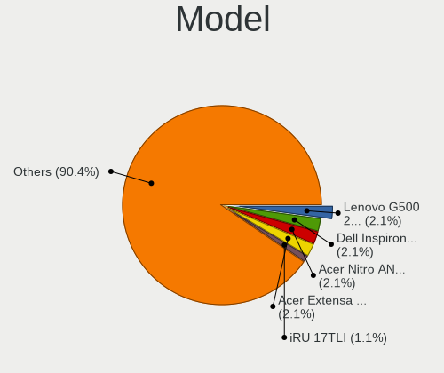
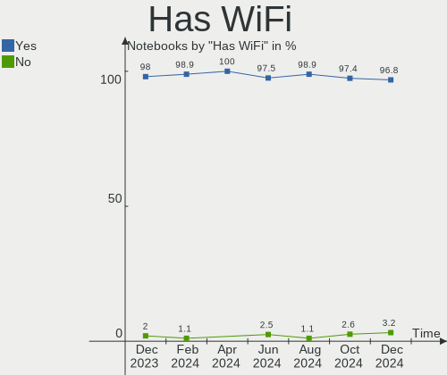

ROSA Hardware Trends (Notebooks)
--------------------------------

A project to identify most popular hardware characteristics and track their change
over time based on data collected by ROSA users at https://Linux-Hardware.org.

Anyone can contribute to this report by the [hw-probe](https://github.com/linuxhw/hw-probe) tool:

    sudo -E hw-probe -all -upload

Full-feature report is available here: https://linux-hardware.org/?view=trends

Period: Mar, 2022.

Contents
--------

* [ System ](#system)
  - [ OS                       ](#os)
  - [ OS Family                ](#os-family)
  - [ Kernel                   ](#kernel)
  - [ Kernel Family            ](#kernel-family)
  - [ Kernel Major Ver.        ](#kernel-major-ver)
  - [ Arch                     ](#arch)
  - [ DE                       ](#de)
  - [ Display Server           ](#display-server)
  - [ Display Manager          ](#display-manager)
  - [ OS Lang                  ](#os-lang)
  - [ Boot Mode                ](#boot-mode)
  - [ Filesystem               ](#filesystem)
  - [ Part. scheme             ](#part-scheme)
  - [ Dual Boot with Linux/BSD ](#dual-boot-with-linuxbsd)
  - [ Dual Boot (Win)          ](#dual-boot-win)

* [ Board ](#board)
  - [ Vendor                   ](#vendor)
  - [ Model                    ](#model)
  - [ Model Family             ](#model-family)
  - [ MFG Year                 ](#mfg-year)
  - [ Form Factor              ](#form-factor)
  - [ Secure Boot              ](#secure-boot)
  - [ Coreboot                 ](#coreboot)
  - [ RAM Size                 ](#ram-size)
  - [ RAM Used                 ](#ram-used)
  - [ Total Drives             ](#total-drives)
  - [ Has CD-ROM               ](#has-cd-rom)
  - [ Has Ethernet             ](#has-ethernet)
  - [ Has WiFi                 ](#has-wifi)
  - [ Has Bluetooth            ](#has-bluetooth)

* [ Location ](#location)
  - [ Country                  ](#country)
  - [ City                     ](#city)

* [ Drives ](#drives)
  - [ Drive Vendor             ](#drive-vendor)
  - [ Drive Model              ](#drive-model)
  - [ HDD Vendor               ](#hdd-vendor)
  - [ SSD Vendor               ](#ssd-vendor)
  - [ Drive Kind               ](#drive-kind)
  - [ Drive Connector          ](#drive-connector)
  - [ Drive Size               ](#drive-size)
  - [ Space Total              ](#space-total)
  - [ Space Used               ](#space-used)
  - [ Malfunc. Drives          ](#malfunc-drives)
  - [ Malfunc. Drive Vendor    ](#malfunc-drive-vendor)
  - [ Malfunc. HDD Vendor      ](#malfunc-hdd-vendor)
  - [ Malfunc. Drive Kind      ](#malfunc-drive-kind)
  - [ Failed Drives            ](#failed-drives)
  - [ Failed Drive Vendor      ](#failed-drive-vendor)
  - [ Drive Status             ](#drive-status)

* [ Storage controller ](#storage-controller)
  - [ Storage Vendor           ](#storage-vendor)
  - [ Storage Model            ](#storage-model)
  - [ Storage Kind             ](#storage-kind)

* [ Processor ](#processor)
  - [ CPU Vendor               ](#cpu-vendor)
  - [ CPU Model                ](#cpu-model)
  - [ CPU Model Family         ](#cpu-model-family)
  - [ CPU Cores                ](#cpu-cores)
  - [ CPU Sockets              ](#cpu-sockets)
  - [ CPU Threads              ](#cpu-threads)
  - [ CPU Op-Modes             ](#cpu-op-modes)
  - [ CPU Microcode            ](#cpu-microcode)
  - [ CPU Microarch            ](#cpu-microarch)

* [ Graphics ](#graphics)
  - [ GPU Vendor               ](#gpu-vendor)
  - [ GPU Model                ](#gpu-model)
  - [ GPU Combo                ](#gpu-combo)
  - [ GPU Driver               ](#gpu-driver)
  - [ GPU Memory               ](#gpu-memory)

* [ Monitor ](#monitor)
  - [ Monitor Vendor           ](#monitor-vendor)
  - [ Monitor Model            ](#monitor-model)
  - [ Monitor Resolution       ](#monitor-resolution)
  - [ Monitor Diagonal         ](#monitor-diagonal)
  - [ Monitor Width            ](#monitor-width)
  - [ Aspect Ratio             ](#aspect-ratio)
  - [ Monitor Area             ](#monitor-area)
  - [ Pixel Density            ](#pixel-density)
  - [ Multiple Monitors        ](#multiple-monitors)

* [ Network ](#network)
  - [ Net Controller Vendor    ](#net-controller-vendor)
  - [ Net Controller Model     ](#net-controller-model)
  - [ Wireless Vendor          ](#wireless-vendor)
  - [ Wireless Model           ](#wireless-model)
  - [ Ethernet Vendor          ](#ethernet-vendor)
  - [ Ethernet Model           ](#ethernet-model)
  - [ Net Controller Kind      ](#net-controller-kind)
  - [ Used Controller          ](#used-controller)
  - [ NICs                     ](#nics)
  - [ IPv6                     ](#ipv6)

* [ Bluetooth ](#bluetooth)
  - [ Bluetooth Vendor         ](#bluetooth-vendor)
  - [ Bluetooth Model          ](#bluetooth-model)

* [ Sound ](#sound)
  - [ Sound Vendor             ](#sound-vendor)
  - [ Sound Model              ](#sound-model)

* [ Memory ](#memory)
  - [ Memory Vendor            ](#memory-vendor)
  - [ Memory Model             ](#memory-model)
  - [ Memory Kind              ](#memory-kind)
  - [ Memory Form Factor       ](#memory-form-factor)
  - [ Memory Size              ](#memory-size)
  - [ Memory Speed             ](#memory-speed)

* [ Printers & scanners ](#printers--scanners)
  - [ Printer Vendor           ](#printer-vendor)
  - [ Printer Model            ](#printer-model)
  - [ Scanner Vendor           ](#scanner-vendor)
  - [ Scanner Model            ](#scanner-model)

* [ Camera ](#camera)
  - [ Camera Vendor            ](#camera-vendor)
  - [ Camera Model             ](#camera-model)

* [ Security ](#security)
  - [ Fingerprint Vendor       ](#fingerprint-vendor)
  - [ Fingerprint Model        ](#fingerprint-model)
  - [ Chipcard Vendor          ](#chipcard-vendor)
  - [ Chipcard Model           ](#chipcard-model)

* [ Unsupported ](#unsupported)
  - [ Unsupported Devices      ](#unsupported-devices)
  - [ Unsupported Device Types ](#unsupported-device-types)

System
------

OS
--

Installed operating systems

| Name       | Notebooks | Percent |
|------------|-----------|---------|
| ROSA 12.2  | 147       | 73.5%   |
| ROSA R11.1 | 29        | 14.5%   |
| ROSA 12.1  | 19        | 9.5%    |
| ROSA 12    | 4         | 2%      |
| ROSA R11   | 1         | 0.5%    |

OS Family
---------

OS without a version

| Name | Notebooks | Percent |
|------|-----------|---------|
| ROSA | 200       | 100%    |

Kernel
------

Version of the Linux kernel

| Version                             | Notebooks | Percent |
|-------------------------------------|-----------|---------|
| 5.10.74-generic-2rosa2021.1-x86_64  | 157       | 78.5%   |
| 5.4.32-generic-2rosa-x86_64         | 9         | 4.5%    |
| 5.4.83-generic-2rosa-x86_64         | 8         | 4%      |
| 5.10.74-generic-2rosa2021.1-i586    | 7         | 3.5%    |
| 4.15.0-desktop-122.124.1rosa-x86_64 | 5         | 2.5%    |
| 5.10.71-generic-1rosa2021.1-x86_64  | 3         | 1.5%    |
| 5.4.83-generic-2rosa-i586           | 2         | 1%      |
| 5.4.32-generic-2rosa-i586           | 2         | 1%      |
| 4.15.0-desktop-45.1rosa-x86_64      | 2         | 1%      |
| 5.16.17-generic-1rosa2021.1-x86_64  | 1         | 0.5%    |
| 5.13.0-35-generic                   | 1         | 0.5%    |
| 5.10.101-desktop-2rosa2021-x86_64   | 1         | 0.5%    |
| 4.9.155-nrj-desktop-1rosa-x86_64    | 1         | 0.5%    |
| 4.15.0-desktop-45.1rosa-i586        | 1         | 0.5%    |

Kernel Family
-------------

Linux kernel without a distro release

| Version  | Notebooks | Percent |
|----------|-----------|---------|
| 5.10.74  | 164       | 82%     |
| 5.4.32   | 11        | 5.5%    |
| 5.4.83   | 10        | 5%      |
| 4.15.0   | 8         | 4%      |
| 5.10.71  | 3         | 1.5%    |
| 5.16.17  | 1         | 0.5%    |
| 5.13.0   | 1         | 0.5%    |
| 5.10.101 | 1         | 0.5%    |
| 4.9.155  | 1         | 0.5%    |

Kernel Major Ver.
-----------------

Linux kernel major version

| Version | Notebooks | Percent |
|---------|-----------|---------|
| 5.10    | 168       | 84%     |
| 5.4     | 21        | 10.5%   |
| 4.15    | 8         | 4%      |
| 5.16    | 1         | 0.5%    |
| 5.13    | 1         | 0.5%    |
| 4.9     | 1         | 0.5%    |

Arch
----

OS architecture (x86_64, i586, etc.)

| Name   | Notebooks | Percent |
|--------|-----------|---------|
| x86_64 | 188       | 94%     |
| i686   | 12        | 6%      |

DE
--

Desktop Environment

| Name  | Notebooks | Percent |
|-------|-----------|---------|
| KDE5  | 83        | 41.5%   |
| GNOME | 73        | 36.5%   |
| LXQt  | 22        | 11%     |
| KDE4  | 17        | 8.5%    |
| XFCE  | 3         | 1.5%    |
| MATE  | 2         | 1%      |

Display Server
--------------

X11 or Wayland

| Name    | Notebooks | Percent |
|---------|-----------|---------|
| Wayland | 148       | 74%     |
| X11     | 52        | 26%     |

Display Manager
---------------

SDDM, LightDM, etc.

| Name    | Notebooks | Percent |
|---------|-----------|---------|
| GDM     | 103       | 51.5%   |
| SDDM    | 70        | 35%     |
| KDM     | 17        | 8.5%    |
| LightDM | 10        | 5%      |

OS Lang
-------

Language

| Lang    | Notebooks | Percent |
|---------|-----------|---------|
| ru_RU   | 185       | 92.5%   |
| en_US   | 6         | 3%      |
| Unknown | 2         | 1%      |
| pt_BR   | 1         | 0.5%    |
| pl_PL   | 1         | 0.5%    |
| fr_FR   | 1         | 0.5%    |
| es_ES   | 1         | 0.5%    |
| en_GB   | 1         | 0.5%    |
| cs_CZ   | 1         | 0.5%    |
| C       | 1         | 0.5%    |

Boot Mode
---------

EFI or BIOS

| Mode | Notebooks | Percent |
|------|-----------|---------|
| EFI  | 106       | 53%     |
| BIOS | 94        | 47%     |

Filesystem
----------

Type of filesystem

| Type    | Notebooks | Percent |
|---------|-----------|---------|
| Ext4    | 188       | 94%     |
| Btrfs   | 9         | 4.5%    |
| Aufs    | 2         | 1%      |
| Overlay | 1         | 0.5%    |

Part. scheme
------------

Scheme of partitioning

| Type | Notebooks | Percent |
|------|-----------|---------|
| GPT  | 127       | 63.5%   |
| MBR  | 73        | 36.5%   |

Dual Boot with Linux/BSD
------------------------

Hosting more than one Linux/BSD

| Dual boot | Notebooks | Percent |
|-----------|-----------|---------|
| No        | 150       | 75%     |
| Yes       | 50        | 25%     |

Dual Boot (Win)
---------------

Hosting Linux and Windows

| Dual boot | Notebooks | Percent |
|-----------|-----------|---------|
| No        | 119       | 59.5%   |
| Yes       | 81        | 40.5%   |

Board
-----

Vendor
------

Motherboard manufacturer

| Name                | Notebooks | Percent |
|---------------------|-----------|---------|
| Lenovo              | 39        | 19.5%   |
| ASUSTek Computer    | 36        | 18%     |
| Hewlett-Packard     | 30        | 15%     |
| Acer                | 27        | 13.5%   |
| Dell                | 18        | 9%      |
| Samsung Electronics | 11        | 5.5%    |
| Toshiba             | 7         | 3.5%    |
| Sony                | 5         | 2.5%    |
| Packard Bell        | 4         | 2%      |
| MSI                 | 4         | 2%      |
| Apple               | 4         | 2%      |
| Unknown             | 2         | 1%      |
| Prestigio           | 1         | 0.5%    |
| Pegatron            | 1         | 0.5%    |
| Notebook            | 1         | 0.5%    |
| Intel               | 1         | 0.5%    |
| Infomash            | 1         | 0.5%    |
| HUAWEI              | 1         | 0.5%    |
| GTZS                | 1         | 0.5%    |
| Gigabyte Technology | 1         | 0.5%    |
| Gateway             | 1         | 0.5%    |
| Fujitsu Siemens     | 1         | 0.5%    |
| Fujitsu             | 1         | 0.5%    |
| eMachines           | 1         | 0.5%    |
| Clevo               | 1         | 0.5%    |

Model
-----

Motherboard model

| Name                                                                                     | Notebooks | Percent |
|------------------------------------------------------------------------------------------|-----------|---------|
| HP Notebook                                                                              | 3         | 1.5%    |
| Apple MacBookAir7,2                                                                      | 3         | 1.5%    |
| Unknown                                                                                  | 3         | 1.5%    |
| Samsung N150P/N210P/N220P                                                                | 2         | 1%      |
| Packard Bell EasyNote TE11HC                                                             | 2         | 1%      |
| Lenovo IdeaPad 330-15IKB 81DC                                                            | 2         | 1%      |
| Lenovo IdeaPad 330-15IGM 81D1                                                            | 2         | 1%      |
| Lenovo G505 20240                                                                        | 2         | 1%      |
| HP G62                                                                                   | 2         | 1%      |
| Dell Inspiron 3537                                                                       | 2         | 1%      |
| ASUS K53U                                                                                | 2         | 1%      |
| ASUS K50IJ                                                                               | 2         | 1%      |
| Acer Aspire E5-573G                                                                      | 2         | 1%      |
| Acer Aspire A315-42G                                                                     | 2         | 1%      |
| Toshiba Satellite Pro L300                                                               | 1         | 0.5%    |
| Toshiba Satellite P500                                                                   | 1         | 0.5%    |
| Toshiba Satellite L40                                                                    | 1         | 0.5%    |
| Toshiba Satellite C660                                                                   | 1         | 0.5%    |
| Toshiba Satellite C650                                                                   | 1         | 0.5%    |
| Toshiba Satellite A660                                                                   | 1         | 0.5%    |
| Toshiba Satellite A300                                                                   | 1         | 0.5%    |
| Sony VPCSA3Z9R                                                                           | 1         | 0.5%    |
| Sony VPCF13E1R                                                                           | 1         | 0.5%    |
| Sony VPCEJ3L1R                                                                           | 1         | 0.5%    |
| Sony VPCEB2M1R                                                                           | 1         | 0.5%    |
| Sony SVS1512U1RW                                                                         | 1         | 0.5%    |
| Samsung R59P/R60P/R61P                                                                   | 1         | 0.5%    |
| Samsung R528/R728                                                                        | 1         | 0.5%    |
| Samsung R519/R719                                                                        | 1         | 0.5%    |
| Samsung R425D/R525D                                                                      | 1         | 0.5%    |
| Samsung 530U4E/540U4E                                                                    | 1         | 0.5%    |
| Samsung 530U3BI/530U4BI/530U4BH                                                          | 1         | 0.5%    |
| Samsung 350V5C/350V5X/350V4C/350V4X/351V5C/351V5X/351V4C/351V4X/3540VC/3540VX/3440VC/344 | 1         | 0.5%    |
| Samsung 300V3A/300V4A/300V5A/200A4B/200A5B                                               | 1         | 0.5%    |
| Samsung 300E4C/300E5C/300E7C                                                             | 1         | 0.5%    |
| Prestigio PSB133S01ZFH                                                                   | 1         | 0.5%    |
| Pegatron A15                                                                             | 1         | 0.5%    |
| Packard Bell EasyNote TS11HR                                                             | 1         | 0.5%    |
| Packard Bell EasyNote TE69KB                                                             | 1         | 0.5%    |
| Notebook W517GU1                                                                         | 1         | 0.5%    |
| MSI Sword 15 A11UE                                                                       | 1         | 0.5%    |
| MSI GT72 2QE                                                                             | 1         | 0.5%    |
| MSI GP60 2OD                                                                             | 1         | 0.5%    |
| MSI GF63 Thin 9SCXR                                                                      | 1         | 0.5%    |
| Lenovo Yoga Slim 7 14ARE05 82A2                                                          | 1         | 0.5%    |
| Lenovo V570c HuronRiver Platform                                                         | 1         | 0.5%    |
| Lenovo ThinkPad X250 20CLS2JX00                                                          | 1         | 0.5%    |
| Lenovo ThinkPad W530 243857U                                                             | 1         | 0.5%    |
| Lenovo ThinkPad T410 2537VGY                                                             | 1         | 0.5%    |
| Lenovo ThinkPad L450 20DT0013RT                                                          | 1         | 0.5%    |
| Lenovo ThinkPad E580 20KS004GRT                                                          | 1         | 0.5%    |
| Lenovo ThinkPad E470 20H2S17C00                                                          | 1         | 0.5%    |
| Lenovo Legion Y730-17ICH 81HG                                                            | 1         | 0.5%    |
| Lenovo Legion 5 15ARH05 82B5                                                             | 1         | 0.5%    |
| Lenovo Legion 5 15ACH6A 82NW                                                             | 1         | 0.5%    |
| Lenovo IdeaPad Z580                                                                      | 1         | 0.5%    |
| Lenovo IdeaPad S20-30                                                                    | 1         | 0.5%    |
| Lenovo IdeaPad L340-15IWL 81LG                                                           | 1         | 0.5%    |
| Lenovo IdeaPad Gaming 3 15ARH05 82EY                                                     | 1         | 0.5%    |
| Lenovo IdeaPad 500-15ISK 80NT                                                            | 1         | 0.5%    |

Model Family
------------

Motherboard model prefix

| Name                   | Notebooks | Percent |
|------------------------|-----------|---------|
| Acer Aspire            | 16        | 8%      |
| Lenovo IdeaPad         | 13        | 6.5%    |
| Dell Inspiron          | 8         | 4%      |
| Toshiba Satellite      | 7         | 3.5%    |
| Lenovo ThinkPad        | 6         | 3%      |
| HP Pavilion            | 6         | 3%      |
| HP Laptop              | 6         | 3%      |
| Dell Latitude          | 5         | 2.5%    |
| ASUS VivoBook          | 5         | 2.5%    |
| Packard Bell EasyNote  | 4         | 2%      |
| Lenovo Legion          | 3         | 1.5%    |
| HP ProBook             | 3         | 1.5%    |
| HP Notebook            | 3         | 1.5%    |
| Apple MacBookAir7      | 3         | 1.5%    |
| Acer TravelMate        | 3         | 1.5%    |
| Unknown                | 3         | 1.5%    |
| Samsung N150P          | 2         | 1%      |
| Lenovo G505            | 2         | 1%      |
| Lenovo B590            | 2         | 1%      |
| Lenovo 3000            | 2         | 1%      |
| HP Presario            | 2         | 1%      |
| HP G62                 | 2         | 1%      |
| HP EliteBook           | 2         | 1%      |
| ASUS TUF               | 2         | 1%      |
| ASUS K53U              | 2         | 1%      |
| ASUS K50IJ             | 2         | 1%      |
| Acer Swift             | 2         | 1%      |
| Acer Extensa           | 2         | 1%      |
| Sony VPCSA3Z9R         | 1         | 0.5%    |
| Sony VPCF13E1R         | 1         | 0.5%    |
| Sony VPCEJ3L1R         | 1         | 0.5%    |
| Sony VPCEB2M1R         | 1         | 0.5%    |
| Sony SVS1512U1RW       | 1         | 0.5%    |
| Samsung R59P           | 1         | 0.5%    |
| Samsung R528           | 1         | 0.5%    |
| Samsung R519           | 1         | 0.5%    |
| Samsung R425D          | 1         | 0.5%    |
| Samsung 530U4E         | 1         | 0.5%    |
| Samsung 530U3BI        | 1         | 0.5%    |
| Samsung 350V5C         | 1         | 0.5%    |
| Samsung 300V3A         | 1         | 0.5%    |
| Samsung 300E4C         | 1         | 0.5%    |
| Prestigio PSB133S01ZFH | 1         | 0.5%    |
| Pegatron A15           | 1         | 0.5%    |
| Notebook W517GU1       | 1         | 0.5%    |
| MSI Sword              | 1         | 0.5%    |
| MSI GT72               | 1         | 0.5%    |
| MSI GP60               | 1         | 0.5%    |
| MSI GF63               | 1         | 0.5%    |
| Lenovo Yoga            | 1         | 0.5%    |
| Lenovo V570c           | 1         | 0.5%    |
| Lenovo G580            | 1         | 0.5%    |
| Lenovo G50-70          | 1         | 0.5%    |
| Lenovo G50-45          | 1         | 0.5%    |
| Lenovo G50-30          | 1         | 0.5%    |
| Lenovo E43             | 1         | 0.5%    |
| Lenovo B5400           | 1         | 0.5%    |
| Lenovo B50-70          | 1         | 0.5%    |
| Lenovo B50-45          | 1         | 0.5%    |
| Lenovo 20208           | 1         | 0.5%    |

MFG Year
--------

Motherboard manufacture year

| Year | Notebooks | Percent |
|------|-----------|---------|
| 2012 | 25        | 12.5%   |
| 2013 | 22        | 11%     |
| 2011 | 21        | 10.5%   |
| 2018 | 15        | 7.5%    |
| 2009 | 15        | 7.5%    |
| 2017 | 14        | 7%      |
| 2020 | 13        | 6.5%    |
| 2010 | 12        | 6%      |
| 2019 | 11        | 5.5%    |
| 2015 | 11        | 5.5%    |
| 2008 | 11        | 5.5%    |
| 2016 | 10        | 5%      |
| 2014 | 7         | 3.5%    |
| 2021 | 6         | 3%      |
| 2007 | 5         | 2.5%    |
| 2006 | 2         | 1%      |

Form Factor
-----------

Physical design of the computer

| Name     | Notebooks | Percent |
|----------|-----------|---------|
| Notebook | 200       | 100%    |

Secure Boot
-----------

Enabled or disabled

| State    | Notebooks | Percent |
|----------|-----------|---------|
| Disabled | 200       | 100%    |

Coreboot
--------

Have coreboot on board

| Used | Notebooks | Percent |
|------|-----------|---------|
| No   | 200       | 100%    |

RAM Size
--------

Total RAM memory

| Size in GB | Notebooks | Percent |
|------------|-----------|---------|
| 4.01-8.0   | 65        | 32.5%   |
| 3.01-4.0   | 59        | 29.5%   |
| 8.01-16.0  | 27        | 13.5%   |
| 1.01-2.0   | 22        | 11%     |
| 16.01-24.0 | 13        | 6.5%    |
| 2.01-3.0   | 9         | 4.5%    |
| 32.01-64.0 | 3         | 1.5%    |
| 0.51-1.0   | 2         | 1%      |

RAM Used
--------

Used RAM memory

| Used GB   | Notebooks | Percent |
|-----------|-----------|---------|
| 1.01-2.0  | 109       | 54.5%   |
| 0.51-1.0  | 56        | 28%     |
| 2.01-3.0  | 22        | 11%     |
| 3.01-4.0  | 5         | 2.5%    |
| 0.01-0.5  | 4         | 2%      |
| 4.01-8.0  | 3         | 1.5%    |
| 8.01-16.0 | 1         | 0.5%    |

Total Drives
------------

Number of drives on board

| Drives | Notebooks | Percent |
|--------|-----------|---------|
| 1      | 141       | 70.5%   |
| 2      | 48        | 24%     |
| 3      | 9         | 4.5%    |
| 5      | 1         | 0.5%    |
| 4      | 1         | 0.5%    |

Has CD-ROM
----------

Has CD-ROM on board

| Presented | Notebooks | Percent |
|-----------|-----------|---------|
| No        | 105       | 52.5%   |
| Yes       | 95        | 47.5%   |

Has Ethernet
------------

Has Ethernet on board

| Presented | Notebooks | Percent |
|-----------|-----------|---------|
| Yes       | 182       | 91%     |
| No        | 18        | 9%      |

Has WiFi
--------

Has WiFi module

| Presented | Notebooks | Percent |
|-----------|-----------|---------|
| Yes       | 197       | 98.5%   |
| No        | 3         | 1.5%    |

Has Bluetooth
-------------

Has Bluetooth module

| Presented | Notebooks | Percent |
|-----------|-----------|---------|
| Yes       | 142       | 71%     |
| No        | 58        | 29%     |

Location
--------

Country
-------

Geographic location (country)

| Country    | Notebooks | Percent |
|------------|-----------|---------|
| Russia     | 174       | 87%     |
| Belarus    | 6         | 3%      |
| Poland     | 4         | 2%      |
| Ukraine    | 2         | 1%      |
| Spain      | 2         | 1%      |
| Czechia    | 2         | 1%      |
| USA        | 1         | 0.5%    |
| UK         | 1         | 0.5%    |
| Latvia     | 1         | 0.5%    |
| Kazakhstan | 1         | 0.5%    |
| Germany    | 1         | 0.5%    |
| Georgia    | 1         | 0.5%    |
| France     | 1         | 0.5%    |
| Egypt      | 1         | 0.5%    |
| Brazil     | 1         | 0.5%    |
| Austria    | 1         | 0.5%    |

City
----

Geographic location (city)

| City              | Notebooks | Percent |
|-------------------|-----------|---------|
| Moscow            | 34        | 17%     |
| St Petersburg     | 16        | 8%      |
| Yekaterinburg     | 5         | 2.5%    |
| Novosibirsk       | 5         | 2.5%    |
| Volgograd         | 4         | 2%      |
| Perm              | 4         | 2%      |
| Krasnodar         | 4         | 2%      |
| Chelyabinsk       | 4         | 2%      |
| Yaroslavl         | 3         | 1.5%    |
| Tula              | 3         | 1.5%    |
| Novokuznetsk      | 3         | 1.5%    |
| Minsk             | 3         | 1.5%    |
| Kaliningrad       | 3         | 1.5%    |
| Tver              | 2         | 1%      |
| Saratov           | 2         | 1%      |
| Rostov-on-Don     | 2         | 1%      |
| Ramenskoye        | 2         | 1%      |
| Omsk              | 2         | 1%      |
| Nizhniy Novgorod  | 2         | 1%      |
| Krasnogorsk       | 2         | 1%      |
| Khabarovsk        | 2         | 1%      |
| Kamensk-Ural'skiy | 2         | 1%      |
| Irkutsk           | 2         | 1%      |
| Cheboksary        | 2         | 1%      |
| Brno              | 2         | 1%      |
| Barnaul           | 2         | 1%      |
| Astrakhan         | 2         | 1%      |
| Arzamas           | 2         | 1%      |
| Zvenigorod        | 1         | 0.5%    |
| Zhodzina          | 1         | 0.5%    |
| Zheleznogorsk     | 1         | 0.5%    |
| Zelenodolsk       | 1         | 0.5%    |
| Żagań           | 1         | 0.5%    |
| Warsaw            | 1         | 0.5%    |
| Volzhskiy         | 1         | 0.5%    |
| Vohringen         | 1         | 0.5%    |
| Vladivostok       | 1         | 0.5%    |
| Vladimir          | 1         | 0.5%    |
| Vienna            | 1         | 0.5%    |
| Veliky Novgorod   | 1         | 0.5%    |
| Ukhta             | 1         | 0.5%    |
| Ufa               | 1         | 0.5%    |
| Tsarskoye Selo    | 1         | 0.5%    |
| Tikhoretsk        | 1         | 0.5%    |
| Tbilisi           | 1         | 0.5%    |
| Tambov            | 1         | 0.5%    |
| Syktyvkar         | 1         | 0.5%    |
| Stavropol         | 1         | 0.5%    |
| Stary Oskol       | 1         | 0.5%    |
| Sovetsk           | 1         | 0.5%    |
| Sochi             | 1         | 0.5%    |
| Snezhinsk         | 1         | 0.5%    |
| Shelekhov         | 1         | 0.5%    |
| Serpukhov         | 1         | 0.5%    |
| Sergokala         | 1         | 0.5%    |
| Sergiyev Posad    | 1         | 0.5%    |
| Sarapul           | 1         | 0.5%    |
| Saransk           | 1         | 0.5%    |
| Samara            | 1         | 0.5%    |
| Ryazan            | 1         | 0.5%    |

Drives
------

Drive Vendor
------------

Hard drive vendors

| Vendor              | Notebooks | Drives | Percent |
|---------------------|-----------|--------|---------|
| WDC                 | 46        | 47     | 18.25%  |
| Seagate             | 35        | 35     | 13.89%  |
| Samsung Electronics | 24        | 28     | 9.52%   |
| Toshiba             | 22        | 22     | 8.73%   |
| Hitachi             | 13        | 13     | 5.16%   |
| Kingston            | 12        | 13     | 4.76%   |
| HGST                | 11        | 11     | 4.37%   |
| China               | 9         | 9      | 3.57%   |
| A-DATA Technology   | 8         | 8      | 3.17%   |
| SK Hynix            | 7         | 8      | 2.78%   |
| SanDisk             | 6         | 6      | 2.38%   |
| AMD                 | 6         | 6      | 2.38%   |
| Unknown             | 5         | 5      | 1.98%   |
| Intel               | 4         | 4      | 1.59%   |
| Apacer              | 4         | 4      | 1.59%   |
| KIOXIA              | 3         | 3      | 1.19%   |
| Apple               | 3         | 3      | 1.19%   |
| UMIS                | 2         | 2      | 0.79%   |
| SSSTC               | 2         | 2      | 0.79%   |
| PLEXTOR             | 2         | 2      | 0.79%   |
| Netac               | 2         | 2      | 0.79%   |
| KingSpec            | 2         | 2      | 0.79%   |
| ASMedia             | 2         | 2      | 0.79%   |
| Vaseky              | 1         | 1      | 0.4%    |
| Transcend           | 1         | 1      | 0.4%    |
| TO Exter            | 1         | 1      | 0.4%    |
| Teclast             | 1         | 1      | 0.4%    |
| SPCC                | 1         | 1      | 0.4%    |
| Smartbuy            | 1         | 1      | 0.4%    |
| ShiJi               | 1         | 1      | 0.4%    |
| PNY                 | 1         | 1      | 0.4%    |
| Patriot             | 1         | 1      | 0.4%    |
| Neo                 | 1         | 1      | 0.4%    |
| KIOXIA-EXCERIA      | 1         | 1      | 0.4%    |
| KingDian            | 1         | 1      | 0.4%    |
| JMicron             | 1         | 1      | 0.4%    |
| Hewlett-Packard     | 1         | 1      | 0.4%    |
| GS                  | 1         | 2      | 0.4%    |
| GOODRAM             | 1         | 1      | 0.4%    |
| Gigabyte Technology | 1         | 1      | 0.4%    |
| Fujitsu             | 1         | 1      | 0.4%    |
| FOXLINE             | 1         | 1      | 0.4%    |
| Crucial             | 1         | 1      | 0.4%    |
| Corsair             | 1         | 1      | 0.4%    |
| ASMT                | 1         | 1      | 0.4%    |

Drive Model
-----------

Hard drive models

| Model                                | Notebooks | Percent |
|--------------------------------------|-----------|---------|
| Seagate ST500LT012-1DG142 500GB      | 7         | 2.75%   |
| Samsung SSD 860 EVO 250GB            | 5         | 1.96%   |
| WDC WDS240G2G0A-00JH30 240GB SSD     | 4         | 1.57%   |
| Seagate ST1000LM035-1RK172 1TB       | 4         | 1.57%   |
| Seagate ST1000LM024 HN-M101MBB 1TB   | 4         | 1.57%   |
| WDC WD5000LPCX-21VHAT0 500GB         | 3         | 1.18%   |
| Toshiba MQ01ABD050 500GB             | 3         | 1.18%   |
| Seagate ST9320325AS 320GB            | 3         | 1.18%   |
| Kingston SA400S37240G 240GB SSD      | 3         | 1.18%   |
| HGST HTS721010A9E630 1TB             | 3         | 1.18%   |
| HGST HTS545050A7E680 500GB           | 3         | 1.18%   |
| Apple SSD SM0128G 121GB              | 3         | 1.18%   |
| WDC WDS500G2B0A-00SM50 500GB SSD     | 2         | 0.78%   |
| WDC WDS120G2G0A-00JH30 120GB SSD     | 2         | 0.78%   |
| WDC WD5000LPCX-24C6HT0 500GB         | 2         | 0.78%   |
| WDC WD10JPLX-00MBPT0 1TB             | 2         | 0.78%   |
| Toshiba MQ04ABF100 1TB               | 2         | 0.78%   |
| Toshiba MQ01ABF050 500GB             | 2         | 0.78%   |
| Toshiba MQ01ABD032 320GB             | 2         | 0.78%   |
| Toshiba MK5065GSX 500GB              | 2         | 0.78%   |
| SK Hynix HFM256GDJTNG-8310A 256GB    | 2         | 0.78%   |
| Seagate ST750LM022 HN-M750MBB 752GB  | 2         | 0.78%   |
| Seagate ST500LM021-1KJ152 500GB      | 2         | 0.78%   |
| Seagate ST500LM000-SSHD-8GB          | 2         | 0.78%   |
| SanDisk DF4032  32GB                 | 2         | 0.78%   |
| Samsung HM250HI 250GB                | 2         | 0.78%   |
| KIOXIA KBG40ZNV256G 256GB            | 2         | 0.78%   |
| Kingston SA400S37120G 120GB SSD      | 2         | 0.78%   |
| Kingston RBUSC180DS37128GJ 128GB SSD | 2         | 0.78%   |
| Hitachi HTS543232A7A384 320GB        | 2         | 0.78%   |
| Hitachi HTS542525K9SA00 250GB        | 2         | 0.78%   |
| Hitachi HTS542516K9SA00 160GB        | 2         | 0.78%   |
| HGST HTS545050A7E380 500GB           | 2         | 0.78%   |
| China SATA SSD 128GB                 | 2         | 0.78%   |
| ASMedia USB 3.0 Device 2TB           | 2         | 0.78%   |
| Apacer AS350 128GB SSD               | 2         | 0.78%   |
| AMD R5MP120G8 120GB                  | 2         | 0.78%   |
| A-DATA SU650 240GB SSD               | 2         | 0.78%   |
| A-DATA SU650 120GB SSD               | 2         | 0.78%   |
| WDC WDS500G2B0C-00PXH0 500GB         | 1         | 0.39%   |
| WDC WDS100T2G0A-00JH30 1TB SSD       | 1         | 0.39%   |
| WDC WDS100T2B0A-00SM50 1TB SSD       | 1         | 0.39%   |
| WDC WD7500BPVX-22JC3T0 752GB         | 1         | 0.39%   |
| WDC WD6400BEVT-24A0RT0 640GB         | 1         | 0.39%   |
| WDC WD600UE-22KVT0 64GB              | 1         | 0.39%   |
| WDC WD5000LPZX-22Z10T0 500GB         | 1         | 0.39%   |
| WDC WD5000LPVX-22V0TT0 500GB         | 1         | 0.39%   |
| WDC WD5000LPLX-08ZNTT0 500GB         | 1         | 0.39%   |
| WDC WD5000BPVT-24HXZT3 500GB         | 1         | 0.39%   |
| WDC WD5000BPVT-22HXZT3 500GB         | 1         | 0.39%   |
| WDC WD4000LPCX-24C6HT0 400GB         | 1         | 0.39%   |
| WDC WD3200LPCX-24C6HT0 320GB         | 1         | 0.39%   |
| WDC WD3200BEVT-22ZCT0 320GB          | 1         | 0.39%   |
| WDC WD3200BEVT-00A0RT0 320GB         | 1         | 0.39%   |
| WDC WD3200BEKT-60V5T1 320GB          | 1         | 0.39%   |
| WDC WD2500BEVS-75UST0 250GB          | 1         | 0.39%   |
| WDC WD2500BEKT-60A25T1 250GB         | 1         | 0.39%   |
| WDC WD20SPZX-00UA7T0 2TB             | 1         | 0.39%   |
| WDC WD1600BEVT-80A23T0 160GB         | 1         | 0.39%   |
| WDC WD1600BEVT-22ZCT0 160GB          | 1         | 0.39%   |

HDD Vendor
----------

Hard disk drive vendors

| Vendor              | Notebooks | Drives | Percent |
|---------------------|-----------|--------|---------|
| Seagate             | 35        | 35     | 29.91%  |
| WDC                 | 32        | 32     | 27.35%  |
| Toshiba             | 19        | 19     | 16.24%  |
| Hitachi             | 13        | 13     | 11.11%  |
| HGST                | 11        | 11     | 9.4%    |
| Samsung Electronics | 4         | 4      | 3.42%   |
| ASMedia             | 2         | 2      | 1.71%   |
| Fujitsu             | 1         | 1      | 0.85%   |

SSD Vendor
----------

Solid state drive vendors

| Vendor              | Notebooks | Drives | Percent |
|---------------------|-----------|--------|---------|
| Samsung Electronics | 14        | 17     | 14.14%  |
| Kingston            | 12        | 13     | 12.12%  |
| WDC                 | 10        | 10     | 10.1%   |
| China               | 9         | 9      | 9.09%   |
| A-DATA Technology   | 7         | 7      | 7.07%   |
| SanDisk             | 4         | 4      | 4.04%   |
| AMD                 | 4         | 4      | 4.04%   |
| Intel               | 3         | 3      | 3.03%   |
| Apple               | 3         | 3      | 3.03%   |
| Apacer              | 3         | 3      | 3.03%   |
| Toshiba             | 2         | 2      | 2.02%   |
| SK Hynix            | 2         | 3      | 2.02%   |
| PLEXTOR             | 2         | 2      | 2.02%   |
| Netac               | 2         | 2      | 2.02%   |
| KingSpec            | 2         | 2      | 2.02%   |
| Vaseky              | 1         | 1      | 1.01%   |
| Transcend           | 1         | 1      | 1.01%   |
| TO Exter            | 1         | 1      | 1.01%   |
| Teclast             | 1         | 1      | 1.01%   |
| SSSTC               | 1         | 1      | 1.01%   |
| SPCC                | 1         | 1      | 1.01%   |
| Smartbuy            | 1         | 1      | 1.01%   |
| ShiJi               | 1         | 1      | 1.01%   |
| PNY                 | 1         | 1      | 1.01%   |
| Patriot             | 1         | 1      | 1.01%   |
| Neo                 | 1         | 1      | 1.01%   |
| KIOXIA-EXCERIA      | 1         | 1      | 1.01%   |
| KingDian            | 1         | 1      | 1.01%   |
| JMicron             | 1         | 1      | 1.01%   |
| Hewlett-Packard     | 1         | 1      | 1.01%   |
| GS                  | 1         | 2      | 1.01%   |
| GOODRAM             | 1         | 1      | 1.01%   |
| FOXLINE             | 1         | 1      | 1.01%   |
| Crucial             | 1         | 1      | 1.01%   |
| Corsair             | 1         | 1      | 1.01%   |

Drive Kind
----------

HDD or SSD

| Kind    | Notebooks | Drives | Percent |
|---------|-----------|--------|---------|
| HDD     | 114       | 117    | 47.3%   |
| SSD     | 91        | 105    | 37.76%  |
| NVMe    | 29        | 30     | 12.03%  |
| MMC     | 6         | 7      | 2.49%   |
| Unknown | 1         | 1      | 0.41%   |

Drive Connector
---------------

SATA, SAS, NVMe, etc.

| Type | Notebooks | Drives | Percent |
|------|-----------|--------|---------|
| SATA | 181       | 217    | 81.53%  |
| NVMe | 29        | 30     | 13.06%  |
| SAS  | 6         | 6      | 2.7%    |
| MMC  | 6         | 7      | 2.7%    |

Drive Size
----------

Size of hard drive

| Size in TB | Notebooks | Drives | Percent |
|------------|-----------|--------|---------|
| 0.01-0.5   | 156       | 183    | 80.41%  |
| 0.51-1.0   | 34        | 35     | 17.53%  |
| 1.01-2.0   | 4         | 4      | 2.06%   |

Space Total
-----------

Amount of disk space available on the file system

| Size in GB     | Notebooks | Percent |
|----------------|-----------|---------|
| 101-250        | 72        | 36%     |
| 251-500        | 45        | 22.5%   |
| 1-20           | 31        | 15.5%   |
| 501-1000       | 20        | 10%     |
| 51-100         | 19        | 9.5%    |
| 21-50          | 7         | 3.5%    |
| 1001-2000      | 4         | 2%      |
| More than 3000 | 1         | 0.5%    |
| Unknown        | 1         | 0.5%    |

Space Used
----------

Amount of used disk space

| Used GB   | Notebooks | Percent |
|-----------|-----------|---------|
| 1-20      | 154       | 77%     |
| 21-50     | 16        | 8%      |
| 51-100    | 11        | 5.5%    |
| 101-250   | 9         | 4.5%    |
| 251-500   | 5         | 2.5%    |
| 501-1000  | 3         | 1.5%    |
| 2001-3000 | 1         | 0.5%    |
| Unknown   | 1         | 0.5%    |

Malfunc. Drives
---------------

Drive models with a malfunction

| Model                                 | Notebooks | Drives | Percent |
|---------------------------------------|-----------|--------|---------|
| Seagate ST500LT012-1DG142 500GB       | 4         | 4      | 7.41%   |
| WDC WDS240G2G0A-00JH30 240GB SSD      | 2         | 2      | 3.7%    |
| Toshiba MQ01ABD050 500GB              | 2         | 2      | 3.7%    |
| Seagate ST500LM000-SSHD-8GB           | 2         | 2      | 3.7%    |
| Hitachi HTS543232A7A384 320GB         | 2         | 2      | 3.7%    |
| Hitachi HTS542525K9SA00 250GB         | 2         | 2      | 3.7%    |
| HGST HTS545050A7E680 500GB            | 2         | 2      | 3.7%    |
| WDC WD6400BEVT-24A0RT0 640GB          | 1         | 1      | 1.85%   |
| WDC WD3200BEKT-60V5T1 320GB           | 1         | 1      | 1.85%   |
| WDC WD2500BEKT-60A25T1 250GB          | 1         | 1      | 1.85%   |
| WDC WD1600BEVT-80A23T0 160GB          | 1         | 1      | 1.85%   |
| Toshiba MQ04ABF100 1TB                | 1         | 1      | 1.85%   |
| Toshiba MQ01ABF050 500GB              | 1         | 1      | 1.85%   |
| Toshiba MQ01ABD032 320GB              | 1         | 1      | 1.85%   |
| Toshiba MK5065GSX 500GB               | 1         | 1      | 1.85%   |
| Toshiba MK5061GSYN 500GB              | 1         | 1      | 1.85%   |
| Toshiba MK4058GSX 400GB               | 1         | 1      | 1.85%   |
| SSSTC CVZ-83128-HP 128GB SSD          | 1         | 1      | 1.85%   |
| SK Hynix HFS128G38MNB-2200A 128GB SSD | 1         | 2      | 1.85%   |
| Seagate ST9320325AS 320GB             | 1         | 1      | 1.85%   |
| Seagate ST9250315AS 250GB             | 1         | 1      | 1.85%   |
| Seagate ST9250311CS 250GB             | 1         | 1      | 1.85%   |
| Seagate ST9120822AS 120GB             | 1         | 1      | 1.85%   |
| Seagate ST9120817AS 120GB             | 1         | 1      | 1.85%   |
| Seagate ST320LT020-9YG142 320GB       | 1         | 1      | 1.85%   |
| Seagate ST320LT007-9ZV142 320GB       | 1         | 1      | 1.85%   |
| Seagate ST1000LM024 HN-M101MBB 1TB    | 1         | 1      | 1.85%   |
| SanDisk SSD i100 16GB                 | 1         | 1      | 1.85%   |
| SanDisk SD9SN8W-128G-1006 128GB SSD   | 1         | 1      | 1.85%   |
| Samsung Electronics HN-M500MBB 500GB  | 1         | 1      | 1.85%   |
| Samsung Electronics HM321HI 320GB     | 1         | 1      | 1.85%   |
| Samsung Electronics HM250HI 250GB     | 1         | 1      | 1.85%   |
| Kingston SUV400S37240G 240GB SSD      | 1         | 1      | 1.85%   |
| KingSpec MT-64 64GB SSD               | 1         | 1      | 1.85%   |
| Intel SSDSC2BF180A5H SED 180GB        | 1         | 1      | 1.85%   |
| Hitachi HTS725032A9A364 320GB         | 1         | 1      | 1.85%   |
| Hitachi HTS545050B9SA08 500GB         | 1         | 1      | 1.85%   |
| Hitachi HTS545050B9A300 500GB         | 1         | 1      | 1.85%   |
| Hitachi HTS543232L9A300 320GB         | 1         | 1      | 1.85%   |
| Hitachi HTS542516K9SA00 160GB         | 1         | 1      | 1.85%   |
| HGST HTS725050A7E630 500GB            | 1         | 1      | 1.85%   |
| HGST HTS721010A9E630 1TB              | 1         | 1      | 1.85%   |
| HGST HTS545050A7E380 500GB            | 1         | 1      | 1.85%   |
| China SSD 256GB                       | 1         | 1      | 1.85%   |
| AMD R3SL60G 64GB SSD                  | 1         | 1      | 1.85%   |

Malfunc. Drive Vendor
---------------------

Vendors of faulty drives

| Vendor              | Notebooks | Drives | Percent |
|---------------------|-----------|--------|---------|
| Seagate             | 14        | 14     | 25.93%  |
| Hitachi             | 9         | 9      | 16.67%  |
| Toshiba             | 8         | 8      | 14.81%  |
| WDC                 | 6         | 6      | 11.11%  |
| HGST                | 5         | 5      | 9.26%   |
| Samsung Electronics | 3         | 3      | 5.56%   |
| SanDisk             | 2         | 2      | 3.7%    |
| SSSTC               | 1         | 1      | 1.85%   |
| SK Hynix            | 1         | 2      | 1.85%   |
| Kingston            | 1         | 1      | 1.85%   |
| KingSpec            | 1         | 1      | 1.85%   |
| Intel               | 1         | 1      | 1.85%   |
| China               | 1         | 1      | 1.85%   |
| AMD                 | 1         | 1      | 1.85%   |

Malfunc. HDD Vendor
-------------------

Vendors of faulty HDD drives

| Vendor              | Notebooks | Drives | Percent |
|---------------------|-----------|--------|---------|
| Seagate             | 14        | 14     | 32.56%  |
| Hitachi             | 9         | 9      | 20.93%  |
| Toshiba             | 8         | 8      | 18.6%   |
| HGST                | 5         | 5      | 11.63%  |
| WDC                 | 4         | 4      | 9.3%    |
| Samsung Electronics | 3         | 3      | 6.98%   |

Malfunc. Drive Kind
-------------------

Kinds of faulty drives

| Kind | Notebooks | Drives | Percent |
|------|-----------|--------|---------|
| HDD  | 43        | 43     | 79.63%  |
| SSD  | 11        | 12     | 20.37%  |

Failed Drives
-------------

Failed drive models

| Model                       | Notebooks | Drives | Percent |
|-----------------------------|-----------|--------|---------|
| WDC WD1600BEVT-22ZCT0 160GB | 1         | 1      | 100%    |

Failed Drive Vendor
-------------------

Failed drive vendors

| Vendor | Notebooks | Drives | Percent |
|--------|-----------|--------|---------|
| WDC    | 1         | 1      | 100%    |

Drive Status
------------

Number of failed and malfunc. drives

| Status   | Notebooks | Drives | Percent |
|----------|-----------|--------|---------|
| Works    | 152       | 193    | 70.05%  |
| Malfunc  | 54        | 55     | 24.88%  |
| Detected | 10        | 11     | 4.61%   |
| Failed   | 1         | 1      | 0.46%   |

Storage controller
------------------

Storage Vendor
--------------

Storage controller vendors

| Vendor                           | Notebooks | Percent |
|----------------------------------|-----------|---------|
| Intel                            | 158       | 69.6%   |
| AMD                              | 32        | 14.1%   |
| Samsung Electronics              | 10        | 4.41%   |
| SK Hynix                         | 5         | 2.2%    |
| Sandisk                          | 5         | 2.2%    |
| KIOXIA                           | 3         | 1.32%   |
| Union Memory (Shenzhen)          | 2         | 0.88%   |
| Silicon Motion                   | 2         | 0.88%   |
| Silicon Integrated Systems [SiS] | 2         | 0.88%   |
| Phison Electronics               | 2         | 0.88%   |
| Toshiba America Info Systems     | 1         | 0.44%   |
| Solid State Storage Technology   | 1         | 0.44%   |
| Silicon Image                    | 1         | 0.44%   |
| Shenzhen Longsys Electronics     | 1         | 0.44%   |
| Micron Technology                | 1         | 0.44%   |
| ADATA Technology                 | 1         | 0.44%   |

Storage Model
-------------

Storage controller models

| Model                                                                            | Notebooks | Percent |
|----------------------------------------------------------------------------------|-----------|---------|
| Intel 7 Series Chipset Family 6-port SATA Controller [AHCI mode]                 | 31        | 12.7%   |
| AMD FCH SATA Controller [AHCI mode]                                              | 20        | 8.2%    |
| Intel Sunrise Point-LP SATA Controller [AHCI mode]                               | 18        | 7.38%   |
| Intel 6 Series/C200 Series Chipset Family 6 port Mobile SATA AHCI Controller     | 14        | 5.74%   |
| Intel Celeron/Pentium Silver Processor SATA Controller                           | 10        | 4.1%    |
| Intel 82801IBM/IEM (ICH9M/ICH9M-E) 4 port SATA Controller [AHCI mode]            | 10        | 4.1%    |
| AMD SB7x0/SB8x0/SB9x0 SATA Controller [AHCI mode]                                | 9         | 3.69%   |
| Intel 82801HM/HEM (ICH8M/ICH8M-E) IDE Controller                                 | 8         | 3.28%   |
| Intel 82801 Mobile SATA Controller [RAID mode]                                   | 8         | 3.28%   |
| Intel Wildcat Point-LP SATA Controller [AHCI Mode]                               | 7         | 2.87%   |
| Intel 8 Series SATA Controller 1 [AHCI mode]                                     | 7         | 2.87%   |
| Intel 82801HM/HEM (ICH8M/ICH8M-E) SATA Controller [AHCI mode]                    | 6         | 2.46%   |
| Intel NM10/ICH7 Family SATA Controller [AHCI mode]                               | 5         | 2.05%   |
| Intel Cannon Lake Mobile PCH SATA AHCI Controller                                | 5         | 2.05%   |
| Samsung NVMe SSD Controller SM981/PM981/PM983                                    | 4         | 1.64%   |
| Intel 5 Series/3400 Series Chipset 4 port SATA AHCI Controller                   | 4         | 1.64%   |
| Samsung Electronics SATA controller                                              | 3         | 1.23%   |
| KIOXIA Non-Volatile memory controller                                            | 3         | 1.23%   |
| Intel Celeron N3350/Pentium N4200/Atom E3900 Series SATA AHCI Controller         | 3         | 1.23%   |
| Intel Atom/Celeron/Pentium Processor x5-E8000/J3xxx/N3xxx Series SATA Controller | 3         | 1.23%   |
| Intel Atom Processor E3800 Series SATA AHCI Controller                           | 3         | 1.23%   |
| Intel 82801HM/HEM (ICH8M/ICH8M-E) SATA Controller [IDE mode]                     | 3         | 1.23%   |
| AMD SB7x0/SB8x0/SB9x0 IDE Controller                                             | 3         | 1.23%   |
| Union Memory (Shenzhen) Non-Volatile memory controller                           | 2         | 0.82%   |
| SK Hynix Gold P31 SSD                                                            | 2         | 0.82%   |
| SK Hynix BC501 NVMe Solid State Drive                                            | 2         | 0.82%   |
| Silicon Motion SM2263EN/SM2263XT SSD Controller                                  | 2         | 0.82%   |
| Silicon Integrated Systems [SiS] SATA Controller / IDE mode                      | 2         | 0.82%   |
| Sandisk WD Blue SN500 / PC SN520 NVMe SSD                                        | 2         | 0.82%   |
| Sandisk WD Black SN750 / PC SN730 NVMe SSD                                       | 2         | 0.82%   |
| Phison PS5013 E13 NVMe Controller                                                | 2         | 0.82%   |
| Intel Q170/Q150/B150/H170/H110/Z170/CM236 Chipset SATA Controller [AHCI Mode]    | 2         | 0.82%   |
| Intel HM170/QM170 Chipset SATA Controller [AHCI Mode]                            | 2         | 0.82%   |
| Intel 82801IBM/IEM (ICH9M/ICH9M-E) 2 port SATA Controller [IDE mode]             | 2         | 0.82%   |
| Intel 82801GBM/GHM (ICH7-M Family) SATA Controller [IDE mode]                    | 2         | 0.82%   |
| Intel 8 Series/C220 Series Chipset Family 6-port SATA Controller 1 [AHCI mode]   | 2         | 0.82%   |
| Intel 7 Series Chipset Family 4-port SATA Controller [IDE mode]                  | 2         | 0.82%   |
| Intel 7 Series Chipset Family 2-port SATA Controller [IDE mode]                  | 2         | 0.82%   |
| Intel 5 Series/3400 Series Chipset 6 port SATA AHCI Controller                   | 2         | 0.82%   |
| Intel 5 Series/3400 Series Chipset 4 port SATA IDE Controller                    | 2         | 0.82%   |
| Intel 5 Series/3400 Series Chipset 2 port SATA IDE Controller                    | 2         | 0.82%   |
| Toshiba America Info Systems BG3 NVMe SSD Controller                             | 1         | 0.41%   |
| Solid State Storage Non-Volatile memory controller                               | 1         | 0.41%   |
| SK Hynix BC511                                                                   | 1         | 0.41%   |
| Silicon Integrated Systems [SiS] 5513 IDE Controller                             | 1         | 0.41%   |
| Silicon Image SiI 3531 [SATALink/SATARaid] Serial ATA Controller                 | 1         | 0.41%   |
| Shenzhen Longsys SM2263EN/SM2263XT-based OEM SSD                                 | 1         | 0.41%   |
| Sandisk WD Blue SN550 NVMe SSD                                                   | 1         | 0.41%   |
| Samsung NVMe SSD Controller SM961/PM961/SM963                                    | 1         | 0.41%   |
| Samsung NVMe SSD Controller PM9A1/PM9A3/980PRO                                   | 1         | 0.41%   |
| Samsung NVMe SSD Controller 980                                                  | 1         | 0.41%   |
| Micron Non-Volatile memory controller                                            | 1         | 0.41%   |
| Intel Tiger Lake-LP SATA Controller [AHCI mode]                                  | 1         | 0.41%   |
| Intel SSD 660P Series                                                            | 1         | 0.41%   |
| Intel NM10/ICH7 Family SATA Controller [IDE mode]                                | 1         | 0.41%   |
| Intel Cannon Point-LP SATA Controller [AHCI Mode]                                | 1         | 0.41%   |
| Intel 500 Series Chipset Family SATA AHCI Controller                             | 1         | 0.41%   |
| AMD SB600 Non-Raid-5 SATA                                                        | 1         | 0.41%   |
| AMD SB600 IDE                                                                    | 1         | 0.41%   |
| AMD IXP SB4x0 IDE Controller                                                     | 1         | 0.41%   |

Storage Kind
------------

Kind of storage controller (IDE, SATA, NVMe, SAS, ...)

| Kind | Notebooks | Percent |
|------|-----------|---------|
| SATA | 171       | 72.77%  |
| NVMe | 30        | 12.77%  |
| IDE  | 25        | 10.64%  |
| RAID | 9         | 3.83%   |

Processor
---------

CPU Vendor
----------

Processor vendors

| Vendor | Notebooks | Percent |
|--------|-----------|---------|
| Intel  | 166       | 83%     |
| AMD    | 34        | 17%     |

CPU Model
---------

Processor models

| Model                                         | Notebooks | Percent |
|-----------------------------------------------|-----------|---------|
| Intel Core i5-7200U CPU @ 2.50GHz             | 5         | 2.5%    |
| Intel Core i5-3210M CPU @ 2.50GHz             | 5         | 2.5%    |
| Intel Core i3-5005U CPU @ 2.00GHz             | 5         | 2.5%    |
| Intel Pentium Silver N5000 CPU @ 1.10GHz      | 4         | 2%      |
| Intel Pentium CPU B960 @ 2.20GHz              | 4         | 2%      |
| Intel Core i3-6006U CPU @ 2.00GHz             | 4         | 2%      |
| Intel Atom CPU N450 @ 1.66GHz                 | 4         | 2%      |
| Intel Pentium Dual-Core CPU T4400 @ 2.20GHz   | 3         | 1.5%    |
| Intel Core i7-9750H CPU @ 2.60GHz             | 3         | 1.5%    |
| Intel Core i5-8250U CPU @ 1.60GHz             | 3         | 1.5%    |
| Intel Core i5-5350U CPU @ 1.80GHz             | 3         | 1.5%    |
| Intel Core i5-3230M CPU @ 2.60GHz             | 3         | 1.5%    |
| Intel Core i3-7020U CPU @ 2.30GHz             | 3         | 1.5%    |
| Intel Core i3-3110M CPU @ 2.40GHz             | 3         | 1.5%    |
| Intel Celeron N4020 CPU @ 1.10GHz             | 3         | 1.5%    |
| AMD Ryzen 5 3550H with Radeon Vega Mobile Gfx | 3         | 1.5%    |
| AMD A4-5000 APU with Radeon HD Graphics       | 3         | 1.5%    |
| Intel Pentium Dual-Core CPU T4200 @ 2.00GHz   | 2         | 1%      |
| Intel Pentium Dual CPU T2390 @ 1.86GHz        | 2         | 1%      |
| Intel Pentium Dual CPU T2330 @ 1.60GHz        | 2         | 1%      |
| Intel Core i7-7700HQ CPU @ 2.80GHz            | 2         | 1%      |
| Intel Core i5-4210U CPU @ 1.70GHz             | 2         | 1%      |
| Intel Core i5-4200U CPU @ 1.60GHz             | 2         | 1%      |
| Intel Core i5-3337U CPU @ 1.80GHz             | 2         | 1%      |
| Intel Core i5-2450M CPU @ 2.50GHz             | 2         | 1%      |
| Intel Core i3-3217U CPU @ 1.80GHz             | 2         | 1%      |
| Intel Core i3-2330M CPU @ 2.20GHz             | 2         | 1%      |
| Intel Core i3 CPU M 350 @ 2.27GHz             | 2         | 1%      |
| Intel Core 2 Duo CPU T5450 @ 1.66GHz          | 2         | 1%      |
| Intel Celeron N4120 CPU @ 1.10GHz             | 2         | 1%      |
| Intel Celeron CPU B820 @ 1.70GHz              | 2         | 1%      |
| Intel Celeron CPU 1007U @ 1.50GHz             | 2         | 1%      |
| Intel 11th Gen Core i3-1115G4 @ 3.00GHz       | 2         | 1%      |
| AMD Ryzen 5 5600H with Radeon Graphics        | 2         | 1%      |
| AMD E1-6010 APU with AMD Radeon R2 Graphics   | 2         | 1%      |
| AMD E-450 APU with Radeon HD Graphics         | 2         | 1%      |
| Intel Pentium Silver N6000 @ 1.10GHz          | 1         | 0.5%    |
| Intel Pentium Dual-Core CPU T4300 @ 2.10GHz   | 1         | 0.5%    |
| Intel Pentium CPU P6200 @ 2.13GHz             | 1         | 0.5%    |
| Intel Pentium CPU P6000 @ 1.87GHz             | 1         | 0.5%    |
| Intel Pentium CPU N4200 @ 1.10GHz             | 1         | 0.5%    |
| Intel Pentium CPU N3700 @ 1.60GHz             | 1         | 0.5%    |
| Intel Pentium CPU N3540 @ 2.16GHz             | 1         | 0.5%    |
| Intel Pentium CPU N3530 @ 2.16GHz             | 1         | 0.5%    |
| Intel Pentium CPU B980 @ 2.40GHz              | 1         | 0.5%    |
| Intel Pentium CPU B970 @ 2.30GHz              | 1         | 0.5%    |
| Intel Pentium CPU B950 @ 2.10GHz              | 1         | 0.5%    |
| Intel Pentium CPU B940 @ 2.00GHz              | 1         | 0.5%    |
| Intel Pentium CPU 4417U @ 2.30GHz             | 1         | 0.5%    |
| Intel Pentium CPU 4405U @ 2.10GHz             | 1         | 0.5%    |
| Intel Pentium CPU 3825U @ 1.90GHz             | 1         | 0.5%    |
| Intel Pentium CPU 2117U @ 1.80GHz             | 1         | 0.5%    |
| Intel Pentium 3558U @ 1.70GHz                 | 1         | 0.5%    |
| Intel Core i7-8750H CPU @ 2.20GHz             | 1         | 0.5%    |
| Intel Core i7-6820HQ CPU @ 2.70GHz            | 1         | 0.5%    |
| Intel Core i7-6500U CPU @ 2.50GHz             | 1         | 0.5%    |
| Intel Core i7-4710HQ CPU @ 2.50GHz            | 1         | 0.5%    |
| Intel Core i7-4500U CPU @ 1.80GHz             | 1         | 0.5%    |
| Intel Core i7-3740QM CPU @ 2.70GHz            | 1         | 0.5%    |
| Intel Core i7-3720QM CPU @ 2.60GHz            | 1         | 0.5%    |

CPU Model Family
----------------

Processor model prefix

| Model                   | Notebooks | Percent |
|-------------------------|-----------|---------|
| Intel Core i5           | 41        | 20.5%   |
| Intel Core i3           | 29        | 14.5%   |
| Intel Celeron           | 21        | 10.5%   |
| Intel Pentium           | 19        | 9.5%    |
| Intel Core i7           | 16        | 8%      |
| Intel Core 2 Duo        | 12        | 6%      |
| AMD Ryzen 5             | 10        | 5%      |
| Intel Pentium Dual-Core | 6         | 3%      |
| Intel Atom              | 6         | 3%      |
| Intel Pentium Silver    | 5         | 2.5%    |
| Other                   | 4         | 2%      |
| Intel Pentium Dual      | 4         | 2%      |
| AMD E1                  | 4         | 2%      |
| AMD E                   | 4         | 2%      |
| AMD A4                  | 4         | 2%      |
| Intel Core 2            | 2         | 1%      |
| AMD Ryzen 7             | 2         | 1%      |
| Intel Celeron M         | 1         | 0.5%    |
| Intel Celeron Dual-Core | 1         | 0.5%    |
| AMD Turion              | 1         | 0.5%    |
| AMD Ryzen 3             | 1         | 0.5%    |
| AMD Phenom II           | 1         | 0.5%    |
| AMD E2                  | 1         | 0.5%    |
| AMD C-60                | 1         | 0.5%    |
| AMD Athlon Neo          | 1         | 0.5%    |
| AMD Athlon II           | 1         | 0.5%    |
| AMD A8                  | 1         | 0.5%    |
| AMD A6                  | 1         | 0.5%    |

CPU Cores
---------

Number of processor cores

| Number | Notebooks | Percent |
|--------|-----------|---------|
| 2      | 144       | 72%     |
| 4      | 35        | 17.5%   |
| 6      | 11        | 5.5%    |
| 1      | 9         | 4.5%    |
| 8      | 1         | 0.5%    |

CPU Sockets
-----------

Number of sockets

| Number | Notebooks | Percent |
|--------|-----------|---------|
| 1      | 200       | 100%    |

CPU Threads
-----------

Threads per core (Hyper-Threading)

| Number | Notebooks | Percent |
|--------|-----------|---------|
| 2      | 110       | 55%     |
| 1      | 90        | 45%     |

CPU Op-Modes
------------

CPU Operation Modes (32-bit, 64-bit)

| Op mode        | Notebooks | Percent |
|----------------|-----------|---------|
| 32-bit, 64-bit | 198       | 99%     |
| 32-bit         | 2         | 1%      |

CPU Microcode
-------------

Microcode number

| Number     | Notebooks | Percent |
|------------|-----------|---------|
| 0x306a9    | 25        | 12.5%   |
| 0x206a7    | 25        | 12.5%   |
| 0x1067a    | 12        | 6%      |
| 0x6fd      | 11        | 5.5%    |
| 0x306d4    | 11        | 5.5%    |
| 0x806e9    | 8         | 4%      |
| 0x406e3    | 8         | 4%      |
| 0x40651    | 7         | 3.5%    |
| 0x906ea    | 5         | 2.5%    |
| 0x806ea    | 5         | 2.5%    |
| 0x706a8    | 5         | 2.5%    |
| 0x706a1    | 5         | 2.5%    |
| 0x20655    | 5         | 2.5%    |
| 0x106ca    | 5         | 2.5%    |
| 0x0700010f | 5         | 2.5%    |
| 0x08108102 | 4         | 2%      |
| 0x906e9    | 3         | 1.5%    |
| 0x306c3    | 3         | 1.5%    |
| 0x30678    | 3         | 1.5%    |
| 0x0a50000c | 3         | 1.5%    |
| 0x07030105 | 3         | 1.5%    |
| 0x05000119 | 3         | 1.5%    |
| 0x806c1    | 2         | 1%      |
| 0x6f6      | 2         | 1%      |
| 0x506c9    | 2         | 1%      |
| 0x406c3    | 2         | 1%      |
| 0x20652    | 2         | 1%      |
| 0x08600106 | 2         | 1%      |
| 0x08108109 | 2         | 1%      |
| 0x010000c8 | 2         | 1%      |
| Unknown    | 2         | 1%      |
| 0x906c0    | 1         | 0.5%    |
| 0x806ec    | 1         | 0.5%    |
| 0x806d1    | 1         | 0.5%    |
| 0x6e8      | 1         | 0.5%    |
| 0x506e3    | 1         | 0.5%    |
| 0x506ca    | 1         | 0.5%    |
| 0x406c4    | 1         | 0.5%    |
| 0x30661    | 1         | 0.5%    |
| 0x106e5    | 1         | 0.5%    |
| 0x10676    | 1         | 0.5%    |
| 0x08600104 | 1         | 0.5%    |
| 0x08200103 | 1         | 0.5%    |
| 0x06006705 | 1         | 0.5%    |
| 0x0600111f | 1         | 0.5%    |
| 0x05000101 | 1         | 0.5%    |
| 0x05000029 | 1         | 0.5%    |
| 0x03000027 | 1         | 0.5%    |
| 0x02000057 | 1         | 0.5%    |

CPU Microarch
-------------

Microarchitecture

| Name            | Notebooks | Percent |
|-----------------|-----------|---------|
| SandyBridge     | 25        | 12.5%   |
| IvyBridge       | 25        | 12.5%   |
| KabyLake        | 22        | 11%     |
| Penryn          | 13        | 6.5%    |
| Core            | 13        | 6.5%    |
| Broadwell       | 11        | 5.5%    |
| Haswell         | 10        | 5%      |
| Goldmont plus   | 10        | 5%      |
| Skylake         | 9         | 4.5%    |
| Westmere        | 7         | 3.5%    |
| Zen+            | 6         | 3%      |
| Silvermont      | 6         | 3%      |
| Bonnell         | 6         | 3%      |
| Jaguar          | 5         | 2.5%    |
| Bobcat          | 5         | 2.5%    |
| Zen 3           | 3         | 1.5%    |
| Zen 2           | 3         | 1.5%    |
| Puma            | 3         | 1.5%    |
| Goldmont        | 3         | 1.5%    |
| TigerLake       | 2         | 1%      |
| K10             | 2         | 1%      |
| Zen             | 1         | 0.5%    |
| Tremont         | 1         | 0.5%    |
| Piledriver      | 1         | 0.5%    |
| P6              | 1         | 0.5%    |
| Nehalem         | 1         | 0.5%    |
| K8 Hammer       | 1         | 0.5%    |
| K8 & K10 hybrid | 1         | 0.5%    |
| K10 Llano       | 1         | 0.5%    |
| Icelake         | 1         | 0.5%    |
| Excavator       | 1         | 0.5%    |
| Unknown         | 1         | 0.5%    |

Graphics
--------

GPU Vendor
----------

Vendors of graphics cards

| Vendor           | Notebooks | Percent |
|------------------|-----------|---------|
| Intel            | 143       | 56.52%  |
| Nvidia           | 59        | 23.32%  |
| AMD              | 50        | 19.76%  |
| ATI Technologies | 1         | 0.4%    |

GPU Model
---------

Graphics card models

| Model                                                                                    | Notebooks | Percent |
|------------------------------------------------------------------------------------------|-----------|---------|
| Intel 3rd Gen Core processor Graphics Controller                                         | 23        | 8.55%   |
| Intel 2nd Generation Core Processor Family Integrated Graphics Controller                | 23        | 8.55%   |
| Intel HD Graphics 620                                                                    | 9         | 3.35%   |
| Intel Mobile 4 Series Chipset Integrated Graphics Controller                             | 7         | 2.6%    |
| Intel HD Graphics 5500                                                                   | 7         | 2.6%    |
| Intel Haswell-ULT Integrated Graphics Controller                                         | 7         | 2.6%    |
| AMD Picasso/Raven 2 [Radeon Vega Series / Radeon Vega Mobile Series]                     | 7         | 2.6%    |
| Nvidia GF117M [GeForce 610M/710M/810M/820M / GT 620M/625M/630M/720M]                     | 6         | 2.23%   |
| Intel Mobile GM965/GL960 Integrated Graphics Controller (secondary)                      | 6         | 2.23%   |
| Intel Mobile GM965/GL960 Integrated Graphics Controller (primary)                        | 6         | 2.23%   |
| Intel GeminiLake [UHD Graphics 600]                                                      | 6         | 2.23%   |
| Intel CoffeeLake-H GT2 [UHD Graphics 630]                                                | 5         | 1.86%   |
| Intel Atom Processor D4xx/D5xx/N4xx/N5xx Integrated Graphics Controller                  | 5         | 1.86%   |
| Intel Skylake GT2 [HD Graphics 520]                                                      | 4         | 1.49%   |
| Intel GeminiLake [UHD Graphics 605]                                                      | 4         | 1.49%   |
| Intel Core Processor Integrated Graphics Controller                                      | 4         | 1.49%   |
| Nvidia TU117M                                                                            | 3         | 1.12%   |
| Nvidia GP107M [GeForce GTX 1050 Ti Mobile]                                               | 3         | 1.12%   |
| Nvidia GM108M [GeForce MX110]                                                            | 3         | 1.12%   |
| Nvidia GF108M [GeForce GT 620M/630M/635M/640M LE]                                        | 3         | 1.12%   |
| Intel UHD Graphics 620                                                                   | 3         | 1.12%   |
| Intel HD Graphics 6000                                                                   | 3         | 1.12%   |
| Intel Atom/Celeron/Pentium Processor x5-E8000/J3xxx/N3xxx Integrated Graphics Controller | 3         | 1.12%   |
| Intel Atom Processor Z36xxx/Z37xxx Series Graphics & Display                             | 3         | 1.12%   |
| AMD Kabini [Radeon HD 8330]                                                              | 3         | 1.12%   |
| AMD Cezanne                                                                              | 3         | 1.12%   |
| Nvidia TU117M [GeForce GTX 1650 Mobile / Max-Q]                                          | 2         | 0.74%   |
| Nvidia TU116M [GeForce GTX 1660 Ti Mobile]                                               | 2         | 0.74%   |
| Nvidia GT216M [GeForce GT 330M]                                                          | 2         | 0.74%   |
| Nvidia GM108M [GeForce 940MX]                                                            | 2         | 0.74%   |
| Nvidia GK208BM [GeForce 920M]                                                            | 2         | 0.74%   |
| Nvidia GK107M [GeForce GT 650M]                                                          | 2         | 0.74%   |
| Nvidia GF119M [GeForce GT 520MX]                                                         | 2         | 0.74%   |
| Nvidia GF119M [GeForce 610M]                                                             | 2         | 0.74%   |
| Nvidia G98M [GeForce 9300M GS]                                                           | 2         | 0.74%   |
| Intel Tiger Lake UHD Graphics                                                            | 2         | 0.74%   |
| Intel HD Graphics 630                                                                    | 2         | 0.74%   |
| Intel HD Graphics 520                                                                    | 2         | 0.74%   |
| Intel HD Graphics 510                                                                    | 2         | 0.74%   |
| Intel HD Graphics 500                                                                    | 2         | 0.74%   |
| Intel 4th Gen Core Processor Integrated Graphics Controller                              | 2         | 0.74%   |
| AMD Wrestler [Radeon HD 6320]                                                            | 2         | 0.74%   |
| AMD Wrestler [Radeon HD 6310]                                                            | 2         | 0.74%   |
| AMD Sun LE [Radeon HD 8550M / R5 M230]                                                   | 2         | 0.74%   |
| AMD RV710/M92 [Mobility Radeon HD 4530/4570/545v]                                        | 2         | 0.74%   |
| AMD RS880M [Mobility Radeon HD 4225/4250]                                                | 2         | 0.74%   |
| AMD RS780M [Mobility Radeon HD 3200]                                                     | 2         | 0.74%   |
| AMD Renoir                                                                               | 2         | 0.74%   |
| AMD Park [Mobility Radeon HD 5430/5450/5470]                                             | 2         | 0.74%   |
| AMD Mullins [Radeon R2 Graphics]                                                         | 2         | 0.74%   |
| AMD Mars [Radeon HD 8670A/8670M/8750M / R7 M370]                                         | 2         | 0.74%   |
| AMD Lexa [Radeon 540X/550X/630 / RX 640 / E9171 MCM]                                     | 2         | 0.74%   |
| AMD Baffin [Radeon RX 460/560D / Pro 450/455/460/555/555X/560/560X]                      | 2         | 0.74%   |
| Nvidia GT218M [GeForce 315M]                                                             | 1         | 0.37%   |
| Nvidia GP108M [GeForce MX150]                                                            | 1         | 0.37%   |
| Nvidia GP107M [GeForce GTX 1050 Mobile]                                                  | 1         | 0.37%   |
| Nvidia GP104BM [GeForce GTX 1070 Mobile]                                                 | 1         | 0.37%   |
| Nvidia GM204M [GeForce GTX 980M]                                                         | 1         | 0.37%   |
| Nvidia GM108M [GeForce 840M]                                                             | 1         | 0.37%   |
| Nvidia GM107 [GeForce 940MX]                                                             | 1         | 0.37%   |

GPU Combo
---------

Combinations of graphics cards

| Name           | Notebooks | Percent |
|----------------|-----------|---------|
| 1 x Intel      | 93        | 46.5%   |
| Intel + Nvidia | 41        | 20.5%   |
| 1 x AMD        | 30        | 15%     |
| 1 x Nvidia     | 15        | 7.5%    |
| 2 x AMD        | 9         | 4.5%    |
| Intel + AMD    | 9         | 4.5%    |
| AMD + Nvidia   | 3         | 1.5%    |

GPU Driver
----------

Free vs proprietary

| Driver      | Notebooks | Percent |
|-------------|-----------|---------|
| Free        | 190       | 95%     |
| Proprietary | 7         | 3.5%    |
| Unknown     | 3         | 1.5%    |

GPU Memory
----------

Total video memory

| Size in GB | Notebooks | Percent |
|------------|-----------|---------|
| Unknown    | 98        | 49%     |
| 0.01-0.5   | 35        | 17.5%   |
| 1.01-2.0   | 29        | 14.5%   |
| 0.51-1.0   | 24        | 12%     |
| 3.01-4.0   | 11        | 5.5%    |
| 5.01-6.0   | 2         | 1%      |
| 7.01-8.0   | 1         | 0.5%    |

Monitor
-------

Monitor Vendor
--------------

Monitor vendors

| Vendor                  | Notebooks | Percent |
|-------------------------|-----------|---------|
| AU Optronics            | 42        | 20.49%  |
| LG Display              | 37        | 18.05%  |
| Samsung Electronics     | 30        | 14.63%  |
| Chimei Innolux          | 26        | 12.68%  |
| BOE                     | 18        | 8.78%   |
| Chi Mei Optoelectronics | 16        | 7.8%    |
| LG Philips              | 6         | 2.93%   |
| PANDA                   | 4         | 1.95%   |
| Apple                   | 4         | 1.95%   |
| Lenovo                  | 3         | 1.46%   |
| CPT                     | 3         | 1.46%   |
| Sony                    | 2         | 0.98%   |
| InfoVision              | 2         | 0.98%   |
| BenQ                    | 2         | 0.98%   |
| Philips                 | 1         | 0.49%   |
| Packard Bell            | 1         | 0.49%   |
| MSI                     | 1         | 0.49%   |
| Iiyama                  | 1         | 0.49%   |
| Hewlett-Packard         | 1         | 0.49%   |
| HannStar                | 1         | 0.49%   |
| Goldstar                | 1         | 0.49%   |
| Dell                    | 1         | 0.49%   |
| CSO                     | 1         | 0.49%   |
| Acer                    | 1         | 0.49%   |

Monitor Model
-------------

Monitor models

| Model                                                                    | Notebooks | Percent |
|--------------------------------------------------------------------------|-----------|---------|
| Chi Mei Optoelectronics LCD Monitor CMO15A7 1366x768 344x193mm 15.5-inch | 6         | 2.93%   |
| Chimei Innolux LCD Monitor CMN15DB 1366x768 344x193mm 15.5-inch          | 4         | 1.95%   |
| Chimei Innolux LCD Monitor CMN15C9 1366x768 344x193mm 15.5-inch          | 4         | 1.95%   |
| Chi Mei Optoelectronics LCD Monitor CMO1592 1366x768 344x193mm 15.5-inch | 4         | 1.95%   |
| AU Optronics LCD Monitor AUO38ED 1920x1080 344x193mm 15.5-inch           | 4         | 1.95%   |
| Samsung Electronics LCD Monitor SEC3245 1366x768 344x194mm 15.5-inch     | 3         | 1.46%   |
| LG Display LCD Monitor LGD02DC 1366x768 344x194mm 15.5-inch              | 3         | 1.46%   |
| BOE LCD Monitor BOE069C 1920x1080 344x193mm 15.5-inch                    | 3         | 1.46%   |
| Apple Color LCD APPA01B 1440x900 286x179mm 13.3-inch                     | 3         | 1.46%   |
| Samsung Electronics LCD Monitor SEC5541 1366x768 344x193mm 15.5-inch     | 2         | 0.98%   |
| Samsung Electronics LCD Monitor SEC5441 1366x768 256x144mm 11.6-inch     | 2         | 0.98%   |
| Samsung Electronics LCD Monitor SDC4E51 1366x768 344x194mm 15.5-inch     | 2         | 0.98%   |
| LG Display LCD Monitor LGD0563 1920x1080 344x194mm 15.5-inch             | 2         | 0.98%   |
| LG Display LCD Monitor LGD038E 1366x768 344x194mm 15.5-inch              | 2         | 0.98%   |
| LG Display LCD Monitor LGD033A 1366x768 344x194mm 15.5-inch              | 2         | 0.98%   |
| LG Display LCD Monitor LGD02D1 1600x900 382x215mm 17.3-inch              | 2         | 0.98%   |
| Chimei Innolux LCD Monitor CMN15D5 1920x1080 344x193mm 15.5-inch         | 2         | 0.98%   |
| BOE LCD Monitor BOE07A3 1920x1080 344x193mm 15.5-inch                    | 2         | 0.98%   |
| AU Optronics LCD Monitor AUO8174 1280x800 331x207mm 15.4-inch            | 2         | 0.98%   |
| AU Optronics LCD Monitor AUO61ED 1920x1080 344x193mm 15.5-inch           | 2         | 0.98%   |
| AU Optronics LCD Monitor AUO45EC 1366x768 344x193mm 15.5-inch            | 2         | 0.98%   |
| AU Optronics LCD Monitor AUO235C 1366x768 256x144mm 11.6-inch            | 2         | 0.98%   |
| Sony Nvidia Defaul t Flat Panel SNY06FA 1600x900 360x200mm 16.2-inch     | 1         | 0.49%   |
| Sony LCD Monitor SNY05FA 1366x768 340x190mm 15.3-inch                    | 1         | 0.49%   |
| Samsung Electronics SyncMaster SAM0878 1920x1080 885x498mm 40.0-inch     | 1         | 0.49%   |
| Samsung Electronics SMB2230W SAM0641 1680x1050 459x296mm 21.5-inch       | 1         | 0.49%   |
| Samsung Electronics S27E390 SAM0C1C 1920x1080 598x336mm 27.0-inch        | 1         | 0.49%   |
| Samsung Electronics S24D330 SAM0D92 1920x1080 531x299mm 24.0-inch        | 1         | 0.49%   |
| Samsung Electronics LCD Monitor SEC5643 1280x800 303x190mm 14.1-inch     | 1         | 0.49%   |
| Samsung Electronics LCD Monitor SEC4945 1280x800 331x207mm 15.4-inch     | 1         | 0.49%   |
| Samsung Electronics LCD Monitor SEC4542 1366x768 309x174mm 14.0-inch     | 1         | 0.49%   |
| Samsung Electronics LCD Monitor SEC4251 1366x768 344x194mm 15.5-inch     | 1         | 0.49%   |
| Samsung Electronics LCD Monitor SEC3641 1366x768 353x198mm 15.9-inch     | 1         | 0.49%   |
| Samsung Electronics LCD Monitor SEC3446 1680x1050 331x207mm 15.4-inch    | 1         | 0.49%   |
| Samsung Electronics LCD Monitor SEC324B 1680x945 409x230mm 18.5-inch     | 1         | 0.49%   |
| Samsung Electronics LCD Monitor SEC324A 1366x768 344x194mm 15.5-inch     | 1         | 0.49%   |
| Samsung Electronics LCD Monitor SEC315A 1366x768 344x194mm 15.5-inch     | 1         | 0.49%   |
| Samsung Electronics LCD Monitor SEC3152 1366x768 344x194mm 15.5-inch     | 1         | 0.49%   |
| Samsung Electronics LCD Monitor SEC3046 1366x768 344x193mm 15.5-inch     | 1         | 0.49%   |
| Samsung Electronics LCD Monitor SDC5441 1366x768 344x194mm 15.5-inch     | 1         | 0.49%   |
| Samsung Electronics LCD Monitor SDC4852 1366x768 344x194mm 15.5-inch     | 1         | 0.49%   |
| Samsung Electronics LCD Monitor SDC4161 1920x1080 344x194mm 15.5-inch    | 1         | 0.49%   |
| Samsung Electronics LCD Monitor SDC3652 1366x768 344x194mm 15.5-inch     | 1         | 0.49%   |
| Samsung Electronics LCD Monitor SDC344A 1366x768 344x194mm 15.5-inch     | 1         | 0.49%   |
| Samsung Electronics LC24RG50 SAM0F90 1920x1080 532x304mm 24.1-inch       | 1         | 0.49%   |
| Philips 224EL PHLC054 1920x1080 476x268mm 21.5-inch                      | 1         | 0.49%   |
| PANDA LM133LF5L01 NCP0020 1920x1080 294x165mm 13.3-inch                  | 1         | 0.49%   |
| PANDA LCD Monitor NCP0040 1920x1080 344x194mm 15.5-inch                  | 1         | 0.49%   |
| PANDA LCD Monitor NCP002D 1920x1080 344x194mm 15.5-inch                  | 1         | 0.49%   |
| PANDA LCD Monitor NCP0025 1920x1080 345x194mm 15.6-inch                  | 1         | 0.49%   |
| Packard Bell Viseo193DX PKB0375 1366x768 410x230mm 18.5-inch             | 1         | 0.49%   |
| MSI G241V MSI3BA7 1920x1080 527x296mm 23.8-inch                          | 1         | 0.49%   |
| LG Philips LP154WX4-TLC8 LPL0120 1280x800 331x207mm 15.4-inch            | 1         | 0.49%   |
| LG Philips LCD Monitor LPLEC00 1280x800 331x207mm 15.4-inch              | 1         | 0.49%   |
| LG Philips LCD Monitor LPLE800 1280x800 304x190mm 14.1-inch              | 1         | 0.49%   |
| LG Philips LCD Monitor LPL3B01 1280x800 331x207mm 15.4-inch              | 1         | 0.49%   |
| LG Philips LCD Monitor LPL0201 1280x800 331x207mm 15.4-inch              | 1         | 0.49%   |
| LG Philips LCD Monitor LPL00E5 1440x900 304x190mm 14.1-inch              | 1         | 0.49%   |
| LG Display LP156WH2-TLQ1 LGD021B 1366x768 344x194mm 15.5-inch            | 1         | 0.49%   |
| LG Display LP156WH2-TLD1 LGD01E0 1366x768 344x194mm 15.5-inch            | 1         | 0.49%   |

Monitor Resolution
------------------

Monitor screen resolution

| Resolution         | Notebooks | Percent |
|--------------------|-----------|---------|
| 1366x768 (WXGA)    | 91        | 45.96%  |
| 1920x1080 (FHD)    | 63        | 31.82%  |
| 1280x800 (WXGA)    | 15        | 7.58%   |
| 1600x900 (HD+)     | 9         | 4.55%   |
| 1440x900 (WXGA+)   | 5         | 2.53%   |
| 1024x600           | 4         | 2.02%   |
| 1680x1050 (WSXGA+) | 3         | 1.52%   |
| 2560x1440 (QHD)    | 2         | 1.01%   |
| 3840x2160 (4K)     | 1         | 0.51%   |
| 2880x1800          | 1         | 0.51%   |
| 2288x1287          | 1         | 0.51%   |
| 1920x1200 (WUXGA)  | 1         | 0.51%   |
| 1680x945           | 1         | 0.51%   |
| 1280x1024 (SXGA)   | 1         | 0.51%   |

Monitor Diagonal
----------------

Diagonal size in inches

| Inches | Notebooks | Percent |
|--------|-----------|---------|
| 15     | 136       | 66.34%  |
| 13     | 16        | 7.8%    |
| 14     | 14        | 6.83%   |
| 17     | 10        | 4.88%   |
| 11     | 6         | 2.93%   |
| 21     | 4         | 1.95%   |
| 10     | 4         | 1.95%   |
| 27     | 2         | 0.98%   |
| 24     | 2         | 0.98%   |
| 23     | 2         | 0.98%   |
| 22     | 2         | 0.98%   |
| 18     | 2         | 0.98%   |
| 12     | 2         | 0.98%   |
| 40     | 1         | 0.49%   |
| 31     | 1         | 0.49%   |
| 19     | 1         | 0.49%   |

Monitor Width
-------------

Physical width

| Width in mm | Notebooks | Percent |
|-------------|-----------|---------|
| 301-350     | 156       | 76.47%  |
| 201-300     | 19        | 9.31%   |
| 351-400     | 14        | 6.86%   |
| 401-500     | 7         | 3.43%   |
| 501-600     | 6         | 2.94%   |
| 801-900     | 1         | 0.49%   |
| 601-700     | 1         | 0.49%   |

Aspect Ratio
------------

Proportional relationship between the width and the height

| Ratio | Notebooks | Percent |
|-------|-----------|---------|
| 16/9  | 167       | 86.08%  |
| 16/10 | 26        | 13.4%   |
| 5/4   | 1         | 0.52%   |

Monitor Area
------------

Area in inch²

| Area in inch² | Notebooks | Percent |
|----------------|-----------|---------|
| 101-110        | 135       | 66.18%  |
| 81-90          | 27        | 13.24%  |
| 201-250        | 8         | 3.92%   |
| 121-130        | 8         | 3.92%   |
| 51-60          | 6         | 2.94%   |
| 41-50          | 4         | 1.96%   |
| 71-80          | 3         | 1.47%   |
| 61-70          | 2         | 0.98%   |
| 301-350        | 2         | 0.98%   |
| 141-150        | 2         | 0.98%   |
| 131-140        | 2         | 0.98%   |
| 351-500        | 1         | 0.49%   |
| 251-300        | 1         | 0.49%   |
| 151-200        | 1         | 0.49%   |
| 501-1000       | 1         | 0.49%   |
| 91-100         | 1         | 0.49%   |

Pixel Density
-------------

Pixels per inch

| Density       | Notebooks | Percent |
|---------------|-----------|---------|
| 101-120       | 86        | 42.36%  |
| 121-160       | 70        | 34.48%  |
| 51-100        | 43        | 21.18%  |
| 161-240       | 3         | 1.48%   |
| More than 240 | 1         | 0.49%   |

Multiple Monitors
-----------------

Total monitors connected

| Total | Notebooks | Percent |
|-------|-----------|---------|
| 1     | 181       | 90.5%   |
| 2     | 12        | 6%      |
| 0     | 6         | 3%      |
| 3     | 1         | 0.5%    |

Network
-------

Net Controller Vendor
---------------------

Controller vendors

| Vendor                           | Notebooks | Percent |
|----------------------------------|-----------|---------|
| Realtek Semiconductor            | 136       | 40.36%  |
| Qualcomm Atheros                 | 85        | 25.22%  |
| Intel                            | 54        | 16.02%  |
| Broadcom                         | 24        | 7.12%   |
| Marvell Technology Group         | 10        | 2.97%   |
| Broadcom Limited                 | 8         | 2.37%   |
| Ralink                           | 7         | 2.08%   |
| TP-Link                          | 2         | 0.59%   |
| Silicon Integrated Systems [SiS] | 2         | 0.59%   |
| MediaTek                         | 2         | 0.59%   |
| Samsung Electronics              | 1         | 0.3%    |
| Ralink Technology                | 1         | 0.3%    |
| JMicron Technology               | 1         | 0.3%    |
| Huawei Technologies              | 1         | 0.3%    |
| Dell                             | 1         | 0.3%    |
| Attansic Technology              | 1         | 0.3%    |
| ASIX Electronics                 | 1         | 0.3%    |

Net Controller Model
--------------------

Controller models

| Model                                                                   | Notebooks | Percent |
|-------------------------------------------------------------------------|-----------|---------|
| Realtek RTL8111/8168/8411 PCI Express Gigabit Ethernet Controller       | 84        | 21.82%  |
| Realtek RTL810xE PCI Express Fast Ethernet controller                   | 35        | 9.09%   |
| Qualcomm Atheros AR9285 Wireless Network Adapter (PCI-Express)          | 23        | 5.97%   |
| Qualcomm Atheros AR9485 Wireless Network Adapter                        | 17        | 4.42%   |
| Qualcomm Atheros QCA9377 802.11ac Wireless Network Adapter              | 13        | 3.38%   |
| Realtek RTL8821CE 802.11ac PCIe Wireless Network Adapter                | 10        | 2.6%    |
| Intel Wireless 7265                                                     | 10        | 2.6%    |
| Qualcomm Atheros QCA9565 / AR9565 Wireless Network Adapter              | 9         | 2.34%   |
| Realtek RTL8723BE PCIe Wireless Network Adapter                         | 6         | 1.56%   |
| Ralink RT3290 Wireless 802.11n 1T/1R PCIe                               | 5         | 1.3%    |
| Qualcomm Atheros AR9462 Wireless Network Adapter                        | 5         | 1.3%    |
| Qualcomm Atheros AR242x / AR542x Wireless Network Adapter (PCI-Express) | 5         | 1.3%    |
| Marvell Group 88E8040 PCI-E Fast Ethernet Controller                    | 5         | 1.3%    |
| Broadcom NetLink BCM57785 Gigabit Ethernet PCIe                         | 5         | 1.3%    |
| Broadcom BCM43142 802.11b/g/n                                           | 5         | 1.3%    |
| Broadcom BCM4313 802.11bgn Wireless Network Adapter                     | 5         | 1.3%    |
| Broadcom BCM4312 802.11b/g LP-PHY                                       | 5         | 1.3%    |
| Qualcomm Atheros AR8161 Gigabit Ethernet                                | 4         | 1.04%   |
| Qualcomm Atheros AR8132 Fast Ethernet                                   | 4         | 1.04%   |
| Intel Wi-Fi 6 AX200                                                     | 4         | 1.04%   |
| Intel PRO/Wireless 3945ABG [Golan] Network Connection                   | 4         | 1.04%   |
| Intel Cannon Lake PCH CNVi WiFi                                         | 4         | 1.04%   |
| Intel 82579LM Gigabit Network Connection (Lewisville)                   | 4         | 1.04%   |
| Realtek RTL8822CE 802.11ac PCIe Wireless Network Adapter                | 3         | 0.78%   |
| Realtek RTL8188EE Wireless Network Adapter                              | 3         | 0.78%   |
| Qualcomm Atheros AR8121/AR8113/AR8114 Gigabit or Fast Ethernet          | 3         | 0.78%   |
| Intel Wireless 8265 / 8275                                              | 3         | 0.78%   |
| Intel Dual Band Wireless-AC 3168NGW [Stone Peak]                        | 3         | 0.78%   |
| Broadcom Limited BCM4360 802.11ac Wireless Network Adapter              | 3         | 0.78%   |
| Silicon Integrated Systems [SiS] 191 Gigabit Ethernet Adapter           | 2         | 0.52%   |
| Realtek RTL8723DE Wireless Network Adapter                              | 2         | 0.52%   |
| Realtek RTL8723AE PCIe Wireless Network Adapter                         | 2         | 0.52%   |
| Realtek RTL-8100/8101L/8139 PCI Fast Ethernet Adapter                   | 2         | 0.52%   |
| Qualcomm Atheros QCA8172 Fast Ethernet                                  | 2         | 0.52%   |
| Qualcomm Atheros QCA6174 802.11ac Wireless Network Adapter              | 2         | 0.52%   |
| Qualcomm Atheros AR9287 Wireless Network Adapter (PCI-Express)          | 2         | 0.52%   |
| Qualcomm Atheros AR8131 Gigabit Ethernet                                | 2         | 0.52%   |
| Intel Wireless-AC 9260                                                  | 2         | 0.52%   |
| Intel Wireless 8260                                                     | 2         | 0.52%   |
| Intel WiMAX Connection 2400m                                            | 2         | 0.52%   |
| Intel WiFi Link 5100                                                    | 2         | 0.52%   |
| Intel Ethernet Connection (3) I218-LM                                   | 2         | 0.52%   |
| Intel Dual Band Wireless-AC 3165 Plus Bluetooth                         | 2         | 0.52%   |
| Intel Centrino Wireless-N 2230                                          | 2         | 0.52%   |
| Intel Centrino Advanced-N 6235                                          | 2         | 0.52%   |
| Broadcom Limited BCM4313 802.11bgn Wireless Network Adapter             | 2         | 0.52%   |
| TP-Link TL-WN821N v5/v6 [RTL8192EU]                                     | 1         | 0.26%   |
| TP-Link 802.11ac NIC                                                    | 1         | 0.26%   |
| Samsung Galaxy series, misc. (tethering mode)                           | 1         | 0.26%   |
| Realtek RTL8852AE 802.11ax PCIe Wireless Network Adapter                | 1         | 0.26%   |
| Realtek RTL8822BE 802.11a/b/g/n/ac WiFi adapter                         | 1         | 0.26%   |
| Realtek RTL8821AE 802.11ac PCIe Wireless Network Adapter                | 1         | 0.26%   |
| Realtek RTL8723BU 802.11b/g/n WLAN Adapter                              | 1         | 0.26%   |
| Realtek RTL8191SEvB Wireless LAN Controller                             | 1         | 0.26%   |
| Realtek RTL8187B Wireless Adapter                                       | 1         | 0.26%   |
| Realtek RTL8187B Wireless 802.11g 54Mbps Network Adapter                | 1         | 0.26%   |
| Realtek RTL8153 Gigabit Ethernet Adapter                                | 1         | 0.26%   |
| Realtek Killer E2500 Gigabit Ethernet Controller                        | 1         | 0.26%   |
| Ralink RT5370 Wireless Adapter                                          | 1         | 0.26%   |
| Ralink RT5390 Wireless 802.11n 1T/1R PCIe                               | 1         | 0.26%   |

Wireless Vendor
---------------

Wireless vendors

| Vendor                | Notebooks | Percent |
|-----------------------|-----------|---------|
| Qualcomm Atheros      | 78        | 39.2%   |
| Intel                 | 53        | 26.63%  |
| Realtek Semiconductor | 33        | 16.58%  |
| Broadcom              | 17        | 8.54%   |
| Ralink                | 7         | 3.52%   |
| Broadcom Limited      | 6         | 3.02%   |
| TP-Link               | 2         | 1.01%   |
| Ralink Technology     | 1         | 0.5%    |
| MEDIATEK              | 1         | 0.5%    |
| Dell                  | 1         | 0.5%    |

Wireless Model
--------------

Wireless models

| Model                                                                         | Notebooks | Percent |
|-------------------------------------------------------------------------------|-----------|---------|
| Qualcomm Atheros AR9285 Wireless Network Adapter (PCI-Express)                | 23        | 11.56%  |
| Qualcomm Atheros AR9485 Wireless Network Adapter                              | 17        | 8.54%   |
| Qualcomm Atheros QCA9377 802.11ac Wireless Network Adapter                    | 13        | 6.53%   |
| Realtek RTL8821CE 802.11ac PCIe Wireless Network Adapter                      | 10        | 5.03%   |
| Intel Wireless 7265                                                           | 10        | 5.03%   |
| Qualcomm Atheros QCA9565 / AR9565 Wireless Network Adapter                    | 9         | 4.52%   |
| Realtek RTL8723BE PCIe Wireless Network Adapter                               | 6         | 3.02%   |
| Ralink RT3290 Wireless 802.11n 1T/1R PCIe                                     | 5         | 2.51%   |
| Qualcomm Atheros AR9462 Wireless Network Adapter                              | 5         | 2.51%   |
| Qualcomm Atheros AR242x / AR542x Wireless Network Adapter (PCI-Express)       | 5         | 2.51%   |
| Broadcom BCM43142 802.11b/g/n                                                 | 5         | 2.51%   |
| Broadcom BCM4313 802.11bgn Wireless Network Adapter                           | 5         | 2.51%   |
| Broadcom BCM4312 802.11b/g LP-PHY                                             | 5         | 2.51%   |
| Intel Wi-Fi 6 AX200                                                           | 4         | 2.01%   |
| Intel PRO/Wireless 3945ABG [Golan] Network Connection                         | 4         | 2.01%   |
| Intel Cannon Lake PCH CNVi WiFi                                               | 4         | 2.01%   |
| Realtek RTL8822CE 802.11ac PCIe Wireless Network Adapter                      | 3         | 1.51%   |
| Realtek RTL8188EE Wireless Network Adapter                                    | 3         | 1.51%   |
| Intel Wireless 8265 / 8275                                                    | 3         | 1.51%   |
| Intel Dual Band Wireless-AC 3168NGW [Stone Peak]                              | 3         | 1.51%   |
| Broadcom Limited BCM4360 802.11ac Wireless Network Adapter                    | 3         | 1.51%   |
| Realtek RTL8723DE Wireless Network Adapter                                    | 2         | 1.01%   |
| Realtek RTL8723AE PCIe Wireless Network Adapter                               | 2         | 1.01%   |
| Qualcomm Atheros QCA6174 802.11ac Wireless Network Adapter                    | 2         | 1.01%   |
| Qualcomm Atheros AR9287 Wireless Network Adapter (PCI-Express)                | 2         | 1.01%   |
| Intel Wireless-AC 9260                                                        | 2         | 1.01%   |
| Intel Wireless 8260                                                           | 2         | 1.01%   |
| Intel WiFi Link 5100                                                          | 2         | 1.01%   |
| Intel Dual Band Wireless-AC 3165 Plus Bluetooth                               | 2         | 1.01%   |
| Intel Centrino Wireless-N 2230                                                | 2         | 1.01%   |
| Intel Centrino Advanced-N 6235                                                | 2         | 1.01%   |
| Broadcom Limited BCM4313 802.11bgn Wireless Network Adapter                   | 2         | 1.01%   |
| TP-Link TL-WN821N v5/v6 [RTL8192EU]                                           | 1         | 0.5%    |
| TP-Link 802.11ac NIC                                                          | 1         | 0.5%    |
| Realtek RTL8852AE 802.11ax PCIe Wireless Network Adapter                      | 1         | 0.5%    |
| Realtek RTL8822BE 802.11a/b/g/n/ac WiFi adapter                               | 1         | 0.5%    |
| Realtek RTL8821AE 802.11ac PCIe Wireless Network Adapter                      | 1         | 0.5%    |
| Realtek RTL8723BU 802.11b/g/n WLAN Adapter                                    | 1         | 0.5%    |
| Realtek RTL8191SEvB Wireless LAN Controller                                   | 1         | 0.5%    |
| Realtek RTL8187B Wireless Adapter                                             | 1         | 0.5%    |
| Realtek RTL8187B Wireless 802.11g 54Mbps Network Adapter                      | 1         | 0.5%    |
| Ralink RT5370 Wireless Adapter                                                | 1         | 0.5%    |
| Ralink RT5390 Wireless 802.11n 1T/1R PCIe                                     | 1         | 0.5%    |
| Ralink RT3090 Wireless 802.11n 1T/1R PCIe                                     | 1         | 0.5%    |
| Qualcomm Atheros AR2427 802.11bg Wireless Network Adapter (PCI-Express)       | 1         | 0.5%    |
| Qualcomm Atheros AR2413/AR2414 Wireless Network Adapter [AR5005G(S) 802.11bg] | 1         | 0.5%    |
| MEDIATEK MT7630e 802.11bgn Wireless Network Adapter                           | 1         | 0.5%    |
| Intel Wireless 7260                                                           | 1         | 0.5%    |
| Intel Wireless 3160                                                           | 1         | 0.5%    |
| Intel WiMAX/WiFi Link 5150                                                    | 1         | 0.5%    |
| Intel Wi-Fi 6 AX201 160MHz                                                    | 1         | 0.5%    |
| Intel Tiger Lake PCH CNVi WiFi                                                | 1         | 0.5%    |
| Intel Centrino Wireless-N 130                                                 | 1         | 0.5%    |
| Intel Centrino Wireless-N 1030 [Rainbow Peak]                                 | 1         | 0.5%    |
| Intel Centrino Wireless-N 100                                                 | 1         | 0.5%    |
| Intel Centrino Ultimate-N 6300                                                | 1         | 0.5%    |
| Intel Centrino Advanced-N 6230 [Rainbow Peak]                                 | 1         | 0.5%    |
| Intel Centrino Advanced-N 6205 [Taylor Peak]                                  | 1         | 0.5%    |
| Intel Centrino Advanced-N 6200                                                | 1         | 0.5%    |
| Intel Centrino Advanced-N + WiMAX 6250 [Kilmer Peak]                          | 1         | 0.5%    |

Ethernet Vendor
---------------

Ethernet vendors

| Vendor                           | Notebooks | Percent |
|----------------------------------|-----------|---------|
| Realtek Semiconductor            | 123       | 66.49%  |
| Qualcomm Atheros                 | 21        | 11.35%  |
| Intel                            | 12        | 6.49%   |
| Marvell Technology Group         | 10        | 5.41%   |
| Broadcom                         | 10        | 5.41%   |
| Silicon Integrated Systems [SiS] | 2         | 1.08%   |
| Broadcom Limited                 | 2         | 1.08%   |
| Samsung Electronics              | 1         | 0.54%   |
| MediaTek                         | 1         | 0.54%   |
| JMicron Technology               | 1         | 0.54%   |
| Attansic Technology              | 1         | 0.54%   |
| ASIX Electronics                 | 1         | 0.54%   |

Ethernet Model
--------------

Ethernet models

| Model                                                                          | Notebooks | Percent |
|--------------------------------------------------------------------------------|-----------|---------|
| Realtek RTL8111/8168/8411 PCI Express Gigabit Ethernet Controller              | 84        | 45.41%  |
| Realtek RTL810xE PCI Express Fast Ethernet controller                          | 35        | 18.92%  |
| Marvell Group 88E8040 PCI-E Fast Ethernet Controller                           | 5         | 2.7%    |
| Broadcom NetLink BCM57785 Gigabit Ethernet PCIe                                | 5         | 2.7%    |
| Qualcomm Atheros AR8161 Gigabit Ethernet                                       | 4         | 2.16%   |
| Qualcomm Atheros AR8132 Fast Ethernet                                          | 4         | 2.16%   |
| Intel 82579LM Gigabit Network Connection (Lewisville)                          | 4         | 2.16%   |
| Qualcomm Atheros AR8121/AR8113/AR8114 Gigabit or Fast Ethernet                 | 3         | 1.62%   |
| Silicon Integrated Systems [SiS] 191 Gigabit Ethernet Adapter                  | 2         | 1.08%   |
| Realtek RTL-8100/8101L/8139 PCI Fast Ethernet Adapter                          | 2         | 1.08%   |
| Qualcomm Atheros QCA8172 Fast Ethernet                                         | 2         | 1.08%   |
| Qualcomm Atheros AR8131 Gigabit Ethernet                                       | 2         | 1.08%   |
| Intel WiMAX Connection 2400m                                                   | 2         | 1.08%   |
| Intel Ethernet Connection (3) I218-LM                                          | 2         | 1.08%   |
| Samsung Galaxy series, misc. (tethering mode)                                  | 1         | 0.54%   |
| Realtek RTL8153 Gigabit Ethernet Adapter                                       | 1         | 0.54%   |
| Realtek Killer E2500 Gigabit Ethernet Controller                               | 1         | 0.54%   |
| Qualcomm Atheros QCA8171 Gigabit Ethernet                                      | 1         | 0.54%   |
| Qualcomm Atheros Killer E220x Gigabit Ethernet Controller                      | 1         | 0.54%   |
| Qualcomm Atheros Attansic L1 Gigabit Ethernet                                  | 1         | 0.54%   |
| Qualcomm Atheros AR8162 Fast Ethernet                                          | 1         | 0.54%   |
| Qualcomm Atheros AR8152 v1.1 Fast Ethernet                                     | 1         | 0.54%   |
| Qualcomm Atheros AR8151 v2.0 Gigabit Ethernet                                  | 1         | 0.54%   |
| MediaTek U FEEL                                                                | 1         | 0.54%   |
| Marvell Group Yukon Optima 88E8059 [PCIe Gigabit Ethernet Controller with AVB] | 1         | 0.54%   |
| Marvell Group 88E8071 PCI-E Gigabit Ethernet Controller                        | 1         | 0.54%   |
| Marvell Group 88E8057 PCI-E Gigabit Ethernet Controller                        | 1         | 0.54%   |
| Marvell Group 88E8042 PCI-E Fast Ethernet Controller                           | 1         | 0.54%   |
| Marvell Group 88E8039 PCI-E Fast Ethernet Controller                           | 1         | 0.54%   |
| JMicron JMC250 PCI Express Gigabit Ethernet Controller                         | 1         | 0.54%   |
| Intel Ethernet Connection (4) I219-V                                           | 1         | 0.54%   |
| Intel Ethernet Connection (3) I218-V                                           | 1         | 0.54%   |
| Intel Ethernet Connection (2) I219-LM                                          | 1         | 0.54%   |
| Intel 82577LM Gigabit Network Connection                                       | 1         | 0.54%   |
| Broadcom NetXtreme BCM57765 Gigabit Ethernet PCIe                              | 1         | 0.54%   |
| Broadcom NetXtreme BCM5755M Gigabit Ethernet PCI Express                       | 1         | 0.54%   |
| Broadcom NetLink BCM5906M Fast Ethernet PCI Express                            | 1         | 0.54%   |
| Broadcom NetLink BCM5787M Gigabit Ethernet PCI Express                         | 1         | 0.54%   |
| Broadcom Limited NetLink BCM5906M Fast Ethernet PCI Express                    | 1         | 0.54%   |
| Broadcom Limited NetLink BCM5784M Gigabit Ethernet PCIe                        | 1         | 0.54%   |
| Broadcom BCM4401-B0 100Base-TX                                                 | 1         | 0.54%   |
| Attansic AR8152 v2.0 Fast Ethernet                                             | 1         | 0.54%   |
| ASIX AX88179 Gigabit Ethernet                                                  | 1         | 0.54%   |

Net Controller Kind
-------------------

Ethernet, WiFi or modem

| Kind     | Notebooks | Percent |
|----------|-----------|---------|
| WiFi     | 197       | 51.84%  |
| Ethernet | 182       | 47.89%  |
| Modem    | 1         | 0.26%   |

Used Controller
---------------

Currently used network controller

| Kind     | Notebooks | Percent |
|----------|-----------|---------|
| WiFi     | 165       | 81.68%  |
| Ethernet | 37        | 18.32%  |

NICs
----

Total network controllers on board

| Total | Notebooks | Percent |
|-------|-----------|---------|
| 2     | 172       | 86%     |
| 1     | 27        | 13.5%   |
| 0     | 1         | 0.5%    |

IPv6
----

IPv6 vs IPv4

| Used | Notebooks | Percent |
|------|-----------|---------|
| No   | 196       | 98%     |
| Yes  | 4         | 2%      |

Bluetooth
---------

Bluetooth Vendor
----------------

Controller vendors

| Vendor                          | Notebooks | Percent |
|---------------------------------|-----------|---------|
| Intel                           | 38        | 26.57%  |
| Qualcomm Atheros Communications | 24        | 16.78%  |
| Realtek Semiconductor           | 19        | 13.29%  |
| IMC Networks                    | 14        | 9.79%   |
| Lite-On Technology              | 10        | 6.99%   |
| Foxconn / Hon Hai               | 9         | 6.29%   |
| Broadcom                        | 7         | 4.9%    |
| Ralink                          | 5         | 3.5%    |
| Apple                           | 4         | 2.8%    |
| Foxconn International           | 3         | 2.1%    |
| Dell                            | 3         | 2.1%    |
| ASUSTek Computer                | 2         | 1.4%    |
| Toshiba                         | 1         | 0.7%    |
| Realtek                         | 1         | 0.7%    |
| Ralink Technology               | 1         | 0.7%    |
| Micro Star International        | 1         | 0.7%    |
| Hewlett-Packard                 | 1         | 0.7%    |

Bluetooth Model
---------------

Controller models

| Model                                                                               | Notebooks | Percent |
|-------------------------------------------------------------------------------------|-----------|---------|
| Intel Bluetooth wireless interface                                                  | 18        | 12.59%  |
| Realtek Bluetooth Radio                                                             | 9         | 6.29%   |
| Qualcomm Atheros AR3011 Bluetooth                                                   | 7         | 4.9%    |
| Qualcomm Atheros  Bluetooth Device                                                  | 6         | 4.2%    |
| IMC Networks Atheros AR3012 Bluetooth 4.0 Adapter                                   | 6         | 4.2%    |
| Realtek RTL8723B Bluetooth                                                          | 5         | 3.5%    |
| Ralink RT3290 Bluetooth                                                             | 5         | 3.5%    |
| Qualcomm Atheros AR3012 Bluetooth 4.0                                               | 5         | 3.5%    |
| Realtek  Bluetooth 4.2 Adapter                                                      | 4         | 2.8%    |
| Lite-On Qualcomm Atheros QCA9377 Bluetooth                                          | 4         | 2.8%    |
| Intel Bluetooth 9460/9560 Jefferson Peak (JfP)                                      | 4         | 2.8%    |
| Intel AX200 Bluetooth                                                               | 4         | 2.8%    |
| IMC Networks Bluetooth Radio                                                        | 4         | 2.8%    |
| Apple Bluetooth USB Host Controller                                                 | 4         | 2.8%    |
| Qualcomm Atheros Bluetooth USB Host Controller                                      | 3         | 2.1%    |
| Lite-On Atheros AR3012 Bluetooth                                                    | 3         | 2.1%    |
| Intel Wireless-AC 3168 Bluetooth                                                    | 3         | 2.1%    |
| Intel Centrino Bluetooth Wireless Transceiver                                       | 3         | 2.1%    |
| IMC Networks Bluetooth Device                                                       | 3         | 2.1%    |
| Foxconn International BCM43142A0 Bluetooth module                                   | 3         | 2.1%    |
| Foxconn / Hon Hai Foxconn T77H114 BCM2070 [Single-Chip Bluetooth 2.1 + EDR Adapter] | 3         | 2.1%    |
| Foxconn / Hon Hai Bluetooth Device                                                  | 3         | 2.1%    |
| Broadcom BCM2070 Bluetooth Device                                                   | 3         | 2.1%    |
| Qualcomm Atheros AR9462 Bluetooth                                                   | 2         | 1.4%    |
| Lite-On Bluetooth Device                                                            | 2         | 1.4%    |
| Intel Centrino Advanced-N 6230 Bluetooth adapter                                    | 2         | 1.4%    |
| Intel Bluetooth Device                                                              | 2         | 1.4%    |
| Intel AX201 Bluetooth                                                               | 2         | 1.4%    |
| Dell BCM20702A0 Bluetooth Module                                                    | 2         | 1.4%    |
| Toshiba Integrated Bluetooth HCI                                                    | 1         | 0.7%    |
| Realtek RTL8821A Bluetooth                                                          | 1         | 0.7%    |
| Realtek Bluetooth Radio                                                             | 1         | 0.7%    |
| Ralink Motorola BC4 Bluetooth 3.0+HS Adapter                                        | 1         | 0.7%    |
| Qualcomm Atheros AR3012 Bluetooth                                                   | 1         | 0.7%    |
| Micro Star International Bluetooth EDR Device                                       | 1         | 0.7%    |
| Lite-On Bluetooth Radio                                                             | 1         | 0.7%    |
| IMC Networks Bluetooth                                                              | 1         | 0.7%    |
| HP Broadcom 2070 Bluetooth Combo                                                    | 1         | 0.7%    |
| Foxconn / Hon Hai BT                                                                | 1         | 0.7%    |
| Foxconn / Hon Hai Bluetooth USB Host Controller                                     | 1         | 0.7%    |
| Foxconn / Hon Hai BCM20702A0                                                        | 1         | 0.7%    |
| Dell Wireless 360 Bluetooth                                                         | 1         | 0.7%    |
| Broadcom BCM43142A0 Bluetooth 4.0                                                   | 1         | 0.7%    |
| Broadcom BCM20702 Bluetooth 4.0 [ThinkPad]                                          | 1         | 0.7%    |
| Broadcom BCM2070 Bluetooth 2.1 + EDR                                                | 1         | 0.7%    |
| Broadcom BCM2045 Bluetooth                                                          | 1         | 0.7%    |
| ASUS BT-270 Bluetooth Adapter                                                       | 1         | 0.7%    |
| ASUS BT-183 Bluetooth 2.0+EDR adapter                                               | 1         | 0.7%    |

Sound
-----

Sound Vendor
------------

Sound card vendors

| Vendor                           | Notebooks | Percent |
|----------------------------------|-----------|---------|
| Intel                            | 162       | 68.64%  |
| AMD                              | 40        | 16.95%  |
| Nvidia                           | 29        | 12.29%  |
| Silicon Integrated Systems [SiS] | 2         | 0.85%   |
| C-Media Electronics              | 2         | 0.85%   |
| Texas Instruments                | 1         | 0.42%   |

Sound Model
-----------

Sound card models

| Model                                                                                             | Notebooks | Percent |
|---------------------------------------------------------------------------------------------------|-----------|---------|
| Intel 7 Series/C216 Chipset Family High Definition Audio Controller                               | 35        | 12.28%  |
| Intel Sunrise Point-LP HD Audio                                                                   | 21        | 7.37%   |
| Intel 6 Series/C200 Series Chipset Family High Definition Audio Controller                        | 15        | 5.26%   |
| AMD Family 17h/19h HD Audio Controller                                                            | 14        | 4.91%   |
| Intel 82801I (ICH9 Family) HD Audio Controller                                                    | 12        | 4.21%   |
| Intel Wildcat Point-LP High Definition Audio Controller                                           | 11        | 3.86%   |
| Intel Broadwell-U Audio Controller                                                                | 11        | 3.86%   |
| Intel Celeron/Pentium Silver Processor High Definition Audio                                      | 10        | 3.51%   |
| AMD SBx00 Azalia (Intel HDA)                                                                      | 10        | 3.51%   |
| AMD FCH Azalia Controller                                                                         | 10        | 3.51%   |
| Intel 82801H (ICH8 Family) HD Audio Controller                                                    | 9         | 3.16%   |
| Nvidia GF108 High Definition Audio Controller                                                     | 8         | 2.81%   |
| Intel NM10/ICH7 Family High Definition Audio Controller                                           | 8         | 2.81%   |
| Intel 5 Series/3400 Series Chipset High Definition Audio                                          | 8         | 2.81%   |
| AMD Kabini HDMI/DP Audio                                                                          | 8         | 2.81%   |
| Intel Haswell-ULT HD Audio Controller                                                             | 7         | 2.46%   |
| Intel 8 Series HD Audio Controller                                                                | 7         | 2.46%   |
| AMD Raven/Raven2/Fenghuang HDMI/DP Audio Controller                                               | 6         | 2.11%   |
| Intel Cannon Lake PCH cAVS                                                                        | 5         | 1.75%   |
| AMD Wrestler HDMI Audio                                                                           | 5         | 1.75%   |
| AMD Renoir Radeon High Definition Audio Controller                                                | 4         | 1.4%    |
| Nvidia TU107 GeForce GTX 1650 High Definition Audio Controller                                    | 3         | 1.05%   |
| Nvidia GP107GL High Definition Audio Controller                                                   | 3         | 1.05%   |
| Nvidia GK208 HDMI/DP Audio Controller                                                             | 3         | 1.05%   |
| Intel CM238 HD Audio Controller                                                                   | 3         | 1.05%   |
| Intel Celeron N3350/Pentium N4200/Atom E3900 Series Audio Cluster                                 | 3         | 1.05%   |
| Intel Atom/Celeron/Pentium Processor x5-E8000/J3xxx/N3xxx Series High Definition Audio Controller | 3         | 1.05%   |
| Intel Atom Processor Z36xxx/Z37xxx Series High Definition Audio Controller                        | 3         | 1.05%   |
| Intel 8 Series/C220 Series Chipset High Definition Audio Controller                               | 3         | 1.05%   |
| Silicon Integrated Systems [SiS] Azalia Audio Controller                                          | 2         | 0.7%    |
| Nvidia TU116 High Definition Audio Controller                                                     | 2         | 0.7%    |
| Nvidia GT216 HDMI Audio Controller                                                                | 2         | 0.7%    |
| Nvidia GK107 HDMI Audio Controller                                                                | 2         | 0.7%    |
| Intel Xeon E3-1200 v3/4th Gen Core Processor HD Audio Controller                                  | 2         | 0.7%    |
| Intel Tiger Lake-LP Smart Sound Technology Audio Controller                                       | 2         | 0.7%    |
| C-Media Electronics KLIM Mantis Audio 7.1                                                         | 2         | 0.7%    |
| AMD RS880 HDMI Audio [Radeon HD 4200 Series]                                                      | 2         | 0.7%    |
| Texas Instruments PCM2901 Audio Codec                                                             | 1         | 0.35%   |
| Nvidia High Definition Audio Controller                                                           | 1         | 0.35%   |
| Nvidia GP104 High Definition Audio Controller                                                     | 1         | 0.35%   |
| Nvidia GM204 High Definition Audio Controller                                                     | 1         | 0.35%   |
| Nvidia GM107 High Definition Audio Controller [GeForce 940MX]                                     | 1         | 0.35%   |
| Nvidia GF119 HDMI Audio Controller                                                                | 1         | 0.35%   |
| Nvidia Audio device                                                                               | 1         | 0.35%   |
| Intel Tiger Lake-H HD Audio Controller                                                            | 1         | 0.35%   |
| Intel Jasper Lake HD Audio                                                                        | 1         | 0.35%   |
| Intel Cannon Point-LP High Definition Audio Controller                                            | 1         | 0.35%   |
| Intel 100 Series/C230 Series Chipset Family HD Audio Controller                                   | 1         | 0.35%   |
| AMD Trinity HDMI Audio Controller                                                                 | 1         | 0.35%   |
| AMD RV710/730 HDMI Audio [Radeon HD 4000 series]                                                  | 1         | 0.35%   |
| AMD RV635 HDMI Audio [Radeon HD 3650/3730/3750]                                                   | 1         | 0.35%   |
| AMD Oland/Hainan/Cape Verde/Pitcairn HDMI Audio [Radeon HD 7000 Series]                           | 1         | 0.35%   |
| AMD Navi 21/23 HDMI/DP Audio Controller                                                           | 1         | 0.35%   |
| AMD IXP SB4x0 High Definition Audio Controller                                                    | 1         | 0.35%   |
| AMD High Definition Audio Controller                                                              | 1         | 0.35%   |
| AMD Family 15h (Models 60h-6fh) Audio Controller                                                  | 1         | 0.35%   |
| AMD Cedar HDMI Audio [Radeon HD 5400/6300/7300 Series]                                            | 1         | 0.35%   |
| AMD BeaverCreek HDMI Audio [Radeon HD 6500D and 6400G-6600G series]                               | 1         | 0.35%   |

Memory
------

Memory Vendor
-------------

Memory module vendors

| Vendor              | Notebooks | Percent |
|---------------------|-----------|---------|
| Samsung Electronics | 53        | 21.03%  |
| SK Hynix            | 50        | 19.84%  |
| Unknown             | 33        | 13.1%   |
| Kingston            | 29        | 11.51%  |
| Micron Technology   | 17        | 6.75%   |
| A-DATA Technology   | 10        | 3.97%   |
| Ramaxel Technology  | 7         | 2.78%   |
| Nanya Technology    | 7         | 2.78%   |
| Elpida              | 7         | 2.78%   |
| AMD                 | 7         | 2.78%   |
| Patriot             | 4         | 1.59%   |
| Crucial             | 4         | 1.59%   |
| Unknown (ABCD)      | 3         | 1.19%   |
| Transcend           | 3         | 1.19%   |
| GOODRAM             | 3         | 1.19%   |
| Corsair             | 3         | 1.19%   |
| ASint Technology    | 3         | 1.19%   |
| 48spaces            | 2         | 0.79%   |
| Unknown (8A02)      | 1         | 0.4%    |
| SMART Brazil        | 1         | 0.4%    |
| Silicon Power       | 1         | 0.4%    |
| SHARETRONIC         | 1         | 0.4%    |
| Qimonda             | 1         | 0.4%    |
| KETECH              | 1         | 0.4%    |
| Unknown             | 1         | 0.4%    |

Memory Model
------------

Memory module models

| Model                                                                     | Notebooks | Percent |
|---------------------------------------------------------------------------|-----------|---------|
| Unknown RAM Module 2GB SODIMM DDR2 667MT/s                                | 6         | 2.19%   |
| Samsung RAM M471A5244CB0-CTD 4096MB SODIMM DDR4 3266MT/s                  | 5         | 1.82%   |
| SK Hynix RAM HMT425S6AFR6A-PB 2GB SODIMM DDR3 1600MT/s                    | 4         | 1.46%   |
| Samsung RAM M471B5273DH0-CH9 4096MB SODIMM DDR3 1334MT/s                  | 4         | 1.46%   |
| Samsung RAM M471B5173QH0-YK0 4096MB SODIMM DDR3 1600MT/s                  | 4         | 1.46%   |
| Unknown RAM Module 4GB SODIMM DDR3                                        | 3         | 1.09%   |
| SK Hynix RAM Module 4GB SODIMM DDR3 1600MT/s                              | 3         | 1.09%   |
| SK Hynix RAM Module 2GB SODIMM DDR3 1600MT/s                              | 3         | 1.09%   |
| Samsung RAM M471B5773DH0-CH9 2GB SODIMM DDR3 1600MT/s                     | 3         | 1.09%   |
| Samsung RAM M471B5273DH0-CK0 4GB SODIMM DDR3 1600MT/s                     | 3         | 1.09%   |
| Samsung RAM M471B5173DB0-YK0 4GB SODIMM DDR3 1600MT/s                     | 3         | 1.09%   |
| Samsung RAM M471A5244CB0-CRC 4GB SODIMM DDR4 2667MT/s                     | 3         | 1.09%   |
| Unknown RAM Module 2GB SODIMM DDR3 1600MT/s                               | 2         | 0.73%   |
| Unknown RAM Module 2GB SODIMM DDR3                                        | 2         | 0.73%   |
| Unknown RAM Module 2048MB SODIMM DDR2 667MT/s                             | 2         | 0.73%   |
| Unknown RAM Module 1GB SODIMM DDR2 667MT/s                                | 2         | 0.73%   |
| Unknown RAM Module 1024MB SODIMM DDR2 533MT/s                             | 2         | 0.73%   |
| Unknown (ABCD) RAM 123456789012345678 2048MB SODIMM LPDDR4 2400MT/s       | 2         | 0.73%   |
| SK Hynix RAM HMT451S6MFR8C-PB 4GB SODIMM DDR3 1600MT/s                    | 2         | 0.73%   |
| SK Hynix RAM HMT351S6CFR8C-PB 4GB SODIMM DDR3 1600MT/s                    | 2         | 0.73%   |
| SK Hynix RAM HMT325S6CFR8C-H9 2048MB SODIMM DDR3 1333MT/s                 | 2         | 0.73%   |
| SK Hynix RAM HMA81GS6CJR8N-VK 8192MB SODIMM DDR4 2667MT/s                 | 2         | 0.73%   |
| SK Hynix RAM HMA81GS6AFR8N-UH 8GB SODIMM DDR4 2667MT/s                    | 2         | 0.73%   |
| Samsung RAM M471B5773DH0-CK0 2GB SODIMM DDR3 1600MT/s                     | 2         | 0.73%   |
| Samsung RAM M471B5273CH0-CH9 4096MB SODIMM DDR3 1334MT/s                  | 2         | 0.73%   |
| Samsung RAM M471B5173EB0-YK0 4GB SODIMM DDR3 1600MT/s                     | 2         | 0.73%   |
| Samsung RAM M471A5244CB0-CWE 4GB SODIMM DDR4 3200MT/s                     | 2         | 0.73%   |
| Samsung RAM M471A1G44AB0-CWE 8GB SODIMM DDR4 3200MT/s                     | 2         | 0.73%   |
| Ramaxel RAM RMT3010EC58E8F1333 2GB SODIMM DDR3 1600MT/s                   | 2         | 0.73%   |
| Patriot RAM PSD38G16002S 8GB SODIMM DDR3 1600MT/s                         | 2         | 0.73%   |
| Patriot RAM PSD34G13332S 4GB SODIMM DDR3 1334MT/s                         | 2         | 0.73%   |
| Nanya RAM NT4GC64B8HB0NS-CG 4GB SODIMM DDR3 1334MT/s                      | 2         | 0.73%   |
| Nanya RAM NT2GC64B88G0NS-CG 2GB SODIMM DDR3 1600MT/s                      | 2         | 0.73%   |
| Micron RAM MT8KTF51264HZ-1G6 4GB SODIMM DDR3 1600MT/s                     | 2         | 0.73%   |
| Kingston RAM 99U5469-070.A00LF 4GB SODIMM DDR3 1600MT/s                   | 2         | 0.73%   |
| Elpida RAM EBJ40UG8BBU0-GN-F 4GB SODIMM DDR3 1600MT/s                     | 2         | 0.73%   |
| ASint RAM SSZ3128M8-EDJEF 2GB SODIMM DDR3 1333MT/s                        | 2         | 0.73%   |
| AMD RAM R748G2400S2S 8GB SODIMM DDR4 2400MT/s                             | 2         | 0.73%   |
| A-DATA RAM AD73I1C1674EV 4GB SODIMM DDR3 1334MT/s                         | 2         | 0.73%   |
| 48spaces RAM 012345678901234567890123456789012345 1GB SODIMM DDR3 667MT/s | 2         | 0.73%   |
| Unknown RAM Module 4GB SODIMM DDR4 2133MT/s                               | 1         | 0.36%   |
| Unknown RAM Module 2GB SODIMM SDRAM                                       | 1         | 0.36%   |
| Unknown RAM Module 2GB SODIMM DRAM                                        | 1         | 0.36%   |
| Unknown RAM Module 2GB SODIMM DDR3 1333MT/s                               | 1         | 0.36%   |
| Unknown RAM Module 2GB SODIMM DDR2 800MT/s                                | 1         | 0.36%   |
| Unknown RAM Module 2GB SODIMM DDR2 400MT/s                                | 1         | 0.36%   |
| Unknown RAM Module 2GB SODIMM 800MT/s                                     | 1         | 0.36%   |
| Unknown RAM Module 2GB DIMM DDR3 1600MT/s                                 | 1         | 0.36%   |
| Unknown RAM Module 2048MB SODIMM DRAM                                     | 1         | 0.36%   |
| Unknown RAM Module 2048MB SODIMM 667MT/s                                  | 1         | 0.36%   |
| Unknown RAM Module 1GB SODIMM SDRAM                                       | 1         | 0.36%   |
| Unknown RAM Module 1GB SODIMM LPDDR4 2400MT/s                             | 1         | 0.36%   |
| Unknown RAM Module 1GB SODIMM DRAM                                        | 1         | 0.36%   |
| Unknown RAM Module 1GB SODIMM DDR2 800MT/s                                | 1         | 0.36%   |
| Unknown RAM Module 1GB SODIMM DDR2 533MT/s                                | 1         | 0.36%   |
| Unknown RAM Module 1GB SODIMM DDR2                                        | 1         | 0.36%   |
| Unknown RAM Module 1024MB SODIMM LPDDR4 2400MT/s                          | 1         | 0.36%   |
| Unknown RAM Module 1024MB SODIMM DRAM                                     | 1         | 0.36%   |
| Unknown (ABCD) RAM 123456789012345678 2GB DIMM LPDDR4 2400MT/s            | 1         | 0.36%   |
| Unknown (8A02) RAM KingSpec16GB2400MHz 16GB SODIMM DDR4 2400MT/s          | 1         | 0.36%   |

Memory Kind
-----------

Memory module kinds

| Kind    | Notebooks | Percent |
|---------|-----------|---------|
| DDR3    | 107       | 52.97%  |
| DDR4    | 52        | 25.74%  |
| DDR2    | 24        | 11.88%  |
| LPDDR4  | 8         | 3.96%   |
| SDRAM   | 7         | 3.47%   |
| DRAM    | 2         | 0.99%   |
| Unknown | 2         | 0.99%   |

Memory Form Factor
------------------

Physical design of the memory module

| Name         | Notebooks | Percent |
|--------------|-----------|---------|
| SODIMM       | 192       | 97.46%  |
| Row Of Chips | 3         | 1.52%   |
| DIMM         | 2         | 1.02%   |

Memory Size
-----------

Memory module size

| Size  | Notebooks | Percent |
|-------|-----------|---------|
| 4096  | 99        | 41.6%   |
| 2048  | 72        | 30.25%  |
| 8192  | 39        | 16.39%  |
| 1024  | 22        | 9.24%   |
| 16384 | 6         | 2.52%   |

Memory Speed
------------

Memory module speed

| Speed   | Notebooks | Percent |
|---------|-----------|---------|
| 1600    | 76        | 31.93%  |
| 2667    | 22        | 9.24%   |
| 2400    | 22        | 9.24%   |
| 1334    | 21        | 8.82%   |
| 1333    | 19        | 7.98%   |
| 3200    | 15        | 6.3%    |
| 667     | 15        | 6.3%    |
| Unknown | 10        | 4.2%    |
| 2133    | 8         | 3.36%   |
| 800     | 7         | 2.94%   |
| 3266    | 5         | 2.1%    |
| 1067    | 5         | 2.1%    |
| 533     | 5         | 2.1%    |
| 4199    | 2         | 0.84%   |
| 2048    | 2         | 0.84%   |
| 4267    | 1         | 0.42%   |
| 4266    | 1         | 0.42%   |
| 1639    | 1         | 0.42%   |
| 400     | 1         | 0.42%   |

Printers & scanners
-------------------

Printer Vendor
--------------

Printer device vendors

Zero info for selected period =(

Printer Model
-------------

Printer device models

Zero info for selected period =(

Scanner Vendor
--------------

Scanner device vendors

Zero info for selected period =(

Scanner Model
-------------

Scanner device models

Zero info for selected period =(

Camera
------

Camera Vendor
-------------

Camera device vendors

| Vendor                                 | Notebooks | Percent |
|----------------------------------------|-----------|---------|
| Chicony Electronics                    | 47        | 26.4%   |
| IMC Networks                           | 22        | 12.36%  |
| Realtek Semiconductor                  | 13        | 7.3%    |
| Microdia                               | 12        | 6.74%   |
| Acer                                   | 12        | 6.74%   |
| Suyin                                  | 10        | 5.62%   |
| Sunplus Innovation Technology          | 8         | 4.49%   |
| Alcor Micro                            | 8         | 4.49%   |
| Quanta                                 | 7         | 3.93%   |
| Cheng Uei Precision Industry (Foxlink) | 7         | 3.93%   |
| Syntek                                 | 6         | 3.37%   |
| Silicon Motion                         | 5         | 2.81%   |
| Z-Star Microelectronics                | 4         | 2.25%   |
| Luxvisions Innotech Limited            | 3         | 1.69%   |
| Samsung Electronics                    | 2         | 1.12%   |
| Lite-On Technology                     | 2         | 1.12%   |
| USB Camera                             | 1         | 0.56%   |
| Ricoh                                  | 1         | 0.56%   |
| Lenovo                                 | 1         | 0.56%   |
| Intel                                  | 1         | 0.56%   |
| Importek                               | 1         | 0.56%   |
| Genesys Logic                          | 1         | 0.56%   |
| GEMBIRD                                | 1         | 0.56%   |
| Foxconn / Hon Hai                      | 1         | 0.56%   |
| DigiTech                               | 1         | 0.56%   |
| Apple                                  | 1         | 0.56%   |

Camera Model
------------

Camera device models

| Model                                               | Notebooks | Percent |
|-----------------------------------------------------|-----------|---------|
| IMC Networks USB2.0 VGA UVC WebCam                  | 6         | 3.37%   |
| Acer Lenovo EasyCamera                              | 6         | 3.37%   |
| Chicony HD WebCam                                   | 5         | 2.81%   |
| Sunplus HD WebCam                                   | 4         | 2.25%   |
| Realtek Integrated_Webcam_HD                        | 4         | 2.25%   |
| IMC Networks Integrated Webcam                      | 4         | 2.25%   |
| Chicony VGA Webcam                                  | 4         | 2.25%   |
| Chicony Integrated Camera                           | 4         | 2.25%   |
| Syntek EasyCamera                                   | 3         | 1.69%   |
| Quanta VGA WebCam                                   | 3         | 1.69%   |
| Luxvisions Innotech Limited HP TrueVision HD Camera | 3         | 1.69%   |
| IMC Networks USB2.0 HD UVC WebCam                   | 3         | 1.69%   |
| IMC Networks Integrated Camera                      | 3         | 1.69%   |
| Chicony USB2.0 HD UVC WebCam                        | 3         | 1.69%   |
| Alcor Micro Asus Integrated Webcam                  | 3         | 1.69%   |
| Z-Star Webcam                                       | 2         | 1.12%   |
| Suyin HD WebCam                                     | 2         | 1.12%   |
| Samsung Galaxy series, misc. (MTP mode)             | 2         | 1.12%   |
| Realtek USB2.0 HD UVC WebCam                        | 2         | 1.12%   |
| Realtek Lenovo EasyCamera                           | 2         | 1.12%   |
| Realtek HP Webcam                                   | 2         | 1.12%   |
| Quanta HD User Facing                               | 2         | 1.12%   |
| Microdia Sonix USB 2.0 Camera                       | 2         | 1.12%   |
| Microdia Laptop_Integrated_Webcam_HD                | 2         | 1.12%   |
| IMC Networks UVC VGA Webcam                         | 2         | 1.12%   |
| IMC Networks USB2.0 UVC HD Webcam                   | 2         | 1.12%   |
| Chicony HP Webcam                                   | 2         | 1.12%   |
| Chicony HD User Facing                              | 2         | 1.12%   |
| Chicony 2.0M UVC Webcam / CNF7129                   | 2         | 1.12%   |
| Chicony 1.3M Webcam                                 | 2         | 1.12%   |
| Alcor Micro HP Webcam-101                           | 2         | 1.12%   |
| Alcor Micro ASUS USB2.0 WebCam                      | 2         | 1.12%   |
| Acer EasyCamera                                     | 2         | 1.12%   |
| Z-Star WebCam SCB-0320N                             | 1         | 0.56%   |
| Z-Star A4 TECH USB2.0 PC Camera J                   | 1         | 0.56%   |
| USB Camera USB Camera                               | 1         | 0.56%   |
| Syntek Sonix 1.3MPixel USB 2.0 Camera               | 1         | 0.56%   |
| Syntek Lenovo EasyCamera                            | 1         | 0.56%   |
| Syntek HD WebCam                                    | 1         | 0.56%   |
| Suyin UVC HD Webcam                                 | 1         | 0.56%   |
| Suyin Sony Visual Communication Camera              | 1         | 0.56%   |
| Suyin Laptop_Integrated_Webcam_HD                   | 1         | 0.56%   |
| Suyin Integrated Webcam                             | 1         | 0.56%   |
| Suyin HP Truevision HD                              | 1         | 0.56%   |
| Suyin Acer/HP Integrated Webcam [CN0314]            | 1         | 0.56%   |
| Suyin Acer HD Crystal Eye webcam                    | 1         | 0.56%   |
| Suyin Acer CrystalEye Webcam                        | 1         | 0.56%   |
| Sunplus Lenovo EasyCamera                           | 1         | 0.56%   |
| Sunplus Integrated_Webcam_HD                        | 1         | 0.56%   |
| Sunplus Dell Integrated Webcam                      | 1         | 0.56%   |
| Sunplus Asus Webcam                                 | 1         | 0.56%   |
| Silicon Motion WebCam SCB-1100N                     | 1         | 0.56%   |
| Silicon Motion WebCam SCB-0355N                     | 1         | 0.56%   |
| Silicon Motion WebCam SC-13HDL11431N                | 1         | 0.56%   |
| Silicon Motion WebCam SC-10HDP12631N                | 1         | 0.56%   |
| Silicon Motion WebCam SC-03FFL11939N                | 1         | 0.56%   |
| Ricoh USB2.0 Camera                                 | 1         | 0.56%   |
| Realtek Integrated Webcam                           | 1         | 0.56%   |
| Realtek HP "Truevision HD" laptop camera            | 1         | 0.56%   |
| Realtek HD WebCam                                   | 1         | 0.56%   |

Security
--------

Fingerprint Vendor
------------------

Fingerprint sensor vendors

| Vendor                     | Notebooks | Percent |
|----------------------------|-----------|---------|
| Validity Sensors           | 6         | 46.15%  |
| Upek                       | 2         | 15.38%  |
| LighTuning Technology      | 2         | 15.38%  |
| Shenzhen Goodix Technology | 1         | 7.69%   |
| Elan Microelectronics      | 1         | 7.69%   |
| AuthenTec                  | 1         | 7.69%   |

Fingerprint Model
-----------------

Fingerprint sensor models

| Model                                                  | Notebooks | Percent |
|--------------------------------------------------------|-----------|---------|
| Validity Sensors VFS5011 Fingerprint Reader            | 4         | 30.77%  |
| Upek Biometric Touchchip/Touchstrip Fingerprint Sensor | 2         | 15.38%  |
| Validity Sensors VFS495 Fingerprint Reader             | 1         | 7.69%   |
| Validity Sensors VFS491                                | 1         | 7.69%   |
| Shenzhen Goodix  Fingerprint Device                    | 1         | 7.69%   |
| LighTuning ES603 Swipe Fingerprint Sensor              | 1         | 7.69%   |
| LighTuning EgisTec Touch Fingerprint Sensor            | 1         | 7.69%   |
| Elan ELAN:Fingerprint                                  | 1         | 7.69%   |
| AuthenTec AES1660 Fingerprint Sensor                   | 1         | 7.69%   |

Chipcard Vendor
---------------

Chipcard module vendors

| Vendor      | Notebooks | Percent |
|-------------|-----------|---------|
| Broadcom    | 3         | 50%     |
| O2 Micro    | 1         | 16.67%  |
| Lenovo      | 1         | 16.67%  |
| Alcor Micro | 1         | 16.67%  |

Chipcard Model
--------------

Chipcard module models

| Model                                                                        | Notebooks | Percent |
|------------------------------------------------------------------------------|-----------|---------|
| Broadcom BCM5880 Secure Applications Processor with fingerprint swipe sensor | 2         | 33.33%  |
| O2 Micro OZ776 CCID Smartcard Reader                                         | 1         | 16.67%  |
| Lenovo Integrated Smart Card Reader                                          | 1         | 16.67%  |
| Broadcom 5880                                                                | 1         | 16.67%  |
| Alcor Micro AU9540 Smartcard Reader                                          | 1         | 16.67%  |

Unsupported
-----------

Unsupported Devices
-------------------

Total unsupported devices on board

| Total | Notebooks | Percent |
|-------|-----------|---------|
| 0     | 147       | 73.5%   |
| 1     | 47        | 23.5%   |
| 2     | 5         | 2.5%    |
| 3     | 1         | 0.5%    |

Unsupported Device Types
------------------------

Types of unsupported devices

| Type                  | Notebooks | Percent |
|-----------------------|-----------|---------|
| Graphics card         | 23        | 39.66%  |
| Fingerprint reader    | 13        | 22.41%  |
| Chipcard              | 6         | 10.34%  |
| Bluetooth             | 6         | 10.34%  |
| Net/wireless          | 3         | 5.17%   |
| Multimedia controller | 3         | 5.17%   |
| Camera                | 2         | 3.45%   |
| Storage               | 1         | 1.72%   |
| Sound                 | 1         | 1.72%   |

