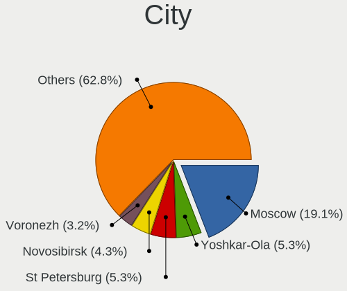
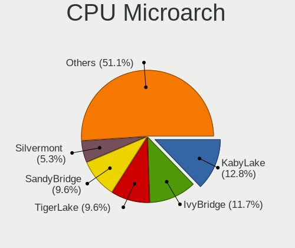
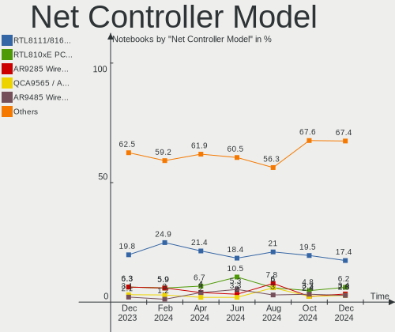

ROSA Hardware Trends (Notebook)
-------------------------------

A project to identify most popular hardware characteristics and track their change
over time based on data collected by ROSA users at https://Linux-Hardware.org.

Anyone can contribute to the study by uploading probes of their computers by
the [hw-probe](https://github.com/linuxhw/hw-probe) tool:

    sudo -E hw-probe -all -upload

Full-feature report is available here: https://linux-hardware.org/?view=trends&formfactor=notebook

Period: Jan, 2021.

Contents
--------

- [ OS                       ](#os)
- [ OS Family                ](#os-family)
- [ Kernel                   ](#kernel)
- [ Kernel Family            ](#kernel-family)
- [ Kernel Major Ver.        ](#kernel-major-ver)
- [ Arch                     ](#arch)
- [ DE                       ](#de)
- [ Display Server           ](#display-server)
- [ Display Manager          ](#display-manager)
- [ OS Lang                  ](#os-lang)
- [ Boot Mode                ](#boot-mode)
- [ Filesystem               ](#filesystem)
- [ Part. scheme             ](#part-scheme)
- [ Dual Boot with Linux/BSD ](#dual-boot-with-linux/bsd)
- [ Dual Boot (Win)          ](#dual-boot-win)
- [ Country                  ](#country)
- [ City                     ](#city)
- [ Vendor                   ](#vendor)
- [ Model                    ](#model)
- [ Model Family             ](#model-family)
- [ MFG Year                 ](#mfg-year)
- [ Form Factor              ](#form-factor)
- [ Secure Boot              ](#secure-boot)
- [ Coreboot                 ](#coreboot)
- [ RAM Size                 ](#ram-size)
- [ RAM Used                 ](#ram-used)
- [ Has CD-ROM               ](#has-cd-rom)
- [ Total Drives             ](#total-drives)
- [ Has Ethernet             ](#has-ethernet)
- [ Drive Vendor             ](#drive-vendor)
- [ Drive Model              ](#drive-model)
- [ HDD Vendor               ](#hdd-vendor)
- [ SSD Vendor               ](#ssd-vendor)
- [ Drive Kind               ](#drive-kind)
- [ Drive Connector          ](#drive-connector)
- [ Drive Size               ](#drive-size)
- [ Space Total              ](#space-total)
- [ Space Used               ](#space-used)
- [ Malfunc. Drives          ](#malfunc-drives)
- [ Malfunc. Drive Vendor    ](#malfunc-drive-vendor)
- [ Malfunc. HDD Vendor      ](#malfunc-hdd-vendor)
- [ Malfunc. Drive Kind      ](#malfunc-drive-kind)
- [ Failed Drives            ](#failed-drives)
- [ Failed Drive Vendor      ](#failed-drive-vendor)
- [ Drive Status             ](#drive-status)
- [ Storage Vendor           ](#storage-vendor)
- [ Storage Model            ](#storage-model)
- [ Storage Kind             ](#storage-kind)
- [ CPU Vendor               ](#cpu-vendor)
- [ CPU Model                ](#cpu-model)
- [ CPU Model Family         ](#cpu-model-family)
- [ CPU Cores                ](#cpu-cores)
- [ CPU Sockets              ](#cpu-sockets)
- [ CPU Threads              ](#cpu-threads)
- [ CPU Op-Modes             ](#cpu-op-modes)
- [ CPU Microcode            ](#cpu-microcode)
- [ CPU Microarch            ](#cpu-microarch)
- [ GPU Vendor               ](#gpu-vendor)
- [ GPU Model                ](#gpu-model)
- [ GPU Combo                ](#gpu-combo)
- [ GPU Driver               ](#gpu-driver)
- [ GPU Memory               ](#gpu-memory)
- [ Monitor Vendor           ](#monitor-vendor)
- [ Monitor Model            ](#monitor-model)
- [ Monitor Resolution       ](#monitor-resolution)
- [ Monitor Diagonal         ](#monitor-diagonal)
- [ Monitor Width            ](#monitor-width)
- [ Aspect Ratio             ](#aspect-ratio)
- [ Monitor Area             ](#monitor-area)
- [ Pixel Density            ](#pixel-density)
- [ Multiple Monitors        ](#multiple-monitors)
- [ Net Controller Vendor    ](#net-controller-vendor)
- [ Net Controller Model     ](#net-controller-model)
- [ Wireless Vendor          ](#wireless-vendor)
- [ Wireless Model           ](#wireless-model)
- [ Ethernet Vendor          ](#ethernet-vendor)
- [ Ethernet Model           ](#ethernet-model)
- [ Net Controller Kind      ](#net-controller-kind)
- [ Used Controller          ](#used-controller)
- [ NICs                     ](#nics)
- [ Memory Vendor            ](#memory-vendor)
- [ Memory Model             ](#memory-model)
- [ Memory Kind              ](#memory-kind)
- [ Memory Form Factor       ](#memory-form-factor)
- [ Memory Size              ](#memory-size)
- [ Memory Speed             ](#memory-speed)
- [ Sound Vendor             ](#sound-vendor)
- [ Sound Model              ](#sound-model)
- [ Camera Vendor            ](#camera-vendor)
- [ Camera Model             ](#camera-model)
- [ Fingerprint Vendor       ](#fingerprint-vendor)
- [ Fingerprint Model        ](#fingerprint-model)
- [ Chipcard Vendor          ](#chipcard-vendor)
- [ Chipcard Model           ](#chipcard-model)
- [ Printer Vendor           ](#printer-vendor)
- [ Printer Model            ](#printer-model)
- [ Scanner Vendor           ](#scanner-vendor)
- [ Scanner Model            ](#scanner-model)
- [ Bluetooth Vendor         ](#bluetooth-vendor)
- [ Bluetooth Model          ](#bluetooth-model)
- [ Unsupported Devices      ](#unsupported-devices)
- [ Unsupported Device Types ](#unsupported-device-types)

OS
--

Installed operating systems

| Name       | Notebooks | Percent |
|------------|-----------|---------|
| ROSA R11.1 | 56        | 65.88%  |
| ROSA R11   | 19        | 22.35%  |
| ROSA R8.1  | 4         | 4.71%   |
| ROSA R12   | 3         | 3.53%   |
| ROSA R10   | 3         | 3.53%   |

OS Family
---------

OS without a version

| Name | Notebooks | Percent |
|------|-----------|---------|
| ROSA | 85        | 100%    |

Kernel
------

Version of the Linux kernel

| Version                             | Notebooks | Percent |
|-------------------------------------|-----------|---------|
| 4.15.0-desktop-122.124.1rosa-x86_64 | 26        | 30.59%  |
| 4.15.0-desktop-45.1rosa-x86_64      | 19        | 22.35%  |
| 5.4.83-generic-2rosa-x86_64         | 11        | 12.94%  |
| 4.15.0-desktop-122.124.1rosa-i586   | 4         | 4.71%   |
| 5.4.83-generic-2rosa-i586           | 3         | 3.53%   |
| 4.15.0-desktop-45.1rosa-i586        | 3         | 3.53%   |
| 5.4.83-generic-2rosa2019.1-x86_64   | 2         | 2.35%   |
| 5.4.32-generic-2rosa-x86_64         | 2         | 2.35%   |
| 5.0.0-desktop-38.1rosa-x86_64       | 2         | 2.35%   |
| 4.9.60-nrj-desktop-1rosa-x86_64     | 2         | 2.35%   |
| 4.9.155-nrj-desktop-1rosa-x86_64    | 2         | 2.35%   |
| 4.9.155-nrj-desktop-1rosa-i586      | 2         | 2.35%   |
| 5.9.14.xm1-1-xanmod-rosa-x86_64     | 1         | 1.18%   |
| 5.4.32-generic-2rosa-i586           | 1         | 1.18%   |
| 5.10.4-generic-2rosa2019.1-x86_64   | 1         | 1.18%   |
| 4.9.9-nrj-desktop-1rosa-x86_64      | 1         | 1.18%   |
| 4.9.60-nrj-desktop-1rosa-i586       | 1         | 1.18%   |
| 4.9.155-nrj-laptop-1rosa-i586       | 1         | 1.18%   |
| 4.1.38-nrj-desktop-2rosa-x86_64     | 1         | 1.18%   |

Kernel Family
-------------

Linux kernel without a distro release

| Version | Notebooks | Percent |
|---------|-----------|---------|
| 4.15.0  | 52        | 61.18%  |
| 5.4.83  | 16        | 18.82%  |
| 4.9.155 | 5         | 5.88%   |
| 5.4.32  | 3         | 3.53%   |
| 4.9.60  | 3         | 3.53%   |
| 5.0.0   | 2         | 2.35%   |
| 5.9.14  | 1         | 1.18%   |
| 5.10.4  | 1         | 1.18%   |
| 4.9.9   | 1         | 1.18%   |
| 4.1.38  | 1         | 1.18%   |

Kernel Major Ver.
-----------------

Linux kernel major version

| Version | Notebooks | Percent |
|---------|-----------|---------|
| 4.15    | 52        | 61.18%  |
| 5.4     | 19        | 22.35%  |
| 4.9     | 9         | 10.59%  |
| 5.0     | 2         | 2.35%   |
| 5.9     | 1         | 1.18%   |
| 5.10    | 1         | 1.18%   |
| 4.1     | 1         | 1.18%   |

Arch
----

OS architecture (x86_64, i586, etc.)

| Name   | Notebooks | Percent |
|--------|-----------|---------|
| x86_64 | 70        | 82.35%  |
| i686   | 15        | 17.65%  |

DE
--

Desktop Environment

| Name  | Notebooks | Percent |
|-------|-----------|---------|
| KDE4  | 54        | 63.53%  |
| KDE5  | 21        | 24.71%  |
| LXQt  | 6         | 7.06%   |
| XFCE  | 3         | 3.53%   |
| GNOME | 1         | 1.18%   |

Display Server
--------------

X11 or Wayland

| Name    | Notebooks | Percent |
|---------|-----------|---------|
| X11     | 84        | 98.82%  |
| Wayland | 1         | 1.18%   |

Display Manager
---------------

SDDM, LightDM, etc.

| Name | Notebooks | Percent |
|------|-----------|---------|
| KDM  | 54        | 63.53%  |
| SDDM | 29        | 34.12%  |
| TDM  | 1         | 1.18%   |
| GDM  | 1         | 1.18%   |

OS Lang
-------

Language

| Lang    | Notebooks | Percent |
|---------|-----------|---------|
| ru_RU   | 48        | 56.47%  |
| Unknown | 27        | 31.76%  |
| en_US   | 4         | 4.71%   |
| es_ES   | 2         | 2.35%   |
| ru_UA   | 1         | 1.18%   |
| pl_PL   | 1         | 1.18%   |
| en_GB   | 1         | 1.18%   |
| de_DE   | 1         | 1.18%   |

Boot Mode
---------

EFI or BIOS

| Mode | Notebooks | Percent |
|------|-----------|---------|
| BIOS | 63        | 74.12%  |
| EFI  | 22        | 25.88%  |

Filesystem
----------

Type of filesystem

| Type  | Notebooks | Percent |
|-------|-----------|---------|
| Ext4  | 83        | 97.65%  |
| Btrfs | 2         | 2.35%   |

Part. scheme
------------

Scheme of partitioning

| Type    | Notebooks | Percent |
|---------|-----------|---------|
| MBR     | 58        | 68.24%  |
| GPT     | 24        | 28.24%  |
| Unknown | 3         | 3.53%   |

Dual Boot with Linux/BSD
------------------------

Hosting more than one Linux/BSD

| Dual boot | Notebooks | Percent |
|-----------|-----------|---------|
| No        | 68        | 80%     |
| Yes       | 17        | 20%     |

Dual Boot (Win)
---------------

Hosting Linux and Windows

| Dual boot | Notebooks | Percent |
|-----------|-----------|---------|
| No        | 44        | 51.76%  |
| Yes       | 41        | 48.24%  |

Country
-------

Geographic location (country)

| Country   | Notebooks | Percent |
|-----------|-----------|---------|
| Russia    | 62        | 72.94%  |
| Ukraine   | 4         | 4.71%   |
| Germany   | 3         | 3.53%   |
| Belarus   | 3         | 3.53%   |
| USA       | 2         | 2.35%   |
| Spain     | 2         | 2.35%   |
| Serbia    | 1         | 1.18%   |
| Poland    | 1         | 1.18%   |
| Lithuania | 1         | 1.18%   |
| Latvia    | 1         | 1.18%   |
| Italy     | 1         | 1.18%   |
| Israel    | 1         | 1.18%   |
| Finland   | 1         | 1.18%   |
| Canada    | 1         | 1.18%   |
| Austria   | 1         | 1.18%   |

City
----

Geographic location (city)

| City             | Notebooks | Percent |
|------------------|-----------|---------|
| Moscow           | 12        | 14.12%  |
| St Petersburg    | 5         | 5.88%   |
| Krasnodar        | 4         | 4.71%   |
| Rostov-on-Don    | 3         | 3.53%   |
| Pittsburgh       | 2         | 2.35%   |
| Novosibirsk      | 2         | 2.35%   |
| Nizhniy Novgorod | 2         | 2.35%   |
| Ekaterinburg     | 2         | 2.35%   |
| Zvenyhorodka     | 1         | 1.18%   |
| Zaragoza         | 1         | 1.18%   |
| Volgograd        | 1         | 1.18%   |
| Vladivostok      | 1         | 1.18%   |
| Vilnius          | 1         | 1.18%   |
| Usinsk           | 1         | 1.18%   |
| Ufa              | 1         | 1.18%   |
| Tyumen           | 1         | 1.18%   |
| Tver             | 1         | 1.18%   |
| Tula             | 1         | 1.18%   |
| Tsarskoye Selo   | 1         | 1.18%   |
| Tiberias         | 1         | 1.18%   |
| Stavropol        | 1         | 1.18%   |
| Stary Oskol      | 1         | 1.18%   |
| Sochi            | 1         | 1.18%   |
| Schwanewede      | 1         | 1.18%   |
| Saransk          | 1         | 1.18%   |
| Samara           | 1         | 1.18%   |
| Riga             | 1         | 1.18%   |
| Rechytsa         | 1         | 1.18%   |
| Pogeez           | 1         | 1.18%   |
| Perm             | 1         | 1.18%   |
| Penza            | 1         | 1.18%   |
| Osinniki         | 1         | 1.18%   |
| Niš             | 1         | 1.18%   |
| Naro-Fominsk     | 1         | 1.18%   |
| Mytishchi        | 1         | 1.18%   |
| Murino           | 1         | 1.18%   |
| Modena           | 1         | 1.18%   |
| Luhansk          | 1         | 1.18%   |
| Kyiv             | 1         | 1.18%   |
| Kursk            | 1         | 1.18%   |
| Kstovo           | 1         | 1.18%   |
| Kemerovo         | 1         | 1.18%   |
| Kazan’         | 1         | 1.18%   |
| Kaliningrad      | 1         | 1.18%   |
| Jawornik Polski  | 1         | 1.18%   |
| Irkutsk          | 1         | 1.18%   |
| Helsinki         | 1         | 1.18%   |
| Gubkin           | 1         | 1.18%   |
| Granada          | 1         | 1.18%   |
| Gelendzhik       | 1         | 1.18%   |
| Gatchina         | 1         | 1.18%   |
| Fryazino         | 1         | 1.18%   |
| Eisenstadt       | 1         | 1.18%   |
| Donskoye         | 1         | 1.18%   |
| Dmitrov          | 1         | 1.18%   |
| Bowmanville      | 1         | 1.18%   |
| Borisov          | 1         | 1.18%   |
| Berdyuzh'ye      | 1         | 1.18%   |
| Aznakayevo       | 1         | 1.18%   |
| Asipovichy       | 1         | 1.18%   |

Vendor
------

Motherboard manufacturer

| Name                | Notebooks | Percent |
|---------------------|-----------|---------|
| Lenovo              | 16        | 18.82%  |
| ASUSTek Computer    | 15        | 17.65%  |
| Acer                | 12        | 14.12%  |
| Hewlett-Packard     | 10        | 11.76%  |
| Dell                | 7         | 8.24%   |
| Sony                | 5         | 5.88%   |
| MSI                 | 4         | 4.71%   |
| Toshiba             | 3         | 3.53%   |
| Samsung Electronics | 3         | 3.53%   |
| Packard Bell        | 2         | 2.35%   |
| Medion              | 1         | 1.18%   |
| LG Electronics      | 1         | 1.18%   |
| eMachines           | 1         | 1.18%   |
| DNS                 | 1         | 1.18%   |
| Digma               | 1         | 1.18%   |
| Clevo               | 1         | 1.18%   |
| Apple               | 1         | 1.18%   |
| Alienware           | 1         | 1.18%   |

Model
-----

Motherboard model

| Name                                       | Notebooks | Percent |
|--------------------------------------------|-----------|---------|
| ASUS X51RL                                 | 2         | 2.35%   |
| Toshiba Satellite L655                     | 1         | 1.18%   |
| Toshiba Satellite C850-B7K                 | 1         | 1.18%   |
| Toshiba Satellite A350D                    | 1         | 1.18%   |
| Sony VPCSA2S9R                             | 1         | 1.18%   |
| Sony VPCEJ2L1E                             | 1         | 1.18%   |
| Sony VPCEB3E1R                             | 1         | 1.18%   |
| Sony VGN-FZ11MR                            | 1         | 1.18%   |
| Sony SVE1511V1RW                           | 1         | 1.18%   |
| Samsung R540/R580/R780/SA41/E452/E852      | 1         | 1.18%   |
| Samsung R530/R730                          | 1         | 1.18%   |
| Samsung N150/N210/N220                     | 1         | 1.18%   |
| Packard Bell EasyNote TS11SB               | 1         | 1.18%   |
| Packard Bell EasyNote ENTG81BA             | 1         | 1.18%   |
| MSI X370                                   | 1         | 1.18%   |
| MSI GL63 8RC                               | 1         | 1.18%   |
| MSI GF75 Thin 9SCSR                        | 1         | 1.18%   |
| MSI CX61 2QC                               | 1         | 1.18%   |
| Medion Erazer X7841 MD99556                | 1         | 1.18%   |
| LG HUNTER                                  | 1         | 1.18%   |
| Lenovo V130-15IKB 81HN                     | 1         | 1.18%   |
| Lenovo ThinkPad X230 2325I63               | 1         | 1.18%   |
| Lenovo ThinkPad X1C 5th W10DG 20K3S01A00   | 1         | 1.18%   |
| Lenovo ThinkPad T60p 200793G               | 1         | 1.18%   |
| Lenovo IdeaPad Z565 20066                  | 1         | 1.18%   |
| Lenovo IdeaPad S340-14API 81NB             | 1         | 1.18%   |
| Lenovo IdeaPad S110 20126                  | 1         | 1.18%   |
| Lenovo G770 1037                           | 1         | 1.18%   |
| Lenovo G570 20079                          | 1         | 1.18%   |
| Lenovo G560 20042                          | 1         | 1.18%   |
| Lenovo G500 20236                          | 1         | 1.18%   |
| Lenovo G50-30 80G0                         | 1         | 1.18%   |
| Lenovo B590 20206                          | 1         | 1.18%   |
| Lenovo B450 1S1680033610187                | 1         | 1.18%   |
| Lenovo AILZx                               | 1         | 1.18%   |
| HP Pavilion m6                             | 1         | 1.18%   |
| HP Pavilion 15-af138ur                     | 1         | 1.18%   |
| HP Notebook                                | 1         | 1.18%   |
| HP Mini 5102                               | 1         | 1.18%   |
| HP EliteBook 830 G5                        | 1         | 1.18%   |
| HP Compaq tc4400 (RL875AW#ABA)             | 1         | 1.18%   |
| HP Compaq Mini CQ10-400                    | 1         | 1.18%   |
| HP 255 G2                                  | 1         | 1.18%   |
| HP 250 G7 Notebook PC                      | 1         | 1.18%   |
| HP 250 G3                                  | 1         | 1.18%   |
| eMachines eME732                           | 1         | 1.18%   |
| DNS W510LU                                 | 1         | 1.18%   |
| Digma ES6021EW                             | 1         | 1.18%   |
| Dell XPS L702X                             | 1         | 1.18%   |
| Dell Latitude E6420                        | 1         | 1.18%   |
| Dell Inspiron 5720                         | 1         | 1.18%   |
| Dell Inspiron 5570                         | 1         | 1.18%   |
| Dell Inspiron 5567                         | 1         | 1.18%   |
| Dell Inspiron 3542                         | 1         | 1.18%   |
| Dell Inspiron 1521                         | 1         | 1.18%   |
| Clevo W240EL/W250ELQ/W270ELQ               | 1         | 1.18%   |
| ASUS X75VC                                 | 1         | 1.18%   |
| ASUS X101CH                                | 1         | 1.18%   |
| ASUS VivoBook 17_ASUS Laptop X705MA_A705MA | 1         | 1.18%   |
| ASUS UL80Jt                                | 1         | 1.18%   |

Model Family
------------

Motherboard model prefix

| Name                  | Notebooks | Percent |
|-----------------------|-----------|---------|
| Acer Aspire           | 10        | 11.76%  |
| Dell Inspiron         | 5         | 5.88%   |
| Toshiba Satellite     | 3         | 3.53%   |
| Lenovo ThinkPad       | 3         | 3.53%   |
| Lenovo IdeaPad        | 3         | 3.53%   |
| Packard Bell EasyNote | 2         | 2.35%   |
| HP Pavilion           | 2         | 2.35%   |
| HP Compaq             | 2         | 2.35%   |
| HP 250                | 2         | 2.35%   |
| ASUS X51RL            | 2         | 2.35%   |
| Sony VPCSA2S9R        | 1         | 1.18%   |
| Sony VPCEJ2L1E        | 1         | 1.18%   |
| Sony VPCEB3E1R        | 1         | 1.18%   |
| Sony VGN-FZ11MR       | 1         | 1.18%   |
| Sony SVE1511V1RW      | 1         | 1.18%   |
| Samsung R540          | 1         | 1.18%   |
| Samsung R530          | 1         | 1.18%   |
| Samsung N150          | 1         | 1.18%   |
| MSI X370              | 1         | 1.18%   |
| MSI GL63              | 1         | 1.18%   |
| MSI GF75              | 1         | 1.18%   |
| MSI CX61              | 1         | 1.18%   |
| Medion Erazer         | 1         | 1.18%   |
| LG HUNTER             | 1         | 1.18%   |
| Lenovo V130-15IKB     | 1         | 1.18%   |
| Lenovo G770           | 1         | 1.18%   |
| Lenovo G570           | 1         | 1.18%   |
| Lenovo G560           | 1         | 1.18%   |
| Lenovo G500           | 1         | 1.18%   |
| Lenovo G50-30         | 1         | 1.18%   |
| Lenovo B590           | 1         | 1.18%   |
| Lenovo B450           | 1         | 1.18%   |
| Lenovo AILZx          | 1         | 1.18%   |
| HP Notebook           | 1         | 1.18%   |
| HP Mini               | 1         | 1.18%   |
| HP EliteBook          | 1         | 1.18%   |
| HP 255                | 1         | 1.18%   |
| eMachines eME732      | 1         | 1.18%   |
| DNS W510LU            | 1         | 1.18%   |
| Digma ES6021EW        | 1         | 1.18%   |
| Dell XPS              | 1         | 1.18%   |
| Dell Latitude         | 1         | 1.18%   |
| Clevo W240EL          | 1         | 1.18%   |
| ASUS X75VC            | 1         | 1.18%   |
| ASUS X101CH           | 1         | 1.18%   |
| ASUS VivoBook         | 1         | 1.18%   |
| ASUS UL80Jt           | 1         | 1.18%   |
| ASUS U24E             | 1         | 1.18%   |
| ASUS K73SV            | 1         | 1.18%   |
| ASUS K53SC            | 1         | 1.18%   |
| ASUS K52Dr            | 1         | 1.18%   |
| ASUS F5SR             | 1         | 1.18%   |
| ASUS F5RL             | 1         | 1.18%   |
| ASUS ASUS             | 1         | 1.18%   |
| ASUS A8Le             | 1         | 1.18%   |
| ASUS 1005PXD          | 1         | 1.18%   |
| Apple MacBookPro6     | 1         | 1.18%   |
| Alienware 17          | 1         | 1.18%   |
| Acer TravelMate       | 1         | 1.18%   |
| Acer Extensa          | 1         | 1.18%   |

MFG Year
--------

Motherboard manufacture year

| Year | Notebooks | Percent |
|------|-----------|---------|
| 2011 | 14        | 16.47%  |
| 2010 | 10        | 11.76%  |
| 2012 | 9         | 10.59%  |
| 2013 | 8         | 9.41%   |
| 2018 | 7         | 8.24%   |
| 2008 | 5         | 5.88%   |
| 2007 | 5         | 5.88%   |
| 2020 | 4         | 4.71%   |
| 2019 | 4         | 4.71%   |
| 2016 | 4         | 4.71%   |
| 2015 | 4         | 4.71%   |
| 2017 | 3         | 3.53%   |
| 2014 | 3         | 3.53%   |
| 2009 | 3         | 3.53%   |
| 2006 | 1         | 1.18%   |
| 2005 | 1         | 1.18%   |

Form Factor
-----------

Physical design of the computer

| Name     | Notebooks | Percent |
|----------|-----------|---------|
| Notebook | 85        | 100%    |

Secure Boot
-----------

Enabled or disabled

| State    | Notebooks | Percent |
|----------|-----------|---------|
| Disabled | 84        | 98.82%  |
| Enabled  | 1         | 1.18%   |

Coreboot
--------

Have coreboot on board

| Used | Notebooks | Percent |
|------|-----------|---------|
| No   | 85        | 100%    |

RAM Size
--------

Total RAM memory

| Size in GB | Notebooks | Percent |
|------------|-----------|---------|
| 4.01-8.0   | 19        | 22.35%  |
| 3.01-4.0   | 19        | 22.35%  |
| 1.01-2.0   | 19        | 22.35%  |
| 8.01-16.0  | 12        | 14.12%  |
| 2.01-3.0   | 7         | 8.24%   |
| 16.01-24.0 | 5         | 5.88%   |
| 0.51-1.0   | 2         | 2.35%   |
| 32.01-64.0 | 1         | 1.18%   |
| 24.01-32.0 | 1         | 1.18%   |

RAM Used
--------

Used RAM memory

| Used GB    | Notebooks | Percent |
|------------|-----------|---------|
| 1.01-2.0   | 45        | 52.94%  |
| 0.51-1.0   | 32        | 37.65%  |
| 2.01-3.0   | 4         | 4.71%   |
| 4.01-8.0   | 1         | 1.18%   |
| 3.01-4.0   | 1         | 1.18%   |
| 16.01-24.0 | 1         | 1.18%   |
| 0.01-0.5   | 1         | 1.18%   |

Has CD-ROM
----------

Has CD-ROM on board

| Presented | Notebooks | Percent |
|-----------|-----------|---------|
| Yes       | 47        | 55.29%  |
| No        | 38        | 44.71%  |

Total Drives
------------

Number of drives on board

| Drives | Notebooks | Percent |
|--------|-----------|---------|
| 1      | 64        | 75.29%  |
| 2      | 18        | 21.18%  |
| 3      | 3         | 3.53%   |

Has Ethernet
------------

Has Ethernet on board

| Presented | Notebooks | Percent |
|-----------|-----------|---------|
| Yes       | 83        | 97.65%  |
| No        | 2         | 2.35%   |

Drive Vendor
------------

Hard drive vendors

| Vendor              | Notebooks | Drives | Percent |
|---------------------|-----------|--------|---------|
| WDC                 | 19        | 21     | 18.63%  |
| Seagate             | 18        | 18     | 17.65%  |
| Hitachi             | 14        | 14     | 13.73%  |
| Toshiba             | 12        | 13     | 11.76%  |
| Samsung Electronics | 7         | 7      | 6.86%   |
| Kingston            | 7         | 8      | 6.86%   |
| Unknown             | 3         | 3      | 2.94%   |
| HGST                | 3         | 3      | 2.94%   |
| Fujitsu             | 3         | 3      | 2.94%   |
| SanDisk             | 2         | 2      | 1.96%   |
| China               | 2         | 2      | 1.96%   |
| A-DATA Technology   | 2         | 2      | 1.96%   |
| Union Memory        | 1         | 1      | 0.98%   |
| Transcend           | 1         | 1      | 0.98%   |
| Patriot             | 1         | 1      | 0.98%   |
| LITEONIT            | 1         | 1      | 0.98%   |
| KingDian            | 1         | 1      | 0.98%   |
| Intel               | 1         | 1      | 0.98%   |
| Hewlett-Packard     | 1         | 1      | 0.98%   |
| GOODRAM             | 1         | 1      | 0.98%   |
| e2e4                | 1         | 1      | 0.98%   |
| Crucial             | 1         | 1      | 0.98%   |

Drive Model
-----------

Hard drive models

| Model                                | Notebooks | Percent |
|--------------------------------------|-----------|---------|
| Kingston SA400S37240G 240GB SSD      | 3         | 2.83%   |
| WDC WD5000LPVX-22V0TT0 500GB         | 2         | 1.89%   |
| Toshiba TR200 240GB SSD              | 2         | 1.89%   |
| Toshiba MQ01ABF050 500GB             | 2         | 1.89%   |
| Seagate ST320LT020-9YG142 320GB      | 2         | 1.89%   |
| Seagate ST1000LM035-1RK172 1TB       | 2         | 1.89%   |
| Samsung SSD 860 EVO 250GB            | 2         | 1.89%   |
| WDC WDS500G2B0A-00SM50 500GB SSD     | 1         | 0.94%   |
| WDC WDS480G2G0A-00JH30 480GB SSD     | 1         | 0.94%   |
| WDC WDS250G2B0A 250GB SSD            | 1         | 0.94%   |
| WDC WD7500BPVT-24HXZT1 752GB         | 1         | 0.94%   |
| WDC WD7500BPKX-75HPJT0 752GB         | 1         | 0.94%   |
| WDC WD5000LPZX-60Z10T0 500GB         | 1         | 0.94%   |
| WDC WD5000LPVX-80V0TT0 500GB         | 1         | 0.94%   |
| WDC WD5000LPVX-60V0TT0 500GB         | 1         | 0.94%   |
| WDC WD5000LPCX-60VHAT0 500GB         | 1         | 0.94%   |
| WDC WD5000LPCX-00VHAT0 500GB         | 1         | 0.94%   |
| WDC WD5000BPKT-75PK4T0 500GB         | 1         | 0.94%   |
| WDC WD3200BPVT-22ZEST0 320GB         | 1         | 0.94%   |
| WDC WD3200BEVT-08A23T1 320GB         | 1         | 0.94%   |
| WDC WD2500BEVT-00ZCT0 250GB          | 1         | 0.94%   |
| WDC WD1600BEVT-22ZCT0 160GB          | 1         | 0.94%   |
| WDC WD1200BEVS-07LAT0 120GB          | 1         | 0.94%   |
| WDC WD10SPZX-21Z10T0 1TB             | 1         | 0.94%   |
| WDC WD10JPVX-22JC3T0 1TB             | 1         | 0.94%   |
| WDC PC SN530 SDBPNPZ-512G-1002 512GB | 1         | 0.94%   |
| Unknown USD00  64GB                  | 1         | 0.94%   |
| Unknown SDC  8GB                     | 1         | 0.94%   |
| Unknown FFFFF  32GB                  | 1         | 0.94%   |
| Union Memory RPFTJ128PDD2EWX 128GB   | 1         | 0.94%   |
| Transcend TS128GSSD370S 128GB        | 1         | 0.94%   |
| Toshiba THNSNC128GMMJ 128GB SSD      | 1         | 0.94%   |
| Toshiba MQ01ABD100 1TB               | 1         | 0.94%   |
| Toshiba MQ01ABD075 752GB             | 1         | 0.94%   |
| Toshiba MQ01ABD032 320GB             | 1         | 0.94%   |
| Toshiba MK7575GSX 752GB              | 1         | 0.94%   |
| Toshiba MK5075GSX 500GB              | 1         | 0.94%   |
| Toshiba MK3259GSXP 320GB             | 1         | 0.94%   |
| Toshiba KXG50ZNV1T02 1TB             | 1         | 0.94%   |
| Toshiba KBG30ZMT128G 128GB           | 1         | 0.94%   |
| Seagate ST9320328CS 320GB            | 1         | 0.94%   |
| Seagate ST9320325AS 320GB            | 1         | 0.94%   |
| Seagate ST9320320AS 320GB            | 1         | 0.94%   |
| Seagate ST9250827AS 250GB            | 1         | 0.94%   |
| Seagate ST9250315AS 250GB            | 1         | 0.94%   |
| Seagate ST9160827AS 160GB            | 1         | 0.94%   |
| Seagate ST9160314AS 160GB            | 1         | 0.94%   |
| Seagate ST9160310AS 160GB            | 1         | 0.94%   |
| Seagate ST500LT012-9WS142 500GB      | 1         | 0.94%   |
| Seagate ST500LM012 HN-M500MBB 500GB  | 1         | 0.94%   |
| Seagate ST1000LM049-2GH172 1TB       | 1         | 0.94%   |
| Seagate ST1000LM048-2E7172 1TB       | 1         | 0.94%   |
| Seagate ST1000LM024 HN-M101MBB 1TB   | 1         | 0.94%   |
| Seagate Expansion 1TB                | 1         | 0.94%   |
| SanDisk SDSSDHII480G 480GB           | 1         | 0.94%   |
| SanDisk DF4032  32GB                 | 1         | 0.94%   |
| Samsung SSD 970 EVO 1TB              | 1         | 0.94%   |
| Samsung SSD 850 EVO 500GB            | 1         | 0.94%   |
| Samsung MZVLB256HAHQ-00000 256GB     | 1         | 0.94%   |
| Samsung MZNLF128HCHP-00000 128GB SSD | 1         | 0.94%   |

HDD Vendor
----------

Hard disk drive vendors

| Vendor              | Notebooks | Drives | Percent |
|---------------------|-----------|--------|---------|
| Seagate             | 18        | 18     | 28.57%  |
| WDC                 | 17        | 17     | 26.98%  |
| Hitachi             | 14        | 14     | 22.22%  |
| Toshiba             | 7         | 8      | 11.11%  |
| HGST                | 3         | 3      | 4.76%   |
| Fujitsu             | 3         | 3      | 4.76%   |
| Samsung Electronics | 1         | 1      | 1.59%   |

SSD Vendor
----------

Solid state drive vendors

| Vendor              | Notebooks | Drives | Percent |
|---------------------|-----------|--------|---------|
| Kingston            | 7         | 8      | 23.33%  |
| Samsung Electronics | 4         | 4      | 13.33%  |
| WDC                 | 3         | 3      | 10%     |
| Toshiba             | 3         | 3      | 10%     |
| China               | 2         | 2      | 6.67%   |
| Transcend           | 1         | 1      | 3.33%   |
| SanDisk             | 1         | 1      | 3.33%   |
| Patriot             | 1         | 1      | 3.33%   |
| LITEONIT            | 1         | 1      | 3.33%   |
| KingDian            | 1         | 1      | 3.33%   |
| Intel               | 1         | 1      | 3.33%   |
| Hewlett-Packard     | 1         | 1      | 3.33%   |
| GOODRAM             | 1         | 1      | 3.33%   |
| e2e4                | 1         | 1      | 3.33%   |
| Crucial             | 1         | 1      | 3.33%   |
| A-DATA Technology   | 1         | 1      | 3.33%   |

Drive Kind
----------

HDD or SSD

| Kind | Notebooks | Drives | Percent |
|------|-----------|--------|---------|
| HDD  | 62        | 64     | 61.39%  |
| SSD  | 29        | 31     | 28.71%  |
| NVMe | 6         | 7      | 5.94%   |
| MMC  | 4         | 4      | 3.96%   |

Drive Connector
---------------

SATA, SAS, NVMe, etc.

| Type | Notebooks | Drives | Percent |
|------|-----------|--------|---------|
| SATA | 81        | 94     | 88.04%  |
| NVMe | 6         | 7      | 6.52%   |
| MMC  | 4         | 4      | 4.35%   |
| SAS  | 1         | 1      | 1.09%   |

Drive Size
----------

Size of hard drive

| Size in TB | Notebooks | Drives | Percent |
|------------|-----------|--------|---------|
| 0.01-0.5   | 71        | 79     | 81.61%  |
| 0.51-1.0   | 16        | 16     | 18.39%  |

Space Total
-----------

Amount of disk space available on the file system

| Size in GB | Notebooks | Percent |
|------------|-----------|---------|
| 251-500    | 27        | 31.76%  |
| 101-250    | 21        | 24.71%  |
| 1-20       | 14        | 16.47%  |
| 51-100     | 12        | 14.12%  |
| 21-50      | 5         | 5.88%   |
| 501-1000   | 3         | 3.53%   |
| 1001-2000  | 2         | 2.35%   |
| 2001-3000  | 1         | 1.18%   |

Space Used
----------

Amount of used disk space

| Used GB  | Notebooks | Percent |
|----------|-----------|---------|
| 1-20     | 60        | 70.59%  |
| 21-50    | 9         | 10.59%  |
| 51-100   | 7         | 8.24%   |
| 101-250  | 4         | 4.71%   |
| 501-1000 | 4         | 4.71%   |
| 251-500  | 1         | 1.18%   |

Malfunc. Drives
---------------

Drive models with a malfunction

| Model                               | Notebooks | Drives | Percent |
|-------------------------------------|-----------|--------|---------|
| Seagate ST320LT020-9YG142 320GB     | 2         | 2      | 6.25%   |
| WDC WD5000LPVX-60V0TT0 500GB        | 1         | 1      | 3.13%   |
| WDC WD3200BEVT-08A23T1 320GB        | 1         | 1      | 3.13%   |
| Toshiba MQ01ABF050 500GB            | 1         | 1      | 3.13%   |
| Toshiba MK7575GSX 752GB             | 1         | 1      | 3.13%   |
| Toshiba MK5075GSX 500GB             | 1         | 1      | 3.13%   |
| Toshiba MK3259GSXP 320GB            | 1         | 1      | 3.13%   |
| Seagate ST9320328CS 320GB           | 1         | 1      | 3.13%   |
| Seagate ST9320325AS 320GB           | 1         | 1      | 3.13%   |
| Seagate ST9250827AS 250GB           | 1         | 1      | 3.13%   |
| Seagate ST9160827AS 160GB           | 1         | 1      | 3.13%   |
| Seagate ST9160310AS 160GB           | 1         | 1      | 3.13%   |
| Seagate ST500LT012-9WS142 500GB     | 1         | 1      | 3.13%   |
| Seagate ST1000LM048-2E7172 1TB      | 1         | 1      | 3.13%   |
| LITEONIT LMN-256M3M mSATA 256GB SSD | 1         | 1      | 3.13%   |
| Hitachi HTS725050A9A364 500GB       | 1         | 1      | 3.13%   |
| Hitachi HTS725016A9A362 160GB       | 1         | 1      | 3.13%   |
| Hitachi HTS722080K9A300 80GB        | 1         | 1      | 3.13%   |
| Hitachi HTS721010G9SA00 100GB       | 1         | 1      | 3.13%   |
| Hitachi HTS547564A9E384 640GB       | 1         | 1      | 3.13%   |
| Hitachi HTS547550A9E384 500GB       | 1         | 1      | 3.13%   |
| Hitachi HTS545032B9A300 320GB       | 1         | 1      | 3.13%   |
| Hitachi HTS543232L9SA00 320GB       | 1         | 1      | 3.13%   |
| Hitachi HTS543232A7A384 320GB       | 1         | 1      | 3.13%   |
| Hitachi HTS542512K9SA00 120GB       | 1         | 1      | 3.13%   |
| Hitachi HTS541616J9SA00 160GB       | 1         | 1      | 3.13%   |
| Hitachi HTS421280H9AT00 80GB        | 1         | 1      | 3.13%   |
| HGST HTS721010A9E630 1TB            | 1         | 1      | 3.13%   |
| HGST HTS545050A7E680 500GB          | 1         | 1      | 3.13%   |
| HGST HTS545050A7E380 500GB          | 1         | 1      | 3.13%   |
| Fujitsu MHY2120BH 120GB             | 1         | 1      | 3.13%   |

Malfunc. Drive Vendor
---------------------

Vendors of faulty drives

| Vendor   | Notebooks | Drives | Percent |
|----------|-----------|--------|---------|
| Hitachi  | 12        | 12     | 37.5%   |
| Seagate  | 9         | 9      | 28.13%  |
| Toshiba  | 4         | 4      | 12.5%   |
| HGST     | 3         | 3      | 9.38%   |
| WDC      | 2         | 2      | 6.25%   |
| LITEONIT | 1         | 1      | 3.13%   |
| Fujitsu  | 1         | 1      | 3.13%   |

Malfunc. HDD Vendor
-------------------

Vendors of faulty HDD drives

| Vendor  | Notebooks | Drives | Percent |
|---------|-----------|--------|---------|
| Hitachi | 12        | 12     | 38.71%  |
| Seagate | 9         | 9      | 29.03%  |
| Toshiba | 4         | 4      | 12.9%   |
| HGST    | 3         | 3      | 9.68%   |
| WDC     | 2         | 2      | 6.45%   |
| Fujitsu | 1         | 1      | 3.23%   |

Malfunc. Drive Kind
-------------------

Kinds of faulty drives

| Kind | Notebooks | Drives | Percent |
|------|-----------|--------|---------|
| HDD  | 31        | 31     | 96.88%  |
| SSD  | 1         | 1      | 3.13%   |

Failed Drives
-------------

Failed drive models

| Model                       | Notebooks | Drives | Percent |
|-----------------------------|-----------|--------|---------|
| WDC WD1200BEVS-07LAT0 120GB | 1         | 1      | 100%    |

Failed Drive Vendor
-------------------

Failed drive vendors

| Vendor | Notebooks | Drives | Percent |
|--------|-----------|--------|---------|
| WDC    | 1         | 1      | 100%    |

Drive Status
------------

Number of failed and malfunc. drives

| Status   | Notebooks | Drives | Percent |
|----------|-----------|--------|---------|
| Works    | 58        | 67     | 59.79%  |
| Malfunc  | 32        | 32     | 32.99%  |
| Detected | 6         | 6      | 6.19%   |
| Failed   | 1         | 1      | 1.03%   |

Storage Vendor
--------------

Storage controller vendors

| Vendor                           | Notebooks | Percent |
|----------------------------------|-----------|---------|
| Intel                            | 65        | 72.22%  |
| AMD                              | 17        | 18.89%  |
| Toshiba America Info Systems     | 2         | 2.22%   |
| Samsung Electronics              | 2         | 2.22%   |
| Union Memory (Shenzhen)          | 1         | 1.11%   |
| Silicon Integrated Systems [SiS] | 1         | 1.11%   |
| Sandisk                          | 1         | 1.11%   |
| ADATA Technology                 | 1         | 1.11%   |

Storage Model
-------------

Storage controller models

| Model                                                                            | Notebooks | Percent |
|----------------------------------------------------------------------------------|-----------|---------|
| Intel 6 Series/C200 Series Chipset Family 6 port Mobile SATA AHCI Controller     | 10        | 9.52%   |
| Intel 7 Series Chipset Family 6-port SATA Controller [AHCI mode]                 | 9         | 8.57%   |
| AMD FCH SATA Controller [AHCI mode]                                              | 8         | 7.62%   |
| Intel 5 Series/3400 Series Chipset 4 port SATA AHCI Controller                   | 7         | 6.67%   |
| Intel NM10/ICH7 Family SATA Controller [AHCI mode]                               | 6         | 5.71%   |
| Intel 82801HM/HEM (ICH8M/ICH8M-E) SATA Controller [AHCI mode]                    | 5         | 4.76%   |
| Intel 82801HM/HEM (ICH8M/ICH8M-E) IDE Controller                                 | 5         | 4.76%   |
| Intel Sunrise Point-LP SATA Controller [AHCI mode]                               | 4         | 3.81%   |
| AMD SB7x0/SB8x0/SB9x0 SATA Controller [AHCI mode]                                | 4         | 3.81%   |
| AMD SB600 Non-Raid-5 SATA                                                        | 4         | 3.81%   |
| AMD SB600 IDE                                                                    | 4         | 3.81%   |
| Intel 82801 Mobile SATA Controller [RAID mode]                                   | 3         | 2.86%   |
| AMD SB7x0/SB8x0/SB9x0 IDE Controller                                             | 3         | 2.86%   |
| Samsung NVMe SSD Controller SM981/PM981/PM983                                    | 2         | 1.9%    |
| Intel Celeron/Pentium Silver Processor SATA Controller                           | 2         | 1.9%    |
| Intel Cannon Lake Mobile PCH SATA AHCI Controller                                | 2         | 1.9%    |
| Intel Atom/Celeron/Pentium Processor x5-E8000/J3xxx/N3xxx Series SATA Controller | 2         | 1.9%    |
| Intel Atom Processor E3800 Series SATA AHCI Controller                           | 2         | 1.9%    |
| Intel 82801IBM/IEM (ICH9M/ICH9M-E) 4 port SATA Controller [AHCI mode]            | 2         | 1.9%    |
| Intel 82801IBM/IEM (ICH9M/ICH9M-E) 2 port SATA Controller [IDE mode]             | 2         | 1.9%    |
| Intel 82801GBM/GHM (ICH7-M Family) SATA Controller [AHCI mode]                   | 2         | 1.9%    |
| Intel 82801G (ICH7 Family) IDE Controller                                        | 2         | 1.9%    |
| Intel 8 Series/C220 Series Chipset Family 6-port SATA Controller 1 [AHCI mode]   | 2         | 1.9%    |
| Union Memory (Shenzhen) Non-Volatile memory controller                           | 1         | 0.95%   |
| Toshiba America Info Systems Toshiba America Info Non-Volatile memory controller | 1         | 0.95%   |
| Toshiba America Info Systems BG3 NVMe SSD Controller                             | 1         | 0.95%   |
| Silicon Integrated Systems [SiS] SATA Controller / IDE mode                      | 1         | 0.95%   |
| Silicon Integrated Systems [SiS] 5513 IDE Controller                             | 1         | 0.95%   |
| Sandisk WD Blue SN550 NVMe SSD                                                   | 1         | 0.95%   |
| Intel HM170/QM170 Chipset SATA Controller [AHCI Mode]                            | 1         | 0.95%   |
| Intel 82801GBM/GHM (ICH7-M Family) SATA Controller [IDE mode]                    | 1         | 0.95%   |
| Intel 82801FB/FBM/FR/FW/FRW (ICH6 Family) IDE Controller                         | 1         | 0.95%   |
| Intel 8 Series SATA Controller 1 [AHCI mode]                                     | 1         | 0.95%   |
| Intel 5 Series/3400 Series Chipset 4 port SATA IDE Controller                    | 1         | 0.95%   |
| AMD SB7x0/SB8x0/SB9x0 SATA Controller [IDE mode]                                 | 1         | 0.95%   |
| ADATA XPG SX8200 Pro PCIe Gen3x4 M.2 2280 Solid State Drive                      | 1         | 0.95%   |

Storage Kind
------------

Kind of storage controller (IDE, SATA, NVMe, SAS, ...)

| Kind | Notebooks | Percent |
|------|-----------|---------|
| SATA | 74        | 71.84%  |
| IDE  | 20        | 19.42%  |
| NVMe | 6         | 5.83%   |
| RAID | 3         | 2.91%   |

CPU Vendor
----------

Processor vendors

| Vendor | Notebooks | Percent |
|--------|-----------|---------|
| Intel  | 71        | 83.53%  |
| AMD    | 14        | 16.47%  |

CPU Model
---------

Processor models

| Model                                       | Notebooks | Percent |
|---------------------------------------------|-----------|---------|
| Intel Atom CPU N450 @ 1.66GHz               | 3         | 3.53%   |
| Intel Pentium Dual-Core CPU T4400 @ 2.20GHz | 2         | 2.35%   |
| Intel Core i7-2620M CPU @ 2.70GHz           | 2         | 2.35%   |
| Intel Core i5-2430M CPU @ 2.40GHz           | 2         | 2.35%   |
| Intel Core i5-2410M CPU @ 2.30GHz           | 2         | 2.35%   |
| Intel Core 2 Duo CPU T8300 @ 2.40GHz        | 2         | 2.35%   |
| Intel Pentium Silver N5000 CPU @ 1.10GHz    | 1         | 1.18%   |
| Intel Pentium M processor 2.00GHz           | 1         | 1.18%   |
| Intel Pentium Dual-Core CPU T4500 @ 2.30GHz | 1         | 1.18%   |
| Intel Pentium Dual-Core CPU T4300 @ 2.10GHz | 1         | 1.18%   |
| Intel Pentium Dual CPU T2390 @ 1.86GHz      | 1         | 1.18%   |
| Intel Pentium Dual CPU T2330 @ 1.60GHz      | 1         | 1.18%   |
| Intel Pentium Dual CPU T2310 @ 1.46GHz      | 1         | 1.18%   |
| Intel Pentium CPU P6200 @ 2.13GHz           | 1         | 1.18%   |
| Intel Pentium CPU P6100 @ 2.00GHz           | 1         | 1.18%   |
| Intel Pentium CPU N3700 @ 1.60GHz           | 1         | 1.18%   |
| Intel Pentium CPU N3540 @ 2.16GHz           | 1         | 1.18%   |
| Intel Pentium CPU B950 @ 2.10GHz            | 1         | 1.18%   |
| Intel Pentium CPU 2020M @ 2.40GHz           | 1         | 1.18%   |
| Intel Genuine CPU T2600 @ 2.16GHz           | 1         | 1.18%   |
| Intel Core i7-8750H CPU @ 2.20GHz           | 1         | 1.18%   |
| Intel Core i7-8550U CPU @ 1.80GHz           | 1         | 1.18%   |
| Intel Core i7-6700HQ CPU @ 2.60GHz          | 1         | 1.18%   |
| Intel Core i7-4800MQ CPU @ 2.70GHz          | 1         | 1.18%   |
| Intel Core i7-4712MQ CPU @ 2.30GHz          | 1         | 1.18%   |
| Intel Core i7-2640M CPU @ 2.80GHz           | 1         | 1.18%   |
| Intel Core i7-2630QM CPU @ 2.00GHz          | 1         | 1.18%   |
| Intel Core i7 CPU M 640 @ 2.80GHz           | 1         | 1.18%   |
| Intel Core i5-9300H CPU @ 2.40GHz           | 1         | 1.18%   |
| Intel Core i5-8250U CPU @ 1.60GHz           | 1         | 1.18%   |
| Intel Core i5-7200U CPU @ 2.50GHz           | 1         | 1.18%   |
| Intel Core i5-6300U CPU @ 2.40GHz           | 1         | 1.18%   |
| Intel Core i5-4210U CPU @ 1.70GHz           | 1         | 1.18%   |
| Intel Core i5-4200M CPU @ 2.50GHz           | 1         | 1.18%   |
| Intel Core i5-3210M CPU @ 2.50GHz           | 1         | 1.18%   |
| Intel Core i5-2450M CPU @ 2.50GHz           | 1         | 1.18%   |
| Intel Core i5 CPU U 430 @ 1.20GHz           | 1         | 1.18%   |
| Intel Core i5 CPU M 520 @ 2.40GHz           | 1         | 1.18%   |
| Intel Core i5 CPU M 430 @ 2.27GHz           | 1         | 1.18%   |
| Intel Core i3-7020U CPU @ 2.30GHz           | 1         | 1.18%   |
| Intel Core i3-6006U CPU @ 2.00GHz           | 1         | 1.18%   |
| Intel Core i3-3217U CPU @ 1.80GHz           | 1         | 1.18%   |
| Intel Core i3-3120M CPU @ 2.50GHz           | 1         | 1.18%   |
| Intel Core i3-3110M CPU @ 2.40GHz           | 1         | 1.18%   |
| Intel Core i3-2370M CPU @ 2.40GHz           | 1         | 1.18%   |
| Intel Core i3-2350M CPU @ 2.30GHz           | 1         | 1.18%   |
| Intel Core i3-2330M CPU @ 2.20GHz           | 1         | 1.18%   |
| Intel Core i3 CPU M 370 @ 2.40GHz           | 1         | 1.18%   |
| Intel Core i3 CPU M 330 @ 2.13GHz           | 1         | 1.18%   |
| Intel Core 2 Duo CPU T7100 @ 1.80GHz        | 1         | 1.18%   |
| Intel Core 2 Duo CPU L7700 @ 1.80GHz        | 1         | 1.18%   |
| Intel Core 2 CPU T7200 @ 2.00GHz            | 1         | 1.18%   |
| Intel Core 2 CPU T5500 @ 1.66GHz            | 1         | 1.18%   |
| Intel Celeron N4020 CPU @ 1.10GHz           | 1         | 1.18%   |
| Intel Celeron CPU N3050 @ 1.60GHz           | 1         | 1.18%   |
| Intel Celeron CPU N2840 @ 2.16GHz           | 1         | 1.18%   |
| Intel Celeron CPU B815 @ 1.60GHz            | 1         | 1.18%   |
| Intel Celeron CPU 550 @ 2.00GHz             | 1         | 1.18%   |
| Intel Celeron CPU 540 @ 1.86GHz             | 1         | 1.18%   |
| Intel Celeron CPU 1005M @ 1.90GHz           | 1         | 1.18%   |

CPU Model Family
----------------

Processor model prefix

| Model                          | Notebooks | Percent |
|--------------------------------|-----------|---------|
| Intel Core i5                  | 15        | 17.65%  |
| Intel Core i7                  | 10        | 11.76%  |
| Intel Core i3                  | 10        | 11.76%  |
| Intel Celeron                  | 7         | 8.24%   |
| Intel Atom                     | 7         | 8.24%   |
| Intel Pentium                  | 6         | 7.06%   |
| Intel Pentium Dual-Core        | 4         | 4.71%   |
| Intel Core 2 Duo               | 4         | 4.71%   |
| Intel Pentium Dual             | 3         | 3.53%   |
| Intel Core 2                   | 2         | 2.35%   |
| AMD Turion X2 Dual-Core Mobile | 2         | 2.35%   |
| AMD E1                         | 2         | 2.35%   |
| AMD A8                         | 2         | 2.35%   |
| Intel Pentium Silver           | 1         | 1.18%   |
| Intel Pentium M                | 1         | 1.18%   |
| Intel Genuine                  | 1         | 1.18%   |
| AMD Turion II                  | 1         | 1.18%   |
| AMD Turion 64 X2 Mobile        | 1         | 1.18%   |
| AMD Ryzen 7                    | 1         | 1.18%   |
| AMD Ryzen 3                    | 1         | 1.18%   |
| AMD Phenom II                  | 1         | 1.18%   |
| AMD E                          | 1         | 1.18%   |
| AMD A6                         | 1         | 1.18%   |
| AMD A10                        | 1         | 1.18%   |

CPU Cores
---------

Number of processor cores

| Number | Notebooks | Percent |
|--------|-----------|---------|
| 2      | 61        | 71.76%  |
| 4      | 14        | 16.47%  |
| 1      | 7         | 8.24%   |
| 8      | 1         | 1.18%   |
| 6      | 1         | 1.18%   |
| 3      | 1         | 1.18%   |

CPU Sockets
-----------

Number of sockets

| Number | Notebooks | Percent |
|--------|-----------|---------|
| 1      | 85        | 100%    |

CPU Threads
-----------

Threads per core (Hyper-Threading)

| Number | Notebooks | Percent |
|--------|-----------|---------|
| 2      | 44        | 51.76%  |
| 1      | 41        | 48.24%  |

CPU Op-Modes
------------

CPU Operation Modes (32-bit, 64-bit)

| Op mode        | Notebooks | Percent |
|----------------|-----------|---------|
| 32-bit, 64-bit | 81        | 95.29%  |
| 32-bit         | 4         | 4.71%   |

CPU Microcode
-------------

Microcode number

| Number     | Notebooks | Percent |
|------------|-----------|---------|
| 0x206a7    | 14        | 16.47%  |
| 0x306a9    | 6         | 7.06%   |
| 0x20655    | 6         | 7.06%   |
| Unknown    | 5         | 5.88%   |
| 0x6fd      | 4         | 4.71%   |
| 0x106ca    | 4         | 4.71%   |
| 0x306c3    | 3         | 3.53%   |
| 0x1067a    | 3         | 3.53%   |
| 0x806ea    | 2         | 2.35%   |
| 0x6f6      | 2         | 2.35%   |
| 0x406e3    | 2         | 2.35%   |
| 0x406c3    | 2         | 2.35%   |
| 0x30678    | 2         | 2.35%   |
| 0x30661    | 2         | 2.35%   |
| 0x20652    | 2         | 2.35%   |
| 0x10676    | 2         | 2.35%   |
| 0x10661    | 2         | 2.35%   |
| 0x07030105 | 2         | 2.35%   |
| 0x010000c8 | 2         | 2.35%   |
| 0x906ea    | 1         | 1.18%   |
| 0x806e9    | 1         | 1.18%   |
| 0x706a8    | 1         | 1.18%   |
| 0x706a1    | 1         | 1.18%   |
| 0x6fb      | 1         | 1.18%   |
| 0x6e8      | 1         | 1.18%   |
| 0x6d8      | 1         | 1.18%   |
| 0x506e3    | 1         | 1.18%   |
| 0x406c4    | 1         | 1.18%   |
| 0x40651    | 1         | 1.18%   |
| 0x08600104 | 1         | 1.18%   |
| 0x07030106 | 1         | 1.18%   |
| 0x0700010f | 1         | 1.18%   |
| 0x06001119 | 1         | 1.18%   |
| 0x05000119 | 1         | 1.18%   |
| 0x03000027 | 1         | 1.18%   |
| 0x02000057 | 1         | 1.18%   |
| 0x02000032 | 1         | 1.18%   |

CPU Microarch
-------------

Microarchitecture

| Name            | Notebooks | Percent |
|-----------------|-----------|---------|
| SandyBridge     | 14        | 16.47%  |
| Core            | 9         | 10.59%  |
| Westmere        | 8         | 9.41%   |
| Penryn          | 6         | 7.06%   |
| KabyLake        | 6         | 7.06%   |
| IvyBridge       | 6         | 7.06%   |
| Bonnell         | 6         | 7.06%   |
| Silvermont      | 5         | 5.88%   |
| Haswell         | 4         | 4.71%   |
| Skylake         | 3         | 3.53%   |
| Puma            | 3         | 3.53%   |
| P6              | 2         | 2.35%   |
| K8 & K10 hybrid | 2         | 2.35%   |
| K10             | 2         | 2.35%   |
| Goldmont plus   | 2         | 2.35%   |
| Zen+            | 1         | 1.18%   |
| Zen 2           | 1         | 1.18%   |
| Piledriver      | 1         | 1.18%   |
| K8 Hammer       | 1         | 1.18%   |
| K10 Llano       | 1         | 1.18%   |
| Jaguar          | 1         | 1.18%   |
| Bobcat          | 1         | 1.18%   |

GPU Vendor
----------

Vendors of graphics cards

| Vendor | Notebooks | Percent |
|--------|-----------|---------|
| Intel  | 52        | 49.52%  |
| Nvidia | 27        | 25.71%  |
| AMD    | 26        | 24.76%  |

GPU Model
---------

Graphics card models

| Model                                                                                    | Notebooks | Percent |
|------------------------------------------------------------------------------------------|-----------|---------|
| Intel 2nd Generation Core Processor Family Integrated Graphics Controller                | 12        | 10.43%  |
| Intel 3rd Gen Core processor Graphics Controller                                         | 6         | 5.22%   |
| Nvidia GF117M [GeForce 610M/710M/810M/820M / GT 620M/625M/630M/720M]                     | 4         | 3.48%   |
| Intel Core Processor Integrated Graphics Controller                                      | 4         | 3.48%   |
| Intel Atom Processor D4xx/D5xx/N4xx/N5xx Integrated Graphics Controller                  | 4         | 3.48%   |
| AMD Park [Mobility Radeon HD 5430/5450/5470]                                             | 4         | 3.48%   |
| Intel Mobile GM965/GL960 Integrated Graphics Controller (secondary)                      | 3         | 2.61%   |
| Intel Mobile GM965/GL960 Integrated Graphics Controller (primary)                        | 3         | 2.61%   |
| Intel Atom/Celeron/Pentium Processor x5-E8000/J3xxx/N3xxx Integrated Graphics Controller | 3         | 2.61%   |
| AMD RC410M [Mobility Radeon Xpress 200M]                                                 | 3         | 2.61%   |
| Nvidia GT218M [GeForce 310M]                                                             | 2         | 1.74%   |
| Nvidia GK208BM [GeForce 920M]                                                            | 2         | 1.74%   |
| Nvidia GF108M [GeForce GT 540M]                                                          | 2         | 1.74%   |
| Intel UHD Graphics 630 (Mobile)                                                          | 2         | 1.74%   |
| Intel UHD Graphics 620                                                                   | 2         | 1.74%   |
| Intel UHD Graphics 605                                                                   | 2         | 1.74%   |
| Intel Skylake GT2 [HD Graphics 520]                                                      | 2         | 1.74%   |
| Intel HD Graphics 620                                                                    | 2         | 1.74%   |
| Intel Atom Processor Z36xxx/Z37xxx Series Graphics & Display                             | 2         | 1.74%   |
| Intel Atom Processor D2xxx/N2xxx Integrated Graphics Controller                          | 2         | 1.74%   |
| Intel 4th Gen Core Processor Integrated Graphics Controller                              | 2         | 1.74%   |
| AMD Topaz XT [Radeon R7 M260/M265 / M340/M360 / M440/M445 / 530/535 / 620/625 Mobile]    | 2         | 1.74%   |
| AMD Sun XT [Radeon HD 8670A/8670M/8690M / R5 M330 / M430 / Radeon 520 Mobile]            | 2         | 1.74%   |
| AMD RV620/M82 [Mobility Radeon HD 3450/3470]                                             | 2         | 1.74%   |
| AMD RS780M [Mobility Radeon HD 3200]                                                     | 2         | 1.74%   |
| AMD Mullins [Radeon R4/R5 Graphics]                                                      | 2         | 1.74%   |
| Nvidia TU117M [GeForce GTX 1650 Ti Mobile]                                               | 1         | 0.87%   |
| Nvidia TU106M [GeForce RTX 2060 Mobile]                                                  | 1         | 0.87%   |
| Nvidia NV43M [GeForce Go 6600]                                                           | 1         | 0.87%   |
| Nvidia GT218M [GeForce G 105M]                                                           | 1         | 0.87%   |
| Nvidia GT216M [GeForce GT 330M]                                                          | 1         | 0.87%   |
| Nvidia GP107M [GeForce GTX 1050 Mobile]                                                  | 1         | 0.87%   |
| Nvidia GM204M [GeForce GTX 970M]                                                         | 1         | 0.87%   |
| Nvidia GK107M [GeForce GT 730M]                                                          | 1         | 0.87%   |
| Nvidia GK106M [GeForce GTX 770M]                                                         | 1         | 0.87%   |
| Nvidia GF119M [GeForce GT 520MX]                                                         | 1         | 0.87%   |
| Nvidia GF119M [GeForce 410M]                                                             | 1         | 0.87%   |
| Nvidia GF108M [GeForce GT 520M]                                                          | 1         | 0.87%   |
| Nvidia GF106M [GeForce GT 555M]                                                          | 1         | 0.87%   |
| Nvidia G98M [GeForce G 105M]                                                             | 1         | 0.87%   |
| Nvidia G86M [GeForce 8400M G]                                                            | 1         | 0.87%   |
| Nvidia G86M [GeForce 8400M GT]                                                           | 1         | 0.87%   |
| Nvidia G72M [Quadro NVS 110M/GeForce Go 7300]                                            | 1         | 0.87%   |
| Intel Mobile 945GM/GMS/GME, 943/940GML Express Integrated Graphics Controller            | 1         | 0.87%   |
| Intel Mobile 945GM/GMS, 943/940GML Express Integrated Graphics Controller                | 1         | 0.87%   |
| Intel Mobile 4 Series Chipset Integrated Graphics Controller                             | 1         | 0.87%   |
| Intel HD Graphics 530                                                                    | 1         | 0.87%   |
| Intel Haswell-ULT Integrated Graphics Controller                                         | 1         | 0.87%   |
| AMD Wrestler [Radeon HD 6320]                                                            | 1         | 0.87%   |
| AMD Whistler [Radeon HD 6630M/6650M/6750M/7670M/7690M]                                   | 1         | 0.87%   |
| AMD Trinity [Radeon HD 7660G]                                                            | 1         | 0.87%   |
| AMD Thames [Radeon HD 7550M/7570M/7650M]                                                 | 1         | 0.87%   |
| AMD Thames [Radeon HD 7500M/7600M Series]                                                | 1         | 0.87%   |
| AMD Sumo [Radeon HD 6620G]                                                               | 1         | 0.87%   |
| AMD RV710/M92 [Mobility Radeon HD 4530/4570/545v]                                        | 1         | 0.87%   |
| AMD RV530/M56 GL [Mobility FireGL V5200]                                                 | 1         | 0.87%   |
| AMD RS690M [Radeon Xpress 1200/1250/1270]                                                | 1         | 0.87%   |
| AMD Robson CE [Radeon HD 6370M/7370M]                                                    | 1         | 0.87%   |
| AMD Renoir                                                                               | 1         | 0.87%   |
| AMD Picasso                                                                              | 1         | 0.87%   |

GPU Combo
---------

Combinations of graphics cards

| Name           | Notebooks | Percent |
|----------------|-----------|---------|
| 1 x Intel      | 33        | 38.82%  |
| Intel + Nvidia | 16        | 18.82%  |
| 1 x AMD        | 16        | 18.82%  |
| 1 x Nvidia     | 10        | 11.76%  |
| 2 x AMD        | 6         | 7.06%   |
| Intel + AMD    | 3         | 3.53%   |
| AMD + Nvidia   | 1         | 1.18%   |

GPU Driver
----------

Free vs proprietary

| Driver      | Notebooks | Percent |
|-------------|-----------|---------|
| Free        | 77        | 90.59%  |
| Unknown     | 6         | 7.06%   |
| Proprietary | 2         | 2.35%   |

GPU Memory
----------

Total video memory

| Size in GB | Notebooks | Percent |
|------------|-----------|---------|
| 1.01-2.0   | 25        | 29.41%  |
| 0.01-0.5   | 23        | 27.06%  |
| Unknown    | 20        | 23.53%  |
| 3.01-4.0   | 8         | 9.41%   |
| 0.51-1.0   | 8         | 9.41%   |
| 2.01-3.0   | 1         | 1.18%   |

Monitor Vendor
--------------

Monitor vendors

| Vendor                  | Notebooks | Percent |
|-------------------------|-----------|---------|
| LG Display              | 20        | 24.69%  |
| AU Optronics            | 19        | 23.46%  |
| Samsung Electronics     | 10        | 12.35%  |
| Chimei Innolux          | 7         | 8.64%   |
| LG Philips              | 5         | 6.17%   |
| BOE                     | 4         | 4.94%   |
| Lenovo                  | 3         | 3.7%    |
| Chi Mei Optoelectronics | 3         | 3.7%    |
| InfoVision              | 2         | 2.47%   |
| HannStar                | 2         | 2.47%   |
| CPT                     | 2         | 2.47%   |
| Sony                    | 1         | 1.23%   |
| Goldstar                | 1         | 1.23%   |
| Dell                    | 1         | 1.23%   |
| Apple                   | 1         | 1.23%   |

Monitor Model
-------------

Monitor models

| Model                                                                    | Notebooks | Percent |
|--------------------------------------------------------------------------|-----------|---------|
| LG Philips LCD Monitor LPLE300 1280x800 331x207mm 15.4-inch              | 3         | 3.7%    |
| LG Display LCD Monitor LGD02DC 1366x768 344x194mm 15.5-inch              | 3         | 3.7%    |
| Samsung Electronics LCD Monitor SEC3245 1366x768 344x194mm 15.5-inch     | 2         | 2.47%   |
| LG Philips LCD Monitor LPLE800 1280x800 304x190mm 14.1-inch              | 2         | 2.47%   |
| LG Display LCD Monitor LGD02D1 1600x900 382x215mm 17.3-inch              | 2         | 2.47%   |
| Chimei Innolux LCD Monitor CMN15C9 1366x768 344x193mm 15.5-inch          | 2         | 2.47%   |
| BOE LCD Monitor BOE06A9 1920x1080 344x193mm 15.5-inch                    | 2         | 2.47%   |
| AU Optronics LCD Monitor AUO26EC 1366x768 344x193mm 15.5-inch            | 2         | 2.47%   |
| AU Optronics LCD Monitor AUO139E 1600x900 382x214mm 17.2-inch            | 2         | 2.47%   |
| Sony Nvidia Defaul SNY05FA 1366x768 290x170mm 13.2-inch                  | 1         | 1.23%   |
| Samsung Electronics LCD Monitor SEC544B 1600x900 382x214mm 17.2-inch     | 1         | 1.23%   |
| Samsung Electronics LCD Monitor SEC5341 1366x768 340x190mm 15.3-inch     | 1         | 1.23%   |
| Samsung Electronics LCD Monitor SEC3845 1280x800 331x207mm 15.4-inch     | 1         | 1.23%   |
| Samsung Electronics LCD Monitor SEC3358 1280x800 331x207mm 15.4-inch     | 1         | 1.23%   |
| Samsung Electronics LCD Monitor SEC3150 1366x768 344x193mm 15.5-inch     | 1         | 1.23%   |
| Samsung Electronics LCD Monitor SEC3041 1366x768 353x198mm 15.9-inch     | 1         | 1.23%   |
| Samsung Electronics LCD Monitor SDC4852 3840x2160 340x190mm 15.3-inch    | 1         | 1.23%   |
| Samsung Electronics 173HT02-T01 SEC5044 1920x1080 380x210mm 17.1-inch    | 1         | 1.23%   |
| LG Display LP156WH2-TLQ1 LGD021B 1366x768 344x194mm 15.5-inch            | 1         | 1.23%   |
| LG Display LP101WH1-TLB5 LGD0248 1366x768 224x126mm 10.1-inch            | 1         | 1.23%   |
| LG Display LCD Monitor LGD05EC 1920x1080 309x174mm 14.0-inch             | 1         | 1.23%   |
| LG Display LCD Monitor LGD04E8 1920x1080 382x215mm 17.3-inch             | 1         | 1.23%   |
| LG Display LCD Monitor LGD046C 1920x1080 380x210mm 17.1-inch             | 1         | 1.23%   |
| LG Display LCD Monitor LGD046B 1366x768 340x190mm 15.3-inch              | 1         | 1.23%   |
| LG Display LCD Monitor LGD0456 1366x768 344x194mm 15.5-inch              | 1         | 1.23%   |
| LG Display LCD Monitor LGD03E6 1366x768 350x190mm 15.7-inch              | 1         | 1.23%   |
| LG Display LCD Monitor LGD03A3 1366x768 277x156mm 12.5-inch              | 1         | 1.23%   |
| LG Display LCD Monitor LGD0395 1366x768 344x194mm 15.5-inch              | 1         | 1.23%   |
| LG Display LCD Monitor LGD0390 1600x900 380x210mm 17.1-inch              | 1         | 1.23%   |
| LG Display LCD Monitor LGD038E 1366x768 340x190mm 15.3-inch              | 1         | 1.23%   |
| LG Display LCD Monitor LGD033A 1366x768 340x190mm 15.3-inch              | 1         | 1.23%   |
| LG Display LCD Monitor LGD0323 1920x1080 345x194mm 15.6-inch             | 1         | 1.23%   |
| LG Display LCD Monitor LGD0250 1366x768 345x194mm 15.6-inch              | 1         | 1.23%   |
| Lenovo LCD Monitor LEN40A0 1366x768 309x174mm 14.0-inch                  | 1         | 1.23%   |
| Lenovo LCD Monitor LEN4046 1600x1200 304x228mm 15.0-inch                 | 1         | 1.23%   |
| Lenovo LCD Monitor LEN4000 1024x768 246x185mm 12.1-inch                  | 1         | 1.23%   |
| InfoVision LCD Monitor IVO0535 1920x1080 294x165mm 13.3-inch             | 1         | 1.23%   |
| InfoVision LCD Monitor IVO03F4 1920x1200 263x164mm 12.2-inch             | 1         | 1.23%   |
| HannStar LCD Monitor HSD03E9 1024x600 220x129mm 10.0-inch                | 1         | 1.23%   |
| HannStar HSD101PFW4A HSD03ED 1024x600 223x125mm 10.1-inch                | 1         | 1.23%   |
| Goldstar L1952S GSM4AE0 1280x1024 376x301mm 19.0-inch                    | 1         | 1.23%   |
| Dell SE2216H DELF071 1920x1080 476x268mm 21.5-inch                       | 1         | 1.23%   |
| CPT LCD Monitor CPT14C7 1366x768 344x194mm 15.5-inch                     | 1         | 1.23%   |
| CPT LCD Monitor CPT1401 1280x800 331x207mm 15.4-inch                     | 1         | 1.23%   |
| Chimei Innolux LCD Monitor CMN1728 1600x900 382x215mm 17.3-inch          | 1         | 1.23%   |
| Chimei Innolux LCD Monitor CMN15D6 1920x1080 344x193mm 15.5-inch         | 1         | 1.23%   |
| Chimei Innolux LCD Monitor CMN15D5 1920x1080 340x190mm 15.3-inch         | 1         | 1.23%   |
| Chimei Innolux LCD Monitor CMN15D2 1920x1080 340x190mm 15.3-inch         | 1         | 1.23%   |
| Chimei Innolux LCD Monitor CMN1132 1366x768 260x140mm 11.6-inch          | 1         | 1.23%   |
| Chi Mei Optoelectronics LCD Monitor CMO15AB 1366x768 340x190mm 15.3-inch | 1         | 1.23%   |
| Chi Mei Optoelectronics LCD Monitor CMO1599 1366x768 344x193mm 15.5-inch | 1         | 1.23%   |
| Chi Mei Optoelectronics LCD Monitor CMO1316 1366x768 296x166mm 13.4-inch | 1         | 1.23%   |
| BOE LCD Monitor BOE0899 1024x768 245x184mm 12.1-inch                     | 1         | 1.23%   |
| BOE LCD Monitor BOE06C6 1920x1080 344x194mm 15.5-inch                    | 1         | 1.23%   |
| AU Optronics LCD Monitor AUO978F 1920x1080 382x215mm 17.3-inch           | 1         | 1.23%   |
| AU Optronics LCD Monitor AUO71EC 1366x768 340x190mm 15.3-inch            | 1         | 1.23%   |
| AU Optronics LCD Monitor AUO61D2 1024x600 220x130mm 10.1-inch            | 1         | 1.23%   |
| AU Optronics LCD Monitor AUO38ED 1920x1080 340x190mm 15.3-inch           | 1         | 1.23%   |
| AU Optronics LCD Monitor AUO32EC 1366x768 344x193mm 15.5-inch            | 1         | 1.23%   |
| AU Optronics LCD Monitor AUO31D2 1024x600 223x125mm 10.1-inch            | 1         | 1.23%   |

Monitor Resolution
------------------

Monitor screen resolution

| Resolution        | Notebooks | Percent |
|-------------------|-----------|---------|
| 1366x768 (WXGA)   | 33        | 41.25%  |
| 1920x1080 (FHD)   | 16        | 20%     |
| 1600x900 (HD+)    | 12        | 15%     |
| 1280x800 (WXGA)   | 9         | 11.25%  |
| 1024x600          | 4         | 5%      |
| 3840x2160 (4K)    | 1         | 1.25%   |
| 1920x1200 (WUXGA) | 1         | 1.25%   |
| 1600x1200         | 1         | 1.25%   |
| 1440x900 (WXGA+)  | 1         | 1.25%   |
| 1280x1024 (SXGA)  | 1         | 1.25%   |
| 1024x768 (XGA)    | 1         | 1.25%   |

Monitor Diagonal
----------------

Diagonal size in inches

| Inches | Notebooks | Percent |
|--------|-----------|---------|
| 15     | 47        | 58.02%  |
| 17     | 13        | 16.05%  |
| 14     | 7         | 8.64%   |
| 10     | 5         | 6.17%   |
| 13     | 2         | 2.47%   |
| 12     | 2         | 2.47%   |
| 11     | 2         | 2.47%   |
| 23     | 1         | 1.23%   |
| 21     | 1         | 1.23%   |
| 19     | 1         | 1.23%   |

Monitor Width
-------------

Physical width

| Width in mm | Notebooks | Percent |
|-------------|-----------|---------|
| 301-350     | 53        | 65.43%  |
| 351-400     | 15        | 18.52%  |
| 201-300     | 11        | 13.58%  |
| 501-600     | 1         | 1.23%   |
| 401-500     | 1         | 1.23%   |

Aspect Ratio
------------

Proportional relationship between the width and the height

| Ratio | Notebooks | Percent |
|-------|-----------|---------|
| 16/9  | 67        | 83.75%  |
| 16/10 | 10        | 12.5%   |
| 4/3   | 2         | 2.5%    |
| 5/4   | 1         | 1.25%   |

Monitor Area
------------

Area in inch²

| Area in inch² | Notebooks | Percent |
|----------------|-----------|---------|
| 101-110        | 46        | 56.79%  |
| 121-130        | 12        | 14.81%  |
| 81-90          | 7         | 8.64%   |
| 41-50          | 5         | 6.17%   |
| 71-80          | 2         | 2.47%   |
| 61-70          | 2         | 2.47%   |
| 51-60          | 2         | 2.47%   |
| 201-250        | 2         | 2.47%   |
| 151-200        | 1         | 1.23%   |
| 131-140        | 1         | 1.23%   |
| 91-100         | 1         | 1.23%   |

Pixel Density
-------------

Pixels per inch

| Density | Notebooks | Percent |
|---------|-----------|---------|
| 101-120 | 48        | 59.26%  |
| 121-160 | 20        | 24.69%  |
| 51-100  | 12        | 14.81%  |
| 161-240 | 1         | 1.23%   |

Multiple Monitors
-----------------

Total monitors connected

| Total | Notebooks | Percent |
|-------|-----------|---------|
| 1     | 82        | 96.47%  |
| 0     | 2         | 2.35%   |
| 2     | 1         | 1.18%   |

Net Controller Vendor
---------------------

Controller vendors

| Vendor                           | Notebooks | Percent |
|----------------------------------|-----------|---------|
| Qualcomm Atheros                 | 42        | 27.63%  |
| Realtek Semiconductor            | 41        | 26.97%  |
| Intel                            | 23        | 15.13%  |
| Broadcom Inc. and subsidiaries   | 20        | 13.16%  |
| Marvell Technology Group         | 7         | 4.61%   |
| Broadcom Limited                 | 6         | 3.95%   |
| Ralink                           | 4         | 2.63%   |
| Attansic Technology              | 2         | 1.32%   |
| Xiaomi                           | 1         | 0.66%   |
| Vimtron Electronics              | 1         | 0.66%   |
| Silicon Integrated Systems [SiS] | 1         | 0.66%   |
| Sierra Wireless                  | 1         | 0.66%   |
| LG Electronics                   | 1         | 0.66%   |
| JMicron Technology               | 1         | 0.66%   |
| Broadcom                         | 1         | 0.66%   |

Net Controller Model
--------------------

Controller models

| Model                                                                          | Notebooks | Percent |
|--------------------------------------------------------------------------------|-----------|---------|
| Realtek RTL8111/8168/8411 PCI Express Gigabit Ethernet Controller              | 21        | 12.07%  |
| Realtek RTL810xE PCI Express Fast Ethernet controller                          | 15        | 8.62%   |
| Qualcomm Atheros AR9285 Wireless Network Adapter (PCI-Express)                 | 13        | 7.47%   |
| Qualcomm Atheros AR242x / AR542x Wireless Network Adapter (PCI-Express)        | 7         | 4.02%   |
| Qualcomm Atheros QCA9565 / AR9565 Wireless Network Adapter                     | 5         | 2.87%   |
| Intel PRO/Wireless 3945ABG [Golan] Network Connection                          | 5         | 2.87%   |
| Broadcom Inc. and subsidiaries BCM43142 802.11b/g/n                            | 5         | 2.87%   |
| Qualcomm Atheros AR9287 Wireless Network Adapter (PCI-Express)                 | 4         | 2.3%    |
| Broadcom Inc. and subsidiaries BCM4313 802.11bgn Wireless Network Adapter      | 4         | 2.3%    |
| Qualcomm Atheros QCA9377 802.11ac Wireless Network Adapter                     | 3         | 1.72%   |
| Marvell Group 88E8040 PCI-E Fast Ethernet Controller                           | 3         | 1.72%   |
| Broadcom Inc. and subsidiaries NetLink BCM57785 Gigabit Ethernet PCIe          | 3         | 1.72%   |
| Realtek RTL8723AE PCIe Wireless Network Adapter                                | 2         | 1.15%   |
| Realtek RTL8188CE 802.11b/g/n WiFi Adapter                                     | 2         | 1.15%   |
| Ralink RT3290 Wireless 802.11n 1T/1R PCIe                                      | 2         | 1.15%   |
| Ralink RT3090 Wireless 802.11n 1T/1R PCIe                                      | 2         | 1.15%   |
| Qualcomm Atheros AR9485 Wireless Network Adapter                               | 2         | 1.15%   |
| Qualcomm Atheros AR8161 Gigabit Ethernet                                       | 2         | 1.15%   |
| Qualcomm Atheros AR8152 v2.0 Fast Ethernet                                     | 2         | 1.15%   |
| Qualcomm Atheros AR8131 Gigabit Ethernet                                       | 2         | 1.15%   |
| Marvell Group Yukon Optima 88E8059 [PCIe Gigabit Ethernet Controller with AVB] | 2         | 1.15%   |
| Marvell Group 88E8036 PCI-E Fast Ethernet Controller                           | 2         | 1.15%   |
| Intel Wireless-AC 9560 [Jefferson Peak]                                        | 2         | 1.15%   |
| Intel Wireless 7265                                                            | 2         | 1.15%   |
| Intel Wireless 7260                                                            | 2         | 1.15%   |
| Intel 82579LM Gigabit Network Connection (Lewisville)                          | 2         | 1.15%   |
| Broadcom Limited NetLink BCM57780 Gigabit Ethernet PCIe                        | 2         | 1.15%   |
| Attansic AR8152 v2.0 Fast Ethernet                                             | 2         | 1.15%   |
| Xiaomi Mi/Redmi series (RNDIS)                                                 | 1         | 0.57%   |
| Vimtron Mobile Composite Device Bus                                            | 1         | 0.57%   |
| Silicon Integrated Systems [SiS] 191 Gigabit Ethernet Adapter                  | 1         | 0.57%   |
| Sierra Wireless EM7455                                                         | 1         | 0.57%   |
| Realtek RTL8822CE 802.11ac PCIe Wireless Network Adapter                       | 1         | 0.57%   |
| Realtek RTL8821CE 802.11ac PCIe Wireless Network Adapter                       | 1         | 0.57%   |
| Realtek RTL8723BE PCIe Wireless Network Adapter                                | 1         | 0.57%   |
| Realtek RTL8192CU 802.11n WLAN Adapter                                         | 1         | 0.57%   |
| Realtek RTL8188EUS 802.11n Wireless Network Adapter                            | 1         | 0.57%   |
| Realtek RTL8153 Gigabit Ethernet Adapter                                       | 1         | 0.57%   |
| Realtek RTL8152 Fast Ethernet Adapter                                          | 1         | 0.57%   |
| Realtek RTL-8100/8101L/8139 PCI Fast Ethernet Adapter                          | 1         | 0.57%   |
| Qualcomm Atheros QCA8172 Fast Ethernet                                         | 1         | 0.57%   |
| Qualcomm Atheros QCA8171 Gigabit Ethernet                                      | 1         | 0.57%   |
| Qualcomm Atheros Killer E220x Gigabit Ethernet Controller                      | 1         | 0.57%   |
| Qualcomm Atheros Attansic L2 Fast Ethernet                                     | 1         | 0.57%   |
| Qualcomm Atheros AR9462 Wireless Network Adapter                               | 1         | 0.57%   |
| Qualcomm Atheros AR8152 v1.1 Fast Ethernet                                     | 1         | 0.57%   |
| Qualcomm Atheros AR8151 v2.0 Gigabit Ethernet                                  | 1         | 0.57%   |
| Qualcomm Atheros AR8151 v1.0 Gigabit Ethernet                                  | 1         | 0.57%   |
| Qualcomm Atheros AR8132 Fast Ethernet                                          | 1         | 0.57%   |
| LG LM-X420xxx/G2 Android Phone (USB tethering mode)                            | 1         | 0.57%   |
| JMicron JMC250 PCI Express Gigabit Ethernet Controller                         | 1         | 0.57%   |
| Intel Wireless 8265 / 8275                                                     | 1         | 0.57%   |
| Intel Wireless 8260                                                            | 1         | 0.57%   |
| Intel Wireless 3165                                                            | 1         | 0.57%   |
| Intel WiMAX Connection 2400m                                                   | 1         | 0.57%   |
| Intel WiFi Link 5100                                                           | 1         | 0.57%   |
| Intel PRO/Wireless 2200BG [Calexico2] Network Connection                       | 1         | 0.57%   |
| Intel Ethernet Connection I219-LM                                              | 1         | 0.57%   |
| Intel Ethernet Connection (4) I219-V                                           | 1         | 0.57%   |
| Intel Dual Band Wireless-AC 3165 Plus Bluetooth                                | 1         | 0.57%   |

Wireless Vendor
---------------

Wireless vendors

| Vendor                         | Notebooks | Percent |
|--------------------------------|-----------|---------|
| Qualcomm Atheros               | 35        | 40.7%   |
| Intel                          | 21        | 24.42%  |
| Broadcom Inc. and subsidiaries | 14        | 16.28%  |
| Realtek Semiconductor          | 9         | 10.47%  |
| Ralink                         | 4         | 4.65%   |
| Sierra Wireless                | 1         | 1.16%   |
| Broadcom Limited               | 1         | 1.16%   |
| Broadcom                       | 1         | 1.16%   |

Wireless Model
--------------

Wireless models

| Model                                                                     | Notebooks | Percent |
|---------------------------------------------------------------------------|-----------|---------|
| Qualcomm Atheros AR9285 Wireless Network Adapter (PCI-Express)            | 13        | 15.12%  |
| Qualcomm Atheros AR242x / AR542x Wireless Network Adapter (PCI-Express)   | 7         | 8.14%   |
| Qualcomm Atheros QCA9565 / AR9565 Wireless Network Adapter                | 5         | 5.81%   |
| Intel PRO/Wireless 3945ABG [Golan] Network Connection                     | 5         | 5.81%   |
| Broadcom Inc. and subsidiaries BCM43142 802.11b/g/n                       | 5         | 5.81%   |
| Qualcomm Atheros AR9287 Wireless Network Adapter (PCI-Express)            | 4         | 4.65%   |
| Broadcom Inc. and subsidiaries BCM4313 802.11bgn Wireless Network Adapter | 4         | 4.65%   |
| Qualcomm Atheros QCA9377 802.11ac Wireless Network Adapter                | 3         | 3.49%   |
| Realtek RTL8723AE PCIe Wireless Network Adapter                           | 2         | 2.33%   |
| Realtek RTL8188CE 802.11b/g/n WiFi Adapter                                | 2         | 2.33%   |
| Ralink RT3290 Wireless 802.11n 1T/1R PCIe                                 | 2         | 2.33%   |
| Ralink RT3090 Wireless 802.11n 1T/1R PCIe                                 | 2         | 2.33%   |
| Qualcomm Atheros AR9485 Wireless Network Adapter                          | 2         | 2.33%   |
| Intel Wireless-AC 9560 [Jefferson Peak]                                   | 2         | 2.33%   |
| Intel Wireless 7265                                                       | 2         | 2.33%   |
| Intel Wireless 7260                                                       | 2         | 2.33%   |
| Sierra Wireless EM7455                                                    | 1         | 1.16%   |
| Realtek RTL8822CE 802.11ac PCIe Wireless Network Adapter                  | 1         | 1.16%   |
| Realtek RTL8821CE 802.11ac PCIe Wireless Network Adapter                  | 1         | 1.16%   |
| Realtek RTL8723BE PCIe Wireless Network Adapter                           | 1         | 1.16%   |
| Realtek RTL8192CU 802.11n WLAN Adapter                                    | 1         | 1.16%   |
| Realtek RTL8188EUS 802.11n Wireless Network Adapter                       | 1         | 1.16%   |
| Qualcomm Atheros AR9462 Wireless Network Adapter                          | 1         | 1.16%   |
| Intel Wireless 8265 / 8275                                                | 1         | 1.16%   |
| Intel Wireless 8260                                                       | 1         | 1.16%   |
| Intel Wireless 3165                                                       | 1         | 1.16%   |
| Intel WiFi Link 5100                                                      | 1         | 1.16%   |
| Intel PRO/Wireless 2200BG [Calexico2] Network Connection                  | 1         | 1.16%   |
| Intel Dual Band Wireless-AC 3165 Plus Bluetooth                           | 1         | 1.16%   |
| Intel Centrino Wireless-N 1030 [Rainbow Peak]                             | 1         | 1.16%   |
| Intel Centrino Wireless-N 100                                             | 1         | 1.16%   |
| Intel Centrino Advanced-N 6205 [Taylor Peak]                              | 1         | 1.16%   |
| Intel Centrino Advanced-N + WiMAX 6250 [Kilmer Peak]                      | 1         | 1.16%   |
| Broadcom Limited BCM4313 802.11bgn Wireless Network Adapter               | 1         | 1.16%   |
| Broadcom Inc. and subsidiaries BCM4352 802.11ac Wireless Network Adapter  | 1         | 1.16%   |
| Broadcom Inc. and subsidiaries BCM43227 802.11b/g/n                       | 1         | 1.16%   |
| Broadcom Inc. and subsidiaries BCM43224 802.11a/b/g/n                     | 1         | 1.16%   |
| Broadcom Inc. and subsidiaries BCM4312 802.11b/g LP-PHY                   | 1         | 1.16%   |
| Broadcom Inc. and subsidiaries BCM4311 802.11b/g WLAN                     | 1         | 1.16%   |
| Broadcom BCM43228 802.11a/b/g/n                                           | 1         | 1.16%   |

Ethernet Vendor
---------------

Ethernet vendors

| Vendor                           | Notebooks | Percent |
|----------------------------------|-----------|---------|
| Realtek Semiconductor            | 38        | 43.68%  |
| Qualcomm Atheros                 | 14        | 16.09%  |
| Broadcom Inc. and subsidiaries   | 8         | 9.2%    |
| Marvell Technology Group         | 7         | 8.05%   |
| Intel                            | 7         | 8.05%   |
| Broadcom Limited                 | 6         | 6.9%    |
| Attansic Technology              | 2         | 2.3%    |
| Xiaomi                           | 1         | 1.15%   |
| Vimtron Electronics              | 1         | 1.15%   |
| Silicon Integrated Systems [SiS] | 1         | 1.15%   |
| LG Electronics                   | 1         | 1.15%   |
| JMicron Technology               | 1         | 1.15%   |

Ethernet Model
--------------

Ethernet models

| Model                                                                          | Notebooks | Percent |
|--------------------------------------------------------------------------------|-----------|---------|
| Realtek RTL8111/8168/8411 PCI Express Gigabit Ethernet Controller              | 21        | 23.86%  |
| Realtek RTL810xE PCI Express Fast Ethernet controller                          | 15        | 17.05%  |
| Marvell Group 88E8040 PCI-E Fast Ethernet Controller                           | 3         | 3.41%   |
| Broadcom Inc. and subsidiaries NetLink BCM57785 Gigabit Ethernet PCIe          | 3         | 3.41%   |
| Qualcomm Atheros AR8161 Gigabit Ethernet                                       | 2         | 2.27%   |
| Qualcomm Atheros AR8152 v2.0 Fast Ethernet                                     | 2         | 2.27%   |
| Qualcomm Atheros AR8131 Gigabit Ethernet                                       | 2         | 2.27%   |
| Marvell Group Yukon Optima 88E8059 [PCIe Gigabit Ethernet Controller with AVB] | 2         | 2.27%   |
| Marvell Group 88E8036 PCI-E Fast Ethernet Controller                           | 2         | 2.27%   |
| Intel 82579LM Gigabit Network Connection (Lewisville)                          | 2         | 2.27%   |
| Broadcom Limited NetLink BCM57780 Gigabit Ethernet PCIe                        | 2         | 2.27%   |
| Attansic AR8152 v2.0 Fast Ethernet                                             | 2         | 2.27%   |
| Xiaomi Mi/Redmi series (RNDIS)                                                 | 1         | 1.14%   |
| Vimtron Mobile Composite Device Bus                                            | 1         | 1.14%   |
| Silicon Integrated Systems [SiS] 191 Gigabit Ethernet Adapter                  | 1         | 1.14%   |
| Realtek RTL8153 Gigabit Ethernet Adapter                                       | 1         | 1.14%   |
| Realtek RTL8152 Fast Ethernet Adapter                                          | 1         | 1.14%   |
| Realtek RTL-8100/8101L/8139 PCI Fast Ethernet Adapter                          | 1         | 1.14%   |
| Qualcomm Atheros QCA8172 Fast Ethernet                                         | 1         | 1.14%   |
| Qualcomm Atheros QCA8171 Gigabit Ethernet                                      | 1         | 1.14%   |
| Qualcomm Atheros Killer E220x Gigabit Ethernet Controller                      | 1         | 1.14%   |
| Qualcomm Atheros Attansic L2 Fast Ethernet                                     | 1         | 1.14%   |
| Qualcomm Atheros AR8152 v1.1 Fast Ethernet                                     | 1         | 1.14%   |
| Qualcomm Atheros AR8151 v2.0 Gigabit Ethernet                                  | 1         | 1.14%   |
| Qualcomm Atheros AR8151 v1.0 Gigabit Ethernet                                  | 1         | 1.14%   |
| Qualcomm Atheros AR8132 Fast Ethernet                                          | 1         | 1.14%   |
| LG LM-X420xxx/G2 Android Phone (USB tethering mode)                            | 1         | 1.14%   |
| JMicron JMC250 PCI Express Gigabit Ethernet Controller                         | 1         | 1.14%   |
| Intel WiMAX Connection 2400m                                                   | 1         | 1.14%   |
| Intel Ethernet Connection I219-LM                                              | 1         | 1.14%   |
| Intel Ethernet Connection (4) I219-V                                           | 1         | 1.14%   |
| Intel 82573L Gigabit Ethernet Controller                                       | 1         | 1.14%   |
| Intel 82566MM Gigabit Network Connection                                       | 1         | 1.14%   |
| Broadcom Limited NetXtreme BCM5753M Gigabit Ethernet PCI Express               | 1         | 1.14%   |
| Broadcom Limited NetLink BCM5787M Gigabit Ethernet PCI Express                 | 1         | 1.14%   |
| Broadcom Limited NetLink BCM57785 Gigabit Ethernet PCIe                        | 1         | 1.14%   |
| Broadcom Limited BCM4401-B0 100Base-TX                                         | 1         | 1.14%   |
| Broadcom Inc. and subsidiaries NetXtreme BCM5764M Gigabit Ethernet PCIe        | 1         | 1.14%   |
| Broadcom Inc. and subsidiaries NetLink BCM5906M Fast Ethernet PCI Express      | 1         | 1.14%   |
| Broadcom Inc. and subsidiaries NetLink BCM5784M Gigabit Ethernet PCIe          | 1         | 1.14%   |
| Broadcom Inc. and subsidiaries NetLink BCM57780 Gigabit Ethernet PCIe          | 1         | 1.14%   |
| Broadcom Inc. and subsidiaries BCM4401-B0 100Base-TX                           | 1         | 1.14%   |

Net Controller Kind
-------------------

Ethernet, WiFi or modem

| Kind     | Notebooks | Percent |
|----------|-----------|---------|
| WiFi     | 83        | 50%     |
| Ethernet | 83        | 50%     |

Used Controller
---------------

Currently used network controller

| Kind     | Notebooks | Percent |
|----------|-----------|---------|
| WiFi     | 66        | 75%     |
| Ethernet | 22        | 25%     |

NICs
----

Total network controllers on board

| Total | Notebooks | Percent |
|-------|-----------|---------|
| 2     | 81        | 95.29%  |
| 1     | 3         | 3.53%   |
| 0     | 1         | 1.18%   |

Memory Vendor
-------------

Memory module vendors

| Vendor                | Notebooks | Percent |
|-----------------------|-----------|---------|
| Unknown               | 21        | 21%     |
| Samsung Electronics   | 16        | 16%     |
| Kingston              | 16        | 16%     |
| SK Hynix              | 12        | 12%     |
| Nanya Technology      | 7         | 7%      |
| Micron Technology     | 6         | 6%      |
| Ramaxel Technology    | 5         | 5%      |
| ASint Technology      | 3         | 3%      |
| Patriot               | 2         | 2%      |
| GOODRAM               | 2         | 2%      |
| Elpida                | 2         | 2%      |
| Unifosa               | 1         | 1%      |
| Qimonda               | 1         | 1%      |
| Kllisre               | 1         | 1%      |
| Kingmax Semiconductor | 1         | 1%      |
| Goldkey               | 1         | 1%      |
| Crucial               | 1         | 1%      |
| AMD                   | 1         | 1%      |
| 48spaces              | 1         | 1%      |

Memory Model
------------

Memory module models

| Model                                                                        | Notebooks | Percent |
|------------------------------------------------------------------------------|-----------|---------|
| Unknown RAM Module 4096MB SODIMM DDR3                                        | 3         | 2.75%   |
| Unknown RAM Module 1024MB SODIMM DDR2                                        | 3         | 2.75%   |
| Unknown RAM Module 1024MB SODIMM DDR                                         | 3         | 2.75%   |
| Unknown RAM Module 2048MB SODIMM DDR2 667MT/s                                | 2         | 1.83%   |
| SK Hynix RAM HMT351S6CFR8C-PB 4096MB SODIMM DDR3 1600MT/s                    | 2         | 1.83%   |
| SK Hynix RAM HMA81GS6AFR8N-UH 8GB SODIMM DDR4 2667MT/s                       | 2         | 1.83%   |
| Samsung RAM M471B5773CHS-CF8 2048MB SODIMM DDR3 1067MT/s                     | 2         | 1.83%   |
| Samsung RAM M471B5173DB0-YK0 4GB SODIMM DDR3 1600MT/s                        | 2         | 1.83%   |
| Ramaxel RAM RMT3010EC58E8F1333 2048MB SODIMM DDR3 1600MT/s                   | 2         | 1.83%   |
| Nanya RAM NT4GC64B8HB0NS-CG 4096MB SODIMM DDR3 1334MT/s                      | 2         | 1.83%   |
| Kingston RAM 99U5469-045.A00LF 4096MB SODIMM DDR3 1600MT/s                   | 2         | 1.83%   |
| Unknown SODIMM 2048MB SODIMM DDR2 800MT/s                                    | 1         | 0.92%   |
| Unknown SODIMM 2048MB SODIMM 800MT/s                                         | 1         | 0.92%   |
| Unknown SODIMM 1024MB SODIMM DDR2 800MT/s                                    | 1         | 0.92%   |
| Unknown SODIMM 1024MB SODIMM DDR2 667MT/s                                    | 1         | 0.92%   |
| Unknown RAM Module 8192MB SODIMM DDR3                                        | 1         | 0.92%   |
| Unknown RAM Module 4096MB SODIMM DDR2 667MT/s                                | 1         | 0.92%   |
| Unknown RAM Module 2048MB SODIMM SDRAM                                       | 1         | 0.92%   |
| Unknown RAM Module 2048MB SODIMM DDR3                                        | 1         | 0.92%   |
| Unknown RAM Module 2048MB SODIMM DDR2 800MT/s                                | 1         | 0.92%   |
| Unknown RAM Module 2048MB SODIMM DDR2 533MT/s                                | 1         | 0.92%   |
| Unknown RAM Module 2048MB SODIMM DDR2                                        | 1         | 0.92%   |
| Unknown RAM Module 2048MB SODIMM DDR                                         | 1         | 0.92%   |
| Unknown RAM Module 2048MB SODIMM 800MT/s                                     | 1         | 0.92%   |
| Unknown RAM Module 1024MB SODIMM DDR2 667MT/s                                | 1         | 0.92%   |
| Unknown RAM Module 1024MB SODIMM 800MT/s                                     | 1         | 0.92%   |
| Unifosa RAM GU672203EP0200 1024MB SODIMM DDR3 1333MT/s                       | 1         | 0.92%   |
| SK Hynix RAM QUM3S-4G1600C11L 4096MB SODIMM DDR3 1600MT/s                    | 1         | 0.92%   |
| SK Hynix RAM Module 2048MB SODIMM DDR3 1066MT/s                              | 1         | 0.92%   |
| SK Hynix RAM HMT451S6BFR8A-PB 4096MB SODIMM DDR3 1600MT/s                    | 1         | 0.92%   |
| SK Hynix RAM HMT351S6CFR8C-H9 4096MB SODIMM DDR3 1333MT/s                    | 1         | 0.92%   |
| SK Hynix RAM HMT325S6CFR8C-PB 2048MB SODIMM DDR3 1600MT/s                    | 1         | 0.92%   |
| SK Hynix RAM HMT125S6TFR8C-G7 2048MB SODIMM DDR3 1067MT/s                    | 1         | 0.92%   |
| SK Hynix RAM HMA81GS6DJR8N-VK 8192MB SODIMM DDR4 2667MT/s                    | 1         | 0.92%   |
| SK Hynix RAM H9CCNNNBJTALAR-NUD 4096MB Row Of Chips LPDDR3 1867MT/s          | 1         | 0.92%   |
| SK Hynix RAM 48594D503132355336344350382D53362020 2048MB SODIMM DDR2 667MT/s | 1         | 0.92%   |
| Samsung RAM M471B5773DH0-CK0 2048MB SODIMM DDR3 1600MT/s                     | 1         | 0.92%   |
| Samsung RAM M471B5773DH0-CH9 2048MB SODIMM DDR3 1600MT/s                     | 1         | 0.92%   |
| Samsung RAM M471B5673FH0-CH9 2048MB SODIMM DDR3 1333MT/s                     | 1         | 0.92%   |
| Samsung RAM M471B5273CH0-CK0 4GB SODIMM DDR3 1600MT/s                        | 1         | 0.92%   |
| Samsung RAM M471B5273CH0-CH9 4096MB SODIMM DDR3 1334MT/s                     | 1         | 0.92%   |
| Samsung RAM M471B5173EB0-YK0 4096MB SODIMM DDR3 1600MT/s                     | 1         | 0.92%   |
| Samsung RAM M471B2873FHS-CF8 1024MB SODIMM DDR3 1067MT/s                     | 1         | 0.92%   |
| Samsung RAM M471A5244CB0-CTD 4096MB SODIMM DDR4 2667MT/s                     | 1         | 0.92%   |
| Samsung RAM M471A5244CB0-CRC 4096MB SODIMM DDR4 2667MT/s                     | 1         | 0.92%   |
| Samsung RAM M471A1K43CB1-CTD 8GB SODIMM DDR4 2667MT/s                        | 1         | 0.92%   |
| Samsung RAM M471A1K43CB1-CRC 8192MB SODIMM DDR4 2667MT/s                     | 1         | 0.92%   |
| Samsung RAM M4 70T5663RZ3-CF7 2048MB SODIMM DDR 975MT/s                      | 1         | 0.92%   |
| Samsung RAM M4 70T5663EH3-CF7 2048MB SODIMM DDR2 2048MT/s                    | 1         | 0.92%   |
| Ramaxel RAM RMT3170EF68F9W1600 4096MB SODIMM DDR3 1600MT/s                   | 1         | 0.92%   |
| Ramaxel RAM RMT3170EB68F9W1600 4096MB SODIMM DDR3 1600MT/s                   | 1         | 0.92%   |
| Ramaxel RAM RMSA3310NA86H9F-2666 4096MB SODIMM DDR4 2667MT/s                 | 1         | 0.92%   |
| Qimonda RAM 64T64020EDL3SB2 512MB SODIMM DDR 667MT/s                         | 1         | 0.92%   |
| Patriot RAM PSD34G13332S 4096MB SODIMM DDR3 1334MT/s                         | 1         | 0.92%   |
| Patriot RAM Module 2048MB SODIMM DDR2 800MT/s                                | 1         | 0.92%   |
| Nanya RAM NT2GC64B88G0NS-CG 2048MB SODIMM DDR3 1600MT/s                      | 1         | 0.92%   |
| Nanya RAM NT2GC64B88B0NS-CG 2048MB SODIMM DDR3 1334MT/s                      | 1         | 0.92%   |
| Nanya RAM Module 1024MB SODIMM DDR2 533MT/s                                  | 1         | 0.92%   |
| Nanya RAM M2S4G64CB8HD5N-CG 4096MB SODIMM DDR3 1334MT/s                      | 1         | 0.92%   |
| Nanya RAM M2S2G64CB88B5N-CG 2048MB DIMM DDR3 1333MT/s                        | 1         | 0.92%   |

Memory Kind
-----------

Memory module kinds

| Kind    | Notebooks | Percent |
|---------|-----------|---------|
| DDR3    | 49        | 58.33%  |
| DDR2    | 15        | 17.86%  |
| DDR4    | 10        | 11.9%   |
| DDR     | 5         | 5.95%   |
| SDRAM   | 2         | 2.38%   |
| Unknown | 2         | 2.38%   |
| LPDDR3  | 1         | 1.19%   |

Memory Form Factor
------------------

Physical design of the memory module

| Name         | Notebooks | Percent |
|--------------|-----------|---------|
| SODIMM       | 81        | 97.59%  |
| Row Of Chips | 1         | 1.2%    |
| DIMM         | 1         | 1.2%    |

Memory Size
-----------

Memory module size

| Size  | Notebooks | Percent |
|-------|-----------|---------|
| 2048  | 37        | 37.76%  |
| 4096  | 34        | 34.69%  |
| 1024  | 13        | 13.27%  |
| 8192  | 12        | 12.24%  |
| 16384 | 1         | 1.02%   |
| 512   | 1         | 1.02%   |

Memory Speed
------------

Memory module speed

| Speed   | Notebooks | Percent |
|---------|-----------|---------|
| 1600    | 24        | 25.81%  |
| 1333    | 12        | 12.9%   |
| Unknown | 12        | 12.9%   |
| 1334    | 9         | 9.68%   |
| 2667    | 8         | 8.6%    |
| 667     | 8         | 8.6%    |
| 1067    | 5         | 5.38%   |
| 800     | 5         | 5.38%   |
| 2400    | 2         | 2.15%   |
| 1066    | 2         | 2.15%   |
| 533     | 2         | 2.15%   |
| 3200    | 1         | 1.08%   |
| 2048    | 1         | 1.08%   |
| 1867    | 1         | 1.08%   |
| 975     | 1         | 1.08%   |

Sound Vendor
------------

Sound card vendors

| Vendor                           | Notebooks | Percent |
|----------------------------------|-----------|---------|
| Intel                            | 66        | 66%     |
| AMD                              | 21        | 21%     |
| Nvidia                           | 10        | 10%     |
| Silicon Integrated Systems [SiS] | 1         | 1%      |
| GN Netcom                        | 1         | 1%      |
| Emotiva TA-100                   | 1         | 1%      |

Sound Model
-----------

Sound card models

| Model                                                                                             | Notebooks | Percent |
|---------------------------------------------------------------------------------------------------|-----------|---------|
| Intel 6 Series/C200 Series Chipset Family High Definition Audio Controller                        | 11        | 9.4%    |
| Intel NM10/ICH7 Family High Definition Audio Controller                                           | 9         | 7.69%   |
| Intel 7 Series/C216 Chipset Family High Definition Audio Controller                               | 9         | 7.69%   |
| AMD SBx00 Azalia (Intel HDA)                                                                      | 9         | 7.69%   |
| Intel 5 Series/3400 Series Chipset High Definition Audio                                          | 8         | 6.84%   |
| Intel Sunrise Point-LP HD Audio                                                                   | 6         | 5.13%   |
| AMD FCH Azalia Controller                                                                         | 6         | 5.13%   |
| Intel 82801H (ICH8 Family) HD Audio Controller                                                    | 5         | 4.27%   |
| Intel 82801I (ICH9 Family) HD Audio Controller                                                    | 4         | 3.42%   |
| AMD Kabini HDMI/DP Audio                                                                          | 4         | 3.42%   |
| AMD Cedar HDMI Audio [Radeon HD 5400/6300/7300 Series]                                            | 4         | 3.42%   |
| Intel 8 Series/C220 Series Chipset High Definition Audio Controller                               | 3         | 2.56%   |
| Nvidia High Definition Audio Controller                                                           | 2         | 1.71%   |
| Nvidia GK208 HDMI/DP Audio Controller                                                             | 2         | 1.71%   |
| Nvidia GF108 High Definition Audio Controller                                                     | 2         | 1.71%   |
| Intel Xeon E3-1200 v3/4th Gen Core Processor HD Audio Controller                                  | 2         | 1.71%   |
| Intel Celeron/Pentium Silver Processor High Definition Audio                                      | 2         | 1.71%   |
| Intel Cannon Lake PCH cAVS                                                                        | 2         | 1.71%   |
| Intel Atom/Celeron/Pentium Processor x5-E8000/J3xxx/N3xxx Series High Definition Audio Controller | 2         | 1.71%   |
| Intel Atom Processor Z36xxx/Z37xxx Series High Definition Audio Controller                        | 2         | 1.71%   |
| AMD Family 17h (Models 10h-1fh) HD Audio Controller                                               | 2         | 1.71%   |
| Silicon Integrated Systems [SiS] Azalia Audio Controller                                          | 1         | 0.85%   |
| Nvidia TU106 High Definition Audio Controller                                                     | 1         | 0.85%   |
| Nvidia stereo controller                                                                          | 1         | 0.85%   |
| Nvidia GT216 HDMI Audio Controller                                                                | 1         | 0.85%   |
| Nvidia GK106 HDMI Audio Controller                                                                | 1         | 0.85%   |
| Nvidia GF119 HDMI Audio Controller                                                                | 1         | 0.85%   |
| Intel Haswell-ULT HD Audio Controller                                                             | 1         | 0.85%   |
| Intel 82801FB/FBM/FR/FW/FRW (ICH6 Family) High Definition Audio Controller                        | 1         | 0.85%   |
| Intel 8 Series HD Audio Controller                                                                | 1         | 0.85%   |
| Intel 100 Series/C230 Series Chipset Family HD Audio Controller                                   | 1         | 0.85%   |
| GN Netcom Jabra EVOLVE 20                                                                         | 1         | 0.85%   |
| Emotiva TA-100 Emotiva TA-100                                                                     | 1         | 0.85%   |
| AMD Wrestler HDMI Audio                                                                           | 1         | 0.85%   |
| AMD Turks HDMI Audio [Radeon HD 6500/6600 / 6700M Series]                                         | 1         | 0.85%   |
| AMD Trinity HDMI Audio Controller                                                                 | 1         | 0.85%   |
| AMD RV710/730 HDMI Audio [Radeon HD 4000 series]                                                  | 1         | 0.85%   |
| AMD RV620 HDMI Audio [Radeon HD 3450/3470/3550/3570]                                              | 1         | 0.85%   |
| AMD Renoir Radeon High Definition Audio Controller                                                | 1         | 0.85%   |
| AMD Redwood HDMI Audio [Radeon HD 5000 Series]                                                    | 1         | 0.85%   |
| AMD Raven/Raven2/Fenghuang HDMI/DP Audio Controller                                               | 1         | 0.85%   |
| AMD BeaverCreek HDMI Audio [Radeon HD 6500D and 6400G-6600G series]                               | 1         | 0.85%   |

Camera Vendor
-------------

Camera device vendors

| Vendor                                 | Notebooks | Percent |
|----------------------------------------|-----------|---------|
| Chicony Electronics                    | 15        | 21.74%  |
| Suyin                                  | 9         | 13.04%  |
| Acer                                   | 8         | 11.59%  |
| Microdia                               | 7         | 10.14%  |
| IMC Networks                           | 5         | 7.25%   |
| Alcor Micro                            | 5         | 7.25%   |
| Sunplus Innovation Technology          | 3         | 4.35%   |
| Z-Star Microelectronics                | 2         | 2.9%    |
| Silicon Motion                         | 2         | 2.9%    |
| Ricoh                                  | 2         | 2.9%    |
| Realtek Semiconductor                  | 2         | 2.9%    |
| DigiTech                               | 2         | 2.9%    |
| Syntek                                 | 1         | 1.45%   |
| Quanta                                 | 1         | 1.45%   |
| OmniVision Technologies                | 1         | 1.45%   |
| Importek                               | 1         | 1.45%   |
| Cheng Uei Precision Industry (Foxlink) | 1         | 1.45%   |
| Apple                                  | 1         | 1.45%   |
| ALi                                    | 1         | 1.45%   |

Camera Model
------------

Camera device models

| Model                                            | Notebooks | Percent |
|--------------------------------------------------|-----------|---------|
| Suyin HP Truevision HD                           | 3         | 4.35%   |
| Suyin 1.3M HD WebCam                             | 3         | 4.35%   |
| Suyin Acer/HP Integrated Webcam [CN0314]         | 2         | 2.9%    |
| Sunplus Integrated_Webcam_HD                     | 2         | 2.9%    |
| Silicon Motion Lenovo EasyCamera                 | 2         | 2.9%    |
| Ricoh USB2.0 Camera                              | 2         | 2.9%    |
| DigiTech USB 2.0 PC Camera                       | 2         | 2.9%    |
| Chicony VGA Webcam                               | 2         | 2.9%    |
| Chicony USB 2.0 Camera                           | 2         | 2.9%    |
| Alcor Micro Asus Integrated Webcam               | 2         | 2.9%    |
| Acer Lenovo EasyCamera                           | 2         | 2.9%    |
| Acer BisonCam, NB Pro                            | 2         | 2.9%    |
| Z-Star Webcam                                    | 1         | 1.45%   |
| Z-Star Lenovo EasyCamera                         | 1         | 1.45%   |
| Syntek Web Cam - Asus A8J, F3S, F5R, VX2S, V1S   | 1         | 1.45%   |
| Suyin Asus Integrated Webcam [CN031B]            | 1         | 1.45%   |
| Sunplus Laptop_Integrated_Webcam_FHD             | 1         | 1.45%   |
| Realtek Lenovo EasyCamera                        | 1         | 1.45%   |
| Realtek HD Webcam - Realtek                      | 1         | 1.45%   |
| Quanta Laptop_Integrated_Webcam_2HDM             | 1         | 1.45%   |
| OmniVision OV2640 Webcam                         | 1         | 1.45%   |
| Microdia USB 2.0 Camera                          | 1         | 1.45%   |
| Microdia Sony Visual Communication Camera        | 1         | 1.45%   |
| Microdia Sonix USB 2.0 Camera                    | 1         | 1.45%   |
| Microdia Laptop_Integrated_Webcam_FHD            | 1         | 1.45%   |
| Microdia Laptop_Integrated_Webcam_E4HD           | 1         | 1.45%   |
| Microdia Integrated_Webcam_HD                    | 1         | 1.45%   |
| Microdia HP Webcam                               | 1         | 1.45%   |
| Importek Laptop Integrated Webcam                | 1         | 1.45%   |
| IMC Networks USB2.0 VGA UVC WebCam               | 1         | 1.45%   |
| IMC Networks USB2.0 HD UVC WebCam                | 1         | 1.45%   |
| IMC Networks USB 2.0 UVC VGA WebCam              | 1         | 1.45%   |
| IMC Networks SunplusIT Integrated Camera         | 1         | 1.45%   |
| IMC Networks Lenovo EasyCamera                   | 1         | 1.45%   |
| Chicony UVC 1.00 device HD UVC WebCam            | 1         | 1.45%   |
| Chicony USB2.0 0.3M UVC WebCam                   | 1         | 1.45%   |
| Chicony TOSHIBA Web Camera                       | 1         | 1.45%   |
| Chicony Integrated Camera (1280x720@30)          | 1         | 1.45%   |
| Chicony Integrated Camera                        | 1         | 1.45%   |
| Chicony HP Webcam                                | 1         | 1.45%   |
| Chicony HP HD Camera                             | 1         | 1.45%   |
| Chicony HD WebCam                                | 1         | 1.45%   |
| Chicony CNF8243 Webcam                           | 1         | 1.45%   |
| Chicony 1.3M Webcam                              | 1         | 1.45%   |
| Chicony 1.3 MPixel UVC Webcam                    | 1         | 1.45%   |
| Cheng Uei Precision Industry (Foxlink) HP Webcam | 1         | 1.45%   |
| Apple Built-in iSight                            | 1         | 1.45%   |
| ALi Gateway Webcam                               | 1         | 1.45%   |
| Alcor Micro USB Camera                           | 1         | 1.45%   |
| Alcor Micro HP Webcam                            | 1         | 1.45%   |
| Alcor Micro Acer Integrated Webcam               | 1         | 1.45%   |
| Acer Lenovo Integrated Webcam                    | 1         | 1.45%   |
| Acer Integrated Camera                           | 1         | 1.45%   |
| Acer HD Webcam                                   | 1         | 1.45%   |
| Acer Crystal Eye Webcam                          | 1         | 1.45%   |

Fingerprint Vendor
------------------

Fingerprint sensor vendors

| Vendor             | Notebooks | Percent |
|--------------------|-----------|---------|
| Validity Sensors   | 3         | 42.86%  |
| STMicroelectronics | 2         | 28.57%  |
| AuthenTec          | 2         | 28.57%  |

Fingerprint Model
-----------------

Fingerprint sensor models

| Model                                                                      | Notebooks | Percent |
|----------------------------------------------------------------------------|-----------|---------|
| STMicroelectronics Fingerprint Reader                                      | 2         | 28.57%  |
| Validity Sensors Synaptics WBDI                                            | 1         | 14.29%  |
| Validity Sensors Synaptics VFS7552 Touch Fingerprint Sensor with PurePrint | 1         | 14.29%  |
| Validity Sensors Fingerprint scanner                                       | 1         | 14.29%  |
| AuthenTec AES2501 Fingerprint Sensor                                       | 1         | 14.29%  |
| AuthenTec AES1660 Fingerprint Sensor                                       | 1         | 14.29%  |

Chipcard Vendor
---------------

Chipcard module vendors

| Vendor   | Notebooks | Percent |
|----------|-----------|---------|
| Broadcom | 1         | 100%    |

Chipcard Model
--------------

Chipcard module models

| Model                                                                        | Notebooks | Percent |
|------------------------------------------------------------------------------|-----------|---------|
| Broadcom BCM5880 Secure Applications Processor with fingerprint swipe sensor | 1         | 100%    |

Printer Vendor
--------------

Printer device vendors

| Vendor                 | Notebooks | Percent |
|------------------------|-----------|---------|
| Panasonic (Matsushita) | 2         | 50%     |
| Samsung Electronics    | 1         | 25%     |
| Hewlett-Packard        | 1         | 25%     |

Printer Model
-------------

Printer device models

| Model                                                        | Notebooks | Percent |
|--------------------------------------------------------------|-----------|---------|
| Samsung SCX-3400 Series                                      | 1         | 25%     |
| Panasonic (Matsushita) KX-MB2030 Multifunction Laser Printer | 1         | 25%     |
| Panasonic (Matsushita) KX-MB1500RU                           | 1         | 25%     |
| HP LaserJet P1102                                            | 1         | 25%     |

Scanner Vendor
--------------

Scanner device vendors

Zero info for selected period =(

Scanner Model
-------------

Scanner device models

Zero info for selected period =(

Bluetooth Vendor
----------------

Controller vendors

| Vendor                          | Notebooks | Percent |
|---------------------------------|-----------|---------|
| Qualcomm Atheros Communications | 9         | 17.31%  |
| Intel                           | 8         | 15.38%  |
| Foxconn / Hon Hai               | 7         | 13.46%  |
| Broadcom                        | 6         | 11.54%  |
| IMC Networks                    | 4         | 7.69%   |
| Realtek Semiconductor           | 3         | 5.77%   |
| Ralink                          | 2         | 3.85%   |
| Lite-On Technology              | 2         | 3.85%   |
| Hewlett-Packard                 | 2         | 3.85%   |
| Dell                            | 2         | 3.85%   |
| Cambridge Silicon Radio         | 2         | 3.85%   |
| Toshiba                         | 1         | 1.92%   |
| Foxconn International           | 1         | 1.92%   |
| ASUSTek Computer                | 1         | 1.92%   |
| Apple                           | 1         | 1.92%   |
| Alps Electric                   | 1         | 1.92%   |

Bluetooth Model
---------------

Controller models

| Model                                                                               | Notebooks | Percent |
|-------------------------------------------------------------------------------------|-----------|---------|
| Intel Bluetooth wireless interface                                                  | 6         | 11.54%  |
| Qualcomm Atheros AR3011 Bluetooth                                                   | 4         | 7.69%   |
| Qualcomm Atheros  Bluetooth Device                                                  | 3         | 5.77%   |
| Ralink RT3290 Bluetooth                                                             | 2         | 3.85%   |
| Intel Bluetooth 9460/9560 Jefferson Peak (JfP)                                      | 2         | 3.85%   |
| Foxconn / Hon Hai Foxconn T77H114 BCM2070 [Single-Chip Bluetooth 2.1 + EDR Adapter] | 2         | 3.85%   |
| Foxconn / Hon Hai Bluetooth Device                                                  | 2         | 3.85%   |
| Cambridge Silicon Radio Bluetooth Dongle (HCI mode)                                 | 2         | 3.85%   |
| Broadcom BCM43142A0 Bluetooth 4.0                                                   | 2         | 3.85%   |
| Toshiba Askey Bluetooth Module                                                      | 1         | 1.92%   |
| Realtek RT Bluetooth Radio                                                          | 1         | 1.92%   |
| Realtek  Bluetooth 4.2 Adapter                                                      | 1         | 1.92%   |
| Realtek Bluetooth Radio                                                             | 1         | 1.92%   |
| Qualcomm Atheros AR9462 Bluetooth                                                   | 1         | 1.92%   |
| Qualcomm Atheros AR3012 Bluetooth 4.0                                               | 1         | 1.92%   |
| Lite-On Bluetooth Radio                                                             | 1         | 1.92%   |
| Lite-On Atheros AR3012 Bluetooth                                                    | 1         | 1.92%   |
| IMC Networks Bluetooth module                                                       | 1         | 1.92%   |
| IMC Networks Bluetooth Device                                                       | 1         | 1.92%   |
| IMC Networks Bluetooth                                                              | 1         | 1.92%   |
| IMC Networks BCM20702A0                                                             | 1         | 1.92%   |
| HP Broadcom 2070 Bluetooth Combo                                                    | 1         | 1.92%   |
| HP Bluetooth 2.0 Interface [Broadcom BCM2045]                                       | 1         | 1.92%   |
| Foxconn International BCM43142A0 Bluetooth module                                   | 1         | 1.92%   |
| Foxconn / Hon Hai Broadcom Bluetooth 2.1 Device                                     | 1         | 1.92%   |
| Foxconn / Hon Hai Bluetooth USB Host Controller                                     | 1         | 1.92%   |
| Foxconn / Hon Hai Acer Bluetooth module                                             | 1         | 1.92%   |
| Dell Wireless 355 Bluetooth                                                         | 1         | 1.92%   |
| Dell DW375 Bluetooth Module                                                         | 1         | 1.92%   |
| Broadcom HP Portable Valentine                                                      | 1         | 1.92%   |
| Broadcom Bluetooth 2.1 Device                                                       | 1         | 1.92%   |
| Broadcom BCM43142 Bluetooth 4.0                                                     | 1         | 1.92%   |
| Broadcom BCM2070 Bluetooth Device                                                   | 1         | 1.92%   |
| ASUS BT-270 Bluetooth Adapter                                                       | 1         | 1.92%   |
| Apple Bluetooth Host Controller                                                     | 1         | 1.92%   |
| Alps Electric Bluetooth Controller (ALPS/UGPZ6)                                     | 1         | 1.92%   |

Unsupported Devices
-------------------

Total unsupported devices on board

| Total | Notebooks | Percent |
|-------|-----------|---------|
| 0     | 59        | 69.41%  |
| 1     | 19        | 22.35%  |
| 2     | 6         | 7.06%   |
| 3     | 1         | 1.18%   |

Unsupported Device Types
------------------------

Types of unsupported devices

| Type                     | Notebooks | Percent |
|--------------------------|-----------|---------|
| Graphics card            | 13        | 41.94%  |
| Fingerprint reader       | 7         | 22.58%  |
| Net/wireless             | 3         | 9.68%   |
| Multimedia controller    | 2         | 6.45%   |
| Bluetooth                | 2         | 6.45%   |
| Storage                  | 1         | 3.23%   |
| Flash memory             | 1         | 3.23%   |
| Communication controller | 1         | 3.23%   |
| Chipcard                 | 1         | 3.23%   |

