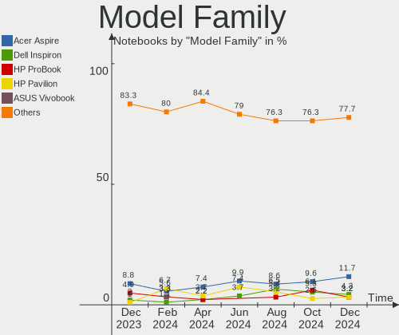
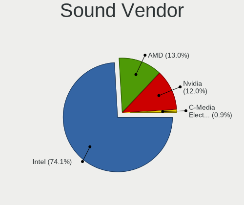
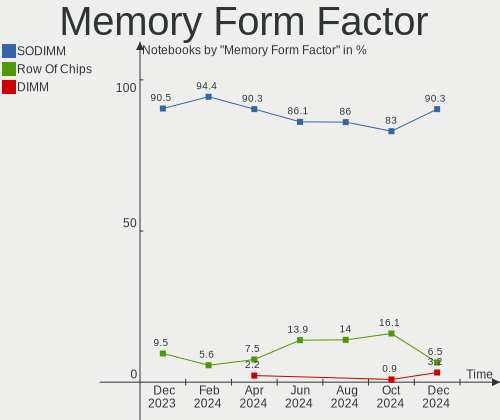
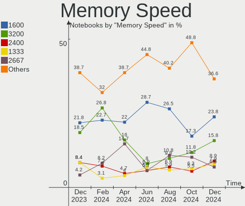
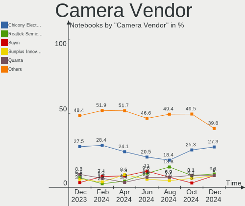

ROSA - Hardware Trends (Notebooks)
----------------------------------

A project to identify most popular hardware characteristics and track their change
over time based on data collected by Linux users at https://Linux-Hardware.org.

Anyone can contribute to this report by the [hw-probe](https://github.com/linuxhw/hw-probe) tool:

    sudo -E hw-probe -all -upload

This report is for one last month. Overall report since the beginning of time: [TestCoverage](https://github.com/linuxhw/TestCoverage)

Period: May, 2022.

Contents
--------

* [ System ](#system)
  - [ OS                       ](#os)
  - [ OS Family                ](#os-family)
  - [ Kernel                   ](#kernel)
  - [ Kernel Family            ](#kernel-family)
  - [ Kernel Major Ver.        ](#kernel-major-ver)
  - [ Arch                     ](#arch)
  - [ DE                       ](#de)
  - [ Display Server           ](#display-server)
  - [ Display Manager          ](#display-manager)
  - [ OS Lang                  ](#os-lang)
  - [ Boot Mode                ](#boot-mode)
  - [ Filesystem               ](#filesystem)
  - [ Part. scheme             ](#part-scheme)
  - [ Dual Boot with Linux/BSD ](#dual-boot-with-linuxbsd)
  - [ Dual Boot (Win)          ](#dual-boot-win)

* [ Board ](#board)
  - [ Vendor                   ](#vendor)
  - [ Model                    ](#model)
  - [ Model Family             ](#model-family)
  - [ MFG Year                 ](#mfg-year)
  - [ Form Factor              ](#form-factor)
  - [ Secure Boot              ](#secure-boot)
  - [ Coreboot                 ](#coreboot)
  - [ RAM Size                 ](#ram-size)
  - [ RAM Used                 ](#ram-used)
  - [ Total Drives             ](#total-drives)
  - [ Has CD-ROM               ](#has-cd-rom)
  - [ Has Ethernet             ](#has-ethernet)
  - [ Has WiFi                 ](#has-wifi)
  - [ Has Bluetooth            ](#has-bluetooth)

* [ Location ](#location)
  - [ Country                  ](#country)
  - [ City                     ](#city)

* [ Drives ](#drives)
  - [ Drive Vendor             ](#drive-vendor)
  - [ Drive Model              ](#drive-model)
  - [ HDD Vendor               ](#hdd-vendor)
  - [ SSD Vendor               ](#ssd-vendor)
  - [ Drive Kind               ](#drive-kind)
  - [ Drive Connector          ](#drive-connector)
  - [ Drive Size               ](#drive-size)
  - [ Space Total              ](#space-total)
  - [ Space Used               ](#space-used)
  - [ Malfunc. Drives          ](#malfunc-drives)
  - [ Malfunc. Drive Vendor    ](#malfunc-drive-vendor)
  - [ Malfunc. HDD Vendor      ](#malfunc-hdd-vendor)
  - [ Malfunc. Drive Kind      ](#malfunc-drive-kind)
  - [ Failed Drives            ](#failed-drives)
  - [ Failed Drive Vendor      ](#failed-drive-vendor)
  - [ Drive Status             ](#drive-status)

* [ Storage controller ](#storage-controller)
  - [ Storage Vendor           ](#storage-vendor)
  - [ Storage Model            ](#storage-model)
  - [ Storage Kind             ](#storage-kind)

* [ Processor ](#processor)
  - [ CPU Vendor               ](#cpu-vendor)
  - [ CPU Model                ](#cpu-model)
  - [ CPU Model Family         ](#cpu-model-family)
  - [ CPU Cores                ](#cpu-cores)
  - [ CPU Sockets              ](#cpu-sockets)
  - [ CPU Threads              ](#cpu-threads)
  - [ CPU Op-Modes             ](#cpu-op-modes)
  - [ CPU Microcode            ](#cpu-microcode)
  - [ CPU Microarch            ](#cpu-microarch)

* [ Graphics ](#graphics)
  - [ GPU Vendor               ](#gpu-vendor)
  - [ GPU Model                ](#gpu-model)
  - [ GPU Combo                ](#gpu-combo)
  - [ GPU Driver               ](#gpu-driver)
  - [ GPU Memory               ](#gpu-memory)

* [ Monitor ](#monitor)
  - [ Monitor Vendor           ](#monitor-vendor)
  - [ Monitor Model            ](#monitor-model)
  - [ Monitor Resolution       ](#monitor-resolution)
  - [ Monitor Diagonal         ](#monitor-diagonal)
  - [ Monitor Width            ](#monitor-width)
  - [ Aspect Ratio             ](#aspect-ratio)
  - [ Monitor Area             ](#monitor-area)
  - [ Pixel Density            ](#pixel-density)
  - [ Multiple Monitors        ](#multiple-monitors)

* [ Network ](#network)
  - [ Net Controller Vendor    ](#net-controller-vendor)
  - [ Net Controller Model     ](#net-controller-model)
  - [ Wireless Vendor          ](#wireless-vendor)
  - [ Wireless Model           ](#wireless-model)
  - [ Ethernet Vendor          ](#ethernet-vendor)
  - [ Ethernet Model           ](#ethernet-model)
  - [ Net Controller Kind      ](#net-controller-kind)
  - [ Used Controller          ](#used-controller)
  - [ NICs                     ](#nics)
  - [ IPv6                     ](#ipv6)

* [ Bluetooth ](#bluetooth)
  - [ Bluetooth Vendor         ](#bluetooth-vendor)
  - [ Bluetooth Model          ](#bluetooth-model)

* [ Sound ](#sound)
  - [ Sound Vendor             ](#sound-vendor)
  - [ Sound Model              ](#sound-model)

* [ Memory ](#memory)
  - [ Memory Vendor            ](#memory-vendor)
  - [ Memory Model             ](#memory-model)
  - [ Memory Kind              ](#memory-kind)
  - [ Memory Form Factor       ](#memory-form-factor)
  - [ Memory Size              ](#memory-size)
  - [ Memory Speed             ](#memory-speed)

* [ Printers & scanners ](#printers--scanners)
  - [ Printer Vendor           ](#printer-vendor)
  - [ Printer Model            ](#printer-model)
  - [ Scanner Vendor           ](#scanner-vendor)
  - [ Scanner Model            ](#scanner-model)

* [ Camera ](#camera)
  - [ Camera Vendor            ](#camera-vendor)
  - [ Camera Model             ](#camera-model)

* [ Security ](#security)
  - [ Fingerprint Vendor       ](#fingerprint-vendor)
  - [ Fingerprint Model        ](#fingerprint-model)
  - [ Chipcard Vendor          ](#chipcard-vendor)
  - [ Chipcard Model           ](#chipcard-model)

* [ Unsupported ](#unsupported)
  - [ Unsupported Devices      ](#unsupported-devices)
  - [ Unsupported Device Types ](#unsupported-device-types)

System
------

OS
--

Installed operating systems

| Name       | Notebooks | Percent |
|------------|-----------|---------|
| ROSA 12.2  | 118       | 88.06%  |
| ROSA R11.1 | 12        | 8.96%   |
| ROSA 12.1  | 3         | 2.24%   |
| ROSA R11   | 1         | 0.75%   |

OS Family
---------

OS without a version

| Name | Notebooks | Percent |
|------|-----------|---------|
| ROSA | 134       | 100%    |

Kernel
------

Version of the Linux kernel

| Version                                   | Notebooks | Percent |
|-------------------------------------------|-----------|---------|
| 5.10.74-generic-2rosa2021.1-x86_64        | 109       | 81.34%  |
| 5.15.32-generic-6rosa2021.1-x86_64        | 5         | 3.73%   |
| 5.10.74-generic-2rosa2021.1-i586          | 5         | 3.73%   |
| 5.4.83-generic-2rosa-x86_64               | 4         | 2.99%   |
| 5.4.83-generic-2rosa-i586                 | 2         | 1.49%   |
| 4.15.0-desktop-122.124.1rosa-x86_64       | 2         | 1.49%   |
| 5.17.7.xm1-1.klp-xanmod-rosa2021.1-x86_64 | 1         | 0.75%   |
| 5.16.18-generic-2rosa2021.1-x86_64        | 1         | 0.75%   |
| 5.13.9-generic-1rosa-x86_64               | 1         | 0.75%   |
| 5.10.50-generic-1rosa-x86_64              | 1         | 0.75%   |
| 4.9.155-nrj-desktop-1rosa-i586            | 1         | 0.75%   |
| 4.15.0-desktop-94.1rosa-x86_64            | 1         | 0.75%   |
| 4.15.0-desktop-122.124.1rosa-i586         | 1         | 0.75%   |

Kernel Family
-------------

Linux kernel without a distro release

| Version | Notebooks | Percent |
|---------|-----------|---------|
| 5.10.74 | 114       | 85.07%  |
| 5.4.83  | 6         | 4.48%   |
| 5.15.32 | 5         | 3.73%   |
| 4.15.0  | 4         | 2.99%   |
| 5.17.7  | 1         | 0.75%   |
| 5.16.18 | 1         | 0.75%   |
| 5.13.9  | 1         | 0.75%   |
| 5.10.50 | 1         | 0.75%   |
| 4.9.155 | 1         | 0.75%   |

Kernel Major Ver.
-----------------

Linux kernel major version

| Version | Notebooks | Percent |
|---------|-----------|---------|
| 5.10    | 115       | 85.82%  |
| 5.4     | 6         | 4.48%   |
| 5.15    | 5         | 3.73%   |
| 4.15    | 4         | 2.99%   |
| 5.17    | 1         | 0.75%   |
| 5.16    | 1         | 0.75%   |
| 5.13    | 1         | 0.75%   |
| 4.9     | 1         | 0.75%   |

Arch
----

OS architecture (x86_64, i586, etc.)

| Name   | Notebooks | Percent |
|--------|-----------|---------|
| x86_64 | 125       | 93.28%  |
| i686   | 9         | 6.72%   |

DE
--

Desktop Environment

| Name  | Notebooks | Percent |
|-------|-----------|---------|
| GNOME | 60        | 44.78%  |
| KDE5  | 49        | 36.57%  |
| LXQt  | 16        | 11.94%  |
| KDE4  | 8         | 5.97%   |
| XFCE  | 1         | 0.75%   |

Display Server
--------------

X11 or Wayland

| Name    | Notebooks | Percent |
|---------|-----------|---------|
| Wayland | 108       | 80.6%   |
| X11     | 25        | 18.66%  |
| Tty     | 1         | 0.75%   |

Display Manager
---------------

SDDM, LightDM, etc.

| Name    | Notebooks | Percent |
|---------|-----------|---------|
| GDM     | 73        | 54.48%  |
| SDDM    | 47        | 35.07%  |
| KDM     | 8         | 5.97%   |
| LightDM | 6         | 4.48%   |

OS Lang
-------

Language

| Lang  | Notebooks | Percent |
|-------|-----------|---------|
| ru_RU | 121       | 90.3%   |
| en_US | 8         | 5.97%   |
| pt_BR | 2         | 1.49%   |
| pl_PL | 1         | 0.75%   |
| de_DE | 1         | 0.75%   |
| C     | 1         | 0.75%   |

Boot Mode
---------

EFI or BIOS

| Mode | Notebooks | Percent |
|------|-----------|---------|
| EFI  | 71        | 52.99%  |
| BIOS | 63        | 47.01%  |

Filesystem
----------

Type of filesystem

| Type  | Notebooks | Percent |
|-------|-----------|---------|
| Ext4  | 128       | 95.52%  |
| Btrfs | 5         | 3.73%   |
| Aufs  | 1         | 0.75%   |

Part. scheme
------------

Scheme of partitioning

| Type | Notebooks | Percent |
|------|-----------|---------|
| GPT  | 83        | 61.94%  |
| MBR  | 51        | 38.06%  |

Dual Boot with Linux/BSD
------------------------

Hosting more than one Linux/BSD

| Dual boot | Notebooks | Percent |
|-----------|-----------|---------|
| No        | 110       | 82.09%  |
| Yes       | 24        | 17.91%  |

Dual Boot (Win)
---------------

Hosting Linux and Windows

| Dual boot | Notebooks | Percent |
|-----------|-----------|---------|
| No        | 84        | 62.69%  |
| Yes       | 50        | 37.31%  |

Board
-----

Vendor
------

Motherboard manufacturer

| Name                | Notebooks | Percent |
|---------------------|-----------|---------|
| ASUSTek Computer    | 28        | 20.9%   |
| Hewlett-Packard     | 23        | 17.16%  |
| Lenovo              | 22        | 16.42%  |
| Acer                | 19        | 14.18%  |
| Dell                | 10        | 7.46%   |
| Samsung Electronics | 9         | 6.72%   |
| Toshiba             | 3         | 2.24%   |
| Packard Bell        | 2         | 1.49%   |
| Notebook            | 2         | 1.49%   |
| MSI                 | 2         | 1.49%   |
| Intel               | 2         | 1.49%   |
| Timi                | 1         | 0.75%   |
| Sony                | 1         | 0.75%   |
| ONDA                | 1         | 0.75%   |
| K-Systems           | 1         | 0.75%   |
| Irbis               | 1         | 0.75%   |
| ICL                 | 1         | 0.75%   |
| Fujitsu             | 1         | 0.75%   |
| eMachines           | 1         | 0.75%   |
| Compaq              | 1         | 0.75%   |
| Clevo               | 1         | 0.75%   |
| Chuwi               | 1         | 0.75%   |
| Unknown             | 1         | 0.75%   |

Model
-----

Motherboard model

| Name                                       | Notebooks | Percent |
|--------------------------------------------|-----------|---------|
| Unknown                                    | 4         | 2.99%   |
| HP Pavilion g6                             | 3         | 2.24%   |
| Samsung 355V4C/356V4C/3445VC/3545VC        | 2         | 1.49%   |
| Lenovo IdeaPad 330-15IKB 81DE              | 2         | 1.49%   |
| Lenovo B590 20206                          | 2         | 1.49%   |
| HP Notebook                                | 2         | 1.49%   |
| ASUS TUF Gaming FX504GE_FX80GE             | 2         | 1.49%   |
| Acer Extensa 2519                          | 2         | 1.49%   |
| Toshiba Satellite U400                     | 1         | 0.75%   |
| Toshiba Satellite U300                     | 1         | 0.75%   |
| Toshiba Satellite L750D                    | 1         | 0.75%   |
| Timi TM1607                                | 1         | 0.75%   |
| Sony SVE1512H1RW                           | 1         | 0.75%   |
| Samsung SQ45S70S                           | 1         | 0.75%   |
| Samsung RV411/RV511/E3511/S3511/RV711      | 1         | 0.75%   |
| Samsung RC530/RC730                        | 1         | 0.75%   |
| Samsung R59P/R60P/R61P                     | 1         | 0.75%   |
| Samsung R530/R730/P530                     | 1         | 0.75%   |
| Samsung 530U3C/530U4C                      | 1         | 0.75%   |
| Samsung 300E4A/300E5A/300E7A/3430EA/3530EA | 1         | 0.75%   |
| Packard Bell EasyNote TV44HC               | 1         | 0.75%   |
| Packard Bell EasyNote TS11HR               | 1         | 0.75%   |
| ONDA OBOOK 20 PLUS                         | 1         | 0.75%   |
| Notebook W65_67SF                          | 1         | 0.75%   |
| Notebook NLx0MU                            | 1         | 0.75%   |
| MSI GP60 2QE                               | 1         | 0.75%   |
| MSI GL62M 7REX                             | 1         | 0.75%   |
| Lenovo Z50-70 20354                        | 1         | 0.75%   |
| Lenovo ThinkPad X200 7455FPG               | 1         | 0.75%   |
| Lenovo ThinkPad T480s 20L7001PAD           | 1         | 0.75%   |
| Lenovo ThinkPad T480 20L5000ART            | 1         | 0.75%   |
| Lenovo ThinkPad L520 5017BK4               | 1         | 0.75%   |
| Lenovo ThinkPad L460 20FVS14V00            | 1         | 0.75%   |
| Lenovo ThinkBook 15p 20V3                  | 1         | 0.75%   |
| Lenovo Legion Y540-15IRH 81SX              | 1         | 0.75%   |
| Lenovo Legion 5 17IMH05H 81Y8              | 1         | 0.75%   |
| Lenovo IdeaPad L340-17IRH Gaming 81LL      | 1         | 0.75%   |
| Lenovo IdeaPad 330-15ARR 81D2              | 1         | 0.75%   |
| Lenovo G585 20137                          | 1         | 0.75%   |
| Lenovo G580 20150                          | 1         | 0.75%   |
| Lenovo G575 20081                          | 1         | 0.75%   |
| Lenovo G500 20236                          | 1         | 0.75%   |
| Lenovo B71-80 80RJ                         | 1         | 0.75%   |
| Lenovo B50-70 20384                        | 1         | 0.75%   |
| Lenovo 3000 G410                           | 1         | 0.75%   |
| K-Systems Crestline+ICH8M                  | 1         | 0.75%   |
| Irbis TW39                                 | 1         | 0.75%   |
| ICL RAYbook Si1507                         | 1         | 0.75%   |
| HP ProBook 4540s                           | 1         | 0.75%   |
| HP ProBook 450 G7                          | 1         | 0.75%   |
| HP ProBook 440 G4                          | 1         | 0.75%   |
| HP Pavilion Power Laptop 15-cb0xx          | 1         | 0.75%   |
| HP Pavilion Laptop 14-ce1xxx               | 1         | 0.75%   |
| HP Pavilion Gaming Laptop 17-cd2xxx        | 1         | 0.75%   |
| HP Pavilion Gaming Laptop 15-dk1xxx        | 1         | 0.75%   |
| HP Pavilion g7                             | 1         | 0.75%   |
| HP Pavilion dv6                            | 1         | 0.75%   |
| HP Pavilion 17                             | 1         | 0.75%   |
| HP Mini 110-4100                           | 1         | 0.75%   |
| HP Laptop 15-ra0xx                         | 1         | 0.75%   |

Model Family
------------

Motherboard model prefix

| Name                      | Notebooks | Percent |
|---------------------------|-----------|---------|
| HP Pavilion               | 10        | 7.46%   |
| Acer Aspire               | 10        | 7.46%   |
| ASUS VivoBook             | 6         | 4.48%   |
| Lenovo ThinkPad           | 5         | 3.73%   |
| Lenovo IdeaPad            | 4         | 2.99%   |
| Unknown                   | 4         | 2.99%   |
| Toshiba Satellite         | 3         | 2.24%   |
| HP ProBook                | 3         | 2.24%   |
| HP Laptop                 | 3         | 2.24%   |
| Dell Vostro               | 3         | 2.24%   |
| Dell Inspiron             | 3         | 2.24%   |
| Acer Extensa              | 3         | 2.24%   |
| Samsung 355V4C            | 2         | 1.49%   |
| Packard Bell EasyNote     | 2         | 1.49%   |
| Lenovo Legion             | 2         | 1.49%   |
| Lenovo B590               | 2         | 1.49%   |
| HP Notebook               | 2         | 1.49%   |
| HP Compaq                 | 2         | 1.49%   |
| ASUS TUF                  | 2         | 1.49%   |
| Acer Nitro                | 2         | 1.49%   |
| Timi TM1607               | 1         | 0.75%   |
| Sony SVE1512H1RW          | 1         | 0.75%   |
| Samsung SQ45S70S          | 1         | 0.75%   |
| Samsung RV411             | 1         | 0.75%   |
| Samsung RC530             | 1         | 0.75%   |
| Samsung R59P              | 1         | 0.75%   |
| Samsung R530              | 1         | 0.75%   |
| Samsung 530U3C            | 1         | 0.75%   |
| Samsung 300E4A            | 1         | 0.75%   |
| ONDA OBOOK                | 1         | 0.75%   |
| Notebook W65              | 1         | 0.75%   |
| Notebook NLx0MU           | 1         | 0.75%   |
| MSI GP60                  | 1         | 0.75%   |
| MSI GL62M                 | 1         | 0.75%   |
| Lenovo Z50-70             | 1         | 0.75%   |
| Lenovo ThinkBook          | 1         | 0.75%   |
| Lenovo G585               | 1         | 0.75%   |
| Lenovo G580               | 1         | 0.75%   |
| Lenovo G575               | 1         | 0.75%   |
| Lenovo G500               | 1         | 0.75%   |
| Lenovo B71-80             | 1         | 0.75%   |
| Lenovo B50-70             | 1         | 0.75%   |
| Lenovo 3000               | 1         | 0.75%   |
| K-Systems Crestline+ICH8M | 1         | 0.75%   |
| Irbis TW39                | 1         | 0.75%   |
| ICL RAYbook               | 1         | 0.75%   |
| HP Mini                   | 1         | 0.75%   |
| HP EliteBook              | 1         | 0.75%   |
| HP 250                    | 1         | 0.75%   |
| Fujitsu LIFEBOOK          | 1         | 0.75%   |
| eMachines eME732ZG        | 1         | 0.75%   |
| Dell Studio               | 1         | 0.75%   |
| Dell Precision            | 1         | 0.75%   |
| Dell Latitude             | 1         | 0.75%   |
| Dell G7                   | 1         | 0.75%   |
| Compaq Presario           | 1         | 0.75%   |
| Clevo W251EFQ             | 1         | 0.75%   |
| Chuwi LarkBook            | 1         | 0.75%   |
| ASUS X75A1                | 1         | 0.75%   |
| ASUS X551CAP              | 1         | 0.75%   |

MFG Year
--------

Motherboard manufacture year

| Year | Notebooks | Percent |
|------|-----------|---------|
| 2011 | 16        | 11.94%  |
| 2012 | 14        | 10.45%  |
| 2018 | 13        | 9.7%    |
| 2020 | 11        | 8.21%   |
| 2013 | 11        | 8.21%   |
| 2010 | 11        | 8.21%   |
| 2008 | 9         | 6.72%   |
| 2021 | 8         | 5.97%   |
| 2017 | 8         | 5.97%   |
| 2019 | 7         | 5.22%   |
| 2016 | 7         | 5.22%   |
| 2015 | 6         | 4.48%   |
| 2007 | 6         | 4.48%   |
| 2014 | 4         | 2.99%   |
| 2009 | 2         | 1.49%   |
| 2022 | 1         | 0.75%   |

Form Factor
-----------

Physical design of the computer

| Name     | Notebooks | Percent |
|----------|-----------|---------|
| Notebook | 134       | 100%    |

Secure Boot
-----------

Enabled or disabled

| State    | Notebooks | Percent |
|----------|-----------|---------|
| Disabled | 134       | 100%    |

Coreboot
--------

Have coreboot on board

| Used | Notebooks | Percent |
|------|-----------|---------|
| No   | 134       | 100%    |

RAM Size
--------

Total RAM memory

| Size in GB | Notebooks | Percent |
|------------|-----------|---------|
| 4.01-8.0   | 45        | 33.58%  |
| 3.01-4.0   | 40        | 29.85%  |
| 8.01-16.0  | 14        | 10.45%  |
| 1.01-2.0   | 11        | 8.21%   |
| 16.01-24.0 | 10        | 7.46%   |
| 32.01-64.0 | 6         | 4.48%   |
| 2.01-3.0   | 3         | 2.24%   |
| 0.51-1.0   | 3         | 2.24%   |
| 24.01-32.0 | 2         | 1.49%   |

RAM Used
--------

Used RAM memory

| Used GB   | Notebooks | Percent |
|-----------|-----------|---------|
| 1.01-2.0  | 62        | 46.27%  |
| 0.51-1.0  | 48        | 35.82%  |
| 2.01-3.0  | 12        | 8.96%   |
| 3.01-4.0  | 8         | 5.97%   |
| 4.01-8.0  | 3         | 2.24%   |
| 8.01-16.0 | 1         | 0.75%   |

Total Drives
------------

Number of drives on board

| Drives | Notebooks | Percent |
|--------|-----------|---------|
| 1      | 99        | 73.88%  |
| 2      | 28        | 20.9%   |
| 3      | 5         | 3.73%   |
| 5      | 2         | 1.49%   |

Has CD-ROM
----------

Has CD-ROM on board

| Presented | Notebooks | Percent |
|-----------|-----------|---------|
| No        | 78        | 58.21%  |
| Yes       | 56        | 41.79%  |

Has Ethernet
------------

Has Ethernet on board

| Presented | Notebooks | Percent |
|-----------|-----------|---------|
| Yes       | 115       | 85.82%  |
| No        | 19        | 14.18%  |

Has WiFi
--------

Has WiFi module

| Presented | Notebooks | Percent |
|-----------|-----------|---------|
| Yes       | 134       | 100%    |

Has Bluetooth
-------------

Has Bluetooth module

| Presented | Notebooks | Percent |
|-----------|-----------|---------|
| Yes       | 99        | 73.88%  |
| No        | 35        | 26.12%  |

Location
--------

Country
-------

Geographic location (country)

| Country  | Notebooks | Percent |
|----------|-----------|---------|
| Russia   | 113       | 84.33%  |
| Ukraine  | 6         | 4.48%   |
| Belarus  | 4         | 2.99%   |
| USA      | 2         | 1.49%   |
| Poland   | 2         | 1.49%   |
| Germany  | 2         | 1.49%   |
| Brazil   | 2         | 1.49%   |
| Jordan   | 1         | 0.75%   |
| Canada   | 1         | 0.75%   |
| Bulgaria | 1         | 0.75%   |

City
----

Geographic location (city)

| City               | Notebooks | Percent |
|--------------------|-----------|---------|
| Moscow             | 28        | 20.9%   |
| St Petersburg      | 10        | 7.46%   |
| Chelyabinsk        | 6         | 4.48%   |
| Novosibirsk        | 5         | 3.73%   |
| Simferopol         | 3         | 2.24%   |
| Nizhniy Novgorod   | 3         | 2.24%   |
| Krasnodar          | 3         | 2.24%   |
| Khabarovsk         | 3         | 2.24%   |
| Barnaul            | 3         | 2.24%   |
| Yoshkar-Ola        | 2         | 1.49%   |
| Yekaterinburg      | 2         | 1.49%   |
| Yaroslavl          | 2         | 1.49%   |
| Voronezh           | 2         | 1.49%   |
| Samara             | 2         | 1.49%   |
| Perm               | 2         | 1.49%   |
| Krasnoyarsk        | 2         | 1.49%   |
| Yelabuga           | 1         | 0.75%   |
| Yakutsk            | 1         | 0.75%   |
| Yablonovsky        | 1         | 0.75%   |
| Votkinsk           | 1         | 0.75%   |
| Voskresensk        | 1         | 0.75%   |
| Volkhov            | 1         | 0.75%   |
| Volgograd          | 1         | 0.75%   |
| Vitebsk            | 1         | 0.75%   |
| Vilyeyka           | 1         | 0.75%   |
| Val                | 1         | 0.75%   |
| Tver               | 1         | 0.75%   |
| Taman'             | 1         | 0.75%   |
| Taganrog           | 1         | 0.75%   |
| Stupino            | 1         | 0.75%   |
| Sovetsk            | 1         | 0.75%   |
| Sochi              | 1         | 0.75%   |
| Slidell            | 1         | 0.75%   |
| Saratov            | 1         | 0.75%   |
| Rostov-on-Don      | 1         | 0.75%   |
| Pskov              | 1         | 0.75%   |
| Pontes e Lacerda   | 1         | 0.75%   |
| Novomichurinsk     | 1         | 0.75%   |
| Nazarovo           | 1         | 0.75%   |
| Mogilev            | 1         | 0.75%   |
| Mirny              | 1         | 0.75%   |
| Miass              | 1         | 0.75%   |
| Meadow Creek       | 1         | 0.75%   |
| Lesnoy             | 1         | 0.75%   |
| Kyiv               | 1         | 0.75%   |
| Kuznechikha        | 1         | 0.75%   |
| Kursk              | 1         | 0.75%   |
| Krakow             | 1         | 0.75%   |
| Komsomolsk-on-Amur | 1         | 0.75%   |
| Khimki             | 1         | 0.75%   |
| Kemerovo           | 1         | 0.75%   |
| Kazan’           | 1         | 0.75%   |
| Juiz de Fora       | 1         | 0.75%   |
| Johnstown          | 1         | 0.75%   |
| Irkutsk            | 1         | 0.75%   |
| Hrodna             | 1         | 0.75%   |
| Gusinoozyorsk      | 1         | 0.75%   |
| Feodosiya          | 1         | 0.75%   |
| Dortmund           | 1         | 0.75%   |
| Donskoye           | 1         | 0.75%   |

Drives
------

Drive Vendor
------------

Hard drive vendors

| Vendor              | Notebooks | Drives | Percent |
|---------------------|-----------|--------|---------|
| Seagate             | 26        | 26     | 15.2%   |
| WDC                 | 24        | 24     | 14.04%  |
| Samsung Electronics | 24        | 27     | 14.04%  |
| Unknown             | 11        | 12     | 6.43%   |
| Hitachi             | 9         | 9      | 5.26%   |
| HGST                | 9         | 9      | 5.26%   |
| SK Hynix            | 8         | 8      | 4.68%   |
| Kingston            | 8         | 8      | 4.68%   |
| Toshiba             | 7         | 7      | 4.09%   |
| SanDisk             | 5         | 5      | 2.92%   |
| Intel               | 5         | 5      | 2.92%   |
| China               | 5         | 5      | 2.92%   |
| KingSpec            | 4         | 4      | 2.34%   |
| Apacer              | 4         | 4      | 2.34%   |
| Patriot             | 2         | 2      | 1.17%   |
| KIOXIA              | 2         | 2      | 1.17%   |
| Crucial             | 2         | 2      | 1.17%   |
| AMD                 | 2         | 2      | 1.17%   |
| XPG                 | 1         | 1      | 0.58%   |
| Vaseky              | 1         | 1      | 0.58%   |
| UMIS                | 1         | 1      | 0.58%   |
| TO Exter            | 1         | 1      | 0.58%   |
| SPCC                | 1         | 1      | 0.58%   |
| Smartbuy            | 1         | 1      | 0.58%   |
| Netac               | 1         | 1      | 0.58%   |
| Mushkin             | 1         | 1      | 0.58%   |
| Lexar               | 1         | 1      | 0.58%   |
| JMicron             | 1         | 1      | 0.58%   |
| FOXLINE             | 1         | 1      | 0.58%   |
| Dell                | 1         | 1      | 0.58%   |
| A-DATA Technology   | 1         | 1      | 0.58%   |
| Unknown             | 1         | 1      | 0.58%   |

Drive Model
-----------

Hard drive models

| Model                                | Notebooks | Percent |
|--------------------------------------|-----------|---------|
| Toshiba MQ01ABF050 500GB             | 5         | 2.86%   |
| Seagate ST500LT012-1DG142 500GB      | 5         | 2.86%   |
| WDC WD5000LPCX-21VHAT0 500GB         | 3         | 1.71%   |
| Seagate ST500LT012-9WS142 500GB      | 3         | 1.71%   |
| Seagate ST1000LM024 HN-M101MBB 1TB   | 3         | 1.71%   |
| Unknown ISOCOM  64GB                 | 2         | 1.14%   |
| SK Hynix HFM512GD3JX013N 512GB       | 2         | 1.14%   |
| Seagate ST9500325AS 500GB            | 2         | 1.14%   |
| Seagate ST9320325AS 320GB            | 2         | 1.14%   |
| Seagate ST1000LM035-1RK172 1TB       | 2         | 1.14%   |
| Seagate ST1000LM014-SSHD-8GB         | 2         | 1.14%   |
| Samsung SSD 970 EVO Plus 250GB       | 2         | 1.14%   |
| Samsung MZVLQ256HAJD-00000 256GB     | 2         | 1.14%   |
| Samsung MZ7LN128HAHQ-000L2 128GB SSD | 2         | 1.14%   |
| KIOXIA KBG40ZNV256G 256GB            | 2         | 1.14%   |
| Kingston SA400S37240G 240GB SSD      | 2         | 1.14%   |
| Kingston SA400S37120G 120GB SSD      | 2         | 1.14%   |
| Hitachi HTS547550A9E384 500GB        | 2         | 1.14%   |
| Hitachi HTS542516K9SA00 160GB        | 2         | 1.14%   |
| HGST HTS725050A7E630 500GB           | 2         | 1.14%   |
| HGST HTS545050A7E680 500GB           | 2         | 1.14%   |
| HGST HTS545050A7E380 500GB           | 2         | 1.14%   |
| China SATA SSD 120GB                 | 2         | 1.14%   |
| XPG GAMMIX S11 Pro 256GB             | 1         | 0.57%   |
| WDC WDS500G2B0A-00SM50 500GB SSD     | 1         | 0.57%   |
| WDC WDS240G2G0A-00JH30 240GB SSD     | 1         | 0.57%   |
| WDC WDS100T3X0C-00SJG0 1TB           | 1         | 0.57%   |
| WDC WD5000LPVX-22V0TT0 500GB         | 1         | 0.57%   |
| WDC WD5000BPKX-00HPJT0 500GB         | 1         | 0.57%   |
| WDC WD4000LPCX-24C6HT0 400GB         | 1         | 0.57%   |
| WDC WD3200BPVT-24JJ5T0 320GB         | 1         | 0.57%   |
| WDC WD2500BEVT-60ZCT1 250GB          | 1         | 0.57%   |
| WDC WD2500BEKT-60A25T1 250GB         | 1         | 0.57%   |
| WDC WD1600BEVT-80A23T0 160GB         | 1         | 0.57%   |
| WDC WD1600BEVT-75ZCT2 160GB          | 1         | 0.57%   |
| WDC WD10SPZX-80Z10T0 1TB             | 1         | 0.57%   |
| WDC WD10SPZX-75Z10T3 1TB             | 1         | 0.57%   |
| WDC WD10SPZX-60Z10T0 1TB             | 1         | 0.57%   |
| WDC WD10SPZX-22Z10T1 1TB             | 1         | 0.57%   |
| WDC WD10SPZX-21Z10T0 1TB             | 1         | 0.57%   |
| WDC WD10JPVX-22JC3T0 1TB             | 1         | 0.57%   |
| WDC WD10JPLX-00MBPT0 1TB             | 1         | 0.57%   |
| WDC PC SN530 SDBPNPZ-512G-1114 512GB | 1         | 0.57%   |
| WDC PC SN530 NVMe 256GB              | 1         | 0.57%   |
| WDC PC SN520 SDAPNUW-512G-1014 512GB | 1         | 0.57%   |
| Vaseky V900/256G 256GB SSD           | 1         | 0.57%   |
| Unknown USDU1  32GB                  | 1         | 0.57%   |
| Unknown USD  8GB                     | 1         | 0.57%   |
| Unknown SMI  32GB                    | 1         | 0.57%   |
| Unknown SD16G  64GB                  | 1         | 0.57%   |
| Unknown SD16G  16GB                  | 1         | 0.57%   |
| Unknown SA08G  8GB                   | 1         | 0.57%   |
| Unknown NCard  64GB                  | 1         | 0.57%   |
| Unknown NCard  16GB                  | 1         | 0.57%   |
| Unknown EB2MW  32GB                  | 1         | 0.57%   |
| Unknown 00000  32GB                  | 1         | 0.57%   |
| UMIS RPFTJ128PDD2EWX 128GB           | 1         | 0.57%   |
| Toshiba MK6475GSX 640GB              | 1         | 0.57%   |
| Toshiba KXG50ZNV1T02 1TB             | 1         | 0.57%   |
| TO Exter nal USB 3.0 320GB           | 1         | 0.57%   |

HDD Vendor
----------

Hard disk drive vendors

| Vendor              | Notebooks | Drives | Percent |
|---------------------|-----------|--------|---------|
| Seagate             | 26        | 26     | 36.62%  |
| WDC                 | 18        | 18     | 25.35%  |
| Hitachi             | 9         | 9      | 12.68%  |
| HGST                | 9         | 9      | 12.68%  |
| Toshiba             | 6         | 6      | 8.45%   |
| Samsung Electronics | 3         | 3      | 4.23%   |

SSD Vendor
----------

Solid state drive vendors

| Vendor              | Notebooks | Drives | Percent |
|---------------------|-----------|--------|---------|
| Samsung Electronics | 13        | 13     | 21.67%  |
| Kingston            | 8         | 8      | 13.33%  |
| SanDisk             | 5         | 5      | 8.33%   |
| China               | 5         | 5      | 8.33%   |
| KingSpec            | 4         | 4      | 6.67%   |
| Apacer              | 4         | 4      | 6.67%   |
| SK Hynix            | 3         | 3      | 5%      |
| WDC                 | 2         | 2      | 3.33%   |
| Patriot             | 2         | 2      | 3.33%   |
| Crucial             | 2         | 2      | 3.33%   |
| Vaseky              | 1         | 1      | 1.67%   |
| TO Exter            | 1         | 1      | 1.67%   |
| SPCC                | 1         | 1      | 1.67%   |
| Smartbuy            | 1         | 1      | 1.67%   |
| Netac               | 1         | 1      | 1.67%   |
| Mushkin             | 1         | 1      | 1.67%   |
| Lexar               | 1         | 1      | 1.67%   |
| JMicron             | 1         | 1      | 1.67%   |
| Intel               | 1         | 1      | 1.67%   |
| Dell                | 1         | 1      | 1.67%   |
| AMD                 | 1         | 1      | 1.67%   |
| A-DATA Technology   | 1         | 1      | 1.67%   |

Drive Kind
----------

HDD or SSD

| Kind | Notebooks | Drives | Percent |
|------|-----------|--------|---------|
| HDD  | 68        | 71     | 41.72%  |
| SSD  | 53        | 60     | 32.52%  |
| NVMe | 30        | 31     | 18.4%   |
| MMC  | 12        | 13     | 7.36%   |

Drive Connector
---------------

SATA, SAS, NVMe, etc.

| Type | Notebooks | Drives | Percent |
|------|-----------|--------|---------|
| SATA | 110       | 128    | 71.43%  |
| NVMe | 30        | 31     | 19.48%  |
| MMC  | 12        | 13     | 7.79%   |
| SAS  | 2         | 3      | 1.3%    |

Drive Size
----------

Size of hard drive

| Size in TB | Notebooks | Drives | Percent |
|------------|-----------|--------|---------|
| 0.01-0.5   | 95        | 110    | 81.9%   |
| 0.51-1.0   | 20        | 20     | 17.24%  |
| 3.01-4.0   | 1         | 1      | 0.86%   |

Space Total
-----------

Amount of disk space available on the file system

| Size in GB | Notebooks | Percent |
|------------|-----------|---------|
| 101-250    | 48        | 35.82%  |
| 251-500    | 38        | 28.36%  |
| 501-1000   | 16        | 11.94%  |
| 1-20       | 13        | 9.7%    |
| 51-100     | 8         | 5.97%   |
| 21-50      | 7         | 5.22%   |
| 1001-2000  | 4         | 2.99%   |

Space Used
----------

Amount of used disk space

| Used GB  | Notebooks | Percent |
|----------|-----------|---------|
| 1-20     | 93        | 69.4%   |
| 21-50    | 15        | 11.19%  |
| 251-500  | 9         | 6.72%   |
| 101-250  | 9         | 6.72%   |
| 51-100   | 6         | 4.48%   |
| 501-1000 | 2         | 1.49%   |

Malfunc. Drives
---------------

Drive models with a malfunction

| Model                                 | Notebooks | Drives | Percent |
|---------------------------------------|-----------|--------|---------|
| Seagate ST500LT012-9WS142 500GB       | 3         | 3      | 8.33%   |
| Seagate ST9500325AS 500GB             | 2         | 2      | 5.56%   |
| Seagate ST9320325AS 320GB             | 2         | 2      | 5.56%   |
| Seagate ST500LT012-1DG142 500GB       | 2         | 2      | 5.56%   |
| Hitachi HTS542516K9SA00 160GB         | 2         | 2      | 5.56%   |
| HGST HTS725050A7E630 500GB            | 2         | 2      | 5.56%   |
| HGST HTS545050A7E680 500GB            | 2         | 2      | 5.56%   |
| HGST HTS545050A7E380 500GB            | 2         | 2      | 5.56%   |
| WDC WD2500BEVT-60ZCT1 250GB           | 1         | 1      | 2.78%   |
| WDC WD2500BEKT-60A25T1 250GB          | 1         | 1      | 2.78%   |
| WDC WD1600BEVT-80A23T0 160GB          | 1         | 1      | 2.78%   |
| WDC WD10JPVX-22JC3T0 1TB              | 1         | 1      | 2.78%   |
| Toshiba MQ01ABF050 500GB              | 1         | 1      | 2.78%   |
| SK Hynix HFS256G32TNH-73A0A 256GB SSD | 1         | 1      | 2.78%   |
| Seagate ST500LM000-SSHD-8GB           | 1         | 1      | 2.78%   |
| Seagate ST320LT020-9YG142 320GB       | 1         | 1      | 2.78%   |
| Seagate ST320LT012-9WS14C 320GB       | 1         | 1      | 2.78%   |
| Seagate ST1000LM024 HN-M101MBB 1TB    | 1         | 1      | 2.78%   |
| Seagate ST1000LM014-SSHD-8GB          | 1         | 1      | 2.78%   |
| Samsung Electronics HN-M500MBB 500GB  | 1         | 1      | 2.78%   |
| Kingston SUV400S37120G 120GB SSD      | 1         | 1      | 2.78%   |
| Hitachi HTS547550A9E384 500GB         | 1         | 1      | 2.78%   |
| Hitachi HTS542525K9A300 250GB         | 1         | 1      | 2.78%   |
| Hitachi HTS542512K9SA00 120GB         | 1         | 1      | 2.78%   |
| Hitachi HTS542512K9A300 120GB         | 1         | 1      | 2.78%   |
| China SATA SSD 120GB                  | 1         | 1      | 2.78%   |
| AMD R5SL120G 120GB SSD                | 1         | 1      | 2.78%   |

Malfunc. Drive Vendor
---------------------

Vendors of faulty drives

| Vendor              | Notebooks | Drives | Percent |
|---------------------|-----------|--------|---------|
| Seagate             | 14        | 14     | 38.89%  |
| Hitachi             | 6         | 6      | 16.67%  |
| HGST                | 6         | 6      | 16.67%  |
| WDC                 | 4         | 4      | 11.11%  |
| Toshiba             | 1         | 1      | 2.78%   |
| SK Hynix            | 1         | 1      | 2.78%   |
| Samsung Electronics | 1         | 1      | 2.78%   |
| Kingston            | 1         | 1      | 2.78%   |
| China               | 1         | 1      | 2.78%   |
| AMD                 | 1         | 1      | 2.78%   |

Malfunc. HDD Vendor
-------------------

Vendors of faulty HDD drives

| Vendor              | Notebooks | Drives | Percent |
|---------------------|-----------|--------|---------|
| Seagate             | 14        | 14     | 43.75%  |
| Hitachi             | 6         | 6      | 18.75%  |
| HGST                | 6         | 6      | 18.75%  |
| WDC                 | 4         | 4      | 12.5%   |
| Toshiba             | 1         | 1      | 3.13%   |
| Samsung Electronics | 1         | 1      | 3.13%   |

Malfunc. Drive Kind
-------------------

Kinds of faulty drives

| Kind | Notebooks | Drives | Percent |
|------|-----------|--------|---------|
| HDD  | 32        | 32     | 88.89%  |
| SSD  | 4         | 4      | 11.11%  |

Failed Drives
-------------

Failed drive models

Zero info for selected period =(

Failed Drive Vendor
-------------------

Failed drive vendors

Zero info for selected period =(

Drive Status
------------

Number of failed and malfunc. drives

| Status   | Notebooks | Drives | Percent |
|----------|-----------|--------|---------|
| Works    | 104       | 124    | 68.42%  |
| Malfunc  | 36        | 36     | 23.68%  |
| Detected | 12        | 15     | 7.89%   |

Storage controller
------------------

Storage Vendor
--------------

Storage controller vendors

| Vendor                       | Notebooks | Percent |
|------------------------------|-----------|---------|
| Intel                        | 109       | 70.78%  |
| AMD                          | 18        | 11.69%  |
| Samsung Electronics          | 10        | 6.49%   |
| SK Hynix                     | 5         | 3.25%   |
| Sandisk                      | 4         | 2.6%    |
| KIOXIA                       | 2         | 1.3%    |
| Union Memory (Shenzhen)      | 1         | 0.65%   |
| Toshiba America Info Systems | 1         | 0.65%   |
| Silicon Motion               | 1         | 0.65%   |
| Phison Electronics           | 1         | 0.65%   |
| JMicron Technology           | 1         | 0.65%   |
| ADATA Technology             | 1         | 0.65%   |

Storage Model
-------------

Storage controller models

| Model                                                                            | Notebooks | Percent |
|----------------------------------------------------------------------------------|-----------|---------|
| Intel 7 Series Chipset Family 6-port SATA Controller [AHCI mode]                 | 18        | 10.84%  |
| AMD FCH SATA Controller [AHCI mode]                                              | 12        | 7.23%   |
| Intel Sunrise Point-LP SATA Controller [AHCI mode]                               | 11        | 6.63%   |
| Intel 6 Series/C200 Series Chipset Family 6 port Mobile SATA AHCI Controller     | 10        | 6.02%   |
| Intel 82801 Mobile SATA Controller [RAID mode]                                   | 8         | 4.82%   |
| Samsung NVMe SSD Controller SM981/PM981/PM983                                    | 5         | 3.01%   |
| Intel Tiger Lake-LP SATA Controller [AHCI mode]                                  | 5         | 3.01%   |
| Intel Atom/Celeron/Pentium Processor x5-E8000/J3xxx/N3xxx Series SATA Controller | 5         | 3.01%   |
| Intel 82801HM/HEM (ICH8M/ICH8M-E) SATA Controller [AHCI mode]                    | 5         | 3.01%   |
| Intel 82801HM/HEM (ICH8M/ICH8M-E) IDE Controller                                 | 5         | 3.01%   |
| Intel 8 Series SATA Controller 1 [AHCI mode]                                     | 5         | 3.01%   |
| Intel 5 Series/3400 Series Chipset 4 port SATA AHCI Controller                   | 5         | 3.01%   |
| Samsung NVMe SSD Controller 980                                                  | 4         | 2.41%   |
| Intel Volume Management Device NVMe RAID Controller                              | 4         | 2.41%   |
| Intel Cannon Lake Mobile PCH SATA AHCI Controller                                | 4         | 2.41%   |
| AMD SB7x0/SB8x0/SB9x0 SATA Controller [AHCI mode]                                | 4         | 2.41%   |
| Intel SSD 660P Series                                                            | 3         | 1.81%   |
| Intel NM10/ICH7 Family SATA Controller [AHCI mode]                               | 3         | 1.81%   |
| Intel 82801IBM/IEM (ICH9M/ICH9M-E) 4 port SATA Controller [AHCI mode]            | 3         | 1.81%   |
| Intel 82801IBM/IEM (ICH9M/ICH9M-E) 2 port SATA Controller [IDE mode]             | 3         | 1.81%   |
| Intel 82801HM/HEM (ICH8M/ICH8M-E) SATA Controller [IDE mode]                     | 3         | 1.81%   |
| Intel 8 Series/C220 Series Chipset Family 6-port SATA Controller 1 [AHCI mode]   | 3         | 1.81%   |
| SK Hynix Gold P31 SSD                                                            | 2         | 1.2%    |
| SK Hynix BC511                                                                   | 2         | 1.2%    |
| KIOXIA Non-Volatile memory controller                                            | 2         | 1.2%    |
| Intel HM170/QM170 Chipset SATA Controller [AHCI Mode]                            | 2         | 1.2%    |
| Intel Comet Lake SATA AHCI Controller                                            | 2         | 1.2%    |
| Intel Celeron/Pentium Silver Processor SATA Controller                           | 2         | 1.2%    |
| Intel Celeron N3350/Pentium N4200/Atom E3900 Series SATA AHCI Controller         | 2         | 1.2%    |
| Intel 5 Series/3400 Series Chipset 6 port SATA AHCI Controller                   | 2         | 1.2%    |
| Intel 400 Series Chipset Family SATA AHCI Controller                             | 2         | 1.2%    |
| AMD SB600 Non-Raid-5 SATA                                                        | 2         | 1.2%    |
| AMD SB600 IDE                                                                    | 2         | 1.2%    |
| Union Memory (Shenzhen) Non-Volatile memory controller                           | 1         | 0.6%    |
| Toshiba America Info Systems Toshiba America Info Non-Volatile memory controller | 1         | 0.6%    |
| SK Hynix BC501 NVMe Solid State Drive                                            | 1         | 0.6%    |
| Silicon Motion SM2263EN/SM2263XT SSD Controller                                  | 1         | 0.6%    |
| Sandisk WD Blue SN550 NVMe SSD                                                   | 1         | 0.6%    |
| Sandisk WD Blue SN500 / PC SN520 NVMe SSD                                        | 1         | 0.6%    |
| Sandisk WD Black SN750 / PC SN730 NVMe SSD                                       | 1         | 0.6%    |
| Sandisk Non-Volatile memory controller                                           | 1         | 0.6%    |
| Samsung NVMe SSD Controller SM961/PM961/SM963                                    | 1         | 0.6%    |
| Phison PS5013 E13 NVMe Controller                                                | 1         | 0.6%    |
| JMicron JMB360 AHCI Controller                                                   | 1         | 0.6%    |
| Intel SSD Pro 7600p/760p/E 6100p Series                                          | 1         | 0.6%    |
| Intel NM10/ICH7 Family SATA Controller [IDE mode]                                | 1         | 0.6%    |
| Intel Cannon Point-LP SATA Controller [AHCI Mode]                                | 1         | 0.6%    |
| Intel Atom Processor E3800 Series SATA AHCI Controller                           | 1         | 0.6%    |
| ADATA XPG SX8200 Pro PCIe Gen3x4 M.2 2280 Solid State Drive                      | 1         | 0.6%    |

Storage Kind
------------

Kind of storage controller (IDE, SATA, NVMe, SAS, ...)

| Kind | Notebooks | Percent |
|------|-----------|---------|
| SATA | 109       | 66.06%  |
| NVMe | 30        | 18.18%  |
| IDE  | 14        | 8.48%   |
| RAID | 12        | 7.27%   |

Processor
---------

CPU Vendor
----------

Processor vendors

| Vendor | Notebooks | Percent |
|--------|-----------|---------|
| Intel  | 116       | 86.57%  |
| AMD    | 18        | 13.43%  |

CPU Model
---------

Processor models

| Model                                       | Notebooks | Percent |
|---------------------------------------------|-----------|---------|
| Intel Pentium CPU 2020M @ 2.40GHz           | 5         | 3.73%   |
| Intel Core i5-7300HQ CPU @ 2.50GHz          | 4         | 2.99%   |
| Intel Core i7-8550U CPU @ 1.80GHz           | 3         | 2.24%   |
| Intel Core i5-8300H CPU @ 2.30GHz           | 3         | 2.24%   |
| Intel Core i5-4210U CPU @ 1.70GHz           | 3         | 2.24%   |
| Intel Core i3-6006U CPU @ 2.00GHz           | 3         | 2.24%   |
| Intel Pentium Dual-Core CPU T4400 @ 2.20GHz | 2         | 1.49%   |
| Intel Pentium CPU P6100 @ 2.00GHz           | 2         | 1.49%   |
| Intel Core i7-10750H CPU @ 2.60GHz          | 2         | 1.49%   |
| Intel Core i7-10510U CPU @ 1.80GHz          | 2         | 1.49%   |
| Intel Core i5-7200U CPU @ 2.50GHz           | 2         | 1.49%   |
| Intel Core i3-3120M CPU @ 2.50GHz           | 2         | 1.49%   |
| Intel Core i3-2350M CPU @ 2.30GHz           | 2         | 1.49%   |
| Intel Core i3-2330M CPU @ 2.20GHz           | 2         | 1.49%   |
| Intel Core i3 CPU M 330 @ 2.13GHz           | 2         | 1.49%   |
| Intel Core 2 Duo CPU T5550 @ 1.83GHz        | 2         | 1.49%   |
| Intel Celeron CPU N3350 @ 1.10GHz           | 2         | 1.49%   |
| Intel Celeron CPU N3060 @ 1.60GHz           | 2         | 1.49%   |
| Intel Celeron CPU 1007U @ 1.50GHz           | 2         | 1.49%   |
| Intel Atom CPU N450 @ 1.66GHz               | 2         | 1.49%   |
| Intel 11th Gen Core i5-11300H @ 3.10GHz     | 2         | 1.49%   |
| AMD E-450 APU with Radeon HD Graphics       | 2         | 1.49%   |
| Intel Pentium Gold 7505 @ 2.00GHz           | 1         | 0.75%   |
| Intel Pentium Dual-Core CPU T4500 @ 2.30GHz | 1         | 0.75%   |
| Intel Pentium CPU N3710 @ 1.60GHz           | 1         | 0.75%   |
| Intel Pentium CPU N3700 @ 1.60GHz           | 1         | 0.75%   |
| Intel Pentium CPU 4405U @ 2.10GHz           | 1         | 0.75%   |
| Intel Pentium CPU 2117U @ 1.80GHz           | 1         | 0.75%   |
| Intel Genuine CPU T1400 @ 1.73GHz           | 1         | 0.75%   |
| Intel Core m3-7Y30 CPU @ 1.00GHz            | 1         | 0.75%   |
| Intel Core i7-9750HF CPU @ 2.60GHz          | 1         | 0.75%   |
| Intel Core i7-9750H CPU @ 2.60GHz           | 1         | 0.75%   |
| Intel Core i7-8750H CPU @ 2.20GHz           | 1         | 0.75%   |
| Intel Core i7-4940MX CPU @ 3.10GHz          | 1         | 0.75%   |
| Intel Core i7-3632QM CPU @ 2.20GHz          | 1         | 0.75%   |
| Intel Core i7-1065G7 CPU @ 1.30GHz          | 1         | 0.75%   |
| Intel Core i7 CPU Q 740 @ 1.73GHz           | 1         | 0.75%   |
| Intel Core i7 CPU Q 720 @ 1.60GHz           | 1         | 0.75%   |
| Intel Core i5-9300H CPU @ 2.40GHz           | 1         | 0.75%   |
| Intel Core i5-8265U CPU @ 1.60GHz           | 1         | 0.75%   |
| Intel Core i5-8250U CPU @ 1.60GHz           | 1         | 0.75%   |
| Intel Core i5-4210M CPU @ 2.60GHz           | 1         | 0.75%   |
| Intel Core i5-4210H CPU @ 2.90GHz           | 1         | 0.75%   |
| Intel Core i5-4200U CPU @ 1.60GHz           | 1         | 0.75%   |
| Intel Core i5-3337U CPU @ 1.80GHz           | 1         | 0.75%   |
| Intel Core i5-3320M CPU @ 2.60GHz           | 1         | 0.75%   |
| Intel Core i5-3230M CPU @ 2.60GHz           | 1         | 0.75%   |
| Intel Core i5-2540M CPU @ 2.60GHz           | 1         | 0.75%   |
| Intel Core i5-2450M CPU @ 2.50GHz           | 1         | 0.75%   |
| Intel Core i5-2430M CPU @ 2.40GHz           | 1         | 0.75%   |
| Intel Core i5-2410M CPU @ 2.30GHz           | 1         | 0.75%   |
| Intel Core i5-10300H CPU @ 2.50GHz          | 1         | 0.75%   |
| Intel Core i5-10210U CPU @ 1.60GHz          | 1         | 0.75%   |
| Intel Core i3-8145U CPU @ 2.10GHz           | 1         | 0.75%   |
| Intel Core i3-7020U CPU @ 2.30GHz           | 1         | 0.75%   |
| Intel Core i3-6100U CPU @ 2.30GHz           | 1         | 0.75%   |
| Intel Core i3-3217U CPU @ 1.80GHz           | 1         | 0.75%   |
| Intel Core i3-3110M CPU @ 2.40GHz           | 1         | 0.75%   |
| Intel Core i3-2377M CPU @ 1.50GHz           | 1         | 0.75%   |
| Intel Core i3-2365M CPU @ 1.40GHz           | 1         | 0.75%   |

CPU Model Family
----------------

Processor model prefix

| Model                   | Notebooks | Percent |
|-------------------------|-----------|---------|
| Intel Core i5           | 27        | 20.15%  |
| Intel Core i3           | 20        | 14.93%  |
| Intel Celeron           | 16        | 11.94%  |
| Intel Core i7           | 15        | 11.19%  |
| Intel Pentium           | 11        | 8.21%   |
| Intel Core 2 Duo        | 10        | 7.46%   |
| Other                   | 6         | 4.48%   |
| Intel Atom              | 6         | 4.48%   |
| Intel Pentium Dual-Core | 3         | 2.24%   |
| AMD Ryzen 7             | 2         | 1.49%   |
| AMD E1                  | 2         | 1.49%   |
| AMD E                   | 2         | 1.49%   |
| AMD A4                  | 2         | 1.49%   |
| AMD A10                 | 2         | 1.49%   |
| Intel Pentium Gold      | 1         | 0.75%   |
| Intel Genuine           | 1         | 0.75%   |
| Intel Core m3           | 1         | 0.75%   |
| AMD Sempron             | 1         | 0.75%   |
| AMD Ryzen 9             | 1         | 0.75%   |
| AMD Ryzen 5             | 1         | 0.75%   |
| AMD Ryzen 3             | 1         | 0.75%   |
| AMD Phenom II           | 1         | 0.75%   |
| AMD Athlon              | 1         | 0.75%   |
| AMD A8                  | 1         | 0.75%   |

CPU Cores
---------

Number of processor cores

| Number | Notebooks | Percent |
|--------|-----------|---------|
| 2      | 86        | 64.18%  |
| 4      | 33        | 24.63%  |
| 6      | 6         | 4.48%   |
| 1      | 6         | 4.48%   |
| 8      | 2         | 1.49%   |
| 3      | 1         | 0.75%   |

CPU Sockets
-----------

Number of sockets

| Number | Notebooks | Percent |
|--------|-----------|---------|
| 1      | 134       | 100%    |

CPU Threads
-----------

Threads per core (Hyper-Threading)

| Number | Notebooks | Percent |
|--------|-----------|---------|
| 2      | 79        | 58.96%  |
| 1      | 55        | 41.04%  |

CPU Op-Modes
------------

CPU Operation Modes (32-bit, 64-bit)

| Op mode        | Notebooks | Percent |
|----------------|-----------|---------|
| 32-bit, 64-bit | 133       | 99.25%  |
| 32-bit         | 1         | 0.75%   |

CPU Microcode
-------------

Microcode number

| Number     | Notebooks | Percent |
|------------|-----------|---------|
| 0x306a9    | 16        | 11.94%  |
| 0x206a7    | 13        | 9.7%    |
| 0x6fd      | 8         | 5.97%   |
| 0x906ea    | 6         | 4.48%   |
| 0x806ea    | 5         | 3.73%   |
| 0x806c1    | 5         | 3.73%   |
| 0x40651    | 5         | 3.73%   |
| 0x906e9    | 4         | 2.99%   |
| 0x406e3    | 4         | 2.99%   |
| 0x1067a    | 4         | 2.99%   |
| Unknown    | 4         | 2.99%   |
| 0xa0652    | 3         | 2.24%   |
| 0x806e9    | 3         | 2.24%   |
| 0x406c4    | 3         | 2.24%   |
| 0x406c3    | 3         | 2.24%   |
| 0x306c3    | 3         | 2.24%   |
| 0x20652    | 3         | 2.24%   |
| 0x106ca    | 3         | 2.24%   |
| 0x05000119 | 3         | 2.24%   |
| 0x806ec    | 2         | 1.49%   |
| 0x806eb    | 2         | 1.49%   |
| 0x706a8    | 2         | 1.49%   |
| 0x506c9    | 2         | 1.49%   |
| 0x30678    | 2         | 1.49%   |
| 0x20655    | 2         | 1.49%   |
| 0x106e5    | 2         | 1.49%   |
| 0x10661    | 2         | 1.49%   |
| 0x0a50000c | 2         | 1.49%   |
| 0x06001119 | 2         | 1.49%   |
| 0xa0660    | 1         | 0.75%   |
| 0x906ed    | 1         | 0.75%   |
| 0x706e5    | 1         | 0.75%   |
| 0x30661    | 1         | 0.75%   |
| 0x10676    | 1         | 0.75%   |
| 0x0a50000b | 1         | 0.75%   |
| 0x08108109 | 1         | 0.75%   |
| 0x08101016 | 1         | 0.75%   |
| 0x0810100b | 1         | 0.75%   |
| 0x07030106 | 1         | 0.75%   |
| 0x07000110 | 1         | 0.75%   |
| 0x06006704 | 1         | 0.75%   |
| 0x0600611a | 1         | 0.75%   |
| 0x06001116 | 1         | 0.75%   |
| 0x02000032 | 1         | 0.75%   |
| 0x010000c8 | 1         | 0.75%   |

CPU Microarch
-------------

Microarchitecture

| Name            | Notebooks | Percent |
|-----------------|-----------|---------|
| KabyLake        | 24        | 17.91%  |
| IvyBridge       | 16        | 11.94%  |
| SandyBridge     | 13        | 9.7%    |
| Core            | 11        | 8.21%   |
| Silvermont      | 8         | 5.97%   |
| Haswell         | 8         | 5.97%   |
| TigerLake       | 6         | 4.48%   |
| Westmere        | 5         | 3.73%   |
| Skylake         | 5         | 3.73%   |
| Penryn          | 5         | 3.73%   |
| CometLake       | 4         | 2.99%   |
| Bonnell         | 4         | 2.99%   |
| Zen 3           | 3         | 2.24%   |
| Piledriver      | 3         | 2.24%   |
| Bobcat          | 3         | 2.24%   |
| Zen             | 2         | 1.49%   |
| Nehalem         | 2         | 1.49%   |
| Goldmont plus   | 2         | 1.49%   |
| Goldmont        | 2         | 1.49%   |
| Excavator       | 2         | 1.49%   |
| Zen+            | 1         | 0.75%   |
| Puma            | 1         | 0.75%   |
| K8 & K10 hybrid | 1         | 0.75%   |
| K10             | 1         | 0.75%   |
| Jaguar          | 1         | 0.75%   |
| IceLake         | 1         | 0.75%   |

Graphics
--------

GPU Vendor
----------

Vendors of graphics cards

| Vendor | Notebooks | Percent |
|--------|-----------|---------|
| Intel  | 102       | 56.35%  |
| Nvidia | 46        | 25.41%  |
| AMD    | 33        | 18.23%  |

GPU Model
---------

Graphics card models

| Model                                                                                    | Notebooks | Percent |
|------------------------------------------------------------------------------------------|-----------|---------|
| Intel 3rd Gen Core processor Graphics Controller                                         | 16        | 8.33%   |
| Intel 2nd Generation Core Processor Family Integrated Graphics Controller                | 13        | 6.77%   |
| Nvidia GF117M [GeForce 610M/710M/810M/820M / GT 620M/625M/630M/720M]                     | 6         | 3.13%   |
| Intel Mobile GM965/GL960 Integrated Graphics Controller (secondary)                      | 6         | 3.13%   |
| Intel Mobile GM965/GL960 Integrated Graphics Controller (primary)                        | 6         | 3.13%   |
| Intel CoffeeLake-H GT2 [UHD Graphics 630]                                                | 6         | 3.13%   |
| Intel Atom/Celeron/Pentium Processor x5-E8000/J3xxx/N3xxx Integrated Graphics Controller | 6         | 3.13%   |
| Intel Haswell-ULT Integrated Graphics Controller                                         | 5         | 2.6%    |
| Nvidia GP107M [GeForce GTX 1050 Mobile]                                                  | 4         | 2.08%   |
| Intel UHD Graphics 620                                                                   | 4         | 2.08%   |
| Intel TigerLake-LP GT2 [Iris Xe Graphics]                                                | 4         | 2.08%   |
| Intel Skylake GT2 [HD Graphics 520]                                                      | 4         | 2.08%   |
| Intel HD Graphics 630                                                                    | 4         | 2.08%   |
| AMD Thames [Radeon HD 7500M/7600M Series]                                                | 4         | 2.08%   |
| Nvidia GP107M [GeForce GTX 1050 Ti Mobile]                                               | 3         | 1.56%   |
| Nvidia GM108M [GeForce MX130]                                                            | 3         | 1.56%   |
| Nvidia GF108M [GeForce GT 540M]                                                          | 3         | 1.56%   |
| Intel HD Graphics 620                                                                    | 3         | 1.56%   |
| Intel CometLake-H GT2 [UHD Graphics]                                                     | 3         | 1.56%   |
| Intel Atom Processor D4xx/D5xx/N4xx/N5xx Integrated Graphics Controller                  | 3         | 1.56%   |
| Intel 4th Gen Core Processor Integrated Graphics Controller                              | 3         | 1.56%   |
| AMD Cezanne                                                                              | 3         | 1.56%   |
| Nvidia TU117M [GeForce GTX 1650 Ti Mobile]                                               | 2         | 1.04%   |
| Nvidia GP108M [GeForce MX250]                                                            | 2         | 1.04%   |
| Nvidia GM108M [GeForce 840M]                                                             | 2         | 1.04%   |
| Intel WhiskeyLake-U GT2 [UHD Graphics 620]                                               | 2         | 1.04%   |
| Intel Tiger Lake UHD Graphics                                                            | 2         | 1.04%   |
| Intel Mobile 4 Series Chipset Integrated Graphics Controller                             | 2         | 1.04%   |
| Intel HD Graphics 500                                                                    | 2         | 1.04%   |
| Intel GeminiLake [UHD Graphics 600]                                                      | 2         | 1.04%   |
| Intel Core Processor Integrated Graphics Controller                                      | 2         | 1.04%   |
| Intel CometLake-U GT2 [UHD Graphics]                                                     | 2         | 1.04%   |
| Intel Atom Processor Z36xxx/Z37xxx Series Graphics & Display                             | 2         | 1.04%   |
| AMD Wrestler [Radeon HD 6320]                                                            | 2         | 1.04%   |
| AMD RV710/M92 [Mobility Radeon HD 4530/4570/545v]                                        | 2         | 1.04%   |
| AMD Robson CE [Radeon HD 6370M/7370M]                                                    | 2         | 1.04%   |
| AMD Raven Ridge [Radeon Vega Series / Radeon Vega Mobile Series]                         | 2         | 1.04%   |
| AMD Madison [Mobility Radeon HD 5730 / 6570M]                                            | 2         | 1.04%   |
| Nvidia TU117M [GeForce GTX 1650 Mobile / Max-Q]                                          | 1         | 0.52%   |
| Nvidia TU117M                                                                            | 1         | 0.52%   |
| Nvidia TU116M [GeForce GTX 1660 Ti Mobile]                                               | 1         | 0.52%   |
| Nvidia TU106M [GeForce RTX 2060 Mobile]                                                  | 1         | 0.52%   |
| Nvidia GT218M [GeForce 310M]                                                             | 1         | 0.52%   |
| Nvidia GP107M [GeForce GTX 1050 3 GB Max-Q]                                              | 1         | 0.52%   |
| Nvidia GP106M [GeForce GTX 1060 Mobile]                                                  | 1         | 0.52%   |
| Nvidia GM108M [GeForce 940M]                                                             | 1         | 0.52%   |
| Nvidia GM108M [GeForce 920MX]                                                            | 1         | 0.52%   |
| Nvidia GK208BM [GeForce 920M]                                                            | 1         | 0.52%   |
| Nvidia GK107M [GeForce GT 740M]                                                          | 1         | 0.52%   |
| Nvidia GK104GLM [Quadro K5100M]                                                          | 1         | 0.52%   |
| Nvidia GF119M [GeForce GT 520MX]                                                         | 1         | 0.52%   |
| Nvidia GF119M [GeForce 610M]                                                             | 1         | 0.52%   |
| Nvidia GF108M [GeForce GT 635M]                                                          | 1         | 0.52%   |
| Nvidia GF108M [GeForce GT 620M/630M/635M/640M LE]                                        | 1         | 0.52%   |
| Nvidia GF108M [GeForce GT 425M]                                                          | 1         | 0.52%   |
| Nvidia GA107M [GeForce RTX 3050 Ti Mobile]                                               | 1         | 0.52%   |
| Nvidia GA107M [GeForce RTX 3050 Mobile]                                                  | 1         | 0.52%   |
| Nvidia GA106M [GeForce RTX 3060 Mobile / Max-Q]                                          | 1         | 0.52%   |
| Nvidia G86M [GeForce 8400M GS]                                                           | 1         | 0.52%   |
| Intel Kaby Lake-U GT1 Integrated Graphics Controller                                     | 1         | 0.52%   |

GPU Combo
---------

Combinations of graphics cards

| Name           | Notebooks | Percent |
|----------------|-----------|---------|
| 1 x Intel      | 57        | 42.54%  |
| Intel + Nvidia | 40        | 29.85%  |
| 1 x AMD        | 21        | 15.67%  |
| 2 x AMD        | 5         | 3.73%   |
| Intel + AMD    | 5         | 3.73%   |
| 1 x Nvidia     | 4         | 2.99%   |
| AMD + Nvidia   | 2         | 1.49%   |

GPU Driver
----------

Free vs proprietary

| Driver      | Notebooks | Percent |
|-------------|-----------|---------|
| Free        | 128       | 95.52%  |
| Proprietary | 6         | 4.48%   |

GPU Memory
----------

Total video memory

| Size in GB | Notebooks | Percent |
|------------|-----------|---------|
| Unknown    | 65        | 48.51%  |
| 0.01-0.5   | 24        | 17.91%  |
| 1.01-2.0   | 16        | 11.94%  |
| 0.51-1.0   | 15        | 11.19%  |
| 3.01-4.0   | 9         | 6.72%   |
| 5.01-6.0   | 3         | 2.24%   |
| 7.01-8.0   | 1         | 0.75%   |
| 2.01-3.0   | 1         | 0.75%   |

Monitor
-------

Monitor Vendor
--------------

Monitor vendors

| Vendor                  | Notebooks | Percent |
|-------------------------|-----------|---------|
| AU Optronics            | 30        | 22.39%  |
| LG Display              | 25        | 18.66%  |
| Samsung Electronics     | 17        | 12.69%  |
| BOE                     | 17        | 12.69%  |
| Chimei Innolux          | 15        | 11.19%  |
| Chi Mei Optoelectronics | 7         | 5.22%   |
| LG Philips              | 3         | 2.24%   |
| PANDA                   | 2         | 1.49%   |
| Lenovo                  | 2         | 1.49%   |
| InfoVision              | 2         | 1.49%   |
| HannStar                | 2         | 1.49%   |
| SLD                     | 1         | 0.75%   |
| Philips                 | 1         | 0.75%   |
| Packard Bell            | 1         | 0.75%   |
| ONN                     | 1         | 0.75%   |
| MStar                   | 1         | 0.75%   |
| Dell                    | 1         | 0.75%   |
| CVT                     | 1         | 0.75%   |
| CPT                     | 1         | 0.75%   |
| Apple                   | 1         | 0.75%   |
| AOC                     | 1         | 0.75%   |
| Ancor Communications    | 1         | 0.75%   |
| ADI                     | 1         | 0.75%   |

Monitor Model
-------------

Monitor models

| Model                                                                    | Notebooks | Percent |
|--------------------------------------------------------------------------|-----------|---------|
| Samsung Electronics LCD Monitor SEC5441 1366x768 309x174mm 14.0-inch     | 3         | 2.22%   |
| AU Optronics LCD Monitor AUO38ED 1920x1080 344x193mm 15.5-inch           | 3         | 2.22%   |
| AU Optronics LCD Monitor AUO21EC 1366x768 344x193mm 15.5-inch            | 3         | 2.22%   |
| Samsung Electronics LCD Monitor SEC3245 1280x800 331x207mm 15.4-inch     | 2         | 1.48%   |
| Samsung Electronics LCD Monitor SDC4161 1920x1080 344x194mm 15.5-inch    | 2         | 1.48%   |
| LG Display LCD Monitor LGD039F 1366x768 345x194mm 15.6-inch              | 2         | 1.48%   |
| LG Display LCD Monitor LGD033A 1366x768 344x194mm 15.5-inch              | 2         | 1.48%   |
| LG Display LCD Monitor LGD02DC 1366x768 344x194mm 15.5-inch              | 2         | 1.48%   |
| LG Display LCD Monitor LGD0250 1366x768 345x194mm 15.6-inch              | 2         | 1.48%   |
| HannStar LCD Monitor HSD03E9 1024x600 220x129mm 10.0-inch                | 2         | 1.48%   |
| Chimei Innolux LCD Monitor CMN15DB 1366x768 344x193mm 15.5-inch          | 2         | 1.48%   |
| Chimei Innolux LCD Monitor CMN15C9 1366x768 344x193mm 15.5-inch          | 2         | 1.48%   |
| Chimei Innolux LCD Monitor CMN14D4 1920x1080 309x173mm 13.9-inch         | 2         | 1.48%   |
| Chi Mei Optoelectronics LCD Monitor CMO15A7 1366x768 344x193mm 15.5-inch | 2         | 1.48%   |
| AU Optronics LCD Monitor AUO47EC 1366x768 344x193mm 15.5-inch            | 2         | 1.48%   |
| AU Optronics LCD Monitor AUO23EC 1366x768 344x193mm 15.5-inch            | 2         | 1.48%   |
| SLD LCD Monitor SLD003C 1366x768 309x173mm 13.9-inch                     | 1         | 0.74%   |
| Samsung Electronics SyncMaster SAM01E1 1280x1024 376x301mm 19.0-inch     | 1         | 0.74%   |
| Samsung Electronics LCD Monitor SEC544B 1600x900 310x174mm 14.0-inch     | 1         | 0.74%   |
| Samsung Electronics LCD Monitor SEC4542 1366x768 309x174mm 14.0-inch     | 1         | 0.74%   |
| Samsung Electronics LCD Monitor SEC3945 1280x800 331x207mm 15.4-inch     | 1         | 0.74%   |
| Samsung Electronics LCD Monitor SEC3841 1280x800 286x179mm 13.3-inch     | 1         | 0.74%   |
| Samsung Electronics LCD Monitor SEC3741 1280x800 286x179mm 13.3-inch     | 1         | 0.74%   |
| Samsung Electronics LCD Monitor SEC364D 1600x900 382x214mm 17.2-inch     | 1         | 0.74%   |
| Samsung Electronics LCD Monitor SEC3354 1600x900 382x215mm 17.3-inch     | 1         | 0.74%   |
| Samsung Electronics LCD Monitor SEC315A 1366x768 344x194mm 15.5-inch     | 1         | 0.74%   |
| Samsung Electronics LCD Monitor SEC3152 1366x768 344x194mm 15.5-inch     | 1         | 0.74%   |
| Samsung Electronics LCD Monitor SDC4E51 1366x768 344x194mm 15.5-inch     | 1         | 0.74%   |
| Philips 192EL PHLC04E 1366x768 410x230mm 18.5-inch                       | 1         | 0.74%   |
| PANDA LCD Monitor NCP0040 1920x1080 344x194mm 15.5-inch                  | 1         | 0.74%   |
| PANDA LCD Monitor NCP0029 1920x1080 344x194mm 15.5-inch                  | 1         | 0.74%   |
| Packard Bell Viseo193DX PKB0375 1366x768 410x230mm 18.5-inch             | 1         | 0.74%   |
| ONN onn. TV ONN0079 3840x2160 800x450mm 36.1-inch                        | 1         | 0.74%   |
| MStar Demo MST0030 1920x1080 708x398mm 32.0-inch                         | 1         | 0.74%   |
| LG Philips LCD Monitor LPLE300 1280x800 331x207mm 15.4-inch              | 1         | 0.74%   |
| LG Philips LCD Monitor LPLA104 1440x900 370x230mm 17.2-inch              | 1         | 0.74%   |
| LG Philips LCD Monitor LPL1201 1280x800 304x190mm 14.1-inch              | 1         | 0.74%   |
| LG Display LCD Monitor LGD065A 1920x1080 344x194mm 15.5-inch             | 1         | 0.74%   |
| LG Display LCD Monitor LGD062E 1920x1080 344x194mm 15.5-inch             | 1         | 0.74%   |
| LG Display LCD Monitor LGD05D8 1920x1080 344x194mm 15.5-inch             | 1         | 0.74%   |
| LG Display LCD Monitor LGD05D0 1920x1080 344x194mm 15.5-inch             | 1         | 0.74%   |
| LG Display LCD Monitor LGD0570 1920x1080 344x194mm 15.5-inch             | 1         | 0.74%   |
| LG Display LCD Monitor LGD0563 1920x1080 344x194mm 15.5-inch             | 1         | 0.74%   |
| LG Display LCD Monitor LGD04E8 1920x1080 382x215mm 17.3-inch             | 1         | 0.74%   |
| LG Display LCD Monitor LGD0468 1366x768 344x194mm 15.5-inch              | 1         | 0.74%   |
| LG Display LCD Monitor LGD0465 1366x768 344x194mm 15.5-inch              | 1         | 0.74%   |
| LG Display LCD Monitor LGD03AB 1366x768 344x194mm 15.5-inch              | 1         | 0.74%   |
| LG Display LCD Monitor LGD0395 1366x768 344x194mm 15.5-inch              | 1         | 0.74%   |
| LG Display LCD Monitor LGD0390 1600x900 382x215mm 17.3-inch              | 1         | 0.74%   |
| LG Display LCD Monitor LGD038E 1366x768 344x194mm 15.5-inch              | 1         | 0.74%   |
| LG Display LCD Monitor LGD02E3 1366x768 344x194mm 15.5-inch              | 1         | 0.74%   |
| LG Display LCD Monitor LGD02DA 1920x1080 382x215mm 17.3-inch             | 1         | 0.74%   |
| LG Display LCD Monitor LGD02AC 1366x768 344x194mm 15.5-inch              | 1         | 0.74%   |
| LG Display LCD Monitor LGD01DA 1366x768 294x166mm 13.3-inch              | 1         | 0.74%   |
| Lenovo LCD Monitor LEN40B0 1366x768 345x194mm 15.6-inch                  | 1         | 0.74%   |
| Lenovo LCD Monitor LEN4011 1280x800 261x163mm 12.1-inch                  | 1         | 0.74%   |
| InfoVision LCD Monitor IVO0535 1920x1080 294x165mm 13.3-inch             | 1         | 0.74%   |
| InfoVision LCD Monitor IVO03F4 1024x600 223x125mm 10.1-inch              | 1         | 0.74%   |
| Dell S2340L DELD057 1920x1080 509x286mm 23.0-inch                        | 1         | 0.74%   |
| CVT CVTE TV CVT0003 1920x1080 575x323mm 26.0-inch                        | 1         | 0.74%   |

Monitor Resolution
------------------

Monitor screen resolution

| Resolution        | Notebooks | Percent |
|-------------------|-----------|---------|
| 1366x768 (WXGA)   | 55        | 41.67%  |
| 1920x1080 (FHD)   | 51        | 38.64%  |
| 1280x800 (WXGA)   | 9         | 6.82%   |
| 1600x900 (HD+)    | 8         | 6.06%   |
| 1024x600          | 3         | 2.27%   |
| 3840x2160 (4K)    | 2         | 1.52%   |
| 1280x1024 (SXGA)  | 2         | 1.52%   |
| 1920x1200 (WUXGA) | 1         | 0.76%   |
| 1440x900 (WXGA+)  | 1         | 0.76%   |

Monitor Diagonal
----------------

Diagonal size in inches

| Inches | Notebooks | Percent |
|--------|-----------|---------|
| 15     | 85        | 62.96%  |
| 17     | 13        | 9.63%   |
| 13     | 13        | 9.63%   |
| 14     | 7         | 5.19%   |
| 23     | 3         | 2.22%   |
| 10     | 3         | 2.22%   |
| 18     | 2         | 1.48%   |
| 12     | 2         | 1.48%   |
| 11     | 2         | 1.48%   |
| 52     | 1         | 0.74%   |
| 36     | 1         | 0.74%   |
| 26     | 1         | 0.74%   |
| 19     | 1         | 0.74%   |
| 16     | 1         | 0.74%   |

Monitor Width
-------------

Physical width

| Width in mm | Notebooks | Percent |
|-------------|-----------|---------|
| 301-350     | 98        | 73.13%  |
| 351-400     | 17        | 12.69%  |
| 201-300     | 11        | 8.21%   |
| 501-600     | 4         | 2.99%   |
| 401-500     | 2         | 1.49%   |
| 701-800     | 1         | 0.75%   |
| 1001-1500   | 1         | 0.75%   |

Aspect Ratio
------------

Proportional relationship between the width and the height

| Ratio | Notebooks | Percent |
|-------|-----------|---------|
| 16/9  | 117       | 89.31%  |
| 16/10 | 11        | 8.4%    |
| 6/5   | 1         | 0.76%   |
| 5/4   | 1         | 0.76%   |
| 3/2   | 1         | 0.76%   |

Monitor Area
------------

Area in inch²

| Area in inch² | Notebooks | Percent |
|----------------|-----------|---------|
| 101-110        | 85        | 62.96%  |
| 81-90          | 17        | 12.59%  |
| 121-130        | 12        | 8.89%   |
| 71-80          | 4         | 2.96%   |
| 41-50          | 3         | 2.22%   |
| 201-250        | 3         | 2.22%   |
| 51-60          | 2         | 1.48%   |
| 141-150        | 2         | 1.48%   |
| 131-140        | 2         | 1.48%   |
| More than 1000 | 1         | 0.74%   |
| 61-70          | 1         | 0.74%   |
| 251-300        | 1         | 0.74%   |
| 151-200        | 1         | 0.74%   |
| 501-1000       | 1         | 0.74%   |

Pixel Density
-------------

Pixels per inch

| Density | Notebooks | Percent |
|---------|-----------|---------|
| 101-120 | 53        | 39.85%  |
| 121-160 | 49        | 36.84%  |
| 51-100  | 27        | 20.3%   |
| 161-240 | 3         | 2.26%   |
| 1-50    | 1         | 0.75%   |

Multiple Monitors
-----------------

Total monitors connected

| Total | Notebooks | Percent |
|-------|-----------|---------|
| 1     | 125       | 93.28%  |
| 2     | 6         | 4.48%   |
| 0     | 3         | 2.24%   |

Network
-------

Net Controller Vendor
---------------------

Controller vendors

| Vendor                   | Notebooks | Percent |
|--------------------------|-----------|---------|
| Realtek Semiconductor    | 80        | 35.56%  |
| Qualcomm Atheros         | 51        | 22.67%  |
| Intel                    | 45        | 20%     |
| Broadcom                 | 22        | 9.78%   |
| Marvell Technology Group | 7         | 3.11%   |
| Broadcom Limited         | 6         | 2.67%   |
| Ralink                   | 5         | 2.22%   |
| Ralink Technology        | 3         | 1.33%   |
| Xiaomi                   | 2         | 0.89%   |
| TP-Link                  | 1         | 0.44%   |
| Qualcomm                 | 1         | 0.44%   |
| MEDIATEK                 | 1         | 0.44%   |
| Huawei Technologies      | 1         | 0.44%   |

Net Controller Model
--------------------

Controller models

| Model                                                                   | Notebooks | Percent |
|-------------------------------------------------------------------------|-----------|---------|
| Realtek RTL8111/8168/8411 PCI Express Gigabit Ethernet Controller       | 55        | 21.4%   |
| Realtek RTL810xE PCI Express Fast Ethernet controller                   | 16        | 6.23%   |
| Qualcomm Atheros AR9485 Wireless Network Adapter                        | 13        | 5.06%   |
| Qualcomm Atheros AR9285 Wireless Network Adapter (PCI-Express)          | 10        | 3.89%   |
| Broadcom BCM4313 802.11bgn Wireless Network Adapter                     | 8         | 3.11%   |
| Intel Wireless 8265 / 8275                                              | 7         | 2.72%   |
| Realtek RTL8821CE 802.11ac PCIe Wireless Network Adapter                | 6         | 2.33%   |
| Realtek RTL8723BE PCIe Wireless Network Adapter                         | 6         | 2.33%   |
| Ralink RT3290 Wireless 802.11n 1T/1R PCIe                               | 5         | 1.95%   |
| Qualcomm Atheros QCA9565 / AR9565 Wireless Network Adapter              | 5         | 1.95%   |
| Qualcomm Atheros QCA9377 802.11ac Wireless Network Adapter              | 5         | 1.95%   |
| Intel Cannon Lake PCH CNVi WiFi                                         | 5         | 1.95%   |
| Intel PRO/Wireless 3945ABG [Golan] Network Connection                   | 4         | 1.56%   |
| Realtek RTL8723BU 802.11b/g/n WLAN Adapter                              | 3         | 1.17%   |
| Qualcomm Atheros AR8152 v2.0 Fast Ethernet                              | 3         | 1.17%   |
| Qualcomm Atheros AR242x / AR542x Wireless Network Adapter (PCI-Express) | 3         | 1.17%   |
| Intel Wi-Fi 6 AX201                                                     | 3         | 1.17%   |
| Intel Ethernet Connection (4) I219-V                                    | 3         | 1.17%   |
| Intel Dual Band Wireless-AC 3168NGW [Stone Peak]                        | 3         | 1.17%   |
| Broadcom NetLink BCM57785 Gigabit Ethernet PCIe                         | 3         | 1.17%   |
| Broadcom BCM4312 802.11b/g LP-PHY                                       | 3         | 1.17%   |
| Realtek RTL8723DE Wireless Network Adapter                              | 2         | 0.78%   |
| Ralink MT7601U Wireless Adapter                                         | 2         | 0.78%   |
| Qualcomm Atheros AR9462 Wireless Network Adapter                        | 2         | 0.78%   |
| Qualcomm Atheros AR9287 Wireless Network Adapter (PCI-Express)          | 2         | 0.78%   |
| Qualcomm Atheros AR8132 Fast Ethernet                                   | 2         | 0.78%   |
| Qualcomm Atheros AR8131 Gigabit Ethernet                                | 2         | 0.78%   |
| Qualcomm Atheros AR2427 802.11bg Wireless Network Adapter (PCI-Express) | 2         | 0.78%   |
| Marvell Group 88E8039 PCI-E Fast Ethernet Controller                    | 2         | 0.78%   |
| Intel Wireless 7265                                                     | 2         | 0.78%   |
| Intel WiFi Link 5100                                                    | 2         | 0.78%   |
| Intel Wi-Fi 6 AX200                                                     | 2         | 0.78%   |
| Intel Comet Lake PCH-LP CNVi WiFi                                       | 2         | 0.78%   |
| Intel Comet Lake PCH CNVi WiFi                                          | 2         | 0.78%   |
| Intel Centrino Wireless-N 130                                           | 2         | 0.78%   |
| Broadcom NetXtreme BCM5764M Gigabit Ethernet PCIe                       | 2         | 0.78%   |
| Broadcom BCM43142 802.11b/g/n                                           | 2         | 0.78%   |
| Xiaomi Mi/Redmi series (RNDIS)                                          | 1         | 0.39%   |
| Xiaomi Mi/Redmi series (RNDIS + ADB)                                    | 1         | 0.39%   |
| TP-Link Archer T4U ver.3                                                | 1         | 0.39%   |
| Realtek RTL8822CE 802.11ac PCIe Wireless Network Adapter                | 1         | 0.39%   |
| Realtek RTL8822BE 802.11a/b/g/n/ac WiFi adapter                         | 1         | 0.39%   |
| Realtek RTL8723AE PCIe Wireless Network Adapter                         | 1         | 0.39%   |
| Realtek RTL8188EE Wireless Network Adapter                              | 1         | 0.39%   |
| Realtek RTL8188CE 802.11b/g/n WiFi Adapter                              | 1         | 0.39%   |
| Realtek Realtek Network controller                                      | 1         | 0.39%   |
| Realtek Killer E2600 Gigabit Ethernet Controller                        | 1         | 0.39%   |
| Realtek 802.11ac NIC                                                    | 1         | 0.39%   |
| Ralink RT5572 Wireless Adapter                                          | 1         | 0.39%   |
| Qualcomm Redmi Note 9S                                                  | 1         | 0.39%   |
| Qualcomm Atheros QCA8172 Fast Ethernet                                  | 1         | 0.39%   |
| Qualcomm Atheros QCA8171 Gigabit Ethernet                               | 1         | 0.39%   |
| Qualcomm Atheros QCA6174 802.11ac Wireless Network Adapter              | 1         | 0.39%   |
| Qualcomm Atheros Killer E2400 Gigabit Ethernet Controller               | 1         | 0.39%   |
| Qualcomm Atheros Killer E220x Gigabit Ethernet Controller               | 1         | 0.39%   |
| Qualcomm Atheros Attansic L2 Fast Ethernet                              | 1         | 0.39%   |
| Qualcomm Atheros Attansic L1 Gigabit Ethernet                           | 1         | 0.39%   |
| Qualcomm Atheros AR928X Wireless Network Adapter (PCI-Express)          | 1         | 0.39%   |
| Qualcomm Atheros AR8162 Fast Ethernet                                   | 1         | 0.39%   |
| Qualcomm Atheros AR8161 Gigabit Ethernet                                | 1         | 0.39%   |

Wireless Vendor
---------------

Wireless vendors

| Vendor                | Notebooks | Percent |
|-----------------------|-----------|---------|
| Qualcomm Atheros      | 44        | 31.65%  |
| Intel                 | 42        | 30.22%  |
| Realtek Semiconductor | 24        | 17.27%  |
| Broadcom              | 15        | 10.79%  |
| Ralink                | 5         | 3.6%    |
| Broadcom Limited      | 4         | 2.88%   |
| Ralink Technology     | 3         | 2.16%   |
| TP-Link               | 1         | 0.72%   |
| MEDIATEK              | 1         | 0.72%   |

Wireless Model
--------------

Wireless models

| Model                                                                   | Notebooks | Percent |
|-------------------------------------------------------------------------|-----------|---------|
| Qualcomm Atheros AR9485 Wireless Network Adapter                        | 13        | 9.35%   |
| Qualcomm Atheros AR9285 Wireless Network Adapter (PCI-Express)          | 10        | 7.19%   |
| Broadcom BCM4313 802.11bgn Wireless Network Adapter                     | 8         | 5.76%   |
| Intel Wireless 8265 / 8275                                              | 7         | 5.04%   |
| Realtek RTL8821CE 802.11ac PCIe Wireless Network Adapter                | 6         | 4.32%   |
| Realtek RTL8723BE PCIe Wireless Network Adapter                         | 6         | 4.32%   |
| Ralink RT3290 Wireless 802.11n 1T/1R PCIe                               | 5         | 3.6%    |
| Qualcomm Atheros QCA9565 / AR9565 Wireless Network Adapter              | 5         | 3.6%    |
| Qualcomm Atheros QCA9377 802.11ac Wireless Network Adapter              | 5         | 3.6%    |
| Intel Cannon Lake PCH CNVi WiFi                                         | 5         | 3.6%    |
| Intel PRO/Wireless 3945ABG [Golan] Network Connection                   | 4         | 2.88%   |
| Realtek RTL8723BU 802.11b/g/n WLAN Adapter                              | 3         | 2.16%   |
| Qualcomm Atheros AR242x / AR542x Wireless Network Adapter (PCI-Express) | 3         | 2.16%   |
| Intel Wi-Fi 6 AX201                                                     | 3         | 2.16%   |
| Intel Dual Band Wireless-AC 3168NGW [Stone Peak]                        | 3         | 2.16%   |
| Broadcom BCM4312 802.11b/g LP-PHY                                       | 3         | 2.16%   |
| Realtek RTL8723DE Wireless Network Adapter                              | 2         | 1.44%   |
| Ralink MT7601U Wireless Adapter                                         | 2         | 1.44%   |
| Qualcomm Atheros AR9462 Wireless Network Adapter                        | 2         | 1.44%   |
| Qualcomm Atheros AR9287 Wireless Network Adapter (PCI-Express)          | 2         | 1.44%   |
| Qualcomm Atheros AR2427 802.11bg Wireless Network Adapter (PCI-Express) | 2         | 1.44%   |
| Intel Wireless 7265                                                     | 2         | 1.44%   |
| Intel WiFi Link 5100                                                    | 2         | 1.44%   |
| Intel Wi-Fi 6 AX200                                                     | 2         | 1.44%   |
| Intel Comet Lake PCH-LP CNVi WiFi                                       | 2         | 1.44%   |
| Intel Comet Lake PCH CNVi WiFi                                          | 2         | 1.44%   |
| Intel Centrino Wireless-N 130                                           | 2         | 1.44%   |
| Broadcom BCM43142 802.11b/g/n                                           | 2         | 1.44%   |
| TP-Link Archer T4U ver.3                                                | 1         | 0.72%   |
| Realtek RTL8822CE 802.11ac PCIe Wireless Network Adapter                | 1         | 0.72%   |
| Realtek RTL8822BE 802.11a/b/g/n/ac WiFi adapter                         | 1         | 0.72%   |
| Realtek RTL8723AE PCIe Wireless Network Adapter                         | 1         | 0.72%   |
| Realtek RTL8188EE Wireless Network Adapter                              | 1         | 0.72%   |
| Realtek RTL8188CE 802.11b/g/n WiFi Adapter                              | 1         | 0.72%   |
| Realtek Realtek Network controller                                      | 1         | 0.72%   |
| Realtek 802.11ac NIC                                                    | 1         | 0.72%   |
| Ralink RT5572 Wireless Adapter                                          | 1         | 0.72%   |
| Qualcomm Atheros QCA6174 802.11ac Wireless Network Adapter              | 1         | 0.72%   |
| Qualcomm Atheros AR928X Wireless Network Adapter (PCI-Express)          | 1         | 0.72%   |
| MEDIATEK MT7921 802.11ax PCI Express Wireless Network Adapter           | 1         | 0.72%   |
| Intel Wireless 8260                                                     | 1         | 0.72%   |
| Intel Wireless 3165                                                     | 1         | 0.72%   |
| Intel Wireless 3160                                                     | 1         | 0.72%   |
| Intel PRODUCT_MODEM                                                     | 1         | 0.72%   |
| Intel PRO/Wireless 5100 AGN [Shiloh] Network Connection                 | 1         | 0.72%   |
| Intel Ice Lake-LP PCH CNVi WiFi                                         | 1         | 0.72%   |
| Intel Centrino Advanced-N 6235                                          | 1         | 0.72%   |
| Intel Centrino Advanced-N 6205 [Taylor Peak]                            | 1         | 0.72%   |
| Broadcom Limited BCM4352 802.11ac Wireless Network Adapter              | 1         | 0.72%   |
| Broadcom Limited BCM43228 802.11a/b/g/n                                 | 1         | 0.72%   |
| Broadcom Limited BCM4313 802.11bgn Wireless Network Adapter             | 1         | 0.72%   |
| Broadcom Limited BCM4312 802.11b/g LP-PHY                               | 1         | 0.72%   |
| Broadcom BCM4356 802.11ac Wireless Network Adapter                      | 1         | 0.72%   |
| Broadcom BCM4331 802.11a/b/g/n                                          | 1         | 0.72%   |

Ethernet Vendor
---------------

Ethernet vendors

| Vendor                   | Notebooks | Percent |
|--------------------------|-----------|---------|
| Realtek Semiconductor    | 72        | 61.02%  |
| Qualcomm Atheros         | 16        | 13.56%  |
| Intel                    | 9         | 7.63%   |
| Broadcom                 | 8         | 6.78%   |
| Marvell Technology Group | 7         | 5.93%   |
| Xiaomi                   | 2         | 1.69%   |
| Broadcom Limited         | 2         | 1.69%   |
| Qualcomm                 | 1         | 0.85%   |
| Huawei Technologies      | 1         | 0.85%   |

Ethernet Model
--------------

Ethernet models

| Model                                                                          | Notebooks | Percent |
|--------------------------------------------------------------------------------|-----------|---------|
| Realtek RTL8111/8168/8411 PCI Express Gigabit Ethernet Controller              | 55        | 46.61%  |
| Realtek RTL810xE PCI Express Fast Ethernet controller                          | 16        | 13.56%  |
| Qualcomm Atheros AR8152 v2.0 Fast Ethernet                                     | 3         | 2.54%   |
| Intel Ethernet Connection (4) I219-V                                           | 3         | 2.54%   |
| Broadcom NetLink BCM57785 Gigabit Ethernet PCIe                                | 3         | 2.54%   |
| Qualcomm Atheros AR8132 Fast Ethernet                                          | 2         | 1.69%   |
| Qualcomm Atheros AR8131 Gigabit Ethernet                                       | 2         | 1.69%   |
| Marvell Group 88E8039 PCI-E Fast Ethernet Controller                           | 2         | 1.69%   |
| Broadcom NetXtreme BCM5764M Gigabit Ethernet PCIe                              | 2         | 1.69%   |
| Xiaomi Mi/Redmi series (RNDIS)                                                 | 1         | 0.85%   |
| Xiaomi Mi/Redmi series (RNDIS + ADB)                                           | 1         | 0.85%   |
| Realtek Killer E2600 Gigabit Ethernet Controller                               | 1         | 0.85%   |
| Qualcomm Redmi Note 9S                                                         | 1         | 0.85%   |
| Qualcomm Atheros QCA8172 Fast Ethernet                                         | 1         | 0.85%   |
| Qualcomm Atheros QCA8171 Gigabit Ethernet                                      | 1         | 0.85%   |
| Qualcomm Atheros Killer E2400 Gigabit Ethernet Controller                      | 1         | 0.85%   |
| Qualcomm Atheros Killer E220x Gigabit Ethernet Controller                      | 1         | 0.85%   |
| Qualcomm Atheros Attansic L2 Fast Ethernet                                     | 1         | 0.85%   |
| Qualcomm Atheros Attansic L1 Gigabit Ethernet                                  | 1         | 0.85%   |
| Qualcomm Atheros AR8162 Fast Ethernet                                          | 1         | 0.85%   |
| Qualcomm Atheros AR8161 Gigabit Ethernet                                       | 1         | 0.85%   |
| Qualcomm Atheros AR8151 v2.0 Gigabit Ethernet                                  | 1         | 0.85%   |
| Marvell Group Yukon Optima 88E8059 [PCIe Gigabit Ethernet Controller with AVB] | 1         | 0.85%   |
| Marvell Group 88E8072 PCI-E Gigabit Ethernet Controller                        | 1         | 0.85%   |
| Marvell Group 88E8055 PCI-E Gigabit Ethernet Controller                        | 1         | 0.85%   |
| Marvell Group 88E8042 PCI-E Fast Ethernet Controller                           | 1         | 0.85%   |
| Marvell Group 88E8040T PCI-E Fast Ethernet Controller                          | 1         | 0.85%   |
| Intel Ethernet Connection I219-V                                               | 1         | 0.85%   |
| Intel Ethernet Connection I217-LM                                              | 1         | 0.85%   |
| Intel Ethernet Connection (13) I219-V                                          | 1         | 0.85%   |
| Intel 82579LM Gigabit Network Connection (Lewisville)                          | 1         | 0.85%   |
| Intel 82577LM Gigabit Network Connection                                       | 1         | 0.85%   |
| Intel 82567LF Gigabit Network Connection                                       | 1         | 0.85%   |
| Huawei E353/E3131                                                              | 1         | 0.85%   |
| Broadcom NetXtreme BCM57786 Gigabit Ethernet PCIe                              | 1         | 0.85%   |
| Broadcom NetLink BCM5906M Fast Ethernet PCI Express                            | 1         | 0.85%   |
| Broadcom NetLink BCM5784M Gigabit Ethernet PCIe                                | 1         | 0.85%   |
| Broadcom Limited NetLink BCM5906M Fast Ethernet PCI Express                    | 1         | 0.85%   |
| Broadcom Limited NetLink BCM57780 Gigabit Ethernet PCIe                        | 1         | 0.85%   |

Net Controller Kind
-------------------

Ethernet, WiFi or modem

| Kind     | Notebooks | Percent |
|----------|-----------|---------|
| WiFi     | 135       | 54%     |
| Ethernet | 115       | 46%     |

Used Controller
---------------

Currently used network controller

| Kind     | Notebooks | Percent |
|----------|-----------|---------|
| WiFi     | 115       | 85.82%  |
| Ethernet | 19        | 14.18%  |

NICs
----

Total network controllers on board

| Total | Notebooks | Percent |
|-------|-----------|---------|
| 2     | 114       | 85.07%  |
| 1     | 15        | 11.19%  |
| 0     | 5         | 3.73%   |

IPv6
----

IPv6 vs IPv4

| Used | Notebooks | Percent |
|------|-----------|---------|
| No   | 129       | 96.27%  |
| Yes  | 5         | 3.73%   |

Bluetooth
---------

Bluetooth Vendor
----------------

Controller vendors

| Vendor                          | Notebooks | Percent |
|---------------------------------|-----------|---------|
| Intel                           | 32        | 32%     |
| Realtek Semiconductor           | 14        | 14%     |
| Qualcomm Atheros Communications | 12        | 12%     |
| IMC Networks                    | 9         | 9%      |
| Broadcom                        | 8         | 8%      |
| Lite-On Technology              | 6         | 6%      |
| Ralink                          | 5         | 5%      |
| Dell                            | 4         | 4%      |
| Cambridge Silicon Radio         | 3         | 3%      |
| ASUSTek Computer                | 3         | 3%      |
| Hewlett-Packard                 | 2         | 2%      |
| Toshiba                         | 1         | 1%      |
| Foxconn / Hon Hai               | 1         | 1%      |

Bluetooth Model
---------------

Controller models

| Model                                               | Notebooks | Percent |
|-----------------------------------------------------|-----------|---------|
| Intel Bluetooth wireless interface                  | 11        | 11%     |
| Realtek Bluetooth Radio                             | 9         | 9%      |
| Intel Bluetooth 9460/9560 Jefferson Peak (JfP)      | 8         | 8%      |
| Ralink RT3290 Bluetooth                             | 5         | 5%      |
| Qualcomm Atheros  Bluetooth Device                  | 5         | 5%      |
| Intel AX201 Bluetooth                               | 5         | 5%      |
| IMC Networks Atheros AR3012 Bluetooth 4.0 Adapter   | 5         | 5%      |
| Qualcomm Atheros AR3012 Bluetooth 4.0               | 4         | 4%      |
| Lite-On Atheros AR3012 Bluetooth                    | 3         | 3%      |
| Intel Wireless-AC 3168 Bluetooth                    | 3         | 3%      |
| Cambridge Silicon Radio Bluetooth Dongle (HCI mode) | 3         | 3%      |
| Realtek  Bluetooth 4.2 Adapter                      | 2         | 2%      |
| Lite-On Bluetooth Device                            | 2         | 2%      |
| Intel Centrino Advanced-N 6230 Bluetooth adapter    | 2         | 2%      |
| Intel AX200 Bluetooth                               | 2         | 2%      |
| IMC Networks Bluetooth Radio                        | 2         | 2%      |
| HP Bluetooth 2.0 Interface [Broadcom BCM2045]       | 2         | 2%      |
| Broadcom BCM2070 Bluetooth 2.1 + EDR                | 2         | 2%      |
| ASUS BT-270 Bluetooth Adapter                       | 2         | 2%      |
| Toshiba Integrated Bluetooth HCI                    | 1         | 1%      |
| Realtek RTL8723B Bluetooth                          | 1         | 1%      |
| Realtek RTL8723A Bluetooth                          | 1         | 1%      |
| Realtek 802.11ac WLAN Adapter                       | 1         | 1%      |
| Qualcomm Atheros Bluetooth USB Host Controller      | 1         | 1%      |
| Qualcomm Atheros Bluetooth                          | 1         | 1%      |
| Qualcomm Atheros AR3011 Bluetooth                   | 1         | 1%      |
| Lite-On Broadcom BCM43142A0 Bluetooth Device        | 1         | 1%      |
| Intel Centrino Bluetooth Wireless Transceiver       | 1         | 1%      |
| IMC Networks Wireless_Device                        | 1         | 1%      |
| IMC Networks Bluetooth Device                       | 1         | 1%      |
| Foxconn / Hon Hai Bluetooth USB Host Controller     | 1         | 1%      |
| Dell Wireless 370 Bluetooth Mini-card               | 1         | 1%      |
| Dell Wireless 360 Bluetooth                         | 1         | 1%      |
| Dell Broadcom BCM20702A0 Bluetooth                  | 1         | 1%      |
| Dell BCM20702A0 Bluetooth Module                    | 1         | 1%      |
| Broadcom HP Portable Valentine                      | 1         | 1%      |
| Broadcom BCM20702A0                                 | 1         | 1%      |
| Broadcom BCM2070 Bluetooth Device                   | 1         | 1%      |
| Broadcom BCM2045B (BDC-2.1) [Bluetooth Controller]  | 1         | 1%      |
| Broadcom BCM2045B (BDC-2.1)                         | 1         | 1%      |
| Broadcom BCM2045 Bluetooth                          | 1         | 1%      |
| ASUS BT-183 Bluetooth 2.0+EDR adapter               | 1         | 1%      |

Sound
-----

Sound Vendor
------------

Sound card vendors

| Vendor              | Notebooks | Percent |
|---------------------|-----------|---------|
| Intel               | 112       | 68.71%  |
| AMD                 | 26        | 15.95%  |
| Nvidia              | 21        | 12.88%  |
| Kingston Technology | 1         | 0.61%   |
| KC Technology       | 1         | 0.61%   |
| DigiTech            | 1         | 0.61%   |
| C-Media Electronics | 1         | 0.61%   |

Sound Model
-----------

Sound card models

| Model                                                                                             | Notebooks | Percent |
|---------------------------------------------------------------------------------------------------|-----------|---------|
| Intel 7 Series/C216 Chipset Family High Definition Audio Controller                               | 19        | 10.16%  |
| Intel Sunrise Point-LP HD Audio                                                                   | 14        | 7.49%   |
| Intel 6 Series/C200 Series Chipset Family High Definition Audio Controller                        | 10        | 5.35%   |
| Intel 82801H (ICH8 Family) HD Audio Controller                                                    | 8         | 4.28%   |
| Intel Cannon Lake PCH cAVS                                                                        | 7         | 3.74%   |
| Intel 5 Series/3400 Series Chipset High Definition Audio                                          | 7         | 3.74%   |
| Nvidia GF108 High Definition Audio Controller                                                     | 6         | 3.21%   |
| Intel Tiger Lake-LP Smart Sound Technology Audio Controller                                       | 6         | 3.21%   |
| Intel 82801I (ICH9 Family) HD Audio Controller                                                    | 6         | 3.21%   |
| AMD SBx00 Azalia (Intel HDA)                                                                      | 6         | 3.21%   |
| AMD FCH Azalia Controller                                                                         | 6         | 3.21%   |
| AMD Family 17h/19h HD Audio Controller                                                            | 6         | 3.21%   |
| Intel Haswell-ULT HD Audio Controller                                                             | 5         | 2.67%   |
| Intel Atom/Celeron/Pentium Processor x5-E8000/J3xxx/N3xxx Series High Definition Audio Controller | 5         | 2.67%   |
| Intel 8 Series HD Audio Controller                                                                | 5         | 2.67%   |
| Nvidia TU107 GeForce GTX 1650 High Definition Audio Controller                                    | 4         | 2.14%   |
| Intel NM10/ICH7 Family High Definition Audio Controller                                           | 4         | 2.14%   |
| Intel CM238 HD Audio Controller                                                                   | 4         | 2.14%   |
| Nvidia GP107GL High Definition Audio Controller                                                   | 3         | 1.6%    |
| Intel Xeon E3-1200 v3/4th Gen Core Processor HD Audio Controller                                  | 3         | 1.6%    |
| Intel Comet Lake PCH-LP cAVS                                                                      | 3         | 1.6%    |
| Intel Comet Lake PCH cAVS                                                                         | 3         | 1.6%    |
| Intel 8 Series/C220 Series Chipset High Definition Audio Controller                               | 3         | 1.6%    |
| AMD Trinity HDMI Audio Controller                                                                 | 3         | 1.6%    |
| AMD Renoir Radeon High Definition Audio Controller                                                | 3         | 1.6%    |
| AMD Raven/Raven2/Fenghuang HDMI/DP Audio Controller                                               | 3         | 1.6%    |
| AMD Kabini HDMI/DP Audio                                                                          | 3         | 1.6%    |
| Intel Celeron/Pentium Silver Processor High Definition Audio                                      | 2         | 1.07%   |
| Intel Celeron N3350/Pentium N4200/Atom E3900 Series Audio Cluster                                 | 2         | 1.07%   |
| Intel Cannon Point-LP High Definition Audio Controller                                            | 2         | 1.07%   |
| AMD Wrestler HDMI Audio                                                                           | 2         | 1.07%   |
| AMD RV710/730 HDMI Audio [Radeon HD 4000 series]                                                  | 2         | 1.07%   |
| AMD Redwood HDMI Audio [Radeon HD 5000 Series]                                                    | 2         | 1.07%   |
| AMD Family 15h (Models 60h-6fh) Audio Controller                                                  | 2         | 1.07%   |
| AMD Cedar HDMI Audio [Radeon HD 5400/6300/7300 Series]                                            | 2         | 1.07%   |
| Nvidia TU116 High Definition Audio Controller                                                     | 1         | 0.53%   |
| Nvidia TU106 High Definition Audio Controller                                                     | 1         | 0.53%   |
| Nvidia High Definition Audio Controller                                                           | 1         | 0.53%   |
| Nvidia GP106 High Definition Audio Controller                                                     | 1         | 0.53%   |
| Nvidia GK208 HDMI/DP Audio Controller                                                             | 1         | 0.53%   |
| Nvidia GK107 HDMI Audio Controller                                                                | 1         | 0.53%   |
| Nvidia GK104 HDMI Audio Controller                                                                | 1         | 0.53%   |
| Nvidia Audio device                                                                               | 1         | 0.53%   |
| Kingston Technology HyperX 7.1 Audio                                                              | 1         | 0.53%   |
| KC Technology USB Audio Device                                                                    | 1         | 0.53%   |
| Intel Ice Lake-LP Smart Sound Technology Audio Controller                                         | 1         | 0.53%   |
| Intel Atom Processor Z36xxx/Z37xxx Series High Definition Audio Controller                        | 1         | 0.53%   |
| DigiTech Lexicon Alpha                                                                            | 1         | 0.53%   |
| C-Media Electronics USB Advanced Audio Device                                                     | 1         | 0.53%   |
| AMD RV620 HDMI Audio [Radeon HD 3450/3470/3550/3570]                                              | 1         | 0.53%   |
| AMD High Definition Audio Controller                                                              | 1         | 0.53%   |

Memory
------

Memory Vendor
-------------

Memory module vendors

| Vendor              | Notebooks | Percent |
|---------------------|-----------|---------|
| Samsung Electronics | 47        | 27.65%  |
| Unknown             | 19        | 11.18%  |
| SK Hynix            | 19        | 11.18%  |
| Kingston            | 19        | 11.18%  |
| Micron Technology   | 14        | 8.24%   |
| Elpida              | 10        | 5.88%   |
| Crucial             | 6         | 3.53%   |
| A-DATA Technology   | 6         | 3.53%   |
| Unknown (ABCD)      | 3         | 1.76%   |
| Ramaxel Technology  | 3         | 1.76%   |
| Nanya Technology    | 3         | 1.76%   |
| Corsair             | 3         | 1.76%   |
| ASint Technology    | 3         | 1.76%   |
| Apacer              | 3         | 1.76%   |
| Unknown (8A02)      | 1         | 0.59%   |
| Unknown (0xC209)    | 1         | 0.59%   |
| Transcend           | 1         | 0.59%   |
| Team                | 1         | 0.59%   |
| Smart               | 1         | 0.59%   |
| SHARETRONIC         | 1         | 0.59%   |
| Patriot             | 1         | 0.59%   |
| Kreton              | 1         | 0.59%   |
| Kllisre             | 1         | 0.59%   |
| Goldkey             | 1         | 0.59%   |
| AMD                 | 1         | 0.59%   |
| Unknown             | 1         | 0.59%   |

Memory Model
------------

Memory module models

| Model                                                            | Notebooks | Percent |
|------------------------------------------------------------------|-----------|---------|
| Unknown RAM Module 2GB SODIMM DDR2 667MT/s                       | 7         | 3.85%   |
| Unknown (ABCD) RAM 123456789012345678 2GB SODIMM DDR4 2400MT/s   | 3         | 1.65%   |
| Samsung RAM M471B5773CHS-CH9 2GB SODIMM DDR3 4199MT/s            | 3         | 1.65%   |
| Samsung RAM M471B5673FH0-CH9 2GB SODIMM DDR3 1334MT/s            | 3         | 1.65%   |
| Samsung RAM M471B5273DH0-CH9 4GB SODIMM DDR3 1334MT/s            | 3         | 1.65%   |
| Samsung RAM M471B5273CH0-CH9 4GB SODIMM DDR3 1334MT/s            | 3         | 1.65%   |
| Samsung RAM M471B5173EB0-YK0 4GB SODIMM DDR3 1600MT/s            | 3         | 1.65%   |
| Samsung RAM M471B5173DB0-YK0 4GB SODIMM DDR3 1600MT/s            | 3         | 1.65%   |
| Samsung RAM M471A1G44AB0-CWE 8GB SODIMM DDR4 3200MT/s            | 3         | 1.65%   |
| Elpida RAM EBJ40UG8BBU0-GN-F 4GB SODIMM DDR3 1600MT/s            | 3         | 1.65%   |
| SK Hynix RAM HMA851S6CJR6N-VK 4GB SODIMM DDR4 2667MT/s           | 2         | 1.1%    |
| SK Hynix RAM HMA851S6AFR6N-UH 4GB SODIMM DDR4 2667MT/s           | 2         | 1.1%    |
| SK Hynix RAM HMA81GS6DJR8N-XN 8GB SODIMM DDR4 3200MT/s           | 2         | 1.1%    |
| SK Hynix RAM HMA81GS6AFR8N-UH 8GB SODIMM DDR4 2667MT/s           | 2         | 1.1%    |
| Samsung RAM M471B5773DH0-CH9 2GB SODIMM DDR3 1600MT/s            | 2         | 1.1%    |
| Samsung RAM M471A5244CB0-CTD 4GB SODIMM DDR4 3266MT/s            | 2         | 1.1%    |
| Samsung RAM M471A1K43DB1-CTD 8GB SODIMM DDR4 2667MT/s            | 2         | 1.1%    |
| Samsung RAM M471A1K43CB1-CRC 8GB SODIMM DDR4 2667MT/s            | 2         | 1.1%    |
| Micron RAM MT8KTF51264HZ-1G6 4GB SODIMM DDR3 1600MT/s            | 2         | 1.1%    |
| Micron RAM 4ATF51264HZ-3G2J1 4GB SODIMM DDR4 3200MT/s            | 2         | 1.1%    |
| Micron RAM 4ATF1G64HZ-3G2E2 8GB SODIMM DDR4 3200MT/s             | 2         | 1.1%    |
| Kingston RAM ACR512X64D3S16C11G 4096MB SODIMM DDR3 1600MT/s      | 2         | 1.1%    |
| Elpida RAM Module 4GB SODIMM DDR3 1600MT/s                       | 2         | 1.1%    |
| Corsair RAM CMSO4GX3M1A1333C9 4GB SODIMM DDR3 1334MT/s           | 2         | 1.1%    |
| Apacer RAM 76.A305G.D330B 2048MB SODIMM DDR4 2400MT/s            | 2         | 1.1%    |
| A-DATA RAM AD73I1C1674EV 4GB SODIMM DDR3 1334MT/s                | 2         | 1.1%    |
| Unknown RAM Module 8GB SODIMM DDR4 3200MT/s                      | 1         | 0.55%   |
| Unknown RAM Module 4GB SODIMM DDR4 2133MT/s                      | 1         | 0.55%   |
| Unknown RAM Module 4GB SODIMM DDR3 1066MT/s                      | 1         | 0.55%   |
| Unknown RAM Module 4GB SODIMM DDR3                               | 1         | 0.55%   |
| Unknown RAM Module 2GB SODIMM DDR3 1600MT/s                      | 1         | 0.55%   |
| Unknown RAM Module 2GB SODIMM DDR2 533MT/s                       | 1         | 0.55%   |
| Unknown RAM Module 2GB SODIMM 800MT/s                            | 1         | 0.55%   |
| Unknown RAM Module 2GB SODIMM 667MT/s                            | 1         | 0.55%   |
| Unknown RAM Module 2048MB SODIMM DRAM                            | 1         | 0.55%   |
| Unknown RAM Module 2048MB SODIMM DDR2 667MT/s                    | 1         | 0.55%   |
| Unknown RAM Module 1GB SODIMM DDR2 533MT/s                       | 1         | 0.55%   |
| Unknown RAM Module 1GB SODIMM DDR                                | 1         | 0.55%   |
| Unknown RAM Module 1GB DIMM DDR3 1333MT/s                        | 1         | 0.55%   |
| Unknown (8A02) RAM KingSpec16GB2400MHz 16GB SODIMM DDR4 2400MT/s | 1         | 0.55%   |
| Unknown (0xC209) RAM CM4X8GF2133C1XMP 8GB SODIMM DDR4 1866MT/s   | 1         | 0.55%   |
| Transcend RAM TS256MSQ64V6U 2048MB SODIMM DDR2 667MT/s           | 1         | 0.55%   |
| Team RAM TEAMGROUP-SD3-1600 4GB SODIMM DDR3 1600MT/s             | 1         | 0.55%   |
| Smart RAM SH564568FH8NWPHSFR 2GB SODIMM DDR3 1334MT/s            | 1         | 0.55%   |
| SK Hynix RAM Module 4GB Row Of Chips LPDDR4 3733MT/s             | 1         | 0.55%   |
| SK Hynix RAM HMT451S6MFR8C-H9 4GB SODIMM DDR3 1333MT/s           | 1         | 0.55%   |
| SK Hynix RAM HMT451S6BFR8A-PB 4GB SODIMM DDR3 1600MT/s           | 1         | 0.55%   |
| SK Hynix RAM HMT425S6AFR6C-PB 2GB SODIMM DDR3 1600MT/s           | 1         | 0.55%   |
| SK Hynix RAM HMT351S6CFR8C-PB 4GB SODIMM DDR3 1600MT/s           | 1         | 0.55%   |
| SK Hynix RAM HMT325S6EFR8A-PB 2GB SODIMM DDR3 1600MT/s           | 1         | 0.55%   |
| SK Hynix RAM HMT325S6CFR8C-PB 2GB SODIMM DDR3 1600MT/s           | 1         | 0.55%   |
| SK Hynix RAM HMT325S6BFR8C-H9 2GB SODIMM DDR3 1600MT/s           | 1         | 0.55%   |
| SK Hynix RAM HMT325S6BFR8C-H9 2048MB SODIMM DDR3 1333MT/s        | 1         | 0.55%   |
| SK Hynix RAM HMT125S6AFP8C-G7 2GB SODIMM 1066MT/s                | 1         | 0.55%   |
| SK Hynix RAM HMA851S6AFR6N-UH 4GB SODIMM DDR4 2400MT/s           | 1         | 0.55%   |
| SK Hynix RAM HMA81GS6AFR8N-UH 8GB SODIMM DDR4 2400MT/s           | 1         | 0.55%   |
| SK Hynix RAM HMA425S6BJR6N-UH 2GB SODIMM DDR4 2667MT/s           | 1         | 0.55%   |
| SHARETRONIC RAM Module 2GB SODIMM DDR3 1600MT/s                  | 1         | 0.55%   |
| Samsung RAM Module 2GB Row Of Chips LPDDR3 1867MT/s              | 1         | 0.55%   |
| Samsung RAM Module 1GB DIMM DDR2 533MT/s                         | 1         | 0.55%   |

Memory Kind
-----------

Memory module kinds

| Kind    | Notebooks | Percent |
|---------|-----------|---------|
| DDR3    | 63        | 45.65%  |
| DDR4    | 45        | 32.61%  |
| DDR2    | 13        | 9.42%   |
| SDRAM   | 6         | 4.35%   |
| LPDDR4  | 6         | 4.35%   |
| Unknown | 2         | 1.45%   |
| LPDDR3  | 1         | 0.72%   |
| DRAM    | 1         | 0.72%   |
| DDR     | 1         | 0.72%   |

Memory Form Factor
------------------

Physical design of the memory module

| Name         | Notebooks | Percent |
|--------------|-----------|---------|
| SODIMM       | 129       | 96.99%  |
| Row Of Chips | 2         | 1.5%    |
| DIMM         | 2         | 1.5%    |

Memory Size
-----------

Memory module size

| Size  | Notebooks | Percent |
|-------|-----------|---------|
| 4096  | 62        | 40.26%  |
| 2048  | 42        | 27.27%  |
| 8192  | 32        | 20.78%  |
| 1024  | 9         | 5.84%   |
| 16384 | 8         | 5.19%   |
| 32768 | 1         | 0.65%   |

Memory Speed
------------

Memory module speed

| Speed   | Notebooks | Percent |
|---------|-----------|---------|
| 1600    | 38        | 25%     |
| 2667    | 21        | 13.82%  |
| 1334    | 19        | 12.5%   |
| 3200    | 13        | 8.55%   |
| 2400    | 13        | 8.55%   |
| 667     | 11        | 7.24%   |
| 1333    | 8         | 5.26%   |
| 4199    | 5         | 3.29%   |
| 2133    | 3         | 1.97%   |
| 1067    | 3         | 1.97%   |
| 1066    | 3         | 1.97%   |
| 800     | 3         | 1.97%   |
| Unknown | 3         | 1.97%   |
| 3266    | 2         | 1.32%   |
| 533     | 2         | 1.32%   |
| 3733    | 1         | 0.66%   |
| 2267    | 1         | 0.66%   |
| 2048    | 1         | 0.66%   |
| 1867    | 1         | 0.66%   |
| 1866    | 1         | 0.66%   |

Printers & scanners
-------------------

Printer Vendor
--------------

Printer device vendors

| Vendor | Notebooks | Percent |
|--------|-----------|---------|
| Canon  | 2         | 100%    |

Printer Model
-------------

Printer device models

| Model                            | Notebooks | Percent |
|----------------------------------|-----------|---------|
| Canon LaserShot LBP-1120 Printer | 1         | 50%     |
| Canon G2010 series               | 1         | 50%     |

Scanner Vendor
--------------

Scanner device vendors

Zero info for selected period =(

Scanner Model
-------------

Scanner device models

Zero info for selected period =(

Camera
------

Camera Vendor
-------------

Camera device vendors

| Vendor                                 | Notebooks | Percent |
|----------------------------------------|-----------|---------|
| Chicony Electronics                    | 36        | 29.51%  |
| IMC Networks                           | 19        | 15.57%  |
| Realtek Semiconductor                  | 9         | 7.38%   |
| Acer                                   | 9         | 7.38%   |
| Microdia                               | 7         | 5.74%   |
| Suyin                                  | 6         | 4.92%   |
| Silicon Motion                         | 5         | 4.1%    |
| Syntek                                 | 4         | 3.28%   |
| Cheng Uei Precision Industry (Foxlink) | 4         | 3.28%   |
| Sunplus Innovation Technology          | 2         | 1.64%   |
| Quanta                                 | 2         | 1.64%   |
| Nebraska Furniture Mart                | 2         | 1.64%   |
| Luxvisions Innotech Limited            | 2         | 1.64%   |
| Lite-On Technology                     | 2         | 1.64%   |
| DigiTech                               | 2         | 1.64%   |
| Z-Star Microelectronics                | 1         | 0.82%   |
| Sonix Technology                       | 1         | 0.82%   |
| Ricoh                                  | 1         | 0.82%   |
| Primax Electronics                     | 1         | 0.82%   |
| Logitech                               | 1         | 0.82%   |
| Lenovo                                 | 1         | 0.82%   |
| Goertek Electronics                    | 1         | 0.82%   |
| GEMBIRD                                | 1         | 0.82%   |
| Apple                                  | 1         | 0.82%   |
| ALi                                    | 1         | 0.82%   |
| Alcor Micro                            | 1         | 0.82%   |

Camera Model
------------

Camera device models

| Model                                               | Notebooks | Percent |
|-----------------------------------------------------|-----------|---------|
| IMC Networks USB2.0 HD UVC WebCam                   | 8         | 6.56%   |
| Chicony Integrated Camera                           | 4         | 3.28%   |
| Chicony USB2.0 HD UVC WebCam                        | 3         | 2.46%   |
| Chicony Lenovo EasyCamera                           | 3         | 2.46%   |
| Chicony HD WebCam                                   | 3         | 2.46%   |
| Suyin Acer/HP Integrated Webcam [CN0314]            | 2         | 1.64%   |
| Sunplus HD WebCam                                   | 2         | 1.64%   |
| Silicon Motion WebCam SC-03FFL11939N                | 2         | 1.64%   |
| Realtek HP Webcam                                   | 2         | 1.64%   |
| Realtek Acer 640 x 480 laptop camera                | 2         | 1.64%   |
| Nebraska Furniture Mart USB 2.0 PC cam              | 2         | 1.64%   |
| Microdia Integrated_Webcam_HD                       | 2         | 1.64%   |
| Lite-On HP Wide Vision HD Camera                    | 2         | 1.64%   |
| IMC Networks USB2.0 VGA UVC WebCam                  | 2         | 1.64%   |
| IMC Networks 2M Integrated Webcam                   | 2         | 1.64%   |
| Chicony VGA WebCam                                  | 2         | 1.64%   |
| Chicony USB 2.0 Camera                              | 2         | 1.64%   |
| Chicony Integrated Camera (1280x720@30)             | 2         | 1.64%   |
| Chicony HP TrueVision HD                            | 2         | 1.64%   |
| Chicony HP HD Camera                                | 2         | 1.64%   |
| Chicony HD User Facing                              | 2         | 1.64%   |
| Chicony CKF7063 Webcam (HP)                         | 2         | 1.64%   |
| Acer Lenovo Integrated Webcam                       | 2         | 1.64%   |
| Acer BisonCam,NB Pro                                | 2         | 1.64%   |
| Z-Star Vega USB 2.0 Camera                          | 1         | 0.82%   |
| Syntek Web Cam - Asus A8J, F3S, F5R, VX2S, V1S      | 1         | 0.82%   |
| Syntek Sonix USB 2.0 Camera                         | 1         | 0.82%   |
| Syntek Lenovo EasyCamera                            | 1         | 0.82%   |
| Syntek EasyCamera                                   | 1         | 0.82%   |
| Suyin HP TrueVision HD Integrated Webcam            | 1         | 0.82%   |
| Suyin HD WebCam                                     | 1         | 0.82%   |
| Suyin HD Video WebCam                               | 1         | 0.82%   |
| Suyin 1.3M HD WebCam                                | 1         | 0.82%   |
| Sonix USB2.0 HD UVC WebCam                          | 1         | 0.82%   |
| Silicon Motion WebCam SCB-0385N                     | 1         | 0.82%   |
| Silicon Motion WebCam SC-13HDL12131N                | 1         | 0.82%   |
| Silicon Motion WebCam SC-13HDL11939N                | 1         | 0.82%   |
| Ricoh USB2.0 Camera                                 | 1         | 0.82%   |
| Realtek USB2.0-Camera                               | 1         | 0.82%   |
| Realtek MTD Camera                                  | 1         | 0.82%   |
| Realtek Lenovo EasyCamera                           | 1         | 0.82%   |
| Realtek Integrated_Webcam_HD                        | 1         | 0.82%   |
| Realtek Integrated Webcam                           | 1         | 0.82%   |
| Quanta HD Webcam                                    | 1         | 0.82%   |
| Quanta HD User Facing                               | 1         | 0.82%   |
| Primax HP HD Webcam [Fixed]                         | 1         | 0.82%   |
| Microdia Laptop_Integrated_Webcam_2M                | 1         | 0.82%   |
| Microdia Integrated Webcam                          | 1         | 0.82%   |
| Microdia HP Webcam                                  | 1         | 0.82%   |
| Microdia Dell Laptop Integrated Webcam HD           | 1         | 0.82%   |
| Microdia Dell Integrated HD Webcam                  | 1         | 0.82%   |
| Luxvisions Innotech Limited HP TrueVision HD Camera | 1         | 0.82%   |
| Luxvisions Innotech Limited HP HD Camera            | 1         | 0.82%   |
| Logitech Webcam C270                                | 1         | 0.82%   |
| Lenovo Integrated Webcam                            | 1         | 0.82%   |
| IMC Networks UVC VGA Webcam                         | 1         | 0.82%   |
| IMC Networks USB2.0 UVC VGA WebCam                  | 1         | 0.82%   |
| IMC Networks USB2.0 UVC HD Webcam                   | 1         | 0.82%   |
| IMC Networks USB Camera                             | 1         | 0.82%   |
| IMC Networks Integrated Webcam                      | 1         | 0.82%   |

Security
--------

Fingerprint Vendor
------------------

Fingerprint sensor vendors

| Vendor                | Notebooks | Percent |
|-----------------------|-----------|---------|
| Validity Sensors      | 4         | 36.36%  |
| Synaptics             | 3         | 27.27%  |
| AuthenTec             | 2         | 18.18%  |
| LighTuning Technology | 1         | 9.09%   |
| Focal-systems.Corp    | 1         | 9.09%   |

Fingerprint Model
-----------------

Fingerprint sensor models

| Model                                                                      | Notebooks | Percent |
|----------------------------------------------------------------------------|-----------|---------|
| Synaptics Metallica MIS Touch Fingerprint Reader                           | 2         | 18.18%  |
| Validity Sensors VFS5011 Fingerprint Reader                                | 1         | 9.09%   |
| Validity Sensors VFS495 Fingerprint Reader                                 | 1         | 9.09%   |
| Validity Sensors VFS491                                                    | 1         | 9.09%   |
| Validity Sensors Synaptics VFS7552 Touch Fingerprint Sensor with PurePrint | 1         | 9.09%   |
| Synaptics  FS7604 Touch Fingerprint Sensor with PurePrint                  | 1         | 9.09%   |
| LighTuning EgisTec Touch Fingerprint Sensor                                | 1         | 9.09%   |
| Focal-systems.Corp FT9201Fingerprint.                                      | 1         | 9.09%   |
| AuthenTec AES2810                                                          | 1         | 9.09%   |
| AuthenTec AES1600                                                          | 1         | 9.09%   |

Chipcard Vendor
---------------

Chipcard module vendors

| Vendor                | Notebooks | Percent |
|-----------------------|-----------|---------|
| Broadcom              | 2         | 40%     |
| Alcor Micro           | 2         | 40%     |
| Gemalto (was Gemplus) | 1         | 20%     |

Chipcard Model
--------------

Chipcard module models

| Model                                                                        | Notebooks | Percent |
|------------------------------------------------------------------------------|-----------|---------|
| Alcor Micro AU9540 Smartcard Reader                                          | 2         | 40%     |
| Gemalto (was Gemplus) Compact Smart Card Reader Writer                       | 1         | 20%     |
| Broadcom BCM5880 Secure Applications Processor with fingerprint swipe sensor | 1         | 20%     |
| Broadcom BCM5880 Secure Applications Processor                               | 1         | 20%     |

Unsupported
-----------

Unsupported Devices
-------------------

Total unsupported devices on board

| Total | Notebooks | Percent |
|-------|-----------|---------|
| 0     | 93        | 69.4%   |
| 1     | 36        | 26.87%  |
| 2     | 5         | 3.73%   |

Unsupported Device Types
------------------------

Types of unsupported devices

| Type               | Notebooks | Percent |
|--------------------|-----------|---------|
| Graphics card      | 23        | 50%     |
| Fingerprint reader | 11        | 23.91%  |
| Chipcard           | 5         | 10.87%  |
| Bluetooth          | 5         | 10.87%  |
| Storage            | 2         | 4.35%   |

