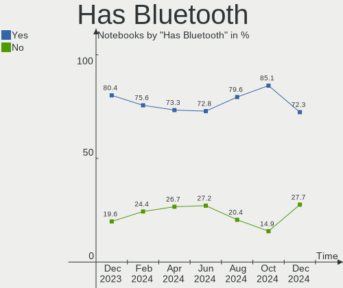
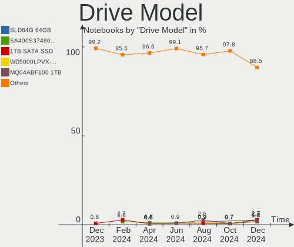

ROSA - Hardware Trends (Notebooks)
----------------------------------

A project to identify most popular hardware characteristics and track their change
over time based on data collected by Linux users at https://Linux-Hardware.org.

Anyone can contribute to this report by the [hw-probe](https://github.com/linuxhw/hw-probe) tool:

    sudo -E hw-probe -all -upload

This report is for one last month. Overall report since the beginning of time: [TestDays](https://github.com/linuxhw/TestDays)

Period: Mar, 2023.

Contents
--------

* [ System ](#system)
  - [ OS                       ](#os)
  - [ OS Family                ](#os-family)
  - [ Kernel                   ](#kernel)
  - [ Kernel Family            ](#kernel-family)
  - [ Kernel Major Ver.        ](#kernel-major-ver)
  - [ Arch                     ](#arch)
  - [ DE                       ](#de)
  - [ Display Server           ](#display-server)
  - [ Display Manager          ](#display-manager)
  - [ OS Lang                  ](#os-lang)
  - [ Boot Mode                ](#boot-mode)
  - [ Filesystem               ](#filesystem)
  - [ Part. scheme             ](#part-scheme)
  - [ Dual Boot with Linux/BSD ](#dual-boot-with-linuxbsd)
  - [ Dual Boot (Win)          ](#dual-boot-win)

* [ Board ](#board)
  - [ Vendor                   ](#vendor)
  - [ Model                    ](#model)
  - [ Model Family             ](#model-family)
  - [ MFG Year                 ](#mfg-year)
  - [ Form Factor              ](#form-factor)
  - [ Secure Boot              ](#secure-boot)
  - [ Coreboot                 ](#coreboot)
  - [ RAM Size                 ](#ram-size)
  - [ RAM Used                 ](#ram-used)
  - [ Total Drives             ](#total-drives)
  - [ Has CD-ROM               ](#has-cd-rom)
  - [ Has Ethernet             ](#has-ethernet)
  - [ Has WiFi                 ](#has-wifi)
  - [ Has Bluetooth            ](#has-bluetooth)

* [ Location ](#location)
  - [ Country                  ](#country)
  - [ City                     ](#city)

* [ Drives ](#drives)
  - [ Drive Vendor             ](#drive-vendor)
  - [ Drive Model              ](#drive-model)
  - [ HDD Vendor               ](#hdd-vendor)
  - [ SSD Vendor               ](#ssd-vendor)
  - [ Drive Kind               ](#drive-kind)
  - [ Drive Connector          ](#drive-connector)
  - [ Drive Size               ](#drive-size)
  - [ Space Total              ](#space-total)
  - [ Space Used               ](#space-used)
  - [ Malfunc. Drives          ](#malfunc-drives)
  - [ Malfunc. Drive Vendor    ](#malfunc-drive-vendor)
  - [ Malfunc. HDD Vendor      ](#malfunc-hdd-vendor)
  - [ Malfunc. Drive Kind      ](#malfunc-drive-kind)
  - [ Failed Drives            ](#failed-drives)
  - [ Failed Drive Vendor      ](#failed-drive-vendor)
  - [ Drive Status             ](#drive-status)

* [ Storage controller ](#storage-controller)
  - [ Storage Vendor           ](#storage-vendor)
  - [ Storage Model            ](#storage-model)
  - [ Storage Kind             ](#storage-kind)

* [ Processor ](#processor)
  - [ CPU Vendor               ](#cpu-vendor)
  - [ CPU Model                ](#cpu-model)
  - [ CPU Model Family         ](#cpu-model-family)
  - [ CPU Cores                ](#cpu-cores)
  - [ CPU Sockets              ](#cpu-sockets)
  - [ CPU Threads              ](#cpu-threads)
  - [ CPU Op-Modes             ](#cpu-op-modes)
  - [ CPU Microcode            ](#cpu-microcode)
  - [ CPU Microarch            ](#cpu-microarch)

* [ Graphics ](#graphics)
  - [ GPU Vendor               ](#gpu-vendor)
  - [ GPU Model                ](#gpu-model)
  - [ GPU Combo                ](#gpu-combo)
  - [ GPU Driver               ](#gpu-driver)
  - [ GPU Memory               ](#gpu-memory)

* [ Monitor ](#monitor)
  - [ Monitor Vendor           ](#monitor-vendor)
  - [ Monitor Model            ](#monitor-model)
  - [ Monitor Resolution       ](#monitor-resolution)
  - [ Monitor Diagonal         ](#monitor-diagonal)
  - [ Monitor Width            ](#monitor-width)
  - [ Aspect Ratio             ](#aspect-ratio)
  - [ Monitor Area             ](#monitor-area)
  - [ Pixel Density            ](#pixel-density)
  - [ Multiple Monitors        ](#multiple-monitors)

* [ Network ](#network)
  - [ Net Controller Vendor    ](#net-controller-vendor)
  - [ Net Controller Model     ](#net-controller-model)
  - [ Wireless Vendor          ](#wireless-vendor)
  - [ Wireless Model           ](#wireless-model)
  - [ Ethernet Vendor          ](#ethernet-vendor)
  - [ Ethernet Model           ](#ethernet-model)
  - [ Net Controller Kind      ](#net-controller-kind)
  - [ Used Controller          ](#used-controller)
  - [ NICs                     ](#nics)
  - [ IPv6                     ](#ipv6)

* [ Bluetooth ](#bluetooth)
  - [ Bluetooth Vendor         ](#bluetooth-vendor)
  - [ Bluetooth Model          ](#bluetooth-model)

* [ Sound ](#sound)
  - [ Sound Vendor             ](#sound-vendor)
  - [ Sound Model              ](#sound-model)

* [ Memory ](#memory)
  - [ Memory Vendor            ](#memory-vendor)
  - [ Memory Model             ](#memory-model)
  - [ Memory Kind              ](#memory-kind)
  - [ Memory Form Factor       ](#memory-form-factor)
  - [ Memory Size              ](#memory-size)
  - [ Memory Speed             ](#memory-speed)

* [ Printers & scanners ](#printers--scanners)
  - [ Printer Vendor           ](#printer-vendor)
  - [ Printer Model            ](#printer-model)
  - [ Scanner Vendor           ](#scanner-vendor)
  - [ Scanner Model            ](#scanner-model)

* [ Camera ](#camera)
  - [ Camera Vendor            ](#camera-vendor)
  - [ Camera Model             ](#camera-model)

* [ Security ](#security)
  - [ Fingerprint Vendor       ](#fingerprint-vendor)
  - [ Fingerprint Model        ](#fingerprint-model)
  - [ Chipcard Vendor          ](#chipcard-vendor)
  - [ Chipcard Model           ](#chipcard-model)

* [ Unsupported ](#unsupported)
  - [ Unsupported Devices      ](#unsupported-devices)
  - [ Unsupported Device Types ](#unsupported-device-types)

System
------

OS
--

Installed operating systems

| Name       | Notebooks | Percent |
|------------|-----------|---------|
| ROSA 12.3  | 104       | 81.25%  |
| ROSA 12.4  | 14        | 10.94%  |
| ROSA R11.1 | 7         | 5.47%   |
| ROSA 12.2  | 3         | 2.34%   |

OS Family
---------

OS without a version

| Name | Notebooks | Percent |
|------|-----------|---------|
| ROSA | 128       | 100%    |

Kernel
------

Version of the Linux kernel

| Version                                   | Notebooks | Percent |
|-------------------------------------------|-----------|---------|
| 5.15.75-generic-1rosa2021.1-x86_64        | 41        | 32.03%  |
| 5.15.79-generic-1rosa2021.1-x86_64        | 26        | 20.31%  |
| 5.15.75-generic-1rosa2021.1-i686          | 11        | 8.59%   |
| 5.10.155-generic-1rosa2021.1-x86_64       | 7         | 5.47%   |
| 6.1.20-generic-2rosa2021.1-x86_64         | 6         | 4.69%   |
| 6.0.12.xm1-1.klp-xanmod-rosa2021.1-x86_64 | 5         | 3.91%   |
| 5.15.77-generic-1rosa2021.1-x86_64        | 4         | 3.13%   |
| 5.15.103-generic-1rosa2021.1-x86_64       | 4         | 3.13%   |
| 5.10.74-generic-2rosa2021.1-x86_64        | 4         | 3.13%   |
| 6.1.20-generic-1rosa2021.1-x86_64         | 3         | 2.34%   |
| 5.17.11-generic-2rosa2021.1-x86_64        | 3         | 2.34%   |
| 6.1.19-generic-1rosa2021.1-x86_64         | 2         | 1.56%   |
| 4.15.0-desktop-122.124.1rosa-x86_64       | 2         | 1.56%   |
| 6.1.16.xm1-1.klp-xanmod-rosa2021.1-x86_64 | 1         | 0.78%   |
| 6.1.15.xm1-1.klp-xanmod-rosa2021.1-x86_64 | 1         | 0.78%   |
| 5.4.83-generic-2rosa-x86_64               | 1         | 0.78%   |
| 5.4.32-generic-2rosa-x86_64               | 1         | 0.78%   |
| 5.4.32-generic-2rosa-i586                 | 1         | 0.78%   |
| 5.17.11-generic-2rosa2021.1-i686          | 1         | 0.78%   |
| 5.10.175-generic-1rosa2021.1-x86_64       | 1         | 0.78%   |
| 5.10.118-generic-2rosa2021.1-x86_64       | 1         | 0.78%   |
| 4.15.0-desktop-45.1rosa-x86_64            | 1         | 0.78%   |
| 4.15.0-desktop-122.124.1rosa-i586         | 1         | 0.78%   |

Kernel Family
-------------

Linux kernel without a distro release

| Version  | Notebooks | Percent |
|----------|-----------|---------|
| 5.15.75  | 52        | 40.63%  |
| 5.15.79  | 26        | 20.31%  |
| 6.1.20   | 9         | 7.03%   |
| 5.10.155 | 7         | 5.47%   |
| 6.0.12   | 5         | 3.91%   |
| 5.17.11  | 4         | 3.13%   |
| 5.15.77  | 4         | 3.13%   |
| 5.15.103 | 4         | 3.13%   |
| 5.10.74  | 4         | 3.13%   |
| 4.15.0   | 4         | 3.13%   |
| 6.1.19   | 2         | 1.56%   |
| 5.4.32   | 2         | 1.56%   |
| 6.1.16   | 1         | 0.78%   |
| 6.1.15   | 1         | 0.78%   |
| 5.4.83   | 1         | 0.78%   |
| 5.10.175 | 1         | 0.78%   |
| 5.10.118 | 1         | 0.78%   |

Kernel Major Ver.
-----------------

Linux kernel major version

| Version | Notebooks | Percent |
|---------|-----------|---------|
| 5.15    | 86        | 67.19%  |
| 6.1     | 13        | 10.16%  |
| 5.10    | 13        | 10.16%  |
| 6.0     | 5         | 3.91%   |
| 5.17    | 4         | 3.13%   |
| 4.15    | 4         | 3.13%   |
| 5.4     | 3         | 2.34%   |

Arch
----

OS architecture (x86_64, i586, etc.)

| Name   | Notebooks | Percent |
|--------|-----------|---------|
| x86_64 | 114       | 89.06%  |
| i686   | 14        | 10.94%  |

DE
--

Desktop Environment

| Name    | Notebooks | Percent |
|---------|-----------|---------|
| KDE5    | 62        | 48.44%  |
| GNOME   | 35        | 27.34%  |
| LXQt    | 21        | 16.41%  |
| KDE4    | 5         | 3.91%   |
| XFCE    | 2         | 1.56%   |
| i3      | 1         | 0.78%   |
| Budgie  | 1         | 0.78%   |
| Unknown | 1         | 0.78%   |

Display Server
--------------

X11 or Wayland

| Name    | Notebooks | Percent |
|---------|-----------|---------|
| Wayland | 88        | 68.75%  |
| X11     | 40        | 31.25%  |

Display Manager
---------------

SDDM, LightDM, etc.

| Name    | Notebooks | Percent |
|---------|-----------|---------|
| SDDM    | 64        | 50%     |
| GDM     | 45        | 35.16%  |
| LightDM | 14        | 10.94%  |
| KDM     | 5         | 3.91%   |

OS Lang
-------

Language

| Lang  | Notebooks | Percent |
|-------|-----------|---------|
| ru_RU | 122       | 95.31%  |
| en_US | 3         | 2.34%   |
| it_IT | 1         | 0.78%   |
| en_GB | 1         | 0.78%   |
| de_DE | 1         | 0.78%   |

Boot Mode
---------

EFI or BIOS

| Mode | Notebooks | Percent |
|------|-----------|---------|
| BIOS | 65        | 50.78%  |
| EFI  | 63        | 49.22%  |

Filesystem
----------

Type of filesystem

| Type    | Notebooks | Percent |
|---------|-----------|---------|
| Ext4    | 119       | 92.97%  |
| Btrfs   | 7         | 5.47%   |
| Overlay | 1         | 0.78%   |
| Aufs    | 1         | 0.78%   |

Part. scheme
------------

Scheme of partitioning

| Type | Notebooks | Percent |
|------|-----------|---------|
| GPT  | 73        | 57.03%  |
| MBR  | 55        | 42.97%  |

Dual Boot with Linux/BSD
------------------------

Hosting more than one Linux/BSD

| Dual boot | Notebooks | Percent |
|-----------|-----------|---------|
| No        | 93        | 72.66%  |
| Yes       | 35        | 27.34%  |

Dual Boot (Win)
---------------

Hosting Linux and Windows

| Dual boot | Notebooks | Percent |
|-----------|-----------|---------|
| No        | 85        | 66.41%  |
| Yes       | 43        | 33.59%  |

Board
-----

Vendor
------

Motherboard manufacturer

| Name                     | Notebooks | Percent |
|--------------------------|-----------|---------|
| ASUSTek Computer         | 35        | 27.34%  |
| Lenovo                   | 20        | 15.63%  |
| Acer                     | 18        | 14.06%  |
| Hewlett-Packard          | 9         | 7.03%   |
| Dell                     | 9         | 7.03%   |
| Sony                     | 6         | 4.69%   |
| Toshiba                  | 5         | 3.91%   |
| Samsung Electronics      | 4         | 3.13%   |
| Pegatron                 | 3         | 2.34%   |
| MSI                      | 2         | 1.56%   |
| HONOR                    | 2         | 1.56%   |
| eMachines                | 2         | 1.56%   |
| Timi                     | 1         | 0.78%   |
| Positivo                 | 1         | 0.78%   |
| Packard Bell             | 1         | 0.78%   |
| Notebook                 | 1         | 0.78%   |
| Maibenben                | 1         | 0.78%   |
| Irbis                    | 1         | 0.78%   |
| Infinix                  | 1         | 0.78%   |
| HIPER Technology Limited | 1         | 0.78%   |
| Haier                    | 1         | 0.78%   |
| Fujitsu Siemens          | 1         | 0.78%   |
| Aquarius                 | 1         | 0.78%   |
| Apple                    | 1         | 0.78%   |
| Unknown                  | 1         | 0.78%   |

Model
-----

Motherboard model

| Name                                       | Notebooks | Percent |
|--------------------------------------------|-----------|---------|
| Lenovo G500 20236                          | 2         | 1.56%   |
| Toshiba Satellite U300                     | 1         | 0.78%   |
| Toshiba Satellite Pro L300                 | 1         | 0.78%   |
| Toshiba Satellite L850D-BJS                | 1         | 0.78%   |
| Toshiba Satellite A500                     | 1         | 0.78%   |
| Toshiba Satellite A200                     | 1         | 0.78%   |
| Timi Redmi Book Pro 15 2022                | 1         | 0.78%   |
| Sony VPCZ12S9R                             | 1         | 0.78%   |
| Sony VPCF13E8R                             | 1         | 0.78%   |
| Sony VPCF1390X                             | 1         | 0.78%   |
| Sony VPCEB3S1R                             | 1         | 0.78%   |
| Sony SVT1313X9RS                           | 1         | 0.78%   |
| Sony SVE1713P1RB                           | 1         | 0.78%   |
| Samsung R530/R730                          | 1         | 0.78%   |
| Samsung NC10                               | 1         | 0.78%   |
| Samsung 350V5C/351V5C/3540VC/3440VC        | 1         | 0.78%   |
| Samsung 300E4A/300E5A/300E7A/3430EA/3530EA | 1         | 0.78%   |
| Positivo N6440                             | 1         | 0.78%   |
| Pegatron H36QR                             | 1         | 0.78%   |
| Pegatron C15B                              | 1         | 0.78%   |
| Pegatron A15                               | 1         | 0.78%   |
| Packard Bell EasyNote TS11HR               | 1         | 0.78%   |
| Notebook W54_55SU1,SUW                     | 1         | 0.78%   |
| MSI Katana GF76 11UE                       | 1         | 0.78%   |
| MSI GE72 6QC                               | 1         | 0.78%   |
| Maibenben XiaoMai5                         | 1         | 0.78%   |
| Lenovo V110-15AST 80TD                     | 1         | 0.78%   |
| Lenovo ThinkPad X230 23245C8               | 1         | 0.78%   |
| Lenovo ThinkPad X201s 514328U              | 1         | 0.78%   |
| Lenovo ThinkPad X1 Carbon 6th 20KH007DUS   | 1         | 0.78%   |
| Lenovo ThinkPad T430 23493V2               | 1         | 0.78%   |
| Lenovo ThinkPad L15 Gen 1 20U8S2TN02       | 1         | 0.78%   |
| Lenovo ThinkPad Edge 13IAL# 01972PG        | 1         | 0.78%   |
| Lenovo ThinkPad Edge 03014EG               | 1         | 0.78%   |
| Lenovo ThinkBook 15 G2 ITL 20VE            | 1         | 0.78%   |
| Lenovo Legion 5 15ACH6H 82JU               | 1         | 0.78%   |
| Lenovo Legion 5 15ACH6A 82NW               | 1         | 0.78%   |
| Lenovo IdeaPad Y560                        | 1         | 0.78%   |
| Lenovo IdeaPad 520-15IKB 81BF              | 1         | 0.78%   |
| Lenovo IdeaPad 320-15IAP 80XR              | 1         | 0.78%   |

Model Family
------------

Motherboard model prefix

| Name                  | Notebooks | Percent |
|-----------------------|-----------|---------|
| Acer Aspire           | 13        | 10.16%  |
| Lenovo ThinkPad       | 7         | 5.47%   |
| ASUS VivoBook         | 6         | 4.69%   |
| Toshiba Satellite     | 5         | 3.91%   |
| Dell Vostro           | 4         | 3.13%   |
| Lenovo IdeaPad        | 3         | 2.34%   |
| HP Laptop             | 3         | 2.34%   |
| Dell Inspiron         | 3         | 2.34%   |
| Lenovo Legion         | 2         | 1.56%   |
| Lenovo G500           | 2         | 1.56%   |
| Acer Swift            | 2         | 1.56%   |
| Acer Extensa          | 2         | 1.56%   |
| Timi Redmi            | 1         | 0.78%   |
| Sony VPCZ12S9R        | 1         | 0.78%   |
| Sony VPCF13E8R        | 1         | 0.78%   |
| Sony VPCF1390X        | 1         | 0.78%   |
| Sony VPCEB3S1R        | 1         | 0.78%   |
| Sony SVT1313X9RS      | 1         | 0.78%   |
| Sony SVE1713P1RB      | 1         | 0.78%   |
| Samsung R530          | 1         | 0.78%   |
| Samsung NC10          | 1         | 0.78%   |
| Samsung 350V5C        | 1         | 0.78%   |
| Samsung 300E4A        | 1         | 0.78%   |
| Positivo N6440        | 1         | 0.78%   |
| Pegatron H36QR        | 1         | 0.78%   |
| Pegatron C15B         | 1         | 0.78%   |
| Pegatron A15          | 1         | 0.78%   |
| Packard Bell EasyNote | 1         | 0.78%   |
| Notebook W54          | 1         | 0.78%   |
| MSI Katana            | 1         | 0.78%   |
| MSI GE72              | 1         | 0.78%   |
| Maibenben XiaoMai5    | 1         | 0.78%   |
| Lenovo V110-15AST     | 1         | 0.78%   |
| Lenovo ThinkBook      | 1         | 0.78%   |
| Lenovo G560           | 1         | 0.78%   |
| Lenovo G50-70         | 1         | 0.78%   |
| Lenovo B590           | 1         | 0.78%   |
| Lenovo B570e          | 1         | 0.78%   |
| Irbis 15NBC1000       | 1         | 0.78%   |
| Infinix INBOOK        | 1         | 0.78%   |

MFG Year
--------

Motherboard manufacture year

| Year | Notebooks | Percent |
|------|-----------|---------|
| 2011 | 15        | 11.72%  |
| 2010 | 15        | 11.72%  |
| 2013 | 13        | 10.16%  |
| 2012 | 13        | 10.16%  |
| 2021 | 11        | 8.59%   |
| 2017 | 10        | 7.81%   |
| 2022 | 8         | 6.25%   |
| 2009 | 7         | 5.47%   |
| 2020 | 5         | 3.91%   |
| 2018 | 5         | 3.91%   |
| 2008 | 5         | 3.91%   |
| 2016 | 4         | 3.13%   |
| 2007 | 4         | 3.13%   |
| 2006 | 4         | 3.13%   |
| 2019 | 3         | 2.34%   |
| 2015 | 3         | 2.34%   |
| 2014 | 3         | 2.34%   |

Form Factor
-----------

Physical design of the computer

| Name     | Notebooks | Percent |
|----------|-----------|---------|
| Notebook | 128       | 100%    |

Secure Boot
-----------

Enabled or disabled

| State    | Notebooks | Percent |
|----------|-----------|---------|
| Disabled | 128       | 100%    |

Coreboot
--------

Have coreboot on board

| Used | Notebooks | Percent |
|------|-----------|---------|
| No   | 128       | 100%    |

RAM Size
--------

Total RAM memory

| Size in GB | Notebooks | Percent |
|------------|-----------|---------|
| 4.01-8.0   | 39        | 30.47%  |
| 3.01-4.0   | 35        | 27.34%  |
| 8.01-16.0  | 23        | 17.97%  |
| 16.01-24.0 | 13        | 10.16%  |
| 1.01-2.0   | 9         | 7.03%   |
| 2.01-3.0   | 7         | 5.47%   |
| 0.51-1.0   | 2         | 1.56%   |

RAM Used
--------

Used RAM memory

| Used GB  | Notebooks | Percent |
|----------|-----------|---------|
| 1.01-2.0 | 65        | 50.78%  |
| 0.51-1.0 | 32        | 25%     |
| 2.01-3.0 | 21        | 16.41%  |
| 4.01-8.0 | 6         | 4.69%   |
| 3.01-4.0 | 3         | 2.34%   |
| 0.01-0.5 | 1         | 0.78%   |

Total Drives
------------

Number of drives on board

| Drives | Notebooks | Percent |
|--------|-----------|---------|
| 1      | 97        | 75.78%  |
| 2      | 28        | 21.88%  |
| 3      | 2         | 1.56%   |
| 4      | 1         | 0.78%   |

Has CD-ROM
----------

Has CD-ROM on board

| Presented | Notebooks | Percent |
|-----------|-----------|---------|
| No        | 72        | 56.25%  |
| Yes       | 56        | 43.75%  |

Has Ethernet
------------

Has Ethernet on board

| Presented | Notebooks | Percent |
|-----------|-----------|---------|
| Yes       | 113       | 88.28%  |
| No        | 15        | 11.72%  |

Has WiFi
--------

Has WiFi module

| Presented | Notebooks | Percent |
|-----------|-----------|---------|
| Yes       | 127       | 99.22%  |
| No        | 1         | 0.78%   |

Has Bluetooth
-------------

Has Bluetooth module

| Presented | Notebooks | Percent |
|-----------|-----------|---------|
| Yes       | 98        | 76.56%  |
| No        | 30        | 23.44%  |

Location
--------

Country
-------

Geographic location (country)

| Country    | Notebooks | Percent |
|------------|-----------|---------|
| Russia     | 106       | 82.81%  |
| Belarus    | 8         | 6.25%   |
| Germany    | 4         | 3.13%   |
| USA        | 2         | 1.56%   |
| Ukraine    | 2         | 1.56%   |
| Moldova    | 1         | 0.78%   |
| Latvia     | 1         | 0.78%   |
| Kazakhstan | 1         | 0.78%   |
| Italy      | 1         | 0.78%   |
| Estonia    | 1         | 0.78%   |
| Czechia    | 1         | 0.78%   |

City
----

Geographic location (city)

| City            | Notebooks | Percent |
|-----------------|-----------|---------|
| Moscow          | 24        | 18.75%  |
| St Petersburg   | 9         | 7.03%   |
| Minsk           | 6         | 4.69%   |
| Krasnodar       | 6         | 4.69%   |
| Samara          | 4         | 3.13%   |
| Omsk            | 4         | 3.13%   |
| Novosibirsk     | 4         | 3.13%   |
| Yekaterinburg   | 3         | 2.34%   |
| Volgograd       | 3         | 2.34%   |
| Chelyabinsk     | 3         | 2.34%   |
| Scharbeutz      | 2         | 1.56%   |
| Kursk           | 2         | 1.56%   |
| Krasnoyarsk     | 2         | 1.56%   |
| Hrodna          | 2         | 1.56%   |
| Zuyevka         | 1         | 0.78%   |
| Yoshkar-Ola     | 1         | 0.78%   |
| Yenakiieve      | 1         | 0.78%   |
| Yalta           | 1         | 0.78%   |
| Yakutsk         | 1         | 0.78%   |
| Vologda         | 1         | 0.78%   |
| Vladivostok     | 1         | 0.78%   |
| Veliky Novgorod | 1         | 0.78%   |
| Ukhta           | 1         | 0.78%   |
| Ufa             | 1         | 0.78%   |
| Tyumen          | 1         | 0.78%   |
| Tsarskoye Selo  | 1         | 0.78%   |
| Treviso         | 1         | 0.78%   |
| Tambov          | 1         | 0.78%   |
| Taganrog        | 1         | 0.78%   |
| Syktyvkar       | 1         | 0.78%   |
| Sviadnov        | 1         | 0.78%   |
| Surgut          | 1         | 0.78%   |
| Smolensk        | 1         | 0.78%   |
| Sillamäe       | 1         | 0.78%   |
| Saratov         | 1         | 0.78%   |
| Saransk         | 1         | 0.78%   |
| Rostov-on-Don   | 1         | 0.78%   |
| Riga            | 1         | 0.78%   |
| Revda           | 1         | 0.78%   |
| Rasskazovo      | 1         | 0.78%   |

Drives
------

Drive Vendor
------------

Hard drive vendors

| Vendor                | Notebooks | Drives | Percent |
|-----------------------|-----------|--------|---------|
| WDC                   | 25        | 25     | 16.13%  |
| Seagate               | 25        | 25     | 16.13%  |
| Samsung Electronics   | 16        | 17     | 10.32%  |
| Toshiba               | 10        | 11     | 6.45%   |
| Hitachi               | 8         | 8      | 5.16%   |
| SanDisk               | 7         | 7      | 4.52%   |
| SPCC                  | 6         | 6      | 3.87%   |
| Kingston              | 6         | 6      | 3.87%   |
| China                 | 5         | 5      | 3.23%   |
| A-DATA Technology     | 5         | 5      | 3.23%   |
| Unknown               | 3         | 3      | 1.94%   |
| Netac                 | 3         | 3      | 1.94%   |
| KIOXIA                | 3         | 3      | 1.94%   |
| Crucial               | 3         | 3      | 1.94%   |
| SK hynix              | 2         | 2      | 1.29%   |
| Patriot               | 2         | 3      | 1.29%   |
| HGST                  | 2         | 2      | 1.29%   |
| External              | 2         | 2      | 1.29%   |
| Apacer                | 2         | 2      | 1.29%   |
| XrayDisk              | 1         | 1      | 0.65%   |
| Transcend             | 1         | 1      | 0.65%   |
| Realtek Semiconductor | 1         | 1      | 0.65%   |
| Qumo                  | 1         | 1      | 0.65%   |
| PNY                   | 1         | 1      | 0.65%   |
| Micron Technology     | 1         | 1      | 0.65%   |
| KingSpec              | 1         | 1      | 0.65%   |
| Kimtigo               | 1         | 1      | 0.65%   |
| Intel                 | 1         | 1      | 0.65%   |
| HS-SSD-C100           | 1         | 1      | 0.65%   |
| HJDK                  | 1         | 1      | 0.65%   |
| Hewlett-Packard       | 1         | 1      | 0.65%   |
| GS                    | 1         | 1      | 0.65%   |
| FORESEE               | 1         | 1      | 0.65%   |
| Fanxiang              | 1         | 1      | 0.65%   |
| ExeGate               | 1         | 1      | 0.65%   |
| Azerty                | 1         | 1      | 0.65%   |
| ASMT                  | 1         | 1      | 0.65%   |
| ACOS                  | 1         | 1      | 0.65%   |
| Unknown               | 1         | 1      | 0.65%   |

Drive Model
-----------

Hard drive models

| Model                                | Notebooks | Percent |
|--------------------------------------|-----------|---------|
| SPCC Solid State Disk 128GB          | 4         | 2.55%   |
| Seagate ST500LT012-1DG142 500GB      | 4         | 2.55%   |
| Seagate ST1000LM035-1RK172 1TB       | 4         | 2.55%   |
| Seagate ST9500325AS 500GB            | 3         | 1.91%   |
| Samsung SSD 860 EVO 250GB            | 3         | 1.91%   |
| WDC WDS500G2B0A-00SM50 500GB SSD     | 2         | 1.27%   |
| WDC WD5000LPCX-24VHAT0 500GB         | 2         | 1.27%   |
| WDC WD5000LPCX-21VHAT0 500GB         | 2         | 1.27%   |
| Toshiba MQ01ABF050 500GB             | 2         | 1.27%   |
| Seagate ST9320325AS 320GB            | 2         | 1.27%   |
| Seagate ST500LT012-9WS142 500GB      | 2         | 1.27%   |
| Seagate ST1000LM024 HN-M101MBB 1TB   | 2         | 1.27%   |
| Samsung SSD 980 500GB                | 2         | 1.27%   |
| Netac SSD 120GB                      | 2         | 1.27%   |
| Kingston SA400S37480G 480GB SSD      | 2         | 1.27%   |
| External USB3.0 512GB                | 2         | 1.27%   |
| Crucial CT250MX500SSD1 250GB         | 2         | 1.27%   |
| A-DATA SU650 240GB SSD               | 2         | 1.27%   |
| XrayDisk 2TB SSD                     | 1         | 0.64%   |
| WDC WDS480G2G0C-00AJM0 480GB         | 1         | 0.64%   |
| WDC WDS240G2G0B-00EPW0 240GB SSD     | 1         | 0.64%   |
| WDC WDS120G2G0A-00JH30 120GB SSD     | 1         | 0.64%   |
| WDC WDS100T2B0A-00SM50 1TB SSD       | 1         | 0.64%   |
| WDC WD7500BPVX-00FA7T0 752GB         | 1         | 0.64%   |
| WDC WD5000LPVX-22V0TT0 500GB         | 1         | 0.64%   |
| WDC WD5000LPCX-24C6HT0 500GB         | 1         | 0.64%   |
| WDC WD5000BPVT-80HXZT1 500GB         | 1         | 0.64%   |
| WDC WD3200BPVT-80ZEST0 320GB         | 1         | 0.64%   |
| WDC WD3200BPVT-24ZEST0 320GB         | 1         | 0.64%   |
| WDC WD2500BEVT-80A23T0 250GB         | 1         | 0.64%   |
| WDC WD1600BEVT-60ZCT1 160GB          | 1         | 0.64%   |
| WDC WD1600BEVT-22ZCT0 160GB          | 1         | 0.64%   |
| WDC WD1200BEVS-75UST0 120GB          | 1         | 0.64%   |
| WDC WD10SPZX-75Z10T1 1TB             | 1         | 0.64%   |
| WDC WD10JPVX-22JC3T0 1TB             | 1         | 0.64%   |
| WDC WD Green 2.5 240GB SSD           | 1         | 0.64%   |
| WDC PC SN730 SDBPNTY-256G-1027 256GB | 1         | 0.64%   |
| WDC PC SN540 SDDPNPF-512G-1032 512GB | 1         | 0.64%   |
| Unknown USD00  64GB                  | 1         | 0.64%   |
| Unknown SL16G  16GB                  | 1         | 0.64%   |

HDD Vendor
----------

Hard disk drive vendors

| Vendor              | Notebooks | Drives | Percent |
|---------------------|-----------|--------|---------|
| Seagate             | 25        | 25     | 40.98%  |
| WDC                 | 16        | 16     | 26.23%  |
| Toshiba             | 8         | 8      | 13.11%  |
| Hitachi             | 8         | 8      | 13.11%  |
| HGST                | 2         | 2      | 3.28%   |
| Samsung Electronics | 1         | 1      | 1.64%   |
| ASMT                | 1         | 1      | 1.64%   |

SSD Vendor
----------

Solid state drive vendors

| Vendor              | Notebooks | Drives | Percent |
|---------------------|-----------|--------|---------|
| Samsung Electronics | 7         | 8      | 10.77%  |
| WDC                 | 6         | 6      | 9.23%   |
| SPCC                | 6         | 6      | 9.23%   |
| SanDisk             | 6         | 6      | 9.23%   |
| Kingston            | 5         | 5      | 7.69%   |
| China               | 5         | 5      | 7.69%   |
| A-DATA Technology   | 5         | 5      | 7.69%   |
| Netac               | 3         | 3      | 4.62%   |
| Crucial             | 3         | 3      | 4.62%   |
| Toshiba             | 2         | 3      | 3.08%   |
| Patriot             | 2         | 3      | 3.08%   |
| XrayDisk            | 1         | 1      | 1.54%   |
| Transcend           | 1         | 1      | 1.54%   |
| Qumo                | 1         | 1      | 1.54%   |
| PNY                 | 1         | 1      | 1.54%   |
| KingSpec            | 1         | 1      | 1.54%   |
| Kimtigo             | 1         | 1      | 1.54%   |
| HS-SSD-C100         | 1         | 1      | 1.54%   |
| HJDK                | 1         | 1      | 1.54%   |
| Hewlett-Packard     | 1         | 1      | 1.54%   |
| GS                  | 1         | 1      | 1.54%   |
| Fanxiang            | 1         | 1      | 1.54%   |
| Azerty              | 1         | 1      | 1.54%   |
| Apacer              | 1         | 1      | 1.54%   |
| ACOS                | 1         | 1      | 1.54%   |
| Unknown             | 1         | 1      | 1.54%   |

Drive Kind
----------

HDD or SSD

| Kind | Notebooks | Drives | Percent |
|------|-----------|--------|---------|
| SSD  | 64        | 68     | 41.83%  |
| HDD  | 61        | 61     | 39.87%  |
| NVMe | 25        | 26     | 16.34%  |
| MMC  | 3         | 3      | 1.96%   |

Drive Connector
---------------

SATA, SAS, NVMe, etc.

| Type | Notebooks | Drives | Percent |
|------|-----------|--------|---------|
| SATA | 106       | 128    | 78.52%  |
| NVMe | 23        | 24     | 17.04%  |
| SAS  | 3         | 3      | 2.22%   |
| MMC  | 3         | 3      | 2.22%   |

Drive Size
----------

Size of hard drive

| Size in TB | Notebooks | Drives | Percent |
|------------|-----------|--------|---------|
| 0.01-0.5   | 90        | 101    | 77.59%  |
| 0.51-1.0   | 24        | 26     | 20.69%  |
| 1.01-2.0   | 2         | 2      | 1.72%   |

Space Total
-----------

Amount of disk space available on the file system

| Size in GB | Notebooks | Percent |
|------------|-----------|---------|
| 101-250    | 39        | 30.47%  |
| 251-500    | 33        | 25.78%  |
| 501-1000   | 18        | 14.06%  |
| 1-20       | 14        | 10.94%  |
| 51-100     | 12        | 9.38%   |
| 21-50      | 7         | 5.47%   |
| 1001-2000  | 3         | 2.34%   |
| 2001-3000  | 1         | 0.78%   |
| Unknown    | 1         | 0.78%   |

Space Used
----------

Amount of used disk space

| Used GB   | Notebooks | Percent |
|-----------|-----------|---------|
| 1-20      | 84        | 65.63%  |
| 21-50     | 13        | 10.16%  |
| 101-250   | 9         | 7.03%   |
| 51-100    | 9         | 7.03%   |
| 251-500   | 8         | 6.25%   |
| 501-1000  | 2         | 1.56%   |
| 2001-3000 | 1         | 0.78%   |
| 1001-2000 | 1         | 0.78%   |
| Unknown   | 1         | 0.78%   |

Malfunc. Drives
---------------

Drive models with a malfunction

| Model                                     | Notebooks | Drives | Percent |
|-------------------------------------------|-----------|--------|---------|
| Toshiba MQ01ABF050 500GB                  | 2         | 2      | 5.71%   |
| Seagate ST9500325AS 500GB                 | 2         | 2      | 5.71%   |
| Seagate ST500LT012-9WS142 500GB           | 2         | 2      | 5.71%   |
| Seagate ST500LT012-1DG142 500GB           | 2         | 2      | 5.71%   |
| WDC WDS240G2G0B-00EPW0 240GB SSD          | 1         | 1      | 2.86%   |
| WDC WDS120G2G0A-00JH30 120GB SSD          | 1         | 1      | 2.86%   |
| WDC WD7500BPVX-00FA7T0 752GB              | 1         | 1      | 2.86%   |
| WDC WD5000LPVX-22V0TT0 500GB              | 1         | 1      | 2.86%   |
| WDC WD5000BPVT-80HXZT1 500GB              | 1         | 1      | 2.86%   |
| WDC WD3200BPVT-80ZEST0 320GB              | 1         | 1      | 2.86%   |
| WDC WD1600BEVT-22ZCT0 160GB               | 1         | 1      | 2.86%   |
| WDC WD Green 2.5 240GB SSD                | 1         | 1      | 2.86%   |
| Toshiba THNSNH060GBST 64GB SSD            | 1         | 1      | 2.86%   |
| Toshiba MQ04ABF100 1TB                    | 1         | 1      | 2.86%   |
| Toshiba MQ01ABD100 1TB                    | 1         | 1      | 2.86%   |
| Toshiba MQ01ABD050 500GB                  | 1         | 1      | 2.86%   |
| Toshiba MK5055GSX 500GB                   | 1         | 1      | 2.86%   |
| Seagate ST96812A 64GB                     | 1         | 1      | 2.86%   |
| Seagate ST9320325AS 320GB                 | 1         | 1      | 2.86%   |
| Seagate ST9250315AS 250GB                 | 1         | 1      | 2.86%   |
| Samsung Electronics HM160HI 160GB         | 1         | 1      | 2.86%   |
| PNY SSD2SC240G1LC709B121-443 240GB        | 1         | 1      | 2.86%   |
| Netac SSD 240GB                           | 1         | 1      | 2.86%   |
| KingSpec Q-720 720GB SSD                  | 1         | 1      | 2.86%   |
| Hitachi HTS545025B9A300 250GB             | 1         | 1      | 2.86%   |
| Hitachi HTS542525K9SA00 250GB             | 1         | 1      | 2.86%   |
| Hitachi HTS541680J9SA00 80GB              | 1         | 1      | 2.86%   |
| Hitachi HTS541612J9SA00 120GB             | 1         | 1      | 2.86%   |
| HGST HTS545050A7E680 500GB                | 1         | 1      | 2.86%   |
| ACOS AS-512 512GB SSD                     | 1         | 1      | 2.86%   |
| A-DATA Technology AXM13S2-24GM-B 24GB SSD | 1         | 1      | 2.86%   |

Malfunc. Drive Vendor
---------------------

Vendors of faulty drives

| Vendor              | Notebooks | Drives | Percent |
|---------------------|-----------|--------|---------|
| Seagate             | 9         | 9      | 25.71%  |
| WDC                 | 8         | 8      | 22.86%  |
| Toshiba             | 7         | 7      | 20%     |
| Hitachi             | 4         | 4      | 11.43%  |
| Samsung Electronics | 1         | 1      | 2.86%   |
| PNY                 | 1         | 1      | 2.86%   |
| Netac               | 1         | 1      | 2.86%   |
| KingSpec            | 1         | 1      | 2.86%   |
| HGST                | 1         | 1      | 2.86%   |
| ACOS                | 1         | 1      | 2.86%   |
| A-DATA Technology   | 1         | 1      | 2.86%   |

Malfunc. HDD Vendor
-------------------

Vendors of faulty HDD drives

| Vendor              | Notebooks | Drives | Percent |
|---------------------|-----------|--------|---------|
| Seagate             | 9         | 9      | 34.62%  |
| Toshiba             | 6         | 6      | 23.08%  |
| WDC                 | 5         | 5      | 19.23%  |
| Hitachi             | 4         | 4      | 15.38%  |
| Samsung Electronics | 1         | 1      | 3.85%   |
| HGST                | 1         | 1      | 3.85%   |

Malfunc. Drive Kind
-------------------

Kinds of faulty drives

| Kind | Notebooks | Drives | Percent |
|------|-----------|--------|---------|
| HDD  | 26        | 26     | 74.29%  |
| SSD  | 9         | 9      | 25.71%  |

Failed Drives
-------------

Failed drive models

Zero info for selected period =(

Failed Drive Vendor
-------------------

Failed drive vendors

Zero info for selected period =(

Drive Status
------------

Number of failed and malfunc. drives

| Status   | Notebooks | Drives | Percent |
|----------|-----------|--------|---------|
| Works    | 97        | 114    | 69.78%  |
| Malfunc  | 34        | 35     | 24.46%  |
| Detected | 8         | 9      | 5.76%   |

Storage controller
------------------

Storage Vendor
--------------

Storage controller vendors

| Vendor                           | Notebooks | Percent |
|----------------------------------|-----------|---------|
| Intel                            | 95        | 67.38%  |
| AMD                              | 21        | 14.89%  |
| Samsung Electronics              | 8         | 5.67%   |
| SanDisk                          | 4         | 2.84%   |
| KIOXIA                           | 3         | 2.13%   |
| SK hynix                         | 2         | 1.42%   |
| Shenzhen Longsys Electronics     | 2         | 1.42%   |
| Silicon Motion                   | 1         | 0.71%   |
| Silicon Integrated Systems [SiS] | 1         | 0.71%   |
| Realtek Semiconductor            | 1         | 0.71%   |
| Nvidia                           | 1         | 0.71%   |
| Micron Technology                | 1         | 0.71%   |
| Kingston Technology Company      | 1         | 0.71%   |

Storage Model
-------------

Storage controller models

| Model                                                                          | Notebooks | Percent |
|--------------------------------------------------------------------------------|-----------|---------|
| Intel 7 Series Chipset Family 6-port SATA Controller [AHCI mode]               | 17        | 10.97%  |
| AMD FCH SATA Controller [AHCI mode]                                            | 15        | 9.68%   |
| Intel Sunrise Point-LP SATA Controller [AHCI mode]                             | 9         | 5.81%   |
| Intel 6 Series/C200 Series Chipset Family 6 port Mobile SATA AHCI Controller   | 7         | 4.52%   |
| Intel 5 Series/3400 Series Chipset 4 port SATA AHCI Controller                 | 7         | 4.52%   |
| Intel Tiger Lake-LP SATA Controller                                            | 5         | 3.23%   |
| AMD SB7x0/SB8x0/SB9x0 SATA Controller [AHCI mode]                              | 5         | 3.23%   |
| Samsung NVMe SSD Controller 980                                                | 4         | 2.58%   |
| Intel NM10/ICH7 Family SATA Controller [AHCI mode]                             | 4         | 2.58%   |
| Intel 82801HM/HEM (ICH8M/ICH8M-E) SATA Controller [AHCI mode]                  | 4         | 2.58%   |
| Intel 82801HM/HEM (ICH8M/ICH8M-E) IDE Controller                               | 4         | 2.58%   |
| Intel 5 Series/3400 Series Chipset 6 port SATA AHCI Controller                 | 4         | 2.58%   |
| Samsung NVMe SSD Controller PM9A1/PM9A3/980PRO                                 | 3         | 1.94%   |
| Intel HM170/QM170 Chipset SATA Controller [AHCI Mode]                          | 3         | 1.94%   |
| Intel Celeron/Pentium Silver Processor SATA Controller                         | 3         | 1.94%   |
| Intel Celeron N3350/Pentium N4200/Atom E3900 Series SATA AHCI Controller       | 3         | 1.94%   |
| Intel 82801IBM/IEM (ICH9M/ICH9M-E) 4 port SATA Controller [AHCI mode]          | 3         | 1.94%   |
| Intel 82801GBM/GHM (ICH7-M Family) SATA Controller [IDE mode]                  | 3         | 1.94%   |
| Intel 82801G (ICH7 Family) IDE Controller                                      | 3         | 1.94%   |
| Intel 82801 Mobile SATA Controller [RAID mode]                                 | 3         | 1.94%   |
| Intel 8 Series/C220 Series Chipset Family 6-port SATA Controller 1 [AHCI mode] | 3         | 1.94%   |
| SK hynix Gold P31/PC711 NVMe Solid State Drive                                 | 2         | 1.29%   |
| SanDisk Non-Volatile memory controller                                         | 2         | 1.29%   |
| KIOXIA NVMe SSD Controller BG4                                                 | 2         | 1.29%   |
| Intel Wildcat Point-LP SATA Controller [AHCI Mode]                             | 2         | 1.29%   |
| Intel Volume Management Device NVMe RAID Controller                            | 2         | 1.29%   |
| Intel Comet Lake SATA AHCI Controller                                          | 2         | 1.29%   |
| Intel 82801GBM/GHM (ICH7-M Family) SATA Controller [AHCI mode]                 | 2         | 1.29%   |
| Intel 8 Series SATA Controller 1 [AHCI mode]                                   | 2         | 1.29%   |
| Intel 7 Series Chipset Family 4-port SATA Controller [IDE mode]                | 2         | 1.29%   |
| Intel 7 Series Chipset Family 2-port SATA Controller [IDE mode]                | 2         | 1.29%   |
| Silicon Motion SM2263EN/SM2263XT SSD Controller                                | 1         | 0.65%   |
| Silicon Integrated Systems [SiS] SATA Controller / IDE mode                    | 1         | 0.65%   |
| Silicon Integrated Systems [SiS] 5513 IDE Controller                           | 1         | 0.65%   |
| Shenzhen Longsys SM2263EN/SM2263XT-based OEM SSD                               | 1         | 0.65%   |
| Shenzhen Longsys Electronics Non-Volatile memory controller                    | 1         | 0.65%   |
| SanDisk WD Blue SN570 NVMe SSD 1TB                                             | 1         | 0.65%   |
| SanDisk WD Black SN750 / PC SN730 NVMe SSD                                     | 1         | 0.65%   |
| Samsung NVMe SSD Controller SM981/PM981/PM983                                  | 1         | 0.65%   |
| Realtek NVMe Controller                                                        | 1         | 0.65%   |

Storage Kind
------------

Kind of storage controller (IDE, SATA, NVMe, SAS, ...)

| Kind | Notebooks | Percent |
|------|-----------|---------|
| SATA | 106       | 70.67%  |
| NVMe | 23        | 15.33%  |
| IDE  | 16        | 10.67%  |
| RAID | 5         | 3.33%   |

Processor
---------

CPU Vendor
----------

Processor vendors

| Vendor | Notebooks | Percent |
|--------|-----------|---------|
| Intel  | 101       | 78.91%  |
| AMD    | 27        | 21.09%  |

CPU Model
---------

Processor models

| Model                                       | Notebooks | Percent |
|---------------------------------------------|-----------|---------|
| Intel 11th Gen Core i3-1115G4 @ 3.00GHz     | 4         | 3.13%   |
| Intel Pentium CPU N4200 @ 1.10GHz           | 3         | 2.34%   |
| Intel Core i5-3337U CPU @ 1.80GHz           | 3         | 2.34%   |
| Intel Core i5-3230M CPU @ 2.60GHz           | 3         | 2.34%   |
| AMD Ryzen 5 5600H with Radeon Graphics      | 3         | 2.34%   |
| AMD A10-4600M APU with Radeon HD Graphics   | 3         | 2.34%   |
| Intel Pentium Dual CPU T2390 @ 1.86GHz      | 2         | 1.56%   |
| Intel Core i7-6700HQ CPU @ 2.60GHz          | 2         | 1.56%   |
| Intel Core i5-8265U CPU @ 1.60GHz           | 2         | 1.56%   |
| Intel Core i5-8250U CPU @ 1.60GHz           | 2         | 1.56%   |
| Intel Core i5-3210M CPU @ 2.50GHz           | 2         | 1.56%   |
| Intel Core i5 CPU M 460 @ 2.53GHz           | 2         | 1.56%   |
| Intel Core i3-6006U CPU @ 2.00GHz           | 2         | 1.56%   |
| Intel Atom CPU N570 @ 1.66GHz               | 2         | 1.56%   |
| Intel Atom CPU N270 @ 1.60GHz               | 2         | 1.56%   |
| Intel 11th Gen Core i5-1135G7 @ 2.40GHz     | 2         | 1.56%   |
| Intel Pentium Silver N6000 @ 1.10GHz        | 1         | 0.78%   |
| Intel Pentium Silver N5030 CPU @ 1.10GHz    | 1         | 0.78%   |
| Intel Pentium Silver N5000 CPU @ 1.10GHz    | 1         | 0.78%   |
| Intel Pentium Dual-Core CPU T4400 @ 2.20GHz | 1         | 0.78%   |
| Intel Pentium CPU P6200 @ 2.13GHz           | 1         | 0.78%   |
| Intel Pentium CPU N3530 @ 2.16GHz           | 1         | 0.78%   |
| Intel Pentium CPU B950 @ 2.10GHz            | 1         | 0.78%   |
| Intel Pentium CPU 4417U @ 2.30GHz           | 1         | 0.78%   |
| Intel Pentium CPU 4415U @ 2.30GHz           | 1         | 0.78%   |
| Intel Pentium CPU 2117U @ 1.80GHz           | 1         | 0.78%   |
| Intel Pentium CPU 2020M @ 2.40GHz           | 1         | 0.78%   |
| Intel Pentium 3558U @ 1.70GHz               | 1         | 0.78%   |
| Intel Genuine CPU T2400 @ 1.83GHz           | 1         | 0.78%   |
| Intel Core i7-4712MQ CPU @ 2.30GHz          | 1         | 0.78%   |
| Intel Core i7-3610QM CPU @ 2.30GHz          | 1         | 0.78%   |
| Intel Core i7-3517U CPU @ 1.90GHz           | 1         | 0.78%   |
| Intel Core i7-2670QM CPU @ 2.20GHz          | 1         | 0.78%   |
| Intel Core i7-2630QM CPU @ 2.00GHz          | 1         | 0.78%   |
| Intel Core i7 CPU Q 840 @ 1.87GHz           | 1         | 0.78%   |
| Intel Core i7 CPU Q 820 @ 1.73GHz           | 1         | 0.78%   |
| Intel Core i7 CPU M 620 @ 2.67GHz           | 1         | 0.78%   |
| Intel Core i7 CPU L 640 @ 2.13GHz           | 1         | 0.78%   |
| Intel Core i5-8350U CPU @ 1.70GHz           | 1         | 0.78%   |
| Intel Core i5-7300HQ CPU @ 2.50GHz          | 1         | 0.78%   |

CPU Model Family
----------------

Processor model prefix

| Model                          | Notebooks | Percent |
|--------------------------------|-----------|---------|
| Intel Core i5                  | 30        | 23.44%  |
| Intel Core i3                  | 13        | 10.16%  |
| Intel Pentium                  | 11        | 8.59%   |
| Intel Core i7                  | 11        | 8.59%   |
| Other                          | 9         | 7.03%   |
| Intel Atom                     | 6         | 4.69%   |
| Intel Celeron                  | 5         | 3.91%   |
| Intel Core 2 Duo               | 4         | 3.13%   |
| AMD A10                        | 4         | 3.13%   |
| Intel Pentium Silver           | 3         | 2.34%   |
| Intel Celeron M                | 3         | 2.34%   |
| AMD Ryzen 7                    | 3         | 2.34%   |
| AMD Ryzen 5                    | 3         | 2.34%   |
| AMD Ryzen 3                    | 3         | 2.34%   |
| AMD A4                         | 3         | 2.34%   |
| Intel Pentium Dual             | 2         | 1.56%   |
| AMD E                          | 2         | 1.56%   |
| AMD A6                         | 2         | 1.56%   |
| Intel Pentium Dual-Core        | 1         | 0.78%   |
| Intel Genuine                  | 1         | 0.78%   |
| Intel Core Duo                 | 1         | 0.78%   |
| Intel Celeron Dual-Core        | 1         | 0.78%   |
| AMD Turion X2 Dual-Core Mobile | 1         | 0.78%   |
| AMD Ryzen 9                    | 1         | 0.78%   |
| AMD Ryzen 3 PRO                | 1         | 0.78%   |
| AMD Athlon Neo X2              | 1         | 0.78%   |
| AMD Athlon II Dual-Core        | 1         | 0.78%   |
| AMD Athlon 64 X2               | 1         | 0.78%   |
| AMD A8                         | 1         | 0.78%   |

CPU Cores
---------

Number of processor cores

| Number | Notebooks | Percent |
|--------|-----------|---------|
| 2      | 82        | 64.06%  |
| 4      | 29        | 22.66%  |
| 1      | 9         | 7.03%   |
| 6      | 4         | 3.13%   |
| 10     | 2         | 1.56%   |
| 8      | 2         | 1.56%   |

CPU Sockets
-----------

Number of sockets

| Number | Notebooks | Percent |
|--------|-----------|---------|
| 1      | 128       | 100%    |

CPU Threads
-----------

Threads per core (Hyper-Threading)

| Number | Notebooks | Percent |
|--------|-----------|---------|
| 2      | 85        | 66.41%  |
| 1      | 43        | 33.59%  |

CPU Op-Modes
------------

CPU Operation Modes (32-bit, 64-bit)

| Op mode        | Notebooks | Percent |
|----------------|-----------|---------|
| 32-bit, 64-bit | 122       | 95.31%  |
| 32-bit         | 6         | 4.69%   |

CPU Microcode
-------------

Microcode number

| Number     | Notebooks | Percent |
|------------|-----------|---------|
| 0x306a9    | 18        | 14.06%  |
| 0x206a7    | 9         | 7.03%   |
| 0x20655    | 6         | 4.69%   |
| 0x806c1    | 5         | 3.91%   |
| 0x0a50000c | 5         | 3.91%   |
| Unknown    | 5         | 3.91%   |
| 0x806ea    | 4         | 3.13%   |
| 0x106ca    | 4         | 3.13%   |
| 0x6fd      | 3         | 2.34%   |
| 0x6e8      | 3         | 2.34%   |
| 0x506c9    | 3         | 2.34%   |
| 0x406e3    | 3         | 2.34%   |
| 0x306c3    | 3         | 2.34%   |
| 0x20652    | 3         | 2.34%   |
| 0x1067a    | 3         | 2.34%   |
| 0x0600110f | 3         | 2.34%   |
| 0x806ec    | 2         | 1.56%   |
| 0x806eb    | 2         | 1.56%   |
| 0x806e9    | 2         | 1.56%   |
| 0x706a8    | 2         | 1.56%   |
| 0x506e3    | 2         | 1.56%   |
| 0x40651    | 2         | 1.56%   |
| 0x306d4    | 2         | 1.56%   |
| 0x106e5    | 2         | 1.56%   |
| 0x106c2    | 2         | 1.56%   |
| 0x08600106 | 2         | 1.56%   |
| 0x08108102 | 2         | 1.56%   |
| 0x06006705 | 2         | 1.56%   |
| 0x03000014 | 2         | 1.56%   |
| 0x906e9    | 1         | 0.78%   |
| 0x906c0    | 1         | 0.78%   |
| 0x906a4    | 1         | 0.78%   |
| 0x906a3    | 1         | 0.78%   |
| 0x806c2    | 1         | 0.78%   |
| 0x706e5    | 1         | 0.78%   |
| 0x706a1    | 1         | 0.78%   |
| 0x6fa      | 1         | 0.78%   |
| 0x6f6      | 1         | 0.78%   |
| 0x6ec      | 1         | 0.78%   |
| 0x406c4    | 1         | 0.78%   |

CPU Microarch
-------------

Microarchitecture

| Name             | Notebooks | Percent |
|------------------|-----------|---------|
| IvyBridge        | 18        | 14.06%  |
| KabyLake         | 11        | 8.59%   |
| Westmere         | 10        | 7.81%   |
| SandyBridge      | 9         | 7.03%   |
| Zen 3            | 6         | 4.69%   |
| TigerLake        | 6         | 4.69%   |
| Core             | 6         | 4.69%   |
| Bonnell          | 6         | 4.69%   |
| Skylake          | 5         | 3.91%   |
| Haswell          | 5         | 3.91%   |
| Piledriver       | 4         | 3.13%   |
| Penryn           | 4         | 3.13%   |
| P6               | 4         | 3.13%   |
| Goldmont plus    | 3         | 2.34%   |
| Goldmont         | 3         | 2.34%   |
| Excavator        | 3         | 2.34%   |
| Zen+             | 2         | 1.56%   |
| Zen 2            | 2         | 1.56%   |
| Silvermont       | 2         | 1.56%   |
| Nehalem          | 2         | 1.56%   |
| K8 Hammer        | 2         | 1.56%   |
| K10 Llano        | 2         | 1.56%   |
| Broadwell        | 2         | 1.56%   |
| Bobcat           | 2         | 1.56%   |
| Alderlake Hybrid | 2         | 1.56%   |
| Unknown          | 2         | 1.56%   |
| Tremont          | 1         | 0.78%   |
| K8 & K10 hybrid  | 1         | 0.78%   |
| K10              | 1         | 0.78%   |
| Jaguar           | 1         | 0.78%   |
| IceLake          | 1         | 0.78%   |

Graphics
--------

GPU Vendor
----------

Vendors of graphics cards

| Vendor | Notebooks | Percent |
|--------|-----------|---------|
| Intel  | 86        | 52.44%  |
| Nvidia | 42        | 25.61%  |
| AMD    | 36        | 21.95%  |

GPU Model
---------

Graphics card models

| Model                                                                                 | Notebooks | Percent |
|---------------------------------------------------------------------------------------|-----------|---------|
| Intel 3rd Gen Core processor Graphics Controller                                      | 17        | 9.29%   |
| Intel 2nd Generation Core Processor Family Integrated Graphics Controller             | 8         | 4.37%   |
| Intel Mobile 945GM/GMS/GME, 943/940GML Express Integrated Graphics Controller         | 6         | 3.28%   |
| Intel Core Processor Integrated Graphics Controller                                   | 6         | 3.28%   |
| AMD Cezanne [Radeon Vega Series / Radeon Vega Mobile Series]                          | 5         | 2.73%   |
| Nvidia GF117M [GeForce 610M/710M/810M/820M / GT 620M/625M/630M/720M]                  | 4         | 2.19%   |
| Intel Tiger Lake-LP GT2 [UHD Graphics G4]                                             | 4         | 2.19%   |
| Intel Mobile 945GM/GMS, 943/940GML Express Integrated Graphics Controller             | 4         | 2.19%   |
| Intel Atom Processor D4xx/D5xx/N4xx/N5xx Integrated Graphics Controller               | 4         | 2.19%   |
| Intel UHD Graphics 620                                                                | 3         | 1.64%   |
| Intel Skylake GT2 [HD Graphics 520]                                                   | 3         | 1.64%   |
| Intel Mobile GM965/GL960 Integrated Graphics Controller (secondary)                   | 3         | 1.64%   |
| Intel Mobile GM965/GL960 Integrated Graphics Controller (primary)                     | 3         | 1.64%   |
| Intel Apollo Lake [HD Graphics 505]                                                   | 3         | 1.64%   |
| Intel 4th Gen Core Processor Integrated Graphics Controller                           | 3         | 1.64%   |
| AMD Trinity [Radeon HD 7660G]                                                         | 3         | 1.64%   |
| AMD Topaz XT [Radeon R7 M260/M265 / M340/M360 / M440/M445 / 530/535 / 620/625 Mobile] | 3         | 1.64%   |
| AMD Thames [Radeon HD 7500M/7600M Series]                                             | 3         | 1.64%   |
| Nvidia GT216M [GeForce GT 330M]                                                       | 2         | 1.09%   |
| Nvidia GP106BM [GeForce GTX 1060 Mobile 6GB]                                          | 2         | 1.09%   |
| Nvidia GM108M [GeForce 940M]                                                          | 2         | 1.09%   |
| Nvidia GK107M [GeForce GT 740M]                                                       | 2         | 1.09%   |
| Nvidia GF108M [GeForce GT 540M]                                                       | 2         | 1.09%   |
| Nvidia GF108M [GeForce GT 425M]                                                       | 2         | 1.09%   |
| Nvidia GA106M [GeForce RTX 3060 Mobile / Max-Q]                                       | 2         | 1.09%   |
| Intel WhiskeyLake-U GT2 [UHD Graphics 620]                                            | 2         | 1.09%   |
| Intel TigerLake-LP GT2 [Iris Xe Graphics]                                             | 2         | 1.09%   |
| Intel Mobile 945GSE Express Integrated Graphics Controller                            | 2         | 1.09%   |
| Intel HD Graphics 610                                                                 | 2         | 1.09%   |
| Intel HD Graphics 5500                                                                | 2         | 1.09%   |
| Intel Haswell-ULT Integrated Graphics Controller                                      | 2         | 1.09%   |
| Intel GeminiLake [UHD Graphics 605]                                                   | 2         | 1.09%   |
| Intel CometLake-U GT2 [UHD Graphics]                                                  | 2         | 1.09%   |
| AMD Stoney [Radeon R2/R3/R4/R5 Graphics]                                              | 2         | 1.09%   |
| AMD RV710/M92 [Mobility Radeon HD 4530/4570/5145/530v/540v/545v]                      | 2         | 1.09%   |
| AMD RV620/M82 [Mobility Radeon HD 3450/3470]                                          | 2         | 1.09%   |
| AMD RS780M [Mobility Radeon HD 3200]                                                  | 2         | 1.09%   |
| AMD Renoir                                                                            | 2         | 1.09%   |
| AMD Picasso/Raven 2 [Radeon Vega Series / Radeon Vega Mobile Series]                  | 2         | 1.09%   |
| AMD Madison [Mobility Radeon HD 5650/5750 / 6530M/6550M]                              | 2         | 1.09%   |

GPU Combo
---------

Combinations of graphics cards

| Name           | Notebooks | Percent |
|----------------|-----------|---------|
| 1 x Intel      | 52        | 40.63%  |
| Intel + Nvidia | 29        | 22.66%  |
| 1 x AMD        | 19        | 14.84%  |
| 1 x Nvidia     | 11        | 8.59%   |
| 2 x AMD        | 10        | 7.81%   |
| Intel + AMD    | 5         | 3.91%   |
| AMD + Nvidia   | 2         | 1.56%   |

GPU Driver
----------

Free vs proprietary

| Driver      | Notebooks | Percent |
|-------------|-----------|---------|
| Free        | 117       | 91.41%  |
| Proprietary | 9         | 7.03%   |
| Unknown     | 2         | 1.56%   |

GPU Memory
----------

Total video memory

| Size in GB | Notebooks | Percent |
|------------|-----------|---------|
| Unknown    | 60        | 46.88%  |
| 0.01-0.5   | 27        | 21.09%  |
| 0.51-1.0   | 18        | 14.06%  |
| 1.01-2.0   | 17        | 13.28%  |
| 5.01-6.0   | 2         | 1.56%   |
| 2.01-3.0   | 2         | 1.56%   |
| 7.01-8.0   | 1         | 0.78%   |
| 3.01-4.0   | 1         | 0.78%   |

Monitor
-------

Monitor Vendor
--------------

Monitor vendors

| Vendor                  | Notebooks | Percent |
|-------------------------|-----------|---------|
| AU Optronics            | 26        | 20.16%  |
| Chimei Innolux          | 19        | 14.73%  |
| BOE                     | 19        | 14.73%  |
| LG Display              | 16        | 12.4%   |
| Samsung Electronics     | 11        | 8.53%   |
| Chi Mei Optoelectronics | 9         | 6.98%   |
| Sony                    | 5         | 3.88%   |
| Lenovo                  | 4         | 3.1%    |
| LG Philips              | 3         | 2.33%   |
| HannStar                | 3         | 2.33%   |
| Philips                 | 2         | 1.55%   |
| CPT                     | 2         | 1.55%   |
| Apple                   | 2         | 1.55%   |
| ViewSonic               | 1         | 0.78%   |
| TMX                     | 1         | 0.78%   |
| S2-Tek                  | 1         | 0.78%   |
| PANDA                   | 1         | 0.78%   |
| InnoLux Display         | 1         | 0.78%   |
| Iiyama                  | 1         | 0.78%   |
| HKC                     | 1         | 0.78%   |
| Acer                    | 1         | 0.78%   |

Monitor Model
-------------

Monitor models

| Model                                                                    | Notebooks | Percent |
|--------------------------------------------------------------------------|-----------|---------|
| Chi Mei Optoelectronics LCD Monitor CMO15A7 1366x768 344x193mm 15.5-inch | 6         | 4.65%   |
| AU Optronics LCD Monitor AUO46EC 1366x768 344x193mm 15.5-inch            | 3         | 2.33%   |
| Sony Nvidia Defaul t Flat Panel SNY06FA 1600x900 360x200mm 16.2-inch     | 2         | 1.55%   |
| LG Display LCD Monitor LGD033A 1366x768 344x194mm 15.5-inch              | 2         | 1.55%   |
| Lenovo LCD Monitor LEN40B0 1366x768 344x194mm 15.5-inch                  | 2         | 1.55%   |
| Chimei Innolux LCD Monitor CMN1735 1920x1080 382x215mm 17.3-inch         | 2         | 1.55%   |
| Chimei Innolux LCD Monitor CMN15E7 1920x1080 344x193mm 15.5-inch         | 2         | 1.55%   |
| BOE LCD Monitor BOE081D 1920x1080 309x174mm 14.0-inch                    | 2         | 1.55%   |
| BOE LCD Monitor BOE06A5 1366x768 344x194mm 15.5-inch                     | 2         | 1.55%   |
| AU Optronics LCD Monitor AUO47EC 1366x768 344x193mm 15.5-inch            | 2         | 1.55%   |
| AU Optronics LCD Monitor AUO22EC 1366x768 344x193mm 15.5-inch            | 2         | 1.55%   |
| AU Optronics LCD Monitor AUO21EC 1366x768 344x193mm 15.5-inch            | 2         | 1.55%   |
| ViewSonic VA2431 Series VSCD824 1920x1080 521x293mm 23.5-inch            | 1         | 0.78%   |
| TMX TL140VDXP03-2 TMX1398 1920x1080 309x174mm 14.0-inch                  | 1         | 0.78%   |
| Sony TV SNY7901 1360x768                                                 | 1         | 0.78%   |
| Sony Nvidia Defaul t Flat Panel MS_0025 1920x1080 360x200mm 16.2-inch    | 1         | 0.78%   |
| Sony LCD Monitor SNY05FA 1366x768 340x190mm 15.3-inch                    | 1         | 0.78%   |
| Samsung Electronics LCD Monitor SEC5441 1366x768 344x194mm 15.5-inch     | 1         | 0.78%   |
| Samsung Electronics LCD Monitor SEC524D 1366x768 353x198mm 15.9-inch     | 1         | 0.78%   |
| Samsung Electronics LCD Monitor SEC3641 1366x768 353x198mm 15.9-inch     | 1         | 0.78%   |
| Samsung Electronics LCD Monitor SEC3633 1280x800 331x207mm 15.4-inch     | 1         | 0.78%   |
| Samsung Electronics LCD Monitor SEC3447 1440x900 367x230mm 17.1-inch     | 1         | 0.78%   |
| Samsung Electronics LCD Monitor SEC324C 1600x900 310x174mm 14.0-inch     | 1         | 0.78%   |
| Samsung Electronics LCD Monitor SEC324A 1366x768 344x194mm 15.5-inch     | 1         | 0.78%   |
| Samsung Electronics LCD Monitor SEC3245 1366x768 344x194mm 15.5-inch     | 1         | 0.78%   |
| Samsung Electronics LCD Monitor SEC3047 1366x768 277x156mm 12.5-inch     | 1         | 0.78%   |
| Samsung Electronics LCD Monitor SDC4161 1920x1080 344x194mm 15.5-inch    | 1         | 0.78%   |
| Samsung Electronics LCD Monitor SAM0E96 1920x1080 885x498mm 40.0-inch    | 1         | 0.78%   |
| S2-Tek LED TV STK531A 1360x768 930x530mm 42.1-inch                       | 1         | 0.78%   |
| Philips PHL 243V7 PHLC155 1920x1080 527x296mm 23.8-inch                  | 1         | 0.78%   |
| Philips PHL 237E7 PHLC101 1920x1080 509x286mm 23.0-inch                  | 1         | 0.78%   |
| PANDA LCD Monitor NCP006E 1920x1080 344x194mm 15.5-inch                  | 1         | 0.78%   |
| LG Philips LCD Monitor LPLE100 1280x800 331x207mm 15.4-inch              | 1         | 0.78%   |
| LG Philips LCD Monitor LPLBC00 1280x800 331x207mm 15.4-inch              | 1         | 0.78%   |
| LG Philips LCD Monitor LPL1E01 1280x800 331x207mm 15.4-inch              | 1         | 0.78%   |
| LG Display LP156WH2-TLQ1 LGD021B 1366x768 344x194mm 15.5-inch            | 1         | 0.78%   |
| LG Display LP156WH2-TLE1 LGDCF01 1366x768 344x194mm 15.5-inch            | 1         | 0.78%   |
| LG Display LCD Monitor LGD058B 2560x1440 309x174mm 14.0-inch             | 1         | 0.78%   |
| LG Display LCD Monitor LGD04E8 1920x1080 382x215mm 17.3-inch             | 1         | 0.78%   |
| LG Display LCD Monitor LGD046F 1920x1080 344x194mm 15.5-inch             | 1         | 0.78%   |

Monitor Resolution
------------------

Monitor screen resolution

| Resolution       | Notebooks | Percent |
|------------------|-----------|---------|
| 1366x768 (WXGA)  | 54        | 42.86%  |
| 1920x1080 (FHD)  | 44        | 34.92%  |
| 1280x800 (WXGA)  | 10        | 7.94%   |
| 1600x900 (HD+)   | 8         | 6.35%   |
| 1024x600         | 5         | 3.97%   |
| 1440x900 (WXGA+) | 2         | 1.59%   |
| 2560x1440 (QHD)  | 1         | 0.79%   |
| 1400x1050        | 1         | 0.79%   |
| 1360x768         | 1         | 0.79%   |

Monitor Diagonal
----------------

Diagonal size in inches

| Inches | Notebooks | Percent |
|--------|-----------|---------|
| 15     | 80        | 62.02%  |
| 17     | 13        | 10.08%  |
| 14     | 8         | 6.2%    |
| 13     | 8         | 6.2%    |
| 10     | 6         | 4.65%   |
| 23     | 3         | 2.33%   |
| 12     | 3         | 2.33%   |
| 24     | 2         | 1.55%   |
| 72     | 1         | 0.78%   |
| 42     | 1         | 0.78%   |
| 40     | 1         | 0.78%   |
| 21     | 1         | 0.78%   |
| 16     | 1         | 0.78%   |
| 11     | 1         | 0.78%   |

Monitor Width
-------------

Physical width

| Width in mm | Notebooks | Percent |
|-------------|-----------|---------|
| 301-350     | 88        | 68.22%  |
| 351-400     | 18        | 13.95%  |
| 201-300     | 14        | 10.85%  |
| 501-600     | 5         | 3.88%   |
| 801-900     | 1         | 0.78%   |
| 401-500     | 1         | 0.78%   |
| 1501-2000   | 1         | 0.78%   |
| 901-1000    | 1         | 0.78%   |

Aspect Ratio
------------

Proportional relationship between the width and the height

| Ratio | Notebooks | Percent |
|-------|-----------|---------|
| 16/9  | 110       | 89.43%  |
| 16/10 | 12        | 9.76%   |
| 4/3   | 1         | 0.81%   |

Monitor Area
------------

Area in inch²

| Area in inch² | Notebooks | Percent |
|----------------|-----------|---------|
| 101-110        | 80        | 62.5%   |
| 81-90          | 13        | 10.16%  |
| 121-130        | 11        | 8.59%   |
| 41-50          | 6         | 4.69%   |
| 201-250        | 5         | 3.91%   |
| 71-80          | 3         | 2.34%   |
| 61-70          | 3         | 2.34%   |
| 131-140        | 2         | 1.56%   |
| 501-1000       | 2         | 1.56%   |
| More than 1000 | 1         | 0.78%   |
| 51-60          | 1         | 0.78%   |
| 91-100         | 1         | 0.78%   |

Pixel Density
-------------

Pixels per inch

| Density | Notebooks | Percent |
|---------|-----------|---------|
| 101-120 | 51        | 39.53%  |
| 121-160 | 45        | 34.88%  |
| 51-100  | 31        | 24.03%  |
| 1-50    | 1         | 0.78%   |
| 161-240 | 1         | 0.78%   |

Multiple Monitors
-----------------

Total monitors connected

| Total | Notebooks | Percent |
|-------|-----------|---------|
| 1     | 119       | 92.97%  |
| 2     | 4         | 3.13%   |
| 0     | 4         | 3.13%   |
| 3     | 1         | 0.78%   |

Network
-------

Net Controller Vendor
---------------------

Controller vendors

| Vendor                           | Notebooks | Percent |
|----------------------------------|-----------|---------|
| Realtek Semiconductor            | 75        | 34.72%  |
| Qualcomm Atheros                 | 56        | 25.93%  |
| Intel                            | 40        | 18.52%  |
| Broadcom                         | 14        | 6.48%   |
| Broadcom Limited                 | 9         | 4.17%   |
| Marvell Technology Group         | 7         | 3.24%   |
| Xiaomi                           | 3         | 1.39%   |
| MediaTek                         | 3         | 1.39%   |
| Qualcomm                         | 2         | 0.93%   |
| Attansic Technology              | 2         | 0.93%   |
| Silicon Integrated Systems [SiS] | 1         | 0.46%   |
| Samsung Electronics              | 1         | 0.46%   |
| Ralink                           | 1         | 0.46%   |
| Dell                             | 1         | 0.46%   |
| ASIX Electronics                 | 1         | 0.46%   |

Net Controller Model
--------------------

Controller models

| Model                                                             | Notebooks | Percent |
|-------------------------------------------------------------------|-----------|---------|
| Realtek RTL8111/8168/8411 PCI Express Gigabit Ethernet Controller | 55        | 22%     |
| Qualcomm Atheros AR9285 Wireless Network Adapter (PCI-Express)    | 16        | 6.4%    |
| Realtek RTL810xE PCI Express Fast Ethernet controller             | 13        | 5.2%    |
| Qualcomm Atheros AR9485 Wireless Network Adapter                  | 12        | 4.8%    |
| Qualcomm Atheros QCA9565 / AR9565 Wireless Network Adapter        | 5         | 2%      |
| Intel Wi-Fi 6 AX201                                               | 5         | 2%      |
| Realtek RTL8821CE 802.11ac PCIe Wireless Network Adapter          | 4         | 1.6%    |
| Qualcomm Atheros QCA9377 802.11ac Wireless Network Adapter        | 4         | 1.6%    |
| Qualcomm Atheros AR9287 Wireless Network Adapter (PCI-Express)    | 4         | 1.6%    |
| Intel Wireless 8265 / 8275                                        | 4         | 1.6%    |
| Intel Wireless 3165                                               | 4         | 1.6%    |
| Broadcom BCM43142 802.11b/g/n                                     | 4         | 1.6%    |
| Xiaomi Mi/Redmi series (RNDIS)                                    | 3         | 1.2%    |
| Realtek RTL8723BE PCIe Wireless Network Adapter                   | 3         | 1.2%    |
| Realtek RTL8723AE PCIe Wireless Network Adapter                   | 3         | 1.2%    |
| Qualcomm Atheros AR9462 Wireless Network Adapter                  | 3         | 1.2%    |
| Qualcomm Atheros AR8161 Gigabit Ethernet                          | 3         | 1.2%    |
| Qualcomm Atheros AR8151 v2.0 Gigabit Ethernet                     | 3         | 1.2%    |
| MediaTek MT7921 802.11ax PCI Express Wireless Network Adapter     | 3         | 1.2%    |
| Intel PRO/Wireless 4965 AG or AGN [Kedron] Network Connection     | 3         | 1.2%    |
| Intel 82579LM Gigabit Network Connection (Lewisville)             | 3         | 1.2%    |
| Realtek RTL8821AE 802.11ac PCIe Wireless Network Adapter          | 2         | 0.8%    |
| Realtek RTL8723DE Wireless Network Adapter                        | 2         | 0.8%    |
| Qualcomm Atheros QCA8172 Fast Ethernet                            | 2         | 0.8%    |
| Qualcomm Atheros AR8132 Fast Ethernet                             | 2         | 0.8%    |
| Qualcomm Atheros AR8131 Gigabit Ethernet                          | 2         | 0.8%    |
| Marvell Group 88E8057 PCI-E Gigabit Ethernet Controller           | 2         | 0.8%    |
| Marvell Group 88E8040 PCI-E Fast Ethernet Controller              | 2         | 0.8%    |
| Intel Wireless 7260                                               | 2         | 0.8%    |
| Intel WiMAX Connection 2400m                                      | 2         | 0.8%    |
| Intel Dual Band Wireless-AC 3168NGW [Stone Peak]                  | 2         | 0.8%    |
| Intel Centrino Advanced-N 6205 [Taylor Peak]                      | 2         | 0.8%    |
| Intel Centrino Advanced-N + WiMAX 6250 [Kilmer Peak]              | 2         | 0.8%    |
| Broadcom Limited NetLink BCM57780 Gigabit Ethernet PCIe           | 2         | 0.8%    |
| Broadcom Limited BCM4312 802.11b/g LP-PHY                         | 2         | 0.8%    |
| Broadcom BCM4401-B0 100Base-TX                                    | 2         | 0.8%    |
| Broadcom BCM4311 802.11b/g WLAN                                   | 2         | 0.8%    |
| Attansic AR8152 v2.0 Fast Ethernet                                | 2         | 0.8%    |
| Silicon Integrated Systems [SiS] 191 Gigabit Ethernet Adapter     | 1         | 0.4%    |
| Samsung Galaxy series, misc. (tethering mode)                     | 1         | 0.4%    |

Wireless Vendor
---------------

Wireless vendors

| Vendor                | Notebooks | Percent |
|-----------------------|-----------|---------|
| Qualcomm Atheros      | 49        | 37.98%  |
| Intel                 | 39        | 30.23%  |
| Realtek Semiconductor | 20        | 15.5%   |
| Broadcom              | 9         | 6.98%   |
| Broadcom Limited      | 6         | 4.65%   |
| MediaTek              | 3         | 2.33%   |
| Qualcomm              | 2         | 1.55%   |
| Ralink                | 1         | 0.78%   |

Wireless Model
--------------

Wireless models

| Model                                                                         | Notebooks | Percent |
|-------------------------------------------------------------------------------|-----------|---------|
| Qualcomm Atheros AR9285 Wireless Network Adapter (PCI-Express)                | 16        | 12.31%  |
| Qualcomm Atheros AR9485 Wireless Network Adapter                              | 12        | 9.23%   |
| Qualcomm Atheros QCA9565 / AR9565 Wireless Network Adapter                    | 5         | 3.85%   |
| Intel Wi-Fi 6 AX201                                                           | 5         | 3.85%   |
| Realtek RTL8821CE 802.11ac PCIe Wireless Network Adapter                      | 4         | 3.08%   |
| Qualcomm Atheros QCA9377 802.11ac Wireless Network Adapter                    | 4         | 3.08%   |
| Qualcomm Atheros AR9287 Wireless Network Adapter (PCI-Express)                | 4         | 3.08%   |
| Intel Wireless 8265 / 8275                                                    | 4         | 3.08%   |
| Intel Wireless 3165                                                           | 4         | 3.08%   |
| Broadcom BCM43142 802.11b/g/n                                                 | 4         | 3.08%   |
| Realtek RTL8723BE PCIe Wireless Network Adapter                               | 3         | 2.31%   |
| Realtek RTL8723AE PCIe Wireless Network Adapter                               | 3         | 2.31%   |
| Qualcomm Atheros AR9462 Wireless Network Adapter                              | 3         | 2.31%   |
| MediaTek MT7921 802.11ax PCI Express Wireless Network Adapter                 | 3         | 2.31%   |
| Intel PRO/Wireless 4965 AG or AGN [Kedron] Network Connection                 | 3         | 2.31%   |
| Realtek RTL8821AE 802.11ac PCIe Wireless Network Adapter                      | 2         | 1.54%   |
| Realtek RTL8723DE Wireless Network Adapter                                    | 2         | 1.54%   |
| Intel Wireless 7260                                                           | 2         | 1.54%   |
| Intel Dual Band Wireless-AC 3168NGW [Stone Peak]                              | 2         | 1.54%   |
| Intel Centrino Advanced-N 6205 [Taylor Peak]                                  | 2         | 1.54%   |
| Intel Centrino Advanced-N + WiMAX 6250 [Kilmer Peak]                          | 2         | 1.54%   |
| Broadcom Limited BCM4312 802.11b/g LP-PHY                                     | 2         | 1.54%   |
| Broadcom BCM4311 802.11b/g WLAN                                               | 2         | 1.54%   |
| Realtek RTL8852BE PCIe 802.11ax Wireless Network Controller                   | 1         | 0.77%   |
| Realtek RTL8852AE 802.11ax PCIe Wireless Network Adapter                      | 1         | 0.77%   |
| Realtek RTL8822CE 802.11ac PCIe Wireless Network Adapter                      | 1         | 0.77%   |
| Realtek RTL8191SEvB Wireless LAN Controller                                   | 1         | 0.77%   |
| Realtek RTL8187B Wireless Adapter                                             | 1         | 0.77%   |
| Realtek 802.11ac NIC                                                          | 1         | 0.77%   |
| Ralink RT3290 Wireless 802.11n 1T/1R PCIe                                     | 1         | 0.77%   |
| Qualcomm QCNFA765 Wireless Network Adapter                                    | 1         | 0.77%   |
| Qualcomm Gobi 2000                                                            | 1         | 0.77%   |
| Qualcomm Atheros QCA6174 802.11ac Wireless Network Adapter                    | 1         | 0.77%   |
| Qualcomm Atheros AR928X Wireless Network Adapter (PCI-Express)                | 1         | 0.77%   |
| Qualcomm Atheros AR242x / AR542x Wireless Network Adapter (PCI-Express)       | 1         | 0.77%   |
| Qualcomm Atheros AR2427 802.11bg Wireless Network Adapter (PCI-Express)       | 1         | 0.77%   |
| Qualcomm Atheros AR2413/AR2414 Wireless Network Adapter [AR5005G(S) 802.11bg] | 1         | 0.77%   |
| Intel Wireless 7265                                                           | 1         | 0.77%   |
| Intel WiMAX/WiFi Link 5150                                                    | 1         | 0.77%   |
| Intel WiMAX Connection 2400m                                                  | 1         | 0.77%   |

Ethernet Vendor
---------------

Ethernet vendors

| Vendor                           | Notebooks | Percent |
|----------------------------------|-----------|---------|
| Realtek Semiconductor            | 69        | 58.47%  |
| Qualcomm Atheros                 | 14        | 11.86%  |
| Intel                            | 10        | 8.47%   |
| Marvell Technology Group         | 7         | 5.93%   |
| Broadcom                         | 7         | 5.93%   |
| Xiaomi                           | 3         | 2.54%   |
| Broadcom Limited                 | 3         | 2.54%   |
| Attansic Technology              | 2         | 1.69%   |
| Silicon Integrated Systems [SiS] | 1         | 0.85%   |
| Samsung Electronics              | 1         | 0.85%   |
| ASIX Electronics                 | 1         | 0.85%   |

Ethernet Model
--------------

Ethernet models

| Model                                                                          | Notebooks | Percent |
|--------------------------------------------------------------------------------|-----------|---------|
| Realtek RTL8111/8168/8411 PCI Express Gigabit Ethernet Controller              | 55        | 46.22%  |
| Realtek RTL810xE PCI Express Fast Ethernet controller                          | 13        | 10.92%  |
| Xiaomi Mi/Redmi series (RNDIS)                                                 | 3         | 2.52%   |
| Qualcomm Atheros AR8161 Gigabit Ethernet                                       | 3         | 2.52%   |
| Qualcomm Atheros AR8151 v2.0 Gigabit Ethernet                                  | 3         | 2.52%   |
| Intel 82579LM Gigabit Network Connection (Lewisville)                          | 3         | 2.52%   |
| Qualcomm Atheros QCA8172 Fast Ethernet                                         | 2         | 1.68%   |
| Qualcomm Atheros AR8132 Fast Ethernet                                          | 2         | 1.68%   |
| Qualcomm Atheros AR8131 Gigabit Ethernet                                       | 2         | 1.68%   |
| Marvell Group 88E8057 PCI-E Gigabit Ethernet Controller                        | 2         | 1.68%   |
| Marvell Group 88E8040 PCI-E Fast Ethernet Controller                           | 2         | 1.68%   |
| Broadcom Limited NetLink BCM57780 Gigabit Ethernet PCIe                        | 2         | 1.68%   |
| Broadcom BCM4401-B0 100Base-TX                                                 | 2         | 1.68%   |
| Attansic AR8152 v2.0 Fast Ethernet                                             | 2         | 1.68%   |
| Silicon Integrated Systems [SiS] 191 Gigabit Ethernet Adapter                  | 1         | 0.84%   |
| Samsung Galaxy series, misc. (tethering mode)                                  | 1         | 0.84%   |
| Realtek RTL8153 Gigabit Ethernet Adapter                                       | 1         | 0.84%   |
| Qualcomm Atheros Killer E2400 Gigabit Ethernet Controller                      | 1         | 0.84%   |
| Qualcomm Atheros AR8152 v2.0 Fast Ethernet                                     | 1         | 0.84%   |
| Marvell Group Yukon Optima 88E8059 [PCIe Gigabit Ethernet Controller with AVB] | 1         | 0.84%   |
| Marvell Group 88E8055 PCI-E Gigabit Ethernet Controller                        | 1         | 0.84%   |
| Marvell Group 88E8042 PCI-E Fast Ethernet Controller                           | 1         | 0.84%   |
| Intel WiMAX Connection 2400m                                                   | 1         | 0.84%   |
| Intel Ethernet Connection (4) I219-V                                           | 1         | 0.84%   |
| Intel Ethernet Connection (4) I219-LM                                          | 1         | 0.84%   |
| Intel Ethernet Connection (16) I219-V                                          | 1         | 0.84%   |
| Intel Ethernet Connection (10) I219-V                                          | 1         | 0.84%   |
| Intel Centrino Advanced-N + WiMAX 6250                                         | 1         | 0.84%   |
| Intel 82577LM Gigabit Network Connection                                       | 1         | 0.84%   |
| Intel 82577LC Gigabit Network Connection                                       | 1         | 0.84%   |
| Broadcom NetXtreme BCM57786 Gigabit Ethernet PCIe                              | 1         | 0.84%   |
| Broadcom NetXtreme BCM57765 Gigabit Ethernet PCIe                              | 1         | 0.84%   |
| Broadcom NetXtreme BCM5764M Gigabit Ethernet PCIe                              | 1         | 0.84%   |
| Broadcom NetLink BCM57785 Gigabit Ethernet PCIe                                | 1         | 0.84%   |
| Broadcom NetLink BCM57780 Gigabit Ethernet PCIe                                | 1         | 0.84%   |
| Broadcom Limited NetLink BCM5787M Gigabit Ethernet PCI Express                 | 1         | 0.84%   |
| ASIX AX88179 Gigabit Ethernet                                                  | 1         | 0.84%   |

Net Controller Kind
-------------------

Ethernet, WiFi or modem

| Kind     | Notebooks | Percent |
|----------|-----------|---------|
| WiFi     | 127       | 52.7%   |
| Ethernet | 113       | 46.89%  |
| Modem    | 1         | 0.41%   |

Used Controller
---------------

Currently used network controller

| Kind     | Notebooks | Percent |
|----------|-----------|---------|
| WiFi     | 111       | 84.09%  |
| Ethernet | 21        | 15.91%  |

NICs
----

Total network controllers on board

| Total | Notebooks | Percent |
|-------|-----------|---------|
| 2     | 109       | 85.16%  |
| 1     | 19        | 14.84%  |

IPv6
----

IPv6 vs IPv4

| Used | Notebooks | Percent |
|------|-----------|---------|
| No   | 119       | 92.97%  |
| Yes  | 9         | 7.03%   |

Bluetooth
---------

Bluetooth Vendor
----------------

Controller vendors

| Vendor                          | Notebooks | Percent |
|---------------------------------|-----------|---------|
| Intel                           | 27        | 27.27%  |
| IMC Networks                    | 14        | 14.14%  |
| Realtek Semiconductor           | 11        | 11.11%  |
| Foxconn / Hon Hai               | 11        | 11.11%  |
| Qualcomm Atheros Communications | 10        | 10.1%   |
| Broadcom                        | 5         | 5.05%   |
| Toshiba                         | 4         | 4.04%   |
| Lite-On Technology              | 4         | 4.04%   |
| Foxconn International           | 3         | 3.03%   |
| ASUSTek Computer                | 2         | 2.02%   |
| TP-Link                         | 1         | 1.01%   |
| Taiyo Yuden                     | 1         | 1.01%   |
| Ralink                          | 1         | 1.01%   |
| Opticis                         | 1         | 1.01%   |
| Hewlett-Packard                 | 1         | 1.01%   |
| Dell                            | 1         | 1.01%   |
| Cambridge Silicon Radio         | 1         | 1.01%   |
| Apple                           | 1         | 1.01%   |

Bluetooth Model
---------------

Controller models

| Model                                                                               | Notebooks | Percent |
|-------------------------------------------------------------------------------------|-----------|---------|
| Intel Bluetooth wireless interface                                                  | 11        | 11.11%  |
| Intel Bluetooth 9460/9560 Jefferson Peak (JfP)                                      | 8         | 8.08%   |
| Realtek Bluetooth Radio                                                             | 6         | 6.06%   |
| IMC Networks Atheros AR3012 Bluetooth 4.0 Adapter                                   | 6         | 6.06%   |
| Qualcomm Atheros  Bluetooth Device                                                  | 4         | 4.04%   |
| Foxconn / Hon Hai Bluetooth Device                                                  | 4         | 4.04%   |
| Toshiba Integrated Bluetooth HCI                                                    | 3         | 3.03%   |
| Qualcomm Atheros AR3011 Bluetooth                                                   | 3         | 3.03%   |
| Intel AX201 Bluetooth                                                               | 3         | 3.03%   |
| IMC Networks Bluetooth Radio                                                        | 3         | 3.03%   |
| Foxconn International BCM43142A0 Bluetooth module                                   | 3         | 3.03%   |
| Foxconn / Hon Hai Foxconn T77H114 BCM2070 [Single-Chip Bluetooth 2.1 + EDR Adapter] | 3         | 3.03%   |
| Broadcom BCM2045B (BDC-2.1)                                                         | 3         | 3.03%   |
| Realtek RTL8821A Bluetooth                                                          | 2         | 2.02%   |
| Realtek  Bluetooth 4.2 Adapter                                                      | 2         | 2.02%   |
| Qualcomm Atheros AR3012 Bluetooth 4.0                                               | 2         | 2.02%   |
| Intel Wireless-AC 3168 Bluetooth                                                    | 2         | 2.02%   |
| Intel Centrino Advanced-N 6230 Bluetooth adapter                                    | 2         | 2.02%   |
| IMC Networks Bluetooth Module                                                       | 2         | 2.02%   |
| Foxconn / Hon Hai Wireless_Device                                                   | 2         | 2.02%   |
| Broadcom BCM2045 Bluetooth                                                          | 2         | 2.02%   |
| TP-Link UB500 Adapter                                                               | 1         | 1.01%   |
| Toshiba RT Bluetooth Radio                                                          | 1         | 1.01%   |
| Taiyo Yuden Bluetooth Device (V2.0+EDR)                                             | 1         | 1.01%   |
| Realtek RTL8723A Bluetooth                                                          | 1         | 1.01%   |
| Ralink RT3290 Bluetooth                                                             | 1         | 1.01%   |
| Qualcomm Atheros Bluetooth                                                          | 1         | 1.01%   |
| Opticis Bluetooth Radio                                                             | 1         | 1.01%   |
| Lite-On Qualcomm Atheros QCA9377 Bluetooth                                          | 1         | 1.01%   |
| Lite-On Broadcom BCM43142A0 Bluetooth Device                                        | 1         | 1.01%   |
| Lite-On Bluetooth Device                                                            | 1         | 1.01%   |
| Lite-On Atheros AR3012 Bluetooth                                                    | 1         | 1.01%   |
| Intel AX200 Bluetooth                                                               | 1         | 1.01%   |
| IMC Networks Wireless_Device                                                        | 1         | 1.01%   |
| IMC Networks Bluetooth Device                                                       | 1         | 1.01%   |
| IMC Networks Bluetooth                                                              | 1         | 1.01%   |
| HP Bluetooth 2.0 Interface [Broadcom BCM2045]                                       | 1         | 1.01%   |
| Foxconn / Hon Hai Broadcom Bluetooth 2.1 Device                                     | 1         | 1.01%   |
| Foxconn / Hon Hai Bluetooth USB Host Controller                                     | 1         | 1.01%   |
| Dell Wireless 365 Bluetooth                                                         | 1         | 1.01%   |

Sound
-----

Sound Vendor
------------

Sound card vendors

| Vendor                                       | Notebooks | Percent |
|----------------------------------------------|-----------|---------|
| Intel                                        | 99        | 62.26%  |
| AMD                                          | 33        | 20.75%  |
| Nvidia                                       | 24        | 15.09%  |
| Zoran Co. Personal Media Division (Nogatech) | 1         | 0.63%   |
| Silicon Integrated Systems [SiS]             | 1         | 0.63%   |
| Generalplus Technology                       | 1         | 0.63%   |

Sound Model
-----------

Sound card models

| Model                                                                      | Notebooks | Percent |
|----------------------------------------------------------------------------|-----------|---------|
| Intel 7 Series/C216 Chipset Family High Definition Audio Controller        | 19        | 10%     |
| Intel 5 Series/3400 Series Chipset High Definition Audio                   | 12        | 6.32%   |
| Intel NM10/ICH7 Family High Definition Audio Controller                    | 11        | 5.79%   |
| AMD Family 17h/19h HD Audio Controller                                     | 11        | 5.79%   |
| Intel Sunrise Point-LP HD Audio                                            | 9         | 4.74%   |
| Nvidia GF108 High Definition Audio Controller                              | 8         | 4.21%   |
| Intel 6 Series/C200 Series Chipset Family High Definition Audio Controller | 8         | 4.21%   |
| AMD FCH Azalia Controller                                                  | 7         | 3.68%   |
| Intel Tiger Lake-LP Smart Sound Technology Audio Controller                | 6         | 3.16%   |
| AMD SBx00 Azalia (Intel HDA)                                               | 6         | 3.16%   |
| AMD Renoir Radeon High Definition Audio Controller                         | 6         | 3.16%   |
| Intel 82801H (ICH8 Family) HD Audio Controller                             | 4         | 2.11%   |
| AMD Trinity HDMI Audio Controller                                          | 4         | 2.11%   |
| Nvidia GT216 HDMI Audio Controller                                         | 3         | 1.58%   |
| Nvidia GK107 HDMI Audio Controller                                         | 3         | 1.58%   |
| Intel Xeon E3-1200 v3/4th Gen Core Processor HD Audio Controller           | 3         | 1.58%   |
| Intel Celeron/Pentium Silver Processor High Definition Audio               | 3         | 1.58%   |
| Intel Celeron N3350/Pentium N4200/Atom E3900 Series Audio Cluster          | 3         | 1.58%   |
| Intel 82801I (ICH9 Family) HD Audio Controller                             | 3         | 1.58%   |
| Intel 8 Series/C220 Series Chipset High Definition Audio Controller        | 3         | 1.58%   |
| AMD Redwood HDMI Audio [Radeon HD 5000 Series]                             | 3         | 1.58%   |
| AMD Family 15h (Models 60h-6fh) Audio Controller                           | 3         | 1.58%   |
| Nvidia GP106 High Definition Audio Controller                              | 2         | 1.05%   |
| Nvidia GA106 High Definition Audio Controller                              | 2         | 1.05%   |
| Intel Wildcat Point-LP High Definition Audio Controller                    | 2         | 1.05%   |
| Intel Haswell-ULT HD Audio Controller                                      | 2         | 1.05%   |
| Intel Comet Lake PCH-LP cAVS                                               | 2         | 1.05%   |
| Intel Cannon Point-LP High Definition Audio Controller                     | 2         | 1.05%   |
| Intel Broadwell-U Audio Controller                                         | 2         | 1.05%   |
| Intel Alder Lake PCH-P High Definition Audio Controller                    | 2         | 1.05%   |
| Intel 8 Series HD Audio Controller                                         | 2         | 1.05%   |
| Intel 100 Series/C230 Series Chipset Family HD Audio Controller            | 2         | 1.05%   |
| AMD Wrestler HDMI Audio                                                    | 2         | 1.05%   |
| AMD Raven/Raven2/Fenghuang HDMI/DP Audio Controller                        | 2         | 1.05%   |
| AMD Kabini HDMI/DP Audio                                                   | 2         | 1.05%   |
| AMD High Definition Audio Controller                                       | 2         | 1.05%   |
| AMD BeaverCreek HDMI Audio [Radeon HD 6500D and 6400G-6600G series]        | 2         | 1.05%   |
| Zoran Co. Personal Media Division (Nogatech) USB Audio and HID             | 1         | 0.53%   |
| Silicon Integrated Systems [SiS] Azalia Audio Controller                   | 1         | 0.53%   |
| Nvidia TU107 GeForce GTX 1650 High Definition Audio Controller             | 1         | 0.53%   |

Memory
------

Memory Vendor
-------------

Memory module vendors

| Vendor              | Notebooks | Percent |
|---------------------|-----------|---------|
| Samsung Electronics | 31        | 19.38%  |
| Unknown             | 30        | 18.75%  |
| SK hynix            | 26        | 16.25%  |
| Kingston            | 19        | 11.88%  |
| Micron Technology   | 9         | 5.63%   |
| AMD                 | 7         | 4.38%   |
| Elpida              | 5         | 3.13%   |
| Crucial             | 5         | 3.13%   |
| Ramaxel Technology  | 4         | 2.5%    |
| Nanya Technology    | 4         | 2.5%    |
| Corsair             | 4         | 2.5%    |
| Patriot             | 2         | 1.25%   |
| Foxline             | 2         | 1.25%   |
| ASint Technology    | 2         | 1.25%   |
| Unknown (ABCD)      | 1         | 0.63%   |
| Transcend           | 1         | 0.63%   |
| Qimonda             | 1         | 0.63%   |
| Kingmax             | 1         | 0.63%   |
| Kembona             | 1         | 0.63%   |
| GOODRAM             | 1         | 0.63%   |
| Goldkey             | 1         | 0.63%   |
| Apacer              | 1         | 0.63%   |
| A-DATA Technology   | 1         | 0.63%   |
| A-DA                | 1         | 0.63%   |

Memory Model
------------

Memory module models

| Model                                                       | Notebooks | Percent |
|-------------------------------------------------------------|-----------|---------|
| Unknown RAM Module 2GB SODIMM DDR2 667MT/s                  | 3         | 1.75%   |
| Samsung RAM M471A1G44AB0-CWE 8GB SODIMM DDR4 3200MT/s       | 3         | 1.75%   |
| Kingston RAM ACR16D3LS1KFG/4G 4GB SODIMM DDR3 1600MT/s      | 3         | 1.75%   |
| Unknown RAM Module 4GB SODIMM DDR4 2400MT/s                 | 2         | 1.17%   |
| Unknown RAM Module 4GB SODIMM DDR3 1600MT/s                 | 2         | 1.17%   |
| Unknown RAM Module 4GB SODIMM DDR3                          | 2         | 1.17%   |
| Unknown RAM Module 2GB SODIMM DDR3 667MT/s                  | 2         | 1.17%   |
| Unknown RAM Module 2GB SODIMM DDR2 333MT/s                  | 2         | 1.17%   |
| Unknown RAM Module 2GB SODIMM DDR2                          | 2         | 1.17%   |
| Unknown RAM Module 1GB SODIMM DDR2 333MT/s                  | 2         | 1.17%   |
| SK hynix RAM HMT325S6CFR8C-PB 2GB SODIMM DDR3 1600MT/s      | 2         | 1.17%   |
| SK hynix RAM HMAA1GS6CJR6N-XN 8GB SODIMM DDR4 3200MT/s      | 2         | 1.17%   |
| Samsung RAM M471B5773DH0-CK0 2GB SODIMM DDR3 1600MT/s       | 2         | 1.17%   |
| Samsung RAM M471B5273DH0-YK0 4GB SODIMM DDR3 1600MT/s       | 2         | 1.17%   |
| Samsung RAM M471B5273DH0-CK0 4GB SODIMM DDR3 1600MT/s       | 2         | 1.17%   |
| Samsung RAM M471B5173QH0-YK0 4GB SODIMM DDR3 1600MT/s       | 2         | 1.17%   |
| Samsung RAM M471B5173BH0-CK0 4GB SODIMM DDR3 1600MT/s       | 2         | 1.17%   |
| Samsung RAM M471A1K43EB1-CWE 8GB SODIMM DDR4 3200MT/s       | 2         | 1.17%   |
| Samsung RAM M471A1G44AB0-CWE 8GB Row Of Chips DDR4 3200MT/s | 2         | 1.17%   |
| Nanya RAM NT4GC64B8HG0NS-CG 4GB SODIMM DDR3 1334MT/s        | 2         | 1.17%   |
| Micron RAM 4ATF1G64HZ-3G2E2 8GB SODIMM DDR4 3200MT/s        | 2         | 1.17%   |
| Kingston RAM 99U5428-063.A00LF 8GB SODIMM DDR3 1600MT/s     | 2         | 1.17%   |
| Elpida RAM EBJ41UF8BCS0-DJ-F 4GB SODIMM DDR3 1334MT/s       | 2         | 1.17%   |
| AMD RAM R748G2400S2S 8GB SODIMM DDR4 2400MT/s               | 2         | 1.17%   |
| AMD RAM R538G1601S2S 8GB SODIMM DDR3 1600MT/s               | 2         | 1.17%   |
| AMD RAM R334G1339S1S 4GB SODIMM DDR3 1333MT/s               | 2         | 1.17%   |
| Unknown RAM Module 4GB SODIMM DDR4 1600MT/s                 | 1         | 0.58%   |
| Unknown RAM Module 4GB SODIMM DDR3 1333MT/s                 | 1         | 0.58%   |
| Unknown RAM Module 4GB SODIMM DDR2 800MT/s                  | 1         | 0.58%   |
| Unknown RAM Module 4GB SODIMM                               | 1         | 0.58%   |
| Unknown RAM Module 2GB SODIMM SDRAM                         | 1         | 0.58%   |
| Unknown RAM Module 2GB SODIMM DDR3 1333MT/s                 | 1         | 0.58%   |
| Unknown RAM Module 2GB SODIMM DDR3                          | 1         | 0.58%   |
| Unknown RAM Module 2GB SODIMM DDR2 800MT/s                  | 1         | 0.58%   |
| Unknown RAM Module 2GB SODIMM DDR                           | 1         | 0.58%   |
| Unknown RAM Module 2GB SODIMM 800MT/s                       | 1         | 0.58%   |
| Unknown RAM Module 2GB SODIMM                               | 1         | 0.58%   |
| Unknown RAM Module 2048MB SODIMM SDRAM                      | 1         | 0.58%   |
| Unknown RAM Module 2048MB SODIMM DDR2 667MT/s               | 1         | 0.58%   |
| Unknown RAM Module 2048MB SODIMM DDR2 533MT/s               | 1         | 0.58%   |

Memory Kind
-----------

Memory module kinds

| Kind    | Notebooks | Percent |
|---------|-----------|---------|
| DDR3    | 63        | 48.09%  |
| DDR4    | 37        | 28.24%  |
| DDR2    | 15        | 11.45%  |
| SDRAM   | 5         | 3.82%   |
| LPDDR4  | 5         | 3.82%   |
| Unknown | 2         | 1.53%   |
| LPDDR5  | 1         | 0.76%   |
| LPDDR3  | 1         | 0.76%   |
| DRAM    | 1         | 0.76%   |
| DDR     | 1         | 0.76%   |

Memory Form Factor
------------------

Physical design of the memory module

| Name         | Notebooks | Percent |
|--------------|-----------|---------|
| SODIMM       | 121       | 94.53%  |
| Row Of Chips | 7         | 5.47%   |

Memory Size
-----------

Memory module size

| Size | Notebooks | Percent |
|------|-----------|---------|
| 4096 | 60        | 39.47%  |
| 2048 | 41        | 26.97%  |
| 8192 | 39        | 25.66%  |
| 1024 | 12        | 7.89%   |

Memory Speed
------------

Memory module speed

| Speed   | Notebooks | Percent |
|---------|-----------|---------|
| 1600    | 41        | 29.08%  |
| 3200    | 19        | 13.48%  |
| Unknown | 11        | 7.8%    |
| 2667    | 10        | 7.09%   |
| 2400    | 10        | 7.09%   |
| 1334    | 9         | 6.38%   |
| 1333    | 8         | 5.67%   |
| 667     | 7         | 4.96%   |
| 2133    | 4         | 2.84%   |
| 1067    | 4         | 2.84%   |
| 800     | 3         | 2.13%   |
| 533     | 3         | 2.13%   |
| 333     | 3         | 2.13%   |
| 2048    | 2         | 1.42%   |
| 1867    | 2         | 1.42%   |
| 6400    | 1         | 0.71%   |
| 4267    | 1         | 0.71%   |
| 4199    | 1         | 0.71%   |
| 3266    | 1         | 0.71%   |
| 2933    | 1         | 0.71%   |

Printers & scanners
-------------------

Printer Vendor
--------------

Printer device vendors

| Vendor          | Notebooks | Percent |
|-----------------|-----------|---------|
| Xerox           | 1         | 50%     |
| Hewlett-Packard | 1         | 50%     |

Printer Model
-------------

Printer device models

| Model                  | Notebooks | Percent |
|------------------------|-----------|---------|
| Xerox Printing Support | 1         | 50%     |
| HP DeskJet 2700 series | 1         | 50%     |

Scanner Vendor
--------------

Scanner device vendors

Zero info for selected period =(

Scanner Model
-------------

Scanner device models

Zero info for selected period =(

Camera
------

Camera Vendor
-------------

Camera device vendors

| Vendor                                 | Notebooks | Percent |
|----------------------------------------|-----------|---------|
| Chicony Electronics                    | 23        | 20.18%  |
| IMC Networks                           | 20        | 17.54%  |
| Sunplus Innovation Technology          | 10        | 8.77%   |
| Suyin                                  | 8         | 7.02%   |
| Realtek Semiconductor                  | 7         | 6.14%   |
| Microdia                               | 7         | 6.14%   |
| Acer                                   | 7         | 6.14%   |
| Quanta                                 | 6         | 5.26%   |
| Cheng Uei Precision Industry (Foxlink) | 4         | 3.51%   |
| Syntek                                 | 3         | 2.63%   |
| Silicon Motion                         | 3         | 2.63%   |
| Ricoh                                  | 3         | 2.63%   |
| SunplusIT                              | 2         | 1.75%   |
| Logitech                               | 2         | 1.75%   |
| Alcor Micro                            | 2         | 1.75%   |
| Z-Star Microelectronics                | 1         | 0.88%   |
| USB Camera CS                          | 1         | 0.88%   |
| Lenovo                                 | 1         | 0.88%   |
| GEMBIRD                                | 1         | 0.88%   |
| DigiTech                               | 1         | 0.88%   |
| Apple                                  | 1         | 0.88%   |
| Unknown                                | 1         | 0.88%   |

Camera Model
------------

Camera device models

| Model                                                         | Notebooks | Percent |
|---------------------------------------------------------------|-----------|---------|
| Chicony USB2.0 HD UVC WebCam                                  | 5         | 4.35%   |
| IMC Networks USB2.0 VGA UVC WebCam                            | 4         | 3.48%   |
| IMC Networks UVC VGA Webcam                                   | 3         | 2.61%   |
| IMC Networks USB2.0 HD UVC WebCam                             | 3         | 2.61%   |
| Chicony USB 2.0 Camera                                        | 3         | 2.61%   |
| Chicony HD WebCam                                             | 3         | 2.61%   |
| Sunplus Laptop Integrated WebCam HD                           | 2         | 1.74%   |
| Sunplus Integrated_Webcam_HD                                  | 2         | 1.74%   |
| Sunplus HD WebCam                                             | 2         | 1.74%   |
| Sunplus Asus Webcam                                           | 2         | 1.74%   |
| Ricoh Sony Visual Communication Camera                        | 2         | 1.74%   |
| Realtek USB2.0 HD UVC WebCam                                  | 2         | 1.74%   |
| Realtek USB2.0 camera                                         | 2         | 1.74%   |
| Realtek Lenovo EasyCamera                                     | 2         | 1.74%   |
| Quanta VGA WebCam                                             | 2         | 1.74%   |
| IMC Networks USB Camera                                       | 2         | 1.74%   |
| IMC Networks 2M Integrated Webcam                             | 2         | 1.74%   |
| Chicony USB2.0 VGA UVC WebCam                                 | 2         | 1.74%   |
| Cheng Uei Precision Industry (Foxlink) USB2.0 UVC 1.3M Webcam | 2         | 1.74%   |
| Acer Lenovo Integrated Webcam                                 | 2         | 1.74%   |
| Z-Star Namuga 1.3M Webcam                                     | 1         | 0.87%   |
| USB Camera CS USB Camera CS                                   | 1         | 0.87%   |
| Syntek USB2.0 Camera                                          | 1         | 0.87%   |
| Syntek Integrated Camera                                      | 1         | 0.87%   |
| Syntek EasyCamera                                             | 1         | 0.87%   |
| Suyin USB2.0 UVC 1.3M WebCam                                  | 1         | 0.87%   |
| Suyin USB 2.0 HD Camera                                       | 1         | 0.87%   |
| Suyin Sony Visual Communication Camera                        | 1         | 0.87%   |
| Suyin Lenovo Integrated Webcam                                | 1         | 0.87%   |
| Suyin Lenovo EasyCamera Integrated Webcam                     | 1         | 0.87%   |
| Suyin Acer/Lenovo Webcam [CN0316]                             | 1         | 0.87%   |
| Suyin Acer/HP Integrated Webcam [CN0314]                      | 1         | 0.87%   |
| Suyin Acer HD Crystal Eye webcam                              | 1         | 0.87%   |
| SunplusIT XiaoMi USB 2.0 Webcam                               | 1         | 0.87%   |
| SunplusIT HD Camera                                           | 1         | 0.87%   |
| Sunplus Hy HD Camera                                          | 1         | 0.87%   |
| Sunplus HD User Facing                                        | 1         | 0.87%   |
| Silicon Motion WebCam SC-13HDL11939N                          | 1         | 0.87%   |
| Silicon Motion WebCam SC-0311139N                             | 1         | 0.87%   |
| Silicon Motion Lenovo EasyCamera                              | 1         | 0.87%   |

Security
--------

Fingerprint Vendor
------------------

Fingerprint sensor vendors

| Vendor                     | Notebooks | Percent |
|----------------------------|-----------|---------|
| Synaptics                  | 2         | 28.57%  |
| Upek                       | 1         | 14.29%  |
| Shenzhen Goodix Technology | 1         | 14.29%  |
| LighTuning Technology      | 1         | 14.29%  |
| Focal-systems.Corp         | 1         | 14.29%  |
| AuthenTec                  | 1         | 14.29%  |

Fingerprint Model
-----------------

Fingerprint sensor models

| Model                                                  | Notebooks | Percent |
|--------------------------------------------------------|-----------|---------|
| Upek Biometric Touchchip/Touchstrip Fingerprint Sensor | 1         | 14.29%  |
| Synaptics  WBDI                                        | 1         | 14.29%  |
| Synaptics Metallica MIS Touch Fingerprint Reader       | 1         | 14.29%  |
| Shenzhen Goodix Fingerprint Reader                     | 1         | 14.29%  |
| LighTuning EgisTec Touch Fingerprint Sensor            | 1         | 14.29%  |
| Focal-systems.Corp FT9201Fingerprint.                  | 1         | 14.29%  |
| AuthenTec AES2501 Fingerprint Sensor                   | 1         | 14.29%  |

Chipcard Vendor
---------------

Chipcard module vendors

| Vendor       | Notebooks | Percent |
|--------------|-----------|---------|
| Upek         | 1         | 33.33%  |
| Broadcom     | 1         | 33.33%  |
| Aladdin R.D. | 1         | 33.33%  |

Chipcard Model
--------------

Chipcard module models

| Model                                                                        | Notebooks | Percent |
|------------------------------------------------------------------------------|-----------|---------|
| Upek TouchChip Fingerprint Coprocessor (WBF advanced mode)                   | 1         | 33.33%  |
| Broadcom BCM5880 Secure Applications Processor with fingerprint swipe sensor | 1         | 33.33%  |
| Aladdin R.D. JaCarta                                                         | 1         | 33.33%  |

Unsupported
-----------

Unsupported Devices
-------------------

Total unsupported devices on board

| Total | Notebooks | Percent |
|-------|-----------|---------|
| 0     | 103       | 80.47%  |
| 1     | 19        | 14.84%  |
| 2     | 6         | 4.69%   |

Unsupported Device Types
------------------------

Types of unsupported devices

| Type                     | Notebooks | Percent |
|--------------------------|-----------|---------|
| Graphics card            | 9         | 34.62%  |
| Fingerprint reader       | 7         | 26.92%  |
| Storage                  | 2         | 7.69%   |
| Flash memory             | 2         | 7.69%   |
| Chipcard                 | 2         | 7.69%   |
| Net/wireless             | 1         | 3.85%   |
| Multimedia controller    | 1         | 3.85%   |
| Communication controller | 1         | 3.85%   |
| Bluetooth                | 1         | 3.85%   |

