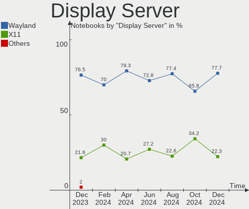
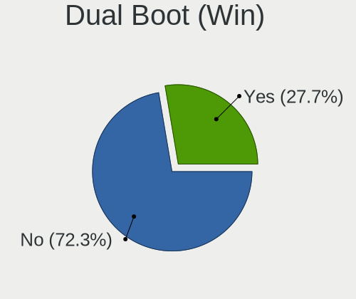
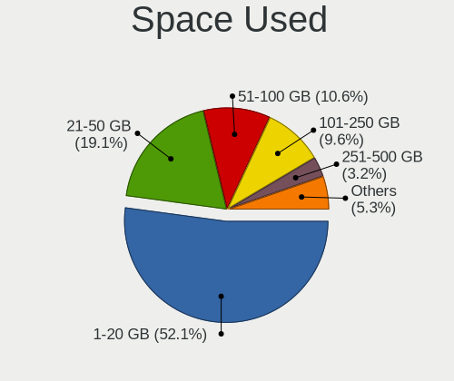
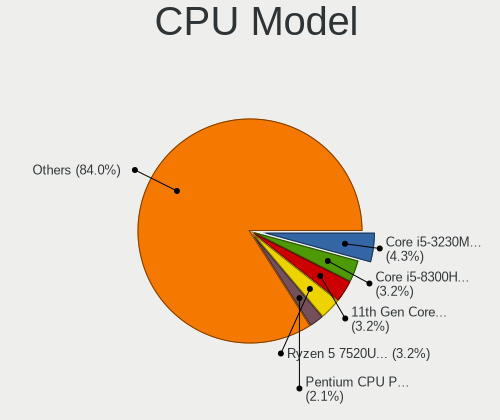
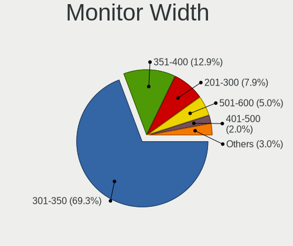

ROSA Hardware Trends (Notebook)
-------------------------------

A project to identify most popular hardware characteristics and track their change
over time based on data collected by ROSA users at https://Linux-Hardware.org.

Anyone can contribute to the study by uploading probes of their computers by
the [hw-probe](https://github.com/linuxhw/hw-probe) tool:

    sudo -E hw-probe -all -upload

Full-feature report is available here: https://linux-hardware.org/?view=trends&formfactor=notebook

Period: Feb, 2021.

Contents
--------

- [ OS                       ](#os)
- [ OS Family                ](#os-family)
- [ Kernel                   ](#kernel)
- [ Kernel Family            ](#kernel-family)
- [ Kernel Major Ver.        ](#kernel-major-ver)
- [ Arch                     ](#arch)
- [ DE                       ](#de)
- [ Display Server           ](#display-server)
- [ Display Manager          ](#display-manager)
- [ OS Lang                  ](#os-lang)
- [ Boot Mode                ](#boot-mode)
- [ Filesystem               ](#filesystem)
- [ Part. scheme             ](#part-scheme)
- [ Dual Boot with Linux/BSD ](#dual-boot-with-linux/bsd)
- [ Dual Boot (Win)          ](#dual-boot-win)
- [ Country                  ](#country)
- [ City                     ](#city)
- [ Vendor                   ](#vendor)
- [ Model                    ](#model)
- [ Model Family             ](#model-family)
- [ MFG Year                 ](#mfg-year)
- [ Form Factor              ](#form-factor)
- [ Secure Boot              ](#secure-boot)
- [ Coreboot                 ](#coreboot)
- [ RAM Size                 ](#ram-size)
- [ RAM Used                 ](#ram-used)
- [ Has CD-ROM               ](#has-cd-rom)
- [ Total Drives             ](#total-drives)
- [ Has Ethernet             ](#has-ethernet)
- [ Drive Vendor             ](#drive-vendor)
- [ Drive Model              ](#drive-model)
- [ HDD Vendor               ](#hdd-vendor)
- [ SSD Vendor               ](#ssd-vendor)
- [ Drive Kind               ](#drive-kind)
- [ Drive Connector          ](#drive-connector)
- [ Drive Size               ](#drive-size)
- [ Space Total              ](#space-total)
- [ Space Used               ](#space-used)
- [ Malfunc. Drives          ](#malfunc-drives)
- [ Malfunc. Drive Vendor    ](#malfunc-drive-vendor)
- [ Malfunc. HDD Vendor      ](#malfunc-hdd-vendor)
- [ Malfunc. Drive Kind      ](#malfunc-drive-kind)
- [ Failed Drives            ](#failed-drives)
- [ Failed Drive Vendor      ](#failed-drive-vendor)
- [ Drive Status             ](#drive-status)
- [ Storage Vendor           ](#storage-vendor)
- [ Storage Model            ](#storage-model)
- [ Storage Kind             ](#storage-kind)
- [ CPU Vendor               ](#cpu-vendor)
- [ CPU Model                ](#cpu-model)
- [ CPU Model Family         ](#cpu-model-family)
- [ CPU Cores                ](#cpu-cores)
- [ CPU Sockets              ](#cpu-sockets)
- [ CPU Threads              ](#cpu-threads)
- [ CPU Op-Modes             ](#cpu-op-modes)
- [ CPU Microcode            ](#cpu-microcode)
- [ CPU Microarch            ](#cpu-microarch)
- [ GPU Vendor               ](#gpu-vendor)
- [ GPU Model                ](#gpu-model)
- [ GPU Combo                ](#gpu-combo)
- [ GPU Driver               ](#gpu-driver)
- [ GPU Memory               ](#gpu-memory)
- [ Monitor Vendor           ](#monitor-vendor)
- [ Monitor Model            ](#monitor-model)
- [ Monitor Resolution       ](#monitor-resolution)
- [ Monitor Diagonal         ](#monitor-diagonal)
- [ Monitor Width            ](#monitor-width)
- [ Aspect Ratio             ](#aspect-ratio)
- [ Monitor Area             ](#monitor-area)
- [ Pixel Density            ](#pixel-density)
- [ Multiple Monitors        ](#multiple-monitors)
- [ Net Controller Vendor    ](#net-controller-vendor)
- [ Net Controller Model     ](#net-controller-model)
- [ Wireless Vendor          ](#wireless-vendor)
- [ Wireless Model           ](#wireless-model)
- [ Ethernet Vendor          ](#ethernet-vendor)
- [ Ethernet Model           ](#ethernet-model)
- [ Net Controller Kind      ](#net-controller-kind)
- [ Used Controller          ](#used-controller)
- [ NICs                     ](#nics)
- [ Memory Vendor            ](#memory-vendor)
- [ Memory Model             ](#memory-model)
- [ Memory Kind              ](#memory-kind)
- [ Memory Form Factor       ](#memory-form-factor)
- [ Memory Size              ](#memory-size)
- [ Memory Speed             ](#memory-speed)
- [ Sound Vendor             ](#sound-vendor)
- [ Sound Model              ](#sound-model)
- [ Camera Vendor            ](#camera-vendor)
- [ Camera Model             ](#camera-model)
- [ Fingerprint Vendor       ](#fingerprint-vendor)
- [ Fingerprint Model        ](#fingerprint-model)
- [ Chipcard Vendor          ](#chipcard-vendor)
- [ Chipcard Model           ](#chipcard-model)
- [ Printer Vendor           ](#printer-vendor)
- [ Printer Model            ](#printer-model)
- [ Scanner Vendor           ](#scanner-vendor)
- [ Scanner Model            ](#scanner-model)
- [ Bluetooth Vendor         ](#bluetooth-vendor)
- [ Bluetooth Model          ](#bluetooth-model)
- [ Unsupported Devices      ](#unsupported-devices)
- [ Unsupported Device Types ](#unsupported-device-types)

OS
--

Installed operating systems

| Name       | Notebooks | Percent |
|------------|-----------|---------|
| ROSA R11.1 | 37        | 61.67%  |
| ROSA R11   | 21        | 35%     |
| ROSA R8.1  | 1         | 1.67%   |
| ROSA R12   | 1         | 1.67%   |

OS Family
---------

OS without a version

| Name | Notebooks | Percent |
|------|-----------|---------|
| ROSA | 60        | 100%    |

Kernel
------

Version of the Linux kernel

| Version                             | Notebooks | Percent |
|-------------------------------------|-----------|---------|
| 4.15.0-desktop-45.1rosa-x86_64      | 17        | 28.33%  |
| 4.15.0-desktop-122.124.1rosa-x86_64 | 13        | 21.67%  |
| 5.4.83-generic-2rosa-x86_64         | 8         | 13.33%  |
| 4.15.0-desktop-45.1rosa-i586        | 4         | 6.67%   |
| 5.4.32-generic-2rosa-x86_64         | 3         | 5%      |
| 4.15.0-desktop-122.124.1rosa-i586   | 3         | 5%      |
| 5.4.83-generic-2rosa-i586           | 2         | 3.33%   |
| 5.4.32-generic-2rosa-i586           | 2         | 3.33%   |
| 4.9.155-nrj-desktop-1rosa-x86_64    | 2         | 3.33%   |
| 5.8.0-desktop-44.50.1rosa-x86_64    | 1         | 1.67%   |
| 5.5.19-generic-1rosa-x86_64         | 1         | 1.67%   |
| 5.4.83-generic-2rosa2019.1-x86_64   | 1         | 1.67%   |
| 5.10.0-desktop-12.13.2rosa-x86_64   | 1         | 1.67%   |
| 4.9.9-nrj-desktop-1rosa-x86_64      | 1         | 1.67%   |
| 4.9.155-nrj-desktop-1rosa-i586      | 1         | 1.67%   |

Kernel Family
-------------

Linux kernel without a distro release

| Version | Notebooks | Percent |
|---------|-----------|---------|
| 4.15.0  | 37        | 61.67%  |
| 5.4.83  | 11        | 18.33%  |
| 5.4.32  | 5         | 8.33%   |
| 4.9.155 | 3         | 5%      |
| 5.8.0   | 1         | 1.67%   |
| 5.5.19  | 1         | 1.67%   |
| 5.10.0  | 1         | 1.67%   |
| 4.9.9   | 1         | 1.67%   |

Kernel Major Ver.
-----------------

Linux kernel major version

| Version | Notebooks | Percent |
|---------|-----------|---------|
| 4.15    | 37        | 61.67%  |
| 5.4     | 16        | 26.67%  |
| 4.9     | 4         | 6.67%   |
| 5.8     | 1         | 1.67%   |
| 5.5     | 1         | 1.67%   |
| 5.10    | 1         | 1.67%   |

Arch
----

OS architecture (x86_64, i586, etc.)

| Name   | Notebooks | Percent |
|--------|-----------|---------|
| x86_64 | 48        | 80%     |
| i686   | 12        | 20%     |

DE
--

Desktop Environment

| Name  | Notebooks | Percent |
|-------|-----------|---------|
| KDE4  | 38        | 63.33%  |
| KDE5  | 18        | 30%     |
| LXQt  | 3         | 5%      |
| GNOME | 1         | 1.67%   |

Display Server
--------------

X11 or Wayland

| Name    | Notebooks | Percent |
|---------|-----------|---------|
| X11     | 59        | 98.33%  |
| Wayland | 1         | 1.67%   |

Display Manager
---------------

SDDM, LightDM, etc.

| Name | Notebooks | Percent |
|------|-----------|---------|
| KDM  | 38        | 63.33%  |
| SDDM | 21        | 35%     |
| GDM  | 1         | 1.67%   |

OS Lang
-------

Language

| Lang    | Notebooks | Percent |
|---------|-----------|---------|
| ru_RU   | 29        | 48.33%  |
| Unknown | 22        | 36.67%  |
| pl_PL   | 2         | 3.33%   |
| it_IT   | 2         | 3.33%   |
| es_ES   | 2         | 3.33%   |
| en_US   | 1         | 1.67%   |
| en_GB   | 1         | 1.67%   |
| de_DE   | 1         | 1.67%   |

Boot Mode
---------

EFI or BIOS

| Mode | Notebooks | Percent |
|------|-----------|---------|
| BIOS | 46        | 76.67%  |
| EFI  | 14        | 23.33%  |

Filesystem
----------

Type of filesystem

| Type  | Notebooks | Percent |
|-------|-----------|---------|
| Ext4  | 55        | 91.67%  |
| Btrfs | 3         | 5%      |
| Ext3  | 2         | 3.33%   |

Part. scheme
------------

Scheme of partitioning

| Type | Notebooks | Percent |
|------|-----------|---------|
| MBR  | 43        | 71.67%  |
| GPT  | 17        | 28.33%  |

Dual Boot with Linux/BSD
------------------------

Hosting more than one Linux/BSD

| Dual boot | Notebooks | Percent |
|-----------|-----------|---------|
| No        | 49        | 81.67%  |
| Yes       | 11        | 18.33%  |

Dual Boot (Win)
---------------

Hosting Linux and Windows

| Dual boot | Notebooks | Percent |
|-----------|-----------|---------|
| No        | 36        | 60%     |
| Yes       | 24        | 40%     |

Country
-------

Geographic location (country)

| Country     | Notebooks | Percent |
|-------------|-----------|---------|
| Russia      | 41        | 68.33%  |
| Belarus     | 5         | 8.33%   |
| Ukraine     | 3         | 5%      |
| Spain       | 2         | 3.33%   |
| Poland      | 2         | 3.33%   |
| Italy       | 2         | 3.33%   |
| Switzerland | 1         | 1.67%   |
| Latvia      | 1         | 1.67%   |
| Kazakhstan  | 1         | 1.67%   |
| France      | 1         | 1.67%   |
| Finland     | 1         | 1.67%   |

City
----

Geographic location (city)

| City                 | Notebooks | Percent |
|----------------------|-----------|---------|
| Moscow               | 7         | 11.67%  |
| St Petersburg        | 3         | 5%      |
| Sochi                | 2         | 3.33%   |
| Samara               | 2         | 3.33%   |
| Kingisepp            | 2         | 3.33%   |
| Ekaterinburg         | 2         | 3.33%   |
| Zmiyiv               | 1         | 1.67%   |
| Yeysk                | 1         | 1.67%   |
| Yekaterinburg        | 1         | 1.67%   |
| Yaroslavl            | 1         | 1.67%   |
| Warsaw               | 1         | 1.67%   |
| Voronezh             | 1         | 1.67%   |
| Volgograd            | 1         | 1.67%   |
| Ulyanovsk            | 1         | 1.67%   |
| Ufa                  | 1         | 1.67%   |
| Tyumen               | 1         | 1.67%   |
| Tambov               | 1         | 1.67%   |
| Taldykorgan          | 1         | 1.67%   |
| Stavropol            | 1         | 1.67%   |
| Sredneuralsk         | 1         | 1.67%   |
| Sevastopol           | 1         | 1.67%   |
| Schwarzenburg        | 1         | 1.67%   |
| Saratov              | 1         | 1.67%   |
| Ryazan               | 1         | 1.67%   |
| Rome                 | 1         | 1.67%   |
| Riga                 | 1         | 1.67%   |
| Ribeira              | 1         | 1.67%   |
| Ramenskoye           | 1         | 1.67%   |
| Pskov                | 1         | 1.67%   |
| Osa                  | 1         | 1.67%   |
| Obninsk              | 1         | 1.67%   |
| Novokuznetsk         | 1         | 1.67%   |
| Maladzyechna         | 1         | 1.67%   |
| Krasnodar            | 1         | 1.67%   |
| Kemerovo             | 1         | 1.67%   |
| Irkutsk              | 1         | 1.67%   |
| Hrodna               | 1         | 1.67%   |
| Horlivka             | 1         | 1.67%   |
| Helsinki             | 1         | 1.67%   |
| Granada              | 1         | 1.67%   |
| Gorki Wielkie        | 1         | 1.67%   |
| Dokshytsy            | 1         | 1.67%   |
| Cheboksary           | 1         | 1.67%   |
| Brest                | 1         | 1.67%   |
| Boulogne-Billancourt | 1         | 1.67%   |
| Biysk                | 1         | 1.67%   |
| Biella               | 1         | 1.67%   |
| Asipovichy           | 1         | 1.67%   |

Vendor
------

Motherboard manufacturer

| Name                | Notebooks | Percent |
|---------------------|-----------|---------|
| ASUSTek Computer    | 13        | 21.67%  |
| Lenovo              | 10        | 16.67%  |
| Acer                | 9         | 15%     |
| Hewlett-Packard     | 8         | 13.33%  |
| Sony                | 3         | 5%      |
| Samsung Electronics | 3         | 5%      |
| Packard Bell        | 2         | 3.33%   |
| MSI                 | 2         | 3.33%   |
| Dell                | 2         | 3.33%   |
| Apple               | 2         | 3.33%   |
| RoverComputers      | 1         | 1.67%   |
| RoverBook           | 1         | 1.67%   |
| Medion              | 1         | 1.67%   |
| Insyde              | 1         | 1.67%   |
| eMachines           | 1         | 1.67%   |
| Chuwi               | 1         | 1.67%   |

Model
-----

Motherboard model

| Name                                    | Notebooks | Percent |
|-----------------------------------------|-----------|---------|
| Lenovo B560                             | 2         | 3.33%   |
| HP Pavilion g6                          | 2         | 3.33%   |
| HP Pavilion 15                          | 2         | 3.33%   |
| Acer TravelMate 5760                    | 2         | 3.33%   |
| Sony VPCS13S9R                          | 1         | 1.67%   |
| Sony VPCCW1S1R                          | 1         | 1.67%   |
| Sony VGN-NR430E                         | 1         | 1.67%   |
| Samsung RC410/RC510/RC710               | 1         | 1.67%   |
| Samsung 355V4C/356V4C/3445VC/3545VC     | 1         | 1.67%   |
| Samsung 305U1A                          | 1         | 1.67%   |
| RoverComputers Neo U100                 | 1         | 1.67%   |
| RoverBook Calistoga & ICH7M Chipset     | 1         | 1.67%   |
| Packard Bell EasyNote TJ65              | 1         | 1.67%   |
| Packard Bell EasyNote TE69CX            | 1         | 1.67%   |
| MSI S12T 3M/S12 3M                      | 1         | 1.67%   |
| MSI CR610                               | 1         | 1.67%   |
| Medion P6624                            | 1         | 1.67%   |
| Lenovo ThinkPad X230 2320LFG            | 1         | 1.67%   |
| Lenovo ThinkPad X200 7459ZAZ            | 1         | 1.67%   |
| Lenovo ThinkPad T60p 200793G            | 1         | 1.67%   |
| Lenovo IdeaPad 330-15ARR 81D2           | 1         | 1.67%   |
| Lenovo IdeaPad 320-15IAP 80XR           | 1         | 1.67%   |
| Lenovo IdeaPad 310-15ISK 80SM           | 1         | 1.67%   |
| Lenovo IdeaPad 100-15IBY 80MJ           | 1         | 1.67%   |
| Lenovo G560 20042                       | 1         | 1.67%   |
| Insyde i86C                             | 1         | 1.67%   |
| HP ProBook 470 G5                       | 1         | 1.67%   |
| HP Pavilion g7                          | 1         | 1.67%   |
| HP Compaq 6530b (NA407UC)               | 1         | 1.67%   |
| HP 255 G5                               | 1         | 1.67%   |
| eMachines G730                          | 1         | 1.67%   |
| Dell XPS L702X                          | 1         | 1.67%   |
| Dell Inspiron N5110                     | 1         | 1.67%   |
| Chuwi Hero Book                         | 1         | 1.67%   |
| ASUS X55A                               | 1         | 1.67%   |
| ASUS X550DP                             | 1         | 1.67%   |
| ASUS X51RL                              | 1         | 1.67%   |
| ASUS VivoBook_ASUS Laptop X505ZA_X505ZA | 1         | 1.67%   |
| ASUS UL50Vg                             | 1         | 1.67%   |
| ASUS S551LN                             | 1         | 1.67%   |
| ASUS N10J                               | 1         | 1.67%   |
| ASUS K53SD                              | 1         | 1.67%   |
| ASUS K52Dr                              | 1         | 1.67%   |
| ASUS G1S                                | 1         | 1.67%   |
| ASUS F3Sg                               | 1         | 1.67%   |
| ASUS 1215N                              | 1         | 1.67%   |
| ASUS 1000H                              | 1         | 1.67%   |
| Apple MacBookPro6,2                     | 1         | 1.67%   |
| Apple MacBookAir7,2                     | 1         | 1.67%   |
| Acer TravelMate P278-MG                 | 1         | 1.67%   |
| Acer TravelMate 5744Z                   | 1         | 1.67%   |
| Acer P5Wx6                              | 1         | 1.67%   |
| Acer Extensa 7630EZ                     | 1         | 1.67%   |
| Acer Extensa 2519                       | 1         | 1.67%   |
| Acer Aspire xxxx                        | 1         | 1.67%   |
| Acer AO751h                             | 1         | 1.67%   |

Model Family
------------

Motherboard model prefix

| Name                  | Notebooks | Percent |
|-----------------------|-----------|---------|
| HP Pavilion           | 5         | 8.33%   |
| Lenovo IdeaPad        | 4         | 6.67%   |
| Acer TravelMate       | 4         | 6.67%   |
| Lenovo ThinkPad       | 3         | 5%      |
| Packard Bell EasyNote | 2         | 3.33%   |
| Lenovo B560           | 2         | 3.33%   |
| Acer Extensa          | 2         | 3.33%   |
| Sony VPCS13S9R        | 1         | 1.67%   |
| Sony VPCCW1S1R        | 1         | 1.67%   |
| Sony VGN-NR430E       | 1         | 1.67%   |
| Samsung RC410         | 1         | 1.67%   |
| Samsung 355V4C        | 1         | 1.67%   |
| Samsung 305U1A        | 1         | 1.67%   |
| RoverComputers Neo    | 1         | 1.67%   |
| RoverBook Calistoga   | 1         | 1.67%   |
| MSI S12T              | 1         | 1.67%   |
| MSI CR610             | 1         | 1.67%   |
| Medion P6624          | 1         | 1.67%   |
| Lenovo G560           | 1         | 1.67%   |
| Insyde i86C           | 1         | 1.67%   |
| HP ProBook            | 1         | 1.67%   |
| HP Compaq             | 1         | 1.67%   |
| HP 255                | 1         | 1.67%   |
| eMachines G730        | 1         | 1.67%   |
| Dell XPS              | 1         | 1.67%   |
| Dell Inspiron         | 1         | 1.67%   |
| Chuwi Hero            | 1         | 1.67%   |
| ASUS X55A             | 1         | 1.67%   |
| ASUS X550DP           | 1         | 1.67%   |
| ASUS X51RL            | 1         | 1.67%   |
| ASUS VivoBook         | 1         | 1.67%   |
| ASUS UL50Vg           | 1         | 1.67%   |
| ASUS S551LN           | 1         | 1.67%   |
| ASUS N10J             | 1         | 1.67%   |
| ASUS K53SD            | 1         | 1.67%   |
| ASUS K52Dr            | 1         | 1.67%   |
| ASUS G1S              | 1         | 1.67%   |
| ASUS F3Sg             | 1         | 1.67%   |
| ASUS 1215N            | 1         | 1.67%   |
| ASUS 1000H            | 1         | 1.67%   |
| Apple MacBookPro6     | 1         | 1.67%   |
| Apple MacBookAir7     | 1         | 1.67%   |
| Acer P5Wx6            | 1         | 1.67%   |
| Acer Aspire           | 1         | 1.67%   |
| Acer AO751h           | 1         | 1.67%   |

MFG Year
--------

Motherboard manufacture year

| Year | Notebooks | Percent |
|------|-----------|---------|
| 2009 | 9         | 15%     |
| 2011 | 8         | 13.33%  |
| 2013 | 7         | 11.67%  |
| 2012 | 6         | 10%     |
| 2008 | 6         | 10%     |
| 2010 | 5         | 8.33%   |
| 2019 | 4         | 6.67%   |
| 2018 | 4         | 6.67%   |
| 2017 | 2         | 3.33%   |
| 2016 | 2         | 3.33%   |
| 2015 | 2         | 3.33%   |
| 2014 | 2         | 3.33%   |
| 2020 | 1         | 1.67%   |
| 2007 | 1         | 1.67%   |
| 2006 | 1         | 1.67%   |

Form Factor
-----------

Physical design of the computer

| Name     | Notebooks | Percent |
|----------|-----------|---------|
| Notebook | 60        | 100%    |

Secure Boot
-----------

Enabled or disabled

| State    | Notebooks | Percent |
|----------|-----------|---------|
| Disabled | 59        | 98.33%  |
| Enabled  | 1         | 1.67%   |

Coreboot
--------

Have coreboot on board

| Used | Notebooks | Percent |
|------|-----------|---------|
| No   | 60        | 100%    |

RAM Size
--------

Total RAM memory

| Size in GB | Notebooks | Percent |
|------------|-----------|---------|
| 3.01-4.0   | 25        | 41.67%  |
| 4.01-8.0   | 10        | 16.67%  |
| 2.01-3.0   | 7         | 11.67%  |
| 1.01-2.0   | 6         | 10%     |
| 8.01-16.0  | 6         | 10%     |
| 0.51-1.0   | 4         | 6.67%   |
| 16.01-24.0 | 2         | 3.33%   |

RAM Used
--------

Used RAM memory

| Used GB  | Notebooks | Percent |
|----------|-----------|---------|
| 1.01-2.0 | 29        | 48.33%  |
| 0.51-1.0 | 26        | 43.33%  |
| 2.01-3.0 | 3         | 5%      |
| 3.01-4.0 | 1         | 1.67%   |
| 0.01-0.5 | 1         | 1.67%   |

Has CD-ROM
----------

Has CD-ROM on board

| Presented | Notebooks | Percent |
|-----------|-----------|---------|
| Yes       | 33        | 55%     |
| No        | 27        | 45%     |

Total Drives
------------

Number of drives on board

| Drives | Notebooks | Percent |
|--------|-----------|---------|
| 1      | 45        | 75%     |
| 2      | 13        | 21.67%  |
| 3      | 2         | 3.33%   |

Has Ethernet
------------

Has Ethernet on board

| Presented | Notebooks | Percent |
|-----------|-----------|---------|
| Yes       | 57        | 95%     |
| No        | 3         | 5%      |

Drive Vendor
------------

Hard drive vendors

| Vendor              | Notebooks | Drives | Percent |
|---------------------|-----------|--------|---------|
| WDC                 | 14        | 14     | 19.44%  |
| Seagate             | 14        | 14     | 19.44%  |
| Hitachi             | 8         | 8      | 11.11%  |
| Samsung Electronics | 6         | 6      | 8.33%   |
| Kingston            | 4         | 4      | 5.56%   |
| China               | 4         | 4      | 5.56%   |
| Unknown             | 3         | 3      | 4.17%   |
| Toshiba             | 3         | 3      | 4.17%   |
| KingSpec            | 3         | 3      | 4.17%   |
| SPCC                | 2         | 2      | 2.78%   |
| HGST                | 2         | 2      | 2.78%   |
| Apacer              | 2         | 2      | 2.78%   |
| SanDisk             | 1         | 1      | 1.39%   |
| PNY                 | 1         | 1      | 1.39%   |
| Hewlett-Packard     | 1         | 1      | 1.39%   |
| GOODRAM             | 1         | 1      | 1.39%   |
| Fujitsu             | 1         | 1      | 1.39%   |
| Apple               | 1         | 1      | 1.39%   |
| A-DATA Technology   | 1         | 1      | 1.39%   |

Drive Model
-----------

Hard drive models

| Model                                 | Notebooks | Percent |
|---------------------------------------|-----------|---------|
| Seagate ST9320325AS 320GB             | 3         | 4.17%   |
| Seagate ST9160310AS 160GB             | 2         | 2.78%   |
| Seagate ST1000LM035-1RK172 1TB        | 2         | 2.78%   |
| WDC WDS250G2B0B 250GB SSD             | 1         | 1.39%   |
| WDC WDS240G1G0A-00SS50 240GB SSD      | 1         | 1.39%   |
| WDC WD5000LPVX-22V0TT0 500GB          | 1         | 1.39%   |
| WDC WD5000LPCX-24VHAT0 500GB          | 1         | 1.39%   |
| WDC WD5000LPCX-21VHAT0 500GB          | 1         | 1.39%   |
| WDC WD5000BPVT-75HXZT3 500GB          | 1         | 1.39%   |
| WDC WD5000BPVT-22HXZT1 500GB          | 1         | 1.39%   |
| WDC WD3200BPVT-24ZEST0 320GB          | 1         | 1.39%   |
| WDC WD3200BPVT-22ZEST0 320GB          | 1         | 1.39%   |
| WDC WD3200BPVT-22JJ5T0 320GB          | 1         | 1.39%   |
| WDC WD3200BEVS-26VAT0 320GB           | 1         | 1.39%   |
| WDC WD10SPZX-00Z10T0 1TB              | 1         | 1.39%   |
| WDC WD10JPVT-00A1YT0 1TB              | 1         | 1.39%   |
| WDC WD10JPLX-00MBPT0 1TB              | 1         | 1.39%   |
| Unknown USD00  64GB                   | 1         | 1.39%   |
| Unknown NCard  16GB                   | 1         | 1.39%   |
| Unknown EC2QT  64GB                   | 1         | 1.39%   |
| Toshiba MQ01ABF032 320GB              | 1         | 1.39%   |
| Toshiba MQ01ABD050 500GB              | 1         | 1.39%   |
| Toshiba HDWJ105 500GB                 | 1         | 1.39%   |
| SPCC Solid State Disk 256GB           | 1         | 1.39%   |
| SPCC Solid State Disk 128GB           | 1         | 1.39%   |
| Seagate ST9750420AS 752GB             | 1         | 1.39%   |
| Seagate ST9320328CS 320GB             | 1         | 1.39%   |
| Seagate ST9250315AS 250GB             | 1         | 1.39%   |
| Seagate ST500VT000-1DK142 500GB       | 1         | 1.39%   |
| Seagate ST500LT012-9WS142 500GB       | 1         | 1.39%   |
| Seagate ST500LM012 HN-M500MBB 500GB   | 1         | 1.39%   |
| Seagate ST332061 3AS 320GB            | 1         | 1.39%   |
| SanDisk DF4064  64GB                  | 1         | 1.39%   |
| Samsung SSD 970 EVO Plus 250GB        | 1         | 1.39%   |
| Samsung SSD 860 PRO 512GB             | 1         | 1.39%   |
| Samsung SSD 860 EVO 500GB             | 1         | 1.39%   |
| Samsung SSD 850 EVO 500GB             | 1         | 1.39%   |
| Samsung MZYTY128HDHP-000L2 128GB SSD  | 1         | 1.39%   |
| Samsung HN-M500MBB 500GB              | 1         | 1.39%   |
| PNY SSD2SC240G1LC709B121-443 240GB    | 1         | 1.39%   |
| Kingston SUV500MS120G 120GB SSD       | 1         | 1.39%   |
| Kingston SA400S37240G 240GB SSD       | 1         | 1.39%   |
| Kingston SA400S37120G 120GB SSD       | 1         | 1.39%   |
| Kingston RBUSNS8180DS3256GJ 256GB SSD | 1         | 1.39%   |
| KingSpec T-60 64GB SSD                | 1         | 1.39%   |
| KingSpec P3-128 128GB SSD             | 1         | 1.39%   |
| KingSpec KSD-SA25.7-016MJ 16GB SSD    | 1         | 1.39%   |
| Hitachi HTS721010G9SA00 100GB         | 1         | 1.39%   |
| Hitachi HTS545050B9A300 500GB         | 1         | 1.39%   |
| Hitachi HTS545025B9A300 250GB         | 1         | 1.39%   |
| Hitachi HTS543232A7A384 320GB         | 1         | 1.39%   |
| Hitachi HTS542525K9SA00 250GB         | 1         | 1.39%   |
| Hitachi HTS542516K9SA00 160GB         | 1         | 1.39%   |
| Hitachi HTS542512K9SA00 120GB         | 1         | 1.39%   |
| Hitachi HTS541616J9SA00 160GB         | 1         | 1.39%   |
| HGST HTS545050A7E680 500GB            | 1         | 1.39%   |
| HGST HTS545050A7E380 500GB            | 1         | 1.39%   |
| HP SSD S750 512GB                     | 1         | 1.39%   |
| GOODRAM SSDPR-CX300-120 120GB         | 1         | 1.39%   |
| Fujitsu MHZ2160BH G2 160GB            | 1         | 1.39%   |

HDD Vendor
----------

Hard disk drive vendors

| Vendor              | Notebooks | Drives | Percent |
|---------------------|-----------|--------|---------|
| Seagate             | 14        | 14     | 34.15%  |
| WDC                 | 12        | 12     | 29.27%  |
| Hitachi             | 8         | 8      | 19.51%  |
| Toshiba             | 3         | 3      | 7.32%   |
| HGST                | 2         | 2      | 4.88%   |
| Samsung Electronics | 1         | 1      | 2.44%   |
| Fujitsu             | 1         | 1      | 2.44%   |

SSD Vendor
----------

Solid state drive vendors

| Vendor              | Notebooks | Drives | Percent |
|---------------------|-----------|--------|---------|
| Samsung Electronics | 4         | 4      | 15.38%  |
| Kingston            | 4         | 4      | 15.38%  |
| China               | 4         | 4      | 15.38%  |
| KingSpec            | 3         | 3      | 11.54%  |
| WDC                 | 2         | 2      | 7.69%   |
| SPCC                | 2         | 2      | 7.69%   |
| Apacer              | 2         | 2      | 7.69%   |
| PNY                 | 1         | 1      | 3.85%   |
| Hewlett-Packard     | 1         | 1      | 3.85%   |
| GOODRAM             | 1         | 1      | 3.85%   |
| Apple               | 1         | 1      | 3.85%   |
| A-DATA Technology   | 1         | 1      | 3.85%   |

Drive Kind
----------

HDD or SSD

| Kind | Notebooks | Drives | Percent |
|------|-----------|--------|---------|
| HDD  | 39        | 41     | 58.21%  |
| SSD  | 24        | 26     | 35.82%  |
| MMC  | 3         | 4      | 4.48%   |
| NVMe | 1         | 1      | 1.49%   |

Drive Connector
---------------

SATA, SAS, NVMe, etc.

| Type | Notebooks | Drives | Percent |
|------|-----------|--------|---------|
| SATA | 59        | 66     | 92.19%  |
| MMC  | 3         | 4      | 4.69%   |
| SAS  | 1         | 1      | 1.56%   |
| NVMe | 1         | 1      | 1.56%   |

Drive Size
----------

Size of hard drive

| Size in TB | Notebooks | Drives | Percent |
|------------|-----------|--------|---------|
| 0.01-0.5   | 53        | 57     | 84.13%  |
| 0.51-1.0   | 10        | 10     | 15.87%  |

Space Total
-----------

Amount of disk space available on the file system

| Size in GB | Notebooks | Percent |
|------------|-----------|---------|
| 251-500    | 23        | 38.33%  |
| 101-250    | 16        | 26.67%  |
| 1-20       | 8         | 13.33%  |
| 51-100     | 5         | 8.33%   |
| 501-1000   | 4         | 6.67%   |
| 21-50      | 3         | 5%      |
| 1001-2000  | 1         | 1.67%   |

Space Used
----------

Amount of used disk space

| Used GB  | Notebooks | Percent |
|----------|-----------|---------|
| 1-20     | 44        | 73.33%  |
| 101-250  | 5         | 8.33%   |
| 251-500  | 4         | 6.67%   |
| 51-100   | 4         | 6.67%   |
| 21-50    | 2         | 3.33%   |
| 501-1000 | 1         | 1.67%   |

Malfunc. Drives
---------------

Drive models with a malfunction

| Model                               | Notebooks | Drives | Percent |
|-------------------------------------|-----------|--------|---------|
| WDC WD3200BPVT-24ZEST0 320GB        | 1         | 1      | 4.35%   |
| WDC WD3200BPVT-22ZEST0 320GB        | 1         | 1      | 4.35%   |
| WDC WD3200BEVS-26VAT0 320GB         | 1         | 1      | 4.35%   |
| WDC WD10JPVT-00A1YT0 1TB            | 1         | 1      | 4.35%   |
| Toshiba MQ01ABD050 500GB            | 1         | 1      | 4.35%   |
| Seagate ST9320328CS 320GB           | 1         | 1      | 4.35%   |
| Seagate ST9320325AS 320GB           | 1         | 1      | 4.35%   |
| Seagate ST9250315AS 250GB           | 1         | 1      | 4.35%   |
| Seagate ST9160310AS 160GB           | 1         | 1      | 4.35%   |
| Seagate ST500VT000-1DK142 500GB     | 1         | 1      | 4.35%   |
| Seagate ST500LT012-9WS142 500GB     | 1         | 1      | 4.35%   |
| Seagate ST500LM012 HN-M500MBB 500GB | 1         | 1      | 4.35%   |
| PNY SSD2SC240G1LC709B121-443 240GB  | 1         | 1      | 4.35%   |
| KingSpec T-60 64GB SSD              | 1         | 1      | 4.35%   |
| KingSpec KSD-SA25.7-016MJ 16GB SSD  | 1         | 1      | 4.35%   |
| Hitachi HTS721010G9SA00 100GB       | 1         | 1      | 4.35%   |
| Hitachi HTS545025B9A300 250GB       | 1         | 1      | 4.35%   |
| Hitachi HTS542525K9SA00 250GB       | 1         | 1      | 4.35%   |
| Hitachi HTS542516K9SA00 160GB       | 1         | 1      | 4.35%   |
| Hitachi HTS542512K9SA00 120GB       | 1         | 1      | 4.35%   |
| Hitachi HTS541616J9SA00 160GB       | 1         | 1      | 4.35%   |
| HGST HTS545050A7E680 500GB          | 1         | 1      | 4.35%   |
| HGST HTS545050A7E380 500GB          | 1         | 1      | 4.35%   |

Malfunc. Drive Vendor
---------------------

Vendors of faulty drives

| Vendor   | Notebooks | Drives | Percent |
|----------|-----------|--------|---------|
| Seagate  | 7         | 7      | 30.43%  |
| Hitachi  | 6         | 6      | 26.09%  |
| WDC      | 4         | 4      | 17.39%  |
| KingSpec | 2         | 2      | 8.7%    |
| HGST     | 2         | 2      | 8.7%    |
| Toshiba  | 1         | 1      | 4.35%   |
| PNY      | 1         | 1      | 4.35%   |

Malfunc. HDD Vendor
-------------------

Vendors of faulty HDD drives

| Vendor  | Notebooks | Drives | Percent |
|---------|-----------|--------|---------|
| Seagate | 7         | 7      | 35%     |
| Hitachi | 6         | 6      | 30%     |
| WDC     | 4         | 4      | 20%     |
| HGST    | 2         | 2      | 10%     |
| Toshiba | 1         | 1      | 5%      |

Malfunc. Drive Kind
-------------------

Kinds of faulty drives

| Kind | Notebooks | Drives | Percent |
|------|-----------|--------|---------|
| HDD  | 20        | 20     | 86.96%  |
| SSD  | 3         | 3      | 13.04%  |

Failed Drives
-------------

Failed drive models

| Model                     | Notebooks | Drives | Percent |
|---------------------------|-----------|--------|---------|
| Seagate ST9320325AS 320GB | 1         | 1      | 100%    |

Failed Drive Vendor
-------------------

Failed drive vendors

| Vendor  | Notebooks | Drives | Percent |
|---------|-----------|--------|---------|
| Seagate | 1         | 1      | 100%    |

Drive Status
------------

Number of failed and malfunc. drives

| Status   | Notebooks | Drives | Percent |
|----------|-----------|--------|---------|
| Works    | 39        | 43     | 59.09%  |
| Malfunc  | 22        | 23     | 33.33%  |
| Detected | 4         | 5      | 6.06%   |
| Failed   | 1         | 1      | 1.52%   |

Storage Vendor
--------------

Storage controller vendors

| Vendor              | Notebooks | Percent |
|---------------------|-----------|---------|
| Intel               | 45        | 73.77%  |
| AMD                 | 13        | 21.31%  |
| Samsung Electronics | 2         | 3.28%   |
| JMicron Technology  | 1         | 1.64%   |

Storage Model
-------------

Storage controller models

| Model                                                                                  | Notebooks | Percent |
|----------------------------------------------------------------------------------------|-----------|---------|
| Intel 5 Series/3400 Series Chipset 4 port SATA AHCI Controller                         | 9         | 13.04%  |
| AMD FCH SATA Controller [AHCI mode]                                                    | 8         | 11.59%  |
| Intel 82801IBM/IEM (ICH9M/ICH9M-E) 4 port SATA Controller [AHCI mode]                  | 5         | 7.25%   |
| Intel 7 Series Chipset Family 6-port SATA Controller [AHCI mode]                       | 4         | 5.8%    |
| Intel 6 Series/C200 Series Chipset Family 6 port Mobile SATA AHCI Controller           | 4         | 5.8%    |
| AMD SB7x0/SB8x0/SB9x0 SATA Controller [AHCI mode]                                      | 4         | 5.8%    |
| Intel Sunrise Point-LP SATA Controller [AHCI mode]                                     | 3         | 4.35%   |
| Intel 82801HM/HEM (ICH8M/ICH8M-E) SATA Controller [AHCI mode]                          | 3         | 4.35%   |
| Intel 82801HM/HEM (ICH8M/ICH8M-E) IDE Controller                                       | 3         | 4.35%   |
| Intel 82801GBM/GHM (ICH7-M Family) SATA Controller [IDE mode]                          | 3         | 4.35%   |
| Intel Atom/Celeron/Pentium Processor x5-E8000/J3xxx/N3xxx Series SATA Controller       | 2         | 2.9%    |
| Intel 82801GBM/GHM (ICH7-M Family) SATA Controller [AHCI mode]                         | 2         | 2.9%    |
| Intel 8 Series SATA Controller 1 [AHCI mode]                                           | 2         | 2.9%    |
| Intel 5 Series/3400 Series Chipset 4 port SATA IDE Controller                          | 2         | 2.9%    |
| Samsung NVMe SSD Controller SM981/PM981/PM983                                          | 1         | 1.45%   |
| Samsung Electronics SATA controller                                                    | 1         | 1.45%   |
| JMicron JMB360 AHCI Controller                                                         | 1         | 1.45%   |
| Intel US15W/US15X/US15L/UL11L SCH [Poulsbo] IDE Controller                             | 1         | 1.45%   |
| Intel NM10/ICH7 Family SATA Controller [AHCI mode]                                     | 1         | 1.45%   |
| Intel Celeron N3350/Pentium N4200/Atom E3900 Series SATA AHCI Controller               | 1         | 1.45%   |
| Intel Atom Processor E3800 Series SATA AHCI Controller                                 | 1         | 1.45%   |
| Intel 82801IBM/IEM (ICH9M/ICH9M-E) 2 port SATA Controller [IDE mode]                   | 1         | 1.45%   |
| Intel 82801G (ICH7 Family) IDE Controller                                              | 1         | 1.45%   |
| Intel 6 Series/C200 Series Chipset Family Mobile SATA Controller (IDE mode, ports 4-5) | 1         | 1.45%   |
| Intel 6 Series/C200 Series Chipset Family Mobile SATA Controller (IDE mode, ports 0-3) | 1         | 1.45%   |
| Intel 5 Series/3400 Series Chipset 2 port SATA IDE Controller                          | 1         | 1.45%   |
| AMD SB7x0/SB8x0/SB9x0 IDE Controller                                                   | 1         | 1.45%   |
| AMD SB600 Non-Raid-5 SATA                                                              | 1         | 1.45%   |
| AMD SB600 IDE                                                                          | 1         | 1.45%   |

Storage Kind
------------

Kind of storage controller (IDE, SATA, NVMe, SAS, ...)

| Kind | Notebooks | Percent |
|------|-----------|---------|
| SATA | 51        | 77.27%  |
| IDE  | 14        | 21.21%  |
| NVMe | 1         | 1.52%   |

CPU Vendor
----------

Processor vendors

| Vendor | Notebooks | Percent |
|--------|-----------|---------|
| Intel  | 48        | 80%     |
| AMD    | 12        | 20%     |

CPU Model
---------

Processor models

| Model                                         | Notebooks | Percent |
|-----------------------------------------------|-----------|---------|
| Intel Core i3 CPU M 370 @ 2.40GHz             | 3         | 5%      |
| Intel Atom CPU N270 @ 1.60GHz                 | 3         | 5%      |
| Intel Core i5 CPU M 430 @ 2.27GHz             | 2         | 3.33%   |
| Intel Core i3-6006U CPU @ 2.00GHz             | 2         | 3.33%   |
| Intel Atom x5-E8000 CPU @ 1.04GHz             | 2         | 3.33%   |
| AMD Ryzen 3 2200U with Radeon Vega Mobile Gfx | 2         | 3.33%   |
| Intel Pentium Dual-Core CPU T4500 @ 2.30GHz   | 1         | 1.67%   |
| Intel Pentium Dual-Core CPU T4400 @ 2.20GHz   | 1         | 1.67%   |
| Intel Pentium Dual CPU T2390 @ 1.86GHz        | 1         | 1.67%   |
| Intel Pentium CPU P6200 @ 2.13GHz             | 1         | 1.67%   |
| Intel Pentium CPU B980 @ 2.40GHz              | 1         | 1.67%   |
| Intel Pentium CPU B970 @ 2.30GHz              | 1         | 1.67%   |
| Intel Genuine CPU U7300 @ 1.30GHz             | 1         | 1.67%   |
| Intel Genuine CPU T2600 @ 2.16GHz             | 1         | 1.67%   |
| Intel Genuine CPU T2050 @ 1.60GHz             | 1         | 1.67%   |
| Intel Core i7-4500U CPU @ 1.80GHz             | 1         | 1.67%   |
| Intel Core i7-2670QM CPU @ 2.20GHz            | 1         | 1.67%   |
| Intel Core i5-8250U CPU @ 1.60GHz             | 1         | 1.67%   |
| Intel Core i5-5350U CPU @ 1.80GHz             | 1         | 1.67%   |
| Intel Core i5-4200U CPU @ 1.60GHz             | 1         | 1.67%   |
| Intel Core i5-3337U CPU @ 1.80GHz             | 1         | 1.67%   |
| Intel Core i5-3230M CPU @ 2.60GHz             | 1         | 1.67%   |
| Intel Core i5 CPU M 520 @ 2.40GHz             | 1         | 1.67%   |
| Intel Core i5 CPU M 460 @ 2.53GHz             | 1         | 1.67%   |
| Intel Core i5 CPU M 450 @ 2.40GHz             | 1         | 1.67%   |
| Intel Core i3-3120M CPU @ 2.50GHz             | 1         | 1.67%   |
| Intel Core i3-2350M CPU @ 2.30GHz             | 1         | 1.67%   |
| Intel Core i3-2330M CPU @ 2.20GHz             | 1         | 1.67%   |
| Intel Core i3-2310M CPU @ 2.10GHz             | 1         | 1.67%   |
| Intel Core i3 CPU M 390 @ 2.67GHz             | 1         | 1.67%   |
| Intel Core i3 CPU M 380 @ 2.53GHz             | 1         | 1.67%   |
| Intel Core 2 Duo CPU T9400 @ 2.53GHz          | 1         | 1.67%   |
| Intel Core 2 Duo CPU T6600 @ 2.20GHz          | 1         | 1.67%   |
| Intel Core 2 Duo CPU T5750 @ 2.00GHz          | 1         | 1.67%   |
| Intel Core 2 Duo CPU T5550 @ 1.83GHz          | 1         | 1.67%   |
| Intel Core 2 Duo CPU P8600 @ 2.40GHz          | 1         | 1.67%   |
| Intel Celeron CPU N3350 @ 1.10GHz             | 1         | 1.67%   |
| Intel Celeron CPU N2840 @ 2.16GHz             | 1         | 1.67%   |
| Intel Celeron CPU 550 @ 2.00GHz               | 1         | 1.67%   |
| Intel Atom CPU Z520 @ 1.33GHz                 | 1         | 1.67%   |
| Intel Atom CPU Z3735G @ 1.33GHz               | 1         | 1.67%   |
| Intel Atom CPU D525 @ 1.80GHz                 | 1         | 1.67%   |
| AMD Turion II P520 Dual-Core Processor        | 1         | 1.67%   |
| AMD Sempron M100                              | 1         | 1.67%   |
| AMD E2-7110 APU with AMD Radeon R2 Graphics   | 1         | 1.67%   |
| AMD E1-2100 APU with Radeon HD Graphics       | 1         | 1.67%   |
| AMD E-450 APU with Radeon HD Graphics         | 1         | 1.67%   |
| AMD E-300 APU with Radeon HD Graphics         | 1         | 1.67%   |
| AMD A8-4500M APU with Radeon HD Graphics      | 1         | 1.67%   |
| AMD A4-5150M APU with Radeon HD Graphics      | 1         | 1.67%   |
| AMD A10-5750M APU with Radeon HD Graphics     | 1         | 1.67%   |
| AMD A10-4600M APU with Radeon HD Graphics     | 1         | 1.67%   |

CPU Model Family
----------------

Processor model prefix

| Model                   | Notebooks | Percent |
|-------------------------|-----------|---------|
| Intel Core i3           | 11        | 18.33%  |
| Intel Core i5           | 10        | 16.67%  |
| Intel Atom              | 8         | 13.33%  |
| Intel Core 2 Duo        | 5         | 8.33%   |
| Intel Pentium           | 3         | 5%      |
| Intel Genuine           | 3         | 5%      |
| Intel Celeron           | 3         | 5%      |
| Intel Pentium Dual-Core | 2         | 3.33%   |
| Intel Core i7           | 2         | 3.33%   |
| AMD Ryzen 3             | 2         | 3.33%   |
| AMD E                   | 2         | 3.33%   |
| AMD A10                 | 2         | 3.33%   |
| Intel Pentium Dual      | 1         | 1.67%   |
| AMD Turion II           | 1         | 1.67%   |
| AMD Sempron             | 1         | 1.67%   |
| AMD E2                  | 1         | 1.67%   |
| AMD E1                  | 1         | 1.67%   |
| AMD A8                  | 1         | 1.67%   |
| AMD A4                  | 1         | 1.67%   |

CPU Cores
---------

Number of processor cores

| Number | Notebooks | Percent |
|--------|-----------|---------|
| 2      | 47        | 78.33%  |
| 1      | 7         | 11.67%  |
| 4      | 6         | 10%     |

CPU Sockets
-----------

Number of sockets

| Number | Notebooks | Percent |
|--------|-----------|---------|
| 1      | 60        | 100%    |

CPU Threads
-----------

Threads per core (Hyper-Threading)

| Number | Notebooks | Percent |
|--------|-----------|---------|
| 2      | 33        | 55%     |
| 1      | 27        | 45%     |

CPU Op-Modes
------------

CPU Operation Modes (32-bit, 64-bit)

| Op mode        | Notebooks | Percent |
|----------------|-----------|---------|
| 32-bit, 64-bit | 54        | 90%     |
| 32-bit         | 6         | 10%     |

CPU Microcode
-------------

Microcode number

| Number     | Notebooks | Percent |
|------------|-----------|---------|
| 0x20655    | 9         | 15%     |
| 0x206a7    | 6         | 10%     |
| 0x1067a    | 5         | 8.33%   |
| 0x106c2    | 4         | 6.67%   |
| 0x06001119 | 4         | 6.67%   |
| 0x6fd      | 3         | 5%      |
| 0x306a9    | 3         | 5%      |
| 0x6e8      | 2         | 3.33%   |
| 0x406e3    | 2         | 3.33%   |
| 0x406c4    | 2         | 3.33%   |
| 0x40651    | 2         | 3.33%   |
| 0x30678    | 2         | 3.33%   |
| 0x05000119 | 2         | 3.33%   |
| Unknown    | 2         | 3.33%   |
| 0x806ea    | 1         | 1.67%   |
| 0x506c9    | 1         | 1.67%   |
| 0x306d4    | 1         | 1.67%   |
| 0x20652    | 1         | 1.67%   |
| 0x106ca    | 1         | 1.67%   |
| 0x10676    | 1         | 1.67%   |
| 0x10661    | 1         | 1.67%   |
| 0x0810100b | 1         | 1.67%   |
| 0x08101007 | 1         | 1.67%   |
| 0x07030106 | 1         | 1.67%   |
| 0x0700010f | 1         | 1.67%   |
| 0x010000c8 | 1         | 1.67%   |

CPU Microarch
-------------

Microarchitecture

| Name        | Notebooks | Percent |
|-------------|-----------|---------|
| Westmere    | 11        | 18.33%  |
| SandyBridge | 6         | 10%     |
| Penryn      | 6         | 10%     |
| Bonnell     | 5         | 8.33%   |
| Silvermont  | 4         | 6.67%   |
| Piledriver  | 4         | 6.67%   |
| Core        | 4         | 6.67%   |
| IvyBridge   | 3         | 5%      |
| Zen         | 2         | 3.33%   |
| Skylake     | 2         | 3.33%   |
| P6          | 2         | 3.33%   |
| K10         | 2         | 3.33%   |
| Haswell     | 2         | 3.33%   |
| Bobcat      | 2         | 3.33%   |
| Puma        | 1         | 1.67%   |
| KabyLake    | 1         | 1.67%   |
| Jaguar      | 1         | 1.67%   |
| Goldmont    | 1         | 1.67%   |
| Broadwell   | 1         | 1.67%   |

GPU Vendor
----------

Vendors of graphics cards

| Vendor | Notebooks | Percent |
|--------|-----------|---------|
| Intel  | 35        | 46.05%  |
| Nvidia | 22        | 28.95%  |
| AMD    | 19        | 25%     |

GPU Model
---------

Graphics card models

| Model                                                                                    | Notebooks | Percent |
|------------------------------------------------------------------------------------------|-----------|---------|
| Intel Core Processor Integrated Graphics Controller                                      | 6         | 7.23%   |
| Intel 2nd Generation Core Processor Family Integrated Graphics Controller                | 5         | 6.02%   |
| Nvidia GT218M [GeForce 310M]                                                             | 4         | 4.82%   |
| Intel Mobile 4 Series Chipset Integrated Graphics Controller                             | 4         | 4.82%   |
| Nvidia GT218M [GeForce G210M]                                                            | 3         | 3.61%   |
| Intel Mobile 945GSE Express Integrated Graphics Controller                               | 3         | 3.61%   |
| Intel Mobile 945GM/GMS/GME, 943/940GML Express Integrated Graphics Controller            | 3         | 3.61%   |
| Intel 3rd Gen Core processor Graphics Controller                                         | 3         | 3.61%   |
| Nvidia GK208BM [GeForce 920M]                                                            | 2         | 2.41%   |
| Intel Skylake GT2 [HD Graphics 520]                                                      | 2         | 2.41%   |
| Intel Haswell-ULT Integrated Graphics Controller                                         | 2         | 2.41%   |
| Intel Atom/Celeron/Pentium Processor x5-E8000/J3xxx/N3xxx Integrated Graphics Controller | 2         | 2.41%   |
| Intel Atom Processor Z36xxx/Z37xxx Series Graphics & Display                             | 2         | 2.41%   |
| AMD Thames [Radeon HD 7500M/7600M Series]                                                | 2         | 2.41%   |
| AMD Sun XT [Radeon HD 8670A/8670M/8690M / R5 M330 / M430 / Radeon 520 Mobile]            | 2         | 2.41%   |
| AMD Raven Ridge [Radeon Vega Series / Radeon Vega Mobile Series]                         | 2         | 2.41%   |
| AMD Park [Mobility Radeon HD 5430/5450/5470]                                             | 2         | 2.41%   |
| Nvidia GT218M [ION 2]                                                                    | 1         | 1.2%    |
| Nvidia GT218M [GeForce 315M]                                                             | 1         | 1.2%    |
| Nvidia GT216M [GeForce GT 330M]                                                          | 1         | 1.2%    |
| Nvidia GM108M [GeForce 840M]                                                             | 1         | 1.2%    |
| Nvidia GK208M [GeForce GT 740M]                                                          | 1         | 1.2%    |
| Nvidia GF119M [GeForce 610M]                                                             | 1         | 1.2%    |
| Nvidia GF117M [GeForce 610M/710M/810M/820M / GT 620M/625M/630M/720M]                     | 1         | 1.2%    |
| Nvidia GF116M [GeForce GT 555M/635M]                                                     | 1         | 1.2%    |
| Nvidia GF108M [GeForce GT 525M]                                                          | 1         | 1.2%    |
| Nvidia GF108M [GeForce GT 425M]                                                          | 1         | 1.2%    |
| Nvidia G86M [GeForce 9300M G]                                                            | 1         | 1.2%    |
| Nvidia G84M [GeForce 8600M GT]                                                           | 1         | 1.2%    |
| Nvidia G72M [GeForce Go 7400]                                                            | 1         | 1.2%    |
| Intel US15W/US15X SCH [Poulsbo] Graphics Controller                                      | 1         | 1.2%    |
| Intel UHD Graphics 620                                                                   | 1         | 1.2%    |
| Intel Mobile GM965/GL960 Integrated Graphics Controller (secondary)                      | 1         | 1.2%    |
| Intel Mobile GM965/GL960 Integrated Graphics Controller (primary)                        | 1         | 1.2%    |
| Intel HD Graphics 6000                                                                   | 1         | 1.2%    |
| Intel HD Graphics 500                                                                    | 1         | 1.2%    |
| Intel Atom Processor D4xx/D5xx/N4xx/N5xx Integrated Graphics Controller                  | 1         | 1.2%    |
| AMD Wrestler [Radeon HD 6320]                                                            | 1         | 1.2%    |
| AMD Wrestler [Radeon HD 6310]                                                            | 1         | 1.2%    |
| AMD Trinity [Radeon HD 7660G]                                                            | 1         | 1.2%    |
| AMD Trinity [Radeon HD 7640G]                                                            | 1         | 1.2%    |
| AMD Topaz XT [Radeon R7 M260/M265 / M340/M360 / M440/M445 / 530/535 / 620/625 Mobile]    | 1         | 1.2%    |
| AMD Seymour [Radeon HD 6400M/7400M Series]                                               | 1         | 1.2%    |
| AMD RV530/M56 GL [Mobility FireGL V5200]                                                 | 1         | 1.2%    |
| AMD RS880M [Mobility Radeon HD 4225/4250]                                                | 1         | 1.2%    |
| AMD Richland [Radeon HD 8650G]                                                           | 1         | 1.2%    |
| AMD Richland [Radeon HD 8350G]                                                           | 1         | 1.2%    |
| AMD RC410M [Mobility Radeon Xpress 200M]                                                 | 1         | 1.2%    |
| AMD Mullins [Radeon R3 Graphics]                                                         | 1         | 1.2%    |
| AMD Madison [Mobility Radeon HD 5650/5750 / 6530M/6550M]                                 | 1         | 1.2%    |
| AMD Kabini [Radeon HD 8210]                                                              | 1         | 1.2%    |

GPU Combo
---------

Combinations of graphics cards

| Name           | Notebooks | Percent |
|----------------|-----------|---------|
| 1 x Intel      | 19        | 31.67%  |
| Intel + Nvidia | 13        | 21.67%  |
| 1 x AMD        | 13        | 21.67%  |
| 1 x Nvidia     | 9         | 15%     |
| 2 x AMD        | 3         | 5%      |
| Intel + AMD    | 3         | 5%      |

GPU Driver
----------

Free vs proprietary

| Driver      | Notebooks | Percent |
|-------------|-----------|---------|
| Free        | 54        | 90%     |
| Unknown     | 5         | 8.33%   |
| Proprietary | 1         | 1.67%   |

GPU Memory
----------

Total video memory

| Size in GB | Notebooks | Percent |
|------------|-----------|---------|
| 0.01-0.5   | 21        | 35%     |
| 1.01-2.0   | 16        | 26.67%  |
| Unknown    | 14        | 23.33%  |
| 0.51-1.0   | 5         | 8.33%   |
| 3.01-4.0   | 3         | 5%      |
| 2.01-3.0   | 1         | 1.67%   |

Monitor Vendor
--------------

Monitor vendors

| Vendor                  | Notebooks | Percent |
|-------------------------|-----------|---------|
| AU Optronics            | 12        | 20.69%  |
| LG Display              | 10        | 17.24%  |
| BOE                     | 6         | 10.34%  |
| Samsung Electronics     | 5         | 8.62%   |
| Chi Mei Optoelectronics | 5         | 8.62%   |
| Lenovo                  | 4         | 6.9%    |
| Chimei Innolux          | 4         | 6.9%    |
| HannStar                | 3         | 5.17%   |
| Apple                   | 3         | 5.17%   |
| LG Philips              | 2         | 3.45%   |
| Sony                    | 1         | 1.72%   |
| NEC Computers           | 1         | 1.72%   |
| CPT                     | 1         | 1.72%   |
| Acer                    | 1         | 1.72%   |

Monitor Model
-------------

Monitor models

| Model                                                                    | Notebooks | Percent |
|--------------------------------------------------------------------------|-----------|---------|
| Lenovo LCD Monitor LEN40B0 1366x768 344x194mm 15.5-inch                  | 2         | 3.45%   |
| HannStar LCD Monitor HSD03E9 1024x600 220x129mm 10.0-inch                | 2         | 3.45%   |
| Chi Mei Optoelectronics LCD Monitor CMO15A2 1366x768 344x193mm 15.5-inch | 2         | 3.45%   |
| AU Optronics LCD Monitor AUO23EC 1366x768 344x193mm 15.5-inch            | 2         | 3.45%   |
| Sony Nvidia Defaul SNY05FA 1366x768 290x170mm 13.2-inch                  | 1         | 1.72%   |
| Samsung Electronics LCD Monitor SEC364A 1366x768 344x194mm 15.5-inch     | 1         | 1.72%   |
| Samsung Electronics LCD Monitor SEC3641 1366x768 353x198mm 15.9-inch     | 1         | 1.72%   |
| Samsung Electronics LCD Monitor SEC3346 1680x1050 331x207mm 15.4-inch    | 1         | 1.72%   |
| Samsung Electronics LCD Monitor SEC3052 1366x768 256x144mm 11.6-inch     | 1         | 1.72%   |
| Samsung Electronics LCD Monitor SDC4A52 1366x768 344x194mm 15.5-inch     | 1         | 1.72%   |
| NEC Computers LCD2190UXp NEC66BC 1600x1200 432x324mm 21.3-inch           | 1         | 1.72%   |
| LG Philips LCD Monitor LPLE300 1280x800 331x207mm 15.4-inch              | 1         | 1.72%   |
| LG Philips LCD Monitor LPLA106 1440x900 367x230mm 17.1-inch              | 1         | 1.72%   |
| LG Display LP156WH2-TLE1 LGDCF01 1366x768 344x194mm 15.5-inch            | 1         | 1.72%   |
| LG Display LP116WH1-TLA1 LGD021C 1366x768 256x144mm 11.6-inch            | 1         | 1.72%   |
| LG Display LCD Monitor LGD056D 1920x1080 380x210mm 17.1-inch             | 1         | 1.72%   |
| LG Display LCD Monitor LGD039F 1366x768 345x194mm 15.6-inch              | 1         | 1.72%   |
| LG Display LCD Monitor LGD02F2 1366x768 344x194mm 15.5-inch              | 1         | 1.72%   |
| LG Display LCD Monitor LGD02E3 1366x768 344x194mm 15.5-inch              | 1         | 1.72%   |
| LG Display LCD Monitor LGD02DC 1366x768 344x194mm 15.5-inch              | 1         | 1.72%   |
| LG Display LCD Monitor LGD02D8 1366x768 277x156mm 12.5-inch              | 1         | 1.72%   |
| LG Display LCD Monitor LGD02C5 1920x1080 380x210mm 17.1-inch             | 1         | 1.72%   |
| LG Display LCD Monitor LGD027A 1600x900 380x210mm 17.1-inch              | 1         | 1.72%   |
| Lenovo LCD Monitor LEN4046 1600x1200 304x228mm 15.0-inch                 | 1         | 1.72%   |
| Lenovo LCD Monitor LEN4010 1280x800 261x163mm 12.1-inch                  | 1         | 1.72%   |
| HannStar HSD121PHW1 HSD04B6 1366x768 270x150mm 12.2-inch                 | 1         | 1.72%   |
| CPT LCD Monitor CPT04C4 1024x600 222x130mm 10.1-inch                     | 1         | 1.72%   |
| Chimei Innolux LCD Monitor CMN15E6 1366x768 344x193mm 15.5-inch          | 1         | 1.72%   |
| Chimei Innolux LCD Monitor CMN15DB 1366x768 344x193mm 15.5-inch          | 1         | 1.72%   |
| Chimei Innolux LCD Monitor CMN15BC 1366x768 350x190mm 15.7-inch          | 1         | 1.72%   |
| Chimei Innolux LCD Monitor CMN15A7 1366x768 344x193mm 15.5-inch          | 1         | 1.72%   |
| Chi Mei Optoelectronics LCD Monitor CMO15A4 1366x768 344x194mm 15.5-inch | 1         | 1.72%   |
| Chi Mei Optoelectronics LCD Monitor CMO1599 1366x768 344x193mm 15.5-inch | 1         | 1.72%   |
| Chi Mei Optoelectronics LCD Monitor CMO1526 1280x800 331x207mm 15.4-inch | 1         | 1.72%   |
| BOE LCD Monitor BOE06D3 1366x768 340x190mm 15.3-inch                     | 1         | 1.72%   |
| BOE LCD Monitor BOE06A5 1366x768 344x194mm 15.5-inch                     | 1         | 1.72%   |
| BOE LCD Monitor BOE0675 1366x768 344x194mm 15.5-inch                     | 1         | 1.72%   |
| BOE LCD Monitor BOE0672 1366x768 344x194mm 15.5-inch                     | 1         | 1.72%   |
| BOE LCD Monitor BOE0630 1920x1080 344x194mm 15.5-inch                    | 1         | 1.72%   |
| BOE LCD Monitor BOE05BB 1366x768 344x193mm 15.5-inch                     | 1         | 1.72%   |
| AU Optronics LCD Monitor AUO48EC 1366x768 344x193mm 15.5-inch            | 1         | 1.72%   |
| AU Optronics LCD Monitor AUO45EC 1366x768 340x190mm 15.3-inch            | 1         | 1.72%   |
| AU Optronics LCD Monitor AUO32EC 1366x768 344x193mm 15.5-inch            | 1         | 1.72%   |
| AU Optronics LCD Monitor AUO30EC 1366x768 344x193mm 15.5-inch            | 1         | 1.72%   |
| AU Optronics LCD Monitor AUO3047 1440x900 303x189mm 14.1-inch            | 1         | 1.72%   |
| AU Optronics LCD Monitor AUO2E3C 1366x768 309x173mm 13.9-inch            | 1         | 1.72%   |
| AU Optronics LCD Monitor AUO26EC 1366x768 344x193mm 15.5-inch            | 1         | 1.72%   |
| AU Optronics LCD Monitor AUO22EC 1366x768 344x193mm 15.5-inch            | 1         | 1.72%   |
| AU Optronics LCD Monitor AUO2277 1440x900 331x207mm 15.4-inch            | 1         | 1.72%   |
| AU Optronics LCD Monitor AUO139E 1600x900 382x214mm 17.2-inch            | 1         | 1.72%   |
| Apple LCD Monitor APP9CA3 1440x900 330x210mm 15.4-inch                   | 1         | 1.72%   |
| Apple Color LCD APPA01B 1440x900 286x179mm 13.3-inch                     | 1         | 1.72%   |
| Apple Color LCD APPA010 1366x768 256x144mm 11.6-inch                     | 1         | 1.72%   |
| Acer S221HQL ACR01A9 1920x1080 480x270mm 21.7-inch                       | 1         | 1.72%   |

Monitor Resolution
------------------

Monitor screen resolution

| Resolution         | Notebooks | Percent |
|--------------------|-----------|---------|
| 1366x768 (WXGA)    | 38        | 65.52%  |
| 1440x900 (WXGA+)   | 5         | 8.62%   |
| 1920x1080 (FHD)    | 4         | 6.9%    |
| 1280x800 (WXGA)    | 3         | 5.17%   |
| 1024x600           | 3         | 5.17%   |
| 1600x900 (HD+)     | 2         | 3.45%   |
| 1600x1200          | 2         | 3.45%   |
| 1680x1050 (WSXGA+) | 1         | 1.72%   |

Monitor Diagonal
----------------

Diagonal size in inches

| Inches | Notebooks | Percent |
|--------|-----------|---------|
| 15     | 40        | 68.97%  |
| 17     | 5         | 8.62%   |
| 12     | 3         | 5.17%   |
| 10     | 3         | 5.17%   |
| 21     | 2         | 3.45%   |
| 13     | 2         | 3.45%   |
| 11     | 2         | 3.45%   |
| 14     | 1         | 1.72%   |

Monitor Width
-------------

Physical width

| Width in mm | Notebooks | Percent |
|-------------|-----------|---------|
| 301-350     | 41        | 70.69%  |
| 201-300     | 9         | 15.52%  |
| 351-400     | 6         | 10.34%  |
| 401-500     | 2         | 3.45%   |

Aspect Ratio
------------

Proportional relationship between the width and the height

| Ratio | Notebooks | Percent |
|-------|-----------|---------|
| 16/9  | 46        | 80.7%   |
| 16/10 | 9         | 15.79%  |
| 4/3   | 2         | 3.51%   |

Monitor Area
------------

Area in inch

| Area in inch | Notebooks | Percent |
|----------------|-----------|---------|
| 101-110        | 38        | 65.52%  |
| 121-130        | 4         | 6.9%    |
| 81-90          | 3         | 5.17%   |
| 61-70          | 3         | 5.17%   |
| 41-50          | 3         | 5.17%   |
| 51-60          | 2         | 3.45%   |
| 201-250        | 2         | 3.45%   |
| 91-100         | 2         | 3.45%   |
| 131-140        | 1         | 1.72%   |

Pixel Density
-------------

Pixels per inch

| Density | Notebooks | Percent |
|---------|-----------|---------|
| 101-120 | 34        | 59.65%  |
| 121-160 | 12        | 21.05%  |
| 51-100  | 11        | 19.3%   |

Multiple Monitors
-----------------

Total monitors connected

| Total | Notebooks | Percent |
|-------|-----------|---------|
| 1     | 57        | 95%     |
| 2     | 2         | 3.33%   |
| 0     | 1         | 1.67%   |

Net Controller Vendor
---------------------

Controller vendors

| Vendor                         | Notebooks | Percent |
|--------------------------------|-----------|---------|
| Realtek Semiconductor          | 31        | 29.81%  |
| Qualcomm Atheros               | 25        | 24.04%  |
| Intel                          | 17        | 16.35%  |
| Broadcom Inc. and subsidiaries | 14        | 13.46%  |
| Ralink                         | 6         | 5.77%   |
| Broadcom Limited               | 4         | 3.85%   |
| Marvell Technology Group       | 3         | 2.88%   |
| Ralink Technology              | 1         | 0.96%   |
| MEDIATEK                       | 1         | 0.96%   |
| JMicron Technology             | 1         | 0.96%   |
| Attansic Technology            | 1         | 0.96%   |

Net Controller Model
--------------------

Controller models

| Model                                                                     | Notebooks | Percent |
|---------------------------------------------------------------------------|-----------|---------|
| Realtek RTL8111/8168/8411 PCI Express Gigabit Ethernet Controller         | 16        | 13.68%  |
| Realtek RTL810xE PCI Express Fast Ethernet controller                     | 11        | 9.4%    |
| Qualcomm Atheros AR9285 Wireless Network Adapter (PCI-Express)            | 8         | 6.84%   |
| Broadcom Inc. and subsidiaries BCM4313 802.11bgn Wireless Network Adapter | 6         | 5.13%   |
| Qualcomm Atheros AR8131 Gigabit Ethernet                                  | 5         | 4.27%   |
| Ralink RT3290 Wireless 802.11n 1T/1R PCIe                                 | 4         | 3.42%   |
| Qualcomm Atheros AR8151 v2.0 Gigabit Ethernet                             | 4         | 3.42%   |
| Qualcomm Atheros AR9485 Wireless Network Adapter                          | 3         | 2.56%   |
| Intel PRO/Wireless 3945ABG [Golan] Network Connection                     | 3         | 2.56%   |
| Qualcomm Atheros QCA9565 / AR9565 Wireless Network Adapter                | 2         | 1.71%   |
| Qualcomm Atheros AR8161 Gigabit Ethernet                                  | 2         | 1.71%   |
| Qualcomm Atheros AR242x / AR542x Wireless Network Adapter (PCI-Express)   | 2         | 1.71%   |
| Intel Wireless 8265 / 8275                                                | 2         | 1.71%   |
| Broadcom Inc. and subsidiaries NetXtreme BCM5764M Gigabit Ethernet PCIe   | 2         | 1.71%   |
| Broadcom Inc. and subsidiaries NetLink BCM57780 Gigabit Ethernet PCIe     | 2         | 1.71%   |
| Broadcom Inc. and subsidiaries BCM43227 802.11b/g/n                       | 2         | 1.71%   |
| Realtek RTL8821AE 802.11ac PCIe Wireless Network Adapter                  | 1         | 0.85%   |
| Realtek RTL8723BU 802.11b/g/n WLAN Adapter                                | 1         | 0.85%   |
| Realtek RTL8723AE PCIe Wireless Network Adapter                           | 1         | 0.85%   |
| Realtek RTL8191SEvB Wireless LAN Controller                               | 1         | 0.85%   |
| Realtek RTL8188EE Wireless Network Adapter                                | 1         | 0.85%   |
| Realtek RTL8188CUS 802.11n WLAN Adapter                                   | 1         | 0.85%   |
| Realtek RTL8187SE Wireless LAN Controller                                 | 1         | 0.85%   |
| Realtek RTL-8100/8101L/8139 PCI Fast Ethernet Adapter                     | 1         | 0.85%   |
| Ralink MT7610U ("Archer T2U" 2.4G+5G WLAN Adapter                         | 1         | 0.85%   |
| Ralink RT3090 Wireless 802.11n 1T/1R PCIe                                 | 1         | 0.85%   |
| Ralink RT2790 Wireless 802.11n 1T/2R PCIe                                 | 1         | 0.85%   |
| Qualcomm Atheros Attansic L1 Gigabit Ethernet                             | 1         | 0.85%   |
| Qualcomm Atheros AR9287 Wireless Network Adapter (PCI-Express)            | 1         | 0.85%   |
| Qualcomm Atheros AR8121/AR8113/AR8114 Gigabit or Fast Ethernet            | 1         | 0.85%   |
| MEDIATEK MT7630e 802.11bgn Wireless Network Adapter                       | 1         | 0.85%   |
| Marvell Group 88E8057 PCI-E Gigabit Ethernet Controller                   | 1         | 0.85%   |
| Marvell Group 88E8055 PCI-E Gigabit Ethernet Controller                   | 1         | 0.85%   |
| Marvell Group 88E8039 PCI-E Fast Ethernet Controller                      | 1         | 0.85%   |
| JMicron JMC250 PCI Express Gigabit Ethernet Controller                    | 1         | 0.85%   |
| Intel Wireless 7265                                                       | 1         | 0.85%   |
| Intel Wireless 7260                                                       | 1         | 0.85%   |
| Intel Wireless 3165                                                       | 1         | 0.85%   |
| Intel WiMAX Connection 2400m                                              | 1         | 0.85%   |
| Intel WiFi Link 5100                                                      | 1         | 0.85%   |
| Intel Wi-Fi 6 AX200                                                       | 1         | 0.85%   |
| Intel PRO/Wireless 5100 AGN [Shiloh] Network Connection                   | 1         | 0.85%   |
| Intel PRO/Wireless 4965 AG or AGN [Kedron] Network Connection             | 1         | 0.85%   |
| Intel Dual Band Wireless-AC 3165 Plus Bluetooth                           | 1         | 0.85%   |
| Intel Centrino Wireless-N 1030 [Rainbow Peak]                             | 1         | 0.85%   |
| Intel Centrino Wireless-N 100                                             | 1         | 0.85%   |
| Intel Centrino Advanced-N 6205 [Taylor Peak]                              | 1         | 0.85%   |
| Intel Centrino Advanced-N + WiMAX 6250 [Kilmer Peak]                      | 1         | 0.85%   |
| Intel 82579LM Gigabit Network Connection (Lewisville)                     | 1         | 0.85%   |
| Intel 82573L Gigabit Ethernet Controller                                  | 1         | 0.85%   |
| Intel 82567LM Gigabit Network Connection                                  | 1         | 0.85%   |
| Broadcom Limited NetLink BCM5787M Gigabit Ethernet PCI Express            | 1         | 0.85%   |
| Broadcom Limited NetLink BCM57780 Gigabit Ethernet PCIe                   | 1         | 0.85%   |
| Broadcom Limited BCM4360 802.11ac Wireless Network Adapter                | 1         | 0.85%   |
| Broadcom Limited BCM4312 802.11b/g LP-PHY                                 | 1         | 0.85%   |
| Broadcom Inc. and subsidiaries NetXtreme BCM57786 Gigabit Ethernet PCIe   | 1         | 0.85%   |
| Broadcom Inc. and subsidiaries NetLink BCM5784M Gigabit Ethernet PCIe     | 1         | 0.85%   |
| Broadcom Inc. and subsidiaries BCM43224 802.11a/b/g/n                     | 1         | 0.85%   |
| Attansic AR8152 v2.0 Fast Ethernet                                        | 1         | 0.85%   |

Wireless Vendor
---------------

Wireless vendors

| Vendor                         | Notebooks | Percent |
|--------------------------------|-----------|---------|
| Intel                          | 17        | 28.81%  |
| Qualcomm Atheros               | 16        | 27.12%  |
| Broadcom Inc. and subsidiaries | 9         | 15.25%  |
| Realtek Semiconductor          | 7         | 11.86%  |
| Ralink                         | 6         | 10.17%  |
| Broadcom Limited               | 2         | 3.39%   |
| Ralink Technology              | 1         | 1.69%   |
| MEDIATEK                       | 1         | 1.69%   |

Wireless Model
--------------

Wireless models

| Model                                                                     | Notebooks | Percent |
|---------------------------------------------------------------------------|-----------|---------|
| Qualcomm Atheros AR9285 Wireless Network Adapter (PCI-Express)            | 8         | 13.56%  |
| Broadcom Inc. and subsidiaries BCM4313 802.11bgn Wireless Network Adapter | 6         | 10.17%  |
| Ralink RT3290 Wireless 802.11n 1T/1R PCIe                                 | 4         | 6.78%   |
| Qualcomm Atheros AR9485 Wireless Network Adapter                          | 3         | 5.08%   |
| Intel PRO/Wireless 3945ABG [Golan] Network Connection                     | 3         | 5.08%   |
| Qualcomm Atheros QCA9565 / AR9565 Wireless Network Adapter                | 2         | 3.39%   |
| Qualcomm Atheros AR242x / AR542x Wireless Network Adapter (PCI-Express)   | 2         | 3.39%   |
| Intel Wireless 8265 / 8275                                                | 2         | 3.39%   |
| Broadcom Inc. and subsidiaries BCM43227 802.11b/g/n                       | 2         | 3.39%   |
| Realtek RTL8821AE 802.11ac PCIe Wireless Network Adapter                  | 1         | 1.69%   |
| Realtek RTL8723BU 802.11b/g/n WLAN Adapter                                | 1         | 1.69%   |
| Realtek RTL8723AE PCIe Wireless Network Adapter                           | 1         | 1.69%   |
| Realtek RTL8191SEvB Wireless LAN Controller                               | 1         | 1.69%   |
| Realtek RTL8188EE Wireless Network Adapter                                | 1         | 1.69%   |
| Realtek RTL8188CUS 802.11n WLAN Adapter                                   | 1         | 1.69%   |
| Realtek RTL8187SE Wireless LAN Controller                                 | 1         | 1.69%   |
| Ralink MT7610U ("Archer T2U" 2.4G+5G WLAN Adapter                         | 1         | 1.69%   |
| Ralink RT3090 Wireless 802.11n 1T/1R PCIe                                 | 1         | 1.69%   |
| Ralink RT2790 Wireless 802.11n 1T/2R PCIe                                 | 1         | 1.69%   |
| Qualcomm Atheros AR9287 Wireless Network Adapter (PCI-Express)            | 1         | 1.69%   |
| MEDIATEK MT7630e 802.11bgn Wireless Network Adapter                       | 1         | 1.69%   |
| Intel Wireless 7265                                                       | 1         | 1.69%   |
| Intel Wireless 7260                                                       | 1         | 1.69%   |
| Intel Wireless 3165                                                       | 1         | 1.69%   |
| Intel WiFi Link 5100                                                      | 1         | 1.69%   |
| Intel Wi-Fi 6 AX200                                                       | 1         | 1.69%   |
| Intel PRO/Wireless 5100 AGN [Shiloh] Network Connection                   | 1         | 1.69%   |
| Intel PRO/Wireless 4965 AG or AGN [Kedron] Network Connection             | 1         | 1.69%   |
| Intel Dual Band Wireless-AC 3165 Plus Bluetooth                           | 1         | 1.69%   |
| Intel Centrino Wireless-N 1030 [Rainbow Peak]                             | 1         | 1.69%   |
| Intel Centrino Wireless-N 100                                             | 1         | 1.69%   |
| Intel Centrino Advanced-N 6205 [Taylor Peak]                              | 1         | 1.69%   |
| Intel Centrino Advanced-N + WiMAX 6250 [Kilmer Peak]                      | 1         | 1.69%   |
| Broadcom Limited BCM4360 802.11ac Wireless Network Adapter                | 1         | 1.69%   |
| Broadcom Limited BCM4312 802.11b/g LP-PHY                                 | 1         | 1.69%   |
| Broadcom Inc. and subsidiaries BCM43224 802.11a/b/g/n                     | 1         | 1.69%   |

Ethernet Vendor
---------------

Ethernet vendors

| Vendor                         | Notebooks | Percent |
|--------------------------------|-----------|---------|
| Realtek Semiconductor          | 28        | 48.28%  |
| Qualcomm Atheros               | 13        | 22.41%  |
| Broadcom Inc. and subsidiaries | 6         | 10.34%  |
| Intel                          | 4         | 6.9%    |
| Marvell Technology Group       | 3         | 5.17%   |
| Broadcom Limited               | 2         | 3.45%   |
| JMicron Technology             | 1         | 1.72%   |
| Attansic Technology            | 1         | 1.72%   |

Ethernet Model
--------------

Ethernet models

| Model                                                                   | Notebooks | Percent |
|-------------------------------------------------------------------------|-----------|---------|
| Realtek RTL8111/8168/8411 PCI Express Gigabit Ethernet Controller       | 16        | 27.59%  |
| Realtek RTL810xE PCI Express Fast Ethernet controller                   | 11        | 18.97%  |
| Qualcomm Atheros AR8131 Gigabit Ethernet                                | 5         | 8.62%   |
| Qualcomm Atheros AR8151 v2.0 Gigabit Ethernet                           | 4         | 6.9%    |
| Qualcomm Atheros AR8161 Gigabit Ethernet                                | 2         | 3.45%   |
| Broadcom Inc. and subsidiaries NetXtreme BCM5764M Gigabit Ethernet PCIe | 2         | 3.45%   |
| Broadcom Inc. and subsidiaries NetLink BCM57780 Gigabit Ethernet PCIe   | 2         | 3.45%   |
| Realtek RTL-8100/8101L/8139 PCI Fast Ethernet Adapter                   | 1         | 1.72%   |
| Qualcomm Atheros Attansic L1 Gigabit Ethernet                           | 1         | 1.72%   |
| Qualcomm Atheros AR8121/AR8113/AR8114 Gigabit or Fast Ethernet          | 1         | 1.72%   |
| Marvell Group 88E8057 PCI-E Gigabit Ethernet Controller                 | 1         | 1.72%   |
| Marvell Group 88E8055 PCI-E Gigabit Ethernet Controller                 | 1         | 1.72%   |
| Marvell Group 88E8039 PCI-E Fast Ethernet Controller                    | 1         | 1.72%   |
| JMicron JMC250 PCI Express Gigabit Ethernet Controller                  | 1         | 1.72%   |
| Intel WiMAX Connection 2400m                                            | 1         | 1.72%   |
| Intel 82579LM Gigabit Network Connection (Lewisville)                   | 1         | 1.72%   |
| Intel 82573L Gigabit Ethernet Controller                                | 1         | 1.72%   |
| Intel 82567LM Gigabit Network Connection                                | 1         | 1.72%   |
| Broadcom Limited NetLink BCM5787M Gigabit Ethernet PCI Express          | 1         | 1.72%   |
| Broadcom Limited NetLink BCM57780 Gigabit Ethernet PCIe                 | 1         | 1.72%   |
| Broadcom Inc. and subsidiaries NetXtreme BCM57786 Gigabit Ethernet PCIe | 1         | 1.72%   |
| Broadcom Inc. and subsidiaries NetLink BCM5784M Gigabit Ethernet PCIe   | 1         | 1.72%   |
| Attansic AR8152 v2.0 Fast Ethernet                                      | 1         | 1.72%   |

Net Controller Kind
-------------------

Ethernet, WiFi or modem

| Kind     | Notebooks | Percent |
|----------|-----------|---------|
| WiFi     | 58        | 50.43%  |
| Ethernet | 57        | 49.57%  |

Used Controller
---------------

Currently used network controller

| Kind     | Notebooks | Percent |
|----------|-----------|---------|
| WiFi     | 44        | 72.13%  |
| Ethernet | 17        | 27.87%  |

NICs
----

Total network controllers on board

| Total | Notebooks | Percent |
|-------|-----------|---------|
| 2     | 55        | 91.67%  |
| 1     | 3         | 5%      |
| 0     | 2         | 3.33%   |

Memory Vendor
-------------

Memory module vendors

| Vendor              | Notebooks | Percent |
|---------------------|-----------|---------|
| Unknown             | 20        | 29.41%  |
| Samsung Electronics | 15        | 22.06%  |
| SK Hynix            | 9         | 13.24%  |
| Kingston            | 7         | 10.29%  |
| Micron Technology   | 5         | 7.35%   |
| Elpida              | 3         | 4.41%   |
| Nanya Technology    | 2         | 2.94%   |
| Crucial             | 2         | 2.94%   |
| Ramaxel Technology  | 1         | 1.47%   |
| Kllisre             | 1         | 1.47%   |
| Corsair             | 1         | 1.47%   |
| AMD                 | 1         | 1.47%   |
| A-DATA Technology   | 1         | 1.47%   |

Memory Model
------------

Memory module models

| Model                                                       | Notebooks | Percent |
|-------------------------------------------------------------|-----------|---------|
| Unknown RAM Module 2048MB SODIMM DDR3                       | 2         | 2.74%   |
| Unknown RAM Module 1024MB SODIMM DDR2                       | 2         | 2.74%   |
| SK Hynix RAM HMT325S6BFR8C-H9 2048MB SODIMM DDR3 1600MT/s   | 2         | 2.74%   |
| Samsung RAM M471B5773CHS-CF8 2048MB SODIMM DDR3 1067MT/s    | 2         | 2.74%   |
| Nanya RAM NT2GC64B88B0NS-CG 2048MB SODIMM DDR3 1334MT/s     | 2         | 2.74%   |
| Elpida RAM EBJ21UE8BDS0-AE-F 2048MB SODIMM 1067MT/s         | 2         | 2.74%   |
| Unknown SODIMM 2048MB SODIMM DDR2 800MT/s                   | 1         | 1.37%   |
| Unknown RAM Module DIMM DDR2                                | 1         | 1.37%   |
| Unknown RAM Module 2048MB SODIMM SDRAM                      | 1         | 1.37%   |
| Unknown RAM Module 2048MB SODIMM DDR3 800MT/s               | 1         | 1.37%   |
| Unknown RAM Module 2048MB SODIMM DDR3 1066MT/s              | 1         | 1.37%   |
| Unknown RAM Module 2048MB SODIMM DDR2 800MT/s               | 1         | 1.37%   |
| Unknown RAM Module 2048MB SODIMM DDR2 667MT/s               | 1         | 1.37%   |
| Unknown RAM Module 2048MB SODIMM DDR2 333MT/s               | 1         | 1.37%   |
| Unknown RAM Module 2048MB SODIMM DDR2                       | 1         | 1.37%   |
| Unknown RAM Module 16384MB SODIMM DDR4 2400MT/s             | 1         | 1.37%   |
| Unknown RAM Module 1024MB SODIMM SDRAM                      | 1         | 1.37%   |
| Unknown RAM Module 1024MB SODIMM DDR3 800MT/s               | 1         | 1.37%   |
| Unknown RAM Module 1024MB SODIMM DDR3 1333MT/s              | 1         | 1.37%   |
| Unknown RAM Module 1024MB SODIMM DDR2 800MT/s               | 1         | 1.37%   |
| Unknown RAM Module 1024MB SODIMM DDR2 667MT/s               | 1         | 1.37%   |
| Unknown RAM Module 1024MB SODIMM DDR2 333MT/s               | 1         | 1.37%   |
| Unknown RAM Module 1024MB SODIMM DDR 533MT/s                | 1         | 1.37%   |
| Unknown RAM Module 1024MB SODIMM DDR                        | 1         | 1.37%   |
| Unknown RAM Ankowall 4096MB SODIMM DDR3 1333MT/s            | 1         | 1.37%   |
| SK Hynix RAM HYMP112S64CP6-S6 1024MB SODIMM DDR2 975MT/s    | 1         | 1.37%   |
| SK Hynix RAM HMT451S6DFR8A-PB 4096MB SODIMM DDR3 1600MT/s   | 1         | 1.37%   |
| SK Hynix RAM HMT451S6BMR8C-H9 4096MB SODIMM DDR3 1333MT/s   | 1         | 1.37%   |
| SK Hynix RAM HMT451S6AFR8A-PB 4096MB SODIMM DDR3 1600MT/s   | 1         | 1.37%   |
| SK Hynix RAM HMT41GS6DFR8A-PB 8192MB SODIMM DDR3 1600MT/s   | 1         | 1.37%   |
| SK Hynix RAM HMT351S6CFR8C-PB 4GB SODIMM DDR3 1600MT/s      | 1         | 1.37%   |
| SK Hynix RAM HMT351S6CFR8C-H9 4096MB SODIMM DDR3 1334MT/s   | 1         | 1.37%   |
| Samsung RAM M471B5773EB0-CK0 2048MB SODIMM DDR3 1600MT/s    | 1         | 1.37%   |
| Samsung RAM M471B5773DH0-CH9 2048MB SODIMM DDR3 1600MT/s    | 1         | 1.37%   |
| Samsung RAM M471B5673FH0-CH9 2048MB SODIMM DDR3 1334MT/s    | 1         | 1.37%   |
| Samsung RAM M471B5273DM0-CH9 4GB SODIMM DDR3 1334MT/s       | 1         | 1.37%   |
| Samsung RAM M471B5273DH0-CK0 4GB SODIMM DDR3 1600MT/s       | 1         | 1.37%   |
| Samsung RAM M471B5273DH0-CH9 4096MB SODIMM DDR3 1334MT/s    | 1         | 1.37%   |
| Samsung RAM M471B5273CM0-CH9 4096MB SODIMM DDR3 1333MT/s    | 1         | 1.37%   |
| Samsung RAM M471B5273CH0-CH9 4096MB SODIMM DDR3 1334MT/s    | 1         | 1.37%   |
| Samsung RAM M471B5273CH0-CF8 4096MB SODIMM DDR3 1067MT/s    | 1         | 1.37%   |
| Samsung RAM M471B5173QH0-YK0 4096MB SODIMM DDR3 1600MT/s    | 1         | 1.37%   |
| Samsung RAM M471B5173DB0-YK0 4GB SODIMM DDR3 1600MT/s       | 1         | 1.37%   |
| Samsung RAM M471B5173BH0-YK0 4096MB SODIMM DDR3 1600MT/s    | 1         | 1.37%   |
| Samsung RAM M471A5143EB1-CRC 4096MB SODIMM DDR4 2400MT/s    | 1         | 1.37%   |
| Samsung RAM M4 70T5663QZ3-CF7 2048MB SODIMM DDR2 2048MT/s   | 1         | 1.37%   |
| Ramaxel RAM RMT3160ED58E9W1600 4096MB SODIMM DDR3 1600MT/s  | 1         | 1.37%   |
| Micron RAM Module 4096MB SODIMM DDR4 2400MT/s               | 1         | 1.37%   |
| Micron RAM Module 4096MB SODIMM DDR3 1600MT/s               | 1         | 1.37%   |
| Micron RAM 4ATF51264HZ-2G6E! 4GB SODIMM DDR4 2400MT/s       | 1         | 1.37%   |
| Micron RAM 4ATF51264HZ-2G3AZ 4096MB SODIMM DDR4 2133MT/s    | 1         | 1.37%   |
| Micron RAM 16JSF25664HZ-1G1F1 2GB SODIMM DDR3 1067MT/s      | 1         | 1.37%   |
| Kllisre RAM Module 4096MB SODIMM DDR3 1067MT/s              | 1         | 1.37%   |
| Kingston RAM KHX1600C9S3L/4G 4096MB SODIMM DDR3 1600MT/s    | 1         | 1.37%   |
| Kingston RAM ACR256X64D3S1333C9 2048MB SODIMM DDR3 1334MT/s | 1         | 1.37%   |
| Kingston RAM ACR256X64D3S1066C7 2048MB SODIMM DDR3 1066MT/s | 1         | 1.37%   |
| Kingston RAM ACR16D3LS1KBGR/4G 4GB SODIMM DDR3 1600MT/s     | 1         | 1.37%   |
| Kingston RAM 99U5428-040.A01LF 4096MB SODIMM DDR3 1334MT/s  | 1         | 1.37%   |
| Kingston RAM 9905428-417.A00LF 8GB SODIMM DDR3 1600MT/s     | 1         | 1.37%   |
| Kingston RAM 9905428-027.A01LF 2048MB SODIMM DDR3 1334MT/s  | 1         | 1.37%   |

Memory Kind
-----------

Memory module kinds

| Kind  | Notebooks | Percent |
|-------|-----------|---------|
| DDR3  | 38        | 66.67%  |
| DDR2  | 10        | 17.54%  |
| DDR4  | 4         | 7.02%   |
| SDRAM | 3         | 5.26%   |
| DDR   | 2         | 3.51%   |

Memory Form Factor
------------------

Physical design of the memory module

| Name   | Notebooks | Percent |
|--------|-----------|---------|
| SODIMM | 56        | 98.25%  |
| DIMM   | 1         | 1.75%   |

Memory Size
-----------

Memory module size

| Size    | Notebooks | Percent |
|---------|-----------|---------|
| 4096    | 27        | 42.86%  |
| 2048    | 21        | 33.33%  |
| 1024    | 11        | 17.46%  |
| 8192    | 2         | 3.17%   |
| 16384   | 1         | 1.59%   |
| Unknown | 1         | 1.59%   |

Memory Speed
------------

Memory module speed

| Speed   | Notebooks | Percent |
|---------|-----------|---------|
| 1600    | 20        | 30.3%   |
| 1334    | 9         | 13.64%  |
| Unknown | 9         | 13.64%  |
| 1333    | 6         | 9.09%   |
| 1067    | 6         | 9.09%   |
| 2400    | 3         | 4.55%   |
| 800     | 3         | 4.55%   |
| 1066    | 2         | 3.03%   |
| 667     | 2         | 3.03%   |
| 2666    | 1         | 1.52%   |
| 2133    | 1         | 1.52%   |
| 2048    | 1         | 1.52%   |
| 975     | 1         | 1.52%   |
| 533     | 1         | 1.52%   |
| 333     | 1         | 1.52%   |

Sound Vendor
------------

Sound card vendors

| Vendor | Notebooks | Percent |
|--------|-----------|---------|
| Intel  | 46        | 61.33%  |
| AMD    | 15        | 20%     |
| Nvidia | 14        | 18.67%  |

Sound Model
-----------

Sound card models

| Model                                                                                             | Notebooks | Percent |
|---------------------------------------------------------------------------------------------------|-----------|---------|
| Intel 5 Series/3400 Series Chipset High Definition Audio                                          | 11        | 12.09%  |
| Nvidia High Definition Audio Controller                                                           | 8         | 8.79%   |
| Intel NM10/ICH7 Family High Definition Audio Controller                                           | 6         | 6.59%   |
| Intel 82801I (ICH9 Family) HD Audio Controller                                                    | 6         | 6.59%   |
| AMD FCH Azalia Controller                                                                         | 6         | 6.59%   |
| Intel 6 Series/C200 Series Chipset Family High Definition Audio Controller                        | 5         | 5.49%   |
| AMD SBx00 Azalia (Intel HDA)                                                                      | 5         | 5.49%   |
| Intel 7 Series/C216 Chipset Family High Definition Audio Controller                               | 4         | 4.4%    |
| AMD Trinity HDMI Audio Controller                                                                 | 4         | 4.4%    |
| Intel Sunrise Point-LP HD Audio                                                                   | 3         | 3.3%    |
| Intel 82801H (ICH8 Family) HD Audio Controller                                                    | 3         | 3.3%    |
| Nvidia GK208 HDMI/DP Audio Controller                                                             | 2         | 2.2%    |
| Nvidia GF108 High Definition Audio Controller                                                     | 2         | 2.2%    |
| Intel Haswell-ULT HD Audio Controller                                                             | 2         | 2.2%    |
| Intel Atom/Celeron/Pentium Processor x5-E8000/J3xxx/N3xxx Series High Definition Audio Controller | 2         | 2.2%    |
| Intel 8 Series HD Audio Controller                                                                | 2         | 2.2%    |
| AMD Wrestler HDMI Audio                                                                           | 2         | 2.2%    |
| AMD Raven/Raven2/Fenghuang HDMI/DP Audio Controller                                               | 2         | 2.2%    |
| AMD Kabini HDMI/DP Audio                                                                          | 2         | 2.2%    |
| AMD Family 17h (Models 10h-1fh) HD Audio Controller                                               | 2         | 2.2%    |
| AMD Cedar HDMI Audio [Radeon HD 5400/6300/7300 Series]                                            | 2         | 2.2%    |
| Nvidia stereo controller                                                                          | 1         | 1.1%    |
| Nvidia GT216 HDMI Audio Controller                                                                | 1         | 1.1%    |
| Nvidia GF116 High Definition Audio Controller                                                     | 1         | 1.1%    |
| Intel Wildcat Point-LP High Definition Audio Controller                                           | 1         | 1.1%    |
| Intel US15W/US15X/US15L/UL11L SCH [Poulsbo] HD Audio Controller                                   | 1         | 1.1%    |
| Intel Celeron N3350/Pentium N4200/Atom E3900 Series Audio Cluster                                 | 1         | 1.1%    |
| Intel Broadwell-U Audio Controller                                                                | 1         | 1.1%    |
| Intel Atom Processor Z36xxx/Z37xxx Series High Definition Audio Controller                        | 1         | 1.1%    |
| AMD RS880 HDMI Audio [Radeon HD 4200 Series]                                                      | 1         | 1.1%    |
| AMD Redwood HDMI Audio [Radeon HD 5000 Series]                                                    | 1         | 1.1%    |

Camera Vendor
-------------

Camera device vendors

| Vendor                        | Notebooks | Percent |
|-------------------------------|-----------|---------|
| Chicony Electronics           | 13        | 28.89%  |
| Realtek Semiconductor         | 5         | 11.11%  |
| Syntek                        | 3         | 6.67%   |
| Suyin                         | 3         | 6.67%   |
| Microdia                      | 3         | 6.67%   |
| IMC Networks                  | 3         | 6.67%   |
| Acer                          | 3         | 6.67%   |
| Sunplus Innovation Technology | 2         | 4.44%   |
| Silicon Motion                | 2         | 4.44%   |
| Ricoh                         | 2         | 4.44%   |
| Alcor Micro                   | 2         | 4.44%   |
| Quanta                        | 1         | 2.22%   |
| DigiTech                      | 1         | 2.22%   |
| Apple                         | 1         | 2.22%   |
| ALi                           | 1         | 2.22%   |

Camera Model
------------

Camera device models

| Model                                    | Notebooks | Percent |
|------------------------------------------|-----------|---------|
| Syntek Sonix 1.3MPixel USB 2.0 Camera    | 2         | 4.44%   |
| Microdia Sonix USB 2.0 Camera            | 2         | 4.44%   |
| Chicony EasyCamera                       | 2         | 4.44%   |
| Chicony 2.0M UVC Webcam / CNF7129        | 2         | 4.44%   |
| Alcor Micro Acer Integrated Webcam       | 2         | 4.44%   |
| Acer Lenovo EasyCamera                   | 2         | 4.44%   |
| Syntek Lenovo EasyCamera                 | 1         | 2.22%   |
| Suyin HP Truevision HD                   | 1         | 2.22%   |
| Suyin Asus Integrated Webcam [CN031B]    | 1         | 2.22%   |
| Suyin Acer/HP Integrated Webcam [CN0314] | 1         | 2.22%   |
| Sunplus Dell HD Webcam                   | 1         | 2.22%   |
| Sunplus ASUS USB2.0 Webcam               | 1         | 2.22%   |
| Silicon Motion WebCam SCB-1100N          | 1         | 2.22%   |
| Silicon Motion WebCam SC-13HDL11939N     | 1         | 2.22%   |
| Ricoh Sony Visual Communication Camera   | 1         | 2.22%   |
| Ricoh Sony Vaio Integrated Webcam        | 1         | 2.22%   |
| Realtek USB2.0 VGA UVC WebCam            | 1         | 2.22%   |
| Realtek USB Camera                       | 1         | 2.22%   |
| Realtek HP "Truevision HD" laptop camera | 1         | 2.22%   |
| Realtek HD WebCam                        | 1         | 2.22%   |
| Realtek EasyCamera                       | 1         | 2.22%   |
| Quanta Laptop_Integrated_Webcam_2HDM     | 1         | 2.22%   |
| Microdia HP Webcam                       | 1         | 2.22%   |
| IMC Networks UVC VGA Webcam              | 1         | 2.22%   |
| IMC Networks USB2.0 VGA UVC WebCam       | 1         | 2.22%   |
| IMC Networks USB2.0 UVC HD Webcam        | 1         | 2.22%   |
| DigiTech WebCam SCB-1110M                | 1         | 2.22%   |
| Chicony VGA Webcam                       | 1         | 2.22%   |
| Chicony Lenovo EasyCamera                | 1         | 2.22%   |
| Chicony HP Webcam-50                     | 1         | 2.22%   |
| Chicony HP Webcam-101                    | 1         | 2.22%   |
| Chicony HP Truevision HD                 | 1         | 2.22%   |
| Chicony HP HD Camera                     | 1         | 2.22%   |
| Chicony HD WebCam                        | 1         | 2.22%   |
| Chicony Acer CrystalEye Webcam           | 1         | 2.22%   |
| Chicony 1.3M Webcam                      | 1         | 2.22%   |
| Apple Built-in iSight                    | 1         | 2.22%   |
| ALi WebCam                               | 1         | 2.22%   |
| Acer Integrated Camera                   | 1         | 2.22%   |

Fingerprint Vendor
------------------

Fingerprint sensor vendors

| Vendor                | Notebooks | Percent |
|-----------------------|-----------|---------|
| LighTuning Technology | 2         | 50%     |
| Upek                  | 1         | 25%     |
| STMicroelectronics    | 1         | 25%     |

Fingerprint Model
-----------------

Fingerprint sensor models

| Model                                 | Notebooks | Percent |
|---------------------------------------|-----------|---------|
| LighTuning Fingerprint Reader         | 2         | 50%     |
| Upek TCS5B Fingerprint sensor         | 1         | 25%     |
| STMicroelectronics Fingerprint Reader | 1         | 25%     |

Chipcard Vendor
---------------

Chipcard module vendors

| Vendor | Notebooks | Percent |
|--------|-----------|---------|
| Upek   | 1         | 100%    |

Chipcard Model
--------------

Chipcard module models

| Model                                                      | Notebooks | Percent |
|------------------------------------------------------------|-----------|---------|
| Upek TouchChip Fingerprint Coprocessor (WBF advanced mode) | 1         | 100%    |

Printer Vendor
--------------

Printer device vendors

| Vendor          | Notebooks | Percent |
|-----------------|-----------|---------|
| Hewlett-Packard | 2         | 100%    |

Printer Model
-------------

Printer device models

| Model                           | Notebooks | Percent |
|---------------------------------|-----------|---------|
| HP LaserJet Professional P1102w | 1         | 50%     |
| HP DeskJet 2300 series          | 1         | 50%     |

Scanner Vendor
--------------

Scanner device vendors

Zero info for selected period =(

Scanner Model
-------------

Scanner device models

Zero info for selected period =(

Bluetooth Vendor
----------------

Controller vendors

| Vendor                          | Notebooks | Percent |
|---------------------------------|-----------|---------|
| Intel                           | 8         | 22.22%  |
| ASUSTek Computer                | 5         | 13.89%  |
| Ralink                          | 4         | 11.11%  |
| Qualcomm Atheros Communications | 4         | 11.11%  |
| Broadcom                        | 3         | 8.33%   |
| Lite-On Technology              | 2         | 5.56%   |
| IMC Networks                    | 2         | 5.56%   |
| Foxconn / Hon Hai               | 2         | 5.56%   |
| Apple                           | 2         | 5.56%   |
| Realtek Semiconductor           | 1         | 2.78%   |
| Micro Star International        | 1         | 2.78%   |
| Hewlett-Packard                 | 1         | 2.78%   |
| Alps Electric                   | 1         | 2.78%   |

Bluetooth Model
---------------

Controller models

| Model                                           | Notebooks | Percent |
|-------------------------------------------------|-----------|---------|
| Intel Bluetooth wireless interface              | 6         | 16.67%  |
| Ralink RT3290 Bluetooth                         | 4         | 11.11%  |
| Qualcomm Atheros AR3011 Bluetooth               | 2         | 5.56%   |
| Lite-On Atheros AR3012 Bluetooth                | 2         | 5.56%   |
| Broadcom BCM2070 Bluetooth Device               | 2         | 5.56%   |
| ASUS BT-183 Bluetooth 2.0+EDR adapter           | 2         | 5.56%   |
| Realtek Bluetooth Radio                         | 1         | 2.78%   |
| Qualcomm Atheros Bluetooth                      | 1         | 2.78%   |
| Qualcomm Atheros AR3012 Bluetooth 4.0           | 1         | 2.78%   |
| Micro Star International Bluetooth EDR Device   | 1         | 2.78%   |
| Intel Bluetooth Device                          | 1         | 2.78%   |
| Intel AX200 Bluetooth                           | 1         | 2.78%   |
| IMC Networks Bluetooth module                   | 1         | 2.78%   |
| IMC Networks Bluetooth                          | 1         | 2.78%   |
| HP Bluetooth 2.0 Interface [Broadcom BCM2045]   | 1         | 2.78%   |
| Foxconn / Hon Hai BT                            | 1         | 2.78%   |
| Foxconn / Hon Hai Broadcom Bluetooth 2.1 Device | 1         | 2.78%   |
| Broadcom BCM2070 Bluetooth 2.1 + EDR            | 1         | 2.78%   |
| ASUS BT-270 Bluetooth Adapter                   | 1         | 2.78%   |
| ASUS BT-253 Bluetooth Adapter                   | 1         | 2.78%   |
| ASUS Broadcom Bluetooth 2.1                     | 1         | 2.78%   |
| Apple Bluetooth USB Host Controller             | 1         | 2.78%   |
| Apple Bluetooth Host Controller                 | 1         | 2.78%   |
| Alps Electric BCM2046 Bluetooth Device          | 1         | 2.78%   |

Unsupported Devices
-------------------

Total unsupported devices on board

| Total | Notebooks | Percent |
|-------|-----------|---------|
| 0     | 40        | 66.67%  |
| 1     | 15        | 25%     |
| 2     | 4         | 6.67%   |
| 3     | 1         | 1.67%   |

Unsupported Device Types
------------------------

Types of unsupported devices

| Type                     | Notebooks | Percent |
|--------------------------|-----------|---------|
| Graphics card            | 10        | 40%     |
| Bluetooth                | 5         | 20%     |
| Fingerprint reader       | 4         | 16%     |
| Net/wireless             | 3         | 12%     |
| Multimedia controller    | 1         | 4%      |
| Communication controller | 1         | 4%      |
| Chipcard                 | 1         | 4%      |

