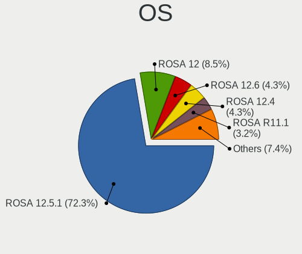
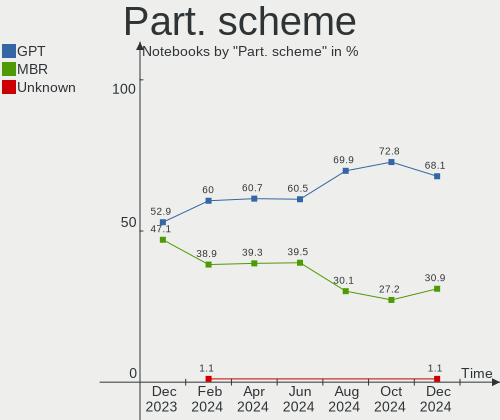
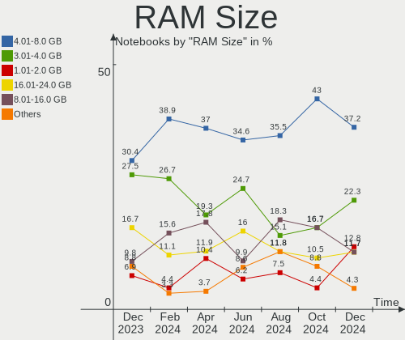
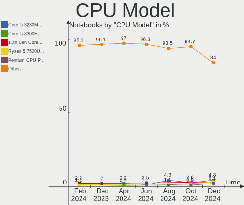
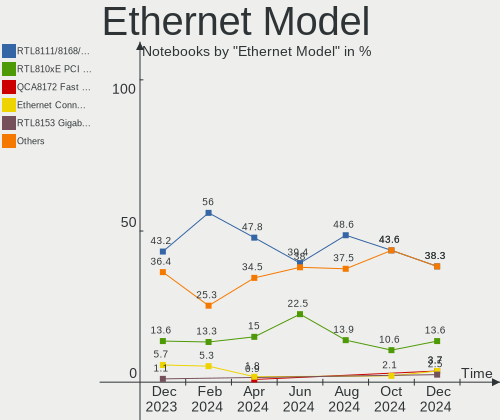
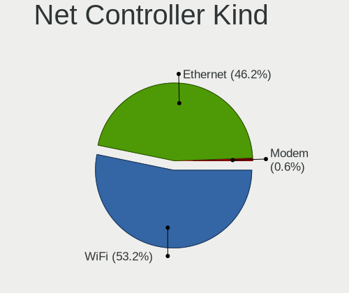
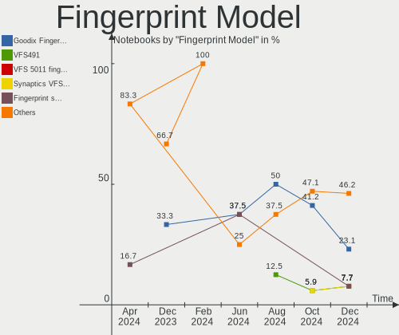

ROSA Hardware Trends (Notebook)
-------------------------------

A project to identify most popular hardware characteristics and track their change
over time based on data collected by ROSA users at https://Linux-Hardware.org.

Anyone can contribute to the study by uploading probes of their computers by
the [hw-probe](https://github.com/linuxhw/hw-probe) tool:

    sudo -E hw-probe -all -upload

Full-feature report is available here: https://linux-hardware.org/?view=trends&formfactor=notebook

Period: Oct, 2020.

Contents
--------

- [ OS                       ](#os)
- [ OS Family                ](#os-family)
- [ Kernel                   ](#kernel)
- [ Kernel Family            ](#kernel-family)
- [ Kernel Major Ver.        ](#kernel-major-ver)
- [ Arch                     ](#arch)
- [ DE                       ](#de)
- [ Display Server           ](#display-server)
- [ Display Manager          ](#display-manager)
- [ OS Lang                  ](#os-lang)
- [ Boot Mode                ](#boot-mode)
- [ Filesystem               ](#filesystem)
- [ Part. scheme             ](#part-scheme)
- [ Dual Boot with Linux/BSD ](#dual-boot-with-linux/bsd)
- [ Dual Boot (Win)          ](#dual-boot-win)
- [ Country                  ](#country)
- [ City                     ](#city)
- [ Vendor                   ](#vendor)
- [ Model                    ](#model)
- [ Model Family             ](#model-family)
- [ MFG Year                 ](#mfg-year)
- [ Form Factor              ](#form-factor)
- [ Secure Boot              ](#secure-boot)
- [ Coreboot                 ](#coreboot)
- [ RAM Size                 ](#ram-size)
- [ RAM Used                 ](#ram-used)
- [ Has CD-ROM               ](#has-cd-rom)
- [ Total Drives             ](#total-drives)
- [ Has Ethernet             ](#has-ethernet)
- [ Drive Vendor             ](#drive-vendor)
- [ HDD Vendor               ](#hdd-vendor)
- [ SSD Vendor               ](#ssd-vendor)
- [ Drive Model              ](#drive-model)
- [ Drive Kind               ](#drive-kind)
- [ Drive Connector          ](#drive-connector)
- [ Drive Size               ](#drive-size)
- [ Space Total              ](#space-total)
- [ Space Used               ](#space-used)
- [ Malfunc. Drives          ](#malfunc-drives)
- [ Malfunc. Drive Vendor    ](#malfunc-drive-vendor)
- [ Malfunc. HDD Vendor      ](#malfunc-hdd-vendor)
- [ Malfunc. Drive Kind      ](#malfunc-drive-kind)
- [ Failed Drives            ](#failed-drives)
- [ Failed Drive Vendor      ](#failed-drive-vendor)
- [ Drive Status             ](#drive-status)
- [ Storage Vendor           ](#storage-vendor)
- [ Storage Model            ](#storage-model)
- [ Storage Kind             ](#storage-kind)
- [ CPU Vendor               ](#cpu-vendor)
- [ CPU Model                ](#cpu-model)
- [ CPU Model Family         ](#cpu-model-family)
- [ CPU Cores                ](#cpu-cores)
- [ CPU Sockets              ](#cpu-sockets)
- [ CPU Threads              ](#cpu-threads)
- [ CPU Op-Modes             ](#cpu-op-modes)
- [ CPU Microcode            ](#cpu-microcode)
- [ CPU Microarch            ](#cpu-microarch)
- [ GPU Vendor               ](#gpu-vendor)
- [ GPU Model                ](#gpu-model)
- [ GPU Combo                ](#gpu-combo)
- [ GPU Driver               ](#gpu-driver)
- [ GPU Memory               ](#gpu-memory)
- [ Monitor Vendor           ](#monitor-vendor)
- [ Monitor Model            ](#monitor-model)
- [ Monitor Resolution       ](#monitor-resolution)
- [ Monitor Diagonal         ](#monitor-diagonal)
- [ Monitor Width            ](#monitor-width)
- [ Aspect Ratio             ](#aspect-ratio)
- [ Monitor Area             ](#monitor-area)
- [ Pixel Density            ](#pixel-density)
- [ Multiple Monitors        ](#multiple-monitors)
- [ Net Controller Vendor    ](#net-controller-vendor)
- [ Net Controller Model     ](#net-controller-model)
- [ Wireless Vendor          ](#wireless-vendor)
- [ Wireless Model           ](#wireless-model)
- [ Ethernet Vendor          ](#ethernet-vendor)
- [ Ethernet Model           ](#ethernet-model)
- [ Net Controller Kind      ](#net-controller-kind)
- [ Used Controller          ](#used-controller)
- [ NICs                     ](#nics)
- [ Memory Vendor            ](#memory-vendor)
- [ Memory Model             ](#memory-model)
- [ Memory Kind              ](#memory-kind)
- [ Memory Form Factor       ](#memory-form-factor)
- [ Memory Size              ](#memory-size)
- [ Memory Speed             ](#memory-speed)
- [ Sound Vendor             ](#sound-vendor)
- [ Sound Model              ](#sound-model)
- [ Camera Vendor            ](#camera-vendor)
- [ Camera Model             ](#camera-model)
- [ Fingerprint Vendor       ](#fingerprint-vendor)
- [ Fingerprint Model        ](#fingerprint-model)
- [ Chipcard Vendor          ](#chipcard-vendor)
- [ Chipcard Model           ](#chipcard-model)
- [ Printer Vendor           ](#printer-vendor)
- [ Printer Model            ](#printer-model)
- [ Scanner Vendor           ](#scanner-vendor)
- [ Scanner Model            ](#scanner-model)
- [ Bluetooth Vendor         ](#bluetooth-vendor)
- [ Bluetooth Model          ](#bluetooth-model)
- [ Unsupported Devices      ](#unsupported-devices)
- [ Unsupported Device Types ](#unsupported-device-types)

OS
--

Installed operating systems

| Name       | Notebooks | Percent |
|------------|-----------|---------|
| ROSA R11.1 | 71        | 61.21%  |
| ROSA R11   | 35        | 30.17%  |
| ROSA R8.1  | 6         | 5.17%   |
| ROSA R10   | 4         | 3.45%   |

OS Family
---------

OS without a version

| Name | Notebooks | Percent |
|------|-----------|---------|
| ROSA | 116       | 100%    |

Kernel
------

Version of the Linux kernel

| Version                          | Notebooks | Percent |
|----------------------------------|-----------|---------|
| 4.15.0-desktop-94.1rosa-x86_64   | 33        | 28.45%  |
| 4.15.0-desktop-45.1rosa-x86_64   | 26        | 22.41%  |
| 5.4.40-generic-1rosa-x86_64      | 10        | 8.62%   |
| 4.9.155-nrj-desktop-1rosa-x86_64 | 8         | 6.9%    |
| 4.15.0-desktop-94.1rosa-i586     | 5         | 4.31%   |
| 5.4.40-generic-1rosa-i586        | 4         | 3.45%   |
| 5.4.32-generic-2rosa-x86_64      | 4         | 3.45%   |
| 4.15.0-desktop-45.1rosa-i586     | 4         | 3.45%   |
| 5.8.16-generic-1rosa-x86_64      | 2         | 1.72%   |
| 4.9.9-nrj-desktop-1rosa-x86_64   | 2         | 1.72%   |
| 4.9.60-nrj-desktop-1rosa-x86_64  | 2         | 1.72%   |
| 4.9.155-nrj-desktop-1rosa-i586   | 2         | 1.72%   |
| 4.15.0-desktop-91.3rosa-x86_64   | 2         | 1.72%   |
| 4.15.0-desktop-68.5rosa-x86_64   | 2         | 1.72%   |
| 5.4.72-generic-1rosa-x86_64      | 1         | 0.86%   |
| 5.4.32-generic-2rosa-i586        | 1         | 0.86%   |
| 5.4.0-desktop-9.1rosa-x86_64     | 1         | 0.86%   |
| 5.0.0-desktop-38.1rosa-x86_64    | 1         | 0.86%   |
| 4.9.95-nrj-desktop-2rosa-i586    | 1         | 0.86%   |
| 4.9.60-nrj-desktop-1rosa-i586    | 1         | 0.86%   |
| 4.9.20-nrj-desktop-1rosa-x86_64  | 1         | 0.86%   |
| 4.4.16-nrj-desktop-1rosa-i586    | 1         | 0.86%   |
| 4.15.0-desktop-68.5rosa-i586     | 1         | 0.86%   |
| 4.1.38-nrj-desktop-2rosa-x86_64  | 1         | 0.86%   |

Kernel Family
-------------

Linux kernel without a distro release

| Version | Notebooks | Percent |
|---------|-----------|---------|
| 4.15.0  | 73        | 62.93%  |
| 5.4.40  | 14        | 12.07%  |
| 4.9.155 | 10        | 8.62%   |
| 5.4.32  | 5         | 4.31%   |
| 4.9.60  | 3         | 2.59%   |
| 5.8.16  | 2         | 1.72%   |
| 4.9.9   | 2         | 1.72%   |
| 5.4.72  | 1         | 0.86%   |
| 5.4.0   | 1         | 0.86%   |
| 5.0.0   | 1         | 0.86%   |
| 4.9.95  | 1         | 0.86%   |
| 4.9.20  | 1         | 0.86%   |
| 4.4.16  | 1         | 0.86%   |
| 4.1.38  | 1         | 0.86%   |

Kernel Major Ver.
-----------------

Linux kernel major version

| Version | Notebooks | Percent |
|---------|-----------|---------|
| 4.15    | 73        | 62.93%  |
| 5.4     | 21        | 18.1%   |
| 4.9     | 17        | 14.66%  |
| 5.8     | 2         | 1.72%   |
| 5.0     | 1         | 0.86%   |
| 4.4     | 1         | 0.86%   |
| 4.1     | 1         | 0.86%   |

Arch
----

OS architecture (x86_64, i586, etc.)

| Name   | Notebooks | Percent |
|--------|-----------|---------|
| x86_64 | 96        | 82.76%  |
| i686   | 20        | 17.24%  |

DE
--

Desktop Environment

| Name | Notebooks | Percent |
|------|-----------|---------|
| KDE4 | 74        | 63.79%  |
| KDE5 | 31        | 26.72%  |
| LXQt | 10        | 8.62%   |
| XFCE | 1         | 0.86%   |

Display Server
--------------

X11 or Wayland

| Name | Notebooks | Percent |
|------|-----------|---------|
| X11  | 116       | 100%    |

Display Manager
---------------

SDDM, LightDM, etc.

| Name | Notebooks | Percent |
|------|-----------|---------|
| KDM  | 74        | 63.79%  |
| SDDM | 42        | 36.21%  |

OS Lang
-------

Language

| Lang    | Notebooks | Percent |
|---------|-----------|---------|
| ru_RU   | 60        | 51.72%  |
| Unknown | 41        | 35.34%  |
| en_US   | 5         | 4.31%   |
| pl_PL   | 4         | 3.45%   |
| de_DE   | 2         | 1.72%   |
| tt_RU   | 1         | 0.86%   |
| it_IT   | 1         | 0.86%   |
| es_ES   | 1         | 0.86%   |
| bg_BG   | 1         | 0.86%   |

Boot Mode
---------

EFI or BIOS

| Mode | Notebooks | Percent |
|------|-----------|---------|
| BIOS | 88        | 75.86%  |
| EFI  | 28        | 24.14%  |

Filesystem
----------

Type of filesystem

| Type  | Notebooks | Percent |
|-------|-----------|---------|
| Ext4  | 110       | 94.83%  |
| Btrfs | 6         | 5.17%   |

Part. scheme
------------

Scheme of partitioning

| Type    | Notebooks | Percent |
|---------|-----------|---------|
| MBR     | 81        | 69.83%  |
| GPT     | 32        | 27.59%  |
| Unknown | 3         | 2.59%   |

Dual Boot with Linux/BSD
------------------------

Hosting more than one Linux/BSD

| Dual boot | Notebooks | Percent |
|-----------|-----------|---------|
| No        | 103       | 88.79%  |
| Yes       | 13        | 11.21%  |

Dual Boot (Win)
---------------

Hosting Linux and Windows

| Dual boot | Notebooks | Percent |
|-----------|-----------|---------|
| No        | 68        | 58.62%  |
| Yes       | 48        | 41.38%  |

Country
-------

Geographic location (country)

| Country    | Notebooks | Percent |
|------------|-----------|---------|
| Russia     | 87        | 75%     |
| Ukraine    | 7         | 6.03%   |
| Poland     | 4         | 3.45%   |
| Germany    | 3         | 2.59%   |
| Bulgaria   | 3         | 2.59%   |
| USA        | 2         | 1.72%   |
| Kazakhstan | 2         | 1.72%   |
| Canada     | 2         | 1.72%   |
| Belarus    | 2         | 1.72%   |
| Seychelles | 1         | 0.86%   |
| Latvia     | 1         | 0.86%   |
| Italy      | 1         | 0.86%   |
| Chile      | 1         | 0.86%   |

City
----

Geographic location (city)

| City               | Notebooks | Percent |
|--------------------|-----------|---------|
| Moscow             | 12        | 10.34%  |
| Novosibirsk        | 7         | 6.03%   |
| St Petersburg      | 4         | 3.45%   |
| Nizhniy Novgorod   | 3         | 2.59%   |
| Kaliningrad        | 3         | 2.59%   |
| Izhevsk            | 3         | 2.59%   |
| Warsaw             | 2         | 1.72%   |
| Voronezh           | 2         | 1.72%   |
| Usinsk             | 2         | 1.72%   |
| Tyumen             | 2         | 1.72%   |
| Sofia              | 2         | 1.72%   |
| Simferopol         | 2         | 1.72%   |
| Samara             | 2         | 1.72%   |
| Rostov-on-Don      | 2         | 1.72%   |
| Perm               | 2         | 1.72%   |
| Lipetsk            | 2         | 1.72%   |
| Barnaul            | 2         | 1.72%   |
| Zelenogorsk        | 1         | 0.86%   |
| Zaraysk            | 1         | 0.86%   |
| Yaroslavl          | 1         | 0.86%   |
| Volgograd          | 1         | 0.86%   |
| Victoria           | 1         | 0.86%   |
| Varna              | 1         | 0.86%   |
| Ufa                | 1         | 0.86%   |
| Tula               | 1         | 0.86%   |
| Tuapse             | 1         | 0.86%   |
| Temta              | 1         | 0.86%   |
| Staraya Yurga      | 1         | 0.86%   |
| Sochi              | 1         | 0.86%   |
| Sevastopol’      | 1         | 0.86%   |
| Schwäbisch Gmünd | 1         | 0.86%   |
| Saratov            | 1         | 0.86%   |
| Santiago           | 1         | 0.86%   |
| Salekhard          | 1         | 0.86%   |
| Salavat            | 1         | 0.86%   |
| Riga               | 1         | 0.86%   |
| Red Deer           | 1         | 0.86%   |
| Prokop'yevsk       | 1         | 0.86%   |
| Poznan             | 1         | 0.86%   |
| Osinniki           | 1         | 0.86%   |
| Olenegorsk         | 1         | 0.86%   |
| Odintsovo          | 1         | 0.86%   |
| Novotroitsk        | 1         | 0.86%   |
| Neftekamsk         | 1         | 0.86%   |
| Mytishchi          | 1         | 0.86%   |
| Myrnohrad          | 1         | 0.86%   |
| Mykolayiv          | 1         | 0.86%   |
| Murmansk           | 1         | 0.86%   |
| Minsk              | 1         | 0.86%   |
| Makiivka           | 1         | 0.86%   |
| Makhachkala        | 1         | 0.86%   |
| Magadan            | 1         | 0.86%   |
| Leipzig            | 1         | 0.86%   |
| La Crosse          | 1         | 0.86%   |
| Kyiv               | 1         | 0.86%   |
| Kropotkin          | 1         | 0.86%   |
| Kovrov             | 1         | 0.86%   |
| Koryazhma          | 1         | 0.86%   |
| Klin               | 1         | 0.86%   |
| Kitchener          | 1         | 0.86%   |

Vendor
------

Motherboard manufacturer

| Name                | Notebooks | Percent |
|---------------------|-----------|---------|
| Lenovo              | 23        | 19.83%  |
| Hewlett-Packard     | 19        | 16.38%  |
| ASUSTek Computer    | 19        | 16.38%  |
| Acer                | 19        | 16.38%  |
| Samsung Electronics | 11        | 9.48%   |
| Dell                | 10        | 8.62%   |
| Sony                | 5         | 4.31%   |
| MSI                 | 4         | 3.45%   |
| Toshiba             | 3         | 2.59%   |
| Olidata             | 1         | 0.86%   |
| Aquarius            | 1         | 0.86%   |
| Apple               | 1         | 0.86%   |

Model
-----

Motherboard model

| Name                                              | Notebooks | Percent |
|---------------------------------------------------|-----------|---------|
| Unknown                                           | 4         | 3.45%   |
| Acer Extensa 5620                                 | 3         | 2.59%   |
| MSI GX60 1AC                                      | 2         | 1.72%   |
| Lenovo IdeaPad 100-15IBY 80MJ                     | 2         | 1.72%   |
| Lenovo G580 20150                                 | 2         | 1.72%   |
| Lenovo G50-45 80E3                                | 2         | 1.72%   |
| HP Pavilion dv6                                   | 2         | 1.72%   |
| Dell Inspiron 3521                                | 2         | 1.72%   |
| ASUS X540YA                                       | 2         | 1.72%   |
| Toshiba Satellite P300                            | 1         | 0.86%   |
| Toshiba Satellite L655                            | 1         | 0.86%   |
| Toshiba Satellite A200                            | 1         | 0.86%   |
| Sony VPCSA2V9R                                    | 1         | 0.86%   |
| Sony VGN-NR21MR_S                                 | 1         | 0.86%   |
| Sony VGN-FZ11MR                                   | 1         | 0.86%   |
| Sony VGN-FE31ZR                                   | 1         | 0.86%   |
| Sony VGN-AR41MR                                   | 1         | 0.86%   |
| Samsung Electronics SX22S                         | 1         | 0.86%   |
| Samsung Electronics RV413/RV513                   | 1         | 0.86%   |
| Samsung Electronics RV408/RV508                   | 1         | 0.86%   |
| Samsung Electronics RC410/RC510/RC710             | 1         | 0.86%   |
| Samsung Electronics R560                          | 1         | 0.86%   |
| Samsung Electronics R540/R580/R780/SA41/E452/E852 | 1         | 0.86%   |
| Samsung Electronics R530/R730                     | 1         | 0.86%   |
| Samsung Electronics R528/R728                     | 1         | 0.86%   |
| Samsung Electronics N102SP/N100SP/N101SP          | 1         | 0.86%   |
| Samsung Electronics 350V5C/351V5C/3540VC/3440VC   | 1         | 0.86%   |
| Samsung Electronics 300E4C/300E5C/300E7C          | 1         | 0.86%   |
| Olidata Olidata T7700                             | 1         | 0.86%   |
| MSI VR630                                         | 1         | 0.86%   |
| MSI MS-N014                                       | 1         | 0.86%   |
| Lenovo ThinkPad X220 429137G                      | 1         | 0.86%   |
| Lenovo ThinkPad W510 4391B49                      | 1         | 0.86%   |
| Lenovo IdeaPad Z570 HuronRiver Platform           | 1         | 0.86%   |
| Lenovo IdeaPad Z370                               | 1         | 0.86%   |
| Lenovo IdeaPad S145-15IIL 81W8                    | 1         | 0.86%   |
| Lenovo IdeaPad S12 20021,2959                     | 1         | 0.86%   |
| Lenovo IdeaPad 320-15AST 80XV                     | 1         | 0.86%   |
| Lenovo IdeaPad 110-15ACL 80TJ                     | 1         | 0.86%   |
| Lenovo IdeaPad 100-15IBD 80QQ                     | 1         | 0.86%   |
| Lenovo G710 20252                                 | 1         | 0.86%   |
| Lenovo G50-80 80E5                                | 1         | 0.86%   |
| Lenovo B70-80 80MR                                | 1         | 0.86%   |
| Lenovo B590 20208                                 | 1         | 0.86%   |
| Lenovo B590 20206                                 | 1         | 0.86%   |
| Lenovo B450 1S1680033610187                       | 1         | 0.86%   |
| HP ProBook 6550b                                  | 1         | 0.86%   |
| HP ProBook 6460b                                  | 1         | 0.86%   |
| HP ProBook 5330m                                  | 1         | 0.86%   |
| HP ProBook 430 G2                                 | 1         | 0.86%   |
| HP Pavilion Sleekbook 15                          | 1         | 0.86%   |
| HP Pavilion Laptop 15-cs2xxx                      | 1         | 0.86%   |
| HP Pavilion g7                                    | 1         | 0.86%   |
| HP Pavilion g6                                    | 1         | 0.86%   |
| HP Pavilion dv4                                   | 1         | 0.86%   |
| HP Pavilion 17                                    | 1         | 0.86%   |
| HP Pavilion 15                                    | 1         | 0.86%   |
| HP Laptop 15-gw0xxx                               | 1         | 0.86%   |
| HP Laptop 14-cf0xxx                               | 1         | 0.86%   |
| HP Folio 13                                       | 1         | 0.86%   |

Model Family
------------

Motherboard model prefix

| Name                       | Notebooks | Percent |
|----------------------------|-----------|---------|
| Lenovo IdeaPad             | 9         | 7.76%   |
| HP Pavilion                | 9         | 7.76%   |
| Acer Aspire                | 8         | 6.9%    |
| Dell Inspiron              | 5         | 4.31%   |
| HP ProBook                 | 4         | 3.45%   |
| Acer Extensa               | 4         | 3.45%   |
| Unknown                    | 4         | 3.45%   |
| Toshiba Satellite          | 3         | 2.59%   |
| Dell Latitude              | 3         | 2.59%   |
| MSI GX60                   | 2         | 1.72%   |
| Lenovo ThinkPad            | 2         | 1.72%   |
| Lenovo G580                | 2         | 1.72%   |
| Lenovo G50-45              | 2         | 1.72%   |
| Lenovo B590                | 2         | 1.72%   |
| HP Laptop                  | 2         | 1.72%   |
| ASUS X540YA                | 2         | 1.72%   |
| Acer TravelMate            | 2         | 1.72%   |
| Sony VPCSA2V9R             | 1         | 0.86%   |
| Sony VGN-NR21MR            | 1         | 0.86%   |
| Sony VGN-FZ11MR            | 1         | 0.86%   |
| Sony VGN-FE31ZR            | 1         | 0.86%   |
| Sony VGN-AR41MR            | 1         | 0.86%   |
| Samsung Electronics SX22S  | 1         | 0.86%   |
| Samsung Electronics RV413  | 1         | 0.86%   |
| Samsung Electronics RV408  | 1         | 0.86%   |
| Samsung Electronics RC410  | 1         | 0.86%   |
| Samsung Electronics R560   | 1         | 0.86%   |
| Samsung Electronics R540   | 1         | 0.86%   |
| Samsung Electronics R530   | 1         | 0.86%   |
| Samsung Electronics R528   | 1         | 0.86%   |
| Samsung Electronics N102SP | 1         | 0.86%   |
| Samsung Electronics 350V5C | 1         | 0.86%   |
| Samsung Electronics 300E4C | 1         | 0.86%   |
| Olidata Olidata            | 1         | 0.86%   |
| MSI VR630                  | 1         | 0.86%   |
| MSI MS-N014                | 1         | 0.86%   |
| Lenovo G710                | 1         | 0.86%   |
| Lenovo G50-80              | 1         | 0.86%   |
| Lenovo B70-80              | 1         | 0.86%   |
| Lenovo B450                | 1         | 0.86%   |
| HP Folio                   | 1         | 0.86%   |
| HP Compaq                  | 1         | 0.86%   |
| HP 350                     | 1         | 0.86%   |
| HP 255                     | 1         | 0.86%   |
| Dell XPS                   | 1         | 0.86%   |
| Dell Vostro                | 1         | 0.86%   |
| ASUS X58C                  | 1         | 0.86%   |
| ASUS X550CC                | 1         | 0.86%   |
| ASUS X540LJ                | 1         | 0.86%   |
| ASUS X510UN                | 1         | 0.86%   |
| ASUS VivoBook              | 1         | 0.86%   |
| ASUS N56VB                 | 1         | 0.86%   |
| ASUS K53U                  | 1         | 0.86%   |
| ASUS K53SV                 | 1         | 0.86%   |
| ASUS K53SJ                 | 1         | 0.86%   |
| ASUS K53SD                 | 1         | 0.86%   |
| ASUS K52F                  | 1         | 0.86%   |
| ASUS K52Dr                 | 1         | 0.86%   |
| ASUS K50IJ                 | 1         | 0.86%   |
| ASUS K50IE                 | 1         | 0.86%   |

MFG Year
--------

Motherboard manufacture year

| Year | Notebooks | Percent |
|------|-----------|---------|
| 2011 | 18        | 15.52%  |
| 2010 | 14        | 12.07%  |
| 2012 | 13        | 11.21%  |
| 2013 | 11        | 9.48%   |
| 2008 | 8         | 6.9%    |
| 2007 | 8         | 6.9%    |
| 2018 | 7         | 6.03%   |
| 2015 | 7         | 6.03%   |
| 2014 | 7         | 6.03%   |
| 2016 | 6         | 5.17%   |
| 2019 | 5         | 4.31%   |
| 2009 | 5         | 4.31%   |
| 2020 | 3         | 2.59%   |
| 2017 | 2         | 1.72%   |
| 2006 | 2         | 1.72%   |

Form Factor
-----------

Physical design of the computer

| Name     | Notebooks | Percent |
|----------|-----------|---------|
| Notebook | 116       | 100%    |

Secure Boot
-----------

Enabled or disabled

| State    | Notebooks | Percent |
|----------|-----------|---------|
| Disabled | 116       | 100%    |

Coreboot
--------

Have coreboot on board

| Used | Notebooks | Percent |
|------|-----------|---------|
| No   | 116       | 100%    |

RAM Size
--------

Total RAM memory

| Size in GB | Notebooks | Percent |
|------------|-----------|---------|
| 3.01-4.0   | 49        | 42.24%  |
| 4.01-8.0   | 23        | 19.83%  |
| 1.01-2.0   | 16        | 13.79%  |
| 8.01-16.0  | 16        | 13.79%  |
| 2.01-3.0   | 10        | 8.62%   |
| 16.01-24.0 | 1         | 0.86%   |
| 0.01-1.0   | 1         | 0.86%   |

RAM Used
--------

Used RAM memory

| Used GB  | Notebooks | Percent |
|----------|-----------|---------|
| 0.01-1.0 | 53        | 45.69%  |
| 1.01-2.0 | 47        | 40.52%  |
| 2.01-3.0 | 13        | 11.21%  |
| 3.01-4.0 | 3         | 2.59%   |

Has CD-ROM
----------

Has CD-ROM on board

| Presented | Notebooks | Percent |
|-----------|-----------|---------|
| Yes       | 78        | 67.24%  |
| No        | 38        | 32.76%  |

Total Drives
------------

Number of drives on board

| Drives | Notebooks | Percent |
|--------|-----------|---------|
| 1      | 95        | 81.9%   |
| 2      | 17        | 14.66%  |
| 0      | 4         | 3.45%   |

Has Ethernet
------------

Has Ethernet on board

| Presented | Notebooks | Percent |
|-----------|-----------|---------|
| Yes       | 111       | 95.69%  |
| No        | 5         | 4.31%   |

Drive Vendor
------------

Hard drive vendors

| Vendor              | Notebooks | Drives | Percent |
|---------------------|-----------|--------|---------|
| WDC                 | 30        | 30     | 23.44%  |
| Seagate             | 28        | 29     | 21.88%  |
| Hitachi             | 17        | 17     | 13.28%  |
| Toshiba             | 15        | 15     | 11.72%  |
| Samsung Electronics | 6         | 6      | 4.69%   |
| Kingston            | 5         | 5      | 3.91%   |
| HGST                | 5         | 5      | 3.91%   |
| Unknown             | 3         | 3      | 2.34%   |
| Fujitsu             | 3         | 3      | 2.34%   |
| SPCC                | 2         | 2      | 1.56%   |
| China               | 2         | 2      | 1.56%   |
| Wicgtyp             | 1         | 1      | 0.78%   |
| SK Hynix            | 1         | 1      | 0.78%   |
| SanDisk             | 1         | 1      | 0.78%   |
| PNY                 | 1         | 1      | 0.78%   |
| Patriot             | 1         | 1      | 0.78%   |
| OCZ-VERTEX          | 1         | 1      | 0.78%   |
| KingSpec            | 1         | 1      | 0.78%   |
| e2e4                | 1         | 1      | 0.78%   |
| Crucial             | 1         | 1      | 0.78%   |
| Apacer              | 1         | 1      | 0.78%   |
| AEGO                | 1         | 1      | 0.78%   |
| A-DATA Technology   | 1         | 1      | 0.78%   |

HDD Vendor
----------

Hard disk drive vendors

| Vendor              | Notebooks | Drives | Percent |
|---------------------|-----------|--------|---------|
| Seagate             | 28        | 29     | 28.57%  |
| WDC                 | 27        | 27     | 27.55%  |
| Hitachi             | 17        | 17     | 17.35%  |
| Toshiba             | 12        | 12     | 12.24%  |
| Samsung Electronics | 6         | 6      | 6.12%   |
| HGST                | 5         | 5      | 5.1%    |
| Fujitsu             | 3         | 3      | 3.06%   |

SSD Vendor
----------

Solid state drive vendors

| Vendor            | Notebooks | Drives | Percent |
|-------------------|-----------|--------|---------|
| Kingston          | 5         | 5      | 21.74%  |
| WDC               | 2         | 2      | 8.7%    |
| SPCC              | 2         | 2      | 8.7%    |
| China             | 2         | 2      | 8.7%    |
| Wicgtyp           | 1         | 1      | 4.35%   |
| Toshiba           | 1         | 1      | 4.35%   |
| SanDisk           | 1         | 1      | 4.35%   |
| PNY               | 1         | 1      | 4.35%   |
| Patriot           | 1         | 1      | 4.35%   |
| OCZ-VERTEX        | 1         | 1      | 4.35%   |
| KingSpec          | 1         | 1      | 4.35%   |
| e2e4              | 1         | 1      | 4.35%   |
| Crucial           | 1         | 1      | 4.35%   |
| Apacer            | 1         | 1      | 4.35%   |
| AEGO              | 1         | 1      | 4.35%   |
| A-DATA Technology | 1         | 1      | 4.35%   |

Drive Model
-----------

Hard drive models

| Model                          | Notebooks | Percent |
|--------------------------------|-----------|---------|
| ST500LT012-1DG142 500GB        | 7         | 5.43%   |
| ST9500325AS 500GB              | 5         | 3.88%   |
| HTS541612J9SA00 120GB          | 4         | 3.1%    |
| ST9320328CS 320GB              | 3         | 2.33%   |
| SA400S37120G 120GB SSD         | 3         | 2.33%   |
| WD5000LPVX-22V0TT0 500GB       | 2         | 1.55%   |
| WD5000LPCX-24VHAT0 500GB       | 2         | 1.55%   |
| WD3200BPVT-22ZEST0 320GB       | 2         | 1.55%   |
| ST9750420AS 752GB              | 2         | 1.55%   |
| ST9320325AS 320GB              | 2         | 1.55%   |
| ST1000LM024 HN-M101MBB 1TB     | 2         | 1.55%   |
| MQ04ABF100 1TB                 | 2         | 1.55%   |
| MQ01ABD100 1TB                 | 2         | 1.55%   |
| HTS547575A9E384 752GB          | 2         | 1.55%   |
| HTS545050A7E680 500GB          | 2         | 1.55%   |
| HTS543216L9A300 160GB          | 2         | 1.55%   |
| HTS541010A9E680 1TB            | 2         | 1.55%   |
| HM250HI 250GB                  | 2         | 1.55%   |
| WDS250G2B0A-00SM50 250GB SSD   | 1         | 0.78%   |
| WDS120G2G0A-00JH30 120GB SSD   | 1         | 0.78%   |
| WD7500BPKT-75PK4T0 752GB       | 1         | 0.78%   |
| WD6400BPVT-75HXZT1 640GB       | 1         | 0.78%   |
| WD5000LPVX-60V0TT0 500GB       | 1         | 0.78%   |
| WD5000LPLX-00ZNTT0 500GB       | 1         | 0.78%   |
| WD5000LPCX-60VHAT1 500GB       | 1         | 0.78%   |
| WD5000LPCX-21VHAT0 500GB       | 1         | 0.78%   |
| WD5000BPVT-24HXZT3 500GB       | 1         | 0.78%   |
| WD5000BPKX-80HPJT0 500GB       | 1         | 0.78%   |
| WD3200BPVT-80ZEST0 320GB       | 1         | 0.78%   |
| WD3200BPVT-35JJ5T0 320GB       | 1         | 0.78%   |
| WD3200BPVT-24JJ5T0 320GB       | 1         | 0.78%   |
| WD3200BPVT-22JJ5T0 320GB       | 1         | 0.78%   |
| WD3200BEVT-22ZCT0 320GB        | 1         | 0.78%   |
| WD2500BEVT-22A23T0 250GB       | 1         | 0.78%   |
| WD2500BEVS-22UST0 250GB        | 1         | 0.78%   |
| WD2500BEVS-00UST0 250GB        | 1         | 0.78%   |
| WD1600BEVT-22A23T0 160GB       | 1         | 0.78%   |
| WD10SPZX-21Z10T0 1TB           | 1         | 0.78%   |
| WD10SPZX-00Z10T0 1TB           | 1         | 0.78%   |
| WD10JPVT-08A1YT2 1TB           | 1         | 0.78%   |
| WD10JPCX-24UE4T0 1TB           | 1         | 0.78%   |
| THNSNC128GMMJ 128GB SSD        | 1         | 0.78%   |
| SVP200S360G 64GB SSD           | 1         | 0.78%   |
| SUV500480G 480GB SSD           | 1         | 0.78%   |
| SU900 256GB SSD                | 1         | 0.78%   |
| ST750LM022 HN-M750MBB 752GB    | 1         | 0.78%   |
| ST500LT012-9WS142 500GB        | 1         | 0.78%   |
| ST500LM034-2GH17A 500GB        | 1         | 0.78%   |
| ST320LT012-9WS14C 320GB        | 1         | 0.78%   |
| ST250LM004 HN-M250MBB 250GB    | 1         | 0.78%   |
| ST1000LM048-2E7172 1TB         | 1         | 0.78%   |
| SSD2SC240G1LC709B121-443 240GB | 1         | 0.78%   |
| SSD 480GB                      | 1         | 0.78%   |
| SSD 240GB                      | 1         | 0.78%   |
| Solid State Disk 256GB         | 1         | 0.78%   |
| Solid State Disk 120GB         | 1         | 0.78%   |
| SD9SB8W256G1102 256GB SSD      | 1         | 0.78%   |
| SD16G  16GB                    | 1         | 0.78%   |
| SATA SSD 120GB                 | 1         | 0.78%   |
| PLUS R2 128GB SSD              | 1         | 0.78%   |

Drive Kind
----------

HDD or SSD

| Kind    | Notebooks | Drives | Percent |
|---------|-----------|--------|---------|
| HDD     | 94        | 99     | 75.81%  |
| SSD     | 23        | 23     | 18.55%  |
| MMC     | 3         | 3      | 2.42%   |
| NVMe    | 3         | 3      | 2.42%   |
| Unknown | 1         | 1      | 0.81%   |

Drive Connector
---------------

SATA, SAS, NVMe, etc.

| Type | Notebooks | Drives | Percent |
|------|-----------|--------|---------|
| SATA | 109       | 120    | 92.37%  |
| SAS  | 3         | 3      | 2.54%   |
| NVMe | 3         | 3      | 2.54%   |
| MMC  | 3         | 3      | 2.54%   |

Drive Size
----------

Size of hard drive

| Size in TB | Notebooks | Drives | Percent |
|------------|-----------|--------|---------|
| 0.01-0.5   | 89        | 97     | 78.76%  |
| 0.51-1.0   | 23        | 24     | 20.35%  |
| 1.01-2.0   | 1         | 1      | 0.88%   |

Space Total
-----------

Amount of disk space available on the file system

| Size in GB | Notebooks | Percent |
|------------|-----------|---------|
| 251-500    | 35        | 30.17%  |
| 101-250    | 27        | 23.28%  |
| 1-20       | 16        | 13.79%  |
| 501-1000   | 16        | 13.79%  |
| 51-100     | 10        | 8.62%   |
| 21-50      | 9         | 7.76%   |
| 1001-2000  | 2         | 1.72%   |
| 2001-3000  | 1         | 0.86%   |

Space Used
----------

Amount of used disk space

| Used GB  | Notebooks | Percent |
|----------|-----------|---------|
| 1-20     | 81        | 69.83%  |
| 21-50    | 12        | 10.34%  |
| 51-100   | 11        | 9.48%   |
| 101-250  | 6         | 5.17%   |
| 501-1000 | 4         | 3.45%   |
| 251-500  | 2         | 1.72%   |

Malfunc. Drives
---------------

Drive models with a malfunction

| Model                          | Notebooks | Drives | Percent |
|--------------------------------|-----------|--------|---------|
| ST9500325AS 500GB              | 5         | 5      | 9.8%    |
| WD3200BPVT-22ZEST0 320GB       | 2         | 2      | 3.92%   |
| ST9320328CS 320GB              | 2         | 2      | 3.92%   |
| HTS541612J9SA00 120GB          | 2         | 2      | 3.92%   |
| WD7500BPKT-75PK4T0 752GB       | 1         | 1      | 1.96%   |
| WD5000LPVX-60V0TT0 500GB       | 1         | 1      | 1.96%   |
| WD5000BPVT-24HXZT3 500GB       | 1         | 1      | 1.96%   |
| WD3200BPVT-80ZEST0 320GB       | 1         | 1      | 1.96%   |
| WD2500BEVT-22A23T0 250GB       | 1         | 1      | 1.96%   |
| WD2500BEVS-00UST0 250GB        | 1         | 1      | 1.96%   |
| WD1600BEVT-22A23T0 160GB       | 1         | 1      | 1.96%   |
| WD10JPVT-08A1YT2 1TB           | 1         | 1      | 1.96%   |
| WD10JPCX-24UE4T0 1TB           | 1         | 1      | 1.96%   |
| ST9750420AS 752GB              | 1         | 1      | 1.96%   |
| ST9320325AS 320GB              | 1         | 1      | 1.96%   |
| ST500LT012-9WS142 500GB        | 1         | 1      | 1.96%   |
| ST500LT012-1DG142 500GB        | 1         | 1      | 1.96%   |
| ST320LT012-9WS14C 320GB        | 1         | 1      | 1.96%   |
| ST1000LM048-2E7172 1TB         | 1         | 1      | 1.96%   |
| SSD2SC240G1LC709B121-443 240GB | 1         | 1      | 1.96%   |
| SSD 240GB                      | 1         | 1      | 1.96%   |
| SA400S37120G 120GB SSD         | 1         | 1      | 1.96%   |
| MK6465GSX 640GB                | 1         | 1      | 1.96%   |
| MK6459GSXP 640GB               | 1         | 1      | 1.96%   |
| MK5076GSX 500GB                | 1         | 1      | 1.96%   |
| MK5059GSXP 500GB               | 1         | 1      | 1.96%   |
| MK2565GSX 250GB                | 1         | 1      | 1.96%   |
| MK2552GSX 250GB                | 1         | 1      | 1.96%   |
| MJA2160BH G2 160GB             | 1         | 1      | 1.96%   |
| MHY2160BH 160GB                | 1         | 1      | 1.96%   |
| KSD-ZF18.6-128MS 128GB SSD     | 1         | 1      | 1.96%   |
| HTS725050A9A364 500GB          | 1         | 1      | 1.96%   |
| HTS725032A9A364 320GB          | 1         | 1      | 1.96%   |
| HTS723232A7A364 320GB          | 1         | 1      | 1.96%   |
| HTS721010A9E630 1TB            | 1         | 1      | 1.96%   |
| HTS547575A9E384 752GB          | 1         | 1      | 1.96%   |
| HTS547550A9E384 500GB          | 1         | 1      | 1.96%   |
| HTS545050A7E680 500GB          | 1         | 1      | 1.96%   |
| HTS545032A7E380 320GB          | 1         | 1      | 1.96%   |
| HTS543232L9A300 320GB          | 1         | 1      | 1.96%   |
| HTS541680J9SA00 80GB           | 1         | 1      | 1.96%   |
| HTS541010A9E680 1TB            | 1         | 1      | 1.96%   |
| HS12UHE 120GB                  | 1         | 1      | 1.96%   |
| HM320HJ 320GB                  | 1         | 1      | 1.96%   |

Malfunc. Drive Vendor
---------------------

Vendors of faulty drives

| Vendor              | Notebooks | Drives | Percent |
|---------------------|-----------|--------|---------|
| Seagate             | 13        | 13     | 25.49%  |
| WDC                 | 11        | 11     | 21.57%  |
| Hitachi             | 10        | 10     | 19.61%  |
| Toshiba             | 6         | 6      | 11.76%  |
| HGST                | 3         | 3      | 5.88%   |
| Samsung Electronics | 2         | 2      | 3.92%   |
| Fujitsu             | 2         | 2      | 3.92%   |
| PNY                 | 1         | 1      | 1.96%   |
| Kingston            | 1         | 1      | 1.96%   |
| KingSpec            | 1         | 1      | 1.96%   |
| AEGO                | 1         | 1      | 1.96%   |

Malfunc. HDD Vendor
-------------------

Vendors of faulty HDD drives

| Vendor              | Notebooks | Drives | Percent |
|---------------------|-----------|--------|---------|
| Seagate             | 13        | 13     | 27.66%  |
| WDC                 | 11        | 11     | 23.4%   |
| Hitachi             | 10        | 10     | 21.28%  |
| Toshiba             | 6         | 6      | 12.77%  |
| HGST                | 3         | 3      | 6.38%   |
| Samsung Electronics | 2         | 2      | 4.26%   |
| Fujitsu             | 2         | 2      | 4.26%   |

Malfunc. Drive Kind
-------------------

Kinds of faulty drives

| Kind | Notebooks | Drives | Percent |
|------|-----------|--------|---------|
| HDD  | 44        | 47     | 91.67%  |
| SSD  | 4         | 4      | 8.33%   |

Failed Drives
-------------

Failed drive models

| Model         | Notebooks | Drives | Percent |
|---------------|-----------|--------|---------|
| HM160HI 160GB | 1         | 1      | 100%    |

Failed Drive Vendor
-------------------

Failed drive vendors

| Vendor              | Notebooks | Drives | Percent |
|---------------------|-----------|--------|---------|
| Samsung Electronics | 1         | 1      | 100%    |

Drive Status
------------

Number of failed and malfunc. drives

| Status   | Notebooks | Drives | Percent |
|----------|-----------|--------|---------|
| Works    | 67        | 71     | 54.92%  |
| Malfunc  | 48        | 51     | 39.34%  |
| Detected | 6         | 6      | 4.92%   |
| Failed   | 1         | 1      | 0.82%   |

Storage Vendor
--------------

Storage controller vendors

| Vendor                           | Notebooks | Percent |
|----------------------------------|-----------|---------|
| Intel                            | 86        | 72.27%  |
| AMD                              | 24        | 20.17%  |
| Nvidia                           | 3         | 2.52%   |
| VIA Technologies                 | 1         | 0.84%   |
| Toshiba America Info Systems     | 1         | 0.84%   |
| SK Hynix                         | 1         | 0.84%   |
| Silicon Integrated Systems [SiS] | 1         | 0.84%   |
| Sandisk                          | 1         | 0.84%   |
| JMicron Technology               | 1         | 0.84%   |

Storage Model
-------------

Storage controller models

| Model                                                                            | Notebooks | Percent |
|----------------------------------------------------------------------------------|-----------|---------|
| FCH SATA Controller [AHCI mode]                                                  | 15        | 11.03%  |
| 6 Series/C200 Series Chipset Family 6 port Mobile SATA AHCI Controller           | 15        | 11.03%  |
| 7 Series Chipset Family 6-port SATA Controller [AHCI mode]                       | 12        | 8.82%   |
| 82801HM/HEM (ICH8M/ICH8M-E) IDE Controller                                       | 9         | 6.62%   |
| 82801IBM/IEM (ICH9M/ICH9M-E) 4 port SATA Controller [AHCI mode]                  | 8         | 5.88%   |
| 5 Series/3400 Series Chipset 4 port SATA AHCI Controller                         | 6         | 4.41%   |
| Wildcat Point-LP SATA Controller [AHCI Mode]                                     | 5         | 3.68%   |
| SB7x0/SB8x0/SB9x0 SATA Controller [AHCI mode]                                    | 5         | 3.68%   |
| 82801HM/HEM (ICH8M/ICH8M-E) SATA Controller [IDE mode]                           | 5         | 3.68%   |
| 82801HM/HEM (ICH8M/ICH8M-E) SATA Controller [AHCI mode]                          | 5         | 3.68%   |
| NM10/ICH7 Family SATA Controller [AHCI mode]                                     | 4         | 2.94%   |
| 82801GBM/GHM (ICH7-M Family) SATA Controller [IDE mode]                          | 4         | 2.94%   |
| 82801 Mobile SATA Controller [RAID mode]                                         | 3         | 2.21%   |
| 8 Series SATA Controller 1 [AHCI mode]                                           | 3         | 2.21%   |
| Sunrise Point-LP SATA Controller [AHCI mode]                                     | 2         | 1.47%   |
| SB7x0/SB8x0/SB9x0 SATA Controller [IDE mode]                                     | 2         | 1.47%   |
| FCH IDE Controller                                                               | 2         | 1.47%   |
| Atom Processor E3800 Series SATA AHCI Controller                                 | 2         | 1.47%   |
| 6 Series/C200 Series Chipset Family Mobile SATA Controller (IDE mode, ports 4-5) | 2         | 1.47%   |
| 6 Series/C200 Series Chipset Family Mobile SATA Controller (IDE mode, ports 0-3) | 2         | 1.47%   |
| 5 Series/3400 Series Chipset 6 port SATA AHCI Controller                         | 2         | 1.47%   |
| WD Black 2018 / PC SN520 NVMe SSD                                                | 1         | 0.74%   |
| VX800 Serial ATA and EIDE Controller                                             | 1         | 0.74%   |
| SB7x0/SB8x0/SB9x0 IDE Controller                                                 | 1         | 0.74%   |
| SB600 IDE                                                                        | 1         | 0.74%   |
| SATA Controller / IDE mode                                                       | 1         | 0.74%   |
| SATA controller                                                                  | 1         | 0.74%   |
| Non-Volatile memory controller                                                   | 1         | 0.74%   |
| NM10/ICH7 Family SATA Controller [IDE mode]                                      | 1         | 0.74%   |
| nForce SATA Controller                                                           | 1         | 0.74%   |
| Mobile PM965/GM965 PT IDER Controller                                            | 1         | 0.74%   |
| MCP79 SATA Controller                                                            | 1         | 0.74%   |
| MCP79 AHCI Controller                                                            | 1         | 0.74%   |
| JMB360 AHCI Controller                                                           | 1         | 0.74%   |
| FCH SATA Controller [IDE mode]                                                   | 1         | 0.74%   |
| Cannon Lake Mobile PCH SATA AHCI Controller                                      | 1         | 0.74%   |
| BG3 NVMe SSD Controller                                                          | 1         | 0.74%   |
| Atom/Celeron/Pentium Processor x5-E8000/J3xxx/N3xxx Series SATA Controller       | 1         | 0.74%   |
| 82801IBM/IEM (ICH9M/ICH9M-E) 2 port SATA Controller [IDE mode]                   | 1         | 0.74%   |
| 82801G (ICH7 Family) IDE Controller                                              | 1         | 0.74%   |
| 82801FB/FBM/FR/FW/FRW (ICH6 Family) IDE Controller                               | 1         | 0.74%   |
| 8 Series/C220 Series Chipset Family 6-port SATA Controller 1 [AHCI mode]         | 1         | 0.74%   |
| 7 Series Chipset Family 4-port SATA Controller [IDE mode]                        | 1         | 0.74%   |
| 7 Series Chipset Family 2-port SATA Controller [IDE mode]                        | 1         | 0.74%   |

Storage Kind
------------

Kind of storage controller (IDE, SATA, NVMe, SAS, ...)

| Kind | Notebooks | Percent |
|------|-----------|---------|
| SATA | 94        | 74.02%  |
| IDE  | 27        | 21.26%  |
| RAID | 3         | 2.36%   |
| NVMe | 3         | 2.36%   |

CPU Vendor
----------

Processor vendors

| Vendor       | Notebooks | Percent |
|--------------|-----------|---------|
| Intel        | 90        | 77.59%  |
| AMD          | 25        | 21.55%  |
| CentaurHauls | 1         | 0.86%   |

CPU Model
---------

Processor models

| Model                                       | Notebooks | Percent |
|---------------------------------------------|-----------|---------|
| Intel Core i3-5005U CPU @ 2.00GHz           | 4         | 3.45%   |
| Intel Core i5-2450M CPU @ 2.50GHz           | 3         | 2.59%   |
| Intel Core i5-2410M CPU @ 2.30GHz           | 3         | 2.59%   |
| Intel Core i3-2310M CPU @ 2.10GHz           | 3         | 2.59%   |
| Intel Pentium CPU B940 @ 2.00GHz            | 2         | 1.72%   |
| Intel Core i7-2670QM CPU @ 2.20GHz          | 2         | 1.72%   |
| Intel Core i5-3210M CPU @ 2.50GHz           | 2         | 1.72%   |
| Intel Core i3 CPU M 380 @ 2.53GHz           | 2         | 1.72%   |
| Intel Core 2 Duo CPU T9300 @ 2.50GHz        | 2         | 1.72%   |
| Intel Core 2 Duo CPU T7100 @ 1.80GHz        | 2         | 1.72%   |
| Intel Core 2 Duo CPU T5550 @ 1.83GHz        | 2         | 1.72%   |
| Intel Core 2 Duo CPU P8400 @ 2.26GHz        | 2         | 1.72%   |
| Intel Core 2 CPU T5600 @ 1.83GHz            | 2         | 1.72%   |
| Intel Atom CPU N455 @ 1.66GHz               | 2         | 1.72%   |
| Intel Atom CPU N450 @ 1.66GHz               | 2         | 1.72%   |
| AMD E1-6010 APU with AMD Radeon R2 Graphics | 2         | 1.72%   |
| AMD C-50 Processor                          | 2         | 1.72%   |
| Intel Pentium Silver N5000 CPU @ 1.10GHz    | 1         | 0.86%   |
| Intel Pentium M processor 2.13GHz           | 1         | 0.86%   |
| Intel Pentium Dual-Core CPU T4300 @ 2.10GHz | 1         | 0.86%   |
| Intel Pentium Dual CPU T3200 @ 2.00GHz      | 1         | 0.86%   |
| Intel Pentium CPU P6200 @ 2.13GHz           | 1         | 0.86%   |
| Intel Pentium CPU N3700 @ 1.60GHz           | 1         | 0.86%   |
| Intel Pentium CPU N3540 @ 2.16GHz           | 1         | 0.86%   |
| Intel Pentium CPU B970 @ 2.30GHz            | 1         | 0.86%   |
| Intel Pentium CPU 2020M @ 2.40GHz           | 1         | 0.86%   |
| Intel Pentium 3558U @ 1.70GHz               | 1         | 0.86%   |
| Intel Genuine CPU T2130 @ 1.86GHz           | 1         | 0.86%   |
| Intel Core i7-3630QM CPU @ 2.40GHz          | 1         | 0.86%   |
| Intel Core i7-2630QM CPU @ 2.00GHz          | 1         | 0.86%   |
| Intel Core i7-2620M CPU @ 2.70GHz           | 1         | 0.86%   |
| Intel Core i7 CPU Q 720 @ 1.60GHz           | 1         | 0.86%   |
| Intel Core i7 CPU M 640 @ 2.80GHz           | 1         | 0.86%   |
| Intel Core i5-8300H CPU @ 2.30GHz           | 1         | 0.86%   |
| Intel Core i5-8265U CPU @ 1.60GHz           | 1         | 0.86%   |
| Intel Core i5-5200U CPU @ 2.20GHz           | 1         | 0.86%   |
| Intel Core i5-4210U CPU @ 1.70GHz           | 1         | 0.86%   |
| Intel Core i5-3337U CPU @ 1.80GHz           | 1         | 0.86%   |
| Intel Core i5-3230M CPU @ 2.60GHz           | 1         | 0.86%   |
| Intel Core i5-2520M CPU @ 2.50GHz           | 1         | 0.86%   |
| Intel Core i5-2467M CPU @ 1.60GHz           | 1         | 0.86%   |
| Intel Core i5 CPU M 480 @ 2.67GHz           | 1         | 0.86%   |
| Intel Core i3-7100U CPU @ 2.40GHz           | 1         | 0.86%   |
| Intel Core i3-6100U CPU @ 2.30GHz           | 1         | 0.86%   |
| Intel Core i3-4030U CPU @ 1.90GHz           | 1         | 0.86%   |
| Intel Core i3-4000M CPU @ 2.40GHz           | 1         | 0.86%   |
| Intel Core i3-3217U CPU @ 1.80GHz           | 1         | 0.86%   |
| Intel Core i3-3110M CPU @ 2.40GHz           | 1         | 0.86%   |
| Intel Core i3-2365M CPU @ 1.40GHz           | 1         | 0.86%   |
| Intel Core i3-2350M CPU @ 2.30GHz           | 1         | 0.86%   |
| Intel Core i3-2330M CPU @ 2.20GHz           | 1         | 0.86%   |
| Intel Core i3-1005G1 CPU @ 1.20GHz          | 1         | 0.86%   |
| Intel Core i3 CPU M 350 @ 2.27GHz           | 1         | 0.86%   |
| Intel Core i3 CPU M 330 @ 2.13GHz           | 1         | 0.86%   |
| Intel Core 2 Solo CPU U3500 @ 1.40GHz       | 1         | 0.86%   |
| Intel Core 2 Duo CPU U7700 @ 1.33GHz        | 1         | 0.86%   |
| Intel Core 2 Duo CPU T7300 @ 2.00GHz        | 1         | 0.86%   |
| Intel Core 2 Duo CPU T7250 @ 2.00GHz        | 1         | 0.86%   |
| Intel Core 2 Duo CPU T6600 @ 2.20GHz        | 1         | 0.86%   |
| Intel Core 2 Duo CPU T5670 @ 1.80GHz        | 1         | 0.86%   |

CPU Model Family
----------------

Processor model prefix

| Model                   | Notebooks | Percent |
|-------------------------|-----------|---------|
| Intel Core i3           | 21        | 18.1%   |
| Intel Core i5           | 17        | 14.66%  |
| Intel Core 2 Duo        | 17        | 14.66%  |
| Intel Pentium           | 8         | 6.9%    |
| Intel Core i7           | 7         | 6.03%   |
| Intel Atom              | 5         | 4.31%   |
| Intel Celeron           | 3         | 2.59%   |
| AMD E1                  | 3         | 2.59%   |
| AMD A6                  | 3         | 2.59%   |
| AMD A4                  | 3         | 2.59%   |
| AMD A10                 | 3         | 2.59%   |
| Intel Core 2            | 2         | 1.72%   |
| Intel Celeron Dual-Core | 2         | 1.72%   |
| AMD E2                  | 2         | 1.72%   |
| AMD E                   | 2         | 1.72%   |
| AMD C-50                | 2         | 1.72%   |
| Other                   | 1         | 0.86%   |
| Intel Pentium Silver    | 1         | 0.86%   |
| Intel Pentium M         | 1         | 0.86%   |
| Intel Pentium Dual-Core | 1         | 0.86%   |
| Intel Pentium Dual      | 1         | 0.86%   |
| Intel Genuine           | 1         | 0.86%   |
| Intel Core 2 Solo       | 1         | 0.86%   |
| Intel Celeron M         | 1         | 0.86%   |
| Intel Celeron D         | 1         | 0.86%   |
| CentaurHauls VIA Nano   | 1         | 0.86%   |
| AMD Turion II Dual-Core | 1         | 0.86%   |
| AMD Turion II           | 1         | 0.86%   |
| AMD Ryzen 3             | 1         | 0.86%   |
| AMD Phenom II           | 1         | 0.86%   |
| AMD Athlon X2           | 1         | 0.86%   |
| AMD Athlon              | 1         | 0.86%   |

CPU Cores
---------

Number of processor cores

| Number | Notebooks | Percent |
|--------|-----------|---------|
| 2      | 88        | 75.86%  |
| 4      | 15        | 12.93%  |
| 1      | 13        | 11.21%  |

CPU Sockets
-----------

Number of sockets

| Number | Notebooks | Percent |
|--------|-----------|---------|
| 1      | 116       | 100%    |

CPU Threads
-----------

Threads per core (Hyper-Threading)

| Number | Notebooks | Percent |
|--------|-----------|---------|
| 2      | 58        | 50%     |
| 1      | 58        | 50%     |

CPU Op-Modes
------------

CPU Operation Modes (32-bit, 64-bit)

| Op mode        | Notebooks | Percent |
|----------------|-----------|---------|
| 32-bit, 64-bit | 114       | 98.28%  |
| 32-bit         | 2         | 1.72%   |

CPU Microcode
-------------

Microcode number

| Number     | Notebooks | Percent |
|------------|-----------|---------|
| 0x206a7    | 19        | 16.38%  |
| 0x6fd      | 10        | 8.62%   |
| 0x306a9    | 9         | 7.76%   |
| 0x20655    | 6         | 5.17%   |
| 0x1067a    | 6         | 5.17%   |
| 0x306d4    | 5         | 4.31%   |
| 0x10676    | 5         | 4.31%   |
| 0x06001119 | 5         | 4.31%   |
| Unknown    | 5         | 4.31%   |
| 0x106ca    | 4         | 3.45%   |
| 0x40651    | 3         | 2.59%   |
| 0x07030106 | 3         | 2.59%   |
| 0x6f6      | 2         | 1.72%   |
| 0x30678    | 2         | 1.72%   |
| 0x10661    | 2         | 1.72%   |
| 0x08108109 | 2         | 1.72%   |
| 0x07030105 | 2         | 1.72%   |
| 0x05000119 | 2         | 1.72%   |
| 0x05000029 | 2         | 1.72%   |
| 0x010000c8 | 2         | 1.72%   |
| 0x906ea    | 1         | 0.86%   |
| 0x806eb    | 1         | 0.86%   |
| 0x806e9    | 1         | 0.86%   |
| 0x706e5    | 1         | 0.86%   |
| 0x706a1    | 1         | 0.86%   |
| 0x6fa      | 1         | 0.86%   |
| 0x6ec      | 1         | 0.86%   |
| 0x6d8      | 1         | 0.86%   |
| 0x406e3    | 1         | 0.86%   |
| 0x406c3    | 1         | 0.86%   |
| 0x306c3    | 1         | 0.86%   |
| 0x30661    | 1         | 0.86%   |
| 0x20652    | 1         | 0.86%   |
| 0x106e5    | 1         | 0.86%   |
| 0x07030104 | 1         | 0.86%   |
| 0x0700010f | 1         | 0.86%   |
| 0x06006705 | 1         | 0.86%   |
| 0x06006704 | 1         | 0.86%   |
| 0x02000057 | 1         | 0.86%   |
| 0x00000000 | 1         | 0.86%   |

CPU Microarch
-------------

Microarchitecture

| Name            | Notebooks | Percent |
|-----------------|-----------|---------|
| SandyBridge     | 21        | 18.1%   |
| Core            | 15        | 12.93%  |
| Penryn          | 11        | 9.48%   |
| IvyBridge       | 10        | 8.62%   |
| Westmere        | 7         | 6.03%   |
| Puma            | 6         | 5.17%   |
| Piledriver      | 6         | 5.17%   |
| Broadwell       | 5         | 4.31%   |
| Bonnell         | 5         | 4.31%   |
| Haswell         | 4         | 3.45%   |
| Bobcat          | 4         | 3.45%   |
| Silvermont      | 3         | 2.59%   |
| KabyLake        | 3         | 2.59%   |
| K10             | 3         | 2.59%   |
| Zen+            | 2         | 1.72%   |
| P6              | 2         | 1.72%   |
| Excavator       | 2         | 1.72%   |
| Skylake         | 1         | 0.86%   |
| Nehalem         | 1         | 0.86%   |
| K8 & K10 hybrid | 1         | 0.86%   |
| Jaguar          | 1         | 0.86%   |
| IceLake         | 1         | 0.86%   |
| Goldmont plus   | 1         | 0.86%   |
| Unknown         | 1         | 0.86%   |

GPU Vendor
----------

Vendors of graphics cards

| Vendor                           | Notebooks | Percent |
|----------------------------------|-----------|---------|
| Intel                            | 72        | 50%     |
| Nvidia                           | 35        | 24.31%  |
| AMD                              | 35        | 24.31%  |
| VIA Technologies                 | 1         | 0.69%   |
| Silicon Integrated Systems [SiS] | 1         | 0.69%   |

GPU Model
---------

Graphics card models

| Model                                                                             | Notebooks | Percent |
|-----------------------------------------------------------------------------------|-----------|---------|
| 2nd Generation Core Processor Family Integrated Graphics Controller               | 20        | 12.74%  |
| 3rd Gen Core processor Graphics Controller                                        | 10        | 6.37%   |
| GF117M [GeForce 610M/710M/810M/820M / GT 620M/625M/630M/720M]                     | 7         | 4.46%   |
| Core Processor Integrated Graphics Controller                                     | 6         | 3.82%   |
| Mobile 4 Series Chipset Integrated Graphics Controller                            | 5         | 3.18%   |
| HD Graphics 5500                                                                  | 5         | 3.18%   |
| Mobile GM965/GL960 Integrated Graphics Controller (secondary)                     | 4         | 2.55%   |
| Mobile GM965/GL960 Integrated Graphics Controller (primary)                       | 4         | 2.55%   |
| Atom Processor D4xx/D5xx/N4xx/N5xx Integrated Graphics Controller                 | 4         | 2.55%   |
| Thames [Radeon HD 7500M/7600M Series]                                             | 3         | 1.91%   |
| Mullins [Radeon R2 Graphics]                                                      | 3         | 1.91%   |
| Mobile 945GM/GMS/GME, 943/940GML Express Integrated Graphics Controller           | 3         | 1.91%   |
| Mobile 945GM/GMS, 943/940GML Express Integrated Graphics Controller               | 3         | 1.91%   |
| Haswell-ULT Integrated Graphics Controller                                        | 3         | 1.91%   |
| Wrestler [Radeon HD 6250]                                                         | 2         | 1.27%   |
| Wimbledon XT [Radeon HD 7970M]                                                    | 2         | 1.27%   |
| Sun XT [Radeon HD 8670A/8670M/8690M / R5 M330 / M430 / Radeon 520 Mobile]         | 2         | 1.27%   |
| Stoney [Radeon R2/R3/R4/R5 Graphics]                                              | 2         | 1.27%   |
| Picasso                                                                           | 2         | 1.27%   |
| Park [Mobility Radeon HD 5430/5450/5470]                                          | 2         | 1.27%   |
| Mullins [Radeon R4/R5 Graphics]                                                   | 2         | 1.27%   |
| GK208BM [GeForce 920M]                                                            | 2         | 1.27%   |
| GF108M [GeForce GT 525M]                                                          | 2         | 1.27%   |
| G86M [GeForce 8400M GT]                                                           | 2         | 1.27%   |
| Atom Processor Z36xxx/Z37xxx Series Graphics & Display                            | 2         | 1.27%   |
| Wrestler [Radeon HD 6320]                                                         | 1         | 0.64%   |
| Wrestler [Radeon HD 6310]                                                         | 1         | 0.64%   |
| Whistler [Radeon HD 6730M/6770M/7690M XT]                                         | 1         | 0.64%   |
| Whistler [Radeon HD 6630M/6650M/6750M/7670M/7690M]                                | 1         | 0.64%   |
| VX800/VX820 Chrome 9 HC3 Integrated Graphics                                      | 1         | 0.64%   |
| UHD Graphics 630 (Mobile)                                                         | 1         | 0.64%   |
| UHD Graphics 620 (Whiskey Lake)                                                   | 1         | 0.64%   |
| UHD Graphics 605                                                                  | 1         | 0.64%   |
| Trinity [Radeon HD 7660G]                                                         | 1         | 0.64%   |
| Trinity [Radeon HD 7620G]                                                         | 1         | 0.64%   |
| Trinity 2 [Radeon HD 7520G]                                                       | 1         | 0.64%   |
| Trinity 2 [Radeon HD 7400G]                                                       | 1         | 0.64%   |
| Topaz XT [Radeon R7 M260/M265 / M340/M360 / M440/M445 / 530/535 / 620/625 Mobile] | 1         | 0.64%   |
| Skylake GT2 [HD Graphics 520]                                                     | 1         | 0.64%   |
| Seymour [Radeon HD 6400M/7400M Series]                                            | 1         | 0.64%   |
| RV620/M82 [Mobility Radeon HD 3450/3470]                                          | 1         | 0.64%   |
| RV610/M74 [Mobility Radeon HD 2400 XT]                                            | 1         | 0.64%   |
| RV610/M72-S [Mobility Radeon HD 2400]                                             | 1         | 0.64%   |
| RV530/M66 [Mobility Radeon X1700/X2500]                                           | 1         | 0.64%   |
| RS880M [Mobility Radeon HD 4225/4250]                                             | 1         | 0.64%   |
| RS600M [Radeon Xpress 1250]                                                       | 1         | 0.64%   |
| Richland [Radeon HD 8650G]                                                        | 1         | 0.64%   |
| Richland [Radeon HD 8350G]                                                        | 1         | 0.64%   |
| Mullins [Radeon R3 Graphics]                                                      | 1         | 0.64%   |
| Mobile 915GM/GMS/910GML Express Graphics Controller                               | 1         | 0.64%   |
| Madison [Mobility Radeon HD 5650/5750 / 6530M/6550M]                              | 1         | 0.64%   |
| Kabini [Radeon HD 8210]                                                           | 1         | 0.64%   |
| Iris Plus Graphics G1 (Ice Lake)                                                  | 1         | 0.64%   |
| HD Graphics 620                                                                   | 1         | 0.64%   |
| GT218M [GeForce G 105M]                                                           | 1         | 0.64%   |
| GT218M [GeForce 315M]                                                             | 1         | 0.64%   |
| GT218M [GeForce 310M]                                                             | 1         | 0.64%   |
| GT216GLM [Quadro FX 880M]                                                         | 1         | 0.64%   |
| GP108M [GeForce MX150]                                                            | 1         | 0.64%   |
| GP107M [GeForce MX350]                                                            | 1         | 0.64%   |

GPU Combo
---------

Combinations of graphics cards

| Name           | Notebooks | Percent |
|----------------|-----------|---------|
| 1 x Intel      | 44        | 37.93%  |
| 1 x AMD        | 24        | 20.69%  |
| Intel + Nvidia | 23        | 19.83%  |
| 1 x Nvidia     | 12        | 10.34%  |
| 2 x AMD        | 6         | 5.17%   |
| Intel + AMD    | 5         | 4.31%   |
| 1 x VIA        | 1         | 0.86%   |
| 1 x SiS        | 1         | 0.86%   |

GPU Driver
----------

Free vs proprietary

| Driver      | Notebooks | Percent |
|-------------|-----------|---------|
| Free        | 109       | 93.97%  |
| Unknown     | 6         | 5.17%   |
| Proprietary | 1         | 0.86%   |

GPU Memory
----------

Total video memory

| Size in GB | Notebooks | Percent |
|------------|-----------|---------|
| 1.01-2.0   | 43        | 37.07%  |
| 0.01-0.5   | 36        | 31.03%  |
| Unknown    | 19        | 16.38%  |
| 0.51-1.0   | 9         | 7.76%   |
| 3.01-4.0   | 8         | 6.9%    |
| 2.01-3.0   | 1         | 0.86%   |

Monitor Vendor
--------------

Monitor vendors

| Vendor                  | Notebooks | Percent |
|-------------------------|-----------|---------|
| AU Optronics            | 33        | 29.2%   |
| Samsung Electronics     | 27        | 23.89%  |
| LG Display              | 22        | 19.47%  |
| Chi Mei Optoelectronics | 11        | 9.73%   |
| BOE                     | 6         | 5.31%   |
| LG Philips              | 4         | 3.54%   |
| Chimei Innolux          | 3         | 2.65%   |
| Nvidia                  | 1         | 0.88%   |
| Lenovo                  | 1         | 0.88%   |
| InfoVision              | 1         | 0.88%   |
| HannStar                | 1         | 0.88%   |
| Goldstar                | 1         | 0.88%   |
| Apple                   | 1         | 0.88%   |
| Acer                    | 1         | 0.88%   |

Monitor Model
-------------

Monitor models

| Model                                              | Notebooks | Percent |
|----------------------------------------------------|-----------|---------|
| LCD Monitor AUO21EC 1366x768 340x190mm 15.3-inch   | 4         | 3.54%   |
| LCD Monitor LGD0468 1366x768 340x190mm 15.3-inch   | 3         | 2.65%   |
| LCD Monitor SEC5441 1366x768 344x194mm 15.5-inch   | 2         | 1.77%   |
| LCD Monitor SEC4252 1366x768 344x194mm 15.5-inch   | 2         | 1.77%   |
| LCD Monitor SEC4251 1366x768 344x194mm 15.5-inch   | 2         | 1.77%   |
| LCD Monitor SEC364A 1366x768 344x194mm 15.5-inch   | 2         | 1.77%   |
| LCD Monitor SEC3245 1366x768 344x194mm 15.5-inch   | 2         | 1.77%   |
| LCD Monitor LGD03AB 1366x768 344x194mm 15.5-inch   | 2         | 1.77%   |
| LCD Monitor LGD02DC 1366x768 344x194mm 15.5-inch   | 2         | 1.77%   |
| LCD Monitor LGD0259 1920x1080 350x190mm 15.7-inch  | 2         | 1.77%   |
| LCD Monitor AUO8174 1280x800 331x207mm 15.4-inch   | 2         | 1.77%   |
| LCD Monitor AUO61D2 1024x600 220x130mm 10.1-inch   | 2         | 1.77%   |
| LCD Monitor AUO46EC 1366x768 344x193mm 15.5-inch   | 2         | 1.77%   |
| LCD Monitor AUO38ED 1920x1080 340x190mm 15.3-inch  | 2         | 1.77%   |
| LCD Monitor AUO26EC 1366x768 344x193mm 15.5-inch   | 2         | 1.77%   |
| LCD Monitor AUO22EC 1366x768 344x193mm 15.5-inch   | 2         | 1.77%   |
| LCD Monitor AUO21ED 1920x1080 344x194mm 15.5-inch  | 2         | 1.77%   |
| SyncMaster SAM00D3 1280x1024 338x270mm 17.0-inch   | 1         | 0.88%   |
| P236H ACR01A2 1920x1080 509x286mm 23.0-inch        | 1         | 0.88%   |
| M1994D-PZ GSM4B8B 1920x1080 400x250mm 18.6-inch    | 1         | 0.88%   |
| LP156WH2-TLAA LGD0230 1366x768 344x194mm 15.5-inch | 1         | 0.88%   |
| LCD Monitor SEC5643 1280x800 303x190mm 14.1-inch   | 1         | 0.88%   |
| LCD Monitor SEC544B 1600x900 382x214mm 17.2-inch   | 1         | 0.88%   |
| LCD Monitor SEC5341 1366x768 340x190mm 15.3-inch   | 1         | 0.88%   |
| LCD Monitor SEC4754 1280x800 261x163mm 12.1-inch   | 1         | 0.88%   |
| LCD Monitor SEC4542 1280x800 303x190mm 14.1-inch   | 1         | 0.88%   |
| LCD Monitor SEC4256 1600x900 382x215mm 17.3-inch   | 1         | 0.88%   |
| LCD Monitor SEC3646 1680x1050 331x207mm 15.4-inch  | 1         | 0.88%   |
| LCD Monitor SEC3642 1366x768 344x194mm 15.5-inch   | 1         | 0.88%   |
| LCD Monitor SEC3633 1280x800 331x207mm 15.4-inch   | 1         | 0.88%   |
| LCD Monitor SEC3454 1600x900 382x215mm 17.3-inch   | 1         | 0.88%   |
| LCD Monitor SEC3155 1920x1200 367x230mm 17.1-inch  | 1         | 0.88%   |
| LCD Monitor SEC304C 1920x1080 353x198mm 15.9-inch  | 1         | 0.88%   |
| LCD Monitor SDC4A52 1366x768 344x194mm 15.5-inch   | 1         | 0.88%   |
| LCD Monitor SDC4A51 1366x768 344x194mm 15.5-inch   | 1         | 0.88%   |
| LCD Monitor SDC4852 3840x2160 340x190mm 15.3-inch  | 1         | 0.88%   |
| LCD Monitor SDC3654 1600x900 382x215mm 17.3-inch   | 1         | 0.88%   |
| LCD Monitor NVD0800 1920x1080 320x180mm 14.5-inch  | 1         | 0.88%   |
| LCD Monitor LPLA900 1280x800 331x207mm 15.4-inch   | 1         | 0.88%   |
| LCD Monitor LPLA101 1440x900 367x230mm 17.1-inch   | 1         | 0.88%   |
| LCD Monitor LPL1E01 1280x800 330x210mm 15.4-inch   | 1         | 0.88%   |
| LCD Monitor LPL1901 1680x1050 331x207mm 15.4-inch  | 1         | 0.88%   |
| LCD Monitor LGD04FC 1366x768 344x194mm 15.5-inch   | 1         | 0.88%   |
| LCD Monitor LGD039F 1366x768 345x194mm 15.6-inch   | 1         | 0.88%   |
| LCD Monitor LGD038E 1366x768 340x190mm 15.3-inch   | 1         | 0.88%   |
| LCD Monitor LGD0354 1366x768 293x165mm 13.2-inch   | 1         | 0.88%   |
| LCD Monitor LGD0312 1366x768 294x166mm 13.3-inch   | 1         | 0.88%   |
| LCD Monitor LGD030A 1366x768 350x190mm 15.7-inch   | 1         | 0.88%   |
| LCD Monitor LGD02E3 1366x768 344x194mm 15.5-inch   | 1         | 0.88%   |
| LCD Monitor LGD02DA 1920x1080 380x220mm 17.3-inch  | 1         | 0.88%   |
| LCD Monitor LGD02D9 1920x1080 350x190mm 15.7-inch  | 1         | 0.88%   |
| LCD Monitor LGD02D3 1366x768 277x156mm 12.5-inch   | 1         | 0.88%   |
| LCD Monitor LGD02C5 1920x1080 380x210mm 17.1-inch  | 1         | 0.88%   |
| LCD Monitor LGD0250 1366x768 345x194mm 15.6-inch   | 1         | 0.88%   |
| LCD Monitor LEN40A0 1366x768 309x174mm 14.0-inch   | 1         | 0.88%   |
| LCD Monitor IVO03F4 1920x1200 263x164mm 12.2-inch  | 1         | 0.88%   |
| LCD Monitor HSD03E9 1024x600 220x129mm 10.0-inch   | 1         | 0.88%   |
| LCD Monitor CMO1703 1440x900 367x230mm 17.1-inch   | 1         | 0.88%   |
| LCD Monitor CMO1680 1366x768 344x193mm 15.5-inch   | 1         | 0.88%   |
| LCD Monitor CMO15A7 1366x768 350x190mm 15.7-inch   | 1         | 0.88%   |

Monitor Resolution
------------------

Monitor screen resolution

| Resolution         | Notebooks | Percent |
|--------------------|-----------|---------|
| 1366x768 (WXGA)    | 61        | 53.98%  |
| 1920x1080 (FHD)    | 18        | 15.93%  |
| 1280x800 (WXGA)    | 14        | 12.39%  |
| 1600x900 (HD+)     | 8         | 7.08%   |
| 1024x600           | 3         | 2.65%   |
| 1920x1200 (WUXGA)  | 2         | 1.77%   |
| 1680x1050 (WSXGA+) | 2         | 1.77%   |
| 1440x900 (WXGA+)   | 2         | 1.77%   |
| 3840x2160 (4K)     | 1         | 0.88%   |
| 1280x720 (HD)      | 1         | 0.88%   |
| 1280x1024 (SXGA)   | 1         | 0.88%   |

Monitor Diagonal
----------------

Diagonal size in inches

| Inches | Notebooks | Percent |
|--------|-----------|---------|
| 15     | 75        | 66.96%  |
| 17     | 11        | 9.82%   |
| 14     | 9         | 8.04%   |
| 13     | 8         | 7.14%   |
| 10     | 4         | 3.57%   |
| 12     | 2         | 1.79%   |
| 23     | 1         | 0.89%   |
| 18     | 1         | 0.89%   |
| 11     | 1         | 0.89%   |

Monitor Width
-------------

Physical width

| Width in mm | Notebooks | Percent |
|-------------|-----------|---------|
| 301-350     | 85        | 75.22%  |
| 351-400     | 15        | 13.27%  |
| 201-300     | 12        | 10.62%  |
| 501-600     | 1         | 0.88%   |

Aspect Ratio
------------

Proportional relationship between the width and the height

| Ratio | Notebooks | Percent |
|-------|-----------|---------|
| 16/9  | 89        | 79.46%  |
| 16/10 | 22        | 19.64%  |
| 5/4   | 1         | 0.89%   |

Monitor Area
------------

Area in inch²

| Area in inch² | Notebooks | Percent |
|----------------|-----------|---------|
| 101-110        | 75        | 66.37%  |
| 81-90          | 12        | 10.62%  |
| 121-130        | 8         | 7.08%   |
| 71-80          | 4         | 3.54%   |
| 41-50          | 4         | 3.54%   |
| 131-140        | 3         | 2.65%   |
| 61-70          | 2         | 1.77%   |
| 51-60          | 1         | 0.88%   |
| 201-250        | 1         | 0.88%   |
| 151-200        | 1         | 0.88%   |
| 141-150        | 1         | 0.88%   |
| 91-100         | 1         | 0.88%   |

Pixel Density
-------------

Pixels per inch

| Density | Notebooks | Percent |
|---------|-----------|---------|
| 101-120 | 69        | 61.61%  |
| 51-100  | 22        | 19.64%  |
| 121-160 | 21        | 18.75%  |

Multiple Monitors
-----------------

Total monitors connected

| Total | Notebooks | Percent |
|-------|-----------|---------|
| 1     | 107       | 92.24%  |
| 2     | 8         | 6.9%    |
| 0     | 1         | 0.86%   |

Net Controller Vendor
---------------------

Controller vendors

| Vendor                            | Notebooks | Percent |
|-----------------------------------|-----------|---------|
| Realtek Semiconductor             | 63        | 30.58%  |
| Qualcomm Atheros                  | 47        | 22.82%  |
| Intel                             | 33        | 16.02%  |
| Broadcom Inc. and subsidiaries    | 23        | 11.17%  |
| Marvell Technology Group          | 10        | 4.85%   |
| Broadcom Limited                  | 10        | 4.85%   |
| Ralink                            | 8         | 3.88%   |
| Ralink Technology                 | 3         | 1.46%   |
| TP-Link                           | 2         | 0.97%   |
| JMicron Technology                | 2         | 0.97%   |
| Broadcom                          | 2         | 0.97%   |
| Silicon Integrated Systems [SiS]  | 1         | 0.49%   |
| Huawei Technologies               | 1         | 0.49%   |
| Ericsson Business Mobile Networks | 1         | 0.49%   |

Net Controller Model
--------------------

Controller models

| Model                                                           | Notebooks | Percent |
|-----------------------------------------------------------------|-----------|---------|
| RTL8111/8168/8411 PCI Express Gigabit Ethernet Controller       | 37        | 15.95%  |
| RTL810xE PCI Express Fast Ethernet controller                   | 23        | 9.91%   |
| AR9285 Wireless Network Adapter (PCI-Express)                   | 17        | 7.33%   |
| BCM4313 802.11bgn Wireless Network Adapter                      | 10        | 4.31%   |
| AR9485 Wireless Network Adapter                                 | 10        | 4.31%   |
| RT3290 Wireless 802.11n 1T/1R PCIe                              | 6         | 2.59%   |
| PRO/Wireless 3945ABG [Golan] Network Connection                 | 6         | 2.59%   |
| BCM43142 802.11b/g/n                                            | 6         | 2.59%   |
| RTL8723BE PCIe Wireless Network Adapter                         | 5         | 2.16%   |
| QCA9565 / AR9565 Wireless Network Adapter                       | 5         | 2.16%   |
| PRO/Wireless 4965 AG or AGN [Kedron] Network Connection         | 4         | 1.72%   |
| AR8151 v2.0 Gigabit Ethernet                                    | 4         | 1.72%   |
| 88E8040 PCI-E Fast Ethernet Controller                          | 4         | 1.72%   |
| RTL8821CE 802.11ac PCIe Wireless Network Adapter                | 3         | 1.29%   |
| QCA9377 802.11ac Wireless Network Adapter                       | 3         | 1.29%   |
| NetLink BCM5787M Gigabit Ethernet PCI Express                   | 3         | 1.29%   |
| BCM4312 802.11b/g LP-PHY                                        | 3         | 1.29%   |
| AR8132 Fast Ethernet                                            | 3         | 1.29%   |
| AR242x / AR542x Wireless Network Adapter (PCI-Express)          | 3         | 1.29%   |
| 88E8055 PCI-E Gigabit Ethernet Controller                       | 3         | 1.29%   |
| WiFi Link 5100                                                  | 2         | 0.86%   |
| RTL8188EE Wireless Network Adapter                              | 2         | 0.86%   |
| RT3090 Wireless 802.11n 1T/1R PCIe                              | 2         | 0.86%   |
| NetLink BCM57780 Gigabit Ethernet PCIe                          | 2         | 0.86%   |
| Killer E220x Gigabit Ethernet Controller                        | 2         | 0.86%   |
| JMC250 PCI Express Gigabit Ethernet Controller                  | 2         | 0.86%   |
| Centrino Wireless-N 1030 [Rainbow Peak]                         | 2         | 0.86%   |
| Centrino Wireless-N 1000 [Condor Peak]                          | 2         | 0.86%   |
| Centrino Wireless-N 100                                         | 2         | 0.86%   |
| BCM4321 802.11a/b/g/n                                           | 2         | 0.86%   |
| AR8162 Fast Ethernet                                            | 2         | 0.86%   |
| 82579V Gigabit Network Connection                               | 2         | 0.86%   |
| 82579LM Gigabit Network Connection (Lewisville)                 | 2         | 0.86%   |
| Wireless-AC 9560 [Jefferson Peak]                               | 1         | 0.43%   |
| Wireless 8265 / 8275                                            | 1         | 0.43%   |
| Wireless 7260                                                   | 1         | 0.43%   |
| Wireless 3165                                                   | 1         | 0.43%   |
| Wireless 3160                                                   | 1         | 0.43%   |
| WiMAX Connection 2400m                                          | 1         | 0.43%   |
| USB 10/100 LAN                                                  | 1         | 0.43%   |
| RTL8723DE Wireless Network Adapter                              | 1         | 0.43%   |
| RTL8188CE 802.11b/g/n WiFi Adapter                              | 1         | 0.43%   |
| RT5370 Wireless Adapter                                         | 1         | 0.43%   |
| RT2870/RT3070 Wireless Adapter                                  | 1         | 0.43%   |
| QCA8172 Fast Ethernet                                           | 1         | 0.43%   |
| QCA8171 Gigabit Ethernet                                        | 1         | 0.43%   |
| PRO/Wireless 5100 AGN [Shiloh] Network Connection               | 1         | 0.43%   |
| PRO/100 VE Network Connection                                   | 1         | 0.43%   |
| NetXtreme BCM5761e Gigabit Ethernet PCIe                        | 1         | 0.43%   |
| NetXtreme BCM5756ME Gigabit Ethernet PCI Express                | 1         | 0.43%   |
| NetXtreme BCM5752 Gigabit Ethernet PCI Express                  | 1         | 0.43%   |
| NetLink BCM5906M Fast Ethernet PCI Express                      | 1         | 0.43%   |
| NetLink BCM57790 Gigabit Ethernet PCIe                          | 1         | 0.43%   |
| MT7601U Wireless Adapter                                        | 1         | 0.43%   |
| Killer Wi-Fi 6 AX1650i 160MHz Wireless Network Adapter (201NGW) | 1         | 0.43%   |
| F5521gw                                                         | 1         | 0.43%   |
| E161/E169/E620/E800 HSDPA Modem                                 | 1         | 0.43%   |
| Centrino Ultimate-N 6300                                        | 1         | 0.43%   |
| Centrino Advanced-N 6205 [Taylor Peak]                          | 1         | 0.43%   |
| Centrino Advanced-N + WiMAX 6250 [Kilmer Peak]                  | 1         | 0.43%   |

Wireless Vendor
---------------

Wireless vendors

| Vendor                         | Notebooks | Percent |
|--------------------------------|-----------|---------|
| Qualcomm Atheros               | 39        | 33.05%  |
| Intel                          | 29        | 24.58%  |
| Broadcom Inc. and subsidiaries | 20        | 16.95%  |
| Realtek Semiconductor          | 12        | 10.17%  |
| Ralink                         | 8         | 6.78%   |
| Broadcom Limited               | 6         | 5.08%   |
| Ralink Technology              | 3         | 2.54%   |
| TP-Link                        | 1         | 0.85%   |

Wireless Model
--------------

Wireless models

| Model                                                           | Notebooks | Percent |
|-----------------------------------------------------------------|-----------|---------|
| AR9285 Wireless Network Adapter (PCI-Express)                   | 17        | 14.41%  |
| BCM4313 802.11bgn Wireless Network Adapter                      | 10        | 8.47%   |
| AR9485 Wireless Network Adapter                                 | 10        | 8.47%   |
| RT3290 Wireless 802.11n 1T/1R PCIe                              | 6         | 5.08%   |
| PRO/Wireless 3945ABG [Golan] Network Connection                 | 6         | 5.08%   |
| BCM43142 802.11b/g/n                                            | 6         | 5.08%   |
| RTL8723BE PCIe Wireless Network Adapter                         | 5         | 4.24%   |
| QCA9565 / AR9565 Wireless Network Adapter                       | 5         | 4.24%   |
| PRO/Wireless 4965 AG or AGN [Kedron] Network Connection         | 4         | 3.39%   |
| RTL8821CE 802.11ac PCIe Wireless Network Adapter                | 3         | 2.54%   |
| QCA9377 802.11ac Wireless Network Adapter                       | 3         | 2.54%   |
| BCM4312 802.11b/g LP-PHY                                        | 3         | 2.54%   |
| AR242x / AR542x Wireless Network Adapter (PCI-Express)          | 3         | 2.54%   |
| WiFi Link 5100                                                  | 2         | 1.69%   |
| RTL8188EE Wireless Network Adapter                              | 2         | 1.69%   |
| RT3090 Wireless 802.11n 1T/1R PCIe                              | 2         | 1.69%   |
| Centrino Wireless-N 1030 [Rainbow Peak]                         | 2         | 1.69%   |
| Centrino Wireless-N 1000 [Condor Peak]                          | 2         | 1.69%   |
| Centrino Wireless-N 100                                         | 2         | 1.69%   |
| BCM4321 802.11a/b/g/n                                           | 2         | 1.69%   |
| Wireless-AC 9560 [Jefferson Peak]                               | 1         | 0.85%   |
| Wireless 8265 / 8275                                            | 1         | 0.85%   |
| Wireless 7260                                                   | 1         | 0.85%   |
| Wireless 3165                                                   | 1         | 0.85%   |
| Wireless 3160                                                   | 1         | 0.85%   |
| RTL8723DE Wireless Network Adapter                              | 1         | 0.85%   |
| RTL8188CE 802.11b/g/n WiFi Adapter                              | 1         | 0.85%   |
| RT5370 Wireless Adapter                                         | 1         | 0.85%   |
| RT2870/RT3070 Wireless Adapter                                  | 1         | 0.85%   |
| PRO/Wireless 5100 AGN [Shiloh] Network Connection               | 1         | 0.85%   |
| MT7601U Wireless Adapter                                        | 1         | 0.85%   |
| Killer Wi-Fi 6 AX1650i 160MHz Wireless Network Adapter (201NGW) | 1         | 0.85%   |
| Centrino Ultimate-N 6300                                        | 1         | 0.85%   |
| Centrino Advanced-N 6205 [Taylor Peak]                          | 1         | 0.85%   |
| Centrino Advanced-N + WiMAX 6250 [Kilmer Peak]                  | 1         | 0.85%   |
| Cannon Point-LP CNVi [Wireless-AC]                              | 1         | 0.85%   |
| BCM43228 802.11a/b/g/n                                          | 1         | 0.85%   |
| BCM43227 802.11b/g/n                                            | 1         | 0.85%   |
| BCM43224 802.11a/b/g/n                                          | 1         | 0.85%   |
| BCM4318 [AirForce One 54g] 802.11g Wireless LAN Controller      | 1         | 0.85%   |
| BCM4311 802.11b/g WLAN                                          | 1         | 0.85%   |
| Archer T3U [Realtek RTL8812BU]                                  | 1         | 0.85%   |
| AR9287 Wireless Network Adapter (PCI-Express)                   | 1         | 0.85%   |

Ethernet Vendor
---------------

Ethernet vendors

| Vendor                           | Notebooks | Percent |
|----------------------------------|-----------|---------|
| Realtek Semiconductor            | 60        | 53.57%  |
| Qualcomm Atheros                 | 18        | 16.07%  |
| Marvell Technology Group         | 10        | 8.93%   |
| Intel                            | 9         | 8.04%   |
| Broadcom Inc. and subsidiaries   | 5         | 4.46%   |
| Broadcom Limited                 | 4         | 3.57%   |
| JMicron Technology               | 2         | 1.79%   |
| Broadcom                         | 2         | 1.79%   |
| TP-Link                          | 1         | 0.89%   |
| Silicon Integrated Systems [SiS] | 1         | 0.89%   |

Ethernet Model
--------------

Ethernet models

| Model                                                     | Notebooks | Percent |
|-----------------------------------------------------------|-----------|---------|
| RTL8111/8168/8411 PCI Express Gigabit Ethernet Controller | 37        | 33.04%  |
| RTL810xE PCI Express Fast Ethernet controller             | 23        | 20.54%  |
| AR8151 v2.0 Gigabit Ethernet                              | 4         | 3.57%   |
| 88E8040 PCI-E Fast Ethernet Controller                    | 4         | 3.57%   |
| NetLink BCM5787M Gigabit Ethernet PCI Express             | 3         | 2.68%   |
| AR8132 Fast Ethernet                                      | 3         | 2.68%   |
| 88E8055 PCI-E Gigabit Ethernet Controller                 | 3         | 2.68%   |
| NetLink BCM57780 Gigabit Ethernet PCIe                    | 2         | 1.79%   |
| Killer E220x Gigabit Ethernet Controller                  | 2         | 1.79%   |
| JMC250 PCI Express Gigabit Ethernet Controller            | 2         | 1.79%   |
| AR8162 Fast Ethernet                                      | 2         | 1.79%   |
| 82579V Gigabit Network Connection                         | 2         | 1.79%   |
| 82579LM Gigabit Network Connection (Lewisville)           | 2         | 1.79%   |
| WiMAX Connection 2400m                                    | 1         | 0.89%   |
| USB 10/100 LAN                                            | 1         | 0.89%   |
| QCA8172 Fast Ethernet                                     | 1         | 0.89%   |
| QCA8171 Gigabit Ethernet                                  | 1         | 0.89%   |
| PRO/100 VE Network Connection                             | 1         | 0.89%   |
| NetXtreme BCM5761e Gigabit Ethernet PCIe                  | 1         | 0.89%   |
| NetXtreme BCM5756ME Gigabit Ethernet PCI Express          | 1         | 0.89%   |
| NetXtreme BCM5752 Gigabit Ethernet PCI Express            | 1         | 0.89%   |
| NetLink BCM5906M Fast Ethernet PCI Express                | 1         | 0.89%   |
| NetLink BCM57790 Gigabit Ethernet PCIe                    | 1         | 0.89%   |
| BCM4401-B0 100Base-TX                                     | 1         | 0.89%   |
| Attansic L1 Gigabit Ethernet                              | 1         | 0.89%   |
| AR8161 Gigabit Ethernet                                   | 1         | 0.89%   |
| AR8152 v2.0 Fast Ethernet                                 | 1         | 0.89%   |
| AR8152 v1.1 Fast Ethernet                                 | 1         | 0.89%   |
| AR8121/AR8113/AR8114 Gigabit or Fast Ethernet             | 1         | 0.89%   |
| 88E8040T PCI-E Fast Ethernet Controller                   | 1         | 0.89%   |
| 88E8039 PCI-E Fast Ethernet Controller                    | 1         | 0.89%   |
| 88E8036 PCI-E Fast Ethernet Controller                    | 1         | 0.89%   |
| 82577LM Gigabit Network Connection                        | 1         | 0.89%   |
| 82577LC Gigabit Network Connection                        | 1         | 0.89%   |
| 82566MM Gigabit Network Connection                        | 1         | 0.89%   |
| 191 Gigabit Ethernet Adapter                              | 1         | 0.89%   |

Net Controller Kind
-------------------

Ethernet, WiFi or modem

| Kind     | Notebooks | Percent |
|----------|-----------|---------|
| WiFi     | 114       | 50.22%  |
| Ethernet | 111       | 48.9%   |
| Modem    | 2         | 0.88%   |

Used Controller
---------------

Currently used network controller

| Kind     | Notebooks | Percent |
|----------|-----------|---------|
| WiFi     | 100       | 80.65%  |
| Ethernet | 24        | 19.35%  |

NICs
----

Total network controllers on board

| Total | Notebooks | Percent |
|-------|-----------|---------|
| 2     | 108       | 93.1%   |
| 1     | 8         | 6.9%    |

Memory Vendor
-------------

Memory module vendors

| Vendor              | Notebooks | Percent |
|---------------------|-----------|---------|
| Samsung Electronics | 37        | 25.69%  |
| SK Hynix            | 29        | 20.14%  |
| Unknown             | 27        | 18.75%  |
| Kingston            | 11        | 7.64%   |
| Micron Technology   | 9         | 6.25%   |
| Ramaxel Technology  | 7         | 4.86%   |
| Nanya Technology    | 5         | 3.47%   |
| Corsair             | 4         | 2.78%   |
| Elpida              | 3         | 2.08%   |
| A-DATA Technology   | 3         | 2.08%   |
| Crucial             | 2         | 1.39%   |
| ASint Technology    | 2         | 1.39%   |
| AMD                 | 2         | 1.39%   |
| Patriot             | 1         | 0.69%   |
| MLLSE               | 1         | 0.69%   |
| GOODRAM             | 1         | 0.69%   |

Memory Model
------------

Memory module models

| Model                                                | Notebooks | Percent |
|------------------------------------------------------|-----------|---------|
| SODIMM 2048MB SODIMM DDR2 667MT/s                    | 4         | 2.55%   |
| SODIMM 1024MB SODIMM DDR2 667MT/s                    | 4         | 2.55%   |
| RAM NT2GC64B88B0NS-CG 2048MB SODIMM DDR3 1334MT/s    | 4         | 2.55%   |
| RAM Module 1024MB SODIMM DDR2                        | 4         | 2.55%   |
| RAM M471B5773DH0-CH9 2048MB SODIMM DDR3 1600MT/s     | 4         | 2.55%   |
| RAM M471B5173DB0-YK0 4096MB SODIMM DDR3 1600MT/s     | 4         | 2.55%   |
| RAM M471B5173EB0-YK0 4GB SODIMM DDR3 1600MT/s        | 3         | 1.91%   |
| RAM M471A5244CB0-CTD 4096MB SODIMM DDR4 2667MT/s     | 3         | 1.91%   |
| RAM HMT451S6BFR8A-PB 4GB SODIMM DDR3 1600MT/s        | 3         | 1.91%   |
| RAM HMT351S6CFR8C-PB 4096MB SODIMM DDR3 1600MT/s     | 3         | 1.91%   |
| SODIMM 2048MB SODIMM DDR2 800MT/s                    | 2         | 1.27%   |
| RAM RMT3170EB68F9W1600 4096MB SODIMM DDR3 1600MT/s   | 2         | 1.27%   |
| RAM R334G1339S1S 4096MB SODIMM DDR3 1333MT/s         | 2         | 1.27%   |
| RAM Module 2048MB SODIMM SDRAM                       | 2         | 1.27%   |
| RAM Module 2048MB SODIMM DDR2 667MT/s                | 2         | 1.27%   |
| RAM M471B5773CHS-CH9 2048MB SODIMM DDR3 4199MT/s     | 2         | 1.27%   |
| RAM M471B5773CHS-CF8 2048MB SODIMM DDR3 1067MT/s     | 2         | 1.27%   |
| RAM M471B5673FH0-CF8 2GB SODIMM DDR3 1067MT/s        | 2         | 1.27%   |
| RAM M471B5273DH0-CH9 4GB SODIMM DDR3 1334MT/s        | 2         | 1.27%   |
| RAM M471B5273CH0-CH9 4096MB SODIMM DDR3 1334MT/s     | 2         | 1.27%   |
| RAM M471B5173BH0-CK0 4096MB SODIMM DDR3 1600MT/s     | 2         | 1.27%   |
| RAM M471B2873FHS-CF8 1024MB SODIMM DDR3 1067MT/s     | 2         | 1.27%   |
| RAM M471A5244CB0-CRC 4GB SODIMM DDR4 2667MT/s        | 2         | 1.27%   |
| RAM HMT451S6MFR8C-PB 4096MB SODIMM DDR3 1600MT/s     | 2         | 1.27%   |
| RAM HMT451S6CFR6A-PB 4096MB SODIMM DDR3 1600MT/s     | 2         | 1.27%   |
| RAM HMT451S6AFR8A-PB 4GB SODIMM DDR3 1600MT/s        | 2         | 1.27%   |
| RAM HMT351S6CFR8C-PB 4GB SODIMM DDR3 1600MT/s        | 2         | 1.27%   |
| RAM HMT351S6BFR8C-H9 4GB SODIMM DDR3 1333MT/s        | 2         | 1.27%   |
| RAM HMT325S6EFR8C-PB 2048MB SODIMM DDR3 1600MT/s     | 2         | 1.27%   |
| RAM EBJ41UF8BCS0-DJ-F 4GB SODIMM DDR3 1334MT/s       | 2         | 1.27%   |
| RAM CMSO4GX3M1A1333C9 4096MB SODIMM DDR3 1333MT/s    | 2         | 1.27%   |
| RAM CMSA8GX3M2A1333C9 4096MB SODIMM SDRAM 4199MT/s   | 2         | 1.27%   |
| RAM 8JSF25664HZ-1G4D1 2048MB SODIMM DDR3 1334MT/s    | 2         | 1.27%   |
| RAM 16JTF51264HZ-1G6M1 4096MB SODIMM DDR3 1600MT/s   | 2         | 1.27%   |
| SODIMM 4096MB SODIMM DDR2 800MT/s                    | 1         | 0.64%   |
| SODIMM 4096MB SODIMM DDR2 667MT/s                    | 1         | 0.64%   |
| RAM SSZ302G08-EAENB 2048MB SODIMM DDR3 1067MT/s      | 1         | 0.64%   |
| RAM SSY3128M8-EDJEF 1024MB SODIMM DDR3 1333MT/s      | 1         | 0.64%   |
| RAM RMT3170MN68F9F1600 4096MB SODIMM DDR3 1600MT/s   | 1         | 0.64%   |
| RAM RMT3170MK58F8F1600 2048MB SODIMM DDR3 1600MT/s   | 1         | 0.64%   |
| RAM RMT3170ME68F9F1600 4096MB SODIMM DDR3 1600MT/s   | 1         | 0.64%   |
| RAM RMT3160ED58E9W1600 4096MB SODIMM DDR3 1600MT/s   | 1         | 0.64%   |
| RAM RMT3020EC58E9F1333 4096MB SODIMM DDR3 4199MT/s   | 1         | 0.64%   |
| RAM RMSA3260NA78HAF-2400 8192MB SODIMM DDR4 2400MT/s | 1         | 0.64%   |
| RAM NT4GC64B8HB0NS-CG 4096MB SODIMM DDR3 1334MT/s    | 1         | 0.64%   |
| RAM Module 4096MB SODIMM DDR4 1866MT/s               | 1         | 0.64%   |
| RAM Module 4096MB SODIMM DDR3                        | 1         | 0.64%   |
| RAM Module 2048MB SODIMM DRAM                        | 1         | 0.64%   |
| RAM Module 2048MB SODIMM DDR3                        | 1         | 0.64%   |
| RAM Module 2048MB SODIMM 800MT/s                     | 1         | 0.64%   |
| RAM Module 2048MB DIMM DDR2 333MT/s                  | 1         | 0.64%   |
| RAM Module 1024MB SODIMM DRAM                        | 1         | 0.64%   |
| RAM Module 1024MB SODIMM DDR3 1067MT/s               | 1         | 0.64%   |
| RAM Module 1024MB SODIMM DDR2 667MT/s                | 1         | 0.64%   |
| RAM Module 1024MB SODIMM DDR 667MT/s                 | 1         | 0.64%   |
| RAM Module 1024MB SODIMM DDR 533MT/s                 | 1         | 0.64%   |
| RAM Module 1024MB SODIMM DDR                         | 1         | 0.64%   |
| RAM Module 1024MB SODIMM 667MT/s                     | 1         | 0.64%   |
| RAM M471B5773DH0-YK0 2048MB SODIMM DDR3 1600MT/s     | 1         | 0.64%   |
| RAM M471B5773DH0-CK0 2048MB SODIMM DDR3 1600MT/s     | 1         | 0.64%   |

Memory Kind
-----------

Memory module kinds

| Kind    | Notebooks | Percent |
|---------|-----------|---------|
| DDR3    | 71        | 60.68%  |
| DDR2    | 22        | 18.8%   |
| DDR4    | 10        | 8.55%   |
| SDRAM   | 8         | 6.84%   |
| DDR     | 3         | 2.56%   |
| Unknown | 2         | 1.71%   |
| DRAM    | 1         | 0.85%   |

Memory Form Factor
------------------

Physical design of the memory module

| Name   | Notebooks | Percent |
|--------|-----------|---------|
| SODIMM | 114       | 99.13%  |
| DIMM   | 1         | 0.87%   |

Memory Size
-----------

Memory module size

| Size | Notebooks | Percent |
|------|-----------|---------|
| 4096 | 67        | 49.63%  |
| 2048 | 42        | 31.11%  |
| 1024 | 19        | 14.07%  |
| 8192 | 7         | 5.19%   |

Memory Speed
------------

Memory module speed

| Speed   | Notebooks | Percent |
|---------|-----------|---------|
| 1600    | 48        | 35.82%  |
| 1334    | 18        | 13.43%  |
| 667     | 15        | 11.19%  |
| 1333    | 10        | 7.46%   |
| Unknown | 9         | 6.72%   |
| 2667    | 7         | 5.22%   |
| 1067    | 7         | 5.22%   |
| 800     | 7         | 5.22%   |
| 4199    | 5         | 3.73%   |
| 2400    | 2         | 1.49%   |
| 2133    | 1         | 0.75%   |
| 2048    | 1         | 0.75%   |
| 1867    | 1         | 0.75%   |
| 1866    | 1         | 0.75%   |
| 533     | 1         | 0.75%   |
| 333     | 1         | 0.75%   |

Sound Vendor
------------

Sound card vendors

| Vendor                           | Notebooks | Percent |
|----------------------------------|-----------|---------|
| Intel                            | 86        | 67.19%  |
| AMD                              | 28        | 21.88%  |
| Nvidia                           | 12        | 9.38%   |
| VIA Technologies                 | 1         | 0.78%   |
| Silicon Integrated Systems [SiS] | 1         | 0.78%   |

Sound Model
-----------

Sound card models

| Model                                                                                       | Notebooks | Percent |
|---------------------------------------------------------------------------------------------|-----------|---------|
| 6 Series/C200 Series Chipset Family High Definition Audio Controller                        | 18        | 11.11%  |
| FCH Azalia Controller                                                                       | 13        | 8.02%   |
| 7 Series/C216 Chipset Family High Definition Audio Controller                               | 13        | 8.02%   |
| 82801H (ICH8 Family) HD Audio Controller                                                    | 10        | 6.17%   |
| NM10/ICH7 Family High Definition Audio Controller                                           | 9         | 5.56%   |
| 82801I (ICH9 Family) HD Audio Controller                                                    | 9         | 5.56%   |
| 5 Series/3400 Series Chipset High Definition Audio                                          | 8         | 4.94%   |
| SBx00 Azalia (Intel HDA)                                                                    | 7         | 4.32%   |
| Kabini HDMI/DP Audio                                                                        | 7         | 4.32%   |
| Trinity HDMI Audio Controller                                                               | 6         | 3.7%    |
| Wildcat Point-LP High Definition Audio Controller                                           | 5         | 3.09%   |
| Broadwell-U Audio Controller                                                                | 5         | 3.09%   |
| Wrestler HDMI Audio                                                                         | 4         | 2.47%   |
| High Definition Audio Controller                                                            | 4         | 2.47%   |
| Haswell-ULT HD Audio Controller                                                             | 3         | 1.85%   |
| GF108 High Definition Audio Controller                                                      | 3         | 1.85%   |
| 8 Series HD Audio Controller                                                                | 3         | 1.85%   |
| Sunrise Point-LP HD Audio                                                                   | 2         | 1.23%   |
| Raven/Raven2/Fenghuang HDMI/DP Audio Controller                                             | 2         | 1.23%   |
| MCP79 High Definition Audio                                                                 | 2         | 1.23%   |
| Family 17h (Models 10h-1fh) HD Audio Controller                                             | 2         | 1.23%   |
| Family 15h (Models 60h-6fh) Audio Controller                                                | 2         | 1.23%   |
| Cedar HDMI Audio [Radeon HD 5400/6300/7300 Series]                                          | 2         | 1.23%   |
| Atom Processor Z36xxx/Z37xxx Series High Definition Audio Controller                        | 2         | 1.23%   |
| Xeon E3-1200 v3/4th Gen Core Processor HD Audio Controller                                  | 1         | 0.62%   |
| VT8237A/VT8251 HDA Controller                                                               | 1         | 0.62%   |
| stereo controller                                                                           | 1         | 0.62%   |
| Smart Sound Technology Audio Controller                                                     | 1         | 0.62%   |
| RV620 HDMI Audio [Radeon HD 3450/3470/3550/3570]                                            | 1         | 0.62%   |
| RV610 HDMI Audio [Radeon HD 2350 PRO / 2400 PRO/XT / HD 3410]                               | 1         | 0.62%   |
| RS880 HDMI Audio [Radeon HD 4200 Series]                                                    | 1         | 0.62%   |
| Redwood HDMI Audio [Radeon HD 5000 Series]                                                  | 1         | 0.62%   |
| MCP72XE/MCP72P/MCP78U/MCP78S High Definition Audio                                          | 1         | 0.62%   |
| GT216 HDMI Audio Controller                                                                 | 1         | 0.62%   |
| GP107GL High Definition Audio Controller                                                    | 1         | 0.62%   |
| GM107 High Definition Audio Controller [GeForce 940MX]                                      | 1         | 0.62%   |
| GK208 HDMI/DP Audio Controller                                                              | 1         | 0.62%   |
| GF116 High Definition Audio Controller                                                      | 1         | 0.62%   |
| Celeron/Pentium Silver Processor High Definition Audio                                      | 1         | 0.62%   |
| Cannon Point-LP High Definition Audio Controller                                            | 1         | 0.62%   |
| Cannon Lake PCH cAVS                                                                        | 1         | 0.62%   |
| Azalia Audio Controller                                                                     | 1         | 0.62%   |
| Atom/Celeron/Pentium Processor x5-E8000/J3xxx/N3xxx Series High Definition Audio Controller | 1         | 0.62%   |
| 82801FB/FBM/FR/FW/FRW (ICH6 Family) High Definition Audio Controller                        | 1         | 0.62%   |
| 8 Series/C220 Series Chipset High Definition Audio Controller                               | 1         | 0.62%   |

Camera Vendor
-------------

Camera device vendors

| Vendor                                 | Notebooks | Percent |
|----------------------------------------|-----------|---------|
| Chicony Electronics                    | 21        | 22.34%  |
| Acer                                   | 11        | 11.7%   |
| IMC Networks                           | 8         | 8.51%   |
| Sunplus Innovation Technology          | 6         | 6.38%   |
| Silicon Motion                         | 5         | 5.32%   |
| Microdia                               | 5         | 5.32%   |
| Alcor Micro                            | 5         | 5.32%   |
| Syntek                                 | 4         | 4.26%   |
| Suyin                                  | 4         | 4.26%   |
| Ricoh                                  | 4         | 4.26%   |
| Realtek Semiconductor                  | 4         | 4.26%   |
| DigiTech                               | 4         | 4.26%   |
| Quanta                                 | 3         | 3.19%   |
| Lite-On Technology                     | 2         | 2.13%   |
| Cheng Uei Precision Industry (Foxlink) | 2         | 2.13%   |
| ALi                                    | 2         | 2.13%   |
| Z-Star Microelectronics                | 1         | 1.06%   |
| Lenovo                                 | 1         | 1.06%   |
| Importek                               | 1         | 1.06%   |
| Apple                                  | 1         | 1.06%   |

Camera Model
------------

Camera device models

| Model                                                 | Notebooks | Percent |
|-------------------------------------------------------|-----------|---------|
| Lenovo EasyCamera                                     | 11        | 11.7%   |
| USB2.0 VGA UVC WebCam                                 | 5         | 5.32%   |
| Lenovo Integrated Webcam                              | 4         | 4.26%   |
| HP TrueVision HD                                      | 4         | 4.26%   |
| HD WebCam                                             | 4         | 4.26%   |
| WebCam                                                | 3         | 3.19%   |
| USB 2.0 PC Camera                                     | 3         | 3.19%   |
| Asus Integrated Webcam                                | 3         | 3.19%   |
| WebCam SC-13HDL11939N                                 | 2         | 2.13%   |
| Integrated Webcam                                     | 2         | 2.13%   |
| Integrated HP HD Webcam                               | 2         | 2.13%   |
| HP Webcam                                             | 2         | 2.13%   |
| HP TrueVision HD Webcam                               | 2         | 2.13%   |
| HP TrueVision HD Camera                               | 2         | 2.13%   |
| EasyCamera                                            | 2         | 2.13%   |
| BisonCam, NB Pro                                      | 2         | 2.13%   |
| WebCam SCB-1110M                                      | 1         | 1.06%   |
| WebCam SCB-0385N                                      | 1         | 1.06%   |
| WebCam SCB-0355N                                      | 1         | 1.06%   |
| WebCam SC-03FFL11939N                                 | 1         | 1.06%   |
| Web Cam - Asus A8J, F3S, F5R, VX2S, V1S               | 1         | 1.06%   |
| Visual Communication Camera VGP-VCC6 [R5U870]         | 1         | 1.06%   |
| Visual Communication Camera VGP-VCC4 [R5U870]         | 1         | 1.06%   |
| VGA Webcam                                            | 1         | 1.06%   |
| VGA UVC WebCam                                        | 1         | 1.06%   |
| Vega USB 2.0 Camera                                   | 1         | 1.06%   |
| UVC VGA Webcam                                        | 1         | 1.06%   |
| USB2.0 UVC PC Camera                                  | 1         | 1.06%   |
| USB2.0 HD UVC WebCam                                  | 1         | 1.06%   |
| USB2.0 Camera                                         | 1         | 1.06%   |
| USB 2.0 Camera                                        | 1         | 1.06%   |
| Sonix USB 2.0 Camera                                  | 1         | 1.06%   |
| Lenovo Integrated Camera (0.3MP)                      | 1         | 1.06%   |
| Laptop_Integrated_Webcam_HD                           | 1         | 1.06%   |
| Laptop_Integrated_Webcam_FHD                          | 1         | 1.06%   |
| Laptop_Integrated_Webcam_E4HD                         | 1         | 1.06%   |
| Laptop_Integrated_Webcam_2HDM                         | 1         | 1.06%   |
| Laptop Integrated WebCam HD                           | 1         | 1.06%   |
| Laptop Integrated Webcam                              | 1         | 1.06%   |
| Integrated Webcam [R5U877]                            | 1         | 1.06%   |
| Integrated Webcam HD                                  | 1         | 1.06%   |
| HP Wide Vision FHD Camera                             | 1         | 1.06%   |
| HP Webcam-50                                          | 1         | 1.06%   |
| HP HD Webcam                                          | 1         | 1.06%   |
| HP "Truevision HD" laptop camera                      | 1         | 1.06%   |
| HD User Facing                                        | 1         | 1.06%   |
| Gateway USB 2.0 Webcam                                | 1         | 1.06%   |
| Dell HD Webcam                                        | 1         | 1.06%   |
| Built-in iSight                                       | 1         | 1.06%   |
| Asus Webcam                                           | 1         | 1.06%   |
| ASUS USB2.0 WebCam                                    | 1         | 1.06%   |
| Acer/HP Integrated Webcam [CN0314]                    | 1         | 1.06%   |
| Acer Integrated Webcam                                | 1         | 1.06%   |
| Acer CrystalEye Webcam                                | 1         | 1.06%   |
| 2.0M UVC Webcam / CNF7129                             | 1         | 1.06%   |
| 1.3M WebCam (notebook emachines E730, Acer sub-brand) | 1         | 1.06%   |
| 1.3M Webcam                                           | 1         | 1.06%   |

Fingerprint Vendor
------------------

Fingerprint sensor vendors

| Vendor             | Notebooks | Percent |
|--------------------|-----------|---------|
| Validity Sensors   | 5         | 55.56%  |
| AuthenTec          | 2         | 22.22%  |
| Upek               | 1         | 11.11%  |
| STMicroelectronics | 1         | 11.11%  |

Fingerprint Model
-----------------

Fingerprint sensor models

| Model                      | Notebooks | Percent |
|----------------------------|-----------|---------|
| VFS471 Fingerprint Reader  | 2         | 22.22%  |
| VFS495 Fingerprint Reader  | 1         | 11.11%  |
| VFS451 Fingerprint Reader  | 1         | 11.11%  |
| TCS5B Fingerprint sensor   | 1         | 11.11%  |
| Fingerprint scanner        | 1         | 11.11%  |
| Fingerprint Reader         | 1         | 11.11%  |
| AES2501 Fingerprint Sensor | 1         | 11.11%  |
| AES1660 Fingerprint Sensor | 1         | 11.11%  |

Chipcard Vendor
---------------

Chipcard module vendors

| Vendor                | Notebooks | Percent |
|-----------------------|-----------|---------|
| O2 Micro              | 1         | 50%     |
| Gemalto (was Gemplus) | 1         | 50%     |

Chipcard Model
--------------

Chipcard module models

| Model                            | Notebooks | Percent |
|----------------------------------|-----------|---------|
| Oz776 SmartCard Reader           | 1         | 50%     |
| Compact Smart Card Reader Writer | 1         | 50%     |

Printer Vendor
--------------

Printer device vendors

| Vendor          | Notebooks | Percent |
|-----------------|-----------|---------|
| Hewlett-Packard | 2         | 66.67%  |
| Canon           | 1         | 33.33%  |

Printer Model
-------------

Printer device models

| Model            | Notebooks | Percent |
|------------------|-----------|---------|
| LBP3010B printer | 1         | 33.33%  |
| LaserJet P1102   | 1         | 33.33%  |
| LaserJet 1320    | 1         | 33.33%  |

Scanner Vendor
--------------

Scanner device vendors

Zero info for selected period =(

Scanner Model
-------------

Scanner device models

Zero info for selected period =(

Bluetooth Vendor
----------------

Controller vendors

| Vendor                          | Notebooks | Percent |
|---------------------------------|-----------|---------|
| Qualcomm Atheros Communications | 14        | 17.95%  |
| Broadcom                        | 9         | 11.54%  |
| Intel                           | 8         | 10.26%  |
| Foxconn / Hon Hai               | 7         | 8.97%   |
| Realtek Semiconductor           | 6         | 7.69%   |
| Ralink                          | 6         | 7.69%   |
| IMC Networks                    | 5         | 6.41%   |
| Hewlett-Packard                 | 4         | 5.13%   |
| Cambridge Silicon Radio         | 4         | 5.13%   |
| Toshiba                         | 3         | 3.85%   |
| Foxconn International           | 3         | 3.85%   |
| ASUSTek Computer                | 3         | 3.85%   |
| Lite-On Technology              | 2         | 2.56%   |
| Alps Electric                   | 2         | 2.56%   |
| Chicony Electronics             | 1         | 1.28%   |
| Apple                           | 1         | 1.28%   |

Bluetooth Model
---------------

Controller models

| Model                                                             | Notebooks | Percent |
|-------------------------------------------------------------------|-----------|---------|
| RT3290 Bluetooth                                                  | 6         | 7.69%   |
| AR3012 Bluetooth 4.0                                              | 6         | 7.69%   |
| Bluetooth Radio                                                   | 5         | 6.41%   |
| Bluetooth Dongle (HCI mode)                                       | 4         | 5.13%   |
| AR3011 Bluetooth                                                  | 4         | 5.13%   |
| Broadcom 2070 Bluetooth Combo                                     | 3         | 3.85%   |
| Bluetooth wireless interface                                      | 3         | 3.85%   |
| Bluetooth USB Host Controller                                     | 3         | 3.85%   |
| Bluetooth Device                                                  | 3         | 3.85%   |
| BCM43142A0 Bluetooth module                                       | 3         | 3.85%   |
| Realtek Bluetooth 4.2 Adapter                                     | 2         | 2.56%   |
| Qualcomm Atheros Bluetooth Device                                 | 2         | 2.56%   |
| Integrated Bluetooth HCI                                          | 2         | 2.56%   |
| Centrino Advanced-N 6230 Bluetooth adapter                        | 2         | 2.56%   |
| BT-183 Bluetooth 2.0+EDR adapter                                  | 2         | 2.56%   |
| Broadcom Bluetooth 2.1 Device                                     | 2         | 2.56%   |
| Bluetooth Controller (ALPS/UGPZ6)                                 | 2         | 2.56%   |
| Bluetooth 9460/9560 Jefferson Peak (JfP)                          | 2         | 2.56%   |
| BCM43142A0                                                        | 2         | 2.56%   |
| BCM2070 Bluetooth Device                                          | 2         | 2.56%   |
| BCM2045B (BDC-2.1)                                                | 2         | 2.56%   |
| BCM2045 Bluetooth                                                 | 2         | 2.56%   |
| Atheros AR3012 Bluetooth 4.0 Adapter                              | 2         | 2.56%   |
| RTL8723B Bluetooth                                                | 1         | 1.28%   |
| Qualcomm Atheros QCA9377 Bluetooth                                | 1         | 1.28%   |
| HP Portable Valentine                                             | 1         | 1.28%   |
| Foxconn T77H114 BCM2070 [Single-Chip Bluetooth 2.1 + EDR Adapter] | 1         | 1.28%   |
| BT-270 Bluetooth Adapter                                          | 1         | 1.28%   |
| Broadcom BCM20702 Bluetooth                                       | 1         | 1.28%   |
| Bluetooth 2.0 Interface [Broadcom BCM2045]                        | 1         | 1.28%   |
| Bluetooth (RTL8723BE)                                             | 1         | 1.28%   |
| BCM43142 Bluetooth 4.0                                            | 1         | 1.28%   |
| BCM20702A0                                                        | 1         | 1.28%   |
| BCM2070 Bluetooth 2.1 + EDR                                       | 1         | 1.28%   |
| Askey Bluetooth Module                                            | 1         | 1.28%   |

Unsupported Devices
-------------------

Total unsupported devices on board

| Total | Notebooks | Percent |
|-------|-----------|---------|
| 0     | 76        | 65.52%  |
| 1     | 37        | 31.9%   |
| 2     | 3         | 2.59%   |

Unsupported Device Types
------------------------

Types of unsupported devices

| Type                  | Notebooks | Percent |
|-----------------------|-----------|---------|
| Graphics card         | 16        | 39.02%  |
| Fingerprint reader    | 9         | 21.95%  |
| Net/wireless          | 6         | 14.63%  |
| Bluetooth             | 6         | 14.63%  |
| Chipcard              | 2         | 4.88%   |
| Storage               | 1         | 2.44%   |
| Multimedia controller | 1         | 2.44%   |

