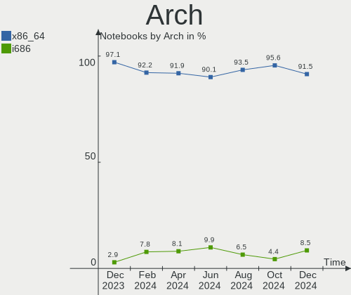
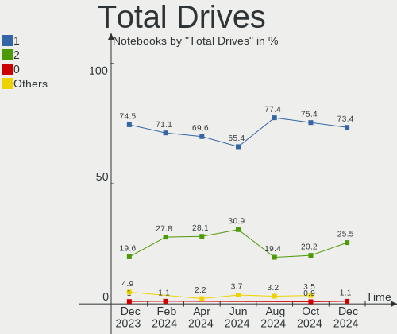
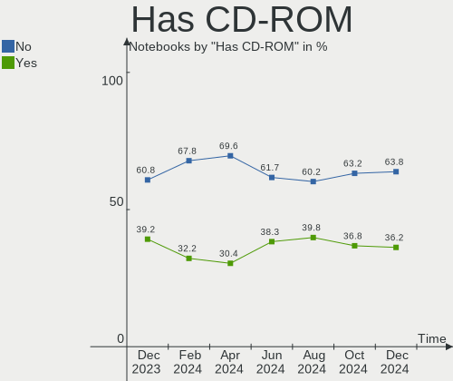
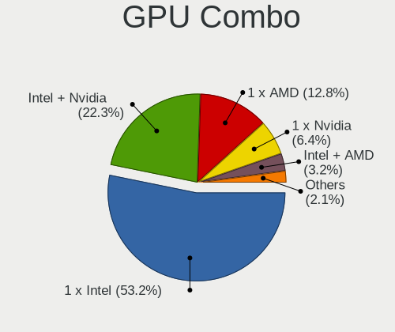

ROSA - Hardware Trends (Notebooks)
----------------------------------

A project to identify most popular hardware characteristics and track their change
over time based on data collected by Linux users at https://Linux-Hardware.org.

Anyone can contribute to this report by the [hw-probe](https://github.com/linuxhw/hw-probe) tool:

    sudo -E hw-probe -all -upload

This report is for one last month. Overall report since the beginning of time: [TestDays](https://github.com/linuxhw/TestDays)

Period: Apr, 2024.

Contents
--------

* [ System ](#system)
  - [ OS                       ](#os)
  - [ OS Family                ](#os-family)
  - [ Kernel                   ](#kernel)
  - [ Kernel Family            ](#kernel-family)
  - [ Kernel Major Ver.        ](#kernel-major-ver)
  - [ Arch                     ](#arch)
  - [ DE                       ](#de)
  - [ Display Server           ](#display-server)
  - [ Display Manager          ](#display-manager)
  - [ OS Lang                  ](#os-lang)
  - [ Boot Mode                ](#boot-mode)
  - [ Filesystem               ](#filesystem)
  - [ Part. scheme             ](#part-scheme)
  - [ Dual Boot with Linux/BSD ](#dual-boot-with-linuxbsd)
  - [ Dual Boot (Win)          ](#dual-boot-win)

* [ Board ](#board)
  - [ Vendor                   ](#vendor)
  - [ Model                    ](#model)
  - [ Model Family             ](#model-family)
  - [ MFG Year                 ](#mfg-year)
  - [ Form Factor              ](#form-factor)
  - [ Secure Boot              ](#secure-boot)
  - [ Coreboot                 ](#coreboot)
  - [ RAM Size                 ](#ram-size)
  - [ RAM Used                 ](#ram-used)
  - [ Total Drives             ](#total-drives)
  - [ Has CD-ROM               ](#has-cd-rom)
  - [ Has Ethernet             ](#has-ethernet)
  - [ Has WiFi                 ](#has-wifi)
  - [ Has Bluetooth            ](#has-bluetooth)

* [ Location ](#location)
  - [ Country                  ](#country)
  - [ City                     ](#city)

* [ Drives ](#drives)
  - [ Drive Vendor             ](#drive-vendor)
  - [ Drive Model              ](#drive-model)
  - [ HDD Vendor               ](#hdd-vendor)
  - [ SSD Vendor               ](#ssd-vendor)
  - [ Drive Kind               ](#drive-kind)
  - [ Drive Connector          ](#drive-connector)
  - [ Drive Size               ](#drive-size)
  - [ Space Total              ](#space-total)
  - [ Space Used               ](#space-used)
  - [ Malfunc. Drives          ](#malfunc-drives)
  - [ Malfunc. Drive Vendor    ](#malfunc-drive-vendor)
  - [ Malfunc. HDD Vendor      ](#malfunc-hdd-vendor)
  - [ Malfunc. Drive Kind      ](#malfunc-drive-kind)
  - [ Failed Drives            ](#failed-drives)
  - [ Failed Drive Vendor      ](#failed-drive-vendor)
  - [ Drive Status             ](#drive-status)

* [ Storage controller ](#storage-controller)
  - [ Storage Vendor           ](#storage-vendor)
  - [ Storage Model            ](#storage-model)
  - [ Storage Kind             ](#storage-kind)

* [ Processor ](#processor)
  - [ CPU Vendor               ](#cpu-vendor)
  - [ CPU Model                ](#cpu-model)
  - [ CPU Model Family         ](#cpu-model-family)
  - [ CPU Cores                ](#cpu-cores)
  - [ CPU Sockets              ](#cpu-sockets)
  - [ CPU Threads              ](#cpu-threads)
  - [ CPU Op-Modes             ](#cpu-op-modes)
  - [ CPU Microcode            ](#cpu-microcode)
  - [ CPU Microarch            ](#cpu-microarch)

* [ Graphics ](#graphics)
  - [ GPU Vendor               ](#gpu-vendor)
  - [ GPU Model                ](#gpu-model)
  - [ GPU Combo                ](#gpu-combo)
  - [ GPU Driver               ](#gpu-driver)
  - [ GPU Memory               ](#gpu-memory)

* [ Monitor ](#monitor)
  - [ Monitor Vendor           ](#monitor-vendor)
  - [ Monitor Model            ](#monitor-model)
  - [ Monitor Resolution       ](#monitor-resolution)
  - [ Monitor Diagonal         ](#monitor-diagonal)
  - [ Monitor Width            ](#monitor-width)
  - [ Aspect Ratio             ](#aspect-ratio)
  - [ Monitor Area             ](#monitor-area)
  - [ Pixel Density            ](#pixel-density)
  - [ Multiple Monitors        ](#multiple-monitors)

* [ Network ](#network)
  - [ Net Controller Vendor    ](#net-controller-vendor)
  - [ Net Controller Model     ](#net-controller-model)
  - [ Wireless Vendor          ](#wireless-vendor)
  - [ Wireless Model           ](#wireless-model)
  - [ Ethernet Vendor          ](#ethernet-vendor)
  - [ Ethernet Model           ](#ethernet-model)
  - [ Net Controller Kind      ](#net-controller-kind)
  - [ Used Controller          ](#used-controller)
  - [ NICs                     ](#nics)
  - [ IPv6                     ](#ipv6)

* [ Bluetooth ](#bluetooth)
  - [ Bluetooth Vendor         ](#bluetooth-vendor)
  - [ Bluetooth Model          ](#bluetooth-model)

* [ Sound ](#sound)
  - [ Sound Vendor             ](#sound-vendor)
  - [ Sound Model              ](#sound-model)

* [ Memory ](#memory)
  - [ Memory Vendor            ](#memory-vendor)
  - [ Memory Model             ](#memory-model)
  - [ Memory Kind              ](#memory-kind)
  - [ Memory Form Factor       ](#memory-form-factor)
  - [ Memory Size              ](#memory-size)
  - [ Memory Speed             ](#memory-speed)

* [ Printers & scanners ](#printers--scanners)
  - [ Printer Vendor           ](#printer-vendor)
  - [ Printer Model            ](#printer-model)
  - [ Scanner Vendor           ](#scanner-vendor)
  - [ Scanner Model            ](#scanner-model)

* [ Camera ](#camera)
  - [ Camera Vendor            ](#camera-vendor)
  - [ Camera Model             ](#camera-model)

* [ Security ](#security)
  - [ Fingerprint Vendor       ](#fingerprint-vendor)
  - [ Fingerprint Model        ](#fingerprint-model)
  - [ Chipcard Vendor          ](#chipcard-vendor)
  - [ Chipcard Model           ](#chipcard-model)

* [ Unsupported ](#unsupported)
  - [ Unsupported Devices      ](#unsupported-devices)
  - [ Unsupported Device Types ](#unsupported-device-types)

System
------

OS
--

Installed operating systems

| Name       | Notebooks | Percent |
|------------|-----------|---------|
| ROSA 12.5  | 110       | 81.48%  |
| ROSA R11.1 | 6         | 4.44%   |
| ROSA 12.4  | 6         | 4.44%   |
| ROSA 12    | 6         | 4.44%   |
| ROSA 13.0  | 5         | 3.7%    |
| ROSA R8.1  | 1         | 0.74%   |
| ROSA 12.2  | 1         | 0.74%   |

OS Family
---------

OS without a version

| Name | Notebooks | Percent |
|------|-----------|---------|
| ROSA | 135       | 100%    |

Kernel
------

Version of the Linux kernel

| Version                             | Notebooks | Percent |
|-------------------------------------|-----------|---------|
| 6.6.21-generic-8rosa2021.1-x86_64   | 71        | 52.59%  |
| 6.1.81-generic-2rosa2021.1-x86_64   | 21        | 15.56%  |
| 5.15.127-generic-1rosa2021.1-i686   | 6         | 4.44%   |
| 6.1.20-generic-2rosa2021.1-x86_64   | 5         | 3.7%    |
| 6.6.27-generic-3rosa2021.1-x86_64   | 4         | 2.96%   |
| 6.6.27-generic-2rosa2021.1-x86_64   | 4         | 2.96%   |
| 6.6.22-generic-2rosa2023.1-x86_64   | 4         | 2.96%   |
| 6.1.86-generic-1rosa2021.1-x86_64   | 4         | 2.96%   |
| 5.10.184-generic-1rosa2021.1-x86_64 | 3         | 2.22%   |
| 6.1.58-generic-1rosa2021.1-x86_64   | 2         | 1.48%   |
| 5.4.32-generic-2rosa-i586           | 2         | 1.48%   |
| 5.15.127-generic-1rosa2021.1-x86_64 | 2         | 1.48%   |
| 6.8.6-generic-1rosa2023.1-x86_64    | 1         | 0.74%   |
| 5.4.83-generic-2rosa-x86_64         | 1         | 0.74%   |
| 5.10.74-generic-2rosa2021.1-x86_64  | 1         | 0.74%   |
| 4.9.155-nrj-desktop-1rosa-i586      | 1         | 0.74%   |
| 4.15.0-desktop-45.1rosa-i586        | 1         | 0.74%   |
| 4.15.0-desktop-122.124.1rosa-x86_64 | 1         | 0.74%   |
| 4.15.0-desktop-122.124.1rosa-i586   | 1         | 0.74%   |

Kernel Family
-------------

Linux kernel without a distro release

| Version  | Notebooks | Percent |
|----------|-----------|---------|
| 6.6.21   | 71        | 52.59%  |
| 6.1.81   | 21        | 15.56%  |
| 6.6.27   | 8         | 5.93%   |
| 5.15.127 | 8         | 5.93%   |
| 6.1.20   | 5         | 3.7%    |
| 6.6.22   | 4         | 2.96%   |
| 6.1.86   | 4         | 2.96%   |
| 5.10.184 | 3         | 2.22%   |
| 4.15.0   | 3         | 2.22%   |
| 6.1.58   | 2         | 1.48%   |
| 5.4.32   | 2         | 1.48%   |
| 6.8.6    | 1         | 0.74%   |
| 5.4.83   | 1         | 0.74%   |
| 5.10.74  | 1         | 0.74%   |
| 4.9.155  | 1         | 0.74%   |

Kernel Major Ver.
-----------------

Linux kernel major version

| Version | Notebooks | Percent |
|---------|-----------|---------|
| 6.6     | 83        | 61.48%  |
| 6.1     | 32        | 23.7%   |
| 5.15    | 8         | 5.93%   |
| 5.10    | 4         | 2.96%   |
| 5.4     | 3         | 2.22%   |
| 4.15    | 3         | 2.22%   |
| 6.8     | 1         | 0.74%   |
| 4.9     | 1         | 0.74%   |

Arch
----

OS architecture (x86_64, i586, etc.)

| Name   | Notebooks | Percent |
|--------|-----------|---------|
| x86_64 | 124       | 91.85%  |
| i686   | 11        | 8.15%   |

DE
--

Desktop Environment

| Name    | Notebooks | Percent |
|---------|-----------|---------|
| KDE5    | 78        | 57.78%  |
| GNOME   | 33        | 24.44%  |
| LXQt    | 16        | 11.85%  |
| KDE4    | 4         | 2.96%   |
| Unknown | 2         | 1.48%   |
| MATE    | 1         | 0.74%   |
| KDE6    | 1         | 0.74%   |

Display Server
--------------

X11 or Wayland

| Name    | Notebooks | Percent |
|---------|-----------|---------|
| Wayland | 107       | 79.26%  |
| X11     | 28        | 20.74%  |

Display Manager
---------------

SDDM, LightDM, etc.

| Name    | Notebooks | Percent |
|---------|-----------|---------|
| SDDM    | 81        | 60%     |
| GDM     | 43        | 31.85%  |
| LightDM | 7         | 5.19%   |
| KDM     | 4         | 2.96%   |

OS Lang
-------

Language

| Lang    | Notebooks | Percent |
|---------|-----------|---------|
| ru_RU   | 115       | 85.19%  |
| en_US   | 5         | 3.7%    |
| it_IT   | 4         | 2.96%   |
| de_DE   | 3         | 2.22%   |
| es_ES   | 2         | 1.48%   |
| sv_SE   | 1         | 0.74%   |
| pl_PL   | 1         | 0.74%   |
| fr_FR   | 1         | 0.74%   |
| es_VE   | 1         | 0.74%   |
| en_GB   | 1         | 0.74%   |
| Unknown | 1         | 0.74%   |

Boot Mode
---------

EFI or BIOS

| Mode | Notebooks | Percent |
|------|-----------|---------|
| EFI  | 80        | 59.26%  |
| BIOS | 55        | 40.74%  |

Filesystem
----------

Type of filesystem

| Type  | Notebooks | Percent |
|-------|-----------|---------|
| Ext4  | 118       | 87.41%  |
| Btrfs | 16        | 11.85%  |
| Xfs   | 1         | 0.74%   |

Part. scheme
------------

Scheme of partitioning

| Type | Notebooks | Percent |
|------|-----------|---------|
| GPT  | 82        | 60.74%  |
| MBR  | 53        | 39.26%  |

Dual Boot with Linux/BSD
------------------------

Hosting more than one Linux/BSD

| Dual boot | Notebooks | Percent |
|-----------|-----------|---------|
| No        | 101       | 74.81%  |
| Yes       | 34        | 25.19%  |

Dual Boot (Win)
---------------

Hosting Linux and Windows

| Dual boot | Notebooks | Percent |
|-----------|-----------|---------|
| No        | 84        | 62.22%  |
| Yes       | 51        | 37.78%  |

Board
-----

Vendor
------

Motherboard manufacturer

| Name                     | Notebooks | Percent |
|--------------------------|-----------|---------|
| Lenovo                   | 26        | 19.26%  |
| Hewlett-Packard          | 18        | 13.33%  |
| ASUSTek Computer         | 18        | 13.33%  |
| Acer                     | 17        | 12.59%  |
| Toshiba                  | 5         | 3.7%    |
| Dell                     | 5         | 3.7%    |
| Samsung Electronics      | 4         | 2.96%   |
| Unknown                  | 4         | 2.96%   |
| Sony                     | 3         | 2.22%   |
| MSI                      | 3         | 2.22%   |
| DEXP                     | 3         | 2.22%   |
| Timi                     | 2         | 1.48%   |
| Packard Bell             | 2         | 1.48%   |
| Notebook                 | 2         | 1.48%   |
| HUAWEI                   | 2         | 1.48%   |
| Clevo                    | 2         | 1.48%   |
| Aquarius                 | 2         | 1.48%   |
| XIAOMI                   | 1         | 0.74%   |
| TPS                      | 1         | 0.74%   |
| Standard                 | 1         | 0.74%   |
| Microtech                | 1         | 0.74%   |
| Medion                   | 1         | 0.74%   |
| Maibenben                | 1         | 0.74%   |
| Infinix                  | 1         | 0.74%   |
| HONOR                    | 1         | 0.74%   |
| HIPER Technology Limited | 1         | 0.74%   |
| HIPER                    | 1         | 0.74%   |
| Haier                    | 1         | 0.74%   |
| GPU Company              | 1         | 0.74%   |
| Fujitsu Siemens          | 1         | 0.74%   |
| eMachines                | 1         | 0.74%   |
| DEPO Computers           | 1         | 0.74%   |
| Apple                    | 1         | 0.74%   |
| ANCOMP                   | 1         | 0.74%   |

Model
-----

Motherboard model

| Name                                | Notebooks | Percent |
|-------------------------------------|-----------|---------|
| Unknown                             | 5         | 3.7%    |
| HP ProBook 450 G5                   | 2         | 1.48%   |
| HP Pavilion m6                      | 2         | 1.48%   |
| HP EliteBook 8440p                  | 2         | 1.48%   |
| Clevo NL41MU2                       | 2         | 1.48%   |
| XIAOMI Redmi Book 14 2024           | 1         | 0.74%   |
| TPS C48P                            | 1         | 0.74%   |
| Toshiba Satellite U300              | 1         | 0.74%   |
| Toshiba Satellite Pro L300          | 1         | 0.74%   |
| Toshiba Satellite C850-C1S          | 1         | 0.74%   |
| Toshiba Satellite C850-B1K          | 1         | 0.74%   |
| Toshiba Satellite A200              | 1         | 0.74%   |
| Timi Xiaomi Book Pro 14 2022        | 1         | 0.74%   |
| Timi TM1701                         | 1         | 0.74%   |
| Sony VGN-FW11ER                     | 1         | 0.74%   |
| Sony SVF14A15CLB                    | 1         | 0.74%   |
| Sony SVE1512G1RB                    | 1         | 0.74%   |
| Samsung RV415/RV515/E3415           | 1         | 0.74%   |
| Samsung RV413/RV513                 | 1         | 0.74%   |
| Samsung R510/P510                   | 1         | 0.74%   |
| Samsung 350V5C/351V5C/3540VC/3440VC | 1         | 0.74%   |
| Packard Bell EasyNote TV11HC        | 1         | 0.74%   |
| Packard Bell EasyNote TE69KB        | 1         | 0.74%   |
| Notebook WA50SRQ                    | 1         | 0.74%   |
| Notebook Si155                      | 1         | 0.74%   |
| MSI MS-N014                         | 1         | 0.74%   |
| MSI GL62M 7RDX                      | 1         | 0.74%   |
| MSI CX600                           | 1         | 0.74%   |
| Microtech CoreBook Lite             | 1         | 0.74%   |
| Medion E1210                        | 1         | 0.74%   |
| Maibenben Perfectum Series          | 1         | 0.74%   |
| Lenovo Yoga 2 13 20344              | 1         | 0.74%   |
| Lenovo ThinkPad X250 20CLS75800     | 1         | 0.74%   |
| Lenovo ThinkPad X250 20CLS2JX00     | 1         | 0.74%   |
| Lenovo ThinkPad T61 7663PJG         | 1         | 0.74%   |
| Lenovo ThinkPad T60 1952W2Q         | 1         | 0.74%   |
| Lenovo ThinkPad T490s 20NX0056MX    | 1         | 0.74%   |
| Lenovo ThinkPad T480 20L6S57T00     | 1         | 0.74%   |
| Lenovo ThinkPad SL510 28477EG       | 1         | 0.74%   |
| Lenovo ThinkPad Edge 021722G        | 1         | 0.74%   |

Model Family
------------

Motherboard model prefix

| Name                  | Notebooks | Percent |
|-----------------------|-----------|---------|
| Acer Aspire           | 10        | 7.41%   |
| Lenovo ThinkPad       | 9         | 6.67%   |
| Lenovo IdeaPad        | 8         | 5.93%   |
| Toshiba Satellite     | 5         | 3.7%    |
| HP Pavilion           | 5         | 3.7%    |
| Unknown               | 5         | 3.7%    |
| HP ProBook            | 3         | 2.22%   |
| HP Laptop             | 3         | 2.22%   |
| HP EliteBook          | 3         | 2.22%   |
| DEXP Atlas            | 3         | 2.22%   |
| Dell Inspiron         | 3         | 2.22%   |
| Packard Bell EasyNote | 2         | 1.48%   |
| Lenovo ThinkBook      | 2         | 1.48%   |
| Dell Vostro           | 2         | 1.48%   |
| Clevo NL41MU2         | 2         | 1.48%   |
| ASUS VivoBook         | 2         | 1.48%   |
| XIAOMI Redmi          | 1         | 0.74%   |
| TPS C48P              | 1         | 0.74%   |
| Timi Xiaomi           | 1         | 0.74%   |
| Timi TM1701           | 1         | 0.74%   |
| Sony VGN-FW11ER       | 1         | 0.74%   |
| Sony SVF14A15CLB      | 1         | 0.74%   |
| Sony SVE1512G1RB      | 1         | 0.74%   |
| Samsung RV415         | 1         | 0.74%   |
| Samsung RV413         | 1         | 0.74%   |
| Samsung R510          | 1         | 0.74%   |
| Samsung 350V5C        | 1         | 0.74%   |
| Notebook WA50SRQ      | 1         | 0.74%   |
| Notebook Si155        | 1         | 0.74%   |
| MSI MS-N014           | 1         | 0.74%   |
| MSI GL62M             | 1         | 0.74%   |
| MSI CX600             | 1         | 0.74%   |
| Microtech CoreBook    | 1         | 0.74%   |
| Medion E1210          | 1         | 0.74%   |
| Maibenben Perfectum   | 1         | 0.74%   |
| Lenovo Yoga           | 1         | 0.74%   |
| Lenovo Legion         | 1         | 0.74%   |
| Lenovo G50-30         | 1         | 0.74%   |
| Lenovo B590           | 1         | 0.74%   |
| Lenovo B50-80         | 1         | 0.74%   |

MFG Year
--------

Motherboard manufacture year

| Year | Notebooks | Percent |
|------|-----------|---------|
| 2012 | 16        | 11.85%  |
| 2023 | 10        | 7.41%   |
| 2021 | 10        | 7.41%   |
| 2017 | 9         | 6.67%   |
| 2013 | 9         | 6.67%   |
| 2010 | 9         | 6.67%   |
| 2008 | 9         | 6.67%   |
| 2011 | 8         | 5.93%   |
| 2009 | 8         | 5.93%   |
| 2022 | 7         | 5.19%   |
| 2019 | 7         | 5.19%   |
| 2018 | 7         | 5.19%   |
| 2020 | 6         | 4.44%   |
| 2015 | 5         | 3.7%    |
| 2014 | 5         | 3.7%    |
| 2016 | 4         | 2.96%   |
| 2007 | 3         | 2.22%   |
| 2006 | 2         | 1.48%   |
| 2024 | 1         | 0.74%   |

Form Factor
-----------

Physical design of the computer

| Name     | Notebooks | Percent |
|----------|-----------|---------|
| Notebook | 135       | 100%    |

Secure Boot
-----------

Enabled or disabled

| State    | Notebooks | Percent |
|----------|-----------|---------|
| Disabled | 135       | 100%    |

Coreboot
--------

Have coreboot on board

| Used | Notebooks | Percent |
|------|-----------|---------|
| No   | 135       | 100%    |

RAM Size
--------

Total RAM memory

| Size in GB | Notebooks | Percent |
|------------|-----------|---------|
| 4.01-8.0   | 50        | 37.04%  |
| 3.01-4.0   | 26        | 19.26%  |
| 8.01-16.0  | 24        | 17.78%  |
| 16.01-24.0 | 16        | 11.85%  |
| 1.01-2.0   | 14        | 10.37%  |
| 2.01-3.0   | 3         | 2.22%   |
| 24.01-32.0 | 1         | 0.74%   |
| 0.51-1.0   | 1         | 0.74%   |

RAM Used
--------

Used RAM memory

| Used GB  | Notebooks | Percent |
|----------|-----------|---------|
| 1.01-2.0 | 79        | 58.52%  |
| 2.01-3.0 | 22        | 16.3%   |
| 0.51-1.0 | 21        | 15.56%  |
| 3.01-4.0 | 7         | 5.19%   |
| 4.01-8.0 | 3         | 2.22%   |
| 0.01-0.5 | 3         | 2.22%   |

Total Drives
------------

Number of drives on board

| Drives | Notebooks | Percent |
|--------|-----------|---------|
| 1      | 94        | 69.63%  |
| 2      | 38        | 28.15%  |
| 3      | 3         | 2.22%   |

Has CD-ROM
----------

Has CD-ROM on board

| Presented | Notebooks | Percent |
|-----------|-----------|---------|
| No        | 94        | 69.63%  |
| Yes       | 41        | 30.37%  |

Has Ethernet
------------

Has Ethernet on board

| Presented | Notebooks | Percent |
|-----------|-----------|---------|
| Yes       | 110       | 81.48%  |
| No        | 25        | 18.52%  |

Has WiFi
--------

Has WiFi module

| Presented | Notebooks | Percent |
|-----------|-----------|---------|
| Yes       | 135       | 100%    |

Has Bluetooth
-------------

Has Bluetooth module

| Presented | Notebooks | Percent |
|-----------|-----------|---------|
| Yes       | 99        | 73.33%  |
| No        | 36        | 26.67%  |

Location
--------

Country
-------

Geographic location (country)

| Country   | Notebooks | Percent |
|-----------|-----------|---------|
| Russia    | 114       | 84.44%  |
| Italy     | 4         | 2.96%   |
| Ukraine   | 2         | 1.48%   |
| Germany   | 2         | 1.48%   |
| France    | 2         | 1.48%   |
| Venezuela | 1         | 0.74%   |
| USA       | 1         | 0.74%   |
| Sweden    | 1         | 0.74%   |
| Spain     | 1         | 0.74%   |
| Poland    | 1         | 0.74%   |
| Israel    | 1         | 0.74%   |
| Ecuador   | 1         | 0.74%   |
| Czechia   | 1         | 0.74%   |
| Brazil    | 1         | 0.74%   |
| Belarus   | 1         | 0.74%   |
| Austria   | 1         | 0.74%   |

City
----

Geographic location (city)

| City                 | Notebooks | Percent |
|----------------------|-----------|---------|
| Moscow               | 37        | 27.41%  |
| St Petersburg        | 11        | 8.15%   |
| Kemerovo             | 4         | 2.96%   |
| Novosibirsk          | 3         | 2.22%   |
| Krasnodar            | 3         | 2.22%   |
| Zima                 | 2         | 1.48%   |
| Voronezh             | 2         | 1.48%   |
| Saratov              | 2         | 1.48%   |
| Rostov-on-Don        | 2         | 1.48%   |
| Nizhniy Novgorod     | 2         | 1.48%   |
| Kazan’             | 2         | 1.48%   |
| Izhevsk              | 2         | 1.48%   |
| Barcelona            | 2         | 1.48%   |
| Zheleznodorozhnyy    | 1         | 0.74%   |
| Yoshkar-Ola          | 1         | 0.74%   |
| Yekaterinburg        | 1         | 0.74%   |
| Yaya                 | 1         | 0.74%   |
| Yaroslavl            | 1         | 0.74%   |
| Vologda              | 1         | 0.74%   |
| Volgograd            | 1         | 0.74%   |
| Vladivostok          | 1         | 0.74%   |
| Vladimir             | 1         | 0.74%   |
| Ufa                  | 1         | 0.74%   |
| Tyumen               | 1         | 0.74%   |
| Tambov               | 1         | 0.74%   |
| Surgut               | 1         | 0.74%   |
| Stary Oskol          | 1         | 0.74%   |
| Starobil's'k         | 1         | 0.74%   |
| Sochi                | 1         | 0.74%   |
| Smolensk             | 1         | 0.74%   |
| Severodvinsk         | 1         | 0.74%   |
| Saransk              | 1         | 0.74%   |
| Sao Paulo            | 1         | 0.74%   |
| San Giovanni Teatino | 1         | 0.74%   |
| Samara               | 1         | 0.74%   |
| Ryazan               | 1         | 0.74%   |
| Reggio Calabria      | 1         | 0.74%   |
| Ramenskoye           | 1         | 0.74%   |
| Quito                | 1         | 0.74%   |
| Prague               | 1         | 0.74%   |

Drives
------

Drive Vendor
------------

Hard drive vendors

| Vendor                      | Notebooks | Drives | Percent |
|-----------------------------|-----------|--------|---------|
| WDC                         | 20        | 23     | 11.63%  |
| Seagate                     | 12        | 12     | 6.98%   |
| Samsung Electronics         | 12        | 12     | 6.98%   |
| Toshiba                     | 10        | 10     | 5.81%   |
| Hitachi                     | 10        | 10     | 5.81%   |
| Kingston                    | 9         | 10     | 5.23%   |
| SK hynix                    | 5         | 5      | 2.91%   |
| SanDisk                     | 5         | 5      | 2.91%   |
| Intel                       | 5         | 5      | 2.91%   |
| China                       | 5         | 5      | 2.91%   |
| Unknown                     | 4         | 4      | 2.33%   |
| Phison                      | 4         | 4      | 2.33%   |
| Micron Technology           | 4         | 4      | 2.33%   |
| HGST                        | 4         | 4      | 2.33%   |
| Crucial                     | 4         | 4      | 2.33%   |
| BIWIN                       | 4         | 4      | 2.33%   |
| Apacer                      | 4         | 4      | 2.33%   |
| A-DATA Technology           | 4         | 4      | 2.33%   |
| Qumo                        | 3         | 3      | 1.74%   |
| YMTC                        | 2         | 2      | 1.16%   |
| XrayDisk                    | 2         | 2      | 1.16%   |
| SPCC                        | 2         | 2      | 1.16%   |
| RTS                         | 2         | 2      | 1.16%   |
| Plextor                     | 2         | 2      | 1.16%   |
| MAXIO Technology (Hangzhou) | 2         | 2      | 1.16%   |
| KIOXIA                      | 2         | 2      | 1.16%   |
| KingSpec                    | 2         | 2      | 1.16%   |
| Kimtigo                     | 2         | 2      | 1.16%   |
| AMD                         | 2         | 3      | 1.16%   |
| Zheino                      | 1         | 1      | 0.58%   |
| Transcend                   | 1         | 1      | 0.58%   |
| Silicon Motion              | 1         | 1      | 0.58%   |
| SCY                         | 1         | 1      | 0.58%   |
| Q600S                       | 1         | 1      | 0.58%   |
| OCZ                         | 1         | 1      | 0.58%   |
| Netac                       | 1         | 1      | 0.58%   |
| Neo                         | 1         | 1      | 0.58%   |
| MicroFrom                   | 1         | 1      | 0.58%   |
| M500                        | 1         | 1      | 0.58%   |
| Lexar                       | 1         | 1      | 0.58%   |

Drive Model
-----------

Hard drive models

| Model                                 | Notebooks | Percent |
|---------------------------------------|-----------|---------|
| Samsung HM500JI 500GB                 | 3         | 1.7%    |
| YMTC PC300-512GB-B                    | 2         | 1.14%   |
| Toshiba MQ01ABF050 500GB              | 2         | 1.14%   |
| Toshiba MQ01ABD050 500GB              | 2         | 1.14%   |
| RTS 256G SSD                          | 2         | 1.14%   |
| Qumo Q3DT-256GMSY-M2 256GB SSD        | 2         | 1.14%   |
| MAXIO (Hangzhou) NVMe SSD Drive 512GB | 2         | 1.14%   |
| Kingston SA400S37480G 480GB SSD       | 2         | 1.14%   |
| Kingston SA400S37240G 240GB SSD       | 2         | 1.14%   |
| Hitachi HTS545025B9A300 250GB         | 2         | 1.14%   |
| China SSD 512GB                       | 2         | 1.14%   |
| BIWIN CE480T5D101-256 256GB           | 2         | 1.14%   |
| Zheino CHN 25SATAS3 128 128GB SSD     | 1         | 0.57%   |
| XrayDisk SSD 120GB                    | 1         | 0.57%   |
| XrayDisk 2TB SSD                      | 1         | 0.57%   |
| WDC WDS500G2B0A-00SM50 500GB SSD      | 1         | 0.57%   |
| WDC WDS240G2G0A-00JH30 240GB SSD      | 1         | 0.57%   |
| WDC WDS120G2G0A-00JH30 120GB SSD      | 1         | 0.57%   |
| WDC WD7500BPVX-60JC3T0 752GB          | 1         | 0.57%   |
| WDC WD7500BPVT-00HXZT3 752GB          | 1         | 0.57%   |
| WDC WD600BEVS-07LAT0 64GB             | 1         | 0.57%   |
| WDC WD5000LPVX-80V0TT0 500GB          | 1         | 0.57%   |
| WDC WD5000LPVX-22V0TT0 500GB          | 1         | 0.57%   |
| WDC WD5000LPLX-00ZNTT0 500GB          | 1         | 0.57%   |
| WDC WD5000LPCX-60VHAT0 500GB          | 1         | 0.57%   |
| WDC WD5000LPCX-24VHAT0 500GB          | 1         | 0.57%   |
| WDC WD5000LPCX-24C6HT0 500GB          | 1         | 0.57%   |
| WDC WD3200LPCX-24C6HT0 320GB          | 1         | 0.57%   |
| WDC WD3200BPVT-22JJ5T0 320GB          | 1         | 0.57%   |
| WDC WD3200BEVT-80A0RT1 320GB          | 1         | 0.57%   |
| WDC WD3200BEVT-22ZCT0 320GB           | 1         | 0.57%   |
| WDC WD1600BEVS-22RST0 160GB           | 1         | 0.57%   |
| WDC WD10JPVX-75JC3T0 1TB              | 1         | 0.57%   |
| WDC WD10JPVT-60A1YT0 1TB              | 1         | 0.57%   |
| WDC PC SN730 SDBQNTY-1T00-1001 1TB    | 1         | 0.57%   |
| WDC PC SN730 SDBPNTY-512G-1101 512GB  | 1         | 0.57%   |
| WDC PC SN530 SDBPNPZ-256G-1114 256GB  | 1         | 0.57%   |
| Unknown SLD64G  64GB                  | 1         | 0.57%   |
| Unknown S0J59X  128GB                 | 1         | 0.57%   |
| Unknown Biwin  64GB                   | 1         | 0.57%   |

HDD Vendor
----------

Hard disk drive vendors

| Vendor              | Notebooks | Drives | Percent |
|---------------------|-----------|--------|---------|
| WDC                 | 15        | 17     | 27.27%  |
| Seagate             | 12        | 12     | 21.82%  |
| Hitachi             | 10        | 10     | 18.18%  |
| Toshiba             | 9         | 9      | 16.36%  |
| Samsung Electronics | 4         | 4      | 7.27%   |
| HGST                | 4         | 4      | 7.27%   |
| JMicron Technology  | 1         | 1      | 1.82%   |

SSD Vendor
----------

Solid state drive vendors

| Vendor              | Notebooks | Drives | Percent |
|---------------------|-----------|--------|---------|
| Kingston            | 9         | 10     | 12.68%  |
| China               | 5         | 5      | 7.04%   |
| SanDisk             | 4         | 4      | 5.63%   |
| Apacer              | 4         | 4      | 5.63%   |
| A-DATA Technology   | 4         | 4      | 5.63%   |
| WDC                 | 3         | 3      | 4.23%   |
| Samsung Electronics | 3         | 3      | 4.23%   |
| Qumo                | 3         | 3      | 4.23%   |
| Crucial             | 3         | 3      | 4.23%   |
| XrayDisk            | 2         | 2      | 2.82%   |
| RTS                 | 2         | 2      | 2.82%   |
| Plextor             | 2         | 2      | 2.82%   |
| KingSpec            | 2         | 2      | 2.82%   |
| Kimtigo             | 2         | 2      | 2.82%   |
| AMD                 | 2         | 2      | 2.82%   |
| Zheino              | 1         | 1      | 1.41%   |
| Transcend           | 1         | 1      | 1.41%   |
| Toshiba             | 1         | 1      | 1.41%   |
| SPCC                | 1         | 1      | 1.41%   |
| SK hynix            | 1         | 1      | 1.41%   |
| Q600S               | 1         | 1      | 1.41%   |
| Phison              | 1         | 1      | 1.41%   |
| OCZ                 | 1         | 1      | 1.41%   |
| Neo                 | 1         | 1      | 1.41%   |
| Micron Technology   | 1         | 1      | 1.41%   |
| MicroFrom           | 1         | 1      | 1.41%   |
| M500                | 1         | 1      | 1.41%   |
| KingDian            | 1         | 1      | 1.41%   |
| HJDK                | 1         | 1      | 1.41%   |
| GS                  | 1         | 1      | 1.41%   |
| GOODRAM             | 1         | 1      | 1.41%   |
| Fanxiang            | 1         | 1      | 1.41%   |
| ExeGate             | 1         | 1      | 1.41%   |
| Emtec               | 1         | 1      | 1.41%   |
| DEXP                | 1         | 1      | 1.41%   |
| Unknown             | 1         | 1      | 1.41%   |

Drive Kind
----------

HDD or SSD

| Kind    | Notebooks | Drives | Percent |
|---------|-----------|--------|---------|
| SSD     | 65        | 72     | 40.37%  |
| HDD     | 51        | 57     | 31.68%  |
| NVMe    | 39        | 42     | 24.22%  |
| MMC     | 5         | 5      | 3.11%   |
| Unknown | 1         | 1      | 0.62%   |

Drive Connector
---------------

SATA, SAS, NVMe, etc.

| Type | Notebooks | Drives | Percent |
|------|-----------|--------|---------|
| SATA | 97        | 123    | 65.54%  |
| NVMe | 39        | 42     | 26.35%  |
| SAS  | 7         | 7      | 4.73%   |
| MMC  | 5         | 5      | 3.38%   |

Drive Size
----------

Size of hard drive

| Size in TB | Notebooks | Drives | Percent |
|------------|-----------|--------|---------|
| 0.01-0.5   | 84        | 98     | 75.68%  |
| 0.51-1.0   | 25        | 29     | 22.52%  |
| 1.01-2.0   | 2         | 2      | 1.8%    |

Space Total
-----------

Amount of disk space available on the file system

| Size in GB     | Notebooks | Percent |
|----------------|-----------|---------|
| 101-250        | 42        | 31.11%  |
| 251-500        | 36        | 26.67%  |
| 1-20           | 19        | 14.07%  |
| 501-1000       | 13        | 9.63%   |
| 51-100         | 9         | 6.67%   |
| 21-50          | 7         | 5.19%   |
| 1001-2000      | 7         | 5.19%   |
| More than 3000 | 1         | 0.74%   |
| Unknown        | 1         | 0.74%   |

Space Used
----------

Amount of used disk space

| Used GB        | Notebooks | Percent |
|----------------|-----------|---------|
| 1-20           | 88        | 65.19%  |
| 21-50          | 22        | 16.3%   |
| 51-100         | 9         | 6.67%   |
| 101-250        | 6         | 4.44%   |
| 251-500        | 5         | 3.7%    |
| 501-1000       | 2         | 1.48%   |
| More than 3000 | 1         | 0.74%   |
| 1001-2000      | 1         | 0.74%   |
| Unknown        | 1         | 0.74%   |

Malfunc. Drives
---------------

Drive models with a malfunction

| Model                                   | Notebooks | Drives | Percent |
|-----------------------------------------|-----------|--------|---------|
| WDC WDS240G2G0A-00JH30 240GB SSD        | 1         | 1      | 2.78%   |
| WDC WD7500BPVX-60JC3T0 752GB            | 1         | 1      | 2.78%   |
| WDC WD600BEVS-07LAT0 64GB               | 1         | 1      | 2.78%   |
| WDC WD5000LPVX-80V0TT0 500GB            | 1         | 1      | 2.78%   |
| WDC WD5000LPVX-22V0TT0 500GB            | 1         | 1      | 2.78%   |
| WDC WD5000LPCX-24VHAT0 500GB            | 1         | 1      | 2.78%   |
| WDC WD3200BEVT-80A0RT1 320GB            | 1         | 1      | 2.78%   |
| WDC WD1600BEVS-22RST0 160GB             | 1         | 1      | 2.78%   |
| WDC WD10JPVT-60A1YT0 1TB                | 1         | 2      | 2.78%   |
| Toshiba THNSNK128GCS8 SATA 128GB SSD    | 1         | 1      | 2.78%   |
| Toshiba MQ01ABF050 500GB                | 1         | 1      | 2.78%   |
| Toshiba MQ01ABD100H 1TB                 | 1         | 1      | 2.78%   |
| Toshiba MQ01ABD050 500GB                | 1         | 1      | 2.78%   |
| Toshiba MK6034GSX 64GB                  | 1         | 1      | 2.78%   |
| Toshiba HDWJ110 1TB                     | 1         | 1      | 2.78%   |
| Seagate ST9250315AS 250GB               | 1         | 1      | 2.78%   |
| Seagate ST9160310AS 160GB               | 1         | 1      | 2.78%   |
| Seagate ST320LT012-9WS14C 320GB         | 1         | 1      | 2.78%   |
| Seagate ST31000528AS 1TB                | 1         | 1      | 2.78%   |
| Seagate ST1000LM 024 HN-M101MBB 1TB     | 1         | 1      | 2.78%   |
| Samsung Electronics HM500JI 500GB       | 1         | 1      | 2.78%   |
| Samsung Electronics HM160HI 160GB       | 1         | 1      | 2.78%   |
| Plextor PX-128M6Pro 128GB SSD           | 1         | 1      | 2.78%   |
| OCZ VECTOR150 120GB SSD                 | 1         | 1      | 2.78%   |
| Neo Forza NFS121SA324-6007000 240GB SSD | 1         | 1      | 2.78%   |
| Kingston SUV500MS240G 240GB SSD         | 1         | 1      | 2.78%   |
| Kingston SHFS37A120G 120GB SSD          | 1         | 1      | 2.78%   |
| Kingston SH103S3120G 120GB SSD          | 1         | 1      | 2.78%   |
| Hitachi HTS545050A7E380 500GB           | 1         | 1      | 2.78%   |
| Hitachi HTS545025B9A300 250GB           | 1         | 1      | 2.78%   |
| Hitachi HTS545016B9A300 160GB           | 1         | 1      | 2.78%   |
| Hitachi HTS542525K9SA00 250GB           | 1         | 1      | 2.78%   |
| Hitachi HTS541616J9SA00 160GB           | 1         | 1      | 2.78%   |
| Hitachi HTS541612J9SA00 120GB           | 1         | 1      | 2.78%   |
| HGST HTS725032A7E630 320GB              | 1         | 1      | 2.78%   |
| DEXP SSD C100 1024Gb 1TB                | 1         | 1      | 2.78%   |

Malfunc. Drive Vendor
---------------------

Vendors of faulty drives

| Vendor              | Notebooks | Drives | Percent |
|---------------------|-----------|--------|---------|
| WDC                 | 9         | 10     | 25%     |
| Toshiba             | 6         | 6      | 16.67%  |
| Hitachi             | 6         | 6      | 16.67%  |
| Seagate             | 5         | 5      | 13.89%  |
| Kingston            | 3         | 3      | 8.33%   |
| Samsung Electronics | 2         | 2      | 5.56%   |
| Plextor             | 1         | 1      | 2.78%   |
| OCZ                 | 1         | 1      | 2.78%   |
| Neo                 | 1         | 1      | 2.78%   |
| HGST                | 1         | 1      | 2.78%   |
| DEXP                | 1         | 1      | 2.78%   |

Malfunc. HDD Vendor
-------------------

Vendors of faulty HDD drives

| Vendor              | Notebooks | Drives | Percent |
|---------------------|-----------|--------|---------|
| WDC                 | 8         | 9      | 29.63%  |
| Hitachi             | 6         | 6      | 22.22%  |
| Toshiba             | 5         | 5      | 18.52%  |
| Seagate             | 5         | 5      | 18.52%  |
| Samsung Electronics | 2         | 2      | 7.41%   |
| HGST                | 1         | 1      | 3.7%    |

Malfunc. Drive Kind
-------------------

Kinds of faulty drives

| Kind | Notebooks | Drives | Percent |
|------|-----------|--------|---------|
| HDD  | 27        | 28     | 75%     |
| SSD  | 9         | 9      | 25%     |

Failed Drives
-------------

Failed drive models

| Model                                   | Notebooks | Drives | Percent |
|-----------------------------------------|-----------|--------|---------|
| SK hynix BC501 HFM256GDJTNG-8310A 256GB | 1         | 1      | 100%    |

Failed Drive Vendor
-------------------

Failed drive vendors

| Vendor   | Notebooks | Drives | Percent |
|----------|-----------|--------|---------|
| SK hynix | 1         | 1      | 100%    |

Drive Status
------------

Number of failed and malfunc. drives

| Status   | Notebooks | Drives | Percent |
|----------|-----------|--------|---------|
| Works    | 99        | 126    | 66.44%  |
| Malfunc  | 36        | 37     | 24.16%  |
| Detected | 13        | 13     | 8.72%   |
| Failed   | 1         | 1      | 0.67%   |

Storage controller
------------------

Storage Vendor
--------------

Storage controller vendors

| Vendor                           | Notebooks | Percent |
|----------------------------------|-----------|---------|
| Intel                            | 98        | 62.42%  |
| AMD                              | 21        | 13.38%  |
| Samsung Electronics              | 6         | 3.82%   |
| SK hynix                         | 4         | 2.55%   |
| MAXIO Technology (Hangzhou)      | 4         | 2.55%   |
| Shenzhen Longsys Electronics     | 3         | 1.91%   |
| Micron Technology                | 3         | 1.91%   |
| Yangtze Memory Technologies      | 2         | 1.27%   |
| Silicon Motion                   | 2         | 1.27%   |
| Silicon Integrated Systems [SiS] | 2         | 1.27%   |
| SanDisk                          | 2         | 1.27%   |
| Phison Electronics               | 2         | 1.27%   |
| KIOXIA                           | 2         | 1.27%   |
| INNOGRIT                         | 2         | 1.27%   |
| Shenzhen Shichuangyi Electronics | 1         | 0.64%   |
| Netac Technology                 | 1         | 0.64%   |
| Micron/Crucial Technology        | 1         | 0.64%   |
| Kingston Technology Company      | 1         | 0.64%   |

Storage Model
-------------

Storage controller models

| Model                                                                          | Notebooks | Percent |
|--------------------------------------------------------------------------------|-----------|---------|
| AMD FCH SATA Controller [AHCI mode]                                            | 17        | 10.06%  |
| Intel 7 Series Chipset Family 6-port SATA Controller [AHCI mode]               | 16        | 9.47%   |
| Intel Sunrise Point-LP SATA Controller [AHCI mode]                             | 9         | 5.33%   |
| Intel 6 Series/C200 Series Chipset Family 6 port Mobile SATA AHCI Controller   | 6         | 3.55%   |
| Intel Wildcat Point-LP SATA Controller [AHCI Mode]                             | 5         | 2.96%   |
| Intel 82801IBM/IEM (ICH9M/ICH9M-E) 4 port SATA Controller [AHCI mode]          | 5         | 2.96%   |
| Intel 82801HM/HEM (ICH8M/ICH8M-E) SATA Controller [AHCI mode]                  | 5         | 2.96%   |
| Intel 82801HM/HEM (ICH8M/ICH8M-E) IDE Controller                               | 5         | 2.96%   |
| Intel 82801 Mobile SATA Controller [RAID mode]                                 | 5         | 2.96%   |
| MAXIO (Hangzhou) NVMe SSD Controller MAP1202 (DRAM-less)                       | 4         | 2.37%   |
| Intel Tiger Lake-LP SATA Controller                                            | 4         | 2.37%   |
| Intel NM10/ICH7 Family SATA Controller [AHCI mode]                             | 4         | 2.37%   |
| Intel 5 Series/3400 Series Chipset 4 port SATA AHCI Controller                 | 4         | 2.37%   |
| Samsung NVMe SSD Controller 980 (DRAM-less)                                    | 3         | 1.78%   |
| Intel SSD 660P Series                                                          | 3         | 1.78%   |
| Intel Celeron/Pentium Silver Processor SATA Controller                         | 3         | 1.78%   |
| Intel Alder Lake-P SATA AHCI Controller                                        | 3         | 1.78%   |
| Intel 82801GBM/GHM (ICH7-M Family) SATA Controller [IDE mode]                  | 3         | 1.78%   |
| Intel 82801GBM/GHM (ICH7-M Family) SATA Controller [AHCI mode]                 | 3         | 1.78%   |
| Intel 8 Series SATA Controller 1 [AHCI mode]                                   | 3         | 1.78%   |
| AMD SB7x0/SB8x0/SB9x0 SATA Controller [AHCI mode]                              | 3         | 1.78%   |
| Yangtze Memory PC300 NVMe SSD (DRAM-less)                                      | 2         | 1.18%   |
| SK hynix Gold P31/BC711/PC711 NVMe Solid State Drive                           | 2         | 1.18%   |
| Silicon Integrated Systems [SiS] SATA Controller / IDE mode                    | 2         | 1.18%   |
| Silicon Integrated Systems [SiS] 5513 IDE Controller                           | 2         | 1.18%   |
| Samsung NVMe SSD Controller SM961/PM961/SM963                                  | 2         | 1.18%   |
| Intel Comet Lake SATA AHCI Controller                                          | 2         | 1.18%   |
| Intel Celeron N3350/Pentium N4200/Atom E3900 Series SATA AHCI Controller       | 2         | 1.18%   |
| Intel Cannon Point-LP SATA Controller [AHCI Mode]                              | 2         | 1.18%   |
| Intel Cannon Lake Mobile PCH SATA AHCI Controller                              | 2         | 1.18%   |
| Intel Atom Processor E3800 Series SATA AHCI Controller                         | 2         | 1.18%   |
| Intel 8 Series/C220 Series Chipset Family 6-port SATA Controller 1 [AHCI mode] | 2         | 1.18%   |
| Intel 5 Series/3400 Series Chipset 6 port SATA AHCI Controller                 | 2         | 1.18%   |
| INNOGRIT NVMe SSD Controller IG5216 (DRAM-less)                                | 2         | 1.18%   |
| SK hynix BC511 NVMe SSD                                                        | 1         | 0.59%   |
| SK hynix BC501 NVMe Solid State Drive                                          | 1         | 0.59%   |
| Silicon Motion SM2263EN/SM2263XT (DRAM-less) NVMe SSD Controllers              | 1         | 0.59%   |
| Silicon Motion Non-Volatile memory controller                                  | 1         | 0.59%   |
| Shenzhen Shichuangyi MAP1202-Based NVMe SSD (DRAM-less)                        | 1         | 0.59%   |
| Shenzhen Longsys SM2263EN/SM2263XT-based OEM NVME SSD (DRAM-less)              | 1         | 0.59%   |

Storage Kind
------------

Kind of storage controller (IDE, SATA, NVMe, SAS, ...)

| Kind | Notebooks | Percent |
|------|-----------|---------|
| SATA | 108       | 65.45%  |
| NVMe | 39        | 23.64%  |
| IDE  | 13        | 7.88%   |
| RAID | 5         | 3.03%   |

Processor
---------

CPU Vendor
----------

Processor vendors

| Vendor | Notebooks | Percent |
|--------|-----------|---------|
| Intel  | 105       | 77.78%  |
| AMD    | 30        | 22.22%  |

CPU Model
---------

Processor models

| Model                                        | Notebooks | Percent |
|----------------------------------------------|-----------|---------|
| Intel 11th Gen Core i5-1135G7 @ 2.40GHz      | 4         | 2.96%   |
| Intel Core i5-8250U CPU @ 1.60GHz            | 3         | 2.22%   |
| Intel Core i5-3230M CPU @ 2.60GHz            | 3         | 2.22%   |
| Intel Atom CPU N270 @ 1.60GHz                | 3         | 2.22%   |
| AMD Ryzen 7 4700U with Radeon Graphics       | 3         | 2.22%   |
| AMD Ryzen 5 5500U with Radeon Graphics       | 3         | 2.22%   |
| Intel Core i7-3630QM CPU @ 2.40GHz           | 2         | 1.48%   |
| Intel Core i7-3610QM CPU @ 2.30GHz           | 2         | 1.48%   |
| Intel Core i5-5300U CPU @ 2.30GHz            | 2         | 1.48%   |
| Intel Core i5-4210U CPU @ 1.70GHz            | 2         | 1.48%   |
| Intel Core i5-3210M CPU @ 2.50GHz            | 2         | 1.48%   |
| Intel Core i5-2450M CPU @ 2.50GHz            | 2         | 1.48%   |
| Intel Core i5-2410M CPU @ 2.30GHz            | 2         | 1.48%   |
| Intel Core i5 CPU M 520 @ 2.40GHz            | 2         | 1.48%   |
| Intel Core i3-5005U CPU @ 2.00GHz            | 2         | 1.48%   |
| Intel Core i3-2370M CPU @ 2.40GHz            | 2         | 1.48%   |
| Intel Celeron N4020 CPU @ 1.10GHz            | 2         | 1.48%   |
| Intel 12th Gen Core i5-1240P                 | 2         | 1.48%   |
| Intel 11th Gen Core i5-1155G7 @ 2.50GHz      | 2         | 1.48%   |
| AMD Ryzen 7 6800H with Radeon Graphics       | 2         | 1.48%   |
| AMD Ryzen 7 5700U with Radeon Graphics       | 2         | 1.48%   |
| AMD E-450 APU with Radeon HD Graphics        | 2         | 1.48%   |
| AMD A6-9225 RADEON R4, 5 COMPUTE CORES 2C+3G | 2         | 1.48%   |
| Intel Pentium Silver N5000 CPU @ 1.10GHz     | 1         | 0.74%   |
| Intel Pentium Dual-Core CPU T4500 @ 2.30GHz  | 1         | 0.74%   |
| Intel Pentium Dual-Core CPU T4300 @ 2.10GHz  | 1         | 0.74%   |
| Intel Pentium Dual CPU T3200 @ 2.00GHz       | 1         | 0.74%   |
| Intel Pentium Dual CPU T2390 @ 1.86GHz       | 1         | 0.74%   |
| Intel Pentium CPU N4200 @ 1.10GHz            | 1         | 0.74%   |
| Intel Pentium CPU N3710 @ 1.60GHz            | 1         | 0.74%   |
| Intel Pentium CPU N3540 @ 2.16GHz            | 1         | 0.74%   |
| Intel Pentium CPU B980 @ 2.40GHz             | 1         | 0.74%   |
| Intel Pentium CPU B950 @ 2.10GHz             | 1         | 0.74%   |
| Intel Pentium 3558U @ 1.70GHz                | 1         | 0.74%   |
| Intel Genuine CPU T2130 @ 1.86GHz            | 1         | 0.74%   |
| Intel Genuine CPU 575 @ 2.00GHz              | 1         | 0.74%   |
| Intel Core i7-8750H CPU @ 2.20GHz            | 1         | 0.74%   |
| Intel Core i7-7700HQ CPU @ 2.80GHz           | 1         | 0.74%   |
| Intel Core i7-4700MQ CPU @ 2.40GHz           | 1         | 0.74%   |
| Intel Core i7-10510U CPU @ 1.80GHz           | 1         | 0.74%   |

CPU Model Family
----------------

Processor model prefix

| Model                   | Notebooks | Percent |
|-------------------------|-----------|---------|
| Intel Core i5           | 35        | 25.93%  |
| Intel Core i3           | 15        | 11.11%  |
| Other                   | 11        | 8.15%   |
| AMD Ryzen 7             | 11        | 8.15%   |
| Intel Core i7           | 8         | 5.93%   |
| Intel Atom              | 8         | 5.93%   |
| Intel Core 2 Duo        | 7         | 5.19%   |
| AMD Ryzen 5             | 7         | 5.19%   |
| Intel Pentium           | 6         | 4.44%   |
| Intel Celeron           | 6         | 4.44%   |
| AMD A6                  | 4         | 2.96%   |
| Intel Pentium Dual-Core | 2         | 1.48%   |
| Intel Pentium Dual      | 2         | 1.48%   |
| Intel Genuine           | 2         | 1.48%   |
| AMD E                   | 2         | 1.48%   |
| Intel Pentium Silver    | 1         | 0.74%   |
| Intel Core 2            | 1         | 0.74%   |
| Intel Celeron M         | 1         | 0.74%   |
| AMD Ryzen 3             | 1         | 0.74%   |
| AMD E1                  | 1         | 0.74%   |
| AMD C-60                | 1         | 0.74%   |
| AMD Athlon II Dual-Core | 1         | 0.74%   |
| AMD Athlon              | 1         | 0.74%   |
| AMD A4                  | 1         | 0.74%   |

CPU Cores
---------

Number of processor cores

| Number | Notebooks | Percent |
|--------|-----------|---------|
| 2      | 70        | 51.85%  |
| 4      | 33        | 24.44%  |
| 8      | 11        | 8.15%   |
| 1      | 10        | 7.41%   |
| 6      | 8         | 5.93%   |
| 12     | 3         | 2.22%   |

CPU Sockets
-----------

Number of sockets

| Number | Notebooks | Percent |
|--------|-----------|---------|
| 1      | 135       | 100%    |

CPU Threads
-----------

Threads per core (Hyper-Threading)

| Number | Notebooks | Percent |
|--------|-----------|---------|
| 2      | 91        | 67.41%  |
| 1      | 44        | 32.59%  |

CPU Op-Modes
------------

CPU Operation Modes (32-bit, 64-bit)

| Op mode        | Notebooks | Percent |
|----------------|-----------|---------|
| 32-bit, 64-bit | 129       | 95.56%  |
| 32-bit         | 6         | 4.44%   |

CPU Microcode
-------------

Microcode number

| Number     | Notebooks | Percent |
|------------|-----------|---------|
| Unknown    | 69        | 51.11%  |
| 0x306a9    | 5         | 3.7%    |
| 0x6fd      | 4         | 2.96%   |
| 0x106c2    | 4         | 2.96%   |
| 0x806ea    | 3         | 2.22%   |
| 0x806c1    | 3         | 2.22%   |
| 0x206a7    | 3         | 2.22%   |
| 0x106ca    | 3         | 2.22%   |
| 0x08608104 | 3         | 2.22%   |
| 0x08608103 | 3         | 2.22%   |
| 0x06006705 | 3         | 2.22%   |
| 0x906e9    | 2         | 1.48%   |
| 0x306d4    | 2         | 1.48%   |
| 0x0a50000d | 2         | 1.48%   |
| 0x0a50000c | 2         | 1.48%   |
| 0x08600106 | 2         | 1.48%   |
| 0x08108109 | 2         | 1.48%   |
| 0x0700010b | 2         | 1.48%   |
| 0x0500010d | 2         | 1.48%   |
| 0x05000101 | 2         | 1.48%   |
| 0xb06a2    | 1         | 0.74%   |
| 0x906a4    | 1         | 0.74%   |
| 0x706a1    | 1         | 0.74%   |
| 0x6f6      | 1         | 0.74%   |
| 0x6ec      | 1         | 0.74%   |
| 0x6e8      | 1         | 0.74%   |
| 0x40651    | 1         | 0.74%   |
| 0x30661    | 1         | 0.74%   |
| 0x1067a    | 1         | 0.74%   |
| 0x0a404105 | 1         | 0.74%   |
| 0x0a404101 | 1         | 0.74%   |
| 0x08600109 | 1         | 0.74%   |
| 0x08600104 | 1         | 0.74%   |
| 0x08600102 | 1         | 0.74%   |

CPU Microarch
-------------

Microarchitecture

| Name             | Notebooks | Percent |
|------------------|-----------|---------|
| KabyLake         | 19        | 14.07%  |
| IvyBridge        | 14        | 10.37%  |
| SandyBridge      | 11        | 8.15%   |
| Bonnell          | 8         | 5.93%   |
| Unknown          | 8         | 5.93%   |
| Core             | 7         | 5.19%   |
| Westmere         | 6         | 4.44%   |
| TigerLake        | 6         | 4.44%   |
| Penryn           | 6         | 4.44%   |
| Zen 2            | 5         | 3.7%    |
| Haswell          | 5         | 3.7%    |
| Broadwell        | 5         | 3.7%    |
| Alderlake Hybrid | 5         | 3.7%    |
| Zen 3            | 4         | 2.96%   |
| Silvermont       | 4         | 2.96%   |
| Bobcat           | 4         | 2.96%   |
| Goldmont plus    | 3         | 2.22%   |
| Excavator        | 3         | 2.22%   |
| Zen+             | 2         | 1.48%   |
| P6               | 2         | 1.48%   |
| Jaguar           | 2         | 1.48%   |
| Goldmont         | 2         | 1.48%   |
| Skylake          | 1         | 0.74%   |
| K8 Hammer        | 1         | 0.74%   |
| K10              | 1         | 0.74%   |
| IceLake          | 1         | 0.74%   |

Graphics
--------

GPU Vendor
----------

Vendors of graphics cards

| Vendor | Notebooks | Percent |
|--------|-----------|---------|
| Intel  | 94        | 54.97%  |
| AMD    | 43        | 25.15%  |
| Nvidia | 34        | 19.88%  |

GPU Model
---------

Graphics card models

| Model                                                                                    | Notebooks | Percent |
|------------------------------------------------------------------------------------------|-----------|---------|
| Intel 3rd Gen Core processor Graphics Controller                                         | 14        | 7.69%   |
| Intel 2nd Generation Core Processor Family Integrated Graphics Controller                | 10        | 5.49%   |
| Intel TigerLake-LP GT2 [Iris Xe Graphics]                                                | 6         | 3.3%    |
| Intel Mobile 945GM/GMS/GME, 943/940GML Express Integrated Graphics Controller            | 6         | 3.3%    |
| AMD Lucienne                                                                             | 6         | 3.3%    |
| Nvidia GF117M [GeForce 610M/710M/810M/820M / GT 620M/625M/630M/720M]                     | 5         | 2.75%   |
| Intel UHD Graphics 620                                                                   | 5         | 2.75%   |
| Intel HD Graphics 5500                                                                   | 5         | 2.75%   |
| AMD Renoir [Radeon RX Vega 6 (Ryzen 4000/5000 Mobile Series)]                            | 5         | 2.75%   |
| Nvidia GF108M [GeForce GT 620M/630M/635M/640M LE]                                        | 3         | 1.65%   |
| Intel Mobile GM965/GL960 Integrated Graphics Controller (secondary)                      | 3         | 1.65%   |
| Intel Mobile GM965/GL960 Integrated Graphics Controller (primary)                        | 3         | 1.65%   |
| Intel Mobile 945GSE Express Integrated Graphics Controller                               | 3         | 1.65%   |
| Intel Mobile 945GM/GMS, 943/940GML Express Integrated Graphics Controller                | 3         | 1.65%   |
| Intel Mobile 4 Series Chipset Integrated Graphics Controller                             | 3         | 1.65%   |
| Intel HD Graphics 620                                                                    | 3         | 1.65%   |
| Intel Haswell-ULT Integrated Graphics Controller                                         | 3         | 1.65%   |
| Intel CoffeeLake-H GT2 [UHD Graphics 630]                                                | 3         | 1.65%   |
| Intel Atom Processor D4xx/D5xx/N4xx/N5xx Integrated Graphics Controller                  | 3         | 1.65%   |
| AMD Thames [Radeon HD 7500M/7600M Series]                                                | 3         | 1.65%   |
| AMD Stoney [Radeon R2/R3/R4/R5 Graphics]                                                 | 3         | 1.65%   |
| AMD Cezanne [Radeon Vega Series / Radeon Vega Mobile Series]                             | 3         | 1.65%   |
| Nvidia TU117M [GeForce GTX 1650 Mobile / Max-Q]                                          | 2         | 1.1%    |
| Nvidia GT218M [NVS 3100M]                                                                | 2         | 1.1%    |
| Nvidia GP107M [GeForce GTX 1050 Mobile]                                                  | 2         | 1.1%    |
| Nvidia GK208BM [GeForce 920M]                                                            | 2         | 1.1%    |
| Nvidia GK107M [GeForce GT 750M]                                                          | 2         | 1.1%    |
| Nvidia GF108M [GeForce GT 540M]                                                          | 2         | 1.1%    |
| Intel WhiskeyLake-U GT2 [UHD Graphics 620]                                               | 2         | 1.1%    |
| Intel HD Graphics 630                                                                    | 2         | 1.1%    |
| Intel GeminiLake [UHD Graphics 600]                                                      | 2         | 1.1%    |
| Intel Core Processor Integrated Graphics Controller                                      | 2         | 1.1%    |
| Intel CometLake-U GT2 [UHD Graphics]                                                     | 2         | 1.1%    |
| Intel Atom/Celeron/Pentium Processor x5-E8000/J3xxx/N3xxx Integrated Graphics Controller | 2         | 1.1%    |
| Intel Atom Processor Z36xxx/Z37xxx Series Graphics & Display                             | 2         | 1.1%    |
| Intel Alder Lake-P Integrated Graphics Controller                                        | 2         | 1.1%    |
| Intel 4th Gen Core Processor Integrated Graphics Controller                              | 2         | 1.1%    |
| AMD Sun XT [Radeon HD 8670A/8670M/8690M / R5 M330 / M430 / Radeon 520 Mobile]            | 2         | 1.1%    |
| AMD Seymour [Radeon HD 6400M/7400M Series]                                               | 2         | 1.1%    |
| AMD RV620/M82 [Mobility Radeon HD 3450/3470]                                             | 2         | 1.1%    |

GPU Combo
---------

Combinations of graphics cards

| Name           | Notebooks | Percent |
|----------------|-----------|---------|
| 1 x Intel      | 60        | 44.44%  |
| 1 x AMD        | 32        | 23.7%   |
| Intel + Nvidia | 27        | 20%     |
| Intel + AMD    | 7         | 5.19%   |
| 1 x Nvidia     | 5         | 3.7%    |
| 2 x AMD        | 2         | 1.48%   |
| AMD + Nvidia   | 2         | 1.48%   |

GPU Driver
----------

Free vs proprietary

| Driver      | Notebooks | Percent |
|-------------|-----------|---------|
| Free        | 124       | 91.85%  |
| Proprietary | 10        | 7.41%   |
| Unknown     | 1         | 0.74%   |

GPU Memory
----------

Total video memory

| Size in GB | Notebooks | Percent |
|------------|-----------|---------|
| Unknown    | 70        | 51.85%  |
| 0.01-0.5   | 28        | 20.74%  |
| 1.01-2.0   | 20        | 14.81%  |
| 0.51-1.0   | 12        | 8.89%   |
| 3.01-4.0   | 4         | 2.96%   |
| 5.01-6.0   | 1         | 0.74%   |

Monitor
-------

Monitor Vendor
--------------

Monitor vendors

| Vendor                  | Notebooks | Percent |
|-------------------------|-----------|---------|
| AU Optronics            | 32        | 23.19%  |
| BOE                     | 24        | 17.39%  |
| Samsung Electronics     | 16        | 11.59%  |
| LG Display              | 16        | 11.59%  |
| Chimei Innolux          | 13        | 9.42%   |
| Lenovo                  | 6         | 4.35%   |
| Chi Mei Optoelectronics | 6         | 4.35%   |
| HannStar                | 3         | 2.17%   |
| LG Philips              | 2         | 1.45%   |
| InfoVision              | 2         | 1.45%   |
| HKC                     | 2         | 1.45%   |
| CPT                     | 2         | 1.45%   |
| ASUSTek Computer        | 2         | 1.45%   |
| Apple                   | 2         | 1.45%   |
| Unknown (XXX)           | 1         | 0.72%   |
| TSK                     | 1         | 0.72%   |
| TR_                     | 1         | 0.72%   |
| Toshiba                 | 1         | 0.72%   |
| TMX                     | 1         | 0.72%   |
| Sharp                   | 1         | 0.72%   |
| Philips                 | 1         | 0.72%   |
| Dell                    | 1         | 0.72%   |
| CSO                     | 1         | 0.72%   |
| AOC                     | 1         | 0.72%   |

Monitor Model
-------------

Monitor models

| Model                                                                 | Notebooks | Percent |
|-----------------------------------------------------------------------|-----------|---------|
| BOE LCD Monitor BOE0747 1920x1080 344x194mm 15.5-inch                 | 4         | 2.9%    |
| BOE LCD Monitor BOE0953 1920x1080 382x215mm 17.3-inch                 | 3         | 2.17%   |
| Samsung Electronics LCD Monitor SEC364A 1366x768 344x194mm 15.5-inch  | 2         | 1.45%   |
| LG Display LCD Monitor LGD02DC 1366x768 344x194mm 15.5-inch           | 2         | 1.45%   |
| Lenovo LCD Monitor LEN40A0 1366x768 309x174mm 14.0-inch               | 2         | 1.45%   |
| InfoVision LCD Monitor IVO04E3 1366x768 277x156mm 12.5-inch           | 2         | 1.45%   |
| HannStar LCD Monitor HSD03E9 1024x600 220x129mm 10.0-inch             | 2         | 1.45%   |
| Chimei Innolux LCD Monitor CMN15E7 1920x1080 344x193mm 15.5-inch      | 2         | 1.45%   |
| Chimei Innolux LCD Monitor CMN14D4 1920x1080 309x173mm 13.9-inch      | 2         | 1.45%   |
| BOE LCD Monitor BOE0877 1920x1080 309x173mm 13.9-inch                 | 2         | 1.45%   |
| BOE LCD Monitor BOE0872 1920x1080 344x194mm 15.5-inch                 | 2         | 1.45%   |
| AU Optronics LCD Monitor AUO71EC 1366x768 344x193mm 15.5-inch         | 2         | 1.45%   |
| AU Optronics LCD Monitor AUO38ED 1920x1080 344x193mm 15.5-inch        | 2         | 1.45%   |
| AU Optronics LCD Monitor AUO325C 1366x768 256x144mm 11.6-inch         | 2         | 1.45%   |
| AU Optronics LCD Monitor AUO22EC 1366x768 344x193mm 15.5-inch         | 2         | 1.45%   |
| AU Optronics LCD Monitor AUO21EC 1366x768 344x193mm 15.5-inch         | 2         | 1.45%   |
| Unknown (XXX) HDMI XXX0029 1920x1080 1152x648mm 52.0-inch             | 1         | 0.72%   |
| TSK TS2400-N2 TSK2380 2560x1440 530x290mm 23.8-inch                   | 1         | 0.72%   |
| TR_ LCD Monitor TR_5511 1366x768 518x333mm 24.2-inch                  | 1         | 0.72%   |
| Toshiba LCD Monitor LCD58E1 1280x800 261x163mm 12.1-inch              | 1         | 0.72%   |
| TMX TL140ADXP20-0 TMX2006 2880x1800 302x188mm 14.0-inch               | 1         | 0.72%   |
| Sharp LCD Monitor SHP1540 1920x1080 309x174mm 14.0-inch               | 1         | 0.72%   |
| Samsung Electronics S20B300 SAM08A8 1600x900 443x249mm 20.0-inch      | 1         | 0.72%   |
| Samsung Electronics LCD Monitor SEC564E 1280x720 223x125mm 10.1-inch  | 1         | 0.72%   |
| Samsung Electronics LCD Monitor SEC5441 1366x768 344x194mm 15.5-inch  | 1         | 0.72%   |
| Samsung Electronics LCD Monitor SEC4E45 1280x800 331x207mm 15.4-inch  | 1         | 0.72%   |
| Samsung Electronics LCD Monitor SEC4C4E 1024x600 223x125mm 10.1-inch  | 1         | 0.72%   |
| Samsung Electronics LCD Monitor SEC3945 1280x800 331x207mm 15.4-inch  | 1         | 0.72%   |
| Samsung Electronics LCD Monitor SEC3642 1366x768 309x174mm 14.0-inch  | 1         | 0.72%   |
| Samsung Electronics LCD Monitor SEC3345 1280x800 331x207mm 15.4-inch  | 1         | 0.72%   |
| Samsung Electronics LCD Monitor SEC325A 1366x768 344x194mm 15.5-inch  | 1         | 0.72%   |
| Samsung Electronics LCD Monitor SEC324A 1366x768 344x194mm 15.5-inch  | 1         | 0.72%   |
| Samsung Electronics LCD Monitor SEC3245 1366x768 344x194mm 15.5-inch  | 1         | 0.72%   |
| Samsung Electronics LCD Monitor SEC314F 1600x900 382x215mm 17.3-inch  | 1         | 0.72%   |
| Samsung Electronics LCD Monitor SDC416A 2880x1800 302x189mm 14.0-inch | 1         | 0.72%   |
| Samsung Electronics LCD Monitor SDC4161 1920x1080 344x194mm 15.5-inch | 1         | 0.72%   |
| Philips PHL 237E7 PHLC101 1920x1080 509x286mm 23.0-inch               | 1         | 0.72%   |
| LG Philips LCD Monitor LPLDD00 1280x800 331x207mm 15.4-inch           | 1         | 0.72%   |
| LG Philips LCD Monitor LPL0129 1280x800 304x190mm 14.1-inch           | 1         | 0.72%   |
| LG Display LP156WH1-TLA3 LGD01C2 1366x768 344x194mm 15.5-inch         | 1         | 0.72%   |

Monitor Resolution
------------------

Monitor screen resolution

| Resolution        | Notebooks | Percent |
|-------------------|-----------|---------|
| 1920x1080 (FHD)   | 56        | 41.18%  |
| 1366x768 (WXGA)   | 47        | 34.56%  |
| 1280x800 (WXGA)   | 9         | 6.62%   |
| 1600x900 (HD+)    | 7         | 5.15%   |
| 1024x600          | 5         | 3.68%   |
| 2880x1800         | 3         | 2.21%   |
| 2560x1440 (QHD)   | 2         | 1.47%   |
| 3840x2160 (4K)    | 1         | 0.74%   |
| 2560x1600         | 1         | 0.74%   |
| 2240x1400         | 1         | 0.74%   |
| 1920x1200 (WUXGA) | 1         | 0.74%   |
| 1440x900 (WXGA+)  | 1         | 0.74%   |
| 1280x720 (HD)     | 1         | 0.74%   |
| 1024x768 (XGA)    | 1         | 0.74%   |

Monitor Diagonal
----------------

Diagonal size in inches

| Inches | Notebooks | Percent |
|--------|-----------|---------|
| 15     | 69        | 50%     |
| 13     | 16        | 11.59%  |
| 14     | 15        | 10.87%  |
| 17     | 10        | 7.25%   |
| 11     | 6         | 4.35%   |
| 10     | 6         | 4.35%   |
| 12     | 4         | 2.9%    |
| 24     | 2         | 1.45%   |
| 23     | 2         | 1.45%   |
| 16     | 2         | 1.45%   |
| 52     | 1         | 0.72%   |
| 31     | 1         | 0.72%   |
| 27     | 1         | 0.72%   |
| 21     | 1         | 0.72%   |
| 20     | 1         | 0.72%   |
| 18     | 1         | 0.72%   |

Monitor Width
-------------

Physical width

| Width in mm | Notebooks | Percent |
|-------------|-----------|---------|
| 301-350     | 96        | 69.57%  |
| 201-300     | 21        | 15.22%  |
| 351-400     | 11        | 7.97%   |
| 501-600     | 5         | 3.62%   |
| 401-500     | 3         | 2.17%   |
| 601-700     | 1         | 0.72%   |
| 1001-1500   | 1         | 0.72%   |

Aspect Ratio
------------

Proportional relationship between the width and the height

| Ratio | Notebooks | Percent |
|-------|-----------|---------|
| 16/9  | 115       | 86.47%  |
| 16/10 | 17        | 12.78%  |
| 4/3   | 1         | 0.75%   |

Monitor Area
------------

Area in inch²

| Area in inch² | Notebooks | Percent |
|----------------|-----------|---------|
| 101-110        | 69        | 50%     |
| 81-90          | 27        | 19.57%  |
| 121-130        | 10        | 7.25%   |
| 51-60          | 6         | 4.35%   |
| 41-50          | 6         | 4.35%   |
| 61-70          | 4         | 2.9%    |
| 71-80          | 3         | 2.17%   |
| 201-250        | 3         | 2.17%   |
| 151-200        | 2         | 1.45%   |
| 111-120        | 2         | 1.45%   |
| More than 1000 | 1         | 0.72%   |
| 351-500        | 1         | 0.72%   |
| 301-350        | 1         | 0.72%   |
| 251-300        | 1         | 0.72%   |
| 141-150        | 1         | 0.72%   |
| 91-100         | 1         | 0.72%   |

Pixel Density
-------------

Pixels per inch

| Density       | Notebooks | Percent |
|---------------|-----------|---------|
| 121-160       | 66        | 48.18%  |
| 101-120       | 51        | 37.23%  |
| 51-100        | 13        | 9.49%   |
| More than 240 | 3         | 2.19%   |
| 161-240       | 3         | 2.19%   |
| 1-50          | 1         | 0.73%   |

Multiple Monitors
-----------------

Total monitors connected

| Total | Notebooks | Percent |
|-------|-----------|---------|
| 1     | 122       | 90.37%  |
| 2     | 9         | 6.67%   |
| 0     | 4         | 2.96%   |

Network
-------

Net Controller Vendor
---------------------

Controller vendors

| Vendor                           | Notebooks | Percent |
|----------------------------------|-----------|---------|
| Realtek Semiconductor            | 79        | 36.74%  |
| Intel                            | 49        | 22.79%  |
| Qualcomm Atheros                 | 46        | 21.4%   |
| Broadcom                         | 16        | 7.44%   |
| Ralink                           | 5         | 2.33%   |
| Marvell Technology Group         | 4         | 1.86%   |
| TP-Link                          | 3         | 1.4%    |
| Silicon Integrated Systems [SiS] | 2         | 0.93%   |
| MediaTek                         | 2         | 0.93%   |
| Broadcom Limited                 | 2         | 0.93%   |
| Vimtron Electronics              | 1         | 0.47%   |
| Qualcomm                         | 1         | 0.47%   |
| Mercucys                         | 1         | 0.47%   |
| Huawei Technologies              | 1         | 0.47%   |
| Edimax Technology                | 1         | 0.47%   |
| DisplayLink                      | 1         | 0.47%   |
| Attansic Technology              | 1         | 0.47%   |

Net Controller Model
--------------------

Controller models

| Model                                                                   | Notebooks | Percent |
|-------------------------------------------------------------------------|-----------|---------|
| Realtek RTL8111/8168/8211/8411 PCI Express Gigabit Ethernet Controller  | 54        | 21.43%  |
| Realtek RTL810xE PCI Express Fast Ethernet controller                   | 17        | 6.75%   |
| Qualcomm Atheros AR9485 Wireless Network Adapter                        | 10        | 3.97%   |
| Qualcomm Atheros AR9285 Wireless Network Adapter (PCI-Express)          | 10        | 3.97%   |
| Intel Wireless 8265 / 8275                                              | 7         | 2.78%   |
| Broadcom BCM4313 802.11bgn Wireless Network Adapter                     | 7         | 2.78%   |
| Realtek RTL8821CE 802.11ac PCIe Wireless Network Adapter                | 6         | 2.38%   |
| Qualcomm Atheros QCA9377 802.11ac Wireless Network Adapter              | 6         | 2.38%   |
| Qualcomm Atheros QCA9565 / AR9565 Wireless Network Adapter              | 5         | 1.98%   |
| Intel Wireless 7265                                                     | 5         | 1.98%   |
| Intel Wi-Fi 6 AX201                                                     | 5         | 1.98%   |
| Realtek RTL8822CE 802.11ac PCIe Wireless Network Adapter                | 4         | 1.59%   |
| Realtek RTL8723BE PCIe Wireless Network Adapter                         | 4         | 1.59%   |
| Qualcomm Atheros AR242x / AR542x Wireless Network Adapter (PCI-Express) | 4         | 1.59%   |
| Intel Wi-Fi 6 AX200                                                     | 4         | 1.59%   |
| Intel Dual Band Wireless-AC 3168NGW [Stone Peak]                        | 4         | 1.59%   |
| Intel Alder Lake-P PCH CNVi WiFi                                        | 4         | 1.59%   |
| Qualcomm Atheros AR8161 Gigabit Ethernet                                | 3         | 1.19%   |
| Marvell Group 88E8055 PCI-E Gigabit Ethernet Controller                 | 3         | 1.19%   |
| Intel PRO/Wireless 3945ABG [Golan] Network Connection                   | 3         | 1.19%   |
| Silicon Integrated Systems [SiS] 191 Gigabit Ethernet Adapter           | 2         | 0.79%   |
| Realtek RTL8723DE Wireless Network Adapter                              | 2         | 0.79%   |
| Ralink RT3290 Wireless 802.11n 1T/1R PCIe                               | 2         | 0.79%   |
| Ralink RT3090 Wireless 802.11n 1T/1R PCIe                               | 2         | 0.79%   |
| Qualcomm Atheros AR9462 Wireless Network Adapter                        | 2         | 0.79%   |
| Qualcomm Atheros AR8151 v2.0 Gigabit Ethernet                           | 2         | 0.79%   |
| Qualcomm Atheros AR8132 Fast Ethernet                                   | 2         | 0.79%   |
| MediaTek MT7921 802.11ax PCI Express Wireless Network Adapter           | 2         | 0.79%   |
| Intel Wireless 3165                                                     | 2         | 0.79%   |
| Intel Wireless 3160                                                     | 2         | 0.79%   |
| Intel PRO/Wireless 4965 AG or AGN [Kedron] Network Connection           | 2         | 0.79%   |
| Intel Ethernet Connection (6) I219-V                                    | 2         | 0.79%   |
| Intel Ethernet Connection (3) I218-LM                                   | 2         | 0.79%   |
| Intel Ethernet Connection (13) I219-V                                   | 2         | 0.79%   |
| Intel Centrino Advanced-N 6200                                          | 2         | 0.79%   |
| Intel 82577LM Gigabit Network Connection                                | 2         | 0.79%   |
| Broadcom NetLink BCM57785 Gigabit Ethernet PCIe                         | 2         | 0.79%   |
| Broadcom NetLink BCM57780 Gigabit Ethernet PCIe                         | 2         | 0.79%   |
| Broadcom Limited BCM4312 802.11b/g LP-PHY                               | 2         | 0.79%   |
| Broadcom BCM43142 802.11b/g/n                                           | 2         | 0.79%   |

Wireless Vendor
---------------

Wireless vendors

| Vendor                | Notebooks | Percent |
|-----------------------|-----------|---------|
| Intel                 | 49        | 35.51%  |
| Qualcomm Atheros      | 40        | 28.99%  |
| Realtek Semiconductor | 25        | 18.12%  |
| Broadcom              | 11        | 7.97%   |
| Ralink                | 5         | 3.62%   |
| MediaTek              | 2         | 1.45%   |
| Broadcom Limited      | 2         | 1.45%   |
| TP-Link               | 1         | 0.72%   |
| Qualcomm              | 1         | 0.72%   |
| Mercucys              | 1         | 0.72%   |
| Edimax Technology     | 1         | 0.72%   |

Wireless Model
--------------

Wireless models

| Model                                                                   | Notebooks | Percent |
|-------------------------------------------------------------------------|-----------|---------|
| Qualcomm Atheros AR9485 Wireless Network Adapter                        | 10        | 7.25%   |
| Qualcomm Atheros AR9285 Wireless Network Adapter (PCI-Express)          | 10        | 7.25%   |
| Intel Wireless 8265 / 8275                                              | 7         | 5.07%   |
| Broadcom BCM4313 802.11bgn Wireless Network Adapter                     | 7         | 5.07%   |
| Realtek RTL8821CE 802.11ac PCIe Wireless Network Adapter                | 6         | 4.35%   |
| Qualcomm Atheros QCA9377 802.11ac Wireless Network Adapter              | 6         | 4.35%   |
| Qualcomm Atheros QCA9565 / AR9565 Wireless Network Adapter              | 5         | 3.62%   |
| Intel Wireless 7265                                                     | 5         | 3.62%   |
| Intel Wi-Fi 6 AX201                                                     | 5         | 3.62%   |
| Realtek RTL8822CE 802.11ac PCIe Wireless Network Adapter                | 4         | 2.9%    |
| Realtek RTL8723BE PCIe Wireless Network Adapter                         | 4         | 2.9%    |
| Qualcomm Atheros AR242x / AR542x Wireless Network Adapter (PCI-Express) | 4         | 2.9%    |
| Intel Wi-Fi 6 AX200                                                     | 4         | 2.9%    |
| Intel Dual Band Wireless-AC 3168NGW [Stone Peak]                        | 4         | 2.9%    |
| Intel Alder Lake-P PCH CNVi WiFi                                        | 4         | 2.9%    |
| Intel PRO/Wireless 3945ABG [Golan] Network Connection                   | 3         | 2.17%   |
| Realtek RTL8723DE Wireless Network Adapter                              | 2         | 1.45%   |
| Ralink RT3290 Wireless 802.11n 1T/1R PCIe                               | 2         | 1.45%   |
| Ralink RT3090 Wireless 802.11n 1T/1R PCIe                               | 2         | 1.45%   |
| Qualcomm Atheros AR9462 Wireless Network Adapter                        | 2         | 1.45%   |
| MediaTek MT7921 802.11ax PCI Express Wireless Network Adapter           | 2         | 1.45%   |
| Intel Wireless 3165                                                     | 2         | 1.45%   |
| Intel Wireless 3160                                                     | 2         | 1.45%   |
| Intel PRO/Wireless 4965 AG or AGN [Kedron] Network Connection           | 2         | 1.45%   |
| Intel Centrino Advanced-N 6200                                          | 2         | 1.45%   |
| Broadcom Limited BCM4312 802.11b/g LP-PHY                               | 2         | 1.45%   |
| Broadcom BCM43142 802.11b/g/n                                           | 2         | 1.45%   |
| TP-Link Archer T3U [Realtek RTL8812BU]                                  | 1         | 0.72%   |
| Realtek RTL88x2bu [AC1200 Techkey]                                      | 1         | 0.72%   |
| Realtek RTL8852BE PCIe 802.11ax Wireless Network Controller             | 1         | 0.72%   |
| Realtek RTL8822BE 802.11a/b/g/n/ac WiFi adapter                         | 1         | 0.72%   |
| Realtek RTL8723BU 802.11b/g/n WLAN Adapter                              | 1         | 0.72%   |
| Realtek RTL8723AE PCIe Wireless Network Adapter                         | 1         | 0.72%   |
| Realtek RTL8188EE Wireless Network Adapter                              | 1         | 0.72%   |
| Realtek RTL8188CE 802.11b/g/n WiFi Adapter                              | 1         | 0.72%   |
| Realtek RTL8187B Wireless Adapter                                       | 1         | 0.72%   |
| Realtek 802.11n WLAN Adapter                                            | 1         | 0.72%   |
| Ralink RT2790 Wireless 802.11n 1T/2R PCIe                               | 1         | 0.72%   |
| Qualcomm QCNFA765 Wireless Network Adapter                              | 1         | 0.72%   |
| Qualcomm Atheros QCA6174 802.11ac Wireless Network Adapter              | 1         | 0.72%   |

Ethernet Vendor
---------------

Ethernet vendors

| Vendor                           | Notebooks | Percent |
|----------------------------------|-----------|---------|
| Realtek Semiconductor            | 72        | 63.72%  |
| Intel                            | 14        | 12.39%  |
| Qualcomm Atheros                 | 11        | 9.73%   |
| Broadcom                         | 5         | 4.42%   |
| Marvell Technology Group         | 4         | 3.54%   |
| TP-Link                          | 2         | 1.77%   |
| Silicon Integrated Systems [SiS] | 2         | 1.77%   |
| Vimtron Electronics              | 1         | 0.88%   |
| DisplayLink                      | 1         | 0.88%   |
| Attansic Technology              | 1         | 0.88%   |

Ethernet Model
--------------

Ethernet models

| Model                                                                  | Notebooks | Percent |
|------------------------------------------------------------------------|-----------|---------|
| Realtek RTL8111/8168/8211/8411 PCI Express Gigabit Ethernet Controller | 54        | 47.79%  |
| Realtek RTL810xE PCI Express Fast Ethernet controller                  | 17        | 15.04%  |
| Qualcomm Atheros AR8161 Gigabit Ethernet                               | 3         | 2.65%   |
| Marvell Group 88E8055 PCI-E Gigabit Ethernet Controller                | 3         | 2.65%   |
| Silicon Integrated Systems [SiS] 191 Gigabit Ethernet Adapter          | 2         | 1.77%   |
| Qualcomm Atheros AR8151 v2.0 Gigabit Ethernet                          | 2         | 1.77%   |
| Qualcomm Atheros AR8132 Fast Ethernet                                  | 2         | 1.77%   |
| Intel Ethernet Connection (6) I219-V                                   | 2         | 1.77%   |
| Intel Ethernet Connection (3) I218-LM                                  | 2         | 1.77%   |
| Intel Ethernet Connection (13) I219-V                                  | 2         | 1.77%   |
| Intel 82577LM Gigabit Network Connection                               | 2         | 1.77%   |
| Broadcom NetLink BCM57785 Gigabit Ethernet PCIe                        | 2         | 1.77%   |
| Broadcom NetLink BCM57780 Gigabit Ethernet PCIe                        | 2         | 1.77%   |
| Vimtron Mobile Composite Device Bus                                    | 1         | 0.88%   |
| TP-Link UE300 10/100/1000 LAN (ethernet mode) [Realtek RTL8153]        | 1         | 0.88%   |
| TP-Link M7010                                                          | 1         | 0.88%   |
| Realtek RTL8152 Fast Ethernet Adapter                                  | 1         | 0.88%   |
| Qualcomm Atheros QCA8172 Fast Ethernet                                 | 1         | 0.88%   |
| Qualcomm Atheros QCA8171 Gigabit Ethernet                              | 1         | 0.88%   |
| Qualcomm Atheros AR8152 v2.0 Fast Ethernet                             | 1         | 0.88%   |
| Qualcomm Atheros AR8121/AR8113/AR8114 Gigabit or Fast Ethernet         | 1         | 0.88%   |
| Marvell Group 88E8040 PCI-E Fast Ethernet Controller                   | 1         | 0.88%   |
| Intel WiMAX Connection 2400m                                           | 1         | 0.88%   |
| Intel Ethernet Connection (4) I219-V                                   | 1         | 0.88%   |
| Intel Ethernet Connection (4) I219-LM                                  | 1         | 0.88%   |
| Intel Ethernet Connection (10) I219-V                                  | 1         | 0.88%   |
| Intel 82573L Gigabit Ethernet Controller                               | 1         | 0.88%   |
| Intel 82566MM Gigabit Network Connection                               | 1         | 0.88%   |
| DisplayLink ThinkPad USB 3.0 Ultra Dock                                | 1         | 0.88%   |
| Broadcom NetLink BCM5787M Gigabit Ethernet PCI Express                 | 1         | 0.88%   |
| Attansic AR8152 v2.0 Fast Ethernet                                     | 1         | 0.88%   |

Net Controller Kind
-------------------

Ethernet, WiFi or modem

| Kind     | Notebooks | Percent |
|----------|-----------|---------|
| WiFi     | 135       | 54.88%  |
| Ethernet | 110       | 44.72%  |
| Modem    | 1         | 0.41%   |

Used Controller
---------------

Currently used network controller

| Kind     | Notebooks | Percent |
|----------|-----------|---------|
| WiFi     | 112       | 81.16%  |
| Ethernet | 26        | 18.84%  |

NICs
----

Total network controllers on board

| Total | Notebooks | Percent |
|-------|-----------|---------|
| 2     | 105       | 77.78%  |
| 1     | 28        | 20.74%  |
| 0     | 2         | 1.48%   |

IPv6
----

IPv6 vs IPv4

| Used | Notebooks | Percent |
|------|-----------|---------|
| No   | 119       | 88.15%  |
| Yes  | 16        | 11.85%  |

Bluetooth
---------

Bluetooth Vendor
----------------

Controller vendors

| Vendor                          | Notebooks | Percent |
|---------------------------------|-----------|---------|
| Intel                           | 37        | 37.37%  |
| Realtek Semiconductor           | 15        | 15.15%  |
| Qualcomm Atheros Communications | 13        | 13.13%  |
| IMC Networks                    | 8         | 8.08%   |
| Broadcom                        | 7         | 7.07%   |
| Lite-On Technology              | 6         | 6.06%   |
| Foxconn / Hon Hai               | 4         | 4.04%   |
| Toshiba                         | 2         | 2.02%   |
| Ralink                          | 2         | 2.02%   |
| Realtek                         | 1         | 1.01%   |
| Hewlett-Packard                 | 1         | 1.01%   |
| Foxconn International           | 1         | 1.01%   |
| Cambridge Silicon Radio         | 1         | 1.01%   |
| Alps Electric                   | 1         | 1.01%   |

Bluetooth Model
---------------

Controller models

| Model                                               | Notebooks | Percent |
|-----------------------------------------------------|-----------|---------|
| Realtek Bluetooth Radio                             | 10        | 10.1%   |
| Intel Bluetooth wireless interface                  | 8         | 8.08%   |
| Intel Bluetooth Device                              | 7         | 7.07%   |
| Intel Bluetooth 9460/9560 Jefferson Peak (JfP)      | 7         | 7.07%   |
| Intel AX201 Bluetooth                               | 6         | 6.06%   |
| Qualcomm Atheros  Bluetooth Device                  | 5         | 5.05%   |
| Qualcomm Atheros AR3011 Bluetooth                   | 4         | 4.04%   |
| Intel AX200 Bluetooth                               | 4         | 4.04%   |
| IMC Networks Atheros AR3012 Bluetooth 4.0 Adapter   | 4         | 4.04%   |
| Intel Wireless-AC 3168 Bluetooth                    | 3         | 3.03%   |
| Realtek  Bluetooth 4.2 Adapter                      | 2         | 2.02%   |
| Ralink RT3290 Bluetooth                             | 2         | 2.02%   |
| Qualcomm Atheros AR3012 Bluetooth 4.0               | 2         | 2.02%   |
| Lite-On Qualcomm Atheros QCA9377 Bluetooth          | 2         | 2.02%   |
| Intel Centrino Bluetooth Wireless Transceiver       | 2         | 2.02%   |
| Foxconn / Hon Hai Bluetooth Device                  | 2         | 2.02%   |
| Broadcom HP Portable Valentine                      | 2         | 2.02%   |
| Broadcom BCM2045B (BDC-2) [Bluetooth Controller]    | 2         | 2.02%   |
| Toshiba RT Bluetooth Radio                          | 1         | 1.01%   |
| Toshiba Integrated Bluetooth HCI                    | 1         | 1.01%   |
| Realtek RTL8822BE Bluetooth 4.2 Adapter             | 1         | 1.01%   |
| Realtek RTL8723B Bluetooth                          | 1         | 1.01%   |
| Realtek 802.11ac WLAN Adapter                       | 1         | 1.01%   |
| Realtek Bluetooth Radio                             | 1         | 1.01%   |
| Qualcomm Atheros Bluetooth                          | 1         | 1.01%   |
| Qualcomm Atheros AR9462 Bluetooth                   | 1         | 1.01%   |
| Lite-On Wireless_Device                             | 1         | 1.01%   |
| Lite-On Qualcomm Atheros Bluetooth                  | 1         | 1.01%   |
| Lite-On Bluetooth Radio                             | 1         | 1.01%   |
| Lite-On Atheros AR3012 Bluetooth                    | 1         | 1.01%   |
| IMC Networks Wireless_Device                        | 1         | 1.01%   |
| IMC Networks Bluetooth Radio                        | 1         | 1.01%   |
| IMC Networks Bluetooth module                       | 1         | 1.01%   |
| IMC Networks Bluetooth Device                       | 1         | 1.01%   |
| HP Broadcom 2070 Bluetooth Combo                    | 1         | 1.01%   |
| Foxconn International BCM43142A0 Bluetooth module   | 1         | 1.01%   |
| Foxconn / Hon Hai Bluetooth USB Host Controller     | 1         | 1.01%   |
| Foxconn / Hon Hai BCM43142A0                        | 1         | 1.01%   |
| Cambridge Silicon Radio Bluetooth Dongle (HCI mode) | 1         | 1.01%   |
| Broadcom BCM2070 Bluetooth Device                   | 1         | 1.01%   |

Sound
-----

Sound Vendor
------------

Sound card vendors

| Vendor                                       | Notebooks | Percent |
|----------------------------------------------|-----------|---------|
| Intel                                        | 103       | 64.38%  |
| AMD                                          | 34        | 21.25%  |
| Nvidia                                       | 15        | 9.38%   |
| C-Media Electronics                          | 3         | 1.88%   |
| Silicon Integrated Systems [SiS]             | 2         | 1.25%   |
| Zoran Co. Personal Media Division (Nogatech) | 1         | 0.63%   |
| EGO SYStems                                  | 1         | 0.63%   |
| Altec Lansing Technologies                   | 1         | 0.63%   |

Sound Model
-----------

Sound card models

| Model                                                                                             | Notebooks | Percent |
|---------------------------------------------------------------------------------------------------|-----------|---------|
| Intel 7 Series/C216 Chipset Family High Definition Audio Controller                               | 19        | 9.6%    |
| AMD Family 17h/19h HD Audio Controller                                                            | 18        | 9.09%   |
| AMD Renoir Radeon High Definition Audio Controller                                                | 15        | 7.58%   |
| Intel Sunrise Point-LP HD Audio                                                                   | 10        | 5.05%   |
| Intel NM10/ICH7 Family High Definition Audio Controller                                           | 10        | 5.05%   |
| Nvidia GF108 High Definition Audio Controller                                                     | 6         | 3.03%   |
| Intel Tiger Lake-LP Smart Sound Technology Audio Controller                                       | 6         | 3.03%   |
| Intel 6 Series/C200 Series Chipset Family High Definition Audio Controller                        | 6         | 3.03%   |
| Intel 5 Series/3400 Series Chipset High Definition Audio                                          | 6         | 3.03%   |
| Intel Wildcat Point-LP High Definition Audio Controller                                           | 5         | 2.53%   |
| Intel Broadwell-U Audio Controller                                                                | 5         | 2.53%   |
| Intel 82801I (ICH9 Family) HD Audio Controller                                                    | 5         | 2.53%   |
| Intel 82801H (ICH8 Family) HD Audio Controller                                                    | 5         | 2.53%   |
| Nvidia High Definition Audio Controller                                                           | 4         | 2.02%   |
| Intel Alder Lake PCH-P High Definition Audio Controller                                           | 4         | 2.02%   |
| AMD SBx00 Azalia (Intel HDA)                                                                      | 4         | 2.02%   |
| AMD FCH Azalia Controller                                                                         | 4         | 2.02%   |
| Intel Haswell-ULT HD Audio Controller                                                             | 3         | 1.52%   |
| Intel Celeron/Pentium Silver Processor High Definition Audio                                      | 3         | 1.52%   |
| Intel Cannon Point-LP High Definition Audio Controller                                            | 3         | 1.52%   |
| Intel Cannon Lake PCH cAVS                                                                        | 3         | 1.52%   |
| Intel 8 Series HD Audio Controller                                                                | 3         | 1.52%   |
| AMD Wrestler HDMI Audio                                                                           | 3         | 1.52%   |
| AMD High Definition Audio Controller                                                              | 3         | 1.52%   |
| AMD Family 15h (Models 60h-6fh) Audio Controller                                                  | 3         | 1.52%   |
| Silicon Integrated Systems [SiS] Azalia Audio Controller                                          | 2         | 1.01%   |
| Nvidia TU107 GeForce GTX 1650 High Definition Audio Controller                                    | 2         | 1.01%   |
| Nvidia GK208 HDMI/DP Audio Controller                                                             | 2         | 1.01%   |
| Intel Xeon E3-1200 v3/4th Gen Core Processor HD Audio Controller                                  | 2         | 1.01%   |
| Intel Comet Lake PCH-LP cAVS                                                                      | 2         | 1.01%   |
| Intel CM238 HD Audio Controller                                                                   | 2         | 1.01%   |
| Intel Celeron N3350/Pentium N4200/Atom E3900 Series Audio Cluster                                 | 2         | 1.01%   |
| Intel Atom/Celeron/Pentium Processor x5-E8000/J3xxx/N3xxx Series High Definition Audio Controller | 2         | 1.01%   |
| Intel Atom Processor Z36xxx/Z37xxx Series High Definition Audio Controller                        | 2         | 1.01%   |
| Intel 8 Series/C220 Series Chipset High Definition Audio Controller                               | 2         | 1.01%   |
| C-Media Electronics USB Advanced Audio Device                                                     | 2         | 1.01%   |
| AMD RV620 HDMI Audio [Radeon HD 3450/3470/3550/3570]                                              | 2         | 1.01%   |
| AMD Rembrandt Radeon High Definition Audio Controller                                             | 2         | 1.01%   |
| AMD Raven/Raven2/Fenghuang HDMI/DP Audio Controller                                               | 2         | 1.01%   |
| AMD Kabini HDMI/DP Audio                                                                          | 2         | 1.01%   |

Memory
------

Memory Vendor
-------------

Memory module vendors

| Vendor                       | Notebooks | Percent |
|------------------------------|-----------|---------|
| Samsung Electronics          | 40        | 23.81%  |
| SK hynix                     | 19        | 11.31%  |
| Micron Technology            | 19        | 11.31%  |
| Unknown                      | 18        | 10.71%  |
| Kingston                     | 10        | 5.95%   |
| Elpida                       | 9         | 5.36%   |
| Unknown                      | 9         | 5.36%   |
| AMD                          | 6         | 3.57%   |
| Crucial                      | 4         | 2.38%   |
| Unknown (ABCD)               | 3         | 1.79%   |
| Unknown (0x0BEC)             | 3         | 1.79%   |
| Patriot                      | 3         | 1.79%   |
| Ramaxel Technology           | 2         | 1.19%   |
| Nanya Technology             | 2         | 1.19%   |
| Kllisre                      | 2         | 1.19%   |
| ACPI Digital                 | 2         | 1.19%   |
| A-DATA Technology            | 2         | 1.19%   |
| Unknown (89F7)               | 1         | 0.6%    |
| Unknown (0x0CAB)             | 1         | 0.6%    |
| Transcend                    | 1         | 0.6%    |
| Qimonda                      | 1         | 0.6%    |
| PUSKILL                      | 1         | 0.6%    |
| Patriot Memory (PDP Systems) | 1         | 0.6%    |
| Kingmax                      | 1         | 0.6%    |
| GOODRAM                      | 1         | 0.6%    |
| Goldkey                      | 1         | 0.6%    |
| GeIL                         | 1         | 0.6%    |
| Foxline                      | 1         | 0.6%    |
| ChangXin Memory              | 1         | 0.6%    |
| Atermiter                    | 1         | 0.6%    |
| ASint Technology             | 1         | 0.6%    |
| Apacer                       | 1         | 0.6%    |

Memory Model
------------

Memory module models

| Model                                                            | Notebooks | Percent |
|------------------------------------------------------------------|-----------|---------|
| Unknown                                                          | 9         | 5.2%    |
| Unknown RAM Module 2GB SODIMM DDR2 667MT/s                       | 4         | 2.31%   |
| Samsung RAM M471A1K43CB1-CRC 8GB SODIMM DDR4 2667MT/s            | 4         | 2.31%   |
| Unknown RAM Module 2GB SODIMM DDR2                               | 3         | 1.73%   |
| Unknown (ABCD) RAM 123456789012345678 2GB SODIMM LPDDR4 2400MT/s | 3         | 1.73%   |
| Samsung RAM M471B5273DH0-CH9 4GB SODIMM DDR3 1334MT/s            | 3         | 1.73%   |
| Samsung RAM M471B5273CH0-CH9 4GB SODIMM DDR3 1334MT/s            | 3         | 1.73%   |
| Samsung RAM M471A1G44AB0-CWE 8192MB SODIMM DDR4 3200MT/s         | 3         | 1.73%   |
| Micron RAM 4ATF51264HZ-2G6E1 4GB SODIMM DDR4 2667MT/s            | 3         | 1.73%   |
| Unknown (0x0BEC) RAM SM4S510A8ADHC 16GB SODIMM DDR4 3200MT/s     | 2         | 1.16%   |
| SK hynix RAM HMT351S6CFR8C-PB 4GB SODIMM DDR3 1600MT/s           | 2         | 1.16%   |
| SK hynix RAM HMT325S6CFR8C-PB 2GB SODIMM DDR3 1600MT/s           | 2         | 1.16%   |
| Samsung RAM M471B5273DH0-CK0 4096MB SODIMM DDR3 1600MT/s         | 2         | 1.16%   |
| Samsung RAM M471B5173BH0-CK0 4GB SODIMM DDR3 1600MT/s            | 2         | 1.16%   |
| Samsung RAM M471A5244CB0-CTD 4GB SODIMM DDR4 3266MT/s            | 2         | 1.16%   |
| Samsung RAM M471A5244BB0-CRC 4GB SODIMM DDR4 2667MT/s            | 2         | 1.16%   |
| Micron RAM 4ATF1G64HZ-3G2E1 8GB Row Of Chips DDR4 3200MT/s       | 2         | 1.16%   |
| Kingston RAM Module 8GB SODIMM DDR4 2133MT/s                     | 2         | 1.16%   |
| Elpida RAM EBJ41UF8BCS0-DJ-F 4GB SODIMM DDR3 1334MT/s            | 2         | 1.16%   |
| AMD RAM R538G1601S2SL-U 8GB SODIMM DDR3 1600MT/s                 | 2         | 1.16%   |
| AMD RAM R538G1601S2SL 8GB SODIMM DDR3 1600MT/s                   | 2         | 1.16%   |
| ACPI Digital RAM CMB6-DHDA1BAR08D00 16GB SODIMM DDR4 3200MT/s    | 2         | 1.16%   |
| A-DATA RAM AD73I1C1674EV 4GB SODIMM DDR3 1334MT/s                | 2         | 1.16%   |
| Unknown RAM Module DIMM DDR2                                     | 1         | 0.58%   |
| Unknown RAM Module 8GB SODIMM DDR3                               | 1         | 0.58%   |
| Unknown RAM Module 512MB SODIMM                                  | 1         | 0.58%   |
| Unknown RAM Module 4GB SODIMM DDR3 800MT/s                       | 1         | 0.58%   |
| Unknown RAM Module 4GB SODIMM DDR3                               | 1         | 0.58%   |
| Unknown RAM Module 2GB SODIMM DDR                                | 1         | 0.58%   |
| Unknown RAM Module 2048MB SODIMM SDRAM                           | 1         | 0.58%   |
| Unknown RAM Module 1GB SODIMM DDR2                               | 1         | 0.58%   |
| Unknown RAM Module 1GB SODIMM 667MT/s                            | 1         | 0.58%   |
| Unknown RAM Module 1GB DIMM DDR2                                 | 1         | 0.58%   |
| Unknown RAM Module 16GB SODIMM DDR4 2667MT/s                     | 1         | 0.58%   |
| Unknown RAM Module 1024MB SODIMM DDR2 667MT/s                    | 1         | 0.58%   |
| Unknown (89F7) RAM Module 8GB SODIMM DDR4 2667MT/s               | 1         | 0.58%   |
| Unknown (0x0CAB) RAM B4AS8G33222B 8GB SODIMM DDR4 3200MT/s       | 1         | 0.58%   |
| Unknown (0x0BEC) RAM SM4S510888DFC 8GB SODIMM DDR4 2667MT/s      | 1         | 0.58%   |
| Transcend RAM JM1333KSN-2G 2048MB SODIMM DDR3 1333MT/s           | 1         | 0.58%   |
| SK hynix RAM Module 4GB SODIMM DDR4 2400MT/s                     | 1         | 0.58%   |

Memory Kind
-----------

Memory module kinds

| Kind    | Notebooks | Percent |
|---------|-----------|---------|
| DDR3    | 52        | 38.52%  |
| DDR4    | 47        | 34.81%  |
| DDR2    | 16        | 11.85%  |
| LPDDR4  | 8         | 5.93%   |
| SDRAM   | 4         | 2.96%   |
| LPDDR5  | 3         | 2.22%   |
| Unknown | 2         | 1.48%   |
| LPDDR3  | 1         | 0.74%   |
| DDR5    | 1         | 0.74%   |
| DDR     | 1         | 0.74%   |

Memory Form Factor
------------------

Physical design of the memory module

| Name         | Notebooks | Percent |
|--------------|-----------|---------|
| SODIMM       | 121       | 90.3%   |
| Row Of Chips | 10        | 7.46%   |
| DIMM         | 3         | 2.24%   |

Memory Size
-----------

Memory module size

| Size    | Notebooks | Percent |
|---------|-----------|---------|
| 8192    | 56        | 35.67%  |
| 4096    | 47        | 29.94%  |
| 2048    | 30        | 19.11%  |
| 16384   | 11        | 7.01%   |
| 1024    | 9         | 5.73%   |
| 32768   | 1         | 0.64%   |
| 1536    | 1         | 0.64%   |
| 512     | 1         | 0.64%   |
| Unknown | 1         | 0.64%   |

Memory Speed
------------

Memory module speed

| Speed   | Notebooks | Percent |
|---------|-----------|---------|
| 1600    | 35        | 23.33%  |
| 3200    | 24        | 16%     |
| 2667    | 21        | 14%     |
| 1334    | 13        | 8.67%   |
| Unknown | 10        | 6.67%   |
| 667     | 9         | 6%      |
| 2133    | 6         | 4%      |
| 1333    | 6         | 4%      |
| 2400    | 5         | 3.33%   |
| 1067    | 3         | 2%      |
| 800     | 3         | 2%      |
| 533     | 3         | 2%      |
| 6400    | 2         | 1.33%   |
| 3266    | 2         | 1.33%   |
| 2048    | 2         | 1.33%   |
| 7400    | 1         | 0.67%   |
| 4800    | 1         | 0.67%   |
| 4266    | 1         | 0.67%   |
| 4199    | 1         | 0.67%   |
| 3733    | 1         | 0.67%   |
| 1867    | 1         | 0.67%   |

Printers & scanners
-------------------

Printer Vendor
--------------

Printer device vendors

| Vendor              | Notebooks | Percent |
|---------------------|-----------|---------|
| Samsung Electronics | 1         | 100%    |

Printer Model
-------------

Printer device models

| Model                          | Notebooks | Percent |
|--------------------------------|-----------|---------|
| Samsung M332x 382x 402x Series | 1         | 100%    |

Scanner Vendor
--------------

Scanner device vendors

| Vendor | Notebooks | Percent |
|--------|-----------|---------|
| Canon  | 1         | 100%    |

Scanner Model
-------------

Scanner device models

| Model                  | Notebooks | Percent |
|------------------------|-----------|---------|
| Canon CanoScan LIDE 25 | 1         | 100%    |

Camera
------

Camera Vendor
-------------

Camera device vendors

| Vendor                                 | Notebooks | Percent |
|----------------------------------------|-----------|---------|
| Chicony Electronics                    | 28        | 24.14%  |
| IMC Networks                           | 13        | 11.21%  |
| Sunplus Innovation Technology          | 10        | 8.62%   |
| Suyin                                  | 9         | 7.76%   |
| Microdia                               | 8         | 6.9%    |
| Acer                                   | 8         | 6.9%    |
| Silicon Motion                         | 5         | 4.31%   |
| Realtek Semiconductor                  | 5         | 4.31%   |
| Quanta                                 | 4         | 3.45%   |
| Syntek                                 | 3         | 2.59%   |
| Lite-On Technology                     | 3         | 2.59%   |
| Bison Electronics                      | 3         | 2.59%   |
| Luxvisions Innotech Limited            | 2         | 1.72%   |
| Lenovo                                 | 2         | 1.72%   |
| Cheng Uei Precision Industry (Foxlink) | 2         | 1.72%   |
| Alcor Micro                            | 2         | 1.72%   |
| Z-Star Microelectronics                | 1         | 0.86%   |
| USB Camera CS                          | 1         | 0.86%   |
| SunplusIT                              | 1         | 0.86%   |
| Sonix Technology                       | 1         | 0.86%   |
| Samsung Electronics                    | 1         | 0.86%   |
| Ricoh                                  | 1         | 0.86%   |
| Logitech                               | 1         | 0.86%   |
| ALi                                    | 1         | 0.86%   |
| Unknown                                | 1         | 0.86%   |

Camera Model
------------

Camera device models

| Model                                                       | Notebooks | Percent |
|-------------------------------------------------------------|-----------|---------|
| IMC Networks UVC VGA Webcam                                 | 5         | 4.31%   |
| Suyin HD WebCam                                             | 4         | 3.45%   |
| IMC Networks USB2.0 HD UVC WebCam                           | 3         | 2.59%   |
| Chicony Integrated Camera                                   | 3         | 2.59%   |
| Syntek Integrated Camera                                    | 2         | 1.72%   |
| Suyin HP Truevision HD                                      | 2         | 1.72%   |
| Suyin Acer/Lenovo Webcam [CN0316]                           | 2         | 1.72%   |
| Sunplus HesTongCamera                                       | 2         | 1.72%   |
| Sunplus HD WebCam                                           | 2         | 1.72%   |
| Quanta ov9734_techfront_camera                              | 2         | 1.72%   |
| Lenovo Integrated Webcam [R5U877]                           | 2         | 1.72%   |
| Chicony VGA WebCam                                          | 2         | 1.72%   |
| Chicony TOSHIBA Web Camera                                  | 2         | 1.72%   |
| Chicony Integrated Camera (1280x720@30)                     | 2         | 1.72%   |
| Chicony HP Webcam-50                                        | 2         | 1.72%   |
| Chicony HP HD Camera                                        | 2         | 1.72%   |
| Chicony HD Webcam                                           | 2         | 1.72%   |
| Chicony HD User Facing                                      | 2         | 1.72%   |
| Bison BisonCam,NB Pro                                       | 2         | 1.72%   |
| Acer Integrated Camera                                      | 2         | 1.72%   |
| Acer BisonCam, NB Pro                                       | 2         | 1.72%   |
| Z-Star Vega USB 2.0 Camera                                  | 1         | 0.86%   |
| USB Camera CS USB Camera CS                                 | 1         | 0.86%   |
| Syntek EasyCamera                                           | 1         | 0.86%   |
| Suyin 1.3M WebCam (notebook emachines E730, Acer sub-brand) | 1         | 0.86%   |
| SunplusIT USB 2.0 Camera                                    | 1         | 0.86%   |
| Sunplus XiaoMi WebCam                                       | 1         | 0.86%   |
| Sunplus XiaoMi USB 2.0 Webcam                               | 1         | 0.86%   |
| Sunplus USB2.0 camera                                       | 1         | 0.86%   |
| Sunplus SPCA2281 Web Camera                                 | 1         | 0.86%   |
| Sunplus BKX Usb FHD Camera                                  | 1         | 0.86%   |
| Sunplus Asus Webcam                                         | 1         | 0.86%   |
| Sonix USB2.0 HD UVC WebCam                                  | 1         | 0.86%   |
| Silicon Motion WebCam SCB-0385N                             | 1         | 0.86%   |
| Silicon Motion WebCam SC-13HDL11939N                        | 1         | 0.86%   |
| Silicon Motion WebCam SC-0311139N                           | 1         | 0.86%   |
| Silicon Motion HP Webcam-101                                | 1         | 0.86%   |
| Silicon Motion 300k Pixel Camera                            | 1         | 0.86%   |
| Samsung Galaxy series, misc. (MTP mode)                     | 1         | 0.86%   |
| Ricoh Sony Vaio Integrated Webcam                           | 1         | 0.86%   |

Security
--------

Fingerprint Vendor
------------------

Fingerprint sensor vendors

| Vendor                     | Notebooks | Percent |
|----------------------------|-----------|---------|
| Validity Sensors           | 7         | 38.89%  |
| Shenzhen Goodix Technology | 3         | 16.67%  |
| STMicroelectronics         | 2         | 11.11%  |
| FocalTech                  | 2         | 11.11%  |
| Synaptics                  | 1         | 5.56%   |
| LighTuning Technology      | 1         | 5.56%   |
| GDMicroelectronics         | 1         | 5.56%   |
| Elan Microelectronics      | 1         | 5.56%   |

Fingerprint Model
-----------------

Fingerprint sensor models

| Model                                             | Notebooks | Percent |
|---------------------------------------------------|-----------|---------|
| Validity Sensors Fingerprint scanner              | 3         | 16.67%  |
| Shenzhen Goodix  FingerPrint Device               | 3         | 16.67%  |
| Validity Sensors VFS451 Fingerprint Reader        | 2         | 11.11%  |
| STMicroelectronics Fingerprint Reader             | 2         | 11.11%  |
| FocalTech Fingerprint Device                      | 2         | 11.11%  |
| Validity Sensors VFS5011 Fingerprint Reader       | 1         | 5.56%   |
| Validity Sensors VFS495 Fingerprint Reader        | 1         | 5.56%   |
| Synaptics Prometheus MIS Touch Fingerprint Reader | 1         | 5.56%   |
| LighTuning Fingerprint Reader                     | 1         | 5.56%   |
| GDMicroelectronics Touch Fingerprint Sensor       | 1         | 5.56%   |
| Elan ELAN:Fingerprint                             | 1         | 5.56%   |

Chipcard Vendor
---------------

Chipcard module vendors

| Vendor      | Notebooks | Percent |
|-------------|-----------|---------|
| Alcor Micro | 2         | 100%    |

Chipcard Model
--------------

Chipcard module models

| Model                               | Notebooks | Percent |
|-------------------------------------|-----------|---------|
| Alcor Micro AU9540 Smartcard Reader | 2         | 100%    |

Unsupported
-----------

Unsupported Devices
-------------------

Total unsupported devices on board

| Total | Notebooks | Percent |
|-------|-----------|---------|
| 0     | 105       | 77.78%  |
| 1     | 29        | 21.48%  |
| 2     | 1         | 0.74%   |

Unsupported Device Types
------------------------

Types of unsupported devices

| Type                  | Notebooks | Percent |
|-----------------------|-----------|---------|
| Fingerprint reader    | 18        | 58.06%  |
| Graphics card         | 7         | 22.58%  |
| Chipcard              | 2         | 6.45%   |
| Bluetooth             | 2         | 6.45%   |
| Net/wireless          | 1         | 3.23%   |
| Multimedia controller | 1         | 3.23%   |

