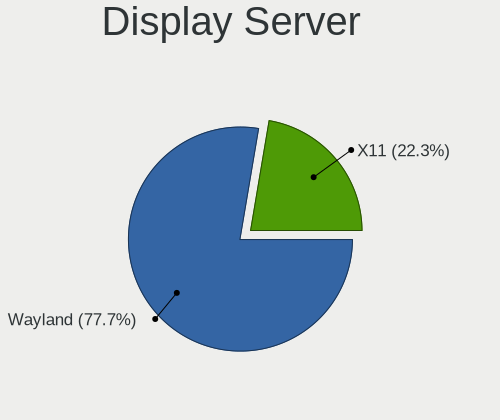
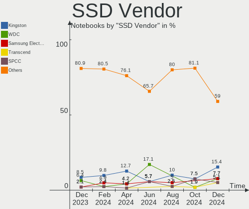
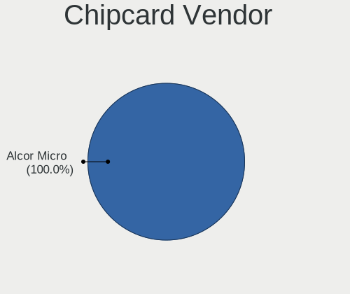

ROSA Hardware Trends (Notebooks)
--------------------------------

A project to identify most popular hardware characteristics and track their change
over time based on data collected by ROSA users at https://Linux-Hardware.org.

Anyone can contribute to this report by the [hw-probe](https://github.com/linuxhw/hw-probe) tool:

    sudo -E hw-probe -all -upload

Full-feature report is available here: https://linux-hardware.org/?view=trends&formfactor=notebook

Period: Aug, 2021.

Contents
--------

* [ System ](#system)
  - [ OS                       ](#os)
  - [ OS Family                ](#os-family)
  - [ Kernel                   ](#kernel)
  - [ Kernel Family            ](#kernel-family)
  - [ Kernel Major Ver.        ](#kernel-major-ver)
  - [ Arch                     ](#arch)
  - [ DE                       ](#de)
  - [ Display Server           ](#display-server)
  - [ Display Manager          ](#display-manager)
  - [ OS Lang                  ](#os-lang)
  - [ Boot Mode                ](#boot-mode)
  - [ Filesystem               ](#filesystem)
  - [ Part. scheme             ](#part-scheme)
  - [ Dual Boot with Linux/BSD ](#dual-boot-with-linuxbsd)
  - [ Dual Boot (Win)          ](#dual-boot-win)

* [ Board ](#board)
  - [ Vendor                   ](#vendor)
  - [ Model                    ](#model)
  - [ Model Family             ](#model-family)
  - [ MFG Year                 ](#mfg-year)
  - [ Form Factor              ](#form-factor)
  - [ Secure Boot              ](#secure-boot)
  - [ Coreboot                 ](#coreboot)
  - [ RAM Size                 ](#ram-size)
  - [ RAM Used                 ](#ram-used)
  - [ Total Drives             ](#total-drives)
  - [ Has CD-ROM               ](#has-cd-rom)
  - [ Has Ethernet             ](#has-ethernet)
  - [ Has WiFi                 ](#has-wifi)
  - [ Has Bluetooth            ](#has-bluetooth)

* [ Location ](#location)
  - [ Country                  ](#country)
  - [ City                     ](#city)

* [ Drives ](#drives)
  - [ Drive Vendor             ](#drive-vendor)
  - [ Drive Model              ](#drive-model)
  - [ HDD Vendor               ](#hdd-vendor)
  - [ SSD Vendor               ](#ssd-vendor)
  - [ Drive Kind               ](#drive-kind)
  - [ Drive Connector          ](#drive-connector)
  - [ Drive Size               ](#drive-size)
  - [ Space Total              ](#space-total)
  - [ Space Used               ](#space-used)
  - [ Malfunc. Drives          ](#malfunc-drives)
  - [ Malfunc. Drive Vendor    ](#malfunc-drive-vendor)
  - [ Malfunc. HDD Vendor      ](#malfunc-hdd-vendor)
  - [ Malfunc. Drive Kind      ](#malfunc-drive-kind)
  - [ Failed Drives            ](#failed-drives)
  - [ Failed Drive Vendor      ](#failed-drive-vendor)
  - [ Drive Status             ](#drive-status)

* [ Storage controller ](#storage-controller)
  - [ Storage Vendor           ](#storage-vendor)
  - [ Storage Model            ](#storage-model)
  - [ Storage Kind             ](#storage-kind)

* [ Processor ](#processor)
  - [ CPU Vendor               ](#cpu-vendor)
  - [ CPU Model                ](#cpu-model)
  - [ CPU Model Family         ](#cpu-model-family)
  - [ CPU Cores                ](#cpu-cores)
  - [ CPU Sockets              ](#cpu-sockets)
  - [ CPU Threads              ](#cpu-threads)
  - [ CPU Op-Modes             ](#cpu-op-modes)
  - [ CPU Microcode            ](#cpu-microcode)
  - [ CPU Microarch            ](#cpu-microarch)

* [ Graphics ](#graphics)
  - [ GPU Vendor               ](#gpu-vendor)
  - [ GPU Model                ](#gpu-model)
  - [ GPU Combo                ](#gpu-combo)
  - [ GPU Driver               ](#gpu-driver)
  - [ GPU Memory               ](#gpu-memory)

* [ Monitor ](#monitor)
  - [ Monitor Vendor           ](#monitor-vendor)
  - [ Monitor Model            ](#monitor-model)
  - [ Monitor Resolution       ](#monitor-resolution)
  - [ Monitor Diagonal         ](#monitor-diagonal)
  - [ Monitor Width            ](#monitor-width)
  - [ Aspect Ratio             ](#aspect-ratio)
  - [ Monitor Area             ](#monitor-area)
  - [ Pixel Density            ](#pixel-density)
  - [ Multiple Monitors        ](#multiple-monitors)

* [ Network ](#network)
  - [ Net Controller Vendor    ](#net-controller-vendor)
  - [ Net Controller Model     ](#net-controller-model)
  - [ Wireless Vendor          ](#wireless-vendor)
  - [ Wireless Model           ](#wireless-model)
  - [ Ethernet Vendor          ](#ethernet-vendor)
  - [ Ethernet Model           ](#ethernet-model)
  - [ Net Controller Kind      ](#net-controller-kind)
  - [ Used Controller          ](#used-controller)
  - [ NICs                     ](#nics)
  - [ IPv6                     ](#ipv6)

* [ Bluetooth ](#bluetooth)
  - [ Bluetooth Vendor         ](#bluetooth-vendor)
  - [ Bluetooth Model          ](#bluetooth-model)

* [ Sound ](#sound)
  - [ Sound Vendor             ](#sound-vendor)
  - [ Sound Model              ](#sound-model)

* [ Memory ](#memory)
  - [ Memory Vendor            ](#memory-vendor)
  - [ Memory Model             ](#memory-model)
  - [ Memory Kind              ](#memory-kind)
  - [ Memory Form Factor       ](#memory-form-factor)
  - [ Memory Size              ](#memory-size)
  - [ Memory Speed             ](#memory-speed)

* [ Printers & scanners ](#printers--scanners)
  - [ Printer Vendor           ](#printer-vendor)
  - [ Printer Model            ](#printer-model)
  - [ Scanner Vendor           ](#scanner-vendor)
  - [ Scanner Model            ](#scanner-model)

* [ Camera ](#camera)
  - [ Camera Vendor            ](#camera-vendor)
  - [ Camera Model             ](#camera-model)

* [ Security ](#security)
  - [ Fingerprint Vendor       ](#fingerprint-vendor)
  - [ Fingerprint Model        ](#fingerprint-model)
  - [ Chipcard Vendor          ](#chipcard-vendor)
  - [ Chipcard Model           ](#chipcard-model)

* [ Unsupported ](#unsupported)
  - [ Unsupported Devices      ](#unsupported-devices)
  - [ Unsupported Device Types ](#unsupported-device-types)

System
------

OS
--

Installed operating systems

| Name       | Notebooks | Percent |
|------------|-----------|---------|
| ROSA R11.1 | 42        | 77.78%  |
| ROSA R11   | 7         | 12.96%  |
| ROSA R8.1  | 2         | 3.7%    |
| ROSA R9    | 1         | 1.85%   |
| ROSA R12   | 1         | 1.85%   |
| ROSA R10   | 1         | 1.85%   |

OS Family
---------

OS without a version

| Name | Notebooks | Percent |
|------|-----------|---------|
| ROSA | 54        | 100%    |

Kernel
------

Version of the Linux kernel

| Version                             | Notebooks | Percent |
|-------------------------------------|-----------|---------|
| 5.4.83-generic-2rosa-x86_64         | 11        | 20.37%  |
| 5.4.32-generic-2rosa-x86_64         | 9         | 16.67%  |
| 5.4.32-generic-2rosa-i586           | 6         | 11.11%  |
| 4.15.0-desktop-45.1rosa-x86_64      | 6         | 11.11%  |
| 4.15.0-desktop-122.124.1rosa-x86_64 | 6         | 11.11%  |
| 4.15.0-desktop-122.124.1rosa-i586   | 5         | 9.26%   |
| 5.10.50-generic-1rosa-x86_64        | 2         | 3.7%    |
| 5.10.0-desktop-14.15.1rosa-x86_64   | 2         | 3.7%    |
| 5.4.83-generic-2rosa-i586           | 1         | 1.85%   |
| 5.10.35-generic-2rosa2019.1-x86_64  | 1         | 1.85%   |
| 4.9.60-nrj-desktop-1rosa-x86_64     | 1         | 1.85%   |
| 4.9.20-nrj-desktop-1rosa-x86_64     | 1         | 1.85%   |
| 4.9.124-nrj-desktop-1rosa-i586      | 1         | 1.85%   |
| 4.15.0-desktop-45.1rosa-i586        | 1         | 1.85%   |
| 4.1.38-nrj-desktop-2rosa-x86_64     | 1         | 1.85%   |

Kernel Family
-------------

Linux kernel without a distro release

| Version | Notebooks | Percent |
|---------|-----------|---------|
| 4.15.0  | 18        | 33.33%  |
| 5.4.32  | 15        | 27.78%  |
| 5.4.83  | 12        | 22.22%  |
| 5.10.50 | 2         | 3.7%    |
| 5.10.0  | 2         | 3.7%    |
| 5.10.35 | 1         | 1.85%   |
| 4.9.60  | 1         | 1.85%   |
| 4.9.20  | 1         | 1.85%   |
| 4.9.124 | 1         | 1.85%   |
| 4.1.38  | 1         | 1.85%   |

Kernel Major Ver.
-----------------

Linux kernel major version

| Version | Notebooks | Percent |
|---------|-----------|---------|
| 5.4     | 27        | 50%     |
| 4.15    | 18        | 33.33%  |
| 5.10    | 5         | 9.26%   |
| 4.9     | 3         | 5.56%   |
| 4.1     | 1         | 1.85%   |

Arch
----

OS architecture (x86_64, i586, etc.)

| Name   | Notebooks | Percent |
|--------|-----------|---------|
| x86_64 | 40        | 74.07%  |
| i686   | 14        | 25.93%  |

DE
--

Desktop Environment

| Name | Notebooks | Percent |
|------|-----------|---------|
| KDE4 | 37        | 68.52%  |
| KDE5 | 14        | 25.93%  |
| LXQt | 3         | 5.56%   |

Display Server
--------------

X11 or Wayland

| Name | Notebooks | Percent |
|------|-----------|---------|
| X11  | 54        | 100%    |

Display Manager
---------------

SDDM, LightDM, etc.

| Name | Notebooks | Percent |
|------|-----------|---------|
| KDM  | 37        | 68.52%  |
| SDDM | 17        | 31.48%  |

OS Lang
-------

Language

| Lang    | Notebooks | Percent |
|---------|-----------|---------|
| ru_RU   | 34        | 62.96%  |
| Unknown | 11        | 20.37%  |
| es_ES   | 3         | 5.56%   |
| pt_BR   | 2         | 3.7%    |
| pl_PL   | 2         | 3.7%    |
| it_IT   | 1         | 1.85%   |
| de_DE   | 1         | 1.85%   |

Boot Mode
---------

EFI or BIOS

| Mode | Notebooks | Percent |
|------|-----------|---------|
| BIOS | 37        | 68.52%  |
| EFI  | 17        | 31.48%  |

Filesystem
----------

Type of filesystem

| Type  | Notebooks | Percent |
|-------|-----------|---------|
| Ext4  | 53        | 98.15%  |
| Btrfs | 1         | 1.85%   |

Part. scheme
------------

Scheme of partitioning

| Type    | Notebooks | Percent |
|---------|-----------|---------|
| MBR     | 36        | 66.67%  |
| GPT     | 16        | 29.63%  |
| Unknown | 2         | 3.7%    |

Dual Boot with Linux/BSD
------------------------

Hosting more than one Linux/BSD

| Dual boot | Notebooks | Percent |
|-----------|-----------|---------|
| No        | 45        | 83.33%  |
| Yes       | 9         | 16.67%  |

Dual Boot (Win)
---------------

Hosting Linux and Windows

| Dual boot | Notebooks | Percent |
|-----------|-----------|---------|
| No        | 34        | 62.96%  |
| Yes       | 20        | 37.04%  |

Board
-----

Vendor
------

Motherboard manufacturer

| Name                | Notebooks | Percent |
|---------------------|-----------|---------|
| ASUSTek Computer    | 13        | 24.07%  |
| Acer                | 8         | 14.81%  |
| Dell                | 7         | 12.96%  |
| Lenovo              | 5         | 9.26%   |
| Hewlett-Packard     | 5         | 9.26%   |
| Samsung Electronics | 3         | 5.56%   |
| Toshiba             | 2         | 3.7%    |
| Packard Bell        | 2         | 3.7%    |
| Apple               | 2         | 3.7%    |
| Sony                | 1         | 1.85%   |
| OEM                 | 1         | 1.85%   |
| Notebook            | 1         | 1.85%   |
| Fujitsu Siemens     | 1         | 1.85%   |
| eMachines           | 1         | 1.85%   |
| Chuwi               | 1         | 1.85%   |
| Aquarius            | 1         | 1.85%   |

Model
-----

Motherboard model

| Name                                        | Notebooks | Percent |
|---------------------------------------------|-----------|---------|
| HP Notebook                                 | 2         | 3.7%    |
| Acer Aspire 5750G                           | 2         | 3.7%    |
| Toshiba Satellite M105                      | 1         | 1.85%   |
| Toshiba Satellite C650                      | 1         | 1.85%   |
| Sony VGN-FE11MR                             | 1         | 1.85%   |
| Samsung R425/R525                           | 1         | 1.85%   |
| Samsung QX310/QX410/QX510/SF310/SF410/SF510 | 1         | 1.85%   |
| Samsung 350V5C/351V5C/3540VC/3440VC         | 1         | 1.85%   |
| Packard Bell EasyNote TK85                  | 1         | 1.85%   |
| Packard Bell EasyNote LX                    | 1         | 1.85%   |
| OEM I41SI1                                  | 1         | 1.85%   |
| Notebook W65_67SB                           | 1         | 1.85%   |
| Lenovo ThinkPad W520 427637U                | 1         | 1.85%   |
| Lenovo G580 20150                           | 1         | 1.85%   |
| Lenovo G550 20023                           | 1         | 1.85%   |
| Lenovo G510 20238                           | 1         | 1.85%   |
| Lenovo B50-30 20382                         | 1         | 1.85%   |
| HP Pavilion g6                              | 1         | 1.85%   |
| HP Mini 110-3000                            | 1         | 1.85%   |
| HP 255 G3                                   | 1         | 1.85%   |
| Fujitsu Siemens AMILO PRO V3515             | 1         | 1.85%   |
| eMachines E525                              | 1         | 1.85%   |
| Dell Latitude E6430                         | 1         | 1.85%   |
| Dell Latitude E6330                         | 1         | 1.85%   |
| Dell Latitude D631                          | 1         | 1.85%   |
| Dell Inspiron N5110                         | 1         | 1.85%   |
| Dell Inspiron M5110                         | 1         | 1.85%   |
| Dell Inspiron 5575                          | 1         | 1.85%   |
| Dell Inspiron 3558                          | 1         | 1.85%   |
| Chuwi AeroBook                              | 1         | 1.85%   |
| ASUS X751LN                                 | 1         | 1.85%   |
| ASUS X541NA                                 | 1         | 1.85%   |
| ASUS N53Jg                                  | 1         | 1.85%   |
| ASUS M51Vr                                  | 1         | 1.85%   |
| ASUS K54HR                                  | 1         | 1.85%   |
| ASUS K53U                                   | 1         | 1.85%   |
| ASUS K53SD                                  | 1         | 1.85%   |
| ASUS K53BR                                  | 1         | 1.85%   |
| ASUS K52JU                                  | 1         | 1.85%   |
| ASUS K50IJ                                  | 1         | 1.85%   |
| ASUS A6Je                                   | 1         | 1.85%   |
| ASUS 1015B                                  | 1         | 1.85%   |
| ASUS 1000HE                                 | 1         | 1.85%   |
| Aquarius Cmp NS585                          | 1         | 1.85%   |
| Apple MacBookPro6,2                         | 1         | 1.85%   |
| Apple MacBookPro5,4                         | 1         | 1.85%   |
| Acer Aspire E5-573G                         | 1         | 1.85%   |
| Acer Aspire A315-55G                        | 1         | 1.85%   |
| Acer Aspire 7750G                           | 1         | 1.85%   |
| Acer Aspire 5100                            | 1         | 1.85%   |
| Acer Aspire 4736Z                           | 1         | 1.85%   |
| Acer AOD270                                 | 1         | 1.85%   |

Model Family
------------

Motherboard model prefix

| Name                  | Notebooks | Percent |
|-----------------------|-----------|---------|
| Acer Aspire           | 7         | 12.96%  |
| Dell Inspiron         | 4         | 7.41%   |
| Dell Latitude         | 3         | 5.56%   |
| Toshiba Satellite     | 2         | 3.7%    |
| Packard Bell EasyNote | 2         | 3.7%    |
| HP Notebook           | 2         | 3.7%    |
| Sony VGN-FE11MR       | 1         | 1.85%   |
| Samsung R425          | 1         | 1.85%   |
| Samsung QX310         | 1         | 1.85%   |
| Samsung 350V5C        | 1         | 1.85%   |
| OEM I41SI1            | 1         | 1.85%   |
| Notebook W65          | 1         | 1.85%   |
| Lenovo ThinkPad       | 1         | 1.85%   |
| Lenovo G580           | 1         | 1.85%   |
| Lenovo G550           | 1         | 1.85%   |
| Lenovo G510           | 1         | 1.85%   |
| Lenovo B50-30         | 1         | 1.85%   |
| HP Pavilion           | 1         | 1.85%   |
| HP Mini               | 1         | 1.85%   |
| HP 255                | 1         | 1.85%   |
| Fujitsu Siemens AMILO | 1         | 1.85%   |
| eMachines E525        | 1         | 1.85%   |
| Chuwi AeroBook        | 1         | 1.85%   |
| ASUS X751LN           | 1         | 1.85%   |
| ASUS X541NA           | 1         | 1.85%   |
| ASUS N53Jg            | 1         | 1.85%   |
| ASUS M51Vr            | 1         | 1.85%   |
| ASUS K54HR            | 1         | 1.85%   |
| ASUS K53U             | 1         | 1.85%   |
| ASUS K53SD            | 1         | 1.85%   |
| ASUS K53BR            | 1         | 1.85%   |
| ASUS K52JU            | 1         | 1.85%   |
| ASUS K50IJ            | 1         | 1.85%   |
| ASUS A6Je             | 1         | 1.85%   |
| ASUS 1015B            | 1         | 1.85%   |
| ASUS 1000HE           | 1         | 1.85%   |
| Aquarius Cmp          | 1         | 1.85%   |
| Apple MacBookPro6     | 1         | 1.85%   |
| Apple MacBookPro5     | 1         | 1.85%   |
| Acer AOD270           | 1         | 1.85%   |

MFG Year
--------

Motherboard manufacture year

| Year | Notebooks | Percent |
|------|-----------|---------|
| 2012 | 9         | 16.67%  |
| 2010 | 9         | 16.67%  |
| 2011 | 8         | 14.81%  |
| 2019 | 5         | 9.26%   |
| 2015 | 4         | 7.41%   |
| 2017 | 3         | 5.56%   |
| 2016 | 3         | 5.56%   |
| 2009 | 3         | 5.56%   |
| 2006 | 3         | 5.56%   |
| 2014 | 2         | 3.7%    |
| 2013 | 2         | 3.7%    |
| 2008 | 2         | 3.7%    |
| 2007 | 1         | 1.85%   |

Form Factor
-----------

Physical design of the computer

| Name     | Notebooks | Percent |
|----------|-----------|---------|
| Notebook | 54        | 100%    |

Secure Boot
-----------

Enabled or disabled

| State    | Notebooks | Percent |
|----------|-----------|---------|
| Disabled | 54        | 100%    |

Coreboot
--------

Have coreboot on board

| Used | Notebooks | Percent |
|------|-----------|---------|
| No   | 54        | 100%    |

RAM Size
--------

Total RAM memory

| Size in GB | Notebooks | Percent |
|------------|-----------|---------|
| 3.01-4.0   | 21        | 38.89%  |
| 4.01-8.0   | 10        | 18.52%  |
| 1.01-2.0   | 9         | 16.67%  |
| 8.01-16.0  | 7         | 12.96%  |
| 2.01-3.0   | 6         | 11.11%  |
| 16.01-24.0 | 1         | 1.85%   |

RAM Used
--------

Used RAM memory

| Used GB  | Notebooks | Percent |
|----------|-----------|---------|
| 1.01-2.0 | 24        | 44.44%  |
| 0.51-1.0 | 24        | 44.44%  |
| 2.01-3.0 | 4         | 7.41%   |
| 3.01-4.0 | 1         | 1.85%   |
| 0.01-0.5 | 1         | 1.85%   |

Total Drives
------------

Number of drives on board

| Drives | Notebooks | Percent |
|--------|-----------|---------|
| 1      | 37        | 68.52%  |
| 2      | 17        | 31.48%  |

Has CD-ROM
----------

Has CD-ROM on board

| Presented | Notebooks | Percent |
|-----------|-----------|---------|
| Yes       | 33        | 61.11%  |
| No        | 21        | 38.89%  |

Has Ethernet
------------

Has Ethernet on board

| Presented | Notebooks | Percent |
|-----------|-----------|---------|
| Yes       | 53        | 98.15%  |
| No        | 1         | 1.85%   |

Has WiFi
--------

Has WiFi module

| Presented | Notebooks | Percent |
|-----------|-----------|---------|
| Yes       | 54        | 100%    |

Has Bluetooth
-------------

Has Bluetooth module

| Presented | Notebooks | Percent |
|-----------|-----------|---------|
| Yes       | 33        | 61.11%  |
| No        | 21        | 38.89%  |

Location
--------

Country
-------

Geographic location (country)

| Country     | Notebooks | Percent |
|-------------|-----------|---------|
| Russia      | 37        | 68.52%  |
| Poland      | 3         | 5.56%   |
| Spain       | 2         | 3.7%    |
| Brazil      | 2         | 3.7%    |
| Ukraine     | 1         | 1.85%   |
| Lithuania   | 1         | 1.85%   |
| Kyrgyzstan  | 1         | 1.85%   |
| Italy       | 1         | 1.85%   |
| Germany     | 1         | 1.85%   |
| France      | 1         | 1.85%   |
| El Salvador | 1         | 1.85%   |
| Egypt       | 1         | 1.85%   |
| Colombia    | 1         | 1.85%   |
| Belarus     | 1         | 1.85%   |

City
----

Geographic location (city)

| City             | Notebooks | Percent |
|------------------|-----------|---------|
| Moscow           | 8         | 14.81%  |
| Rostov-on-Don    | 4         | 7.41%   |
| Yaroslavl        | 2         | 3.7%    |
| St Petersburg    | 2         | 3.7%    |
| Yekaterinburg    | 1         | 1.85%   |
| Yakutsk          | 1         | 1.85%   |
| Warsaw           | 1         | 1.85%   |
| Voronezh         | 1         | 1.85%   |
| Volgograd        | 1         | 1.85%   |
| Vladivostok      | 1         | 1.85%   |
| Vikhorevka       | 1         | 1.85%   |
| Tepecoyo         | 1         | 1.85%   |
| Taganrog         | 1         | 1.85%   |
| Suez             | 1         | 1.85%   |
| Sochi            | 1         | 1.85%   |
| Sarov            | 1         | 1.85%   |
| Ryazan           | 1         | 1.85%   |
| Rozgarty         | 1         | 1.85%   |
| Rome             | 1         | 1.85%   |
| Pervouralsk      | 1         | 1.85%   |
| Perm             | 1         | 1.85%   |
| Pantin           | 1         | 1.85%   |
| Omsk             | 1         | 1.85%   |
| Novosibirsk      | 1         | 1.85%   |
| Nizhniy Novgorod | 1         | 1.85%   |
| Munich           | 1         | 1.85%   |
| Mosquera         | 1         | 1.85%   |
| Moncofa          | 1         | 1.85%   |
| Lensk            | 1         | 1.85%   |
| Kushch?«vskaya   | 1         | 1.85%   |
| Krasnodar        | 1         | 1.85%   |
| Kaunas           | 1         | 1.85%   |
| Horlivka         | 1         | 1.85%   |
| Gubkin           | 1         | 1.85%   |
| Gravata?­        | 1         | 1.85%   |
| Granada          | 1         | 1.85%   |
| Gomel            | 1         | 1.85%   |
| Duque de Caxias  | 1         | 1.85%   |
| Chelyabinsk      | 1         | 1.85%   |
| Bryansk          | 1         | 1.85%   |
| Bishkek          | 1         | 1.85%   |
| Bakow            | 1         | 1.85%   |

Drives
------

Drive Vendor
------------

Hard drive vendors

| Vendor              | Notebooks | Drives | Percent |
|---------------------|-----------|--------|---------|
| WDC                 | 15        | 15     | 22.73%  |
| Seagate             | 15        | 15     | 22.73%  |
| Toshiba             | 9         | 9      | 13.64%  |
| HGST                | 5         | 5      | 7.58%   |
| Hitachi             | 4         | 4      | 6.06%   |
| Kingston            | 3         | 3      | 4.55%   |
| Unknown             | 2         | 2      | 3.03%   |
| Transcend           | 1         | 1      | 1.52%   |
| SPCC                | 1         | 1      | 1.52%   |
| SanDisk             | 1         | 1      | 1.52%   |
| Samsung Electronics | 1         | 1      | 1.52%   |
| PLEXTOR             | 1         | 1      | 1.52%   |
| LDLC                | 1         | 1      | 1.52%   |
| KingSpec            | 1         | 1      | 1.52%   |
| KingDian            | 1         | 1      | 1.52%   |
| GOODRAM             | 1         | 1      | 1.52%   |
| Crucial             | 1         | 1      | 1.52%   |
| China               | 1         | 1      | 1.52%   |
| Apacer              | 1         | 1      | 1.52%   |
| A-DATA Technology   | 1         | 1      | 1.52%   |

Drive Model
-----------

Hard drive models

| Model                                | Notebooks | Percent |
|--------------------------------------|-----------|---------|
| Seagate ST9320325AS 320GB            | 5         | 7.58%   |
| WDC WD3200BEKT-75PVMT1 320GB         | 2         | 3.03%   |
| Toshiba MQ01ABD100 1TB               | 2         | 3.03%   |
| Toshiba MK1234GSX 120GB              | 2         | 3.03%   |
| Seagate ST9500325AS 500GB            | 2         | 3.03%   |
| HGST HTS545050A7E380 500GB           | 2         | 3.03%   |
| WDC WDS240G2G0A-00JH30 240GB SSD     | 1         | 1.52%   |
| WDC WD800BEVT-22ZCT0 80GB            | 1         | 1.52%   |
| WDC WD7500BPKT-00PK4T0 752GB         | 1         | 1.52%   |
| WDC WD6400BPVT-22HXZT1 640GB         | 1         | 1.52%   |
| WDC WD5000LPCX-24VHAT0 500GB         | 1         | 1.52%   |
| WDC WD5000BPKX-00HPJT0 500GB         | 1         | 1.52%   |
| WDC WD3200BPVT-80ZEST0 320GB         | 1         | 1.52%   |
| WDC WD3200BPVT-22JJ5T0 320GB         | 1         | 1.52%   |
| WDC WD3200BEVT-80A0RT0 320GB         | 1         | 1.52%   |
| WDC WD3200BEVT-22ZCT0 320GB          | 1         | 1.52%   |
| WDC WD2500BEVT-22A23T0 250GB         | 1         | 1.52%   |
| WDC WD2500BEKT-00PVMT0 250GB         | 1         | 1.52%   |
| WDC WD1200BEVS-22UST0 120GB          | 1         | 1.52%   |
| Unknown SD  2GB                      | 1         | 1.52%   |
| Unknown APPSD  4GB                   | 1         | 1.52%   |
| Transcend TS128GMTE110S 128GB        | 1         | 1.52%   |
| Toshiba THNSNK512GCS8 SATA 512GB SSD | 1         | 1.52%   |
| Toshiba MQ01ABF050 500GB             | 1         | 1.52%   |
| Toshiba MQ01ABD032 320GB             | 1         | 1.52%   |
| Toshiba MK1656GSY 160GB              | 1         | 1.52%   |
| Toshiba MK1059GSMP 1TB               | 1         | 1.52%   |
| SPCC Solid State Disk 256GB          | 1         | 1.52%   |
| Seagate ST9500420AS 500GB            | 1         | 1.52%   |
| Seagate ST9500325ASG 500GB           | 1         | 1.52%   |
| Seagate ST9250827AS 250GB            | 1         | 1.52%   |
| Seagate ST9250315AS 250GB            | 1         | 1.52%   |
| Seagate ST9120822AS 120GB            | 1         | 1.52%   |
| Seagate ST500VT000-1DK142 500GB      | 1         | 1.52%   |
| Seagate ST500LT012-1DG142 500GB      | 1         | 1.52%   |
| Seagate ST1000LX015-1U7172 1TB       | 1         | 1.52%   |
| SanDisk SD7SB6S256G1122 256GB SSD    | 1         | 1.52%   |
| Samsung SSD 860 EVO 250GB            | 1         | 1.52%   |
| PLEXTOR PX-128M5S 128GB SSD          | 1         | 1.52%   |
| LDLC SSD 128GB                       | 1         | 1.52%   |
| Kingston SA400S37240G 240GB SSD      | 1         | 1.52%   |
| Kingston SA400S37120G 120GB SSD      | 1         | 1.52%   |
| Kingston SA2000M81000G 1TB           | 1         | 1.52%   |
| KingSpec NT-512 512GB SSD            | 1         | 1.52%   |
| KingDian S280 120GB SSD              | 1         | 1.52%   |
| Hitachi HTS547575A9E384 752GB        | 1         | 1.52%   |
| Hitachi HTS543212L9A300 120GB        | 1         | 1.52%   |
| Hitachi HTS541680J9SA00 80GB         | 1         | 1.52%   |
| Hitachi HTS541616J9AT00 160GB        | 1         | 1.52%   |
| HGST HTS725050A7E630 500GB           | 1         | 1.52%   |
| HGST HTS545050A7E680 500GB           | 1         | 1.52%   |
| HGST HTS545050A7E660 500GB           | 1         | 1.52%   |
| GOODRAM SSDPR-CL100-120-G2 120GB     | 1         | 1.52%   |
| Crucial CT240BX500SSD1 240GB         | 1         | 1.52%   |
| China SSD 256GB                      | 1         | 1.52%   |
| Apacer AS350 256GB SSD               | 1         | 1.52%   |
| A-DATA SU800 512GB SSD               | 1         | 1.52%   |

HDD Vendor
----------

Hard disk drive vendors

| Vendor  | Notebooks | Drives | Percent |
|---------|-----------|--------|---------|
| Seagate | 15        | 15     | 32.61%  |
| WDC     | 14        | 14     | 30.43%  |
| Toshiba | 8         | 8      | 17.39%  |
| HGST    | 5         | 5      | 10.87%  |
| Hitachi | 4         | 4      | 8.7%    |

SSD Vendor
----------

Solid state drive vendors

| Vendor              | Notebooks | Drives | Percent |
|---------------------|-----------|--------|---------|
| Kingston            | 2         | 2      | 12.5%   |
| WDC                 | 1         | 1      | 6.25%   |
| Toshiba             | 1         | 1      | 6.25%   |
| SPCC                | 1         | 1      | 6.25%   |
| SanDisk             | 1         | 1      | 6.25%   |
| Samsung Electronics | 1         | 1      | 6.25%   |
| PLEXTOR             | 1         | 1      | 6.25%   |
| LDLC                | 1         | 1      | 6.25%   |
| KingSpec            | 1         | 1      | 6.25%   |
| KingDian            | 1         | 1      | 6.25%   |
| GOODRAM             | 1         | 1      | 6.25%   |
| Crucial             | 1         | 1      | 6.25%   |
| China               | 1         | 1      | 6.25%   |
| Apacer              | 1         | 1      | 6.25%   |
| A-DATA Technology   | 1         | 1      | 6.25%   |

Drive Kind
----------

HDD or SSD

| Kind | Notebooks | Drives | Percent |
|------|-----------|--------|---------|
| HDD  | 45        | 46     | 70.31%  |
| SSD  | 15        | 16     | 23.44%  |
| MMC  | 2         | 2      | 3.13%   |
| NVMe | 2         | 2      | 3.13%   |

Drive Connector
---------------

SATA, SAS, NVMe, etc.

| Type | Notebooks | Drives | Percent |
|------|-----------|--------|---------|
| SATA | 53        | 62     | 92.98%  |
| NVMe | 2         | 2      | 3.51%   |
| MMC  | 2         | 2      | 3.51%   |

Drive Size
----------

Size of hard drive

| Size in TB | Notebooks | Drives | Percent |
|------------|-----------|--------|---------|
| 0.01-0.5   | 46        | 52     | 82.14%  |
| 0.51-1.0   | 10        | 10     | 17.86%  |

Space Total
-----------

Amount of disk space available on the file system

| Size in GB | Notebooks | Percent |
|------------|-----------|---------|
| 251-500    | 19        | 35.19%  |
| 101-250    | 11        | 20.37%  |
| 1-20       | 7         | 12.96%  |
| 501-1000   | 6         | 11.11%  |
| 51-100     | 6         | 11.11%  |
| 21-50      | 5         | 9.26%   |

Space Used
----------

Amount of used disk space

| Used GB | Notebooks | Percent |
|---------|-----------|---------|
| 1-20    | 42        | 77.78%  |
| 101-250 | 5         | 9.26%   |
| 21-50   | 4         | 7.41%   |
| 51-100  | 3         | 5.56%   |

Malfunc. Drives
---------------

Drive models with a malfunction

| Model                                | Notebooks | Drives | Percent |
|--------------------------------------|-----------|--------|---------|
| Toshiba MK1234GSX 120GB              | 2         | 2      | 11.76%  |
| Seagate ST9500325AS 500GB            | 2         | 2      | 11.76%  |
| WDC WD6400BPVT-22HXZT1 640GB         | 1         | 1      | 5.88%   |
| WDC WD3200BEVT-80A0RT0 320GB         | 1         | 1      | 5.88%   |
| WDC WD3200BEVT-22ZCT0 320GB          | 1         | 1      | 5.88%   |
| WDC WD2500BEVT-22A23T0 250GB         | 1         | 1      | 5.88%   |
| Toshiba THNSNK512GCS8 SATA 512GB SSD | 1         | 1      | 5.88%   |
| Toshiba MK1656GSY 160GB              | 1         | 1      | 5.88%   |
| Seagate ST9500420AS 500GB            | 1         | 1      | 5.88%   |
| Seagate ST9320325AS 320GB            | 1         | 1      | 5.88%   |
| Seagate ST9250827AS 250GB            | 1         | 1      | 5.88%   |
| Seagate ST9250315AS 250GB            | 1         | 1      | 5.88%   |
| Hitachi HTS543212L9A300 120GB        | 1         | 1      | 5.88%   |
| HGST HTS545050A7E660 500GB           | 1         | 1      | 5.88%   |
| HGST HTS545050A7E380 500GB           | 1         | 1      | 5.88%   |

Malfunc. Drive Vendor
---------------------

Vendors of faulty drives

| Vendor  | Notebooks | Drives | Percent |
|---------|-----------|--------|---------|
| Seagate | 6         | 6      | 35.29%  |
| WDC     | 4         | 4      | 23.53%  |
| Toshiba | 4         | 4      | 23.53%  |
| HGST    | 2         | 2      | 11.76%  |
| Hitachi | 1         | 1      | 5.88%   |

Malfunc. HDD Vendor
-------------------

Vendors of faulty HDD drives

| Vendor  | Notebooks | Drives | Percent |
|---------|-----------|--------|---------|
| Seagate | 6         | 6      | 37.5%   |
| WDC     | 4         | 4      | 25%     |
| Toshiba | 3         | 3      | 18.75%  |
| HGST    | 2         | 2      | 12.5%   |
| Hitachi | 1         | 1      | 6.25%   |

Malfunc. Drive Kind
-------------------

Kinds of faulty drives

| Kind | Notebooks | Drives | Percent |
|------|-----------|--------|---------|
| HDD  | 15        | 16     | 93.75%  |
| SSD  | 1         | 1      | 6.25%   |

Failed Drives
-------------

Failed drive models

| Model                        | Notebooks | Drives | Percent |
|------------------------------|-----------|--------|---------|
| WDC WD3200BPVT-80ZEST0 320GB | 1         | 1      | 50%     |
| WDC WD3200BEKT-75PVMT1 320GB | 1         | 1      | 50%     |

Failed Drive Vendor
-------------------

Failed drive vendors

| Vendor | Notebooks | Drives | Percent |
|--------|-----------|--------|---------|
| WDC    | 2         | 2      | 100%    |

Drive Status
------------

Number of failed and malfunc. drives

| Status   | Notebooks | Drives | Percent |
|----------|-----------|--------|---------|
| Works    | 37        | 45     | 64.91%  |
| Malfunc  | 16        | 17     | 28.07%  |
| Detected | 2         | 2      | 3.51%   |
| Failed   | 2         | 2      | 3.51%   |

Storage controller
------------------

Storage Vendor
--------------

Storage controller vendors

| Vendor                           | Notebooks | Percent |
|----------------------------------|-----------|---------|
| Intel                            | 41        | 73.21%  |
| AMD                              | 10        | 17.86%  |
| VIA Technologies                 | 1         | 1.79%   |
| Silicon Motion                   | 1         | 1.79%   |
| Silicon Integrated Systems [SiS] | 1         | 1.79%   |
| Nvidia                           | 1         | 1.79%   |
| Kingston Technology Company      | 1         | 1.79%   |

Storage Model
-------------

Storage controller models

| Model                                                                                  | Notebooks | Percent |
|----------------------------------------------------------------------------------------|-----------|---------|
| Intel 82801IBM/IEM (ICH9M/ICH9M-E) 4 port SATA Controller [AHCI mode]                  | 6         | 9.09%   |
| Intel 6 Series/C200 Series Chipset Family 6 port Mobile SATA AHCI Controller           | 6         | 9.09%   |
| Intel 5 Series/3400 Series Chipset 4 port SATA AHCI Controller                         | 5         | 7.58%   |
| AMD SB7x0/SB8x0/SB9x0 SATA Controller [AHCI mode]                                      | 4         | 6.06%   |
| AMD FCH SATA Controller [AHCI mode]                                                    | 4         | 6.06%   |
| Intel 82801GBM/GHM (ICH7-M Family) SATA Controller [IDE mode]                          | 3         | 4.55%   |
| Intel 7 Series Chipset Family 6-port SATA Controller [AHCI mode]                       | 3         | 4.55%   |
| Intel NM10/ICH7 Family SATA Controller [AHCI mode]                                     | 2         | 3.03%   |
| Intel 82801G (ICH7 Family) IDE Controller                                              | 2         | 3.03%   |
| Intel 8 Series/C220 Series Chipset Family 6-port SATA Controller 1 [AHCI mode]         | 2         | 3.03%   |
| Intel 8 Series SATA Controller 1 [AHCI mode]                                           | 2         | 3.03%   |
| AMD SB7x0/SB8x0/SB9x0 IDE Controller                                                   | 2         | 3.03%   |
| VIA VT82C586A/B/VT82C686/A/B/VT823x/A/C PIPC Bus Master IDE                            | 1         | 1.52%   |
| VIA VT8237A SATA 2-Port Controller                                                     | 1         | 1.52%   |
| Silicon Motion SM2263EN/SM2263XT SSD Controller                                        | 1         | 1.52%   |
| Silicon Integrated Systems [SiS] SATA Controller / IDE mode                            | 1         | 1.52%   |
| Silicon Integrated Systems [SiS] 5513 IDE Controller                                   | 1         | 1.52%   |
| Nvidia MCP79 AHCI Controller                                                           | 1         | 1.52%   |
| Kingston Company A2000 NVMe SSD                                                        | 1         | 1.52%   |
| Intel Wildcat Point-LP SATA Controller [AHCI Mode]                                     | 1         | 1.52%   |
| Intel Sunrise Point-LP SATA Controller [AHCI mode]                                     | 1         | 1.52%   |
| Intel Comet Lake SATA AHCI Controller                                                  | 1         | 1.52%   |
| Intel Celeron N3350/Pentium N4200/Atom E3900 Series SATA AHCI Controller               | 1         | 1.52%   |
| Intel Cannon Lake PCH SATA AHCI Controller                                             | 1         | 1.52%   |
| Intel Atom/Celeron/Pentium Processor x5-E8000/J3xxx/N3xxx Series SATA Controller       | 1         | 1.52%   |
| Intel Atom Processor E3800 Series SATA AHCI Controller                                 | 1         | 1.52%   |
| Intel 82801GBM/GHM (ICH7-M Family) SATA Controller [AHCI mode]                         | 1         | 1.52%   |
| Intel 82801 Mobile SATA Controller [RAID mode]                                         | 1         | 1.52%   |
| Intel 7 Series Chipset Family 4-port SATA Controller [IDE mode]                        | 1         | 1.52%   |
| Intel 7 Series Chipset Family 2-port SATA Controller [IDE mode]                        | 1         | 1.52%   |
| Intel 6 Series/C200 Series Chipset Family Mobile SATA Controller (IDE mode, ports 4-5) | 1         | 1.52%   |
| Intel 6 Series/C200 Series Chipset Family Mobile SATA Controller (IDE mode, ports 0-3) | 1         | 1.52%   |
| Intel 5 Series/3400 Series Chipset 4 port SATA IDE Controller                          | 1         | 1.52%   |
| AMD SB600 Non-Raid-5 SATA                                                              | 1         | 1.52%   |
| AMD SB600 IDE                                                                          | 1         | 1.52%   |
| AMD IXP SB4x0 IDE Controller                                                           | 1         | 1.52%   |
| AMD FCH IDE Controller                                                                 | 1         | 1.52%   |

Storage Kind
------------

Kind of storage controller (IDE, SATA, NVMe, SAS, ...)

| Kind | Notebooks | Percent |
|------|-----------|---------|
| SATA | 44        | 72.13%  |
| IDE  | 14        | 22.95%  |
| NVMe | 2         | 3.28%   |
| RAID | 1         | 1.64%   |

Processor
---------

CPU Vendor
----------

Processor vendors

| Vendor | Notebooks | Percent |
|--------|-----------|---------|
| Intel  | 44        | 81.48%  |
| AMD    | 10        | 18.52%  |

CPU Model
---------

Processor models

| Model                                         | Notebooks | Percent |
|-----------------------------------------------|-----------|---------|
| Intel Pentium Dual-Core CPU T4500 @ 2.30GHz   | 3         | 5.56%   |
| Intel Pentium CPU B970 @ 2.30GHz              | 2         | 3.7%    |
| Intel Genuine CPU T2300 @ 1.66GHz             | 2         | 3.7%    |
| Intel Core i5-3210M CPU @ 2.50GHz             | 2         | 3.7%    |
| Intel Core i3-2350M CPU @ 2.30GHz             | 2         | 3.7%    |
| AMD E-450 APU with Radeon HD Graphics         | 2         | 3.7%    |
| Intel Pentium Gold G5400 CPU @ 3.70GHz        | 1         | 1.85%   |
| Intel Pentium Dual-Core CPU T4300 @ 2.10GHz   | 1         | 1.85%   |
| Intel Pentium CPU N3530 @ 2.16GHz             | 1         | 1.85%   |
| Intel Pentium CPU B960 @ 2.20GHz              | 1         | 1.85%   |
| Intel Pentium CPU 2020M @ 2.40GHz             | 1         | 1.85%   |
| Intel Core m3-6Y30 CPU @ 0.90GHz              | 1         | 1.85%   |
| Intel Core i7-4510U CPU @ 2.00GHz             | 1         | 1.85%   |
| Intel Core i7-2720QM CPU @ 2.20GHz            | 1         | 1.85%   |
| Intel Core i7-10510U CPU @ 1.80GHz            | 1         | 1.85%   |
| Intel Core i7 CPU Q 720 @ 1.60GHz             | 1         | 1.85%   |
| Intel Core i5-4210U CPU @ 1.70GHz             | 1         | 1.85%   |
| Intel Core i5-4200M CPU @ 2.50GHz             | 1         | 1.85%   |
| Intel Core i5-3340M CPU @ 2.70GHz             | 1         | 1.85%   |
| Intel Core i5-2430M CPU @ 2.40GHz             | 1         | 1.85%   |
| Intel Core i5-2410M CPU @ 2.30GHz             | 1         | 1.85%   |
| Intel Core i5 CPU M 560 @ 2.67GHz             | 1         | 1.85%   |
| Intel Core i5 CPU M 520 @ 2.40GHz             | 1         | 1.85%   |
| Intel Core i5 CPU M 430 @ 2.27GHz             | 1         | 1.85%   |
| Intel Core i3-5005U CPU @ 2.00GHz             | 1         | 1.85%   |
| Intel Core i3-4000M CPU @ 2.40GHz             | 1         | 1.85%   |
| Intel Core i3 CPU M 380 @ 2.53GHz             | 1         | 1.85%   |
| Intel Core i3 CPU M 370 @ 2.40GHz             | 1         | 1.85%   |
| Intel Core 2 Duo CPU P8700 @ 2.53GHz          | 1         | 1.85%   |
| Intel Core 2 Duo CPU P8400 @ 2.26GHz          | 1         | 1.85%   |
| Intel Core 2 CPU T5500 @ 1.66GHz              | 1         | 1.85%   |
| Intel Celeron M CPU 520 @ 1.60GHz             | 1         | 1.85%   |
| Intel Celeron Dual-Core CPU T3300 @ 2.00GHz   | 1         | 1.85%   |
| Intel Celeron Dual-Core CPU T3100 @ 1.90GHz   | 1         | 1.85%   |
| Intel Celeron CPU N3350 @ 1.10GHz             | 1         | 1.85%   |
| Intel Celeron CPU N3060 @ 1.60GHz             | 1         | 1.85%   |
| Intel Atom CPU N450 @ 1.66GHz                 | 1         | 1.85%   |
| Intel Atom CPU N280 @ 1.66GHz                 | 1         | 1.85%   |
| Intel Atom CPU N2600 @ 1.60GHz                | 1         | 1.85%   |
| AMD Turion 64 X2 Mobile Technology TL-60      | 1         | 1.85%   |
| AMD Turion 64 X2 Mobile Technology TL-50      | 1         | 1.85%   |
| AMD Ryzen 5 2500U with Radeon Vega Mobile Gfx | 1         | 1.85%   |
| AMD Processor model unknown                   | 1         | 1.85%   |
| AMD E1-6015 APU with Radeon R2 Graphics       | 1         | 1.85%   |
| AMD E1-2100 APU with Radeon HD Graphics       | 1         | 1.85%   |
| AMD C-30 Processor                            | 1         | 1.85%   |
| AMD A4-3310MX APU with Radeon HD Graphics     | 1         | 1.85%   |

CPU Model Family
----------------

Processor model prefix

| Model                   | Notebooks | Percent |
|-------------------------|-----------|---------|
| Intel Core i5           | 10        | 18.52%  |
| Intel Core i3           | 6         | 11.11%  |
| Intel Pentium           | 5         | 9.26%   |
| Intel Pentium Dual-Core | 4         | 7.41%   |
| Intel Core i7           | 4         | 7.41%   |
| Intel Atom              | 3         | 5.56%   |
| Intel Genuine           | 2         | 3.7%    |
| Intel Core 2 Duo        | 2         | 3.7%    |
| Intel Celeron Dual-Core | 2         | 3.7%    |
| Intel Celeron           | 2         | 3.7%    |
| AMD Turion 64 X2 Mobile | 2         | 3.7%    |
| AMD E1                  | 2         | 3.7%    |
| AMD E                   | 2         | 3.7%    |
| Other                   | 1         | 1.85%   |
| Intel Pentium Gold      | 1         | 1.85%   |
| Intel Core m3           | 1         | 1.85%   |
| Intel Core 2            | 1         | 1.85%   |
| Intel Celeron M         | 1         | 1.85%   |
| AMD Ryzen 5             | 1         | 1.85%   |
| AMD C-30                | 1         | 1.85%   |
| AMD A4                  | 1         | 1.85%   |

CPU Cores
---------

Number of processor cores

| Number | Notebooks | Percent |
|--------|-----------|---------|
| 2      | 44        | 81.48%  |
| 4      | 5         | 9.26%   |
| 1      | 4         | 7.41%   |
| 3      | 1         | 1.85%   |

CPU Sockets
-----------

Number of sockets

| Number | Notebooks | Percent |
|--------|-----------|---------|
| 1      | 54        | 100%    |

CPU Threads
-----------

Threads per core (Hyper-Threading)

| Number | Notebooks | Percent |
|--------|-----------|---------|
| 1      | 28        | 51.85%  |
| 2      | 26        | 48.15%  |

CPU Op-Modes
------------

CPU Operation Modes (32-bit, 64-bit)

| Op mode        | Notebooks | Percent |
|----------------|-----------|---------|
| 32-bit, 64-bit | 50        | 92.59%  |
| 32-bit         | 3         | 5.56%   |
| 64-bit         | 1         | 1.85%   |

CPU Microcode
-------------

Microcode number

| Number     | Notebooks | Percent |
|------------|-----------|---------|
| 0x206a7    | 8         | 14.81%  |
| 0x1067a    | 6         | 11.11%  |
| 0x306a9    | 4         | 7.41%   |
| 0x20655    | 4         | 7.41%   |
| Unknown    | 3         | 5.56%   |
| 0x6f6      | 2         | 3.7%    |
| 0x6e8      | 2         | 3.7%    |
| 0x40651    | 2         | 3.7%    |
| 0x306c3    | 2         | 3.7%    |
| 0x0700010f | 2         | 3.7%    |
| 0x05000119 | 2         | 3.7%    |
| 0x906ea    | 1         | 1.85%   |
| 0x806ec    | 1         | 1.85%   |
| 0x506c9    | 1         | 1.85%   |
| 0x406e3    | 1         | 1.85%   |
| 0x406c4    | 1         | 1.85%   |
| 0x306d4    | 1         | 1.85%   |
| 0x30678    | 1         | 1.85%   |
| 0x30661    | 1         | 1.85%   |
| 0x20652    | 1         | 1.85%   |
| 0x106e5    | 1         | 1.85%   |
| 0x106ca    | 1         | 1.85%   |
| 0x106c2    | 1         | 1.85%   |
| 0x10676    | 1         | 1.85%   |
| 0x0810100b | 1         | 1.85%   |
| 0x05000029 | 1         | 1.85%   |
| 0x03000027 | 1         | 1.85%   |
| 0x010000c8 | 1         | 1.85%   |

CPU Microarch
-------------

Microarchitecture

| Name        | Notebooks | Percent |
|-------------|-----------|---------|
| SandyBridge | 8         | 14.81%  |
| Penryn      | 8         | 14.81%  |
| Westmere    | 5         | 9.26%   |
| IvyBridge   | 4         | 7.41%   |
| Haswell     | 4         | 7.41%   |
| Bonnell     | 3         | 5.56%   |
| Bobcat      | 3         | 5.56%   |
| Silvermont  | 2         | 3.7%    |
| P6          | 2         | 3.7%    |
| KabyLake    | 2         | 3.7%    |
| K8 Hammer   | 2         | 3.7%    |
| Jaguar      | 2         | 3.7%    |
| Core        | 2         | 3.7%    |
| Zen         | 1         | 1.85%   |
| Skylake     | 1         | 1.85%   |
| Nehalem     | 1         | 1.85%   |
| K10 Llano   | 1         | 1.85%   |
| K10         | 1         | 1.85%   |
| Goldmont    | 1         | 1.85%   |
| Broadwell   | 1         | 1.85%   |

Graphics
--------

GPU Vendor
----------

Vendors of graphics cards

| Vendor                           | Notebooks | Percent |
|----------------------------------|-----------|---------|
| Intel                            | 31        | 46.27%  |
| AMD                              | 20        | 29.85%  |
| Nvidia                           | 14        | 20.9%   |
| VIA Technologies                 | 1         | 1.49%   |
| Silicon Integrated Systems [SiS] | 1         | 1.49%   |

GPU Model
---------

Graphics card models

| Model                                                                                    | Notebooks | Percent |
|------------------------------------------------------------------------------------------|-----------|---------|
| Intel 2nd Generation Core Processor Family Integrated Graphics Controller                | 6         | 8.45%   |
| Intel Mobile 4 Series Chipset Integrated Graphics Controller                             | 4         | 5.63%   |
| Intel 3rd Gen Core processor Graphics Controller                                         | 4         | 5.63%   |
| AMD Seymour [Radeon HD 6400M/7400M Series]                                               | 3         | 4.23%   |
| Intel Mobile 945GM/GMS/GME, 943/940GML Express Integrated Graphics Controller            | 2         | 2.82%   |
| Intel Haswell-ULT Integrated Graphics Controller                                         | 2         | 2.82%   |
| Intel Core Processor Integrated Graphics Controller                                      | 2         | 2.82%   |
| Intel 4th Gen Core Processor Integrated Graphics Controller                              | 2         | 2.82%   |
| AMD Wrestler [Radeon HD 6320]                                                            | 2         | 2.82%   |
| AMD Thames [Radeon HD 7500M/7600M Series]                                                | 2         | 2.82%   |
| AMD Park [Mobility Radeon HD 5430/5450/5470]                                             | 2         | 2.82%   |
| VIA Technologies CN896/VN896/P4M900 [Chrome 9 HC]                                        | 1         | 1.41%   |
| Silicon Integrated Systems [SiS] 771/671 PCIE VGA Display Adapter                        | 1         | 1.41%   |
| Nvidia GT218M [GeForce 310M]                                                             | 1         | 1.41%   |
| Nvidia GT216M [GeForce GT 330M]                                                          | 1         | 1.41%   |
| Nvidia GP108M [GeForce MX230]                                                            | 1         | 1.41%   |
| Nvidia GM108M [GeForce 940M]                                                             | 1         | 1.41%   |
| Nvidia GM108M [GeForce 840M]                                                             | 1         | 1.41%   |
| Nvidia GK208BM [GeForce 920M]                                                            | 1         | 1.41%   |
| Nvidia GF119M [GeForce 610M]                                                             | 1         | 1.41%   |
| Nvidia GF117M [GeForce 610M/710M/810M/820M / GT 620M/625M/630M/720M]                     | 1         | 1.41%   |
| Nvidia GF108M [GeForce GT 540M]                                                          | 1         | 1.41%   |
| Nvidia GF108M [GeForce GT 415M]                                                          | 1         | 1.41%   |
| Nvidia GF108GLM [Quadro 1000M]                                                           | 1         | 1.41%   |
| Nvidia G98M [GeForce G 105M]                                                             | 1         | 1.41%   |
| Nvidia G72M [GeForce Go 7400]                                                            | 1         | 1.41%   |
| Nvidia C79 [GeForce 9400M]                                                               | 1         | 1.41%   |
| Intel Mobile 945GSE Express Integrated Graphics Controller                               | 1         | 1.41%   |
| Intel Mobile 945GM/GMS, 943/940GML Express Integrated Graphics Controller                | 1         | 1.41%   |
| Intel HD Graphics 5500                                                                   | 1         | 1.41%   |
| Intel HD Graphics 515                                                                    | 1         | 1.41%   |
| Intel HD Graphics 500                                                                    | 1         | 1.41%   |
| Intel CometLake-U GT2 [UHD Graphics]                                                     | 1         | 1.41%   |
| Intel CoffeeLake-S GT1 [UHD Graphics 610]                                                | 1         | 1.41%   |
| Intel Atom/Celeron/Pentium Processor x5-E8000/J3xxx/N3xxx Integrated Graphics Controller | 1         | 1.41%   |
| Intel Atom Processor Z36xxx/Z37xxx Series Graphics & Display                             | 1         | 1.41%   |
| Intel Atom Processor D4xx/D5xx/N4xx/N5xx Integrated Graphics Controller                  | 1         | 1.41%   |
| Intel Atom Processor D2xxx/N2xxx Integrated Graphics Controller                          | 1         | 1.41%   |
| AMD Wrestler [Radeon HD 6250]                                                            | 1         | 1.41%   |
| AMD Sun PRO [Radeon HD 8570A/8570M]                                                      | 1         | 1.41%   |
| AMD Sumo [Radeon HD 6480G]                                                               | 1         | 1.41%   |
| AMD RV620/M82 [Mobility Radeon HD 3450/3470]                                             | 1         | 1.41%   |
| AMD RV516/M64 [Mobility Radeon X1450]                                                    | 1         | 1.41%   |
| AMD RV515/M52 [Mobility Radeon X1300]                                                    | 1         | 1.41%   |
| AMD RS690M [Radeon Xpress 1200/1250/1270]                                                | 1         | 1.41%   |
| AMD Robson CE [Radeon HD 6370M/7370M]                                                    | 1         | 1.41%   |
| AMD Raven Ridge [Radeon Vega Series / Radeon Vega Mobile Series]                         | 1         | 1.41%   |
| AMD Kabini [Radeon HD 8240 / R3 Series]                                                  | 1         | 1.41%   |
| AMD Kabini [Radeon HD 8210]                                                              | 1         | 1.41%   |
| AMD Granville [Radeon HD 6850M/6870M]                                                    | 1         | 1.41%   |
| AMD Broadway PRO [Mobility Radeon HD 5850]                                               | 1         | 1.41%   |

GPU Combo
---------

Combinations of graphics cards

| Name           | Notebooks | Percent |
|----------------|-----------|---------|
| 1 x Intel      | 18        | 33.33%  |
| 1 x AMD        | 15        | 27.78%  |
| Intel + Nvidia | 10        | 18.52%  |
| 1 x Nvidia     | 4         | 7.41%   |
| Intel + AMD    | 3         | 5.56%   |
| 2 x AMD        | 2         | 3.7%    |
| 1 x VIA        | 1         | 1.85%   |
| 1 x SiS        | 1         | 1.85%   |

GPU Driver
----------

Free vs proprietary

| Driver      | Notebooks | Percent |
|-------------|-----------|---------|
| Free        | 50        | 92.59%  |
| Proprietary | 2         | 3.7%    |
| Unknown     | 2         | 3.7%    |

GPU Memory
----------

Total video memory

| Size in GB | Notebooks | Percent |
|------------|-----------|---------|
| 0.01-0.5   | 19        | 35.19%  |
| Unknown    | 16        | 29.63%  |
| 1.01-2.0   | 13        | 24.07%  |
| 3.01-4.0   | 3         | 5.56%   |
| 0.51-1.0   | 3         | 5.56%   |

Monitor
-------

Monitor Vendor
--------------

Monitor vendors

| Vendor                  | Notebooks | Percent |
|-------------------------|-----------|---------|
| AU Optronics            | 12        | 22.64%  |
| LG Display              | 9         | 16.98%  |
| Samsung Electronics     | 8         | 15.09%  |
| Chimei Innolux          | 5         | 9.43%   |
| BOE                     | 5         | 9.43%   |
| Chi Mei Optoelectronics | 4         | 7.55%   |
| HannStar                | 3         | 5.66%   |
| Apple                   | 2         | 3.77%   |
| Quanta Display          | 1         | 1.89%   |
| NEC Computers           | 1         | 1.89%   |
| MTD                     | 1         | 1.89%   |
| Lenovo                  | 1         | 1.89%   |
| CPT                     | 1         | 1.89%   |

Monitor Model
-------------

Monitor models

| Model                                                                    | Notebooks | Percent |
|--------------------------------------------------------------------------|-----------|---------|
| HannStar LCD Monitor HSD03E9 1024x600 220x129mm 10.0-inch                | 3         | 5.66%   |
| Chi Mei Optoelectronics LCD Monitor CMO15A7 1366x768 350x190mm 15.7-inch | 3         | 5.66%   |
| AU Optronics LCD Monitor AUO22EC 1366x768 344x193mm 15.5-inch            | 3         | 5.66%   |
| Samsung Electronics LCD Monitor SEC3245 1366x768 344x194mm 15.5-inch     | 2         | 3.77%   |
| LG Display LCD Monitor LGD02DC 1366x768 344x194mm 15.5-inch              | 2         | 3.77%   |
| AU Optronics LCD Monitor AUO26EC 1366x768 344x193mm 15.5-inch            | 2         | 3.77%   |
| Apple LCD Monitor APP9CA3 1440x900 330x210mm 15.4-inch                   | 2         | 3.77%   |
| Samsung Electronics SyncMaster SAM011E 1280x1024 338x270mm 17.0-inch     | 1         | 1.89%   |
| Samsung Electronics LCD Monitor SEC5643 1280x800 303x190mm 14.1-inch     | 1         | 1.89%   |
| Samsung Electronics LCD Monitor SEC5541 1366x768 344x193mm 15.5-inch     | 1         | 1.89%   |
| Samsung Electronics LCD Monitor SEC3355 1366x768 293x165mm 13.2-inch     | 1         | 1.89%   |
| Samsung Electronics LCD Monitor SEC324A 1366x768 344x194mm 15.5-inch     | 1         | 1.89%   |
| Samsung Electronics LCD Monitor SEC3157 1280x800 300x190mm 14.0-inch     | 1         | 1.89%   |
| Quanta Display LCD Monitor QDS0041 1280x800 331x207mm 15.4-inch          | 1         | 1.89%   |
| NEC Computers LCD225WXM NEC6711 1680x1050 433x270mm 20.1-inch            | 1         | 1.89%   |
| MTD LCD Monitor MTD0001 1280x800 303x190mm 14.1-inch                     | 1         | 1.89%   |
| LG Display LCD Monitor LGD05C8 1920x1080 344x194mm 15.5-inch             | 1         | 1.89%   |
| LG Display LCD Monitor LGD0493 1366x768 344x194mm 15.5-inch              | 1         | 1.89%   |
| LG Display LCD Monitor LGD046B 1366x768 340x190mm 15.3-inch              | 1         | 1.89%   |
| LG Display LCD Monitor LGD0390 1600x900 380x210mm 17.1-inch              | 1         | 1.89%   |
| LG Display LCD Monitor LGD033C 1366x768 309x174mm 14.0-inch              | 1         | 1.89%   |
| LG Display LCD Monitor LGD033A 1366x768 340x190mm 15.3-inch              | 1         | 1.89%   |
| LG Display LCD Monitor LGD0250 1366x768 345x194mm 15.6-inch              | 1         | 1.89%   |
| Lenovo LCD Monitor LEN40B2 1920x1080 344x193mm 15.5-inch                 | 1         | 1.89%   |
| CPT LCD Monitor CPT14BF 1366x768 344x193mm 15.5-inch                     | 1         | 1.89%   |
| Chimei Innolux LCD Monitor CMN1733 1600x900 382x215mm 17.3-inch          | 1         | 1.89%   |
| Chimei Innolux LCD Monitor CMN15F5 1920x1080 344x193mm 15.5-inch         | 1         | 1.89%   |
| Chimei Innolux LCD Monitor CMN15D5 1920x1080 340x190mm 15.3-inch         | 1         | 1.89%   |
| Chimei Innolux LCD Monitor CMN15C9 1366x768 344x193mm 15.5-inch          | 1         | 1.89%   |
| Chimei Innolux LCD Monitor CMN15BD 1366x768 344x194mm 15.5-inch          | 1         | 1.89%   |
| Chi Mei Optoelectronics LCD Monitor CMO1018 1024x600 222x125mm 10.0-inch | 1         | 1.89%   |
| BOE NV133FHM-N62 BOE0719 1920x1080 294x165mm 13.3-inch                   | 1         | 1.89%   |
| BOE LCD Monitor BOE06A5 1366x768 344x194mm 15.5-inch                     | 1         | 1.89%   |
| BOE LCD Monitor BOE06A4 1366x768 344x194mm 15.5-inch                     | 1         | 1.89%   |
| BOE LCD Monitor BOE0615 1366x768 309x173mm 13.9-inch                     | 1         | 1.89%   |
| BOE LCD Monitor BOE05B0 1366x768 309x173mm 13.9-inch                     | 1         | 1.89%   |
| AU Optronics LCD Monitor AUO8174 1280x800 331x207mm 15.4-inch            | 1         | 1.89%   |
| AU Optronics LCD Monitor AUO312C 1366x768 293x164mm 13.2-inch            | 1         | 1.89%   |
| AU Optronics LCD Monitor AUO21EC 1366x768 340x190mm 15.3-inch            | 1         | 1.89%   |
| AU Optronics LCD Monitor AUO2174 1280x800 331x207mm 15.4-inch            | 1         | 1.89%   |
| AU Optronics LCD Monitor AUO149E 1600x900 382x214mm 17.2-inch            | 1         | 1.89%   |
| AU Optronics LCD Monitor AUO139E 1600x900 382x214mm 17.2-inch            | 1         | 1.89%   |
| AU Optronics LCD Monitor AUO10EC 1366x768 340x190mm 15.3-inch            | 1         | 1.89%   |

Monitor Resolution
------------------

Monitor screen resolution

| Resolution         | Notebooks | Percent |
|--------------------|-----------|---------|
| 1366x768 (WXGA)    | 28        | 52.83%  |
| 1600x900 (HD+)     | 6         | 11.32%  |
| 1920x1080 (FHD)    | 5         | 9.43%   |
| 1280x800 (WXGA)    | 5         | 9.43%   |
| 1024x600           | 4         | 7.55%   |
| 1440x900 (WXGA+)   | 3         | 5.66%   |
| 1680x1050 (WSXGA+) | 1         | 1.89%   |
| 1280x1024 (SXGA)   | 1         | 1.89%   |

Monitor Diagonal
----------------

Diagonal size in inches

| Inches | Notebooks | Percent |
|--------|-----------|---------|
| 15     | 34        | 64.15%  |
| 17     | 5         | 9.43%   |
| 14     | 5         | 9.43%   |
| 13     | 4         | 7.55%   |
| 10     | 4         | 7.55%   |
| 20     | 1         | 1.89%   |

Monitor Width
-------------

Physical width

| Width in mm | Notebooks | Percent |
|-------------|-----------|---------|
| 301-350     | 42        | 79.25%  |
| 201-300     | 6         | 11.32%  |
| 351-400     | 4         | 7.55%   |
| 401-500     | 1         | 1.89%   |

Aspect Ratio
------------

Proportional relationship between the width and the height

| Ratio | Notebooks | Percent |
|-------|-----------|---------|
| 16/9  | 43        | 81.13%  |
| 16/10 | 9         | 16.98%  |
| 5/4   | 1         | 1.89%   |

Monitor Area
------------

Area in inch²

| Area in inch² | Notebooks | Percent |
|----------------|-----------|---------|
| 101-110        | 34        | 64.15%  |
| 81-90          | 7         | 13.21%  |
| 41-50          | 4         | 7.55%   |
| 121-130        | 3         | 5.66%   |
| 71-80          | 2         | 3.77%   |
| 151-200        | 1         | 1.89%   |
| 141-150        | 1         | 1.89%   |
| 131-140        | 1         | 1.89%   |

Pixel Density
-------------

Pixels per inch

| Density | Notebooks | Percent |
|---------|-----------|---------|
| 101-120 | 39        | 73.58%  |
| 51-100  | 9         | 16.98%  |
| 121-160 | 4         | 7.55%   |
| 161-240 | 1         | 1.89%   |

Multiple Monitors
-----------------

Total monitors connected

| Total | Notebooks | Percent |
|-------|-----------|---------|
| 1     | 54        | 100%    |

Network
-------

Net Controller Vendor
---------------------

Controller vendors

| Vendor                           | Notebooks | Percent |
|----------------------------------|-----------|---------|
| Qualcomm Atheros                 | 30        | 31.25%  |
| Realtek Semiconductor            | 25        | 26.04%  |
| Broadcom                         | 14        | 14.58%  |
| Intel                            | 11        | 11.46%  |
| Broadcom Limited                 | 3         | 3.13%   |
| Ralink                           | 2         | 2.08%   |
| Marvell Technology Group         | 2         | 2.08%   |
| Xiaomi                           | 1         | 1.04%   |
| VIA Technologies                 | 1         | 1.04%   |
| TP-Link                          | 1         | 1.04%   |
| Silicon Integrated Systems [SiS] | 1         | 1.04%   |
| Nvidia                           | 1         | 1.04%   |
| Motorola PCS                     | 1         | 1.04%   |
| MediaTek                         | 1         | 1.04%   |
| JMicron Technology               | 1         | 1.04%   |
| Attansic Technology              | 1         | 1.04%   |

Net Controller Model
--------------------

Controller models

| Model                                                                          | Notebooks | Percent |
|--------------------------------------------------------------------------------|-----------|---------|
| Realtek RTL8111/8168/8411 PCI Express Gigabit Ethernet Controller              | 11        | 9.91%   |
| Realtek RTL810xE PCI Express Fast Ethernet controller                          | 11        | 9.91%   |
| Qualcomm Atheros AR9285 Wireless Network Adapter (PCI-Express)                 | 7         | 6.31%   |
| Qualcomm Atheros QCA9565 / AR9565 Wireless Network Adapter                     | 4         | 3.6%    |
| Broadcom BCM4313 802.11bgn Wireless Network Adapter                            | 4         | 3.6%    |
| Qualcomm Atheros QCA9377 802.11ac Wireless Network Adapter                     | 3         | 2.7%    |
| Qualcomm Atheros AR9485 Wireless Network Adapter                               | 3         | 2.7%    |
| Qualcomm Atheros AR8151 v2.0 Gigabit Ethernet                                  | 3         | 2.7%    |
| Intel PRO/Wireless 3945ABG [Golan] Network Connection                          | 3         | 2.7%    |
| Intel Centrino Advanced-N 6205 [Taylor Peak]                                   | 3         | 2.7%    |
| Intel 82579LM Gigabit Network Connection (Lewisville)                          | 3         | 2.7%    |
| Broadcom BCM43142 802.11b/g/n                                                  | 3         | 2.7%    |
| Qualcomm Atheros AR9287 Wireless Network Adapter (PCI-Express)                 | 2         | 1.8%    |
| Qualcomm Atheros AR8131 Gigabit Ethernet                                       | 2         | 1.8%    |
| Qualcomm Atheros AR8121/AR8113/AR8114 Gigabit or Fast Ethernet                 | 2         | 1.8%    |
| Qualcomm Atheros AR2413/AR2414 Wireless Network Adapter [AR5005G(S) 802.11bg]  | 2         | 1.8%    |
| Broadcom NetLink BCM57785 Gigabit Ethernet PCIe                                | 2         | 1.8%    |
| Broadcom Limited BCM4313 802.11bgn Wireless Network Adapter                    | 2         | 1.8%    |
| Xiaomi Mi/Redmi series (RNDIS)                                                 | 1         | 0.9%    |
| VIA VT6102/VT6103 [Rhine-II]                                                   | 1         | 0.9%    |
| TP-Link Archer T1U 802.11a/n/ac Wireless Adapter [MediaTek MT7610U]            | 1         | 0.9%    |
| Silicon Integrated Systems [SiS] 191 Gigabit Ethernet Adapter                  | 1         | 0.9%    |
| Realtek RTL8723BE PCIe Wireless Network Adapter                                | 1         | 0.9%    |
| Realtek RTL8188EE Wireless Network Adapter                                     | 1         | 0.9%    |
| Realtek RTL8188CE 802.11b/g/n WiFi Adapter                                     | 1         | 0.9%    |
| Realtek RTL8187SE Wireless LAN Controller                                      | 1         | 0.9%    |
| Realtek RTL-8100/8101L/8139 PCI Fast Ethernet Adapter                          | 1         | 0.9%    |
| Ralink RT5390 Wireless 802.11n 1T/1R PCIe                                      | 1         | 0.9%    |
| Ralink RT3090 Wireless 802.11n 1T/1R PCIe                                      | 1         | 0.9%    |
| Qualcomm Atheros QCA8172 Fast Ethernet                                         | 1         | 0.9%    |
| Qualcomm Atheros AR928X Wireless Network Adapter (PCI-Express)                 | 1         | 0.9%    |
| Qualcomm Atheros AR8162 Fast Ethernet                                          | 1         | 0.9%    |
| Qualcomm Atheros AR8152 v1.1 Fast Ethernet                                     | 1         | 0.9%    |
| Qualcomm Atheros AR8151 v1.0 Gigabit Ethernet                                  | 1         | 0.9%    |
| Qualcomm Atheros AR8132 Fast Ethernet                                          | 1         | 0.9%    |
| Qualcomm Atheros AR242x / AR542x Wireless Network Adapter (PCI-Express)        | 1         | 0.9%    |
| Nvidia MCP79 Ethernet                                                          | 1         | 0.9%    |
| Motorola PCS moto g(30)                                                        | 1         | 0.9%    |
| MediaTek Armor X5                                                              | 1         | 0.9%    |
| Marvell Group Yukon Optima 88E8059 [PCIe Gigabit Ethernet Controller with AVB] | 1         | 0.9%    |
| Marvell Group 88E8040 PCI-E Fast Ethernet Controller                           | 1         | 0.9%    |
| JMicron JMC250 PCI Express Gigabit Ethernet Controller                         | 1         | 0.9%    |
| Intel Wireless 3165                                                            | 1         | 0.9%    |
| Intel Wireless 3160                                                            | 1         | 0.9%    |
| Intel WiFi Link 5100                                                           | 1         | 0.9%    |
| Intel PRO/100 VE Network Connection                                            | 1         | 0.9%    |
| Intel Centrino Wireless-N 100                                                  | 1         | 0.9%    |
| Intel Cannon Lake PCH CNVi WiFi                                                | 1         | 0.9%    |
| Intel 82573L Gigabit Ethernet Controller                                       | 1         | 0.9%    |
| Broadcom NetXtreme BCM5764M Gigabit Ethernet PCIe                              | 1         | 0.9%    |
| Broadcom NetXtreme BCM5755M Gigabit Ethernet PCI Express                       | 1         | 0.9%    |
| Broadcom NetLink BCM5906M Fast Ethernet PCI Express                            | 1         | 0.9%    |
| Broadcom NetLink BCM57780 Gigabit Ethernet PCIe                                | 1         | 0.9%    |
| Broadcom Limited BCM4312 802.11b/g LP-PHY                                      | 1         | 0.9%    |
| Broadcom BCM43224 802.11a/b/g/n                                                | 1         | 0.9%    |
| Broadcom BCM4322 802.11a/b/g/n Wireless LAN Controller                         | 1         | 0.9%    |
| Broadcom BCM4312 802.11b/g LP-PHY                                              | 1         | 0.9%    |
| Broadcom BCM4311 802.11b/g WLAN                                                | 1         | 0.9%    |
| Attansic AR8152 v2.0 Fast Ethernet                                             | 1         | 0.9%    |

Wireless Vendor
---------------

Wireless vendors

| Vendor                | Notebooks | Percent |
|-----------------------|-----------|---------|
| Qualcomm Atheros      | 23        | 41.82%  |
| Intel                 | 11        | 20%     |
| Broadcom              | 11        | 20%     |
| Realtek Semiconductor | 4         | 7.27%   |
| Broadcom Limited      | 3         | 5.45%   |
| Ralink                | 2         | 3.64%   |
| TP-Link               | 1         | 1.82%   |

Wireless Model
--------------

Wireless models

| Model                                                                         | Notebooks | Percent |
|-------------------------------------------------------------------------------|-----------|---------|
| Qualcomm Atheros AR9285 Wireless Network Adapter (PCI-Express)                | 7         | 12.73%  |
| Qualcomm Atheros QCA9565 / AR9565 Wireless Network Adapter                    | 4         | 7.27%   |
| Broadcom BCM4313 802.11bgn Wireless Network Adapter                           | 4         | 7.27%   |
| Qualcomm Atheros QCA9377 802.11ac Wireless Network Adapter                    | 3         | 5.45%   |
| Qualcomm Atheros AR9485 Wireless Network Adapter                              | 3         | 5.45%   |
| Intel PRO/Wireless 3945ABG [Golan] Network Connection                         | 3         | 5.45%   |
| Intel Centrino Advanced-N 6205 [Taylor Peak]                                  | 3         | 5.45%   |
| Broadcom BCM43142 802.11b/g/n                                                 | 3         | 5.45%   |
| Qualcomm Atheros AR9287 Wireless Network Adapter (PCI-Express)                | 2         | 3.64%   |
| Qualcomm Atheros AR2413/AR2414 Wireless Network Adapter [AR5005G(S) 802.11bg] | 2         | 3.64%   |
| Broadcom Limited BCM4313 802.11bgn Wireless Network Adapter                   | 2         | 3.64%   |
| TP-Link Archer T1U 802.11a/n/ac Wireless Adapter [MediaTek MT7610U]           | 1         | 1.82%   |
| Realtek RTL8723BE PCIe Wireless Network Adapter                               | 1         | 1.82%   |
| Realtek RTL8188EE Wireless Network Adapter                                    | 1         | 1.82%   |
| Realtek RTL8188CE 802.11b/g/n WiFi Adapter                                    | 1         | 1.82%   |
| Realtek RTL8187SE Wireless LAN Controller                                     | 1         | 1.82%   |
| Ralink RT5390 Wireless 802.11n 1T/1R PCIe                                     | 1         | 1.82%   |
| Ralink RT3090 Wireless 802.11n 1T/1R PCIe                                     | 1         | 1.82%   |
| Qualcomm Atheros AR928X Wireless Network Adapter (PCI-Express)                | 1         | 1.82%   |
| Qualcomm Atheros AR242x / AR542x Wireless Network Adapter (PCI-Express)       | 1         | 1.82%   |
| Intel Wireless 3165                                                           | 1         | 1.82%   |
| Intel Wireless 3160                                                           | 1         | 1.82%   |
| Intel WiFi Link 5100                                                          | 1         | 1.82%   |
| Intel Centrino Wireless-N 100                                                 | 1         | 1.82%   |
| Intel Cannon Lake PCH CNVi WiFi                                               | 1         | 1.82%   |
| Broadcom Limited BCM4312 802.11b/g LP-PHY                                     | 1         | 1.82%   |
| Broadcom BCM43224 802.11a/b/g/n                                               | 1         | 1.82%   |
| Broadcom BCM4322 802.11a/b/g/n Wireless LAN Controller                        | 1         | 1.82%   |
| Broadcom BCM4312 802.11b/g LP-PHY                                             | 1         | 1.82%   |
| Broadcom BCM4311 802.11b/g WLAN                                               | 1         | 1.82%   |

Ethernet Vendor
---------------

Ethernet vendors

| Vendor                           | Notebooks | Percent |
|----------------------------------|-----------|---------|
| Realtek Semiconductor            | 23        | 41.07%  |
| Qualcomm Atheros                 | 12        | 21.43%  |
| Broadcom                         | 6         | 10.71%  |
| Intel                            | 5         | 8.93%   |
| Marvell Technology Group         | 2         | 3.57%   |
| Xiaomi                           | 1         | 1.79%   |
| VIA Technologies                 | 1         | 1.79%   |
| Silicon Integrated Systems [SiS] | 1         | 1.79%   |
| Nvidia                           | 1         | 1.79%   |
| Motorola PCS                     | 1         | 1.79%   |
| MediaTek                         | 1         | 1.79%   |
| JMicron Technology               | 1         | 1.79%   |
| Attansic Technology              | 1         | 1.79%   |

Ethernet Model
--------------

Ethernet models

| Model                                                                          | Notebooks | Percent |
|--------------------------------------------------------------------------------|-----------|---------|
| Realtek RTL8111/8168/8411 PCI Express Gigabit Ethernet Controller              | 11        | 19.64%  |
| Realtek RTL810xE PCI Express Fast Ethernet controller                          | 11        | 19.64%  |
| Qualcomm Atheros AR8151 v2.0 Gigabit Ethernet                                  | 3         | 5.36%   |
| Intel 82579LM Gigabit Network Connection (Lewisville)                          | 3         | 5.36%   |
| Qualcomm Atheros AR8131 Gigabit Ethernet                                       | 2         | 3.57%   |
| Qualcomm Atheros AR8121/AR8113/AR8114 Gigabit or Fast Ethernet                 | 2         | 3.57%   |
| Broadcom NetLink BCM57785 Gigabit Ethernet PCIe                                | 2         | 3.57%   |
| Xiaomi Mi/Redmi series (RNDIS)                                                 | 1         | 1.79%   |
| VIA VT6102/VT6103 [Rhine-II]                                                   | 1         | 1.79%   |
| Silicon Integrated Systems [SiS] 191 Gigabit Ethernet Adapter                  | 1         | 1.79%   |
| Realtek RTL-8100/8101L/8139 PCI Fast Ethernet Adapter                          | 1         | 1.79%   |
| Qualcomm Atheros QCA8172 Fast Ethernet                                         | 1         | 1.79%   |
| Qualcomm Atheros AR8162 Fast Ethernet                                          | 1         | 1.79%   |
| Qualcomm Atheros AR8152 v1.1 Fast Ethernet                                     | 1         | 1.79%   |
| Qualcomm Atheros AR8151 v1.0 Gigabit Ethernet                                  | 1         | 1.79%   |
| Qualcomm Atheros AR8132 Fast Ethernet                                          | 1         | 1.79%   |
| Nvidia MCP79 Ethernet                                                          | 1         | 1.79%   |
| Motorola PCS moto g(30)                                                        | 1         | 1.79%   |
| MediaTek Armor X5                                                              | 1         | 1.79%   |
| Marvell Group Yukon Optima 88E8059 [PCIe Gigabit Ethernet Controller with AVB] | 1         | 1.79%   |
| Marvell Group 88E8040 PCI-E Fast Ethernet Controller                           | 1         | 1.79%   |
| JMicron JMC250 PCI Express Gigabit Ethernet Controller                         | 1         | 1.79%   |
| Intel PRO/100 VE Network Connection                                            | 1         | 1.79%   |
| Intel 82573L Gigabit Ethernet Controller                                       | 1         | 1.79%   |
| Broadcom NetXtreme BCM5764M Gigabit Ethernet PCIe                              | 1         | 1.79%   |
| Broadcom NetXtreme BCM5755M Gigabit Ethernet PCI Express                       | 1         | 1.79%   |
| Broadcom NetLink BCM5906M Fast Ethernet PCI Express                            | 1         | 1.79%   |
| Broadcom NetLink BCM57780 Gigabit Ethernet PCIe                                | 1         | 1.79%   |
| Attansic AR8152 v2.0 Fast Ethernet                                             | 1         | 1.79%   |

Net Controller Kind
-------------------

Ethernet, WiFi or modem

| Kind     | Notebooks | Percent |
|----------|-----------|---------|
| WiFi     | 54        | 50.47%  |
| Ethernet | 53        | 49.53%  |

Used Controller
---------------

Currently used network controller

| Kind     | Notebooks | Percent |
|----------|-----------|---------|
| WiFi     | 51        | 85%     |
| Ethernet | 9         | 15%     |

NICs
----

Total network controllers on board

| Total | Notebooks | Percent |
|-------|-----------|---------|
| 2     | 53        | 98.15%  |
| 1     | 1         | 1.85%   |

IPv6
----

IPv6 vs IPv4

| Used | Notebooks | Percent |
|------|-----------|---------|
| No   | 51        | 94.44%  |
| Yes  | 3         | 5.56%   |

Bluetooth
---------

Bluetooth Vendor
----------------

Controller vendors

| Vendor                          | Notebooks | Percent |
|---------------------------------|-----------|---------|
| Broadcom                        | 8         | 23.53%  |
| Qualcomm Atheros Communications | 6         | 17.65%  |
| Intel                           | 3         | 8.82%   |
| Dell                            | 3         | 8.82%   |
| Lite-On Technology              | 2         | 5.88%   |
| Foxconn International           | 2         | 5.88%   |
| Foxconn / Hon Hai               | 2         | 5.88%   |
| ASUSTek Computer                | 2         | 5.88%   |
| Apple                           | 2         | 5.88%   |
| Realtek Semiconductor           | 1         | 2.94%   |
| IMC Networks                    | 1         | 2.94%   |
| Cambridge Silicon Radio         | 1         | 2.94%   |
| Alps Electric                   | 1         | 2.94%   |

Bluetooth Model
---------------

Controller models

| Model                                               | Notebooks | Percent |
|-----------------------------------------------------|-----------|---------|
| Qualcomm Atheros  Bluetooth Device                  | 2         | 5.88%   |
| Qualcomm Atheros AR3012 Bluetooth 4.0               | 2         | 5.88%   |
| Qualcomm Atheros AR3011 Bluetooth                   | 2         | 5.88%   |
| Intel Bluetooth wireless interface                  | 2         | 5.88%   |
| Foxconn International BCM43142A0 Bluetooth module   | 2         | 5.88%   |
| Dell BCM20702A0 Bluetooth Module                    | 2         | 5.88%   |
| Broadcom HP Portable Valentine                      | 2         | 5.88%   |
| Broadcom BCM2070 Bluetooth 2.1 + EDR                | 2         | 5.88%   |
| Apple Bluetooth Host Controller                     | 2         | 5.88%   |
| Realtek Bluetooth Radio                             | 1         | 2.94%   |
| Lite-On Qualcomm Atheros QCA9377 Bluetooth          | 1         | 2.94%   |
| Lite-On Bluetooth Device                            | 1         | 2.94%   |
| Intel Bluetooth 9460/9560 Jefferson Peak (JfP)      | 1         | 2.94%   |
| IMC Networks Bluetooth Device                       | 1         | 2.94%   |
| Foxconn / Hon Hai Bluetooth Device                  | 1         | 2.94%   |
| Foxconn / Hon Hai Acer Module                       | 1         | 2.94%   |
| Dell Wireless 360 Bluetooth                         | 1         | 2.94%   |
| Cambridge Silicon Radio Bluetooth Dongle (HCI mode) | 1         | 2.94%   |
| Broadcom BCM43142A0 Bluetooth 4.0                   | 1         | 2.94%   |
| Broadcom BCM2070 Bluetooth Device                   | 1         | 2.94%   |
| Broadcom BCM2046 Bluetooth Device                   | 1         | 2.94%   |
| Broadcom BCM2045B (BDC-2.1)                         | 1         | 2.94%   |
| ASUS BT-253 Bluetooth Adapter                       | 1         | 2.94%   |
| ASUS BT-183 Bluetooth 2.0+EDR adapter               | 1         | 2.94%   |
| Alps Electric Bluetooth Controller (ALPS/UGPZ6)     | 1         | 2.94%   |

Sound
-----

Sound Vendor
------------

Sound card vendors

| Vendor                           | Notebooks | Percent |
|----------------------------------|-----------|---------|
| Intel                            | 41        | 64.06%  |
| AMD                              | 16        | 25%     |
| Nvidia                           | 5         | 7.81%   |
| VIA Technologies                 | 1         | 1.56%   |
| Silicon Integrated Systems [SiS] | 1         | 1.56%   |

Sound Model
-----------

Sound card models

| Model                                                                                             | Notebooks | Percent |
|---------------------------------------------------------------------------------------------------|-----------|---------|
| Intel 6 Series/C200 Series Chipset Family High Definition Audio Controller                        | 7         | 9.09%   |
| Intel NM10/ICH7 Family High Definition Audio Controller                                           | 6         | 7.79%   |
| Intel 82801I (ICH9 Family) HD Audio Controller                                                    | 6         | 7.79%   |
| Intel 5 Series/3400 Series Chipset High Definition Audio                                          | 6         | 7.79%   |
| Intel 7 Series/C216 Chipset Family High Definition Audio Controller                               | 5         | 6.49%   |
| AMD SBx00 Azalia (Intel HDA)                                                                      | 5         | 6.49%   |
| AMD Wrestler HDMI Audio                                                                           | 3         | 3.9%    |
| AMD FCH Azalia Controller                                                                         | 3         | 3.9%    |
| AMD Cedar HDMI Audio [Radeon HD 5400/6300/7300 Series]                                            | 3         | 3.9%    |
| Intel Xeon E3-1200 v3/4th Gen Core Processor HD Audio Controller                                  | 2         | 2.6%    |
| Intel Haswell-ULT HD Audio Controller                                                             | 2         | 2.6%    |
| Intel 8 Series/C220 Series Chipset High Definition Audio Controller                               | 2         | 2.6%    |
| Intel 8 Series HD Audio Controller                                                                | 2         | 2.6%    |
| AMD Kabini HDMI/DP Audio                                                                          | 2         | 2.6%    |
| AMD Juniper HDMI Audio [Radeon HD 5700 Series]                                                    | 2         | 2.6%    |
| VIA Technologies VX900/VT8xxx High Definition Audio Controller                                    | 1         | 1.3%    |
| Silicon Integrated Systems [SiS] Azalia Audio Controller                                          | 1         | 1.3%    |
| Nvidia MCP79 High Definition Audio                                                                | 1         | 1.3%    |
| Nvidia High Definition Audio Controller                                                           | 1         | 1.3%    |
| Nvidia GT216 HDMI Audio Controller                                                                | 1         | 1.3%    |
| Nvidia GK208 HDMI/DP Audio Controller                                                             | 1         | 1.3%    |
| Nvidia GF108 High Definition Audio Controller                                                     | 1         | 1.3%    |
| Intel Wildcat Point-LP High Definition Audio Controller                                           | 1         | 1.3%    |
| Intel Sunrise Point-LP HD Audio                                                                   | 1         | 1.3%    |
| Intel Comet Lake PCH-LP cAVS                                                                      | 1         | 1.3%    |
| Intel Celeron N3350/Pentium N4200/Atom E3900 Series Audio Cluster                                 | 1         | 1.3%    |
| Intel Cannon Lake PCH cAVS                                                                        | 1         | 1.3%    |
| Intel Broadwell-U Audio Controller                                                                | 1         | 1.3%    |
| Intel Atom/Celeron/Pentium Processor x5-E8000/J3xxx/N3xxx Series High Definition Audio Controller | 1         | 1.3%    |
| Intel Atom Processor Z36xxx/Z37xxx Series High Definition Audio Controller                        | 1         | 1.3%    |
| AMD RV620 HDMI Audio [Radeon HD 3450/3470/3550/3570]                                              | 1         | 1.3%    |
| AMD Raven/Raven2/Fenghuang HDMI/DP Audio Controller                                               | 1         | 1.3%    |
| AMD IXP SB4x0 High Definition Audio Controller                                                    | 1         | 1.3%    |
| AMD Family 17h (Models 10h-1fh) HD Audio Controller                                               | 1         | 1.3%    |
| AMD Caicos HDMI Audio [Radeon HD 6450 / 7450/8450/8490 OEM / R5 230/235/235X OEM]                 | 1         | 1.3%    |
| AMD BeaverCreek HDMI Audio [Radeon HD 6500D and 6400G-6600G series]                               | 1         | 1.3%    |

Memory
------

Memory Vendor
-------------

Memory module vendors

| Vendor              | Notebooks | Percent |
|---------------------|-----------|---------|
| Samsung Electronics | 13        | 21.31%  |
| Unknown             | 12        | 19.67%  |
| SK Hynix            | 8         | 13.11%  |
| Kingston            | 7         | 11.48%  |
| Micron Technology   | 5         | 8.2%    |
| Elpida              | 4         | 6.56%   |
| A-DATA Technology   | 3         | 4.92%   |
| Ramaxel Technology  | 2         | 3.28%   |
| Patriot             | 1         | 1.64%   |
| Nanya Technology    | 1         | 1.64%   |
| Kllisre             | 1         | 1.64%   |
| Goldkey             | 1         | 1.64%   |
| Foxline             | 1         | 1.64%   |
| BINFUL              | 1         | 1.64%   |
| ASint Technology    | 1         | 1.64%   |

Memory Model
------------

Memory module models

| Model                                                       | Notebooks | Percent |
|-------------------------------------------------------------|-----------|---------|
| Samsung RAM M471B5773DH0-CH9 2048MB SODIMM DDR3 1600MT/s    | 3         | 4.35%   |
| Unknown RAM Module 2048MB SODIMM DDR2 800MT/s               | 2         | 2.9%    |
| SK Hynix RAM HMT425S6AFR6A-PB 2GB SODIMM DDR3 1600MT/s      | 2         | 2.9%    |
| Samsung RAM M471B5273DH0-CH9 4GB SODIMM DDR3 1334MT/s       | 2         | 2.9%    |
| Samsung RAM M471B5173DB0-YK0 4GB SODIMM DDR3 1600MT/s       | 2         | 2.9%    |
| ELPIDA RAM EBJ21UE8BDS0-DJ-F 2048MB SODIMM DDR3 1334MT/s    | 2         | 2.9%    |
| Unknown RAM Module 512MB SODIMM DRAM 533MT/s                | 1         | 1.45%   |
| Unknown RAM Module 512MB SODIMM DDR                         | 1         | 1.45%   |
| Unknown RAM Module 4096MB SODIMM DDR3 1600MT/s              | 1         | 1.45%   |
| Unknown RAM Module 2048MB SODIMM SDRAM                      | 1         | 1.45%   |
| Unknown RAM Module 2048MB SODIMM DRAM 533MT/s               | 1         | 1.45%   |
| Unknown RAM Module 2048MB SODIMM DRAM                       | 1         | 1.45%   |
| Unknown RAM Module 2048MB SODIMM DDR2 667MT/s               | 1         | 1.45%   |
| Unknown RAM Module 2048MB SODIMM DDR2                       | 1         | 1.45%   |
| Unknown RAM Module 2048MB SODIMM DDR                        | 1         | 1.45%   |
| Unknown RAM Module 2048MB SODIMM 800MT/s                    | 1         | 1.45%   |
| Unknown RAM Module 1024MB SODIMM SDRAM                      | 1         | 1.45%   |
| Unknown RAM Module 1024MB SODIMM DDR2 800MT/s               | 1         | 1.45%   |
| Unknown RAM Module 1024MB SODIMM DDR2                       | 1         | 1.45%   |
| SK Hynix RAM Module 2048MB SODIMM DDR3 1067MT/s             | 1         | 1.45%   |
| SK Hynix RAM HYMP112S64CP6-Y5 1024MB SODIMM DDR2 667MT/s    | 1         | 1.45%   |
| SK Hynix RAM HMT451S6MFR8C-PB 4GB SODIMM DDR3 1600MT/s      | 1         | 1.45%   |
| SK Hynix RAM HMT451S6BFR8A-PB 4096MB SODIMM DDR3 1600MT/s   | 1         | 1.45%   |
| SK Hynix RAM HMT351S6CFR8C-H9 4096MB SODIMM DDR3 1334MT/s   | 1         | 1.45%   |
| SK Hynix RAM HMA81GS6AFR8N-UH 8GB SODIMM DDR4 2667MT/s      | 1         | 1.45%   |
| Samsung RAM M471B5773CHS-CH9 2048MB SODIMM DDR3 4199MT/s    | 1         | 1.45%   |
| Samsung RAM M471B5673EH1-CF8 2048MB SODIMM DDR3 4199MT/s    | 1         | 1.45%   |
| Samsung RAM M471B5273DH0-CK0 4GB SODIMM DDR3 1600MT/s       | 1         | 1.45%   |
| Samsung RAM M471B5273CH0-CH9 4096MB SODIMM DDR3 1334MT/s    | 1         | 1.45%   |
| Samsung RAM M471B5173BH0-CK0 4096MB SODIMM DDR3 1600MT/s    | 1         | 1.45%   |
| Samsung RAM M471B2874EH1-CF8 1024MB SODIMM 1067MT/s         | 1         | 1.45%   |
| Samsung RAM M471B2873GB0-CH9 1024MB SODIMM DDR3 1333MT/s    | 1         | 1.45%   |
| Samsung RAM M4 70T5663EH3-CF7 2GB SODIMM DDR2 2048MT/s      | 1         | 1.45%   |
| Ramaxel RAM RMT3170MN68F9F1600 4096MB SODIMM DDR3 1600MT/s  | 1         | 1.45%   |
| Ramaxel RAM RMT3170EF68F9W1600 4096MB SODIMM DDR3 1600MT/s  | 1         | 1.45%   |
| Patriot RAM PSD34G13332S 4096MB SODIMM DDR3 1334MT/s        | 1         | 1.45%   |
| Nanya RAM NT4GC64B8HB0NS-CG 4096MB SODIMM DDR3 1334MT/s     | 1         | 1.45%   |
| Micron RAM Module 8192MB Row Of Chips LPDDR3 1600MT/s       | 1         | 1.45%   |
| Micron RAM Module 4096MB SODIMM DDR3 1600MT/s               | 1         | 1.45%   |
| Micron RAM 8JTF25664HZ-1G6M1 2048MB SODIMM DDR3 1600MT/s    | 1         | 1.45%   |
| Micron RAM 8JSF25664HZ-1G4D1 2048MB SODIMM DDR3 1334MT/s    | 1         | 1.45%   |
| Micron RAM 16JSF51264HZ-1G4D1 4096MB SODIMM DDR3 1334MT/s   | 1         | 1.45%   |
| Kllisre RAM Module 4096MB SODIMM DDR3 1067MT/s              | 1         | 1.45%   |
| Kingston RAM KNWMX1-ETB 4GB SODIMM DDR3 1600MT/s            | 1         | 1.45%   |
| Kingston RAM KHX1600C9S3L/8G 8GB SODIMM DDR3 1600MT/s       | 1         | 1.45%   |
| Kingston RAM ACR26D4S9S8ME-8 8192MB SODIMM DDR4 2667MT/s    | 1         | 1.45%   |
| Kingston RAM ACR256X64D3S1333C9 2GB SODIMM DDR3 1334MT/s    | 1         | 1.45%   |
| Kingston RAM ACR128X64D3S1333C9 1024MB SODIMM DDR3 1333MT/s | 1         | 1.45%   |
| Kingston RAM 99U5469-070.A00LF 4GB SODIMM DDR3 1600MT/s     | 1         | 1.45%   |
| Kingston RAM 99U5428-063.A00LF 8192MB SODIMM DDR3 1600MT/s  | 1         | 1.45%   |
| Kingston RAM 99U5428-046.A00LF 4096MB SODIMM DDR3 1334MT/s  | 1         | 1.45%   |
| Kingston RAM 99U5428-040.A01LF 4096MB SODIMM DDR3 1334MT/s  | 1         | 1.45%   |
| Kingston RAM 99U5417-027.A00G 4096MB SODIMM DDR3 1600MT/s   | 1         | 1.45%   |
| Goldkey RAM GKH400SO25616-1600 4096MB SODIMM DDR3 1600MT/s  | 1         | 1.45%   |
| Foxline RAM FL2400D4S17-8G 8192MB SODIMM DDR4 2400MT/s      | 1         | 1.45%   |
| Elpida RAM EBJ21UE8BAU0-AE-E 2048MB SODIMM DDR3 1067MT/s    | 1         | 1.45%   |
| Elpida RAM EBJ20UF8BCS0-DJ-F 2GB SODIMM DDR3 1334MT/s       | 1         | 1.45%   |
| BINFUL RAM 4G 1066 4096MB SODIMM DDR3 4199MT/s              | 1         | 1.45%   |
| ASint RAM SSZ3128M8-EDJEF 2048MB SODIMM DDR3 1333MT/s       | 1         | 1.45%   |
| A-DATA RAM AO1L16BC2N1-BQHS 2048MB SODIMM DDR3 1600MT/s     | 1         | 1.45%   |

Memory Kind
-----------

Memory module kinds

| Kind    | Notebooks | Percent |
|---------|-----------|---------|
| DDR3    | 34        | 61.82%  |
| DDR2    | 7         | 12.73%  |
| SDRAM   | 6         | 10.91%  |
| DDR4    | 3         | 5.45%   |
| DRAM    | 2         | 3.64%   |
| LPDDR3  | 1         | 1.82%   |
| DDR     | 1         | 1.82%   |
| Unknown | 1         | 1.82%   |

Memory Form Factor
------------------

Physical design of the memory module

| Name         | Notebooks | Percent |
|--------------|-----------|---------|
| SODIMM       | 51        | 98.08%  |
| Row Of Chips | 1         | 1.92%   |

Memory Size
-----------

Memory module size

| Size | Notebooks | Percent |
|------|-----------|---------|
| 2048 | 23        | 37.7%   |
| 4096 | 21        | 34.43%  |
| 8192 | 8         | 13.11%  |
| 1024 | 7         | 11.48%  |
| 512  | 2         | 3.28%   |

Memory Speed
------------

Memory module speed

| Speed   | Notebooks | Percent |
|---------|-----------|---------|
| 1600    | 20        | 33.9%   |
| 1334    | 12        | 20.34%  |
| Unknown | 6         | 10.17%  |
| 1067    | 4         | 6.78%   |
| 4199    | 3         | 5.08%   |
| 1333    | 3         | 5.08%   |
| 800     | 3         | 5.08%   |
| 667     | 3         | 5.08%   |
| 2667    | 2         | 3.39%   |
| 2400    | 1         | 1.69%   |
| 2048    | 1         | 1.69%   |
| 533     | 1         | 1.69%   |

Printers & scanners
-------------------

Printer Vendor
--------------

Printer device vendors

| Vendor | Notebooks | Percent |
|--------|-----------|---------|
| Canon  | 2         | 100%    |

Printer Model
-------------

Printer device models

| Model               | Notebooks | Percent |
|---------------------|-----------|---------|
| Canon MF4010 series | 1         | 50%     |
| Canon LBP6000       | 1         | 50%     |

Scanner Vendor
--------------

Scanner device vendors

Zero info for selected period =(

Scanner Model
-------------

Scanner device models

Zero info for selected period =(

Camera
------

Camera Vendor
-------------

Camera device vendors

| Vendor                                 | Notebooks | Percent |
|----------------------------------------|-----------|---------|
| Chicony Electronics                    | 9         | 20.93%  |
| IMC Networks                           | 7         | 16.28%  |
| Suyin                                  | 5         | 11.63%  |
| Sunplus Innovation Technology          | 3         | 6.98%   |
| Realtek Semiconductor                  | 3         | 6.98%   |
| Apple                                  | 3         | 6.98%   |
| Acer                                   | 3         | 6.98%   |
| Silicon Motion                         | 2         | 4.65%   |
| Microdia                               | 2         | 4.65%   |
| Syntek                                 | 1         | 2.33%   |
| Logitech                               | 1         | 2.33%   |
| Importek                               | 1         | 2.33%   |
| DigiTech                               | 1         | 2.33%   |
| Cheng Uei Precision Industry (Foxlink) | 1         | 2.33%   |
| Alcor Micro                            | 1         | 2.33%   |

Camera Model
------------

Camera device models

| Model                                            | Notebooks | Percent |
|--------------------------------------------------|-----------|---------|
| Suyin 1.3M HD WebCam                             | 3         | 6.98%   |
| IMC Networks UVC VGA Webcam                      | 3         | 6.98%   |
| Chicony CNFA078                                  | 2         | 4.65%   |
| Apple Built-in iSight                            | 2         | 4.65%   |
| Acer Lenovo EasyCamera                           | 2         | 4.65%   |
| Syntek Sonix USB 2.0 Camera                      | 1         | 2.33%   |
| Suyin UVC 1.3MPixel WebCam                       | 1         | 2.33%   |
| Suyin HP Webcam                                  | 1         | 2.33%   |
| Sunplus Integrated_Webcam_HD                     | 1         | 2.33%   |
| Sunplus HD WebCam                                | 1         | 2.33%   |
| Sunplus Dell HD Webcam                           | 1         | 2.33%   |
| Silicon Motion WebCam SCB-0370N                  | 1         | 2.33%   |
| Silicon Motion WebCam SC-13HDL11939N             | 1         | 2.33%   |
| Realtek USB Camera                               | 1         | 2.33%   |
| Realtek Lenovo EasyCamera                        | 1         | 2.33%   |
| Realtek Integrated_Webcam_HD                     | 1         | 2.33%   |
| Microdia USB 2.0 Camera                          | 1         | 2.33%   |
| Microdia Integrated Webcam                       | 1         | 2.33%   |
| Logitech Webcam C270                             | 1         | 2.33%   |
| Importek Laptop Integrated Webcam                | 1         | 2.33%   |
| IMC Networks USB2.0 VGA UVC WebCam               | 1         | 2.33%   |
| IMC Networks USB2.0 UVC PC Camera                | 1         | 2.33%   |
| IMC Networks USB 2.0 Camera                      | 1         | 2.33%   |
| IMC Networks Integrated Webcam                   | 1         | 2.33%   |
| DigiTech USB 2.0 PC Camera                       | 1         | 2.33%   |
| Chicony WebCam                                   | 1         | 2.33%   |
| Chicony VGA WebCam                               | 1         | 2.33%   |
| Chicony USB 2.0 Camera                           | 1         | 2.33%   |
| Chicony Lenovo EasyCamera                        | 1         | 2.33%   |
| Chicony HP Webcam                                | 1         | 2.33%   |
| Chicony Acer CrystalEye Webcam                   | 1         | 2.33%   |
| Chicony 1.3M Webcam                              | 1         | 2.33%   |
| Cheng Uei Precision Industry (Foxlink) HP Webcam | 1         | 2.33%   |
| Apple iPhone 4S                                  | 1         | 2.33%   |
| Alcor Micro HP Webcam                            | 1         | 2.33%   |
| Acer BisonCam, NB Pro                            | 1         | 2.33%   |

Security
--------

Fingerprint Vendor
------------------

Fingerprint sensor vendors

| Vendor             | Notebooks | Percent |
|--------------------|-----------|---------|
| STMicroelectronics | 2         | 50%     |
| Validity Sensors   | 1         | 25%     |
| AuthenTec          | 1         | 25%     |

Fingerprint Model
-----------------

Fingerprint sensor models

| Model                                       | Notebooks | Percent |
|---------------------------------------------|-----------|---------|
| STMicroelectronics Fingerprint Reader       | 2         | 50%     |
| Validity Sensors VFS5011 Fingerprint Reader | 1         | 25%     |
| AuthenTec AES1600                           | 1         | 25%     |

Chipcard Vendor
---------------

Chipcard module vendors

| Vendor           | Notebooks | Percent |
|------------------|-----------|---------|
| O2 Micro         | 1         | 33.33%  |
| In Focus Systems | 1         | 33.33%  |
| Broadcom         | 1         | 33.33%  |

Chipcard Model
--------------

Chipcard module models

| Model                                                                        | Notebooks | Percent |
|------------------------------------------------------------------------------|-----------|---------|
| O2 Micro OZ776 CCID Smartcard Reader                                         | 1         | 33.33%  |
| In Focus Systems EMV Smartcard Reader                                        | 1         | 33.33%  |
| Broadcom BCM5880 Secure Applications Processor with fingerprint swipe sensor | 1         | 33.33%  |

Unsupported
-----------

Unsupported Devices
-------------------

Total unsupported devices on board

| Total | Notebooks | Percent |
|-------|-----------|---------|
| 0     | 42        | 77.78%  |
| 1     | 10        | 18.52%  |
| 2     | 2         | 3.7%    |

Unsupported Device Types
------------------------

Types of unsupported devices

| Type               | Notebooks | Percent |
|--------------------|-----------|---------|
| Graphics card      | 5         | 38.46%  |
| Fingerprint reader | 4         | 30.77%  |
| Chipcard           | 3         | 23.08%  |
| Flash memory       | 1         | 7.69%   |

