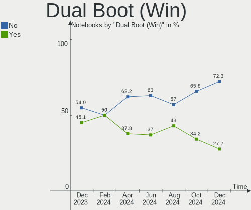
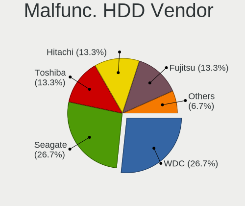
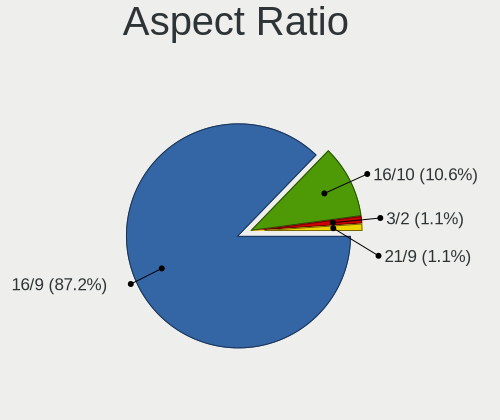
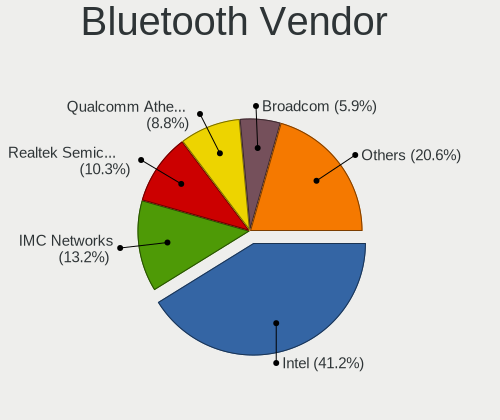
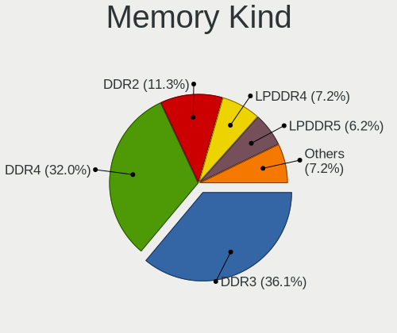

ROSA Hardware Trends (Notebooks)
--------------------------------

A project to identify most popular hardware characteristics and track their change
over time based on data collected by ROSA users at https://Linux-Hardware.org.

Anyone can contribute to this report by the [hw-probe](https://github.com/linuxhw/hw-probe) tool:

    sudo -E hw-probe -all -upload

Full-feature report is available here: https://linux-hardware.org/?view=trends

Period: Feb, 2022.

Contents
--------

* [ System ](#system)
  - [ OS                       ](#os)
  - [ OS Family                ](#os-family)
  - [ Kernel                   ](#kernel)
  - [ Kernel Family            ](#kernel-family)
  - [ Kernel Major Ver.        ](#kernel-major-ver)
  - [ Arch                     ](#arch)
  - [ DE                       ](#de)
  - [ Display Server           ](#display-server)
  - [ Display Manager          ](#display-manager)
  - [ OS Lang                  ](#os-lang)
  - [ Boot Mode                ](#boot-mode)
  - [ Filesystem               ](#filesystem)
  - [ Part. scheme             ](#part-scheme)
  - [ Dual Boot with Linux/BSD ](#dual-boot-with-linuxbsd)
  - [ Dual Boot (Win)          ](#dual-boot-win)

* [ Board ](#board)
  - [ Vendor                   ](#vendor)
  - [ Model                    ](#model)
  - [ Model Family             ](#model-family)
  - [ MFG Year                 ](#mfg-year)
  - [ Form Factor              ](#form-factor)
  - [ Secure Boot              ](#secure-boot)
  - [ Coreboot                 ](#coreboot)
  - [ RAM Size                 ](#ram-size)
  - [ RAM Used                 ](#ram-used)
  - [ Total Drives             ](#total-drives)
  - [ Has CD-ROM               ](#has-cd-rom)
  - [ Has Ethernet             ](#has-ethernet)
  - [ Has WiFi                 ](#has-wifi)
  - [ Has Bluetooth            ](#has-bluetooth)

* [ Location ](#location)
  - [ Country                  ](#country)
  - [ City                     ](#city)

* [ Drives ](#drives)
  - [ Drive Vendor             ](#drive-vendor)
  - [ Drive Model              ](#drive-model)
  - [ HDD Vendor               ](#hdd-vendor)
  - [ SSD Vendor               ](#ssd-vendor)
  - [ Drive Kind               ](#drive-kind)
  - [ Drive Connector          ](#drive-connector)
  - [ Drive Size               ](#drive-size)
  - [ Space Total              ](#space-total)
  - [ Space Used               ](#space-used)
  - [ Malfunc. Drives          ](#malfunc-drives)
  - [ Malfunc. Drive Vendor    ](#malfunc-drive-vendor)
  - [ Malfunc. HDD Vendor      ](#malfunc-hdd-vendor)
  - [ Malfunc. Drive Kind      ](#malfunc-drive-kind)
  - [ Failed Drives            ](#failed-drives)
  - [ Failed Drive Vendor      ](#failed-drive-vendor)
  - [ Drive Status             ](#drive-status)

* [ Storage controller ](#storage-controller)
  - [ Storage Vendor           ](#storage-vendor)
  - [ Storage Model            ](#storage-model)
  - [ Storage Kind             ](#storage-kind)

* [ Processor ](#processor)
  - [ CPU Vendor               ](#cpu-vendor)
  - [ CPU Model                ](#cpu-model)
  - [ CPU Model Family         ](#cpu-model-family)
  - [ CPU Cores                ](#cpu-cores)
  - [ CPU Sockets              ](#cpu-sockets)
  - [ CPU Threads              ](#cpu-threads)
  - [ CPU Op-Modes             ](#cpu-op-modes)
  - [ CPU Microcode            ](#cpu-microcode)
  - [ CPU Microarch            ](#cpu-microarch)

* [ Graphics ](#graphics)
  - [ GPU Vendor               ](#gpu-vendor)
  - [ GPU Model                ](#gpu-model)
  - [ GPU Combo                ](#gpu-combo)
  - [ GPU Driver               ](#gpu-driver)
  - [ GPU Memory               ](#gpu-memory)

* [ Monitor ](#monitor)
  - [ Monitor Vendor           ](#monitor-vendor)
  - [ Monitor Model            ](#monitor-model)
  - [ Monitor Resolution       ](#monitor-resolution)
  - [ Monitor Diagonal         ](#monitor-diagonal)
  - [ Monitor Width            ](#monitor-width)
  - [ Aspect Ratio             ](#aspect-ratio)
  - [ Monitor Area             ](#monitor-area)
  - [ Pixel Density            ](#pixel-density)
  - [ Multiple Monitors        ](#multiple-monitors)

* [ Network ](#network)
  - [ Net Controller Vendor    ](#net-controller-vendor)
  - [ Net Controller Model     ](#net-controller-model)
  - [ Wireless Vendor          ](#wireless-vendor)
  - [ Wireless Model           ](#wireless-model)
  - [ Ethernet Vendor          ](#ethernet-vendor)
  - [ Ethernet Model           ](#ethernet-model)
  - [ Net Controller Kind      ](#net-controller-kind)
  - [ Used Controller          ](#used-controller)
  - [ NICs                     ](#nics)
  - [ IPv6                     ](#ipv6)

* [ Bluetooth ](#bluetooth)
  - [ Bluetooth Vendor         ](#bluetooth-vendor)
  - [ Bluetooth Model          ](#bluetooth-model)

* [ Sound ](#sound)
  - [ Sound Vendor             ](#sound-vendor)
  - [ Sound Model              ](#sound-model)

* [ Memory ](#memory)
  - [ Memory Vendor            ](#memory-vendor)
  - [ Memory Model             ](#memory-model)
  - [ Memory Kind              ](#memory-kind)
  - [ Memory Form Factor       ](#memory-form-factor)
  - [ Memory Size              ](#memory-size)
  - [ Memory Speed             ](#memory-speed)

* [ Printers & scanners ](#printers--scanners)
  - [ Printer Vendor           ](#printer-vendor)
  - [ Printer Model            ](#printer-model)
  - [ Scanner Vendor           ](#scanner-vendor)
  - [ Scanner Model            ](#scanner-model)

* [ Camera ](#camera)
  - [ Camera Vendor            ](#camera-vendor)
  - [ Camera Model             ](#camera-model)

* [ Security ](#security)
  - [ Fingerprint Vendor       ](#fingerprint-vendor)
  - [ Fingerprint Model        ](#fingerprint-model)
  - [ Chipcard Vendor          ](#chipcard-vendor)
  - [ Chipcard Model           ](#chipcard-model)

* [ Unsupported ](#unsupported)
  - [ Unsupported Devices      ](#unsupported-devices)
  - [ Unsupported Device Types ](#unsupported-device-types)

System
------

OS
--

Installed operating systems

| Name       | Notebooks | Percent |
|------------|-----------|---------|
| ROSA 12.2  | 34        | 37.78%  |
| ROSA 12.1  | 27        | 30%     |
| ROSA R11.1 | 25        | 27.78%  |
| ROSA 12    | 2         | 2.22%   |
| ROSA R11   | 1         | 1.11%   |
| ROSA R10   | 1         | 1.11%   |

OS Family
---------

OS without a version

| Name | Notebooks | Percent |
|------|-----------|---------|
| ROSA | 90        | 100%    |

Kernel
------

Version of the Linux kernel

| Version                             | Notebooks | Percent |
|-------------------------------------|-----------|---------|
| 5.10.74-generic-2rosa2021.1-x86_64  | 58        | 64.44%  |
| 5.4.83-generic-2rosa-x86_64         | 10        | 11.11%  |
| 5.4.32-generic-2rosa-i586           | 4         | 4.44%   |
| 5.10.71-generic-1rosa2021.1-x86_64  | 3         | 3.33%   |
| 4.9.155-nrj-desktop-1rosa-i586      | 3         | 3.33%   |
| 4.15.0-desktop-122.124.1rosa-x86_64 | 3         | 3.33%   |
| 5.4.83-generic-2rosa-i586           | 1         | 1.11%   |
| 5.4.32-generic-2rosa-x86_64         | 1         | 1.11%   |
| 5.10.74-generic-2rosa2021.1-i586    | 1         | 1.11%   |
| 5.10.101-desktop-2rosa2021-x86_64   | 1         | 1.11%   |
| 4.9.60-nrj-desktop-1rosa-x86_64     | 1         | 1.11%   |
| 4.9.155-nrj-desktop-1rosa-x86_64    | 1         | 1.11%   |
| 4.15.0-desktop-94.1rosa-x86_64      | 1         | 1.11%   |
| 4.15.0-desktop-45.1rosa-x86_64      | 1         | 1.11%   |
| 4.15.0-desktop-122.124.1rosa-i586   | 1         | 1.11%   |

Kernel Family
-------------

Linux kernel without a distro release

| Version  | Notebooks | Percent |
|----------|-----------|---------|
| 5.10.74  | 59        | 65.56%  |
| 5.4.83   | 11        | 12.22%  |
| 4.15.0   | 6         | 6.67%   |
| 5.4.32   | 5         | 5.56%   |
| 4.9.155  | 4         | 4.44%   |
| 5.10.71  | 3         | 3.33%   |
| 5.10.101 | 1         | 1.11%   |
| 4.9.60   | 1         | 1.11%   |

Kernel Major Ver.
-----------------

Linux kernel major version

| Version | Notebooks | Percent |
|---------|-----------|---------|
| 5.10    | 63        | 70%     |
| 5.4     | 16        | 17.78%  |
| 4.15    | 6         | 6.67%   |
| 4.9     | 5         | 5.56%   |

Arch
----

OS architecture (x86_64, i586, etc.)

| Name   | Notebooks | Percent |
|--------|-----------|---------|
| x86_64 | 80        | 88.89%  |
| i686   | 10        | 11.11%  |

DE
--

Desktop Environment

| Name  | Notebooks | Percent |
|-------|-----------|---------|
| KDE5  | 47        | 52.22%  |
| KDE4  | 17        | 18.89%  |
| GNOME | 16        | 17.78%  |
| LXQt  | 9         | 10%     |
| XFCE  | 1         | 1.11%   |

Display Server
--------------

X11 or Wayland

| Name    | Notebooks | Percent |
|---------|-----------|---------|
| Wayland | 60        | 66.67%  |
| X11     | 30        | 33.33%  |

Display Manager
---------------

SDDM, LightDM, etc.

| Name    | Notebooks | Percent |
|---------|-----------|---------|
| SDDM    | 43        | 47.78%  |
| GDM     | 29        | 32.22%  |
| KDM     | 17        | 18.89%  |
| LightDM | 1         | 1.11%   |

OS Lang
-------

Language

| Lang    | Notebooks | Percent |
|---------|-----------|---------|
| ru_RU   | 72        | 80%     |
| de_DE   | 4         | 4.44%   |
| it_IT   | 2         | 2.22%   |
| en_GB   | 2         | 2.22%   |
| Unknown | 2         | 2.22%   |
| pt_BR   | 1         | 1.11%   |
| pl_PL   | 1         | 1.11%   |
| fr_BE   | 1         | 1.11%   |
| es_MX   | 1         | 1.11%   |
| en_US   | 1         | 1.11%   |
| en_IN   | 1         | 1.11%   |
| da_DK   | 1         | 1.11%   |
| cs_CZ   | 1         | 1.11%   |

Boot Mode
---------

EFI or BIOS

| Mode | Notebooks | Percent |
|------|-----------|---------|
| BIOS | 61        | 67.78%  |
| EFI  | 29        | 32.22%  |

Filesystem
----------

Type of filesystem

| Type  | Notebooks | Percent |
|-------|-----------|---------|
| Ext4  | 85        | 94.44%  |
| Btrfs | 4         | 4.44%   |
| Aufs  | 1         | 1.11%   |

Part. scheme
------------

Scheme of partitioning

| Type    | Notebooks | Percent |
|---------|-----------|---------|
| MBR     | 52        | 57.78%  |
| GPT     | 37        | 41.11%  |
| Unknown | 1         | 1.11%   |

Dual Boot with Linux/BSD
------------------------

Hosting more than one Linux/BSD

| Dual boot | Notebooks | Percent |
|-----------|-----------|---------|
| No        | 80        | 88.89%  |
| Yes       | 10        | 11.11%  |

Dual Boot (Win)
---------------

Hosting Linux and Windows

| Dual boot | Notebooks | Percent |
|-----------|-----------|---------|
| No        | 54        | 60%     |
| Yes       | 36        | 40%     |

Board
-----

Vendor
------

Motherboard manufacturer

| Name                | Notebooks | Percent |
|---------------------|-----------|---------|
| Lenovo              | 18        | 20%     |
| Hewlett-Packard     | 13        | 14.44%  |
| ASUSTek Computer    | 13        | 14.44%  |
| Acer                | 12        | 13.33%  |
| Samsung Electronics | 8         | 8.89%   |
| Dell                | 5         | 5.56%   |
| Toshiba             | 4         | 4.44%   |
| Packard Bell        | 2         | 2.22%   |
| Notebook            | 2         | 2.22%   |
| eMachines           | 2         | 2.22%   |
| Apple               | 2         | 2.22%   |
| Unknown             | 2         | 2.22%   |
| Sony                | 1         | 1.11%   |
| MSI                 | 1         | 1.11%   |
| Medion              | 1         | 1.11%   |
| Intel               | 1         | 1.11%   |
| Fujitsu Siemens     | 1         | 1.11%   |
| Fujitsu             | 1         | 1.11%   |
| Chuwi               | 1         | 1.11%   |

Model
-----

Motherboard model

| Name                                                                                     | Notebooks | Percent |
|------------------------------------------------------------------------------------------|-----------|---------|
| Lenovo IdeaPad S145-15AST 81N3                                                           | 2         | 2.22%   |
| HP Pavilion dv6                                                                          | 2         | 2.22%   |
| Unknown                                                                                  | 2         | 2.22%   |
| Toshiba Satellite L775D                                                                  | 1         | 1.11%   |
| Toshiba Satellite C850-C3K                                                               | 1         | 1.11%   |
| Toshiba Satellite A300                                                                   | 1         | 1.11%   |
| Toshiba QOSMIO F60                                                                       | 1         | 1.11%   |
| Sony SVE1412E1RW                                                                         | 1         | 1.11%   |
| Samsung R40/R41                                                                          | 1         | 1.11%   |
| Samsung QX310/QX410/QX510/SF310/SF410/SF510                                              | 1         | 1.11%   |
| Samsung Q310                                                                             | 1         | 1.11%   |
| Samsung NC110P/NC108P/NC111P                                                             | 1         | 1.11%   |
| Samsung N150/N210/N220                                                                   | 1         | 1.11%   |
| Samsung 355V4C/355V4X/355V5C/355V5X/356V4C/356V4X/356V5C/356V5X/3445VC/3445VX/3545VC/354 | 1         | 1.11%   |
| Samsung 350V5C/351V5C/3540VC/3440VC                                                      | 1         | 1.11%   |
| Samsung 300E4Z/300E5Z/300E7Z                                                             | 1         | 1.11%   |
| Packard Bell EasyNote TE69KB                                                             | 1         | 1.11%   |
| Packard Bell DOT S                                                                       | 1         | 1.11%   |
| Notebook WA50SRQ                                                                         | 1         | 1.11%   |
| Notebook W54_W94_W955TU,-T,-C                                                            | 1         | 1.11%   |
| MSI GP60 2OD                                                                             | 1         | 1.11%   |
| Medion P7612                                                                             | 1         | 1.11%   |
| Lenovo ThinkPad X240 20AL0067RT                                                          | 1         | 1.11%   |
| Lenovo ThinkPad X230 2330A17                                                             | 1         | 1.11%   |
| Lenovo ThinkPad T500 2056Y2Z                                                             | 1         | 1.11%   |
| Lenovo ThinkPad T420 42367A4                                                             | 1         | 1.11%   |
| Lenovo ThinkPad SL410 2842RN9                                                            | 1         | 1.11%   |
| Lenovo Legion 5 15ACH6A 82NW                                                             | 1         | 1.11%   |
| Lenovo IdeaPad Z580                                                                      | 1         | 1.11%   |
| Lenovo IdeaPad Z470                                                                      | 1         | 1.11%   |
| Lenovo IdeaPad S110 20126                                                                | 1         | 1.11%   |
| Lenovo IdeaPad S10-2 20027                                                               | 1         | 1.11%   |
| Lenovo IdeaPad 330-15IGM 81D1                                                            | 1         | 1.11%   |
| Lenovo IdeaPad 320-15IAP 80XR                                                            | 1         | 1.11%   |
| Lenovo IdeaPad 3 17ALC6 82KV                                                             | 1         | 1.11%   |
| Lenovo G50-70 20351                                                                      | 1         | 1.11%   |
| Lenovo E43                                                                               | 1         | 1.11%   |
| Lenovo B560                                                                              | 1         | 1.11%   |
| Intel HuronRiver Platform                                                                | 1         | 1.11%   |
| HP ProBook 4520s                                                                         | 1         | 1.11%   |
| HP Pavilion g6                                                                           | 1         | 1.11%   |
| HP Pavilion 15                                                                           | 1         | 1.11%   |
| HP Mini 110-3500                                                                         | 1         | 1.11%   |
| HP Laptop 15-db1xxx                                                                      | 1         | 1.11%   |
| HP Laptop 15-bw0xx                                                                       | 1         | 1.11%   |
| HP G7000                                                                                 | 1         | 1.11%   |
| HP ENVY dv7                                                                              | 1         | 1.11%   |
| HP EliteBook 8470p                                                                       | 1         | 1.11%   |
| HP Compaq Presario CQ71                                                                  | 1         | 1.11%   |
| HP 255 G4                                                                                | 1         | 1.11%   |
| Fujitsu Siemens LIFEBOOK S7110                                                           | 1         | 1.11%   |
| Fujitsu CELSIUS H700                                                                     | 1         | 1.11%   |
| eMachines eM250                                                                          | 1         | 1.11%   |
| eMachines E725                                                                           | 1         | 1.11%   |
| Dell Vostro 5490                                                                         | 1         | 1.11%   |
| Dell Latitude E6540                                                                      | 1         | 1.11%   |
| Dell Latitude E5520                                                                      | 1         | 1.11%   |
| Dell Latitude E5420                                                                      | 1         | 1.11%   |
| Dell Inspiron 3558                                                                       | 1         | 1.11%   |
| Chuwi Hero Book                                                                          | 1         | 1.11%   |

Model Family
------------

Motherboard model prefix

| Name                     | Notebooks | Percent |
|--------------------------|-----------|---------|
| Lenovo IdeaPad           | 9         | 10%     |
| Acer Aspire              | 8         | 8.89%   |
| Lenovo ThinkPad          | 5         | 5.56%   |
| HP Pavilion              | 4         | 4.44%   |
| Toshiba Satellite        | 3         | 3.33%   |
| Dell Latitude            | 3         | 3.33%   |
| ASUS VivoBook            | 3         | 3.33%   |
| Acer Extensa             | 3         | 3.33%   |
| HP Laptop                | 2         | 2.22%   |
| Unknown                  | 2         | 2.22%   |
| Toshiba QOSMIO           | 1         | 1.11%   |
| Sony SVE1412E1RW         | 1         | 1.11%   |
| Samsung R40              | 1         | 1.11%   |
| Samsung QX310            | 1         | 1.11%   |
| Samsung Q310             | 1         | 1.11%   |
| Samsung NC110P           | 1         | 1.11%   |
| Samsung N150             | 1         | 1.11%   |
| Samsung 355V4C           | 1         | 1.11%   |
| Samsung 350V5C           | 1         | 1.11%   |
| Samsung 300E4Z           | 1         | 1.11%   |
| Packard Bell EasyNote    | 1         | 1.11%   |
| Packard Bell DOT         | 1         | 1.11%   |
| Notebook WA50SRQ         | 1         | 1.11%   |
| Notebook W54             | 1         | 1.11%   |
| MSI GP60                 | 1         | 1.11%   |
| Medion P7612             | 1         | 1.11%   |
| Lenovo Legion            | 1         | 1.11%   |
| Lenovo G50-70            | 1         | 1.11%   |
| Lenovo E43               | 1         | 1.11%   |
| Lenovo B560              | 1         | 1.11%   |
| Intel HuronRiver         | 1         | 1.11%   |
| HP ProBook               | 1         | 1.11%   |
| HP Mini                  | 1         | 1.11%   |
| HP G7000                 | 1         | 1.11%   |
| HP ENVY                  | 1         | 1.11%   |
| HP EliteBook             | 1         | 1.11%   |
| HP Compaq                | 1         | 1.11%   |
| HP 255                   | 1         | 1.11%   |
| Fujitsu Siemens LIFEBOOK | 1         | 1.11%   |
| Fujitsu CELSIUS          | 1         | 1.11%   |
| eMachines eM250          | 1         | 1.11%   |
| eMachines E725           | 1         | 1.11%   |
| Dell Vostro              | 1         | 1.11%   |
| Dell Inspiron            | 1         | 1.11%   |
| Chuwi Hero               | 1         | 1.11%   |
| ASUS X55A                | 1         | 1.11%   |
| ASUS X45U                | 1         | 1.11%   |
| ASUS U24E                | 1         | 1.11%   |
| ASUS N76VZ               | 1         | 1.11%   |
| ASUS N61Vn               | 1         | 1.11%   |
| ASUS N53SV               | 1         | 1.11%   |
| ASUS K50IJ               | 1         | 1.11%   |
| ASUS F5SL                | 1         | 1.11%   |
| ASUS 1011PX              | 1         | 1.11%   |
| ASUS 1005PXD             | 1         | 1.11%   |
| Apple MacBookAir2        | 1         | 1.11%   |
| Apple MacBook4           | 1         | 1.11%   |
| Acer AOA110              | 1         | 1.11%   |

MFG Year
--------

Motherboard manufacture year

| Year | Notebooks | Percent |
|------|-----------|---------|
| 2012 | 14        | 15.56%  |
| 2011 | 13        | 14.44%  |
| 2008 | 10        | 11.11%  |
| 2013 | 9         | 10%     |
| 2010 | 9         | 10%     |
| 2009 | 7         | 7.78%   |
| 2015 | 6         | 6.67%   |
| 2019 | 4         | 4.44%   |
| 2021 | 3         | 3.33%   |
| 2018 | 3         | 3.33%   |
| 2007 | 3         | 3.33%   |
| 2006 | 3         | 3.33%   |
| 2017 | 2         | 2.22%   |
| 2014 | 2         | 2.22%   |
| 2020 | 1         | 1.11%   |
| 2016 | 1         | 1.11%   |

Form Factor
-----------

Physical design of the computer

| Name     | Notebooks | Percent |
|----------|-----------|---------|
| Notebook | 90        | 100%    |

Secure Boot
-----------

Enabled or disabled

| State    | Notebooks | Percent |
|----------|-----------|---------|
| Disabled | 90        | 100%    |

Coreboot
--------

Have coreboot on board

| Used | Notebooks | Percent |
|------|-----------|---------|
| No   | 90        | 100%    |

RAM Size
--------

Total RAM memory

| Size in GB | Notebooks | Percent |
|------------|-----------|---------|
| 3.01-4.0   | 31        | 34.44%  |
| 4.01-8.0   | 22        | 24.44%  |
| 1.01-2.0   | 20        | 22.22%  |
| 8.01-16.0  | 10        | 11.11%  |
| 2.01-3.0   | 4         | 4.44%   |
| 24.01-32.0 | 1         | 1.11%   |
| 16.01-24.0 | 1         | 1.11%   |
| 0.51-1.0   | 1         | 1.11%   |

RAM Used
--------

Used RAM memory

| Used GB  | Notebooks | Percent |
|----------|-----------|---------|
| 0.51-1.0 | 41        | 45.56%  |
| 1.01-2.0 | 40        | 44.44%  |
| 2.01-3.0 | 6         | 6.67%   |
| 4.01-8.0 | 1         | 1.11%   |
| 3.01-4.0 | 1         | 1.11%   |
| 0.01-0.5 | 1         | 1.11%   |

Total Drives
------------

Number of drives on board

| Drives | Notebooks | Percent |
|--------|-----------|---------|
| 1      | 65        | 72.22%  |
| 2      | 21        | 23.33%  |
| 3      | 4         | 4.44%   |

Has CD-ROM
----------

Has CD-ROM on board

| Presented | Notebooks | Percent |
|-----------|-----------|---------|
| Yes       | 46        | 51.11%  |
| No        | 44        | 48.89%  |

Has Ethernet
------------

Has Ethernet on board

| Presented | Notebooks | Percent |
|-----------|-----------|---------|
| Yes       | 84        | 93.33%  |
| No        | 6         | 6.67%   |

Has WiFi
--------

Has WiFi module

| Presented | Notebooks | Percent |
|-----------|-----------|---------|
| Yes       | 89        | 98.89%  |
| No        | 1         | 1.11%   |

Has Bluetooth
-------------

Has Bluetooth module

| Presented | Notebooks | Percent |
|-----------|-----------|---------|
| Yes       | 56        | 62.22%  |
| No        | 34        | 37.78%  |

Location
--------

Country
-------

Geographic location (country)

| Country         | Notebooks | Percent |
|-----------------|-----------|---------|
| Russia          | 70        | 77.78%  |
| Germany         | 5         | 5.56%   |
| Poland          | 2         | 2.22%   |
| Italy           | 2         | 2.22%   |
| Finland         | 2         | 2.22%   |
| Ukraine         | 1         | 1.11%   |
| North Macedonia | 1         | 1.11%   |
| Moldova         | 1         | 1.11%   |
| Mexico          | 1         | 1.11%   |
| India           | 1         | 1.11%   |
| Denmark         | 1         | 1.11%   |
| Czechia         | 1         | 1.11%   |
| Brazil          | 1         | 1.11%   |
| Belgium         | 1         | 1.11%   |

City
----

Geographic location (city)

| City               | Notebooks | Percent |
|--------------------|-----------|---------|
| Moscow             | 11        | 12.22%  |
| St Petersburg      | 7         | 7.78%   |
| Nizhniy Novgorod   | 4         | 4.44%   |
| Yaroslavl          | 3         | 3.33%   |
| Krasnodar          | 3         | 3.33%   |
| Yekaterinburg      | 2         | 2.22%   |
| Volgograd          | 2         | 2.22%   |
| Tver               | 2         | 2.22%   |
| Novosibirsk        | 2         | 2.22%   |
| Munich             | 2         | 2.22%   |
| Yoshkar-Ola        | 1         | 1.11%   |
| Wiesbaden          | 1         | 1.11%   |
| Wegierska Gorka    | 1         | 1.11%   |
| Voronezh           | 1         | 1.11%   |
| Vladivostok        | 1         | 1.11%   |
| Ufa                | 1         | 1.11%   |
| Tula               | 1         | 1.11%   |
| Tolyatti           | 1         | 1.11%   |
| Tambov             | 1         | 1.11%   |
| Stavropol          | 1         | 1.11%   |
| Sochi              | 1         | 1.11%   |
| Smolensk           | 1         | 1.11%   |
| Saratov            | 1         | 1.11%   |
| Rybinsk            | 1         | 1.11%   |
| Ryazan             | 1         | 1.11%   |
| Rome               | 1         | 1.11%   |
| Radovis            | 1         | 1.11%   |
| Petrozavodsk       | 1         | 1.11%   |
| Perm               | 1         | 1.11%   |
| Papantla de Olarte | 1         | 1.11%   |
| Ozersk             | 1         | 1.11%   |
| Orenburg           | 1         | 1.11%   |
| Novokuznetsk       | 1         | 1.11%   |
| Nizhny Tagil       | 1         | 1.11%   |
| Minusinsk          | 1         | 1.11%   |
| Maykop             | 1         | 1.11%   |
| Mannheim           | 1         | 1.11%   |
| Makiivka           | 1         | 1.11%   |
| Lipetsk            | 1         | 1.11%   |
| Legnica            | 1         | 1.11%   |
| Kyroeskoski        | 1         | 1.11%   |
| Kuusamo            | 1         | 1.11%   |
| Kursk              | 1         | 1.11%   |
| Krasnoyarsk        | 1         | 1.11%   |
| Komsomolsk-on-Amur | 1         | 1.11%   |
| Kaluga             | 1         | 1.11%   |
| Ivanovo            | 1         | 1.11%   |
| Irkutsk            | 1         | 1.11%   |
| Ernakulam          | 1         | 1.11%   |
| Donskoye           | 1         | 1.11%   |
| Chisinau           | 1         | 1.11%   |
| Chelyabinsk        | 1         | 1.11%   |
| Catania            | 1         | 1.11%   |
| Brussels           | 1         | 1.11%   |
| Brno               | 1         | 1.11%   |
| Brasília        | 1         | 1.11%   |
| Blagoveshchensk    | 1         | 1.11%   |
| Berlin             | 1         | 1.11%   |
| Belgorod           | 1         | 1.11%   |
| Asnaes             | 1         | 1.11%   |

Drives
------

Drive Vendor
------------

Hard drive vendors

| Vendor              | Notebooks | Drives | Percent |
|---------------------|-----------|--------|---------|
| WDC                 | 26        | 27     | 22.61%  |
| Seagate             | 17        | 17     | 14.78%  |
| Toshiba             | 11        | 11     | 9.57%   |
| Samsung Electronics | 11        | 11     | 9.57%   |
| Hitachi             | 11        | 12     | 9.57%   |
| SanDisk             | 5         | 5      | 4.35%   |
| Kingston            | 4         | 4      | 3.48%   |
| Smartbuy            | 3         | 3      | 2.61%   |
| SK Hynix            | 3         | 3      | 2.61%   |
| HGST                | 3         | 3      | 2.61%   |
| A-DATA Technology   | 3         | 3      | 2.61%   |
| Unknown             | 2         | 2      | 1.74%   |
| SPCC                | 2         | 2      | 1.74%   |
| Transcend           | 1         | 1      | 0.87%   |
| Silicon Motion      | 1         | 1      | 0.87%   |
| Phison              | 1         | 1      | 0.87%   |
| Netac               | 1         | 1      | 0.87%   |
| LONDISK             | 1         | 1      | 0.87%   |
| KingDian            | 1         | 1      | 0.87%   |
| Intenso             | 1         | 1      | 0.87%   |
| GOODRAM             | 1         | 1      | 0.87%   |
| Gigabyte Technology | 1         | 1      | 0.87%   |
| Fujitsu             | 1         | 1      | 0.87%   |
| External            | 1         | 1      | 0.87%   |
| China               | 1         | 1      | 0.87%   |
| ASMedia             | 1         | 1      | 0.87%   |
| Apacer              | 1         | 1      | 0.87%   |

Drive Model
-----------

Hard drive models

| Model                                   | Notebooks | Percent |
|-----------------------------------------|-----------|---------|
| Seagate ST500LT012-1DG142 500GB         | 4         | 3.42%   |
| Seagate ST9500325AS 500GB               | 3         | 2.56%   |
| Seagate ST1000LM024 HN-M101MBB 1TB      | 3         | 2.56%   |
| WDC WDS240G2G0A-00JH30 240GB SSD        | 2         | 1.71%   |
| WDC WD5000LPCX-00VHAT0 500GB            | 2         | 1.71%   |
| WDC WD3200BPVT-22JJ5T0 320GB            | 2         | 1.71%   |
| Toshiba MQ01ABF050 500GB                | 2         | 1.71%   |
| Toshiba MQ01ABD100 1TB                  | 2         | 1.71%   |
| Smartbuy SSD 120GB                      | 2         | 1.71%   |
| Seagate ST9320325AS 320GB               | 2         | 1.71%   |
| Samsung MZ7LN128HAHQ-000L2 128GB SSD    | 2         | 1.71%   |
| Samsung HM160HI 160GB                   | 2         | 1.71%   |
| Hitachi HTS547575A9E384 752GB           | 2         | 1.71%   |
| Hitachi HTS547550A9E384 500GB           | 2         | 1.71%   |
| Hitachi HTS545050A7E380 500GB           | 2         | 1.71%   |
| WDC WDS250G2B0B 250GB SSD               | 1         | 0.85%   |
| WDC WDS120G2G0A-00JH30 120GB SSD        | 1         | 0.85%   |
| WDC WD7500BPVX-22JC3T0 752GB            | 1         | 0.85%   |
| WDC WD6400BPVT-80HXZT3 640GB            | 1         | 0.85%   |
| WDC WD6400BPVT-24HXZT1 640GB            | 1         | 0.85%   |
| WDC WD5000LPVX-22V0TT0 500GB            | 1         | 0.85%   |
| WDC WD5000LPVX-08V0TT5 500GB            | 1         | 0.85%   |
| WDC WD5000LPCX-24C6HT0 500GB            | 1         | 0.85%   |
| WDC WD5000LPCX-21VHAT0 500GB            | 1         | 0.85%   |
| WDC WD3200BPVT-24ZEST0 320GB            | 1         | 0.85%   |
| WDC WD3200BPVT-24JJ5T0 320GB            | 1         | 0.85%   |
| WDC WD3200BEKT-60F3T1 320GB             | 1         | 0.85%   |
| WDC WD2500BPVT-24JJ5T0 250GB            | 1         | 0.85%   |
| WDC WD2500BEVT-75A23T0 250GB            | 1         | 0.85%   |
| WDC WD2500BEVT-22ZCT0 250GB             | 1         | 0.85%   |
| WDC WD2500BEVT-08A23T1 250GB            | 1         | 0.85%   |
| WDC WD2500BEVS-60UST0 250GB             | 1         | 0.85%   |
| WDC WD1600BEVT-22ZCT0 160GB             | 1         | 0.85%   |
| WDC WD10SPZX-60Z10T0 1TB                | 1         | 0.85%   |
| WDC WD10JPVX-60JC3T0 1TB                | 1         | 0.85%   |
| WDC PC SN530 SDBPNPZ-512G-1002 512GB    | 1         | 0.85%   |
| Unknown EC2QT  64GB                     | 1         | 0.85%   |
| Unknown DA4128  128GB                   | 1         | 0.85%   |
| Transcend TS120GMTS420S 120GB SSD       | 1         | 0.85%   |
| Toshiba TR200 240GB SSD                 | 1         | 0.85%   |
| Toshiba MQ04ABF100 1TB                  | 1         | 0.85%   |
| Toshiba MQ01ABD032 320GB                | 1         | 0.85%   |
| Toshiba MK8052GSX 80GB                  | 1         | 0.85%   |
| Toshiba MK6475GSX 640GB                 | 1         | 0.85%   |
| Toshiba MK4058GSX 400GB                 | 1         | 0.85%   |
| Toshiba MK3275GSX 320GB                 | 1         | 0.85%   |
| SPCC Solid State Disk 256GB             | 1         | 0.85%   |
| SPCC Solid State Disk 128GB             | 1         | 0.85%   |
| Smartbuy SSD 60GB                       | 1         | 0.85%   |
| SK Hynix C2S3T/120G 120GB SSD           | 1         | 0.85%   |
| SK Hynix BC511 NVMe 512GB               | 1         | 0.85%   |
| SK Hynix BC501 HFM256GDJTNG-8310A 256GB | 1         | 0.85%   |
| Silicon Motion SPT256L2-2IAS7G2 256GB   | 1         | 0.85%   |
| Seagate ST980811AS 80GB                 | 1         | 0.85%   |
| Seagate ST9320328CS 320GB               | 1         | 0.85%   |
| Seagate ST500LT012-9WS142 500GB         | 1         | 0.85%   |
| Seagate ST500LM000-SSHD-8GB             | 1         | 0.85%   |
| Seagate ST320LT007-9ZV142 320GB         | 1         | 0.85%   |
| SanDisk SSD PLUS 240GB                  | 1         | 0.85%   |
| SanDisk SDSSDH3500G 500GB               | 1         | 0.85%   |

HDD Vendor
----------

Hard disk drive vendors

| Vendor              | Notebooks | Drives | Percent |
|---------------------|-----------|--------|---------|
| WDC                 | 21        | 22     | 30.88%  |
| Seagate             | 17        | 17     | 25%     |
| Hitachi             | 11        | 12     | 16.18%  |
| Toshiba             | 10        | 10     | 14.71%  |
| Samsung Electronics | 4         | 4      | 5.88%   |
| HGST                | 3         | 3      | 4.41%   |
| Fujitsu             | 1         | 1      | 1.47%   |
| ASMedia             | 1         | 1      | 1.47%   |

SSD Vendor
----------

Solid state drive vendors

| Vendor              | Notebooks | Drives | Percent |
|---------------------|-----------|--------|---------|
| WDC                 | 4         | 4      | 11.76%  |
| SanDisk             | 4         | 4      | 11.76%  |
| Samsung Electronics | 4         | 4      | 11.76%  |
| Smartbuy            | 3         | 3      | 8.82%   |
| Kingston            | 3         | 3      | 8.82%   |
| A-DATA Technology   | 3         | 3      | 8.82%   |
| SPCC                | 2         | 2      | 5.88%   |
| Transcend           | 1         | 1      | 2.94%   |
| Toshiba             | 1         | 1      | 2.94%   |
| SK Hynix            | 1         | 1      | 2.94%   |
| Phison              | 1         | 1      | 2.94%   |
| Netac               | 1         | 1      | 2.94%   |
| LONDISK             | 1         | 1      | 2.94%   |
| KingDian            | 1         | 1      | 2.94%   |
| Intenso             | 1         | 1      | 2.94%   |
| GOODRAM             | 1         | 1      | 2.94%   |
| China               | 1         | 1      | 2.94%   |
| Apacer              | 1         | 1      | 2.94%   |

Drive Kind
----------

HDD or SSD

| Kind | Notebooks | Drives | Percent |
|------|-----------|--------|---------|
| HDD  | 67        | 70     | 61.47%  |
| SSD  | 32        | 34     | 29.36%  |
| NVMe | 8         | 10     | 7.34%   |
| MMC  | 2         | 3      | 1.83%   |

Drive Connector
---------------

SATA, SAS, NVMe, etc.

| Type | Notebooks | Drives | Percent |
|------|-----------|--------|---------|
| SATA | 84        | 103    | 88.42%  |
| NVMe | 7         | 9      | 7.37%   |
| SAS  | 2         | 2      | 2.11%   |
| MMC  | 2         | 3      | 2.11%   |

Drive Size
----------

Size of hard drive

| Size in TB | Notebooks | Drives | Percent |
|------------|-----------|--------|---------|
| 0.01-0.5   | 76        | 87     | 82.61%  |
| 0.51-1.0   | 15        | 16     | 16.3%   |
| 1.01-2.0   | 1         | 1      | 1.09%   |

Space Total
-----------

Amount of disk space available on the file system

| Size in GB     | Notebooks | Percent |
|----------------|-----------|---------|
| 251-500        | 33        | 36.67%  |
| 101-250        | 24        | 26.67%  |
| 501-1000       | 11        | 12.22%  |
| 21-50          | 6         | 6.67%   |
| 1-20           | 6         | 6.67%   |
| 51-100         | 6         | 6.67%   |
| 1001-2000      | 3         | 3.33%   |
| More than 3000 | 1         | 1.11%   |

Space Used
----------

Amount of used disk space

| Used GB   | Notebooks | Percent |
|-----------|-----------|---------|
| 1-20      | 52        | 57.78%  |
| 21-50     | 12        | 13.33%  |
| 51-100    | 11        | 12.22%  |
| 101-250   | 9         | 10%     |
| 251-500   | 3         | 3.33%   |
| 501-1000  | 2         | 2.22%   |
| 2001-3000 | 1         | 1.11%   |

Malfunc. Drives
---------------

Drive models with a malfunction

| Model                              | Notebooks | Drives | Percent |
|------------------------------------|-----------|--------|---------|
| Seagate ST9500325AS 500GB          | 2         | 2      | 6.25%   |
| Seagate ST9320325AS 320GB          | 2         | 2      | 6.25%   |
| Samsung Electronics HM160HI 160GB  | 2         | 2      | 6.25%   |
| WDC WD5000LPVX-22V0TT0 500GB       | 1         | 1      | 3.13%   |
| WDC WD3200BPVT-24JJ5T0 320GB       | 1         | 1      | 3.13%   |
| WDC WD3200BEKT-60F3T1 320GB        | 1         | 1      | 3.13%   |
| WDC WD2500BEVS-60UST0 250GB        | 1         | 1      | 3.13%   |
| WDC WD10JPVX-60JC3T0 1TB           | 1         | 1      | 3.13%   |
| Toshiba MQ01ABF050 500GB           | 1         | 1      | 3.13%   |
| Toshiba MK8052GSX 80GB             | 1         | 1      | 3.13%   |
| Toshiba MK4058GSX 400GB            | 1         | 1      | 3.13%   |
| Seagate ST980811AS 80GB            | 1         | 1      | 3.13%   |
| Seagate ST9320328CS 320GB          | 1         | 1      | 3.13%   |
| Seagate ST500LT012-9WS142 500GB    | 1         | 1      | 3.13%   |
| Seagate ST500LT012-1DG142 500GB    | 1         | 1      | 3.13%   |
| Seagate ST320LT007-9ZV142 320GB    | 1         | 1      | 3.13%   |
| Seagate ST1000LM024 HN-M101MBB 1TB | 1         | 1      | 3.13%   |
| Samsung Electronics HS12UHE 120GB  | 1         | 1      | 3.13%   |
| Kingston SV300S37A120G 120GB SSD   | 1         | 1      | 3.13%   |
| Kingston SA400S37120G 120GB SSD    | 1         | 1      | 3.13%   |
| Hitachi HTS725032A9A364 320GB      | 1         | 1      | 3.13%   |
| Hitachi HTS547550A9E384 500GB      | 1         | 1      | 3.13%   |
| Hitachi HTS545050A7E380 500GB      | 1         | 1      | 3.13%   |
| Hitachi HTS543232A7A384 320GB      | 1         | 1      | 3.13%   |
| Hitachi HTS541080G9AT00 72GB       | 1         | 1      | 3.13%   |
| HGST HTS545050A7E680 500GB         | 1         | 1      | 3.13%   |
| HGST HTS545050A7E380 500GB         | 1         | 1      | 3.13%   |
| Fujitsu MHV2060AT 64GB             | 1         | 1      | 3.13%   |
| External USB3.0 512GB              | 1         | 1      | 3.13%   |

Malfunc. Drive Vendor
---------------------

Vendors of faulty drives

| Vendor              | Notebooks | Drives | Percent |
|---------------------|-----------|--------|---------|
| Seagate             | 10        | 10     | 32.26%  |
| WDC                 | 5         | 5      | 16.13%  |
| Hitachi             | 4         | 5      | 12.9%   |
| Toshiba             | 3         | 3      | 9.68%   |
| Samsung Electronics | 3         | 3      | 9.68%   |
| Kingston            | 2         | 2      | 6.45%   |
| HGST                | 2         | 2      | 6.45%   |
| Fujitsu             | 1         | 1      | 3.23%   |
| External            | 1         | 1      | 3.23%   |

Malfunc. HDD Vendor
-------------------

Vendors of faulty HDD drives

| Vendor              | Notebooks | Drives | Percent |
|---------------------|-----------|--------|---------|
| Seagate             | 10        | 10     | 35.71%  |
| WDC                 | 5         | 5      | 17.86%  |
| Hitachi             | 4         | 5      | 14.29%  |
| Toshiba             | 3         | 3      | 10.71%  |
| Samsung Electronics | 3         | 3      | 10.71%  |
| HGST                | 2         | 2      | 7.14%   |
| Fujitsu             | 1         | 1      | 3.57%   |

Malfunc. Drive Kind
-------------------

Kinds of faulty drives

| Kind | Notebooks | Drives | Percent |
|------|-----------|--------|---------|
| HDD  | 28        | 29     | 90.32%  |
| SSD  | 2         | 2      | 6.45%   |
| NVMe | 1         | 1      | 3.23%   |

Failed Drives
-------------

Failed drive models

| Model                           | Notebooks | Drives | Percent |
|---------------------------------|-----------|--------|---------|
| Seagate ST500LT012-1DG142 500GB | 1         | 1      | 100%    |

Failed Drive Vendor
-------------------

Failed drive vendors

| Vendor  | Notebooks | Drives | Percent |
|---------|-----------|--------|---------|
| Seagate | 1         | 1      | 100%    |

Drive Status
------------

Number of failed and malfunc. drives

| Status   | Notebooks | Drives | Percent |
|----------|-----------|--------|---------|
| Works    | 66        | 80     | 66%     |
| Malfunc  | 30        | 32     | 30%     |
| Detected | 3         | 4      | 3%      |
| Failed   | 1         | 1      | 1%      |

Storage controller
------------------

Storage Vendor
--------------

Storage controller vendors

| Vendor                           | Notebooks | Percent |
|----------------------------------|-----------|---------|
| Intel                            | 68        | 70.83%  |
| AMD                              | 19        | 19.79%  |
| SK Hynix                         | 2         | 2.08%   |
| Samsung Electronics              | 2         | 2.08%   |
| Silicon Motion                   | 1         | 1.04%   |
| Silicon Integrated Systems [SiS] | 1         | 1.04%   |
| Phison Electronics               | 1         | 1.04%   |
| Nvidia                           | 1         | 1.04%   |
| Kingston Technology Company      | 1         | 1.04%   |

Storage Model
-------------

Storage controller models

| Model                                                                            | Notebooks | Percent |
|----------------------------------------------------------------------------------|-----------|---------|
| AMD FCH SATA Controller [AHCI mode]                                              | 15        | 14.15%  |
| Intel 82801IBM/IEM (ICH9M/ICH9M-E) 4 port SATA Controller [AHCI mode]            | 9         | 8.49%   |
| Intel 7 Series Chipset Family 6-port SATA Controller [AHCI mode]                 | 9         | 8.49%   |
| Intel 6 Series/C200 Series Chipset Family 6 port Mobile SATA AHCI Controller     | 8         | 7.55%   |
| Intel NM10/ICH7 Family SATA Controller [AHCI mode]                               | 7         | 6.6%    |
| Intel 5 Series/3400 Series Chipset 4 port SATA AHCI Controller                   | 5         | 4.72%   |
| Intel 82801GBM/GHM (ICH7-M Family) SATA Controller [IDE mode]                    | 4         | 3.77%   |
| Intel Wildcat Point-LP SATA Controller [AHCI Mode]                               | 3         | 2.83%   |
| Intel 82801HM/HEM (ICH8M/ICH8M-E) SATA Controller [AHCI mode]                    | 3         | 2.83%   |
| Intel 82801HM/HEM (ICH8M/ICH8M-E) IDE Controller                                 | 3         | 2.83%   |
| Intel 8 Series SATA Controller 1 [AHCI mode]                                     | 3         | 2.83%   |
| Intel Celeron/Pentium Silver Processor SATA Controller                           | 2         | 1.89%   |
| Intel Atom/Celeron/Pentium Processor x5-E8000/J3xxx/N3xxx Series SATA Controller | 2         | 1.89%   |
| Intel 82801 Mobile SATA Controller [RAID mode]                                   | 2         | 1.89%   |
| Intel 8 Series/C220 Series Chipset Family 6-port SATA Controller 1 [AHCI mode]   | 2         | 1.89%   |
| Intel 7 Series Chipset Family 4-port SATA Controller [IDE mode]                  | 2         | 1.89%   |
| Intel 7 Series Chipset Family 2-port SATA Controller [IDE mode]                  | 2         | 1.89%   |
| AMD SB7x0/SB8x0/SB9x0 SATA Controller [AHCI mode]                                | 2         | 1.89%   |
| AMD IXP SB4x0 IDE Controller                                                     | 2         | 1.89%   |
| SK Hynix BC511                                                                   | 1         | 0.94%   |
| SK Hynix BC501 NVMe Solid State Drive                                            | 1         | 0.94%   |
| Silicon Motion SM2263EN/SM2263XT SSD Controller                                  | 1         | 0.94%   |
| Silicon Integrated Systems [SiS] SATA Controller / IDE mode                      | 1         | 0.94%   |
| Silicon Integrated Systems [SiS] 5513 IDE Controller                             | 1         | 0.94%   |
| Samsung NVMe SSD Controller SM981/PM981/PM983                                    | 1         | 0.94%   |
| Samsung NVMe SSD Controller 980                                                  | 1         | 0.94%   |
| Phison PS5013 E13 NVMe Controller                                                | 1         | 0.94%   |
| Nvidia MCP79 AHCI Controller                                                     | 1         | 0.94%   |
| Kingston Company A2000 NVMe SSD                                                  | 1         | 0.94%   |
| Intel Mobile 4 Series Chipset PT IDER Controller                                 | 1         | 0.94%   |
| Intel Comet Lake SATA AHCI Controller                                            | 1         | 0.94%   |
| Intel Celeron N3350/Pentium N4200/Atom E3900 Series SATA AHCI Controller         | 1         | 0.94%   |
| Intel Atom Processor E3800 Series SATA AHCI Controller                           | 1         | 0.94%   |
| Intel 82801IBM/IEM (ICH9M/ICH9M-E) 2 port SATA Controller [IDE mode]             | 1         | 0.94%   |
| Intel 82801GBM/GHM (ICH7-M Family) SATA Controller [AHCI mode]                   | 1         | 0.94%   |
| Intel 5 Series/3400 Series Chipset PT IDER Controller                            | 1         | 0.94%   |
| Intel 5 Series/3400 Series Chipset 6 port SATA AHCI Controller                   | 1         | 0.94%   |
| Intel 5 Series/3400 Series Chipset 4 port SATA IDE Controller                    | 1         | 0.94%   |
| AMD IXP SB4x0 Serial ATA Controller                                              | 1         | 0.94%   |
| AMD FCH IDE Controller                                                           | 1         | 0.94%   |

Storage Kind
------------

Kind of storage controller (IDE, SATA, NVMe, SAS, ...)

| Kind | Notebooks | Percent |
|------|-----------|---------|
| SATA | 76        | 76%     |
| IDE  | 16        | 16%     |
| NVMe | 6         | 6%      |
| RAID | 2         | 2%      |

Processor
---------

CPU Vendor
----------

Processor vendors

| Vendor | Notebooks | Percent |
|--------|-----------|---------|
| Intel  | 71        | 78.89%  |
| AMD    | 19        | 21.11%  |

CPU Model
---------

Processor models

| Model                                         | Notebooks | Percent |
|-----------------------------------------------|-----------|---------|
| Intel Core i5-3210M CPU @ 2.50GHz             | 4         | 4.44%   |
| Intel Atom CPU N270 @ 1.60GHz                 | 3         | 3.33%   |
| Intel Atom CPU N2600 @ 1.60GHz                | 3         | 3.33%   |
| Intel Core i7 CPU Q 740 @ 1.73GHz             | 2         | 2.22%   |
| Intel Core i5-5200U CPU @ 2.20GHz             | 2         | 2.22%   |
| Intel Core i5-2520M CPU @ 2.50GHz             | 2         | 2.22%   |
| Intel Core i3-2350M CPU @ 2.30GHz             | 2         | 2.22%   |
| Intel Core i3 CPU M 370 @ 2.40GHz             | 2         | 2.22%   |
| Intel Core 2 Duo CPU T8300 @ 2.40GHz          | 2         | 2.22%   |
| Intel Core 2 Duo CPU P7450 @ 2.13GHz          | 2         | 2.22%   |
| Intel Atom CPU N455 @ 1.66GHz                 | 2         | 2.22%   |
| AMD A6-9225 RADEON R4, 5 COMPUTE CORES 2C+3G  | 2         | 2.22%   |
| Intel Pentium Silver N5000 CPU @ 1.10GHz      | 1         | 1.11%   |
| Intel Pentium Dual-Core CPU T4300 @ 2.10GHz   | 1         | 1.11%   |
| Intel Pentium Dual-Core CPU T4200 @ 2.00GHz   | 1         | 1.11%   |
| Intel Pentium CPU N4200 @ 1.10GHz             | 1         | 1.11%   |
| Intel Pentium CPU N3540 @ 2.16GHz             | 1         | 1.11%   |
| Intel Pentium CPU B980 @ 2.40GHz              | 1         | 1.11%   |
| Intel Pentium CPU B960 @ 2.20GHz              | 1         | 1.11%   |
| Intel Pentium CPU B950 @ 2.10GHz              | 1         | 1.11%   |
| Intel Pentium 3558U @ 1.70GHz                 | 1         | 1.11%   |
| Intel Genuine CPU T2500 @ 2.00GHz             | 1         | 1.11%   |
| Intel Genuine CPU T2300 @ 1.66GHz             | 1         | 1.11%   |
| Intel Core i7-4810MQ CPU @ 2.80GHz            | 1         | 1.11%   |
| Intel Core i7-4700MQ CPU @ 2.40GHz            | 1         | 1.11%   |
| Intel Core i7-3630QM CPU @ 2.40GHz            | 1         | 1.11%   |
| Intel Core i7-3610QM CPU @ 2.30GHz            | 1         | 1.11%   |
| Intel Core i7-3520M CPU @ 2.90GHz             | 1         | 1.11%   |
| Intel Core i7-2620M CPU @ 2.70GHz             | 1         | 1.11%   |
| Intel Core i7-10510U CPU @ 1.80GHz            | 1         | 1.11%   |
| Intel Core i7 CPU M 620 @ 2.67GHz             | 1         | 1.11%   |
| Intel Core i5-4210U CPU @ 1.70GHz             | 1         | 1.11%   |
| Intel Core i5-4200U CPU @ 1.60GHz             | 1         | 1.11%   |
| Intel Core i5-4200M CPU @ 2.50GHz             | 1         | 1.11%   |
| Intel Core i5-3320M CPU @ 2.60GHz             | 1         | 1.11%   |
| Intel Core i5-2430M CPU @ 2.40GHz             | 1         | 1.11%   |
| Intel Core i5 CPU M 460 @ 2.53GHz             | 1         | 1.11%   |
| Intel Core i5 CPU M 430 @ 2.27GHz             | 1         | 1.11%   |
| Intel Core i3-5005U CPU @ 2.00GHz             | 1         | 1.11%   |
| Intel Core i3-2330M CPU @ 2.20GHz             | 1         | 1.11%   |
| Intel Core i3-2310M CPU @ 2.10GHz             | 1         | 1.11%   |
| Intel Core 2 Duo CPU T6570 @ 2.10GHz          | 1         | 1.11%   |
| Intel Core 2 Duo CPU T6500 @ 2.10GHz          | 1         | 1.11%   |
| Intel Core 2 Duo CPU T5550 @ 1.83GHz          | 1         | 1.11%   |
| Intel Core 2 Duo CPU P8700 @ 2.53GHz          | 1         | 1.11%   |
| Intel Core 2 Duo CPU P8600 @ 2.40GHz          | 1         | 1.11%   |
| Intel Core 2 Duo CPU L9400 @ 1.86GHz          | 1         | 1.11%   |
| Intel Celeron N4020 CPU @ 1.10GHz             | 1         | 1.11%   |
| Intel Celeron M CPU 410 @ 1.46GHz             | 1         | 1.11%   |
| Intel Celeron Dual-Core CPU T3300 @ 2.00GHz   | 1         | 1.11%   |
| Intel Celeron CPU N3060 @ 1.60GHz             | 1         | 1.11%   |
| Intel Celeron CPU 900 @ 2.20GHz               | 1         | 1.11%   |
| Intel Celeron CPU 540 @ 1.86GHz               | 1         | 1.11%   |
| Intel Celeron CPU 1037U @ 1.80GHz             | 1         | 1.11%   |
| Intel Atom x5-E8000 CPU @ 1.04GHz             | 1         | 1.11%   |
| Intel Atom CPU N570 @ 1.66GHz                 | 1         | 1.11%   |
| Intel Atom CPU N450 @ 1.66GHz                 | 1         | 1.11%   |
| AMD Turion 64 Mobile Technology MK-36         | 1         | 1.11%   |
| AMD Ryzen 7 3700U with Radeon Vega Mobile Gfx | 1         | 1.11%   |
| AMD Ryzen 5 5600H with Radeon Graphics        | 1         | 1.11%   |

CPU Model Family
----------------

Processor model prefix

| Model                   | Notebooks | Percent |
|-------------------------|-----------|---------|
| Intel Core i5           | 15        | 16.67%  |
| Intel Atom              | 11        | 12.22%  |
| Intel Core i7           | 10        | 11.11%  |
| Intel Core 2 Duo        | 10        | 11.11%  |
| Intel Core i3           | 7         | 7.78%   |
| Intel Pentium           | 6         | 6.67%   |
| Intel Celeron           | 5         | 5.56%   |
| AMD A6                  | 5         | 5.56%   |
| AMD E1                  | 3         | 3.33%   |
| Intel Pentium Dual-Core | 2         | 2.22%   |
| Intel Genuine           | 2         | 2.22%   |
| AMD Ryzen 5             | 2         | 2.22%   |
| AMD A4                  | 2         | 2.22%   |
| Intel Pentium Silver    | 1         | 1.11%   |
| Intel Celeron M         | 1         | 1.11%   |
| Intel Celeron Dual-Core | 1         | 1.11%   |
| AMD Turion 64 Mobile    | 1         | 1.11%   |
| AMD Ryzen 7             | 1         | 1.11%   |
| AMD Ryzen 3             | 1         | 1.11%   |
| AMD Phenom II           | 1         | 1.11%   |
| AMD E2                  | 1         | 1.11%   |
| AMD E                   | 1         | 1.11%   |
| AMD C-70                | 1         | 1.11%   |

CPU Cores
---------

Number of processor cores

| Number | Notebooks | Percent |
|--------|-----------|---------|
| 2      | 61        | 67.78%  |
| 4      | 15        | 16.67%  |
| 1      | 12        | 13.33%  |
| 6      | 2         | 2.22%   |

CPU Sockets
-----------

Number of sockets

| Number | Notebooks | Percent |
|--------|-----------|---------|
| 1      | 90        | 100%    |

CPU Threads
-----------

Threads per core (Hyper-Threading)

| Number | Notebooks | Percent |
|--------|-----------|---------|
| 2      | 47        | 52.22%  |
| 1      | 43        | 47.78%  |

CPU Op-Modes
------------

CPU Operation Modes (32-bit, 64-bit)

| Op mode        | Notebooks | Percent |
|----------------|-----------|---------|
| 32-bit, 64-bit | 83        | 92.22%  |
| 32-bit         | 7         | 7.78%   |

CPU Microcode
-------------

Microcode number

| Number     | Notebooks | Percent |
|------------|-----------|---------|
| 0x206a7    | 11        | 12.22%  |
| 0x1067a    | 10        | 11.11%  |
| 0x306a9    | 9         | 10%     |
| 0x20655    | 4         | 4.44%   |
| 0x106ca    | 4         | 4.44%   |
| 0x06006705 | 4         | 4.44%   |
| 0x6e8      | 3         | 3.33%   |
| 0x306d4    | 3         | 3.33%   |
| 0x306c3    | 3         | 3.33%   |
| 0x30661    | 3         | 3.33%   |
| 0x106c2    | 3         | 3.33%   |
| 0x10676    | 3         | 3.33%   |
| 0x0700010f | 3         | 3.33%   |
| 0x406c4    | 2         | 2.22%   |
| 0x40651    | 2         | 2.22%   |
| 0x106e5    | 2         | 2.22%   |
| 0x05000119 | 2         | 2.22%   |
| Unknown    | 2         | 2.22%   |
| 0x806ec    | 1         | 1.11%   |
| 0x706a8    | 1         | 1.11%   |
| 0x706a1    | 1         | 1.11%   |
| 0x6fd      | 1         | 1.11%   |
| 0x506c9    | 1         | 1.11%   |
| 0x30678    | 1         | 1.11%   |
| 0x20652    | 1         | 1.11%   |
| 0x10661    | 1         | 1.11%   |
| 0x0a50000c | 1         | 1.11%   |
| 0x08608103 | 1         | 1.11%   |
| 0x08108109 | 1         | 1.11%   |
| 0x08108102 | 1         | 1.11%   |
| 0x07030105 | 1         | 1.11%   |
| 0x06001119 | 1         | 1.11%   |
| 0x05000029 | 1         | 1.11%   |
| 0x03000027 | 1         | 1.11%   |
| 0x010000c8 | 1         | 1.11%   |

CPU Microarch
-------------

Microarchitecture

| Name          | Notebooks | Percent |
|---------------|-----------|---------|
| Penryn        | 13        | 14.44%  |
| SandyBridge   | 11        | 12.22%  |
| Bonnell       | 10        | 11.11%  |
| IvyBridge     | 9         | 10%     |
| Haswell       | 6         | 6.67%   |
| Westmere      | 5         | 5.56%   |
| Excavator     | 4         | 4.44%   |
| Silvermont    | 3         | 3.33%   |
| P6            | 3         | 3.33%   |
| Jaguar        | 3         | 3.33%   |
| Broadwell     | 3         | 3.33%   |
| Bobcat        | 3         | 3.33%   |
| Zen+          | 2         | 2.22%   |
| Nehalem       | 2         | 2.22%   |
| Goldmont plus | 2         | 2.22%   |
| Core          | 2         | 2.22%   |
| Zen 3         | 1         | 1.11%   |
| Puma          | 1         | 1.11%   |
| Piledriver    | 1         | 1.11%   |
| KabyLake      | 1         | 1.11%   |
| K8 Hammer     | 1         | 1.11%   |
| K10 Llano     | 1         | 1.11%   |
| K10           | 1         | 1.11%   |
| Goldmont      | 1         | 1.11%   |
| Unknown       | 1         | 1.11%   |

Graphics
--------

GPU Vendor
----------

Vendors of graphics cards

| Vendor | Notebooks | Percent |
|--------|-----------|---------|
| Intel  | 58        | 52.73%  |
| AMD    | 31        | 28.18%  |
| Nvidia | 21        | 19.09%  |

GPU Model
---------

Graphics card models

| Model                                                                                    | Notebooks | Percent |
|------------------------------------------------------------------------------------------|-----------|---------|
| Intel 2nd Generation Core Processor Family Integrated Graphics Controller                | 11        | 9.17%   |
| Intel 3rd Gen Core processor Graphics Controller                                         | 9         | 7.5%    |
| Intel Mobile 4 Series Chipset Integrated Graphics Controller                             | 6         | 5%      |
| Intel Mobile 945GM/GMS/GME, 943/940GML Express Integrated Graphics Controller            | 4         | 3.33%   |
| Intel Atom Processor D4xx/D5xx/N4xx/N5xx Integrated Graphics Controller                  | 4         | 3.33%   |
| AMD Stoney [Radeon R2/R3/R4/R5 Graphics]                                                 | 4         | 3.33%   |
| Intel Mobile 945GSE Express Integrated Graphics Controller                               | 3         | 2.5%    |
| Intel HD Graphics 5500                                                                   | 3         | 2.5%    |
| Intel Haswell-ULT Integrated Graphics Controller                                         | 3         | 2.5%    |
| Intel Core Processor Integrated Graphics Controller                                      | 3         | 2.5%    |
| Intel Atom Processor D2xxx/N2xxx Integrated Graphics Controller                          | 3         | 2.5%    |
| Intel 4th Gen Core Processor Integrated Graphics Controller                              | 3         | 2.5%    |
| AMD Thames [Radeon HD 7500M/7600M Series]                                                | 3         | 2.5%    |
| Nvidia GT218M [GeForce 310M]                                                             | 2         | 1.67%   |
| Nvidia GF108M [GeForce GT 620M/630M/635M/640M LE]                                        | 2         | 1.67%   |
| Intel Mobile GM965/GL960 Integrated Graphics Controller (secondary)                      | 2         | 1.67%   |
| Intel Mobile GM965/GL960 Integrated Graphics Controller (primary)                        | 2         | 1.67%   |
| Intel Atom/Celeron/Pentium Processor x5-E8000/J3xxx/N3xxx Integrated Graphics Controller | 2         | 1.67%   |
| AMD RV635/M86 [Mobility Radeon HD 3650]                                                  | 2         | 1.67%   |
| AMD Picasso/Raven 2 [Radeon Vega Series / Radeon Vega Mobile Series]                     | 2         | 1.67%   |
| AMD Madison [Mobility Radeon HD 5650/5750 / 6530M/6550M]                                 | 2         | 1.67%   |
| AMD Kabini [Radeon HD 8240 / R3 Series]                                                  | 2         | 1.67%   |
| Nvidia GT218M [GeForce G210M]                                                            | 1         | 0.83%   |
| Nvidia GT216M [GeForce GT 330M]                                                          | 1         | 0.83%   |
| Nvidia GT216M [GeForce GT 240M]                                                          | 1         | 0.83%   |
| Nvidia GT216GLM [Quadro FX 880M]                                                         | 1         | 0.83%   |
| Nvidia GP108M [GeForce MX250]                                                            | 1         | 0.83%   |
| Nvidia GM108M [GeForce 940M]                                                             | 1         | 0.83%   |
| Nvidia GM108M [GeForce 840M]                                                             | 1         | 0.83%   |
| Nvidia GK208M [GeForce GT 740M]                                                          | 1         | 0.83%   |
| Nvidia GK208BM [GeForce 920M]                                                            | 1         | 0.83%   |
| Nvidia GK107M [GeForce GT 750M]                                                          | 1         | 0.83%   |
| Nvidia GK107M [GeForce GT 650M]                                                          | 1         | 0.83%   |
| Nvidia GK107M [GeForce GT 640M]                                                          | 1         | 0.83%   |
| Nvidia GF119M [GeForce GT 520MX]                                                         | 1         | 0.83%   |
| Nvidia GF108M [GeForce GT 540M]                                                          | 1         | 0.83%   |
| Nvidia GF108M [GeForce GT 520M]                                                          | 1         | 0.83%   |
| Nvidia G72M [Quadro NVS 110M/GeForce Go 7300]                                            | 1         | 0.83%   |
| Nvidia C79 [GeForce 9400M]                                                               | 1         | 0.83%   |
| Intel Mobile 945GM/GMS, 943/940GML Express Integrated Graphics Controller                | 1         | 0.83%   |
| Intel GeminiLake [UHD Graphics 605]                                                      | 1         | 0.83%   |
| Intel GeminiLake [UHD Graphics 600]                                                      | 1         | 0.83%   |
| Intel CometLake-U GT2 [UHD Graphics]                                                     | 1         | 0.83%   |
| Intel Celeron N3350/Pentium N4200/Atom E3900 Series Integrated Graphics Controller       | 1         | 0.83%   |
| Intel Atom Processor Z36xxx/Z37xxx Series Graphics & Display                             | 1         | 0.83%   |
| AMD Wrestler [Radeon HD 7340]                                                            | 1         | 0.83%   |
| AMD Wrestler [Radeon HD 7290]                                                            | 1         | 0.83%   |
| AMD Wrestler [Radeon HD 6310]                                                            | 1         | 0.83%   |
| AMD Trinity 2 [Radeon HD 7520G]                                                          | 1         | 0.83%   |
| AMD Sun LE [Radeon HD 8550M / R5 M230]                                                   | 1         | 0.83%   |
| AMD Sumo [Radeon HD 6520G]                                                               | 1         | 0.83%   |
| AMD Seymour [Radeon HD 6400M/7400M Series]                                               | 1         | 0.83%   |
| AMD RV710/M92 [Mobility Radeon HD 4350/4550]                                             | 1         | 0.83%   |
| AMD RV620/M82 [Mobility Radeon HD 3450/3470]                                             | 1         | 0.83%   |
| AMD RV610/M74 [Mobility Radeon HD 2400 XT]                                               | 1         | 0.83%   |
| AMD RS880M [Mobility Radeon HD 4225/4250]                                                | 1         | 0.83%   |
| AMD RS482M [Mobility Radeon Xpress 200]                                                  | 1         | 0.83%   |
| AMD RC410M [Mobility Radeon Xpress 200M]                                                 | 1         | 0.83%   |
| AMD Park [Mobility Radeon HD 5430/5450/5470]                                             | 1         | 0.83%   |
| AMD Navi 23 [Radeon RX 6600/6600 XT/6600M]                                               | 1         | 0.83%   |

GPU Combo
---------

Combinations of graphics cards

| Name           | Notebooks | Percent |
|----------------|-----------|---------|
| 1 x Intel      | 38        | 42.22%  |
| 1 x AMD        | 22        | 24.44%  |
| Intel + Nvidia | 15        | 16.67%  |
| 1 x Nvidia     | 6         | 6.67%   |
| Intel + AMD    | 5         | 5.56%   |
| 2 x AMD        | 4         | 4.44%   |

GPU Driver
----------

Free vs proprietary

| Driver      | Notebooks | Percent |
|-------------|-----------|---------|
| Free        | 86        | 95.56%  |
| Unknown     | 3         | 3.33%   |
| Proprietary | 1         | 1.11%   |

GPU Memory
----------

Total video memory

| Size in GB | Notebooks | Percent |
|------------|-----------|---------|
| Unknown    | 35        | 38.89%  |
| 0.01-0.5   | 24        | 26.67%  |
| 1.01-2.0   | 21        | 23.33%  |
| 0.51-1.0   | 10        | 11.11%  |

Monitor
-------

Monitor Vendor
--------------

Monitor vendors

| Vendor                  | Notebooks | Percent |
|-------------------------|-----------|---------|
| AU Optronics            | 22        | 24.44%  |
| LG Display              | 13        | 14.44%  |
| Samsung Electronics     | 11        | 12.22%  |
| Chimei Innolux          | 11        | 12.22%  |
| Chi Mei Optoelectronics | 9         | 10%     |
| BOE                     | 9         | 10%     |
| Lenovo                  | 3         | 3.33%   |
| Philips                 | 2         | 2.22%   |
| LG Philips              | 2         | 2.22%   |
| InfoVision              | 2         | 2.22%   |
| Apple                   | 2         | 2.22%   |
| MiTAC                   | 1         | 1.11%   |
| HannStar                | 1         | 1.11%   |
| CPT                     | 1         | 1.11%   |
| BenQ                    | 1         | 1.11%   |

Monitor Model
-------------

Monitor models

| Model                                                                     | Notebooks | Percent |
|---------------------------------------------------------------------------|-----------|---------|
| Chimei Innolux LCD Monitor CMN15C9 1366x768 344x193mm 15.5-inch           | 3         | 3.33%   |
| Samsung Electronics LCD Monitor SEC5441 1366x768 344x194mm 15.5-inch      | 2         | 2.22%   |
| LG Display LCD Monitor LGD033A 1366x768 344x194mm 15.5-inch               | 2         | 2.22%   |
| Lenovo LCD Monitor LEN40A0 1366x768 309x174mm 14.0-inch                   | 2         | 2.22%   |
| InfoVision LCD Monitor IVO03F4 1024x600 223x125mm 10.1-inch               | 2         | 2.22%   |
| AU Optronics LCD Monitor AUO61ED 1920x1080 344x194mm 15.5-inch            | 2         | 2.22%   |
| AU Optronics LCD Monitor AUO38ED 1920x1080 344x193mm 15.5-inch            | 2         | 2.22%   |
| AU Optronics LCD Monitor AUO21EC 1366x768 344x193mm 15.5-inch             | 2         | 2.22%   |
| AU Optronics LCD Monitor AUO139E 1600x900 382x214mm 17.2-inch             | 2         | 2.22%   |
| Samsung Electronics LCD Monitor SEC524D 1366x768 353x198mm 15.9-inch      | 1         | 1.11%   |
| Samsung Electronics LCD Monitor SEC4D45 1280x800 331x207mm 15.4-inch      | 1         | 1.11%   |
| Samsung Electronics LCD Monitor SEC3845 1280x800 331x207mm 15.4-inch      | 1         | 1.11%   |
| Samsung Electronics LCD Monitor SEC3651 1366x768 344x194mm 15.5-inch      | 1         | 1.11%   |
| Samsung Electronics LCD Monitor SEC364D 1600x900 382x214mm 17.2-inch      | 1         | 1.11%   |
| Samsung Electronics LCD Monitor SEC3355 1366x768 293x165mm 13.2-inch      | 1         | 1.11%   |
| Samsung Electronics LCD Monitor SEC324A 1366x768 344x194mm 15.5-inch      | 1         | 1.11%   |
| Samsung Electronics LCD Monitor SEC304C 1366x768 353x198mm 15.9-inch      | 1         | 1.11%   |
| Samsung Electronics LCD Monitor SDC4C51 1366x768 344x194mm 15.5-inch      | 1         | 1.11%   |
| Philips PHI22PFL5604 PHLD06E 1680x1050 480x270mm 21.7-inch                | 1         | 1.11%   |
| Philips 170X PHL084B 1280x1024 338x270mm 17.0-inch                        | 1         | 1.11%   |
| MiTAC KOGAN TV MTC03D7 1920x1080 410x256mm 19.0-inch                      | 1         | 1.11%   |
| LG Philips LP154WX4-TLC8 LPL0120 1280x800 331x207mm 15.4-inch             | 1         | 1.11%   |
| LG Philips LCD Monitor LPLBC00 1280x800 331x207mm 15.4-inch               | 1         | 1.11%   |
| LG Display LP156WH1-TLA1 LGD6301 1366x768 344x194mm 15.5-inch             | 1         | 1.11%   |
| LG Display LP101WSA-TLA1 LGD01B9 1024x600 224x126mm 10.1-inch             | 1         | 1.11%   |
| LG Display LCD Monitor LGD03ED 1366x768 277x156mm 12.5-inch               | 1         | 1.11%   |
| LG Display LCD Monitor LGD03E9 1366x768 345x194mm 15.6-inch               | 1         | 1.11%   |
| LG Display LCD Monitor LGD03E6 1366x768 345x194mm 15.6-inch               | 1         | 1.11%   |
| LG Display LCD Monitor LGD039F 1366x768 345x194mm 15.6-inch               | 1         | 1.11%   |
| LG Display LCD Monitor LGD0335 1366x768 310x174mm 14.0-inch               | 1         | 1.11%   |
| LG Display LCD Monitor LGD02F7 1600x900 382x215mm 17.3-inch               | 1         | 1.11%   |
| LG Display LCD Monitor LGD027B 1600x900 382x215mm 17.3-inch               | 1         | 1.11%   |
| LG Display LCD Monitor LGD0259 1920x1080 345x194mm 15.6-inch              | 1         | 1.11%   |
| LG Display LCD Monitor LGD0215 1920x1080 350x190mm 15.7-inch              | 1         | 1.11%   |
| Lenovo LCD Monitor LEN4053 1680x1050 331x207mm 15.4-inch                  | 1         | 1.11%   |
| HannStar HSD101PFW4B HSD03ED 1024x600 223x125mm 10.1-inch                 | 1         | 1.11%   |
| CPT LCD Monitor CPT14C7 1366x768 344x194mm 15.5-inch                      | 1         | 1.11%   |
| Chimei Innolux LCD Monitor CMN15F5 1920x1080 344x193mm 15.5-inch          | 1         | 1.11%   |
| Chimei Innolux LCD Monitor CMN15E6 1366x768 344x193mm 15.5-inch           | 1         | 1.11%   |
| Chimei Innolux LCD Monitor CMN15D5 1920x1080 344x193mm 15.5-inch          | 1         | 1.11%   |
| Chimei Innolux LCD Monitor CMN15BF 1366x768 344x194mm 15.5-inch           | 1         | 1.11%   |
| Chimei Innolux LCD Monitor CMN15BE 1366x768 344x194mm 15.5-inch           | 1         | 1.11%   |
| Chimei Innolux LCD Monitor CMN15B7 1366x768 344x193mm 15.5-inch           | 1         | 1.11%   |
| Chimei Innolux LCD Monitor CMN15A7 1366x768 344x193mm 15.5-inch           | 1         | 1.11%   |
| Chimei Innolux LCD Monitor CMN1472 1366x768 309x174mm 14.0-inch           | 1         | 1.11%   |
| Chi Mei Optoelectronics LCD Monitor CMO1720 1920x1080 382x215mm 17.3-inch | 1         | 1.11%   |
| Chi Mei Optoelectronics LCD Monitor CMO1711 1600x900 382x215mm 17.3-inch  | 1         | 1.11%   |
| Chi Mei Optoelectronics LCD Monitor CMO15A1 1366x768 344x193mm 15.5-inch  | 1         | 1.11%   |
| Chi Mei Optoelectronics LCD Monitor CMO1592 1366x768 344x193mm 15.5-inch  | 1         | 1.11%   |
| Chi Mei Optoelectronics LCD Monitor CMO1526 1280x800 331x207mm 15.4-inch  | 1         | 1.11%   |
| Chi Mei Optoelectronics LCD Monitor CMO1312 1280x800 286x179mm 13.3-inch  | 1         | 1.11%   |
| Chi Mei Optoelectronics LCD Monitor CMO1032 1024x600 222x125mm 10.0-inch  | 1         | 1.11%   |
| Chi Mei Optoelectronics LCD Monitor CMO1025 1024x600 222x125mm 10.0-inch  | 1         | 1.11%   |
| Chi Mei Optoelectronics LCD Monitor CMO1004 1024x600 222x125mm 10.0-inch  | 1         | 1.11%   |
| BOE LCD Monitor BOE09C1 1920x1080 382x215mm 17.3-inch                     | 1         | 1.11%   |
| BOE LCD Monitor BOE0998 1920x1080 344x194mm 15.5-inch                     | 1         | 1.11%   |
| BOE LCD Monitor BOE082E 1920x1080 309x174mm 14.0-inch                     | 1         | 1.11%   |
| BOE LCD Monitor BOE06D3 1366x768 344x194mm 15.5-inch                      | 1         | 1.11%   |
| BOE LCD Monitor BOE0687 1920x1080 344x193mm 15.5-inch                     | 1         | 1.11%   |
| BOE LCD Monitor BOE0675 1366x768 344x194mm 15.5-inch                      | 1         | 1.11%   |

Monitor Resolution
------------------

Monitor screen resolution

| Resolution         | Notebooks | Percent |
|--------------------|-----------|---------|
| 1366x768 (WXGA)    | 41        | 45.56%  |
| 1920x1080 (FHD)    | 16        | 17.78%  |
| 1280x800 (WXGA)    | 10        | 11.11%  |
| 1600x900 (HD+)     | 9         | 10%     |
| 1024x600           | 8         | 8.89%   |
| 1680x1050 (WSXGA+) | 3         | 3.33%   |
| 1920x1200 (WUXGA)  | 2         | 2.22%   |
| 1280x1024 (SXGA)   | 1         | 1.11%   |

Monitor Diagonal
----------------

Diagonal size in inches

| Inches | Notebooks | Percent |
|--------|-----------|---------|
| 15     | 50        | 55.56%  |
| 17     | 11        | 12.22%  |
| 14     | 8         | 8.89%   |
| 10     | 7         | 7.78%   |
| 13     | 6         | 6.67%   |
| 19     | 2         | 2.22%   |
| 12     | 2         | 2.22%   |
| 11     | 2         | 2.22%   |
| 21     | 1         | 1.11%   |
| 8      | 1         | 1.11%   |

Monitor Width
-------------

Physical width

| Width in mm | Notebooks | Percent |
|-------------|-----------|---------|
| 301-350     | 57        | 64.04%  |
| 351-400     | 15        | 16.85%  |
| 201-300     | 14        | 15.73%  |
| 401-500     | 2         | 2.25%   |
| 101-200     | 1         | 1.12%   |

Aspect Ratio
------------

Proportional relationship between the width and the height

| Ratio | Notebooks | Percent |
|-------|-----------|---------|
| 16/9  | 76        | 84.44%  |
| 16/10 | 12        | 13.33%  |
| 5/4   | 2         | 2.22%   |

Monitor Area
------------

Area in inch²

| Area in inch² | Notebooks | Percent |
|----------------|-----------|---------|
| 101-110        | 50        | 55.56%  |
| 81-90          | 12        | 13.33%  |
| 121-130        | 9         | 10%     |
| 41-50          | 7         | 7.78%   |
| 71-80          | 2         | 2.22%   |
| 61-70          | 2         | 2.22%   |
| 51-60          | 2         | 2.22%   |
| 151-200        | 2         | 2.22%   |
| 1-40           | 1         | 1.11%   |
| 201-250        | 1         | 1.11%   |
| 141-150        | 1         | 1.11%   |
| 131-140        | 1         | 1.11%   |

Pixel Density
-------------

Pixels per inch

| Density | Notebooks | Percent |
|---------|-----------|---------|
| 101-120 | 50        | 56.82%  |
| 121-160 | 21        | 23.86%  |
| 51-100  | 17        | 19.32%  |

Multiple Monitors
-----------------

Total monitors connected

| Total | Notebooks | Percent |
|-------|-----------|---------|
| 1     | 86        | 95.56%  |
| 2     | 3         | 3.33%   |
| 0     | 1         | 1.11%   |

Network
-------

Net Controller Vendor
---------------------

Controller vendors

| Vendor                            | Notebooks | Percent |
|-----------------------------------|-----------|---------|
| Realtek Semiconductor             | 57        | 36.77%  |
| Qualcomm Atheros                  | 36        | 23.23%  |
| Intel                             | 23        | 14.84%  |
| Broadcom                          | 13        | 8.39%   |
| Marvell Technology Group          | 6         | 3.87%   |
| Ralink                            | 4         | 2.58%   |
| Ralink Technology                 | 3         | 1.94%   |
| Broadcom Limited                  | 3         | 1.94%   |
| Xiaomi                            | 2         | 1.29%   |
| Attansic Technology               | 2         | 1.29%   |
| Silicon Integrated Systems [SiS]  | 1         | 0.65%   |
| Qualcomm Atheros Communications   | 1         | 0.65%   |
| Qualcomm                          | 1         | 0.65%   |
| Huawei Technologies               | 1         | 0.65%   |
| GCT Semiconductor                 | 1         | 0.65%   |
| Ericsson Business Mobile Networks | 1         | 0.65%   |

Net Controller Model
--------------------

Controller models

| Model                                                                          | Notebooks | Percent |
|--------------------------------------------------------------------------------|-----------|---------|
| Realtek RTL8111/8168/8411 PCI Express Gigabit Ethernet Controller              | 24        | 13.26%  |
| Realtek RTL810xE PCI Express Fast Ethernet controller                          | 21        | 11.6%   |
| Qualcomm Atheros AR9285 Wireless Network Adapter (PCI-Express)                 | 11        | 6.08%   |
| Qualcomm Atheros AR9485 Wireless Network Adapter                               | 6         | 3.31%   |
| Realtek RTL8821CE 802.11ac PCIe Wireless Network Adapter                       | 5         | 2.76%   |
| Qualcomm Atheros AR242x / AR542x Wireless Network Adapter (PCI-Express)        | 5         | 2.76%   |
| Broadcom BCM4313 802.11bgn Wireless Network Adapter                            | 5         | 2.76%   |
| Realtek RTL8723BE PCIe Wireless Network Adapter                                | 4         | 2.21%   |
| Qualcomm Atheros QCA9565 / AR9565 Wireless Network Adapter                     | 4         | 2.21%   |
| Qualcomm Atheros AR8161 Gigabit Ethernet                                       | 4         | 2.21%   |
| Intel Centrino Advanced-N 6205 [Taylor Peak]                                   | 4         | 2.21%   |
| Realtek RTL-8100/8101L/8139 PCI Fast Ethernet Adapter                          | 3         | 1.66%   |
| Xiaomi Mi/Redmi series (RNDIS)                                                 | 2         | 1.1%    |
| Realtek RTL8723AE PCIe Wireless Network Adapter                                | 2         | 1.1%    |
| Realtek RTL8188EUS 802.11n Wireless Network Adapter                            | 2         | 1.1%    |
| Ralink MT7601U Wireless Adapter                                                | 2         | 1.1%    |
| Ralink RT3290 Wireless 802.11n 1T/1R PCIe                                      | 2         | 1.1%    |
| Qualcomm Atheros QCA9377 802.11ac Wireless Network Adapter                     | 2         | 1.1%    |
| Qualcomm Atheros AR9287 Wireless Network Adapter (PCI-Express)                 | 2         | 1.1%    |
| Qualcomm Atheros AR8132 Fast Ethernet                                          | 2         | 1.1%    |
| Qualcomm Atheros AR8131 Gigabit Ethernet                                       | 2         | 1.1%    |
| Marvell Group 88E8055 PCI-E Gigabit Ethernet Controller                        | 2         | 1.1%    |
| Intel Wireless 7260                                                            | 2         | 1.1%    |
| Intel WiMAX Connection 2400m                                                   | 2         | 1.1%    |
| Intel PRO/Wireless 3945ABG [Golan] Network Connection                          | 2         | 1.1%    |
| Intel Centrino Wireless-N 130                                                  | 2         | 1.1%    |
| Intel 82579LM Gigabit Network Connection (Lewisville)                          | 2         | 1.1%    |
| Broadcom BCM4312 802.11b/g LP-PHY                                              | 2         | 1.1%    |
| Attansic AR8152 v2.0 Fast Ethernet                                             | 2         | 1.1%    |
| Silicon Integrated Systems [SiS] 191 Gigabit Ethernet Adapter                  | 1         | 0.55%   |
| Realtek RTL8852AE 802.11ax PCIe Wireless Network Adapter                       | 1         | 0.55%   |
| Realtek RTL8822CE 802.11ac PCIe Wireless Network Adapter                       | 1         | 0.55%   |
| Realtek RTL8821AE 802.11ac PCIe Wireless Network Adapter                       | 1         | 0.55%   |
| Realtek RTL8723DE Wireless Network Adapter                                     | 1         | 0.55%   |
| Realtek RTL8723BU 802.11b/g/n WLAN Adapter                                     | 1         | 0.55%   |
| Realtek RTL8191SEvB Wireless LAN Controller                                    | 1         | 0.55%   |
| Realtek RTL8188CE 802.11b/g/n WiFi Adapter                                     | 1         | 0.55%   |
| Realtek RTL8153 Gigabit Ethernet Adapter                                       | 1         | 0.55%   |
| Ralink RT5370 Wireless Adapter                                                 | 1         | 0.55%   |
| Ralink RT5390 Wireless 802.11n 1T/1R PCIe                                      | 1         | 0.55%   |
| Ralink RT3090 Wireless 802.11n 1T/1R PCIe                                      | 1         | 0.55%   |
| Qualcomm Atheros QCA8171 Gigabit Ethernet                                      | 1         | 0.55%   |
| Qualcomm Atheros AR9271 802.11n                                                | 1         | 0.55%   |
| Qualcomm Atheros AR9462 Wireless Network Adapter                               | 1         | 0.55%   |
| Qualcomm Atheros AR8152 v2.0 Fast Ethernet                                     | 1         | 0.55%   |
| Qualcomm Atheros AR8151 v1.0 Gigabit Ethernet                                  | 1         | 0.55%   |
| Qualcomm Atheros AR8121/AR8113/AR8114 Gigabit or Fast Ethernet                 | 1         | 0.55%   |
| Qualcomm Atheros AR2413/AR2414 Wireless Network Adapter [AR5005G(S) 802.11bg]  | 1         | 0.55%   |
| Qualcomm 8920FT CD-ROM                                                         | 1         | 0.55%   |
| Marvell Group Yukon Optima 88E8059 [PCIe Gigabit Ethernet Controller with AVB] | 1         | 0.55%   |
| Marvell Group 88E8058 PCI-E Gigabit Ethernet Controller                        | 1         | 0.55%   |
| Marvell Group 88E8057 PCI-E Gigabit Ethernet Controller                        | 1         | 0.55%   |
| Marvell Group 88E8040 PCI-E Fast Ethernet Controller                           | 1         | 0.55%   |
| Intel Wireless 7265                                                            | 1         | 0.55%   |
| Intel Wireless 3160                                                            | 1         | 0.55%   |
| Intel WiMAX/WiFi Link 5150                                                     | 1         | 0.55%   |
| Intel WiFi Link 5100                                                           | 1         | 0.55%   |
| Intel PRO/Wireless 5100 AGN [Shiloh] Network Connection                        | 1         | 0.55%   |
| Intel Ethernet Connection I218-LM                                              | 1         | 0.55%   |
| Intel Ethernet Connection I217-LM                                              | 1         | 0.55%   |

Wireless Vendor
---------------

Wireless vendors

| Vendor                          | Notebooks | Percent |
|---------------------------------|-----------|---------|
| Qualcomm Atheros                | 32        | 35.56%  |
| Intel                           | 20        | 22.22%  |
| Realtek Semiconductor           | 19        | 21.11%  |
| Broadcom                        | 9         | 10%     |
| Ralink                          | 4         | 4.44%   |
| Ralink Technology               | 3         | 3.33%   |
| Broadcom Limited                | 2         | 2.22%   |
| Qualcomm Atheros Communications | 1         | 1.11%   |

Wireless Model
--------------

Wireless models

| Model                                                                         | Notebooks | Percent |
|-------------------------------------------------------------------------------|-----------|---------|
| Qualcomm Atheros AR9285 Wireless Network Adapter (PCI-Express)                | 11        | 12.09%  |
| Qualcomm Atheros AR9485 Wireless Network Adapter                              | 6         | 6.59%   |
| Realtek RTL8821CE 802.11ac PCIe Wireless Network Adapter                      | 5         | 5.49%   |
| Qualcomm Atheros AR242x / AR542x Wireless Network Adapter (PCI-Express)       | 5         | 5.49%   |
| Broadcom BCM4313 802.11bgn Wireless Network Adapter                           | 5         | 5.49%   |
| Realtek RTL8723BE PCIe Wireless Network Adapter                               | 4         | 4.4%    |
| Qualcomm Atheros QCA9565 / AR9565 Wireless Network Adapter                    | 4         | 4.4%    |
| Intel Centrino Advanced-N 6205 [Taylor Peak]                                  | 4         | 4.4%    |
| Realtek RTL8723AE PCIe Wireless Network Adapter                               | 2         | 2.2%    |
| Realtek RTL8188EUS 802.11n Wireless Network Adapter                           | 2         | 2.2%    |
| Ralink MT7601U Wireless Adapter                                               | 2         | 2.2%    |
| Ralink RT3290 Wireless 802.11n 1T/1R PCIe                                     | 2         | 2.2%    |
| Qualcomm Atheros QCA9377 802.11ac Wireless Network Adapter                    | 2         | 2.2%    |
| Qualcomm Atheros AR9287 Wireless Network Adapter (PCI-Express)                | 2         | 2.2%    |
| Intel Wireless 7260                                                           | 2         | 2.2%    |
| Intel PRO/Wireless 3945ABG [Golan] Network Connection                         | 2         | 2.2%    |
| Intel Centrino Wireless-N 130                                                 | 2         | 2.2%    |
| Broadcom BCM4312 802.11b/g LP-PHY                                             | 2         | 2.2%    |
| Realtek RTL8852AE 802.11ax PCIe Wireless Network Adapter                      | 1         | 1.1%    |
| Realtek RTL8822CE 802.11ac PCIe Wireless Network Adapter                      | 1         | 1.1%    |
| Realtek RTL8821AE 802.11ac PCIe Wireless Network Adapter                      | 1         | 1.1%    |
| Realtek RTL8723DE Wireless Network Adapter                                    | 1         | 1.1%    |
| Realtek RTL8723BU 802.11b/g/n WLAN Adapter                                    | 1         | 1.1%    |
| Realtek RTL8191SEvB Wireless LAN Controller                                   | 1         | 1.1%    |
| Realtek RTL8188CE 802.11b/g/n WiFi Adapter                                    | 1         | 1.1%    |
| Ralink RT5370 Wireless Adapter                                                | 1         | 1.1%    |
| Ralink RT5390 Wireless 802.11n 1T/1R PCIe                                     | 1         | 1.1%    |
| Ralink RT3090 Wireless 802.11n 1T/1R PCIe                                     | 1         | 1.1%    |
| Qualcomm Atheros AR9271 802.11n                                               | 1         | 1.1%    |
| Qualcomm Atheros AR9462 Wireless Network Adapter                              | 1         | 1.1%    |
| Qualcomm Atheros AR2413/AR2414 Wireless Network Adapter [AR5005G(S) 802.11bg] | 1         | 1.1%    |
| Intel Wireless 7265                                                           | 1         | 1.1%    |
| Intel Wireless 3160                                                           | 1         | 1.1%    |
| Intel WiMAX/WiFi Link 5150                                                    | 1         | 1.1%    |
| Intel WiFi Link 5100                                                          | 1         | 1.1%    |
| Intel PRO/Wireless 5100 AGN [Shiloh] Network Connection                       | 1         | 1.1%    |
| Intel Dual Band Wireless-AC 3168NGW [Stone Peak]                              | 1         | 1.1%    |
| Intel Comet Lake PCH-LP CNVi WiFi                                             | 1         | 1.1%    |
| Intel Centrino Wireless-N 2200                                                | 1         | 1.1%    |
| Intel Centrino Wireless-N 1000 [Condor Peak]                                  | 1         | 1.1%    |
| Intel Centrino Advanced-N 6235                                                | 1         | 1.1%    |
| Broadcom Limited BCM43228 802.11a/b/g/n                                       | 1         | 1.1%    |
| Broadcom Limited BCM4321 802.11a/b/g/n                                        | 1         | 1.1%    |
| Broadcom BCM43228 802.11a/b/g/n                                               | 1         | 1.1%    |
| Broadcom BCM4321 802.11a/b/g/n                                                | 1         | 1.1%    |

Ethernet Vendor
---------------

Ethernet vendors

| Vendor                           | Notebooks | Percent |
|----------------------------------|-----------|---------|
| Realtek Semiconductor            | 49        | 55.06%  |
| Qualcomm Atheros                 | 12        | 13.48%  |
| Intel                            | 8         | 8.99%   |
| Marvell Technology Group         | 6         | 6.74%   |
| Broadcom                         | 5         | 5.62%   |
| Xiaomi                           | 2         | 2.25%   |
| Attansic Technology              | 2         | 2.25%   |
| Silicon Integrated Systems [SiS] | 1         | 1.12%   |
| Qualcomm                         | 1         | 1.12%   |
| Huawei Technologies              | 1         | 1.12%   |
| GCT Semiconductor                | 1         | 1.12%   |
| Broadcom Limited                 | 1         | 1.12%   |

Ethernet Model
--------------

Ethernet models

| Model                                                                          | Notebooks | Percent |
|--------------------------------------------------------------------------------|-----------|---------|
| Realtek RTL8111/8168/8411 PCI Express Gigabit Ethernet Controller              | 24        | 26.97%  |
| Realtek RTL810xE PCI Express Fast Ethernet controller                          | 21        | 23.6%   |
| Qualcomm Atheros AR8161 Gigabit Ethernet                                       | 4         | 4.49%   |
| Realtek RTL-8100/8101L/8139 PCI Fast Ethernet Adapter                          | 3         | 3.37%   |
| Xiaomi Mi/Redmi series (RNDIS)                                                 | 2         | 2.25%   |
| Qualcomm Atheros AR8132 Fast Ethernet                                          | 2         | 2.25%   |
| Qualcomm Atheros AR8131 Gigabit Ethernet                                       | 2         | 2.25%   |
| Marvell Group 88E8055 PCI-E Gigabit Ethernet Controller                        | 2         | 2.25%   |
| Intel WiMAX Connection 2400m                                                   | 2         | 2.25%   |
| Intel 82579LM Gigabit Network Connection (Lewisville)                          | 2         | 2.25%   |
| Attansic AR8152 v2.0 Fast Ethernet                                             | 2         | 2.25%   |
| Silicon Integrated Systems [SiS] 191 Gigabit Ethernet Adapter                  | 1         | 1.12%   |
| Realtek RTL8153 Gigabit Ethernet Adapter                                       | 1         | 1.12%   |
| Qualcomm Atheros QCA8171 Gigabit Ethernet                                      | 1         | 1.12%   |
| Qualcomm Atheros AR8152 v2.0 Fast Ethernet                                     | 1         | 1.12%   |
| Qualcomm Atheros AR8151 v1.0 Gigabit Ethernet                                  | 1         | 1.12%   |
| Qualcomm Atheros AR8121/AR8113/AR8114 Gigabit or Fast Ethernet                 | 1         | 1.12%   |
| Qualcomm 8920FT CD-ROM                                                         | 1         | 1.12%   |
| Marvell Group Yukon Optima 88E8059 [PCIe Gigabit Ethernet Controller with AVB] | 1         | 1.12%   |
| Marvell Group 88E8058 PCI-E Gigabit Ethernet Controller                        | 1         | 1.12%   |
| Marvell Group 88E8057 PCI-E Gigabit Ethernet Controller                        | 1         | 1.12%   |
| Marvell Group 88E8040 PCI-E Fast Ethernet Controller                           | 1         | 1.12%   |
| Intel Ethernet Connection I218-LM                                              | 1         | 1.12%   |
| Intel Ethernet Connection I217-LM                                              | 1         | 1.12%   |
| Intel 82577LM Gigabit Network Connection                                       | 1         | 1.12%   |
| Intel 82567LM Gigabit Network Connection                                       | 1         | 1.12%   |
| Huawei INE-LX2                                                                 | 1         | 1.12%   |
| GCT LU150 LTE Modem [Yota LU150]                                               | 1         | 1.12%   |
| Broadcom NetXtreme BCM5761 Gigabit Ethernet PCIe                               | 1         | 1.12%   |
| Broadcom NetLink BCM5906M Fast Ethernet PCI Express                            | 1         | 1.12%   |
| Broadcom NetLink BCM5787M Gigabit Ethernet PCI Express                         | 1         | 1.12%   |
| Broadcom NetLink BCM57785 Gigabit Ethernet PCIe                                | 1         | 1.12%   |
| Broadcom Limited NetXtreme BCM5761 Gigabit Ethernet PCIe                       | 1         | 1.12%   |
| Broadcom BCM4401-B0 100Base-TX                                                 | 1         | 1.12%   |

Net Controller Kind
-------------------

Ethernet, WiFi or modem

| Kind     | Notebooks | Percent |
|----------|-----------|---------|
| WiFi     | 89        | 51.15%  |
| Ethernet | 84        | 48.28%  |
| Modem    | 1         | 0.57%   |

Used Controller
---------------

Currently used network controller

| Kind     | Notebooks | Percent |
|----------|-----------|---------|
| WiFi     | 72        | 83.72%  |
| Ethernet | 14        | 16.28%  |

NICs
----

Total network controllers on board

| Total | Notebooks | Percent |
|-------|-----------|---------|
| 2     | 76        | 84.44%  |
| 1     | 13        | 14.44%  |
| 0     | 1         | 1.11%   |

IPv6
----

IPv6 vs IPv4

| Used | Notebooks | Percent |
|------|-----------|---------|
| No   | 83        | 92.22%  |
| Yes  | 7         | 7.78%   |

Bluetooth
---------

Bluetooth Vendor
----------------

Controller vendors

| Vendor                          | Notebooks | Percent |
|---------------------------------|-----------|---------|
| Realtek Semiconductor           | 10        | 17.86%  |
| Intel                           | 6         | 10.71%  |
| Foxconn / Hon Hai               | 6         | 10.71%  |
| Qualcomm Atheros Communications | 5         | 8.93%   |
| IMC Networks                    | 5         | 8.93%   |
| Broadcom                        | 5         | 8.93%   |
| Lite-On Technology              | 3         | 5.36%   |
| Toshiba                         | 2         | 3.57%   |
| Ralink                          | 2         | 3.57%   |
| Qualcomm Atheros                | 2         | 3.57%   |
| Hewlett-Packard                 | 2         | 3.57%   |
| Dell                            | 2         | 3.57%   |
| Cambridge Silicon Radio         | 2         | 3.57%   |
| Apple                           | 2         | 3.57%   |
| Ralink Technology               | 1         | 1.79%   |
| ASUSTek Computer                | 1         | 1.79%   |

Bluetooth Model
---------------

Controller models

| Model                                               | Notebooks | Percent |
|-----------------------------------------------------|-----------|---------|
| Realtek Bluetooth Radio                             | 8         | 14.29%  |
| Qualcomm Atheros AR3011 Bluetooth                   | 4         | 7.14%   |
| Lite-On Atheros AR3012 Bluetooth                    | 3         | 5.36%   |
| IMC Networks Bluetooth Radio                        | 3         | 5.36%   |
| Foxconn / Hon Hai Bluetooth Device                  | 3         | 5.36%   |
| Ralink RT3290 Bluetooth                             | 2         | 3.57%   |
| Qualcomm Atheros AR3012 Bluetooth 4.0               | 2         | 3.57%   |
| Intel Bluetooth wireless interface                  | 2         | 3.57%   |
| Intel Bluetooth Device                              | 2         | 3.57%   |
| HP Broadcom 2070 Bluetooth Combo                    | 2         | 3.57%   |
| Dell DW375 Bluetooth Module                         | 2         | 3.57%   |
| Cambridge Silicon Radio Bluetooth Dongle (HCI mode) | 2         | 3.57%   |
| Toshiba RT Bluetooth Radio                          | 1         | 1.79%   |
| Toshiba Integrated Bluetooth HCI                    | 1         | 1.79%   |
| Realtek RTL8821A Bluetooth                          | 1         | 1.79%   |
| Realtek  Bluetooth 4.2 Adapter                      | 1         | 1.79%   |
| Ralink Motorola BC4 Bluetooth 3.0+HS Adapter        | 1         | 1.79%   |
| Qualcomm Atheros  Bluetooth Device                  | 1         | 1.79%   |
| Intel Centrino Bluetooth Wireless Transceiver       | 1         | 1.79%   |
| Intel AX201 Bluetooth                               | 1         | 1.79%   |
| IMC Networks Bluetooth                              | 1         | 1.79%   |
| IMC Networks Atheros AR3012 Bluetooth 4.0 Adapter   | 1         | 1.79%   |
| Foxconn / Hon Hai Broadcom Bluetooth 2.1 Device     | 1         | 1.79%   |
| Foxconn / Hon Hai Broadcom BCM20702 Bluetooth       | 1         | 1.79%   |
| Foxconn / Hon Hai Bluetooth USB Host Controller     | 1         | 1.79%   |
| Broadcom HP Portable Valentine                      | 1         | 1.79%   |
| Broadcom Bluetooth 2.1 Device                       | 1         | 1.79%   |
| Broadcom BCM2070 Bluetooth 2.1 + EDR                | 1         | 1.79%   |
| Broadcom BCM2045B (BDC-2.1)                         | 1         | 1.79%   |
| Broadcom BCM2045 Bluetooth                          | 1         | 1.79%   |
| ASUS BT-253 Bluetooth Adapter                       | 1         | 1.79%   |
| Apple Bluetooth USB Host Controller                 | 1         | 1.79%   |
| Apple Bluetooth HCI                                 | 1         | 1.79%   |

Sound
-----

Sound Vendor
------------

Sound card vendors

| Vendor                           | Notebooks | Percent |
|----------------------------------|-----------|---------|
| Intel                            | 68        | 64.76%  |
| AMD                              | 24        | 22.86%  |
| Nvidia                           | 12        | 11.43%  |
| Silicon Integrated Systems [SiS] | 1         | 0.95%   |

Sound Model
-----------

Sound card models

| Model                                                                                             | Notebooks | Percent |
|---------------------------------------------------------------------------------------------------|-----------|---------|
| Intel NM10/ICH7 Family High Definition Audio Controller                                           | 12        | 9.09%   |
| Intel 7 Series/C216 Chipset Family High Definition Audio Controller                               | 12        | 9.09%   |
| Intel 82801I (ICH9 Family) HD Audio Controller                                                    | 10        | 7.58%   |
| Intel 6 Series/C200 Series Chipset Family High Definition Audio Controller                        | 8         | 6.06%   |
| AMD FCH Azalia Controller                                                                         | 8         | 6.06%   |
| Intel 5 Series/3400 Series Chipset High Definition Audio                                          | 7         | 5.3%    |
| AMD Kabini HDMI/DP Audio                                                                          | 4         | 3.03%   |
| AMD High Definition Audio Controller                                                              | 4         | 3.03%   |
| AMD Family 17h/19h HD Audio Controller                                                            | 4         | 3.03%   |
| AMD Family 15h (Models 60h-6fh) Audio Controller                                                  | 4         | 3.03%   |
| Nvidia High Definition Audio Controller                                                           | 3         | 2.27%   |
| Nvidia GT216 HDMI Audio Controller                                                                | 3         | 2.27%   |
| Nvidia GF108 High Definition Audio Controller                                                     | 3         | 2.27%   |
| Intel Xeon E3-1200 v3/4th Gen Core Processor HD Audio Controller                                  | 3         | 2.27%   |
| Intel Wildcat Point-LP High Definition Audio Controller                                           | 3         | 2.27%   |
| Intel Haswell-ULT HD Audio Controller                                                             | 3         | 2.27%   |
| Intel Broadwell-U Audio Controller                                                                | 3         | 2.27%   |
| Intel 82801H (ICH8 Family) HD Audio Controller                                                    | 3         | 2.27%   |
| Intel 8 Series/C220 Series Chipset High Definition Audio Controller                               | 3         | 2.27%   |
| Intel 8 Series HD Audio Controller                                                                | 3         | 2.27%   |
| AMD Wrestler HDMI Audio                                                                           | 3         | 2.27%   |
| Intel Celeron/Pentium Silver Processor High Definition Audio                                      | 2         | 1.52%   |
| Intel Atom/Celeron/Pentium Processor x5-E8000/J3xxx/N3xxx Series High Definition Audio Controller | 2         | 1.52%   |
| AMD SBx00 Azalia (Intel HDA)                                                                      | 2         | 1.52%   |
| AMD Redwood HDMI Audio [Radeon HD 5000 Series]                                                    | 2         | 1.52%   |
| AMD Raven/Raven2/Fenghuang HDMI/DP Audio Controller                                               | 2         | 1.52%   |
| AMD IXP SB4x0 High Definition Audio Controller                                                    | 2         | 1.52%   |
| Silicon Integrated Systems [SiS] Azalia Audio Controller                                          | 1         | 0.76%   |
| Nvidia MCP79 High Definition Audio                                                                | 1         | 0.76%   |
| Nvidia GK208 HDMI/DP Audio Controller                                                             | 1         | 0.76%   |
| Nvidia GK107 HDMI Audio Controller                                                                | 1         | 0.76%   |
| Intel Comet Lake PCH-LP cAVS                                                                      | 1         | 0.76%   |
| Intel Celeron N3350/Pentium N4200/Atom E3900 Series Audio Cluster                                 | 1         | 0.76%   |
| Intel Atom Processor Z36xxx/Z37xxx Series High Definition Audio Controller                        | 1         | 0.76%   |
| AMD Trinity HDMI Audio Controller                                                                 | 1         | 0.76%   |
| AMD RV710/730 HDMI Audio [Radeon HD 4000 series]                                                  | 1         | 0.76%   |
| AMD RV635 HDMI Audio [Radeon HD 3650/3730/3750]                                                   | 1         | 0.76%   |
| AMD Renoir Radeon High Definition Audio Controller                                                | 1         | 0.76%   |
| AMD Navi 21 HDMI Audio [Radeon RX 6800/6800 XT / 6900 XT]                                         | 1         | 0.76%   |
| AMD Cedar HDMI Audio [Radeon HD 5400/6300/7300 Series]                                            | 1         | 0.76%   |
| AMD BeaverCreek HDMI Audio [Radeon HD 6500D and 6400G-6600G series]                               | 1         | 0.76%   |

Memory
------

Memory Vendor
-------------

Memory module vendors

| Vendor              | Notebooks | Percent |
|---------------------|-----------|---------|
| Samsung Electronics | 25        | 24.75%  |
| Unknown             | 15        | 14.85%  |
| SK Hynix            | 15        | 14.85%  |
| Kingston            | 9         | 8.91%   |
| Micron Technology   | 7         | 6.93%   |
| Ramaxel Technology  | 6         | 5.94%   |
| A-DATA Technology   | 6         | 5.94%   |
| Nanya Technology    | 4         | 3.96%   |
| Patriot             | 2         | 1.98%   |
| ELPIDA              | 2         | 1.98%   |
| Transcend           | 1         | 0.99%   |
| PKI/Kingston        | 1         | 0.99%   |
| Kllisre             | 1         | 0.99%   |
| Goldkey             | 1         | 0.99%   |
| Crucial             | 1         | 0.99%   |
| Avant               | 1         | 0.99%   |
| ASint Technology    | 1         | 0.99%   |
| AMD                 | 1         | 0.99%   |
| 48spaces            | 1         | 0.99%   |
| Unknown             | 1         | 0.99%   |

Memory Model
------------

Memory module models

| Model                                                                        | Notebooks | Percent |
|------------------------------------------------------------------------------|-----------|---------|
| Unknown RAM Module 2GB SODIMM DDR2 667MT/s                                   | 3         | 2.75%   |
| Samsung RAM M471B5273DH0-CK0 4GB SODIMM DDR3 1600MT/s                        | 3         | 2.75%   |
| Samsung RAM M471B5173EB0-YK0 4GB SODIMM DDR3 1600MT/s                        | 3         | 2.75%   |
| Nanya RAM NT2GC64B8HC0NS-CG 2048MB SODIMM DDR3 1334MT/s                      | 3         | 2.75%   |
| Unknown RAM Module 2048MB SODIMM DDR2 667MT/s                                | 2         | 1.83%   |
| SK Hynix RAM HMT351S6CFR8C-PB 4GB SODIMM DDR3 1600MT/s                       | 2         | 1.83%   |
| SK Hynix RAM HMT325S6CFR8C-H9 2GB SODIMM DDR3 1333MT/s                       | 2         | 1.83%   |
| Samsung RAM M471B5773CHS-CH9 2GB SODIMM DDR3 4199MT/s                        | 2         | 1.83%   |
| Samsung RAM M471B5673FH0-CF8 2GB SODIMM DDR3 1067MT/s                        | 2         | 1.83%   |
| Samsung RAM M471B5173DB0-YK0 4GB SODIMM DDR3 1600MT/s                        | 2         | 1.83%   |
| Samsung RAM M471A5244CB0-CTD 4096MB SODIMM DDR4 3266MT/s                     | 2         | 1.83%   |
| Samsung RAM M471A1K43DB1-CTD 8GB SODIMM DDR4 2667MT/s                        | 2         | 1.83%   |
| Kingston RAM ACR256X64D3S1333C9 2GB SODIMM DDR3 1334MT/s                     | 2         | 1.83%   |
| Kingston RAM 99U5428-018.A00LF 8GB SODIMM DDR3 1600MT/s                      | 2         | 1.83%   |
| Unknown RAM Module 4GB SODIMM DDR3 1600MT/s                                  | 1         | 0.92%   |
| Unknown RAM Module 4GB SODIMM DDR3                                           | 1         | 0.92%   |
| Unknown RAM Module 4GB SODIMM DDR2 667MT/s                                   | 1         | 0.92%   |
| Unknown RAM Module 2GB SODIMM DDR3 1333MT/s                                  | 1         | 0.92%   |
| Unknown RAM Module 2GB SODIMM DDR2                                           | 1         | 0.92%   |
| Unknown RAM Module 2048MB SODIMM DDR3 1066MT/s                               | 1         | 0.92%   |
| Unknown RAM Module 2048MB SODIMM DDR2                                        | 1         | 0.92%   |
| Unknown RAM Module 2048MB SODIMM 667MT/s                                     | 1         | 0.92%   |
| Unknown RAM Module 1GB SODIMM SDRAM                                          | 1         | 0.92%   |
| Unknown RAM Module 1GB SODIMM DDR2 333MT/s                                   | 1         | 0.92%   |
| Unknown RAM Module 1GB SODIMM DDR2                                           | 1         | 0.92%   |
| Unknown RAM Module 1024MB SODIMM DRAM                                        | 1         | 0.92%   |
| Unknown RAM Module 1024MB SODIMM DDR2                                        | 1         | 0.92%   |
| Transcend RAM TS256MSQ64V6U 2GB SODIMM DDR2 667MT/s                          | 1         | 0.92%   |
| SK Hynix RAM Module 512MB SODIMM DDR2 533MT/s                                | 1         | 0.92%   |
| SK Hynix RAM Module 2048MB SODIMM DDR2 533MT/s                               | 1         | 0.92%   |
| SK Hynix RAM Module 1024MB SODIMM DDR2 533MT/s                               | 1         | 0.92%   |
| SK Hynix RAM HMT451S6AFR8C-PB 4096MB SODIMM DDR3 1600MT/s                    | 1         | 0.92%   |
| SK Hynix RAM HMT425S6CFR6A-PB 2GB SODIMM DDR3 1600MT/s                       | 1         | 0.92%   |
| SK Hynix RAM HMT351S6EFR8A-PB 4GB SODIMM DDR3 1600MT/s                       | 1         | 0.92%   |
| SK Hynix RAM HMT351S6CFR8C-H9 4GB SODIMM DDR3 1333MT/s                       | 1         | 0.92%   |
| SK Hynix RAM HMT351S6CFR8C-H9 4096MB SODIMM DDR3 1334MT/s                    | 1         | 0.92%   |
| SK Hynix RAM HMT351S6BFR8C-H9 4GB SODIMM DDR3 1334MT/s                       | 1         | 0.92%   |
| SK Hynix RAM HMT351S6AFR8C-G7 4GB SODIMM DDR3 1067MT/s                       | 1         | 0.92%   |
| SK Hynix RAM HMA851S6CJR6N-VK 4GB SODIMM DDR4 2667MT/s                       | 1         | 0.92%   |
| SK Hynix RAM 464646464646464646464646464646464646 2048MB SODIMM DDR2 800MT/s | 1         | 0.92%   |
| SK Hynix RAM 444444444444444444444444444444444444 2048MB SODIMM DDR2 800MT/s | 1         | 0.92%   |
| Samsung RAM Module 2GB SODIMM DDR2 667MT/s                                   | 1         | 0.92%   |
| Samsung RAM Module 2048MB SODIMM DDR2 533MT/s                                | 1         | 0.92%   |
| Samsung RAM Module 1024MB SODIMM DDR2 533MT/s                                | 1         | 0.92%   |
| Samsung RAM M471B5773DH0-CH9 2GB SODIMM DDR3 1600MT/s                        | 1         | 0.92%   |
| Samsung RAM M471B5273CH0-CF8 4GB SODIMM DDR3 1067MT/s                        | 1         | 0.92%   |
| Samsung RAM M471B5173BH0-CK0 4GB SODIMM DDR3 1600MT/s                        | 1         | 0.92%   |
| Samsung RAM M471A5244CB0-CRC 4096MB SODIMM DDR4 2667MT/s                     | 1         | 0.92%   |
| Samsung RAM M471A5244BB0-CRC 4GB SODIMM DDR4 2667MT/s                        | 1         | 0.92%   |
| Samsung RAM M471A1K43BB1-CTD 8GB SODIMM DDR4 2667MT/s                        | 1         | 0.92%   |
| Samsung RAM M4 70T5663EH3-CF7 2GB SODIMM DDR2 800MT/s                        | 1         | 0.92%   |
| Ramaxel RAM RMT3170ED58F8W1600 2GB SODIMM DDR3 1600MT/s                      | 1         | 0.92%   |
| Ramaxel RAM RMT3160ED58E9W1600 4GB SODIMM DDR3 1600MT/s                      | 1         | 0.92%   |
| Ramaxel RAM RMT3020EC58E9F1333 4GB SODIMM DDR3 4199MT/s                      | 1         | 0.92%   |
| Ramaxel RAM RMT3010EF48E7W1333 1GB SODIMM DDR3 1333MT/s                      | 1         | 0.92%   |
| Ramaxel RAM RMT1950MD58E8F1333 2048MB SODIMM DDR3 1600MT/s                   | 1         | 0.92%   |
| Ramaxel RAM RMSA3310MJ86H9F-3200 4GB SODIMM DDR4 3200MT/s                    | 1         | 0.92%   |
| PKI/Kingston RAM ACR256X64D3S1333C9 2GB SODIMM DDR3 1067MT/s                 | 1         | 0.92%   |
| Patriot RAM PSD34G16002S 4GB SODIMM DDR3 1600MT/s                            | 1         | 0.92%   |
| Patriot RAM PSD34G13332S 4GB SODIMM DDR3 1334MT/s                            | 1         | 0.92%   |

Memory Kind
-----------

Memory module kinds

| Kind    | Notebooks | Percent |
|---------|-----------|---------|
| DDR3    | 51        | 58.62%  |
| DDR2    | 16        | 18.39%  |
| DDR4    | 12        | 13.79%  |
| SDRAM   | 5         | 5.75%   |
| Unknown | 2         | 2.3%    |
| DRAM    | 1         | 1.15%   |

Memory Form Factor
------------------

Physical design of the memory module

| Name         | Notebooks | Percent |
|--------------|-----------|---------|
| SODIMM       | 86        | 98.85%  |
| Row Of Chips | 1         | 1.15%   |

Memory Size
-----------

Memory module size

| Size  | Notebooks | Percent |
|-------|-----------|---------|
| 4096  | 38        | 38.38%  |
| 2048  | 38        | 38.38%  |
| 8192  | 12        | 12.12%  |
| 1024  | 9         | 9.09%   |
| 16384 | 1         | 1.01%   |
| 512   | 1         | 1.01%   |

Memory Speed
------------

Memory module speed

| Speed   | Notebooks | Percent |
|---------|-----------|---------|
| 1600    | 30        | 31.58%  |
| 1334    | 10        | 10.53%  |
| 667     | 10        | 10.53%  |
| 1333    | 8         | 8.42%   |
| 2667    | 7         | 7.37%   |
| 1067    | 6         | 6.32%   |
| Unknown | 5         | 5.26%   |
| 533     | 4         | 4.21%   |
| 4199    | 3         | 3.16%   |
| 3200    | 3         | 3.16%   |
| 3266    | 2         | 2.11%   |
| 1066    | 2         | 2.11%   |
| 800     | 2         | 2.11%   |
| 2133    | 1         | 1.05%   |
| 2048    | 1         | 1.05%   |
| 333     | 1         | 1.05%   |

Printers & scanners
-------------------

Printer Vendor
--------------

Printer device vendors

| Vendor              | Notebooks | Percent |
|---------------------|-----------|---------|
| Samsung Electronics | 1         | 100%    |

Printer Model
-------------

Printer device models

| Model                   | Notebooks | Percent |
|-------------------------|-----------|---------|
| Samsung SCX-3400 Series | 1         | 100%    |

Scanner Vendor
--------------

Scanner device vendors

Zero info for selected period =(

Scanner Model
-------------

Scanner device models

Zero info for selected period =(

Camera
------

Camera Vendor
-------------

Camera device vendors

| Vendor                                 | Notebooks | Percent |
|----------------------------------------|-----------|---------|
| Chicony Electronics                    | 19        | 26.39%  |
| Realtek Semiconductor                  | 7         | 9.72%   |
| IMC Networks                           | 7         | 9.72%   |
| Acer                                   | 6         | 8.33%   |
| Syntek                                 | 5         | 6.94%   |
| Suyin                                  | 5         | 6.94%   |
| Sunplus Innovation Technology          | 5         | 6.94%   |
| Silicon Motion                         | 5         | 6.94%   |
| Microdia                               | 3         | 4.17%   |
| Z-Star Microelectronics                | 2         | 2.78%   |
| Quanta                                 | 2         | 2.78%   |
| Ricoh                                  | 1         | 1.39%   |
| Primax Electronics                     | 1         | 1.39%   |
| Lenovo                                 | 1         | 1.39%   |
| Cheng Uei Precision Industry (Foxlink) | 1         | 1.39%   |
| Apple                                  | 1         | 1.39%   |
| Alcor Micro                            | 1         | 1.39%   |

Camera Model
------------

Camera device models

| Model                                         | Notebooks | Percent |
|-----------------------------------------------|-----------|---------|
| Chicony HD WebCam                             | 4         | 5.56%   |
| Syntek Integrated Camera                      | 3         | 4.17%   |
| Chicony HP Webcam                             | 3         | 4.17%   |
| Suyin WebCam                                  | 2         | 2.78%   |
| Sunplus Asus Webcam                           | 2         | 2.78%   |
| Silicon Motion WebCam SC-0311139N             | 2         | 2.78%   |
| Realtek USB Camera                            | 2         | 2.78%   |
| Realtek Integrated_Webcam_HD                  | 2         | 2.78%   |
| Microdia Sonix USB 2.0 Camera                 | 2         | 2.78%   |
| IMC Networks UVC VGA Webcam                   | 2         | 2.78%   |
| IMC Networks USB2.0 VGA UVC WebCam            | 2         | 2.78%   |
| Chicony VGA Webcam                            | 2         | 2.78%   |
| Acer Lenovo Integrated Webcam                 | 2         | 2.78%   |
| Z-Star Webcam                                 | 1         | 1.39%   |
| Z-Star Lenovo EasyCamera                      | 1         | 1.39%   |
| Syntek USB2.0 UVC PC Camera                   | 1         | 1.39%   |
| Syntek USB 2.0 UVC PC Camera                  | 1         | 1.39%   |
| Suyin UVC 1.3MPixel WebCam                    | 1         | 1.39%   |
| Suyin HP Webcam-101                           | 1         | 1.39%   |
| Suyin Acer CrystalEye Webcam                  | 1         | 1.39%   |
| Sunplus Laptop_Integrated_Webcam_FHD          | 1         | 1.39%   |
| Sunplus HP Truevision HD                      | 1         | 1.39%   |
| Sunplus HD WebCam                             | 1         | 1.39%   |
| Silicon Motion WebCam SCB-0370N               | 1         | 1.39%   |
| Silicon Motion WebCam SC-13HDL11939N          | 1         | 1.39%   |
| Silicon Motion WebCam SC-03FFL11939N          | 1         | 1.39%   |
| Ricoh Laptop_Integrated_Webcam_FHD            | 1         | 1.39%   |
| Realtek Lenovo EasyCamera                     | 1         | 1.39%   |
| Realtek HP Webcam                             | 1         | 1.39%   |
| Realtek HP "Truevision HD" laptop camera      | 1         | 1.39%   |
| Quanta USB2.0 VGA UVC WebCam                  | 1         | 1.39%   |
| Quanta HP Webcam                              | 1         | 1.39%   |
| Primax HP HD Webcam [Fixed]                   | 1         | 1.39%   |
| Microdia Integrated Webcam                    | 1         | 1.39%   |
| Lenovo Integrated Webcam                      | 1         | 1.39%   |
| IMC Networks USB 2.0 UVC VGA WebCam           | 1         | 1.39%   |
| IMC Networks EasyCamera                       | 1         | 1.39%   |
| IMC Networks 2M Integrated Webcam             | 1         | 1.39%   |
| Chicony USB2.0 UVC WebCam                     | 1         | 1.39%   |
| Chicony USB 2.0 Camera                        | 1         | 1.39%   |
| Chicony TOSHIBA Web Camera - MP               | 1         | 1.39%   |
| Chicony TOSHIBA Web Camera                    | 1         | 1.39%   |
| Chicony integrated camera                     | 1         | 1.39%   |
| Chicony HP Truevision HD                      | 1         | 1.39%   |
| Chicony HD WebCam (Acer)                      | 1         | 1.39%   |
| Chicony EasyCamera                            | 1         | 1.39%   |
| Chicony 2.0M UVC Webcam / CNF7129             | 1         | 1.39%   |
| Chicony 1.3 MPixel UVC Webcam                 | 1         | 1.39%   |
| Cheng Uei Precision Industry (Foxlink) Webcam | 1         | 1.39%   |
| Apple Built-in iSight                         | 1         | 1.39%   |
| Alcor Micro Asus Integrated Webcam            | 1         | 1.39%   |
| Acer USB2.0 Camera                            | 1         | 1.39%   |
| Acer SunplusIT INC. Integrated Camera         | 1         | 1.39%   |
| Acer Lenovo EasyCamera Integrated Webcam      | 1         | 1.39%   |
| Acer BisonCam, NB Pro                         | 1         | 1.39%   |

Security
--------

Fingerprint Vendor
------------------

Fingerprint sensor vendors

| Vendor                | Notebooks | Percent |
|-----------------------|-----------|---------|
| Validity Sensors      | 3         | 50%     |
| AuthenTec             | 2         | 33.33%  |
| LighTuning Technology | 1         | 16.67%  |

Fingerprint Model
-----------------

Fingerprint sensor models

| Model                                        | Notebooks | Percent |
|----------------------------------------------|-----------|---------|
| Validity Sensors VFS491                      | 1         | 16.67%  |
| Validity Sensors VFS 5011 fingerprint sensor | 1         | 16.67%  |
| Validity Sensors Fingerprint scanner         | 1         | 16.67%  |
| LighTuning Fingerprint Reader                | 1         | 16.67%  |
| AuthenTec AES2810                            | 1         | 16.67%  |
| AuthenTec AES2550 Fingerprint Sensor         | 1         | 16.67%  |

Chipcard Vendor
---------------

Chipcard module vendors

| Vendor | Notebooks | Percent |
|--------|-----------|---------|
| Lenovo | 2         | 100%    |

Chipcard Model
--------------

Chipcard module models

| Model                               | Notebooks | Percent |
|-------------------------------------|-----------|---------|
| Lenovo Integrated Smart Card Reader | 2         | 100%    |

Unsupported
-----------

Unsupported Devices
-------------------

Total unsupported devices on board

| Total | Notebooks | Percent |
|-------|-----------|---------|
| 0     | 69        | 76.67%  |
| 1     | 15        | 16.67%  |
| 2     | 6         | 6.67%   |

Unsupported Device Types
------------------------

Types of unsupported devices

| Type                     | Notebooks | Percent |
|--------------------------|-----------|---------|
| Graphics card            | 8         | 32%     |
| Fingerprint reader       | 6         | 24%     |
| Storage                  | 3         | 12%     |
| Net/wireless             | 2         | 8%      |
| Flash memory             | 2         | 8%      |
| Bluetooth                | 2         | 8%      |
| Communication controller | 1         | 4%      |
| Chipcard                 | 1         | 4%      |

