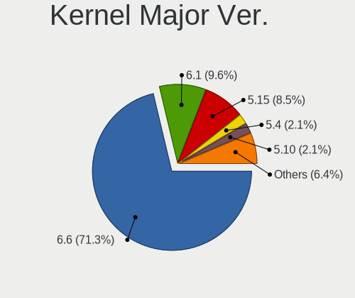
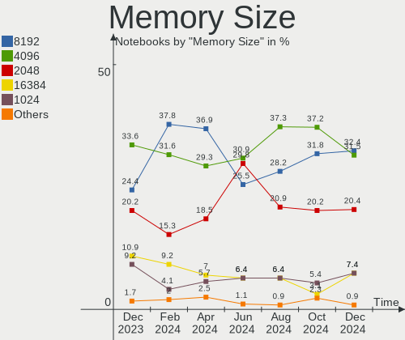

ROSA - Hardware Trends (Notebooks)
----------------------------------

A project to identify most popular hardware characteristics and track their change
over time based on data collected by Linux users at https://Linux-Hardware.org.

Anyone can contribute to this report by the [hw-probe](https://github.com/linuxhw/hw-probe) tool:

    sudo -E hw-probe -all -upload

This report is for one last month. Overall report since the beginning of time: [TestDays](https://github.com/linuxhw/TestDays)

Period: Feb, 2023.

Contents
--------

* [ System ](#system)
  - [ OS                       ](#os)
  - [ OS Family                ](#os-family)
  - [ Kernel                   ](#kernel)
  - [ Kernel Family            ](#kernel-family)
  - [ Kernel Major Ver.        ](#kernel-major-ver)
  - [ Arch                     ](#arch)
  - [ DE                       ](#de)
  - [ Display Server           ](#display-server)
  - [ Display Manager          ](#display-manager)
  - [ OS Lang                  ](#os-lang)
  - [ Boot Mode                ](#boot-mode)
  - [ Filesystem               ](#filesystem)
  - [ Part. scheme             ](#part-scheme)
  - [ Dual Boot with Linux/BSD ](#dual-boot-with-linuxbsd)
  - [ Dual Boot (Win)          ](#dual-boot-win)

* [ Board ](#board)
  - [ Vendor                   ](#vendor)
  - [ Model                    ](#model)
  - [ Model Family             ](#model-family)
  - [ MFG Year                 ](#mfg-year)
  - [ Form Factor              ](#form-factor)
  - [ Secure Boot              ](#secure-boot)
  - [ Coreboot                 ](#coreboot)
  - [ RAM Size                 ](#ram-size)
  - [ RAM Used                 ](#ram-used)
  - [ Total Drives             ](#total-drives)
  - [ Has CD-ROM               ](#has-cd-rom)
  - [ Has Ethernet             ](#has-ethernet)
  - [ Has WiFi                 ](#has-wifi)
  - [ Has Bluetooth            ](#has-bluetooth)

* [ Location ](#location)
  - [ Country                  ](#country)
  - [ City                     ](#city)

* [ Drives ](#drives)
  - [ Drive Vendor             ](#drive-vendor)
  - [ Drive Model              ](#drive-model)
  - [ HDD Vendor               ](#hdd-vendor)
  - [ SSD Vendor               ](#ssd-vendor)
  - [ Drive Kind               ](#drive-kind)
  - [ Drive Connector          ](#drive-connector)
  - [ Drive Size               ](#drive-size)
  - [ Space Total              ](#space-total)
  - [ Space Used               ](#space-used)
  - [ Malfunc. Drives          ](#malfunc-drives)
  - [ Malfunc. Drive Vendor    ](#malfunc-drive-vendor)
  - [ Malfunc. HDD Vendor      ](#malfunc-hdd-vendor)
  - [ Malfunc. Drive Kind      ](#malfunc-drive-kind)
  - [ Failed Drives            ](#failed-drives)
  - [ Failed Drive Vendor      ](#failed-drive-vendor)
  - [ Drive Status             ](#drive-status)

* [ Storage controller ](#storage-controller)
  - [ Storage Vendor           ](#storage-vendor)
  - [ Storage Model            ](#storage-model)
  - [ Storage Kind             ](#storage-kind)

* [ Processor ](#processor)
  - [ CPU Vendor               ](#cpu-vendor)
  - [ CPU Model                ](#cpu-model)
  - [ CPU Model Family         ](#cpu-model-family)
  - [ CPU Cores                ](#cpu-cores)
  - [ CPU Sockets              ](#cpu-sockets)
  - [ CPU Threads              ](#cpu-threads)
  - [ CPU Op-Modes             ](#cpu-op-modes)
  - [ CPU Microcode            ](#cpu-microcode)
  - [ CPU Microarch            ](#cpu-microarch)

* [ Graphics ](#graphics)
  - [ GPU Vendor               ](#gpu-vendor)
  - [ GPU Model                ](#gpu-model)
  - [ GPU Combo                ](#gpu-combo)
  - [ GPU Driver               ](#gpu-driver)
  - [ GPU Memory               ](#gpu-memory)

* [ Monitor ](#monitor)
  - [ Monitor Vendor           ](#monitor-vendor)
  - [ Monitor Model            ](#monitor-model)
  - [ Monitor Resolution       ](#monitor-resolution)
  - [ Monitor Diagonal         ](#monitor-diagonal)
  - [ Monitor Width            ](#monitor-width)
  - [ Aspect Ratio             ](#aspect-ratio)
  - [ Monitor Area             ](#monitor-area)
  - [ Pixel Density            ](#pixel-density)
  - [ Multiple Monitors        ](#multiple-monitors)

* [ Network ](#network)
  - [ Net Controller Vendor    ](#net-controller-vendor)
  - [ Net Controller Model     ](#net-controller-model)
  - [ Wireless Vendor          ](#wireless-vendor)
  - [ Wireless Model           ](#wireless-model)
  - [ Ethernet Vendor          ](#ethernet-vendor)
  - [ Ethernet Model           ](#ethernet-model)
  - [ Net Controller Kind      ](#net-controller-kind)
  - [ Used Controller          ](#used-controller)
  - [ NICs                     ](#nics)
  - [ IPv6                     ](#ipv6)

* [ Bluetooth ](#bluetooth)
  - [ Bluetooth Vendor         ](#bluetooth-vendor)
  - [ Bluetooth Model          ](#bluetooth-model)

* [ Sound ](#sound)
  - [ Sound Vendor             ](#sound-vendor)
  - [ Sound Model              ](#sound-model)

* [ Memory ](#memory)
  - [ Memory Vendor            ](#memory-vendor)
  - [ Memory Model             ](#memory-model)
  - [ Memory Kind              ](#memory-kind)
  - [ Memory Form Factor       ](#memory-form-factor)
  - [ Memory Size              ](#memory-size)
  - [ Memory Speed             ](#memory-speed)

* [ Printers & scanners ](#printers--scanners)
  - [ Printer Vendor           ](#printer-vendor)
  - [ Printer Model            ](#printer-model)
  - [ Scanner Vendor           ](#scanner-vendor)
  - [ Scanner Model            ](#scanner-model)

* [ Camera ](#camera)
  - [ Camera Vendor            ](#camera-vendor)
  - [ Camera Model             ](#camera-model)

* [ Security ](#security)
  - [ Fingerprint Vendor       ](#fingerprint-vendor)
  - [ Fingerprint Model        ](#fingerprint-model)
  - [ Chipcard Vendor          ](#chipcard-vendor)
  - [ Chipcard Model           ](#chipcard-model)

* [ Unsupported ](#unsupported)
  - [ Unsupported Devices      ](#unsupported-devices)
  - [ Unsupported Device Types ](#unsupported-device-types)

System
------

OS
--

Installed operating systems

| Name        | Notebooks | Percent |
|-------------|-----------|---------|
| ROSA 12.3   | 63        | 80.77%  |
| ROSA R11.1  | 7         | 8.97%   |
| ROSA 12.2   | 3         | 3.85%   |
| ROSA 12     | 2         | 2.56%   |
| ROSA R8.1   | 1         | 1.28%   |
| ROSA 2021.1 | 1         | 1.28%   |
| ROSA 12.1   | 1         | 1.28%   |

OS Family
---------

OS without a version

| Name | Notebooks | Percent |
|------|-----------|---------|
| ROSA | 78        | 100%    |

Kernel
------

Version of the Linux kernel

| Version                                   | Notebooks | Percent |
|-------------------------------------------|-----------|---------|
| 5.15.79-generic-1rosa2021.1-x86_64        | 26        | 33.33%  |
| 5.15.75-generic-1rosa2021.1-x86_64        | 17        | 21.79%  |
| 5.15.75-generic-1rosa2021.1-i686          | 6         | 7.69%   |
| 6.0.12.xm1-1.klp-xanmod-rosa2021.1-x86_64 | 5         | 6.41%   |
| 5.10.74-generic-2rosa2021.1-x86_64        | 4         | 5.13%   |
| 5.10.155-generic-1rosa2021.1-x86_64       | 3         | 3.85%   |
| 5.17.11-generic-2rosa2021.1-x86_64        | 2         | 2.56%   |
| 5.10.71-generic-1rosa2021.1-x86_64        | 2         | 2.56%   |
| 4.9.155-nrj-desktop-1rosa-x86_64          | 2         | 2.56%   |
| 6.1.9-generic-2rosa2021.1-x86_64          | 1         | 1.28%   |
| 6.1.4-generic-1rosa2021.1-x86_64          | 1         | 1.28%   |
| 6.1.10-generic-1rosa2021.1-x86_64         | 1         | 1.28%   |
| 5.4.83-generic-2rosa-i586                 | 1         | 1.28%   |
| 5.4.32-generic-2rosa-i586                 | 1         | 1.28%   |
| 5.15.77-generic-1rosa2021.1-x86_64        | 1         | 1.28%   |
| 5.10.118-generic-2rosa2021.1-x86_64       | 1         | 1.28%   |
| 4.9.155-nrj-desktop-1rosa-i586            | 1         | 1.28%   |
| 4.15.0-desktop-122.124.1rosa-x86_64       | 1         | 1.28%   |
| 4.15.0-desktop-122.124.1rosa-i586         | 1         | 1.28%   |
| 4.1.38-nrj-desktop-2rosa-x86_64           | 1         | 1.28%   |

Kernel Family
-------------

Linux kernel without a distro release

| Version  | Notebooks | Percent |
|----------|-----------|---------|
| 5.15.79  | 26        | 33.33%  |
| 5.15.75  | 23        | 29.49%  |
| 6.0.12   | 5         | 6.41%   |
| 5.10.74  | 4         | 5.13%   |
| 5.10.155 | 3         | 3.85%   |
| 4.9.155  | 3         | 3.85%   |
| 5.17.11  | 2         | 2.56%   |
| 5.10.71  | 2         | 2.56%   |
| 4.15.0   | 2         | 2.56%   |
| 6.1.9    | 1         | 1.28%   |
| 6.1.4    | 1         | 1.28%   |
| 6.1.10   | 1         | 1.28%   |
| 5.4.83   | 1         | 1.28%   |
| 5.4.32   | 1         | 1.28%   |
| 5.15.77  | 1         | 1.28%   |
| 5.10.118 | 1         | 1.28%   |
| 4.1.38   | 1         | 1.28%   |

Kernel Major Ver.
-----------------

Linux kernel major version

| Version | Notebooks | Percent |
|---------|-----------|---------|
| 5.15    | 50        | 64.1%   |
| 5.10    | 10        | 12.82%  |
| 6.0     | 5         | 6.41%   |
| 6.1     | 3         | 3.85%   |
| 4.9     | 3         | 3.85%   |
| 5.4     | 2         | 2.56%   |
| 5.17    | 2         | 2.56%   |
| 4.15    | 2         | 2.56%   |
| 4.1     | 1         | 1.28%   |

Arch
----

OS architecture (x86_64, i586, etc.)

| Name   | Notebooks | Percent |
|--------|-----------|---------|
| x86_64 | 68        | 87.18%  |
| i686   | 10        | 12.82%  |

DE
--

Desktop Environment

| Name  | Notebooks | Percent |
|-------|-----------|---------|
| KDE5  | 41        | 52.56%  |
| GNOME | 21        | 26.92%  |
| LXQt  | 10        | 12.82%  |
| KDE4  | 6         | 7.69%   |

Display Server
--------------

X11 or Wayland

| Name    | Notebooks | Percent |
|---------|-----------|---------|
| Wayland | 52        | 66.67%  |
| X11     | 26        | 33.33%  |

Display Manager
---------------

SDDM, LightDM, etc.

| Name    | Notebooks | Percent |
|---------|-----------|---------|
| SDDM    | 37        | 47.44%  |
| GDM     | 28        | 35.9%   |
| LightDM | 6         | 7.69%   |
| KDM     | 6         | 7.69%   |
| Unknown | 1         | 1.28%   |

OS Lang
-------

Language

| Lang  | Notebooks | Percent |
|-------|-----------|---------|
| ru_RU | 70        | 89.74%  |
| en_US | 2         | 2.56%   |
| tr_TR | 1         | 1.28%   |
| pl_PL | 1         | 1.28%   |
| it_IT | 1         | 1.28%   |
| fr_FR | 1         | 1.28%   |
| es_PE | 1         | 1.28%   |
| es_ES | 1         | 1.28%   |

Boot Mode
---------

EFI or BIOS

| Mode | Notebooks | Percent |
|------|-----------|---------|
| EFI  | 42        | 53.85%  |
| BIOS | 36        | 46.15%  |

Filesystem
----------

Type of filesystem

| Type  | Notebooks | Percent |
|-------|-----------|---------|
| Ext4  | 74        | 94.87%  |
| Btrfs | 4         | 5.13%   |

Part. scheme
------------

Scheme of partitioning

| Type    | Notebooks | Percent |
|---------|-----------|---------|
| GPT     | 43        | 55.13%  |
| MBR     | 34        | 43.59%  |
| Unknown | 1         | 1.28%   |

Dual Boot with Linux/BSD
------------------------

Hosting more than one Linux/BSD

| Dual boot | Notebooks | Percent |
|-----------|-----------|---------|
| No        | 58        | 74.36%  |
| Yes       | 20        | 25.64%  |

Dual Boot (Win)
---------------

Hosting Linux and Windows

| Dual boot | Notebooks | Percent |
|-----------|-----------|---------|
| No        | 48        | 61.54%  |
| Yes       | 30        | 38.46%  |

Board
-----

Vendor
------

Motherboard manufacturer

| Name                | Notebooks | Percent |
|---------------------|-----------|---------|
| ASUSTek Computer    | 14        | 17.95%  |
| Acer                | 11        | 14.1%   |
| Hewlett-Packard     | 10        | 12.82%  |
| Lenovo              | 9         | 11.54%  |
| MSI                 | 5         | 6.41%   |
| Toshiba             | 3         | 3.85%   |
| Sony                | 3         | 3.85%   |
| Samsung Electronics | 3         | 3.85%   |
| Dell                | 3         | 3.85%   |
| Apple               | 3         | 3.85%   |
| Haier               | 2         | 2.56%   |
| THUNDEROBOT         | 1         | 1.28%   |
| Notebook            | 1         | 1.28%   |
| ICL                 | 1         | 1.28%   |
| IBM                 | 1         | 1.28%   |
| HUAWEI              | 1         | 1.28%   |
| HONOR               | 1         | 1.28%   |
| eMachines           | 1         | 1.28%   |
| DNS                 | 1         | 1.28%   |
| Chuwi               | 1         | 1.28%   |
| Casper              | 1         | 1.28%   |
| 3Logic Group        | 1         | 1.28%   |
| Unknown             | 1         | 1.28%   |

Model
-----

Motherboard model

| Name                                | Notebooks | Percent |
|-------------------------------------|-----------|---------|
| Haier A1410ED                       | 2         | 2.56%   |
| Acer Aspire V3-771                  | 2         | 2.56%   |
| Unknown                             | 2         | 2.56%   |
| Toshiba Satellite U300              | 1         | 1.28%   |
| Toshiba Satellite C870-196          | 1         | 1.28%   |
| Toshiba Satellite A300D             | 1         | 1.28%   |
| THUNDEROBOT 911 Plus                | 1         | 1.28%   |
| Sony VPCY11M1R                      | 1         | 1.28%   |
| Sony VPCSB2L1R                      | 1         | 1.28%   |
| Sony SVE14A2V1RWI                   | 1         | 1.28%   |
| Samsung R519/R719                   | 1         | 1.28%   |
| Samsung N102                        | 1         | 1.28%   |
| Samsung 350V5C/351V5C/3540VC/3440VC | 1         | 1.28%   |
| Notebook W65_67SJ                   | 1         | 1.28%   |
| MSI U90/U100                        | 1         | 1.28%   |
| MSI MS-N0E1                         | 1         | 1.28%   |
| MSI GP60 2OD                        | 1         | 1.28%   |
| MSI Alpha 15 B5EEK                  | 1         | 1.28%   |
| MSI Alpha 15 A3DDK                  | 1         | 1.28%   |
| Lenovo ThinkPad X201 3680U6V        | 1         | 1.28%   |
| Lenovo ThinkBook 16 G4+ ARA 21D1    | 1         | 1.28%   |
| Lenovo ThinkBook 15 G3 ACL 21A4     | 1         | 1.28%   |
| Lenovo IdeaPad 320-15IKB 80XL       | 1         | 1.28%   |
| Lenovo G70-80 80FF                  | 1         | 1.28%   |
| Lenovo G505 20240                   | 1         | 1.28%   |
| Lenovo G50-80 80E5                  | 1         | 1.28%   |
| Lenovo G50-70 20351                 | 1         | 1.28%   |
| Lenovo Flex 2-14 20404              | 1         | 1.28%   |
| ICL RAYbook Si1512                  | 1         | 1.28%   |
| IBM ThinkPad T41 23731HG            | 1         | 1.28%   |
| HUAWEI NBLB-WAX9N                   | 1         | 1.28%   |
| HONOR NBR-WAX9                      | 1         | 1.28%   |
| HP Pavilion Notebook                | 1         | 1.28%   |
| HP Pavilion Gaming Laptop 17-cd1xxx | 1         | 1.28%   |
| HP Pavilion Gaming Laptop 15-cx0xxx | 1         | 1.28%   |
| HP Pavilion g6                      | 1         | 1.28%   |
| HP Notebook                         | 1         | 1.28%   |
| HP Laptop 14s-dq0xxx                | 1         | 1.28%   |
| HP EliteBook 8540p                  | 1         | 1.28%   |
| HP Compaq Presario CQ70             | 1         | 1.28%   |

Model Family
------------

Motherboard model prefix

| Name              | Notebooks | Percent |
|-------------------|-----------|---------|
| Acer Aspire       | 8         | 10.26%  |
| HP Pavilion       | 4         | 5.13%   |
| Toshiba Satellite | 3         | 3.85%   |
| ASUS VivoBook     | 3         | 3.85%   |
| MSI Alpha         | 2         | 2.56%   |
| Lenovo ThinkBook  | 2         | 2.56%   |
| Haier A1410ED     | 2         | 2.56%   |
| Dell Inspiron     | 2         | 2.56%   |
| Unknown           | 2         | 2.56%   |
| THUNDEROBOT 911   | 1         | 1.28%   |
| Sony VPCY11M1R    | 1         | 1.28%   |
| Sony VPCSB2L1R    | 1         | 1.28%   |
| Sony SVE14A2V1RWI | 1         | 1.28%   |
| Samsung R519      | 1         | 1.28%   |
| Samsung N102      | 1         | 1.28%   |
| Samsung 350V5C    | 1         | 1.28%   |
| Notebook W65      | 1         | 1.28%   |
| MSI U90           | 1         | 1.28%   |
| MSI MS-N0E1       | 1         | 1.28%   |
| MSI GP60          | 1         | 1.28%   |
| Lenovo ThinkPad   | 1         | 1.28%   |
| Lenovo IdeaPad    | 1         | 1.28%   |
| Lenovo G70-80     | 1         | 1.28%   |
| Lenovo G505       | 1         | 1.28%   |
| Lenovo G50-80     | 1         | 1.28%   |
| Lenovo G50-70     | 1         | 1.28%   |
| Lenovo Flex       | 1         | 1.28%   |
| ICL RAYbook       | 1         | 1.28%   |
| IBM ThinkPad      | 1         | 1.28%   |
| HUAWEI NBLB-WAX9N | 1         | 1.28%   |
| HONOR NBR-WAX9    | 1         | 1.28%   |
| HP Notebook       | 1         | 1.28%   |
| HP Laptop         | 1         | 1.28%   |
| HP EliteBook      | 1         | 1.28%   |
| HP Compaq         | 1         | 1.28%   |
| HP 255            | 1         | 1.28%   |
| eMachines E510    | 1         | 1.28%   |
| DNS MB40IA1       | 1         | 1.28%   |
| Dell Vostro       | 1         | 1.28%   |
| Chuwi CoreBook    | 1         | 1.28%   |

MFG Year
--------

Motherboard manufacture year

| Year | Notebooks | Percent |
|------|-----------|---------|
| 2013 | 9         | 11.54%  |
| 2011 | 9         | 11.54%  |
| 2021 | 7         | 8.97%   |
| 2010 | 6         | 7.69%   |
| 2019 | 5         | 6.41%   |
| 2012 | 5         | 6.41%   |
| 2022 | 4         | 5.13%   |
| 2020 | 4         | 5.13%   |
| 2018 | 4         | 5.13%   |
| 2009 | 4         | 5.13%   |
| 2007 | 4         | 5.13%   |
| 2017 | 3         | 3.85%   |
| 2016 | 3         | 3.85%   |
| 2014 | 3         | 3.85%   |
| 2008 | 3         | 3.85%   |
| 2015 | 2         | 2.56%   |
| 2006 | 2         | 2.56%   |
| 2004 | 1         | 1.28%   |

Form Factor
-----------

Physical design of the computer

| Name     | Notebooks | Percent |
|----------|-----------|---------|
| Notebook | 78        | 100%    |

Secure Boot
-----------

Enabled or disabled

| State    | Notebooks | Percent |
|----------|-----------|---------|
| Disabled | 78        | 100%    |

Coreboot
--------

Have coreboot on board

| Used | Notebooks | Percent |
|------|-----------|---------|
| No   | 78        | 100%    |

RAM Size
--------

Total RAM memory

| Size in GB | Notebooks | Percent |
|------------|-----------|---------|
| 4.01-8.0   | 25        | 32.05%  |
| 3.01-4.0   | 20        | 25.64%  |
| 1.01-2.0   | 12        | 15.38%  |
| 8.01-16.0  | 9         | 11.54%  |
| 16.01-24.0 | 7         | 8.97%   |
| 2.01-3.0   | 4         | 5.13%   |
| 24.01-32.0 | 1         | 1.28%   |

RAM Used
--------

Used RAM memory

| Used GB   | Notebooks | Percent |
|-----------|-----------|---------|
| 1.01-2.0  | 40        | 51.28%  |
| 0.51-1.0  | 19        | 24.36%  |
| 2.01-3.0  | 14        | 17.95%  |
| 4.01-8.0  | 2         | 2.56%   |
| 3.01-4.0  | 2         | 2.56%   |
| 8.01-16.0 | 1         | 1.28%   |

Total Drives
------------

Number of drives on board

| Drives | Notebooks | Percent |
|--------|-----------|---------|
| 1      | 53        | 67.95%  |
| 2      | 23        | 29.49%  |
| 4      | 1         | 1.28%   |
| 3      | 1         | 1.28%   |

Has CD-ROM
----------

Has CD-ROM on board

| Presented | Notebooks | Percent |
|-----------|-----------|---------|
| No        | 48        | 61.54%  |
| Yes       | 30        | 38.46%  |

Has Ethernet
------------

Has Ethernet on board

| Presented | Notebooks | Percent |
|-----------|-----------|---------|
| Yes       | 69        | 88.46%  |
| No        | 9         | 11.54%  |

Has WiFi
--------

Has WiFi module

| Presented | Notebooks | Percent |
|-----------|-----------|---------|
| Yes       | 78        | 100%    |

Has Bluetooth
-------------

Has Bluetooth module

| Presented | Notebooks | Percent |
|-----------|-----------|---------|
| Yes       | 60        | 76.92%  |
| No        | 18        | 23.08%  |

Location
--------

Country
-------

Geographic location (country)

| Country     | Notebooks | Percent |
|-------------|-----------|---------|
| Russia      | 62        | 79.49%  |
| Belarus     | 3         | 3.85%   |
| Spain       | 2         | 2.56%   |
| Poland      | 2         | 2.56%   |
| Uzbekistan  | 1         | 1.28%   |
| Ukraine     | 1         | 1.28%   |
| Turkey      | 1         | 1.28%   |
| Peru        | 1         | 1.28%   |
| Kazakhstan  | 1         | 1.28%   |
| Ivory Coast | 1         | 1.28%   |
| Italy       | 1         | 1.28%   |
| France      | 1         | 1.28%   |
| China       | 1         | 1.28%   |

City
----

Geographic location (city)

| City                | Notebooks | Percent |
|---------------------|-----------|---------|
| St Petersburg       | 8         | 10.26%  |
| Moscow              | 4         | 5.13%   |
| Krasnodar           | 4         | 5.13%   |
| Ufa                 | 2         | 2.56%   |
| Kirov               | 2         | 2.56%   |
| Gomel               | 2         | 2.56%   |
| Barnaul             | 2         | 2.56%   |
| Zhodzina            | 1         | 1.28%   |
| Zelenodolsk         | 1         | 1.28%   |
| Yoshkar-Ola         | 1         | 1.28%   |
| Yekaterinburg       | 1         | 1.28%   |
| Volgograd           | 1         | 1.28%   |
| Tsarskoye Selo      | 1         | 1.28%   |
| Tashkent            | 1         | 1.28%   |
| Tambov              | 1         | 1.28%   |
| Strzelce Krajenskie | 1         | 1.28%   |
| Sorsk               | 1         | 1.28%   |
| Snezhinsk           | 1         | 1.28%   |
| Smolensk            | 1         | 1.28%   |
| Shadrinsk           | 1         | 1.28%   |
| Severodvinsk        | 1         | 1.28%   |
| Sevastopol          | 1         | 1.28%   |
| Sestroretsk         | 1         | 1.28%   |
| Saruy               | 1         | 1.28%   |
| Pushkino            | 1         | 1.28%   |
| Prokop'yevsk        | 1         | 1.28%   |
| Perm                | 1         | 1.28%   |
| Oryol               | 1         | 1.28%   |
| Omsk                | 1         | 1.28%   |
| Novosibirsk         | 1         | 1.28%   |
| Noginsk             | 1         | 1.28%   |
| Nizhny Tagil        | 1         | 1.28%   |
| Nizhniy Novgorod    | 1         | 1.28%   |
| Murino              | 1         | 1.28%   |
| Marseille 01        | 1         | 1.28%   |
| Manturovo           | 1         | 1.28%   |
| Lytkarino           | 1         | 1.28%   |
| Losino-Petrovskiy   | 1         | 1.28%   |
| Lima                | 1         | 1.28%   |
| Kurnino             | 1         | 1.28%   |

Drives
------

Drive Vendor
------------

Hard drive vendors

| Vendor              | Notebooks | Drives | Percent |
|---------------------|-----------|--------|---------|
| WDC                 | 16        | 16     | 15.84%  |
| Seagate             | 11        | 11     | 10.89%  |
| Toshiba             | 10        | 10     | 9.9%    |
| Kingston            | 10        | 10     | 9.9%    |
| Unknown             | 5         | 5      | 4.95%   |
| Samsung Electronics | 5         | 5      | 4.95%   |
| Hitachi             | 4         | 4      | 3.96%   |
| Transcend           | 3         | 3      | 2.97%   |
| Micron Technology   | 3         | 3      | 2.97%   |
| Crucial             | 3         | 3      | 2.97%   |
| China               | 3         | 3      | 2.97%   |
| TO Exter            | 2         | 2      | 1.98%   |
| Team                | 2         | 2      | 1.98%   |
| SPCC                | 2         | 2      | 1.98%   |
| SanDisk             | 2         | 2      | 1.98%   |
| Patriot             | 2         | 2      | 1.98%   |
| Intel               | 2         | 2      | 1.98%   |
| A-DATA Technology   | 2         | 2      | 1.98%   |
| XrayDisk            | 1         | 1      | 0.99%   |
| SSSTC               | 1         | 1      | 0.99%   |
| SK hynix            | 1         | 1      | 0.99%   |
| ShiJi               | 1         | 1      | 0.99%   |
| Netac               | 1         | 1      | 0.99%   |
| Neo                 | 1         | 1      | 0.99%   |
| HGST                | 1         | 1      | 0.99%   |
| Hewlett-Packard     | 1         | 1      | 0.99%   |
| Gigabyte Technology | 1         | 1      | 0.99%   |
| FASTDISK            | 1         | 1      | 0.99%   |
| Colorful            | 1         | 1      | 0.99%   |
| Apple               | 1         | 1      | 0.99%   |
| Apacer              | 1         | 1      | 0.99%   |
| AMD                 | 1         | 1      | 0.99%   |

Drive Model
-----------

Hard drive models

| Model                                   | Notebooks | Percent |
|-----------------------------------------|-----------|---------|
| Toshiba MQ01ABF050 500GB                | 3         | 2.97%   |
| WDC WD5000LPCX-21VHAT0 500GB            | 2         | 1.98%   |
| Unknown SLD64G  64GB                    | 2         | 1.98%   |
| Toshiba MQ01ABD100 1TB                  | 2         | 1.98%   |
| TO Exter nal USB 3.0 240GB              | 2         | 1.98%   |
| Team T253120GB SSD                      | 2         | 1.98%   |
| Kingston SA400S37240G 240GB SSD         | 2         | 1.98%   |
| Kingston SA400S37120G 120GB SSD         | 2         | 1.98%   |
| Intel SSDPEKNU512GZ 512GB               | 2         | 1.98%   |
| XrayDisk SSD 120GB                      | 1         | 0.99%   |
| WDC WDS120G2G0A-00JH30 120GB SSD        | 1         | 0.99%   |
| WDC WD7500BPVX-22JC3T0 752GB            | 1         | 0.99%   |
| WDC WD5000LPVX-22V0TT0 500GB            | 1         | 0.99%   |
| WDC WD400UE-22HCT0 40GB                 | 1         | 0.99%   |
| WDC WD3200BPVT-80JJ5T0 320GB            | 1         | 0.99%   |
| WDC WD3200BPVT-22ZEST0 320GB            | 1         | 0.99%   |
| WDC WD2500BEVT-35A23T0 250GB            | 1         | 0.99%   |
| WDC WD2500BEVE-00A0HT0 250GB            | 1         | 0.99%   |
| WDC WD2500BEKT-60PVMT0 250GB            | 1         | 0.99%   |
| WDC WD10JPVX-80JC3T0 1TB                | 1         | 0.99%   |
| WDC WD10JPCX-24UE4T0 1TB                | 1         | 0.99%   |
| WDC PC SN730 SDBPNTY-512G-1032 512GB    | 1         | 0.99%   |
| WDC PC SN730 SDBPNTY-256G-1027 256GB    | 1         | 0.99%   |
| WDC PC SN730 SDBPNTY-256G               | 1         | 0.99%   |
| Unknown SDU1  16GB                      | 1         | 0.99%   |
| Unknown MMC Card  4GB                   | 1         | 0.99%   |
| Unknown DA4064  64GB                    | 1         | 0.99%   |
| Transcend TS32GMSA310 32GB SSD          | 1         | 0.99%   |
| Transcend TS128GMTE110S 128GB           | 1         | 0.99%   |
| Transcend TS120GSSD220S 120GB           | 1         | 0.99%   |
| Toshiba MQ01ABD032 320GB                | 1         | 0.99%   |
| Toshiba MK2555GSXF 250GB                | 1         | 0.99%   |
| Toshiba MK2555GSX 250GB                 | 1         | 0.99%   |
| Toshiba HDWL110 1TB                     | 1         | 0.99%   |
| Toshiba A100 120GB SSD                  | 1         | 0.99%   |
| SSSTC CL4-8D512 512GB                   | 1         | 0.99%   |
| SPCC Solid State Disk 256GB             | 1         | 0.99%   |
| SPCC Solid State Disk 1TB               | 1         | 0.99%   |
| SK hynix BC511 HFM512GDJTNI-82A0A 512GB | 1         | 0.99%   |
| ShiJi SSD 512GB                         | 1         | 0.99%   |

HDD Vendor
----------

Hard disk drive vendors

| Vendor              | Notebooks | Drives | Percent |
|---------------------|-----------|--------|---------|
| WDC                 | 12        | 12     | 31.58%  |
| Seagate             | 11        | 11     | 28.95%  |
| Toshiba             | 9         | 9      | 23.68%  |
| Hitachi             | 4         | 4      | 10.53%  |
| Samsung Electronics | 1         | 1      | 2.63%   |
| HGST                | 1         | 1      | 2.63%   |

SSD Vendor
----------

Solid state drive vendors

| Vendor              | Notebooks | Drives | Percent |
|---------------------|-----------|--------|---------|
| Kingston            | 10        | 10     | 23.81%  |
| China               | 3         | 3      | 7.14%   |
| Transcend           | 2         | 2      | 4.76%   |
| TO Exter            | 2         | 2      | 4.76%   |
| Team                | 2         | 2      | 4.76%   |
| SPCC                | 2         | 2      | 4.76%   |
| SanDisk             | 2         | 2      | 4.76%   |
| Patriot             | 2         | 2      | 4.76%   |
| Crucial             | 2         | 2      | 4.76%   |
| A-DATA Technology   | 2         | 2      | 4.76%   |
| XrayDisk            | 1         | 1      | 2.38%   |
| WDC                 | 1         | 1      | 2.38%   |
| Toshiba             | 1         | 1      | 2.38%   |
| ShiJi               | 1         | 1      | 2.38%   |
| Samsung Electronics | 1         | 1      | 2.38%   |
| Netac               | 1         | 1      | 2.38%   |
| Neo                 | 1         | 1      | 2.38%   |
| Hewlett-Packard     | 1         | 1      | 2.38%   |
| FASTDISK            | 1         | 1      | 2.38%   |
| Colorful            | 1         | 1      | 2.38%   |
| Apple               | 1         | 1      | 2.38%   |
| Apacer              | 1         | 1      | 2.38%   |
| AMD                 | 1         | 1      | 2.38%   |

Drive Kind
----------

HDD or SSD

| Kind | Notebooks | Drives | Percent |
|------|-----------|--------|---------|
| SSD  | 38        | 42     | 40.86%  |
| HDD  | 35        | 38     | 37.63%  |
| NVMe | 15        | 16     | 16.13%  |
| MMC  | 5         | 5      | 5.38%   |

Drive Connector
---------------

SATA, SAS, NVMe, etc.

| Type | Notebooks | Drives | Percent |
|------|-----------|--------|---------|
| SATA | 66        | 77     | 74.16%  |
| NVMe | 15        | 16     | 16.85%  |
| MMC  | 5         | 5      | 5.62%   |
| SAS  | 3         | 3      | 3.37%   |

Drive Size
----------

Size of hard drive

| Size in TB | Notebooks | Drives | Percent |
|------------|-----------|--------|---------|
| 0.01-0.5   | 55        | 61     | 75.34%  |
| 0.51-1.0   | 18        | 19     | 24.66%  |

Space Total
-----------

Amount of disk space available on the file system

| Size in GB     | Notebooks | Percent |
|----------------|-----------|---------|
| 101-250        | 29        | 37.18%  |
| 1-20           | 12        | 15.38%  |
| 251-500        | 11        | 14.1%   |
| 501-1000       | 7         | 8.97%   |
| 51-100         | 7         | 8.97%   |
| 21-50          | 5         | 6.41%   |
| 1001-2000      | 4         | 5.13%   |
| More than 3000 | 2         | 2.56%   |
| 2001-3000      | 1         | 1.28%   |

Space Used
----------

Amount of used disk space

| Used GB        | Notebooks | Percent |
|----------------|-----------|---------|
| 1-20           | 46        | 58.97%  |
| 21-50          | 11        | 14.1%   |
| 101-250        | 8         | 10.26%  |
| 51-100         | 8         | 10.26%  |
| 501-1000       | 2         | 2.56%   |
| More than 3000 | 1         | 1.28%   |
| 251-500        | 1         | 1.28%   |
| 2001-3000      | 1         | 1.28%   |

Malfunc. Drives
---------------

Drive models with a malfunction

| Model                                   | Notebooks | Drives | Percent |
|-----------------------------------------|-----------|--------|---------|
| WDC WD5000LPVX-22V0TT0 500GB            | 1         | 1      | 4.76%   |
| WDC WD5000LPCX-21VHAT0 500GB            | 1         | 1      | 4.76%   |
| WDC WD3200BPVT-22ZEST0 320GB            | 1         | 1      | 4.76%   |
| WDC WD2500BEKT-60PVMT0 250GB            | 1         | 1      | 4.76%   |
| Transcend TS32GMSA310 32GB SSD          | 1         | 1      | 4.76%   |
| Toshiba MK2555GSX 250GB                 | 1         | 1      | 4.76%   |
| Seagate ST96812A 64GB                   | 1         | 1      | 4.76%   |
| Seagate ST9500325AS 500GB               | 1         | 1      | 4.76%   |
| Seagate ST9320325AS 320GB               | 1         | 1      | 4.76%   |
| Seagate ST9250315AS 250GB               | 1         | 1      | 4.76%   |
| Seagate ST500LT012-1DG142 500GB         | 1         | 1      | 4.76%   |
| Seagate ST320LT020-9YG142 320GB         | 1         | 1      | 4.76%   |
| Seagate ST1000LM035-1RK172 1TB          | 1         | 1      | 4.76%   |
| Samsung Electronics HM121HI 120GB       | 1         | 1      | 4.76%   |
| Neo Forza NFS121SA324-6007000 240GB SSD | 1         | 1      | 4.76%   |
| Hitachi HTS545032B9A300 320GB           | 1         | 1      | 4.76%   |
| Hitachi HTS542580K9SA00 80GB            | 1         | 1      | 4.76%   |
| Hewlett-Packard SSD S700 500GB          | 1         | 1      | 4.76%   |
| FASTDISK SSD 120GB                      | 1         | 1      | 4.76%   |
| China SSD 240GB                         | 1         | 1      | 4.76%   |
| China G521N256GB SSD                    | 1         | 1      | 4.76%   |

Malfunc. Drive Vendor
---------------------

Vendors of faulty drives

| Vendor              | Notebooks | Drives | Percent |
|---------------------|-----------|--------|---------|
| Seagate             | 7         | 7      | 33.33%  |
| WDC                 | 4         | 4      | 19.05%  |
| Hitachi             | 2         | 2      | 9.52%   |
| China               | 2         | 2      | 9.52%   |
| Transcend           | 1         | 1      | 4.76%   |
| Toshiba             | 1         | 1      | 4.76%   |
| Samsung Electronics | 1         | 1      | 4.76%   |
| Neo                 | 1         | 1      | 4.76%   |
| Hewlett-Packard     | 1         | 1      | 4.76%   |
| FASTDISK            | 1         | 1      | 4.76%   |

Malfunc. HDD Vendor
-------------------

Vendors of faulty HDD drives

| Vendor              | Notebooks | Drives | Percent |
|---------------------|-----------|--------|---------|
| Seagate             | 7         | 7      | 46.67%  |
| WDC                 | 4         | 4      | 26.67%  |
| Hitachi             | 2         | 2      | 13.33%  |
| Toshiba             | 1         | 1      | 6.67%   |
| Samsung Electronics | 1         | 1      | 6.67%   |

Malfunc. Drive Kind
-------------------

Kinds of faulty drives

| Kind | Notebooks | Drives | Percent |
|------|-----------|--------|---------|
| HDD  | 14        | 15     | 70%     |
| SSD  | 6         | 6      | 30%     |

Failed Drives
-------------

Failed drive models

Zero info for selected period =(

Failed Drive Vendor
-------------------

Failed drive vendors

Zero info for selected period =(

Drive Status
------------

Number of failed and malfunc. drives

| Status   | Notebooks | Drives | Percent |
|----------|-----------|--------|---------|
| Works    | 58        | 71     | 66.67%  |
| Malfunc  | 20        | 21     | 22.99%  |
| Detected | 9         | 9      | 10.34%  |

Storage controller
------------------

Storage Vendor
--------------

Storage controller vendors

| Vendor                         | Notebooks | Percent |
|--------------------------------|-----------|---------|
| Intel                          | 64        | 71.91%  |
| AMD                            | 9         | 10.11%  |
| Samsung Electronics            | 4         | 4.49%   |
| SanDisk                        | 3         | 3.37%   |
| Micron Technology              | 3         | 3.37%   |
| Transcend                      | 1         | 1.12%   |
| Solid State Storage Technology | 1         | 1.12%   |
| SK hynix                       | 1         | 1.12%   |
| Phison Electronics             | 1         | 1.12%   |
| Nvidia                         | 1         | 1.12%   |
| Micron/Crucial Technology      | 1         | 1.12%   |

Storage Model
-------------

Storage controller models

| Model                                                                            | Notebooks | Percent |
|----------------------------------------------------------------------------------|-----------|---------|
| Intel 7 Series Chipset Family 6-port SATA Controller [AHCI mode]                 | 8         | 8.25%   |
| AMD FCH SATA Controller [AHCI mode]                                              | 7         | 7.22%   |
| Intel Celeron/Pentium Silver Processor SATA Controller                           | 5         | 5.15%   |
| Intel 82801IBM/IEM (ICH9M/ICH9M-E) 4 port SATA Controller [AHCI mode]            | 5         | 5.15%   |
| Intel Sunrise Point-LP SATA Controller [AHCI mode]                               | 4         | 4.12%   |
| Intel NM10/ICH7 Family SATA Controller [AHCI mode]                               | 4         | 4.12%   |
| Intel 82801HM/HEM (ICH8M/ICH8M-E) SATA Controller [AHCI mode]                    | 4         | 4.12%   |
| Intel 82801HM/HEM (ICH8M/ICH8M-E) IDE Controller                                 | 4         | 4.12%   |
| Intel 82801 Mobile SATA Controller [RAID mode]                                   | 4         | 4.12%   |
| Intel 6 Series/C200 Series Chipset Family 6 port Mobile SATA AHCI Controller     | 4         | 4.12%   |
| SanDisk WD Black SN750 / PC SN730 NVMe SSD                                       | 3         | 3.09%   |
| Micron Non-Volatile memory controller                                            | 3         | 3.09%   |
| Intel Comet Lake SATA AHCI Controller                                            | 3         | 3.09%   |
| Intel 8 Series/C220 Series Chipset Family 6-port SATA Controller 1 [AHCI mode]   | 3         | 3.09%   |
| Intel 5 Series/3400 Series Chipset 4 port SATA AHCI Controller                   | 3         | 3.09%   |
| Intel Wildcat Point-LP SATA Controller [AHCI Mode]                               | 2         | 2.06%   |
| Intel Non-Volatile memory controller                                             | 2         | 2.06%   |
| Intel Cannon Point-LP SATA Controller [AHCI Mode]                                | 2         | 2.06%   |
| Intel Atom/Celeron/Pentium Processor x5-E8000/J3xxx/N3xxx Series SATA Controller | 2         | 2.06%   |
| Intel 8 Series SATA Controller 1 [AHCI mode]                                     | 2         | 2.06%   |
| Intel 5 Series/3400 Series Chipset 6 port SATA AHCI Controller                   | 2         | 2.06%   |
| AMD SB7x0/SB8x0/SB9x0 SATA Controller [AHCI mode]                                | 2         | 2.06%   |
| AMD SB7x0/SB8x0/SB9x0 IDE Controller                                             | 2         | 2.06%   |
| Transcend Non-Volatile memory controller                                         | 1         | 1.03%   |
| Solid State Storage Non-Volatile memory controller                               | 1         | 1.03%   |
| SK hynix BC511                                                                   | 1         | 1.03%   |
| Samsung NVMe SSD Controller SM981/PM981/PM983                                    | 1         | 1.03%   |
| Samsung NVMe SSD Controller SM961/PM961/SM963                                    | 1         | 1.03%   |
| Samsung NVMe SSD Controller 980                                                  | 1         | 1.03%   |
| Samsung Electronics SATA controller                                              | 1         | 1.03%   |
| Phison PS5013 E13 NVMe Controller                                                | 1         | 1.03%   |
| Nvidia MCP67 IDE Controller                                                      | 1         | 1.03%   |
| Nvidia MCP67 AHCI Controller                                                     | 1         | 1.03%   |
| Micron/Crucial P5 Plus NVMe PCIe SSD                                             | 1         | 1.03%   |
| Intel Cannon Lake Mobile PCH SATA AHCI Controller                                | 1         | 1.03%   |
| Intel Alder Lake-P SATA AHCI Controller                                          | 1         | 1.03%   |
| Intel 82801GBM/GHM (ICH7-M Family) SATA Controller [IDE mode]                    | 1         | 1.03%   |
| Intel 82801GBM/GHM (ICH7-M Family) SATA Controller [AHCI mode]                   | 1         | 1.03%   |
| Intel 82801G (ICH7 Family) IDE Controller                                        | 1         | 1.03%   |
| Intel 82801DBM (ICH4-M) IDE Controller                                           | 1         | 1.03%   |

Storage Kind
------------

Kind of storage controller (IDE, SATA, NVMe, SAS, ...)

| Kind | Notebooks | Percent |
|------|-----------|---------|
| SATA | 66        | 69.47%  |
| NVMe | 15        | 15.79%  |
| IDE  | 10        | 10.53%  |
| RAID | 4         | 4.21%   |

Processor
---------

CPU Vendor
----------

Processor vendors

| Vendor | Notebooks | Percent |
|--------|-----------|---------|
| Intel  | 65        | 83.33%  |
| AMD    | 13        | 16.67%  |

CPU Model
---------

Processor models

| Model                                       | Notebooks | Percent |
|---------------------------------------------|-----------|---------|
| Intel Core i5-3210M CPU @ 2.50GHz           | 3         | 3.85%   |
| Intel Core i5-7200U CPU @ 2.50GHz           | 2         | 2.56%   |
| Intel Core i5-5200U CPU @ 2.20GHz           | 2         | 2.56%   |
| Intel Core i5-4200M CPU @ 2.50GHz           | 2         | 2.56%   |
| Intel Core i5 CPU M 520 @ 2.40GHz           | 2         | 2.56%   |
| Intel Core i3-3217U CPU @ 1.80GHz           | 2         | 2.56%   |
| Intel Core i3-2310M CPU @ 2.10GHz           | 2         | 2.56%   |
| Intel Core i3-10110U CPU @ 2.10GHz          | 2         | 2.56%   |
| Intel Celeron N4000 CPU @ 1.10GHz           | 2         | 2.56%   |
| Intel Celeron CPU N3060 @ 1.60GHz           | 2         | 2.56%   |
| Intel Atom CPU N570 @ 1.66GHz               | 2         | 2.56%   |
| Intel Pentium Silver N5030 CPU @ 1.10GHz    | 1         | 1.28%   |
| Intel Pentium M processor 1400MHz           | 1         | 1.28%   |
| Intel Pentium Dual-Core CPU T4200 @ 2.00GHz | 1         | 1.28%   |
| Intel Pentium CPU 4417U @ 2.30GHz           | 1         | 1.28%   |
| Intel Genuine CPU U4100 @ 1.30GHz           | 1         | 1.28%   |
| Intel Genuine CPU T2300 @ 1.66GHz           | 1         | 1.28%   |
| Intel Core i7-8750H CPU @ 2.20GHz           | 1         | 1.28%   |
| Intel Core i7-4700MQ CPU @ 2.40GHz          | 1         | 1.28%   |
| Intel Core i5-9300H CPU @ 2.40GHz           | 1         | 1.28%   |
| Intel Core i5-8279U CPU @ 2.40GHz           | 1         | 1.28%   |
| Intel Core i5-8259U CPU @ 2.30GHz           | 1         | 1.28%   |
| Intel Core i5-7300HQ CPU @ 2.50GHz          | 1         | 1.28%   |
| Intel Core i5-5250U CPU @ 1.60GHz           | 1         | 1.28%   |
| Intel Core i5-4210U CPU @ 1.70GHz           | 1         | 1.28%   |
| Intel Core i5-2415M CPU @ 2.30GHz           | 1         | 1.28%   |
| Intel Core i5-2410M CPU @ 2.30GHz           | 1         | 1.28%   |
| Intel Core i5-10300H CPU @ 2.50GHz          | 1         | 1.28%   |
| Intel Core i5-10210U CPU @ 1.60GHz          | 1         | 1.28%   |
| Intel Core i5 CPU M 560 @ 2.67GHz           | 1         | 1.28%   |
| Intel Core i3-7100U CPU @ 2.40GHz           | 1         | 1.28%   |
| Intel Core i3-6006U CPU @ 2.00GHz           | 1         | 1.28%   |
| Intel Core i3-4030U CPU @ 1.90GHz           | 1         | 1.28%   |
| Intel Core i3-3110M CPU @ 2.40GHz           | 1         | 1.28%   |
| Intel Core i3 CPU M 380 @ 2.53GHz           | 1         | 1.28%   |
| Intel Core i3 CPU M 370 @ 2.40GHz           | 1         | 1.28%   |
| Intel Core 2 Duo CPU T7500 @ 2.20GHz        | 1         | 1.28%   |
| Intel Core 2 Duo CPU T5850 @ 2.16GHz        | 1         | 1.28%   |
| Intel Core 2 Duo CPU T5670 @ 1.80GHz        | 1         | 1.28%   |
| Intel Core 2 Duo CPU T5450 @ 1.66GHz        | 1         | 1.28%   |

CPU Model Family
----------------

Processor model prefix

| Model                          | Notebooks | Percent |
|--------------------------------|-----------|---------|
| Intel Core i5                  | 22        | 28.21%  |
| Intel Core i3                  | 12        | 15.38%  |
| Intel Celeron                  | 9         | 11.54%  |
| Intel Core 2 Duo               | 5         | 6.41%   |
| Intel Atom                     | 5         | 6.41%   |
| Other                          | 2         | 2.56%   |
| Intel Genuine                  | 2         | 2.56%   |
| Intel Core i7                  | 2         | 2.56%   |
| AMD Ryzen 7                    | 2         | 2.56%   |
| AMD Ryzen 5                    | 2         | 2.56%   |
| AMD E1                         | 2         | 2.56%   |
| AMD A10                        | 2         | 2.56%   |
| Intel Pentium Silver           | 1         | 1.28%   |
| Intel Pentium M                | 1         | 1.28%   |
| Intel Pentium Dual-Core        | 1         | 1.28%   |
| Intel Pentium                  | 1         | 1.28%   |
| Intel Celeron M                | 1         | 1.28%   |
| Intel Celeron Dual-Core        | 1         | 1.28%   |
| AMD Z                          | 1         | 1.28%   |
| AMD Turion X2 Dual-Core Mobile | 1         | 1.28%   |
| AMD Ryzen 3                    | 1         | 1.28%   |
| AMD Athlon 64 X2               | 1         | 1.28%   |
| AMD A4                         | 1         | 1.28%   |

CPU Cores
---------

Number of processor cores

| Number | Notebooks | Percent |
|--------|-----------|---------|
| 2      | 54        | 69.23%  |
| 4      | 14        | 17.95%  |
| 1      | 5         | 6.41%   |
| 8      | 3         | 3.85%   |
| 6      | 2         | 2.56%   |

CPU Sockets
-----------

Number of sockets

| Number | Notebooks | Percent |
|--------|-----------|---------|
| 1      | 78        | 100%    |

CPU Threads
-----------

Threads per core (Hyper-Threading)

| Number | Notebooks | Percent |
|--------|-----------|---------|
| 2      | 50        | 64.1%   |
| 1      | 28        | 35.9%   |

CPU Op-Modes
------------

CPU Operation Modes (32-bit, 64-bit)

| Op mode        | Notebooks | Percent |
|----------------|-----------|---------|
| 32-bit, 64-bit | 73        | 93.59%  |
| 32-bit         | 5         | 6.41%   |

CPU Microcode
-------------

Microcode number

| Number     | Notebooks | Percent |
|------------|-----------|---------|
| 0x306a9    | 6         | 7.69%   |
| 0x206a7    | 5         | 6.41%   |
| 0x20655    | 4         | 5.13%   |
| 0x806ec    | 3         | 3.85%   |
| 0x806ea    | 3         | 3.85%   |
| 0x806e9    | 3         | 3.85%   |
| 0x706a8    | 3         | 3.85%   |
| 0x6fd      | 3         | 3.85%   |
| 0x306d4    | 3         | 3.85%   |
| 0x306c3    | 3         | 3.85%   |
| 0x106ca    | 3         | 3.85%   |
| 0x1067a    | 3         | 3.85%   |
| 0x906ea    | 2         | 2.56%   |
| 0x706a1    | 2         | 2.56%   |
| 0x6e8      | 2         | 2.56%   |
| 0x406c4    | 2         | 2.56%   |
| 0x40651    | 2         | 2.56%   |
| 0x0700010b | 2         | 2.56%   |
| Unknown    | 2         | 2.56%   |
| 0xa0652    | 1         | 1.28%   |
| 0x906e9    | 1         | 1.28%   |
| 0x906a3    | 1         | 1.28%   |
| 0x806d1    | 1         | 1.28%   |
| 0x6fa      | 1         | 1.28%   |
| 0x695      | 1         | 1.28%   |
| 0x406e3    | 1         | 1.28%   |
| 0x30661    | 1         | 1.28%   |
| 0x20652    | 1         | 1.28%   |
| 0x106c2    | 1         | 1.28%   |
| 0x10676    | 1         | 1.28%   |
| 0x10661    | 1         | 1.28%   |
| 0x0a50000c | 1         | 1.28%   |
| 0x0a404102 | 1         | 1.28%   |
| 0x08608103 | 1         | 1.28%   |
| 0x08108109 | 1         | 1.28%   |
| 0x0810100b | 1         | 1.28%   |
| 0x07030105 | 1         | 1.28%   |
| 0x0600611a | 1         | 1.28%   |
| 0x0600110f | 1         | 1.28%   |
| 0x05000119 | 1         | 1.28%   |

CPU Microarch
-------------

Microarchitecture

| Name             | Notebooks | Percent |
|------------------|-----------|---------|
| KabyLake         | 12        | 15.38%  |
| IvyBridge        | 7         | 8.97%   |
| Westmere         | 5         | 6.41%   |
| SandyBridge      | 5         | 6.41%   |
| Haswell          | 5         | 6.41%   |
| Goldmont plus    | 5         | 6.41%   |
| Core             | 5         | 6.41%   |
| Bonnell          | 5         | 6.41%   |
| Penryn           | 4         | 5.13%   |
| P6               | 3         | 3.85%   |
| Broadwell        | 3         | 3.85%   |
| Silvermont       | 2         | 2.56%   |
| Jaguar           | 2         | 2.56%   |
| Unknown          | 2         | 2.56%   |
| Zen+             | 1         | 1.28%   |
| Zen 3            | 1         | 1.28%   |
| Zen              | 1         | 1.28%   |
| Skylake          | 1         | 1.28%   |
| Puma             | 1         | 1.28%   |
| Piledriver       | 1         | 1.28%   |
| K8 Hammer        | 1         | 1.28%   |
| K8 & K10 hybrid  | 1         | 1.28%   |
| Icelake          | 1         | 1.28%   |
| Excavator        | 1         | 1.28%   |
| CometLake        | 1         | 1.28%   |
| Bobcat           | 1         | 1.28%   |
| Alderlake Hybrid | 1         | 1.28%   |

Graphics
--------

GPU Vendor
----------

Vendors of graphics cards

| Vendor | Notebooks | Percent |
|--------|-----------|---------|
| Intel  | 59        | 55.66%  |
| Nvidia | 27        | 25.47%  |
| AMD    | 20        | 18.87%  |

GPU Model
---------

Graphics card models

| Model                                                                                    | Notebooks | Percent |
|------------------------------------------------------------------------------------------|-----------|---------|
| Intel 3rd Gen Core processor Graphics Controller                                         | 7         | 6.14%   |
| Intel 2nd Generation Core Processor Family Integrated Graphics Controller                | 5         | 4.39%   |
| Intel GeminiLake [UHD Graphics 600]                                                      | 4         | 3.51%   |
| Intel Core Processor Integrated Graphics Controller                                      | 4         | 3.51%   |
| Nvidia GF117M [GeForce 610M/710M/810M/820M / GT 620M/625M/630M/720M]                     | 3         | 2.63%   |
| Intel Mobile 945GM/GMS/GME, 943/940GML Express Integrated Graphics Controller            | 3         | 2.63%   |
| Intel Mobile 4 Series Chipset Integrated Graphics Controller                             | 3         | 2.63%   |
| Intel HD Graphics 620                                                                    | 3         | 2.63%   |
| Intel CometLake-U GT2 [UHD Graphics]                                                     | 3         | 2.63%   |
| Intel Atom Processor D4xx/D5xx/N4xx/N5xx Integrated Graphics Controller                  | 3         | 2.63%   |
| Intel 4th Gen Core Processor Integrated Graphics Controller                              | 3         | 2.63%   |
| Nvidia GK208M [GeForce GT 740M]                                                          | 2         | 1.75%   |
| Nvidia GF108M [GeForce GT 620M/630M/635M/640M LE]                                        | 2         | 1.75%   |
| Nvidia GA107M [GeForce RTX 3050 Ti Mobile]                                               | 2         | 1.75%   |
| Intel Mobile GM965/GL960 Integrated Graphics Controller (secondary)                      | 2         | 1.75%   |
| Intel Mobile GM965/GL960 Integrated Graphics Controller (primary)                        | 2         | 1.75%   |
| Intel Mobile 945GM/GMS, 943/940GML Express Integrated Graphics Controller                | 2         | 1.75%   |
| Intel HD Graphics 5500                                                                   | 2         | 1.75%   |
| Intel Haswell-ULT Integrated Graphics Controller                                         | 2         | 1.75%   |
| Intel CoffeeLake-U GT3e [Iris Plus Graphics 655]                                         | 2         | 1.75%   |
| Intel CoffeeLake-H GT2 [UHD Graphics 630]                                                | 2         | 1.75%   |
| Intel Atom/Celeron/Pentium Processor x5-E8000/J3xxx/N3xxx Integrated Graphics Controller | 2         | 1.75%   |
| AMD Thames [Radeon HD 7500M/7600M Series]                                                | 2         | 1.75%   |
| Nvidia TU117M [GeForce GTX 1650 Mobile / Max-Q]                                          | 1         | 0.88%   |
| Nvidia TU117M                                                                            | 1         | 0.88%   |
| Nvidia GT218M [GeForce G 105M]                                                           | 1         | 0.88%   |
| Nvidia GT216M [NVS 5100M]                                                                | 1         | 0.88%   |
| Nvidia GT216M [GeForce GT 330M]                                                          | 1         | 0.88%   |
| Nvidia GT216M [GeForce GT 325M]                                                          | 1         | 0.88%   |
| Nvidia GP107M [GeForce GTX 1050 Ti Mobile]                                               | 1         | 0.88%   |
| Nvidia GP107M [GeForce GTX 1050 Mobile]                                                  | 1         | 0.88%   |
| Nvidia GM108M [GeForce MX110]                                                            | 1         | 0.88%   |
| Nvidia GM108M [GeForce 940MX]                                                            | 1         | 0.88%   |
| Nvidia GM107M [GeForce GTX 950M]                                                         | 1         | 0.88%   |
| Nvidia GM107M [GeForce GTX 850M]                                                         | 1         | 0.88%   |
| Nvidia GK208BM [GeForce 920M]                                                            | 1         | 0.88%   |
| Nvidia GF108M [GeForce GT 540M]                                                          | 1         | 0.88%   |
| Nvidia GF108M [GeForce GT 525M]                                                          | 1         | 0.88%   |
| Nvidia G98M [GeForce 9200M GS]                                                           | 1         | 0.88%   |
| Nvidia G84M [GeForce 9500M GS]                                                           | 1         | 0.88%   |

GPU Combo
---------

Combinations of graphics cards

| Name           | Notebooks | Percent |
|----------------|-----------|---------|
| 1 x Intel      | 31        | 39.74%  |
| Intel + Nvidia | 22        | 28.21%  |
| 1 x AMD        | 11        | 14.1%   |
| Intel + AMD    | 6         | 7.69%   |
| 1 x Nvidia     | 5         | 6.41%   |
| 2 x AMD        | 3         | 3.85%   |

GPU Driver
----------

Free vs proprietary

| Driver      | Notebooks | Percent |
|-------------|-----------|---------|
| Free        | 69        | 88.46%  |
| Proprietary | 8         | 10.26%  |
| Unknown     | 1         | 1.28%   |

GPU Memory
----------

Total video memory

| Size in GB | Notebooks | Percent |
|------------|-----------|---------|
| Unknown    | 38        | 48.72%  |
| 0.01-0.5   | 15        | 19.23%  |
| 1.01-2.0   | 14        | 17.95%  |
| 0.51-1.0   | 7         | 8.97%   |
| 3.01-4.0   | 3         | 3.85%   |
| 7.01-8.0   | 1         | 1.28%   |

Monitor
-------

Monitor Vendor
--------------

Monitor vendors

| Vendor                  | Notebooks | Percent |
|-------------------------|-----------|---------|
| AU Optronics            | 14        | 18.18%  |
| LG Display              | 13        | 16.88%  |
| BOE                     | 12        | 15.58%  |
| Chimei Innolux          | 6         | 7.79%   |
| Samsung Electronics     | 5         | 6.49%   |
| Chi Mei Optoelectronics | 5         | 6.49%   |
| HannStar                | 4         | 5.19%   |
| Apple                   | 4         | 5.19%   |
| LG Philips              | 3         | 3.9%    |
| SLD                     | 2         | 2.6%    |
| Seiko/Epson             | 2         | 2.6%    |
| InfoVision              | 2         | 2.6%    |
| PANDA                   | 1         | 1.3%    |
| Lenovo                  | 1         | 1.3%    |
| Goldstar                | 1         | 1.3%    |
| CSO                     | 1         | 1.3%    |
| ASUSTek Computer        | 1         | 1.3%    |

Monitor Model
-------------

Monitor models

| Model                                                                    | Notebooks | Percent |
|--------------------------------------------------------------------------|-----------|---------|
| SLD LCD Monitor SLD003C 1366x768 309x173mm 13.9-inch                     | 2         | 2.6%    |
| LG Display LCD Monitor LGD0468 1366x768 344x194mm 15.5-inch              | 2         | 2.6%    |
| Chimei Innolux LCD Monitor CMN15D5 1920x1080 344x193mm 15.5-inch         | 2         | 2.6%    |
| Chi Mei Optoelectronics LCD Monitor CMO1721 1600x900 382x215mm 17.3-inch | 2         | 2.6%    |
| BOE LCD Monitor BOE09C5 1920x1080 345x194mm 15.6-inch                    | 2         | 2.6%    |
| AU Optronics LCD Monitor AUO20EC 1366x768 344x193mm 15.5-inch            | 2         | 2.6%    |
| Seiko/Epson LCD Monitor 1366x768                                         | 1         | 1.3%    |
| Seiko/Epson LCD Monitor                                                  | 1         | 1.3%    |
| Samsung Electronics LCD Monitor SEC504B 1600x900 382x215mm 17.3-inch     | 1         | 1.3%    |
| Samsung Electronics LCD Monitor SEC3945 1280x800 331x207mm 15.4-inch     | 1         | 1.3%    |
| Samsung Electronics LCD Monitor SEC3741 1280x800 331x207mm 15.4-inch     | 1         | 1.3%    |
| Samsung Electronics LCD Monitor SEC3245 1366x768 344x194mm 15.5-inch     | 1         | 1.3%    |
| Samsung Electronics LCD Monitor SAM07C0 1920x1080 890x500mm 40.2-inch    | 1         | 1.3%    |
| PANDA LCD Monitor NCP004D 1920x1080 344x194mm 15.5-inch                  | 1         | 1.3%    |
| LG Philips LCD Monitor LPLBC00 1280x800 331x207mm 15.4-inch              | 1         | 1.3%    |
| LG Philips LCD Monitor LPLA104 1440x900 367x230mm 17.1-inch              | 1         | 1.3%    |
| LG Philips LCD Monitor LPL1146 1280x800 331x207mm 15.4-inch              | 1         | 1.3%    |
| LG Display LP156WH2-TLR2 LGD027D 1366x768 344x194mm 15.5-inch            | 1         | 1.3%    |
| LG Display LCD Monitor LGD7001 1366x768 344x194mm 15.5-inch              | 1         | 1.3%    |
| LG Display LCD Monitor LGD04E8 1920x1080 382x215mm 17.3-inch             | 1         | 1.3%    |
| LG Display LCD Monitor LGD0446 1920x1080 309x174mm 14.0-inch             | 1         | 1.3%    |
| LG Display LCD Monitor LGD039F 1366x768 345x194mm 15.6-inch              | 1         | 1.3%    |
| LG Display LCD Monitor LGD0395 1366x768 344x194mm 15.5-inch              | 1         | 1.3%    |
| LG Display LCD Monitor LGD0357 1600x900 382x215mm 17.3-inch              | 1         | 1.3%    |
| LG Display LCD Monitor LGD033F 1366x768 309x174mm 14.0-inch              | 1         | 1.3%    |
| LG Display LCD Monitor LGD02F2 1366x768 344x194mm 15.5-inch              | 1         | 1.3%    |
| LG Display LCD Monitor LGD0259 1920x1080 345x194mm 15.6-inch             | 1         | 1.3%    |
| LG Display LCD Monitor LGD0250 1366x768 345x194mm 15.6-inch              | 1         | 1.3%    |
| Lenovo LCD Monitor LEN4011 1280x800 261x163mm 12.1-inch                  | 1         | 1.3%    |
| InfoVision M140NWR2 R1 IVO057A 1366x768 309x174mm 14.0-inch              | 1         | 1.3%    |
| InfoVision LCD Monitor IVO03F4 1024x600 223x125mm 10.1-inch              | 1         | 1.3%    |
| HannStar LCD Monitor HSD03E9 1024x600 220x129mm 10.0-inch                | 1         | 1.3%    |
| HannStar HSD160PHW1 HSD0640 1366x768 353x199mm 16.0-inch                 | 1         | 1.3%    |
| HannStar HSD101PWW1A HSD03EC 1280x800 217x136mm 10.1-inch                | 1         | 1.3%    |
| HannStar HSD101PFW4A HSD03ED 1024x600 223x125mm 10.1-inch                | 1         | 1.3%    |
| Goldstar L1751SQ GSM43F1 1280x1024 338x270mm 17.0-inch                   | 1         | 1.3%    |
| CSO LCD Monitor CSO1615 2560x1600 344x215mm 16.0-inch                    | 1         | 1.3%    |
| Chimei Innolux LCD Monitor CMN1734 1600x900 382x214mm 17.2-inch          | 1         | 1.3%    |
| Chimei Innolux LCD Monitor CMN15DB 1366x768 344x193mm 15.5-inch          | 1         | 1.3%    |
| Chimei Innolux LCD Monitor CMN14FF 1920x1080 309x173mm 13.9-inch         | 1         | 1.3%    |

Monitor Resolution
------------------

Monitor screen resolution

| Resolution        | Notebooks | Percent |
|-------------------|-----------|---------|
| 1366x768 (WXGA)   | 28        | 36.84%  |
| 1920x1080 (FHD)   | 22        | 28.95%  |
| 1280x800 (WXGA)   | 8         | 10.53%  |
| 1600x900 (HD+)    | 6         | 7.89%   |
| 1024x600          | 4         | 5.26%   |
| 2560x1600         | 2         | 2.63%   |
| 1440x900 (WXGA+)  | 2         | 2.63%   |
| 2160x1440         | 1         | 1.32%   |
| 1920x1200 (WUXGA) | 1         | 1.32%   |
| 1280x1024 (SXGA)  | 1         | 1.32%   |
| Unknown           | 1         | 1.32%   |

Monitor Diagonal
----------------

Diagonal size in inches

| Inches  | Notebooks | Percent |
|---------|-----------|---------|
| 15      | 40        | 51.95%  |
| 17      | 11        | 14.29%  |
| 13      | 7         | 9.09%   |
| 10      | 5         | 6.49%   |
| 14      | 4         | 5.19%   |
| 16      | 3         | 3.9%    |
| 11      | 2         | 2.6%    |
| Unknown | 2         | 2.6%    |
| 46      | 1         | 1.3%    |
| 24      | 1         | 1.3%    |
| 12      | 1         | 1.3%    |

Monitor Width
-------------

Physical width

| Width in mm | Notebooks | Percent |
|-------------|-----------|---------|
| 301-350     | 51        | 66.23%  |
| 351-400     | 11        | 14.29%  |
| 201-300     | 11        | 14.29%  |
| Unknown     | 2         | 2.6%    |
| 501-600     | 1         | 1.3%    |
| 1001-1500   | 1         | 1.3%    |

Aspect Ratio
------------

Proportional relationship between the width and the height

| Ratio   | Notebooks | Percent |
|---------|-----------|---------|
| 16/9    | 58        | 77.33%  |
| 16/10   | 12        | 16%     |
| 3/2     | 2         | 2.67%   |
| Unknown | 2         | 2.67%   |
| 5/4     | 1         | 1.33%   |

Monitor Area
------------

Area in inch

| Area in inch | Notebooks | Percent |
|----------------|-----------|---------|
| 101-110        | 41        | 53.25%  |
| 81-90          | 11        | 14.29%  |
| 121-130        | 9         | 11.69%  |
| 41-50          | 5         | 6.49%   |
| 51-60          | 2         | 2.6%    |
| 111-120        | 2         | 2.6%    |
| Unknown        | 2         | 2.6%    |
| 61-70          | 1         | 1.3%    |
| 201-250        | 1         | 1.3%    |
| 141-150        | 1         | 1.3%    |
| 131-140        | 1         | 1.3%    |
| 501-1000       | 1         | 1.3%    |

Pixel Density
-------------

Pixels per inch

| Density | Notebooks | Percent |
|---------|-----------|---------|
| 101-120 | 35        | 45.45%  |
| 121-160 | 24        | 31.17%  |
| 51-100  | 12        | 15.58%  |
| 161-240 | 3         | 3.9%    |
| Unknown | 2         | 2.6%    |
| 1-50    | 1         | 1.3%    |

Multiple Monitors
-----------------

Total monitors connected

| Total | Notebooks | Percent |
|-------|-----------|---------|
| 1     | 72        | 92.31%  |
| 0     | 4         | 5.13%   |
| 2     | 2         | 2.56%   |

Network
-------

Net Controller Vendor
---------------------

Controller vendors

| Vendor                | Notebooks | Percent |
|-----------------------|-----------|---------|
| Realtek Semiconductor | 50        | 39.37%  |
| Qualcomm Atheros      | 30        | 23.62%  |
| Intel                 | 22        | 17.32%  |
| Broadcom              | 9         | 7.09%   |
| Broadcom Limited      | 5         | 3.94%   |
| MediaTek              | 3         | 2.36%   |
| Attansic Technology   | 2         | 1.57%   |
| TP-Link               | 1         | 0.79%   |
| T & A Mobile Phones   | 1         | 0.79%   |
| Samsung Electronics   | 1         | 0.79%   |
| Ralink Technology     | 1         | 0.79%   |
| Nvidia                | 1         | 0.79%   |
| ASIX Electronics      | 1         | 0.79%   |

Net Controller Model
--------------------

Controller models

| Model                                                                   | Notebooks | Percent |
|-------------------------------------------------------------------------|-----------|---------|
| Realtek RTL8111/8168/8411 PCI Express Gigabit Ethernet Controller       | 26        | 16.99%  |
| Realtek RTL810xE PCI Express Fast Ethernet controller                   | 15        | 9.8%    |
| Qualcomm Atheros AR9285 Wireless Network Adapter (PCI-Express)          | 9         | 5.88%   |
| Qualcomm Atheros QCA9565 / AR9565 Wireless Network Adapter              | 7         | 4.58%   |
| Qualcomm Atheros AR9485 Wireless Network Adapter                        | 5         | 3.27%   |
| Realtek RTL8821CE 802.11ac PCIe Wireless Network Adapter                | 3         | 1.96%   |
| Realtek RTL8723BE PCIe Wireless Network Adapter                         | 3         | 1.96%   |
| Qualcomm Atheros AR242x / AR542x Wireless Network Adapter (PCI-Express) | 3         | 1.96%   |
| Intel Wireless 7265                                                     | 3         | 1.96%   |
| Intel Comet Lake PCH-LP CNVi WiFi                                       | 3         | 1.96%   |
| Realtek RTL8723AE PCIe Wireless Network Adapter                         | 2         | 1.31%   |
| Realtek RTL8188CE 802.11b/g/n WiFi Adapter                              | 2         | 1.31%   |
| Realtek RTL8152 Fast Ethernet Adapter                                   | 2         | 1.31%   |
| Realtek 802.11n WLAN Adapter                                            | 2         | 1.31%   |
| Qualcomm Atheros AR9462 Wireless Network Adapter                        | 2         | 1.31%   |
| Qualcomm Atheros AR8151 v2.0 Gigabit Ethernet                           | 2         | 1.31%   |
| Qualcomm Atheros AR8131 Gigabit Ethernet                                | 2         | 1.31%   |
| Intel Wireless 8265 / 8275                                              | 2         | 1.31%   |
| Intel PRO/Wireless 3945ABG [Golan] Network Connection                   | 2         | 1.31%   |
| Intel Ethernet Connection (6) I219-V                                    | 2         | 1.31%   |
| Intel Centrino Advanced-N 6200                                          | 2         | 1.31%   |
| Intel 82577LM Gigabit Network Connection                                | 2         | 1.31%   |
| Broadcom BCM4401-B0 100Base-TX                                          | 2         | 1.31%   |
| Attansic AR8152 v2.0 Fast Ethernet                                      | 2         | 1.31%   |
| TP-Link AC600 wireless Realtek RTL8811AU [Archer T2U Nano]              | 1         | 0.65%   |
| T & A Mobile Phones A509DL                                              | 1         | 0.65%   |
| Samsung Galaxy series, misc. (tethering mode)                           | 1         | 0.65%   |
| Realtek RTL8852AE 802.11ax PCIe Wireless Network Adapter                | 1         | 0.65%   |
| Realtek RTL8822CE 802.11ac PCIe Wireless Network Adapter                | 1         | 0.65%   |
| Realtek RTL8822BE 802.11a/b/g/n/ac WiFi adapter                         | 1         | 0.65%   |
| Realtek RTL8188EUS 802.11n Wireless Network Adapter                     | 1         | 0.65%   |
| Realtek Realtek Network controller                                      | 1         | 0.65%   |
| Realtek Realtek Ethernet controller                                     | 1         | 0.65%   |
| Realtek Killer E2600 Gigabit Ethernet Controller                        | 1         | 0.65%   |
| Ralink MT7601U Wireless Adapter                                         | 1         | 0.65%   |
| Qualcomm Atheros QCA9377 802.11ac Wireless Network Adapter              | 1         | 0.65%   |
| Qualcomm Atheros QCA8172 Fast Ethernet                                  | 1         | 0.65%   |
| Qualcomm Atheros Attansic L1 Gigabit Ethernet                           | 1         | 0.65%   |
| Qualcomm Atheros AR928X Wireless Network Adapter (PCI-Express)          | 1         | 0.65%   |
| Qualcomm Atheros AR8161 Gigabit Ethernet                                | 1         | 0.65%   |

Wireless Vendor
---------------

Wireless vendors

| Vendor                | Notebooks | Percent |
|-----------------------|-----------|---------|
| Qualcomm Atheros      | 28        | 35%     |
| Intel                 | 22        | 27.5%   |
| Realtek Semiconductor | 17        | 21.25%  |
| Broadcom              | 5         | 6.25%   |
| MediaTek              | 3         | 3.75%   |
| Broadcom Limited      | 3         | 3.75%   |
| TP-Link               | 1         | 1.25%   |
| Ralink Technology     | 1         | 1.25%   |

Wireless Model
--------------

Wireless models

| Model                                                                       | Notebooks | Percent |
|-----------------------------------------------------------------------------|-----------|---------|
| Qualcomm Atheros AR9285 Wireless Network Adapter (PCI-Express)              | 9         | 11.25%  |
| Qualcomm Atheros QCA9565 / AR9565 Wireless Network Adapter                  | 7         | 8.75%   |
| Qualcomm Atheros AR9485 Wireless Network Adapter                            | 5         | 6.25%   |
| Realtek RTL8821CE 802.11ac PCIe Wireless Network Adapter                    | 3         | 3.75%   |
| Realtek RTL8723BE PCIe Wireless Network Adapter                             | 3         | 3.75%   |
| Qualcomm Atheros AR242x / AR542x Wireless Network Adapter (PCI-Express)     | 3         | 3.75%   |
| Intel Wireless 7265                                                         | 3         | 3.75%   |
| Intel Comet Lake PCH-LP CNVi WiFi                                           | 3         | 3.75%   |
| Realtek RTL8723AE PCIe Wireless Network Adapter                             | 2         | 2.5%    |
| Realtek RTL8188CE 802.11b/g/n WiFi Adapter                                  | 2         | 2.5%    |
| Realtek 802.11n WLAN Adapter                                                | 2         | 2.5%    |
| Qualcomm Atheros AR9462 Wireless Network Adapter                            | 2         | 2.5%    |
| Intel Wireless 8265 / 8275                                                  | 2         | 2.5%    |
| Intel PRO/Wireless 3945ABG [Golan] Network Connection                       | 2         | 2.5%    |
| Intel Centrino Advanced-N 6200                                              | 2         | 2.5%    |
| TP-Link AC600 wireless Realtek RTL8811AU [Archer T2U Nano]                  | 1         | 1.25%   |
| Realtek RTL8852AE 802.11ax PCIe Wireless Network Adapter                    | 1         | 1.25%   |
| Realtek RTL8822CE 802.11ac PCIe Wireless Network Adapter                    | 1         | 1.25%   |
| Realtek RTL8822BE 802.11a/b/g/n/ac WiFi adapter                             | 1         | 1.25%   |
| Realtek RTL8188EUS 802.11n Wireless Network Adapter                         | 1         | 1.25%   |
| Realtek Realtek Network controller                                          | 1         | 1.25%   |
| Ralink MT7601U Wireless Adapter                                             | 1         | 1.25%   |
| Qualcomm Atheros QCA9377 802.11ac Wireless Network Adapter                  | 1         | 1.25%   |
| Qualcomm Atheros AR928X Wireless Network Adapter (PCI-Express)              | 1         | 1.25%   |
| MediaTek MT7921K (RZ608) Wi-Fi 6E 80MHz                                     | 1         | 1.25%   |
| MediaTek MT7921 802.11ax PCI Express Wireless Network Adapter               | 1         | 1.25%   |
| MediaTek MT7630e 802.11bgn Wireless Network Adapter                         | 1         | 1.25%   |
| Intel Wireless-AC 9260                                                      | 1         | 1.25%   |
| Intel PRO/Wireless LAN 2100 3B Mini PCI Adapter                             | 1         | 1.25%   |
| Intel Dual Band Wireless-AC 3168NGW [Stone Peak]                            | 1         | 1.25%   |
| Intel Dual Band Wireless-AC 3165 Plus Bluetooth                             | 1         | 1.25%   |
| Intel Comet Lake PCH CNVi WiFi                                              | 1         | 1.25%   |
| Intel Centrino Wireless-N 2230                                              | 1         | 1.25%   |
| Intel Centrino Wireless-N 1000 [Condor Peak]                                | 1         | 1.25%   |
| Intel Centrino Wireless-N 100                                               | 1         | 1.25%   |
| Intel Cannon Lake PCH CNVi WiFi                                             | 1         | 1.25%   |
| Intel Alder Lake-P PCH CNVi WiFi                                            | 1         | 1.25%   |
| Broadcom Limited BCM4360 802.11ac Wireless Network Adapter                  | 1         | 1.25%   |
| Broadcom Limited BCM4318 [AirForce One 54g] 802.11g Wireless LAN Controller | 1         | 1.25%   |
| Broadcom Limited BCM4312 802.11b/g LP-PHY                                   | 1         | 1.25%   |

Ethernet Vendor
---------------

Ethernet vendors

| Vendor                | Notebooks | Percent |
|-----------------------|-----------|---------|
| Realtek Semiconductor | 45        | 62.5%   |
| Qualcomm Atheros      | 8         | 11.11%  |
| Broadcom              | 6         | 8.33%   |
| Intel                 | 5         | 6.94%   |
| Broadcom Limited      | 2         | 2.78%   |
| Attansic Technology   | 2         | 2.78%   |
| T & A Mobile Phones   | 1         | 1.39%   |
| Samsung Electronics   | 1         | 1.39%   |
| Nvidia                | 1         | 1.39%   |
| ASIX Electronics      | 1         | 1.39%   |

Ethernet Model
--------------

Ethernet models

| Model                                                             | Notebooks | Percent |
|-------------------------------------------------------------------|-----------|---------|
| Realtek RTL8111/8168/8411 PCI Express Gigabit Ethernet Controller | 26        | 36.11%  |
| Realtek RTL810xE PCI Express Fast Ethernet controller             | 15        | 20.83%  |
| Realtek RTL8152 Fast Ethernet Adapter                             | 2         | 2.78%   |
| Qualcomm Atheros AR8151 v2.0 Gigabit Ethernet                     | 2         | 2.78%   |
| Qualcomm Atheros AR8131 Gigabit Ethernet                          | 2         | 2.78%   |
| Intel Ethernet Connection (6) I219-V                              | 2         | 2.78%   |
| Intel 82577LM Gigabit Network Connection                          | 2         | 2.78%   |
| Broadcom BCM4401-B0 100Base-TX                                    | 2         | 2.78%   |
| Attansic AR8152 v2.0 Fast Ethernet                                | 2         | 2.78%   |
| T & A Mobile Phones A509DL                                        | 1         | 1.39%   |
| Samsung Galaxy series, misc. (tethering mode)                     | 1         | 1.39%   |
| Realtek Realtek Ethernet controller                               | 1         | 1.39%   |
| Realtek Killer E2600 Gigabit Ethernet Controller                  | 1         | 1.39%   |
| Qualcomm Atheros QCA8172 Fast Ethernet                            | 1         | 1.39%   |
| Qualcomm Atheros Attansic L1 Gigabit Ethernet                     | 1         | 1.39%   |
| Qualcomm Atheros AR8161 Gigabit Ethernet                          | 1         | 1.39%   |
| Qualcomm Atheros AR8121/AR8113/AR8114 Gigabit or Fast Ethernet    | 1         | 1.39%   |
| Nvidia MCP67 Ethernet                                             | 1         | 1.39%   |
| Intel 82540EP Gigabit Ethernet Controller (Mobile)                | 1         | 1.39%   |
| Broadcom NetXtreme BCM57786 Gigabit Ethernet PCIe                 | 1         | 1.39%   |
| Broadcom NetXtreme BCM57765 Gigabit Ethernet PCIe                 | 1         | 1.39%   |
| Broadcom NetXtreme BCM5764M Gigabit Ethernet PCIe                 | 1         | 1.39%   |
| Broadcom NetLink BCM5787M Gigabit Ethernet PCI Express            | 1         | 1.39%   |
| Broadcom Limited NetLink BCM5906M Fast Ethernet PCI Express       | 1         | 1.39%   |
| Broadcom Limited NetLink BCM57780 Gigabit Ethernet PCIe           | 1         | 1.39%   |
| ASIX AX88179 Gigabit Ethernet                                     | 1         | 1.39%   |

Net Controller Kind
-------------------

Ethernet, WiFi or modem

| Kind     | Notebooks | Percent |
|----------|-----------|---------|
| WiFi     | 78        | 52.7%   |
| Ethernet | 69        | 46.62%  |
| Modem    | 1         | 0.68%   |

Used Controller
---------------

Currently used network controller

| Kind     | Notebooks | Percent |
|----------|-----------|---------|
| WiFi     | 59        | 78.67%  |
| Ethernet | 16        | 21.33%  |

NICs
----

Total network controllers on board

| Total | Notebooks | Percent |
|-------|-----------|---------|
| 2     | 66        | 84.62%  |
| 1     | 10        | 12.82%  |
| 0     | 2         | 2.56%   |

IPv6
----

IPv6 vs IPv4

| Used | Notebooks | Percent |
|------|-----------|---------|
| No   | 77        | 98.72%  |
| Yes  | 1         | 1.28%   |

Bluetooth
---------

Bluetooth Vendor
----------------

Controller vendors

| Vendor                          | Notebooks | Percent |
|---------------------------------|-----------|---------|
| Intel                           | 15        | 25%     |
| Qualcomm Atheros Communications | 9         | 15%     |
| IMC Networks                    | 9         | 15%     |
| Realtek Semiconductor           | 8         | 13.33%  |
| Lite-On Technology              | 5         | 8.33%   |
| Apple                           | 3         | 5%      |
| Toshiba                         | 2         | 3.33%   |
| Foxconn / Hon Hai               | 2         | 3.33%   |
| ASUSTek Computer                | 2         | 3.33%   |
| MediaTek                        | 1         | 1.67%   |
| Hewlett-Packard                 | 1         | 1.67%   |
| Foxconn International           | 1         | 1.67%   |
| Dell                            | 1         | 1.67%   |
| Broadcom                        | 1         | 1.67%   |

Bluetooth Model
---------------

Controller models

| Model                                                                               | Notebooks | Percent |
|-------------------------------------------------------------------------------------|-----------|---------|
| Intel Bluetooth wireless interface                                                  | 6         | 10%     |
| Realtek Bluetooth Radio                                                             | 5         | 8.33%   |
| Qualcomm Atheros AR3012 Bluetooth 4.0                                               | 3         | 5%      |
| Qualcomm Atheros AR3011 Bluetooth                                                   | 3         | 5%      |
| Lite-On Bluetooth Device                                                            | 3         | 5%      |
| Intel Bluetooth 9460/9560 Jefferson Peak (JfP)                                      | 3         | 5%      |
| Intel AX201 Bluetooth                                                               | 3         | 5%      |
| Realtek  Bluetooth 4.2 Adapter                                                      | 2         | 3.33%   |
| Qualcomm Atheros  Bluetooth Device                                                  | 2         | 3.33%   |
| Lite-On Atheros AR3012 Bluetooth                                                    | 2         | 3.33%   |
| IMC Networks Bluetooth Radio                                                        | 2         | 3.33%   |
| IMC Networks Bluetooth                                                              | 2         | 3.33%   |
| ASUS BT-183 Bluetooth 2.0+EDR adapter                                               | 2         | 3.33%   |
| Apple Bluetooth Host Controller                                                     | 2         | 3.33%   |
| Toshiba Integrated Bluetooth HCI                                                    | 1         | 1.67%   |
| Toshiba Integrated Bluetooth (Taiyo Yuden)                                          | 1         | 1.67%   |
| Realtek RTL8723B Bluetooth                                                          | 1         | 1.67%   |
| Qualcomm Atheros Bluetooth                                                          | 1         | 1.67%   |
| MediaTek Wireless_Device                                                            | 1         | 1.67%   |
| Intel Wireless-AC 9260 Bluetooth Adapter                                            | 1         | 1.67%   |
| Intel Wireless-AC 3168 Bluetooth                                                    | 1         | 1.67%   |
| Intel Centrino Bluetooth Wireless Transceiver                                       | 1         | 1.67%   |
| IMC Networks Wireless_Device                                                        | 1         | 1.67%   |
| IMC Networks Bluetooth USB Host Controller                                          | 1         | 1.67%   |
| IMC Networks Bluetooth module                                                       | 1         | 1.67%   |
| IMC Networks Bluetooth Device                                                       | 1         | 1.67%   |
| IMC Networks Atheros AR3012 Bluetooth 4.0 Adapter                                   | 1         | 1.67%   |
| HP Broadcom 2070 Bluetooth Combo                                                    | 1         | 1.67%   |
| Foxconn International BCM43142A0 Bluetooth module                                   | 1         | 1.67%   |
| Foxconn / Hon Hai Foxconn T77H114 BCM2070 [Single-Chip Bluetooth 2.1 + EDR Adapter] | 1         | 1.67%   |
| Foxconn / Hon Hai BT                                                                | 1         | 1.67%   |
| Dell Wireless 355 Bluetooth                                                         | 1         | 1.67%   |
| Broadcom BCM2045B (BDC-2.1)                                                         | 1         | 1.67%   |
| Apple Bluetooth USB Host Controller                                                 | 1         | 1.67%   |

Sound
-----

Sound Vendor
------------

Sound card vendors

| Vendor | Notebooks | Percent |
|--------|-----------|---------|
| Intel  | 65        | 69.89%  |
| Nvidia | 14        | 15.05%  |
| AMD    | 13        | 13.98%  |
| Google | 1         | 1.08%   |

Sound Model
-----------

Sound card models

| Model                                                                                             | Notebooks | Percent |
|---------------------------------------------------------------------------------------------------|-----------|---------|
| Intel 7 Series/C216 Chipset Family High Definition Audio Controller                               | 8         | 7.02%   |
| Intel NM10/ICH7 Family High Definition Audio Controller                                           | 7         | 6.14%   |
| Intel Sunrise Point-LP HD Audio                                                                   | 5         | 4.39%   |
| Intel Celeron/Pentium Silver Processor High Definition Audio                                      | 5         | 4.39%   |
| Intel 82801I (ICH9 Family) HD Audio Controller                                                    | 5         | 4.39%   |
| Intel 5 Series/3400 Series Chipset High Definition Audio                                          | 5         | 4.39%   |
| AMD Family 17h/19h HD Audio Controller                                                            | 5         | 4.39%   |
| Nvidia GF108 High Definition Audio Controller                                                     | 4         | 3.51%   |
| Intel 82801H (ICH8 Family) HD Audio Controller                                                    | 4         | 3.51%   |
| Intel 6 Series/C200 Series Chipset Family High Definition Audio Controller                        | 4         | 3.51%   |
| AMD Kabini HDMI/DP Audio                                                                          | 4         | 3.51%   |
| AMD FCH Azalia Controller                                                                         | 4         | 3.51%   |
| Nvidia GT216 HDMI Audio Controller                                                                | 3         | 2.63%   |
| Intel Xeon E3-1200 v3/4th Gen Core Processor HD Audio Controller                                  | 3         | 2.63%   |
| Intel Wildcat Point-LP High Definition Audio Controller                                           | 3         | 2.63%   |
| Intel Comet Lake PCH-LP cAVS                                                                      | 3         | 2.63%   |
| Intel Broadwell-U Audio Controller                                                                | 3         | 2.63%   |
| Intel 8 Series/C220 Series Chipset High Definition Audio Controller                               | 3         | 2.63%   |
| Intel Haswell-ULT HD Audio Controller                                                             | 2         | 1.75%   |
| Intel Cannon Point-LP High Definition Audio Controller                                            | 2         | 1.75%   |
| Intel Cannon Lake PCH cAVS                                                                        | 2         | 1.75%   |
| Intel Atom/Celeron/Pentium Processor x5-E8000/J3xxx/N3xxx Series High Definition Audio Controller | 2         | 1.75%   |
| Intel 8 Series HD Audio Controller                                                                | 2         | 1.75%   |
| AMD SBx00 Azalia (Intel HDA)                                                                      | 2         | 1.75%   |
| AMD Renoir Radeon High Definition Audio Controller                                                | 2         | 1.75%   |
| Nvidia TU107 GeForce GTX 1650 High Definition Audio Controller                                    | 1         | 0.88%   |
| Nvidia MCP67 High Definition Audio                                                                | 1         | 0.88%   |
| Nvidia High Definition Audio Controller                                                           | 1         | 0.88%   |
| Nvidia GP107GL High Definition Audio Controller                                                   | 1         | 0.88%   |
| Nvidia GM107 High Definition Audio Controller [GeForce 940MX]                                     | 1         | 0.88%   |
| Nvidia GK208 HDMI/DP Audio Controller                                                             | 1         | 0.88%   |
| Nvidia Audio device                                                                               | 1         | 0.88%   |
| Intel Tiger Lake-H HD Audio Controller                                                            | 1         | 0.88%   |
| Intel Comet Lake PCH cAVS                                                                         | 1         | 0.88%   |
| Intel CM238 HD Audio Controller                                                                   | 1         | 0.88%   |
| Intel Alder Lake PCH-P High Definition Audio Controller                                           | 1         | 0.88%   |
| Intel 82801DB/DBL/DBM (ICH4/ICH4-L/ICH4-M) AC'97 Audio Controller                                 | 1         | 0.88%   |
| Google Nexus/Pixel Device (MIDI + debug)                                                          | 1         | 0.88%   |
| AMD Wrestler HDMI Audio                                                                           | 1         | 0.88%   |
| AMD Trinity HDMI Audio Controller                                                                 | 1         | 0.88%   |

Memory
------

Memory Vendor
-------------

Memory module vendors

| Vendor                                           | Notebooks | Percent |
|--------------------------------------------------|-----------|---------|
| Unknown                                          | 15        | 17.86%  |
| SK hynix                                         | 14        | 16.67%  |
| Samsung Electronics                              | 14        | 16.67%  |
| Kingston                                         | 10        | 11.9%   |
| Micron Technology                                | 9         | 10.71%  |
| Nanya Technology                                 | 4         | 4.76%   |
| Unknown (ABCD)                                   | 3         | 3.57%   |
| Elpida                                           | 3         | 3.57%   |
| Unknown (8AD6)                                   | 1         | 1.19%   |
| Unknown (0x393955353239352D3032322E4130304C4620) | 1         | 1.19%   |
| Silicon Power                                    | 1         | 1.19%   |
| Ramaxel Technology                               | 1         | 1.19%   |
| Kllisre                                          | 1         | 1.19%   |
| Goldkey                                          | 1         | 1.19%   |
| Foxline                                          | 1         | 1.19%   |
| Crucial                                          | 1         | 1.19%   |
| ASint Technology                                 | 1         | 1.19%   |
| AMD                                              | 1         | 1.19%   |
| A-DATA Technology                                | 1         | 1.19%   |
| 48spaces                                         | 1         | 1.19%   |

Memory Model
------------

Memory module models

| Model                                                                              | Notebooks | Percent |
|------------------------------------------------------------------------------------|-----------|---------|
| Unknown RAM Module 2GB SODIMM DDR2 667MT/s                                         | 3         | 3.26%   |
| Unknown RAM Module 1GB SODIMM DDR2                                                 | 3         | 3.26%   |
| Unknown (ABCD) RAM 123456789012345678 2GB SODIMM LPDDR4 2400MT/s                   | 3         | 3.26%   |
| Samsung RAM M471B5173EB0-YK0 4GB SODIMM DDR3 1600MT/s                              | 3         | 3.26%   |
| Unknown RAM Module 4GB SODIMM DDR3                                                 | 2         | 2.17%   |
| Unknown RAM Module 1GB SODIMM DDR2 667MT/s                                         | 2         | 2.17%   |
| SK hynix RAM HMA81GS6AFR8N-UH 8GB SODIMM DDR4 2667MT/s                             | 2         | 2.17%   |
| Samsung RAM M471A1K43EB1-CWE 8GB SODIMM DDR4 3200MT/s                              | 2         | 2.17%   |
| Nanya RAM NT4GC64B8HG0NS-CG 4096MB SODIMM DDR3 1334MT/s                            | 2         | 2.17%   |
| Unknown RAM Module 8GB SODIMM DDR4 2400MT/s                                        | 1         | 1.09%   |
| Unknown RAM Module 512MB SODIMM DDR2                                               | 1         | 1.09%   |
| Unknown RAM Module 4GB SODIMM DDR4 2133MT/s                                        | 1         | 1.09%   |
| Unknown RAM Module 2GB SODIMM DDR2 800MT/s                                         | 1         | 1.09%   |
| Unknown RAM Module 2GB SODIMM 667MT/s                                              | 1         | 1.09%   |
| Unknown RAM Module 2GB DIMM DDR2 533MT/s                                           | 1         | 1.09%   |
| Unknown RAM Module 1024MB SODIMM DDR                                               | 1         | 1.09%   |
| Unknown (8AD6) RAM FD4AS3200C8GZH 8GB SODIMM DDR4 3200MT/s                         | 1         | 1.09%   |
| Unknown (0x393955353239352D3032322E4130304C4620) RAM Module 2GB SODIMM DDR 800MT/s | 1         | 1.09%   |
| SK hynix RAM HYMP125S64CP8-S6 2GB SODIMM DDR2 800MT/s                              | 1         | 1.09%   |
| SK hynix RAM HMT451S6CFR6A-PB 4GB SODIMM DDR3 1600MT/s                             | 1         | 1.09%   |
| SK hynix RAM HMT451S6BFR8A-PB 4GB SODIMM DDR3 1600MT/s                             | 1         | 1.09%   |
| SK hynix RAM HMT425S6AFR6A-PB 2GB SODIMM DDR3 3200MT/s                             | 1         | 1.09%   |
| SK hynix RAM HMT325S6EFR8A-PB 2GB SODIMM DDR3 1600MT/s                             | 1         | 1.09%   |
| SK hynix RAM HMT325S6CFR8C-PB 2GB SODIMM DDR3 1600MT/s                             | 1         | 1.09%   |
| SK hynix RAM HMT312S6BFR6C-H9 1GB SODIMM DDR3 1333MT/s                             | 1         | 1.09%   |
| SK hynix RAM HMT125S6BFR8C-G7 2GB SODIMM 1067MT/s                                  | 1         | 1.09%   |
| SK hynix RAM HMA851S6DJR6N-XN 4GB SODIMM DDR4 3200MT/s                             | 1         | 1.09%   |
| SK hynix RAM HMA851S6DJR6N-XN 4GB Row Of Chips DDR4 3200MT/s                       | 1         | 1.09%   |
| SK hynix RAM HMA851S6AFR6N-UH 4GB SODIMM DDR4 2667MT/s                             | 1         | 1.09%   |
| SK hynix RAM HMA851S6AFR6N-TF 4GB SODIMM DDR4 2133MT/s                             | 1         | 1.09%   |
| SK hynix RAM HMA81GS6CJR8N-VK 8GB SODIMM DDR4 2667MT/s                             | 1         | 1.09%   |
| SK hynix RAM H5AN8G6NCJR-VKC 4GB SODIMM DDR4 2667MT/s                              | 1         | 1.09%   |
| Silicon Power RAM DBST8GN128S 8GB DIMM DDR3 1333MT/s                               | 1         | 1.09%   |
| Samsung RAM Module 4GB SODIMM DDR3 1333MT/s                                        | 1         | 1.09%   |
| Samsung RAM Module 1GB DIMM DDR2 533MT/s                                           | 1         | 1.09%   |
| Samsung RAM M471B5273CH0-CH9 4GB SODIMM DDR3 1334MT/s                              | 1         | 1.09%   |
| Samsung RAM M471B5173QH0-YK0 4GB SODIMM DDR3 1600MT/s                              | 1         | 1.09%   |
| Samsung RAM M471B5173BH0-CK0 4GB SODIMM DDR3 1600MT/s                              | 1         | 1.09%   |
| Samsung RAM M471A5244CB0-CRC 4GB SODIMM DDR4 2667MT/s                              | 1         | 1.09%   |
| Samsung RAM M471A5143EB1-CRC 4GB SODIMM DDR4 2400MT/s                              | 1         | 1.09%   |

Memory Kind
-----------

Memory module kinds

| Kind    | Notebooks | Percent |
|---------|-----------|---------|
| DDR3    | 31        | 42.47%  |
| DDR4    | 22        | 30.14%  |
| DDR2    | 11        | 15.07%  |
| LPDDR4  | 4         | 5.48%   |
| DDR     | 2         | 2.74%   |
| SDRAM   | 1         | 1.37%   |
| LPDDR5  | 1         | 1.37%   |
| Unknown | 1         | 1.37%   |

Memory Form Factor
------------------

Physical design of the memory module

| Name         | Notebooks | Percent |
|--------------|-----------|---------|
| SODIMM       | 69        | 94.52%  |
| Row Of Chips | 2         | 2.74%   |
| DIMM         | 2         | 2.74%   |

Memory Size
-----------

Memory module size

| Size | Notebooks | Percent |
|------|-----------|---------|
| 4096 | 29        | 35.37%  |
| 8192 | 23        | 28.05%  |
| 2048 | 21        | 25.61%  |
| 1024 | 8         | 9.76%   |
| 512  | 1         | 1.22%   |

Memory Speed
------------

Memory module speed

| Speed   | Notebooks | Percent |
|---------|-----------|---------|
| 1600    | 20        | 25%     |
| 3200    | 9         | 11.25%  |
| 2667    | 9         | 11.25%  |
| 2400    | 9         | 11.25%  |
| 1334    | 6         | 7.5%    |
| 667     | 6         | 7.5%    |
| Unknown | 6         | 7.5%    |
| 1333    | 3         | 3.75%   |
| 800     | 3         | 3.75%   |
| 2133    | 2         | 2.5%    |
| 1067    | 2         | 2.5%    |
| 6400    | 1         | 1.25%   |
| 4199    | 1         | 1.25%   |
| 2933    | 1         | 1.25%   |
| 975     | 1         | 1.25%   |
| 533     | 1         | 1.25%   |

Printers & scanners
-------------------

Printer Vendor
--------------

Printer device vendors

| Vendor | Notebooks | Percent |
|--------|-----------|---------|
| Canon  | 1         | 100%    |

Printer Model
-------------

Printer device models

| Model             | Notebooks | Percent |
|-------------------|-----------|---------|
| Canon PIXMA MP230 | 1         | 100%    |

Scanner Vendor
--------------

Scanner device vendors

Zero info for selected period =(

Scanner Model
-------------

Scanner device models

Zero info for selected period =(

Camera
------

Camera Vendor
-------------

Camera device vendors

| Vendor                                 | Notebooks | Percent |
|----------------------------------------|-----------|---------|
| Chicony Electronics                    | 16        | 24.62%  |
| IMC Networks                           | 11        | 16.92%  |
| Acer                                   | 6         | 9.23%   |
| Sunplus Innovation Technology          | 5         | 7.69%   |
| Apple                                  | 4         | 6.15%   |
| Syntek                                 | 3         | 4.62%   |
| Suyin                                  | 3         | 4.62%   |
| Microdia                               | 3         | 4.62%   |
| Silicon Motion                         | 2         | 3.08%   |
| Realtek Semiconductor                  | 2         | 3.08%   |
| Alcor Micro                            | 2         | 3.08%   |
| Ricoh                                  | 1         | 1.54%   |
| Quanta                                 | 1         | 1.54%   |
| Luxvisions Innotech Limited            | 1         | 1.54%   |
| Lenovo                                 | 1         | 1.54%   |
| icSpring                               | 1         | 1.54%   |
| DLEQNA19IFK6G2                         | 1         | 1.54%   |
| Cheng Uei Precision Industry (Foxlink) | 1         | 1.54%   |
| ALi                                    | 1         | 1.54%   |

Camera Model
------------

Camera device models

| Model                                             | Notebooks | Percent |
|---------------------------------------------------|-----------|---------|
| IMC Networks USB2.0 HD UVC WebCam                 | 3         | 4.62%   |
| Suyin Acer CrystalEye Webcam                      | 2         | 3.08%   |
| Sunplus HD WebCam                                 | 2         | 3.08%   |
| Microdia Lenovo EasyCamera                        | 2         | 3.08%   |
| IMC Networks USB2.0 VGA UVC WebCam                | 2         | 3.08%   |
| IMC Networks HD Camera                            | 2         | 3.08%   |
| Chicony WebCam                                    | 2         | 3.08%   |
| Chicony USB2.0 HD UVC WebCam                      | 2         | 3.08%   |
| Chicony USB 2.0 Camera                            | 2         | 3.08%   |
| Apple iPhone 5/5C/5S/6/SE                         | 2         | 3.08%   |
| Alcor Micro USB Camera                            | 2         | 3.08%   |
| Acer Lenovo EasyCamera                            | 2         | 3.08%   |
| Syntek USB2.0 Camera                              | 1         | 1.54%   |
| Syntek Lenovo EasyCamera                          | 1         | 1.54%   |
| Syntek EasyCamera                                 | 1         | 1.54%   |
| Suyin HD WebCam                                   | 1         | 1.54%   |
| Sunplus Integrated_Webcam_HD                      | 1         | 1.54%   |
| Sunplus Hy HD Camera                              | 1         | 1.54%   |
| Sunplus Dell HD Webcam                            | 1         | 1.54%   |
| Silicon Motion WebCam SCB-0355N                   | 1         | 1.54%   |
| Silicon Motion WebCam SC-13HDL11939N              | 1         | 1.54%   |
| Ricoh Sony Visual Communication Camera            | 1         | 1.54%   |
| Realtek USB2.0 VGA UVC WebCam                     | 1         | 1.54%   |
| Realtek Acer 640 x 480 laptop camera              | 1         | 1.54%   |
| Quanta HP Wide Vision HD Camera                   | 1         | 1.54%   |
| Microdia HP Webcam-50                             | 1         | 1.54%   |
| Luxvisions Innotech Limited Integrated RGB Camera | 1         | 1.54%   |
| Lenovo Integrated Webcam                          | 1         | 1.54%   |
| IMC Networks UVC VGA Webcam                       | 1         | 1.54%   |
| IMC Networks USB 2.0 UVC VGA WebCam               | 1         | 1.54%   |
| IMC Networks Integrated Camera                    | 1         | 1.54%   |
| IMC Networks 2M Integrated Webcam                 | 1         | 1.54%   |
| icSpring camera                                   | 1         | 1.54%   |
| DLEQNA19IFK6G2 HP TrueVision HD Camera            | 1         | 1.54%   |
| Chicony VGA WebCam                                | 1         | 1.54%   |
| Chicony USB2.0 VGA UVC WebCam                     | 1         | 1.54%   |
| Chicony USB2.0 Camera                             | 1         | 1.54%   |
| Chicony USB2.0 1.3M UVC WebCam                    | 1         | 1.54%   |
| Chicony USB camera                                | 1         | 1.54%   |
| Chicony TOSHIBA Web Camera - HD                   | 1         | 1.54%   |

Security
--------

Fingerprint Vendor
------------------

Fingerprint sensor vendors

| Vendor                     | Notebooks | Percent |
|----------------------------|-----------|---------|
| Validity Sensors           | 1         | 33.33%  |
| Shenzhen Goodix Technology | 1         | 33.33%  |
| AuthenTec                  | 1         | 33.33%  |

Fingerprint Model
-----------------

Fingerprint sensor models

| Model                                      | Notebooks | Percent |
|--------------------------------------------|-----------|---------|
| Validity Sensors VFS451 Fingerprint Reader | 1         | 33.33%  |
| Shenzhen Goodix  FingerPrint Device        | 1         | 33.33%  |
| AuthenTec AES1600                          | 1         | 33.33%  |

Chipcard Vendor
---------------

Chipcard module vendors

Zero info for selected period =(

Chipcard Model
--------------

Chipcard module models

Zero info for selected period =(

Unsupported
-----------

Unsupported Devices
-------------------

Total unsupported devices on board

| Total | Notebooks | Percent |
|-------|-----------|---------|
| 0     | 64        | 82.05%  |
| 1     | 12        | 15.38%  |
| 2     | 2         | 2.56%   |

Unsupported Device Types
------------------------

Types of unsupported devices

| Type                  | Notebooks | Percent |
|-----------------------|-----------|---------|
| Graphics card         | 7         | 50%     |
| Fingerprint reader    | 3         | 21.43%  |
| Net/wireless          | 1         | 7.14%   |
| Multimedia controller | 1         | 7.14%   |
| Flash memory          | 1         | 7.14%   |
| Bluetooth             | 1         | 7.14%   |

