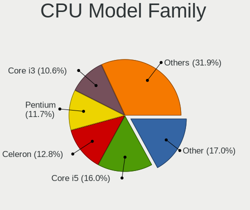
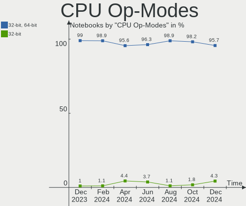

ROSA Hardware Trends (Notebook)
-------------------------------

A project to identify most popular hardware characteristics and track their change
over time based on data collected by ROSA users at https://Linux-Hardware.org.

Anyone can contribute to the study by uploading probes of their computers by
the [hw-probe](https://github.com/linuxhw/hw-probe) tool:

    sudo hw-probe -all -upload

Full-feature report is available here: https://linux-hardware.org/?view=trends&formfactor=notebook

Period: Nov, 2019.

Contents
--------

- [ OS                       ](#os)
- [ OS Family                ](#os-family)
- [ Kernel                   ](#kernel)
- [ Kernel Family            ](#kernel-family)
- [ Kernel Major Ver.        ](#kernel-major-ver)
- [ Arch                     ](#arch)
- [ DE                       ](#de)
- [ Display Server           ](#display-server)
- [ OS Lang                  ](#os-lang)
- [ Boot Mode                ](#boot-mode)
- [ Filesystem               ](#filesystem)
- [ Dual Boot with Linux     ](#dual-boot-with-linux)
- [ Dual Boot (Win)          ](#dual-boot-win)
- [ Country                  ](#country)
- [ City                     ](#city)
- [ Vendor                   ](#vendor)
- [ Model                    ](#model)
- [ Model Family             ](#model-family)
- [ MFG Year                 ](#mfg-year)
- [ Form Factor              ](#form-factor)
- [ Secure Boot              ](#secure-boot)
- [ Coreboot                 ](#coreboot)
- [ RAM Size                 ](#ram-size)
- [ RAM Used                 ](#ram-used)
- [ Drive Vendor             ](#drive-vendor)
- [ Drive Model              ](#drive-model)
- [ Drive Kind               ](#drive-kind)
- [ Drive Connector          ](#drive-connector)
- [ Drive Size               ](#drive-size)
- [ Space Total              ](#space-total)
- [ Space Used               ](#space-used)
- [ Malfunc. Drives          ](#malfunc-drives)
- [ Malfunc. Drive Vendor    ](#malfunc-drive-vendor)
- [ Malfunc. Drive Kind      ](#malfunc-drive-kind)
- [ Failed Drives            ](#failed-drives)
- [ Failed Drive Vendor      ](#failed-drive-vendor)
- [ Drive Status             ](#drive-status)
- [ CPU Vendor               ](#cpu-vendor)
- [ CPU Model                ](#cpu-model)
- [ CPU Model Family         ](#cpu-model-family)
- [ CPU Cores                ](#cpu-cores)
- [ CPU Sockets              ](#cpu-sockets)
- [ CPU Threads              ](#cpu-threads)
- [ CPU Op-Modes             ](#cpu-op-modes)
- [ CPU Microarch            ](#cpu-microarch)
- [ CPU Microcode            ](#cpu-microcode)
- [ GPU Vendor               ](#gpu-vendor)
- [ GPU Model                ](#gpu-model)
- [ GPU Combo                ](#gpu-combo)
- [ GPU Driver               ](#gpu-driver)
- [ GPU Memory               ](#gpu-memory)
- [ Monitor Vendor           ](#monitor-vendor)
- [ Monitor Model            ](#monitor-model)
- [ Monitor Resolution       ](#monitor-resolution)
- [ Monitor Diagonal         ](#monitor-diagonal)
- [ Monitor Width            ](#monitor-width)
- [ Aspect Ratio             ](#aspect-ratio)
- [ Monitor Area             ](#monitor-area)
- [ Pixel Density            ](#pixel-density)
- [ Multiple Monitors        ](#multiple-monitors)
- [ Net Controller Vendor    ](#net-controller-vendor)
- [ Net Controller Model     ](#net-controller-model)
- [ Net Controller Kind      ](#net-controller-kind)
- [ Used Controller          ](#used-controller)
- [ NICs                     ](#nics)
- [ Unsupported Devices      ](#unsupported-devices)
- [ Unsupported Device Types ](#unsupported-device-types)

OS
--

Installed operating systems

| Name      | Computers | Percent |
|-----------|-----------|---------|
| ROSA R11  | 110       | 86.61%  |
| ROSA R8.1 | 11        | 8.66%   |
| ROSA R10  | 5         | 3.94%   |
| ROSA R9   | 1         | 0.79%   |

OS Family
---------

OS without a version

| Name | Computers | Percent |
|------|-----------|---------|
| ROSA | 127       | 100%    |

Kernel
------

Version of the Linux kernel

| Version                          | Computers | Percent |
|----------------------------------|-----------|---------|
| 4.15.0-desktop-45.1rosa-x86_64   | 38        | 29.92%  |
| 4.15.0-desktop-60.7rosa-x86_64   | 36        | 28.35%  |
| 4.9.155-nrj-desktop-1rosa-x86_64 | 10        | 7.87%   |
| 4.15.0-desktop-60.7rosa-i586     | 10        | 7.87%   |
| 4.15.0-desktop-45.1rosa-i586     | 8         | 6.3%    |
| 4.9.155-nrj-laptop-1rosa-x86_64  | 4         | 3.15%   |
| 4.9.155-nrj-desktop-1rosa-i586   | 3         | 2.36%   |
| 4.9.124-nrj-desktop-1rosa-x86_64 | 3         | 2.36%   |
| 4.1.38-nrj-desktop-2rosa-x86_64  | 3         | 2.36%   |
| 4.9.60-nrj-desktop-1rosa-i586    | 2         | 1.57%   |
| 5.3.9-desktop-1omv4001           | 1         | 0.79%   |
| 5.0.0-desktop-33.1rosa-x86_64    | 1         | 0.79%   |
| 5.0.0-desktop-21.2rosa-x86_64    | 1         | 0.79%   |
| 4.9.9-nrj-desktop-1rosa-x86_64   | 1         | 0.79%   |
| 4.9.60-nrj-desktop-1rosa-x86_64  | 1         | 0.79%   |
| 4.9.20-nrj-desktop-1rosa-x86_64  | 1         | 0.79%   |
| 4.9.20-nrj-desktop-1rosa-i586    | 1         | 0.79%   |
| 4.15.0-desktop-68.5rosa-x86_64   | 1         | 0.79%   |
| 4.15.0-desktop-54.1rosa-i586     | 1         | 0.79%   |
| 4.15.0-desktop-47.2rosa-x86_64   | 1         | 0.79%   |

Kernel Family
-------------

Linux kernel without a distro release

| Version | Computers | Percent |
|---------|-----------|---------|
| 4.15.0  | 95        | 74.8%   |
| 4.9.155 | 17        | 13.39%  |
| 4.9.60  | 3         | 2.36%   |
| 4.9.124 | 3         | 2.36%   |
| 4.1.38  | 3         | 2.36%   |
| 5.0.0   | 2         | 1.57%   |
| 4.9.20  | 2         | 1.57%   |
| 5.3.9   | 1         | 0.79%   |
| 4.9.9   | 1         | 0.79%   |

Kernel Major Ver.
-----------------

Linux kernel major version

| Version | Computers | Percent |
|---------|-----------|---------|
| 4.15    | 95        | 74.8%   |
| 4.9     | 26        | 20.47%  |
| 4.1     | 3         | 2.36%   |
| 5.0     | 2         | 1.57%   |
| 5.3     | 1         | 0.79%   |

Arch
----

OS architecture (x86_64, i586, etc.)

| Name   | Computers | Percent |
|--------|-----------|---------|
| x86_64 | 102       | 80.31%  |
| i686   | 25        | 19.69%  |

DE
--

Desktop Environment

| Name    | Computers | Percent |
|---------|-----------|---------|
| KDE5    | 118       | 92.91%  |
| XFCE    | 4         | 3.15%   |
| MATE    | 3         | 2.36%   |
| Unknown | 2         | 1.57%   |

Display Server
--------------

X11 or Wayland

| Name    | Computers | Percent |
|---------|-----------|---------|
| Unknown | 127       | 100%    |

OS Lang
-------

Language

| Lang    | Computers | Percent |
|---------|-----------|---------|
| Unknown | 127       | 100%    |

Boot Mode
---------

EFI or BIOS

| Mode | Computers | Percent |
|------|-----------|---------|
| BIOS | 86        | 67.72%  |
| EFI  | 41        | 32.28%  |

Filesystem
----------

Type of filesystem

| Type    | Computers | Percent |
|---------|-----------|---------|
| Ext4    | 121       | 95.28%  |
| Btrfs   | 4         | 3.15%   |
| Overlay | 1         | 0.79%   |
| Ext3    | 1         | 0.79%   |

Dual Boot with Linux
--------------------

Hosting more than one Linux

| Dual boot | Computers | Percent |
|-----------|-----------|---------|
| No        | 107       | 84.25%  |
| Yes       | 20        | 15.75%  |

Dual Boot (Win)
---------------

Hosting Linux and Windows

| Dual boot | Computers | Percent |
|-----------|-----------|---------|
| No        | 78        | 61.42%  |
| Yes       | 49        | 38.58%  |

Country
-------

Geographic location (country)

| Country    | Computers | Percent |
|------------|-----------|---------|
| Russia     | 95        | 74.8%   |
| Belarus    | 7         | 5.51%   |
| Ukraine    | 6         | 4.72%   |
| Latvia     | 3         | 2.36%   |
| Turkey     | 2         | 1.57%   |
| Lithuania  | 2         | 1.57%   |
| USA        | 1         | 0.79%   |
| Tunisia    | 1         | 0.79%   |
| Spain      | 1         | 0.79%   |
| Serbia     | 1         | 0.79%   |
| Portugal   | 1         | 0.79%   |
| Kazakhstan | 1         | 0.79%   |
| India      | 1         | 0.79%   |
| Chile      | 1         | 0.79%   |
| Canada     | 1         | 0.79%   |
| Azerbaijan | 1         | 0.79%   |
| Australia  | 1         | 0.79%   |
| Unknown    | 1         | 0.79%   |

City
----

Geographic location (city)

| City              | Computers | Percent |
|-------------------|-----------|---------|
| Moscow            | 12        | 9.45%   |
| St Petersburg     | 11        | 8.66%   |
| Yekaterinburg     | 5         | 3.94%   |
| Nizhniy Novgorod  | 5         | 3.94%   |
| Vitebsk           | 3         | 2.36%   |
| Riga              | 3         | 2.36%   |
| Novosibirsk       | 3         | 2.36%   |
| Voronezh          | 2         | 1.57%   |
| Vladivostok       | 2         | 1.57%   |
| Tomsk             | 2         | 1.57%   |
| Tolyatti          | 2         | 1.57%   |
| Ryazan            | 2         | 1.57%   |
| Rostov-on-Don     | 2         | 1.57%   |
| Kharkiv           | 2         | 1.57%   |
| Kaliningrad       | 2         | 1.57%   |
| Zvenigorod        | 1         | 0.79%   |
| Yuzhno-Sakhalinsk | 1         | 0.79%   |
| Yoshkar-Ola       | 1         | 0.79%   |
| Yakutsk           | 1         | 0.79%   |
| Volzhsk           | 1         | 0.79%   |
| Ulyanovsk         | 1         | 0.79%   |
| Ufa               | 1         | 0.79%   |
| Tyumen            | 1         | 0.79%   |
| Tulnikiai         | 1         | 0.79%   |
| Tikhvin           | 1         | 0.79%   |
| Tikhoretsk        | 1         | 0.79%   |
| Tambov            | 1         | 0.79%   |
| Taganrog          | 1         | 0.79%   |
| Surgut            | 1         | 0.79%   |
| Sugar Land        | 1         | 0.79%   |
| Stupino           | 1         | 0.79%   |
| Sorel-Tracy       | 1         | 0.79%   |
| Smolensk          | 1         | 0.79%   |
| Slantsy           | 1         | 0.79%   |
| Simferopol        | 1         | 0.79%   |
| Sibay             | 1         | 0.79%   |
| Seville           | 1         | 0.79%   |
| Saratov           | 1         | 0.79%   |
| Saransk           | 1         | 0.79%   |
| Santiago          | 1         | 0.79%   |
| Samara            | 1         | 0.79%   |
| Reutov            | 1         | 0.79%   |
| Polysayevo        | 1         | 0.79%   |
| Polatsk           | 1         | 0.79%   |
| Podolsk           | 1         | 0.79%   |
| Petrozavodsk      | 1         | 0.79%   |
| Penza             | 1         | 0.79%   |
| Pendle Hill       | 1         | 0.79%   |
| Odesa             | 1         | 0.79%   |
| Novokuznetsk      | 1         | 0.79%   |
| Novoaltaysk       | 1         | 0.79%   |
| Nazarovo          | 1         | 0.79%   |
| Murmansk          | 1         | 0.79%   |
| Minsk             | 1         | 0.79%   |
| Mem Martins       | 1         | 0.79%   |
| Mateur            | 1         | 0.79%   |
| Mariupol          | 1         | 0.79%   |
| Lyubertsy         | 1         | 0.79%   |
| Kuybyshev         | 1         | 0.79%   |
| Kstovo            | 1         | 0.79%   |

Vendor
------

Motherboard manufacturer

| Name                           | Computers | Percent |
|--------------------------------|-----------|---------|
| Lenovo                         | 29        | 22.83%  |
| ASUSTek Computer               | 20        | 15.75%  |
| Hewlett-Packard                | 15        | 11.81%  |
| Acer                           | 15        | 11.81%  |
| Dell                           | 10        | 7.87%   |
| Samsung Electronics            | 9         | 7.09%   |
| Toshiba                        | 8         | 6.3%    |
| Sony                           | 4         | 3.15%   |
| Packard Bell                   | 2         | 1.57%   |
| MSI                            | 2         | 1.57%   |
| eMachines                      | 2         | 1.57%   |
| Digma                          | 2         | 1.57%   |
| Standard                       | 1         | 0.79%   |
| Prestigio                      | 1         | 0.79%   |
| Matsushita Electric Industrial | 1         | 0.79%   |
| Maibenben                      | 1         | 0.79%   |
| LG Electronics                 | 1         | 0.79%   |
| DNS                            | 1         | 0.79%   |
| DEXP                           | 1         | 0.79%   |
| Apple                          | 1         | 0.79%   |
| Alienware                      | 1         | 0.79%   |

Model
-----

Motherboard model

| Name                                  | Computers | Percent |
|---------------------------------------|-----------|---------|
| Pavilion dv6                          | 3         | 2.36%   |
| G50-30 80G0                           | 3         | 2.36%   |
| B570e HuronRiver Platform             | 3         | 2.36%   |
| X551CAP                               | 2         | 1.57%   |
| G580 20157                            | 2         | 1.57%   |
| Aspire E1-530                         | 2         | 1.57%   |
| 300E4Z/300E5Z/300E7Z                  | 2         | 1.57%   |
| Unknown                               | 2         | 1.57%   |
| XiaoMai6                              | 1         | 0.79%   |
| X550DP                                | 1         | 0.79%   |
| X540LJ                                | 1         | 0.79%   |
| X51L                                  | 1         | 0.79%   |
| X401A1                                | 1         | 0.79%   |
| X101H                                 | 1         | 0.79%   |
| X101CH                                | 1         | 0.79%   |
| VPCW21Z1R                             | 1         | 0.79%   |
| VPCEH36EF                             | 1         | 0.79%   |
| VPCEH1E1R                             | 1         | 0.79%   |
| VPCEB1E1R                             | 1         | 0.79%   |
| Vostro 1000                           | 1         | 0.79%   |
| VivoBook 15_ASUS Laptop X540MA_X543MA | 1         | 0.79%   |
| V3-771                                | 1         | 0.79%   |
| UX32LN                                | 1         | 0.79%   |
| U210/U210 Light                       | 1         | 0.79%   |
| TravelMate 5510                       | 1         | 0.79%   |
| ThinkPad X220 4290LB4                 | 1         | 0.79%   |
| ThinkPad W520 427637U                 | 1         | 0.79%   |
| ThinkPad T420s 4174BB2                | 1         | 0.79%   |
| ThinkPad R60/R60i 9461DXG             | 1         | 0.79%   |
| TECRA A9                              | 1         | 0.79%   |
| Satellite L755                        | 1         | 0.79%   |
| Satellite L745                        | 1         | 0.79%   |
| Satellite L50D-B                      | 1         | 0.79%   |
| Satellite L350                        | 1         | 0.79%   |
| Satellite C660D                       | 1         | 0.79%   |
| Satellite C660                        | 1         | 0.79%   |
| SATEGO X200                           | 1         | 0.79%   |
| R540/R580/R780/SA41/E452/E852         | 1         | 0.79%   |
| R519/R719                             | 1         | 0.79%   |
| PSB141S01                             | 1         | 0.79%   |
| ProBook 6450b                         | 1         | 0.79%   |
| ProBook 4310s                         | 1         | 0.79%   |
| Pavilion Sleekbook 15 PC              | 1         | 0.79%   |
| Pavilion g6                           | 1         | 0.79%   |
| Pavilion dm3                          | 1         | 0.79%   |
| Notebook                              | 1         | 0.79%   |
| NAVIS PX100                           | 1         | 0.79%   |
| N76VM                                 | 1         | 0.79%   |
| N53Jf                                 | 1         | 0.79%   |
| N145P/N250P/N260P                     | 1         | 0.79%   |
| N102SP/N100SP/N101SP                  | 1         | 0.79%   |
| N102                                  | 1         | 0.79%   |
| N100SP                                | 1         | 0.79%   |
| MacBook7,1                            | 1         | 0.79%   |
| Latitude E7450                        | 1         | 0.79%   |
| Latitude E5510                        | 1         | 0.79%   |
| Latitude D630                         | 1         | 0.79%   |
| Laptop 15-ra0xx                       | 1         | 0.79%   |
| K54HR                                 | 1         | 0.79%   |
| K53SV                                 | 1         | 0.79%   |

Model Family
------------

Motherboard model prefix

| Name                                        | Computers | Percent |
|---------------------------------------------|-----------|---------|
| Acer Aspire                                 | 12        | 9.45%   |
| Toshiba Satellite                           | 6         | 4.72%   |
| Lenovo IdeaPad                              | 6         | 4.72%   |
| HP Pavilion                                 | 6         | 4.72%   |
| Dell Inspiron                               | 6         | 4.72%   |
| Lenovo ThinkPad                             | 4         | 3.15%   |
| Lenovo G580                                 | 3         | 2.36%   |
| Lenovo G50-30                               | 3         | 2.36%   |
| Lenovo B570e                                | 3         | 2.36%   |
| Dell Latitude                               | 3         | 2.36%   |
| Samsung Electronics 300E4Z                  | 2         | 1.57%   |
| Lenovo B590                                 | 2         | 1.57%   |
| HP ProBook                                  | 2         | 1.57%   |
| ASUS X551CAP                                | 2         | 1.57%   |
| Unknown                                     | 2         | 1.57%   |
| Toshiba TECRA                               | 1         | 0.79%   |
| Toshiba SATEGO                              | 1         | 0.79%   |
| Sony VPCW21Z1R                              | 1         | 0.79%   |
| Sony VPCEH36EF                              | 1         | 0.79%   |
| Sony VPCEH1E1R                              | 1         | 0.79%   |
| Sony VPCEB1E1R                              | 1         | 0.79%   |
| Samsung Electronics R540                    | 1         | 0.79%   |
| Samsung Electronics R519                    | 1         | 0.79%   |
| Samsung Electronics N145P                   | 1         | 0.79%   |
| Samsung Electronics N102SP                  | 1         | 0.79%   |
| Samsung Electronics N102                    | 1         | 0.79%   |
| Samsung Electronics N100SP                  | 1         | 0.79%   |
| Samsung Electronics 350V5C                  | 1         | 0.79%   |
| Prestigio PSB141S01                         | 1         | 0.79%   |
| Packard Bell EasyNote                       | 1         | 0.79%   |
| Packard Bell DOT                            | 1         | 0.79%   |
| MSI U210                                    | 1         | 0.79%   |
| MSI GX60                                    | 1         | 0.79%   |
| Matsushita Electric Industrial CF-19FLGC4AM | 1         | 0.79%   |
| Maibenben XiaoMai6                          | 1         | 0.79%   |
| LG Electronics C1-A577R1                    | 1         | 0.79%   |
| Lenovo G780                                 | 1         | 0.79%   |
| Lenovo G70-35                               | 1         | 0.79%   |
| Lenovo G585                                 | 1         | 0.79%   |
| Lenovo G510                                 | 1         | 0.79%   |
| Lenovo G505s                                | 1         | 0.79%   |
| Lenovo B560                                 | 1         | 0.79%   |
| Lenovo B550                                 | 1         | 0.79%   |
| Lenovo 3000                                 | 1         | 0.79%   |
| HP Notebook                                 | 1         | 0.79%   |
| HP Laptop                                   | 1         | 0.79%   |
| HP G72                                      | 1         | 0.79%   |
| HP G60                                      | 1         | 0.79%   |
| HP Compaq                                   | 1         | 0.79%   |
| HP 255                                      | 1         | 0.79%   |
| HP 15                                       | 1         | 0.79%   |
| eMachines E725                              | 1         | 0.79%   |
| eMachines E525                              | 1         | 0.79%   |
| Digma ES6021EW                              | 1         | 0.79%   |
| Digma ES4024EW                              | 1         | 0.79%   |
| DEXP NAVIS                                  | 1         | 0.79%   |
| Dell Vostro                                 | 1         | 0.79%   |
| ASUS X550DP                                 | 1         | 0.79%   |
| ASUS X540LJ                                 | 1         | 0.79%   |
| ASUS X51L                                   | 1         | 0.79%   |

MFG Year
--------

Motherboard manufacture year

| Year | Computers | Percent |
|------|-----------|---------|
| 2013 | 21        | 16.54%  |
| 2012 | 21        | 16.54%  |
| 2011 | 14        | 11.02%  |
| 2010 | 13        | 10.24%  |
| 2018 | 12        | 9.45%   |
| 2014 | 10        | 7.87%   |
| 2008 | 8         | 6.3%    |
| 2019 | 7         | 5.51%   |
| 2009 | 7         | 5.51%   |
| 2015 | 4         | 3.15%   |
| 2007 | 4         | 3.15%   |
| 2017 | 2         | 1.57%   |
| 2016 | 2         | 1.57%   |
| 2006 | 2         | 1.57%   |

Form Factor
-----------

Physical design of the computer

| Name     | Computers | Percent |
|----------|-----------|---------|
| Notebook | 127       | 100%    |

Secure Boot
-----------

Enabled or disabled

| State    | Computers | Percent |
|----------|-----------|---------|
| Disabled | 127       | 100%    |

Coreboot
--------

Have coreboot on board

| Used | Computers | Percent |
|------|-----------|---------|
| No   | 127       | 100%    |

RAM Size
--------

Total RAM memory

| Size in GB | Computers | Percent |
|------------|-----------|---------|
| 3.01-4.0   | 47        | 37.01%  |
| 1.01-2.0   | 23        | 18.11%  |
| 4.01-8.0   | 22        | 17.32%  |
| 2.01-3.0   | 15        | 11.81%  |
| 8.01-16.0  | 14        | 11.02%  |
| 16.01-24.0 | 3         | 2.36%   |
| 0.01-1.0   | 3         | 2.36%   |

RAM Used
--------

Used RAM memory

| Used GB  | Computers | Percent |
|----------|-----------|---------|
| 0.01-1.0 | 65        | 51.18%  |
| 1.01-2.0 | 54        | 42.52%  |
| 2.01-3.0 | 7         | 5.51%   |
| 3.01-4.0 | 1         | 0.79%   |

Drive Vendor
------------

Hard drive vendors

| Vendor              | Computers | Drives  | Percent |
|---------------------|-----------|---------|---------|
| WDC                 | 31        | 31      | 20.67%  |
| Seagate             | 27        | 29      | 18%     |
| Toshiba             | 22        | 23      | 14.67%  |
| Hitachi             | 18        | 18      | 12%     |
| HGST                | 8         | 8       | 5.33%   |
| Unknown             | 6         | 6       | 4%      |
| Samsung Electronics | 6         | 6       | 4%      |
| Kingston            | 4         | 4       | 2.67%   |
| China               | 3         | 3       | 2%      |
| Transcend           | 2         | 2       | 1.33%   |
| SK Hynix            | 2         | 2       | 1.33%   |
| SanDisk             | 2         | 2       | 1.33%   |
| KingSpec            | 2         | 2       | 1.33%   |
| Fujitsu             | 2         | 2       | 1.33%   |
| Zheino              | 1         | 1       | 0.67%   |
| Union Memory        | 1         | 1       | 0.67%   |
| SPCC                | 1         | 1       | 0.67%   |
| Smartbuy            | 1         | 1       | 0.67%   |
| Patriot             | 1         | 1       | 0.67%   |
| LITEONIT            | 1         | 1       | 0.67%   |
| LITEON              | 1         | 1       | 0.67%   |
| HUAWEI              | 1         | 1       | 0.67%   |
| HL-DT-ST            | 1         | Unknown | 0.67%   |
| HECTRON             | 1         | 1       | 0.67%   |
| Gigabyte Technology | 1         | 1       | 0.67%   |
| Generic             | 1         | 1       | 0.67%   |
| Crucial             | 1         | 1       | 0.67%   |
| AMD                 | 1         | 1       | 0.67%   |
| A-DATA Technology   | 1         | 1       | 0.67%   |

Drive Model
-----------

Hard drive models

| Model                        | Computers | Percent |
|------------------------------|-----------|---------|
| MQ01ABF050 500GB             | 6         | 3.92%   |
| HTS541010A9E680 1TB          | 5         | 3.27%   |
| ST1000LM024 HN-M101MBB 1TB   | 3         | 1.96%   |
| HTS545050A7E380 500GB        | 3         | 1.96%   |
| WD7500BPVX-22JC3T0 750GB     | 2         | 1.31%   |
| WD5000BEVT-24A0RT0 500GB     | 2         | 1.31%   |
| WD3200BPVT-24JJ5T0 320GB     | 2         | 1.31%   |
| ST9160821AS 160GB            | 2         | 1.31%   |
| ST500LT012-1DG142 500GB      | 2         | 1.31%   |
| ST500LM012 HN-M500MBB 500GB  | 2         | 1.31%   |
| ST1000LM035-1RK172 1TB       | 2         | 1.31%   |
| SSD 120GB                    | 2         | 1.31%   |
| SD08G  8GB                   | 2         | 1.31%   |
| MQ01ABD032 320GB             | 2         | 1.31%   |
| MK3265GSX 320GB              | 2         | 1.31%   |
| MK2565GSX 250GB              | 2         | 1.31%   |
| HTS547575A9E384 752GB        | 2         | 1.31%   |
| HTS543232A7A384 320GB        | 2         | 1.31%   |
| DF4032  32GB                 | 2         | 1.31%   |
| WDS240G2G0B-00EPW0 240GB SSD | 1         | 0.65%   |
| WDS240G2G0A-00JH30 240GB SSD | 1         | 0.65%   |
| WD7500BPVT-75HXZT3 752GB     | 1         | 0.65%   |
| WD7500BPVT-00HXZT3 752GB     | 1         | 0.65%   |
| WD7500BPVT-00HXZT1 752GB     | 1         | 0.65%   |
| WD7500BPKX-75HPJT0 752GB     | 1         | 0.65%   |
| WD5000LPVX-22V0TT0 500GB     | 1         | 0.65%   |
| WD5000LPLX-00ZNTT0 500GB     | 1         | 0.65%   |
| WD5000LPCX-75VHAT0 500GB     | 1         | 0.65%   |
| WD5000LPCX-24C6HT0 500GB     | 1         | 0.65%   |
| WD5000LPCX-21VHAT0 500GB     | 1         | 0.65%   |
| WD5000LPCX-00VHAT0 500GB     | 1         | 0.65%   |
| WD5000BPVT-55HXZT3 500GB     | 1         | 0.65%   |
| WD5000BPVT-24HXZT3 500GB     | 1         | 0.65%   |
| WD5000BEVT-60A0RT0 500GB     | 1         | 0.65%   |
| WD3200BPVT-22ZEST0 320GB     | 1         | 0.65%   |
| WD3200BPVT-22JJ5T0 320GB     | 1         | 0.65%   |
| WD2500BEKT-60A25T1 250GB     | 1         | 0.65%   |
| WD1200BEVS-60UST0 120GB      | 1         | 0.65%   |
| WD1200BEVS-2 120GB           | 1         | 0.65%   |
| WD10SPZX-24Z10 1TB           | 1         | 0.65%   |
| WD10SPZX-21Z10T0 1TB         | 1         | 0.65%   |
| WD10JPVX-22JC3T0 1TB         | 1         | 0.65%   |
| WD10JPVX-00JC3T0 1TB         | 1         | 0.65%   |
| WD10JPLX-00MBPT0 1TB         | 1         | 0.65%   |
| TS128GSSD370S 128GB          | 1         | 0.65%   |
| TS128GSSD230S 128GB          | 1         | 0.65%   |
| SU900 256GB SSD              | 1         | 0.65%   |
| ST9640320AS 640GB            | 1         | 0.65%   |
| ST9500420AS 500GB            | 1         | 0.65%   |
| ST9500325AS 500GB            | 1         | 0.65%   |
| ST9320423AS 320GB            | 1         | 0.65%   |
| ST9320310AS 320GB            | 1         | 0.65%   |
| ST9250827AS 250GB            | 1         | 0.65%   |
| ST9160310AS 160GB            | 1         | 0.65%   |
| ST500LT012-9WS14 500GB       | 1         | 0.65%   |
| ST500LM030-1RK17D 500GB      | 1         | 0.65%   |
| ST500LM012 HN-M5 500GB       | 1         | 0.65%   |
| ST320LT020-9YG142 320GB      | 1         | 0.65%   |
| ST320LT012-9WS14C 320GB      | 1         | 0.65%   |
| ST320LT012-9WS14 320GB       | 1         | 0.65%   |

Drive Kind
----------

HDD or SSD

| Kind    | Computers | Drives | Percent |
|---------|-----------|--------|---------|
| HDD     | 106       | 112    | 72.6%   |
| SSD     | 28        | 28     | 19.18%  |
| MMC     | 7         | 8      | 4.79%   |
| Unknown | 4         | 3      | 2.74%   |
| NVMe    | 1         | 1      | 0.68%   |

Drive Connector
---------------

SATA, SAS, NVMe, etc.

| Type | Computers | Drives | Percent |
|------|-----------|--------|---------|
| SATA | 123       | 138    | 89.78%  |
| MMC  | 7         | 8      | 5.11%   |
| SAS  | 6         | 5      | 4.38%   |
| NVMe | 1         | 1      | 0.73%   |

Drive Size
----------

Size of hard drive

| Size in TB | Computers | Drives | Percent |
|------------|-----------|--------|---------|
| 0.01-0.5   | 107       | 119    | 77.54%  |
| 0.51-1.0   | 29        | 31     | 21.01%  |
| 3.01-4.0   | 1         | 1      | 0.72%   |
| 1.01-2.0   | 1         | 1      | 0.72%   |

Space Total
-----------

Amount of disk space available on the file system

| Size in GB     | Computers | Percent |
|----------------|-----------|---------|
| 101-250        | 38        | 29.92%  |
| 251-500        | 34        | 26.77%  |
| 501-1000       | 18        | 14.17%  |
| 1-20           | 13        | 10.24%  |
| 51-100         | 12        | 9.45%   |
| 21-50          | 9         | 7.09%   |
| 1001-2000      | 2         | 1.57%   |
| More than 3000 | 1         | 0.79%   |

Space Used
----------

Amount of used disk space

| Used GB   | Computers | Percent |
|-----------|-----------|---------|
| 1-20      | 91        | 71.65%  |
| 21-50     | 10        | 7.87%   |
| 51-100    | 9         | 7.09%   |
| 101-250   | 8         | 6.3%    |
| 251-500   | 5         | 3.94%   |
| 501-1000  | 2         | 1.57%   |
| 2001-3000 | 1         | 0.79%   |
| 1001-2000 | 1         | 0.79%   |

Malfunc. Drives
---------------

Drive models with a malfunction

| Model                       | Computers | Drives | Percent |
|-----------------------------|-----------|--------|---------|
| MK3265GSX 320GB             | 2         | 2      | 4.35%   |
| MK2565GSX 250GB             | 2         | 2      | 4.35%   |
| HTS545050A7E380 500GB       | 2         | 2      | 4.35%   |
| WD7500BPVT-00HXZT3 752GB    | 1         | 1      | 2.17%   |
| WD7500BPVT-00HXZT1 752GB    | 1         | 1      | 2.17%   |
| WD5000BPVT-55HXZT3 500GB    | 1         | 1      | 2.17%   |
| WD5000BEVT-60A0RT0 500GB    | 1         | 1      | 2.17%   |
| WD5000BEVT-24A0RT0 500GB    | 1         | 1      | 2.17%   |
| WD3200BPVT-22JJ5T0 320GB    | 1         | 1      | 2.17%   |
| WD2500BEKT-60A25T1 250GB    | 1         | 1      | 2.17%   |
| WD1200BEVS-60UST0 120GB     | 1         | 1      | 2.17%   |
| ST9640320AS 640GB           | 1         | 1      | 2.17%   |
| ST9500420AS 500GB           | 1         | 1      | 2.17%   |
| ST9500325AS 500GB           | 1         | 1      | 2.17%   |
| ST9320423AS 320GB           | 1         | 1      | 2.17%   |
| ST9320310AS 320GB           | 1         | 1      | 2.17%   |
| ST9250827AS 250GB           | 1         | 1      | 2.17%   |
| ST9160310AS 160GB           | 1         | 1      | 2.17%   |
| ST500LT012-9WS14 500GB      | 1         | 1      | 2.17%   |
| ST500LM012 HN-M500MBB 500GB | 1         | 1      | 2.17%   |
| ST500LM012 HN-M5 500GB      | 1         | 1      | 2.17%   |
| ST320LT020-9YG142 320GB     | 1         | 1      | 2.17%   |
| ST320LT012-9WS14C 320GB     | 1         | 1      | 2.17%   |
| ST320LT012-9WS14 320GB      | 1         | 1      | 2.17%   |
| ST1000LM014-1EJ164 1TB      | 1         | 1      | 2.17%   |
| P3-512 512GB                | 1         | 1      | 2.17%   |
| MK8009GAH 80GB              | 1         | 1      | 2.17%   |
| MK6475GSX 640GB             | 1         | 1      | 2.17%   |
| MK2556GSY 250GB             | 1         | 1      | 2.17%   |
| MK1652GSX 160GB             | 1         | 1      | 2.17%   |
| MHY2120BH 120GB             | 1         | 1      | 2.17%   |
| LMN-256M3M mSATA 256GB SSD  | 1         | 1      | 2.17%   |
| HTS725032A9A364 320GB       | 1         | 1      | 2.17%   |
| HTS547575A9E384 752GB       | 1         | 1      | 2.17%   |
| HTS547550A9E384 500GB       | 1         | 1      | 2.17%   |
| HTS545050A7E680 500GB       | 1         | 1      | 2.17%   |
| HTS545032B9SA00 320GB       | 1         | 1      | 2.17%   |
| HTS545032B9A300 320GB       | 1         | 1      | 2.17%   |
| HTS545025B9A300 250GB       | 1         | 1      | 2.17%   |
| HTS543232A7A384 320GB       | 1         | 1      | 2.17%   |
| HTS543225L9A300 250GB       | 1         | 1      | 2.17%   |
| HTS542525K9SA00 250GB       | 1         | 1      | 2.17%   |
| HTS541616J9SA00 160GB       | 1         | 1      | 2.17%   |

Malfunc. Drive Vendor
---------------------

Vendors of faulty drives

| Vendor   | Computers | Drives | Percent |
|----------|-----------|--------|---------|
| Seagate  | 13        | 14     | 28.89%  |
| Hitachi  | 11        | 11     | 24.44%  |
| WDC      | 8         | 8      | 17.78%  |
| Toshiba  | 8         | 8      | 17.78%  |
| HGST     | 2         | 2      | 4.44%   |
| LITEONIT | 1         | 1      | 2.22%   |
| KingSpec | 1         | 1      | 2.22%   |
| Fujitsu  | 1         | 1      | 2.22%   |

Malfunc. Drive Kind
-------------------

Kinds of faulty drives

| Kind | Computers | Drives | Percent |
|------|-----------|--------|---------|
| HDD  | 42        | 44     | 95.45%  |
| SSD  | 2         | 2      | 4.55%   |

Failed Drives
-------------

Failed drive models

| Model               | Computers | Drives | Percent |
|---------------------|-----------|--------|---------|
| HTS541010A9E680 1TB | 1         | 1      | 100%    |

Failed Drive Vendor
-------------------

Failed drive vendors

| Vendor | Computers | Drives | Percent |
|--------|-----------|--------|---------|
| HGST   | 1         | 1      | 100%    |

Drive Status
------------

Number of failed and malfunc. drives

| Status   | Computers | Drives | Percent |
|----------|-----------|--------|---------|
| Works    | 82        | 91     | 58.16%  |
| Malfunc  | 44        | 46     | 31.21%  |
| Detected | 14        | 14     | 9.93%   |
| Failed   | 1         | 1      | 0.71%   |

CPU Vendor
----------

Processor vendors

| Vendor | Computers | Percent |
|--------|-----------|---------|
| Intel  | 102       | 80.31%  |
| AMD    | 25        | 19.69%  |

CPU Model
---------

Processor models

| Model                                        | Computers | Percent |
|----------------------------------------------|-----------|---------|
| Intel Pentium CPU 2020M @ 2.40GHz            | 4         | 3.15%   |
| Intel Pentium CPU B950 @ 2.10GHz             | 3         | 2.36%   |
| Intel Pentium CPU 2117U @ 1.80GHz            | 3         | 2.36%   |
| Intel Core 2 Duo CPU T7500 @ 2.20GHz         | 3         | 2.36%   |
| Intel Atom CPU N450 @ 1.66GHz                | 3         | 2.36%   |
| Intel Pentium Dual-Core CPU T4200 @ 2.00GHz  | 2         | 1.57%   |
| Intel Pentium Dual CPU T3200 @ 2.00GHz       | 2         | 1.57%   |
| Intel Pentium Dual CPU T2390 @ 1.86GHz       | 2         | 1.57%   |
| Intel Pentium CPU B960 @ 2.20GHz             | 2         | 1.57%   |
| Intel Pentium CPU B940 @ 2.00GHz             | 2         | 1.57%   |
| Intel Core i7-2670QM CPU @ 2.20GHz           | 2         | 1.57%   |
| Intel Core i5-4210U CPU @ 1.70GHz            | 2         | 1.57%   |
| Intel Core i5-2410M CPU @ 2.30GHz            | 2         | 1.57%   |
| Intel Core i5 CPU M 460 @ 2.53GHz            | 2         | 1.57%   |
| Intel Core i3-5005U CPU @ 2.00GHz            | 2         | 1.57%   |
| Intel Core i3-2350M CPU @ 2.30GHz            | 2         | 1.57%   |
| Intel Core i3-2310M CPU @ 2.10GHz            | 2         | 1.57%   |
| Intel Core i3 CPU M 380 @ 2.53GHz            | 2         | 1.57%   |
| Intel Celeron CPU N3350 @ 1.10GHz            | 2         | 1.57%   |
| Intel Celeron CPU N3060 @ 1.60GHz            | 2         | 1.57%   |
| Intel Celeron CPU N2840 @ 2.16GHz            | 2         | 1.57%   |
| Intel Atom x5-Z8350 CPU @ 1.44GHz            | 2         | 1.57%   |
| Intel Atom CPU N435 @ 1.33GHz                | 2         | 1.57%   |
| Intel Atom CPU N2100 @ 1.60GHz               | 2         | 1.57%   |
| AMD A6-9225 RADEON R4, 5 COMPUTE CORES 2C+3G | 2         | 1.57%   |
| AMD A6-6310 APU with AMD Radeon R4 Graphics  | 2         | 1.57%   |
| Intel Pentium Dual-Core CPU T4300 @ 2.10GHz  | 1         | 0.79%   |
| Intel Pentium Dual CPU T2370 @ 1.73GHz       | 1         | 0.79%   |
| Intel Pentium CPU P6200 @ 2.13GHz            | 1         | 0.79%   |
| Intel Pentium CPU N3540 @ 2.16GHz            | 1         | 0.79%   |
| Intel Pentium CPU B980 @ 2.40GHz             | 1         | 0.79%   |
| Intel Genuine CPU U2500 @ 1.20GHz            | 1         | 0.79%   |
| Intel Core i7-4800MQ CPU @ 2.70GHz           | 1         | 0.79%   |
| Intel Core i7-4720HQ CPU @ 2.60GHz           | 1         | 0.79%   |
| Intel Core i7-3632QM CPU @ 2.20GHz           | 1         | 0.79%   |
| Intel Core i7-3610QM CPU @ 2.30GHz           | 1         | 0.79%   |
| Intel Core i7-2720QM CPU @ 2.20GHz           | 1         | 0.79%   |
| Intel Core i7-2630QM CPU @ 2.00GHz           | 1         | 0.79%   |
| Intel Core i5-9300H CPU @ 2.40GHz            | 1         | 0.79%   |
| Intel Core i5-8250U CPU @ 1.60GHz            | 1         | 0.79%   |
| Intel Core i5-7200U CPU @ 2.50GHz            | 1         | 0.79%   |
| Intel Core i5-5300U CPU @ 2.30GHz            | 1         | 0.79%   |
| Intel Core i5-3210M CPU @ 2.50GHz            | 1         | 0.79%   |
| Intel Core i5-2520M CPU @ 2.50GHz            | 1         | 0.79%   |
| Intel Core i5-2430M CPU @ 2.40GHz            | 1         | 0.79%   |
| Intel Core i5 CPU M 520 @ 2.40GHz            | 1         | 0.79%   |
| Intel Core i5 CPU M 480 @ 2.67GHz            | 1         | 0.79%   |
| Intel Core i3-7020U CPU @ 2.30GHz            | 1         | 0.79%   |
| Intel Core i3-4000M CPU @ 2.40GHz            | 1         | 0.79%   |
| Intel Core i3-3217U CPU @ 1.80GHz            | 1         | 0.79%   |
| Intel Core i3-3110M CPU @ 2.40GHz            | 1         | 0.79%   |
| Intel Core i3 CPU M 370 @ 2.40GHz            | 1         | 0.79%   |
| Intel Core i3 CPU M 350 @ 2.27GHz            | 1         | 0.79%   |
| Intel Core i3 CPU M 330 @ 2.13GHz            | 1         | 0.79%   |
| Intel Core 2 Duo CPU U7500 @ 1.06GHz         | 1         | 0.79%   |
| Intel Core 2 Duo CPU T6600 @ 2.20GHz         | 1         | 0.79%   |
| Intel Core 2 Duo CPU T6570 @ 2.10GHz         | 1         | 0.79%   |
| Intel Core 2 Duo CPU T5450 @ 1.66GHz         | 1         | 0.79%   |
| Intel Core 2 Duo CPU P8600 @ 2.40GHz         | 1         | 0.79%   |
| Intel Core 2 CPU T5600 @ 1.83GHz             | 1         | 0.79%   |

CPU Model Family
----------------

Processor model prefix

| Model                   | Computers | Percent |
|-------------------------|-----------|---------|
| Intel Pentium           | 17        | 13.39%  |
| Intel Core i5           | 15        | 11.81%  |
| Intel Core i3           | 15        | 11.81%  |
| Intel Celeron           | 15        | 11.81%  |
| Intel Atom              | 12        | 9.45%   |
| Intel Core i7           | 8         | 6.3%    |
| Intel Core 2 Duo        | 8         | 6.3%    |
| AMD A6                  | 7         | 5.51%   |
| Intel Pentium Dual      | 5         | 3.94%   |
| AMD A8                  | 4         | 3.15%   |
| Intel Pentium Dual-Core | 3         | 2.36%   |
| AMD Phenom II           | 2         | 1.57%   |
| AMD A10                 | 2         | 1.57%   |
| Intel Genuine           | 1         | 0.79%   |
| Intel Core 2            | 1         | 0.79%   |
| Intel Celeron M         | 1         | 0.79%   |
| Intel Celeron Dual-Core | 1         | 0.79%   |
| AMD V140                | 1         | 0.79%   |
| AMD Turion 64 X2 Mobile | 1         | 0.79%   |
| AMD Turion 64 Mobile    | 1         | 0.79%   |
| AMD Sempron             | 1         | 0.79%   |
| AMD E2                  | 1         | 0.79%   |
| AMD E1                  | 1         | 0.79%   |
| AMD Athlon Neo          | 1         | 0.79%   |
| AMD Athlon II Neo       | 1         | 0.79%   |
| AMD Athlon              | 1         | 0.79%   |
| AMD A4                  | 1         | 0.79%   |

CPU Cores
---------

Number of processor cores

| Number | Computers | Percent |
|--------|-----------|---------|
| 2      | 93        | 73.23%  |
| 4      | 20        | 15.75%  |
| 1      | 14        | 11.02%  |

CPU Sockets
-----------

Number of sockets

| Number | Computers | Percent |
|--------|-----------|---------|
| 1      | 127       | 100%    |

CPU Threads
-----------

Threads per core (Hyper-Threading)

| Number | Computers | Percent |
|--------|-----------|---------|
| 1      | 76        | 59.84%  |
| 2      | 51        | 40.16%  |

CPU Op-Modes
------------

CPU Operation Modes (32-bit, 64-bit)

| Op mode        | Computers | Percent |
|----------------|-----------|---------|
| 32-bit, 64-bit | 122       | 96.06%  |
| 32-bit         | 4         | 3.15%   |
| Unknown        | 1         | 0.79%   |

CPU Microarch
-------------

Microarchitecture

| Name            | Computers | Percent |
|-----------------|-----------|---------|
| SandyBridge     | 22        | 17.32%  |
| Core            | 18        | 14.17%  |
| IvyBridge       | 14        | 11.02%  |
| Westmere        | 10        | 7.87%   |
| Silvermont      | 8         | 6.3%    |
| Bonnell         | 8         | 6.3%    |
| Haswell         | 6         | 4.72%   |
| Skylake         | 5         | 3.94%   |
| Excavator       | 5         | 3.94%   |
| K10             | 4         | 3.15%   |
| Piledriver      | 3         | 2.36%   |
| K8 Hammer       | 3         | 2.36%   |
| Broadwell       | 3         | 2.36%   |
| Unknown         | 3         | 2.36%   |
| Puma            | 2         | 1.57%   |
| P6              | 2         | 1.57%   |
| K8 & K10 hybrid | 2         | 1.57%   |
| Goldmont        | 2         | 1.57%   |
| Steamroller     | 1         | 0.79%   |
| Penryn          | 1         | 0.79%   |
| K10 Llano       | 1         | 0.79%   |
| K10 Liano       | 1         | 0.79%   |
| Jaguar          | 1         | 0.79%   |
| Goldmont plus   | 1         | 0.79%   |
| Bobcat          | 1         | 0.79%   |

CPU Microcode
-------------

Microcode number

| Number     | Computers | Percent |
|------------|-----------|---------|
| 0x206a7    | 21        | 16.54%  |
| 0x306a9    | 14        | 11.02%  |
| 0x20655    | 8         | 6.3%    |
| 0x1067a    | 8         | 6.3%    |
| 0x6fd      | 7         | 5.51%   |
| 0x106ca    | 6         | 4.72%   |
| 0x406c4    | 4         | 3.15%   |
| 0x30678    | 4         | 3.15%   |
| 0x30661    | 4         | 3.15%   |
| 0x010000c8 | 4         | 3.15%   |
| Unknown    | 4         | 3.15%   |
| 0x40651    | 3         | 2.36%   |
| 0x306d4    | 3         | 2.36%   |
| 0x306c3    | 3         | 2.36%   |
| 0x06006704 | 3         | 2.36%   |
| 0x806ea    | 2         | 1.57%   |
| 0x6fb      | 2         | 1.57%   |
| 0x506c9    | 2         | 1.57%   |
| 0x20652    | 2         | 1.57%   |
| 0x07030105 | 2         | 1.57%   |
| 0x06006705 | 2         | 1.57%   |
| 0x06001119 | 2         | 1.57%   |
| 0x03000027 | 2         | 1.57%   |
| 0x02000057 | 2         | 1.57%   |
| 0x906ea    | 1         | 0.79%   |
| 0x806ec    | 1         | 0.79%   |
| 0x806e9    | 1         | 0.79%   |
| 0x706a1    | 1         | 0.79%   |
| 0x6fa      | 1         | 0.79%   |
| 0x6f2      | 1         | 0.79%   |
| 0x6e8      | 1         | 0.79%   |
| 0x6d8      | 1         | 0.79%   |
| 0x07030104 | 1         | 0.79%   |
| 0x0700010f | 1         | 0.79%   |
| 0x06003106 | 1         | 0.79%   |
| 0x05000119 | 1         | 0.79%   |
| 0x00000000 | 1         | 0.79%   |

GPU Vendor
----------

Vendors of graphics cards

| Vendor | Computers | Percent |
|--------|-----------|---------|
| Intel  | 87        | 55.77%  |
| AMD    | 37        | 23.72%  |
| Nvidia | 32        | 20.51%  |

GPU Model
---------

Graphics card models

| Model                                                                              | Computers | Percent |
|------------------------------------------------------------------------------------|-----------|---------|
| 2nd Generation Core Processor Family Integrated Graphics Controller                | 19        | 11.11%  |
| 3rd Gen Core processor Graphics Controller                                         | 14        | 8.19%   |
| Mobile 4 Series Chipset Integrated Graphics Controller                             | 7         | 4.09%   |
| Mobile GM965/GL960 Integrated Graphics Controller (secondary)                      | 6         | 3.51%   |
| Mobile GM965/GL960 Integrated Graphics Controller (primary)                        | 6         | 3.51%   |
| Core Processor Integrated Graphics Controller                                      | 6         | 3.51%   |
| Atom Processor D4xx/D5xx/N4xx/N5xx Integrated Graphics Controller                  | 6         | 3.51%   |
| Stoney [Radeon R2/R3/R4/R5 Graphics]                                               | 5         | 2.92%   |
| RS880M [Mobility Radeon HD 4225/4250]                                              | 4         | 2.34%   |
| Park [Mobility Radeon HD 5430/5450/5470]                                           | 4         | 2.34%   |
| GF117M [GeForce 610M/710M/810M/820M / GT 620M/625M/630M/720M]                      | 4         | 2.34%   |
| GF108M [GeForce GT 620M/630M/635M/640M LE]                                         | 4         | 2.34%   |
| Atom/Celeron/Pentium Processor x5-E8000/J3xxx/N3xxx Integrated Graphics Controller | 4         | 2.34%   |
| Atom Processor Z36xxx/Z37xxx Series Graphics & Display                             | 4         | 2.34%   |
| Atom Processor D2xxx/N2xxx Integrated Graphics Controller                          | 4         | 2.34%   |
| Mullins [Radeon R4/R5 Graphics]                                                    | 3         | 1.75%   |
| HD Graphics 5500                                                                   | 3         | 1.75%   |
| Haswell-ULT Integrated Graphics Controller                                         | 3         | 1.75%   |
| Whistler [Radeon HD 6630M/6650M/6750M/7670M/7690M]                                 | 2         | 1.17%   |
| Thames [Radeon HD 7500M/7600M Series]                                              | 2         | 1.17%   |
| Sun XT [Radeon HD 8670A/8670M/8690M / R5 M330 / M430 / Radeon 520 Mobile]          | 2         | 1.17%   |
| Seymour [Radeon HD 6400M/7400M Series]                                             | 2         | 1.17%   |
| HD Graphics 620                                                                    | 2         | 1.17%   |
| HD Graphics 500                                                                    | 2         | 1.17%   |
| GF119M [GeForce 410M]                                                              | 2         | 1.17%   |
| GF108M [GeForce GT 525M]                                                           | 2         | 1.17%   |
| C77 [GeForce 8200M G]                                                              | 2         | 1.17%   |
| 4th Gen Core Processor Integrated Graphics Controller                              | 2         | 1.17%   |
| Wrestler [Radeon HD 7310]                                                          | 1         | 0.58%   |
| Wimbledon XT [Radeon HD 7970M]                                                     | 1         | 0.58%   |
| UHD Graphics 630 (Mobile)                                                          | 1         | 0.58%   |
| UHD Graphics 620                                                                   | 1         | 0.58%   |
| UHD Graphics 605                                                                   | 1         | 0.58%   |
| Trinity [Radeon HD 7640G]                                                          | 1         | 0.58%   |
| Topaz XT [Radeon R7 M260/M265 / M340/M360 / M440/M445 / 530/535 / 620/625 Mobile]  | 1         | 0.58%   |
| Sun PRO [Radeon HD 8570A/8570M]                                                    | 1         | 0.58%   |
| Sun LE [Radeon HD 8550M / R5 M230]                                                 | 1         | 0.58%   |
| Sumo [Radeon HD 6620G]                                                             | 1         | 0.58%   |
| Sumo [Radeon HD 6520G]                                                             | 1         | 0.58%   |
| RV620/M82 [Mobility Radeon HD 3450/3470]                                           | 1         | 0.58%   |
| RV515/M54 [Mobility Radeon X1400]                                                  | 1         | 0.58%   |
| RS690M [Radeon Xpress 1200/1250/1270]                                              | 1         | 0.58%   |
| RS482M [Mobility Radeon Xpress 200]                                                | 1         | 0.58%   |
| RS482/RS485 [Radeon Xpress 1100/1150]                                              | 1         | 0.58%   |
| Robson CE [Radeon HD 6370M/7370M]                                                  | 1         | 0.58%   |
| Richland [Radeon HD 8650G]                                                         | 1         | 0.58%   |
| Richland [Radeon HD 8550G]                                                         | 1         | 0.58%   |
| Park [Mobility Radeon HD 5430]                                                     | 1         | 0.58%   |
| Opal XT [Radeon R7 M265/M365X/M465]                                                | 1         | 0.58%   |
| Mobile 915GM/GMS/910GML Express Graphics Controller                                | 1         | 0.58%   |
| MCP89 [GeForce 320M]                                                               | 1         | 0.58%   |
| Madison [Mobility Radeon HD 5650/5750 / 6530M/6550M]                               | 1         | 0.58%   |
| Kaveri [Radeon R6 Graphics]                                                        | 1         | 0.58%   |
| Kabini [Radeon HD 8330]                                                            | 1         | 0.58%   |
| Jet PRO [Radeon R5 M230 / R7 M260DX / Radeon 520 Mobile]                           | 1         | 0.58%   |
| GT218M [GeForce 310M]                                                              | 1         | 0.58%   |
| GP108M [GeForce MX150]                                                             | 1         | 0.58%   |
| GP107M [GeForce GTX 1050 3 GB Max-Q]                                               | 1         | 0.58%   |
| GM108M [GeForce 940MX]                                                             | 1         | 0.58%   |
| GM108M [GeForce 840M]                                                              | 1         | 0.58%   |

GPU Combo
---------

Combinations of graphics cards

| Name           | Computers | Percent |
|----------------|-----------|---------|
| 1 x Intel      | 57        | 44.88%  |
| Intel + Nvidia | 23        | 18.11%  |
| 1 x AMD        | 21        | 16.54%  |
| 1 x Nvidia     | 10        | 7.87%   |
| 2 x AMD        | 9         | 7.09%   |
| Intel + AMD    | 7         | 5.51%   |

GPU Driver
----------

Free vs proprietary

| Driver      | Computers | Percent |
|-------------|-----------|---------|
| Free        | 124       | 97.64%  |
| Unknown     | 2         | 1.57%   |
| Proprietary | 1         | 0.79%   |

GPU Memory
----------

Total video memory

| Size in GB | Computers | Percent |
|------------|-----------|---------|
| 1.01-2.0   | 56        | 44.09%  |
| 0.01-0.5   | 40        | 31.5%   |
| 3.01-4.0   | 10        | 7.87%   |
| 0.51-1.0   | 10        | 7.87%   |
| Unknown    | 9         | 7.09%   |
| 2.01-3.0   | 2         | 1.57%   |

Monitor Vendor
--------------

Monitor vendors

| Vendor                  | Computers | Percent |
|-------------------------|-----------|---------|
| AU Optronics            | 28        | 22.22%  |
| Samsung Electronics     | 27        | 21.43%  |
| LG Display              | 24        | 19.05%  |
| Chi Mei Optoelectronics | 11        | 8.73%   |
| Chimei Innolux          | 9         | 7.14%   |
| BOE                     | 8         | 6.35%   |
| LG Philips              | 5         | 3.97%   |
| CPT                     | 3         | 2.38%   |
| Lenovo                  | 2         | 1.59%   |
| Sony                    | 1         | 0.79%   |
| Sharp                   | 1         | 0.79%   |
| SAC                     | 1         | 0.79%   |
| Philips                 | 1         | 0.79%   |
| PANDA                   | 1         | 0.79%   |
| HannStar                | 1         | 0.79%   |
| BenQ                    | 1         | 0.79%   |
| Apple                   | 1         | 0.79%   |
| Acer                    | 1         | 0.79%   |

Monitor Model
-------------

Monitor models

| Model                                               | Computers | Percent |
|-----------------------------------------------------|-----------|---------|
| LCD Monitor CMO15A7 1366x768 350x190mm 15.7-inch    | 6         | 4.72%   |
| LCD Monitor LGD033A 1366x768 340x190mm 15.3-inch    | 4         | 3.15%   |
| LCD Monitor LGD02DC 1366x768 344x194mm 15.5-inch    | 4         | 3.15%   |
| LCD Monitor AUO47EC 1366x768 344x193mm 15.5-inch    | 4         | 3.15%   |
| LCD Monitor AUO21EC 1366x768 340x190mm 15.3-inch    | 4         | 3.15%   |
| LP156WH2-TLAA LGD0230 1366x768 344x194mm 15.5-inch  | 3         | 2.36%   |
| LCD Monitor LGD039F 1366x768 345x194mm 15.6-inch    | 3         | 2.36%   |
| LCD Monitor AUO61D2 1024x600 220x130mm 10.1-inch    | 3         | 2.36%   |
| LCD Monitor SEC3642 1366x768 344x194mm 15.5-inch    | 2         | 1.57%   |
| LCD Monitor SDC4852 3840x2160 340x190mm 15.3-inch   | 2         | 1.57%   |
| LCD Monitor LPLE300 1280x800 331x207mm 15.4-inch    | 2         | 1.57%   |
| LCD Monitor CMN15DB 1366x768 344x193mm 15.5-inch    | 2         | 1.57%   |
| LCD Monitor AUO38ED 1920x1080 340x190mm 15.3-inch   | 2         | 1.57%   |
| LCD Monitor AUO10EC 1366x768 340x190mm 15.3-inch    | 2         | 1.57%   |
| P196HQV ACR01CB 1366x768 410x230mm 18.5-inch        | 1         | 0.79%   |
| Nvidia Defaul SNY05FA 1366x768 290x170mm 13.2-inch  | 1         | 0.79%   |
| LQ133M1JW01 SHP141B 1920x1080 294x165mm 13.3-inch   | 1         | 0.79%   |
| LP156WH1-TLA1 LGD6301 1366x768 344x194mm 15.5-inch  | 1         | 0.79%   |
| LED MONITOR SAC309A 1920x1080 443x249mm 20.0-inch   | 1         | 0.79%   |
| LCD Monitor SEC5842 1366x768 309x174mm 14.0-inch    | 1         | 0.79%   |
| LCD Monitor SEC5541 1366x768 344x193mm 15.5-inch    | 1         | 0.79%   |
| LCD Monitor SEC544B 1600x900 382x214mm 17.2-inch    | 1         | 0.79%   |
| LCD Monitor SEC5441 1366x768 344x194mm 15.5-inch    | 1         | 0.79%   |
| LCD Monitor SEC4E45 1280x800 331x207mm 15.4-inch    | 1         | 0.79%   |
| LCD Monitor SEC4E30 1366x768 344x193mm 15.5-inch    | 1         | 0.79%   |
| LCD Monitor SEC4542 1280x800 303x190mm 14.1-inch    | 1         | 0.79%   |
| LCD Monitor SEC4256 1600x900 382x215mm 17.3-inch    | 1         | 0.79%   |
| LCD Monitor SEC4252 1366x768 344x194mm 15.5-inch    | 1         | 0.79%   |
| LCD Monitor SEC3741 1280x800 331x207mm 15.4-inch    | 1         | 0.79%   |
| LCD Monitor SEC3651 1366x768 344x194mm 15.5-inch    | 1         | 0.79%   |
| LCD Monitor SEC3358 1280x800 331x207mm 15.4-inch    | 1         | 0.79%   |
| LCD Monitor SEC3354 1600x900 382x215mm 17.3-inch    | 1         | 0.79%   |
| LCD Monitor SEC3255 1600x1200 304x228mm 15.0-inch   | 1         | 0.79%   |
| LCD Monitor SEC3245 1366x768 344x194mm 15.5-inch    | 1         | 0.79%   |
| LCD Monitor SEC3152 1366x768 344x194mm 15.5-inch    | 1         | 0.79%   |
| LCD Monitor SEC3052 1366x768 256x144mm 11.6-inch    | 1         | 0.79%   |
| LCD Monitor SEC3046 1366x768 340x190mm 15.3-inch    | 1         | 0.79%   |
| LCD Monitor SEC3030 1024x600 223x125mm 10.1-inch    | 1         | 0.79%   |
| LCD Monitor SDC324C 1920x1080 344x194mm 15.5-inch   | 1         | 0.79%   |
| LCD Monitor SAM0F13 3840x2160 1872x1053mm 84.6-inch | 1         | 0.79%   |
| LCD Monitor SAM0669 1920x1080                       | 1         | 0.79%   |
| LCD Monitor LPLA101 1440x900 367x230mm 17.1-inch    | 1         | 0.79%   |
| LCD Monitor LPLA002 1440x900 367x230mm 17.1-inch    | 1         | 0.79%   |
| LCD Monitor LPL00E0 1440x900 304x190mm 14.1-inch    | 1         | 0.79%   |
| LCD Monitor LGD056D 1920x1080 380x210mm 17.1-inch   | 1         | 0.79%   |
| LCD Monitor LGD048D 1366x768 256x144mm 11.6-inch    | 1         | 0.79%   |
| LCD Monitor LGD0456 1366x768 344x194mm 15.5-inch    | 1         | 0.79%   |
| LCD Monitor LGD038E 1366x768 340x190mm 15.3-inch    | 1         | 0.79%   |
| LCD Monitor LGD02D3 1366x768 277x156mm 12.5-inch    | 1         | 0.79%   |
| LCD Monitor LGD02A6 1366x768 345x194mm 15.6-inch    | 1         | 0.79%   |
| LCD Monitor LGD0259 1920x1080 350x190mm 15.7-inch   | 1         | 0.79%   |
| LCD Monitor LGD0250 1366x768 345x194mm 15.6-inch    | 1         | 0.79%   |
| LCD Monitor LGD024B 1366x768 344x194mm 15.5-inch    | 1         | 0.79%   |
| LCD Monitor LEN40B2 1920x1080 344x193mm 15.5-inch   | 1         | 0.79%   |
| LCD Monitor LEN4042 1400x1050 304x228mm 15.0-inch   | 1         | 0.79%   |
| LCD Monitor CPT1BC7 1024x600 223x125mm 10.1-inch    | 1         | 0.79%   |
| LCD Monitor CPT14C7 1366x768 344x194mm 15.5-inch    | 1         | 0.79%   |
| LCD Monitor CPT13A6 1280x800 331x207mm 15.4-inch    | 1         | 0.79%   |
| LCD Monitor CMO1720 1920x1080 382x215mm 17.3-inch   | 1         | 0.79%   |
| LCD Monitor CMO15A2 1366x768 344x193mm 15.5-inch    | 1         | 0.79%   |

Monitor Resolution
------------------

Monitor screen resolution

| Resolution       | Computers | Percent |
|------------------|-----------|---------|
| 1366x768 (WXGA)  | 70        | 56%     |
| 1920x1080 (FHD)  | 24        | 19.2%   |
| 1280x800 (WXGA)  | 12        | 9.6%    |
| 1024x600         | 9         | 7.2%    |
| 1600x900 (HD+)   | 4         | 3.2%    |
| 1440x900 (WXGA+) | 3         | 2.4%    |
| 3840x2160 (4K)   | 1         | 0.8%    |
| 1400x1050        | 1         | 0.8%    |
| 1280x1024 (SXGA) | 1         | 0.8%    |

Monitor Diagonal
----------------

Diagonal size in inches

| Inches  | Computers | Percent |
|---------|-----------|---------|
| 15      | 80        | 63.49%  |
| 17      | 10        | 7.94%   |
| 14      | 9         | 7.14%   |
| 10      | 9         | 7.14%   |
| 13      | 8         | 6.35%   |
| 12      | 3         | 2.38%   |
| 11      | 2         | 1.59%   |
| 84      | 1         | 0.79%   |
| 27      | 1         | 0.79%   |
| 20      | 1         | 0.79%   |
| 18      | 1         | 0.79%   |
| Unknown | 1         | 0.79%   |

Monitor Width
-------------

Physical width

| Width in mm | Computers | Percent |
|-------------|-----------|---------|
| 301-350     | 93        | 73.81%  |
| 201-300     | 19        | 15.08%  |
| 351-400     | 9         | 7.14%   |
| 401-500     | 2         | 1.59%   |
| 501-600     | 1         | 0.79%   |
| 1501-2000   | 1         | 0.79%   |
| Unknown     | 1         | 0.79%   |

Aspect Ratio
------------

Proportional relationship between the width and the height

| Ratio | Computers | Percent |
|-------|-----------|---------|
| 16/9  | 104       | 85.95%  |
| 16/10 | 15        | 12.4%   |
| 5/4   | 1         | 0.83%   |
| 4/3   | 1         | 0.83%   |

Monitor Area
------------

Area in inch

| Area in inch | Computers | Percent |
|----------------|-----------|---------|
| 101-110        | 80        | 62.99%  |
| 81-90          | 12        | 9.45%   |
| 41-50          | 9         | 7.09%   |
| 121-130        | 7         | 5.51%   |
| 71-80          | 6         | 4.72%   |
| 61-70          | 2         | 1.57%   |
| 51-60          | 2         | 1.57%   |
| 141-150        | 2         | 1.57%   |
| 131-140        | 2         | 1.57%   |
| More than 1000 | 1         | 0.79%   |
| 301-350        | 1         | 0.79%   |
| 151-200        | 1         | 0.79%   |
| 91-100         | 1         | 0.79%   |
| Unknown        | 1         | 0.79%   |

Pixel Density
-------------

Pixels per inch

| Density | Computers | Percent |
|---------|-----------|---------|
| 101-120 | 83        | 66.4%   |
| 121-160 | 24        | 19.2%   |
| 51-100  | 14        | 11.2%   |
| 161-240 | 3         | 2.4%    |
| Unknown | 1         | 0.8%    |

Multiple Monitors
-----------------

Total monitors connected

| Total | Computers | Percent |
|-------|-----------|---------|
| 1     | 122       | 96.06%  |
| 2     | 5         | 3.94%   |

Net Controller Vendor
---------------------

Controller vendors

| Vendor                     | Computers | Percent |
|----------------------------|-----------|---------|
| Realtek Semiconductor      | 6         | 31.58%  |
| Intel                      | 6         | 31.58%  |
| Huawei Technologies        | 2         | 10.53%  |
| Broadcom Limited           | 2         | 10.53%  |
| ZTE WCDMA Technologies MSM | 1         | 5.26%   |
| Spreadtrum Communications  | 1         | 5.26%   |
| MediaTek                   | 1         | 5.26%   |

Net Controller Model
--------------------

Controller models

| Model                                           | Computers | Percent |
|-------------------------------------------------|-----------|---------|
| RTL8152 Fast Ethernet Adapter                   | 4         | 18.18%  |
| 82579LM Gigabit Network Connection (Lewisville) | 3         | 13.64%  |
| RTL8723BU 802.11n WLAN Adapter                  | 2         | 9.09%   |
| Centrino Advanced-N 6205 [Taylor Peak]          | 2         | 9.09%   |
| BCM4401-B0 100Base-TX                           | 2         | 9.09%   |
| ZTE Mobile Broadband Station                    | 1         | 4.55%   |
| RTL8723DE Wireless Network Adapter              | 1         | 4.55%   |
| Power Ice Evo                                   | 1         | 4.55%   |
| Fly Era Nano 3                                  | 1         | 4.55%   |
| E173 3G Modem (modem-mode)                      | 1         | 4.55%   |
| DLI-TL20                                        | 1         | 4.55%   |
| Centrino Advanced-N 6200                        | 1         | 4.55%   |
| Centrino Advanced-N + WiMAX 6250 [Kilmer Peak]  | 1         | 4.55%   |
| 82577LC Gigabit Network Connection              | 1         | 4.55%   |

Net Controller Kind
-------------------

Ethernet, WiFi or modem

| Kind     | Computers | Percent |
|----------|-----------|---------|
| Ethernet | 14        | 63.64%  |
| WiFi     | 7         | 31.82%  |
| Modem    | 1         | 4.55%   |

Used Controller
---------------

Currently used network controller

| Kind     | Computers | Percent |
|----------|-----------|---------|
| Ethernet | 4         | 57.14%  |
| WiFi     | 3         | 42.86%  |

NICs
----

Total network controllers on board

| Total | Computers | Percent |
|-------|-----------|---------|
| 2     | 112       | 88.19%  |
| 1     | 11        | 8.66%   |
| 0     | 4         | 3.15%   |

Unsupported Devices
-------------------

Total unsupported devices on board

| Total | Computers | Percent |
|-------|-----------|---------|
| 0     | 93        | 73.23%  |
| 1     | 27        | 21.26%  |
| 2     | 7         | 5.51%   |

Unsupported Device Types
------------------------

Types of unsupported devices

| Type                  | Computers | Percent |
|-----------------------|-----------|---------|
| Graphics card         | 13        | 33.33%  |
| Fingerprint reader    | 10        | 25.64%  |
| Net/wireless          | 5         | 12.82%  |
| Multimedia controller | 4         | 10.26%  |
| Bluetooth             | 3         | 7.69%   |
| Chipcard              | 2         | 5.13%   |
| Network               | 1         | 2.56%   |
| Flash memory          | 1         | 2.56%   |

