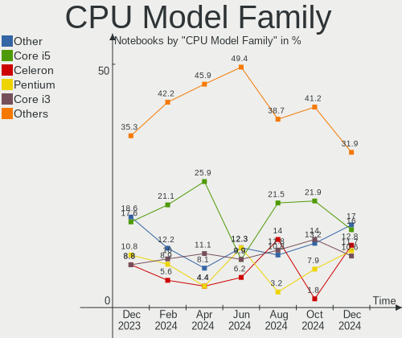
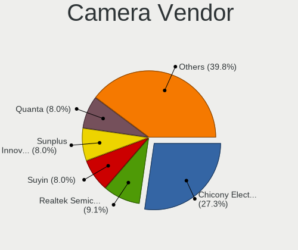

ROSA - Hardware Trends (Notebooks)
----------------------------------

A project to identify most popular hardware characteristics and track their change
over time based on data collected by Linux users at https://Linux-Hardware.org.

Anyone can contribute to this report by the [hw-probe](https://github.com/linuxhw/hw-probe) tool:

    sudo -E hw-probe -all -upload

This report is for one last month. Overall report since the beginning of time: [TestDays](https://github.com/linuxhw/TestDays)

Period: Dec, 2024.

Contents
--------

* [ System ](#system)
  - [ OS                       ](#os)
  - [ OS Family                ](#os-family)
  - [ Kernel                   ](#kernel)
  - [ Kernel Family            ](#kernel-family)
  - [ Kernel Major Ver.        ](#kernel-major-ver)
  - [ Arch                     ](#arch)
  - [ DE                       ](#de)
  - [ Display Server           ](#display-server)
  - [ Display Manager          ](#display-manager)
  - [ OS Lang                  ](#os-lang)
  - [ Boot Mode                ](#boot-mode)
  - [ Filesystem               ](#filesystem)
  - [ Part. scheme             ](#part-scheme)
  - [ Dual Boot with Linux/BSD ](#dual-boot-with-linuxbsd)
  - [ Dual Boot (Win)          ](#dual-boot-win)

* [ Board ](#board)
  - [ Vendor                   ](#vendor)
  - [ Model                    ](#model)
  - [ Model Family             ](#model-family)
  - [ MFG Year                 ](#mfg-year)
  - [ Form Factor              ](#form-factor)
  - [ Secure Boot              ](#secure-boot)
  - [ Coreboot                 ](#coreboot)
  - [ RAM Size                 ](#ram-size)
  - [ RAM Used                 ](#ram-used)
  - [ Total Drives             ](#total-drives)
  - [ Has CD-ROM               ](#has-cd-rom)
  - [ Has Ethernet             ](#has-ethernet)
  - [ Has WiFi                 ](#has-wifi)
  - [ Has Bluetooth            ](#has-bluetooth)

* [ Location ](#location)
  - [ Country                  ](#country)
  - [ City                     ](#city)

* [ Drives ](#drives)
  - [ Drive Vendor             ](#drive-vendor)
  - [ Drive Model              ](#drive-model)
  - [ HDD Vendor               ](#hdd-vendor)
  - [ SSD Vendor               ](#ssd-vendor)
  - [ Drive Kind               ](#drive-kind)
  - [ Drive Connector          ](#drive-connector)
  - [ Drive Size               ](#drive-size)
  - [ Space Total              ](#space-total)
  - [ Space Used               ](#space-used)
  - [ Malfunc. Drives          ](#malfunc-drives)
  - [ Malfunc. Drive Vendor    ](#malfunc-drive-vendor)
  - [ Malfunc. HDD Vendor      ](#malfunc-hdd-vendor)
  - [ Malfunc. Drive Kind      ](#malfunc-drive-kind)
  - [ Failed Drives            ](#failed-drives)
  - [ Failed Drive Vendor      ](#failed-drive-vendor)
  - [ Drive Status             ](#drive-status)

* [ Storage controller ](#storage-controller)
  - [ Storage Vendor           ](#storage-vendor)
  - [ Storage Model            ](#storage-model)
  - [ Storage Kind             ](#storage-kind)

* [ Processor ](#processor)
  - [ CPU Vendor               ](#cpu-vendor)
  - [ CPU Model                ](#cpu-model)
  - [ CPU Model Family         ](#cpu-model-family)
  - [ CPU Cores                ](#cpu-cores)
  - [ CPU Sockets              ](#cpu-sockets)
  - [ CPU Threads              ](#cpu-threads)
  - [ CPU Op-Modes             ](#cpu-op-modes)
  - [ CPU Microcode            ](#cpu-microcode)
  - [ CPU Microarch            ](#cpu-microarch)

* [ Graphics ](#graphics)
  - [ GPU Vendor               ](#gpu-vendor)
  - [ GPU Model                ](#gpu-model)
  - [ GPU Combo                ](#gpu-combo)
  - [ GPU Driver               ](#gpu-driver)
  - [ GPU Memory               ](#gpu-memory)

* [ Monitor ](#monitor)
  - [ Monitor Vendor           ](#monitor-vendor)
  - [ Monitor Model            ](#monitor-model)
  - [ Monitor Resolution       ](#monitor-resolution)
  - [ Monitor Diagonal         ](#monitor-diagonal)
  - [ Monitor Width            ](#monitor-width)
  - [ Aspect Ratio             ](#aspect-ratio)
  - [ Monitor Area             ](#monitor-area)
  - [ Pixel Density            ](#pixel-density)
  - [ Multiple Monitors        ](#multiple-monitors)

* [ Network ](#network)
  - [ Net Controller Vendor    ](#net-controller-vendor)
  - [ Net Controller Model     ](#net-controller-model)
  - [ Wireless Vendor          ](#wireless-vendor)
  - [ Wireless Model           ](#wireless-model)
  - [ Ethernet Vendor          ](#ethernet-vendor)
  - [ Ethernet Model           ](#ethernet-model)
  - [ Net Controller Kind      ](#net-controller-kind)
  - [ Used Controller          ](#used-controller)
  - [ NICs                     ](#nics)
  - [ IPv6                     ](#ipv6)

* [ Bluetooth ](#bluetooth)
  - [ Bluetooth Vendor         ](#bluetooth-vendor)
  - [ Bluetooth Model          ](#bluetooth-model)

* [ Sound ](#sound)
  - [ Sound Vendor             ](#sound-vendor)
  - [ Sound Model              ](#sound-model)

* [ Memory ](#memory)
  - [ Memory Vendor            ](#memory-vendor)
  - [ Memory Model             ](#memory-model)
  - [ Memory Kind              ](#memory-kind)
  - [ Memory Form Factor       ](#memory-form-factor)
  - [ Memory Size              ](#memory-size)
  - [ Memory Speed             ](#memory-speed)

* [ Printers & scanners ](#printers--scanners)
  - [ Printer Vendor           ](#printer-vendor)
  - [ Printer Model            ](#printer-model)
  - [ Scanner Vendor           ](#scanner-vendor)
  - [ Scanner Model            ](#scanner-model)

* [ Camera ](#camera)
  - [ Camera Vendor            ](#camera-vendor)
  - [ Camera Model             ](#camera-model)

* [ Security ](#security)
  - [ Fingerprint Vendor       ](#fingerprint-vendor)
  - [ Fingerprint Model        ](#fingerprint-model)
  - [ Chipcard Vendor          ](#chipcard-vendor)
  - [ Chipcard Model           ](#chipcard-model)

* [ Unsupported ](#unsupported)
  - [ Unsupported Devices      ](#unsupported-devices)
  - [ Unsupported Device Types ](#unsupported-device-types)

System
------

OS
--

Installed operating systems

| Name        | Notebooks | Percent |
|-------------|-----------|---------|
| ROSA 12.5.1 | 68        | 72.34%  |
| ROSA 12     | 8         | 8.51%   |
| ROSA 12.6   | 4         | 4.26%   |
| ROSA 12.4   | 4         | 4.26%   |
| ROSA R11.1  | 3         | 3.19%   |
| ROSA 12.3   | 2         | 2.13%   |
| ROSA 12.2   | 2         | 2.13%   |
| ROSA R9     | 1         | 1.06%   |
| ROSA 13.0   | 1         | 1.06%   |
| ROSA 12.5   | 1         | 1.06%   |

OS Family
---------

OS without a version

| Name | Notebooks | Percent |
|------|-----------|---------|
| ROSA | 94        | 100%    |

Kernel
------

Version of the Linux kernel

| Version                             | Notebooks | Percent |
|-------------------------------------|-----------|---------|
| 6.6.47-generic-1rosa2021.1-x86_64   | 52        | 55.32%  |
| 6.6.27-generic-3rosa2021.1-x86_64   | 13        | 13.83%  |
| 6.1.89-generic-2rosa2021.1-x86_64   | 7         | 7.45%   |
| 6.6.21-generic-8rosa2021.1-x86_64   | 2         | 2.13%   |
| 6.1.20-generic-2rosa2021.1-x86_64   | 2         | 2.13%   |
| 5.15.170-generic-1rosa2021.1-x86_64 | 2         | 2.13%   |
| 5.15.103-generic-1rosa2021.1-i686   | 2         | 2.13%   |
| 5.10.74-generic-2rosa2021.1-x86_64  | 2         | 2.13%   |
| 6.2.9-300.fc38.x86_64               | 1         | 1.06%   |
| 6.12.4-generic-3rosa2021.1-x86_64   | 1         | 1.06%   |
| 6.11.10-generic-4rosa13-x86_64      | 1         | 1.06%   |
| 5.4.83-generic-2rosa-i586           | 1         | 1.06%   |
| 5.4.32-generic-2rosa-i586           | 1         | 1.06%   |
| 5.17.11-generic-2rosa2021.1-x86_64  | 1         | 1.06%   |
| 5.15.77-generic-1rosa2021.1-x86_64  | 1         | 1.06%   |
| 5.15.75-generic-1rosa2021.1-x86_64  | 1         | 1.06%   |
| 5.15.170-generic-1rosa2021.1-i686   | 1         | 1.06%   |
| 5.15.127-generic-1rosa2021.1-i686   | 1         | 1.06%   |
| 4.9.20-nrj-desktop-1rosa-i586       | 1         | 1.06%   |
| 4.15.0-desktop-122.124.1rosa-i586   | 1         | 1.06%   |

Kernel Family
-------------

Linux kernel without a distro release

| Version  | Notebooks | Percent |
|----------|-----------|---------|
| 6.6.47   | 52        | 55.32%  |
| 6.6.27   | 13        | 13.83%  |
| 6.1.89   | 7         | 7.45%   |
| 5.15.170 | 3         | 3.19%   |
| 6.6.21   | 2         | 2.13%   |
| 6.1.20   | 2         | 2.13%   |
| 5.15.103 | 2         | 2.13%   |
| 5.10.74  | 2         | 2.13%   |
| 6.2.9    | 1         | 1.06%   |
| 6.12.4   | 1         | 1.06%   |
| 6.11.10  | 1         | 1.06%   |
| 5.4.83   | 1         | 1.06%   |
| 5.4.32   | 1         | 1.06%   |
| 5.17.11  | 1         | 1.06%   |
| 5.15.77  | 1         | 1.06%   |
| 5.15.75  | 1         | 1.06%   |
| 5.15.127 | 1         | 1.06%   |
| 4.9.20   | 1         | 1.06%   |
| 4.15.0   | 1         | 1.06%   |

Kernel Major Ver.
-----------------

Linux kernel major version

| Version | Notebooks | Percent |
|---------|-----------|---------|
| 6.6     | 67        | 71.28%  |
| 6.1     | 9         | 9.57%   |
| 5.15    | 8         | 8.51%   |
| 5.4     | 2         | 2.13%   |
| 5.10    | 2         | 2.13%   |
| 6.2     | 1         | 1.06%   |
| 6.12    | 1         | 1.06%   |
| 6.11    | 1         | 1.06%   |
| 5.17    | 1         | 1.06%   |
| 4.9     | 1         | 1.06%   |
| 4.15    | 1         | 1.06%   |

Arch
----

OS architecture (x86_64, i586, etc.)

| Name   | Notebooks | Percent |
|--------|-----------|---------|
| x86_64 | 86        | 91.49%  |
| i686   | 8         | 8.51%   |

DE
--

Desktop Environment

| Name  | Notebooks | Percent |
|-------|-----------|---------|
| KDE5  | 64        | 68.09%  |
| GNOME | 14        | 14.89%  |
| LXQt  | 12        | 12.77%  |
| KDE4  | 2         | 2.13%   |
| XFCE  | 1         | 1.06%   |
| KDE6  | 1         | 1.06%   |

Display Server
--------------

X11 or Wayland

| Name    | Notebooks | Percent |
|---------|-----------|---------|
| Wayland | 73        | 77.66%  |
| X11     | 21        | 22.34%  |

Display Manager
---------------

SDDM, LightDM, etc.

| Name    | Notebooks | Percent |
|---------|-----------|---------|
| SDDM    | 66        | 70.21%  |
| GDM     | 22        | 23.4%   |
| LightDM | 4         | 4.26%   |
| KDM     | 2         | 2.13%   |

OS Lang
-------

Language

| Lang    | Notebooks | Percent |
|---------|-----------|---------|
| ru_RU   | 88        | 93.62%  |
| en_US   | 2         | 2.13%   |
| pt_BR   | 1         | 1.06%   |
| es_CL   | 1         | 1.06%   |
| bg_BG   | 1         | 1.06%   |
| Unknown | 1         | 1.06%   |

Boot Mode
---------

EFI or BIOS

| Mode | Notebooks | Percent |
|------|-----------|---------|
| EFI  | 60        | 63.83%  |
| BIOS | 34        | 36.17%  |

Filesystem
----------

Type of filesystem

| Type  | Notebooks | Percent |
|-------|-----------|---------|
| Ext4  | 85        | 90.43%  |
| Btrfs | 9         | 9.57%   |

Part. scheme
------------

Scheme of partitioning

| Type    | Notebooks | Percent |
|---------|-----------|---------|
| GPT     | 64        | 68.09%  |
| MBR     | 29        | 30.85%  |
| Unknown | 1         | 1.06%   |

Dual Boot with Linux/BSD
------------------------

Hosting more than one Linux/BSD

| Dual boot | Notebooks | Percent |
|-----------|-----------|---------|
| No        | 80        | 85.11%  |
| Yes       | 14        | 14.89%  |

Dual Boot (Win)
---------------

Hosting Linux and Windows

| Dual boot | Notebooks | Percent |
|-----------|-----------|---------|
| No        | 68        | 72.34%  |
| Yes       | 26        | 27.66%  |

Board
-----

Vendor
------

Motherboard manufacturer

| Name                 | Notebooks | Percent |
|----------------------|-----------|---------|
| Acer                 | 19        | 20.21%  |
| Hewlett-Packard      | 13        | 13.83%  |
| ASUSTek Computer     | 12        | 12.77%  |
| Lenovo               | 11        | 11.7%   |
| Dell                 | 6         | 6.38%   |
| MSI                  | 4         | 4.26%   |
| Samsung Electronics  | 3         | 3.19%   |
| Toshiba              | 2         | 2.13%   |
| LTD Delovoy Office   | 2         | 2.13%   |
| HUAWEI               | 2         | 2.13%   |
| Haier                | 2         | 2.13%   |
| Fujitsu Siemens      | 2         | 2.13%   |
| Clevo                | 2         | 2.13%   |
| Aquarius             | 2         | 2.13%   |
| Timi                 | 1         | 1.06%   |
| TECNO Mobile Limited | 1         | 1.06%   |
| Positivo             | 1         | 1.06%   |
| Notebook             | 1         | 1.06%   |
| Maibenben            | 1         | 1.06%   |
| KVADRA               | 1         | 1.06%   |
| iRU                  | 1         | 1.06%   |
| HONOR                | 1         | 1.06%   |
| eMachines            | 1         | 1.06%   |
| DNS                  | 1         | 1.06%   |
| Digma                | 1         | 1.06%   |
| Chuwi                | 1         | 1.06%   |

Model
-----

Motherboard model

| Name                                 | Notebooks | Percent |
|--------------------------------------|-----------|---------|
| Lenovo G500 20236                    | 2         | 2.13%   |
| Dell Inspiron 3521                   | 2         | 2.13%   |
| Acer Nitro AN517-51                  | 2         | 2.13%   |
| Acer Extensa 215-23                  | 2         | 2.13%   |
| Toshiba Satellite U300               | 1         | 1.06%   |
| Toshiba NB100                        | 1         | 1.06%   |
| Timi Redmi Book Pro 15 2022          | 1         | 1.06%   |
| TECNO Mobile Limited MEGABOOK K16SDA | 1         | 1.06%   |
| Samsung R530/R730                    | 1         | 1.06%   |
| Samsung R510/P510                    | 1         | 1.06%   |
| Samsung 305V4A/305V5A                | 1         | 1.06%   |
| Positivo C464F                       | 1         | 1.06%   |
| Notebook W250EGQ / W270EGQ           | 1         | 1.06%   |
| MSI VR610                            | 1         | 1.06%   |
| MSI Katana GF66 11UE                 | 1         | 1.06%   |
| MSI Katana 17 B13UCX                 | 1         | 1.06%   |
| MSI GL62M 7RDX                       | 1         | 1.06%   |
| Maibenben Perfectum Series           | 1         | 1.06%   |
| LTD Delovoy Office 15TLI             | 1         | 1.06%   |
| LTD Delovoy Office 15CLG2            | 1         | 1.06%   |
| Lenovo V15 G2 IJL 82QY               | 1         | 1.06%   |
| Lenovo ThinkPad X250 20CM003CRT      | 1         | 1.06%   |
| Lenovo ThinkPad P17 Gen 1 20SN003YUS | 1         | 1.06%   |
| Lenovo S20-30 20421                  | 1         | 1.06%   |
| Lenovo K14 Gen 1 21CSS16E00          | 1         | 1.06%   |
| Lenovo IdeaPad Z500 20202            | 1         | 1.06%   |
| Lenovo G700 20251                    | 1         | 1.06%   |
| Lenovo G580 20157                    | 1         | 1.06%   |
| Lenovo B590 20208                    | 1         | 1.06%   |
| KVADRA NAU LE14U                     | 1         | 1.06%   |
| iRU 17TLI                            | 1         | 1.06%   |
| HUAWEI NBM-WXX9                      | 1         | 1.06%   |
| HUAWEI NBD-WXX9                      | 1         | 1.06%   |
| HONOR FRI-HXX                        | 1         | 1.06%   |
| HP Stream Notebook PC 13             | 1         | 1.06%   |
| HP ProBook 4540s                     | 1         | 1.06%   |
| HP ProBook 440 G5                    | 1         | 1.06%   |
| HP ProBook 440 G4                    | 1         | 1.06%   |
| HP Presario V3700                    | 1         | 1.06%   |
| HP Pavilion dv7                      | 1         | 1.06%   |

Model Family
------------

Motherboard model prefix

| Name                          | Notebooks | Percent |
|-------------------------------|-----------|---------|
| Acer Aspire                   | 11        | 11.7%   |
| Dell Inspiron                 | 4         | 4.26%   |
| HP ProBook                    | 3         | 3.19%   |
| HP Pavilion                   | 3         | 3.19%   |
| ASUS Vivobook                 | 3         | 3.19%   |
| Acer Nitro                    | 3         | 3.19%   |
| MSI Katana                    | 2         | 2.13%   |
| Lenovo ThinkPad               | 2         | 2.13%   |
| Lenovo G500                   | 2         | 2.13%   |
| HP Laptop                     | 2         | 2.13%   |
| HP EliteBook                  | 2         | 2.13%   |
| Acer Extensa                  | 2         | 2.13%   |
| Toshiba Satellite             | 1         | 1.06%   |
| Toshiba NB100                 | 1         | 1.06%   |
| Timi Redmi                    | 1         | 1.06%   |
| TECNO Mobile Limited MEGABOOK | 1         | 1.06%   |
| Samsung R530                  | 1         | 1.06%   |
| Samsung R510                  | 1         | 1.06%   |
| Samsung 305V4A                | 1         | 1.06%   |
| Positivo C464F                | 1         | 1.06%   |
| Notebook W250EGQ              | 1         | 1.06%   |
| MSI VR610                     | 1         | 1.06%   |
| MSI GL62M                     | 1         | 1.06%   |
| Maibenben Perfectum           | 1         | 1.06%   |
| LTD Delovoy Office 15TLI      | 1         | 1.06%   |
| LTD Delovoy Office 15CLG2     | 1         | 1.06%   |
| Lenovo V15                    | 1         | 1.06%   |
| Lenovo S20-30                 | 1         | 1.06%   |
| Lenovo K14                    | 1         | 1.06%   |
| Lenovo IdeaPad                | 1         | 1.06%   |
| Lenovo G700                   | 1         | 1.06%   |
| Lenovo G580                   | 1         | 1.06%   |
| Lenovo B590                   | 1         | 1.06%   |
| KVADRA NAU                    | 1         | 1.06%   |
| iRU 17TLI                     | 1         | 1.06%   |
| HUAWEI NBM-WXX9               | 1         | 1.06%   |
| HUAWEI NBD-WXX9               | 1         | 1.06%   |
| HONOR FRI-HXX                 | 1         | 1.06%   |
| HP Stream                     | 1         | 1.06%   |
| HP Presario                   | 1         | 1.06%   |

MFG Year
--------

Motherboard manufacture year

| Year | Notebooks | Percent |
|------|-----------|---------|
| 2012 | 13        | 13.83%  |
| 2022 | 10        | 10.64%  |
| 2021 | 10        | 10.64%  |
| 2011 | 8         | 8.51%   |
| 2020 | 6         | 6.38%   |
| 2013 | 6         | 6.38%   |
| 2008 | 5         | 5.32%   |
| 2007 | 5         | 5.32%   |
| 2024 | 4         | 4.26%   |
| 2023 | 4         | 4.26%   |
| 2017 | 4         | 4.26%   |
| 2015 | 4         | 4.26%   |
| 2018 | 3         | 3.19%   |
| 2014 | 3         | 3.19%   |
| 2009 | 3         | 3.19%   |
| 2019 | 2         | 2.13%   |
| 2016 | 1         | 1.06%   |
| 2010 | 1         | 1.06%   |
| 2006 | 1         | 1.06%   |
| 2005 | 1         | 1.06%   |

Form Factor
-----------

Physical design of the computer

| Name     | Notebooks | Percent |
|----------|-----------|---------|
| Notebook | 94        | 100%    |

Secure Boot
-----------

Enabled or disabled

| State    | Notebooks | Percent |
|----------|-----------|---------|
| Disabled | 94        | 100%    |

Coreboot
--------

Have coreboot on board

| Used | Notebooks | Percent |
|------|-----------|---------|
| No   | 94        | 100%    |

RAM Size
--------

Total RAM memory

| Size in GB | Notebooks | Percent |
|------------|-----------|---------|
| 4.01-8.0   | 35        | 37.23%  |
| 3.01-4.0   | 21        | 22.34%  |
| 1.01-2.0   | 12        | 12.77%  |
| 16.01-24.0 | 11        | 11.7%   |
| 8.01-16.0  | 11        | 11.7%   |
| 2.01-3.0   | 2         | 2.13%   |
| 32.01-64.0 | 1         | 1.06%   |
| 24.01-32.0 | 1         | 1.06%   |

RAM Used
--------

Used RAM memory

| Used GB  | Notebooks | Percent |
|----------|-----------|---------|
| 1.01-2.0 | 39        | 41.49%  |
| 0.51-1.0 | 20        | 21.28%  |
| 2.01-3.0 | 18        | 19.15%  |
| 3.01-4.0 | 9         | 9.57%   |
| 4.01-8.0 | 7         | 7.45%   |
| 0.01-0.5 | 1         | 1.06%   |

Total Drives
------------

Number of drives on board

| Drives | Notebooks | Percent |
|--------|-----------|---------|
| 1      | 69        | 73.4%   |
| 2      | 24        | 25.53%  |
| 0      | 1         | 1.06%   |

Has CD-ROM
----------

Has CD-ROM on board

| Presented | Notebooks | Percent |
|-----------|-----------|---------|
| No        | 60        | 63.83%  |
| Yes       | 34        | 36.17%  |

Has Ethernet
------------

Has Ethernet on board

| Presented | Notebooks | Percent |
|-----------|-----------|---------|
| Yes       | 79        | 84.04%  |
| No        | 15        | 15.96%  |

Has WiFi
--------

Has WiFi module

| Presented | Notebooks | Percent |
|-----------|-----------|---------|
| Yes       | 91        | 96.81%  |
| No        | 3         | 3.19%   |

Has Bluetooth
-------------

Has Bluetooth module

| Presented | Notebooks | Percent |
|-----------|-----------|---------|
| Yes       | 68        | 72.34%  |
| No        | 26        | 27.66%  |

Location
--------

Country
-------

Geographic location (country)

| Country   | Notebooks | Percent |
|-----------|-----------|---------|
| Russia    | 86        | 91.49%  |
| Ukraine   | 1         | 1.06%   |
| Lithuania | 1         | 1.06%   |
| Grenada   | 1         | 1.06%   |
| Chile     | 1         | 1.06%   |
| Canada    | 1         | 1.06%   |
| Bulgaria  | 1         | 1.06%   |
| Brazil    | 1         | 1.06%   |
| Belarus   | 1         | 1.06%   |

City
----

Geographic location (city)

| City              | Notebooks | Percent |
|-------------------|-----------|---------|
| Moscow            | 18        | 19.15%  |
| Yoshkar-Ola       | 5         | 5.32%   |
| St Petersburg     | 5         | 5.32%   |
| Novosibirsk       | 4         | 4.26%   |
| Voronezh          | 3         | 3.19%   |
| Chelyabinsk       | 3         | 3.19%   |
| Yekaterinburg     | 2         | 2.13%   |
| Yaroslavl         | 2         | 2.13%   |
| Ulyanovsk         | 2         | 2.13%   |
| Pyatigorsk        | 2         | 2.13%   |
| Pskov             | 2         | 2.13%   |
| Perm              | 2         | 2.13%   |
| Krasnoyarsk       | 2         | 2.13%   |
| Kaluga            | 2         | 2.13%   |
| Barnaul           | 2         | 2.13%   |
| Zvenigovo         | 1         | 1.06%   |
| Yakutsk           | 1         | 1.06%   |
| Vyksa             | 1         | 1.06%   |
| Volchanka         | 1         | 1.06%   |
| Vilnius           | 1         | 1.06%   |
| Urania            | 1         | 1.06%   |
| Ufa               | 1         | 1.06%   |
| Tyumen            | 1         | 1.06%   |
| Toronto           | 1         | 1.06%   |
| Tkhamakha         | 1         | 1.06%   |
| Tambov            | 1         | 1.06%   |
| Taganrog          | 1         | 1.06%   |
| Sofia             | 1         | 1.06%   |
| Shelekhov         | 1         | 1.06%   |
| Santiago          | 1         | 1.06%   |
| Samara            | 1         | 1.06%   |
| Saint George's    | 1         | 1.06%   |
| Rostov-on-Don     | 1         | 1.06%   |
| Pridonskoy        | 1         | 1.06%   |
| Penza             | 1         | 1.06%   |
| Orsk              | 1         | 1.06%   |
| Orenburg          | 1         | 1.06%   |
| Novoaleksandrovsk | 1         | 1.06%   |
| Nerchinsk         | 1         | 1.06%   |
| Murmansk          | 1         | 1.06%   |

Drives
------

Drive Vendor
------------

Hard drive vendors

| Vendor                       | Notebooks | Drives | Percent |
|------------------------------|-----------|--------|---------|
| WDC                          | 13        | 14     | 11.61%  |
| Samsung Electronics          | 9         | 9      | 8.04%   |
| Toshiba                      | 8         | 8      | 7.14%   |
| Unknown                      | 7         | 7      | 6.25%   |
| SK hynix                     | 7         | 7      | 6.25%   |
| Kingston                     | 7         | 8      | 6.25%   |
| Seagate                      | 5         | 5      | 4.46%   |
| Micron Technology            | 4         | 4      | 3.57%   |
| SanDisk                      | 3         | 3      | 2.68%   |
| Intel                        | 3         | 3      | 2.68%   |
| Hitachi                      | 3         | 3      | 2.68%   |
| HGST                         | 3         | 3      | 2.68%   |
| A-DATA Technology            | 3         | 3      | 2.68%   |
| Unknown                      | 3         | 3      | 2.68%   |
| Transcend                    | 2         | 2      | 1.79%   |
| SPCC                         | 2         | 2      | 1.79%   |
| Silicon Motion               | 2         | 2      | 1.79%   |
| Patriot                      | 2         | 2      | 1.79%   |
| KIOXIA                       | 2         | 2      | 1.79%   |
| Hewlett-Packard              | 2         | 2      | 1.79%   |
| Fujitsu                      | 2         | 2      | 1.79%   |
| China                        | 2         | 2      | 1.79%   |
| ZTE                          | 1         | 1      | 0.89%   |
| XrayDisk                     | 1         | 1      | 0.89%   |
| VK000240                     | 1         | 1      | 0.89%   |
| USB3.0                       | 1         | 1      | 0.89%   |
| Shenzhen Longsys Electronics | 1         | 1      | 0.89%   |
| SCY                          | 1         | 1      | 0.89%   |
| Q600S                        | 1         | 1      | 0.89%   |
| Phison                       | 1         | 1      | 0.89%   |
| MSI                          | 1         | 1      | 0.89%   |
| KingSpec                     | 1         | 1      | 0.89%   |
| HS-SSD-E100                  | 1         | 1      | 0.89%   |
| GS                           | 1         | 1      | 0.89%   |
| ExeGate                      | 1         | 1      | 0.89%   |
| DEXP                         | 1         | 1      | 0.89%   |
| BR                           | 1         | 1      | 0.89%   |
| ASMT                         | 1         | 1      | 0.89%   |
| Apacer                       | 1         | 1      | 0.89%   |
| AirDisk                      | 1         | 1      | 0.89%   |

Drive Model
-----------

Hard drive models

| Model                                     | Notebooks | Percent |
|-------------------------------------------|-----------|---------|
| Unknown SLD64G  64GB                      | 3         | 2.65%   |
| Kingston SA400S37480G 480GB SSD           | 3         | 2.65%   |
| Unknown                                   | 3         | 2.65%   |
| WDC WD5000LPVX-22V0TT0 500GB              | 2         | 1.77%   |
| Toshiba MQ04ABF100 1TB                    | 2         | 1.77%   |
| Toshiba MQ01ABF050 500GB                  | 2         | 1.77%   |
| SK hynix HFS128G39TND-N210A 128GB SSD     | 2         | 1.77%   |
| Micron 2400_MTFDKBA512QFM 512GB           | 2         | 1.77%   |
| KIOXIA KBG40ZNV512G 512GB                 | 2         | 1.77%   |
| Kingston SKC600256G 256GB SSD             | 2         | 1.77%   |
| A-DATA SX6000PNP 256GB                    | 2         | 1.77%   |
| ZTE MMC Storage 942MB                     | 1         | 0.88%   |
| XrayDisk 2TB SSD                          | 1         | 0.88%   |
| WDC WDS500G2B0A-00SM50 500GB SSD          | 1         | 0.88%   |
| WDC WDS240G2G0A-00JH30 240GB SSD          | 1         | 0.88%   |
| WDC WDS240G1G0A-00SS50 240GB SSD          | 1         | 0.88%   |
| WDC WD5000LPCX-60VHAT1 500GB              | 1         | 0.88%   |
| WDC WD5000BPVT-80HXZT3 500GB              | 1         | 0.88%   |
| WDC WD3200BPVT-80ZEST0 320GB              | 1         | 0.88%   |
| WDC WD3200BEVT-22ZCT0 320GB               | 1         | 0.88%   |
| WDC WD2500BEVT-75ZCT2 250GB               | 1         | 0.88%   |
| WDC WD2500BEVT-35A23T0 250GB              | 1         | 0.88%   |
| WDC WD2500BEVS-60UST0 250GB               | 1         | 0.88%   |
| WDC WD1600BEVS-60RST0 160GB               | 1         | 0.88%   |
| WDC WD10JPVT-60A1YT0 1TB                  | 1         | 0.88%   |
| VK000240 GWCFD 240GB                      | 1         | 0.88%   |
| USB3.0 Super Speed 500GB SSD              | 1         | 0.88%   |
| Unknown SMI  32GB                         | 1         | 0.88%   |
| Unknown SDU1  16GB                        | 1         | 0.88%   |
| Unknown SD08G  8GB                        | 1         | 0.88%   |
| Unknown NVMe SSD Drive 512GB              | 1         | 0.88%   |
| Transcend TS240GSSD220S 240GB             | 1         | 0.88%   |
| Transcend TS128GSSD370S 128GB             | 1         | 0.88%   |
| Toshiba MQ01ABD100 1TB                    | 1         | 0.88%   |
| Toshiba MK8052GSX 80GB                    | 1         | 0.88%   |
| Toshiba MK2559GSXP 250GB                  | 1         | 0.88%   |
| Toshiba KBG30ZMV256G 256GB                | 1         | 0.88%   |
| SPCC Solid State Disk 64GB                | 1         | 0.88%   |
| SPCC Solid State Disk 256GB               | 1         | 0.88%   |
| SK hynix SKHynix_HFS512GD9TNI-L2B0B 512GB | 1         | 0.88%   |

HDD Vendor
----------

Hard disk drive vendors

| Vendor              | Notebooks | Drives | Percent |
|---------------------|-----------|--------|---------|
| WDC                 | 10        | 11     | 33.33%  |
| Toshiba             | 7         | 7      | 23.33%  |
| Seagate             | 5         | 5      | 16.67%  |
| HGST                | 3         | 3      | 10%     |
| Hitachi             | 2         | 2      | 6.67%   |
| Fujitsu             | 2         | 2      | 6.67%   |
| Samsung Electronics | 1         | 1      | 3.33%   |

SSD Vendor
----------

Solid state drive vendors

| Vendor              | Notebooks | Drives | Percent |
|---------------------|-----------|--------|---------|
| Kingston            | 6         | 7      | 15.38%  |
| WDC                 | 3         | 3      | 7.69%   |
| Samsung Electronics | 3         | 3      | 7.69%   |
| Transcend           | 2         | 2      | 5.13%   |
| SPCC                | 2         | 2      | 5.13%   |
| SK hynix            | 2         | 2      | 5.13%   |
| Patriot             | 2         | 2      | 5.13%   |
| China               | 2         | 2      | 5.13%   |
| XrayDisk            | 1         | 1      | 2.56%   |
| USB3.0              | 1         | 1      | 2.56%   |
| SanDisk             | 1         | 1      | 2.56%   |
| Q600S               | 1         | 1      | 2.56%   |
| Micron Technology   | 1         | 1      | 2.56%   |
| KingSpec            | 1         | 1      | 2.56%   |
| Intel               | 1         | 1      | 2.56%   |
| HS-SSD-E100         | 1         | 1      | 2.56%   |
| Hewlett-Packard     | 1         | 1      | 2.56%   |
| GS                  | 1         | 1      | 2.56%   |
| ExeGate             | 1         | 1      | 2.56%   |
| DEXP                | 1         | 1      | 2.56%   |
| BR                  | 1         | 1      | 2.56%   |
| ASMT                | 1         | 1      | 2.56%   |
| Apacer              | 1         | 1      | 2.56%   |
| A-DATA Technology   | 1         | 1      | 2.56%   |
| Unknown             | 1         | 1      | 2.56%   |

Drive Kind
----------

HDD or SSD

| Kind    | Notebooks | Drives | Percent |
|---------|-----------|--------|---------|
| SSD     | 37        | 40     | 34.26%  |
| NVMe    | 30        | 32     | 27.78%  |
| HDD     | 30        | 31     | 27.78%  |
| MMC     | 9         | 9      | 8.33%   |
| Unknown | 2         | 2      | 1.85%   |

Drive Connector
---------------

SATA, SAS, NVMe, etc.

| Type | Notebooks | Drives | Percent |
|------|-----------|--------|---------|
| SATA | 59        | 69     | 57.84%  |
| NVMe | 30        | 32     | 29.41%  |
| MMC  | 9         | 9      | 8.82%   |
| SAS  | 4         | 4      | 3.92%   |

Drive Size
----------

Size of hard drive

| Size in TB | Notebooks | Drives | Percent |
|------------|-----------|--------|---------|
| 0.01-0.5   | 55        | 57     | 82.09%  |
| 0.51-1.0   | 11        | 13     | 16.42%  |
| 1.01-2.0   | 1         | 1      | 1.49%   |

Space Total
-----------

Amount of disk space available on the file system

| Size in GB | Notebooks | Percent |
|------------|-----------|---------|
| 101-250    | 36        | 38.3%   |
| 251-500    | 29        | 30.85%  |
| 51-100     | 8         | 8.51%   |
| 501-1000   | 6         | 6.38%   |
| 1-20       | 5         | 5.32%   |
| 21-50      | 4         | 4.26%   |
| 1001-2000  | 3         | 3.19%   |
| Unknown    | 2         | 2.13%   |
| 2001-3000  | 1         | 1.06%   |

Space Used
----------

Amount of used disk space

| Used GB   | Notebooks | Percent |
|-----------|-----------|---------|
| 1-20      | 49        | 52.13%  |
| 21-50     | 18        | 19.15%  |
| 51-100    | 10        | 10.64%  |
| 101-250   | 9         | 9.57%   |
| 251-500   | 3         | 3.19%   |
| 501-1000  | 2         | 2.13%   |
| Unknown   | 2         | 2.13%   |
| 1001-2000 | 1         | 1.06%   |

Malfunc. Drives
---------------

Drive models with a malfunction

| Model                                 | Notebooks | Drives | Percent |
|---------------------------------------|-----------|--------|---------|
| WDC WDS240G2G0A-00JH30 240GB SSD      | 1         | 1      | 5%      |
| WDC WD2500BEVT-75ZCT2 250GB           | 1         | 1      | 5%      |
| WDC WD2500BEVS-60UST0 250GB           | 1         | 1      | 5%      |
| WDC WD1600BEVS-60RST0 160GB           | 1         | 1      | 5%      |
| WDC WD10JPVT-60A1YT0 1TB              | 1         | 1      | 5%      |
| Toshiba MQ01ABD100 1TB                | 1         | 1      | 5%      |
| Toshiba MK8052GSX 80GB                | 1         | 1      | 5%      |
| SK hynix HFS128G39TND-N210A 128GB SSD | 1         | 1      | 5%      |
| Seagate ST9500325AS 500GB             | 1         | 1      | 5%      |
| Seagate ST9250315AS 250GB             | 1         | 1      | 5%      |
| Seagate ST500LT012-9WS142 500GB       | 1         | 1      | 5%      |
| Seagate ST1000LM024 HN-M101MBB 1TB    | 1         | 1      | 5%      |
| Kingston SA400S37480G 480GB SSD       | 1         | 2      | 5%      |
| Hitachi HTS545016B9A300 160GB         | 1         | 1      | 5%      |
| Hitachi HTS542512K9SA00 120GB         | 1         | 1      | 5%      |
| HGST HTS545050A7E380 500GB            | 1         | 1      | 5%      |
| Hewlett-Packard SSD S700 1TB          | 1         | 1      | 5%      |
| GS SSD 256-16 STR 256GB               | 1         | 1      | 5%      |
| Fujitsu MHT2080BH 80GB                | 1         | 1      | 5%      |
| Fujitsu MHT2060BH 64GB                | 1         | 1      | 5%      |

Malfunc. Drive Vendor
---------------------

Vendors of faulty drives

| Vendor          | Notebooks | Drives | Percent |
|-----------------|-----------|--------|---------|
| WDC             | 5         | 5      | 25%     |
| Seagate         | 4         | 4      | 20%     |
| Toshiba         | 2         | 2      | 10%     |
| Hitachi         | 2         | 2      | 10%     |
| Fujitsu         | 2         | 2      | 10%     |
| SK hynix        | 1         | 1      | 5%      |
| Kingston        | 1         | 2      | 5%      |
| HGST            | 1         | 1      | 5%      |
| Hewlett-Packard | 1         | 1      | 5%      |
| GS              | 1         | 1      | 5%      |

Malfunc. HDD Vendor
-------------------

Vendors of faulty HDD drives

| Vendor  | Notebooks | Drives | Percent |
|---------|-----------|--------|---------|
| WDC     | 4         | 4      | 26.67%  |
| Seagate | 4         | 4      | 26.67%  |
| Toshiba | 2         | 2      | 13.33%  |
| Hitachi | 2         | 2      | 13.33%  |
| Fujitsu | 2         | 2      | 13.33%  |
| HGST    | 1         | 1      | 6.67%   |

Malfunc. Drive Kind
-------------------

Kinds of faulty drives

| Kind | Notebooks | Drives | Percent |
|------|-----------|--------|---------|
| HDD  | 15        | 15     | 75%     |
| SSD  | 5         | 6      | 25%     |

Failed Drives
-------------

Failed drive models

| Model                        | Notebooks | Drives | Percent |
|------------------------------|-----------|--------|---------|
| WDC WD2500BEVT-35A23T0 250GB | 1         | 1      | 100%    |

Failed Drive Vendor
-------------------

Failed drive vendors

| Vendor | Notebooks | Drives | Percent |
|--------|-----------|--------|---------|
| WDC    | 1         | 1      | 100%    |

Drive Status
------------

Number of failed and malfunc. drives

| Status   | Notebooks | Drives | Percent |
|----------|-----------|--------|---------|
| Works    | 70        | 77     | 66.04%  |
| Malfunc  | 20        | 21     | 18.87%  |
| Detected | 15        | 15     | 14.15%  |
| Failed   | 1         | 1      | 0.94%   |

Storage controller
------------------

Storage Vendor
--------------

Storage controller vendors

| Vendor                           | Notebooks | Percent |
|----------------------------------|-----------|---------|
| Intel                            | 72        | 66.06%  |
| AMD                              | 6         | 5.5%    |
| Samsung Electronics              | 5         | 4.59%   |
| SK hynix                         | 4         | 3.67%   |
| Micron Technology                | 3         | 2.75%   |
| Silicon Motion                   | 2         | 1.83%   |
| SanDisk                          | 2         | 1.83%   |
| Phison Electronics               | 2         | 1.83%   |
| MAXIO Technology (Hangzhou)      | 2         | 1.83%   |
| KIOXIA                           | 2         | 1.83%   |
| Toshiba America Info Systems     | 1         | 0.92%   |
| Shenzhen Shichuangyi Electronics | 1         | 0.92%   |
| Shenzhen Longsys Electronics     | 1         | 0.92%   |
| Realtek Semiconductor            | 1         | 0.92%   |
| Nvidia                           | 1         | 0.92%   |
| Kingston Technology Company      | 1         | 0.92%   |
| INNOGRIT                         | 1         | 0.92%   |
| ADATA Technology                 | 1         | 0.92%   |
| Unknown                          | 1         | 0.92%   |

Storage Model
-------------

Storage controller models

| Model                                                                            | Notebooks | Percent |
|----------------------------------------------------------------------------------|-----------|---------|
| Intel 7 Series Chipset Family 6-port SATA Controller [AHCI mode]                 | 16        | 12.9%   |
| Intel Tiger Lake-LP SATA Controller                                              | 6         | 4.84%   |
| Intel 82801 Mobile SATA Controller [RAID mode]                                   | 5         | 4.03%   |
| Intel Sunrise Point-LP SATA Controller [AHCI mode]                               | 4         | 3.23%   |
| Intel 82801HM/HEM (ICH8M/ICH8M-E) SATA Controller [AHCI mode]                    | 4         | 3.23%   |
| Intel 82801HM/HEM (ICH8M/ICH8M-E) IDE Controller                                 | 4         | 3.23%   |
| AMD FCH SATA Controller [AHCI mode]                                              | 4         | 3.23%   |
| Intel 82801IBM/IEM (ICH9M/ICH9M-E) 4 port SATA Controller [AHCI mode]            | 3         | 2.42%   |
| Intel 82801GBM/GHM (ICH7-M Family) SATA Controller [AHCI mode]                   | 3         | 2.42%   |
| Silicon Motion Non-Volatile memory controller                                    | 2         | 1.61%   |
| SanDisk WD Black SN770 / PC SN740 256GB / PC SN560 (DRAM-less) NVMe SSD          | 2         | 1.61%   |
| Samsung NVMe SSD Controller SM981/PM981/PM983                                    | 2         | 1.61%   |
| Micron 2400 NVMe SSD (DRAM-less)                                                 | 2         | 1.61%   |
| MAXIO (Hangzhou) NVMe SSD Controller MAP1202 (DRAM-less)                         | 2         | 1.61%   |
| KIOXIA NVMe SSD Controller BG4 (DRAM-less)                                       | 2         | 1.61%   |
| Intel Wildcat Point-LP SATA Controller [AHCI Mode]                               | 2         | 1.61%   |
| Intel Volume Management Device NVMe RAID Controller Intel Corporation            | 2         | 1.61%   |
| Intel Volume Management Device NVMe RAID Controller                              | 2         | 1.61%   |
| Intel NM10/ICH7 Family SATA Controller [AHCI mode]                               | 2         | 1.61%   |
| Intel Celeron/Pentium Silver Processor SATA Controller                           | 2         | 1.61%   |
| Intel Celeron N3350/Pentium N4200/Atom E3900 Series SATA AHCI Controller         | 2         | 1.61%   |
| Intel Cannon Point-LP SATA Controller [AHCI Mode]                                | 2         | 1.61%   |
| Intel Atom/Celeron/Pentium Processor x5-E8000/J3xxx/N3xxx Series SATA Controller | 2         | 1.61%   |
| Intel Atom Processor E3800 Series SATA AHCI Controller                           | 2         | 1.61%   |
| Intel 82801G (ICH7 Family) IDE Controller                                        | 2         | 1.61%   |
| Intel 6 Series/C200 Series Chipset Family 6 port Mobile SATA AHCI Controller     | 2         | 1.61%   |
| Intel 5 Series/3400 Series Chipset 4 port SATA IDE Controller                    | 2         | 1.61%   |
| Intel 5 Series/3400 Series Chipset 2 port SATA IDE Controller                    | 2         | 1.61%   |
| Toshiba America Info Systems BG3 x2 NVMe SSD Controller (DRAM-less)              | 1         | 0.81%   |
| SK hynix PC611 NVMe Solid State Drive                                            | 1         | 0.81%   |
| SK hynix Gold P31/BC711/PC711 NVMe Solid State Drive                             | 1         | 0.81%   |
| SK hynix BC901 NVMe Solid State Drive (DRAM-less)                                | 1         | 0.81%   |
| SK hynix BC511 NVMe SSD                                                          | 1         | 0.81%   |
| Shenzhen Shichuangyi MAP1202-Based NVMe SSD (DRAM-less)                          | 1         | 0.81%   |
| Shenzhen Longsys FORESEE XP2000, Lexar NM760 NVME SSD (DRAM-less)                | 1         | 0.81%   |
| Samsung NVMe SSD Controller PM9B1 (DRAM-less)                                    | 1         | 0.81%   |
| Samsung NVMe SSD Controller PM9A1/PM9A3/980PRO                                   | 1         | 0.81%   |
| Samsung NVMe SSD Controller 980 (DRAM-less)                                      | 1         | 0.81%   |
| Realtek RTS5763DL NVMe SSD Controller (DRAM-less)                                | 1         | 0.81%   |
| Phison PS5015-E15 PCIe3 NVMe Controller (DRAM-less)                              | 1         | 0.81%   |

Storage Kind
------------

Kind of storage controller (IDE, SATA, NVMe, SAS, ...)

| Kind | Notebooks | Percent |
|------|-----------|---------|
| SATA | 67        | 56.78%  |
| NVMe | 30        | 25.42%  |
| IDE  | 12        | 10.17%  |
| RAID | 9         | 7.63%   |

Processor
---------

CPU Vendor
----------

Processor vendors

| Vendor | Notebooks | Percent |
|--------|-----------|---------|
| Intel  | 80        | 85.11%  |
| AMD    | 14        | 14.89%  |

CPU Model
---------

Processor models

| Model                                       | Notebooks | Percent |
|---------------------------------------------|-----------|---------|
| Intel Core i5-3230M CPU @ 2.60GHz           | 4         | 4.26%   |
| Intel Core i5-8300H CPU @ 2.30GHz           | 3         | 3.19%   |
| Intel 11th Gen Core i3-1115G4 @ 3.00GHz     | 3         | 3.19%   |
| AMD Ryzen 5 7520U with Radeon Graphics      | 3         | 3.19%   |
| Intel Pentium CPU P6200 @ 2.13GHz           | 2         | 2.13%   |
| Intel Pentium CPU B980 @ 2.40GHz            | 2         | 2.13%   |
| Intel Pentium CPU 2020M @ 2.40GHz           | 2         | 2.13%   |
| Intel Core i3-7100U CPU @ 2.40GHz           | 2         | 2.13%   |
| Intel Core i3-2365M CPU @ 1.40GHz           | 2         | 2.13%   |
| Intel Celeron CPU N3350 @ 1.10GHz           | 2         | 2.13%   |
| Intel Celeron CPU N2840 @ 2.16GHz           | 2         | 2.13%   |
| Intel Celeron CPU B815 @ 1.60GHz            | 2         | 2.13%   |
| Intel Atom CPU N270 @ 1.60GHz               | 2         | 2.13%   |
| Intel 11th Gen Core i7-1165G7 @ 2.80GHz     | 2         | 2.13%   |
| Intel 11th Gen Core i5-1135G7 @ 2.40GHz     | 2         | 2.13%   |
| Intel 11th Gen Core i3-1125G4 @ 2.00GHz     | 2         | 2.13%   |
| Intel Pentium M processor 1.86GHz           | 1         | 1.06%   |
| Intel Pentium Dual-Core CPU T4300 @ 2.10GHz | 1         | 1.06%   |
| Intel Pentium CPU N3710 @ 1.60GHz           | 1         | 1.06%   |
| Intel Pentium CPU N3700 @ 1.60GHz           | 1         | 1.06%   |
| Intel Pentium CPU N3530 @ 2.16GHz           | 1         | 1.06%   |
| Intel Pentium CPU 5405U @ 2.30GHz           | 1         | 1.06%   |
| Intel Pentium CPU 2030M @ 2.50GHz           | 1         | 1.06%   |
| Intel N100                                  | 1         | 1.06%   |
| Intel Genuine CPU T2050 @ 1.60GHz           | 1         | 1.06%   |
| Intel Genuine CPU T1400 @ 1.73GHz           | 1         | 1.06%   |
| Intel Core i7-8750H CPU @ 2.20GHz           | 1         | 1.06%   |
| Intel Core i7-3610QM CPU @ 2.30GHz          | 1         | 1.06%   |
| Intel Core i7-10750H CPU @ 2.60GHz          | 1         | 1.06%   |
| Intel Core i5-8350U CPU @ 1.70GHz           | 1         | 1.06%   |
| Intel Core i5-8259U CPU @ 2.30GHz           | 1         | 1.06%   |
| Intel Core i5-7300HQ CPU @ 2.50GHz          | 1         | 1.06%   |
| Intel Core i5-7200U CPU @ 2.50GHz           | 1         | 1.06%   |
| Intel Core i5-5200U CPU @ 2.20GHz           | 1         | 1.06%   |
| Intel Core i5-4210U CPU @ 1.70GHz           | 1         | 1.06%   |
| Intel Core i5-3210M CPU @ 2.50GHz           | 1         | 1.06%   |
| Intel Core i5-2410M CPU @ 2.30GHz           | 1         | 1.06%   |
| Intel Core i3-7020U CPU @ 2.30GHz           | 1         | 1.06%   |
| Intel Core i3-3217U CPU @ 1.80GHz           | 1         | 1.06%   |
| Intel Core i3-2370M CPU @ 2.40GHz           | 1         | 1.06%   |

CPU Model Family
----------------

Processor model prefix

| Model                   | Notebooks | Percent |
|-------------------------|-----------|---------|
| Other                   | 16        | 17.02%  |
| Intel Core i5           | 15        | 15.96%  |
| Intel Celeron           | 12        | 12.77%  |
| Intel Pentium           | 11        | 11.7%   |
| Intel Core i3           | 10        | 10.64%  |
| AMD Ryzen 5             | 6         | 6.38%   |
| Intel Core 2 Duo        | 4         | 4.26%   |
| Intel Atom              | 4         | 4.26%   |
| Intel Core i7           | 3         | 3.19%   |
| Intel Genuine           | 2         | 2.13%   |
| Intel Pentium M         | 1         | 1.06%   |
| Intel Pentium Dual-Core | 1         | 1.06%   |
| Intel Celeron Dual-Core | 1         | 1.06%   |
| AMD Turion 64 X2 Mobile | 1         | 1.06%   |
| AMD Ryzen 7             | 1         | 1.06%   |
| AMD Mobile Sempron      | 1         | 1.06%   |
| AMD E2                  | 1         | 1.06%   |
| AMD C-60                | 1         | 1.06%   |
| AMD Athlon              | 1         | 1.06%   |
| AMD A6                  | 1         | 1.06%   |
| AMD A12                 | 1         | 1.06%   |

CPU Cores
---------

Number of processor cores

| Number | Notebooks | Percent |
|--------|-----------|---------|
| 2      | 56        | 59.57%  |
| 4      | 21        | 22.34%  |
| 6      | 6         | 6.38%   |
| 1      | 5         | 5.32%   |
| 10     | 3         | 3.19%   |
| 8      | 3         | 3.19%   |

CPU Sockets
-----------

Number of sockets

| Number | Notebooks | Percent |
|--------|-----------|---------|
| 1      | 94        | 100%    |

CPU Threads
-----------

Threads per core (Hyper-Threading)

| Number | Notebooks | Percent |
|--------|-----------|---------|
| 2      | 56        | 59.57%  |
| 1      | 38        | 40.43%  |

CPU Op-Modes
------------

CPU Operation Modes (32-bit, 64-bit)

| Op mode        | Notebooks | Percent |
|----------------|-----------|---------|
| 32-bit, 64-bit | 90        | 95.74%  |
| 32-bit         | 4         | 4.26%   |

CPU Microcode
-------------

Microcode number

| Number     | Notebooks | Percent |
|------------|-----------|---------|
| Unknown    | 60        | 63.83%  |
| 0x306a9    | 4         | 4.26%   |
| 0x08a00006 | 3         | 3.19%   |
| 0x806c1    | 2         | 2.13%   |
| 0x206a7    | 2         | 2.13%   |
| 0x106c2    | 2         | 2.13%   |
| 0x0a50000d | 2         | 2.13%   |
| 0x03000014 | 2         | 2.13%   |
| 0xb06a2    | 1         | 1.06%   |
| 0xa0652    | 1         | 1.06%   |
| 0x906ea    | 1         | 1.06%   |
| 0x906e9    | 1         | 1.06%   |
| 0x806ea    | 1         | 1.06%   |
| 0x6fd      | 1         | 1.06%   |
| 0x6e8      | 1         | 1.06%   |
| 0x6d8      | 1         | 1.06%   |
| 0x406c3    | 1         | 1.06%   |
| 0x306d4    | 1         | 1.06%   |
| 0x30678    | 1         | 1.06%   |
| 0x30661    | 1         | 1.06%   |
| 0x106ca    | 1         | 1.06%   |
| 0x0a704103 | 1         | 1.06%   |
| 0x08608103 | 1         | 1.06%   |
| 0x0600611a | 1         | 1.06%   |
| 0x05000119 | 1         | 1.06%   |

CPU Microarch
-------------

Microarchitecture

| Name             | Notebooks | Percent |
|------------------|-----------|---------|
| KabyLake         | 12        | 12.77%  |
| IvyBridge        | 11        | 11.7%   |
| TigerLake        | 9         | 9.57%   |
| SandyBridge      | 9         | 9.57%   |
| Silvermont       | 5         | 5.32%   |
| Core             | 5         | 5.32%   |
| Unknown          | 5         | 5.32%   |
| Westmere         | 4         | 4.26%   |
| Bonnell          | 4         | 4.26%   |
| Alderlake Hybrid | 4         | 4.26%   |
| Icelake          | 3         | 3.19%   |
| Zen 3            | 2         | 2.13%   |
| Penryn           | 2         | 2.13%   |
| P6               | 2         | 2.13%   |
| K8 Hammer        | 2         | 2.13%   |
| K10 Llano        | 2         | 2.13%   |
| Goldmont plus    | 2         | 2.13%   |
| Goldmont         | 2         | 2.13%   |
| Broadwell        | 2         | 2.13%   |
| Zen+             | 1         | 1.06%   |
| Tremont          | 1         | 1.06%   |
| Haswell          | 1         | 1.06%   |
| Gracemont        | 1         | 1.06%   |
| Excavator        | 1         | 1.06%   |
| CometLake        | 1         | 1.06%   |
| Bobcat           | 1         | 1.06%   |

Graphics
--------

GPU Vendor
----------

Vendors of graphics cards

| Vendor | Notebooks | Percent |
|--------|-----------|---------|
| Intel  | 74        | 62.18%  |
| Nvidia | 28        | 23.53%  |
| AMD    | 17        | 14.29%  |

GPU Model
---------

Graphics card models

| Model                                                                                    | Notebooks | Percent |
|------------------------------------------------------------------------------------------|-----------|---------|
| Intel 3rd Gen Core processor Graphics Controller                                         | 11        | 8.8%    |
| Intel 2nd Generation Core Processor Family Integrated Graphics Controller                | 9         | 7.2%    |
| Intel Tiger Lake-LP GT2 [UHD Graphics G4]                                                | 5         | 4%      |
| Nvidia GF117M [GeForce 610M/710M/810M/820M / GT 620M/625M/630M/720M]                     | 4         | 3.2%    |
| Intel TigerLake-LP GT2 [Iris Xe Graphics]                                                | 4         | 3.2%    |
| Intel HD Graphics 620                                                                    | 4         | 3.2%    |
| Intel CoffeeLake-H GT2 [UHD Graphics 630]                                                | 4         | 3.2%    |
| Nvidia G86M [GeForce 8400M GS]                                                           | 3         | 2.4%    |
| Intel Mobile 945GM/GMS/GME, 943/940GML Express Integrated Graphics Controller            | 3         | 2.4%    |
| Intel Core Processor Integrated Graphics Controller                                      | 3         | 2.4%    |
| Intel Atom Processor Z36xxx/Z37xxx Series Graphics & Display                             | 3         | 2.4%    |
| AMD Mendocino                                                                            | 3         | 2.4%    |
| Nvidia GP107M [GeForce GTX 1050 Mobile]                                                  | 2         | 1.6%    |
| Nvidia GP107M [GeForce GTX 1050 3 GB Max-Q]                                              | 2         | 1.6%    |
| Intel TigerLake-H GT1 [UHD Graphics]                                                     | 2         | 1.6%    |
| Intel Raptor Lake-P [UHD Graphics]                                                       | 2         | 1.6%    |
| Intel Mobile GM965/GL960 Integrated Graphics Controller (secondary)                      | 2         | 1.6%    |
| Intel Mobile GM965/GL960 Integrated Graphics Controller (primary)                        | 2         | 1.6%    |
| Intel Mobile 945GSE Express Integrated Graphics Controller                               | 2         | 1.6%    |
| Intel HD Graphics 500                                                                    | 2         | 1.6%    |
| Intel GeminiLake [UHD Graphics 600]                                                      | 2         | 1.6%    |
| Intel Atom/Celeron/Pentium Processor x5-E8000/J3xxx/N3xxx Integrated Graphics Controller | 2         | 1.6%    |
| AMD Cezanne [Radeon Vega Series / Radeon Vega Mobile Series]                             | 2         | 1.6%    |
| Nvidia TU117M [GeForce MX450]                                                            | 1         | 0.8%    |
| Nvidia TU117M [GeForce GTX 1650 Mobile / Max-Q]                                          | 1         | 0.8%    |
| Nvidia TU117GLM [Quadro T1000 Mobile]                                                    | 1         | 0.8%    |
| Nvidia GT218M [GeForce 310M]                                                             | 1         | 0.8%    |
| Nvidia GP106M [GeForce GTX 1060 Mobile]                                                  | 1         | 0.8%    |
| Nvidia GM108M [GeForce 840M]                                                             | 1         | 0.8%    |
| Nvidia GK208M [GeForce GT 740M]                                                          | 1         | 0.8%    |
| Nvidia GK107M [GeForce GT 750M]                                                          | 1         | 0.8%    |
| Nvidia GK107M [GeForce GT 645M]                                                          | 1         | 0.8%    |
| Nvidia GF108M [GeForce GT 620M/630M/635M/640M LE]                                        | 1         | 0.8%    |
| Nvidia GF108M [GeForce GT 540M]                                                          | 1         | 0.8%    |
| Nvidia GF108M [GeForce 610M]                                                             | 1         | 0.8%    |
| Nvidia GA107M [GeForce RTX 2050]                                                         | 1         | 0.8%    |
| Nvidia GA107BM / GN20-P0-R-K2 [GeForce RTX 3050 6GB Laptop GPU]                          | 1         | 0.8%    |
| Nvidia GA107 [GeForce RTX 2050]                                                          | 1         | 0.8%    |
| Nvidia GA106M [GeForce RTX 3060 Mobile / Max-Q]                                          | 1         | 0.8%    |
| Nvidia G98M [GeForce 9200M GS]                                                           | 1         | 0.8%    |

GPU Combo
---------

Combinations of graphics cards

| Name           | Notebooks | Percent |
|----------------|-----------|---------|
| 1 x Intel      | 50        | 53.19%  |
| Intel + Nvidia | 21        | 22.34%  |
| 1 x AMD        | 12        | 12.77%  |
| 1 x Nvidia     | 6         | 6.38%   |
| Intel + AMD    | 3         | 3.19%   |
| 2 x AMD        | 1         | 1.06%   |
| AMD + Nvidia   | 1         | 1.06%   |

GPU Driver
----------

Free vs proprietary

| Driver      | Notebooks | Percent |
|-------------|-----------|---------|
| Free        | 86        | 91.49%  |
| Proprietary | 7         | 7.45%   |
| Unknown     | 1         | 1.06%   |

GPU Memory
----------

Total video memory

| Size in GB | Notebooks | Percent |
|------------|-----------|---------|
| Unknown    | 57        | 60.64%  |
| 0.01-0.5   | 18        | 19.15%  |
| 0.51-1.0   | 8         | 8.51%   |
| 3.01-4.0   | 5         | 5.32%   |
| 1.01-2.0   | 3         | 3.19%   |
| 2.01-3.0   | 2         | 2.13%   |
| 5.01-6.0   | 1         | 1.06%   |

Monitor
-------

Monitor Vendor
--------------

Monitor vendors

| Vendor                  | Notebooks | Percent |
|-------------------------|-----------|---------|
| AU Optronics            | 19        | 18.81%  |
| LG Display              | 17        | 16.83%  |
| Chimei Innolux          | 14        | 13.86%  |
| BOE                     | 12        | 11.88%  |
| Samsung Electronics     | 11        | 10.89%  |
| Chi Mei Optoelectronics | 5         | 4.95%   |
| CSO                     | 3         | 2.97%   |
| TMX                     | 2         | 1.98%   |
| Philips                 | 2         | 1.98%   |
| LG Philips              | 2         | 1.98%   |
| InfoVision              | 2         | 1.98%   |
| CPT                     | 2         | 1.98%   |
| Apple                   | 2         | 1.98%   |
| Sharp                   | 1         | 0.99%   |
| MSI                     | 1         | 0.99%   |
| Lenovo                  | 1         | 0.99%   |
| KDC                     | 1         | 0.99%   |
| HKC                     | 1         | 0.99%   |
| Hewlett-Packard         | 1         | 0.99%   |
| Goldstar                | 1         | 0.99%   |
| AOC                     | 1         | 0.99%   |

Monitor Model
-------------

Monitor models

| Model                                                                 | Notebooks | Percent |
|-----------------------------------------------------------------------|-----------|---------|
| LG Display LCD Monitor LGD038E 1366x768 344x194mm 15.5-inch           | 3         | 2.97%   |
| LG Display LCD Monitor LGD033A 1366x768 340x190mm 15.3-inch           | 3         | 2.97%   |
| AU Optronics LCD Monitor AUO26EC 1366x768 344x193mm 15.5-inch         | 3         | 2.97%   |
| Samsung Electronics LCD Monitor SEC3245 1366x768 344x194mm 15.5-inch  | 2         | 1.98%   |
| LG Display LCD Monitor LGD03AB 1366x768 344x194mm 15.5-inch           | 2         | 1.98%   |
| Chimei Innolux LCD Monitor CMN1728 1600x900 382x215mm 17.3-inch       | 2         | 1.98%   |
| Chimei Innolux LCD Monitor CMN14D6 1366x768 309x173mm 13.9-inch       | 2         | 1.98%   |
| BOE LCD Monitor BOE0877 1920x1080 309x173mm 13.9-inch                 | 2         | 1.98%   |
| BOE LCD Monitor BOE0700 1920x1080 344x194mm 15.5-inch                 | 2         | 1.98%   |
| AU Optronics LCD Monitor AUO479D 1920x1080 382x215mm 17.3-inch        | 2         | 1.98%   |
| AU Optronics LCD Monitor AUO2E3C 1366x768 309x173mm 13.9-inch         | 2         | 1.98%   |
| TMX TL156VDXP01 TMX1560 1920x1080 344x194mm 15.5-inch                 | 1         | 0.99%   |
| TMX LCD Monitor TMX1388 3000x2000 293x196mm 13.9-inch                 | 1         | 0.99%   |
| Sharp HDMI SHP0FFC 1920x1080 640x360mm 28.9-inch                      | 1         | 0.99%   |
| Samsung Electronics S24C31x SAM7311 1920x1080 527x296mm 23.8-inch     | 1         | 0.99%   |
| Samsung Electronics S20B300 SAM08A8 1600x900 443x249mm 20.0-inch      | 1         | 0.99%   |
| Samsung Electronics LCD Monitor SEC564E 1280x720 223x125mm 10.1-inch  | 1         | 0.99%   |
| Samsung Electronics LCD Monitor SEC5441 1280x800 286x179mm 13.3-inch  | 1         | 0.99%   |
| Samsung Electronics LCD Monitor SEC3859 1366x768 293x165mm 13.2-inch  | 1         | 0.99%   |
| Samsung Electronics LCD Monitor SEC314C 1920x1080 344x194mm 15.5-inch | 1         | 0.99%   |
| Samsung Electronics LCD Monitor SDC4752 1366x768 344x194mm 15.5-inch  | 1         | 0.99%   |
| Samsung Electronics LCD Monitor SDC4161 1920x1080 344x194mm 15.5-inch | 1         | 0.99%   |
| Samsung Electronics LCD Monitor SDC3654 1600x900 382x215mm 17.3-inch  | 1         | 0.99%   |
| Philips PHL 273V7 PHLC156 1920x1080 598x336mm 27.0-inch               | 1         | 0.99%   |
| Philips PHL 237E7 PHLC101 1920x1080 509x286mm 23.0-inch               | 1         | 0.99%   |
| MSI MP242 MSI30A1 1920x1080 527x296mm 23.8-inch                       | 1         | 0.99%   |
| LG Philips LCD Monitor LPLDB00 1280x800 331x207mm 15.4-inch           | 1         | 0.99%   |
| LG Philips LCD Monitor LPL0129 1280x800 304x190mm 14.1-inch           | 1         | 0.99%   |
| LG Display LP101WSB-TLN1 LGD026E 1024x600 224x126mm 10.1-inch         | 1         | 0.99%   |
| LG Display LCD Monitor LGD05D8 1920x1080 344x194mm 15.5-inch          | 1         | 0.99%   |
| LG Display LCD Monitor LGD056D 1920x1080 382x215mm 17.3-inch          | 1         | 0.99%   |
| LG Display LCD Monitor LGD0533 1920x1080 344x194mm 15.5-inch          | 1         | 0.99%   |
| LG Display LCD Monitor LGD04B2 1920x1080 309x175mm 14.0-inch          | 1         | 0.99%   |
| LG Display LCD Monitor LGD0437 1920x1080 276x156mm 12.5-inch          | 1         | 0.99%   |
| LG Display LCD Monitor LGD0395 1366x768 344x194mm 15.5-inch           | 1         | 0.99%   |
| LG Display LCD Monitor LGD027A 1600x900 382x215mm 17.3-inch           | 1         | 0.99%   |
| LG Display LCD Monitor LGD0250 1366x768 345x194mm 15.6-inch           | 1         | 0.99%   |
| Lenovo LCD Monitor LEN40B1 1600x900 344x193mm 15.5-inch               | 1         | 0.99%   |
| KDC LCD Monitor KDC0830 1920x1080 344x193mm 15.5-inch                 | 1         | 0.99%   |
| InfoVision LCD Monitor IVO057F 1920x1080 309x174mm 14.0-inch          | 1         | 0.99%   |

Monitor Resolution
------------------

Monitor screen resolution

| Resolution        | Notebooks | Percent |
|-------------------|-----------|---------|
| 1920x1080 (FHD)   | 38        | 38.78%  |
| 1366x768 (WXGA)   | 34        | 34.69%  |
| 1600x900 (HD+)    | 9         | 9.18%   |
| 1280x800 (WXGA)   | 7         | 7.14%   |
| 1920x1200 (WUXGA) | 3         | 3.06%   |
| 1024x600          | 2         | 2.04%   |
| 3840x1600         | 1         | 1.02%   |
| 3200x2000         | 1         | 1.02%   |
| 3000x2000         | 1         | 1.02%   |
| 2560x1440 (QHD)   | 1         | 1.02%   |
| 1280x720 (HD)     | 1         | 1.02%   |

Monitor Diagonal
----------------

Diagonal size in inches

| Inches | Notebooks | Percent |
|--------|-----------|---------|
| 15     | 52        | 51.49%  |
| 13     | 13        | 12.87%  |
| 17     | 11        | 10.89%  |
| 14     | 8         | 7.92%   |
| 27     | 2         | 1.98%   |
| 23     | 2         | 1.98%   |
| 16     | 2         | 1.98%   |
| 11     | 2         | 1.98%   |
| 10     | 2         | 1.98%   |
| 37     | 1         | 0.99%   |
| 28     | 1         | 0.99%   |
| 24     | 1         | 0.99%   |
| 21     | 1         | 0.99%   |
| 20     | 1         | 0.99%   |
| 12     | 1         | 0.99%   |
| 8      | 1         | 0.99%   |

Monitor Width
-------------

Physical width

| Width in mm | Notebooks | Percent |
|-------------|-----------|---------|
| 301-350     | 70        | 69.31%  |
| 351-400     | 13        | 12.87%  |
| 201-300     | 8         | 7.92%   |
| 501-600     | 5         | 4.95%   |
| 401-500     | 2         | 1.98%   |
| 801-900     | 1         | 0.99%   |
| 601-700     | 1         | 0.99%   |
| 101-200     | 1         | 0.99%   |

Aspect Ratio
------------

Proportional relationship between the width and the height

| Ratio | Notebooks | Percent |
|-------|-----------|---------|
| 16/9  | 82        | 87.23%  |
| 16/10 | 10        | 10.64%  |
| 3/2   | 1         | 1.06%   |
| 21/9  | 1         | 1.06%   |

Monitor Area
------------

Area in inch

| Area in inch | Notebooks | Percent |
|----------------|-----------|---------|
| 101-110        | 51        | 50.5%   |
| 81-90          | 20        | 19.8%   |
| 121-130        | 10        | 9.9%    |
| 201-250        | 3         | 2.97%   |
| 51-60          | 2         | 1.98%   |
| 351-500        | 2         | 1.98%   |
| 41-50          | 2         | 1.98%   |
| 301-350        | 2         | 1.98%   |
| 151-200        | 2         | 1.98%   |
| 131-140        | 2         | 1.98%   |
| 71-80          | 1         | 0.99%   |
| 61-70          | 1         | 0.99%   |
| 1-40           | 1         | 0.99%   |
| 111-120        | 1         | 0.99%   |
| 91-100         | 1         | 0.99%   |

Pixel Density
-------------

Pixels per inch

| Density       | Notebooks | Percent |
|---------------|-----------|---------|
| 101-120       | 43        | 42.57%  |
| 121-160       | 38        | 37.62%  |
| 51-100        | 16        | 15.84%  |
| More than 240 | 2         | 1.98%   |
| 161-240       | 2         | 1.98%   |

Multiple Monitors
-----------------

Total monitors connected

| Total | Notebooks | Percent |
|-------|-----------|---------|
| 1     | 86        | 91.49%  |
| 2     | 7         | 7.45%   |
| 3     | 1         | 1.06%   |

Network
-------

Net Controller Vendor
---------------------

Controller vendors

| Vendor                     | Notebooks | Percent |
|----------------------------|-----------|---------|
| Realtek Semiconductor      | 55        | 35.26%  |
| Intel                      | 33        | 21.15%  |
| Qualcomm Atheros           | 31        | 19.87%  |
| Broadcom                   | 17        | 10.9%   |
| Broadcom Limited           | 4         | 2.56%   |
| MediaTek                   | 3         | 1.92%   |
| Marvell Technology Group   | 3         | 1.92%   |
| Ralink                     | 2         | 1.28%   |
| JMicron Technology         | 2         | 1.28%   |
| ZTE WCDMA Technologies MSM | 1         | 0.64%   |
| Xiaomi                     | 1         | 0.64%   |
| Sierra Wireless            | 1         | 0.64%   |
| Ralink Technology          | 1         | 0.64%   |
| Qualcomm                   | 1         | 0.64%   |
| Nvidia                     | 1         | 0.64%   |

Net Controller Model
--------------------

Controller models

| Model                                                                   | Notebooks | Percent |
|-------------------------------------------------------------------------|-----------|---------|
| Realtek RTL8111/8168/8211/8411 PCI Express Gigabit Ethernet Controller  | 31        | 17.42%  |
| Realtek RTL810xE PCI Express Fast Ethernet controller                   | 11        | 6.18%   |
| Qualcomm Atheros AR9285 Wireless Network Adapter (PCI-Express)          | 6         | 3.37%   |
| Qualcomm Atheros QCA9565 / AR9565 Wireless Network Adapter              | 5         | 2.81%   |
| Qualcomm Atheros AR9485 Wireless Network Adapter                        | 5         | 2.81%   |
| Intel Wi-Fi 6 AX201                                                     | 5         | 2.81%   |
| Broadcom BCM43142 802.11b/g/n                                           | 5         | 2.81%   |
| Realtek RTL8821CE 802.11ac PCIe Wireless Network Adapter                | 4         | 2.25%   |
| Qualcomm Atheros AR242x / AR542x Wireless Network Adapter (PCI-Express) | 4         | 2.25%   |
| Intel Wireless 7265                                                     | 4         | 2.25%   |
| Broadcom BCM4313 802.11bgn Wireless Network Adapter                     | 4         | 2.25%   |
| Realtek RTL8723BU 802.11b/g/n WLAN Adapter                              | 3         | 1.69%   |
| Realtek RTL8723AE PCIe Wireless Network Adapter                         | 3         | 1.69%   |
| Qualcomm Atheros QCA9377 802.11ac Wireless Network Adapter              | 3         | 1.69%   |
| Qualcomm Atheros QCA8172 Fast Ethernet                                  | 3         | 1.69%   |
| Intel Wireless 8265 / 8275                                              | 3         | 1.69%   |
| Intel PRO/Wireless 3945ABG [Golan] Network Connection                   | 3         | 1.69%   |
| Intel Ethernet Connection (13) I219-V                                   | 3         | 1.69%   |
| Realtek RTL8822CE 802.11ac PCIe Wireless Network Adapter                | 2         | 1.12%   |
| Realtek RTL8723BE PCIe Wireless Network Adapter                         | 2         | 1.12%   |
| Realtek RTL8153 Gigabit Ethernet Adapter                                | 2         | 1.12%   |
| Qualcomm Atheros AR8161 Gigabit Ethernet                                | 2         | 1.12%   |
| MediaTek Wi-Fi 6E MT7902 Wireless Network Adapter                       | 2         | 1.12%   |
| Intel Wi-Fi 6 AX200                                                     | 2         | 1.12%   |
| Intel Tiger Lake PCH CNVi WiFi                                          | 2         | 1.12%   |
| Intel Raptor Lake PCH CNVi WiFi                                         | 2         | 1.12%   |
| Intel Cannon Lake PCH CNVi WiFi                                         | 2         | 1.12%   |
| Broadcom NetLink BCM57785 Gigabit Ethernet PCIe                         | 2         | 1.12%   |
| Broadcom Limited NetLink BCM57780 Gigabit Ethernet PCIe                 | 2         | 1.12%   |
| Broadcom Limited BCM4312 802.11b/g LP-PHY                               | 2         | 1.12%   |
| ZTE WCDMA MSM ZTE Mobile Broadband                                      | 1         | 0.56%   |
| Xiaomi Mi/Redmi series (RNDIS)                                          | 1         | 0.56%   |
| Sierra Wireless Sierra Wireless EM7345 4G LTE                           | 1         | 0.56%   |
| Realtek RTL8852BE PCIe 802.11ax Wireless Network Controller             | 1         | 0.56%   |
| Realtek RTL8812AU 802.11a/b/g/n/ac 2T2R DB WLAN Adapter                 | 1         | 0.56%   |
| Realtek RTL8192EU 802.11b/g/n WLAN Adapter                              | 1         | 0.56%   |
| Realtek RTL8152 Fast Ethernet Adapter                                   | 1         | 0.56%   |
| Realtek RTL-8100/8101L/8139 PCI Fast Ethernet Adapter                   | 1         | 0.56%   |
| Realtek 802.11n WLAN Adapter                                            | 1         | 0.56%   |
| Realtek 802.11ac NIC                                                    | 1         | 0.56%   |

Wireless Vendor
---------------

Wireless vendors

| Vendor                | Notebooks | Percent |
|-----------------------|-----------|---------|
| Intel                 | 32        | 33.68%  |
| Qualcomm Atheros      | 24        | 25.26%  |
| Realtek Semiconductor | 18        | 18.95%  |
| Broadcom              | 11        | 11.58%  |
| MediaTek              | 3         | 3.16%   |
| Ralink                | 2         | 2.11%   |
| Broadcom Limited      | 2         | 2.11%   |
| Sierra Wireless       | 1         | 1.05%   |
| Ralink Technology     | 1         | 1.05%   |
| Qualcomm              | 1         | 1.05%   |

Wireless Model
--------------

Wireless models

| Model                                                                   | Notebooks | Percent |
|-------------------------------------------------------------------------|-----------|---------|
| Qualcomm Atheros AR9285 Wireless Network Adapter (PCI-Express)          | 6         | 6.25%   |
| Qualcomm Atheros QCA9565 / AR9565 Wireless Network Adapter              | 5         | 5.21%   |
| Qualcomm Atheros AR9485 Wireless Network Adapter                        | 5         | 5.21%   |
| Intel Wi-Fi 6 AX201                                                     | 5         | 5.21%   |
| Broadcom BCM43142 802.11b/g/n                                           | 5         | 5.21%   |
| Realtek RTL8821CE 802.11ac PCIe Wireless Network Adapter                | 4         | 4.17%   |
| Qualcomm Atheros AR242x / AR542x Wireless Network Adapter (PCI-Express) | 4         | 4.17%   |
| Intel Wireless 7265                                                     | 4         | 4.17%   |
| Broadcom BCM4313 802.11bgn Wireless Network Adapter                     | 4         | 4.17%   |
| Realtek RTL8723BU 802.11b/g/n WLAN Adapter                              | 3         | 3.13%   |
| Realtek RTL8723AE PCIe Wireless Network Adapter                         | 3         | 3.13%   |
| Qualcomm Atheros QCA9377 802.11ac Wireless Network Adapter              | 3         | 3.13%   |
| Intel Wireless 8265 / 8275                                              | 3         | 3.13%   |
| Intel PRO/Wireless 3945ABG [Golan] Network Connection                   | 3         | 3.13%   |
| Realtek RTL8822CE 802.11ac PCIe Wireless Network Adapter                | 2         | 2.08%   |
| Realtek RTL8723BE PCIe Wireless Network Adapter                         | 2         | 2.08%   |
| MediaTek Wi-Fi 6E MT7902 Wireless Network Adapter                       | 2         | 2.08%   |
| Intel Wi-Fi 6 AX200                                                     | 2         | 2.08%   |
| Intel Tiger Lake PCH CNVi WiFi                                          | 2         | 2.08%   |
| Intel Raptor Lake PCH CNVi WiFi                                         | 2         | 2.08%   |
| Intel Cannon Lake PCH CNVi WiFi                                         | 2         | 2.08%   |
| Broadcom Limited BCM4312 802.11b/g LP-PHY                               | 2         | 2.08%   |
| Sierra Wireless Sierra Wireless EM7345 4G LTE                           | 1         | 1.04%   |
| Realtek RTL8852BE PCIe 802.11ax Wireless Network Controller             | 1         | 1.04%   |
| Realtek RTL8812AU 802.11a/b/g/n/ac 2T2R DB WLAN Adapter                 | 1         | 1.04%   |
| Realtek RTL8192EU 802.11b/g/n WLAN Adapter                              | 1         | 1.04%   |
| Realtek 802.11n WLAN Adapter                                            | 1         | 1.04%   |
| Realtek 802.11ac NIC                                                    | 1         | 1.04%   |
| Ralink MT7601U Wireless Adapter                                         | 1         | 1.04%   |
| Ralink RT5390 Wireless 802.11n 1T/1R PCIe                               | 1         | 1.04%   |
| Ralink RT3290 Wireless 802.11n 1T/1R PCIe                               | 1         | 1.04%   |
| Qualcomm QCNFA765 Wireless Network Adapter                              | 1         | 1.04%   |
| Qualcomm Atheros AR9287 Wireless Network Adapter (PCI-Express)          | 1         | 1.04%   |
| MediaTek MT7921 802.11ax PCI Express Wireless Network Adapter           | 1         | 1.04%   |
| Intel Wi-Fi 6E(802.11ax) AX210/AX1675* 2x2 [Typhoon Peak]               | 1         | 1.04%   |
| Intel Wi-Fi 6 AX201 160MHz                                              | 1         | 1.04%   |
| Intel PRO/Wireless 2200BG [Calexico2] Network Connection                | 1         | 1.04%   |
| Intel Ice Lake-LP PCH CNVi WiFi                                         | 1         | 1.04%   |
| Intel Dual Band Wireless-AC 3168NGW [Stone Peak]                        | 1         | 1.04%   |
| Intel Comet Lake PCH CNVi WiFi                                          | 1         | 1.04%   |

Ethernet Vendor
---------------

Ethernet vendors

| Vendor                   | Notebooks | Percent |
|--------------------------|-----------|---------|
| Realtek Semiconductor    | 45        | 56.25%  |
| Qualcomm Atheros         | 10        | 12.5%   |
| Intel                    | 10        | 12.5%   |
| Broadcom                 | 6         | 7.5%    |
| Marvell Technology Group | 3         | 3.75%   |
| JMicron Technology       | 2         | 2.5%    |
| Broadcom Limited         | 2         | 2.5%    |
| Xiaomi                   | 1         | 1.25%   |
| Nvidia                   | 1         | 1.25%   |

Ethernet Model
--------------

Ethernet models

| Model                                                                  | Notebooks | Percent |
|------------------------------------------------------------------------|-----------|---------|
| Realtek RTL8111/8168/8211/8411 PCI Express Gigabit Ethernet Controller | 31        | 38.27%  |
| Realtek RTL810xE PCI Express Fast Ethernet controller                  | 11        | 13.58%  |
| Qualcomm Atheros QCA8172 Fast Ethernet                                 | 3         | 3.7%    |
| Intel Ethernet Connection (13) I219-V                                  | 3         | 3.7%    |
| Realtek RTL8153 Gigabit Ethernet Adapter                               | 2         | 2.47%   |
| Qualcomm Atheros AR8161 Gigabit Ethernet                               | 2         | 2.47%   |
| Broadcom NetLink BCM57785 Gigabit Ethernet PCIe                        | 2         | 2.47%   |
| Broadcom Limited NetLink BCM57780 Gigabit Ethernet PCIe                | 2         | 2.47%   |
| Xiaomi Mi/Redmi series (RNDIS)                                         | 1         | 1.23%   |
| Realtek RTL8152 Fast Ethernet Adapter                                  | 1         | 1.23%   |
| Realtek RTL-8100/8101L/8139 PCI Fast Ethernet Adapter                  | 1         | 1.23%   |
| Qualcomm Atheros QCA8171 Gigabit Ethernet                              | 1         | 1.23%   |
| Qualcomm Atheros AR8162 Fast Ethernet                                  | 1         | 1.23%   |
| Qualcomm Atheros AR8152 v2.0 Fast Ethernet                             | 1         | 1.23%   |
| Qualcomm Atheros AR8152 v1.1 Fast Ethernet                             | 1         | 1.23%   |
| Qualcomm Atheros AR8121/AR8113/AR8114 Gigabit or Fast Ethernet         | 1         | 1.23%   |
| Nvidia MCP65 Ethernet                                                  | 1         | 1.23%   |
| Marvell Group 88E8055 PCI-E Gigabit Ethernet Controller                | 1         | 1.23%   |
| Marvell Group 88E8040 PCI-E Fast Ethernet Controller                   | 1         | 1.23%   |
| Marvell Group 88E8039 PCI-E Fast Ethernet Controller                   | 1         | 1.23%   |
| JMicron JMC260 PCI Express Fast Ethernet Controller                    | 1         | 1.23%   |
| JMicron JMC250 PCI Express Gigabit Ethernet Controller                 | 1         | 1.23%   |
| Intel Ethernet Connection (4) I219-V                                   | 1         | 1.23%   |
| Intel Ethernet Connection (4) I219-LM                                  | 1         | 1.23%   |
| Intel Ethernet Connection (3) I218-LM                                  | 1         | 1.23%   |
| Intel Ethernet Connection (14) I219-LM                                 | 1         | 1.23%   |
| Intel Ethernet Connection (13) I219-LM                                 | 1         | 1.23%   |
| Intel Ethernet Connection (11) I219-V                                  | 1         | 1.23%   |
| Intel CNVi: Wi-Fi                                                      | 1         | 1.23%   |
| Broadcom NetXtreme BCM57786 Gigabit Ethernet PCIe                      | 1         | 1.23%   |
| Broadcom NetXtreme BCM5751M Gigabit Ethernet PCI Express               | 1         | 1.23%   |
| Broadcom NetLink BCM5906M Fast Ethernet PCI Express                    | 1         | 1.23%   |
| Broadcom NetLink BCM5787M Gigabit Ethernet PCI Express                 | 1         | 1.23%   |

Net Controller Kind
-------------------

Ethernet, WiFi or modem

| Kind     | Notebooks | Percent |
|----------|-----------|---------|
| WiFi     | 91        | 53.22%  |
| Ethernet | 79        | 46.2%   |
| Modem    | 1         | 0.58%   |

Used Controller
---------------

Currently used network controller

| Kind     | Notebooks | Percent |
|----------|-----------|---------|
| WiFi     | 71        | 75.53%  |
| Ethernet | 23        | 24.47%  |

NICs
----

Total network controllers on board

| Total | Notebooks | Percent |
|-------|-----------|---------|
| 2     | 74        | 78.72%  |
| 1     | 16        | 17.02%  |
| 0     | 4         | 4.26%   |

IPv6
----

IPv6 vs IPv4

| Used | Notebooks | Percent |
|------|-----------|---------|
| No   | 87        | 92.55%  |
| Yes  | 7         | 7.45%   |

Bluetooth
---------

Bluetooth Vendor
----------------

Controller vendors

| Vendor                          | Notebooks | Percent |
|---------------------------------|-----------|---------|
| Intel                           | 28        | 41.18%  |
| IMC Networks                    | 9         | 13.24%  |
| Realtek Semiconductor           | 7         | 10.29%  |
| Qualcomm Atheros Communications | 6         | 8.82%   |
| Broadcom                        | 4         | 5.88%   |
| Lite-On Technology              | 3         | 4.41%   |
| Foxconn International           | 3         | 4.41%   |
| Realtek                         | 1         | 1.47%   |
| Ralink                          | 1         | 1.47%   |
| Opticis                         | 1         | 1.47%   |
| Hewlett-Packard                 | 1         | 1.47%   |
| Foxconn / Hon Hai               | 1         | 1.47%   |
| Dell                            | 1         | 1.47%   |
| Cambridge Silicon Radio         | 1         | 1.47%   |
| Alps Electric                   | 1         | 1.47%   |

Bluetooth Model
---------------

Controller models

| Model                                               | Notebooks | Percent |
|-----------------------------------------------------|-----------|---------|
| Intel AX201 Bluetooth                               | 9         | 13.24%  |
| Intel Bluetooth wireless interface                  | 7         | 10.29%  |
| Realtek Bluetooth Radio                             | 4         | 5.88%   |
| Intel Bluetooth 9460/9560 Jefferson Peak (JfP)      | 4         | 5.88%   |
| IMC Networks Wireless_Device                        | 3         | 4.41%   |
| Foxconn International BCM43142A0 Bluetooth module   | 3         | 4.41%   |
| Realtek RTL8723A Bluetooth                          | 2         | 2.94%   |
| Qualcomm Atheros Bluetooth USB Host Controller      | 2         | 2.94%   |
| Lite-On Atheros AR3012 Bluetooth                    | 2         | 2.94%   |
| Intel Centrino Bluetooth Wireless Transceiver       | 2         | 2.94%   |
| Intel AX211 Bluetooth                               | 2         | 2.94%   |
| Intel AX200 Bluetooth                               | 2         | 2.94%   |
| IMC Networks Bluetooth Radio                        | 2         | 2.94%   |
| IMC Networks Bluetooth Device                       | 2         | 2.94%   |
| Broadcom BCM2045 Bluetooth                          | 2         | 2.94%   |
| Realtek  Bluetooth 4.2 Adapter                      | 1         | 1.47%   |
| Realtek Bluetooth Radio                             | 1         | 1.47%   |
| Ralink RT3290 Bluetooth                             | 1         | 1.47%   |
| Qualcomm Atheros  Bluetooth Device                  | 1         | 1.47%   |
| Qualcomm Atheros AR3012 Bluetooth 4.0               | 1         | 1.47%   |
| Qualcomm Atheros AR3012 Bluetooth                   | 1         | 1.47%   |
| Qualcomm Atheros AR3011 Bluetooth                   | 1         | 1.47%   |
| Opticis Bluetooth Radio                             | 1         | 1.47%   |
| Lite-On Qualcomm Atheros QCA9377 Bluetooth          | 1         | 1.47%   |
| Intel Wireless-AC 3168 Bluetooth                    | 1         | 1.47%   |
| Intel AX210 Bluetooth                               | 1         | 1.47%   |
| IMC Networks Bluetooth module                       | 1         | 1.47%   |
| IMC Networks Atheros AR3012 Bluetooth 4.0 Adapter   | 1         | 1.47%   |
| HP Bluetooth 2.0 Interface [Broadcom BCM2045]       | 1         | 1.47%   |
| Foxconn / Hon Hai Bluetooth Device                  | 1         | 1.47%   |
| Dell Wireless 360 Bluetooth                         | 1         | 1.47%   |
| Cambridge Silicon Radio Bluetooth Dongle (HCI mode) | 1         | 1.47%   |
| Broadcom HP Portable Valentine                      | 1         | 1.47%   |
| Broadcom BCM43142A0 Bluetooth Device                | 1         | 1.47%   |
| Alps Electric UGTZ4 Bluetooth                       | 1         | 1.47%   |

Sound
-----

Sound Vendor
------------

Sound card vendors

| Vendor              | Notebooks | Percent |
|---------------------|-----------|---------|
| Intel               | 80        | 74.07%  |
| AMD                 | 14        | 12.96%  |
| Nvidia              | 13        | 12.04%  |
| C-Media Electronics | 1         | 0.93%   |

Sound Model
-----------

Sound card models

| Model                                                                                             | Notebooks | Percent |
|---------------------------------------------------------------------------------------------------|-----------|---------|
| Intel 7 Series/C216 Chipset Family High Definition Audio Controller                               | 18        | 14.75%  |
| Intel Tiger Lake-LP Smart Sound Technology Audio Controller                                       | 9         | 7.38%   |
| AMD Family 17h/19h/1ah HD Audio Controller                                                        | 7         | 5.74%   |
| Intel Sunrise Point-LP HD Audio                                                                   | 5         | 4.1%    |
| Intel NM10/ICH7 Family High Definition Audio Controller                                           | 5         | 4.1%    |
| Intel Cannon Lake PCH cAVS                                                                        | 4         | 3.28%   |
| Intel 82801H (ICH8 Family) HD Audio Controller                                                    | 4         | 3.28%   |
| Intel 5 Series/3400 Series Chipset High Definition Audio                                          | 4         | 3.28%   |
| AMD Rembrandt Radeon High Definition Audio Controller                                             | 4         | 3.28%   |
| Nvidia GP107GL High Definition Audio Controller                                                   | 3         | 2.46%   |
| Nvidia GF108 High Definition Audio Controller                                                     | 3         | 2.46%   |
| Intel Atom Processor Z36xxx/Z37xxx Series High Definition Audio Controller                        | 3         | 2.46%   |
| Intel 82801I (ICH9 Family) HD Audio Controller                                                    | 3         | 2.46%   |
| AMD Renoir Radeon High Definition Audio Controller                                                | 3         | 2.46%   |
| Nvidia GA107 High Definition Audio Controller                                                     | 2         | 1.64%   |
| Intel Wildcat Point-LP High Definition Audio Controller                                           | 2         | 1.64%   |
| Intel Tiger Lake-H HD Audio Controller                                                            | 2         | 1.64%   |
| Intel Raptor Lake-P/U/H cAVS                                                                      | 2         | 1.64%   |
| Intel Celeron/Pentium Silver Processor High Definition Audio                                      | 2         | 1.64%   |
| Intel Celeron N3350/Pentium N4200/Atom E3900 Series Audio Cluster                                 | 2         | 1.64%   |
| Intel Cannon Point-LP High Definition Audio Controller                                            | 2         | 1.64%   |
| Intel Broadwell-U Audio Controller                                                                | 2         | 1.64%   |
| Intel Atom/Celeron/Pentium Processor x5-E8000/J3xxx/N3xxx Series High Definition Audio Controller | 2         | 1.64%   |
| Intel Alder Lake PCH-P High Definition Audio Controller                                           | 2         | 1.64%   |
| Intel 6 Series/C200 Series Chipset Family High Definition Audio Controller                        | 2         | 1.64%   |
| AMD SBx00 Azalia (Intel HDA)                                                                      | 2         | 1.64%   |
| AMD FCH Azalia Controller                                                                         | 2         | 1.64%   |
| AMD BeaverCreek HDMI Audio [Radeon HD 6500D and 6400G-6600G series]                               | 2         | 1.64%   |
| Nvidia TU107 GeForce GTX 1650 High Definition Audio Controller                                    | 1         | 0.82%   |
| Nvidia MCP65 High Definition Audio                                                                | 1         | 0.82%   |
| Nvidia High Definition Audio Controller                                                           | 1         | 0.82%   |
| Nvidia GP106 High Definition Audio Controller                                                     | 1         | 0.82%   |
| Nvidia GA106 High Definition Audio Controller                                                     | 1         | 0.82%   |
| Intel Jasper Lake HD Audio                                                                        | 1         | 0.82%   |
| Intel Ice Lake-LP Smart Sound Technology Audio Controller                                         | 1         | 0.82%   |
| Intel Haswell-ULT HD Audio Controller                                                             | 1         | 0.82%   |
| Intel Comet Lake PCH cAVS                                                                         | 1         | 0.82%   |
| Intel CM238 HD Audio Controller                                                                   | 1         | 0.82%   |
| Intel Alder Lake-N PCH High Definition Audio Controller                                           | 1         | 0.82%   |
| Intel 82801FB/FBM/FR/FW/FRW (ICH6 Family) High Definition Audio Controller                        | 1         | 0.82%   |

Memory
------

Memory Vendor
-------------

Memory module vendors

| Vendor              | Notebooks | Percent |
|---------------------|-----------|---------|
| Samsung Electronics | 27        | 24.11%  |
| SK hynix            | 16        | 14.29%  |
| Kingston            | 14        | 12.5%   |
| Unknown             | 11        | 9.82%   |
| Micron Technology   | 11        | 9.82%   |
| Unknown             | 5         | 4.46%   |
| Unknown (ABCD)      | 4         | 3.57%   |
| Ramaxel Technology  | 3         | 2.68%   |
| Nanya Technology    | 3         | 2.68%   |
| Crucial             | 3         | 2.68%   |
| Foxline             | 2         | 1.79%   |
| ASint Technology    | 2         | 1.79%   |
| AMD                 | 2         | 1.79%   |
| A-DATA Technology   | 2         | 1.79%   |
| Patriot             | 1         | 0.89%   |
| Kllisre             | 1         | 0.89%   |
| Kingmax             | 1         | 0.89%   |
| GOODRAM             | 1         | 0.89%   |
| Elpida              | 1         | 0.89%   |
| ChangXin Memory     | 1         | 0.89%   |
| Apacer              | 1         | 0.89%   |

Memory Model
------------

Memory module models

| Model                                                            | Notebooks | Percent |
|------------------------------------------------------------------|-----------|---------|
| Unknown                                                          | 5         | 4.27%   |
| Unknown (ABCD) RAM 123456789012345678 2GB SODIMM LPDDR3 2400MT/s | 4         | 3.42%   |
| Kingston RAM ACR26D4S9S1ME-4 4GB SODIMM DDR4 2667MT/s            | 3         | 2.56%   |
| Unknown RAM Module 2GB SODIMM DDR2 667MT/s                       | 2         | 1.71%   |
| SK hynix RAM HMT425S6AFR6A-PB 2GB SODIMM DDR3 1600MT/s           | 2         | 1.71%   |
| SK hynix RAM HMA81GS6DJR8N-XN 8GB SODIMM DDR4 3200MT/s           | 2         | 1.71%   |
| Samsung RAM M471B5773CHS-CH9 2GB SODIMM DDR3 4199MT/s            | 2         | 1.71%   |
| Samsung RAM M471B5173DB0-YK0 4GB SODIMM DDR3 1600MT/s            | 2         | 1.71%   |
| Samsung RAM M471A5244CB0-CTD 4GB SODIMM DDR4 3266MT/s            | 2         | 1.71%   |
| Nanya RAM NT4GC64B8HB0NS-CG 4GB SODIMM DDR3 1334MT/s             | 2         | 1.71%   |
| Foxline RAM FL3200D4S22-8G 8GB SODIMM DDR4 3200MT/s              | 2         | 1.71%   |
| Unknown RAM Module 2GB SODIMM DDR3 1333MT/s                      | 1         | 0.85%   |
| Unknown RAM Module 2GB SODIMM DDR2 800MT/s                       | 1         | 0.85%   |
| Unknown RAM Module 2GB SODIMM DDR2 533MT/s                       | 1         | 0.85%   |
| Unknown RAM Module 2048MB SODIMM DDR3 667MT/s                    | 1         | 0.85%   |
| Unknown RAM Module 2048MB SODIMM DDR3 1600MT/s                   | 1         | 0.85%   |
| Unknown RAM Module 1GB SODIMM DDR2 800MT/s                       | 1         | 0.85%   |
| Unknown RAM Module 1GB SODIMM DDR2 667MT/s                       | 1         | 0.85%   |
| Unknown RAM Module 1GB SODIMM DDR2                               | 1         | 0.85%   |
| Unknown RAM Module 1GB DIMM DDR2 333MT/s                         | 1         | 0.85%   |
| Unknown RAM Module 1024MB SODIMM DDR 266MT/s                     | 1         | 0.85%   |
| SK hynix RAM Module 1GB SODIMM DDR2 533MT/s                      | 1         | 0.85%   |
| SK hynix RAM Module 16GB SODIMM DDR4 3200MT/s                    | 1         | 0.85%   |
| SK hynix RAM HMT451S6AFR8A-PB 4GB SODIMM DDR3 1600MT/s           | 1         | 0.85%   |
| SK hynix RAM HMT425S6AFR6A-PB 2GB SODIMM DDR3 3200MT/s           | 1         | 0.85%   |
| SK hynix RAM HMT41GS6BFR8A-PB 8GB SODIMM DDR3 1600MT/s           | 1         | 0.85%   |
| SK hynix RAM HMT325S6EFR8A-PB 2GB SODIMM DDR3 1600MT/s           | 1         | 0.85%   |
| SK hynix RAM HMT325S6EFR8A-H9 2GB SODIMM DDR3 1333MT/s           | 1         | 0.85%   |
| SK hynix RAM HMT325S6BFR8C-H9 2GB SODIMM DDR3 1333MT/s           | 1         | 0.85%   |
| SK hynix RAM HMA851S6JJR6N-VK 4GB SODIMM DDR4 2667MT/s           | 1         | 0.85%   |
| SK hynix RAM HMA851S6CJR6N-XN 4GB Row Of Chips DDR4 3200MT/s     | 1         | 0.85%   |
| SK hynix RAM HMA851S6AFR6N-UH 4GB SODIMM DDR4 2667MT/s           | 1         | 0.85%   |
| SK hynix RAM HMA851S6AFR6N-UH 4GB SODIMM DDR4 2400MT/s           | 1         | 0.85%   |
| SK hynix RAM H9JCNNNFA5MLYR-N6E 8GB SODIMM LPDDR5 6400MT/s       | 1         | 0.85%   |
| Samsung RAM Module 8GB SODIMM DDR4 2133MT/s                      | 1         | 0.85%   |
| Samsung RAM Module 3GB Row Of Chips LPDDR5 6400MT/s              | 1         | 0.85%   |
| Samsung RAM Module 2GB SODIMM DDR2 533MT/s                       | 1         | 0.85%   |
| Samsung RAM Module 16GB SODIMM DDR4 2400MT/s                     | 1         | 0.85%   |
| Samsung RAM M471B5773DH0-CH9 2GB SODIMM DDR3 1600MT/s            | 1         | 0.85%   |
| Samsung RAM M471B5673FH0-CH9 2GB SODIMM DDR3 1334MT/s            | 1         | 0.85%   |

Memory Kind
-----------

Memory module kinds

| Kind   | Notebooks | Percent |
|--------|-----------|---------|
| DDR3   | 35        | 36.08%  |
| DDR4   | 31        | 31.96%  |
| DDR2   | 11        | 11.34%  |
| LPDDR4 | 7         | 7.22%   |
| LPDDR5 | 6         | 6.19%   |
| SDRAM  | 4         | 4.12%   |
| DDR5   | 2         | 2.06%   |
| DDR    | 1         | 1.03%   |

Memory Form Factor
------------------

Physical design of the memory module

| Name         | Notebooks | Percent |
|--------------|-----------|---------|
| SODIMM       | 84        | 90.32%  |
| Row Of Chips | 6         | 6.45%   |
| DIMM         | 3         | 3.23%   |

Memory Size
-----------

Memory module size

| Size  | Notebooks | Percent |
|-------|-----------|---------|
| 8192  | 35        | 32.41%  |
| 4096  | 34        | 31.48%  |
| 2048  | 22        | 20.37%  |
| 16384 | 8         | 7.41%   |
| 1024  | 8         | 7.41%   |
| 3072  | 1         | 0.93%   |

Memory Speed
------------

Memory module speed

| Speed   | Notebooks | Percent |
|---------|-----------|---------|
| 1600    | 24        | 23.76%  |
| 3200    | 16        | 15.84%  |
| 2400    | 9         | 8.91%   |
| 1333    | 8         | 7.92%   |
| 2667    | 7         | 6.93%   |
| 6400    | 5         | 4.95%   |
| 1334    | 5         | 4.95%   |
| 667     | 5         | 4.95%   |
| 533     | 4         | 3.96%   |
| 4199    | 3         | 2.97%   |
| 2133    | 3         | 2.97%   |
| 3266    | 2         | 1.98%   |
| 7500    | 1         | 0.99%   |
| 5600    | 1         | 0.99%   |
| 4800    | 1         | 0.99%   |
| 4267    | 1         | 0.99%   |
| 3733    | 1         | 0.99%   |
| 2048    | 1         | 0.99%   |
| 800     | 1         | 0.99%   |
| 333     | 1         | 0.99%   |
| 266     | 1         | 0.99%   |
| Unknown | 1         | 0.99%   |

Printers & scanners
-------------------

Printer Vendor
--------------

Printer device vendors

| Vendor | Notebooks | Percent |
|--------|-----------|---------|
| Canon  | 1         | 100%    |

Printer Model
-------------

Printer device models

| Model               | Notebooks | Percent |
|---------------------|-----------|---------|
| Canon iP2700 series | 1         | 100%    |

Scanner Vendor
--------------

Scanner device vendors

Zero info for selected period =(

Scanner Model
-------------

Scanner device models

Zero info for selected period =(

Camera
------

Camera Vendor
-------------

Camera device vendors

| Vendor                                 | Notebooks | Percent |
|----------------------------------------|-----------|---------|
| Chicony Electronics                    | 24        | 27.27%  |
| Realtek Semiconductor                  | 8         | 9.09%   |
| Suyin                                  | 7         | 7.95%   |
| Sunplus Innovation Technology          | 7         | 7.95%   |
| Quanta                                 | 7         | 7.95%   |
| Bison Electronics                      | 6         | 6.82%   |
| IMC Networks                           | 5         | 5.68%   |
| Alcor Micro                            | 3         | 3.41%   |
| Z-Star Microelectronics                | 2         | 2.27%   |
| Syntek                                 | 2         | 2.27%   |
| SunplusIT                              | 2         | 2.27%   |
| Sonix Technology                       | 2         | 2.27%   |
| Y Media                                | 1         | 1.14%   |
| Silicon Motion                         | 1         | 1.14%   |
| ShineOptics                            | 1         | 1.14%   |
| Luxvisions Innotech Limited            | 1         | 1.14%   |
| Logitech                               | 1         | 1.14%   |
| Lite-On Technology                     | 1         | 1.14%   |
| icSpring                               | 1         | 1.14%   |
| HYGD-220831-A                          | 1         | 1.14%   |
| DigiTech                               | 1         | 1.14%   |
| Cheng Uei Precision Industry (Foxlink) | 1         | 1.14%   |
| Apple                                  | 1         | 1.14%   |
| ALi                                    | 1         | 1.14%   |
| Acer                                   | 1         | 1.14%   |

Camera Model
------------

Camera device models

| Model                                               | Notebooks | Percent |
|-----------------------------------------------------|-----------|---------|
| Chicony HP HD Camera                                | 5         | 5.68%   |
| Sunplus DICOTA 4K                                   | 3         | 3.41%   |
| Quanta HD User Facing                               | 3         | 3.41%   |
| Chicony HD WebCam                                   | 3         | 3.41%   |
| Bison Lenovo Integrated Webcam                      | 3         | 3.41%   |
| Syntek Integrated Camera                            | 2         | 2.27%   |
| Suyin Acer CrystalEye Webcam                        | 2         | 2.27%   |
| Sunplus Asus Webcam                                 | 2         | 2.27%   |
| Sonix USB2.0 FHD UVC WebCam                         | 2         | 2.27%   |
| Realtek USB Camera                                  | 2         | 2.27%   |
| Realtek Integrated Webcam HD                        | 2         | 2.27%   |
| IMC Networks USB2.0 VGA UVC WebCam                  | 2         | 2.27%   |
| Chicony USB 2.0 Camera                              | 2         | 2.27%   |
| Chicony HP Truevision HD                            | 2         | 2.27%   |
| Chicony ACER HD User Facing                         | 2         | 2.27%   |
| Bison HD Webcam                                     | 2         | 2.27%   |
| Alcor Micro USB 2.0 Camera                          | 2         | 2.27%   |
| Z-Star Venus USB2.0 Camera                          | 1         | 1.14%   |
| Z-Star Vega USB 2.0 Camera                          | 1         | 1.14%   |
| Y Media USB Camera                                  | 1         | 1.14%   |
| Suyin Integrated_Webcam_2M                          | 1         | 1.14%   |
| Suyin HP Truevision HD                              | 1         | 1.14%   |
| Suyin HD Video WebCam                               | 1         | 1.14%   |
| Suyin Acer/Lenovo Webcam [CN0316]                   | 1         | 1.14%   |
| Suyin 1.3M HD WebCam                                | 1         | 1.14%   |
| SunplusIT XiaoMi USB 2.0 Webcam                     | 1         | 1.14%   |
| SunplusIT MTD camera                                | 1         | 1.14%   |
| Sunplus Integrated_Webcam_HD                        | 1         | 1.14%   |
| Sunplus Hy-FHD(2B70)-Camera                         | 1         | 1.14%   |
| Silicon Motion WebCam SCB-1100N                     | 1         | 1.14%   |
| ShineOptics HD Camera                               | 1         | 1.14%   |
| Realtek USB2.0 camera                               | 1         | 1.14%   |
| Realtek Lenovo EasyCamera                           | 1         | 1.14%   |
| Realtek Integrated_Webcam_HD                        | 1         | 1.14%   |
| Realtek Integrated Webcam                           | 1         | 1.14%   |
| Quanta VGA WebCam                                   | 1         | 1.14%   |
| Quanta ov9734_techfront_camera                      | 1         | 1.14%   |
| Quanta HP TrueVision HD Camera                      | 1         | 1.14%   |
| Quanta HD Webcam                                    | 1         | 1.14%   |
| Luxvisions Innotech Limited HP TrueVision HD Camera | 1         | 1.14%   |

Security
--------

Fingerprint Vendor
------------------

Fingerprint sensor vendors

| Vendor                             | Notebooks | Percent |
|------------------------------------|-----------|---------|
| Validity Sensors                   | 4         | 30.77%  |
| Shenzhen Goodix Technology         | 3         | 23.08%  |
| Synaptics                          | 2         | 15.38%  |
| Realtek USB2.0 Finger Print Bridge | 1         | 7.69%   |
| FocalTech                          | 1         | 7.69%   |
| Focal-systems.Corp                 | 1         | 7.69%   |
| AuthenTec                          | 1         | 7.69%   |

Fingerprint Model
-----------------

Fingerprint sensor models

| Model                                                                      | Notebooks | Percent |
|----------------------------------------------------------------------------|-----------|---------|
| Shenzhen Goodix  Fingerprint Device                                        | 3         | 23.08%  |
| Validity Sensors VFS491                                                    | 1         | 7.69%   |
| Validity Sensors VFS 5011 fingerprint sensor                               | 1         | 7.69%   |
| Validity Sensors Synaptics VFS7552 Touch Fingerprint Sensor with PurePrint | 1         | 7.69%   |
| Validity Sensors Fingerprint scanner                                       | 1         | 7.69%   |
| Synaptics Prometheus MIS Touch Fingerprint Reader                          | 1         | 7.69%   |
| Synaptics FS7604 Touch Fingerprint Sensor with PurePrint                   | 1         | 7.69%   |
| Realtek USB2.0 Finger Print Bridge FocalTech Fingerprint Device            | 1         | 7.69%   |
| FocalTech FocalTech Fingerprint Device                                     | 1         | 7.69%   |
| Focal-systems.Corp FT9201Fingerprint.                                  | 1         | 7.69%   |
| AuthenTec AES2501 Fingerprint Sensor                                       | 1         | 7.69%   |

Chipcard Vendor
---------------

Chipcard module vendors

Zero info for selected period =(

Chipcard Model
--------------

Chipcard module models

Zero info for selected period =(

Unsupported
-----------

Unsupported Devices
-------------------

Total unsupported devices on board

| Total | Notebooks | Percent |
|-------|-----------|---------|
| 0     | 75        | 79.79%  |
| 1     | 18        | 19.15%  |
| 8     | 1         | 1.06%   |

Unsupported Device Types
------------------------

Types of unsupported devices

| Type                     | Notebooks | Percent |
|--------------------------|-----------|---------|
| Fingerprint reader       | 13        | 52%     |
| Graphics card            | 5         | 20%     |
| Net/wireless             | 2         | 8%      |
| Bluetooth                | 2         | 8%      |
| Sound                    | 1         | 4%      |
| Communication controller | 1         | 4%      |
| Camera                   | 1         | 4%      |

