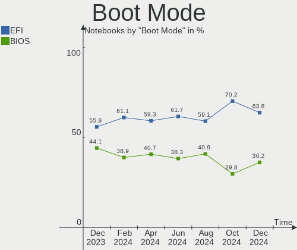
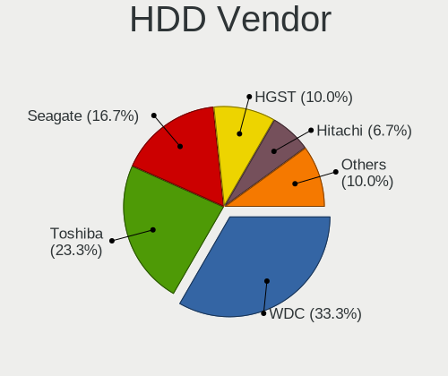
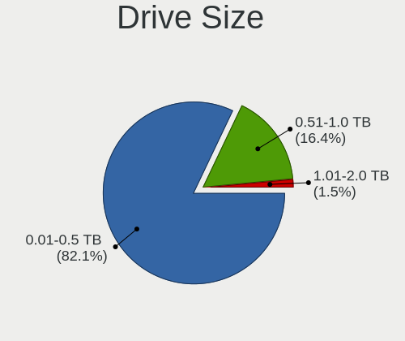
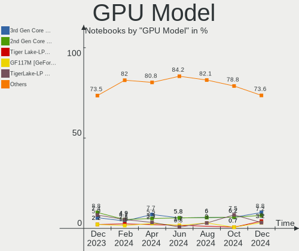
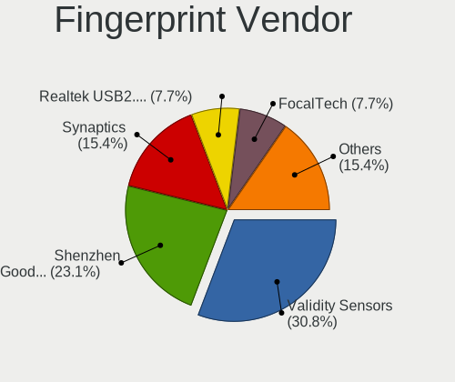

ROSA Hardware Trends (Notebook)
-------------------------------

A project to identify most popular hardware characteristics and track their change
over time based on data collected by ROSA users at https://Linux-Hardware.org.

Anyone can contribute to the study by uploading probes of their computers by
the [hw-probe](https://github.com/linuxhw/hw-probe) tool:

    sudo -E hw-probe -all -upload

Full-feature report is available here: https://linux-hardware.org/?view=trends&formfactor=notebook

Period: May, 2021.

Contents
--------

- [ OS                       ](#os)
- [ OS Family                ](#os-family)
- [ Kernel                   ](#kernel)
- [ Kernel Family            ](#kernel-family)
- [ Kernel Major Ver.        ](#kernel-major-ver)
- [ Arch                     ](#arch)
- [ DE                       ](#de)
- [ Display Server           ](#display-server)
- [ Display Manager          ](#display-manager)
- [ OS Lang                  ](#os-lang)
- [ Boot Mode                ](#boot-mode)
- [ Filesystem               ](#filesystem)
- [ Part. scheme             ](#part-scheme)
- [ Dual Boot with Linux/BSD ](#dual-boot-with-linux/bsd)
- [ Dual Boot (Win)          ](#dual-boot-win)
- [ Country                  ](#country)
- [ City                     ](#city)
- [ Vendor                   ](#vendor)
- [ Model                    ](#model)
- [ Model Family             ](#model-family)
- [ MFG Year                 ](#mfg-year)
- [ Form Factor              ](#form-factor)
- [ Secure Boot              ](#secure-boot)
- [ Coreboot                 ](#coreboot)
- [ RAM Size                 ](#ram-size)
- [ RAM Used                 ](#ram-used)
- [ Has CD-ROM               ](#has-cd-rom)
- [ Total Drives             ](#total-drives)
- [ Has Ethernet             ](#has-ethernet)
- [ Has WiFi                 ](#has-wifi)
- [ Has Bluetooth            ](#has-bluetooth)
- [ Drive Vendor             ](#drive-vendor)
- [ Drive Model              ](#drive-model)
- [ HDD Vendor               ](#hdd-vendor)
- [ SSD Vendor               ](#ssd-vendor)
- [ Drive Kind               ](#drive-kind)
- [ Drive Connector          ](#drive-connector)
- [ Drive Size               ](#drive-size)
- [ Space Total              ](#space-total)
- [ Space Used               ](#space-used)
- [ Malfunc. Drives          ](#malfunc-drives)
- [ Malfunc. Drive Vendor    ](#malfunc-drive-vendor)
- [ Malfunc. HDD Vendor      ](#malfunc-hdd-vendor)
- [ Malfunc. Drive Kind      ](#malfunc-drive-kind)
- [ Failed Drives            ](#failed-drives)
- [ Failed Drive Vendor      ](#failed-drive-vendor)
- [ Drive Status             ](#drive-status)
- [ Storage Vendor           ](#storage-vendor)
- [ Storage Model            ](#storage-model)
- [ Storage Kind             ](#storage-kind)
- [ CPU Vendor               ](#cpu-vendor)
- [ CPU Model                ](#cpu-model)
- [ CPU Model Family         ](#cpu-model-family)
- [ CPU Cores                ](#cpu-cores)
- [ CPU Sockets              ](#cpu-sockets)
- [ CPU Threads              ](#cpu-threads)
- [ CPU Op-Modes             ](#cpu-op-modes)
- [ CPU Microcode            ](#cpu-microcode)
- [ CPU Microarch            ](#cpu-microarch)
- [ GPU Vendor               ](#gpu-vendor)
- [ GPU Model                ](#gpu-model)
- [ GPU Combo                ](#gpu-combo)
- [ GPU Driver               ](#gpu-driver)
- [ GPU Memory               ](#gpu-memory)
- [ Monitor Vendor           ](#monitor-vendor)
- [ Monitor Model            ](#monitor-model)
- [ Monitor Resolution       ](#monitor-resolution)
- [ Monitor Diagonal         ](#monitor-diagonal)
- [ Monitor Width            ](#monitor-width)
- [ Aspect Ratio             ](#aspect-ratio)
- [ Monitor Area             ](#monitor-area)
- [ Pixel Density            ](#pixel-density)
- [ Multiple Monitors        ](#multiple-monitors)
- [ Net Controller Vendor    ](#net-controller-vendor)
- [ Net Controller Model     ](#net-controller-model)
- [ Wireless Vendor          ](#wireless-vendor)
- [ Wireless Model           ](#wireless-model)
- [ Ethernet Vendor          ](#ethernet-vendor)
- [ Ethernet Model           ](#ethernet-model)
- [ Net Controller Kind      ](#net-controller-kind)
- [ Used Controller          ](#used-controller)
- [ NICs                     ](#nics)
- [ IPv6                     ](#ipv6)
- [ Memory Vendor            ](#memory-vendor)
- [ Memory Model             ](#memory-model)
- [ Memory Kind              ](#memory-kind)
- [ Memory Form Factor       ](#memory-form-factor)
- [ Memory Size              ](#memory-size)
- [ Memory Speed             ](#memory-speed)
- [ Sound Vendor             ](#sound-vendor)
- [ Sound Model              ](#sound-model)
- [ Camera Vendor            ](#camera-vendor)
- [ Camera Model             ](#camera-model)
- [ Fingerprint Vendor       ](#fingerprint-vendor)
- [ Fingerprint Model        ](#fingerprint-model)
- [ Chipcard Vendor          ](#chipcard-vendor)
- [ Chipcard Model           ](#chipcard-model)
- [ Printer Vendor           ](#printer-vendor)
- [ Printer Model            ](#printer-model)
- [ Scanner Vendor           ](#scanner-vendor)
- [ Scanner Model            ](#scanner-model)
- [ Bluetooth Vendor         ](#bluetooth-vendor)
- [ Bluetooth Model          ](#bluetooth-model)
- [ Unsupported Devices      ](#unsupported-devices)
- [ Unsupported Device Types ](#unsupported-device-types)

OS
--

Installed operating systems

| Name         | Notebooks | Percent |
|--------------|-----------|---------|
| ROSA R11.1   | 62        | 88.57%  |
| ROSA R8.1    | 2         | 2.86%   |
| ROSA R12     | 2         | 2.86%   |
| ROSA R11     | 2         | 2.86%   |
| ROSA R10     | 1         | 1.43%   |
| ROSA 2019.05 | 1         | 1.43%   |

OS Family
---------

OS without a version

| Name | Notebooks | Percent |
|------|-----------|---------|
| ROSA | 70        | 100%    |

Kernel
------

Version of the Linux kernel

| Version                             | Notebooks | Percent |
|-------------------------------------|-----------|---------|
| 5.4.32-generic-2rosa-x86_64         | 21        | 30%     |
| 5.4.83-generic-2rosa-x86_64         | 18        | 25.71%  |
| 5.4.83-generic-2rosa-i586           | 7         | 10%     |
| 4.15.0-desktop-122.124.1rosa-x86_64 | 7         | 10%     |
| 5.4.32-generic-2rosa-i586           | 5         | 7.14%   |
| 5.10.31-generic-1rosa-x86_64        | 2         | 2.86%   |
| 4.9.155-nrj-desktop-1rosa-x86_64    | 2         | 2.86%   |
| 5.4.60-nickel-5rosa2019.05-x86_64   | 1         | 1.43%   |
| 5.10.35-generic-2rosa2019.1-x86_64  | 1         | 1.43%   |
| 5.10.34-generic-1rosa2019.1-x86_64  | 1         | 1.43%   |
| 4.9.9-nrj-desktop-1rosa-x86_64      | 1         | 1.43%   |
| 4.9.60-nrj-desktop-1rosa-i586       | 1         | 1.43%   |
| 4.15.0-desktop-68.5rosa-x86_64      | 1         | 1.43%   |
| 4.15.0-desktop-45.1rosa-x86_64      | 1         | 1.43%   |
| 4.15.0-desktop-45.1rosa-i586        | 1         | 1.43%   |

Kernel Family
-------------

Linux kernel without a distro release

| Version | Notebooks | Percent |
|---------|-----------|---------|
| 5.4.32  | 26        | 37.14%  |
| 5.4.83  | 25        | 35.71%  |
| 4.15.0  | 10        | 14.29%  |
| 5.10.31 | 2         | 2.86%   |
| 4.9.155 | 2         | 2.86%   |
| 5.4.60  | 1         | 1.43%   |
| 5.10.35 | 1         | 1.43%   |
| 5.10.34 | 1         | 1.43%   |
| 4.9.9   | 1         | 1.43%   |
| 4.9.60  | 1         | 1.43%   |

Kernel Major Ver.
-----------------

Linux kernel major version

| Version | Notebooks | Percent |
|---------|-----------|---------|
| 5.4     | 52        | 74.29%  |
| 4.15    | 10        | 14.29%  |
| 5.10    | 4         | 5.71%   |
| 4.9     | 4         | 5.71%   |

Arch
----

OS architecture (x86_64, i586, etc.)

| Name   | Notebooks | Percent |
|--------|-----------|---------|
| x86_64 | 56        | 80%     |
| i686   | 14        | 20%     |

DE
--

Desktop Environment

| Name    | Notebooks | Percent |
|---------|-----------|---------|
| KDE4    | 39        | 55.71%  |
| KDE5    | 24        | 34.29%  |
| LXQt    | 4         | 5.71%   |
| XFCE    | 2         | 2.86%   |
| Unknown | 1         | 1.43%   |

Display Server
--------------

X11 or Wayland

| Name | Notebooks | Percent |
|------|-----------|---------|
| X11  | 70        | 100%    |

Display Manager
---------------

SDDM, LightDM, etc.

| Name | Notebooks | Percent |
|------|-----------|---------|
| KDM  | 39        | 55.71%  |
| SDDM | 31        | 44.29%  |

OS Lang
-------

Language

| Lang    | Notebooks | Percent |
|---------|-----------|---------|
| ru_RU   | 58        | 82.86%  |
| Unknown | 5         | 7.14%   |
| pl_PL   | 1         | 1.43%   |
| it_IT   | 1         | 1.43%   |
| fr_FR   | 1         | 1.43%   |
| es_ES   | 1         | 1.43%   |
| en_US   | 1         | 1.43%   |
| en_GB   | 1         | 1.43%   |
| de_DE   | 1         | 1.43%   |

Boot Mode
---------

EFI or BIOS

| Mode | Notebooks | Percent |
|------|-----------|---------|
| BIOS | 51        | 72.86%  |
| EFI  | 19        | 27.14%  |

Filesystem
----------

Type of filesystem

| Type | Notebooks | Percent |
|------|-----------|---------|
| Ext4 | 69        | 98.57%  |
| Ext3 | 1         | 1.43%   |

Part. scheme
------------

Scheme of partitioning

| Type    | Notebooks | Percent |
|---------|-----------|---------|
| MBR     | 47        | 67.14%  |
| GPT     | 22        | 31.43%  |
| Unknown | 1         | 1.43%   |

Dual Boot with Linux/BSD
------------------------

Hosting more than one Linux/BSD

| Dual boot | Notebooks | Percent |
|-----------|-----------|---------|
| No        | 56        | 80%     |
| Yes       | 14        | 20%     |

Dual Boot (Win)
---------------

Hosting Linux and Windows

| Dual boot | Notebooks | Percent |
|-----------|-----------|---------|
| Yes       | 36        | 51.43%  |
| No        | 34        | 48.57%  |

Country
-------

Geographic location (country)

| Country   | Notebooks | Percent |
|-----------|-----------|---------|
| Russia    | 54        | 77.14%  |
| Ukraine   | 6         | 8.57%   |
| Italy     | 3         | 4.29%   |
| USA       | 1         | 1.43%   |
| Uruguay   | 1         | 1.43%   |
| Poland    | 1         | 1.43%   |
| Germany   | 1         | 1.43%   |
| Finland   | 1         | 1.43%   |
| Canada    | 1         | 1.43%   |
| Australia | 1         | 1.43%   |

City
----

Geographic location (city)

| City                 | Notebooks | Percent |
|----------------------|-----------|---------|
| Moscow               | 10        | 14.29%  |
| St Petersburg        | 5         | 7.14%   |
| Srednyaya Akhtuba    | 3         | 4.29%   |
| Rostov-on-Don        | 3         | 4.29%   |
| Novosibirsk          | 3         | 4.29%   |
| Penza                | 2         | 2.86%   |
| Zarechnyy            | 1         | 1.43%   |
| Weinsberg            | 1         | 1.43%   |
| Voronezh             | 1         | 1.43%   |
| Vladikavkaz          | 1         | 1.43%   |
| Tula                 | 1         | 1.43%   |
| Sydney               | 1         | 1.43%   |
| Surgut               | 1         | 1.43%   |
| Sorel-Tracy          | 1         | 1.43%   |
| Seversk              | 1         | 1.43%   |
| Scano di Montiferro  | 1         | 1.43%   |
| Pskov                | 1         | 1.43%   |
| Pittsburgh           | 1         | 1.43%   |
| Petrozavodsk         | 1         | 1.43%   |
| Petergof             | 1         | 1.43%   |
| Pavlovskiy Posad     | 1         | 1.43%   |
| Odessa               | 1         | 1.43%   |
| Nyagan               | 1         | 1.43%   |
| Novokuznetsk         | 1         | 1.43%   |
| Mytishchi            | 1         | 1.43%   |
| Mykytyn Rog          | 1         | 1.43%   |
| Montevideo           | 1         | 1.43%   |
| Mala Danylivka       | 1         | 1.43%   |
| Lyubertsy            | 1         | 1.43%   |
| Kstovo               | 1         | 1.43%   |
| Krasnodar            | 1         | 1.43%   |
| Komsomolsk-on-Amur   | 1         | 1.43%   |
| Kirov                | 1         | 1.43%   |
| Kielce               | 1         | 1.43%   |
| Kargat               | 1         | 1.43%   |
| Kaliningrad          | 1         | 1.43%   |
| Jyväskylä          | 1         | 1.43%   |
| Ivanovo              | 1         | 1.43%   |
| Fryazino             | 1         | 1.43%   |
| Florence             | 1         | 1.43%   |
| Engel's              | 1         | 1.43%   |
| Elista               | 1         | 1.43%   |
| Donetsk              | 1         | 1.43%   |
| Dnipropetrovsk       | 1         | 1.43%   |
| Chernihiv            | 1         | 1.43%   |
| Carmignano di Brenta | 1         | 1.43%   |
| Blagoveshchensk      | 1         | 1.43%   |
| Barnaul              | 1         | 1.43%   |
| Balakovo             | 1         | 1.43%   |
| Astrakhan            | 1         | 1.43%   |

Vendor
------

Motherboard manufacturer

| Name                | Notebooks | Percent |
|---------------------|-----------|---------|
| Lenovo              | 14        | 20%     |
| Hewlett-Packard     | 12        | 17.14%  |
| Acer                | 12        | 17.14%  |
| ASUSTek Computer    | 9         | 12.86%  |
| Samsung Electronics | 4         | 5.71%   |
| Dell                | 4         | 5.71%   |
| Toshiba             | 3         | 4.29%   |
| Sony                | 2         | 2.86%   |
| MSI                 | 2         | 2.86%   |
| Packard Bell        | 1         | 1.43%   |
| Notebook            | 1         | 1.43%   |
| Intel               | 1         | 1.43%   |
| ICL                 | 1         | 1.43%   |
| eMachines           | 1         | 1.43%   |
| Clevo               | 1         | 1.43%   |
| Apple               | 1         | 1.43%   |
| Alienware           | 1         | 1.43%   |

Model
-----

Motherboard model

| Name                                       | Notebooks | Percent |
|--------------------------------------------|-----------|---------|
| Lenovo IdeaPad 5 15ARE05 81YQ              | 2         | 2.86%   |
| HP Pavilion g6                             | 2         | 2.86%   |
| Toshiba Satellite Pro U300                 | 1         | 1.43%   |
| Toshiba Satellite L755D                    | 1         | 1.43%   |
| Toshiba Satellite L750                     | 1         | 1.43%   |
| Sony VPCEA47EC                             | 1         | 1.43%   |
| Sony VGN-FS415MR                           | 1         | 1.43%   |
| Samsung R540/SA41/E452                     | 1         | 1.43%   |
| Samsung R530/R730/R540                     | 1         | 1.43%   |
| Samsung R528/R728                          | 1         | 1.43%   |
| Samsung 300V3A/300V4A/300V5A/200A4B/200A5B | 1         | 1.43%   |
| Packard Bell EasyNote TJ65                 | 1         | 1.43%   |
| Notebook W65_67SR                          | 1         | 1.43%   |
| MSI X370                                   | 1         | 1.43%   |
| MSI GP60 2PE                               | 1         | 1.43%   |
| Lenovo ThinkPad W530 24382TG               | 1         | 1.43%   |
| Lenovo ThinkPad T60p 200793G               | 1         | 1.43%   |
| Lenovo ThinkPad T400 6475VAU               | 1         | 1.43%   |
| Lenovo Lenovo                              | 1         | 1.43%   |
| Lenovo Legion Y7000 2019 81NS              | 1         | 1.43%   |
| Lenovo IdeaPad 300-15IBR 80M3              | 1         | 1.43%   |
| Lenovo G770 1037                           | 1         | 1.43%   |
| Lenovo G570 20079                          | 1         | 1.43%   |
| Lenovo G560 20042                          | 1         | 1.43%   |
| Lenovo G500 20236                          | 1         | 1.43%   |
| Lenovo E10-30 20424                        | 1         | 1.43%   |
| Lenovo B50-70 20384                        | 1         | 1.43%   |
| Intel Intel powered classmate PC           | 1         | 1.43%   |
| ICL RAYbook Bi1504                         | 1         | 1.43%   |
| HP ProBook 6570b                           | 1         | 1.43%   |
| HP Pavilion m6                             | 1         | 1.43%   |
| HP Pavilion 17                             | 1         | 1.43%   |
| HP Notebook                                | 1         | 1.43%   |
| HP Mini 210-1100                           | 1         | 1.43%   |
| HP Mini 210-1000                           | 1         | 1.43%   |
| HP Laptop 17-by3xxx                        | 1         | 1.43%   |
| HP Laptop 15-db1xxx                        | 1         | 1.43%   |
| HP Laptop 15-db0xxx                        | 1         | 1.43%   |
| HP 655                                     | 1         | 1.43%   |
| eMachines E725                             | 1         | 1.43%   |
| Dell Vostro 1510                           | 1         | 1.43%   |
| Dell Vostro 15-3568                        | 1         | 1.43%   |
| Dell Inspiron N5110                        | 1         | 1.43%   |
| Dell Inspiron N5050                        | 1         | 1.43%   |
| Clevo W240BU                               | 1         | 1.43%   |
| ASUS X75VD1                                | 1         | 1.43%   |
| ASUS X553MA                                | 1         | 1.43%   |
| ASUS X550CL                                | 1         | 1.43%   |
| ASUS X201EP                                | 1         | 1.43%   |
| ASUS VivoBook 15_ASUS Laptop X540MB_D540MB | 1         | 1.43%   |
| ASUS K55VD                                 | 1         | 1.43%   |
| ASUS K50AB                                 | 1         | 1.43%   |
| ASUS F5V                                   | 1         | 1.43%   |
| ASUS 1011PX                                | 1         | 1.43%   |
| Apple MacBookAir3,1                        | 1         | 1.43%   |
| Alienware 17                               | 1         | 1.43%   |
| Acer TravelMate 5744Z                      | 1         | 1.43%   |
| Acer P5WE0                                 | 1         | 1.43%   |
| Acer Extensa 5620                          | 1         | 1.43%   |
| Acer Aspire VX5-591G                       | 1         | 1.43%   |

Model Family
------------

Motherboard model prefix

| Name                  | Notebooks | Percent |
|-----------------------|-----------|---------|
| Acer Aspire           | 7         | 10%     |
| HP Pavilion           | 4         | 5.71%   |
| Toshiba Satellite     | 3         | 4.29%   |
| Lenovo ThinkPad       | 3         | 4.29%   |
| Lenovo IdeaPad        | 3         | 4.29%   |
| HP Laptop             | 3         | 4.29%   |
| HP Mini               | 2         | 2.86%   |
| Dell Vostro           | 2         | 2.86%   |
| Dell Inspiron         | 2         | 2.86%   |
| Sony VPCEA47EC        | 1         | 1.43%   |
| Sony VGN-FS415MR      | 1         | 1.43%   |
| Samsung R540          | 1         | 1.43%   |
| Samsung R530          | 1         | 1.43%   |
| Samsung R528          | 1         | 1.43%   |
| Samsung 300V3A        | 1         | 1.43%   |
| Packard Bell EasyNote | 1         | 1.43%   |
| Notebook W65          | 1         | 1.43%   |
| MSI X370              | 1         | 1.43%   |
| MSI GP60              | 1         | 1.43%   |
| Lenovo Lenovo         | 1         | 1.43%   |
| Lenovo Legion         | 1         | 1.43%   |
| Lenovo G770           | 1         | 1.43%   |
| Lenovo G570           | 1         | 1.43%   |
| Lenovo G560           | 1         | 1.43%   |
| Lenovo G500           | 1         | 1.43%   |
| Lenovo E10-30         | 1         | 1.43%   |
| Lenovo B50-70         | 1         | 1.43%   |
| Intel Intel           | 1         | 1.43%   |
| ICL RAYbook           | 1         | 1.43%   |
| HP ProBook            | 1         | 1.43%   |
| HP Notebook           | 1         | 1.43%   |
| HP 655                | 1         | 1.43%   |
| eMachines E725        | 1         | 1.43%   |
| Clevo W240BU          | 1         | 1.43%   |
| ASUS X75VD1           | 1         | 1.43%   |
| ASUS X553MA           | 1         | 1.43%   |
| ASUS X550CL           | 1         | 1.43%   |
| ASUS X201EP           | 1         | 1.43%   |
| ASUS VivoBook         | 1         | 1.43%   |
| ASUS K55VD            | 1         | 1.43%   |
| ASUS K50AB            | 1         | 1.43%   |
| ASUS F5V              | 1         | 1.43%   |
| ASUS 1011PX           | 1         | 1.43%   |
| Apple MacBookAir3     | 1         | 1.43%   |
| Alienware 17          | 1         | 1.43%   |
| Acer TravelMate       | 1         | 1.43%   |
| Acer P5WE0            | 1         | 1.43%   |
| Acer Extensa          | 1         | 1.43%   |
| Acer AO722            | 1         | 1.43%   |
| Acer AO532h           | 1         | 1.43%   |

MFG Year
--------

Motherboard manufacture year

| Year | Notebooks | Percent |
|------|-----------|---------|
| 2012 | 10        | 14.29%  |
| 2011 | 9         | 12.86%  |
| 2010 | 9         | 12.86%  |
| 2013 | 8         | 11.43%  |
| 2019 | 6         | 8.57%   |
| 2020 | 5         | 7.14%   |
| 2014 | 5         | 7.14%   |
| 2009 | 5         | 7.14%   |
| 2018 | 2         | 2.86%   |
| 2017 | 2         | 2.86%   |
| 2008 | 2         | 2.86%   |
| 2007 | 2         | 2.86%   |
| 2021 | 1         | 1.43%   |
| 2016 | 1         | 1.43%   |
| 2015 | 1         | 1.43%   |
| 2006 | 1         | 1.43%   |
| 2005 | 1         | 1.43%   |

Form Factor
-----------

Physical design of the computer

| Name     | Notebooks | Percent |
|----------|-----------|---------|
| Notebook | 70        | 100%    |

Secure Boot
-----------

Enabled or disabled

| State    | Notebooks | Percent |
|----------|-----------|---------|
| Disabled | 70        | 100%    |

Coreboot
--------

Have coreboot on board

| Used | Notebooks | Percent |
|------|-----------|---------|
| No   | 70        | 100%    |

RAM Size
--------

Total RAM memory

| Size in GB | Notebooks | Percent |
|------------|-----------|---------|
| 3.01-4.0   | 20        | 28.57%  |
| 1.01-2.0   | 16        | 22.86%  |
| 4.01-8.0   | 14        | 20%     |
| 8.01-16.0  | 9         | 12.86%  |
| 2.01-3.0   | 7         | 10%     |
| 16.01-24.0 | 3         | 4.29%   |
| 0.51-1.0   | 1         | 1.43%   |

RAM Used
--------

Used RAM memory

| Used GB  | Notebooks | Percent |
|----------|-----------|---------|
| 1.01-2.0 | 31        | 44.29%  |
| 0.51-1.0 | 29        | 41.43%  |
| 2.01-3.0 | 6         | 8.57%   |
| 3.01-4.0 | 3         | 4.29%   |
| 0.01-0.5 | 1         | 1.43%   |

Has CD-ROM
----------

Has CD-ROM on board

| Presented | Notebooks | Percent |
|-----------|-----------|---------|
| Yes       | 36        | 51.43%  |
| No        | 34        | 48.57%  |

Total Drives
------------

Number of drives on board

| Drives | Notebooks | Percent |
|--------|-----------|---------|
| 1      | 51        | 72.86%  |
| 2      | 15        | 21.43%  |
| 3      | 2         | 2.86%   |
| 0      | 2         | 2.86%   |

Has Ethernet
------------

Has Ethernet on board

| Presented | Notebooks | Percent |
|-----------|-----------|---------|
| Yes       | 66        | 94.29%  |
| No        | 4         | 5.71%   |

Has WiFi
--------

Has WiFi module

| Presented | Notebooks | Percent |
|-----------|-----------|---------|
| Yes       | 68        | 97.14%  |
| No        | 2         | 2.86%   |

Has Bluetooth
-------------

Has Bluetooth module

| Presented | Notebooks | Percent |
|-----------|-----------|---------|
| Yes       | 40        | 57.14%  |
| No        | 30        | 42.86%  |

Drive Vendor
------------

Hard drive vendors

| Vendor              | Notebooks | Drives | Percent |
|---------------------|-----------|--------|---------|
| WDC                 | 16        | 16     | 19.75%  |
| Seagate             | 12        | 12     | 14.81%  |
| Hitachi             | 10        | 10     | 12.35%  |
| Toshiba             | 8         | 8      | 9.88%   |
| Kingston            | 4         | 4      | 4.94%   |
| HGST                | 3         | 3      | 3.7%    |
| Crucial             | 3         | 3      | 3.7%    |
| Unknown             | 2         | 2      | 2.47%   |
| SPCC                | 2         | 2      | 2.47%   |
| Solid State Storage | 2         | 2      | 2.47%   |
| Samsung Electronics | 2         | 2      | 2.47%   |
| Intel               | 2         | 2      | 2.47%   |
| Fujitsu             | 2         | 2      | 2.47%   |
| XrayDisk            | 1         | 1      | 1.23%   |
| Smartbuy            | 1         | 1      | 1.23%   |
| SK Hynix            | 1         | 1      | 1.23%   |
| PLEXTOR             | 1         | 1      | 1.23%   |
| OCZ                 | 1         | 1      | 1.23%   |
| Netac               | 1         | 1      | 1.23%   |
| LITEONIT            | 1         | 1      | 1.23%   |
| GOODRAM             | 1         | 1      | 1.23%   |
| DeTech              | 1         | 1      | 1.23%   |
| China               | 1         | 1      | 1.23%   |
| Apple               | 1         | 1      | 1.23%   |
| Apacer              | 1         | 1      | 1.23%   |
| AMD                 | 1         | 1      | 1.23%   |

Drive Model
-----------

Hard drive models

| Model                                     | Notebooks | Percent |
|-------------------------------------------|-----------|---------|
| Crucial CT240BX500SSD1 240GB              | 3         | 3.7%    |
| WDC WD7500BPVT-24HXZT1 752GB              | 2         | 2.47%   |
| Seagate ST9500325AS 500GB                 | 2         | 2.47%   |
| Seagate ST9320325AS 320GB                 | 2         | 2.47%   |
| Seagate ST9250315AS 250GB                 | 2         | 2.47%   |
| Seagate ST500LT012-1DG142 500GB           | 2         | 2.47%   |
| Hitachi HTS547550A9E384 500GB             | 2         | 2.47%   |
| Hitachi HTS545032B9A300 320GB             | 2         | 2.47%   |
| XrayDisk SSD 240GB                        | 1         | 1.23%   |
| WDC WDS250G2B0A-00SM50 250GB SSD          | 1         | 1.23%   |
| WDC WDS120G2G0A-00JH30 120GB SSD          | 1         | 1.23%   |
| WDC WD7500BPKX-75HPJT0 752GB              | 1         | 1.23%   |
| WDC WD5000LPCX-24C6HT0 500GB              | 1         | 1.23%   |
| WDC WD5000LPCX-22VHAT0 500GB              | 1         | 1.23%   |
| WDC WD5000BPKT-75PK4T0 500GB              | 1         | 1.23%   |
| WDC WD3200LPCX-24C6HT0 320GB              | 1         | 1.23%   |
| WDC WD3200BPVT-80JJ5T0 320GB              | 1         | 1.23%   |
| WDC WD3200BPVT-24JJ5T0 320GB              | 1         | 1.23%   |
| WDC WD3200BPVT-22JJ5T0 320GB              | 1         | 1.23%   |
| WDC WD1200BEVS-00UST0 120GB               | 1         | 1.23%   |
| WDC WD10SPZX-00Z10T0 1TB                  | 1         | 1.23%   |
| WDC WD10JPVX-22JC3T0 1TB                  | 1         | 1.23%   |
| WDC PC SN520 SDAPNUW-512G-1006 512GB      | 1         | 1.23%   |
| Unknown SS08G  8GB                        | 1         | 1.23%   |
| Unknown NVMe SSD Drive 512GB              | 1         | 1.23%   |
| Toshiba MQ01ACF032 320GB                  | 1         | 1.23%   |
| Toshiba MQ01ABD050 500GB                  | 1         | 1.23%   |
| Toshiba MQ01ABD032 320GB                  | 1         | 1.23%   |
| Toshiba MK6475GSX 640GB                   | 1         | 1.23%   |
| Toshiba MK3259GSXP 320GB                  | 1         | 1.23%   |
| Toshiba MK2556GSY 250GB                   | 1         | 1.23%   |
| Toshiba MK2555GSX 250GB                   | 1         | 1.23%   |
| Toshiba HDWL110 1TB                       | 1         | 1.23%   |
| SPCC Solid State Disk 512GB               | 1         | 1.23%   |
| SPCC Solid State Disk 128GB               | 1         | 1.23%   |
| Solid State Storage SSSTC CL1-4D512 512GB | 1         | 1.23%   |
| Solid State Storage SSSTC CL1-4D256 256GB | 1         | 1.23%   |
| Smartbuy SSD 120GB                        | 1         | 1.23%   |
| SK Hynix BC511 HFM256GDJTNI-82A0A 256GB   | 1         | 1.23%   |
| Seagate ST9160821AS 160GB                 | 1         | 1.23%   |
| Seagate ST500LT012-9WS142 500GB           | 1         | 1.23%   |
| Seagate ST320LT020-9YG142 320GB           | 1         | 1.23%   |
| Seagate ST1000LM024 HN-M101MBB 1TB        | 1         | 1.23%   |
| Samsung MZNLN256HAJQ-000H1 256GB SSD      | 1         | 1.23%   |
| Samsung HM250HI 250GB                     | 1         | 1.23%   |
| PLEXTOR PX-256M6S 256GB SSD               | 1         | 1.23%   |
| OCZ VERTEX4 128GB SSD                     | 1         | 1.23%   |
| Netac SSD 480GB                           | 1         | 1.23%   |
| LITEONIT LMN-256M3M mSATA 256GB SSD       | 1         | 1.23%   |
| Kingston SV300S37A60G 64GB SSD            | 1         | 1.23%   |
| Kingston SUV400S37120G 120GB SSD          | 1         | 1.23%   |
| Kingston SH103S3120G 120GB SSD            | 1         | 1.23%   |
| Kingston RBUSC180DS37128GJ 128GB SSD      | 1         | 1.23%   |
| Intel SSDSC2BW120A4 120GB                 | 1         | 1.23%   |
| Intel SSDPEKKW256G7 256GB                 | 1         | 1.23%   |
| Hitachi HTS722020K9SA00 FDE 200GB         | 1         | 1.23%   |
| Hitachi HTS721010G9SA00 100GB             | 1         | 1.23%   |
| Hitachi HTS547575A9E384 752GB             | 1         | 1.23%   |
| Hitachi HTS547564A9E384 640GB             | 1         | 1.23%   |
| Hitachi HTS545050A7E380 500GB             | 1         | 1.23%   |

HDD Vendor
----------

Hard disk drive vendors

| Vendor              | Notebooks | Drives | Percent |
|---------------------|-----------|--------|---------|
| WDC                 | 13        | 13     | 26.53%  |
| Seagate             | 12        | 12     | 24.49%  |
| Hitachi             | 10        | 10     | 20.41%  |
| Toshiba             | 8         | 8      | 16.33%  |
| HGST                | 3         | 3      | 6.12%   |
| Fujitsu             | 2         | 2      | 4.08%   |
| Samsung Electronics | 1         | 1      | 2.04%   |

SSD Vendor
----------

Solid state drive vendors

| Vendor              | Notebooks | Drives | Percent |
|---------------------|-----------|--------|---------|
| Kingston            | 4         | 4      | 16%     |
| Crucial             | 3         | 3      | 12%     |
| WDC                 | 2         | 2      | 8%      |
| SPCC                | 2         | 2      | 8%      |
| XrayDisk            | 1         | 1      | 4%      |
| Smartbuy            | 1         | 1      | 4%      |
| Samsung Electronics | 1         | 1      | 4%      |
| PLEXTOR             | 1         | 1      | 4%      |
| OCZ                 | 1         | 1      | 4%      |
| Netac               | 1         | 1      | 4%      |
| LITEONIT            | 1         | 1      | 4%      |
| Intel               | 1         | 1      | 4%      |
| GOODRAM             | 1         | 1      | 4%      |
| DeTech              | 1         | 1      | 4%      |
| China               | 1         | 1      | 4%      |
| Apple               | 1         | 1      | 4%      |
| Apacer              | 1         | 1      | 4%      |
| AMD                 | 1         | 1      | 4%      |

Drive Kind
----------

HDD or SSD

| Kind | Notebooks | Drives | Percent |
|------|-----------|--------|---------|
| HDD  | 49        | 49     | 60.49%  |
| SSD  | 25        | 25     | 30.86%  |
| NVMe | 6         | 6      | 7.41%   |
| MMC  | 1         | 1      | 1.23%   |

Drive Connector
---------------

SATA, SAS, NVMe, etc.

| Type | Notebooks | Drives | Percent |
|------|-----------|--------|---------|
| SATA | 63        | 74     | 90%     |
| NVMe | 6         | 6      | 8.57%   |
| MMC  | 1         | 1      | 1.43%   |

Drive Size
----------

Size of hard drive

| Size in TB | Notebooks | Drives | Percent |
|------------|-----------|--------|---------|
| 0.01-0.5   | 55        | 62     | 82.09%  |
| 0.51-1.0   | 12        | 12     | 17.91%  |

Space Total
-----------

Amount of disk space available on the file system

| Size in GB     | Notebooks | Percent |
|----------------|-----------|---------|
| 251-500        | 18        | 25.71%  |
| 101-250        | 18        | 25.71%  |
| 51-100         | 13        | 18.57%  |
| 1-20           | 10        | 14.29%  |
| 21-50          | 6         | 8.57%   |
| 501-1000       | 3         | 4.29%   |
| More than 3000 | 1         | 1.43%   |
| 2001-3000      | 1         | 1.43%   |

Space Used
----------

Amount of used disk space

| Used GB        | Notebooks | Percent |
|----------------|-----------|---------|
| 1-20           | 56        | 80%     |
| 21-50          | 4         | 5.71%   |
| 101-250        | 4         | 5.71%   |
| 51-100         | 4         | 5.71%   |
| More than 3000 | 1         | 1.43%   |
| 1001-2000      | 1         | 1.43%   |

Malfunc. Drives
---------------

Drive models with a malfunction

| Model                                   | Notebooks | Drives | Percent |
|-----------------------------------------|-----------|--------|---------|
| Seagate ST9500325AS 500GB               | 2         | 2      | 6.9%    |
| Hitachi HTS547550A9E384 500GB           | 2         | 2      | 6.9%    |
| Hitachi HTS545032B9A300 320GB           | 2         | 2      | 6.9%    |
| WDC WDS120G2G0A-00JH30 120GB SSD        | 1         | 1      | 3.45%   |
| WDC WD7500BPVT-24HXZT1 752GB            | 1         | 1      | 3.45%   |
| Toshiba MQ01ABD050 500GB                | 1         | 1      | 3.45%   |
| Toshiba MK6475GSX 640GB                 | 1         | 1      | 3.45%   |
| Toshiba MK2556GSY 250GB                 | 1         | 1      | 3.45%   |
| SK Hynix BC511 HFM256GDJTNI-82A0A 256GB | 1         | 1      | 3.45%   |
| Seagate ST9320325AS 320GB               | 1         | 1      | 3.45%   |
| Seagate ST9250315AS 250GB               | 1         | 1      | 3.45%   |
| Seagate ST9160821AS 160GB               | 1         | 1      | 3.45%   |
| Seagate ST500LT012-9WS142 500GB         | 1         | 1      | 3.45%   |
| Seagate ST500LT012-1DG142 500GB         | 1         | 1      | 3.45%   |
| Seagate ST320LT020-9YG142 320GB         | 1         | 1      | 3.45%   |
| Seagate ST1000LM024 HN-M101MBB 1TB      | 1         | 1      | 3.45%   |
| PLEXTOR PX-256M6S 256GB SSD             | 1         | 1      | 3.45%   |
| LITEONIT LMN-256M3M mSATA 256GB SSD     | 1         | 1      | 3.45%   |
| Intel SSDPEKKW256G7 256GB               | 1         | 1      | 3.45%   |
| Hitachi HTS721010G9SA00 100GB           | 1         | 1      | 3.45%   |
| Hitachi HTS547575A9E384 752GB           | 1         | 1      | 3.45%   |
| Hitachi HTS547564A9E384 640GB           | 1         | 1      | 3.45%   |
| Hitachi HTS545050A7E380 500GB           | 1         | 1      | 3.45%   |
| HGST HTS545050A7E380 500GB              | 1         | 1      | 3.45%   |
| Fujitsu MHY2160BH 160GB                 | 1         | 1      | 3.45%   |
| Fujitsu MHV2080AT PL 80GB               | 1         | 1      | 3.45%   |

Malfunc. Drive Vendor
---------------------

Vendors of faulty drives

| Vendor   | Notebooks | Drives | Percent |
|----------|-----------|--------|---------|
| Seagate  | 9         | 9      | 31.03%  |
| Hitachi  | 8         | 8      | 27.59%  |
| Toshiba  | 3         | 3      | 10.34%  |
| WDC      | 2         | 2      | 6.9%    |
| Fujitsu  | 2         | 2      | 6.9%    |
| SK Hynix | 1         | 1      | 3.45%   |
| PLEXTOR  | 1         | 1      | 3.45%   |
| LITEONIT | 1         | 1      | 3.45%   |
| Intel    | 1         | 1      | 3.45%   |
| HGST     | 1         | 1      | 3.45%   |

Malfunc. HDD Vendor
-------------------

Vendors of faulty HDD drives

| Vendor  | Notebooks | Drives | Percent |
|---------|-----------|--------|---------|
| Seagate | 9         | 9      | 37.5%   |
| Hitachi | 8         | 8      | 33.33%  |
| Toshiba | 3         | 3      | 12.5%   |
| Fujitsu | 2         | 2      | 8.33%   |
| WDC     | 1         | 1      | 4.17%   |
| HGST    | 1         | 1      | 4.17%   |

Malfunc. Drive Kind
-------------------

Kinds of faulty drives

| Kind | Notebooks | Drives | Percent |
|------|-----------|--------|---------|
| HDD  | 24        | 24     | 82.76%  |
| SSD  | 3         | 3      | 10.34%  |
| NVMe | 2         | 2      | 6.9%    |

Failed Drives
-------------

Failed drive models

| Model                     | Notebooks | Drives | Percent |
|---------------------------|-----------|--------|---------|
| Toshiba MK2555GSX 250GB   | 1         | 1      | 33.33%  |
| Seagate ST9250315AS 250GB | 1         | 1      | 33.33%  |
| Apple SSD TS064C 64GB     | 1         | 1      | 33.33%  |

Failed Drive Vendor
-------------------

Failed drive vendors

| Vendor  | Notebooks | Drives | Percent |
|---------|-----------|--------|---------|
| Toshiba | 1         | 1      | 33.33%  |
| Seagate | 1         | 1      | 33.33%  |
| Apple   | 1         | 1      | 33.33%  |

Drive Status
------------

Number of failed and malfunc. drives

| Status   | Notebooks | Drives | Percent |
|----------|-----------|--------|---------|
| Works    | 40        | 47     | 54.05%  |
| Malfunc  | 29        | 29     | 39.19%  |
| Failed   | 3         | 3      | 4.05%   |
| Detected | 2         | 2      | 2.7%    |

Storage Vendor
--------------

Storage controller vendors

| Vendor                           | Notebooks | Percent |
|----------------------------------|-----------|---------|
| Intel                            | 52        | 70.27%  |
| AMD                              | 15        | 20.27%  |
| Solid State Storage Technology   | 2         | 2.7%    |
| Sandisk                          | 2         | 2.7%    |
| SK Hynix                         | 1         | 1.35%   |
| Silicon Integrated Systems [SiS] | 1         | 1.35%   |
| Nvidia                           | 1         | 1.35%   |

Storage Model
-------------

Storage controller models

| Model                                                                            | Notebooks | Percent |
|----------------------------------------------------------------------------------|-----------|---------|
| AMD FCH SATA Controller [AHCI mode]                                              | 11        | 13.25%  |
| Intel 7 Series Chipset Family 6-port SATA Controller [AHCI mode]                 | 8         | 9.64%   |
| Intel 6 Series/C200 Series Chipset Family 6 port Mobile SATA AHCI Controller     | 8         | 9.64%   |
| Intel 5 Series/3400 Series Chipset 4 port SATA AHCI Controller                   | 6         | 7.23%   |
| Intel NM10/ICH7 Family SATA Controller [AHCI mode]                               | 5         | 6.02%   |
| Intel 82801IBM/IEM (ICH9M/ICH9M-E) 4 port SATA Controller [AHCI mode]            | 4         | 4.82%   |
| Intel 82801HM/HEM (ICH8M/ICH8M-E) IDE Controller                                 | 3         | 3.61%   |
| AMD SB7x0/SB8x0/SB9x0 SATA Controller [AHCI mode]                                | 3         | 3.61%   |
| Solid State Storage Non-Volatile memory controller                               | 2         | 2.41%   |
| Intel Sunrise Point-LP SATA Controller [AHCI mode]                               | 2         | 2.41%   |
| Intel Celeron/Pentium Silver Processor SATA Controller                           | 2         | 2.41%   |
| Intel Atom Processor E3800 Series SATA AHCI Controller                           | 2         | 2.41%   |
| Intel 82801HM/HEM (ICH8M/ICH8M-E) SATA Controller [AHCI mode]                    | 2         | 2.41%   |
| Intel 82801GBM/GHM (ICH7-M Family) SATA Controller [AHCI mode]                   | 2         | 2.41%   |
| Intel 82801 Mobile SATA Controller [RAID mode]                                   | 2         | 2.41%   |
| Intel 8 Series/C220 Series Chipset Family 6-port SATA Controller 1 [AHCI mode]   | 2         | 2.41%   |
| SK Hynix BC511                                                                   | 1         | 1.2%    |
| Silicon Integrated Systems [SiS] SATA Controller / IDE mode                      | 1         | 1.2%    |
| Silicon Integrated Systems [SiS] 5513 IDE Controller                             | 1         | 1.2%    |
| Sandisk WD Blue SN500 / PC SN520 NVMe SSD                                        | 1         | 1.2%    |
| Sandisk WD Black SN750 / PC SN730 NVMe SSD                                       | 1         | 1.2%    |
| Nvidia MCP89 SATA Controller (AHCI mode)                                         | 1         | 1.2%    |
| Intel SSD 600P Series                                                            | 1         | 1.2%    |
| Intel NM10/ICH7 Family SATA Controller [IDE mode]                                | 1         | 1.2%    |
| Intel Mobile 4 Series Chipset PT IDER Controller                                 | 1         | 1.2%    |
| Intel HM170/QM170 Chipset SATA Controller [AHCI Mode]                            | 1         | 1.2%    |
| Intel Cannon Lake Mobile PCH SATA AHCI Controller                                | 1         | 1.2%    |
| Intel Atom/Celeron/Pentium Processor x5-E8000/J3xxx/N3xxx Series SATA Controller | 1         | 1.2%    |
| Intel 82801HM/HEM (ICH8M/ICH8M-E) SATA Controller [IDE mode]                     | 1         | 1.2%    |
| Intel 82801GBM/GHM (ICH7-M Family) SATA Controller [IDE mode]                    | 1         | 1.2%    |
| Intel 82801G (ICH7 Family) IDE Controller                                        | 1         | 1.2%    |
| Intel 82801FB/FBM/FR/FW/FRW (ICH6 Family) IDE Controller                         | 1         | 1.2%    |
| Intel 8 Series SATA Controller 1 [AHCI mode]                                     | 1         | 1.2%    |
| AMD SB7x0/SB8x0/SB9x0 SATA Controller [IDE mode]                                 | 1         | 1.2%    |
| AMD SB7x0/SB8x0/SB9x0 IDE Controller                                             | 1         | 1.2%    |

Storage Kind
------------

Kind of storage controller (IDE, SATA, NVMe, SAS, ...)

| Kind | Notebooks | Percent |
|------|-----------|---------|
| SATA | 63        | 77.78%  |
| IDE  | 10        | 12.35%  |
| NVMe | 6         | 7.41%   |
| RAID | 2         | 2.47%   |

CPU Vendor
----------

Processor vendors

| Vendor | Notebooks | Percent |
|--------|-----------|---------|
| Intel  | 54        | 77.14%  |
| AMD    | 16        | 22.86%  |

CPU Model
---------

Processor models

| Model                                         | Notebooks | Percent |
|-----------------------------------------------|-----------|---------|
| Intel Core i5-2410M CPU @ 2.30GHz             | 3         | 4.29%   |
| Intel Pentium CPU P6100 @ 2.00GHz             | 2         | 2.86%   |
| Intel Pentium CPU B960 @ 2.20GHz              | 2         | 2.86%   |
| Intel Core i3 CPU M 380 @ 2.53GHz             | 2         | 2.86%   |
| Intel Atom CPU N450 @ 1.66GHz                 | 2         | 2.86%   |
| Intel Atom CPU N270 @ 1.60GHz                 | 2         | 2.86%   |
| AMD E2-1800 APU with Radeon HD Graphics       | 2         | 2.86%   |
| AMD A8-4500M APU with Radeon HD Graphics      | 2         | 2.86%   |
| Intel Pentium M processor 1.73GHz             | 1         | 1.43%   |
| Intel Pentium Dual-Core CPU T4400 @ 2.20GHz   | 1         | 1.43%   |
| Intel Pentium Dual-Core CPU T4200 @ 2.00GHz   | 1         | 1.43%   |
| Intel Pentium CPU P6200 @ 2.13GHz             | 1         | 1.43%   |
| Intel Pentium CPU N3700 @ 1.60GHz             | 1         | 1.43%   |
| Intel Pentium CPU B980 @ 2.40GHz              | 1         | 1.43%   |
| Intel Genuine CPU T2600 @ 2.16GHz             | 1         | 1.43%   |
| Intel Core i7-7700HQ CPU @ 2.80GHz            | 1         | 1.43%   |
| Intel Core i7-4800MQ CPU @ 2.70GHz            | 1         | 1.43%   |
| Intel Core i7-3720QM CPU @ 2.60GHz            | 1         | 1.43%   |
| Intel Core i7-2640M CPU @ 2.80GHz             | 1         | 1.43%   |
| Intel Core i5-9300H CPU @ 2.40GHz             | 1         | 1.43%   |
| Intel Core i5-6200U CPU @ 2.30GHz             | 1         | 1.43%   |
| Intel Core i5-4210U CPU @ 1.70GHz             | 1         | 1.43%   |
| Intel Core i5-4210H CPU @ 2.90GHz             | 1         | 1.43%   |
| Intel Core i5-4200M CPU @ 2.50GHz             | 1         | 1.43%   |
| Intel Core i5-3340M CPU @ 2.70GHz             | 1         | 1.43%   |
| Intel Core i5-3210M CPU @ 2.50GHz             | 1         | 1.43%   |
| Intel Core i3-6006U CPU @ 2.00GHz             | 1         | 1.43%   |
| Intel Core i3-3217U CPU @ 1.80GHz             | 1         | 1.43%   |
| Intel Core i3-3110M CPU @ 2.40GHz             | 1         | 1.43%   |
| Intel Core i3-2370M CPU @ 2.40GHz             | 1         | 1.43%   |
| Intel Core i3-2310M CPU @ 2.10GHz             | 1         | 1.43%   |
| Intel Core i3-1005G1 CPU @ 1.20GHz            | 1         | 1.43%   |
| Intel Core i3 CPU M 330 @ 2.13GHz             | 1         | 1.43%   |
| Intel Core Duo CPU T2250 @ 1.73GHz            | 1         | 1.43%   |
| Intel Core 2 Duo CPU U9400 @ 1.40GHz          | 1         | 1.43%   |
| Intel Core 2 Duo CPU T9400 @ 2.53GHz          | 1         | 1.43%   |
| Intel Core 2 Duo CPU T5670 @ 1.80GHz          | 1         | 1.43%   |
| Intel Core 2 Duo CPU T5550 @ 1.83GHz          | 1         | 1.43%   |
| Intel Core 2 Duo CPU T5250 @ 1.50GHz          | 1         | 1.43%   |
| Intel Celeron N4120 CPU @ 1.10GHz             | 1         | 1.43%   |
| Intel Celeron N4000 CPU @ 1.10GHz             | 1         | 1.43%   |
| Intel Celeron Dual-Core CPU T3100 @ 1.90GHz   | 1         | 1.43%   |
| Intel Celeron CPU N2840 @ 2.16GHz             | 1         | 1.43%   |
| Intel Celeron CPU N2830 @ 2.16GHz             | 1         | 1.43%   |
| Intel Celeron CPU 847 @ 1.10GHz               | 1         | 1.43%   |
| Intel Celeron CPU 1005M @ 1.90GHz             | 1         | 1.43%   |
| Intel Atom CPU N570 @ 1.66GHz                 | 1         | 1.43%   |
| Intel Atom CPU N455 @ 1.66GHz                 | 1         | 1.43%   |
| Intel Atom CPU N2600 @ 1.60GHz                | 1         | 1.43%   |
| AMD Ryzen 5 4600U with Radeon Graphics        | 1         | 1.43%   |
| AMD Ryzen 5 4500U with Radeon Graphics        | 1         | 1.43%   |
| AMD Ryzen 5 3500U with Radeon Vega Mobile Gfx | 1         | 1.43%   |
| AMD Ryzen 3 3200U with Radeon Vega Mobile Gfx | 1         | 1.43%   |
| AMD E-450 APU with Radeon HD Graphics         | 1         | 1.43%   |
| AMD C-70 APU with Radeon HD Graphics          | 1         | 1.43%   |
| AMD C-50 Processor                            | 1         | 1.43%   |
| AMD Athlon X2 Dual-Core QL-65                 | 1         | 1.43%   |
| AMD A6-9225 RADEON R4, 5 COMPUTE CORES 2C+3G  | 1         | 1.43%   |
| AMD A6-5350M APU with Radeon HD Graphics      | 1         | 1.43%   |
| AMD A6-5200 APU with Radeon HD Graphics       | 1         | 1.43%   |

CPU Model Family
----------------

Processor model prefix

| Model                   | Notebooks | Percent |
|-------------------------|-----------|---------|
| Intel Core i5           | 10        | 14.29%  |
| Intel Core i3           | 9         | 12.86%  |
| Intel Pentium           | 7         | 10%     |
| Intel Atom              | 7         | 10%     |
| Intel Celeron           | 6         | 8.57%   |
| Intel Core 2 Duo        | 5         | 7.14%   |
| Intel Core i7           | 4         | 5.71%   |
| AMD Ryzen 5             | 3         | 4.29%   |
| AMD A6                  | 3         | 4.29%   |
| Intel Pentium Dual-Core | 2         | 2.86%   |
| AMD E2                  | 2         | 2.86%   |
| AMD A8                  | 2         | 2.86%   |
| Intel Pentium M         | 1         | 1.43%   |
| Intel Genuine           | 1         | 1.43%   |
| Intel Core Duo          | 1         | 1.43%   |
| Intel Celeron Dual-Core | 1         | 1.43%   |
| AMD Ryzen 3             | 1         | 1.43%   |
| AMD E                   | 1         | 1.43%   |
| AMD C-70                | 1         | 1.43%   |
| AMD C-50                | 1         | 1.43%   |
| AMD Athlon X2           | 1         | 1.43%   |
| AMD A4                  | 1         | 1.43%   |

CPU Cores
---------

Number of processor cores

| Number | Notebooks | Percent |
|--------|-----------|---------|
| 2      | 53        | 75.71%  |
| 4      | 8         | 11.43%  |
| 1      | 7         | 10%     |
| 6      | 2         | 2.86%   |

CPU Sockets
-----------

Number of sockets

| Number | Notebooks | Percent |
|--------|-----------|---------|
| 1      | 70        | 100%    |

CPU Threads
-----------

Threads per core (Hyper-Threading)

| Number | Notebooks | Percent |
|--------|-----------|---------|
| 2      | 36        | 51.43%  |
| 1      | 34        | 48.57%  |

CPU Op-Modes
------------

CPU Operation Modes (32-bit, 64-bit)

| Op mode        | Notebooks | Percent |
|----------------|-----------|---------|
| 32-bit, 64-bit | 65        | 92.86%  |
| 32-bit         | 5         | 7.14%   |

CPU Microcode
-------------

Microcode number

| Number     | Notebooks | Percent |
|------------|-----------|---------|
| 0x206a7    | 10        | 14.29%  |
| 0x306a9    | 6         | 8.57%   |
| 0x20655    | 5         | 7.14%   |
| 0x106ca    | 4         | 5.71%   |
| 0x1067a    | 4         | 5.71%   |
| 0x05000119 | 4         | 5.71%   |
| 0x6fd      | 3         | 4.29%   |
| 0x306c3    | 3         | 4.29%   |
| 0x06001119 | 3         | 4.29%   |
| 0x406e3    | 2         | 2.86%   |
| 0x30678    | 2         | 2.86%   |
| 0x106c2    | 2         | 2.86%   |
| 0x08600106 | 2         | 2.86%   |
| 0x906ea    | 1         | 1.43%   |
| 0x906e9    | 1         | 1.43%   |
| 0x706e5    | 1         | 1.43%   |
| 0x706a8    | 1         | 1.43%   |
| 0x706a1    | 1         | 1.43%   |
| 0x6ec      | 1         | 1.43%   |
| 0x6e8      | 1         | 1.43%   |
| 0x6d8      | 1         | 1.43%   |
| 0x406c3    | 1         | 1.43%   |
| 0x40651    | 1         | 1.43%   |
| 0x30661    | 1         | 1.43%   |
| 0x20652    | 1         | 1.43%   |
| 0x10676    | 1         | 1.43%   |
| 0x08108109 | 1         | 1.43%   |
| 0x08108102 | 1         | 1.43%   |
| 0x0700010f | 1         | 1.43%   |
| 0x06006705 | 1         | 1.43%   |
| 0x05000029 | 1         | 1.43%   |
| 0x03000027 | 1         | 1.43%   |
| 0x02000032 | 1         | 1.43%   |

CPU Microarch
-------------

Microarchitecture

| Name            | Notebooks | Percent |
|-----------------|-----------|---------|
| SandyBridge     | 10        | 14.29%  |
| Bonnell         | 7         | 10%     |
| Westmere        | 6         | 8.57%   |
| IvyBridge       | 6         | 8.57%   |
| Penryn          | 5         | 7.14%   |
| Bobcat          | 5         | 7.14%   |
| Haswell         | 4         | 5.71%   |
| Silvermont      | 3         | 4.29%   |
| Piledriver      | 3         | 4.29%   |
| P6              | 3         | 4.29%   |
| Core            | 3         | 4.29%   |
| Zen+            | 2         | 2.86%   |
| Zen 2           | 2         | 2.86%   |
| Skylake         | 2         | 2.86%   |
| KabyLake        | 2         | 2.86%   |
| Goldmont plus   | 2         | 2.86%   |
| K8 & K10 hybrid | 1         | 1.43%   |
| K10 Llano       | 1         | 1.43%   |
| Jaguar          | 1         | 1.43%   |
| IceLake         | 1         | 1.43%   |
| Excavator       | 1         | 1.43%   |

GPU Vendor
----------

Vendors of graphics cards

| Vendor | Notebooks | Percent |
|--------|-----------|---------|
| Intel  | 42        | 48.84%  |
| AMD    | 25        | 29.07%  |
| Nvidia | 19        | 22.09%  |

GPU Model
---------

Graphics card models

| Model                                                                                    | Notebooks | Percent |
|------------------------------------------------------------------------------------------|-----------|---------|
| Intel 2nd Generation Core Processor Family Integrated Graphics Controller                | 9         | 9.57%   |
| Intel 3rd Gen Core processor Graphics Controller                                         | 6         | 6.38%   |
| Intel Atom Processor D4xx/D5xx/N4xx/N5xx Integrated Graphics Controller                  | 4         | 4.26%   |
| Intel Mobile 4 Series Chipset Integrated Graphics Controller                             | 3         | 3.19%   |
| Intel Core Processor Integrated Graphics Controller                                      | 3         | 3.19%   |
| AMD Thames [Radeon HD 7500M/7600M Series]                                                | 3         | 3.19%   |
| Nvidia GF119M [GeForce 610M]                                                             | 2         | 2.13%   |
| Nvidia GF108M [GeForce GT 525M]                                                          | 2         | 2.13%   |
| Intel Skylake GT2 [HD Graphics 520]                                                      | 2         | 2.13%   |
| Intel Mobile GM965/GL960 Integrated Graphics Controller (secondary)                      | 2         | 2.13%   |
| Intel Mobile GM965/GL960 Integrated Graphics Controller (primary)                        | 2         | 2.13%   |
| Intel Mobile 945GSE Express Integrated Graphics Controller                               | 2         | 2.13%   |
| Intel Mobile 945GM/GMS/GME, 943/940GML Express Integrated Graphics Controller            | 2         | 2.13%   |
| Intel GeminiLake [UHD Graphics 600]                                                      | 2         | 2.13%   |
| Intel Atom Processor Z36xxx/Z37xxx Series Graphics & Display                             | 2         | 2.13%   |
| Intel 4th Gen Core Processor Integrated Graphics Controller                              | 2         | 2.13%   |
| AMD Wrestler [Radeon HD 7340]                                                            | 2         | 2.13%   |
| AMD Trinity [Radeon HD 7640G]                                                            | 2         | 2.13%   |
| AMD Topaz XT [Radeon R7 M260/M265 / M340/M360 / M440/M445 / 530/535 / 620/625 Mobile]    | 2         | 2.13%   |
| AMD Seymour [Radeon HD 6400M/7400M Series]                                               | 2         | 2.13%   |
| AMD RV710/M92 [Mobility Radeon HD 4530/4570/545v]                                        | 2         | 2.13%   |
| AMD Renoir                                                                               | 2         | 2.13%   |
| AMD Picasso                                                                              | 2         | 2.13%   |
| Nvidia TU116M [GeForce GTX 1660 Ti Mobile]                                               | 1         | 1.06%   |
| Nvidia NV44M [GeForce Go 6400]                                                           | 1         | 1.06%   |
| Nvidia MCP89 [GeForce 320M]                                                              | 1         | 1.06%   |
| Nvidia GT218M [GeForce G210M]                                                            | 1         | 1.06%   |
| Nvidia GT216M [GeForce GT 320M]                                                          | 1         | 1.06%   |
| Nvidia GP107M [GeForce GTX 1050 Mobile]                                                  | 1         | 1.06%   |
| Nvidia GM108M [GeForce MX110]                                                            | 1         | 1.06%   |
| Nvidia GM108M [GeForce 840M]                                                             | 1         | 1.06%   |
| Nvidia GK208BM [GeForce 920M]                                                            | 1         | 1.06%   |
| Nvidia GK107M [GeForce GT 750M]                                                          | 1         | 1.06%   |
| Nvidia GK107GLM [Quadro K1000M]                                                          | 1         | 1.06%   |
| Nvidia GK106M [GeForce GTX 770M]                                                         | 1         | 1.06%   |
| Nvidia GF119M [GeForce GT 520M]                                                          | 1         | 1.06%   |
| Nvidia GF119M [GeForce GT 520MX]                                                         | 1         | 1.06%   |
| Nvidia GF117M [GeForce 610M/710M/810M/820M / GT 620M/625M/630M/720M]                     | 1         | 1.06%   |
| Intel Iris Plus Graphics G1 (Ice Lake)                                                   | 1         | 1.06%   |
| Intel HD Graphics 630                                                                    | 1         | 1.06%   |
| Intel Haswell-ULT Integrated Graphics Controller                                         | 1         | 1.06%   |
| Intel Atom/Celeron/Pentium Processor x5-E8000/J3xxx/N3xxx Integrated Graphics Controller | 1         | 1.06%   |
| Intel Atom Processor D2xxx/N2xxx Integrated Graphics Controller                          | 1         | 1.06%   |
| AMD Wrestler [Radeon HD 7290]                                                            | 1         | 1.06%   |
| AMD Wrestler [Radeon HD 6320]                                                            | 1         | 1.06%   |
| AMD Wrestler [Radeon HD 6250]                                                            | 1         | 1.06%   |
| AMD Sumo [Radeon HD 6480G]                                                               | 1         | 1.06%   |
| AMD Stoney [Radeon R2/R3/R4/R5 Graphics]                                                 | 1         | 1.06%   |
| AMD RV610/M74 [Mobility Radeon HD 2400 XT]                                               | 1         | 1.06%   |
| AMD RV530/M56 GL [Mobility FireGL V5200]                                                 | 1         | 1.06%   |
| AMD RV516/M64 [Mobility Radeon X2300]                                                    | 1         | 1.06%   |
| AMD Robson CE [Radeon HD 6370M/7370M]                                                    | 1         | 1.06%   |
| AMD Richland [Radeon HD 8450G]                                                           | 1         | 1.06%   |
| AMD Park [Mobility Radeon HD 5430/5450/5470]                                             | 1         | 1.06%   |
| AMD Kabini [Radeon HD 8400 / R3 Series]                                                  | 1         | 1.06%   |

GPU Combo
---------

Combinations of graphics cards

| Name           | Notebooks | Percent |
|----------------|-----------|---------|
| 1 x Intel      | 26        | 37.14%  |
| 1 x AMD        | 17        | 24.29%  |
| Intel + Nvidia | 12        | 17.14%  |
| 1 x Nvidia     | 7         | 10%     |
| 2 x AMD        | 4         | 5.71%   |
| Intel + AMD    | 4         | 5.71%   |

GPU Driver
----------

Free vs proprietary

| Driver      | Notebooks | Percent |
|-------------|-----------|---------|
| Free        | 64        | 91.43%  |
| Unknown     | 4         | 5.71%   |
| Proprietary | 2         | 2.86%   |

GPU Memory
----------

Total video memory

| Size in GB | Notebooks | Percent |
|------------|-----------|---------|
| Unknown    | 28        | 40%     |
| 0.01-0.5   | 18        | 25.71%  |
| 1.01-2.0   | 14        | 20%     |
| 0.51-1.0   | 7         | 10%     |
| 3.01-4.0   | 2         | 2.86%   |
| 2.01-3.0   | 1         | 1.43%   |

Monitor Vendor
--------------

Monitor vendors

| Vendor                  | Notebooks | Percent |
|-------------------------|-----------|---------|
| AU Optronics            | 22        | 30.14%  |
| LG Display              | 14        | 19.18%  |
| Chi Mei Optoelectronics | 10        | 13.7%   |
| Samsung Electronics     | 6         | 8.22%   |
| Chimei Innolux          | 4         | 5.48%   |
| BOE                     | 4         | 5.48%   |
| Lenovo                  | 3         | 4.11%   |
| InfoVision              | 2         | 2.74%   |
| CPT                     | 2         | 2.74%   |
| Apple                   | 2         | 2.74%   |
| Sony                    | 1         | 1.37%   |
| Goldstar                | 1         | 1.37%   |
| Dell                    | 1         | 1.37%   |
| BenQ                    | 1         | 1.37%   |

Monitor Model
-------------

Monitor models

| Model                                                                    | Notebooks | Percent |
|--------------------------------------------------------------------------|-----------|---------|
| Chi Mei Optoelectronics LCD Monitor CMO15A7 1366x768 350x190mm 15.7-inch | 3         | 4.11%   |
| AU Optronics LCD Monitor AUO22EC 1366x768 344x193mm 15.5-inch            | 3         | 4.11%   |
| LG Display LCD Monitor LGD02DC 1366x768 344x194mm 15.5-inch              | 2         | 2.74%   |
| Chimei Innolux LCD Monitor CMN151E 1920x1080 344x193mm 15.5-inch         | 2         | 2.74%   |
| AU Optronics LCD Monitor AUO38ED 1920x1080 340x190mm 15.3-inch           | 2         | 2.74%   |
| Sony Nvidia Defaul SNY05FA 1366x768 290x170mm 13.2-inch                  | 1         | 1.37%   |
| Samsung Electronics SyncMaster SAM03C2 1680x1050 459x296mm 21.5-inch     | 1         | 1.37%   |
| Samsung Electronics LCD Monitor SEC5441 1366x768 344x194mm 15.5-inch     | 1         | 1.37%   |
| Samsung Electronics LCD Monitor SEC325A 1366x768 344x194mm 15.5-inch     | 1         | 1.37%   |
| Samsung Electronics LCD Monitor SEC324A 1366x768 344x194mm 15.5-inch     | 1         | 1.37%   |
| Samsung Electronics LCD Monitor SEC314F 1600x900 382x215mm 17.3-inch     | 1         | 1.37%   |
| Samsung Electronics 173HT02-T01 SEC5044 1920x1080 380x210mm 17.1-inch    | 1         | 1.37%   |
| LG Display LP156WH2-TLE1 LGDCF01 1366x768 344x194mm 15.5-inch            | 1         | 1.37%   |
| LG Display LP156WH2-TLAA LGD0230 1366x768 344x194mm 15.5-inch            | 1         | 1.37%   |
| LG Display LP156WH1-TLA3 LGD01C2 1366x768 344x194mm 15.5-inch            | 1         | 1.37%   |
| LG Display LCD Monitor LGD046E 1920x1080 380x210mm 17.1-inch             | 1         | 1.37%   |
| LG Display LCD Monitor LGD0465 1366x768 344x194mm 15.5-inch              | 1         | 1.37%   |
| LG Display LCD Monitor LGD0395 1366x768 344x194mm 15.5-inch              | 1         | 1.37%   |
| LG Display LCD Monitor LGD034D 1366x768 344x194mm 15.5-inch              | 1         | 1.37%   |
| LG Display LCD Monitor LGD033A 1366x768 340x190mm 15.3-inch              | 1         | 1.37%   |
| LG Display LCD Monitor LGD02F2 1366x768 344x194mm 15.5-inch              | 1         | 1.37%   |
| LG Display LCD Monitor LGD02E3 1366x768 344x194mm 15.5-inch              | 1         | 1.37%   |
| LG Display LCD Monitor LGD0258 1600x900 345x194mm 15.6-inch              | 1         | 1.37%   |
| LG Display LCD Monitor LGD0250 1366x768 345x194mm 15.6-inch              | 1         | 1.37%   |
| Lenovo LCD Monitor LEN40B1 1600x900 344x194mm 15.5-inch                  | 1         | 1.37%   |
| Lenovo LCD Monitor LEN4046 1600x1200 304x228mm 15.0-inch                 | 1         | 1.37%   |
| Lenovo LCD Monitor LEN4036 1440x900 304x190mm 14.1-inch                  | 1         | 1.37%   |
| InfoVision LCD Monitor IVO03FA 1366x768 220x130mm 10.1-inch              | 1         | 1.37%   |
| InfoVision LCD Monitor IVO03F4 1920x1200 263x164mm 12.2-inch             | 1         | 1.37%   |
| Goldstar E1942 GSM4C09 1366x768 410x230mm 18.5-inch                      | 1         | 1.37%   |
| Dell P2720D DELD100 2560x1440 597x336mm 27.0-inch                        | 1         | 1.37%   |
| CPT LCD Monitor CPT1C84 1366x768 222x125mm 10.0-inch                     | 1         | 1.37%   |
| CPT LCD Monitor CPT1401 1280x800 331x207mm 15.4-inch                     | 1         | 1.37%   |
| Chimei Innolux LCD Monitor CMN15DB 1366x768 344x193mm 15.5-inch          | 1         | 1.37%   |
| Chimei Innolux LCD Monitor CMN15BF 1366x768 344x193mm 15.5-inch          | 1         | 1.37%   |
| Chi Mei Optoelectronics LCD Monitor CMO1680 1366x768 344x193mm 15.5-inch | 1         | 1.37%   |
| Chi Mei Optoelectronics LCD Monitor CMO15A4 1366x768 344x194mm 15.5-inch | 1         | 1.37%   |
| Chi Mei Optoelectronics LCD Monitor CMO1592 1366x768 344x193mm 15.5-inch | 1         | 1.37%   |
| Chi Mei Optoelectronics LCD Monitor CMO1526 1280x800 331x207mm 15.4-inch | 1         | 1.37%   |
| Chi Mei Optoelectronics LCD Monitor CMO1316 1366x768 296x166mm 13.4-inch | 1         | 1.37%   |
| Chi Mei Optoelectronics LCD Monitor CMO1020 1024x600 222x125mm 10.0-inch | 1         | 1.37%   |
| Chi Mei Optoelectronics LCD Monitor CMO1016 1024x600 222x125mm 10.0-inch | 1         | 1.37%   |
| BOE LCD Monitor BOE07AA 1366x768 344x194mm 15.5-inch                     | 1         | 1.37%   |
| BOE LCD Monitor BOE06FB 1920x1080 340x190mm 15.3-inch                    | 1         | 1.37%   |
| BOE LCD Monitor BOE06A5 1366x768 344x194mm 15.5-inch                     | 1         | 1.37%   |
| BOE LCD Monitor BOE0674 1366x768 344x194mm 15.5-inch                     | 1         | 1.37%   |
| BenQ BenQG2222HDL BNQ785A 1920x1080 478x269mm 21.6-inch                  | 1         | 1.37%   |
| AU Optronics LCD Monitor AUO61ED 1920x1080 340x190mm 15.3-inch           | 1         | 1.37%   |
| AU Optronics LCD Monitor AUO45EC 1366x768 340x190mm 15.3-inch            | 1         | 1.37%   |
| AU Optronics LCD Monitor AUO32EC 1366x768 344x193mm 15.5-inch            | 1         | 1.37%   |
| AU Optronics LCD Monitor AUO325C 1366x768 256x144mm 11.6-inch            | 1         | 1.37%   |
| AU Optronics LCD Monitor AUO31D2 1024x600 223x125mm 10.1-inch            | 1         | 1.37%   |
| AU Optronics LCD Monitor AUO315C 1366x768 260x140mm 11.6-inch            | 1         | 1.37%   |
| AU Optronics LCD Monitor AUO30D2 1024x600 223x125mm 10.1-inch            | 1         | 1.37%   |
| AU Optronics LCD Monitor AUO305C 1366x768 256x144mm 11.6-inch            | 1         | 1.37%   |
| AU Optronics LCD Monitor AUO26EC 1366x768 344x193mm 15.5-inch            | 1         | 1.37%   |
| AU Optronics LCD Monitor AUO23EC 1366x768 344x193mm 15.5-inch            | 1         | 1.37%   |
| AU Optronics LCD Monitor AUO21EC 1366x768 340x190mm 15.3-inch            | 1         | 1.37%   |
| AU Optronics LCD Monitor AUO219E 1600x900 382x214mm 17.2-inch            | 1         | 1.37%   |
| AU Optronics LCD Monitor AUO219D 1920x1080 381x214mm 17.2-inch           | 1         | 1.37%   |

Monitor Resolution
------------------

Monitor screen resolution

| Resolution         | Notebooks | Percent |
|--------------------|-----------|---------|
| 1366x768 (WXGA)    | 43        | 59.72%  |
| 1920x1080 (FHD)    | 10        | 13.89%  |
| 1600x900 (HD+)     | 6         | 8.33%   |
| 1024x600           | 5         | 6.94%   |
| 1280x800 (WXGA)    | 3         | 4.17%   |
| 2560x1440 (QHD)    | 1         | 1.39%   |
| 1920x1200 (WUXGA)  | 1         | 1.39%   |
| 1680x1050 (WSXGA+) | 1         | 1.39%   |
| 1600x1200          | 1         | 1.39%   |
| 1440x900 (WXGA+)   | 1         | 1.39%   |

Monitor Diagonal
----------------

Diagonal size in inches

| Inches | Notebooks | Percent |
|--------|-----------|---------|
| 15     | 48        | 65.75%  |
| 17     | 7         | 9.59%   |
| 10     | 6         | 8.22%   |
| 11     | 4         | 5.48%   |
| 21     | 2         | 2.74%   |
| 13     | 2         | 2.74%   |
| 27     | 1         | 1.37%   |
| 18     | 1         | 1.37%   |
| 14     | 1         | 1.37%   |
| 8      | 1         | 1.37%   |

Monitor Width
-------------

Physical width

| Width in mm | Notebooks | Percent |
|-------------|-----------|---------|
| 301-350     | 48        | 65.75%  |
| 201-300     | 12        | 16.44%  |
| 351-400     | 8         | 10.96%  |
| 401-500     | 3         | 4.11%   |
| 501-600     | 1         | 1.37%   |
| 101-200     | 1         | 1.37%   |

Aspect Ratio
------------

Proportional relationship between the width and the height

| Ratio | Notebooks | Percent |
|-------|-----------|---------|
| 16/9  | 64        | 91.43%  |
| 16/10 | 5         | 7.14%   |
| 4/3   | 1         | 1.43%   |

Monitor Area
------------

Area in inch²

| Area in inch² | Notebooks | Percent |
|----------------|-----------|---------|
| 101-110        | 46        | 63.01%  |
| 121-130        | 7         | 9.59%   |
| 41-50          | 6         | 8.22%   |
| 51-60          | 4         | 5.48%   |
| 71-80          | 2         | 2.74%   |
| 201-250        | 2         | 2.74%   |
| 91-100         | 2         | 2.74%   |
| 81-90          | 1         | 1.37%   |
| 1-40           | 1         | 1.37%   |
| 301-350        | 1         | 1.37%   |
| 141-150        | 1         | 1.37%   |

Pixel Density
-------------

Pixels per inch

| Density | Notebooks | Percent |
|---------|-----------|---------|
| 101-120 | 42        | 59.15%  |
| 121-160 | 18        | 25.35%  |
| 51-100  | 11        | 15.49%  |

Multiple Monitors
-----------------

Total monitors connected

| Total | Notebooks | Percent |
|-------|-----------|---------|
| 1     | 64        | 91.43%  |
| 2     | 6         | 8.57%   |

Net Controller Vendor
---------------------

Controller vendors

| Vendor                            | Notebooks | Percent |
|-----------------------------------|-----------|---------|
| Realtek Semiconductor             | 40        | 33.33%  |
| Qualcomm Atheros                  | 36        | 30%     |
| Intel                             | 13        | 10.83%  |
| Broadcom                          | 13        | 10.83%  |
| Marvell Technology Group          | 4         | 3.33%   |
| Ralink                            | 3         | 2.5%    |
| Broadcom Limited                  | 3         | 2.5%    |
| MediaTek                          | 2         | 1.67%   |
| Vimtron Electronics               | 1         | 0.83%   |
| Samsung Electronics               | 1         | 0.83%   |
| Linksys                           | 1         | 0.83%   |
| JMicron Technology                | 1         | 0.83%   |
| Ericsson Business Mobile Networks | 1         | 0.83%   |
| Attansic Technology               | 1         | 0.83%   |

Net Controller Model
--------------------

Controller models

| Model                                                                          | Notebooks | Percent |
|--------------------------------------------------------------------------------|-----------|---------|
| Realtek RTL8111/8168/8411 PCI Express Gigabit Ethernet Controller              | 19        | 13.38%  |
| Realtek RTL810xE PCI Express Fast Ethernet controller                          | 14        | 9.86%   |
| Qualcomm Atheros AR9285 Wireless Network Adapter (PCI-Express)                 | 13        | 9.15%   |
| Qualcomm Atheros AR9485 Wireless Network Adapter                               | 6         | 4.23%   |
| Broadcom BCM4313 802.11bgn Wireless Network Adapter                            | 5         | 3.52%   |
| Qualcomm Atheros QCA9565 / AR9565 Wireless Network Adapter                     | 4         | 2.82%   |
| Qualcomm Atheros AR8152 v2.0 Fast Ethernet                                     | 4         | 2.82%   |
| Qualcomm Atheros AR8132 Fast Ethernet                                          | 3         | 2.11%   |
| Marvell Group 88E8040 PCI-E Fast Ethernet Controller                           | 3         | 2.11%   |
| Realtek RTL8822CE 802.11ac PCIe Wireless Network Adapter                       | 2         | 1.41%   |
| Realtek RTL8821CE 802.11ac PCIe Wireless Network Adapter                       | 2         | 1.41%   |
| Realtek RTL8723DE Wireless Network Adapter                                     | 2         | 1.41%   |
| Realtek RTL8723BE PCIe Wireless Network Adapter                                | 2         | 1.41%   |
| Realtek RTL8723AE PCIe Wireless Network Adapter                                | 2         | 1.41%   |
| Realtek RTL8188CE 802.11b/g/n WiFi Adapter                                     | 2         | 1.41%   |
| Ralink RT3290 Wireless 802.11n 1T/1R PCIe                                      | 2         | 1.41%   |
| Qualcomm Atheros Killer E220x Gigabit Ethernet Controller                      | 2         | 1.41%   |
| Qualcomm Atheros AR8151 v2.0 Gigabit Ethernet                                  | 2         | 1.41%   |
| Intel WiMAX/WiFi Link 5150                                                     | 2         | 1.41%   |
| Intel WiMAX Connection 2400m                                                   | 2         | 1.41%   |
| Intel PRO/Wireless 3945ABG [Golan] Network Connection                          | 2         | 1.41%   |
| Intel Centrino Advanced-N 6205 [Taylor Peak]                                   | 2         | 1.41%   |
| Intel 82579LM Gigabit Network Connection (Lewisville)                          | 2         | 1.41%   |
| Vimtron Mobile Composite Device Bus                                            | 1         | 0.7%    |
| Samsung Galaxy series, misc. (tethering mode)                                  | 1         | 0.7%    |
| Realtek RTL88x2bu [AC1200 Techkey]                                             | 1         | 0.7%    |
| Realtek RTL8821AE 802.11ac PCIe Wireless Network Adapter                       | 1         | 0.7%    |
| Realtek RTL-8100/8101L/8139 PCI Fast Ethernet Adapter                          | 1         | 0.7%    |
| Ralink RT3090 Wireless 802.11n 1T/1R PCIe                                      | 1         | 0.7%    |
| Qualcomm Atheros QCA9377 802.11ac Wireless Network Adapter                     | 1         | 0.7%    |
| Qualcomm Atheros QCA8172 Fast Ethernet                                         | 1         | 0.7%    |
| Qualcomm Atheros QCA8171 Gigabit Ethernet                                      | 1         | 0.7%    |
| Qualcomm Atheros QCA6174 802.11ac Wireless Network Adapter                     | 1         | 0.7%    |
| Qualcomm Atheros AR9462 Wireless Network Adapter                               | 1         | 0.7%    |
| Qualcomm Atheros AR9287 Wireless Network Adapter (PCI-Express)                 | 1         | 0.7%    |
| Qualcomm Atheros AR8162 Fast Ethernet                                          | 1         | 0.7%    |
| Qualcomm Atheros AR8161 Gigabit Ethernet                                       | 1         | 0.7%    |
| Qualcomm Atheros AR242x / AR542x Wireless Network Adapter (PCI-Express)        | 1         | 0.7%    |
| MEDIATEK MT7630e 802.11bgn Wireless Network Adapter                            | 1         | 0.7%    |
| MediaTek A80Pro                                                                | 1         | 0.7%    |
| Marvell Group Yukon Optima 88E8059 [PCIe Gigabit Ethernet Controller with AVB] | 1         | 0.7%    |
| Linksys AE2500 802.11abgn Wireless Adapter [Broadcom BCM43236]                 | 1         | 0.7%    |
| JMicron JMC260 PCI Express Fast Ethernet Controller                            | 1         | 0.7%    |
| Intel Wireless 3165                                                            | 1         | 0.7%    |
| Intel PRO/Wireless 4965 AG or AGN [Kedron] Network Connection                  | 1         | 0.7%    |
| Intel PRO/Wireless 2200BG [Calexico2] Network Connection                       | 1         | 0.7%    |
| Intel Gemini Lake PCH CNVi WiFi                                                | 1         | 0.7%    |
| Intel Centrino Wireless-N 130                                                  | 1         | 0.7%    |
| Intel Cannon Lake PCH CNVi WiFi                                                | 1         | 0.7%    |
| Intel 82573L Gigabit Ethernet Controller                                       | 1         | 0.7%    |
| Intel 82567LM Gigabit Network Connection                                       | 1         | 0.7%    |
| Intel 82562ET/EZ/GT/GZ - PRO/100 VE (LOM) Ethernet Controller Mobile           | 1         | 0.7%    |
| Ericsson Business Mobile Networks F3507g Mobile Broadband Module               | 1         | 0.7%    |
| Broadcom NetLink BCM5906M Fast Ethernet PCI Express                            | 1         | 0.7%    |
| Broadcom NetLink BCM5787M Gigabit Ethernet PCI Express                         | 1         | 0.7%    |
| Broadcom NetLink BCM5784M Gigabit Ethernet PCIe                                | 1         | 0.7%    |
| Broadcom NetLink BCM57785 Gigabit Ethernet PCIe                                | 1         | 0.7%    |
| Broadcom NetLink BCM57780 Gigabit Ethernet PCIe                                | 1         | 0.7%    |
| Broadcom Limited NetLink BCM57780 Gigabit Ethernet PCIe                        | 1         | 0.7%    |
| Broadcom Limited BCM43225 802.11b/g/n                                          | 1         | 0.7%    |

Wireless Vendor
---------------

Wireless vendors

| Vendor                | Notebooks | Percent |
|-----------------------|-----------|---------|
| Qualcomm Atheros      | 28        | 40.58%  |
| Realtek Semiconductor | 13        | 18.84%  |
| Intel                 | 12        | 17.39%  |
| Broadcom              | 9         | 13.04%  |
| Ralink                | 3         | 4.35%   |
| Broadcom Limited      | 2         | 2.9%    |
| MEDIATEK              | 1         | 1.45%   |
| Linksys               | 1         | 1.45%   |

Wireless Model
--------------

Wireless models

| Model                                                                   | Notebooks | Percent |
|-------------------------------------------------------------------------|-----------|---------|
| Qualcomm Atheros AR9285 Wireless Network Adapter (PCI-Express)          | 13        | 18.57%  |
| Qualcomm Atheros AR9485 Wireless Network Adapter                        | 6         | 8.57%   |
| Broadcom BCM4313 802.11bgn Wireless Network Adapter                     | 5         | 7.14%   |
| Qualcomm Atheros QCA9565 / AR9565 Wireless Network Adapter              | 4         | 5.71%   |
| Realtek RTL8822CE 802.11ac PCIe Wireless Network Adapter                | 2         | 2.86%   |
| Realtek RTL8821CE 802.11ac PCIe Wireless Network Adapter                | 2         | 2.86%   |
| Realtek RTL8723DE Wireless Network Adapter                              | 2         | 2.86%   |
| Realtek RTL8723BE PCIe Wireless Network Adapter                         | 2         | 2.86%   |
| Realtek RTL8723AE PCIe Wireless Network Adapter                         | 2         | 2.86%   |
| Realtek RTL8188CE 802.11b/g/n WiFi Adapter                              | 2         | 2.86%   |
| Ralink RT3290 Wireless 802.11n 1T/1R PCIe                               | 2         | 2.86%   |
| Intel WiMAX/WiFi Link 5150                                              | 2         | 2.86%   |
| Intel PRO/Wireless 3945ABG [Golan] Network Connection                   | 2         | 2.86%   |
| Intel Centrino Advanced-N 6205 [Taylor Peak]                            | 2         | 2.86%   |
| Realtek RTL88x2bu [AC1200 Techkey]                                      | 1         | 1.43%   |
| Realtek RTL8821AE 802.11ac PCIe Wireless Network Adapter                | 1         | 1.43%   |
| Ralink RT3090 Wireless 802.11n 1T/1R PCIe                               | 1         | 1.43%   |
| Qualcomm Atheros QCA9377 802.11ac Wireless Network Adapter              | 1         | 1.43%   |
| Qualcomm Atheros QCA6174 802.11ac Wireless Network Adapter              | 1         | 1.43%   |
| Qualcomm Atheros AR9462 Wireless Network Adapter                        | 1         | 1.43%   |
| Qualcomm Atheros AR9287 Wireless Network Adapter (PCI-Express)          | 1         | 1.43%   |
| Qualcomm Atheros AR242x / AR542x Wireless Network Adapter (PCI-Express) | 1         | 1.43%   |
| MEDIATEK MT7630e 802.11bgn Wireless Network Adapter                     | 1         | 1.43%   |
| Linksys AE2500 802.11abgn Wireless Adapter [Broadcom BCM43236]          | 1         | 1.43%   |
| Intel Wireless 3165                                                     | 1         | 1.43%   |
| Intel PRO/Wireless 4965 AG or AGN [Kedron] Network Connection           | 1         | 1.43%   |
| Intel PRO/Wireless 2200BG [Calexico2] Network Connection                | 1         | 1.43%   |
| Intel Gemini Lake PCH CNVi WiFi                                         | 1         | 1.43%   |
| Intel Centrino Wireless-N 130                                           | 1         | 1.43%   |
| Intel Cannon Lake PCH CNVi WiFi                                         | 1         | 1.43%   |
| Broadcom Limited BCM43225 802.11b/g/n                                   | 1         | 1.43%   |
| Broadcom Limited BCM4321 802.11a/b/g/n                                  | 1         | 1.43%   |
| Broadcom BCM4352 802.11ac Wireless Network Adapter                      | 1         | 1.43%   |
| Broadcom BCM43224 802.11a/b/g/n                                         | 1         | 1.43%   |
| Broadcom BCM43142 802.11b/g/n                                           | 1         | 1.43%   |
| Broadcom BCM4312 802.11b/g LP-PHY                                       | 1         | 1.43%   |

Ethernet Vendor
---------------

Ethernet vendors

| Vendor                   | Notebooks | Percent |
|--------------------------|-----------|---------|
| Realtek Semiconductor    | 34        | 47.89%  |
| Qualcomm Atheros         | 15        | 21.13%  |
| Intel                    | 7         | 9.86%   |
| Broadcom                 | 5         | 7.04%   |
| Marvell Technology Group | 4         | 5.63%   |
| Vimtron Electronics      | 1         | 1.41%   |
| Samsung Electronics      | 1         | 1.41%   |
| MediaTek                 | 1         | 1.41%   |
| JMicron Technology       | 1         | 1.41%   |
| Broadcom Limited         | 1         | 1.41%   |
| Attansic Technology      | 1         | 1.41%   |

Ethernet Model
--------------

Ethernet models

| Model                                                                          | Notebooks | Percent |
|--------------------------------------------------------------------------------|-----------|---------|
| Realtek RTL8111/8168/8411 PCI Express Gigabit Ethernet Controller              | 19        | 26.76%  |
| Realtek RTL810xE PCI Express Fast Ethernet controller                          | 14        | 19.72%  |
| Qualcomm Atheros AR8152 v2.0 Fast Ethernet                                     | 4         | 5.63%   |
| Qualcomm Atheros AR8132 Fast Ethernet                                          | 3         | 4.23%   |
| Marvell Group 88E8040 PCI-E Fast Ethernet Controller                           | 3         | 4.23%   |
| Qualcomm Atheros Killer E220x Gigabit Ethernet Controller                      | 2         | 2.82%   |
| Qualcomm Atheros AR8151 v2.0 Gigabit Ethernet                                  | 2         | 2.82%   |
| Intel WiMAX Connection 2400m                                                   | 2         | 2.82%   |
| Intel 82579LM Gigabit Network Connection (Lewisville)                          | 2         | 2.82%   |
| Vimtron Mobile Composite Device Bus                                            | 1         | 1.41%   |
| Samsung Galaxy series, misc. (tethering mode)                                  | 1         | 1.41%   |
| Realtek RTL-8100/8101L/8139 PCI Fast Ethernet Adapter                          | 1         | 1.41%   |
| Qualcomm Atheros QCA8172 Fast Ethernet                                         | 1         | 1.41%   |
| Qualcomm Atheros QCA8171 Gigabit Ethernet                                      | 1         | 1.41%   |
| Qualcomm Atheros AR8162 Fast Ethernet                                          | 1         | 1.41%   |
| Qualcomm Atheros AR8161 Gigabit Ethernet                                       | 1         | 1.41%   |
| MediaTek A80Pro                                                                | 1         | 1.41%   |
| Marvell Group Yukon Optima 88E8059 [PCIe Gigabit Ethernet Controller with AVB] | 1         | 1.41%   |
| JMicron JMC260 PCI Express Fast Ethernet Controller                            | 1         | 1.41%   |
| Intel 82573L Gigabit Ethernet Controller                                       | 1         | 1.41%   |
| Intel 82567LM Gigabit Network Connection                                       | 1         | 1.41%   |
| Intel 82562ET/EZ/GT/GZ - PRO/100 VE (LOM) Ethernet Controller Mobile           | 1         | 1.41%   |
| Broadcom NetLink BCM5906M Fast Ethernet PCI Express                            | 1         | 1.41%   |
| Broadcom NetLink BCM5787M Gigabit Ethernet PCI Express                         | 1         | 1.41%   |
| Broadcom NetLink BCM5784M Gigabit Ethernet PCIe                                | 1         | 1.41%   |
| Broadcom NetLink BCM57785 Gigabit Ethernet PCIe                                | 1         | 1.41%   |
| Broadcom NetLink BCM57780 Gigabit Ethernet PCIe                                | 1         | 1.41%   |
| Broadcom Limited NetLink BCM57780 Gigabit Ethernet PCIe                        | 1         | 1.41%   |
| Attansic AR8152 v2.0 Fast Ethernet                                             | 1         | 1.41%   |

Net Controller Kind
-------------------

Ethernet, WiFi or modem

| Kind     | Notebooks | Percent |
|----------|-----------|---------|
| WiFi     | 68        | 50.37%  |
| Ethernet | 66        | 48.89%  |
| Modem    | 1         | 0.74%   |

Used Controller
---------------

Currently used network controller

| Kind     | Notebooks | Percent |
|----------|-----------|---------|
| WiFi     | 53        | 72.6%   |
| Ethernet | 20        | 27.4%   |

NICs
----

Total network controllers on board

| Total | Notebooks | Percent |
|-------|-----------|---------|
| 2     | 64        | 91.43%  |
| 1     | 6         | 8.57%   |

IPv6
----

IPv6 vs IPv4

| Used | Notebooks | Percent |
|------|-----------|---------|
| No   | 68        | 97.14%  |
| Yes  | 2         | 2.86%   |

Memory Vendor
-------------

Memory module vendors

| Vendor              | Notebooks | Percent |
|---------------------|-----------|---------|
| Samsung Electronics | 15        | 18.07%  |
| SK Hynix            | 13        | 15.66%  |
| Micron Technology   | 12        | 14.46%  |
| Unknown             | 10        | 12.05%  |
| Kingston            | 10        | 12.05%  |
| Elpida              | 6         | 7.23%   |
| Nanya Technology    | 5         | 6.02%   |
| AMD                 | 5         | 6.02%   |
| Ramaxel Technology  | 2         | 2.41%   |
| Patriot             | 1         | 1.2%    |
| DeTech              | 1         | 1.2%    |
| Crucial             | 1         | 1.2%    |
| ASint Technology    | 1         | 1.2%    |
| A-DATA Technology   | 1         | 1.2%    |

Memory Model
------------

Memory module models

| Model                                                                       | Notebooks | Percent |
|-----------------------------------------------------------------------------|-----------|---------|
| AMD RAM R534G1601S1S 4096MB SODIMM DDR3 1600MT/s                            | 3         | 3.26%   |
| Unknown SODIMM 1024MB SODIMM DDR2 667MT/s                                   | 2         | 2.17%   |
| SK Hynix RAM HMT351S6CFR8C-PB 4GB SODIMM DDR3 1600MT/s                      | 2         | 2.17%   |
| SK Hynix RAM HMT325S6BFR8C-H9 2048MB SODIMM DDR3 1600MT/s                   | 2         | 2.17%   |
| Samsung RAM M471B5273DH0-CH9 4GB SODIMM DDR3 1334MT/s                       | 2         | 2.17%   |
| Samsung RAM M471B2873FHS-CH9 1024MB SODIMM DDR3 1334MT/s                    | 2         | 2.17%   |
| Nanya RAM NT4GC64B8HB0NS-CG 4GB SODIMM DDR3 1334MT/s                        | 2         | 2.17%   |
| Kingston RAM ACR256X64D3S1333C9 2048MB SODIMM DDR3 1334MT/s                 | 2         | 2.17%   |
| Elpida RAM EBJ41UF8BCS0-DJ-F 4096MB SODIMM DDR3 1334MT/s                    | 2         | 2.17%   |
| Unknown SODIMM 4096MB SODIMM DDR2 800MT/s                                   | 1         | 1.09%   |
| Unknown RAM Module 512MB SODIMM DDR2 533MT/s                                | 1         | 1.09%   |
| Unknown RAM Module 4096MB SODIMM DDR3 1333MT/s                              | 1         | 1.09%   |
| Unknown RAM Module 2048MB SODIMM SDRAM                                      | 1         | 1.09%   |
| Unknown RAM Module 2048MB SODIMM DDR3                                       | 1         | 1.09%   |
| Unknown RAM Module 2048MB SODIMM DDR2 533MT/s                               | 1         | 1.09%   |
| Unknown RAM Module 2048MB SODIMM DDR2                                       | 1         | 1.09%   |
| Unknown RAM Module 2048MB SODIMM DDR 533MT/s                                | 1         | 1.09%   |
| Unknown RAM Module 1024MB SODIMM 667MT/s                                    | 1         | 1.09%   |
| SK Hynix RAM HYMP125S64CP8-Y5 2GB SODIMM DDR2 667MT/s                       | 1         | 1.09%   |
| SK Hynix RAM HYMP125S64CP8-Y5 2GB SODIMM DDR 667MT/s                        | 1         | 1.09%   |
| SK Hynix RAM HYMP125S64CP8-S6 2GB SODIMM DDR2 975MT/s                       | 1         | 1.09%   |
| SK Hynix RAM HYMP112S64CP6-Y5 1024MB SODIMM DDR2 667MT/s                    | 1         | 1.09%   |
| SK Hynix RAM HMT451S6BFR8A-PB 4GB SODIMM DDR3 1600MT/s                      | 1         | 1.09%   |
| SK Hynix RAM HMT351S6CFR8C-PB 4096MB SODIMM DDR3 1333MT/s                   | 1         | 1.09%   |
| SK Hynix RAM HMT325S6CFR8C-PB 2048MB SODIMM DDR3 1600MT/s                   | 1         | 1.09%   |
| SK Hynix RAM HMT325S6BFR8C-H9 2GB SODIMM DDR3 1333MT/s                      | 1         | 1.09%   |
| SK Hynix RAM HMAA1GS6CMR6N-XN 8192MB Row Of Chips DDR4 3200MT/s             | 1         | 1.09%   |
| SK Hynix RAM HMA851S6DJR6N-VK 4096MB SODIMM DDR4 2667MT/s                   | 1         | 1.09%   |
| SK Hynix RAM HMA81GS6CJR8N-VK 8192MB SODIMM DDR4 2667MT/s                   | 1         | 1.09%   |
| Samsung RAM Module 1024MB SODIMM DDR3 1067MT/s                              | 1         | 1.09%   |
| Samsung RAM M471B5773DH0-YK0 2048MB SODIMM DDR3 1600MT/s                    | 1         | 1.09%   |
| Samsung RAM M471B5773DH0-CH9 2GB SODIMM DDR3 1600MT/s                       | 1         | 1.09%   |
| Samsung RAM M471B5773CHS-CH9 2GB SODIMM DDR3 4199MT/s                       | 1         | 1.09%   |
| Samsung RAM M471B5673EH1-CF8 2048MB SODIMM 4199MT/s                         | 1         | 1.09%   |
| Samsung RAM M471B5273EB0-CK0 4GB SODIMM DDR3 4199MT/s                       | 1         | 1.09%   |
| Samsung RAM M471B5273CH0-CH9 4GB SODIMM DDR3 1334MT/s                       | 1         | 1.09%   |
| Samsung RAM M471B5173EB0-YK0 4096MB SODIMM DDR3 1600MT/s                    | 1         | 1.09%   |
| Samsung RAM M471B2873GB0-CH9 1024MB SODIMM DDR3 1333MT/s                    | 1         | 1.09%   |
| Samsung RAM M471B2873FHS-CF8 1GB SODIMM DDR3 1067MT/s                       | 1         | 1.09%   |
| Samsung RAM M471B1G73BH0-YK0 8192MB SODIMM DDR3 1600MT/s                    | 1         | 1.09%   |
| Samsung RAM M471A1K43CB1-CTD 8192MB SODIMM DDR4 2667MT/s                    | 1         | 1.09%   |
| Samsung RAM M471A1G44AB0-CWE 8GB Row Of Chips DDR4 3200MT/s                 | 1         | 1.09%   |
| Samsung RAM M471A1G43DB0-CPB 8192MB SODIMM DDR4 2400MT/s                    | 1         | 1.09%   |
| Samsung RAM K4F8E304HB-MGCj 1024MB SODIMM LPDDR4 2400MT/s                   | 1         | 1.09%   |
| Samsung RAM FAFAFAFAFAFAFAFAFAFAFAFAFAFAFAFAFAFA 2048MB SODIMM DDR2 667MT/s | 1         | 1.09%   |
| Samsung RAM 393939393939393939393939393939393939 1024MB SODIMM DDR2 667MT/s | 1         | 1.09%   |
| Ramaxel RAM RMT1970ED48E8F1333 2048MB SODIMM DDR3 1333MT/s                  | 1         | 1.09%   |
| Ramaxel RAM RMSA3260ME78HAF-2666 8192MB SODIMM DDR4 2667MT/s                | 1         | 1.09%   |
| Patriot RAM PSD31G133381S 1024MB SODIMM DDR3 1067MT/s                       | 1         | 1.09%   |
| Nanya RAM NT2GC64B88G0NS-CG 2GB SODIMM DDR3 1600MT/s                        | 1         | 1.09%   |
| Nanya RAM NT2GC64B88B0NS-CG 2GB SODIMM DDR3 1334MT/s                        | 1         | 1.09%   |
| Nanya RAM M2S2G64CB88B5N-CG 2048MB DIMM DDR3 1333MT/s                       | 1         | 1.09%   |
| Micron RAM Module 2048MB SODIMM DDR3 1333MT/s                               | 1         | 1.09%   |
| Micron RAM Module 2048MB SODIMM DDR2 533MT/s                                | 1         | 1.09%   |
| Micron RAM 8KTF51264HZ-1G6E1 4096MB SODIMM DDR3 1600MT/s                    | 1         | 1.09%   |
| Micron RAM 8JSF25664HZ-1G4D1 2048MB SODIMM DDR3 1334MT/s                    | 1         | 1.09%   |
| Micron RAM 8ATF1G64HZ-2G6E1 8192MB SODIMM DDR4 2667MT/s                     | 1         | 1.09%   |
| Micron RAM 8ATF1G64HZ-2G3B1 8GB SODIMM DDR4 2400MT/s                        | 1         | 1.09%   |
| Micron RAM 4KTF25664HZ-1G4E1 2048MB SODIMM DDR3 1333MT/s                    | 1         | 1.09%   |
| Micron RAM 4ATF51264HZ-3G2J1 4096MB SODIMM DDR4 3200MT/s                    | 1         | 1.09%   |

Memory Kind
-----------

Memory module kinds

| Kind    | Notebooks | Percent |
|---------|-----------|---------|
| DDR3    | 42        | 59.15%  |
| DDR2    | 12        | 16.9%   |
| DDR4    | 11        | 15.49%  |
| SDRAM   | 3         | 4.23%   |
| LPDDR4  | 1         | 1.41%   |
| DDR     | 1         | 1.41%   |
| Unknown | 1         | 1.41%   |

Memory Form Factor
------------------

Physical design of the memory module

| Name         | Notebooks | Percent |
|--------------|-----------|---------|
| SODIMM       | 67        | 95.71%  |
| Row Of Chips | 2         | 2.86%   |
| DIMM         | 1         | 1.43%   |

Memory Size
-----------

Memory module size

| Size | Notebooks | Percent |
|------|-----------|---------|
| 2048 | 32        | 37.65%  |
| 4096 | 29        | 34.12%  |
| 8192 | 13        | 15.29%  |
| 1024 | 10        | 11.76%  |
| 512  | 1         | 1.18%   |

Memory Speed
------------

Memory module speed

| Speed   | Notebooks | Percent |
|---------|-----------|---------|
| 1600    | 23        | 27.71%  |
| 1334    | 13        | 15.66%  |
| 1333    | 10        | 12.05%  |
| 667     | 8         | 9.64%   |
| 2667    | 6         | 7.23%   |
| 2400    | 4         | 4.82%   |
| 3200    | 3         | 3.61%   |
| 1067    | 3         | 3.61%   |
| 533     | 3         | 3.61%   |
| Unknown | 3         | 3.61%   |
| 4199    | 2         | 2.41%   |
| 800     | 2         | 2.41%   |
| 1066    | 1         | 1.2%    |
| 975     | 1         | 1.2%    |
| 333     | 1         | 1.2%    |

Sound Vendor
------------

Sound card vendors

| Vendor                           | Notebooks | Percent |
|----------------------------------|-----------|---------|
| Intel                            | 52        | 64.2%   |
| AMD                              | 18        | 22.22%  |
| Nvidia                           | 10        | 12.35%  |
| Silicon Integrated Systems [SiS] | 1         | 1.23%   |

Sound Model
-----------

Sound card models

| Model                                                                                             | Notebooks | Percent |
|---------------------------------------------------------------------------------------------------|-----------|---------|
| Intel NM10/ICH7 Family High Definition Audio Controller                                           | 8         | 8%      |
| Intel 7 Series/C216 Chipset Family High Definition Audio Controller                               | 8         | 8%      |
| Intel 6 Series/C200 Series Chipset Family High Definition Audio Controller                        | 8         | 8%      |
| AMD FCH Azalia Controller                                                                         | 7         | 7%      |
| Intel 5 Series/3400 Series Chipset High Definition Audio                                          | 6         | 6%      |
| AMD Wrestler HDMI Audio                                                                           | 5         | 5%      |
| Intel 82801I (ICH9 Family) HD Audio Controller                                                    | 4         | 4%      |
| AMD SBx00 Azalia (Intel HDA)                                                                      | 4         | 4%      |
| AMD Family 17h (Models 10h-1fh) HD Audio Controller                                               | 4         | 4%      |
| Intel 82801H (ICH8 Family) HD Audio Controller                                                    | 3         | 3%      |
| Intel 8 Series/C220 Series Chipset High Definition Audio Controller                               | 3         | 3%      |
| AMD Trinity HDMI Audio Controller                                                                 | 3         | 3%      |
| Nvidia GF108 High Definition Audio Controller                                                     | 2         | 2%      |
| Intel Xeon E3-1200 v3/4th Gen Core Processor HD Audio Controller                                  | 2         | 2%      |
| Intel Sunrise Point-LP HD Audio                                                                   | 2         | 2%      |
| Intel Celeron/Pentium Silver Processor High Definition Audio                                      | 2         | 2%      |
| Intel Atom Processor Z36xxx/Z37xxx Series High Definition Audio Controller                        | 2         | 2%      |
| AMD Renoir Radeon High Definition Audio Controller                                                | 2         | 2%      |
| AMD Raven/Raven2/Fenghuang HDMI/DP Audio Controller                                               | 2         | 2%      |
| Silicon Integrated Systems [SiS] Azalia Audio Controller                                          | 1         | 1%      |
| Nvidia TU116 High Definition Audio Controller                                                     | 1         | 1%      |
| Nvidia stereo controller                                                                          | 1         | 1%      |
| Nvidia MCP89 High Definition Audio                                                                | 1         | 1%      |
| Nvidia High Definition Audio Controller                                                           | 1         | 1%      |
| Nvidia GT216 HDMI Audio Controller                                                                | 1         | 1%      |
| Nvidia GK208 HDMI/DP Audio Controller                                                             | 1         | 1%      |
| Nvidia GK107 HDMI Audio Controller                                                                | 1         | 1%      |
| Nvidia GK106 HDMI Audio Controller                                                                | 1         | 1%      |
| Nvidia GF119 HDMI Audio Controller                                                                | 1         | 1%      |
| Intel Ice Lake-LP Smart Sound Technology Audio Controller                                         | 1         | 1%      |
| Intel Haswell-ULT HD Audio Controller                                                             | 1         | 1%      |
| Intel CM238 HD Audio Controller                                                                   | 1         | 1%      |
| Intel Cannon Lake PCH cAVS                                                                        | 1         | 1%      |
| Intel Atom/Celeron/Pentium Processor x5-E8000/J3xxx/N3xxx Series High Definition Audio Controller | 1         | 1%      |
| Intel 82801FB/FBM/FR/FW/FRW (ICH6 Family) High Definition Audio Controller                        | 1         | 1%      |
| Intel 8 Series HD Audio Controller                                                                | 1         | 1%      |
| AMD RV710/730 HDMI Audio [Radeon HD 4000 series]                                                  | 1         | 1%      |
| AMD Kabini HDMI/DP Audio                                                                          | 1         | 1%      |
| AMD High Definition Audio Controller                                                              | 1         | 1%      |
| AMD Family 15h (Models 60h-6fh) Audio Controller                                                  | 1         | 1%      |
| AMD Cedar HDMI Audio [Radeon HD 5400/6300/7300 Series]                                            | 1         | 1%      |
| AMD BeaverCreek HDMI Audio [Radeon HD 6500D and 6400G-6600G series]                               | 1         | 1%      |

Camera Vendor
-------------

Camera device vendors

| Vendor                                 | Notebooks | Percent |
|----------------------------------------|-----------|---------|
| Chicony Electronics                    | 17        | 27.42%  |
| Acer                                   | 10        | 16.13%  |
| Microdia                               | 5         | 8.06%   |
| Suyin                                  | 4         | 6.45%   |
| Sunplus Innovation Technology          | 4         | 6.45%   |
| Realtek Semiconductor                  | 3         | 4.84%   |
| DigiTech                               | 3         | 4.84%   |
| Syntek                                 | 2         | 3.23%   |
| Silicon Motion                         | 2         | 3.23%   |
| Quanta                                 | 2         | 3.23%   |
| IMC Networks                           | 2         | 3.23%   |
| ALi                                    | 2         | 3.23%   |
| Alcor Micro                            | 2         | 3.23%   |
| Lite-On Technology                     | 1         | 1.61%   |
| Lenovo                                 | 1         | 1.61%   |
| Cheng Uei Precision Industry (Foxlink) | 1         | 1.61%   |
| Apple                                  | 1         | 1.61%   |

Camera Model
------------

Camera device models

| Model                                                   | Notebooks | Percent |
|---------------------------------------------------------|-----------|---------|
| Acer Lenovo EasyCamera                                  | 4         | 6.45%   |
| DigiTech USB 2.0 PC Camera                              | 3         | 4.84%   |
| Chicony HP Webcam                                       | 3         | 4.84%   |
| Chicony TOSHIBA Web Camera - MP                         | 2         | 3.23%   |
| Chicony HP Truevision HD                                | 2         | 3.23%   |
| Chicony HD WebCam                                       | 2         | 3.23%   |
| Acer BisonCam, NB Pro                                   | 2         | 3.23%   |
| Syntek Lenovo EasyCamera                                | 1         | 1.61%   |
| Syntek Integrated Camera                                | 1         | 1.61%   |
| Suyin WebCam                                            | 1         | 1.61%   |
| Suyin Integrated Webcam                                 | 1         | 1.61%   |
| Suyin HP TrueVision HD                                  | 1         | 1.61%   |
| Suyin Acer/HP Integrated Webcam [CN0314]                | 1         | 1.61%   |
| Sunplus HP Truevision HD                                | 1         | 1.61%   |
| Sunplus HP HD Webcam [Fixed]                            | 1         | 1.61%   |
| Sunplus HD WebCam                                       | 1         | 1.61%   |
| Sunplus ASUS USB2.0 Webcam                              | 1         | 1.61%   |
| Silicon Motion WebCam SCB-1100N                         | 1         | 1.61%   |
| Silicon Motion HP Webcam-50                             | 1         | 1.61%   |
| Realtek USB Camera                                      | 1         | 1.61%   |
| Realtek Lenovo EasyCamera                               | 1         | 1.61%   |
| Realtek Integrated_Webcam_HD                            | 1         | 1.61%   |
| Quanta VGA WebCam                                       | 1         | 1.61%   |
| Quanta HP Webcam-50                                     | 1         | 1.61%   |
| Microdia Webcam                                         | 1         | 1.61%   |
| Microdia Sonix USB 2.0 Camera                           | 1         | 1.61%   |
| Microdia Sonix Integrated Webcam                        | 1         | 1.61%   |
| Microdia Laptop_Integrated_Webcam_HD                    | 1         | 1.61%   |
| Microdia Laptop_Integrated_Webcam_FHD                   | 1         | 1.61%   |
| Lite-On Integrated Camera                               | 1         | 1.61%   |
| Lenovo Integrated Webcam                                | 1         | 1.61%   |
| IMC Networks USB2.0 UVC HD Webcam                       | 1         | 1.61%   |
| IMC Networks USB 2.0 UVC VGA WebCam                     | 1         | 1.61%   |
| Chicony Webcam                                          | 1         | 1.61%   |
| Chicony USB2.0 VGA UVC WebCam                           | 1         | 1.61%   |
| Chicony USB2.0 HD UVC WebCam                            | 1         | 1.61%   |
| Chicony Integrated Camera [ThinkPad]                    | 1         | 1.61%   |
| Chicony HP Integrated Webcam                            | 1         | 1.61%   |
| Chicony HD WebCam (Acer)                                | 1         | 1.61%   |
| Chicony 2.0M UVC Webcam / CNF7129                       | 1         | 1.61%   |
| Chicony 1.3M HD WebCam                                  | 1         | 1.61%   |
| Cheng Uei Precision Industry (Foxlink) HP TrueVision HD | 1         | 1.61%   |
| Apple FaceTime Camera                                   | 1         | 1.61%   |
| ALi WebCam                                              | 1         | 1.61%   |
| ALi Gateway Webcam                                      | 1         | 1.61%   |
| Alcor Micro USB 2.0 WebCamera                           | 1         | 1.61%   |
| Alcor Micro Asus Integrated Webcam                      | 1         | 1.61%   |
| Acer USB Camera                                         | 1         | 1.61%   |
| Acer Lenovo Integrated Webcam                           | 1         | 1.61%   |
| Acer Integrated Camera                                  | 1         | 1.61%   |
| Acer BisonCam,NB Pro                                    | 1         | 1.61%   |

Fingerprint Vendor
------------------

Fingerprint sensor vendors

| Vendor             | Notebooks | Percent |
|--------------------|-----------|---------|
| Validity Sensors   | 3         | 60%     |
| STMicroelectronics | 2         | 40%     |

Fingerprint Model
-----------------

Fingerprint sensor models

| Model                                       | Notebooks | Percent |
|---------------------------------------------|-----------|---------|
| STMicroelectronics Fingerprint Reader       | 2         | 40%     |
| Validity Sensors VFS5011 Fingerprint Reader | 1         | 20%     |
| Validity Sensors VFS471 Fingerprint Reader  | 1         | 20%     |
| Validity Sensors Fingerprint scanner        | 1         | 20%     |

Chipcard Vendor
---------------

Chipcard module vendors

| Vendor | Notebooks | Percent |
|--------|-----------|---------|
| Upek   | 1         | 100%    |

Chipcard Model
--------------

Chipcard module models

| Model                                                      | Notebooks | Percent |
|------------------------------------------------------------|-----------|---------|
| Upek TouchChip Fingerprint Coprocessor (WBF advanced mode) | 1         | 100%    |

Printer Vendor
--------------

Printer device vendors

Zero info for selected period =(

Printer Model
-------------

Printer device models

Zero info for selected period =(

Scanner Vendor
--------------

Scanner device vendors

Zero info for selected period =(

Scanner Model
-------------

Scanner device models

Zero info for selected period =(

Bluetooth Vendor
----------------

Controller vendors

| Vendor                          | Notebooks | Percent |
|---------------------------------|-----------|---------|
| Realtek Semiconductor           | 9         | 22.5%   |
| Lite-On Technology              | 5         | 12.5%   |
| IMC Networks                    | 5         | 12.5%   |
| Intel                           | 4         | 10%     |
| Broadcom                        | 4         | 10%     |
| Qualcomm Atheros Communications | 3         | 7.5%    |
| Foxconn / Hon Hai               | 3         | 7.5%    |
| Ralink                          | 2         | 5%      |
| Toshiba                         | 1         | 2.5%    |
| Ralink Technology               | 1         | 2.5%    |
| Hewlett-Packard                 | 1         | 2.5%    |
| Foxconn International           | 1         | 2.5%    |
| Apple                           | 1         | 2.5%    |

Bluetooth Model
---------------

Controller models

| Model                                              | Notebooks | Percent |
|----------------------------------------------------|-----------|---------|
| Realtek Bluetooth Radio                            | 5         | 12.5%   |
| Realtek  Bluetooth 4.2 Adapter                     | 2         | 5%      |
| Ralink RT3290 Bluetooth                            | 2         | 5%      |
| Qualcomm Atheros AR3011 Bluetooth                  | 2         | 5%      |
| Lite-On Bluetooth Device                           | 2         | 5%      |
| Intel Bluetooth Device                             | 2         | 5%      |
| Intel Bluetooth 9460/9560 Jefferson Peak (JfP)     | 2         | 5%      |
| IMC Networks Bluetooth Radio                       | 2         | 5%      |
| IMC Networks Atheros AR3012 Bluetooth 4.0 Adapter  | 2         | 5%      |
| Foxconn / Hon Hai Bluetooth Device                 | 2         | 5%      |
| Broadcom HP Portable Valentine                     | 2         | 5%      |
| Toshiba Askey Bluetooth Module                     | 1         | 2.5%    |
| Realtek RTL8821A Bluetooth                         | 1         | 2.5%    |
| Realtek RTL8723A Bluetooth                         | 1         | 2.5%    |
| Ralink Motorola BC4 Bluetooth 3.0+HS Adapter       | 1         | 2.5%    |
| Qualcomm Atheros AR3012 Bluetooth 4.0              | 1         | 2.5%    |
| Lite-On Qualcomm Atheros QCA9377 Bluetooth         | 1         | 2.5%    |
| Lite-On Atheros Bluetooth                          | 1         | 2.5%    |
| Lite-On Atheros AR3012 Bluetooth                   | 1         | 2.5%    |
| IMC Networks BCM20702A0                            | 1         | 2.5%    |
| HP Broadcom 2070 Bluetooth Combo                   | 1         | 2.5%    |
| Foxconn International BCM43142A0 Bluetooth module  | 1         | 2.5%    |
| Foxconn / Hon Hai BT                               | 1         | 2.5%    |
| Broadcom BCM20702 Bluetooth 4.0 [ThinkPad]         | 1         | 2.5%    |
| Broadcom BCM2045B (BDC-2.1) [Bluetooth Controller] | 1         | 2.5%    |
| Apple Bluetooth USB Host Controller                | 1         | 2.5%    |

Unsupported Devices
-------------------

Total unsupported devices on board

| Total | Notebooks | Percent |
|-------|-----------|---------|
| 0     | 49        | 70%     |
| 1     | 18        | 25.71%  |
| 2     | 2         | 2.86%   |
| 4     | 1         | 1.43%   |

Unsupported Device Types
------------------------

Types of unsupported devices

| Type                     | Notebooks | Percent |
|--------------------------|-----------|---------|
| Net/wireless             | 7         | 29.17%  |
| Graphics card            | 6         | 25%     |
| Fingerprint reader       | 5         | 20.83%  |
| Bluetooth                | 3         | 12.5%   |
| Storage                  | 1         | 4.17%   |
| Communication controller | 1         | 4.17%   |
| Chipcard                 | 1         | 4.17%   |

