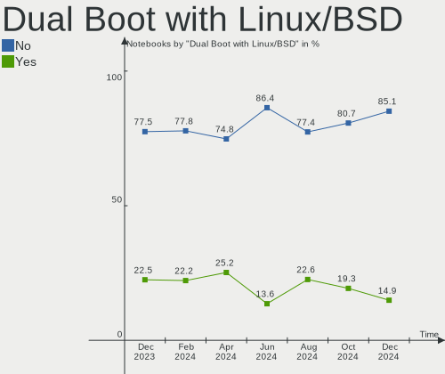
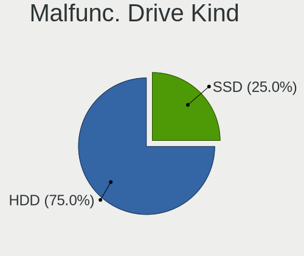
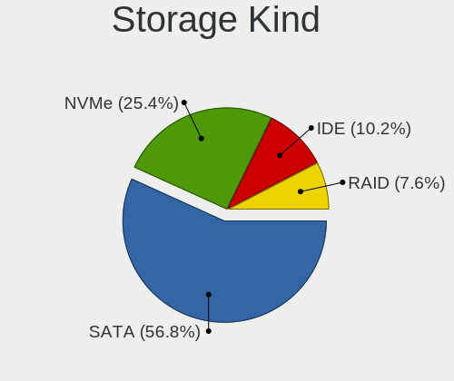
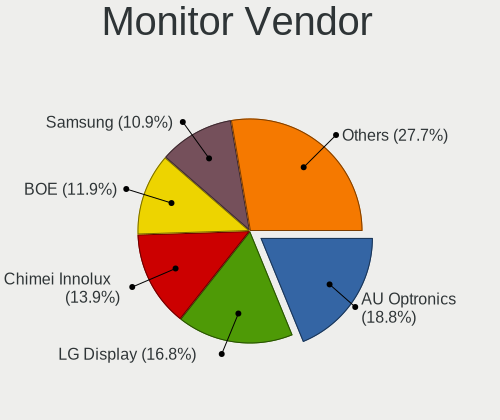
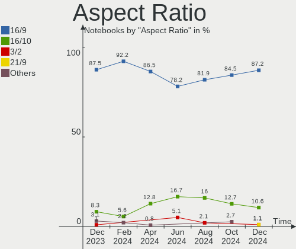
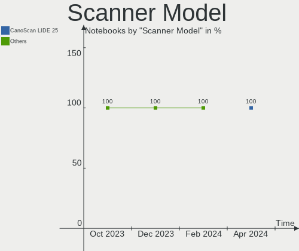
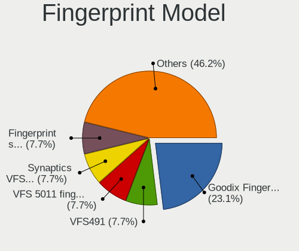

ROSA - Hardware Trends (Notebooks)
----------------------------------

A project to identify most popular hardware characteristics and track their change
over time based on data collected by Linux users at https://Linux-Hardware.org.

Anyone can contribute to this report by the [hw-probe](https://github.com/linuxhw/hw-probe) tool:

    sudo -E hw-probe -all -upload

This report is for one last month. Overall report since the beginning of time: [TestDays](https://github.com/linuxhw/TestDays)

Period: Jan, 2024.

Contents
--------

* [ System ](#system)
  - [ OS                       ](#os)
  - [ OS Family                ](#os-family)
  - [ Kernel                   ](#kernel)
  - [ Kernel Family            ](#kernel-family)
  - [ Kernel Major Ver.        ](#kernel-major-ver)
  - [ Arch                     ](#arch)
  - [ DE                       ](#de)
  - [ Display Server           ](#display-server)
  - [ Display Manager          ](#display-manager)
  - [ OS Lang                  ](#os-lang)
  - [ Boot Mode                ](#boot-mode)
  - [ Filesystem               ](#filesystem)
  - [ Part. scheme             ](#part-scheme)
  - [ Dual Boot with Linux/BSD ](#dual-boot-with-linuxbsd)
  - [ Dual Boot (Win)          ](#dual-boot-win)

* [ Board ](#board)
  - [ Vendor                   ](#vendor)
  - [ Model                    ](#model)
  - [ Model Family             ](#model-family)
  - [ MFG Year                 ](#mfg-year)
  - [ Form Factor              ](#form-factor)
  - [ Secure Boot              ](#secure-boot)
  - [ Coreboot                 ](#coreboot)
  - [ RAM Size                 ](#ram-size)
  - [ RAM Used                 ](#ram-used)
  - [ Total Drives             ](#total-drives)
  - [ Has CD-ROM               ](#has-cd-rom)
  - [ Has Ethernet             ](#has-ethernet)
  - [ Has WiFi                 ](#has-wifi)
  - [ Has Bluetooth            ](#has-bluetooth)

* [ Location ](#location)
  - [ Country                  ](#country)
  - [ City                     ](#city)

* [ Drives ](#drives)
  - [ Drive Vendor             ](#drive-vendor)
  - [ Drive Model              ](#drive-model)
  - [ HDD Vendor               ](#hdd-vendor)
  - [ SSD Vendor               ](#ssd-vendor)
  - [ Drive Kind               ](#drive-kind)
  - [ Drive Connector          ](#drive-connector)
  - [ Drive Size               ](#drive-size)
  - [ Space Total              ](#space-total)
  - [ Space Used               ](#space-used)
  - [ Malfunc. Drives          ](#malfunc-drives)
  - [ Malfunc. Drive Vendor    ](#malfunc-drive-vendor)
  - [ Malfunc. HDD Vendor      ](#malfunc-hdd-vendor)
  - [ Malfunc. Drive Kind      ](#malfunc-drive-kind)
  - [ Failed Drives            ](#failed-drives)
  - [ Failed Drive Vendor      ](#failed-drive-vendor)
  - [ Drive Status             ](#drive-status)

* [ Storage controller ](#storage-controller)
  - [ Storage Vendor           ](#storage-vendor)
  - [ Storage Model            ](#storage-model)
  - [ Storage Kind             ](#storage-kind)

* [ Processor ](#processor)
  - [ CPU Vendor               ](#cpu-vendor)
  - [ CPU Model                ](#cpu-model)
  - [ CPU Model Family         ](#cpu-model-family)
  - [ CPU Cores                ](#cpu-cores)
  - [ CPU Sockets              ](#cpu-sockets)
  - [ CPU Threads              ](#cpu-threads)
  - [ CPU Op-Modes             ](#cpu-op-modes)
  - [ CPU Microcode            ](#cpu-microcode)
  - [ CPU Microarch            ](#cpu-microarch)

* [ Graphics ](#graphics)
  - [ GPU Vendor               ](#gpu-vendor)
  - [ GPU Model                ](#gpu-model)
  - [ GPU Combo                ](#gpu-combo)
  - [ GPU Driver               ](#gpu-driver)
  - [ GPU Memory               ](#gpu-memory)

* [ Monitor ](#monitor)
  - [ Monitor Vendor           ](#monitor-vendor)
  - [ Monitor Model            ](#monitor-model)
  - [ Monitor Resolution       ](#monitor-resolution)
  - [ Monitor Diagonal         ](#monitor-diagonal)
  - [ Monitor Width            ](#monitor-width)
  - [ Aspect Ratio             ](#aspect-ratio)
  - [ Monitor Area             ](#monitor-area)
  - [ Pixel Density            ](#pixel-density)
  - [ Multiple Monitors        ](#multiple-monitors)

* [ Network ](#network)
  - [ Net Controller Vendor    ](#net-controller-vendor)
  - [ Net Controller Model     ](#net-controller-model)
  - [ Wireless Vendor          ](#wireless-vendor)
  - [ Wireless Model           ](#wireless-model)
  - [ Ethernet Vendor          ](#ethernet-vendor)
  - [ Ethernet Model           ](#ethernet-model)
  - [ Net Controller Kind      ](#net-controller-kind)
  - [ Used Controller          ](#used-controller)
  - [ NICs                     ](#nics)
  - [ IPv6                     ](#ipv6)

* [ Bluetooth ](#bluetooth)
  - [ Bluetooth Vendor         ](#bluetooth-vendor)
  - [ Bluetooth Model          ](#bluetooth-model)

* [ Sound ](#sound)
  - [ Sound Vendor             ](#sound-vendor)
  - [ Sound Model              ](#sound-model)

* [ Memory ](#memory)
  - [ Memory Vendor            ](#memory-vendor)
  - [ Memory Model             ](#memory-model)
  - [ Memory Kind              ](#memory-kind)
  - [ Memory Form Factor       ](#memory-form-factor)
  - [ Memory Size              ](#memory-size)
  - [ Memory Speed             ](#memory-speed)

* [ Printers & scanners ](#printers--scanners)
  - [ Printer Vendor           ](#printer-vendor)
  - [ Printer Model            ](#printer-model)
  - [ Scanner Vendor           ](#scanner-vendor)
  - [ Scanner Model            ](#scanner-model)

* [ Camera ](#camera)
  - [ Camera Vendor            ](#camera-vendor)
  - [ Camera Model             ](#camera-model)

* [ Security ](#security)
  - [ Fingerprint Vendor       ](#fingerprint-vendor)
  - [ Fingerprint Model        ](#fingerprint-model)
  - [ Chipcard Vendor          ](#chipcard-vendor)
  - [ Chipcard Model           ](#chipcard-model)

* [ Unsupported ](#unsupported)
  - [ Unsupported Devices      ](#unsupported-devices)
  - [ Unsupported Device Types ](#unsupported-device-types)

System
------

OS
--

Installed operating systems

| Name       | Notebooks | Percent |
|------------|-----------|---------|
| ROSA 12.4  | 79        | 83.16%  |
| ROSA R11.1 | 8         | 8.42%   |
| ROSA 12    | 6         | 6.32%   |
| ROSA 12.2  | 1         | 1.05%   |
| ROSA 12.1  | 1         | 1.05%   |

OS Family
---------

OS without a version

| Name | Notebooks | Percent |
|------|-----------|---------|
| ROSA | 95        | 100%    |

Kernel
------

Version of the Linux kernel

| Version                                   | Notebooks | Percent |
|-------------------------------------------|-----------|---------|
| 6.1.58-generic-1rosa2021.1-x86_64         | 40        | 42.11%  |
| 6.1.20-generic-2rosa2021.1-x86_64         | 26        | 27.37%  |
| 5.15.103-generic-1rosa2021.1-i686         | 5         | 5.26%   |
| 5.4.83-generic-2rosa-x86_64               | 3         | 3.16%   |
| 5.15.127-generic-1rosa2021.1-x86_64       | 3         | 3.16%   |
| 5.4.150-generic-1rosa2021.1-x86_64        | 2         | 2.11%   |
| 5.10.74-generic-2rosa2021.1-x86_64        | 2         | 2.11%   |
| 5.10.184-generic-1rosa2021.1-x86_64       | 2         | 2.11%   |
| 6.4.15.xm1-1.klp-xanmod-rosa2021.1-x86_64 | 1         | 1.05%   |
| 6.1.63.xm1-1.k-xanmod-rosa2021.1-x86_64   | 1         | 1.05%   |
| 6.1.46-generic-2rosa2021.1-x86_64         | 1         | 1.05%   |
| 5.4.83-generic-2rosa-i586                 | 1         | 1.05%   |
| 5.4.32-generic-2rosa-x86_64               | 1         | 1.05%   |
| 5.18.2.xm1-3.klp-xanmod-rosa2021.1-x86_64 | 1         | 1.05%   |
| 5.15.127-generic-1rosa2021.1-i686         | 1         | 1.05%   |
| 5.10.71-generic-1rosa2021.1-x86_64        | 1         | 1.05%   |
| 5.10.176-generic-1rosa2021.1-x86_64       | 1         | 1.05%   |
| 4.9.60-nrj-desktop-1rosa-i586             | 1         | 1.05%   |
| 4.9.155-nrj-desktop-1rosa-x86_64          | 1         | 1.05%   |
| 4.15.0-desktop-68.5rosa-x86_64            | 1         | 1.05%   |

Kernel Family
-------------

Linux kernel without a distro release

| Version  | Notebooks | Percent |
|----------|-----------|---------|
| 6.1.58   | 40        | 42.11%  |
| 6.1.20   | 26        | 27.37%  |
| 5.15.103 | 5         | 5.26%   |
| 5.4.83   | 4         | 4.21%   |
| 5.15.127 | 4         | 4.21%   |
| 5.4.150  | 2         | 2.11%   |
| 5.10.74  | 2         | 2.11%   |
| 5.10.184 | 2         | 2.11%   |
| 6.4.15   | 1         | 1.05%   |
| 6.1.63   | 1         | 1.05%   |
| 6.1.46   | 1         | 1.05%   |
| 5.4.32   | 1         | 1.05%   |
| 5.18.2   | 1         | 1.05%   |
| 5.10.71  | 1         | 1.05%   |
| 5.10.176 | 1         | 1.05%   |
| 4.9.60   | 1         | 1.05%   |
| 4.9.155  | 1         | 1.05%   |
| 4.15.0   | 1         | 1.05%   |

Kernel Major Ver.
-----------------

Linux kernel major version

| Version | Notebooks | Percent |
|---------|-----------|---------|
| 6.1     | 68        | 71.58%  |
| 5.15    | 9         | 9.47%   |
| 5.4     | 7         | 7.37%   |
| 5.10    | 6         | 6.32%   |
| 4.9     | 2         | 2.11%   |
| 6.4     | 1         | 1.05%   |
| 5.18    | 1         | 1.05%   |
| 4.15    | 1         | 1.05%   |

Arch
----

OS architecture (x86_64, i586, etc.)

| Name   | Notebooks | Percent |
|--------|-----------|---------|
| x86_64 | 87        | 91.58%  |
| i686   | 8         | 8.42%   |

DE
--

Desktop Environment

| Name  | Notebooks | Percent |
|-------|-----------|---------|
| KDE5  | 52        | 54.74%  |
| GNOME | 25        | 26.32%  |
| LXQt  | 12        | 12.63%  |
| KDE4  | 4         | 4.21%   |
| XFCE  | 1         | 1.05%   |
| MATE  | 1         | 1.05%   |

Display Server
--------------

X11 or Wayland

| Name    | Notebooks | Percent |
|---------|-----------|---------|
| Wayland | 66        | 69.47%  |
| X11     | 29        | 30.53%  |

Display Manager
---------------

SDDM, LightDM, etc.

| Name    | Notebooks | Percent |
|---------|-----------|---------|
| SDDM    | 52        | 54.74%  |
| GDM     | 32        | 33.68%  |
| LightDM | 6         | 6.32%   |
| KDM     | 4         | 4.21%   |
| Unknown | 1         | 1.05%   |

OS Lang
-------

Language

| Lang  | Notebooks | Percent |
|-------|-----------|---------|
| ru_RU | 84        | 88.42%  |
| pl_PL | 3         | 3.16%   |
| en_US | 3         | 3.16%   |
| sk_SK | 1         | 1.05%   |
| nb_NO | 1         | 1.05%   |
| es_ES | 1         | 1.05%   |
| en_GB | 1         | 1.05%   |
| de_CH | 1         | 1.05%   |

Boot Mode
---------

EFI or BIOS

| Mode | Notebooks | Percent |
|------|-----------|---------|
| BIOS | 49        | 51.58%  |
| EFI  | 46        | 48.42%  |

Filesystem
----------

Type of filesystem

| Type  | Notebooks | Percent |
|-------|-----------|---------|
| Ext4  | 84        | 88.42%  |
| Btrfs | 10        | 10.53%  |
| Xfs   | 1         | 1.05%   |

Part. scheme
------------

Scheme of partitioning

| Type | Notebooks | Percent |
|------|-----------|---------|
| GPT  | 52        | 54.74%  |
| MBR  | 43        | 45.26%  |

Dual Boot with Linux/BSD
------------------------

Hosting more than one Linux/BSD

| Dual boot | Notebooks | Percent |
|-----------|-----------|---------|
| No        | 76        | 80%     |
| Yes       | 19        | 20%     |

Dual Boot (Win)
---------------

Hosting Linux and Windows

| Dual boot | Notebooks | Percent |
|-----------|-----------|---------|
| No        | 65        | 68.42%  |
| Yes       | 30        | 31.58%  |

Board
-----

Vendor
------

Motherboard manufacturer

| Name                           | Notebooks | Percent |
|--------------------------------|-----------|---------|
| ASUSTek Computer               | 21        | 22.11%  |
| Lenovo                         | 13        | 13.68%  |
| Acer                           | 13        | 13.68%  |
| Hewlett-Packard                | 11        | 11.58%  |
| Samsung Electronics            | 5         | 5.26%   |
| Packard Bell                   | 3         | 3.16%   |
| MSI                            | 3         | 3.16%   |
| Dell                           | 3         | 3.16%   |
| Clevo                          | 3         | 3.16%   |
| Toshiba                        | 2         | 2.11%   |
| Sony                           | 2         | 2.11%   |
| Unknown                        | 2         | 2.11%   |
| MECHREVO                       | 1         | 1.05%   |
| Matsushita Electric Industrial | 1         | 1.05%   |
| MACHENIKE                      | 1         | 1.05%   |
| MACHCREATOR                    | 1         | 1.05%   |
| Infinix                        | 1         | 1.05%   |
| HUAWEI                         | 1         | 1.05%   |
| HIPER Technology Limited       | 1         | 1.05%   |
| Fujitsu                        | 1         | 1.05%   |
| eMachines                      | 1         | 1.05%   |
| DEPO Computers                 | 1         | 1.05%   |
| Chuwi                          | 1         | 1.05%   |
| Apple                          | 1         | 1.05%   |
| Acidanthera                    | 1         | 1.05%   |
| 3Q                             | 1         | 1.05%   |

Model
-----

Motherboard model

| Name                                        | Notebooks | Percent |
|---------------------------------------------|-----------|---------|
| HP Pavilion 15                              | 2         | 2.11%   |
| Clevo NL41MU2                               | 2         | 2.11%   |
| Acer Aspire ES1-531                         | 2         | 2.11%   |
| Unknown                                     | 2         | 2.11%   |
| Toshiba Satellite L40                       | 1         | 1.05%   |
| Toshiba Satellite C660                      | 1         | 1.05%   |
| Sony VPCEH3P1R                              | 1         | 1.05%   |
| Sony VGN-NS11ER_S                           | 1         | 1.05%   |
| Samsung R580/R590                           | 1         | 1.05%   |
| Samsung N145P/N250P/N260P                   | 1         | 1.05%   |
| Samsung 550P5C/550P7C                       | 1         | 1.05%   |
| Samsung 300V3A/300V4A/300V5A/200A4B/200A5B  | 1         | 1.05%   |
| Samsung 300E4C/300E5C/300E7C                | 1         | 1.05%   |
| Packard Bell EasyNote TE11HC                | 1         | 1.05%   |
| Packard Bell EasyNote ENTE70BH              | 1         | 1.05%   |
| Packard Bell EasyNote ENLG81BA              | 1         | 1.05%   |
| MSI Katana GF76 11SC                        | 1         | 1.05%   |
| MSI GE60 2PL                                | 1         | 1.05%   |
| MSI FX610MX                                 | 1         | 1.05%   |
| MECHREVO Jiaolong Series GM5ZG0O            | 1         | 1.05%   |
| Matsushita Electric Industrial CF-30CTQAZBG | 1         | 1.05%   |
| MACHENIKE L17                               | 1         | 1.05%   |
| MACHCREATOR E                               | 1         | 1.05%   |
| Lenovo V15-IGL 82C3                         | 1         | 1.05%   |
| Lenovo ThinkPad T430 2349SB4                | 1         | 1.05%   |
| Lenovo ThinkPad L530 2479BG8                | 1         | 1.05%   |
| Lenovo ThinkPad E14 20RA001BRT              | 1         | 1.05%   |
| Lenovo ThinkBook 16 G4+ ARA 21D1            | 1         | 1.05%   |
| Lenovo Legion 5 15ACH6H 82JU                | 1         | 1.05%   |
| Lenovo IdeaPad S340-14API 81NB              | 1         | 1.05%   |
| Lenovo IdeaPad S145-15AST 81N3              | 1         | 1.05%   |
| Lenovo IdeaPad 330-15AST 81D6               | 1         | 1.05%   |
| Lenovo G70-70 80HW                          | 1         | 1.05%   |
| Lenovo G50-30 80G0                          | 1         | 1.05%   |
| Lenovo G470 20078                           | 1         | 1.05%   |
| Lenovo B560                                 | 1         | 1.05%   |
| Infinix INBOOK X2                           | 1         | 1.05%   |
| HUAWEI NBD-WXX9                             | 1         | 1.05%   |
| HIPER Limited HIPER WORKBOOK                | 1         | 1.05%   |
| HP ProBook 4330s                            | 1         | 1.05%   |

Model Family
------------

Motherboard model prefix

| Name                                        | Notebooks | Percent |
|---------------------------------------------|-----------|---------|
| Acer Aspire                                 | 11        | 11.58%  |
| HP Pavilion                                 | 4         | 4.21%   |
| ASUS VivoBook                               | 4         | 4.21%   |
| Packard Bell EasyNote                       | 3         | 3.16%   |
| Lenovo ThinkPad                             | 3         | 3.16%   |
| Lenovo IdeaPad                              | 3         | 3.16%   |
| Toshiba Satellite                           | 2         | 2.11%   |
| HP ProBook                                  | 2         | 2.11%   |
| HP EliteBook                                | 2         | 2.11%   |
| Clevo NL41MU2                               | 2         | 2.11%   |
| Unknown                                     | 2         | 2.11%   |
| Sony VPCEH3P1R                              | 1         | 1.05%   |
| Sony VGN-NS11ER                             | 1         | 1.05%   |
| Samsung R580                                | 1         | 1.05%   |
| Samsung N145P                               | 1         | 1.05%   |
| Samsung 550P5C                              | 1         | 1.05%   |
| Samsung 300V3A                              | 1         | 1.05%   |
| Samsung 300E4C                              | 1         | 1.05%   |
| MSI Katana                                  | 1         | 1.05%   |
| MSI GE60                                    | 1         | 1.05%   |
| MSI FX610MX                                 | 1         | 1.05%   |
| MECHREVO Jiaolong                           | 1         | 1.05%   |
| Matsushita Electric Industrial CF-30CTQAZBG | 1         | 1.05%   |
| MACHENIKE L17                               | 1         | 1.05%   |
| MACHCREATOR E                               | 1         | 1.05%   |
| Lenovo V15-IGL                              | 1         | 1.05%   |
| Lenovo ThinkBook                            | 1         | 1.05%   |
| Lenovo Legion                               | 1         | 1.05%   |
| Lenovo G70-70                               | 1         | 1.05%   |
| Lenovo G50-30                               | 1         | 1.05%   |
| Lenovo G470                                 | 1         | 1.05%   |
| Lenovo B560                                 | 1         | 1.05%   |
| Infinix INBOOK                              | 1         | 1.05%   |
| HUAWEI NBD-WXX9                             | 1         | 1.05%   |
| HIPER Limited HIPER                         | 1         | 1.05%   |
| HP Laptop                                   | 1         | 1.05%   |
| HP Compaq                                   | 1         | 1.05%   |
| HP 250                                      | 1         | 1.05%   |
| Fujitsu LIFEBOOK                            | 1         | 1.05%   |
| eMachines E510                              | 1         | 1.05%   |

MFG Year
--------

Motherboard manufacture year

| Year | Notebooks | Percent |
|------|-----------|---------|
| 2022 | 12        | 12.63%  |
| 2021 | 9         | 9.47%   |
| 2011 | 9         | 9.47%   |
| 2010 | 8         | 8.42%   |
| 2015 | 7         | 7.37%   |
| 2013 | 6         | 6.32%   |
| 2012 | 6         | 6.32%   |
| 2009 | 6         | 6.32%   |
| 2017 | 5         | 5.26%   |
| 2014 | 5         | 5.26%   |
| 2008 | 5         | 5.26%   |
| 2019 | 4         | 4.21%   |
| 2007 | 4         | 4.21%   |
| 2006 | 3         | 3.16%   |
| 2020 | 2         | 2.11%   |
| 2016 | 2         | 2.11%   |
| 2023 | 1         | 1.05%   |
| 2018 | 1         | 1.05%   |

Form Factor
-----------

Physical design of the computer

| Name     | Notebooks | Percent |
|----------|-----------|---------|
| Notebook | 95        | 100%    |

Secure Boot
-----------

Enabled or disabled

| State    | Notebooks | Percent |
|----------|-----------|---------|
| Disabled | 95        | 100%    |

Coreboot
--------

Have coreboot on board

| Used | Notebooks | Percent |
|------|-----------|---------|
| No   | 95        | 100%    |

RAM Size
--------

Total RAM memory

| Size in GB | Notebooks | Percent |
|------------|-----------|---------|
| 3.01-4.0   | 29        | 30.53%  |
| 4.01-8.0   | 25        | 26.32%  |
| 8.01-16.0  | 17        | 17.89%  |
| 16.01-24.0 | 11        | 11.58%  |
| 1.01-2.0   | 7         | 7.37%   |
| 2.01-3.0   | 3         | 3.16%   |
| 24.01-32.0 | 2         | 2.11%   |
| 0.51-1.0   | 1         | 1.05%   |

RAM Used
--------

Used RAM memory

| Used GB   | Notebooks | Percent |
|-----------|-----------|---------|
| 1.01-2.0  | 58        | 61.05%  |
| 0.51-1.0  | 15        | 15.79%  |
| 2.01-3.0  | 9         | 9.47%   |
| 3.01-4.0  | 7         | 7.37%   |
| 0.01-0.5  | 3         | 3.16%   |
| 4.01-8.0  | 2         | 2.11%   |
| 8.01-16.0 | 1         | 1.05%   |

Total Drives
------------

Number of drives on board

| Drives | Notebooks | Percent |
|--------|-----------|---------|
| 1      | 71        | 74.74%  |
| 2      | 23        | 24.21%  |
| 3      | 1         | 1.05%   |

Has CD-ROM
----------

Has CD-ROM on board

| Presented | Notebooks | Percent |
|-----------|-----------|---------|
| No        | 51        | 53.68%  |
| Yes       | 44        | 46.32%  |

Has Ethernet
------------

Has Ethernet on board

| Presented | Notebooks | Percent |
|-----------|-----------|---------|
| Yes       | 78        | 82.11%  |
| No        | 17        | 17.89%  |

Has WiFi
--------

Has WiFi module

| Presented | Notebooks | Percent |
|-----------|-----------|---------|
| Yes       | 92        | 96.84%  |
| No        | 3         | 3.16%   |

Has Bluetooth
-------------

Has Bluetooth module

| Presented | Notebooks | Percent |
|-----------|-----------|---------|
| Yes       | 68        | 71.58%  |
| No        | 27        | 28.42%  |

Location
--------

Country
-------

Geographic location (country)

| Country     | Notebooks | Percent |
|-------------|-----------|---------|
| Russia      | 79        | 83.16%  |
| Ukraine     | 4         | 4.21%   |
| Poland      | 3         | 3.16%   |
| Germany     | 3         | 3.16%   |
| Venezuela   | 1         | 1.05%   |
| Switzerland | 1         | 1.05%   |
| Slovakia    | 1         | 1.05%   |
| Norway      | 1         | 1.05%   |
| Kazakhstan  | 1         | 1.05%   |
| Bulgaria    | 1         | 1.05%   |

City
----

Geographic location (city)

| City                       | Notebooks | Percent |
|----------------------------|-----------|---------|
| Moscow                     | 19        | 20%     |
| St Petersburg              | 4         | 4.21%   |
| Perm                       | 3         | 3.16%   |
| Yaroslavl                  | 2         | 2.11%   |
| Ufa                        | 2         | 2.11%   |
| Ostrovtsy                  | 2         | 2.11%   |
| Omsk                       | 2         | 2.11%   |
| Krasnoyarsk                | 2         | 2.11%   |
| Gliwice                    | 2         | 2.11%   |
| Belovo                     | 2         | 2.11%   |
| Barnaul                    | 2         | 2.11%   |
| Yoshkar-Ola                | 1         | 1.05%   |
| Yekaterinburg              | 1         | 1.05%   |
| Voronezh                   | 1         | 1.05%   |
| Vologda                    | 1         | 1.05%   |
| Volgograd                  | 1         | 1.05%   |
| Vidnoye                    | 1         | 1.05%   |
| Ust'-Ilimsk                | 1         | 1.05%   |
| Umay                       | 1         | 1.05%   |
| Ulan-Ude                   | 1         | 1.05%   |
| Tambov                     | 1         | 1.05%   |
| Surgut                     | 1         | 1.05%   |
| Starobil's'k               | 1         | 1.05%   |
| Sofia                      | 1         | 1.05%   |
| Sochi                      | 1         | 1.05%   |
| Snezhinsk                  | 1         | 1.05%   |
| Simferopol                 | 1         | 1.05%   |
| Saratov                    | 1         | 1.05%   |
| Ruza                       | 1         | 1.05%   |
| Rostov-on-Don              | 1         | 1.05%   |
| Pyatigorsk                 | 1         | 1.05%   |
| Puerto Ordaz and San Felix | 1         | 1.05%   |
| Poznan                     | 1         | 1.05%   |
| Penza                      | 1         | 1.05%   |
| Pavlovskiy Posad           | 1         | 1.05%   |
| Oryol                      | 1         | 1.05%   |
| Orenburg                   | 1         | 1.05%   |
| Novosibirsk                | 1         | 1.05%   |
| Noril'sk                   | 1         | 1.05%   |
| Nizhniy Novgorod           | 1         | 1.05%   |

Drives
------

Drive Vendor
------------

Hard drive vendors

| Vendor                      | Notebooks | Drives | Percent |
|-----------------------------|-----------|--------|---------|
| Seagate                     | 12        | 12     | 10.62%  |
| Samsung Electronics         | 12        | 13     | 10.62%  |
| WDC                         | 9         | 10     | 7.96%   |
| Toshiba                     | 7         | 7      | 6.19%   |
| Kingston                    | 7         | 7      | 6.19%   |
| Hitachi                     | 7         | 7      | 6.19%   |
| China                       | 7         | 7      | 6.19%   |
| SK hynix                    | 4         | 4      | 3.54%   |
| HGST                        | 4         | 4      | 3.54%   |
| Unknown                     | 4         | 4      | 3.54%   |
| SSSTC                       | 3         | 3      | 2.65%   |
| Intel                       | 3         | 3      | 2.65%   |
| Unknown                     | 2         | 2      | 1.77%   |
| SPCC                        | 2         | 2      | 1.77%   |
| Micron Technology           | 2         | 2      | 1.77%   |
| BIWIN                       | 2         | 2      | 1.77%   |
| AMD                         | 2         | 2      | 1.77%   |
| XrayDisk                    | 1         | 1      | 0.88%   |
| Union Memory                | 1         | 1      | 0.88%   |
| UMIS                        | 1         | 1      | 0.88%   |
| TO Exter                    | 1         | 1      | 0.88%   |
| Smartbuy                    | 1         | 1      | 0.88%   |
| SanDisk                     | 1         | 1      | 0.88%   |
| Phison Electronics          | 1         | 1      | 0.88%   |
| Phison                      | 1         | 1      | 0.88%   |
| MSI                         | 1         | 1      | 0.88%   |
| MG                          | 1         | 1      | 0.88%   |
| MAXIO Technology (Hangzhou) | 1         | 1      | 0.88%   |
| Lexar                       | 1         | 1      | 0.88%   |
| KIOXIA                      | 1         | 1      | 0.88%   |
| HUAXUAN                     | 1         | 1      | 0.88%   |
| HS-SSD-E100                 | 1         | 1      | 0.88%   |
| Hikvision                   | 1         | 1      | 0.88%   |
| GS                          | 1         | 1      | 0.88%   |
| Gigabyte Technology         | 1         | 1      | 0.88%   |
| Fanxiang                    | 1         | 1      | 0.88%   |
| Digma                       | 1         | 1      | 0.88%   |
| DEXP                        | 1         | 1      | 0.88%   |
| Crucial                     | 1         | 1      | 0.88%   |
| Apacer                      | 1         | 1      | 0.88%   |

Drive Model
-----------

Hard drive models

| Model                                     | Notebooks | Percent |
|-------------------------------------------|-----------|---------|
| Seagate ST500LT012-1DG142 500GB           | 4         | 3.48%   |
| Seagate ST320LT020-9YG142 320GB           | 4         | 3.48%   |
| Unknown                                   | 4         | 3.48%   |
| China SSD 128GB                           | 3         | 2.61%   |
| Unknown SD128  128GB                      | 2         | 1.74%   |
| Toshiba MQ04ABF100 1TB                    | 2         | 1.74%   |
| Toshiba MQ01ABF050 500GB                  | 2         | 1.74%   |
| SPCC Solid State Disk 256GB               | 2         | 1.74%   |
| Samsung SSD 870 QVO 1TB                   | 2         | 1.74%   |
| Kingston SA400S37240G 240GB SSD           | 2         | 1.74%   |
| HGST HTS541010A9E680 1TB                  | 2         | 1.74%   |
| BIWIN CE480T5D101-256 256GB               | 2         | 1.74%   |
| XrayDisk 2TB SSD                          | 1         | 0.87%   |
| WDC WDS480G2G0A-00JH30 480GB SSD          | 1         | 0.87%   |
| WDC WDS240G2G0A-00JH30 240GB SSD          | 1         | 0.87%   |
| WDC WDS240G1G0A-00SS50 240GB SSD          | 1         | 0.87%   |
| WDC WDS120G2G0A-00JH30 120GB SSD          | 1         | 0.87%   |
| WDC WD5000LPVX-22V0TT0 500GB              | 1         | 0.87%   |
| WDC WD5000LPCX-24VHAT0 500GB              | 1         | 0.87%   |
| WDC WD3200BPVT-22JJ5T0 320GB              | 1         | 0.87%   |
| WDC WD3200BEVT-00SCST0 320GB              | 1         | 0.87%   |
| WDC WD10SPSX-22A6WT0 1TB                  | 1         | 0.87%   |
| WDC WD10JPVT-60A1YT0 1TB                  | 1         | 0.87%   |
| Union Memory RTOTJ128VGD2EYX 128GB SSD    | 1         | 0.87%   |
| UMIS RPFTJ128PDD2EWX 128GB                | 1         | 0.87%   |
| Toshiba MK6475GSX 640GB                   | 1         | 0.87%   |
| Toshiba MK1646GSX 160GB                   | 1         | 0.87%   |
| Toshiba KBG40ZNT512G MEMORY 512GB         | 1         | 0.87%   |
| TO Exter nal USB 3.0 512GB                | 1         | 0.87%   |
| SSSTC CL4-8D512 512GB                     | 1         | 0.87%   |
| SSSTC CL1-8D512 512GB                     | 1         | 0.87%   |
| SSSTC CL1-4D128 128GB                     | 1         | 0.87%   |
| Smartbuy SSD 240GB                        | 1         | 0.87%   |
| SK hynix SKHynix_HFM512GDHTNI-87A0B 512GB | 1         | 0.87%   |
| SK hynix HFM512GD3JX013N 512GB            | 1         | 0.87%   |
| SK hynix HFM001TD3JX013N 1024GB           | 1         | 0.87%   |
| SK hynix HCG8e  64GB                      | 1         | 0.87%   |
| Seagate ST9320320AS 320GB                 | 1         | 0.87%   |
| Seagate ST9250827AS 250GB                 | 1         | 0.87%   |
| Seagate ST9250315AS 250GB                 | 1         | 0.87%   |

HDD Vendor
----------

Hard disk drive vendors

| Vendor              | Notebooks | Drives | Percent |
|---------------------|-----------|--------|---------|
| Seagate             | 12        | 12     | 32.43%  |
| Hitachi             | 7         | 7      | 18.92%  |
| WDC                 | 6         | 6      | 16.22%  |
| Toshiba             | 6         | 6      | 16.22%  |
| HGST                | 4         | 4      | 10.81%  |
| TO Exter            | 1         | 1      | 2.7%    |
| Samsung Electronics | 1         | 1      | 2.7%    |

SSD Vendor
----------

Solid state drive vendors

| Vendor              | Notebooks | Drives | Percent |
|---------------------|-----------|--------|---------|
| Samsung Electronics | 8         | 8      | 16.33%  |
| China               | 7         | 7      | 14.29%  |
| Kingston            | 6         | 6      | 12.24%  |
| WDC                 | 4         | 4      | 8.16%   |
| Intel               | 3         | 3      | 6.12%   |
| Unknown             | 3         | 3      | 6.12%   |
| SPCC                | 2         | 2      | 4.08%   |
| AMD                 | 2         | 2      | 4.08%   |
| XrayDisk            | 1         | 1      | 2.04%   |
| Union Memory        | 1         | 1      | 2.04%   |
| Smartbuy            | 1         | 1      | 2.04%   |
| SanDisk             | 1         | 1      | 2.04%   |
| MG                  | 1         | 1      | 2.04%   |
| HUAXUAN             | 1         | 1      | 2.04%   |
| HS-SSD-E100         | 1         | 1      | 2.04%   |
| GS                  | 1         | 1      | 2.04%   |
| Gigabyte Technology | 1         | 1      | 2.04%   |
| Fanxiang            | 1         | 1      | 2.04%   |
| Digma               | 1         | 1      | 2.04%   |
| DEXP                | 1         | 1      | 2.04%   |
| Apacer              | 1         | 1      | 2.04%   |
| AirDisk             | 1         | 1      | 2.04%   |

Drive Kind
----------

HDD or SSD

| Kind | Notebooks | Drives | Percent |
|------|-----------|--------|---------|
| SSD  | 48        | 49     | 43.64%  |
| HDD  | 37        | 37     | 33.64%  |
| NVMe | 22        | 25     | 20%     |
| MMC  | 3         | 4      | 2.73%   |

Drive Connector
---------------

SATA, SAS, NVMe, etc.

| Type | Notebooks | Drives | Percent |
|------|-----------|--------|---------|
| SATA | 77        | 85     | 74.76%  |
| NVMe | 22        | 25     | 21.36%  |
| MMC  | 3         | 4      | 2.91%   |
| SAS  | 1         | 1      | 0.97%   |

Drive Size
----------

Size of hard drive

| Size in TB | Notebooks | Drives | Percent |
|------------|-----------|--------|---------|
| 0.01-0.5   | 59        | 63     | 73.75%  |
| 0.51-1.0   | 19        | 21     | 23.75%  |
| 1.01-2.0   | 2         | 2      | 2.5%    |

Space Total
-----------

Amount of disk space available on the file system

| Size in GB     | Notebooks | Percent |
|----------------|-----------|---------|
| 101-250        | 32        | 33.68%  |
| 251-500        | 30        | 31.58%  |
| 501-1000       | 15        | 15.79%  |
| 1-20           | 6         | 6.32%   |
| 51-100         | 4         | 4.21%   |
| 21-50          | 3         | 3.16%   |
| 1001-2000      | 3         | 3.16%   |
| More than 3000 | 1         | 1.05%   |
| Unknown        | 1         | 1.05%   |

Space Used
----------

Amount of used disk space

| Used GB        | Notebooks | Percent |
|----------------|-----------|---------|
| 1-20           | 59        | 62.11%  |
| 21-50          | 13        | 13.68%  |
| 101-250        | 7         | 7.37%   |
| 251-500        | 6         | 6.32%   |
| 51-100         | 6         | 6.32%   |
| 501-1000       | 2         | 2.11%   |
| More than 3000 | 1         | 1.05%   |
| Unknown        | 1         | 1.05%   |

Malfunc. Drives
---------------

Drive models with a malfunction

| Model                             | Notebooks | Drives | Percent |
|-----------------------------------|-----------|--------|---------|
| Seagate ST320LT020-9YG142 320GB   | 4         | 4      | 16%     |
| Seagate ST500LT012-1DG142 500GB   | 2         | 2      | 8%      |
| WDC WD3200BPVT-22JJ5T0 320GB      | 1         | 1      | 4%      |
| WDC WD10JPVT-60A1YT0 1TB          | 1         | 1      | 4%      |
| Toshiba MQ01ABF050 500GB          | 1         | 1      | 4%      |
| Toshiba MK6475GSX 640GB           | 1         | 1      | 4%      |
| Toshiba MK1646GSX 160GB           | 1         | 1      | 4%      |
| Seagate ST9250827AS 250GB         | 1         | 1      | 4%      |
| Seagate ST9250315AS 250GB         | 1         | 1      | 4%      |
| Samsung Electronics HM250HI 250GB | 1         | 1      | 4%      |
| Intel SSDSC2BF180A4L 180GB        | 1         | 1      | 4%      |
| Intel SSDSA2M080G2GC 80GB         | 1         | 1      | 4%      |
| Hitachi HTS547564A9E384 640GB     | 1         | 1      | 4%      |
| Hitachi HTS545050B9A300 500GB     | 1         | 1      | 4%      |
| Hitachi HTS543232L9A300 320GB     | 1         | 1      | 4%      |
| Hitachi HTS541010G9SA00 100GB     | 1         | 1      | 4%      |
| HGST HTS725050A7E635 500GB        | 1         | 1      | 4%      |
| HGST HTS545050A7E380 500GB        | 1         | 1      | 4%      |
| HGST HTS541010A9E680 1TB          | 1         | 1      | 4%      |
| China SSD 240GB                   | 1         | 1      | 4%      |
| Unknown                           | 1         | 1      | 4%      |

Malfunc. Drive Vendor
---------------------

Vendors of faulty drives

| Vendor              | Notebooks | Drives | Percent |
|---------------------|-----------|--------|---------|
| Seagate             | 8         | 8      | 32%     |
| Hitachi             | 4         | 4      | 16%     |
| Toshiba             | 3         | 3      | 12%     |
| HGST                | 3         | 3      | 12%     |
| WDC                 | 2         | 2      | 8%      |
| Intel               | 2         | 2      | 8%      |
| Samsung Electronics | 1         | 1      | 4%      |
| China               | 1         | 1      | 4%      |
| Unknown             | 1         | 1      | 4%      |

Malfunc. HDD Vendor
-------------------

Vendors of faulty HDD drives

| Vendor              | Notebooks | Drives | Percent |
|---------------------|-----------|--------|---------|
| Seagate             | 8         | 8      | 38.1%   |
| Hitachi             | 4         | 4      | 19.05%  |
| Toshiba             | 3         | 3      | 14.29%  |
| HGST                | 3         | 3      | 14.29%  |
| WDC                 | 2         | 2      | 9.52%   |
| Samsung Electronics | 1         | 1      | 4.76%   |

Malfunc. Drive Kind
-------------------

Kinds of faulty drives

| Kind | Notebooks | Drives | Percent |
|------|-----------|--------|---------|
| HDD  | 21        | 21     | 84%     |
| SSD  | 4         | 4      | 16%     |

Failed Drives
-------------

Failed drive models

Zero info for selected period =(

Failed Drive Vendor
-------------------

Failed drive vendors

Zero info for selected period =(

Drive Status
------------

Number of failed and malfunc. drives

| Status   | Notebooks | Drives | Percent |
|----------|-----------|--------|---------|
| Works    | 73        | 84     | 70.87%  |
| Malfunc  | 25        | 25     | 24.27%  |
| Detected | 5         | 6      | 4.85%   |

Storage controller
------------------

Storage Vendor
--------------

Storage controller vendors

| Vendor                         | Notebooks | Percent |
|--------------------------------|-----------|---------|
| Intel                          | 69        | 63.3%   |
| AMD                            | 12        | 11.01%  |
| Nvidia                         | 4         | 3.67%   |
| Solid State Storage Technology | 3         | 2.75%   |
| SK hynix                       | 3         | 2.75%   |
| Samsung Electronics            | 3         | 2.75%   |
| Phison Electronics             | 3         | 2.75%   |
| Micron Technology              | 2         | 1.83%   |
| MAXIO Technology (Hangzhou)    | 2         | 1.83%   |
| KIOXIA                         | 2         | 1.83%   |
| INNOGRIT                       | 2         | 1.83%   |
| Union Memory (Shenzhen)        | 1         | 0.92%   |
| Silicon Motion                 | 1         | 0.92%   |
| Micron/Crucial Technology      | 1         | 0.92%   |
| Kingston Technology Company    | 1         | 0.92%   |

Storage Model
-------------

Storage controller models

| Model                                                                            | Notebooks | Percent |
|----------------------------------------------------------------------------------|-----------|---------|
| AMD FCH SATA Controller [AHCI mode]                                              | 10        | 8.4%    |
| Intel 6 Series/C200 Series Chipset Family 6 port Mobile SATA AHCI Controller     | 8         | 6.72%   |
| Intel 7 Series Chipset Family 6-port SATA Controller [AHCI mode]                 | 7         | 5.88%   |
| Intel Atom/Celeron/Pentium Processor x5-E8000/J3xxx/N3xxx Series SATA Controller | 5         | 4.2%    |
| Intel 82801HM/HEM (ICH8M/ICH8M-E) SATA Controller [AHCI mode]                    | 5         | 4.2%    |
| Intel 82801HM/HEM (ICH8M/ICH8M-E) IDE Controller                                 | 5         | 4.2%    |
| Intel 8 Series SATA Controller 1 [AHCI mode]                                     | 4         | 3.36%   |
| Intel Wildcat Point-LP SATA Controller [AHCI Mode]                               | 3         | 2.52%   |
| Intel Tiger Lake-LP SATA Controller                                              | 3         | 2.52%   |
| Intel Sunrise Point-LP SATA Controller [AHCI mode]                               | 3         | 2.52%   |
| Intel Celeron/Pentium Silver Processor SATA Controller                           | 3         | 2.52%   |
| Intel 82801IBM/IEM (ICH9M/ICH9M-E) 4 port SATA Controller [AHCI mode]            | 3         | 2.52%   |
| Intel 5 Series/3400 Series Chipset 4 port SATA AHCI Controller                   | 3         | 2.52%   |
| Solid State Storage CL1-3D256-Q11 NVMe SSD M.2                                   | 2         | 1.68%   |
| SK hynix Gold P31/BC711/PC711 NVMe Solid State Drive                             | 2         | 1.68%   |
| Phison PS5013-E13 PCIe3 NVMe Controller (DRAM-less)                              | 2         | 1.68%   |
| Nvidia MCP79 AHCI Controller                                                     | 2         | 1.68%   |
| MAXIO (Hangzhou) NVMe SSD Controller MAP1202 (DRAM-less)                         | 2         | 1.68%   |
| KIOXIA NVMe SSD Controller BG4 (DRAM-less)                                       | 2         | 1.68%   |
| Intel Tiger Lake SATA AHCI Controller                                            | 2         | 1.68%   |
| Intel HM170/QM170 Chipset SATA Controller [AHCI Mode]                            | 2         | 1.68%   |
| Intel Atom Processor E3800 Series SATA AHCI Controller                           | 2         | 1.68%   |
| Intel 82801GBM/GHM (ICH7-M Family) SATA Controller [IDE mode]                    | 2         | 1.68%   |
| Intel 82801GBM/GHM (ICH7-M Family) SATA Controller [AHCI mode]                   | 2         | 1.68%   |
| Intel 82801 Mobile SATA Controller [RAID mode]                                   | 2         | 1.68%   |
| Intel 8 Series/C220 Series Chipset Family 6-port SATA Controller 1 [AHCI mode]   | 2         | 1.68%   |
| INNOGRIT NVMe SSD Controller IG5216 (DRAM-less)                                  | 2         | 1.68%   |
| AMD SB7x0/SB8x0/SB9x0 SATA Controller [AHCI mode]                                | 2         | 1.68%   |
| Union Memory (Shenzhen) AM610 PCIe 3.0 x2 NVMe SSD 128GB, 256GB                  | 1         | 0.84%   |
| Solid State Storage CL4-8D512 NVMe SSD M.2 (DRAM-less)                           | 1         | 0.84%   |
| SK hynix BC511 NVMe SSD                                                          | 1         | 0.84%   |
| Silicon Motion SM2263EN/SM2263XT (DRAM-less) NVMe SSD Controllers                | 1         | 0.84%   |
| Samsung NVMe SSD Controller SM981/PM981/PM983                                    | 1         | 0.84%   |
| Samsung NVMe SSD Controller PM9B1 (DRAM-less)                                    | 1         | 0.84%   |
| Samsung NVMe SSD Controller PM9A1/PM9A3/980PRO                                   | 1         | 0.84%   |
| Phison PS5019-E19 PCIe4 NVMe Controller (DRAM-less)                              | 1         | 0.84%   |
| Nvidia MCP78S [GeForce 8200] SATA Controller (non-AHCI mode)                     | 1         | 0.84%   |
| Nvidia MCP78S [GeForce 8200] IDE                                                 | 1         | 0.84%   |
| Nvidia MCP67 AHCI Controller                                                     | 1         | 0.84%   |
| Micron/Crucial P5 Plus NVMe PCIe SSD                                             | 1         | 0.84%   |

Storage Kind
------------

Kind of storage controller (IDE, SATA, NVMe, SAS, ...)

| Kind | Notebooks | Percent |
|------|-----------|---------|
| SATA | 76        | 66.09%  |
| NVMe | 22        | 19.13%  |
| IDE  | 14        | 12.17%  |
| RAID | 3         | 2.61%   |

Processor
---------

CPU Vendor
----------

Processor vendors

| Vendor | Notebooks | Percent |
|--------|-----------|---------|
| Intel  | 75        | 78.95%  |
| AMD    | 20        | 21.05%  |

CPU Model
---------

Processor models

| Model                                       | Notebooks | Percent |
|---------------------------------------------|-----------|---------|
| Intel 11th Gen Core i5-1135G7 @ 2.40GHz     | 4         | 4.21%   |
| Intel Pentium CPU B960 @ 2.20GHz            | 3         | 3.16%   |
| Intel Celeron CPU N3050 @ 1.60GHz           | 3         | 3.16%   |
| Intel Pentium CPU N3700 @ 1.60GHz           | 2         | 2.11%   |
| Intel Core i7-3610QM CPU @ 2.30GHz          | 2         | 2.11%   |
| Intel Core i7-2670QM CPU @ 2.20GHz          | 2         | 2.11%   |
| Intel Core i5-7300HQ CPU @ 2.50GHz          | 2         | 2.11%   |
| Intel Core i5-1035G1 CPU @ 1.00GHz          | 2         | 2.11%   |
| Intel Core i3-5005U CPU @ 2.00GHz           | 2         | 2.11%   |
| Intel Core i3-2350M CPU @ 2.30GHz           | 2         | 2.11%   |
| Intel Core 2 Duo CPU T7500 @ 2.20GHz        | 2         | 2.11%   |
| Intel Core 2 Duo CPU T7300 @ 2.00GHz        | 2         | 2.11%   |
| Intel Atom CPU N450 @ 1.66GHz               | 2         | 2.11%   |
| AMD Ryzen 7 5825U with Radeon Graphics      | 2         | 2.11%   |
| AMD Ryzen 7 5800H with Radeon Graphics      | 2         | 2.11%   |
| Intel Pentium Dual-Core CPU T4300 @ 2.10GHz | 1         | 1.05%   |
| Intel Pentium Dual CPU T2330 @ 1.60GHz      | 1         | 1.05%   |
| Intel Pentium CPU P6200 @ 2.13GHz           | 1         | 1.05%   |
| Intel Pentium CPU N3530 @ 2.16GHz           | 1         | 1.05%   |
| Intel Pentium CPU 2117U @ 1.80GHz           | 1         | 1.05%   |
| Intel Pentium 3558U @ 1.70GHz               | 1         | 1.05%   |
| Intel Genuine CPU T2250 @ 1.73GHz           | 1         | 1.05%   |
| Intel Genuine CPU L2400 @ 1.66GHz           | 1         | 1.05%   |
| Intel Core i7-4500U CPU @ 1.80GHz           | 1         | 1.05%   |
| Intel Core i7-10510U CPU @ 1.80GHz          | 1         | 1.05%   |
| Intel Core i5-7200U CPU @ 2.50GHz           | 1         | 1.05%   |
| Intel Core i5-5200U CPU @ 2.20GHz           | 1         | 1.05%   |
| Intel Core i5-4210U CPU @ 1.70GHz           | 1         | 1.05%   |
| Intel Core i5-4210M CPU @ 2.60GHz           | 1         | 1.05%   |
| Intel Core i5-4210H CPU @ 2.90GHz           | 1         | 1.05%   |
| Intel Core i5-4200U CPU @ 1.60GHz           | 1         | 1.05%   |
| Intel Core i5-3337U CPU @ 1.80GHz           | 1         | 1.05%   |
| Intel Core i5-3320M CPU @ 2.60GHz           | 1         | 1.05%   |
| Intel Core i5-2450M CPU @ 2.50GHz           | 1         | 1.05%   |
| Intel Core i5 CPU M 540 @ 2.53GHz           | 1         | 1.05%   |
| Intel Core i5 CPU M 520 @ 2.40GHz           | 1         | 1.05%   |
| Intel Core i5 CPU M 430 @ 2.27GHz           | 1         | 1.05%   |
| Intel Core i3-6100U CPU @ 2.30GHz           | 1         | 1.05%   |
| Intel Core i3-6006U CPU @ 2.00GHz           | 1         | 1.05%   |
| Intel Core i3-3110M CPU @ 2.40GHz           | 1         | 1.05%   |

CPU Model Family
----------------

Processor model prefix

| Model                   | Notebooks | Percent |
|-------------------------|-----------|---------|
| Intel Core i5           | 16        | 16.84%  |
| Other                   | 10        | 10.53%  |
| Intel Pentium           | 9         | 9.47%   |
| Intel Core i3           | 9         | 9.47%   |
| Intel Celeron           | 9         | 9.47%   |
| Intel Core 2 Duo        | 8         | 8.42%   |
| AMD Ryzen 7             | 8         | 8.42%   |
| Intel Core i7           | 6         | 6.32%   |
| Intel Atom              | 4         | 4.21%   |
| Intel Genuine           | 2         | 2.11%   |
| AMD Ryzen 5             | 2         | 2.11%   |
| AMD Ryzen 3             | 2         | 2.11%   |
| AMD A6                  | 2         | 2.11%   |
| Intel Pentium Dual-Core | 1         | 1.05%   |
| Intel Pentium Dual      | 1         | 1.05%   |
| Intel Core 2            | 1         | 1.05%   |
| Intel Celeron Dual-Core | 1         | 1.05%   |
| AMD Turion Dual-Core    | 1         | 1.05%   |
| AMD Turion 64 X2 Mobile | 1         | 1.05%   |
| AMD Phenom II           | 1         | 1.05%   |
| AMD Athlon II           | 1         | 1.05%   |

CPU Cores
---------

Number of processor cores

| Number | Notebooks | Percent |
|--------|-----------|---------|
| 2      | 58        | 61.05%  |
| 4      | 21        | 22.11%  |
| 8      | 9         | 9.47%   |
| 6      | 3         | 3.16%   |
| 1      | 3         | 3.16%   |
| 3      | 1         | 1.05%   |

CPU Sockets
-----------

Number of sockets

| Number | Notebooks | Percent |
|--------|-----------|---------|
| 1      | 95        | 100%    |

CPU Threads
-----------

Threads per core (Hyper-Threading)

| Number | Notebooks | Percent |
|--------|-----------|---------|
| 2      | 52        | 54.74%  |
| 1      | 43        | 45.26%  |

CPU Op-Modes
------------

CPU Operation Modes (32-bit, 64-bit)

| Op mode        | Notebooks | Percent |
|----------------|-----------|---------|
| 32-bit, 64-bit | 92        | 96.84%  |
| 32-bit         | 3         | 3.16%   |

CPU Microcode
-------------

Microcode number

| Number     | Notebooks | Percent |
|------------|-----------|---------|
| 0x206a7    | 10        | 10.53%  |
| 0x806c1    | 5         | 5.26%   |
| 0x406c3    | 5         | 5.26%   |
| 0x306a9    | 5         | 5.26%   |
| 0x0a50000c | 5         | 5.26%   |
| 0x40651    | 4         | 4.21%   |
| 0x1067a    | 4         | 4.21%   |
| 0x706e5    | 3         | 3.16%   |
| 0x306d4    | 3         | 3.16%   |
| 0x20655    | 3         | 3.16%   |
| 0x906e9    | 2         | 2.11%   |
| 0x806d1    | 2         | 2.11%   |
| 0x706a8    | 2         | 2.11%   |
| 0x6fd      | 2         | 2.11%   |
| 0x6fb      | 2         | 2.11%   |
| 0x6fa      | 2         | 2.11%   |
| 0x6e8      | 2         | 2.11%   |
| 0x406e3    | 2         | 2.11%   |
| 0x306c3    | 2         | 2.11%   |
| 0x30678    | 2         | 2.11%   |
| 0x20652    | 2         | 2.11%   |
| 0x106ca    | 2         | 2.11%   |
| 0x08108109 | 2         | 2.11%   |
| 0x06006705 | 2         | 2.11%   |
| 0x010000c8 | 2         | 2.11%   |
| Unknown    | 2         | 2.11%   |
| 0x90675    | 1         | 1.05%   |
| 0x806ec    | 1         | 1.05%   |
| 0x806e9    | 1         | 1.05%   |
| 0x706a1    | 1         | 1.05%   |
| 0x6f6      | 1         | 1.05%   |
| 0x30673    | 1         | 1.05%   |
| 0x106c2    | 1         | 1.05%   |
| 0x10676    | 1         | 1.05%   |
| 0x0a50000d | 1         | 1.05%   |
| 0x0a404102 | 1         | 1.05%   |
| 0x08608104 | 1         | 1.05%   |
| 0x08608103 | 1         | 1.05%   |
| 0x08600106 | 1         | 1.05%   |
| 0x06006704 | 1         | 1.05%   |

CPU Microarch
-------------

Microarchitecture

| Name             | Notebooks | Percent |
|------------------|-----------|---------|
| SandyBridge      | 10        | 10.53%  |
| Silvermont       | 8         | 8.42%   |
| Core             | 7         | 7.37%   |
| Zen 3            | 6         | 6.32%   |
| IvyBridge        | 6         | 6.32%   |
| Haswell          | 6         | 6.32%   |
| Westmere         | 5         | 5.26%   |
| TigerLake        | 5         | 5.26%   |
| Penryn           | 5         | 5.26%   |
| Icelake          | 5         | 5.26%   |
| KabyLake         | 4         | 4.21%   |
| Goldmont plus    | 3         | 3.16%   |
| Excavator        | 3         | 3.16%   |
| Broadwell        | 3         | 3.16%   |
| Bonnell          | 3         | 3.16%   |
| Unknown          | 3         | 3.16%   |
| Zen+             | 2         | 2.11%   |
| Skylake          | 2         | 2.11%   |
| P6               | 2         | 2.11%   |
| K10              | 2         | 2.11%   |
| Zen 2            | 1         | 1.05%   |
| K8 Hammer        | 1         | 1.05%   |
| K8 & K10 hybrid  | 1         | 1.05%   |
| K10 Llano        | 1         | 1.05%   |
| Alderlake Hybrid | 1         | 1.05%   |

Graphics
--------

GPU Vendor
----------

Vendors of graphics cards

| Vendor | Notebooks | Percent |
|--------|-----------|---------|
| Intel  | 64        | 54.24%  |
| Nvidia | 34        | 28.81%  |
| AMD    | 20        | 16.95%  |

GPU Model
---------

Graphics card models

| Model                                                                                    | Notebooks | Percent |
|------------------------------------------------------------------------------------------|-----------|---------|
| Intel 2nd Generation Core Processor Family Integrated Graphics Controller                | 8         | 6.35%   |
| Intel 3rd Gen Core processor Graphics Controller                                         | 6         | 4.76%   |
| Intel TigerLake-LP GT2 [Iris Xe Graphics]                                                | 5         | 3.97%   |
| Intel Atom/Celeron/Pentium Processor x5-E8000/J3xxx/N3xxx Integrated Graphics Controller | 5         | 3.97%   |
| Intel Haswell-ULT Integrated Graphics Controller                                         | 4         | 3.17%   |
| Intel Mobile GM965/GL960 Integrated Graphics Controller (secondary)                      | 3         | 2.38%   |
| Intel Mobile GM965/GL960 Integrated Graphics Controller (primary)                        | 3         | 2.38%   |
| Intel Mobile 945GM/GMS/GME, 943/940GML Express Integrated Graphics Controller            | 3         | 2.38%   |
| Intel Mobile 4 Series Chipset Integrated Graphics Controller                             | 3         | 2.38%   |
| Intel Iris Plus Graphics G1 (Ice Lake)                                                   | 3         | 2.38%   |
| Intel HD Graphics 5500                                                                   | 3         | 2.38%   |
| Intel GeminiLake [UHD Graphics 600]                                                      | 3         | 2.38%   |
| Intel Core Processor Integrated Graphics Controller                                      | 3         | 2.38%   |
| Intel Atom Processor Z36xxx/Z37xxx Series Graphics & Display                             | 3         | 2.38%   |
| AMD Stoney [Radeon R2/R3/R4/R5 Graphics]                                                 | 3         | 2.38%   |
| AMD Cezanne [Radeon Vega Series / Radeon Vega Mobile Series]                             | 3         | 2.38%   |
| Nvidia GF119M [GeForce 610M]                                                             | 2         | 1.59%   |
| Nvidia GA107M [GeForce RTX 3050 Mobile]                                                  | 2         | 1.59%   |
| Nvidia GA106M [GeForce RTX 3060 Mobile / Max-Q]                                          | 2         | 1.59%   |
| Nvidia C79 [GeForce G102M]                                                               | 2         | 1.59%   |
| Intel TigerLake-H GT1 [UHD Graphics]                                                     | 2         | 1.59%   |
| Intel Skylake GT2 [HD Graphics 520]                                                      | 2         | 1.59%   |
| Intel Mobile 945GM/GMS, 943/940GML Express Integrated Graphics Controller                | 2         | 1.59%   |
| Intel HD Graphics 630                                                                    | 2         | 1.59%   |
| Intel Atom Processor D4xx/D5xx/N4xx/N5xx Integrated Graphics Controller                  | 2         | 1.59%   |
| Intel 4th Gen Core Processor Integrated Graphics Controller                              | 2         | 1.59%   |
| AMD Picasso/Raven 2 [Radeon Vega Series / Radeon Vega Mobile Series]                     | 2         | 1.59%   |
| AMD Lucienne                                                                             | 2         | 1.59%   |
| AMD Barcelo                                                                              | 2         | 1.59%   |
| Nvidia TU117M [GeForce GTX 1650 Mobile / Max-Q]                                          | 1         | 0.79%   |
| Nvidia GT218M [NVS 3100M]                                                                | 1         | 0.79%   |
| Nvidia GT216M [GeForce GT 330M]                                                          | 1         | 0.79%   |
| Nvidia GP108M [GeForce MX330]                                                            | 1         | 0.79%   |
| Nvidia GP107M [GeForce GTX 1050 Mobile]                                                  | 1         | 0.79%   |
| Nvidia GP106M [GeForce GTX 1060 Mobile]                                                  | 1         | 0.79%   |
| Nvidia GM108M [GeForce 940M]                                                             | 1         | 0.79%   |
| Nvidia GM108M [GeForce 940MX]                                                            | 1         | 0.79%   |
| Nvidia GM108M [GeForce 840M]                                                             | 1         | 0.79%   |
| Nvidia GM107M [GeForce GTX 850M]                                                         | 1         | 0.79%   |
| Nvidia GK208BM [GeForce 910M]                                                            | 1         | 0.79%   |

GPU Combo
---------

Combinations of graphics cards

| Name           | Notebooks | Percent |
|----------------|-----------|---------|
| 1 x Intel      | 44        | 46.32%  |
| Intel + Nvidia | 19        | 20%     |
| 1 x AMD        | 14        | 14.74%  |
| 1 x Nvidia     | 12        | 12.63%  |
| AMD + Nvidia   | 3         | 3.16%   |
| 2 x AMD        | 2         | 2.11%   |
| Intel + AMD    | 1         | 1.05%   |

GPU Driver
----------

Free vs proprietary

| Driver      | Notebooks | Percent |
|-------------|-----------|---------|
| Free        | 88        | 92.63%  |
| Proprietary | 5         | 5.26%   |
| Unknown     | 2         | 2.11%   |

GPU Memory
----------

Total video memory

| Size in GB | Notebooks | Percent |
|------------|-----------|---------|
| Unknown    | 46        | 48.42%  |
| 0.01-0.5   | 17        | 17.89%  |
| 1.01-2.0   | 16        | 16.84%  |
| 0.51-1.0   | 11        | 11.58%  |
| 7.01-8.0   | 2         | 2.11%   |
| 3.01-4.0   | 2         | 2.11%   |
| 5.01-6.0   | 1         | 1.05%   |

Monitor
-------

Monitor Vendor
--------------

Monitor vendors

| Vendor                  | Notebooks | Percent |
|-------------------------|-----------|---------|
| AU Optronics            | 17        | 17.89%  |
| Chimei Innolux          | 16        | 16.84%  |
| Samsung Electronics     | 15        | 15.79%  |
| LG Display              | 11        | 11.58%  |
| BOE                     | 11        | 11.58%  |
| Chi Mei Optoelectronics | 6         | 6.32%   |
| LG Philips              | 3         | 3.16%   |
| HKC                     | 2         | 2.11%   |
| ViewSonic               | 1         | 1.05%   |
| Sharp                   | 1         | 1.05%   |
| SGT                     | 1         | 1.05%   |
| Philips                 | 1         | 1.05%   |
| PANDA                   | 1         | 1.05%   |
| Lenovo                  | 1         | 1.05%   |
| InnoLux Display         | 1         | 1.05%   |
| InfoVision              | 1         | 1.05%   |
| Iiyama                  | 1         | 1.05%   |
| HJC                     | 1         | 1.05%   |
| Dell                    | 1         | 1.05%   |
| CSO                     | 1         | 1.05%   |
| CPT                     | 1         | 1.05%   |
| Apple                   | 1         | 1.05%   |

Monitor Model
-------------

Monitor models

| Model                                                                    | Notebooks | Percent |
|--------------------------------------------------------------------------|-----------|---------|
| Chimei Innolux LCD Monitor CMN15C9 1366x768 344x193mm 15.5-inch          | 3         | 3.13%   |
| Samsung Electronics LCD Monitor SEC3642 1366x768 344x194mm 15.5-inch     | 2         | 2.08%   |
| Chimei Innolux LCD Monitor CMN1734 1600x900 382x214mm 17.2-inch          | 2         | 2.08%   |
| Chimei Innolux LCD Monitor CMN15F5 1920x1080 344x193mm 15.5-inch         | 2         | 2.08%   |
| Chimei Innolux LCD Monitor CMN15E7 1920x1080 344x193mm 15.5-inch         | 2         | 2.08%   |
| Chimei Innolux LCD Monitor CMN14D4 1920x1080 309x173mm 13.9-inch         | 2         | 2.08%   |
| Chi Mei Optoelectronics LCD Monitor CMO15A7 1366x768 344x193mm 15.5-inch | 2         | 2.08%   |
| BOE LCD Monitor BOE078B 1366x768 344x194mm 15.5-inch                     | 2         | 2.08%   |
| AU Optronics LCD Monitor AUO38ED 1920x1080 344x193mm 15.5-inch           | 2         | 2.08%   |
| AU Optronics LCD Monitor AUO22EC 1366x768 344x193mm 15.5-inch            | 2         | 2.08%   |
| AU Optronics LCD Monitor AUO21EC 1366x768 344x193mm 15.5-inch            | 2         | 2.08%   |
| ViewSonic VA2231 Series VSCBB25 1920x1080 477x268mm 21.5-inch            | 1         | 1.04%   |
| Sharp LQ133M1JW14 SHP1442 1920x1080 294x165mm 13.3-inch                  | 1         | 1.04%   |
| SGT 2388T SGT2388 1920x1080 477x268mm 21.5-inch                          | 1         | 1.04%   |
| Samsung Electronics SyncMaster SAM047D 1360x768 410x230mm 18.5-inch      | 1         | 1.04%   |
| Samsung Electronics LCD Monitor SEC564E 1280x720 223x125mm 10.1-inch     | 1         | 1.04%   |
| Samsung Electronics LCD Monitor SEC524D 1366x768 353x198mm 15.9-inch     | 1         | 1.04%   |
| Samsung Electronics LCD Monitor SEC4457 1440x900 303x190mm 14.1-inch     | 1         | 1.04%   |
| Samsung Electronics LCD Monitor SEC3859 1366x768 293x165mm 13.2-inch     | 1         | 1.04%   |
| Samsung Electronics LCD Monitor SEC3651 1366x768 344x194mm 15.5-inch     | 1         | 1.04%   |
| Samsung Electronics LCD Monitor SEC324A 1366x768 344x194mm 15.5-inch     | 1         | 1.04%   |
| Samsung Electronics LCD Monitor SEC3245 1366x768 344x194mm 15.5-inch     | 1         | 1.04%   |
| Samsung Electronics LCD Monitor SEC314B 1600x900 344x194mm 15.5-inch     | 1         | 1.04%   |
| Samsung Electronics LCD Monitor SEC3030 1024x600 223x125mm 10.1-inch     | 1         | 1.04%   |
| Samsung Electronics LCD Monitor SDC4852 1366x768 344x194mm 15.5-inch     | 1         | 1.04%   |
| Samsung Electronics LCD Monitor SDC4161 1920x1080 344x194mm 15.5-inch    | 1         | 1.04%   |
| Samsung Electronics LCD Monitor SAM07C0 1920x1080 700x390mm 31.5-inch    | 1         | 1.04%   |
| Samsung Electronics C24F390 SAM0D2C 1920x1080 521x293mm 23.5-inch        | 1         | 1.04%   |
| Philips PHL 237E7 PHLC101 1920x1080 509x286mm 23.0-inch                  | 1         | 1.04%   |
| PANDA LCD Monitor NCP004D 1920x1080 344x194mm 15.5-inch                  | 1         | 1.04%   |
| LG Philips LP154WX4-TLC8 LPL0120 1280x800 331x207mm 15.4-inch            | 1         | 1.04%   |
| LG Philips LCD Monitor LPLDC00 1280x800 331x207mm 15.4-inch              | 1         | 1.04%   |
| LG Philips LCD Monitor LPL3B01 1280x800 331x207mm 15.4-inch              | 1         | 1.04%   |
| LG Display LCD Monitor LGD05EC 1920x1080 309x174mm 14.0-inch             | 1         | 1.04%   |
| LG Display LCD Monitor LGD056D 1920x1080 382x215mm 17.3-inch             | 1         | 1.04%   |
| LG Display LCD Monitor LGD0468 1366x768 344x194mm 15.5-inch              | 1         | 1.04%   |
| LG Display LCD Monitor LGD0460 1366x768 344x194mm 15.5-inch              | 1         | 1.04%   |
| LG Display LCD Monitor LGD045D 1366x768 345x194mm 15.6-inch              | 1         | 1.04%   |
| LG Display LCD Monitor LGD0340 1600x900 383x215mm 17.3-inch              | 1         | 1.04%   |
| LG Display LCD Monitor LGD02F2 1366x768 344x194mm 15.5-inch              | 1         | 1.04%   |

Monitor Resolution
------------------

Monitor screen resolution

| Resolution        | Notebooks | Percent |
|-------------------|-----------|---------|
| 1920x1080 (FHD)   | 37        | 39.78%  |
| 1366x768 (WXGA)   | 34        | 36.56%  |
| 1600x900 (HD+)    | 7         | 7.53%   |
| 1280x800 (WXGA)   | 7         | 7.53%   |
| 3840x2160 (4K)    | 1         | 1.08%   |
| 2560x1600         | 1         | 1.08%   |
| 2560x1440 (QHD)   | 1         | 1.08%   |
| 1920x1200 (WUXGA) | 1         | 1.08%   |
| 1680x945          | 1         | 1.08%   |
| 1440x900 (WXGA+)  | 1         | 1.08%   |
| 1360x768          | 1         | 1.08%   |
| 1280x720 (HD)     | 1         | 1.08%   |

Monitor Diagonal
----------------

Diagonal size in inches

| Inches | Notebooks | Percent |
|--------|-----------|---------|
| 15     | 57        | 59.38%  |
| 14     | 10        | 10.42%  |
| 17     | 9         | 9.38%   |
| 13     | 8         | 8.33%   |
| 23     | 3         | 3.13%   |
| 18     | 2         | 2.08%   |
| 46     | 1         | 1.04%   |
| 27     | 1         | 1.04%   |
| 24     | 1         | 1.04%   |
| 21     | 1         | 1.04%   |
| 16     | 1         | 1.04%   |
| 11     | 1         | 1.04%   |
| 10     | 1         | 1.04%   |

Monitor Width
-------------

Physical width

| Width in mm | Notebooks | Percent |
|-------------|-----------|---------|
| 301-350     | 72        | 75%     |
| 351-400     | 10        | 10.42%  |
| 501-600     | 5         | 5.21%   |
| 201-300     | 5         | 5.21%   |
| 401-500     | 3         | 3.13%   |
| 1001-1500   | 1         | 1.04%   |

Aspect Ratio
------------

Proportional relationship between the width and the height

| Ratio | Notebooks | Percent |
|-------|-----------|---------|
| 16/9  | 79        | 88.76%  |
| 16/10 | 10        | 11.24%  |

Monitor Area
------------

Area in inch

| Area in inch | Notebooks | Percent |
|----------------|-----------|---------|
| 101-110        | 57        | 59.38%  |
| 81-90          | 15        | 15.63%  |
| 121-130        | 8         | 8.33%   |
| 201-250        | 5         | 5.21%   |
| 71-80          | 3         | 3.13%   |
| 141-150        | 2         | 2.08%   |
| 51-60          | 1         | 1.04%   |
| 41-50          | 1         | 1.04%   |
| 301-350        | 1         | 1.04%   |
| 131-140        | 1         | 1.04%   |
| 111-120        | 1         | 1.04%   |
| 501-1000       | 1         | 1.04%   |

Pixel Density
-------------

Pixels per inch

| Density | Notebooks | Percent |
|---------|-----------|---------|
| 101-120 | 39        | 41.05%  |
| 121-160 | 36        | 37.89%  |
| 51-100  | 16        | 16.84%  |
| 161-240 | 3         | 3.16%   |
| 1-50    | 1         | 1.05%   |

Multiple Monitors
-----------------

Total monitors connected

| Total | Notebooks | Percent |
|-------|-----------|---------|
| 1     | 85        | 89.47%  |
| 2     | 6         | 6.32%   |
| 0     | 3         | 3.16%   |
| 3     | 1         | 1.05%   |

Network
-------

Net Controller Vendor
---------------------

Controller vendors

| Vendor                   | Notebooks | Percent |
|--------------------------|-----------|---------|
| Realtek Semiconductor    | 59        | 37.11%  |
| Qualcomm Atheros         | 41        | 25.79%  |
| Intel                    | 29        | 18.24%  |
| Broadcom                 | 7         | 4.4%    |
| Marvell Technology Group | 5         | 3.14%   |
| Ralink                   | 4         | 2.52%   |
| MediaTek                 | 4         | 2.52%   |
| Ralink Technology        | 2         | 1.26%   |
| Nvidia                   | 2         | 1.26%   |
| Broadcom Limited         | 2         | 1.26%   |
| Xiaomi                   | 1         | 0.63%   |
| JMicron Technology       | 1         | 0.63%   |
| Hewlett-Packard          | 1         | 0.63%   |
| ASIX Electronics         | 1         | 0.63%   |

Net Controller Model
--------------------

Controller models

| Model                                                                   | Notebooks | Percent |
|-------------------------------------------------------------------------|-----------|---------|
| Realtek RTL8111/8168/8211/8411 PCI Express Gigabit Ethernet Controller  | 38        | 21.47%  |
| Qualcomm Atheros AR9285 Wireless Network Adapter (PCI-Express)          | 9         | 5.08%   |
| Realtek RTL810xE PCI Express Fast Ethernet controller                   | 8         | 4.52%   |
| Qualcomm Atheros QCA9565 / AR9565 Wireless Network Adapter              | 7         | 3.95%   |
| Realtek RTL8821CE 802.11ac PCIe Wireless Network Adapter                | 6         | 3.39%   |
| Qualcomm Atheros QCA9377 802.11ac Wireless Network Adapter              | 4         | 2.26%   |
| Qualcomm Atheros AR9485 Wireless Network Adapter                        | 4         | 2.26%   |
| Qualcomm Atheros AR242x / AR542x Wireless Network Adapter (PCI-Express) | 4         | 2.26%   |
| Intel Wi-Fi 6 AX201                                                     | 4         | 2.26%   |
| Intel PRO/Wireless 3945ABG [Golan] Network Connection                   | 4         | 2.26%   |
| Qualcomm Atheros AR9462 Wireless Network Adapter                        | 3         | 1.69%   |
| Realtek RTL8822CE 802.11ac PCIe Wireless Network Adapter                | 2         | 1.13%   |
| Realtek RTL8188CE 802.11b/g/n WiFi Adapter                              | 2         | 1.13%   |
| Realtek RTL8152 Fast Ethernet Adapter                                   | 2         | 1.13%   |
| Ralink RT3090 Wireless 802.11n 1T/1R PCIe                               | 2         | 1.13%   |
| Qualcomm Atheros QCA6174 802.11ac Wireless Network Adapter              | 2         | 1.13%   |
| Qualcomm Atheros AR8152 v2.0 Fast Ethernet                              | 2         | 1.13%   |
| Qualcomm Atheros AR8151 v2.0 Gigabit Ethernet                           | 2         | 1.13%   |
| Qualcomm Atheros AR8131 Gigabit Ethernet                                | 2         | 1.13%   |
| Qualcomm Atheros AR8121/AR8113/AR8114 Gigabit or Fast Ethernet          | 2         | 1.13%   |
| MediaTek MT7921 802.11ax PCI Express Wireless Network Adapter           | 2         | 1.13%   |
| Marvell Group 88E8055 PCI-E Gigabit Ethernet Controller                 | 2         | 1.13%   |
| Intel Wireless 7265                                                     | 2         | 1.13%   |
| Intel Wireless 3165                                                     | 2         | 1.13%   |
| Intel Tiger Lake PCH CNVi WiFi                                          | 2         | 1.13%   |
| Intel Ice Lake-LP PCH CNVi WiFi                                         | 2         | 1.13%   |
| Intel Ethernet Connection (13) I219-V                                   | 2         | 1.13%   |
| Xiaomi Mi/Redmi series (RNDIS)                                          | 1         | 0.56%   |
| Realtek RTL8852BE PCIe 802.11ax Wireless Network Controller             | 1         | 0.56%   |
| Realtek RTL8852AE 802.11ax PCIe Wireless Network Adapter                | 1         | 0.56%   |
| Realtek RTL8723BE PCIe Wireless Network Adapter                         | 1         | 0.56%   |
| Realtek RTL8191SEvB Wireless LAN Controller                             | 1         | 0.56%   |
| Realtek RTL8187B Wireless Adapter                                       | 1         | 0.56%   |
| Realtek RTL8153 Gigabit Ethernet Adapter                                | 1         | 0.56%   |
| Realtek RTL8125 2.5GbE Controller                                       | 1         | 0.56%   |
| Realtek RTL-8100/8101L/8139 PCI Fast Ethernet Adapter                   | 1         | 0.56%   |
| Ralink RT5370 Wireless Adapter                                          | 1         | 0.56%   |
| Ralink MT7601U Wireless Adapter                                         | 1         | 0.56%   |
| Ralink RT5390 Wireless 802.11n 1T/1R PCIe                               | 1         | 0.56%   |
| Ralink RT3290 Wireless 802.11n 1T/1R PCIe                               | 1         | 0.56%   |

Wireless Vendor
---------------

Wireless vendors

| Vendor                | Notebooks | Percent |
|-----------------------|-----------|---------|
| Qualcomm Atheros      | 34        | 35.79%  |
| Intel                 | 29        | 30.53%  |
| Realtek Semiconductor | 15        | 15.79%  |
| Broadcom              | 5         | 5.26%   |
| Ralink                | 4         | 4.21%   |
| MediaTek              | 4         | 4.21%   |
| Ralink Technology     | 2         | 2.11%   |
| Hewlett-Packard       | 1         | 1.05%   |
| Broadcom Limited      | 1         | 1.05%   |

Wireless Model
--------------

Wireless models

| Model                                                                   | Notebooks | Percent |
|-------------------------------------------------------------------------|-----------|---------|
| Qualcomm Atheros AR9285 Wireless Network Adapter (PCI-Express)          | 9         | 9.47%   |
| Qualcomm Atheros QCA9565 / AR9565 Wireless Network Adapter              | 7         | 7.37%   |
| Realtek RTL8821CE 802.11ac PCIe Wireless Network Adapter                | 6         | 6.32%   |
| Qualcomm Atheros QCA9377 802.11ac Wireless Network Adapter              | 4         | 4.21%   |
| Qualcomm Atheros AR9485 Wireless Network Adapter                        | 4         | 4.21%   |
| Qualcomm Atheros AR242x / AR542x Wireless Network Adapter (PCI-Express) | 4         | 4.21%   |
| Intel Wi-Fi 6 AX201                                                     | 4         | 4.21%   |
| Intel PRO/Wireless 3945ABG [Golan] Network Connection                   | 4         | 4.21%   |
| Qualcomm Atheros AR9462 Wireless Network Adapter                        | 3         | 3.16%   |
| Realtek RTL8822CE 802.11ac PCIe Wireless Network Adapter                | 2         | 2.11%   |
| Realtek RTL8188CE 802.11b/g/n WiFi Adapter                              | 2         | 2.11%   |
| Ralink RT3090 Wireless 802.11n 1T/1R PCIe                               | 2         | 2.11%   |
| Qualcomm Atheros QCA6174 802.11ac Wireless Network Adapter              | 2         | 2.11%   |
| MediaTek MT7921 802.11ax PCI Express Wireless Network Adapter           | 2         | 2.11%   |
| Intel Wireless 7265                                                     | 2         | 2.11%   |
| Intel Wireless 3165                                                     | 2         | 2.11%   |
| Intel Tiger Lake PCH CNVi WiFi                                          | 2         | 2.11%   |
| Intel Ice Lake-LP PCH CNVi WiFi                                         | 2         | 2.11%   |
| Realtek RTL8852BE PCIe 802.11ax Wireless Network Controller             | 1         | 1.05%   |
| Realtek RTL8852AE 802.11ax PCIe Wireless Network Adapter                | 1         | 1.05%   |
| Realtek RTL8723BE PCIe Wireless Network Adapter                         | 1         | 1.05%   |
| Realtek RTL8191SEvB Wireless LAN Controller                             | 1         | 1.05%   |
| Realtek RTL8187B Wireless Adapter                                       | 1         | 1.05%   |
| Ralink RT5370 Wireless Adapter                                          | 1         | 1.05%   |
| Ralink MT7601U Wireless Adapter                                         | 1         | 1.05%   |
| Ralink RT5390 Wireless 802.11n 1T/1R PCIe                               | 1         | 1.05%   |
| Ralink RT3290 Wireless 802.11n 1T/1R PCIe                               | 1         | 1.05%   |
| Qualcomm Atheros AR928X Wireless Network Adapter (PCI-Express)          | 1         | 1.05%   |
| MediaTek MT7921K (RZ608) Wi-Fi 6E 80MHz                                 | 1         | 1.05%   |
| MediaTek MT7630e 802.11bgn Wireless Network Adapter                     | 1         | 1.05%   |
| Intel Wireless 8265 / 8275                                              | 1         | 1.05%   |
| Intel Wireless 7260                                                     | 1         | 1.05%   |
| Intel WiMAX/WiFi Link 5150                                              | 1         | 1.05%   |
| Intel Wi-Fi 6 AX200                                                     | 1         | 1.05%   |
| Intel Gemini Lake PCH CNVi WiFi                                         | 1         | 1.05%   |
| Intel Dual Band Wireless-AC 3168NGW [Stone Peak]                        | 1         | 1.05%   |
| Intel Comet Lake PCH-LP CNVi WiFi                                       | 1         | 1.05%   |
| Intel Centrino Wireless-N 2230                                          | 1         | 1.05%   |
| Intel Centrino Wireless-N 130                                           | 1         | 1.05%   |
| Intel Centrino Wireless-N 100                                           | 1         | 1.05%   |

Ethernet Vendor
---------------

Ethernet vendors

| Vendor                   | Notebooks | Percent |
|--------------------------|-----------|---------|
| Realtek Semiconductor    | 50        | 61.73%  |
| Qualcomm Atheros         | 10        | 12.35%  |
| Intel                    | 6         | 7.41%   |
| Marvell Technology Group | 5         | 6.17%   |
| Broadcom                 | 4         | 4.94%   |
| Nvidia                   | 2         | 2.47%   |
| Xiaomi                   | 1         | 1.23%   |
| JMicron Technology       | 1         | 1.23%   |
| Broadcom Limited         | 1         | 1.23%   |
| ASIX Electronics         | 1         | 1.23%   |

Ethernet Model
--------------

Ethernet models

| Model                                                                          | Notebooks | Percent |
|--------------------------------------------------------------------------------|-----------|---------|
| Realtek RTL8111/8168/8211/8411 PCI Express Gigabit Ethernet Controller         | 38        | 46.34%  |
| Realtek RTL810xE PCI Express Fast Ethernet controller                          | 8         | 9.76%   |
| Realtek RTL8152 Fast Ethernet Adapter                                          | 2         | 2.44%   |
| Qualcomm Atheros AR8152 v2.0 Fast Ethernet                                     | 2         | 2.44%   |
| Qualcomm Atheros AR8151 v2.0 Gigabit Ethernet                                  | 2         | 2.44%   |
| Qualcomm Atheros AR8131 Gigabit Ethernet                                       | 2         | 2.44%   |
| Qualcomm Atheros AR8121/AR8113/AR8114 Gigabit or Fast Ethernet                 | 2         | 2.44%   |
| Marvell Group 88E8055 PCI-E Gigabit Ethernet Controller                        | 2         | 2.44%   |
| Intel Ethernet Connection (13) I219-V                                          | 2         | 2.44%   |
| Xiaomi Mi/Redmi series (RNDIS)                                                 | 1         | 1.22%   |
| Realtek RTL8153 Gigabit Ethernet Adapter                                       | 1         | 1.22%   |
| Realtek RTL8125 2.5GbE Controller                                              | 1         | 1.22%   |
| Realtek RTL-8100/8101L/8139 PCI Fast Ethernet Adapter                          | 1         | 1.22%   |
| Qualcomm Atheros Killer E220x Gigabit Ethernet Controller                      | 1         | 1.22%   |
| Qualcomm Atheros Attansic L1 Gigabit Ethernet                                  | 1         | 1.22%   |
| Nvidia MCP77 Ethernet                                                          | 1         | 1.22%   |
| Nvidia MCP67 Ethernet                                                          | 1         | 1.22%   |
| Marvell Group Yukon Optima 88E8059 [PCIe Gigabit Ethernet Controller with AVB] | 1         | 1.22%   |
| Marvell Group 88E8058 PCI-E Gigabit Ethernet Controller                        | 1         | 1.22%   |
| Marvell Group 88E8040 PCI-E Fast Ethernet Controller                           | 1         | 1.22%   |
| JMicron JMC260 PCI Express Fast Ethernet Controller                            | 1         | 1.22%   |
| Intel WiMAX Connection 2400m                                                   | 1         | 1.22%   |
| Intel Ethernet Connection (4) I219-V                                           | 1         | 1.22%   |
| Intel 82579LM Gigabit Network Connection (Lewisville)                          | 1         | 1.22%   |
| Intel 82577LM Gigabit Network Connection                                       | 1         | 1.22%   |
| Broadcom NetXtreme BCM5755M Gigabit Ethernet PCI Express                       | 1         | 1.22%   |
| Broadcom NetLink BCM57785 Gigabit Ethernet PCIe                                | 1         | 1.22%   |
| Broadcom NetLink BCM57780 Gigabit Ethernet PCIe                                | 1         | 1.22%   |
| Broadcom Limited NetLink BCM5906M Fast Ethernet PCI Express                    | 1         | 1.22%   |
| Broadcom BCM4401-B0 100Base-TX                                                 | 1         | 1.22%   |
| ASIX AX88179 Gigabit Ethernet                                                  | 1         | 1.22%   |

Net Controller Kind
-------------------

Ethernet, WiFi or modem

| Kind     | Notebooks | Percent |
|----------|-----------|---------|
| WiFi     | 92        | 54.12%  |
| Ethernet | 78        | 45.88%  |

Used Controller
---------------

Currently used network controller

| Kind     | Notebooks | Percent |
|----------|-----------|---------|
| WiFi     | 76        | 78.35%  |
| Ethernet | 21        | 21.65%  |

NICs
----

Total network controllers on board

| Total | Notebooks | Percent |
|-------|-----------|---------|
| 2     | 73        | 76.84%  |
| 1     | 21        | 22.11%  |
| 0     | 1         | 1.05%   |

IPv6
----

IPv6 vs IPv4

| Used | Notebooks | Percent |
|------|-----------|---------|
| No   | 89        | 93.68%  |
| Yes  | 6         | 6.32%   |

Bluetooth
---------

Bluetooth Vendor
----------------

Controller vendors

| Vendor                          | Notebooks | Percent |
|---------------------------------|-----------|---------|
| Intel                           | 19        | 27.54%  |
| Lite-On Technology              | 9         | 13.04%  |
| Qualcomm Atheros Communications | 8         | 11.59%  |
| Realtek Semiconductor           | 7         | 10.14%  |
| IMC Networks                    | 7         | 10.14%  |
| Foxconn / Hon Hai               | 5         | 7.25%   |
| Broadcom                        | 4         | 5.8%    |
| ASUSTek Computer                | 3         | 4.35%   |
| MediaTek                        | 2         | 2.9%    |
| Taiyo Yuden                     | 1         | 1.45%   |
| Ralink                          | 1         | 1.45%   |
| Hewlett-Packard                 | 1         | 1.45%   |
| Dell                            | 1         | 1.45%   |
| Apple                           | 1         | 1.45%   |

Bluetooth Model
---------------

Controller models

| Model                                          | Notebooks | Percent |
|------------------------------------------------|-----------|---------|
| Realtek Bluetooth Radio                        | 7         | 10.14%  |
| Intel AX201 Bluetooth                          | 7         | 10.14%  |
| Intel Bluetooth wireless interface             | 6         | 8.7%    |
| Qualcomm Atheros AR3011 Bluetooth              | 4         | 5.8%    |
| Lite-On Bluetooth Device                       | 4         | 5.8%    |
| Intel Bluetooth 9460/9560 Jefferson Peak (JfP) | 3         | 4.35%   |
| IMC Networks Bluetooth Device                  | 3         | 4.35%   |
| Foxconn / Hon Hai Bluetooth Device             | 3         | 4.35%   |
| Qualcomm Atheros AR3012 Bluetooth 4.0          | 2         | 2.9%    |
| Lite-On Qualcomm Atheros QCA9377 Bluetooth     | 2         | 2.9%    |
| Lite-On Atheros AR3012 Bluetooth               | 2         | 2.9%    |
| Intel Centrino Bluetooth Wireless Transceiver  | 2         | 2.9%    |
| IMC Networks Wireless_Device                   | 2         | 2.9%    |
| IMC Networks Bluetooth Radio                   | 2         | 2.9%    |
| Broadcom BCM20702 Bluetooth 4.0 [ThinkPad]     | 2         | 2.9%    |
| ASUS BT-183 Bluetooth 2.0+EDR adapter          | 2         | 2.9%    |
| Taiyo Yuden Bluetooth Device(BC04-External)    | 1         | 1.45%   |
| Ralink RT3290 Bluetooth                        | 1         | 1.45%   |
| Qualcomm Atheros  Bluetooth Device             | 1         | 1.45%   |
| Qualcomm Atheros Bluetooth                     | 1         | 1.45%   |
| MediaTek Wireless_Device                       | 1         | 1.45%   |
| MediaTek MT7630e Bluetooth Adapter             | 1         | 1.45%   |
| Lite-On Bluetooth Radio                        | 1         | 1.45%   |
| Intel AX200 Bluetooth                          | 1         | 1.45%   |
| HP Broadcom 2070 Bluetooth Combo               | 1         | 1.45%   |
| Foxconn / Hon Hai BCM43142A0                   | 1         | 1.45%   |
| Foxconn / Hon Hai Acer Bluetooth module        | 1         | 1.45%   |
| Dell Wireless 355 Bluetooth                    | 1         | 1.45%   |
| Broadcom HP Portable Valentine                 | 1         | 1.45%   |
| Broadcom HP Portable Bumble Bee                | 1         | 1.45%   |
| ASUS BT-253 Bluetooth Adapter                  | 1         | 1.45%   |
| Apple Bluetooth HCI                            | 1         | 1.45%   |

Sound
-----

Sound Vendor
------------

Sound card vendors

| Vendor                 | Notebooks | Percent |
|------------------------|-----------|---------|
| Intel                  | 72        | 63.72%  |
| AMD                    | 19        | 16.81%  |
| Nvidia                 | 17        | 15.04%  |
| C-Media Electronics    | 2         | 1.77%   |
| Generalplus Technology | 1         | 0.88%   |
| BR23                   | 1         | 0.88%   |
| Anlya.cn               | 1         | 0.88%   |

Sound Model
-----------

Sound card models

| Model                                                                                             | Notebooks | Percent |
|---------------------------------------------------------------------------------------------------|-----------|---------|
| AMD Family 17h/19h HD Audio Controller                                                            | 12        | 8.7%    |
| Intel 7 Series/C216 Chipset Family High Definition Audio Controller                               | 8         | 5.8%    |
| Intel 6 Series/C200 Series Chipset Family High Definition Audio Controller                        | 8         | 5.8%    |
| AMD Renoir Radeon High Definition Audio Controller                                                | 7         | 5.07%   |
| Intel NM10/ICH7 Family High Definition Audio Controller                                           | 6         | 4.35%   |
| Intel Tiger Lake-LP Smart Sound Technology Audio Controller                                       | 5         | 3.62%   |
| Intel Atom/Celeron/Pentium Processor x5-E8000/J3xxx/N3xxx Series High Definition Audio Controller | 5         | 3.62%   |
| Intel 82801H (ICH8 Family) HD Audio Controller                                                    | 5         | 3.62%   |
| Intel 5 Series/3400 Series Chipset High Definition Audio                                          | 5         | 3.62%   |
| Intel Haswell-ULT HD Audio Controller                                                             | 4         | 2.9%    |
| Intel 82801I (ICH9 Family) HD Audio Controller                                                    | 4         | 2.9%    |
| Intel 8 Series HD Audio Controller                                                                | 4         | 2.9%    |
| Nvidia GF108 High Definition Audio Controller                                                     | 3         | 2.17%   |
| Intel Wildcat Point-LP High Definition Audio Controller                                           | 3         | 2.17%   |
| Intel Sunrise Point-LP HD Audio                                                                   | 3         | 2.17%   |
| Intel Ice Lake-LP Smart Sound Technology Audio Controller                                         | 3         | 2.17%   |
| Intel Celeron/Pentium Silver Processor High Definition Audio                                      | 3         | 2.17%   |
| Intel Broadwell-U Audio Controller                                                                | 3         | 2.17%   |
| AMD High Definition Audio Controller                                                              | 3         | 2.17%   |
| AMD Family 15h (Models 60h-6fh) Audio Controller                                                  | 3         | 2.17%   |
| Nvidia MCP79 High Definition Audio                                                                | 2         | 1.45%   |
| Nvidia GA106 High Definition Audio Controller                                                     | 2         | 1.45%   |
| Intel Xeon E3-1200 v3/4th Gen Core Processor HD Audio Controller                                  | 2         | 1.45%   |
| Intel Tiger Lake-H HD Audio Controller                                                            | 2         | 1.45%   |
| Intel CM238 HD Audio Controller                                                                   | 2         | 1.45%   |
| Intel Atom Processor Z36xxx/Z37xxx Series High Definition Audio Controller                        | 2         | 1.45%   |
| Intel 8 Series/C220 Series Chipset High Definition Audio Controller                               | 2         | 1.45%   |
| C-Media Electronics USB Advanced Audio Device                                                     | 2         | 1.45%   |
| AMD SBx00 Azalia (Intel HDA)                                                                      | 2         | 1.45%   |
| AMD Raven/Raven2/Fenghuang HDMI/DP Audio Controller                                               | 2         | 1.45%   |
| Nvidia MCP72XE/MCP72P/MCP78U/MCP78S High Definition Audio                                         | 1         | 0.72%   |
| Nvidia MCP67 High Definition Audio                                                                | 1         | 0.72%   |
| Nvidia High Definition Audio Controller                                                           | 1         | 0.72%   |
| Nvidia GT216 HDMI Audio Controller                                                                | 1         | 0.72%   |
| Nvidia GP107GL High Definition Audio Controller                                                   | 1         | 0.72%   |
| Nvidia GP106 High Definition Audio Controller                                                     | 1         | 0.72%   |
| Nvidia GK208 HDMI/DP Audio Controller                                                             | 1         | 0.72%   |
| Nvidia GF119 HDMI Audio Controller                                                                | 1         | 0.72%   |
| Nvidia GA104 High Definition Audio Controller                                                     | 1         | 0.72%   |
| Nvidia Audio device                                                                               | 1         | 0.72%   |

Memory
------

Memory Vendor
-------------

Memory module vendors

| Vendor                                  | Notebooks | Percent |
|-----------------------------------------|-----------|---------|
| Samsung Electronics                     | 24        | 20.69%  |
| SK hynix                                | 21        | 18.1%   |
| Kingston                                | 18        | 15.52%  |
| Unknown                                 | 14        | 12.07%  |
| Micron Technology                       | 7         | 6.03%   |
| Elpida                                  | 4         | 3.45%   |
| A-DATA Technology                       | 4         | 3.45%   |
| Ramaxel Technology                      | 3         | 2.59%   |
| Nanya Technology                        | 3         | 2.59%   |
| Crucial                                 | 3         | 2.59%   |
| Patriot                                 | 2         | 1.72%   |
| Wilk                                    | 1         | 0.86%   |
| Unknown (ABCD)                          | 1         | 0.86%   |
| Unknown (0x0098000000000000)            | 1         | 0.86%   |
| Silicon Power Computer & Communications | 1         | 0.86%   |
| Kingmax                                 | 1         | 0.86%   |
| Hikvision                               | 1         | 0.86%   |
| GOODRAM                                 | 1         | 0.86%   |
| ChangXin Memory                         | 1         | 0.86%   |
| ASint Technology                        | 1         | 0.86%   |
| Apacer                                  | 1         | 0.86%   |
| AMD                                     | 1         | 0.86%   |
| ACPI Digital                            | 1         | 0.86%   |
| 48spaces                                | 1         | 0.86%   |

Memory Model
------------

Memory module models

| Model                                                               | Notebooks | Percent |
|---------------------------------------------------------------------|-----------|---------|
| SK hynix RAM HMT451S6BFR8A-PB 4GB SODIMM DDR3 1600MT/s              | 3         | 2.46%   |
| SK hynix RAM HMA851S6AFR6N-UH 4GB SODIMM DDR4 2667MT/s              | 3         | 2.46%   |
| Samsung RAM M471A5244CB0-CTD 4096MB SODIMM DDR4 3266MT/s            | 3         | 2.46%   |
| Unknown RAM Module 2GB SODIMM DDR2 667MT/s                          | 2         | 1.64%   |
| Unknown RAM Module 1GB SODIMM DDR2                                  | 2         | 1.64%   |
| Samsung RAM M471B5773DH0-CH9 2GB SODIMM DDR3 1600MT/s               | 2         | 1.64%   |
| Samsung RAM M471B5673FH0-CH9 2GB SODIMM DDR3 1334MT/s               | 2         | 1.64%   |
| Samsung RAM M471B5273DH0-CH9 4GB SODIMM DDR3 1334MT/s               | 2         | 1.64%   |
| Samsung RAM M471B5173QH0-YK0 4096MB SODIMM DDR3 1600MT/s            | 2         | 1.64%   |
| Samsung RAM M471A1K43EB1-CWE 8GB SODIMM DDR4 3200MT/s               | 2         | 1.64%   |
| Samsung RAM M471A1G44AB0-CWE 8GB SODIMM DDR4 3200MT/s               | 2         | 1.64%   |
| Micron RAM 4ATF51264HZ-2G6E1 4GB SODIMM DDR4 2667MT/s               | 2         | 1.64%   |
| Kingston RAM ACR16D3LS1KNG/4G 4GB SODIMM DDR3 1600MT/s              | 2         | 1.64%   |
| Elpida RAM EBJ41UF8BCS0-DJ-F 4GB SODIMM DDR3 1334MT/s               | 2         | 1.64%   |
| Wilk RAM GR3200S464L22/16G 16GB SODIMM DDR4 3200MT/s                | 1         | 0.82%   |
| Unknown RAM Module 512MB SODIMM SDRAM                               | 1         | 0.82%   |
| Unknown RAM Module 4GB SODIMM DDR4 2133MT/s                         | 1         | 0.82%   |
| Unknown RAM Module 4GB SODIMM DDR3                                  | 1         | 0.82%   |
| Unknown RAM Module 4096MB SODIMM DDR2 667MT/s                       | 1         | 0.82%   |
| Unknown RAM Module 2GB SODIMM DRAM 667MT/s                          | 1         | 0.82%   |
| Unknown RAM Module 2GB SODIMM DDR3 1333MT/s                         | 1         | 0.82%   |
| Unknown RAM Module 2GB SODIMM DDR2 800MT/s                          | 1         | 0.82%   |
| Unknown RAM Module 2GB SODIMM DDR2                                  | 1         | 0.82%   |
| Unknown RAM Module 1GB SODIMM DDR3 1066MT/s                         | 1         | 0.82%   |
| Unknown RAM Module 16GB SODIMM DDR4 2667MT/s                        | 1         | 0.82%   |
| Unknown (ABCD) RAM 123456789012345678 2048MB SODIMM LPDDR4 2400MT/s | 1         | 0.82%   |
| Unknown (0x0098000000000000) RAM Module 2GB DIMM DDR2 667MT/s       | 1         | 0.82%   |
| SK hynix RAM Module 4GB Row Of Chips LPDDR4 2133MT/s                | 1         | 0.82%   |
| SK hynix RAM Module 4096MB Row Of Chips DDR4 2400MT/s               | 1         | 0.82%   |
| SK hynix RAM HYMP512S64CP8-Y5 1GB SODIMM DDR2 1639MT/s              | 1         | 0.82%   |
| SK hynix RAM HMT451S6AFR8C-PB 4GB SODIMM DDR3 1600MT/s              | 1         | 0.82%   |
| SK hynix RAM HMT425S6CFR6A-PB 2GB SODIMM DDR3 1600MT/s              | 1         | 0.82%   |
| SK hynix RAM HMT425S6AFR6A-PB 2GB SODIMM DDR3 3200MT/s              | 1         | 0.82%   |
| SK hynix RAM HMT351S6EFR8C-PB 4GB SODIMM DDR3 1600MT/s              | 1         | 0.82%   |
| SK hynix RAM HMT351S6CFR8C-PB 4GB SODIMM DDR3 1600MT/s              | 1         | 0.82%   |
| SK hynix RAM HMAG68EXNSA051N 8GB SODIMM DDR4 3200MT/s               | 1         | 0.82%   |
| SK hynix RAM HMAB2GS6AMR6N-XN 16GB SODIMM DDR4 3200MT/s             | 1         | 0.82%   |
| SK hynix RAM HMAA2GS6CJR8N-XN 16GB SODIMM DDR4 3200MT/s             | 1         | 0.82%   |
| SK hynix RAM HMA851S6AFR6N-UH 4GB SODIMM DDR4 2400MT/s              | 1         | 0.82%   |
| SK hynix RAM HMA81GS6DJR8N-XN 8GB SODIMM DDR4 3200MT/s              | 1         | 0.82%   |

Memory Kind
-----------

Memory module kinds

| Kind    | Notebooks | Percent |
|---------|-----------|---------|
| DDR3    | 40        | 41.24%  |
| DDR4    | 29        | 29.9%   |
| DDR2    | 12        | 12.37%  |
| LPDDR4  | 7         | 7.22%   |
| SDRAM   | 4         | 4.12%   |
| DDR     | 2         | 2.06%   |
| LPDDR5  | 1         | 1.03%   |
| DRAM    | 1         | 1.03%   |
| Unknown | 1         | 1.03%   |

Memory Form Factor
------------------

Physical design of the memory module

| Name         | Notebooks | Percent |
|--------------|-----------|---------|
| SODIMM       | 85        | 91.4%   |
| Row Of Chips | 6         | 6.45%   |
| DIMM         | 2         | 2.15%   |

Memory Size
-----------

Memory module size

| Size  | Notebooks | Percent |
|-------|-----------|---------|
| 4096  | 38        | 34.55%  |
| 8192  | 29        | 26.36%  |
| 2048  | 26        | 23.64%  |
| 16384 | 8         | 7.27%   |
| 1024  | 8         | 7.27%   |
| 512   | 1         | 0.91%   |

Memory Speed
------------

Memory module speed

| Speed   | Notebooks | Percent |
|---------|-----------|---------|
| 1600    | 27        | 25%     |
| 3200    | 15        | 13.89%  |
| 2667    | 11        | 10.19%  |
| 1334    | 11        | 10.19%  |
| 667     | 10        | 9.26%   |
| 1333    | 6         | 5.56%   |
| 2400    | 5         | 4.63%   |
| Unknown | 5         | 4.63%   |
| 3266    | 3         | 2.78%   |
| 2133    | 3         | 2.78%   |
| 533     | 3         | 2.78%   |
| 2048    | 2         | 1.85%   |
| 1639    | 2         | 1.85%   |
| 6400    | 1         | 0.93%   |
| 3733    | 1         | 0.93%   |
| 2933    | 1         | 0.93%   |
| 1066    | 1         | 0.93%   |
| 800     | 1         | 0.93%   |

Printers & scanners
-------------------

Printer Vendor
--------------

Printer device vendors

| Vendor              | Notebooks | Percent |
|---------------------|-----------|---------|
| Samsung Electronics | 1         | 100%    |

Printer Model
-------------

Printer device models

| Model                   | Notebooks | Percent |
|-------------------------|-----------|---------|
| Samsung SCX-3400 Series | 1         | 100%    |

Scanner Vendor
--------------

Scanner device vendors

| Vendor | Notebooks | Percent |
|--------|-----------|---------|
| Canon  | 1         | 100%    |

Scanner Model
-------------

Scanner device models

| Model                  | Notebooks | Percent |
|------------------------|-----------|---------|
| Canon CanoScan LIDE 25 | 1         | 100%    |

Camera
------

Camera Vendor
-------------

Camera device vendors

| Vendor                                 | Notebooks | Percent |
|----------------------------------------|-----------|---------|
| Chicony Electronics                    | 26        | 30.95%  |
| Bison Electronics                      | 7         | 8.33%   |
| Realtek Semiconductor                  | 6         | 7.14%   |
| IMC Networks                           | 6         | 7.14%   |
| Alcor Micro                            | 5         | 5.95%   |
| Suyin                                  | 4         | 4.76%   |
| Sunplus Innovation Technology          | 4         | 4.76%   |
| Silicon Motion                         | 4         | 4.76%   |
| Quanta                                 | 4         | 4.76%   |
| Microdia                               | 3         | 3.57%   |
| Z-Star Microelectronics                | 2         | 2.38%   |
| Acer                                   | 2         | 2.38%   |
| USB Camera CS                          | 1         | 1.19%   |
| USB Camera                             | 1         | 1.19%   |
| Sonix Technology                       | 1         | 1.19%   |
| ShineTech                              | 1         | 1.19%   |
| Samsung Electronics                    | 1         | 1.19%   |
| Luxvisions Innotech Limited            | 1         | 1.19%   |
| Logitech                               | 1         | 1.19%   |
| Lite-On Technology                     | 1         | 1.19%   |
| icSpring                               | 1         | 1.19%   |
| Cheng Uei Precision Industry (Foxlink) | 1         | 1.19%   |
| Apple                                  | 1         | 1.19%   |

Camera Model
------------

Camera device models

| Model                                    | Notebooks | Percent |
|------------------------------------------|-----------|---------|
| Chicony VGA WebCam                       | 4         | 4.71%   |
| Chicony HD WebCam                        | 4         | 4.71%   |
| Chicony 2.0M UVC Webcam / CNF7129        | 4         | 4.71%   |
| Realtek USB Camera                       | 2         | 2.35%   |
| IMC Networks USB2.0 HD UVC WebCam        | 2         | 2.35%   |
| IMC Networks Integrated Camera           | 2         | 2.35%   |
| Chicony WebCam                           | 2         | 2.35%   |
| Chicony USB2.0 Camera                    | 2         | 2.35%   |
| Chicony Integrated Camera                | 2         | 2.35%   |
| Bison Integrated Camera                  | 2         | 2.35%   |
| Bison BisonCam,NB Pro                    | 2         | 2.35%   |
| Alcor Micro Asus Integrated Webcam       | 2         | 2.35%   |
| Z-Star WebCam SCB-1900N                  | 1         | 1.18%   |
| Z-Star Sirius USB 2.0 Camera             | 1         | 1.18%   |
| USB Camera USB Camera                    | 1         | 1.18%   |
| USB Camera CS USB Camera CS              | 1         | 1.18%   |
| Suyin Sony Visual Communication Camera   | 1         | 1.18%   |
| Suyin Lenovo EasyCamera                  | 1         | 1.18%   |
| Suyin HP Truevision HD                   | 1         | 1.18%   |
| Suyin Acer/Lenovo Webcam [CN0316]        | 1         | 1.18%   |
| Sunplus SPCA2087 PC Camera               | 1         | 1.18%   |
| Sunplus Laptop_Integrated_Webcam_HD      | 1         | 1.18%   |
| Sunplus HP HD Webcam [Fixed]             | 1         | 1.18%   |
| Sunplus HD WebCam                        | 1         | 1.18%   |
| Sonix USB2.0 HD UVC WebCam               | 1         | 1.18%   |
| Silicon Motion WebCam SCB-1100N          | 1         | 1.18%   |
| Silicon Motion WebCam SCB-0355N          | 1         | 1.18%   |
| Silicon Motion WebCam SC-13HDL11939N     | 1         | 1.18%   |
| Silicon Motion WebCam SC-03FFL11939N     | 1         | 1.18%   |
| ShineTech USB2.0 HD UVC WebCam           | 1         | 1.18%   |
| Samsung Galaxy series, misc. (MTP mode)  | 1         | 1.18%   |
| Realtek USB2.0 HD UVC WebCam             | 1         | 1.18%   |
| Realtek HP "Truevision HD" laptop camera | 1         | 1.18%   |
| Realtek HD WebCam                        | 1         | 1.18%   |
| Realtek Acer 640 x 480 laptop camera     | 1         | 1.18%   |
| Quanta VGA WebCam                        | 1         | 1.18%   |
| Quanta ov9734_techfront_camera           | 1         | 1.18%   |
| Quanta HP TrueVision HD Camera           | 1         | 1.18%   |
| Quanta HD Webcam                         | 1         | 1.18%   |
| Microdia USB 2.0 Camera                  | 1         | 1.18%   |

Security
--------

Fingerprint Vendor
------------------

Fingerprint sensor vendors

| Vendor                     | Notebooks | Percent |
|----------------------------|-----------|---------|
| Validity Sensors           | 4         | 33.33%  |
| Shenzhen Goodix Technology | 2         | 16.67%  |
| Elan Microelectronics      | 2         | 16.67%  |
| LighTuning Technology      | 1         | 8.33%   |
| FocalTech                  | 1         | 8.33%   |
| Focal-systems.Corp         | 1         | 8.33%   |
| AuthenTec                  | 1         | 8.33%   |

Fingerprint Model
-----------------

Fingerprint sensor models

| Model                                      | Notebooks | Percent |
|--------------------------------------------|-----------|---------|
| Shenzhen Goodix  Fingerprint Device        | 2         | 16.67%  |
| Elan ELAN:Fingerprint                      | 2         | 16.67%  |
| Validity Sensors VFS495 Fingerprint Reader | 1         | 8.33%   |
| Validity Sensors VFS471 Fingerprint Reader | 1         | 8.33%   |
| Validity Sensors VFS451 Fingerprint Reader | 1         | 8.33%   |
| Validity Sensors Fingerprint scanner       | 1         | 8.33%   |
| LighTuning Fingerprint Reader              | 1         | 8.33%   |
| FocalTech Fingerprint Device               | 1         | 8.33%   |
| Focal-systems.Corp FT9201Fingerprint.  | 1         | 8.33%   |
| AuthenTec AES1600                          | 1         | 8.33%   |

Chipcard Vendor
---------------

Chipcard module vendors

| Vendor   | Notebooks | Percent |
|----------|-----------|---------|
| Upek     | 1         | 50%     |
| O2 Micro | 1         | 50%     |

Chipcard Model
--------------

Chipcard module models

| Model                                                      | Notebooks | Percent |
|------------------------------------------------------------|-----------|---------|
| Upek TouchChip Fingerprint Coprocessor (WBF advanced mode) | 1         | 50%     |
| O2 Micro OZ776 CCID Smartcard Reader                       | 1         | 50%     |

Unsupported
-----------

Unsupported Devices
-------------------

Total unsupported devices on board

| Total | Notebooks | Percent |
|-------|-----------|---------|
| 0     | 72        | 75.79%  |
| 1     | 23        | 24.21%  |

Unsupported Device Types
------------------------

Types of unsupported devices

| Type               | Notebooks | Percent |
|--------------------|-----------|---------|
| Fingerprint reader | 12        | 52.17%  |
| Graphics card      | 7         | 30.43%  |
| Chipcard           | 2         | 8.7%    |
| Bluetooth          | 2         | 8.7%    |

