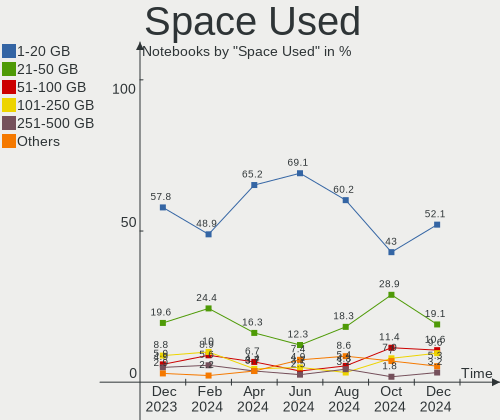
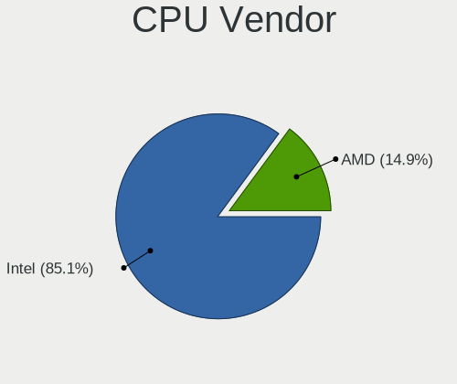
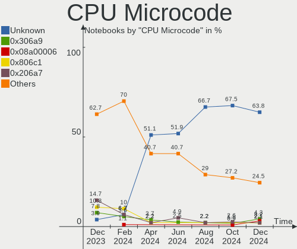
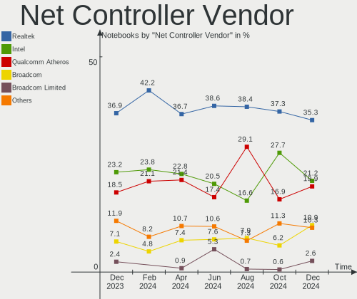
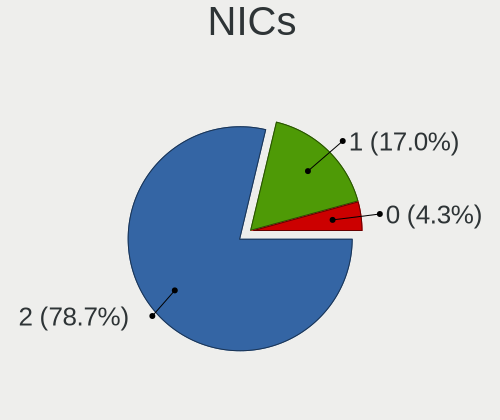

ROSA Hardware Trends (Notebook)
-------------------------------

A project to identify most popular hardware characteristics and track their change
over time based on data collected by ROSA users at https://Linux-Hardware.org.

Anyone can contribute to the study by uploading probes of their computers by
the [hw-probe](https://github.com/linuxhw/hw-probe) tool:

    sudo hw-probe -all -upload

Full-feature report is available here: https://linux-hardware.org/?view=trends&formfactor=notebook

Period: Dec, 2019.

Contents
--------

- [ OS                       ](#os)
- [ OS Family                ](#os-family)
- [ Kernel                   ](#kernel)
- [ Kernel Family            ](#kernel-family)
- [ Kernel Major Ver.        ](#kernel-major-ver)
- [ Arch                     ](#arch)
- [ DE                       ](#de)
- [ Display Server           ](#display-server)
- [ OS Lang                  ](#os-lang)
- [ Boot Mode                ](#boot-mode)
- [ Filesystem               ](#filesystem)
- [ Dual Boot with Linux     ](#dual-boot-with-linux)
- [ Dual Boot (Win)          ](#dual-boot-win)
- [ Country                  ](#country)
- [ City                     ](#city)
- [ Vendor                   ](#vendor)
- [ Model                    ](#model)
- [ Model Family             ](#model-family)
- [ MFG Year                 ](#mfg-year)
- [ Form Factor              ](#form-factor)
- [ Secure Boot              ](#secure-boot)
- [ Coreboot                 ](#coreboot)
- [ RAM Size                 ](#ram-size)
- [ RAM Used                 ](#ram-used)
- [ Drive Vendor             ](#drive-vendor)
- [ Drive Model              ](#drive-model)
- [ Drive Kind               ](#drive-kind)
- [ Drive Connector          ](#drive-connector)
- [ Drive Size               ](#drive-size)
- [ Space Total              ](#space-total)
- [ Space Used               ](#space-used)
- [ Malfunc. Drives          ](#malfunc-drives)
- [ Malfunc. Drive Vendor    ](#malfunc-drive-vendor)
- [ Malfunc. Drive Kind      ](#malfunc-drive-kind)
- [ Failed Drives            ](#failed-drives)
- [ Failed Drive Vendor      ](#failed-drive-vendor)
- [ Drive Status             ](#drive-status)
- [ CPU Vendor               ](#cpu-vendor)
- [ CPU Model                ](#cpu-model)
- [ CPU Model Family         ](#cpu-model-family)
- [ CPU Cores                ](#cpu-cores)
- [ CPU Sockets              ](#cpu-sockets)
- [ CPU Threads              ](#cpu-threads)
- [ CPU Op-Modes             ](#cpu-op-modes)
- [ CPU Microarch            ](#cpu-microarch)
- [ CPU Microcode            ](#cpu-microcode)
- [ GPU Vendor               ](#gpu-vendor)
- [ GPU Model                ](#gpu-model)
- [ GPU Combo                ](#gpu-combo)
- [ GPU Driver               ](#gpu-driver)
- [ GPU Memory               ](#gpu-memory)
- [ Monitor Vendor           ](#monitor-vendor)
- [ Monitor Model            ](#monitor-model)
- [ Monitor Resolution       ](#monitor-resolution)
- [ Monitor Diagonal         ](#monitor-diagonal)
- [ Monitor Width            ](#monitor-width)
- [ Aspect Ratio             ](#aspect-ratio)
- [ Monitor Area             ](#monitor-area)
- [ Pixel Density            ](#pixel-density)
- [ Multiple Monitors        ](#multiple-monitors)
- [ Net Controller Vendor    ](#net-controller-vendor)
- [ Net Controller Model     ](#net-controller-model)
- [ Net Controller Kind      ](#net-controller-kind)
- [ Used Controller          ](#used-controller)
- [ NICs                     ](#nics)
- [ Unsupported Devices      ](#unsupported-devices)
- [ Unsupported Device Types ](#unsupported-device-types)

OS
--

Installed operating systems

| Name      | Computers | Percent |
|-----------|-----------|---------|
| ROSA R11  | 154       | 90.59%  |
| ROSA R8.1 | 9         | 5.29%   |
| ROSA R10  | 6         | 3.53%   |
| ROSA R12  | 1         | 0.59%   |

OS Family
---------

OS without a version

| Name | Computers | Percent |
|------|-----------|---------|
| ROSA | 170       | 100%    |

Kernel
------

Version of the Linux kernel

| Version                          | Computers | Percent |
|----------------------------------|-----------|---------|
| 4.15.0-desktop-68.5rosa-x86_64   | 45        | 26.47%  |
| 4.15.0-desktop-45.1rosa-x86_64   | 40        | 23.53%  |
| 4.9.155-nrj-desktop-1rosa-x86_64 | 15        | 8.82%   |
| 4.15.0-desktop-60.7rosa-x86_64   | 15        | 8.82%   |
| 4.15.0-desktop-68.5rosa-i586     | 12        | 7.06%   |
| 4.15.0-desktop-45.1rosa-i586     | 9         | 5.29%   |
| 4.9.155-nrj-desktop-1rosa-i586   | 5         | 2.94%   |
| 5.0.0-desktop-37.1rosa-x86_64    | 3         | 1.76%   |
| 4.9.60-nrj-desktop-1rosa-x86_64  | 3         | 1.76%   |
| 5.0.0-desktop-38.1rosa-x86_64    | 2         | 1.18%   |
| 4.9.155-nrj-laptop-1rosa-x86_64  | 2         | 1.18%   |
| 4.1.38-nrj-desktop-2rosa-x86_64  | 2         | 1.18%   |
| 5.3.0-desktop-26.1rosa-x86_64    | 1         | 0.59%   |
| 5.3.0-desktop-24.1rosa-x86_64    | 1         | 0.59%   |
| 5.2.0-desktop-15.1rosa-x86_64    | 1         | 0.59%   |
| 5.0.0-desktop-33.1rosa-x86_64    | 1         | 0.59%   |
| 5.0.0-desktop-28.1rosa-x86_64    | 1         | 0.59%   |
| 4.9.9-nrj-desktop-1rosa-x86_64   | 1         | 0.59%   |
| 4.9.9-nrj-desktop-1rosa-i586     | 1         | 0.59%   |
| 4.9.60-nrj-desktop-1rosa-i586    | 1         | 0.59%   |
| 4.9.20-nrj-desktop-1rosa-x86_64  | 1         | 0.59%   |
| 4.9.124-nrj-desktop-1rosa-x86_64 | 1         | 0.59%   |
| 4.9.124-nrj-desktop-1rosa-i586   | 1         | 0.59%   |
| 4.19.53-nrj-desktop-1rosa-x86_64 | 1         | 0.59%   |
| 4.19.0-desktop-13.1rosa-x86_64   | 1         | 0.59%   |
| 4.15.0-desktop-60.7rosa-i586     | 1         | 0.59%   |
| 4.15.0-desktop-54.3rosa-x86_64   | 1         | 0.59%   |
| 4.15.0-desktop-47.2rosa-x86_64   | 1         | 0.59%   |
| 4.1.38-nrj-desktop-2rosa-i586    | 1         | 0.59%   |

Kernel Family
-------------

Linux kernel without a distro release

| Version | Computers | Percent |
|---------|-----------|---------|
| 4.15.0  | 124       | 72.94%  |
| 4.9.155 | 22        | 12.94%  |
| 5.0.0   | 7         | 4.12%   |
| 4.9.60  | 4         | 2.35%   |
| 4.1.38  | 3         | 1.76%   |
| 5.3.0   | 2         | 1.18%   |
| 4.9.9   | 2         | 1.18%   |
| 4.9.124 | 2         | 1.18%   |
| 5.2.0   | 1         | 0.59%   |
| 4.9.20  | 1         | 0.59%   |
| 4.19.53 | 1         | 0.59%   |
| 4.19.0  | 1         | 0.59%   |

Kernel Major Ver.
-----------------

Linux kernel major version

| Version | Computers | Percent |
|---------|-----------|---------|
| 4.15    | 124       | 72.94%  |
| 4.9     | 31        | 18.24%  |
| 5.0     | 7         | 4.12%   |
| 4.1     | 3         | 1.76%   |
| 5.3     | 2         | 1.18%   |
| 4.19    | 2         | 1.18%   |
| 5.2     | 1         | 0.59%   |

Arch
----

OS architecture (x86_64, i586, etc.)

| Name   | Computers | Percent |
|--------|-----------|---------|
| x86_64 | 139       | 81.76%  |
| i686   | 31        | 18.24%  |

DE
--

Desktop Environment

| Name | Computers | Percent |
|------|-----------|---------|
| KDE5 | 159       | 93.53%  |
| XFCE | 7         | 4.12%   |
| LXQt | 4         | 2.35%   |

Display Server
--------------

X11 or Wayland

| Name    | Computers | Percent |
|---------|-----------|---------|
| Unknown | 170       | 100%    |

OS Lang
-------

Language

| Lang    | Computers | Percent |
|---------|-----------|---------|
| Unknown | 170       | 100%    |

Boot Mode
---------

EFI or BIOS

| Mode | Computers | Percent |
|------|-----------|---------|
| BIOS | 127       | 74.71%  |
| EFI  | 43        | 25.29%  |

Filesystem
----------

Type of filesystem

| Type  | Computers | Percent |
|-------|-----------|---------|
| Ext4  | 160       | 94.12%  |
| Btrfs | 5         | 2.94%   |
| Ext3  | 3         | 1.76%   |
| Xfs   | 1         | 0.59%   |
| Ext2  | 1         | 0.59%   |

Dual Boot with Linux
--------------------

Hosting more than one Linux

| Dual boot | Computers | Percent |
|-----------|-----------|---------|
| No        | 132       | 77.65%  |
| Yes       | 38        | 22.35%  |

Dual Boot (Win)
---------------

Hosting Linux and Windows

| Dual boot | Computers | Percent |
|-----------|-----------|---------|
| No        | 113       | 66.47%  |
| Yes       | 57        | 33.53%  |

Country
-------

Geographic location (country)

| Country    | Computers | Percent |
|------------|-----------|---------|
| Russia     | 123       | 72.35%  |
| Ukraine    | 10        | 5.88%   |
| Belarus    | 6         | 3.53%   |
| USA        | 4         | 2.35%   |
| France     | 4         | 2.35%   |
| Kazakhstan | 3         | 1.76%   |
| Italy      | 3         | 1.76%   |
| Poland     | 2         | 1.18%   |
| Germany    | 2         | 1.18%   |
| Bulgaria   | 2         | 1.18%   |
| Brazil     | 2         | 1.18%   |
| UK         | 1         | 0.59%   |
| Turkey     | 1         | 0.59%   |
| Tunisia    | 1         | 0.59%   |
| Singapore  | 1         | 0.59%   |
| Senegal    | 1         | 0.59%   |
| Moldova    | 1         | 0.59%   |
| Latvia     | 1         | 0.59%   |
| Azerbaijan | 1         | 0.59%   |
| Australia  | 1         | 0.59%   |

City
----

Geographic location (city)

| City              | Computers | Percent |
|-------------------|-----------|---------|
| Moscow            | 34        | 20%     |
| St Petersburg     | 4         | 2.35%   |
| Rostov-on-Don     | 4         | 2.35%   |
| Novosibirsk       | 4         | 2.35%   |
| Vogue             | 3         | 1.76%   |
| Kemerovo          | 3         | 1.76%   |
| Yekaterinburg     | 2         | 1.18%   |
| Voronezh          | 2         | 1.18%   |
| Volgograd         | 2         | 1.18%   |
| Vladivostok       | 2         | 1.18%   |
| Tver              | 2         | 1.18%   |
| Tula              | 2         | 1.18%   |
| Saratov           | 2         | 1.18%   |
| Rome              | 2         | 1.18%   |
| Penza             | 2         | 1.18%   |
| Omsk              | 2         | 1.18%   |
| Nizhnevartovsk    | 2         | 1.18%   |
| Minsk             | 2         | 1.18%   |
| Luhansk           | 2         | 1.18%   |
| Krasnodar         | 2         | 1.18%   |
| Kirov             | 2         | 1.18%   |
| Kharkiv           | 2         | 1.18%   |
| Donetsk           | 2         | 1.18%   |
| Zheleznodorozhnyy | 1         | 0.59%   |
| Weinsberg         | 1         | 0.59%   |
| Warsaw            | 1         | 0.59%   |
| Vladikavkaz       | 1         | 0.59%   |
| Vitebsk           | 1         | 0.59%   |
| Vishnëvogorsk    | 1         | 0.59%   |
| Veliky Novgorod   | 1         | 0.59%   |
| Velikiye Luki     | 1         | 0.59%   |
| Valmiera          | 1         | 0.59%   |
| Ulyanovsk         | 1         | 0.59%   |
| Ufa               | 1         | 0.59%   |
| Tyumen            | 1         | 0.59%   |
| Tucson            | 1         | 0.59%   |
| Tambov            | 1         | 0.59%   |
| Sydney            | 1         | 0.59%   |
| Sosenskiy         | 1         | 0.59%   |
| Sofia             | 1         | 0.59%   |
| Sevastopol'       | 1         | 0.59%   |
| Sevastopol        | 1         | 0.59%   |
| Samara            | 1         | 0.59%   |
| Salgueiro         | 1         | 0.59%   |
| Rybinsk           | 1         | 0.59%   |
| Ryazan            | 1         | 0.59%   |
| Rudzica           | 1         | 0.59%   |
| Revda             | 1         | 0.59%   |
| Pyt-Yakh          | 1         | 0.59%   |
| Ponchatoula       | 1         | 0.59%   |
| Pittsburgh        | 1         | 0.59%   |
| Petropavl         | 1         | 0.59%   |
| Petergof          | 1         | 0.59%   |
| Pavlodar          | 1         | 0.59%   |
| Otradnyy          | 1         | 0.59%   |
| Orsogna           | 1         | 0.59%   |
| Orsk              | 1         | 0.59%   |
| Odesa             | 1         | 0.59%   |
| Nyagan            | 1         | 0.59%   |
| Novorossiysk      | 1         | 0.59%   |

Vendor
------

Motherboard manufacturer

| Name                | Computers | Percent |
|---------------------|-----------|---------|
| Lenovo              | 36        | 21.18%  |
| Hewlett-Packard     | 25        | 14.71%  |
| ASUSTek Computer    | 25        | 14.71%  |
| Acer                | 18        | 10.59%  |
| Dell                | 15        | 8.82%   |
| Samsung Electronics | 12        | 7.06%   |
| Sony                | 6         | 3.53%   |
| Packard Bell        | 5         | 2.94%   |
| Toshiba             | 4         | 2.35%   |
| eMachines           | 4         | 2.35%   |
| Pegatron            | 2         | 1.18%   |
| Medion              | 2         | 1.18%   |
| DEXP                | 2         | 1.18%   |
| Chuwi               | 2         | 1.18%   |
| Apple               | 2         | 1.18%   |
| Semp Toshiba        | 1         | 0.59%   |
| Panasonic           | 1         | 0.59%   |
| Notebook            | 1         | 0.59%   |
| Maibenben           | 1         | 0.59%   |
| LG Electronics      | 1         | 0.59%   |
| Fujitsu Siemens     | 1         | 0.59%   |
| Fujitsu             | 1         | 0.59%   |
| Compal              | 1         | 0.59%   |
| Clevo               | 1         | 0.59%   |
| Alienware           | 1         | 0.59%   |

Model
-----

Motherboard model

| Name                               | Computers | Percent |
|------------------------------------|-----------|---------|
| Pavilion g6                        | 4         | 2.35%   |
| B570e HuronRiver Platform          | 3         | 1.76%   |
| X550MJ                             | 2         | 1.18%   |
| V580c 20160                        | 2         | 1.18%   |
| Laptop 15-bw0xx                    | 2         | 1.18%   |
| IdeaPad 330-15AST 81D6             | 2         | 1.18%   |
| Hero Book                          | 2         | 1.18%   |
| G50-45 80E3                        | 2         | 1.18%   |
| G50-30 80G0                        | 2         | 1.18%   |
| F5SL                               | 2         | 1.18%   |
| Aspire A315-21                     | 2         | 1.18%   |
| 350V5C/351V5C/3540VC/3440VC        | 2         | 1.18%   |
| 300V3A/300V4A/300V5A/200A4B/200A5B | 2         | 1.18%   |
| Unknown                            | 2         | 1.18%   |
| Y50-70 20378                       | 1         | 0.59%   |
| XiaoMai6                           | 1         | 0.59%   |
| X75VC                              | 1         | 0.59%   |
| X553MA                             | 1         | 0.59%   |
| X51R                               | 1         | 0.59%   |
| WIM2120                            | 1         | 0.59%   |
| W65_67SB                           | 1         | 0.59%   |
| VPCS118EC                          | 1         | 0.59%   |
| VPCEH36EF                          | 1         | 0.59%   |
| VPCEB13EB                          | 1         | 0.59%   |
| VivoBook 15_ASUS Laptop X542UF     | 1         | 0.59%   |
| VGN-SZ7RMN_B                       | 1         | 0.59%   |
| VGN-FW11ZRU                        | 1         | 0.59%   |
| V560                               | 1         | 0.59%   |
| V310-15ISK 80SY                    | 1         | 0.59%   |
| V145-15AST 81MT                    | 1         | 0.59%   |
| UX330UA                            | 1         | 0.59%   |
| UX31A                              | 1         | 0.59%   |
| U31SD                              | 1         | 0.59%   |
| U24E                               | 1         | 0.59%   |
| ThinkPad X230 2320LFG              | 1         | 0.59%   |
| ThinkPad T60 1952VKC               | 1         | 0.59%   |
| ThinkPad T540p 20BFS02S01          | 1         | 0.59%   |
| ThinkPad T400 6475GC8              | 1         | 0.59%   |
| ThinkPad SL510 2875RS2             | 1         | 0.59%   |
| SVE1713M1RW                        | 1         | 0.59%   |
| Satellite M100                     | 1         | 0.59%   |
| Satellite L850D-BJS                | 1         | 0.59%   |
| Satellite C660                     | 1         | 0.59%   |
| Satellite A305                     | 1         | 0.59%   |
| S525-L.ACO1R1                      | 1         | 0.59%   |
| R508                               | 1         | 0.59%   |
| ProBook 6570b                      | 1         | 0.59%   |
| ProBook 4720s                      | 1         | 0.59%   |
| ProBook 4520s                      | 1         | 0.59%   |
| PBL00                              | 1         | 0.59%   |
| Pavilion m6                        | 1         | 0.59%   |
| Pavilion g7                        | 1         | 0.59%   |
| Pavilion dv7                       | 1         | 0.59%   |
| Pavilion dv6                       | 1         | 0.59%   |
| Pavilion 17                        | 1         | 0.59%   |
| P7624                              | 1         | 0.59%   |
| Notebook                           | 1         | 0.59%   |
| NH4BT58                            | 1         | 0.59%   |
| NC210/NC110                        | 1         | 0.59%   |
| NAVIS PX100                        | 1         | 0.59%   |

Model Family
------------

Motherboard model prefix

| Name                         | Computers | Percent |
|------------------------------|-----------|---------|
| Acer Aspire                  | 16        | 9.41%   |
| Dell Inspiron                | 10        | 5.88%   |
| HP Pavilion                  | 9         | 5.29%   |
| Lenovo IdeaPad               | 8         | 4.71%   |
| Lenovo ThinkPad              | 5         | 2.94%   |
| HP Laptop                    | 5         | 2.94%   |
| Dell Latitude                | 5         | 2.94%   |
| Toshiba Satellite            | 4         | 2.35%   |
| Samsung Electronics 300V3A   | 3         | 1.76%   |
| Packard Bell EasyNote        | 3         | 1.76%   |
| Lenovo B570e                 | 3         | 1.76%   |
| HP ProBook                   | 3         | 1.76%   |
| Samsung Electronics 350V5C   | 2         | 1.18%   |
| Packard Bell DOT             | 2         | 1.18%   |
| Lenovo V580c                 | 2         | 1.18%   |
| Lenovo G50-45                | 2         | 1.18%   |
| Lenovo G50-30                | 2         | 1.18%   |
| HP Compaq                    | 2         | 1.18%   |
| Chuwi Hero                   | 2         | 1.18%   |
| ASUS X550MJ                  | 2         | 1.18%   |
| ASUS F5SL                    | 2         | 1.18%   |
| Acer Extensa                 | 2         | 1.18%   |
| Unknown                      | 2         | 1.18%   |
| Sony VPCS118EC               | 1         | 0.59%   |
| Sony VPCEH36EF               | 1         | 0.59%   |
| Sony VPCEB13EB               | 1         | 0.59%   |
| Sony VGN-SZ7RMN              | 1         | 0.59%   |
| Sony VGN-FW11ZRU             | 1         | 0.59%   |
| Sony SVE1713M1RW             | 1         | 0.59%   |
| Semp Toshiba IS              | 1         | 0.59%   |
| Samsung Electronics R508     | 1         | 0.59%   |
| Samsung Electronics NC210    | 1         | 0.59%   |
| Samsung Electronics N250P    | 1         | 0.59%   |
| Samsung Electronics N150P    | 1         | 0.59%   |
| Samsung Electronics 300E4Z   | 1         | 0.59%   |
| Samsung Electronics 300E4C   | 1         | 0.59%   |
| Samsung Electronics 300E4A   | 1         | 0.59%   |
| Pegatron C15B                | 1         | 0.59%   |
| Pegatron A25                 | 1         | 0.59%   |
| Panasonic CF-19XHNAZF9       | 1         | 0.59%   |
| Notebook W65                 | 1         | 0.59%   |
| Medion WIM2120               | 1         | 0.59%   |
| Medion P7624                 | 1         | 0.59%   |
| Maibenben XiaoMai6           | 1         | 0.59%   |
| LG Electronics S525-L.ACO1R1 | 1         | 0.59%   |
| Lenovo Y50-70                | 1         | 0.59%   |
| Lenovo V560                  | 1         | 0.59%   |
| Lenovo V310-15ISK            | 1         | 0.59%   |
| Lenovo V145-15AST            | 1         | 0.59%   |
| Lenovo G570                  | 1         | 0.59%   |
| Lenovo G510                  | 1         | 0.59%   |
| Lenovo G505s                 | 1         | 0.59%   |
| Lenovo G505                  | 1         | 0.59%   |
| Lenovo G50-70                | 1         | 0.59%   |
| Lenovo B590                  | 1         | 0.59%   |
| Lenovo B51-30                | 1         | 0.59%   |
| Lenovo B50-45                | 1         | 0.59%   |
| Lenovo B450                  | 1         | 0.59%   |
| HP Notebook                  | 1         | 0.59%   |
| HP G62                       | 1         | 0.59%   |

MFG Year
--------

Motherboard manufacture year

| Year | Computers | Percent |
|------|-----------|---------|
| 2012 | 22        | 12.94%  |
| 2011 | 21        | 12.35%  |
| 2015 | 19        | 11.18%  |
| 2013 | 18        | 10.59%  |
| 2010 | 16        | 9.41%   |
| 2018 | 14        | 8.24%   |
| 2019 | 12        | 7.06%   |
| 2009 | 11        | 6.47%   |
| 2008 | 9         | 5.29%   |
| 2014 | 8         | 4.71%   |
| 2016 | 7         | 4.12%   |
| 2007 | 5         | 2.94%   |
| 2017 | 4         | 2.35%   |
| 2006 | 3         | 1.76%   |
| 2004 | 1         | 0.59%   |

Form Factor
-----------

Physical design of the computer

| Name     | Computers | Percent |
|----------|-----------|---------|
| Notebook | 170       | 100%    |

Secure Boot
-----------

Enabled or disabled

| State    | Computers | Percent |
|----------|-----------|---------|
| Disabled | 150       | 88.24%  |
| Unknown  | 20        | 11.76%  |

Coreboot
--------

Have coreboot on board

| Used | Computers | Percent |
|------|-----------|---------|
| No   | 170       | 100%    |

RAM Size
--------

Total RAM memory

| Size in GB | Computers | Percent |
|------------|-----------|---------|
| 3.01-4.0   | 74        | 43.53%  |
| 4.01-8.0   | 41        | 24.12%  |
| 1.01-2.0   | 21        | 12.35%  |
| 8.01-16.0  | 21        | 12.35%  |
| 2.01-3.0   | 10        | 5.88%   |
| 0.01-1.0   | 2         | 1.18%   |
| 16.01-24.0 | 1         | 0.59%   |

RAM Used
--------

Used RAM memory

| Used GB  | Computers | Percent |
|----------|-----------|---------|
| 0.01-1.0 | 82        | 48.24%  |
| 1.01-2.0 | 66        | 38.82%  |
| 2.01-3.0 | 14        | 8.24%   |
| 4.01-8.0 | 4         | 2.35%   |
| 3.01-4.0 | 4         | 2.35%   |

Drive Vendor
------------

Hard drive vendors

| Vendor              | Computers | Drives  | Percent |
|---------------------|-----------|---------|---------|
| WDC                 | 45        | 48      | 22.28%  |
| Seagate             | 27        | 27      | 13.37%  |
| Toshiba             | 26        | 26      | 12.87%  |
| Hitachi             | 22        | 23      | 10.89%  |
| Kingston            | 10        | 10      | 4.95%   |
| SanDisk             | 9         | 9       | 4.46%   |
| Samsung Electronics | 9         | 9       | 4.46%   |
| Unknown             | 8         | 8       | 3.96%   |
| HGST                | 6         | 8       | 2.97%   |
| SPCC                | 4         | 4       | 1.98%   |
| A-DATA Technology   | 4         | 4       | 1.98%   |
| HL-DT-ST            | 3         | Unknown | 1.49%   |
| Fujitsu             | 3         | 3       | 1.49%   |
| Zheino              | 2         | 2       | 0.99%   |
| Transcend           | 2         | 2       | 0.99%   |
| LITEONIT            | 2         | 3       | 0.99%   |
| LITEON              | 2         | 2       | 0.99%   |
| Crucial             | 2         | 2       | 0.99%   |
| Verbatim            | 1         | 1       | 0.5%    |
| Team                | 1         | 1       | 0.5%    |
| SK Hynix            | 1         | 1       | 0.5%    |
| SABRENT             | 1         | 1       | 0.5%    |
| oyunkey             | 1         | 1       | 0.5%    |
| OCZ                 | 1         | 1       | 0.5%    |
| KingSpec            | 1         | 1       | 0.5%    |
| KINGMAX             | 1         | 1       | 0.5%    |
| Intel               | 1         | 1       | 0.5%    |
| HUAWEI              | 1         | 1       | 0.5%    |
| HS-SSD-C100         | 1         | 1       | 0.5%    |
| Hewlett-Packard     | 1         | 1       | 0.5%    |
| Gigabyte Technology | 1         | 1       | 0.5%    |
| China               | 1         | 1       | 0.5%    |
| Apple               | 1         | 1       | 0.5%    |
| Apacer              | 1         | 1       | 0.5%    |

Drive Model
-----------

Hard drive models

| Model                        | Computers | Percent |
|------------------------------|-----------|---------|
| MQ01ABF050 500GB             | 5         | 2.39%   |
| HTS547575A9E384 752GB        | 4         | 1.91%   |
| WDS240G2G0A-00JH30 240GB SSD | 3         | 1.44%   |
| WD10JPVX-22JC3T0 1TB         | 3         | 1.44%   |
| ST9500325AS 500GB            | 3         | 1.44%   |
| SA400S37240G 240GB SSD       | 3         | 1.44%   |
| MQ01ABD100 1TB               | 3         | 1.44%   |
| MQ01ABD050 500GB             | 3         | 1.44%   |
| HTS547550A9E384 500GB        | 3         | 1.44%   |
| DVDRAM GUC0N 1GB             | 3         | 1.44%   |
| WDS250G2B0B 250GB SSD        | 2         | 0.96%   |
| WD5000LPCX-2 500GB           | 2         | 0.96%   |
| ST9320423AS 320GB            | 2         | 0.96%   |
| ST500LT012-9WS142 500GB      | 2         | 0.96%   |
| ST500LT012-1DG142 500GB      | 2         | 0.96%   |
| SSD 120GB                    | 2         | 0.96%   |
| Solid State Disk 256GB       | 2         | 0.96%   |
| RBUSNS8180DS3128GH 128GB SSD | 2         | 0.96%   |
| MQ04ABF100 1TB               | 2         | 0.96%   |
| MK6476GSX 640GB              | 2         | 0.96%   |
| MK3259GSXP 320GB             | 2         | 0.96%   |
| MHY2200BH 200GB              | 2         | 0.96%   |
| HTS547564A9E384 640GB        | 2         | 0.96%   |
| HTS545050B9A300 500GB        | 2         | 0.96%   |
| HTS545050A7E680 500GB        | 2         | 0.96%   |
| HTS545016B9A300 160GB        | 2         | 0.96%   |
| HTS543232A7A384 320GB        | 2         | 0.96%   |
| EC2QT  64GB                  | 2         | 0.96%   |
| DF4064  64GB                 | 2         | 0.96%   |
| CT240BX500SSD1 240GB         | 2         | 0.96%   |
| XM11 128GB-V2 SSD            | 1         | 0.48%   |
| WDS240G2G0B-00EPW0 240GB SSD | 1         | 0.48%   |
| WDS240G2G0A 240GB SSD        | 1         | 0.48%   |
| WDS120G2G0A-00JH30 120GB SSD | 1         | 0.48%   |
| WD7500BPKX-75HPJT0 752GB     | 1         | 0.48%   |
| WD5000LPVX-80V0TT0 500GB     | 1         | 0.48%   |
| WD5000LPVX-22V0TT0 500GB     | 1         | 0.48%   |
| WD5000LPLX-66ZNTT1 500GB     | 1         | 0.48%   |
| WD5000LPCX-60VHAT1 500GB     | 1         | 0.48%   |
| WD5000LPCX-6 500GB           | 1         | 0.48%   |
| WD5000LPCX-24C6HT0 500GB     | 1         | 0.48%   |
| WD5000LPCX-22VHAT0 500GB     | 1         | 0.48%   |
| WD5000LPCX-21VHAT0 500GB     | 1         | 0.48%   |
| WD5000LPCX-00VHAT0 500GB     | 1         | 0.48%   |
| WD5000BPVT-80HXZT3 500GB     | 1         | 0.48%   |
| WD5000BPVT-8 500GB           | 1         | 0.48%   |
| WD5000BPVT-55HXZT3 500GB     | 1         | 0.48%   |
| WD5000BPVT-08HXZT3 500GB     | 1         | 0.48%   |
| WD5000BEVT-75A0RT0 500GB     | 1         | 0.48%   |
| WD5000BEVT-24A0RT0 500GB     | 1         | 0.48%   |
| WD3200BPVT-22ZEST0 320GB     | 1         | 0.48%   |
| WD3200BEVT-80A0RT0 320GB     | 1         | 0.48%   |
| WD3200BEVT-08A23T1 320GB     | 1         | 0.48%   |
| WD3200BEVE-00A0HT0 320GB     | 1         | 0.48%   |
| WD3200BEKT-2 320GB           | 1         | 0.48%   |
| WD2500LPCX-24C6HT0 250GB     | 1         | 0.48%   |
| WD2500BEVT-35A23T0 250GB     | 1         | 0.48%   |
| WD2500BEVT-3 250GB           | 1         | 0.48%   |
| WD1600BEVT-80A23T0 160GB     | 1         | 0.48%   |
| WD1600BEVT-22ZCT0 160GB      | 1         | 0.48%   |

Drive Kind
----------

HDD or SSD

| Kind    | Computers | Drives | Percent |
|---------|-----------|--------|---------|
| HDD     | 125       | 131    | 63.78%  |
| SSD     | 59        | 64     | 30.1%   |
| MMC     | 8         | 10     | 4.08%   |
| Unknown | 4         | 1      | 2.04%   |

Drive Connector
---------------

SATA, SAS, NVMe, etc.

| Type | Computers | Drives | Percent |
|------|-----------|--------|---------|
| SATA | 168       | 194    | 92.82%  |
| MMC  | 8         | 10     | 4.42%   |
| SAS  | 5         | 2      | 2.76%   |

Drive Size
----------

Size of hard drive

| Size in TB | Computers | Drives | Percent |
|------------|-----------|--------|---------|
| 0.01-0.5   | 143       | 169    | 79.89%  |
| 0.51-1.0   | 35        | 36     | 19.55%  |
| 1.01-2.0   | 1         | 1      | 0.56%   |

Space Total
-----------

Amount of disk space available on the file system

| Size in GB | Computers | Percent |
|------------|-----------|---------|
| 101-250    | 63        | 37.06%  |
| 251-500    | 46        | 27.06%  |
| 1-20       | 17        | 10%     |
| 501-1000   | 17        | 10%     |
| 21-50      | 15        | 8.82%   |
| 51-100     | 10        | 5.88%   |
| 1001-2000  | 2         | 1.18%   |

Space Used
----------

Amount of used disk space

| Used GB  | Computers | Percent |
|----------|-----------|---------|
| 1-20     | 116       | 68.24%  |
| 21-50    | 15        | 8.82%   |
| 101-250  | 14        | 8.24%   |
| 51-100   | 12        | 7.06%   |
| 251-500  | 9         | 5.29%   |
| 501-1000 | 4         | 2.35%   |

Malfunc. Drives
---------------

Drive models with a malfunction

| Model                      | Computers | Drives | Percent |
|----------------------------|-----------|--------|---------|
| ST9500325AS 500GB          | 3         | 3      | 4.62%   |
| ST9320423AS 320GB          | 2         | 2      | 3.08%   |
| ST500LT012-9WS142 500GB    | 2         | 2      | 3.08%   |
| MQ01ABD050 500GB           | 2         | 2      | 3.08%   |
| MK3259GSXP 320GB           | 2         | 2      | 3.08%   |
| HTS547575A9E384 752GB      | 2         | 2      | 3.08%   |
| HTS547564A9E384 640GB      | 2         | 2      | 3.08%   |
| HTS545050A7E680 500GB      | 2         | 2      | 3.08%   |
| XM11 128GB-V2 SSD          | 1         | 1      | 1.54%   |
| WD5000LPCX-24C6HT0 500GB   | 1         | 1      | 1.54%   |
| WD5000BPVT-55HXZT3 500GB   | 1         | 1      | 1.54%   |
| WD5000BEVT-75A0RT0 500GB   | 1         | 1      | 1.54%   |
| WD3200BEVT-80A0RT0 320GB   | 1         | 1      | 1.54%   |
| WD2500LPCX-24C6HT0 250GB   | 1         | 1      | 1.54%   |
| WD2500BEVT-35A23T0 250GB   | 1         | 1      | 1.54%   |
| WD2500BEVT-3 250GB         | 1         | 1      | 1.54%   |
| WD1600BEVS-07RST0 160GB    | 1         | 1      | 1.54%   |
| ST98823AS 80GB             | 1         | 1      | 1.54%   |
| ST980811AS 80GB            | 1         | 1      | 1.54%   |
| ST9320320AS 320GB          | 1         | 1      | 1.54%   |
| ST9160827AS 160GB          | 1         | 1      | 1.54%   |
| ST9160821AS 160GB          | 1         | 1      | 1.54%   |
| ST9160314AS 160GB          | 1         | 1      | 1.54%   |
| ST500LT012-9WS14 500GB     | 1         | 1      | 1.54%   |
| ST500LT012-1DG142 500GB    | 1         | 1      | 1.54%   |
| ST320LT020-9YG142 320GB    | 1         | 1      | 1.54%   |
| ST320LT012-9WS14 320GB     | 1         | 1      | 1.54%   |
| ST1000LM024 HN-M 1TB       | 1         | 1      | 1.54%   |
| SSDSA1M160G2HP 160GB       | 1         | 1      | 1.54%   |
| SP900 128GB SSD            | 1         | 1      | 1.54%   |
| P3-128 128GB SSD           | 1         | 1      | 1.54%   |
| MQ01ABF050 500GB           | 1         | 1      | 1.54%   |
| MQ01ABD100 1TB             | 1         | 1      | 1.54%   |
| MQ01ABD075 750GB           | 1         | 1      | 1.54%   |
| MQ01ABD032 320GB           | 1         | 1      | 1.54%   |
| MK6476GSX 640GB            | 1         | 1      | 1.54%   |
| MK6475GSX 640GB            | 1         | 1      | 1.54%   |
| MK6465GSX 640GB            | 1         | 1      | 1.54%   |
| MK1652GSX 160GB            | 1         | 1      | 1.54%   |
| MK1059GSMP 1TB             | 1         | 1      | 1.54%   |
| LMN-256M3M mSATA 256GB SSD | 1         | 1      | 1.54%   |
| LMN-256 256GB SSD          | 1         | 1      | 1.54%   |
| HTS54757 752GB             | 1         | 1      | 1.54%   |
| HTS547550A9E384 500GB      | 1         | 1      | 1.54%   |
| HTS545050A7E380 500GB      | 1         | 1      | 1.54%   |
| HTS545050A7 500GB          | 1         | 1      | 1.54%   |
| HTS545032B9A300 320GB      | 1         | 1      | 1.54%   |
| HTS543232A7A384 320GB      | 1         | 1      | 1.54%   |
| HTS543216L9A300 160GB      | 1         | 1      | 1.54%   |
| HTS541612J9SA00 120GB      | 1         | 1      | 1.54%   |
| HTS54161 120GB             | 1         | 1      | 1.54%   |
| HN-M500MBB 500GB           | 1         | 1      | 1.54%   |
| HN-M500M 500GB             | 1         | 1      | 1.54%   |
| HN-M101MBB 1TB             | 1         | 1      | 1.54%   |
| HM160HI 160GB              | 1         | 1      | 1.54%   |
| CHN-25SATAA3-360 360GB SSD | 1         | 1      | 1.54%   |

Malfunc. Drive Vendor
---------------------

Vendors of faulty drives

| Vendor              | Computers | Drives | Percent |
|---------------------|-----------|--------|---------|
| Seagate             | 18        | 18     | 29.51%  |
| Toshiba             | 13        | 13     | 21.31%  |
| Hitachi             | 10        | 11     | 16.39%  |
| WDC                 | 7         | 8      | 11.48%  |
| Samsung Electronics | 4         | 4      | 6.56%   |
| HGST                | 3         | 4      | 4.92%   |
| A-DATA Technology   | 2         | 2      | 3.28%   |
| Zheino              | 1         | 1      | 1.64%   |
| LITEONIT            | 1         | 2      | 1.64%   |
| KingSpec            | 1         | 1      | 1.64%   |
| Intel               | 1         | 1      | 1.64%   |

Malfunc. Drive Kind
-------------------

Kinds of faulty drives

| Kind | Computers | Drives | Percent |
|------|-----------|--------|---------|
| HDD  | 54        | 58     | 90%     |
| SSD  | 6         | 7      | 10%     |

Failed Drives
-------------

Failed drive models

| Model                   | Computers | Drives | Percent |
|-------------------------|-----------|--------|---------|
| WD1600BEVT-22ZCT0 160GB | 1         | 1      | 50%     |
| HTS54322 250GB          | 1         | 1      | 50%     |

Failed Drive Vendor
-------------------

Failed drive vendors

| Vendor  | Computers | Drives | Percent |
|---------|-----------|--------|---------|
| WDC     | 1         | 1      | 50%     |
| Hitachi | 1         | 1      | 50%     |

Drive Status
------------

Number of failed and malfunc. drives

| Status   | Computers | Drives | Percent |
|----------|-----------|--------|---------|
| Works    | 115       | 127    | 60.53%  |
| Malfunc  | 60        | 65     | 31.58%  |
| Detected | 13        | 12     | 6.84%   |
| Failed   | 2         | 2      | 1.05%   |

CPU Vendor
----------

Processor vendors

| Vendor       | Computers | Percent |
|--------------|-----------|---------|
| Intel        | 132       | 77.65%  |
| AMD          | 37        | 21.76%  |
| CentaurHauls | 1         | 0.59%   |

CPU Model
---------

Processor models

| Model                                         | Computers | Percent |
|-----------------------------------------------|-----------|---------|
| Intel Pentium CPU B940 @ 2.00GHz              | 6         | 3.53%   |
| Intel Pentium CPU B950 @ 2.10GHz              | 4         | 2.35%   |
| Intel Core i5-3210M CPU @ 2.50GHz             | 4         | 2.35%   |
| Intel Pentium CPU N3540 @ 2.16GHz             | 3         | 1.76%   |
| Intel Pentium CPU B960 @ 2.20GHz              | 3         | 1.76%   |
| Intel Core i5 CPU M 480 @ 2.67GHz             | 3         | 1.76%   |
| Intel Core i3-3120M CPU @ 2.50GHz             | 3         | 1.76%   |
| Intel Core i3-3110M CPU @ 2.40GHz             | 3         | 1.76%   |
| Intel Core i3-2350M CPU @ 2.30GHz             | 3         | 1.76%   |
| Intel Atom CPU N455 @ 1.66GHz                 | 3         | 1.76%   |
| AMD A6-4400M APU with Radeon HD Graphics      | 3         | 1.76%   |
| Intel Pentium Dual-Core CPU T4500 @ 2.30GHz   | 2         | 1.18%   |
| Intel Pentium Dual-Core CPU T4200 @ 2.00GHz   | 2         | 1.18%   |
| Intel Pentium 3558U @ 1.70GHz                 | 2         | 1.18%   |
| Intel Core i7-4710HQ CPU @ 2.50GHz            | 2         | 1.18%   |
| Intel Core i5-3230M CPU @ 2.60GHz             | 2         | 1.18%   |
| Intel Core i5-2520M CPU @ 2.50GHz             | 2         | 1.18%   |
| Intel Core i5-2450M CPU @ 2.50GHz             | 2         | 1.18%   |
| Intel Core i5-2430M CPU @ 2.40GHz             | 2         | 1.18%   |
| Intel Core i3-6006U CPU @ 2.00GHz             | 2         | 1.18%   |
| Intel Core i3-5005U CPU @ 2.00GHz             | 2         | 1.18%   |
| Intel Core i3-2310M CPU @ 2.10GHz             | 2         | 1.18%   |
| Intel Core i3 CPU M 370 @ 2.40GHz             | 2         | 1.18%   |
| Intel Core 2 Duo CPU T5750 @ 2.00GHz          | 2         | 1.18%   |
| Intel Celeron CPU N3050 @ 1.60GHz             | 2         | 1.18%   |
| Intel Celeron CPU N2840 @ 2.16GHz             | 2         | 1.18%   |
| Intel Celeron CPU 900 @ 2.20GHz               | 2         | 1.18%   |
| Intel Atom x5-E8000 CPU @ 1.04GHz             | 2         | 1.18%   |
| AMD Turion 64 X2 Mobile Technology TL-56      | 2         | 1.18%   |
| AMD E1-6010 APU with AMD Radeon R2 Graphics   | 2         | 1.18%   |
| AMD E-450 APU with Radeon HD Graphics         | 2         | 1.18%   |
| AMD A6-9220e RADEON R4, 5 COMPUTE CORES 2C+3G | 2         | 1.18%   |
| AMD A4-6210 APU with AMD Radeon R3 Graphics   | 2         | 1.18%   |
| Intel Pentium Dual-Core CPU T4400 @ 2.20GHz   | 1         | 0.59%   |
| Intel Pentium Dual-Core CPU T4300 @ 2.10GHz   | 1         | 0.59%   |
| Intel Pentium Dual CPU T3400 @ 2.16GHz        | 1         | 0.59%   |
| Intel Pentium Dual CPU T3200 @ 2.00GHz        | 1         | 0.59%   |
| Intel Pentium Dual CPU T2370 @ 1.73GHz        | 1         | 0.59%   |
| Intel Pentium CPU U5400 @ 1.20GHz             | 1         | 0.59%   |
| Intel Pentium CPU N3710 @ 1.60GHz             | 1         | 0.59%   |
| Intel Pentium CPU N3530 @ 2.16GHz             | 1         | 0.59%   |
| Intel Pentium CPU B980 @ 2.40GHz              | 1         | 0.59%   |
| Intel Genuine CPU T2400 @ 1.83GHz             | 1         | 0.59%   |
| Intel Genuine CPU T2300 @ 1.66GHz             | 1         | 0.59%   |
| Intel Core i7-6500U CPU @ 2.50GHz             | 1         | 0.59%   |
| Intel Core i7-5600U CPU @ 2.60GHz             | 1         | 0.59%   |
| Intel Core i7-4800MQ CPU @ 2.70GHz            | 1         | 0.59%   |
| Intel Core i7-4710MQ CPU @ 2.50GHz            | 1         | 0.59%   |
| Intel Core i7-4702MQ CPU @ 2.20GHz            | 1         | 0.59%   |
| Intel Core i7-3630QM CPU @ 2.40GHz            | 1         | 0.59%   |
| Intel Core i7-2670QM CPU @ 2.20GHz            | 1         | 0.59%   |
| Intel Core i7 CPU L 640 @ 2.13GHz             | 1         | 0.59%   |
| Intel Core i5-8250U CPU @ 1.60GHz             | 1         | 0.59%   |
| Intel Core i5-6300U CPU @ 2.40GHz             | 1         | 0.59%   |
| Intel Core i5-6200U CPU @ 2.30GHz             | 1         | 0.59%   |
| Intel Core i5-5350U CPU @ 1.80GHz             | 1         | 0.59%   |
| Intel Core i5-5300U CPU @ 2.30GHz             | 1         | 0.59%   |
| Intel Core i5-5200U CPU @ 2.20GHz             | 1         | 0.59%   |
| Intel Core i5-4310U CPU @ 2.00GHz             | 1         | 0.59%   |
| Intel Core i5-4300M CPU @ 2.60GHz             | 1         | 0.59%   |

CPU Model Family
----------------

Processor model prefix

| Model                   | Computers | Percent |
|-------------------------|-----------|---------|
| Intel Core i5           | 30        | 17.65%  |
| Intel Core i3           | 25        | 14.71%  |
| Intel Pentium           | 22        | 12.94%  |
| Intel Core 2 Duo        | 12        | 7.06%   |
| Intel Celeron           | 11        | 6.47%   |
| Intel Core i7           | 10        | 5.88%   |
| AMD A6                  | 8         | 4.71%   |
| Intel Atom              | 7         | 4.12%   |
| Intel Pentium Dual-Core | 6         | 3.53%   |
| AMD E1                  | 4         | 2.35%   |
| AMD A4                  | 4         | 2.35%   |
| Intel Pentium Dual      | 3         | 1.76%   |
| AMD A10                 | 3         | 1.76%   |
| Intel Genuine           | 2         | 1.18%   |
| Intel Celeron M         | 2         | 1.18%   |
| AMD Turion 64 X2 Mobile | 2         | 1.18%   |
| AMD Ryzen 3             | 2         | 1.18%   |
| AMD Phenom II           | 2         | 1.18%   |
| AMD E2                  | 2         | 1.18%   |
| AMD E                   | 2         | 1.18%   |
| AMD A8                  | 2         | 1.18%   |
| Intel Core 2 Solo       | 1         | 0.59%   |
| Intel Core 2            | 1         | 0.59%   |
| CentaurHauls VIA Nano   | 1         | 0.59%   |
| AMD Turion II           | 1         | 0.59%   |
| AMD Ryzen 5             | 1         | 0.59%   |
| AMD Athlon Neo X2       | 1         | 0.59%   |
| AMD Athlon II           | 1         | 0.59%   |
| AMD Athlon 64           | 1         | 0.59%   |
| AMD Athlon              | 1         | 0.59%   |

CPU Cores
---------

Number of processor cores

| Number | Computers | Percent |
|--------|-----------|---------|
| 2      | 131       | 77.06%  |
| 4      | 25        | 14.71%  |
| 1      | 14        | 8.24%   |

CPU Sockets
-----------

Number of sockets

| Number | Computers | Percent |
|--------|-----------|---------|
| 1      | 170       | 100%    |

CPU Threads
-----------

Threads per core (Hyper-Threading)

| Number | Computers | Percent |
|--------|-----------|---------|
| 1      | 93        | 54.71%  |
| 2      | 77        | 45.29%  |

CPU Op-Modes
------------

CPU Operation Modes (32-bit, 64-bit)

| Op mode        | Computers | Percent |
|----------------|-----------|---------|
| 32-bit, 64-bit | 167       | 98.24%  |
| 32-bit         | 3         | 1.76%   |

CPU Microarch
-------------

Microarchitecture

| Name        | Computers | Percent |
|-------------|-----------|---------|
| SandyBridge | 31        | 18.24%  |
| Core        | 26        | 15.29%  |
| IvyBridge   | 16        | 9.41%   |
| Silvermont  | 14        | 8.24%   |
| Westmere    | 12        | 7.06%   |
| Haswell     | 12        | 7.06%   |
| Skylake     | 8         | 4.71%   |
| Excavator   | 8         | 4.71%   |
| Broadwell   | 6         | 3.53%   |
| Piledriver  | 5         | 2.94%   |
| K8 Hammer   | 5         | 2.94%   |
| Puma        | 4         | 2.35%   |
| K10         | 4         | 2.35%   |
| Bonnell     | 4         | 2.35%   |
| P6          | 3         | 1.76%   |
| Jaguar      | 3         | 1.76%   |
| Zen         | 2         | 1.18%   |
| K10 Llano   | 2         | 1.18%   |
| Bobcat      | 2         | 1.18%   |
| Zen+        | 1         | 0.59%   |
| Steamroller | 1         | 0.59%   |
| Unknown     | 1         | 0.59%   |

CPU Microcode
-------------

Microcode number

| Number     | Computers | Percent |
|------------|-----------|---------|
| 0x206a7    | 31        | 18.24%  |
| 0x306a9    | 15        | 8.82%   |
| 0x20655    | 10        | 5.88%   |
| Unknown    | 10        | 5.88%   |
| 0x1067a    | 9         | 5.29%   |
| 0x6fd      | 8         | 4.71%   |
| 0x306c3    | 8         | 4.71%   |
| 0x306d4    | 6         | 3.53%   |
| 0x406e3    | 5         | 2.94%   |
| 0x406c4    | 5         | 2.94%   |
| 0x30678    | 5         | 2.94%   |
| 0x10676    | 5         | 2.94%   |
| 0x06006705 | 5         | 2.94%   |
| 0x06001119 | 5         | 2.94%   |
| 0x40651    | 4         | 2.35%   |
| 0x07030105 | 4         | 2.35%   |
| 0x010000c8 | 4         | 2.35%   |
| 0x106ca    | 3         | 1.76%   |
| 0x0700010f | 3         | 1.76%   |
| 0x806ea    | 2         | 1.18%   |
| 0x6fb      | 2         | 1.18%   |
| 0x6e8      | 2         | 1.18%   |
| 0x406c3    | 2         | 1.18%   |
| 0x06006704 | 2         | 1.18%   |
| 0x05000119 | 2         | 1.18%   |
| 0x03000027 | 2         | 1.18%   |
| 0x806ec    | 1         | 0.59%   |
| 0x6f6      | 1         | 0.59%   |
| 0x6ec      | 1         | 0.59%   |
| 0x30673    | 1         | 0.59%   |
| 0x30661    | 1         | 0.59%   |
| 0x20652    | 1         | 0.59%   |
| 0x10661    | 1         | 0.59%   |
| 0x08108102 | 1         | 0.59%   |
| 0x0810100b | 1         | 0.59%   |
| 0x08101007 | 1         | 0.59%   |
| 0x06003106 | 1         | 0.59%   |

GPU Vendor
----------

Vendors of graphics cards

| Vendor           | Computers | Percent |
|------------------|-----------|---------|
| Intel            | 111       | 52.11%  |
| AMD              | 61        | 28.64%  |
| Nvidia           | 40        | 18.78%  |
| VIA Technologies | 1         | 0.47%   |

GPU Model
---------

Graphics card models

| Model                                                                              | Computers | Percent |
|------------------------------------------------------------------------------------|-----------|---------|
| 2nd Generation Core Processor Family Integrated Graphics Controller                | 29        | 12.83%  |
| 3rd Gen Core processor Graphics Controller                                         | 15        | 6.64%   |
| Mobile 4 Series Chipset Integrated Graphics Controller                             | 10        | 4.42%   |
| Core Processor Integrated Graphics Controller                                      | 8         | 3.54%   |
| Stoney [Radeon R2/R3/R4/R5 Graphics]                                               | 7         | 3.1%    |
| Atom/Celeron/Pentium Processor x5-E8000/J3xxx/N3xxx Integrated Graphics Controller | 7         | 3.1%    |
| Atom Processor Z36xxx/Z37xxx Series Graphics & Display                             | 7         | 3.1%    |
| 4th Gen Core Processor Integrated Graphics Controller                              | 7         | 3.1%    |
| GF117M [GeForce 610M/710M/810M/820M / GT 620M/625M/630M/720M]                      | 6         | 2.65%   |
| Thames [Radeon HD 7500M/7600M Series]                                              | 5         | 2.21%   |
| HD Graphics 5500                                                                   | 5         | 2.21%   |
| Mobile GM965/GL960 Integrated Graphics Controller (secondary)                      | 4         | 1.77%   |
| Mobile GM965/GL960 Integrated Graphics Controller (primary)                        | 4         | 1.77%   |
| Haswell-ULT Integrated Graphics Controller                                         | 4         | 1.77%   |
| GT218M [GeForce 310M]                                                              | 4         | 1.77%   |
| Trinity 2 [Radeon HD 7520G]                                                        | 3         | 1.33%   |
| Skylake GT2 [HD Graphics 520]                                                      | 3         | 1.33%   |
| Seymour [Radeon HD 6400M/7400M Series]                                             | 3         | 1.33%   |
| RV620/M82 [Mobility Radeon HD 3450/3470]                                           | 3         | 1.33%   |
| Park [Mobility Radeon HD 5430/5450/5470]                                           | 3         | 1.33%   |
| GF119M [GeForce GT 520MX]                                                          | 3         | 1.33%   |
| Atom Processor D4xx/D5xx/N4xx/N5xx Integrated Graphics Controller                  | 3         | 1.33%   |
| Wrestler [Radeon HD 6320]                                                          | 2         | 0.88%   |
| Topaz XT [Radeon R7 M260/M265 / M340/M360 / M440/M445 / 530/535 / 620/625 Mobile]  | 2         | 0.88%   |
| RS690M [Radeon Xpress 1200/1250/1270]                                              | 2         | 0.88%   |
| Robson CE [Radeon HD 6370M/7370M]                                                  | 2         | 0.88%   |
| RC410M [Mobility Radeon Xpress 200M]                                               | 2         | 0.88%   |
| Raven Ridge [Radeon Vega Series / Radeon Vega Mobile Series]                       | 2         | 0.88%   |
| Mullins [Radeon R3 Graphics]                                                       | 2         | 0.88%   |
| Mullins [Radeon R2 Graphics]                                                       | 2         | 0.88%   |
| Mobile 945GM/GMS/GME, 943/940GML Express Integrated Graphics Controller            | 2         | 0.88%   |
| Mobile 945GM/GMS, 943/940GML Express Integrated Graphics Controller                | 2         | 0.88%   |
| Madison [Mobility Radeon HD 5650/5750 / 6530M/6550M]                               | 2         | 0.88%   |
| Kabini [Radeon HD 8240 / R3 Series]                                                | 2         | 0.88%   |
| HD Graphics 520                                                                    | 2         | 0.88%   |
| GM108M [GeForce 840M]                                                              | 2         | 0.88%   |
| GM107M [GeForce GTX 860M]                                                          | 2         | 0.88%   |
| GK208BM [GeForce 920M]                                                             | 2         | 0.88%   |
| GF119M [GeForce 610M]                                                              | 2         | 0.88%   |
| GF119M [GeForce 410M]                                                              | 2         | 0.88%   |
| GF108M [GeForce GT 620M/630M/635M/640M LE]                                         | 2         | 0.88%   |
| GF108M [GeForce GT 540M]                                                           | 2         | 0.88%   |
| Whistler [Radeon HD 6730M/6770M/7690M XT]                                          | 1         | 0.44%   |
| Whistler [Radeon HD 6630M/6650M/6750M/7670M/7690M]                                 | 1         | 0.44%   |
| Wani [Radeon R5/R6/R7 Graphics]                                                    | 1         | 0.44%   |
| VX800/VX820 Chrome 9 HC3 Integrated Graphics                                       | 1         | 0.44%   |
| UHD Graphics 620                                                                   | 1         | 0.44%   |
| Trinity [Radeon HD 7660G]                                                          | 1         | 0.44%   |
| Thames [Radeon HD 7550M/7570M/7650M]                                               | 1         | 0.44%   |
| Sun PRO [Radeon HD 8570A/8570M]                                                    | 1         | 0.44%   |
| Sumo [Radeon HD 6620G]                                                             | 1         | 0.44%   |
| Sumo [Radeon HD 6520G]                                                             | 1         | 0.44%   |
| RV710/M92 [Mobility Radeon HD 4330/4350/4550]                                      | 1         | 0.44%   |
| RV635/M86 [Mobility Radeon HD 3650]                                                | 1         | 0.44%   |
| RV630/M76 [Mobility Radeon HD 2600]                                                | 1         | 0.44%   |
| RV610/M72-S [Mobility Radeon HD 2400]                                              | 1         | 0.44%   |
| RV516/M62-S [Mobility Radeon X1350]                                                | 1         | 0.44%   |
| RV515/M54 [Mobility Radeon X1400]                                                  | 1         | 0.44%   |
| RS482M [Mobility Radeon Xpress 200]                                                | 1         | 0.44%   |
| Richland [Radeon HD 8550G]                                                         | 1         | 0.44%   |

GPU Combo
---------

Combinations of graphics cards

| Name           | Computers | Percent |
|----------------|-----------|---------|
| 1 x Intel      | 68        | 40%     |
| 1 x AMD        | 43        | 25.29%  |
| Intel + Nvidia | 32        | 18.82%  |
| Intel + AMD    | 11        | 6.47%   |
| 1 x Nvidia     | 8         | 4.71%   |
| 2 x AMD        | 7         | 4.12%   |
| 1 x VIA        | 1         | 0.59%   |

GPU Driver
----------

Free vs proprietary

| Driver      | Computers | Percent |
|-------------|-----------|---------|
| Free        | 153       | 90%     |
| Unknown     | 14        | 8.24%   |
| Proprietary | 3         | 1.76%   |

GPU Memory
----------

Total video memory

| Size in GB | Computers | Percent |
|------------|-----------|---------|
| 1.01-2.0   | 77        | 45.29%  |
| 0.01-0.5   | 42        | 24.71%  |
| Unknown    | 28        | 16.47%  |
| 3.01-4.0   | 11        | 6.47%   |
| 0.51-1.0   | 11        | 6.47%   |
| 2.01-3.0   | 1         | 0.59%   |

Monitor Vendor
--------------

Monitor vendors

| Vendor                  | Computers | Percent |
|-------------------------|-----------|---------|
| AU Optronics            | 39        | 23.49%  |
| Samsung Electronics     | 30        | 18.07%  |
| LG Display              | 28        | 16.87%  |
| Chimei Innolux          | 17        | 10.24%  |
| Chi Mei Optoelectronics | 12        | 7.23%   |
| BOE                     | 11        | 6.63%   |
| Lenovo                  | 7         | 4.22%   |
| NEC Computers           | 3         | 1.81%   |
| LG Philips              | 3         | 1.81%   |
| CPT                     | 3         | 1.81%   |
| Apple                   | 2         | 1.2%    |
| Acer                    | 2         | 1.2%    |
| ViewSonic               | 1         | 0.6%    |
| Sony                    | 1         | 0.6%    |
| PANDA                   | 1         | 0.6%    |
| MTD                     | 1         | 0.6%    |
| Medion                  | 1         | 0.6%    |
| InfoVision              | 1         | 0.6%    |
| HannStar                | 1         | 0.6%    |
| Goldstar                | 1         | 0.6%    |
| Dell                    | 1         | 0.6%    |

Monitor Model
-------------

Monitor models

| Model                                               | Computers | Percent |
|-----------------------------------------------------|-----------|---------|
| LCD Monitor AUO21EC 1366x768 340x190mm 15.3-inch    | 5         | 2.99%   |
| LCD Monitor LGD02DC 1366x768 344x194mm 15.5-inch    | 4         | 2.4%    |
| LCD Monitor SEC3245 1366x768 344x194mm 15.5-inch    | 3         | 1.8%    |
| LCD Monitor LGD033A 1366x768 340x190mm 15.3-inch    | 3         | 1.8%    |
| LCD Monitor LEN40B0 1366x768 344x194mm 15.5-inch    | 3         | 1.8%    |
| LCD Monitor CMO15A7 1366x768 350x190mm 15.7-inch    | 3         | 1.8%    |
| LCD Monitor CMO15A2 1366x768 344x193mm 15.5-inch    | 3         | 1.8%    |
| LCD Monitor CMN15D5 1920x1080 340x190mm 15.3-inch   | 3         | 1.8%    |
| LCD Monitor SEC3847 1440x900 367x230mm 17.1-inch    | 2         | 1.2%    |
| LCD Monitor SEC3649 1366x768 309x174mm 14.0-inch    | 2         | 1.2%    |
| LCD Monitor SEC3152 1366x768 344x194mm 15.5-inch    | 2         | 1.2%    |
| LCD Monitor LGD02F2 1366x768 344x194mm 15.5-inch    | 2         | 1.2%    |
| LCD Monitor CPT1401 1280x800 331x207mm 15.4-inch    | 2         | 1.2%    |
| LCD Monitor CMO1526 1280x800 331x207mm 15.4-inch    | 2         | 1.2%    |
| LCD Monitor CMN15DB 1366x768 344x193mm 15.5-inch    | 2         | 1.2%    |
| LCD Monitor CMN15B7 1366x768 340x190mm 15.3-inch    | 2         | 1.2%    |
| LCD Monitor BOE0672 1366x768 344x194mm 15.5-inch    | 2         | 1.2%    |
| LCD Monitor AUO38ED 1920x1080 340x190mm 15.3-inch   | 2         | 1.2%    |
| LCD Monitor AUO2E3C 1366x768 309x173mm 13.9-inch    | 2         | 1.2%    |
| LCD Monitor AUO26EC 1366x768 344x193mm 15.5-inch    | 2         | 1.2%    |
| LCD Monitor AUO22EC 1366x768 344x193mm 15.5-inch    | 2         | 1.2%    |
| LCD Monitor AUO205C 1366x768 256x144mm 11.6-inch    | 2         | 1.2%    |
| LCD Monitor AUO159E 1600x900 380x210mm 17.1-inch    | 2         | 1.2%    |
| LCD Monitor AUO10EC 1366x768 340x190mm 15.3-inch    | 2         | 1.2%    |
| W2234 GSM56B8 1680x1050 474x296mm 22.0-inch         | 1         | 0.6%    |
| VX2253 Series VSC0A28 1920x1080 476x268mm 21.5-inch | 1         | 0.6%    |
| VA220HQ ACR050A 1920x1080 477x268mm 21.5-inch       | 1         | 0.6%    |
| SyncMaster SAM0541 1600x900 443x249mm 20.0-inch     | 1         | 0.6%    |
| SyncMaster SAM011E 1280x1024 338x270mm 17.0-inch    | 1         | 0.6%    |
| S2240L DELD054 1920x1080 476x267mm 21.5-inch        | 1         | 0.6%    |
| P196HQV ACR01CB 1366x768 410x230mm 18.5-inch        | 1         | 0.6%    |
| Nvidia Defaul SNY05FA 1366x768 290x170mm 13.2-inch  | 1         | 0.6%    |
| MD 20165 MED3624 1920x1080 478x269mm 21.6-inch      | 1         | 0.6%    |
| LP156WH2-TLAA LGD0230 1366x768 344x194mm 15.5-inch  | 1         | 0.6%    |
| LP154WX4-TLC8 LPL0120 1280x800 331x207mm 15.4-inch  | 1         | 0.6%    |
| LCD2190UXp NEC66BC 1600x1200 432x324mm 21.3-inch    | 1         | 0.6%    |
| LCD1990FXp NEC66C9 1280x1024 376x301mm 19.0-inch    | 1         | 0.6%    |
| LCD1770NX NEC6664 1280x1024 338x270mm 17.0-inch     | 1         | 0.6%    |
| LCD Monitor SEC5643 1280x800 303x190mm 14.1-inch    | 1         | 0.6%    |
| LCD Monitor SEC5541 1366x768 344x193mm 15.5-inch    | 1         | 0.6%    |
| LCD Monitor SEC4754 1280x800 261x163mm 12.1-inch    | 1         | 0.6%    |
| LCD Monitor SEC4542 1280x800 303x190mm 14.1-inch    | 1         | 0.6%    |
| LCD Monitor SEC4442 1280x800 303x190mm 14.1-inch    | 1         | 0.6%    |
| LCD Monitor SEC4251 1366x768 344x194mm 15.5-inch    | 1         | 0.6%    |
| LCD Monitor SEC3941 1600x900 382x214mm 17.2-inch    | 1         | 0.6%    |
| LCD Monitor SEC3659 1600x900 344x194mm 15.5-inch    | 1         | 0.6%    |
| LCD Monitor SEC3242 1920x1080 230x130mm 10.4-inch   | 1         | 0.6%    |
| LCD Monitor SEC3150 1366x768 344x193mm 15.5-inch    | 1         | 0.6%    |
| LCD Monitor SEC314C 1920x1080 344x194mm 15.5-inch   | 1         | 0.6%    |
| LCD Monitor SEC3030 1024x600 223x125mm 10.1-inch    | 1         | 0.6%    |
| LCD Monitor SDC4C51 1366x768 344x194mm 15.5-inch    | 1         | 0.6%    |
| LCD Monitor SDC4A51 1366x768 344x194mm 15.5-inch    | 1         | 0.6%    |
| LCD Monitor SDC4852 3840x2160 340x190mm 15.3-inch   | 1         | 0.6%    |
| LCD Monitor SDC3652 1366x768 340x190mm 15.3-inch    | 1         | 0.6%    |
| LCD Monitor SDC354A 1366x768 344x194mm 15.5-inch    | 1         | 0.6%    |
| LCD Monitor SDC324C 1920x1080 344x194mm 15.5-inch   | 1         | 0.6%    |
| LCD Monitor SAM0D49 1920x1080 480x270mm 21.7-inch   | 1         | 0.6%    |
| LCD Monitor MTD0001 1280x800 303x190mm 14.1-inch    | 1         | 0.6%    |
| LCD Monitor LPLDF00 1440x900 331x207mm 15.4-inch    | 1         | 0.6%    |
| LCD Monitor LPL0301 1280x800 331x207mm 15.4-inch    | 1         | 0.6%    |

Monitor Resolution
------------------

Monitor screen resolution

| Resolution         | Computers | Percent |
|--------------------|-----------|---------|
| 1366x768 (WXGA)    | 96        | 58.54%  |
| 1920x1080 (FHD)    | 25        | 15.24%  |
| 1280x800 (WXGA)    | 17        | 10.37%  |
| 1600x900 (HD+)     | 11        | 6.71%   |
| 1440x900 (WXGA+)   | 5         | 3.05%   |
| 1280x1024 (SXGA)   | 3         | 1.83%   |
| 1024x600           | 3         | 1.83%   |
| 1024x768 (XGA)     | 2         | 1.22%   |
| 1680x1050 (WSXGA+) | 1         | 0.61%   |
| 1600x1200          | 1         | 0.61%   |

Monitor Diagonal
----------------

Diagonal size in inches

| Inches | Computers | Percent |
|--------|-----------|---------|
| 15     | 98        | 59.04%  |
| 17     | 17        | 10.24%  |
| 13     | 17        | 10.24%  |
| 14     | 12        | 7.23%   |
| 21     | 5         | 3.01%   |
| 12     | 5         | 3.01%   |
| 10     | 4         | 2.41%   |
| 11     | 3         | 1.81%   |
| 40     | 1         | 0.6%    |
| 22     | 1         | 0.6%    |
| 20     | 1         | 0.6%    |
| 19     | 1         | 0.6%    |
| 18     | 1         | 0.6%    |

Monitor Width
-------------

Physical width

| Width in mm | Computers | Percent |
|-------------|-----------|---------|
| 301-350     | 118       | 71.52%  |
| 201-300     | 22        | 13.33%  |
| 351-400     | 16        | 9.7%    |
| 401-500     | 8         | 4.85%   |
| 801-900     | 1         | 0.61%   |

Aspect Ratio
------------

Proportional relationship between the width and the height

| Ratio | Computers | Percent |
|-------|-----------|---------|
| 16/9  | 131       | 81.88%  |
| 16/10 | 23        | 14.38%  |
| 5/4   | 3         | 1.88%   |
| 4/3   | 3         | 1.88%   |

Monitor Area
------------

Area in inch²

| Area in inch² | Computers | Percent |
|----------------|-----------|---------|
| 101-110        | 96        | 57.83%  |
| 81-90          | 19        | 11.45%  |
| 121-130        | 13        | 7.83%   |
| 71-80          | 10        | 6.02%   |
| 151-200        | 6         | 3.61%   |
| 61-70          | 4         | 2.41%   |
| 41-50          | 4         | 2.41%   |
| 51-60          | 3         | 1.81%   |
| 141-150        | 3         | 1.81%   |
| 91-100         | 3         | 1.81%   |
| 201-250        | 2         | 1.2%    |
| 131-140        | 2         | 1.2%    |
| 501-1000       | 1         | 0.6%    |

Pixel Density
-------------

Pixels per inch

| Density | Computers | Percent |
|---------|-----------|---------|
| 101-120 | 116       | 71.17%  |
| 121-160 | 24        | 14.72%  |
| 51-100  | 19        | 11.66%  |
| 161-240 | 4         | 2.45%   |

Multiple Monitors
-----------------

Total monitors connected

| Total | Computers | Percent |
|-------|-----------|---------|
| 1     | 159       | 93.53%  |
| 2     | 10        | 5.88%   |
| 0     | 1         | 0.59%   |

Net Controller Vendor
---------------------

Controller vendors

| Vendor                         | Computers | Percent |
|--------------------------------|-----------|---------|
| Intel                          | 10        | 30.3%   |
| Realtek Semiconductor          | 9         | 27.27%  |
| Huawei Technologies            | 4         | 12.12%  |
| MediaTek                       | 2         | 6.06%   |
| Broadcom Inc. and subsidiaries | 2         | 6.06%   |
| ZTE WCDMA Technologies MSM     | 1         | 3.03%   |
| VIA Technologies               | 1         | 3.03%   |
| Nvidia                         | 1         | 3.03%   |
| Hewlett-Packard                | 1         | 3.03%   |
| D-Link                         | 1         | 3.03%   |
| Android                        | 1         | 3.03%   |

Net Controller Model
--------------------

Controller models

| Model                                           | Computers | Percent |
|-------------------------------------------------|-----------|---------|
| RTL8723DE Wireless Network Adapter              | 5         | 13.16%  |
| E398 LTE/UMTS/GSM Modem/Networkcard             | 3         | 7.89%   |
| Centrino Advanced-N 6205 [Taylor Peak]          | 3         | 7.89%   |
| 82579LM Gigabit Network Connection (Lewisville) | 3         | 7.89%   |
| RTL8723BU 802.11n WLAN Adapter                  | 2         | 5.26%   |
| Power Ice Evo                                   | 2         | 5.26%   |
| BCM4401-B0 100Base-TX                           | 2         | 5.26%   |
| ZTE Mobile Broadband Station                    | 1         | 2.63%   |
| SDM636-MTP _SN:5F93851E                         | 1         | 2.63%   |
| RTL8192EE PCIe Wireless Network Adapter         | 1         | 2.63%   |
| RTL810xE PCI Express Fast Ethernet controller   | 1         | 2.63%   |
| PRO/100 VM Network Connection                   | 1         | 2.63%   |
| MCP51 Ethernet Controller                       | 1         | 2.63%   |
| hs2350 HSPA+ MobileBroadband                    | 1         | 2.63%   |
| DWA-160 Xtreme N Dual Band USB Adapter(rev.C1)  | 1         | 2.63%   |
| DLI-TL20                                        | 1         | 2.63%   |
| Centrino Ultimate-N 6300                        | 1         | 2.63%   |
| Centrino Advanced-N 6235                        | 1         | 2.63%   |
| Centrino Advanced-N 6200                        | 1         | 2.63%   |
| AC'97 Modem Controller                          | 1         | 2.63%   |
| 82579V Gigabit Network Connection               | 1         | 2.63%   |
| 82577LM Gigabit Network Connection              | 1         | 2.63%   |
| 82567LM Gigabit Network Connection              | 1         | 2.63%   |
| 82566MM Gigabit Network Connection              | 1         | 2.63%   |
| 82562GT 10/100 Network Connection               | 1         | 2.63%   |

Net Controller Kind
-------------------

Ethernet, WiFi or modem

| Kind     | Computers | Percent |
|----------|-----------|---------|
| Ethernet | 18        | 47.37%  |
| WiFi     | 15        | 39.47%  |
| Modem    | 5         | 13.16%  |

Used Controller
---------------

Currently used network controller

| Kind     | Computers | Percent |
|----------|-----------|---------|
| WiFi     | 9         | 64.29%  |
| Ethernet | 5         | 35.71%  |

NICs
----

Total network controllers on board

| Total | Computers | Percent |
|-------|-----------|---------|
| 2     | 154       | 90.59%  |
| 1     | 13        | 7.65%   |
| 0     | 3         | 1.76%   |

Unsupported Devices
-------------------

Total unsupported devices on board

| Total | Computers | Percent |
|-------|-----------|---------|
| 0     | 114       | 67.06%  |
| 1     | 44        | 25.88%  |
| 2     | 11        | 6.47%   |
| 3     | 1         | 0.59%   |

Unsupported Device Types
------------------------

Types of unsupported devices

| Type                  | Computers | Percent |
|-----------------------|-----------|---------|
| Graphics card         | 30        | 44.78%  |
| Fingerprint reader    | 15        | 22.39%  |
| Net/wireless          | 8         | 11.94%  |
| Chipcard              | 5         | 7.46%   |
| Network               | 3         | 4.48%   |
| Multimedia controller | 3         | 4.48%   |
| Bluetooth             | 2         | 2.99%   |
| Storage               | 1         | 1.49%   |

