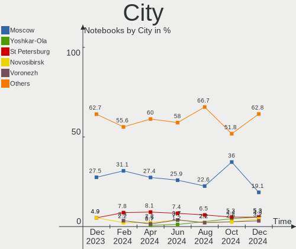
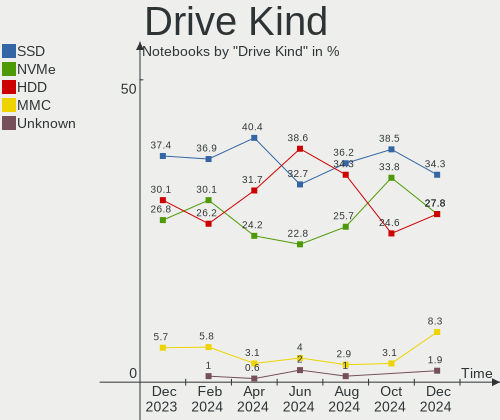
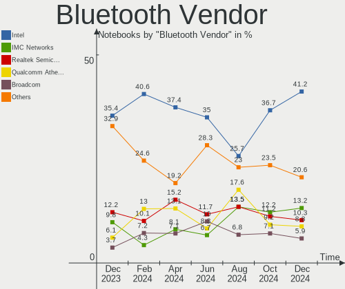

ROSA Hardware Trends (Notebooks)
--------------------------------

A project to identify most popular hardware characteristics and track their change
over time based on data collected by Linux users at https://Linux-Hardware.org.

Anyone can contribute to this report by the [hw-probe](https://github.com/linuxhw/hw-probe) tool:

    sudo -E hw-probe -all -upload

Full-feature report is available here: https://linux-hardware.org/?view=trends&formfactor=notebook

Period: Jul, 2021.

Contents
--------

* [ System ](#system)
  - [ OS                       ](#os)
  - [ OS Family                ](#os-family)
  - [ Kernel                   ](#kernel)
  - [ Kernel Family            ](#kernel-family)
  - [ Kernel Major Ver.        ](#kernel-major-ver)
  - [ Arch                     ](#arch)
  - [ DE                       ](#de)
  - [ Display Server           ](#display-server)
  - [ Display Manager          ](#display-manager)
  - [ OS Lang                  ](#os-lang)
  - [ Boot Mode                ](#boot-mode)
  - [ Filesystem               ](#filesystem)
  - [ Part. scheme             ](#part-scheme)
  - [ Dual Boot with Linux/BSD ](#dual-boot-with-linuxbsd)
  - [ Dual Boot (Win)          ](#dual-boot-win)

* [ Board ](#board)
  - [ Vendor                   ](#vendor)
  - [ Model                    ](#model)
  - [ Model Family             ](#model-family)
  - [ MFG Year                 ](#mfg-year)
  - [ Form Factor              ](#form-factor)
  - [ Secure Boot              ](#secure-boot)
  - [ Coreboot                 ](#coreboot)
  - [ RAM Size                 ](#ram-size)
  - [ RAM Used                 ](#ram-used)
  - [ Total Drives             ](#total-drives)
  - [ Has CD-ROM               ](#has-cd-rom)
  - [ Has Ethernet             ](#has-ethernet)
  - [ Has WiFi                 ](#has-wifi)
  - [ Has Bluetooth            ](#has-bluetooth)

* [ Location ](#location)
  - [ Country                  ](#country)
  - [ City                     ](#city)

* [ Drives ](#drives)
  - [ Drive Vendor             ](#drive-vendor)
  - [ Drive Model              ](#drive-model)
  - [ HDD Vendor               ](#hdd-vendor)
  - [ SSD Vendor               ](#ssd-vendor)
  - [ Drive Kind               ](#drive-kind)
  - [ Drive Connector          ](#drive-connector)
  - [ Drive Size               ](#drive-size)
  - [ Space Total              ](#space-total)
  - [ Space Used               ](#space-used)
  - [ Malfunc. Drives          ](#malfunc-drives)
  - [ Malfunc. Drive Vendor    ](#malfunc-drive-vendor)
  - [ Malfunc. HDD Vendor      ](#malfunc-hdd-vendor)
  - [ Malfunc. Drive Kind      ](#malfunc-drive-kind)
  - [ Failed Drives            ](#failed-drives)
  - [ Failed Drive Vendor      ](#failed-drive-vendor)
  - [ Drive Status             ](#drive-status)

* [ Storage controller ](#storage-controller)
  - [ Storage Vendor           ](#storage-vendor)
  - [ Storage Model            ](#storage-model)
  - [ Storage Kind             ](#storage-kind)

* [ Processor ](#processor)
  - [ CPU Vendor               ](#cpu-vendor)
  - [ CPU Model                ](#cpu-model)
  - [ CPU Model Family         ](#cpu-model-family)
  - [ CPU Cores                ](#cpu-cores)
  - [ CPU Sockets              ](#cpu-sockets)
  - [ CPU Threads              ](#cpu-threads)
  - [ CPU Op-Modes             ](#cpu-op-modes)
  - [ CPU Microcode            ](#cpu-microcode)
  - [ CPU Microarch            ](#cpu-microarch)

* [ Graphics ](#graphics)
  - [ GPU Vendor               ](#gpu-vendor)
  - [ GPU Model                ](#gpu-model)
  - [ GPU Combo                ](#gpu-combo)
  - [ GPU Driver               ](#gpu-driver)
  - [ GPU Memory               ](#gpu-memory)

* [ Monitor ](#monitor)
  - [ Monitor Vendor           ](#monitor-vendor)
  - [ Monitor Model            ](#monitor-model)
  - [ Monitor Resolution       ](#monitor-resolution)
  - [ Monitor Diagonal         ](#monitor-diagonal)
  - [ Monitor Width            ](#monitor-width)
  - [ Aspect Ratio             ](#aspect-ratio)
  - [ Monitor Area             ](#monitor-area)
  - [ Pixel Density            ](#pixel-density)
  - [ Multiple Monitors        ](#multiple-monitors)

* [ Network ](#network)
  - [ Net Controller Vendor    ](#net-controller-vendor)
  - [ Net Controller Model     ](#net-controller-model)
  - [ Wireless Vendor          ](#wireless-vendor)
  - [ Wireless Model           ](#wireless-model)
  - [ Ethernet Vendor          ](#ethernet-vendor)
  - [ Ethernet Model           ](#ethernet-model)
  - [ Net Controller Kind      ](#net-controller-kind)
  - [ Used Controller          ](#used-controller)
  - [ NICs                     ](#nics)
  - [ IPv6                     ](#ipv6)

* [ Bluetooth ](#bluetooth)
  - [ Bluetooth Vendor         ](#bluetooth-vendor)
  - [ Bluetooth Model          ](#bluetooth-model)

* [ Sound ](#sound)
  - [ Sound Vendor             ](#sound-vendor)
  - [ Sound Model              ](#sound-model)

* [ Memory ](#memory)
  - [ Memory Vendor            ](#memory-vendor)
  - [ Memory Model             ](#memory-model)
  - [ Memory Kind              ](#memory-kind)
  - [ Memory Form Factor       ](#memory-form-factor)
  - [ Memory Size              ](#memory-size)
  - [ Memory Speed             ](#memory-speed)

* [ Printers & scanners ](#printers-&-scanners)
  - [ Printer Vendor           ](#printer-vendor)
  - [ Printer Model            ](#printer-model)
  - [ Scanner Vendor           ](#scanner-vendor)
  - [ Scanner Model            ](#scanner-model)

* [ Camera ](#camera)
  - [ Camera Vendor            ](#camera-vendor)
  - [ Camera Model             ](#camera-model)

* [ Security ](#security)
  - [ Fingerprint Vendor       ](#fingerprint-vendor)
  - [ Fingerprint Model        ](#fingerprint-model)
  - [ Chipcard Vendor          ](#chipcard-vendor)
  - [ Chipcard Model           ](#chipcard-model)

* [ Unsupported ](#unsupported)
  - [ Unsupported Devices      ](#unsupported-devices)
  - [ Unsupported Device Types ](#unsupported-device-types)

System
------

OS
--

Installed operating systems

| Name       | Notebooks | Percent |
|------------|-----------|---------|
| ROSA R11.1 | 54        | 80.6%   |
| ROSA R11   | 6         | 8.96%   |
| ROSA R12   | 5         | 7.46%   |
| ROSA R10   | 2         | 2.99%   |

OS Family
---------

OS without a version

| Name | Notebooks | Percent |
|------|-----------|---------|
| ROSA | 67        | 100%    |

Kernel
------

Version of the Linux kernel

| Version                             | Notebooks | Percent |
|-------------------------------------|-----------|---------|
| 5.4.83-generic-2rosa-x86_64         | 16        | 23.88%  |
| 5.4.32-generic-2rosa-x86_64         | 15        | 22.39%  |
| 5.4.32-generic-2rosa-i586           | 9         | 13.43%  |
| 4.15.0-desktop-122.124.1rosa-x86_64 | 7         | 10.45%  |
| 5.4.83-generic-2rosa-i586           | 6         | 8.96%   |
| 4.15.0-desktop-45.1rosa-x86_64      | 4         | 5.97%   |
| 5.10.48-generic-1rosa2021.1-x86_64  | 2         | 2.99%   |
| 4.13.0-tablet-16.2rosa-x86_64       | 2         | 2.99%   |
| 5.9.14-generic-1rosa-x86_64         | 1         | 1.49%   |
| 5.10.53-generic-1rosa2021.1-x86_64  | 1         | 1.49%   |
| 5.10.52-generic-1rosa2021.1-x86_64  | 1         | 1.49%   |
| 5.10.47-generic-2rosa2019.1-x86_64  | 1         | 1.49%   |
| 4.9.155-nrj-desktop-1rosa-x86_64    | 1         | 1.49%   |
| 4.15.0-desktop-122.124.1rosa-i586   | 1         | 1.49%   |

Kernel Family
-------------

Linux kernel without a distro release

| Version | Notebooks | Percent |
|---------|-----------|---------|
| 5.4.32  | 24        | 35.82%  |
| 5.4.83  | 22        | 32.84%  |
| 4.15.0  | 12        | 17.91%  |
| 5.10.48 | 2         | 2.99%   |
| 4.13.0  | 2         | 2.99%   |
| 5.9.14  | 1         | 1.49%   |
| 5.10.53 | 1         | 1.49%   |
| 5.10.52 | 1         | 1.49%   |
| 5.10.47 | 1         | 1.49%   |
| 4.9.155 | 1         | 1.49%   |

Kernel Major Ver.
-----------------

Linux kernel major version

| Version | Notebooks | Percent |
|---------|-----------|---------|
| 5.4     | 46        | 68.66%  |
| 4.15    | 12        | 17.91%  |
| 5.10    | 5         | 7.46%   |
| 4.13    | 2         | 2.99%   |
| 5.9     | 1         | 1.49%   |
| 4.9     | 1         | 1.49%   |

Arch
----

OS architecture (x86_64, i586, etc.)

| Name   | Notebooks | Percent |
|--------|-----------|---------|
| x86_64 | 51        | 76.12%  |
| i686   | 16        | 23.88%  |

DE
--

Desktop Environment

| Name  | Notebooks | Percent |
|-------|-----------|---------|
| KDE4  | 35        | 52.24%  |
| KDE5  | 20        | 29.85%  |
| LXQt  | 10        | 14.93%  |
| GNOME | 2         | 2.99%   |

Display Server
--------------

X11 or Wayland

| Name    | Notebooks | Percent |
|---------|-----------|---------|
| X11     | 62        | 92.54%  |
| Wayland | 5         | 7.46%   |

Display Manager
---------------

SDDM, LightDM, etc.

| Name | Notebooks | Percent |
|------|-----------|---------|
| KDM  | 35        | 52.24%  |
| SDDM | 27        | 40.3%   |
| GDM  | 5         | 7.46%   |

OS Lang
-------

Language

| Lang    | Notebooks | Percent |
|---------|-----------|---------|
| ru_RU   | 53        | 79.1%   |
| Unknown | 6         | 8.96%   |
| es_ES   | 3         | 4.48%   |
| pl_PL   | 1         | 1.49%   |
| en_US   | 1         | 1.49%   |
| en_GB   | 1         | 1.49%   |
| de_DE   | 1         | 1.49%   |
| ca_AD   | 1         | 1.49%   |

Boot Mode
---------

EFI or BIOS

| Mode | Notebooks | Percent |
|------|-----------|---------|
| BIOS | 47        | 70.15%  |
| EFI  | 20        | 29.85%  |

Filesystem
----------

Type of filesystem

| Type  | Notebooks | Percent |
|-------|-----------|---------|
| Ext4  | 66        | 98.51%  |
| Btrfs | 1         | 1.49%   |

Part. scheme
------------

Scheme of partitioning

| Type    | Notebooks | Percent |
|---------|-----------|---------|
| MBR     | 44        | 65.67%  |
| GPT     | 21        | 31.34%  |
| Unknown | 2         | 2.99%   |

Dual Boot with Linux/BSD
------------------------

Hosting more than one Linux/BSD

| Dual boot | Notebooks | Percent |
|-----------|-----------|---------|
| No        | 49        | 73.13%  |
| Yes       | 18        | 26.87%  |

Dual Boot (Win)
---------------

Hosting Linux and Windows

| Dual boot | Notebooks | Percent |
|-----------|-----------|---------|
| No        | 40        | 59.7%   |
| Yes       | 27        | 40.3%   |

Board
-----

Vendor
------

Motherboard manufacturer

| Name                | Notebooks | Percent |
|---------------------|-----------|---------|
| Acer                | 15        | 22.39%  |
| ASUSTek Computer    | 12        | 17.91%  |
| Hewlett-Packard     | 11        | 16.42%  |
| Samsung Electronics | 7         | 10.45%  |
| Lenovo              | 7         | 10.45%  |
| Dell                | 5         | 7.46%   |
| eMachines           | 2         | 2.99%   |
| Toshiba             | 1         | 1.49%   |
| Sony                | 1         | 1.49%   |
| Notebook            | 1         | 1.49%   |
| MSI                 | 1         | 1.49%   |
| LG Electronics      | 1         | 1.49%   |
| Elenberg            | 1         | 1.49%   |
| Apple               | 1         | 1.49%   |
| AMI                 | 1         | 1.49%   |

Model
-----

Motherboard model

| Name                                    | Notebooks | Percent |
|-----------------------------------------|-----------|---------|
| Toshiba Satellite A300                  | 1         | 1.49%   |
| Sony SVE1512N1RW                        | 1         | 1.49%   |
| Samsung RV415/RV515/E3415               | 1         | 1.49%   |
| Samsung RV408/RV508                     | 1         | 1.49%   |
| Samsung R560                            | 1         | 1.49%   |
| Samsung R540/R580/R780/SA41/E452/E852   | 1         | 1.49%   |
| Samsung R520/R522/R620                  | 1         | 1.49%   |
| Samsung NC10                            | 1         | 1.49%   |
| Samsung 350V5C/351V5C/3540VC/3440VC     | 1         | 1.49%   |
| Notebook W65_W670SR                     | 1         | 1.49%   |
| MSI CR643                               | 1         | 1.49%   |
| LG S525-L.ACO1R1                        | 1         | 1.49%   |
| Lenovo ThinkPad T400 6474WPU            | 1         | 1.49%   |
| Lenovo ThinkPad L430 24641J9            | 1         | 1.49%   |
| Lenovo IdeaPad 5 15ARE05 81YQ           | 1         | 1.49%   |
| Lenovo IdeaPad 300-15ISK 80Q7           | 1         | 1.49%   |
| Lenovo G575 20081                       | 1         | 1.49%   |
| Lenovo B50-30 20382                     | 1         | 1.49%   |
| Lenovo B50-10 80QR                      | 1         | 1.49%   |
| HP Pavilion TS 11                       | 1         | 1.49%   |
| HP Pavilion dv9000 (EY797AV#ABA)        | 1         | 1.49%   |
| HP Pavilion dv6                         | 1         | 1.49%   |
| HP Pavilion 15                          | 1         | 1.49%   |
| HP Mini 311-1000                        | 1         | 1.49%   |
| HP Laptop 15s-eq2xxx                    | 1         | 1.49%   |
| HP Laptop 15-bs0xx                      | 1         | 1.49%   |
| HP Compaq 6730b (GB988EA)               | 1         | 1.49%   |
| HP 620                                  | 1         | 1.49%   |
| HP 250 G7 Notebook PC                   | 1         | 1.49%   |
| HP 15                                   | 1         | 1.49%   |
| eMachines eM355                         | 1         | 1.49%   |
| eMachines eM350                         | 1         | 1.49%   |
| Elenberg EL_T1011                       | 1         | 1.49%   |
| Dell Latitude D631                      | 1         | 1.49%   |
| Dell Inspiron N5110                     | 1         | 1.49%   |
| Dell Inspiron 3558                      | 1         | 1.49%   |
| Dell Inspiron 1525                      | 1         | 1.49%   |
| Dell Inspiron 1110                      | 1         | 1.49%   |
| ASUS X75VCP                             | 1         | 1.49%   |
| ASUS X751MD                             | 1         | 1.49%   |
| ASUS X550WA                             | 1         | 1.49%   |
| ASUS X540LJ                             | 1         | 1.49%   |
| ASUS X501U                              | 1         | 1.49%   |
| ASUS VivoBook_ASUS Laptop E410MA_L410MA | 1         | 1.49%   |
| ASUS VivoBook 15_ASUS Laptop X540UB     | 1         | 1.49%   |
| ASUS UX31E                              | 1         | 1.49%   |
| ASUS K54LY                              | 1         | 1.49%   |
| ASUS K54HR                              | 1         | 1.49%   |
| ASUS K53SC                              | 1         | 1.49%   |
| ASUS A7U                                | 1         | 1.49%   |
| Apple MacBookPro6,2                     | 1         | 1.49%   |
| AMI PMP1020C                            | 1         | 1.49%   |
| Acer Extensa 7620                       | 1         | 1.49%   |
| Acer Extensa 5620                       | 1         | 1.49%   |
| Acer Extensa 2510G                      | 1         | 1.49%   |
| Acer Aspire V3-771                      | 1         | 1.49%   |
| Acer Aspire one                         | 1         | 1.49%   |
| Acer Aspire E5-575G                     | 1         | 1.49%   |
| Acer Aspire 7750                        | 1         | 1.49%   |
| Acer Aspire 7720                        | 1         | 1.49%   |

Model Family
------------

Motherboard model prefix

| Name              | Notebooks | Percent |
|-------------------|-----------|---------|
| Acer Aspire       | 8         | 11.94%  |
| HP Pavilion       | 4         | 5.97%   |
| Dell Inspiron     | 4         | 5.97%   |
| Acer Extensa      | 3         | 4.48%   |
| Lenovo ThinkPad   | 2         | 2.99%   |
| Lenovo IdeaPad    | 2         | 2.99%   |
| HP Laptop         | 2         | 2.99%   |
| ASUS VivoBook     | 2         | 2.99%   |
| Toshiba Satellite | 1         | 1.49%   |
| Sony SVE1512N1RW  | 1         | 1.49%   |
| Samsung RV415     | 1         | 1.49%   |
| Samsung RV408     | 1         | 1.49%   |
| Samsung R560      | 1         | 1.49%   |
| Samsung R540      | 1         | 1.49%   |
| Samsung R520      | 1         | 1.49%   |
| Samsung NC10      | 1         | 1.49%   |
| Samsung 350V5C    | 1         | 1.49%   |
| Notebook W65      | 1         | 1.49%   |
| MSI CR643         | 1         | 1.49%   |
| LG S525-L.ACO1R1  | 1         | 1.49%   |
| Lenovo G575       | 1         | 1.49%   |
| Lenovo B50-30     | 1         | 1.49%   |
| Lenovo B50-10     | 1         | 1.49%   |
| HP Mini           | 1         | 1.49%   |
| HP Compaq         | 1         | 1.49%   |
| HP 620            | 1         | 1.49%   |
| HP 250            | 1         | 1.49%   |
| HP 15             | 1         | 1.49%   |
| eMachines eM355   | 1         | 1.49%   |
| eMachines eM350   | 1         | 1.49%   |
| Elenberg EL       | 1         | 1.49%   |
| Dell Latitude     | 1         | 1.49%   |
| ASUS X75VCP       | 1         | 1.49%   |
| ASUS X751MD       | 1         | 1.49%   |
| ASUS X550WA       | 1         | 1.49%   |
| ASUS X540LJ       | 1         | 1.49%   |
| ASUS X501U        | 1         | 1.49%   |
| ASUS UX31E        | 1         | 1.49%   |
| ASUS K54LY        | 1         | 1.49%   |
| ASUS K54HR        | 1         | 1.49%   |
| ASUS K53SC        | 1         | 1.49%   |
| ASUS A7U          | 1         | 1.49%   |
| Apple MacBookPro6 | 1         | 1.49%   |
| AMI PMP1020C      | 1         | 1.49%   |
| Acer AOD270       | 1         | 1.49%   |
| Acer AOD260       | 1         | 1.49%   |
| Acer AOA150       | 1         | 1.49%   |
| Acer AO532h       | 1         | 1.49%   |

MFG Year
--------

Motherboard manufacture year

| Year | Notebooks | Percent |
|------|-----------|---------|
| 2011 | 10        | 14.93%  |
| 2016 | 8         | 11.94%  |
| 2012 | 8         | 11.94%  |
| 2009 | 6         | 8.96%   |
| 2008 | 6         | 8.96%   |
| 2010 | 5         | 7.46%   |
| 2014 | 4         | 5.97%   |
| 2013 | 4         | 5.97%   |
| 2007 | 4         | 5.97%   |
| 2020 | 3         | 4.48%   |
| 2015 | 3         | 4.48%   |
| 2021 | 2         | 2.99%   |
| 2017 | 2         | 2.99%   |
| 2018 | 1         | 1.49%   |
| 2006 | 1         | 1.49%   |

Form Factor
-----------

Physical design of the computer

| Name     | Notebooks | Percent |
|----------|-----------|---------|
| Notebook | 67        | 100%    |

Secure Boot
-----------

Enabled or disabled

| State    | Notebooks | Percent |
|----------|-----------|---------|
| Disabled | 67        | 100%    |

Coreboot
--------

Have coreboot on board

| Used | Notebooks | Percent |
|------|-----------|---------|
| No   | 67        | 100%    |

RAM Size
--------

Total RAM memory

| Size in GB | Notebooks | Percent |
|------------|-----------|---------|
| 3.01-4.0   | 27        | 40.3%   |
| 1.01-2.0   | 14        | 20.9%   |
| 4.01-8.0   | 12        | 17.91%  |
| 8.01-16.0  | 7         | 10.45%  |
| 0.51-1.0   | 4         | 5.97%   |
| 2.01-3.0   | 2         | 2.99%   |
| Unknown    | 1         | 1.49%   |

RAM Used
--------

Used RAM memory

| Used GB  | Notebooks | Percent |
|----------|-----------|---------|
| 1.01-2.0 | 30        | 44.78%  |
| 0.51-1.0 | 27        | 40.3%   |
| 2.01-3.0 | 5         | 7.46%   |
| 0.01-0.5 | 4         | 5.97%   |
| Unknown  | 1         | 1.49%   |

Total Drives
------------

Number of drives on board

| Drives | Notebooks | Percent |
|--------|-----------|---------|
| 1      | 54        | 80.6%   |
| 2      | 12        | 17.91%  |
| 0      | 1         | 1.49%   |

Has CD-ROM
----------

Has CD-ROM on board

| Presented | Notebooks | Percent |
|-----------|-----------|---------|
| No        | 34        | 50.75%  |
| Yes       | 33        | 49.25%  |

Has Ethernet
------------

Has Ethernet on board

| Presented | Notebooks | Percent |
|-----------|-----------|---------|
| Yes       | 60        | 89.55%  |
| No        | 7         | 10.45%  |

Has WiFi
--------

Has WiFi module

| Presented | Notebooks | Percent |
|-----------|-----------|---------|
| Yes       | 63        | 94.03%  |
| No        | 4         | 5.97%   |

Has Bluetooth
-------------

Has Bluetooth module

| Presented | Notebooks | Percent |
|-----------|-----------|---------|
| Yes       | 38        | 56.72%  |
| No        | 29        | 43.28%  |

Location
--------

Country
-------

Geographic location (country)

| Country     | Notebooks | Percent |
|-------------|-----------|---------|
| Russia      | 42        | 62.69%  |
| Ukraine     | 10        | 14.93%  |
| Belarus     | 3         | 4.48%   |
| Spain       | 2         | 2.99%   |
| Mexico      | 2         | 2.99%   |
| Kazakhstan  | 2         | 2.99%   |
| Netherlands | 1         | 1.49%   |
| Moldova     | 1         | 1.49%   |
| Germany     | 1         | 1.49%   |
| France      | 1         | 1.49%   |
| Denmark     | 1         | 1.49%   |
| Czechia     | 1         | 1.49%   |

City
----

Geographic location (city)

| City                    | Notebooks | Percent |
|-------------------------|-----------|---------|
| Moscow                  | 6         | 8.96%   |
| St Petersburg           | 4         | 5.97%   |
| Donetsk                 | 4         | 5.97%   |
| Kyiv                    | 3         | 4.48%   |
| Yekaterinburg           | 2         | 2.99%   |
| Yaroslavl               | 2         | 2.99%   |
| Voronezh                | 2         | 2.99%   |
| Minsk                   | 2         | 2.99%   |
| Mexico City             | 2         | 2.99%   |
| Kaliningrad             | 2         | 2.99%   |
| Volgograd               | 1         | 1.49%   |
| Vladivostok             | 1         | 1.49%   |
| Veliky Novgorod         | 1         | 1.49%   |
| Tula                    | 1         | 1.49%   |
| Tambov                  | 1         | 1.49%   |
| Taganrog                | 1         | 1.49%   |
| Syktyvkar               | 1         | 1.49%   |
| Sonneberg               | 1         | 1.49%   |
| Smolensk                | 1         | 1.49%   |
| Slutsk                  | 1         | 1.49%   |
| Severodvinsk            | 1         | 1.49%   |
| Serpukhov               | 1         | 1.49%   |
| Sant Andreu de la Barca | 1         | 1.49%   |
| Prague                  | 1         | 1.49%   |
| Pignan                  | 1         | 1.49%   |
| Pervomaysk              | 1         | 1.49%   |
| Orenburg                | 1         | 1.49%   |
| Nur-Sultan              | 1         | 1.49%   |
| Novosibirsk             | 1         | 1.49%   |
| Nizhniy Novgorod        | 1         | 1.49%   |
| Malonikolayevka         | 1         | 1.49%   |
| Lyubertsy               | 1         | 1.49%   |
| Kurgan                  | 1         | 1.49%   |
| Krasnozavodsk           | 1         | 1.49%   |
| Kotel'niki              | 1         | 1.49%   |
| Kislovodsk              | 1         | 1.49%   |
| Kamensk-Ural'skiy       | 1         | 1.49%   |
| Granada                 | 1         | 1.49%   |
| Gorinchem               | 1         | 1.49%   |
| Dolgoprudnyy            | 1         | 1.49%   |
| Dnipropetrovsk          | 1         | 1.49%   |
| Copenhagen              | 1         | 1.49%   |
| Chisinau                | 1         | 1.49%   |
| Cherkasskaya            | 1         | 1.49%   |
| Chelyabinsk             | 1         | 1.49%   |
| Belgorod                | 1         | 1.49%   |
| Barnaul                 | 1         | 1.49%   |
| Almaty                  | 1         | 1.49%   |

Drives
------

Drive Vendor
------------

Hard drive vendors

| Vendor              | Notebooks | Drives | Percent |
|---------------------|-----------|--------|---------|
| WDC                 | 15        | 15     | 20.55%  |
| Seagate             | 12        | 12     | 16.44%  |
| Toshiba             | 11        | 11     | 15.07%  |
| Samsung Electronics | 7         | 7      | 9.59%   |
| Hitachi             | 7         | 7      | 9.59%   |
| Unknown             | 4         | 5      | 5.48%   |
| HGST                | 3         | 3      | 4.11%   |
| SPCC                | 2         | 2      | 2.74%   |
| SanDisk             | 2         | 2      | 2.74%   |
| Patriot             | 2         | 2      | 2.74%   |
| Kingston            | 2         | 2      | 2.74%   |
| China               | 2         | 2      | 2.74%   |
| Solid State Storage | 1         | 1      | 1.37%   |
| Leven               | 1         | 1      | 1.37%   |
| Gigabyte Technology | 1         | 1      | 1.37%   |
| Crucial             | 1         | 1      | 1.37%   |

Drive Model
-----------

Hard drive models

| Model                                     | Notebooks | Percent |
|-------------------------------------------|-----------|---------|
| Toshiba MQ01ABF050 500GB                  | 3         | 4.05%   |
| WDC WD1600BEVT-22ZCT0 160GB               | 2         | 2.7%    |
| SPCC Solid State Disk 120GB               | 2         | 2.7%    |
| Seagate ST9500325AS 500GB                 | 2         | 2.7%    |
| Seagate ST1000LM024 HN-M101MBB 1TB        | 2         | 2.7%    |
| Samsung HM160HI 160GB                     | 2         | 2.7%    |
| Hitachi HTS547550A9E384 500GB             | 2         | 2.7%    |
| WDC WDS240G2G0A-00JH30 240GB SSD          | 1         | 1.35%   |
| WDC WD800BEVT-22ZCT0 80GB                 | 1         | 1.35%   |
| WDC WD800BEVS-22RST0 80GB                 | 1         | 1.35%   |
| WDC WD5000LPZX-60Z10T0 500GB              | 1         | 1.35%   |
| WDC WD5000LPVX-60V0TT0 500GB              | 1         | 1.35%   |
| WDC WD5000LPVX-22V0TT0 500GB              | 1         | 1.35%   |
| WDC WD5000LPVX-08V0TT5 500GB              | 1         | 1.35%   |
| WDC WD5000LPLX-75ZNTT0 500GB              | 1         | 1.35%   |
| WDC WD5000BPVT-22HXZT3 500GB              | 1         | 1.35%   |
| WDC WD5000BEVT-22A0RT0 500GB              | 1         | 1.35%   |
| WDC WD3200LPVX-08V0TT5 320GB              | 1         | 1.35%   |
| WDC WD1600BEVT-00A23T0 160GB              | 1         | 1.35%   |
| WDC WD10S21X-24R1BT0-SSHD-8GB             | 1         | 1.35%   |
| Unknown T52732  32GB                      | 1         | 1.35%   |
| Unknown NCard  32GB                       | 1         | 1.35%   |
| Unknown NCard  16GB                       | 1         | 1.35%   |
| Unknown EX276687RUS 120GB SSD             | 1         | 1.35%   |
| Unknown DA4128  128GB                     | 1         | 1.35%   |
| Toshiba Q300. 240GB SSD                   | 1         | 1.35%   |
| Toshiba MQ01ABD100 1TB                    | 1         | 1.35%   |
| Toshiba MQ01ABD075 752GB                  | 1         | 1.35%   |
| Toshiba MQ01ABD032 320GB                  | 1         | 1.35%   |
| Toshiba MK8034GSX 80GB                    | 1         | 1.35%   |
| Toshiba MK3259GSXP 320GB                  | 1         | 1.35%   |
| Toshiba MK2552GSX 250GB                   | 1         | 1.35%   |
| Toshiba MK2046GSX 200GB                   | 1         | 1.35%   |
| Solid State Storage SSSTC CL1-4D256 256GB | 1         | 1.35%   |
| Seagate ST9320325AS 320GB                 | 1         | 1.35%   |
| Seagate ST9250827AS 250GB                 | 1         | 1.35%   |
| Seagate ST9160821AS 160GB                 | 1         | 1.35%   |
| Seagate ST9120822AS 120GB                 | 1         | 1.35%   |
| Seagate ST500LT012-1DG142 500GB           | 1         | 1.35%   |
| Seagate ST320LT007-9ZV142 320GB           | 1         | 1.35%   |
| Seagate ST320LM001 HN-M320MBB 320GB       | 1         | 1.35%   |
| Seagate ST1000LM035-1RK172 1TB            | 1         | 1.35%   |
| SanDisk SSD U100 256GB                    | 1         | 1.35%   |
| SanDisk SSD PLUS 120GB                    | 1         | 1.35%   |
| Samsung SSD 970 PRO 512GB                 | 1         | 1.35%   |
| Samsung SSD 870 EVO 500GB                 | 1         | 1.35%   |
| Samsung SSD 850 EVO 250GB                 | 1         | 1.35%   |
| Samsung HM321HI 320GB                     | 1         | 1.35%   |
| Samsung HM250HI 250GB                     | 1         | 1.35%   |
| Patriot P210 128GB SSD                    | 1         | 1.35%   |
| Patriot Blast 240GB SSD                   | 1         | 1.35%   |
| Leven JAJS300M120C 120GB SSD              | 1         | 1.35%   |
| Kingston SKC300S37A120G 120GB SSD         | 1         | 1.35%   |
| Kingston SA400S37480G 480GB SSD           | 1         | 1.35%   |
| Hitachi HTS547575A9E384 752GB             | 1         | 1.35%   |
| Hitachi HTS545025B9A300 250GB             | 1         | 1.35%   |
| Hitachi HTS545016B9A300 160GB             | 1         | 1.35%   |
| Hitachi HTS543216L9A300 160GB             | 1         | 1.35%   |
| Hitachi HTS541616J9SA00 160GB             | 1         | 1.35%   |
| HGST HTS545050A7E680 500GB                | 1         | 1.35%   |

HDD Vendor
----------

Hard disk drive vendors

| Vendor              | Notebooks | Drives | Percent |
|---------------------|-----------|--------|---------|
| WDC                 | 14        | 14     | 28%     |
| Seagate             | 12        | 12     | 24%     |
| Toshiba             | 10        | 10     | 20%     |
| Hitachi             | 7         | 7      | 14%     |
| Samsung Electronics | 4         | 4      | 8%      |
| HGST                | 3         | 3      | 6%      |

SSD Vendor
----------

Solid state drive vendors

| Vendor              | Notebooks | Drives | Percent |
|---------------------|-----------|--------|---------|
| SPCC                | 2         | 2      | 11.11%  |
| SanDisk             | 2         | 2      | 11.11%  |
| Samsung Electronics | 2         | 2      | 11.11%  |
| Patriot             | 2         | 2      | 11.11%  |
| Kingston            | 2         | 2      | 11.11%  |
| China               | 2         | 2      | 11.11%  |
| WDC                 | 1         | 1      | 5.56%   |
| Unknown             | 1         | 1      | 5.56%   |
| Toshiba             | 1         | 1      | 5.56%   |
| Leven               | 1         | 1      | 5.56%   |
| Gigabyte Technology | 1         | 1      | 5.56%   |
| Crucial             | 1         | 1      | 5.56%   |

Drive Kind
----------

HDD or SSD

| Kind | Notebooks | Drives | Percent |
|------|-----------|--------|---------|
| HDD  | 48        | 50     | 67.61%  |
| SSD  | 18        | 18     | 25.35%  |
| MMC  | 3         | 4      | 4.23%   |
| NVMe | 2         | 2      | 2.82%   |

Drive Connector
---------------

SATA, SAS, NVMe, etc.

| Type | Notebooks | Drives | Percent |
|------|-----------|--------|---------|
| SATA | 61        | 68     | 92.42%  |
| MMC  | 3         | 4      | 4.55%   |
| NVMe | 2         | 2      | 3.03%   |

Drive Size
----------

Size of hard drive

| Size in TB | Notebooks | Drives | Percent |
|------------|-----------|--------|---------|
| 0.01-0.5   | 54        | 61     | 88.52%  |
| 0.51-1.0   | 7         | 7      | 11.48%  |

Space Total
-----------

Amount of disk space available on the file system

| Size in GB | Notebooks | Percent |
|------------|-----------|---------|
| 101-250    | 24        | 35.82%  |
| 251-500    | 17        | 25.37%  |
| 1-20       | 11        | 16.42%  |
| 51-100     | 7         | 10.45%  |
| 21-50      | 4         | 5.97%   |
| 501-1000   | 3         | 4.48%   |
| Unknown    | 1         | 1.49%   |

Space Used
----------

Amount of used disk space

| Used GB | Notebooks | Percent |
|---------|-----------|---------|
| 1-20    | 47        | 70.15%  |
| 21-50   | 12        | 17.91%  |
| 51-100  | 4         | 5.97%   |
| 101-250 | 3         | 4.48%   |
| Unknown | 1         | 1.49%   |

Malfunc. Drives
---------------

Drive models with a malfunction

| Model                             | Notebooks | Drives | Percent |
|-----------------------------------|-----------|--------|---------|
| Samsung Electronics HM160HI 160GB | 2         | 2      | 8%      |
| WDC WD5000BPVT-22HXZT3 500GB      | 1         | 1      | 4%      |
| WDC WD3200LPVX-08V0TT5 320GB      | 1         | 1      | 4%      |
| WDC WD1600BEVT-22ZCT0 160GB       | 1         | 1      | 4%      |
| WDC WD1600BEVT-00A23T0 160GB      | 1         | 1      | 4%      |
| Toshiba Q300. 240GB SSD           | 1         | 1      | 4%      |
| Toshiba MQ01ABF050 500GB          | 1         | 1      | 4%      |
| Toshiba MQ01ABD075 752GB          | 1         | 1      | 4%      |
| Toshiba MK8034GSX 80GB            | 1         | 1      | 4%      |
| Toshiba MK3259GSXP 320GB          | 1         | 1      | 4%      |
| Toshiba MK2552GSX 250GB           | 1         | 1      | 4%      |
| Toshiba MK2046GSX 200GB           | 1         | 1      | 4%      |
| Seagate ST9500325AS 500GB         | 1         | 1      | 4%      |
| Seagate ST9320325AS 320GB         | 1         | 1      | 4%      |
| Seagate ST9250827AS 250GB         | 1         | 1      | 4%      |
| Seagate ST9160821AS 160GB         | 1         | 1      | 4%      |
| SanDisk SSD U100 256GB            | 1         | 1      | 4%      |
| Hitachi HTS547575A9E384 752GB     | 1         | 1      | 4%      |
| Hitachi HTS545016B9A300 160GB     | 1         | 1      | 4%      |
| Hitachi HTS543216L9A300 160GB     | 1         | 1      | 4%      |
| HGST HTS545050A7E680 500GB        | 1         | 1      | 4%      |
| HGST HTS545050A7E660 500GB        | 1         | 1      | 4%      |
| HGST HTS545050A7E380 500GB        | 1         | 1      | 4%      |
| China SSD 60GB                    | 1         | 1      | 4%      |

Malfunc. Drive Vendor
---------------------

Vendors of faulty drives

| Vendor              | Notebooks | Drives | Percent |
|---------------------|-----------|--------|---------|
| Toshiba             | 7         | 7      | 28%     |
| WDC                 | 4         | 4      | 16%     |
| Seagate             | 4         | 4      | 16%     |
| Hitachi             | 3         | 3      | 12%     |
| HGST                | 3         | 3      | 12%     |
| Samsung Electronics | 2         | 2      | 8%      |
| SanDisk             | 1         | 1      | 4%      |
| China               | 1         | 1      | 4%      |

Malfunc. HDD Vendor
-------------------

Vendors of faulty HDD drives

| Vendor              | Notebooks | Drives | Percent |
|---------------------|-----------|--------|---------|
| Toshiba             | 6         | 6      | 27.27%  |
| WDC                 | 4         | 4      | 18.18%  |
| Seagate             | 4         | 4      | 18.18%  |
| Hitachi             | 3         | 3      | 13.64%  |
| HGST                | 3         | 3      | 13.64%  |
| Samsung Electronics | 2         | 2      | 9.09%   |

Malfunc. Drive Kind
-------------------

Kinds of faulty drives

| Kind | Notebooks | Drives | Percent |
|------|-----------|--------|---------|
| HDD  | 21        | 22     | 87.5%   |
| SSD  | 3         | 3      | 12.5%   |

Failed Drives
-------------

Failed drive models

Zero info for selected period =(

Failed Drive Vendor
-------------------

Failed drive vendors

Zero info for selected period =(

Drive Status
------------

Number of failed and malfunc. drives

| Status   | Notebooks | Drives | Percent |
|----------|-----------|--------|---------|
| Works    | 41        | 45     | 61.19%  |
| Malfunc  | 23        | 25     | 34.33%  |
| Detected | 3         | 4      | 4.48%   |

Storage controller
------------------

Storage Vendor
--------------

Storage controller vendors

| Vendor                         | Notebooks | Percent |
|--------------------------------|-----------|---------|
| Intel                          | 52        | 77.61%  |
| AMD                            | 11        | 16.42%  |
| Solid State Storage Technology | 1         | 1.49%   |
| Samsung Electronics            | 1         | 1.49%   |
| Nvidia                         | 1         | 1.49%   |
| JMicron Technology             | 1         | 1.49%   |

Storage Model
-------------

Storage controller models

| Model                                                                          | Notebooks | Percent |
|--------------------------------------------------------------------------------|-----------|---------|
| Intel 6 Series/C200 Series Chipset Family 6 port Mobile SATA AHCI Controller   | 8         | 10.53%  |
| Intel 82801IBM/IEM (ICH9M/ICH9M-E) 4 port SATA Controller [AHCI mode]          | 6         | 7.89%   |
| AMD FCH SATA Controller [AHCI mode]                                            | 6         | 7.89%   |
| Intel 82801HM/HEM (ICH8M/ICH8M-E) IDE Controller                               | 5         | 6.58%   |
| Intel 7 Series Chipset Family 6-port SATA Controller [AHCI mode]               | 5         | 6.58%   |
| Intel Sunrise Point-LP SATA Controller [AHCI mode]                             | 4         | 5.26%   |
| Intel NM10/ICH7 Family SATA Controller [AHCI mode]                             | 4         | 5.26%   |
| Intel 82801HM/HEM (ICH8M/ICH8M-E) SATA Controller [AHCI mode]                  | 4         | 5.26%   |
| Intel 82801GBM/GHM (ICH7-M Family) SATA Controller [IDE mode]                  | 4         | 5.26%   |
| Intel Atom Processor E3800 Series SATA AHCI Controller                         | 3         | 3.95%   |
| AMD SB7x0/SB8x0/SB9x0 SATA Controller [AHCI mode]                              | 3         | 3.95%   |
| Intel Wildcat Point-LP SATA Controller [AHCI Mode]                             | 2         | 2.63%   |
| Intel Celeron/Pentium Silver Processor SATA Controller                         | 2         | 2.63%   |
| Intel 82801IBM/IEM (ICH9M/ICH9M-E) 2 port SATA Controller [IDE mode]           | 2         | 2.63%   |
| AMD SB600 Non-Raid-5 SATA                                                      | 2         | 2.63%   |
| AMD SB600 IDE                                                                  | 2         | 2.63%   |
| Solid State Storage Non-Volatile memory controller                             | 1         | 1.32%   |
| Samsung NVMe SSD Controller SM981/PM981/PM983                                  | 1         | 1.32%   |
| Nvidia MCP79 AHCI Controller                                                   | 1         | 1.32%   |
| JMicron JMB360 AHCI Controller                                                 | 1         | 1.32%   |
| Intel NM10/ICH7 Family SATA Controller [IDE mode]                              | 1         | 1.32%   |
| Intel 82801HM/HEM (ICH8M/ICH8M-E) SATA Controller [IDE mode]                   | 1         | 1.32%   |
| Intel 82801GBM/GHM (ICH7-M Family) SATA Controller [AHCI mode]                 | 1         | 1.32%   |
| Intel 82801G (ICH7 Family) IDE Controller                                      | 1         | 1.32%   |
| Intel 82801 Mobile SATA Controller [RAID mode]                                 | 1         | 1.32%   |
| Intel 8 Series/C220 Series Chipset Family 6-port SATA Controller 1 [AHCI mode] | 1         | 1.32%   |
| Intel 8 Series SATA Controller 1 [AHCI mode]                                   | 1         | 1.32%   |
| Intel 5 Series/3400 Series Chipset 4 port SATA IDE Controller                  | 1         | 1.32%   |
| Intel 5 Series/3400 Series Chipset 4 port SATA AHCI Controller                 | 1         | 1.32%   |
| AMD FCH IDE Controller                                                         | 1         | 1.32%   |

Storage Kind
------------

Kind of storage controller (IDE, SATA, NVMe, SAS, ...)

| Kind | Notebooks | Percent |
|------|-----------|---------|
| SATA | 54        | 72.97%  |
| IDE  | 17        | 22.97%  |
| NVMe | 2         | 2.7%    |
| RAID | 1         | 1.35%   |

Processor
---------

CPU Vendor
----------

Processor vendors

| Vendor | Notebooks | Percent |
|--------|-----------|---------|
| Intel  | 55        | 82.09%  |
| AMD    | 12        | 17.91%  |

CPU Model
---------

Processor models

| Model                                       | Notebooks | Percent |
|---------------------------------------------|-----------|---------|
| Intel Atom CPU N270 @ 1.60GHz               | 4         | 5.97%   |
| Intel Core i3-6006U CPU @ 2.00GHz           | 3         | 4.48%   |
| Intel Core 2 Duo CPU P8400 @ 2.26GHz        | 3         | 4.48%   |
| Intel Atom CPU N450 @ 1.66GHz               | 3         | 4.48%   |
| Intel Pentium CPU B950 @ 2.10GHz            | 2         | 2.99%   |
| Intel Core i3-5005U CPU @ 2.00GHz           | 2         | 2.99%   |
| Intel Core i3-3110M CPU @ 2.40GHz           | 2         | 2.99%   |
| Intel Core 2 Duo CPU T5250 @ 1.50GHz        | 2         | 2.99%   |
| Intel Celeron N4020 CPU @ 1.10GHz           | 2         | 2.99%   |
| Intel Pentium Dual-Core CPU T4200 @ 2.00GHz | 1         | 1.49%   |
| Intel Pentium CPU N3540 @ 2.16GHz           | 1         | 1.49%   |
| Intel Pentium CPU N3530 @ 2.16GHz           | 1         | 1.49%   |
| Intel Genuine CPU T2080 @ 1.73GHz           | 1         | 1.49%   |
| Intel Core i7-4700MQ CPU @ 2.40GHz          | 1         | 1.49%   |
| Intel Core i7-3630QM CPU @ 2.40GHz          | 1         | 1.49%   |
| Intel Core i7-3610QM CPU @ 2.30GHz          | 1         | 1.49%   |
| Intel Core i7-2677M CPU @ 1.80GHz           | 1         | 1.49%   |
| Intel Core i5-4210U CPU @ 1.70GHz           | 1         | 1.49%   |
| Intel Core i5-3230M CPU @ 2.60GHz           | 1         | 1.49%   |
| Intel Core i5-2410M CPU @ 2.30GHz           | 1         | 1.49%   |
| Intel Core i5 CPU M 520 @ 2.40GHz           | 1         | 1.49%   |
| Intel Core i3-6100U CPU @ 2.30GHz           | 1         | 1.49%   |
| Intel Core i3-3120M CPU @ 2.50GHz           | 1         | 1.49%   |
| Intel Core i3-2350M CPU @ 2.30GHz           | 1         | 1.49%   |
| Intel Core i3-2330M CPU @ 2.20GHz           | 1         | 1.49%   |
| Intel Core i3 CPU M 380 @ 2.53GHz           | 1         | 1.49%   |
| Intel Core 2 Duo CPU T9300 @ 2.50GHz        | 1         | 1.49%   |
| Intel Core 2 Duo CPU T5850 @ 2.16GHz        | 1         | 1.49%   |
| Intel Core 2 Duo CPU T5800 @ 2.00GHz        | 1         | 1.49%   |
| Intel Core 2 Duo CPU T5550 @ 1.83GHz        | 1         | 1.49%   |
| Intel Core 2 Duo CPU T5270 @ 1.40GHz        | 1         | 1.49%   |
| Intel Core 2 CPU T5600 @ 1.83GHz            | 1         | 1.49%   |
| Intel Celeron Dual-Core CPU T3500 @ 2.10GHz | 1         | 1.49%   |
| Intel Celeron CPU N2840 @ 2.16GHz           | 1         | 1.49%   |
| Intel Celeron CPU B815 @ 1.60GHz            | 1         | 1.49%   |
| Intel Celeron CPU B800 @ 1.50GHz            | 1         | 1.49%   |
| Intel Celeron CPU 743 @ 1.30GHz             | 1         | 1.49%   |
| Intel Atom x5-Z8300 CPU @ 1.44GHz           | 1         | 1.49%   |
| Intel Atom CPU Z3735G @ 1.33GHz             | 1         | 1.49%   |
| Intel Atom CPU N455 @ 1.66GHz               | 1         | 1.49%   |
| Intel Atom CPU N2800 @ 1.86GHz              | 1         | 1.49%   |
| AMD Turion 64 X2 Mobile Technology TL-60    | 1         | 1.49%   |
| AMD Turion 64 X2 Mobile Technology TL-58    | 1         | 1.49%   |
| AMD Ryzen 5 5500U with Radeon Graphics      | 1         | 1.49%   |
| AMD Ryzen 3 4300U with Radeon Graphics      | 1         | 1.49%   |
| AMD E2-1800 APU with Radeon HD Graphics     | 1         | 1.49%   |
| AMD E1-2100 APU with Radeon HD Graphics     | 1         | 1.49%   |
| AMD E-450 APU with Radeon HD Graphics       | 1         | 1.49%   |
| AMD E-350 Processor                         | 1         | 1.49%   |
| AMD C-50 Processor                          | 1         | 1.49%   |
| AMD A6-1450 APU with Radeon HD Graphics     | 1         | 1.49%   |
| AMD A4-6210 APU with AMD Radeon R3 Graphics | 1         | 1.49%   |
| AMD A4-5150M APU with Radeon HD Graphics    | 1         | 1.49%   |

CPU Model Family
----------------

Processor model prefix

| Model                   | Notebooks | Percent |
|-------------------------|-----------|---------|
| Intel Core i3           | 12        | 17.91%  |
| Intel Atom              | 11        | 16.42%  |
| Intel Core 2 Duo        | 10        | 14.93%  |
| Intel Celeron           | 6         | 8.96%   |
| Intel Pentium           | 4         | 5.97%   |
| Intel Core i7           | 4         | 5.97%   |
| Intel Core i5           | 4         | 5.97%   |
| AMD Turion 64 X2 Mobile | 2         | 2.99%   |
| AMD E                   | 2         | 2.99%   |
| AMD A4                  | 2         | 2.99%   |
| Intel Pentium Dual-Core | 1         | 1.49%   |
| Intel Genuine           | 1         | 1.49%   |
| Intel Core 2            | 1         | 1.49%   |
| Intel Celeron Dual-Core | 1         | 1.49%   |
| AMD Ryzen 5             | 1         | 1.49%   |
| AMD Ryzen 3             | 1         | 1.49%   |
| AMD E2                  | 1         | 1.49%   |
| AMD E1                  | 1         | 1.49%   |
| AMD C-50                | 1         | 1.49%   |
| AMD A6                  | 1         | 1.49%   |

CPU Cores
---------

Number of processor cores

| Number | Notebooks | Percent |
|--------|-----------|---------|
| 2      | 46        | 68.66%  |
| 4      | 10        | 14.93%  |
| 1      | 10        | 14.93%  |
| 6      | 1         | 1.49%   |

CPU Sockets
-----------

Number of sockets

| Number | Notebooks | Percent |
|--------|-----------|---------|
| 1      | 67        | 100%    |

CPU Threads
-----------

Threads per core (Hyper-Threading)

| Number | Notebooks | Percent |
|--------|-----------|---------|
| 1      | 36        | 53.73%  |
| 2      | 31        | 46.27%  |

CPU Op-Modes
------------

CPU Operation Modes (32-bit, 64-bit)

| Op mode        | Notebooks | Percent |
|----------------|-----------|---------|
| 32-bit, 64-bit | 62        | 92.54%  |
| 32-bit         | 5         | 7.46%   |

CPU Microcode
-------------

Microcode number

| Number     | Notebooks | Percent |
|------------|-----------|---------|
| 0x206a7    | 8         | 11.94%  |
| 0x6fd      | 6         | 8.96%   |
| 0x306a9    | 6         | 8.96%   |
| 0x406e3    | 4         | 5.97%   |
| 0x30678    | 4         | 5.97%   |
| 0x106ca    | 4         | 5.97%   |
| 0x106c2    | 4         | 5.97%   |
| 0x10676    | 4         | 5.97%   |
| 0x1067a    | 3         | 4.48%   |
| 0x706a8    | 2         | 2.99%   |
| 0x306d4    | 2         | 2.99%   |
| 0x20655    | 2         | 2.99%   |
| 0x0700010f | 2         | 2.99%   |
| 0x05000119 | 2         | 2.99%   |
| 0x05000029 | 2         | 2.99%   |
| Unknown    | 2         | 2.99%   |
| 0x6f6      | 1         | 1.49%   |
| 0x6ec      | 1         | 1.49%   |
| 0x406c3    | 1         | 1.49%   |
| 0x40651    | 1         | 1.49%   |
| 0x306c3    | 1         | 1.49%   |
| 0x30661    | 1         | 1.49%   |
| 0x08608102 | 1         | 1.49%   |
| 0x08600106 | 1         | 1.49%   |
| 0x07030105 | 1         | 1.49%   |
| 0x06001119 | 1         | 1.49%   |

CPU Microarch
-------------

Microarchitecture

| Name          | Notebooks | Percent |
|---------------|-----------|---------|
| Bonnell       | 9         | 13.43%  |
| SandyBridge   | 8         | 11.94%  |
| Penryn        | 7         | 10.45%  |
| Core          | 7         | 10.45%  |
| IvyBridge     | 6         | 8.96%   |
| Silvermont    | 5         | 7.46%   |
| Skylake       | 4         | 5.97%   |
| Bobcat        | 4         | 5.97%   |
| Westmere      | 2         | 2.99%   |
| K8 Hammer     | 2         | 2.99%   |
| Jaguar        | 2         | 2.99%   |
| Haswell       | 2         | 2.99%   |
| Goldmont plus | 2         | 2.99%   |
| Broadwell     | 2         | 2.99%   |
| Zen 2         | 1         | 1.49%   |
| Puma          | 1         | 1.49%   |
| Piledriver    | 1         | 1.49%   |
| P6            | 1         | 1.49%   |
| Unknown       | 1         | 1.49%   |

Graphics
--------

GPU Vendor
----------

Vendors of graphics cards

| Vendor | Notebooks | Percent |
|--------|-----------|---------|
| Intel  | 42        | 52.5%   |
| AMD    | 23        | 28.75%  |
| Nvidia | 15        | 18.75%  |

GPU Model
---------

Graphics card models

| Model                                                                                    | Notebooks | Percent |
|------------------------------------------------------------------------------------------|-----------|---------|
| Intel 2nd Generation Core Processor Family Integrated Graphics Controller                | 6         | 6.9%    |
| Intel Mobile 4 Series Chipset Integrated Graphics Controller                             | 5         | 5.75%   |
| Intel 3rd Gen Core processor Graphics Controller                                         | 5         | 5.75%   |
| Intel Skylake GT2 [HD Graphics 520]                                                      | 4         | 4.6%    |
| Intel Mobile 945GM/GMS/GME, 943/940GML Express Integrated Graphics Controller            | 4         | 4.6%    |
| Intel Atom Processor Z36xxx/Z37xxx Series Graphics & Display                             | 4         | 4.6%    |
| Intel Atom Processor D4xx/D5xx/N4xx/N5xx Integrated Graphics Controller                  | 4         | 4.6%    |
| Nvidia GF117M [GeForce 610M/710M/810M/820M / GT 620M/625M/630M/720M]                     | 3         | 3.45%   |
| Intel Mobile 945GSE Express Integrated Graphics Controller                               | 3         | 3.45%   |
| AMD Sun XT [Radeon HD 8670A/8670M/8690M / R5 M330 / M430 / Radeon 520 Mobile]            | 3         | 3.45%   |
| AMD Seymour [Radeon HD 6400M/7400M Series]                                               | 3         | 3.45%   |
| Nvidia GF108M [GeForce GT 620M/630M/635M/640M LE]                                        | 2         | 2.3%    |
| Intel Mobile GM965/GL960 Integrated Graphics Controller (secondary)                      | 2         | 2.3%    |
| Intel Mobile GM965/GL960 Integrated Graphics Controller (primary)                        | 2         | 2.3%    |
| Intel HD Graphics 5500                                                                   | 2         | 2.3%    |
| Intel GeminiLake [UHD Graphics 600]                                                      | 2         | 2.3%    |
| AMD RV610/M74 [Mobility Radeon HD 2400 XT]                                               | 2         | 2.3%    |
| AMD RS690M [Radeon Xpress 1200/1250/1270]                                                | 2         | 2.3%    |
| Nvidia GT216M [GeForce GT 330M]                                                          | 1         | 1.15%   |
| Nvidia GM108M [GeForce MX110]                                                            | 1         | 1.15%   |
| Nvidia GM108M [GeForce 940MX]                                                            | 1         | 1.15%   |
| Nvidia GK208BM [GeForce 920M]                                                            | 1         | 1.15%   |
| Nvidia GK107M [GeForce GT 750M]                                                          | 1         | 1.15%   |
| Nvidia GF119M [GeForce GT 520MX]                                                         | 1         | 1.15%   |
| Nvidia G96CM [GeForce 9600M GT]                                                          | 1         | 1.15%   |
| Nvidia G96CM [GeForce 9600M GS]                                                          | 1         | 1.15%   |
| Nvidia G73M [GeForce Go 7600]                                                            | 1         | 1.15%   |
| Nvidia C79 [ION LE]                                                                      | 1         | 1.15%   |
| Intel Mobile 945GM/GMS, 943/940GML Express Integrated Graphics Controller                | 1         | 1.15%   |
| Intel Haswell-ULT Integrated Graphics Controller                                         | 1         | 1.15%   |
| Intel Atom/Celeron/Pentium Processor x5-E8000/J3xxx/N3xxx Integrated Graphics Controller | 1         | 1.15%   |
| Intel Atom Processor D2xxx/N2xxx Integrated Graphics Controller                          | 1         | 1.15%   |
| Intel 4th Gen Core Processor Integrated Graphics Controller                              | 1         | 1.15%   |
| AMD Wrestler [Radeon HD 7340]                                                            | 1         | 1.15%   |
| AMD Wrestler [Radeon HD 6310]                                                            | 1         | 1.15%   |
| AMD Wrestler [Radeon HD 6250]                                                            | 1         | 1.15%   |
| AMD Thames [Radeon HD 7550M/7570M/7650M]                                                 | 1         | 1.15%   |
| AMD Thames [Radeon HD 7500M/7600M Series]                                                | 1         | 1.15%   |
| AMD Temash [Radeon HD 8250/8280G]                                                        | 1         | 1.15%   |
| AMD RV710/M92 [Mobility Radeon HD 4330/4350/4550]                                        | 1         | 1.15%   |
| AMD RV620/M82 [Mobility Radeon HD 3450/3470]                                             | 1         | 1.15%   |
| AMD Richland [Radeon HD 8350G]                                                           | 1         | 1.15%   |
| AMD Renoir                                                                               | 1         | 1.15%   |
| AMD Park [Mobility Radeon HD 5430/5450/5470]                                             | 1         | 1.15%   |
| AMD Mullins [Radeon R3 Graphics]                                                         | 1         | 1.15%   |
| AMD Lucienne                                                                             | 1         | 1.15%   |
| AMD Kabini [Radeon HD 8210]                                                              | 1         | 1.15%   |

GPU Combo
---------

Combinations of graphics cards

| Name           | Notebooks | Percent |
|----------------|-----------|---------|
| 1 x Intel      | 29        | 43.28%  |
| 1 x AMD        | 19        | 28.36%  |
| Intel + Nvidia | 10        | 14.93%  |
| 1 x Nvidia     | 5         | 7.46%   |
| Intel + AMD    | 3         | 4.48%   |
| 2 x AMD        | 1         | 1.49%   |

GPU Driver
----------

Free vs proprietary

| Driver  | Notebooks | Percent |
|---------|-----------|---------|
| Free    | 64        | 95.52%  |
| Unknown | 3         | 4.48%   |

GPU Memory
----------

Total video memory

| Size in GB | Notebooks | Percent |
|------------|-----------|---------|
| Unknown    | 27        | 40.3%   |
| 0.01-0.5   | 17        | 25.37%  |
| 1.01-2.0   | 13        | 19.4%   |
| 0.51-1.0   | 7         | 10.45%  |
| 3.01-4.0   | 3         | 4.48%   |

Monitor
-------

Monitor Vendor
--------------

Monitor vendors

| Vendor                  | Notebooks | Percent |
|-------------------------|-----------|---------|
| AU Optronics            | 15        | 23.44%  |
| Samsung Electronics     | 11        | 17.19%  |
| Chimei Innolux          | 9         | 14.06%  |
| LG Display              | 7         | 10.94%  |
| Chi Mei Optoelectronics | 7         | 10.94%  |
| LG Philips              | 6         | 9.38%   |
| CPT                     | 3         | 4.69%   |
| BOE                     | 3         | 4.69%   |
| S2-Tek                  | 1         | 1.56%   |
| Lenovo                  | 1         | 1.56%   |
| Apple                   | 1         | 1.56%   |

Monitor Model
-------------

Monitor models

| Model                                                                    | Notebooks | Percent |
|--------------------------------------------------------------------------|-----------|---------|
| LG Display LCD Monitor LGD02DC 1366x768 344x194mm 15.5-inch              | 3         | 4.62%   |
| Samsung Electronics LCD Monitor SEC5441 1366x768 344x194mm 15.5-inch     | 2         | 3.08%   |
| LG Philips LCD Monitor LPLA002 1440x900 367x230mm 17.1-inch              | 2         | 3.08%   |
| Chimei Innolux LCD Monitor CMN1728 1600x900 382x215mm 17.3-inch          | 2         | 3.08%   |
| AU Optronics LCD Monitor AUO61D2 1024x600 220x130mm 10.1-inch            | 2         | 3.08%   |
| AU Optronics LCD Monitor AUO45EC 1366x768 340x190mm 15.3-inch            | 2         | 3.08%   |
| AU Optronics LCD Monitor AUO26EC 1366x768 344x193mm 15.5-inch            | 2         | 3.08%   |
| Samsung Electronics SyncMaster SAM011E 1280x1024 338x270mm 17.0-inch     | 1         | 1.54%   |
| Samsung Electronics SyncMaster SAM010B 1280x1024 338x270mm 17.0-inch     | 1         | 1.54%   |
| Samsung Electronics LCD Monitor SEC4F45 1280x800 331x207mm 15.4-inch     | 1         | 1.54%   |
| Samsung Electronics LCD Monitor SEC4141 1366x768 344x193mm 15.5-inch     | 1         | 1.54%   |
| Samsung Electronics LCD Monitor SEC384A 1366x768 344x194mm 15.5-inch     | 1         | 1.54%   |
| Samsung Electronics LCD Monitor SEC3847 1440x900 367x230mm 17.1-inch     | 1         | 1.54%   |
| Samsung Electronics LCD Monitor SEC3646 1680x1050 331x207mm 15.4-inch    | 1         | 1.54%   |
| Samsung Electronics LCD Monitor SEC324C 1366x768 353x198mm 15.9-inch     | 1         | 1.54%   |
| Samsung Electronics LCD Monitor SEC3245 1366x768 344x194mm 15.5-inch     | 1         | 1.54%   |
| Samsung Electronics LCD Monitor SEC3157 1280x800 300x190mm 14.0-inch     | 1         | 1.54%   |
| S2-Tek TV STK531A 1920x1080 930x530mm 42.1-inch                          | 1         | 1.54%   |
| LG Philips LP154WX4-TLC8 LPL0120 1280x800 331x207mm 15.4-inch            | 1         | 1.54%   |
| LG Philips LCD Monitor LPLA500 1280x800 304x190mm 14.1-inch              | 1         | 1.54%   |
| LG Philips LCD Monitor LPL3B01 1280x800 330x210mm 15.4-inch              | 1         | 1.54%   |
| LG Philips LCD Monitor LPL0301 1280x800 331x207mm 15.4-inch              | 1         | 1.54%   |
| LG Display LP101WSA-TLA1 LGD01B9 1024x600 224x126mm 10.1-inch            | 1         | 1.54%   |
| LG Display LCD Monitor LGD03A5 1920x1080 350x190mm 15.7-inch             | 1         | 1.54%   |
| LG Display LCD Monitor LGD02AD 1366x768 344x194mm 15.5-inch              | 1         | 1.54%   |
| LG Display LCD Monitor LGD0289 1600x900 382x215mm 17.3-inch              | 1         | 1.54%   |
| Lenovo LCD Monitor LEN4037 1280x800 303x190mm 14.1-inch                  | 1         | 1.54%   |
| CPT LCD Monitor CPT1BBE 1024x600 223x125mm 10.1-inch                     | 1         | 1.54%   |
| CPT LCD Monitor CPT04C4 1024x600 222x130mm 10.1-inch                     | 1         | 1.54%   |
| CPT LCD Monitor COR17DB 1600x900 293x164mm 13.2-inch                     | 1         | 1.54%   |
| Chimei Innolux LCD Monitor CMN15CA 1366x768 340x190mm 15.3-inch          | 1         | 1.54%   |
| Chimei Innolux LCD Monitor CMN15C5 1366x768 344x193mm 15.5-inch          | 1         | 1.54%   |
| Chimei Innolux LCD Monitor CMN15BE 1366x768 340x190mm 15.3-inch          | 1         | 1.54%   |
| Chimei Innolux LCD Monitor CMN15BD 1366x768 344x194mm 15.5-inch          | 1         | 1.54%   |
| Chimei Innolux LCD Monitor CMN15AB 1366x768 350x190mm 15.7-inch          | 1         | 1.54%   |
| Chimei Innolux LCD Monitor CMN14D4 1920x1080 309x173mm 13.9-inch         | 1         | 1.54%   |
| Chimei Innolux LCD Monitor CMN1118 1366x768 256x144mm 11.6-inch          | 1         | 1.54%   |
| Chi Mei Optoelectronics LCD Monitor CMO1721 1600x900 382x215mm 17.3-inch | 1         | 1.54%   |
| Chi Mei Optoelectronics LCD Monitor CMO15A7 1366x768 350x190mm 15.7-inch | 1         | 1.54%   |
| Chi Mei Optoelectronics LCD Monitor CMO15A2 1366x768 344x193mm 15.5-inch | 1         | 1.54%   |
| Chi Mei Optoelectronics LCD Monitor CMO1590 1366x768 344x194mm 15.5-inch | 1         | 1.54%   |
| Chi Mei Optoelectronics LCD Monitor CMO1444 1366x768 309x174mm 14.0-inch | 1         | 1.54%   |
| Chi Mei Optoelectronics LCD Monitor CMO1018 1024x600 222x125mm 10.0-inch | 1         | 1.54%   |
| Chi Mei Optoelectronics LCD Monitor CMO0209 1024x600 195x113mm 8.9-inch  | 1         | 1.54%   |
| BOE LCD Monitor BOE069C 1920x1080 344x193mm 15.5-inch                    | 1         | 1.54%   |
| BOE LCD Monitor BOE0687 1920x1080 344x193mm 15.5-inch                    | 1         | 1.54%   |
| BOE LCD Monitor BOE0615 1366x768 309x173mm 13.9-inch                     | 1         | 1.54%   |
| AU Optronics LCD Monitor AUO8174 1280x800 331x207mm 15.4-inch            | 1         | 1.54%   |
| AU Optronics LCD Monitor AUO71EC 1366x768 340x190mm 15.3-inch            | 1         | 1.54%   |
| AU Optronics LCD Monitor AUO38ED 1920x1080 340x190mm 15.3-inch           | 1         | 1.54%   |
| AU Optronics LCD Monitor AUO3487 1440x900 367x230mm 17.1-inch            | 1         | 1.54%   |
| AU Optronics LCD Monitor AUO30D2 1024x600 223x125mm 10.1-inch            | 1         | 1.54%   |
| AU Optronics LCD Monitor AUO238D 1920x1080 344x194mm 15.5-inch           | 1         | 1.54%   |
| AU Optronics LCD Monitor AUO21ED 1920x1080 344x194mm 15.5-inch           | 1         | 1.54%   |
| AU Optronics LCD Monitor AUO20EC 1366x768 344x193mm 15.5-inch            | 1         | 1.54%   |
| AU Optronics LCD Monitor AUO105C 1366x768 256x144mm 11.6-inch            | 1         | 1.54%   |
| Apple LCD Monitor APP9CA3 1440x900 330x210mm 15.4-inch                   | 1         | 1.54%   |

Monitor Resolution
------------------

Monitor screen resolution

| Resolution         | Notebooks | Percent |
|--------------------|-----------|---------|
| 1366x768 (WXGA)    | 26        | 40%     |
| 1920x1080 (FHD)    | 8         | 12.31%  |
| 1024x600           | 8         | 12.31%  |
| 1600x900 (HD+)     | 7         | 10.77%  |
| 1280x800 (WXGA)    | 7         | 10.77%  |
| 1440x900 (WXGA+)   | 6         | 9.23%   |
| 1280x1024 (SXGA)   | 2         | 3.08%   |
| 1680x1050 (WSXGA+) | 1         | 1.54%   |

Monitor Diagonal
----------------

Diagonal size in inches

| Inches | Notebooks | Percent |
|--------|-----------|---------|
| 15     | 37        | 56.92%  |
| 17     | 10        | 15.38%  |
| 10     | 7         | 10.77%  |
| 14     | 4         | 6.15%   |
| 13     | 3         | 4.62%   |
| 11     | 2         | 3.08%   |
| 42     | 1         | 1.54%   |
| 8      | 1         | 1.54%   |

Monitor Width
-------------

Physical width

| Width in mm | Notebooks | Percent |
|-------------|-----------|---------|
| 301-350     | 41        | 64.06%  |
| 351-400     | 11        | 17.19%  |
| 201-300     | 10        | 15.63%  |
| 101-200     | 1         | 1.56%   |
| 901-1000    | 1         | 1.56%   |

Aspect Ratio
------------

Proportional relationship between the width and the height

| Ratio | Notebooks | Percent |
|-------|-----------|---------|
| 16/9  | 48        | 75%     |
| 16/10 | 14        | 21.88%  |
| 5/4   | 2         | 3.13%   |

Monitor Area
------------

Area in inch

| Area in inch | Notebooks | Percent |
|----------------|-----------|---------|
| 101-110        | 37        | 56.92%  |
| 41-50          | 7         | 10.77%  |
| 81-90          | 6         | 9.23%   |
| 131-140        | 6         | 9.23%   |
| 51-60          | 2         | 3.08%   |
| 141-150        | 2         | 3.08%   |
| 121-130        | 2         | 3.08%   |
| 71-80          | 1         | 1.54%   |
| 1-40           | 1         | 1.54%   |
| 501-1000       | 1         | 1.54%   |

Pixel Density
-------------

Pixels per inch

| Density | Notebooks | Percent |
|---------|-----------|---------|
| 101-120 | 35        | 53.85%  |
| 51-100  | 18        | 27.69%  |
| 121-160 | 12        | 18.46%  |

Multiple Monitors
-----------------

Total monitors connected

| Total | Notebooks | Percent |
|-------|-----------|---------|
| 1     | 64        | 95.52%  |
| 2     | 3         | 4.48%   |

Network
-------

Net Controller Vendor
---------------------

Controller vendors

| Vendor                   | Notebooks | Percent |
|--------------------------|-----------|---------|
| Realtek Semiconductor    | 31        | 29.25%  |
| Qualcomm Atheros         | 30        | 28.3%   |
| Broadcom                 | 13        | 12.26%  |
| Intel                    | 12        | 11.32%  |
| Marvell Technology Group | 9         | 8.49%   |
| Ralink                   | 5         | 4.72%   |
| Broadcom Limited         | 3         | 2.83%   |
| Nvidia                   | 1         | 0.94%   |
| MediaTek                 | 1         | 0.94%   |
| Huawei Technologies      | 1         | 0.94%   |

Net Controller Model
--------------------

Controller models

| Model                                                                   | Notebooks | Percent |
|-------------------------------------------------------------------------|-----------|---------|
| Realtek RTL8111/8168/8411 PCI Express Gigabit Ethernet Controller       | 17        | 13.49%  |
| Realtek RTL810xE PCI Express Fast Ethernet controller                   | 10        | 7.94%   |
| Qualcomm Atheros AR9285 Wireless Network Adapter (PCI-Express)          | 10        | 7.94%   |
| Qualcomm Atheros AR9485 Wireless Network Adapter                        | 5         | 3.97%   |
| Qualcomm Atheros AR8151 v2.0 Gigabit Ethernet                           | 5         | 3.97%   |
| Qualcomm Atheros AR8132 Fast Ethernet                                   | 5         | 3.97%   |
| Qualcomm Atheros QCA9565 / AR9565 Wireless Network Adapter              | 4         | 3.17%   |
| Qualcomm Atheros AR242x / AR542x Wireless Network Adapter (PCI-Express) | 4         | 3.17%   |
| Marvell Group 88E8040 PCI-E Fast Ethernet Controller                    | 4         | 3.17%   |
| Intel PRO/Wireless 3945ABG [Golan] Network Connection                   | 4         | 3.17%   |
| Ralink RT3290 Wireless 802.11n 1T/1R PCIe                               | 3         | 2.38%   |
| Broadcom NetLink BCM5787M Gigabit Ethernet PCI Express                  | 3         | 2.38%   |
| Realtek RTL8822CE 802.11ac PCIe Wireless Network Adapter                | 2         | 1.59%   |
| Realtek RTL8821CE 802.11ac PCIe Wireless Network Adapter                | 2         | 1.59%   |
| Realtek RTL8188CE 802.11b/g/n WiFi Adapter                              | 2         | 1.59%   |
| Qualcomm Atheros AR8152 v2.0 Fast Ethernet                              | 2         | 1.59%   |
| Intel WiFi Link 5100                                                    | 2         | 1.59%   |
| Broadcom Limited BCM4312 802.11b/g LP-PHY                               | 2         | 1.59%   |
| Broadcom BCM43142 802.11b/g/n                                           | 2         | 1.59%   |
| Broadcom BCM4313 802.11bgn Wireless Network Adapter                     | 2         | 1.59%   |
| Broadcom BCM4312 802.11b/g LP-PHY                                       | 2         | 1.59%   |
| Realtek RTL8821AE 802.11ac PCIe Wireless Network Adapter                | 1         | 0.79%   |
| Realtek RTL8723BE PCIe Wireless Network Adapter                         | 1         | 0.79%   |
| Realtek RTL8723AE PCIe Wireless Network Adapter                         | 1         | 0.79%   |
| Realtek RTL8191SEvA Wireless LAN Controller                             | 1         | 0.79%   |
| Realtek RTL-8110SC/8169SC Gigabit Ethernet                              | 1         | 0.79%   |
| Ralink RT5390R 802.11bgn PCIe Wireless Network Adapter                  | 1         | 0.79%   |
| Ralink RT5390 Wireless 802.11n 1T/1R PCIe                               | 1         | 0.79%   |
| Qualcomm Atheros QCA9377 802.11ac Wireless Network Adapter              | 1         | 0.79%   |
| Qualcomm Atheros AR9462 Wireless Network Adapter                        | 1         | 0.79%   |
| Qualcomm Atheros AR8161 Gigabit Ethernet                                | 1         | 0.79%   |
| Qualcomm Atheros AR8152 v1.1 Fast Ethernet                              | 1         | 0.79%   |
| Nvidia MCP79 Ethernet                                                   | 1         | 0.79%   |
| MediaTek 100015685-A                                                    | 1         | 0.79%   |
| Marvell Group 88E8071 PCI-E Gigabit Ethernet Controller                 | 1         | 0.79%   |
| Marvell Group 88E8057 PCI-E Gigabit Ethernet Controller                 | 1         | 0.79%   |
| Marvell Group 88E8055 PCI-E Gigabit Ethernet Controller                 | 1         | 0.79%   |
| Marvell Group 88E8040T PCI-E Fast Ethernet Controller                   | 1         | 0.79%   |
| Marvell Group 88E8038 PCI-E Fast Ethernet Controller                    | 1         | 0.79%   |
| Intel Wireless 8265 / 8275                                              | 1         | 0.79%   |
| Intel Wireless 3160                                                     | 1         | 0.79%   |
| Intel WiMAX/WiFi Link 5150                                              | 1         | 0.79%   |
| Intel WiMAX Connection 2400m                                            | 1         | 0.79%   |
| Intel PRO/Wireless 5100 AGN [Shiloh] Network Connection                 | 1         | 0.79%   |
| Intel PRO/Wireless 4965 AG or AGN [Kedron] Network Connection           | 1         | 0.79%   |
| Intel 82573L Gigabit Ethernet Controller                                | 1         | 0.79%   |
| Intel 82567LM Gigabit Network Connection                                | 1         | 0.79%   |
| Huawei E353/E3131                                                       | 1         | 0.79%   |
| Broadcom NetXtreme BCM5764M Gigabit Ethernet PCIe                       | 1         | 0.79%   |
| Broadcom NetXtreme BCM5755M Gigabit Ethernet PCI Express                | 1         | 0.79%   |
| Broadcom Limited NetLink BCM5787M Gigabit Ethernet PCI Express          | 1         | 0.79%   |
| Broadcom BCM4350 802.11ac Wireless Network Adapter                      | 1         | 0.79%   |
| Broadcom BCM43227 802.11b/g/n                                           | 1         | 0.79%   |
| Broadcom BCM43224 802.11a/b/g/n                                         | 1         | 0.79%   |
| Broadcom BCM4311 802.11b/g WLAN                                         | 1         | 0.79%   |

Wireless Vendor
---------------

Wireless vendors

| Vendor                | Notebooks | Percent |
|-----------------------|-----------|---------|
| Qualcomm Atheros      | 25        | 39.68%  |
| Intel                 | 11        | 17.46%  |
| Realtek Semiconductor | 10        | 15.87%  |
| Broadcom              | 10        | 15.87%  |
| Ralink                | 5         | 7.94%   |
| Broadcom Limited      | 2         | 3.17%   |

Wireless Model
--------------

Wireless models

| Model                                                                   | Notebooks | Percent |
|-------------------------------------------------------------------------|-----------|---------|
| Qualcomm Atheros AR9285 Wireless Network Adapter (PCI-Express)          | 10        | 15.87%  |
| Qualcomm Atheros AR9485 Wireless Network Adapter                        | 5         | 7.94%   |
| Qualcomm Atheros QCA9565 / AR9565 Wireless Network Adapter              | 4         | 6.35%   |
| Qualcomm Atheros AR242x / AR542x Wireless Network Adapter (PCI-Express) | 4         | 6.35%   |
| Intel PRO/Wireless 3945ABG [Golan] Network Connection                   | 4         | 6.35%   |
| Ralink RT3290 Wireless 802.11n 1T/1R PCIe                               | 3         | 4.76%   |
| Realtek RTL8822CE 802.11ac PCIe Wireless Network Adapter                | 2         | 3.17%   |
| Realtek RTL8821CE 802.11ac PCIe Wireless Network Adapter                | 2         | 3.17%   |
| Realtek RTL8188CE 802.11b/g/n WiFi Adapter                              | 2         | 3.17%   |
| Intel WiFi Link 5100                                                    | 2         | 3.17%   |
| Broadcom Limited BCM4312 802.11b/g LP-PHY                               | 2         | 3.17%   |
| Broadcom BCM43142 802.11b/g/n                                           | 2         | 3.17%   |
| Broadcom BCM4313 802.11bgn Wireless Network Adapter                     | 2         | 3.17%   |
| Broadcom BCM4312 802.11b/g LP-PHY                                       | 2         | 3.17%   |
| Realtek RTL8821AE 802.11ac PCIe Wireless Network Adapter                | 1         | 1.59%   |
| Realtek RTL8723BE PCIe Wireless Network Adapter                         | 1         | 1.59%   |
| Realtek RTL8723AE PCIe Wireless Network Adapter                         | 1         | 1.59%   |
| Realtek RTL8191SEvA Wireless LAN Controller                             | 1         | 1.59%   |
| Ralink RT5390R 802.11bgn PCIe Wireless Network Adapter                  | 1         | 1.59%   |
| Ralink RT5390 Wireless 802.11n 1T/1R PCIe                               | 1         | 1.59%   |
| Qualcomm Atheros QCA9377 802.11ac Wireless Network Adapter              | 1         | 1.59%   |
| Qualcomm Atheros AR9462 Wireless Network Adapter                        | 1         | 1.59%   |
| Intel Wireless 8265 / 8275                                              | 1         | 1.59%   |
| Intel Wireless 3160                                                     | 1         | 1.59%   |
| Intel WiMAX/WiFi Link 5150                                              | 1         | 1.59%   |
| Intel PRO/Wireless 5100 AGN [Shiloh] Network Connection                 | 1         | 1.59%   |
| Intel PRO/Wireless 4965 AG or AGN [Kedron] Network Connection           | 1         | 1.59%   |
| Broadcom BCM4350 802.11ac Wireless Network Adapter                      | 1         | 1.59%   |
| Broadcom BCM43227 802.11b/g/n                                           | 1         | 1.59%   |
| Broadcom BCM43224 802.11a/b/g/n                                         | 1         | 1.59%   |
| Broadcom BCM4311 802.11b/g WLAN                                         | 1         | 1.59%   |

Ethernet Vendor
---------------

Ethernet vendors

| Vendor                   | Notebooks | Percent |
|--------------------------|-----------|---------|
| Realtek Semiconductor    | 28        | 44.44%  |
| Qualcomm Atheros         | 14        | 22.22%  |
| Marvell Technology Group | 9         | 14.29%  |
| Broadcom                 | 5         | 7.94%   |
| Intel                    | 3         | 4.76%   |
| Nvidia                   | 1         | 1.59%   |
| MediaTek                 | 1         | 1.59%   |
| Huawei Technologies      | 1         | 1.59%   |
| Broadcom Limited         | 1         | 1.59%   |

Ethernet Model
--------------

Ethernet models

| Model                                                             | Notebooks | Percent |
|-------------------------------------------------------------------|-----------|---------|
| Realtek RTL8111/8168/8411 PCI Express Gigabit Ethernet Controller | 17        | 26.98%  |
| Realtek RTL810xE PCI Express Fast Ethernet controller             | 10        | 15.87%  |
| Qualcomm Atheros AR8151 v2.0 Gigabit Ethernet                     | 5         | 7.94%   |
| Qualcomm Atheros AR8132 Fast Ethernet                             | 5         | 7.94%   |
| Marvell Group 88E8040 PCI-E Fast Ethernet Controller              | 4         | 6.35%   |
| Broadcom NetLink BCM5787M Gigabit Ethernet PCI Express            | 3         | 4.76%   |
| Qualcomm Atheros AR8152 v2.0 Fast Ethernet                        | 2         | 3.17%   |
| Realtek RTL-8110SC/8169SC Gigabit Ethernet                        | 1         | 1.59%   |
| Qualcomm Atheros AR8161 Gigabit Ethernet                          | 1         | 1.59%   |
| Qualcomm Atheros AR8152 v1.1 Fast Ethernet                        | 1         | 1.59%   |
| Nvidia MCP79 Ethernet                                             | 1         | 1.59%   |
| MediaTek 100015685-A                                              | 1         | 1.59%   |
| Marvell Group 88E8071 PCI-E Gigabit Ethernet Controller           | 1         | 1.59%   |
| Marvell Group 88E8057 PCI-E Gigabit Ethernet Controller           | 1         | 1.59%   |
| Marvell Group 88E8055 PCI-E Gigabit Ethernet Controller           | 1         | 1.59%   |
| Marvell Group 88E8040T PCI-E Fast Ethernet Controller             | 1         | 1.59%   |
| Marvell Group 88E8038 PCI-E Fast Ethernet Controller              | 1         | 1.59%   |
| Intel WiMAX Connection 2400m                                      | 1         | 1.59%   |
| Intel 82573L Gigabit Ethernet Controller                          | 1         | 1.59%   |
| Intel 82567LM Gigabit Network Connection                          | 1         | 1.59%   |
| Huawei E353/E3131                                                 | 1         | 1.59%   |
| Broadcom NetXtreme BCM5764M Gigabit Ethernet PCIe                 | 1         | 1.59%   |
| Broadcom NetXtreme BCM5755M Gigabit Ethernet PCI Express          | 1         | 1.59%   |
| Broadcom Limited NetLink BCM5787M Gigabit Ethernet PCI Express    | 1         | 1.59%   |

Net Controller Kind
-------------------

Ethernet, WiFi or modem

| Kind     | Notebooks | Percent |
|----------|-----------|---------|
| WiFi     | 63        | 51.22%  |
| Ethernet | 60        | 48.78%  |

Used Controller
---------------

Currently used network controller

| Kind     | Notebooks | Percent |
|----------|-----------|---------|
| WiFi     | 55        | 77.46%  |
| Ethernet | 16        | 22.54%  |

NICs
----

Total network controllers on board

| Total | Notebooks | Percent |
|-------|-----------|---------|
| 2     | 58        | 86.57%  |
| 1     | 7         | 10.45%  |
| 0     | 2         | 2.99%   |

IPv6
----

IPv6 vs IPv4

| Used | Notebooks | Percent |
|------|-----------|---------|
| No   | 66        | 98.51%  |
| Yes  | 1         | 1.49%   |

Bluetooth
---------

Bluetooth Vendor
----------------

Controller vendors

| Vendor                          | Notebooks | Percent |
|---------------------------------|-----------|---------|
| Broadcom                        | 7         | 18.42%  |
| Realtek Semiconductor           | 5         | 13.16%  |
| Lite-On Technology              | 5         | 13.16%  |
| Qualcomm Atheros Communications | 4         | 10.53%  |
| Ralink                          | 3         | 7.89%   |
| IMC Networks                    | 3         | 7.89%   |
| Intel                           | 2         | 5.26%   |
| Hewlett-Packard                 | 2         | 5.26%   |
| Dell                            | 2         | 5.26%   |
| Toshiba                         | 1         | 2.63%   |
| Foxconn / Hon Hai               | 1         | 2.63%   |
| Chicony Electronics             | 1         | 2.63%   |
| ASUSTek Computer                | 1         | 2.63%   |
| Apple                           | 1         | 2.63%   |

Bluetooth Model
---------------

Controller models

| Model                                             | Notebooks | Percent |
|---------------------------------------------------|-----------|---------|
| Ralink RT3290 Bluetooth                           | 3         | 7.89%   |
| Realtek Bluetooth Radio                           | 2         | 5.26%   |
| Qualcomm Atheros AR3012 Bluetooth 4.0             | 2         | 5.26%   |
| Intel Bluetooth wireless interface                | 2         | 5.26%   |
| Broadcom BCM2070 Bluetooth Device                 | 2         | 5.26%   |
| Broadcom BCM2045 Bluetooth                        | 2         | 5.26%   |
| Toshiba Integrated Bluetooth HCI                  | 1         | 2.63%   |
| Realtek RTL8821A Bluetooth                        | 1         | 2.63%   |
| Realtek RTL8723A Bluetooth                        | 1         | 2.63%   |
| Realtek  Bluetooth 4.2 Adapter                    | 1         | 2.63%   |
| Qualcomm Atheros  Bluetooth Device                | 1         | 2.63%   |
| Qualcomm Atheros AR3011 Bluetooth                 | 1         | 2.63%   |
| Lite-On Qualcomm Atheros QCA9377 Bluetooth        | 1         | 2.63%   |
| Lite-On Broadcom BCM43142A0 Bluetooth Device      | 1         | 2.63%   |
| Lite-On Bluetooth Device                          | 1         | 2.63%   |
| Lite-On BCM43142A0                                | 1         | 2.63%   |
| Lite-On Atheros AR3012 Bluetooth                  | 1         | 2.63%   |
| IMC Networks Bluetooth Radio                      | 1         | 2.63%   |
| IMC Networks Bluetooth Device                     | 1         | 2.63%   |
| IMC Networks Atheros AR3012 Bluetooth 4.0 Adapter | 1         | 2.63%   |
| HP Broadcom 2070 Bluetooth Combo                  | 1         | 2.63%   |
| HP Bluetooth 2.0 Interface [Broadcom BCM2045]     | 1         | 2.63%   |
| Foxconn / Hon Hai Bluetooth USB Host Controller   | 1         | 2.63%   |
| Dell Wireless 360 Bluetooth                       | 1         | 2.63%   |
| Dell Wireless 355 Bluetooth                       | 1         | 2.63%   |
| Chicony Bluetooth Radio                           | 1         | 2.63%   |
| Broadcom Bluetooth 3.0 Dongle                     | 1         | 2.63%   |
| Broadcom Bluetooth                                | 1         | 2.63%   |
| Broadcom BCM2045A0                                | 1         | 2.63%   |
| ASUS BT-183 Bluetooth 2.0+EDR adapter             | 1         | 2.63%   |
| Apple Bluetooth Host Controller                   | 1         | 2.63%   |

Sound
-----

Sound Vendor
------------

Sound card vendors

| Vendor                  | Notebooks | Percent |
|-------------------------|-----------|---------|
| Intel                   | 52        | 68.42%  |
| AMD                     | 18        | 23.68%  |
| Nvidia                  | 5         | 6.58%   |
| BEHRINGER International | 1         | 1.32%   |

Sound Model
-----------

Sound card models

| Model                                                                             | Notebooks | Percent |
|-----------------------------------------------------------------------------------|-----------|---------|
| Intel NM10/ICH7 Family High Definition Audio Controller                           | 10        | 11.24%  |
| Intel 82801I (ICH9 Family) HD Audio Controller                                    | 8         | 8.99%   |
| Intel 6 Series/C200 Series Chipset Family High Definition Audio Controller        | 8         | 8.99%   |
| Intel 7 Series/C216 Chipset Family High Definition Audio Controller               | 6         | 6.74%   |
| Intel 82801H (ICH8 Family) HD Audio Controller                                    | 5         | 5.62%   |
| AMD SBx00 Azalia (Intel HDA)                                                      | 5         | 5.62%   |
| AMD FCH Azalia Controller                                                         | 5         | 5.62%   |
| Intel Sunrise Point-LP HD Audio                                                   | 4         | 4.49%   |
| Intel Atom Processor Z36xxx/Z37xxx Series High Definition Audio Controller        | 3         | 3.37%   |
| AMD Kabini HDMI/DP Audio                                                          | 3         | 3.37%   |
| AMD Caicos HDMI Audio [Radeon HD 6450 / 7450/8450/8490 OEM / R5 230/235/235X OEM] | 3         | 3.37%   |
| Nvidia GF108 High Definition Audio Controller                                     | 2         | 2.25%   |
| Intel Wildcat Point-LP High Definition Audio Controller                           | 2         | 2.25%   |
| Intel Celeron/Pentium Silver Processor High Definition Audio                      | 2         | 2.25%   |
| Intel Broadwell-U Audio Controller                                                | 2         | 2.25%   |
| Intel 5 Series/3400 Series Chipset High Definition Audio                          | 2         | 2.25%   |
| AMD Renoir Radeon High Definition Audio Controller                                | 2         | 2.25%   |
| AMD Family 17h (Models 10h-1fh) HD Audio Controller                               | 2         | 2.25%   |
| Nvidia MCP79 High Definition Audio                                                | 1         | 1.12%   |
| Nvidia GT216 HDMI Audio Controller                                                | 1         | 1.12%   |
| Nvidia GK208 HDMI/DP Audio Controller                                             | 1         | 1.12%   |
| Intel Xeon E3-1200 v3/4th Gen Core Processor HD Audio Controller                  | 1         | 1.12%   |
| Intel Haswell-ULT HD Audio Controller                                             | 1         | 1.12%   |
| Intel 8 Series/C220 Series Chipset High Definition Audio Controller               | 1         | 1.12%   |
| Intel 8 Series HD Audio Controller                                                | 1         | 1.12%   |
| BEHRINGER International UMC404HD 192k                                             | 1         | 1.12%   |
| AMD Wrestler HDMI Audio                                                           | 1         | 1.12%   |
| AMD Turks HDMI Audio [Radeon HD 6500/6600 / 6700M Series]                         | 1         | 1.12%   |
| AMD Trinity HDMI Audio Controller                                                 | 1         | 1.12%   |
| AMD RV710/730 HDMI Audio [Radeon HD 4000 series]                                  | 1         | 1.12%   |
| AMD RV620 HDMI Audio [Radeon HD 3450/3470/3550/3570]                              | 1         | 1.12%   |
| AMD RS690 HDMI Audio [Radeon Xpress 1200 Series]                                  | 1         | 1.12%   |
| AMD Cedar HDMI Audio [Radeon HD 5400/6300/7300 Series]                            | 1         | 1.12%   |

Memory
------

Memory Vendor
-------------

Memory module vendors

| Vendor              | Notebooks | Percent |
|---------------------|-----------|---------|
| Samsung Electronics | 21        | 27.27%  |
| Unknown             | 15        | 19.48%  |
| SK Hynix            | 10        | 12.99%  |
| Kingston            | 9         | 11.69%  |
| Micron Technology   | 6         | 7.79%   |
| Elpida              | 4         | 5.19%   |
| Team                | 2         | 2.6%    |
| Nanya Technology    | 2         | 2.6%    |
| Kllisre             | 2         | 2.6%    |
| A-DATA Technology   | 2         | 2.6%    |
| Ramaxel Technology  | 1         | 1.3%    |
| Patriot             | 1         | 1.3%    |
| KingTiger           | 1         | 1.3%    |
| Crucial             | 1         | 1.3%    |

Memory Model
------------

Memory module models

| Model                                                                         | Notebooks | Percent |
|-------------------------------------------------------------------------------|-----------|---------|
| Unknown SODIMM 2048MB SODIMM DDR2 667MT/s                                     | 5         | 5.88%   |
| Samsung RAM M471B5173DB0-YK0 4096MB SODIMM DDR3 1600MT/s                      | 4         | 4.71%   |
| Unknown SODIMM 1024MB SODIMM DDR2 667MT/s                                     | 2         | 2.35%   |
| SK Hynix RAM HYMP112S64CP6-Y5 1024MB SODIMM DDR 667MT/s                       | 2         | 2.35%   |
| Samsung RAM M471B5173EB0-YK0 4GB SODIMM DDR3 1600MT/s                         | 2         | 2.35%   |
| Kingston RAM 99U5428-040.A01LF 4GB SODIMM DDR3 1334MT/s                       | 2         | 2.35%   |
| Unknown SODIMM 4096MB SODIMM DDR2 667MT/s                                     | 1         | 1.18%   |
| Unknown SODIMM 2048MB SODIMM DDR2 800MT/s                                     | 1         | 1.18%   |
| Unknown SODIMM 2048MB SODIMM DDR2 533MT/s                                     | 1         | 1.18%   |
| Unknown RAM Module 512MB SODIMM DDR2 667MT/s                                  | 1         | 1.18%   |
| Unknown RAM Module 512MB SODIMM DDR2                                          | 1         | 1.18%   |
| Unknown RAM Module 4096MB SODIMM DDR3 1066MT/s                                | 1         | 1.18%   |
| Unknown RAM Module 4096MB SODIMM DDR3                                         | 1         | 1.18%   |
| Unknown RAM Module 2048MB SODIMM DDR3 667MT/s                                 | 1         | 1.18%   |
| Unknown RAM Module 2048MB SODIMM DDR2                                         | 1         | 1.18%   |
| Unknown RAM Module 1024MB SODIMM DDR2 667MT/s                                 | 1         | 1.18%   |
| Unknown RAM Module 1024MB SODIMM DDR2 333MT/s                                 | 1         | 1.18%   |
| Unknown RAM Module 1024MB DIMM DDR3 1333MT/s                                  | 1         | 1.18%   |
| Team RAM TEAMGROUP-SD3-133 4096MB SODIMM DDR3 800MT/s                         | 1         | 1.18%   |
| Team RAM Module 2048MB SODIMM DDR2 667MT/s                                    | 1         | 1.18%   |
| SK Hynix RAM Module 512MB SODIMM DDR2 533MT/s                                 | 1         | 1.18%   |
| SK Hynix RAM Module 2048MB DIMM DDR3 1600MT/s                                 | 1         | 1.18%   |
| SK Hynix RAM HYMP125S64CP8-S6 2GB SODIMM DDR2 975MT/s                         | 1         | 1.18%   |
| SK Hynix RAM HMT451S6MFR8C-PB 4096MB SODIMM DDR3 1600MT/s                     | 1         | 1.18%   |
| SK Hynix RAM HMT425S6AFR6A-PB 2048MB SODIMM DDR3 1600MT/s                     | 1         | 1.18%   |
| SK Hynix RAM HMT351S6EFR8C-PB 4GB SODIMM DDR3 1600MT/s                        | 1         | 1.18%   |
| SK Hynix RAM HMT312S6BFR6C-H9 1024MB SODIMM DDR3 1333MT/s                     | 1         | 1.18%   |
| SK Hynix RAM HMA851S6CJR6N-XN 4096MB SODIMM DDR4 3200MT/s                     | 1         | 1.18%   |
| Samsung RAM Module 512MB SODIMM DDR2 533MT/s                                  | 1         | 1.18%   |
| Samsung RAM Module 2048MB SODIMM DDR2 533MT/s                                 | 1         | 1.18%   |
| Samsung RAM M471B5773CHS-CH9 2048MB SODIMM DDR3 4199MT/s                      | 1         | 1.18%   |
| Samsung RAM M471B5773CHS-CF8 2048MB SODIMM DDR3 1067MT/s                      | 1         | 1.18%   |
| Samsung RAM M471B5673FH0-CH9 2048MB SODIMM DDR3 1334MT/s                      | 1         | 1.18%   |
| Samsung RAM M471B5673FH0-CF8 2GB SODIMM DDR3 1067MT/s                         | 1         | 1.18%   |
| Samsung RAM M471B5673EH1-CF8 2048MB SODIMM DDR3 4199MT/s                      | 1         | 1.18%   |
| Samsung RAM M471B5273EB0-CK0 4096MB SODIMM DDR3 4199MT/s                      | 1         | 1.18%   |
| Samsung RAM M471B5273DH0-CK0 4GB SODIMM DDR3 1600MT/s                         | 1         | 1.18%   |
| Samsung RAM M471B5273DH0-CH9 4GB SODIMM DDR3 1334MT/s                         | 1         | 1.18%   |
| Samsung RAM M471B5273CH0-CH9 4096MB SODIMM DDR3 1334MT/s                      | 1         | 1.18%   |
| Samsung RAM M471B5173QH0-YK0 4GB SODIMM DDR3 1600MT/s                         | 1         | 1.18%   |
| Samsung RAM M471B5173BH0-YK0 4096MB SODIMM DDR3 1600MT/s                      | 1         | 1.18%   |
| Samsung RAM M471B2873EH1-C7 1024MB SODIMM DDR3 1066MT/s                       | 1         | 1.18%   |
| Samsung RAM M471A5244CB0-CWE 4GB Row Of Chips DDR4 3200MT/s                   | 1         | 1.18%   |
| Samsung RAM M471A5244BB0-CRC 4096MB SODIMM DDR4 2667MT/s                      | 1         | 1.18%   |
| Samsung RAM M471A5143EB1-CRC 4096MB SODIMM DDR4 2400MT/s                      | 1         | 1.18%   |
| Samsung RAM 4D342037305435363633515A332D43463720 2048MB SODIMM DDR2 667MT/s   | 1         | 1.18%   |
| Ramaxel RAM RMSA3310NA86H9F-2666 4096MB SODIMM DDR4 2667MT/s                  | 1         | 1.18%   |
| Patriot RAM PSD34G160081S 4096MB SODIMM DDR3 1600MT/s                         | 1         | 1.18%   |
| Nanya RAM NT4GC64B8HG0NS-CG 4096MB SODIMM DDR3 1333MT/s                       | 1         | 1.18%   |
| Nanya RAM M2S2G64CB88G5N-CG 2048MB SODIMM DDR3 1334MT/s                       | 1         | 1.18%   |
| Micron RAM MT41K512M8RH-125:E 4096MB SODIMM DDR3 1600MT/s                     | 1         | 1.18%   |
| Micron RAM 8KTF51264HZ-1G9P2 4096MB SODIMM DDR3 1867MT/s                      | 1         | 1.18%   |
| Micron RAM 8JTF51264HZ-1G6D 1 4GB SODIMM DDR3 1600MT/s                        | 1         | 1.18%   |
| Micron RAM 4ATF1264HZ-2G6E1 4096MB SODIMM DDR4 2400MT/s                       | 1         | 1.18%   |
| Micron RAM 16JSF51264HZ-1G4D1 4GB SODIMM DDR3 1334MT/s                        | 1         | 1.18%   |
| Micron RAM 16HTF25664HY-800E1 2048MB SODIMM DDR2 975MT/s                      | 1         | 1.18%   |
| Kllisre RAM Module 4096MB SODIMM DDR3 1067MT/s                                | 1         | 1.18%   |
| Kllisre RAM KRE-D3S1333M/4G 4GB SODIMM DDR3 1333MT/s                          | 1         | 1.18%   |
| KingTiger RAM 4441534B41204C74643A5230304D30300000 2048MB SODIMM DDR2 667MT/s | 1         | 1.18%   |
| Kingston RAM KNWMX1-ETB 4096MB SODIMM DDR3 1600MT/s                           | 1         | 1.18%   |

Memory Kind
-----------

Memory module kinds

| Kind  | Notebooks | Percent |
|-------|-----------|---------|
| DDR3  | 37        | 54.41%  |
| DDR2  | 21        | 30.88%  |
| DDR4  | 7         | 10.29%  |
| SDRAM | 3         | 4.41%   |

Memory Form Factor
------------------

Physical design of the memory module

| Name         | Notebooks | Percent |
|--------------|-----------|---------|
| SODIMM       | 64        | 95.52%  |
| DIMM         | 2         | 2.99%   |
| Row Of Chips | 1         | 1.49%   |

Memory Size
-----------

Memory module size

| Size | Notebooks | Percent |
|------|-----------|---------|
| 4096 | 37        | 48.68%  |
| 2048 | 24        | 31.58%  |
| 1024 | 10        | 13.16%  |
| 512  | 3         | 3.95%   |
| 8192 | 2         | 2.63%   |

Memory Speed
------------

Memory module speed

| Speed   | Notebooks | Percent |
|---------|-----------|---------|
| 1600    | 18        | 24%     |
| 667     | 14        | 18.67%  |
| 1334    | 9         | 12%     |
| 1333    | 6         | 8%      |
| 4199    | 3         | 4%      |
| 2400    | 3         | 4%      |
| 1067    | 3         | 4%      |
| 800     | 3         | 4%      |
| 533     | 3         | 4%      |
| 3200    | 2         | 2.67%   |
| 2667    | 2         | 2.67%   |
| 1066    | 2         | 2.67%   |
| 975     | 2         | 2.67%   |
| Unknown | 2         | 2.67%   |
| 2133    | 1         | 1.33%   |
| 1867    | 1         | 1.33%   |
| 333     | 1         | 1.33%   |

Printers & scanners
-------------------

Printer Vendor
--------------

Printer device vendors

| Vendor          | Notebooks | Percent |
|-----------------|-----------|---------|
| Canon           | 3         | 75%     |
| Hewlett-Packard | 1         | 25%     |

Printer Model
-------------

Printer device models

| Model                            | Notebooks | Percent |
|----------------------------------|-----------|---------|
| HP LaserJet Professional P 1102w | 1         | 25%     |
| Canon MF4410                     | 1         | 25%     |
| Canon LBP3010B printer           | 1         | 25%     |
| Canon LaserShot LBP-1120 Printer | 1         | 25%     |

Scanner Vendor
--------------

Scanner device vendors

Zero info for selected period =(

Scanner Model
-------------

Scanner device models

Zero info for selected period =(

Camera
------

Camera Vendor
-------------

Camera device vendors

| Vendor                                 | Notebooks | Percent |
|----------------------------------------|-----------|---------|
| Suyin                                  | 11        | 18.97%  |
| Chicony Electronics                    | 10        | 17.24%  |
| Acer                                   | 7         | 12.07%  |
| IMC Networks                           | 6         | 10.34%  |
| Realtek Semiconductor                  | 4         | 6.9%    |
| Microdia                               | 4         | 6.9%    |
| Sunplus Innovation Technology          | 3         | 5.17%   |
| Silicon Motion                         | 2         | 3.45%   |
| Alcor Micro                            | 2         | 3.45%   |
| Z-Star Microelectronics                | 1         | 1.72%   |
| Syntek                                 | 1         | 1.72%   |
| Samsung Electronics                    | 1         | 1.72%   |
| Ricoh                                  | 1         | 1.72%   |
| OmniVision Technologies                | 1         | 1.72%   |
| DLEQNA19IESZE9                         | 1         | 1.72%   |
| DigiTech                               | 1         | 1.72%   |
| Cheng Uei Precision Industry (Foxlink) | 1         | 1.72%   |
| Apple                                  | 1         | 1.72%   |

Camera Model
------------

Camera device models

| Model                                            | Notebooks | Percent |
|--------------------------------------------------|-----------|---------|
| Suyin HP Truevision HD                           | 3         | 5.17%   |
| Suyin WebCam                                     | 2         | 3.45%   |
| Microdia Sonix USB 2.0 Camera                    | 2         | 3.45%   |
| IMC Networks USB2.0 VGA UVC WebCam               | 2         | 3.45%   |
| Chicony WebCam                                   | 2         | 3.45%   |
| Chicony USB2.0 VGA UVC WebCam                    | 2         | 3.45%   |
| Alcor Micro Asus Integrated Webcam               | 2         | 3.45%   |
| Acer Lenovo EasyCamera                           | 2         | 3.45%   |
| Acer BisonCam, NB Pro                            | 2         | 3.45%   |
| Z-Star Namuga 1.3M Webcam                        | 1         | 1.72%   |
| Syntek USB2.0 UVC PC Camera                      | 1         | 1.72%   |
| Suyin Integrated Webcam                          | 1         | 1.72%   |
| Suyin Acer/Lenovo Webcam [CN0316]                | 1         | 1.72%   |
| Suyin Acer/HP Integrated Webcam [CN0314]         | 1         | 1.72%   |
| Suyin Acer OrbiCam                               | 1         | 1.72%   |
| Suyin Acer CrystalEye Webcam                     | 1         | 1.72%   |
| Suyin 1.3M HD WebCam                             | 1         | 1.72%   |
| Sunplus Laptop Integrated WebCam HD              | 1         | 1.72%   |
| Sunplus HD Webcam                                | 1         | 1.72%   |
| Sunplus Asus Webcam                              | 1         | 1.72%   |
| Silicon Motion WebCam SCB-0355N                  | 1         | 1.72%   |
| Silicon Motion WebCam SC-0311139N                | 1         | 1.72%   |
| Samsung Galaxy A5 (MTP)                          | 1         | 1.72%   |
| Ricoh Webcam 1000                                | 1         | 1.72%   |
| Realtek USB Camera                               | 1         | 1.72%   |
| Realtek Integrated_Webcam_HD                     | 1         | 1.72%   |
| Realtek HP Webcam                                | 1         | 1.72%   |
| Realtek HP Truevision HD integrated webcam       | 1         | 1.72%   |
| OmniVision OV2640 Webcam                         | 1         | 1.72%   |
| Microdia WebCam SC-13HDL12639P                   | 1         | 1.72%   |
| Microdia PC Microscope camera                    | 1         | 1.72%   |
| IMC Networks UVC VGA Webcam                      | 1         | 1.72%   |
| IMC Networks USB2.0 VGA Webcam                   | 1         | 1.72%   |
| IMC Networks USB Camera                          | 1         | 1.72%   |
| IMC Networks LG HD WebCam                        | 1         | 1.72%   |
| DLEQNA19IESZE9 HP TrueVision HD Camera           | 1         | 1.72%   |
| DigiTech USB 2.0 PC Camera                       | 1         | 1.72%   |
| Chicony USB 2.0 Camera                           | 1         | 1.72%   |
| Chicony Lenovo EasyCamera                        | 1         | 1.72%   |
| Chicony HP Laptop Integrated Webcam [2 MP Fixed] | 1         | 1.72%   |
| Chicony HD WebCam                                | 1         | 1.72%   |
| Chicony CKF7037 HP webcam                        | 1         | 1.72%   |
| Chicony 1.3M Webcam                              | 1         | 1.72%   |
| Cheng Uei Precision Industry (Foxlink) HP Webcam | 1         | 1.72%   |
| Apple Built-in iSight                            | 1         | 1.72%   |
| Acer USB2.0 Camera                               | 1         | 1.72%   |
| Acer HP Webcam-50                                | 1         | 1.72%   |
| Acer Crystal Eye Webcam                          | 1         | 1.72%   |

Security
--------

Fingerprint Vendor
------------------

Fingerprint sensor vendors

| Vendor             | Notebooks | Percent |
|--------------------|-----------|---------|
| Validity Sensors   | 2         | 40%     |
| Upek               | 1         | 20%     |
| STMicroelectronics | 1         | 20%     |
| AuthenTec          | 1         | 20%     |

Fingerprint Model
-----------------

Fingerprint sensor models

| Model                                                  | Notebooks | Percent |
|--------------------------------------------------------|-----------|---------|
| Validity Sensors VFS5011 Fingerprint Reader            | 1         | 20%     |
| Validity Sensors Fingerprint scanner                   | 1         | 20%     |
| Upek Biometric Touchchip/Touchstrip Fingerprint Sensor | 1         | 20%     |
| STMicroelectronics Fingerprint Reader                  | 1         | 20%     |
| AuthenTec AES2810                                      | 1         | 20%     |

Chipcard Vendor
---------------

Chipcard module vendors

| Vendor   | Notebooks | Percent |
|----------|-----------|---------|
| O2 Micro | 1         | 100%    |

Chipcard Model
--------------

Chipcard module models

| Model                                | Notebooks | Percent |
|--------------------------------------|-----------|---------|
| O2 Micro OZ776 CCID Smartcard Reader | 1         | 100%    |

Unsupported
-----------

Unsupported Devices
-------------------

Total unsupported devices on board

| Total | Notebooks | Percent |
|-------|-----------|---------|
| 0     | 49        | 73.13%  |
| 1     | 17        | 25.37%  |
| 2     | 1         | 1.49%   |

Unsupported Device Types
------------------------

Types of unsupported devices

| Type                  | Notebooks | Percent |
|-----------------------|-----------|---------|
| Graphics card         | 6         | 31.58%  |
| Fingerprint reader    | 5         | 26.32%  |
| Bluetooth             | 3         | 15.79%  |
| Storage               | 1         | 5.26%   |
| Net/wireless          | 1         | 5.26%   |
| Multimedia controller | 1         | 5.26%   |
| Chipcard              | 1         | 5.26%   |
| Camera                | 1         | 5.26%   |

