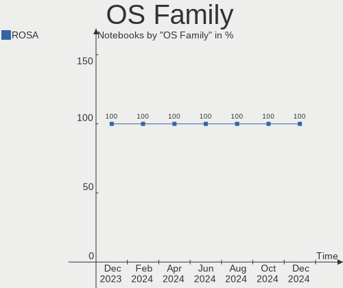
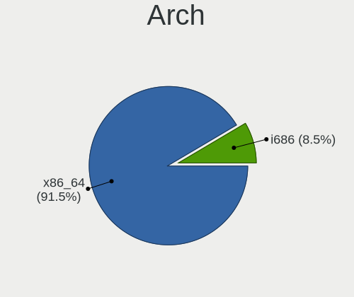
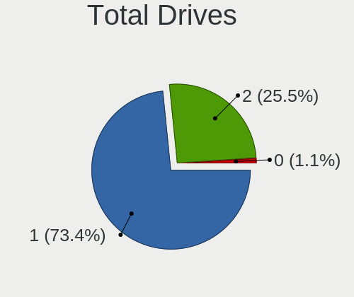
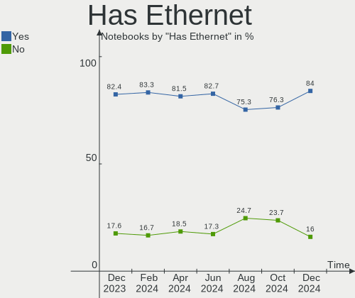
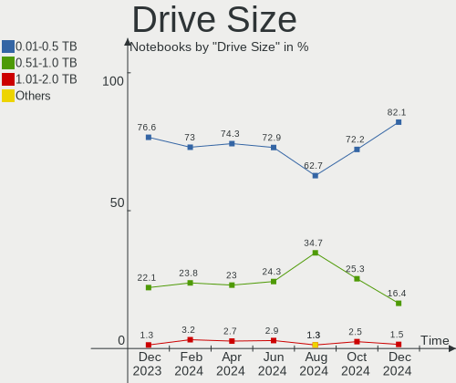
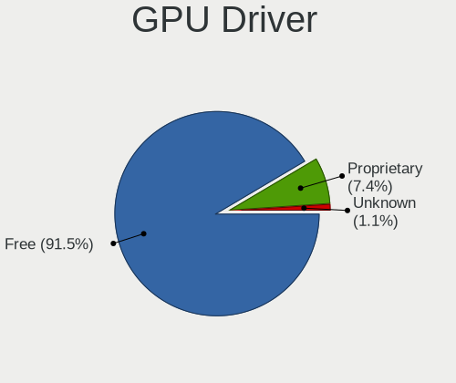
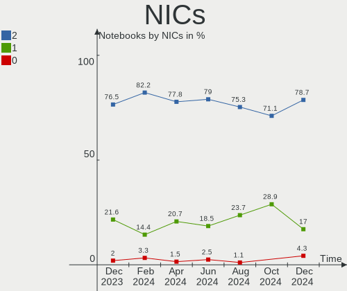

ROSA - Hardware Trends (Notebooks)
----------------------------------

A project to identify most popular hardware characteristics and track their change
over time based on data collected by Linux users at https://Linux-Hardware.org.

Anyone can contribute to this report by the [hw-probe](https://github.com/linuxhw/hw-probe) tool:

    sudo -E hw-probe -all -upload

This report is for one last month. Overall report since the beginning of time: [TestCoverage](https://github.com/linuxhw/TestCoverage)

Period: Jan, 2023.

Contents
--------

* [ System ](#system)
  - [ OS                       ](#os)
  - [ OS Family                ](#os-family)
  - [ Kernel                   ](#kernel)
  - [ Kernel Family            ](#kernel-family)
  - [ Kernel Major Ver.        ](#kernel-major-ver)
  - [ Arch                     ](#arch)
  - [ DE                       ](#de)
  - [ Display Server           ](#display-server)
  - [ Display Manager          ](#display-manager)
  - [ OS Lang                  ](#os-lang)
  - [ Boot Mode                ](#boot-mode)
  - [ Filesystem               ](#filesystem)
  - [ Part. scheme             ](#part-scheme)
  - [ Dual Boot with Linux/BSD ](#dual-boot-with-linuxbsd)
  - [ Dual Boot (Win)          ](#dual-boot-win)

* [ Board ](#board)
  - [ Vendor                   ](#vendor)
  - [ Model                    ](#model)
  - [ Model Family             ](#model-family)
  - [ MFG Year                 ](#mfg-year)
  - [ Form Factor              ](#form-factor)
  - [ Secure Boot              ](#secure-boot)
  - [ Coreboot                 ](#coreboot)
  - [ RAM Size                 ](#ram-size)
  - [ RAM Used                 ](#ram-used)
  - [ Total Drives             ](#total-drives)
  - [ Has CD-ROM               ](#has-cd-rom)
  - [ Has Ethernet             ](#has-ethernet)
  - [ Has WiFi                 ](#has-wifi)
  - [ Has Bluetooth            ](#has-bluetooth)

* [ Location ](#location)
  - [ Country                  ](#country)
  - [ City                     ](#city)

* [ Drives ](#drives)
  - [ Drive Vendor             ](#drive-vendor)
  - [ Drive Model              ](#drive-model)
  - [ HDD Vendor               ](#hdd-vendor)
  - [ SSD Vendor               ](#ssd-vendor)
  - [ Drive Kind               ](#drive-kind)
  - [ Drive Connector          ](#drive-connector)
  - [ Drive Size               ](#drive-size)
  - [ Space Total              ](#space-total)
  - [ Space Used               ](#space-used)
  - [ Malfunc. Drives          ](#malfunc-drives)
  - [ Malfunc. Drive Vendor    ](#malfunc-drive-vendor)
  - [ Malfunc. HDD Vendor      ](#malfunc-hdd-vendor)
  - [ Malfunc. Drive Kind      ](#malfunc-drive-kind)
  - [ Failed Drives            ](#failed-drives)
  - [ Failed Drive Vendor      ](#failed-drive-vendor)
  - [ Drive Status             ](#drive-status)

* [ Storage controller ](#storage-controller)
  - [ Storage Vendor           ](#storage-vendor)
  - [ Storage Model            ](#storage-model)
  - [ Storage Kind             ](#storage-kind)

* [ Processor ](#processor)
  - [ CPU Vendor               ](#cpu-vendor)
  - [ CPU Model                ](#cpu-model)
  - [ CPU Model Family         ](#cpu-model-family)
  - [ CPU Cores                ](#cpu-cores)
  - [ CPU Sockets              ](#cpu-sockets)
  - [ CPU Threads              ](#cpu-threads)
  - [ CPU Op-Modes             ](#cpu-op-modes)
  - [ CPU Microcode            ](#cpu-microcode)
  - [ CPU Microarch            ](#cpu-microarch)

* [ Graphics ](#graphics)
  - [ GPU Vendor               ](#gpu-vendor)
  - [ GPU Model                ](#gpu-model)
  - [ GPU Combo                ](#gpu-combo)
  - [ GPU Driver               ](#gpu-driver)
  - [ GPU Memory               ](#gpu-memory)

* [ Monitor ](#monitor)
  - [ Monitor Vendor           ](#monitor-vendor)
  - [ Monitor Model            ](#monitor-model)
  - [ Monitor Resolution       ](#monitor-resolution)
  - [ Monitor Diagonal         ](#monitor-diagonal)
  - [ Monitor Width            ](#monitor-width)
  - [ Aspect Ratio             ](#aspect-ratio)
  - [ Monitor Area             ](#monitor-area)
  - [ Pixel Density            ](#pixel-density)
  - [ Multiple Monitors        ](#multiple-monitors)

* [ Network ](#network)
  - [ Net Controller Vendor    ](#net-controller-vendor)
  - [ Net Controller Model     ](#net-controller-model)
  - [ Wireless Vendor          ](#wireless-vendor)
  - [ Wireless Model           ](#wireless-model)
  - [ Ethernet Vendor          ](#ethernet-vendor)
  - [ Ethernet Model           ](#ethernet-model)
  - [ Net Controller Kind      ](#net-controller-kind)
  - [ Used Controller          ](#used-controller)
  - [ NICs                     ](#nics)
  - [ IPv6                     ](#ipv6)

* [ Bluetooth ](#bluetooth)
  - [ Bluetooth Vendor         ](#bluetooth-vendor)
  - [ Bluetooth Model          ](#bluetooth-model)

* [ Sound ](#sound)
  - [ Sound Vendor             ](#sound-vendor)
  - [ Sound Model              ](#sound-model)

* [ Memory ](#memory)
  - [ Memory Vendor            ](#memory-vendor)
  - [ Memory Model             ](#memory-model)
  - [ Memory Kind              ](#memory-kind)
  - [ Memory Form Factor       ](#memory-form-factor)
  - [ Memory Size              ](#memory-size)
  - [ Memory Speed             ](#memory-speed)

* [ Printers & scanners ](#printers--scanners)
  - [ Printer Vendor           ](#printer-vendor)
  - [ Printer Model            ](#printer-model)
  - [ Scanner Vendor           ](#scanner-vendor)
  - [ Scanner Model            ](#scanner-model)

* [ Camera ](#camera)
  - [ Camera Vendor            ](#camera-vendor)
  - [ Camera Model             ](#camera-model)

* [ Security ](#security)
  - [ Fingerprint Vendor       ](#fingerprint-vendor)
  - [ Fingerprint Model        ](#fingerprint-model)
  - [ Chipcard Vendor          ](#chipcard-vendor)
  - [ Chipcard Model           ](#chipcard-model)

* [ Unsupported ](#unsupported)
  - [ Unsupported Devices      ](#unsupported-devices)
  - [ Unsupported Device Types ](#unsupported-device-types)

System
------

OS
--

Installed operating systems

| Name       | Notebooks | Percent |
|------------|-----------|---------|
| ROSA 12.3  | 87        | 80.56%  |
| ROSA R11.1 | 11        | 10.19%  |
| ROSA 12.2  | 7         | 6.48%   |
| ROSA R11   | 1         | 0.93%   |
| ROSA 13.0  | 1         | 0.93%   |
| ROSA 12.1  | 1         | 0.93%   |

OS Family
---------

OS without a version

| Name | Notebooks | Percent |
|------|-----------|---------|
| ROSA | 108       | 100%    |

Kernel
------

Version of the Linux kernel

| Version                                  | Notebooks | Percent |
|------------------------------------------|-----------|---------|
| 5.15.79-generic-1rosa2021.1-x86_64       | 35        | 32.41%  |
| 5.15.75-generic-1rosa2021.1-x86_64       | 27        | 25%     |
| 5.10.155-generic-1rosa2021.1-x86_64      | 10        | 9.26%   |
| 5.10.74-generic-2rosa2021.1-x86_64       | 7         | 6.48%   |
| 5.15.75-generic-1rosa2021.1-i686         | 4         | 3.7%    |
| 5.4.32-generic-2rosa-x86_64              | 3         | 2.78%   |
| 5.4.32-generic-2rosa-i586                | 3         | 2.78%   |
| 6.1.4-generic-1rosa2021.1-x86_64         | 2         | 1.85%   |
| 5.4.83-generic-2rosa-x86_64              | 2         | 1.85%   |
| 5.17.11-generic-2rosa2021.1-x86_64       | 2         | 1.85%   |
| 5.16.19-generic-2rosa2021.1-x86_64       | 2         | 1.85%   |
| 4.15.0-desktop-122.124.1rosa-i586        | 2         | 1.85%   |
| 6.1.3-generic-1rosa2021.1-x86_64         | 1         | 0.93%   |
| 6.1.0-generic-3rosa2021.1-x86_64         | 1         | 0.93%   |
| 6.1.0-generic-2rosa2021.1-x86_64         | 1         | 0.93%   |
| 6.0.7.xm1-1.klp-xanmod-rosa2021.1-x86_64 | 1         | 0.93%   |
| 6.0.3.xm1-1.klp-xanmod-rosa2021.1-x86_64 | 1         | 0.93%   |
| 5.4.83-generic-2rosa-i586                | 1         | 0.93%   |
| 5.15.77-generic-1rosa2021.1-x86_64       | 1         | 0.93%   |
| 5.10.74-generic-2rosa2021.1-i586         | 1         | 0.93%   |
| 4.15.0-desktop-45.1rosa-x86_64           | 1         | 0.93%   |

Kernel Family
-------------

Linux kernel without a distro release

| Version  | Notebooks | Percent |
|----------|-----------|---------|
| 5.15.79  | 35        | 32.41%  |
| 5.15.75  | 31        | 28.7%   |
| 5.10.155 | 10        | 9.26%   |
| 5.10.74  | 8         | 7.41%   |
| 5.4.32   | 6         | 5.56%   |
| 5.4.83   | 3         | 2.78%   |
| 4.15.0   | 3         | 2.78%   |
| 6.1.4    | 2         | 1.85%   |
| 6.1.0    | 2         | 1.85%   |
| 5.17.11  | 2         | 1.85%   |
| 5.16.19  | 2         | 1.85%   |
| 6.1.3    | 1         | 0.93%   |
| 6.0.7    | 1         | 0.93%   |
| 6.0.3    | 1         | 0.93%   |
| 5.15.77  | 1         | 0.93%   |

Kernel Major Ver.
-----------------

Linux kernel major version

| Version | Notebooks | Percent |
|---------|-----------|---------|
| 5.15    | 67        | 62.04%  |
| 5.10    | 18        | 16.67%  |
| 5.4     | 9         | 8.33%   |
| 6.1     | 5         | 4.63%   |
| 4.15    | 3         | 2.78%   |
| 6.0     | 2         | 1.85%   |
| 5.17    | 2         | 1.85%   |
| 5.16    | 2         | 1.85%   |

Arch
----

OS architecture (x86_64, i586, etc.)

| Name   | Notebooks | Percent |
|--------|-----------|---------|
| x86_64 | 97        | 89.81%  |
| i686   | 11        | 10.19%  |

DE
--

Desktop Environment

| Name  | Notebooks | Percent |
|-------|-----------|---------|
| KDE5  | 51        | 47.22%  |
| GNOME | 36        | 33.33%  |
| LXQt  | 15        | 13.89%  |
| KDE4  | 6         | 5.56%   |

Display Server
--------------

X11 or Wayland

| Name    | Notebooks | Percent |
|---------|-----------|---------|
| Wayland | 79        | 73.15%  |
| X11     | 29        | 26.85%  |

Display Manager
---------------

SDDM, LightDM, etc.

| Name    | Notebooks | Percent |
|---------|-----------|---------|
| SDDM    | 53        | 49.07%  |
| GDM     | 44        | 40.74%  |
| KDM     | 6         | 5.56%   |
| LightDM | 5         | 4.63%   |

OS Lang
-------

Language

| Lang    | Notebooks | Percent |
|---------|-----------|---------|
| ru_RU   | 95        | 87.96%  |
| pt_BR   | 3         | 2.78%   |
| en_US   | 2         | 1.85%   |
| de_DE   | 2         | 1.85%   |
| tr_TR   | 1         | 0.93%   |
| ru_BY   | 1         | 0.93%   |
| pl_PL   | 1         | 0.93%   |
| it_IT   | 1         | 0.93%   |
| es_ES   | 1         | 0.93%   |
| Unknown | 1         | 0.93%   |

Boot Mode
---------

EFI or BIOS

| Mode | Notebooks | Percent |
|------|-----------|---------|
| EFI  | 62        | 57.41%  |
| BIOS | 46        | 42.59%  |

Filesystem
----------

Type of filesystem

| Type  | Notebooks | Percent |
|-------|-----------|---------|
| Ext4  | 103       | 95.37%  |
| Btrfs | 5         | 4.63%   |

Part. scheme
------------

Scheme of partitioning

| Type | Notebooks | Percent |
|------|-----------|---------|
| GPT  | 68        | 62.96%  |
| MBR  | 40        | 37.04%  |

Dual Boot with Linux/BSD
------------------------

Hosting more than one Linux/BSD

| Dual boot | Notebooks | Percent |
|-----------|-----------|---------|
| No        | 80        | 74.07%  |
| Yes       | 28        | 25.93%  |

Dual Boot (Win)
---------------

Hosting Linux and Windows

| Dual boot | Notebooks | Percent |
|-----------|-----------|---------|
| No        | 72        | 66.67%  |
| Yes       | 36        | 33.33%  |

Board
-----

Vendor
------

Motherboard manufacturer

| Name                     | Notebooks | Percent |
|--------------------------|-----------|---------|
| Lenovo                   | 23        | 21.3%   |
| Acer                     | 17        | 15.74%  |
| ASUSTek Computer         | 15        | 13.89%  |
| Hewlett-Packard          | 14        | 12.96%  |
| Samsung Electronics      | 6         | 5.56%   |
| Dell                     | 6         | 5.56%   |
| MSI                      | 4         | 3.7%    |
| Toshiba                  | 3         | 2.78%   |
| Clevo                    | 3         | 2.78%   |
| Chuwi                    | 2         | 1.85%   |
| Unknown                  | 2         | 1.85%   |
| Sony                     | 1         | 0.93%   |
| Positivo Bahia - VAIO    | 1         | 0.93%   |
| Notebook                 | 1         | 0.93%   |
| MECHREVO                 | 1         | 0.93%   |
| Kraftway                 | 1         | 0.93%   |
| Irbis                    | 1         | 0.93%   |
| Infinix                  | 1         | 0.93%   |
| HUAWEI                   | 1         | 0.93%   |
| HIPER Technology Limited | 1         | 0.93%   |
| Gigabyte Technology      | 1         | 0.93%   |
| Fujitsu                  | 1         | 0.93%   |
| Casper                   | 1         | 0.93%   |
| Alienware                | 1         | 0.93%   |

Model
-----

Motherboard model

| Name                                              | Notebooks | Percent |
|---------------------------------------------------|-----------|---------|
| HP Notebook                                       | 3         | 2.78%   |
| HP Laptop 15-db0xxx                               | 2         | 1.85%   |
| Unknown                                           | 2         | 1.85%   |
| Toshiba Satellite Pro C660                        | 1         | 0.93%   |
| Toshiba Satellite P200                            | 1         | 0.93%   |
| Toshiba Satellite L300                            | 1         | 0.93%   |
| Sony VGN-FJ3SR_B                                  | 1         | 0.93%   |
| Samsung RV420/RV520/RV720/E3530/S3530/E3420/E3520 | 1         | 0.93%   |
| Samsung RV420/RV520/RV720                         | 1         | 0.93%   |
| Samsung RV408/RV508                               | 1         | 0.93%   |
| Samsung NC10                                      | 1         | 0.93%   |
| Samsung N148P/N208P/N218P/NB28P                   | 1         | 0.93%   |
| Samsung 350V5C/351V5C/3540VC/3440VC               | 1         | 0.93%   |
| Positivo Bahia - VAIO VJFE52F11X-B0611H           | 1         | 0.93%   |
| Notebook P15SM-A/SM1-A                            | 1         | 0.93%   |
| MSI GV72 8RD                                      | 1         | 0.93%   |
| MSI GP60 2OD                                      | 1         | 0.93%   |
| MSI GL75 Leopard 10SCSR                           | 1         | 0.93%   |
| MSI CR500                                         | 1         | 0.93%   |
| MECHREVO Jiaolong Series GM5ZG0O                  | 1         | 0.93%   |
| Lenovo Z50-70 20354                               | 1         | 0.93%   |
| Lenovo V310-15IKB 80T3                            | 1         | 0.93%   |
| Lenovo ThinkPad T570 W10DG 20JXS06A00             | 1         | 0.93%   |
| Lenovo ThinkPad P16s Gen 1 21CKCTO1WW             | 1         | 0.93%   |
| Lenovo ThinkBook 16 G4+ ARA 21D1                  | 1         | 0.93%   |
| Lenovo IdeaPad Z580                               | 1         | 0.93%   |
| Lenovo IdeaPad Z510 20287                         | 1         | 0.93%   |
| Lenovo IdeaPad S510p 20298                        | 1         | 0.93%   |
| Lenovo IdeaPad S145-15AST 81N3                    | 1         | 0.93%   |
| Lenovo IdeaPad Gaming 3 15ARH05 82EY              | 1         | 0.93%   |
| Lenovo IdeaPad Gaming 3 15ACH6 82K2               | 1         | 0.93%   |
| Lenovo IdeaPad 330-15IKB 81FE                     | 1         | 0.93%   |
| Lenovo IdeaPad 330-15IKB 81DE                     | 1         | 0.93%   |
| Lenovo IdeaPad 320-15IAP 80XR                     | 1         | 0.93%   |
| Lenovo IdeaPad 3 17ADA05 81W2                     | 1         | 0.93%   |
| Lenovo G70-80 80FF                                | 1         | 0.93%   |
| Lenovo G580 20157                                 | 1         | 0.93%   |
| Lenovo G500 20236                                 | 1         | 0.93%   |
| Lenovo G480 20156                                 | 1         | 0.93%   |
| Lenovo Flex 2-14 20404                            | 1         | 0.93%   |

Model Family
------------

Motherboard model prefix

| Name                                    | Notebooks | Percent |
|-----------------------------------------|-----------|---------|
| Lenovo IdeaPad                          | 10        | 9.26%   |
| Acer Aspire                             | 10        | 9.26%   |
| HP Laptop                               | 4         | 3.7%    |
| ASUS VivoBook                           | 4         | 3.7%    |
| Toshiba Satellite                       | 3         | 2.78%   |
| HP Notebook                             | 3         | 2.78%   |
| Dell Inspiron                           | 3         | 2.78%   |
| Acer Nitro                              | 3         | 2.78%   |
| Samsung RV420                           | 2         | 1.85%   |
| Lenovo ThinkPad                         | 2         | 1.85%   |
| HP ProBook                              | 2         | 1.85%   |
| Acer Extensa                            | 2         | 1.85%   |
| Unknown                                 | 2         | 1.85%   |
| Sony VGN-FJ3SR                          | 1         | 0.93%   |
| Samsung RV408                           | 1         | 0.93%   |
| Samsung NC10                            | 1         | 0.93%   |
| Samsung N148P                           | 1         | 0.93%   |
| Samsung 350V5C                          | 1         | 0.93%   |
| Positivo Bahia - VAIO VJFE52F11X-B0611H | 1         | 0.93%   |
| Notebook P15SM-A                        | 1         | 0.93%   |
| MSI GV72                                | 1         | 0.93%   |
| MSI GP60                                | 1         | 0.93%   |
| MSI GL75                                | 1         | 0.93%   |
| MSI CR500                               | 1         | 0.93%   |
| MECHREVO Jiaolong                       | 1         | 0.93%   |
| Lenovo Z50-70                           | 1         | 0.93%   |
| Lenovo V310-15IKB                       | 1         | 0.93%   |
| Lenovo ThinkBook                        | 1         | 0.93%   |
| Lenovo G70-80                           | 1         | 0.93%   |
| Lenovo G580                             | 1         | 0.93%   |
| Lenovo G500                             | 1         | 0.93%   |
| Lenovo G480                             | 1         | 0.93%   |
| Lenovo Flex                             | 1         | 0.93%   |
| Lenovo B590                             | 1         | 0.93%   |
| Lenovo B570e                            | 1         | 0.93%   |
| Lenovo B450                             | 1         | 0.93%   |
| Kraftway ACCORD                         | 1         | 0.93%   |
| Irbis NB264                             | 1         | 0.93%   |
| Infinix INBOOK                          | 1         | 0.93%   |
| HUAWEI BOM-WXX9                         | 1         | 0.93%   |

MFG Year
--------

Motherboard manufacture year

| Year | Notebooks | Percent |
|------|-----------|---------|
| 2018 | 10        | 9.26%   |
| 2013 | 10        | 9.26%   |
| 2012 | 10        | 9.26%   |
| 2011 | 10        | 9.26%   |
| 2022 | 9         | 8.33%   |
| 2009 | 9         | 8.33%   |
| 2021 | 7         | 6.48%   |
| 2015 | 7         | 6.48%   |
| 2010 | 7         | 6.48%   |
| 2017 | 6         | 5.56%   |
| 2020 | 5         | 4.63%   |
| 2014 | 5         | 4.63%   |
| 2019 | 4         | 3.7%    |
| 2008 | 4         | 3.7%    |
| 2016 | 2         | 1.85%   |
| 2007 | 1         | 0.93%   |
| 2006 | 1         | 0.93%   |
| 2005 | 1         | 0.93%   |

Form Factor
-----------

Physical design of the computer

| Name     | Notebooks | Percent |
|----------|-----------|---------|
| Notebook | 108       | 100%    |

Secure Boot
-----------

Enabled or disabled

| State    | Notebooks | Percent |
|----------|-----------|---------|
| Disabled | 108       | 100%    |

Coreboot
--------

Have coreboot on board

| Used | Notebooks | Percent |
|------|-----------|---------|
| No   | 108       | 100%    |

RAM Size
--------

Total RAM memory

| Size in GB | Notebooks | Percent |
|------------|-----------|---------|
| 4.01-8.0   | 38        | 35.19%  |
| 3.01-4.0   | 25        | 23.15%  |
| 8.01-16.0  | 14        | 12.96%  |
| 16.01-24.0 | 12        | 11.11%  |
| 1.01-2.0   | 10        | 9.26%   |
| 2.01-3.0   | 4         | 3.7%    |
| 24.01-32.0 | 2         | 1.85%   |
| 0.51-1.0   | 2         | 1.85%   |
| 32.01-64.0 | 1         | 0.93%   |

RAM Used
--------

Used RAM memory

| Used GB  | Notebooks | Percent |
|----------|-----------|---------|
| 1.01-2.0 | 59        | 54.63%  |
| 0.51-1.0 | 22        | 20.37%  |
| 2.01-3.0 | 18        | 16.67%  |
| 4.01-8.0 | 3         | 2.78%   |
| 3.01-4.0 | 3         | 2.78%   |
| 0.01-0.5 | 3         | 2.78%   |

Total Drives
------------

Number of drives on board

| Drives | Notebooks | Percent |
|--------|-----------|---------|
| 1      | 76        | 70.37%  |
| 2      | 29        | 26.85%  |
| 3      | 2         | 1.85%   |
| 5      | 1         | 0.93%   |

Has CD-ROM
----------

Has CD-ROM on board

| Presented | Notebooks | Percent |
|-----------|-----------|---------|
| No        | 69        | 63.89%  |
| Yes       | 39        | 36.11%  |

Has Ethernet
------------

Has Ethernet on board

| Presented | Notebooks | Percent |
|-----------|-----------|---------|
| Yes       | 92        | 85.19%  |
| No        | 16        | 14.81%  |

Has WiFi
--------

Has WiFi module

| Presented | Notebooks | Percent |
|-----------|-----------|---------|
| Yes       | 107       | 99.07%  |
| No        | 1         | 0.93%   |

Has Bluetooth
-------------

Has Bluetooth module

| Presented | Notebooks | Percent |
|-----------|-----------|---------|
| Yes       | 82        | 75.93%  |
| No        | 26        | 24.07%  |

Location
--------

Country
-------

Geographic location (country)

| Country               | Notebooks | Percent |
|-----------------------|-----------|---------|
| Russia                | 80        | 74.07%  |
| Latvia                | 4         | 3.7%    |
| Germany               | 4         | 3.7%    |
| Ukraine               | 3         | 2.78%   |
| Brazil                | 3         | 2.78%   |
| Kazakhstan            | 2         | 1.85%   |
| Belarus               | 2         | 1.85%   |
| USA                   | 1         | 0.93%   |
| UK                    | 1         | 0.93%   |
| Turkey                | 1         | 0.93%   |
| Poland                | 1         | 0.93%   |
| Palestinian Territory | 1         | 0.93%   |
| Italy                 | 1         | 0.93%   |
| Georgia               | 1         | 0.93%   |
| Croatia               | 1         | 0.93%   |
| Bulgaria              | 1         | 0.93%   |
| Azerbaijan            | 1         | 0.93%   |

City
----

Geographic location (city)

| City            | Notebooks | Percent |
|-----------------|-----------|---------|
| Moscow          | 10        | 9.26%   |
| St Petersburg   | 7         | 6.48%   |
| Krasnodar       | 6         | 5.56%   |
| Volgograd       | 3         | 2.78%   |
| Tver            | 3         | 2.78%   |
| Vologda         | 2         | 1.85%   |
| Surgut          | 2         | 1.85%   |
| Samara          | 2         | 1.85%   |
| Rio de Janeiro  | 2         | 1.85%   |
| Rēzekne        | 2         | 1.85%   |
| Perm            | 2         | 1.85%   |
| Donetsk         | 2         | 1.85%   |
| Chelyabinsk     | 2         | 1.85%   |
| Zelenodolsk     | 1         | 0.93%   |
| Yoshkar-Ola     | 1         | 0.93%   |
| Yekaterinburg   | 1         | 0.93%   |
| Yaroslavl       | 1         | 0.93%   |
| Warsaw          | 1         | 0.93%   |
| Voronezh        | 1         | 0.93%   |
| Vladimir        | 1         | 0.93%   |
| Vitebsk         | 1         | 0.93%   |
| Veliky Novgorod | 1         | 0.93%   |
| Varna           | 1         | 0.93%   |
| Tyumen          | 1         | 0.93%   |
| Tolyatti        | 1         | 0.93%   |
| Split           | 1         | 0.93%   |
| Sochi           | 1         | 0.93%   |
| Smolensk        | 1         | 0.93%   |
| Shchelkovo      | 1         | 0.93%   |
| Seversk         | 1         | 0.93%   |
| Sergiyev Posad  | 1         | 0.93%   |
| Rostov-on-Don   | 1         | 0.93%   |
| Riga            | 1         | 0.93%   |
| Porto Alegre    | 1         | 0.93%   |
| Pitsunda        | 1         | 0.93%   |
| Peterborough    | 1         | 0.93%   |
| Pescara         | 1         | 0.93%   |
| Penza           | 1         | 0.93%   |
| Orenburg        | 1         | 0.93%   |
| Omsk            | 1         | 0.93%   |

Drives
------

Drive Vendor
------------

Hard drive vendors

| Vendor                         | Notebooks | Drives | Percent |
|--------------------------------|-----------|--------|---------|
| WDC                            | 27        | 28     | 19.71%  |
| Seagate                        | 20        | 22     | 14.6%   |
| Kingston                       | 11        | 11     | 8.03%   |
| Toshiba                        | 9         | 9      | 6.57%   |
| Samsung Electronics            | 6         | 6      | 4.38%   |
| HGST                           | 5         | 5      | 3.65%   |
| Micron Technology              | 4         | 4      | 2.92%   |
| Hitachi                        | 4         | 4      | 2.92%   |
| China                          | 4         | 4      | 2.92%   |
| Apacer                         | 4         | 4      | 2.92%   |
| SPCC                           | 3         | 3      | 2.19%   |
| SK hynix                       | 3         | 3      | 2.19%   |
| Patriot                        | 3         | 3      | 2.19%   |
| Netac                          | 3         | 3      | 2.19%   |
| Crucial                        | 3         | 3      | 2.19%   |
| XrayDisk                       | 2         | 2      | 1.46%   |
| Unknown                        | 2         | 2      | 1.46%   |
| Smartbuy                       | 2         | 2      | 1.46%   |
| Silicon Motion                 | 2         | 2      | 1.46%   |
| Intel                          | 2         | 2      | 1.46%   |
| Fujitsu                        | 2         | 2      | 1.46%   |
| Unknown                        | 2         | 2      | 1.46%   |
| Vaseky                         | 1         | 1      | 0.73%   |
| Team                           | 1         | 1      | 0.73%   |
| Solid State Storage Technology | 1         | 1      | 0.73%   |
| SanDisk                        | 1         | 1      | 0.73%   |
| PNY                            | 1         | 1      | 0.73%   |
| LITEONIT                       | 1         | 1      | 0.73%   |
| KingSpec                       | 1         | 1      | 0.73%   |
| KingDian                       | 1         | 1      | 0.73%   |
| HFS256G3                       | 1         | 1      | 0.73%   |
| GS                             | 1         | 1      | 0.73%   |
| Gigabyte Technology            | 1         | 1      | 0.73%   |
| Foxline                        | 1         | 1      | 0.73%   |
| FORESEE                        | 1         | 1      | 0.73%   |
| Fanxiang                       | 1         | 1      | 0.73%   |

Drive Model
-----------

Hard drive models

| Model                                | Notebooks | Percent |
|--------------------------------------|-----------|---------|
| Toshiba MQ01ABF050 500GB             | 4         | 2.86%   |
| WDC WD5000LPVX-22V0TT0 500GB         | 3         | 2.14%   |
| Seagate ST500LT012-1DG142 500GB      | 3         | 2.14%   |
| WDC WDS120G2G0A-00JH30 120GB SSD     | 2         | 1.43%   |
| WDC WD10JPCX-24UE4T0 1TB             | 2         | 1.43%   |
| SPCC Solid State Disk 256GB          | 2         | 1.43%   |
| Seagate ST9500325AS 500GB            | 2         | 1.43%   |
| Seagate ST500LT012-9WS142 500GB      | 2         | 1.43%   |
| Seagate ST1000LM048-2E7172 1TB       | 2         | 1.43%   |
| Seagate ST1000LM035-1RK172 1TB       | 2         | 1.43%   |
| Netac SSD 256GB                      | 2         | 1.43%   |
| Kingston SA400S37240G 240GB SSD      | 2         | 1.43%   |
| Kingston SA400S37120G 120GB SSD      | 2         | 1.43%   |
| Apacer AS350 120GB SSD               | 2         | 1.43%   |
| Unknown                              | 2         | 1.43%   |
| XrayDisk 2TB SSD                     | 1         | 0.71%   |
| XrayDisk 256GB SSD                   | 1         | 0.71%   |
| WDC WDS480G2G0C-00AJM0 480GB         | 1         | 0.71%   |
| WDC WDS240G2G0A-00JH30 240GB SSD     | 1         | 0.71%   |
| WDC WDS100T2B0A-00SM50 1TB SSD       | 1         | 0.71%   |
| WDC WD7500BPVX-22JC3T0 752GB         | 1         | 0.71%   |
| WDC WD7500BPKX-75HPJT0 752GB         | 1         | 0.71%   |
| WDC WD75 00BPKX-00HPJ 752GB          | 1         | 0.71%   |
| WDC WD5000LPVT-08G33T1 500GB         | 1         | 0.71%   |
| WDC WD5000LPCX-21VHAT0 500GB         | 1         | 0.71%   |
| WDC WD3200BPVT-80JJ5T0 320GB         | 1         | 0.71%   |
| WDC WD3200BPVT-24ZEST0 320GB         | 1         | 0.71%   |
| WDC WD3200BPVT-00JJ5T0 320GB         | 1         | 0.71%   |
| WDC WD1600BEVT-22ZCT0 160GB          | 1         | 0.71%   |
| WDC WD1600BEVT-22A23T0 160GB         | 1         | 0.71%   |
| WDC WD1600BEVT-08A23T1 160GB         | 1         | 0.71%   |
| WDC WD10SPZX-35Z10T0 1TB             | 1         | 0.71%   |
| WDC WD10SPZX-24Z10 1TB               | 1         | 0.71%   |
| WDC WD10SPZX-17Z10T1 1TB             | 1         | 0.71%   |
| WDC WD10SPSX-22A6WT0 1TB             | 1         | 0.71%   |
| WDC WD10JPVX-22JC3T0 1TB             | 1         | 0.71%   |
| WDC PC SN530 SDBPNPZ-512G-1014 512GB | 1         | 0.71%   |
| WDC PC SN530 SDBPNPZ-256G-1002 256GB | 1         | 0.71%   |
| Vaseky V800/120G 120GB SSD           | 1         | 0.71%   |
| Unknown SC128  128GB                 | 1         | 0.71%   |

HDD Vendor
----------

Hard disk drive vendors

| Vendor  | Notebooks | Drives | Percent |
|---------|-----------|--------|---------|
| WDC     | 20        | 21     | 33.33%  |
| Seagate | 20        | 22     | 33.33%  |
| Toshiba | 9         | 9      | 15%     |
| HGST    | 5         | 5      | 8.33%   |
| Hitachi | 4         | 4      | 6.67%   |
| Fujitsu | 2         | 2      | 3.33%   |

SSD Vendor
----------

Solid state drive vendors

| Vendor              | Notebooks | Drives | Percent |
|---------------------|-----------|--------|---------|
| Kingston            | 8         | 8      | 16%     |
| WDC                 | 4         | 4      | 8%      |
| Samsung Electronics | 4         | 4      | 8%      |
| China               | 4         | 4      | 8%      |
| SPCC                | 3         | 3      | 6%      |
| Patriot             | 3         | 3      | 6%      |
| Netac               | 3         | 3      | 6%      |
| Apacer              | 3         | 3      | 6%      |
| XrayDisk            | 2         | 2      | 4%      |
| Crucial             | 2         | 2      | 4%      |
| Unknown             | 2         | 2      | 4%      |
| Vaseky              | 1         | 1      | 2%      |
| Team                | 1         | 1      | 2%      |
| Smartbuy            | 1         | 1      | 2%      |
| SanDisk             | 1         | 1      | 2%      |
| PNY                 | 1         | 1      | 2%      |
| Micron Technology   | 1         | 1      | 2%      |
| LITEONIT            | 1         | 1      | 2%      |
| KingSpec            | 1         | 1      | 2%      |
| KingDian            | 1         | 1      | 2%      |
| GS                  | 1         | 1      | 2%      |
| Foxline             | 1         | 1      | 2%      |
| Fanxiang            | 1         | 1      | 2%      |

Drive Kind
----------

HDD or SSD

| Kind    | Notebooks | Drives | Percent |
|---------|-----------|--------|---------|
| HDD     | 58        | 63     | 45.31%  |
| SSD     | 45        | 50     | 35.16%  |
| NVMe    | 21        | 23     | 16.41%  |
| MMC     | 3         | 3      | 2.34%   |
| Unknown | 1         | 1      | 0.78%   |

Drive Connector
---------------

SATA, SAS, NVMe, etc.

| Type | Notebooks | Drives | Percent |
|------|-----------|--------|---------|
| SATA | 90        | 108    | 76.27%  |
| NVMe | 21        | 23     | 17.8%   |
| SAS  | 4         | 6      | 3.39%   |
| MMC  | 3         | 3      | 2.54%   |

Drive Size
----------

Size of hard drive

| Size in TB | Notebooks | Drives | Percent |
|------------|-----------|--------|---------|
| 0.01-0.5   | 69        | 77     | 68.32%  |
| 0.51-1.0   | 30        | 33     | 29.7%   |
| 1.01-2.0   | 1         | 1      | 0.99%   |
| 4.01-10.0  | 1         | 2      | 0.99%   |

Space Total
-----------

Amount of disk space available on the file system

| Size in GB     | Notebooks | Percent |
|----------------|-----------|---------|
| 101-250        | 41        | 37.96%  |
| 251-500        | 26        | 24.07%  |
| 501-1000       | 11        | 10.19%  |
| 1-20           | 9         | 8.33%   |
| 51-100         | 8         | 7.41%   |
| 21-50          | 7         | 6.48%   |
| 1001-2000      | 3         | 2.78%   |
| More than 3000 | 2         | 1.85%   |
| Unknown        | 1         | 0.93%   |

Space Used
----------

Amount of used disk space

| Used GB        | Notebooks | Percent |
|----------------|-----------|---------|
| 1-20           | 67        | 62.04%  |
| 21-50          | 15        | 13.89%  |
| 101-250        | 8         | 7.41%   |
| 51-100         | 8         | 7.41%   |
| 251-500        | 6         | 5.56%   |
| More than 3000 | 2         | 1.85%   |
| 501-1000       | 1         | 0.93%   |
| Unknown        | 1         | 0.93%   |

Malfunc. Drives
---------------

Drive models with a malfunction

| Model                               | Notebooks | Drives | Percent |
|-------------------------------------|-----------|--------|---------|
| Seagate ST500LT012-9WS142 500GB     | 2         | 2      | 7.69%   |
| Seagate ST500LT012-1DG142 500GB     | 2         | 2      | 7.69%   |
| WDC WDS120G2G0A-00JH30 120GB SSD    | 1         | 1      | 3.85%   |
| WDC WD5000LPCX-21VHAT0 500GB        | 1         | 1      | 3.85%   |
| WDC WD1600BEVT-22ZCT0 160GB         | 1         | 1      | 3.85%   |
| WDC WD10JPVX-22JC3T0 1TB            | 1         | 1      | 3.85%   |
| WDC WD10JPCX-24UE4T0 1TB            | 1         | 1      | 3.85%   |
| Toshiba MQ01ABF050 500GB            | 1         | 1      | 3.85%   |
| Toshiba MK2565GSX 250GB             | 1         | 1      | 3.85%   |
| Toshiba MK1059GSMP 1TB              | 1         | 1      | 3.85%   |
| Seagate ST9250315AS 250GB           | 1         | 1      | 3.85%   |
| Seagate ST500LM021-1KJ152 500GB     | 1         | 1      | 3.85%   |
| Seagate ST500LM012 HN-M500MBB 500GB | 1         | 1      | 3.85%   |
| Seagate ST1000LM048-2E7172 1TB      | 1         | 1      | 3.85%   |
| Seagate ST1000LM024 HN-M101MBB 1TB  | 1         | 1      | 3.85%   |
| Seagate ST1000LM014-1EJ164 1TB      | 1         | 1      | 3.85%   |
| Patriot P200 256GB SSD              | 1         | 1      | 3.85%   |
| Netac SSD 256GB                     | 1         | 1      | 3.85%   |
| HGST HTS725032A7E630 320GB          | 1         | 1      | 3.85%   |
| HGST HTS545050A7E380 500GB          | 1         | 1      | 3.85%   |
| HGST HTS541010A9E680 1TB            | 1         | 1      | 3.85%   |
| Fujitsu MHX2300BT 304GB             | 1         | 1      | 3.85%   |
| Fujitsu MHV2060AH 64GB              | 1         | 1      | 3.85%   |
| China SSD 256GB                     | 1         | 1      | 3.85%   |

Malfunc. Drive Vendor
---------------------

Vendors of faulty drives

| Vendor  | Notebooks | Drives | Percent |
|---------|-----------|--------|---------|
| Seagate | 10        | 10     | 38.46%  |
| WDC     | 5         | 5      | 19.23%  |
| Toshiba | 3         | 3      | 11.54%  |
| HGST    | 3         | 3      | 11.54%  |
| Fujitsu | 2         | 2      | 7.69%   |
| Patriot | 1         | 1      | 3.85%   |
| Netac   | 1         | 1      | 3.85%   |
| China   | 1         | 1      | 3.85%   |

Malfunc. HDD Vendor
-------------------

Vendors of faulty HDD drives

| Vendor  | Notebooks | Drives | Percent |
|---------|-----------|--------|---------|
| Seagate | 10        | 10     | 45.45%  |
| WDC     | 4         | 4      | 18.18%  |
| Toshiba | 3         | 3      | 13.64%  |
| HGST    | 3         | 3      | 13.64%  |
| Fujitsu | 2         | 2      | 9.09%   |

Malfunc. Drive Kind
-------------------

Kinds of faulty drives

| Kind | Notebooks | Drives | Percent |
|------|-----------|--------|---------|
| HDD  | 22        | 22     | 84.62%  |
| SSD  | 4         | 4      | 15.38%  |

Failed Drives
-------------

Failed drive models

| Model                         | Notebooks | Drives | Percent |
|-------------------------------|-----------|--------|---------|
| Seagate ST9500325AS 500GB     | 1         | 1      | 50%     |
| Hitachi HTS545050A7E380 500GB | 1         | 1      | 50%     |

Failed Drive Vendor
-------------------

Failed drive vendors

| Vendor  | Notebooks | Drives | Percent |
|---------|-----------|--------|---------|
| Seagate | 1         | 1      | 50%     |
| Hitachi | 1         | 1      | 50%     |

Drive Status
------------

Number of failed and malfunc. drives

| Status   | Notebooks | Drives | Percent |
|----------|-----------|--------|---------|
| Works    | 83        | 103    | 70.94%  |
| Malfunc  | 25        | 26     | 21.37%  |
| Detected | 7         | 9      | 5.98%   |
| Failed   | 2         | 2      | 1.71%   |

Storage controller
------------------

Storage Vendor
--------------

Storage controller vendors

| Vendor                           | Notebooks | Percent |
|----------------------------------|-----------|---------|
| Intel                            | 84        | 70%     |
| AMD                              | 11        | 9.17%   |
| Silicon Motion                   | 3         | 2.5%    |
| SanDisk                          | 3         | 2.5%    |
| Nvidia                           | 3         | 2.5%    |
| Micron Technology                | 3         | 2.5%    |
| Kingston Technology Company      | 3         | 2.5%    |
| SK hynix                         | 2         | 1.67%   |
| Samsung Electronics              | 2         | 1.67%   |
| Phison Electronics               | 2         | 1.67%   |
| Solid State Storage Technology   | 1         | 0.83%   |
| Silicon Integrated Systems [SiS] | 1         | 0.83%   |
| Shenzhen Longsys Electronics     | 1         | 0.83%   |
| Micron/Crucial Technology        | 1         | 0.83%   |

Storage Model
-------------

Storage controller models

| Model                                                                            | Notebooks | Percent |
|----------------------------------------------------------------------------------|-----------|---------|
| Intel 7 Series Chipset Family 6-port SATA Controller [AHCI mode]                 | 12        | 9.68%   |
| AMD FCH SATA Controller [AHCI mode]                                              | 9         | 7.26%   |
| Intel Sunrise Point-LP SATA Controller [AHCI mode]                               | 8         | 6.45%   |
| Intel 8 Series/C220 Series Chipset Family 6-port SATA Controller 1 [AHCI mode]   | 7         | 5.65%   |
| Intel 82801IBM/IEM (ICH9M/ICH9M-E) 4 port SATA Controller [AHCI mode]            | 6         | 4.84%   |
| Intel 6 Series/C200 Series Chipset Family 6 port Mobile SATA AHCI Controller     | 6         | 4.84%   |
| Intel NM10/ICH7 Family SATA Controller [AHCI mode]                               | 4         | 3.23%   |
| Intel Celeron/Pentium Silver Processor SATA Controller                           | 4         | 3.23%   |
| Intel 8 Series SATA Controller 1 [AHCI mode]                                     | 4         | 3.23%   |
| Intel 5 Series/3400 Series Chipset 4 port SATA AHCI Controller                   | 4         | 3.23%   |
| Micron Non-Volatile memory controller                                            | 3         | 2.42%   |
| Intel Wildcat Point-LP SATA Controller [AHCI Mode]                               | 3         | 2.42%   |
| Intel Cannon Lake Mobile PCH SATA AHCI Controller                                | 3         | 2.42%   |
| Silicon Motion SM2263EN/SM2263XT SSD Controller                                  | 2         | 1.61%   |
| SanDisk WD Blue SN550 NVMe SSD                                                   | 2         | 1.61%   |
| Nvidia MCP79 AHCI Controller                                                     | 2         | 1.61%   |
| Intel Comet Lake SATA AHCI Controller                                            | 2         | 1.61%   |
| Intel Atom/Celeron/Pentium Processor x5-E8000/J3xxx/N3xxx Series SATA Controller | 2         | 1.61%   |
| Intel Atom Processor E3800 Series SATA AHCI Controller                           | 2         | 1.61%   |
| Intel 82801HM/HEM (ICH8M/ICH8M-E) SATA Controller [AHCI mode]                    | 2         | 1.61%   |
| Intel 82801HM/HEM (ICH8M/ICH8M-E) IDE Controller                                 | 2         | 1.61%   |
| Solid State Storage Non-Volatile memory controller                               | 1         | 0.81%   |
| SK hynix Gold P31/PC711 NVMe Solid State Drive                                   | 1         | 0.81%   |
| SK hynix BC511                                                                   | 1         | 0.81%   |
| Silicon Motion Non-Volatile memory controller                                    | 1         | 0.81%   |
| Silicon Integrated Systems [SiS] SATA Controller / IDE mode                      | 1         | 0.81%   |
| Shenzhen Longsys Electronics Non-Volatile memory controller                      | 1         | 0.81%   |
| SanDisk Non-Volatile memory controller                                           | 1         | 0.81%   |
| Samsung NVMe SSD Controller SM961/PM961/SM963                                    | 1         | 0.81%   |
| Samsung NVMe SSD Controller 980                                                  | 1         | 0.81%   |
| Phison PS5013 E13 NVMe Controller                                                | 1         | 0.81%   |
| Phison E16 PCIe4 NVMe Controller                                                 | 1         | 0.81%   |
| Nvidia MCP79 SATA Controller                                                     | 1         | 0.81%   |
| Micron/Crucial P5 Plus NVMe PCIe SSD                                             | 1         | 0.81%   |
| Kingston Company U-SNS8154P3 NVMe SSD                                            | 1         | 0.81%   |
| Kingston Company Company Non-Volatile memory controller                          | 1         | 0.81%   |
| Kingston Company OM3PDP3 NVMe SSD                                                | 1         | 0.81%   |
| Intel Volume Management Device NVMe RAID Controller                              | 1         | 0.81%   |
| Intel Tiger Lake-LP SATA Controller                                              | 1         | 0.81%   |
| Intel SSD 660P Series                                                            | 1         | 0.81%   |

Storage Kind
------------

Kind of storage controller (IDE, SATA, NVMe, SAS, ...)

| Kind | Notebooks | Percent |
|------|-----------|---------|
| SATA | 90        | 73.77%  |
| NVMe | 21        | 17.21%  |
| IDE  | 9         | 7.38%   |
| RAID | 2         | 1.64%   |

Processor
---------

CPU Vendor
----------

Processor vendors

| Vendor | Notebooks | Percent |
|--------|-----------|---------|
| Intel  | 91        | 84.26%  |
| AMD    | 17        | 15.74%  |

CPU Model
---------

Processor models

| Model                                       | Notebooks | Percent |
|---------------------------------------------|-----------|---------|
| Intel Core i5-4200M CPU @ 2.50GHz           | 4         | 3.7%    |
| Intel Core i5-3210M CPU @ 2.50GHz           | 3         | 2.78%   |
| Intel Pentium Silver N5000 CPU @ 1.10GHz    | 2         | 1.85%   |
| Intel Pentium Dual-Core CPU T4400 @ 2.20GHz | 2         | 1.85%   |
| Intel Pentium CPU N3540 @ 2.16GHz           | 2         | 1.85%   |
| Intel Core i5-8300H CPU @ 2.30GHz           | 2         | 1.85%   |
| Intel Core i5-7200U CPU @ 2.50GHz           | 2         | 1.85%   |
| Intel Core i5-3230M CPU @ 2.60GHz           | 2         | 1.85%   |
| Intel Core i3-6006U CPU @ 2.00GHz           | 2         | 1.85%   |
| Intel Celeron CPU N3050 @ 1.60GHz           | 2         | 1.85%   |
| Intel Celeron CPU B820 @ 1.70GHz            | 2         | 1.85%   |
| Intel Atom CPU N270 @ 1.60GHz               | 2         | 1.85%   |
| Intel 11th Gen Core i5-11400H @ 2.70GHz     | 2         | 1.85%   |
| AMD Ryzen 5 4600H with Radeon Graphics      | 2         | 1.85%   |
| Intel Pentium Silver N6000 @ 1.10GHz        | 1         | 0.93%   |
| Intel Pentium M processor 1.73GHz           | 1         | 0.93%   |
| Intel Pentium M processor 1.70GHz           | 1         | 0.93%   |
| Intel Pentium Dual-Core CPU T4500 @ 2.30GHz | 1         | 0.93%   |
| Intel Pentium Dual-Core CPU T4300 @ 2.10GHz | 1         | 0.93%   |
| Intel Pentium Dual CPU T2370 @ 1.73GHz      | 1         | 0.93%   |
| Intel Pentium CPU P6100 @ 2.00GHz           | 1         | 0.93%   |
| Intel Pentium CPU N4200 @ 1.10GHz           | 1         | 0.93%   |
| Intel Pentium CPU N3710 @ 1.60GHz           | 1         | 0.93%   |
| Intel Pentium CPU B950 @ 2.10GHz            | 1         | 0.93%   |
| Intel Pentium CPU 4405U @ 2.10GHz           | 1         | 0.93%   |
| Intel Pentium CPU 3825U @ 1.90GHz           | 1         | 0.93%   |
| Intel Pentium CPU 2020M @ 2.40GHz           | 1         | 0.93%   |
| Intel Pentium 3556U @ 1.70GHz               | 1         | 0.93%   |
| Intel Genuine CPU 575 @ 2.00GHz             | 1         | 0.93%   |
| Intel Core i7-4800MQ CPU @ 2.70GHz          | 1         | 0.93%   |
| Intel Core i7-4712MQ CPU @ 2.30GHz          | 1         | 0.93%   |
| Intel Core i7-4710HQ CPU @ 2.50GHz          | 1         | 0.93%   |
| Intel Core i7-4702MQ CPU @ 2.20GHz          | 1         | 0.93%   |
| Intel Core i7-4510U CPU @ 2.00GHz           | 1         | 0.93%   |
| Intel Core i7-3610QM CPU @ 2.30GHz          | 1         | 0.93%   |
| Intel Core i5-9300H CPU @ 2.40GHz           | 1         | 0.93%   |
| Intel Core i5-8350U CPU @ 1.70GHz           | 1         | 0.93%   |
| Intel Core i5-8259U CPU @ 2.30GHz           | 1         | 0.93%   |
| Intel Core i5-8250U CPU @ 1.60GHz           | 1         | 0.93%   |
| Intel Core i5-6300U CPU @ 2.40GHz           | 1         | 0.93%   |

CPU Model Family
----------------

Processor model prefix

| Model                   | Notebooks | Percent |
|-------------------------|-----------|---------|
| Intel Core i5           | 23        | 21.3%   |
| Intel Core i3           | 13        | 12.04%  |
| Intel Celeron           | 11        | 10.19%  |
| Intel Pentium           | 10        | 9.26%   |
| Intel Atom              | 7         | 6.48%   |
| Intel Core i7           | 6         | 5.56%   |
| AMD Ryzen 5             | 6         | 5.56%   |
| Intel Core 2 Duo        | 5         | 4.63%   |
| Other                   | 4         | 3.7%    |
| Intel Pentium Dual-Core | 4         | 3.7%    |
| Intel Pentium Silver    | 3         | 2.78%   |
| Intel Pentium M         | 2         | 1.85%   |
| AMD Ryzen 7             | 2         | 1.85%   |
| AMD A6                  | 2         | 1.85%   |
| Intel Pentium Dual      | 1         | 0.93%   |
| Intel Genuine           | 1         | 0.93%   |
| Intel Celeron Dual-Core | 1         | 0.93%   |
| AMD Turion 64 X2 Mobile | 1         | 0.93%   |
| AMD Ryzen 5 PRO         | 1         | 0.93%   |
| AMD Ryzen 3             | 1         | 0.93%   |
| AMD E2                  | 1         | 0.93%   |
| AMD Athlon X2           | 1         | 0.93%   |
| AMD A8                  | 1         | 0.93%   |
| AMD A10                 | 1         | 0.93%   |

CPU Cores
---------

Number of processor cores

| Number | Notebooks | Percent |
|--------|-----------|---------|
| 2      | 67        | 62.04%  |
| 4      | 25        | 23.15%  |
| 6      | 7         | 6.48%   |
| 1      | 7         | 6.48%   |
| 8      | 2         | 1.85%   |

CPU Sockets
-----------

Number of sockets

| Number | Notebooks | Percent |
|--------|-----------|---------|
| 1      | 108       | 100%    |

CPU Threads
-----------

Threads per core (Hyper-Threading)

| Number | Notebooks | Percent |
|--------|-----------|---------|
| 2      | 65        | 60.19%  |
| 1      | 43        | 39.81%  |

CPU Op-Modes
------------

CPU Operation Modes (32-bit, 64-bit)

| Op mode        | Notebooks | Percent |
|----------------|-----------|---------|
| 32-bit, 64-bit | 104       | 96.3%   |
| 32-bit         | 4         | 3.7%    |

CPU Microcode
-------------

Microcode number

| Number     | Notebooks | Percent |
|------------|-----------|---------|
| 0x306a9    | 9         | 8.33%   |
| 0x206a7    | 9         | 8.33%   |
| 0x306c3    | 7         | 6.48%   |
| 0x1067a    | 6         | 5.56%   |
| Unknown    | 5         | 4.63%   |
| 0x806ea    | 4         | 3.7%    |
| 0x406e3    | 4         | 3.7%    |
| 0x40651    | 4         | 3.7%    |
| 0x6fd      | 3         | 2.78%   |
| 0x306d4    | 3         | 2.78%   |
| 0x20655    | 3         | 2.78%   |
| 0x106ca    | 3         | 2.78%   |
| 0x106c2    | 3         | 2.78%   |
| 0x906ea    | 2         | 1.85%   |
| 0x906c0    | 2         | 1.85%   |
| 0x806ec    | 2         | 1.85%   |
| 0x806e9    | 2         | 1.85%   |
| 0x706a8    | 2         | 1.85%   |
| 0x706a1    | 2         | 1.85%   |
| 0x6d8      | 2         | 1.85%   |
| 0x406c3    | 2         | 1.85%   |
| 0x30678    | 2         | 1.85%   |
| 0x0a50000c | 2         | 1.85%   |
| 0x06006705 | 2         | 1.85%   |
| 0xa0652    | 1         | 0.93%   |
| 0x906ed    | 1         | 0.93%   |
| 0x806d1    | 1         | 0.93%   |
| 0x806c2    | 1         | 0.93%   |
| 0x806c1    | 1         | 0.93%   |
| 0x706e5    | 1         | 0.93%   |
| 0x6fb      | 1         | 0.93%   |
| 0x6fa      | 1         | 0.93%   |
| 0x506c9    | 1         | 0.93%   |
| 0x406c4    | 1         | 0.93%   |
| 0x20652    | 1         | 0.93%   |
| 0x10676    | 1         | 0.93%   |
| 0x0a404102 | 1         | 0.93%   |
| 0x0a404101 | 1         | 0.93%   |
| 0x08608103 | 1         | 0.93%   |
| 0x08600104 | 1         | 0.93%   |

CPU Microarch
-------------

Microarchitecture

| Name            | Notebooks | Percent |
|-----------------|-----------|---------|
| Haswell         | 12        | 11.11%  |
| KabyLake        | 11        | 10.19%  |
| SandyBridge     | 9         | 8.33%   |
| IvyBridge       | 9         | 8.33%   |
| Penryn          | 7         | 6.48%   |
| Bonnell         | 7         | 6.48%   |
| Silvermont      | 5         | 4.63%   |
| Core            | 5         | 4.63%   |
| Westmere        | 4         | 3.7%    |
| Skylake         | 4         | 3.7%    |
| Goldmont plus   | 4         | 3.7%    |
| Unknown         | 4         | 3.7%    |
| Excavator       | 3         | 2.78%   |
| Broadwell       | 3         | 2.78%   |
| Zen 3           | 2         | 1.85%   |
| Zen 2           | 2         | 1.85%   |
| Zen             | 2         | 1.85%   |
| Tremont         | 2         | 1.85%   |
| TigerLake       | 2         | 1.85%   |
| P6              | 2         | 1.85%   |
| Icelake         | 2         | 1.85%   |
| Zen+            | 1         | 0.93%   |
| Puma            | 1         | 0.93%   |
| Piledriver      | 1         | 0.93%   |
| K8 Hammer       | 1         | 0.93%   |
| K8 & K10 hybrid | 1         | 0.93%   |
| Goldmont        | 1         | 0.93%   |
| CometLake       | 1         | 0.93%   |

Graphics
--------

GPU Vendor
----------

Vendors of graphics cards

| Vendor | Notebooks | Percent |
|--------|-----------|---------|
| Intel  | 80        | 57.14%  |
| Nvidia | 38        | 27.14%  |
| AMD    | 22        | 15.71%  |

GPU Model
---------

Graphics card models

| Model                                                                                    | Notebooks | Percent |
|------------------------------------------------------------------------------------------|-----------|---------|
| Intel 3rd Gen Core processor Graphics Controller                                         | 8         | 5.37%   |
| Intel 4th Gen Core Processor Integrated Graphics Controller                              | 7         | 4.7%    |
| Intel 2nd Generation Core Processor Family Integrated Graphics Controller                | 7         | 4.7%    |
| Intel Mobile 4 Series Chipset Integrated Graphics Controller                             | 5         | 3.36%   |
| Intel Haswell-ULT Integrated Graphics Controller                                         | 4         | 2.68%   |
| Intel Core Processor Integrated Graphics Controller                                      | 4         | 2.68%   |
| Nvidia GK208M [GeForce GT 740M]                                                          | 3         | 2.01%   |
| Nvidia GK208BM [GeForce 920M]                                                            | 3         | 2.01%   |
| Nvidia GF117M [GeForce 610M/710M/810M/820M / GT 620M/625M/630M/720M]                     | 3         | 2.01%   |
| Intel Skylake GT2 [HD Graphics 520]                                                      | 3         | 2.01%   |
| Intel CoffeeLake-H GT2 [UHD Graphics 630]                                                | 3         | 2.01%   |
| Intel Atom/Celeron/Pentium Processor x5-E8000/J3xxx/N3xxx Integrated Graphics Controller | 3         | 2.01%   |
| Intel Atom Processor D4xx/D5xx/N4xx/N5xx Integrated Graphics Controller                  | 3         | 2.01%   |
| AMD Topaz XT [Radeon R7 M260/M265 / M340/M360 / M440/M445 / 530/535 / 620/625 Mobile]    | 3         | 2.01%   |
| AMD Sun XT [Radeon HD 8670A/8670M/8690M / R5 M330 / M430 / Radeon 520 Mobile]            | 3         | 2.01%   |
| AMD Stoney [Radeon R2/R3/R4/R5 Graphics]                                                 | 3         | 2.01%   |
| Nvidia TU117M [GeForce GTX 1650 Ti Mobile]                                               | 2         | 1.34%   |
| Nvidia GM108M [GeForce MX110]                                                            | 2         | 1.34%   |
| Nvidia GF119M [GeForce GT 520M]                                                          | 2         | 1.34%   |
| Nvidia GA107M [GeForce RTX 3050 Mobile]                                                  | 2         | 1.34%   |
| Nvidia GA106M [GeForce RTX 3060 Mobile / Max-Q]                                          | 2         | 1.34%   |
| Intel UHD Graphics 620                                                                   | 2         | 1.34%   |
| Intel TigerLake-H GT1 [UHD Graphics]                                                     | 2         | 1.34%   |
| Intel Mobile 945GSE Express Integrated Graphics Controller                               | 2         | 1.34%   |
| Intel Mobile 945GM/GMS/GME, 943/940GML Express Integrated Graphics Controller            | 2         | 1.34%   |
| Intel Mobile 915GM/GMS/910GML Express Graphics Controller                                | 2         | 1.34%   |
| Intel JasperLake [UHD Graphics]                                                          | 2         | 1.34%   |
| Intel HD Graphics 620                                                                    | 2         | 1.34%   |
| Intel GeminiLake [UHD Graphics 605]                                                      | 2         | 1.34%   |
| Intel GeminiLake [UHD Graphics 600]                                                      | 2         | 1.34%   |
| Intel CometLake-U GT2 [UHD Graphics]                                                     | 2         | 1.34%   |
| Intel Atom Processor Z36xxx/Z37xxx Series Graphics & Display                             | 2         | 1.34%   |
| AMD Thames [Radeon HD 7500M/7600M Series]                                                | 2         | 1.34%   |
| AMD RV710/M92 [Mobility Radeon HD 4530/4570/545v]                                        | 2         | 1.34%   |
| AMD RS780M [Mobility Radeon HD 3200]                                                     | 2         | 1.34%   |
| AMD Renoir                                                                               | 2         | 1.34%   |
| AMD Rembrandt [Radeon 680M]                                                              | 2         | 1.34%   |
| AMD Raven Ridge [Radeon Vega Series / Radeon Vega Mobile Series]                         | 2         | 1.34%   |
| Nvidia TU117M [GeForce GTX 1650 Mobile / Max-Q]                                          | 1         | 0.67%   |
| Nvidia TU117M                                                                            | 1         | 0.67%   |

GPU Combo
---------

Combinations of graphics cards

| Name           | Notebooks | Percent |
|----------------|-----------|---------|
| 1 x Intel      | 51        | 47.22%  |
| Intel + Nvidia | 26        | 24.07%  |
| 1 x AMD        | 10        | 9.26%   |
| 1 x Nvidia     | 9         | 8.33%   |
| 2 x AMD        | 6         | 5.56%   |
| Intel + AMD    | 3         | 2.78%   |
| AMD + Nvidia   | 3         | 2.78%   |

GPU Driver
----------

Free vs proprietary

| Driver      | Notebooks | Percent |
|-------------|-----------|---------|
| Free        | 97        | 89.81%  |
| Proprietary | 10        | 9.26%   |
| Unknown     | 1         | 0.93%   |

GPU Memory
----------

Total video memory

| Size in GB | Notebooks | Percent |
|------------|-----------|---------|
| Unknown    | 58        | 53.7%   |
| 1.01-2.0   | 18        | 16.67%  |
| 0.01-0.5   | 14        | 12.96%  |
| 3.01-4.0   | 9         | 8.33%   |
| 0.51-1.0   | 8         | 7.41%   |
| 2.01-3.0   | 1         | 0.93%   |

Monitor
-------

Monitor Vendor
--------------

Monitor vendors

| Vendor                  | Notebooks | Percent |
|-------------------------|-----------|---------|
| LG Display              | 20        | 17.54%  |
| Chimei Innolux          | 20        | 17.54%  |
| AU Optronics            | 19        | 16.67%  |
| BOE                     | 18        | 15.79%  |
| Samsung Electronics     | 10        | 8.77%   |
| Chi Mei Optoelectronics | 6         | 5.26%   |
| LG Philips              | 3         | 2.63%   |
| HannStar                | 3         | 2.63%   |
| Lenovo                  | 2         | 1.75%   |
| InfoVision              | 2         | 1.75%   |
| Goldstar                | 2         | 1.75%   |
| CPT                     | 2         | 1.75%   |
| TMX                     | 1         | 0.88%   |
| Philips                 | 1         | 0.88%   |
| MStar                   | 1         | 0.88%   |
| MSI                     | 1         | 0.88%   |
| EXP                     | 1         | 0.88%   |
| CSO                     | 1         | 0.88%   |
| AOC                     | 1         | 0.88%   |

Monitor Model
-------------

Monitor models

| Model                                                                    | Notebooks | Percent |
|--------------------------------------------------------------------------|-----------|---------|
| BOE LCD Monitor BOE0687 1920x1080 344x193mm 15.5-inch                    | 3         | 2.63%   |
| LG Display LCD Monitor LGD0384 1366x768 344x194mm 15.5-inch              | 2         | 1.75%   |
| LG Display LCD Monitor LGD02E3 1366x768 344x194mm 15.5-inch              | 2         | 1.75%   |
| Chimei Innolux LCD Monitor CMN1735 1920x1080 382x215mm 17.3-inch         | 2         | 1.75%   |
| Chimei Innolux LCD Monitor CMN15E7 1920x1080 344x193mm 15.5-inch         | 2         | 1.75%   |
| Chimei Innolux LCD Monitor CMN15DB 1366x768 344x193mm 15.5-inch          | 2         | 1.75%   |
| Chimei Innolux LCD Monitor CMN1521 1920x1080 344x193mm 15.5-inch         | 2         | 1.75%   |
| Chi Mei Optoelectronics LCD Monitor CMO15A7 1366x768 344x193mm 15.5-inch | 2         | 1.75%   |
| AU Optronics LCD Monitor AUOAF90 1920x1080 344x193mm 15.5-inch           | 2         | 1.75%   |
| AU Optronics LCD Monitor AUO479D 1920x1080 382x215mm 17.3-inch           | 2         | 1.75%   |
| TMX TL140VDXP04-0 TMX1398 1920x1080 309x174mm 14.0-inch                  | 1         | 0.88%   |
| Samsung Electronics U28E590 SAM0C4E 3840x2160 608x345mm 27.5-inch        | 1         | 0.88%   |
| Samsung Electronics LCD Monitor SEC5541 1366x768 344x193mm 15.5-inch     | 1         | 0.88%   |
| Samsung Electronics LCD Monitor SEC5441 1366x768 344x194mm 15.5-inch     | 1         | 0.88%   |
| Samsung Electronics LCD Monitor SEC3651 1366x768 340x190mm 15.3-inch     | 1         | 0.88%   |
| Samsung Electronics LCD Monitor SEC3155 1366x768 293x165mm 13.2-inch     | 1         | 0.88%   |
| Samsung Electronics LCD Monitor SEC3052 1024x600 223x125mm 10.1-inch     | 1         | 0.88%   |
| Samsung Electronics LCD Monitor SEC3050 1366x768 309x174mm 14.0-inch     | 1         | 0.88%   |
| Samsung Electronics LCD Monitor SDC4C48 1920x1080 410x230mm 18.5-inch    | 1         | 0.88%   |
| Samsung Electronics LCD Monitor SDC4752 1366x768 344x194mm 15.5-inch     | 1         | 0.88%   |
| Samsung Electronics LCD Monitor SAM03D3 1360x768 410x256mm 19.0-inch     | 1         | 0.88%   |
| Philips PHL 237E7 PHLC101 1920x1080 509x286mm 23.0-inch                  | 1         | 0.88%   |
| MStar Demo MST0030 1920x1080 708x398mm 32.0-inch                         | 1         | 0.88%   |
| MSI MAG273 MSI3CB6 1920x1080 597x336mm 27.0-inch                         | 1         | 0.88%   |
| LG Philips LP154WX4-TLC8 LPL0120 1280x800 331x207mm 15.4-inch            | 1         | 0.88%   |
| LG Philips LCD Monitor LPLA002 1440x900 367x230mm 17.1-inch              | 1         | 0.88%   |
| LG Philips LCD Monitor LPL0301 1280x800 331x207mm 15.4-inch              | 1         | 0.88%   |
| LG Display LCD Monitor LGD4C01 1920x1200 367x230mm 17.1-inch             | 1         | 0.88%   |
| LG Display LCD Monitor LGD060F 1920x1080 309x174mm 14.0-inch             | 1         | 0.88%   |
| LG Display LCD Monitor LGD05D8 1920x1080 344x194mm 15.5-inch             | 1         | 0.88%   |
| LG Display LCD Monitor LGD0493 1366x768 344x194mm 15.5-inch              | 1         | 0.88%   |
| LG Display LCD Monitor LGD0446 1920x1080 309x174mm 14.0-inch             | 1         | 0.88%   |
| LG Display LCD Monitor LGD042C 1920x1080 345x194mm 15.6-inch             | 1         | 0.88%   |
| LG Display LCD Monitor LGD03F1 1600x900 309x174mm 14.0-inch              | 1         | 0.88%   |
| LG Display LCD Monitor LGD03C4 1366x768 345x194mm 15.6-inch              | 1         | 0.88%   |
| LG Display LCD Monitor LGD039F 1366x768 345x194mm 15.6-inch              | 1         | 0.88%   |
| LG Display LCD Monitor LGD038E 1366x768 344x194mm 15.5-inch              | 1         | 0.88%   |
| LG Display LCD Monitor LGD033A 1366x768 344x194mm 15.5-inch              | 1         | 0.88%   |
| LG Display LCD Monitor LGD02D9 1920x1080 344x194mm 15.5-inch             | 1         | 0.88%   |
| LG Display LCD Monitor LGD02C5 1920x1080 382x215mm 17.3-inch             | 1         | 0.88%   |

Monitor Resolution
------------------

Monitor screen resolution

| Resolution        | Notebooks | Percent |
|-------------------|-----------|---------|
| 1366x768 (WXGA)   | 47        | 42.34%  |
| 1920x1080 (FHD)   | 38        | 34.23%  |
| 3840x2160 (4K)    | 4         | 3.6%    |
| 1920x1200 (WUXGA) | 4         | 3.6%    |
| 1600x900 (HD+)    | 4         | 3.6%    |
| 1280x800 (WXGA)   | 4         | 3.6%    |
| 1024x600          | 3         | 2.7%    |
| 1440x900 (WXGA+)  | 2         | 1.8%    |
| 2560x1600         | 1         | 0.9%    |
| 2160x1440         | 1         | 0.9%    |
| 1360x768          | 1         | 0.9%    |
| 1280x720 (HD)     | 1         | 0.9%    |
| 1280x1024 (SXGA)  | 1         | 0.9%    |

Monitor Diagonal
----------------

Diagonal size in inches

| Inches | Notebooks | Percent |
|--------|-----------|---------|
| 15     | 69        | 60.53%  |
| 17     | 13        | 11.4%   |
| 14     | 11        | 9.65%   |
| 13     | 5         | 4.39%   |
| 27     | 4         | 3.51%   |
| 16     | 3         | 2.63%   |
| 10     | 3         | 2.63%   |
| 23     | 2         | 1.75%   |
| 52     | 1         | 0.88%   |
| 19     | 1         | 0.88%   |
| 18     | 1         | 0.88%   |
| 12     | 1         | 0.88%   |

Monitor Width
-------------

Physical width

| Width in mm | Notebooks | Percent |
|-------------|-----------|---------|
| 301-350     | 84        | 74.34%  |
| 351-400     | 14        | 12.39%  |
| 201-300     | 6         | 5.31%   |
| 501-600     | 5         | 4.42%   |
| 401-500     | 2         | 1.77%   |
| 601-700     | 1         | 0.88%   |
| 1001-1500   | 1         | 0.88%   |

Aspect Ratio
------------

Proportional relationship between the width and the height

| Ratio | Notebooks | Percent |
|-------|-----------|---------|
| 16/9  | 94        | 86.24%  |
| 16/10 | 12        | 11.01%  |
| 5/4   | 1         | 0.92%   |
| 4/3   | 1         | 0.92%   |
| 3/2   | 1         | 0.92%   |

Monitor Area
------------

Area in inch²

| Area in inch² | Notebooks | Percent |
|----------------|-----------|---------|
| 101-110        | 70        | 61.4%   |
| 81-90          | 14        | 12.28%  |
| 121-130        | 8         | 7.02%   |
| 301-350        | 4         | 3.51%   |
| 131-140        | 4         | 3.51%   |
| 41-50          | 3         | 2.63%   |
| 201-250        | 2         | 1.75%   |
| 141-150        | 2         | 1.75%   |
| 111-120        | 2         | 1.75%   |
| More than 1000 | 1         | 0.88%   |
| 71-80          | 1         | 0.88%   |
| 61-70          | 1         | 0.88%   |
| 151-200        | 1         | 0.88%   |
| 91-100         | 1         | 0.88%   |

Pixel Density
-------------

Pixels per inch

| Density | Notebooks | Percent |
|---------|-----------|---------|
| 101-120 | 45        | 39.47%  |
| 121-160 | 43        | 37.72%  |
| 51-100  | 23        | 20.18%  |
| 161-240 | 2         | 1.75%   |
| 1-50    | 1         | 0.88%   |

Multiple Monitors
-----------------

Total monitors connected

| Total | Notebooks | Percent |
|-------|-----------|---------|
| 1     | 99        | 91.67%  |
| 2     | 9         | 8.33%   |

Network
-------

Net Controller Vendor
---------------------

Controller vendors

| Vendor                           | Notebooks | Percent |
|----------------------------------|-----------|---------|
| Realtek Semiconductor            | 65        | 35.91%  |
| Qualcomm Atheros                 | 36        | 19.89%  |
| Intel                            | 33        | 18.23%  |
| Broadcom                         | 18        | 9.94%   |
| Broadcom Limited                 | 6         | 3.31%   |
| Marvell Technology Group         | 5         | 2.76%   |
| Ralink                           | 4         | 2.21%   |
| MediaTek                         | 4         | 2.21%   |
| Xiaomi                           | 3         | 1.66%   |
| Silicon Integrated Systems [SiS] | 1         | 0.55%   |
| Samsung Electronics              | 1         | 0.55%   |
| Ralink Technology                | 1         | 0.55%   |
| Qualcomm                         | 1         | 0.55%   |
| Nvidia                           | 1         | 0.55%   |
| JMicron Technology               | 1         | 0.55%   |
| Attansic Technology              | 1         | 0.55%   |

Net Controller Model
--------------------

Controller models

| Model                                                             | Notebooks | Percent |
|-------------------------------------------------------------------|-----------|---------|
| Realtek RTL8111/8168/8411 PCI Express Gigabit Ethernet Controller | 38        | 18.27%  |
| Realtek RTL810xE PCI Express Fast Ethernet controller             | 14        | 6.73%   |
| Qualcomm Atheros AR9285 Wireless Network Adapter (PCI-Express)    | 10        | 4.81%   |
| Qualcomm Atheros AR9485 Wireless Network Adapter                  | 7         | 3.37%   |
| Broadcom BCM4313 802.11bgn Wireless Network Adapter               | 7         | 3.37%   |
| Realtek RTL8821CE 802.11ac PCIe Wireless Network Adapter          | 4         | 1.92%   |
| Realtek RTL8723BE PCIe Wireless Network Adapter                   | 4         | 1.92%   |
| Qualcomm Atheros QCA9565 / AR9565 Wireless Network Adapter        | 4         | 1.92%   |
| Qualcomm Atheros QCA9377 802.11ac Wireless Network Adapter        | 4         | 1.92%   |
| Qualcomm Atheros AR8162 Fast Ethernet                             | 4         | 1.92%   |
| Marvell Group 88E8040 PCI-E Fast Ethernet Controller              | 4         | 1.92%   |
| Broadcom BCM43142 802.11b/g/n                                     | 4         | 1.92%   |
| Xiaomi Mi/Redmi series (RNDIS)                                    | 3         | 1.44%   |
| Intel Wireless 8265 / 8275                                        | 3         | 1.44%   |
| Intel Wireless 7260                                               | 3         | 1.44%   |
| Realtek RTL8822CE 802.11ac PCIe Wireless Network Adapter          | 2         | 0.96%   |
| Realtek RTL8811AU 802.11a/b/g/n/ac WLAN Adapter                   | 2         | 0.96%   |
| Realtek RTL8723AE PCIe Wireless Network Adapter                   | 2         | 0.96%   |
| Ralink RT3290 Wireless 802.11n 1T/1R PCIe                         | 2         | 0.96%   |
| Ralink RT3090 Wireless 802.11n 1T/1R PCIe                         | 2         | 0.96%   |
| Qualcomm Atheros AR928X Wireless Network Adapter (PCI-Express)    | 2         | 0.96%   |
| Qualcomm Atheros AR8161 Gigabit Ethernet                          | 2         | 0.96%   |
| Qualcomm Atheros AR8151 v2.0 Gigabit Ethernet                     | 2         | 0.96%   |
| Qualcomm Atheros AR8132 Fast Ethernet                             | 2         | 0.96%   |
| MediaTek MT7921 802.11ax PCI Express Wireless Network Adapter     | 2         | 0.96%   |
| Intel WiMAX/WiFi Link 5150                                        | 2         | 0.96%   |
| Intel WiMAX Connection 2400m                                      | 2         | 0.96%   |
| Intel WiFi Link 5100                                              | 2         | 0.96%   |
| Intel Wi-Fi 6 AX201                                               | 2         | 0.96%   |
| Intel Wi-Fi 6 AX200                                               | 2         | 0.96%   |
| Intel Comet Lake PCH-LP CNVi WiFi                                 | 2         | 0.96%   |
| Intel Cannon Lake PCH CNVi WiFi                                   | 2         | 0.96%   |
| Broadcom NetXtreme BCM5764M Gigabit Ethernet PCIe                 | 2         | 0.96%   |
| Broadcom Limited NetLink BCM57780 Gigabit Ethernet PCIe           | 2         | 0.96%   |
| Broadcom BCM4312 802.11b/g LP-PHY                                 | 2         | 0.96%   |
| Silicon Integrated Systems [SiS] 191 Gigabit Ethernet Adapter     | 1         | 0.48%   |
| Samsung GT-I9070 (network tethering, USB debugging enabled)       | 1         | 0.48%   |
| Realtek RTL8821AE 802.11ac PCIe Wireless Network Adapter          | 1         | 0.48%   |
| Realtek RTL8723DE Wireless Network Adapter                        | 1         | 0.48%   |
| Realtek RTL8723BU 802.11b/g/n WLAN Adapter                        | 1         | 0.48%   |

Wireless Vendor
---------------

Wireless vendors

| Vendor                | Notebooks | Percent |
|-----------------------|-----------|---------|
| Intel                 | 31        | 28.44%  |
| Qualcomm Atheros      | 29        | 26.61%  |
| Realtek Semiconductor | 23        | 21.1%   |
| Broadcom              | 15        | 13.76%  |
| Ralink                | 4         | 3.67%   |
| MediaTek              | 3         | 2.75%   |
| Broadcom Limited      | 2         | 1.83%   |
| Ralink Technology     | 1         | 0.92%   |
| Qualcomm              | 1         | 0.92%   |

Wireless Model
--------------

Wireless models

| Model                                                          | Notebooks | Percent |
|----------------------------------------------------------------|-----------|---------|
| Qualcomm Atheros AR9285 Wireless Network Adapter (PCI-Express) | 10        | 9.17%   |
| Qualcomm Atheros AR9485 Wireless Network Adapter               | 7         | 6.42%   |
| Broadcom BCM4313 802.11bgn Wireless Network Adapter            | 7         | 6.42%   |
| Realtek RTL8821CE 802.11ac PCIe Wireless Network Adapter       | 4         | 3.67%   |
| Realtek RTL8723BE PCIe Wireless Network Adapter                | 4         | 3.67%   |
| Qualcomm Atheros QCA9565 / AR9565 Wireless Network Adapter     | 4         | 3.67%   |
| Qualcomm Atheros QCA9377 802.11ac Wireless Network Adapter     | 4         | 3.67%   |
| Broadcom BCM43142 802.11b/g/n                                  | 4         | 3.67%   |
| Intel Wireless 8265 / 8275                                     | 3         | 2.75%   |
| Intel Wireless 7260                                            | 3         | 2.75%   |
| Realtek RTL8822CE 802.11ac PCIe Wireless Network Adapter       | 2         | 1.83%   |
| Realtek RTL8811AU 802.11a/b/g/n/ac WLAN Adapter                | 2         | 1.83%   |
| Realtek RTL8723AE PCIe Wireless Network Adapter                | 2         | 1.83%   |
| Ralink RT3290 Wireless 802.11n 1T/1R PCIe                      | 2         | 1.83%   |
| Ralink RT3090 Wireless 802.11n 1T/1R PCIe                      | 2         | 1.83%   |
| Qualcomm Atheros AR928X Wireless Network Adapter (PCI-Express) | 2         | 1.83%   |
| MediaTek MT7921 802.11ax PCI Express Wireless Network Adapter  | 2         | 1.83%   |
| Intel WiMAX/WiFi Link 5150                                     | 2         | 1.83%   |
| Intel WiFi Link 5100                                           | 2         | 1.83%   |
| Intel Wi-Fi 6 AX201                                            | 2         | 1.83%   |
| Intel Wi-Fi 6 AX200                                            | 2         | 1.83%   |
| Intel Comet Lake PCH-LP CNVi WiFi                              | 2         | 1.83%   |
| Intel Cannon Lake PCH CNVi WiFi                                | 2         | 1.83%   |
| Broadcom BCM4312 802.11b/g LP-PHY                              | 2         | 1.83%   |
| Realtek RTL8821AE 802.11ac PCIe Wireless Network Adapter       | 1         | 0.92%   |
| Realtek RTL8723DE Wireless Network Adapter                     | 1         | 0.92%   |
| Realtek RTL8723BU 802.11b/g/n WLAN Adapter                     | 1         | 0.92%   |
| Realtek RTL8192CU 802.11n WLAN Adapter                         | 1         | 0.92%   |
| Realtek RTL8188EE Wireless Network Adapter                     | 1         | 0.92%   |
| Realtek RTL8188CE 802.11b/g/n WiFi Adapter                     | 1         | 0.92%   |
| Realtek RTL8187B Wireless Adapter                              | 1         | 0.92%   |
| Realtek RTL8187B Wireless 802.11g 54Mbps Network Adapter       | 1         | 0.92%   |
| Realtek Realtek Network controller                             | 1         | 0.92%   |
| Ralink RT5370 Wireless Adapter                                 | 1         | 0.92%   |
| Qualcomm QCNFA765 Wireless Network Adapter                     | 1         | 0.92%   |
| Qualcomm Atheros QCA6174 802.11ac Wireless Network Adapter     | 1         | 0.92%   |
| Qualcomm Atheros AR9462 Wireless Network Adapter               | 1         | 0.92%   |
| MediaTek MT7921K (RZ608) Wi-Fi 6E 80MHz                        | 1         | 0.92%   |
| Intel Wireless 8260                                            | 1         | 0.92%   |
| Intel Wireless 7265                                            | 1         | 0.92%   |

Ethernet Vendor
---------------

Ethernet vendors

| Vendor                           | Notebooks | Percent |
|----------------------------------|-----------|---------|
| Realtek Semiconductor            | 55        | 55.56%  |
| Qualcomm Atheros                 | 15        | 15.15%  |
| Intel                            | 8         | 8.08%   |
| Marvell Technology Group         | 5         | 5.05%   |
| Broadcom Limited                 | 4         | 4.04%   |
| Xiaomi                           | 3         | 3.03%   |
| Broadcom                         | 3         | 3.03%   |
| Silicon Integrated Systems [SiS] | 1         | 1.01%   |
| Samsung Electronics              | 1         | 1.01%   |
| Nvidia                           | 1         | 1.01%   |
| MediaTek                         | 1         | 1.01%   |
| JMicron Technology               | 1         | 1.01%   |
| Attansic Technology              | 1         | 1.01%   |

Ethernet Model
--------------

Ethernet models

| Model                                                             | Notebooks | Percent |
|-------------------------------------------------------------------|-----------|---------|
| Realtek RTL8111/8168/8411 PCI Express Gigabit Ethernet Controller | 38        | 38.38%  |
| Realtek RTL810xE PCI Express Fast Ethernet controller             | 14        | 14.14%  |
| Qualcomm Atheros AR8162 Fast Ethernet                             | 4         | 4.04%   |
| Marvell Group 88E8040 PCI-E Fast Ethernet Controller              | 4         | 4.04%   |
| Xiaomi Mi/Redmi series (RNDIS)                                    | 3         | 3.03%   |
| Qualcomm Atheros AR8161 Gigabit Ethernet                          | 2         | 2.02%   |
| Qualcomm Atheros AR8151 v2.0 Gigabit Ethernet                     | 2         | 2.02%   |
| Qualcomm Atheros AR8132 Fast Ethernet                             | 2         | 2.02%   |
| Intel WiMAX Connection 2400m                                      | 2         | 2.02%   |
| Broadcom NetXtreme BCM5764M Gigabit Ethernet PCIe                 | 2         | 2.02%   |
| Broadcom Limited NetLink BCM57780 Gigabit Ethernet PCIe           | 2         | 2.02%   |
| Silicon Integrated Systems [SiS] 191 Gigabit Ethernet Adapter     | 1         | 1.01%   |
| Samsung GT-I9070 (network tethering, USB debugging enabled)       | 1         | 1.01%   |
| Realtek RTL8125 2.5GbE Controller                                 | 1         | 1.01%   |
| Realtek RTL-8100/8101L/8139 PCI Fast Ethernet Adapter             | 1         | 1.01%   |
| Realtek Killer E2600 Gigabit Ethernet Controller                  | 1         | 1.01%   |
| Qualcomm Atheros QCA8172 Fast Ethernet                            | 1         | 1.01%   |
| Qualcomm Atheros QCA8171 Gigabit Ethernet                         | 1         | 1.01%   |
| Qualcomm Atheros Killer E220x Gigabit Ethernet Controller         | 1         | 1.01%   |
| Qualcomm Atheros AR8152 v2.0 Fast Ethernet                        | 1         | 1.01%   |
| Qualcomm Atheros AR8121/AR8113/AR8114 Gigabit or Fast Ethernet    | 1         | 1.01%   |
| Nvidia MCP79 Ethernet                                             | 1         | 1.01%   |
| MediaTek File-CD Gadget                                           | 1         | 1.01%   |
| Marvell Group 88E8042 PCI-E Fast Ethernet Controller              | 1         | 1.01%   |
| JMicron JMC250 PCI Express Gigabit Ethernet Controller            | 1         | 1.01%   |
| Intel Ethernet Connection I219-LM                                 | 1         | 1.01%   |
| Intel Ethernet Connection I217-V                                  | 1         | 1.01%   |
| Intel Ethernet Connection (4) I219-V                              | 1         | 1.01%   |
| Intel Ethernet Connection (4) I219-LM                             | 1         | 1.01%   |
| Intel Ethernet Connection (14) I219-V                             | 1         | 1.01%   |
| Intel 82579LM Gigabit Network Connection (Lewisville)             | 1         | 1.01%   |
| Broadcom NetLink BCM57780 Gigabit Ethernet PCIe                   | 1         | 1.01%   |
| Broadcom Limited NetXtreme BCM5761e Gigabit Ethernet PCIe         | 1         | 1.01%   |
| Broadcom Limited BCM4401-B0 100Base-TX                            | 1         | 1.01%   |
| Attansic AR8152 v2.0 Fast Ethernet                                | 1         | 1.01%   |

Net Controller Kind
-------------------

Ethernet, WiFi or modem

| Kind     | Notebooks | Percent |
|----------|-----------|---------|
| WiFi     | 107       | 53.77%  |
| Ethernet | 92        | 46.23%  |

Used Controller
---------------

Currently used network controller

| Kind     | Notebooks | Percent |
|----------|-----------|---------|
| WiFi     | 91        | 83.49%  |
| Ethernet | 18        | 16.51%  |

NICs
----

Total network controllers on board

| Total | Notebooks | Percent |
|-------|-----------|---------|
| 2     | 87        | 80.56%  |
| 1     | 18        | 16.67%  |
| 0     | 2         | 1.85%   |
| 3     | 1         | 0.93%   |

IPv6
----

IPv6 vs IPv4

| Used | Notebooks | Percent |
|------|-----------|---------|
| No   | 98        | 90.74%  |
| Yes  | 10        | 9.26%   |

Bluetooth
---------

Bluetooth Vendor
----------------

Controller vendors

| Vendor                          | Notebooks | Percent |
|---------------------------------|-----------|---------|
| Intel                           | 23        | 28.05%  |
| Realtek Semiconductor           | 12        | 14.63%  |
| IMC Networks                    | 9         | 10.98%  |
| Qualcomm Atheros Communications | 8         | 9.76%   |
| Broadcom                        | 7         | 8.54%   |
| Lite-On Technology              | 6         | 7.32%   |
| Foxconn / Hon Hai               | 3         | 3.66%   |
| Ralink                          | 2         | 2.44%   |
| Hewlett-Packard                 | 2         | 2.44%   |
| Foxconn International           | 2         | 2.44%   |
| Cambridge Silicon Radio         | 2         | 2.44%   |
| USI                             | 1         | 1.22%   |
| Toshiba                         | 1         | 1.22%   |
| Realtek                         | 1         | 1.22%   |
| MediaTek                        | 1         | 1.22%   |
| ASUSTek Computer                | 1         | 1.22%   |
| Askey Computer                  | 1         | 1.22%   |

Bluetooth Model
---------------

Controller models

| Model                                               | Notebooks | Percent |
|-----------------------------------------------------|-----------|---------|
| Intel Bluetooth wireless interface                  | 10        | 12.2%   |
| Realtek Bluetooth Radio                             | 7         | 8.54%   |
| Intel Bluetooth 9460/9560 Jefferson Peak (JfP)      | 6         | 7.32%   |
| Qualcomm Atheros  Bluetooth Device                  | 4         | 4.88%   |
| Intel Bluetooth Device                              | 4         | 4.88%   |
| IMC Networks Atheros AR3012 Bluetooth 4.0 Adapter   | 4         | 4.88%   |
| Realtek  Bluetooth 4.2 Adapter                      | 2         | 2.44%   |
| Ralink RT3290 Bluetooth                             | 2         | 2.44%   |
| Lite-On Bluetooth Device                            | 2         | 2.44%   |
| Intel AX200 Bluetooth                               | 2         | 2.44%   |
| Foxconn International BCM43142A0 Bluetooth module   | 2         | 2.44%   |
| Cambridge Silicon Radio Bluetooth Dongle (HCI mode) | 2         | 2.44%   |
| Broadcom BCM2070 Bluetooth Device                   | 2         | 2.44%   |
| Broadcom BCM2045 Bluetooth                          | 2         | 2.44%   |
| USI Bluetooth Device                                | 1         | 1.22%   |
| Toshiba Integrated Bluetooth HCI                    | 1         | 1.22%   |
| Realtek RTL8821A Bluetooth                          | 1         | 1.22%   |
| Realtek RTL8723B Bluetooth                          | 1         | 1.22%   |
| Realtek RTL8723A Bluetooth                          | 1         | 1.22%   |
| Realtek Bluetooth Radio                             | 1         | 1.22%   |
| Qualcomm Atheros QCA61x4 Bluetooth 4.0              | 1         | 1.22%   |
| Qualcomm Atheros Bluetooth USB Host Controller      | 1         | 1.22%   |
| Qualcomm Atheros AR3012 Bluetooth 4.0               | 1         | 1.22%   |
| Qualcomm Atheros AR3011 Bluetooth                   | 1         | 1.22%   |
| MediaTek Wireless_Device                            | 1         | 1.22%   |
| Lite-On Qualcomm Atheros Bluetooth                  | 1         | 1.22%   |
| Lite-On Broadcom BCM43142A0 Bluetooth Device        | 1         | 1.22%   |
| Lite-On Bluetooth Radio                             | 1         | 1.22%   |
| Lite-On Atheros AR3012 Bluetooth                    | 1         | 1.22%   |
| Intel Wireless-AC 3168 Bluetooth                    | 1         | 1.22%   |
| IMC Networks Wireless_Device                        | 1         | 1.22%   |
| IMC Networks Bluetooth USB Host Controller          | 1         | 1.22%   |
| IMC Networks Bluetooth module                       | 1         | 1.22%   |
| IMC Networks Bluetooth                              | 1         | 1.22%   |
| IMC Networks BCM20702A0                             | 1         | 1.22%   |
| HP Broadcom 2070 Bluetooth Combo                    | 1         | 1.22%   |
| HP Bluetooth 2.0 Interface [Broadcom BCM2045]       | 1         | 1.22%   |
| Foxconn / Hon Hai Wireless_Device                   | 1         | 1.22%   |
| Foxconn / Hon Hai Broadcom BCM20702 Bluetooth       | 1         | 1.22%   |
| Foxconn / Hon Hai Bluetooth Device                  | 1         | 1.22%   |

Sound
-----

Sound Vendor
------------

Sound card vendors

| Vendor                           | Notebooks | Percent |
|----------------------------------|-----------|---------|
| Intel                            | 87        | 67.44%  |
| Nvidia                           | 21        | 16.28%  |
| AMD                              | 19        | 14.73%  |
| Silicon Integrated Systems [SiS] | 1         | 0.78%   |
| GN Netcom                        | 1         | 0.78%   |

Sound Model
-----------

Sound card models

| Model                                                                                             | Notebooks | Percent |
|---------------------------------------------------------------------------------------------------|-----------|---------|
| Intel 7 Series/C216 Chipset Family High Definition Audio Controller                               | 12        | 7.74%   |
| Intel Sunrise Point-LP HD Audio                                                                   | 9         | 5.81%   |
| AMD Family 17h/19h HD Audio Controller                                                            | 9         | 5.81%   |
| Intel 8 Series/C220 Series Chipset High Definition Audio Controller                               | 8         | 5.16%   |
| Intel Xeon E3-1200 v3/4th Gen Core Processor HD Audio Controller                                  | 7         | 4.52%   |
| Intel 82801I (ICH9 Family) HD Audio Controller                                                    | 7         | 4.52%   |
| Intel NM10/ICH7 Family High Definition Audio Controller                                           | 6         | 3.87%   |
| Intel 6 Series/C200 Series Chipset Family High Definition Audio Controller                        | 6         | 3.87%   |
| Intel Haswell-ULT HD Audio Controller                                                             | 4         | 2.58%   |
| Intel Celeron/Pentium Silver Processor High Definition Audio                                      | 4         | 2.58%   |
| Intel 8 Series HD Audio Controller                                                                | 4         | 2.58%   |
| Intel 5 Series/3400 Series Chipset High Definition Audio                                          | 4         | 2.58%   |
| Nvidia TU107 GeForce GTX 1650 High Definition Audio Controller                                    | 3         | 1.94%   |
| Nvidia MCP79 High Definition Audio                                                                | 3         | 1.94%   |
| Nvidia GK208 HDMI/DP Audio Controller                                                             | 3         | 1.94%   |
| Nvidia GF108 High Definition Audio Controller                                                     | 3         | 1.94%   |
| Intel Wildcat Point-LP High Definition Audio Controller                                           | 3         | 1.94%   |
| Intel Cannon Lake PCH cAVS                                                                        | 3         | 1.94%   |
| Intel Broadwell-U Audio Controller                                                                | 3         | 1.94%   |
| Intel Atom/Celeron/Pentium Processor x5-E8000/J3xxx/N3xxx Series High Definition Audio Controller | 3         | 1.94%   |
| AMD Raven/Raven2/Fenghuang HDMI/DP Audio Controller                                               | 3         | 1.94%   |
| AMD High Definition Audio Controller                                                              | 3         | 1.94%   |
| AMD Family 15h (Models 60h-6fh) Audio Controller                                                  | 3         | 1.94%   |
| Nvidia GK104 HDMI Audio Controller                                                                | 2         | 1.29%   |
| Nvidia GF119 HDMI Audio Controller                                                                | 2         | 1.29%   |
| Nvidia GA106 High Definition Audio Controller                                                     | 2         | 1.29%   |
| Intel Tiger Lake-LP Smart Sound Technology Audio Controller                                       | 2         | 1.29%   |
| Intel Tiger Lake-H HD Audio Controller                                                            | 2         | 1.29%   |
| Intel Jasper Lake HD Audio                                                                        | 2         | 1.29%   |
| Intel Comet Lake PCH-LP cAVS                                                                      | 2         | 1.29%   |
| Intel Atom Processor Z36xxx/Z37xxx Series High Definition Audio Controller                        | 2         | 1.29%   |
| Intel 82801H (ICH8 Family) HD Audio Controller                                                    | 2         | 1.29%   |
| Intel 82801FB/FBM/FR/FW/FRW (ICH6 Family) High Definition Audio Controller                        | 2         | 1.29%   |
| AMD SBx00 Azalia (Intel HDA)                                                                      | 2         | 1.29%   |
| AMD Renoir Radeon High Definition Audio Controller                                                | 2         | 1.29%   |
| AMD Rembrandt Radeon High Definition Audio Controller                                             | 2         | 1.29%   |
| AMD FCH Azalia Controller                                                                         | 2         | 1.29%   |
| Silicon Integrated Systems [SiS] Azalia Audio Controller                                          | 1         | 0.65%   |
| Nvidia stereo controller                                                                          | 1         | 0.65%   |
| Nvidia GP107GL High Definition Audio Controller                                                   | 1         | 0.65%   |

Memory
------

Memory Vendor
-------------

Memory module vendors

| Vendor              | Notebooks | Percent |
|---------------------|-----------|---------|
| Samsung Electronics | 32        | 24.06%  |
| SK hynix            | 20        | 15.04%  |
| Kingston            | 20        | 15.04%  |
| Unknown             | 11        | 8.27%   |
| Crucial             | 8         | 6.02%   |
| Micron Technology   | 7         | 5.26%   |
| A-DATA Technology   | 5         | 3.76%   |
| Ramaxel Technology  | 4         | 3.01%   |
| Nanya Technology    | 4         | 3.01%   |
| Corsair             | 3         | 2.26%   |
| Apacer              | 3         | 2.26%   |
| Unknown (ABCD)      | 2         | 1.5%    |
| Patriot             | 2         | 1.5%    |
| Elpida              | 2         | 1.5%    |
| AMD                 | 2         | 1.5%    |
| Unknown (8AD6)      | 1         | 0.75%   |
| Transcend           | 1         | 0.75%   |
| Toshiba             | 1         | 0.75%   |
| PUSKILL             | 1         | 0.75%   |
| Kllisre             | 1         | 0.75%   |
| KingTiger           | 1         | 0.75%   |
| Foxline             | 1         | 0.75%   |
| 48spaces            | 1         | 0.75%   |

Memory Model
------------

Memory module models

| Model                                                            | Notebooks | Percent |
|------------------------------------------------------------------|-----------|---------|
| SK hynix RAM HMT451S6AFR8A-PB 4GB SODIMM DDR3 1600MT/s           | 3         | 2.16%   |
| Samsung RAM M471B5773DH0-CK0 2GB SODIMM DDR3 1600MT/s            | 3         | 2.16%   |
| Samsung RAM M471A5244CB0-CTD 4GB SODIMM DDR4 3266MT/s            | 3         | 2.16%   |
| Unknown (ABCD) RAM 123456789012345678 2GB SODIMM LPDDR4 2400MT/s | 2         | 1.44%   |
| SK hynix RAM HMT351S6CFR8C-PB 4GB SODIMM DDR3 1600MT/s           | 2         | 1.44%   |
| Samsung RAM M471B5173QH0-YK0 4GB SODIMM DDR3 1600MT/s            | 2         | 1.44%   |
| Samsung RAM M471B5173EB0-YK0 4GB SODIMM DDR3 1600MT/s            | 2         | 1.44%   |
| Samsung RAM M471A1K43CB1-CTD 8GB SODIMM DDR4 2667MT/s            | 2         | 1.44%   |
| Kingston RAM ACR256X64D3S1333C9 2GB SODIMM DDR3 1334MT/s         | 2         | 1.44%   |
| Unknown RAM Module 512MB SODIMM DDR                              | 1         | 0.72%   |
| Unknown RAM Module 4GB SODIMM DDR4 2400MT/s                      | 1         | 0.72%   |
| Unknown RAM Module 4GB SODIMM DDR2 800MT/s                       | 1         | 0.72%   |
| Unknown RAM Module 2GB SODIMM LPDDR4 2400MT/s                    | 1         | 0.72%   |
| Unknown RAM Module 2GB SODIMM DDR2 667MT/s                       | 1         | 0.72%   |
| Unknown RAM Module 2GB SODIMM DDR                                | 1         | 0.72%   |
| Unknown RAM Module 2GB SODIMM 667MT/s                            | 1         | 0.72%   |
| Unknown RAM Module 2048MB SODIMM DRAM                            | 1         | 0.72%   |
| Unknown RAM Module 2048MB SODIMM DDR2 533MT/s                    | 1         | 0.72%   |
| Unknown RAM Module 1GB SODIMM DDR2 667MT/s                       | 1         | 0.72%   |
| Unknown RAM Module 1024MB SODIMM SDRAM                           | 1         | 0.72%   |
| Unknown (8AD6) RAM FD4AS3200C8GZH 8GB SODIMM DDR4 3200MT/s       | 1         | 0.72%   |
| Transcend RAM TS256MSQ64V6U 2048MB SODIMM DDR2 667MT/s           | 1         | 0.72%   |
| Toshiba RAM 8HTF12864HDY-800G1 2GB SODIMM 1066MT/s               | 1         | 0.72%   |
| Toshiba RAM 64T128020EDL2.5C2 2GB SODIMM 1066MT/s                | 1         | 0.72%   |
| SK hynix RAM Module 8192MB SODIMM DDR3 1600MT/s                  | 1         | 0.72%   |
| SK hynix RAM Module 4GB Row Of Chips LPDDR4 2133MT/s             | 1         | 0.72%   |
| SK hynix RAM HMT451S6MFR8C-PB 4GB SODIMM DDR3 1600MT/s           | 1         | 0.72%   |
| SK hynix RAM HMT425S6AFR6A-PB 2GB SODIMM DDR3 1600MT/s           | 1         | 0.72%   |
| SK hynix RAM HMT351S6CFR8C-H9 4GB SODIMM DDR3 1333MT/s           | 1         | 0.72%   |
| SK hynix RAM HMT325S6EFR8A-PB 2GB SODIMM DDR3 1600MT/s           | 1         | 0.72%   |
| SK hynix RAM HMT325S6CFR8C-PB 2GB SODIMM DDR3 1600MT/s           | 1         | 0.72%   |
| SK hynix RAM HMT325S6CFR8C-H9 2GB SODIMM DDR3 1333MT/s           | 1         | 0.72%   |
| SK hynix RAM HMT325S6BFR8C-H9 2GB SODIMM DDR3 1600MT/s           | 1         | 0.72%   |
| SK hynix RAM HMT325S6BFR8C-H9 2GB SODIMM DDR3 1333MT/s           | 1         | 0.72%   |
| SK hynix RAM HMT112S6BFR6C-H9 1GB SODIMM DDR3 1333MT/s           | 1         | 0.72%   |
| SK hynix RAM HMAA1GS6CJR6N-XN 8GB SODIMM DDR4 3200MT/s           | 1         | 0.72%   |
| SK hynix RAM HMA851S6JJR6N-VK 4GB SODIMM DDR4 2667MT/s           | 1         | 0.72%   |
| SK hynix RAM HMA81GS6AFR8N-UH 8GB SODIMM DDR4                    | 1         | 0.72%   |
| SK hynix RAM HMA81GS6AFR8N-UH 8192MB SODIMM DDR4 2667MT/s        | 1         | 0.72%   |
| SK hynix RAM HCNNNBKMMLXR-NEE 1GB Row Of Chips LPDDR4 4267MT/s   | 1         | 0.72%   |

Memory Kind
-----------

Memory module kinds

| Kind    | Notebooks | Percent |
|---------|-----------|---------|
| DDR3    | 49        | 45.79%  |
| DDR4    | 30        | 28.04%  |
| DDR2    | 9         | 8.41%   |
| SDRAM   | 6         | 5.61%   |
| LPDDR4  | 6         | 5.61%   |
| DDR     | 3         | 2.8%    |
| LPDDR5  | 2         | 1.87%   |
| DRAM    | 1         | 0.93%   |
| Unknown | 1         | 0.93%   |

Memory Form Factor
------------------

Physical design of the memory module

| Name         | Notebooks | Percent |
|--------------|-----------|---------|
| SODIMM       | 101       | 94.39%  |
| Row Of Chips | 6         | 5.61%   |

Memory Size
-----------

Memory module size

| Size  | Notebooks | Percent |
|-------|-----------|---------|
| 4096  | 43        | 36.13%  |
| 8192  | 34        | 28.57%  |
| 2048  | 28        | 23.53%  |
| 1024  | 9         | 7.56%   |
| 16384 | 3         | 2.52%   |
| 512   | 1         | 0.84%   |
| 256   | 1         | 0.84%   |

Memory Speed
------------

Memory module speed

| Speed   | Notebooks | Percent |
|---------|-----------|---------|
| 1600    | 40        | 33.61%  |
| 3200    | 11        | 9.24%   |
| 2667    | 11        | 9.24%   |
| 2400    | 10        | 8.4%    |
| 667     | 10        | 8.4%    |
| 1333    | 7         | 5.88%   |
| 1334    | 5         | 4.2%    |
| 2048    | 4         | 3.36%   |
| Unknown | 4         | 3.36%   |
| 3266    | 3         | 2.52%   |
| 2133    | 3         | 2.52%   |
| 6400    | 2         | 1.68%   |
| 1067    | 2         | 1.68%   |
| 533     | 2         | 1.68%   |
| 4267    | 1         | 0.84%   |
| 2933    | 1         | 0.84%   |
| 1639    | 1         | 0.84%   |
| 1066    | 1         | 0.84%   |
| 800     | 1         | 0.84%   |

Printers & scanners
-------------------

Printer Vendor
--------------

Printer device vendors

| Vendor          | Notebooks | Percent |
|-----------------|-----------|---------|
| Hewlett-Packard | 2         | 66.67%  |
| Seiko Epson     | 1         | 33.33%  |

Printer Model
-------------

Printer device models

| Model                           | Notebooks | Percent |
|---------------------------------|-----------|---------|
| Seiko Epson L132 Series         | 1         | 33.33%  |
| HP LaserJet P1102               | 1         | 33.33%  |
| HP Ink Tank Wireless 410 series | 1         | 33.33%  |

Scanner Vendor
--------------

Scanner device vendors

| Vendor          | Notebooks | Percent |
|-----------------|-----------|---------|
| Hewlett-Packard | 1         | 100%    |

Scanner Model
-------------

Scanner device models

| Model            | Notebooks | Percent |
|------------------|-----------|---------|
| HP ScanJet 2400c | 1         | 100%    |

Camera
------

Camera Vendor
-------------

Camera device vendors

| Vendor                                 | Notebooks | Percent |
|----------------------------------------|-----------|---------|
| Chicony Electronics                    | 19        | 20.88%  |
| Acer                                   | 12        | 13.19%  |
| IMC Networks                           | 11        | 12.09%  |
| Sunplus Innovation Technology          | 8         | 8.79%   |
| Suyin                                  | 6         | 6.59%   |
| Microdia                               | 6         | 6.59%   |
| Realtek Semiconductor                  | 5         | 5.49%   |
| Silicon Motion                         | 4         | 4.4%    |
| Quanta                                 | 3         | 3.3%    |
| Cheng Uei Precision Industry (Foxlink) | 3         | 3.3%    |
| Z-Star Microelectronics                | 2         | 2.2%    |
| USB Camera CS                          | 2         | 2.2%    |
| Sonix Technology                       | 2         | 2.2%    |
| Alcor Micro                            | 2         | 2.2%    |
| Syntek                                 | 1         | 1.1%    |
| SunplusIT                              | 1         | 1.1%    |
| Luxvisions Innotech Limited            | 1         | 1.1%    |
| Logitech                               | 1         | 1.1%    |
| Lite-On Technology                     | 1         | 1.1%    |
| ALi                                    | 1         | 1.1%    |

Camera Model
------------

Camera device models

| Model                                    | Notebooks | Percent |
|------------------------------------------|-----------|---------|
| Acer Integrated Camera                   | 3         | 3.3%    |
| Acer BisonCam, NB Pro                    | 3         | 3.3%    |
| USB Camera CS USB Camera CS              | 2         | 2.2%    |
| Suyin Acer/HP Integrated Webcam [CN0314] | 2         | 2.2%    |
| Sunplus HD WebCam                        | 2         | 2.2%    |
| Sunplus Asus Webcam                      | 2         | 2.2%    |
| Sonix USB2.0 HD UVC WebCam               | 2         | 2.2%    |
| Silicon Motion WebCam SCB-0385N          | 2         | 2.2%    |
| Realtek Acer 640 x 480 laptop camera     | 2         | 2.2%    |
| Microdia Lenovo EasyCamera               | 2         | 2.2%    |
| IMC Networks Integrated Camera           | 2         | 2.2%    |
| IMC Networks EasyCamera                  | 2         | 2.2%    |
| Chicony VGA Webcam                       | 2         | 2.2%    |
| Chicony USB2.0 VGA UVC WebCam            | 2         | 2.2%    |
| Chicony Lenovo EasyCamera                | 2         | 2.2%    |
| Chicony HD Webcam                        | 2         | 2.2%    |
| Acer Lenovo EasyCamera                   | 2         | 2.2%    |
| Acer EasyCamera                          | 2         | 2.2%    |
| Z-Star Webcam                            | 1         | 1.1%    |
| Z-Star Namuga 1.3M Webcam                | 1         | 1.1%    |
| Syntek Integrated Camera                 | 1         | 1.1%    |
| Suyin UVC HD Webcam                      | 1         | 1.1%    |
| Suyin UVC 1.3MPixel WebCam               | 1         | 1.1%    |
| Suyin HP TrueVision HD Integrated Webcam | 1         | 1.1%    |
| Suyin HD Video WebCam                    | 1         | 1.1%    |
| SunplusIT USB 2.0 Camera                 | 1         | 1.1%    |
| Sunplus Lenovo EasyCamera                | 1         | 1.1%    |
| Sunplus Laptop_Integrated_Webcam_FHD     | 1         | 1.1%    |
| Sunplus HesTongCamera                    | 1         | 1.1%    |
| Sunplus HD User Facing                   | 1         | 1.1%    |
| Silicon Motion WebCam SCB-0355N          | 1         | 1.1%    |
| Silicon Motion WebCam SC-13HDL11939N     | 1         | 1.1%    |
| Realtek Lenovo EasyCamera                | 1         | 1.1%    |
| Realtek Integrated_Webcam_HD             | 1         | 1.1%    |
| Realtek HP Truevision HD                 | 1         | 1.1%    |
| Quanta HP TrueVision HD Camera           | 1         | 1.1%    |
| Quanta HD Webcam                         | 1         | 1.1%    |
| Quanta HD User Facing                    | 1         | 1.1%    |
| Microdia Webcam Vitade AF                | 1         | 1.1%    |
| Microdia USB 2.0 Camera                  | 1         | 1.1%    |

Security
--------

Fingerprint Vendor
------------------

Fingerprint sensor vendors

| Vendor                     | Notebooks | Percent |
|----------------------------|-----------|---------|
| Validity Sensors           | 2         | 33.33%  |
| Shenzhen Goodix Technology | 2         | 33.33%  |
| LighTuning Technology      | 2         | 33.33%  |

Fingerprint Model
-----------------

Fingerprint sensor models

| Model                                       | Notebooks | Percent |
|---------------------------------------------|-----------|---------|
| Shenzhen Goodix  FingerPrint Device         | 2         | 33.33%  |
| Validity Sensors VFS5011 Fingerprint Reader | 1         | 16.67%  |
| Validity Sensors VFS471 Fingerprint Reader  | 1         | 16.67%  |
| LighTuning ES603 Swipe Fingerprint Sensor   | 1         | 16.67%  |
| LighTuning EgisTec Touch Fingerprint Sensor | 1         | 16.67%  |

Chipcard Vendor
---------------

Chipcard module vendors

| Vendor      | Notebooks | Percent |
|-------------|-----------|---------|
| Broadcom    | 2         | 66.67%  |
| Alcor Micro | 1         | 33.33%  |

Chipcard Model
--------------

Chipcard module models

| Model                                          | Notebooks | Percent |
|------------------------------------------------|-----------|---------|
| Broadcom BCM5880 Secure Applications Processor | 1         | 33.33%  |
| Broadcom 5880                                  | 1         | 33.33%  |
| Alcor Micro AU9540 Smartcard Reader            | 1         | 33.33%  |

Unsupported
-----------

Unsupported Devices
-------------------

Total unsupported devices on board

| Total | Notebooks | Percent |
|-------|-----------|---------|
| 0     | 83        | 76.85%  |
| 1     | 22        | 20.37%  |
| 2     | 3         | 2.78%   |

Unsupported Device Types
------------------------

Types of unsupported devices

| Type                     | Notebooks | Percent |
|--------------------------|-----------|---------|
| Graphics card            | 13        | 48.15%  |
| Fingerprint reader       | 6         | 22.22%  |
| Net/wireless             | 2         | 7.41%   |
| Chipcard                 | 2         | 7.41%   |
| Bluetooth                | 2         | 7.41%   |
| Storage                  | 1         | 3.7%    |
| Communication controller | 1         | 3.7%    |

